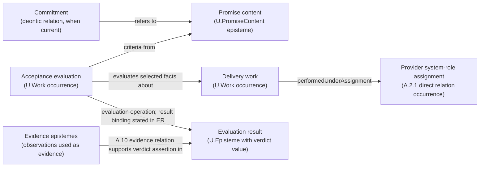
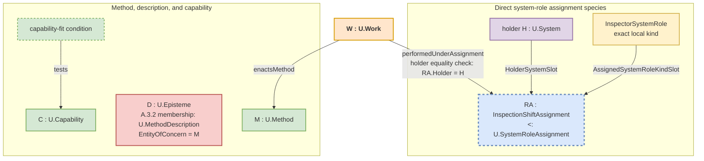

methods through method-selection work; an individual deontic duty enters only through an independently obtaining `U.Commitment`. |
| **Stability vs evolution** | A changed promise creates a new promise-content episteme edition, while earlier work occurrences and evidence relations retain their own identities. |

### A.2.3:4 - Solution - Define `U.PromiseContent` as the promise-content episteme

**Definition (normative).**
A **`U.PromiseContent`** is an externally oriented promise-content episteme. Its claim content states a promised consumer-side outcome, any eligibility predicate, and acceptance criteria by which fulfilment is evaluated. Its optional `accessSpec` describes the access method. Interpretation is fixed by its effective `U.ReferenceScheme`; `U.ClaimScope` states where the claims hold.

`U.PromiseContent` is not a deontic commitment relation. One or more explicit `U.Commitment` occurrences under A.2.8 may have the promise content in their referents position; the promise-content episteme does not obligate an actor by itself.

In normative prose, the head phrase is **promise content**. **Service offering clause** and **service promise clause** are admissible Plain twins for that promise-content use; bare *service* does not identify a promise-content episteme.

Species-level identity follows C.2.1:

```text
PromiseContentIdentity = <
  content,
  promisedOutcomeSpecRef,
  effectiveReferenceScheme
>
```

`promisedOutcomeSpecRef` is a `U.EpistemeRef` field that designates the exact A.2.3:4.1.1 `OutcomeSpec` episteme about which the promise claims are made; that episteme is the exact EntityOfConcern of this PromiseContent episteme. The field is not `EntityOfConcernSlot`: that SlotKind names the participant meaning only inside the reusable C.2.1 constitution `RelationSignature`. `OutcomeSpec` is a specification-use episteme form, not a separately admitted U-kind. The exact `claimScope` qualifies where the promise-content claims hold and remains outside the identity tuple.

* **FPF kind:** `U.Episteme`.
* **Time stance:** the promise content can be authored before delivery; later exact delivery-work facts, affected entities, post-work states, and any current delivery or acceptance relations are tested against the declared outcome and acceptance predicates. Evaluation work and the actual operation-result binding remain separate; when a verdict episteme is constituted, C.2.1 and A.15.PROD govern its identity and inception, while A.10 evidence relations support the relied-on assertions.
* **Orientation:** consumer-facing promise claims, not provider capability claims.
* **Publication boundary:** The selected promise-content `U.Episteme` may participate in an exact `EpistemePublicationRelation` for a declared audience and bounded use. `PublicationFormExpressionRelation` relates that selected edition to its publication form, and `PublicationFormBearingRelation` relates a `U.PresentationCarrier` to the form it bears. Promise-content identity follows the C.2.1 episteme identity rule; no publication-relation occurrence, form, or carrier enters that rule.

#### A.2.3:4.1 - Promise-content schema

```text
U.PromiseContent : U.Episteme {
  content                  : U.ClaimGraph,
  promisedOutcomeSpecRef   : U.EpistemeRef, resolving to OutcomeSpec,
  effectiveReferenceScheme: U.ReferenceScheme,
  providerSystemRoleKindRef : U.KindRef,
  consumerSystemRoleKindRef?: U.KindRef,
  claimScope               : U.ClaimScope,
  accessSpec?              : U.MethodDescription,
  acceptanceSpec           : U.Episteme,
  unitOfDelivery?          : U.Episteme
}
```

* `content` carries the promised-outcome, eligibility, and acceptance claims together with the optional `accessSpec` value when an access-method description is current; it is not an untyped text slot.
* `providerSystemRoleKindRef` and `consumerSystemRoleKindRef` are promise-content fields typed by the existing `U.KindRef`; each resolves to one exact local system-role kind. `accessSpec`, `acceptanceSpec`, and `unitOfDelivery` are episteme values carried by value in the claim graph; a publication or other declared representation may express them through `U.EpistemeRef` values that resolve to those same epistemes without changing their kinds. Changing one of these content values or resolved kind references changes `content` and therefore the promise-content identity.
* `promisedOutcomeSpecRef` resolves to the A.2.3:4.1.1 `OutcomeSpec` episteme.
* `effectiveReferenceScheme` makes the claim graph and its references interpretable.
* `providerSystemRoleKindRef` and `consumerSystemRoleKindRef` identify local work-facing kinds; actual providers and consumers enter only through named occurrences of directly declared species under `U.SystemRoleAssignment`.
* `claimScope` is the exact `U.ClaimScope` over which the promise claims hold; it states the applicable operating conditions, populations, locales, and other admitted slices instead of leaving extent implicit.
* `accessSpec` describes the access method enacted when the admitted holder system of an eligible consumer system-role assignment requests access; an access-point system remains separate.
* `acceptanceSpec` states the acceptance criteria and selects the exact evaluation Method. It cites a MethodDescription edition only when the acceptance claim depends on that episteme's claims. Evidence-admissibility conditions may be stated there; actual evidence-use relations remain separate.
* `unitOfDelivery` states how accepted delivery work is counted when counting is current.
* There is no generic `modelUseStructureRef` field. When an independently selected `BoundedModelUseStructure` changes one actually model-local receiving interpretation, the receiving assertion or use designates that structure separately; the structure neither identifies the promise content nor becomes an optional participant of `PromiseContentUse`. A genuinely structure-dependent relation species would require its own direct pattern, mandatory structure participant, stronger predicate, and occurrence-identity rule.
* An internal delivery method remains `U.Method`. An already identified episteme is a `U.MethodDescription` only when its exact `EntityOfConcern` resolves to that Method and at least one claim says how that Method is done. A promise-content or acceptance claim may cite that episteme for one named use; Method-selection work, performed work, and `PromiseContentUse` remain separately governed.

#### A.2.3:4.1.1 - OutcomeSpec - promised Work, post-work result, or both

This section is the authoritative FPF locus for the promise-facing `OutcomeSpec` shape. A.7 supplies the strict distinction among the specification episteme, Work occurrence, affected referent, post-work state, counting rule, and evidence; it does not define another schema.

`promisedOutcomeSpecRef` resolves to an independently identified specification-use episteme that says **what is promised**. `OutcomeSpec` is a specification-use episteme form, not a separately admitted U-kind.

```text
OutcomeSpec : U.Episteme ::= {
  mode: WorkOnly | ResultOnly | Composite,

  workSpec?: {
    methodConstraintRef?: U.MethodRef,            // resolves directly to an admitted U.Method
    methodDescriptionRef?: U.EpistemeRef,         // only when exact claims in one A.3.2-admitted edition are used
    workPredicateRef: U.EpistemeRef                // predicate on selected facts about delivery Work
  },

  resultSpec?: {
    entityOfConcernRef?: U.EntityRef,              // promised affected referent or its declared kind
    statePlaneRef?: StatePlaneRef,                 // where the post-condition is interpreted, when current
    postConditionRef: U.EpistemeRef                // predicate on the required post-work state
  }
}
```

Mode completeness is exact:

* `WorkOnly` requires `workSpec` and omits `resultSpec`;
* `ResultOnly` requires `resultSpec` and omits `workSpec`; and
* `Composite` requires both.

`workSpec` constrains selected facts about delivery Work. A Method constraint resolves directly to the Method; a separate MethodDescription reference is optional and edition-specific. `resultSpec` constrains the exact affected referent selected for the delivery and its required post-work state. At fulfilment time, state any actual-change, production, delivery, acceptance, or receiving-use relation under its own predicate. An optional mathematical Delta expression remains a separate lens only when a named comparison uses it; no `U.Work.Delta` field or universal change record is required.

In ordinary agreement wording, *outcome* may mean Work, achieved state, or both. Recover the intended mode instead of inventing one `OutcomeInstance` kind. A downstream bundling, invoicing, or dispute claim separately references the actual Work occurrences, affected entities, post-work states, direct relations, evidence epistemes, and evidence-use relations it needs.

**Examples.** `Work for at least five minutes` is WorkOnly. `A hole at least one metre deep exists at the stated site` is ResultOnly. `Cut and style the client's hair within twenty minutes, with the resulting hairstyle satisfying the evening-style condition` is Composite. In the last example, the exact Method constraint, delivery Work facts, client or hairstyle referent, post-work state, and evidence-use relations remain separate.

The head noun *outcome* is intentionally broad. When the passage means Work, affected entity, or required post-work state, name that object directly. Counting is not part of OutcomeSpec; A.2.3:4.1.2 governs `unitOfDelivery`.

#### A.2.3:4.1.2 - Unit-of-delivery counting

Use `unitOfDelivery` only when a receiving use counts accepted delivery. It is a specification-use episteme carried in the promise content.

An ordinary rule may say: `Count one accepted delivery per appointment; rework under the same appointment does not add another unit.` When replay or measurement needs a structured representation, use only the fields that rule requires:

```text
UnitOfDeliverySpec : U.Episteme ::= {
  unitDesignator: U.NameToken,
  countingRule: {
    selectorRef: U.EpistemeRef,                   // selects only delivery Work for which fulfilment obtains
    quantityRuleRef: U.EpistemeRef,               // maps selected facts to the count or measured quantity
    aggregationRef?: U.EpistemeRef,
    dedupeKeyRef?: U.EpistemeRef,
    countingPolicyRef?: U.EpistemeRef,
    measurementMethodRef?: U.MethodRef,
    measurementMethodDescriptionRef?: U.EpistemeRef,
    evidenceAdmissibilityRef?: U.EpistemeRef
  }
}
```

The selector admits only Work occurrences for which the promise's delivery and acceptance predicates are satisfied. When one Work occurrence can satisfy several promise contents or rework can repeat one delivery, `dedupeKeyRef` or the cited counting policy states the intended boundary. A measurement Method, its description, evidence-admissibility rule, evidence epistemes, and evidence-use relations appear only when the count depends on a measurement reading or relied-on evidence. Pure counting needs none of that apparatus.

If `unitOfDelivery` is absent, the local default is one unit per obtaining `PromiseContentFulfilmentRelation` occurrence. A separately governed charging relation may consume the resulting quantity but does not define this counting rule.

#### A.2.3:4.1.3 - Recommended `acceptanceSpec` mini-schema *(informative, non-kernel)*

Projects may express `acceptanceSpec` with the following small schema when downstream evaluation work requires replayable criteria and verdict semantics:

```
AcceptanceSpec (recommended) ::= {
  targetOutcomeSpecRef?: U.EpistemeRef,          // resolves to OutcomeSpec; default is SC.promisedOutcomeSpecRef
  criterionRefs: [U.EpistemeRef],                // each resolves to one evaluation-criterion episteme
  evaluationMethodRef: U.MethodRef,               // resolves directly to the evaluation Method
  evaluationMethodDescriptionRef?: U.EpistemeRef, // only when exact claims in one A.3.2-admitted edition are used
  verdictScaleDescriptionRef: U.EpistemeRef,     // resolves to one declared scale description
  GammaTimePolicyRef?: U.EpistemeRef             // resolves to the policy selecting the evaluation window
}
```

* **`targetOutcomeSpecRef`** makes explicit *which* promised outcome is being judged; if omitted, it is the containing promise content’s `promisedOutcomeSpecRef`.
* **`criterionRefs`** resolve to evaluation-criterion epistemes. Their predicates are evaluated over the same selected work facts and post-work state references used for the targeted `OutcomeSpec`; direct evidence relations separately support assertions about those facts and states.
* **`evaluationMethodRef`** resolves directly to the evaluation Method. **`evaluationMethodDescriptionRef`**, when present, cites one A.3.2-admitted episteme edition whose claims constrain or explain that Method; the description is neither the Method nor the evaluation Work.
* **`verdictScaleDescriptionRef`** resolves to one scale-description episteme governed by the characteristic and scale patterns. That description states the admitted verdict values and how non-delivery is represented. Informative examples include Boolean `pass/fail`, trichotomy `pass/partial/fail`, or named graded values, with non-delivery represented as `fail`, `N/A`, or `Inconclusive`; these values are examples, not defaults.
* **`GammaTimePolicyRef`** keeps temporal selection explicit and non-retroactive (F.10 and F.12): it resolves to the policy stating whether judgement is per work occurrence, reporting window, or another named temporal selection. Population and locale remain in `U.ClaimScope`; they are not temporal-policy values.

This mini-schema is a recommendation only: it does not admit another U-kind. An acceptance-specification episteme may contain these declared schema fields by value or refer to their values through the declared RefKinds. The resulting episteme remains inspectable and bridge-ready.

#### A.2.3:4.2 - What `U.PromiseContent` is **not**

* **Not a provider:** use an assignment occurrence and its declared species under `U.SystemRoleAssignment`. The occurrence identifies the provider System and assigned local kind; the species defines those participant meanings and the assigned-kind domain.
* **Not an individual deontic commitment:** that is one obtaining `U.Commitment` under A.2.8 whose actual duty bearer, exact referents, constitutive rule, instituting basis, scope, and validity are established independently.
* **Not an access point or bearer:** addressable *service*, server, desk, endpoint, process, component, application, host, or cluster wording first goes to A.6.P:4.11a. Recover whether it denotes code or another episteme, a Method, a Work occurrence or ordinary run, an exact bearer or access-providing arrangement, or another directly governed object; apply A.1 or A.1.SCR only when a separate repaired claim depends on an exact recovered entity being a system.
* **Not a method or method description:** the semantic way of doing is `U.Method`; a recipe or other episteme describing that way is `U.MethodDescription`.
* **Not delivery work or its description:** performed delivery is `U.Work`; a ticket, case description, or incident description is a separately governed episteme about planned or performed work.
* **Not a schedule:** that is `U.WorkPlan`.
* **Not a capability:** capability is the provider system's admitted ability to perform a declared work family or produce a declared result class within its `U.WorkScope`, measure set, qualification window, and currentness condition. Delivery under a promise may depend on one or more capability instances.
* **Not its scope or use interval:** `U.ClaimScope` states where the promise claims hold, `U.WorkScope` states where a provider capability can deliver work, and `PromiseUseIntervalSlot` states when one `PromiseContentUse` occurrence obtains. These are three different values.

#### A.2.3:4.3 - Promise content, delivery work, and evaluation work

* **Before delivery work:**
  The promise-content episteme declares its effective `U.ReferenceScheme`, named `U.ClaimScope`, promised outcome specification, access specification when current, and acceptance specification. The provider system's ability remains a holder-dependent `U.Capability` instance under A.2.2. A capability-fit predicate tests that instance against the thresholds selected for the planned delivery work, including any threshold stated by the chosen method description. Method-selection work may yield a C.11 `ChoiceResult`; `enactsMethod` obtains between the later delivery-work occurrence and the selected `U.Method`. A relied-on episteme is a `U.MethodDescription` only when it meets A.3.2 membership, and the promise-content or acceptance claim may cite it for the named use.

* **Run‑time:**
  For request or visit Work, use A.13 to identify the actual consumer System `S`, then let A.15.1 admit `requestWork` independently. If the current use must also state under which assignment the request was performed, F.6 checks `performedUnderAssignment(requestWork, consumerRA)` against the same assignment used by A.13 and compares `S` with `consumerRA.HolderSystemSlot`.
  For delivery Work, use A.13 to identify the actual provider System `S`, then let A.15.1 admit `deliveryWork` independently. If the current use must also state under which assignment the delivery was performed, F.6 checks `performedUnderAssignment(deliveryWork, providerRA)` against the same assignment used by A.13 and compares `S` with `providerRA.HolderSystemSlot`.
  For evaluation Work, use A.13 to identify the actual evaluator and let A.15.1 admit the dated occurrence before saying that it enacts the Method selected by `acceptanceSpec`. Add F.6 only if the current use must also state under which assignment the evaluation was performed. Cite the optional MethodDescription only when the evaluation claim depends on that edition. The actual evaluation-operation application carries its argument bindings and result value. When another use needs a durable verdict episteme, C.2.1 governs that episteme and A.15.PROD governs any current identity-inception claim. The counting rule in `unitOfDelivery` maps admitted fulfilment occurrences to unit counts.
  The verdict episteme may assert whether a named service-level objective or another acceptance criterion was satisfied during the declared window. When a separately obtaining `U.Commitment` has the same `U.PromiseContent` in its referents position, the supported assertion concerns fulfilment of content that is also a referent of the obligation. Neither the operation-result binding, verdict episteme, nor commitment is a property of the promise-content episteme.

  When a separate F.6 `performedUnderAssignment(W, RA)` claim is made, `W` is already admitted and `RA` is the same assignment used by A.13. F.6 compares that assignment's holder with the actual performer already identified through A.13 and used by A.15.1. A missing or failed F.6 check leaves the Work intact.

> **Memory hook:** *Promise content states what is promised. A method constrains possible work. A system performs work. Evaluation binds a result value. A verdict episteme states the judgment. Evidence supports that assertion.*

#### A.2.3:4.4 - Didactic card: Relations around one service-delivery evaluation

> **Didactic (non-normative).** This representation keeps each promise-content episteme, access-description episteme, work occurrence, and direct relation in one delivery evaluation visible without prescribing an order of work. Promise content and an access description remain epistemes; an individual commitment and a system-role assignment remain relations; delivery and evaluation remain work occurrences; evidence remains in its A.10 relations. When order matters, describe semantic method order in `U.MethodDescription`, intended dated order in `U.WorkPlan`, and transformation dependencies in the relevant `TransformationFlowStructure`.
>
> `U.PromiseContent` states the promise. An A.2.8 `U.Commitment` relation may refer to that content; its duty-bearer position is filled by one System or separately identified party. The provider-assignment species defines holder and assigned-kind meanings. Delivery and evaluation follow the §4.3 route: A.13 identifies who actually performed the Work, and A.15.1 admits the dated occurrence independently. The diagram shows an F.6 edge only when this case also needs the exact assignment under which that Work was performed. Evidence relations support selected delivery-work facts and post-work states. The evaluation operation carries its result binding, while C.2.1 identifies any verdict episteme and A.15.PROD states any identity-inception claim.
>
> This informative diagram is a publication-side representation, not new ontology. It prevents two category errors: treating `U.PromiseContent` as the addressable access system, and treating a publication-side list or diagram of service senses as a relation occurrence that replaces the direct relations shown here.

**Reading guide (one breath).**
* The **promise content** is the consumer-facing outcome and acceptance statement.
* In the A.2.8 **commitment relation**, the actual duty-bearer position is filled directly and the referents position contains the promise-content clause. The exact constitutive rule and its required instituting basis must obtain before that individual relation is asserted.
* The **provider system-role assignment** is an occurrence of a declared assignment species. The species defines the holder, assigned-kind, and any other identity-bearing participant meanings; the occurrence identifies the provider System, its assigned local kind, and any other participant values. The assertion has exact claim content, EntityOfConcern, and effective ReferenceScheme; its ClaimScope, selected slice, normative-frame edition, qualification window, or operating condition is stated separately when it changes interpretation or validity. None is a world-side assignment participant.
* A.6.P:4.11a recovers the concrete referent or relation denoted by *service* wording. It adds no service-situation participant: provider assignment, access description, access-point system, delivery system, delivery method, promise content, and work occurrence remain distinct and keep their own kinds. Use A.10 for the evidence relations.
* **Delivery Work** is what happened. Follow the §4.3 performer-and-Work route, and add the separate F.6 assignment check only if this use must also say exactly under which assignment the Work was performed. Exact affected referents, pre-work and post-work states, and any actual-change, production, delivery, or acceptance relations remain separately identified. Evidence-use relations support assertions about those facts. Evaluation Work follows the same route before its selected evaluation Method, application result, and any verdict episteme are stated separately.

**Litmus rule (addressability).**
If the current claim is about invocation, connection, visitation, restart, or scaling, first use A.6.P:4.11a to recover the exact process, deployed component, endpoint, application, host, cluster, desk, or other bearer. That cue establishes neither `U.System` nor a whole delivery-system boundary. Apply A.1 or A.1.SCR only when the repaired claim depends on systemhood; after recognition, call the entity a **service access point** or **service delivery system** only when that exact boundary claim is current. Otherwise keep the exact bearer and keep promise content separate.

### A.2.3:5 - Archetypal grounding (engineer‑manager friendly)

**Worked-case premise.** `E.24.UK` has already admitted the public `U.System` kind. Every exact entity named as a system in the rows below independently satisfies the complete A.1 criterion, including acting eligibility. If that premise cannot be established, keep the exact entity without system membership and stop only the provider-assignment, access-point, delivery-system, or Work-attribution claim that depends on it; other direct claims may continue under their subject patterns.

| Domain | Promise-content episteme | Provider and consumer assignments | Access specification | Delivery work | Evidence and evaluation |
| --- | --- | --- | --- | --- | --- |
| Cloud storage | Store and retrieve blobs up to 5 TB under declared criteria—for example, 99.9% availability and 11x9 durability; these values illustrate targets and are not defaults. | `CloudStoragePlatformSystem` holds `StorageProviderSystemRole`; `BackupControllerSystem` holds `StorageConsumerSystemRole`, each through an A.2.1 assignment occurrence and its declared species. | `S3ApiDescription-vX`, a `U.MethodDescription`; the endpoint is a separate bearer and is called a `U.System` here only as a worked-case premise independently satisfying A.1. | Dated PUT, GET, replication, and integrity-check Work occurrences participating in `PromiseContentUse`. | Request and integrity observations enter direct evidence relations; evaluation applications bind availability or durability results, and separately constituted verdict epistemes state the judgments. |
| Manufacturing utility | Deliver compressed air at 8 bar in Zone B under stated pressure, flow, and purity criteria. | `CompressedAirPlantSystem` holds `UtilityProviderSystemRole`; `LineBSystem` holds `UtilityConsumerSystemRole`, each through an A.2.1 assignment occurrence and its declared species. | `ZoneBManifoldAccessDescription`, a `U.MethodDescription`; the manifold is a separate bearer and is called a `U.System` here only as a worked-case premise independently satisfying A.1. | Dated compression and delivery Work occurrences. | Pressure, flow, and purity observations support delivery claims; an evaluation application binds the comparison result under the declared scale and window, and a verdict episteme states the judgment. |
| Public passport service | Issue an admissible passport within 20 days under declared defect and eligibility criteria—for example, a ≤ 1% defect target; this value is illustrative, not a default. | `IssuingAgencySystem` holds `PassportIssuerSystemRole`; `ApplicantPersonSystem` holds `PassportApplicantSystemRole`, each through an A.2.1 assignment occurrence and its declared species. | `PassportApplicationAccessDescription`, a `U.MethodDescription`; portal and service-desk bearers count as access-point `U.System` values only where this worked case assumes the A.1 criterion and that boundary claim obtains. | Dated application-handling and passport-issuance Work occurrences. | Submission, issuance, elapsed-time, and defect observations support claims; evaluation applications bind lead-time or defect results, and separately constituted verdict epistemes state the judgments. |

**Key takeaway.** The same pattern yields one promise-content episteme in each domain. Direct system-role assignment, `PromiseContentUse`, evaluation-operation, evidence, acceptance, and publication relations retain their own participants and governors; evaluation remains separately performed `U.Work`.

**Locality replay.** In the cloud-storage row, identify `CloudStoragePromiseContent-v3`, `CloudStorageOfferScheme-2026`, and `EligibleStorageAccounts-EU-2026Q3` as the exact promise-content edition, its effective scheme, and its `U.ClaimScope`. Then `PromiseContentUse(PUT-2026-07-14-1042, CloudStoragePromiseContent-v3, Interval-PUT-1042)` ties one dated delivery-work occurrence to that edition. Name a selected model-use structure only in a receiving assertion or use that is actually model-local. If another catalog scheme is consumed, add the exact obtaining F.9 Bridge, the separate claim that it suits this bounded use, and the A.10 evidence-provenance relation with `RelianceDisposition=pass`. Use B.3 only if an actual named assurance claim about this use is current.

### A.2.3:5.1 - Bias-Annotation

A.2.3 repairs the collapse of several service-related referents into one service label. A visible service name often denotes provider, access point, method, work, commitment, ticket, evidence, and promised outcome without saying which claim is current. The pattern recovers the promise-content episteme first; A.2.8 then governs commitment, A.2.1 provider participation, A.3.2 access description, A.15.1 delivery work, A.10 evidence claims, and the direct outcome and acceptance patterns their respective relations.

In an agreement or SLA, an A.2.8 `U.Commitment` may have promise content in its referents position. An agreement publication, service catalog, API page, or offer publication may be a `U.PresentationCarrier` bearing a form that expresses selected `U.Episteme` values about the agreement, promise content, commitment, or fulfilment work. An exact `EpistemePublicationRelation` may make each selected episteme available to its declared audience for its bounded use. These commitments, epistemes, forms, publication occurrences, and carriers retain separate identities.

### A.2.3:6 - Mapping the common “service” picture to FPF (didactic bridge)

A common service diagram is a representation. Recover the represented systems, epistemes, work occurrences, and relation occurrences as follows:

* **Provider participation** -> when this mapping needs the provider's assignment, name its occurrence and declared species under `U.SystemRoleAssignment`. The occurrence supplies its holder System, assigned local kind, and any other participants; the species defines their meanings. For each selected delivery-work occurrence, follow the §4.3 route to identify the actual performer and admit the Work independently. Add F.6 only if the mapping must also say exactly under which assignment that delivery was performed; a missing or failed check leaves the delivery Work intact.
* **Acceptance criterion** -> an evaluation-criterion episteme in `U.PromiseContent.acceptanceSpec`; its target values, verdict scale, and `GammaTimePolicyRef` remain explicit. A `U.WorkPlan` is added only when planned delivery or evaluation work is current.
* **SLA obligation** -> one A.2.8 `U.Commitment` occurrence whose actual duty bearer is explicit and whose referents include the relevant `U.PromiseContent`; assert it only after the applicable constitutive rule and required instituting basis obtain. Use A.6.C when one SLA publication combines wording about commitment, promise content, evidence specification, and publication relations.
* **Published SLA terms** -> the selected `U.PromiseContent` / `U.Episteme`, the exact publication form that expresses it for the bounded use, the `U.PresentationCarrier` bearing that form, and the obtaining `EpistemePublicationRelation` occurrence that makes the selected edition available to the declared audience. When publication work also communicates or institutes a commitment, add the named A.2.9 speech-act and A.2.8 commitment relation occurrences; publication alone neither creates the commitment nor establishes fulfilment.
* **Operating conditions** -> the named `U.ClaimScope` under A.2.6. The acceptance specification may cite that scope; it does not replace it.
* **Promised subject** -> resolve `promisedOutcomeSpecRef`, then use the resulting `OutcomeSpec.resultSpec.entityOfConcernRef` together with the exact affected referent, post-work state, and any direct delivery or acceptance relation current for the claim.
* **Customer material—“ours versus theirs.”** -> If the current claim depends on who owns or has custody of data, an asset, or a case, name the exact obtaining system-role assignment when work-facing assignment matters, and name the ownership or custody relation with its actual participants when that is the claim. Neither relation substitutes for the other, and neither becomes a kernel-global property of `U.PromiseContent`.
* **Access** -> `accessSpec : U.MethodDescription` describes the Method enacted when an eligible consumer holder requests access. Recover the endpoint, desk, manifold, or other exact bearer through A.6.P:4.11a. Its label and addressability establish no `U.System` membership. Apply A.1 or A.1.SCR only when a current access-point, delivery-system, performer, or assignment claim depends on systemhood; otherwise keep the bearer claim separate.
* **One `PromiseContentUse` occurrence** -> consumer request Work and provider delivery Work remain separate occurrences. Follow the §4.3 performer-and-Work route for each. If this mapping must also state the assignment under which either occurrence was performed, add its separate F.6 relation against the same assignment used by A.13; a missing or failed check leaves the Work intact. When request Work follows `accessSpec`, its A.15.1 `methodDescriptionRef` resolves to that same `U.MethodDescription`; following the description does not by itself introduce a second relation occurrence. `PromiseContentUse` obtains between selected delivery Work and the selected promise-content edition during `PromiseUseIntervalSlot`.
* **Consumer-side changed entity or relation** -> recover the exact affected-referent and actual-transformation facts, plus any local entity-identity-inception, delivery, acceptance, or receiving-use claim that the current promise evaluation needs. If the changed entity is a holder system and its post-work state calls for a new or revised `U.Capability` instance, use A.2.2 for that capability instance and its currentness relations.
* **Service-enabled consumer-side capability or activity** -> If the question is about ability, identify the consumer holder's `U.Capability` instance and state its A.2.2 qualification and currentness claim. If the question is about activity, identify the consumer-side dated `U.Work` under A.15.1. If the claim also says that delivery changed the consumer or was used by that Work, state only the exact actual-change or receiving-use relation that currently obtains; otherwise keep the objects separate. Do not create another U-kind or a generic capability-use relation.
When a domain claim concerns catalog entries, exposure relations, charging relations, or entitlement relations, govern those entries, participants, and relations directly. Relate them to `U.PromiseContent` only through named relations; do not treat them as components of `U.PromiseContent` or replace their direct relations with a locally minted context relation.

### A.2.3:7 - Conformance Checklist (normative)

**CC‑A2.3‑0 (Prose head phrase).**
In normative prose, an instance of `U.PromiseContent` SHALL be referred to as a **promise content** (or **service offering clause** or **service promise clause**) and SHALL NOT be referenced by the bare head noun *service*. Separately, apply E.10 `L-SERV` and A.6.P:4.11a when *service* or access-like wording occurs in a relied-on FPF claim, recommendation, decision, gate, assurance, publication, or reuse and hides the concrete subject, participant, predicate, kind, permission, Work occurrence, or next route. Quoted, historical, illustrative, and harmless ordinary wording remains outside this recovery rule.

**CC‑A2.3‑1 (Type).**
`U.PromiseContent` **IS** a consumer-facing promise-content `U.Episteme`. One or more exact `EpistemePublicationRelation` occurrences may make the same selected promise-content edition available through separately identified publication forms and `U.PresentationCarrier` values without changing its episteme identity; no publication form or presentation carrier is the promise content. `U.PromiseContent` is not a `U.System`, `U.Method`, `U.MethodDescription`, `U.Work`, or `U.WorkPlan`.

**CC-A2.3-2 (Semantic locality).**
Every promise content names its effective `U.ReferenceScheme`, `promisedOutcomeSpecRef`, and exact `U.ClaimScope`. A selected `BoundedModelUseStructure` may be designated only by the receiving assertion or use when it changes one actually model-local interpretation; it is neither a promise-content field nor an optional participant or identity discriminator of `PromiseContentUse`.
**CC-A2.3-3 (System-role kinds stay distinct from holders and assignments).**
`providerSystemRoleKindRef` and, when present, `consumerSystemRoleKindRef` are promise-content fields typed by `U.KindRef` and resolve to local system-role kinds. Provider and consumer Systems enter through assignment occurrences whose species are declared under `U.SystemRoleAssignment`; a kind label or reference alone identifies neither a holder nor a performer.

**CC-A2.3-4 (Acceptance).**
`acceptanceSpec` **MUST** be present and **MUST** define how delivered `U.Work` is judged as pass, fail, or a declared grade against named evaluation criteria and target values. Any SLA deontics are represented through `U.Commitment`. The promise content **MUST** declare **Claim scope (G)** where operating conditions, populations, locales, or another claim extent matter. Every verdict cites an explicit **Gamma_time** window.
If the acceptance criteria mention measurable characteristics such as availability, latency, accuracy, cost, or safety, each characteristic MUST be introduced through C.16 and C.25 with its scale, unit when applicable, `U.DHCMethod` measurement template, and direct evidence relation. If the reading depends on a particular way of measuring, cite the `U.MethodDescription` that describes that measurement method. The characteristic is referenced by its exact identifier rather than by an unqualified KPI label.

**CC‑A2.3‑5 (Access).**
When the promised use relies on a request-facing access Method, `accessSpec` **MUST** identify the A.3.2-admitted `U.MethodDescription` that describes it. Separately recover the endpoint, desk, manifold, or other exact bearer through A.6.P:4.11a. Apply A.1 or A.1.SCR only when a current claim depends on that bearer being an access-point `U.System`; otherwise keep the bearer without the stronger claim. If no access-method description is current because access is ambient, `accessSpec` may be omitted. In either branch, keep an eligibility predicate in the promise content when eligibility is promised; when eligibility depends on a separately obtaining admission relation, identify that relation and use the pattern that defines or tests it.

**CC‑A2.3‑6 (Unit of delivery + counting rule).**
When fulfilment work is counted, declare `unitOfDelivery` (for example, one request, kWh, or case). The resulting count may fill a declared quantity position in a separately governed charging relation; that charging relation does not determine the unit-of-delivery specification.
When declared, `unitOfDelivery` includes the A.2.3:4.1.2 counting rule that maps fulfilment Work to unit counts without silent double counting. If omitted, the default is one unit per obtaining `PromiseContentFulfilmentRelation` occurrence.

**CC‑A2.3‑7 (No actuals on Promise Content).**
Resource and time actuals belong to the performed `U.Work` occurrence under A.15.1. An incident-log episteme may describe that occurrence and may separately participate in an evidence relation for a stated claim; neither the log nor its participation in that evidence relation fills a `U.PromiseContent` slot.

**CC-A2.3-8 (Provider capability stays separate).**
When delivery depends on provider ability, use the A.2.2 `U.Capability` instance for the provider holder system and the separate capability-fit predicate for the planned delivery work. Do not insert capability into promise-content identity or infer capability or fit from a system-role designation or assignment.
**CC-A2.3-9 (Edition and promise-use interval).**
A change to `content`, `promisedOutcomeSpecRef`, or `effectiveReferenceScheme` creates a new promise-content episteme edition under the C.2.1 identity rule. Each `PromiseContentUse` occurrence has one promise-content edition and one delivery-work occurrence as participants and `PromiseUseIntervalSlot` as its temporal qualifier; an untyped `version` or `timespan` entry fills none of those positions.

**CC‑A2.3‑10 (Lexical rule).**
Apply E.10 **L-SERV** and **A.6.P:4.11a** only when *service* or access-like wording occurs in a relied-on FPF claim, recommendation, decision, gate, assurance, publication, or reuse and hides the concrete subject, participant, predicate, kind, permission, Work occurrence, or next route. The author **MUST** name that hidden choice or stop the relied-on use; quoted, historical, illustrative, and harmless ordinary wording is outside this rule.

**CC‑A2.3‑11 (No mereology).**
Do **not** place a promise content clause in PBS or SBS, or treat it as a part or component. Structural assemblies live in PBS and SBS; the promise clause is an episteme (A.2.3). When relied-on *service* wording still hides a concrete referent or relation, recover that hidden choice through A.6.P:4.11a; clear, quoted, historical, illustrative, and harmless ordinary wording creates no additional recovery duty.

**CC-A2.3-12 (Plan, work, and evidence stay distinct).**
Windows and calendars belong to `U.WorkPlan` (A.15.2). Performed delivery belongs to `U.Work` (A.15.1). Exact affected referents, pre-work and post-work states, and direct actual-change, production, delivery, or acceptance relations remain separate. Evidence epistemes and evidence-use relations support assertions about those facts; they are not slots or parts of the Work occurrence.

**CC-A2.3-13 (Claim scope, work scope, and promise-use interval).**
The promise-content episteme names one exact `U.ClaimScope`; an intended maximal extent is stated as that scope rather than represented by omission. A provider capability instance separately names `U.WorkScope`. `PromiseUseIntervalSlot` is the temporal qualifier of each `PromiseContentUse` occurrence. The `ScopeCoverage` predicate is satisfied only when the selected context slice is covered under an explicit `Gamma_time` selector; neither temporal extent nor capability scope replaces claim scope.

**CC-A2.3-14 (Scheme and scope bridges).**
Cross-scheme reuse first names the exact obtaining F.9 Bridge occurrence. A separate current C.2.1 claim with affirmative polarity must say that this Bridge suits the named bounded promise-content use, in the stated direction, under the use-specific correspondence rule, and within the permitted-loss tolerance. Ordinary reliance requires the exact A.10 evidence-provenance relation with `RelianceDisposition=pass` for that use. Use B.3 only when an actual named assurance claim is current; its result supports, narrows, or blocks only that bounded assurance use. Cross-scope reuse separately names the mapped `U.ClaimScope` and its A.2.6 relations.
**CC-A2.3-15 (OutcomeSpec typing).**
`promisedOutcomeSpecRef` MUST be a `U.EpistemeRef` resolving to an A.2.3:4.1.1 `OutcomeSpec` specification-use episteme. It MUST NOT point at a concrete `U.Work` occurrence, affected or delivered entity, actual operation-result binding, verdict episteme, or downstream effect, and `OutcomeSpec` MUST NOT be written as an independently admitted `U.OutcomeSpec`.

**CC-A2.3-16 (OutcomeSpec is explicit and mode‑complete).**
`promisedOutcomeSpecRef` MUST be present and MUST reference an `OutcomeSpec` that declares `mode in {WorkOnly, ResultOnly, Composite}` and satisfies A.2.3:4.1.1 mode completeness:
* `WorkOnly` → `workSpec` present, `resultSpec` absent
* `ResultOnly` → `resultSpec` present, `workSpec` absent
* `Composite` → both `workSpec` and `resultSpec` present

**CC-A2.3-17 (OutcomeSpec predicates and delivery-work relations).**
For any delivery `U.Work` occurrence named by `PromiseContentUse`, let `OS` be the A.2.3:4.1.1 `OutcomeSpec` resolved from `SC.promisedOutcomeSpecRef`.

* If `OS.workSpec` is present, the selected facts about the work occurrence satisfy `OS.workSpec.workPredicateRef`; when `methodConstraintRef` is present, the enacted method is compatible with that constraint.
* If `OS.resultSpec` is present, the exact affected referent and selected post-work state satisfy `OS.resultSpec.postConditionRef` on its declared state plane. Any actual-change, production, delivery, acceptance, receiving-use, or optional mathematical Delta-lens claim remains separately governed.
* A.10 evidence relations obtain between each relied-on satisfaction assertion and its supporting evidence epistemes.

Explicitly individuate `PromisedOutcomeDeliveryRelation` only when a downstream relation or claim must refer to its occurrence identity and only after these mode-specific conditions are established; otherwise retain the readable `deliversPromisedOutcome(W, OS)` assertion.
**CC-A2.3-18 (Acceptance evaluation supports rather than constitutes fulfilment).**
Follow the §4.3 route: use A.13 to identify the actual evaluator and let A.15.1 admit the evaluation Work independently before saying that it enacts the Method selected in `acceptanceSpec` over the same Work facts and post-work states used to test delivery. Add F.6 only if this evaluation account must also state under which assignment the Work was performed. Cite a MethodDescription only when the claim depends on that exact edition. The actual operation application carries its argument and result bindings. Any durable verdict episteme, identity-inception claim, and evidence-use relation remains separate and supports the fulfilment assertion without constituting the relation.

**CC-A2.3-19 (OutcomeSpec ↔ unitOfDelivery coherence).**
If `unitOfDelivery` is present, its counting rule states a `selectorRef` that selects only work occurrences eligible to satisfy `SC.promisedOutcomeSpecRef` in the declared mode. When one occurrence can fulfil several promise contents, the rule states either `dedupeKeyRef` or cites the counting-policy episteme that defines the counting rule. A selector may denote work occurrences filling `FulfilmentWorkOccurrenceSlot` in obtaining `PromiseContentFulfilmentRelation` occurrences; it does not count work for which fulfilment has not been established.

**CC-A2.3-20 (Unit-of-delivery is computable from work facts).**
If `unitOfDelivery` is present, it follows A.2.3:4.1.2. A pure count needs only its selector, quantity rule, and any deduplication boundary. Add a measurement Method, MethodDescription, evidence-admissibility condition, evidence epistemes, and evidence-use relations only when the count actually depends on a measurement reading or relied-on evidence.

### A.2.3:8 - Promise-content use, delivery, evaluation, and evidence

Keep `PromiseContentUse`, `PromisedOutcomeDeliveryRelation`, evaluation `U.Work`, the actual evaluation-operation application and result binding, any verdict episteme, and A.10 evidence relations separate. A direct relation may obtain even when the current episteme about it is unresolved; evidence supports the claim and does not become the relation.

#### A.2.3:8.1 - Core relations

**`PromiseContentUse : U.Relation`.** This direct use relation obtains between one delivery-work occurrence and one promise-content edition during one named promise-use interval; it makes no fulfilment claim.

```text
PromiseContentUse : U.Relation
  DeliveryWorkOccurrenceSlot: U.Work, U.EntityRef
  PromiseContentSlot: U.PromiseContent, U.EpistemeRef
  PromiseUseIntervalSlot: temporal interval, byValue
```

Its occurrence key is `<DeliveryWorkOccurrenceSlot, PromiseContentSlot, PromiseUseIntervalSlot>`.

**`PromisedOutcomeDeliveryRelation : U.Relation`.** This derived relation obtains between one delivery-work occurrence and the A.2.3:4.1.1 `OutcomeSpec` resolved from the `PromiseContentUse` occurrence in which that work participates, when the conditions below hold.

```text
PromisedOutcomeDeliveryRelation : U.Relation
  DeliveryWorkOccurrenceSlot: U.Work, U.EntityRef
  PromisedOutcomeSpecificationSlot: U.Episteme, U.EpistemeRef constrained to A.2.3:4.1.1 OutcomeSpec
```

The relation obtains only when one `PromiseContentUse` occurrence has the delivery Work and promise-content edition as participants, that edition resolves the same `OutcomeSpec`, and the mode-specific conditions hold. `workSpec` tests selected Work facts. `resultSpec` tests the exact affected referent and selected post-work state; any actual-change, production, delivery, acceptance, receiving-use, or optional Delta-lens claim remains separately governed. Its occurrence key is `<DeliveryWorkOccurrenceSlot, PromisedOutcomeSpecificationSlot>`. The readable predicate is `deliversPromisedOutcome(W, OS)`. An episteme may assert that this relation obtains and evidence may support the assertion; neither makes the underlying facts satisfy the specification.

**Acceptance evaluation result.** Follow the §4.3 performer-and-Work route before saying that the evaluation Work enacts the Method selected in `acceptanceSpec`. Add F.6 only if this result must also state under which assignment the evaluation was performed. A MethodDescription is cited only when its edition-specific claims are used. The operation application, result binding, optional verdict episteme, any identity-inception claim, and A.10 evidence-use relations remain separate. They support the assertion rather than making fulfilment obtain.

**`PromiseContentFulfilmentRelation : U.Relation`.** This derived relation obtains between one delivery-work occurrence and one promise-content edition when the conditions below hold.

```text
PromiseContentFulfilmentRelation : U.Relation
  FulfilmentWorkOccurrenceSlot: U.Work, U.EntityRef
  FulfilledPromiseContentSlot: U.PromiseContent, U.EpistemeRef
```

The semantic predicate for this relation is satisfied only when `PromiseContentUse` obtains for the same work and promise-content participants, `PromisedOutcomeDeliveryRelation` obtains for that work and the `OutcomeSpec` resolved from that promise content, and the acceptance predicate declared by `acceptanceSpec` is satisfied for the exact delivery-work facts, affected or delivered entities, post-work state, and any direct delivery or acceptance relation required by the criterion. `PromiseContentFulfilmentRelation` obtains for the declared participants when that semantic predicate is satisfied. Its occurrence key is `<FulfilmentWorkOccurrenceSlot, FulfilledPromiseContentSlot>`. The readable predicate is `fulfilsPromiseContent(W, SC)`. A later evaluation may change the supported assertion about whether the relation obtains; it does not change relation identity. When satisfaction of any required predicate is unresolved, no positive fulfilment assertion is available for reliance.

The explicit `RelationSignature` declarations are warranted only when `unitOfDelivery` selectors or fulfilment measures refer to relation-occurrence identity. Ordinary prose may stop at the readable predicates when no later relation refers to that occurrence identity.

> **Invariant:** `fulfilsPromiseContent(W, SC)` implies `PromiseContentUse(W, SC, T)`, `deliversPromisedOutcome(W, resolve(SC.promisedOutcomeSpecRef))`, and satisfaction of the acceptance criteria declared in `SC.acceptanceSpec`; an evaluation-result episteme and A.10 evidence relations support the corresponding assertion without becoming relation participants.
> **Invariant:** One work occurrence can fulfil several promise contents only when each promise content's counting rule states `dedupeKeyRef` or cites the counting-policy episteme that defines the counting rule; no silent double counting.

#### A.2.3:8.2 - Promise-content delivery measures

Let `W(SC, T)` be the set of delivery-work occurrences for which `PromiseContentUse` obtains with `SC` during interval `T`. Let `W✓(SC, T)` be the subset for which `PromiseContentFulfilmentRelation` obtains with `SC`.

* **Delivered units:** `delivered(SC, T)` is computed from `W✓(SC, T)` using the A.2.3:4.1.2 counting rule. When `unitOfDelivery` is absent, `delivered(SC, T) = |W✓(SC, T)|`, one unit per obtaining fulfilment occurrence.
* **Rejection rate:** `rejectRate(SC, T) = 1 − |W✓(SC,T)| / |W(SC,T)|` (declare handling of `partial`).
* **Lead time:** declare the characteristic definition and aggregation separately. The definition may use work duration or request-to-completion delta; the aggregation may use an average or named percentile.
* **Availability and uptime claims:** select one declared characteristic instead of treating the labels as synonyms. Derive its observed characteristic value from selected work facts and telemetry observations through its C.16 measurement template, `Gamma_time` policy, and evidence relations; cite a `U.MethodDescription` when a particular measurement method affects the reading.
* **Cost‑to‑serve:** sum of `Γ_work` over `W✓` per resource category (A.15.1).

Each resulting `U.Measure` claim is derived from selected facts about `U.Work` occurrences through its C.16 measurement template and named A.10 evidence relations; when a particular measurement method matters, its `U.MethodDescription` is cited. Resource and time actuals belong to the performed `U.Work` occurrences.
Aggregation across time uses the `Gamma_time` policy referenced by the named C.16 measurement template or acceptance specification; an unqualified KPI label does not select that policy. When a measure needs a B.1.4 temporal-phase aggregation of one carrier, name one `ContextTemporalAggregation@Context` record and its exact selected policy—for example, union of observed values or their convex hull—together with carrier identity, time window, coverage and non-overlap conditions, and admissible use. If those one-carrier conditions do not hold, this example is inapplicable; state the aggregation actually required and apply its defining rule. Union and convex hull are policy choices, not defaults; `Gamma_time` does not select either by itself.

### A.2.3:9 - Common misclassification repairs

* **A microservice label is being used for the whole service claim.** Use A.6.P:4.11a to recover whether the source word denotes service-provision Work, a Method, PromiseContent, provider participation, or an exact deployed process, component, endpoint, application, host, or cluster. Apply A.1 or A.1.SCR only when a repaired bearer claim depends on systemhood. Deployment and the label establish neither membership nor a delivery-system or access-point boundary; the consumer-facing outcome and acceptance claims remain in `U.PromiseContent`.
* **An API label is being used for the whole service claim.** If the referent is an interface specification, use the exact episteme and `U.MethodDescription` only when A.3.2 admits it. If it is an addressable endpoint, recover that bearer through A.6.P:4.11a and apply A.1 or A.1.SCR only when a current claim depends on systemhood. Neither the API label nor addressability establishes membership, and neither referent is the promise-content episteme.
* **A process or procedure label is being used for the whole service claim.** Recover the semantic way of doing as `U.Method`, its description as `U.MethodDescription`, planned work as `U.WorkPlan`, and performed occurrences as `U.Work`. Keep the promised outcome and acceptance claims in `U.PromiseContent`.
* **A ticket or case record is being used for the whole service claim.** Recover its claim-bearing content as a ticket or case-description `U.Episteme`; keep the publication form and `U.PresentationCarrier` separate. Relate that episteme to the named `U.WorkPlan` or `U.Work` occurrence it describes.
* **Cost or elapsed time is attached to the promise content.** Keep resource and time actuals on the performed `U.Work` occurrence. Derive a measure over work occurrences participating in `PromiseContentUse` only through its declared characteristic, C.16 measurement template, named A.10 evidence relations, aggregation rule, and `Gamma_time` policy; cite a `U.MethodDescription` when a particular measurement method affects the reading.
* **Promise content is placed in a product or system breakdown.** Keep the promise content as an episteme. The access and delivery systems may have parts and selected structures under A.22 and C.30; the promise-content episteme is not one of those parts.
* **A person or organization name is stored as the provider system-role kind.** Identify the exact local provider system-role kind through `providerSystemRoleKindRef`. If an actual provider-assignment claim is current, identify the exact person or organization and apply A.1 because A.2.1 requires an admitted holder `U.System`; otherwise do not create the assignment. Then state one named occurrence of a directly declared species under `U.SystemRoleAssignment` and its explicit interval.

### A.2.3:10 - Existing promise-description repair applications

1. **Name the promises.** As an informative first pass, list roughly 5–15 consumer-facing promises used by the project; the range is a prompt, not an admission threshold. Represent each as `U.PromiseContent` with effective reference scheme, promised outcome specification, acceptance specification, and claim scope, plus access specification and unit of delivery when current.
2. **Separate provider from promise content.** Recover each provider, access point, or delivery bearer through A.6.P:4.11a. Apply A.1 or A.1.SCR only where a provider-assignment, access-point, delivery-system, performer, or other claim depends on systemhood. When an assignment is claimed, name its A.2.1 occurrence and declared species, with the provider System as holder.
3. **Relate promise content to delivery and evidence.** Add `PromiseContentUse` for every delivery-work occurrence evaluated under the promise. Establish `PromisedOutcomeDeliveryRelation` only after exact work facts, affected or delivered entities, post-work states, and any direct delivery relation required by the resolved `OutcomeSpec` satisfy it; establish `PromiseContentFulfilmentRelation` only after those facts and states satisfy the declared acceptance criteria. Record the actual evaluation-operation result binding, any evaluation-result episteme, the evidence epistemes it cites, and the A.10 evidence relations separately.
4. **Define evaluation characteristics.** As an informative first pass, select roughly 2–4 characteristics for each promise content; the range is a prompt, not a conformance limit. Use a recognizable §8.2 formula family—availability over a named window, lead time as a declared delta plus aggregation, rejection rate `1 − |W✓| / |W|`, or cost-to-serve as summed Work resource use—or state an exact declared alternative. For each characteristic, name its scale, unit when applicable, C.16 measurement template, `Gamma_time` policy, direct evidence relations, and exact formula; cite a `U.MethodDescription` when a particular measurement method affects the reading. Do not let a KPI label stand in for this declaration.
5. **Bridge domain schemes.** If a domain ontology distinguishes business, technical, or internal service kinds and relations, retain its reference scheme and name the exact obtaining F.9 Bridge for each selected sense and FPF counterpart. Add the separate C.2.1 claim that the Bridge suits the named use, then require the A.10 evidence-provenance relation with `RelianceDisposition=pass`. Use B.3 only for an actual named assurance claim. Keep `PromiseContentUse`, Work, delivery, fulfilment, result, evidence, assurance, and publication separate.
6. **Tidy relied-on language.** Apply **L-SERV** and **A.6.P:4.11a** only when *service* or access-like wording hides a concrete subject, participant, predicate, kind, permission, Work occurrence, or next route in the current relied-on use. State what the wording denotes and use the pattern that defines or constrains that claim, or stop the use; use A.1 or A.1.SCR only when a recovered bearer claim depends on systemhood. Reserve `U.PromiseContent` for the consumer-facing promise content, and leave clear, quoted, historical, illustrative, and harmless ordinary wording outside this step.

### A.2.3:10.1 - Consequences

| Consequence | Benefit | Cost or boundary |
| --- | --- | --- |
| Promise content becomes explicit | Evaluation work can apply declared acceptance criteria to exact delivery-work facts, affected or delivered entities, post-work states, and any direct delivery or acceptance relation required by the criterion. | The promise-content declaration and its direct relations must keep provider, access point, method, ticket or case-description episteme, work occurrence, operation-result binding, evidence episteme, evidence relation, and evaluation-result episteme distinct. |
| Commitments stay distinct | A promise-content clause can be referred to from `U.Commitment`. | An individual duty still needs the A.2.8 direct predicate, actual duty bearer, exact constitutive rule, required instituting basis, and any current A.2.9 speech-act Work. |
| Promise use and evaluation become replayable | `PromiseContentUse` obtains between the work occurrence and promise-content edition during the promise-use interval; delivery and fulfilment remain separate derived relations. | A downstream fulfilment assertion retains the exact work, affected-subject and delivery facts, selected Delta expression when used, evaluation-operation result binding, named evidence epistemes and A.10 evidence relations, evaluation method description, and any evaluation-result episteme instead of treating the work occurrence or a dashboard as sufficient support. |

### A.2.3:10.2 - Rationale

Everyday "service" language is useful because one label can denote promise content, provider systems, access points, commitments, methods, work occurrences, and evidence epistemes. When those claims guide evaluation or work, FPF distinguishes the referents and states their direct relations. `U.PromiseContent` gives the promised-outcome side one stable episteme, A.6.P:4.11a recovers the referent intended by the service wording, and each named direct relation remains governed by its direct pattern.

The pattern keeps promise content in the episteme family because it is a clause or description whose outcome and acceptance predicates state conditions on delivery work, affected referents, and post-work states. A fulfilment assertion and the evidence relations supporting it remain distinct from those referents and from the world-side relations whose obtaining the assertion describes. The referents position of an A.2.8 commitment relation may contain it, an A.2.9 speech-act occurrence may communicate or institute that commitment, and A.6.C may unpack agreement or SLA wording carried by a publication, while gate and policy relations remain separate.

### A.2.3:10.3 - SoTA-Echoing

Service-management, product, utility, platform, and public-service practice all distinguish offers, providers, access channels, service levels, work execution, and evidence of fulfilment, even when everyday language calls all of them "the service". A.2.3 keeps that practical distinction in FPF by giving the consumer-facing promise clause its own episteme value and by using the patterns that define or test provider, access, commitment, work, and evidence claims.

Service-level-agreement practice distinguishes promised content from obligation-bearing acts or agreements and from later performance evidence. FPF keeps that separation without importing a domain-specific service taxonomy; the promise-content episteme remains usable across utilities, healthcare, public services, manufacturing support, software services, and other project domains.

### A.2.3:11 - Relations

* **Builds on:** C.2.1 `U.Episteme` identity and reference scheme; A.2 for exact local system-role kinds; A.2.1 for directly declared `U.SystemRoleAssignment` species and occurrences; A.2.2 `U.Capability`; and A.2.6 `U.ClaimScope` and `U.WorkScope`. A.1.1 is used only when an independently selected `BoundedModelUseStructure` changes one named receiving assertion or work use; the structure is not a promise-content constituent or generic relation participant.
* **Coordinates with:** A.3.1 `U.Method`; A.3.2 `U.MethodDescription`; A.15.1 `U.Work`; A.6.1 for actual operation application and result binding; A.15.PROD for current entity-identity-inception claims; A.15.2 `U.WorkPlan`; direct affected-subject, delivery, acceptance, and evaluation patterns; A.10 for evidence relations and ordinary bounded reliance; B.3 only when an actual named assurance claim is current; A.2.8 for commitment; A.2.9 for speech act; A.6.P:4.11a for service-wording restoration; F.9 for exact cross-scheme Bridge occurrences; C.2.1 for the separate bounded-use suitability claim; and A.7 plus the direct publication pattern when specification use or publication is current.
* **Constrained by lexical rules:** **E.10 L‑SERV** (service disambiguation); also **L‑FUNC**, **L‑PROC**, **L‑SCHED**, **L‑ACT**.
* **Informs:** reporting and assurance patterns for measures over work occurrences participating in `PromiseContentUse`, plus directly governed catalog entries, exposure relations, charging relations, and entitlement relations when those claims are current.

### A.2.3:12 - Didactic quick distinctions

* **Promise content.** A consumer-facing episteme stating the promised outcome, any eligibility predicate, effective reference scheme, claim scope, and acceptance specification; its optional `accessSpec` describes the access method.
* **Method and method description.** `U.Method` is the semantic way of doing. `U.MethodDescription` is an episteme describing that method; neither is delivery work.
* **Delivery Work and affected subject.** Follow the §4.3 route to identify the actual provider and admit the dated Work independently; add the separate F.6 check only if this use must also state the assignment under which the delivery was performed. Exact affected referents, pre-work and post-work states, and actual-change, production, delivery, or acceptance relations state what happened under their own governors. A mathematical Delta expression is optional and remains a separate lens for a named comparison.
* **Evidence and evaluation.** Evidence relations support delivery and satisfaction claims. A separately performed evaluation occurrence has an actual operation application with a declared result binding; any verdict episteme is separately constituted and governed.
* **Provider and consumer participation.** The promise-content fields typed by `U.KindRef` identify local provider and consumer system-role kinds. Assignment occurrences identify admitted holder Systems and assignment extents; their declared `U.SystemRoleAssignment` species define the participant meanings.
* **Measures.** `U.Measure` claims such as availability or lead-time readings derive from selected work facts through named characteristics, C.16 measurement templates, A.10 evidence relations, aggregation rules, and temporal policies; when a particular measurement method matters, its `U.MethodDescription` is cited.
* **Structure boundary.** Promise content is not a structural part. The systems that expose access or perform delivery retain their own parts, selected structures, and `ArchitectureOf@Context` relations.

### A.2.3:End

## A.2.4 - Episteme Evidence-Use and Status-Use Relations

> **Type:** Boundary and relation-use pattern
> **Status:** Stable
> **Normativity:** Normative

### A.2.4:1 - Problem Frame

Use this pattern when an episteme, such as a report's content, is being used as evidence, source, status bearer, assurance input, or causal-use input for a claim.

Use it when the working question is:

* which episteme is being used;
* which claim, theory statement, status assertion, use, or causal-use question the episteme is being used for;
* which effective source scheme (when interpretation depends on it), ClaimScope, grounding holon, polarity, relevance window, assurance use, weight model, and provenance constraints are current;
* whether source wording such as "evidence role", "status role", "standard role", or "the report plays a role" hides an evidence-use, status-use, source-use, publication-use, assurance-use, gate-use, or causal-use relation;
* whether the evidence-use or status-use relation is sufficiently specified for the intended reliance, or only enough for orientation, source-finding, a reversible probe, or a narrowed use.

**Primary EntityOfConcern.** The `EntityOfConcern` is the evidence-use relation or status-use relation around an episteme.

**First useful move.** Name the exact episteme and the claim or governed status for which it is being used. Then point outward, when current, to the dated producing/evaluating work and actual bindings, domain-local result and direct governor, C.2.1 result episteme, A.10/G.6 provenance, G.11 currentness, receiving work and direct use relation, local `RelianceDisposition`, and B.3 assurance boundary.

**What goes wrong if missed.** Producing or evaluating work is attributed to the document itself, a dataset is treated as if it were classified under a work-facing system-role kind, a dashboard status is used as permission, a proof is used outside its theory-version fence, or a simulation-only counterfactual output is relabelled as realized causal evidence.

**What this buys.** A cheap first-use classification that identifies the episteme and its evidence-use or status-use relation. The further questions in §4.6 are answered through their direct patterns.

**Not this pattern when.** Use A.13 to identify the actual performer and A.15.1 to admit performed Work independently. If the current result must also identify the assignment under which that Work was performed, check it separately through F.6. Use A.6.1 for actual bindings, and use the exact formal, measurement, causal, diagnostic, conformance, comparison, selection, acceptance, gate, permission, commitment, system-role-kind, assignment, or decision pattern for its local result. Use C.2.1 for the result episteme, A.10/G.6 for provenance and bounded reliance, G.11 for currentness, B.3 for assurance, F.10 or another direct status pattern for status, and E.17 for publication. A.2.4 classifies only the episteme's first evidence-use or status-use.

### A.2.4:2 - Problem

Source text may use `U.EvidenceRole` or another evidence-like *role* label for a real need: an episteme can be used as evidence for a claim under an effective source scheme and exact ClaimScope, with polarity, time, assurance use, weight, and provenance constraints. Treat those spellings as source-word triggers. The FPF repair states an evidence-use relation; it does not classify the episteme under a system-role kind or place it in a `U.SystemRoleAssignment`.

Unresolved role-shaped wording can lead to the following failures:

1. **Episteme-as-holder drift.** A paper, proof, dataset, standard, or dashboard cell is treated as if it were classified under a work-facing system-role kind or filled the holder position of an assignment.
2. **Evidence-word ontology drift.** `ModelFitEvidenceRole`, `MeasurementEvidenceRole`, or `AxiomaticProofRole` is treated as a kind merely because the source label ends in *Role*, instead of being resolved to an evidence-use relation classification or local evidence-use label.
3. **Claim relation collapse.** Target claim, grounding holon, claim scope, polarity, relevance window, assurance use, weight model, and provenance constraints are hidden behind one source label ending in *Role*.
4. **Evidence and status collapse.** A status badge, standard reference, approval-looking display, publication face, or requirement source is treated as evidence, status assertion, gate passage, permission, and assurance at once.
5. **Work confusion.** The work that produced an episteme and the later use of that episteme as evidence are folded into one relation.
6. **Causal-use laundering.** Observational association, intervention, realized counterfactual sample, identified counterfactual estimate, and simulation-only output are relabelled by evidence-wording instead of being governed by `C.28`.
7. **Cross-local leakage.** Evidence accepted under one source scheme, ClaimScope, and use is reused under another without recovering the changed meaning, source currentness, reliance, or assurance-use conditions and any actual F.9 relation.

### A.2.4:3 - Forces

| Force | Tension this pattern resolves |
| --- | --- |
| Episteme identity versus episteme use | The same episteme can be used for several claims while retaining its identity. |
| Compact evidence statement versus full evidence graph | Users need a small evidence-use statement first; `A.10` remains the pattern for full evidence-provenance graph detail. |
| Formal proof versus empirical evidence | A proof can be stable inside one theory version; empirical evidence usually needs relevance windows, freshness, and provenance constraints. |
| Status display versus status assertion | A visible badge, cell, or label can cue status but does not by itself create permission, gate passage, assurance, or work evidence. |
| Local acceptance versus cross-local reuse | Evidence and status use are bounded by their source scheme, ClaimScope, window, and intended use; reuse recovers the changed values and any required F.9, source-currentness, publication-use, reliance, or assurance-use relation. |
| Causal evidence classes versus ordinary evidence relation | Causal-use evidence classes need `C.28`; A.2.4 keeps the evidence-use relation from being misread as a system-role kind or assignment. |

### A.2.4:4 - Solution

Do not create or use source spelling `U.EvidenceRole` as a durable FPF kind. Do not place an episteme in `U.SystemRoleAssignment` merely because it is used as evidence, source, standard, requirement, definition, explanation, publication, status bearer, or assurance input.

Use direct relation patterns instead:

| Current claim | Use |
| --- | --- |
| one episteme is used as evidence for one claim, effect, or bounded reliance use | `A.10`, with the A.2.4 evidence-use SlotKinds below |
| evidence use contributes to assurance, trust, readiness, compliance, safety, release confidence, `F`, `G`, `R`, or `CL` | `B.3`, after A.10 source/provenance recovery and bounded-reliance classification; A.2.4 supplies only the first-use classification |
| the episteme itself is being identified, versioned, or distinguished from publication faces and publication carriers | `C.2.1` |
| the use is causal, counterfactual, intervention-facing, or simulation-only | `C.28`, with the A.10 descriptive source/provenance path and the A.2.4 first-use classification as inputs |
| the source says "status", "approved", "current", "valid", "stale", "ready", or another status-like value | `F.10`, A.10, B.3, a gate pattern, or a direct status pattern |
| the source is a publication face, view, description, source citation, standard, requirement, explanation, or specification-use case | `E.17`, `E.17.0`, `E.17.2`, `E.17.EFP`, `E.10.D2`, or the direct source-use pattern |
| an admitted system is classified under an exact local system-role kind, holds an obtaining assignment, and performs or prepares Work | `A.2`, `A.2.1`, `A.15`, `A.15.1`, or `A.15.2` |

#### A.2.4:4.0 - First-use split

An A.2.4 assertion answers only: which episteme is classified for which evidence-use or status-use, under which effective source scheme when interpretation matters, with which ClaimScope, polarity or status value, and window. When source production, evaluation, a local result, result episteme, provenance, currentness, receiving work, reliance, or assurance matters, the assertion names the direct object and the pattern passage that defines or constrains its claim; it does not re-express them as slots of a generic evidence result.

#### A.2.4:4.1 - Evidence-Use Relation Slots

An evidence-use relation obtains around an episteme and a claim or effect.

| SlotKind | ValueKind | Identity and currentness discipline |
| --- | --- | --- |
| `EvidenceEpistemeSlot` | exact `U.Episteme` classified for evidence use | Identity of the classified episteme. |
| `EvidenceTargetClaimSlot` | claim or theory statement | Identity slot whenever the relation is claim-bound; a missing value blocks claim-bound evidence use. |
| `EvidenceClaimGroundingHolonSlot` | exact `U.Holon` that participates in an obtaining C.2.1 `EpistemeEmpiricalGroundingRelation` covering the target claim | Identity or currentness-required when changing the grounding holon changes the evidence relation or the claim being evidenced. |
| `EvidenceClaimScopeSlot` | claim-scope value governed by `B.3`, `A.10`, `C.28`, or a direct evidence pattern | Identity qualifier when changing scope changes the relation; currentness-required when scope changes admissible use. |
| `EvidencePolaritySlot` | evidential polarity value such as supports, refutes, constrains, or neutral when that value set is current | Identity qualifier when changing polarity changes which evidence-use relation is asserted. |
| `EvidenceRelevanceWindowSlot` | temporal relevance window, theory-version fence, freshness policy, or decay policy | Identity or currentness-required when time, version, or freshness changes the evidence use; consideration slot for formal uses where the theory-version fence already carries the boundary. |
| `EvidenceAssuranceUseSlot` | the named bounded reliance or assurance-facing use | Records the intended receiving use only; A.10 is the pattern for the local disposition and B.3 is the pattern for any assurance result. |
| `EvidenceWeightModelSlot` | weight, confidence, reliability, likelihood, or scoring model reference | Consideration slot; currentness-required when weighted evidence is claimed. |
| `EvidenceProvenanceConstraintSlot` | refs to the exact A.10/G.6 source and provenance account | Currentness-required when provenance or a rival explanation decides admissible use. |

These SlotKinds are evidence-use relation positions.

#### A.2.4:4.2 - Status-Use Relation Slots

A status-use relation is a relation around a bearer, status value, scope, window, source, and use.

| SlotKind | ValueKind | Use |
| --- | --- | --- |
| `StatusBearerSlot` | episteme, claim, method description, publication, system-role-assignment occurrence, work occurrence, clause, gate record, or another governed bearer admitted by the direct pattern | The value whose status is being asserted or read. |
| `StatusTargetSlot` | claim, method, episteme, publication, exact domain result or result episteme, clause, bearer, or another governed status target | Required when the status is not simply about the bearer itself; the direct status or result pattern defines it. |
| `StatusScopeSlot` | claim scope, admission scope, requirement scope, or use scope | Currentness-required when scope changes the status assertion. |
| `StatusValueSlot` | status value governed by `F.10` or a direct pattern | Required for a status assertion. |
| `StatusWindowSlot` | temporal validity window, freshness policy, or source/status window | Required for time-sensitive use; G.11 is the pattern for an edition-currentness result when currentness is being judged. |
| `StatusUseSlot` | gate, assurance, admission, source-currentness, work-plan readiness, or another exact receiving use | Identifies the intended use; its receiving work, direct relation, and result remain with their governors. |
| `StatusProvenanceConstraintSlot` | source order, authority source, publication, proof, verification, register, or provenance constraint | Currentness-required when provenance decides status use. |

These names are repair vocabulary for status-use relations. Durable status families remain governed by `F.10` or a direct status pattern.

#### A.2.4:4.3 - Minimal Evidence-Use Statement

Write only fields that decide this first use:

```text
Episteme evidence-use statement:
  EvidenceEpisteme:
  EffectiveReferenceScheme:              # when interpretation changes the use
  EvidenceTargetClaim:
  ClaimScopeAndPolarity:
  RelevanceWindow:
  DirectClaimOrResultGovernor:
  ProducingOrEvaluatingWorkRef:        # when current
  DomainLocalResultAndEpistemeRef:     # when current
  ProvenancePathRef:                   # A.10/G.6 when current
  CurrentnessRef:                      # G.11 when current
  ReceivingWorkAndUseRelationRef:      # when actual use is claimed
  RelianceDispositionRef:              # A.10 when reliance is judged
  UnsupportedOverread:                # only when grounded and consequential under F.19:4
```

#### A.2.4:4.4 - Minimal Status-Use Statement

```text
Episteme status-use statement:
  StatusBearer:
  StatusTarget:
  StatusScope:
  StatusValue:
  StatusWindow:
  DirectStatusGovernor:
  SourceAndProvenanceRef:
  CurrentnessRef:                      # G.11 when current
  ReceivingWorkAndUseRelationRef:      # when actual use is claimed
  RelianceDispositionRef:              # A.10 when reliance is judged
  UnsupportedOverread:                # only when grounded and consequential under F.19:4
```

A.2.4 does not fill a missing direct governor with a generic status, evidence, work-result, or evaluation-result relation.

#### A.2.4:4.5 - Formal, empirical, causal, and status first uses

Source labels such as `AxiomaticProofRole`, `ObservationEvidenceRole`, `MeasurementEvidenceRole`, `ModelFitEvidenceRole`, `CalibrationEvidenceRole`, and `BenchmarkEvidenceRole` are wording triggers. Recover the exact first-use classification or relation; the labels are neither local system-role kinds nor result kinds by spelling.

**Formal line.** Classify the exact proof, derivation, counterexample, theory note, or proof-result episteme against the named theorem and theory-version fence. The formal pattern contains the defining content for entailment, refutation, malformed-proof, timeout, or checker-failure results; C.2.1 is the pattern for the episteme that states the result. When proof-checking is asserted as dated `U.Work`, use A.13 to identify the actual performer and A.15.1 to admit the occurrence independently. If the proof-checking account must also identify the assignment under which the Work was performed, check that relation separately through F.6. Keep the Method and bindings separate. A.2.4 states only how the episteme is used.

**Empirical and measurement line.** Classify the exact dataset, observation episteme, C.16 measurement-result episteme, replication result, calibration result, benchmark result, or model-fit result episteme against one named claim. For any producing or evaluating Work, use A.13 to identify the actual performer and A.15.1 to admit the dated occurrence independently. If that account must also identify the assignment under which the Work was performed, check it separately through F.6. Keep direct relations or A.6.1 bindings separate. Each local result remains with C.16 or its exact domain governor; A.10/G.6 retain provenance; G.11 retains currentness.

**Causal line.** C.28 is the pattern for the causal-use question, estimand, separate evidence/identification/estimate/sampling/simulation components, realizability, support result, supported use, and unsupported use. A.2.4 may classify the exact C.2.1 episteme used at first contact; evidence wording cannot turn simulator output into interventional or realized-counterfactual evidence.

**Status line.** A visible status carrier is classified separately from the governed status assertion. F.10 or the exact status pattern contains the defining content for the status value, G.11 is the pattern for edition currentness, and a gate, permission, commitment, system-role-kind, assignment, Work, assurance, or decision pattern contains the defining content for its own result. Display presence establishes none of them.

#### A.2.4:4.6 - Work, result, provenance, and receiving-use boundary

Keep these objects separately recoverable whenever they are current:

1. the classified episteme and the exact claim or status for which it is used;
2. each actual performer identified through A.13; the dated source-producing or evaluating Work independently admitted through A.15.1; a separate F.6 check when the result must also identify the assignment under which that Work was performed; and separate Method, resources, and actual direct/A.6.1 bindings;
3. the domain-local result and its direct governor;
4. the distinct C.2.1 episteme that states that result;
5. the A.10/G.6 source and provenance path;
6. the G.11 currentness result when currentness affects use;
7. the receiving dated work and exact premise, reference, decision-use, operation-argument, or other direct use relation; and
8. the local A.10 `RelianceDisposition`, with B.3 entered only for an assurance claim or material reliance.

Use A.2.4 only to classify evidence use or status use around the episteme.

When episteme inception through work matters, A.15.PROD supplies the local entity-identity inception claim.

#### A.2.4:4.7 - Shortcut cost and reopen condition

A.2.4 is the inexpensive first-use classifier. It may identify the episteme, target claim or status, effective source scheme when material, ClaimScope, polarity or value, window, intended use, applicable definition or constraint, and any unsupported overread grounded under F.19:4. It does not decide the source work, local result, provenance, currentness, assurance, causal support, gate passage, permission, commitment, publication interpretation, or receiving action.

Open only the exact subject question whose predicate decides the use: A.13 for the actual performer; A.15.1 for independent Work admission; F.6 when the result must also identify the assignment under which that Work was performed; A.6.1 for actual bindings; the domain result predicate plus C.2.1 for result content; A.10/G.6 for provenance and bounded reliance; G.11 for currentness; B.3 for assurance; C.28 for causal use; F.10 for a status family; or E.17 for publication. Reopen the A.2.4 classification when the episteme, target claim/status, scope, polarity/value, window, or intended use changes.

### A.2.4:5 - Archetypal Grounding

#### A.2.4:5.1 - Proof result used as evidence

`ProofResult-12` is a C.2.1 episteme stating an entailment under `GraphTheory_v3.1`. Dated checker work, its method, theory and proof bindings, and the formal entailment result are recovered under their subject patterns. A.2.4 classifies the episteme as supporting `Theorem-12` inside the theory-version fence. A.10 records source/provenance; in later review work, a reviewer uses the episteme through an exact premise relation. Timeout or checker failure would remain distinct from refutation.

#### A.2.4:5.2 - Measurement result used in acceptance

`PressureResult-E` is the C.16 measurement-result episteme for gas pressure at port P. It states the measurand, Characteristic, Scale, value, uncertainty, model, calibration basis, time stance, and dated measurement work. A.2.4 classifies it as evidence used for the exact pressure-limit claim. In separate evaluation work, an evaluator applies the G.4 clause through A.6.1 bindings and obtains `unknown`; a different C.2.1 episteme states that verdict. A.10/G.6 preserve provenance, G.11 currentness, and in later C.11 decision work, a decision-maker relies on the verdict episteme. Raw detector output, indication, pressure state, measurement result, verdict, and decision remain distinct.

#### A.2.4:5.3 - Dashboard status cell

A release dashboard displays `Ready`. A.2.4 may classify the cell as a status-use carrier for one named status assertion. The source register, scope, window, status value, G.11 currentness, and provenance must be recoverable. A.21 remains the pattern for any gate decision, C.11 any release decision, A.2.8.PER any permission, A.15.1 any performed work, and B.3 any assurance claim. A copied or stale cell establishes none of them.

#### A.2.4:5.4 - Simulation-only output

A simulation-output episteme is classified for one bounded C.28 claim. C.28 retains `simulationResultRef`, model assumptions, validation, the causal-use support result, supported use, and unsupported use. A.2.4 cannot relabel the episteme as realized-counterfactual or interventional evidence; simulation Work, simulator result, result episteme, provenance, and later reliance remain separate.

### A.2.4:6 - Bias-Annotation

This pattern mainly blocks six biases:

* **episteme-as-system-role-holder bias**: an episteme is placed in `U.SystemRoleAssignment` because it is useful as evidence or status;
* **evidence-name-as-kind bias**: an evidence-use label ending in *Role* is treated as a local system-role kind without a C.3 identity basis and membership criterion;
* **status-display-as-authority bias**: a visible badge or status cell becomes gate passage, permission, or assurance;
* **work-as-evidence-use collapse**: producing work, produced episteme, and later evidence use are treated as one relation;
* **scope-free evidence bias**: target claim, grounding holon, claim scope, polarity, time, assurance use, or provenance constraints are omitted;
* **causal laundering bias**: causal evidence classes are changed by source vocabulary rather than by `C.28` causal-use reasoning.

The repair is to recover the episteme first, then recover the evidence-use, status-use, source-use, publication-use, assurance-use, or causal-use relation that is current.

### A.2.4:7 - Conformance Checklist

| Check | Pass condition |
| --- | --- |
| `CC-A2.4-1` First-use object | One exact episteme and one target claim or governed status assertion are named. |
| `CC-A2.4-2` Admitted job | The statement is only an evidence-use or status-use classification; no `U.EvidenceRole`, episteme-as-system-role-kind classification, assignment holder, or generic result kind is created. |
| `CC-A2.4-3` Scope and interpretation | Effective source scheme when material, grounding holon, claim or status scope, polarity or value, and relevance or status window are explicit when they change the use. |
| `CC-A2.4-4` Work | For any source-producing, measurement, proof-checking, evaluation, transformation, or receiving Work, A.13 identifies the actual performer and A.15.1 independently admits the dated occurrence. Add F.6 only when the result must also identify the assignment under which that Work was performed. The Method and direct-relation or A.6.1 bindings remain separate. |
| `CC-A2.4-5` Local result | The domain-local result points to its exact formal, measurement, causal, diagnostic, conformance, comparison, selection, acceptance, gate, permission, commitment, system-role-kind, assignment, or decision governor. |
| `CC-A2.4-6` Result episteme | The C.2.1 episteme that states the local result remains distinct from that result, carrier, and work. |
| `CC-A2.4-7` Provenance/currentness | Use A.10 and G.6 for source recovery and provenance; use G.11 for currentness when it affects use. |
| `CC-A2.4-8` Receiving use | The later dated work and exact premise/reference/decision-use/operation-argument relation are named; citation or availability does not establish actual use. |
| `CC-A2.4-9` Reliance/assurance | A.10 defines the bounded `RelianceDisposition`; use B.3 only for an assurance claim or material reliance. |
| `CC-A2.4-10` Publication/display | Publication face, generated explanation, credential view, evidence profile, ledger edge, or dashboard cell does not establish status, result, work, gate, permission, or decision by presence. |
| `CC-A2.4-11` Causal boundary | C.28 is the pattern for causal-support components and results; source wording cannot promote simulation or observational evidence. |
| `CC-A2.4-12` Unsupported overread | State the stronger claim not carried by this first-use classification and its reopen condition only when that warning passes F.19:4's full independent-ground, plausible-reader, contribution, and smallest-clear-correction test. |

### A.2.4:8 - Common Anti-Patterns and How to Avoid Them

| Source wording | Failure | Repair |
| --- | --- | --- |
| "The report has EvidenceRole for Claim A." | Treats a source label as a system-role kind or assignment without recovering the actual relation. | Use an evidence-use relation with `EvidenceEpistemeSlot`, `EvidenceTargetClaimSlot`, scope, polarity, window, and provenance constraints when current. |
| "Dataset X proves safety." | Treats dataset presence as proof, assurance, and safety claim. | Use `A.10` for evidence, `B.3` for assurance or safety assurance, and name unsupported attempted use. |
| "The standard has normative role." | Role word hides standard-use, requirement-use, source-use, or publication-use. | Recover the relation governed by the current claim and apply `E.10.D2`, `E.17`, `F.10`, or the direct requirement pattern. |
| "The badge is current, so release is allowed." | Status display becomes gate passage or permission. | Use status-use relation plus gate or release subject pattern; dashboard display alone is not a decision. |
| "Simulation output is counterfactual evidence." | Simulator output is promoted to realized or interventional causal evidence. | Use `C.28`; keep `simulationResultRef`, model assumptions, validation, and bounded supported/unsupported use distinct from empirical, identification, estimate, and direct-sampling results. |
| "The work run is the evidence role." | Work occurrence, actual performer, assignment check, local result, result episteme, and later evidence-use are collapsed. | Use A.13 for the actual performer and A.15.1 for independent admission of the dated Work. Add F.6 only if the use must also identify the assignment under which the Work was performed. Use A.6.1 for actual bindings, the domain pattern for the local result, C.2.1 for its episteme, A.10/G.6 for provenance, and A.2.4 only for first-use classification. |

### A.2.4:9 - Consequences

The positive consequence is a smaller ontology and clearer use. Admitted systems may be classified under exact local system-role kinds and may hold obtaining system-role assignments; epistemes are instead used through direct evidence-use, status-use, source-use, publication-use, requirement-use, definition-use, explanation-use, assurance-use, or causal-use relations.

The cost is explicit relation recovery. A phrase such as "evidence role", "status role", "standard role", "proof role", or "benchmark role" no longer closes the claim. The user needs to recover which episteme, claim, scope, status, time window, provenance constraint, and direct pattern are current.

The payoff is that one episteme can be reused honestly across many claims. Each use can have a different target claim, grounding holon, scope, polarity, relevance window, assurance use, weight model, or provenance constraint without multiplying system-role kinds.

### A.2.4:10 - Rationale

Evidence-use and status-use remain admitted first-use relation positions because one episteme can be classified for different claims or governed statuses. The classification points outward to, and never replaces, performed Work, the domain-local result, the C.2.1 result episteme, provenance, currentness, receiving reliance, or assurance.

### A.2.4:10.1 - SoTA-Echoing

Source qualification was checked against the publishers' current surfaces on 2026-07-30. It remains qualified through 2027-07-30 unless a Recommendation, specification/tag, assurance standard, online causal edition, or adopted foundational-ontology account changes earlier. Only sources that change A.2.4's first-use classifier are decision-governing; other lineage examples remain non-governing.

| Exact source and source-use decision | Visible A.2.4 mutation | Rejected overread | Smallest source-change replay |
| --- | --- | --- | --- |
| [C2PA Content Credentials 2.4, April 2026](https://spec.c2pa.org/specifications/specifications/2.4/specs/C2PA_Specification.html), [W3C Verifiable Credentials Data Model 2.0, Recommendation 15 May 2025](https://www.w3.org/TR/vc-data-model-2.0/), [SLSA 1.2](https://slsa.dev/spec/v1.2/), and [in-toto Attestation Framework 1.2 with `Statement/v1`](https://github.com/in-toto/attestation/blob/main/spec/README.md) — **adapt** their subject, issuer/producer, verifier, proof/status, time, input, and relying-context separations. | `EvidenceProvenanceConstraintSlot`, `StatusProvenanceConstraintSlot`, the dashboard-status case, and `CC-A2.4-7/10` require the exact source/status/proof relation while keeping first-use classification separate from provenance and currentness. | A valid credential, manifest, signature, attestation, SLSA level, or displayed status does not become truth, permission, gate passage, work, result, or assurance. | Reopen only those two provenance-constraint SlotKinds, the dashboard-status case, and `CC-A2.4-7/10` when one adopted source changes subject, status, proof, verifier, or version semantics. |
| [ISO/IEC/IEEE 15026-2:2022, *Systems and software assurance — Part 2: Assurance case*](https://www.iso.org/standard/80625.html) — **adapt** the separation between cited evidence and the structure/maintenance of an assurance case. | `EvidenceAssuranceUseSlot`, §4.6 object 8, and `CC-A2.4-9` handle assurance outward under B.3 after A.10 provenance/reliance recovery. | Evidence presence, a confidence label, or an A.2.4 classification is not an assurance claim, safety result, readiness result, compliance result, or release confidence. | Reopen only `EvidenceAssuranceUseSlot`, §4.6 item 8, the measurement-use case's assurance exit, and `CC-A2.4-9` if the adopted assurance-case structure or maintenance boundary changes. |
| Hernán and Robins, [*Causal Inference: What If*, 2020 book, online 26 April 2024 edition](https://www.hsph.harvard.edu/miguel-hernan/wp-content/uploads/sites/1268/2024/04/hernanrobins_WhatIf_26apr24.pdf) — **adapt** the explicit separation of observational data, interventions, target-trial questions, counterfactual outcomes/estimands, identification assumptions, and realized results; C.28 retains the actual value set and verdict. | §4.5's causal line, the simulation-only case, and `CC-A2.4-11` prevent first-use wording from promoting observational association or simulation output into interventional or realized-counterfactual evidence. | A causal label, model, target-trial analogy, or simulated counterfactual does not establish intervention, identification, realized outcome, or a causal-use verdict. | Reopen only §4.5's causal line, the simulation-only case, and `CC-A2.4-11` if the adopted evidence-class or target-trial boundary changes. |
| Guizzardi et al., [*UFO: Unified Foundational Ontology*, Applied Ontology 17(1), 2022](https://doi.org/10.3233/AO-210256) — **adapt** only its distinctions among kinds and types, roles, relators and relations, events, and situations as an anti-collapse comparator. The [gUFO usage specification](https://nemo-ufes.github.io/gufo/overview.html) and Almeida et al., [*gUFO: A Gentle Foundational Ontology for Semantic Web Knowledge Graphs*, 2026 preprint](https://arxiv.org/abs/2603.20948), are watch-only implementation evidence, not additional A.2.4 authority. | §4.0, §4.1/4.2 SlotKind boundaries, and `CC-A2.4-2` keep an episteme in a relation position without making it a new U-kind or a work-facing system-role-assignment holder. | External `Role`, `Relator`, `Situation`, or OWL class vocabulary does not import a new FPF kind, replace an obtaining direct relation, or authorize an episteme system-role assignment. | Reopen only the §4.0 anti-collapse sentence, the affected SlotKind boundary, the proof-result first-use case, and `CC-A2.4-2` if the adopted role and relation-position distinction changes. |

Source refresh is local: replay the row's named SlotKind or rule, one case, and checklist locus before widening. A changed source cannot by itself alter the domain-local result, Work, provenance, currentness, assurance, causal verdict, local system-role kind, or system-role assignment handled under a neighboring subject pattern.

### A.2.4:11 - Relations

* **Builds on:** `A.2` for exact local system-role kinds, `A.2.1` for `U.SystemRoleAssignment`, `A.6.5` for SlotSpec discipline, and `C.2.1` for episteme identity and its distinct constitution, empirical-grounding, and edition relations.
* **Coordinates with:** `A.10` and `G.6` for descriptive source/provenance paths; `G.11` for currentness; `B.3` for assurance; `C.28` for causal-use results; `F.10` for status families; `C.2.1` for result epistemes; exact domain patterns for local results; and `E.17`/`E.10.D2` for publication, view, explanation, and description-use cases.
* **Separates from:** A.13 for actual performers; A.15.1 for independently admitted performed Work; F.6 when a receiving result must also identify the assignment under which that Work was performed; A.6.1 for actual bindings; A.15.PROD for episteme inception when current; gate, permission, commitment, system-role-kind, assignment, measurement, formal, diagnostic, conformance, comparison, selection, acceptance, causal, and decision patterns for their local results; and receiving-work patterns for actual later use.
* **Precision-restoration route:** When source wording says "evidence role", "status role", "standard role", or another role-shaped phrase around an episteme, use `E.10.ROLE` to recover the governed object or relation. Use `A.6.RSIR` only when the result is a relation participant meaning, declaration place, interface place, or representation position; use `E.10.ARCH` for the wider ontology-first repair architecture.

### A.2.4:12 - Lowering, Repair, and Refresh

Lower an attempted A.2.4 use when the episteme is known but the target claim, scope, polarity, status value, time window, or provenance constraints are not recoverable. The lowered result may be source-finding, orientation, an evidence-needed note, a status-source request, or a narrowed reliance use.

Repair the use when a neighboring object is current: dated work and actual bindings, a domain-local result, its C.2.1 episteme, source/provenance, G.11 currentness, receiving work and direct use, A.10 reliance, B.3 assurance, gate passage, permission, commitment, publication, requirement, definition, or explanation.

Refresh the use when the episteme edition, target claim, grounding holon, claim scope, theory version, relevance window, source-currentness relation, status source, proof check, measurement trace, method description, or assurance-use relation changes.

### A.2.4:End

## A.2.5 - SystemRoleAssignmentStateRelation - Assignment-State Recognition and Work Admission

> **Type:** Definitional (D)
> **Status:** Stable
> **Normativity:** Normative unless marked informative

### A.2.5:0 - Use This When

**Plain designations.** Say “this assignment to a system role satisfies this state condition” for the relation and “state condition for an assignment to a system role” for the predicate.

Use this pattern when one exact assignment to a system role already obtains, but a method step, Work occurrence, incompatibility check, or operational gate depends on that assignment satisfying a particular condition during a particular window.

Start with the practical question: **Does this exact assignment satisfy this exact state condition throughout the window that matters now?** The first useful result is the current `SystemRoleAssignmentStateRelation` occurrence or its absence. Add an assertion and evidence-use relation only when a later decision must rely on that result.

Typical working moments include these:

- a calibrated inspection robot is assigned to `InspectorSystemRole`, but inspection Work should start only while calibration, synchronization, and operating-envelope conditions hold;
- an incident commander remains on call, yet a conflict or fatigue condition may make that assignment non-admitting for one response window;
- a method description declares a state condition for an assignment to a system role, while the current assignment has not yet been tested against it;
- two assignments are incompatible only while both satisfy the conditions that make them work-admitting; and
- a model-use structure, `KindSignature`, reference scheme, or bridge changes the meaning of one predicate clause and must therefore be included in that predicate's semantic basis.

**Primary EntityOfConcern.** The EntityOfConcern is one obtaining `SystemRoleAssignmentStateRelation`, a direct relation kind admitted under `U.Relation`. Its two participants are one exact obtaining `U.SystemRoleAssignment` occurrence and one by-value `SystemRoleAssignmentStatePredicate`. The relation's maximal continuous temporal extent comes from uninterrupted predicate truth while that assignment obtains.

**Primary working reader.** The first reader is an engineer, operator, method designer, safety checker, or manager deciding whether a current assignment can support the next method or Work claim without confusing assignment, capability, state, evidence, gate outcome, and performed Work.

**What goes wrong if missed.** A system-role label is treated as current readiness. A dashboard value is substituted for the world-side state relation. Missing evidence is read as proof that the predicate is false. Capability is mistaken for Work admission. A state-machine diagram is used as both the ontology and the method order.

**What this buys.** The reader can identify repeated state episodes inside one continuing assignment, keep evidence and world-side obtaining distinct, combine simultaneous conditions, and pass the exact state claim to the direct pattern governing the next decision or Work use.

**Not this pattern when.** Use `A.2` and `C.3` for the exact local system-role kind, `A.2.1` for the assignment and its holder, `A.2.2` for capability and operating envelope, `A.2.7` for relations among system-role kinds, and `A.15.1` for Work that actually occurred. Use `A.2.4` or `A.10` when the current object is the evidence-use relation rather than the assignment-state relation. A displayed status, credential entry, gate decision, or organizational position keeps its own direct pattern.

### A.2.5:0.1 - Kind Settlement

`SystemRoleAssignmentStateRelation` is admitted as a direct relation kind under `U.Relation`.

`SystemRoleAssignmentStatePredicate` is a local ValueKind declared by this pattern, not another root U-kind. One predicate value is identified by:

1. the exact local system-role kind for whose assignments it is defined;
2. normalized truth-condition ClaimGraph clauses naming the governed qualities or relations tested;
3. its temporal reading;
4. its applicability conditions; and
5. the exact semantic basis whose edition changes meaning, including a `KindSignature`, reference scheme, bridge, or model-use structure only when the clauses depend on it.

A displayed name such as `InspectionReady` can designate the predicate. The name alone does not identify it. `Ready@InspectorSystemRole` and `Ready@ApproverSystemRole` are different predicate values unless one separately declared predicate has one exact common domain and identical clauses, temporal reading, applicability, and semantic basis.

A compatible semantic-basis edition preserves the predicate only through an explicit predicate-continuity decision showing that those identity-bearing facts continue. A changed system-role kind, truth clause, temporal reading, applicability condition, or meaning-bearing semantic basis yields another predicate.

A `SystemRoleAssignmentStateAssertion` is a `U.Episteme` whose EntityOfConcern is the exact assignment or an explicitly individuated state-relation occurrence, according to the claim. Its ClaimGraph names the predicate, direct claim family, and `assertionPolarity: affirmative | negative`. An affirmative claim may state a known actual extent only after A.2.5 independently establishes obtaining. A receiving evaluation may separately state its target window. Supported, refuted, or unresolved reliance belongs to `A.10` or a separately constituted evaluation result or reliance assertion. Assertion, reliance posture, evidence episteme, evidence-use relation, and world-side occurrence remain different objects.

A representation episteme may describe predicates, possible configurations, and possible changes. A statechart or state-machine display is a mathematical or representational lens.

### A.2.5:1 - Problem Frame

An occurrence of a declared `U.SystemRoleAssignment` species assigns an admitted System to one local system-role kind and supplies any other values required by that species. It does not establish that the assignment satisfies a condition needed by a Method or Work claim in the evaluated interval.

`Robot-7` can remain under `InspectionShiftAssignment-17` throughout an eight-hour shift while calibration expires at noon. The assignment continues. The `InspectionReady` state occurrence ends when its predicate ceases to hold. Recalibration can start another occurrence under the same assignment without creating another assignment.

The same distinction appears in social and computational Work. An on-call person can remain assigned while conflicted or fatigued. A service can remain assigned to `ApproverSystemRole` while one predicate concerns fulfilment approval and another concerns payment authorization. A tool-using agent can expose a capability while a concrete action remains inadmissible for the current task and inputs.

The engineering problem is therefore to identify the exact assignment, predicate, and interval; distinguish affirmative or negative assertion polarity from reliance posture; recognize an occurrence only while the direct predicate is true; and connect an assertion to evidence only when a consequence-bearing use needs that support.

### A.2.5:2 - Problem

Without a direct assignment-state relation ontology, six recurring failures appear.

1. **Assignment becomes readiness.** Holding an assignment is treated as satisfying every state precondition of every method that names its system-role kind.
2. **State label hides the predicate.** `Ready`, `Approved`, or `Active` travels between domains although its truth conditions differ.
3. **Evidence becomes the state.** An evidence or display episteme is treated as the world-side relation.
4. **Missing evidence becomes falsehood.** An unrecovered or stale evidence path is taken as proof that the predicate does not obtain.
5. **Capability becomes admission.** A system's ability to perform an operation is overread as current admission of this concrete method or Work claim.
6. **State notation becomes method order.** A transition arrow is treated as the Work that changes the state, although Method, Work, transformation, and state-change claim have different ontics.

### A.2.5:3 - Forces

| Force | Tension |
|---|---|
| Lightweight assertion vs reusable identity | Ordinary Work needs a short state sentence; later admission, history, or comparison may need one individuated relation occurrence. |
| World-side obtaining vs evidence-backed reliance | A predicate can hold before anyone measures it, while consequence-bearing use needs a current assertion and evidence relation. |
| Simultaneous predicates vs single-state notation | `Calibrated`, `Synchronized`, and `InRange` may all hold together; a finite-state machine may still help with one narrower exclusive configuration. |
| Stable assignment vs changing state | One assignment can contain several state episodes without being recreated at each change. |
| Predicate identity vs permanent interpretation participants | Meaning-bearing signatures, schemes, bridges, or model-use structures may distinguish predicate values; irrelevant editions must not become participants of every assignment or state relation. |
| Capability vs action admission | Ability is a neighboring claim; current Work admission depends on the exact state predicate and the direct consumer's rule. |

### A.2.5:4 - Solution

Start from a readable assertion:

> `Robot-7`'s current assignment to `InspectorSystemRole` satisfies `InspectionReady` throughout the inspection window.

When a receiving use needs reusable participant typing, use the declared `RelationSignature`. When it needs occurrence identity, apply the world-side identity rule in section 4.3.

#### A.2.5:4.1 - Direct Relation Declaration

This pattern defines the `RelationSignature` for `SystemRoleAssignmentStateRelation`:

| SlotKind | ValueKind | refMode | Meaning |
|---|---|---|---|
| `SystemRoleAssignmentSlot` | `U.SystemRoleAssignment` | `U.RelationRef` constrained to `U.SystemRoleAssignment` | The exact assignment occurrence being evaluated; its declared species remains recoverable. |
| `StatePredicateSlot` | `SystemRoleAssignmentStatePredicate` | `ByValue` | The exact predicate value identified under section 0.1. |

These are the only two generic participants. `SystemRoleAssignmentStateRelation` obtains exactly while the assignment obtains and the fixed by-value predicate is true under its temporal reading. Its actual extent is the maximal continuous interval of that obtaining. An affirmative assertion or occurrence description may state the known extent as `systemRoleAssignmentStateExtent` only for an independently established occurrence; a receiving evaluation may state a separate `declaredSystemRoleAssignmentStateEvaluationWindow`. Neither temporal value, assertion polarity, reliance posture, taxonomy episteme, reference scheme, bridge, nor model-use structure is another relation participant.

A relied-on assertion uses a direct evidence-use relation. Another world-side occurrence affects predicate truth only when an exact truth-condition clause cites that occurrence through its subject pattern.

#### A.2.5:4.2 - Predicate Meaning and Semantic Basis

One `SystemRoleAssignmentStatePredicate` value names:

- the exact local system-role kind for whose assignment species the predicate is defined;
- normalized truth-condition ClaimGraph clauses, each naming its governed quality or relation, actual participants, and subject pattern;
- the temporal reading, such as truth at an instant, throughout a receiving-use window, or for a declared tolerated portion of that window;
- applicability conditions; and
- only the semantic-basis references whose editions can change those clauses or their interpretation.

This content defines one predicate value. The direct qualities and relations keep their own kinds and subject patterns.

Predicates need not be mutually exclusive. `Calibrated`, `Synchronized`, and `InRange` can hold simultaneously; `InspectionReady` may be a conjunction over them. Use an exclusive state configuration only when the subject-domain model actually needs one.

A shared label does not establish shared meaning. Cross-context reuse needs the same predicate identity or an explicit comparison or bridge stating which truth and admission effects are preserved. A bridge or scheme enters the predicate's semantic basis only when the predicate clauses really depend on it.

#### A.2.5:4.3 - Occurrence Identity and Repeated Episodes

Do not replace the identity rule with a tuple key. One `SystemRoleAssignmentStateRelation` occurrence begins when one fixed assignment starts satisfying one fixed predicate. It continues while the assignment obtains and the predicate remains true without interruption. It ends when the assignment ceases, the predicate becomes false, or either participant changes. A later return to truth starts another occurrence.

An affirmative assertion or occurrence description may state the currently known `systemRoleAssignmentStateExtent`. Recording an end boundary for a previously open extent refines the description of the same occurrence when assignment obtaining and predicate truth were uninterrupted. A demonstrated predicate gap separates occurrences. Thus `true → false → true` produces two state occurrences inside one continuing assignment.

A later correction of an assertion interval, changed evidence relation, assertion edition, dashboard display, or publication creates no world-side occurrence while truth was uninterrupted. An evidence gap gives the receiving use unresolved reliance; it does not demonstrate a gap in predicate truth or add a third assertion polarity.

#### A.2.5:4.4 - Assertion and Evidence Use

For a relied-on state claim, keep this order:

1. name the exact `U.SystemRoleAssignment`, by-value `SystemRoleAssignmentStatePredicate`, direct claim family, and affirmative or negative assertion polarity;
2. when A.2.5 independently establishes obtaining and the receiving use needs occurrence identity, individuate the occurrence under section 4.3;
3. state a `SystemRoleAssignmentStateAssertion : U.Episteme` whose ClaimGraph carries the predicate, direct claim-family reference, polarity, known `systemRoleAssignmentStateExtent` only for an affirmative claim about an established occurrence, and any separate `declaredSystemRoleAssignmentStateEvaluationWindow`;
4. include a meaning-bearing semantic-basis reference in the predicate identity, while a non-meaning-changing receiving-use selection stays with that use;
5. use `A.2.4` for compact evidence use and `A.10` only when fuller evidence-basis detail changes the relied-on use; and
6. let the direct consumer apply the supported assertion under its own subject pattern.

When evaluation itself is current, recover the exact actual evaluator System through A.13 and let A.15.1 independently admit exact dated evaluation `W_eval : U.Work`. Add F.6 `performedUnderAssignment(W_eval, RA_eval)` through the same obtaining A.13 assignment only when this account or its receiving use expressly consumes precise assignment-bound attribution; F.6 identifies neither assignment nor performer, and missing or failed F.6 leaves the evaluation Work intact. A separately constituted evaluation result is a `C.2.1` episteme whose ClaimGraph states the judgment about the assignment or established occurrence. Work, performer, assignment, result episteme, provenance, and receiving reliance remain neighboring objects; none becomes a state-relation participant or identity discriminator.

The actual state extent, target evaluation window, and evidence-relevance interval answer different questions. Expired evidence lowers reliance without retroactively rewriting an earlier world-side occurrence.

#### A.2.5:4.5 - Work-Admission Use

A.2.5 supplies the state relation and exact assertion form. Use the direct subject patterns when Method selection, a gate decision, authority, or a claim that Work occurred is needed.

For a consequence-bearing admission use, the system performing the consumer's evaluation or decision Work applies that consumer's direct pattern and checks:

1. the exact `U.SystemRoleAssignment` obtains throughout the receiving decision or Work window;
2. the consumer selects one exact `SystemRoleAssignmentStatePredicate`, whose truth condition may be an explicit conjunction;
3. each relevant assignment has an obtaining `SystemRoleAssignmentStateRelation` whose actual extent covers the receiving-use window;
4. the assertion has the evidence relation and currentness that this consumer requires; and
5. every other admission condition is separately established under its subject pattern.

The consumer's direct pattern defines any admit, deny, defer, or unresolved outcome. A.2.5 contributes only the exact state relation on which that decision Work may rely.

#### A.2.5:4.6 - System-Role-Kind Relation Use

When substitution, incompatibility, bundle, or residual qualification among exact local system-role kinds is selected with `A.2.7`, test state sensitivity through exact assignments, state predicates, and windows.

- Substitution supports one admission condition only when the candidate assignment's current predicate satisfies the selected receiving rule.
- Incompatibility is stated for the exact same-holder or different-holder rule, Work identity condition, overlapping windows, and predicate conditions under which the conflict appears.
- A Work claim needing several system-role kinds uses the independently obtaining assignments and state occurrences needed by that claim. It does not require a Cartesian product of every possible state label.

A conjunction for one Work claim creates no composite system-role kind, assignment, or state predicate by form.

#### A.2.5:4.7 - State-Machine and Change Lenses

Use statecharts or state machines when mutually exclusive configurations, orthogonal regions, guarded changes, or event handling improve the subject-domain model. The notation describes possible configurations and changes; it does not replace the direct relation occurrence.

A change arrow represents a proposed or observed change in predicate truth; it is not the world-side change by form. Recover the exact changed object or relation, then use the direct pattern governing that change. Use the Method description for any prescribed Method order.

When the model needs continuous coordinates rather than discrete labels, use `A.19` for the characteristic space and let the by-value state predicate select a region, band, ordering condition, or other exact condition. Measurement and evaluation stay with `C.16` and their direct patterns.

#### A.2.5:4.8 - Semantic Basis and Receiving-Use Qualification

Most state claims need no bridge, reference scheme, or bounded-model-use structure. Directly governed truth-condition clauses are enough.

When a `KindSignature`, reference scheme, bridge, or `BoundedModelUseStructure` changes the meaning of a predicate clause, include its exact edition in `SystemRoleAssignmentStatePredicate` semantic basis and therefore in predicate identity. When it changes only how a separate receiving assertion, comparison, or Work use presents or consumes an unchanged predicate, cite it in that receiving use instead. The generic relation signature remains the two-participant declaration in §4.1.

### A.2.5:5 - Working Guidance

1. Write the readable sentence naming the current assignment and state condition; name the receiving-use window only when the current check selects one.
2. Recover the predicate by value: exact system-role kind, normalized truth-condition clauses, temporal reading, applicability, and only meaning-bearing semantic-basis editions.
3. Derive the maximal continuous extent from assignment obtaining and predicate truth; separately check any receiving-use window against that extent.
4. Ask whether the receiving use needs occurrence identity and whether it relies on the state claim. If both answers are no, keep the readable assertion and stop.
5. For relied-on use, make the assertion episteme, polarity, direct claim-family reference, and required evidence-use relation explicit. Record supported, refuted, or unresolved reliance separately; absent evidence is neither negative polarity nor world-side non-obtaining.
6. Leave capability fit, Method selection, gate outcome, authority, assurance, and performed Work with their subject patterns.
7. Put a meaning-changing semantic basis in predicate identity and a merely use-qualifying selection in the receiving use, never in the generic relation signature.

### A.2.5:6 - Worked Slices

#### A.2.5:6.1 - Robot Inspection After Recalibration

`Robot-7` already holds this A.2.1 assignment:

```text
Robot7InspectionShiftAssignment-17 : InspectionShiftAssignment
InspectionShiftAssignment <: U.SystemRoleAssignment
  HolderSystemSlot: Robot-7
  AssignedSystemRoleKindSlot: InspectorSystemRole
  assignmentInterval: [2026-08-10T09:00, 2026-08-10T17:00]
```

The bearing-inspection method description declares `InspectionReady`, whose clauses require current calibration, clock synchronization inside tolerance, operating-envelope fit, and no active quarantine relation throughout the inspection window.

```text
SystemRoleAssignmentStateAssertion:
  directClaimFamilyRef: A.2.5 SystemRoleAssignmentStateRelation
  SystemRoleAssignmentSlot: U.RelationRef(Robot7InspectionShiftAssignment-17)
  StatePredicateSlot:
    systemRoleKindRef: U.KindRef(InspectorSystemRole)
    NormalizedTruthConditionClaimGraph:
      CalibrationCurrent(Robot-7)
      and ClockSynchronizationWithinTolerance(Robot-7)
      and InspectionOperatingEnvelopeFit(Robot-7)
      and no ActiveQuarantineRelation(Robot-7)
    TemporalReading: continuous truth over the declared inspection interval
    Applicability: bearing inspection Work under InspectionShiftAssignment
    SemanticBasisRefs: omitted; these clauses use the direct subject predicates without another meaning-bearing edition
  assertionPolarity: affirmative
  systemRoleAssignmentStateExtent: [2026-08-10T09:20, 2026-08-10T12:00]
```

A calibration report is a separate `U.Episteme`; an A.2.4 evidence-use relation can support reliance on this assertion. At noon calibration validity ends and the predicate becomes false, so the first state occurrence ends while the assignment continues. Recalibration at 12:30 can make the same predicate true again and begins a second occurrence under that assignment.

#### A.2.5:6.2 - Drive Motor in a Pump Assembly

`Motor-M1` is the holder of an exact pump-maintenance assignment whose assigned local kind is `DriveMotorSystemRole`. The current Work claim needs `DriveReady`, whose predicate names the exact supply relation, torque capability-fit relation, thermal band, and installed-connection relation.

The pump assembly grounds those direct claims; it is not a mandatory context slot. No scheme or `BoundedModelUseStructure` is required because the direct predicate clauses determine the state. Torque capability can remain while a missing supply relation makes `DriveReady` false. An affirmative `DriveReady` assertion states the assignment's condition; use A.15.1 for any claim that pumping Work occurred.

#### A.2.5:6.3 - Socially Constituted Credential State

A clinician holds one exact assignment whose local kind is `ProcedureOperatorSystemRole`. Predicate `CredentialCurrentForProcedure-X` depends on an accepted credential decision, its validity interval, and absence of a suspending decision.

The accepted decision relation helps constitute the predicate because the credential ontology says so. A certificate publication may evidence that decision but does not substitute for it. The state occurrence still has the assignment and predicate as participants; evidence and publication remain neighboring relations.

#### A.2.5:6.4 - Two Approval Predicates

`ApprovalService-2` holds an exact assignment to `ApproverSystemRole`. `FulfilmentApprovalReady` concerns fulfilment-state change; `PaymentApprovalReady` concerns payment authorization. Their truth clauses and applicability differ, so they are different `SystemRoleAssignmentStatePredicate` values even if one interface displays both as `Ready`.

If an independently selected model-use structure changes the meaning of one predicate's clauses, its exact edition belongs in that predicate's semantic basis. If it only selects which already identified predicate a view presents, it remains a receiving-use qualification.

#### A.2.5:6.5 - Approved Standard or Evidence Dataset Is a Different Relation

Suppose a project says, “Standard S is approved.” The standard is an episteme, not a system under a work-facing assignment. Recover the direct status-use, decision, source-use, or publication-use relation.

Likewise, a dataset or report that “plays a role” remains an episteme used through direct evidence, source, measurement, freshness, provenance, or assurance relations. Apply A.2.5 only if an admitted system's exact assignment is being tested by a `SystemRoleAssignmentStatePredicate` that depends on one of those relations.

### A.2.5:7 - Archetypal Grounding and Bias Control

**Physical system.** A motor, robot, laboratory instrument, or production cell can hold an assignment while its state predicate changes as physical relations and measured characteristics change.

**Human or organizational system.** A person, team, or organization can remain assigned while a current conflict, credential, fatigue, resource, or decision relation changes the predicate relevant to one Work claim.

**Computational system.** A service or agent can expose a capability while each concrete action still needs current assignment, state predicate, task relation, and direct authorization or gate evaluation. This is one specialization, not the universal meaning of assignment state.

**Episteme boundary.** A representation or evidence episteme can describe or support a state claim.

The main bias risk is label-first reasoning. A familiar state word invites the reader to skip predicate recovery. Repair it by recovering the assignment, predicate by value, actual state extent, and only the assertion and evidence-use relation needed by the receiving use.

### A.2.5:8 - Conformance Checklist

| Check | Question |
|---|---|
| `CC-A2.5-01` | Is the current object one `SystemRoleAssignmentStateRelation : U.Relation`? |
| `CC-A2.5-02` | Does `SystemRoleAssignmentSlot` use a `U.RelationRef` constrained to `U.SystemRoleAssignment` and resolve to the exact assignment occurrence being evaluated, with its declared species, holder, and extent established under A.2.1? |
| `CC-A2.5-03` | Is `StatePredicateSlot` present by value with exact system-role-kind domain, normalized truth clauses, temporal reading, applicability, and only meaning-bearing semantic-basis refs? |
| `CC-A2.5-04` | Is actual state extent derived from uninterrupted predicate truth while the assignment obtains, with any target evaluation window kept separate? |
| `CC-A2.5-05` | When occurrence identity is needed, does it use the fixed assignment, fixed predicate value, and maximal continuous truth interval rather than a representation key? |
| `CC-A2.5-06` | Are a demonstrated predicate gap and a mere evidence gap distinguished? |
| `CC-A2.5-07` | Does `SystemRoleAssignmentStateAssertion` keep polarity, predicate, direct claim-family ref, known actual extent, target window, reliance posture, and evidence relations distinct? |
| `CC-A2.5-08` | Are capability, Method selection, gate outcome, authority, assurance, and performed Work left with their direct patterns? |
| `CC-A2.5-09` | If several predicates hold together, are they composed explicitly rather than forced into one exclusive state label? |
| `CC-A2.5-10` | Does cross-context reuse preserve the full predicate identity through an explicit continuity or bridge decision rather than label matching? |
| `CC-A2.5-11` | Is a meaning-bearing signature, scheme, bridge, or model-use structure included in predicate identity only when the clauses depend on it, and otherwise kept with the receiving use? |
| `CC-A2.5-12` | If a statechart or graph is used, is it kept as a lens or description of possible configurations and changes? |

### A.2.5:9 - Common Failure Modes and Repairs

| Failure | Observable symptom | Repair |
|---|---|---|
| Assignment-as-readiness | A Work claim proceeds because a holder is assigned. | Name the state predicate and establish the corresponding relation for the Work window. |
| State-label transport | Two domains use `Ready` as if it were one predicate. | Compare full predicate identities; use an explicit bridge only when cross-context preservation is claimed. |
| Evidence-as-state | A certificate or dashboard display is entered as the state. | Keep the world-side relation separate and target its assertion with an evidence-use relation. |
| Evidence-gap-as-false | A missing current report closes a state episode. | Record unresolved reliance; close the occurrence only when a truth-condition clause is demonstrated not to hold. |
| Capability-as-admission | Tool exposure or measured ability admits a concrete action. | Keep capability in A.2.2 and evaluate current state and action-specific conditions separately. |
| Method-order drift | Transition arrows are used as the procedure. | Name the Work, transformation, decision, or event occurrences that change predicate truth and put order in the Method description. |
| Product-state explosion | A multi-assignment Work claim enumerates every combination of labels. | Use separate state occurrences and only the conjunction needed by the current claim; create no compound system-role kind or assignment by form. |

### A.2.5:10 - Consequences

Benefits:

- one assignment can support several separately identifiable state episodes;
- simultaneous predicates remain expressible;
- predicate truth, assertion, evidence use, and Work admission can change independently and be repaired locally;
- Method and gate assertions cite an exact current relation instead of a status label; and
- physical, social, organizational, and computational cases use the same relation discipline.

Costs and limits:

- load-bearing predicates must be written by value, including temporal semantics and any meaning-bearing semantic basis;
- consequence-bearing reliance needs only the evidence currentness and direct consumer that its use requires;
- cross-context reuse may need a continuity or bridge decision rather than label matching; and
- A.2.5 does not define every subject-domain predicate, measurement method, authorization relation, or state-changing Method.

Reopen or lower only the affected claim when the assignment, predicate identity, actual state extent, receiving-use window, evidence relevance, direct consumer rule, or meaning-bearing semantic basis changes. Do not rewrite the system-role kind or assignment when only one state episode changes.

### A.2.5:11 - Rationale

The pattern starts from the world-side relation because state truth can matter before a record exists. A robot can cease to satisfy its inspection predicate before a dashboard refreshes. A credential decision can constitute an institutional condition before a certificate is published. A supported assertion is needed for some reliance uses.

Using uninterrupted predicate truth as the identity boundary distinguishes repeated episodes even when assignment and predicate stay the same. A description may refine an open interval's end without creating another occurrence; a genuine false gap does create a boundary.

Assignment state is neither capability nor Work. Capability says what operations a system can perform in an envelope. `SystemRoleAssignmentStateRelation` says whether one current assignment satisfies one predicate over an interval. A Work claim states what was actually performed. A Method, gate, or Work pattern may depend on all three, but none proves the others.

### A.2.5:12 - SoTA-Echoing

| Current or mature line | What it contributes | Concrete mutation in A.2.5 |
|---|---|---|
| [W3C SCXML 1.0](https://www.w3.org/TR/scxml/), a mature 2015 Recommendation rather than current competitive SoTA | Explicit states, parallel regions, guarded transitions, events, and executable state-machine semantics. | Keep statecharts available when the subject-domain model needs them, but type them as mathematical or description lenses rather than the world-side relation occurrence or universal Method order. |
| Esparza and Fischer, [Runtime Verification for LTL in Stochastic Systems](https://arxiv.org/abs/2508.07963), 2025 | Runtime monitoring distinguishes true, false, and inconclusive results; finite observations do not settle every temporal property. | Treat incomplete evidence as unresolved for the relying use, preserve the predicate's temporal reading, and do not close an occurrence merely because a finite evidence path is silent. |
| [Cedar Policy Language current reference](https://docs.cedarpolicy.com/policies/syntax-policy.html) | Fine-grained decisions evaluate a concrete principal, action, resource, current attributes, and request-time conditions rather than a system-role label alone. | Require the system performing consumer decision Work to combine current assignment, exact predicate, state window, and action-specific relations. Keep this as an implementable software specialization rather than the ontology of every assignment state. |
| Zuvic, [Capability Gates Are Not Authorization](https://arxiv.org/abs/2606.28679), 2026 preprint | A current agent-framework audit distinguishes exposed capability from per-call, value-sensitive authorization and reports fail-closed enforcement experiments. | Keep capability in A.2.2 and require the consumer to evaluate the concrete state and action claim before side effects; do not infer authorization from tool exposure. The empirical scope remains the audited software frameworks. |
| Liu et al., [A Framework for Formalizing LLM Agent Security](https://arxiv.org/abs/2603.19469), 2026 preprint | Task alignment, action alignment, source authorization, and data isolation require runtime checks over the current task and action. | In agentic cases, require the consumer's governing claim to name the current task and action relations; A.2.5 supplies only the exact state relation and assertion form, while A.10 supplies only the evidence-use relation; the applicable evaluation or assurance pattern separately establishes any reliance posture. |
| `A.6.REL`, `A.2.1`, `A.19`, `A.2.4`, and `A.10` | FPF already separates relation obtaining, occurrence identity, assignment episodes, characteristic-space predicates, assertions, and evidence use. | Give A.2.5 an occurrence identity rule, preserve the lightweight assertion path, and keep evidence outside generic state identity. |

The sources' transferable contribution is bounded: current action decisions need exact participants and predicates; temporal monitoring can remain unresolved; capability and action admission differ; and state-machine notation is optional modeling machinery.

### A.2.5:13 - Relations

| Related pattern | Relation |
|---|---|
| `A.2` and `C.3` | Govern exact context-local system-role kinds and their `KindSignature`s; assignment-state predicates may name those kinds and signatures without making them relation participants. |
| `A.2.1` | Use for the declared `U.SystemRoleAssignment` species and the obtaining occurrence referenced by every state relation. |
| `A.2.2` | Governs capability and operating-envelope claims that a state predicate may reference but does not replace. |
| `A.2.4` and `A.10` | Govern compact evidence use and full evidence-provenance support for a state assertion. |
| `A.2.7` | Use for relations among system-role kinds that may consume current assignment-state results without merging kinds, assignments, or states. |
| `A.6.REL` | Governs progressive relation-occurrence individuation and occurrence-as-participant use. |
| `A.6.5` | Governs SlotKind, ValueKind, and reference-mode discipline for the direct declaration. |
| `A.19` and `C.16` | Govern characteristic spaces, predicates over measured coordinates, measurement, and comparability when used by a state predicate. |
| `A.15`, `A.15.1`, `A.15.2`, and `A.21` | Govern Method participation, performed or planned Work, and gate outcomes that consume state claims. |
| `A.1.1` | Use for any selected `BoundedModelUseStructure`; A.2.5 includes its exact edition in predicate identity only when meaning depends on it. |
| `C.27` and `G.11` | Govern temporal currentness, decay, and evidence refresh when those claims are current. |

### A.2.5:End

## A.2.6 - Unified Scope Mechanism (USM): Context Slices & Scopes
> **Status:** Stable
> **Type:** Ontic pattern


### A.2.6:0.1 - Kind Settlement

`U.ContextSlice` and `U.Scope` are the durable USM values for scope work. `U.ClaimScope`, `U.WorkScope`, and `U.PublicationScope` are C.3-governed scope specializations under `U.Scope`, not independent root ontics. `ContextSliceSet := Set[U.ContextSlice]` is the mathematical ValueKind whose values are exact sets of independently identified context slices; it is neither a durable scope nor another U-kind. Each exact `U.Scope` has one `ContextSliceSet` value as its extension under the effective reference scheme. `GammaTimePolicy`, work-measure target sets, qualification-window policies, formality thresholds, detail values, abstraction-tier values, scope profiles, coverage metrics, guards, reports, and publication views remain policy values, characteristic values, non-U records, lenses, guard facets, or publication forms unless an exact admission predicate and current subject assertion establish another kind. Dotted forms such as `U.Mechanism.Intension` name the intension slot or intension form defined for `U.Mechanism` in A.6.1; they do not admit a separate structural U-kind.

> **One-line summary.** A.2.6 lets a practitioner test one exact `U.ContextSlice` against one exact set-valued scope. For a claim, `member(slice, claimScope)` is `true` or `false`: `true` admits the claim-scope condition and `false` stops that use. An evaluation returns `unknown` when its available basis cannot determine membership. The predicate is not a `U.Relation` occurrence.

**Use this pattern when** a receiving action needs to decide whether a claim, capability, or publication use covers one exact combination of standards, environment, local sense, platform, cohort, or time selectors.

**First useful move.** Name the exact claim, its exact `U.ClaimScope`, and the target `U.ContextSlice`; evaluate membership. Stop on `false`. On `unknown`, obtain the missing evaluation input, narrow the attempted use, or abstain. Add a result episteme or table only when the receiving use needs one. If exact local senses must be translated, first name the obtaining F.9 Bridge, then state the separate affirmative C.2.1 claim for this translation's direction, rule, and tolerance. Before using the translated scope, establish evidence-based reliance through A.10 or assurance-based reliance through B.3.

**What goes wrong if missed.** Teams infer coverage from a document, table, “current context” label, or selected structure; treat an unevaluated slice as excluded; or mint `ScopeDelimitationRelation` occurrences for included and excluded slices. Those moves collapse predicate truth, evaluation, representation, and structure.

**What this buys.** One set-valued scope algebra supports exact membership, intersection, supported union, translation, widening, narrowing, and refit while keeping claim content, evaluation work, result epistemes, model-applicability relations, and selected structures separate.
**Vocabulary boundary.** Use these scope names in live FPF wording:


* For epistemes, the only **scope type** is **`U.ClaimScope`** (nick **G** in F–G–R).
* For system capabilities, the only **scope type** is **`U.WorkScope`**.
* For publication views or forms, the only **scope type** is **`U.PublicationScope`**.
* The abstract architectural notion is **`U.Scope`** — a durable scope value identified extensionally through one exact `ContextSliceSet` value under the effective reference scheme. Intersection, SpanUnion, translation, widening, and narrowing operate on those extensions; refit changes an expression without changing the extension. `U.Scope` is **not** a `U.Characteristic` and MUST NOT appear in any `CharacteristicSpace`.

Source words such as *applicability*, *envelope*, *generality*, and *capability envelope* may appear only as explanatory aliases in non-normative notes.

**Cross‑references.**
- **C.2.3** (Unified Formality **F**) and **C.2.2** (F–G–R): this pattern **defines G** as `U.ClaimScope`.
- **A.2.2** (Capabilities): capability gating now **SHALL** use `U.WorkScope`.
- **F.9** (Bridges): use an exact obtaining Bridge only when membership content must be translated across exact local senses; a different label or reference scheme alone does not trigger translation. F.9 supplies the direct semantic relation only. The separate C.2.1 claim states the exact translation use, direction, rule, tolerance, and polarity; A.10 or B.3 governs reliance on that claim.
- **Part E** (Publication discipline; e.g., **E.17 MVPK**): publication views, cards, and lanes MAY declare `U.PublicationScope` to bound **where** a publication is admissible; `U.PublicationScope` MUST NOT widen the underlying `U.ClaimScope`/`U.WorkScope`. (USM supplies the scope calculus; Part E supplies publication discipline.)

### A.2.6:1 - Problem frame - Purpose and Audience

This pattern gives practitioners one exact question: *does this slice belong to the scope needed by this use?* It applies first to claim scope and reuses the same value algebra for work and publication scopes.

The claim-bearing episteme, capability, or publication object designates or uses an exact `U.ClaimScope`, `U.WorkScope`, or `U.PublicationScope`. The membership predicate, evaluation work, result episteme, gate, and evidence claim also remain separate.

With USM, a practitioner can:

* declare exact slice selectors and an exact scope predicate;
* evaluate membership as true, false, or currently unknown;
* combine exact scopes by intersection or independently supported union;
* translate only when exact local senses require an obtaining F.9 Bridge, a separate affirmative C.2.1 claim about this translation, and the current A.10 or B.3 reliance branch.

A.2.6 defines the scope values, membership predicate, mathematical scope algebra, exact reusable A.6.1 operation declarations, and use boundaries. Use A.15.1 for evaluation work, A.10 for evidence, A.21 for gate decisions, and A.22 for structure selection. The practitioner decides whether and which claim to widen for the receiving use.

### A.2.6:2 - Context

#### A.2.6:2.1 - Cross‑disciplinary pressures

Modern projects couple **formal specs**, **data‑driven models**, **safety cases**, and **operational playbooks**. Each specification, model, safety case, or operational-playbook publication must say **where it is valid**—yet terminology drifts:

* Standards and specs often say *applicability* or *scope*.
* Modeling communities say *envelope*.
* Safety and performance documents speak about *capability envelope*.
* Knowledge patterns have used *generality* (G) as if it were “more abstract,” when we actually need “**where the statement holds**.”

#### A.2.6:2.2 - Slice-bounded reasoning

`U.ContextSlice` is an addressable value identified by its exact declared selector schema and selector values under the effective reference scheme: for example local senses, named standard editions, environmental values, platform or cohort selectors, and a time selector when that selector belongs to the declared schema. One scope predicate may inspect only a projection of those selectors, but that projection does not reidentify the slice.

The practical question is therefore concrete: *does this exact slice belong to this exact scope?* A phrase such as “inside the current context,” a project label, or a selected `U.Structure` does not answer it.

#### A.2.6:2.3 - Minimal, composable trust math

In **F–G–R**:

* **F** (formality) is “how strictly a claim is expressed” (C.2.3).
* **G** must be “**where it holds**,” not “how abstract it sounds.”
* **R** carries evidence and reliance currentness. Observed semantic mismatch or loss may be evidence about a proposed translation, while the permitted-loss tolerance belongs to the separate C.2.1 claim about that use.

When **G** is a **set‑valued scope**, composition becomes precise: serial dependencies **intersect** scopes; parallel, independently supported lines can publish a **SpanUnion**—but only where each line is supported.

### A.2.6:3 - Problem

1. **Synonym soup.** *Applicability, envelope, generality, capability envelope*—different labels for the **same mechanism** led to mismatches in gating, review, and reuse.
2. **Abstraction confusion.** Calling G “generality” invited teams to treat “more abstract wording” as “broader scope,” silently masking unstated assumptions.
3. **Split mechanics.** Episteme vs system text used different algebra and guard language, though **the same set operations** were meant.
4. **Translation opacity.** Exact local-sense translation was confused with ordinary designation resolution, causing automatic Bridge use and hidden changes to the supported slice set.
5. **Overloaded words.** *Validity* clashed with **Validation Assurance (LA)**; *operation* and *operational* clashed with **Work** and **Run** in A.15, producing governance ambiguity.

### A.2.6:4 - Forces

| Force                                             | Tension to resolve                                                                                                                                               |
| ------------------------------------------------- | ---------------------------------------------------------------------------------------------------------------------------------------------------------------- |
| **One mechanism vs two worlds**                   | We must serve both **knowledge about the world** (claims) and **doing work in the world** (capabilities) **without** duplicating concepts.                       |
| **Exact local interpretation vs interoperability** | Scope membership must stay checkable under its effective reference scheme. Cross-scheme translation needs an obtaining F.9 Bridge for the direct semantic relation, a separate C.2.1 claim for the proposed translation, and current A.10 or B.3 reliance, without redefining membership truth. |
| **Expressivity vs minimal vocabulary**            | Teams need to capture rich conditions (time windows, environment, versions) but not explode the lexicon into variants such as “envelope”, “applicability”, or “generality”.                |
| **Static content vs operational change**          | Claims may hold broadly while current operations are narrow (or vice versa). The mechanism must keep “what is true” and “what can be done” aligned yet distinct. |
| **Open‑world exploration vs closed‑world gating** | Exploration benefits from permissive drafts; **gates** require crisp, observable checks. The same scope object must support both.                                |

### A.2.6:5 - Solution - Overview

USM keeps the following things distinct:

* **`U.ContextSlice`** - one addressable value identified independently of the predicate that later inspects it;
* **`ContextSliceSet`** - the mathematical ValueKind `Set[U.ContextSlice]`, used for scope extensions and finite target sets;
* **`U.Scope`** - one durable scope value whose extension is one exact `ContextSliceSet` value;
* **`U.ClaimScope`**, **`U.WorkScope`**, and **`U.PublicationScope`** - C.3 specializations for claim, capability, and publication uses;
* **membership semantics, mathematical scope algebra, and reusable operations** - three separate layers: the bivalent predicate, its C.29 set representations, and the exact A.6.1 declarations used only when a receiving use needs an actual application and binding.

The primitive claim-scope question is `member(x, S)` for exact slice `x` and exact scope `S`. Intersection handles serial dependence. `spanUnion` is allowed only for independently supported areas. `widen` and `narrow` change the extension; `refit` preserves it while changing only a scope expression or parameterization. `translate` is used only when exact local-sense content must cross an obtaining F.9 Bridge and a separate affirmative C.2.1 claim names this translation's direction, rule, and tolerance. A receiving guard relies on that claim through a passing A.10 disposition or, when an actual named assurance claim is current, a B.3 `AssuranceResult` for the same use with `disposition=supported-for-use`; a different label or reference scheme alone selects none of these.

One exact `U.ClaimScope` may participate in a `ModelApplicabilityRelation`. That relation, its actual obtaining extent, a selected A.22 structure, a membership evaluation, and a table displaying members remain separate.

**Lexical commitments.** In normative text and guards, use **Claim scope (G)**, **Work scope**, and **Publication scope**. Source words such as *applicability*, *envelope*, *generality*, *capability envelope*, or *validity* may remain only when quoted or explained; they do not name additional scope kinds.

### A.2.6:6 - Normative Definitions

#### A.2.6:6.0 - Predicate semantics, mathematical algebra, and A.6.1 operations

Keep three layers explicit:

1. **Scope semantics.** `member(x,S)` is a bivalent predicate over one exact `U.ContextSlice` and one exact `U.Scope`.
2. **Mathematical representation.** The formulae below represent membership and set operations under C.29. Use the declarations and bindings below for an actual operation application.
3. **Reusable actual operations.** When a receiving use needs one identified calculation or evaluation application and its bound result, use one of the exact A.6.1 `OperationDeclaration`s below. These are argument and result declarations, never A.6.5 SlotSpecs.

**Mathematical semantics.**

```text
member(x, S)                        : Bool
scopeSubset(S1, S2)                 := for every x, member(x,S1) implies member(x,S2)
coversSet(S, T)                     := for every x in T, member(x,S)
extension(intersect(F))             := intersection of extension(S) for S in F
extension(SpanUnion(F))             := union of extension(S) for S in F
extension(translate(B,C_use,S,RS))  := the target-slice image of extension(S) selected by C_use's rule and tolerance over Bridge B under RS
widen(S0,S1)                        := extension(S0) proper-subset extension(S1)
narrow(S0,S1)                       := extension(S1) proper-subset extension(S0)
refit(E0,E1,S)                      := expressions E0 and E1 both designate exact scope S
```

Here `T : ContextSliceSet` is a finite target set, `F : Set[U.Scope]` is a finite scope family, `B` is an exact obtaining F.9 Bridge, `C_use` is the exact current C.2.1 claim with `B` as EntityOfConcern and affirmative polarity for this named scope-translation use, and `RS` is the exact target reference scheme. The claim's content names the direction, scope-correspondence rule, and permitted-loss tolerance used to select the target image; its effective ReferenceScheme makes those designations interpretable. `scopeSubset`, `coversSet`, `widen`, `narrow`, and `refit` are mathematical predicates or comparison classifications, not actual A.6.1 operations in this edition. The formula represents the claim's proposed mapping but proves neither the claim nor reliance on it and declares no operation application. Work that authors or compares scope declarations remains separately governed.

**A.6.1 declaration A — `ScopeMembershipEvaluationMechanism`.**

- `EntityOfConcernRef`: exact operation family `ScopeMembershipEvaluationOperationFamily = {evaluateMembership}`.
- effective `U.ReferenceScheme`: the scheme under which this mechanism's argument, result, and application meanings are interpreted.
- `SubjectKind`: `U.Scope`.
- `RangedValueKind`: `U.ContextSlice`.
- `ResultKind`: declaration-local finite `U.Kind` `MembershipEvaluationValue = {true, false, unknown}` under C.3. Its membership rule admits exactly those three values. It is not a world-side third truth value, public U-kind, gate decision, or result episteme.
- `SliceSet` and `ExtentRule`: absent; membership of the kind `U.Scope` is not slice-dependent in the A.6.0 sense.

`OperationDeclaration evaluateMembership`:

| Declaration-local item | Meaning | ValueKind | Binding designation rule | Binding predicate | Cardinality |
| --- | --- | --- | --- | --- | --- |
| argument `targetSlice` | exact independently identified slice being tested | `U.ContextSlice` | `ByValue` | the exact application actually evaluates this slice | exactly 1 |
| argument `scope` | exact extensional scope against which membership is tested | `U.Scope` | `ByValue` | the exact application actually evaluates against this scope | exactly 1 |
| argument `interpretationBasis` | exact separately identified episteme containing the scope expression, available selector resolutions, and any translation input used by this application | `U.Episteme` | `ByGovernedReference` | the reference resolves to the exact basis actually used; citation or availability alone is insufficient | exactly 1 |
| result `membershipJudgment` | what the application could determine about the bivalent predicate | `MembershipEvaluationValue` | `ByValue` | the exact application actually returns this value | exactly 1 |

`ApplicationPredicate`: with those bindings, evaluate `member(targetSlice, scope)` under the bound interpretation basis; return `true` or `false` when the basis determines the predicate and `unknown` when a required selector resolution or translation input is unavailable. The application leaves both arguments unchanged.

`ApplicationIdentityRule`: one application is one independently bounded evaluation invocation selected by the current calculation or evaluation-work locus. Repeating the evaluation with the same arguments is another application when another invocation occurs; argument equality alone does not merge them.

`ApplicationExtentRule`: the application begins when its exact argument bindings and interpretation basis are fixed for the invocation and ends when `membershipJudgment` is returned or the invocation stops without a result. A result binding cannot begin before the value is returned.

**`ScopeMembershipEvaluationMechanism` LawSet.** With the same exact argument bindings, interpretation basis, and effective reference scheme, evaluation is deterministic. `true` reports that the basis determines `member(targetSlice, scope)`; `false` reports that it determines non-membership; `unknown` reports only that it cannot determine either result.

**`ScopeMembershipEvaluationMechanism` AdmissibilityConditions.** Admit an application only after the exact slice, exact scope, and exact interpretation basis are bound. `unknown` is admitted when that basis records an unavailable required selector resolution or translation input. A missing exact scope, slice, or basis blocks the application rather than creating a guessed binding.

**`ScopeMembershipEvaluationMechanism` Applicability.** Use this declaration only for evaluating exact `U.ContextSlice` and `U.Scope` values under its effective reference scheme. The receiving use names its exact `U.ClaimScope`, selected evaluation time when current, selected `CHR:ReferencePlane` only when the use is plane-dependent, and any mechanism-specific condition.

**`ScopeMembershipEvaluationMechanism` SignatureManifest (optional).** When dependency replay needs it, name the actual imported or provided declarations for `U.ContextSlice`, `U.Scope`, and the local `MembershipEvaluationValue`.

**`ScopeMembershipEvaluationMechanism` neighboring objects.** An evaluation application can occur within dated work governed by A.15.1. A separately persisted result episteme remains optional under C.2.1; A.15.PROD enters only for a current claim that work first constituted that episteme. Evidence-use and gate occurrences stay under A.10 and A.21. None of those objects, nor another evaluation invocation, reidentifies this mechanism unless it reveals changed declaration content.

**`ScopeMembershipEvaluationMechanism` refinement or conservative extension.** A refinement preserves `evaluateMembership`, its argument and result meanings, binding rules, application predicate, identity and extent, and the bivalent-truth boundary while stating every strengthened law or admission condition. A conservative extension adds exact optional arguments, results, or operations without changing those inherited meanings or admitted uses.

**A.6.1 declaration B — `ScopeDerivationMechanism`.**

- `EntityOfConcernRef`: exact operation family `ScopeDerivationOperationFamily = {deriveIntersectionScope, deriveSpanUnionScope, deriveTranslatedScope}`.
- effective `U.ReferenceScheme`: the scheme under which this mechanism's operation meanings and returned scopes are interpreted.
- `SubjectKind`: `U.Scope`.
- `RangedValueKind`: `U.Scope`; each derivation operation still returns a `U.Scope`, so no distinct mechanism-level `ResultKind` is current.
- `SliceSet` and `ExtentRule`: absent for the same A.6.0 reason stated above.

| Operation | Declaration-local item | Meaning | ValueKind | Binding designation rule | Binding predicate | Cardinality |
| --- | --- | --- | --- | --- | --- | --- |
| `deriveIntersectionScope` | argument `scopeFamily` | exact finite family whose scope extensions are intersected | `Set[U.Scope]` | `ByValue` | the application actually uses this exact set value, containing at least two exact scopes | exactly 1 set value |
|  | result `derivedScope` | exact extensional scope returned for the intersection | `U.Scope` | `ByValue` | the application actually returns this independently identifiable scope value | exactly 1 |
| `deriveSpanUnionScope` | argument `scopeFamily` | exact finite family whose independently supported extensions are united by the established `SpanUnion` operation | `Set[U.Scope]` | `ByValue` | the application actually uses this exact set value, containing at least two exact scopes | exactly 1 set value |
|  | argument `independenceBasis` | exact episteme stating the support lines and their required independence | `U.Episteme` | `ByGovernedReference` | the reference resolves to the exact basis actually used by this application | exactly 1 |
|  | result `derivedScope` | exact extensional scope returned for `SpanUnion(scopeFamily)` | `U.Scope` | `ByValue` | the application actually returns this independently identifiable scope value | exactly 1 |
| `deriveTranslatedScope` | argument `sourceScope` | exact source scope whose extension is mapped | `U.Scope` | `ByValue` | the application actually maps this exact scope value | exactly 1 |
|  | argument `bridgeOccurrence` | exact obtaining F.9 Bridge whose direct semantic relation is used | `U.Relation` | `ByGovernedReference` | the reference resolves to the exact obtaining occurrence actually used by this application; it carries no use-specific rule, tolerance, or reliance | exactly 1 |
|  | argument `scopeTranslationClaim` | exact current C.2.1 claim that says the bound Bridge is suitable for this named scope translation | `U.Episteme` | `ByGovernedReference` | the reference resolves to the exact affirmative claim whose EntityOfConcern is the bound Bridge and whose content names this use, direction, rule, and tolerance | exactly 1 |
|  | argument `targetReferenceScheme` | exact scheme under which target slices and their local senses are interpreted | `U.ReferenceScheme` | `ByValue` | the application actually interprets the returned target-slice extension under this scheme | exactly 1 |
|  | result `derivedScope` | exact extensional scope returned for the target image selected by the claim's rule and tolerance | `U.Scope` | `ByValue` | the application actually returns this independently identifiable scope value | exactly 1 |

**ApplicationPredicate rules.** `deriveIntersectionScope` returns the scope represented under C.29 by `intersection of extension(S) for S in scopeFamily`. `deriveSpanUnionScope` implements the already established `SpanUnion`: it is admitted only when `independenceBasis` establishes the section 7.3 independence condition and returns the scope represented by `SpanUnion(scopeFamily)`. `deriveTranslatedScope` is admitted only when the bound Bridge obtains and the bound C.2.1 claim has that Bridge as EntityOfConcern, affirmative polarity, and content naming this scope-translation use, its direction, rule, and tolerance. The application applies that rule within that tolerance and returns the scope represented by `translate(bridgeOccurrence, scopeTranslationClaim, sourceScope, targetReferenceScheme)`. The formulae and claim alone declare no application or result binding.

For every governed-reference argument, record presence, citation, or a compatible token is insufficient: the reference must resolve to the exact value actually used. For every result row, the result binding obtains only when that exact application returns the independently identifiable extensional scope.

`ApplicationIdentityRule`: each derivation application is one independently bounded calculation invocation identified through its exact invocation boundary, mechanism edition, and operation designator rather than the argument tuple alone. Repeated calculations with equal arguments remain distinct applications.

`ApplicationExtentRule`: the application begins after every required argument is bound for that invocation and ends when the derived-scope value is returned or the invocation stops without a result. A result-binding extent cannot begin before that scope value is returned.

**`ScopeDerivationMechanism` LawSet.** Serial composition uses intersection. Parallel publication uses the one established `SpanUnion` and preserves only slices supplied by independently supported lines. Translation returns only the target-slice image selected by the bound claim's rule and tolerance over the bound obtaining F.9 Bridge. No derivation operation widens support by itself.

**`ScopeDerivationMechanism` AdmissibilityConditions.** Intersection and `SpanUnion` require at least two exact scopes. `deriveSpanUnionScope` additionally requires the bound independence basis to meet section 7.3. `deriveTranslatedScope` requires both an exact obtaining Bridge and the exact affirmative C.2.1 claim whose named rule and tolerance select the claimed target image. A missing or non-obtaining Bridge or a missing or non-affirmative claim blocks that positive derivation application rather than creating a guessed scope; the latter does not negate an otherwise obtaining Bridge.

**`ScopeDerivationMechanism` Applicability.** Name the exact source scopes and reference schemes required by the selected derivation. For translation, also name the bound Bridge and separate C.2.1 claim. Before a receiving guard, assertion, publication, or structure selection relies on the returned scope, require the exact A.10 evidence-provenance relation for this bounded use. For ordinary reliance, require `RelianceDisposition=pass`. If an actual named assurance claim about that use is current, require its B.3 `AssuranceResult` for the same bounded use with `disposition=supported-for-use`. A direct domain rule may require such a claim, but neither scope translation nor consequence creates it.

A missing or non-affirmative use claim or a non-passing A.10 disposition stops ordinary reliance without changing membership truth or the Bridge. When an actual named assurance claim is current, a B.3 `AssuranceResult` with `disposition=narrowed` supports only its stated narrower use; `abstain`, `evidence-needed`, `reopen`, or `blocked` stops the attempted use. A.10 `pass` or B.3 `supported-for-use` supports only the named use. Neither is legal, policy, or deontic authorization, and neither proves that a derivation application or another receiving object occurred. Any required authorization remains under its direct pattern. The receiving use also names its exact `U.ClaimScope`, selected time when current, selected `CHR:ReferencePlane` only when plane-dependent, and derivation-specific conditions. `GammaTimePolicy` enters only when time changes membership; `ReferencePlane` is absent from ordinary set algebra.

**`ScopeDerivationMechanism` SignatureManifest (optional).** When dependency replay needs it, name the actual imported or provided declarations for `U.Scope` and, for translation, the exact F.9 Bridge declaration and C.2.1 claim identity rules. The independence basis, particular Bridge, and particular scope-translation claim are application arguments, not declaration-manifest entries by adjacency. `scopeTranslationClaim` is only this declaration's argument label; it names no public claim kind. A.10 and B.3 reliance objects remain under their subject patterns rather than becoming a common mechanism signature.

**`ScopeDerivationMechanism` neighboring objects.** A derivation can occur within dated calculation work under A.15.1. Its bound independence-basis episteme, Bridge, and C.2.1 scope-translation claim retain their own identities and direct patterns. The exact A.10 relation and disposition, or the exact B.3 `AssuranceResult` when an actual named assurance claim is current, states whether the use has the needed evidence or assurance support; neither is a mechanism argument or result. The returned `U.Scope` is independently identified by its extension. Evidence, publication, gate, assurance, and any downstream Work, assertion, relation, or publication occurrence remain with their direct patterns. None of those objects, nor another derivation invocation, reidentifies this mechanism unless it reveals changed declaration content.

**`ScopeDerivationMechanism` refinement or conservative extension.** A refinement preserves the inherited derivation operations, argument and result meanings, binding rules, application predicates, identity and extent, and the intersection, `SpanUnion`, and translation semantics while stating every strengthened law or admission condition. A conservative extension adds exact optional arguments, results, or operations without changing those inherited meanings or admitted uses.

**Relation between the declarations.** These are two independently identified `U.Mechanism` epistemes. They coordinate by value: a later `evaluateMembership` application may bind a scope returned by one derivation application. If a receiving claim needs a refinement, extension, equivalence, or other direct relation between exact mechanism editions, state its endpoints, predicate, scope, and preserved and changed content under A.6.1.

#### A.2.6:6.1 - `U.ContextSlice` - exact membership target

`U.ContextSlice` is an addressable durable value formed from one exact declared selector schema and one value for every selector present in that schema. A scope predicate may inspect a declared projection of the slice, but it does not determine the slice's identity. A minimal slice declaration contains:

```text
ContextSlice:
  effectiveReferenceScheme:
  declaredSelectorSchema:
  exactLocalSenseRefs?, when included by that schema:
  standardOrInterfaceEditionRefs?, when included by that schema:
  environmentOrPlatformSelectors?:
  cohortOrJurisdictionSelectors?:
  gammaTime?, when included by that schema:
  otherDeclaredSelectors?:
```

The slice is one value. A finite target is one value of mathematical ValueKind `ContextSliceSet`. Two slice designators resolve to the same `U.ContextSlice` exactly when their declared selector schemas match and every declared selector resolves to the same value under the effective reference scheme. A predicate's current argument projection, missing evaluation input, or receiving action cannot merge or split slice identity.

For example, `slice_A` and `slice_B` may share substrate `Al6061`, temperature `140 °C`, and rig edition `Calib-v3` while carrying different declared cohort selectors. A temperature-only scope predicate can return the same result for both slices, but the slices remain distinct; a cohort-sensitive predicate can distinguish them without reidentifying either one.

Do not write an implicit “current” or “latest” selector. If time changes membership, name the exact point, interval, or policy. If time does not change membership, do not add a fictitious temporal field merely to complete the tuple.

#### A.2.6:6.2 - `U.Scope` - set-valued scope

`U.Scope` is a durable value with one exact extension of mathematical ValueKind `ContextSliceSet`. `U.ClaimScope`, `U.WorkScope`, and `U.PublicationScope` are its C.3 specializations for receiving uses; the specialization does not copy the extension or add another identity discriminator.

For exact scope `S` and exact slice `x`, the primitive delimitation semantics is:

```text
member(x, S)
```

The predicate has the exact slice and exact scope as arguments. It is not by itself an explicitly individuated `U.Relation` occurrence. Included slices satisfy it; excluded slices do not. The excluded area is not materialized as an unbounded complement entity.

For effective reference scheme `RS`, define `extension_RS(S) := { x : U.ContextSlice | member(x, S) }`. Two scope designators resolve to the same extensional `U.Scope` value when their extensions contain exactly the same independently identified slices under the same or explicitly reconciled reference scheme. An equivalent predicate expression, unit conversion, factoring, or publication change can preserve that value; a boundary change that adds or removes even one slice identifies another scope value.

A set or predicate expression, table, diagram, or query result can represent or designate a scope or a set of evaluated slices under C.29 and C.2.1.

USM admits `subset`, `intersect`, `spanUnion`, `translate`, `widen`, and `narrow` over exact scope extensions. `refit` is a same-extension normalization: it changes a predicate expression, units, or factoring while preserving `member(x,S)` for every exact slice under the effective reference scheme. A changed expression may require another declaration or claim-bearing episteme edition under its direct governor; it identifies another `U.Scope` only when the extension changes.

If a future receiving use genuinely requires stable identity for membership occurrences, A.2.6 must first declare a direct relation kind with exact participant meanings, obtaining condition, recurrence rule, and non-optional occurrence-identity rule under A.6.REL. Until then, do not use `ScopeDelimitationRelation`, `ScopeDelimitationMode`, or `ScopeDelimitationInterval`.

#### A.2.6:6.3 - `U.ClaimScope` (G) and membership evaluation

`U.ClaimScope` is the exact set-valued scope used to say where one claim holds. The claim-bearing `U.Episteme` and the scope value are distinct; the episteme designates the exact scope current for that claim.

An evaluation of `member(x, S)` is also separate:

* the predicate semantics determine membership;
* an exact system performs dated evaluation work by an exact method, using a direct evaluation relation or A.6.1 operation binding;
* a separately current C.2.1 result episteme may state `true`, `false`, or `unknown`;
* evidence and freshness claims remain under A.10 and their direct governors.

`unknown` reports that the evaluation cannot currently decide because a required selector, designation resolution, or translation input is unavailable. It does not mean `false`, does not exclude the slice, and does not create a third world-side membership state. A receiving guard abstains, narrows the attempted use, or follows an explicitly governed reliance policy; it does not rewrite the predicate.

One exact `U.ClaimScope` participates in `ModelApplicabilityRelation` when model applicability is current. A declared `ModelApplicabilityInterval` belongs to an assertion or occurrence description. The actual applicability occurrence uses the maximal continuous extent over which its predicate obtains, as governed by A.1.1; the interval is not another direct participant.

A `BoundedModelUseStructure` may be selected over exact model-applicability and other governed relation occurrences under applied constraints that refer to exact claim-scope values. Keep three routes distinct. A bare scope, slice, membership outcome, or displayed boundary never enters A.22 identity. One exact `U.ClaimScope` remains a participant of an independently governed `ModelApplicabilityRelation`; when that exact obtaining occurrence is selected into the structure, the occurrence contributes through A.22's relation-occurrence discriminator. Separately, one exact applied constraint claim may refer to that scope and contribute through A.22's applied-constraint discriminator. Neither route turns the scope into a structure constituent, a membership-relation occurrence, or a second delimiter. The same scope may participate in differently selected relation occurrences or be referenced by differently identified structures, and a changed structure does not by itself reidentify the scope.

**Expression.** State a Claim scope as an exact predicate or condition block over slice selectors: assumptions, parameter ranges, cohorts, platform or standard editions, exact local senses when current, and time conditions only when they change membership.

**Algebra.** Serial dependencies use intersection. Independently supported areas may use `spanUnion` with the independence basis stated. `widen` and `narrow` change the declared set; `refit` preserves it. `translate` uses the section 7.5 Bridge-plus-use-claim branch and keeps reliance separate.

#### A.2.6:6.4 - `U.WorkScope` — scope of doing Work (capability)

**Carrier.** `U.Capability` (a system’s ability to deliver specified `U.Work`).

**Meaning.** `U.WorkScope` is the set of `U.ContextSlice` values under which a capability's deliverability claim may be evaluated. Work-measure targets and qualification windows are checked separately at use time; they are not members or identity fields of the scope.

**Expression.** The capability declaration designates an exact `U.WorkScope` expressed only as conditions over `U.ContextSlice`: environment, versioned standards or platforms, resource regimes, exact local senses when current, and `gammaTime` only when time changes membership. Quantitative deliverables and qualification windows are not part of the scope value:
* Declare targets as **work-measure target sets** (e.g., latency <= L, throughput >= T, tolerance <= epsilon) bound in guards (WG‑2).
* Declare inspection/recertification policies as **qualification-window policies** bound in guards (WG‑3).
The use‑time admission requires **all** of: `WorkScope covers JobSlice` **AND** `WorkMeasures satisfied` **AND** `qualificationWindowHolds(capability, qualificationWindowPolicy, evaluationTime)`.

**Method–Work gating.** A Work step’s guard MUST check that the target slice is **covered** by the capability’s Work scope **and** that required measures and qualification windows are satisfied.

**Composition and Delta-moves.** Work scope uses the same algebra as Claim scope (intersection / `spanUnion` / `translate` / `widen` / `narrow` / `refit`). Section 7.5 selects `translate` only for exact local-sense translation through an obtaining F.9 Bridge plus the separate affirmative C.2.1 claim and its current reliance branch.

**Separation from knowledge.** A Work scope is a set-valued scope. The capability declaration uses it to delimit where a deliverability claim is evaluated. Measurements and monitoring may support that claim through separately governed evidence and reliance judgments.

**Required guard facets (capabilities).**
* **Work-measure target set (mandatory).** A set of measurable targets with units and tolerated ranges, evaluated on the JobSlice.
* **Qualification-window policy (mandatory for operational use).** A time policy stating when the capability is considered qualified; evaluated at the exact evaluation time selected by the receiving guard, not copied into `U.WorkScope`.
These facets are **separate** from `U.WorkScope` and live in the **R‑lane** (assurance). They MUST be referenced in Method–Work guards (see §10.3 WG‑2/WG‑3).

#### A.2.6:6.5 - `U.PublicationScope` — scope of a publication view or publication form
**Carrier.** Publication faces, publication forms, interop publication forms, cards, lanes, and MVPK faces are publication-lane objects whose renderings live on carriers; the carrier remains separate from the publication view or form.
**Meaning.** The set of `U.ContextSlice` where a **publication** (a view, card, or lane about some object or morphism) is **admissible for use** within its underlying Claim scope or Work scope.

**Relation to other scopes (normative).**
* If the publication is **about an episteme `E`**:
  `PublicationScope(view_E) ⊆ ClaimScope(E)`.
* If the publication is **about a capability `C`**:
  `PublicationScope(view_C) ⊆ WorkScope(C)`.
* If the publication is **about a composition**, its scope is a subset of the intersection of the exact contributing scopes. When exact local senses require translation, use section 7.5 for each affected source scope: obtaining F.9 Bridge, separate affirmative C.2.1 use claim, and current A.10 or B.3 reliance before the returned scopes are intersected.

**Expression.** Declare `U.PublicationScope` as an exact predicate over only the `U.ContextSlice` selectors that restrict publication use: for example versioned standards, environment, audience, interface availability, exact local senses, or `gammaTime` when time changes membership. It may be narrower than the underlying scope but must not be wider.

**Algebra and Delta-moves.** Publication scope uses the USM algebra. A widened publication scope is admissible only when the resulting set remains a subset of every relevant underlying Claim scope or Work scope and the publication conditions support each added slice; the underlying scope need not change when it was already broader.

**Orthogonality to measurement.** `U.PublicationScope` is a **USM scope object** (set‑valued), not a CHR Characteristic and MUST NOT appear as a slot in a `U.CharacteristicSpace`.

**View refinement (profiles).** When a stricter publication profile/view **refines** another (e.g., a typed card that requires additional pins), its `U.PublicationScope` **MUST NOT** be wider than that of the less formal view.

### A.2.6:7 - Scope Algebra

#### A.2.6:7.1 - Membership and coverage

For exact slice `x` and scope `S`, evaluate `member(x, S)`.

* `true`: the slice is included and the scope condition for the attempted use passes;
* `false`: the slice is excluded and that use stops or selects another scope;
* `unknown`: the available evaluation cannot decide; the guard abstains or follows an explicitly governed reliance policy without asserting exclusion.

For a finite target set `T : ContextSliceSet`, `coversSet(S,T)` abbreviates `for every x in T, member(x,S)`. Scope-to-scope `scopeSubset(S1,S2)` instead means `for every x, member(x,S1) implies member(x,S2)`. A target set is neither a scope nor a substitute for one. There is no “close enough” membership and no implicit widening.

Membership evaluation work, its inputs and A.6.1 bindings, an optional C.2.1 result episteme, and a C.29 table remain neighboring objects.

#### A.2.6:7.2 - Serial Composition (Intersection)

**Rule S‑INT (serial).** For an essential dependency chain `C1 → C2 → … → Ck` that supports a claim/capability, the effective scope along that chain is:

```
Scope_serial = ⋂_{i=1..k} Scope(Ci)
```

If `Scope_serial = ∅`, the chain is **inapplicable** and MUST NOT contribute to published scope.

**Monotonicity.** Adding a new essential dependency can only narrow (or leave unchanged) the serial scope.

#### A.2.6:7.3 - Parallel Support (SpanUnion)

**Rule P‑UNION (parallel).** If there exist **independent** support lines `L₁,…,Lₙ` for the **same** claim/capability, each with serial scope `S_i`, the publisher MAY declare:

```
Scope_published = SpanUnion({S_i})  =  ⋃_{i=1..n} S_i
```

**Constraints.**

* Independence MUST be justified (different support lines must not rely on the same weakest link).
* The union MUST NOT exceed the union of supported slices; “hopeful” areas are disallowed.
* Publishers SHOULD annotate coverage density/heterogeneity (informative) to aid R assessment, but numeric “coverage” is not part of G.
* **Independence criterion.** Support lines in a **SpanUnion** MUST be partitioned so that each line has a set of **essential components** disjoint from the others’ essential components (no shared weakest link). The partition (or a certificate thereof) SHALL be referenced in the publication.

#### A.2.6:7.4 - Why a **G-ladder/levels/scales** is not needed (and **must not** be introduced)

**1) G is not an ordinal scale; it is set-valued.**
Under **USM**, `U.ClaimScope` is a **set‑valued** **USM scope object** over `U.ContextSlice`. The only well‑typed primitives are **membership** and **set operations** (`⊆`, `∩`, `⋃`). Imposing ordinal “levels” such as **G0…Gk** violates the type discipline and produces non‑invariant behavior (the **same set** could be “rated” with different numbers under different heuristics). (See also LEX‑CHR‑STRICT.)

**2) G composes via `∩` / `SpanUnion`, not via `min` / `avg`.**
USM already fixes composition: along a **dependent path** use **intersection**; across **independent support lines** publish **SpanUnion**. None of these operations relies on (or preserves) any linear order. An ordinal “G ladder” invites people to take **minimums/averages**, which is **incorrect** for sets and breaks the established algebra.

**3) A G ladder drags in “abstraction level,” which is orthogonal.**
Early “G ladders” effectively encoded **abstraction/typing** (instances -> patterns -> formal classes/types -> up-to-iso). That is valuable **didactics**, but **not applicability**. We have already separated these concerns: **abstraction** is captured, if needed, by **`AbstractionTier (AT)`** as an optional facet; **applicability** is **`U.ClaimScope (G)`**.

**4) A G ladder breaks locality and Bridge semantics.**
When exact local senses require translation, an obtaining F.9 Bridge establishes their direct semantic relation while a separate C.2.1 claim states the proposed mapping rule and tolerated loss. There is no canonical way to translate an ordinal G level: the mapped area may be narrower or differently factored. USM translates exact sets only through that bounded claim and keeps A.10 or B.3 reliance separate rather than rewriting G.

**5) A G ladder duplicates ESG guards without adding decision power.**
What teams often want to “compress into a G number” is actually (a) the quality of expression and (b) the completeness of the declared scope. The first is an F threshold; the second is handled by explicit guards: `Scope covers TargetSlice`, `gammaTime is explicit` only when membership varies with time, and a separate freshness-window check when current. A ladder for G adds confusion but no decision power.

**Normative directive.**
`U.ClaimScope (G)` **SHALL** remain a **set‑valued USM scope object**; **no ordinal or numeric ladder SHALL be defined** for G. If a profile needs scalar reporting, it MAY publish an explicit **report‑only** proxy **`CoverageMetric(G)`**, but **`CoverageMetric(G)` MUST NOT substitute for `G`** in norms, gates, Bridge semantics, bounded-use claims, or reliance decisions. Authoring and gating **SHOULD** use **F thresholds** (C.2.3) and **explicit guard predicates** (A.2.6) rather than pseudo‑levels of G.

#### A.2.6:7.5 - Translation across exact local senses

Use translation only when ordinary designation resolution cannot settle the exact local senses needed by the target membership predicate. Then proceed in this order:

1. resolve the source and receiving F.17 `SchemeSenseCell` values and name the exact obtaining F.9 Bridge that relates them;
2. state the proposed scope translation separately: name the source scope, target scheme, source-to-receiving direction, scope-correspondence rule, and tolerated loss, then cite the exact current C.2.1 claim with that Bridge as EntityOfConcern and affirmative polarity for this use;
3. before a guard relies on the claim, require the exact A.10 evidence-provenance relation for this bounded use; ordinary reliance requires `RelianceDisposition=pass`; when an actual named assurance claim is current, require its B.3 `AssuranceResult` for that same use with `disposition=supported-for-use`; and
4. use `translate(Bridge, UseClaim, SourceScope, TargetReferenceScheme)` as the C.29 mathematical representation, or invoke `deriveTranslatedScope` with those same four values when one actual calculation and returned scope are needed.

The Bridge establishes the direct semantic correspondence. The separate claim selects this translation's direction, rule, and tolerance. A Bridge profile, Bridge Card, reference-scheme difference, project label, or slice designator cannot supply that claim or its reliance basis. A missing or non-obtaining Bridge blocks the semantic branch. A missing or non-affirmative use claim blocks reliance. A non-passing A.10 disposition blocks ordinary reliance; when an actual named assurance claim is current, a B.3 result other than `supported-for-use` stops or narrows the assurance-bearing use. None of these outcomes makes an otherwise obtaining Bridge false.

An A.10 `pass`, or a B.3 `AssuranceResult` with `disposition=supported-for-use`, supports only the named use; neither authorizes it. A direct domain rule may require an assurance claim, but it must be stated separately. Observed mismatch, calibration error, and counterexamples are evidence about the use claim. The permitted loss is the tolerance inside that claim. If the rule and tolerance support only a proper subset of the source area, return that explicitly narrower target scope. Neither the Bridge nor the claim supplies direct support for adding a slice, and neither makes membership true. The exact `deriveTranslatedScope` application remains an A.6.1 operation application; the claim and reliance basis do not prove that it occurred.

#### A.2.6:7.6 - Δ‑Operations (Widen, Narrow, Refit)

* **Δ‑G+ (widen).** Monotone expansion: `S proper-subset S-prime`. Every added slice requires direct support under the receiving use; a Bridge and affirmative translation-use claim can define a mapping but supply no such support by themselves.
* **ΔG− (narrow).** Monotone restriction: `S′ ⊂ S`. Often used to remove areas invalidated by new findings.
* **Refit.** A different expression or parameterization designates the same extensional scope after normalization (for example, changing units or factoring common predicates). Refit MUST NOT alter membership and does not create another scope value.

**Refit (normalization).** A refit **MUST preserve membership** exactly: `extension_RS(S_after) = extension_RS(S_before)`, so both expressions designate the same scope value. Any change that alters boundary inclusion through rounding, unit conversion, or discretization is a ΔG± change, not a refit.

**Edition triggers.** A changed extension identifies a different scope value. A changed predicate expression with the same exact extension preserves the scope value but is a content change in the declaration or claim-bearing episteme that carries the expression; its direct governor decides whether another episteme edition is needed.

**Discriminating cases.** Under one effective reference scheme, `20 °C <= temperature <= 30 °C` and the exactly converted `293.15 K <= temperature <= 303.15 K` have the same extension and can be related as a refit while designating the same scope. Replacing the inclusive upper boundary with `temperature < 30 °C` removes every slice exactly at `30 °C`; that one membership-boundary change identifies another scope rather than a refit.

#### A.2.6:7.7 - Invariants

* **I-LOCAL.** Interpret membership under the effective reference scheme and exact local senses current to the declaration. Translate only through an obtaining F.9 Bridge plus the separate affirmative C.2.1 claim for that translation; keep A.10 or B.3 reliance outside membership truth.
* **I‑SERIAL.** Serial scope is an **intersection**; it cannot grow by adding dependencies.
* **I‑PARALLEL.** Parallel scope MAY grow by union, but only where **independently supported**.
* **I‑WLNK.** Weakest‑link applies to **F** and **R** on dependency paths; **G** follows set rules (∩ / ⋃).
* **I‑IDS.** Idempotence: Intersecting or unioning a set with itself does not change it.
* **I‑EMPTY.** Empty scope is a first‑class value; guards MUST treat it as “not applicable”.

#### A.2.6:7.8 - Empty & Partial Scopes

* **Empty scope (`∅`).** No slice satisfies the declared predicate. A receiving guard stops.
* **Partial scope.** Publishers SHOULD avoid “global” language when actual scope is thin; instead, publish explicit slices and (informatively) coverage hints to guide R assessment.

### A.2.6:8 - Locality, Time & Version Semantics

#### A.2.6:8.1 - Local interpretation without a context container

Interpret a scope predicate under the effective reference scheme and exact local senses named by the claim or scope declaration. Evaluate it against exact `U.ContextSlice` values.

Do not assume that a similarly named selector elsewhere has the same sense. Use ordinary designation resolution when it suffices. Use `translate` only when exact local senses need an obtaining F.9 Bridge and a separate affirmative C.2.1 claim states the proposed translation's direction, rule, and tolerance; establish the current A.10 or B.3 reliance branch before acting on the returned scope.

#### A.2.6:8.2 - Time selector `Γ_time`

When membership depends on time, the scope predicate and target slice name an exact `gammaTime` point, interval, or policy and state which boundary changes a slice from member to non-member or back. Implicit “latest” is forbidden. When time does not change membership, omit the selector. Evidence freshness remains a separate R-lane predicate.

#### A.2.6:8.3 - Standards, versions & notations

When a standard, interface, or schema edition affects membership, name the exact edition. A notation change with faithful designation resolution does not change G. If exact local senses require translation, the F.9 Bridge establishes their relation, the separate C.2.1 claim states this translation's rule and tolerance, and A.10 or B.3 governs reliance.

#### A.2.6:8.4 - Determinism of evaluation

For a fixed exact scope, exact slice, and available evaluation inputs, the evaluation method returns one reproducible result. `false` stops the attempted use. `unknown` also blocks admission but does not assert non-membership.

#### A.2.6:8.5 - Interaction with R (freshness & decay)

For empirical claims and operational capabilities, **R** typically binds evidence freshness windows. Scope does not decay with time; **trust in the support** does. Guards MAY combine “Scope covers” with “Evidence freshness holds” as separate predicates.

### A.2.6:9 - Lexical Discipline (Part E compliance)

**L‑USM‑1 (names).** Use **Claim scope (G)** for epistemes, **Work scope** for capabilities, and **Publication scope** for publication views or forms. Use **Scope** only when discussing the abstract mechanism. Avoid naming any **characteristic** as “applicability,” “envelope,” “generality,” “capability envelope,” or “validity”.

**L‑USM‑2 (Work and Run).** Prefer **Work** and **Run** vocabulary from A.15 for system execution contexts. Do not introduce “operation” or “operating” as characteristic names; use **Work scope**.

**L‑USM‑3 (Validation).** “Validation/Validate” remain reserved for **LA** in assurance lanes (Part B). Do not name a scope object “validity”.

**L-USM-4 (Domain).** “Domain” is a recognition cue, not a guard input. Name the exact `U.ContextSlice` selectors needed by the membership predicate.

**L-USM-5 (First mention).** On first use in a pattern or working instruction, write “Claim scope (G)” so the F-G-R meaning is recoverable.

### A.2.6:10 - Guard Patterns (ESG & Method–Work)

#### A.2.6:10.1 - Common guard shape

A claim-scope guard starts with one exact judgment:

```text
membershipResult := evaluateMembership(TargetSlice, ClaimScope, InterpretationBasis)
```

Admit the scope condition only when the result is `true`. Stop on `false`. On `unknown`, abstain, obtain the missing input, narrow the attempted use, or apply a separately governed reliance policy. Evidence freshness, formality, time currentness, decision, and assurance remain separate predicates.

Add a translation branch only when the membership predicate uses exact local senses that ordinary designation resolution cannot align. Require the obtaining F.9 Bridge and the separate affirmative C.2.1 claim for this translation before deriving a scope, then require the current A.10 or B.3 reliance branch before the receiving guard relies on it. A different reference scheme or location label alone is not such a trigger.

#### A.2.6:10.2 - Claim-scope guard family

**EG-1 - Exact membership.**

```text
member(TargetSlice, ClaimScope) = true
```

Name the exact claim-bearing episteme, exact `U.ClaimScope`, and exact target slice. The episteme, scope, and slice remain different values.

**EG-2 - Formality or evidence, only when current.** A receiving state may separately require a C.2.3 formality threshold or an A.10 freshness judgment.

**EG-3 - Unknown evaluation.** When a required selector, designation resolution, or translation input is unavailable, return `unknown` as the result binding of the exact `evaluateMembership` application, or as the result of the directly governed evaluation when no reusable application is current. Abstain or follow the exact receiving reliance policy; do not assert `member = false`. Add a C.2.1 result episteme only when a named receiving use needs the conclusion to persist. Use A.15.PROD only when the current claim is that dated work first constituted that episteme.

**EG-4 - Translation.** When exact local senses differ, require the obtaining F.9 Bridge and the separate affirmative C.2.1 claim naming this scope translation's direction, rule, and tolerance. After the exact A.10 or B.3 branch supports reliance for that use, derive the scope with `deriveTranslatedScope(SourceScope, ExactBridgeOccurrence, ExactUseClaim, TargetReferenceScheme)`, then use that returned scope in `evaluateMembership`. Scheme difference alone does not select this branch.

**EG-5 - Scope-value versus declaration change.** Widen or narrow only when the extension gains or loses at least one independently identified slice; that extension change identifies another `U.ClaimScope`. A changed predicate expression with the same exact extension is a refit: it preserves the exact scope value and may require another scope declaration or claim-bearing episteme edition under its direct governor. A result-record, table, or selected-structure change alone changes neither the scope value nor its declaration.

#### A.2.6:10.3 - Method–Work guard families (capabilities)

**WG‑1 - WorkScopeCoverage (mandatory).**
A capability can be used to deliver a Work step only if:

```
U.WorkScope(capability) covers JobSlice
```

**WG‑2 - work-measure target set satisfied** (mandatory for deliverables).
Guards MUST bind quantitative measures that the capability promises in the JobSlice:

```
SLO and target measures satisfied (latency ≤ L, throughput ≥ T, tolerance ≤ ε, … )
```

**WG‑3 - qualification-window policy holds** (mandatory for operational use).
Operational guards MUST assert that the exact qualification-window predicate (qualification, inspection, or recertification) holds at the receiving guard's exact evaluation time:

```
qualificationWindowHolds(capability, qualificationWindowPolicy, evaluationTime) = true
```

**WG-4 - Translation branch for capability use.**

Translate `U.WorkScope` only when its condition predicates use exact local senses that differ from those needed by the job slice. Require the obtaining F.9 Bridge and a separate affirmative C.2.1 claim naming this Work-scope translation's direction, rule, and tolerance; establish the exact A.10 or B.3 reliance branch before the capability guard uses the result. A capability object and job slice carry no hidden `.Context` field that automatically selects this branch.

Observed mapping loss is evidence about the use claim, and permitted loss is its tolerance. When the claim's rule and tolerance support only a subset, return an explicitly narrower Work scope.

**WG‑5 - Δ(WorkScope).**
When widening Work scope (new operating ranges/platforms), the guard MUST require evidence at the new slices (measures + qualification windows). Refit (e.g., new units/parametrization) requires no new evidence.

#### A.2.6:10.4 - Translation guard

Use this branch only after the exact local-sense translation need, the obtaining F.9 Bridge, and the separate affirmative C.2.1 claim for this translation are current. The claim names the source-to-receiving direction, scope-correspondence rule, and tolerated loss. Before the receiving guard relies on it, require the exact passing A.10 branch or, when an actual named assurance claim is current, a B.3 `AssuranceResult` that carries the same bounded use with `disposition=supported-for-use`.

```text
translatedScope := deriveTranslatedScope(SourceScope, ExactBridgeOccurrence, ExactUseClaim, TargetReferenceScheme)
membershipResult := evaluateMembership(TargetSlice, translatedScope, InterpretationBasis)
```

The source claim-bearing episteme designates `SourceScope`. The Bridge relates exact local senses under F.9. The C.2.1 claim supplies this translation's rule and tolerance, and A.10 or B.3 supplies the separate reliance basis. An unmapped slice yields `unknown` for the attempted evaluation unless the returned scope explicitly excludes it; it is not silently dropped and reported as false.

#### A.2.6:10.5 - Time selector

Name `gammaTime` in the context slice only when the applicable membership predicate varies with time. State the boundary that changes membership. If a work qualification or evidence-freshness condition varies with time, name its exact evaluation time and interval or policy under that condition's direct governor rather than copying it into scope. For example, `qualificationWindowHolds(controller, Recertification90d, evaluationTime)` is a separate guard; it is not a scope selector.

Do not write implicit “latest.” When time does not affect membership, omit the selector instead of inventing a nominal current value.

### A.2.6:11 - Archetypal Grounding - Worked Examples

#### A.2.6:11.1 - Claim-scope membership boundary

Claim-bearing episteme `E_adhesive` states that Adhesive X retains at least 85 percent tensile strength on Al6061 for two hours at 120-150 °C under rig edition `Calib-v3`. It designates exact claim scope `G_adhesive`.

* `slice_in = {substrate=Al6061, temp=140°C, dwell=90min, rig=Calib-v3}`. `member(slice_in, G_adhesive)` is true.
* `slice_out = {substrate=Al6061, temp=160°C, dwell=90min, rig=Calib-v3}`. Membership is false; the attempted use stops.
* `slice_unknown = slice_in`, evaluated with an interpretation basis whose required rig-edition resolution is unavailable. Evaluation returns `unknown`; it neither excludes the slice nor permits the use.

`LabEvaluator_A` may perform exact membership-evaluation work through the declared USM operation. When a named audit or replay use needs a judgment to persist, a C.2.1 episteme may record it. A table showing the three rows is a C.29 representation.

The same `G_adhesive` may participate in two independently governed model-applicability relation occurrences and may be referred to by exact applied constraint claims in two A.22 structures. Only a selected obtaining model-applicability occurrence or an exact constraint claim as applied contributes through its corresponding A.22 discriminator; the common scope itself contributes through neither path and neither merges nor identifies the relations or structures. A declared applicability interval in either occurrence description is separate from the actual maximal continuous obtaining extent.

#### A.2.6:11.2 - Translation only when local senses require it

An assembly use expresses temperature through an exact local calibration sense different from the laboratory sense used in `G_adhesive`. F.9 Bridge `B-lab-assembly-temp` obtains between those two cells under its calibration-correspondence profile; the profile contains no translation-use rule or loss tolerance.

Separate C.2.1 claim `C-adhesive-scope-translation` has that Bridge as EntityOfConcern and affirmative polarity. Its content names use `translate G_adhesive for the assembly membership check`, direction laboratory-to-assembly, the calibration rule for mapping the source interval, and tolerance `no selector-meaning loss and at most 2 °C boundary uncertainty`.

Use that translation only while exact A.10 relation `EP-adhesive-scope-translation` connects the claim and that bounded use to evidence record `CalibrationComparisonRecord.Calib-v3-to-AssemblyCalibration-v5.2026-07-25`. Provenance edge `CalibrationComparisonRecord.Calib-v3-to-AssemblyCalibration-v5.2026-07-25 --carriedBy--> CalibrationComparisonRegister.Calib-v3-to-AssemblyCalibration-v5.2026-07-25.csv` names its carrier. The window runs from `2026-07-25` through `2026-10-23` and closes earlier if either calibration edition, the mapping rule, or the 2 °C tolerance changes.

The path supports neither reverse translation, a mapping outside the named rule or tolerance, nor a claim that the A.6.1 application or membership evaluation occurred. This fixture asserts no evidence-producing or evidence-interpreting Work, current system-role assignment, or Method trace. If the record, carrier, or provenance edge is missing or stale, or the window closes, stop before translation and set `RelianceDisposition=reopen`; otherwise `RelianceDisposition=pass` applies only to this bounded use. No assurance claim is made.

The actual A.6.1 application `deriveTranslatedScope(G_adhesive, B-lab-assembly-temp, C-adhesive-scope-translation, AssemblyReferenceScheme)` applies the named rule and tolerance and returns the explicitly narrowed receiving scope `[122,148]°C`. The receiving membership evaluation uses that scope.

If the receiving use merely uses another designation for the same sense under an ordinary resolvable reference scheme, introduce no Bridge, use claim, or translation.

#### A.2.6:11.3 - Capability: robotic weld Work scope

* **Context:** `RobotCell‑Weld@2026`.
* **Capability:** “Weld seam W at bead width 2.5 ± 0.3 mm, cycle ≤ 12 s.”
* **Work scope:** `{humidity<60 %, current∈[35,45]A, wire=ER70S‑6, controller=FW‑2.1}`.
* **Job slice:** `{humidity=55 %, current=40A, wire=ER70S‑6, controller=FW‑2.1}`.
* **Qualification evaluation time:** `2026-07-25`, outside the Work-scope tuple.
* **Guards (WG‑1..3):** coverage **true**; measures satisfied; `qualificationWindowHolds(controller, Recertification90d, 2026-07-25)` is **true** because certification occurred on `2026-05-26`.
* **Outcome:** capability admitted for this Work.

Controller certificate age does not change Work-scope membership in this case. When the 90-day qualification condition fails, WG-3 stops operational use without removing the Job slice from the scope.

#### A.2.6:11.4 - Serial intersection (API + dataset compatibility)

* **Claim A (API Standard):** `v2.3` request schema with constraint “idempotent under retry”.
* **Claim B (Dataset cohort):** “metrics valid for cohort K with schema `ds‑14`”.
* **Composition:** service S depends on both A and B → **serial intersection** of Claim scopes: `{api=v2.3} ∩ {cohort=K, schema=ds‑14}`.
* **Target slice:** `{api=v2.3, cohort=K, schema=ds‑14}` → membership **true**.
* **Target drift (e.g., `ds‑15`).** The changed target slice lies outside the intersection ⇒ path inapplicable for that slice.

#### A.2.6:11.5 - Parallel support (SpanUnion) in a safety case

* **Line L1:** tests on **dry asphalt** support braking property; scope `S1={surface=dry, speed≤50 km/h}`.
* **Line L2:** simulations for **wet asphalt**; scope `S2={surface=wet, speed≤40 km/h}`.
* **Independence basis:** partition `P-braking` identifies complete disjoint essential-component sets for this braking claim: L1 uses `DryTrackTestRecord` and `DryRigCalibration`; L2 uses `WetBrakeModel`, `WetValidationRecord`, and `WetRigCalibration`.
* **Published scope:** `SpanUnion({S1,S2})` = `{(dry, ≤50), (wet, ≤40)}`, with reference to `P-braking`.
* **Guard:** allowed; union does **not** include `(wet, 45)` because not supported.

With only the method labels, leave P-UNION unresolved. If `CalibrationRecord-Q` is essential to both lines, P-UNION fails for this pair; retain the individual lines and use their component scopes to assess any dependent combination.

#### A.2.6:11.6 - ML model deployment with different local feature senses

* **Model claim:** “AUC >= 0.92 on cohort K, pipeline P, feature sense `Training.F`.”
* **Claim scope:** `{cohort=K, pipeline=P, exactLocalSense=Training.F}`. No `gammaTime` selector is present because this example does not claim that model applicability changes with the slice time.
* **Target slice:** product `On-Device@v7`, pipeline `P-prime`, feature sense `Device.F-prime`.
* **Translation trigger:** ordinary designation resolution fails because `Training.F` and `Device.F-prime` have different declared semantics, not merely different labels. Exact F.9 Bridge `B-training-device-feature` obtains between those cells under a lossy-subset correspondence profile; the profile carries no device-use rule or tolerance.
* **Bounded translation claim:** exact current C.2.1 claim `C-device-feature-scope-translation` has that Bridge as EntityOfConcern and affirmative polarity. It names use `translate the training claim scope for the On-Device@v7 membership check`, direction training-to-device, the subset-mapping rule, and tolerance `no feature-kind substitution and no target slice outside the tested mapped subset`.
* **Evidence and reliance:** Before translating, verify that exact A.10 relation `EP-device-feature-scope-translation` connects claim `C-device-feature-scope-translation` and this bounded use to both records below.
  * **Mapping evidence:** `MappingTestRecord.TrainingF-to-DeviceFprime.OnDevice-v7.2026-07-25`, with exact carrier edge `MappingTestRecord.TrainingF-to-DeviceFprime.OnDevice-v7.2026-07-25 --carriedBy--> MappingTestReport.TrainingF-to-DeviceFprime.OnDevice-v7.2026-07-25.json`.
  * **Training evidence:** `TrainingEvaluationEvidence.K-P-TrainingF.2026-07-25`, with exact carrier edge `TrainingEvaluationEvidence.K-P-TrainingF.2026-07-25 --carriedBy--> TrainingEvaluationReport.K-P-TrainingF.2026-07-25.json`.
  * **Window and stop:** the 180-day window runs from `2026-07-25` through `2027-01-21` and closes earlier if pipeline `P` or `P-prime`, either feature-sense edition, or the tested mapped subset changes. If a record, carrier, or edge is missing or stale, the window closes, or a named dependency changes, stop before translation and set `RelianceDisposition=reopen`; otherwise `RelianceDisposition=pass` applies only to this bounded use.
  * **Boundary:** the path supports neither feature-kind substitution, a target outside the tested subset, material release or assurance, nor a claim that deployment occurred. This fixture asserts no evidence-producing or evidence-interpreting Work, current system-role assignment, or Method trace. No assurance claim is made; a material release use stays with its direct release rule, and an actual assurance claim uses B.3.
* **Guard:** bind `translatedScope := deriveTranslatedScope(G, B-training-device-feature, C-device-feature-scope-translation, ProductReferenceScheme)`, then evaluate `evaluateMembership(TargetSlice, translatedScope, InterpretationBasis)`; separately require the chosen formality predicate. The translated scope covers only the tested mapped subset.
* **Outcome:** admit only a target slice in the returned subset; otherwise return false or unknown according to the exact returned scope and available evaluation input.

### A.2.6:12 - Bias-Annotation

USM counters three recurring biases. First, scope wording can hide a claim that the object is usable everywhere; require an addressable `U.ContextSlice` instead of a vague domain phrase. Second, abstract wording can be mistaken for wider scope; keep abstraction tier and detail separate from `U.Scope`. Third, publication convenience can be mistaken for content permission; `U.PublicationScope` bounds the publication surface and does not widen `U.ClaimScope` or `U.WorkScope`.

### A.2.6:13 - Conformance Checklist (USM)

| ID | Requirement |
| --- | --- |
| **CC-USM-1 Exact values.** | Name one exact scope and one exact `U.ContextSlice`; do not substitute a context label, domain phrase, table, or selected structure. |
| **CC-USM-2 Sole delimitation predicate.** | `member(slice, scope)` is the primitive delimitation semantics. `ScopeDelimitationRelation`, `ScopeDelimitationMode`, and `ScopeDelimitationInterval` are absent. |
| **CC-USM-3 Included, excluded, unknown.** | True admits the scope condition, false stops it, and unknown reports an undecided evaluation rather than exclusion. |
| **CC-USM-4 Evaluation separation.** | The acting system, method, dated evaluation work, direct relation or A.6.1 binding, optional C.2.1 result episteme, and evidence use remain separate from predicate truth. An `unknown` result binding does not require that episteme; A.15.PROD applies only to a separately current identity-inception claim. |
| **CC-USM-5 No membership occurrence by default.** | A membership relation kind is admitted only after A.2.6 declares exact participant meanings, obtaining, recurrence, and a non-optional occurrence-identity rule under A.6.REL for a named receiving use. |
| **CC-USM-6 Structure separation.** | A bare scope, slice, membership outcome, or displayed boundary never enters A.22 identity. An exact `U.ClaimScope` remains a participant of its independently governed `ModelApplicabilityRelation`; selecting that exact occurrence contributes through the relation-occurrence discriminator. Separately, an exact applied constraint claim may refer to that scope and contribute through the applied-constraint discriminator. Neither path makes the scope a constituent, a membership occurrence, or a second delimiter. |
| **CC-USM-7 Applicability interval.** | One exact `U.ClaimScope` participates in `ModelApplicabilityRelation`; a declared interval stays in assertion or occurrence-description content, while the actual occurrence extent is derived from maximal continuous obtaining. |
| **CC-USM-8 Set algebra.** | Intersection, independently supported `spanUnion`, widen, narrow, and refit operate on exact scope values; refit preserves membership. |
| **CC-USM-9 Translation boundary.** | `translate` uses an exact obtaining F.9 Bridge plus a separate affirmative C.2.1 claim naming the use, direction, rule, and tolerance. A receiving guard requires A.10 `pass` for ordinary reliance or, when an actual named assurance claim is current, a B.3 `AssuranceResult` for the same use with `disposition=supported-for-use`; scheme or label difference, a profile, or a card supplies none of these. |
| **CC-USM-10 Representation boundary.** | A set expression, query, table, graph, or diagram is a C.29 representation of an independently identified scope or evaluation result. |
| **CC-USM-11 Time only when material.** | Name `gammaTime` when time changes membership; never use implicit “latest,” and do not add a fictitious time selector to a time-invariant predicate. |
| **CC-USM-12 Separate reliance.** | Formality, evidence freshness, assurance, gate, and decision predicates remain outside membership. A.10 governs ordinary reliance on a cross-scheme translation claim; B.3 applies only to an actual named assurance claim. Either result supports only its named use; neither authorizes that use. Unknown remains a receiving-guard result, not a rewritten scope. |
| **CC-USM-13 Publication and capability specializations.** | `U.WorkScope` and `U.PublicationScope` reuse the same value and membership boundary; their measures, qualification, publication, and carrier relations remain separately governed. |

### A.2.6:14 - Common Anti-Patterns and How to Avoid Them

| Anti-pattern | Why it is wrong | Repair |
| --- | --- | --- |
| Context label as membership | A project, room, domain, or model-use label does not supply the exact slice selectors. | Name the exact `U.ContextSlice` and evaluate `member(slice, scope)`. |
| Evaluation-created membership | Performing work or writing a positive result is treated as making membership true. | Keep predicate truth, evaluation work, result episteme, and evidence separate. |
| Unknown as excluded | Missing data is coerced to false. | Return an `unknown` evaluation result and abstain, narrow the use, or obtain the missing input; persist it only when a named receiving use needs a C.2.1 episteme. |
| `ScopeDelimitationRelation` rebound | Included and excluded slices are reified as direct occurrences. | Use the primitive membership predicate; admit no occurrence without the full A.6.REL identity settlement. |
| Unbounded complement object | Every non-member is gathered into an exclusion entity. | State predicate false for the tested slice; do not materialize the complement. |
| Table-created obtaining | A row, edge, query result, or diagram is treated as membership or scope identity. | Treat it as a C.29 representation of an independently declared scope or evaluation result. |
| Scope-as-structure | A bare scope, slice, membership outcome, or displayed boundary is treated as an A.22 constituent or identity discriminator. | Keep the exact `U.ClaimScope` as a participant of its independently governed `ModelApplicabilityRelation`: only a selected exact occurrence contributes through the relation-occurrence discriminator. If an exact applied constraint claim refers to that scope, the claim contributes separately through the applied-constraint discriminator. The bare scope contributes through neither path and is never copied as a second delimiter. |
| Interval-as-participant | A declared applicability interval is copied into the direct relation signature. | Keep it in assertion or description content and derive actual extent from continuous obtaining. |
| Silent translation | A different scheme, label, or location automatically invokes a Bridge or lets the Bridge define the receiving use. | Translate only after naming exact local senses, an obtaining F.9 Bridge, a separate affirmative C.2.1 claim for the direction, rule, and tolerance, and the current A.10 or B.3 reliance branch. |
| Implicit “latest” | A time-dependent predicate cannot be reproduced. | Name the exact temporal selector; omit it when time is irrelevant. |
| Unsupported union | `spanUnion` claims areas not supported by independent lines. | State the independence basis or use intersection/narrower supported scope. |

### A.2.6:15 - Consequences

A correct USM use makes scope checks reproducible: every judgment names an exact scope and slice, and true, false, and unknown evaluation results have different actions. Translation appears only for exact local senses after an obtaining F.9 Bridge, a separate affirmative C.2.1 claim about the proposed translation, and its current A.10 or B.3 reliance branch are distinguished. The cost is naming the selectors, mapping rule, tolerated loss, and evidence that actually affect the receiving use while keeping membership truth, operation application, result epistemes, representations, model applicability, and structure separate.

### A.2.6:16 - Playbooks (Informative)

#### A.2.6:16.1 - Manager’s six-step use

1. **Name the claim and exact scope.** Do not start from a context label or table.
2. **Name the target slice.** Designate the independently identified slice; bind only the declared selector projection that this membership evaluation needs.
3. **Evaluate membership.** True admits the scope condition; false stops it; unknown requires abstention, a missing input, or a narrower attempted use.
4. **Keep other checks separate.** Formality, evidence freshness, capability measures, qualification, gate, and decision have their own predicates.
5. **Translate only when needed.** Name the exact local senses and obtaining F.9 Bridge; then state the separate affirmative C.2.1 claim for this translation's direction, rule, and tolerance and establish its A.10 or B.3 reliance branch before using the returned scope.
6. **Persist only what the use needs.** A C.2.1 result episteme may record the judgment when a named receiving use needs it to persist; a C.29 table may display it. Use A.15.PROD only when the current claim is that the work first constituted that episteme.

#### A.2.6:16.2 - Architect’s design rubric for scopes

* **Prefer predicates over prose.** Name the parameters, ranges, and standard editions that affect membership; name `gammaTime` only when time affects membership.
* **Factor common conditions.** Use Refit to normalize units and factor shared predicates; do not widen by stealth.
* **Partition support lines.** If you plan a **SpanUnion**, document independence up front.
* **Keep scope thin & honest.** Publish what you can support; add slices as support appears (ΔG+).
* **Design translations early.** Test the direct F.9 Bridge first, then state each proposed translation use separately with its direction, mapping rule, tolerated loss, and evidence plan; do not turn an expected loss score into permission to use the mapping.

#### A.2.6:16.3 - Minimal DSL snippet for scope blocks (illustrative)

```
claimScope:
  effectiveReferenceScheme: MaterialsLabScheme@2026
  Standards:
    - rig: Calib-v3
    - api: v2.3
  env:
    substrate: Al6061
    temp: [120, 150] # °C
    dwell: { max: "2h" }
receivingGuards:
  evidenceProvenanceUse:
    relevance_window_days: 365 # A.10/R guard, not Claim scope
```

*(Illustrative only; the specification does not mandate a particular syntax.)*

#### A.2.6:16.4 - Profiles as Scope configurations (informative)
**Idea.** A **Scope profile** is a **named, editioned configuration** that expands to a concrete `U.Scope` predicate block (over `U.ContextSlice`), used to avoid repetition and to keep declarations consistent across carriers.

**Rules.**
* **P1 (Expansion).** Profiles are macros: guards **MUST** expand them to explicit predicates before evaluating `Scope covers TargetSlice`.
* **P2 (Edition).** Profiles are editioned. A changed predicate expression is a content change for a carrier that references the profile even when the exact scope extension is preserved; a changed extension additionally identifies another scope value.
* **P3 (No stealth widen).** A profile update MUST NOT implicitly widen a carrier’s published scope; ΔG+ must be explicit in that carrier.
* **P4 (Translation awareness).** If a profile expands to predicates whose exact local senses require translation, name the obtaining F.9 Bridge and the separate affirmative C.2.1 claim for that translation's direction, rule, and tolerance. The receiving guard must recover the current A.10 or B.3 reliance branch; a different label, scheme, profile, or Bridge Card alone is insufficient.
* **P5 (No hidden context container).** A profile expands to predicates; it is not a context object, scope pattern, or additional scope kind.

**Examples (illustrative).**
- An engineering team defines `Ops-Lab-v3` as a profile pinning standard editions and environment selectors. It leaves `LabEvidenceRelevanceWindow365d` to the receiving A.10/R guard and contains no `gammaTime`, because evidence age does not change scope membership.
- A field team defines `WinterCampaign-v1` with `gammaTime in [2026-11-01, 2027-03-31]` because the exact scope predicate admits only slices during the declared winter campaign; a slice before or after those boundaries is a non-member.
- A publication stack defines `TechCard‑Lite@Σ` as a profile that **narrows** `U.PublicationScope` to slices where required pins are available.

### A.2.6:17 - Governance Hooks & Audits

#### A.2.6:17.1 - Durable audit evidence, when needed

When a scope-aware decision needs durable audit evidence, its C.2.1 result episteme may name:

* **Using object and exact scope.** The claim-bearing episteme, capability, or publication object designates or uses the exact scope.
* **Exact target slice.** Designate the independently identified slice with its complete declared selector schema and values. An evaluation may bind only the projection its scope predicate inspects; that projection does not replace slice identity. Include `gammaTime` in the schema only when that temporal selector is part of the exact slice being evaluated.
* **Evaluation outcome.** Record `true`, `false`, or `unknown`, plus the evaluation method or work occurrence when replay needs it.
* **Separate guard outcomes.** Record work measures, qualification windows, formality, or freshness only when the receiving use checks them; none is membership.
* **Translation evidence, only when triggered.** Name the exact obtaining F.9 Bridge, the separate C.2.1 claim with its polarity, use, direction, rule, and tolerance, and the exact A.10 or B.3 reliance branch. Record any observed loss as evidence rather than a Bridge identity field.
* **Scope change.** Say whether the declared set widened, narrowed, or remained identical under refit.

#### A.2.6:17.2 - USM compliance levels (informative)

* **USM-Ready.** Exact scope and slice values are declared; editors can distinguish membership from evaluation, evidence, representation, and structure.
* **USM-Guarded.** Guards evaluate exact Claim scope or Work scope membership, including `gammaTime` in the scope predicate only when time changes membership. Measures, qualification, and freshness remain separate checks.
* **USM-Auditable.** Durable result epistemes identify the exact scope, slice, and evaluation result. When translation was triggered, they cite the obtaining F.9 Bridge, separate bounded-use claim, and current A.10 or B.3 reliance.
* **USM‑Composed.** Serial intersection and SpanUnion are implemented in composition tooling.

#### A.2.6:17.3 - Audit checklist (informative)

* Does each guard **name** a concrete **TargetSlice**?
* Is **membership** reproducibly evaluable from the exact declared predicate and required inputs?
* Are **freshness** and **coverage** separate predicates?
* When exact local-sense translation was required, are the obtaining F.9 Bridge, separate C.2.1 use claim, direction, rule, tolerance, polarity, and current A.10 or B.3 reliance branch named?
* For parallel support: is **independence** justified?

#### A.2.6:17.4 - Risk controls (informative)

* **Silent widening.** Require ΔG+ review; flag any scope increase without new direct support. A Bridge may translate supported conditions but does not supply support.
* **Opaque slices.** Disallow “domain” placeholders; enforce addressable selectors.
* **Time drift.** Require an exact `gammaTime` boundary only when the scope predicate itself changes membership across time; keep qualification, calibration, recertification, data-age, and evidence-freshness windows under their direct guards.

### A.2.6:18 - Extended FAQ (informative)

**Q1. Is “Claim scope” the same as “domain”?**
**No.** “Domain” is descriptive and often fuzzy. Claim scope is addressable: it supplies an exact predicate over the `U.ContextSlice` selectors that determine membership, including `gammaTime` only when the predicate changes membership across time. Guards reference the exact slice, not a generic domain.

**Q2. How do we express partial coverage across different cohorts or platforms?**
Declare each supported serial scope (`S₁, S₂, …`) and publish **SpanUnion({Sᵢ})** with independence justification. Do **not** include unsupported slices.

**Q3. Can raising F (formalizing) widen G?**
Only if the formalization **explicitly changes** the scope predicates (ΔG+). Formalization alone does not widen scope.

**Q4. What is the difference between Work scope and SLOs?**
**Work scope** is **where** the capability can deliver; **measures** within the guard are **what** it promises there (SLO targets). Both are required at use time (WG‑1..3).

**Q5. Can we assign numeric coverage to G?**
Not normatively. G is set‑valued. You MAY attach an **informative**, explicitly declared **`CoverageMetric(G)`** (e.g., a proportion under a pinned policy) to aid **R** assessment, but guards use set membership and **`CoverageMetric(G)` MUST NOT replace `G`**.

**Q6. How do we handle “latest data” scopes?**
First decide what “latest” is doing. If it means that evidence or data must be no older than 90 days, do not put it in Claim scope: require the A.10 evidence-provenance path to satisfy its exact 90-day relevance or currentness window at the receiving use time. Put `gammaTime` in the scope only when claim applicability itself changes with the slice time, and state the membership boundary—for example, slices whose observation time falls outside the declared interval are non-members. The word “latest” alone supplies neither boundary.

**Q7. How do we use a scope with differently named slice selectors?**
First resolve whether the designations refer to the same values under the effective reference scheme. If exact local senses differ and membership must be expressed across them, name the obtaining F.9 Bridge. Then state the separate affirmative C.2.1 claim for the proposed translation's direction, mapping rule, and tolerated loss, establish the exact A.10 or B.3 reliance branch, and evaluate the scope returned by `deriveTranslatedScope`.
**Q8. What about abstraction level or detail?**
Keep **AT (AbstractionTier)** and **D (Detail and Resolution)** as orthogonal, optional annotations. They never substitute for **Claim scope** or **Work scope**.

**Q9. Can a capability’s Work scope be broader than a predecessor claim’s Claim scope on a dependency path?**
They are on different carriers. In a serial dependency, the **effective** scope is the **intersection**; the broader one does not dominate.

**Q10. When does an empty scope make sense?**
No slice satisfies the declared predicate, so the receiving guard stops. This may occur during early drafting or after a refutation.

### A.2.6:19 - Annexes (informative)

#### A.2.6:19.1 - Source wording -> USM dictionary

| Source wording                      | USM term                                                 |
| ----------------------------------- | -------------------------------------------------------- |
| applicability (of a claim)          | **Claim scope (G)**                                      |
| envelope (of a requirement/spec)    | **Claim scope**                                          |
| generality G                        | **Claim scope (G)**                                      |
| capability envelope                 | **Work scope**                                           |
| validity (as a characteristic name) | **Claim scope** or **Work scope** (depending on carrier) |
| operational applicability           | **Work scope**                                           |
| publication or view applicability      | **Publication scope**                                    |

*(Use these source terms only in explanatory notes; not in guards or conformance text.)*

#### A.2.6:19.2 - Minimal data model hints

**ContextSlice tuple (suggested keys):**
`effectiveReferenceScheme`, one exact `declaredSelectorSchema`, the values of every selector in that schema, and optional selector families such as `exactLocalSenseRefs`, `standardOrInterfaceEditions`, `environmentOrPlatformSelectors`, `cohortOrJurisdictionSelectors`, and `gammaTime` only when that selector belongs to the declared schema because membership changes across time. A scope predicate declares which projection it inspects; it does not define the tuple's identity.

**Claim-scope predicate block:**
`assumptions`, `cohorts`, `platformOrStandardEditions`, `environmentSelectors`, `exactLocalSenseRefs?`, and `gammaTime?` when time changes membership.

**Work-scope predicate block:**
`environmentSelectors`, `platformOrStandardEditions`, `resourceRegimeSelectors`, `exactLocalSenseRefs?`, and `gammaTime?` when time changes membership.

**Publication-scope predicate block:**
the exact audience, interface, availability, and other selectors that restrict publication use, always as a subset of the underlying claim or work scopes.

**Separate use-time guard:**
work-measure targets, qualification windows, evidence freshness, and any decision threshold. These are not fields of the scope value.
*(These are informative; the spec does not mandate a concrete serialization.)*

#### A.2.6:19.3 - Pseudocode membership evaluation (illustrative)

```python
def evaluate_membership(scope, target_slice, available_inputs):
    required = scope.required_selectors(target_slice)
    if not required.issubset(available_inputs):
        return UNKNOWN
    return TRUE if scope.predicate(target_slice) else FALSE
```

`required_selectors` returns the projection needed by this scope predicate. `UNKNOWN` belongs to the evaluation result because a required input is unavailable. The underlying membership predicate remains bivalent for an exact, fully interpreted scope and slice.

### A.2.6:20 - Rationale

A.2.6 needs a scope mechanism to express the set-valued condition under which a claim, work capability, or publication surface may be used. USM makes those membership conditions addressable, composable, and reopenable while preserving the F/G/R separation. When exact local senses require translation, F.9 supplies the Bridge, C.2.1 supplies the separate claim about this use, and A.10 or B.3 supplies reliance; A.2.6 alone governs the scope calculation and membership question.

#### A.2.6:20.1 - SoTA-Echoing - F-Cluster Unification for A.2.6 (F.17 and F.18)

> **Intent.** This annex applies the **F‑cluster method** to triangulate **USM** terms against a diverse set of post‑2015 sources and communities (“Contexts”), and then fixes the **Unified Tech** and **Plain** names used in A.2.6.

##### A.2.6:20.1.1 - F.17 Unified Term Survey (UTS) — Method & Scope

**Contexts surveyed (SoTA, diverse):**

1. **ISO/IEC/IEEE 42010** (architecture description)
2. **OMG Essence** (Kernel: Alphas, Work Products, States)
3. **NIST AI RMF 1.0/1.1** (trustworthy AI)
4. **ASME V\&V 40–2018 / FDA 2021–2023** (model credibility)
5. **W3C SHACL (2017+) / SHACL‑AF** (data constraints)
6. **OWL 2 / ontology engineering (2012+, current practice)**
7. **IETF BCP 14 (RFC 2119/8174)** (normative keywords & guard style)
8. **DO‑178C + DO‑333** (avionics, formal methods supplement)
9. **ISO 26262:2018/2025** (automotive functional safety)
10. **IEC 61508 (2010+, current revisions)** (basic safety)
11. **ACM Artifact Review & Badging v1.1** (reproducibility signals)
12. **MLOps/Cloud SLO practice (SRE / platform)** (operational guardrails)

**Survey focus (terms we align):** `U.ContextSlice`, generic **Scope** and set algebra, **Claim scope (G)**, **Work scope**, **Bridge plus a separate bounded-use claim and reliance basis**, **Γ\_time**, **widen**, **narrow**, **refit**, **translate**, **SpanUnion**, **serial intersection**, separation from **F** and **R**, and avoidance of overloaded **validity** and **operation** terms.

##### A.2.6:20.1.2 - UTS Table (F.17) — Cross‑context term mapping

|  # | Context / Source      | Local label(s) (native)                                                     | Closest USM concept                                                                      | Notes on fit & deltas                                                                                                                                                                         |
| -: | ------------------ | --------------------------------------------------------------------------- | ---------------------------------------------------------------------------------------- | --------------------------------------------------------------------------------------------------------------------------------------------------------------------------------------------- |
|  1 | ISO/IEC/IEEE 42010 | *Architecture context; environment; stakeholder concerns; viewpoints and views* | **ContextSlice** (addressable slice); **Scope** as view‑specific applicability           | 42010 is about **views in context**; it has no first‑class set‑valued scope char but aligns with “evaluate **in a concrete context**” → USM uses explicit **slice tuples**.                   |
|  2 | OMG Essence        | *Alpha State; Work Product State; Level of Detail (LoD)*                    | **Work scope** (guards), **Detail (D)** (LoD), **ESG/RSG**                               | Essence separates **status** (states) and **work evidence**; LoD is **detail**, not scope. USM treats **scope** as guardable membership over slices; states/LoD map to ESG & **D**, not to G. |
|  3 | NIST AI RMF        | *Context of use; validity, reliability, robustness; monitoring*             | **Claim scope (G)**; **R** freshness/monitoring                                          | “Context of use” = **where a claim/model holds** → maps to **G**. “Validity” is part of **R** vocabulary; we **avoid** naming the characteristic “validity” to prevent LA confusion.          |
|  4 | ASME V\&V 40 / FDA | *Context of use; credibility factors; verification/validation*              | **Claim scope (G)**; **R** (credibility)                                                 | Direct fit for G via “context of use”. Credibility/evidence freshness contribute to **R**, not to G; USM keeps them separate in guards.                                                       |
|  5 | W3C SHACL          | *Shapes; targets (sh\:targetClass, sh\:target); constraints*                | **Claim scope** (targets define **where** constraints apply); **F≥4** (predicate form)   | SHACL “target” ≈ **membership predicate** on a dataset context; perfect analogue of **Claim scope** on data slices; constraint language supports **F4**‑style predicates.                     |
|  6 | OWL 2 practice     | *Class extension; domain/range; imports/version IRI*                        | **Claim scope** as class extension over an ontology context                              | Class extension is set‑semantics by design; **G** naturally maps to extension over a versioned ontology (part of **ContextSlice**).                                                           |
|  7 | IETF BCP 14        | *MUST/SHALL/SHOULD; requirements language*                                  | **Guard style** (observable predicates)                                                  | BCP 14 doesn’t define scope but dictates how guards are worded; USM aligns by requiring **observable, deterministic** membership checks.                                                      |
|  8 | DO‑178C / DO‑333   | *Operational conditions; DAL; formal method objectives; TQL*                | **Work scope** (operating conditions); **F** (proof‑grade), **R** (assurance objectives) | Operational applicability = **Work scope**; formal method objectives lift **F**; Tool qualification impacts **TA/R**, not G.                                                                  |
|  9 | ISO 26262          | *Operational situation & operating modes; ASIL; OSED*                       | **Work scope** (operating modes/situations)                                              | OSED/operating modes define **where capability can be exercised** → **Work scope**. Assurance level (ASIL) relates to **R**, not G.                                                           |
| 10 | IEC 61508          | *SIL; demand mode; proof test interval*                                     | **Work scope** (demand vs continuous mode) + **R freshness**                             | Mode concepts influence **where/how** a function can be claimed → **Work scope**; proof test interval sits in **R** (freshness/decay).                                                        |
| 11 | ACM Artifacts      | *Available/Evaluated/Reusable; Reproduced/Replicated*                       | **R** signals; **ContextSlice** (reproduction environment)                               | Badges encode **evidence availability and warrant level**; the declared environment maps to a **slice**; scope of claim is often implicit → USM makes it explicit.                                     |
| 12 | SRE / Cloud SLO    | *SLOs; error budgets; regions/tiers; rollout windows*                       | **Work scope** (regions/tiers) + **measures**; `gammaTime` only for a membership-changing rollout interval | SLO measures and error-budget windows stay in their measure or reliance guards. A rollout interval enters Work scope only when crossing its exact start or end changes whether that job slice belongs. |

**Summary.** Across all Contexts, two stable notions recur: (1) **evaluate in a concrete context** (→ `U.ContextSlice`), and (2) **declare where something holds or is deliverable** (→ set‑valued **Scope**). “Context of use,” “operating modes,” “targets,” “class extension,” and “OSED” are all Context‑flavored presentations of **Claim scope** or **Work scope**. Terms like *validity* and *operation* are semantically close but collide with **LA** and FPF’s **Work** and **Run** lexicon; we therefore **do not** adopt them as characteristic names.

##### A.2.6:20.1.3 - F.18 Term Selection — Unified Tech & Plain names

###### A.2.6:20.1.3.1 - Selected names (normative)

| Concept in A.2.6                | **Unified Tech** (lexicon)                      | **Unified Plain** (manager‑friendly) | Allowed short form   | Avoid / unpack                                                    |
| ------------------------------- | ----------------------------------------------- | ------------------------------------ | -------------------- | --------------------------------------------------------------------- |
| Addressable evaluation context  | **`U.ContextSlice`**                            | **Context slice**                    | *Slice* (when local) | “domain” (as guard input), “latest” time                              |
| Abstract mechanism (set‑valued) | **`U.Scope`**                                   | **Scope**                            | —                    | “applicability”, “envelope”, “validity” (as characteristic names)     |
| Episteme applicability          | **`U.ClaimScope`** (*nick **G**)               | **Claim scope**                      | **G**                | “generality”, “applicability/envelope (of claim)”                     |
| Capability applicability        | **`U.WorkScope`**                               | **Work scope**                       | —                    | “capability envelope”, “operational applicability”, “operation scope” |
| Time selector                   | **`Γ_time`**                                    | **Time selector**                    | —                    | implicit “latest”                                                     |
| Exact local-sense translation | **Obtaining F.9 Bridge + separate affirmative C.2.1 use claim + current A.10 or B.3 reliance** | **Bridge, translation rule and tolerance, checked reliance** | — | automatic Bridge use or treating a loss score as permission |
| Parallel coverage               | **SpanUnion**                                   | **Union of supported areas**         | —                    | unqualified “union” without independence                              |
| Serial dependency               | **Intersection**                                | **Intersection of scopes**           | —                    | ordinal “more/less general” language                                  |
| Scope edits                     | **ΔG+ (widen), ΔG− (narrow), Refit, Translate** | **Widen, narrow, refit, translate**  | —                    | stealth widening (“it’s obvious”)                                     |
| Optional didactics              | **`Detail (D)`, `AbstractionTier (AT)`**        | **Detail and abstraction tier**      | **D / AT**           | avoid as G substitutes                                                |

**Why these names (decision grounds):**

* **“Scope” wins over “envelope/applicability/validity”.** It is short, **self‑documenting**, and already idiomatic in SRE/SW, while “validity” clashes with **Validation Assurance (LA)** and “envelope” suggests geometry, not **membership**.
* **“Claim scope” vs “Work scope”.** Two‑word compounds meet the FPF clarity rule: the first token reveals the **carrier** (Claim vs Work/Capability), the second the **mechanism** (scope).
* **Keep **G**.** The F–G–R triple is canonical; we retain **G** as nickname for **Claim scope**.
* **“Context slice”** keeps the evaluation target addressable through its exact declared selector schema and values; one membership predicate may inspect only a projection without reidentifying the slice.
* **“Operation”, “operating”, and “validity” avoided.** They are **overloaded** in existing FPF lanes (Work, Run, and LA) and create policy ambiguities in guards.

###### A.2.6:20.1.3.2 - Phrasebook (for editors, normative)

* Use **“Claim scope (G) covers TargetSlice”** and **“Work scope covers JobSlice”** in guards.
* When time changes membership, name exact **`gammaTime`**; never say “latest.” Omit it when time is irrelevant.
* To compose, say: **“intersection along dependency paths; SpanUnion across independent support lines.”**
* When exact local-sense translation is current, say: **“through an obtaining F.9 Bridge and a separate affirmative C.2.1 claim for this direction, rule, and tolerance; rely on it only through the current A.10 or B.3 branch, then evaluate membership on the returned scope.”**
* When widening/narrowing, write **“ΔG+ / ΔG−”** and log the support change; use **“Refit”** for unit/param normalization.

###### A.2.6:20.1.3.3 - Rosetta summary (informative, for rationale box)

| local context phrase                          | Use in USM wording                                          |
| ------------------------------------------ | ----------------------------------------------------------- |
| “Context of use” (NIST, ASME/FDA)          | **Claim scope (G)** on explicit **Context slice**           |
| “Operating modes/situations” (ISO 26262)   | **Work scope** with measures & qualification windows             |
| “Target (class/shape)” (SHACL/OWL)         | **Claim scope predicates** (membership)                     |
| “Architecture view context” (42010)        | **Context slice** + **Scope** checks inside the view        |
| “Capability envelope” (safety documents) | **Work scope**                                              |
| “Domain” (informal)                        | **Context slice** elements; not acceptable as a guard input |

**Outcome.** The UTS shows clear convergence across SoTA Contexts on **addressable context** and **set‑valued applicability**. F.18 therefore fixes: **Context slice**, **Scope**, **Claim scope (G)**, **Work scope**, **Publication scope** with the algebra and guard clauses mandated in A.2.6. This closes synonym drift while remaining readable for engineering managers and precise for assurance tooling.

### A.2.6:21 - Relations - Cross-Pattern Coordination

#### A.2.6:21.1 - With F–G–R (C.2.2)

* **G is Claim scope.** Use set algebra (∩ / SpanUnion).
* **F** remains the expression rigor (C.2.3); **R** captures evidence currentness and bounded reliance. Observed loss may bear on the translation-use claim; its permitted-loss tolerance remains in that claim rather than in G or the Bridge profile.
* **Weakest‑link.** On dependency paths: **F\_composite = min(F)**, **R\_composite = min(R)**; **G** follows §7.2–§7.3 (set rules).

#### A.2.6:21.2 - With Formality (C.2.3)

* **No conflation.** Raising **F** does not change **G** unless scope predicates change.
* **Guarding rigor.** ESG may use `Formality >= F_k` alongside scope coverage.

#### A.2.6:21.3 - With Work & Run (A.15)

* **Work scope** delimits the exact job slices on which a capability's deliverability claim is evaluated.
* Method–Work gates use **Work scope coverage** plus **measures** and **qualification windows**.

#### A.2.6:21.4 - With exact F.9 Bridge occurrences

* **Translation boundary.** Use an exact F.9 Bridge only for exact local-sense translation. State the translation's direction, rule, tolerated loss, and polarity in a separate C.2.1 claim. Before the receiving use proceeds, require A.10 `pass` for ordinary reliance or, when an actual named assurance claim is current, a B.3 `AssuranceResult` for the same use with `disposition=supported-for-use`.
* **Best practice.** Return an explicitly narrower scope when the bounded-use claim's rule and tolerance support only a proper subset; do not turn observed mapping loss into a Bridge identity field or a generic R penalty.

#### A.2.6:21.5 - With Capability governance (A.2.2)

* Capabilities MUST declare **Work scope**, **measures**, **qualification windows**; gates MUST verify all three.
* Capability refits that preserve the set (unit changes) are **Refit**, not Δ(WorkScope).

### A.2.6:End

## A.2.7 - SystemRoleKindRelationStructure - Relations among System-Role Kinds

> **Type:** Architectural (A)
> **Status:** Stable
> **Normativity:** Normative unless marked informative

### A.2.7:0 - Use This When

**Plain designation.** Say “structure of relations among system-role kinds” for `SystemRoleKindRelationStructure`.

Use this pattern when several exact context-local system-role kinds are already admitted, and a later admission, allocation, or interpretation check needs one of these results:

- an assignment to one system-role kind may satisfy a condition written for another kind;
- two system-role kinds are incompatible under one exact holder, Work, and time rule;
- several independently obtaining assignments are required together under one allocation rule; or
- one system-role kind narrows another, and the practitioner must decide whether that narrowing is monotonic `U.SubkindOf` or a different residual relation.

Typical working moments include these:

- a pressure-test MethodDescription names `HydraulicsTechnicianSystemRole`, while the proposed holder is assigned to `SeniorHydraulicsTechnicianSystemRole`;
- the same system must not hold author and approver assignments for the same hazard-analysis Work during overlapping windows;
- a surgical procedure needs surgeon, anesthetist, and scrub-practitioner assignments together, with three distinct holders;
- `RoboticsEngineerSystemRole` may be a subkind of `EngineerSystemRole`, but neither a nested label nor one assignment can establish that order.

**First useful result.** Write the readable direct relation or `U.SubkindOf` claim needed by the receiving use. Recover its exact predicate. Stop there unless another claim needs one relation occurrence as an identifiable object or needs several obtaining relations selected into one structure.

**Primary EntityOfConcern.** For one direct question, the EntityOfConcern is the exact relation occurrence or exact `C.3.1 U.SubkindOf` occurrence. When several such occurrences must be selected together, it is one `SystemRoleKindRelationStructure`: a dependent `U.Structure` selected from exact local system-role-kind constituents and exact obtaining relations under the exact applied constraints and one named selection-use frame.

The structure contains neither holder systems nor system-role-assignment occurrences. A graph, taxonomy table, policy file, or organization chart may describe it but does not become the structure or any selected relation by form.

**Primary working reader.** The first reader is an engineer, Method designer, safety practitioner, clinical team designer, or manager deciding which relations a later check may rely on. The reader should be able to recover the exact system-role kinds, relation rule, applicability, occurrence identity, and assignment inputs without treating a name hierarchy or policy row as the relation itself.

**What goes wrong if missed.** A job-title order is used as admission authority. An independence rule omits the holder, Work, or overlap condition. A bundle name hides whether one or several systems must hold the assignments. A semantic restriction is called `U.SubkindOf` although a known broader classification can be false. A scheme or taxonomy edition is then inserted as a participant of every relation even when it changes no meaning.

**What this buys.** Admission substitution, incompatibility, joint allocation, monotonic kind order, and residual qualification remain different claims with different truth and identity laws. Actual holders remain systems, actual assignments remain direct species of `U.SystemRoleAssignment`, and the system performing a receiving check remains visible.

**Not this pattern when.** Use `A.2` and `C.3` to admit and classify exact local system-role kinds. Use `A.2.1` for assignments and their holders, `A.2.5` for `SystemRoleAssignmentStatePredicate` and `SystemRoleAssignmentStateRelation`, `A.2.2` for capability, A.3 patterns for Methods, and A.15 patterns for planned or performed Work. Use `F.9` and `A.6.9` for an actual cross-scheme Bridge, then a separate bounded-use assertion and reliance decision. Use `C.29` when a graph, matrix, algebra, embedding, or table is the object under evaluation.

### A.2.7:1 - Problem Frame

A system applying a maintenance-admission Method may admit a current assignment to `SeniorHydraulicsTechnicianSystemRole` where the MethodDescription names `HydraulicsTechnicianSystemRole`. A system applying a safety Method may reject overlapping author and approver assignments. A clinical MethodDescription may state a joint condition over three assignments. A classification review may ask whether every true `RoboticsEngineerSystemRole` judgment implies a true `EngineerSystemRole` judgment.

These uses all concern exact system-role kinds, but they do not concern the same relation. The assignment occurrences used by a receiving check are also not participants of the kind relation. They remain independently obtaining A.2.1 relations whose holder, exact assigned kind, extent, and any real domain participant are recovered under their direct species.

A system-role-kind description or taxonomy episteme may state a relation claim, and its reference scheme may help interpret that claim. The world-side relation obtains under its direct predicate. When a `KindSignature`, scheme, Bridge, or other edition changes the relation rule, include that edition in the predicate's semantic basis; otherwise keep it as interpretation material outside occurrence identity.

`SystemRoleKindRelationStructure` is the selected organization among exact kinds and exact obtaining relations. For any checking Work, identify the acting system and dated Work under their direct patterns; the selected structure supplies only the organization used by that check.

### A.2.7:2 - Problem

The practitioner needs a reusable relation for a later engineering check, but familiar shorthand collapses four different questions:

1. Can an assignment to one system-role kind satisfy an admission condition written for another?
2. Are assignments to two system-role kinds incompatible under a stated holder, Work, and time rule?
3. Must assignments to a finite set of system-role kinds be present together, and how may holders be allocated?
4. Does one kind monotonically narrow another, or does the restriction require a different relation?

Calling every answer a hierarchy loses the predicate. Calling the answer a role part introduces mereology without constructive assembly or a meta-holon transition. Calling the answer a policy, chart, taxonomy, or scheme confuses a relation with an episteme or convention that describes or interprets it. The receiving check then cannot show which premise it used or what change would invalidate the outcome.

### A.2.7:3 - Forces

| Force | Tension |
|---|---|
| Reuse vs local meaning | Several contexts may use similar labels while their exact local kinds and relation rules differ. |
| Direct relation realism vs socially constituted rules | A row does not create predicate truth, while some specialized social relations genuinely depend on an accepted act or decision named by their direct rule. |
| Readable claim vs occurrence identity | Ordinary use should stop at a direct sentence, while a later assertion may need one exact relation occurrence. |
| Kind relation vs holder assignment | A relation among kinds may guide a check; each holder assignment must obtain under its own direct rule. |
| Monotonic order vs residual restriction | True subkind order must preserve every defined classification judgment; many useful semantic restrictions do not. |
| Joint admission vs compound kind | Several assignments may be required together without creating a combined system-role kind. |
| Stable predicate vs changing semantic basis | A compatible edition may preserve meaning, but a changed rule or identity-bearing basis creates another predicate and occurrence. |
| Structure vs representation | A graph or matrix can make organization inspectable without becoming that organization. |

### A.2.7:4 - Solution

Start with the one relation family needed by the receiving use. Use exact local system-role kinds as its participants and put the rule, applicability, and only meaning-changing semantic-basis editions in its by-value predicate. Current assignments, assignment-state relations, capability, evidence, and the receiving window remain inputs to the later check.

Build a structure only when several exact relation occurrences must be selected together:

```text
SystemRoleKindRelationStructure : U.Structure
  systemRoleKindSubstrate:
    exact finite set of independently identified context-local system-role kinds, by value
  selectedSystemRoleKindRelationOccurrenceRefs:
    finite set of references to exact obtaining relation occurrences
  appliedConstraintClaimRefs:
    exact constraint claims applied in this selection; an empty set is stated explicitly
  namedSelectionUseFrame:
    question:
    admissibleAction:
    stopOrNonAdmissibleOverread:
      exact stop or return condition; also named stopOrReturnCondition
  groundedNonAdmissibleOverread?:
    optional explanation outside the identity basis
```

The structure specializes A.22's four-part identity: the exact system-role-kind constituents, the exact selected obtaining relation occurrences, the exact constraint claims applied, and one named selection-use frame stating the question, admissible action, and stop or return condition. `stopOrReturnCondition` and `stopOrNonAdmissibleOverread` name that same condition, not two independently filled values. A `groundedNonAdmissibleOverread?` is optional explanatory material under F.19:4's plausible-reader test and is not an identity discriminator. A changed rendering, identifier, selecting Work, publication, table, or graph changes no structure while all four values remain unchanged. Replacing a constituent, selected relation occurrence, applied constraint, or use frame identifies another structure. Without a required constraint or named frame, the material is still an arrangement or description rather than an admitted `SystemRoleKindRelationStructure`.

#### A.2.7:4.1 - Direct Relation and Declaration Discipline

Substitution, incompatibility, bundle, and residual qualification are four families of direct relations under `U.Relation`. This pattern gives their different laws. Each context declares its exact direct species with exact local ValueKinds in its `RelationSignature`; A.2.7 does not introduce a permissive root signature or four additional universal Tech kinds over every possible system-role kind.

Apply the relation-object order from `A.6.REL`:

1. recover the exact participant kinds and by-value predicate;
2. establish from current facts or accepted constituting history whether the predicate obtains;
3. individuate one occurrence only when a receiving use needs occurrence identity;
4. assign a stable reference only when another episteme needs it; and
5. keep assertion, evidence, reliance, and representation separate from the occurrence.

Each direct species declares one SlotSpec for every actual system-role-kind participant and one by-value predicate SlotSpec. A context-local kind domain gives each system-role-kind SlotSpec its exact ValueKind. A system-role-taxonomy episteme, effective reference scheme, `KindSignature`, Bridge, or selected model-use structure is not another generic participant. Include its exact edition in predicate identity only when the rule depends on that edition.

Establish predicate truth under the context-local rule. If a specialized direct relation obtains only through an accepted appointment, policy decision, installation, or other constituting act, the context-local predicate must name that act and its acceptance condition.

Logical form supplies argument order, set semantics, and relation laws. Use the direct rules to establish participant kinds and predicate truth, and to recover occurrence identity when the receiving use needs it. Use the relevant patterns when the claim also concerns a Method, Work, transformation, agency, constructive assembly, or holon admission.

If current facts concern one actual bounded change, make that change a separate subject and use `A.3.4` to recover one `U.Transformation` at the resolution and boundary needed by the use. Name its affected entity, boundary, precondition, postcondition, and obtaining relations. Keep it distinct from the relation among system-role kinds, an assertion about that relation, and the Work that checks it. `U.Transformation` by itself supplies neither a transformation-composition predicate nor holonhood.

#### A.2.7:4.2 - Admission Substitution

Use the admission-substitution family when one assignment may satisfy a receiving condition written for another system-role kind. The relation is directional.

For an exact context-local species, declare:

```text
<exact context-local admission-substitution relation species> : U.Relation
RelationSignature:
  CandidateSystemRoleKindSlot: exact candidate-kind domain, ByValue
  RequiredSystemRoleKindSlot: exact required-kind domain, ByValue
  AdmissionSubstitutionPredicateSlot:
    exact context-local admission-substitution predicate kind, ByValue
```

One predicate value is identified by the ordered candidate and required system-role kinds, the exact receiving-use rule, applicability, and only the semantic-basis editions that change that rule. Reversing the two kinds requires another predicate evaluation. A job-grade order, common word stem, or `U.SubkindOf` relation may be evidence or another premise; none is the substitution relation by itself.

Current assignments and any required A.2.5 state occurrences are inputs to the receiving check. They are not participants of the relation among kinds. Establish classification, assignment, capability, authorization, gate outcomes, and Work under their direct patterns as the receiving use requires them.

#### A.2.7:4.3 - Incompatibility

Use the incompatibility family when assignments to two system-role kinds cannot be jointly admitted under one exact rule.

For an exact context-local species, declare:

```text
<exact context-local incompatibility relation species> : U.Relation
RelationSignature:
  IncompatibleSystemRoleKindSlot[1]: exact local kind domain, ByValue
  IncompatibleSystemRoleKindSlot[2]: exact local kind domain, ByValue
  IncompatibilityPredicateSlot:
    exact context-local incompatibility-predicate kind, ByValue
```

The predicate is identified by the unordered pair of kinds, the exact same-holder or different-holder rule, Work identity condition, temporal-overlap test, applicability, and only meaning-changing semantic-basis editions. The relation obeys the symmetry law:

```text
incompatible(k1, k2, p) = incompatible(k2, k1, p)
```

The exact assignments later evaluated are receiving inputs. A conflicting allocation is a case satisfying the incompatibility rule; it is not what creates the kind relation. A system applies the receiving Method and records the resulting admit, reject, defer, or unresolved outcome under the pattern for that decision.

#### A.2.7:4.4 - Monotonic Kind Order and Residual Qualification

When one exact system-role kind appears to narrow another, test `C.3.1 U.SubkindOf` first. Use that relation only when the paired classification judgments satisfy monotonicity under the exact aligned editions and effective-reference-scheme edition required by C.3.1:

```text
for every candidate x in the defined comparison domain:
  judgment(x, NarrowerSystemRoleKind) = true
  implies judgment(x, BroaderSystemRoleKind) = true
```

The proposed `U.SubkindOf` edge is never a premise for either membership judgment. Direct feature criteria must establish both judgments independently. A known narrower `true` with broader `false` refutes the relation. An unavailable broader dependency yields `unknown` and leaves the order unresolved.

When the restriction is useful but non-monotonic, use a separate residual relation rather than weakening `U.SubkindOf`:

```text
<exact context-local residual qualification relation species> : U.Relation
RelationSignature:
  QualifiedSystemRoleKindSlot: exact local qualified-kind domain, ByValue
  ReferenceSystemRoleKindSlot: exact local reference-kind domain, ByValue
  ResidualQualificationPredicateSlot:
    exact context-local residual-qualification-predicate kind, ByValue
```

The residual predicate names the exact restriction, applicability, orientation, and only meaning-changing semantic-basis editions. A receiving Method needing substitution must establish that separate directional relation.

#### A.2.7:4.5 - Joint-Admission Bundle

Use the bundle family when a receiving use needs assignments to a finite set of system-role kinds together and the holder-allocation rule matters.

For an exact context-local species, declare:

```text
<exact context-local bundle relation species> : U.Relation
RelationSignature:
  BundledSystemRoleKindSetSlot:
    exact order-insensitive finite set of local system-role kinds, ByValue
  JointAdmissionPredicateSlot:
    exact context-local joint-admission-predicate kind, ByValue
```

The predicate is identified by the exact order-insensitive set, joint-admission and holder-allocation rule, applicability, and only meaning-changing semantic-basis editions. It states whether one system may hold several assignments, distinct systems must hold specified assignments, some assignments may be shared, and how the receiving window is tested.

Exact current assignments and the receiving window remain inputs to the later check. The bundle specifies a joint condition over distinct system-role kinds. Use the applicable direct pattern when assignment, team, or Work identity is needed. A list of labels without a joint-admission and allocation rule is not a bundle relation.

#### A.2.7:4.6 - Occurrence Identity and Continuity

For substitution and residual qualification, one occurrence begins when fixed ordered kinds satisfy one fixed predicate. For incompatibility, the participant identity is the unordered pair. For a bundle, it is the order-insensitive finite set. In every case, the occurrence continues through the maximal uninterrupted interval during which the fixed predicate obtains for those fixed participants.

A compatible declaration, scheme, `KindSignature`, Bridge, or other semantic-basis edition preserves the predicate only through an explicit continuity decision showing that the rule, orientation or set semantics, applicability, system-role-kind identities, and meaning-bearing semantic basis remain unchanged. Otherwise another predicate and relation occurrence begin. Equal displayed labels establish no continuity.

An affirmative assertion or occurrence description may state the known `systemRoleKindRelationExtent` only after current facts or accepted constituting history satisfy the predicate and the identity rule recovers the occurrence. Closing an open extent refines the same occurrence when obtaining was uninterrupted. A demonstrated predicate-false gap ends it; later truth begins another. Missing evidence leaves reliance unresolved and does not demonstrate a truth gap.

`systemRoleKindRelationExtent` is content of an affirmative assertion or occurrence description, not a temporal SlotSpec. A target `declaredSystemRoleKindRelationEvaluationWindow` belongs to the receiving assertion or check and is not part of the direct relation signature or occurrence identity.

For `U.SubkindOf`, use C.3.1's own obtaining and identity law, including its exact effective-reference-scheme edition. Do not replace it with the generic A.2.7 interval rule.

`SystemRoleKindRelationStructure` identity follows all four A.22 discriminators: exact kind constituents, exact selected relation occurrences, exact applied constraint claims, and the named selection-use frame. A scheme change that changes a constituent, selected relation, applied constraint, or use frame changes the structure; selecting System, Method, Work, result episteme, and publication remain outside identity.

#### A.2.7:4.7 - Assertion and Receiving Check

A relied-on kind-relation claim is a C.2.1 assertion episteme, not the relation occurrence. Keep these moves in order:

1. name the exact direct relation family or `U.SubkindOf`, participant kinds, predicate, and applicability;
2. establish whether current facts or accepted constituting history satisfy that predicate;
3. when the receiver needs occurrence identity, apply the direct identity rule and recover the already obtaining occurrence;
4. only then let an affirmative assertion use that occurrence as its `EntityOfConcern` and state its known extent; and
5. add evidence, currentness, and reliance only when the receiving use needs them.

When no positive occurrence is recovered, a negative, candidate, counterfactual, or unsupported affirmative claim normally uses the exact admitted relation kind, or another independently identified entity, as its EntityOfConcern. Its ClaimGraph carries proposed fillings, predicate, polarity or modality, and meaning-bearing semantic basis. It carries no fabricated positive occurrence reference or actual extent.

Unresolved reliance preserves the assertion's stated polarity and leaves relation obtaining and occurrence identity unchanged. C.2.1 still identifies the assertion by its content, exact EntityOfConcern, and effective reference scheme.

Supported assertions serve as typed premises for another Method. A system performing a receiving check normally:

1. resolves the exact local system-role kinds and any current direct `U.SystemRoleAssignment` species or A.2.5 state occurrences needed by the rule;
2. tests the exact relation predicate without copying assignments or state occurrences into the kind-relation participant set;
3. individuates the relation only when the receiving use needs its identity;
4. records the appropriate assertion and its separate reliance posture;
5. evaluates capability, resource, interface, risk, evidence, currentness, assurance, or other conditions under their direct patterns; and
6. performs the checking Work by the selected Method and records the outcome defined for the next question's exact decision kind.

Current facts make a world-side relation obtain. Optional individuation recovers one occurrence. An episteme asserts it. Evidence supports reliance. A system performs the check.

#### A.2.7:4.8 - Recover Apparent Decomposition

When ordinary wording says *subrole*, *role part*, or *combined role*, start from the engineering question:

| Engineering question | Recovered object |
|---|---|
| May this assignment satisfy a condition written for another system-role kind? | directional admission-substitution relation |
| Does every true narrower classification imply the broader classification? | `C.3.1 U.SubkindOf` after independent paired judgments |
| Does one kind restrict another without monotonicity? | residual system-role-kind qualification relation |
| Must assignments to two kinds not overlap under an exact condition? | symmetric incompatibility relation |
| Must assignments to several kinds be present together under an allocation rule? | order-insensitive bundle relation |
| Which system is assigned, and for which interval? | exact direct species under `U.SystemRoleAssignment`; use A.2.1 to recover it |
| Does an assignment satisfy a Work-admitting state condition? | `SystemRoleAssignmentStateRelation`; use A.2.5 to recover it |
| Can the holder perform within an operating envelope? | capability and capability-fit relations under A.2.2 |
| Are ways of doing or Work occurrences composed? | Method composition under A.3 and B.1.5, or Work structure under A.15 |
| Did one actual bounded change occur? | one `U.Transformation` under A.3.4, with its affected entity, boundary, precondition, postcondition, and obtaining relations |

This recovery introduces no system-role mereology. Recover exact kinds, relations, assignments, predicates, Methods, and Work through the direct patterns above.

#### A.2.7:4.9 - Representation, Model-Use, and Cross-Scheme Boundaries

A graph, table, matrix, algebra, embedding, policy file, taxonomy, or organization chart may describe a `SystemRoleKindRelationStructure` or support a C.29 mathematical-lens use. It is not the selected structure or any selected relation occurrence by form. State what organization the representation preserves and loses before relying on it.

Reference an independently selected `BoundedModelUseStructure` only when interpretation depends on that model-use organization. Keep it with the receiving assertion or use unless one direct relation predicate truly depends on its exact edition; only then does that edition enter the predicate's semantic basis.

When a comparison, translation, or reuse crosses schemes, first recover the exact F.17 sense cells and obtaining F.9 Bridge. Then state a separate C.2.1 bounded-use assertion naming direction, correspondence rule, tolerated loss, polarity, use, and effective scheme. Ordinary reliance requires the current A.10 evidence-provenance relation and a passing disposition for that use. Use B.3 only when an actual named assurance claim is current; require its result for the same bounded assurance use. Establish any required authorization separately.

Apply the direct rule for each claim of bounded-use suitability, an A.2.7 relation, assignment, authorization, receiving-check outcome, or performed Work. A Bridge, profile, or card may provide information for that claim. A local relation that obtains keeps the participant set and identity declared here.

#### A.2.7:4.10 - Lightweight Path

Ordinary prose may state a readable relation and stop:

```text
For pump pressure-test Work, an assignment to SeniorHydraulicsTechnicianSystemRole
may satisfy the condition written for HydraulicsTechnicianSystemRole.
```

Add an exact direct-species `RelationSignature` when reusable participant typing matters. Individuate an occurrence only when another claim depends on its identity. Assign a stable reference only when another episteme needs it. Build a `SystemRoleKindRelationStructure` only when several selected relations must be used together and all four A.22 discriminators are recoverable. Completeness is not a reason to materialize every layer.

### A.2.7:5 - Worked Slices and Archetypal Grounding

#### A.2.7:5.1 - Manufacturing Admission Substitution

Plant A admits `SeniorHydraulicsTechnicianSystemRole` and `HydraulicsTechnicianSystemRole` as exact local kinds. During 2026H2, the pressure-test admission Method uses this rule: an assignment to the senior kind may satisfy the condition written for the technician kind only for `PumpPressureTestMethodFamily` and only while the candidate assignment satisfies A.2.5 predicate `PressureTestReady`.

The direct species uses the local `PlantMaintenanceSystemRoleKindDomain`:

```text
PlantPressureTestSystemRoleKindSubstitution :
  U.Relation
RelationSignature:
  CandidateSystemRoleKindSlot:
    PlantMaintenanceSystemRoleKindDomain, ByValue
  RequiredSystemRoleKindSlot:
    PlantMaintenanceSystemRoleKindDomain, ByValue
  AdmissionSubstitutionPredicateSlot:
    PlantPressureTestAdmissionSubstitutionPredicate, ByValue
```

The predicate names the ordered two kinds, receiving Method family, `PressureTestReady` rule, 2026H2 applicability, and the exact semantic basis whose edition changes either clause. `PlantMaintenanceRoles-2026` and `Plant-A-Maintenance-Scheme` may be cited in the assertion; they are not extra relation participants. If a later compatible edition preserves all identity-bearing clauses, an explicit continuity decision preserves the predicate. Otherwise another predicate and occurrence are required.

```text
PlantPressureTestSubstitutionAssertion:
  entityOfConcernRef: Plant-A-Pressure-Test-Substitution-2026H2
  ClaimGraph:
    directClaimFamilyRef:
      PlantPressureTestSystemRoleKindSubstitution
    participantDesignations:
      CandidateSystemRoleKindSlot:
        SeniorHydraulicsTechnicianSystemRole
      RequiredSystemRoleKindSlot:
        HydraulicsTechnicianSystemRole
      AdmissionSubstitutionPredicateSlot:
        PlantPressureTestAdmissionSubstitutionPredicate
    assertionPolarity: affirmative
    systemRoleKindRelationExtent: [2026-07-01, 2026-12-31]
```

The system performing admission checking resolves the candidate's exact A.2.1 assignment and its current `PressureTestReady` state occurrence. Those are inputs to the receiving rule, not substitution-relation participants. Capability is checked separately. A claim about performed pressure-test Work needs its own A.15 basis.

#### A.2.7:5.2 - Safety Separation of Duties

For one hazard-analysis Work item, the same system must not hold both author and approver assignments during overlapping windows. The direct species uses the exact `SafetyCaseSystemRoleKindDomain` and a predicate identified by the unordered pair `{HazardAnalysisAuthorSystemRole, HazardAnalysisApproverSystemRole}`, same-holder rule, same-Work rule, overlap test, applicability, and meaning-bearing semantic basis.

```text
HazardAnalysisAuthorApproverIncompatibility :
  U.Relation
RelationSignature:
  IncompatibleSystemRoleKindSlot[1]:
    SafetyCaseSystemRoleKindDomain, ByValue
  IncompatibleSystemRoleKindSlot[2]:
    SafetyCaseSystemRoleKindDomain, ByValue
  IncompatibilityPredicateSlot:
    HazardAnalysisSeparationPredicate, ByValue
```

The predicate has characterized these kinds continuously since 2026-01-01. A particular pair of assignments with the same holder and Work item during overlapping windows is a later case satisfying the rule; it does not create the kind relation.

```text
HazardAnalysisAuthorApproverIncompatibilityAssertion:
  entityOfConcernRef:
    HazardAnalysisAuthorApproverIncompatibility-2026
  ClaimGraph:
    directClaimFamilyRef:
      HazardAnalysisAuthorApproverIncompatibility
    participantDesignations:
      IncompatibleSystemRoleKindSlot[1]:
        HazardAnalysisAuthorSystemRole
      IncompatibleSystemRoleKindSlot[2]:
        HazardAnalysisApproverSystemRole
      IncompatibilityPredicateSlot:
        HazardAnalysisSeparationPredicate
    assertionPolarity: affirmative
    systemRoleKindRelationExtent: [2026-01-01, open]
```

A verifier system applies the work-admission Method to two exact assignment occurrences and the target Work item. The checking Work produces the receiving decision.

#### A.2.7:5.3 - Clinical Joint Admission

A surgical MethodDescription states a joint rule: assignments to `SurgeonSystemRole`, `AnesthetistSystemRole`, and `ScrubPractitionerSystemRole` must be held by three distinct systems throughout the procedure window selected by the receiving check.

```text
OperatingTheatreThreeSystemRoleBundle :
  U.Relation
RelationSignature:
  BundledSystemRoleKindSetSlot:
    OperatingTheatreSystemRoleKindDomain, ByValue
  JointAdmissionPredicateSlot:
    ThreeDistinctHoldersForProcedurePredicate, ByValue
```

The set is order-insensitive. The predicate names the three exact kinds, distinct-holder rule, full-window rule, procedure applicability, and meaning-bearing semantic basis. The taxonomy episteme and clinical reference scheme may help an assertion designate or interpret the kinds; they are not participants of the bundle relation.

```text
OperatingTheatreThreeSystemRoleBundleAssertion:
  entityOfConcernRef: OperatingTheatreThreeSystemRoleBundle-2026
  ClaimGraph:
    directClaimFamilyRef: OperatingTheatreThreeSystemRoleBundle
    participantDesignations:
      BundledSystemRoleKindSetSlot:
        {SurgeonSystemRole,
         AnesthetistSystemRole,
         ScrubPractitionerSystemRole}
      JointAdmissionPredicateSlot:
        ThreeDistinctHoldersForProcedurePredicate
    assertionPolarity: affirmative
    systemRoleKindRelationExtent: [2026-01-01, open]
```

For one planned procedure, the receiving check separately names its evaluation window and resolves three independently obtaining assignments. The bundle supplies the allocation rule; the three system-role kinds remain distinct even when the holders form one procedure team. Credentials, state, capability, gate decisions, and procedure Work remain separate.

#### A.2.7:5.4 - Robotics Kind Order and Independent Musician Assignment

The lab proposes:

```text
RoboticsEngineerSystemRole U.SubkindOf EngineerSystemRole
```

The proposal is not a premise for classifying Vasya or any other system. Under the exact aligned `KindSignature` editions and effective reference-scheme edition, direct robotics-engineering features are evaluated against both kinds. Only if every defined true `RoboticsEngineerSystemRole` judgment implies a true `EngineerSystemRole` judgment may C.3.1 establish the relation.

A known robotics-engineer `true` with engineer `false` refutes the relation. If a dependency required by the broader judgment is unavailable, the result is `unknown` and the order remains unresolved. A restriction concerning only one Method family, project phase, or allocation condition that fails monotonicity uses a residual qualification relation instead.

Vasya may separately hold assignments to `RoboticsEngineerSystemRole` and `MusicianSystemRole`. Those assignment identities and extents remain under A.2.1. Robot-engineering Work, music-performance Work, and teaching-robots-music Work remain A.15 occurrences. Establish capability and admission substitution separately when the receiving use needs them.

### A.2.7:6 - Conformance Checklist

| Check | Question |
|---|---|
| `CC-A2.7-01` | Is the current object one exact relation among system-role kinds, one `C.3.1 U.SubkindOf` occurrence, or one dependent `SystemRoleKindRelationStructure` whose exact kind constituents, selected obtaining relation occurrences, applied constraint claims, and named selection-use frame are all recoverable? |
| `CC-A2.7-02` | Are all participants exact context-local system-role kinds rather than systems, assignments, labels, taxonomy rows, or scheme values? |
| `CC-A2.7-03` | Does each direct context-local species declare exact SlotSpec ValueKinds and one by-value predicate? |
| `CC-A2.7-04` | Does the predicate state the actual receiving, incompatibility, allocation, or residual-restriction rule, applicability, and only meaning-changing semantic basis? |
| `CC-A2.7-05` | Are system-role-taxonomy and scheme epistemes absent as generic participants and included in predicate identity only when they change meaning? |
| `CC-A2.7-06` | Is relation obtaining distinct from assertion, evidence, identifier, publication, representation, and receiving-check outcome? |
| `CC-A2.7-07` | Is substitution directional, incompatibility symmetric, and bundle membership order-insensitive? |
| `CC-A2.7-08` | Does incompatibility name the same- or different-holder rule, Work identity condition, overlap test, and applicability? |
| `CC-A2.7-09` | Does a bundle state its joint-admission and holder-allocation rule without creating a compound kind? |
| `CC-A2.7-10` | Is `U.SubkindOf` used only after independent paired judgments establish monotonicity under the exact C.3.1 basis? |
| `CC-A2.7-11` | Does a non-monotonic restriction remain a separately predicated residual relation? |
| `CC-A2.7-12` | When occurrence identity matters, does it use fixed kind participants, fixed predicate, and maximal continuous truth interval rather than a row, graph key, or temporal SlotSpec; and is any target evaluation window kept in the receiving assertion or check? |
| `CC-A2.7-13` | Does an explicit continuity decision cover a compatible edition before predicate and occurrence identity are preserved? |
| `CC-A2.7-14` | Are current assignments and A.2.5 state occurrences inputs to the receiving check rather than relation participants? |
| `CC-A2.7-15` | Does the system performing the check, its selected Method, checking Work, and exact outcome kind remain visible? |
| `CC-A2.7-16` | Are graphs, tables, matrices, algebras, policies, taxonomies, and publications kept as descriptions, lenses, or epistemes? |
| `CC-A2.7-17` | Does a negative, candidate, counterfactual, or unsupported claim avoid fabricating a positive occurrence reference or actual extent? |
| `CC-A2.7-18` | Does cross-scheme use keep the Bridge, bounded-use assertion, reliance, local relation, assignment, authorization, and Work distinct? |

### A.2.7:7 - Failure Modes and Repairs

| Failure | Why it fails | Repair |
|---|---|---|
| Job-title or taxonomy order used for admission | The order states neither the receiving rule nor its applicability. | Recover a directional admission-substitution predicate for the exact use. |
| `RoboticsEngineerSystemRole` treated as a subkind because of its name | A proposed edge is used as its own membership premise. | Evaluate paired classifications independently and apply C.3.1 monotonicity. |
| Non-monotonic restriction forced into `U.SubkindOf` | A true narrower judgment can coexist with a false broader judgment. | Keep the order unresolved or use a separately predicated residual relation. |
| Independence asserted without a joint condition | The checker cannot determine which holder, Work, and window combination is incompatible. | Put same- or different-holder, Work identity, overlap, applicability, and basis into the incompatibility predicate. |
| Bundle name treated as one kind | Holder allocation and independent assignments disappear. | Keep an order-insensitive kind-set relation and exact allocation predicate. |
| Taxonomy or scheme made a permanent participant | Interpretation support is turned into world-side relation identity even when meaning does not change. | Keep only kind participants and predicate; include an edition in semantic basis only when the rule depends on it. |
| Positive assertion reference used to create an occurrence | A reference and interval appear before predicate truth and individuation. | Establish truth, apply the identity rule when needed, then designate the occurrence. |
| Structure produces a decision | A non-agentive organization is made to act. | Name the system, Method, checking Work, and outcome pattern. |
| Graph treated as the relation structure | Representation identity replaces selected relation identity. | Recover the exact kind constituents, selected obtaining occurrences, applied constraints, and named selection-use frame; use C.29 for the graph and its preserved and lost structure. |
| Bridge used as substitution licence | Correspondence is overread as suitability, assignment, authorization, or outcome. | Keep Bridge, bounded use, reliance, local relation, and receiving Work separate. |
| Evaluation window declared as a participant | The receiver's target interval is confused with the world-side relation's derived extent. | Remove the temporal SlotSpec; keep `systemRoleKindRelationExtent` in an affirmative assertion or occurrence description and the target window in the receiving assertion or check. |

### A.2.7:8 - Consequences

**Benefits.** Receiving Methods can reuse exact kind relations without hiding their predicates. Safety checks state separation conditions precisely. Joint Work distinguishes the required kind set from holder allocation. Monotonic order remains a classification law rather than a label convention. Residual restrictions remain useful without weakening `U.SubkindOf`. Relation assertions can stay readable until a receiving use needs occurrence identity.

**Costs.** A consequence-bearing use must state the rule that an informal hierarchy or bundle name concealed. Each context-local relation species needs exact kind domains and predicate identity. Cross-context reuse may need a Bridge and bounded-use reliance. A compatible edition needs an explicit continuity decision before the same predicate is claimed.

**Limits.** This pattern ends at the exact relation among system-role kinds and any selected structure over those relations. Use A.2.1 for assignments, A.2.2 and A.2.5 for capability and assignment-state relations, and A.15 for planned or performed Work. The final decision remains an occurrence of its own exact outcome kind. Storage and visualization remain implementation and lens choices.

Reopen only the affected relation or structure when a participant kind, rule, applicability, meaning-bearing semantic basis, truth interval, selected relation occurrence, or C.3.1 basis changes.

### A.2.7:9 - Rationale

Systems applying receiving Methods often need stable organization among system-role kinds before they inspect actual assignments. Keeping that organization as a dependent `U.Structure` preserves its engineering use without inventing a system-role holon, assignment configuration, second taxonomy, or universal context object.

The families are separate because their laws differ. Substitution is directional. Incompatibility is symmetric under one joint condition. A bundle uses an order-insensitive finite set and an allocation rule. Monotonic qualification belongs to `U.SubkindOf`; non-monotonic restriction stays residual. One generic hierarchy cannot preserve those distinctions.

Relation realism prevents a document model from becoming the ontology. Direct predicates determine obtaining, and identity laws determine whether the same world-side relation occurrence continues; assertions, policies, and diagrams describe those facts. Slot discipline makes context-local participant domains reviewable and keeps the system-role kind, holder, assignment, predicate, slot, and representation position distinct.

### A.2.7:10 - SoTA-Echoing

| Current or mature line | What it contributes | Concrete use in A.2.7 |
|---|---|---|
| [gUFO 2026](https://arxiv.org/abs/2603.20948) | A current foundational-ontology comparator with explicit type and relation reification distinctions. | Keep relation obtaining, occurrence individuation, assertion episteme, and representation separate without importing gUFO's upper taxonomy. |
| [OpenFGA role-modeling guidance](https://openfga.dev/docs/best-practices/modeling-roles), updated 2026 | Distinguishes static role-like relations, user-defined role forms, and instance-specific assignments in authorization models. | Use it as a software stress case for separating kind relations, assignment inputs, and outcomes; do not make authorization the universal ontology. |
| [Cedar policy construction](https://docs.cedarpolicy.com/policies/syntax-policy.html) | Evaluates concrete principal, action, resource, scope, and additional conditions. | Keep structure as one premise while the checking system, exact assignments, action condition, and outcome remain visible. |
| Separation-of-duties practice across safety, clinical work, governance, and authorization | Useful independence claims depend on exact holder, Work, overlap, and applicability conditions rather than title intuition. | Put those conditions in the symmetric incompatibility predicate and test actual assignments separately. |
| FPF `C.3.1`, `A.6.REL`, `A.6.5`, and `A.22` | Supply monotonic kind order, relation occurrence identity, declaration-local SlotSpecs, and dependent structure identity. | Reuse the existing apparatus instead of creating another role taxonomy or relation-record ontology. |

The software sources are stress cases, not the universal subject. Their transferable contribution is the separation of kind definitions, instance assignments, evaluation inputs, and outcomes.

### A.2.7:11 - Relations

| Pattern | Relation |
|---|---|
| `A.1` | Keeps systems distinct from kinds, assignments, relation occurrences, and selected structures; only admitted systems act. |
| `A.1.1` | Use for a selected `BoundedModelUseStructure` when interpretation truly depends on it. |
| `A.2` and `C.3` | Use for exact context-local system-role kinds, their descriptions, membership, and classification. |
| `C.3.1` | Use for monotonic `U.SubkindOf`, its three-valued judgment discipline, effective-reference-scheme edition, obtaining, and identity. |
| `A.2.1` | Use for direct `U.SystemRoleAssignment` species and occurrences supplied to receiving checks. |
| `A.2.2` and `A.2.5` | Use for capability and assignment-state predicates and relations that remain separate from kind relations. |
| `A.3.1`, `B.1.5`, and `A.15` | Use for Method and Work identity, composition, planning, participation, and performance. |
| `A.3.4` | Use when current facts require one actual bounded change as a separate `U.Transformation`; it supplies neither a transformation-composition predicate nor holonhood. |
| `A.6.0`, `A.6.5`, and `A.6.REL` | Use for exact signatures, declaration-local SlotSpecs, relation obtaining, and progressive occurrence individuation. |
| `A.22` | Use to recover `SystemRoleKindRelationStructure` as a dependent non-agentive `U.Structure` over exact kinds and relations. |
| `A.6.9`, `F.9`, `C.2.1`, `A.10`, and `B.3` | Use for cross-scheme Bridges, bounded-use assertions, evidence reliance, and assurance without preserving local relation identity by form. |
| `A.2.4`, `C.27`, and `G.11` | Use for evidence-use relations, currentness, and support for assertions consumed by a receiving check. |
| `C.29` | Use for graph, table, matrix, algebra, and embedding representations and their preserved or lost structure. |
| `E.24.UK` | Use to avoid admitting a selected structure, local relation slot, or convenient bundle name as a root U-kind by punctuation. |
| `E.10.ROLE`, `F.5`, and `F.18` | Use for recovery of ambiguous source wording and durable naming after the exact object is known. |
| `F.19` | Test any optional explanatory overread against the intended reader and use. |

### A.2.7:End

## A.2.8 - `U.Commitment` (Deontic Commitment Relation)

> **Status:** Stable
> **Type:** Definitional ontic pattern

### A.2.8:0 - Use This When

Use this pattern when you need to decide whether one actual system or party is obliged, required as a duty, recommended as a duty, or prohibited from doing something in a stated scope and time.

Start with the ordinary question: **does this actual bearer have this duty now?** Name the bearer and the duty content. Then find the policy or prescription, the rule by which it creates an individual duty, and the actual event or other basis that the rule requires. The first useful result is one obtaining `U.Commitment`, a demonstrated non-obtaining result, `unknown`, or `missing-governor[individual commitment institution]`.

**What goes wrong if missed.** A policy sentence, system-role kind, assignment, publication, ticket, interface description, or complete-looking record is treated as the duty itself. A named office is called responsible without a responsibility predicate. Evidence is made constitutive merely because the duty is auditable.

**What this buys.** The actual duty bearer, content, modality, scope, validity, constitutive rule, and instituting basis remain inspectable. Generic prescriptions stay usable as generic claims, while evidence and records can support claims about actual commitments.

**Not this pattern when.** Use `A.2.3` for promise content, `A.2.9` for the communicative Work that may institute a duty, and `A.2.8.PER` for permission or authorization. For responsibility, use an admitted domain responsibility predicate; if none exists, return its exact `A.6.RCD` missing governor. Use a gate pattern for admissibility and `A.15.1` for performed Work. If no current subject pattern defines how the proposed individual duty is instituted, return `missing-governor[individual commitment institution]` instead of completing a record by convention.

### A.2.8:0.1 - Kind Settlement and Wording Boundary

`U.Commitment` is an enduring individual deontic relation. It covers obligation, recommendation-as-duty, and prohibition.

The words *bind* and *binding* already denote technical bindings in FPF; they do not name this relation. Source phrases such as *binding promise*, *must*, *shall*, *guarantees*, *is responsible for*, or *legally required* are recognition cues. Recover their exact claim before selecting `U.Commitment`.

### A.2.8:1 - Problem Frame

FPF needs both generic normative content and actual individual duties:

- a policy can say what would apply to systems of a stated kind;
- one constitutive rule can say when that content creates an individual duty;
- actual world-side facts can satisfy or fail that rule;
- one assertion or record can describe the resulting relation for reliance or audit.

Those are different objects. If a generic policy and an individual relation share one record-shaped ontology, an assignment row or published clause can appear to create a duty by being filled in. If the actual bearer is replaced by a system-role kind or assignment, the model cannot say who is obliged. If responsibility is inferred from the duty, another independent relation disappears.

### A.2.8:2 - Problem

How can a practitioner state an individual deontic relation so that:

1. the actual duty bearer is explicit;
2. the duty referents, modality, scope, and validity are exact;
3. one applicable constitutive rule and its required actual basis make institution testable;
4. a generic prescription remains generic until the rule is satisfied;
5. relation identity survives compatible description changes but not a changed bearer, content, rule, or interrupted validity;
6. records and evidence support the claim without constituting the relation; and
7. responsibility, permission, authority, assignment, Work, and compliance remain separately governed?

### A.2.8:3 - Forces

| Force | Tension |
| --- | --- |
| Direct bearer vs generic policy | Policy often speaks about a system-role kind, while an individual commitment needs an actual system or party. |
| Minimal use vs truthful institution | Routine prose should stay short, but a positive world-side relation cannot omit the rule and actual instituting basis that make it obtain. |
| Stable identity vs changing records | A correction or compatible policy edition need not create another duty, while a changed bearer, content, constitutive rule, or interrupted validity does. |
| Auditability vs constitution | Evidence is needed for reliance, but evidence and publication do not create the duty. |
| Local meaning vs cross-context reuse | Modality and policy interpretation are local; a similar label or Bridge does not transfer an individual relation. |
| Duty vs neighboring governance | Commitment, responsibility, permission, authority, assignment, Work, gate result, and compliance can co-occur without becoming one object. |

### A.2.8:4 - Solution

#### A.2.8:4.1 - Direct Participants and Predicate Parameters

One `U.Commitment` occurrence has:

- exactly one actual duty bearer, expressed by either `dutyBearerSystemRef : U.EntityRef constrained to an admitted U.System` or a separately governed local `dutyBearerPartyRef : PartyRef`;
- a non-empty exact set of duty referents stating the action, avoidance, outcome, promise content, claim, or other governed object to which the duty applies; and
- optional actual counterparties or beneficiaries when the duty is owed to someone.

Exactly one duty-bearer branch is filled. A system-role kind, classification judgment, assignment occurrence, organizational-position label, publication, policy, or claim record is not the bearer.

The normalized modality is a by-value predicate parameter:

```text
DeonticModalityToken ::= MUST | MUST_NOT | SHOULD | SHOULD_NOT
```

`SHALL` and `REQUIRED` map to `MUST`; `SHALL NOT` and `PROHIBITED` map to `MUST_NOT`; `RECOMMENDED` maps to `SHOULD`; and `NOT RECOMMENDED` maps to `SHOULD_NOT` only after the source claim has been recovered as a duty. `MAY` and `OPTIONAL` do not normalize into `U.Commitment`; route their current meaning to A.2.8.PER, an admissibility predicate, or ordinary prose.

Scope and validity delimit applicability. Duty referents are cited by exact identifiers when they already exist. Useful referent kinds include a claim ID, `U.PromiseContent`, an action or outcome specification, an admitted Method, or an already identified Work occurrence when the duty concerns that occurrence. A MethodDescription is cited only when the duty depends on claims in that exact episteme edition; description is not mandatory indirection to the Method.

The current normative policy or prescription, its constitutive rule, the actual instituting basis, provenance, and adjudication evidence are grounds or qualifiers. They are not extra duty bearers and do not become deontic participants by appearing in a record.

#### A.2.8:4.2 - When the Relation Obtains

For proposed occurrence `C`, the direct predicate `C : U.Commitment` obtains only when all of the following hold:

1. the actual duty bearer and any actual counterparties are admitted, and the duty referents are identified;
2. one identified normative policy or prescription is current and applies to those participants, referents, scope, and time;
3. that policy contains or cites one exact constitutive rule for an individual commitment rather than only generic content about a system-role kind;
4. the rule's required instituting basis and world-side facts obtain;
5. modality, scope, validity window, and every rule-required condition are satisfied; and
6. no valid revocation, defeat, expiry, or supersession has ended the relation.

For the current A.2.9 path, the instituting basis is an actual `U.SpeechAct` Work occurrence recognized by the current policy, with the actual performer and exact covering system-role assignment independently established. Another basis is usable only when a subject pattern admits it and gives its occurrence rule.

If the corpus lacks the constitutive rule or the required instituting-relation predicate, return `missing-governor[individual commitment institution]`. If an applicable rule is false, the proposed commitment does not obtain. If a required evidence dependency is unavailable, reliance on the assertion is `unknown`; do not invent the relation or infer its negation.

#### A.2.8:4.3 - Occurrence Identity and Continuity

One occurrence is identified by:

- the actual duty bearer;
- exact duty referents and counterparties;
- normalized modality and scope;
- constitutive policy and rule;
- the actual instituting basis, only when that rule makes the basis identity-bearing; and
- one maximal continuous validity interval.

The actual instituting basis is always required for obtaining. It is part of occurrence identity only when the exact constitutive rule says that reinstitution identifies another duty. A compatible policy edition, new record, or later instituting act preserves the occurrence only through an explicit continuity decision showing that every identity-bearing fact and the rule's deontic effect continue. A changed bearer, modality, referent set, constitutive rule, identity-bearing basis, or interrupted validity yields another occurrence. The commitment ID and its describing claim do not decide sameness.

When a rule makes a duty end with a system-role assignment, an assignment boundary ends that commitment. When the rule makes the duty persist for the same actual system across a replacement assignment, state that continuity explicitly. A different actual bearer always requires another commitment occurrence.

#### A.2.8:4.4 - Generic Prescriptions and Assignment-Mediated Rules

A generic prescription states what one exact policy or other normative episteme requires; it does not create an individual duty bearer or commitment occurrence. A claim that one actual System or separately governed party has that duty instead cites one separately obtaining A.2.8 `U.Commitment`.

For example, a policy can concern `ProviderSystemRole` or another exact local system-role kind. Its `systemRoleKindRef : U.KindRef` can appear in the rule's antecedent, but the policy episteme is not an individual `U.Commitment`.

An exact `systemRoleAssignmentRef : U.RelationRef constrained to U.SystemRoleAssignment` can show that an actual system satisfies one applicability condition for a time. The assignment is still not the duty bearer or the commitment relation. The only valid direction is:

```text
current policy or prescription
+ exact constitutive rule
+ actual admitted system
+ obtaining exact system-role assignment or other rule-required facts
+ actual instituting basis required by that rule
-> one separately identified U.Commitment whose duty bearer is that actual system
```

Classification or assignment alone never completes the implication. The rule states whether the duty starts, continues, and ends with the assignment.

#### A.2.8:4.5 - Assertion, Record, and Adjudication

An assertion or record about a commitment is a separately identified claim-bearing episteme. A compact reliance record can expose:

```text
CommitmentAssertion:
  entityOfConcernRef: U.RelationRef constrained to one exact U.Commitment occurrence
  dutyBearerSystemRef? | dutyBearerPartyRef?: the actual bearer stated by the relation
  dutyReferentRefs: non-empty exact set
  counterpartyRefs?: actual counterparties or beneficiaries
  modality: normalized by-value token
  scopeRef:
  validityWindowRef:
  constitutivePolicyRef: exact current normative episteme edition
  constitutiveRuleRef: exact rule claim
  institutingBasisRef: exact actual basis required by that rule
  evidenceClaimRefs?: exact support used for reliance or adjudication
  carrierRefs?: carriers used as evidence or source
  assertionStatus: affirmed | denied | unresolved
```

Use the record to describe the relation. `evidenceClaimRefs` and carriers support reliance; they are not participants or instituting facts unless the identified constitutive rule makes one such fact current and the pattern for that subject supplies its test. If adjudication is intended, cite the exact evidence claims, criteria, and carriers. If no adjudication is claimed, do not invent an audit apparatus.

When a later use must compare incompatible commitments, keep the commitments unchanged and carry the needed conflict inputs in one local claim:

```text
CommitmentConflictInputClaim:
  selectionUseRef: exact conflict or choice question
  commitmentRows: non-empty set of
    commitmentRef: U.RelationRef constrained to one exact U.Commitment occurrence
    institutingBasisRef: exact actual basis required by its constitutive rule
    issuingSystemRef | issuingPartyRef: exactly one actual issuer recoverable from that basis
    authorityRelationRef?: U.RelationRef constrained by the direct authority predicate used by selectionUseRef
  selectingRuleRef?: exact priority or choice rule required by selectionUseRef
  unresolvedInputRefs?: exact missing-information or missing-governor results
```

These conflict inputs stay outside commitment identity by default. Each authority relation must already obtain under its own predicate, and each selecting rule must be current and applicable to this selection use under the pattern that defines it. If this selection use requires an authority relation or selecting rule and that input is unavailable or no current pattern defines it, put its exact unresolved result in `unresolvedInputRefs`, such as `missing-governor[commitment conflict authority relation]` or `missing-governor[commitment conflict selecting rule]`. An optional field means that the input is not required for this use; it never licenses dropping a required input. For an interlevel ethical conflict, use D.3 to map the conflict and D.4 for mediation or decision use. When an explicit choice among already available options is current, C.11 supplies the `ChoiceRule` and `ChoiceResult`. Otherwise apply the direct pattern for the claimed conflict result; if none exists, return `missing-governor[commitment conflict resolution]`.

Evidence used only to measure or verify the duty belongs to the support for the assertion. An evidence-producing or evidence-retaining duty instead names that production or retention content among its duty referents.

#### A.2.8:4.6 - Direct Neighboring Relations

| Current question | Direct result | Unsupported inference |
| --- | --- | --- |
| What does a generic policy prescribe? | one normative claim episteme and its applicable rule content | an individual duty from generic content alone |
| Which System holds a local system-role assignment? | one A.2.1 assignment occurrence and its declared species | a duty or responsibility |
| Did a communicative act occur? | one A.2.9 `U.SpeechAct` Work occurrence | its institutional effect without the constitutive rule |
| Is the bearer responsible? | one admitted domain responsibility predicate and occurrence; otherwise the exact missing governor | responsibility from duty, assignment, position, or “owner” wording |
| Is an action permitted or authorized? | the exact A.2.8.PER grant, exercise, non-prohibition, non-violation, or conflict result | permission from commitment or assignment |
| Did access occur? | an exact domain access relation; otherwise `missing-governor` | access from permission, duty, or assignment |
| Did the bearer perform Work? | recover the exact actual performer through A.13 and let A.15.1 independently admit one dated `U.Work`; add F.6 only when this duty account or its receiving use expressly consumes precise assignment-bound attribution through the same obtaining A.13 assignment | Work or attribution from the duty alone |
| Was the duty satisfied or violated? | a separately governed evaluation or compliance result using actual Work and evidence | compliance from publication or record completeness |
| What resulted? | the separately identified result and its direct result relation, or A.15.PROD for production and inception | a generic result relation from duty or Work |

The common corpus has no universal responsibility predicate. `VP.AllocationResponsibility` can help a reader recognize the concern; the applicable domain responsibility predicate determines whether the relation obtains.

#### A.2.8:4.7 - Boundary Claim Use

An A.6.B D-quadrant claim about an obtaining individual obligation, recommendation-as-duty, or prohibition cites the exact `U.Commitment` occurrence. A D-claim about generic policy content remains a claim about that content until the individual predicate above is satisfied.

Strong or weak permission, exercise, non-violation, and permission-conflict claims cite their exact A.2.8.PER result and do not acquire a `U.Commitment` payload. Gates remain A-claims, laws and definitions remain L-claims, and Work and evidence effects remain E-claims.

### A.2.8:5 - Archetypal Grounding

#### A.2.8:5.1 - Incident Response

Current `IncidentResponsePolicy-2026` says that systems assigned to `ProviderSystemRole` are subject to a four-hour incident-response prescription. That policy and its kind reference remain generic content.

`OpsTeamProviderAssignment-2026` is an assignment occurrence with admitted System `OpsTeam` as holder; its species is declared under `U.SystemRoleAssignment`. If the policy contains the holder-application rule, speech act `SA-Issue-IncidentDuty-2026 : U.SpeechAct` is the policy-recognized instituting Work, and the predicate is satisfied, then `IncidentResponseCommitment-2026 : U.Commitment` obtains with `OpsTeam` as duty bearer. Its modality is `MUST`; its referents include `SVC-SLO-RESP-4H` and the Sev-1 applicability claim; its scope is `IncidentManagement`; and its validity window is the interval established by the rule.

The commitment assertion may cite `E-SLO-RESP-1`, incident tickets, timestamps, and the selected clock source for adjudication. Those values make reliance testable; `SA-Issue-IncidentDuty-2026` remains the policy-recognized instituting Work.

If `OpsTeamProviderAssignment-2026` ends and `RecoveryTeamProviderAssignment-2026` begins, apply the constitutive rule's continuity conditions. When the rule ties duty continuity to the assignment, the OpsTeam commitment ends and a RecoveryTeam commitment begins only after its own required basis and facts obtain. If the rule instead preserves the duty for the same system across a replacement assignment, the continuity decision says so. A different bearer always means another occurrence. Likewise, a second policy-recognized act reissuing the same uninterrupted duty identifies another commitment only when the constitutive rule makes that instituting basis identity-bearing; otherwise the new act is a new ground or record for the continuing occurrence.

A policy-recognized speech act can also institute `ShutdownNoticeCommitment-7` directly for admitted system `PlantController-7`.

`IncidentResponseCommitment-2026` can obtain while no incident-ownership responsibility relation exists. Conversely, an admitted `MaintenanceActionResponsibilityRelation@Plant` can obtain while no `U.Commitment` obtains. Both can obtain for the same system and interval only as separately identified relations with separate predicates, participants, bases, and occurrence identities.

If the corpus lacks the constitutive rule or the required instituting-relation predicate, return `missing-governor[individual commitment institution]`. If the available facts establish that the rule's required instituting act did not occur, `IncidentResponseCommitment-2026` does not obtain under §4.2. If deciding evidence is unavailable, reliance on the commitment assertion is `unknown`. A speech act, assignment, policy publication, or D-claim supplies only the facts it actually establishes.

#### A.2.8:5.2 - Protocol Rule

A protocol description says: “Participants MUST follow the state machine; invalid traces are rejected; traces are retained for audit.” Recover separate claims:

- L-claims define the state machine and its safety or progress properties;
- A-claims define which runtime traces are admissible;
- one generic normative claim states the participant prescription;
- one actual `U.Commitment` is asserted only for an admitted bearer after an applicable constitutive rule and its required basis obtain;
- the duty referents cite the state-machine, admissibility, and trace-retention content by exact identifiers; and
- evidence claims and trace carriers support later adjudication.

A `ParticipantImplementerSystemRole` reference in the policy names a kind. Identify the actual bearer and apply the constitutive rule with its required basis before asserting the individual commitment.

### A.2.8:6 - Invariants and Reasoning Primitives

1. Every positive `U.Commitment` has one actual system or party as duty bearer.
2. A system-role kind or assignment can be a rule ground but never the duty bearer.
3. Generic normative content, individual relation, and describing assertion remain separate.
4. The direct predicate includes an applicable constitutive rule and the actual basis that rule requires.
5. Modality, scope, validity, and referents are explicit.
6. Missing evidence makes reliance unresolved; it does not invent or negate the relation.
7. Assignment turnover does not transfer a duty automatically.
8. Responsibility, permission, authority, access, Work, result, and compliance remain separately governed.
9. Compatible record correction does not decide world-side continuity.
10. A Bridge or similar wording in another context creates no local commitment.

```text
applicable current policy and exact constitutive rule
  and admitted actual bearer and referents
  and required instituting basis and facts obtain
  and modality, scope, validity, and continuation conditions hold
  and no defeat, revocation, expiry, or supersession applies
  -> one U.Commitment occurrence obtains.
```

```text
policy mentions one system-role kind
  or one system-role assignment obtains
  -> no individual U.Commitment follows without the exact rule, bearer, and basis.
```

### A.2.8:7 - Bias Annotation

| Bias risk | Failure | Repair |
| --- | --- | --- |
| Record-first bias | A filled form is treated as an obtaining relation. | Test the direct predicate; keep the record as an assertion. |
| Office-label bias | A role, office, or assignment becomes the bearer. | Recover the actual system or party and use the kind or assignment only as a rule ground. |
| Legal-form bias | A maximal legal-policy schema is imposed on every duty. | Keep the direct participants minimal and add grounds or assurance only when the current claim needs them. |
| Evidence-as-constitution | An audit trail is treated as what creates the duty. | Keep support and institution separate. |
| Responsibility overreach | Duty is read as ownership or accountability. | Apply the direct responsibility predicate or return its missing governor. |
| Keyword bias | `MUST`, `SHALL`, `MAY`, or `responsible` selects an ontology by spelling. | Recover the claim first, then select the exact relation or ordinary non-use. |

### A.2.8:8 - Conformance Checklist

| ID | Requirement |
| --- | --- |
| `CC-A2.8-1` | Exactly one actual admitted system or separately governed party is the duty bearer. |
| `CC-A2.8-2` | Duty referents are non-empty and exact; existing claim or object identifiers are cited rather than paraphrased. |
| `CC-A2.8-3` | Modality, scope, and validity are explicit. |
| `CC-A2.8-4` | One current policy or prescription and its exact individualizing constitutive rule are identified. |
| `CC-A2.8-5` | The actual instituting basis required by that rule obtains under the pattern that defines that basis. |
| `CC-A2.8-6` | The occurrence identity and continuity decision distinguish changed bearers, content, rules, and interrupted intervals, and treat a changed instituting basis as identity-bearing exactly when the constitutive rule says so. |
| `CC-A2.8-7` | System-role kind, classification, assignment, policy, publication, assertion, and evidence are not commitment participants or duty bearers by form. |
| `CC-A2.8-8` | Responsibility, permission, authority, access, Work, result, and compliance are separately asserted or left unresolved. |
| `CC-A2.8-9` | A reliance or audit record names its exact `U.Commitment` EntityOfConcern and does not claim to create it. |
| `CC-A2.8-10` | Missing rules, governors, or information return the exact non-obtaining, `missing-governor`, or `unknown` result rather than a completed placeholder relation. |

### A.2.8:9 - Common Anti-Patterns and How to Avoid Them

| Anti-pattern | Why it fails | Repair |
| --- | --- | --- |
| “The API shall…” as duty-bearer structure | An interface description is an episteme, not the actual bearer. | Identify the policy claim and actual system or party; test institution. |
| `CommitmentSubject ::= RoleRef | RoleAssignmentRef | PartyRef` | It merges a kind, relation occurrence, and actual bearer. | Use one actual bearer branch; keep kind and assignment in the rule's grounds. |
| Optional institution source | A published sentence appears sufficient to create the relation. | Require the applicable rule and its actual instituting basis. |
| Assignment-as-duty | Staffing becomes obligation. | Treat the assignment only as a rule fact and identify a separate commitment. |
| Duty-as-responsibility | One deontic relation silently creates ownership. | State the independent responsibility predicate or return `missing-governor`. |
| Gate-as-duty | Entry conditions become obligations. | Keep the A-claim and let an independently instituted commitment cite it when required. |
| Auditable rhetoric without support | “Guaranteed” cannot be adjudicated. | Cite exact evidence claims and carriers only when reliance or adjudication is current. |
| Silent mutation | Changed bearer or rule is hidden under one ID. | Apply occurrence identity and create another relation when identity-bearing facts change. |

### A.2.8:10 - Consequences

**Benefits**

- Generic policy content and actual duty no longer collapse.
- Actual bearers are directly recoverable.
- Modality, scope, referents, and validity remain lintable.
- Assignment and responsibility independence is explicit.
- Assurance can be added proportionately without becoming universal process overhead.

**Costs and mitigations**

- A positive individual-duty claim needs more than a policy sentence. This is the necessary cost of claiming a world-side relation; generic policy content remains cheap to state.
- Domains with another instituting basis need the pattern that defines that basis. Until then, `missing-governor` is an honest usable result.
- Conflict resolution remains outside this pattern. Preserve each current commitment plus the exact source, independently obtaining authority relation, and selecting rule required by the named conflict or choice use; apply D.3/D.4 for an interlevel ethical conflict, C.11 for an explicit choice among available options, or return `missing-governor[commitment conflict resolution]` when no direct result rule exists.

### A.2.8:11 - Rationale

Requiring an actual bearer, constitutive rule, and actual basis prevents description, assignment, and publication from becoming causes by form. Keeping assertion and evidence separate preserves both ontology and auditability. Keeping responsibility separate avoids replacing one ambiguous word with an equally ambiguous omnibus governance object.

### A.2.8:12 - SoTA-Echoing

> **Informative.** These comparisons motivate the distinctions; they do not govern local claims.

- **BCP 14 (RFC 2119 and RFC 8174).** Controlled normative keywords support explicit modality, but keywords do not identify an individual bearer or institute a duty. **Adapt.**
- **W3C ODRL 2.2.** Duties, permissions, assignees, actions, constraints, and policy provenance motivate explicit participants and qualifiers. FPF keeps individual commitment, permission, policy episteme, and evidence separate. **Adapt.**
- **Institutional and constitutive-rule approaches.** Their distinction between rule content, institutional conditions, and resulting relations supports the required constitutive rule and actual basis. **Adopt the separation.**
- **Policy-as-code practice.** Admission predicates and policy evaluation should not be confused with individual obligation or performed Work. **Adapt.**
- **Trace-based compliance and supply-chain attestations.** Evidence and carriers can support adjudication while remaining distinct from relation obtaining. **Adopt.**

### A.2.8:13 - Relations

- **Builds on:** A.2 and C.3 for system-role kinds and classification; A.2.1 for declared system-role-assignment species and their obtaining occurrences; A.2.6 for scope and temporal qualification; A.2.9 for communicative Work; A.6.RCD for missing governors; A.7 for episteme and world separation.
- **Coordinates with:** A.2.3 for promise content; A.2.8.PER for permission; F.6 and A.15.1 for Work attribution; A.6.B and A.6.C for claim classification and boundary wording; A.10 for evidence and source reliance.
- **Does not define:** a universal responsibility, authority, access, compliance, or result relation; a system-role kind; a system-role assignment; a policy language; or a legal-party model.

### A.2.8:End

## A.2.8.PER - Granted Permission, Exercise, and Non-Prohibition

> **Type:** Definitional ontic support pattern
> **Status:** Stable
> **Normativity:** Normative unless marked informative

### A.2.8.PER:0 - Use this when

Use this pattern when a policy, approval, permit, system-role rule, boundary claim, readiness check, or later work use needs to distinguish five questions:

- whether a sufficiently complete current frame supports a `NonProhibitionFinding@Context`;
- whether a valid grant currently obtains as `GrantedPermissionRelation@Context`;
- whether dated matching work exercises it through `PermissionExerciseRelation@Context`;
- whether checked actual work supports a `NonViolationFinding@Context`; and
- whether an incompatible current grant and norm require `PermissionNormConflictFinding@Context`.

The first useful move is to name the beneficiary reference, permitted-action specification or checked work, current normative-frame edition and policy, ClaimScope, intended use, window, and the exact result needed now. Return exactly the warranted `NonProhibitionFinding@Context`, `GrantedPermissionRelation@Context`, `PermissionExerciseRelation@Context`, `NonViolationFinding@Context`, or `PermissionNormConflictFinding@Context`; do not infer one from another.

**Not this pattern when.** Use `A.2.8` for one actual bearer's obligation, recommendation-as-duty, or prohibition; `A.2.9` for the communicative work that institutes or revokes a grant; `A.6.B` for L/A/D/E classification; `A.15.5` for work-entry readiness; `A.21` for gate decisions; and `A.15.1` for the identity and result of performed work.

The primary reader is a policy, boundary, work-planning, assurance, or operations practitioner who must decide exactly what a permission-looking claim can support. The performer of a grant speech act or later Work remains an admitted system under one exact obtaining system-role assignment.

### A.2.8.PER:1 - Problem frame

Permission-looking language often compresses unlike values. “No rule forbids it” may be an incomplete search result. “The permit allows it” may refer to a document, an issuing act, or an enduring relation. “We used the permit” may mean only that a badge was visible, while no matching work occurred. A green gate can also look as if it defeated a current prohibition.

The concern is the smallest exact permission result needed for one beneficiary, action specification, normative-frame edition, ClaimScope, intended use, and window. The act, permit episteme, publication carrier, evidence relation, admissibility predicate, readiness relation, gate decision, actual Work, and work result remain distinct and are handled under their respective subject patterns.

### A.2.8.PER:2 - Problem

How can FPF represent positive permission without turning it into an obligation modality, absence-of-evidence claim, permit document, gate result, readiness label, capability, or performed action?

A conforming account must make weak and strong permission different, keep grant occurrence identity inspectable, connect only eligible matching work to a current grant, keep both exercise and non-exercise from establishing a frame-relative non-violation finding, and expose same-scope normative conflicts instead of resolving them by display or wording.

### A.2.8.PER:3 - Forces

| Force | Tension |
|---|---|
| Latitude vs duty | Permission makes an action allowable; it does not require the action. |
| Weak evidence vs world relation | A complete-frame search can support non-prohibition, while an incomplete search is unresolved. |
| Enduring grant vs instituting act | A speech act can ground a permission without being the continuing relation. |
| Beneficiary variety vs kind discipline | System-role kinds, exact assignment occurrences, and parties all occur in practice, but one generic beneficiary U-kind would erase their different eligibility tests. |
| Current grant vs actual exercise | A grant may obtain without work; work may occur without matching or exercising the grant. |
| Local policy vs visible artifacts | A permit or gate display is easy to see, but scope, window, currentness, revocation, and precedence decide use. |

### A.2.8.PER:4 - Solution

#### A.2.8.PER:4.1 - Keep the permission objects separate

Use exactly the object warranted by the current claim:

- `NonProhibitionFinding@Context` is a frame-relative episteme returned before action when a sufficiently complete current normative frame contains no applicable prohibition.
- `GrantedPermissionRelation@Context` is an enduring strong permission instituted under an exact policy.
- `PermissionExerciseRelation@Context` connects actual dated work to one obtaining grant occurrence when action and beneficiary eligibility match.
- `NonViolationFinding@Context` is a frame-relative episteme about actual work that instantiates no applicable prohibition in the checked frame.
- `PermissionNormConflictFinding@Context` is an episteme exposing an incompatible current grant and prohibition or commitment over matching content, scope, and window.

Absence of any one object does not imply another. In particular, no grant is inferred from a weak finding, no exercise is inferred from a grant, and work outside a grant is not called a violation of that grant.

#### A.2.8.PER:4.2 - Use the closed beneficiary reference family

```text
PermissionBeneficiaryRef ::=
  exactly one branch is present:
    beneficiarySystemRoleKindRef?: U.KindRef resolving to one exact local system-role kind
    beneficiarySystemRoleAssignmentRef?: U.RelationRef constrained to U.SystemRoleAssignment
    beneficiaryPartyRef?: PartyRef
```

The participant meaning is stable: the exact entity designated by the grant as beneficiary. The reference branch changes only the exercise-eligibility test:

- `beneficiarySystemRoleAssignmentRef` names one assignment occurrence and its declared species and applies only to that occurrence.
- `beneficiarySystemRoleKindRef` names one exact local system-role kind; the policy states which current assignments to that kind make an actual performer eligible.
- `PartyRef` covers work only when its exact performer or on-behalf-of relation satisfies the policy. Shared naming or organizational membership is insufficient.

This is a closed ref union over admitted `U.Entity` values, not `U.PermissionBeneficiary`, `U.Authorization`, or another new U-kind. A materially different beneficiary meaning requires a separate decision under the applicable subject pattern.

#### A.2.8.PER:4.3 - Record weak permission and non-violation as findings

```text
NonProhibitionFinding@Context <: U.Episteme
  beneficiaryRef: PermissionBeneficiaryRef
  permittedActionSpecificationRef: U.EpistemeRef
  normativeFrameRef: U.EpistemeRef
  frameCurrentnessResultRef: U.EpistemeRef
  frameCompletenessForUseResultRef: U.EpistemeRef
  scope: U.ClaimScope
  intendedUse:
  evaluationWindow: QualificationWindowPolicy
  checkedProhibitionAddresses: set<ClaimAddress>
  result: nonProhibited | unresolved
  evaluationWorkRef: WorkRef

NonViolationFinding@Context <: U.Episteme
  workRef: WorkRef
  performerSystemRoleAssignmentRefs: set<U.RelationRef constrained to U.SystemRoleAssignment>
  onBehalfOfRelationOccurrenceRef?: U.RelationRef constrained to the direct on-behalf-of relation kind
  normativeFrameRef: U.EpistemeRef
  frameCurrentnessResultRef: U.EpistemeRef
  frameCompletenessForUseResultRef: U.EpistemeRef
  scope: U.ClaimScope
  intendedUse:
  evaluationWindow: QualificationWindowPolicy
  checkedProhibitionAddresses: set<ClaimAddress>
  result: nonViolating | unresolved
  evaluationWorkRef: WorkRef
```

`nonProhibited` and `nonViolating` are admissible only when the named frame is current and explicitly sufficiently complete for the intended use. Otherwise the finding is `unresolved`. Neither finding institutes permission or proves absence outside its frame.

Every `ClaimAddress` in this pattern means the reusable `C.2.1 ClaimAddress`: an exact episteme-edition reference plus an intrinsic claim identity declared by that edition's ClaimGraph. A heading, row number, file location, or printed token is insufficient.

For `NonViolationFinding@Context`, recover the performer Systems from the named Work and cite each covering assignment occurrence and its declared `U.SystemRoleAssignment` species. If the checked norm instead turns on Work done for a `PartyRef`, cite the obtaining on-behalf-of relation defined in its pattern. These are case facts used by the evaluation, not a new `beneficiaryPerformanceBinding` episteme. Omit the on-behalf-of reference when no such branch is used.

#### A.2.8.PER:4.4 - Declare the strong granted-permission relation

```text
GrantedPermissionRelation@Context <: U.Relation

RelationSignature:
  PermissionBeneficiarySlot:
    SlotKind: PermissionBeneficiarySlot
    ValueKind: U.Entity
    refMode: PermissionBeneficiaryRef
  PermittedActionSpecificationSlot:
    SlotKind: PermittedActionSpecificationSlot
    ValueKind: U.Episteme
    refMode: U.EpistemeRef

semanticDirection: PermissionBeneficiarySlot -> PermittedActionSpecificationSlot

RelationOccurrenceGroundAndQualifiers:
  institutingSpeechActRef: SpeechActRef
  grantorSystemRoleAssignmentRef: U.RelationRef constrained to U.SystemRoleAssignment
  grantValidityPolicyRef: U.EpistemeRef
  scope: U.ClaimScope
  validityWindow: QualificationWindowPolicy
  revocationOrSupersessionRef?: SpeechActRef
```

The beneficiary and permitted-action specification are participants. The grantor system-role assignment, instituting act, policy, ClaimScope, validity window, and revocation are constructive grounds or qualifiers.

The relation begins only when an admitted holder `U.System` performs a `U.SpeechAct` under the exact `grantorSystemRoleAssignmentRef`, the act satisfies the current policy's grant-validity predicate, and it institutes permission for the named participants. The assignment's `HolderSystemSlot` resolves to that system: the system performs the act, while the assignment supplies only the holder and assigned-kind fact used by the policy. Any authority claim required by the policy obtains independently. The relation obtains while beneficiary applicability, policy continuation, scope, and window hold and no valid revocation or supersession ends it.

One occurrence is identified by the instituting speech-act occurrence, exact beneficiary ref and ref kind, action-specification edition, policy edition, ClaimScope, and effective interval. Beneficiary change, renewal, materially changed action specification, non-carried policy edition, or revocation ends or splits the occurrence. A policy edition preserves it only through an explicit satisfied carry-forward rule.

#### A.2.8.PER:4.5 - Declare actual exercise

```text
PermissionExerciseRelation@Context <: U.Relation

RelationSignature:
  ExercisingWorkSlot:
    SlotKind: ExercisingWorkSlot
    ValueKind: U.Work
    refMode: WorkRef
  GrantedPermissionOccurrenceSlot:
    SlotKind: GrantedPermissionOccurrenceSlot
    ValueKind: U.Relation
    refMode: U.RelationRef constrained to GrantedPermissionRelation@Context
      // resolves to one exact obtaining grant occurrence

semanticDirection: ExercisingWorkSlot -> GrantedPermissionOccurrenceSlot

RelationOccurrenceQualifiers:
  beneficiarySystemRoleAssignmentRef?: U.RelationRef constrained to U.SystemRoleAssignment
  onBehalfOfRelationOccurrenceRef?: U.RelationRef constrained to the direct on-behalf-of relation kind
  exerciseScope: U.ClaimScope
  exerciseInterval: QualificationWindowPolicy
```

Decide exercise from two observable questions about the existing objects: **did this dated Work instantiate the grant's permitted-action specification, and did its actual performer satisfy the grant's beneficiary branch?** For a `beneficiarySystemRoleAssignmentRef` branch, the named assignment must cover the Work and have that performer as holder. For a `beneficiarySystemRoleKindRef` branch, `beneficiarySystemRoleAssignmentRef` names the exact covering assignment whose declaration-local kind slot contains that kind. For a `beneficiaryPartyRef` branch, the performer must be that party or `onBehalfOfRelationOccurrenceRef` must cite the already obtaining relation whose predicate is defined by its subject pattern and whose use is licensed by the policy. If either question fails, this exercise relation does not obtain.

No `actionMatchFinding` or `beneficiaryEligibilityFinding` is required. The match and eligibility are direct obtaining predicates over the Work, grant, action specification, performer, and cited assignment or on-behalf-of relation. If a receiving assurance or audit use needs a separately recorded evaluation or evidence item, identify that item through the applicable evaluation or evidence-use relation; do not mint a placeholder episteme merely to fill this relation.

The exercise relation obtains only when those two predicates hold, the grant obtains throughout the exercise interval, and the work remains in scope. The work is a satisfier of permitted action content. Judge any obligation-satisfaction or discharge claim under the separate evaluation or compliance rule (A.2.8:4.6). The work consumes the grant only when the named policy explicitly makes it single-use or quota-bound.

Non-exercise leaves an obtaining grant unused and ordinarily still obtaining; it does not establish `NonViolationFinding@Context`. Exercise establishes only the exercise relation and likewise does not establish that finding without the separate checked-frame evaluation. Work outside the action specification, beneficiary binding, scope, or window does not exercise the grant; any further consequence is established only by the applicable prohibition, commitment, admissibility, or Work-related predicate. If a decision is required, an admitted system performs the dated decision Work under the relevant Method, covering assignment, and authority relation.

#### A.2.8.PER:4.6 - Expose conflict without inventing precedence

```text
PermissionConflictResolutionResultRef ::= U.EpistemeRef
  // resolves only to PermissionConflictResolutionResult@Context

PermissionConflictResolutionResult@Context <: U.Episteme
  conflictFindingRef: U.EpistemeRef
  governingPrecedencePolicyRef: U.EpistemeRef
  resolutionWorkRef: WorkRef
  deciderSystemRef: U.EntityRef
  deciderSystemRoleAssignmentRef: U.RelationRef constrained to U.SystemRoleAssignment
  decisionAuthorityRelationOccurrenceRef: U.RelationRef constrained to the direct decision-authority relation kind
  selectedGrantOccurrenceRef?: U.RelationRef constrained to GrantedPermissionRelation@Context
  selectedNormClaimAddress?: ClaimAddress
  effectiveScope: U.ClaimScope
  effectiveWindow: QualificationWindowPolicy
  reopenConditionClaimAddress: ClaimAddress

PermissionNormConflictFinding@Context <: U.Episteme
  grantedPermissionOccurrenceRef: U.RelationRef constrained to GrantedPermissionRelation@Context
  conflictingNormClaimAddress: ClaimAddress
  overlapScope: U.ClaimScope
  overlapWindow: QualificationWindowPolicy
  governingPrecedencePolicyRef: U.EpistemeRef
  applicablePrecedenceRuleAddress?: ClaimAddress
  decisionAuthorityRelationOccurrenceRef?: U.RelationRef constrained to the direct decision-authority relation kind
  resolutionWorkRef?: WorkRef
  resolutionResultRef?: PermissionConflictResolutionResultRef
  blockedWorkOrRelianceRef: U.EntityRef
  disposition: unresolved | settledByApplicableRule | settledByDecisionResult
  reopenConditionClaimAddress: ClaimAddress
```

Create the finding only when the grant and current prohibition or commitment concern the same beneficiary/action content, overlapping scope/window, and incompatible practical conclusions. Check that match directly from the two claims and their participants; do not require a `beneficiaryAndActionMatchFinding` wrapper. Permission and an obligation to perform the same action are not automatically in conflict.

Resolve the conflict through exactly one of two branches:

1. **The current policy already decides.** `applicablePrecedenceRuleAddress` cites the policy claim whose stated conditions match this beneficiary, action, scope, and window. Set `settledByApplicableRule` only when that rule itself selects which claim governs the blocked use.
2. **A decision is required.** Name the admitted `U.System` that decides, the covering assignment under which it performs the dated `resolutionWorkRef`, and the independently obtaining authority relation whose predicate is defined by its subject pattern and which authorizes this decision. The direct result relation for that decision must connect the Work to a current `PermissionConflictResolutionResult@Context` selecting either the grant occurrence or the conflicting norm claim for the stated scope/window.

`PermissionConflictResolutionResult@Context` is the exact decision result for this conflict. Exactly one of `selectedGrantOccurrenceRef` or `selectedNormClaimAddress` is filled. Its `deciderSystemRoleAssignmentRef` must cover `resolutionWorkRef` and have `deciderSystemRef` as holder; `decisionAuthorityRelationOccurrenceRef` must independently authorize that decision. If no policy rule decides and no such current result exists, the disposition remains `unresolved`, even when a responsible office or system-role kind is named. Permit text, readiness, or a passing gate does not silently defeat the prohibition.

#### A.2.8.PER:4.7 - Keep the handshakes narrow

| Neighboring object | Exact handshake |
|---|---|
| Grant or revoke act | `A.2.9 U.SpeechAct <: U.Work`; an admitted holder `U.System` performs the act under the exact grantor system-role assignment, and `institutes.permissions` cites the grant occurrence. The assignment supplies the holder and assigned-kind ground; any required authority is established through its own relation. The act and enduring grant retain their separate identities. |
| Permit episteme and carrier | Use `C.2.1` for claims about the permission, `E.17` for a source-backed publication face, `G.11` for source currentness and publication refresh, and `A.10` for evidence used in reliance. Use `E.24.PUB` when the publication occurrence, form, or carrier identity matters. |
| Duty or prohibition | `A.2.8 U.Commitment`; permission remains outside its modality family. |
| Boundary claim or entry predicate | `A.6.B` classifies the claim; an `A-*` predicate may consume a separately established current permission result. |
| Work plan and readiness | `A.15.2` is the pattern for the `U.WorkPlan`; `A.15.5` may cite a separately established permission/conflict result as one readiness input. |
| Gate decision | Use `A.21` for a gate outcome, citing the separate current grant or conflict result whenever its profile requires one. |
| Work and result | identify the dated Work under `A.15.1`. Exercise requires the direct relation above. Claims of capability, readiness, safety, success, or result quality need their own predicates. |

### A.2.8.PER:5 - Archetypal Grounding

**Assignment, permission, access, and authority.** `AdminAssignment` is a declared `U.SystemRoleAssignment` species. Occurrence `AdminAssignment-4` has admitted System `ServiceOperator-4` as holder and `AdminSystemRole` as assigned-kind value. That fact alone establishes no grant, access, or decision authority. A policy-valid speech act can separately institute one `GrantedPermissionRelation@Context` for `AdminSystemRole`, `RestartServiceActionSpec`, the declared scope, and the declared window. Matching dated Work exercises that grant only through a separate `PermissionExerciseRelation@Context`. If service access is claimed, cite its domain access predicate and participants; when no such predicate is available, return `A.6.RCD missing-governor[direct service-access relation]`. Permission, exercise, access, authority, assignment, and Work therefore remain separate.

**Strong grant and exercise.** `PlantPermissionGrantorAssignment` is a declared `U.SystemRoleAssignment` species. Occurrence `MaintenanceCoordinator-A@DayShift` has admitted System `MaintenanceCoordinator-A` as holder, and that System performs a policy-valid grant speech act under the assignment. The act institutes `MaintenanceCalibrationGrant-2026-07-19 : GrantedPermissionRelation@Context` for `MaintenanceTechnicianSystemRole` to run `CalibrationProcedure-v3` during one service window. Its beneficiary uses `beneficiarySystemRoleKindRef`.

`PlantCalibrationTechnicianAssignment` is another declared species. Occurrence `Tech-17@Shift-B` has admitted technician System `Tech-17` as holder and `MaintenanceTechnicianSystemRole` as assigned-kind value. `Tech-17` performs dated `CalibrationWork-17B` under that assignment. The Work instantiates `CalibrationProcedure-v3` within the grant's zone, window, and scope, so the action-match predicate holds. The assignment covers the Work and satisfies the kind branch, so the beneficiary predicate holds.

`CalibrationExercise-17B : PermissionExerciseRelation@Context` therefore connects `CalibrationWork-17B` to `MaintenanceCalibrationGrant-2026-07-19`, cites `beneficiarySystemRoleAssignmentRef=Tech-17@Shift-B`, and states the Work interval and scope. No auxiliary match or eligibility finding is created. The assignments supply holder and assigned-kind facts for the grant and Work attribution; any required authority relation obtains independently. The grant remains current for the rest of the window because the policy is not single-use. Claims about obligation, readiness, capability, gate passage, a safe result, or successful calibration need their own grounds.

**Weak finding.** A policy reviewer checks a named, current, sufficiently complete plant-access frame and finds no prohibition applicable to the exact system-role kind, action specification, zone, and window. The result is `NonProhibitionFinding@Context(result=nonProhibited)`, not an instituted grant. If the emergency-policy register cannot be checked, the result is `unresolved`.

**Actual-Work non-violation.** After `CalibrationWork-17B` is performed, `CalibrationComplianceEvaluation-17B : U.Work` checks that Work against `PlantCalibrationNormativeFrame-2026-07-19-e3`, whose currentness and sufficient completeness for the technician, procedure, zone, and service-window use are named and whose applicable prohibitions are checked. The result is `NonViolationFinding@Context(workRef=CalibrationWork-17B, performerSystemRoleAssignmentRefs={Tech-17@Shift-B}, normativeFrameRef=PlantCalibrationNormativeFrame-2026-07-19-e3, evaluationWorkRef=CalibrationComplianceEvaluation-17B, result=nonViolating)`. It needs no beneficiary-binding episteme: the covering assignment already relates the performer system to the beneficiary system-role kind. The separate exercise relation shows which grant the Work exercised; exercise alone does not establish non-violation, and non-exercise alone does not establish it either. If the frame is stale or insufficiently complete for this use, the non-violation result is `unresolved`.

**Conflict and non-use.** The system-role-kind-level calibration grant remains published while `ContaminatedZoneEntryProhibition-7` forbids the same beneficiary and calibration action in Zone 7 during an overlapping interval. In the direct-rule case, `EmergencyCalibrationPrecedencePolicy-e5` contains applicable claim `CZ7-Prohibition-Overrides-CalGrant`. The rule's conditions match, so the finding is `settledByApplicableRule`, cites that rule, and returns “do not enter Zone 7” for the blocked Work.

In a discretionary Zone 8 case, `PlantSafetyDecisionAssignment` is a declared `U.SystemRoleAssignment` species. Occurrence `SafetyDirector-3@EmergencyShift` has admitted System `SafetyDirector-3` as holder, and that System performs `CalibrationConflictDecisionWork-8` under the assignment. The separately obtaining `PlantEmergencyExceptionAuthority-8` relation authorizes that decision, and current `CalibrationConflictResolutionResult-8` selects the prohibition claim for the stated scope and window. Only then is the finding `settledByDecisionResult`.

A second Zone 8 request that merely names the Safety Director but has no dated decision Work or current result remains `unresolved`. A visible permit and green readiness tile cannot repair either gap. If no calibration Work occurs, the permission is neither exercised nor violated.

### A.2.8.PER:6 - Bias-Annotation

Lenses: **Gov**, **Arch**, **Onto/Epist**, **Prag**, **Did**. Scope: permission-specific support across boundary and work uses.

The chief bias is document-and-display authority: a readable permit, badge, policy response, or green gate looks stronger than its recoverable relation. The repair is exact ground, participants, policy/currentness, scope/window, and separate evidence. A second bias is obligation-shaped deontics; the exercise and non-exercise rules preserve permission as latitude.

### A.2.8.PER:7 - Conformance Checklist

| ID | Check |
|---|---|
| `CC-A2.8.PER-1` | The current result is exactly `NonProhibitionFinding@Context`, `GrantedPermissionRelation@Context`, `PermissionExerciseRelation@Context`, `NonViolationFinding@Context`, or `PermissionNormConflictFinding@Context`. |
| `CC-A2.8.PER-2` | Beneficiary selects exactly one of `beneficiarySystemRoleKindRef : U.KindRef`, `beneficiarySystemRoleAssignmentRef : U.RelationRef constrained to U.SystemRoleAssignment`, or `beneficiaryPartyRef : PartyRef`, with its branch-specific eligibility test. The branch record is not a new beneficiary U-kind. |
| `CC-A2.8.PER-3` | A strong grant names the admitted `U.System` that performs the instituting act, the exact grantor system-role assignment whose `HolderSystemSlot` resolves to that system, participants, policy edition, ClaimScope and validity window, currentness, and occurrence identity. Any required authority relation obtains independently. |
| `CC-A2.8.PER-4` | Weak findings require a current frame explicitly complete enough for the intended use; incompleteness returns `unresolved`. |
| `CC-A2.8.PER-5` | Exercise names dated work, the admitted `U.System` that performed it, the one current grant occurrence through a `U.RelationRef` constrained to `GrantedPermissionRelation@Context`, scope, and interval; it answers action match and beneficiary eligibility from those objects and the exact covering assignment or on-behalf-of relation. It does not require generic match, eligibility, or beneficiary-binding findings. |
| `CC-A2.8.PER-6` | Neither exercise nor non-exercise establishes `NonViolationFinding@Context`; non-exercise is not violation, and exercise is not obligation satisfaction and does not consume a grant without an explicit policy. |
| `CC-A2.8.PER-7` | A same-scope conflict is settled only by an applicable policy rule that selects the outcome or by a current resolution result produced by dated Work of an admitted system under a covering system-role assignment and independently obtaining decision-authority relation. Naming a policy, office, system-role kind, assignment, or “owner” alone leaves only the affected Work or reliance use `unresolved`. |
| `CC-A2.8.PER-8` | Permit episteme, carrier, evidence, admissibility, readiness, gate, capability, Work, and result remain distinct and are handled under their respective subject patterns. |

### A.2.8.PER:8 - Common Anti-Patterns and How to Avoid Them

| Anti-pattern | Repair |
|---|---|
| `MAY` stored as a `U.Commitment` modality | Recover whether the claim is a strong grant, weak finding, entry predicate, or ordinary prose; use the applicable subject pattern. |
| No prohibition found, therefore permission | Require currentness and frame completeness; otherwise return `unresolved`. |
| Permit document as permission | Recover the instituting act, current grant occurrence, policy, scope/window, and evidence relation. |
| Gate pass as authorization | Keep `GateDecisionResult` in `A.21`; cite a separate grant/conflict result when the gate actually consumes one. |
| Permission as readiness or capability | Keep readiness in `A.15.5` and capability in `A.2.2`; permission supplies neither. |
| Work “violates permission” | Test exercise coverage and any separately governed prohibition; uncovered work is not a permission violation by default. |
| Generic findings for action match or beneficiary binding | Test the Work against the action specification and the performer against the beneficiary branch; cite the already obtaining assignment or on-behalf-of relation and add separate evaluation evidence only when a receiving use needs it. |
| Precedence “owner” as resolution | Apply a policy rule that itself selects the outcome, or name the authorized system's dated decision Work and current conflict-resolution result; a system-role kind, office, assignment, or policy title alone decides nothing. |
| Hidden generic beneficiary kind | Keep the closed reference union and branch-specific eligibility checks. |

### A.2.8.PER:9 - Consequences

Permission becomes inspectable without being inflated into a universal authorization ontology. Practitioners can distinguish a tentative frame-relative result from an enduring grant and from actual exercise, and can stop on unresolved conflict without letting a gate or permit display choose precedence. The cost is recording enough policy, identity, scope, window, and eligibility detail to support the intended use.

### A.2.8.PER:10 - Rationale

Positive permission has different satisfaction and failure behavior from obligation. A grant can obtain while unused; non-use ordinarily violates nothing; matching action can exercise the grant without discharging a duty. Separating weak findings, strong grants, and exercise preserves these practical consequences while using existing episteme, relation, speech-act, policy, work, and evidence-use patterns.

### A.2.8.PER:11 - SoTA-Echoing

| Practice question | Current practice and source | FPF alignment | Disposition |
|---|---|---|---|
| How do weak and strong permission differ? | Moltmann (2024) distinguishes modal objects, strong permission, weak non-violation, and action satisfiers. | Separate frame-relative findings, instituted grants, and actual exercise; retain FPF subject patterns. | **Adapt.** Do not import modal objects, truthmakers, or possible worlds as U-kinds. |
| How should permission, duty, and prohibition remain distinct? | W3C ODRL 2.2 (2018) models permission, prohibition, duty, assignee, action, constraint, and policy separately. | Keep beneficiary, action specification, policy, scope/window, and duty/prohibition predicates and pattern locations explicit. | **Adapt.** FPF uses direct relations and epistemic findings rather than importing the ODRL information model wholesale. |
| What makes a policy decision usable? | NIST SP 800-207 (2020) and current policy-as-code practice separate subject, requested action, resource and operating facts, current policy, and decision evidence. | Exercise eligibility and conflict use are bounded by the exact beneficiary, action, normative-frame and policy editions, ClaimScope, window, and intended use. | **Adapt.** A policy response or gate display is not itself an enduring grant. |
| How should digital permit evidence be relied on? | W3C Verifiable Credentials Data Model 2.0 (2025) separates issuer, holder, verifier, status, proof, and relying context. | Permit publications enter `A.10` evidence/currentness paths and do not replace the grant relation. | **Adapt.** Credential form supplies neither permission nor exercise by itself. |

These sources change the practical record and its failure results. They do not license a generic authorization kind, beneficiary kind, permit-as-relation shortcut, or automatic precedence rule.

### A.2.8.PER:12 - Relations

- **Coordinates with:** `A.2.8` for obligations, recommendations-as-duty, and prohibitions; `A.2.9` for instituting or revoking speech acts; and `A.6.B` and `A.6.C` for deontic claim classification and agreement-like boundary-language unpacking.
- **Supplies inputs to:** `A.15.5` readiness and direct mechanism/gate checks only when their own predicates explicitly consume a current grant, finding, or conflict result.
- **Relates to work through:** `A.15.1` for dated `U.Work` identity and `PermissionExerciseRelation@Context` for the separate exercise claim.
- **Uses evidence from:** `A.10` and publication/currentness patterns for claims about the permission relation and its permit carriers.
- **Does not replace:** system-role kind or assignment, capability, plan, gate, admissibility, policy precedence, evidence, performed Work, result, safety, assurance, responsibility, authority, access, or commitment patterns.

### A.2.8.PER:End

## A.2.9 — `U.SpeechAct` (Communicative Work Kind, Occurrences, and Records)

> **Status:** Stable
> **Type:** Definitional work-ontic pattern

### A.2.9:0.1 - Kind Settlement

`U.SpeechAct` is the admitted communicative-work kind under `U.Work`. One individual such as `SA-Approve-4711 : U.SpeechAct` is an actual temporally bounded speech-act occurrence. A `SpeechActRecord : U.Episteme` may state claims about that occurrence.

### A.2.9:0 - Use This When

Use this pattern when one actual act of communicating matters because either:

- a named System or audience, including the producer returning later, should understand or do something because of it, and you need to judge the evidence, smallest repair, or stop; or
- a project must identify, model, audit, or rely on it as performed Work, for example as an approval, authorization, revocation, notice, declaration, or publication.

**What goes wrong if missed.** A response, silence, later action, or later change is treated as the meaning, achievement, or caused effect of the communication; or a document, interface, ticket, message, or log is treated as if it performed the act. Approval, wording, evidence carrier, commitment, receiving use, and performed Work then collapse into one phrase.

**What this buys.** A practitioner can first judge what the communication should enable and what evidence or repair the use needs. Exact communicative Work occurrences remain available for modeling, audit, and reliance without collapsing them into a claim-bearing `SpeechActRecord`, an utterance description, or an evidence carrier.

Typical moments:

- a report, model, message, or answer seems clear, but it is unclear who should understand or do what with it or what evidence would be enough;
- a response, later action, or later change is being used as proof that the named receiving use was achieved or that the communication caused the change;
- a release, gate, or work step depends on whether a named approval or authorization was performed;
- a publication, notice, or revocation may have an institutional effect only under an exact current policy or procedure, while the communicative act and any resulting effect retain distinct intervals;
- a commitment must cite the act that instituted it, rather than only pointing at a document;
- a message, ticket, signed record, or API call log is being mistaken for the act itself.

**Primary EntityOfConcern.** The EntityOfConcern is one actual act of communicating, admitted as communicative Work under `U.SpeechAct`. For a receiving-use question, identify that Work only far enough to say who should understand or do what and to keep the act distinct from its wording, representation, medium, response, and later effect. When exact occurrence identity, institutional force, audit, or reliance is current, first recover the exact actual performer System; its A.13 local agential kind and criterion, classification, obtaining assignment, scope, working situation, window, and adequate core evidence; a characteristic profile only when conditionally consumed; the exact communicative performance history; enacted `U.Method`; temporal extent; and an obtaining locally declared containing-System relation. A.15.1 admits the act from those facts. Only afterward, and only when exact assignment-bound attribution is current, use F.6 `performedUnderAssignment` through the same assignment. Also recover the recognition-taxonomy episteme, effective reference scheme, and any applicable policy or procedure. A `SpeechActRecord`, MethodDescription, utterance-description episteme, channel, and file, message, ticket, or log carrier remain separate objects.

**First useful move.** State who should understand or do what because of the communication, including later self-use by its producer, and what evidence would be enough for the present judgement. Keep response, achievement, later action or change, causal contribution, authority, consent, permission, and admissibility separate. Repair the smallest blocker in the wording, representation, prerequisites, medium, interaction, or a future receiving use—or stop. Only when the named modeling, audit, institutional, or reliance use needs exact occurrence detail should you recover the A.13 performer core and independently admit the act through A.15.1; only after that admission should a precise assignment-bound claim open F.6. Recover taxonomy, scheme, policy, optional channel, and any separate effect only when the use needs them. Create a `SpeechActRecord` only when a receiving use needs a persistent claim about the already admitted occurrence. A record may omit exact assignment attribution when that use makes none; any guard, gate, or claim that relies on exact assignment-bound attribution requires `performedUnderAssignmentRef` to the separately established F.6 relation for the already admitted act and the same A.13 assignment.

**Not this pattern when.** If the question is only what a document says, use A.7/C.2/E.17. If the question is only evidentiary support for a later claim or whether the communication caused a later effect, use A.10 or C.28 after identifying that claim. If the question is who is accountable under a deontic relation, use A.2.8. If the Work has no communicative effect, use A.15.1 directly.
> **Type:** Definitional (D)
> **Normativity:** Normative (unless explicitly marked informative)
> **Placement:** Part A → **A.2 System-role kinds, assignments, and agency kernel**
> **Refines:** A.2 (System-role kinds and assignments)
> **Builds on:** A.2.1 (`U.SystemRoleAssignment` direct species), A.2.6 (`Γ_time` and windows), A.7 (EntityOfConcern, Description episteme, and carrier), A.10 (SCR/RSCR carrier discipline), A.13 (precise local agency basis), A.15.1 (`U.Work`), and F.6 (`performedUnderAssignment` attribution)
> **Purpose (one line):** Admit communicative enactments under `U.SpeechAct`, make a named receiving use and its smallest evidence-backed repair usable before heavier occurrence detail, and provide a minimal optional `SpeechActRecord` while keeping the act, record, utterance description, and evidence carrier separate.

> FPF already treats communicative acts as observable events used in system-role-assignment-state checklists and grounding (“presence of act: AuthorizationSpeechAct exists…”); those checks cite actual occurrences admitted under `U.SpeechAct`, not the kind itself.
> The spec’s micro-examples and conformance gates distinguish **communicative Work** (“performed a SpeechAct”) from **operational Work** (“executed Work”) while keeping both inside `U.Work` (cf. CC‑A15‑10 GateSplit).


### A.2.9:1 — Problem frame

FPF repeatedly needs to reference “someone said/did the approving/authorizing/declaring thing”:

* System-role-assignment eligibility and enactability checklists often depend on the **presence of an approval or authorization act** within a freshness window.
* Governance patterns and boundary writing (A.6 stack) need **provenance**: “this obligation or commitment, or this separately represented granted permission, was instituted by *that* act”.
* Operational patterns need auditable **notices** (“depletion notice”, “override invoked”) whose existence and timing matter.

The same separation is needed before formal occurrence modeling. A reader may need to decide whether a report, answer, model, or message enabled one named use and what to repair. A visible response is not by itself achievement; a later action or change is not by itself evidence that the communication caused it; and the full occurrence-record apparatus should not be a prerequisite for this first bounded judgement.

Without a first-class kind for such communicative Work and a separate way to describe each occurrence, authors tend to:

* attribute agency to descriptions (“the spec approves…”, “the interface guarantees…”),
* collapse “utterance text” and “speech act event”,
* leave provenance dangling as “if modeled”,
* encode gates as prose obligations, or treat obligations as gates.

The definition below admits `U.SpeechAct` as an explicit Work kind and states the identity conditions for actual speech-act occurrences; their optional records remain separate from `U.Commitment`, utterance descriptions, and carriers.

### A.2.9:2 — Problem

How can FPF represent communicative enactments so that:

1. **Agency is explicit:** the actual performer `U.System` first has the A.13 core for this communicative action—one exact local agential system-role kind and criterion, classification, the same obtaining assignment, scope, working situation, window, and adequate core evidence. A.15.1 then independently admits the act from its performance history, Method, extent, and containment. Only afterward does F.6 establish `performedUnderAssignment` through the same obtaining assignment when precise assignment-bound attribution is current. A characteristic profile remains conditional on a consumed Grade, autonomy or profile result, criterion-dependent characteristic, or assurance use.
2. **The act is locatable in time:** the act has an explicit Window (and thus freshness can be evaluated).
3. **The act is locatable in meaning:** the act satisfies a type defined by an exact recognition-taxonomy episteme under an effective reference scheme; no generic bounded-context participant or Work judgement-context field substitutes for that basis, and `U.ClaimScope` remains only a claim-applicability object when a receiving claim needs one.
4. **The act is auditable:** it has at least one declared utterance description, evidence carrier, or both when used for gate checks or governance.
5. **Institutional effects are linkable:** the act can institute or update commitments, system-role assignments, statuses, and other exact relations by reference only after each effect's direct obtaining conditions hold.
6. **Ambiguity is handled pragmatically:** the model supports multi-function and multi-party communication without requiring full linguistic pragmatics.
7. **Receiving use stays affordable:** a practitioner can name who should understand or do what, judge the available evidence, and repair the smallest blocker or stop without first constructing a complete occurrence record.

### A.2.9:3 — Forces

| Force                  | Tension                                                                                                                 |
| ---------------------- | ----------------------------------------------------------------------------------------------------------------------- |
| Minimality             | Needs to be light enough for routine modeling and linting; not a full pragmatics or legal-instrument system.               |
| Auditability           | If used as a gate, it must be evidence-backed; but not all communicative acts are equally observable or retainable.     |
| Interpretive locality  | Recognition and institutional force depend on exact taxonomies, schemes, and current policies; F.9 is needed only when a receiving use really crosses local meanings. |
| Multi-party reality    | Many real boundaries are multiparty (protocols, organizations); dyadic “speaker-hearer” is too narrow.                  |
| Multi-function reality | One utterance can carry multiple recognizable functions; “one act = one force” is often false.                          |
| Separation discipline  | Must preserve **kind** ≠ **actual act occurrence** ≠ **SpeechActRecord** ≠ **utterance description** ≠ **carrier or trace**. |
| Use proportionality     | A receiving-use judgement must remain useful without a full occurrence record, while audit or institutional reliance still needs exact Work, assignment, Method, taxonomy, policy, and evidence. |

### A.2.9:4 — Solution

When a receiving use is current, state who should understand or do what because of the communicative Work, including later self-use by its producer, then judge that Work against evidence relevant to the stated use. A response, silence, later action, or later change may be evidence, but none by itself defines what the utterance means, proves that the use was achieved, or shows that the Work caused the later effect. Keep the communicative Work distinct from its wording, representation, medium, interpretation, response, later action or change, and any causal claim.

Repair the smallest thing that blocks the stated use—for example, wording, representation, prerequisites, medium, interaction, or a future receiving use—or stop. Judge earlier communicative Work against the use stated for that occurrence. A revised use applies to later communication or to a separately named reevaluation; it does not turn the earlier response into achievement of the earlier declared use. Authority, consent, permission, and ethical or institutional admissibility remain separate questions.

When exact occurrence identity, governance, modeling, audit, or reliance is current, use the admitted kernel kind `U.SpeechAct`. An individual `SA : U.SpeechAct` first passes the independent A.13/A.15.1 admission route: the exact actual performer System satisfies and is classified under one local agential system-role kind, holds one obtaining assignment, and has adequate core evidence; the communicative performance history, enacted Method, temporal extent, and containing-System relation are grounded. A characteristic profile is added only when conditionally consumed. If the use also claims the exact assignment under which the act occurred, F.6 then relates the already admitted `SA` to that same obtaining A.13 assignment. A separate recognition-taxonomy episteme and effective reference scheme make the act-type classification inspectable; an applicable policy or procedure defines any claimed institutional force. A `SpeechActRecord` may describe the occurrence and point to a MethodDescription, optional channel, utterance descriptions, or evidence carriers; none is the act or enacted Method.

#### A.2.9:4.1 — Normative definition

`U.SpeechAct <: U.Work` is a kind declaration. An actual Work individual is admitted as `SA : U.SpeechAct` when its primary effect is **communicative**: it places an utterance through an optional channel in a way classified by an exact speech-act recognition taxonomy under an effective reference scheme and, when institutional force is claimed, by a current policy, procedure, or protocol rule as potentially:

* asserting/informing,
* requesting/directing,
* promising/committing (as an instituting act),
* declaring/authorizing/revoking (status-changing acts),
* notifying (event announcement relevant for downstream work).

Per A.7 and A.15.1, the actual speech-act occurrence is a Work individual; its `SpeechActRecord` and **utterance descriptions** are epistemes, while its **carriers** are utterance carriers, publication carriers, or traces that allow observation and audit.

Occurrence identity specializes A.15.1. Admit a candidate as actual communicative Work from one exact communicative performance history, every actual performer's A.13 core, an enacted Method, temporal extent, and containing-System relation; do not use an F.6 conclusion as an admission premise. Several satisfied act types classify that one Work occurrence. Identify more than one occurrence only when distinct performance history, enacted Methods, institutional actions, or another admitted discriminator establishes distinct Work. A shared utterance, carrier, assignment, or interval decides neither sameness nor difference. If a named use still admits more than one defensible segmentation, cite its continuity or segmentation rule or leave the occurrence boundary unresolved. Check any precise assignment-bound attribution through F.6 only after admission.

Whether a given act type institutes commitments, permissions, publication relations, or status changes depends on an exact current policy or procedure and on the direct obtaining conditions of the claimed effect. Absent that basis, treat `SA : U.SpeechAct` only as actual communicative Work.

#### A.2.9:4.2 — Minimal occurrence-description record (normative)

Use the following declaration schema only when a receiving use needs a persistent claim about one already admitted actual speech-act occurrence. The record fields state claims about the referenced occurrence. A source that has only a candidate observation uses the separate non-conformant episteme/stub described under `SpeechActRef` discipline; it supplies neither a `SpeechActRef` nor a `SpeechActRecord`.

```
U.SpeechAct <: U.Work

SpeechActRef ::= U.EntityRef
  // resolves to one actual Work individual admitted as SA : U.SpeechAct

SpeechActRecord <: U.Episteme

SpeechActRecord ::=
    {
      speechActOccurrenceRef: SpeechActRef,
      actualPerformerSystemRef: U.EntityRef,            // resolves to the A.13-qualified System projected as RA.HolderSystemSlot
      performedUnderAssignmentRef: optional<U.RelationRef constrained to F.6 performedUnderAssignment>, // omit when the record makes no exact assignment-bound attribution; any present reference resolves after independent Work admission to the exact relation for this act and the same obtaining A.13 assignment
      enactsMethodRef: optional<U.EntityRef>,        // resolves to the exact U.Method enacted by the actual Work
      methodDescriptionRef: optional<U.EpistemeRef>, // separate C.2.1 episteme used only when it identifies, constrains, or justifies that Method or intended Work
      unresolvedEnactsMethodClaimAddress: optional<ClaimAddress>,
      methodRelationGapProvenanceRef: optional<U.EpistemeRef>,
      reliancePosture: observationOnly | relianceReady,
      workContainmentRelationRefs: set<U.RelationRef>,       // non-empty; exact locally declared A.15.1 Work-to-System relation occurrences used by this record
      window: [start, end | open],                   // the act occurrence's extent, never an instituted effect's validity interval
      recognitionTaxonomyRef: U.EpistemeRef,         // exact speech-act recognition taxonomy
      effectiveReferenceScheme: U.ReferenceScheme,  // scheme under which actTypes and cited policy/procedure are interpreted
      policyOrProcedureRef: optional<U.EpistemeRef>, // current policy/procedure only when recognition or institutional force depends on it
      channelRef: optional<U.EntityRef>,              // optional independently governed communication channel
      utteranceSubjectRefs: optional<set<U.EntityRef>>,
      institutionalTargetRefs: optional<set<U.EntityRef>>,
      actTypes: set<SpeechActTypeRef>,                // ≥1 satisfied classifications under the named taxonomy and scheme
      addressedTo: optional<set<AddresseeRef>>,       // optional: who is addressed / audience
      utteranceDescriptionLocators: optional<set<DescriptionLocator>>, // where the utterance description is stated or recorded (A.7: Description)
      carrierRefs: optional<set<CarrierRef>>,         // evidence carriers/traces (A.7: Carrier; use A.10 when evidentiary)
      institutes: optional<InstitutedEffects>,        // references to separately obtaining objects/relations instituted or updated by this act
      notes: optional<InformativeText>                // explicitly informative
    }

DescriptionLocator ::=
  ClaimAddress | U.EpistemeRef
  // ClaimAddress here means C.2.1 ClaimAddress: exact edition plus intrinsic ClaimGraph identity; the other branch refers to the whole description episteme.

SpeechActTypeRef ::=
  RecognitionTaxonomyLocalTokenRef
  // Must be defined by recognitionTaxonomyRef and satisfied under effectiveReferenceScheme.

AddresseeRef ::=
  exactly one branch when addressee identity is required:
    addresseePartyRef?: PartyRef
    addresseeSystemRoleKindRef?: U.KindRef resolving to one exact local system-role kind
    addresseeSystemRoleAssignmentRef?: U.RelationRef constrained to U.SystemRoleAssignment

GrantedPermissionRelationRef@Context ::= U.RelationRef constrained to GrantedPermissionRelation@Context
  // resolves only to one exact obtaining grant occurrence

EpistemePublicationRelationRef ::= U.RelationRef constrained to E.24.PUB EpistemePublicationRelation
  // resolves only to one exact obtaining publication occurrence

GovernedInstitutedRelationLink ::= local link record, not a U-kind
  relationOccurrenceRef: U.RelationRef constrained to the exact declared relation kind
  relationRuleLocator: PatternID
    // locates the rule that defines and tests that relation

InstitutedEffects ::=
  {
    commitments: optional<set<U.RelationRef constrained to U.Commitment>>,
    permissions: optional<set<GrantedPermissionRelationRef@Context>>,
    systemRoleAssignments: optional<set<U.RelationRef constrained to U.SystemRoleAssignment>>,
    publicationRelations: optional<set<EpistemePublicationRelationRef>>,
    otherGovernedRelations: optional<set<GovernedInstitutedRelationLink>>
  }
```

**Occurrence-side constraints:**

* **(SA‑C0) Actual Work conformance.** The individual referenced by `speechActOccurrenceRef` **MUST** first satisfy independent A.15.1 admission: every actual performer has the A.13 core for the communicative action, scope, working situation, and window; the performance history is grounded; and the Work has an actual `enactsMethod -> U.Method` relation, temporal extent, and at least one obtaining locally declared Work-to-System containment relation. Add a characteristic profile only when a Grade, autonomy or profile result, criterion-dependent characteristic, or assurance use consumes it. A record that makes no exact assignment-bound attribution **MAY** omit `performedUnderAssignmentRef`. Whenever that field is present or the record claims exact assignment-bound attribution, it **MUST** resolve to a separate F.6 relation established after admission for this already admitted act through the same obtaining A.13 assignment. `methodDescriptionRef`, when present, cites a separate C.2.1 episteme; the description is not enacted.
* **(SA‑C1) The System performs; exact attribution reuses the same assignment.** The performer **MUST** be an admitted `U.System` that satisfies and is classified under one exact local agential system-role kind for this act. An observation-only or otherwise non-attribution record **MAY** omit `performedUnderAssignmentRef` and **MUST NOT** be used to satisfy a guard, gate, or claim that depends on exact assignment-bound attribution. If the field is present, it **MUST** resolve to the separately obtaining F.6 `performedUnderAssignment` relation for the already admitted act and the same obtaining assignment occurrence named by A.13, together with its declared `U.SystemRoleAssignment` species. If a guard, gate, or claim relies on exact assignment-bound attribution, the field **MUST** be present and that F.6 relation **MUST** obtain. The assignment **MUST** have the performer as holder, supply every other participant, cover the act, and satisfy its species predicate for the required scope, working situation, and window. Evidence supports those core facts; a characteristic profile enters only when conditionally consumed. Taxonomy and reference-scheme epistemes may interpret an assertion but are not assignment participants. Establish any authority required by the receiving use under its applicable rule.
* **(SA‑C2) Act types are independently satisfied recognition classifications.** The occurrence **MUST** instantiate at least one `SpeechActTypeRef` defined by the exact `recognitionTaxonomyRef` under the stated `effectiveReferenceScheme`. If a policy or procedure supplies an additional recognition condition, cite its exact current episteme and satisfy that condition separately.
* **(SA‑C3) Time honesty and interval separation.** The occurrence **MUST** have an actual temporal extent so freshness can be evaluated; the record's `window` is a claim about that act extent. Every instituted commitment, grant, publication relation, status relation, or other effect keeps its own independently governed occurrence or validity interval. Coincident boundaries do not merge act and effect.
* **(SA‑C3a) Policy, procedure, and channel remain neighbors.** A cited `policyOrProcedureRef` is a separate current C.2.1 episteme; its currentness, applicability, and any edition relation must be established under their subject patterns. An optional `channelRef` names an independently governed communication route or participating entity.

Keep three questions separate. `utteranceSubjectRefs` answers **what the utterance or claim is about**. `institutionalTargetRefs` answers **which object or relation the act is intended to institute or update under the cited current policy or procedure**. Actual change or institutional effect is a third world-side fact and is stated only through its exact direct change/effect relation and the matching typed `institutes.*` reference when the record needs it. An informative notice or assertion may have a subject without any institutional target or changed entity. Shared reference values do not collapse these relation meanings.

**Record- and reliance-side constraints:**

* **(SA‑C4) A relied-on occurrence must be observable.** When a gate, checklist, commitment, or grant relies on a `SpeechActRef`, the `SpeechActRecord` **SHALL** identify that same occurrence and cite at least one applicable entry from `utteranceDescriptionLocators` or `carrierRefs`, or a separately governed evidence relation. Evidence-critical uses **SHOULD** cite at least one carrier through A.10. Record completeness alone does not prove occurrence or institutional force.
* **(SA‑C5) Institutional-effect claims are typed references to world-side effects.** `institutes.*` may reference only a separately obtaining commitment or relation occurrence through its declared RefKind. Each `institutes.commitments` value resolves through `U.RelationRef constrained to U.Commitment` and is usable only when an identified policy applies and A.2.8's bearer, constitutive-rule, instituting-basis, and continuation conditions hold. Each `institutes.permissions` value resolves to one `GrantedPermissionRelation@Context` whose participants, policy, scheme, and validity satisfy A.2.8.PER; each `institutes.systemRoleAssignments` value resolves to one occurrence whose species is declared under A.2.1; and each publication value resolves to an obtaining `EpistemePublicationRelation` under E.24.PUB. A status claim is an episteme about an effect; keep it and its A.10 evidence relation outside `institutes.*`. A Bridge is added only if the receiving inference depends on translating or comparing local meanings across schemes.
* **(SA‑C6) F.9 only for a real cross-locality dependency.** Cite an F.9 Bridge when a receiving check, gate, provenance claim, or effect inference actually compares, substitutes, or transfers a speech-act type or policy meaning between different local taxonomies, schemes, or policies. A different consumer, organization label, repository location, or downstream use does not by itself create that dependency. The same token in two local schemes does not establish equivalence, and a Bridge does not transfer institutional force by itself.

#### A.2.9:4.3 — `SpeechActRef` discipline (normative)

A **`SpeechActRef`** resolves to one actual Work individual admitted as `SA : U.SpeechAct`. It never denotes the kind itself or a `SpeechActRecord`.

* If an A.2.8 commitment predicate or assertion cites this occurrence as its instituting basis, the referenced occurrence **MUST** satisfy occurrence-side **SA‑C0…SA‑C3a**. A gate, audit, or provenance use additionally needs the record and evidence basis in **SA‑C4** and needs **SA‑C6** only when its inference really crosses local taxonomies, schemes, or policies.
* A `SpeechActRef` **MUST NOT** be replaced by an `EpistemeRef` (“see the document”) when occurrence provenance is needed. A `SpeechActRecord` or utterance-description episteme may make claims about the occurrence but is not the act.
* If a source cannot yet establish A.15.1 admission for one actual occurrence, it may create a separate `U.Episteme` identified as a **candidate observation stub**. The stub is not a `SpeechActRecord`, supplies no `SpeechActRef` or `speechActOccurrenceRef`, and does not conform to the complete declaration schema or SA-C0. It carries a source-local candidate locator or C.2.1 `ClaimAddress`, known observation claims, provenance for those claims, and explicit unknowns. If the actual `enactsMethod -> U.Method` relation cannot yet be recovered, record that unresolved claim and its source-gap provenance in the stub; never mint an `AdHocCommunication` or other `U.MethodDescription` to close it. The stub supports no gate or deontic provenance and remains observation-only. After A.15.1 independently admits one exact actual occurrence, create a distinct conformant `SpeechActRecord`; do not promote or relabel the stub in place, though a separately governed provenance or evidence relation may cite it.

#### A.2.9:4.4 — Separation rules with `U.Commitment`, `GrantedPermissionRelation@Context`, and `U.PromiseContent` (normative)

1. **Instituting an enduring deontic relation.** A speech-act occurrence may be the actual instituting basis for one `U.Commitment` or `GrantedPermissionRelation@Context` only under an exact current constitutive policy or rule and the effect pattern's satisfied direct predicate. The enduring relation is separately identified. Do not encode obligations or permissions as prose inside `SpeechActRecord`; cite only the exact already obtaining relation occurrences in `institutes.commitments` or `institutes.permissions`.

2. **Promise content and the act of offering it.**
   `U.PromiseContent` is the promised-outcome statement; a speech act may be the act of offering or issuing that promise, but the promise content lives in the promise-content object and is referenced from the resulting commitments.

3. **The act and its evidence carrier.**
   A “signed approval PDF”, ticket, message, or API log is a carrier; it may carry an utterance-description episteme or a `SpeechActRecord`. The speech act is the Work occurrence described or evidenced.

4. **Conditions for publication and institutional effects.**
   **Default interpretation rule (normative).** A conformant model/interpreter **MUST NOT** infer a `U.Commitment`, `GrantedPermissionRelation@Context`, publication occurrence, or subject-specific status relation solely from a `Publish`/`Approve` speech-act occurrence or its record. Publication work may establish an `EpistemePublicationRelation` only when E.24.PUB's selected edition, audience, bounded use, form, carrier, and availability conditions obtain. A constitutive policy may let an act institute a subject-specific `Approved`, `Published`, or similar status relation; then cite that exact relation occurrence through the subject pattern and separately cite any C.2.1 status claim and A.10 evidence. The claim represents the status; judge whether that status obtains under the cited status rule.

#### A.2.9:4.5 — Multi-function and multi-party support (normative)

* **Multi-function:** `actTypes` is a **set**. When one actual communicative Work performs several recognizable functions, one speech-act occurrence carries all satisfied `actTypes`. Identify several occurrences only when the occurrence-identity rule in §4.1 finds distinct world-side grounds. Their records may share utterance or carrier references. If the named use still admits competing segmentations, cite its continuity or segmentation rule or leave the boundary unresolved. Institutional effects remain separately referenceable (SA‑C5).

* **Multi-party:** `addressedTo` is a set. Its optional members may be parties, exact local system-role kinds, or exact obtaining occurrences of directly declared `U.SystemRoleAssignment` species. State which branch each addressee uses. Identify the actual performer and establish any claimed authority, commitment, permission, responsibility or institutional effect under their applicable rules.

### A.2.9:5 — Archetypal Grounding (Tell–Show–Show)

#### A.2.9:5.1 — Tell (universal rule)

When a named receiving use is current, first state who should understand or do what, what evidence would be enough, and the smallest repair or stop. Keep the act of communicating, its wording and medium, observed response, achieved use, later effect, causal contribution, and authority or permission questions distinct.

When governance or gating depends on “someone said or did X”, first identify that saying or doing as `SA : U.SpeechAct` through the A.13-qualified performer, grounded communicative history, Method, extent, and containment required by A.15.1. Then, if the gate relies on the exact assignment under which it was performed, establish F.6 separately through the same A.13 assignment. Add a `SpeechActRecord` only to state relied-on claims about the already admitted act, and keep any MethodDescription, optional channel, utterance text, and carriers separate. If the occurrence institutes an obligation, recommendation-as-duty, or prohibition, cite a separately obtaining `U.Commitment`; if it institutes strong permission, cite a `GrantedPermissionRelation@Context`. The act institutes neither effect without an applicable policy or rule and independently satisfied conditions.

**Receiving-use worked slice.** An engineer sends a threshold-change note to an operator. The named use is that the operator can identify the new threshold and the next safe action; the engineer should also be able to recover the reason for the change later. The operator replies “Got it” but updates the wrong parameter. That reply is evidence of a response, not achievement of the named use. The parameter update is a later action and world change; it does not by itself show that the note caused the change. Use A.10 when the evidentiary claim needs support and C.28 before claiming causal contribution.

**Persistent observation-only record slice.** After A.13 supplies the performer basis and A.15.1 independently admits `SA-Threshold-Change-17 : U.SpeechAct`, a later review needs a durable observation that the threshold note occurred but makes no claim about the exact assignment under which it was sent. `SA-Threshold-Change-17-Record : SpeechActRecord` states the occurrence and actual-performer references, actual Method and containment references, act window, recognition taxonomy and scheme, act type, utterance-description locator, and carrier; it sets `reliancePosture = observationOnly` and omits `performedUnderAssignmentRef`. This record can preserve the observation and support receiving-use replay, but it cannot satisfy a guard, gate, or claim that depends on exact assignment-bound attribution. If that use later becomes current, establish F.6 for the already admitted act through the same obtaining A.13 assignment and add the resolving reference.

The smallest repair may be a clearer threshold sentence or a changed table, followed by evidence that addresses the named use. If the operator lacks permission to make the change, return that blocker instead of repeating the message. If a later need adds audit use, apply it to later communication or a separately named reevaluation. It does not turn “Got it” into achievement of the earlier use.


#### A.2.9:5.2 — Show #1 (system archetype: change-control approval gates a deployment)

**Situation (messy prose):**
“Change is approved, so the pipeline may deploy.”

**Conformant modeling sketch.** The first line names the actual communicative Work. The record then states claims about that occurrence. Check separately that the assignment and enacted-Method relations obtain, that the act satisfies the recognition classification, that the policy is current and applicable, and that the grant obtains. Because the deployment gate relies on exact assignment-bound attribution, this attribution-bearing record must include `performedUnderAssignmentRef` and its F.6 relation must obtain for the already admitted act through the same A.13 assignment.

* Actual occurrence: `SA-Approve-4711 : U.SpeechAct`.
* Performer and assignment: `ApproverSystemRole` is an exact local agential system-role kind whose criterion for this use is the capacity to issue the policy-recognized approval act under the board procedure; `CAB_Chair_A` is classified under it for this scope and window, and evidence supports that core classification without a Grade or autonomy-profile claim. `ChangeControlApproverAssignment` is a declared `U.SystemRoleAssignment` species. Under A.2.1 it declares the ordered holder and assigned-kind positions, their domains `U.System` and `ChangeControlApproverSystemRoleKindDomain`, its direct predicate and applicability, and its occurrence-identity rule. Occurrence `CAB_Chair_A_ApproverAssignment_2026` obtains with admitted System `CAB_Chair_A` as holder, `ApproverSystemRole` as assigned-kind value, and an extent covering the act; it is the same assignment used by A.13 and F.6. `CAB_Chair_A` performs `SA-Approve-4711` under that assignment. Taxonomy `ChangeControlSystemRoles_v3` and `ChangeControlReferenceScheme_2026` interpret the assertion rather than becoming assignment participants. The assignment grounds attribution. Apply the current approval policy's authority conditions to `CAB_Chair_A`.
* Actual Method and containing-system relations: `enactsMethod(SA-Approve-4711, ChangeApprovalMethod_v3)` independently obtains, with `ChangeApprovalMethod_v3 : U.Method`. `ChangeControlWorkBoundaryRelations` declares `ApprovalWorkOccursWithinBoardBoundary(work, system)` for the board-system delimitation and act window; occurrence `ApprovalWorkWithinBoardBoundary-4711` obtains for `SA-Approve-4711` and `ChangeControlBoardSystem`.
* `SA-Approve-4711-Record : SpeechActRecord` states:
  * `speechActOccurrenceRef = SpeechActRef(SA-Approve-4711)`;
  * `actualPerformerSystemRef = U.EntityRef(CAB_Chair_A)`;
  * `performedUnderAssignmentRef = U.RelationRef(PerformedUnderApprovalAssignment-4711)`, resolving to the F.6 relation between `SA-Approve-4711` and `CAB_Chair_A_ApproverAssignment_2026`;
  * `enactsMethodRef = U.EntityRef(ChangeApprovalMethod_v3)`;
  * `methodDescriptionRef = EpistemeRef(ChangeApprovalProcedure_v3)`, a separate C.2.1 episteme used here to identify and constrain the Method;
  * `recognitionTaxonomyRef = EpistemeRef(ChangeControlSpeechActTaxonomy_v3)`;
  * `effectiveReferenceScheme = ChangeControlReferenceScheme_2026`;
  * `policyOrProcedureRef = EpistemeRef(ChangeControlApprovalPolicy_v3)`, current for this approval and grant use;
  * `channelRef = U.EntityRef(CAB_TicketChannel)`;
  * `actTypes = {SpeechActTypeRef(Approval)}` under that taxonomy and scheme;
  * `reliancePosture = relianceReady`, `workContainmentRelationRefs = {U.RelationRef(ApprovalWorkWithinBoardBoundary-4711)}`, and `window = [2026-06-12T10:03Z, 2026-06-12T10:04Z]`;
  * `utteranceSubjectRefs = {ChangeRequestId(4711)}`;
  * `institutionalTargetRefs = {GrantedPermissionRelationRef@Context(PER-Deploy-4711)}`;
  * `utteranceDescriptionLocators = {U.EpistemeRef(ChangeTicket#4711)}` and `carrierRefs = {CarrierRef(TicketSystemRecord#4711)}`;
  * `institutes.permissions = {GrantedPermissionRelationRef@Context(PER-Deploy-4711)}`.

`PER-Deploy-4711 : GrantedPermissionRelation@Context` obtains separately under A.2.8.PER:

* `beneficiarySystemRoleAssignmentRef = U.RelationRef(OpsBotDeployerAssignment-CD_Pipeline_v7)`, resolving to the assignment occurrence and its declared `U.SystemRoleAssignment` species;
* `permittedActionSpecificationRef = EpistemeRef(DeployChange4711WorkSpecification)`;
* `institutingSpeechActRef = SA-Approve-4711`;
* `grantorSystemRoleAssignmentRef = U.RelationRef(CAB_Chair_A_ApproverAssignment_2026)`;
* `grantValidityPolicyRef = EpistemeRef(ChangeControlGrantPolicy_v3)` under `ChangeControlReferenceScheme_2026`; the separately cited `ChangeControlApprovalPolicy_v3` supplies the act-to-grant instituting rule;
* scope, revocation stance, and validity interval `[2026-06-12T10:04Z, 2026-06-19T10:04Z]` are explicit.

The one-minute speech-act interval and seven-day grant interval are different facts even though the latter begins when the former ends.


The utterance is about `ChangeRequestId(4711)`; its policy-selected target and demonstrated effect are the separately obtaining grant. Nothing here claims that the change-request entity itself changed. Gate predicate `A-Gate-Deploy-4711` may check `exists SpeechAct(type=Approval, utteranceSubjectRefs includes ChangeRequestId(4711), actualPerformerSystemRef=CAB_Chair_A, performedUnderAssignmentRef=PerformedUnderApprovalAssignment-4711, within 90d)`, consume the current grant, and apply other prerequisites; passing the gate neither institutes nor equals the grant. No F.9 Bridge is needed merely because a pipeline consumes the result: this case uses one exact taxonomy, scheme, and policy. A Bridge becomes current only if another receiving use actually translates or compares a different local meaning.

**Near misses.** A ticket row alone is a carrier-backed claim, not the act. `ChangeApprovalProcedure_v3` is a MethodDescription, not what the act enacts. A current approver assignment does not prove that approval Work occurred. Without the exact current policies, the occurrence remains communicative Work but establishes no grant.

This case retains kind versus occurrence versus record, utterance versus carrier, explicit performer and grant beneficiary, exact act and grant intervals, current policy bases, provenance from grant to instituting act, and strong permission versus admissibility gate as independently judgeable distinctions.

#### A.2.9:5.3 - Show #2 (episteme archetype: publishing a spec edition)

**Situation:**
“The interface spec declares MUST/SHALL requirements.” This sentence describes the specification's contents. The current task is to model publication of version 12 and determine its institutional effects.

**Conformant modeling sketch.** `SA-Publish-API-v12 : U.SpeechAct` is the act. `PublisherSystemRole` is an exact local agential system-role kind whose criterion for this use is the capacity to execute the policy-recognized publication act; `StandardsEditor_A` is classified under it for this scope and window, and evidence supports that core classification without a Grade or autonomy-profile claim. `StandardsPublicationAssignment` is a declared `U.SystemRoleAssignment` species. Under A.2.1 it declares the ordered holder and assigned-kind positions, their domains `U.System` and `PublisherSystemRoleKindDomain`, its direct predicate and applicability, and its occurrence-identity rule. Occurrence `StandardsEditor_A_PublisherAssignment_v12` obtains with admitted System `StandardsEditor_A` as holder, `PublisherSystemRole` as assigned-kind value, and an extent covering the act; it is the same assignment used by A.13 and F.6. `StandardsEditor_A` performs the act under that assignment. Taxonomy `StandardsSystemRoles_v12` and `APISpecReferenceScheme_v12` interpret the assertion but are not assignment participants. The Work enacts Method `SpecPublicationMethod_v12`; `SpecReleaseProcedure_v12` is only a separate description of that Method.

`SpecPublicationWorkBoundaryRelations` declares `PublicationWorkOccursWithinSpecSystemBoundary(work, system)` for the publication-system delimitation and act window; occurrence `PublicationWorkWithinSpecSystemBoundary-v12` obtains for `SA-Publish-API-v12` and `SpecPublicationSystem`. `SA-Publish-API-v12-Record : SpeechActRecord` states:

* `speechActOccurrenceRef = SpeechActRef(SA-Publish-API-v12)`;
* `actualPerformerSystemRef = U.EntityRef(StandardsEditor_A)` and `performedUnderAssignmentRef = U.RelationRef(PerformedUnderPublisherAssignment-v12)`, resolving to the F.6 relation between the act and `StandardsEditor_A_PublisherAssignment_v12`;
* `enactsMethodRef = U.EntityRef(SpecPublicationMethod_v12)` and `methodDescriptionRef = EpistemeRef(SpecReleaseProcedure_v12)`;
* `recognitionTaxonomyRef = EpistemeRef(APISpecSpeechActTaxonomy_v12)` and `effectiveReferenceScheme = APISpecReferenceScheme_v12`;
* `policyOrProcedureRef = EpistemeRef(APISpecPublicationPolicy_v12)` and optional `channelRef = U.EntityRef(StandardsReleaseChannel)`;
* `actTypes = {SpeechActTypeRef(Publish), SpeechActTypeRef(DeclareNorms)}` under that taxonomy and scheme;
* `reliancePosture = relianceReady`, `workContainmentRelationRefs = {U.RelationRef(PublicationWorkWithinSpecSystemBoundary-v12)}`, and `window = [2026-06-14T09:00Z, 2026-06-14T09:06Z]`;
* `utteranceSubjectRefs = {EpistemeRef(APISpec_v12)}`, `institutionalTargetRefs = {EpistemeRef(APISpec_v12)}`, `utteranceDescriptionLocators = {U.EpistemeRef(APISpec_v12)}`, and `carrierRefs = {CarrierRef(GitTag:v12), CarrierRef(SignedReleaseArtifact:v12)}`;
* `institutes.publicationRelations = {EpistemePublicationRelationRef(APISpec-v12-Publication)}`.

`APISpec-v12-Publication : EpistemePublicationRelation` separately names the selected `APISpec_v12` edition, audience declaration, bounded-use declaration, publication form, exact carrier, availability interval and governing publication conditions under E.24.PUB. It obtains only while that exact edition remains available under those conditions. Its interval need not equal the six-minute publishing act. The same episteme can be both utterance subject and publication object without those relations becoming identical.

Publication makes the selected `APISpec_v12` edition available with its claim content unchanged. If `D-StdStatus-APISpec_v12-Published` is needed, keep it as a separate C.2.1 claim about the exact publication relation and cite its evidence through A.10; do not put the claim in `institutes`. Norms live in the published utterance description, while `StandardsEditor_A` performs the publishing Work. Another audience or scheme needs F.9 only when a receiving use actually translates or substitutes the local act or policy meaning.

**Bounded non-use.** If the only question is what `APISpec_v12` says, stop at A.7/C.2/E.17. If the question is whether it is available to an audience, use E.24.PUB. If the question is evidentiary support for a status claim, use A.10. Keep A.2.9 only when the actual communicative Work occurrence itself matters.

### A.2.9:6 — Bias-Annotation

Lenses: **Gov**, **Arch**, **Onto/Epist**, **Prag**, **Did**. Scope: **Kernel universal** when the named receiving use of communicative Work, or its governance, eligibility, gating, provenance, or protocol use, makes the act itself current.

* **Gov bias:** favors explicit accountable performers and auditable records; increases clarity but adds modeling overhead.
* **Arch bias:** optimizes evolvability by keeping institutional effects referenceable rather than embedded in prose.
* **Onto/Epist bias:** preserves the kind/actual-act/record/utterance-description/carrier distinctions and requires an actual performer for an occurrence claim.
* **Prag bias:** models only what is needed for decisions/audit (not full intention/sincerity/perlocutionary psychology).
* **Did bias:** keeps the record minimal and queryable for state checklists and boundary reviews.

### A.2.9:7 — Conformance Checklist (normative)

1. **CC‑A.2.9‑1 (Occurrence, performer, and assignment).** One Work individual is admitted as `SA : U.SpeechAct` only through the independent A.13/A.15.1 route: exact actual performer System, local agential kind and criterion, classification, obtaining assignment, scope, working situation, window, adequate core evidence, conditionally consumed profile, grounded communicative history, enacted Method, extent, and containment. Any precise assignment-bound attribution is then checked separately through F.6 with the same obtaining assignment; its declared species, holder, other participants, predicate, and coverage remain recoverable. A `SpeechActRecord` **MUST** identify the actual performer through `actualPerformerSystemRef`, **MAY** omit `performedUnderAssignmentRef` when it makes no exact assignment-bound attribution, and **MUST** make every present attribution reference resolve to the F.6 relation for the already admitted act and the same A.13 assignment. The record **MUST NOT** claim authority on the basis of assignment alone.
   - **CC‑A.2.9‑1a (Occurrence identity and segmentation).** Several satisfied `actTypes` classify one communicative Work unless distinct performance history, enacted Methods, institutional actions, or another admitted discriminator establishes distinct occurrences. Shared utterance, carrier, or interval is not enough; unresolved competing segmentations retain an explicit continuity or segmentation question.
2. **CC‑A.2.9‑2 (Exact Method and auxiliary description).** The actual occurrence independently satisfies `enactsMethod -> U.Method`. A current `methodDescriptionRef` resolves to a separate C.2.1 episteme used to identify, constrain, or justify that Method or intended Work; neither the reference nor the description is enacted.
3. **CC‑A.2.9‑3 (Recognition taxonomy and scheme).** The actual occurrence satisfies at least one `SpeechActTypeRef` defined by the exact recognition-taxonomy episteme under the stated effective reference scheme. Merely writing a token into `SpeechActRecord.actTypes` is insufficient.
4. **CC‑A.2.9‑4 (Actual extent versus effect interval).** The occurrence has an actual temporal extent, and a record's `window` truthfully states it at the required precision. Every instituted relation keeps its own occurrence or validity interval.
5. **CC‑A.2.9‑5 (Observable relied-on occurrence and attribution branch).** If a checklist, guard, commitment, or grant cites the occurrence, one `SpeechActRecord` identifies it and cites an applicable utterance, carrier, or direct evidence relation. Evidence-critical uses **SHOULD** cite at least one carrier through A.10. If that checklist, guard, gate, or claim relies on exact assignment-bound attribution, the record **MUST** include `performedUnderAssignmentRef` and satisfy SA-C1 through the separately obtaining F.6 relation for the already admitted act and same A.13 assignment; a record that omits the field cannot close that attribution-dependent use.
6. **CC‑A.2.9‑6 (Current policy and typed world-side effects).** A record's `institutes.*` branch references only an exact commitment or obtaining relation occurrence through its declared relation-occurrence RefKind. An `otherGovernedRelations` item also names the rule that defines and tests that exact relation. An institutional effect obtains only when the current policy or procedure supplies the applicable constitutive rule and current facts satisfy the direct predicate defined in its pattern or declaration; a status claim and its evidence stay separate.
7. **CC‑A.2.9‑7 (F.9 only for actual cross-locality dependence).** A receiving claim cites an F.9 Bridge only when it really compares, substitutes, or transfers speech-act or policy meaning across different local taxonomies, schemes, or policies. A new consumer or locality label alone neither requires a Bridge nor transfers force.
8. **CC‑A.2.9‑8 (No fabricated method anchor or candidate record).** If the actual `enactsMethod -> U.Method` relation cannot be recovered well enough to establish A.15.1 admission, do not create a conformant `SpeechActRecord`. Put the unresolved claim, source-gap provenance, known observations, and explicit unknowns in the separate candidate observation stub; that stub remains observation-only and cannot support a gate or deontic provenance. A placeholder `U.MethodDescription` never closes the gap. After actual admission, create a distinct complete record rather than promoting the stub in place.
9. **CC‑A.2.9‑9 (Subject, target, and effect stay distinct).** A record uses `utteranceSubjectRefs` for aboutness and `institutionalTargetRefs` only for a policy-selected target. It claims actual change or institutional effect only through the exact direct relation; an informative act needs no changed target.
10. **CC‑A.2.9‑10 (Optional channel stays separate).** A `channelRef`, utterance description, carrier, or trace may support identification or observation.
11. **CC‑A.2.9‑11 (Receiving use, evidence, and later effect).** When communicative Work is judged for a named receiving use, state who should understand or do what and which evidence supports that judgement. A response or silence alone establishes neither meaning, achievement, causation, authority, consent, permission, nor admissibility. A revised use applies to later communication or to a separately named reevaluation; it does not turn the earlier response into achievement of the earlier declared use.

### A.2.9:8 — Common Anti-Patterns and How to Avoid Them

| Anti-pattern                                                              | Why it fails                         | Repair                                                                                   |
| ------------------------------------------------------------------------- | ------------------------------------ | ---------------------------------------------------------------------------------------- |
| **Episteme or assignment in the actual-performer field** (`actualPerformerSystemRef` resolves to a spec or assignment) | an occurrence claim assigns Work to a description or relation | first admit the actual act through the independent A.13/A.15.1 route; use `actualPerformerSystemRef` for the A.13-qualified holder System; only for a precise assignment-bound claim, add `performedUnderAssignmentRef` for the separately established F.6 relation; establish any required authority relation independently |
| **Kind/occurrence/record collapse** (`U.SpeechAct` used for all three)     | a complete record is mistaken for actual Work | reserve `U.SpeechAct` for the kind, identify `SA : U.SpeechAct` as the occurrence, and use `SpeechActRecord` only for claims about it |
| **Carrier in the occurrence-reference field** (`speechActOccurrenceRef` resolves to a PDF carrier) | conflates carrier with act | identify the actual speech-act occurrence; let its separate `SpeechActRecord` cite the PDF carrier and any utterance-description episteme |
| **Placeholder method as Work anchor**                                     | a fabricated description hides an unknown world-side relation | keep the unresolved claim and source-gap provenance in a separate candidate observation stub; do not call it a `SpeechActRecord` or use it for reliance; recover the actual Method relation before A.15.1 admission and creation of the complete record |
| **`affected` as aboutness, target, and effect**                            | one field makes mention look like world-side change | state the utterance subject and intended institutional target separately; cite an exact obtaining change/effect relation only when one exists |
| **Status claim listed as instituted effect**                              | a claim ID is mistaken for the status it describes | cite the exact status or publication relation occurrence; keep the C.2.1 claim and A.10 evidence separate |
| **Free-text type** (“type=‘approved-ish’”)                                | not lintable; drifts across schemes  | define `SpeechActTypeRef` in the exact recognition-taxonomy episteme and interpret it under the effective reference scheme |
| **Generic judgement-context field**                                      | one container word hides taxonomy, scheme, policy, channel, and receiving use | name only the exact recognition taxonomy, effective scheme, current policy/procedure, optional channel, and any actual F.9 crossing |
| **MethodDescription as enacted Method**                                  | a procedure episteme is made the world-side way of doing | recover exact `enactsMethod -> U.Method`; cite `methodDescriptionRef` only as a separate identifying, constraining, or justifying episteme |
| **Channel or carrier as act**                                            | transmission or evidence is mistaken for communicative Work | identify the exact speech-act occurrence; keep optional channel, utterance description, and carriers in their direct relations |
| **Act carries obligations** (obligations embedded as prose in speech act) | collapses act and deontic relation | identify each separately obtaining `U.Commitment` relation occurrence instituted under the exact current rule |
| **Gating without window**                                                 | cannot evaluate freshness            | add explicit `window` and reference it in the guard/checklist                            |
| **Untraced commitments** (several commitments attributed to one act without identifying each obtaining relation) | loses instituting-act traceability | use one `actTypes` set for one communicative Work and reference each separately obtaining commitment in `institutes.commitments`; identify several acts sharing a carrier only when distinct world-side grounds satisfy §4.1 |

### A.2.9:9 — Consequences

**Benefits**

* Makes approvals/authorizations/notices **first-class and queryable**, enabling clean RSG checklists and guard rules.
* Provides stable provenance: commitments, granted permissions, and status transitions can cite the **instituting act** explicitly.
* Makes the actual performer recoverable in occurrence and institutional-provenance claims.
* Lets a practitioner judge one named receiving use and repair the smallest blocker without first building a complete occurrence record.
* Keeps observed response, achieved use, later action or change, causal contribution, and permission or admissibility as separately testable questions.

**Trade-offs / mitigations**

* A receiving-use judgement may remain conversational when no later claim must cite it. A reliance-bearing use requires a small structured `SpeechActRecord` plus adequate evidence only when the occurrence itself must remain addressable.
* Requires one exact recognition-taxonomy episteme and effective reference scheme for `SpeechActTypeRef`; mitigated by starting with a small set (Approve, Revoke, Publish, Notify, Authorize) and extending that taxonomy deliberately.

### A.2.9:10 — Rationale

FPF uses communicative acts both for ordinary receiving uses and as operationally meaningful events such as approvals, notices, and overrides. A.2.9 begins with who should understand or do what and the evidence needed for that use, then admits `U.SpeechAct` through the independent A.13/A.15.1 route when exact occurrence identity is current. F.6 follows only for a separate precise assignment-bound attribution. It treats each actual act as a temporally bounded Work individual enacting an exact Method and uses `SpeechActRecord` only for claim-bearing representation. Occurrence admission remains independent of its description and of any later assignment-bound attribution judgement.

### A.2.9:11 — SoTA-Echoing (informative; current alignment with one historical anchor)

> **Informative.** Alignment notes; not normative requirements.

* **Adopt — ISO 24617‑2:2020 / multi-dimensional communicative functions.** Modern dialogue‑act standards treat communicative behavior as potentially multi‑functional. A.2.9 mirrors this with an `actTypes` **set** on one communicative Work and permits shared carriers across several acts only when their world-side histories establish distinct occurrences.
* **Adapt — commitment-based semantics for communication (multi-agent/protocol practice, 2015+).** A pragmatic way to avoid mental-state modeling is to track communication by its **social/institutional effects**, especially on commitments, permissions, and protocol states. A.2.9 reflects this via separate `institutes.commitments` and `institutes.permissions` links to `U.Commitment` and `GrantedPermissionRelation@Context` without modeling sincerity or intention.
* **Adopt (warning) — illocutionary pluralism in multiparty discourse (2015+).** One utterance commonly performs multiple recognizable functions. A.2.9 avoids the “single force” trap by allowing several recognized functions on one act, while several acts sharing an utterance or carrier still require distinct occurrence grounds.
* **Adopt, adapt, reject — purpose-relative grounding evidence and structured interaction.** Adopt Clark and Brennan's (1991) purpose-relative grounding principle as a historical anchor: evidence of understanding must be sufficient for the current purpose. Current studies of grounding gaps in human–LLM dialogue (Shaikh et al., 2024, 2025) reinforce the risk of presumed shared understanding, while one structured-interface study (Do et al., 2024) shows that interaction structure can help in its tested setting. Adapt that line in §5.1 by naming the receiving use and evidence first, then changing only the wording, representation, prerequisite, medium, or interaction that blocks it. Reject any inference that a reply, silence, or favourable outcome fixes meaning, proves achievement, or establishes causal contribution. Reopen this guidance when new evidence changes what supports the named use, when participants or medium change materially, or when a relied-on source no longer transfers; recheck only the affected source claim, evidence threshold, medium, or interaction choice.

### A.2.9:12 — Relations

**Uses / builds on**

* Uses **A.13** and **A.15.1 (`U.Work`)** for the independent actual-occurrence backbone: exact actual performer System; local agential kind and criterion; classification; obtaining assignment, scope, working situation, and window; adequate core evidence and only a conditionally consumed profile; grounded communicative history; enacted `U.Method`; temporal extent; and at least one obtaining locally declared containing-System relation. Uses **F.6** only afterward for a precise `performedUnderAssignment` claim through the same obtaining assignment. Uses a separate optional `methodDescriptionRef` only when the receiving claim needs that episteme.
* Uses **A.7** for the strict actual-act≠record/description≠carrier split.
* Coordinates with **A.2.6** for scope/window discipline.
* **F.18** can serve as a **lexical entry point** for naming `U.SpeechAct` and “utterance” in the promise/utterance/commitment triad.

**Used by**

* **A.2.8 (`U.Commitment`)** when an exact policy treats the speech act as the required instituting basis and the direct commitment predicate independently holds, and **A.2.8.PER** when a `GrantedPermissionRelation@Context` independently obtains with this act as `institutingSpeechActRef`.
* **A.2.5 (RSG checklists/guards)** when “presence of authorization/approval act” is a criterion.
* **A.6.C** for unpacking promise, approval, guarantee, and agreement-like boundary wording while preventing episteme-as-agent claims and preserving provenance.

### A.2.9:End

## A.3 - Transformer Constitution (Quartet)

### A.3:1 - Intent

Establish a substrate-neutral way to say which system performed one dated world-side Work occurrence, under which exact `U.RoleAssignment`, by enacting which `U.Method`, and which separately governed method-description, capability, work-to-change, evidence, or aggregation claims the current use additionally relies on—without self-magic and without blurring run-independent semantics, the occurrence, and an episteme that describes or asserts it. The pattern keeps the **Transformer Quartet** object families distinct; it does not require every change claim or Work assertion to carry all four. `A.3.4` independently identifies an actual bounded change; that identification alone establishes no acting system, agency, role assignment, method, or work. A.3 builds directly on **Holon-Role Duality (A.2)** and **Temporal Duality (A.4)** and is guarded by **Strict Distinction (A.7)** and **Evidence Graph Referring (A.10)**.

### A.3:2 - Context

* **Holonic substrate.** FPF separates *what things are* (Holon → {System, Episteme, …}) from *what they are being right now* via **roles**. Only **systems** can bear **behavioural** roles, enact methods, and perform Work occurrences admitted under `U.Work`; epistemes do not act. This work-facing rule does not imply that every actual change has an acting-system side.
* **Role, method, description, and occurrence stay distinct.** A role is a **mask**, not behaviour; `U.Method` is a run-independent semantic way of doing, `U.MethodDescription` is an episteme that may describe that Method, and each individual admitted under `U.Work` is the dated performed occurrence that enacts it.
* **Run-independent semantics vs dated occurrence.** A Method and any episteme that describes it are not the occurrence. When a claim about actual Work is current, its assertion or description designates the exact Work individual and the independently obtaining performer-assignment, enacted-Method, temporal, containing-system, affected-referent, binding, and resource-use relations required by A.15.1 and the receiving use. When actual change is also claimed, identify it independently under A.3.4 and use a separately governed work-to-change relation.
* **Occurrence, assertion, evidence, and carrier.** One Work individual is the world-side occurrence. A separate `U.Episteme` may assert or describe it and designate the exact occurrence and obtaining relations. Logs, observations, evidence items, and publications have their own carriers and direct relations; neither a carrier nor a record becomes Work by referring to it.

### A.3:3 - Problem

Legacy phrasing (“actor / process / blueprint”) causes recurrent failures:

1. **Self‑magic in an actor-side claim:** “the system configures itself” is used as if it already supplied a performer, role assignment, method, work occurrence, causal relation, and evidence.
2. **Plan = event:** blueprint/algorithm reported as if execution happened.
3. **Capability = result:** possession of a method counted as evidence of work.
4. **Episteme as doer:** documents/models treated as actors.
5. **Occurrence-description leak:** a method, plan, log, ticket, carrier, or evidence item is treated as the dated Work occurrence, while the assertion fails to designate the actual performer assignment, enacted Method, extent, affected referent, and direct relations.
   A.2/A.4/A.7/A.10 collectively forbid these, but A.3 must give the **canonical quartet** that authors can apply consistently.

### A.3:4 - Forces

| Force                       | Tension                                                                                     |
| --------------------------- | ------------------------------------------------------------------------------------------- |
| **Identity vs behaviour**   | Keep holon identity stable while roles/behaviours change.                                   |
| **Simplicity vs precision** | Managers want one “process” box; kernel must keep **MethodDescription / Method / Work** distinct.  |
| **Universality vs idioms**  | Pumps, proofs, and data‑pipelines must read the same, yet allow domain names.               |
| **Reusable semantics vs dated occurrence** | Keep Method, any MethodDescription edition, and Work distinct; make each relied-on connection explicit. |
| **Evidence vs mereology**   | Provenance edges (EPV‑DAG) must never turn into part‑whole edges.                           |

### A.3:5 - Solution — The Transformer Quartet

For work-enactment, A.3 keeps four neighboring anchors visible: the performer-side assignment, a MethodDescription edition when the receiving use relies on one, the enacted Method, and the dated Work. For another independently grounded asymmetric actor-side claim, apply only the anchors required by its direct governor. These anchors qualify the actor-side claim; they are not occurrence conditions for every `U.Transformation`.

#### A.3:5.1 - The four anchors (terms & types)

1. **Acting side:** for actual Work, each obtaining `performedBy` relation points from the Work occurrence to an exact `U.RoleAssignment` occurrence whose `HolderSystemSlot` resolves to the admitted performer System. For another actor-side claim, its direct owner grounds the participants and decides whether a work-facing role assignment is current. *Canonical phrase after that grounding:* **system bearing `TransformerRole@Context`**. *Local shorthand:* after explicit binding in the **same subsection**, you MAY write **Transformer** for that same system; re-bind on context change and do not use the shorthand where the domain already has a conflicting transformer term. The shorthand neither identifies an actual transformation nor upgrades causal participation or broad physical agentivity into Work.

2. **MethodDescription (description episteme, when relied on):** an SOP, program, protocol, script, diagram, or other source is a `U.MethodDescription` only when it describes the exact Method. Its exact edition is cited only when the receiving claim about Work, assurance, gate, audit, or another use depends on that description.

3. **Method (run-independent semantic way of doing):** the exact `U.Method` that Work may enact. It is neither an occurrence nor a MethodDescription, role assignment, or holder capability. Order-sensitive composition belongs to B.1.5 only when that composition claim is current.

4. **Work (world-side dated occurrence holon):** `U.Work` is the admitted kind; one Work individual is an independently identified performed occurrence that stands in actual `enactsMethod`, `performedBy`, temporal, `executedWithin`, affected-referent, binding, and resource-use relations as applicable to its identity and the current use. A `U.Episteme` may assert or describe those facts and designate the occurrence; a ticket, log row, record, or carrier is not the Work. The occurrence neither requires one universal MethodDescription edition nor establishes an actual change, result, production, delivery, acceptance, or aggregate merely by occurring.

> **Safe memory line:** *A MethodDescription may describe a Method; one dated world-side Work occurrence may enact that Method; a Work assertion may designate that occurrence.* The description, occurrence, and assertion are different holons, and none of these relations alone establishes actual change or result.
> Roles are **masks** (A.2/A.7); a Method is a reusable way of doing; a Work individual is the performed behaviour occurrence.

#### A.3:5.2 - Contextual Role Assignment (`U.RoleAssignment`) for actor-side enactment

When a performed-work claim relies on a `TransformerRole@Context` assignment, use A.2.1's four-participant relation rather than a holder-role-context triple:

```text
RoleAssignmentAssertion:
  participantDesignations:
    HolderSystemSlot: <admitted U.System>
    RoleValueSlot: TransformerRole@Context
    RoleTaxonomyEpistemeSlot: <exact U.Episteme edition>
    EffectiveReferenceSchemeSlot: <effective U.ReferenceScheme>
  assignmentInterval?: <currently known temporal extent>
```

* The four participant designations correspond to the actual relation participants. `assignmentInterval` is assertion or occurrence-description content: it describes the currently known extent, is not a fifth participant, and does not make the relation obtain.
* A generic `U.BoundedContext` or selected `BoundedModelUseStructure` is not another `U.RoleAssignment` participant. When a receiving assertion or other claim about Work depends on a selected interpretation structure, designate it through that receiving use's exact relation.
* The same system may bear several role values when their direct compatibility rules admit them; labels or shared context wording do not decide compatibility.
* When work on an episteme or carrier is claimed, the acting performer remains a System; episteme identity, carrier change, Work, publication, and evidence retain separate governors.
* An independently grounded `A.3.4` occurrence supplies none of the assignment participants or temporal facts by itself.

#### A.3:5.3 - Boundary & externality

`A.3.4` first identifies the actual bounded change from its changed referent and subject-side occurrence facts. Add an asymmetric **acting** side and **target** side only when a direct participation, interaction, causality, or work owner independently grounds that factorization. If an explicit `U.Interaction` obtains, cite its direct governing relation; A.3 does not create one from the word “transformation.”

Natural, spontaneous, and formal transformations can therefore remain actual without an invented performer. Joint dynamics, relational change, or a non-separable or frame-dependent participation case also remains under its direct dynamics, relation, interaction, or causality owner until an asymmetric actor–target split is justified. Ordinary coupling and scale-free or minimal physical agentivity alone establish neither `TransformerRole@Context`, `U.Method`, nor a dated Work occurrence admitted under `U.Work`.

For genuine work on oneself, use the A.12 reflexive split only after two distinct internal positions are grounded for the current claim. The acting and changed positions may be subholons inside one containing holon; selecting those already grounded parts is an A.14/C.13 structure move, not a Meta-Holon Transition. Use B.2 only if the whole itself is reidentified.

#### A.3:5.4 - Temporal alignment (A.4 bridge)

* A `U.MethodDescription` is a separately identified episteme; cite its exact edition only when the receiving use relies on what that edition says.
* A `U.Method` is run-independent and may be enacted by many dated Work occurrences.
* One Work individual admitted under `U.Work` has its own governed temporal extent and stands in exact `performedBy` relations to its performer assignments; an assertion or description may designate those facts, but is not the occurrence. No universal live `StateAssertion` is a Work or Method condition.
* When a work-to-change claim is current, identify the world-side Work under A.15.1, the actual change under A.3.4, and the exact direct relation between them. A formal ordering boundary or natural change remains under A.3.4 without a work-facing inference.

#### A.3:5.5 - Evidence Graph Referring

An assertion or description episteme about one Work occurrence makes its exact performer assignments and enacted Method recoverable and cites a MethodDescription edition only when the receiving use depends on it. Logs, observations, provenance, evidence, and their carriers remain separately related under their direct owners; neither the assertion nor a carrier or output produced by the performer is the Work occurrence or self-certifying evidence for it or its effects.

#### A.3:5.6 - Didactic dictionary (safe recovery)

* **Process, workflow, SOP, algorithm, protocol, script, or recipe** is source wording first. Recover whether the current object is a MethodDescription, Method, WorkPlan, dated Work, method-relation structure, or another directly governed object.
* **Operation, job, run, or performance** is a Work individual admitted under `U.Work` only when the A.15.1 occurrence basis is recoverable; a log row, ticket, assertion, description, or label does not make it Work.
* **Function in an equipment specification** may describe a Method, a MethodDescription, a capability, an intended effect, or another direct relation; the word alone decides none of them.
* **Creator** becomes local shorthand for a Transformer only when an exact actor-side holder has already been bound as a system through the applicable direct relation and, for performed Work, an obtaining `U.RoleAssignment`; otherwise recover the actual relation or stop.

### A.3:6 - Illustrative scenarios (substrate‑neutral)

#### A.3:6.1 - Physical system — Cooling loop
The world-side occurrence `run-2025-08-08-T14:03`, an individual admitted under `U.Work`, stands in an obtaining `performedBy` relation to an exact RoleAssignment occurrence whose holder is `PumpUnit#3`, and in an actual `enactsMethod` relation to `CirculateCoolingFluid@CoolingLoop`. Cite `centrifugal_pump_curve.ld` as a MethodDescription edition only if the receiving claim about this Work depends on it. A separately obtaining resource-use relation connects the Work individual to the 3.6 kWh use; the measured ΔT=6 K and any actual fluid change remain separately governed measurement, transformation, and work-to-change claims.

#### A.3:6.2 - Epistemic change — Proof revision
The world-side occurrence `lemma-42-check-2025-08-08`, an individual of `U.Work`, stands in an obtaining `performedBy` relation to an exact RoleAssignment occurrence whose holder is `LeanServer`, and in an actual `enactsMethod` relation to `CheckAndReviseLeanProof@Lean`. `proof_tactic.lean`, any exact MethodDescription edition, the theorem episteme, carrier or episteme change, and the check log remain separately governed. An exact evidence-use relation may use the log to support a receiving claim; production by the performer does not itself confer evidence status or support.

#### A.3:6.3 - Reflexive maintenance — “calibrates itself”
When the calibration controller and sensor suite are independently grounded as distinct internal positions, split into **Regulator** (acting position) and **Regulated** (changed position), cite the exact interaction and independently obtaining relations involving any claimed Work occurrence, and keep evidence separately governed; no self-evidence.

#### A.3:6.4 - Joint or non-separable physical participation
A tide-related change of seawater can be one independently grounded `A.3.4` transformation. Moon–Earth–ocean gravitational coupling, joint dynamics, and causal participation are recovered through their direct relation, dynamics, interaction, and causality owners. Coupling or a minimal physical-agentivity reading alone does not make the Moon a holder of `TransformerRole@Context` and does not create `U.Work`. Use `C.26` only if a residual probe-, frame-, order-, incompatible-read-, or no-faithful-export lens issue remains; C.26 is not physical quantum ontology or a second transformation owner.

#### A.3:6.5 - Reflexive work — scratching oneself
For a genuine work-on-oneself claim, the containing holon is the person, the acting position is the grounded neural-control/right-arm subsystem, and the changed position is the grounded left-hand tissue or state. The exact `U.RoleAssignment`, applicable method, dated work, work-to-change facts, and `A.3.4` occurrence remain separate. Selecting these already grounded subholons uses A.14/C.13; it is not an MHT unless the person as a whole is reidentified under B.2.

### A.3:7 - Conformance Checklist (normative)

**CC‑A3‑0 - U.RoleAssignment presence.**
A world-side Work occurrence performed by a system bearing `TransformerRole@Context` MUST stand in an exact obtaining `performedBy` relation to a `U.RoleAssignment` occurrence. A conforming assertion or description designates the Work, assignment, and relation; the assignment has A.2.1's four participants: exact holder System, role value, role-taxonomy episteme edition, and effective ReferenceScheme. State the currently known assignment extent separately as `assignmentInterval` in the assignment assertion or occurrence description when needed. A context label is not a generic fifth participant. For a non-Work actor-side claim, use its direct governor and introduce a work-facing assignment only when that relation is independently current.

**CC‑A3‑1 - Acting-side distinction.**
When an asymmetric actor-side claim is current, its directly governed acting and changed positions MUST be distinct for that claim. When performed Work is current, each obtaining `performedBy` relation reaches an exact RoleAssignment occurrence. In reflexive Work the acting and changed positions MAY be grounded subholons or positions inside one containing holon; the containing holon need not be reidentified. Do not force this split or a role assignment onto a natural, joint, relational, non-separable, or formal change merely to satisfy A.3. This preserves acting-side externalization without fictive actors.

**CC‑A3‑2 - Method-description-Work-assertion separation.**
`U.MethodDescription` is a description episteme, `U.Method` is a run-independent semantic way of doing, and a Work individual admitted under `U.Work` is a world-side dated performed occurrence. A Work assertion or description is another `U.Episteme`; a log, ticket, or carrier may express or support it but is not the occurrence. Neither Method nor MethodDescription is a run-time occurrence. A changed description edition and performed Work are separate facts, and a claim that Work occurred remains admissible without a MethodDescription reference when no receiving use relies on an exact description edition.

**CC‑A3‑3 - Boundary-crossing evidence.**
A conforming actor-side or work-to-change assertion MUST designate the exact direct participation, interaction, flow, causality, or work-to-change facts on which it relies; an `A.3.4` occurrence alone supplies none of them. Conservation-class effects, when claimed, MUST satisfy the applicable B-invariants.

**CC‑A3‑4 - Method and conditional description traceability.**
Every Work individual admitted under `U.Work` stands in an exact actual `enactsMethod` relation to the `U.Method` it enacts; the assertion or description used by a receiving claim MUST designate both sides and that relation. Cite an exact `U.MethodDescription` edition only when the receiving claim depends on that edition to identify, constrain, or justify the Method. If actual enactment departs from a cited description, state the description-selection, override, exception, or deviation claim under its direct owner and apply the Work continuity policy to the actual occurrence facts. Absence of a description reliance claim is not silent drift.

**CC‑A3‑5 - Episteme as object-under-change.**
When Work on an episteme or its carrier is claimed, the performer is still a System; episteme identity, carrier continuity, edition succession, publication, and any actual carrier change remain under their direct owners. Do not infer a performer from the episteme change itself, and do not force every episteme history into one `PhaseOf` relation. See C.2.1, E.24.PUB, A.14's mereology firewalls, and direct epistemic aggregation owners when current.

**CC‑A3‑6 - Units and measures for performed resource use.**
Every performed resource-use fact relied on for a claim about Work MUST state its measure and units. A percentage that enters a resource aggregation must be grounded in the exact PortionOf measure needed by that use. Totals, allocation, overlap handling, deduplication, and optional `Gamma_work` notation belong to a separately recovered B.1.6 aggregation, not to Work identity.

**CC‑A3‑7 - Authority, justification, and provenance boundary.**
Authority, justification, and provenance are not optional-looking required fields of a RoleAssignment occurrence or Work occurrence. When a receiving use relies on one of them, identify the exact episteme and direct authority, justification, source, evidence, or provenance relation and connect it to the exact assignment occurrence, Work individual, assertion, or description. None of those neighboring claims makes the assignment obtain or the Work occur.

**CC‑A3‑8 - Agentic policy, planning, Work, and outcome separation.**
An agentic case does not license a generic pipeline from policy, through a planned action, to an action. Recover each exact policy, objective, selection or decision, WorkPlan, RoleAssignment, dated Work, actual change, and outcome claim under its direct owner when that claim is current. A policy does not create a plan or Work; a plan does not prove Work; and Work does not prove an outcome. Do not mint `U.PlannedAction` or `U.Action` from ordinary action wording.

**CC‑A3‑9 - Local interpretation and exact crossings.**
Interpret each RoleAssignment occurrence through its exact role-taxonomy episteme and effective ReferenceScheme, and test compatibility through the exact rule current for that assignment use. Similar labels across localities establish neither equivalence nor conflict. When a receiving use needs exact local-sense correspondence, use F.9 only for the exact `SenseCell` correspondence and its admitted use; role-value, policy, criterion, verdict, or other mappings retain their direct owners.

**CC‑A3‑10 - Use-driven aggregation boundary.**
Neither a MethodDescription nor an assertion about Work MUST make every Gamma family runnable. When a receiving use needs order-sensitive Method composition, recover B.1.5 and optional `Gamma_method`; when it needs a temporal aggregate over exact Work intervals, recover B.1.4 and optional `Gamma_time`; when it needs a resource ledger, recover B.1.6 and optional `Gamma_work`. A system-boundary or epistemic aggregation likewise uses its exact direct owner. Each aggregation has its own EntityOfConcern, policy, evidence, and admissible use; none is a universal field or identity condition of MethodDescription, RoleAssignment, or Work.

### A.3:8 - Consequences

**Benefits**

* **Explainability by construction.** A conforming assertion about performed Work designates the world-side occurrence, exact `performedBy` RoleAssignment occurrences, enacted Method, and the direct neighboring description, capability, work-to-change, evidence, or aggregation claims on which the current use actually relies; actual-change identity remains separately inspectable under A.3.4.
* **No category errors.** Keeping methods/roles out of mereology and enforcing DesignRunTag separation prevents the usual “process‑as‑part” and “version‑as‑component” mistakes. (A.14 + A.15.)
* **Composable analytics without hidden ownership.** Exact Work intervals and performed resource-use facts can feed separately recovered B.1.4 or B.1.6 aggregations; the selected policy, evidence, and result remain inspectable at that direct owner.
* **Local plurality without whole-context bridges.** Exact role taxonomies, ReferenceSchemes, compatibility rules, and use-specific mappings let local practices differ without treating a shared label or one bridge as wholesale equivalence.

**Trade‑offs**

* **More explicit separation when reliance needs it.** Start with the smallest grounded performer-assignment, Method, and Work claims; add MethodDescription, capability, policy, plan, change, evidence, and aggregation relations only when a named use depends on them.
* **Discipline for genuine reflexive work.** Modellers must ground distinct acting and changed positions before using a controller–plant or other reflexive split; this adds one relation when the claim needs it and avoids both self-magic and arbitrary decomposition.

### A.3:9 - Rationale (post‑2015 cross‑domain support)

**Constructor theory (post‑2015).**
Constructor theory informs the distinction between possible and impossible tasks and the conditions on substrates and constructors. A.3 adopts that modal discipline without equating a constructor-theory constructor with an FPF performer or `TransformerRole` holder. In the performed-Work branch, an independently grounded System may be the holder of an exact RoleAssignment, and a Work occurrence performed under that assignment may enact an exact Method; natural, spontaneous, joint, formal, or otherwise non-agentive transformation remains possible without that actor-side factorization. A MethodDescription may describe a task or Method, but it is neither the constructor nor the Work. ([Royal Society Publishing][1], [arXiv][2], [Constructor Theory][3])

**Active inference & free‑energy mechanics (2017→).**
When an agentic claim is current, active-inference and free-energy work motivates keeping policy, objective, observation, selection, planning, performed Work, and evidence distinctions visible under their direct owners. It does not supply a universal action pipeline, make agentivity a Work occurrence, or make one policy, plan, or posterior prove another. ([MIT Press Direct][4], [PubMed][5], [arXiv][6])

**Provenance and FAIR packaging (2016→).**
FAIR, RO-Crate, OpenLineage, and ML Metadata motivate exact, machine-actionable provenance and evidence links when a receiving use relies on lineage, editions, runs, or jobs. A.3 therefore preserves those links as separately governed relations rather than making `{authority, justification, provenance}` constitutive fields of RoleAssignment or Work. ([Nature][7], [researchobject.org][8], [SAGE Journals][9], [openlineage.io][10], [GitHub][11], [arXiv][12])

Together, these lines of work support **explicit actor-side participants and, for performed Work, exact role-assignment and performer relations**, **method-description/Method/Work separation**, **directly governed participation and deltas**, and **traceable local interpretation**. They do not establish that every actual change has a performer, that broad physical agentivity supplies `TransformerRole`, or that coupling alone is `U.Work`.

### A.3:10 - Relations

**A.7 Strict Distinction.**
A.3 keeps the target EntityOfConcern, MethodDescription, Method, RoleAssignment occurrence, dated Work occurrence, Work assertion or description, actual change, log or observation, and evidence relation distinct. A recipe or log is not part of the target, and a record about Work is not the Work occurrence.

**A.12 Acting-Side Externalization & External Transformer.**
A.3's CC-A3-1 uses A.12 only when an actor-side or reflexive-work claim is current. The split keeps grounded acting and changed positions distinct for that claim; it neither invents an actor for non-separable change nor turns ordinary descent to already grounded parts into an MHT.

**A.13 Agential Role.**
When an agency claim is current, A.13 governs agenthood and the domain profile, while A.17, A.18, A.19, C.16, and A.10 govern its measurement and evidence as applicable; planned C.9 may later consolidate the profile but supplies no current governing force. A.3 keeps identity, role assignment, method, plan, work, transformation, and evidence separate. Scale-free or minimal physical agentivity, observerhood, self-evidencing, or causal participation does not by itself establish an obtaining `U.RoleAssignment`, `TransformerRole@Context`, method enactment, or dated Work.

**A.3.4 Bounded Change Under Conditions.**
A.3.4 independently identifies one actual bounded transformation from the changed referent and subject-side occurrence facts. A.3 opens only when an actor-side enactment claim is additionally grounded. Natural, spontaneous, formal, relational, and joint-dynamics changes therefore need no fictive performer.

**A.3.3, direct relation, interaction, and causality owners.**
These owners establish participation and causal structure. Use an asymmetric actor-target factorization only when that result is independently grounded; retain a joint or non-separable account otherwise. `C.26` may test a residual probe, frame, order, incompatible-read, or no-faithful-export lens issue, but it is neither physical quantum ontology nor a second transformation owner.

**A.15 Role-Method-Work Alignment.**
A.3 relies on A.15's separation of role value, exact world-side RoleAssignment occurrence, run-independent Method, conditional MethodDescription reliance, intended WorkPlan episteme, world-side dated Work occurrence, and any assertion, description, log, or evidence about that occurrence. The Work stands in an actual `enactsMethod` relation; a MethodDescription may describe the Method; neither the description, plan, nor record proves that Work or actual change occurred.

**A.14 Advanced Mereology.**
A.3 consumes A.14/C.13 only for independently grounded part or structure relations and forbids role or recipe leakage into part-whole trees. Selecting grounded internal positions for a reflexive claim is not an MHT; B.2 opens only when the containing whole is actually reidentified.

**B-cluster (Gamma sections).**
A.3 supplies grounded actor-side facts and exact Work occurrences; receiving assertions may designate them, but A.3 does not require a universal bundle of Gamma calculations. B.1.5 governs order-sensitive Method composition and optional `Gamma_method`; B.1.4 governs a selected temporal aggregation and optional `Gamma_time`; B.1.6 governs a selected Work-resource aggregation and optional `Gamma_work`. System-boundary and epistemic aggregations use their exact direct patterns when current. Every such result has its own EntityOfConcern, policy, evidence, and admissible use rather than becoming a field or identity condition of MethodDescription, RoleAssignment, or Work.

**Indexing to the glossary.**
Terms used here (TransformerRole, Work, Method, MethodDescription, PortionOf, PhaseOf, BoundedContext) remain exactly as defined in Annex A; see A.1/A.2/A.14/A.15 entries for lexical registers.

[1]: https://royalsocietypublishing.org/doi/10.1098/rspa.2014.0540 "Constructor theory of information | Proceedings of the Royal Society A"
[2]: https://arxiv.org/abs/1405.5563 "Constructor Theory of Information"
[3]: https://www.constructortheory.org/wp-content/uploads/2016/07/THD-ArXiv-Final.pdf "[PDF] Constructor Theory of Thermodynamics"
[4]: https://direct.mit.edu/neco/article/29/1/1/8207/Active-Inference-A-Process-Theory "Active Inference: A Process Theory | Neural Computation | MIT Press"
[5]: https://pubmed.ncbi.nlm.nih.gov/27870614/ "Active Inference: A Process Theory - PubMed"
[6]: https://arxiv.org/abs/1906.10184 "A free energy principle for a particular physics"
[7]: https://www.nature.com/articles/sdata201618 "The FAIR Guiding Principles for scientific data management and … "
[8]: https://www.researchobject.org/ro-crate/about_ro_crate "About RO-Crate - Research Object"
[9]: https://journals.sagepub.com/doi/10.3233/DS-210053 "Packaging research artefacts with RO-Crate - Sage Journals"
[10]: https://openlineage.io/docs/ "About OpenLineage | OpenLineage"
[11]: https://github.com/OpenLineage/OpenLineage "GitHub - OpenLineage/OpenLineage: An Open Standard for lineage metadata collection"
[12]: https://arxiv.org/pdf/2010.02013 "[PDF] A Brief History Of TensorFlow Extended (TFX) - arXiv"

### A.3:End

## A.3.1 - U.Method: Reusable Way of Doing with Explicit Applicability

> **Type:** Definitional pattern
> **Status:** Stable
> **Normativity:** Normative

### A.3.1:1 - Problem frame

When several observed Work occurrences or named sources may show a reusable way but Method identity is still only a candidate, use `A.3.1.MR` first. It returns one source-traceable account per candidate, a distinguishing question, an honest record-only result, or a named blocker. Return here only when one candidate reusable way is ready for the `U.Method` identity test.

Use this pattern when a project needs to say **how something is done in principle**.

Typical moments:

* a team infers method identity solely from code, a BPMN diagram, or a solver model, or treats a workflow description as evidence of performed Work;
* a practice, procedure, protocol, proof script, optimization model, control strategy, or recipe is intended for reuse across many runs;
* two descriptions look different but may describe the same way of doing;
* a graph, query, table, dashboard, checklist predicate, or mathematical representation is being interpreted as if it were an instruction sequence;
* work planning, dated Work, MethodDescription, formal substrate, mechanism, system-role assignment, cultural-evolution, discipline, and evidence are starting to collapse into one vague "method" or "practice" word.

**Primary EntityOfConcern.** The `EntityOfConcern` is the `U.Method`: one reusable semantic way of doing under stated participant meanings, applicability, preconditions, intended effects or preserved conditions, and bounds. Cite an exact effective reference scheme and local senses only when their variation changes that method meaning. `U.Method` is a non-agentive holon kind: methods can have submethods, compose into whole methods, and participate as submethods of larger methods. A step label or step description is not a method part unless the recovered object is itself a `U.Method`.

**First useful move.** Name the reusable way of doing, its generic participant meanings, applicability, preconditions, intended effect or preserved condition, and the concern it addresses—for example changing, observing, comparing, classifying, evaluating, communicating, selecting, proving, or preserving. If local terminology changes that answer, cite the exact effective reference scheme and local senses.

**What goes wrong if missed.** Readers may mistake a diagram for work authorization, a query plan for performed work, a program for proof of operational success, or a graph path for a route actually followed.

**What this buys.** The project can reuse, compare, describe, plan, enact, and audit a way of doing without confusing the method with its descriptions, runs, mechanisms, mathematical substrates, evidence relations, gates, or authority claims.

**Not this pattern when.** If the sentence is about a document or representation that describes a method, schedules work, reports dated Work, declares a mechanism, presents a mathematical lens, cites evidence, decides a gate, asserts authority, or publishes a view, use the pattern that defines or tests that claim. For a claim-bearing episteme about one exact Method, apply A.3.2's same-individual membership test; a carrier or representation is not thereby linked directly to the Method. State any planning, enactment, realization, evidence, gate, authority, publication, or representation relation only under its subject pattern when it actually obtains.

### A.3.1:2 - Problem

Without a current `U.Method` distinction, FPF cannot repair method-like wording cleanly. Texts then slide among several different claims:

1. **Description as method.** A SOP, code repository, proof script, BPMN diagram, SQL query, solver model, or protocol is treated as the method itself.
2. **Plan or run as method.** A calendar plan, access plan, run log, telemetry trace, or work-result record is called the method.
3. **Mechanism or formal substrate as method.** A mathematical object, formal substrate, mechanism declaration, causal model, or control structure is used as if it already selected the way of doing work.
4. **System-role or capability leakage.** Named people, organizations, teams, permissions, system-role assignments, or capability thresholds are baked into the Method instead of remaining with their direct classification, assignment, authority, capability, or gate patterns.
5. **Programming-paradigm overread.** Imperative, functional, logical, constraint, object-centric event, or effect-handler wording is taken as a direct ontology of work rather than one possible description or representation of a way of doing.

The practical harm is fragile reliance. Changing a publication looks like changing the method; a run error looks like method invalidation; a mechanism declaration starts authorizing work; and a dashboard cue starts acting like evidence or permission.

### A.3.1:3 - Forces

* A method has enough identity stability to support comparison, reuse, teaching, improvement, and audit across many runs.
* Work still happens in dated situations with exact performer assignments, actual participants, resource uses, conditions, and separately governed effects; a method statement establishes none of those occurrence-side facts.
* Method descriptions can be executable, formal, graphical, procedural, declarative, or hybrid; publication form alone does not decide the method ontology.
* Mechanisms and mathematical substrates often make a method explainable or constrained enough to rely on, but the mechanism claim and the method claim still answer different project questions.
* A useful method statement remains applicable to welding, clinical triage, proof construction, optimization, agent orchestration, lab protocols, software execution, and organizational work without making software notation the default model of method.

### A.3.1:4 - Solution

`U.Method` is the **reusable semantic way of doing under stated applicability**.

**Local method mantra.** *Name the reusable way; say who or what it is for and when; state the intended result or preserved condition and any applicable limit or stop condition; add an effective reference scheme or a selected structure only if changing it would change the method identification or the next decision; keep descriptions, plans, Work occurrences, and mechanisms separate.* Use this as an attention aid.

It is a non-agentive holon kind. Part methods can be selected, bounded, ordered, joined, adapted, and hidden or exposed through method interfaces to form a whole method with whole-level preconditions, effects, invariants, constraints, and assurance hooks. The whole method may then be used as a part method in a larger method.

A `U.Method` is:

* **semantically local**: its identity uses the declared participant meanings, applicability, conditions, intended effects or preserved conditions, and bounds; add an effective reference scheme and local senses only when a meaning difference would change the method identification or a stated comparison;
* **semantic**: it is the way of doing that descriptions denote and work may enact;
* **concern-explicit**: it states what a future enactment is intended to do or decide and its intended effect or preserved condition;
* **description-independent**: one method may be described by several `U.MethodDescription` epistemes;
* **run-independent**: one method may be enacted by many Work occurrences admitted under `U.Work`;
* **assignment-independent**: Method admission conditions may name local system-role kinds or capability-fit conditions, but named holders and obtaining assignments belong elsewhere;
* **participant-semantic**: it may state generic participant meanings and method-side applicability without declaring `RelationSignature` SlotSpecs, `OperationAlgebra` argument or result positions, planned fillers, or actual participants.

Do not begin by replacing *method* or *practice* with a preferred technical word. First finish the ordinary sentence, "Here the text is trying to name or assert `___`." Then use this table:


| If the text is really about... | Govern it as... |
| --- | --- |
| semantic way of doing | `A.3.1 U.Method` |
| relation or composition among methods, method families, method-description epistemes, or local method expressions | `C.2.1` or the exact comparison/direct-relation pattern for an actual relation among description epistemes; `A.22` only for a selected structure whose constituent relations already obtain; `G.5` and `A.19` for family selection; `A.15.1` for `enactsMethod`; `B.1.5` for order-sensitive method composition; `C.29` for graph or algebraic representation |
| description of that way of doing: SOP, program, proof script, solver model, protocol, diagram, process model, recipe text | `A.3.2 U.MethodDescription` |
| source phrase such as *practice*, *technique*, *school*, *tradition*, or a local method label whose claim is unclear | leave it unresolved until the sentence identifies a reusable way, description, discipline or tradition, or model-use boundary; use `A.1.1` for the bounded-context or model-use claim and `C.36.P` for the cultural-evolution, tradition, style, canon, recognition, selection, or mediation claim |
| selected formal declaration or mathematical lens | `A.6.0` for the declaration; `C.29` when a stated use applies the mathematical lens |
| mechanism declaration or realization relation | `A.6.1` and `E.20` |
| system-role assignment, relation among exact system-role kinds, direct responsibility relation, or holder eligibility hidden under a practice or Method phrase | `A.2`, `A.2.1`, `A.2.7`, `A.6.RCD`, and `A.15` as applicable |
| planned dated work or authorization to prepare work | `A.15.2 U.WorkPlan` plus the relevant gate, authority, or commitment pattern |
| dated work occurrence or run; trace, log, or result record | Use `A.15.1` for the dated Work. Route a separate record or result by what it asserts—measurement, evaluation, production, delivery, acceptance, or evidence—and link it to Work only through a relation whose predicate and participants are defined by its direct pattern or declaration. |
| field, bounded-context or model-use, discipline or tradition, recognition or selection, mediation, variant, or cultural-evolution claim | Use `A.1.1` for a bounded-context or model-use claim; `C.20`, `C.36`, or `C.36.P` for a discipline, tradition, canon, or cultural-evolution claim; and `F.17`, `F.18`, `F.9`, `C.18`, `C.19`, `G.5`, or `G.11` only after the sentence names its sense, recognition, mediation, variant, selection, or currentness claim. |
| evidence or provenance relation for a claim | `A.10` |
| graph path, query, table, dashboard, publication face, or pattern relation made to prescribe action by its layout | apply `C.2.P.DR`, then state the actual method, Work, gate, or authority claim—or stop when none is present |

#### A.3.1:4.0a - Strategy wording by claim position

Treat `strategy` as ordinary source wording until the sentence's claim position is clear. Do not mint `U.Strategy`.

When the wording names a reusable way of deciding or acting under stated applicability, it identifies a `U.Method`. A clinical treatment strategy, manufacturing setup strategy, search strategy, or negotiation strategy qualifies only when it states the reusable action, participant meanings, preconditions, intended result, and bounds.

When a protocol, playbook, program, diagram, or prose passage describes that way, that episteme may be a `U.MethodDescription`. Reusable strategizing can itself be a `U.Method`; a dated strategy workshop, search episode, or planning session is a Work individual only when its A.15.1 occurrence basis is grounded.

When the sentence is about choosing among candidates, use `A.19.SelectorMechanism` and G.5 for the actual criteria, policy, and selector outcome. The label *strategy* does not replace those objects or prove that a reusable method has been stated.

Leave quoted or explanatory *strategy* wording alone when it carries no FPF claim. The repair is complete when a reader can say what the sentence asserts and which pattern contains the defining content for that assertion, not when every occurrence has been replaced.

#### A.3.1:4.1 - Thin first-use method identification

Start with the least apparatus that lets another reader recognize the same method:

1. **Ordinary use.** State the reusable way of doing, the kinds of participants it is for, when it applies, what it is meant to achieve or preserve, and any applicable use limits or stop conditions. If that sentence is enough for the decision at hand, stop.
2. **Later comparison or reliance.** Use the needed entries in the Plain aid below when the ordinary statement is insufficient for another person to distinguish same-named methods, compare descriptions or variants, cite one edition in a plan, or audit why this method was selected.
3. **Organization of several methods or uses.** Open `A.22`, `B.1.5`, or another direct composition pattern only when the question is about the organization itself—for example, which methods were composed, selected, used as fallbacks, or enacted in the reviewed work.

Moving to a heavier level must solve one of those concrete problems.

The following is a Plain identification aid, not a record kind, ontic, serialization, or mandatory form. Omit every optional line that the stated decision does not use.

```text
Method identification aid:
  MethodRef:
  SemanticBasisIfMeaningVaries:
  Applicability:
  GenericParticipantMeanings:
  MethodConcern:
  Preconditions:
  IntendedResultOrPreservedCondition:
  MethodDescriptionIfReliedOn:
  WorkRelationIfReliedOn:
  SelectedStructureOrModelUseIfReliedOn:
  RelationsThatMustObtain:
  RelianceWindow:
  ReviewIf:
  NotEstablished (ClaimBoundary):
```

Use `NotEstablished` only for a stronger reading that passes F.19:4's plausible-reader guard test. State the smallest clear correction; omit the entry when the positive identification suffices. Use the FPF term `ClaimBoundary` when a named neighboring subject assertion depends on that boundary.

Add `SemanticBasisIfMeaningVaries` only when the same words have different meanings under another effective reference scheme or set of local senses. Add a claim scope, context slice, selected structure, or model-use relation only when its own predicate obtains and changing it would change the method identification or the later decision.

For every relied-on relation, name its participants, the relation that must obtain, and the pattern that defines or constrains it. A generic `source`, `support`, `evidence`, or `current use` entry is not a replay basis. `RelianceWindow` says which variant, time, or description edition the comparison relies on. `ReviewIf` names the concrete change that would make that comparison unsafe.

#### A.3.1:4.1a - Closure and bounded non-use

Close positively when a reader can write the reusable action, generic participant meanings, applicability, preconditions, intended result or preserved condition, and any use limit or stop condition that changes the identification or decision. Resolve an effective reference scheme and local senses only when a meaning difference changes that answer. Cite a method description, selected structure, model-use relation, or Work relation only when the next decision actually reads that relation.

If the project also claims an actual change, finish the method identification first. Then open A.3.4 for the actual changed referent, temporal boundary, subject facts, and transformation identity.

Close by non-use when the source is only a description, plan, dated Work occurrence, mechanism declaration, selector result, system-role-kind relation, another direct relation, evidence relation, publication use, or quoted wording. If the material does not distinguish those positions, retain the source phrase as an unresolved cue and stop rather than inferring `U.Method`.

#### A.3.1:4.2 - Method and mechanism settlement

Do not decide from words such as *method*, *algorithm*, *process*, or *mechanism*. First ask what the sentence lets the project assert:

| Plain question | Answer and pattern to use |
| --- | --- |
| What reusable way of observing, deciding, deriving, changing, or preserving is meant? | State the `U.Method` under A.3.1: participants, applicability, conditions, intended result or preserved condition, and boundary. |
| What reusable family of operations and laws is declared? | State the separate `U.Mechanism` declaration under A.6.1: its concern, subject and range meanings, operation algebra, laws, admissibility conditions, and Applicability. |
| What happened on this dated occasion? | Recover every exact actual performer and its obtaining system-role assignment through A.13, then identify the dated Work occurrence independently under A.15.1. Its enacted Method, extent, containing System, bindings, and resources are occurrence-side facts. Add F.6 attribution through that same assignment only when the receiving claim expressly consumes precise assignment-bound attribution; missing or failed F.6 attribution does not erase the independently admitted Work. |
| What correspondence, realization, or support claim is being made around those objects? | Name the relation, its participants, exact predicate, current facts, and subject-pattern locator. If no such predicate is defined, keep the objects separate and stop rather than implying the relation. |

A method statement may cite a mechanism episteme whose content declares operations used by that method. A shared concern or operation name does not make the two values identical. A selector may choose a method, and an A.6.1 application may bind a method as an actual value. State that use only when the selector outcome, application binding, or another admitted direct relation is present; otherwise keep the method and neighboring object separate.

Keep the nearby relation families distinct once, here. An F.9 Bridge between two exact F.17 `SchemeSenseCell` values states a cross-context sense correspondence; it does not change an effective reference scheme or establish identity. A claim that this Bridge suits one named use remains a separate C.2.1 bounded-use claim, and A.10 or B.3 governs reliance on that claim. An A.6.1 realization relation connects a mechanism declaration to a realizer; it is not the mechanism content. C.29 governs a mathematical preservation or representation claim. E.20 governs where mechanism meaning is maintained. Evaluation, measurement, and evidence-use patterns support their own claims; they do not add content to the method or mechanism.

When neither the reusable way nor the reusable operation declaration can be stated, keep the source wording unresolved. Replacing it with a more technical noun is not a repair.

#### A.3.1:4.3 - Method, MethodDescription, WorkPlan, Work

Keep the four positions separate.

| Position | What it means | Common mistaken substitutes |
| --- | --- | --- |
| `U.Method` | how in principle, for stated participants, applicability, conditions, effects, and bounds | code, SOP, graph, solver model, proof script, workflow diagram |
| `U.MethodDescription` | an episteme that describes a method in a representation | method semantics, actual run, authority to work |
| `U.WorkPlan` | planned dated work or work preparation | timeless method, generic recipe, proof that work happened |
| `U.Work` | admitted kind for dated Work occurrences; one Work individual is one world-side occurrence | method, plan, result interpretation, evidence relation, or record about the occurrence |

The same solver model, repository, protocol, diagram, or run packet may figure in several claims, so say what each sentence is about. The solver-model episteme may describe a method; its mathematical representation may expose a C.29 formal substrate; a dated solver run may be Work; and a measurement or evaluation result may support another claim through its evidence relation.

#### A.3.1:4.4 - Method statement fields

A useful `U.Method` statement can usually answer these questions in ordinary project language:

| Field | What to name |
| --- | --- |
| Method name | the reusable semantic way of doing |
| Semantic basis when needed | the effective reference scheme and local senses whose variation would change the method meaning |
| Applicability | the candidate family, conditions, limits, and qualification window under which the way of doing applies |
| Method concern | what future enactments are intended to change, observe, compare, classify, evaluate, communicate, select, derive, prove, control, produce, or preserve; this is reusable semantic content, not an actual occurrence |
| Preconditions | states already in effect for the method to be applicable |
| Effects or postconditions | what successful enactment is meant to produce or preserve |
| Generic participant and boundary meanings | the kinds of entities, resources, conditions, interfaces, and Method-side local system-role-kind or capability-fit conditions that a future enactment may involve, without declaring `RelationSignature` SlotSpecs, `OperationAlgebra` positions, planned fillers, or actual participants |
| Capability acceptance conditions | thresholds or envelopes evaluated against a holder's capability, not baked into the method identity |
| Failure and stop conditions | when the method cannot be used, when a description no longer states it accurately, and when planned Work must not enter its gate |
| Method-description membership | which epistemes, if any, meet A.3.2 membership for this exact Method; any comparison or plan must separately name the edition and claims it uses |
| Work relation | what Work occurrences admitted under `U.Work` may enact the method and how their separate records cite the description used |

This table is a recognition checklist, not a data schema. Start with the ordinary method sentence. Use A.6.1 for a reusable operation declaration, A.6.5 for a reusable direct-relation declaration, A.15.2 for planned use, and the exact direct relation or A.6.1 application binding for actual participation.

#### A.3.1:4.5 - Representation and programming-paradigm discipline

A `U.Method` need not be written as an imperative sequence. A way of doing may be described or represented through code, rules, constraints, process diagrams, SQL queries, proof scripts, optimization models, or functional or effect-handler programs.

Choose by the claim being made:

* If the sentence states the reusable action, participants, applicability, intended result, and boundary, use A.3.1.
* If it points to code, prose, a protocol, diagram, solver model, or other episteme that describes the method, use A.3.2. Use A.6.0 or C.29 when the claim is instead about a formal declaration or mathematical representation.
* If it declares a law-governed operation family or asks where that declaration is maintained, use A.6.1 or E.20.
* If it schedules future work or reports a dated occurrence, use A.15.2 or A.15.1.
* If it claims evidence, provenance, or support, use A.10 and the direct evaluation or measurement pattern. If a representation's form or layout is being treated as sufficient to prescribe or authorize action, apply C.2.P.DR before choosing the pattern for that claim.

Keep cross-context and application claims separate from those five choices. F.9 governs a Bridge between two exact F.17 `SchemeSenseCell` values. A claim that this Bridge suits one named use remains separate under C.2.1, and A.10 or B.3 governs reliance on that claim. C.2.1, A.6.3, A.6.3.RT, A.6.4, or A.1.1 governs an actual change of episteme edition, reference scheme, representation scheme, retargeting, or model-use relation. A.6.1 governs a mechanism realization or application binding. State one of these only when its participants and predicate are present; otherwise stop at the source objects without asserting the relation.

Thus *algorithm* and *practice* remain source cues. “The SQL query is the method” fails unless the project can state the reusable way of querying, its admissible inputs, intended result, and stop independently of that query text. “Our review practice is the method” fails when the sentence is actually about a team assignment, dated review, discipline, tradition, evidence record, or publication.

#### A.3.1:4.6 - Constructor and process-theory settlement

When a method concerns change, its statement says what change a future enactment is meant to achieve; it does not assert that any referent changed. The same identification rule applies to methods for other concerns, such as observation, comparison, classification, evaluation, communication, selection, proof, and preservation.

The constructor-theory and process-theory source line supports this separation but does not supply a universal method ontology. FPF uses it as follows:

* An exact actual performer first has the A.13 core; A.15.1 then independently identifies the dated Work, at least one obtaining `enactsMethod` relation, time, and at least one obtaining locally declared containing-system relation. Another enactment relation is named only when the receiving claim relies on it. F.6 enters only when that claim also consumes precise assignment-bound attribution through the same obtaining A.13 assignment; missing or failed F.6 leaves the Work intact. The System's classification and the obtaining assignment remain separate claims.
* The `U.Method` is the reusable way under stated participant meanings, applicability, conditions, intended result or preserved condition, and bounds. A `U.MethodDescription` is an episteme that describes it.
* A formal substrate or mathematical lens can make the method analyzable, and a `U.Mechanism` can declare the relevant operation family and laws.
* A cross-context Bridge, changed reference or model-use relation, mechanism realization, evaluation, or evidence-use claim remains a separately stated relation with its own participants.
* A `U.WorkPlan` prepares or schedules dated Work; a Work individual is the occurrence that actually happened.

For example, “the etch method changed `Wafer-22`” contains at least two claims. A.3.1 identifies the reusable etch method. Only if an actual bounded change of `Wafer-22` is independently grounded does A.3.4 identify that transformation; any claim connecting the Work and transformation additionally needs its own predicate or an honest missing-governor result.

Apply the same distinction across physical, informational, organizational, and mathematical work.

#### A.3.1:4.7 - Semantic identity and variants

Two `U.MethodDescription` epistemes may describe the same `U.Method` when the later comparison or reuse decision relies on the same method bases:

* effective reference scheme and local senses, when a meaning difference matters;
* generic participant meanings and declared applicability;
* compatible preconditions;
* compatible intended effects or preserved conditions;
* compatible safety and other non-functional bounds;
* accepted nondeterminism or search behavior; and
* the same work-facing acceptance relation, when that relation is part of the comparison.

Different control flow, proof notation, programming paradigm, diagram notation, or prose does not by itself make a different method. The converse also holds: the same name, repository, supplier label, or diagram family does not prove identity.

Keep one method across parameter ranges, equipment envelopes, or representation variants only when its declared applicability and the bases used by the comparison admit that variation. A changed intended result, participant meaning, safety bound, semantic basis, or acceptance criterion requires a stated refinement, substitution, or distinct-method decision.

**Same-name locality replay.** An emergency-department `Triage` method applies to patient presentations awaiting clinical assessment; a clinician enacting it uses clinical signs to assign urgency, escalates unsafe cases, and stops when the evidence cannot support that assignment. A software-defect `Triage` method applies to defect reports awaiting product handling; a product team enacting it uses reproduction evidence, severity, and ownership to choose routing and release impact, and stops when the report cannot support that choice. The shared label identifies neither method. Their participants, applicability, local senses, intended results, and stops distinguish them without a generic context object.

**No-extra-locality replay.** `EuclideanGCD` over positive integers closes as one method when the integer meanings, division-with-remainder rule, positivity precondition, decreasing-remainder invariant, and greatest-common-divisor result are stated. If those facts answer the comparison, add no claim scope, context slice, model-use structure, or other locality object.

#### A.3.1:4.8 - Method relations, composition, and Work enactment

Start with the practical question, not a graph or the umbrella word *specialization*. Ask what must be decided now.

| Current question | First useful result |
| --- | --- |
| Does this reusable way meet one or more Method-kind criteria? | Use `C.3.2` for the admissibility check and a `true`, `false`, or `unknown` judgment. An out-of-scope request is `not-applicable` and forms no judgment. |
| Does one Method kind have several broader kinds? | Check each broader-kind claim under `C.3.1`. |
| Does one Method contribute to several larger Methods? | Use `B.1.5` for every part–whole pair and every whole construction. Each whole keeps its own action, boundary, interfaces, and reidentification rule. |
| Are two Methods being compared for refinement or replacement? | First identify both Methods and the use that needs the comparison. State the direction, what remains, what changes, and the material guards or losses. A sentence or local claim is often enough for one use. |
| Is this another question—for example, parameter variation, family grouping, fallback, dispatch, a description, a selected structure, performed Work, capability, provider contribution, or cultural change? | Use the pattern that defines or tests that claim. The label alone establishes no Method kind, Method part, or relation occurrence. |

Before claiming refinement or replacement, decide whether the changed account still identifies the same Method. If it does, state what was preserved and what changed; do not invent a relation between two Methods. If two Methods are identified, a refinement comparison states its direction and use, the semantics retained from the first Method, what the second narrows or strengthens, and the action or result that changes.

A replacement comparison says which Method may replace which other Method, for what use, under which preconditions, with which intended result or preserved condition, and which bounds, interfaces, losses, and guards must remain visible. Do not infer the reverse direction. Shared kind criteria or similar descriptions do not prove replacement.

A parameter change inside the Method's declared applicability and identity rule is variation of the same Method. A change to a participant meaning, result, bound, interface, or acceptance condition that matters to identity identifies another Method or leaves the identity question unresolved.

A `G.5` family row cites already identified Methods and states why they are grouped for the current use. A fallback can belong to a `B.1.5` whole construction, a `G.5` selector rule or result, or a local relation-bearing claim. A dispatch rule says which selector branch applies; state the current branch and its basis.

When FPF has no admitted predicate for refinement, replacement, fallback, or another relation-bearing claim, use `A.6.RCD` to choose the lightest sufficient result. For one use, a local claim may be enough; repeated use of the same rule may justify a reusable predicate definition. Continue through `E.24` and `E.24.UK` only when a named later use must treat the relation occurrences themselves as stable objects. A local claim or predicate definition cannot become an `A.22` edge.

**Short positive.** `ChangeImpactReview` can meet two Method-kind criteria and also be required by the independent constructions of `ApproveControlSoftwareRelease` and `InvestigateFieldIncident`. Those judgments and two `methodPartOf` facts remain separate.

**Selector anti-case.** A `RapidRecoveryMethods` row groups `RollbackRelease`, `DisableFeatureFlag`, and `ShiftTraffic` for one selector. Its stated grouping basis and fallback policy may support a `G.5` result, but they do not establish a Method kind, one composite Method, or a refinement or replacement relation. If the fallback condition is incomplete, return the missing fact instead of drawing an edge.

`MethodRelationStructure` is only a local name for an `A.22` structure selected from independently identified constituents and relations that already obtain. It is not a durable kind, Method holon, or relation type. Composition, refinement, replacement, parameter variation, family grouping, fallback, dispatch, and enactment are recognition cues; the cue does not decide the claim.

**Filled A.22 basis — enacted-method review.** For this one-off review, a practitioner selects only two A.15.1 `enactsMethod` occurrences. No durable selection judgment is asserted.

* **Independently identified constituents.** `InspectPumpSeal@PumpMaintenance-2026` and `ClassifyPumpSealCondition@PumpMaintenance-2026` are two `U.Method` values. `Pump37SealInspectionWork-2026-07-25T0900-0908` and `Pump37SealClassificationWork-2026-07-25T0910-0916` are two admitted A.15.1 Work occurrences.

  `PumpDiagnosticAssignment` is a declared `U.SystemRoleAssignment` species. Under A.2.1 it defines the holder and assigned-kind participant meanings and uses `PumpDiagnosticSystemRoleKindDomain` as the local assigned-kind domain. Occurrence `Pump37DiagnosticAssignment-2026-07-25` has `PumpDiagnosticService-A : U.System` as holder, `PumpDiagnosticSystemRole` as the assigned-kind value admitted by that domain, and an extent covering both Work occurrences. That System performs each Work under the assignment and within `Pump37MaintenanceCell-A`.

  The fixture states no Work-to-`Pump_37` predicate, so neither Work is said to affect or concern the pump merely because its designator contains `Pump37`.
* **Selected obtaining relations.** `enactsMethod(Pump37SealInspectionWork-2026-07-25T0900-0908, InspectPumpSeal@PumpMaintenance-2026)` and `enactsMethod(Pump37SealClassificationWork-2026-07-25T0910-0916, ClassifyPumpSealCondition@PumpMaintenance-2026)` obtain under A.15.1.
* **Applied constraint claims.** `DiagnosticReviewWindowConstraint` states that an eligible `enactsMethod` occurrence must have one of the two independently admitted Work individuals as its Work participant and an extent within 09:00-09:20 on 2026-07-25. `NoCompositionFromEnactmentOrderConstraint` states that their timestamps and order establish no serial, fallback, or whole-method relation.
* **Selection-use frame.** `DiagnosticMethodEnactmentFrame` states the question: which methods did these two Work occurrences enact during the review window? The admissible action is to list the two `enactsMethod` occurrences in that review.

Those four discriminators identify `DiagnosticMethodEnactmentStructure-2026-07-25-0900-0920`, locally designated `MethodRelationStructure` for this use. Reidentify it only from its four constituents, two obtaining relations, two applied constraint claims, and use frame. If the project relies on a persisted selection, separately identify the System that made it, the selection Method and dated Work, the participation relation or A.6.1 binding used by that Work, and the C.2.1 result episteme. Add a C.11 choice claim only if one is asserted. If responsibility for that choice is also claimed, cite its direct domain predicate, actual participants, applicability, and occurrence identity or return the exact missing governor.

**Missing-governor stop.** Suppose a note additionally calls `ClassifyPumpSealCondition@PumpMaintenance-2026` a fallback for `InspectPumpSeal@PumpMaintenance-2026`, but supplies no direct fallback predicate, compatible participant meanings, or occurrence-identity rule. Keep the two methods and the note, omit the fallback relation, and return `missing-governor: fallback relation for <ClassifyPumpSealCondition@PumpMaintenance-2026, InspectPumpSeal@PumpMaintenance-2026>`. If the question is specifically about fallback organization, do not select a positive structure until that relation and all four A.22 discriminators are available.

Method-holon composition is not A.14 component mereology. Source labels such as `SerialStepOf` or `ParallelFactorOf` remain cues until B.1.5 or another subject pattern supplies an admitted relation with participants and an obtaining rule. A method-description node is not a submethod unless the described object is independently identified as a `U.Method`.

Work composition is occurrence-side. Work may interleave, split, retry, or fail differently from the method description. A temporal Work part can enact the same whole method, and an episode can change Work continuity without changing method identity. Call a candidate a submethod only when it has its own reusable action, preconditions, intended result or preserved condition, boundary, and whole-method relation.

**Quick distinction.** A step label, graph node, detector component, event-log segment, telemetry interval, work-plan item, or document section is not a submethod by position. If it states a reusable way with method-level conditions and a relation to the whole method, test it under A.3.1 and B.1.5. If it states what happened, when it happened, what a component did, or what a record shows, use the direct Work, mechanism, evidence, or description pattern instead.

Mathematical or graphical notation may describe the selected structure under C.29 or occur in a `U.MethodDescription`. A registry row lists or describes candidates; state any relation among them separately under its defining pattern.

### A.3.1:5 - Archetypal Grounding

Across the slices below, recognize a `U.Method` by a stable project answer to this question:

```text
For these kinds of participants and conditions, what reusable way should a future enactment follow; what should it observe, compare, classify, decide, derive, change, produce, control, or preserve; what result or preserved condition is intended; and when should it stop?
```

**Non-transformative method replay.** `DuplicateDefectReportComparison` applies to two defect reports for the same product and release when both contain the required symptom and version data. An evaluator enacting it compares those fields and records `same incident`, `different incidents`, or `insufficient information`; missing version data is a stop. These facts identify the reusable comparison method.

**Actual-transformation branch.** The filled `Etch_Al2O3` replay in 5.1 closes the reusable method without actual-change facts. If a later assertion says that `Wafer-22` changed during Work `W-143`, identify the Work under A.15.1 and the actual transformation of `Wafer-22` under A.3.4 separately; connect them only through a declared predicate or return `missing-governor[work-to-change]`.

Manufacturing, optimization, proof, graph or query overread, and clinical triage differ in material, representation, and assurance needs, but they share the same method-identification question. The archetypal failure is also shared: a nearby description, plan, run, mechanism, formalism, or evidence relation takes the method name and silently changes what the project can rely on.

#### A.3.1:5.1 - Manufacturing recipe

**Situation.** A fab process engineer must decide whether two current SOP editions describe the same alumina-etch method before either description is cited in a work plan. The engineer needs a reusable method identification.

**Reusable way and applicability.** `Etch_Al2O3` applies to alumina-coated silicon wafers whose substrate class and coating range satisfy `RecipeWindow-Al2O3-3`, using a qualified `PE-4` plasma-etcher family and the gas-mixture range declared by that window. Its generic participants are the wafer surface, qualified etcher, admitted gas mixture, and target-depth parameter. A future enactment holds the admitted pressure and temperature envelopes, adjusts exposure until the declared target-depth stop, and preserves the substrate and maximum-temperature conditions.

**Preconditions and stop.** The method is applicable only when the wafer material and coating range are known, the selected `PE-4` calibration is current for the planned use, the admitted gas mixture is available, and the safety interlocks required by `RecipeWindow-Al2O3-3` are part of the intended setup. If the wafer is outside that range, the calibration basis is missing, or the target-depth and preservation limits are absent, keep `alumina etch` as a method cue and stop; do not widen this method by name.

**Visible identification result.** Under effective `FabProcessScheme-2026`, where `Al2O3`, `target depth`, and `substrate preservation` have the local senses used above, the engineer can write:

```text
MethodRef: Etch_Al2O3
SemanticBasisIfMeaningVaries: FabProcessScheme-2026 (`Al2O3`, `target depth`, and `substrate preservation`)
Applicability: alumina-coated silicon wafer; RecipeWindow-Al2O3-3; qualified PE-4 family
GenericParticipantMeanings: wafer surface; qualified etcher; admitted gas mixture; target-depth parameter
MethodConcern: remove the admitted alumina layer to the declared target-depth stop
Preconditions: material and coating range known; calibration current; gas and safety setup available
IntendedResultOrPreservedCondition: target depth reached; substrate and maximum-temperature bounds preserved
```

This result lets the engineer compare the two SOP claim sets against one method identity and lets a later work plan cite that method and the selected description edition. The SOP, PLC program, calibration recipe, and supplier note remain `U.MethodDescription` candidates when A.3.2 identifies what each episteme describes (`EntityOfConcern`) and the substantive claims it carries. For later work authorization or claims that Work `W-143` occurred or `Wafer-22` changed or passed metrology, use the relevant A.15.2, A.15.1, A.3.4, measurement, evidence, assurance, or gate pattern.

#### A.3.1:5.2 - Optimization model

**Situation and reusable way.** `JS_Schedule_v4` applies when the jobs, eligible machines, durations, precedence constraints, feasibility rules, and optimization objective are all stated for the scheduling problem. A planner or solver system enacting it constructs candidate assignments, rejects infeasible candidates, compares the remainder by the declared objective, and records the selected schedule or `no feasible schedule`. Missing precedence data, an unstated objective, or incompatible machine eligibility is a stop rather than permission to guess a method variant.

This identification lets a planner compare two solver packages as descriptions of the same scheduling method. The MILP formulation and solver configuration are `U.MethodDescription` or formal-substrate candidates according to the claim. The selected production schedule is a `U.WorkPlan`; the dated solver run is Work; and its decision record is a separate result episteme.

#### A.3.1:5.3 - Proof or derivation

`Gauss_Elimination` applies to a matrix and right-hand side over a declared algebraic domain in which the required row operations and pivots are valid. A mathematician or proof system enacting it applies equivalence-preserving row operations until solved or echelon form is reached. A missing admissible pivot, unsupported division, or unspecified domain is a stop. The visible result here is a method identification that a later derivation may enact.

A textbook explanation, proof-assistant script, and formal rule set are method descriptions. A concrete proof-assistant run is Work, and the algebraic structure may be a formal substrate. Using the resulting proof for a project decision additionally needs an evidence or assurance relation.

#### A.3.1:5.4 - Graph or query overread

A graph path, SQL query, checklist predicate, or dashboard table may itself be the current direct object or may represent a relation, state, evidence structure, provenance structure, or publication face. It supports a method identification only when the project can separately state the reusable action, admissible inputs, branch criterion, intended result, and stop. A query text that returns rows is still a description or executable representation until that semantic way is stated.

Ordinary wording such as a graph “routes” or a query “calls” is usable when the operation and its participants are recoverable. Apply C.2.P.DR when a representation's form or layout is treated as sufficient to establish method order, dated Work, gate passage, or authority.

#### A.3.1:5.5 - Clinical triage protocol

`SepsisTriage_v3` applies to adult emergency-department presentations inside its declared population and assessment window. A clinician enacting it evaluates the stated signs and measurements, assigns an urgency class, and selects the next clinical response. Insufficient evidence, a patient outside the admitted population, or a presentation requiring another protocol is a stop. The visible result here is the reusable triage method and its boundary.

The protocol PDF, order-set screen, and decision-support rule are method descriptions or publication faces. A clinician's dated assessment is Work. The physiological model or score formula may be a formal substrate or mathematical lens. Admission policy, treatment release, and evidence that triage reduced harm remain neighboring claims under their own patterns.

### A.3.1:6 - Bias-Annotation

This pattern mainly blocks seven recurring biases:

* **description-as-method bias**: a publication, program, diagram, or protocol is treated as the method instead of a method description;
* **practice-as-method bias**: a source says "practice" and the repair silently chooses `U.Method` without checking whether the current claim is Work, system-role assignment, discipline, cultural-evolution, evidence, source label, or Method relation structure;
* **run-as-method bias**: a trace, log, run, or result record is treated as the reusable way of doing;
* **software-notation bias**: code, algorithm, workflow, or programming-paradigm language becomes the default ontology for every method;
* **mechanism-overread bias**: law-governed mechanism or formal-substrate material is treated as if it already selected the project method;
* **holder-as-method bias**: a team, system, supplier, or capability holder becomes the method name;
* **semio-bias**: the discussion shifts to wording, a document, publication, or evidence face before the reusable action and its boundary have been stated.

Use one concrete test in every case: can the reader state the reusable action, its participants, applicability, intended result, and stop? If yes, identify the `U.Method`; apply A.3.2 separately to each candidate `U.MethodDescription` episteme; handle any plan under A.15.2; and state only those enactment, evidence, or other relations that actually obtain. If not, keep the source phrase unresolved or use the subject pattern shown in §4.

### A.3.1:7 - Conformance Checklist

**CC-A3.1-1 (Method identity).** `U.Method` is one reusable way of doing under a stated concern, participant meanings, applicability, preconditions, intended result or preserved condition, and bounds. If the sentence also makes a claim about an actual participant, A.3.4 transformation, description, plan, dated Work occurrence, evidence relation, system-role assignment, capability, mechanism declaration, formal declaration, publication face, or pattern relation, write that claim under its direct pattern and state only the relation to the Method that actually obtains.

**CC-A3.1-2 (Semantic locality).** State the applicability, participant meanings, conditions, intended result, and bounds that distinguish the method. Add an effective reference scheme and local senses only when different meanings would change the identification. Add a claim scope, context slice, selected structure, or model-use relation only when its predicate obtains and changing that object would change the identification or the stated later decision.

**CC-A3.1-3 (Method-description membership and use).** When work, assurance, gate, or audit reliance depends on a method description, name the exact episteme and verify that it meets A.3.2 membership for this Method. If several epistemes are treated as descriptions of the same Method, their `EntityOfConcern` references must resolve to the same A.3.1 identity; compare their claim sets separately for the proposed use.

**CC-A3.1-4 (Assignment-free Method).** A Method may state local system-role-kind admission conditions or capability-fit conditions. These are Method-side admissibility conditions, not deontic obligations by default. The Method does not bind named people, teams, organizations, or calendar allocations.

**CC-A3.1-5 (Runtime-free method).** A dated run is a Work individual under `U.Work`, not a method field. Recover each exact actual performer and its obtaining system-role assignment through A.13; A.15.1 independently grounds the Work, enacted Method, extent, containing System, and every participation or resource relation used by the claim. Add F.6 attribution through that same assignment only when the receiving use expressly represents precise assignment-bound attribution. Telemetry, logs, measurements, evaluations, production, delivery, acceptance, and result records remain separate claims.

**CC-A3.1-6 (Plan-free method).** Work preparation, schedule, go or no-go date, work authorization, and planned work relation belong to `U.WorkPlan`, gate, authority, or commitment patterns.

**CC-A3.1-7 (Mechanism and formal-substrate separation).** A formal substrate, mathematical lens, mechanism declaration, realizer, or control model can constrain or help explain a method only through a relation with stated participants. Use `E.10.ARCH:3.1` to classify that neighboring claim. It does not identify the method until the reusable action, applicability, intended result, and boundary are stated.

**CC-A3.1-8 (Programming-paradigm neutrality).** Imperative, functional, logical, constraint, object-centric event, effect-handler, and hybrid forms remain descriptions or representations until the reusable way and its boundary are stated.

**CC-A3.1-9 (Graph and representation guard).** A graph path, path slice, query, predicate, table, dashboard, publication face, or pattern relation is not a method or work sequence by layout. Use `C.2.P.DR` when representation wording is overread as imperative action.

**CC-A3.1-10 (Method parts, structures, and Work parts).** Call a candidate a submethod only when its reusable action, preconditions, intended result or preserved condition, boundary, and relation to the whole method are stated. Otherwise keep the step, graph node, description fragment, Work part, episode, component behavior, or telemetry slice under its own pattern. A selected method-side `U.Structure` must have all four A.22 discriminators; layout and list membership establish none of them. Mathematical or graphical notation remains a description or C.29 representation.

**CC-A3.1-11 (Practice wording recovery).** For a source word such as *practice*, ask what the sentence lets the reader do: reuse a way, inspect a description, schedule or report Work, allocate a holder, classify a discipline or tradition, cite evidence, or merely quote a label. Choose the corresponding subject pattern only when that action is stated; otherwise retain an unresolved source cue.

**CC-A3.1-12 (Parameter and variant discipline).** Parameters may be method semantics or content of a `U.MethodDescription`. A `U.WorkPlan` may name planned values only against the declaration that gives those values their meaning. An actual value or participant requires an obtaining direct subject relation or A.6.1 application binding. Effects, bounds, participant meanings, applicability, and any semantic basis used by the comparison determine variant identity.

**CC-A3.1-13 (Evidence and assurance boundary).** A method or method description does not by itself prove that work happened, that a result is warranted for the claimed use, that a gate is passed, or that action is authorized. Those claims use the relevant evidence, assurance, gate, temporal, authority, work-plan, or work patterns.

### A.3.1:8 - Common Anti-Patterns and How to Avoid Them

| Anti-pattern | Repair |
| --- | --- |
| Treating executable text as sufficient Method identity. | If the claim is about the repository or executable text, use `U.MethodDescription`; if it is about the semantic way of doing, name the `U.Method`, participant meanings, applicability, effects, and bounds. |
| Treating a workflow diagram as the dated Work occurrence. | Use `U.MethodDescription` for the diagram, `U.WorkPlan` for planned work, and one Work occurrence admitted under `U.Work` for the dated occurrence. |
| Inferring prescribed action from graph layout. | Use `E.18` when the sentence is about graph structure and `C.2.P.DR` when layout is being made to prescribe action. If the source actually asserts gate passage or authority, state that separate gate or authority claim. |
| Leaving the optimization-model claim unresolved. | Ask whether the sentence states a formal object, a method description, a reusable way, a work plan, dated Work, or evidence; then keep only that claim in the method position. |
| Inferring safe execution solely from protocol approval. | Separate publication-state claim, gate or authorization claim, evidence claim or assurance claim, work plan, and dated work. |
| Using a team's identity in place of method semantics. | Keep admitted Systems, local system-role kinds, classifications, assignments, and capability claims with their direct patterns; keep participant meanings, applicability, conditions, effects, and bounds with the Method. |

### A.3.1:9 - Consequences

* Method-like language becomes reusable across physical, informational, organizational, and mathematical work without privileging software code or ordered instructions.
* Teams can compare descriptions, variants, and implementations without confusing them with dated work.
* Work planning and evidence become more reliable because a method no longer smuggles in authority, proof, schedule, or performed-work claims.
* The cost is one explicit choice: before relying on method-like wording, say whether the source means a reusable way, its description, planned or performed Work, a mechanism, a representation, or another concrete claim.

#### A.3.1:9.1 - Lowering and local repair conditions

Withdraw a `U.Method` identification when the text cannot answer the ordinary method question: what reusable action is meant, for which participant kinds and conditions, with what intended result or preserved condition, and where it stops. Also withdraw it when the supposed method is only a document, repository, diagram, model, run log, team, supplier label, or authorization; when one value is called both method and mechanism without a governing dual-typing rule; or when a graph or table is being read as an execution order without C.2.P.DR recovery.

Keep a source word such as *practice* unresolved when the sentence does not reveal whether it means a reusable way, a description, planned or performed Work, an assignment, a discipline or tradition, evidence, or a quoted label. Do not force one of those meanings merely to complete the form.

Repair locally:

* If the reusable way is recoverable, rewrite its identification with the missing applicability, participant meaning, condition, result, or stop.
* If a description, plan, Work occurrence, mechanism, representation, evidence claim, or result has occupied the method position, handle that claim under its subject pattern. State a relation back to the method only if that pattern defines it and the current facts satisfy it; otherwise keep the two objects separate.
* If a relied-on episteme no longer meets A.3.2 membership, or its cited edition, claim set, acceptance relation, semantic basis, or variant condition changed, review that changed basis and the comparisons that used it; do not invalidate every use of the method.

A new method-description edition changes the method only when it changes a method basis that the comparison relied on. A changed Work fact, measurement, evaluation, production, delivery, acceptance, or evidence result repairs that neighboring claim, not the reusable method by default. Use G.5 or the direct method-family pattern only when the available family or selector no longer separates the needed methods and variants. Poor explanation is a didactic defect to repair; it is not evidence that the method itself changed.

### A.3.1:10 - Rationale

FPF needs `U.Method` because practical work often depends on a way of doing before there is one dated work occurrence, one accepted description, one final implementation, or one verified result. Treating the method as the document, code, mechanism, plan, or run makes reuse brittle: changing the publication looks like changing the method, a run error looks like method invalidation, and a mechanism claim starts authorizing work.

A method claim states the reusable way of doing, participant meanings, applicability, conditions, effects, and bounds. The mechanism episteme declares a law-governed operation family, its subject and range fields, operation algebra, laws, admissibility predicates, and Applicability. A Bridge, realization, evaluation, or evidence-use claim may relate to that episteme without entering its semantic content. The method and mechanism may be linked, but they are not two names for one untyped value.

### A.3.1:11 - SoTA-Echoing

| Source line | Source refs | Adopt, adapt, or reject | Effect in this pattern |
| --- | --- | --- | --- |
| Constructor-theory and process-theory bridge, with a current time treatment | Gogioso, Wang-Mascianica, Waseem, Scandolo, and Coecke, ["Constructor Theory as Process Theory"](https://arxiv.org/abs/2401.05364), EPTCS 397, 2023; Deutsch and Marletto, ["Constructor theory of time"](https://arxiv.org/abs/2505.08692), arXiv v3, revised 2026-06-05. | Adopt the separation between a transformation specified as possible or impossible and a concrete process that realizes it. Adapt it beyond physical tasks: an FPF method states a reusable way of addressing a declared concern, with generic participant meanings, applicability, conditions, intended effects, and bounds, without asserting an actual A.3.4 transformation. A concrete realizer is connected to a mechanism declaration by a separate realization relation; any actual changed referent and change occurrence belong to A.3.4, and dated enactment belongs to work. The 2023 paper is a formal bridge and the 2026 paper is a current extension, not evidence that constructor theory alone supplies a universal method ontology. | The pattern starts from the method concern and separates method, actual transformation, mechanism, mechanism realization, description, plan, and work. The manufacturing case no longer lets equipment equations or one tool run define the reusable method or prove an actual change. |
| Scoped effects, handlers, and current semantic non-uniqueness | Bosman, van den Berg, Tang, and Schrijvers, ["A Calculus for Scoped Effects & Handlers"](https://arxiv.org/abs/2304.09697), LMCS 20(4), 2024; Matache, Lindley, Moss, Staton, Wu, and Yang, ["Scoped Effects as Parameterized Algebraic Theories"](https://arxiv.org/abs/2402.03103), ESOP 2024 extended version; Kura, ["On Complete Categorical Semantics for Effect Handlers"](https://arxiv.org/abs/2602.03275), current 2026 preprint. | Adopt the separation among operation syntax, handling semantics, scope, resources, equations, and type-and-effect information. Kura's result strengthens the guard: even a sound formal account need not be the only semantic model of the same handling constructs. Adapt only as a software-derived stress test; these calculi do not define methods in manufacturing, medicine, or organizational work. | The pattern refuses to repair `algorithm`, `program`, `function`, handler syntax, or one semantic model to `U.Method` merely by programming-paradigm label. The proof and optimization cases ask for the bounded way of doing before admitting a method identity. |
| Current graph, binding, and persistent-equivalence representations | Tiurin, Barrett, Ghica, and Hu, ["Equivalence Hypergraphs: DPO Rewriting for Monoidal E-Graphs"](https://arxiv.org/abs/2406.15882), revised 2025-05-20; Tiurin, Ghica, and Hu, ["Categorical E-Graphs for Lambda Calculi"](https://arxiv.org/abs/2505.00807), revised 2026-06-25; Merckx et al., ["E-Graphs as a Persistent Compiler Abstraction"](https://arxiv.org/abs/2602.16707), current 2026 preprint. | Adapt the demonstrated distinction between represented equivalence or rewriting structure and an ordered instruction sequence. Binding-aware hierarchical hypergraphs and equivalence state preserved across several intermediate-representation levels show why neither graph layout nor one representation level establishes the semantic method or dated work order. These sources are compiler and formal-representation results, not a general ontology of project methods. | Graph paths, queries, tables, rewrite graphs, and persistent compiler structures remain descriptions or formal lenses until a direct method, method-relation, work, evidence, or gate claim is recovered. The graph-overread case and `C.2.P.DR` exit carry this safeguard. |
| Historical declarative versus imperative programming contrasts | Codd 1970; Kowalski 1979; Selinger et al. 1979; van der Aalst, Pesic, and Schonenberg 2009; Van Roy and Haridi 2004; Deutsch 2013; Deutsch and Marletto 2015. | Reject as current SoTA; retain only as lineage and regression contrast. | Treat slogans such as *declarative versus imperative* as recognition cues. Ask what the source phrase actually names—a reusable way, description, formal object, or dated Work—before assigning an FPF value. |

Review a project's `U.Method` identification when a change in participant meaning, applicability, precondition, intended result, preserved condition, safety bound, effective scheme, selected structure, model-use relation, or work-facing acceptance criterion could make a reader identify a different method or allow a different case. If only a description edition, Work occurrence, transformation, representation, measurement, or evidence relation changed, review that neighboring claim unless the change also alters one of those method bases.

Use G.11 when a later decision depends on the freshness or edition of a cited method description or source. A newer paper, implementation, or run is a reason to inspect the relation that cites it, not automatic evidence of a new method. Reopen A.3.1 itself only when stronger work overturns one of the distinctions that the project actually relies on.

### A.3.1:12 - Relations

* **Identity and meaning:** builds on `A.1`, `A.2`, `A.2.1`, `A.2.2`, and `C.2.1`; use `F.17` when a local sense matters and `G.11` when a comparison relies on source or edition currentness.
* **Description, composition, and variation:** coordinates with `A.3.2` for method descriptions, `A.3.3` for dynamics, `B.1.5` for order-sensitive method composition, `B.2` for whole reidentification, and `G.5` for method families and selector outcomes.
* **Work and change:** coordinates with `A.15.2` for plans, `A.15.1` for dated Work, and `A.3.4` only after an actual changed referent and Transformation are independently claimed. Local system-role kinds, assignments, and relations among exact system-role kinds remain under `A.2`, `A.2.1`, and `A.2.7`.
* **Mechanism and representation:** coordinates with `A.6.0` for formal declarations, `A.6.1` and `E.20` for mechanisms, `C.29` for mathematical-lens use, `F.9` for sense Bridges, and `A.1.1` only for an obtaining model-use relation or selected `BoundedModelUseStructure` that changes the method decision.
* **Source-wording exits:** coordinates with `C.20`, `C.36`, and `C.36.P` for discipline and cultural-evolution uses of *practice*; `A.10` for evidence and provenance; and `C.2.P.DR` for representations overread as routes or Work sequences.
* **Informs:** `E.18` and `E.18.1` when flow-structure or P2W wording must keep descriptions, mathematical paths, method claims, and Work claims separate.

### A.3.1:End

## A.3.1.MR - Candidate-Method Recovery from Work Evidence

> **Type:** Architectural (A)
> **Status:** Stable
> **Normativity:** Normative unless marked informative

**Plain name.** Recover source-traceable candidate accounts of a reusable way from several performances or other direct evidence.

**Primary reader.** A practitioner, researcher, analyst, or method engineer who has observations or records from several performances and needs an honest reusable explanation before Method identification or specialist reconstruction.

### A.3.1.MR:1 - Problem frame

**Use this when.** Use this pattern when you have observations or records from several performances and want to understand what reusable way they may show, but no Method has yet been established.

**First useful result.** Return a traceable provisional explanation of the reusable way the material may show, the main competing explanation, important gaps, and the next observation or trial that would separate them—or state honestly that the material shows only what happened.

**Three recognition cases.**

- Several maintenance visits have videos, logs, notes, and known performers. Most show one inspection order, while one changes order after a vibration cue. The question is whether the evidence supports a fixed-order way, a cue-responsive way, or only a local sequence.
- Event data has been prepared and a discovery tool has produced a behavioural model. The question is what the selected data and modeling choices actually support, including what embodied, discretionary, or unrecorded contributions may be missing.
- Several practitioners describe “the same practice,” but their accounts still differ in applicability, participant meanings, intended result, or stop. The question is whether one candidate reusable way, several candidates, or no reusable account can yet be distinguished.

**What goes wrong if missed.** One vivid occurrence is generalized into a Method. Repeated event order is treated as reusable applicability. Several rival candidate subjects are combined into one false EntityOfConcern. A mined model, executable diagram, or coherent account is called a MethodDescription before a Method has been admitted. Missing tacit or discretionary contributions disappear behind the record format.

**What this buys.** A project can use imperfect evidence without overclaiming. Each positive candidate has a truthful subject, source-to-claim trace, important gaps, a rival, and a distinguishing question. Weak evidence can still return a useful record-only result. Stronger reconstruction can continue in specialist `ME.18` without making every ordinary use pay that burden.

**Not this pattern when.** Use the closest applicable pattern instead:

- If the evidence no longer leaves rival candidate ways and the remaining question is whether the proposed way qualifies as the `U.Method` being identified—or which identity claim needs repair—use `A.3.1`.
- If the Method is already identified and the question is whether an episteme is its MethodDescription, use `A.3.2`.
- If wording still hides the object or relation being asserted, use `F.19`; follow an `E.10` route only for a remaining FPF word, kind, or relation question.
- If the question concerns one dated Work occurrence only, use `A.15.1`.
- If the project needs prospective practice-architecture synthesis, use `C.32.MWA`.
- If the domain needs a complete reconstruction programme, use specialist `ME.18`.

**When a DPF reuses this pattern.** A DPF uses it only when several occurrences or sources create a candidate-recovery question that passes this entry. The DPF still supplies any domain-specific problem, evidence limits, vocabulary, result, and return that change practitioner action or judgment. If no such use-changing contribution remains, cite this pattern rather than copying it.

For example, an engineering study across several test runs may pass this entry, while a live maintenance incident may need only `A.15.7` and a stable administrative checklist may need neither pattern. A music or dance DPF uses this recovery Method only for an actual several-performance question and keeps its own evidence, terminology, result, and return.


### A.3.1.MR:2 - Problem

Evidence about Work is not the reusable way itself. Videos, logs, interviews, artifacts, and process models are selected and interpreted under Methods. They may omit perception, conversation, manual adjustment, authority, intent, failure, or local workarounds. Several observations may support more than one reusable explanation, and a coherent explanation can still be wrong.

The practical gap lies between two existing results. `A.15.1` can identify what Work occurred and which Method it enacted when that claim is independently grounded. `A.3.1` can identify a reusable `U.Method` once its meaning, scope, and limits are supportable. Neither supplies the several-occurrence recovery Method needed before Method admission. Without that intermediate result, projects either jump from record to Method or import a full specialist reconstruction programme into every case.

### A.3.1.MR:3 - Forces

| Force | Tension |
| --- | --- |
| Reuse versus historical truth | The project seeks a reusable way, while every source first says something about particular Work or evidence construction. |
| Coherence versus underdetermination | One neat account is useful, but several accounts may fit the same observations. |
| Traceability versus tacit contribution | Sources must support each claim, yet important perceptual, embodied, conversational, or discretionary contributions may not be recorded. |
| Useful grain versus false detail | The receiving use may need one broad reusable way or a safety-critical branch; the evidence should not force the wrong grain. |
| Discovery power versus modeling choice | Process-mining tools can reveal patterns, but event extraction, naming, correlation, abstraction, and windows shape the result. |
| Provisional identity versus Method admission | A candidate reusable way needs enough identity to be discussed, without being admitted prematurely as `U.Method`. |
| Common minimum versus specialist burden | Every domain needs honest source-to-claim recovery and lowering; complete sampling, elicitation, integration, and trials belong in specialist Method Engineering. |

### A.3.1.MR:4 - Solution

For every materially different reusable way that still fits the evidence, write a separate candidate account. Treat each account as one `U.Episteme`, keep it provisional until `A.3.1` admits the candidate as a Method, and keep MethodDescription membership separate until the account concerns that admitted Method and passes `A.3.2`.

#### A.3.1.MR:4.1 - Identify each candidate account truthfully

Each positive candidate account is one `U.Episteme`. Before Method admission, distinguish the possible reusable way as one provisionally identified candidate entity: give it a working designation and enough source-supported participant meanings, applicability hypothesis, intended result or preserved condition, variation, and limits to tell it from rivals. That candidate entity is the account's `EntityOfConcern`.

The account's effective `U.ReferenceScheme` states only the designation and interpretation rules needed to read source terms such as performer, activity, cue, event, result, and stop. Add measurement or comparison rules only when the account uses them. This provisional entity identification admits neither a `U.Method` nor a `U.MethodDescription`.

When two or more candidate reusable ways remain symmetric, return one account episteme per candidate. Each account may mention the rivals while retaining its own `EntityOfConcern`. If a later use needs a comparison that can be retained or reused, use `A.22` to select the candidate subjects and the comparison relations that already hold and together define one comparison structure, then return a separate episteme about that structure. Otherwise compare them in ordinary working prose. Several candidates do not by themselves form one subject for a combined account.

If no candidate entity or truthful effective scheme can be recovered, lower the result rather than fabricating an account.

#### A.3.1.MR:4.2 - Run the nine-step recovery Method

1. **State the receiving use and useful grain.** Say why a reusable Method is being sought and which later action or decision would change. Do not reconstruct a fine sequence when the use needs one broad way, or a broad routine when a safety-critical branch must remain explicit.
2. **Name several grounded occurrences or other direct evidence.** For every claimed Work occurrence, recover each precise performer's A.13 core and independently admit the Work under A.15.1. Add F.6 only when the candidate account also needs precise assignment-bound attribution. Keep sources such as videos, logs, notebooks, interviews, artifacts, measurements, and assertions as separate entities or epistemes with their actual evidence relations. One occurrence may open a hypothesis; it does not establish reusable applicability.
3. **Write what each source supports.** Keep a readable source-to-claim account of performer Systems, relevant facts, enacted-Method claims when independently grounded, actions, cues, variations, results, and stops.
4. **Expose how evidence was constructed and what it misses.** State which performers, objects, successful, failed, or atypical occurrences were observable and which contributions—such as embodied perception, conversation, manual adjustment, discretion, or tacit know-how—may be absent. For event data, name the preparation Method, relied-on description or configuration, source data, dated preparation Work, resulting event-log episteme, the identified event-data collection or structure that the log describes, and the interpretation scheme. If a relied-on Method, configuration, source, correlation key, event-state encoding, or observation window is unavailable, return that limit before mining.
5. **Distinguish each candidate subject.** For every materially different possible reusable way, state the provisional identity and scheme from §4.1. If two candidates cannot be told apart without unsupported claims, retain the ambiguity or lower the result.
6. **Write one account per candidate.** Ask the `A.3.1` questions without granting Method membership: applicability, participant meanings, preconditions, intended result or preserved condition, reusable actions, supported parts or interfaces, allowed variation, and stops. Mark every unsupported position unknown rather than filling a familiar template.
7. **Compare stability, variation, and alternatives.** Ask what recurs across independently grounded occurrences, what changes with the situation, what may be a performer-specific habit or local workaround, and whether another account explains the same evidence. Frequency alone establishes neither a Method part nor its value.
8. **State a held-out or distinguishing question.** Name one representative occurrence, trial, comparison, or additional source not used to shape the favored account, and the observation that would support, separate, repair, or lower the candidates. Make the test proportionate to the receiving use; it is not automatically an effectiveness trial.
9. **Return the strongest honest result.** Return one or more candidate accounts ready for `A.3.1` identification or specialist work, with a separate comparison only when needed; or lower to a Work-related record, local regularity, performer-specific habit, observed sequence, or unresolved cue. Prepare MethodDescription-authoring input separately. The same account can qualify as `U.MethodDescription` only after its `EntityOfConcern` is admitted as one `U.Method` and its claims pass `A.3.2`.

#### A.3.1.MR:4.3 - Select the result branch

| Evidence state | Result |
| --- | --- |
| Several occurrences support one reusable account at the required grain and a held-out question is answerable | One source-traceable candidate-account episteme about one independently distinguished candidate reusable way. |
| Several accounts still explain the observations | One account episteme per candidate, source support and gaps for each, and the missing discriminating evidence; add a separate comparison episteme only when a named use needs it. |
| The material shows only what happened or one local regularity | A Work-related record, local regularity, observed sequence, or habit claim; no Method or MethodDescription. |
| Candidate identity, scheme, Work occurrence, source support, or evidence construction cannot be grounded | The missing information, relation, Method, configuration, source, or interpretation rule and the blocked receiving use. |

#### A.3.1.MR:4.4 - Keep process-mining contributions separate

Treat evidence preparation, process discovery, and candidate-Method recovery as three contributions.

1. Named data-preparation Method or Methods select source events, name activities, correlate records and objects, choose event-state or start/complete encodings, and apply abstraction. Dated preparation Work uses named source data and produces an event-log episteme about the identified event-data collection or structure described by the log.
2. A named discovery Method may return a behavioural-model episteme. Conformance checking may compare a log with a separate descriptive or normative model. Enhancement may add timing, organizational, performance, or prediction claims. Object-centric mining may preserve several typed objects and qualified relations.
3. This recovery Method uses those well-scoped results with other evidence to return candidate reusable-way accounts, unrecorded contributions, honest lowering, and a distinguishing trial.

None of the earlier contributions automatically recovers a Method. A discovered process model remains a `U.Episteme` about selected evidence unless another rule establishes a different kind or use. A conformance result relates a log and model; it does not prove that the model describes the obtaining Method or that every deviation is defective. Executability and visual process form do not satisfy `A.3.2`.

Treat *process*, *actual process*, *case*, *activity*, *event*, *variant*, *deviation*, and *process model* as cues to recover the direct subject, not as types supplied by the words. Use `E.10` and `A.15.6` when the source remains ambiguous.

#### A.3.1.MR:4.5 - Stop or continue to specialist Method Engineering

Stop here when the receiving use needs only a source-traceable candidate account, an honest comparison, or a record-only result. Continue to specialist `ME.18` when the domain and consequence require a reconstruction programme—for example, sampling across performers and settings, interviews, cognitive task analysis, ethnography, protocol analysis, process-mining design, artifact analysis, tacit-contribution recovery, fragment composition, domain trial design, or stronger assurance.

`ME.18` may strengthen the candidate accounts and prepare separate inputs for MethodDescription authoring. Use `A.3.1` for Method identification and `A.3.2` for MethodDescription membership.

### A.3.1.MR:5 - Archetypal Grounding

#### A.3.1.MR:5.1 - Pump-inspection recovery

Four independently grounded pump-inspection Work occurrences have video, sensor logs, technician notes, and known performer assignments. Three show the same inspection order. The fourth begins with a vibration cue and reverses two checks.

An analyst applying the recovery Method distinguishes two possible reusable ways under the plant's current inspection vocabulary: a fixed order with an undocumented exception, and a cue-responsive order. Each candidate gets its own account episteme, candidate subject, interpretation scheme, and source-to-claim support. The account notes that the video misses a tactile check named in interviews and that successful outcomes alone do not distinguish the candidates.

A fifth occurrence is held out. Whether the technician changes order when the vibration cue is present can separate the accounts. Until then, both remain candidates; neither trace nor account is a MethodDescription.

If that held-out occurrence and the remaining evidence support the cue-responsive account while the fixed-order rival no longer fits, recovery can return one candidate account ready for the `A.3.1` identity test.


#### A.3.1.MR:5.2 - Process-mining replay

The same team names its event-data preparation Method: select inspection start and completion events from the source files, name activities under the plant vocabulary, correlate records by pump and maintenance visit, and collapse duplicate sensor bursts under a stated rule. It cites the selected configuration because that configuration affects the result. Dated preparation Work on the named files produces an event-log episteme about the selected event-data collection.

If the correlation key, configuration, or source window cannot be recovered, the result is that limitation—not a raw-fact log. A separately named discovery Method returns a behavioural-model episteme with observed variants. Candidate-Method recovery then adds the two candidate reusable-way accounts, the missing tactile contribution, the record-only branch, and the fifth-occurrence question.

#### A.3.1.MR:5.3 - Record-only lowering

Three timestamped records show that one operator checked A before B on three shifts, but the performer assignments, applicability, source window, and purpose of the sequence cannot be grounded. The useful result is an observed sequence in those records and a list of missing facts. It is not a candidate Method account, Method, or MethodDescription.

### A.3.1.MR:6 - Bias-Annotation

- **Automation bias:** admitting a Method from a mined or executable model without testing the reusable way under A.3.1.
- **Frequency bias:** repeated order is evidence to examine, not a reusable Method part by count alone.
- **Success bias:** favorable outcomes without failed or atypical cases may hide the real limits of the reusable way.
- **Record bias:** unrecorded perceptual, embodied, conversational, and discretionary contributions remain possible gaps.
- **Single-tradition bias:** process mining, routine dynamics, interviews, and Method Engineering each expose different evidence limits; none alone is sufficient for complete reconstruction.
- **Template-completion bias:** unsupported account positions remain unknown rather than being completed from familiar practice.

### A.3.1.MR:7 - Conformance Checklist

- **CC-A3.1.MR-1 — Receiving use and grain.** Is the later use clear enough to choose the useful reconstruction grain?
- **CC-A3.1.MR-2 — Grounded evidence.** Are claimed Work occurrences and other sources identified under their own patterns and relations?
- **CC-A3.1.MR-3 — Source-to-claim trace.** Can the reader see which source supports each account claim?
- **CC-A3.1.MR-4 — Evidence construction.** Are selection, naming, correlation, abstraction, configuration, window, and likely missing contributions explicit when they matter?
- **CC-A3.1.MR-5 — One candidate per account.** Does every candidate-account episteme have one candidate reusable-way EntityOfConcern and effective scheme?
- **CC-A3.1.MR-6 — Rival retained.** Is the main competing account or unresolved ambiguity visible?
- **CC-A3.1.MR-7 — Held-out question.** Is there a proportionate observation or trial that could distinguish, repair, or lower the candidates?
- **CC-A3.1.MR-8 — Honest result branch.** Does the result stop at candidate account, separate comparison, record-only result, or named blocker without granting Method or MethodDescription membership?
- **CC-A3.1.MR-9 — Specialist exit.** Is `ME.18` used for complete reconstruction only when the receiving use needs its larger burden?
- **CC-A3.1.MR-10 — Plain use.** Can a cold practitioner explain the candidate, evidence, rival, gap, and next test without reading a predicate inventory?

### A.3.1.MR:8 - Common Anti-Patterns and How to Avoid Them

| Anti-pattern | Repair |
| --- | --- |
| “The common sequence is the Method.” | Recover applicability, participant meanings, intended result, variation, limits, rivals, and missing contributions first. |
| “The mined model is the MethodDescription.” | Keep the model as a claim-bearing result about selected evidence until one Method is admitted and the episteme passes `A.3.2`. |
| “Several candidates form one concern.” | Return one account per candidate; create a separate comparison subject only for a named use. |
| “One expert performance proves the reusable way.” | Use it to open a hypothesis; seek several grounded occurrences or lower the result. |
| “The log is raw fact.” | Name preparation Method, configuration, source, dated Work, correlation, encoding, window, and resulting event-log episteme. |
| “Unknown means fill the standard field.” | Mark unsupported positions unknown and state the next distinguishing evidence. |
| “Every recovery needs a full study.” | Stop at the smallest source-traceable candidate or honest record-only result; enter `ME.18` only for specialist reconstruction. |

### A.3.1.MR:9 - Consequences

| Benefit | Cost or caution |
| --- | --- |
| Several imperfect sources can support a useful provisional account. | Every claim must remain traceable to the source and evidence-construction Method that supports it. |
| Rival accounts remain visible instead of being averaged into one false subject. | A project may have to carry several candidates until discriminating evidence arrives. |
| Process mining becomes a strong well-scoped contribution rather than an ontological shortcut. | Preparation and discovery choices must be exposed when the account relies on them. |
| Record-only evidence still returns a useful result. | The user must resist promoting a coherent sequence to a Method by form or frequency. |
| Specialist Method Engineering has a clean input. | Complete reconstruction remains a separate, sometimes costly programme. |

### A.3.1.MR:10 - Rationale

This pattern fills the smallest transdisciplinary gap between evidence about Work and identification of a reusable Method. A candidate account is an episteme about one provisionally distinguished possible reusable way. Method identity and MethodDescription membership remain later, separate judgments.

The one-account-per-candidate rule protects episteme subject truthfulness when evidence underdetermines the reusable way. The record-only branch protects utility when evidence is too weak. The specialist exit keeps ordinary recovery usable while preserving the larger evidence burden for domains that need it.

### A.3.1.MR:11 - SoTA-Echoing

| Source line and status, qualified 2026-08-26 | Contribution | FPF adoption |
| --- | --- | --- |
| Feldman and Pentland, [*Routine dynamics: Toward a critical conversation*](https://journals.sagepub.com/doi/10.1177/14761270221130876) (2022) | Separates particular performances from enduring or emergent patterns and keeps variation visible. | **Adopt the performance/pattern distinction.** Repeated Work can support a candidate account without itself becoming the Method. |
| Stacey et al., [*Methods as a form of engineering knowledge*](https://www.cambridge.org/core/journals/design-science/article/methods-as-a-form-of-engineering-knowledge/D126E520FCE6935C3DCBA703F89C24E4) | Distinguishes descriptive reconstruction from prescriptive method content and shows why the distinction can be difficult to maintain. | **Adopt the candidate-account rule.** Coherent description does not establish Method admission or MethodDescription membership. |
| Mature process-mining reference: [*Process Mining Handbook*](https://doi.org/10.1007/978-3-031-08848-3) (2022); current exchange-format boundary: [OCEL 2.0 semantics and the 2.1 serialization revision](https://www.ocel-standard.org/specification/overview/) | Supplies preparation, discovery, conformance, enhancement, and multi-object event representation capabilities. | **Adopt as well-scoped evidence Methods.** Event extraction, naming, correlation, object identity, encoding, abstraction, windows, and serialization remain modeling choices; mining alone establishes no applicability, intention, authority, tacit contribution, causal value, or Method identity. |
| Current object-centric recovery alternatives: [Adams et al., *Defining Cases and Variants for Object-Centric Event Data*](https://arxiv.org/abs/2208.03235) and [Küsters and van der Aalst, *OCPQ*](https://arxiv.org/abs/2506.11541) | Real event data may relate one event to several objects; selecting one case key or flattening can discard information, while queries and constraints produce use-bounded results. | **Adopt the anti-flattening consequence.** Preserve the multi-object evidence and state the selected grouping, query, or constraint when it changes the candidate account. A graph-shaped execution, query result, or constraint result is still evidence or an episteme, not the reusable Method. |
| Current FPF `C.2.1`, `A.3.1`, `A.3.2`, and `A.15.1` | Separates episteme identity, Method identity, MethodDescription membership, and performed Work. | **Adopt directly.** Return one truthful candidate-account episteme per candidate and keep all later admissions separate. |

**Qualification and smallest reopen.** Reopen only when a source materially changes an evidence limitation, the multi-object recovery choice, or the boundary between reconstruction and an admitted Method used by a result branch. Revise the affected source row and its matching recovery step, case, or checklist item. A new mining algorithm, serialization, or domain example alone does not reopen the general boundary.

### A.3.1.MR:12 - Relations

- **Builds on:** `C.2.1` for each account episteme, its EntityOfConcern, and effective scheme; `A.3.1` for the questions that shape a candidate without granting Method membership; A.13 for each precise performer's local agency core; `A.15.1` for independent admission of grounded Work occurrences; F.6 only for a current precise assignment-bound attribution; and `A.10` for bounded source reliance.
- **Coordinates with:** `A.3.2` for later MethodDescription membership; `A.15.6` for recovery of ambiguous process or case wording; `A.22` for a separately selected comparison structure only when a named use needs it; and `C.32.MWA` for prospective several-structure practice synthesis.
- **Receives bounded evidence from:** process-data preparation, discovery, conformance, enhancement, object-centric mining, interviews, observations, artifacts, and measurements under their own Methods and claims.
- **Hands off to:** `A.3.1` for Method identification or specialist `ME.18` for complete reconstruction; neither continuation is automatic.
- **Keeps separate:** source, record, event log, behavioural model, Work, candidate reusable way, candidate account, admitted Method, MethodDescription, and any comparison episteme.

### A.3.1.MR:End

## A.3.2 - U.MethodDescription: Description Episteme for a Way of Doing

> **Type:** Definitional pattern
> **Status:** Stable
> **Normativity:** Normative

### A.3.2:1 - Problem frame

**When the reusable way is still only a candidate.** A candidate account or mined behavioural model is not a `U.MethodDescription` merely because it is coherent, executable, process-shaped, or traceable to sources. First use `A.3.1.MR` while the reusable way is still being recovered. Apply this pattern only after the account's `EntityOfConcern` has been admitted as one `U.Method`, and only when that same episteme makes a substantive claim about the Method as a way of doing.

Use this pattern when engineers need reusable claims about how one Method is carried out and must keep those claims distinct from the representation, publication, approval, plan, or actual Work through which the Method is discussed or enacted. In FPF terms, decide whether an already identified `U.Episteme` is a `U.MethodDescription`: whether its `EntityOfConcern` is one admitted `U.Method` and its claims say something substantive about that Method as a way of doing.

**Plain reading.** A method description is the knowledge object whose claims say how one identified method is done. Code, text, or a diagram may represent those claims; a publication occurrence may make an edition available.

Recognizable working moments include:

* a maintenance team comparing a revised procedure with the method used to plan the next service window;
* a clinical team selecting a triage guideline while keeping guideline claims, approval, and patient-specific work separate;
* a production-planning team comparing scheduling-method claims while the MILP representation and solver runs change.

Use it when the working question is:

* which admitted `U.Method` is the episteme's `EntityOfConcern`;
* which claim states the method's transformation or enactment concern, applicability, precondition, effect, bound, or internal composition;
* whether anyone is proposing a use beyond membership; if so, what that use is, where it belongs, and which method claims it needs;
* which `C.29` representation corresponds to the claims, which publication occurrence makes the selected edition available, which publication form expresses it, and which `U.PresentationCarrier` bears that form—but only when the proposed use needs those distinctions;
* whether two epistemes concern the same A.3.1-identified Method and, separately, whether their claim content is equivalent for the proposed use; the later use sections carry any needed scheme correspondence, evidence-reliance, and assurance checks.

**Object being classified.** A.3.2 examines one already identified claim-bearing `U.Episteme` candidate and judges whether that same individual belongs to the dependent kind `U.MethodDescription`. For positive membership, the candidate episteme's C.2.1 `EntityOfConcern` must resolve to one admitted `U.Method`, and at least one of its claims must concern that Method as a way of doing. The Method is the internal subject of the episteme's claims, not a second candidate and not the object being classified. A.3.2 adds neither another episteme identity nor a binary description relation.

**Primary working reader.** An engineer, researcher, publisher, teacher, planner, or auditor who must identify or rely on reusable claims about a method before planning, enactment, comparison, audit, revision, publication, or teaching.

**Primary working concern.** Identify the claim-bearing episteme and its Method first. When someone proposes a further use, name that use and its subject pattern, then ask which claims the use needs and whether this edition contains them. With no proposed use, stop at membership.

**Primary viewpoint.** The practitioner selecting, comparing, or revising method descriptions while method identity and the surrounding representation and publication relations remain explicit.

**First useful move.** Name the candidate `U.Episteme`. Check two things: its C.2.1 `EntityOfConcern` is one admitted `U.Method`, and at least one claim says how that Method is done. If both hold, the same episteme is a `U.MethodDescription`; if either fails, it is not. Only then, if someone proposes a concrete further use, write that use's criterion and result as a separate subject assertion under its exact predicate, with an optional subject-pattern locator. Otherwise stop at membership.

**What goes wrong if missed.** A visible file or diagram is classified by its form, a mere mention is mistaken for a description, or an episteme about a relation structure among several Methods is treated as if it described one composite Method. Planning, enactment, audit, and review then rely on the wrong object.

**What this buys.** The project can identify, compare, revise, and reuse claims about one Method while keeping representation, publication, planned use, enactment, and evidence use distinct.

**Not this pattern when.** Do not infer membership from words such as `algorithm`, `program`, `proof`, `workflow`, `process`, `procedure`, `recipe`, or `model`. Ask what the sentence actually asserts. If its `EntityOfConcern` is not an admitted `U.Method`, or it says nothing substantive about that Method as a way of doing, A.3.2 does not apply. Use the pattern for the actual Method, selected structure, formal declaration, work plan, dated Work, evidence use, or publication use instead.

### A.3.2:2 - Problem

Without a precise `U.MethodDescription` distinction, projects collapse several different claims:

1. **Description as run.** A flowchart, repository, executable, lab protocol, or solver file is treated as if it were the dated work occurrence.
2. **Description as method semantics.** A notation or file is treated as the method itself, so equivalent descriptions look like competing methods and different methods can hide behind one document name.
3. **Description as plan or authority.** A protocol, dashboard cue, gate-looking entry, or approved procedure note is treated as a work plan, permission, gate passage, or evidence result.
4. **Description as declaration, mechanism, or formal substrate.** A proof script, algorithm, model, or rule set is treated as if it already were a `RelationSignature`, an A.6.1 operation declaration, a mechanism law set, or a mathematical substrate.
5. **Imperative overread.** A declarative representation, graph path, query plan, constraint model, or state predicate is interpreted as an ordered work-control claim.
6. **Subject identity and description equivalence collapse.** Two epistemes that concern the same method are treated as equivalent despite incompatible claims, or a notational difference is used to fork method identity without the A.3.1 reidentification rule.

### A.3.2:3 - Forces

| Force | Tension this pattern resolves |
| --- | --- |
| Representation versus method semantics | Many representations can describe one method; one representation can also carry other claims. |
| Reuse versus enactment | A method description should be reusable before any particular work occurrence happens. |
| Precision versus notation plurality | SOPs, code, proof scripts, solver models, process models, and lab protocols can all be useful without forcing one algorithmic paradigm. |
| Reviewability versus overclaim | A description may be reviewable and executable, but that does not make it evidence, authorization, work, or mechanism law. |
| Identity versus variation | Variants, refinements, parameter values, and contextual bridges must be visible enough to prevent silent method drift. |

### A.3.2:4 - Solution

#### A.3.2:4.1 - Definition

`U.MethodDescription` is a same-individual dependent kind of `U.Episteme`. Membership holds when the already identified episteme has one admitted `U.Method` as its exact `EntityOfConcern` and its claims, interpreted under the effective `U.ReferenceScheme`, make at least one substantive claim about that method as a way of doing. Such a claim may state the method's transformation or enactment concern, generic participant meanings, applicability, precondition, intended effect or preserved condition, bound, or internal method composition. These are claims about method semantics, not planned assignments or actual participation. Naming the method, giving bibliographic metadata, or stating approval alone does not establish membership.

The C.2.1 claim content, exact `EntityOfConcern`, and effective `U.ReferenceScheme` remain the identity discriminators of the episteme; A.3.2 adds no second identity. Whether the claims are detailed, current, or reliable enough for a particular planning, enactment, comparison, audit, revision, publication, or teaching use is a separate evaluation. A new receiving use alone neither creates a new method description nor removes membership.

If someone claims empirical grounding, state the C.2.1 `EpistemeEmpiricalGroundingRelation`. If a proposed use depends on a test, write the tested claim, criterion, evidence path, and result under the evaluation, evidence, or assurance pattern that defines them. Do not add these as method-description fields or let a test change membership.

An assertion or description episteme about one dated Work occurrence may cite `methodDescriptionRef` when its claim depends on that description edition. Recover each performing `U.System` and its obtaining assignment of a local agential system-role kind under A.13. Independently admit the Work under A.15.1, including its obtaining `enactsMethod` relation to the Method. Only when precise assignment-bound attribution is claimed, use F.6 `performedUnderAssignment` with that same obtaining assignment of a separately declared `U.SystemRoleAssignment` species.

#### A.3.2:4.2 - Representation-agnostic stance

Begin with the claim-bearing episteme, then distinguish how its claims are made available:

* a `C.29` representation stands in a declared correspondence to the represented claims;
* an `E.24.PUB` publication form expresses the selected episteme edition for one publication use;
* a `U.PresentationCarrier` bears that publication form.

Only the claim-bearing episteme can meet the membership rule in 4.1; keep its representation, form, carrier, and publication occurrence separate.

The representation may use procedural text, code, a diagram, functional composition, a typed pipeline, a state machine, event rules, constraints, a solver formulation, a proof script, a statistical model, or a combination of notations. Notation choice does not decide membership. Read each assertion separately: use A.6.0 or C.29 when it asserts a formal object, A.6.1 or E.20 when it declares an operation family and laws, A.15.2 when it states intended Work, and A.10 or B.3 when another claim relies on it as evidence or assurance.

#### A.3.2:4.3 - Method-description claim content

The membership threshold is positive but small: at least one claim must answer a method-side question about the way of doing. A name, author, citation, catalogue entry, or approval status does not answer such a question. This threshold distinguishes description from mention; it is not a completeness test for a receiving use.

Name the receiving use before asking whether this method-description edition is adequate for it. A receiving use is not required for `U.MethodDescription` membership. If no use is current, stop at the membership result and make no adequacy claim.

| Proposed use | Where that use belongs | What to check in this edition |
| --- | --- | --- |
| membership only | A.3.2 judges the already identified C.2.1 episteme | no adequacy judgment; do not fabricate a receiver |
| preparing planned work | A.15.2 is the pattern for the `U.WorkPlan`; a gate, authority, or evaluation claim stays with its own pattern | does this edition state the applicability, preconditions, parameters, bounds, and stops that the plan cites? |
| enacting or recording dated work | A.15.1 is the pattern for the Work occurrence; its assertion may cite `methodDescriptionRef` when the edition matters | does this edition state the method claims used by that enactment or record? Actual participants and results still need their own relations. |
| comparing, revising, or auditing claim content | C.2.1 identifies each episteme and any persisted comparison or audit result; the concrete evaluation, evidence, or assurance claim stays with its subject pattern | which method claims are preserved, absent, stale, or incompatible for this comparison or audit? |
| publishing or teaching | C.2.1 is the pattern for the claim-bearing or teaching episteme; E.24.PUB is the pattern for publication occurrence and form; use A.15.1 only for teaching Work that actually happened | does this edition preserve the method distinctions needed by this audience or teaching use? |

A.3.2 creates no universal method-description-use relation. Name the concrete receiving object and the pattern that defines or tests the current claim about it. Comparing claim sets, revising a publication, or checking teaching content does not require a fabricated Work occurrence or decision object.

Then inspect the claim concerns that matter for that named use:

| Claim concern | Question for the named receiving use |
| --- | --- |
| Method described | Which admitted `U.Method` is the episteme's `EntityOfConcern`, and under which effective reference scheme is it identified? |
| Transformation or enactment concern | What way of changing, producing, deciding, learning, or checking does the method organize? |
| Generic participant and boundary meanings | Which kinds of entities, resources, conditions, or interfaces may participate in a future enactment, and what method-side meaning does each have? These are semantic claims, not `RelationSignature` SlotSpecs, `OperationAlgebra` positions, planned fillers, or actual participants. |
| Preconditions | Under which states, guards, invariants, participant conditions, or environmental conditions can the method be used? |
| Intended effects | Which postconditions, intended effects, preserved conditions, and failure semantics are claimed for the method? |
| Bounds | Which latency, precision, cost, safety, reliability, uncertainty, or other local bounds constrain the method? |
| System-role kinds and capabilities | Which local system-role kinds and capability thresholds matter for enactment? |
| Parameters | Which values may vary between work occurrences, over which ranges, and when are they bound? |
| Evaluation conditions | Which criterion compares which concrete Work occurrence, referent, measurement, or result, and which pattern contains the defining content for that comparison? |
| Internal composition | Which admitted methods are parts of one composite method, and what organization constructs that whole? |
| Variation, edition, and refinement | Which claim content is preserved or changed, and is the current claim about another episteme edition, equivalence of claim content, or refinement of the method itself? |
| Edition and publication use | Which episteme edition is relied on, and does its publication use affect currentness or availability? |

Calendars, assignees, work authorization, gate passage, and dated execution witnesses are governed by planning, assignment, gate, or work-occurrence patterns. They may cite a method description.

A `U.MethodDescription` describes one admitted Method. It is not the `RelationSignature` that declares participants for one relation kind, the A.6.1 `OperationAlgebra` content that declares arguments and results for an operation family, the `U.WorkPlan` that states intended work, a dated Work occurrence, or any actual-participation relation of that occurrence.

#### A.3.2:4.4 - Method-description acceptance and use boundaries

A project may accept, regulate, prefer, deprecate, or forbid a method description for one stated use, organization, or policy scope. Record that separate publication, gate, authority, or policy claim under its own pattern. It does not establish `U.MethodDescription` membership.

When a method description is used to prepare or enact work, keep the chain explicit:

1. C.2.1 identifies one episteme through its claim content, exact `EntityOfConcern`, and effective `U.ReferenceScheme`; A.3.2 judges that same episteme to be `U.MethodDescription`. Plainly saying that the method description describes the method is shorthand for this constitution and membership judgment, not another binary relation occurrence.
2. `U.WorkPlan` may cite that episteme when preparing dated work.
3. Recover each performing `U.System` and its obtaining assignment of a local agential system-role kind under A.13. A.15.1 independently admits the dated Work and its `enactsMethod` relation to the Method. If precise assignment-bound attribution is claimed, F.6 `performedUnderAssignment` uses that same obtaining assignment of a separately declared `U.SystemRoleAssignment` species. A separate assertion cites `methodDescriptionRef` only when its claim depends on that edition.
4. The word *result* is only a cue. Ask which claim is being made: an A.6.1 application returned a value, a referent changed under A.3.4, Work produced something under A.15.PROD, or a measurement, evaluation, delivery, or acceptance occurred. If the use needs a Work-to-result relation and no exact predicate is defined for it, keep Work and result separate and state `missing-predicate[work-to-result]`. A log, trace, measurement, or result episteme supports another claim only through its evidence relation.

#### A.3.2:4.5 - Method, mechanism, and formal-substrate boundary

Do not classify by the source word alone. First say in plain words what someone is trying to change, produce, select, derive, control, or maintain and what the sentence asserts about it. Then use `E.10.ARCH:3.1` to separate method, mechanism, formal-object, plan, Work, and result claims; write each claim under its own pattern.

For A.3.2 ask only: is this episteme about one admitted Method, and does at least one claim say how that Method is done? If the same source also asserts a mechanism, formal declaration, work plan, dated Work, evidence use, gate, result, publication, or temporal claim, state that claim separately.

Use these claim checks instead of forcing distinct claims into one generic relation:

* A **method-description membership judgment** identifies one admitted `U.Method` as the episteme's exact `EntityOfConcern` and finds at least one substantive claim about that method as a way of doing.
* A **method claim** states the reusable way of doing, its participant meanings, applicability, conditions, intended result or preserved condition, and bounds.
* A **formal-substrate claim** concerns the selected formal object, structure, invariant, or mathematical declaration used for reasoning.
* A **mechanism-declaration claim** concerns the law-governed operation family, direct subject and range fields, operation algebra, law set, admissibility predicates, and applicability. Transport, audit, realization, evaluation, and evidence-use relations remain separately governed neighboring claims.
* A **work claim** concerns one dated occurrence independently admitted under A.15.1: each performing System with its A.13 core, including an obtaining assignment of a separately declared species, the enacted Method, temporal extent, and containing System. Add F.6 attribution through that same assignment only when precise assignment-bound attribution is asserted. Add participant, resource, or work-to-referent claims only through relations that actually obtain; otherwise return the corresponding missing-governor result.

Connect these claims only through an admitted relation whose predicate and participants are present. If no pattern or declaration defines the needed relation, keep the objects separate rather than inferring dual typing.
Example: a `U.MethodDescription` episteme for a scheduling Method can meet the membership rule while a MILP file represents some of its claims. Another episteme may describe the mathematical formulation; a selector mechanism may declare operations over candidate Methods; a dated solver run is Work; and an issued production-schedule episteme is a separate result. Use that result as evidence only through a current A.10 path and its bounded disposition. Without that path, keep the result available but do not rely on it as evidence for another claim.

#### A.3.2:4.6 - Constructor and process-theory note

In the constructor-theory and process-theory interpretation used here, both informational and physical procedures are understood through possible or impossible transformations. That motivates a broad method-description kind without making software code privileged:

* an episteme about an information-transformation method may be represented through a program, proof script, or solver model;
* an episteme about a material, energetic, organizational, or mixed-transformation method may be represented through a procedure, lab protocol, or control recipe;
* an assertion or description about dated Work may cite a method description. Establish the performing System's A.13 core with its obtaining assignment, then independently admit the Work and its `enactsMethod` relation under A.15.1. Use F.6 `performedUnderAssignment` with that same assignment only for a claimed precise assignment-bound attribution;
* a mechanism may declare law-governed operation structure for transformations, but that mechanism claim is separate from the method-description claim.

This interpretation explains why FPF can treat many representation forms uniformly after the current claim and described method are recovered.

#### A.3.2:4.7 - Declarative representation boundary

Some method descriptions use declarative representations: constraint sets, graph patterns, state predicates, SQL-like queries, policy rules, e-graphs, monoidal diagrams, or process constraints. Do not translate such representations into an imperative route unless the method claim actually states an ordered action structure.

Even a representation that runs or is internally consistent may have more than one sound interpretation. If a comparison depends on variables and their bindings, surrounding context, or an e-graph kept across compiler stages, say what counts as equal. Agreement under one such rule does not by itself show whether the Method is the same, whether the claims are equivalent, or whether one episteme edition continued into another.

Use `C.2.P.DR` when a graph path, evidence path, query plan, predicate, checklist, publication face, or neighboring-pattern relation is treated as an action route by its form or layout alone. Recover the direct object or relation and any separate representation use, then check whether the source actually asserts the proposed order. State a genuine ordered Method or WorkPlan as its own subject assertion with the exact defining or constraining ClaimGraph.

#### A.3.2:4.8 - Composite methods and independent method structures

When claims concern relations among methods, first determine whether the related methods construct one admitted composite `U.Method`.

If admitted methods are actual method parts whose organization constitutes one composite method under `A.3.1` and, when order-sensitive composition is current, `B.1.5`, the composite `U.Method` remains the exact `EntityOfConcern`. A `U.MethodDescription` can make substantive claims about that composite method's internal organization without changing its object of concern to an independently selected structure.

Description nodes, workflow boxes, code blocks, proof-script blocks, diagram paths, and table rows are representation constituents. They do not become method parts by position in the description. A constituent can participate in method-holon composition only after the recovered object is itself an admitted `U.Method`.

If a selected relation structure instead connects several methods as alternatives, substitutes, fallbacks, comparison candidates, or members of a family without constituting one composite method, the selected `U.Structure` is the exact `EntityOfConcern` under `A.22` and C.2.1. The resulting episteme can describe that structure, but the present rule does not classify it as `U.MethodDescription`.

An algebraic, graph, categorical, process-calculus, effect-calculus, matrix, embedding, distributed, or neural representation can be used to express or analyze either case. Its correspondence to claims is governed separately through `C.29`. A work plan, work occurrence, method-family registry, or selector result also keeps its own governed object and subject pattern.

### A.3.2:5 - Archetypal Grounding

Across the slices below, recognize the claim-bearing episteme before examining how it is represented or published. Ask in this order:

1. Which admitted `U.Method` is its exact `EntityOfConcern`?
2. Which claim says something substantive about that method as a way of doing?
3. Is anyone proposing a use beyond membership? If so, name the use, its subject pattern, and the claims it needs; if not, stop at membership.
4. When expression or availability matters, which `C.29` representation corresponds to the claims, which publication occurrence makes the selected edition available, which publication form expresses it, and which `U.PresentationCarrier` bears that form?

#### A.3.2:5.1 - Industrial procedure

A procedure episteme about `EtchAl2O3@FabA` qualifies when its claims state how the etching Method is done: gas-feed participant meanings, temperature bounds, chamber preconditions, intended etch profile, failure conditions, operator system-role kind, calibration capability threshold, or admitted parameter ranges.

A PDF publication form may express one edition of those claims, and a PLC ladder representation may correspond to some of them. The scheduled maintenance-window preparation is a `U.WorkPlan`; tool run `W-143` is Work. A metrology result supports another claim only through the evidence relation for that claim.

**Named-use replay — preparing `WP-Etch-MW-47`.** The maintenance planner needs four claims before drafting this A.15.2 `U.WorkPlan`: the chamber is empty, inert, and leak-check complete before gas feed; the method's temperature range is 58–62 °C; calibration is no more than 24 hours old; and pressure above the stated bound stops the run. `EtchAl2O3-Description-e7` passes A.3.2 membership because it concerns `EtchAl2O3@FabA` and says how that Method is done. It also states all four needed claims. To verify that this is the current edition, the planner checks its ClaimGraph against publication occurrence `Pub-Etch-e7`, publication form `EtchAl2O3-SOP-e7`, and carrier `FabA-MethodRepository-2026`, plus the source trace from `EtchDescriptionReleaseWork-e7`, performed under `EtchDescriptionMaintainerAssignment-4` with method trace `ClaimGraphReleaseCheck-v2`. A.10 path `EP-Etch-e7-Plan47` links those sources to claim `C-Etch-e7-has-Plan47-claims`. Its bounded use is citing e7 while drafting `WP-Etch-MW-47`; unsupported uses are gate passage, authorization, safe execution, and a claim that Work occurred. Its window reopens when e7, `RecipeWindow-Al2O3-3`, the calibration rule, or a source named in the path changes. `RelianceDisposition=pass` therefore supports citing e7 only for this drafting use.

`EtchAl2O3-Description-brief-e7` still passes membership because it concerns the same Method and states the gas-feed and temperature procedure. It omits the 24-hour calibration condition and pressure stop. A.10 path `EP-Etch-brief-e7-Plan47` points to that brief edition and cannot evidence the two missing claims, so `RelianceDisposition=blocked-current-use` applies to drafting `WP-Etch-MW-47`. Reopen after selecting an edition that states both claims; until then the planner stops or selects another edition. Membership is unchanged. If the result must persist, C.2.1 is the pattern for its result episteme and ClaimGraph, A.10 is the pattern for the evidence path and disposition, and A.15.2 is the pattern for the plan.

#### A.3.2:5.2 - Optimization model

A `U.MethodDescription` episteme for the scheduling Method qualifies when its exact `EntityOfConcern` is `JSScheduleV4@Plant2026` and its claims state how a production schedule is produced or evaluated. A MILP representation and an explicitly recovered solver-configuration representation can stand in declared correspondence to those claims.

A separate formal-substrate episteme can make claims about variables, constraints, objective, admissible solution set, or invariants. A publication form expressing that episteme may be borne by the same presentation carrier. A timestamped solver run is work. A selector mechanism, if declared, is governed by `A.6.1` and `E.20`. Solver search order does not by itself state the project work sequence.

#### A.3.2:5.3 - Proof script

An episteme about a reusable derivation or checking method qualifies when it identifies that `U.Method` exactly and makes a substantive claim about how the derivation or check is done. A proof-assistant script may represent those claims.

A concrete proof-checking session is work. Claims about a formal substrate, a theorem, or evidence for the theorem remain separately governed even when publication forms expressing those epistemes are borne by the same carrier. A publication occurrence makes a selected edition available to an audience for a bounded use.

#### A.3.2:5.4 - Clinical guideline

A guideline episteme qualifies when its exact `EntityOfConcern` is `AcuteAppendicitisTriage@HospitalContext` and its claims state the triage Method through patient-information and resource participant meanings, exclusions, decision criteria, relevant local system-role kinds and capabilities, intended effects, or failure response. A publication form expresses one selected edition, and a publication occurrence can make that edition available; approval status remains a separate claim.

Patient-specific dated enactment is a Work individual admitted under `U.Work`. If a causal claim relies on a triage disposition, diagnostic finding, or measurement result, name that premise and apply `C.28`. Merely using the guideline during Work establishes neither a causal effect nor a causal-use result.

#### A.3.2:5.5 - Workflow diagram

An episteme whose claims state one reusable method may qualify as `U.MethodDescription`; a BPMN or object-centric process model may represent those claims. A diagram can also represent a work plan, event-log model, or independently selected structure, so its notation does not settle the exact `EntityOfConcern`.

If readers treat the diagram as a route that tokens or workers must follow, compare that reading with the source claim. Keep an ordered sequence only when the method claim actually states one. When order comes only from layout, use `C.2.P.DR` and stop at the represented graph, constraints, objects, or events.

### A.3.2:6 - Bias-Annotation

This pattern mainly blocks six recurring biases:

* **carrier-as-description bias**: a PDF file, repository, screen, or presentation carrier is treated as the method description. Identify the episteme whose ClaimGraph is being read, then record its C.29 representation and publication relations separately;
* **description-as-method bias**: the representation is treated as the way of doing itself;
* **description-as-work bias**: executable or operational-looking representation is treated as dated work;
* **approval-as-proof bias**: accepted, approved, or regulated descriptions are treated as evidence, gate passage, or safe execution;
* **notation-prestige bias**: code, formal notation, or solver files are treated as more authoritative than procedures, diagrams, or guidelines. Compare the actual method claims; representation form supplies no priority;
* **imperative-metaphor bias**: graph, query, predicate, or process-model representation is treated as an ordered work-control claim.

First identify the claim-bearing episteme, the claim it makes, and the Method it concerns. When the use needs them, keep its C.29 representation, publication occurrence, publication form, and presentation carrier separate. State each additional plan, Work, evidence, gate, authority, mechanism, formal, or mathematical claim under its exact predicate or constraint with an optional subject-pattern locator.

### A.3.2:7 - Conformance Checklist

**CC-A3.2-1 (Episteme membership).** A.3.2 judges one already identified `U.Episteme` candidate. That same individual is a `U.MethodDescription` only when its C.2.1 `EntityOfConcern` is one admitted `U.Method` and at least one claim says how that Method is done. Representation form, publication form, carrier, approval, and use adequacy do not decide membership; no binary description relation is minted.

**CC-A3.2-2 (Positive description threshold).** The episteme must make at least one substantive claim about the method as a way of doing, such as its transformation or enactment concern, generic participant meanings, applicability, precondition, intended effect or preserved condition, bound, or internal composition. A name, citation, author, catalogue entry, or approval status alone is mention, not method-description membership.

**CC-A3.2-3 (No automatic trigger repair).** Wording such as `algorithm`, `program`, `proof`, `solver`, `workflow`, `process`, `procedure`, `recipe`, or `model` is only a cue. Classify the episteme as `U.MethodDescription` only after its claim and admitted Method pass CC-A3.2-1 and CC-A3.2-2.

**CC-A3.2-4 (Description not work).** Executable-looking material is not a Work occurrence. For a program run, proof-checking session, solver run, lab run, or clinical application, first recover every performing System's A.13 core, including its obtaining assignment of a separately declared species. Admit Work only after A.15.1 independently identifies the world-side occurrence, enacted Method, temporal extent, and containing System. Apply F.6 through that same assignment afterward only when precise assignment-bound attribution is claimed; a missing or failed F.6 attribution leaves independently admitted Work intact. Any participant, resource-use, or work-to-referent claim needs its own admitted relation; if none exists, return the corresponding missing-governor result.

**CC-A3.2-5 (Description not plan or authority).** A method description is not a work plan, gate decision, permission, approval, external-rule authorization, or evidence relation. Those claims may cite the description but require their own subject patterns.

**CC-A3.2-6 (Description not mechanism or declaration).** A method description is neither a `RelationSignature` nor A.6.1 `OperationAlgebra` content and does not close a mechanism claim. If reusable direct-relation participant declaration is current, use A.6.0 and A.6.5. If operation algebra, law set, admissibility predicates, or applicability is current, use `A.6.1`; transport, audit, realization, evaluation, and evidence-use relations remain with their direct patterns.

**CC-A3.2-7 (Description not formal substrate).** A method description does not close a formal-substrate or mathematical-lens claim. If variables, equations, invariants, structure, substrate, or mathematical payoff are current, use `A.6.0`, `C.29`, or the direct mathematical pattern.

**CC-A3.2-8 (No people or calendars inside the description claim).** A method description may state local system-role kinds and capability thresholds that bound admissible enactment. A claim that a particular System belongs to one of those kinds is a separate System-classification judgment. Named people or Systems, dates, schedules, launch values, assignment species and obtaining assignment occurrences, F.6 attributions, and Work witnesses belong to their planning, classification, assignment, or Work patterns.

**CC-A3.2-9 (Parameters and use time).** A method description may state parameter meanings and ranges. A `U.WorkPlan` names planned values against the declaration that gives them meaning. An actual participant or operation value requires an obtaining subject relation or A.6.1 application binding; otherwise keep it planned and return `missing-governor[actual-use]`.

**CC-A3.2-10 (Same subject versus equivalent descriptions).** Two descriptions concern the same `U.Method` only when their `EntityOfConcern` references resolve to the same A.3.1 method identity. A scheme difference may require an F.9 Bridge to interpret a comparison, but the Bridge does not establish Method identity. Shared subject also does not make the epistemes equivalent: state which claims are preserved, absent, incompatible, or inaccurate for the proposed use. Do not use executable agreement, renaming of bound variables, graph equivalence, or persistence across stages by itself to decide whether the Method is the same or different or the claims are equivalent.

**CC-A3.2-11 (Edition and refinement).** A later file or episteme edition does not by itself refine the Method. Use C.2.1 for the edition relation and state which description claims a comparison preserves or strengthens. Then use A.3.1 to decide whether one Method continues or two Methods are being compared, and apply its refinement test only to the world-side Method claim. A one-use comparison may stop as claim content under A.6.RCD; it creates no Method relation occurrence.

**CC-A3.2-12 (Nondeterminism).** When a description permits search, optimization, sampling, nondeterministic choice, or learned behavior, state the admissible result range and the criterion for evaluating actual Work or results. Name the pattern or declaration that defines that criterion.

**CC-A3.2-13 (Cross-context and semantic-locality boundary).** F.9 answers only whether a Bridge obtains between two `SchemeSenseCell` values. For proposed reuse, state a separate C.2.1 claim with the use, direction, correspondence rule, loss tolerance, and affirmative or negative polarity. Positive polarity alone is not reliance. An ordinary below-threshold use with no assurance claim needs `RelianceDisposition=pass` on its A.10 path. When an assurance claim is made or the B.3 threshold is met, enter B.3: positive assurance requires a current positive claim and sufficient record, while no claim or an insufficient record stops or narrows the assurance use. A negative or absent use claim, non-passing A.10 disposition, or non-positive B.3 outcome stops or narrows reuse even while the Bridge obtains. Changes of reference scheme, unit, role taxonomy, claim scope, or model use stay under their own patterns.

**CC-A3.2-14 (Declarative representation).** Use `C.2.P.DR` when a declarative representation's form or layout is being treated as sufficient to prescribe work. Recover the direct object or relation and any representation use. Assert the proposed route, dispatch, call, or work-control sequence only when its exact predicate is defined and current facts satisfy it; otherwise retain the direct object or representation without that unsupported action claim.

**CC-A3.2-15 (Causal-use boundary).** A method description may describe intervention assignment, target-trial emulation, realized-counterfactual sampling, simulation, or causal-evidence collection. It does not by itself establish causal use. If causal effect, intervention success, counterfactual comparison, causal fairness, or policy effect is claimed, use `C.28`.

### A.3.2:8 - Common Anti-Patterns and How to Avoid Them

| Anti-pattern | Repair |
| --- | --- |
| Treating executable text as sufficient Method identity. | Identify the claim-bearing episteme and the Method it concerns. Membership needs one substantive method claim; C.29 is the pattern for representation correspondence, E.24.PUB is the pattern for publication, and A.15.1 is the pattern for a run that actually happened. |
| Treating a Work log as a method description solely because it records a sequence. | The log is an episteme about dated Work, not the Work or a method description by being recorded. Identify the occurrence under A.15.1; cite or write a separate method description only when its claims pass the membership rule. |
| Inferring safe use solely from protocol approval. | Separate method description, approval or gate claim, safety evidence, work plan, and work occurrence. |
| Leaving the optimization-model claim unresolved. | Ask whether the episteme says how a scheduling Method works or instead states variables, constraints, and an objective for a formal model. Keep the solver run as Work and any selector mechanism under A.6.1/E.20. |
| Inferring project-work dispatch from a query-plan layout. | A database plan or graph may represent ordering without commanding project Work. Use `C.2.P.DR` when layout is being read as dispatch; write a WorkPlan or ordered Method only when its own claim states that sequence. |
| Inferring the workflow sequence solely from a diagram route. | Check whether the method claim states the sequence. If the route is only a graph path, event trace, or drawing convention, keep it in the representation; do not turn it into a WorkPlan or performed Work. |
| Conflating a new file version with refinement of the Method. | Separate the C.2.1 edition relation, a comparison of description claims, and any refinement relation between Methods. A file version establishes none of them. |
| "SOPs are notes, code is the real spec." | Neither notation establishes membership. Compare what each episteme claims about the Method. Ask adequacy only for a concrete proposed use; comparison, publication revision, and teaching-content review require no fabricated Work or decision. |

### A.3.2:9 - Consequences

| Benefit | Cost or caution |
| --- | --- |
| Method descriptions become reusable across notations. | Users must separate method identity from description form. |
| Audits can distinguish description, plan, work, evidence, and authority. | The first repair is to identify the claim-bearing episteme, its Method, and one substantive method claim; replacing vocabulary is not enough. |
| Software, lab, industrial, organizational, and proof-centered descriptions can be compared under one FPF kind. | Some files contain several current claims and must be split into several subject-pattern statements. |
| Equivalent descriptions can be declared without forcing identical notation. | Equivalence and refinement need local criteria. |
| Declarative representations can be used without being turned into ordered work-control claims. | An order inferred solely from form or layout needs `C.2.P.DR`; a supported order needs its subject assertion with its defining or constraining ClaimGraph. |

#### A.3.2:9.1 - Quick use cards

* **Claims first.** The claim-bearing episteme can be `U.MethodDescription`; its exact `U.Method`, C.29 representation, publication occurrence, publication form, and `U.PresentationCarrier` remain distinct.
* **Executable is still not a run.** Runs are Work individuals admitted under `U.Work` only when A.15.1 grounds their occurrences.
* **Representation is not enough.** Read what the code, proof, solver file, procedure, diagram, or workflow actually asserts and name its subject. Only the claim-bearing episteme can pass A.3.2 membership; C.29 keeps the representation correspondence.
* **Mechanism needs its declaration.** Use `A.6.1` when operation algebra, laws, admissibility, or applicability is current; keep transport, audit, realization, evaluation, and evidence-use relations under their direct patterns.
* **Math needs its own claim.** Use `A.6.0` and `C.29` when formal substrate or mathematical-lens use is current.
* **No ordered-action overread.** Use `C.2.P.DR` when declarative representations are overread as ordered action structures.

### A.3.2:10 - Rationale

Projects need reusable claims about ways of doing before any dated work occurs. Treating a file as the method description by appearance hides two decisions that later work needs: which episteme is being relied on, and which admitted method its claims concern. The positive claim threshold makes this distinction usable without demanding a complete procedure card.

The pattern is representation-agnostic because a method can be described through procedural text, code, diagrams, mathematical notation, protocols, or combinations of them. The episteme can be revised and evaluated while its C.29 representations, publication occurrences, publication forms, and presentation carriers change independently. This separation lets a project compare descriptions and judge fitness for a receiving use without turning notation, approval, publication, or enactment into kind membership.

### A.3.2:11 - SoTA-Echoing

| Source line and status, qualified 2026-08-26 | Source refs | Adopt, adapt, or reject | Effect in this pattern |
| --- | --- | --- | --- |
| Current constructor-theory and process-theory work | Gogioso et al., "Constructor Theory as Process Theory", EPTCS 397, 2023, arXiv:2401.05364; Deutsch and Marletto, "Constructor theory of time", arXiv:2505.08692v3, revised 2026-06-05. | Adopt and adapt: descriptions stay close to transformation claims without becoming the transformation or Work occurrence. | The pattern separates MethodDescription, Method, mechanism, WorkPlan, Work, and evidence across physical, informational, organizational, and mathematical examples. |
| Current scoped-effects and handlers work | Bosman et al., ["A Calculus for Scoped Effects & Handlers"](https://arxiv.org/abs/2304.09697), 2024; Matache et al., ["Scoped Effects as Parameterized Algebraic Theories"](https://arxiv.org/abs/2402.03103), 2024; Kura, ["On Complete Categorical Semantics for Effect Handlers"](https://arxiv.org/abs/2602.03275), 2026. | Adopt the separation of syntax, handling, scope, resources, equations, and semantic model; reject the inference from executable coherence to one uniquely determined semantics. | An executable-looking episteme may describe a Method, but form or one working interpretation does not by itself settle its Method, mechanism law, semantic equivalence, or success. |
| Current binding-aware equality representation | Tiurin, Ghica, and Hu, ["E-Graphs With Bindings"](https://arxiv.org/abs/2505.00807), 2025; Zucker, ["Lifting E-Graphs: A Function Isn't a Constant"](https://arxiv.org/abs/2606.22734), 2026. | Adapt: variables, binders, and contexts need explicit representation semantics; ordinary graph equality is not enough. | When equivalence depends on binding or context, state that comparison basis. Alpha-equivalent or graph-equivalent representations do not automatically identify one Method or equivalent claim content. |
| Current persistent equality representation | Merckx et al., ["E-Graphs as a Persistent Compiler Abstraction"](https://arxiv.org/abs/2602.16707), 2026. | Adapt: an equality representation may persist across several intermediate-representation levels while its expression changes. | Persistence of one representation structure across compiler stages is a C.29 representation fact; it does not establish episteme-edition continuity, Method identity, MethodDescription membership, or performed Work. |
| Historical declarative-versus-imperative programming contrasts | Codd 1970; Kowalski 1979; Selinger et al. 1979; van der Aalst, Pesic, and Schonenberg 2009; Van Roy and Haridi 2004. | Reject as current SoTA; retain only as lineage and regression contrast. | Older slogans remain useful recognition cues, but the reader still asks what the artifact asserts and which FPF object that claim concerns. |

**Qualification and smallest reopen.** Reopen only when a source or an FPF dependency materially changes the membership test, the boundary between representation and semantics, or a named receiving-use decision. Revise the affected row and its matching subsection, case, checklist item, or public cue. A new representation paper or tool release with no such effect does not reopen the whole pattern.

### A.3.2:12 - Relations

* **Builds on:** `C.2.1` for the identity, grounding, and edition relations of the same claim-bearing episteme; `A.3.1` for the exact `U.Method`; and `E.24.UK` for admission of the dependent U-kind.
* **Coordinates with:** `A.3.1` and `B.1.5` for actual Method parts, Method identity, and composite-Method organization; `A.22` for an independently selected structure among several Methods; `A.1.1` only when an independently selected `BoundedModelUseStructure` changes the proposed use; `F.9` only for cross-context `SchemeSenseCell` correspondence; `C.2.1` for the separate claim that one obtaining Bridge suits one bounded use; `A.10` for ordinary evidence reliance on that claim and `B.3` only for the assurance or material-threshold branch; `C.29` for representation correspondence; `E.24.PUB` for publication occurrence and form; `A.15.2` for `U.WorkPlan`; `A.15.1` for `U.Work`; `A.2` for local system-role kinds and System-classification judgments; `A.2.1` for assignment species and obtaining assignment occurrences; F.6 for Work–assignment attribution; `A.2.2` for capability thresholds; and `C.28` for causal-use claims.
* **Separates from:** `A.6.0` formal-substrate declarations; `C.29` mathematical-lens use; `A.6.1 U.Mechanism`; `E.20` mechanism-meaning introduction and revision.
* **Uses for precision restoration:** `F.19` for the connected reading of wording that leaves the claim, object, or relation unclear; `E.10`, `E.10.ARCH`, `F.18`, or `C.2.P.DR` for a remaining word, kind, durable naming, or declarative-representation question.

### A.3.2:End

## A.3.3 - U.Dynamics: State-Space and Transition-Law Episteme

> **Type:** Definitional pattern
> **Status:** Stable
> **Normativity:** Normative

### A.3.3:1 - Problem frame

Use this pattern when a project needs one reusable claim about **how the state of an exact EntityOfConcern can change**: a state space, a transition law, an observation relation, and the conditions under which prediction, simulation, calibration, conformance, drift, or gating claims may be relied on.

Use it when the working question is:

* which EntityOfConcern has changing state, distinguishing an obtaining assignment occurrence from a separately identified A.2.5 assignment-state relation when that distinction is current;
* which characteristics and local meanings define the state space;
* which transition law states how those coordinates evolve;
* which observations or work-derived traces can be compared with the law;
* over which operating region, claim scope, qualification window, parameter regime, or scale band the claim applies; and
* whether a prediction can be used for comparison, gating, assurance, planning, or control.

A passive System can be the changing entity. When an agency, dated Work, or F.6 attribution claim is current, establish its basis independently.

**Primary governed object.** A.3.3 examines one already identified claim-bearing `U.Episteme` candidate and judges whether that same individual belongs to the dependent kind `U.Dynamics`. Positive membership requires its exact C.2.1 `EntityOfConcern` to be the thing whose state is modelled and its ClaimGraph, interpreted under its effective `U.ReferenceScheme`, to declare both a state space and a state-transition law for that subject. The same episteme retains its C.2.1 identity.

**E.24.UK settlement.** `U.Dynamics` remains a dependent durable U-kind under `U.Episteme`. It is the reusable state-space and transition-law episteme. Components such as `stateSpace`, `transitionLaw`, `observationRelation`, and `calibrationOrParameterSource` remain ClaimGraph content or references inside the dynamics episteme unless another governing pattern independently identifies one of them.

**First useful move.** In one ordinary sentence, name the exact changing subject, the state coordinates and their meanings, the rule that relates earlier and later state, where that rule applies, and the applicable stop conditions. If that is enough for the current comparison, stop. Add observation, calibration, evidence, temporal, mathematical-lens, assurance, or gate machinery only when the proposed receiving use needs it. Before making a prediction, conformance, or gate-use claim, name the observation relation and exact applicability window; if either is unavailable, stop that stronger use.

**What goes wrong if missed.** Procedure text becomes "the dynamics", telemetry becomes a law, one observed run becomes a prediction, a dashboard becomes a state space, a description or selected graph is mistaken for the dynamics episteme, or a simulation becomes permission to act.

**What this buys in practice.** Practitioners can compare predictions with traces, decide whether stale predictions may still be used, separate Methods and MethodDescriptions from laws of change, and decide where characteristic, scope, temporal, mathematical-lens, evidence, assurance, or gate patterns must take over.

**Not this pattern when.** If the source only states a semantic way of doing, use `A.3.1`. If one episteme substantively describes that admitted Method, use `A.3.2`. If the question is an independently selected organization of exact constituents and obtaining relations, use `A.22`. If the source states one actual bounded change established by the exact changed referent, temporal or formal boundary, boundary conditions, actual subject facts, and continuity or reidentification, use `A.3.4`. A possible, predicted, simulated, or probable transition remains claim content. If it states planned work or dated work, use `A.15.2` or `A.15.1`. If it states a mechanism algebra, use `A.6.1` and `E.20`. If it states only freshness, rhythm, inertia, delay, window, or currentness as a positive temporal aspect, use `C.27.TA`; if it states adequacy or supported use of an authored temporal claim, use `C.27`. If it states only evidence or assurance, use `A.10` or `B.3`.

### A.3.3:2 - Problem

Without a first-class `U.Dynamics`, state-change claims collapse into nearby but different claims:

1. **Recipe becomes law.** Teams put procedure text, a control diagram, a workflow diagram, or a method description where a state-transition law should be.
2. **Trace becomes law.** Dated work logs, telemetry, and incident sequences are treated as if past events defined what must happen.
3. **Dashboard becomes state space.** Metric lists appear without characteristics, units, scales, topology, geometry, invariants, or operating region.
4. **Prediction becomes authority.** A model output is used for a gate, release, safety, or work decision without a use-specific account of applicability, horizon, error or uncertainty, currentness, observation, and assurance.
5. **Domain vocabulary blocks transfer.** Physics, control, finance, reliability, operations, knowledge dynamics, and architecture all talk about change differently; FPF needs one kernel pattern that preserves their differences without inventing separate ontologies.

### A.3.3:3 - Forces

| Force | Tension |
| --- | --- |
| Universality and domain richness | One kernel pattern must cover ODEs, PDEs, Markov kernels, queues, discrete events, Bayesian updates, enterprise characteristic evolution, and architecture-quality change without flattening the domain-specific model. |
| Model and world | `U.Dynamics` is an episteme, while evidence comes from dated work, telemetry, observation, and source relations. |
| Continuous, discrete, stochastic, and hybrid forms | Time references, update rules, likelihood models, and disturbances differ; the state-space and transition-law declaration must keep them explicit. |
| Prediction and intervention | A law can inform planning, diagnosis, simulation, model-predictive control, or assurance, but it does not itself assign work authority or responsibility. |
| Mathematical power and transfer risk | Mathematical form can make prediction precise, but transfer across domains, scales, or representations needs `C.29` and sometimes `A.6.0`. |
| Freshness and gate pressure | Predictions are attractive when observation is slow or expensive; gate use still needs stated currentness and applicability conditions. |

### A.3.3:4 - Solution

#### A.3.3:4.1 - Definition

`U.Dynamics` is a same-individual dependent kind of `U.Episteme`. Membership holds when one already identified episteme has the changing subject as its exact C.2.1 `EntityOfConcern` and its ClaimGraph, interpreted under the effective `U.ReferenceScheme`, substantively declares both a state space and a state-transition law for that subject. The law may include exogenous inputs, constraints, disturbances, and an observation relation.

The C.2.1 ClaimGraph, exact `EntityOfConcern`, and effective `U.ReferenceScheme` remain the episteme's identity discriminators. A.3.3 adds no context field or second dynamics identity. A `U.ClaimScope`, operating region, applicability window, qualification interval, parameter regime, or scale band enters only through the exact claim that uses it and its subject pattern; changing one can change claim content without becoming an ambient container.

`U.Dynamics` can be deterministic or stochastic, continuous, discrete, or hybrid. It can make state-change claims about physical systems, software services, organizations, epistemes, claim portfolios, resource states, architecture characteristics, or another exact EntityOfConcern. If several subjects are jointly modelled, the exact C.2.1 EntityOfConcern must itself be an independently identified collection, system, or other admitted subject.

A semantic way of doing belongs to `U.Method`; an episteme describing one admitted Method belongs to `U.MethodDescription`; a dated occurrence belongs to `U.Work`; a planned occurrence belongs to `U.WorkPlan`; an actual bounded change belongs to `U.Transformation`; a mechanism law belongs to `U.Mechanism`; a selected organization belongs to A.22 `U.Structure`; and evidence, publication, result, reliance, assurance, gate, and authorization claims remain with their subject patterns.

If empirical grounding is claimed, state the exact C.2.1 `EpistemeEmpiricalGroundingRelation`. A calibration source, observation record, dated calibration Work, evaluation result, A.10 evidence-provenance path, or B.3 assurance claim remains separately identified and does not become an intrinsic grounding field of `U.Dynamics`.

#### A.3.3:4.2 - Dynamics statement

Use this compact aid only when the ordinary sentence is insufficient for the current decision:

```text
Dynamics statement:
  CandidateEpisteme:
  EntityOfConcern:
  EffectiveReferenceScheme:
  StateSpace:
  TransitionLaw:
  TimeReference:
  Stochasticity:
  InputsOrDisturbances:
  ObservationRelation:
  ConstraintsOrInvariants:
  ClaimScopeIfReliedOn:
  OperatingRegionAndApplicabilityWindow:
  CalibrationOrParameterSourceIfReliedOn:
  PredictionUse:
  EvidenceOrAssurancePathIfReliedOn:
  StopCondition:
```

These rows are an optional aid for the minimum claim content and separately governed references needed by the current use. C.2.1 identifies the candidate episteme.

#### A.3.3:4.3 - Working distinction table

| Current claim | Governing pattern |
| --- | --- |
| state space and transition law for changing state | `A.3.3 U.Dynamics` |
| semantic way of doing | `A.3.1 U.Method` |
| claim-bearing episteme whose exact EntityOfConcern is one admitted Method and whose claims substantively describe that Method; text, code, diagram, model, proof script, or protocol may represent those claims | `A.3.2 U.MethodDescription` for membership; `C.29` and publication patterns for representation or availability when current |
| planned dated work | `A.15.2 U.WorkPlan` |
| dated work occurrence and actuals | `A.15.1 U.Work` |
| mechanism algebra, admissible operation, or law-governed application over a subject kind | `A.6.1 U.Mechanism` and `E.20` |
| formal object, invariant, postulate set, or mathematical substrate | `A.6.0`, `C.29`, or the direct mathematical pattern |
| observation, trace, conformance result, source, or provenance used as evidence | `A.10` and direct evidence-related patterns |
| assurance case, trust calculus, or safety argument | `B.3` or the direct assurance pattern |
| gate passage, release, authority, or permission to act | `A.20`, `A.21`, or the direct gate or authority pattern |
| actual bounded change identified by exact changed referent, temporal or formal boundary, boundary conditions, actual subject facts, and continuity or reidentification | `A.3.4 U.Transformation` |
| freshness, delay, rhythm, currentness, inertia, cadence, or validity window as a positive temporal aspect | `C.27.TA` |
| adequacy or supported use of an authored temporal claim | `C.27` |

#### A.3.3:4.4 - State-space and transition-law fields

The following optional view groups the claim content of one C.2.1 episteme:

```text
U.Dynamics membership view {
  candidateEpisteme: U.Episteme
  entityOfConcern: EntityOfConcern
  effectiveReferenceScheme: U.ReferenceScheme
  claimGraph: {
    stateSpace: state-space declaration over FPF characteristics
    transitionLaw: state-transition claim
    timeReference: continuous | discrete | hybrid
    stochasticity: deterministic | stochastic
    inputsOrDisturbances?: CharacteristicSet
    observationRelation?: claim or exact relation reference
    constraintsOrInvariants?: claim content
    claimScopeIfReliedOn?: U.ClaimScope
    operatingRegionAndApplicabilityWindow?: ConditionSet
    calibrationOrParameterSourceIfReliedOn?: exact source or calibration-episteme reference
  }
}
```

`stateSpace` is claim content of this `U.Dynamics` episteme. It uses characteristics with local meanings, units, scales, and comparability rules, and may cite `A.19` or `C.16` when characteristic or measurement construction is being claimed. It is not the same object as a receiving-evaluation `CharacteristicSpace` used to score an object for improvement. The dynamics state space may claim topology, geometry, aggregation policy, or coordinate transformations when trajectories or comparisons need them; an independently selected organization among exact constituents and obtaining relations remains A.22 `U.Structure`.

`transitionLaw` is paradigm-agnostic. It can be an equation, relation, kernel, finite-state transition, queueing model, Bayesian update, Petri-net firing relation, simulation rule, learned predictor, or hybrid model, provided the state space, semantic basis, and applicability boundary are declared.

`transitionLaw`, `observationRelation`, `constraintsOrInvariants`, and `calibrationOrParameterSourceIfReliedOn` are ClaimGraph content or exact references inside the `U.Dynamics` episteme unless another governing pattern independently identifies one as an episteme, source, relation, or structure.

`observationRelation` separates state from what can be measured, sampled, logged, estimated, or inferred. Identity observation is allowed only when the claim says the state coordinate is directly observed. Any exact measurement result, observation record, dated Work, provenance path, empirical-grounding relation, or assurance claim remains under its subject pattern.

#### A.3.3:4.5 - Evidence, prediction, conformance, drift, and calibration

Let `D` be a `U.Dynamics` about exact EntityOfConcern `E`. Let `W` denote only exact dated `U.Work` occurrences when Work is current, and let `O` denote separately identified observation, telemetry, source, or measurement records.

| Derived value | Meaning |
| --- | --- |
| `trace(W, O, D)` | ordered observed values produced by the declared observation relation from exact Work-side facts when present and separately identified telemetry, source, observation, or measurement records |
| `initialState(W, O, D)` | stated, measured, or estimated state at trace start, with the exact statement or result and its subject pattern recoverable |
| `predict(D, initialState, inputs, horizon)` | trajectory or distribution generated by the transition law over the declared horizon |
| `insideOperatingRegion(D, state)` | check against constraints, invariants, and applicability window |
| `residuals(D, trace)` | discrepancies between predicted and observed values under a stated alignment |
| `fits(D, trace, tolerancePolicy)` | conformance verdict under a declared tolerance, likelihood, interval, or distributional policy |
| `drift(D1, D2, domain)` | divergence between two dynamics versions over a declared operating domain |

These expressions name claim-side calculations or questions. When an observation, conformance, drift, measurement, evaluation, gate, or assurance result is claimed, the applicable evaluation or measurement declaration states the criterion and result semantics, and the actual application and result are identified separately; C.2.1 identifies any persisted result episteme, and use A.10 or B.3 only for the separately claimed reliance or assurance use.

Calibration Work and its domain result may support a later dynamics episteme whose changed ClaimGraph receives its own C.2.1 identity; an `EpistemeEditionRelation` obtains only when C.2.1's exact continuation predicate is separately established.

#### A.3.3:4.6 - Prediction use in comparison or gating

A prediction used for comparison, release, gate, assurance, or work preparation states the exact dynamics edition, predicted Coordinates, operating region, horizon, time step, parameter regime, source-currentness condition, and relevant error or uncertainty. The direct consumer's policy then states which observation, validation, sensitivity, robustness, stability, or normalization-composition conditions that use requires.

A fresh observation may replace or check the prediction when the policy calls for it. A non-expansive bound, another sensitivity bound, or commutation with a normalization step is required only when the named use relies on that property. If the required conditions are absent or fail, the prediction cannot carry that use; state currentness through `C.27.TA`, use `C.27` for authored temporal-claim adequacy, and use A.20, A.21, G.4, or the direct authority pattern for the actual decision.

#### A.3.3:4.7 - A.3.4, C.27.TA, C.27, and C.29 boundaries

`A.3.4` governs one actual bounded change identified by the exact changed referent, maximal continuous temporal extent or exact formal ordering boundary, boundary conditions, actual characteristic-state and obtaining direct-relation facts, and continuity or reidentification. A dynamics episteme can model a possible change, predict a probable transition, simulate a trajectory, constrain a candidate, or assert that change is expected; none becomes an actual `U.Transformation` until that subject-side occurrence basis obtains.

`C.27.TA` names positive temporal aspects: freshness, delay, rhythm, currentness, inertia, cadence, trajectory, recovery timing, stabilization timing, and validity window. `C.27` judges adequacy or supported use of authored temporal claims that use those aspects. A `Dyn2TemporalClaimAdequacyCard` or temporal classification is not itself a law of change.

Stay in `A.3.3` when `transitionLaw` or `observationRelation` uses accepted local dynamics, Markov kernels, ODEs, simulations, queueing theory, control theory, or domain theory under one explicit semantic basis and applicability boundary.

Use `C.29` when the law depends on contested transfer, cross-domain analogy, learned or speculative mathematical lens, scale change, abstraction, quotienting, or reusable explanation across contexts. The `C.29` output states preserved structure, lost structure, operating-region or scale window, rival lens when current, lens-use boundary value, and stop condition. `A.3.3` remains the governing pattern for state space, transition law, observation, constraints, and calibration semantics.

#### A.3.3:4.8 - Method, mechanism, and governing-pattern constellation boundary

A source label such as `process`, `algorithm`, `dynamics`, `workflow`, `model`, `controller`, or `simulator` may point to linked slot positions under `E.10.ARCH`. Recover the relevant slots first, then split the linked values:

* `U.Method` for the semantic way of doing;
* `U.MethodDescription` for the claim-bearing episteme that substantively describes one admitted Method, while C.29 and publication patterns keep its representation, form, carrier, and availability separate;
* `U.Dynamics` for the state-space and transition-law episteme;
* `U.Mechanism` for an admissible operation or law-governed application over a subject kind;
* `U.WorkPlan` and `U.Work` for planned and dated occurrences;
* `TransformationFlowStructure` for selected flow structure when the source is describing a flow-shaped arrangement of transformations;
* evidence, gate, authority, and assurance values when those claims are current.

For a composite-Method claim, B.1.5 must independently recover exact part Methods, obtaining `methodPartOf` relations, whole-forming claims and constraints, whole semantics, boundary and reidentification.

Do not infer dual typing from a shared source or label. One episteme can meet A.3.2 only by describing one admitted Method, and one episteme can meet A.3.3 only by carrying the state-space and transition-law claims above; neither membership establishes the other. No current FPF governor admits one individual as both the A.3.1 semantic way of doing and the A.3.3 state-change episteme; reopen that question only if a later direct admission rule states both memberships without letting either classification supply the other's facts.

### A.3.3:5 - Archetypal Grounding

#### A.3.3:5.1 - Reactor control

A reactor team models temperature and concentration under a nonlinear ODE with disturbances. One claim-bearing reactor-model episteme is `U.Dynamics`. Its ClaimGraph declares the nonlinear ODE as `transitionLaw`, the exact temperature-and-concentration state space as `stateSpace`, the observation relation, disturbances, and the operating region and applicability window, or cites exact references that supply those declarations. The control policy is `U.Method`; a claim-bearing episteme represented by the controller code may be `U.MethodDescription` only when it passes A.3.2 for that Method, while the code representation, dated controller runs, and mechanism claims stay with their governing patterns. Thermocouple readings become evidence only through `A.10` or the direct evidence pattern.

Side-by-side split:

| Filled question | `U.Dynamics` value | `U.Transformation` value |
| --- | --- | --- |
| EntityOfConcern | exact reactor temperature-and-concentration state subject interpreted under the declared scheme and operating-region claim | the exact catalyst bed as changed referent for one actual regeneration occurrence |
| Core relation | state-space coordinates plus nonlinear transition-law claim graph, observation relation, disturbances, operating region, and applicability window | exact catalyst bed; maintenance temporal extent and regeneration boundary; boundary conditions; actual fouling, flow, pressure, and catalyst-condition facts before, during, and after that boundary; continuity or reidentification rule for the bed and this one occurrence |
| Use | possible, predicted, simulated, or probable state change; conformance, drift, and gate input only when the receiving use's required conditions are satisfied (§4.6) | actual bounded-change claim on the recovered subject-side occurrence basis |
| Kept outside | method, controller code, dated runs, evidence, and gate authority | reusable law of state change, method description, work occurrence, evidence relation, and permission to act |

#### A.3.3:5.2 - Reliability and operations

A service platform models backlog, arrival rate, and incident recovery with a queueing or birth-death model. The model can predict whether an SLO is feasible, but the service promise remains `U.PromiseContent`, and release or gate use needs the gate pattern.

#### A.3.3:5.3 - Evolutionary architecture

An architecture group tracks latency, coupling, operational cost, and change lead time across releases. An episteme about that architecture can be `U.Dynamics` when its `ClaimGraph` declares a state space over those characteristics and a discrete-time transition map as the transition law. Architecture moves, selected structures, and views stay with architecture patterns; work occurrences and measurements stay with work and evidence patterns.

#### A.3.3:5.4 - Knowledge dynamics

A claim portfolio uses belief, evidence weight, source currentness, and contestability as state coordinates. An episteme declaring a Bayesian or likelihood update as the transition law over that claim-state space is `U.Dynamics`. The studies, reviews, and source records are evidence values.

#### A.3.3:5.5 - Natural physical evolution

A `U.Dynamics` episteme can model the Moon's motion around Earth using an orbital state space and transition law.

### A.3.3:6 - Bias-Annotation

Typical biases:

* **recipe-as-law bias**: procedure text or controller code is treated as the law of change;
* **trace-as-law bias**: logs or one observed run are treated as reusable dynamics;
* **dashboard-as-state-space bias**: visible metrics substitute for declared characteristics, units, scales, and comparability relations;
* **prediction-as-authority bias**: model output is treated as permission, gate passage, or safety proof;
* **mathematical-prestige bias**: equations, learned predictors, and simulations are accepted without applicability window, observation relation, and transfer boundary;
* **semio-bias**: the pattern drifts into arguments about descriptions of dynamics while losing the modelled subject, state space, and transition law.

### A.3.3:7 - Conformance Checklist

**CC-A3.3-1 (Membership and identity).** A.3.3 judges one already identified `U.Episteme`. That same individual is `U.Dynamics` only when its exact C.2.1 `EntityOfConcern` is the changing subject and its ClaimGraph, under its effective `U.ReferenceScheme`, declares both a state space and a transition law. A.3.3 adds no second identity.

**CC-A3.3-2 (Semantic locality without a container).** Local meanings and characteristic names are interpreted under the effective `U.ReferenceScheme`; units, operating region, time base, approximation regime, claim scope when needed, qualification window and source-currentness condition remain explicit claim content or separately governed values. Its C.2.1 identity is determined by ClaimGraph, EntityOfConcern, and effective U.ReferenceScheme.

**CC-A3.3-3 (EntityOfConcern).** The changing EntityOfConcern is named. It may, for example, be a physical holon, service, organization, episteme, claim portfolio, architecture, resource bundle, or other EntityOfConcern with modeled state.

**CC-A3.3-4 (State space).** The state space enumerates characteristics with units, scales, comparability rules, and any needed topology, geometry, aggregation policy, or invariantization rule.

**CC-A3.3-5 (Transition law).** The transition law states a relation, map, kernel, equation, rule, learned predictor, or simulation rule suitable for the declared time base and stochasticity.

**CC-A3.3-6 (Observation relation).** Evidence use states how exact Work-side facts when present and separately identified work records, telemetry, measurements, observation records, or source records become observed coordinates. Direct observation is declared rather than assumed.

**CC-A3.3-7 (Constraints and applicability).** Constraints, invariants, operating region, approximation regime, parameter range, horizon, and scale window are stated before prediction or gate use.

**CC-A3.3-8 (No imperative overread).** `U.Dynamics` does not prescribe agent steps, responsibilities, or ordered work occurrences. A reusable planning or control way that uses dynamics is `U.Method`; only a separately identified claim-bearing episteme that passes A.3.2 is its `U.MethodDescription`.

**CC-A3.3-9 (No actuals on dynamics).** Resource actuals, timestamps, Work occurrences, work logs, and telemetry remain claims about their exact Work, record, evidence use, measurement, or source use under the applicable subject patterns. Calibration Work and its domain result may support a later dynamics episteme with its own C.2.1 identity; a continuing edition relation obtains only when C.2.1's separate predicate does.

**CC-A3.3-10 (Prediction use).** Predicted Coordinates used for comparison or gating state the exact model edition, domain, horizon, currentness, error or uncertainty, and every observation, validation, sensitivity, stability, or normalization-composition condition required by that consumer's policy. No universal non-expansiveness or commutation test substitutes for the direct decision rule.

**CC-A3.3-11 (Temporal boundary).** Positive temporal aspects stay with `C.27.TA`; adequacy or supported use of authored temporal claims stays with `C.27`; reusable transition laws stay with `A.3.3`.

**CC-A3.3-12 (C.29 boundary).** Contested, cross-domain, learned, speculative, scale-changing, or transferable mathematical-lens use is assigned to `C.29`; `A.3.3` keeps the dynamics semantics.

**CC-A3.3-13 (Source-label repair).** `Process`, `workflow`, `algorithm`, `model`, `controller`, `simulator`, and `dynamics` wording must not be repaired to `U.Dynamics` until the current slot is recovered: method, method description, work plan, dated work, selected transformation-flow structure, transition-law claim graph, evidence relation, or another governed value.

**CC-A3.3-14 (Actual-transformation boundary).** Possible, predicted, simulated, or probable change remains claim content. An actual `U.Transformation` requires the exact changed referent, temporal or formal boundary, boundary conditions, actual subject facts, and continuity or reidentification.

### A.3.3:8 - Common Anti-Patterns and How to Avoid Them

| Anti-pattern | Repair |
| --- | --- |
| Inferring a transition law from procedural form alone | Put the semantic way of doing in `U.Method`; identify the claim-bearing episteme that the procedure text represents as `U.MethodDescription` only when it passes A.3.2; keep representation and publication separate; and put the state-space/law episteme in `U.Dynamics`. |
| Telemetry used as a law without a declared state space and transition rule | Keep telemetry as a separately identified observation or source record `O`; include exact Work-side facts `W` only when Work is actually current, then derive `trace(W, O, D)` through the declared observation relation and compare it with the law. |
| Using dashboard labels in place of declared state characteristics | Recover characteristics, units, scales, comparability relations, operating region, and invariants. |
| Using a simulation result as release approval without the gate decision | Keep simulation as prediction; use `A.20`, `A.21`, `A.10`, or `B.3` for gate, evidence, and assurance claims. |
| Using a model beyond its established applicability | State the applicability window and lowering condition; use `C.27.TA` for currentness and `C.29` for transfer. |
| Inferring dynamics from a workflow diagram's layout alone | Recover whether the diagram describes a method, method description, work plan, dated work occurrence, selected transformation-flow structure, evidence relation, mechanism, or transition-law claim graph. |
| Relying on a learned prediction without its domain and error conditions | State training domain, observation relation, uncertainty, error policy, and applicability window before using prediction. |

### A.3.3:9 - Consequences

| Benefit | Cost or caution |
| --- | --- |
| Prediction, simulation, conformance, drift, and calibration claims become reviewable. | The project must name state-space characteristics and observation relations rather than relying on dashboard labels. |
| Methods, method descriptions, mechanisms, work, flow structures, and dynamics stop substituting for each other. | Source labels like `process`, `workflow`, and `model` often need `E.10.ARCH` recovery before typed assignment. |
| Gate and release use becomes safer because prediction must satisfy the conditions specified for that use, including required freshness and mathematical conditions. | Some attractive predictions become inadmissible until observation or proof is supplied. |
| Dynamics can cover physical, organizational, epistemic, software, architectural, and resource examples under one FPF kind. | Domain-specific laws still need their own notation, assumptions, and evidence disciplines. |
| Mathematical-lens transfer is visible rather than hidden inside equations. | `C.29` may be needed when the dynamics model crosses contexts, scales, or representation regimes. |

#### A.3.3:9.1 - Quick use cards

* **Dynamics predicts.** It is a state-space and transition-law episteme.
* **Observations support comparison.** Compare predictions with separately identified measurements, logs, and actuals through the declared observation relation.
* **Method guides.** A method may use dynamics.
* **State space first.** Declare state-space characteristics to make the dynamics claim reviewable.
* **Observation matters.** A law without observation relation cannot be compared with traces.
* **Prediction is not authority.** Gate and release claims need their governing patterns.

### A.3.3:10 - Rationale

FPF needs `U.Dynamics` for practical questions about how a state changes when the world evolves, a model is simulated, evidence arrives, a resource pool fluctuates, or an architecture changes. Those questions need a law of change.

The pattern is deliberately broad because state-change reasoning appears in physics, control, software operations, reliability, strategy, architecture, and knowledge work. The shared kernel is the distinction between state-space, transition law, observation relation, applicability window, and related governed claim families such as method, work, evidence, assurance, and gate use. An actual transformation remains a different world-side occurrence: its exact changed referent, temporal or formal boundary, boundary conditions, actual subject facts, and continuity or reidentification are governed by `A.3.4`.

### A.3.3:11 - SoTA-Echoing

| Source line | Source refs | Adopt, adapt, or reject | Effect in this pattern |
| --- | --- | --- | --- |
| Current constructor-theory and process-theory work | Gogioso, Wang-Mascianica, Waseem, Scandolo, and Coecke, "Constructor Theory as Process Theory", EPTCS 397, 2023, arXiv:2401.05364; Deutsch and Marletto, "Constructor theory of time", arXiv:2505.08692v3, revised 2026-06-05. | Adapt: dynamics, transformations, tasks, and processes are kept close without collapsing law, method, mechanism, and work. | `U.Dynamics` remains a law-of-change episteme; `A.3.4` admits an actual transformation only from the exact changed referent, temporal or formal boundary, boundary conditions, actual subject facts, and continuity or reidentification; possible, predicted, simulated, or probable change and every work or authority claim remain separate. |
| Current data-driven predictive-control work | de Jong, Breschi, Schoukens, and Lazar, "Koopman Data-Driven Predictive Control with Robust Stability and Recursive Feasibility Guarantees", arXiv:2405.01292; Shang, Cortes, and Zheng, "On the Exponential Stability of Koopman Model Predictive Control", arXiv:2511.02008. | Adopt: prediction, lifted state, stability, recursive feasibility, and prediction error need explicit state-space, model, horizon, and constraint declarations. | `stateSpace`, `transitionLaw`, `applicabilityWindow`, `constraintsOrInvariants`, and prediction-use conditions are mandatory before comparison or gate use. |
| Current stochastic predictive-control work | Knaup and Tsiotras, "Recursively Feasible Stochastic Model Predictive Control for Time-Varying Linear Systems Subject to Unbounded Disturbances", arXiv:2410.11107. | Adopt: stochasticity, unbounded disturbances, time variation, feasibility, and chance constraints must not be hidden behind one model label. | `stochasticity`, `inputsOrDisturbances`, tolerance policy, and applicability window are explicit fields. |
| Current digital-twin validation pressure | Russell Bernal, Petterson, Alarcon Granadeno, Murphy, Mason, and Cleland-Huang, "Validating Terrain Models in Digital Twins for Trustworthy sUAS Operations", arXiv:2508.16104. | Adapt: model validation depends on operational context, observation limits, granularity, uncertainty, and real-world use conditions. | Observation relation, evidence relation, operating region, and source-currentness condition remain separate from the dynamics law. |
| Historical state-space, declarative, and imperative contrasts | Classical state-space control, early declarative programming, workflow slogans, and process-model slogans. | Reject as current SoTA by themselves; retain only as lineage and recognition cues. | The pattern repairs by FPF kind, state-space declaration, and slot relation rather than by programming-paradigm or process-slogan labels. |

Lower current use of this pattern when current work on process theory, predictive control, hybrid systems, stochastic dynamics, digital twins, causal dynamics, learned world models, graph representations, equivalence representations, or FPF's own characteristic-space, temporal, mathematical-lens, transformation, work, evidence, and gate patterns changes the governing distinction.

### A.3.3:12 - Relations

* **Builds on:** `C.2.1` for the same episteme's identity and any exact empirical-grounding or edition relation; `A.19` and `C.16` for characteristics, units and measurement meanings when current; `A.2.6` for an exact `U.ClaimScope`; and direct source or publication machinery only when those claims are current.
* **Coordinates with:** `A.3.1 U.Method`; `A.3.2 U.MethodDescription`; `B.1.5` for composite Method construction; `A.22` for an independently selected Structure; `A.1.1` only when an independently selected bounded-model-use structure or obtaining model-use relation changes the receiving use; `A.3.4 U.Transformation`; `A.15.2 U.WorkPlan`; `A.15.1 U.Work`; `A.6.1 U.Mechanism`; `E.20`; `C.27.TA`; `C.27`; `C.29`; `A.10`; `B.3`; `A.20`; `A.21`; and architecture patterns when dynamics describes architecture-characteristic change.
* **Separates from:** services and promise content; PBS and SBS structural breakdowns; causal-use claims; gate authority; assurance arguments; publication-use claims.
* **Uses for precision restoration:** `F.19` for a connected wording repair. If source labels still hide whether the claim is law, method, method description, mechanism, work, evidence, authority, or dynamics, use the applicable `E.10`, `E.10.ARCH`, or `C.2.P.DR` pattern; use `F.18` for a durable reusable name.

### A.3.3:End

## A.3.4 - U.Transformation: Bounded Change Under Conditions

> **Type:** Definitional pattern
> **Status:** Stable
> **Normativity:** Normative except where a section is explicitly informative

### A.3.4:0 - Use This When

Use this pattern when a project must decide whether an actual change occurred and identify that one change. Ask: what continuing subject changed, where the change begins and ends, which facts differ before, during, and after it, and what rule makes this one occurrence rather than unrelated observations.

Use it when the working question is:

- what continuing subject changed: an entity, selected structure, presentation carrier, constituent organization, characteristic-bearing referent, or formal object;
- when a specification's claim content changes, which two C.2.1 epistemes exist, whether their `EpistemeEditionRelation` obtains, whether a continuing carrier or constituent organization changed, and whether revision `U.Work` first constituted the later episteme under `A.15.PROD`;
- which actual characteristic-state and direct-relation facts differ across the boundary;
- what temporal extent, formal ordering, or continuity rule identifies this occurrence;
- which additional claim, if any, is actually being made about method, planned work, performed work, mechanism, flow structure, representation, evidence, publication, or a later use, and which pattern answers that claim.

**Primary EntityOfConcern.** One actual `U.Transformation`: the bounded occurrence identified through the five checks in 4.1. Identify the objects needed for separate planning, enactment, representation, evidence, or later-use claims under their own patterns.

**Primary working reader.** A practitioner or modeler who must identify one actual change for a current engineering, scientific, formal, documentary, or architectural use before relating it to method, work, flow, evidence, or production. The informative parked-composition branch additionally addresses an FPF author or reviewer only when that use asks whether several changes compose one change or whether that whole could satisfy A.1.

**First useful move.** Name the continuing subject and where the change begins and ends. Write the subject facts that hold before, during, and after that boundary, then state the boundary conditions and the continuity or reidentification rule that make this one occurrence. If the material supplies only a desired state, method, plan, model, trace, or assertion, stop: it has not yet grounded an actual `U.Transformation`.

**Open-world guard.** Not finding a method, work occurrence, evidence item, publication, delivery, acceptance, or later-use relation does not prove that it is absent. It prevents only the particular claim that needs it. Finding one of those objects likewise does not prove that an actual transformation occurred.

**What goes wrong if missed.** Method names become change proof, work traces become laws, process diagrams become execution, dynamics models become permission, temporal trends become intervention claims, mathematical constructions become project-world work, and publications or result records are treated as the change itself.

**What this buys.** The practitioner gets one usable actual-change result without first deciding whether finer changes are its parts. If no composition or holon claim is needed, continue with the ordinary neighboring-object guidance at `4.3`. If such a claim is needed, keep the identified changes and return the parked composition blocker; this pattern does not guess the future architecture. Apply `A.1` only after an accepted architecture supplies the proposed whole and its construction facts. Method, work, flow, representation, evidence, publication, production, and later-use claims stay separate.

**Not this pattern when.**

- If the issue is only a semantic way of doing, use `A.3.1`.
- If the issue is a description of that way, use `A.3.2`.
- If the issue is a state-space and transition-law episteme, use `A.3.3`.
- If the issue is a law-governed operation algebra with admissibility predicates, use `A.6.1` and `E.20`.
- If the issue is planned or dated work, use `A.15.2` or `A.15.1`.
- If the issue is the selected compound transformation-flow structure, its locus, path, path slice, crossing, or flow valuation, use `E.18`.
- If the issue is a graph, algebra, category, tuple, morphism, quotient, fold, refinement, factorization, or wiring expression used to describe that structure mathematically, use `E.18.2` and `C.29`.
- If the issue is a positive temporal aspect of an object or claim, use `C.27.TA`.
- If the issue is adequacy or admissible use of a temporal claim, use `C.27`.
- If the issue is holon recognition without a current actual-change identity or constructive transformation-parthood claim, use `A.1`.

### A.3.4:1 - Problem Frame

FPF often needs to talk about change in physical systems, engineered artifacts, organizations, presentation carriers, constituent organizations, architectures, programs, regulatory situations, and research objects. A revised specification needs an early split: changed claim content identifies two C.2.1 epistemes, not one continuing changed episteme. Test the `EpistemeEditionRelation` between them. Open A.3.4 only for a continuing carrier, constituent organization, or other subject with its own identity rule; if revision `U.Work` first creates the later episteme, use `A.15.PROD` for that first existence. When the source says *process*, *editing*, or *construction*, recover the changed object from the case.


Relevant neighboring patterns:

- `A.3` for transformer constitution: acting system bearing `TransformerSystemRole`, method description, method, and actual work;
- `A.3.1` for `U.Method`;

- `A.3.2` for `U.MethodDescription`;
- `A.3.3` for `U.Dynamics`;
- `A.6.0` and `A.6.5` for signatures and slot discipline;
- `A.6.1` and `E.20` for mechanisms;
- `A.15.2` and `A.15.1` for work plans and dated work;
- `E.18` for transformation-flow structures;
- `E.18.2` for mathematical descriptions of transformation-flow structures;
- `E.18.1` for problem-to-work carry-through;
- `C.27.TA` for positive temporal aspects;
- `C.27` for temporal-claim adequacy;
- `C.29` for mathematical-lens use;
- evidence, gate, assurance, source, result, decision, and publication patterns for their own claims.

What is missing is a positive first route: identify the actual change, then open only the separate method, work, flow, representation, evidence, publication, or later-use claim the practitioner is making.

### A.3.4:2 - Problem

Without `U.Transformation`, projects repeatedly make category errors:

1. **Method as transformation.** A way of doing is treated as if the change already happened or must happen.
2. **Mechanism as transformation.** A law-governed operation algebra is mistaken for the actual or intended change, although it only states how a transformation may proceed.
3. **Work as transformation law.** A dated work occurrence or trace is treated as if it defined the reusable transformation.
4. **Dynamics as permission.** A state-space or transition-law episteme is used as if it authorized action, gate passage, or result acceptance.
5. **Temporal claim as transformation.** A claim about rate, rhythm, recovery, delay, effort, inertia, freshness, or validity window is used as if it specified the whole change and its conditions.
6. **Formal construction as project-world work.** A morphism, proof construction, or formal transformation inside a mathematical substrate is treated as a physical or organizational change without a realization or work relation.
7. **Publication as transformation.** A report, dashboard, diagram, source span, or published specification is treated as if it were the changed object or the change event.

These errors are expensive because the wrong neighboring pattern then receives the claim. The project may seek evidence for a method when it needs a work trace, compare dynamics models when it needs a transformation boundary, or invoke temporal-claim adequacy when the real problem is the missing transformation relation.

### A.3.4:3 - Forces

| Force | Tension |
| --- | --- |
| Generality and specificity | The same five identification questions must work for physical, biological, software, organizational, documentary, architectural, formal, and epistemic changes. Each domain still keeps its own subject and relation patterns. |
| Possible, planned, actual, modeled, and claimed transformation | A source may call a change possible, planned, enacted, observed, modeled, claimed, or published. Only the changed subject, boundary, before/during/after facts, and continuity rule establish an actual `U.Transformation`; the plan, work, observation, model, assertion, and publication remain separate claims. |
| Neighboring value competition | A method, mechanism, dynamics model, work occurrence, time claim, evidence item, or result can look like *the thing that changed*. Test the actual change first; use the separate pattern for each additional claim. |
| Time and order | Many transformations need a time window, cadence, duration, ordering relation, or refresh condition, but time wording alone does not define the transformation. |
| Mathematical strength and practical use | A formal task, morphism, state space, constructor-theory account, or dynamics model can describe a transformation precisely. Permission, evidence, performed work, and responsibility remain separate questions answered by their own patterns. |

### A.3.4:4 - Solution

#### A.3.4:4.1 - Identify the actual bounded change

`U.Transformation` is the FPF ontic for one actual bounded change. Use the five checks below and keep only the facts needed to distinguish this occurrence:

1. **Changed subject.** Name the continuing entity, selected structure, presentation carrier, constituent organization, characteristic-bearing referent, or formal object and apply its identity rule. If an episteme's claim content differs across the boundary, identify two C.2.1 epistemes and test their `EpistemeEditionRelation`; do not call either one the continuing changed subject. Use A.3.4 only for another continuing subject, or use `A.15.PROD` when revision `U.Work` first constitutes the later episteme.
2. **Extent and boundary.** State the temporal extent of the change, including only gaps admitted by its continuity rule, or state the ordering boundary in a declared formal substrate.
3. **Boundary conditions.** State the conditions that delimit this change from adjacent persistence, work, or change occurrences.
4. **Actual change facts.** Write the characteristic-state facts and relations that actually hold before, during, and after the boundary.
5. **Continuity or reidentification.** If the subject varies internally, the change pauses, or several intervals are proposed, state the rule that says the subject and this occurrence continue across that variation.

Here, **one** means one occurrence at the resolution, subject, extent, and boundary needed for this use. It does not mean elementary, atomic, indivisible, or partless. Later refinement may identify finer changes, and future accepted work may establish constructive parts; sampling or subdividing time establishes neither result.

Treat a possible, desired, planned, predicted, modeled, asserted, or published change as claim content until the occurrence facts above hold. A formal transformation can be actual within an admitted formal substrate, but its formula or proof term remains a `C.29` representation of that independently identified formal change.

**Mint vs reuse.** A.3.4 reuses the already admitted root U-kind and public name `U.Transformation` from E.24.UK. It introduces no additional U-kind, relation kind, public composition name, `RelationSignature`, or local well-formedness identifier. The component-change and whole-configuration-change wording below names only question roles for independently identified occurrences; it asserts no composition.

#### A.3.4:4.2 - First-use transformation basis

Use these questions as a recognition aid, not as fields of a transformation record:

| Question | What to write | Stop condition |
| --- | --- | --- |
| What changed? | one continuing subject under its identity rule | stop if only a label, file, diagram, or desired object is available |
| Across which boundary? | temporal extent or formal ordering boundary | stop if before and after are merely two unrelated observations |
| What actual facts differ? | the relations and characteristic-state facts that hold before, during, and after the boundary | stop if the only basis is a method, plan, trace, formula, or assertion |
| What delimits one occurrence? | boundary conditions and continuity or reidentification rule | split or leave identity unresolved when the rule does not cover the gap |
| Which later claim or use, if any, relies on this change? | name that claim and apply its pattern: for example dated `U.Work`, a safety evaluation, a publication assertion, or no neighboring use | write only the relation needed by that branch; if no later use is being claimed, add nothing |

**Worked first use.** For a reactor cooling loop, identify the cooling loop as the continuing changed subject, the thermal-power step and stabilization interval as the boundary, the measured temperature-profile facts before and after it, and the operating conditions that delimit the episode. These facts ground `CoolingLoopTransformation-7 : U.Transformation`. The revised operating method, control-law episteme, measurements, safety evaluation, and release decision remain separate objects. This short fixture identifies no dated adjustment `U.Work` occurrence.

Choose only the next claim that the use actually needs:

- **Work.** First identify a dated `U.Work` occurrence under `A.15.1`. If both work and transformation participants are identified, apply the three outcomes in `4.2.4`. The short reactor fixture has not identified that work occurrence, so it makes no work-to-change claim and does not yet report a missing governor.
- **Safety evaluation.** Use case-local `evaluatesTransformation@PlantSafety-v4(SafetyEvaluation-7, CoolingLoopTransformation-7, CoolingLoopSafetyCriterion-v4)` only when all three participants are identified and the predicate's obtaining conditions hold. Identify a decision separately when one is claimed.
- **Publication.** Use a C.2.1 assertion whose EntityOfConcern is `CoolingLoopTransformation-7` and identify its E.24.PUB publication occurrence.

If none of these uses is being claimed, keep the identified transformation and add no neighboring relation.

**Choose the next branch now.** If the current result is one identified transformation and the use needs no positive claim that several changes compose one change or that the change is a holon, continue directly at 4.3. Sections 4.2.1-4.2.3 are not prerequisites for that ordinary route. Open them only when the use needs one of those two positive claims; the current advanced branch returns the parked blocker and selects no future architecture.

##### A.3.4:4.2.1 - Keep proposed component and whole-configuration changes separate

Use *component change* and *whole-configuration change* only as ordinary question roles for actual `U.Transformation` occurrences already identified through A.3.4:4.1. They are not additional U-kinds, record fields, or evidence that one change is part of another.

Identify every proposed component change and the proposed whole-configuration change independently. A sampled point, arbitrary subinterval, method step, work part, flow node, graph edge, trace segment, formula term, before-and-after image, shared changed subject, or temporal inclusion establishes neither composition nor absence of finer parts.

The neighboring general patterns do not silently answer the composition question. `A.22` can identify a selected structure whose relation organization changes; `C.27.TA` can identify temporal aspects; `A.14` and `C.13` define structural mereology and a `Γ_m` construction trace. None of those results by itself says that several actual changes compose one actual change. A materialized `Γ_m.sum` trace is a C.2.1 episteme about identified entity-part relations, assembly, and direct identity or reidentification conditions.

One independently identified change of a selected configuration can therefore remain a valid configuration transformation. If the use needs no positive composition or transformation-holon claim, continue with that transformation and the ordinary neighboring-object guidance in `4.3`-`4.8`. If it does need such a claim, retain the identified changes and stop with **missing transformation-composition governor**; a proposed local compound claim also stops with **missing derivation substrate**. Neither stop says that composition is false or that any change is partless.

##### A.3.4:4.2.2 - Keep the composition architecture open (informative)

Transformation composition remains an open research question, not a relation architecture declared by this Stable pattern. Future work must decide what identifies and reidentifies a proposed whole change and its constituents; whether and when method parts, work parts, changed-substrate changes, temporal segments, and causal contributions correspond; which contribution, compatibility, boundary, interface, and whole-level-characteristic laws matter; and what substrate, if any, makes a derived claim valid.

That work must also compare rather than preselect the representation of the answer: one generic relation, several subject-specific relations, bounded local compound claims, or continued non-admission. A.3.4 chooses none of them. It mints no composition relation kind, designator, signature, occurrence-identity law, or local well-formedness identifier.

##### A.3.4:4.2.3 - Apply A.1 only after composition is independently established

Membership in `U.Transformation` supplies no holonhood. A.1 remains the authority for the constructive criterion. This edition of A.3.4 supplies neither a positive transformation-composition result nor the candidate, constituents, constructive part relations, and assembly needed by A.1. Therefore an independently identified configuration transformation remains a valid `U.Transformation`, while positive `U.Holon` classification on the basis of transformation composition stops. The stop is not evidence that no such whole or parts exist.

If future accepted work supplies one whole transformation and its construction facts, apply A.1 without changing its test or assuming which relation form that work chose. A.1 still requires the candidate, constituents, constructive part relations and assembly, reidentification rule, composition-grounded whole-level characteristic, and possible participation in a larger constructive assembly. Recover those facts from the patterns that define them at that time.

A.1 also keeps world-side satisfaction or failure separate from an A.6.1 `true | false | unknown` recognition evaluation, an optional C.2.1 assertion, evidence and assurance, G.11 currentness, receiving-work disposition, and B.2 whole reidentification. Follow A.1 for that separation rather than repeating its full table here.

Stress the current boundary before classifying:

- a pressure increase may be identified as one `U.Transformation` at the resolution needed by the use; sampling or subdivision establishes neither constructive parts nor absence of such parts;
- a switch transition may be treated as effectively instantaneous at the selected temporal resolution and identified as one `U.Transformation`; that resolution claim establishes neither indivisibility nor parts;
- subintervals of continuous biological growth may each be independently identified as transformations, but this pattern does not decide whether they compose one change;
- a formal transformation can be actual under a selected formal substrate, while its formula, morphism, or proof term remains a C.29 representation and supplies no holonhood;
- mounting, wiring, connection, and whole-configuration changes may each be identified independently; the current edition does not make them constituents of one transformation, so positive A.1 classification on that basis does not begin.

##### A.3.4:4.2.4 - Keep work and production claims outside transformation identity

Do not infer a work-to-change connection from shared timing, a common affected subject, or the word *successful*. Once the `U.Work` and `U.Transformation` participants are both identified, choose exactly one outcome: (1) apply an existing subject predicate whose declared participants and obtaining condition match the case; (2) state an `A.6.RCD` disposition-2 local compound claim over named base facts and an admitted substrate; or (3) return `missing-governor` for that exact pair.

Production is a separate question. For a production claim, test production-work participation, first existence of an entity, and production completion separately. Apply `A.15.PROD` to the exact work, work part, subject-identity facts, completion criterion, and direct effect facts. A.3.4 contributes only the independently identified transformations.

**Filled positive branch — result:** C.2.1 assertion `BuildWorkPopulatedStore-12` states the local connection between `ReleaseBinary12_BuildWork_2026-07-21T0900_0912 : U.Work` and `ArtifactStorePopulationTransformation_12 : U.Transformation`. The BuildOps predicate `BuildWorkPopulatedStore@BuildOps-v12(work, transformation)` holds only when the `storeWrite` application performed as part of that work changes the same `ArtifactStorePartition_12` across the same boundary. `BuildApplication_12` supplies the performed application and its `builtBinary -> ReleaseBinary_12` binding; the partition's before/after artifact-presence facts ground the transformation. This is an `A.6.RCD` disposition-2 local compound claim, not a universal FPF work-to-change kind or occurrence.

**Pump 14 — current result and earlier no-governor stage:** A.3.4 identifies `T-P14-PRESSURE-RISE : U.Transformation` as the bounded change of continuing `HydraulicLoop_P14`; the loop's discharge-pressure characteristic is `belowBand` at the opening boundary and `inBand` at the closing boundary. The current case record contains relation-declaration episteme `P14-REL-2026`, owned by `Pump14OperationsRelations`, which declares `AdjustmentWorkCausesPressureRise` for exact participants `W-P14-ADJUST-1010-1020 : U.Work` and `T-P14-PRESSURE-RISE`; a separately stated case fact satisfies its actual-causation predicate. Therefore write: `W-P14-ADJUST-1010-1020 caused T-P14-PRESSURE-RISE`. In the explicitly earlier case record, `P14-REL-2026` is absent; at that epistemic stage, keep the same Work and transformation, return `missing-governor: work-to-change claim for <W-P14-ADJUST-1010-1020, T-P14-PRESSURE-RISE>`, and route the missing declaration to `Pump14OperationsRelations` instead of asserting causation.

#### A.3.4:4.3 - Keep six layers separate

For one identified transformation, keep these objects distinct:

| Layer | Object to keep distinct | Where to check it |
| --- | --- | --- |
| actual bounded change | one `U.Transformation` | A.3.4 identifies the continuing subject, extent, boundary conditions, before/during/after facts, and continuity rule |
| facts about the changed subject | relation occurrences and characteristic-state facts that actually hold | each subject pattern defines the participants, obtaining rule, and identity |
| reusable change semantics | one predicate-definition episteme when repeated use needs the same rule | A.3.4 or the subject pattern states how the listed base facts satisfy that predicate |
| transformation assertion | one C.2.1 episteme asserting that the transformation or base facts obtain | C.2.1 identifies claim content, exact EntityOfConcern, and effective reference scheme; scope and viewpoint remain neighboring relations |
| representation | formula, morphism, path, graph, diagram, trace, tuple, or state-plane expression | C.29 governs correspondence to independently recovered objects |
| evidence or evaluation result | an episteme used to support or evaluate the assertion | the measurement, evaluation, evidence, provenance, or assurance pattern defines or constrains that use |

A verbal predicate does not turn every obtaining relation occurrence into a transformation. Assignment, availability, installation, and temporal order can obtain without change. Conversely, one actual transformation may require several relation facts without being identical to any one of them.

Do not use a generic `transformationRelation` field. If an existing relation already states the needed fact, use it. Otherwise apply `A.6.RCD`: a local compound claim is available only when its exact base facts and admitted substrate are present; if either is missing, return `missing-governor` or `missing-substrate`. Introduce a reusable predicate-definition episteme only when repeated uses need the same rule. A new durable relation kind still needs its own obtaining and occurrence-identity law; a task, morphism, operation family, or verbal predicate cannot be inserted into one union-valued field.

#### A.3.4:4.4 - Add neighboring objects only for the claim being made

For each neighboring claim, identify the object it needs and state that object's relation to the transformation, changed subject, work, or later use.

| Claim being made | Pattern and boundary |
| --- | --- |
| reusable semantic way of doing | `A.3.1` governs `U.Method` |
| claim-bearing account of that way | `A.3.2` and C.2.1 govern `U.MethodDescription` |
| typed operation arguments or results | A.6.1 governs the exact operation declaration and application binding; these are not generic transformation inputs or outputs |
| intended work | `A.15.2` governs `U.WorkPlan` |
| performed work | `A.15.1` governs dated `U.Work` occurrences; `4.2.4` then requires an existing subject predicate, an `A.6.RCD` disposition-2 local compound claim, or `missing-governor` for the named work/transformation pair |
| transformation-flow location or composition | `E.18` governs selected `TransformationFlowStructure` |
| mathematical expression | `E.18.2` and `C.29` govern representation |
| dynamics model | `A.3.3` governs the episteme |
| evidence, measurement, evaluation, or assurance | apply the measurement, evaluation, evidence, provenance, or assurance pattern that states the support or judgment relation |
| description, view, publication, form, or carrier | C.2.1, `E.17`, and `E.24.PUB` keep the episteme, view membership, publication occurrence, publication form, and carrier distinct |
| `input`, `output`, `result`, `outcome`, `deliverable`, or `handoff` | name the participant and the relation actually claimed: method declaration, planned work, actual work, transformation, evaluation, commitment, delivery, acceptance, transfer, or receiving work. The source word is not a kind or universal slot. |

A declared post-state is part of a transformation description. An actual post-boundary state or changed entity is a fact about the subject. To call that entity or relation a result, name the later use, its participants, and the relation being asserted; acceptance, delivery, publication, and downstream effect remain separate. `U.Transformation` therefore has no generic `ResultRef` or `OutputConditionOrPortRefs` slot.

When the use needs an episteme about the transformation, identify it through C.2.1: exact claim content, the transformation or another subject as EntityOfConcern, and the effective reference scheme. Add scope, viewpoint, empirical grounding, edition, publication, or representation only when the use separately requires that relation.

#### A.3.4:4.5 - Neighboring Distinction Table

| Claim being made | Pattern to use |
| --- | --- |
| actual bounded transformation | `A.3.4 U.Transformation` |
| selected transformation-flow structure, locus, path, crossing, or flow valuation | `E.18`; A.3.4 still identifies each transformation occurrence |
| graph, algebra, morphism, path, tuple, or wiring expression | `E.18.2` and `C.29` for representation |
| semantic way of doing | `A.3.1 U.Method` |
| description of a way of doing | `A.3.2 U.MethodDescription` |
| state-space and transition-law episteme | `A.3.3 U.Dynamics` |
| reusable operation declaration or application binding | `A.6.1` |
| planned or dated work | `A.15.2 U.WorkPlan` or an `A.15.1` `U.Work` occurrence |
| positive temporal aspect or temporal-claim adequacy | `C.27.TA` or `C.27` |
| problem-to-work carry-through | `E.18.1`; it carries the identified objects |
| evidence, evaluation, assurance, gate, decision, source use, publication, delivery, acceptance, or transfer | use the pattern that defines that claim |

#### A.3.4:4.6 - Description And Publication Boundary

A method description, dynamics model, transformation diagram, transformation-flow structure description, dashboard, result record, source span, publication, or proof may describe a transformation or provide evidence for a use.

If the task is about the description, use `C.2.1`, `A.3.2`, `A.3.3`, `E.17`, `E.18`, or the applicable publication or source pattern. If the task is about the transformation, keep the description as a neighboring episteme or publication value.

#### A.3.4:4.7 - Formal Transformation And Project-World Realization

A morphism, constructive proof, or formal state transition can correspond to an actual transformation of a formal object within the selected formal substrate. The formula, morphism, or proof term is still its C.29 representation.

For a physical, clinical, organizational, architectural, documentary, or epistemic change, a formal expression may specify, predict, constrain, or compare the change. First identify the changed subject, boundary, and before/during/after facts. If a later claim says that dated `U.Work` caused, realized, or participated in that transformation, apply the three outcomes in `4.2.4`; return `missing-governor` when the named pair has neither an existing predicate nor a valid local compound basis.

#### A.3.4:4.8 - Multi-reading source phrase

Use this example when one phrase seems to name method, mechanism, formal construction, work, evidence, and transformation at once:

> "The workflow algorithm transforms the emergency-stop specification, and the proof shows the new plant boundary is safe."

Keep these objects separate:

- the workflow or algorithm may designate a `U.Method` or `U.MethodDescription`;
- the proof is a claim-bearing episteme using a declared formal substrate;
- when claim content changes, the earlier specification episteme and the later specification episteme are distinct C.2.1 identities; `EpistemeEditionRelation` relates them only when its historical-continuation predicate obtains;
- dated editing or review is a `U.Work` occurrence admitted under `A.15.1`;
- edition succession alone establishes no transformation of one continuing episteme. Open A.3.4 only for a separately continuing subject—such as a selected `U.PresentationCarrier` under `E.24.PUB` or a claim-bearing constituent organization—after naming its boundary, before/during/after facts, and continuity rule; otherwise stop without a transformation claim;
- if revision `U.Work` first constitutes the later episteme, open a separate `A.15.PROD` first-existence question: name the exact `productIdentitySpecification` episteme, the named applicability predicate or filled local claim that applies it to the candidate basis, subject context, and boundary, the `identityClosingWork`, and the work-to-change and change-to-identity predicates or local compound claims. If that specification continues an earlier specification, state the separate C.2.1 `EpistemeEditionRelation` only when its historical-continuation predicate obtains; without that relation, treat it as a non-continuing replacement and evaluate its applicability independently. Return `missing-governor` for either named work/change pair whose basis is absent;
- a plant change, safety evaluation, assurance claim, gate decision, and publication are separate objects and relations.

If only the proposed wording and proof are available, do not assert a project-world plant transformation. Different claim content gives two epistemes; test their `EpistemeEditionRelation`. Assert an A.3.4 specification-side transformation only for a separately continuing carrier or constituent organization with its boundary, before/during/after facts, and continuity rule. If the question instead concerns the later episteme's first existence, use `A.15.PROD` and stop when either direct connection lacks a basis. The proof can support an assertion only through its evidence or derivation use.

### A.3.4:5 - Archetypal Grounding

#### A.3.4:5.1 - Physical system change

A nuclear-plant team says that a revised operating method stabilized a temperature profile after a thermal-power change. **Result:** `CoolingLoopTransformation-7` is identified from the continuing cooling loop, stabilization interval, operating conditions, and before/during/after temperature facts. The method is `U.Method`; the control-law model is an episteme; measurements and the safety decision use their own patterns. This short case names no dated adjustment `U.Work` occurrence or work-to-change predicate, so it makes no such connection. If that claim is later needed, name both participants and apply `4.2.4`.

#### A.3.4:5.2 - Biological editing

A CRISPR project says that an editing protocol changed a DNA target while keeping off-target risk under a bound. **Result:** identify the biological transformation from the continuing DNA referent, edit interval, boundary conditions, and sequence facts. Keep the protocol description, biochemical mechanism, lab `U.Work`, sequence measurement, risk evaluation, acceptance verdict, and publication separate. This sketch names neither a lab-work/transformation pair nor a matching predicate, so it asserts no connection between them; apply `4.2.4` only if that later claim is needed. For phrases such as *edited sequence*, *lab output*, or *accepted result*, name the exact participant and relation needed by the receiving claim.

**Spontaneous non-agentive case — result:** `SeedlingFirstLeafUnfolding-B17 : U.Transformation` is an actual first-leaf unfolding without an actor, method, or work claim. The continuing subject is the already existing `Seedling-B17`. Its boundary runs from unfolding onset `t0` to the first stable full-expansion state `t1`; leaf-configuration and exposed-surface facts before, during, and after distinguish the episode under the stated growth conditions. The same-seedling rule permits ordinary cellular turnover and growth but excludes division, grafting, death, or replacement.

At this resolution the case asserts neither finer transformation parts nor partlessness. If a later use asks for an actor, apply A.3; if it asks for work, apply A.15.1 and then `4.2.4`. Otherwise keep the case non-agentive and do not open `A.15.PROD`.

#### A.3.4:5.3 - Specification repair

A safety specification is revised so that an emergency-stop boundary no longer permits two incompatible readings. **First result:** `EmergencyStopSpec-E1` and `EmergencyStopSpec-E2` are different C.2.1 epistemes because their claim content differs. `EpistemeEditionRelation(EmergencyStopSpec-E1, EmergencyStopSpec-E2)` may relate them when its historical-continuation predicate holds; neither is one continuing changed episteme.

A.3.4 may instead identify a change of `EmergencyStopSpec-Carrier-17 : U.PresentationCarrier` if `E.24.PUB` identifies the same carrier across the editing interval and the before/during/after borne-expression facts plus carrier-continuity rule are present. If the carrier identity, facts, or rule are missing, no carrier transformation follows. If editing `U.Work` first constituted `EmergencyStopSpec-E2`, name that work and the transformation by which the later identity closed. Apply `4.2.4` to the work-to-change pair, then apply `A.15.PROD` to the change-to-identity pair. Each connection needs a matching predicate or valid local compound basis; return `missing-governor` for either pair that lacks one. The repair method, ambiguity-removal assertion, review result, and publication of the later episteme remain separate.

#### A.3.4:5.4 - Formal construction

A proof constructs a formal object and shows that a morphism preserves an invariant. **Result:** within the declared formal substrate, the formal object and ordered boundary can ground one formal transformation. The proof term and morphism expression are representations; publishing the proof is another relation. If a later claim says that dated work realized the transformation, apply `4.2.4` and return `missing-governor` when the named pair has neither an existing predicate nor a valid local compound basis.

#### A.3.4:5.5 - Architecture change

An architecture team performs dated architecture `U.Work`. During the same interval, a selected structure undergoes a separately identified transformation: an interlevel conflict decreases while a key architecture characteristic stays within bounds. **Result:** the work and transformation are both present, but this sketch does not connect them. If that connection is needed, name both participants and apply `4.2.4`; use a matching predicate or valid local compound claim, otherwise return `missing-governor` for the pair. Characteristic evaluation, decision, and publication remain separate.

#### A.3.4:5.6 - Functional transformer in a flow

When a sentence says that a system *transforms input to output* or *implements an algorithm*, split at least four questions: which system and role assignment are claimed; which subject actually changed; which participant, port, or operation bindings hold at the boundary; and where the transformation sits in the selected E.18 flow. Add a method or method description only if the sentence also makes that claim.

Examples:

- A pump can be the acting system while the actual transformation is the bounded pressure change of an identified fluid volume. Inlet and outlet pressure facts are characteristic-state and port facts; the pump curve is a model episteme.
- A warehouse can perform receiving `U.Work` while pallet-location and inventory-state changes occur. If a later use needs a work-to-change claim, name the pair and apply `4.2.4`. Orders and pallets keep their work, transfer, resource, or affected-subject relations.
- A neural-network block can participate in an activation transformation. Tensor-shape declarations, the attention method, dated inference work, benchmark evaluation, and architecture allocation stay separate and use their own patterns.


#### A.3.4:5.7 - Assembly changes before PumpSkid identity

Before asking whether PumpSkid 7 exists as one entity, identify the already existing base frame `BF-7`, pump unit `PU-7`, motor `MU-7`, junction enclosure `JE-7`, pipe spool `PS-7`, cable set `CS-7`, and their still-open mechanical, electrical, and fluid interfaces. `AssemblyConfiguration-7` is the A.22 selected structure made from those referents and their actual attachment, terminal, and flange-connection organization during assembly. It is not another name for a future PumpSkid 7 entity.

The mounting transformation changes the frame-to-pump and frame-to-motor attachment facts. The wiring transformation changes cable-to-terminal connections. The fluid-connection transformation changes spool-to-flange and seal facts. Identify each independently through its subject, extent, boundary conditions, before/during/after facts, and continuity rule. The change of `AssemblyConfiguration-7` can also be identified if those attachment, terminal, flange, and seal relations have declared participants and obtaining rules and the selected structure has its own boundary and continuity rule. Call that occurrence the configuration transformation. The other three changes do not become its components merely because they occur in the same assembly episode.

No current FPF relation in this case says that the mounting, wiring, fluid-connection, and configuration changes compose one transformation. Keep all four changes and stop before a part or whole-transformation claim. The result from `4.2.1` is `missing transformation-composition governor`; a proposed local compound claim also lacks an admitted derivation substrate.

Positive A.1 classification on that basis stops as well, because no accepted composition result supplies an exact whole candidate and all six constructive components required by A.1. The point at which a separate PumpSkid 7 identity rule first becomes true remains an entity-identity inception question; production completion, commissioning work, evidence, acceptance, and any B.2 whole-reidentification claim also remain separate.

### A.3.4:6 - Bias-Annotation

Lenses tested: **Onto**, **Arch**, **Prag**, **Epist**, **Gov**.

This pattern keeps the actual change separate from a composition question, holon classification, facts about the changed subject, method, work, flow structure, representation, assertion, evidence, evaluation, publication, production, and later use. It resists software narrowing, method-as-effect, model-as-authority, trace-as-law, formal-as-project-work, relation-verb-as-change, sampled-slice composition, blanket transformation holonhood, work-caused-change-as-production, and result-word-as-kind errors.

### A.3.4:7 - Conformance Checklist

| Check | Conformance statement |
| --- | --- |
| `CC-A34-1` | One continuing changed subject, temporal extent or formal ordering boundary, boundary conditions, before/during/after facts, and continuity or reidentification rule identify the transformation. Changed claim content instead yields two C.2.1 epistemes and a separate edition-relation question. |
| `CC-A34-2` | Actuality and transformation identity require the complete basis in 4.1, even when a method, plan, model, representation, or individual relation fact is available. |
| `CC-A34-3` | Every subject fact uses the pattern that defines its relation or characteristic; no union-valued `transformationRelation` field is used. |
| `CC-A34-4` | Method, method description, operation declaration or binding, plan, work, flow structure, representation, evidence, evaluation, and publication retain separate identities and relations. |
| `CC-A34-5` | A transformation assertion is a C.2.1 episteme about the actual transformation or exact base facts. |
| `CC-A34-6` | Time, rate, rhythm, duration, and ordering claims use `C.27.TA` and `C.27` without replacing transformation identity. |
| `CC-A34-7` | Use E.18 for the selected flow structure and C.29 for mathematical representation; ground actual transformation and work claims separately through A.3.4 and A.15.1. |
| `CC-A34-8` | Evidence, assurance, gate, acceptance, and decision authority are not inferred from the transformation or its description. |
| `CC-A34-9` | `input`, `output`, `result`, `outcome`, `deliverable`, and `handoff` remain wording cues until the reader names the participant and relation being asserted. |
| `CC-A34-10` | When performed `U.Work` is claimed to cause, realize, or participate in a transformation, the case applies an existing subject predicate, states one `A.6.RCD` disposition-2 local compound claim over named base facts, or returns `missing-governor` for the pair. Co-occurrence and a shared subject are insufficient. |
| `CC-A34-11` | Every proposed component change and whole-configuration change is identified independently. Shared timing, referent, work, flow position, or representation establishes neither composition nor partlessness. |
| `CC-A34-12` | A use that needs positive transformation composition returns the parked result in 4.2.1. This pattern names no composition relation kind, signature, occurrence, or definition law, and keeps generic-relation, subject-specific, local-compound, and non-admission alternatives open. |
| `CC-A34-13` | A transformation is tested under A.1 only after a future accepted architecture independently supplies the exact candidate and all six A.1 constructive components; the current blocker, evaluation, assertion, evidence, currentness, receiving disposition, and B.2 remain separate. |
| `CC-A34-14` | When a production claim is current, test production-work participation, entity-identity inception, and production completion separately under `A.15.PROD`, using the exact work, work part, subject-identity facts, completion criterion, and direct effect facts. |

### A.3.4:8 - Common Anti-Patterns and How to Avoid Them

| Anti-pattern | Symptom | Repair |
| --- | --- | --- |
| Method name as change | "This method transforms X" is treated as an actual occurrence. | Name the continuing changed subject, boundary, and before/during/after facts; keep the method under A.3.1. |
| Process diagram as work | A workflow diagram is treated as enacted work. | Use `E.18` or `A.3.2` for the diagram; use `A.15.1` for dated work. |
| Dynamics model as permission | A transition law is used to approve action. | Keep `A.3.3` for the model; use evidence, gate, decision, and assurance patterns for use authority. |
| Temporal trend as intervention | A rate or rhythm trend is treated as proof of changed behavior under an intervention. | Use `C.27.TA` and `C.27`, then identify the continuing changed subject and its before/during/after facts separately. |
| Formal construction as work | A morphism or proof construction is treated as work performed in a project-world object. | Use `C.29` or the direct formal pattern for the mathematical relation; name realization and work separately. |
| Publication as transformation | A dashboard or report is treated as the changed state. | Use publication or source patterns for that artifact; identify the changed subject separately. |
| Sliced trajectory as composition | Samples, subintervals, method steps, work parts, concurrent changes, or flow nodes are declared components of one transformation by containment or proximity. | Independently identify each actual transformation. If the use needs a positive composition claim, return the parked blocker in 4.2.1; this edition does not choose its future architecture. Sampling or subdivision likewise supplies no evidence of indivisibility. |
| Resolution-level identification as partlessness | A change identified as one occurrence at the resolution chosen for the task is treated as necessarily atomic, indivisible, or partless, or as automatically composite and holonic. | Keep the independently identified `U.Transformation`; infer neither presence nor absence of finer parts. Do not make a positive composition or A.1 claim until a future accepted architecture supplies its basis. |
| Work-caused change as production | A change that follows `U.Work` is called a produced entity or completed production. | First close the named work/transformation connection through `4.2.4` or keep its blocker; then separately test production-work participation, first existence of the subject, and the applicable production-completion criterion under `A.15.PROD`. |

### A.3.4:9 - Consequences

- FPF gains one place to identify actual bounded transformations.
- Current-resolution identification remains cheap: one bounded change can be identified without settling its finer composition. This says neither that finer parts exist nor that they do not.
- An independently grounded change of a selected configuration remains usable without asserting whether nearby changes compose it or are its parts.
- A use that needs positive transformation composition receives the one parked result from 4.2.1: missing governor, and also missing substrate when it proposes a local derived or compound claim. No relation kind, signature, occurrence law, or definition identifier is minted here.
- If a future accepted architecture supplies an exact whole transformation and its construction facts, A.1 then applies its own six-component test; this edition supplies no positive transformation-holon classification.
- Each subject pattern keeps its own change, `U.Work`, and production facts. A work/transformation connection uses the existing-predicate or local-compound branch in `4.2.4`; otherwise the named pair remains `missing-governor`.
- E.18 can arrange or locate transformation occurrences in a selected flow structure.
- Ordinary result wording remains usable after the reader names the later use, its participants, and the relation being asserted; no universal transformation-result or production relation is introduced.
- Readers whose use stops with one actual transformation skip 4.2.1-4.2.3. Only a composition- or transformation-holon-dependent use opens that advanced branch, whose current result is the parked blocker.

### A.3.4:10 - Rationale

`U.Transformation` gives FPF one object for an actual bounded change. Identify it from the continuing subject, boundary, before/during/after facts, boundary conditions, and continuity or reidentification rule. Keep task, method, plan, work, operation family, predicate, representation, assertion, evidence, evaluation, publication, and later-use claims visible as separate objects rather than fields of the transformation.

An independently identified configuration transformation is not made into a whole with transformation parts merely because separately identified changes occur in the same episode or concern referents selected into that configuration. A.3.4 deliberately stops before choosing the missing architecture. It does not prescribe constituent identity, contribution, compatibility, substrate, reidentification, or whether the eventual answer is a generic relation, subject-specific relations, bounded local compound claims, or continued non-admission. The truthful current result is the independently identified changes plus the parked blocker, not a provisional kind or future definition law.

A.1 remains an independent second test. If future accepted work supplies one exact whole transformation and all six A.1 construction facts, A.1 can judge that same entity. Until then, a whole or composite label, a trace, and the parked blocker supply no holonhood.

This separation also keeps production and result claims honest. `U.Work` can cause or participate in change only through one of the three `4.2.4` outcomes, and even a positive work-to-change claim does not make every such change production. A post-boundary entity may be the same continuing entity rather than a newly constituted one. Production-work participation, first existence, production completion, delivery, acceptance, and downstream effect each need their own participants, relation, and criterion.

### A.3.4:11 - SoTA-Echoing

A.3.4 uses four current source branches for four different questions.

| Source and practice answer | Use in A.3.4 | Adoption status and blocked overread |
| --- | --- | --- |
| Marletto, Deutsch, and Vedral, ["Tests of constructor theory"](https://arxiv.org/abs/2606.07352v1), 2026, arXiv edition `2606.07352v1`, reviews the current experimental-test branch of constructor theory in terms of possible and impossible tasks and constructors rather than ordinary program execution. | A.3.4:4.1 and 4.7 require an independently grounded actual bounded change even when a constructor-theory task or formal transformation is current; case 5.4 keeps the proof term or morphism expression as representation. | **Adapt.** Use the task/constructor distinction to discipline possibility and governing conditions. Reject the overread that a task, its description, a constructor label, or a formal expression establishes the actual occurrence, project-world realization, evidence, or permission; this source branch is not treated as consensus ontology for every change. |
| Deutsch and Marletto, ["Constructor theory of time"](https://arxiv.org/abs/2505.08692v3), 2025, current arXiv edition `2505.08692v3` revised in 2026, shows within that current branch why duration and dynamics need an account distinct from task possibility. | A.3.4:4.1 identifies the occurrence through its extent or formal ordering boundary and actual subject facts; 4.4-4.5 use `C.27.TA` for temporal aspects, `C.27` for temporal-claim adequacy, and `A.3.3` for dynamics; case 5.1 keeps the control-law episteme separate from the cooling-loop change. | **Adapt.** Preserve the separation among task, duration, dynamics, and actual occurrence without importing constructor theory as FPF temporal ontology. Reject duration, a dynamics model, or a task specification as sufficient transformation identity. |
| Guizzardi, Benevides, Fonseca, Porello, Almeida, and Sales, ["UFO: Unified Foundational Ontology"](https://doi.org/10.3233/AO-210256), 2022, gives the current-state UFO account through distinct micro-theories that include events, situations, participation, causation, and change. | A.3.4:4.1 and 4.3-4.5 keep actual-change identity, subject facts, participation or work-to-change facts, causation, assertion, and representation as separate questions; case 5.6 applies that split to a system in a flow. | **Adopt the separation pressure; reject wholesale import.** FPF does not import UFO categories or infer event mereology from a model. Identify one `U.Transformation` at the resolution needed by the use; open participation, causation, work, or representation only through the pattern for that claim. |
| Borgo and Righetti, ["Towards Applied Constructional Ontology"](https://doi.org/10.3233/FAIA250480), 2025, argues that applied constructional ontology still requires explicit choices about mereology, dependence, identity, and application concerns. | A.3.4:4.2 and the PumpSkid case 5.7 independently identify the local changes, reject composition by timing or representation, and keep the positive architecture open. | **Adopt the demand for explicit choices; do not preselect their answer.** Temporal inclusion, graph adjacency, a shared referent, a construction label, or a selected structure supplies neither transformation composition nor part identity. This source does not decide whether FPF should later use a generic relation, subject-specific relations, bounded local claims, or continued non-admission. |

For cases 5.1-5.7 the action is stable: identify the changed subject, boundary, actual facts, and continuity rule first; keep task, dynamics, work, participation, representation, assertion, and publication separate; return the `4.2.1` blocker for a composition claim and the `4.2.4` blocker for a work-to-change claim with no basis. Reopen these source-use decisions only if the constructor-theory branch changes the task-versus-occurrence boundary, a stronger foundational event account changes the separation among identity, participation, causation, and representation, or applied constructional ontology supplies evidence for reopening the deliberately unselected composition architecture. A new notation, process diagram, or modeling tool alone is not enough.

### A.3.4:12 - Relations

- **Builds on:** `A.1` for the independent holon criterion, `A.6.RCD` for `missing-governor` or `missing-substrate`, `C.2.1` for blocker and assertion epistemes, and `A.7` for category separation.
- **Coordinates with:** `A.3` when the use makes an acting-system claim; `A.6.RCD` if future work selects a bounded compound-claim route; `A.6.REL` if a future accepted relation architecture needs occurrence identity; `E.24` and `E.24.UK` if that work proposes a public relation kind; `F.18` if durable naming then becomes necessary; `A.11` for parsimony; `A.14` and `C.13` for structural mereology without transformation-composition overread; `A.22` for a selected changed structure; `A.3.1`, `A.3.2`, `A.3.3`, `A.6.1`, `A.15.1`, `A.15.2`, and `A.15.PROD` for method, dynamics, operation, work, and production questions; `E.18`, `E.18.1`, `C.32.P2S`, `C.27.TA`, `C.27`, `C.29`, `A.10`, `B.3`, `G.11`, and `B.2`; and the work-to-change, evidence, evaluation, gate, decision, source-use, production, delivery, acceptance, transfer, assurance, and publication patterns for those claims.

### A.3.4:End

## A.3.4.P - Transformation Ontic Precision Restoration

> **Type:** A.3.4 precision-restoration child pattern
> **Status:** Stable
> **Normativity:** Normative unless a section is explicitly informative

**Plain-name.** Transformation wording repair.

**Intent.** Restore precision when wording about a situation of change hides whether the current FPF object is one bounded `U.Transformation`, its exact changed referent, a system claimed to act through an exact performed-work attribution or another direct actor-side relation, a distinct influence source kept under its exact kind and current relation, a method, method description, mechanism, work plan, dated work, functioning relation, transformation-flow structure, mathematical description, dynamics episteme, temporal aspect, evidence relation, publication relation, gate, decision, result, or source label.

**Use this when.** Use `A.3.4.P` when source or FPF-governed wording such as "pipeline", "dataflow", "flow", "network", "circuit", "path", "slice", "workflow", "process", "operation", "transformation", or "change" seems to name the thing under concern, but the text has not yet recovered what kind of FPF value is actually current.

**First useful restoration output.** Recover the encountered wording, working concern, exact recovered EntityOfConcern, actual-transformation basis or non-transformation disposition, any acting-system claim with its exact governor or unresolved disposition, every influence source's exact kind and current relation, exact neighboring claims, retained use, remaining reader use, and stop or return condition. Use F.19:4's full plausible-reader test for any optional `BlockedOverread?`. Then rewrite only the wording that depends on the recovered objects. The ordinary result is that wording and the needed stop or subject-pattern return; use a `TransformationWordingRepair` note only when the receiving use needs recoverable detail.

**What goes wrong if missed.** The text silently creates a local ontology from a convenient source label: "process" becomes method in one paragraph, dated work in another, and transformation-flow structure in a third; "path" becomes evidence sufficiency, assurance, gate passage, deontic permission, work authorization, or release authorization; "function" becomes behavior, bearer, mathematical function, and software routine at once.

**What this buys.** The reader gets one small restoration use that keeps bounded transformations, compound transformation-flow structures, formal descriptions, methods, mechanisms, work, evidence, publications, and functional structures in their governing places before any wording is changed.

**Not this pattern when.**

- If one bounded transformation is already identified and only its ordinary use continues, apply `A.3.4` directly.
- If the current claim is already a selected transformation-flow structure, use `E.18`.
- If the current claim is a graph, morphism, category, algebra, path, circuit expression, network expression, or other mathematical description, use `E.18.2` and `C.29`.
- If the current claim is only a semantic way of doing, method description, mechanism, work plan, dated work, evidence relation, publication relation, gate, decision, assurance, result, or temporal claim, use the subject pattern.
- If the word is quoted source wording with no FPF-governed use, keep it quote-only.

### A.3.4.P:1 - Problem frame

People talk about change with familiar labels—for example, a manufacturing process, refrigeration cycle, or team workflow. To use such wording in FPF, recover the object and claim it names.

The recurring defect is a second ontology by convenience. The same text may treat "process" as method, work occurrence, transformation-flow structure, mechanism, result evidence, and publication diagram. A graph path may become an action route. A network label may become a durable head beside `TransformationFlowStructure`. A function word may collapse functioning, mathematical function, software routine, module allocation, a system merely named as actor, and a differently typed influence source whose direct relation has not been recovered.

This pattern restores the current `U.Transformation` ontic first, then assigns linked values to their subject patterns.

### A.3.4.P:2 - Problem

Without this repair:

1. **Source label becomes kind.** "Pipeline", "workflow", "network", "circuit", or "process" is treated as the recovered FPF kind.
2. **Selected structure becomes one actual transformation.** A flow, path, network, or circuit expression is treated as one actual `U.Transformation` or as proof of transformation composition without the exact changed referent, temporal or formal boundary, boundary conditions, actual subject facts, and continuity or reidentification basis. Identifying one occurrence at the resolution needed by the current use establishes neither finer transformation parts nor partlessness.
3. **Method, mechanism, and work collapse.** A method description, law-governed mechanism, work plan, dated work, or source diagram is selected by vocabulary rather than by current claim.
4. **Functional wording overreaches.** A system, module, port, interface, signature, or function label is treated as the transformation or as proof of functioning.
5. **Mathematical expression becomes world-side ontology.** A graph, morphism, algebra, category, path, network, or circuit expression is treated as the project-world change.
6. **Description or evidence becomes transformation.** A publication, dashboard, source span, proof, or evidence path is treated as the changed object or the change itself.

### A.3.4.P:3 - Forces

| Force | Tension |
| --- | --- |
| Recognition and precision | Source labels help readers recognize a change situation, but FPF use needs a recovered kind, subject-side occurrence basis, exact relation, and subject pattern. |
| One actual transformation and selected flow structure | `U.Transformation` identifies one independently grounded actual bounded change and establishes neither transformation parthood nor partlessness at the current resolution. `TransformationFlowStructure` positions, relates, or locates transformation loci and adjacent governed values; common structure membership establishes no transformation composition. |
| Acting System and influence source | An assignment occurrence alone does not prove performance, and generic transformation participation does not prove action. Performed Work requires each precise performer's A.13 core and independent A.15.1 admission; add F.6 afterward only when precise assignment-bound attribution is current. Any Work-to-change relation required by the claim remains separate. A non-Work actor needs another exact direct actor-side relation. Every influence source keeps its own kind and exact relation. |
| Formal and project-world change | A formal construction may be a transformation over a formal object, or it may be a mathematical description of project-world structure; the current object decides. |
| Repair and readability | Recover enough ontology for the current use. Record a repair note only when the receiving use needs inspectable detail. |

### A.3.4.P:4 - Solution

Restore the change situation in this order.

1. **Name the working concern.** State what the text is trying to do: identify a change, describe a flow, choose a method, claim evidence, compare architectures, describe functioning, or use a publication.
2. **Test for one actual `U.Transformation`.** Recover the exact changed referent; exact temporal extent or exact ordering boundary in a declared formal substrate; boundary conditions; actual characteristic-state and obtaining direct-relation facts before, during, and after that boundary; and the continuity or reidentification rule that makes this one occurrence at the resolution required by the current use. Possible, intended, planned, modelled, predicted, or merely asserted change remains claim content and identifies no actual transformation until this subject-side basis obtains.
3. **Separate an acting-System claim from influence.** For performed Work, recover each precise performer's A.13 core and independently admit the Work under A.15.1; add F.6 afterward only when precise assignment-bound attribution is current. Then recover separately the realization, causal, production, or other Work-to-change relation required by the current use. For a non-Work functional or physical actor-side claim, recover the System and the participant, operation-application, functioning, causal, or other direct actor-side relation supplied by its subject pattern; otherwise leave the actor claim unresolved. Each manufacturing organization, certification organization, design organization, toolchain, communication System, selected structure, Method, Method family, or other possible influence source first keeps its kind—a Method or Method family is not a holon by label—and receives only the architecture, Work, communication, constraint, or candidate-synthesis relation current for the claim.
4. **Test neighboring claims.** Decide whether the wording points to a method, method description, mechanism, work plan, dated work, functioning relation, transformation-flow structure, mathematical description, dynamics episteme, temporal aspect, evidence, source, publication, gate, decision, assurance, result, refresh, reopen relation, or another direct subject claim.
5. **Use the exact governing relation for each neighboring value.** A neighboring object keeps its own kind and governor; state its current relation to the transformation, changed referent, work, architecture candidate, or receiving use instead of placing it inside a transformation record.
6. **Rewrite only after kind and relation recovery.** Keep ordinary wording when it is not FPF-governed, write quote-only source wording when no current use is admitted, or rewrite into the recovered FPF kind and exact relation named by value. Use F.19 for the resulting precise-plain-language rewrite.
7. **Leave one reader use.** The repaired text must say what the reader may do now: use `A.3.4`, use `E.18`, use `C.29`, use a method, work, mechanism, architecture, or evidence pattern, keep a quote-only cue, or block the stronger claim.

#### A.3.4.P:4.1 - TransformationWordingRepair note

Use this note only when wording is doing FPF-governed work and a receiving use needs its repair to remain inspectable. An ordinary wording repair requires no separate note.

```text
TransformationWordingRepair:
  EncounteredWording:
  WorkingConcern:
  RecoveredEntityOfConcern:
  ActualTransformationDisposition:
  TransformationOccurrenceBasis:
  ActingSystemDisposition:
  ArchitectureInfluenceDisposition:
  NeighboringClaimAndExactRelation:
  GoverningPattern:
  RetainedUse:
  StopOrReturnCondition:
  BlockedOverread?:
  RemainingReaderUse:
```

`ActualTransformationDisposition` is one of: actual bounded transformation recovered, not a transformation, not recovered, not current for this claim, quote-only source wording, or blocking missing value.

`TransformationWordingRepair` is a temporary wording-use restoration aid. Its retained output is the wording to keep or rewrite, the stop or return condition, and the next subject-pattern application. `BlockedOverread?`, also named `GroundedBlockedOverread?`, is one optional explanatory value under F.19:4's plausible-reader test. `ActingSystemDisposition` and `ArchitectureInfluenceDisposition` are temporary note fields, not FPF kinds or universal relations. An actual transformation occurrence is grounded only through its subject-side occurrence basis.

For a performed-Work actor claim, recover each precise performer's A.13 core and independently admit the Work under A.15.1; add F.6 afterward only when precise assignment-bound attribution is current. Separately establish the realization, causal, production, or other Work-to-change relation required by the use. For a non-Work actor-side claim, use a participant, operation-application, functioning, causal, or other direct relation supplied by its subject pattern. If no such relation is recoverable, keep the actor claim unresolved. Every influence source retains its kind and only its current architecture, Work, communication, constraint, or candidate-synthesis relation; leave any unrecovered influence claim unresolved.

If an episteme asserts possible, intended, planned, modelled, predicted, or actual change, identify that episteme separately through C.2.1 when the assertion is current. Empirical grounding remains optional and, when current, uses its own exact relation; neither the assertion nor its grounding relation substitutes for the actual transformation basis. Use the governing subject pattern's requirements when creating a project record, gate decision, work plan, or work occurrence.

#### A.3.4.P:4.2 - Subject pattern selection

| If recovery shows... | Use this subject pattern | Keep this boundary |
| --- | --- | --- |
| one actual bounded change under conditions | `A.3.4` | A source label identifies no transformation until the exact changed referent, temporal or formal boundary, boundary conditions, actual subject facts, and continuity or reidentification basis are recoverable. |
| selected structure over transformation loci and adjacent governed values | `E.18` | `TransformationFlowStructure` positions, relates, or locates those loci and values. Selection or common structure membership establishes neither an actual transformation occurrence nor transformation composition, parthood, or partlessness. |
| mathematical expression over a selected structure or formal object | `E.18.2`, `C.29`, `A.6.0`, or the direct formal pattern | Recover project-world work separately under `A.15.1` when the current use also claims it. |
| semantic way of doing | `A.3.1` | Recover the semantic way of doing under `A.3.1`; identify dated work, mechanism, evidence, or transformation claims separately when current. |
| episteme describing a way of doing | `A.3.2` | For example, code, a protocol, a solver model, a proof script, a process model, or a diagram may describe a method. |
| law-governed operation algebra, laws, admissibility predicates, transport, audit, or mechanism-governing-definition assignment | `A.6.1` and `E.20` | Recover the mechanism's defining content under `A.6.1` and `E.20`. |
| planned or dated work | `A.15.2` or `A.15.1` | Identify the plan or dated occurrence under its governing pattern; recover any Method, MethodDescription, transformation-flow structure, or evidence claim separately. |
| pattern-use recommendation, work-entry readiness, language-state move, architecture candidate use, or call-planning next action | `E.10.MOVE` first, then `E.11.PUR`, `A.15.5`, `A.16`, `C.30`, `C.24`, or the subject pattern | Move-like wording is not transformation wording unless a bounded `U.Transformation` or selected `TransformationFlowStructure` is actually current. |
| function-like wording inside a change situation | `A.3.4.P` only to distinguish the actual transformation, selected `TransformationFlowStructure`, a System claimed to act under an exact actor-side relation, a differently typed influence source under its exact relation, boundary binding, or `FunctioningRef?`; use `A.6.F` for detailed function-kind discrimination | For an actual-transformation claim, recover its occurrence basis; for an actor claim, use the performed-Work or non-Work basis in 4.4. |
| state-space and transition-law episteme | `A.3.3` | Dynamics can model possible or claimed change; recover any claimed actual occurrence independently under `A.3.4`. |
| time window, cadence, duration, latency, freshness, currentness, trajectory, inertia, or effort | `C.27.TA`; use `C.27` for temporal-claim adequacy | `C.27.TA` supplies positive temporal subject matter; `C.27` governs temporal-claim adequacy. Recover transformation identity under `A.3.4` when that separate claim is current. |
| evidence, provenance, source, publication, dashboard, view, gate, decision, assurance, result, or release claim | the direct governing evidence, source, publication, gate, decision, assurance, result, or release pattern | A visible record or path does not establish evidence sufficiency, assurance, gate passage, deontic permission, work authorization, release authorization, performed work, or acceptance by itself. |

#### A.3.4.P:4.3 - Common source-label settlements

| Source label | First recovery question | Typical admissible outcomes |
| --- | --- | --- |
| `pipeline` or `dataflow` | Is the current object one transformation, a compound transformation-flow structure, a method description, a work plan, or a publication diagram? | `A.3.4`, `E.18`, `A.3.2`, `A.15.2`, `C.2.P.DR`, or quote-only source wording. |
| `flow` | Is flow the selected structure, a mathematical expression, an actual material, energy, signal, or information flow, or an ordinary source label? | `E.18`, `E.18.2`, `C.29`, direct subject pattern, or quote-only source wording. |
| `network` or `circuit` | Is it a structure form, topology label, mathematical-expression family, functional structure, architecture-selected structure, or subject-domain system? | `E.18`, `E.18.2`, `C.29`, `C.30.ASV`, `A.6.F`, or direct subject pattern. |
| `path` or `slice` | Is it graph path, `PathSlice`, evidence path, carrier path, mathematical path, source quote, or action-route metaphor? | `E.18`, `A.10`, `C.29`, `C.2.P.DR`, carrier wording, source wording, or an explicit stop when no exact current claim is recovered. |
| `workflow` or `process` | Is it method, method description, work plan, dated work, transformation-flow structure, mechanism, or source label? | `A.3.1`, `A.3.2`, `A.15.2`, `A.15.1`, `E.18`, `A.6.1` with `E.20`, or quote-only source wording. |
| `algorithm`, `program`, `solver`, or `proof` | Is it method, method description, formal substrate, mathematical lens, mechanism, work occurrence, evidence, or proof publication? | `A.3.1`, `A.3.2`, `A.6.0`, `C.29`, `A.6.1` with `E.20`, `A.15.1`, `A.10`, `C.2.1`, or the governing publication pattern. |
| `function`, `functional`, or `functioning` | Is the current claim about an actual `U.Transformation`, selected `TransformationFlowStructure`, a performed-work or non-work actor under an exact direct governor, a separately typed influence source, boundary binding, or `FunctioningRef?`; or is the word asking for function-kind discrimination? | Use `A.3.4` or `E.18` for transformation-side recovery. For performed Work, recover each precise performer's A.13 core and independently admit the Work under A.15.1; add F.6 only when precise assignment-bound attribution is current, and state the separate Work-to-change relation. For non-Work action, use another exact participant, operation-application, functioning, causal, or direct actor-side relation. Keep every influence source under its own kind and exact relation; use `A.6.F` for function-kind discrimination. |

#### A.3.4.P:4.4 - Functional change-situation settlement

When change-situation wording includes `function`, `functional`, `functioning`, `transforms`, or `implements`, use this pattern only to recover the exact current claims:

- Is one actual bounded `U.Transformation` established by changed referent, temporal or formal boundary, boundary conditions, actual subject facts, and continuity or reidentification?
- Is a selected `TransformationFlowStructure` current without being treated as the acting system or the change occurrence?
- Is performed Work being attributed to a System? Recover each precise performer's A.13 core and independently admit the Work under A.15.1. Add F.6 only when precise assignment-bound attribution is current, then state separately the realization, causal, production, or other Work-to-change relation required by the claim. An assignment occurrence, Work record, common timestamp, or generic transformation-participant fact does not prove performance.
- Is a non-work functional or physical actor-side claim current? Recover the exact system and the participant, operation-application, functioning, causal, or other direct actor-side relation supplied by its governor. If no actor-side governor is recoverable, leave the actor claim unresolved.
- Is a distinct influence source current? First recover its exact kind. A manufacturing, certification, or design organization may be a System under its direct admission pattern; a toolchain or communication System needs its own admitted kind; a selected structure remains a structure; and a Method or Method family is not a holon by label. State only the exact architecture, Work, communication, constraint, or candidate-synthesis relation current for that value. Influence alone establishes no local system-role kind, separate System-classification judgment, assignment occurrence, Work, acting fact, or transformation participation.
- Are exact participant, port, operation-application, relation-signature, or functioning relations current at the boundary? Keep them under their direct governors; a transformation input or output requires its own direct relation.

Do not introduce a `TransformerHolon` kind, a generic transformer role, or a universal architecture-influence relation to bridge these claims. After recovery, apply `A.6.F` when the question is which function-like kind or relation is being claimed. `A.3.4.P` selects the direct governor for each recovered claim.

#### A.3.4.P:4.5 - Description, publication, and evidence boundary

A diagram or report, for example, may describe a transformation, state a claim about it, provide evidence for that claim, or help compare transformations. When an actual transformation is claimed, recover its subject-side occurrence basis separately. If the description, assertion, or publication is current, use the episteme, publication, source, or declarative-representation pattern; C.2.1 empirical grounding remains an optional separate relation when the use requires it. If the actual transformation is current, keep every description, assertion, publication, and evidence use as an exact neighboring claim.

### A.3.4.P:5 - Archetypal Grounding

#### A.3.4.P:5.1 - Refrigerator functional diagram

Source wording says: "The refrigeration circuit moves heat through the cycle."

Repair: recover whether the current claim is a refrigerator subsystem transformation, a `TransformationFlowStructure` over compressor, condenser, expansion, and evaporator transformations, a thermodynamic mechanism, a functional architecture view, or a schematic publication. The circuit label may stay as ordinary domain wording, but FPF use names the selected structure, mechanism, or publication relation.

#### A.3.4.P:5.2 - Neural-network block

Source wording says: "The attention block transforms activations in the model pipeline."

Repair: the block may be an architecture locus or module allocation. Test any actor claim through the relevant branch below. If dated inference Work is claimed, recover each precise performer's A.13 core and independently admit the Work under A.15.1; add F.6 only when precise assignment-bound attribution is current, and state the separate Work-to-activation relation required by the use. If a non-Work block action is claimed, recover the exact operation-application, functioning, causal, or other direct actor-side relation; otherwise leave action unresolved. A design organization, Method or Method family, toolchain, or communication System that shaped the block first keeps its exact kind and then only its exact architecture, Work, communication, constraint, or candidate-synthesis relation. Activation and tensor-shape claims use exact participant, port, operation-application, or signature relations; attention may be a MethodDescription or mathematical lens; the pipeline may be a transformation-flow structure. Benchmarks or ablations are evidence or evaluation relations only when their subject patterns are current.

#### A.3.4.P:5.3 - CRISPR editing workflow

Source wording says: "The guide-selection workflow changes the target gene."

Repair: the target-gene edit is only a candidate `U.Transformation` until the exact biological referent, edit boundary, boundary conditions, actual sequence and direct-relation facts, and reidentification rule establish one occurrence. Guide selection may be method, method description, work plan, evidence-facing table, or performed lab work according to the current claim.

#### A.3.4.P:5.4 - Evidence path near a plant change

Source wording says: "The evidence path lets the valve-change flow proceed."

Repair: an evidence path may be a legitimate `A.10` provenance relation for a named claim. The valve change still needs its exact changed referent, boundary, boundary conditions, actual subject facts, and continuity or reidentification basis; work plan, dated work, gate, assurance, result, and receiving use remain exact neighboring relations when current. The path establishes no work authorization, release authorization, gate passage, performed work, or actual transformation by shape or name.

#### A.3.4.P:5.5 - Filled minimal repair note

```text
TransformationWordingRepair:
  EncounteredWording: "the refrigeration circuit moves heat through the cycle"
  WorkingConcern: recover whether the sentence is about one bounded heat-transfer change, a selected compound transformation-flow structure, a thermodynamic mechanism, a functional architecture view, or a schematic publication.
  RecoveredEntityOfConcern: `RefrigeratorHeatTransferFlowStructure-1`, the exact selected `TransformationFlowStructure` over the compressor, condenser, expansion, and evaporator transformation loci.
  ActualTransformationDisposition: no actual bounded transformation is recovered; the current object is the selected `RefrigeratorHeatTransferFlowStructure-1`, while any transformation-composition or partlessness claim requires its own predicate.
  TransformationOccurrenceBasis: no component transformation occurrence is asserted; before asserting one, recover its exact changed referent, boundary, boundary conditions, actual subject facts, and continuity or reidentification basis.
  ActingSystemDisposition: unresolved and not asserted; a performed-Work actor claim requires each precise performer's A.13 core, independently admitted A.15.1 Work, F.6 afterward only when precise assignment-bound attribution is current, and any Work-to-change relation required by the use; a non-Work actor claim requires its exact direct actor-side relation.
  ArchitectureInfluenceDisposition: no influence claim is current and no influence source is selected; any later source must first keep its exact kind and then receive only its exact architecture, work, communication, constraint, or candidate-synthesis relation.
  NeighboringClaimAndExactRelation: the four named transformation loci are positions in `RefrigeratorHeatTransferFlowStructure-1`; their exact transformation occurrences and structure-membership relations remain to be recovered under `E.18` and `A.3.4`. Thermodynamic-law material, functional view, and schematic publication remain unselected neighboring candidates.
  GoverningPattern: `E.18` governs `RefrigeratorHeatTransferFlowStructure-1`; `A.3.4` governs each component transformation only after its occurrence basis is recovered; mechanism, architecture-view, and publication patterns open only if one of those candidate objects becomes current.
  RetainedUse: "circuit" may remain ordinary domain wording for `RefrigeratorHeatTransferFlowStructure-1` after that exact selected structure is named.
  StopOrReturnCondition: keep the current use on `RefrigeratorHeatTransferFlowStructure-1`; return to A.3.4 only for a component with a recovered occurrence basis, and route any other stronger claim to its direct pattern.
  RemainingReaderUse: use `E.18` for `RefrigeratorHeatTransferFlowStructure-1`; open `A.3.4` only for a component whose exact occurrence basis is recovered, or the direct mechanism, architecture-view, or publication pattern only when that separate object becomes current.
```

### A.3.4.P:6 - Bias-Annotation

Lenses tested: **Onto**, **Arch**, **Prag**, **Epist**, **Gov**.

This pattern intentionally biases toward kind recovery before wording repair. It resists:

- **source-label ontology:** familiar labels such as pipeline, process, network, circuit, or workflow become FPF kinds;
- **graph or path overread:** graph path, evidence path, and carrier path become action route, evidence sufficiency, assurance, deontic permission, work authorization, release authorization, or work sequence;
- **function collapse:** functioning, functional element, module allocation, mathematical function, software routine, and everyday purpose collapse into one "function";
- **semio displacement:** descriptions and publications of transformations replace the transformation under concern;
- **neighboring-object fusion:** wording is used to infer a Method, mechanism, Work occurrence, System, influence source, or evidence record and then to treat it as the transformation, its actor, or a transformation participant before its direct kind and relation are recovered. Actor recovery follows A.3.4.P:4.4.

### A.3.4.P:7 - Conformance Checklist

| Check | Conformance statement |
| --- | --- |
| `CC-A34P-1` | The repair names the encountered wording and the working concern before selecting a replacement. |
| `CC-A34P-2` | If one actual bounded transformation is current, the repair names or blocks its exact changed referent, temporal or formal boundary, boundary conditions, actual subject facts, and continuity or reidentification basis. |
| `CC-A34P-3` | Each neighboring object keeps its own kind and is connected only by an exact current relation to the transformation, changed referent, work, architecture candidate, or receiving use. |
| `CC-A34P-4` | `TransformationFlowStructure`, graph mathematical description, path mathematical description, and subject-domain network or circuit wording are kept distinct. The selected structure positions, relates, or locates transformation loci and adjacent governed values; composition, parthood, and partlessness require their direct predicates. |
| `CC-A34P-5` | Method, method description, mechanism, work plan, dated work, evidence, gate, decision, assurance, result, source, and publication claims remain with their subject patterns. |
| `CC-A34P-6` | Function-like wording closes here only after the actual transformation, performed-work attribution or other exact actor-side relation, every influence source's exact kind and relation, and exact boundary relations are distinguished; detailed function-kind discrimination remains governed by `A.6.F`. |
| `CC-A34P-7` | The repair leaves retained use, stop or return condition, and remaining reader use by value; any optional `BlockedOverread?` follows F.19:4's plausible-reader test. |
| `CC-A34P-8` | F.19 handles ordinary precise-plain-language rewriting. For unresolved change-situation wording, `E.10` supplies recognition cues, `A.3.4.P` restores the transformation ontic neighborhood, and neighboring patterns define or constrain recovered objects and exact relations. |
| `CC-A34P-9` | For a performed-Work actor claim, recover each precise performer's A.13 core and independently admit the Work under A.15.1; add F.6 afterward only when precise assignment-bound attribution is current and separately name the Work-to-change relation required by the use. A non-Work actor claim names another exact direct actor-side relation. |
| `CC-A34P-10` | Possible, intended, planned, modelled, predicted, and merely asserted change stays claim content; any C.2.1 empirical grounding is optional, separate, and not the actual occurrence basis. |

### A.3.4.P:8 - Common Anti-Patterns and How to Avoid Them

| Anti-pattern | Symptom | Repair |
| --- | --- | --- |
| Cue word as ontology | "Pipeline", "process", "network", or "circuit" is treated as the FPF kind. | Recover the current object: `U.Transformation`, `TransformationFlowStructure`, mathematical description, method, work, publication, or direct subject pattern. |
| Replacement by smoother umbrella | "Process" is replaced with "flow" or "operation" without recovered kind. | Run the replacement through the same recovery. If the kind is still hidden, leave it unresolved. |
| Network head inflation | Frequent network or circuit wording becomes a peer durable head. | Use network or circuit as structure form, topology label, mathematical-expression family, domain label, or subject-domain system only when recovered by value. |
| Selected structure as transformation composition | Common membership in one flow, path, network, circuit, or pipeline is treated as a composite transformation, transformation-part relation, or proof of indivisibility. | Use `E.18` only to position, relate, or locate transformation loci and adjacent governed values. Ground every actual `U.Transformation` independently under `A.3.4`; common structure membership establishes neither composition, parthood, nor partlessness. |
| Workflow as performed work | A workflow diagram or process model is treated as dated work. | Use `A.3.2`, `E.18`, or `C.2.P.DR` for the description or structure; use `A.15.1` only for dated work. |
| Function as proof of behavior | A module, port, participant, assignment occurrence, or "transformer" label is treated as proof of actual change or action. | Recover the actual transformation basis. For performed Work, recover each precise performer's A.13 core and independently admit the Work under A.15.1; add F.6 only when precise assignment-bound attribution is current, and name the required separate Work-to-change relation. Otherwise use the exact participant, operation-application, functioning, causal, or other direct actor-side relation. |
| Architecture influence as action | A manufacturing or certification organization, design organization, Method or Method family, toolchain, communication System, selected structure, or other value is called the actor because it constrained or enabled a candidate. | Recover the value's exact kind first, then only its exact architecture, Work, communication, constraint, or candidate-synthesis relation. For an actor claim, apply the separate performed-Work or non-Work test in 4.4. |
| Publication as change | A diagram, proof, dashboard, or source span is treated as the changed object or change occurrence. | Use description, publication, evidence, or source-use pattern for the carrier and keep the transformation under `A.3.4`. |

### A.3.4.P:9 - Consequences

- FPF gains one reusable restoration pattern for language about change situations. Subject patterns can reuse its cue-to-object recovery.
- `A.3.4` becomes easier to use because source labels are tested against the exact subject-side transformation basis and then routed to exact neighboring relations.
- `E.18`, `E.18.2`, and `C.29` retain their respective responsibilities for selected compound structure, mathematical expression, and mathematical-lens use.
- Architecture, method, work, mechanism, function, evidence, publication, and temporal patterns can point to the transformation ontic.
- The ordinary result is the repaired wording and the needed stop or subject-pattern return; use a `TransformationWordingRepair` note only when the receiving use needs recoverable detail.
- Reopen this pattern at the smallest affected row when `A.3.4`, `E.18`, `E.18.2`, `C.29`, method, mechanism, work, function, temporal, evidence, publication, or architecture patterns change the governing kind boundary, or when FPF wording repair repeatedly finds a change-situation label that the current settlements cannot recover by value.

### A.3.4.P:10 - Rationale

The current transformation ontology gives FPF one compact way to speak about bounded actual change. That compactness only helps if wording repair returns common source labels to the exact changed referent, temporal or formal boundary, boundary conditions, actual subject facts, and continuity or reidentification basis. Otherwise source labels reappear as local mini-ontologies: a process ontology here, a graph ontology there, a function ontology elsewhere.

The repair starts from the `U.Transformation` ontic and asks whether the current use is an actual occurrence established on that basis, a performed-Work actor claim with each precise performer's A.13 core and independent A.15.1 Work admission plus any later required F.6 attribution and separate Work-to-change relation, a non-Work actor claim under another exact actor-side predicate and defining `ClaimGraph`, a differently typed influence source under its exact relation, a compound structure, a mathematical description, or another neighboring object connected by an exact current relation. `E.10` recognizes the wording-use problem; `E.10.ARCH:2.2` distributes direct-rule-content, ontic-level-restoration, and facet-level-restoration loci; the rule content located here supplies the ontic-level transformation restoration.

### A.3.4.P:11 - SoTA-Echoing

| Source family | Use of source | What changes here |
| --- | --- | --- |
| Current FPF `A.3.4` transformation ontic | Governing ontology source for bounded actual change under conditions. | This pattern tests wording against the exact changed referent, temporal or formal boundary, boundary conditions, actual subject facts, and continuity or reidentification basis. |
| Current FPF `E.18`, `E.18.2`, and `C.29` | Governing source line for compound transformation-flow structure and mathematical description. | Flow, path, network, circuit, graph, morphism, algebra, and category wording is separated into selected structure, mathematical expression, or lens use. |
| Current FPF `E.10` and `E.10.ARCH` precision-restoration architecture | Governing source line for recognition and distribution. | `E.10` recognizes change-situation wording; `E.10.ARCH:2.2` chooses direct governing, ontic-level restoration, or facet-level restoration; `A.3.4.P` restores only the transformation ontic neighborhood. |
| Current FPF `C.2.P.DR` and method, work, and mechanism patterns | Governing source line for declarative representation, method, mechanism, plan, work, and evidence separation. | Algorithm, workflow, process, proof, and path wording is recovered by exact object, direct relation, use relation, or claim kind rather than by programming-paradigm slogans. |
| Current FPF `A.6.F`, `A.6.M`, `A.13`, `A.15.1`, `F.6`, and architecture structural-view patterns | Defining source line for function-like, performer-attribution, module, interface, and structural-view claims. | `A.3.4.P` separates the actual transformation basis, exact performed-work attribution or other direct actor-side relation, every influence source's exact kind and relation, and boundary relations; each recovered claim is stated under the exact predicate or constraint located through its subject pattern. |

SoTA use is conservative: this pattern relies on the current FPF settlements already carried by `A.3.4`, `C.2.P.DR`, and the governing neighboring patterns; it contributes the reusable restoration use for transformation-situation wording.

### A.3.4.P:12 - Relations

- **Builds on:** `A.3.4`, `E.10`, `E.10.ARCH`, `E.24`, `A.6.5`, `E.8`, and `F.19`.
- **Coordinates with:** `E.18` for a selected structure that positions, relates, or locates transformation loci and adjacent governed values without establishing transformation composition, parthood, or partlessness; and with `E.18.2`, `C.29`, `A.3.1`, `A.3.2`, `A.3.3`, `A.6.0`, `A.6.1`, `E.20`, `A.15.2`, `A.15.1`, `A.6.F`, `A.6.M`, `C.30.ASV`, `C.27.TA`, `C.27`, `A.10`, `C.2.P.DR`, `C.2.1`, `E.17`, and direct gate, decision, assurance, result, source, publication, and release patterns when those claims are current.
- **Coordinates with:** `E.10.MOVE` when source wording about a move, next action, pattern-use recommendation, work-entry readiness, language-state transition, architecture candidate use, or call-planning next action is not actually transformation wording.
- **Selected by:** `E.10` recognition row for change-situation wording when FPF wording repair needs transformation-ontic precision restoration.
- **Specializes:** `A.3.4` for wording-use precision restoration around situations of change.

### A.3.4.P:End

## A.4 - Temporal Duality & Open‑Ended Evolution Principle

*“A holon is born in design‑time, lives in run‑time,
and is reborn when the world talks back.”*

### A.4:1 - Problem frame
A holon’s **blueprint** and its **lived reality** are never identical for
long.  Pumps wear out, theories meet anomalous data, workflows face
unanticipated load.  FPF therefore requires a temporal framework that:

1. Physically grounds every modification (via the Transformer Principle,
   A 3).
2. Supports unbounded improvement cycles (**P‑10 Open‑Ended Evolution**).
3. Works identically for physical, epistemic, operational (method, work) and future
   holon flavours.

### A.4:2 - Problem

| Failure mode | Consequence |
|--------------|-------------|
| **Blueprint ≡ Reality** | “As‑built” discrepancies remain invisible; safety and validity claims become fiction. |
| **Implicit magic updates** | Versions overwrite each other; provenance chains snap. |
| **Observer special‑case** | Measurement treated as metaphysical rather than a normal, physically grounded transformation. |

### A.4:3 - Forces

| Force | Tension |
|-------|---------|
| **Stability vs Change** | Identify a holon across time ↔ allow radical redesigns. |
| **Prediction vs Evidence** | Plan with intended specs ↔ respond to real telemetry. |
| **Parsimony vs Expressiveness** | Keep the model lean ↔ respect the full state and evolution complexity. |

### A.4:4 - Solution - Temporal Duality Model

FPF assigns every holon state to one—and only one—of two **temporal
scopes**:

| Scope | Symbol | Definition | Typical contents |
|-------|--------|------------|------------------|
| **Design‑Time** | *Tᴰ* | Interval(s) during which the holon **may be structurally altered** by an *external* `Transformer` executing a `U.TransformationalMethod`. | Specs, CAD, theorem scripts, IaC SCRs. |
| **Run‑Time** | *Tᴿ* | Interval(s) during which the holon **executes its own `OperationalMethod`s** and is assumed structurally stable (self‑maintenance allowed). | Telemetry, transaction logs, field data, physical wear. |

**Temporal invariants**

```text
Tᴰ ∩ Tᴿ = ∅                     (never overlap)
Tᴰ ∪ Tᴿ = worldline(holon)      (cover full existence)
version(n+1) created only in Tᴰₙ (monotonic lineage)
````

#### A.4:4.1 - Open‑Ended Evolution Principle

A holon may repeat the cycle *ad infinitum*:

```
(H₀ in Tᴿ₀) → observe → Δspec in Tᴰ₁ → build → H₁ in Tᴿ₁ → …
```

*Observation itself is a transformation*:
the observing side is a `U.RoleAssignment` whose `holderRef` names the acting `U.System`
and whose `roleRef=TransformerRole@ObservationContext`. That holder executes a
**measurement method** whose *output* is an epistemic holon containing observations.
Thus the traditional “External Observer Pattern” collapses into the universal external
Transformer pattern.

### A.4:5 - Archetypal Grounding

| Phase                 | Pump‑v2 (`U.System`)                                                                         | Proof‑v2 (`U.Episteme`)                                                                 |
| --------------------- | -------------------------------------------------------------------------------------------- | --------------------------------------------------------------------------------------- |
| **Design‑Time**       | 3‑D CAD + G‑code; stress‑sim config.                                                         | Lean/Coq script of theorem; dependency graph.                                           |
| **Run‑Time**          | Pump circulates coolant under `OperatePump` method.                                          | Theorem cited & reused; runtime is “being relied on”.                                   |
| **Run → Design loop** | Sensor data shows cavitation; anomaly report produced by the monitoring server under `roleRef=TransformerRole@MonitoringContext`. | New experiment contradicts corollary; lab apparatus and scientists hold `TransformerRole@ExperimentContext` assignments. |
| **Design → Run loop** | Engineers author Pump‑v3 spec; the printer holds `TransformerRole@FabricationContext` while fabricating it.                    | Community revises proof; the proof assistant holds `TransformerRole@VerificationContext` while verifying Proof‑v3.         |

*(Diagrammatic lineage table omitted for brevity but included in annex.)*

### A.4:6 - Conformance Checklist

| ID | Requirement | Purpose |
|----|-------------|---------|
| **CC‑A.4.1** | Every `U.Holon` **MUST** be tagged with its current temporal scope (*Tᴰ* or *Tᴿ*). | Eliminates blueprint/reality ambiguity. |
| **CC‑A.4.2** | A transition from *Tᴰ* → *Tᴿ* **SHALL** be modeled as `executes(Transformer, U.TransformationalMethod)`. | Guarantees physical grounding of instantiation. |
| **CC‑A.4.3** | A transition from *Tᴿ* → *Tᴰ* **SHALL** be modeled as `executes(transformerRole, U.TransformationalMethod)` producing an observational `U.Episteme`. | Ensures observation is treated as transformation. |
| **CC‑A.4.4** | `Tᴰ ∩ Tᴿ = ∅` and the concatenated intervals **MUST** equal the holon’s worldline. | Guards against illicit overlap. |
| **CC‑A.4.5** | Each new design version **MUST** reference (`refinesVersion`) exactly one predecessor or declare `firstVersion = true`. | Enforces monotonic lineage for auditability. |

### A.4:7 - Consequences

| Benefits | Trade‑offs / Mitigations |
|----------|--------------------------|
| **Audit‑Ready engineering workflow** – Every state and change is explicitly typed, timed, and causally linked to a physical system/Tramsformer. | Additional metadata tagging; mitigated by templates in Authoring Guide (E 8). |
| **Unified View of Build & Measure** – Observation, test, simulation, maintenance, and fabrication all share one mechanism. | Requires modelers to think in terms of Transformers even for “passive” sensing; mitigated by role libraries (`transformerRole`, `CalibratorRole`, etc.). |
| **Foundation for Learning Loops** – Enables higher patterns (e.g., B 4 Canonical Evolution Loop, D 3 Trust Calculus) to reason over evidence accrual and version fitness, including self-modification. | None significant—temporal scoping is already needed for safety‑critical provenance. |

### A.4:8 - Rationale (extended)

1. **Why separate scopes?**
   Real-world systems expose the *as-intended* versus *as-is* gap.
   By formalising that gap, FPF prevents silent assumption of perfect
   fidelity and allows quantified error (`U.Error`) to drive evolution.

2. **Why treat observation as transformation?**
   Physics tells us measurement changes state (energy, information, even
   quantum collapse).  Making the observer just another `Transformer`
   means: no special metaphysics, full energy/provenance accounting,
   seamless tie‑in with Constructor Theory (see A 3 Rationale §2).

3. **Why insist on open‑endedness?**
   *Perfect* finality is unattainable outside mathematics mandates that holons must be *improvable* in principle; this pattern
   encodes that mandate structurally: version n+1 is always possible.

4. **Why no overlap (*Tᴰ* ∩ *Tᴿ*)?**
   The instant a holon is mutable (design) it ceases to be the “same”
   operational asset relied upon for guarantees.  Overlap would break
   trust calculations and violate A.7 Strict Distinction.

This pattern therefore realises three core principles in concert:

* **Temporal Duality** – explicit tagging of states.
* **Open‑Ended Evolution** – guaranteed pathway for refinement.
* **Ontological Parsimony** – one mechanism (Transformer) for all
  state changes, avoiding specialised “observer” or “installer” types.

> *“Blueprints dream; instances speak.
> Evolution is the conversation between them.”*

### A.4:End

## A.5 - Open‑Ended Kernel & Extension Layering

**Status.** Transitional stub (informative). This section defines no dedicated “module” subsystem. Enforceable boundary discipline lives in **A.6.0 `U.Signature`** and **A.6.1 `U.Mechanism`**, with guard‑rails in **E.5.3** (Unidirectional Dependency) and **E.10** (LEX‑BUNDLE stratification).

### A.5:1 - Problem frame

FPF’s ambition is to act as an *“operating system for thought.”*
That ambition can only be realised if the framework:

* **(i)** remains *stable* and *self‑consistent* over multi‑decade timespans;
* **(ii)** *invites*, rather than resists, the continual influx of new disciplinary knowledge; and
* **(iii)** allows multiple, even competing, explanatory lenses to coexist without forcing a “winner‑takes‑all” unification.

Historically, grand “total” ontologies—Aristotle’s *Categories*, Carnap’s *Logical Construction of the World*, Bunge’s *TOE*—failed precisely because each tried to embed every domain’s primitives directly into a single monolith.  Once the monolith cracked under domain pressure, the whole edifice became unmaintainable.

### A.5:2 - Problem

If FPF were to let **domain‑specific primitives creep into its Kernel**, two pathologies would follow:

| Pathology               | Manifestation                                                                                                                  | Breach of Constitution                                                     |
| ----------------------- | ------------------------------------------------------------------------------------------------------------------------------ | -------------------------------------------------------------------------- |
| **Kernel Bloat**        | Every new field (e.g. synthetic biology) adds convenience root U-kinds or local type vocabularies -> Core size explodes, review workload becomes unscalable.       | Violates **C-5 Ontological Parsimony**; erodes **P-1 Cognitive Elegance**. |
| **Conceptual Gridlock** | Conflicting axioms (deterministic thermodynamics vs. indeterministic econ‑metrics) must fight for space in the same namespace. | Breaks **C‑3 Cross‑Scale Consistency**; triggers chronic DRR deadlock.     |

A *minimal, extensible* design is therefore mandatory.

### A.5:3 - Forces

| Force                            | Tension                                                                                                                  |
| -------------------------------- | ------------------------------------------------------------------------------------------------------------------------ |
| **Stability vs. Evolvability**   | Immutable core needed for trust ↔ constant domain innovation needed for relevance.                                       |
| **Universality vs. Specificity** | Single kernel language ↔ rich idioms for fields as diverse as robotics, jurisprudence, metabolomics.                     |
| **Parsimony vs. Coverage**       | Few primitives keep reasoning elegant ↔ framework must still model energy budgets, epistemic uncertainty, agentic goals. |

### A.5:4 - Solution

FPF’s modularity is **declarative**, not “callable”: pattern texts publish **law‑governed declarations** (vocabulary + laws + applicability) that can be reused and specialised. They are not subroutines, services, or protocol endpoints in the software‑architecture sense; treat “module” as a metaphor at most.

To keep the Kernel open‑ended without a bespoke plug‑in patterns standard, FPF relies on the boundary stack that already exists elsewhere in Part A/E/F:

1. **Kernel minimality (C‑5).** Domain knowledge (physics, biology, economics, …) stays outside the Kernel by default; it enters as extension vocabularies and laws.
2. **Boundary packaging via `U.Signature` (A.6.0).** Reusable bundles are published as signatures with an explicit `SignatureManifest` (`imports`, `provides`).
3. **Dependency vs specialisation are separate relations.** `imports` forms a dependency DAG constrained by **E.5.3**; refinement/extension (`⊑`, `⊑⁺`) is expressed separately (e.g., **A.6.1 `U.MechMorph`**) and should not be conflated with `imports`.
4. **Registry references stay references.** Bridges, policy‑ids, and edition‑ids (Part F) are registry identifiers: they are cited/pinned where needed, not treated as exported symbols in `provides`.

This section is intentionally lightweight: it provides architectural intent and neighboring-pattern pointers only. Any new enforceable modularity constraints belong in the `A.6.*` boundary patterns (or in `E.*` guard‑rails), not here.

### A.5:End

# **Cluster A.IV.A - Signature Stack & Boundary Discipline (A.6.\*)**

## A.6 - Signature Stack & Boundary Discipline

> **Type:** Architectural (A)
> **Status:** Stable
> **Normativity:** Mixed (normative only where explicitly marked; claim-classification semantics live normatively in A.6.B)
> **Placement:** Part A → A.6.\* (cluster overview; coordinates A.6.0 / A.6.1 / A.6.3 / A.6.B / A.6.5 / A.6.6 / A.6.7)
> **Builds on:** E.8 (authoring template), A.6.B (Boundary Norm Square — quadrant semantics & link discipline), A.6.0 (U.Signature), A.6.1 (U.Mechanism), A.6.3 (optional source-to-receiving episteme construction), E.17.0 (viewpoint conformance and `U.View` membership), E.17 (MVPK — declared face kinds, face designators, and “no new semantics” publication), A.7 (EntityOfConcern and Description-episteme boundary; specification use and publication-carrier distinction), A.6.C, A.2.3, A.2.8, A.2.8.PER, and A.2.9 for promise-content, commitment, permission, speech-act, and dated-Work and separate result, delivery, acceptance, and evidence unpacking, F.18 only when recovered boundary terms need durable naming, E.10.D2 (EntityOfConcern and Description-episteme boundary; specification use and refinement discipline), E.10 publication face, form, unit, and carrier discipline
> **Purpose (one line):** Keep boundary claims evolvable by classifying each statement under the right layer of the Signature Stack and the right quadrant of the Boundary Norm Square (A.6.B).
>
> **Mint/reuse (terminology):** Mints “Signature Stack”, “Boundary Discipline Matrix”, and “Claim Register” as local authoring aids; reuses E.17.0 meanings of `U.View` and `U.Viewpoint`, with A.6.3 only for optional viewing construction, and uses publication face, publication form, or interop publication form terms for publication-use questions. The labels **L/A/D/E** used below are *claim-classification labels for statements*, not MVPK face designators and not pattern IDs.
>
**Canonical companion.** The square itself (quadrant definitions, form constraints, and cross‑quadrant dependency discipline) is specified normatively in **A.6.B — Boundary Norm Square**. This overview only (i) maps quadrants onto the Signature Stack, and (ii) explains how MVPK faces project the canonical L/A/D/E-classified claim set. If anything in this overview conflicts with A.6.B, **A.6.B is authoritative**.

**Use this pattern when.** Use A.6 when a boundary package, API, protocol, contract, compliance statement, SLO/SLA, connector, interface, or publication boundary mixes definitions, admissibility predicates, duties, evidence, and work effects into one account.

**What goes wrong if missed.** Boundary prose starts doing too many jobs at once: invariants are read as permissions, permissions as duties, evidence as gate passage, and publication faces as the governed boundary object.

**What this buys.** The project gets an L/A/D/E-classified claim set with stable claim IDs, source references, stack placement, and publication-face citations, so work, reliance, evidence, commitment, and gate uses can return to their subject patterns.

**Start here when.** The dominant question is an API, protocol, contract, compliance, SLO or SLA, connector, interface, or publication boundary package whose statements are mixing runtime behaviour, governance, and evidence into one undifferentiated boundary account.

**First output.** One Claim Register or equivalent L/A/D/E-classified atomic claim set with stable `L-*`, `A-*`, `D-*`, and `E-*` identifiers, stack placement, and face citations by ID rather than paraphrase.

**Boundary-claim activation discipline.** Use only as much claim-classification structure as the live work claim or reliance claim requires. Split a statement only where one sentence carries more than one claim kind, `relationFunctionClaimRef` or `authoritySourceRef`, or work or reliance consequence, or where evidence, gate, duty, assurance, work occurrence, P2W class, admissible work, or admissible reliance would otherwise remain ambiguous. For a local first-pass repair, an equivalent L/A/D/E-classified claim set may be a two-to-four-row scratch table. Use a persistent Claim Register when the claim set is reused, published, audited, release-bearing, cross-context, or relied on by `A.15`, `A.10`, `B.3`, `A.21`, `A.20`, `A.2.8`, `A.2.8.PER`, `A.2.9`, or `A.15.1`. Do not atomize ordinary modifiers when one `relationFunctionClaimRef` or `authoritySourceRef` and one work or reliance consequence are already clear.

**Typical neighboring subject patterns and authority-reference repairs.** `A.6.B` for the quadrant semantics, `A.6.C` for contract unpacking, `A.6.P`, `C.16.Q`, or `A.6.A` for lexical repair, and `E.17` faces for audience-specific publication of the same decomposed claim set.

**Common neighboring-pattern mistakes.** If the real object is still cue preservation or an early unresolved cue, use `A.16` or `A.16.1`; if a qualified relation, quality term, or action invitation is itself being repaired, apply `A.6.P`, `C.16.Q`, or `A.6.A`; if duties, commitments, promise content, work effects, and evidence are being mixed into one contract sentence, split them through `A.6.B` and `A.6.C` rather than minting one more undifferentiated contract paragraph.

**Causal/deontic split.** In “deploy because it would reduce harm”, `C.28` decides what the causal evidence supports; A.6.B separately classifies the boundary claims. If any atomic claim is permission-looking, choose one `A6-AW-*` row below. A causal-use record supplies none of those boundary claims.

**Authority-word branch (subordinate boundary-claim stress case).** When “approved”, “allowed”, “authorized”, “permitted”, or similar wording matters to action or reliance, choose one row by the claim being made—not by the visible word. These `A6-AW-*` labels are local claim-routing IDs, not new kinds.

| Branch ID | Ask this plain question | Placement and subject pattern | Stop / near-miss |
| --- | --- | --- | --- |
| `A6-AW-NORM-GRANT` | Does an exact policy prescribe an action, does one actual bearer have that duty, or may a named beneficiary perform one under stated conditions? | **D**: `A.2.8` for a generic prescription or, when separately instituted, one `U.Commitment`; `A.2.8.PER` for one `GrantedPermissionRelation@Context`, including beneficiary, action, scope/window, and policy-valid A.2.9 instituting act. | A policy sentence may state a generic prescription but by itself establishes neither an individual commitment nor a grant. |
| `A6-AW-GATE` | Does the sentence state a mechanism entry predicate, or claim one actual A.21 decision for a bounded action? | **A** for the A.6.1 entry predicate; **E** for an exact A.21 `GateDecisionResult` with its bounded action, profile application, complete required `GateCheckApplicationResult` set, decision value, consequence, scope/window, and recheck condition. | Split predicate and result into separate atomic claims. A checked grant or finding is an input; neither it nor a displayed carrier proves passage. |
| `A6-AW-EXERCISE` | Did this dated Work match the beneficiary and action of a current grant? | **E**: A.15.1 for the Work and `A.2.8.PER PermissionExerciseRelation@Context` for exercise. | A grant, plan, or green gate does not show that Work occurred or exercised it. |
| `A6-AW-WEAK` | Did a current, sufficiently complete frame find no prohibition before action or no violation in actual Work? | **E**: the exact A.2.8.PER `NonProhibitionFinding@Context` or `NonViolationFinding@Context`. | A stale or incomplete frame returns `unresolved`, not permission. |
| `A6-AW-CONFLICT` | Do a current grant and norm cover the same case, and has a rule or authorized decision selected the outcome? | **E**: `A.2.8.PER PermissionNormConflictFinding@Context` and its applicable rule or current resolution result. | A system-role kind, assignment, office, permit, or gate label alone leaves the conflict `unresolved`. |
| `A6-AW-SOURCE` | Does the sentence only say that a permit, badge, registry entry, message, or carrier exists, displays, or supports a claim? | **E** for the A.10 evidence claim; **L** only for a definition; keep the exact publication or carrier pattern. | A visible source is not a grant, gate, exercise, weak finding, or conflict resolution. |

**Concrete API/credential case.** A dashboard badge saying “API-7 approved for production” starts at `A6-AW-SOURCE`. It reaches `A6-AW-NORM-GRANT` only if a named policy-valid act instituted a current grant for a beneficiary and deployment action; the admission endpoint is separately `A6-AW-GATE`. Do not claim `A6-AW-EXERCISE` until a dated deployment Work occurrence matches that grant.

When the wording is agreement-like, use `A.6.C` to separate promise content, the instituting speech act, governance, Work, consequence, and evidence. For “recommended”, use A.16/A.6.A for a cue, `A6-AW-GATE` for an entry criterion, or A.2.8 only for recommendation-as-duty. Before any branch guides action or reliance, use A.15 to return to its exact governing claim.

**Positive repaired result.** The reader can identify the L/A/D/E job, select at most one `A6-AW-*` row for each permission-looking atomic claim, and reach the named subject pattern before acting or relying.

**Credential-currentness boundary.** A displayed credential supports only its issuer, holder, verifier, status, and currentness claims through A.10. Treat it as `A6-AW-SOURCE`; move to another row only when that row's direct object and ground are independently present.

**Register-backed status boundary.** A pass, dashboard cell, API response, or certificate view may be only a publication of a register entry. Start at `A6-AW-SOURCE`; if the governing entry has institutional force, select the one row whose object it actually creates or changes and cite that row's subject pattern. Otherwise keep only source-finding or currentness support under A.10.

**Conflicting-source boundary.** When classified boundary wording, a display, copied summary, current source, gate decision, credential status, register entry, status-source display, recency signal, or provenance label disagree, do not resolve by wording emphasis, visual salience, color, or apparent freshness. Name the source order, decision source, freshness policy, and supersession rule; until those are resolved, keep only cue use, source-finding, or bounded reversible probes available.

**Adversarial wording guard.** When authority wording is intentionally ambiguous, split the sentence, select one `A6-AW-*` row per permission-looking claim, and keep every other work, evidence, gate, or assurance use with its own source.

**Lint trigger.** In boundary, API, schema, or policy text, authority-looking wording triggers the `A6-AW-*` table. A conforming repair names the selected row and source before the claim guides work or reliance.

**Boundary and source repair assignment.** If the split exposes a missing claim or source, give that exact claim ID or selected `A6-AW-*` branch to the identified boundary or source maintainer. Keep only cue use, source-finding, or a bounded reversible probe until the source is exposed or repaired.

Practitioner prompts for boundary wording use:

| Part in the situation | Prompt |
| --- | --- |
| Boundary author | Which words need L/A/D/E claim IDs before they can guide work or reliance? |
| Policy, API, or schema maintainer | Which `L-*`, `A-*`, `D-*`, and `E-*` claims must be separated, and which source carries each one? |
| Acting user | Is the wording only a cue or source-finding handle, or is there a support relation named by value for the required source-backed claim or effect? |
| Claim or source maintainer | Which source is missing for the selected `A6-AW-*` branch or other L/A/D/E claim, and what must be repaired there? |
| Auditor or reviewer | Which L/A/D/E claim IDs are cited by each publication face, and where would paraphrase drift change the allowed use? |

**Recurring boundary ambiguity repair.** If the same wording repeatedly needs the same split, repair the boundary package: replace the misleading label, expose the L/A/D/E claim IDs, and cite the source for the selected `A6-AW-*` branch. Repetition is a source defect, not a normal per-use burden.

Display guidance for boundary wording: a publication face, API page, or credential display should expose the relevant L/A/D/E claim IDs and the source for the selected `A6-AW-*` branch. If it cannot, keep the wording at `A6-AW-SOURCE` or repair the boundary package.

Incident-learning fields for boundary wording overread: displayed phrase, intended next work occurrence or reliance use, required source-backed claim or effect, missing or ambiguous L/A/D/E claim ID, exact `L-*`, `A-*`, `D-*`, or `E-*` source needed, plausible overread, safe disposition used now, and upstream repair item for labels, L/A/D/E claim IDs, source refs, currentness refs, supersession refs, or publication-face wording.

**Conventions:** The key words **MUST**, **MUST NOT**, **SHOULD**, **SHOULD NOT**, **MAY**, and **SHALL** are to be interpreted as in RFC 2119/8174. Lower-case `must`, `may`, and `should` in explanatory prose is descriptive, not normative.

**Statement identifiers (recommended):** Adopt the quadrant‑prefixed ID scheme from **A.6.B:0** for classifiable statements:
`L-*` (law or definition), `A-*` (admissibility gate), `D-*` (deontic or commitment), `E-*` (effect or evidence).
Other sections and faces **SHOULD** refer to these IDs instead of restating the same constraint in new words.
IDs are intended to be “lintable” identifiers (and are especially useful when D‑duties enforce A‑gates or E‑claims). Consider pairing IDs with a lightweight Claim Register (A.6.B:7) to reduce paraphrase drift across faces.
**Non-collision note (informative):** The `A-*` prefix here is “Admissibility”, not Part‑A numbering and not MVPK’s `AssuranceLane` face kind. If this is a readability hazard in your program, prefer an explicit `G-*` (“Gate”) local convention while keeping the quadrant name “Admissibility”.

**Admissibility-predicate distinction (informative):** An `A-*` claim is a mechanism admissibility predicate or entry condition inside the L/A/D/E-classified boundary claim set. It is not an A.21 `GateDecisionResult`, `GateCheckApplicationResult`, optional `GateCheckRef`, optional `DecisionLog`, or proof that a gate passed. An `A-*` claim may name conditions consumed by a later A.21 profile application; actual passage is a separate `E-*` claim about the exact `GateDecisionResult`. An A.20 `ConstraintValidity` witness remains separate from the predicate, each check application, and the gate result.

**Claim Register (informative, recommended).** Use the Claim Register mini‑record in **A.6.B:7**. In this cluster the register is additionally used to record stack placement (Signature, Mechanism, Norms, and Evidence) and the MVPK faces that cite each claim (`viewRef`/`viewpointRef`), so “no paraphrase drift” can be audited mechanically.

### A.6:1 - Problem frame

Boundaries are where architecture lives: at the edge of a theory, an API, a protocol, a hardware connector, an organisational interface, or a published model. FPF already has the core building blocks to describe such edges:

* `U.Signature` as a *public, law‑governed declaration* (with Vocabulary, Laws, Applicability).
* `U.Mechanism` as a specialization that introduces operational “entry gates” (AdmissibilityConditions) and additional operational blocks (Transport, Audit, etc.).
* Multi-view describing through E.17.0 `MultiViewDescribing`, plus separate E.17 publication discipline for selected epistemes, face uses, forms, and carriers.
* Strict separation of **EntityOfConcern vs Description episteme vs publication carrier** so we do not accidentally attribute agency or work to an episteme, or treat a file as the entity, claim, work, evidence, or decision.

Yet boundary descriptions in practice fail in a predictable way: authors blend several fundamentally different kinds of claims into one undifferentiated contract paragraph. The result is brittle architecture: signatures become entangled with runtime gates, deontic language is mixed into mathematical invariants, and “effects” are asserted without any disciplined carrier and evidence story.

This cluster overview makes one disciplined move:

1. Treat a boundary as a **stack of boundary layers** (Signature → Mechanism → actual occurrences and their separately governed consequences/evidence) plus publication views and faces, and
2. Provide a **boundary discipline matrix** (2×2) that classifies statements by boundary layer, so evolution remains controlled and substitutions are possible.

*Terminology note (informative):* In this pattern:
* **Layer** names a stratum in the boundary stack (Signature → Mechanism → actual occurrences, separately governed consequences/evidence → Publication).
* **View** (`U.View`) is the same C.2.1 episteme individual when E.17.0 conformance to at least one exact viewpoint episteme obtains; it is not a projection operation, publication file, or document.
* **Viewpoint** (`U.Viewpoint`) is the same C.2.1 episteme individual when the fixed E.17.0 viewpoint-convention conditions obtain; its accountability use does not replace those membership conditions.
* **Face** (MVPK sense) is one named publication-use class (`PlainView`, `TechCard`, `InteropCard`, or `AssuranceLane`). A face may select an episteme that independently has `U.View` membership, but the face, publication form, rendering, and carrier are not that view. Do not coin “signature or mechanism ...Surface” terms; use publication face, form, unit, carrier, and rendering terms only when publication use is live.

### A.6:2 - Problem

When boundaries are described without an L/A/D/E claim-classification discipline, four confusions dominate:

1. **Laws vs admissibility.** Authors encode runtime gate predicates as “laws”, or write invariants using RFC‑style deontic verbs, blurring “what is true or defined” with “what is allowed to be applied”. FPF explicitly separates these: operational guard predicates belong to mechanisms (A.6.1), not signatures (A.6.0).
   *Common mistake #0 — Applicability ≠ Admissibility (informative):* Signature `Applicability` scopes declared admissible use and bounded context; it is not a runtime entry gate. Runtime entry checks belong in `U.Mechanism.AdmissibilityConditions` as `A-*`. Such a predicate may consume the direct object selected by one `A6-AW-*` row as input, but it neither creates that object nor proves gate passage. A generic prescription states what one exact policy or other normative episteme requires; it does not create an individual duty bearer or commitment occurrence. A claim that one actual System or separately governed party has that duty instead cites one separately obtaining A.2.8 `U.Commitment`. Either branch can reference the `A-*` gate ID without becoming the gate.

2. **Admissibility vs deontics.** `MUST`, `SHOULD`, `MAY`, and authority-looking words do not reveal whether a statement is a duty, one `A6-AW-*` permission branch, or an entry predicate. Classify the claim by its job; neither the word, selected subject pattern, nor kind of direct object decides the quadrant.

3. **Contract talk category errors.** “The interface promises…” is a metaphor. Use A.2.3 for promise content, A.2.9 for the instituting speech-act Work, A.2.8 and A.2.8.PER for the commitment or grant, and A.15.1 only to identify the dated Work occurrence. An application result, production, delivery/transfer, acceptance, and evidence use each follows its own row in `A.15.1:4.6` and is omitted when that claim is absent. A.6.C unpacks the boundary case; F.18 only names recovered terms when durable naming is current.

4. **Effect claims without an actual occurrence.** A description, diagram, log, or metric can state or support an effect claim, but none creates the effect. Ground the actual occurrence first. Use `U.Work` only when each exact actual performer has its A.13 core and A.15.1 independently identifies the Work, Method, time, and containing System. Add F.6 only when the receiving boundary claim expressly consumes precise assignment-bound attribution through the same obtaining A.13 assignment; missing or failed F.6 leaves the Work intact. Use A.3 and A.3.4, or the pattern that defines the interaction or causal claim, for natural, spontaneous, formal, or other non-Work change. Then name the observation and A.10 evidence path needed for reliance.

These confusions destroy evolvability: you cannot swap implementations behind a stable signature if the signature already smuggles mechanism gates, audit logistics, individual commitments, or assignment-based applicability conditions into “laws”.

### A.6:3 - Forces

| Force                                        | Tension                                                                                                                                                            |
| -------------------------------------------- | ------------------------------------------------------------------------------------------------------------------------------------------------------------------ |
| **Modularity vs expressiveness**             | A stable boundary must be abstract, but users want operational detail “in the same doc”.                                                                           |
| **Truth condition vs governance content** | Whether the sentence states what is true or observed, or states a prescription, individual duty, prohibition, commitment, or grant; visible RFC words and the selected subject pattern do not decide this axis. |
| **Design‑time clarity vs run‑time evidence** | What can be checked statically vs what requires executing work and observing traces.                                                                               |
| **View, viewpoint, and construction discipline** | A view is an episteme satisfying exact viewpoint conformance; a viewpoint is an exact convention-bearing episteme; optional A.6.3 construction and publication remain different relations. Losing any distinction makes omissions and provenance uninterpretable. |
| **Local meaning vs cross‑context reuse**     | Boundaries should be local to a bounded context; reuse must be explicit (Bridge and CL), not hidden.                                                                  |
| **Evolvability vs auditability**             | Evolving interfaces requires change; auditors require stable evidence trails.                                                                                      |
| **Human readability vs formal precision**    | Plain explanations vs tech‑register constraints; both must remain aligned.                                                                                         |

### A.6:4 - Solution — A stack + a classification matrix

#### A.6:4.1 - Why “stack”: what is stacked, and what “higher and lower” means

This pattern uses **stack** in the same pragmatic sense as other FPF stacks (e.g., the holonic import stack and other layered disciplines): an ordered set of layers where **higher layers are more stable commitments**, and **lower layers are more volatile realizations and evidence**. “Higher” and “lower” provide **engineering guidance for evolvability**:

* **Higher in the stack** = closer to *public, reusable boundary intent*.
* **Lower in the stack** = closer to *execution, implementation, and evidence* (what is actually done and observed).

This is consistent with existing “stack discipline” uses in FPF (e.g., import layering over holonic strata).

The **Signature Stack** (as used in this cluster) is the ordered family of **canonical claim layers** for a boundary package. Each of the four claim layers below is a stable canonical placement for one quadrant of statements (L/A/D/E), with a canonical boundary publication form or section that carries those statements:

1. **Signature layer (L: laws or definitions).** `U.Signature` provides the stable declarative boundary: Vocabulary + Laws + Applicability, without runtime gate predicates.

2. **Mechanism layer (A: admissibility gates).** `U.Mechanism` specializes the signature and adds **AdmissibilityConditions** (the entry gate) plus operational blocks (e.g., Transport, Audit and observability). These blocks specify runtime gates and observability *interfaces*; they are still **descriptions**. Use A.10 to identify the evidence sources and carriers; name carrier-producing Work only when that occurrence is claimed.

   *Audit vs AssuranceLane (avoid duplication):* the Mechanism’s **Audit and observability** block defines the required semantics of an observability and evidence interface: carrier classes and required fields, correlation keys, and exposure interface. **Retention, access, and enforcement are D-claims**. A general prescription remains a claim-bearing episteme; one obtaining individual duty cites the exact A.2.8 `U.Commitment`, its actual bearer, and its direct predicate. A system-role kind or assignment may be an applicability ground but is neither bearer nor commitment. An MVPK **AssuranceLane** is a publication face for auditors that explains how to adjudicate the evidence interface. This is a special case of CC-A.6.6: the `AssuranceLane` face references the Mechanism section and the relevant claim IDs rather than restating semantics.

3. **Deontic layer (D: duties, commitments, and grants).** Put here a general prescription or a claim about an exact individual duty, recommendation-as-duty, prohibition, commitment, or `A6-AW-NORM-GRANT`. For an individual duty, cite the exact A.2.8 `U.Commitment`, actual bearer, constitutive rule, required instituting basis, and direct predicate. Test any responsibility claim separately through its domain predicate or return the exact missing governor. Other `A6-AW-*` claims keep their own placement. Reference related `L-*`, `A-*`, or `E-*` IDs rather than duplicating them.

4. **Observable-effects and evidence layer (E: Work-Effects & Evidence).** `E-*` is the boundary's observable-effect and evidence claim family. Each claim names the actual occurrence or evaluated finding under its subject pattern and, when reliance is current, the observation conditions and A.10 evidence path. Name `U.Work` only after A.13 recovers each exact actual performer and A.15.1 independently identifies the Work, Method, time, and containing System. Add F.6 only when the receiving boundary use expressly consumes precise assignment-bound attribution; its absence or failure leaves the Work intact. A natural, spontaneous, or formal transformation may instead use A.3 and A.3.4. Canonical placement is an Evidence-and-carriers section, typically rendered in `AssuranceLane`.

5. **Actual occurrences and realizations (outside the description stack).** Substitutable realizations are exercised through dated Work only when each actual performer has its A.13 core and A.15.1 independently admits the occurrence. Add F.6 only when the receiving description also consumes precise assignment-bound attribution through the same obtaining A.13 assignment; missing or failed F.6 leaves the Work intact. Work may participate in change, production, speech-act effect, evaluation, or evidence production, but each relation or claim must be established under the pattern that defines or constrains it. A.3 and A.3.4 also admit natural, spontaneous, and formal transformations without a performer, assignment, Method, or Work occurrence.

6. **Publication faces.** MVPK selects exact epistemes and publication forms for audience-specific face uses. A selected episteme has `U.View` membership only when E.17.0 conformance to the exact viewpoint episteme obtains; any A.6.3 source-to-receiving construction remains separate. The face class, publication occurrence, form, rendering, and carrier are not the `U.View`.

*Observability compatibility note (informative):* When specifying evidence carriers and correlation rules, it is often convenient to describe evidence-carrier classes in terms familiar from contemporary observability practice (post‑2015): traces and spans, logs and log records, and metrics time-series, with explicit correlation identifiers. Treat these as example *carrier schemas and join keys*, not as mandatory technology choices. (Concrete schema/exchange mapping remains outside Part E; keep Part E conceptual.)

##### A.6:4.1.1 - AssuranceLane skeleton (informative)

An MVPK **AssuranceLane** is a publication face that teaches a specific audience how to adjudicate `E-*` claims against the relevant evidence carriers, including those produced in Work. It cites the Mechanism’s Audit and observability semantics without restating them.

Minimal content (suggested):
- **Scope:** boundaryRef, version; viewRef and viewpointRef when view or viewpoint identity matters.
- **Carrier inventory:** carrier-class and carrier-schema refs (A.7 Carrier) + where to obtain them.
- **E‑claim map:** a table keyed by `E-*` ID with: measurement conditions, carrierRef(s), join and correlation keys, and a reference to the canonical `E-*` text that defines pass or fail criteria.
- **Operational policies:** references to relevant `D-*` duties (retention, access control, exposure), without redefining them.
- **Limitations:** sampling, redaction, missing signals, expected false negatives and false positives.

**No new semantics reminder.** An `AssuranceLane` may explain adjudication informatively, but every new normative sentence first enters the canonical claim set. A changed permission-looking claim cites its selected `A6-AW-*` row and subject pattern rather than being introduced inside the face.

Example (conceptual, no tools):

```
AssuranceLane:
  viewRef: <ViewId>
  viewpointRef: <ViewpointId>
  boundaryRef: <BoundaryId>
  version: <SemVer or revision>
  evidence:
    - E: E-OBS-1
      carrierRefs: [Carrier.AuthorizationRecord, Carrier.AuditLogEntry]
      measurement:
        conditions: "on every rejection due to A-AC-1"
        vantage: "Operator and auditor pipeline"
        correlation: ["traceId", "requestId"]
      adjudication:
        check: "query audit stream for code=NotAdmissible and join to traceId"
        criteriaRef: "E-OBS-1 (pass or fail criteria live canonically in the E-claim)"
      references: [A-AC-1, D-RET-1, Mechanism.AuditObservability]
```

Default placements (quadrant → stack layer / section):

* **L →** Signature.Laws (and, where appropriate, mechanism‑local semantic laws; never runtime gates)
* **A →** Mechanism.AdmissibilityConditions
* **D →** generic prescriptions, individual duties or commitments, recommendations-as-duty, prohibitions, and `A6-AW-NORM-GRANT` claims at their exact A.2.8 or A.2.8.PER subject pattern
* **E →** actual occurrences, evaluated findings, and evidence claims, including `A6-AW-EXERCISE`, `A6-AW-WEAK`, `A6-AW-CONFLICT`, and `A6-AW-SOURCE` when those claims are current

**Integration stitches for the classification hub (informative):**
* **A.6.1 ↔ A‑quadrant:** `U.Mechanism.AdmissibilityConditions` is the canonical claim layer for `A-*` gate and admissibility claims.
* **A.10 / B.3 ↔ E‑quadrant:** `E-*` claims should cite evidence carriers and provenance (A.10); without an explicit evidence-carrier reference they are treated as `AssuranceLevel:L0 (Unsubstantiated)` in the Trust & Assurance calculus (B.3).
* **A.2.3 and F.12 ↔ D/E separation:** a `U.PromiseContent` promise is not evidence; promise acceptance is linked to Work evidence via F.12. A general duty remains normative content, while an obtaining individual duty is one A.2.8 `U.Commitment` borne by an actual System or other admitted party. Any system-role kind or assignment used to establish applicability stays separate. `D-*` claims reference `A-*` and `E-*` IDs when needed.

 A stack is useful because the intended direction of change is clear:

* Lower layers (realizations, audit formats, transport mechanisms) are expected to change more frequently and can often evolve without forcing higher‑layer changes, provided higher‑layer commitments remain satisfied.
* Changes to higher layers are boundary-claim evolution and typically require explicit compatibility reasoning (and therefore explicit versioning and communication).

#### A.6:4.2 - Boundary Discipline Matrix: classify by A.6.B (the Boundary Norm Square)

**Normative source.** The canonical 2×2 square (the two A.6.B distinctions, quadrant semantics, form constraints, and cross‑quadrant reference rules) is defined in **A.6.B**. This section provides a short operational summary and worked rewrites only.

A “four-part list” is insufficient, because real sentences reuse the same visible words (“must”, “guarantees”, “valid”) for different logical jobs. A **2×2 matrix** is a better fit because it arises from crossing **two independent distinctions**:

* **Modality family:** truth-conditional versus governance content. For permission-looking wording, the selected `A6-AW-*` row states which side applies; A.2.8.PER membership alone does not.
* **Adjudication substrate:** in‑description vs in‑work (whether satisfaction is decided from the description alone or requires observing executed work and carriers).

Operational summary (quadrant → canonical claim layer in the stack):
* **L** (Laws & Definitions) → `Signature.Laws` (truth‑conditional semantics, in‑description)
* **A** (Admissibility & Gates) → `Mechanism.AdmissibilityConditions` (runtime entry predicates; a predicate may consume an exact grant or finding selected by `A.6.B:8.4.1`, but it neither creates nor resolves that object)
* **D** (Deontics) → generic-prescription or individual-duty A.2.8 claims and `A6-AW-NORM-GRANT`
* **E** (Work-Effects & Evidence) → actual-occurrence, evaluated-finding, and evidence claims, including the applicable E-side `A6-AW-*` row

Atomicity rule:

If a sentence mixes logical jobs, for example “MUST” plus a gate predicate plus an effect claim, it is **not classifiable** as a single statement. Per **A.6.B**, split it into **atomic** claims so each one has exactly one quadrant and, ideally, an identifier you can reference.

Micro‑template: **Atomize → Classify → Place → Bind to EntityOfConcern, Description, or carrier → Register**

1. **Split** the sentence into atomic claims, one logical job each.
2. **Assign** each claim to exactly one quadrant (L/A/D/E) using the matrix.
3. **Place** each claim into its correct section or publication form (stack layer + section).
4. **Anchor A.7:** name what each claim is about. For permission-looking wording, bind the direct object and participants required by the selected `A6-AW-*` row; the selected subject pattern or kind of direct object never supplies the quadrant.
5. **Register:** add the atomic claim to the Claim Register (if used) and ensure every downstream face references the claim by ID rather than paraphrasing.

Action outputs after classification:

- implement or repair an admissibility predicate when the claim being made is `A-*`;
- repair the exact normative source for a generic D claim, the actual duty bearer and A.2.8 result for an individual D claim, or the direct object named by the selected permission row;
- recover the exact actual occurrence, evaluated finding, or evidence path named by an E claim; use the selected E-side `A6-AW-*` row when permission wording is current;
- publish or update an MVPK face that cites L/A/D/E claim IDs rather than paraphrasing them;
- reopen the exact subject pattern when the classified statement is used beyond boundary wording; the selected `A6-AW-*` row names the permission-side subject pattern;
- downgrade the visible wording to cue use or source-finding only when the exact source is missing;
- keep the work claim or reliance claim local, reversible, or blocked only for the unsupported work claim or reliance claim while the source is repaired.

> **Informative example.** Example rewrite (mixed → atomic):

*Before (mixed, not classifiable yet):* “Clients **MUST** include header `X`; otherwise the request is invalid and the system logs `NotAdmissible`.”

*After (classifiable + lintable):*
* `A-AC-1` (Quadrant A, Mechanism.AdmissibilityConditions): `hasHeader(req, "X")` is a necessary entry condition.
* `D-CL-1` (Quadrant D, Norms-and-commitments): “Client implementers **MUST** include header `X` in each request to this boundary (`A-AC-1`).”
* `E-OBS-1` (Quadrant E, Evidence-and-carriers): “When a request is rejected because header `X` is absent (`A-AC-1`), an `AuditLogEntry{code="NotAdmissible"}` carrier is produced and can be observed in the audit stream.”

> **Informative example.** Example rewrite (guarantee + SLA + measurement + enforcement):
>
> *Before (mixed contract prose):* “The service **guarantees** 99.9% availability per calendar month and **MUST** keep p95 latency under 200ms; breaches are penalized; operators **SHALL** alert on violations.”
>
> *After (classifiable + adjudicable claims, with the unresolved penalty clause retained):*
> * `D-SLA-1` (Quadrant D, Commitments and SLA): “Provider **SHALL** meet `E-SLA-AVAIL-1` and `E-SLA-LAT-1` under the stated exclusions.”
> * `E-SLA-AVAIL-1` (Quadrant E, Evidence-and-carriers): “`availability ≥ 0.999` over calendar month `T`, with measurements recorded in carrier `UptimeProbeSeries` from viewpoint `VP.ExternalMonitor`.”
> * `E-SLA-LAT-1` (Quadrant E, Evidence-and-carriers): “`latency_p95 < 200ms` under workload `W`, with measurements recorded in carrier `LatencyMetricSeries` from viewpoint `VP.Client`.”
> * `D-OPS-ALERT-1` (Quadrant D, Ops duty): “Operators **MUST** page on breach of `E-SLA-AVAIL-1` or `E-SLA-LAT-1` within 5 minutes (policy).”
> * `E-ALERT-1` (Quadrant E, Evidence-and-carriers): “Pages are evidenced by carrier `AlertEvent{ruleId,firedAt,target}` and can be joined via `incidentId`.”
> * **Penalty clause (unresolved):** Retain “breaches are penalized”. Recover the breach trigger, penalty and applicable parties from the governing contract terms, then use **A.6.C** to unpack and **A.6.B** to classify the resulting atomic claims.

See **A.6.B:4–A.6.B:6** for the normative square, quadrant form constraints, and explicit cross‑quadrant link patterns (notably: **D→A**, **E→A**, **D→E**, and **A/E→L**).

##### A.6:4.2.1 - Authority-wording split examples

These examples are informative. They separate authority wording from the evidence, assurance, commitment, gate-passage, or Work claim being made.

*Before (mixed):* "This API is approved for production use and guarantees safe rollback."

*After (classifiable + source-ready):*
* `L-API-1` (Quadrant L): the API operation and rollback terms are defined in the signature vocabulary.
* `A-API-1` (Quadrant A): a request is admissible only under the named subject, action, object, context, and policy-version predicate.
* `D-API-1` (Quadrant D): the exact provider policy prescribes maintaining or enforcing `A-API-1` under the named window and exclusions. If the claim is instead that one actual provider or operator bears this duty, cite its separately instituted A.2.8 commitment.
* `E-API-1` (Quadrant E): rollback success is evidenced only by the named work traces, audit records, or metrics; a gate decision carrier can support gate passage, but not rollback execution by itself.

In this split, `A-API-1` applies `A6-AW-GATE`, while any approval badge remains `A6-AW-SOURCE` unless another row's closing facts are present.

For a filled grant/exercise/evidence case and its near-misses, use `A.6.B:8.4.5.4`. It applies `A6-AW-NORM-GRANT`, `A6-AW-EXERCISE`, and the separate A.10 evidence claim by value.

Then:
- if a user is deciding whether the wording may guide action, enter `A.15`;
- if evidence, currentness, or provenance is live, attach the `A.10` evidence relation;
- if trust, readiness, compliance, or release confidence is being raised, build the `B.3` assurance tuple;
- if an actual gate decision or passage is asserted, classify it as a separate E claim and cite the exact A.21 `GateDecisionResult`, bounded action, applicable `GateProfile` application, complete required `GateCheckApplicationResult` set, `decisionValue`, action consequence, scope/window, and recheck condition; use a short `GateCheckRef` only for a selected publication structure and a `DecisionLog` only when audit or reuse is current;
- if a flow witness or constraint witness is asserted, cite `A.20` `ConstraintValidity` status or witness;
- if a permission-looking claim is asserted, use the selected `A6-AW-*` row and its subject pattern; an entry predicate or `GateDecisionResult` does not substitute for another row;
- if release, deployment, rollback, or execution Work is asserted, cite the exact A.15.1 dated occurrence; then use only the applicable `A.15.1:4.6` row for an application result, A.15.PROD production branch, delivery/transfer relation, evaluation/acceptance relation, or A.10 evidence path. None is an intrinsic Work field;
- if the phrase is only an action invitation or cue, keep it in `A.6.A`, `A.16`, or `A.16.1` according to the current kind.

Policy engines, credentials, registers, provenance, and attestations can supply policy decisions, source claims, currentness, or evidence. Start a visible permit, badge, or registry value at `A6-AW-SOURCE`; move to another branch only when its named direct object and participants are independently established.

#### A.6:4.3 - View membership needs exact viewpoint conformance

`MultiViewDescribing` makes the candidate episteme and exact viewpoint episteme explicit. The candidate has `U.View` membership only when E.17.0 conformance obtains. A projection or query may participate in an A.6.3 construction, but that construction does not establish membership. MVPK separately uses publication face designators (`PlainView`, `TechCard`, `InteropCard`, `AssuranceLane`) and their E.17 profiles. E.17:5.2 specifies the declared `publication-face kind` values.

A disciplined stack therefore requires:

* Every published face use identifies the selected episteme and its separate reader/use declaration. Name the exact viewpoint episteme through `U.ViewpointRef` when `U.View` membership or viewpoint identity is used; name the publication occurrence, form, and carrier when those identities change publication or reliance. The face class is not any of those objects.
* Calling the selected episteme a `U.View` requires E.17.0 conformance; a face label, viewpoint reference, projection history, or publication does not establish it.
* Per **E.17** (“no new semantics”), a face **MUST NOT** introduce a new semantic commitment or any new object or claim selected through `A6-AW-*`. A face **MAY** add informative explanation, examples, and cross-references. Every normative sentence cites the canonical L/A/D/E claim ID and direct object or moves into the canonical claim set.
* Per **E.17** and **publication-face and publication-form discipline** (face‑kind closure), a publication package that claims MVPK alignment **MUST NOT** mint additional MVPK face kinds (e.g., “EvidenceCard”, “NormsCard”) as if they were first‑class kinds; if you need local headings, keep them as sections within the canonical face kinds.

#### A.6:4.4 - “Contract” unpacking: avoid assigning agency to epistemes

When practitioners say “the API contract”, they usually compress several independently optional objects into one word. Use **A.6.C** to ask the four plain questions—what was promised, what was said or instituted, what governance position obtains, and what actually happened—then use `A.15.1:4.6` to separate the dated Work from any result, production, delivery/transfer, evidence, or acceptance claim.

* **Promise content (promise content; `U.PromiseContent`, A.2.3):** what is promised to be made available to eligible consumers — **a promise, not execution** (`U.Work`).
* **Utterance package (published descriptions + instituting act):** what is said and published and versioned (signature or mechanism descriptions plus MVPK faces), plus the `U.SpeechAct <: U.Work` that published or approved it when provenance matters (A.2.9).
* **Commitment (individual deontic relation; `U.Commitment`, A.2.8):** whether one actual admitted System or other party is obligated, recommended-as-duty, or prohibited from doing something under an exact constitutive rule and required instituting basis. A system-role kind or assignment may help satisfy that rule's applicability conditions; neither is the duty bearer or the commitment relation. A commitment does not establish responsibility, which needs its own direct domain predicate or an exact missing-governor result.
* **Permission-looking claim:** do not make `Permission` a bundle part or quadrant. Select one `A6-AW-*` row for each atomic claim and cite its direct object.
* **Performed Work (`A.15.1`):** whether one dated Work occurrence happened, who performed it, which Method it enacted, when it happened, and within which System. Recover each exact performer through A.13 and admit the Work independently through A.15.1. Only when the receiving account expressly consumes precise assignment-bound attribution, recover the exact A.2.1 assignment independently and let F.6 check its link to the Work through the same obtaining A.13 assignment; F.6 identifies neither assignment nor performer, and a failed or absent result does not revoke Work. This claim supplies no result, delivery, or acceptance by itself.
* **Result or consequence (`A.15.1:4.6` dispatch):** only when current, name the exact A.6.1 application/result binding or subject-specific `WorkResultRelation`, A.15.PROD production branch, A.3.4 change, evaluation result, delivery/transfer relation, or acceptance relation.
* **Evidence (`A.10`):** only when a receiving use relies on one of those claims, name the claim-bound evidence path and carrier.

In A.6 terms:

* The **signature** is the *utterance substrate* for the boundary; it is not itself a promiser or obligor (A.7).
* Deontic claims use A.2.8 for generic prescriptions or separately obtaining individual duties and commitments, and `A6-AW-NORM-GRANT` for the current norm/grant branch. Other permission-looking claims keep the placement and object named by their selected row.
* Classify each atomic operational “guarantee” claim as **L** (truth-conditional law), **A** (entry predicate), **D** (generic prescription, individual commitment, or current grant), or **E** (actual exercise, evaluated result, work effect, or measured property with evidence).

**Compact optional-object replay.** `SVC-DEPLOY-1` states promise content. Admitted system `ReleaseManager-4` performs `SA-4711 : U.SpeechAct` under `ReleaseManager-4@ReleaseShift`; the exact policy may institute `COM-4711 : U.Commitment` or `PER-4711 : GrantedPermissionRelation@Context`. Later admitted system `Operator-7` performs `DeployRun-4711 : U.Work` under its covering assignment. If the application returns `ReleaseArtifact-4711`, cite the exact A.6.1 result binding or an already governed `WorkResultRelation`; if that artifact is delivered, cite a separately obtaining transfer relation defined by its subject pattern; if acceptance is claimed, cite the criterion, evaluation Work/result, and acceptance relation. An A.10 path may support whichever one of those claims is relied on. Omit every absent object: the Work can occur without a result, delivery, acceptance, or evidence-use claim.

Use **A.6.C — Contract Unpacking for Boundaries** for the expanded account and the same `A.15.1:4.6` dispatch.

#### A.6:4.5 - Where statements go (classification examples)

> **Informative.** Classification examples for learning the discipline; they do not add requirements beyond A.6:7.

The table below intentionally uses near‑everyday spec phrases. The same visible words appear in different quadrants depending on what they *do*.

| ID | Example statement (typical wording) | Matrix quadrant | Put it under… | A.7 primary layer |
| --- | --- | ---: | --- | --- |
| `L-1` | “`op f` is **defined iff** `P(x)` holds.” | L | Signature → **Laws** (`Definition:`) | Description |
| `L-2` | “For all requests, `idempotencyKey` is **unique** per subject.” | L | Signature → **Laws** (`Invariant:`) | Description |
| `A-1` | “The mechanism may be applied only if `tokenValid`.” *(rewrite as predicate: `admissible(req) implies tokenValid(req)`)* | A | Mechanism → **AdmissibilityConditions** (entry gate) | Description |
| `A-2` | “A request is admissible only if header `X` is present.” | A | Mechanism → **AdmissibilityConditions** | Description |
| `D-1` | “Client implementers **MUST** satisfy `A-2`.” | D | Norms-and-commitments: a general prescription unless one exact A.2.8 individual commitment and actual bearer are also identified; reference the gate ID | Object |
| `D-2` | “Authors **MUST** publish a versioned MVPK face for this boundary.” | D | Conformance Checklist and publication norms (authoring plane) | Object |
| `D-3` | “Operators **SHOULD** rotate keys every 90 days.” | D | Norms: state the prescription; if an individual duty is claimed, identify its actual bearer, direct A.2.8 predicate, and any separately obtaining system-role assignment used only for applicability | Object |
| `D-4` | “Implementers **MUST** expose audit‑log carriers via endpoint `/audit`.” | D | Norms-and-commitments (exposure duty) *about carriers* | Carrier |
| `D-5` | “The vendor commits to `99.9%` availability over window `T` (SLA).” | D | Commitments and SLA: identify the actual admitted vendor System or other A.2.8 party as duty bearer, the direct commitment predicate, constitutive rule, required basis, window, and exclusions; any system-role assignment is only a possible applicability ground | Object |
| `E-1` | “`LedgerBalance-L17` changed from 80 to 65 across interval `T` under the stated account-continuity rule.” | E | A.3/A.3.4 actual transformation claim; no Work is inferred from the delta alone | Object |
| `E-1-EVID` | “`AuditRecord-L17` evidences `E-1` for audit use under the stated source, window, and A.10 path.” | E | Evidence relation and carrier for the already named change | Carrier |
| `D-6` | “Operators **MUST** retain audit‑log carriers for 30 days.” | D | Retention policy (deontic) *about carriers* | Carrier |
| `E-2` | “`latency_p95 ≤ 200ms` under workload `W` using measurements recorded in carrier `LatencyMetricSeries` from collector `C`.” | E | Evidence claim with measurement conditions | Carrier |

Notes:

* The classification is not just about modal verbs. “Shall” can be D (a duty) or A (a gate behavior). “Guarantees” can be D (a commitment) or E (a measured property). The matrix forces disambiguation.
* If a sentence combines a duty with an entry condition, split it into (A) a gate predicate (`A-*`), (D) either a general prescription or a claim about one exact `U.Commitment` borne by an actual System or other admitted party (`D-*` referencing the gate ID), and (E) an evidence claim (`E-*`) if observability matters. A system-role kind or assignment may establish applicability only through an independently obtaining rule; neither bears the duty.
* When something needs to be enforceable but is mathematical, prefer predicate blocks rather than deontic language in the L/A blocks, per E.8’s deontics vs admissibility guidance.

#### A.6:4.6 - Classification sanity rules (informative, concept-level)

These are *writing diagnostics*, not tool requirements. They exist to keep the mental model crisp.

- **RFC keyword inside Definition, invariant, or admissibility predicate** → classification error (rephrase as predicate; move obligation to `D-*`).
- **`E-*` with no exact actual occurrence or evaluated predicate, or with a carrier but no evidence relation for the claimed use** → incomplete effect/evidence claim. Ground Work through A.15.1 only when it actually obtains; otherwise use A.3/A.3.4 or the exact interaction or causal-use pattern. A carrier supports the claim but does not create the effect.
- **`D-*` that re-states an `A-*`/`L-*` predicate instead of referencing its ID** → drift risk (prefer “MUST satisfy `A-…`”).
- **A face introduces new L/A/D/E content not present in the canonical claim set** → view-fork (make it informative only, or repair the exact direct object and classify its claim: duty/commitment/grant in D; exercise/evaluated finding/evidence in E; gate in A).
- **“The system or service SHALL …” where the phrase does not name a direct behavior claim, general prescription, or exact individual commitment with its actual bearer and constitutive basis** → unresolved subject and modality. Recover the System or other party, state the `E-*` behavior separately, and state either the normative content or the direct A.2.8 commitment. A service label, system-role kind, or assignment proves none of these claims.

### A.6:5 - Archetypal Grounding (Tell–Show–Show; System / Episteme)

> **Informative.** Worked examples for learning the L/A/D/E claim-classification discipline; they do not add requirements beyond A.6:7.

#### Tell (universal rule)

To support boundary evolvability, separate claims across the signature stack and classify each statement as Law, Admissibility, Deontic duty/commitment/grant, or the boundary's observable-effect/evidence family. An E claim names the exact actual occurrence under its subject predicate and retains the pattern only as a locator: dated Work only when the A.15.1 predicate is satisfied, or A.3/A.3.4 plus the exact interaction or causal predicate for non-Work change. EntityOfConcern, description, and publication carrier remain separate.

#### Show #1 (`U.System`): effectful API boundary (algebraic effects intuition)

**System:** A “Payment Authorize” service.

* **Signature layer (A.6.0).**

  * Vocabulary: `PaymentRequest`, `AuthDecision`, `MerchantId`, `Money`, etc.
  * Laws: e.g., “If decision is APPROVED then reservedAmount = requestedAmount” (truth‑conditional).
  * Applicability: bounded context “Payments Authorization”.

* **Mechanism layer (A.6.1).**

  * Admissibility gate: request is admissible iff `tokenValid ∧ merchantActive ∧ amountWithinLimit`.
  * Transport: HTTP headers, idempotency key transport, canonical currency conversions.
  * Audit and observability: specifies required evidence carriers (e.g., `AuthorizationRecord` event, log entry) and their semantics (fields, correlation IDs, retention class).

* **Actual occurrence and work layer.**

  * The payment-handling occurrence is `U.Work` only when its exact actual performer first has the A.13 core and A.15.1 independently admits the occurrence from its Method, time, containing System, and other required direct facts. If this payment account also asks under which assignment the performer acted, add F.6 through the same obtaining A.13 assignment; missing or failed attribution leaves the payment Work intact.
  * The ledger reservation change, event emission, timer transition, or retry effect is a separate actual-occurrence claim under A.3/A.3.4 or its exact interaction or causal-use pattern. Check each effect separately: knowing that the payment Work occurred does not show that the ledger changed, an event was emitted, or a retry happened.
  * Traces, logs, and metrics enter an A.10 evidence path for the exact effect being relied on; carrier presence creates neither Work nor change.
* **Publication faces (MVPK).**

  * PlainView: narrative for stakeholders (what the service promise is, in plain terms).
  * TechCard: signature or mechanism details (types, error codes, version policy, admissibility predicate refs).
  * InteropCard: machine‑exchange oriented boundary details (canonical field names, schema refs, transport bindings).
  * AssuranceLane: evidence bindings (which carriers exist, how to adjudicate `E-*` claims, retention and access duties by reference).

**SoTA tie‑in:** This boundary is naturally understood using *algebraic effects and handlers*: the signature is the “operation interface” (effect signature), while the mechanism or realization provides handlers (semantics). The stack keeps the abstract operation signature stable while allowing multiple handlers and realizations to evolve.

**Classification example:**

* “Defined iff tokenValid” belongs in Quadrant A (admissibility gate).
* “Clients MUST include Idempotency-Key” belongs in Quadrant D as a normative prescription and should reference the same gate semantics to avoid divergence. It becomes a claim about one obtaining individual `U.Commitment` only after A.2.8 identifies the actual bearer, constitutive rule, required instituting basis, and direct predicate.
* “System emits AuthorizationRecord” belongs in Quadrant E (an actual event-emission claim).

#### Show #2 (`U.Episteme`): published evaluation protocol boundary (multi‑view + evidence)

**Episteme:** A published “Model Evaluation Protocol” for a safety‑critical classifier.

* **Signature layer:** defines operations like `Evaluate(model, dataset) → Report` and truth‑conditional definitions of metrics (AUROC, calibration error) as Laws.

* **Mechanism layer:** admissibility gate encodes when evaluation is permitted: dataset version must match declared license; measurement environment must meet constraints; seeds pinned.

* **Deontics and commitments:** the protocol may prescribe that reviewers use dataset vX.Y and that authors publish MVPK faces and cite the measurement environment. If an organisation has an individual review-SLA duty, identify that actual admitted System or other A.2.8 party as bearer and establish the direct `U.Commitment` predicate. Any system-role classification or assignment remains a separate possible applicability ground.

* **Effects and evidence:** the dated evaluation run is a Work occurrence only when A.15.1 grounds it; its result episteme, any model or dataset change, and the report publication remain separate. Report files, logs, hashes, and trace IDs support the selected claims through A.10 but create none of those occurrences or results.

**Non-Work E contrast.** A seedling's spontaneous first-leaf unfolding can be an actual A.3.4 transformation with no performer, assignment, method, or Work occurrence. Measurements may support that exact change claim through A.10; neither the observation work nor its carrier becomes the change.

* **Multi‑view (MVPK face designators):**

  * PlainView for decision makers: what this protocol means for assurance.
  * TechCard for engineers: metric definitions named by value, admissibility predicates, and a clearly marked **Norms-and-commitments** section (D‑claims) for governance.
  * InteropCard for exchange-oriented consumers: conceptual field names, anchors, and schema references (concrete format mapping lives outside Part E).
  * AssuranceLane for auditors: evidence map (which carriers support which occurrence claims) and adjudication steps keyed by `E-*` IDs.

This episteme is a boundary because it mediates between theory (“metric definitions”) and work (“a run produced a report”). The signature stack provides the stable interface for that mediation.

### A.6:6 - Bias-Annotation

Lenses tested: **Gov**, **Arch**, **Ontological and Epistemic**, **Prag**, **Did**. Scope: **Universal** for boundary descriptions in A.6.\*.

* **Arch bias:** Biases toward separation of concerns and explicit layering; mitigated by allowing multiple faces so audiences are not forced into the same amount of detail.
* **Ontological and Epistemic bias:** Treats signatures and mechanisms as epistemes that must not be conflated with work; mitigated by explicit evidence carriers and evidence records.
* **Gov bias:** Prefers auditable responsibility (viewpoint accountability and commitment unpacking); mitigated by keeping the stack conceptual and tool‑agnostic.

### A.6:7 - Conformance Checklist

| ID                                       | Requirement                                                                                                                                                                                                                                                                                    | Purpose                                                             |
| ---------------------------------------- | ---------------------------------------------------------------------------------------------------------------------------------------------------------------------------------------------------------------------------------------------------------------------------------------------- | ------------------------------------------------------------------- |
| **CC‑A.6.1 (Stack declaration).** | A conforming boundary description **SHALL** identify Signature, Mechanism, actual-occurrence, consequence/evidence, and Publication placements. A dated Work claim **SHALL** remain separate from any application result, production, change, delivery/transfer, evidence, or acceptance claim selected through `A.15.1:4.6`. | Prevents one “work and evidence” layer from recreating intrinsic outputs. |
| **CC‑A.6.2 (Square discipline).** | A conforming boundary description **SHALL** classify each atomic claim by its own modality and adjudication position. Every permission-looking claim **SHALL** cite one selected `A6-AW-*` row and that row's direct object; the selected subject pattern or kind of direct object alone never sets the quadrant. | Makes one actionable choice replace repeated permission catalogues. |
| **CC‑A.6.5 (Actual-occurrence, description, and carrier separation).** | An `E-*` claim **SHALL** identify the exact actual occurrence or evaluated finding under its subject pattern and **SHALL NOT** infer Work merely because change or a carrier exists. Any carrier used for reliance **SHALL** enter the exact evidence relation. | Preserves non-Work change and blocks carrier-as-effect errors. |
| **CC‑A.6.6 (Viewpoint accountability).** | Every published MVPK face use **SHALL** identify the selected episteme and bounded reader/use. When `U.View` membership or viewpoint identity is used, the face **SHALL** identify the exact `viewpointRef`. `U.View` membership still requires E.17.0 conformance. Face content **MUST** cite canonical L/A/D/E claim IDs and direct objects and **MUST NOT** introduce a new commitment or any new object or claim selected through `A6-AW-*`. | Preserves viewpoint discipline without letting a publication face create governance or permission claims. |
| **CC‑A.6.6a (MVPK face‑kind discipline).**  | A publication that claims MVPK alignment **MUST** use E.17’s declared `publication-face kind` values: **publication face/form** and **interop publication form**. `PlainView`, `TechCard`, `InteropCard`, and `AssuranceLane` are face designators, with profiles selected under E.17. A publication **MUST NOT** mint additional MVPK face kinds. Local “cards” may exist only as headings or sections inside the selected faces. | Aligns with MVPK and publication-face or publication-form discipline; prevents new‑face drift.            |
| **CC‑A.6.7 (Contract unpacking).** | When using “contract”, “guarantee”, “permission”, or “promise” language, a conforming text **SHOULD** use A.6.C for the object split and `A.6.B:8.4.1` for classification. Promise content, instituting speech-act Work, commitment or grant, dated performed Work, application/result binding, production, delivery/transfer, evidence, and acceptance **MUST** remain independently optional objects under their subject patterns. | Stops agency attribution and result/output rebundling. |
| **CC-A6-CAUSAL-DEONTIC-SPLIT (Causal/deontic split).** | When causal support and authority wording share a sentence, a conforming description **SHALL** use C.28 for the causal-use question and route each permission-looking claim to one `A6-AW-*` row. Neither result creates the other. | Prevents causal evidence from becoming hidden authority. |
| **CC-A.6.9 (Authority-wording split).** | Before authority-looking wording guides work or reliance, a conforming description **SHALL** select one `A6-AW-*` row per atomic permission claim and cite that row's source and direct object. | Prevents a visible word from becoming authority or evidence. |

### A.6:8 - Common Anti-Patterns and How to Avoid Them

| Anti‑pattern                   | Symptom                                                         | Why it fails                                                                     | How to avoid / repair                                                                        |
| ------------------------------ | --------------------------------------------------------------- | -------------------------------------------------------------------------------- | -------------------------------------------------------------------------------------------- |
| **Gate‑as‑law**                | Preconditions written as “laws” in the signature                | Breaks substitution; violates A.6.0’s separation of signature vs mechanism gates | Move predicates to Mechanism.AdmissibilityConditions; keep signature laws truth‑conditional. |
| **RFC‑keywords in invariants** | “MUST” appears inside `Definition:` blocks                      | Confuses deontics with mathematical admissibility; undermines auditability       | Rewrite as declarative predicate; reference predicate IDs from CC when needed.               |
| **Paraphrase drift**           | Same constraint restated in multiple faces with new wording      | Creates hidden divergence; breaks L/A/D/E claim-classification discipline and evidence accountability | Use `…-*` IDs + Claim Register; faces reference IDs rather than restating text.              |
| **Interface-as-promiser and Work-result bundle** | “The interface promises delivery” or “A.15.1 delivered the result” | A description is made an agent, while Work, result, transfer, evidence, and acceptance lose their own identity conditions | Use A.6.C for promise/utterance/governance; A.15.1 for dated Work; then exactly one applicable `A.15.1:4.6` row for each separate result, delivery, evidence, or acceptance claim. |
| **Carrier-as-effect guarantee** | “Guaranteed latency” or “the log proves the change” with no exact actual occurrence and evidence relation | A description or carrier is treated as creating Work, change, or another effect; natural or formal change may also be forced into Work | Name the actual occurrence first: A.15.1 for grounded Work, A.3/A.3.4 or the exact interaction or causal-use pattern for non-Work change; then add the minimum A.10 path needed for reliance. |
| **Face called a view by form** | A face, diagram, query result, or publication form is called `U.View` without exact E.17.0 conformance | Appearance or construction history replaces the dependent-kind condition | Recover the exact candidate and viewpoint epistemes, test E.17.0 conformance, and keep optional A.6.3 construction and publication relations separate. |
| **Unresolved deontic subject** | “The system or service SHALL …” is used without deciding whether the sentence states behavior, a general prescription, or an obtaining individual commitment. | The phrase hides the actual subject, constitutive basis, and direct predicate; a system-role kind or assignment may be mistaken for the duty bearer or for responsibility. | Recover the exact admitted System or other party; state `E-*` behavior separately; then state either normative content or one direct A.2.8 commitment. Test responsibility independently. |
| **One‑doc monoculture**        | Same document mixes unclassified laws, gates, duties, and evidence           | Change impact is hard to isolate; updates can affect unrelated claim kinds                            | Use the stack: separate Signature, Mechanism, Norms, and Evidence sections; classify by matrix.           |
| **Authority-word overread** | “Allowed”, “approved”, or a visible permit is treated as a complete authorization result | The word hides which claim exists and which source grounds it | Select one `A6-AW-*` row; if no row's closure condition is met, keep only `A6-AW-SOURCE` or stop the unsupported use. |

### A.6:9 - Consequences

| Benefits                                                                                                           | Trade‑offs / Mitigations                                                                        |
| ------------------------------------------------------------------------------------------------------------------ | ----------------------------------------------------------------------------------------------- |
| **Evolvable boundaries.** Implementations can change while signatures remain stable.                               | More upfront structure; mitigated by MVPK faces that present only relevant slices per audience. |
| **Reduced category mistakes.** Object, description, and carrier confusion becomes detectable.                            | Requires discipline in writing; mitigated by the “Where statements go” classification examples.        |
| **Auditability and reproducibility.** Effect claims name their exact Work, transformation, interaction, evaluation, or other actual occurrence and use evidence carriers only through the needed evidence relation. | Requires direct-occurrence and evidence relations to be designed; mitigated by a compact `AssuranceLane` evidence map. |
| **Clearer cross‑disciplinary communication.** Legal and compliance deontics no longer compete with math invariants.    | Teams must align on viewpoint responsibilities; mitigated by explicit viewpointRef in MVPK.     |

### A.6:10 - Rationale

The claims in a boundary description concern:

* a **mathematical object** (signature: operations over vocabulary, governed by laws),
* an **engineering boundary signature** (stable intent, evolvable implementations),
* a **governance object** (commitments, responsibilities, deontics), and
* **actual occurrences and evidence** (effects may arise through Work, natural or spontaneous transformation, formal change, or another directly governed interaction, and evidence supports but does not create them).

Mixing these claims makes it harder to distinguish a semantic boundary change from an implementation change, and to test each claim against its own rule and evidence.

The stack creates a default **direction of dependence**: higher layers constrain lower layers, not vice versa. The matrix creates a default **classification** that is not reliant on word choice alone and therefore survives natural‑language variation (“must”, “guarantee”, “valid”, “allowed”).

### A.6:11 - SoTA-Echoing (post-2015 practice alignment)

> **Informative.** Alignment notes; not normative requirements.

* **Adopt — algebraic effects and handlers / effect systems.** Modern effect systems separate the *signature of operations* from handler semantics (e.g., Koka’s effect typing; mainstream effect handlers in OCaml 5 era). A.6 aligns by keeping boundary-signature content in `U.Signature` and placing execution semantics in `U.Mechanism`/Realizations, preserving substitution and evolvability.

* **Adopt — session and behavioural types for protocol boundaries.** Post-2015 practice in behavioural typing treats boundaries as typed interaction protocols with progress and safety properties. A.6’s classification matrix makes protocol laws (Quadrant L) explicit and separates entry gates (Quadrant A) from general prescriptions or exact individual commitments (Quadrant D) and runtime evidence (Quadrant E), reducing ambiguity.

* **Adapt — categorical optics, lenses, and bidirectional transformations.** Contemporary lenses supply useful construction expressions with coherence laws. FPF uses that lesson only for explicit A.6.3 construction or C.29 representation: a projection expression, publication face, and `U.View` remain different objects, while any cross-context reuse stays explicit.

* **Adapt — model-based views-as-queries practice.** Query and projection operations can construct candidate epistemes and make omissions inspectable. E.17.0 still tests each candidate independently against one exact viewpoint episteme; generation, selection, or a `viewpointRef` alone supplies no `U.View` membership.

* **Adapt — DDD bounded contexts and microservice contract-language practice.** Modern architecture practice keeps meaning local and makes crossings explicit. A.6’s stack and L/A/D/E claim-classification discipline provide a precise placement scheme for what belongs to the context boundary claim set, what belongs at the entry gate, what belongs to governance duties, and what belongs to observability evidence.

* **Adapt — observability as evidence discipline.** Post‑2015 observability practice treats traces, logs, and metrics as first‑class evidence carriers. A.6 places such claims in Quadrant E and ties them to carriers (A.7), preventing “guarantees without telemetry”.

* **Adapt — Zero Trust, dynamic authorization, and policy-as-code practice.** Current authorization practice separates policy, API, or schema text from a decision over subject, requested policy operation or work class, affected resource or work target, context, policy or gate version, decision source, and evidence. Cedar-style policy language and Zanzibar-style relation authorization are useful practice references for this split: the wording is not the decision. A.6 keeps policy, API, or schema wording in classified `L-*`, `A-*`, `D-*`, and `E-*` claims and requires `A.15` before those claims guide work or reliance.
* **Adopt, adapt, and reject stance for authority-looking boundary wording.** A.6 adopts policy-as-code separation of text from evaluated decisions, uses credentials and registers as source/currentness evidence, and rejects any visible wording or display as a substitute for the selected `A6-AW-*` branch.

* **Adapt — Markov blankets and active inference as probabilistic boundary views only after restoration.** Markov-blanket thinking can help pick observables and diagnose boundary-condition failures, but the source phrase must be restored before it carries an A.6 boundary claim. It may name accepted local Markov dynamics, a mathematical or probabilistic lens, a holon delimitation or crossing relation, an interface, an interface module, a physical component, a boundary description, or an agency-threshold claim. A.6 uses the phrase only after the boundary claim set is recovered; it does not replace deontics, invariants, admissibility gates, or the subject pattern of the physical or mathematical claim.

### A.6:12 - Relations

* **Implements authoring discipline:** Follows canonical section order and style expectations from E.8.
* **Uses A.6.B as the classification authority:** `A.6.B:8.4.1` selects the job of permission wording. A.6 maps the resulting atomic claim to the stack; it does not put every `A.2.8.PER` object in D. The filled case in `A.6.B:8.4.5.4` is the concrete handshake.
* **Coordinates actual effects without merging them:** Use A.15.1 only to identify a grounded dated Work occurrence; use A.3.4 for an independently identified actual transformation, including spontaneous or formal change with no Work; state each interaction, causal, production, speech-act, evaluation, evidence, or result claim through its applicable predicate and pattern. A description or carrier creates none of them.
* **Constrains signature writing:** Reinforces A.6.0 separation of Laws vs operational gates (AdmissibilityConditions live in mechanisms).
* **Constrains mechanism writing:** Aligns with A.6.1 structure (Signature block plus mechanism‑only blocks such as AdmissibilityConditions, Transport, Audit).
* **Requires EntityOfConcern and Description-episteme / publication-carrier discipline:** Uses A.7 to prevent category mistakes; ties evidence to evidence carriers and publication faces to descriptions.
* **Coordinates `U.View`, `U.Viewpoint`, and publication use:** E.17.0 governs viewpoint and view membership; MVPK selects exact epistemes, viewpoints, face uses, and publication forms; A.6.3 governs only optional source-to-receiving construction.
* **Unpacks “contract” talk:** A.6.C, A.2.3, A.2.8, A.2.8.PER, and A.2.9 keep promise content, speech act, commitment or grant explicit; use A.15.1 only to identify dated Work, and its §4.6 dispatch requires the exact subject predicate for each application-result, production, change, delivery/transfer, evidence, or acceptance claim.
* **Connects to signature engineering patterns:** For boundary construction, A.6.5 (slot discipline) and A.6.6 (anchor and base discipline) can be read as “constructor and enabling” operations that help *build* well‑formed signatures by disciplined unpacking and grounding.
* **Coordinates with `C.28 CausalUse-CAL`:** When boundary prose uses causal-use evidence or a causal-use verdict to justify deployment, release, duty, commitment, or admissibility, A.6 splits the boundary sentence while `C.28` carries the causal-use question, `CausalityLadderRung`, estimand, support basis, support verdict, and supported causal use and unsupported causal use.
* **Coordinates work and consequences:** `A.15.1` supplies only a dated `U.Work` occurrence. Its §4.6 table routes an application/result binding, production, change, evaluation result, evidence use, delivery/transfer, and acceptance to separate subject patterns. `A.15`, `A.10`, `B.3`, `A.21`, and `A.20` govern the exact work-use, evidence, assurance, gate, or constraint claim when current.

### A.6:12a - Quantum-like boundary-claim classification note

Use A.6 first for ordinary boundary, interface, API, protocol, contract, connector, publication-face, and observability-evidence wording. Quantum-like boundary prose is supported only after the boundary text still needs a probe, order, frame, export, or state-reading distinction that ordinary boundary patterns would otherwise erase.

Action classification:

1. Identify the boundary sentence and name the boundary object in ordinary A.6 terms.
2. Name endpoints, channel, and carrier separately; do not let one word such as "interface", "service", "contract", or "context" stand for all of them.
3. Apply the applicable ordinary FPF patterns to the ordinary boundary content: A.6, A.6.B, F.9, A.15, C.16, or C.25.
4. If the boundary text uses a coarsened representation to claim preserved action, intervention, manipulation, explanation, or preserved structure across representation scales, state the causal-abstraction or approximate-causal-abstraction mapping before retaining QL wording.
5. Ask whether the boundary act is being used as a passive read or unjustified lossless-transfer reading while actually changing the represented state, export validity, or viability decision.
6. If yes, apply `C.26.1` only to that remaining residual question; keep the ordinary boundary pattern active.
7. If no, keep the text in the ordinary boundary, bridge, work, measurement, or quality pattern and remove QL wording.

Minimum boundary discipline before a quantum-like boundary reading:

| Field | What the author names |
| --- | --- |
| Boundary | Which interface, protocol, context crossing, publication face, evidence boundary, or exact service/access relation is being described; when service/access wording hides the subject or relation, recover it through A.6.P:4.11a before using this table |
| Endpoints | Which Systems, epistemes, direct relation participants, signature slots, carriers, contexts, or faces stand on each side; if bare *role* occurs, use E.10.ROLE to recover the intended branch before treating it as an endpoint |
| Channel or interaction | Message, meeting, metric, dashboard, API read, bridge or export, split or merge, orchestration, or other boundary act |
| Claimed state reading | What represented state is claimed before and after the act, and whether the act is treated as passive read, action, export, or probe |
| Evidence / carrier | Which carrier, trace, metric, report, observation, or work result supports the reading |
| Export or loss | What is copied, transformed, no longer comparable, or not faithfully exportable |
| Ordinary pattern tried | Which of A.6, F.9, A.15, C.16, or C.25 already carries the baseline question |

Useful outputs:

- an L/A/D/E-classified boundary claim set when ordinary A.6 is enough;
- a Bridge Card when the issue is export loss across contexts;
- a C.26.1 probe-coupled boundary note only when the boundary act changes the represented state in a decision-relevant way;
- a relation repair using `A.6.P` when coupling words become reusable relation candidates, plus `F.18` only when the recovered relation term itself needs durable naming.

### A.6:End

## A.6.RSIG - Recognition Signatures for Descriptions

> **Type:** Architectural pattern
> **Status:** Stable
> **Normativity:** Normative unless marked informative

### A.6.RSIG:1 - Problem frame

A reader often meets one description before they know whether it is the right
description to inspect. The reader may see a boundary clause, method note,
interface excerpt, pattern opening, or public projection. The first entry load is
not yet the full semantics of that description. It is first-contact recognition:
what description is seen, where it is encountered, what it applies to, what
excludes it, which `definitionEpistemeRef` identifies its defining `U.Episteme`, and which nearby reading or
wrong defining `U.Episteme` must be rejected.

**Plain recognition line.** Do not let the first wording you see define itself; ask which defining `U.Episteme` gives it meaning and which nearby reading it rejects.

Use this pattern when the live entry load is still first-contact recognition over
one encountered description carrier or projection.
 The reader needs to decide
whether this is the right description to inspect before broader comparison,
publication-face selection, boundary-claim routing, or pattern-language entry
comparison begins.

What goes wrong if this pattern is missed:

- one summary, excerpt, boundary phrase, or local top is mistaken for the
  defining `U.Episteme` of the description;
- one access/request description is over-read as a promise about downstream
  effect;
- one boundary-presented description is over-read as L/A/D/E-classified claim structure or
  as the full semantic claim set;
- one method note is treated as applicable before its actual method family and
  exclusions are recoverable;
- one pattern-local opening is forced to carry cross-pattern comparison that
  belongs to `E.11`.

What this pattern buys:

- the reader can tell what the encountered description is for before deeper
  semantics are reconstructed;
- carrier, projection, description, and defining `U.Episteme` stay distinct;
- false neighboring descriptions and wrong defining `U.Episteme` references become
  rejectable in one first pass;
- later boundary, publication, lexical, or pattern-language repairs start
  from a typed first-contact read instead of from guesswork.

Ordinary not-this-pattern boundary:

- not when the live entry load is already full routed-claim structure, published
  view law, lexical repair, or cross-pattern entry orientation;
- not when the real question is the whole semantics of the method, boundary
  claim, interface promise, or pattern;
- not when a search/query phrase needs naming repair rather than
  first-contact recognition of a particular encountered description.

### A.6.RSIG:2 - Problem

When first-contact recognition is under-governed, several defects recur:

1. One reader finds a boundary, method, interface, or pattern-local opening but
   cannot tell whether it is the right description to inspect.
2. An encountered carrier or public projection is misread as the defining `U.Episteme`.
3. Recognition cues drift into description semantics, workflow hints, graph
   metaphors, or lexical aliases that belong elsewhere.
4. Pattern-entry navigation is asked to solve a broader
   description-recognition entry load that belongs before pattern-language
   comparison begins.

### A.6.RSIG:3 - Forces

| Force | Tension |
| --- | --- |
| First-contact precision vs reader economy | The cue needs enough discriminating detail without turning every opening into a mini essay. |
| Neutral substrate vs local specialization | This pattern governs description-recognition signatures in general without absorbing pattern-entry discoverability, publication-face law, or boundary-claim routing. |
| Recognition vs semantics | The cue helps the reader recover the right description and defining `U.Episteme`, not silently redefine the description's full semantics. |
| Carrier/projection vs authority | An encountered carrier can help recognition without becoming the defining episteme. |
| Local wording vs controlled lexemes | Real reader language remains usable without minting uncontrolled aliases or shadow names. |
| Readability vs auditability | The signature stays usable by readers while remaining crisp enough for later review and boundary checking. |

### A.6.RSIG:4 - Solution

#### A.6.RSIG:4.1 - Relation-signature object and non-goals

`A.6.RSIG` governs description-recognition signatures in general: the
first-contact cue structure by which one reader can recover what encountered
description is live, what carrier or projection exposed it, what it applies to,
what excludes it, which `definitionEpistemeRef` identifies its defining `U.Episteme`, and which nearby false
description or wrong defining `U.Episteme` must be rejected.

Here "description-recognition signature" is lower-case authoring and reading
discipline. It is not `U.Signature`, not a Signature Stack object, not a new
Description object by default, not a `U.*` kind, and not a specialization of
`A.6.0` unless another pattern explicitly promotes a particular declaration.

The encountered carrier or projection may help recognition; it does not become
authoritative merely by being encountered. When this pattern talks about an
encountered publication or projection, that wording does not mint a new surface
kind; use an existing publication face, publication form, interop publication form,
`U.View`, card, or lane kind only when that kind is actually being made.

Use `definitionEpistemeRef` for the defining `U.Episteme`. If the definition is available only through one publication, cite the `U.EpistemePublication` that publishes it separately; the publication, projection, or carrier does not become the defining episteme merely because it exposed the definition to the reader.

`A.6.RSIG` does not govern:

- general information architecture or search UX;
- documentation layout or publication-face selection;
- pattern-entry discoverability across a pattern language;
- the full semantics of the description itself;
- lexical repair, alias acceptance, or naming governance as such;
- graph ontology, workflow sequencing, or runtime route semantics.

#### A.6.RSIG:4.2 - Two-level description-recognition shape

**Reader-visible minimum.** For ordinary reader-facing use, the minimum is not a card. One or two good
sentences may be enough if they make recoverable:

1. what this description is for;
2. when it applies;
3. when it does not apply;
4. which definitionEpistemeRef applies;
5. what nearby false reading or wrong defining `U.Episteme` to reject.

**Review-expanded shape, only when needed.** When the recognition entry load is
load-bearing or under review, use the expanded recoverability shape:

```text
description_seen
encountered_carrier_or_projection
reader_viewpoint
case_signal_or_access_condition
applies_to
excludes
expected_first_recognition_gain
first_admissible_entry_stop_or_reroute
definitionEpistemeRef
projection_role_if_any
nearby_false_description_or_wrong_definition_episteme
```

This shape is a review aid, not a mandatory form for every encountered
description. It exists to keep description, carrier, projection, and definitionEpistemeRef from
collapsing into one overloaded publication label or projection label.

#### A.6.RSIG:4.2.1 - Minimal local repair and review sequence

Use this sequence when authoring or reviewing one recognition-signature repair:

1. Name the `description_seen` and the reader viewpoint in one concrete first
   sentence.
2. Name the encountered carrier or projection if confusing it with authority is
   a live risk.
3. State what the description applies to and what excludes it.
4. Name the defining `U.Episteme` to inspect first.
5. Name one nearby false description or wrong defining `U.Episteme` that looks
   plausible in the same situation.
6. State the first admissible entry stop or neighboring-pattern application.
7. If that stop cannot be stated without A.6.B claim routing, publication-face law,
   lexical repair, or cross-pattern comparison, apply the appropriate neighboring pattern instead of
   stretching `A.6.RSIG`.

Minimal admissible output:

- one first-contact recognition statement the reader can use immediately;
- one explicit defining `U.Episteme`;
- one explicit false-neighbor rejection;
- one admissible entry stop or reroute.

#### A.6.RSIG:4.3 - Parent cases

`A.6.RSIG` keeps the main parent cases explicit:

- **boundary-description recognition**: can one reader recover what one
  boundary-presented description is for before L/A/D/E-classified claim structure becomes
  the dominant entry load;
- **method-description applicability recognition**: can one reader recover
  whether one method description is the right description to inspect, reject, or
  compare under the live entry load;
- **interface/access-description recognition**: can one reader recover the
  right access or interface description without confusing it with promise,
  execution, or downstream effect semantics;
- **pattern-local recognition-signature case**: can one reader recover one
  pattern opening as the right first description to inspect before broader
  pattern-language comparison begins.

#### A.6.RSIG:4.4 - Neighbor boundaries

Neighbor boundaries remain explicit:

- `A.6.B` governs routed `L/A/D/E` claim structure when the boundary
  description is already in routed-claim territory;
- `E.17.0 / E.17` govern admissible view and publication-face projection when the
  same recognition entry load is carried through published views;
- `E.10.D2` and the `E.10 / F.18 / A.6.P` lane govern lexical repair,
  collision checks, and naming survival;
- `C.25 / C.16.Q` govern formal quality treatment when the discoverability or
  recognition claim becomes explicitly evaluative;
- the relevant authoritative pattern body governs pattern semantics when the
  encountered description is one pattern-local opening.

The four-part split for pattern-local recognition is:

| Recognition concern | Governing FPF pattern or source-maintenance role assignment | What it governs |
| --- | --- | --- |
| Generic first-contact description recognition | `A.6.RSIG` | The neutral cue shape: description, carrier or projection, definitionEpistemeRef, exclusions, false neighbor. |
| Local placement and form | `E.8` | How the pattern's `Problem frame` carries the first-reading role. |
| Actual local semantics | The pattern itself | The pattern's relation-signature object, solution, consequences, and conformance law. |
| Cross-pattern comparison | `E.11` and `I.2` | Candidate patterns, tempting wrong patterns, entry-load reclassification, and expanded entry-disambiguation cases. |

#### A.6.RSIG:4.5 - No-minting rule

This pattern does not mint:

- one standalone `U.Discoverability`;
- one new `U.Signature`, Signature Stack object, `U.Characteristic`, `CHR`, or
  local `Q-Bundle`;
- one publication face kind, publication form kind, interop publication form kind, carrier kind, `DescriptionKind`, relation kind, graph ontology, pattern-reference publication
  graph, or process-family claim;
- one universal reader-orientation role.

If a recognition-signature entry load is promoted into a quality claim with a higher evidence requirement,
typed signature object, reusable description object, or publication-face law,
that promotion is explicit and handled by the existing neighboring
patterns.

### A.6.RSIG:5 - Archetypal grounding

#### A.6.RSIG:5.1 - System-side worked recognition repair: boundary-presented description

Draft cue:

> "The system shall reject invalid requests."

Why the cue is not enough yet:

- the reader can tell this is important, but not whether they are reading one
  law, admissibility gate, duty, work effect, or evidence statement;
- one summary page or local paraphrase can be mistaken for the governing
  boundary description;
- a reviewer can start arguing full semantics before the first-contact
  recognition entry load has been stabilized.

Recognition repair:

1. `description_seen` = one boundary-presented admissibility description.
2. `encountered_carrier_or_projection` = one clause or excerpt where the
   description is seen.
3. `reader_viewpoint` = one practitioner or reviewer deciding whether this is
   the right boundary description to inspect first.
4. `applies_to` = requests presented at the boundary under the declared
   admissibility conditions.
5. `excludes` = downstream effect claims, duty allocation, or evidence claims
   not actually stated by this description.
6. `definitionEpistemeRef` = the governing boundary description, not one local
   paraphrase or summary note.
7. `nearby_false_description_or_wrong_definition_episteme` = one evidence/work claim or one
   routed quadrant statement that only becomes admissible after the reader has
   stabilized the admissibility description.
8. `first_admissible_entry_stop_or_reroute` = the reader can now say "this is the
   admissibility description to inspect first"; if the entry load becomes routed
   claim structure, inspect `A.6.B`.

#### A.6.RSIG:5.2 - System-side anti-case: interface/access description over-read as promise

Draft cue:

> "`POST /deploy` triggers deployment."

Plausible but wrong first reading:

- the reader treats one access/request description as if it already promised
  one downstream operational effect or successful completion.

Recognition repair:

1. `description_seen` = one interface/access description.
2. `encountered_carrier_or_projection` = one API excerpt or endpoint note.
3. `applies_to` = request accessibility and invocation form.
4. `excludes` = success, completion, rollout, or downstream effect guarantees
   not present in the access description itself.
5. `definitionEpistemeRef` = the specification or pattern that actually governs
   downstream effect, if that entry load is live.
6. `first_admissible_entry_stop_or_reroute` = "this is the access description to
   inspect first, not the promise of the whole deployment result."

#### A.6.RSIG:5.3 - Episteme-side worked recognition repair: method-description applicability

Draft cue:

> "Use pairwise comparison."

Why the cue is not enough yet:

- the reader cannot tell whether the note applies to ranking alternatives,
  selecting one option, shaping a shortlist, or comparing method families;
- the method note can be mistaken for the defining `U.Episteme` of selection
  semantics;
- a team can prematurely choose `C.11` or `G.5` before knowing what kind of
  comparison entry load is actually being made.

Recognition repair:

1. `description_seen` = one method-description applicability note.
2. `encountered_carrier_or_projection` = one method-description note, pattern excerpt,
   or review comment that mentions pairwise comparison.
3. `applies_to` = comparison under a declared comparator set or characteristic
   family.
4. `excludes` = publication of a selected set, execution planning, evidence
   sufficiency, and one-off decision doctrine unless those governing FPF patterns or `authoritySourceRef` targets are separately
   opened.
5. `definitionEpistemeRef` = the relevant comparison or method pattern, not the
   note itself.
6. `nearby_false_description_or_wrong_definition_episteme` = selection/publication doctrine
   treated as if the method note had already settled it.
7. `first_admissible_entry_stop_or_reroute` = method applicability is recognized or
   rejected before selection semantics begin.

### A.6.RSIG:6 - Bias-Annotation

This pattern counters:

- front-door centralization bias, where every recognition entry load is pushed into
  one global front-door cue;
- signature-stack overreach, where any useful cue is prematurely promoted into
  `U.Signature`;
- carrier-authority collapse, where an encountered carrier or projection is
  treated as the defining `U.Episteme`;
- alias bias, where uncontrolled synonyms compensate for missing recognition
  structure;
- workflow bias, where first-contact recognition is narrated as sequence or
  handoff.

### A.6.RSIG:7 - Conformance checklist

- **CC-RSIG-1 First-contact only.** The pattern governs recognition of the
  right description, not the full semantics of that description.
- **CC-RSIG-2 Carrier/definition-episteme split.** A conforming description-recognition signature
  distinguishes `description_seen`, encountered carrier or projection,
  defining `U.Episteme`, and projection role when those distinctions are
  load-bearing. The encountered carrier or projection may help recognition,
  but it does not become authoritative merely by being encountered.
- **CC-RSIG-3 Neighbor boundaries explicit.** The text states when entry loads go
  to `A.6.B`, `E.17`, `E.10 / F.18 / A.6.P`, `C.25 / C.16.Q`, or the relevant
  authoritative pattern body.
- **CC-RSIG-4 No kind inflation.** Recognition signatures are not silently
  promoted into `U.Signature`, Signature Stack objects, publication face kinds, publication form kinds, carrier kinds,
  graph objects, workflow objects, or new `U.*` kinds.
- **CC-RSIG-5 Recoverable cue shape.** For load-bearing cases, description,
  viewpoint, cue, applicability, exclusion, defining `U.Episteme`, false neighbor,
  and admissible entry stop remain recoverable.
- **CC-RSIG-6 No alias minting.** Query cues and ordinary phrasing do not become
  aliases, bridges, semantic twins, or lexical authority without applying the relevant
  naming pattern or `authoritySourceRef` target.

### A.6.RSIG:8 - Common Anti-Patterns and How to Avoid Them

- **Recognition-as-semantics.** The opening tries to define the whole
  description instead of making the right description recoverable. Repair by
  shrinking back to first-contact discrimination.
- **Carrier-as-authority.** A local excerpt, public projection, or retrieved
  fragment is treated as the defining `U.Episteme`. Repair by naming the
  encountered carrier or projection and the defining `U.Episteme` separately.
- **Boundary-routing collapse.** A boundary-description cue tries to absorb
  L/A/D/E-classified claim structure. Repair by classifying quadrant work under `A.6.B`.
- **Pattern-language collapse.** Pattern-entry comparison is written as if it
  were just another description cue. Repair by routing cross-pattern selection
  to `E.11`.
- **Signature inflation.** Any recurring cue is treated as one typed signature
  object. Repair by keeping `description-recognition signature` lower-case
  unless one explicit promotion is justified.

### A.6.RSIG:9 - Consequences

This pattern gives one neutral governing discipline for first-contact
description recognition without turning discoverability into one universal
governing pattern. It sharpens the boundary between cue recognition, semantic
authority, lexical repair, publication-face projection, and pattern-language
entry.

The cost is one extra explicit split when a cue is confusing: description,
encountered carrier or projection, defining `U.Episteme`, and false neighbor must not
be collapsed. The cost stays bounded because the expanded shape is review-only
or risk-triggered, not a required card for ordinary prose.

### A.6.RSIG:10 - Rationale

This pattern lands in the `A.6` cluster because the entry load is still one
description/signature entry load: a reader is recovering what one description is
for, what it applies to, and which defining `U.Episteme` to inspect first. That
sits closer to signature and boundary discipline than to pattern-language
navigation or review-profile law.

Read this honestly as one `FPF`-local synthesis over current SoTA, not as one
already established external standard term. It combines information-scent,
human/AI expectation-management, controlled vocabulary, and retrieval-context
practices into one description-facing discipline for `FPF`.

### A.6.RSIG:11 - SoTA-Echoing

This pattern is an `FPF`-local synthesis, not an established external term. It
carries the modern practice concern only where that concern sharpens one
description-facing recognition question: can the reader recover the right
description, its carrier or projection, its exclusions, its defining `U.Episteme`,
and its tempting false neighbor before relation precision or epistemic precision-restoration work begins?

| Pattern claim carried here | Source-bearing SoTA support (post-2015) | Alignment with `A.6.RSIG` | Adoption status and worked-slice implication |
| --- | --- | --- | --- |
| First-contact recognition is narrower than general information architecture or documentation UX. | Jorge Arango (2018), *Living in Information: Responsible Design for Digital Places*; ISO/IEC/IEEE 26514:2022, *Systems and software engineering - Design and development of information for users*. | These sources support purposeful information places and user information shaped around what the user needs. `A.6.RSIG` narrows that to one encountered description: what it is for, what applies, what excludes, what carrier exposed it, and which `definitionEpistemeRef` identifies the defining episteme. | **Adopt or narrow.** Adopt the recognition and information-need concern; reject a universal UX or layout pattern. In the boundary sentence slice, the first repair is not "what does the complete Contract Bundle mean?" but "what description is this, what does it apply to, and which definitionEpistemeRef applies?" |
| Information scent helps first-contact cue economy but is not the defining episteme. | Raluca Budiu (2020), "Information Scent: How Users Decide Where to Go Next", Nielsen Norman Group. | Information scent treats visible labels, context, and prior knowledge as imperfect estimates of source value. `A.6.RSIG` adopts the cue-economy insight and adds definition-episteme, exclusion, and false-neighbor discipline. | **Adopt and add definition-episteme discipline.** Adopt first-contact cue economy; reject treating familiar wording, link scent, or local projection as the defining `U.Episteme`. In the API slice, a good endpoint label can attract attention while still failing to promise deployment success. |
| Description-recognition signatures help human and AI-assisted readers manage applicability and limitation expectations. | Amershi et al. (2019), "Guidelines for Human-AI Interaction", CHI 2019. | Human-AI guidance emphasizes making capabilities and limits clear enough for users to calibrate trust. `A.6.RSIG` adapts that pressure into `applies_to`, `excludes`, `definitionEpistemeRef`, and admissible entry stop for human and AI-assisted readers. | **Adapt.** Adopt expectation management; reject making this an AI-interface pattern. In the method-note slice, the reader learns what the note can and cannot settle before using it for a decision. |
| Description-recognition cues need controlled wording without becoming synonym or alias governance. | Helen Lippell, ed. (2022), *Taxonomies: Practical Approaches to Developing and Managing Vocabularies for Digital Information*. | Taxonomy practice supports governed terms, validation, and maintenance for search and browse. `A.6.RSIG` adopts stable cue language while leaving naming, alias, bridge, and collision repair to `F.18 / E.10 / A.6.P`. | **Adapt.** Adopt controlled-lexeme discipline; reject synonym stuffing inside description-recognition signatures. The worked slices state definitionEpistemeRef, exclusions, and false neighbor instead of adding more query phrases. |
| Thin echoes and projection snippets need definition-episteme anchors before a reader or retrieval system treats them as the defining episteme. | Lewis et al. (2020), "Retrieval-Augmented Generation for Knowledge-Intensive NLP Tasks"; Liu, Zhang, and Liang (2023), "Evaluating Verifiability in Generative Search Engines"; Gao et al. (2023), "Enabling Large Language Models to Generate Text with Citations". | Retrieval and citation work makes source context, support, and verifiability load-bearing. `A.6.RSIG` adapts this as recognition hygiene: retrieved fragments, public projections, or local examples remain useful only when their defining `U.Episteme` and projection role are recoverable. | **Adapt / narrow.** Adopt source anchoring and citation-support pressure; reject a retrieval benchmark or graph-native authority. A retrieved method note is safe only when it remains a method-applicability cue, not the defining episteme for selection semantics. |
| Description-recognition-signature adequacy is reviewable through small, case-linked checks rather than folklore or heavy empirical machinery. | Riehle, Harutyunyan, and Barcomb (2020), *Pattern Discovery and Validation Using Scientific Research Methods*, Technical Report CS-2020-01. | Pattern-validation practice supports explicit evidence and case adequacy. `A.6.RSIG` keeps that pressure lightweight: use the first-contact shape, false-neighbor rejection, and worked slices before escalating to `C.25`, `C.16.Q`, or empirical evidence. | **Adopt / lightweight.** Adopt accountable validation; reject mandatory benchmark machinery for ordinary recognition repairs. |

### A.6.RSIG:12 - Relations

- **Builds on:** `A.6`, `A.6.P`, `F.18`, `E.10`
- **Does not specialise:** `A.6.0` / `U.Signature`; it uses "signature" only in the lower-case cue-pattern sense unless an explicit neighbouring pattern promotes the structure into a typed declaration.
- **Neighbors:** `A.6.B`, `A.6.C`, `E.17.0`, `E.17`, `E.10.D2`, `C.25`, `C.16.Q`
- **Supports:** `E.11` as the pattern-language application above this neutral substrate

### A.6.RSIG:End

## A.6.B — Boundary Norm Square (Laws / Admissibility / Deontics / Work‑Effects)

> **Type:** Architectural (A)
> **Status:** Stable
> **Normativity:** Normative (unless explicitly marked informative)
> **Placement:** Part A → A.6.B (matrix module; referenced by A.6 cluster overview)
> **Builds on:** E.8 (authoring template), A.6.0 (`U.Signature`), A.6.1 (`U.Mechanism`), A.6.3 (`U.EpistemicViewing`), E.17.0/E.17 (MVPK + “no new semantics” faces), A.7 (EntityOfConcern and Description-episteme boundary; specification-use and publication-carrier distinction), A.2.3 (promise content when contract language is current), A.2.8 (`U.Commitment`), A.2.8.PER (subject pattern selected by the permission-word branch), A.2.9 (`U.SpeechAct`), E.10.D2 (EntityOfConcern and Description-episteme boundary; specification-use and refinement discipline), E.10 publication face, form, unit, and carrier discipline
> **Purpose (one line):** Provide a canonical 2×2 norm square that classifies boundary statements (L/A/D/E), constrains how each quadrant is written, and defines explicit cross‑quadrant reference rules so boundaries remain evolvable and audit‑ready.

**Use this when.** Use `A.6.B` when boundary wording mixes definitions, runtime entry conditions, generic prescriptions, individual duties or grants, actual work or evaluation results, and evidence.

**First useful move.** Split the live passage into atomic claims, classify each claim by modality and adjudication position, and replace any consequential paraphrase dependency with an ID or canonical-location reference.

**What changes in practice.** Laws, gates, governance, and work-and-evidence claims can change without silently changing one another; publication faces reuse the canonical claims instead of restating them.

**Ordinary non-use boundary.** A one-off local sentence with one recoverable logical job still needs the correct quadrant, but it does not need a Claim Register or a separate publication form. Add those only when reuse, decision, audit, or cross-face citation needs them; §6.1 still requires any material dependency to name the claim by ID or canonical location.

### A.6.B:0 — Conventions

**Keywords.** The key words **MUST**, **MUST NOT**, **SHOULD**, **SHOULD NOT**, **MAY**, and **SHALL** are to be interpreted as in RFC 2119/8174. Lower-case `must`, `may`, and `should` in explanatory prose is descriptive, not normative.

**Quadrant labels.** This pattern uses the classification labels **L / A / D / E** as *statement quadrants*:

* **L** — Laws & Definitions
* **A** — Admissibility & Gates
* **D** — Deontics & Commitments
* **E** — Work‑Effects & Evidence

These labels are **claim-classification labels for statements**, not MVPK face designators and not pattern identifiers.

**Statement identifiers (recommended).** Classifiable statements **SHOULD** be given stable IDs with a quadrant prefix: `L-*`, `A-*`, `D-*`, `E-*`. Other sections and views **SHOULD** reference these IDs rather than restating the same constraint in new words.

**Non-collision note (informative).** The `A-*` prefix here is “Admissibility”, not Part-A numbering and not MVPK’s `AssuranceLane` face designator. If this is a readability hazard in your program, prefer an explicit `G-*` (“Gate”) local convention while keeping the quadrant name “Admissibility”. Also avoid introducing single-letter mnemonics for MVPK face designators inside this cluster; spell face designators in full to reduce collisions.

**Atomic claim.** An **atomic claim** is a sentence (or bullet) that performs exactly one logical role and is classifiable under exactly one quadrant. If a sentence mixes roles, it is **not atomic** and **MUST** be split before it can be classified.

**Adjudication substrate (for classification).** For the purposes of this square, an atomic claim is classified by where its own truth condition or governance content is settled. This tells you how to classify the sentence; it does not make an individual commitment, grant, or finding exist.

* **In-description or in-theory**: an `L-*` truth condition is settled by inspecting, proving, or type-validating the description; a generic `D-*` claim states exact normative content, while an individual `D-*` claim names the commitment or grant it concerns.
* **In-work or in-execution**: deciding satisfaction requires observing executed work, inspecting carriers produced in work, or both.

**Note (important).** Writing a `D-*` claim records either generic normative content or a claim about an individual duty, commitment, or grant; it does not institute an individual relation or establish compliance. When the wording is about permission, use the permission-word branch in §8.4.1 to recover the exact object, what makes it obtain, and the evidence needed before reliance.

**Modality family.** A claim is either:

* **Truth‑conditional**: definitions, invariants, typing rules (“is”, “iff”, “∀”).
* **Governance**: prescriptions, individual obligations or commitments, grants, and exclusions (the RFC keywords `MUST`, `SHOULD`, and `MAY`, “is admissible”, “is blocked”, “commits to”).

### A.6.B:1 — Problem frame

Boundary descriptions routinely collapse four distinct claim families into “contract soup”: definitions are written as obligations, runtime gates are hidden inside laws, governance talk is assigned to “the interface”, and “guarantees” are asserted without any evidence story. The resulting boundary is brittle: substitution becomes unclear, and auditability becomes performative rather than adjudicable.

FPF already separates the necessary strata (Signature vs Mechanism, EntityOfConcern, Description episteme, and carrier, views under viewpoints). What is still needed is a **single, reusable classification primitive** that any boundary text can apply consistently and that other patterns can cite as a stable authoring module.

### A.6.B:2 — Problem

When authors cannot reliably answer two questions—

1. “Is this a truth‑conditional statement or a governance statement?”
2. “Is it adjudicated by reading the description or by observing work?”

—then boundary statements drift across layers, faces fork semantics, and “compliance” becomes a matter of interpretation rather than a property that can be checked.

A boundary needs a minimal, stable classification that:

* classifies every **atomic** statement into a unique quadrant, and
* forces any cross‑quadrant dependencies to be **explicitly referenced**, not smuggled by paraphrase.

### A.6.B:3 — Forces

| Force                              | Tension                                                                                        |
| ---------------------------------- | ---------------------------------------------------------------------------------------------- |
| **Precision vs readability**       | Predicate‑style constraints reduce ambiguity; narrative helps adoption.                        |
| **Evolvability vs enforceability** | Stable laws should not embed volatile runtime gates; governance still needs enforcement hooks. |
| **Auditability vs simplicity**     | Evidence makes claims adjudicable; evidence also introduces operational design obligations.    |
| **Local meaning vs reuse**         | Boundaries must be local; reuse must be explicit via IDs and references, not duplicated prose. |

### A.6.B:4 - Solution — the Boundary Norm Square

#### A.6.B:4.1 - Two independent distinctions

The **Boundary Norm Square** is the cross product of two independent distinctions:

1. **Modality family:** Truth‑conditional vs Governance
2. **Adjudication position:** In-description vs in-work

The square yields four quadrants that are *mutually exclusive for atomic claims*.

#### A.6.B:4.2 — The square

|                                | **Truth‑conditional** (definitions & invariants) | **Governance** (governance conditions & obligations) |
| ------------------------------ | ------------------------------------------------ | ------------------------------------------ |
| **In-description or in-theory** | **L — Laws & Definitions**                       | **D — Deontics & Commitments**             |
| **In-work or in-execution**     | **E — Work‑Effects & Evidence**                  | **A — Admissibility & Gates**              |

**Clarification (classify the claim by its job, not by its subject pattern).**

* Classify the exact atomic claim by what its sentence states and by the conditions that let a reader decide it.
* The exact ClaimGraph located through the subject pattern supplies the referenced object's predicate and obtaining conditions; it does not choose the claim's quadrant.
* When permission wording is present, use the single permission-word branch in §8.4.1. It separates the possible jobs of that wording without inventing a common “permission result” kind.

**Normative rule (single quadrant).** Each **atomic** claim **MUST** be classifiable under exactly one quadrant **L/A/D/E**.

**Normative rule (no mixed sentences).** A conforming boundary text **SHALL** decompose any sentence that bundles multiple quadrants (typical form: “MUST … if … then … and it is logged …”) into multiple atomic claims before those claims are treated as normative.

#### A.6.B:4.3 — Canonical placements in the Signature Stack

The quadrants have canonical placements in the boundary stack:

* **L → Signature layer:** `U.Signature.Laws` (and mechanism‑local semantic laws if present).
* **A → Mechanism layer:** `U.Mechanism.AdmissibilityConditions` (entry gates / runtime admissibility predicates).
* **D → Deontics & Commitments layer:** atomic claims about a generic prescription or about one separately obtaining individual duty, recommendation-as-duty, prohibition, or commitment. When permission wording is live, §8.4.1 decides whether its claim also belongs here.
* **E → Work-Effects & Evidence layer:** truth-conditional claims whose satisfaction requires actual work, evaluation, observation, or produced carriers.

A publication face **MUST NOT** introduce new semantic claims outside this L/A/D/E-classified claim set. **E.17 (MVPK)** enforces this rule for publication faces and their selected profiles.

### A.6.B:5 — Quadrant specifications

This section is the normative “API” of the square: what each quadrant is for, how it is written, and what it must not contain.

#### A.6.B:5.1 — Quadrant L: Laws & Definitions

**Intent.** State truth‑conditional content: definitions, invariants, typing and well-formedness constraints, equational laws.

**Adjudication.** In‑description: can be checked by inspection, proof, type validation, or model reasoning.

**Canonical form.** `Definition:` / `Invariant:` / predicate‑style constraints using “is / iff / for all”.

**Prohibitions.**

* An `L-*` statement **MUST NOT** contain RFC deontic keywords (**MUST, SHALL, SHOULD, or MAY**) as operators inside the law or definition itself.
* An `L-*` statement **MUST NOT** encode runtime gate predicates (those are `A-*`).
* An `L-*` statement **MUST NOT** assert evidence availability or measurement outcomes (those are `E-*`).

**A.7 EntityOfConcern binding.** `L-*` claims are **Descriptions**: they specify semantics of the signature or mechanism description, not work.

**Typical dependence.** `A-*` and `E-*` claims may reference `L-*` IDs for vocabulary, metric definitions, and invariants needed for interpretation.

#### A.6.B:5.2 — Quadrant A: Admissibility & Gates

**Intent.** Specify when a mechanism application is admissible: runtime entry predicates, validity gates, and applicability checks that require context or execution environment. An `A-*` predicate may consume a separately established result as one input, but it does not create or settle that result. If the sentence uses permission wording, choose its job with the branch in §8.4.1.

**Common mistake #0 — Applicability ≠ Admissibility (informative).** Signature `Applicability` scopes *intended use and bounded context*; it is not a runtime entry gate. Runtime entry checks and admissibility predicates belong in `U.Mechanism.AdmissibilityConditions` as `A-*`. If prose reads “clients must satisfy the applicability”, separate the `A-*` gate from either a generic `D-*` prescription or, when independently instituted, an individual duty linked to that gate.

**Adjudication.** In‑work: evaluated at mechanism entry (or operationally at the point the mechanism is applied).

**Canonical form.** Predicate style, e.g.:

* “A request is admissible iff …”
* `admissible(x) iff P(x)` (conceptual form; no particular syntax is required)

**Prohibitions.**

* An `A-*` statement **MUST NOT** be placed in `U.Signature.Laws`.
* An `A-*` statement **MUST NOT** use RFC deontic keywords as if it were an agent obligation. (It is a gate predicate, not a duty.)
* An `A-*` statement **MUST NOT** claim that evidence exists (that is `E-*`) or that someone must enforce the gate (that is `D-*`).

**A.7 EntityOfConcern binding.** `A-*` claims are **Descriptions** of a mechanism gate. They are not “what a client must do”; they are “what the mechanism admits”.

**Required references (explicit).** If an `A-*` predicate relies on defined terms or invariants, it **SHOULD** reference the relevant `L-*` IDs (or at minimum the signature that defines them).

#### A.6.B:5.3 — Quadrant D: Deontics & Commitments

**Intent.** State one atomic deontic claim. A generic prescription states what one exact policy or other normative episteme requires; it does not create an individual duty bearer or commitment occurrence. A claim that one actual System or separately governed party has that duty instead cites one separately obtaining A.2.8 `U.Commitment`. When a sentence sounds permissive, use §8.4.1; only its **Grant or norm** row enters D. Writing the `D-*` sentence neither institutes a relation nor establishes compliance.

**Adjudication.** For a generic prescription, inspect the exact normative source, its applicable rule content, scope, and current edition. For an individual duty, apply A.2.8 to the separately obtaining commitment and its actual basis. The wording itself decides neither obtaining nor compliance.

**Canonical form.** First choose the route. A generic D claim names the normative episteme and the rule content being stated, without inventing an individual bearer. An individual-duty D claim names the actual bearer and exact `U.Commitment`; a system-role kind or assignment may be a rule ground but is neither bearer nor duty. A responsibility claim uses an admitted domain responsibility predicate and its actual participants, or returns its exact missing governor. A permissive-looking word does not by itself select D; use §8.4.1 for the grant route. Examples:

* Generic: “`APIEntryPolicy-v4` requires covered clients to satisfy `A-…`.” No individual commitment is asserted.
* Individual: “Actual bearer `ClientIntegrator-A` has commitment `COM-17` to satisfy `A-…`.”

**Canonical assertion (recommended; lintable).** Use a `CommitmentAssertion` only when an individual-duty claim must be reused or audited. It concerns one exact separately obtaining `U.Commitment` and makes explicit:

* `entityOfConcernRef`, resolving to one exact `U.Commitment` occurrence, and the `D-*` claim ID;
* exactly one actual bearer branch: `dutyBearerSystemRef` or `dutyBearerPartyRef`;
* non-empty exact `dutyReferentRefs` and any actual counterparties;
* the A.2.8 `DeonticModalityToken`, scope, and validity window;
* the exact current constitutive policy, individualizing rule, and actual instituting basis required by that rule; and
* evidence-claim or carrier references only when the receiving reliance or adjudication needs them.

The assertion states and supports a claim about the relation. Its fields, publication, and evidence do not make the relation obtain.

**Prohibitions.**

* A generic `D-*` statement **MUST NOT** invent an individual bearer or commitment; name its exact normative source and rule content. An individual-duty `D-*` statement **MUST NOT** use “the system, service, interface, or specification” as a vague subject; name the actual duty-bearing system or separately governed party and exact `U.Commitment`, with an assignment only when the constitutive rule uses it as a ground. Use `A.6.C` when promise, utterance, approval, guarantee, or agreement-like boundary language is live.
* A `D-*` statement **MUST NOT** restate `L-*` or `A-*` predicates in new words when an ID exists; it **SHOULD** reference the ID.
* A `D-*` statement **MUST NOT** pretend that a duty, commitment, or grant is a law or that writing the claim makes it obtain.

**A.7 EntityOfConcern binding.** A generic `D-*` claim episteme concerns the exact normative rule content it states. An individual `D-*` claim concerns the exact duty, commitment, or grant named by its content and does not substitute for that object. When permission wording is live, the branch in §8.4.1 names the subject pattern and the obtaining or non-obtaining test.

**Required references (explicit).**

* If a `D-*` statement imposes compliance with a gate, it **MUST** reference the relevant `A-*` ID(s).
* If a `D-*` statement is meant to be auditable, it **SHOULD** reference the `E-*` claim(s) that provide evidence and the carrier classes involved.

#### A.6.B:5.4 — Quadrant E: Work‑Effects & Evidence

**Intent.** State a truth-conditional result that can be settled only from actual work, evaluation, observation, or produced carriers.

**Adjudication.** In-work or by an exact evaluation of work and its conditions. Reading a subject-pattern description or seeing a record is not enough.

**Canonical form.** Write the ordinary result first, then make recoverable only what settles it:

1. the exact predicate and object that the claim concerns;
2. the participants, work or evaluation occurrence, scope/window, comparison frame, and other conditions required by that predicate; and
3. the evidence or source-use relation and its carrier only when a gate, plan, audit, or assurance decision relies on that support. A carrier may support the claim but does not create the work, effect, or finding.

When permission wording is current, use the branch in §8.4.1 for the exact occurrence or finding, its failure test, predicate, and subject-pattern locator; do not repeat that subject-question catalogue here.

**Prohibitions.**

* `E-*` statements **SHOULD NOT** use RFC deontic keywords; they report adjudicable results rather than obligations.
* An `E-*` statement **MUST NOT** hide a gate predicate; gate predicates are `A-*`.
* An `E-*` statement **MUST NOT** assign agency to an interface, record, or publication. For any precise cited Work, first recover each exact actual performer through A.13 and let A.15.1 independently admit the dated Work. Add an exact A.2.1 assignment reference and F.6 only when this claim or its receiving use expressly consumes precise assignment-bound attribution through the same obtaining A.13 assignment; F.6 identifies neither the assignment nor the performer, and missing or failed F.6 leaves the Work intact. If enforceability or commitment is intended, express a separate `D-*` claim.

**A.7 EntityOfConcern binding.** An `E-*` claim episteme concerns the exact work effect, evaluated finding, evidence relation, or carrier condition named by its predicate. A record or carrier is a separate object and becomes the concern only when its existence or condition is itself the claim.

**Required references (explicit).**

* If the result is conditioned on a gate decision, the `E-*` statement **SHOULD** reference the relevant `A-*` ID(s).
* If another object is needed to settle the predicate, reference that object's subject pattern without importing its quadrant.
* If evidence is used for reliance, cite the exact A.10 or G.6 evidence-use relation rather than treating carrier presence as truth.

### A.6.B:6 — Cross‑quadrant link discipline

The square is not just classification; it is a **dependency discipline**. Claims often depend on each other; such dependencies **MUST** be explicit (by claim ID) rather than duplicated prose.

#### A.6.B:6.1 — Explicit reference rule

If a claim’s meaning materially depends on another L/A/D/E-classified claim, that dependency **MUST** be represented as an explicit reference to the other claim’s ID (or to the canonical location where it lives), rather than by restating it.

**Guideline (informative).** Treat this as “import hygiene” for prose: reuse by reference, not by copy.

#### A.6.B:6.2 — Canonical cross‑quadrant dependency patterns

These patterns are valid (and common). The square becomes operational when these links are used systematically.

##### A.6.B:6.2.1 - (D → A) Prescription-or-duty-to-gate linkage

When governance says that a gate must be satisfied or enforced:

* generic `D-*`: “`Policy-P` requires covered subjects to satisfy or enforce `A-*`”; or
* individual `D-*`: “Actual bearer `S` has commitment `C` to satisfy or enforce `A-*`.”

This separates **what is admissible** (A) from generic normative content and any separately instituted individual duty (D). If responsibility is also claimed, state its admitted direct domain predicate or exact missing governor rather than inferring it from the duty.

##### A.6.B:6.2.2 - (E → A) Evidence-for-gate linkage

When gate decisions must be observable:

* `E-*`: “On rejection or acceptance due to `A-*`, carrier `C` is produced or observable under conditions …”

This separates **gate semantics** (A) from **evidence semantics** (E).

##### A.6.B:6.2.3 - (D → E) Prescription-or-duty-to-evidence linkage

When governance prescribes evidence production, retention, exposure, or a measured property:

* generic `D-*`: “`Policy-P` requires covered subjects to retain or expose carrier class `C` used by `E-*` …”; or
* individual `D-*`: “Actual bearer `S` has commitment `CMT` to meet `E-*` under exclusions …”

This separates a **generic prescription or individual duty** (D) from its **adjudication** (E).

##### A.6.B:6.2.4 - (A/E → L) Semantic grounding linkage

When a gate predicate or measurement relies on definitions or invariants:

* `A-*` / `E-*` references `L-*` that define terms or metrics.

This prevents “metric drift” and “definition drift” across views.

##### A.6.B:6.2.5 - (D → L) Governance-to-definition linkage

When a generic prescription or individual obligation relies on precise term or metric meanings:

* `D-*` references `L-*` that define the terms or metrics it uses.

This keeps governance text from accidentally redefining semantics in prose.

#### A.6.B:6.3 — The “triangle decomposition” for mixed sentences

**Normative rule (decomposition).** A conforming boundary text **SHALL** decompose any mixed sentence that expresses (i) an entry condition, (ii) a generic prescription or individual obligation to satisfy or enforce it, and (iii) an observability expectation into the three quadrants:

* **A:** admissibility predicate (`A-*`)
* **D:** generic prescription or individual-duty claim referencing the gate (`D-* → A-*`)
* **E:** evidence binding referencing the gate and carriers (`E-* → A-*`)

This is the canonical repair for “contract soup” around validity, authorization, compliance, audit, and security boundaries.

#### A.6.B:6.4 — Dependency direction (no “upward” imports)

The square is intended to preserve **layered modularity**: semantics should not depend on governance text, and evidence semantics should not depend on duties.

**Normative rule (no upward dependencies).**

* `L-*` claims **MUST NOT** depend on or reference `A-*`, `D-*`, or `E-*` claims (except for purely informative notes explicitly marked informative).
* `A-*` claims **MUST NOT** depend on or reference `D-*` claims. (`A-*` may reference `L-*` for defined terms or invariants.)
* `E-*` claims **MUST NOT** depend on or reference `D-*` claims. (`E-*` may reference `A-*` for conditioning and `L-*` for metric or term meanings.)
* `D-*` claims **MAY** reference `L-*`, `A-*`, and `E-*` claims when needed, and **SHOULD** do so by ID rather than restating content.

**Rationale (informative).** This keeps foundational meaning stable (L), keeps runtime gates independent of governance prose (A), and keeps evidence semantics independent of enforcement policy (E). Governance (D) is the place where “who must do what, using which gates and which evidence” is assembled.

### A.6.B:7 — Mini-register: Claim Register (informative, recommended)

A Claim Register is a drift‑control device that lists every classifiable statement verbatim with classification metadata. It is not a new meaning authority.

| ID | Quadrant | Statement (verbatim) | Canonical location (section or publication unit) | Stack layer | A.7 primary layer | viewRef | viewpointRef | References | Notes |
| --- | --- | --- | --- | --- | --- | --- | --- | --- | --- |

Guidance (informative):
* The **Statement** cell should contain the normative text as authored (copied by value), not a paraphrase.
* **Canonical location** should point to the one place the statement “lives” (e.g., `Signature.Laws`, `Mechanism.AdmissibilityConditions`, `TechCard.NormsCommitments`, `Evidence.Carriers`), so other faces can cite it by ID.
* **Stack layer** should be one of `{Signature, Mechanism, Norms-and-commitments, Evidence-and-carriers}` to make classification auditable.
* **A.7 primary side** is the claim’s primary referent (`EntityOfConcern`, Description episteme, or publication carrier), even though the claim is always written as a Description episteme.
* **viewRef** and **viewpointRef** are used when the corresponding view or viewpoint identity matters under E.17; `U.View` membership requires E.17.0 conformance.
* Use **References** for explicit cross‑quadrant links (e.g., which `D-*` enforces which `A-*`, which `E-*` adjudicates which commitments, which `L-*` defines a metric used by `E-*`) and for external standards or policies where applicable.

### A.6.B:8 - Archetypal Grounding (Tell–Show–Show)

> **Informative.** Examples for learning the square; they do not add requirements beyond A.6.B:10.

#### A.6.B:8.1 - Tell (universal rule)

A boundary remains evolvable and auditable when every normative statement is decomposed into atomic claims, each claim is classified under exactly one quadrant of the Boundary Norm Square, and cross‑quadrant dependencies are expressed by explicit claim‑ID references rather than paraphrase.

#### A.6.B:8.2 - Show #1: Effect signature vs handler (post‑2015 effect systems)

A service boundary naturally mirrors **algebraic effects & handlers** practice (popularized broadly in the post‑2015 era, with mainstream effect handlers becoming especially prominent around OCaml 5):

* **L:** defines the operation vocabulary and laws (effect signature semantics).
* **A:** defines when the operation is admissible (runtime guard predicates).
* **D:** states who must enforce guards and what the provider commits to (operator and implementer duties; SLAs).
* **E:** ties “what happened” to observable carriers (traces, logs, metrics, and events) so commitments can be adjudicated.

The square prevents accidentally writing handler obligations as laws or treating observability as a definition.

#### A.6.B:8.3 - Show #2: ML evaluation protocol boundary (reproducibility discipline)

A published “evaluation protocol” boundary (common in modern ML governance) benefits from strict classification:

* **L:** metric definitions and invariants (e.g., what counts as AUROC; data partition invariants).
* **A:** admissibility gates (dataset usage-term constraints; pinned environment constraints; seed policy).
* **D:** checker and author duties (publish required faces; use declared dataset version; retention duties for run evidence carriers).
* **E:** admitted system `EvaluationRunner-A` performed `MLProtocolEvaluation-T1 : U.Work` over `Model-M1`, `Dataset-D7`, the pinned environment and seed policy, and evaluation window `T`; the exact AUROC metric application declared by the L claim returned `AUROCResult-T1` with `measuredAUROC=0.91`. When a checker, gate, or audit decision relies on that result, an A.10 evidence-provenance path links it to exact carriers `RunLog-T1`, `DatasetHash-D7`, `EvaluationReport-R1`, and `TraceSet-T1`.

The square keeps “must use dataset vX” (D) separate from “evaluation is admissible iff dataset usage terms match” (A), and both separate from “`MLProtocolEvaluation-T1` returned `AUROCResult-T1(measuredAUROC=0.91)`” (E). The report and log carriers may support reliance on that result; producing a carrier is not the measured result.

#### A.6.B:8.4 — Worked Rewrite Kit (informative, recommended)

> **Informative.** This kit is a worked, copy‑pasteable restatement of A.6.B’s rules (atomicity, L/A/D/E classification, explicit references, triangle decomposition, and no‑upward dependencies). If anything here conflicts with A.6.B, **A.6.B is authoritative**.

##### A.6.B:8.4.0 - Goal

Convert a boundary-ish sentence that mixes “laws / gates / duties / evidence” into:

1. **atomic L/A/D/E-classified claims** (L/A/D/E),
2. **explicit references by claim ID** (no paraphrase duplication),
3. **a readable recomposition** (Tech + Plain),
4. **a minimal anti-pattern lint** (things we reject / flag).

##### A.6.B:8.4.1 - Micro-procedure (Atomize → Classify → Triangle → Link → Bind References → Recompose)

**Step 1 — Atomize.** Split mixed prose into atomic claims; each must classify to exactly one quadrant.

**Step 2 — Classify (L/A/D/E).**

* **L** if the claim is **truth‑conditional** and adjudicable *in‑description* (inspection, proof or type validation, or model reasoning **over declared assumptions**): definitions, invariants, typing and well-formedness constraints.
  **Guardrails:** `L-*` MUST NOT (i) use RFC deontic keywords as operators, (ii) encode runtime entry predicates (those are `A-*`), or (iii) assert evidence existence or measurement outcomes (those are `E-*`).
* **A** if it is an *in‑work* **gate predicate**: what the mechanism admits at application time (“admissible iff …”). It is not a duty and MUST NOT be phrased as one.
  **Guardrails:** `A-*` SHOULD be written in predicate form and MUST NOT (i) use RFC deontic keywords as if it were an agent obligation, (ii) claim that evidence carriers exist (that is `E-*`), or (iii) assign responsibility or enforcement (that is `D-*`).
  *(Do not confuse this with `Signature.Applicability`: applicability scopes intended meaning and intended use; it is not a runtime entry gate.)*
* **D** if the exact atomic statement states either a generic prescription or an individual duty, recommendation-as-duty, prohibition, or commitment. A permissive sentence enters D only through the **Grant or norm** row below.
  **Guardrails:** a generic claim names the exact normative episteme and applicable rule content without inventing an individual relation. An individual-duty claim names its actual bearer and exact separately obtaining A.2.8 commitment. A grant claim instead follows the participant and ground test in the **Grant or norm** row. A system-role kind or assignment may be a rule ground but is neither bearer nor deontic relation. Writing any claim does not make its object obtain.
* **E** if it is an *in-work* truth-conditional claim whose satisfaction requires actual work, evaluation, observation, or produced carriers.
  **Predicate-specific minimum:** name the exact `E-*` predicate and object, then the actual work, evaluation, or observation, scope/window, comparison frame, and other settling conditions that this predicate needs. Add an evidence or source-use relation, carrier/schema, viewpoint, or consumer only when the receiving gate, plan, audit, assurance, or other reliance decision depends on that support.
  **Guardrails:** `E-*` SHOULD NOT use RFC deontic keywords, MUST NOT hide a gate predicate (that is `A-*`), and MUST NOT cite `D-*`.
  *(If the source sentence is “Role SHALL measure, retain, or expose …”, first decide whether it is a generic prescription about an exact system-role kind or a claim about one actual bearer. Classify either as **D**, but assert an individual commitment only on the second route.)*

**Step 3 — Triangle decomposition.** If the original sentence mixes (i) an entry condition, (ii) a generic prescription or an individual obligation or commitment, and (iii) an observability expectation (a common failure mode with “guarantee, ensure, approved, or aligned”), decompose it into:

* **A**: the admissibility predicate (what must be true to treat the claim as applicable),
* **D → A**: which exact policy prescribes keeping or enforcing the predicate, or which actual bearer has that separately instituted duty; any responsibility relation is stated separately under its direct domain predicate
* **E → A**: what evidence or traces are used to adjudicate the predicate.

**Permission-word branch (use only when the sentence sounds permissive).** Choose the row by the job the sentence performs, not by the word *may*, *approved*, *authorized*, or *permitted*.

| Branch | Ask this plain question | Square result | Subject pattern and what closes the row |
|---|---|---|---|
| **Grant or norm** | Does the sentence state a generic prescription, claim that one actual bearer has an individual duty, or tell a named beneficiary which action is permitted and under what conditions? | **D** | Use `A.2.8` for the generic-prescription or individual-duty route; only the individual route cites one separately obtaining commitment. For a grant use `A.2.8.PER`: name the exact grant occurrence, beneficiary, action, scope/window, and policy-valid A.2.9 act with its performer and assignment; confirm current policy conditions and absence of valid revocation or supersession; cite evidence needed before reliance. |
| **Gate predicate or result** | Does the sentence state the mechanism condition for entry, or claim one actual `A.21` decision for a bounded action? | **A** for the entry predicate; **E** for the actual decision result | Keep the mechanism predicate as its own `A-*` claim. For an actual decision, use one separate `E-*` claim naming the exact `GateDecisionResult`, bounded action, applicable profile application, complete required `GateCheckApplicationResult` set, scope/window, `decisionValue`, action consequence, and recheck condition. A grant, finding, or conflict is only an input; neither the predicate nor the result creates or resolves it. |
| **Actual exercise** | Did this dated Work match the named grant's action and beneficiary while that grant was in force? | **E** | Use `A.2.8.PER PermissionExerciseRelation@Context`: name the exact Work, grant occurrence, performer/assignment or on-behalf-of ground, scope, and interval. A failed match means that exercise relation does not obtain. |
| **Weak evaluation or non-violation** | Did an evaluation of a current, sufficiently complete normative frame find no applicable prohibition before action, or no violation in the actual Work? | **E** | Use the exact `NonProhibitionFinding@Context` or `NonViolationFinding@Context`, its evaluation Work, frame, subject/action or Work, scope, and window. A stale or incomplete frame returns `unresolved`. |
| **Conflict** | Do a current grant and norm cover the same case, and has a rule or authorized decision actually selected the outcome? | **E** | Use `A.2.8.PER PermissionNormConflictFinding@Context`. Cite the applicable selecting rule or the admitted system's authorized dated decision Work and current resolution result; otherwise keep the finding `unresolved`. |
| **Source or display only** | Does the sentence only say that a permit, badge, registry entry, message, or carrier exists, displays, or evidences something? | **E** for an observed carrier/evidence claim; **L** for its definition | Use A.10/G.6 for evidence and the applicable publication or carrier pattern. A visible or published item is not itself a grant, exercise, finding, or resolution. |

Choose one row. If one sentence answers two questions, split it before classification. If the sentence is not permission-like, do not use this branch. The branch classifies claims and selects existing subject patterns; it creates no `permission result` umbrella. Use the filled case in §8.4.5.4 when a concrete model is needed; point back to that case rather than adding another pattern list.

**Guideline.** Keep gate semantics independent of specific evidence carriers: write the gate predicate in `A-*`, then bind observability in `E-*` that references the gate (`E → A`). `A-*` claims MUST NOT reference `E-*` (no upward dependencies), even though `E-*` is used to adjudicate gate satisfaction.

**Step 4 — Link by ID, not by paraphrase.** Supported directions (no upward deps):

* `A-*` may cite `L-*`
* `E-*` may cite `L-*` and `A-*`
* `D-*` may cite `L-*`, `A-*`, `E-*`
* Unsupported: `L-*` citing anything; `A-*` or `E-*` citing `D-*`.

**Common link motifs (informative).** The most reusable boundary rewrites use the canonical motifs: `D→A`, `E→A`, `D→E`, `A/E→L`, and `D→L`.

**Step 5 — Bind references (minimal A.7 discipline).**

* Place **L** claims in `Signature.Laws` (and mechanism-local semantic laws if present), and **A** claims in `Mechanism.AdmissibilityConditions`.
* Bind a generic **D** claim to its exact normative episteme and applicable rule content. Bind an individual-duty **D** claim to its actual duty-bearing System or separately governed party and exact `U.Commitment`; cite an assignment only when the constitutive rule uses it as a ground. State responsibility and authority, when claimed, through their own admitted direct relations or exact missing governors. Prefer ID references rather than restating `L-*` or `A-*` content.
* Bind each **E** claim first to its exact predicate/object and to the actual work, evaluation, observation, scope/window, comparison frame, and other conditions that settle that predicate. Add a carrier/schema, evidence or source-use relation, viewpoint, and consumer only when a receiving reliance decision depends on them; a claim about a carrier's own existence or condition names the carrier as its object.

**Optional drift-control.** Add each L/A/D/E-classified claim verbatim to a Claim Register row (A.6.B:7) with canonical location + references so faces can cite by ID without paraphrase.

**Step 6 — Recompose into readable text.**
Produce two recompositions:

* **Tech recomposition**: a short **L/A/D/E-classified claim bundle** (sometimes called a “claim skeleton”) listing L/A/D/E claims and ID references.
* **Plain recomposition**: a one-paragraph narrative that *summarizes* the bundle and points to IDs (**no new semantics**). If you need a new constraint, add a new atomic L/A/D/E-classified claim; do not smuggle it into Plain.

##### A.6.B:8.4.2 - Anti-pattern (quick)

* **AP-1 Evidence-free guarantees.** “X guarantees Y” with no E-claims.
* **AP-2 Interface-as-promiser.** Non-agent objects “promise or commit”.
* **AP-3 Gate-as-evidence.** Treating the gate predicate (A) as if it were an observation (E).
* **AP-4 Gate-as-law.** Entry predicates as signature “laws or definitions” (L) instead of `A-*`.
* **AP-5 Adjective smuggling.** “fast, secure, approved, or aligned” used instead of qualifiers or slots.
* **AP-6 Paraphrase drift.** Restating L/A content in D or E with changed meaning (instead of citing by ID).
* **AP-7 Deontics in predicates.** RFC keywords (“MUST, SHALL, and related RFC keywords”) used as operators inside `L-*` or `A-*` predicates (should be `D-*` that references `L-*`/`A-*`).
* **AP-8 View-fork semantics.** Recomposition/face text introduces new `L/A/D/E` meaning not present in the L/A/D/E-classified claim set (violates “no new semantics” discipline).
* **AP-9 Applicability-as-gate.** Using `Signature.Applicability` (intended use) as a substitute for `A-*` runtime admission predicates.

##### A.6.B:8.4.3 - Example 1 — Software engineering (SLO-ish API latency)

###### A.6.B:8.4.3.1 - Draft sentence (non-conformant)

> “This API guarantees p95 latency < 200ms.”

###### A.6.B:8.4.3.2 - Atomize + Classify (L/A/D/E)

**L-API-01 (Definition).**
`p95_latency(window W, population P, unit U, method M)` is defined as … (formal measurement definition).
*(Lives in Signature.Laws or a referenced measurement definition pack.)*

**L-API-02 (Interface signature).**
The API endpoints and parameters are as declared (including parameter passing discipline / units).
*(Signature-level structure.)*

**A-API-01 (Gate predicate: admissibility).**
The claim “p95 < 200ms” is admissible **only under** declared load profile + deployment region + sampling method + window:
`AdmissibleLatencyClaim := (region=US) ∧ (concurrency≤X) ∧ (payload≤Y) ∧ (W=5m) ∧ (M=HDRHistogram@v…) ∧ (P=requests that match filter F)`
*(References L-API-01 for definition.)*

**D-API-01 (Commitment).**
Admitted service-maintaining system `ServiceOperations-A` is the actual duty bearer of separately obtaining `LatencyCommitment-API-01 : U.Commitment`; under that commitment it SHALL meet `p95_latency < 200ms` when `A-API-01` holds, adjudicated per `L-API-01` using the carriers and observation conditions in `E-API-01`.
*(References L-API-01 and A-API-01 by ID; does not restate them.)*

**D-API-02 (Operational duty).**
Admitted operations system `SRE-A` is the actual duty bearer of separately obtaining `IncidentNoteCommitment-API-02 : U.Commitment`; it SHALL publish incident notes when `LatencyCommitment-API-01` is violated and SHALL avoid claiming compliance outside `A-API-01`.
*(References D-API-01 and A-API-01 by ID.)*

**E-API-01 (Evidence / carriers).**
For `LatencyEvaluation-T1` over `Γ_time=[t1..t2]`, actual carriers `TraceBatch-T1`, `Histogram-H1`, `DashboardSnapshot-D1`, and `SamplingConfiguration-S1` were produced or observed under the workload profile, sampling configuration, and computation method in `L-API-01`. An A.10 evidence-provenance path links those exact carriers to `LatencyEvaluation-T1` and its `LatencyResult-T1`.
*(References `A-API-01` and `L-API-01`; avoids RFC deontics; does not cite `D-*`.)*

**D-API-03 (Duty-to-evidence linkage).**
Admitted telemetry-maintaining system `TelemetryOperations-A` is the actual duty bearer of separately obtaining `TelemetryRetentionCommitment-API-03 : U.Commitment`; it SHALL retain or expose the actual carriers referenced in `E-API-01` for the audit window required by policy.
*(References E-API-01 by ID.)*

**E-API-02 (Observed value claim).**
For interval `Γ_time = [t1..t2]` under conditions pinned to `A-API-01` and using carriers in `E-API-01`, `LatencyEvaluation-T1` produced `LatencyResult-T1` with observed `p95_latency = 173ms` (computed per `L-API-01`).
*(References A-API-01, L-API-01 and E-API-01.)*

###### A.6.B:8.4.3.3 - Triangle decomposition (explicit)

* **A-API-01** is “the predicate”.
* **D-API-01 → A-API-01** states the commitment under the gate or envelope.
* **E-API-01 → A-API-01** binds adjudication (carriers used to decide the gate or commitment).
* **D-API-03 → E-API-01** expresses retention and exposure obligations for those carriers.

###### A.6.B:8.4.3.4 - Readable recomposition

**Tech recomposition (L/A/D/E-classified claim bundle, short):**

* `L-API-01` defines p95 latency computation.
* `A-API-01` specifies when the latency claim is admissible.
* `D-API-01` states the commitment under that envelope.
* `E-API-01` lists adjudicable carriers and conditions used to adjudicate `A-API-01` (and therefore any commitments that reference it).
* `D-API-02` assigns operational incident-note duties.
* `D-API-03` assigns retention and exposure duties for carriers in `E-API-01`.
* `E-API-02` reports observed performance under `A-API-01` for `Γ_time=[t1..t2]`.

**Plain recomposition (one paragraph, readable):**
“The API’s latency target uses the p95 definition in **L-API-01**, and the mechanism admits its evaluation only under operating envelope **A-API-01**. `ServiceOperations-A` has the latency duty stated in **D-API-01**. Adjudication uses the telemetry carriers listed in **E-API-01**; `TelemetryOperations-A` has the retention duty in **D-API-03**, and `SRE-A` has the incident-note duty in **D-API-02**. Under that envelope, the observed p95 over `Γ_time=[t1..t2]` was `173ms` (**E-API-02**).”

##### A.6.B:8.4.4 - Example 2 — Mechanical engineering (fit / coaxiality)

###### A.6.B:8.4.4.1 - Draft sentence (non-conformant)

> “This fit ensures coaxiality.”

###### A.6.B:8.4.4.2 - Atomize + Classify

**L-FIT-01 (Definition).**
`coaxiality` is defined relative to a declared base axis and measurement method (datum scheme, instrument, tolerance zone).
*(Truth-conditional: “what it means”.)*

**L-FIT-02 (Interface and boundary structure).**
The boundary relation involves shaft, bushing, datum axis, tolerance class, temperature window, assembly procedure class.
*(Signature-level arity recovery / slots.)*

**A-FIT-01 (Gate predicate).**
The coaxiality claim is admissible only if manufacturing and assembly satisfy the declared process envelope: material batch, temperature window, tool calibration validity, surface finish class, alignment procedure version.
*(Gate predicate; can be checked using evidence, but is not itself evidence.)*

**D-FIT-01 (Duty).**
Admitted production-engineering system `ProcessEngineer-A` is the actual duty bearer of separately obtaining `ProcessEnvelopeCommitment-FIT-01 : U.Commitment`; it SHALL ensure `A-FIT-01` holds for the production lot and SHALL not release the lot for use when `A-FIT-01` is false.
*(References A-FIT-01.)*

**E-FIT-01 (Evidence carriers).**
For `CoaxialityEvaluation-L123` over lot `L123` and `Γ_time=[t1..t2]`, actual carriers `CMMReport-L123`, `CalibrationCertificate-C7`, `AssemblyLog-L123`, `TemperatureTrace-L123`, and `DatumSchemePin-D4` were produced or observed. An A.10 evidence-provenance path links those exact carriers to `CoaxialityEvaluation-L123` and its `CoaxialityResult-L123`.
*(References `A-FIT-01` and `L-FIT-01`; avoids RFC deontics.)*

**D-FIT-02 (Duty-to-evidence linkage).**
Admitted quality-engineering system `QualityEngineer-A` is the actual duty bearer of separately obtaining `FitEvidenceRetentionCommitment-02 : U.Commitment`; it SHALL retain or expose the carriers referenced in `E-FIT-01` for the production lot.
*(References E-FIT-01 by ID.)*

**E-FIT-02 (Observed).**
For lot `L123` and window `Γ_time=[t1..t2]`, under conditions pinned to `A-FIT-01` and using carriers in `E-FIT-01`, `CoaxialityEvaluation-L123` produced `CoaxialityResult-L123`: measured coaxiality was within tolerance zone `T` (interpreted per `L-FIT-01`).
*(References A-FIT-01, L-FIT-01, and E-FIT-01.)*

###### A.6.B:8.4.4.3 - Readable recomposition

**Tech bundle:**

* Meaning of coaxiality: `L-FIT-01`.
* Boundary arity and participants: `L-FIT-02`.
* When the claim is admissible: `A-FIT-01`.
* Who has the process-envelope duty: `ProcessEngineer-A` under `D-FIT-01`.
* What we observe and keep as carriers: `E-FIT-01` and measured outcome `E-FIT-02` (with retention duty `D-FIT-02`).

**Plain paragraph:**
“‘Ensures coaxiality’ is made precise by fixing the definition and datum scheme (**L-FIT-01**) and by making the boundary participants explicit (**L-FIT-02**). The mechanism admits this coaxiality evaluation only under the declared manufacturing and assembly envelope (**A-FIT-01**). `ProcessEngineer-A` has the process-envelope duty stated in **D-FIT-01**. Compliance is adjudicated using the measurement and process carriers listed in **E-FIT-01**; for lot `L123` over `Γ_time=[t1..t2]`, the observed coaxiality was within tolerance **E-FIT-02**.”

##### A.6.B:8.4.5 - Example 3 — Management (project “approved or aligned”)

###### A.6.B:8.4.5.1 - Draft sentence (non-conformant)

> “The project is approved.”

###### A.6.B:8.4.5.2 - Atomize + Classify

**L-PRJ-01 (Definition).**
`approved(project, approvalKind)` is defined as a relation kind; approval kinds include: “sponsor-signoff”, “stage-gate-pass”, “budget-authorized”, “staffing-assigned”, etc.
*(Truth-conditional: disambiguates kind and polarity.)*

**A-PRJ-01 (Gate predicate: stage entry).**
For starting execution work, `ExecutionAdmissible(project)` holds iff required approvals are present *and* required prerequisites are satisfied (e.g., risk review completed, budget line exists, key roles staffed).
*(This is the real “may start work” entry predicate; it references L-PRJ-01 for what counts as approvals. If “approved” is meant as permission rather than gate evidence, use the permission-word branch in §8.4.1. An approval registry entry or evidence carrier alone remains source/display evidence and is not a grant.)*

**D-PRJ-01 (Duty).**
Admitted project-coordination system `ProjectCoordinator-A` is the actual duty bearer of separately obtaining `ProjectEntryCommitment-PRJ-01 : U.Commitment`; it SHALL not initiate execution unless `A-PRJ-01` holds, SHALL keep the approval registry current, and SHALL retain or expose the evidence carriers referenced in `E-PRJ-02`.
*(References A-PRJ-01 and E-PRJ-02 by ID.)*

**E-PRJ-01 (Gate decision result).**
At `Γ_time=snapshot(t)`, `ProjectEntryGateResult-P-t : GateDecisionResult` has `gateRef=ProjectEntryGate-P`, `decisionSubjectRef=ProjectEntryClaim-P-t`, `boundedActionRef=StartExecution-P`, and `profileApplicationRef=ProjectEntryProfileApplication-P-t`. That application of `ProjectEntryProfile-v3` uses the complete required set `{ApprovalCheck-P-t, RiskReviewCheck-P-t, BudgetCheck-P-t, StaffingCheck-P-t} : GateCheckApplicationResult[]`; each exact application reports its checked subject and criterion, has `sourceOutcome=satisfied`, and maps to `pass`. The result records `decisionValue=pass`, action consequence “start `StartExecution-P` within the admitted project-entry window”, the project-entry scope and window, and recheck on any changed approval, risk-review, budget, staffing, profile, scope, or window.
*(This actual `E-*` result applies the inputs named by `A-PRJ-01`; it is neither the `A-*` predicate nor performed execution Work.)*

**E-PRJ-02 (Evidence for reliance).**
For reliance on `E-PRJ-01`, the exact observed carrier set is `{DecisionRecord-R7, MeetingMinutes-M3, BudgetLine-B4, StaffingAssignments-S2, GateChecklistSnapshot-G9}`. An A.10 evidence-provenance path links those carriers to the four exact `GateCheckApplicationResult` values and `ProjectEntryGateResult-P-t`. `GateChecklistSnapshot-G9` displays the result; its presence alone establishes neither a check result nor the gate decision.
*(References `A-PRJ-01` and `E-PRJ-01`; avoids RFC deontics.)*

###### A.6.B:8.4.5.3 - Readable recomposition

**Tech bundle:**

* “Approved” is not one relation: `L-PRJ-01` defines approval kinds.
* “May start execution” is a gate predicate: `A-PRJ-01`.
* `ProjectCoordinator-A`'s project-entry duty: `D-PRJ-01`.
* The actual A.21 gate result is `E-PRJ-01`; its bounded A.10 evidence support is `E-PRJ-02`.

**Plain paragraph:**
“Instead of a generic ‘approved’, we select an explicit approval kind as defined in **L-PRJ-01** and treat ‘may start execution’ as an admissibility predicate (**A-PRJ-01**). `ProjectCoordinator-A` has the project-entry and registry-maintenance duties stated in **D-PRJ-01**. At snapshot `t`, the current A.21 profile application maps every required check-application result to `pass`; **E-PRJ-01** records `decisionValue=pass` with the action consequence ‘start `StartExecution-P` within the stated window’, and **E-PRJ-02** supplies the exact evidence path for reliance on that result.”

###### A.6.B:8.4.5.4 - Filled permission case (each sentence classified)

**E-CAL-01 (Instituting communicative Work).** Admitted system `MaintenanceCoordinator-A` performed dated `CalibrationGrantAct-17 : U.SpeechAct` under `MaintenanceCoordinator-A@DayShift`; that obtaining assignment has the system as holder and covers the act. In this filled case, `CalibrationGrantPolicy-v4` does not require a separate authority relation, so none is asserted. The assignment supplies no authority and performs no act. `CalibrationGrantAct-17` satisfies the policy in `PlantCalibrationContext` and is the actual instituting Work. A policy variant that does require grant authority must cite one exact obtaining authority relation under its direct predicate or stop at `missing-governor[grant authority]`.

**D-CAL-01 (Grant position).** `MaintenanceCalibrationGrant-17 : GrantedPermissionRelation@Context`, instituted by `CalibrationGrantAct-17`—the actual speech act stated in `E-CAL-01`—permits beneficiary `MaintenanceTechnicianSystemRole` to run `CalibrationProcedure-v3` in Zone 8 during `ServiceWindow-17`. `CalibrationGrantPolicy-v4` remains current, the grant still covers that system-role kind, procedure, zone, and window, and no valid revocation or supersession has ended this occurrence; this `D-*` claim records the grant but does not institute it.

**A-CAL-01 (Gate predicate).** `CalibrationEntryAdmissible(plan, checkTime)` holds only if `MaintenanceCalibrationGrant-17` is current for the plan's beneficiary, action, zone, and time and no applicable permission/norm conflict finding is `unresolved`. The predicate takes those inputs; it creates neither the grant, a conflict result, nor an actual gate decision.

**E-CAL-02 (Actual Work and actor).** Through its A.13 core, admitted system `Tech-17` is the exact actual performer for this case under obtaining assignment `Tech-17@Shift-B`, whose holder is `Tech-17` and whose extent covers the early part of `ServiceWindow-17`. A.15.1 independently admits dated `CalibrationWork-17B : U.Work` from that performer, its Method, extent, and containing-System facts. Because this filled case expressly claims precise assignment-bound attribution, F.6 separately relates `CalibrationWork-17B` to that same assignment. The assignment neither acts nor identifies the performer; failed attribution would leave the Work intact and remove only the under-assignment claim.

**E-CAL-03 (Optional exercise claim).** Because this case asks whether the grant was used, `CalibrationExercise-17B : PermissionExerciseRelation@Context` connects `CalibrationWork-17B` to `MaintenanceCalibrationGrant-17`: the Work instantiates `CalibrationProcedure-v3`; `Tech-17@Shift-B` is an assignment occurrence whose declared species uses `MaintenanceTechnicianSystemRoleKindDomain` as its assigned-kind domain, and the occurrence supplies `MaintenanceTechnicianSystemRole` as the value admitted by that domain; and the Work occurs in Zone 8 within `ServiceWindow-17` while the grant is current. If the action or beneficiary test failed, this exercise relation would not obtain.

**D-CAL-02 (Exercise non-use boundary).** The authoring rule says to add `E-CAL-03` only when the reader needs to know whether the grant was exercised; otherwise stop with the separately named grant and Work. This is a generic prescription for boundary text, not a claim that one particular author bears an individual `U.Commitment`.

**E-CAL-04 (Later non-violation finding).** Through its A.13 core, admitted system `ComplianceEvaluator-4` is the exact actual performer under obtaining assignment `ComplianceEvaluator-4@QualityShift`. A.15.1 independently admits dated `CalibrationComplianceEvaluation-17B : U.Work`; because this finding expressly preserves precise assignment-bound attribution, F.6 separately relates that Work to the same assignment. The Work checked `CalibrationWork-17B` against current `PlantCalibrationNormativeFrame-17`, explicitly complete enough for this technician, procedure, zone, and evaluation window, and returned `CalibrationNonViolation-17B : NonViolationFinding@Context(result=nonViolating)`. A stale or insufficient frame would return `unresolved`; a missing or failed F.6 relation would instead leave the Work and evaluation result intact while removing only the attribution.

**E-CAL-05 (Evidence for reliance).** An A.10 evidence-provenance path links the exact `CalibrationNonViolation-17B` finding to `CalibrationComplianceEvaluation-17B`, `ComplianceEvaluator-4@QualityShift`, `CalibrationRunLog-17B`, the log's source and currentness relations, and the bounded audit context. The path supports reliance on the finding; the log, assignment, and path do not perform the evaluation or create its result.

**E-CAL-06 (Unresolved conflict).** After `CalibrationWork-17B` and its evaluation, `Zone8EntryProhibition-17` becomes current for the same beneficiary, action, zone, and the remaining service window, including the calibration action specified by `CalibrationWorkPlan-17C`; no applicable rule selects an outcome and no authorized dated decision Work with a current resolution result exists. `CalibrationConflict-17 : PermissionNormConflictFinding@Context` therefore remains `unresolved`.

**E-CAL-07 (Source/display fact).** `SignedGrantRecord-17` and `GreenPermitTile-17` are visible carriers in this case; their presence is an observed source/display claim only.

**E-CAL-08 (Gate decision result).** At the later entry check, `CalibrationEntryResult-17C : GateDecisionResult` has `gateRef=CalibrationEntryGate-17`, `decisionSubjectRef=CalibrationWorkPlan-17C`, `boundedActionRef=StartCalibrationProcedure-v3-in-Zone8-17C`, and `profileApplicationRef=CalibrationEntryProfileApplication-17C`. The current profile application uses the complete required set `{CalibrationGrantCurrentCheck-17C, CalibrationConflictResolvedCheck-17C} : GateCheckApplicationResult[]`: the current-grant application maps to `pass`, while the exact `CalibrationConflict-17=unresolved` source outcome maps to `block`. The result records `decisionValue=block`, action consequence “hold `CalibrationWorkPlan-17C` outside entry”, the remaining Zone 8 service scope and window, and recheck when the grant, conflict result, profile, scope, or window changes. It neither resolves the conflict nor revokes `MaintenanceCalibrationGrant-17`.

**L-CAL-01 (Tempting wrong classification, rejected).** “The visible permit is D, so the grant exists, the Work exercised it, and the Work was non-violating” is not one atomic claim and is false as a classification shortcut. The carrier observation is `E-CAL-07`; the grant, exercise, evaluation finding, and `E-CAL-08` gate result remain the separately classified claims above.

##### A.6.B:8.4.6 - A compact “recomposition pattern” you can reuse verbatim

###### A.6.B:8.4.6.1 - Tech register (2–5 lines)

> “This boundary claim is defined by **L-…** and applies only under **A-…**. **D-…** states either the exact generic prescription or the separately instituted duty of **[actual bearer]**. **E-…** states the evidence and observed status or value for `Γ_time=…`.”

###### A.6.B:8.4.6.2 - Plain register (1 paragraph)

> “We mean **[short label]** in the sense of **L-…**, and use it only when **A-…** holds. **D-…** either states what the named policy requires or, when an individual duty was separately instituted, names its actual bearer. **E-…** states how the condition is checked and the latest status or value. If responsibility is also claimed, cite its direct relation separately.”

### A.6.B:9 — Bias‑Annotation

Lenses tested: **Gov**, **Arch**, **Ontological and Epistemic**, **Prag**, **Did**. Scope: **Universal** for boundary descriptions.

* **Arch bias:** favors explicit separation and explicit references; mitigated by allowing narrative faces while keeping commitments classified and referenced by ID.
* **Gov bias:** makes actual duty bearers and duties explicit (D) and auditability explicit (E); mitigated by keeping evidence conceptual and carrier-referenced rather than tool-specific. Responsibility, when claimed, remains a separate direct relation.
* **Ontological and Epistemic bias:** insists on EntityOfConcern, Description episteme, and carrier and on work‑adjudicated effects; mitigated by providing clear cross‑quadrant link patterns so authors can still express real‑world governance needs.

### A.6.B:10 — Conformance Checklist

| ID                                       | Requirement                                                                                                                                                                                                      | Purpose                                                  |
| ---------------------------------------- | ---------------------------------------------------------------------------------------------------------------------------------------------------------------------------------------------------------------- | -------------------------------------------------------- |
| **CC‑A.6.B.1 (Atomicity).**              | A conforming boundary text **SHALL** decompose mixed sentences into **atomic claims** such that each atomic claim belongs to exactly one quadrant **L/A/D/E**.                                                    | Makes L/A/D/E classification unambiguous; prevents contract soup.       |
| **CC‑A.6.B.2 (Quadrant classification).** | Each atomic claim **MUST** be classified by its own modality and adjudication position, not by its subject-pattern family. When permission wording is present, the single branch in §8.4.1 **MUST** select the claim's job before assigning L/A/D/E. | Prevents one pattern catalogue from replacing the square's decision. |
| **CC‑A.6.B.3 (Form and obtaining constraints).** | `L-*` and `A-*` claims **MUST NOT** use RFC deontic keywords as operators. A generic-prescription `D-*` claim **MUST** name its exact normative source and applicable rule content without inventing an individual occurrence; an individual-duty `D-*` claim **MUST** name its actual bearer and exact separately obtaining `U.Commitment`; a grant `D-*` claim **MUST** satisfy §8.4.1. No claim text makes its relation obtain. Responsibility uses its direct predicate or exact missing governor. An `E-*` claim **MUST** name the work, evaluation, or observation that settles it and any evidence used for reliance. | Keeps normative content, individual institution, responsibility, and evaluated results distinct. |
| **CC‑A.6.B.4 (Explicit references).**    | Where a claim depends on another L/A/D/E-classified claim, that dependency **MUST** be expressed by explicit ID reference rather than restating the other claim in new words.                                                | Prevents paraphrase drift across layers and faces.           |
| **CC‑A.6.B.5 (E‑claim adjudicability).** | Each `E-*` claim names its exact predicate and object plus the actual work, evaluation, or observation, scope/window, comparison frame, and other conditions required to settle that predicate. It adds an evidence/source-use relation, carrier/schema, viewpoint, and consumer only when the receiving reliance decision depends on that support. | Makes work-effects adjudicable without forcing unrelated carrier apparatus into every result claim. |
| **CC‑A.6.B.6 (No gate smuggling).**      | Operational admissibility predicates **MUST NOT** appear as `L-*` laws in the signature layer; they **MUST** be `A-*` claims in the mechanism layer.                                                             | Preserves substitution and signature stability.          |
| **CC‑A.6.B.7 (No upward dependencies).** | `L-*` claims **MUST NOT** reference `A-*`, `D-*`, or `E-*`; `A-*` and `E-*` claims **MUST NOT** reference `D-*`.                                                                                                   | Preserves layering and prevents hidden coupling.         |

### A.6.B:11 - Common Anti‑Patterns and How to Avoid Them

| Anti‑pattern                 | Symptom                                            | Why it fails                                                | Repair (square‑consistent)                                                                  |
| ---------------------------- | -------------------------------------------------- | ----------------------------------------------------------- | ------------------------------------------------------------------------------------------- |
| **Gate‑as‑law**              | Preconditions written as “laws”                    | Collapses signature or mechanism boundary; breaks substitution | Move to `A-*` in Mechanism.AdmissibilityConditions; reference `L-*` terms.                  |
| **Deontics in predicates**   | “MUST” inside definitions or gates                 | Confuses governance with truth or admissibility                | Rewrite the definition or gate as `L-*`/`A-*`; add a generic `D-*` prescription or an independently established individual-duty claim when current. |
| **Interface‑as‑promiser**    | “The API promises or guarantees …”                    | Category error: interface descriptions do not commit              | Recover the exact policy and generic prescription, or the actual bearer and separately obtaining `U.Commitment` when an individual duty is claimed; keep measured property (`E-*`) and metric definition (`L-*`) separate, and use `A.6.C` for promise-content or agreement-like wording. |
| **Evidence‑free guarantees** | “Guaranteed p95 latency” with no measured or evaluated result | Unadjudicable; turns into marketing | Create an `E-*` claim that names the exact Work, evaluation, or observation, predicate and object, scope/window, and measured or evaluated result. When reliance on the guarantee needs support, add the exact A.10 evidence-provenance path and carriers and link the generic prescription or individual-duty claim as `D-* → E-*`; a carrier-existence observation alone does not complete the measured claim. |
| **Paraphrase drift**         | Same rule restated across faces                    | Divergence becomes invisible                                | Use IDs; faces cite IDs; optional Claim Register.                                           |
| **View‑fork semantics**      | A face introduces new L/A/D/E content              | Violates “no new semantics” publication discipline          | Move new claim into canonical layer (L/A/D/E) or mark as informative only.                  |

### A.6.B:12 — Consequences

| Benefits                                                                                                     | Trade‑offs / mitigations                                                                         |
| ------------------------------------------------------------------------------------------------------------ | ------------------------------------------------------------------------------------------------ |
| **Stable modular boundaries.** Laws don’t accidentally become gates; governance doesn’t masquerade as truth. | Requires writers to split sentences; mitigated by the triangle decomposition pattern.            |
| **Auditability by construction.** Commitments can be linked to adjudicable evidence carriers.                | Requires evidence to be designed; mitigated by keeping evidence conceptual and carrier-referenced. |
| **Reduced semantic drift across faces.** IDs + explicit references prevent accidental divergence.            | More cross‑references; mitigated by a Claim Register (optional but recommended).                 |

### A.6.B:13 — Rationale

The square is the smallest authoring primitive that forces an explicit choice across two distinctions that are otherwise routinely conflated:

* **Truth vs governance** (what is the case vs what is required or committed), and
* **Description vs work** (what can be decided by reading vs what must be decided by observing execution).

By requiring atomicity and explicit cross‑quadrant references, the square converts “contract talk” into a set of classified, evolvable claims with clear adjudication semantics.

### A.6.B:14 — SoTA‑Echoing (post‑2015 practice alignment)

> **Informative.** Alignment notes; not normative requirements.

**Representative sources (post‑2015; illustrative).** See also A.6:11 for a fuller list.
* ISO/IEC/IEEE 42010:2022 (`U.View` and `U.Viewpoint` discipline).
* Leijen (2017) / Hillerström & Lindley (2018) (effects & handlers).
* OpenTelemetry Specification (v1.0+, 2021–) (evidence carriers as traces, logs, and metrics).

* **Effect systems & handlers:** clear separation between operation signature (L), handler and runtime behavior (A/E), and generic prescriptions or separately instituted duties (D); only the latter name an actual operating or implementing System as bearer.
* **Behavioural and session typing:** protocol laws (L) and admissibility (A) remain distinct from commitments (D) and runtime traces (E), improving interpretability of “progress and safety” style boundary guarantees.
* **SRE and observability discipline:** treating traces, logs, and metrics as evidence carriers (E) and separating evidence semantics from retention and exposure duties (D) mirrors contemporary operational practice while staying tool‑agnostic.

### A.6.B:15 — Relations

* **Used by A.6 and A.6.C:** supplies the canonical matrix and cross-quadrant link discipline. Both consumers classify each exact atomic claim by predicate and adjudication, keep the claim episteme separate from its EntityOfConcern, and use the §8.4.1 branch only when permission wording is live.
* **Constrains A.6.0 (`U.Signature`):** enforces that `L-*` laws are truth‑conditional and do not include admissibility predicates.
* **Constrains A.6.1 (`U.Mechanism`):** enforces that admissibility lives in `AdmissibilityConditions` (`A-*`) and that evidence semantics are classified as `E-*` with carrier references.
* **Requires A.7:** binds quadrants to `EntityOfConcern`, Description episteme, or publication carrier so agency and evidence are not misattributed.
* **Interacts with MVPK/E.17:** faces are projections that cite L/A/D/E-classified claims and mint no new semantics. When the permission-word branch is selected, its row names the subject pattern and obtaining or failure test; A.6.B only classifies the statement, and neither wording nor a carrier makes the referenced object obtain.

### A.6.B:15a - Probe-coupled boundary claim classification

Probe-coupled boundary language does not create a fifth quadrant. A boundary sentence that says a question, metric, dashboard, workshop, bridge, or API read changes the represented state must still be atomized through the same L/A/D/E square.

Action classification:

1. Copy the boundary sentence being used for a decision.
2. Split it into atomic claims before judging it: a definition or law claim, a runtime-admissibility claim, a generic prescription or individual-duty claim, a work-effect or evaluated-result claim, and any separate evidence-support claim.
3. Give each atomic claim its quadrant and any identifier required by a later reference.
4. Put the state, probe, update, or export part in the quadrant where it belongs rather than treating "quantum-like boundary" as one claim.
5. Apply `A.6.P` to reusable relation words; use `F.18` only when recovered terms need durable names; apply `A.10` to evidence; apply `B.3` to assurance; apply `C.16` to measurement; apply `C.26.1` to any remaining probe-coupled state-reading claim.
6. Emit a Claim Register row set or equivalent L/A/D/E-classified claim set only when the sentence is decision-bearing, reusable, contested, assurance-facing, or likely to be cited across faces.

For a local working note, the lighter action is enough: atomize the sentence mentally, write one clean L/A/D/E-classified sentence, and avoid the phrase "quantum-like boundary" as a single claim. Use the Claim Register when the L/A/D/E-classified claim set must survive reuse or dispute.

| Quantum-like boundary phrase hides | Claim class | What the user writes |
| --- | --- | --- |
| The term, variable, state, frame, or relation being defined | `L-*` law or definition claim | Definition or invariant, without agent obligation language |
| When a mechanism admits use of a probe, metric, question, or bridge at the decision point; declaration-level intended-use scope remains in `Signature.Applicability` | `A-*` runtime-admissibility claim | Entry predicate, required current inputs, non-admitted outcome, and neighboring-pattern continuation |
| What exact policy prescribes about applying, retaining, exposing, or avoiding overuse of the probe result; or which actual bearer has that individually instituted duty; and, if separately claimed, who bears responsibility | generic `D-*` prescription or individual `D-*` claim about one exact `U.Commitment`; separate direct responsibility claim or missing governor | Exact normative source and rule content for the generic branch; actual duty bearer and referenced L/A/E claim IDs for the individual branch; responsibility predicate and participants only when that relation independently obtains |
| The actual work effect or observed before-state or after-state, plus any separate evidence relation or carrier used for reliance | `E-*` work-effect or evaluated-result claim; separate evidence-support claim when current | Exact predicate and object, actual Work, evaluation, or observation, conditions and window, and result; add an A.10 evidence relation and exact carrier only when a receiving use relies on that support |

Useful outputs:

- a Claim Register row set when the boundary sentence mixes claim kinds;
- one rewritten L/A/D/E-classified sentence when the case is only a local working note;
- an ordinary A.6.B L/A/D/E-classified claim set when no quantum-like probe-coupled state-reading claim remains;
- a `C.26.1` classification only for the remaining probe-coupled state-reading part;
- an A.10/B.3/C.16/F.9 classification when evidence, assurance, measurement, or bridge work is the actual claim being made.

Do not write "the boundary is quantum-like" as one claim without L/A/D/E classification. Split the claim, classify the pieces, then decide whether `C.26.1` still has a remaining job.

### A.6.B:End

## A.6.C — Contract Unpacking for Boundaries

> **Type:** Architectural (A)
> **Status:** Stable
> **Normativity:** Normative (unless explicitly marked informative)
> **Placement:** Part A → **A.6 Signature Stack & Boundary Discipline**
> **Builds on:** A.6 (stack + classification intent), **A.6.B** (L/A/D/E), **A.6.P:4.11a** (service/access subject-pattern recovery), **A.7** (EntityOfConcern, Description episteme, and carrier separation), **A.2.3** (`U.PromiseContent`), **A.2.8** (`U.Commitment`), **A.2.8.PER** (strong/weak permission, exercise, and conflict), **A.2.9** (`U.SpeechAct`), **A.15.1** (`U.Work`), **A.10** and **B.3** (evidence and assurance use), E.10 (`L-SERV` and `LEX-BUNDLE`), E.17 (MVPK “no new semantics” faces), F.12 (service acceptance and evidence discipline)
> **Naming boundary:** **F.18** may provide durable names for recovered terms when naming is current; it does not define or constrain the promise-content, speech-act, commitment, permission, work, evidence, or boundary ontology.
> **Vocabulary boundary:** Reuses “contract”, “SLA”, and “guarantee” only as Plain-level source cues. The four questions below are a boundary-language unpacking lens, not a `Contract`, bundle, register-part kind, or rival claim set. The existing A.6.B Claim Register may add `bundleId`, optional `questionRef`, `directObjectDesignation`, `directObjectPatternLocator`, and `faceRefs`; it remains the one atomic-claim record.
> **Purpose (one line):** Prevent “contract soup” by asking four plain questions, then recording each resulting atomic claim with its direct object, exact subject assertion, non-semantic pattern locator, quadrant, and evidence path when current.

**Use this when.** Use `A.6.C` when words such as *contract*, *promise*, *guarantee*, *SLA*, or *interface agreement* leave a consequential ambiguity about what was promised, instituted, governed, performed, produced, delivered, accepted, or evidenced.

**First useful move.** Rewrite the live passage so each asserted object has its actual subject, predicate, operands, and direct governor; apply only the questions that the passage makes live.

**What changes in practice.** Familiar contract language can remain in Plain prose while technical and normative claims become classifiable under `A.6.B` and adjudicable through their direct sources.

**Ordinary non-use boundary.** Clear local contract wording with no consequential ambiguity needs no unpacking record. A one-off repair may end in the repaired atomic prose; create or extend the Claim Register only when stable reuse, decision, audit, dispute, or cross-face projection needs it.

### A.6.C:1 — Problem frame

Boundary descriptions frequently use “contract” as shorthand for “the thing that governs the interaction”. That shorthand collapses four practical questions and the separately governed objects needed to answer them:

* **What was promised?** — the exact promise content, if any,
* **What was said, published, or instituted?** — the speech-act Work, descriptions, publication occurrences/forms/carriers, and any separately governed institutional effect,
* **What governance or permission-looking claim exists?** — the one atomic norm, grant, gate, exercise, evaluation, conflict, or source claim selected by its job,
* **What happened, what followed, and what supports reliance?** — dated Work, each separate result or delivery claim, and each evidence claim.

When these questions are answered with one undifferentiated object or row, authors accidentally assign agency to epistemes (“the interface guarantees…”), encode runtime gates as if they were internal laws, or treat observability as a property of text rather than of carriers and work. A.6 and A.6.B already provide an L/A/D/E claim-classification discipline for boundary claims, but “contract” language remains a recurring entry point for category mistakes.

**Service-cluster note (modularity + lexicon).** When contract talk co-moves with *service*, *service provider*, *server*, *SLA*, *SLO*, or *service-level* and a relied-on boundary use still hides a concrete subject or relation, recover that hidden choice through **A.6.P:4.11a** while asking the four questions below. Mere co-occurrence does not trigger recovery, and clear, quoted, historical, illustrative, or harmless ordinary wording remains usable. `U.PromiseContent` is written as **promise content**, never as bare “service”.

A.6.C makes contract-language usable inside the A.6 stack by providing a canonical unpacking that can be applied to APIs, hardware interfaces, protocols, and socio-technical boundaries.

**Non‑goals (to preserve modularity).** A.6.C does **not**:
* define “legal contract” doctrine (offer, acceptance, consideration, jurisdictional enforceability, etc.);
* resolve conflicts across scales or contexts: keep the current grant or prohibition as its own D claim, classify the conflict finding as E through A.6 `A6-AW-CONFLICT`, and use the exact mediation predicate and assertion only when mediation is current;
* redefine the core meanings of `U.PromiseContent`, `U.Work`, `U.SpeechAct`, `U.Commitment`, or the exact `A.2.8.PER` results—it only makes “contract talk” classifiable into those objects or claims.
* redefine quadrant semantics (`L/A/D/E`) or cross‑quadrant reference rules; those are defined normatively in A.6.B.

### A.6.C:2 — Problem

How can an author write (or repair) contract-language so that:

1. **Agency is not misattributed** to descriptions (signatures, docs, specs, “interfaces”),
2. **Governance claims** are distinguishable from permission-looking gate, exercise, evaluation, conflict, and source claims by the job of each atomic statement rather than by A.2.8.PER membership,
3. **Operational “guarantees”** become adjudicable by naming the exact Work, evaluation, or observation and its result, with an A.10 evidence path and exact carrier when a receiving decision relies on that support,
4. **Multi-view publication** (MVPK faces) does not create a parallel contract object or rival canonical claim set by paraphrase drift?

### A.6.C:3 — Forces

| Force                      | Tension                                                                                                                                           |
| -------------------------- | ------------------------------------------------------------------------------------------------------------------------------------------------- |
| Conversational convenience | People will keep saying “contract”; banning the term is unrealistic.                                                                              |
| Ontological correctness    | “Contract” is a metaphor unless we explicitly locate who promises or commits and what can be evidenced.                                              |
| Boundary diversity         | Software APIs, hardware connectors, protocols, and SLAs share the “contract” word but differ in what is adjudicated and how.                      |
| Multi-view publication     | Faces are necessary for audience fit, but rephrasing easily creates new commitments.                                                              |
| Adjudicability | “Guarantee” or authority wording must resolve to a semantic truth, an exact generic prescription, a claim about an individual commitment or current grant, an entry predicate, or an observed or evaluated claim with evidence; otherwise it is empty rhetoric. |
| Minimality                 | The unpacking should be lightweight enough to apply during routine authoring and review.                                                          |

### A.6.C:4 — Solution

A.6.C introduces a four-question boundary-language lens. It interprets and rewrites contract-like source wording under A.6.B without admitting a `Contract` object or another ontology branch.

#### A.6.C:4.1 — Four questions for contract-like boundary wording

When “contract”, “guarantee”, “promise”, “SLA”, or “interface agreement” leaves a consequential ambiguity, ask only the live questions below. A question may yield zero, one, or several atomic claims and, when stable reuse needs the Claim Register, corresponding rows; the question itself is not a bundle part or direct-object kind.

1. **What was promised?**

   * The promised value or effect (the promise *content*) in the intended scope.
   * In FPF terms (A.2.3), **`U.PromiseContent` is promise content**—a **promise content**, not an execution event (`U.Work`) and not, by itself, an obtaining individual deontic relation (`U.Commitment`).
   * **Prose head rule (normative).** When referring to `U.PromiseContent` in normative prose, authors SHALL use the head phrase **promise content** (or **service offering clause** or **service promise clause**) and SHALL NOT rely on the bare head noun *service*. If the surrounding text also talks about endpoints, systems, and operations, apply **A.6.P:4.11a** only when the current relied-on use still hides which concrete subject or relation is meant; examples include a service access point, service delivery system, or service-delivery Work occurrence. Mere proximity to those words creates no additional claim or recovery duty.
   * **Recommendation:** give the promise-content a stable local ID (e.g., `SVC-*`) so it can be cited from commitments, gates, evidence, and MVPK faces without paraphrase drift.
   * **Claim-classification discipline:** keep meanings and definitions of the promised behavior in **L**. A generic prescription about that behavior is a separate **D** claim about its exact normative source and applicable rule content. If an actual System or separately governed party has that duty, state a separate **D** claim about the exact `U.Commitment`, plus any `A-*` and `E-*` references needed by that claim.

2. **What was said, published, or instituted?**

   * **Speech-act row:** if the boundary decision depends on who stated, published, or approved something, record that exact A.2.9 `U.SpeechAct <: U.Work` occurrence.
   * **Description/publication rows:** record the versioned utterance epistemes separately from their publication occurrences, forms, renderings, and carriers. None is the speech act.
   * A speech act **may** institute or update a commitment or strong grant only when the exact context policy recognizes that act type and the subject pattern's obtaining conditions are met.
   * The published utterance descriptions (signature or mechanism descriptions plus MVPK faces) carry L/A/D/E-classified claims. The act is not “the contract”; it is the Work occurrence that created or updated those descriptions and may have a separately governed institutional effect.
   * **World-side obtaining rule (normative).** The predicates defined in A.2.8 and the cited context policy decide whether a commitment obtains; the predicate defined in A.2.8.PER together with that policy decides whether a strong grant obtains. They use the actual instituting speech act, participants, scope/window, current policy, and any revocation or supersession conditions. A Claim Register row, utterance description, publication, carrier, or identifier creates or proves neither relation. Publication or approval may establish a publication/status relation only through that relation's exact predicate and obtaining facts.
   * **Representation and reliance rule (normative).** The model **MAY assert or rely on** a commitment or grant only through a separate atomic claim that identifies the exact `U.Commitment` or `GrantedPermissionRelation@Context` occurrence and cites its exact predicate, `SubjectPatternLocator`, instituting act and policy, participants, scope/window, and the currentness or evidence required by that use. Never infer the relation from `Publish`/`Approve` wording, a document, carrier, or completed-looking record alone.

3. **What governance or permission-looking claim exists?**

   * A generic prescription states what one exact policy or other normative episteme requires; it does not create an individual duty bearer or commitment occurrence. A claim that one actual System or separately governed party has that duty instead cites one separately obtaining A.2.8 `U.Commitment`. Here the normative episteme may be a contract, SLA, protocol, or policy, and the generic claim also states where its rule applies.
   * When the model asserts or relies on an individual obligation, recommendation-as-duty, or prohibition, write a separate atomic D claim whose direct object is that exact separately obtaining `U.Commitment`. The claim describes that relation for use; it neither institutes it nor proves that it obtains.
   * For permission-looking wording, select one A.6 `A6-AW-*` row. Only `A6-AW-NORM-GRANT` enters D; `A6-AW-GATE` enters A; exercise, weak evaluation, conflict, and observed-source claims enter E when their closing facts are present. Classification under A.2.8.PER alone selects no quadrant.
   * **Individual-commitment checklist (use only for the individual branch):**
     * identify one exact `U.Commitment` occurrence and the separate D-claim or `CommitmentAssertion` about it;
     * select exactly one actual bearer branch: an admitted `U.System` or separately governed party;
     * name non-empty exact duty referents, any actual counterparties, normalized modality, scope, and validity window;
     * cite the exact current constitutive policy, its individualizing rule, and the actual instituting basis required by that rule;
     * cite a system-role assignment only when that rule uses the assignment as an applicability ground—the assignment is neither bearer nor duty; and
     * add evidence-claim or carrier references only when the receiving reliance or adjudication needs them.
   * **Permission-branch pointer:** cite the selected `A6-AW-*` row, its exact A.2.8.PER object when applicable, and that atomic claim's quadrant. Preserve the object's own schema, participants, and references; do not reuse the commitment checklist.
   * A commitment is not “the spec text”: an utterance description carries the statement, while `U.Commitment` is the separately obtaining relation described by that statement (A.7 and A.2.8).
4. **What happened, what followed, and what supports reliance?**

   * **Work:** For one exact dated `W : U.Work`, recover each exact actual performer through A.13 and let A.15.1 independently admit the occurrence from that performer, enacted Method, extent, and containing System. Add an exact A.2.1 assignment reference and F.6 only when this account or a receiving use expressly consumes precise assignment-bound attribution through the same obtaining A.13 assignment; F.6 identifies neither the assignment nor the performer, and missing or failed F.6 leaves the Work intact. The Work can exist without a result, production, delivery, evidence-use, or acceptance claim.
   * **Result or consequence:** only when the sentence asks for one, select the matching `A.15.1:4.6` row—an A.6.1 application/result binding or independently obtaining `WorkResultRelation`, A.15.PROD production branch, A.3.4 change, evaluation result, subject-specific delivery/transfer relation, or acceptance relation. An absent row stays absent.
   * **Evidence:** only when a receiving use relies on Work or one of those consequences, state an A.10 claim-bound evidence path and carrier. Evidence supports the named claim; it creates neither the Work nor its result.

#### A.6.C:4.2 — Classification recipe into A.6.B (L/A/D/E)

After unpacking, classify each **atomic** statement using the Boundary Norm Square as defined normatively in **A.6.B** (quadrant semantics + form constraints + cross‑quadrant reference discipline). A.6.C does not redefine `L/A/D/E`; it applies them to contract-language as follows:

* **Promise content → L/A (promise semantics + eligibility).**
  * Put meanings, invariants, and metric definitions for what is promised in **L** (`L-*` in signature laws and definitions).
  * Put “eligible, covered, or valid iff …” predicates as **A** (`A-*` admissibility or gate predicates), not as deontic obligations.
* **Governance and permission-looking claims → claim-specific quadrant.**
  * Put a generic contract, SLA, protocol, or policy prescription in **D** as a claim about its exact normative source and applicable rule content. Put an individual-duty claim in **D** only when it cites an exact separately obtaining `U.Commitment` under A.2.8; do not use a completed record as the relation.
  * For authority-looking wording, select one A.6 `A6-AW-*` row: norm/grant → **D**, mechanism entry predicate → **A**, and an actual A.21 `GateDecisionResult`, exercise, evaluated finding/conflict, or source observation → **E**. Split a predicate and an actual gate result into separate atomic claims. Cite the exact A.2.8.PER object only where that row requires it; the selected subject pattern or kind of direct object does not choose the sentence's quadrant.
  * If a generic prescription or individual duty requires satisfying or enforcing a gate, its `D-*` claim **MUST** reference the relevant `A-*` ID(s) (D→A).
  * If reliance on either D branch needs evidence, cite the relevant `E-*` claim or evidence-use relation (D→E); for the individual branch, a `CommitmentAssertion` may carry that reference. Evidence does not make `U.Commitment` obtain.
* **Performed Work → E (did it happen?).**
  * Name the exact A.15.1 Work occurrence and its performer, Method, extent, and containing System. Add an assignment reference and F.6 only when the claim or a receiving use consumes precise assignment-bound attribution; do not add an output or delivery field.
* **Result or consequence → E when current (what else happened?).**
  * Use the one applicable `A.15.1:4.6` predicate and exact subject assertion for the returned value, production, change, evaluation result, delivery/transfer, or acceptance claim; retain its pattern only as a locator.
* **Evidence → E when relied on (how can the claim be used?).**
  * Name the exact A.10 path, observation conditions, and carrier for the Work or consequence claim being supported. Carrier presence establishes none of those objects.
**Keyword placement rule (canonical claim set).**
Within the canonical L-, A-, D-, or E-classified claim set, BCP-14 keywords are statement operators, not ontology or quadrant selectors. `MUST`, `MUST NOT`, `SHOULD`, and `SHOULD NOT` enter D for a generic prescription or, when separately instituted for an actual bearer, an individual duty, recommendation-as-duty, or prohibition. `MAY`, `OPTIONAL`, and authority-looking synonyms trigger the A.6 `A6-AW-*` branch: a current norm or grant enters D, a mechanism entry predicate enters A, and an actual A.21 `GateDecisionResult`, exercise, or evaluated finding enters E. If the wording does not expose the branch and direct object, rewrite it or mark it informative.

A helpful rewrite rule:

> First recover what “allowed” asserts by selecting one A.6 `A6-AW-*` row. Put only the current norm/grant in D, the entry predicate in A, and an actual A.21 `GateDecisionResult`, exercise, or evaluated finding in E; cite each direct object and source. The word and A.2.8.PER membership select neither quadrant nor obtaining.

#### A.6.C:4.3 — “Guarantee” disambiguation

Treat “guarantee” as ambiguous until classified:

* **Semantic guarantee** → **L** (“by definition or invariant”).
* **Runtime-entry guarantee** → **A** (“the mechanism admits this application iff …”).
* **Governance guarantee** → **D** (“provider commits or implementer must”).
* **Operational result** → **E** (the exact Work, evaluation, or observation and its measured or evaluated result; add an A.10 evidence path and exact carrier when the receiving decision relies on that support).

If none of these fits, the statement is likely rhetorical and should be rewritten or explicitly marked as aspirational or informative.

#### A.6.C:4.4 — MVPK faces are not second contracts

The atomic claims grouped for one boundary use live in one canonical A.6.B Claim Register set; the four-question lens creates no parallel claim set. Publication faces present that set for a bounded reader/use under E.17:

* Faces may **select, summarize, and render** claims for audiences. A selected episteme's `U.View` membership separately requires E.17.0 conformance to an exact viewpoint.
* Faces must not introduce a new commitment or any new object or claim selected through `A6-AW-*`; they project the existing classified claim.
* Any face-level decision-relevant or normative-looking statement **SHOULD** cite the underlying claim ID(s). If it cannot be traced to claim IDs, it **MUST** be explicitly presented as informative commentary.

**Keyword rule (faces).**
If a face contains a BCP-14 keyword, each sentence MUST cite its existing classified claim ID and direct object. Duty/recommendation/prohibition and current-grant projections cite their D claim; a gate projection cites its A claim; exercise or evaluated-finding projections cite their E claim. Use the selected A.6 `A6-AW-*` row for permission-looking wording. A face-level keyword manufactures no object or quadrant; without a traceable claim, remove the keyword or mark the sentence informative.
To avoid keyword‑evasion, equivalent deontic phrasings (e.g., “is required to…”, “is prohibited from…”) SHOULD follow the same trace-by-ID discipline even when no BCP‑14 keyword is present.

Projection may be paraphrased for audience fit, but it **MUST NOT** change the deontic or semantic claim; if exactness is critical or disputed, use verbatim.

This prevents faces from becoming “second contracts” by paraphrase drift.

#### A.6.C:4.5 — A.6.B Claim Register additions (recommended)

When stable reuse, decision, audit, dispute, or cross-face projection needs a record, use the **A.6.B Claim Register** (IDs, statements, quadrant, and canonical location). A one-off local repair ends with the repaired atomic prose. When the register is needed, add only the current A.6.C fields below without minting another record or ontology kind:

* `bundleId` (optional local ID grouping atomic claims discussed together)
* `questionRef` (optional pointer `Q1`, `Q2`, `Q3`, or `Q4` to the four questions above; it selects no kind, subject predicate, or quadrant)
* `directObjectDesignation` (use `U.RelationRef` constrained to the exact relation family for a relation occurrence, the applicable `U.EpistemeRef` for a whole episteme, or the admitted reference kind for another independently identified entity. When one claim inside an episteme is the direct object, use `C.2.1 ClaimAddress`: exact episteme-edition reference plus intrinsic claim identity declared by that edition's ClaimGraph. The entity-reference branches designate independently identified objects; the claim branch designates content inside the named edition. Neither carries the designated content.)
* `directObjectPatternLocator` (the exact pattern-description locator for the ClaimGraph that defines or constrains that direct object; it asserts no ownership relation)
* `faceRefs` (optional mapping from `PlainView`, `TechCard`, `InteropCard`, or `AssuranceLane` to where this same claim is rendered)

Each row still uses the A.6.B fields for one exact statement, claim ID, quadrant, and canonical location. Do not create a second boundary-language record or a `Permission`, `Utterance`, `WorkEvidence`, or result-or-evidence umbrella kind.

### A.6.C:5 — Archetypal Grounding (Tell–Show–Show)

#### A.6.C:5.1 — Tell

If you use contract-language for a boundary, do not treat “the interface or specification” as an acting system. Instead:

1. **What was promised?** Record the exact promise-content claim if one exists.
2. **What was said, published, or instituted?** Give the speech-act Work, each description/publication object, and each institutional effect its own row and subject pattern.
3. **What governance or permission-looking claim exists?** Record either a generic D prescription with its exact normative source and applicability, an individual D claim about an exact obtaining commitment with its actual bearer and institution basis, or the selected `A6-AW-*` claim in its own quadrant. State responsibility separately under its admitted domain predicate or return its exact missing governor.
4. **What happened, what followed, and what supports reliance?** Record dated Work, each current result/change/delivery/acceptance claim, and each A.10 evidence claim separately; omit absent rows.

When those answers need stable reuse, decision, audit, dispute, or cross-face projection, write them in the one A.6.B Claim Register: one atomic statement, direct object, exact subject assertion, non-semantic pattern locator, and quadrant per row. Otherwise stop with the repaired atomic prose. Faces cite any reused claim IDs; they do not create another bundle record.

#### A.6.C:5.2 — Show (System archetypes)

**(A) Software API boundary**

*Draft wording (contract soup):*
“The Payments API guarantees idempotency. Clients must provide `Idempotency-Key`. We log all requests. Availability is 99.9%.”

**Unpack + classify:**

* **Description/publication:** signature or mechanism publication for `PaymentsAPI` (MVPK faces: TechCard, InteropCard).
* **L:** define idempotency and the uniqueness semantics of `Idempotency-Key`.
  (“Idempotent” is a semantic property, not a duty.)
* **A:** admissibility predicate: request is admissible iff `Idempotency-Key` is present and valid.
  (Gate belongs to mechanism.)
* **D:** the API policy generically requires covered clients to satisfy the gate and states the provider-side idempotency and availability prescriptions. No individual commitment follows from those clauses alone. If the case claims that `ClientIntegrator-A` or `ProviderSystem-A` bears one of those duties, cite that bearer's exact separately instituted A.2.8 commitment.
  (Do not say “the API commits”. Responsibility, if claimed, needs its own direct relation.)
* **E:** admitted system `PaymentsAvailabilityEvaluator-A` performed `AvailabilityEvaluation-Payments-T1 : U.Work` over the exact Payments API request population and window `T` using the L-defined availability metric. Exact A.6.1 application `PaymentsAvailabilityApplication-T1` has result binding `availabilityResult -> AvailabilityResult-Payments-T1`; that C.2.1 result episteme states `observedAvailability=99.9%` for `T`. When the SLA decision relies on this result, an A.10 path links it to the exact request-log and measurement carriers used.

**(B) Hardware interface boundary**

*Draft wording:*
“The connector guarantees safe operation. Devices must not exceed 20V. Negotiation must succeed before power is applied.”

**Unpack + classify:**

* **Description/publication:** published interface spec (pinout, electrical ranges, handshake procedure).
* **L:** electrical invariants and allowable ranges are definitions and invariants (truth-conditional).
* **A:** admissibility predicate: power delivery is admissible only after handshake state reaches an agreed mode.
* **D:** the interface specification's normative section contains generic prescriptions for covered manufacturers or integrators to implement the handshake and enforce voltage limits; it asserts no individual commitment occurrence.
* **E:** admitted system `HardwareTestSystem-A` performed `ConnectorSafetyEvaluation-T1 : U.Work` over `Connector-C1` under the declared method, load, and temperature window. Exact A.6.1 application `ConnectorSafetyApplication-T1` has result binding `safetyResult -> ConnectorSafetyResult-T1`; that C.2.1 result episteme states `maximumObservedVoltage=19.8V`, `handshakeState=agreed-before-power`, and `ConnectorSafetyCriterion-v3=satisfied` for those conditions. When relied on, an A.10 path links this result to exact `TestReport-C1-T1`, `VoltageTrace-C1-T1`, and `NegotiationLog-C1-T1` carriers.

**(B-PER) Compact permission replay (only when the permission branch is live)**

*Situation:* “`ReleaseAuthoritySystem`, acting as release grantor under assignment `ReleaseGrantor-A`, approved `DeploymentAgent-A`, acting under assignment `Operator-A`, to deploy `Release-4711` after preflight.”

**Unpack + classify:**

* **Promise content (optional):** `SVC-RELEASE-4711` states which release artifact eligible consumers are promised; that content establishes no speech act, commitment, grant, deployment Work, result, or delivery.
* **Speech-act Work:** `ReleaseGrantorAssignment` is a declared `U.SystemRoleAssignment` species. Occurrence `ReleaseGrantor-A` has admitted System `ReleaseAuthoritySystem` as holder and the local release-grantor kind as assigned-kind value. That System performs dated `Approve` occurrence `SA-4711` under the assignment. The assignment supplies only the holder and assigned-kind facts used by the policy; it neither performs the act nor supplies authority. Any authority required by `ReleaseGrantPolicy` must obtain independently. Under the applicable policy, `SA-4711` institutes—not merely publishes—grant occurrence `PER-4711` only if the A.2.8.PER obtaining conditions hold. Approval text and a register row that names `PER-4711` do not establish that fact.
* **D — current grant (`A6-AW-NORM-GRANT`):** `ReleaseOperatorAssignment` is another declared species. Occurrence `Operator-A` has admitted System `DeploymentAgent-A` as holder and covers this window. The grant's beneficiary participant cites that occurrence, and its permitted-action participant is `U.EpistemeRef(Deploy-Release-4711)`. This Claim Register row uses `U.RelationRef(PER-4711)`, constrained to `GrantedPermissionRelation@Context`, as its `directObjectDesignation`. `SA-4711`, the two assignments, policy, context, scope, and window remain grounds or qualifiers. The model may use this D claim only while the A.2.8.PER conditions make `PER-4711` obtain and the row cites the named occurrence, act, and policy; the row itself does not make the grant current.
* **E — weak evaluation alternative (`A6-AW-WEAK`):** if the basis establishes only current absence of prohibition in a sufficiently complete frame, record `NonProhibitionFinding@Context`; do not promote it to a strong grant or place it in D.
* **A — independent entry predicate (`A6-AW-GATE`):** “deployment is admissible iff `PER-4711` currently obtains and preflight is green” is an `A-*` predicate. It may consume the grant as one condition but is neither the grant nor proof of gate passage. If an actual gate decision is also asserted, record its exact A.21 `GateDecisionResult`, bounded action, applicable profile application, complete required check-application result set, decision value, and consequence as a separate E claim.
* **E — actual Work and exercise (`A6-AW-EXERCISE`):** A.13 first recovers admitted System `DeploymentAgent-A` as the exact actual performer through obtaining assignment occurrence `Operator-A` of declared species `ReleaseOperatorAssignment`; A.15.1 independently admits dated `U.Work` occurrence `DeployRun-4711`. Because this permission-exercise branch expressly consumes precise assignment-bound attribution, F.6 then relates that already admitted Work through the same assignment and checks holder equality and coverage. The Work must instantiate the action specification inside the grant's scope and window. Only then may `PermissionExerciseRelation@Context` bind `WorkRef(DeployRun-4711)` to `U.RelationRef(PER-4711)`, constrained to `GrantedPermissionRelation@Context`. The assignment contributes the beneficiary and attribution facts consumed here; it neither classifies the performer, grounds or creates performance, nor performs the Work. Failed F.6 leaves the Work intact but blocks this attribution-dependent exercise branch. Planned work, the approval wording, and preflight alone are not exercise.
* **E — optional result or delivery:** if `DeployRun-4711` returns `ReleaseArtifact-4711`, cite the exact A.6.1 result binding or an already governed subject-specific `WorkResultRelation`; if that artifact is transferred, cite the independently obtaining delivery/transfer relation defined by its subject pattern. Work, result, and delivery do not imply one another.
* **E — evidence (optional):** an A.10 path may link the exact grant, Work, exercise, result, or delivery claim to its current carriers for one bounded reliance use. The carriers create none of those objects.

#### A.6.C:5.3 — Show (Episteme archetypes)

**(C) Multiparty protocol boundary (behavioural and session-type motif)**

*Draft wording:*
“The protocol guarantees progress. Participants must follow the sequence.”

**Unpack + classify:**

* **Description/publication:** protocol description (could be a type spec or protocol spec plus explanatory views).
* **L:** safety and progress properties as laws over the protocol model (truth-conditional, within the theory).
* **A:** admissibility: when an interaction trace is considered valid or admissible (e.g., runtime checks; compilation checks; gating conditions for entering a session).
* **D:** the protocol description carries generic prescriptions for covered implementers or operators: implement the protocol, do not send messages outside the state machine, and publish conformance records when required. It asserts no individual commitment occurrence.
* **E:** admitted system `ProtocolConformanceEvaluator-A` performed `ProtocolConformanceRun-T1 : U.Work` over bounded interaction `Trace-42`. Exact A.6.1 application `ProtocolConformanceApplication-T1` has result binding `conformanceResult -> ProtocolConformanceResult-T1`; that C.2.1 result episteme states `conformanceVerdict=pass` and `observedTerminalState=completed` under `ProtocolConformanceCriterion-v5`. For a disputed interaction, an A.10 path links this result to exact `MessageTrace-42`, `ConformanceRunRecord-T1`, and `ProtocolAuditRecord-42` carriers.

**(D) Socio-technical “SLA + audit trail” boundary**

*Draft wording:*
“Provider shall respond within 4 hours for Severity‑1 incidents. Only Severity‑1 is covered. Evidence is provided by ticket logs.”

**Unpack + classify:**

* **Promise content (service promise clause):** responsiveness promise for a defined incident class and window.
* **Description/publication:** SLA publication (and its views for different audiences).
* **A:** admissibility predicate for the promise: ticket qualifies iff severity classification meets stated conditions.
* **D:** the SLA clause is first a generic prescription for covered providers, clients, and auditors. Claim that actual provider `ProviderSystem-A` bears the four-hour duty only after the SLA's individualizing rule and required actual basis establish one exact A.2.8 commitment; otherwise keep the clause generic.
* **E:** admitted system `SLAEvaluator-A` performed `ResponseEvaluation-Ticket-17 : U.Work` over Severity-1 ticket `Ticket-17` under the declared clock and measurement method. Exact A.6.1 application `ResponseMeasurementApplication-Ticket-17` has result binding `responseIntervalResult -> ResponseIntervalResult-Ticket-17`; that C.2.1 result episteme states `observedResponseInterval=3h42m` and `withinFourHourTarget=true`. When the SLA decision relies on this result, an A.10 path links it to exact ticket, response-timestamp, clock-source, and severity-classification carriers.

### A.6.C:6 — Bias-Annotation

Lenses tested: **Gov**, **Arch**, **Ontological and Epistemic**, **Prag**, **Did**. Scope: **Universal** for “contract talk” in boundary descriptions.

* **Gov bias:** prefers explicit accountability and adjudication hooks; increases clarity but adds authoring overhead.
* **Arch bias:** optimises evolvability by preventing hidden coupling (contract soup) across stack layers.
* **Ontological and Epistemic bias:** enforces EntityOfConcern, Description episteme, and carrier separation; discourages “interface-as-agent” metaphors in Tech prose.
* **Prag bias:** accepts that “contract” is common vocabulary; offers a disciplined rewrite rather than prohibition.
* **Did bias:** aims to be teachable via repeated unpacking examples across boundary types.

### A.6.C:7 — Conformance Checklist

A boundary description conforms to A.6.C iff it satisfies all items below:

1. **CC‑A.6.C‑1 (Four questions, atomic answers).**
   When contract-like wording leaves a consequential ambiguity, the text **SHALL** answer only the applicable four-question branches with atomic claims. Speech act, description/publication, generic prescription, individual commitment, selected permission-side claim, dated Work, each consequence, and each evidence claim **SHALL** retain its own direct object, exact subject assertion, non-semantic pattern locator, and quadrant.

2. **CC‑A.6.C‑2 (No agency to epistemes).**
   The text **MUST NOT** attribute promising, committing, or obligating agency to signatures, mechanisms, interfaces, documents, system-role kinds, or assignments. A generic prescription **SHALL** name its exact normative source and applicable content without inventing an individual bearer. An individual duty or commitment **SHALL** name its actual bearer and exact separately obtaining `U.Commitment`; an assignment may appear only as an instituting rule's applicability ground.

3. **CC‑A.6.C‑3 (Classify contract-language statements via A.6.B).**
   Contract-language statements **SHALL** be atomic L/A/D/E claims. Permission-looking wording **SHALL** select one A.6 `A6-AW-*` row; A.2.8.PER membership alone **MUST NOT** set the quadrant.

4. **CC‑A.6.C‑4 (Promise content ≠ Work discipline).**
   A performed-work statement **SHALL** name the exact A.15.1 dated Work occurrence. A result, production, change, delivery/transfer, evidence, or acceptance statement **SHALL** use its own direct object and shall not be inferred from Work. Promise-content language remains about `U.PromiseContent`, not execution or consequence.
   When *service* or access-like wording occurs in a relied-on boundary claim, recommendation, decision, gate, assurance, publication, or reuse and hides the concrete subject, participant, predicate, kind, permission, Work occurrence, or next subject question, the text **SHALL** recover that hidden choice through E.10 **L-SERV** and **A.6.P:4.11a**, then state the exact assertion under the recovered predicate with its pattern locator. Quoted, historical, illustrative, and harmless ordinary wording remains outside this recovery rule; an actual `U.PromiseContent` referent still uses the head phrase **promise content**, not bare *service*.

5. **CC‑A.6.C‑5 (Evidence hook for operational guarantees).**
   If a “guarantee” is operational (requires reality to decide), the text **SHALL** include an **E** claim naming the exact Work, evaluation, or observation, predicate and object, scope or window, and measured or evaluated result. When a receiving decision relies on evidence, the claim **SHALL** cite the A.10 evidence path and exact carrier used for that reliance.

6. **CC‑A.6.C‑6 (No second contracts via faces).**
   MVPK faces **MUST NOT** add a new commitment or any new object or claim selected through `A6-AW-*`; they publish only the existing canonical L/A/D/E claims under E.17. An asserted `U.View` separately requires E.17.0 conformance.

7. **CC‑A.6.C‑7 (RFC‑keyword discipline inside faces).**
   If an MVPK face contains a BCP-14 keyword, each sentence **MUST** cite its classified claim ID, direct object, and selected `A6-AW-*` row when permission-looking. Only norm/grant claims cite D; gate claims cite A; exercise and evaluated findings cite E.

8. **CC‑A.6.C‑8 (Obtaining is not representation).**
   A `Publish` or `Approve` utterance, a document, carrier, or record does not by itself institute or prove a `U.Commitment` or `GrantedPermissionRelation@Context`. The exact obtaining predicate and cited context policy decide whether the relation obtains. A Claim Register row may assert or support reliance on it only when the row names the exact occurrence, predicate, `SubjectPatternLocator`, instituting act and policy, participants, scope/window, and current evidence required by that use; the row does not create the relation. When the grant occurrence is the row's direct object, `directObjectDesignation` **SHALL** be a `U.RelationRef` constrained to `GrantedPermissionRelation@Context`; an entity reference, `ClaimAddress`, display label, or arbitrary identifier cannot fill that branch.

### A.6.C:8 — Common Anti-Patterns and How to Avoid Them

| Anti-pattern                                        | Why it fails                                                   | Repair                                                                                      |
| --------------------------------------------------- | -------------------------------------------------------------- | ------------------------------------------------------------------------------------------- |
| **Interface-as-promiser** (“the API promises…”) | Epistemes and publication carriers are descriptions; they do not commit | Recover the exact policy and generic prescription, or name the actual duty bearer and separately obtaining `U.Commitment` when an individual duty is claimed. Keep any assignment as a rule ground and the API, signature, or interface description as a description episteme or publication carrier. |
| **Guarantee-without-substrate** | The word hides whether the claim is semantic, deontic, an entry condition, an actual gate result, or another observed or evaluated result | Classify semantic law as L, a generic prescription or claim about an exact individual commitment or current grant as D, an entry predicate as A, and an exact A.21 `GateDecisionResult` or other observed or evaluated result as E; use `A6-AW-*` for permission-looking wording. |
| **SLA smuggled into laws** | Mixes governance with semantics; breaks substitution reasoning | State the target as a generic D prescription or an exact individual commitment, reference its L-defined metric and A conditions, and cite the exact E evaluated result plus A.10 support when current |
| **Gate written as obligation** | Confuses admissibility predicates with deontic claims | Write the predicate as A; write a generic prescription or separately instituted individual duty as a D→A reference. |
| **Work-result-evidence bundle** | “The delivered work and its log prove acceptance” makes one phrase carry occurrence, result, transfer, evidence, and verdict | Name the A.15.1 Work first; use the applicable `A.15.1:4.6` route for each current result, delivery/transfer, or acceptance claim, and A.10 for each evidence-use claim. Omit absent claims. |
| **Face-level paraphrase drift** | A face silently changes a claim's object or quadrant | Cite the canonical claim ID, direct object, and selected `A6-AW-*` row rather than restating it |
| **Cross-scale contract collapse** | Commitments, grants, and conflict findings at different scales are treated as one D claim | Keep commitments and current grants as separate D claims; classify the permission conflict finding as E through `A6-AW-CONFLICT`; use mediation only under its subject pattern |
| **Mandatory four-question record** | Every clear use of contract wording creates rows for all four questions | Apply A.6.C only to a consequential ambiguity, answer only the live questions, and let a one-off repair end in the repaired atomic prose |

### A.6.C:9 — Consequences

**Benefits**

* Category mistakes (“contract soup”) become systematically repairable.
* Generic prescriptions remain usable without invented occurrences, while individual commitments remain distinguishable and adjudicable through their actual bearer, rule, instituting basis, scope, validity, and any evidence needed for reliance.
* Boundaries remain evolvable: laws, gates, governance, and evidence can evolve with controlled coupling.

**Trade-offs and mitigations**

* Additional authoring effort; mitigated by applying the unpacking only when contract-like wording leaves a consequential ambiguity, and by persisting a Claim Register entry only when stable reuse, decision, audit, dispute, or cross-face projection needs it.
* Some stakeholders prefer “one sentence contract”; mitigated by MVPK faces that present curated projections while keeping the underlying claim set coherent.

### A.6.C:10 — Rationale

FPF already distinguishes signatures, mechanisms, dated Work, separately identified results or consequences, and evidence use. Contract-language collapses them unless the author asks what happened, what separate result or delivery is claimed, and what evidence supports the exact reliance use.

F.18 may supply durable names for recovered terms, but it does not provide the ontology. A.6.C keeps promise content, speech act, commitment or grant, dated Work, application/result binding, production, change, delivery/transfer, evidence, and acceptance distinct and independently optional. This keeps contract language classifiable under A.6.B without turning A.15.1 into a semantic source of result or delivery.

### A.6.C:11 — SoTA‑Echoing (informative; post‑2015 alignment)

> **Informative.** Alignment notes; not normative requirements.

* **Adopt — BCP 14 (RFC 2119 + RFC 8174) keyword discipline.** The visible keyword does not select a quadrant: generic prescriptions, separately instituted individual duties, and current grants enter D; entry predicates enter A; actual A.21 gate results, exercises, and evaluated findings enter E.
* **Adopt — behavioural and session types for protocol boundaries (post‑2015 practice).** Protocols as typed interactions emphasize separating safety and progress properties (L) from runtime admission (A) and from implementer obligations (D), with trace-based evidence (E).
* **Adopt or adapt — algebraic effects and handlers plus effect systems.** The operation-signature/handler distinction helps separate utterance substrate from dated Work, but application result, production, delivery, evidence, and acceptance still require their own direct relations; handler vocabulary does not bundle them into Work.
* **Adapt — ISO/IEC/IEEE 42010:2022 viewpoint discipline.** Viewpoint conventions constrain a selected episteme claimed as `U.View`; E.17.0 tests that conformance. A.6.3 governs any separately claimed construction. A.6.C keeps contract claims canonical across ordinary E.17 publication faces as well.

### A.6.C:12 — Relations

* **Uses and is used by**

  * Uses **A.6.B** for L/A/D/E claim classification, atomicity, and cross-quadrant reference discipline.
  * Used by **A.6** cluster conformance (“contract unpacking”) as the detailed, reusable form of that discipline.
  * Complements **A.6.S** (signature engineering): contract unpacking is a common constructor step when turning prose boundaries into publishable signatures.
  * Coordinates with **A.6.P** families: when an RPR pattern touches “contract or guarantee” language, apply A.6.C to avoid category errors. (A.6.C is **not** a specialization of A.6.P; A.6.P is relation‑precision, A.6.C is boundary‑contract disambiguation.)

* **Coordinates with**

  * **A.7** (EntityOfConcern, Description episteme, and carrier) for correct placement of evidence claims.
  * **A.15.1** for the exact dated Work occurrence and its §4.6 dispatch to application/result, production, change, evaluation, evidence, delivery/transfer, and acceptance patterns.
  * **F.12** (service acceptance) for structuring how promise-level commitments connect to evidence and acceptance windows.
  * **E.17** MVPK “no new semantics” rule to prevent publication faces from becoming new contracts.
  * **A.2.8.PER** for the exact permission-side direct objects; A.6 `A6-AW-*` and A.6.B classify each atomic claim without treating pattern selection as its quadrant.

### A.6.C:End

## A.6.REL - Relation Obtaining and Individuated Relation Occurrences

> **Type:** Architectural (A)
> **Status:** Stable
> **Normativity:** Normative unless marked informative


### A.6.REL:1 - Problem frame

**Plain name.** Relation occurrence.

**Primary EntityOfConcern.** One obtaining relation occurrence of an admitted relation kind, opened only when later work must distinguish it from another occurrence of that same relation.

**Primary working reader.** An engineer who has stated a direct relation and must decide whether a readable current report is enough or later work must distinguish repeated occurrences.

**Working concern and viewpoint.** Preserve the readable direct relation assertion and ask first what later work must distinguish. Open occurrence identity only when that work must tell this occurrence from another; do not substitute an epistemic, designation, or representation-side object for the world-side relation.

**Use this when.** Use this pattern when later use must tell one obtaining relation occurrence from another occurrence of the same relation. With `Robot-7 is assigned as inspector through InspectionAssignment-17`, a report that only says who is currently assigned can keep that direct sentence and stop. A history or comparison that must tell a second `MaintenanceInspectionAssignment` episode from the first, even with the same `Robot-7` and `InspectorSystemRole`, needs the occurrence-identity branch. A dependent direct relation may likewise require one already distinguished occurrence as its participant.

**First useful move.** Write the direct relation with its named participants, using the subject pattern's participant meanings and obtaining predicate only as far as needed to state that relation accurately. The subject pattern defines the test. Apply it to the relevant world facts or constituting history in the current case, and record the resulting polarity in a claim-bearing episteme. Then ask: **Will later work need to tell this occurrence from another occurrence of the same relation, including another episode with the same participants?** If no, keep the readable direct sentence and stop. If yes, recover and apply the subject pattern's same-versus-new-occurrence rule. Only after you use that rule to distinguish the occurrence should you designate it in a receiving assertion or description episteme, use it as a participant of another direct relation, or bind it as the actual value of a named A.6.1 argument. Add a designator or reference only when stable reference is needed.

**What goes wrong if missed.** An epistemic, designation, or representation-side object is treated as what creates the relation it is meant to describe or designate. Repeated assignments with the same participants then collapse into one. At the opposite extreme, every ordinary relational sentence is expanded into a relation-occurrence description episteme even though later work does not need to distinguish occurrences.

**What this buys.** Engineers can report a current relation in ordinary prose without opening unused apparatus. When history, comparison, evaluation, or another direct relation must distinguish repeated occurrences, a system can apply the domain identity rule while assertions, descriptions, designations, representations, and publication occurrences retain their own identities.

**Not this pattern when.** If the wording does not yet identify the direct relation and participants, start with `A.6.P` or `A.6.RSIR`. If no exact ClaimGraph yet defines the participant meanings, applicability, and obtaining predicate, recover that content rather than inventing a case test here. If the current case lacks relevant world facts or constituting history, keep the statement as a `C.2.1` claim under the exact direct predicate. Keep denials, forecasts, scenarios, counterfactuals, and permissions in their exact claim families; keep evidence and reliance results under their separate governors. Individuate an occurrence only when the relevant facts or history satisfy the predicate. Record supported, refuted, or unresolved reliance under `A.10` or the current evaluation when that separate judgement is needed. When current-case facts satisfy the direct predicate, A.6.REL remains available only if later work must tell this occurrence from another occurrence of the same relation. If the question concerns only the SlotSpecs of a reusable relation declaration, apply `A.6.5`. If later work only reports the current relation, keep the direct sentence and stop.

### A.6.REL:2 - Problem

When a later engineering use needs one obtaining relation occurrence to remain distinguishable from another, descriptions often state five different claim contents as if one assertion or identifier established them all. The claims have this dependency order; the order does not turn them into five project-time decisions:

1. the direct relation obtains for the named participants, those participants jointly satisfy its semantic predicate, one occurrence therefore exists, and the direct identity rule governs its reidentification and distinction from another occurrence;
2. FPF ontology settlement already admits occurrences of that relation kind under `U.Relation`; the direct pattern states the relation-specific participant meanings, obtaining condition, and occurrence-identity rule, while a compatible `RelationSignature` episteme declares corresponding SlotSpecs for reusable descriptions;
3. a system performing explicit-individuation work applies the admitted identity rule so the named receiving use can recoverably distinguish one occurrence; a separate relation-occurrence description episteme is produced only when the selected receiver needs that description;
4. an identifier designates that already recoverable occurrence under a reference scheme;
5. the selected receiving object is either an episteme whose content designates that occurrence, another direct relation that has the occurrence as a participant, or an assertion episteme whose content states that one exact A.6.1 operation application binds the occurrence as its actual argument value under one named `ArgumentDeclaration`.

The later claim contents do not make the earlier relation obtain. Root `U.Relation` admission is a corpus ontology decision governed by `E.24.UK`. `A.6.REL` supplies the common occurrence discipline, while each direct relation pattern supplies the relation-specific participant meanings, obtaining condition, and occurrence-identity rule used as the admission witness. Project work does not repeat that classification decision. A system performing explicit-individuation work applies the direct identity rule so one existing occurrence is recoverably distinguishable for the current use; that work neither creates the occurrence nor by itself requires a separate description episteme. A system performing naming work may subsequently associate a designator with the occurrence, and a receiving episteme may subsequently contain a reference that designates it.

Relation-heavy work often begins from a table row, graph edge, identifier, or reified statement. An engineer can then mistake the represented row, edge, identifier, or reifier identity for world-side relation identity. Applying this method permits exact use of relation-occurrence identity without reversing representation and ontology and without forcing a relation-occurrence description episteme into every readable sentence.

### A.6.REL:3 - Forces

| Force | Tension |
|---|---|
| Readable assertion vs explicit identity | Engineers need short relation sentences, while some later assertion or description epistemes need one stable occurrence as their EntityOfConcern or designated object and receiving direct relations may need it as a participant. |
| Relation obtaining vs predicate satisfaction | The world-side relation obtains; the actual relation participants, considered under their participant meanings, satisfy the truth-valued condition stated by the semantic predicate. Conflating these substitutes a formal expression for the obtaining relation. |
| Relation kind vs semantic predicate | A relation kind classifies occurrences under an identity rule; a predicate states a satisfaction condition for the jointly considered participants. One is not a synonym for the other. |
| Occurrence vs assertion or representation | An occurrence can exist before anyone asserts, describes, explicitly individuates, names, references, or represents it. |
| Participant identity vs repeated occurrences | In one direct species under `U.SystemRoleAssignment`, the same complete participant set can recur after a demonstrated predicate-false gap; another direct relation may use a different discriminator only when its own pattern declares one. |
| Construction vs description | A system can create a relation occurrence while performing constitutive work when the direct construction rule says so; that work occurrence may contribute to identity. Producing a row or description episteme is not constitutive by form. |
| Subject-pattern variation vs universal reification | A.6.REL supplies no universal truth-maker, occurrence-identity discriminator, or representation form. Each direct relation pattern supplies its own obtaining and identity settlement; each concrete representation remains under its direct representation pattern and explicit correspondences. |
| Stable reference vs false creation | Identifiers enable later reference, but identifier assignment neither creates the occurrence nor makes the direct relation obtain. |

### A.6.REL:4 - Solution

Use progressive relation-occurrence individuation. Start from a readable obtaining direct relation, ask whether later work must distinguish a repeated occurrence, and stop before technical receiving branches when the answer is no.

**Local relation-occurrence mantra.** *State the direct relation. Ask whether later work must distinguish repeated occurrences. If no, stop. If yes, apply the direct identity rule and add only the exact receiving object.*

This short formula keeps the progressive-individuation Solution in attention. Sections 4.1-4.7 supply the full method. Use `A.22.CGUS` when a receiving use needs a reusable constraint-governed unfolding structure for these continuations and stops.

#### A.6.REL:4.1 - Apply the relation-object architecture discipline

**Relation-object architecture discipline** names the rule set in this subsection. Conforming prose keeps the objects around one direct relation distinct, names the direct relation between adjacent objects, and uses a recoverable name for each current object. `A.6.5` specializes only the `SlotSpec` part of this rule set.

**Short use rule.** State the world-side relation and its actual participants first. Add another named object from the relation-object architecture only when the current receiving use depends on that exact object, and state its direct relation to the object already in view. The tables below help select that additional object and relation; they are not a mandatory form for ordinary relation prose.

The world-side relation comes first. An **actual relation participant** is one exact `U.Entity` participating in one obtaining relation occurrence under one relation-participant meaning. Participation leaves the entity under its independently governed intrinsic kind. A **relation occurrence** is the obtaining `U.Relation` occurrence itself. The direct relation obtains when the actual participants satisfy the obtaining predicate; the occurrence-identity rule provides the criteria for reidentification, continuity, and distinction from another occurrence. Signatures, assertions, names, references, and representations retain their separate identities.

##### A.6.REL:4.1.1 - World-side objects

| Canonical FPF name | What this object is | Direct relation to preserve | Naming rule | Subject pattern |
|---|---|---|---|---|
| **actual relation participant** | one exact `U.Entity`; this is a relation-qualified use of the entity, not a new kind | the entity participates in this relation occurrence under one relation-participant meaning | use the entity's direct kind and current name; use a governed designator only when naming or reference is current; in relation prose add the domain participant meaning, as in `Robot-7 as the holder system` | the participant's direct pattern and the direct relation pattern |
| **relation occurrence** | one obtaining occurrence admitted under `U.Relation` | the occurrence has the actual participants and is classified by the direct relation kind; it obtains when those participants satisfy the relation obtaining predicate within its applicability | use the readable direct relation sentence until stable occurrence reference is needed; then use a relation-occurrence designator assigned after the identity rule is applicable | the direct relation pattern and `A.6.REL` |

The phrase **actual relation participant** therefore never replaces the entity's own name. It says how that entity participates in this occurrence. Likewise, the readable sentence `Robot-7 is assigned as inspector through InspectionAssignment-17` can state the direct assignment without first creating a relation-occurrence description episteme.

##### A.6.REL:4.1.2 - Relation-kind settlement

The relation kind is a classificatory distinction over relation occurrences. Every admitted direct or derived relation kind has one direct subject settlement that states relation-participant meanings, an obtaining predicate, applicability, and an occurrence-identity rule as semantic and rule content. A derived kind additionally names its base-definition and substrate dependencies. Ordinary use may omit explicit individuation when no receiver needs it; that omission does not mean the identity rule is absent. World-side entities participate according to the settlement while retaining their own kinds.

| Canonical FPF name | What this object is | Direct relation to preserve | Naming rule | Subject pattern |
|---|---|---|---|---|
| **relation kind** | a classificatory distinction whose individuals are relation occurrences; `E.24.UK` admits a durable U-kind only when the direct relation pattern supplies the required witness, while a narrower relation distinction remains governed without automatic `U.*` admission | classifies relation occurrences governed by one obtaining predicate and one occurrence-identity rule | use the accepted domain relation name; a new durable Tech name follows `E.24.UK` admission and `F.18` naming, while morphology alone establishes neither | the direct relation pattern and `A.6.REL`; `E.24.UK` when durable U-kind admission is current |
| **relation-participant meaning** | relation-local semantic content specifying one domain contribution to the obtaining predicate | says how one actual participant contributes to the obtaining predicate while that participant retains its intrinsic kind | use the domain meaning declared by the direct pattern, such as `holder System` or `assigned local system-role kind` in an A.2.1 direct species; keep it local to that relation kind | the direct relation pattern |
| **relation obtaining predicate** | truth-valued rule content over the actual participants considered under their relation-participant meanings | satisfaction of this predicate is the stated criterion for the direct relation obtaining | use the exact condition from the subject pattern, such as the predicate of one directly declared species under `U.SystemRoleAssignment`; notation used to express it keeps its source name under `C.29` | the direct relation pattern |
| **relation occurrence-identity rule** | rule content for reidentifying one occurrence and distinguishing it from another | a system applies this rule only after relevant current-case facts or constituting history satisfy the direct obtaining predicate and later work needs occurrence identity | name the exact world-side discriminator supplied by the direct relation pattern, such as participant-determined identity or maximal continuous obtaining interval | the direct relation pattern and `A.6.REL` |

**Public name settlement.** The following F.18 NameCard names the already governed root occurrence kind. It neither admits a new kind nor makes a relation obtain.

```text
NameCard:
  NameCardId: NC-U-RELATION
  GovernedValueRef: U.Relation under A.6.REL
  SubjectPatternLocator: A.6.REL
  ReferenceScheme: FPFCoreReferenceScheme
  LocalSenseRef: individuable obtaining relation occurrence whose direct pattern supplies participants, obtaining conditions, and identity
  TechLabel: U.Relation
  PlainLabel: relation occurrence
  CandidateSet: U.Relation; U.RelationOccurrence; U.ObtainingRelation; U.IndividuatedRelation
  RejectedCandidates: longer candidates expose occurrence or obtaining but lose the established root retrieval head; U.Relation remains safe only with the A.6.REL identity discipline
  SelectionRationale: preserve the root name while distinguishing existence, kind admission, explicit individuation, identifier assignment, and reference use
  PublicRowStatus: pending
  LineageEntries: existing local U.Relation declarations narrowed to individuable obtaining occurrences
  RefreshCondition: reopen if direct relation patterns cannot supply stable occurrence identity for an admitted relation kind
```

Use `U.Relation` for the admitted root kind only. A direct relation kind keeps its own governed name, participant meanings, obtaining predicate, and occurrence-identity rule.

In the world-side relation, the actual entities participate directly under the relation-participant meanings. When assertions and descriptions need typed reuse, a reusable declaration episteme declares those meanings without becoming the world-side relation.

##### A.6.REL:4.1.3 - Reusable declaration episteme

| Canonical FPF name | What this object is | Direct relation to preserve | Naming rule | Subject pattern |
|---|---|---|---|---|
| **`RelationSignature`** | a `U.Signature` declaration episteme whose EntityOfConcern is the direct relation kind | its content states a reusable declaration of the relation-participant meanings, obtaining predicate, applicability, occurrence-identity rule, and only the SlotSpecs needed by receiving typed uses | name the declaration episteme from its accepted direct relation species, for example the `RelationSignature` for `MaintenanceInspectionAssignment`; the name denotes the declaration episteme, not the relation kind or an occurrence | `A.6.0` |
| **`SlotSpec`** | a declaration-content component identified inside one exact `RelationSignature` by its declaration-local `SlotKind` | corresponds to one relation-participant meaning and states the actual participant `ValueKind` plus the receiving-episteme designation mode | use the exact declaration-local name supplied by the subject pattern, such as `HolderSystemSlot` in the `MaintenanceInspectionAssignment` signature; refer to the complete component as that SlotSpec in the named `RelationSignature` | `A.6.5` |

`SlotKind`, `ValueKind`, and `refMode` answer different questions. `SlotKind` identifies the declaration component locally. `ValueKind` is the independently governed kind of the actual relation participant. `refMode` states how a receiving episteme designates that participant. Together they specify one declaration component; world-side entities and occurrences keep their independently governed identities.

##### A.6.REL:4.1.4 - Claim and description epistemes

| Canonical FPF name | What this object is | Direct relation to preserve | Naming rule | Subject pattern |
|---|---|---|---|---|
| **relation-participant designation** | a value or governed reference in a receiving episteme; it retains its own value kind or RefKind | denotes the actual relation participant through the content position corresponding to one declared SlotSpec | name the value or reference under its own governor and effective reference scheme; if a concrete representation field carries it, keep that field's source name and state the explicit declaration or C.29 correspondence to the SlotKind; equal spelling is only a representation choice, never object identity | `C.2.1`, `A.6.5`, and `F.18` when durable naming is current |
| **relational assertion** | a claim-bearing `U.Episteme` | its content states affirmative or negative assertion polarity for the direct obtaining predicate with relation-participant designations; an affirmative assertion may designate an already individuated occurrence only after current case facts or constituting history satisfy that predicate and the direct identity rule has been applied; the assertion states that result but does not establish or constitute it; a forecast, scenario, counterfactual, permission, or other claim family keeps its own direct semantics, while supported, refuted, or unresolved reliance belongs to `A.10` or the receiving evaluation | name the asserted direct relation and its polarity; name the exact direct claim family whenever ordinary affirmation or denial is insufficient | `C.2.1`, the direct claim pattern, and `A.10` or the receiving evaluation for reliance |
| **relation-occurrence description episteme** | a `U.Episteme` whose EntityOfConcern is one explicitly individuated relation occurrence | describes that occurrence without replacing it or supplying its identity | use `description of <relation-occurrence designator>` in readable prose; give a reusable description-episteme kind its own governed name only when another use depends on that kind | `C.2.1` |

A receiving episteme contains a relation-participant designation in a content position corresponding to one declared SlotSpec. A concrete representation may carry that designation in a field, but the field keeps its source name and corresponds to the declaration-local SlotKind only through an explicit declaration or C.29 correspondence. Reusing the SlotKind spelling for convenience does not identify the field, SlotKind, designation, or participant. The designation denotes the actual participant; the participant remains a `U.Entity`, the obtaining occurrence remains a `U.Relation`, and the receiving episteme keeps its own C.2.1 identity.

##### A.6.REL:4.1.5 - Naming, reference, and representation

| Canonical FPF name | What this object is | Direct relation to preserve | Naming rule | Subject pattern |
|---|---|---|---|---|
| **relation-occurrence designator** | a name associated with one already recoverable relation occurrence under a naming relation and effective reference scheme | designates the occurrence; assignment of the designator does not create or individuate it | apply `F.18`; select a name that exposes enough of the direct relation and identity distinction for its receiving use | `F.18` |
| **relation-occurrence reference** | a reference value of one exact RefKind under an effective `U.ReferenceScheme` | a system applying the governed resolution method obtains the already recoverable relation occurrence as referent | use the exact governed RefKind whose declared referent range admits this relation kind; a field ending in `Ref` names the reference value, not the occurrence | `F.18` and the direct RefKind pattern |
| **representation element** | an element of a declared representation under `C.29` | represents an object, claim content, or declaration, or corresponds to one independently governed object in this relation-object architecture | keep the source representation's own name and state an explicit correspondence naming both the source element and the FPF object; do not rename the source element into that object | `C.29` and the applicable representation-transition pattern |

A source-specific term remains the name of its source-side object until an explicit correspondence is stated. That correspondence never identifies a source representation element with the represented FPF object. Representation preservation stays with `C.29` and the selected representation-transition pattern, structural equivalence goes to `C.34`, and cross-context sameness goes to `A.6.9`.

##### A.6.REL:4.1.6 - Use the subject pattern for the current object

| Current question | Subject pattern |
|---|---|
| What relation obtains, under which participant meanings, predicate, and identity rule? | the direct relation pattern, with `A.6.REL` for occurrence individuation |
| What reusable declaration and SlotSpecs are needed? | `A.6.0` and `A.6.5` |
| What assertion or description episteme is current? | `C.2.1` and the direct claim or description pattern |
| What durable designator or reference is current? | `F.18` and the direct reference pattern |
| What selected representation element is current, and what object or claim content does it represent? | `C.29` and the selected representation-transition pattern |
| Which object is hidden by unresolved source wording? | `A.6.P`, `A.6.RSIR`, and `E.10`, followed by the subject pattern recovered there |

Only systems perform authoring, evaluation, individuation, naming, reference-resolution, and representation work. Relation occurrences obtain; epistemes contain declarations, assertions, and descriptions; names and references stand in governed designation relations. This grammar keeps agency with systems without suppressing the semantic relations that make the relation-object architecture useful.

##### A.6.REL:4.1.7 - Name only the minimum current object

The relation-object architecture organizes the distinct objects that may become current. For each relation sentence, select only the object needed by the current use. Stable relation-kind semantics belong once in the direct relation pattern or ontic. A reusable declaration belongs once in its `RelationSignature`. A durable name belongs once in its F.18 naming settlement. Later prose names the object current for its use and cites the subject pattern for already established neighboring objects.

| Current use | Minimum sufficient text | Add another object only when |
|---|---|---|
| ordinary direct relation assertion | one readable direct relation sentence naming the actual participants | predicate interpretation or occurrence identity changes the next engineering move |
| repeated typed assertion or description episteme | cite the direct `RelationSignature`; carry exact relation-participant designations in content positions corresponding to its SlotSpecs; if a concrete representation field carries one, keep its source name and state the explicit declaration or C.29 correspondence | the declaration, ValueKind, RefKind, designation, or correspondence itself is under examination |
| occurrence-dependent assertion or description episteme | use the relation-occurrence designator or reference and cite the direct occurrence-identity rule | participant meaning, obtaining, continuity, or repeated-occurrence identity is disputed |
| representation-dependent use | name the source representation element, the represented FPF object or claim content, and their explicit correspondence | representation preservation or loss is current under `C.29`, structural equivalence is current under `C.34`, or cross-context sameness is current under `A.6.9` |
| ontology or wording repair | traverse the complete relation-object architecture in this subsection | the repair has not yet recovered a unique current object and subject pattern |

In recognition text, prefer the readable direct relation sentence. Put the reusable declaration, occurrence-identity rule, naming settlement, or representation correspondence in nearby Tech or assurance text governed by its direct pattern, and refer to it when another declared use depends on it. Precision comes from recoverable subject patterns and explicit relations between adjacent objects, not from repeating the complete architecture.

This rule keeps elaboration additive. Each new receiving use introduces only the object on which that use depends and the object's direct relation to an already recoverable object. When the use stops at the world-side relation, the prose adds no signature, occurrence-description, naming, or representation apparatus.

#### A.6.REL:4.2 - Apply the receiving-use test

Here **receiving use** is ordinary wording. First state the readable relation and ask what later work must distinguish. If occurrence identity is needed, name the exact receiving object: an assertion or description episteme under `C.2.1`, a direct relation that uses the occurrence as a world-side participant, or an assertion episteme stating that one already identified operation application binds the occurrence as the actual value of a named A.6.1 argument. Any acting system, enacted method, and performed work remain separately governed.

1. Name the direct relation kind and participants in a readable sentence. Use only the direct relation-participant meanings, obtaining predicate, and applicability needed to state that sentence accurately; do not yet require a `RelationSignature`, SlotSpecs, occurrence designator, representation correspondence, or the complete occurrence-identity rule.
2. Immediately ask: **Will later work need to tell this occurrence from another occurrence of the same relation, including another episode with the same participants?**
3. Apply the observable contrast. A current report that only says `Robot-7 is assigned as inspector through InspectionAssignment-17` answers no. A history or comparison that must distinguish a second occurrence of the same direct species from the first, despite the same participant values, answers yes.
4. If no, keep the readable direct sentence and stop this pattern. Do not create a relation-occurrence description episteme for completeness.
5. If yes, recover the participant meanings, applicability, and obtaining predicate from the subject pattern. Inspect the relevant world facts or constituting history in the current case and judge whether they satisfy that test. Only when the current-case facts satisfy the predicate is there an obtaining occurrence to individuate. Otherwise keep the result as a `C.2.1` claim under the exact direct predicate; use `A.6.P` only while the predicate or participants remain unclear. A claim-bearing episteme records the exact claim family and polarity; evidence and reliance stay with their direct governors.
6. Recover and apply the subject pattern's same-versus-new-occurrence rule. Explicitly individuate one occurrence; assign an identifier only when stable reference is needed.
7. Only now name the exact receiving object and subject pattern. Designate the occurrence in a receiving assertion or description episteme; for a receiving direct relation, verify its obtaining with that occurrence as a participant; or, for an already identified operation application, verify the named A.6.1 `ArgumentDeclaration`, designation rule, ValueKind, cardinality, and binding predicate before an assertion episteme states that the occurrence is its actual bound argument value.

Occurrence existence depends on the direct relation obtaining. Reidentification and distinction from another occurrence depend on the direct identity rule. Explicit individuation depends on a named receiving use. Identifier assignment and reference use depend on an already recoverable occurrence. None of the later moves makes the earlier relation obtain.

#### A.6.REL:4.3 - Select an identity rule that survives repetition

Use participant-determined identity only when the direct ontology establishes that two distinct occurrences of this relation kind cannot have the same participant identities. The `RelationSignature` SlotSpecs declare how assertion or description episteme content designates those participants; neither the SlotKinds nor any database-row or representation key contributes to world-side identity.

When the same participants can enter more than one occurrence, the direct pattern declares the discriminator that exists in that domain:

| Occurrence-identity condition | Direct identity contribution |
|---|---|
| One occurrence is determined by its participants | the direct relation kind and identities of the actual participants jointly determine occurrence identity |
| The same participants stand in the relation during separate episodes | participant identities together with the maximal continuous obtaining interval or another declared episode boundary determine occurrence identity |
| Performed constituting work creates a new occurrence | participant identities together with the constituting work occurrence determine occurrence identity |
| A transformation occurrence rather than its producing work contributes to identity | participant identities together with that transformation occurrence determine occurrence identity, but only when the direct transformation and relation patterns include it in the relation occurrence-identity rule |
| The relation kind uses another domain identity rule | the exact discriminator supplied by its subject pattern |

When a relation occurrence is a constructed result under its direct construction rule, recover each exact constructing `U.System` through A.13 and let A.15.1 independently admit the performed construction Work. Add F.6 only when the occurrence-identity explanation or a later receiving claim expressly consumes precise assignment-bound attribution through the same obtaining A.13 assignment; F.6 establishes that Work-assignment link and identifies neither the assignment nor the performer. A short explanation may omit an unused assignment identifier, and missing or failed F.6 leaves the construction Work intact. Also recover the enacted constructor Method, input entities, and the identity contribution of that Work occurrence. An installed-part relation is only a hypothetical candidate here: installation Work may distinguish its occurrences only after an accepted pattern for that relation declares the participant meanings, obtaining predicate, applicability, and constitutive identity contribution. Until then, do not infer an installed-part occurrence from the Work, row, drawing, assertion, designation, or representation.

A changed episteme contributes to occurrence identity only when that episteme itself is a constitutive participant under the direct identity rule. A changed publication occurrence contributes only when that publication occurrence is itself a constitutive participant under the same rule. A system merely learning about the relation, describing it, or publishing an episteme about it changes no world-side occurrence.

#### A.6.REL:4.4 - Separate occurrence, assertion, reifier, relator, description, and publication

A relational assertion is an episteme whose content affirms or denies the direct obtaining predicate for the designated participants. Keep forecasts, scenarios, counterfactuals, permissions, and other claim families under their exact direct governors. Record supported, refuted, or unresolved reliance separately under `A.10` or the receiving evaluation. The assertion and its reliance posture can be revised or superseded while the world-side relation remains unchanged.

A reifier is a representation-side term or node. A system may use it to represent statements about a proposition, assertion episteme, or relation-occurrence description episteme. Its presence does not make the direct relation obtain and is not a world-side occurrence-identity rule.

A direct material-relation ontology may identify a relator: a dependent material truth-maker through which its participants stand in the relation. Introduce one only when that ontology identifies the relator, its dependence relations to the participants, and its occurrence-identity rule. Do not generalize that relator to relation kinds whose direct ontology does not provide those three settlements.

An episteme can describe a relation occurrence. A second episteme can describe the first episteme. Under a publication-relation occurrence, a selected episteme edition is available to the declared audience and use. If an information carrier is current, `E.17` governs its publication-kit use and `E.24.PUB` governs publication; carrier identity replaces neither episteme identity nor relation-occurrence identity. None of these objects replaces the direct occurrence-identity rule.

#### A.6.REL:4.5 - Use one relation occurrence as a participant of another

Before one relation occurrence participates in another relation, explicitly individuate the first occurrence under its direct identity rule. The receiving direct pattern states a participant meaning whose ValueKind admits `U.Relation` or the exact relation kind; its `RelationSignature` episteme declares the corresponding SlotSpec. In the world-side receiving occurrence, the first occurrence itself is the participant. A participant designation in the receiving assertion or description episteme denotes it by value or through the RefKind declared by that SlotSpec.

This is ordinary typed participation, not a relation-of-relations exception. The first occurrence keeps its kind, participants, obtaining condition, and identity. The receiving relation keeps its participant meanings, obtaining condition, and identity rule; the receiving `RelationSignature` keeps its SlotSpecs. The reference used by an assertion belongs to neither world-side occurrence.

#### A.6.REL:4.6 - Keep ordinary relation use lightweight

Ordinary users write one readable direct relation sentence with named participants and immediately ask whether later analysis or reporting must distinguish this occurrence from another occurrence of the same relation. If a report only states the current `Robot-7` assignment to `InspectorSystemRole` through `InspectionAssignment-17`, stop there. For a history or comparison that must distinguish a later occurrence of the same species, apply the direct occurrence-identity rule. Only after you use that rule to distinguish the occurrence should you designate it in a receiving assertion or description episteme, use it as a participant of another direct relation, or bind it as the actual value of a named A.6.1 argument. Add a designator or reference only when stable reference is needed. The direct relation pattern states the shared participant meanings, obtaining predicate, applicability, and identity rule once; later uses cite only what their branch consumes.

These alternatives show semantic dependencies within demand-driven progressive elaboration. They share one readable direct relation. The receiving occurrence branch follows a positive distinguishability decision and the direct identity rule, while the `RelationSignature` branch remains independent and opens only for typed reuse.

```text
readable direct relation sentence with named participants
  +-- later work only reports the current relation -> stop
  +-- later work must distinguish another occurrence, even with the same participants
      +-- check direct obtaining and apply the direct same-versus-new-occurrence rule
      +-- then add only the receiving branch that consumes the distinguished occurrence
          +-- description or assertion designation
          +-- identifier or stable reference
          +-- occurrence as another direct relation's participant
          +-- occurrence as a declared operation argument
  +-- RelationSignature and SlotSpecs independently, only when typed reuse matters
```

This is a C.29 representation of the stop decision and optional increases in explicitness. Its indentation records one dependency: description, identifier assignment, occurrence participation, and later designation require a recoverable occurrence after the same-versus-new-occurrence rule. The `RelationSignature` branch remains independent and opens only for typed reuse.

#### A.6.REL:4.7 - Keep world-side change separate from episteme editions

Whenever current wording or work says that a relation occurrence, claim, reusable declaration, name, reference, description, or publication "changed," first name which exact object changed and apply that object's own continuity, identity, revision, or edition rule. This selection does not require an A.10 evidence relation:

| Changed object | Exact move |
|---|---|
| direct relation occurrence | apply the direct identity rule to the current case facts or constituting history and determine continuation, cessation, split, or another occurrence; for a temporally extended occurrence, use only the temporal boundary declared by that rule |
| relational assertion | revise, retract, replace, or supersede the assertion episteme under `C.2.1` |
| `RelationSignature` | revise the reusable declaration and establish its edition relation under `A.6.0` |
| identifier assignment | assign, retire, or replace the designator under `F.18` |
| reference use in an episteme | reinterpret or retarget the designation under `F.18` and the receiving SlotSpec |
| description episteme | revise the episteme or establish another edition under `C.2.1` |
| publication occurrence | end the current publication occurrence or establish another under `E.17` and `E.24.PUB` |

A relation occurrence has identity under its direct rule; a temporally extended occurrence also has temporal history under that rule. Revision work may change an episteme or establish another edition, but it changes no world-side occurrence. Current case facts or constituting history must separately satisfy the direct continuation, cessation, or same-versus-new-occurrence rule. Another edition of an assertion, signature, or description episteme, or another publication occurrence, therefore entails no new relation occurrence.

Use `A.10` only for a separate evidence-based reliance question. Determine world-side continuation, cessation, or a new occurrence from current-case facts or constituting history under the direct identity rule.

### A.6.REL:5 - Archetypal Grounding

#### A.6.REL:5.1 - Repeated occurrence of one direct system-role-assignment species

Start with `Robot-7 is assigned as inspector through InspectionAssignment-17` and trace only the objects needed by the current use.

1. **World-side participants and occurrence.** `Robot-7` remains an admitted `U.System`; `InspectorSystemRole` remains one exact local C.3 kind. `InspectionAssignment-17` is an occurrence of directly declared `MaintenanceInspectionAssignment <: U.SystemRoleAssignment`. It has `Robot-7` in `HolderSystemSlot` and `InspectorSystemRole` in its declaration-local `AssignedSystemRoleKindSlot`. Those two values are the complete participant set of this direct species.
2. **Direct settlement.** A.2.1 supplies the species' participant meanings, direct predicate, applicability, and same-versus-new-occurrence rule. The occurrence continues while that predicate obtains without interruption for the same complete participant set. A demonstrated predicate-false gap ends it; later resumption starts another occurrence. An evidence gap by itself does neither.
3. **Reusable declaration.** For typed reuse, the `MaintenanceInspectionAssignment` `RelationSignature` contains `HolderSystemSlot : U.System / U.EntityRef` and the declaration-local `AssignedSystemRoleKindSlot` with `MaintenanceSystemRoleKindDomain` as ValueKind and `ByValue` as refMode. In `InspectionAssignment-17`, `InspectorSystemRole` is the assigned-kind participant value. A stronger direct species adds only its real identity-bearing participants. `assignmentInterval` remains assertion or occurrence-description content, not another participant SlotSpec.
4. **Assertion and participant designations.** An `InspectionAssignmentAssertion` carries designations corresponding to the species' declared SlotSpecs and states the currently known `assignmentInterval` separately. Its claim may say that `Robot-7` is currently assigned as inspector through `InspectionAssignment-17`. If later use only needs that current report, keep the assertion and stop without adding another occurrence object.
5. **Occurrence identity, designator, and reference.** Suppose two episodes of the same direct species have the same complete participant values but occur in inspection shifts separated by a demonstrated predicate-false period. To prepare a history or Work-attribution claim that must distinguish the episodes, a practitioner applies the A.2.1 continuity rule, distinguishes the second occurrence, and assigns a designator only if stable reference is needed. A roster-row identifier, copied field set, taxonomy edition, reference scheme, or reused source key cannot collapse or split the two episodes.
6. **Representation.** A roster row or diagram edge may represent the assignment assertion or an occurrence-description episteme under `C.29`. A roster row's fields and key retain their representation-side meanings; the source elements of a diagram edge retain their representation-side meanings. An explicit declaration or C.29 correspondence relates a source field to the exact SlotKind and the carried value or reference to the participant designation; using the same spelling for field and SlotKind is optional and establishes no identity. Representation identity does not replace the A.2.1 occurrence rule.

The practical payoff is visible at each stop. In a current staffing report, keep the readable direct sentence. For typed reuse, consult the existing declaration. When history or Work attribution must distinguish a repeated episode, apply the A.2.1 continuity rule and distinguish that episode; assign a designator only if stable reference is needed.

#### A.6.REL:5.2 - Hypothetical installed-part boundary

`Bearing_B isPartOf Pump_P` may be a readable source claim, but current A.14 does not supply an `InstalledPart` relation kind, installed-part participant meanings, an installed-part obtaining predicate, or its same-versus-new-occurrence rule. Names such as `InstalledPartRelationSignature`, `InstalledPartSlot`, and `AssemblyWholeSlot` are therefore hypothetical candidates, not current declarations. Do not use them to claim conformance or an individuated installed-part occurrence.

A future accepted subject pattern could make installation work or a continuous installation interval identity-bearing, but A.6.REL does not choose that ontology. Until such a subject pattern exists, keep the physical entities, installation work, proposed part relation, assertion, occurrence description, designator, reference, and database or drawing representation separate, and stop before an occurrence-identity result.

#### A.6.REL:5.3 - Formal reduced case

The expression `3 < 5` is assertion content written in a mathematical notation. Under the referenced arithmetic structure, the values three and five satisfy the less-than predicate. The expression is not thereby a relation occurrence. No receiving use in this case needs the obtaining less-than relation occurrence explicitly individuated under `U.Relation`, so the engineer stops at the assertion. A graph edge or RDF reifier introduced by tooling remains a representation of the proposition or assertion and is not an occurrence-identity rule in the formal subject domain.

#### A.6.REL:5.4 - Relation occurrence as a participant

`C.22.PFR` has one actual-condition relation occurrence and one problem-criterion-applicability relation occurrence as world-side participants. Each is individuated under its own direct identity rule. The PFR direct pattern states those two participant meanings, its obtaining condition, and its identity rule; the PFR `RelationSignature` episteme declares the corresponding SlotSpecs. A PFR assertion designates the two occurrences according to those SlotSpecs. PFR is a direct relation, not an episteme whose content merely groups two assertions.

#### A.6.REL:5.5 - Description and publication recursion through the relation-object architecture

Let `R1` be the already individuated second `MaintenanceInspectionAssignment` occurrence from 5.1.

1. An assignment-occurrence description episteme `E1` has `R1` as its exact EntityOfConcern. In the reusable C.2.1 `EpistemeConstitutionRelationSignature`, the declaration-local SlotKind `EntityOfConcernSlot` names the entity-of-concern participant meaning. In a card representation of `E1`, the source field `entityOfConcernRef` corresponds to that SlotKind only through a declared C.29 correspondence; its `U.EntityRef` value is the participant designation that resolves to `R1`. Neither spelling nor containment identifies the field, SlotKind, designation, or occurrence.
2. A second episteme `E2` contains the result of evaluation work concerning the adequacy of `E1`. Its exact EntityOfConcern is `E1`, not `R1`. A field in a reusable card or other C.29 representation may carry a `U.EntityRef` designating `E1`; it corresponds to `EntityOfConcernSlot` only through a declared representation correspondence. The two epistemes therefore have different EntitiesOfConcern and retain separate C.2.1 identities: `E1` describes `R1`, while `E2` evaluates the adequacy of `E1`.
3. Under a publication-relation occurrence, the current edition of `E1` is available to a declared audience and use. The selected episteme edition is an actual participant of that publication relation under the publication pattern's participant meaning. The publication form and its representation elements retain their own kinds and correspond to the published episteme only through the declared publication and representation relations.

A system performing revision work can establish another edition of `E1` or `E2`; a system performing publication work can establish another publication-relation occurrence for a selected edition. `R1` continues or ceases only as the A.2.1 obtaining predicate and occurrence-identity rule determine from the assignment facts. This recursive case preserves the distinction: a description episteme can itself become the actual participant or EntityOfConcern of another relation without becoming the relation occurrence it describes.

### A.6.REL:6 - Bias-Annotation

This pattern has an individuation bias because it serves receiving uses that need relation identity. The lightweight stop rule prevents that bias from turning every direct relation into an explicit relation-occurrence description episteme.

The admitted system-role-assignment case can over-emphasize participant identities and temporal continuity. Another direct relation may instead use constituting Work or another world-side discriminator, but only when its own accepted pattern states that contribution. The hypothetical installed-part boundary demonstrates why A.6.REL must not invent that rule.

Engineers can easily picture relation instances through data-model examples. The prescribed move therefore begins with direct relation obtaining, predicate satisfaction, and the direct identity rule. A system introduces database rows, graph edges, reifiers, tuples, and data-model objects only afterwards as representations for a declared use.

### A.6.REL:7 - Conformance Checklist

1. Across the subject pattern and the current use, the relation kind, relation-participant meanings, relation obtaining predicate, actual relation participants, applicability, relation occurrence-identity rule, and any currently needed `RelationSignature` SlotSpecs are recoverable. An ordinary relation sentence remains complete without repeating that settlement.
2. The text does not conflate relation obtaining, predicate satisfaction, root-kind admission, explicit-individuation work, identifier assignment, and reference use.
3. Root `U.Relation` admission is governed by `E.24.UK` from the common `A.6.REL` discipline and the relation-specific witness supplied by each direct relation pattern; project use does not repeat the admission decision.
4. Immediately after the readable direct relation, answer whether later work must tell this occurrence from another occurrence of the same relation. Answer no for a current-status report; answer yes when a history or comparison must distinguish repeated episodes with the same participants.
5. Apply the subject pattern's obtaining test to relevant current-case facts or constituting history, and record the resulting polarity in a claim-bearing episteme. Neither an affirmative assertion nor evidence nor a supported, refuted, or unresolved reliance result establishes or constitutes the world-side occurrence.
6. Every admitted direct or derived relation kind has a direct governing settlement that declares its occurrence-identity rule; ordinary omission of explicit individuation or an occurrence designator does not count as absence of that rule.
7. Participant-determined identity is used only when the direct ontology establishes that the same participant identities cannot recur in distinct occurrences of that relation kind.
8. When the same participants can recur, the direct pattern declares the domain discriminator; maximal continuous obtaining interval and constituting work are possible choices only when that pattern includes them in the occurrence-identity rule.
9. When construction is constitutive, the constructing system, input entities, performed construction work, and identity contribution are named; representation creation is not substituted for construction.
10. Each object in the relation-object architecture is reidentified under its subject pattern and connected to adjacent objects only by the direct relations stated in section 4.1.
11. A relation occurrence used as another relation's world-side participant is individuated first; the receiving assertion's reference remains distinct from that participant.
12. Ordinary use stops at the readable direct relation when later work only reports the current relation. When later work must distinguish repetition, apply the direct same-versus-new-occurrence rule without first creating a `RelationSignature`. Then designate the occurrence in a receiving assertion or description episteme, use it as a participant of another direct relation, or bind it as the actual value of a named A.6.1 argument. Add a designator or reference only when stable reference is needed.
13. Another episteme edition, publication occurrence, name association, or reference use is not evidence of another world-side relation occurrence; apply the direct occurrence-identity rule independently.

### A.6.REL:8 - Common Anti-Patterns and How to Avoid Them

| Anti-pattern | Failure | Repair |
|---|---|---|
| Representation-first relation | A table row, edge, or object identifier is treated as what makes the relation obtain. | State the direct relation, participants, and obtaining condition first; treat the row as a representation unless the direct ontology demonstrates that the corresponding representation-producing work is constitutive. |
| Predicate-as-relation | A semantic predicate or its expression is treated as the world-side occurrence. | State the direct relation and its actual participants; use the predicate only to state the truth-valued obtaining condition. |
| Designation treated as occurrence creation | A relation is said to exist only because another assertion designates it. | Recover the test from the subject pattern and determine whether current-case facts or constituting history satisfy it; let the assertion state the result and let designation justify only later reference, never occurrence creation. |
| Participant-identity collapse | Two assignments or part-relation episodes with the same participants become one occurrence. | Apply the direct identity rule and recover its domain discriminator; use a maximal continuous obtaining interval or constituting work only when that rule includes it in occurrence identity. |
| Observation-window identity | A new measurement or assessment window is treated as a new relation occurrence. | Keep the observation window with its measurement or assessment assertion; recognize another occurrence only when the direct relation ceases and resumes or the direct identity rule supplies another discriminator. |
| Edition-as-world-change | Another edition of an assertion, signature, or description episteme, or another publication occurrence, is called a new version of the world-side relation. | Name the exact changed object and apply its own identity or edition rule. Apply A.10 only when receiving work separately needs a reliance judgment about a claim and evidence; it is neither the trigger nor the source of world-side change. |
| Relator by analogy | A dependent truth-maker is introduced although the direct relation ontology does not identify its dependence relations and occurrence identity. | Introduce a relator only where the direct material ontology identifies the relator, its dependence relations to the participants, and its occurrence-identity rule. |
| Full occurrence description by default | Simple engineering prose becomes a mandatory signature-and-description exercise. | Ask whether later work must tell this occurrence from another occurrence of the same relation; when it only reports the current relation, keep the readable direct sentence and stop. |

### A.6.REL:9 - Consequences

**Benefits.** One common discipline travels without flattening unlike objects: A.6.REL supplies no universal truth-maker, occurrence-identity discriminator, or representation form; for each direct relation, use the truth and occurrence-identity conditions in its defining pattern, and for the selected representation, use the form in its representation pattern. In a direct species under `U.SystemRoleAssignment`, A.2.1 uses uninterrupted predicate obtaining and a demonstrated false gap to distinguish repeated episodes for history or Work attribution. In the formal reduced case, `3 < 5` remains assertion content and needs no explicitly individuated relation occurrence. In `C.22.PFR`, the actual-condition and criterion-applicability relation occurrences are already individuated under their own direct rules before PFR uses them as participants. Each assertion remains a claim-bearing episteme; none is placed in a list of world-side relation kinds.

**Costs.** A direct relation pattern needs a stated occurrence-identity rule, not only participants, when a receiving assertion, description, direct relation, or declared operation application depends on distinguishing one occurrence from another. A system performing relation-identification work establishes whether participants, temporal extent, constituting work, or another domain discriminator distinguishes repetition. Data schemas that used row identity as ontology may need to expose the domain identity they hid.

**Limits.** `A.6.REL` does not decide whether a particular direct relation obtains, define every relation kind, or prescribe a storage model. It does not supply evidence, comparison, publication, forecast, scenario, counterfactual, permission, or temporal semantics governed by neighboring patterns. It also does not turn assertion polarity, a separately governed claim family, or a reliance posture into an obtaining occurrence.

### A.6.REL:10 - Rationale

Applying this method lets an engineer use exact occurrence identity without equating ontology with documentation. A direct relation can obtain for its participants before an FPF episteme states a sentence about it. The actual relation participants, considered under their participant meanings, satisfy the semantic predicate within the direct relation pattern's declared applicability and temporal conditions; an assertion is an episteme whose content affirms or denies that predicate under its exact direct claim family; `A.10` or the receiving evaluation separately governs supported, refuted, or unresolved reliance; explicit-individuation work is performed by a system for a named receiving use; and an identifier only enables later reference. Keeping those objects and moves distinct prevents semio-bias in which an episteme is mistaken for the world-side relation.

The identity rule belongs to the direct relation pattern because the direct ontology determines whether participant identities suffice. The same complete participant set can stand in two occurrences of one A.2.1 direct species when a demonstrated predicate-false gap separates them. The same component and whole may belong to distinct part-relation episodes only if their accepted subject pattern declares the relevant discriminator; A.6.REL supplies none. Conversely, an ordinary formal order assertion may need no explicit occurrence object in project work. A universal key would be too weak for repetition and too heavy for ordinary use.

Assertion, description, and signature epistemes can have editions; a system performing publication work can establish another publication-relation occurrence for a selected edition. A relation occurrence instead begins, continues, or ceases under its direct rule; when a system applying that rule distinguishes another occurrence, the other occurrence has its own identity. Keeping episteme edition change, publication occurrence, and relation occurrence continuity separate makes repair local and prevents publication history from masquerading as world history.

### A.6.REL:11 - SoTA-Echoing

#### Ontological SoTA and constructional sources

This pattern uses these sources to constrain its account of occurrence existence and identity. They provide ontological comparisons, not notation selection.

| Ontological source | What it contributes | FPF adoption, mutation, and practical effect |
|---|---|---|
| Florio and Linnebo, [Introduction to Constructional Ontology](https://www.utwente.nl/en/eemcs/fois2024/resources/papers/florio-linnebo-introduction-to-constructional-ontology.pdf), 2024 | Separates constructors, constructor inputs, the source account's construction process, and output identity. | **Adopt the construction test and adapt the source process to FPF method and work distinctions.** Section 4.3 asks which system acts as constructor, which method it enacts, which entities are inputs, which work it performs, and how that work occurrence contributes to output or relation identity. Row creation and assertion remain non-constructive unless the direct rule declares the corresponding work constitutive. |
| Borgo and Righetti, [Towards Applied Constructional Ontology](https://doi.org/10.3233/FAIA250480), 2025 | Tests how constructional analysis could reconstruct existing foundational ontologies and exposes conceptual, structural, completeness, and consistency questions; it is an early applied step, not a finished recipe. | **Adapt as current improvement pressure with that maturity boundary.** Checklist 9 and the physical case require a recoverable construction choice instead of accepting an inherited relation representation or taxonomy. |
| Partridge, [BORO Ontology](https://borosolutions.net/boro-ontology), C-FORS 2025 presentation | Presents a 4D extensional, categorical, and constructional ontology with an ontology-evolution method. | **Adapt as a current ontological comparison under a boundary.** Sections 4.3 and 5.1 use temporal extent and constituting occurrences when the direct identity rule needs them. FPF rejects universal 4D identity, unrestricted composition, and BORO's category architecture for this pattern. |
| Almeida, Guizzardi, Sales, and Fonseca, [gUFO](https://arxiv.org/abs/2603.20948), 2026 preprint | Provides a current foundational-ontology implementation with differentiated relational-aspect and reification patterns. | **Adapt its ontological distinctions as a current comparison; reject its OWL implementation as proof of FPF occurrence existence or identity.** Section 4.4 separates direct relation, assertion, reifier, and optional relator without importing the complete category hierarchy. |
| [OntoUML Relator](https://ontouml.readthedocs.io/en/init-ontouml/classes/sortals/relator/index.html), specification lineage | Models a relator as a dependent truth-maker for a material relation. | **Reject as current competitive SoTA; retain and adapt as a lineage comparison for material relators.** Section 4.4 permits a relator only when the direct material ontology identifies the relator, its dependence relations to the participants, and its occurrence-identity rule. |

#### Representation and implementation stress tests

This pattern uses these sources to test whether the selected ontological distinctions can be represented and used. They do not determine what relation occurrences exist or how they are identified.

| Representation or implementation line | Distinction tested | Bounded use in A.6.REL |
|---|---|---|
| [TypeDB 3.x `links` statement](https://typedb.com/docs/typeql-reference/statements/links/) and current relation model | A query can expose a relation variable with named source-language *role players*, while shorthand remains available when the represented relation instance need not be referenced. That source term denotes neither an FPF system-role kind nor a system-role assignment. | **Adapt as a representation stress test; reject as an ontology source.** Sections 4.2, 4.5, and 4.6 preserve a readable direct relation before explicit individuation. TypeDB demonstrates one implementable representation; it does not establish the FPF relation kind, obtaining condition, or identity rule. |
| [RDF 1.2 Concepts](https://www.w3.org/TR/rdf12-concepts/), Candidate Recommendation Snapshot, 7 April 2026 | Distinguishes a proposition expressed by a triple term, assertion of a triple, and reifiers used for further statements. | **Adapt as a representation stress test; reject graph syntax and reifier identity as world-side identity sources.** Sections 4.4 and 5.3 apply that distinction to proposition, assertion, and reifier separation. |

This pattern uses the ontological sources to constrain its occurrence-existence and occurrence-identity method. It uses the representation sources to test implementability only after those choices are made. The worked cases expose both boundaries outside information-system projects.

### A.6.REL:12 - Relations

- `A.6.0` declares RelationSignature participant SlotSpecs and restates the direct predicate, applicability, and exact identity rule for reuse without making the relation obtain.
- `A.6.5` separates world-side participants from RelationSignature SlotKinds and from participant designations in assertions or descriptions.
- `A.6.P` governs restoration of hidden direct relations and participants before occurrence identity is attempted.
- `A.6.RCD` governs the residual case in which exact participants are known but no current direct relation closes the named receiving claim; any admitted derived or primitive relation kind must include its own direct subject settlement and identity rule.
- `A.6.RSIR` governs selection among a direct relation, relation-participant meaning, declaration SlotSpec, `RelationSignature`, and another exact interface object when wording is ambiguous.
- Use `A.2.1` to state direct `U.SystemRoleAssignment` species, predicate obtaining, and occurrence identity, and `F.6` for later attribution to performed Work.
- `A.14` and exact direct mereology patterns define or constrain only the part-relation kinds and part-whole changes they actually declare; A.6.REL adds no installed-part settlement.
- `A.15.1` governs work occurrence identity and readable links to separately governed participation, change, operation-result, production, evaluation, delivery, and acceptance claims.
- `C.2.1` governs assertions and descriptions about relation obtaining, predicate satisfaction, and occurrences; `E.17` and `E.24.PUB` govern publication relations.
- `C.22.PFR` supplies a worked case with two explicitly individuated relation occurrences participating in one dependent evaluative relation.
- `C.29` governs a declared mathematical or data-model lens, including graph, tuple, or database representations used to describe relation structure.
- `E.24` governs ontic settlement and `E.24.UK` governs root `U.Relation` admission. `A.6.REL` supplies the common occurrence discipline, and each direct relation pattern supplies the relation-specific witness. `E.24.CD` supplies the candidate-detection rule only after the prerequisite subject results are recoverable; it does not replace the direct occurrence-identity rule.
- `F.18` governs durable names and identifier use after the relation kind and occurrence identity are settled.

### A.6.REL:End

## A.6.0 - U.Signature - Reusable Law-Governed Declaration Episteme
> **Type:** Architectural (A)
> **Status:** Stable
> **Normativity:** Normative unless marked informative

**Pattern kind.** Ontic declaration pattern.

**Builds on.** A.7 for strict distinction, C.2.1 for episteme identity, C.3 for kinds, A.2.6 for claim scope, and A.6.5 for relation-slot discipline.

**Coordinates with.** A.6.REL for relation occurrences, A.6.1 for mechanisms, C.29 for mathematical-lens use, E.24.UK for durable U-kind admission, and E.24.PUB for publication.

### A.6.0:1 - Problem frame

An engineer has a vocabulary and a set of laws that need to remain stable across several dependent epistemes, such as model epistemes, method descriptions, and patterns. For example, a physical-modeling team needs one stable declaration of connector variables and conservation laws; a clinical team may need one stable definition of a dose-response predicate and its applicability without assuming that a dose-response relation kind has been admitted; and a formal-methods team needs one stable declaration of terms, inference forms, and invariants.

Use this pattern only when the thing being written or reused is itself a reusable declaration. A description, rule, policy, work plan, or specification does not qualify merely because it contains terms or constraints that recur elsewhere.

Before opening declaration fields, ask:

> What subject does this declaration cover? What values or results does it speak about? Which terms and laws may another use rely on? Where do those laws apply?

In FPF terms, the declaration is about one exact independently governed `EntityOfConcern`; `SubjectKind` and `RangedValueKind` name its declared subject and value range; `ResultKind` is added when a distinct result kind is current; and `Vocabulary`, `Laws`, and `Applicability` answer the remaining three questions. `U.Signature` is the episteme that carries this declaration. A relation kind opens the `RelationSignature` specialization; a mechanism family or formal calculus opens the corresponding A.6.1 or FormalSubstrate declaration; a method kind remains governed by A.3.1.

**Primary working reader and concern.** The reader is an engineer who authors or reuses a declaration and needs stable meaning, applicability, and typed reuse without authoring declaration or occurrence-identity apparatus beyond what the current use needs.

For the lightest useful declaration, name that subject through `SubjectKind` and `RangedValueKind`, add `ResultKind` when the result has another kind, and state `Vocabulary`, `Laws`, and `Applicability`. Add `SliceSet` and `ExtentRule` only when the same declared kind can have different members at different `U.ContextSlice` values and one named reuse needs that difference. Add A.6.5 SlotSpecs that declare the direct relation's participant meanings only inside a reusable `RelationSignature`; add operation argument and result declarations under A.6.1 when a mechanism declaration needs them. Add dependency declarations only when another signature relies on provided names or laws.

What goes wrong if this pattern is missed: content about later realization, evaluation, and publication accumulates inside the declaration. A later user cannot tell which names and laws are reusable, where they apply, or whether a changed implementation has changed the declaration.

What this buys: one identifiable declaration can be reused while later realizations and uses change under their own subject patterns.

Do not use this pattern merely to state that a direct relation obtains or that one work occurrence produced a result. State that claim directly. A maintenance work plan may reuse the words `connector` and `conservation law` while scheduling tasks; it remains a work plan unless its own claim content performs the reusable declaration job above. Construct a signature only when reusable declaration content is the current object.

### A.6.0:2 - Problem

FPF uses a signature when the episteme itself performs the reusable declaration job above: it identifies the declared subject and value or result range, supplies terms and laws another use may rely on, and says where those laws apply. Current non-exhaustive declaration families include theory or `A.3.3 U.Dynamics` epistemes, mechanism or `A.19.SelectorMechanism` declarations, method-kind declarations, formal substrates, and direct relation-kind declarations. Without one precise ontic:

1. the signature is confused with the entity it describes;
2. a relation declaration is confused with an obtaining relation occurrence;
3. applicability is reduced to an unexplained context label;
4. every declaration is forced into one rigid table-shaped publication form, even when a readable sentence is enough;
5. imported names and exported names remain implicit, so dependent declarations cannot be replayed safely.

The central problem is failure to keep the declaration episteme, its declared subject, the subject's occurrences, and later uses of the declaration as different objects.

### A.6.0:3 - Forces

| Force | Tension |
|---|---|
| Reuse and locality | Reusers need stable names and laws, but those claims are meaningful only under an effective reference scheme and bounded applicability. |
| Light first use and typed reuse | An ordinary receiving use starts from a direct assertion, while repeated use may need relation SlotSpecs under A.6.5, operation declarations under A.6.1, direct relation occurrence-identity rules, and independently governed dependencies. |
| Declaration and realization | Reusers need to assess a realization against declared laws, while the declaration, realizing entity, evaluation work, result episteme, and evidential reliance retain separate identities and direct relations. |
| Stable identity and evolution | Reusers need to know whether the same signature remains current, while a change in a realization alone leaves the signature unchanged. |
| Transdomain form and domain meaning | The same declaration form serves physical engineering, medicine, learning, and formal work while preserving their domain objects. |

### A.6.0:4 - Solution

Use `U.Signature` as the dependent durable U-kind for a reusable law-governed declaration episteme. Identify the episteme through its content, exact `EntityOfConcernRef`, and effective `U.ReferenceScheme`. Let the declaration state its vocabulary, laws, and applicability. Keep the declared subject and every later realization under their direct kinds and relations.

**Local signature mantra.** *Name the subject of the reusable declaration and the range of values or results it covers. List the terms another user may reuse, the laws that user must preserve, and where those laws apply. Add relation-participant declarations, operation inputs or results, slice-and-membership rules, or dependencies only when one named reuse calls for them. Keep implementations, evaluations, work, and publication outside the declaration.*

In FPF terms, the subject is identified by `EntityOfConcernRef`; `SubjectKind`, `RangedValueKind`, and optional `ResultKind` state the declared subject and range; and `Vocabulary`, `Laws`, and `Applicability` state the reusable terms, regularities, and use boundary. Add A.6.5 SlotSpecs only when a reusable `RelationSignature` must preserve the same participant meanings and types. Add A.6.1 operation arguments or results only for a current mechanism declaration. Add `SliceSet` and `ExtentRule` only when the same declared kind can have different members at selected context slices. Declare a dependency only when another signature actually relies on imported or provided names or laws. If the named reuse still works without an optional addition, leave that addition out. Implementations and realizations remain under A.6.1, evaluations under their direct evaluation patterns, work under A.15.1, and publication under E.24.PUB. The mantra is Plain recall wording. Apply A.22.CGUS only when one independently identified A.22 structure has local loci and at least two potential continuations defined by its selected relations and applied constraints.

#### A.6.0:4.1 - Admit and identify U.Signature

`U.Signature` is a same-individual dependent durable U-kind under `U.Episteme`. C.2.1 first identifies one episteme through one `EpistemeConstitutionRelation` by its complete claim content, exact independently governed `EntityOfConcern`, and effective `U.ReferenceScheme`. The claim graph and reference scheme are epistemic constituents; the `EntityOfConcern` is not. A.6.0 adds a stable membership condition and practitioner-facing declaration use to that already identified individual. It adds no second constitution relation, identity discriminator, assembly, composition rule, or holon test.

An already identified episteme is a `U.Signature` exactly when, under its effective `U.ReferenceScheme`, its complete identity-bearing claim content carries a reusable law-governed declaration about its exact `EntityOfConcern` and includes all of the following with substantive meaning:

- direct `SubjectKind` and `RangedValueKind` declarations that identify the declared subject and value range;
- `Vocabulary` that supplies the designators needed to reuse the declaration;
- `Laws` that state the reusable predicates, equations, invariants, closure conditions, or other declared regularities;
- `Applicability` that bounds where those claims are used;
- `ResultKind`, `SliceSet`, `ExtentRule`, and dependency, import, or provided-name declarations only when those distinctions are current for the declaration.

Judge the complete claim content, not a selected subset or the presence of field names. A minimal directly authored signature may carry the declaration content required by the A.6.0 membership predicate in one claim graph without citing any smaller episteme. A signature may instead cite separately identified source or dependency epistemes, provided its own claim graph names the dependency relation and the declaration meaning thereby reused. Those source epistemes remain separate individuals connected through their governing dependency, source-use, edition, or other direct relations; they are not components assembled into the signature, and their citation alone does not establish signature membership.

E.24.UK governs the one-time public admission of the dependent kind. In project work, authoring a new declaration candidate, or revising a declaration so that its claim content, exact `EntityOfConcern`, or effective `U.ReferenceScheme` changes, yields a resulting C.2.1 discriminator triple. When the one `EpistemeConstitutionRelation` for that triple obtains, C.2.1 identifies the resulting episteme; A.6.0 then judges whether that already identified individual satisfies the `U.Signature` membership predicate, without adding a second constitution occurrence or identity discriminator. An optional separately reviewable membership judgment is another classification-assertion episteme whose exact `EntityOfConcern` is the candidate. For citation, comparison, reuse, or membership judgment with unchanged C.2.1 discriminators, the candidate episteme and its constitution occurrence remain the same.

The signature keeps the C.2.1 identity of the same episteme. Two designations resolve to that same individual only while the complete claim content, exact `EntityOfConcern`, and effective `U.ReferenceScheme` are unchanged. Changing any discriminator identifies another `U.Episteme`; call that new individual a `U.Signature` only if it independently satisfies the membership predicate above. State an edition, refinement, or supersession relation only when its own direct predicate obtains.

The declared subject remains the independently governed `EntityOfConcern`, not the signature. A realization of the declaration remains under its direct pattern. A description whose `EntityOfConcern` is the signature is another episteme. Publication occurrence, publication form, `U.PresentationCarrier`, and C.29 representation remain separate objects and relations; publication or visible form establishes neither identity nor membership. G.11 currentness and every later work or use likewise remain neighboring judgments and relations rather than signature identity components.

#### A.6.0:4.2 - Write the minimum declaration content

The four content groups are semantic components, not a mandatory visual table. A publication form may present them as paragraphs, a table, formal declarations, or another representation. A publication occurrence makes a selected episteme edition available through that form without changing its content.

| Content group | Content and use |
|---|---|
| `SubjectKind`, `RangedValueKind`, optional `ResultKind`, `SliceSet`, and `ExtentRule` | Name the declared subject and value range, plus a distinct result kind when current. When membership of the same `SubjectKind` can differ across context slices, `SliceSet` names the addressable `U.ContextSlice` values to consider and `ExtentRule` states how membership is judged at one selected slice, thereby determining `Extension(SubjectKind, slice)`. |
| `Vocabulary` | Declares the public designators for value kinds, relation kinds, operators, and other independently identified declared objects. A `RelationSignature` may include SlotSpecs under A.6.5; each SlotSpec gives a declaration-local SlotKind name and the exact participant ValueKind and designation mode. A mechanism may include operation argument and result declarations under A.6.1. E.24.UK governs public U-kind admission. |
| `Laws` | States semantic predicates, equations, invariants, closure conditions, and other declared regularities. Use A.6.1 to state an operation-admission predicate for a mechanism, A.3.1 to identify the Method, A.13 to recover each exact actual performer, and A.15.1 for independent admission of the dated Work that enacts the Method. Add F.6 only when the receiving signature use also consumes precise assignment-bound attribution; a missing or failed F.6 relation leaves the Work intact. Writing the operation-admission predicate as a condition does not make it a signature law. |
| `Applicability` | States the exact `U.ClaimScope` and any other use qualifiers current for this declaration, such as a relevant time interval or selected `CHR:ReferencePlane`. Cite an optional `modelUseStructureRef : U.StructureRef` only when an independently selected model-use structure changes interpretation. |

`SubjectKind` and `RangedValueKind` are declaration-content components. C.3 governs the declared kinds; E.24.UK governs public U-kind admission. A.2.6 supplies addressable `U.ContextSlice` values; C.3.2 governs the membership judgment and any optional materialized `KindExtension` representation. `SliceSet` is not a generic space, time interval, numeric or result range, or changing dataset. `ExtentRule` tells how the declared kind's members are determined at one named slice. A time selector may be part of a `U.ContextSlice`; a value or result range stays in `RangedValueKind` or `ResultKind`; changing data stays with its subject pattern; and a claim-bearing mathematical set representation opens C.29 separately. Leave both fields out unless membership of the same declared kind can differ across the named slices.

Applicability and meaning remain distinct. The effective `U.ReferenceScheme` is part of episteme identity. The exact `U.ClaimScope` delimits use; when current for the declaration, a relevant time interval, selected `CHR:ReferencePlane`, or selected `BoundedModelUseStructure : U.Structure` further delimits or organizes applicability. Retain both the effective `U.ReferenceScheme` and exact `U.ClaimScope` when adding these applicability qualifiers.

#### A.6.0:4.3 - Use RelationSignature for reusable relation declaration

`RelationSignature` is the relation-facing use of one `U.Signature`. It is not a second U-kind.

Its `EntityOfConcernRef` identifies one exact already admitted direct relation kind. If `A.6.RCD` settles a derived relation kind, that kind counts here only after its direct subject settlement states the participant meanings, exact base-definition and named-substrate dependencies, obtaining and applicability laws, and a direct occurrence-identity rule. The derivation or predicate definition may be cited as a dependency, but a predicate-definition episteme whose `EntityOfConcern` is the reusable predicate definition rather than the admitted relation kind is not a `RelationSignature`. A `RelationSignature` declares:

- the relation-kind designator;
- one `SlotSpec` for each world-side participant meaning that needs reusable typed declaration;
- the direct pattern's obtaining predicate and declared laws, restated for reuse without claiming that the predicate is satisfied;
- applicability of those claims;
- the occurrence-identity rule supplied by the direct relation pattern, restated for reuse without applying it to any occurrence;
- for an admitted derived relation kind, the exact base relation definitions, named substrate and authorized derivation operation, and applicability dependencies already established by the direct subject settlement.

The direct relation pattern remains authoritative for when the relation obtains and how an individuated occurrence keeps identity. The signature declares those rules for reuse.

A direct relation may obtain before anyone writes a signature. Ordinary prose may therefore stop at:

> During Shift-17, Robot-7 is assigned as inspector through InspectionAssignment-17.

This is an A.2.1 assertion about an occurrence of declared species `MaintenanceInspectionAssignment` under `U.SystemRoleAssignment`. A.2.1 defines the species' predicate and occurrence-identity rule. The occurrence has `Robot-7` as holder, `InspectorSystemRole` as assigned-kind value, and only the values required for any other declared participants. When several patterns must reuse those participant meanings, predicate, and identity rule, the species' `RelationSignature` becomes useful for typed assertions and F.6 attribution. When another claim must refer to this assignment episode, use A.6.REL for explicit individuation.

#### A.6.0:4.4 - Declare participant meanings and operation parameters under different specializations

For each world-side participant meaning whose reusable declaration is current, a `RelationSignature` declares one A.6.5 SlotSpec. The following code sketch is a compact representation of that declaration:

```text
SlotSpec := <SlotKind, ValueKind, refMode>
refMode := ByValue | RefKind
```

| Component | Meaning in a RelationSignature |
|---|---|
| `SlotKind` | The declaration-local name by which this `RelationSignature` distinguishes one participant meaning of its EntityOfConcern relation kind. It is not a participant, system-role kind, or mathematical operand. |
| `ValueKind` | The exact world-side kind admitted for the relation participant. |
| `refMode` | How a receiving episteme, such as an assertion, description, or occurrence record, carries a participant designation: by value or through one exact governed RefKind. That designation denotes the actual participant. The occurrence record and the relation occurrence are distinct. |

Use A.6.5 to declare these participant meanings. In the simple `MaintenanceInspectionAssignment` species, use `HolderSystemSlot` and one declaration-local `AssignedSystemRoleKindSlot` with `MaintenanceSystemRoleKindDomain` as its ValueKind and `ByValue` as its refMode. In `InspectionAssignment-17`, `InspectorSystemRole` is the assigned-kind participant value. A stronger species adds only a real participant that changes its predicate or occurrence identity. Taxonomy episteme, reference scheme, interval description, and generic context may interpret an assertion but are not generic world-side assignment participants. Do not force SlotSpecs into a one-off assertion that has no receiving typed use.

A formal or mechanism declaration may instead need named operation arguments and a result. A.6.1 governs that `OperationAlgebra`; C.29 governs any mathematical operand order, product, function, or tuple used to represent it. Those operation parameters do not become `RelationSignature` SlotSpecs or SlotKinds merely because the same notation uses angle brackets or numbered arguments. When a relation claim consumes a mathematical representation, state an explicit correspondence between the representation's operands and the independently declared SlotSpecs.

#### A.6.0:4.5 - Expose real declaration dependencies

Open a `SignatureManifest` only after this test. Add an import when removing one named provider would leave this declaration unable to interpret a required non-local term or unable to replay one of its stated laws; name the provider and the exact required term or law. Add a provide entry when this declaration introduces a named term or law and one named dependent declaration relies on it. A background citation, similar vocabulary, shared publication, list membership, or convenient replay order is not a dependency.

The `SignatureManifest` heading co-locates entries with three functions: `id` is an identity-neutral display designator; `signatureRef` and its optional `.edition` pin form a governed reference to an already recoverable signature episteme; and `imports` and `provides` may carry or represent dependency and name-or-law introduction claims in the signature's exact `U.ClaimGraph`.

The `SignatureManifest` section may carry entries with these functions:

| Entry | Meaning |
|---|---|
| `id : SignatureId` | An identity-neutral display designator or representation metadata for one already independently identified signature episteme. It is not a governed reference and does not enter the C.2.1 identity triple. |
| `signatureRef : U.EpistemeRef` | A governed reference resolving to the already identified signature episteme selected for replay. Changing its serialization preserves the referent only while resolution returns that same episteme under the effective reference scheme. |
| `signatureRef.edition` | An optional edition pin on `signatureRef` for one already recoverable episteme edition. The pin neither enters the C.2.1 identity triple nor establishes that an `EpistemeEditionRelation` obtains. |
| `imports` | When the signature's exact `U.ClaimGraph` states that interpretation requires a named term or that replay requires an exact law claim from a named provider declaration, this entry carries that claim content or visibly represents it. Name both provider and required term or law. The designators, governed references, or list membership alone establish no dependency or source-use occurrence. |
| `provides` | When the signature's exact `U.ClaimGraph` states that it introduces a public term or law on which a named dependent declaration relies, this entry carries that claim content or visibly represents it. Public SlotKinds and RefKinds can be named terms. Being listed establishes no consumer dependency by itself. |

A change confined to the spelling of `id` or the serialization of `signatureRef` preserves episteme identity only when the reference still resolves to the same episteme and its exact claim content, exact EntityOfConcern, and effective `U.ReferenceScheme` remain unchanged. Changing `signatureRef.edition` selects another already recoverable edition; it does not by itself establish an edition relation, historical continuity, or `U.Signature` membership for the referent. If a C.2.1 identity discriminator changes, A.6.0:4.10 governs the resulting identity.

Use these dependency-manifest predicates:

- **SM-1 Term-and-law resolution.** Every required non-local term or exact law claim resolves under the effective reference scheme to the one named provider declaration that supplies it.
- **SM-2 No redeclaration and legal direction.** A provided term or law is not also supplied by a transitive import under the same effective reference scheme, and the claimed provider-to-consumer direction matches the predicate of the exact dependency or source-use relation rather than a drawn arrow or list order.
- **SM-3 Replay order and cycles.** A selected one-pass provider-to-consumer replay method requires an acyclic ordering of the recovered dependency designations. A cycle means that this replay method cannot run; it does not by itself prove that every semantic dependency in the cycle is prohibited. Apply each exact dependency governor to its edge. If no current governor decides whether the semantic cycle is legal, return an exact missing-governor blocker instead of deleting an edge or inventing an order. Any graph, cycle check, or ordering notation remains a C.29 representation.
- **SM-4 Export boundary.** A dependent declaration relies on provided names and cited laws, not on private publication layout or implementation detail.

The remove-the-provider test above identifies a candidate dependency. State the exact dependency or source-use relation only after its direct predicate is satisfied for the named provider, consumer, term or law, and use. A citation, manifest entry, list membership, or replay result can support an assertion about that relation. A provider or provider-edition change may require resolution, replay, or currentness review; it changes the consumer signature's identity only when the consumer's own claim content, exact EntityOfConcern, or effective reference scheme changes.

A governed reference to a separately identified object is not an exported vocabulary name merely because that reference appears in the signature.

#### A.6.0:4.6 - Specialize declaration use without minting another root kind

A signature profile is a constrained use of the same `U.Signature` kind. The profile states which content is current and which neighboring patterns define or constrain later use.

**`profile = FormalSubstrate`.** Declare vocabulary and terms, inference kinds, formal laws, applicability, and the actual declaration dependencies carried in the signature's claim content. A.6.1 separately governs `OperationAlgebra`, operation designators, typed argument and result positions, admission conditions, application, and realization. An A.6.1 declaration may cite the FormalSubstrate signature. When a mathematical object is selected as a lens for another entity, C.29 governs the lens-use claim.

**`profile = PrincipleFrame`.** Write the postulates and invariants, then name the observable distinction each one requires: what must be observed or compared to tell whether the frame's claim holds. Cite the separately identified characteristic or measurement declaration that makes that distinction checkable; units, scales, `CHR:ReferencePlane` values, comparators, and normalizations remain under A.17, A.18, C.16, CHR, A.19.CPM, and A.19.UNM. If the text decides whether a proposed operation application, run, or gate may proceed, move that decision to A.6.1 or the direct evaluation and gate pattern, including A.21/C.11 where applicable. A PrincipleFrame may state what a decision must respect, but it is not that admission decision. For ordinary reuse, apply the frame's Applicability and the direct subject rules for any reference-plane or model-use-structure question. When the receiving claim needs an exact semantic relation between two local senses whose interpretation bases differ, first recover the two exact F.17 local senses; cite an F.9 Bridge only if its direct predicate obtains and state the bounded-use claim, direction, preservation, loss, and any required reliance separately. Cited declarations remain independently identified objects, not extra PrincipleFrame identity components.

State a relation between two signatures directly as refinement, conservative extension, equivalence, or another independently governed relation only when that relation's own predicate obtains. Before using the refinement label, compare all three reusable content duties: `Vocabulary`, `Laws`, and `Applicability`. Name the terms preserved, added, or removed; the laws preserved, strengthened, or changed; and whether the population, time, `CHR:ReferencePlane`, and claim scope stay the same, narrow, or widen. An unexplained applicability widening fails the refinement claim; use another direct relation whose predicate explicitly permits the widening instead of hiding it under `refinement`. Use a C.29 morphism only when a mathematical structure-preservation claim is actually current.

#### A.6.0:4.6a - Rule-content actual-use predicate declaration

`RuleContentBasisFindingDefinition@R7` is one ordinary `U.Signature` for two reusable predicates over claim content. Its exact EntityOfConcern is the reusable predicate definition; both `SubjectKind` and `RangedValueKind` are `U.ClaimGraph`. No distinct result kind is current because an ordinary C.2.1 assertion states whether a predicate obtains. The declaration is not a `RelationSignature`: `dependentContent` and `baseContent` are semantic parameters, not world-side relation participants or A.6.5 SlotSpecs.

Its vocabulary includes `SelectedRuleContentSubgraphDesignation@RuleContentBasisFindingDefinition-R7`, `derivedUsingRuleContent@RuleContentBasisFindingDefinition-R7`, and `evaluatedAgainstRuleContent@RuleContentBasisFindingDefinition-R7`. The designation resolves one exact nonempty base subgraph selected for one identified use. `RuleContentDerivationProfile@R7`, `RuleContentEvaluationProfile@R7`, and `RuleContentBasisFamilyAlgebra@R7` are named subgraphs of this signature's ClaimGraph.

The derivation predicate obtains only when an identified derivation claim used exact `baseContent` as a formal premise under a declared inference rule or application to produce exact `dependentContent`. The evaluation predicate obtains only when an identified criterion-selection claim selected exact `baseContent` for one exact bounded evaluation claim concerning `dependentContent`. Definition, constraint, applicability, consultation, citation, influence, provenance, evidence, evaluation Work, result, sufficiency, assurance, reliance, authority, and publication establish neither predicate by themselves.

An assertion names the exact actual-use claim identity and bounded receiving use, and adds scope, temporal policy, scheme interpretation, Bridge/loss, or source/witness qualifications only when each independently changes that assertion. A changed subject, content, mode, use, actual-use claim, scope extension, time policy, or interpreted endpoint identifies a successor assertion under C.2.1 rather than mutating every use of this reusable definition.

R7 is a changed-law successor of historical `RuleContentBasisFindingDefinition@R6`, not identity-continuous reuse. The C.2.1 succession assertion names predecessor, successor, `changeClass = reusable-law-change`, the changed law set—formal-premise/criterion-selection truth split, owner-claim removal, per-question analysis separation, independent candidate axes, pairwise compatibility, temporal-policy identity, and non-permissive reliance—and `inheritedAcceptanceOrUse = none`. A dependency pin selects R6 or R7 explicitly; a pin change reopens dependants rather than silently retargeting them.

#### A.6.0:4.7 - Keep declaration, realization, and use under their direct patterns

| Current object or claim | Subject pattern |
|---|---|
| Constitution and C.2.1 identity of the exact claim-bearing episteme, including a separately identified relation-occurrence description episteme | C.2.1; the direct object or relation pattern still governs the described EntityOfConcern |
| Reusable declaration episteme and `U.Signature` membership | A.6.0 |
| Relation obtaining and explicitly individuated occurrence | Direct relation pattern and A.6.REL |
| `RelationSignature` SlotSpecs and participant-designation discipline | A.6.5 |
| Mechanism `OperationAlgebra`, typed argument and result positions, admission conditions, application, and realization | A.6.1 |
| Method | A.3.1 |
| Performed work | A.15.1 |
| Optional source-to-receiving-episteme viewing construction | A.6.3 |
| Same-EntityOfConcern representation-scheme transition | A.6.3.RT |
| Cross-reference-scheme, cross-plane, or changed model-use-structure use | Use F.9 only when the use relates two exact F.17 local senses and its direct Bridge predicate obtains; state the bounded-use claim separately. Otherwise use the direct plane or model-use-structure pattern. |
| Numeric comparison, normalization, units, scales, and measurement | A.19.CPM and A.19.UNM, together with A.17, A.18, C.16, and the direct measurement pattern when each object or relation is current |
| Actual mathematical or diagrammatic lens, operand mapping, or correspondence use | C.29 |
| Current representation-factor bundle for governed episteme publication positions | C.2.7 |
| Publication-face use and the distinct publication occurrence, form, and carrier relations | E.17 for the publication-face use profile; E.24.PUB for the direct occurrence, form, and carrier relations |
| Evidence-use or status-use relation | A.2.4 |
| Evidence-provenance graph or path | A.10 |
| Actual named assurance claim and its bounded result | B.3 |
| Operational gate profile and the decision that uses its result | A.21 and C.11 |

The rows name the direct patterns that define or constrain these common adjacent objects and claims.

#### A.6.0:4.8 - Add explicit objects only for a named receiving use

Make three decisions by naming the next sentence, comparison, tool, or declaration that must work:

1. **State the direct relation and stop.** Use this branch when the task only asks whether one named A.2.1 direct-species predicate holds for its actual participants during the named episode. For example, `During Shift-17, Robot-7 is assigned as inspector through InspectionAssignment-17` is a complete current assertion when the direct `MaintenanceInspectionAssignment` predicate holds. State the affirmative or negative claim under A.2.1, or an exact governed modal claim when that family is current. Add an A.10 or receiving-evaluation reliance judgment only when the task separately asks whether to rely on the assertion.
2. **Share one declaration.** Reuse or author a signature when at least two named claims or consumers must use the same participant meanings, vocabulary, laws, or applicability. For example, a staffing assertion and an F.6 Work-attribution consumer can cite the `MaintenanceInspectionAssignment` `RelationSignature` when both must interpret `HolderSystemSlot`, its declaration-local `AssignedSystemRoleKindSlot` with `MaintenanceSystemRoleKindDomain` as ValueKind and `ByValue` as refMode, any real species-specific participants, and the same direct predicate. In `InspectionAssignment-17`, `InspectorSystemRole` is the assigned-kind participant value. One sentence that merely repeats the word `assigned` does not open this branch. When a declaration is authored, C.2.1 identifies the episteme from its own claim content, exact EntityOfConcern, and effective reference scheme; A.6.0 then judges `U.Signature` membership.
3. **Distinguish one occurrence.** Open occurrence identity only when a later claim must refer to that same occurrence, compare or qualify it, track its beginning, continuation, cessation, or change, or use it as a participant of another relation. For example, F.6 work attribution must cite the exact covering assignment episode, and a staffing history that compares Shift-17 with a later reassignment must apply A.2.1's uninterrupted-obtaining same-versus-new-occurrence rule. A roster-row identifier that merely designates an assertion identifies neither the assignment occurrence nor a new occurrence; use F.18 only after A.2.1 has distinguished the occurrence to which a reference should resolve.

These are the `receiving-use` thresholds. They concern three different objects and are not stages that construct a relation or episteme from need. The stop is observable: the target direct assertion, shared declaration for the named consumers, or occurrence-referencing claim can be written without another unresolved object. That target motivates authoring, selection, reuse, or explicit individuation. Apply C.2.1 to episteme identity and the direct relation pattern to occurrence identity. Selecting or reusing an unchanged episteme leaves its identity unchanged. When entries, branches, returns, or stops form one reusable structure, apply A.22.CGUS only after the A.22 identity, local locus bindings, selected relations and constraints, and potential continuations are recoverable.

#### A.6.0:4.9 - Recover formal-substrate and PrincipleFrame uses by direct governing relation

| Current claim | Direct governed use |
|---|---|
| Author, select, or cite a formal declaration | Use `U.Signature(profile=FormalSubstrate)` with its subject, vocabulary, inference kinds, laws, applicability, and real dependencies. |
| Use a mathematical object to preserve selected structure while hiding other structure | Use C.29 and state the mathematical-lens relation. |
| Declare, apply, or realize an operation | Use A.6.1 for the `OperationAlgebra`, typed argument and result positions, admission conditions, application, and realization; cite a FormalSubstrate signature only when that named dependency is current. |
| Carry an encountered distinction toward later work | Use E.18.1 for the carry-through relation. |

The same independently identified formal object or episteme can participate in these different uses while retaining its own identity and kind. State the applicable declaration, dependency, operation, lens, or carry-through relation for the receiving use.

For a `PrincipleFrame`, write one postulate or invariant together with the observable difference that would count for or against it. Cite a characteristic, measurement, unit, scale, reference plane, comparator, or normalization declaration only when that declaration is needed to state or check that difference; an informative citation is not a dependency. Do not put an operation-admission, run-acceptance, or gate-passage verdict into the frame. For ordinary reuse, apply the frame's Applicability and the direct subject rules for any reference-plane or model-use-structure question. If the receiving claim needs an exact semantic relation between two local senses whose interpretation bases differ, recover the two exact F.17 local senses and test the direct F.9 predicate; cite a Bridge only when it obtains, state preservation and loss in a separate bounded-use claim, and establish any required reliance before use. A cited declaration may be superseded, or an independently obtaining dependency relation may cease or be replaced, without retroactively changing the PrincipleFrame's identity. Changing the PrincipleFrame's own citation or dependency claim changes its claim content and therefore identifies another episteme; the same follows when its exact EntityOfConcern or effective reference scheme changes. Any edition, refinement, or supersession relation between the two epistemes must independently obtain and must pass the Vocabulary-Laws-Applicability comparison above.

#### A.6.0:4.10 - Change the exact object that changed

Apply C.2.1 first. Every `U.Episteme` is identified by exact claim content carried by one exact `U.ClaimGraph`, one exact EntityOfConcern, and one effective `U.ReferenceScheme`. Changing any member of this mandatory triple identifies another episteme. That episteme is a `U.Signature` only when it independently satisfies A.6.0 membership. A changed discriminator, `SignatureId`, or `signatureRef.edition` value does not by itself establish signature membership or historical continuity.

A change to `imports` or `provides` changes the consumer signature's identity only when it changes that signature's own claim content. A changed provider or provider edition can instead leave the consumer episteme unchanged while requiring the named dependency or source-use assertion, resolution result, replay result, or currentness judgment to be reconsidered.

A changed later use does not change the signature unless the change alters one of its C.2.1 identity discriminators. For example, a new mechanism realization remains a new realization, and a new publication layout remains a new publication form.

Connect two different epistemes by `EpistemeEditionRelation`, refinement, supersession, or another independently governed continuity relation only when that relation's own predicate obtains under its direct governor. Revision work, shared title, changed identifier, citation, or sequence alone establishes no such occurrence.

When a once-current signature becomes stale while its identity remains recoverable, G.11 governs currentness and selection among recoverable editions.

Reopen declaration authoring when a proposed change affects the signature's exact claim content, EntityOfConcern, effective reference scheme, declared dependency, Vocabulary, Laws, Applicability, or the boundary of a FormalSubstrate, PrincipleFrame, or other admitted profile. The revised claim-bearing candidate is another C.2.1 episteme; A.6.0 judges its signature membership again, and any edition, refinement, or supersession relation remains a separate claim under its direct governor. Also reopen the affected declaration element when current problem-owning-domain or formal-method SoTA changes the term, inference form, law shape, applicability condition, or realization boundary being declared.

When a governed kind name, `SubjectKind`, `RangedValueKind`, SlotKind, RefKind, or exported term is renamed, apply F.19 to the changed wording; use E.10 for unresolved lexical questions and F.18 for durable naming. Accept the rename only when a cold reader can still recover the same FPF kind, declaration use, and practical action; otherwise keep the old name or return the naming defect. Do not revise the signature merely because a realization, work occurrence, measurement, Bridge use, evidence-use relation, publication, provider currentness, or G.11 selection changed. Update that neighboring object under its subject pattern, and reopen the signature only if its own claim or dependency content must change.

### A.6.0:5 - Archetypal Grounding

#### A.6.0:5.1 - Physical modeling: connector-equation FormalSubstrate

A multi-domain modeling team repeatedly uses one connector-and-equation calculus. The `EntityOfConcernRef` of its `U.Signature(profile=FormalSubstrate)` identifies that calculus. `SubjectKind` names the modeled connector declarations governed by the calculus, and `RangedValueKind` names its well-formed terms and equations. Vocabulary names the potential and flow variables. Its inference and equation laws say how a selected connection assertion yields potential equality and the zero-sum flow equation. Applicability states the modeling assumptions and selected `CHR:ReferencePlane`. If those terms or laws cannot be interpreted or replayed without a named quantity declaration, the manifest names that provider and the exact imported term or law; otherwise a background citation stays outside the dependency manifest.

The sentence `ModeledPort_A is connected to ModeledPort_B` is a separate model-side connection assertion. If repeated typed connection claims require a `RelationSignature`, first recover or admit the exact modeled-connection relation kind, its two connectable-port participant meanings, direct predicate, qualifier laws, Applicability, and occurrence-identity rule; only then may that relation declaration cite this FormalSubstrate when the dependency test passes. A generated equation set and a connector diagram are later result and representation epistemes, not either declaration; deeper operation, work, representation, and publication questions require A.6.1, A.15.1, C.29, and E.24.PUB.

Practical payoff: engineers can compare the connector vocabulary and equation laws across tools.

#### A.6.0:5.2 - Clinical work: dose-response claim before relation-kind admission

A clinician needs the ordinary claim: `During PatientEpisode_8472, Intervention_5mg was associated with OutcomeChange_BPminus10 over ObservationWindow_Days0to28 under the stated dosing and population conditions.` No current direct pattern in this corpus governs a `DoseResponseRelationKind`. For this use, A.6.RCD therefore keeps the sentence as a local compound claim in one C.2.1 episteme; repeated clinical uses may justify a reusable predicate-definition episteme, but neither result is a `RelationSignature` or a relation occurrence.

The local predicate treats the named patient episode, intervention, outcome change, and observation window as its exact inputs. `ObservationWindow_Days0to28` answers how long this patient's outcome change is aggregated for this assertion. The claim's or reusable definition's Applicability instead states the population, dosing protocol and conditions, and the time and claim scope in which the rule is used. Do not repeat the patient window as Applicability unless a separate applicability claim genuinely uses that same interval. Before any `RelationSignature` can be published, the missing-governor result must name the candidate relation kind, these participant meanings, the direct predicate, Applicability, occurrence-identity rule, and a standalone clinical domain governor; E.24/E.24.UK must admit the result.

A selected assay-result episteme may support or refute the compound assertion. Use A.2.4/A.10 to qualify that evidence use and any intended reliance. A changed assay result changes that support or leaves it unresolved; the reusable predicate definition remains unchanged. A changed outcome meaning, population, dosing condition, or declared applicability changes the definition's claim content and C.2.1 identity.

Practical payoff: clinicians and analysts can write and compare the bounded claim now, reuse a settled predicate definition when repetition warrants it, and keep patient episodes, evidence epistemes, and evidence-use claims distinct.

#### A.6.0:5.3 - Learning: criterion declaration and evidence use

During `AssessmentInterval_2026Q2`, learner `Learner_17` correctly diagnoses cavitation in `PumpCase_A` and `PumpCase_B` and selects the stated corrective action. A separate observation episteme, `PerformanceObservation_17A`, states what was observed. After applying the reusable declaration `Criterion_PumpCavitationDiagnosis_v3`, assessor `Assessor_4` makes the separate competence-assertion episteme `CompetenceAssertion_17_Q2`: `Learner_17 met Criterion_PumpCavitationDiagnosis_v3 for diagnosing cavitation and selecting the stated corrective action in PumpCase_A and PumpCase_B during AssessmentInterval_2026Q2.`

`Criterion_PumpCavitationDiagnosis_v3` is the reusable declaration governed here. Its `EntityOfConcernRef` identifies the pump-cavitation diagnosis criterion; `SubjectKind` names assessed pump-cavitation diagnostic performances and `RangedValueKind` names the results `meets` and `does not meet`. Vocabulary defines the cases, diagnosis, and corrective action; Laws say which observable response earns either result; Applicability limits the equipment family, task form, and assessment method. No current direct pattern supplies `DemonstratedCompetenceRelationKind`, so this case asserts neither that relation signature nor a world-side demonstrated-competence occurrence.

For this bounded assessment use, the direct A.2.4/A.10 evidence-use relation names `PerformanceObservation_17A` as `EvidenceEpisteme`, the quoted competence claim as `EvidenceTargetClaim`, the two specified cases as `EvidenceClaimScope`, `supports` as `EvidencePolarity`, and `AssessmentInterval_2026Q2` as `EvidenceRelevanceWindow`. Its A.10 evidence-provenance path identifies the observation work, method, carrier, and assessor's relying context. That relation supports reliance on this exact competence claim; it does not authorize course progression. A self-report without that observation path, a performance on another task, or a performance outside the named interval does not support this bounded claim.

Changing the publication form or making another publication occurrence for the unchanged criterion or competence assertion changes neither episteme. Changing the criterion's Vocabulary, Laws, or Applicability changes its claim content and identifies another declaration episteme; any edition or continuity relation must separately obtain. A new performance observation or assessor claim likewise identifies separate evidence or claim content rather than changing the criterion declaration.

Practical payoff: two assessors or curriculum tools can reuse the same declared criterion and its performance-and-result meanings while making separately identified competence claims about separately observed performances.

#### A.6.0:5.4 - Formal work: length-indexed zero-vector operation

An engineer declares the reusable operation `zeroVector(n)` in ordinary language: give it a natural number `n`; it returns a vector of `n` real-valued entries, every one zero. In the A.6.1 `OperationDeclaration`, argument `lengthIndex` means the requested component count and has ValueKind `NaturalNumber`. Result `zeroVectorResult` means the returned zero vector and has the indexed result family `FiniteVector(RealScalar, n)`. The application predicate says that one application binds one `n` and returns that vector. The dependency law states `length(zeroVector(n)) = n`, and the zero law states that every indexed entry equals scalar zero. Applicability limits this declaration to finite vectors over the declared `RealScalar` field.

The declaration imports the exact type-former `FiniteVector(RealScalar, n)` and its length-index law from FormalSubstrate signature `FiniteVectorSubstrate_v2`. Remove that provider and neither the result declaration can be interpreted nor the length law replayed, so this is a declaration dependency rather than a background citation. The operation argument and result remain A.6.1 declarations; they are not A.6.5 relation SlotSpecs.

A Lean representation may write the result as `Vector Real n`. A proof-carrying record representation may write `entries: List Real` together with `lengthProof: entries.length = n`. Because both represent the same operation declaration and no mathematical lens changes the next comparison action, A.6.3.RT alone governs this representation-scheme transition. It preserves the result-length index and the all-zero law. Lean binder order, implicit elaboration, record field order, and the location of the length proof are representation-local and need not survive. Stop here: no C.29 result is needed. If a later comparison uses a named free-module lens to decide algebraic reuse, that changed lens use opens C.29 and must separately state the preserved addition and scalar action, the lost coordinate or layout detail, and the inference that the lens does not license.

Practical payoff: formal-methods engineers can fill and inspect the dependent A.6.1 declaration, test its actual FormalSubstrate dependency, and compare representations.

#### A.6.0:5.5 - PrincipleFrame: heat-flow balance

A thermal-modeling team writes a `PrincipleFrame` stating that net heat flow across a selected system boundary must balance the change in stored energy. The frame names the observable distinction between inward and outward heat flow at that boundary. It cites separately governed heat-flow characteristics, units, the selected `CHR:ReferencePlane`, and the measurement declaration needed to check that distinction; its Applicability names the modeled systems and conditions for which the balance claim is made.

A comparison result may show that the residual is below the chosen tolerance. The comparator and tolerance remain under their direct comparison and measurement patterns; operation admission remains under A.6.1, and a gate-passage verdict remains under A.21/C.11. If a laboratory measurement sense is proposed for use in a plant-model sense, resolve both exact F.17 local senses and apply F.9. Cite a Bridge only when its predicate obtains; state the bounded use and any preservation or loss of sign convention, unit, and boundary interpretation separately.

Practical payoff: the physical principle remains reusable while the measurement setup, comparator, run decision, and cross-scheme transport can change or fail independently.

#### A.6.0:5.6 - Reduced ordinary-use case

The sentence `During Shift-17, Robot-7 is assigned as inspector through InspectionAssignment-17` is enough for a task that only reports whether the direct `MaintenanceInspectionAssignment` predicate holds for its actual participants during that episode. Stop there. If a staffing assertion and an F.6 Work-attribution consumer must reuse the same participant meanings and assignment laws, cite that direct species' existing `RelationSignature`. If later Work attribution or history must distinguish this assignment from a later reassignment, apply A.2.1's direct occurrence-identity rule and refer to the distinguished episode. A roster-row id that merely points to the assertion opens neither branch. Each result is complete for its stated task; the shorter result is not an incomplete signature.

### A.6.0:6 - Bias-Annotation

**Scope declaration:** Universal across FPF-governed domains.

- **Gov.** Favors making the direct governor of declaration membership, declared content, and neighboring claims inspectable, together with explicit dependencies. Counter-risk: declaration administration can grow beyond reuse value. Mitigation: add `SignatureManifest` only for actual dependency.
- **Arch.** Favors a small declaration core with direct neighboring patterns. Counter-risk: the signature becomes a central container. Mitigation: keep realization, work, evaluation, and publication with their direct patterns.
- **Onto-Epist.** Favors strict separation of declaration episteme, declared subject, obtaining occurrence, assertion, and representation. Counter-risk: excessive explicitness. Mitigation: stop at the direct assertion unless two named consumers share declaration content or one later claim must distinguish the occurrence.
- **Prag.** Favors reusable named SlotSpecs and laws. Counter-risk: one-off work becomes formal paperwork. Mitigation: ordinary direct sentences remain sufficient.
- **Did.** Favors the four content groups and local mantra. Counter-risk: readers treat the mnemonic order as a required execution order. Mitigation: apply A.22.CGUS only to an independently identified structure of potential continuations; actual execution remains a separate Work or Transformation claim.
- **Context transport.** Interpret the signature's claims under the effective `U.ReferenceScheme` and use them within their stated scope. Counter-risk: the same label in another context is treated as equivalent or safely substitutable. Mitigation: when a proposed reuse relates two exact F.17 local senses, test the direct F.9 predicate and cite a Bridge only when it obtains; state direction, rule, tolerated loss, and polarity in a separate bounded-use claim. Without the needed semantic relation and use claim, do not transport the claim by label alone.
- **Comparability.** Two declarations do not become comparable because both expose numbers. Counter-risk: numeric appearance hides incompatible characteristics, measurement procedures, units, scales, comparators, or normalization. Mitigation: apply the current A.17/A.18/C.16 characteristic, measurement, and unit-and-scale patterns and A.19.CPM/A.19.UNM comparison and normalization patterns as the case requires, then state the resulting comparison boundary; keep their detailed legality and result-shape rules with those subject patterns.
- **Register.** Begin each technical declaration block and worked case with, or immediately supply, an ordinary sentence naming what the practitioner asserts or does and what visible result follows; then map that sentence to the exact FPF terms. Counter-risk: a technically correct block remains unusable without private decoding. Mitigation: use F.19's governing-message and connected-reading steps with E.10's compact cues, then revalidate each changed span with its meaning-dependent neighbours; keep the repair only when the same governed object, subject pattern, admissible use, and practical action remain clear.

The examples deliberately span physical modeling, medicine, learning, and formal work. Each worked declaration has its own C.2.1 identity, which remains independent of its publication form.

### A.6.0:7 - Conformance Checklist

1. **Exact declaration object.** The text identifies one `U.Signature` episteme and one exact `EntityOfConcernRef`.
2. **Identity.** Content, EntityOfConcern, and effective `U.ReferenceScheme` remain recoverable.
3. **Minimum content.** `SubjectKind` and `RangedValueKind`, together with Vocabulary, Laws, and Applicability, carry semantic content rather than empty publication rows. `ResultKind`, `SliceSet`, and `ExtentRule` appear only when their declared distinctions are current.
4. **Optional slice-dependent membership.** `SliceSet` names the addressable `U.ContextSlice` values to inspect and `ExtentRule` determines `Extension(SubjectKind, slice)` only when the same declared kind can have different members across those slices; neither field stands for a generic interval, range, changing dataset, or set representation.
5. **Vocabulary boundary.** A declared token is not treated as durable U-kind admission without E.24.UK and its direct pattern.
6. **Relation declaration.** A `RelationSignature` identifies one exact already admitted direct relation kind. An admitted derived relation kind has direct subject settlement for participant meanings, base-definition and named-substrate dependencies, obtaining, applicability, and occurrence identity. A predicate-definition episteme is not treated as that `RelationSignature`, and the declaration does not assert an occurrence. Every worked case that uses a `RelationSignature` also names the already admitted relation kind, direct governor and predicate, participant meanings, Applicability, occurrence-identity rule, and one ordinary affirmative or negative assertion. A hypothetical domain-local relation kind is labelled and fully settled before the example uses it.
7. **Direct relation-pattern governance.** The direct relation pattern defines or constrains obtaining and occurrence identity.
8. **Typed-declaration boundary.** Reused participant meanings are declared inside a `RelationSignature` by A.6.5 SlotSpecs with exact SlotKind, ValueKind, and refMode. Operation arguments and results remain A.6.1 declaration content. Mathematical operands and field order remain representation-side under A.6.3.RT; C.29 opens only when a named mathematical lens changes the declared lens use or next comparison action. An operand-to-participant correspondence is stated only for an already governed relation claim.
9. **Semantic locality.** Meaning uses the effective reference scheme; applicability uses the exact claim scope and only qualifiers current for the declaration, such as a relevant time interval, selected `CHR:ReferencePlane`, or genuinely current model-use structure.
10. **Dependency truth.** Every import names the provider and exact term or law without which interpretation or law replay fails; every provide entry names a dependent declaration that relies on the introduced term or law. Citations and list order do not qualify. SM-1 through SM-4 hold, and a replay cycle is distinguished from a semantic-prohibition verdict.
11. **Realization boundary.** Mechanism behavior and admission conditions remain with A.6.1.
12. **Progressive elaboration.** A direct assertion is enough when the task only asks whether the predicate holds; a signature opens when at least two named consumers share declaration content; occurrence identity opens only for a later same-occurrence reference, comparison, qualification, history/change claim, or relation participation. A log or assertion identifier alone opens none of them.
13. **CGUS boundary.** Judge any condition-governed unfolding claim through A.22.CGUS, using the independently identified structure and continuation conditions stated in §4.
14. **Profile boundary.** FormalSubstrate and PrincipleFrame remain profiles of `U.Signature` rather than new root kinds. A PrincipleFrame names its postulates and the observable distinctions needed to check them, leaves operation and gate admission with their subject patterns, and uses F.9 for a relation between two exact F.17 local senses, citing a Bridge only when its direct predicate obtains.
15. **Changed object.** Changed exact claim content carried by the `U.ClaimGraph`, exact EntityOfConcern, or effective reference scheme identifies another episteme. Judge A.6.0 membership for that episteme independently, and assert edition, refinement, supersession, or another continuity relation only when its own predicate obtains. A changed use, identifier, publication form, carrier, provider currentness, or G.11 refresh state does none of those things by itself.
16. **F.19 self-application and reader use.** Every materially changed technical declaration, mantra, checklist instruction, and worked case begins with, or immediately supplies, one ordinary claim, the practitioner action, and the visible result, then maps them to the exact FPF terms. Apply F.19 by value: unpack the decisive FPF terms locally, revalidate the changed span with its meaning-dependent neighbours, and run the value-substitution prompt in E.10:11 item 16 and F.19's cold-reader closure check. State a nearby non-use or contrasting case only when F.19:4's full guard test warrants it. A `Plain` label without those reader-visible results does not pass.
17. **Case-level witness.** Each worked case names its exact EntityOfConcern, the direct pattern that defines or constrains the claim being made, and what the practitioner can now write, decide, or inspect. State the nearest category error it rejects only when F.19:4's full guard test warrants that contrast. A domain label or the presence of several case headings is not evidence of cross-domain fit.

### A.6.0:8 - Common Anti-Patterns and How to Avoid Them

| Failure mode | Why it fails | Repair |
|---|---|---|
| Signature as publication template | Visual rows and publication metadata become signature identity. | Recover the declaration content and C.2.1 identity; govern publication separately. |
| Relation signature as relation occurrence | Declaring participant meanings and laws is treated as evidence that the relation obtains. | Evaluate the direct predicate for the actual participants, state affirmative or negative assertion polarity under the exact direct claim family, keep supported, refuted, or unresolved reliance with `A.10` or the receiving evaluation, and use A.6.REL only when a receiving use needs occurrence identity. |
| Applicability as context label | One undefined context word hides reference scheme, claim scope, time, selected `CHR:ReferencePlane`, and model use. | Recover each current qualifier under its direct kind or relation. |
| Citation as declaration dependency | A bibliography entry, shared term, or manifest row is treated as proof that one declaration depends on another. | Remove the candidate provider: if the consumer can still interpret every required term and replay every stated law, keep a citation rather than an import. Otherwise name the provider, exact term or law, direct dependency predicate, and named dependent use. |
| Mandatory maximum form | Every sentence receives SlotSpecs, dependencies, editions, and occurrence records. | Name the receiving use and include only the declaration or occurrence-identity objects it needs. |
| Mnemonic as executable sequence | Imperative wording is treated as a runnable continuation structure. | Keep it as Plain recall or declare the actual condition-governed structure with A.22.CGUS. |
| PrincipleFrame as admission verdict | A postulate, invariant, measurement threshold, or comparator result is treated as permission for an operation, run, or gate to proceed. | Keep the postulate and observable distinction in the PrincipleFrame; cite the direct measurement or comparison declaration; use A.6.1 for operation admission and gate passage to A.21/C.11. |
| Realization inside the declaration | Current mechanism behavior or test outcomes become signature laws. | Keep declared laws here; state the mechanism declaration or realization under A.6.1 and the evaluation claim under its direct evaluation pattern. |

### A.6.0:9 - Consequences

**Benefits.**

- Reusable declarations receive one stable episteme identity.
- `RelationSignature` epistemes can expose named typed SlotSpecs without forcing every relation occurrence into a record.
- Meaning becomes inspectable through the exact reference scheme; applicability becomes inspectable through the exact claim scope plus any current time interval, selected `CHR:ReferencePlane`, or selected model-use structure.
- In physical-modeling practice, an author can reuse one connector-equation FormalSubstrate while keeping a modeled connection assertion, generated equations, and a diagram separate from that declaration.
- In clinical practice, an author can write the bounded patient-episode, intervention, and outcome assertion now, relate an assay-result episteme to that claim through A.2.4/A.10, and defer a `RelationSignature` until a direct clinical relation governor exists.
- A changed realization, observation, evidence-use relation, or publication can be repaired independently when the declaration's own claim content, EntityOfConcern, and effective reference scheme remain unchanged.

**Costs and trade-offs.**

- Before choosing a form, the author answers three concrete questions: does the task only ask whether one predicate holds; do at least two named consumers need the same declaration content; or does a later claim need to refer to the same occurrence, compare it with another, qualify it, record its history, or use it as a participant in another relation? Those answers select a direct assertion, reusable declaration, or occurrence identity.
- Authors must recover the exact declared subject and effective reference scheme; a familiar label is not enough.
- A `RelationSignature` case also requires an already admitted relation kind, direct governor and predicate, participant meanings, Applicability, occurrence-identity rule, and an ordinary assertion. Without that settlement, the author keeps a local claim, predicate definition, or exact missing-governor blocker instead of inventing SlotSpecs.
- Typed reuse adds authoring effort for A.6.5 relation SlotSpecs or A.6.1 operation declarations, plus A.6.0 dependency declarations only when another signature actually relies on named terms or laws.
- A change to exact claim content, EntityOfConcern, or effective reference scheme identifies another episteme even when the publication looks identical; authors must separately judge `U.Signature` membership and any claimed edition, refinement, or supersession relation.

### A.6.0:10 - Rationale

The ontic is needed because the same reusable declaration is cited across work occurrences, publication occurrences, and representations. Treating it as only a table-shaped publication form loses identity; treating it as the declared world-side object collapses episteme and EntityOfConcern.

The declaration components answer four different engineering questions. `SubjectKind`, `RangedValueKind`, and optional `ResultKind` identify the declared subject and value or result range. When slice-dependent membership is current, `SliceSet` names the addressable context slices and `ExtentRule` says how the members of the same declared kind are determined at one slice. Vocabulary supplies reusable names and, for a RelationSignature, named participant SlotSpecs; A.6.1 supplies operation arguments and results for a mechanism declaration. Laws state the reusable regularities. Applicability states where those regularities are used. Their conceptual separation is stable even when publication layout changes.

`RelationSignature` is a use of `U.Signature` because it has the same episteme identity and content duties. Introducing a second root kind would duplicate those duties while leaving obtaining and occurrence identity with direct relation patterns anyway.

Progressive elaboration protects didactic primacy. A practitioner can begin with a readable relation sentence and add formal declaration only when reuse creates value. Exactness is increased for a named claim or operation.

### A.6.0:11 - SoTA-Echoing

| Current source | What it contributes | FPF disposition and practical implication |
|---|---|---|
| JuliaHub Dyad 3.2 component and analysis documentation; Modelica 3.7 retained only as historical acausal-modeling lineage | Dyad supplies the current engineering comparator: reusable relation-first components and connections remain separate from selected analyses, solution objects, generated artifacts, and optional schematic presentation. Modelica preserves the older declarative-connection lineage. | **Adopt and generalize the separation, not either tool's ontology.** Keep the connector or relation declaration separate from a concrete assertion, analysis, generated equations or artifacts, solver Work, and diagram. FPF relation-kind admission, participant meanings, the direct predicate, applicability, and the occurrence-identity rule require an FPF direct governor. |
| The current Lean Language Reference, covering Lean `4.33.0-rc1`, describes structures through named fields whose types may depend on earlier fields, while the kernel checks formal terms independently from presentation convenience. | It supports the case 5.4 representation of the indexed result as `Vector Real n` and makes the dependence of result length on argument `n` inspectable. | **Adapt as a dependent-type representation precedent.** A.6.1 defines the argument and result meanings. The concrete Lean-to-proof-carrying-record comparison stays under A.6.3.RT unless a named lens changes the next comparison action. |
| TypeDB 3.x declares relation types through explicit related role types and can specialize those declarations. | It supports stable schema-local names as a representation precedent for declared participant positions. | **Adapt with a stricter boundary.** A.6.5 SlotSpecs are used only after the FPF relation kind and direct governor are independently settled. |
| For the RDF-validation branch, SHACL 1.2 Core (Working Draft, 30 June 2026) gives the current standards-track answer by separating shapes graphs, evaluated data graphs, validation work, and validation reports. | It supports keeping a reusable constraint declaration, evaluated data, evaluation work, and an evaluation-report episteme as different objects. | **Adapt only as a work-in-progress representation and validation precedent.** The clinical local claim and the learning A.2.4/A.10 evidence-use relation remain governed by their current FPF subject patterns. |
| For the semantic-web foundational-ontology branch, the March 2026 gUFO preprint gives a current branch answer by using reification patterns for relational aspects. | It supplies a stress question about when arity, participant dependence, and relation-occurrence reification matter. | **Reject as FPF ontology; retain only as a stress comparator.** For relation-kind admission, the direct predicate and occurrence identity, use the FPF direct governor. Apply §4.8's three receiving-use questions to decide whether a declaration or occurrence identity is needed. |


Sources:

- JuliaHub, [Dyad 3.2 documentation](https://help.juliahub.com/dyad/stable/); Modelica Association, [Connectors and Connections](https://specification.modelica.org/) as historical lineage.
- Lean project, [Inductive Types and Structures](https://lean-lang.org/doc/reference/latest/The-Type-System/Inductive-Types/).
- TypeDB, [`relates` statement](https://typedb.com/docs/typeql-reference/statements/relates/).
- W3C, [SHACL 1.2 Core](https://www.w3.org/TR/shacl12-core/).
- Almeida, Guizzardi, Sales, and Fonseca, [gUFO: A Gentle Foundational Ontology for Semantic Web Knowledge Graphs](https://arxiv.org/abs/2603.20948).

These sources test the separation among declaration, represented structure, realization, and use. FPF's constructive ontology, C.2.1 episteme identity, A.6.5 relation-slot discipline, A.6.1 operation declaration, and direct relation patterns remain authoritative for the solution.

### A.6.0:12 - Relations

- **Builds on:** A.7, C.2.1, C.3, A.2.6, and A.6.5.
- **Governs:** reusable `U.Signature` declaration epistemes, including `RelationSignature` use and the FormalSubstrate and PrincipleFrame profiles.
- **Constrained by:** F.19 for the register and usability of materially changed technical declaration blocks, the mantra, checklist instructions, and worked cases. The local result must expose the ordinary claim or action and the decisive governed terms to a cold reader. Keep E.10's compact cues active during that reading and use its exact rules for unresolved lexical questions.
- **Coordinates with:** A.6.REL for relation occurrence, A.6.RCD for needed-claim derivation and relation-kind settlement before declaration, A.6.1 for mechanism declaration and realization, A.3.1 for methods, A.15.1 for work, F.9 for explicit bridge use, A.17, A.18, C.16, A.19.CPM, and A.19.UNM for characteristic, scale, comparison, and normalization questions, C.29 for mathematical-lens use, and E.24.UK for durable U-kind admission.
- **Described and published through:** C.2.1, E.17, and E.24.PUB.
- **Evolves with:** G.11 for currentness and explicit direct relations between signature editions.
- **Used by:** C.22 task signatures for A.6.0 declaration identity and content; a changed C.22 discriminator identifies another episteme and establishes an edition only when the direct continuity predicate obtains. Also used by A.19.CPM comparison declarations, A.19.SelectorMechanism selection declarations, C.29 and E.18.1 when their current claim requires a FormalSubstrate declaration, and any pattern that needs reusable vocabulary, laws, applicability, or relation SlotSpecs. Specialized operation declarations remain under A.6.1 rather than A.6.0.

### A.6.0:End

## A.6.1 - U.Mechanism - Reusable Law-Governed Operation Declaration

> **Status:** Stable

**Pattern kind.** Ontic declaration pattern.

**Builds on.** A.6.0 for signature identity and content, C.2.1 for episteme identity, and A.2.6 for claim scope.

**Coordinates with.** A.6.REL for relation occurrences, A.6.RCD for the lightest honest comparison claim, A.6.5 for RelationSignature SlotSpec discipline, C.3 for local operation ValueKinds, A.1 for holon recognition, A.3.1 for Methods, A.15.1 for performed Work, F.9 for exact cross-scheme sense correspondence, C.2.1 for the separate claim that one Bridge suits one bounded use, A.10 for ordinary reliance on that claim, B.3 only for an actual named assurance claim, CHR for selected `CHR:ReferencePlane` values, A.1.1 and A.22 for a selected `BoundedModelUseStructure`, C.29 for mathematical-lens use, E.20 for mechanism introduction, E.24.PUB for publication, A.22.CGUS for a constraint-governed potential-continuation structure and its separate case results, and G.11 for currentness.

### A.6.1:1 - Problem frame

An engineer needs a reusable declaration of operations, their typed argument and result positions, the laws they preserve, and the conditions under which an operation is admitted. The declared operation family may be used for physical modeling, clinical calculation, selection, normalization, or another named engineering use.

Use this pattern when the working question is:

> What operation family is being declared, which laws govern it, and under which claim scope, time, selected `CHR:ReferencePlane`, and mechanism conditions may its operations be used?

**Primary governed object.** One claim-bearing episteme being identified as `U.Mechanism`. Inside that episteme's C.2.1 identity, its exact `EntityOfConcernRef` identifies the declared operation family. `U.Mechanism` is a dependent durable U-kind governed through the `U.Signature` identity and content settlement; it adds operation and admission semantics to the reusable declaration. The episteme and the declared operation family remain distinct: the episteme carries the declaration, while `EntityOfConcernRef` identifies the family.

**Primary working reader and concern.** The reader is an engineer who needs to reuse or compare an operation declaration without confusing it with the method that uses it, the entity that realizes it, the work that evaluates it, or a publication that presents it.

The first useful move is to name the declared operation family, its `SubjectKind`, and its family-level `RangedValueKind`, then state its `OperationAlgebra`, `LawSet`, `AdmissibilityConditions`, and exact Applicability. Add a family-level `ResultKind` only when one distinct result kind is current. For each reused operation, point to the argument or result meaning that carries the `SubjectKind`, `RangedValueKind`, or `ResultKind` meaning, then declare every additional argument and result meaning and exact ValueKind. Also state the operation's `ApplicationPredicate`, `ApplicationExtentRule`, and `ApplicationIdentityRule`. `ApplicationExtentRule` maps the facts at one independently grounded application locus to the semantically relevant boundary or interval over which that operation's predicate obtains; it is not the signature-level `ExtentRule` that determines kind membership at a selected context slice. Open an actual operation-application binding only when one particular application has been independently identified and a downstream claim says which value that application used or returned. Add a dependency manifest only when removing one named provider term or law would make this declaration uninterpretable or prevent law replay; shared wording or a background citation is not a dependency.

What goes wrong if this pattern is missed: implementation behavior, method instructions, evaluation outcomes, and publication metadata enter the declaration as if they were operation laws. A later user cannot tell whether the declaration changed, one realization failed, or only the evidence became stale.

What this buys: the declaration can remain stable while methods, realizers, evaluations, descriptions, and publications evolve under their own patterns.

Do not use this pattern merely because prose contains words such as mechanism, algorithm, process, or workflow. Recover the current object first. Use A.3.1 when the current object is a semantic way of doing, A.15.1 when it is performed work, and the direct system or episteme pattern when it is a physical assembly or a model description.

### A.6.1:2 - Problem

FPF needs reusable operation declarations for scope, normalization, selection, comparison, physical modeling, and other domains. Without one precise ontic:

1. an operation name does not reveal its typed arguments or result;
2. declared laws are mixed with admission predicates and evaluation outcomes;
3. applicability is hidden behind an unexplained context label;
4. a realization is confused with the declaration it realizes;
5. mathematical notation or imperative prose is overread as an executable sequence;
6. descriptions, publications, methods, and dated work acquire mechanism identity by proximity.

The repair is a small set of exact distinctions applied with progressive explicitness.

### A.6.1:3 - Forces

| Force | Tension |
|---|---|
| Reuse and semantic locality | Reusers need stable operation meaning, while every use has an effective `U.ReferenceScheme` and bounded Applicability. |
| Law and admission | Laws state reusable regularities; admission predicates decide whether one proposed operation use is admissible. |
| Declaration and realization | A declaration can have several realizers; changing one realizer does not by itself change declaration identity. |
| Light use and typed reuse | One readable operation sentence is often enough, while repeated use may need exact argument and result declarations; a receiving claim about one use may additionally need a particular application and its bindings. |
| Domain breadth and kind precision | The same form serves physical engineering, medicine, learning, and software without treating code or documents as the default object. |
| Mathematical precision and ontology | Algebraic notation can expose preservation claims, but a mathematical lens does not decide the FPF kind by form. |
| Recall and conditional structure | A short mantra helps a reader remember the distinctions; A.22.CGUS applies only when selected relations and constraints define one reusable structure with at least two potential continuations. |

### A.6.1:4 - Solution

Use `U.Mechanism` as the dependent durable U-kind for a reusable law-governed operation declaration episteme. Identify it through C.2.1. Put operation vocabulary, typed argument and result declarations, application rules, laws, admission conditions, and applicability in its content. Keep each actual application and binding, realizing entity and realization occurrence, method, Work, evaluation, evidence, description, representation, and publication as its own object or relation. Section 4.7 handles each question under the pattern that can identify it.

**Local mechanism mantra.** *Name the operation family and subject. Declare exact arguments, results, application rules, laws, admission conditions, and applicability. Bind actual values only in one independently identified exact application. State a realization relation only when a named realizer satisfies its predicate. Keep method, work, evidence, description, and publication separate.*

This mantra is Plain recall wording. Its imperatives summarize the distinctions; any prescribed order of performed work belongs to the direct method-description or work-plan pattern. Apply A.22.CGUS only when one independently identified A.22 structure has local loci and at least two potential continuations defined by selected relations and applied constraints. A post-qualification presentation may show one traversal as a separate `DemonstrativeUnfoldingSlice@Context`.

#### A.6.1:4.1 - Admit and identify U.Mechanism

`U.Mechanism` is a dependent durable U-kind governed through `U.Signature` and therefore through `U.Episteme`. Its identity is:

```text
<content, EntityOfConcernRef, effectiveReferenceScheme>
```

The dependence reuses the `U.Signature` identity settlement and subject pattern. It is not parthood and does not make `U.Mechanism` a root beside `U.Episteme`.

Use this early object-and-relation guide:

| Current object | Exact reading |
|---|---|
| `U.Mechanism` | The reusable declaration episteme governed here. |
| declared operation family | The exact subject identified by `EntityOfConcernRef`; its direct kind is preserved. |
| realizing entity | The entity claimed to realize the declaration; it keeps its own direct kind. |
| mechanism-realization relation | The direct relation between the mechanism episteme and a realizing entity under stated scope and time. |
| mechanism description | A C.2.1 episteme about the `U.Mechanism` episteme when such meta-description is actually needed. |
| mechanism publication | An E.24.PUB use that presents the episteme without changing its identity. |

A machine part does not become `U.Mechanism` by being called a mechanism. For example, a pump assembly remains a `U.System`; this pattern defines or constrains a reusable operation declaration to which a realizing entity may be related while retaining its direct kind.

#### A.6.1:4.2 - State mechanism content

The following is a conceptual content outline, not a mandatory record or publication layout. The field and content-group names do not admit new U-kinds, relation kinds, SlotKinds, RefKinds, application records, or work objects.

```text
U.Mechanism content:
  EntityOfConcernRef
  effectiveReferenceScheme
  SubjectKind
  RangedValueKind
  ResultKind?
  SliceSet?
  ExtentRule?
  OperationAlgebra:
    OperationDeclaration*:
      operationDesignator
      ArgumentDeclaration*:
        argumentDesignator
        argumentMeaning
        ValueKind
        bindingDesignationRule
        bindingPredicate
        cardinality?
      ResultDeclaration*:
        resultDesignator
        resultMeaning
        ValueKind
        bindingDesignationRule
        bindingPredicate
        cardinality?
      ApplicationPredicate
      ApplicationIdentityRule
      ApplicationExtentRule
  LawSet
  AdmissibilityConditions
  Applicability
  SignatureManifest?
```

The content components have distinct jobs:

| Content component | Meaning and use |
|---|---|
| `EntityOfConcernRef` | Identifies the exact declared operation family. |
| effective `U.ReferenceScheme` | Supplies the meaning under which the content identifies this episteme. A changed effective reference scheme changes episteme identity. |
| `SubjectKind`, `RangedValueKind`, and optional `ResultKind` | Name the declared subject and value range, plus a distinct result kind when current. No additional container kind is implied. |
| optional `SliceSet` and `ExtentRule` | Use only when membership of the same `SubjectKind` can differ across selected `U.ContextSlice` values. `SliceSet` names those addressable slices; `ExtentRule` maps one selected slice to `Extension(SubjectKind, slice)` by stating how membership is judged there. Leave both out for a time interval, time-varying result, measurement series, operation-application extent, value or result range, arbitrary change function, changing dataset, or claim-bearing mathematical set representation; C.29 is the pattern for the last case. |
| `OperationAlgebra` | Contains one exact `OperationDeclaration` for every reused operation. Each argument and result declaration gives a declaration-local designator, semantic meaning, exact ValueKind, binding designation rule, binding predicate, and any semantic cardinality. The application predicate says what applying that operation means; the extent and identity rules distinguish its particular applications. |
| `LawSet` | States equations, invariants, closure conditions, and other reusable regularities of the declared operations. |
| `AdmissibilityConditions` | States predicates that decide whether one proposed operation application is admitted under current values and conditions. |
| Applicability | Delimits declaration use by exact `U.ClaimScope`, selected time value, selected `CHR:ReferencePlane` when current, and mechanism-specific conditions. Cite `GammaTimePolicy` only when the temporal selection rule matters. When the selected `CHR:ReferencePlane` value is `world`, `WorldRegime in {prep, live}` may distinguish preparation from live use. |
| `SignatureManifest` | Names actual imported and provided declaration content when dependency replay matters. It is not a second U-kind or publication manifest. |

Choose the three headline fields before listing operation positions. In plain terms: name the common kind of thing this operation family is about in `SubjectKind`, and name the common value domain over which the family ranges in `RangedValueKind`. Add `ResultKind` only when one distinct family-level result kind is current. For every operation, point to the argument or result meaning that realizes each current family-level declaration; extra arguments and results keep their own exact ValueKinds. A collection or reference wrapper likewise keeps its own ValueKind and must state how it refers to or contains the family-level kind. If the operations do not share one truthful subject-and-range pair, do not hide that fact in a union, `Any`, or an input or output list: split the declaration or stop. If several result kinds are only operation-local, omit the singular family-level `ResultKind` and keep them in their exact `ResultDeclaration`s.

`OperationDeclaration`, `ArgumentDeclaration`, and `ResultDeclaration` are declaration-content terms, not U-kinds, direct-relation participants, actual values, or records. A `bindingDesignationRule` says whether a binding carries the value itself or one exact governed reference that resolves to it; a stored token or compatible reference does not establish a binding. An operation index may be derived from the operation designators for retrieval, but it is not another semantic content group.

A.6.5 SlotSpecs are not used here. They declare participant meanings only inside a `RelationSignature` for one already governed direct relation kind. A.6.1 argument and result declarations instead govern the named values of an operation application. Mathematical operand order remains a C.29 representation unless an explicit correspondence relates it to these independently declared operation meanings.

Keep neighboring facts outside mechanism identity-bearing content. Cite an F.9 Bridge only when two exact `SchemeSenseCell` values are being related across semantic contexts and its predicate obtains. Cite an actual application binding only when the downstream claim asserts which value the application used or returned. Evaluation, subject participation, evidence use, and realization each require their own obtaining predicate. A new neighboring occurrence or binding does not change `U.Mechanism` identity unless it reveals changed semantic content. A stable designator can refer to a mechanism episteme; file path, publication state, release label, and layout do not enter episteme identity merely because a tool stores them beside the content.

#### A.6.1:4.3 - State meaning and applicability without a generic context slot

Meaning and applicability answer different questions:

- the effective `U.ReferenceScheme` determines how the declaration content is interpreted;
- `U.ClaimScope` identifies the entities and relations to which the current use claim applies;
- the applicability interval states when that use is claimed;
- the selected `CHR:ReferencePlane` states the world, conceptual, or epistemic referent mode when that distinction is current;
- mechanism-specific conditions state assumptions that affect operation admission;
- optional `modelUseStructureRef : U.StructureRef` cites one selected `BoundedModelUseStructure` only when its relations delimit or change mechanism use.

Do not replace these values with one generic context field. Do not add `modelUseStructureRef` merely to preserve an old context column.

When one proposed receiving use spans different local senses, take these steps. First, use F.9 only to test the exact `SchemeSenseCell` correspondence and identify an obtaining Bridge. Second, state a separate current C.2.1 claim about whether that Bridge suits this use, in this direction, under this correspondence rule, and within this loss tolerance; give the claim affirmative or negative polarity. Third, choose the reliance branch from the consequence of the proposed use:

- for ordinary reliance with no actual assurance claim, use A.10. Name the exact evidence-provenance relation, bounded use, unsupported stronger use, window, and reopen or stop condition; proceed only with `RelianceDisposition=pass`;
- when an actual named assurance claim about this use is current, use B.3 and require its result for that same bounded assurance use. Whether a direct domain rule requires the assurance claim or it is otherwise current, identify it independently under B.3.

A.6.1 `AdmissibilityConditions` decide whether the proposed operation application is admitted. Its actual application and bindings remain under A.6.1, while dated Work remains under A.15.1; the Bridge, bounded-use claim, and reliance result retain only their own predicates and results.

For example, let `BridgeDoseTerms-7` be the obtaining F.9 Bridge between exact cells `WardDoseValueCell` and `ProtocolDoseValueCell` under its exact `BridgePredicateProfile`. The separate C.2.1 claim for reusing the protocol mechanism in the ward-to-protocol prescribing direction is negative because the use rule cannot meet the ward's zero tolerance for changing the dose unit or scale. That reuse stops before reliance. It also stops when the bounded-use claim is absent, when A.10 does not return `RelianceDisposition=pass` for an ordinary bounded use, or, when an actual named assurance claim is current, when B.3 has no `AssuranceResult` for the same use with `disposition=supported-for-use`. None of those outcomes makes the Bridge cease to obtain or makes an operation application admitted or actual.

A changed effective `U.ReferenceScheme` identifies another mechanism episteme through C.2.1. A changed selected `CHR:ReferencePlane` reopens the exact CHR assertion; a changed `BoundedModelUseStructure` requires exact A.1.1/A.22 assertions. If the project also claims that a plane transition or model-use change relation occurred, name its admitted predicate and participants or stop that claim. In every branch, name the exact source and target objects, the comparison or relation actually asserted, and the meaning or structure it preserves and loses. Any reliability claim, including its Formality and Guarantee, remains under its direct reliability relation.

Numeric comparison and aggregation use A.19 and the direct measurement and scale patterns. Orders are declared before arithmetic is applied, units are made compatible before values are combined, and any reduction to one score cites its governing scalarization relation.

#### A.6.1:4.4 - Separate laws, admission, evaluation, and evidence

`LawSet` states regularities of the declared operations. `AdmissibilityConditions` decide whether one proposed application may proceed under current values and declared conditions. If a mechanism uses `admit`, `degrade`, or `abstain`, those are declared application dispositions with declared effects; they are not automatically the operation's result algebra.

A recognition-evaluation operation declares its own finite result value `true | false | unknown`. It returns `true` when its governed bound argument values determine that the candidate satisfies the selected world-side criterion, `false` when they determine that the candidate fails it, and `unknown` when missing evidence or an unavailable dependency prevents either determination. Here `unknown` means that the governed values determined neither satisfaction nor failure; the application may still be admitted and occur. Candidate status and any receiving-work disposition remain separately governed.

World-side satisfaction or failure follows the direct criterion and candidate facts whether or not the project can currently determine them. Measurements, evidence, and assurance may support or warrant claims about those facts or about the returned judgment. If an exact evidence or interpretation-basis episteme is also a declared operation argument, its actual binding records only the application's use of that value under the declared argument meaning. Criterion satisfaction, evidence support or warrant, and candidate identity remain independently governed.

A separately materialized evaluation-result or classification-assertion episteme remains under C.2.1. Its claim content may state the returned value, while exact evidence and assurance relations govern support or warrant and G.11 governs edition currentness. Neither the episteme nor its currentness is the operation result value itself. Thus a mechanism realization may obtain while current evidence is insufficient to rely on it, and an evaluation may return a value without changing mechanism identity.

#### A.6.1:4.5 - Bind one actual operation application exactly

Use the readable direct forms first:

```text
During exact application P of declared operation O, value V is bound under argument declaration a.
Exact application P returns value R under result declaration r.
```

A particular application is an occurrence of the `ApplicationPredicate` declared for exact operation O. The exact operation declaration supplies the application identity and extent rules; the phrase *operation application* does not admit a public `OperationApplication` U-kind, one universal application relation kind, or a work record. Its identity rule must name the semantically relevant application locus and boundary: for example, one physical cycle, one calculation invocation from call to return, or one comparison act from selected operands to returned judgment. If none of those examples fits, name the domain event that starts and ends the application. A trace identifier can designate that occurrence but cannot identify it by storage convention alone. If the declaration supplies no truthful application predicate, extent rule, or identity rule at the granularity required by the receiving claim, the actual application is blocked rather than reconstructed from a method name, plan row, log, or nearby result.

An *operation-application binding* is an occurrence of one declaration-local binding predicate under that exact application. Its direct participants are the exact application occurrence and the exact bound entity or value. The exact mechanism episteme and the named argument or result declaration govern the predicate; they are not substituted for the actual value. An argument binding obtains only when the value actually participates in P under the declared argument meaning, resolves under the binding designation rule, satisfies the declared ValueKind and cardinality, and lies within P's governed extent. A result binding obtains only when P actually returns that value under the declared result meaning; type compatibility, a planned filling, a method-description field, a stored reference, or a matching token establishes neither binding.

One binding occurrence is identified by `<exactApplicationOccurrence, exactMechanismEpisteme, operationDesignator, argumentOrResultDesignator, exactBoundValue, maximalContinuousBindingExtent>`. The extent lies within the exact application extent; a result-binding extent cannot begin before that result is returned. Repeated applications remain distinct through their independently governed application identities, and the same value bound under two declaration-local meanings yields two distinct bindings. A declaration may state a different cardinality or binding-continuity rule only when that semantics is part of the exact operation declaration.

The controlled phrase *operation-application binding* names only this family of declaration-local binding occurrences. Public work-participant, input, output, result, evidence, and production relations remain with their direct patterns. A result binding records the value the application returned. Production or entity-identity inception, a result episteme, and later reliance each require their own governing claims.

A dated performance is a separate Work individual. When a Work claim also relies on one already identified application and its bindings, recover each exact actual performer through A.13 and let A.15.1 independently admit `W : U.Work` from its performance history, temporal extent, at least one obtaining `enactsMethod -> U.Method` relation, and at least one obtaining locally declared Work-to-System containment relation with its exact boundary. Add the same obtaining A.13 assignment and F.6 `performedUnderAssignment(W, RA)` only when this application account or its receiving use expressly consumes precise assignment-bound attribution; then check holder equality and assignment coverage. F.6 identifies neither assignment nor performer, and missing or failed F.6 leaves the Work intact. Add any additional enactment, work-to-referent, performed resource use, continuity policy, or Work-mereology relation only when the claim asserts it and its own predicate obtains. A.6.1 does not identify the Work occurrence. If neither a direct subject relation nor a truthful A.6.1 application binding establishes the claimed participation, retain the exact missing-governor blocker.

#### A.6.1:4.6 - State realization as a direct relation

Use the readable direct form first:

```text
Entity E realizes U.Mechanism M for ClaimScope S during interval T.
```

The relation has these positions when typed reuse needs them:

| Relation position | Value kind | Meaning |
|---|---|---|
| declared mechanism | `U.Mechanism` | The declaration whose operations and laws are current. |
| realizing entity | `U.Entity` or a narrower direct kind | The entity claimed to realize the declaration; its direct kind remains unchanged. |
| realization scope | `U.ClaimScope` | The exact entities and relations for which the realization claim is made. |
| derived realization extent | temporal interval | The maximal continuous interval over which the realization predicate obtains; this is an identity contribution, not a writable participant. |

The realization predicate obtains when the realizing entity provides the declared operations and preserves the declared laws for admitted uses in the stated scope and interval. A refined mechanism declaration may narrow Applicability or strengthen laws or admission conditions only with the preserved and changed semantic content stated explicitly. The realizing entity realizes the exact mechanism episteme named in the relation. Any refinement or edition relation is a separate claim under its direct predicate. A claimed realization is lowered when it relaxes a declared law, bypasses an admission condition, or relies on undeclared operation meanings.

The non-derived participants are the declared mechanism, realizing entity, and realization scope. When a later use needs one occurrence distinguished from another, its direct identity is `<declaredMechanism, realizingEntity, realizationScope, maximalContinuousRealizationInterval>`. The interval is derived as the maximal continuous interval over which the realization predicate obtains. A new evaluation window or a gap in available evidence does not split the occurrence; demonstrated cessation followed by later realization does.

Ordinary use stops at the readable sentence. If another claim must refer to or compare one realization occurrence, the direct relation pattern and A.6.REL govern explicit occurrence identity. Evidence, evaluation, application, and binding occurrences remain supporting or use-side neighbors rather than realization participants.

#### A.6.1:4.7 - Keep mechanism, application, method, work, and description questions separate

One project concern can need several linked values. Recover each by its working question:

| Working question | Governing object and pattern |
|---|---|
| What reusable operation declaration is current? | `U.Mechanism` under A.6.1. |
| What particular operation application and actual argument or result values are current? | The exact declaration-local application and operation-application binding occurrences under A.6.1. |
| What semantic way of doing is selected? | `U.Method` under A.3.1. |
| What episteme describes that method? | `U.MethodDescription` under A.3.2. |
| What work is intended? | `U.WorkPlan` under A.15.2. |
| What dated work occurred? | One Work occurrence admitted under `U.Work` by A.15.1. |
| What entity realizes the mechanism? | The entity's direct kind plus the mechanism-realization relation in A.6.1. |
| What supports a claim about admission, application, result, or realization? | Domain-local evaluation, measurement, evidence, assurance, and currentness relations under their direct patterns. |
| How is the mechanism represented or published? | A.6.3, A.6.3.RT, and E.24.PUB. |

A MethodDescription may cite a mechanism declaration. A Method selection requires an independently established selector result. When an actual A.6.1 application supplies that result, it must apply a declared selector operation whose obtaining result or `SelectionSlot` binding identifies the exact selected Method. A direct constraint relation may separately constrain the Method. An operation declaration may type a `U.Method` as an argument or result only when that is the operation's declared meaning; an actual application may bind the Method under that declared argument or result meaning. Planned assignment, actual `enactsMethod`, and a dated Work occurrence require their own governing predicates. One Work occurrence admitted under `U.Work` may enact the Method; the claim about that occurrence may cite the independently identified application and bindings under A.15.1. Performer assignment, extent, locally declared containing-system relations, resources, affected referent, continuity, and neighboring result or effect claims must each be established separately.

#### A.6.1:4.8 - State exact comparison claims among mechanism declarations

State a mechanism-declaration comparison only when its predicate is defined and the case facts satisfy it. A relation label alone admits neither a relation kind nor an occurrence.

| Current comparison claim | Exact preservation test |
|---|---|
| refinement | Preserves the inherited operation, argument, result, application, and binding meanings selected by the claim; states every narrowed Applicability or strengthened law or admission condition; and makes no substitution claim outside the retained applicability. |
| conservative extension | Adds exact operation declarations or declared optional arguments or results while preserving the meanings, application predicates, identity and extent rules, laws, and admitted uses of inherited operations. |
| equivalence | Supplies an explicit mapping that preserves and reflects the selected operation declarations, argument and result meanings, binding meanings, application predicates, identity and extent rules, and law and admission structure. |

These rows test declaration content; they do not admit a relation kind or occurrence. If the corpus already admits the exact comparison relation, use its direct pattern. If one case-specific comparison claim is enough, use A.6.RCD disposition 2 only after its exact claim subject, constructor, endpoint facts, and preservation facts are recoverable; otherwise return A.6.RCD's exact missing-substrate or missing-governor result. When the same predicate must be reused across cases, apply A.6.RCD's reusable predicate-definition branch. If a downstream use instead needs comparison occurrences with their own identity and no relation kind has been admitted, return `missing-governor[mechanism-comparison-occurrence]`; a label such as *refinement* or the adjective *direct* does not fill that gap.

In every branch, identify the exact endpoint mechanism epistemes, their effective `U.ReferenceScheme` values, claim scope, comparison predicate, and preserved and changed semantic content. Changed C.2.1 identity discriminators identify another episteme. If historical continuation matters to the comparison or receiving use, test the separate `EpistemeEditionRelation(earlierMechanismEpisteme, laterMechanismEpisteme)` under C.2.1. The two endpoint epistemes remain distinct participants; refinement, extension, equivalence, a shared name, or a later date establishes neither that relation nor one continuing episteme.

**Continuing revision and replacement contrast.** `FixtureSelectionMechanism-R2` has changed claim content relative to `FixtureSelectionMechanism-R1`, so it is another mechanism episteme. In the continuing branch, the exact source use and the applicable continuity rule identify which claim, EntityOfConcern, and scheme features must be preserved or may deliberately change; the current facts satisfy that rule. Revision Work, Method, provenance, and change facts supply evidence for the test; the applicable continuity rule and current facts determine whether continuity obtains. `EpistemeEditionRelation(FixtureSelectionMechanism-R1, FixtureSelectionMechanism-R2)` then lets G.11 follow the lineage to the later episteme, but every current application and realization claim is still re-evaluated against R2's own applicability and laws; an R1 realization does not automatically realize R2. In the replacement branch, `FixtureSelectionMechanism-Alt1` has another C.2.1 identity and no obtaining edition relation to R1. Treat it as an independent declaration: carry forward neither R1 currentness nor its realization claims, and compare or select Alt1 only through its own applicability and an exact comparison predicate.

`transport` is not a generic A.6.1 mechanism relation. If the current question is cross-context `SchemeSenseCell` correspondence, identify the two exact F.17 cells, test the direct F.9 predicate, and cite a Bridge only when it obtains; infer neither mechanism identity nor equivalence from it. A changed effective reference scheme identifies another episteme; changed `CHR:ReferencePlane` or model-use organization requires its subject pattern. Compare mechanism content only after those exact endpoints and relations have been recovered.

Quotient, product, categorical morphism, and similar constructions are mathematical-lens claims under C.29 when they are current. The lens states which mechanism content is preserved and lost. Mathematical notation does not create an application, binding, realization occurrence, or mechanism U-kind by form.

#### A.6.1:4.9 - Keep description, representation, and publication separate

`U.Mechanism` is already an episteme. A second episteme that explains, summarizes, or compares it is a C.2.1 meta-description whose `EntityOfConcernRef` identifies the mechanism episteme. A diagram, equation set, program, or table is a representation governed by A.6.3 and A.6.3.RT when representation transition matters. An E.24.PUB publication relation makes one selected episteme edition available; an information-carrier relation may carry that publication, but neither relation becomes the mechanism episteme.

A grouping of several mechanism epistemes and realizations may be selected as a `U.Structure` or shown through a `U.View` when that structure or view is current. The grouping does not admit another root kind by itself.

#### A.6.1:4.10 - Use progressive explicitness

Use five degrees of explicitness:

1. A direct sentence names one operation and its condition clearly enough for present work.
2. A `U.Signature` is identified when reusable vocabulary, laws, or applicability matter.
3. A `U.Mechanism` is identified when reusable operation and admission semantics matter.
4. One particular application and its exact argument or result bindings are identified only when a downstream claim asserts that the application occurred or that one exact value participated or was returned.
5. A mechanism-realization relation occurrence is explicitly individuated only when another claim relies on that occurrence identity.

These are thresholds of explicitness, not a continuation structure. If entries, branches, returns, or stops form one reusable structure, apply A.22.CGUS only after its A.22 identity, local loci, selected relations and constraints, and potential continuations are recoverable.

#### A.6.1:4.11 - Change the exact object that changed

When mechanism content, `EntityOfConcernRef`, or the effective `U.ReferenceScheme` changes, identify another `U.Mechanism` episteme under C.2.1. A changed operation, argument or result declaration, application predicate, application identity or extent rule, law, admission predicate, applicability claim, or relied-on dependency therefore changes the declaration episteme when its semantic content changes.

Call that later episteme an edition of an earlier mechanism episteme only when the exact C.2.1 `EpistemeEditionRelation` obtains. With that relation, G.11 may follow the lineage to discover the later declaration and then re-evaluate its applicability, applications, bindings, and realizations. Without it, keep the later declaration as a non-continuing replacement and open those current-use and realization questions independently. A shared label, refinement claim, later publication, or changed filename supplies no continuity.

Treat a new particular application or binding, new realizer, failed evaluation, new evidence item, changed Work occurrence, returned value, or new publication as a change to that neighboring object and its affected relation. Reconsider the mechanism declaration only when the change overturns relied-on mechanism-content semantics.

Use E.20 when introducing a new mechanism declaration or changing the governing assignment of mechanism semantics. Use G.11 when the question is currentness, freshness, selection of a continuing later episteme, or decay of a relied-on declaration or cited source episteme.

### A.6.1:5 - Archetypal Grounding

#### A.6.1:5.1 - Physical modeling: thermal connector operations

A physical-modeling team repeatedly uses a thermal connector operation family. The mechanism episteme declares named temperature and heat-flow argument and result meanings with their exact ValueKinds, connection operations, equality and conservation laws, application identity and extent rules, and admission conditions for unit compatibility and steady-state conduction. Applicability names a `U.ClaimScope` over the modeled systems, the use interval, selected `CHR:ReferencePlane = conceptual` for these model-side connector claims, and the steady-state conduction condition; a component port is a modeled participant or locus, not a `CHR:ReferencePlane` value.

One equation-based model can realize that declaration for simulation use. The modeled heater and pipe remain physical systems. Solver work, validation measurements, and a connection diagram remain work, evidence, and representation under their own patterns.

Practical payoff: another model can be compared against the same operation and law declaration without treating equation order, solver choice, or a diagram as mechanism identity.

#### A.6.1:5.2 - Clinical work: dose-adjustment operations

A clinical team declares a dose-adjustment mechanism over one common patient subject and one common dose-value domain. The headline fields and the heterogeneous operation positions connect as follows; every named ValueKind must already resolve under the effective reference scheme, and this example admits no new U-kind.

| Declaration locus | Filled value and connection |
|---|---|
| `SubjectKind` | `Patient`; required argument `patient` has `ValueKind = Patient` and identifies the patient for whom one calculation is proposed. |
| `RangedValueKind` | `DoseValue`; required argument `currentDose` has `ValueKind = DoseValue`, and the LawSet states the dose bounds and unit-preserving rules over that domain. |
| optional `ResultKind` | `DoseRange`; result `proposedDoseRange` has `ValueKind = DoseRange`. This field is present because the returned range is not one `DoseValue`. If the operation instead returned one `DoseValue`, omit the separate `ResultKind`; if several operations returned unrelated local kinds, keep those kinds in their own result declarations rather than forming a union. |
| other operation-local arguments | `drug : Drug`, `patientMass : MassValue`, and `renalFunction : RenalFunctionMeasure`; these exact ValueKinds constrain this operation but do not replace or widen the family-level subject and range. |

Admission conditions state which measurements and qualification intervals make one calculation admissible. Applicability names the patient-population `U.ClaimScope`, qualification interval, selected `CHR:ReferencePlane` (normally `world` for the patient-side use claim), and clinical conditions under which the declaration is used.

An exact claim-bearing clinical-protocol episteme is a `U.MethodDescription` only when it describes one admitted `U.Method` and satisfies A.3.2; its publication form and carrier remain separate. One clinician's treatment occurrence is work only when the A.15.1 occurrence basis obtains. Exact laboratory measurement values may be bound as arguments of one admitted calculation application, while the measurement and evidence relations that warrant their use remain separate. The returned dose-range binding records only the range returned by that application. A prescription and any materialized result episteme require their own governing claims.

Practical payoff: protocol presentation, one treatment occurrence, and the declared calculation laws can change independently.

#### A.6.1:5.3 - Manufacturing: fixture selection

A machining team declares a fixture-selection mechanism. Its operations filter candidate fixtures, compare admissible loading envelopes, and return a non-dominated candidate set. Laws preserve units and the partial order over constraints. The admission predicate evaluates true only when current workpiece geometry, machine envelope, and measurement qualification interval are available.

The machinist's setup method and the dated setup work remain separate. A fixture is a system. A selector implementation may realize the mechanism for a stated scope and interval.

**Positive realization in plain terms.** `FixtureSelectorRuntime-12-E3` realizes exact mechanism episteme `FixtureSelectionMechanism-E3` for `Cell7FixtureSelection-Q3` during `[2026-07-01T08:00Z, 2026-07-19T14:32Z)`. During that interval the independently identified runtime provided `filterCandidates`, `compareLoadingEnvelopes`, and `returnNonDominatedSet`; every admitted use required current workpiece geometry, the current machine envelope, and a current measurement-qualification interval; and its results preserved the declared unit and constraint-partial-order laws.

| Realization position or test | Filled value |
|---|---|
| declared mechanism | `FixtureSelectionMechanism-E3 : U.Mechanism`, the exact mechanism episteme containing those operations, laws, admission conditions, and Applicability |
| realizing entity | `FixtureSelectorRuntime-12-E3 : U.System`; the runtime keeps its system kind |
| realization scope | `Cell7FixtureSelection-Q3 : U.ClaimScope`, covering fixture selection for machining cell 7 under the named machine-envelope and qualification conditions |
| realization predicate | the runtime provides all three declared operations, enforces `GeometryCurrent`, `MachineEnvelopeCurrent`, and `MeasurementQualificationCurrent` before an application is admitted, and preserves `UnitPreservationLaw` and `ConstraintPartialOrderLaw` in returned candidate sets |
| derived extent | the maximal continuous interval `[2026-07-01T08:00Z, 2026-07-19T14:32Z)` over which those facts obtain |

This replay needs one occurrence distinguished from its failing successor, so its identity is `<FixtureSelectionMechanism-E3, FixtureSelectorRuntime-12-E3, Cell7FixtureSelection-Q3, [2026-07-01T08:00Z, 2026-07-19T14:32Z)>`. The interval is derived, not a fourth writable participant.

**Nearest failing variant.** `FixtureSelectorRuntime-12-FastPath-E4 : U.System` exposes the same three operation names but accepts a loading-envelope comparison when `MeasurementQualificationCurrent` is false. It therefore bypasses one declared admission condition and does not realize `FixtureSelectionMechanism-E3` for that scope, even if its returned candidate set happens to match E3 in one run. A missing audit-log segment for E3 instead reopens evidence and warrant under A.10. Without demonstrated cessation or bypass, that gap does not make the world-side realization predicate false or split its occurrence, although the project may have to withhold its positive assertion until warrant recovers. Demonstrated cessation followed by later restored conformity would create a later maximal-continuous realization occurrence.

Practical payoff: the team can replace the implementation without turning a scalar convenience score into the declared ordering law, and it can reject a look-alike implementation without rewriting the declaration.

#### A.6.1:5.4 - FPF scope and normalization declarations

A.2.6 scope operations and A.19 normalization operations may use the `U.Mechanism` declaration shape when their direct patterns need reusable operations, laws, admission conditions, and typed results. A.2.6 and A.19 retain their domain semantics. A.6.1 supplies the declaration and realization distinctions; it does not redefine scope or comparison.

Practical payoff: A.2.6 and A.19 remain the governing loci for scope and normalization meaning while reusing the mechanism declaration form.

#### A.6.1:5.5 - Publication operations

E.24.PUB may cite a mechanism declaration for operations that assemble, validate, and expose a publication package. The mechanism episteme declares those operations, laws, and admission conditions. The dated publication work, resulting publication use, information carrier, evidence, and currentness relations remain with their direct patterns.

Practical payoff: the declaration captures reusable publication-operation semantics while the released package and carrier retain their direct kinds.

#### A.6.1:5.6 - Reduced ordinary use

An engineer states, "this conversion is admitted only for values in the calibrated interval." No later claim reuses an operation family, compares declarations, identifies an actual application, or refers to a realization occurrence. The direct sentence and its governing characteristic and measurement patterns are enough. No mechanism episteme is opened.

Practical payoff: precision grows only when a receiving use needs reusable mechanism identity or an exact application binding.

#### A.6.1:5.7 - Recognition evaluation: Pump #37

A project repeatedly evaluates the A.1 holon-recognition criterion. In ordinary language, one bounded evaluation act applies the selected criterion to Pump #37 and returns `true`, `false`, or `unknown`. For this replay, resolving `HolonRecognitionMechanism-E1_Ref` under its effective reference scheme returns exact mechanism episteme `HolonRecognitionMechanism-E1`; neither label nor suffix establishes an edition relation. That episteme has `SubjectKind = U.Entity`, `RangedValueKind = RecognitionJudgmentValue`, no separate `ResultKind`, and operation `recognizeAdmittedHolonCandidate`.

The operation declares these meanings:

| Declaration-local meaning | Exact declaration |
|---|---|
| `candidate` argument | one exact `U.Entity` being evaluated |
| `admittedHolonKind` argument | one already admitted holon-kind value whose direct pattern supplies any kind-specific condition |
| `recognitionCriterion` argument | one exact criterion-bearing `U.Episteme`, designated through a governed reference |
| `criterionParameter` argument, repeated only as separately declared | one exact value of the parameter-specific ValueKind needed by this operation application |
| `interpretationBasis` argument | one exact separately identified episteme containing the selected interpretation basis, designated through a governed reference |
| `recognitionJudgment` result | one value of the declaration-local finite `RecognitionJudgmentValue = {true, false, unknown}` |

`RecognitionJudgmentValue` is one local finite `U.Kind` under C.3, used here as the operation's `RangedValueKind`; its membership rule admits exactly the three values shown. It is an operation-local kind, not a public U-kind or universal claim-status algebra. Candidate facts, evidence status, episteme-currentness values, and receiving-work dispositions use their direct kinds. The argument and result rows are A.6.1 declarations, not A.6.5 SlotSpecs.

For this exact mechanism episteme, the declaration-local designation, cardinality, and binding predicates are:

| Member | ValueKind and designation rule | Cardinality | Declaration-local binding predicate |
|---|---|---:|---|
| `candidate` | `U.Entity`; an exact `U.EntityRef` must resolve to the entity | exactly one | `recognitionCandidateBound(P, E)` holds only when application `P` actually evaluates `E` as its candidate |
| `admittedHolonKind` | one already identified C.3 `U.Kind` value, carried by value | exactly one | `recognitionKindBound(P, K)` holds only when `P` evaluates the candidate against admitted kind `K` |
| `recognitionCriterion` | `U.Episteme`; an exact `U.EpistemeRef` must resolve to the selected criterion-bearing episteme | exactly one | `recognitionCriterionBound(P, C)` holds only when `P` applies the claims in `C` as its recognition criterion |
| `criterionParameter[constructionFacts]` | `U.Episteme`; an exact `U.EpistemeRef` resolves to the candidate-facts episteme used by the evaluation | exactly one | `recognitionParameterBound(P, constructionFacts, V)` holds only when `P` uses `V` under that meaning |
| `criterionParameter[reidentificationRule]` | `U.Episteme`; an exact `U.EpistemeRef` resolves to the reidentification-rule episteme used by the evaluation | exactly one | `recognitionParameterBound(P, reidentificationRule, V)` holds only when `P` uses `V` under that meaning |
| `interpretationBasis` | `U.Episteme`; an exact `U.EpistemeRef` must resolve to the selected basis episteme | exactly one | `recognitionBasisBound(P, B)` holds only when `P` uses `B` as its interpretation basis |
| `recognitionJudgment` | `RecognitionJudgmentValue`, carried by value | exactly one | `recognitionJudgmentReturned(P, J)` holds only when `P` returns `J` under this result meaning |

These predicate names are local to `HolonRecognitionMechanism-E1`; they do not admit public binding relation kinds. `Pump_37_Ref` can be type-correct without a binding: the candidate predicate is current only when the exact application actually uses its resolved referent under the `candidate` meaning. The same rule applies to each argument, and a result predicate is current only after the application returns that value.

For this mechanism episteme, `ApplicationPredicate(P)` holds only when bounded evaluation act `P` fixes exactly one value for every required argument above, applies `recognizeAdmittedHolonCandidate` from `HolonRecognitionMechanism-E1`, and returns exactly one `RecognitionJudgmentValue`. Its `ApplicationExtentRule` sets the maximal extent from the moment all required argument bindings are fixed and evaluation begins through the terminal judgment return. Its `ApplicationIdentityRule` reidentifies one application by `<HolonRecognitionMechanism-E1, recognizeAdmittedHolonCandidate, independently grounded evaluation-act locus, maximal application extent>`. A later invocation is another application even with the same bound values. A trace token or reused work label can designate an act but cannot merge the two.

For the worked case, `Pump37RecognitionApplication-2026-07-21T100000Z` designates the evaluation act that began at 10:00:00 and returned at 10:00:04. It used `Pump_37_Ref -> Pump_37 : U.Entity`, admitted kind `U.System`, `A1-Holons-Criterion-E1_Ref`, `Pump37-Construction-Facts-E1_Ref`, `Pump37-Reidentification-Rule-E1_Ref`, and `Pump37-Interpretation-Basis-E1_Ref`. The six argument-binding predicates have maximal continuous extents from 10:00:00 through the terminal return. A required fastening-relation fact could not be resolved during this act, so the bound values could determine neither satisfaction nor failure. The act returned `unknown`; the extent of `recognitionJudgmentReturned(Pump37RecognitionApplication-2026-07-21T100000Z, unknown)` is the terminal return event at 10:00:04 and does not begin earlier. The application did occur; Pump #37's world-side satisfaction or failure did not change; and `unknown` is not an admission refusal.

If the project also claims that dated classification Work occurred, first recover the exact actual performer `S : U.System` through A.13 and let A.15.1 independently admit a separate Work occurrence `W` from its performance history, temporal extent, at least one obtaining `enactsMethod -> U.Method` relation, and at least one obtaining locally declared containing-system relation with its exact boundary. Add the same obtaining A.13 assignment `RA` and F.6 `performedUnderAssignment(W, RA)` only when this classification-work claim or its receiving use expressly consumes precise assignment-bound attribution; then check `S = RA.HolderSystemSlot` and assignment coverage. F.6 identifies neither assignment nor performer, and missing or failed F.6 leaves `W` intact. The candidate application binding above can establish Pump #37's participation in the application; add a separate work-to-candidate or resource-use claim only when its declared predicate obtains, and add `workContinuityPolicyRef` only when an identity or segmentation question needs it. Any materialized classification-assertion or evaluation-result episteme remains under C.2.1. Evidence and assurance support or warrant its claim content through their own relations, and G.11 tests edition currentness. That result binding records only the returned recognition judgment. Work and episteme identity, evidence and warrant, world-side criterion satisfaction, and B.2 whole reidentification each remain independently governed.

Practical payoff: another evaluation can reuse the same typed operation while binding another candidate or basis, and evidence loss can change the returned value to `unknown` without rewriting the candidate or criterion.

### A.6.1:6 - Bias-Annotation

**Scope declaration:** Universal across FPF-governed domains.

- **Gov.** Favors one direct governing declaration for operation meaning. Counter-risk: every operation becomes a mechanism card. Mitigation: use the progressive-explicitness threshold.
- **Arch.** Favors separate declaration, realization, method, work, and publication relations. Counter-risk: too many linked objects. Mitigation: materialize only objects whose identity or obtaining is asserted or used as a premise.
- **Onto-Epist.** Favors `U.Mechanism` as declaration episteme and preserves the direct kind of its subject and realizer. Counter-risk: the familiar word mechanism is overread as a machine part. Mitigation: the early object-and-relation guide and heterogeneous cases expose the distinction.
- **Prag.** Favors explicit argument and result declarations, application rules, laws, admission conditions, and applicability. Counter-risk: formal apparatus outruns value. Mitigation: ordinary direct statements remain admissible, and an actual binding opens only when a downstream claim asserts which value participated or was returned.
- **Did.** Favors a short mantra and concrete cases. Counter-risk: readers treat imperative recall as execution order. Mitigation: apply A.22.CGUS only to an independently identified potential-continuation structure and keep actual Work or Transformation separate.

### A.6.1:7 - Conformance Checklist

1. **Exact episteme.** One `U.Mechanism` episteme and its exact `EntityOfConcernRef` are recoverable.
2. **Identity.** Content, EntityOfConcern, and effective `U.ReferenceScheme` remain recoverable.
3. **Signature dependence and family-level anchors.** The mechanism uses A.6.0 signature content and adds operation and admission semantics without becoming a second root beside `U.Episteme`. One truthful family-level `SubjectKind` and `RangedValueKind` pair is connected to the exact argument or result meanings that realize those declarations; optional `ResultKind` is present only for one distinct family-level result kind. Additional operation-local ValueKinds remain local. If no common pair exists, split the declaration or stop instead of using a union or generic input or output list.
4. **Typed operation declarations.** Every reused operation has declaration-local argument and result meanings, exact ValueKinds, binding designation rules, and semantic cardinalities when needed. None is an A.6.5 SlotSpec.
5. **Application semantics.** Every claimed particular application has an exact application predicate, identity rule, extent rule, and recoverable occurrence boundary.
6. **Actual bindings.** Every claimed actual argument or returned result has an obtaining declaration-local binding with the exact application and bound value; type compatibility, description, plan, record, or token match is insufficient.
7. **Binding identity.** The application, exact mechanism episteme, operation designator, argument or result designator, bound value, and maximal continuous binding extent distinguish the binding occurrence.
8. **Recognition result.** A recognition-evaluation declaration uses `true | false | unknown` with the A.1 meanings; `unknown` records that the governed evaluation determined neither satisfaction nor failure. The application and candidate facts remain separately governed; candidate state, evidence status, episteme currentness, and receiving-work disposition use their direct kinds.
9. **Law and admission split.** Reusable laws, proposed-application admission predicates, and the operation's own returned value remain distinct.
10. **Exact applicability.** `U.ClaimScope`, time, selected `CHR:ReferencePlane` when current, and mechanism-specific conditions replace generic context wording.
11. **Optional structure.** A model-use structure is cited only when its selected relations delimit or change the receiving mechanism use; it does not replace the effective reference scheme or claim scope.
12. **Dependency truth.** SignatureManifest content names actual imports and provided names only when dependency replay matters.
13. **Realization relation.** A realizer keeps its direct kind; the direct relation declares its participants, obtaining predicate, and maximal-continuous-interval identity rule.
14. **Evaluation and evidence boundary.** Evidence availability can change evaluation or warrant without changing world-side satisfaction; an argument binding establishes use, not truth or warrant.
15. **Method and work boundary.** Method, method description, work plan, dated work, actual application, and binding remain separately identifiable. A.6.1 defines neither dated-work identity nor work mereology.
16. **Result boundary.** A result binding records the returned value. Production or entity-identity inception uses A.15.PROD; a materialized result episteme uses C.2.1.
17. **Mechanism comparison claims.** Every refinement, conservative-extension, or equivalence claim names exact endpoint mechanism epistemes, reference schemes, scope, predicate, and preserved and changed content. Historical continuation is stated only through a separately obtaining C.2.1 `EpistemeEditionRelation`; a comparison or shared label supplies none. The claim uses an already admitted direct relation, the applicable A.6.RCD branch, or the exact missing-governor stop. Generic mechanism `transport` is absent; exact cross-context `SchemeSenseCell` correspondence requires F.9.
18. **Mathematical-lens boundary.** Quotient, product, morphism, operand order, and tuple claims use C.29 when mathematical structure preservation is current.
19. **Progressive explicitness.** One-off direct use is not forced into a mechanism declaration or application-binding apparatus.
20. **CGUS boundary.** Use A.22.CGUS only for a qualifying condition-governed continuation; mnemonic imperatives remain recall wording.
21. **Changed object.** Declaration, application, binding, realization, evaluation, evidence, work, representation, and publication changes return to the object that actually changed.

### A.6.1:8 - Common Failure Modes and Repairs

| Failure | Ontological diagnosis | Correct action |
|---|---|---|
| A mechanism is identified by its document or file. | Publication or representation has taken the episteme position. | Recover `<content, EntityOfConcernRef, effectiveReferenceScheme>` and state publication separately. |
| One implementation defines the mechanism. | Realizer and declaration are collapsed. | State the mechanism-realization relation and keep implementation identity with its direct kind. |
| Operation arguments or results are written as A.6.5 SlotSpecs. | Direct-relation participant declaration and operation declaration are collapsed. | Declare argument and result meanings inside the exact A.6.1 `OperationDeclaration`; reserve SlotSpecs for one `RelationSignature`. |
| A planned value, method-description field, compatible kind, reference, or matching token is treated as an actual binding. | Declaration or representation is substituted for an obtaining application-side relation. | Identify the exact application occurrence and prove the declaration-local binding predicate, extent, and identity; otherwise retain the missing-governor blocker. |
| Admission tests are written as laws or as the operation's returned result. | Proposed-application disposition is confused with reusable regularity or domain result. | Put the admission predicate in `AdmissibilityConditions`, invariants in `LawSet`, and returned values in the exact result declaration. |
| `unknown` means that the candidate fails or that the application did not occur. | Evaluation uncertainty is collapsed with world-side failure or occurrence. | Keep the application and its result binding; use `unknown` only when the available governed argument values and dependencies cannot determine satisfaction or failure. |
| Evidence bound as an argument makes the criterion true. | Actual evidence use is confused with world-side satisfaction and warrant. | Keep the binding as an application-use fact; evaluate the direct criterion from governed candidate facts and state evidence or assurance relations separately. |
| A returned value is called the entity produced by work. | Operation result binding is confused with production or entity-identity inception. | State only the returned-value binding; use A.15.PROD and the subject identity rule when production or inception is separately current. |
| Applicability says only "in this context." | Reference scheme, claim scope, time, selected `CHR:ReferencePlane`, and conditions are hidden. | Recover each current value under its subject pattern and add a model-use structure only when its relations matter. |
| F.9 is used for every reference-scheme, `CHR:ReferencePlane`, or model-use change. | Cross-context sense correspondence is collapsed with episteme identity and independently governed applicability or structure changes. | Apply the three-step split in 4.3: F.9 supplies only the exact `SchemeSenseCell` correspondence; a separate C.2.1 claim states whether that Bridge suits the named bounded use; then apply the ordinary A.10 or assurance-bearing B.3 branch selected there. Use C.2.1 for reference-scheme identity, the selected plane to CHR, and model-use organization to A.1.1/A.22. If an actual transition or use relation is asserted, name its predicate and participants or stop that claim. |
| A graph or imperative list is called the executable mechanism. | Representation order is overread as condition-governed continuation. | Keep the representation claim here; use A.22.CGUS for actual entries, branches, returns, and stops. |
| An evaluation result changes mechanism identity. | Support for a claim is confused with declaration content. | Repair evaluation, binding, or evidence; revise the mechanism only when semantic content changed. |
| A comparison returns one score from incomparable values. | Scalarization has replaced the declared order and scale relations. | Return the admissible set or cite the exact scorer and comparison pattern that defines or constrains reduction. |
| A declaration materializes every optional component and neighboring relation before a receiving use needs them. | Apparatus completeness is substituting for use-value and blurring the mechanism boundary. | Add only the content needed to define the reusable operation family. Add a neighboring application, binding, dependency, Bridge, evaluation, evidence-use, or realization claim only when that exact occurrence or dependency is asserted and its own rule passes. |

### A.6.1:9 - Consequences

**Benefits.**

- Mechanism declarations can remain stable while realizers and work change.
- Physical, clinical, manufacturing, epistemic, and software cases use one declaration discipline without one domain becoming the default ontology.
- Admission, evaluation, and evidence claims become independently inspectable.
- Independently governed cross-reference-scheme, cross-`CHR:ReferencePlane`, and cross-model-use comparisons expose preserved and lost meaning without one generic transport relation.
- A reader can stop at a direct sentence when durable mechanism identity has no receiving use.

**Costs and trade-offs.**

- Authors recover the declared subject, effective reference scheme, and exact applicability rather than relying on one context label.
- A realization claim may need a separate relation and evidence-use statement.
- Mechanism comparison may require explicit mappings among operation argument and result declarations and a C.29 lens.
- Some familiar single-score or implicit-latest practices become unusable until their scale, scorer, or time policy is stated.

### A.6.1:10 - Rationale

`U.Mechanism` earns a dependent durable name because many later patterns rely on one reusable declaration of operations, laws, admission predicates, and applicability. Treating that declaration as only a table format loses identity. Treating it as the realizing system or method makes every implementation change look like a law change.

The declaration uses the `U.Signature` identity and content settlement because its reusable vocabulary, laws, applicability, and dependencies have the same episteme discipline. It remains a separate dependent U-kind because operation algebra and admission semantics create recurring action-facing claims that an ordinary signature does not govern. This dependence does not assert a C.3 subkind relation by itself.

The actual application and each binding are separate because the stable declaration can be reused with different actual values, and the same value can participate under different declaration-local meanings. Exact application and binding predicates, extents, and identities distinguish actual participation from a plan, description, reference, compatible type, or result record and keep work-input and work-result relations domain-specific.

The realization relation is separate because several entities can realize the same declaration and one entity can realize it only for a bounded scope and interval. Evidence can change without changing that world-side or semantic relation. This keeps mechanism evolution local and makes failure diagnosis practical.

Progressive explicitness serves didactic primacy. The pattern begins with a readable engineering question and a mantra, then introduces typed content only when reuse requires it. The mantra improves recall; A.22.CGUS enters only for an independently identified structure of potential continuations, while an enabled continuation, Work occurrence, and actual Transformation remain separate values.

### A.6.1:11 - SoTA-Echoing

| Source line | Source refs | Adopt, adapt, or reject | Effect in this pattern |
|---|---|---|---|
| Current complete semantics for effect handlers | Satoshi Kura, ["On Complete Categorical Semantics for Effect Handlers"](https://arxiv.org/abs/2602.03275), 2026. | Adapt as a software-derived stress case. The work distinguishes operation signatures, equational theories, handlers, and semantic models, and shows that one familiar realization model is not uniquely forced by the declaration. It does not supply a universal ontology for physical or social mechanisms. | `U.Mechanism`, its laws, a realizing entity, and the realization relation remain separate. One implementation cannot define mechanism identity by itself. |
| Current dependent effect semantics | Kura, Gaboardi, Sekiyama, and Unno, ["A Category-Theoretic Framework for Dependent Effect Systems"](https://arxiv.org/abs/2601.14846), 2026. | Adapt the use of indexed predicates and graded structure to stress typed positions and condition-dependent operation claims. Reject the inference that one categorical formalism determines the FPF ontology. | Argument and result declarations, application rules, `AdmissibilityConditions`, `U.ClaimScope`, and mathematical-lens boundaries are explicit. |
| Current relation-first multi-domain modeling, with historical acausal lineage | JuliaHub Dyad 3.2 component and analysis documentation, 2026; Modelica Language Specification 3.7 as historical lineage. | Adapt Dyad's current separation of reusable relation-first components from separately selected analyses and their result objects. Retain Modelica only for the historical distinction between acausal equations and imposed calculation order. Neither source is FPF ontology authority. | The physical case separates declaration laws, component relations, analysis choice, solver or simulation Work, result, and diagram. Equation or display order does not create a continuation structure; apply A.22.CGUS only when its own structure conditions hold. |
| Scoped operations, resources, and handlers | Bosman, van den Berg, Tang, and Schrijvers, ["A Calculus for Scoped Effects and Handlers"](https://arxiv.org/abs/2304.09697), LMCS 20(4), 2024; Matache, Lindley, Moss, Staton, Wu, and Yang, ["Scoped Effects as Parameterized Algebraic Theories"](https://arxiv.org/abs/2402.03103), 2024. | Adapt the separation among operations, equations, scopes, resources, and handlers. Keep it as one demanding software case rather than the default transdomain model. | `OperationAlgebra`, `LawSet`, Applicability, and realization remain distinct content and relation positions. |

Review this pattern when stronger work changes the distinction among operation declaration, law, admission predicate, realization, evaluation, and evidence; when A.6.0 or C.2.1 changes episteme identity; or when physical-modeling and effect-semantics practice reveals a mechanism claim that this content cannot express without kind collapse.

### A.6.1:12 - Relations

- **Builds on:** A.6.0, C.2.1, and A.2.6.
- **Governs:** reusable `U.Mechanism` declaration epistemes, their mechanism-specific content, declaration-local application and binding semantics, exact particular operation applications and bindings when current, and direct realization claims.
- **Coordinates with:** A.6.REL for occurrence identity; A.6.RCD for compound comparison claims and missing-relation stops; A.6.5 for RelationSignature SlotSpec discipline; C.3 for operation ValueKinds; A.1 for recognition criteria; A.3.1 and A.3.2 for Method and Method description; A.15.2 and A.15.1 for planned and performed Work; C.2.1 for mechanism epistemes, editions, result epistemes, and bounded Bridge-use claims; A.19 for comparison; F.9 for cross-scheme sense correspondence; A.10 for ordinary reliance; B.3 only for an actual named assurance claim; CHR for selected reference planes; A.1.1 and A.22 for selected model-use structure; C.29 for mathematical-lens use; E.20 for introduction; E.24.PUB for publication; A.22.CGUS for potential-continuation structure and case results; and G.11 for currentness.
- **Described and published through:** C.2.1, A.6.3, A.6.3.RT, and E.24.PUB.
- **Uses for precision restoration:** E.10, E.10.ARCH, and F.18 after the current object and relation positions have been recovered.

#### A.6.1:12.1 - Transformation-flow use

When E.18.1 reaches a mechanism question, A.6.1 supplies the reusable operation declaration and any current exact application, application binding, or realization relation. E.18.1 then carries that governed object to the next locus. Method selection, performed Work, evaluation and evidence, and gate passage retain their direct governors.

When selected relations and applied constraints connect signature, mechanism, method, Work, and evaluation constituents into one independently identified A.22 structure with local loci and at least two potential continuations, apply A.22.CGUS to that structure. A presentation of one traversal through a qualified CGUS is a separate demonstrative slice. The local mechanism mantra remains Plain mnemonic wording unless that wider structure actually qualifies and the later presentation is about it.

#### A.6.1:12.2 - Lowering and return conditions

Lower or withdraw a `U.Mechanism` identification when the text cannot recover an exact declared operation family, typed argument and result meanings, application rules, laws, admission conditions, and Applicability. Lower an actual application or binding when its declaration-local predicate, participants, extent, or identity cannot be recovered. Lower a realization claim when the entity does not preserve a declared law for admitted use or the claimed scope and interval cannot be recovered.

Return to the smallest changed object:

- changed declaration content, EntityOfConcern, or effective reference scheme requires A.6.1 and identifies another mechanism episteme; call it a continuing edition only when the separate C.2.1 `EpistemeEditionRelation` obtains, otherwise treat it as a non-continuing replacement;
- exact cross-context `SchemeSenseCell` correspondence requires F.9; a selected `CHR:ReferencePlane` change requires CHR, and a model-use-structure change requires A.1.1/A.22. An asserted transition or use relation must name its predicate and participants or stop; none becomes a generic mechanism-transport claim;
- a particular application or binding returns to its exact declaration-local predicate, extent, and identity rules; if they cannot govern the claimed actual use, retain the exact missing-governor blocker rather than widen A.6.1 into a universal work-participant relation;
- realizer capability or realization scope returns to the direct realization relation;
- evaluation and evidence currentness require their exact predicates and G.11 when currentness is the claim;
- method and work changes require A.3.1, A.15.2, or A.15.1;
- representation and publication changes require A.6.3, A.6.3.RT, or E.24.PUB;
- a changed governing-definition assignment requires E.20.

### A.6.1:End

## A.6.2 - Effect-free episteme morphing
> **Status:** Stable
> **Type:** Definitional pattern

**One-line summary.** Effect-free episteme morphing (EFEM) is a local mathematical discipline for law-constrained arrows between exact epistemes. It compares what the source and receiving epistemes say, what they concern, and the schemes that make their claims interpretable, then states the allowed ClaimGraph difference. If its rule needs grounding, representation, conformance, or another separately obtaining relation, it names and reads that occurrence without changing it. The declaration, arrow, use claim, operation application, and performed Work remain distinct.

**Use this pattern when** a project needs to state and reuse a law-constrained mathematical relation between two exact epistemes while keeping that arrow distinct from a claim that it suits one use, an operation application, publication, and performed Work.

**What goes wrong if missed.** A view, retargeting, refinement, representation change, publication rendering, mechanism application, or work occurrence is treated as the same operation, so the project can no longer tell whether the EntityOfConcern changed or only the episteme changed.

**What this buys.** EFEM gives one law-constrained episteme-to-episteme morphism discipline with explicit preserve/retarget mode, clear boundaries among actual values, declaration-local participant meanings, and references, plus conservativity and composition conditions.

**Placement.** After **A.6.1 `U.Mechanism`** and before the A.6.3 epistemic-viewing and A.6.4 EntityOfConcern-retargeting branches.

**Builds on.**
A.6.0 `U.Signature` for subject, vocabulary, laws, and applicability; A.6.1 `U.Mechanism`; A.6.5 for declaration-local SlotSpecs; C.2.1 for `U.Episteme` identity and direct constitution, empirical-grounding, and edition relations; E.10.D2 for the EntityOfConcern, Description-episteme, describing-use, and specification-use boundary; and C.3 plus F.9 for kind-level and exact cross-local reasoning.

**Used by.**
A.6.3 epistemic viewing; A.6.4 EntityOfConcern retargeting; E.17.0 multi-view describing; E.17 (MVPK); and E.18 structural reinterpretation over transformation-flow structure.

**EntityOfConcern change-mode discipline.** EFEM classifies each arrow as `preserve` or `retarget` by comparing the exact C.2.1 EntitiesOfConcern designated by its endpoint `entityOfConcernRef` values. Earlier source-side spellings must be normalized to the EntityOfConcern family before conformant use and do not define a second EntityOfConcern ontology.

**Object settlement.** EFEM and `EpMorphism` are local mathematical classes under C.29, not admitted durable U-kinds. `U.Episteme` is reused from C.2.1. An A.6.0 FormalSubstrate signature that declares EFEM vocabulary and laws is a separate episteme; one arrow, one use-specific assertion about that arrow, any operation application, performed Work, and publication remain separate objects under their direct governors.

### A.6.2:1 - Problem frame

FPF repeatedly needs to relate one exact episteme to another, often alongside a separately described operation that produced the receiving episteme:

* turning an informal method description into a more formal specification;
* projecting a large system description into a smaller “for‑safety‑officer” view;
* re‑expressing the same behavioural model in a different calculus or notation;
* relating an analysis about one subsystem to an analysis about another, with a separate bounded-use assertion about the invariant, visible loss, receiving use, conditions, and polarity, plus a current-case judgement from exact facts.

All of these can be described by **episteme-to-episteme mathematical arrows**. The arrow relates exact epistemes and states its laws; it does not itself change an episteme, measure, execute, or actuate. Any operation application and Work remain separate.

Without one reusable local discipline for such arrows:

* each family (KD‑CAL, E.18, MVPK, discipline packs) reinvents its own notion of “projection”, “reinterpretation”, or “refinement”;
* laws about which parts of the source and receiving epistemes may differ, and which grounding or reference-plane facts their rules read and compare, fragment across the spec;
* cross‑family reasoning (e.g. “this E.18 structural reinterpretation is a retargeting, not a view”) becomes brittle and ad‑hoc.

### A.6.2:2 - Problem

Concretely, without EFEM:

1. **No single place for “effect‑free” discipline.**
   The laws for mathematical relations between exact epistemes are otherwise scattered or implicit; any operation application remains separate.

2. **Endpoint EntityOfConcern identity or difference is unclear.**
   Some arrow families have endpoint epistemes about the same exact EntityOfConcern; others have endpoints about independently different entities. Without a common `EntityOfConcernChangeMode` classification, a relation that looks like a harmless representation change can hide a different receiving EntityOfConcern.

3. **No functorial backbone.**
   MVPK, KD‑CAL, and E.18 all rely on episteme arrows that compose and respect identities, but the conditions for identity, composition, purity, conservativity, formal domain, and any arrow-family repeat law are not formulated once and reused. Different parts of the spec repeat subtly different sets of laws.

4. **Slot/Ref confusion.**
   C.2.1 identifies an episteme through exact claim content, one exact EntityOfConcern, and one effective ReferenceScheme. A.6.5 SlotSpecs apply only inside an exact reusable relation declaration. Laws for projection or retargeting that rely on unnamed fields or tuple positions therefore hide which parts of the source and receiving epistemes are being compared and which separately obtaining facts the rule reads.

The result: engineers and tool builders can no longer tell whether a mathematical relation keeps the same EntityOfConcern, identifies a different receiving one, or merely accompanies an operation. When the endpoints concern different entities, they also need a separate A.6.4 bounded-use assertion and a current-case judgement of whether the exact facts satisfy it.

### A.6.2:3 - Forces

* **Epistemic purity vs operational power.**
  Effect-free episteme arrows are useful because their laws can be reasoned about algebraically and composed. If a use needs I/O, solver calls, measurements, or another effect, identify the operation application and Work separately instead of giving that activity to the arrow.

* **Preserve vs retarget.**
  A viewing arrow has endpoint epistemes with the same EntityOfConcern; a retargeting arrow has independently different ones. A separate A.6.4 bounded-use assertion states the invariant, visible loss, receiving use, conditions, and affirmative or negative polarity. A current-case judgement separately reports `satisfies`, `fails`, or `cannot decide` from exact facts.

* **Conservativity vs usefulness.**
  EFEM should be **conservative**: no new commitments about the EntityOfConcern beyond what input epistemes already entail. The receiving ClaimGraph may factor, aggregate, normalize, or re-express source content and may use a different representation when the loss and interpretation rule are explicit. Any operation or Work that produces that receiving episteme remains separate.

* **Locality vs reference planes and Bridges.**
  Epistemes are interpreted on **reference planes** (C.2.1). When a use relates two exact source-local senses, test the direct F.9 predicate and cite a Bridge only when it obtains; state the bounded-use claim and any reliance separately. When a use crosses a ReferencePlane, cite its applicable plane relation. EFEM cannot hide either relation inside a “pure” content rewrite, and a local-sense or plane difference alone creates neither one.

* **EntityOfConcern and Description-episteme boundary and specification-use refinement.**
  The EntityOfConcern is distinct from a Description episteme about it; the EntityOfConcern itself may be `U.Episteme` when an episteme is under concern. `...Description` names a Description episteme, and `...Spec` names one admitted for specification use only when its claims are checkable and the named harness or validation relation can test them. EFEM compares what the two epistemes say, what they concern, and their effective schemes; it states what remains the same and what differs. When grounding or a describing-use viewpoint matters, name the exact relation occurrence or use qualification on each side and compare its facts. Any change to that occurrence follows its direct relation pattern; viewpoint selection and conformance require their own claims (A.7, E.10.D2).

### A.6.2:4 - Solution — define one local arrow discipline

#### A.6.2:4.1 - Informal definition

> **Definition.** An **effect-free episteme morphism** is a local mathematical arrow `f : X -> Y` between two exact epistemes. Under its selected formal substrate, it states how claim content, the EntityOfConcern, and any material reference or representation scheme correspond. Its content is this mathematical relation and its laws. Any Work, mechanism application, or episteme creation is a separate fact under its direct governor.

This is a local mathematical class under C.29, not an admitted durable U-kind. The pattern keeps the short name **EFEM** for that class. A reusable A.6.0 FormalSubstrate signature may declare its vocabulary and P0-P5 laws, but that signature episteme is not the class and is not one arrow.

An arrow in this class:

* has exact domain and codomain epistemes identified under C.2.1;
* is effect-free: no Work, mechanism application, system change, or carrier mutation follows from the arrow;
* states the exact conservativity rule it claims;
* obeys the declared identity and composition laws; and
* is classified locally by `EntityOfConcernChangeMode` as `preserve` or `retarget`.

Within the selected formal substrate, one arrow is identified by its exact domain, codomain, arrow rule or designator, and declared formal equivalence. Two arrows can have the same endpoints and still be different. Changing a claim about whether the same arrow is suitable for another use does not reidentify the arrow.

The ordinary FPF objects remain separate:

* `f` is the local mathematical arrow;
* the A.6.0 FormalSubstrate signature is a C.2.1 episteme declaring reusable vocabulary and laws for the arrow family;
* a C.2.1 bounded-use assertion `q` about `f` is another episteme; its ClaimGraph states the invariant, visible loss, named receiving use, conditions, and affirmative or negative polarity;
* a current-case judgement separately compares exact facts with `q` and returns `satisfies`, `fails`, or `cannot decide`;
* an operation application and any Work that computes, authors, or changes an episteme are identified only when they actually occur.

The A.6.3 viewing branch has endpoint epistemes about the same EntityOfConcern. The A.6.4 retargeting branch has endpoints about independently different entities and adds the separate bounded-use assertion `q` and current-case judgement defined above.

#### A.6.2:4.2 - Direct signature components (A.6.0 alignment)

When repeated use needs a reusable formal declaration, an A.6.0 `U.Signature(profile=FormalSubstrate)` episteme may declare this local arrow family. Its direct declaration components are:

```text
SubjectKind     = local formal type EpMorphism
RangedValueKind = admitted ordered-pair range over exact U.Episteme values satisfying the declared endpoint-kind constraints
ResultKind      = omitted; the arrow is the declared subject, not an operation result
Applicability   = selected formal substrate, admitted endpoint kinds, and arrow-family conditions
```

`SubjectKind` here is a type inside the selected formal substrate, not a durable FPF U-kind. Add `SliceSet` and `ExtentRule` only if one declared local type genuinely has slice-varying membership; do not use them to hide a use-specific suitability claim.

**Vocabulary.**

* `U.Episteme` — the exact domain and codomain values.
* `EpMorphism` — the local formal type of arrows in the selected substrate.
* `EntityOfConcernChangeMode = {preserve, retarget}` — a local two-value classification of one arrow, derived from its resolved endpoint EntitiesOfConcern rather than a durable U-kind or a `U.Characteristic`.
* `Ep` — the selected category whose objects are the admitted exact epistemes and whose arrows are the admitted `EpMorphism` values. Call it a category only when it contains the required identities and is closed under every declared composition.
* `EoCBase` — the endpoint-only thin category used to compare EntityOfConcern identity. Its objects are the exact independently resolved EntitiesOfConcern represented in the substrate. Between every ordered pair of admitted objects `A,B` it has one formal endpoint arrow `u_{A,B}`; `u_{A,A}` is the identity, and composition follows endpoints. These arrows are not independently meaningful domain or world-side relations.
* `dom(f)` and `cod(f)` — the exact endpoint epistemes; `id_X` and `compose(g,f)` — the declared identity and composition operations.
* `α : Ep -> EoCBase` — the declared mapping on objects and arrows. `α(X)` is X's exact EntityOfConcern after `entityOfConcernRef(X)` resolves it. For `f : X -> Y`, `α(f)` is the unique endpoint arrow `u_{α(X),α(Y)}`. It deliberately forgets f's arrow rule; different Ep arrows with the same endpoint EntitiesOfConcern therefore have the same image.
For each arrow, recover the C.2.1 identity values of X and Y and state which identity-bearing values or ClaimGraph parts are preserved or differ. If the arrow rule uses a neighboring relation, name its exact predicate and participants on each side and state which endpoint facts it reads or compares. Equal or different endpoint profiles do not mean that the arrow changed a relation occurrence or made it obtain or cease; any actual relation change and producing application or Work remain under their direct patterns. `SubjectRef` remains only a legacy source projection; resolve it to the exact episteme and EntityOfConcern.

A claim that `f` is suitable for one exact use is a separate C.2.1 bounded-use assertion `q`; a current-case judgement separately tests exact facts against it. A.6.1 governs the application occurrence and its argument and result bindings when those facts are current; the applicable system and Work patterns govern the performing system and performed Work. The A.6.0 signature and the mathematical arrow `f : X -> Y` remain the reusable declaration and relation.

**Laws and applicability.** P0-P5 below govern the local arrow class. A.6.5 SlotSpecs enter only when an exact reusable direct-relation declaration is current; they are not fields of X, Y, or `f`.

#### A.6.2:4.3 - Laws P0–P5 (normative)

All laws below test membership in the local EFEM arrow class under the selected formal substrate. They do not assert membership in a durable U-kind.

##### A.6.2:4.3.1 - P0 — Typed episteme, endpoint-value, and relation-read profile (C.2.1-grounded)

For any arrow `f : X→Y` presented as an effect-free episteme morphism:

1. **Typed epistemes.** `X` and `Y` are epistemes of declared kinds `K_X, K_Y : U.EpistemeKind`, each identified under C.2.1 by exact claim content, one EntityOfConcern, and one effective ReferenceScheme. Grounding and representation relations are added only when current; a viewpoint selected for a named describing use remains outside episteme identity.

2. **Value and use projection.** For each episteme `E`—and separately for a named describing use when one is current—EFEM laws may refer to:
   * `content(E) : U.ClaimGraph` — E's exact identity-bearing claim content;
   * `entityOfConcernRef(E) : U.EntityRef` — designates E's exact EntityOfConcern;
   * `selectedViewpointRef?(use) : U.ViewpointRef` — only when the named describing use selects one exact viewpoint; this is not a component of E's identity;
   * `referenceScheme?(E) : U.ReferenceScheme` — E's effective designation and interpretation scheme;
   * `representationSchemeRef?(E) : U.RepresentationSchemeRef` — only when an exact C.29 representation scheme and correspondence relation are current for E; this is not a C.2.1 identity component;
   * a separately current neighboring fact — name the exact `EpistemeEditionRelation`, exact A.10 evidence or provenance relation, or other governed predicate and its participants when the arrow family reads or compares it; do not collect these facts in a generic projection. If E asserts such a fact, that assertion is already part of `content(E)`.

   When grounding matters, name the exact grounding relation, its grounding holon, and the claims it covers; grounding is not another component of episteme identity.

3. **Derived `EntityOfConcernChangeMode` and subtype restriction.**
   Each admitted arrow receives its mode from its resolved endpoint EntitiesOfConcern:

   * `entityOfConcernChangeMode(f) = preserve` when X and Y concern the same exact entity; a current grounding relation remains a separately governed fact;
   * `entityOfConcernChangeMode(f) = retarget` when X and Y concern independently different entities. Any claim that `f` supports one receiving use is a separate A.6.4 bounded-use assertion `q`; its ClaimGraph states the invariant, visible loss, receiving use, conditions, and affirmative or negative polarity. A current-case judgement separately tests the exact facts.

   The parent EFEM class contains both modes. A named species or subtype may admit only one mode, but that restriction does not by itself make the subtype closed under composition. Classify each composite again from its final endpoints under P3.
4. **Legacy SubjectRef and describing-use discipline.**
   For Description epistemes, including those admitted for specification use, resolve legacy `subjectRef(E)` to exact E and its EntityOfConcern. State which endpoint claim content, EntityOfConcern, and effective scheme are preserved or differ. When grounding or a selected describing-use viewpoint matters, name the exact occurrence or use qualification on each side and state which facts the rule reads or compares. Any occurrence change follows its direct relation pattern, while viewpoint selection and conformance remain separately claimed.

##### A.6.2:4.3.2 - P1 — Effect-free arrow, separate execution

The mathematical statement `f : X -> Y` records only the arrow and its laws. A claim that a system computed, authored, stored, transmitted, or published Y requires the corresponding application, Work, result, or publication facts separately.

When a system actually measures, simulates, translates, normalizes, fits, or otherwise produces or changes an episteme, identify separately:

* the exact A.6.1 operation application and its argument and result bindings, when that declaration is current;
* the system and any performed Work;
* the affected or newly constituted episteme and its C.2.1 identity facts; and
* any production, evidence, publication, or reliance relation that actually obtains under its own direct governor.

The same arrow can relate already existing epistemes, or be used in several separately identified applications. Conversely, two applications do not become the same because they use the same arrow. When a result or production relation is current, identify its separately governed application and exact result facts.

##### A.6.2:4.3.3 - P2 — Claim conservativity (no unlicensed commitments)

Let `content_X = content(X)` and `content_Y = content(Y)`, with their effective ReferenceSchemes and exact EntitiesOfConcern. Interpret each ClaimGraph through its effective scheme. Name any additional exact source episteme, current fact, grounding relation, or scheme correspondence that the arrow rule actually admits; an entity or label by itself is not a claim premise. Then:

> Every assertion in `content_Y` must be recoverable as a logical consequence, conservative re-expression, selection, or declared aggregation of the identified source ClaimGraphs and exact admitted facts under the named schemes. This includes assertions about an episteme's edition, source, status, witness, provenance, or evidence. Calling an assertion metadata does not exempt it from P2.

An EFEM arrow may omit claims or conservatively reorganize and re-express them. It may not introduce an unsupported atomic commitment, silently widen claim scope, or cross a ReferencePlane without the exact relation required for that move.

A separately obtaining edition, provenance, evidence, or status relation remains outside episteme identity. If the arrow family compares such a relation across X and Y, name the exact predicate and participants on each side. The arrow records that comparison; it does not create or update the relation. If Y asserts the relation, that assertion is identity-bearing `content_Y` and must pass the same source-to-result trace as every other assertion.

Where `entityOfConcernChangeMode(f) = retarget`, the arrow declaration states its formal cross-entity correspondence; it does not itself establish conservativity for a receiving use. A separate A.6.4 bounded-use assertion `q` states the invariant, visible loss, receiving use, conditions, and polarity, and a current-case judgement separately tests the exact facts. An ordinary time-to-frequency representation of the same signal instead routes through C.29 and A.6.3.RT. A Fourier relation enters a retargeting case only after C.2.1 independently identifies a different receiving EntityOfConcern.

##### A.6.2:4.3.4 - P3 — Category structure and EntityOfConcern mapping

Use this law only after the selected FormalSubstrate declares both categories and the mapping below. `Ep` has admitted exact epistemes as objects and admitted EFEM arrows as arrows. It is a category only when it contains the required identities and every composite of admitted arrows with a matching middle episteme. If that closure is absent, keep the individual arrows and do not claim this category or functor.

`EoCBase` is the endpoint-only thin category over the exact resolved EntitiesOfConcern represented in the substrate. For every admitted pair `A,B`, it contains one formal arrow `u_{A,B}`. Its only endomorphism at A is `u_{A,A}=id_A`, and `compose(u_{B,C},u_{A,B})=u_{A,C}`. This formal arrow records only endpoint identity or difference; it is not an F.9 Bridge, a domain relation, or a claim that any world-side relation obtains.

```text
α : Ep -> EoCBase
```

On objects, `α(X)` is the exact EntityOfConcern resolved through `entityOfConcernRef(X)`; the reference is only the means of resolution. For `f : X -> Y`, `α(f)=u_{α(X),α(Y)}`. Thus a preserve-mode arrow maps to the base identity even when f is not an identity arrow in Ep, while a retarget-mode arrow maps to the unique formal arrow between its different endpoint entities. `α` intentionally forgets the rule that distinguishes two Ep arrows with the same endpoint entities.

**Practitioner check.** Point to exact X, Y, and f; resolve both EntitiesOfConcern; and identify the resulting endpoint arrow. For a proposed composition, point to the exact middle episteme and the admitted composite, then check P0-P2 for that composite. If the family lacks a required identity or composite, use its individual arrows without claiming the category or functor. No extra proof or record is required unless the receiving use calls for one.

1. **Identities.** For each admitted episteme X, Ep contains `id_X : X -> X`. For every `f : X -> Y`:

   ```text
   dom(id_X) = X
   cod(id_X) = X
   compose(id_Y, f) = f = compose(f, id_X)
   α(id_X) = id_α(X)
   ```

   `id_X` preserves the episteme's claim content, EntityOfConcern, effective ReferenceScheme, and every other declared episteme value. A viewpoint selected for one named describing use remains a separate use qualification.

2. **Composition.** For admitted `f : X -> Y` and `g : Y -> Z`, Ep contains an admitted `h = compose(g,f) : X -> Z`; h must satisfy P0-P2. It also satisfies:

   ```text
   dom(h) = X
   cod(h) = Z
   α(h) = compose(α(g), α(f))
   compose(k, compose(g,f)) = compose(compose(k,g), f)
   ```

   The α equation is replayable from endpoints. For a retargeting round trip from entity A through B back to A, both sides are the unique base endomorphism `u_{A,A}=id_A`; this says nothing about inverse world-side relations or identical Ep arrow rules. The composite has `preserve` mode when X and Z concern the same exact entity and `retarget` mode when they concern different entities.

   A preserve-only or retarget-only subtype is not thereby closed under parent composition. A composite remains in that subtype only when its final mode and all additional subtype laws match; otherwise it remains an EFEM arrow in the parent class. A separate `q` states the final-use invariant, accumulated visible loss, receiving use, conditions, and polarity; a separate current-case judgement tests the final facts.

3. **Scheme-aware composition.** If endpoint RepresentationSchemes or effective ReferenceSchemes differ, name the exact C.29 or A.6.3.RT correspondence used by each route and state the equality or declared equivalence that makes the two routes agree. Use `natural`, `oplax`, or similar terminology only when the substrate supplies the actual mapping, comparison arrow, diagram, and working probe. Otherwise state the required two-route agreement in ordinary language. Any witness episteme remains separately identified.

##### A.6.2:4.3.5 - P4 — Arrow and repeat boundary

The common EFEM model treats `f : X -> Y` as one arrow with exact endpoints, an arrow rule or designator, and declared formal equivalence. It does not treat every arrow as a function that can be evaluated on an object, and it makes no claim that a separately declared operation is deterministic. A concrete substrate may add an evaluation operation only after declaring its argument kind, result kind, and relation to these exact arrows; that extra operation is not part of the common EFEM laws.

No universal idempotence follows. A normalization or another endomorphism `f : X -> X` may separately claim a repeat law such as `compose(f,f) ≃ f` only when composition is defined on the declared domain, `≃` is the substrate's stated equivalence, and a working fixture or proof supplies the witness. This mathematical repeat claim is not evidence that an operation was executed twice.

##### A.6.2:4.3.6 - P5 — Formal domain and separate use conditions

Each arrow family states the formal domain in which its laws apply:

* the allowed kinds of the two exact endpoint EntitiesOfConcern;
* any exact grounding relations or endpoint facts that the arrow rule reads;
* the admitted RepresentationScheme and ReferenceScheme pairs and any C.29 or A.6.3.RT correspondence needed by the formal relation; and
* any ClaimScope constraint required by the arrow law itself.

If `X` or `Y` lies outside that domain, the arrow is not a member of this local family. This is distinct from an operation application being admitted or rejected. A use-specific scope, operating condition, or selected viewpoint enters `q` only when it changes the invariant, visible loss, receiving use, or conditions; `q` carries affirmative or negative polarity, and a separate current-case judgement tests exact facts against it. Changing either does not reidentify the arrow.

When the use also relates two exact F.17 local senses and the F.9 predicate obtains, cite that Bridge and a separate bounded-use claim. When it crosses a ReferencePlane, cite the applicable plane relation. If transport is performed, identify the A.6.1 application separately. Different labels, contexts, schemes, planes, or operating conditions alone create none of these relations.

### A.6.2:5 - Archetypal Grounding (Tell–Show–Show)

The examples below show how EFEM is intended to be used across the EntityOfConcern and Description-episteme boundary, specification-use refinements, and Viewpoint/MVPK publication lanes.

#### A.6.2:5.1 - Typed specification-use refinement `Specify_DescEp_SpecDesc` (species of EFEM)

*Context.* You have a `U.MethodDescription` for a safety check and want a more formal `U.MethodSpec` with checkable constraints or test-harness obligations about the same Method. Before calling the relation conservative, identify the exact claims that already support those constraints.

*Shape.*

* Domain: `X = U.MethodDescription` episteme with `entityOfConcernRef(X) : U.MethodRef`, `content(X) : U.ClaimGraph_D`, and `ReferenceScheme_D`; when the named engineering validation use selects viewpoint P, record that selection separately.
* Codomain: `Y = U.MethodSpec` episteme with the same `entityOfConcernRef(Y) = entityOfConcernRef(X)`, more structured `content(Y) : U.ClaimGraph_S`, and a more explicit ReferenceScheme. If the same named validation use continues, it preserves its selected viewpoint P separately.

`Specify_DescEp_SpecDesc` is a species of EFEM only when all of these hold:

* `entityOfConcernChangeMode(Specify_DescEp_SpecDesc) = preserve`. The shared Method establishes endpoint EntityOfConcern equality; the Method entity itself is not a logical premise.
* P1 — effect-free: it is the declared arrow between the two epistemes; any operation application that produces Y is separate.
* P2 — conservative: every behavioral claim, constraint, and test obligation in Y traces to exact claims in X, an additional named source episteme, or an independently current fact under its named relation and effective scheme.
* P3-P5 — category structure and scope: the declared arrows compose only when their exact endpoints and P3 mappings agree, and applicability is bounded by the named engineering scope, operating conditions, effective scheme, and any viewpoint selected for the named validation use.

If an author chooses a new threshold, acceptance condition, harness obligation, or other commitment not supported by that basis, Y has been strengthened and the proposed arrow fails P2. Identify the new assertion in Y's changed ClaimGraph. When a particular application or Work accounts for that strengthening, identify that occurrence and the direct production relation separately. The new assertion remains outside the conservative arrow; the application, Work, and production relation account for its origin.

Keeping episteme identity, describing use, and production separate matches A.7 and E.10.D2. Under C.2.1, each Description episteme is identified by its complete claim content, its own exact EntityOfConcern reference, and its effective ReferenceScheme; any describing use or production relation is separately identified. `Specify_DescEp_SpecDesc` is an optional EFEM species once a specification-use or refinement gate admits that use. E.10.D2 governs specification-use admission, A.7 governs the Description/Specification distinction, and the declared `Specify_DescEp_SpecDesc` arrow carries the episteme-to-episteme relation.

#### A.6.2:5.2 - Internal normalisation of a View (species of EFEM, `entityOfConcernChangeMode = preserve`)

*Context.* In MVPK you compute an engineering view `V` of a system description; you then normalise the view (sort, factor, put equations into normal form) without changing what it says.

Let `X = V_raw`, `Y = V_norm`, both `U.EpistemeView` instances with the same:

* `entityOfConcernRef(X) = entityOfConcernRef(Y)` (same system);
* when grounding is current, the same exact grounding occurrence and grounding holon are found on both sides; this is an endpoint comparison, not a change made by `NormalizeView`;
* any viewpoint selected by the named normalization use is the same exact P for X and Y; this selection is outside episteme identity;
* `representationSchemeRef(X) = representationSchemeRef(Y)` (same notation).

The EFEM `NormalizeView : X→Y`:

* has `entityOfConcernChangeMode(NormalizeView) = preserve`;
* has a source-to-receiving ClaimGraph difference consisting only of the declared normalization. If an exact `EpistemeEditionRelation` or another neighboring relation matters, name its predicate and participants on each side and compare the endpoint facts; `NormalizeView` does not change that occurrence. An assertion such as “normalised at edition E” is part of Y's ClaimGraph and must pass P2;
* is effect-free and separately claims idempotence on the output-closed domain of valid `EpistemeView` values under the fixed scheme and normalization rules; equality means exact normalized ClaimGraph equality plus equality of all identity-bearing episteme values, and a fixture that composes `NormalizeView` with itself supplies the repeat witness (P4);
* is conservative (P2): no new claims, only re‑expression.

MVPK can then **assume** functoriality of such normalisations without re‑stating the EFEM laws.

#### A.6.2:5.3 - Retargeting sketch (`entityOfConcernChangeMode = retarget`)

*Context.* E.18 structural reinterpretation relates a physical-layout episteme to a functional-behaviour episteme. The EntityOfConcern changes from the physical assembly to the functional network.

Inside EFEM, this becomes a species with `entityOfConcernChangeMode = retarget`:
* input episteme describes `S₁` (e.g. a component hierarchy holon);
* output episteme describes `S₂` (e.g. a functional network holon);
* one exact arrow `r` relates the two endpoint epistemes under its declared formal rule; a separate A.6.4 assertion `q` states the invariant, visible loss, bounded receiving use, conditions, and polarity; and a current-case judgement separately tests the exact facts;
* P2 checks only the formal consequence relation declared for `r`; the ordinary current-case judgement tests the exact facts against `q`, and A.20 enters only when that proposition is an internal constraint.

The details belong to A.6.4 and E.18; EFEM provides the generic discipline.

#### A.6.2:5.4 - Worked endpoint-value and relation-read profile (engineering SystemDescription episteme kind)
*(informative)*

To make the C.2.1 value and EFEM law discipline concrete, consider an engineering episteme of a dependent system-description kind whose exact EntityOfConcern is one `U.System`:

| Value named by the EFEM species | Kind or reference form | Use |
| --- | --- | --- |
| exact EntityOfConcern | `U.Entity` constrained to `U.System`; designated by `U.EntityRef` | identifies the system that the claims concern |
| claim content | `U.ClaimGraph` | carries the description or specification claims |
| effective ReferenceScheme | `U.ReferenceScheme` | makes the claims and their designations interpretable |

This table names the three values that identify an episteme; it is not a `RelationSignature` or SlotSpec table. `EntityOfConcernSlot`, `ClaimGraphSlot`, and `ReferenceSchemeSlot` are declaration-local SlotKinds only when the reusable C.2.1 `EpistemeConstitutionRelationSignature` is being inspected. An EFEM species states how the endpoint values compare. If its rule uses a selected viewpoint, empirical-grounding relation, or representation relation, it names the exact occurrence or use qualification separately and reads or compares the endpoint facts without changing the occurrence.

Two typical EFEM species over this kind are:
* `Specify_DescEp_SpecDesc_Sys : SystemDescription → SystemSpec` — an `EntityOfConcernChangeMode = preserve` species that:
  * relates independently identified source and receiving epistemes with the same exact EntityOfConcern, makes their effective ReferenceSchemes explicit, and cites any separately obtaining empirical-grounding relation or viewpoint selection only when the formal relation depends on it;
  * satisfies P2 only when every claim in the receiving specification is recoverable from exact source ClaimGraphs or independently current facts under named relations and schemes; the unchanged EntityOfConcern is an endpoint identity condition, not a proposition or additional premise;
  * satisfies C.2.1:7.1 by declaring its endpoint-value comparison, named relation-read profile, and change mode.

* `Normalize_EngView : EpistemeView → EpistemeView` — a view‑normalisation EFEM (again with `EntityOfConcernChangeMode = preserve`) that:
  * states how the formal relation uses the three C.2.1 identity values and makes the exact source-to-receiving ClaimGraph difference explicit; any difference between separately obtaining endpoint facts that it compares is named by the exact predicate and participants, and any normalization application remains separate;
  * is effect-free and separately claims idempotence on its output-closed engineering-view domain under the fixed scheme and normalization rules; equality means exact normalized ClaimGraph equality plus equality of all identity-bearing episteme values, and a composition fixture supplies the repeat witness (P4);
  * is conservative (P2) by construction: it never introduces new atoms about the selected system.

Concrete `A.6.3/A.6.4/E.17.*` patterns for engineering description and specification-use idioms state explicitly, under C.2.1:7.1 and `CC-EFEM.*`, which of the three C.2.1 endpoint values remain the same or differ and which exact separately obtaining relation occurrences their arrow rules read or compare.

### A.6.2:6 - Bias-Annotation

* **Episteme‑first, world‑second.** EFEM relates epistemes as mathematical objects. For measurement or execution, identify the capable system, the A.6.1 application when current, the Work it performs, the resulting episteme, and any production relation separately.

* **Actual values, not unnamed fields.** Laws name the exact claim content, EntityOfConcern, and effective ReferenceScheme they use and keep empirical grounding, representation, view conformance, and describing-use viewpoint selection separate. A SlotKind is mentioned only when the exact reusable relation declaration is current.

* **Arrow domain and use-local semantics.** EFEM names the formal domain of each arrow family. A separate `q` carries the receiving-use invariant, visible loss, conditions, and polarity; a current-case judgement separately tests the exact facts. Scope, operating conditions, and selected viewpoint enter only when they change that proposition or judgement. An obtaining semantic Bridge between two exact local senses, a ReferencePlane relation, and any transport application remain separately identified; no implicit cross-local or cross-plane EFEM is permitted.

* **EntityOfConcern and Description-episteme boundary and specification-use/refinement respect.** EFEM never collapses an EntityOfConcern with a Description episteme or with a specification-use refinement. C.2.1 identifies each Description episteme directly; any authoring, measurement, observation, model, source-use, representation, or refinement relation is stated only when it is current. A specification refinement can be represented by an EFEM arrow only after an exact specification-use or refinement gate admits it; any application that produces the refined episteme remains separate.

### A.6.2:7 - Conformance Checklist (normative)

| ID                                                  | Requirement                                                                                                                                                                                                                                                                                                                                                                                           |
| --------------------------------------------------- | ----------------------------------------------------------------------------------------------------------------------------------------------------------------------------------------------------------------------------------------------------------------------------------------------------------------------------------------------------------------------------------------------------- |
| **CC-EFEM.1 (Typed episteme objects).** | Every arrow presented as an effect-free episteme morphism SHALL have exact domain and codomain epistemes whose C.2.1 claim content, EntityOfConcern, and effective ReferenceScheme are recoverable. The FormalSubstrate declaration names which of those three values it uses and which exact separately obtaining relation occurrences its rule reads or compares. Those occurrences retain their independently established currentness; any change follows the direct relation pattern. A.6.5 SlotSpecs are required only for an exact reusable relation declaration and remain local to that declaration. |
| **CC‑EFEM.2 (Derived EntityOfConcernChangeMode).** | Each arrow family declares `entityOfConcernChangeMode : EpMorphism -> {preserve, retarget}` and derives each arrow's value from its resolved endpoint EntitiesOfConcern: `preserve` for the same exact entity, `retarget` for independently different entities. A named subtype may restrict one value but is closed under composition only when every admitted composite still meets that restriction. Any bounded-use assertion `q` remains separate, and its current-case judgement separately tests exact facts. An F.9 Bridge is additional only for a separate local-sense relation. |
| **CC‑EFEM.3 (Purity).** | An EFEM arrow SHALL assert no Work, mechanism execution, or carrier mutation. If a system constructs or changes an episteme, identify the exact application, bindings, system, Work, and resulting episteme separately; the arrow may then relate the exact epistemes under P2–P5. |
| **CC‑EFEM.4 (Conservativity).** | Each arrow family states which of the three endpoint identity values and which ClaimGraph parts remain the same or differ under the declared schemes and arrow-family conditions. A separate `q` states the receiving-use invariant, visible loss, conditions, and polarity; the current-case judgement reports `satisfies`, `fails`, or `cannot decide` from exact facts. An arrow declaration does not make unsupported output commitments valid. |
| **CC‑EFEM.5 (Category structure and repeat claims).** | Each arrow family names its exact endpoints, arrow rule or designator, declared equivalence, identity and composition conditions. Claim category `Ep` and mapping `α` only when identities and every matching composition close. The resolved endpoint EntitiesOfConcern uniquely determine the thin-base arrow `α(f)`, but they do not identify f itself. A retargeting round trip maps to the thin-base identity and is reclassified from its final endpoints. Idempotence or another repeat claim is added only for an endomorphism whose declared domain makes composition meaningful, with its equivalence and witness stated. Any evaluation operation, deterministic-execution claim, or repeat claim about an operation application is separate and follows that operation's rule. |
| **CC‑EFEM.6 (Formal domain and separate use conditions).** | Each arrow family SHALL state its allowed endpoint EntityOfConcern kinds, any endpoint facts or grounding relations its formal rule reads, admitted schemes and correspondences, and any ClaimScope constraint required by the arrow law. Use-specific scope, operating conditions, or selected viewpoint enter `q` only when they change its invariant, visible loss, receiving use, or conditions; `q` carries polarity, and the separate current-case judgement tests exact facts. When the use also relies on an obtaining Bridge between two exact F.17 local senses, cite F.9 and its separate bounded-use claim; when it crosses a ReferencePlane, cite the applicable plane relation. No context, scheme, plane, or operating-condition difference creates either relation automatically. |
| **CC‑EFEM.7 (Description and specification-use discipline).** | For any `...Description` or `...Spec` episteme, identify exact E and its EntityOfConcern under C.2.1; admit specification use only under E.10.D2; and state which endpoint claim content, EntityOfConcern, and effective scheme are preserved or differ. Name any grounding occurrence and describing-use viewpoint qualification separately and compare only the facts the rule actually reads. Any occurrence change follows its direct relation pattern; viewpoint selection and E.17.0 conformance require their own claims. |
| **CC-EFEM.8 (Endpoint-value and relation-read declaration).** | Any EFEM species SHALL declare its morphism family and change mode and compare the three C.2.1 endpoint identity values. It SHALL name every empirical-grounding, representation, or conformance occurrence and every describing-use viewpoint qualification that its rule reads, together with the endpoint facts compared. Those occurrences retain their separately governed current values. Any actual relation change follows its direct pattern, and any producing activity follows its exact application and Work. |

### A.6.2:7.1 - Common Anti-Patterns and How to Avoid Them

| Anti-pattern | Why it fails | Correct action |
|---|---|---|
| EFEM as performed work | An episteme rewrite is treated as measurement, actuation, or work occurrence. | Use EFEM only for episteme-to-episteme morphisms; use A.15 when work in the world is current. |
| EFEM as publication rendering | A face, carrier, or rendering change is treated as the episteme morphism itself. | Use E.17 for publication forms and use EFEM only for the episteme relation being represented. |
| Retargeting as harmless view | Endpoint epistemes concern different entities, but the bounded-use proposition or current case remains unstated. | Identify the A.6.4 arrow; write `q` with its invariant, visible loss, use, conditions, and polarity; then report the current-case judgement from exact facts. Add F.9 only for a separate local-sense relation. |
| Representation lens as ontology | A category arrow, graph, or mapping notation is treated as a new root U-kind. | Keep the mathematical object as the lens over the EFEM relation and keep U-kind settlement in E.24/C.3. |

### A.6.2:9 - Consequences

* **Single place for episteme‑to‑episteme laws.**
  Effect-free arrow families used across KD‑CAL, MVPK, E.18, and discipline packs can reuse one local law set instead of re-inventing it. Each actual application and use claim remains separate.

* **Clear separation from mechanisms & work.**
  Measurement, execution, and simulation require a capable system, the applicable A.6.1 operation application when current, and performed `U.Work`; identify any resulting episteme and production relation separately. EFEM remains effect-free and compositional. Any semantic correspondence, temporal qualification, evidence, or reliance claim remains under its own pattern.

* **Stable backbone for Viewing & Retargeting.**
  A.6.3 and A.6.4 do not need to repeat P0–P5; they specialise EFEM with additional constraints (preserve/retarget). Other patterns (e.g. MultiViewDescribing, MVPK, E.18 structural reinterpretation) can depend on EFEM as a stable base.

* **Value-and-relation clarity.**
  By requiring each EFEM species to compare the three C.2.1 identity values and name the exact separately obtaining relations its rule reads, the pattern keeps an EntityOfConcern, a declaration-local SlotKind, and a reference to the entity distinct. Equal or different endpoint relation facts are a comparison result, not an effect of the arrow.
* **Better didactics.**
  When a didactic expression–meaning–subject triangle is useful, map its three positions explicitly to the effective ReferenceScheme, ClaimGraph, and EntityOfConcern of the current episteme. Keep viewpoint, empirical grounding, representation, and reference as separately named neighboring relations rather than extra triangle slots.

### A.6.2:10 - Rationale

**Why a separate EFEM pattern (A.6.2) instead of folding into A.6.1 or C.2.1?**

* A.6.1 defines Mechanism declarations and their separately identified applications, including operational guards and time conditions. A.6.2 instead defines a local mathematical arrow class. Any semantic Bridge, plane relation, transport application, or Work remains under its direct pattern.
* C.2.1 fixes episteme identity through claim content, exact EntityOfConcern, and effective ReferenceScheme and keeps neighboring direct relations separate, but does not define morphisms. EFEM is a morphism-level pattern over those values and relations.

This split mirrors how A.6.0 separates a declaration from what later uses it: C.2.1 says what an episteme is; A.6.2 states the laws of a local episteme-to-episteme arrow family; A.6.1 and A.15 govern any application and Work.

**Why insist on EntityOfConcernChangeMode?**

Because a relation can look like a harmless view even though its endpoint epistemes concern different entities—for example, component assembly and function bundle. Declaring `preserve` versus `retarget` exposes that endpoint distinction. It does not make the arrow fit for a use: the separate `q` states the invariant, visible loss, receiving use, conditions, and polarity, and the current-case judgement separately tests the exact facts.

**Why name actual values and exact relation reads instead of informal fields?**

FPF distinguishes actual participants and their references from the declaration-local SlotKinds used in a reusable `RelationSignature`. Reusing that distinction here:

* aligns episteme morphisms with the framework's direct-relation architecture;
* enables checks that an EFEM species compared only the three declared endpoint values, read only the named neighboring occurrences, and left any actual relation change to its direct pattern and producing application or Work;
* avoids minting another generic parameter, field, or relation-role vocabulary.

### A.6.2:10.1 - SoTA-Echoing

**Practice question.** What current transformation practice supports reusable definitions and composition while keeping execution and correctness evidence separate, and does it justify a universal repeat law?

| Source or practice | Contribution used here | Limit and disposition | A.6.2 locus changed |
| --- | --- | --- | --- |
| [Zhao et al., *KBX: Verified Model Synchronization via Formal Bidirectional Transformation* (2024)](https://arxiv.org/abs/2404.18771) | Separates formal BX definitions, generated synchronization, and consistency verification. | **Adapt.** Supports the declaration, arrow, application, and use-claim split. Its formal synchronizer does not make every arrow effect-free or idempotent in FPF. | Sections 4.1, 4.2, P1, and CC-EFEM.1-5. |
| [He and Zan, *BIT: A template-based approach to incremental and bidirectional model-to-text transformation* (2024)](https://doi.org/10.1016/j.jss.2024.112148) | Separates a user-facing surface language, formal core semantics, printer/parser execution, round-trip properties, and empirical cases; it also treats some computational effects explicitly. | **Adapt.** Supports a readable first route and explicit effect boundary. BIT's round-trip laws are construction-specific, not a universal EFEM idempotence law. | P1, P3-P4, examples, and CC-EFEM.3-5. |
| Category, optic, fibration, cospan, and BX traditions | Supply durable mathematical lineage for arrows, identities, composition, views, and correspondences. | **Retain as lineage.** Use only through a declared C.29/FormalSubstrate lens. Reject automatic F.9 Bridge, EntityOfConcern decision, or idempotence. | P0-P5 and Relations. |
| Current FPF C.2.1, C.29, A.6.3.RT, and A.6.4 | Separate episteme identity, mathematical representation, same-entity representation change, and changed-entity retargeting with a use-specific claim. | **Adopt.** These are the direct FPF boundaries. | P0-P2, the Fourier branch, and the worked cases. |

The thin EFEM arrow class is a bounded FPF synthesis. Reopen it if a current transformation practice needs a different arrow identity or effect boundary, or if a concrete composition cannot be stated without collapsing the declaration, application, or correctness claim.

### A.6.2:11 - Relations

* **Specialises / is specialised by.**

  * Builds on A.6.0 `U.Signature` for direct subject, range, optional result, slice, and extent components together with Vocabulary, Laws, and Applicability; coordinates with A.6.1 `U.Mechanism` without making mechanism application part of EFEM.
  * Refined by the A.6.3 EntityOfConcern-preserving viewing branch and the A.6.4 EntityOfConcern-retargeting branch.

* **Constrained by.**
  A.6.5 declaration-local SlotSpec discipline; C.2.1 episteme constitution and any separately current empirical-grounding or edition relation; E.10.D2 for the EntityOfConcern, Description-episteme, describing-use, and specification-use boundary; Part F for exact local-sense or ReferencePlane relations; and E.10 for naming discipline.

* **Consumed by.**
  E.17.0 `U.MultiViewDescribing` (families of Description epistemes, including Description epistemes admitted for specification use, under Viewpoints); E.17 (MVPK — publication as species of Viewing/EFEM); E.18 (structural reinterpretation and other transformation-flow relations over epistemes); KD‑CAL/LOG‑CAL rules that reason about episteme transforms categorically.

### A.6.2:End

## A.6.3 - Episteme viewing - EntityOfConcern-preserving episteme construction
> **Status:** Stable

**Use this when.** You need to derive a smaller, reorganized, or differently expressed body of claims from existing claims while keeping the same thing under discussion. In FPF terms, the source and result are independently identifiable epistemes with the same `EntityOfConcern`. The result may select, reorganize, normalize, translate, or combine claims from the named sources, but it must not add a claim those sources do not support.

**First useful result.** Write one source-to-result statement. For example:

> `Result Y is made from source X. Both are about the same named thing. Y keeps [named claims], omits [named claims], and adds no claim unsupported by [named sources].`

Then name or show the rule that selects, rewrites, or combines the claims. Do not call the construction an A.6.3 viewing unless X and Y can be identified separately and this rule can be inspected.

**What this does not decide.** A.6.3 says how Y is licensed by named sources about the same thing. It neither proves the claims true nor makes Y a `U.View`; use E.17.0 for view membership. Use A.15.1 for the work that produced Y, A.15.PROD if first constitution matters, and E.24.PUB for publication, but only when those separate facts matter.

**Builds on:** A.6.0 direct declaration structure; A.6.2 effect-free episteme morphing; C.2.1 episteme identity; E.17.0 viewpoint conformance and view membership; A.6.3.CR conservative retextualization; A.6.3.RT representation-scheme transition; A.6.4 retargeting; C.29 representation; A.15.1 work; A.15.PROD local work/change/entity-identity-inception claims.

**Used by:** E.17 publication-face construction, E.17.0 multi-view describing, E.18 transformation-flow descriptions, and domain patterns that derive a smaller or differently expressed episteme from one or more source epistemes.

### A.6.3:1 - Problem frame

Engineering work often needs a different body of claims about the same thing. Examples include a safety-focused slice of a system description, a normalized technical card, a conservative translation between notations, or a coverage view built from requirements and design epistemes plus stated correspondence claims.

Several neighboring facts can all be true but are not the same fact:

1. X and Y are two exact C.2.1 epistemes;
2. Y was constructed from X under one declared viewing rule;
3. X and Y have the same EntityOfConcern;
4. Y makes no stronger claims than the identified sources license;
5. Y conforms to an exact viewpoint and is therefore a `U.View`;
6. a system performed work that first constituted Y;
7. Y was later published through an exact form and carrier.

Ordinary use may need only items 1 through 4. The remaining claims are opened independently.

### A.6.3:2 - Problem

How can a project say that Y was constructed from X about the same thing while making clear what was preserved, what was lost, and why Y adds no unsupported claim?

Keep that construction separate from the work that produced Y, any publication of Y, and any separate check that Y qualifies as a `U.View`.

Without this distinction, a query execution is treated as view membership, a generated file is treated as the episteme, a new claim is hidden as harmless formatting, or an EntityOfConcern change is smuggled into a same-entity projection.

### A.6.3:3 - Forces

| Force | Tension |
|---|---|
| Conservativity vs usefulness | A receiving episteme may reorganize, summarize, or omit claims while adding no unsupported commitment about the EntityOfConcern. |
| Same concern vs changed expression | X and Y share one exact EntityOfConcern, while claim content or effective reference scheme may differ and therefore identify another episteme. |
| Algebraic composition vs actual work | Viewings should compose and replay as mathematical constructions, while systems and work occurrences remain separate. |
| Direct source vs several-source correspondence | Some constructions use X alone; others depend on exact relations among several source epistemes. |
| Construction history vs stable kind membership | How Y was constructed can change without changing whether Y conforms to a viewpoint. |
| Lightweight assertion vs assurance | A readable source-to-receiving statement often suffices; disputed loss or correspondence requires exact declarations and evidence. |

### A.6.3:4 - Solution

**Local mantra.** Identify X and Y. Hold their EntityOfConcern fixed. State the conservative construction and admitted loss. Add exact correspondence dependencies when used. Test `U.View` membership separately under E.17.0.

#### A.6.3:4.1 - Identify both epistemes independently

Before declaring a viewing, recover for each of X and Y under C.2.1:

- exact claim content;
- exact EntityOfConcern;
- effective `U.ReferenceScheme`.

X and Y are separate epistemes whenever one of those identity discriminators differs. A filename, table, diagram, query result, `viewpointRef`, or publication form is not a substitute for either identity.

If the supposed receiving item has no recoverable claim content or EntityOfConcern, stop: there is no receiving episteme yet. If the exact EntityOfConcern differs, use A.6.4 retargeting rather than A.6.3.

#### A.6.3:4.2 - Declare the viewing construction

A.6.3 viewing is the EntityOfConcern-preserving branch of A.6.2's local effect-free arrow class. In the selected formal substrate, one viewing arrow is written `v : X -> Y` and has exact source episteme X and exact receiving episteme Y.

The reusable A.6.0 declaration describes the admitted local arrow family, rather than turning one arrow or endpoint pair into a kind:

```text
SubjectKind      = local A.6.2 EpMorphism type restricted to preserve-mode viewing arrows
RangedValueKind = admitted ordered-pair range over exact U.Episteme values satisfying the declared endpoint-kind constraints
ResultKind       = omitted; v is the declared subject and Y is its exact receiving endpoint
Applicability    = selected formal substrate, admitted endpoint kinds, viewing-rule conditions, and preserve mode
```

`EpMorphism` is a local mathematical type in the selected substrate, not a durable FPF U-kind. The arrow records the declared construction. It is not the system that acts, an operation application, the work occurrence, the receiving episteme, or a world-side transformation.

A concrete viewing declaration states:

1. exact X and exact Y;
2. that `EntityOfConcern(X)=EntityOfConcern(Y)`;
3. the claim-content construction from X and any additional exact sources to Y;
4. how the source and receiving reference schemes are related;
5. preserved claim components, admitted omissions or losses, and prohibited strengthening;
6. applicability conditions and any fixed configuration needed for replay.

A separate assertion says whether this arrow supports one named receiving use and states any use-specific loss or conditions. When a system actually applies a query, rewrite, model, or other method, identify that application and any performed Work separately; neither the arrow nor `v : X -> Y` asserts that they occurred.

#### A.6.3:4.3 - Apply the same-EntityOfConcern and conservativity laws

For every admitted `v : X -> Y`:

1. **Same EntityOfConcern.** X and Y designate the same exact EntityOfConcern. Similar labels, bridge claims, or one shared project do not establish this equality.
2. **No unsupported strengthening.** Every claim in Y about that entity is recoverable as a consequence, conservative re-expression, or explicitly admitted aggregation of claims in the identified sources under the declared reference and representation semantics.
3. **Declared loss.** Every omitted concern or claim family that affects receiving use is named, together with the condition under which the loss is admitted.
4. **Reference discipline.** A changed effective reference scheme is explicit. If the change alters available operations or representation semantics, use A.6.3.RT and C.29; do not call it formatting.
5. **No hidden retargeting.** Subsystem-to-system, method-to-work, model-to-modeled-system, or episteme-to-publication changes are not same-EntityOfConcern viewing.

For a lightweight check, take each claim in Y—or each group covered by one rule—and point to the source claims and the selection, rewriting, or aggregation rule that licenses it. Mark omitted claim groups. If a result claim cannot be traced this way, treat it as a new claim rather than a viewing result. If support cannot be decided exactly, state the structural or domain check used as an approximation and what it cannot establish. Add a proof only when disagreement, risk, or the receiving use makes it necessary.

Truth of source claims is a separate evaluation. Conservativity says what Y is licensed to claim from the sources; it does not establish that those claims are true in the world or adequate for a decision.

#### A.6.3:4.4 - Keep optional viewpoint selection and view membership separate

For the current use of receiving episteme Y, name the describing use and exact viewpoint P only when that selection changes what the receiver reads or checks. Keep Y, its EntityOfConcern, the use, and P distinct. Selecting P is outside C.2.1 identity and does not make E.17.0 conformance obtain.

After Y is identified, apply E.17.0 only when the current use needs `U.View` membership:

```text
EpistemeViewpointConformanceRelation(Y,P) obtains
  -> the same episteme Y is a U.View
```

Directly authored Y can be a view without any A.6.3 source relation. Conversely, a valid A.6.3 construction can yield Y that fails P's concern-coverage or semantic-form rules and therefore is not a view under P.

#### A.6.3:4.5 - Distinguish direct and correspondence-mediated construction

**Direct viewing.** Y is constructed from X and fixed configuration only. The declaration names the exact claim selection or rewriting rule and any loss. No generic correspondence object is required.

**Correspondence-mediated viewing.** Y depends on several exact source epistemes or on exact relations between their claim-bearing contents. Recover each direct correspondence, realization, trace, equivalence, or consistency relation under its governing pattern before using it. Then identify the C.2.1 episteme that states or describes those relations if the construction must cite it.

Plain `correspondence model` may name that exact claim-bearing episteme for convenience. It is not a public `U.CorrespondenceModel` kind, and its graph edges or table cells do not establish the direct relations. If a needed relation lacks a governor, return the exact missing-relation blocker or use A.6.RCD.

The viewing declaration cites the exact source epistemes and exact correspondence claims on which Y depends. It does not insert the correspondence episteme, evidence, or evaluation result into Y's C.2.1 identity unless Y's own claim content actually changes.

#### A.6.3:4.6 - Keep mathematical construction, work, production, and publication distinct

The viewing arrow performs no work. When a tool or person executes a query, rewrites text, runs a model, or renders a face, a system performs dated `U.Work` under A.15.1 by an exact method. The source epistemes, parameters, tools, and receiving entities participate only through their direct relations or A.6.1 operation bindings.

If that work first constitutes exact episteme Y and the identity-inception claim matters, A.15.PROD governs the local work/change/identity claim. Neither work nor inception establishes conservativity or E.17.0 conformance.

If Y is made available, E.24.PUB separately identifies the publication occurrence, publication form, and `U.PresentationCarrier`. Publication neither creates the A.6.3 construction nor grants `U.View` membership.

#### A.6.3:4.7 - Preserve composition and replay

For fixed source epistemes, rules, reference semantics, correspondence dependencies, and configuration:

- identity viewing preserves the same C.2.1 episteme;
- composing `f : X -> Y` with `g : Y -> Z` gives the same licensed receiving claims as the declared composite, up to the stated equivalence;
- deterministic viewings yield the same Y identity discriminators on replay;
- random seeds, model editions, external service state, or timing that can change Y are explicit inputs to the work or declaration, not hidden meta;
- applying an idempotent normalization twice yields the same receiving episteme up to the declared representation equivalence.

If two paths differ in claims, EntityOfConcern, or effective reference scheme beyond the declared equivalence, they do not identify the same receiving episteme and the composition claim fails.

#### A.6.3:4.8 - Stop at the lightest sufficient statement

For ordinary use, this can be enough:

> `Safety summary Y is conservatively constructed from plant description X; both concern Plant-7; Y omits maintenance-cost claims and introduces no safety claim not recoverable from X.`

Add a reusable declaration, explicit mathematical arrow, correspondence episteme, evaluation result, work occurrence, production claim, or publication objects only when a named receiving work or decision depends on that object.

### A.6.3:5 - Worked cases

#### A.6.3:5.1 - Safety-focused system description

X is a rich system-description episteme about exact plant S. Y is a smaller episteme about the same S containing only safety-critical functions, hazards, and mitigations recoverable from X. The viewing declaration names the filter and omitted claim families. A.6.3 construction obtains. Y becomes a `U.View` only after exact safety viewpoint P is resolved and `EpistemeViewpointConformanceRelation(Y,P)` obtains.

#### A.6.3:5.2 - Directly authored view without a source

Architecture episteme E is authored directly against maintainability viewpoint P and passes E.17.0 conformance. E is a `U.View`, but no A.6.3 viewing from another episteme exists. Inventing an identity source merely to satisfy this pattern would falsify the construction history.

#### A.6.3:5.3 - Query result that fails conformance

Query Q constructs Y from source X while preserving the same system and making only licensed claims. Y omits one concern required by viewpoint P. A.6.3 construction is valid; E.17.0 conformance fails, so Y is not a view under P.

#### A.6.3:5.4 - Normalized publication card

X and Y are separately identified epistemes about exact morphism f. Y reorders claims and normalizes names without changing their interpretation. `NormalizeTechCard : X -> Y` is an idempotent direct viewing. A later publication occurrence makes Y available through a TechCard form. Y is called `U.View` only if it conforms to the exact publication viewpoint; the form and carrier remain separate.

#### A.6.3:5.5 - Cross-model coverage

Requirements episteme R and design episteme D concern exact system S. Exact realization relations connect particular requirements to design elements. A correspondence assertion episteme states those occurrences. Receiving episteme Y selects only requirements with an obtaining realization relation. A.6.3 records the correspondence-mediated construction from the exact sources to Y; the assertion episteme and matrix representation remain separate from the realization occurrences.

#### A.6.3:5.6 - Retargeting boundary

X concerns pump P-14. A proposed Y concerns the whole cooling skid. Even if every Y claim is derived from X plus neighboring descriptions, A.6.3 does not apply because the exact EntityOfConcern changed. Use A.6.4 and state the retargeting invariant.

### A.6.3:6 - Consequences

| Gain | Cost or boundary |
|---|---|
| Construction history is inspectable without defining view membership. | X and Y must be independently identified before the construction is asserted. |
| Direct authoring and generated epistemes coexist. | A generated result needs a separate E.17.0 test before it can be called a view. |
| Correspondence-mediated constructions can use exact domain relations. | Graph edges and trace tables cannot substitute for relation obtaining. |
| Work and publication stay outside the mathematical construction. | Tool execution and availability require their own patterns when current. |
| Composition can be replayed. | Hidden state or undeclared loss invalidates the algebraic claim. |

### A.6.3:7 - Rationale and SoTA-Echoing

| Source or practice line | Adopted move | Rejected overread | Practical effect |
|---|---|---|---|
| Lenses, optics, and compositional transformation research | Use identity, composition, conservativity, and explicit loss as checks over episteme-to-episteme construction. | The mathematical arrow is not a system, work occurrence, or proof that a direct world-side relation obtains. | Viewing arrows can be composed and replayed while operation applications, Work occurrences, and world-side relations remain separately governed. |
| Bidirectional transformation and model-synchronization practice | Make cross-model correspondence dependencies explicit and test path agreement. | A generic correspondence record or graph edge does not establish correspondence. | Coverage and consistency viewing declarations cite exact source relations, so broken dependencies can be repaired locally. |
| Model-based view-as-query practice | Treat query and projection as common construction routes. | Query execution does not grant `U.View` membership, publication, truth, or decision adequacy. | Generated and directly authored epistemes meet the same independent E.17.0 membership rule. |
| FPF C.2.1 and E.17.0 architecture | Keep episteme identity, viewing construction, conformance, evaluation, work, production, and publication separate. | Do not revive episteme-wide slot bundles or `U.EpistemePublication`. | The next engineering action can rely on the exact relation it actually needs. |

### A.6.3:8 - Conformance checklist

1. X and Y each have recoverable C.2.1 identity.
2. X and Y have the same exact EntityOfConcern; otherwise the route is A.6.4.
3. The declaration states the exact claim construction, reference semantics, applicability, preserved content, and admitted loss.
4. Y introduces no unsupported commitment about the EntityOfConcern.
5. Every correspondence-mediated dependency resolves to exact source epistemes and governed direct relations.
6. `U.View` is asserted only after independent E.17.0 conformance.
7. A viewpoint selected for a named describing use is not used as membership evidence and does not enter X or Y identity.
8. Systems, tools, work, parameters, and production claims are recovered separately when actual construction work matters.
9. Publication occurrence, form, carrier, and rendering remain separate from X, Y, and v.
10. Composition, deterministic replay, and declared loss pass for the receiving use.
11. Ordinary use stops without materializing objects the next work or decision does not need.

### A.6.3:9 - Relations

- **A.6.0** supplies the direct declaration structure used in A.6.3:4.2.
- **A.6.2** supplies the effect-free morphism and composition discipline.
- **C.2.1** identifies source and receiving epistemes.
- **E.17.0** alone governs `U.Viewpoint`, conformance, and `U.View` membership.
- **A.6.3.CR** governs conservative textual re-expression when wording and organization are the main change.
- **A.6.3.RT** governs same-EntityOfConcern representation-scheme transition with explicit recoverability and loss.
- **A.6.4** governs a changed EntityOfConcern.
- **C.29** governs mathematical and diagrammatic representations of the construction or correspondence.
- **A.15.1 and A.15.PROD** govern actual construction work and any local entity-identity-inception or completion claim.
- **E.24.PUB** governs publication occurrence, form, and carrier.
- Use **A.6.RCD** when a needed correspondence relation lacks a governed expression.

### A.6.3:End

## A.6.3.CSC - Controlled Semantic Coarsening

> **Type:** Architectural (A)
> **Status:** Stable
> **Normativity:** Normative unless marked informative

**Placement.** `Controlled Semantic Coarsening` helps a practitioner make and bound a shorter account. Its exact branch is a specialization under `A.6.3 U.EpistemicViewing` for construction `c : X -> Y`, where exact source episteme `X` and exact receiving coarsened episteme `Y` concern the same exact EntityOfConcern and `Y` is admissible only for a narrower use under declared loss and return.

**Builds on.** `C.2.1` for exact episteme identity and `A.6.3` for the exact same-EntityOfConcern construction `c : X -> Y`.

**Coordinates with.** `A.6.3.CR` for the same-EntityOfConcern rewording boundary; `A.6.3.RT` for a material representation-scheme transition; `E.17.EFP` for an explanation-facing use; `E.24.PUB` for publication occurrence, form, carrier, audience, and bounded use; and `E.17.ID.CR`, `F.9`, `F.9.1`, `A.15`, `A.6.4`, `A.20`, and `A.21` at their own triggers.

### A.6.3.CSC:1 - Problem frame

**Practical entry; exact identity when material.** For ordinary shortening, begin with the source passage or account, its present reader and use, and the distinctions that use still needs. Write the shorter candidate directly, then compare it with the source: the candidate must neither lose a distinction needed for that use nor add or strengthen anything the source does not support. Record any loss, the non-admissible uses, and the condition for going back. This local, reversible result does not by itself assert an exact A.6.3 construction. When the result must travel, be cited, be disputed, cross a scheme boundary, or support consequential reliance, identify exact source episteme `X`, exact receiving episteme `Y`, and exact `c : X -> Y`. Exact CSC remains a same-EntityOfConcern construction; a changed EntityOfConcern requires A.6.4.

**Use this when.** You need to shorten a text or another account without losing the distinctions needed for its present use or saying more than the source supports—for example, a summary, redacted disclosure, or dashboard account whose omissions must remain visible and bounded. If the live task is only layout, carrier, extraction, or authoring, use E.24.PUB, A.7, or E.8 as appropriate. Identify the exact episteme endpoints under §4.3 when their identity matters.

**Plain recognition line.** Shorten the account and compare it with the source: keep the distinctions needed now, remove anything the source does not support, state what was lost, and say when the reader must go back.

`Controlled Semantic Coarsening` supplies the controlled-loss and use-boundary test for a shorter candidate. In the exact branch it characterizes `c : X -> Y`: a same-EntityOfConcern A.6.3 construction with explicit claim-content rule, endpoint scheme relation, preservation, controlled loss, prohibited strengthening, narrower use, and return.

**Start here.** Compare the source passage or account and shorter candidate for the present use: retain the needed distinctions, identify loss or unsupported addition, and make the use limit and return trigger clear. The ordinary result is the shorter candidate with its adjacent or directly linked source. Use the optional six-row note in §4.1 when the receiving use needs an inspectable comparison. Do not construct C.2.1 identity triples or `c : X -> Y` merely to shorten material for a local, reversible use. Open the exact branch when independent reuse, citation, dispute, cross-scheme interpretation, policy, bridge, work, gate, privacy, engineering justification, or assurance makes endpoint or construction identity matter.

**Neighboring contributions.** Use A.6.3.CR for same-EntityOfConcern rewording, A.6.3.RT when a material representation-scheme change is current, E.17.EFP for an explanation-facing use, and E.17.ID.CR for bounded comparison. Use F.9 for the Bridge and bounded-use claim, and add an F.9.1 stance note only when it helps explain that claim. Use A.6.4 when the EntityOfConcern changes. Use A.15.1 only when the claim depends on actual coarsening Work, and use E.24.PUB to identify an occurrence that makes selected episteme `X` or `Y` available through a form and carrier.

**What goes wrong if missed.** A helpful summary hides a qualifier or distinction needed by its current reader, or adds or strengthens a claim beyond source support. A reader may then rely on the summary for a decision that needs the omitted information. In an exact case, mistaking the publication or representation for its claim-bearing episteme also leaves the endpoint unidentified.

**What this buys.** The practitioner reaches a useful shorter candidate before optional formal apparatus, while the comparison still exposes required distinctions, controlled loss, prohibited strengthening, non-admissible use, and return. When the result becomes load-bearing, reuse that comparison to establish the exact endpoint and construction account.

**Working decision sequence.** Name the current reader/use and the distinctions that must survive -> write the shorter candidate -> compare it with the source -> mark retained distinctions, any loss, and anything added or strengthened beyond source support; state non-admissible use and return -> use the candidate for the named orientation, triage, disclosure, retrieval, comparison, or planning-preparation purpose -> stop locally, or open the exact branch if the result must travel or support stronger use.

**Ordinary use.** For orientation, bounded disclosure, retrieval, workshop framing, preliminary triage, comparison, or planning preparation, stop when the source remains adjacent or directly linked, the candidate neither loses a distinction needed for that use nor adds or strengthens anything the source does not support, and no stronger use is attempted.

**Exact reuse or reliance use.** Identify `X`, `Y`, `c`, their C.2.1 identities, preserved claims, controlled loss, prohibited strengthening, and return when the coarsened result will be independently reused, externally relied on, disputed, cited, interpreted across schemes or bounded model-use structures, policy-bearing, bridge-adjacent, work-adjacent, gate-adjacent, privacy-sensitive, or engineering-justification-facing. Add evidence or assurance only when that receiving use requires it.

**Stop condition.** Stop at the ordinary candidate when it is usable only with the adjacent or linked source, it neither loses a material distinction for the present use nor adds or strengthens anything the source does not support, no stronger use is attempted, and the return condition blocks the remaining overread.

State the actual use limit and return through the distinction that was lost or weakened, or the additional support the proposed use requires. Apply `F.19:4` when deciding whether an explicit warning or denied downstream use helps the intended reader. A positive narrower-use statement may already make the boundary clear; the underlying admissibility condition remains in force.

**Admissible-use examples.**

| Admissible project use | Source-finding or reversible probe | Non-admissible downstream use |
| --- | --- | --- |
| A shorter incident note, redacted partner note, dashboard wording, lookup form, workshop sheet, or didactic account retains the distinctions needed for its named triage, disclosure, retrieval, coordination, or planning-preparation use. | The note points to the source and makes the reader check both whether needed distinctions survived and whether the candidate added or strengthened anything the source does not support before release, audit, accountability, engineering-justification, or independent reuse. | Neither the shorter candidate nor its publication occurrence, form, or carrier is release authority, evidence, audit closure, accountability finding, bridge or substitution admissibility, work authority, or assurance conclusion. |

**Not this pattern when.** Use A.6.3.CR for ordinary rewording with no narrower-use or controlled-loss question; A.6.3.RT for a representation-medium change whose material issue is the scheme; E.17.EFP for explanation fidelity; E.17.ID.CR for comparison; F.9 for a Bridge or bounded-use claim; F.9.1 only for a separate stance note about such a claim; A.6.4 for a changed EntityOfConcern; A.15 for work; and A.20/A.21 for a constraint or gate claim.

### A.6.3.CSC:2 - Problem

FPF often needs a coarsened form of a source-bearing side: a manager summary, a redacted disclosure note, a dashboard tile, a lookup surrogate, a workshop simplification, or a didactic compression. The coarsened form can be valuable, but it becomes dangerous when readers forget that its admissible use is narrower than the source-bearing side.

A coarsened rendering stays usable under these conditions:

- the source-bearing side retains the fuller claim scope and remains directly reopenable;
- the coarsened rendering has declared concrete loss or reduced recoverability;
- the coarsened rendering makes only the narrower use admissible;
- downstream use is non-admissible from the coarsened rendering alone;
- downstream use reopens the source-bearing side or uses the pattern that supplies the needed definition, constraint, test, method, evidence rule, or genuine `authoritySourceRef` relation.

Without a named pattern for that relation, neighboring patterns repeat partial coarsening rules locally. The repetition hides the shared constraint and makes it too easy for coarsened renderings to travel as if they were the source-bearing side.

### A.6.3.CSC:3 - Forces

| Force | Tension |
| --- | --- |
| Reader economy vs source relation | Readers need short, useful renderings, but shortness must not erase the source-bearing side or its limits. |
| Ordinary use vs exact reuse or reliance | A small summary should stay cheap, while independent transfer, dispute, citation, policy, bridge, work, gate, privacy, or consequential reliance needs the exact branch. Add evidence or assurance only if and to the extent the receiving use materially requires it. |
| Helpfulness vs non-admissible authority interpretation | A reader may propose the same short account for orientation and for a decision requiring evidence, a Bridge or substitution claim, approval, or execution authority. Those uses need their own support. |
| Coarsening-chain reuse vs provenance reset | Reusing one coarsened rendering to make another saves effort, but it must not reset source path, loss envelope, uncertainty, or reopen duty. |
| Neighbor clarity vs family sprawl | One shared controlled-coarsening account should prevent local repetition without stealing ordinary rewrite, representation, explanation, comparison, bridge, stance, work, or gate questions from the patterns that define or test them. |

### A.6.3.CSC:4 - Solution

Begin with direct semantic compression. Name the present reader or use, point to the source passage or account, list the distinctions that use needs, write the shorter candidate, and compare candidate with source. Make clear what survived, what was omitted, weakened, aggregated, redacted, or made harder to recover, and what the candidate added or strengthened without support in the source; then state which stronger use remains non-admissible and what makes the reader return. The ordinary result is the shorter candidate and its directly reachable source; the surrounding text may already make the use, loss, and return clear. Use §4.1 only when a separate comparison record helps the receiving use.

The ordinary result is deliberately provisional: it can support the named local, reversible use while the source remains adjacent or directly linked, but it does not yet assert an exact CSC relation or make the candidate independently transferable. When endpoint or construction identity changes interpretation, comparison, migration, conflict, publication, reuse, or reliance, identify exact A.6.3 construction `c : X -> Y`. `X` and `Y` are then independently constituted C.2.1 epistemes about the same exact EntityOfConcern. State the exact claim-content rule from `X` and any named additional source epistemes to `Y`, the relation between their effective reference schemes, preserved claims, controlled loss, prohibited strengthening, applicability, narrower admissible use, and return.

Use these Plain terms with that progressive boundary:

- **Source-bearing side** means the concrete source passage or account used in the ordinary comparison. In the exact branch it resolves to exact source episteme `X`; an open corpus or record neighborhood is inadmissible, and a selected source pack or set can itself be `X` only if it independently has exact claim content, exact EntityOfConcern, and effective reference scheme.
- **Coarsened rendering** means the shorter candidate offered for the named use. In the exact branch it resolves to exact receiving coarsened episteme `Y`. A visible summary, page, tile, publication form, or carrier may express or expose `Y`; it is not `Y` merely by readability.
- **Present or narrower admissible use** means the practical use for which the candidate is being made, such as orientation, retrieval, bounded disclosure, workshop framing, or preliminary triage. In the exact branch this becomes the explicitly bounded use of `Y`.
- **Non-admissible downstream use** means the use the candidate or `Y` does not make admissible alone, such as approval, audit closure, release gate, work plan, equivalence, bridge/substitution, accountability finding, or canonical technical claim.
- **Return trigger** means the condition that requires the source, local re-expansion, exact `X`, an exact source relation, or the pattern that supplies the needed definition, constraint, test, or method.
- **Exact reuse or reliance case** means a coarsening result that will travel independently, be cited or disputed, cross schemes, support external reliance, or become policy-, bridge-, gate-, work-, privacy-, engineering-justification-, or assurance-facing.

Producing an ordinary candidate does not require a Work record. When the current claim needs the history of actual coarsening, use A.13 to identify who performed it and A.15.1 to admit the dated Work independently. Add F.6 only if that use must also state exactly under which assignment the Work was performed. Name a separate capability claim, enacted Method, source-use or A.6.1 bindings, and any A.15.PROD inception claim only when the current result depends on them. Establish conservativity or controlled loss through the source-to-candidate comparison.

E.24.PUB identifies an exact publication occurrence that makes one selected episteme edition available to a declared audience for a bounded use through one exact publication form and `U.PresentationCarrier`. Plain **published episteme** names the episteme in that contingent publication use. Establish `X`, `Y`, `c`, and their admissible use under the CSC rules above.

#### A.6.3.CSC:4.1 - Ordinary mini-card

Use this optional six-row aid when the receiving use needs an inspectable comparison. For ordinary use, keep only the smallest comparison that makes the shorter candidate useful and honest; its values may remain in the source, candidate, and surrounding text.

| Row | Question |
| --- | --- |
| Source passage or account | What exact passage, account, or directly linked source is being shortened? |
| Shorter candidate | What shorter wording or account is offered now? |
| Present use and must-retain distinctions | Who will use it for what, and which distinctions, qualifiers, alternatives, uncertainty, or scope must survive for that use? |
| Loss or unsupported addition | What detail, qualifier, alternative, uncertainty, scope, evidence path, relation, recoverability, or representation factor was omitted, weakened, aggregated, or redacted; and what, if anything, did the candidate add or strengthen beyond what the source supports—for example a number, classification, temporal statement, approval status, causal claim, modal claim, or authority claim? |
| Non-admissible downstream use | What downstream claim, effect, work, or reliance use is not admissible from this candidate alone? |
| Return trigger | What demand forces comparison with the source, re-expansion, or use of the pattern that supplies the needed stronger claim? |

When a card is useful, keep it inline with the adjacent or directly linked source and candidate. The comparison makes only the named local use admissible and cannot be detached as evidence, authority, a bridge, a work plan, or a settled exact CSC account.

If no required distinction was lost, no claim was added or strengthened beyond what the source licenses, the non-use boundary is clear, and the return remains cheap, stop. Do not create another durable coarsening object or an identity dossier solely for local orientation. If the candidate must travel independently or the exact content identity changes the receiving use, carry the already recovered source, candidate, use, loss, and return into the exact branch instead of starting a second account.

#### A.6.3.CSC:4.2 - First check

Before using the shorter candidate, ask:

1. Is the present reader or use explicit, and are the distinctions needed for that use named before shortening?
2. Can the source passage or account be reached directly, and does the candidate preserve every named distinction?
3. What was omitted or weakened, and is every candidate claim supported by the source rather than added or strengthened by fluent prose—for example a number, classification, temporal statement, approval status, causal claim, modal claim, or authority claim?
4. Is the stronger downstream use that remains non-admissible stated together with a practical return trigger?
5. Are the source material, candidate content, publication occurrence, form, carrier, actual Work, evidence, assurance, authority, and gate claim kept separate whenever one of those distinctions is current?

This first check tests only source-to-candidate fidelity; it establishes neither that the source claims are true nor that the source or candidate is adequate for a later decision. If any answer is no, revise the candidate or return to the source. Use A.6.3.CR when no controlled-loss or narrower-use issue remains, A.6.3.RT when representation-scheme change is primary, A.6.4 when the EntityOfConcern changes, and E.8, A.7, or E.24.PUB when the live object is authoring, extraction/carrier behavior, or publication. A repair request describes future work. Resume a blocked use only after the required repair is complete and verified.

#### A.6.3.CSC:4.3 - Ordinary vs exact reuse or reliance account

Ordinary cases should remain light. A short orientation summary, redacted partner note, workshop simplification, or lookup handle needs only the source-to-candidate comparison while the source remains directly available and no stronger use is attempted. The six-row form is optional.

Open the exact branch only when independent reuse, dispute, reliance, citation, cross-scheme interpretation, policy, bridge, work, gate, privacy, engineering justification, or assurance makes identity material. Then:

1. identify exact source episteme `X` and exact receiving coarsened episteme `Y` by claim content, EntityOfConcern, and effective `U.ReferenceScheme`;
2. confirm that both concern the same exact EntityOfConcern;
3. state exact `c : X -> Y`, including claim construction, endpoint-scheme relation, preservation, controlled loss, prohibited strengthening, applicability, narrower admissible use, and return; and
4. keep any source set, model, graph, state representation, evidence set, publication occurrence, form, carrier, actual Work, viewpoint, representation, and grounding facts separate and add only those needed by the receiving use.

The exact account below inherits the `E.17:5.1e` local-field rule. Use its entries as review aids for one exact reuse or reliance case. Apply the defining subject pattern to establish any additional FPF object, relation, or source-reference claim made with those entries.

Keep only entries that change the current use or next action:

- `sourceEpistemeRef`, `receivingCoarsenedEpistemeRef`, and `viewingConstructionRefOrStatement` first; separately identify any `PublicationUnit`, publication occurrence, publication face or form, interop publication form, or carrier that exposes either endpoint;
- `coarsenedRenderingPublicationUnitIfAny` only when one `PublicationUnit` is distinct from the publication, disclosure note, dashboard tile, or `interop publication form` on which it appears;
- one exact source-relation reference, `projectSourceRecordRef`, or privileged reopen path, with any cited pattern named for the concrete definition, constraint, test, method, or source relation it supplies, so a coarsened rendering cannot reset its own provenance;
- optional `coarseningBranch` only when it selects one additional branch-specific rule in `A.6.3.CSC:4.4`; ordinary direct semantic compression remains unlabelled;
- every concrete lost or weakened distinction, with several recorded when several coexist; no single loss tag may substitute for this account;
- `recoverabilityAfterCoarsening` only when recovery changes the next action, using exactly one immediate-action value from `A.6.3.CSC:4.5` for the proposed use;
- at least one kept claim or distinction bundle, one coarsened or dropped bundle, and one reopen-only bundle when the case is disputed or later cited;
- an exact `E.17:5.1b` literal in a local field permitted by `E.17:5.1e` only when that source-relation status changes the next bounded use; CSC keeps no local paraphrase catalog;
- uncertainty or abstention state when branch interpretation, preserved distinctions, source pin, or named narrower use cannot yet be stated stably;
- the independent-verification question when downstream testing, assurance, gate, or external reliance appears;
- `audienceOverReadRisk`, plus a light reader-reliance or user-evidence check when readers may mistake the coarsened rendering for authority it does not carry; and
- whether local re-expansion is enough or the proposed use still requires return to exact `X`, an exact source relation, a genuine `authoritySourceRef`, or the pattern that supplies the needed definition, constraint, test, method, evidence rule, or gate rule.

The concrete named narrower use, non-admissible downstream use, and return trigger are authoritative and are stated once. Do not add a disposition label that repeats or mixes those decisions.

#### A.6.3.CSC:4.4 - Optional branch rules and named-use discipline

Ordinary direct semantic compression needs no `coarseningBranch`: state its concrete narrower use, blocked use, and return directly. In an exact case, the optional branch cue is used only when it selects one of the additional rules below. It is non-exhaustive, grants no authority, and does not replace concrete loss or use; `aggregation` is not a catch-all name for a summary.

| Optional branch cue | Additional rule it selects |
| --- | --- |
| source-pinned surrogate, index, or handle | Keep the named source directly reachable and limit the candidate to source-finding, retrieval, or orientation. Naming an `authoritySourceRef` only routes return to its governed relation; the candidate does not become that authority, evidence, gate, or work source. |
| privacy or redaction | Name the sharing boundary, every concrete withheld or weakened distinction, the re-identification or accountability risk being reduced, the exact source review path, and the accountability or gate uses that remain blocked. |
| exceptional interop-facing simplification | Keep exact `X`, exact `Y`, and `c` recoverable and name the exact operative relation claim, such as bounded contrast, broader/narrower, partial overlap, proxy, or lossy normalization. Use E.17.ID.CR when bounded comparison is primary. Equivalence, substitution, projection, or Bridge use requires an F.9 Bridge and bounded-use claim; an F.9.1 stance note is optional reader help about that claim. |
| genuine aggregation or quotient condition | Name the distinctions combined and the aggregation rule while exact `Y` still concerns the same exact EntityOfConcern as `X`. A bounded selected set may appear inside `Y`'s claim content but is not an endpoint by itself. If several entities or alternatives become a new class-level or proxy EntityOfConcern, use A.6.4. |

A branch cue changes only the additional rule named in its row. Scheme difference, publication adjacency, citation, independent reuse, or high stakes alone selects none of these branches and proves no correspondence or authority.

#### A.6.3.CSC:4.5 - Concrete loss, recoverability, and anti-overread

Name every concrete distinction omitted, weakened, aggregated, redacted, narrowed in scope, made harder to recover, or lost through representation change. Several losses can coexist and all decision-relevant ones remain visible. Redaction and aggregation describe how a loss arose; neither substitutes for the lost qualifier, uncertainty, alternative, evidence path, relation, scope, trace, or inspection possibility. No loss tag is required when the concrete account already changes every relevant decision. If a publication-facing case also needs an E.17 source-relation status, use the exact literal `source-loss-declared`; that literal says that loss was declared and does not say what was lost.

Recoverability and admissible use remain separate. After naming all losses, read the rows in order and take the first action whose condition holds for the proposed use. If several losses would suggest different actions, choose the action required by the most restrictive unresolved loss.

| Immediate next action | Use it only when |
| --- | --- |
| recover from the candidate | the candidate itself carries the information and method needed to recover the distinction now and is sufficient for the proposed use |
| return to the named source | the candidate is not sufficient, and the named source-bearing side can restore the distinction without new reconstruction, test, or validation |
| perform named reconstruction, test, or validation before use | neither the candidate nor the named source is sufficient, and a specific new recovery or validation action is available and must complete before the proposed use proceeds |
| block or drop the current use | neither the candidate nor the named source is sufficient, and no specific new recovery or validation action is currently available for this use; independent new evidence may later reopen and reclassify the case, but it does not change the immediate block |

The four rows are mutually exclusive descriptions of the next move, not a strength scale. A recoverable candidate is not automatically admissible for downstream use, and a blocked use is not repaired merely by saying the source might exist.

A coarsening chain may not reset provenance. For `X -> Y1 -> Y2`, identify all three epistemes and both constructions, carry forward every earlier loss and uncertainty, and state only the added loss at the second step. If that cannot be done, return to exact `X`.

#### A.6.3.CSC:4.6 - Neighboring-pattern boundaries

| If the primary question is now... | Use this pattern contribution or exact authority source |
| --- | --- |
| Same-entity textual rewording without a separate narrower-use or controlled-loss question | `A.6.3.CR` |
| Representation scheme or reasoning-medium shift | `A.6.3.RT` |
| Source structure is ordered into a sequential narrative path and the ordering rationale is primary | `A.6.3.NAR` for the narrative rendering relation; keep CSC for the controlled-loss and narrower-use account when source distinctions are dropped or narrowed |
| Explanation-facing class over exact source episteme `X`, whether or not it is currently published | `E.17.EFP`; any publication occurrence, form, and carrier remain under E.24.PUB |
| Bounded comparison over exact source epistemes, with any publication access stated separately | `E.17.ID.CR` |
| Equivalence, substitution, interop row, or bridge or substitution use | `F.9` |
| A short reading note about an already constituted F.9 bounded-use claim | `F.9.1`; a Card is optional packaging rather than a prerequisite |
| Changed EntityOfConcern or proxy EntityOfConcern | `A.6.4` |
| Carrier, export, OCR or parsing, or front-end behavior is primary | `A.7` first; then `A.6.3.RT`, `A.6.3.CSC`, `A.6.4`, or interpretation sources only if meaning-bearing structure, loss, retargeting, or interpretive lift is live |
| Briefing treated as work plan, work authority, or execution cue | `A.15` |
| Gate, approval, assurance, or adjudication authority | `A.20` or `A.21` |

Neighboring guidance may cite CSC when controlled loss, narrower use, and source return become the primary question. CSC does not replace the concrete definitions, tests, methods, evidence rules, work rules, or gate rules used by those other questions.

#### A.6.3.CSC:4.7 - Well-formedness constraints

**Well-formedness constraint CSC-WF-0 (ordinary bounded use).** An ordinary local candidate is usable only while its source is adjacent or directly linked, the present use and must-retain distinctions are explicit, any loss and anything added or strengthened beyond source support are visible together with the non-admissible use, and return remains cheap. This provisional comparison asserts neither exact endpoint identity nor an independently transferable CSC construction.

**Well-formedness constraint CSC-WF-1 (exact controlled-coarsening construction).** An exact or independently reused CSC account is well formed only when it identifies exact `X`, exact `Y`, and exact `c : X -> Y`; the same EntityOfConcern; one declared narrower admissible use; one non-admissible downstream use; controlled loss; and one visible return to exact `X`, established source relations, or the pattern that supplies the needed definition, constraint, test, or method. A source publication, declared set, model, graph, state representation, evidence set, open corpus, folder, topic, search cluster, form, or carrier cannot substitute for either endpoint.

**Well-formedness constraint CSC-WF-2 (no authority upgrade).** A coarsened rendering does not gain evidence, bridge, work, approval, gate, or adjudication authority by repetition, fluency, audience convenience, citation, or publication on a more visible publication face or channel.

**Well-formedness constraint CSC-WF-3 (source path continuity).** A coarsening chain remains well formed only while exact original source episteme, every intermediate receiving/source episteme, every declared construction, accumulated loss, uncertainty state, and return remain recoverable.

### A.6.3.CSC:5 - Archetypal Grounding

**Tell.** Controlled semantic coarsening begins by comparing a shorter candidate with its source for the present use: it must neither lose a needed distinction nor add or strengthen anything the source does not support, while any loss, non-use, and return remain visible. When the result travels independently or becomes load-bearing, the exact account is `c : X -> Y` under same EntityOfConcern, declared loss, narrower use, prohibited strengthening, and return.

**Show (System).** Exact incident episteme `IR-42-X` contains trace, confidence-band, and alternative-branch claims. Exact orientation episteme `IR-42-Manager-Y` carries a controlled subset. Use a dashboard tile exposing `Y` for planning orientation. For release approval, audit closure, causal justification, or a Work order, return to `X` and apply the evidence, Work, or gate rule that governs that use.

**Show (Episteme).** Exact research-review episteme `ResearchReview-X` is used to construct exact retrieval episteme `RiskHandle-Y`. The visible handle is a form. Use it only to retrieve `X`; consult `X` for the evidence, alternatives, and source relations omitted from `Y`.

#### A.6.3.CSC:5.1 - Worked slices

**Direct text shortening (ordinary form).** The source paragraph says: `Release only after a current smoke-test pass; rollback must remain available; a designated approver must approve any exception. The deployment guide then gives six implementation details not needed by the current planner.` The practitioner marks the three decision conditions as must-retain and writes: `Release only after a current smoke-test pass; keep rollback available; exceptions need designated approval.` Comparison records the omitted implementation details, confirms that the candidate adds or strengthens no unsupported claim, blocks audit/evidence/release-authority use from the candidate alone, and points back to the paragraph on dispute or independent reuse. A variant that keeps all three conditions but adds `therefore release is approved` is rejected at the same comparison: the source states preconditions and an exception rule, not current approval status. The faithful candidate remains with its linked source, and the invented-status variant is discarded; the local comparison needs no separate card or C.2.1 dossier. If the faithful candidate will be cited in a release decision, the exact branch identifies `X`, `Y`, and `c` and adds only the source, work, evidence, gate, or assurance relations that decision needs.

**Manager orientation summary.** Exact source episteme `IR-42-X` states trace, confidence-band, alternative-branch, and incident claims about exact incident `IR-42` under its effective incident-analysis scheme. Exact coarsened episteme `IR-42-Manager-Y` states the narrower cache-failover orientation claim about the same incident under its effective briefing scheme. `ManagerCoarsening : X -> Y` preserves the leading-concern claim, drops confidence bands and alternatives, blocks approval/audit/release/causal/work-order use, and returns to `X`. A dashboard tile and its carrier merely expose `Y`.

**Redacted partner note.** Exact source episteme `IncidentDisclosure-X` and exact receiving episteme `PartnerDisclosure-Y` concern the same incident. Their declared coarsening omits actor identity and trace path for bounded disclosure, preserves coordination claims, blocks accountability/legal/audit/readiness/gate use, and returns to `X` or the exact authority destination. The note form, redaction layout, and carrier are not either episteme.

**Redacted functional-description publication.** Exact source episteme `FunctionalArchitecture-X` states flow relations, method-selection limits, work-plan prerequisites, result-measurement requirements, and two exception claims about one exact system. Exact partner episteme `FunctionalPartner-Y` concerns the same system; `PartnerFunctionalCoarsening : X -> Y` preserves the main flow claim, removes exceptions and measurement detail, permits bounded coordination orientation, blocks work/gate/evidence/justification/control/release use, and returns to `X`. A partner table and carrier expose `Y` through E.24.PUB.

**Coarsened narrative briefing.** Exact source episteme `ArchitectureCandidates-X` states three candidate, two trade-off, and one unresolved-constraint claims about one exact system. Exact briefing episteme `CandidateBriefing-Y` concerns the same system. NAR supplies the narrative-ordering account; CSC supplies the declared omission of alternatives, orientation-only use, blocked selection/decision/implementation/evidence use, and return to `X`. The briefing form is neither endpoint.

**Exceptional interop-facing simplification.** Exact source episteme `ExchangeComparison-X` states the bounded source-local claims and exact comparison or Bridge dependencies. Exact orientation episteme `ExchangeGloss-Y` states the narrower broader-than gloss about the same comparison EntityOfConcern. `InteropCoarsening : X -> Y` does not establish equivalence, projection, substitution, or a Bridge; those uses require an obtaining F.9 Bridge and a separate bounded-use claim or return to `X`. An F.9.1 stance note may explain that claim but cannot replace it.

**Bad fit: hidden work authority.** `Deployment may proceed; see summary S-3.` The sentence claims permission to deploy on the basis of a summary. Establish the work or gate authority under `A.15`, `A.20`, or `A.21`, and reopen the source-bearing side before any work or approval claim proceeds.

### A.6.3.CSC:6 - Bias-Annotation

Lenses tested: **Gov**, **Arch**, **Onto and Epist**, **Prag**, **Did**. Scope: **Universal** for source-to-rendering relations that claim controlled semantic coarsening inside FPF.

This pattern favors **Prag** and **Did** by reaching a useful shorter candidate through direct comparison before optional identity work. It also favors **Gov** and **Arch** by requiring non-admissible downstream use, source reopen, and the concrete neighboring definition, test, method, evidence rule, work rule, or gate rule when release, policy, assurance, adjudication, bridge, work, evidence, or gate use is attempted. The mitigation for over-formalization is the ordinary source-to-candidate comparison, with a mini-card only when useful: exact endpoints, construction, Work, publication, evidence, and assurance open only when the receiving use makes them material.

### A.6.3.CSC:7 - Conformance and counterexample replay

A check is retained only if it changes the next admissible use, blocks a concrete overclaim, or preserves the exact source-return path.

#### A.6.3.CSC:7.1 - CSC-Core

| ID | Requirement | Purpose |
| --- | --- | --- |
| **CC-CSC-0 (Ordinary entry).** | The practitioner names the present use and must-retain distinctions, writes the shorter candidate, compares it with the source, rejects unsupported additions or strengthening, and records loss, non-use, and return before optional identity work. | Makes direct semantic compression the first useful move without admitting a fluent invention. |
| **CC-CSC-1 (Exact endpoints when material).** | When the candidate must travel independently or exact content identity changes the receiving use, exact `X` and `Y` each have recoverable claim content, EntityOfConcern, and effective `U.ReferenceScheme`. | Blocks a source set, model, graph, evidence set, publication, form, carrier, or readable tile from replacing an episteme. |
| **CC-CSC-2 (Exact construction when material).** | The same trigger requires exact `c : X -> Y` with same EntityOfConcern, claim construction, endpoint-scheme relation, preservation, controlled loss, prohibited strengthening, applicability, and return. | Makes a load-bearing coarsening claim testable without making the formal account the ordinary entrance. |
| **CC-CSC-3 (Admissible use).** | The ordinary candidate names its present use; exact `Y` has one stated narrower admissible use. | Keeps convenience from becoming broad authority. |
| **CC-CSC-4 (Non-admissible use).** | The stronger downstream use that needs more than the ordinary candidate, exact `Y`, or its publication is explicit, together with the limiting loss or missing support. Apply `F.19:4` to how that boundary is expressed; retain the actual admissibility condition. | Blocks authority laundering. |
| **CC-CSC-5 (Return).** | Ordinary return resolves to the directly linked source; an exact account resolves to exact `X`, an established source relation, a genuine authority source, or the concrete neighboring contribution needed by the stronger claim. | Prevents provenance reset and fictive routing. |
| **CC-CSC-6 (Neighbor separation).** | Actual Work, additional source epistemes, correspondence, C.29 representation, viewpoint/`U.View`, grounding, publication occurrence, form, carrier, audience, and bounded use remain separate and use their own definitions, tests, or methods when current. | Prevents a filled coarsening card from becoming an omnibus ontology. |
| **CC-CSC-7 (Ordinary economy).** | Ordinary cases return the shorter candidate with its directly reachable source after comparison; a separate six-row note is optional. Exact endpoint and construction identity open only when independent transfer or the receiving use makes them material. | Preserves usability without deleting the exact branch. |

#### A.6.3.CSC:7.2 - Exact reuse or reliance conditions

| ID | Requirement | Purpose |
| --- | --- | --- |
| **CC-CSC-8 (Optional branch/named-use split).** | The concrete narrower use, non-admissible use, and return are stated once; optional `coarseningBranch` appears only when it selects a branch-specific rule, and no duplicate disposition or mandatory loss tag repeats them. | Keeps compact aids action-selecting rather than authority-looking. |
| **CC-CSC-9 (Loss/recoverability).** | Exact reuse or reliance cases state every concrete decision-relevant loss and select exactly one immediate recoverability action for the proposed use. | Preserves multiple losses while making the next move unambiguous. |
| **CC-CSC-10 (Chain continuity).** | Every coarsening chain keeps exact original source episteme, each intermediate episteme, each construction, accumulated loss, and return; otherwise reopen exact `X`. | Prevents summarization from resetting source identity. |
| **CC-CSC-11 (Privacy).** | Redaction cases name sharing boundary, withheld claims, risk rationale, blocked accountability/gate uses, and exact source review path. | Prevents redaction-as-closure. |
| **CC-CSC-12 (Interop).** | Interop simplification names the exact F.9 Bridge and bounded-use claim when Bridge or equivalence pressure is live; an optional F.9.1 stance note stays separate. | Prevents simplified wording or a stance word from asserting correspondence. |
| **CC-CSC-13 (No authority by repetition).** | Fluency, citation, repetition, publication visibility, or a more convenient carrier cannot widen use. | Keeps `Y` within its declared use. |

#### A.6.3.CSC:7.3 - Counterexample replay

| Case | Required result |
| --- | --- |
| Preserve vs retarget | Exact same EntityOfConcern permits CSC; aggregation into a new proxy subject requires A.6.4. |
| Ordinary candidate vs exact `Y` | A directly linked local candidate may be useful through the source-to-candidate comparison without a separate card or exact endpoint dossier; it cannot travel independently or support the exact branch until `Y` and `c` are established. |
| Same vs different scheme | Coarsening can occur within one scheme; material representation-semantic change additionally opens RT, but scheme difference alone establishes neither `c` nor controlled loss. |
| Candidate vs `U.View` | Exact coarsened `Y` can be valid under CSC and still fail E.17.0 conformance; a tile or layout is not a View. |
| Source publication/form/carrier | A publication occurrence may make exact `X` available; form and carrier express it. None becomes `X`, and changing one does not reidentify unchanged `X`, `Y`, or `c`. |
| Loss or unsupported addition | Any omitted or weakened qualifier, uncertainty, alternative, evidence path, or scope is named, and every candidate claim remains supported by the source; an added or strengthened claim such as `therefore release is approved` fails even when all required source conditions survive. The narrower use and return condition block the stronger use. |
| Source set/model/graph/evidence set | Such an object is an endpoint only when the selected claim-bearing whole passes C.2.1; otherwise exact `X` claims about or cites it. |
| Work or description | Actual coarsening Work and a coarsening-description/card episteme remain separate from `c`; editing either does not change unchanged endpoints. |
| Grounded source, ungrounded coarsening | Grounding, evidence, or authority attached to `X` does not transfer to `Y`; `Y` needs its own direct grounding/evidence/authority path for any use that requires one. |
| Selected structure overread | `X` may describe a selected architecture or other A.22 structure. Establish epistemes `X` and `Y`, construction `c`, and any viewpoint, `U.View` or publication claims independently under their subject rules. |

After a bounded correction replay its local counterexample; after the batch run this complete table once. Do not repeat the whole host audit after every correction.

### A.6.3.CSC:8 - Common Anti-Patterns and How to Avoid Them

| Anti-pattern | Failure | Avoid by |
| --- | --- | --- |
| Helpful summary becomes authority | A reader relies on the coarsened rendering for a downstream decision that its claims do not support. | State the unsupported downstream use and reopen trigger. |
| Citation laundering | A coarsened rendering is cited as if it were the source. | Keep the source-bearing side named and reopenable. |
| Label-as-evidence | A reader treats a lookup handle as evidence for a claim in the source. | State retrieval-only use. |
| Redaction-as-closure | Withheld detail is treated as resolved detail. | State the sharing boundary and accountability reopen condition. |
| Stance cure | `projection` or `nonEquivalent` is used instead of the Bridge, bounded-use claim, loss account, or source return. | Recover the F.9 Bridge and bounded-use claim, keep the CSC source return, and add an F.9.1 stance note only as optional reader help. |
| Briefing-as-work | A reader treats a summary as sufficient basis for a work plan, execution cue, gate decision, or approval. | Use `A.15`, `A.20`, or `A.21` for the work, constraint, or gate claim. |
| Summary-chain source loss | A note summarizes an already coarsened note and loses the original source and loss envelope. | Keep the same source-bearing side and added loss delta visible, or reopen that source-bearing side. |
| Aggregation EntityOfConcern shift | A quotient or bundle turns several entities or alternatives into one new proxy EntityOfConcern. | Apply `A.6.4` rather than treating EntityOfConcern shift as a same-lineage source-to-rendering case. |

### A.6.3.CSC:9 - Consequences

| Benefits | Trade-offs and mitigations |
| --- | --- |
| Cheap coarsened renderings stay admissible because the source, admissible use, loss, non-admissible use, and reopen path remain visible. | Authors must compare the candidate with its source. The optional mini-card helps when the receiving use needs an inspectable account of that comparison. |
| Neighboring patterns can cite one common coarsening-boundary account instead of repeating partial local doctrine. | Readers must still use the pattern or exact authority source that defines or tests the primary downstream claim. The neighboring-boundary table and bad-fit examples keep that disposition inspectable. |
| Load-bearing coarsening becomes reviewable without making every summary a full assurance object. | In high-risk cases the assurance record can grow. The use-specific field rule keeps growth tied to real risk. |

### A.6.3.CSC:10 - Rationale

Controlled coarsening is useful because FPF work often needs cheap readable forms. It is risky because those forms often travel farther than their admissible use. The pattern therefore begins with direct source/candidate comparison and does not ban a shorter form; it makes retained distinctions, loss, non-use, and return explicit enough for the present task, then opens exact endpoint, source, work, evidence, publication, or assurance relations only when a stronger receiving use needs them.

This pattern is narrower than a general simplification pattern. It applies only when the coarsened rendering remains tied to a source-bearing side and has a declared narrower use and return condition.

Keep exact source episteme `X` recoverable when using or further coarsening `Y`. Identify each endpoint by its claim content, EntityOfConcern and effective reference scheme; state publication and representation relations separately when they matter. If admissibility is missing, complete the required source or admissibility repair before resuming the blocked use.

### A.6.3.CSC:11 - SoTA-Echoing: Adopted Or Adapted Invariants And Rejected Shortcuts

**SoTA alignment rule.** Read each row here as source idea -> local FPF invariant -> practical local test -> popular shortcut rejected. A source citation supplies no decision by reputation; it counts only when the cited idea changes the Solution, conformance checks, boundary rules, worked slices, or Relations of this pattern.

**Purpose.** This section justifies the pattern's safeguards. It is not an additional operational checklist. The Solution, conformance checks, worked slices, and Relations above carry the live pattern discipline.

**Positive SoTA use.** Use CSC when a coarsened readable rendering is still worth using in project work, but only for a narrower admissible use and without pretending that the rendering carries the source-bearing side's admissibility.

| Claim need | Source idea and current source | Current source reference | Local FPF invariant and practical local test | Adopted or adapted invariant and rejected shortcut |
| --- | --- | --- | --- | --- |
| Fluent summaries and generated renderings can be useful without preserving every source distinction or carrying an adequate source relation. | Current long-document summarization work shows that factual inconsistency is sensitive to discourse structure and that widely used automatic metrics can be unstable under meaning-preserving compression and other perturbations. | Maynez et al. (2020), *On Faithfulness and Factuality in Abstractive Summarization*; FActScore and RAGAS (2023) as evaluation lineage; Zhong and Litman (2025), *Discourse-Driven Evaluation: Unveiling Factual Inconsistency in Long Document Summarization*; Mujahid, Wright, and Augenstein (ACL 2026), *Stress Testing Factual Consistency Metrics for Long-Document Summarization*; source maturity = peer-reviewed current evaluation pressure plus lineage. | The ordinary comparison checks source and candidate at the distinctions needed by the present use; the exact branch separates source pointer, availability, retrieval, source use, source faithfulness, claim admissibility, omission, added commitment, independent verification, admissible use, non-admissible use, and return when those distinctions matter. | **Adopt or adapt.** Adopt direct distinction-level and source-context comparison; adapt it to a lightweight local comparison with an optional card. Reject fluency or an automatic factuality score as proof that required distinctions survived or that a stronger use is admissible. |
| Redaction and de-identification reduce exposure without deleting accountability, utility, or audit questions. | Current privacy guidance ties de-identification and formal privacy guarantees to the intended sharing model, utility, measurable privacy loss, residual hazards, and re-identification or inference risk. | NIST SP 800-188, *De-Identifying Government Datasets: Techniques and Governance* (2023); NIST SP 800-226, *Guidelines for Evaluating Differential Privacy Guarantees* (2025), when a differential-privacy guarantee is actually claimed; source maturity = current government guidance. | The privacy and redaction branch requires sharing boundary, withheld distinctions, intended use, source review path, residual risk, and non-admissible accountability or gate uses; a claimed differential-privacy guarantee retains its own exact parameters and evaluation. | **Adapt.** Use privacy guidance to bound disclosure while rejecting redaction, masking, or a privacy label as closure, zero risk, or authority for a stronger use. |
| Claims about views, representations, and their correspondence to a described subject do not become mere formatting claims when a publication face or rendering is made easier to read. | Architecture-description practice makes viewpoint, view, model kind, and correspondence explicit rather than treating a clearer view as neutral formatting. | ISO/IEC/IEEE 42010:2022; source maturity = current architecture-description standard. | The pattern keeps coarsening distinct from representation-scheme transition, explanation profiling, comparative review, an F.9 Bridge and bounded-use claim, an optional F.9.1 stance note, and work and gate authority. | **Adopt or adapt.** Adopt explicit view and correspondence discipline; adapt it to same-lineage coarsened renderings and neighboring-pattern boundaries. |
| Data and interoperability publication practice distinguishes discoverability, metadata, validation, and exchange from authority to substitute one object for another. | Web-data and semantic-web standards separate catalog metadata, provenance, structural metadata, and validation conditions from the data or relation itself. | W3C Data on the Web Best Practices (2017); W3C SHACL (2017); W3C DCAT v3 (2024); source maturity = mature web standards and recommendations for metadata, validation, and catalog interoperability. | Exceptional interop simplification must name its relation kind and apply `E.17.ID.CR` or F.9 when the case carries equivalence, substitution, projection, or Bridge claims; F.9.1 is used only for an optional stance note about an established bounded-use claim. | **Adapt or reject.** Adapt explicit metadata and validation discipline; reject using a simplified relation gloss or stance word as Bridge or substitution admissibility. |
| Explanation usefulness depends on the user and can be over-read as authority it does not carry. | Explainable-AI practice treats explanation as audience-facing explanation with limits, not as a universal guarantee. | NIST IR 8312, *Four Principles of Explainable Artificial Intelligence* (2021); source maturity = mature government guidance for bounded explanation principles. | `audienceOverReadRisk` and source reopen keep helpful prose subordinate to the source-bearing side when stakes rise. | **Adopt or adapt.** Adopt user-sensitive explanation limits; adapt them to FPF coarsening cases where a rendering is useful but not authoritative for downstream use. |

The practical implication is the same across these traditions: coarsened readable publication faces or renderings are valuable, but their admissible use depends on source relation, relation kind, validation evidence, audience, and reopen path. The worked slices in `A.6.3.CSC:5.1` are the nearest recovery loci for those SoTA rows.

**Semantic-web boundary.** In the W3C row, Data on the Web, SHACL, and DCAT describe publication metadata, provenance, validation, cataloging, and interoperability. They do not by themselves establish work occurrence, gate passage, bridge or substitution use, equivalence, release permission, or project claim admissibility; those uses require the exact project rule, authority source, or FPF pattern contribution that defines or tests the claim.

### A.6.3.CSC:12 - Relations

- **Specializes:** `A.6.3 U.EpistemicViewing` as exact same-EntityOfConcern controlled-loss construction `c : X -> Y` between independently constituted epistemes.
- **Coordinates with:** `A.6.3.CR`, `A.6.3.RT`, `A.6.3.NAR`, `E.17.EFP`, `E.17.ID.CR`, F.9 for the Bridge and bounded-use claim, F.9.1 for an optional stance note about that claim, `A.15`, `A.6.4`, `A.20`, and `A.21`.
- **Does not replace:** conservative retextualization, representation-scheme transition, structure-to-narrative rendering, explanation profiling, bounded comparative review, F.9 Bridge and bounded-use discipline, an optional F.9.1 stance note, changed-EntityOfConcern discipline, work authority, gate authority, or adjudication authority.
- **Entry relation:** open CSC when a shorter candidate needs an explicit account of needed distinctions, any loss, anything added or strengthened beyond source support, narrower use, non-admissible use, and source return. Exact `Y` and `c` are required only when the result travels independently or their identity changes the receiving use; a readable form alone establishes neither.
- **Concrete contribution:** CSC is a `specialization under A.6.3` that supplies the controlled-loss, narrower-use, non-use, and source-return account. Use `F.19:4` to express a use boundary without adding unsupported warnings.

### A.6.3.CSC:12a - Boundary with quantum-like state-representation coarsening

For a less detailed account of a model, state representation, or evidence set, use the ordinary source-to-candidate comparison and first check at `A.6.3.CSC:4.1`-`4.2`. They already require that the candidate neither lose a distinction needed for the present use nor add or strengthen anything the source does not support. A dashboard row, partner-safe page, diagram, or coarse display is a form or carrier; readability alone does not make it an exact episteme.

C.26 becomes current only when a named quantum-like cue remains material after that ordinary CSC comparison—for example incompatible probes, contextual probability, an instrument-like update, an open-information-system update rule, or no faithful-enough export for the declared use. Without such a surviving cue, stay in CSC.

If the coarsened candidate claims to preserve action, intervention, manipulation, explanation, or cross-abstraction structure, state the exact correspondence or causal-abstraction relation before relying on that claim. C.26 may supply the additional quantum-like state-representation account only when the surviving cue requires it; CSC continues to supply the loss, unsupported-addition, narrower-use, non-use, and return boundary.

Independent reuse, formalization, empirical comparison, high stakes, or comparative performance can raise CSC identity or evidence demands. None of them opens C.26 by itself: a named quantum-like residue must remain. Do not add QL wording or apparatus to ordinary summary, anonymization, diagramming, audience adaptation, or controlled coarsening.

### A.6.3.CSC:12b - C.29 mathematical-lens use relation

> When controlled semantic coarsening depends on mathematical abstraction, quotienting, coarse-graining, or a learned coarse representation, `A.6.3.CSC` still supplies the source-return condition, narrowed admissible use, non-admissible downstream claim, and coarsened-rendering account. Apply the current output-choice discipline at `C.29:4.4` and its authoritative output set at `C.29:4.4.1`; accept the result selected there, including a no-lens or neighboring-pattern outcome, instead of copying its output literals here. When C.29 selects a mathematical-lens result, it supports only the adequacy of the mathematical abstraction or coarse-graining lens for the stated use. It does not make the coarsened rendering a bridge, replacement source, evidence record, or causal-use admissibility.

### A.6.3.CSC:End

## A.6.3.CR - ConservativeRetextualization: EntityOfConcern-Preserving Textual Re-Expression

> **Type:** Specialization pattern
> **Status:** Stable
> **Normativity:** Normative

### A.6.3.CR:1 - Problem frame

Use this pattern when one already available source line about the same EntityOfConcern needs a second textual form: a report rewrite, summary, translation, or declared filtered restatement. The real job is still same-entity textual re-expression, not explanation, representation change, bridge work, retargeting, evidence, gate authority, or work authorization.

**Primary EntityOfConcern.** The `EntityOfConcern` is one published textual rendering over the same EntityOfConcern line. It is not the whole source corpus, not an explanation face, not a downstream decision, and not a publication with a new authority-reference relation.

**First useful move.** Separate the source slice, the published slice, the omission or source-loss note, and the admissible use. Name the next pattern to use if the rewrite stops being conservative.

**What goes wrong if missed.** A summary, translation, or manager-readable rewrite is treated as harmless editing after it has started hiding explanation work, bridge work, changed authority relation, or a narrower admissible use.

**What this buys.** One honest same-entity textual rewrite with visible source-relation tether, visible omission or loss notes, and a clear next pattern when the case stops being only conservative retextualization.

**Ordinary use.** If the rewrite is admissible only for orientation, source-finding, review, comparison, or planning preparation, one source-slice to published-slice sentence or mini-card with the admissible use and visible omission or source-loss note is enough.

**Reliance-facing use.** Open the fuller rewrite-admissibility record only when the rewritten text will be externally relied on, disputed, cited as a source-relation reason, used across context, or read as release, gate, work-preparation, engineering-justification, approval, or evidence justification.

**Not this pattern when.** Not this pattern when the case is primarily explanatory rendering (`ExplanationFaithfulnessProfile`), representation-scheme change (`RepresentationSchemeTransition`), changed EntityOfConcern (`A.6.4`), comparative review (`E.17.ID.CR`), an F.9 Bridge or bounded-use claim, an optional F.9.1 stance note about such a claim, or a deliberately coarsened rendering whose narrower admissible use, non-admissible downstream use, and source-bearing return have become primary. In that last case, use `A.6.3.CSC Controlled Semantic Coarsening`.

### A.6.3.CR:2 - Problem

Without a dedicated pattern for conservative textual re-expression:
1. report, summary, translation, and filtered rewrite cases are handled ad hoc;
2. authors treat textual simplification as if it were automatically conservative;
3. the boundary to explanation-facing renderings stays blurry;
4. correspondence-mediated rewrites are not distinguished from direct rewrites;
5. subsequent users cannot tell whether the result is still a view of the same EntityOfConcern or a new interpretive publication.

### A.6.3.CR:3 - Forces

- **Same entity, different wording.** Readers need different textual forms without reopening the EntityOfConcern.
- **Compression vs loss visibility.** Shorter or plainer forms are often useful, but omissions and source-loss modes must stay explicit.
- **Direct vs correspondence-mediated rewrites.** Some rewrites read from one source episteme; others depend on a declared `CorrespondenceModel`.
- **Textual focus vs family creep.** The pattern should cover same-entity textual re-expression, not explanation, not representation-wide shifts, and not retargeting.
- **Publication discipline.** Admissible MVPK faces and publication renderings still matter even when the transform looks like "just a rewrite."

### A.6.3.CR:4 - Solution — entityOfConcernRef-preserving textual re-expression under `A.6.3`

#### A.6.3.CR:4.1 - Informal definition

> `ConservativeRetextualization` is a named pattern specialized under `A.6.3 U.EpistemicViewing` for textual re-expression of the same EntityOfConcern.
>
> It preserves `entityOfConcernRef`, keeps the transform effect-free, and allows only claim-preserving or explicitly loss-declared rewriting of already available content.
>
> It may change register, ordering, textual density, language, emphasis, or local wording. It may not silently introduce new claims, an F.9 Bridge, bounded-use suitability, current reliance, authorization, actual receiving use, new Work, evidence, gate, release, policy, assurance, adjudication force, or a changed EntityOfConcern.

#### A.6.3.CR:4.1.a - Pattern, case, and publication distinction

`ConservativeRetextualization` is a **pattern description** and a named specialization under `A.6.3`. Concrete entityOfConcernRef-preserving rewrites are passive episteme cases or publication texts reviewed under this pattern; the pattern itself does not act, decide, or publish.

This distinction matters because the pattern defines or constrains **how** a rewrite is recognised, justified, and checked. It does **not** require every short report paragraph, summary line, or translation sentence to carry a giant standalone record.

#### A.6.3.CR:4.1.b - Local working vocabulary

This pattern repeatedly uses a small working vocabulary.
- **Source slice** = the already available pinned or otherwise reviewable textual content being restated.
- **Published slice** = the resulting textual rendering that remains under entityOfConcernRef-preserving discipline.
- **Ordinary case** = a reviewable same-entity rewrite where source tether, omission notes, and neighboring-pattern conditions stay readable without a heavyweight review record.
- **Claim-bearing case** = a case where dispute, policy, assurance, required correspondence witness, or cross-context reliance makes a fuller record worth publishing.

`sourceSlice` and `publishedSlice` are local review labels for the source textual slice and resulting textual rendering in one rewrite case. A `publishedSlice` remains a rendering label. When one exact selected `U.Episteme` is made available, E.24.PUB separately requires its bounded-use declaration, publication form, carrier, and obtaining `EpistemePublicationRelation`; no publication kind or second episteme identity follows from the slice label.

These terms are only local review aids. They inherit the `E.17:5.1e` local-field rule: they do not create a `U.Kind`, publication-face kind, `RelationKind`, evidence kind, project-side FPF kind or reference named by value, FPF pattern, publication face, or second semantic rule track.

#### A.6.3.CR:4.2 - Scope and exclusions

**In scope**
- entityOfConcernRef-preserving report rewrite;
- entityOfConcernRef-preserving summary;
- entityOfConcernRef-preserving translation between natural-language textual forms;
- declared filtering or foregrounding of already-present claims in textual form.
- correspondence-witnessed textual synthesis where every receiving claim remains recoverable to one entityOfConcernRef-preserving source line or declared entityOfConcernRef-preserving correspondence witness.

**Out of scope**
- any change of `entityOfConcernRef` or hidden change of EntityOfConcern (`A.6.4`);
- explanation-facing renderings whose main purpose is explanatory rendering rather than same-entity rewrite (`ExplanationFaithfulnessProfile`);
- representation-regime changes such as text→table, text→diagram, or text→latent form (`RepresentationSchemeTransition`);
- comparison, abductive-prompt, ranking, recommendation, bridge-mediated, substitution, or action-selection work that introduces new claims rather than restating available ones.

#### A.6.3.CR:4.2.a - Reader guidance

Use this pattern when the EntityOfConcern stays fixed and the published result still remains textual.
- If the main change is explanatory, apply ExplanationFaithfulnessProfile.
- If the main change is a representation-scheme shift, apply RepresentationSchemeTransition.
- If the EntityOfConcern changes, apply A.6.4.

#### A.6.3.CR:4.2.b - What the user checks first

The user usually does not begin by filling every field name. The first useful questions are simpler:
1. Is the published result still about the same EntityOfConcern?
2. Is the result still textual, or has it become explanation or representation change?
3. Can the reader see what was omitted, softened, or foregrounded?
4. If several source slices or correspondence witness are doing work, can each receiving claim be traced to one entityOfConcernRef-preserving source line or declared entityOfConcernRef-preserving correspondence witness?
5. Is the source only pointed at, or is it actually used and still admissible for the intended use?
6. If any answer is doubtful, which claim has changed and which pattern applies next?

If omissions, softening, or filtering are admissible only because the published result is coarsened, tied to narrower admissible use, non-admissible for downstream use, and tied to source-bearing return, the case has crossed out of ordinary conservative retextualization even if the prose still looks like a summary. Use `A.6.3.CSC Controlled Semantic Coarsening` for that source-to-rendering relation.

Here, **source-bearing return** means returning to the source-bearing content, while a **changed-claim exit** means naming the now-attempted explanation, representation-shift, retargeting, gate, evidence, Work, assurance, or Bridge claim and using the pattern that defines, constrains, or tests it. Resolve the exact predicate or defining `ClaimGraph` only when the current claim or a named later use depends on that rule edition. A coarsened textual slice may need both.

Only after these questions are answered does a fuller claim-bearing review record usually become worth writing.

#### A.6.3.CR:4.3 - Working-model first; explicit review record only when the case is claim-bearing

Most entityOfConcernRef-preserving textual rewrites should stay human-usable. This pattern therefore follows **E.14’s working-model-first discipline**: ordinary report, summary, or translation cases do not need a giant inline metadata block. They need enough explicitness for the user to tell what stayed the same, what was omitted, when the rewrite stops being conservative, and which pattern to use next.

**Ordinary case (default).** For everyday entityOfConcernRef-preserving rewrites, it is usually enough that the text or its surrounding publication keeps explicit:
- which source `U.Episteme` claims are being re-expressed;
- that `entityOfConcernRef` remains preserved;
- whether the case is direct or correspondence-mediated when that is not obvious;
- what omissions or source-loss modes matter for the reader;
- which pattern to use if the case becomes explanation, representation shift, retargeting, gate, evidence, work, assurance, Bridge use, or another non-retextualization claim.

**Explicit review record (only for claim-bearing cases).** A fuller record is warranted when the case is assurance-facing, gate-adjacent, cross-context, correspondence-heavy, policy-bearing, or likely to be disputed. The record may inherit pattern ids and already-pinned metadata instead of restating them inline. When published, that record normally captures:
- transform relation (`patternSpecializationRef = A.6.3 specialization`, `relationFunctionClaimRef`, `sourcePublicationOrRecordForm`, `targetPublicationOrRecordForm`, `changeTargetRef`);
- preservation context (`entityOfConcernPolicy = preserve`, `boundedContextPolicy`, `viewpointPolicy`, `referenceSchemePolicy`, `representationSchemePolicy`, `groundingPolicy`, `referencePlanePolicy`);
- claim and publication discipline (`claimPolicy`, `claimScopePolicy`, `publicationScopePolicy`, `reliabilityTransportPolicy`, `pinningPolicy`, `provenancePolicy`, `lossProfile`);
- continuity and bridge discipline (`claimContinuityClass`, `microtheoryContinuityClass`, `onticContinuityClass`, `bridgeRequirement`, `conservativityWitness`);
- downstream and admissibility discipline (`worldContactPolicy`, `evidencePolicy`, `gatePolicy`, `workCrossing`, `upstreamPatternLocator`, `downstreamPatternLocator`, `admissibleFaces`, `admissiblePublicationRenderings`, `compositionRule`, `reopenCondition`);
- naming and presentation discipline (`publicNamePolicy`).

The point of this record is not bureaucratic completion for every paragraph. It is to make **claim-bearing** cases reviewable without hiding meaning in style, topic familiarity, or editor intuition.

#### A.6.3.CR:4.3.a - Ordinary admissibility defaults

Default admissibility for ordinary entityOfConcernRef-preserving textual cases:
- primary admissible faces are `PlainView` and `TechCard`;
- bounded report-only use is admissible when source pins, provenance, loss notes, and entityOfConcernRef-preserving conservativity remain visible;
- `InteropCard` use is admissible only when the governing publication-face source explicitly permits source-pinned, text-preserving export without added semantics;
- `AssuranceLane` or gate-bearing use is not default and requires governing publication-face policy plus source-pinned conservativity without hidden strengthening.

#### A.6.3.CR:4.4 - Direct and correspondence-mediated profiles

**Direct ConservativeRetextualization**
- source slice and published slice are textual re-expressions of one source episteme;
- no `CorrespondenceModelRef` is needed;
- the main required admissibility record is explicit loss and provenance discipline.

**CorrespondenceConservativeRetextualization**
- the receiving textual rendering is derived from a declared correspondence between epistemes or views of the same EntityOfConcern;
- `CorrespondenceModelRef` is required;
- the result remains under `A.6.3` only if the correspondence witnesses entityOfConcernRef-preserving conservativity and no new claims are imported beyond the declared witness set.

Cross-language translation is not automatically direct. If the translation depends on declared correspondence, reference-scheme mediation, or bounded equivalence notes, it must be treated as correspondence-mediated rather than disguised direct rewriting.

#### A.6.3.CR:4.4.a - Recurring same-entity textual moves

The pattern covers a small family of recurring textual moves as long as the same EntityOfConcern remains explicit:
- **Register shift** — a technical statement is rewritten into plainer engineer-manager prose without changing what is being said about the same entity.
- **Summary or filtered restatement** — a source note is shortened or focused on one declared slice, with omissions stated rather than hidden.
- **Cross-language restatement** — the same source claim is restated in another natural language while the same source tether and same-entity line remain explicit.
- **Correspondence-witnessed textual synthesis** — one textual rendering is produced from declared same-entity correspondences without importing extra bridge or substitution admissibility record.

These are recurring move shapes, not separate patterns. The specialization relation remains the same: entityOfConcernRef-preserving textual re-expression under `A.6.3`.

#### A.6.3.CR:4.5 - Shared conservative retextualization rule bundle

##### A.6.3.CR:4.5.a. Preservation rule
A case under `ConservativeRetextualization` preserves the same EntityOfConcern line, the declared bounded context, and the already available claim-bearing source while changing wording, register, language, ordering, or density. It states what remains preserved about claim scope, publication scope, pins, provenance, grounding, and ontic scaffold, and it says whether the case is `Direct` or `Correspondence`.

##### A.6.3.CR:4.5.b. Loss and reliability rule
A reviewed case makes explicit what is omitted, shortened, foregrounded, or carried only through a declared source-loss mode by the rewrite. Reliability transport may remain source-bounded or be explicitly downgraded, but it must never be silently widened by cleaner prose, more forceful rhetoric, or management-facing polish.

##### A.6.3.CR:4.5.c. Authority and changed-claim boundary
A case reviewed under this pattern stays about the same entity and remains an episteme-to-episteme textual rewrite. It does not establish explanation faithfulness, an F.9 Bridge or bounded-use suitability, retargeting, current reliance, authorization, or actual receiving use. If the rewrite becomes explanatory, Bridge-bearing, gate-bearing, or world-facing, state the attempted claim and use the pattern that defines, constrains, or tests it. Take an exact cross-context relation or use claim to F.9, a current reliance question to triggered A.10 or B.3, authorization to the pattern that directly constrains the receiving act, and occurrence to evidence of that act. Do not create those records when their branches are not live.

##### A.6.3.CR:4.5.d. Composition and reopen rule
Repeated direct rewrite over the same source line may be idempotent, but heterogeneous rewrites and correspondence-mediated rewrites are generally order-sensitive. A reviewed case must reopen whenever correspondence witness, source pins, provenance, admissible-face assumptions, or entityOfConcernRef-preserving conservativity stop being explicit.

##### A.6.3.CR:4.5.e. Non-collapse note for correspondence
Correspondence-mediated retextualization does **not** by itself establish an F.9 Bridge, bounded-use suitability, current reliance, authorization, or actual receiving use. When an exact cross-context relation or use is claimed, apply F.9. When reliance is current, apply triggered A.10 or B.3. The pattern for the receiving act handles authorization, and evidence of that act shows whether it occurred. These are independent questions, not a mandatory record bundle for every rewrite.

##### A.6.3.CR:4.5.f. Local conservativity witness for borderline textual cases
For borderline textual rewrites, the user treats the case as no longer conservative under this pattern unless each point below remains visibly preserved or its loss is declared together with the changed claim and the pattern that defines, constrains, or tests it.
- **Modality and force.** A rewrite may not silently turn possibility, uncertainty, permission, obligation, recommendation, decision status, bounded scope, temporal window, or hypothesis language into a wider commitment.
- **Caveats and qualifications.** A rewrite may not quietly remove conditions, exception notes, uncertainty markers, or temporal qualifiers that still matter for interpreting the same source.
- **Reliability assessment.** Cleaner prose, better ordering, or manager-facing polish may not silently raise confidence, warrant claim, or readiness for action.
- **Bridge and receiving-use boundary.** Same-entity textual fluency may not establish a cross-context relation, bounded-use suitability, current reliance, authorization, or a comparative-review occurrence. Open only the F.9, A.10 or B.3, authorization, or occurrence branch that the actual later use needs.
- **Alternative preservation.** A rewrite may not collapse open alternatives, rival hypotheses, or declared plurality into one apparently settled interpretation unless the loss is stated and still admissible under this pattern.

This witness is local to `ConservativeRetextualization`. It does not replace the broader conservativity invariants of `A.6.3`; it makes them inspectable for textual rewrites where fluent prose can otherwise hide strengthening.

### A.6.3.CR:5 - Archetypal Grounding

#### A.6.3.CR:5.1 - Same-EntityOfConcern report rewrite
**Source note slice.** `Service S exceeded the latency threshold in the evening batch window. Trace T-44 and dashboard pin D-17 show the spike. Two low-confidence hypotheses remain open.`

**Published report slice.** `Evening-batch latency for Service S exceeded the threshold. Source pins: Trace T-44, Dashboard D-17. Low-confidence hypotheses are omitted here and remain in the pinned source note.`

This is an admissible direct `ConservativeRetextualization` because the EntityOfConcern stays fixed, the report remains textual, and the omission is stated rather than hidden. In ordinary internal use, this often needs only source pins plus visible omission notes rather than a full explicit review record.

#### A.6.3.CR:5.1.a - Ordinary inherited-pin summary
**Pinned source cluster.** `Incident note N-14, trace T-44, and dashboard card D-17 are already published together under one incident review bundle.`

**Published stand-up slice.** `Evening-batch latency again exceeded the threshold for Service S. See N-14 / T-44 / D-17 for the pinned source cluster.`

This is still an admissible ordinary case even though the short stand-up slice does not restate every pin and qualifier inline. The didactic point is that lightweight use may inherit already-published pins and provenance when the tether stays visible to the reader.

#### A.6.3.CR:5.1.b - Benign omission that stays ordinary
**Source note slice.** `Service S exceeded the latency threshold in the evening batch window. Trace T-44 and dashboard pin D-17 show the spike. The note also lists two low-confidence hypotheses for separate investigation.`

**Published stand-up slice.** `Evening-batch latency for Service S exceeded the threshold. Source pins: T-44, D-17. Low-confidence hypotheses are omitted from this stand-up note and remain in the pinned source.`

This stays ordinary `ConservativeRetextualization` because the omission is declared, the same EntityOfConcern remains visible, and no separate narrower admissible use, non-admissible downstream use, or source-bearing return is needed to justify the omission. Ordinary omission alone is not controlled semantic coarsening.

#### A.6.3.CR:5.1.c - Functional-description textual summary

**Source note slice.** `The principle scheme says: choose method family MF-2 for small-batch mixing when material X remains below threshold T; selected method M-2 still requires work plan WP-17 and result measurement RM-4.`

**Published summary slice.** `For small-batch material X below T, method M-2 is the selected method. Work plan WP-17 and result measurement RM-4 remain required.`

This remains `ConservativeRetextualization` because it is a textual restatement of the same source-episteme claims and it keeps the work-planning and result-measurement requirements visible. It is admissible for interpretation and source-finding. It does not by itself provide performed `U.Work`, evidence, gate passage, engineering justification, or control architecture. If the summary drops the work-plan and result-measurement requirements or makes the selected method look executable by summary alone, treat the text as `A.6.3.CSC Controlled Semantic Coarsening` or recover the project-side FPF kind and reference named by value that actually makes the requested use admissible.

#### A.6.3.CR:5.1.d - Generated-summary source-relation variant

A generated or machine-assisted summary may stay in `ConservativeRetextualization` only when it remains an entityOfConcernRef-preserving textual re-expression and its source relation is visible enough for the intended use. This is the ordinary LLM-generated-summary case: a model-produced paragraph over a pinned inspection note, method-selection note, safety note, incident note, or other source slice is not automatically `ExplanationFaithfulnessProfile` merely because it was generated; it remains `ConservativeRetextualization` only while it restates source claims and leaves omissions, loss, and non-admissible uses visible. Ordinary source-finding use can stay light; use the compact variant below when the summary will be reused, cited, disputed, or relied on.

| Source-relation question | CR-local meaning |
| --- | --- |
| source pointer present | The summary points to the source slice or source bundle it claims to restate. |
| source actually used | The inspectable generation or rewrite trace used that source, not merely a similar topic or remembered background. If the trace is unavailable, keep the summary source-pointer-only or orientation-only until a source-use trace is recovered. |
| claim admissible | Each claim-bearing summary claim can be recovered from the source slice or declared correspondence witness. |
| claim merely plausible | A sentence sounds likely but is not recoverable from the source; it must stay orientation-only or leave CR. |
| omission or loss | Relevant omitted qualifiers, alternatives, caveats, uncertainty, or conditions are visible enough for the admissible use. |
| claim widening | The summary does not turn possibility, hypothesis, bounded scope, or low-confidence wording into a wider commitment. |
| added linkage | New causal, bridge, comparison, work, gate, evidence, or explanation links are not introduced as if they were in the source. |

When the generated-summary case needs the shared vocabulary rather than this CR-local question list, read the source relation through `E.17:5.1b`: `source-pointer-only`, `source-available`, `source-retrieved`, `source-used`, `source-faithful`, `claim-admissible`, `claim-non-admissible`, `claim-contradicted`, `claim-plausible-only`, `source-omitted`, `source-loss-declared`, `claim-widened`, `added-linkage`, `independent-verification-present`, `admissible-for-this-use`, `downstream-use-forbidden`, and `reopen-trigger-present`.

The summary may expose or cite the source slice it restates. It does not become that source slice by fluency, brevity, translation, layout, generated form, or reuse. If the source slice or required project-side FPF kind and reference named by value is missing, a repair request or source-gap note is only prospective; it does not retroactively make the earlier summary source-relation-admissible.

If the generated summary is source-pointer-only, merely plausible, claim-widened, or carrying added linkage, do not treat it as a conservative source-equivalent summary. Either keep it as source-finding or orientation, repair it against the source, or apply A.6.3.CSC, ExplanationFaithfulnessProfile, RepresentationSchemeTransition, E.17.ID.CR, A.15, A.10, or another pattern that defines, constrains, or tests the claim being made.

#### A.6.3.CR:5.2 - Same-EntityOfConcern rewrite via declared correspondence

**Source design slice.** `Cooling loop CL-2 preserves safe temperature margins during standard operating demand.`

**Source safety slice.** `Cooling loop CL-2 maintains the temperature condition required for hazard-control claim HC-7 during standard operating demand.`

**Published joint-review slice.** `For standard operating demand, Cooling loop CL-2 is described in both the design and safety views as maintaining the required temperature condition. This summary relies on CorrespondenceModel CM-12 and does not add claims beyond that declared overlap.`

The synthesis may stay in this pattern only if the source relation remains explicit, every downstream claim remains recoverable to the design slice, the safety slice, or the declared `CorrespondenceModel`, and the text does not silently widen claims beyond the declared entityOfConcernRef-preserving overlap. Because correspondence witness is claim-bearing here, a claim-bearing review record is usually warranted.

#### A.6.3.CR:5.2.b - Cross-language re-expression without hidden bridge work
**Source slice.** `The backup controller stays in passive watch mode until the primary loop fails two consecutive heartbeat checks.`

**Published slice.** `Резервный контроллер остаётся в режиме пассивного наблюдения, пока основной контур не пропустит две последовательные проверки heartbeat.`

**English reader gloss (comprehension aid only).** `The backup controller remains in passive observation mode until the primary loop misses two consecutive heartbeat checks.`

The gloss helps an English-only reader follow the example and find the claim being re-expressed. It is not a second source, a back-translation proof, evidence that the Russian wording is conservative, and it establishes neither an "equivalent architecture role" nor a "same operational guarantee" Bridge claim. Any conservativity claim still requires suitable language competence or other evidence for the same-claim, same-EntityOfConcern, and hidden-bridge tests.

This remains in `ConservativeRetextualization` only if the translation is still tethered to the same source claim, preserves the same EntityOfConcern, and does not quietly add cross-tradition bridge claims such as "equivalent architecture role" or "same operational guarantee" beyond what the source actually states.

#### A.6.3.CR:5.2.c - Boundary to controlled coarsening
**Source slice.** `Vendor bulletin VB-7 requires rollback when pressure drift exceeds 2.5%, and it keeps two equipment-specific exceptions in the pinned annex.`

**Published coarsened slice.** `Pressure drift above 2.5% is a warning condition in the bulletin. Check the pinned bulletin and annex before treating the note as rollback guidance.`

This does **not** remain ordinary `ConservativeRetextualization`. The coarsened slice drops equipment-specific exceptions and remains only an orientation warning: it is not an executable rollback command. It can stay honest only through narrower admissible use, non-admissible downstream use, and source-bearing return to the source-bearing bulletin. Once that narrower-use boundary becomes primary, the case leaves ordinary same-entity rewrite and must use `A.6.3.CSC Controlled Semantic Coarsening` rather than being treated as a harmless summary.

#### A.6.3.CR:5.3 - Boundary to explanation-facing renderings

A text is rewritten not mainly to restate the same source, but to explain why it matters, simplify reasoning for a learner, or narrate a mechanism. That move should leave `ConservativeRetextualization` and be reviewed under `ExplanationFaithfulnessProfile`.

#### A.6.3.CR:5.4 - Boundary to representation-scheme transition
A prose note is rewritten as a table, matrix, diagram, latent representation, or distributed representation. Even if the EntityOfConcern stays fixed, this is not only a textual rewrite; it belongs with `RepresentationSchemeTransition`.

### A.6.3.CR:6 - Bias-Annotation

Lenses tested: **Arch**, **Onto**, **Epist**, **Prag**, **Did**.
This pattern intentionally biases toward same-entity conservativity and away from explanation or retargeting inflation. The main mitigation is to apply `ExplanationFaithfulnessProfile`, `RepresentationSchemeTransition`, `A.6.4`, or the pattern that defines, constrains, or tests the changed claim when the same-entity textual interpretation stops being honest.

### A.6.3.CR:7 - Conformance Checklist

1. **CC-CR-1 — Same EntityOfConcern remains explicit.**
   The case preserves `entityOfConcernRef` without special pleading.
2. **CC-CR-2 — Textual re-expression remains the right family.**
   The result stays a textual re-expression rather than explanation or representation shift.
3. **CC-CR-3 — Loss, provenance, pinning, and reliability are explicit or inherited by pinned reference.**
   The case states these explicitly or inherits them through already-pinned content that remains visible to review.
4. **CC-CR-4 — Direct vs correspondence split is explicit.**
   The direct-vs-correspondence split is explicit and justified.
5. **CC-CR-5 — Correspondence witness is named where needed.**
   If correspondence-mediated, `CorrespondenceModelRef` is declared.
6. **CC-CR-6 — Local conservativity witness remains satisfied.**
   The reviewed case does not silently widen modality, remove caveats, raise reliability assessment, add an F.9 Bridge or bounded-use suitability claim, establish current reliance or authorization, claim that receiving use occurred, or collapse declared alternatives beyond stated loss notes.
7. **CC-CR-7 — Changed claim and next pattern are explicit on failure.**
   If the case fails any of the checks above, state the changed claim and name the pattern to use next (`ExplanationFaithfulnessProfile`, `RepresentationSchemeTransition`, `A.6.4`, `B.5.2`, or another applicable pattern).
8. **CC-CR-8 — Working-model first remains intact.**
   Ordinary same-entity rewrites stay lightweight; fuller explicit review records are reserved for claim-bearing cases.

### A.6.3.CR:8 - Common Anti-Patterns and How to Avoid Them

| Anti-pattern | Why it is wrong | How to avoid it |
|---|---|---|
| Treating every summary as automatically conservative | summary demand hides omission and claim shift | publish loss and provenance discipline explicitly |
| Hiding correspondence in plain paraphrase | required correspondence witness disappears into prose | declare `CorrespondenceModelRef` when needed |
| Letting a rewrite become explanation | explanation work quietly becomes a textual "rewrite" | apply explanation governance once didactic or explanatory work dominates |
| Letting `entityOfConcernRef` shift by topic similarity | same topic is not the same EntityOfConcern | apply `A.6.4` if `EntityOfConcernRef` changes |

### A.6.3.CR:9 - Consequences

- Textual same-entity rewrites get an admissible place without inventing a second pattern for the same move.
- Direct and correspondence-mediated variants stay visibly separated.
- Loss, provenance, and reliability transport become explicit instead of implicit editorial judgement.
- Ordinary working-model use stays lightweight, while claim-bearing cases get a claim-bearing review record when risk warrants it.
- The pattern remains safely bounded by `A.6.3`, `A.6.4`, explanation-facing work, and representation-shift work.

### A.6.3.CR:10 - Rationale

This pattern is worth splitting out because same-entity textual re-expression is common, useful, and safer than many neighboring transform families when it stays explicitly conservative. Keeping it under `A.6.3` as a named specialization keeps the boundary with neighboring transform families visible, makes a recurring authoring move easier to review, and preserves E.14’s working-model-first discipline for ordinary cases.

### A.6.3.CR:11 - SoTA Alignment: Adopted Invariants, Adapted Invariants, and Rejected Shortcuts

**SoTA alignment rule.** Read each row here as source idea -> local FPF invariant -> practical local test -> popular shortcut rejected. A source citation governs nothing by reputation; it counts only when the cited idea is translated into the Solution, conformance checks, boundary rules, worked slices, and Relations of this pattern.

**Traditions covered.** This pattern binds itself to architecture-description governance, summarization factuality, translation-quality governance, and plain-language rewrite practice.

| Claim need | Source idea and current source | Current source reference | Local FPF invariant and practical local test | Adopted invariant, adapted invariant, and rejected shortcut |
|---|---|---|---|---|
| Conservative rewrite must stay visibly tied to the same source content rather than shifting through presentation fluency. | Architecture-description practice separates source publication, view, viewpoint, and required correspondence witness instead of letting rendered prose silently change the EntityOfConcern. | ISO/IEC/IEEE 42010:2022; source maturity = mature standard | `A.6.3.CR` keeps entityOfConcernRef-preserving textual restatement under `A.6.3`, applies `A.6.4` when `entityOfConcernRef` changes, and keeps bridge relation work out of fluent rewrite. | **Adopt.** |
| Summary-like rewriting is not automatically harmless; factuality and faithfulness need source-sensitive checking. | Modern summarization work treats unsupported compression, strengthening, and hallucinated linkage as core failure modes rather than editorial noise. | Maynez et al. (2020), *On Faithfulness and Factuality in Abstractive Summarization*; source maturity = research paper as source for evaluation use | `A.6.3.CR` adopts that stance and adapts it to FPF by making omission, reliability assessment, and same-entity bounds explicit review concerns. | **Adopt and adapt.** |
| Translation quality is governed through declared quality aspects such as accuracy, omission, and addition rather than by fluency alone. | Translation-quality governance separates adequacy from text smoothness and requires explicit treatment of omission and addition error classes. | W3C Multidimensional Quality Metrics (MQM) Community Group and MQM issue-type framework: ongoing framework and community practice, with stable issue-type work and current attention to human, machine, and generative-AI translation quality evaluation. | `A.6.3.CR` adapts this by treating correspondence-mediated and cross-language rewrites as admissible only when loss, provenance, and same-entity bounds stay explicit. | **Adapt; source maturity = ongoing framework and community practice.** |
| Plain-language rewrite may improve readability, but it must not silently change commitments, scope, or force. | Plain-language standards favour reader-oriented rewriting while preserving the original commitments and conditions that matter for use. | ISO 24495-1:2023; source maturity = mature standard | `A.6.3.CR` adopts reader-oriented simplification for ordinary cases and rejects the popular shortcut that “plainer text” alone proves conservativity. | **Adopt and reject the popular shortcut.** |

**Architecture-description governance.** `A.6.3.CR` adopts the discipline that rendered text must stay visibly tied to a declared source publication or `U.View` line. It therefore rejects same-topic textual polish as sufficient evidence of entityOfConcernRef-preserving conservativity.

**Summarization factuality.** `A.6.3.CR` adapts modern factuality concerns into a local conservativity witness: source pointer, source actually used, claim admissibility, contradiction, plausible-but-non-admissible claim, omission, declared source-loss mode, claim widening, added linkage, independent verification, admissible use, forbidden downstream use, and reopen trigger are treated as reviewable source-relation distinctions, not as style noise. The shared source-relation vocabulary is `E.17:5.1b`; the shared use-boundary terms are `E.17:5.1c`; the primary-boundary chooser is `E.17:5.1d`. This pattern uses them only for entityOfConcernRef-preserving textual restatement.

**Translation and plain-language traditions.** `A.6.3.CR` adopts the reader-oriented value of translation and plain rewrite, but rejects the still-popular habit of treating cross-language or plain-language textual fluency as automatic proof that no new claim has been introduced. The W3C MQM source is used for issue-type and evaluation discipline, not as a brand-level warrant that a translated or rewritten sentence is source-equivalent.

**Local stance.** Best-known current practice motivates a narrow rule: entityOfConcernRef-preserving textual restatement is admissible only when source tether, loss, provenance, and same-entity bounds remain explicit enough that the reader can still tell what was preserved, what was omitted, when the rewrite has become a different claim, and which pattern to use next.

### A.6.3.CR:12 - Relations

- **Builds on:** `A.6.3`, `A.6.2`, `A.7`, `E.10.D2`, `E.17.0`, `E.17`, `F.9`, `F.18`, `E.10`
- **Coordinates with:** `ExplanationFaithfulnessProfile`, `RepresentationSchemeTransition`, `E.17.ID.CR ComparativeReviewUnit`, `A.6.4`, `B.5.2`, `A.15`
- **Impact radius:** primary touch `A.6.3`; secondary review relation `E.17.0`, `E.17`, `F.9`; failed conservativity cases apply `A.6.4`, `B.5.2`, or `A.15`
- **Boundary notes:** explanation-facing cases apply `ExplanationFaithfulnessProfile`; representation-regime shifts apply `RepresentationSchemeTransition`; bounded comparative review cases apply `E.17.ID.CR ComparativeReviewUnit`; EntityOfConcern changes apply `A.6.4`.

### A.6.3.CR:End

## A.6.3.RT - Representation-Scheme Transition: EntityOfConcern-Preserving Representation-Scheme Transition

> **Type:** Specialization pattern
> **Status:** Stable
> **Normativity:** Normative

### A.6.3.RT:1 - Problem frame

Use this pattern when practical content must survive a change of representation scheme or reasoning medium: prose to table, table to diagram, diagram to structured notation, a model to a different inspectable rendering, or another declared representation change. In plain language: **change the representation while preserving what matters for this use**.

Start with the content that must survive and the target representation that will make it more usable. Produce the target, compare it with the source, and state what was preserved, foregrounded, rearranged, lost, or newly suggested. Exact episteme identities are not prerequisites for this ordinary first result.

Plain starting vocabulary:

| Term | Plain meaning |
| --- | --- |
| `source material` | The source claims, table, prose, diagram, model, record, publication, or other material being re-represented. In an exact case, distinguish the source episteme from its form, carrier, world-side concern, and additional inputs. |
| `content to survive` | The claims, relations, commitments, uncertainty, source pins, or distinctions the target representation must still support for the declared use. |
| `target representation` | The table, diagram, notation, structured record, or other representation chosen for the receiving task. Its visible form or carrier does not by itself identify a receiving episteme. |
| `representation scheme` | The declared regime under which claim content is represented and interpreted for this use. |
| `reasoning medium` | What the representation lets a user inspect, compare, infer, traverse, or replay more or less easily. |
| `representation delta` | What changed in shape, notation, salience, topology, ordering, interaction, or another representation factor. |
| `loss and recoverability` | What becomes harder to see or is omitted, and how the user can recover it when it matters. |
| `use and return` | What the target supports, what it does not support, and when and where to return to source material. |
| `representation worker` | The person, team, or system doing the conversion. Recover the exact system-role assignment, method, and dated Work only when production history matters; doing the work grants no authority over the represented claims. |

**First useful move.** Name the content that must survive and the target representation; make the target; then attach a compact representation note: source material, intended user action, target representation and why, preserved content, representation/reasoning-medium delta, loss or unsupported additions, admissible and non-admissible use, and return trigger.

**What goes wrong if missed.** A cleaner table, diagram, notation, or decoded rendering is treated as harmless formatting after it has hidden uncertainty, changed the concern, imported a new relation, weakened recoverability, or invited a stronger action than the source supports.

**What this buys.** Users gain a representation suited to their task while preservation, reasoning affordances, loss, unsupported strengthening, and source return stay visible. The rendering does not thereby become knowledge, ontology, Work, `U.View`, publication authority, evidence, or assurance.

**Ordinary use.** For inspection, comparison, source-finding, technical discussion, or reversible planning preparation, the target representation and compact note are normally enough.

**Reliance-facing use.** Open the exact episteme-construction branch when the target must travel independently, be cited or disputed, cross a scheme boundary for consequential use, be considered for admission as receiving episteme `Y` in a generated or decode-mediated case, or meet an exact-identity requirement from a named public, evidence, or assurance receiver. Then recover exact source episteme `X`, receiving episteme `Y`, and viewing construction `v : X -> Y`, together with the source chain, scheme relation, loss/recoverability, evidence, or assurance actually needed for that use.

**Later-specific occurrence.** Open `RepresentationSchemeTransitionRelation@Context` only when actual representation-transformation Work and the exact six participants defined in §4.1.b are themselves material. An exact `v : X -> Y` does not imply that occurrence.

**Not this pattern when.** Use A.6.3.CR for same-regime wording, A.6.3.NAR when reader-useful narrative ordering is primary, E.17.EFP when explanation adequacy is primary, A.6.4 when the EntityOfConcern changes, A.7 for carrier or extraction work before a receiving episteme exists, and A.6.3.CSC when a narrower-use coarsened receiving episteme is primary.

### A.6.3.RT:2 - Problem

Without a dedicated representation-scheme-transition pattern:

1. teams treat text-to-table, table-to-diagram, and notation shifts as harmless formatting;
2. changes in reasoning medium and recoverability remain implicit;
3. a visible edge, row, geometry, or decoder output silently imports claims that the source did not make;
4. latent or distributed representations tempt users to treat feature geometry as ontology-by-default;
5. users cannot tell when the case has become retargeting, explanation, narrative ordering, carrier work, bridge use, or controlled coarsening; and
6. exact endpoint, occurrence, Work, publication, and assurance records are demanded before an ordinary useful target representation exists.

### A.6.3.RT:3 - Forces

- **Same concern, different reasoning medium.** Teams need representations suited to different tasks without silently changing what the claims concern.
- **Legibility vs recoverability.** A clearer target helps only if users can recover the source content and distinctions needed by the declared use.
- **Useful foregrounding vs unsupported strengthening.** Tables, diagrams, notation, and interactive views can expose structure while also making added links look source-given.
- **Representation change vs ontology change.** New notation or geometry can make structure visible; visibility does not establish world-side structure or a new EntityOfConcern.
- **Progressive exactness.** Ordinary conversions should stay easy, while externally relied-on or decode-mediated cases retain exact identity, source-chain, loss, and evidence discipline.
- **Recoverability before decode ambition.** Directly inspectable cases establish the normal entry; latent cases need explicit decoding access and evidence for their use.

### A.6.3.RT:4 - Solution — preserve practical content across a representation change

#### A.6.3.RT:4.1 - Ordinary representation move

Produce the useful target first:

1. Name the user action the new representation should help: compare, inspect, traverse, calculate, communicate, or replay.
2. Point to the source material and name the claims, relations, commitments, uncertainty, or source pins that must survive.
3. Choose the target representation and say why it is better suited to that action.
4. Produce the smallest target that supports the action.
5. Compare target and source. Mark what is preserved and foregrounded; what is rearranged, omitted, or harder to recover; and which visible links or interpretations were added by the representation.
6. State the representation and reasoning-medium delta only as far as it changes use or blocks a likely overread.
7. Close with admissible use, non-admissible use, and a concrete return trigger and destination.

Use this compact note for ordinary work:

| Representation note entry | Practical question |
| --- | --- |
| User action | What should the target make easier? |
| Source material | What will the user return to? |
| Content to survive | Which claims, relations, commitments, uncertainty, or pins matter? |
| Target and reason | Which representation is chosen, and why does it help? |
| Preserved/foregrounded | What remains recoverable, and what becomes easier to see? |
| Rearranged/lost/added | What is omitted or weakened, and which apparent relation is not source-given? |
| Use boundary | What may and may not be done with the target? |
| Return | Which condition sends the user back to the source or to a stronger claim's direct pattern? |

#### A.6.3.RT:4.1.a - Exact episteme-construction branch

Open this branch only when the receiving use makes exact claim identity material: the target must travel independently, be cited or disputed, cross a scheme boundary for consequential use, be considered for admission as receiving episteme `Y` in a generated or decode-mediated case, or meet an exact-identity requirement from a named public, evidence, or assurance receiver.

Then establish exact A.6.3 construction `v : X -> Y`:

1. identify source episteme `X` and receiving episteme `Y` independently under C.2.1 by claim content, exact EntityOfConcern, and effective `U.ReferenceScheme`;
2. require the same exact EntityOfConcern; a changed concern requires A.6.4;
3. state how claims in `X` and any named additional source epistemes construct the claims in `Y`;
4. state the relation between endpoint schemes, preserved and foregrounded content, admitted loss or recoverability, prohibited strengthening, applicability, use, and return; and
5. cite every exact correspondence relation on which `v` actually depends. Scheme difference, similar content, adjacency, or a visible edge proves none.

A source model, graph, publication occurrence, form, carrier, table, or display does not substitute for `X`; a target table, diagram, notation, page, or file does not substitute for `Y`. If the target has no recoverable claim content, exact EntityOfConcern, or effective reference scheme, keep it as a useful rendering or candidate carrier and do not assert exact RT yet.

An exact `v` performs no Work and is not a relation occurrence. A system may perform representation-transformation Work under A.15.1; methods, source-use relations, A.6.1 bindings, and any A.15.PROD inception claim remain separate. E.17.0 independently decides viewpoint conformance and dependent `U.View` membership. E.24.PUB independently identifies publication occurrence, form, carrier, audience, and bounded use. Completing the exact construction does not itself authorize reliance.

#### A.6.3.RT:4.1.b - Later-specific six-participant occurrence

Use `RepresentationSchemeTransitionRelation@Context` only when the actual transition occurrence is itself needed and all six exact participants plus actual Work are present. The suffix `@Context` retrieves one independently selected A.1.1 `BoundedModelUseStructure : U.Structure`; it introduces no generic context kind or description-context field.

```text
RepresentationSchemeTransitionRelation@Context <: U.Relation:
  TransitionModelUseStructureSlot = <TransitionModelUseStructureSlot, U.Structure, U.StructureRef constrained to one exact BoundedModelUseStructure>
  PreservedEntityOfConcernSlot = <PreservedEntityOfConcernSlot, U.Entity, U.EntityRef>
  SourceRepresentationEpistemeSlot = <SourceRepresentationEpistemeSlot, U.Episteme, U.EpistemeRef>
  ReceivingRepresentationEpistemeSlot = <ReceivingRepresentationEpistemeSlot, U.Episteme, U.EpistemeRef>
  SourceRepresentationSchemeDescriptionSlot = <SourceRepresentationSchemeDescriptionSlot, U.Episteme, U.EpistemeRef>
  ReceivingRepresentationSchemeDescriptionSlot = <ReceivingRepresentationSchemeDescriptionSlot, U.Episteme, U.EpistemeRef>
  direction = SourceRepresentationEpistemeSlot -> ReceivingRepresentationEpistemeSlot
```

The six SlotSpecs and direction are the exact `RelationSignature`. `X` and `Y` have the same exact EntityOfConcern and their own effective schemes. Each scheme-description episteme is independently constituted: its claims describe one exact endpoint scheme, its EntityOfConcern is that scheme, and its own effective reference scheme makes the description interpretable. A scheme label or visible notation fills no scheme-description slot.

A positive occurrence obtains only when all of the following hold together:

1. all six participants resolve exactly, and the `BoundedModelUseStructure` was independently selected because its model-use organization changes this transition use;
2. A.13 identifies the actual performer, and A.15.1 independently admits the dated representation-transformation Work. If the current use also needs to say exactly which assignment covered that Work, F.6 checks that separate relation against the same A.13 assignment; F.6 identifies neither performer nor assignment, and a missing or failed attribution leaves the Work intact. The Work uses all six participant values collectively through its governed inputs, result, references, A.6.1 bindings, or a combination of these;
3. exact `v : X -> Y` states claim construction, endpoint-scheme relation, same EntityOfConcern, preservation, loss or recoverability, prohibited strengthening, applicability, use, and return; and
4. every depended-on correspondence is an exact separately governed relation or claim.

Work, performer, assignment, method, operation application, source-use relations, and any inception claim are not seventh participants or identity discriminators. Work alone proves neither `v` nor the occurrence. Conversely, an inspectable `v` without the selected model-use structure and exact Work remains an ordinary exact construction.

The occurrence is participant-determined by the complete six-participant tuple. Changing any participant identifies another occurrence. A repeat Work episode, evidence change, publication, form, carrier, layout, transition-description edition, or C.29 output does not reidentify an unchanged tuple. A changed C.2.1 discriminator of `X` or `Y` first identifies another episteme and therefore another tuple.

#### A.6.3.RT:4.1.c - Transition description and source-relation epistemes

Describe the occurrence durably only after it obtains and a receiving use needs that description. The transition-description episteme is identified under C.2.1 by claim content about the exact six-participant occurrence, that occurrence as EntityOfConcern, and its own effective `U.ReferenceScheme`. Editing its claim graph creates another description episteme without changing the occurrence.

Its claim content may make these values recoverable; they are not extra participants or identity fields:

| Description content | Meaning |
| --- | --- |
| `transitionRelationRef` | The exact six-participant occurrence. |
| `viewingConstructionRefOrStatement` | Exact `v : X -> Y`, including claim construction, endpoint-scheme relation, same exact EntityOfConcern, preservation, loss/recoverability, prohibited strengthening, applicability, use, and return. |
| `representationTransformationWorkRef` | Exact A.15.1 Work already used in the obtaining test; actual performer, assignment, Method, A.6.1 bindings, and any A.15.PROD inception claim remain separate. |
| `sourceRelationReferenceEpistemeRefs[]` | C.2.1 epistemes about exact source relations actually used; each relation still needs its own obtaining basis. |
| `preservedClaimRefs[]` | Exact source claims carried into `Y` for this use. |
| `preservedCommitmentRefs[]?` | Exact commitments preserved when a commitment is current. |
| `representationSchemeDeltaDescriptionRef` | What differs between the participating source- and receiving-scheme descriptions. |
| `reasoningMediumDeltaDescriptionRef?` | Changed inspection, comparison, inference, or replay affordance when material. |
| `representationLossDescriptionRef?` | Lost, narrowed, foregrounded, or rearranged distinctions. |
| `recoverabilityDescriptionRef?` | How omitted content is recovered from exact `X` or source relations. |
| `admissibleUseDescriptionRef` | What `Y` supports now. |
| `nonAdmissibleDownstreamUseDescriptionRef` | Which stronger use has not been established. |
| `returnConditionDescriptionRef` | When the user returns to exact `X` or its source relations. |

At least one of loss and recoverability is explicit; both are explicit when distinctions are lost and a recovery route is claimed.

When `v` cites a claim about one exact source relation, identify any reference-bearing episteme independently by its own C.2.1 triple: claims designating that relation and stating its exact kind, signature, defining pattern, and use in `v`; the source relation as EntityOfConcern; and its effective scheme. The episteme is not the relation, and citation does not make the relation obtain.

Publication may expose `X`, `Y`, the occurrence, or its description; forms, carriers, C.29 representations, and publication occurrences substitute for none of them.

#### A.6.3.RT:4.2 - Progressive use and local vocabulary

Use three levels, without copying one level's burden into another:

- **Ordinary target:** target representation plus compact note.
- **Exact construction:** add `X`, `Y`, `v`, endpoint schemes, exact source dependencies, and claim-level loss/return when the receiving use triggers them.
- **Actual transition occurrence:** add the six-participant relation, Work, and optional occurrence-description episteme only when that historical relation is itself material.

Use detailed vocabulary only when it changes the next representation decision or blocks a concrete overclaim:

- **semiotic mode** — the meaning-bearing relation doing the main work, such as structural likeness, trace, conventional code, model-mediated correspondence, or decode-mediated recovery;
- **factor delta** — the representation-factor change material to review;
- **source-relation chain** — the exact source claims and relations on which an exact `v` depends, or the ordinary source trail to which a user returns;
- **decode-mediated case** — a case whose receiving interpretation depends on a declared decoding or access relation;
- **actionability shift** — an apparent change in what users think they can do, which is not work authority, gate status, or permission; and
- **recoverability evidence** — evidence that omitted content can be recovered well enough for the declared use.

State the actual use, loss, evidence, and return once. Use A.10 or B.3 only when a specific evidence or assurance claim is current.

#### A.6.3.RT:4.3 - Direct and correspondence-mediated constructions

In a **direct** exact construction, `Y` is constructed from `X` and fixed declared configuration. State the claim construction, endpoint-scheme relation, same exact EntityOfConcern, preservation, loss/recoverability, prohibited strengthening, applicability, use, and return; no generic correspondence object is required.

In a **correspondence-mediated** exact construction, `Y` depends on additional source epistemes or governed relations among their claim-bearing contents. Recover each needed direct relation and, when `v` cites a claim about it, the exact C.2.1 assertion episteme. A correspondence table, model, graph edge, or scheme difference is neither the relation nor proof that it obtains.

Both profiles retain the same exact EntityOfConcern. A correspondence by itself establishes neither an F.9 Bridge nor any substitution, comparative-review, evidence, or publication claim. Add C.29 only for a current mathematical modeling or reasoning use.

#### A.6.3.RT:4.4 - Recurring moves and useful deltas

Recurring move shapes include tabulation, diagramming, structured-notation shift, and a same-EntityOfConcern correspondence-mediated representation shift. They are not separate Core patterns.

In ordinary language, say what changed and why it helps: “the table foregrounds row comparison”, “the diagram foregrounds dependency shape”, or “the notation foregrounds explicit argument positions”. Add salience, topology, actionability, calibration, interactivity, or semiotic-mode detail only when it materially changes use or misuse risk.

#### A.6.3.RT:4.5 - Preservation, loss, decode, and chains

##### A.6.3.RT:4.5.a - Preservation and conservativity

The ordinary move preserves the practical content named for the use. The exact branch preserves the same exact EntityOfConcern across independently constituted `X` and `Y` while changing scheme and often reasoning medium.

A target introduces a new concern-side claim when it:

- upgrades a source-visible relation into dependency theory or another relation not present in the source;
- turns geometry, notation, embedding proximity, or decoder output into ontology-by-default;
- adds a Bridge, substitution, comparative, mechanism, temporal, or control claim that the source does not state and that has not been independently established under its governing pattern;
- collapses source alternatives, uncertainty, or bounded scope into one wider commitment; or
- treats decode-mediated recovery as direct givenness.

Check each target-side connective against the source or exact same-EntityOfConcern correspondence. A clearer, more structured, or more formal target does not establish a broader reliability claim.

##### A.6.3.RT:4.5.b - Loss and recoverability

State which distinctions, inspection possibilities, uncertainty cues, or local qualifiers are lost, foregrounded, rearranged, or harder to recover. The target may remain useful under a reliability claim bounded by the source or with an explicitly narrowed admissible use. If it remains honest only through a declared narrower use and source return, A.6.3.CSC is primary.

##### A.6.3.RT:4.5.c - Decode-mediated entry

A latent or decode-mediated case stays bounded until it has source material for the same concern, a decoding or access relation, recoverability evidence for the intended use, admissible and non-admissible use, remaining user action, and source return. When exact reliance is claimed, source material includes exact `X`, exact `Y`, `v`, and the exact source-relation chain.

A latent region, activation pattern, embedding, probe result, decoded rendering, publication form, or carrier may help locate the case but fills no episteme endpoint. Missing recovery evidence keeps the result exploratory, report-only, or blocked.

##### A.6.3.RT:4.5.d - Composition and reopen rule

Repeated same-regime normalization may be idempotent; heterogeneous representation shifts are generally order-sensitive. Check a chain pairwise and carry accumulated loss instead of pretending each step resets it. Keep the source and target, content under test, scheme delta, preserved and withdrawn commitments, loss/recovery, and remaining action recoverable at every step.

Reopen the affected account when source content, endpoint identity, recovery assumptions, pins or provenance, correspondence or counter-witness disposition, primary semiotic mode, intended publication or receiving use, or accumulated loss changes. A changed EntityOfConcern requires A.6.4; a changed target-side claim uses the pattern that defines that exact claim.

#### A.6.3.RT:4.6 - Boundary triggers

| What became primary | Required move |
| --- | --- |
| Same-regime wording only | Use A.6.3.CR. |
| Reader-useful ordering into a narrative path | Use A.6.3.NAR; keep RT only for a remaining material scheme shift. |
| Explanation adequacy of an existing face | Use E.17.EFP. |
| Receiving episteme has an independently identified different exact EntityOfConcern | Use A.6.4 for the retargeting arrow, its separate C.2.1 bounded-use assertion, and the current-case judgement `satisfies`, `fails`, or `cannot decide`. |
| Changed kind, ontology frame, predicate set, mathematical domain, or notation without an established EntityOfConcern change | Repeat the C.2.1 identity test and use the exact ontology pattern for any changed claim. Stay in RT when the same EntityOfConcern remains current and representation is the primary change. |
| Same-signal time/frequency or another mathematical representation change | Stay in RT when the same EntityOfConcern remains current and representation is the primary change. Add C.29 only when the use depends on a contested or claim-bearing mathematical lens. A.6.4 opens only after C.2.1 independently identifies a different receiving entity. |
| Carrier rendering, export, serialization, OCR, or parsing before a receiving episteme exists | Use A.7 or the corresponding carrier/extraction pattern. |
| A narrower-use coarsened receiving episteme | Use A.6.3.CSC with explicit loss and source return. |
| Cross-context equivalence, substitution, or Bridge use | Keep RT for the representation delta. Use F.9 to test a Bridge between two exact F.17 `SchemeSenseCell` values from different semantic contexts; cite the Bridge only if it obtains, and keep any C.2.1 bounded-use claim separate. |
| Bounded comparison over already available source epistemes | Use E.17.ID.CR; keep RT only for a remaining material representation change. |
| Problem formulation or abductive prompt, candidate, or selection | Use B.5.2.0 for the prompt and B.5.2 for the abductive loop. |
| Performed Work, a work plan, or authority to act | Use the applicable A.15 pattern for performed Work or a work plan; an RT note or construction supplies neither and grants no authority to act. |
| Evidence or assurance force | Keep RT for preservation/loss and use A.10 or B.3 for that exact claim. |
| Temporal or dynamics claim | Use C.27 or A.3.3 for the claim actually made. |
| Transformation-flow graph/path, step-validity, or gate-decision claim | Use E.18, A.20, or A.21 respectively. |
| A contested mathematical lens | Keep RT for the representation transition and use C.29 only for adequacy of that lens. |

### A.6.3.RT:5 - Archetypal grounding

#### A.6.3.RT:5.1 - Ordinary same-concern text-to-table move

**Source slice.** `Service S showed three recurring latency spikes in the evening batch window. Trace T-44 and dashboard pin D-17 concern the same service and time window.`

**Target table.**

| Service | Window | Spike count | Source pins |
| --- | --- | --- | --- |
| Service S | Evening batch | 3 | T-44, D-17 |

The first result needs no endpoint dossier. The note says comparison across rows becomes easier; the service/window claim, count, and pins survive; prose order is lost; no causal or severity claim is added; use is inspection; and any question about an omitted qualifier or causality returns to the source note and traces.

If the table is independently cited or disputed, exact source episteme `LatencyFinding-X` and receiving episteme `LatencyTable-Y` concern `Service-S-during-W` under effective schemes `ServiceTelemetryScheme-4` and `TabularTelemetryScheme-2`. `TabulateLatency : LatencyFinding-X -> LatencyTable-Y` is the exact construction; it states claim construction, endpoint-scheme relation, same exact EntityOfConcern, preservation, omission and recoverability, prohibited strengthening, applicability, inspection-only use, and return to the source note and traces. The visible table form and file carrier are not `Y`.

#### A.6.3.RT:5.2 - Positive later-specific table-to-diagram occurrence

Exact source episteme `CoolingLoopRelationTable-X` and exact receiving episteme `CoolingLoopDependencyDiagram-Y` state the same two connection claims about `CoolingLoop-7` under effective schemes `TabularPlantScheme-5` and `DirectedDiagramPlantScheme-3`. `Y` is a candidate episteme, not automatically a `U.View`.

Scheme-description epistemes `TabularPlantSchemeDescription-5` and `DirectedDiagramPlantSchemeDescription-3` concern their respective schemes and state their interpretation rules. Independently selected `CoolingLoopReviewModelUseStructure` satisfies A.1.1 because its model-use organization changes this review. A.13 identifies `PlantModelingTool-2` as the actual performer through the exact covering assignment. A.15.1 independently admits dated `CoolingLoopDiagrammingWork-18`. Because this example states precise assignment-bound attribution, its direct case fact says that the Work was performed under the same exact A.13 assignment, so the F.6 check is positive. If that direct fact were missing or another F.6 condition failed, the Work would remain intact and only the attribution would be unresolved. The Work's A.6.1 bindings use all six participants. `DiagramCoolingLoop : X -> Y` is the exact construction; it states claim construction, endpoint-scheme relation, same exact EntityOfConcern, preserved connection claims, omitted table qualifiers and their recoverability, prohibited strengthening, applicability, topology-inspection use, and return to `X`.

Only then does this occurrence obtain:

```text
RepresentationSchemeTransitionRelation@Context(
  CoolingLoopReviewModelUseStructure,
  CoolingLoop-7,
  CoolingLoopRelationTable-X,
  CoolingLoopDependencyDiagram-Y,
  TabularPlantSchemeDescription-5,
  DirectedDiagramPlantSchemeDescription-3)
```

Its transition-description episteme cites the Work, construction, exact source relations, omitted qualifiers, topology-inspection use, blocked control-timing/work-order inference, and return to `X`. Rows become directed edges; pairwise lookup becomes topology inspection; each edge links back to its source-table relation. Publication, diagram form, and SVG carrier remain separate. `Y` is a `U.View` only if E.17.0 conformance independently obtains.

#### A.6.3.RT:5.2.a - Correspondence-mediated text-to-table shift

**Source prose.** `In the safety view, CL-2 maintains the required temperature condition during standard operating demand.`

**Target row.** `| Safety | CL-2 | required temperature condition during standard operating demand | CM-12 |`

The case stays RT only when exact `X`, exact `Y`, and `v : X -> Y` are identified for reliance-facing use, their EntityOfConcern is the same, and every relied-on correspondence is an exact governed occurrence. The visible row and correspondence record are not those governed correspondence occurrences.

#### A.6.3.RT:5.2.b - Same-concern diagram-to-structured-notation shift

**Source diagram.** `CoolingLoop -> Sensor A; CoolingLoop -> Valve B`

**Target notation.** `dependsOn(CoolingLoop, SensorA)` and `dependsOn(CoolingLoop, ValveB)`

This remains RT when the notation carries the same two source connection claims and adds no dependency theory. If `dependsOn` has stronger semantics than the source arrows, that added claim must be removed or separately established.

#### A.6.3.RT:5.2.c - Functional-description diagram, table, or screen shift

A source description says that a mixing cell transfers liquid from Tank A through heat exchanger H-2 to reactor R-4, while keeping instrumentation and control claims outside. A target table foregrounds the transfer path. This remains RT only while the same functional slice is represented without adding performed-work order, module structure, evidence, gate passage, or control architecture.

Explanatory diagram order is not physical time or Work order unless the source states that temporal claim. OCR or parsing that merely extracts pixels, text, or layout starts with A.7. If the target becomes honest only by omitting exceptions, confidence bands, or source distinctions under a narrower use, use A.6.3.CSC.

#### A.6.3.RT:5.3 - Boundary to textual rewrite

A prose note is shortened, reordered, or translated but remains in the same textual regime. Use A.6.3.CR rather than inventing RT.

#### A.6.3.RT:5.4 - Boundary to explanation-facing rendering

A representation is changed mainly to teach or explain an existing face. E.17.EFP is primary; RT remains only for a separately material scheme transition.

#### A.6.3.RT:5.4.a - Boundary to bridge-bearing comparison

A local reliability note about Pump P-2 becomes a comparison claiming operational equivalence with Unit U-7 in another plant. That is not merely representation change. Keep any local representation delta in RT. Under F.9, first resolve the two exact F.17 `SchemeSenseCell` values and test that a Bridge obtains; then state the separate C.2.1 bounded-use claim for this equivalence or substitution use.

#### A.6.3.RT:5.4.b - Boundary to carrier work

A table is exported as CSV and dashboard PNG after its representation scheme was chosen. The later Work produces the CSV and PNG carriers by formatting, exporting, packaging, or rendering the already chosen representation; it is not another RT merely because the visible form changed.

#### A.6.3.RT:5.4.c - Boundary to coarsened dashboard view

An incident worksheet carries three causal branches, two confidence bands, and an open ambiguity; a dashboard tile foregrounds only cache-failover evidence. If the tile needs a declared narrower use, non-admissible action, and explicit return to the worksheet, A.6.3.CSC is primary. The tile is not causal proof, service-status verdict, or action cue.

#### A.6.3.RT:5.4.d - Boundary to structure-to-narrative rendering

**Source structure.** `Architecture candidate C-2 has module split M, data-custody constraint D, placement constraint P, and unresolved latency versus maintainability trade-off T.`

**Narrative.** `The team first tried to preserve M, then found that D forced P, so C-2 accepts latency residual T to preserve maintainability.`

The main move is ordering selected structures into a reader path. Apply A.6.3.NAR for ordering, connective account, preservation/loss, use, and source return. Use RT only for a remaining representation-scheme shift that does not depend on that narrative ordering.

#### A.6.3.RT:5.5 - Guarded decode-mediated rendering

Probe run P-8 is tied to model-state log M-12 and evaluation bundle EV-4. A decoded rendering suggests a cluster corresponding to the same failure episode. The result remains exploratory and report-only until the decoding/access relation and recoverability evidence support that use. A latent region, feature cluster, probe result, source publication, or readable output fills no episteme endpoint.

### A.6.3.RT:6 - Bias-Annotation

| Bias | Countermove |
| --- | --- |
| Harmless-format bias | Compare source and target for reasoning affordances, loss, and added claims. |
| Formality-first bias | Produce the useful target and compact note before opening exact endpoints or an occurrence. |
| Ontology-by-notation bias | Treat geometry, rows, edges, embeddings, and decoder output as representations until an independent ontology claim is established. |
| Clarity-authority bias | Do not let a cleaner target widen evidence, reliability, assurance, gate, or work authority. |
| Decode-givenness bias | Require explicit decoding access and recoverability evidence for the declared use. |
| Object-collapse bias | Keep exact construction, relation occurrence, performed Work, occurrence-description episteme, publication, form, and carrier distinct. |

### A.6.3.RT:7 - Conformance and counterexample replay

#### A.6.3.RT:7.1 - Ordinary and exact checks

1. **CC-RT-1 — Useful ordinary entry.** A user can name content to survive, choose a target representation, produce it, and compare it with the source before supplying exact endpoint identities.
2. **CC-RT-2 — Same concern and right family.** The target still concerns the same thing; representation scheme or reasoning medium is the primary change rather than wording, narrative, explanation, carrier work, retargeting, bridge use, or controlled coarsening.
3. **CC-RT-3 — Delta and source comparison.** Preserved and foregrounded content, rearrangement, loss, recoverability, and apparent links not licensed by the source are visible.
4. **CC-RT-4 — Use and return.** Admissible and non-admissible use plus a practical source-return trigger are clear.
5. **CC-RT-5 — Progressive burden.** Detailed factors, semiotic mode, decode evidence, exact identities, Work, publication, evidence, and assurance appear only when each changes use or blocks a likely error.
6. **CC-RT-6 — Exact endpoints when triggered.** `X` and `Y` are independently constituted C.2.1 epistemes with the same exact EntityOfConcern and recoverable effective schemes; forms, carriers, models, displays, and readable output substitute for neither.
7. **CC-RT-7 — Exact construction.** `v : X -> Y` states claim construction, endpoint-scheme relation, same exact EntityOfConcern, preservation, loss/recovery, prohibited strengthening, applicability, use, and return.
8. **CC-RT-8 — Exact dependencies and neighbors.** Correspondence dependencies obtain independently; C.29 representation, E.17.0 View membership, grounding, publication, evidence, assurance, bridge, gate, and receiving Work remain separate.
9. **CC-RT-9 — Later-specific occurrence only at its trigger.** A positive `RepresentationSchemeTransitionRelation@Context` has the exact A.1.1 model-use structure, preserved concern, `X`, `Y`, two exact scheme-description epistemes, and actual Work satisfying §4.1.b.
10. **CC-RT-10 — Occurrence, Work, and description stay distinct.** The participant tuple identifies the occurrence; Work and production claims remain separate; the transition-description episteme has the occurrence as EntityOfConcern and its own C.2.1 identity.
11. **CC-RT-11 — Occurrence identity.** Only a changed participant reidentifies the occurrence; repeat Work, evidence, publication, layout, carrier, description edition, or C.29 output does not.
12. **CC-RT-12 — Reuse is local.** When the source or target, delta, dependency, loss, use, evidence, or return changes, reopen only the affected part of the account.

#### A.6.3.RT:7.2 - Counterexample replay

| Case | Required result |
| --- | --- |
| Ordinary entry | A service note can become a useful comparison table and loss note without first inventing `X`, `Y`, `v`, Work, publication, or assurance records. |
| Preserve vs retarget | Exact RT requires equal EntityOfConcern; a changed concern requires A.6.4 even when labels overlap. |
| Same scheme | If scheme and reasoning medium are unchanged and only wording changes, use A.6.3.CR. |
| Different scheme | Scheme difference alone establishes neither `v`, correspondence, Work, Bridge, nor the six-participant occurrence. |
| Candidate vs `U.View` | A valid receiving episteme and RT construction may fail E.17.0 conformance and remain a non-View candidate. |
| Publication/form/carrier | Availability, form change, or carrier replacement substitutes for no endpoint and reidentifies no unchanged construction or occurrence. |
| Work without conservativity | A system may produce `Y`, yet unsupported strengthening or hidden loss blocks the exact construction and occurrence. |
| Grounded source, ungrounded receiver | Grounding of `X` does not transfer through `v`; `Y` has an `EpistemeEmpiricalGroundingRelation` only when its own covered claims and conditions make one obtain. |
| Readable decode without recovery basis | Keep a fluent decoded output exploratory, report-only, or blocked until the same-concern source, a declared decoding or access relation, recoverability evidence for the intended use, non-admissible use, remaining user action, and return are present. Readability, probe score, feature geometry, or publication form fills no episteme endpoint. |
| Selected structure overread | The exact `BoundedModelUseStructure` is one participant only in the triggered occurrence; it is not transformer, viewpoint, `U.View`, representation, publication, or EntityOfConcern. |
| Cross-scheme dependency | Scheme difference, similar content, a description, or C.29 output cannot replace an exact transition. When the dependency crosses semantic contexts, none of those cues can replace the obtaining F.9 Bridge and separate bounded-use claim. |
| Description or C.29 output | Editing the transition description or mathematical output does not change the occurrence unless an exact participant changes. |

### A.6.3.RT:8 - Common Anti-Patterns and How to Avoid Them

| Anti-pattern | Why it fails | Repair move |
| --- | --- | --- |
| Endpoint dossier before target | Ordinary work stalls before a useful table, diagram, or notation exists. | Produce the target and source comparison first; open exact identities only at a named receiving-use trigger. |
| Every format shift is harmless | Representation changes alter inspection, salience, and recoverability. | State the practical representation/reasoning delta and compare source with target. |
| Scheme, semiotic mode, and viewpoint collapsed | Users cannot tell what changed or which claim needs review. | Name only the distinction that changes use, and keep viewpoint under E.17.0 when it is current. |
| Notation becomes ontology | Geometry or notation appears to define the world. | Point every target-side relation back to source claims or establish the new ontology claim separately. |
| Occurrence description treated as occurrence | A changed description, publication, layout, or carrier appears to change relation identity. | Keep six-participant identity on the occurrence and identify the description under C.2.1. |
| Retargeting hidden as representation | A changed EntityOfConcern is mislabeled as same-concern conversion. | Use A.6.4 when the concern changes. |
| Latent case first | Decode demands overwhelm the ordinary representation task. | Keep latent use exploratory until decoding access and recovery evidence are explicit. |

### A.6.3.RT:9 - Consequences

- Ordinary users can obtain a useful target representation without a six-participant record.
- Representation and reasoning-medium changes become explicit rather than rhetorical.
- Exact same-EntityOfConcern, scheme, source-chain, loss, and occurrence identity remain available for consequential use.
- Recoverability and decode dependence become reviewable instead of hiding behind cleaner output.
- Work, View membership, publication, evidence, assurance, bridge, and ontology claims remain separate.

Costs and trade-offs:

- Authors must compare source and target instead of judging only appearance.
- Reliance-facing use adds exact identity and evidence work proportionate to the receiver.
- Some attractive targets remain orientation-only or exploratory because source return or recovery is weak.

### A.6.3.RT:10 - Rationale

Representation changes are neither always cosmetic nor always new ontology. The reusable move is to preserve practical content for a use, expose the changed reasoning medium, and keep loss and return honest. Exact `v : X -> Y` is the stronger claim-level description when needed; the six-participant occurrence is later-specific evidence about actual transition Work, not the entrance fee for changing prose into a table.

### A.6.3.RT:11 - SoTA-Echoing

| Source and currentness use | Adopted move | Rejected overread | Practical effect in RT |
| --- | --- | --- | --- |
| Stefan Hallerstede and John Hatcliff, “A mechanized semantics for component-based systems in the HAMR AADL runtime” (2025), DOI `10.1016/j.scico.2025.103312`; Jason Belt et al., “Model-driven development for the seL4 microkernel using the HAMR framework” (2023), DOI `10.1016/j.sysarc.2022.102789`, including the applied unmanned-aircraft case. | Prefer explicit source and target semantics, machine-checkable translation, named preserved properties, and an exercised analysis, verification, or generation path over language or diagram status. | An architecture-language label, visual model, code generator, verified platform, or standard conformance by itself proves lossless same-concern continuity, whole-system validity, or downstream authority. | Grounds technical model-to-analysis and model-to-implementation cases: state the exact source/target meanings, translation, checked property, residual loss, bounded use, and return. |
| Jonatan Reyes, Mina Massoumi, Anil Ufuk Batmaz, and Marta Kersten-Oertel, “Shades of Uncertainty: How AI Uncertainty Visualizations Affect Trust in Alzheimer's Predictions” (2026), current preprint `arXiv:2602.01264`; two bounded studies with 37 general participants and 10 experts. | Record audience- and encoding-sensitive changes in confidence, perceived reliability, and recognition of limits. | A vivid or continuous display is automatically more truthful, action-ready, or settled cross-domain evidence. | Supplies bounded reopen pressure for uncertainty loss, audience/use, and non-admissible action; it does not establish a universal RT rule. |
| Chinh Hoang and Mohammad Rashedul Hasan, “The Abstraction Gap in Vision-Language Causal Reasoning” (2026), current preprint `arXiv:2605.28779`; a new CAGE benchmark report. | Separate fluent target text from faithful causal-chain preservation. | Readability establishes causal fidelity, evidence, ontology, or a settled universal theory of representation change. | Supplies a benchmarked fluency-versus-causal-chain warning for the source-comparison and report-only boundary of generated or decoded explanations. |
| Atticus Geiger et al., “Causal Abstraction: A Theoretical Foundation for Mechanistic Interpretability” (JMLR 26, 2025), together with Denis Sutter, Julian Minder, Thomas Hofmann, and Tiago Pimentel, “The Non-Linear Representation Dilemma: Is Causal Abstraction Enough for Mechanistic Interpretability?” (2025). | Use explicit mapping/intervention evidence and graded faithfulness, while keeping assumptions and counter-pressure visible. | An alignment map, probe score, geometry, or feature cluster alone establishes faithful abstraction. | Decode-mediated use names access relation, evidence, recovery limit, admissible use, and return. |

These sources support different domains; none contributes a new FPF kind. Their common lesson is practical: a changed representation can change what users see and infer, while clarity, notation, geometry, or decoded prose supplies no ontology, evidence force, gate status, or work authority by itself.

**Explicit non-source.** `SysML 2.0` is intentionally excluded from RT's SoTA basis and is not retained as lineage for this practice question. Standardization, search prominence, a systems-oriented name, and prospective transformation claims do not supply evidence of a current problem-solving advance in semantics-preserving representation work; for this selection it is a historical dead end. Do not reintroduce it merely because it appears early in a web search or carries official status.

### A.6.3.RT:12 - Relations

- **Builds on:** `A.6.3` and `A.6.2` for effect-free source-to-receiving construction; C.2.1 for exact endpoint and description identity; A.1.1 for the later-specific model-use structure; A.13 for actual-performer identification; A.15.1 for independent dated-Work admission; F.6 only for current precise assignment-bound attribution; C.2.7 and E.10.D2 when representation factors or semiotic mode are material.
- **Coordinates with:** A.6.3.CR, A.6.3.NAR, A.6.3.CSC, E.17.EFP, E.17.ID.CR, A.6.4, A.7, F.9, B.5.2.0, B.5.2, A.15, E.18, A.20, A.21, A.10, B.3, C.27, A.3.3, C.26, and C.29 at the specific boundaries named above.
- **Keeps separate:** actual Work and method; E.17.0 View membership; E.24.PUB publication occurrence, form, carrier, audience, and use; grounding; bridge; evidence; assurance; gate; temporal, dynamics, and transformation-flow claims.
- **Boundary:** RT contributes preservation, representation/reasoning delta, loss/recovery, use, and return. It does not let a table, diagram, notation, model display, decoded output, publication, form, or carrier substitute for an exact episteme or authorize a stronger claim.

### A.6.3.RT:12a - Boundary with quantum-like state-representation shortcuts

Use RT when the primary move is the same-concern shift from one state representation to another: state vector to typed description, fuller model to quantized record, or one notation to another. Start with the ordinary representation note: content to survive, shortcut representation, loss, use, and return.

Add the following only when the shortcut's claim requires it:

1. source and receiving schemes and the same EntityOfConcern;
2. representation-factor, reasoning-medium, salience, topology, actionability, calibration, or interaction delta that matters;
3. decoding relation and recovery evidence;
4. causal- or approximate-causal-abstraction mapping when action, intervention, manipulation, or cross-abstraction structure is claimed; and
5. the exact C.26 cue and bounded use when a quantum-like state-representation claim is actually current.

| Ordinary shortcut note | Question |
| --- | --- |
| Source and content | Which fuller representation or evidence set carries the distinctions? |
| Shortcut | Which cheaper, typed, quantized, symbolic, or lower-detail representation is used? |
| Loss | Which precision or expressivity is lost, and which compatibility, recovery, or evidence relation is not carried? |
| Admissible use | Which use remains admissible—for decision, explanation, triage, comparison, or action selection? |
| Return | Which dispute, stronger-use demand, evidence gap, or recovery failure sends the user back to the fuller representation? |

Use a fuller C.26 record only when the shortcut is reusable, formal, empirical, high-stakes, or tied to comparative performance or tractability. Do not describe ordinary compression, low-bit implementation, diagramming, or representation learning as quantum-like without a claim-bearing formal cue.

### A.6.3.RT:12b - C.29 mathematical-lens use relation

When RT imports a contested or claim-bearing mathematical lens, RT still carries source/target schemes, same-EntityOfConcern construction, preservation, loss, and return. Cite the applicable C.29 output only for adequacy of that mathematical lens. C.29 neither replaces the RT account nor broadens it into bridge, evidence, or causal authority.

### A.6.3.RT:End

## A.6.3.NAR - Structure-to-Narrative Rendering

> **Type:** Specialization pattern
> **Status:** Stable
> **Normativity:** Normative unless explicitly marked informative

### A.6.3.NAR:1 - Problem frame

Use this pattern when selected source structure must become a readable sequential account for a declared reader or listener use. In plain language: **turn this structure into a narrative that this reader can follow without hiding what the narrative leaves behind**. Typical cases include a scientific mechanism turned into a paper section, an architecture trade-off turned into a team explanation, a conceptual graph turned into a lesson sequence, or an event graph turned into a story draft.

Start from the reader's practical need, not from an identity dossier. Select the relations, constraints, events, mechanisms, dependencies, conflicts, alternatives, or changes that matter for that need; choose a useful order and connective account; draft the smallest narrative that works; then compare it with the source material for preservation, foregrounding, loss, and unsupported additions.

Plain starting vocabulary:

| Term | Plain meaning |
| --- | --- |
| `source material` | The episteme, publication, model, graph, architecture description or view, evidence set, situation record, event stream, proof field, or source pack from which the narrative is prepared. In an exact case, distinguish the source episteme from every form, carrier, world-side object, or additional input. |
| `selected source structures` | The relations, constraints, events, mechanisms, dependencies, conflicts, alternatives, or changes that must remain recoverable for the reader's use. |
| `source-structure selection rationale` | Why these structures, rather than other available structures, serve this reader or listener use. |
| `source temporal posture` | Whether the material concerns retrospective or reverse-engineered actuality, live unfolding, prospective planned structure, prospective fiction or canon, or a mixed case. State it only when it changes how the narrative may be read. |
| `rendering mediation mode` | Whether the narrative uses source claims directly or depends on an architecture description, view, decision, telemetry record, or another independently identified description. |
| `reader or listener use` | What the reader or listener must understand, decide, predict, reconstruct, or do after using the narrative. |
| `ordering and connective account` | The chosen event, causal, discovery, didactic, tension, traversal, or other order, plus the links that explain why one step follows another. |
| `narrative rendering` | The receiving sequential account. A page, audio file, slide, or publication carrier can express or make it available without being the account's claim-bearing identity. |
| `loss and return` | What the narrative omits, weakens, rearranges, or cannot support, and where the reader returns when that missing structure matters. |
| `narrating or rendering worker` | The person, team, or system doing the narrative-construction work. Recover the exact worker, system-role assignment, method, and dated Work only when actual production history matters; establish any authority claim separately. |
| `epiplexity question` | “How much selected source structure did this narrative pull into an inspectable description for this observer and use?” NAR supplies the relation inputs; structural-information and evaluation patterns answer the value claim. |

**First useful move.** Write the shortest useful narrative and place a compact narrative note beside it: reader/use; source material; selected structures and why they matter; ordering/connective account; what is preserved and foregrounded; what is omitted, weakened, or newly asserted without support; admissible use; and the return trigger. Use F.19:4's plausible-reader test for any optional non-admissible downstream use. This note is a reading aid, not a new U-kind or mandatory work record.

**What goes wrong if missed.** A memorable sequence substitutes for the source structure. Readers retain the story but cannot reconstruct the relations that licensed it, or they treat a connective sentence added for fluency as a source claim.

**What this buys.** Narrative ordering can make tangled structure usable while selection, sequence, loss, unsupported strengthening, and return remain inspectable. The narrative does not thereby become proof, authority, evidence, architecture, publication, work history, or the selected source structure itself.

**Ordinary use.** For low-reliance teaching, orientation, or internal explanation, the useful narrative and compact note are enough. Exact endpoint identities and a formal construction record are not prerequisites for this first result.

**Reliance-facing use.** Open the exact branch only when the receiving use makes claim-level identity and preservation evidence material: for example, the narrative must travel independently, be cited or disputed, cross a material representation-scheme boundary for consequential use, enter generated-output admission under an identity-bearing receiver, support consequential reliance, or satisfy another named receiver that requires exact identity. A public context is a cue to ask which receiving requirement applies; publicness alone is not sufficient. Then recover exact source episteme `X`, receiving narrative episteme `Y`, and construction `n : X -> Y`, together with the additional source chain, scheme relation, loss, evidence, or assurance actually required by that receiving use.

Carrier export, generated-output admission, publication, evidence, assurance, ethics, and work authorization are separate questions; apply the corresponding pattern only when that claim is current.

### A.6.3.NAR:2 - Problem

Projects often need narrative because selected source structures are too tangled for a reader to use directly. A mechanism, architecture, model, evidence set, or event graph may need a beginning, order, tension, action, update point, or learning path before humans can follow it.

Without `A.6.3.NAR`:

1. narrative is treated as style polish after the real work is done;
2. narrative is treated as mere lossy summary even when sequence-making is the main representational move;
3. selected structure, ordering decisions, event models, and lost relations disappear behind fluent prose;
4. engagement is allowed to raise confidence, authority, ethical permission, or policy force without the current evidence relation, assurance result, ethical basis, or policy basis required for that stronger claim;
5. generated narrative output is trusted because it is coherent or dramatic;
6. exact identity and assurance fields are demanded before an ordinary reader-useful narrative exists, making the pattern needlessly hard to enter; and
7. teaching material can be smuggled into pattern bodies instead of being kept in a separate teaching or publication carrier.

### A.6.3.NAR:3 - Forces

| Force | Tension |
| --- | --- |
| Selected source structure vs human sequence | A reader often needs an ordered path, while the selected source structure may be a graph, mechanism, option set, architecture, or evidence field rather than a line. |
| Engagement vs truth boundary | Tension, viewpoint, protagonist, and pacing can help attention, but they do not widen truth, evidence, authority, ethical permission, or admissible downstream use. |
| Compression vs recoverability | A narrative foregrounds some structure and leaves other structure behind. The useful loss must be visible. |
| Event comprehension vs non-event structure | Some selected source structures involve events and actions; others involve dependencies, constraints, alternatives, or architectures. The pattern must support both without forcing a fiction model. |
| Domain richness vs Core economy | Narratology, storycraft, cognitive narrative research, science communication, NLG, and teaching practice are rich, but most of their vocabulary belongs in domain narrative source packs or local and domain frameworks rather than FPF Core. |

### A.6.3.NAR:4 - Solution

Produce the ordinary useful result first:

1. Name the reader or listener and the practical use: what must become understandable, reconstructible, predictable, or discussable.
2. Point to the source material and select only the structures needed for that use. Say why those structures matter.
3. State temporal posture or mediation only when it changes the ordering or the trust boundary.
4. Choose an ordering and connective account: event, causal, discovery, didactic, tension, traversal, or another explicit rule.
5. Draft the smallest narrative that lets the reader follow that path. For technical prose, use F.19 for sentence-level repair.
6. Compare the draft back to the source material. Record what it preserves and foregrounds, what it omits or weakens, and which connective or interpretive statements are not source claims.
7. State the admissible narrative use and the return condition. Name when exact source material must be restored, or state the stronger claim-specific question and apply the pattern whose Solution answers it. Use F.19:4's plausible-reader test for any optional non-admissible use.

Use this compact note for ordinary work. Fill only entries that affect use or block a likely overread:

| Narrative note entry | Practical question |
| --- | --- |
| Reader/listener and use | Who needs the narrative, and what should it enable? |
| Source material | What exact page, episteme, graph, model, record, or source pack will the author return to? |
| Selected structures and rationale | Which relations, events, mechanisms, dependencies, conflicts, or alternatives matter, and why these? |
| Ordering and connective account | Why does this path help the reader, and which links are explanatory additions rather than source claims? |
| Preserved and foregrounded | What can the reader still recover, and what receives extra attention? |
| Omitted, weakened, or unsupported | What is deferred, lost, rearranged, or newly suggested without source support? |
| Use boundary | What use does this narrative support, and within which limits? |
| Return or stronger question | When must the reader restore exact source material, or what stronger claim-specific question must be answered before the use continues? |

#### A.6.3.NAR:4.0.1 - Exact construction branch

Open this branch only when the receiving use makes exact identity material: the narrative must travel independently or be cited; an exact interpretation is disputed; a material cross-scheme reuse is consequential; generated-output admission requires claim-level identity; consequential reliance is current; or another named public, evidence, or assurance receiver explicitly requires exact identity. Public distribution by itself is not such a requirement. Apply E.24.PUB separately when an actual publication occurrence, form, carrier, audience, or bounded publication use is current.

Then establish exact A.6.3 construction `n : X -> Y`:

1. identify source episteme `X` and receiving narrative episteme `Y` independently under C.2.1 by claim content, exact EntityOfConcern, and effective `U.ReferenceScheme`;
2. require the same exact EntityOfConcern; a narrative about another concern requires A.6.4;
3. state how exact claims in `X` and any named additional source epistemes construct the sequential claim content of `Y`;
4. state the endpoint scheme relation, ordering rule, preserved and foregrounded content, admitted loss, prohibited strengthening, applicability, and return; and
5. cite every exact correspondence relation on which the construction actually depends and test it under its direct predicate.

Recover `X` as the exact source episteme whose claim content and EntityOfConcern supply the narrative source, and recover `Y` as the exact receiving narrative episteme. Treat input models and publications according to their source claims and keep forms and carriers in their direct roles. If the receiving item lacks recoverable claim content, an exact EntityOfConcern, or an effective reference scheme, keep it as candidate prose or a carrier and stop before asserting exact NAR.

Use the fuller local record when the trigger above is present. It is not a new U-kind, relation signature, identity record, or universal checklist:

```text
StructureToNarrativeRenderingCase:
  sourceEpistemeRef: X
  receivingNarrativeEpistemeRef: Y
  viewingConstructionRefOrStatement: n : X -> Y
  additionalSourceEpistemeRefs?:
  exactCorrespondenceRelationRefs?:
  selectedSourceStructureRefs:
  sourceStructureSelectionRationale:
  sourceTemporalPosture?:
  renderingMediationMode?: direct-source-claims | architecture-mediated | mixed
  architectureMediationEpistemeRef?:
  sourceStructureDefinitionClaimEpistemeRefs?:
  sourceStructureConstraintClaimEpistemeRefs?:
  narrativeConstructionWorkRef?:
  narratingOrRenderingSystemRef?: U.EntityRef resolving to an admitted U.System
  narratingOrRenderingSystemRoleKindRef?: U.KindRef resolving to one exact local system-role kind
  narratingOrRenderingSystemRoleAssignmentRef?: U.RelationRef constrained to U.SystemRoleAssignment
  readerOrListenerSystemRefs[]?: U.EntityRef values resolving to admitted systems
  readerOrListenerSystemRoleKindRefs[]?: U.KindRef values resolving to exact local system-role kinds
  readerOrListenerSystemRoleAssignmentRefs[]?: U.RelationRef values constrained to U.SystemRoleAssignment
  readerInterestOrUseHypothesis:
  intendedReaderOrListenerUse:
  orderingRationaleOrTraversalRule:
  preservedStructure:
  foregroundedStructure:
  coarsenedOrLostStructure:
  unsupportedStrengtheningBlocked:
  epiplexityOrStructuralInformationRef?:
  recoverabilityClassOrSourceBasisReturnCondition:
  eventModelSupport?:
  engagementOrMotivationClaim?:
  admissibleUse:
  nonAdmissibleDownstreamUse?:
  strongerClaimQuestionsAndActions[]?:
```

`selectedSourceStructureRefs` identifies the selected structures. A PatternID mentioned in `sourceStructureSelectionRationale` or surrounding prose only locates the content used to recognize or test them; it is not another structure reference. Include `sourceStructureDefinitionClaimEpistemeRefs` or `sourceStructureConstraintClaimEpistemeRefs` only when the exact identity of one or more definition or constraint claims changes reconstruction, comparison, dispute, or reliance. Both lists may be present and each resolves only to claim-bearing C.2.1 epistemes of the named kind.

Resolve `X` and `Y` to their complete C.2.1 identities and use this record only for the construction account. When actual production history matters, recover each precise performer's A.13 core and independently admit dated narrative-construction Work under A.15.1; add F.6 afterward only when precise assignment-bound attribution is current. `readerInterestOrUseHypothesis` remains the working hypothesis. Include each optional System, system-role-kind, or assignment reference only when its exact referent and direct claim obtain independently. Connect source epistemes, parameters, methods, tools, and `Y` through exact direct relations or A.6.1 bindings. If the Work first constitutes `Y` and that inception claim matters, use A.15.PROD to test that separate local claim.

`nonAdmissibleDownstreamUse?`, also named `groundedNonAdmissibleDownstreamUse?`, is one optional explanatory field governed by F.19:4's plausible-reader test.

Publication remains separate. E.24.PUB identifies any occurrence that makes selected episteme `Y` available to an audience and bounded use through a publication form and `U.PresentationCarrier`. C.2.1 identifies `Y`, A.6.3 governs the construction `n`, and E.17.0 independently decides whether `Y` has `U.View` membership.

Use this optional unfolding block when an independently identified selected structure must be carried into a reader-facing sequence with explicit loss and return:

```text
NarrativeUnfoldingStructureBlock:
  sourceEpistemeRef: X
  structureBeingRenderedRef:
  unfoldingStructureBeingRenderedRef?:
  narrativeOrderingStructureRef:
  readerActSequenceHypothesis?:
  receivingNarrativeEpistemeRef: Y
  preservedStructure:
  lostOrCoarsenedStructure:
  narrativeStructureUseReturnCondition: return to exact source episteme X, then through its designation relations to the selected source structure when an omitted branch or exact order matters; apply the relevant pattern for any stronger claim
  blockedOverread?: optional explanatory guard under F.19:4's plausible-reader test
```

`structureBeingRenderedRef`, `narrativeOrderingStructureRef`, and any receiving narrative episteme occupy different positions. Use `unfoldingStructureBeingRenderedRef` only when the source structure is itself a constraint-governed unfolding structure. Treat the block as an A.22.CGUS `U.Structure` specialization only when CGUS admission and identity tests pass; ordinary NAR does not require it. `returnCondition` names the same value as `narrativeStructureUseReturnCondition`, not a second return rule.

#### A.6.3.NAR:4.1 - Ordinary and reliance-facing cases

An internal explanation, teaching example, orientation narrative, or early team account normally closes with the compact note and a source comparison. Its first useful result is the narrative itself, not an exactness form.

Move progressively. Add temporal posture, event-model support, mediation, viewpoint, engagement, or worker history only when each distinction changes the use or blocks a likely error. Open the exact construction branch only at its declared trigger. A reliance-facing case then carries forward the ordinary narrative and note; it does not replace them with a dossier.

#### A.6.3.NAR:4.2 - Exact same-EntityOfConcern and correspondence-mediated profiles

This subsection applies only after the exact branch is open. Exact NAR is same-EntityOfConcern: `X` and `Y` designate the same exact concern even when their effective reference schemes differ. Similar content or a declared correspondence does not relax this rule. If the receiving narrative concerns another entity, use A.6.4 and state the retargeting relation there.

Use the **direct-source-claims** profile when `n` constructs `Y` from claims in `X` and fixed configuration. A situation, event stream, domain model, proof-dependency field, evidence set, fictional canon, or source pack can contribute only through claims in `X` or through named additional source epistemes and exact relation occurrences. The raw object, graph, set, or pack is not the source endpoint.

Use the **correspondence-mediated** profile when `n` depends on exact relations among `X`, additional source epistemes, or their designated structures. Recover each correspondence, realization, trace, equivalence, or consistency relation by applying the pattern that defines its predicate, and cite the assertion episteme when the construction uses a claim about that occurrence. Use a C.34 record only when C.34's correspondence test fits the current use; it is not a generic cure for dissimilar endpoints.

#### A.6.3.NAR:4.2.1 - Direct and architecture-mediated routes

In the direct route, the exact source episteme states or designates the source situation, event structure, proof dependencies, canon claims, or source-pack claims that `n` orders. Viewpoint discipline may help, but `X`, `Y`, and `n` remain the central objects.

In the architecture-mediated route, one exact architecture-description, architecture-view, decision, candidate-structure, or telemetry episteme participates as `X` or as an explicitly named additional source episteme. Independently recover any selected A.22 structures, world-side holons, decisions, relations, or telemetry occurrences that its claims designate. The return chain is `Y` to exact source episteme(s), then through their exact designation relations to exact structures or occurrences when those are current. Keep every selection, coarsening, abstraction, omission, ordering, and correspondence explicit by using the applicable `C.32.*`, C.33, C.34, architecture-description, or decision test. NAR defines only `n`'s source-to-narrative construction, preservation, loss, and return boundary.

In either route, the temporal posture matters. A historical reconstruction, live commentary, prospective project narrative, and fictional continuation can all be narrative epistemes, but they have different source claims, evidence and uncertainty boundaries, order, and return conditions. A system may perform narrative-construction Work; recover its identity only when actual production history matters.

#### A.6.3.NAR:4.3 - Ordering rationale

The ordering rationale is not decoration. It is the structure-to-sequence rule.

Common ordering rationales:

| Ordering rationale | Use when |
| --- | --- |
| Event order | The selected source structure is a sequence of happenings or state changes. |
| Causal order | The reader must understand mechanism, dependency, intervention, or consequence. |
| Discovery order | The narrative teaches how a claim, design, or explanation was found. |
| Didactic order | The source material is reordered so a learner can build prerequisites and reconstruct the selected source structures later. |
| Tension order | The narrative preserves conflicts, trade-offs, obstacles, failed attempts, or unresolved alternatives. |
| Traversal rule | The source material presents a graph, architecture, relation set, or option field and the narrative follows a declared path through it. |

If the source material only changes carrier form, file format, export layout, OCR extraction, or byte order, this pattern is not open. Carrier serialization alone is not narrative rendering.

#### A.6.3.NAR:4.4 - Event model, viewpoint, and agency

If the narrative asks readers to understand events, actions, mechanisms, or change, state enough event-model support to preserve the relevant happening or mechanism type, participants, causal or dependency links, update points, and what the reader is expected to predict or revise.

If viewpoint, narrator, focalized object, protagonist, or agency choices affect understanding, keep their detailed vocabulary in the narrative domain. In FPF Core the reusable check is simpler: which selected source structure does the viewpoint foreground, hide, or weaken for this declared use? Invoke another FPF pattern only for a specific stronger claim that pattern actually defines.

#### A.6.3.NAR:4.5 - Engagement, ethics, and assurance boundary

Engagement is a real use claim. When engagement or motivation matters, state the intended effect, the source structure that may not be distorted for that effect, the affected reader or decision context, and the return condition. Use F.19:4's plausible-reader test for any optional explanatory guard.

Use `D.1` for ethical value-frame entry, `D.2` through `D.4` for multilevel conflict and decision use, `D.5` for bias, human impact, or ethical assurance, `A.10` for evidence, and `B.3` for assurance. Apply only the patterns needed by the current claim.

#### A.6.3.NAR:4.6 - Reopen, lower, and return rule

An ordinary narrative remains fit while its source material, selected structures, reader use, ordering/connective account, loss statement, and return still match the actual use. An exact case additionally depends on the current identities of `X` and `Y`, the construction `n`, its source relations, and every exact qualification used by the receiving claim. Repair the smallest affected account and its dependent claims; do not turn NAR into a general narrative monitor.

| Trigger | Required move |
| --- | --- |
| Source material or selected structures change | Recompare the narrative with the changed source, revise ordering, preservation, loss, unsupported additions, and return, and lower use until the useful path is honest again. |
| An exact discriminator of `X`, `Y`, an additional source episteme, or a depended-on relation changes | Reidentify only the changed exact object; restate the affected part of `n`, preservation, loss, and return. Use C.33 only for architecture-relevant captured/lost structure and G.2 only for source-pack claims. |
| Intended reader or listener use becomes stronger, broader, or more reliance-facing | Lower the existing narrative to its supported use. Open the exact branch only if the changed receiver now makes claim identity material, and add only the identity, source-chain, evidence, assurance, ethics, publication, or policy account that receiver requires; otherwise revise the ordinary note and stop there. |
| Ordering rationale or connective account changes | Reopen the ordering and visible-loss account. Use RT as well when a material representation-scheme shift remains after narrative ordering is accounted for; use CSC when a narrower-use coarsened episteme is primary. |
| Exact source material is missing, stale, or unreachable, or a stronger claim still lacks its claim-specific result | Lower downstream use. Restore access to the exact source material; when the stronger claim is current, apply the pattern whose Solution answers that question and keep the claim unresolved until its result is available. Use G.11 when currentness or freshness is the live defect. |
| Generated output, source-pack plan, schema, or admission result changes | Use C.35 for generated-carrier admission and G.2 for source-pack claims; reopen NAR only for the affected source-to-narrative relation, loss, and return. |
| Domain narrative vocabulary or relevant narrative, NLG, or cognitive SoTA changes a relied-on field | Refresh that domain basis and replay the affected use; do not enlarge Core vocabulary merely to mirror the domain source. |
| Downstream use requires evidence, assurance, ethics, publication, policy, decision, or work authority that NAR does not supply | Keep NAR as the narrative construction account and state the stronger claim under `A.10`, `B.3`, `D.1`–`D.5`, `E.24.PUB`, or the exact pattern that defines the needed decision or Work relation. |
| A correspondence or preservation claim weakens | Use C.34 only for the correspondence that remains; use C.33 for captured/lost architecture-relevant structures and the domain evaluation pattern for other narrative epiplexity. Lower uses that required stronger sameness. |

### A.6.3.NAR:5 - Archetypal Grounding

Tell: NAR turns selected source structure into a reader-useful sequence while keeping ordering, loss, unsupported strengthening, and source return visible. It is not a general story-writing pattern.

#### A.6.3.NAR:5.1 - Scientific mechanism narrative

A chemistry paper has calculations, candidate mechanisms, failed synthesis attempts, and an unresolved tension between theory and experiment. For an internal explanation, the first useful result is a discovery-ordered account: failed attempts, structural clue, revised mechanism, new experiment, remaining uncertainty. Its compact note says that candidate relations and failed attempts are preserved, full calculations are deferred, connective claims are not proof, and mechanism-proof use returns to the calculations and experiment record.

If a published account must travel independently, be cited or disputed as a stable account, or support consequential reliance, open the exact branch. Mere publication of a source-linked low-reliance explanation does not require it. Source episteme `ChemistryMechanism-X` states the relevant claims about the reaction case; receiving episteme `ChemistryDiscovery-Y` concerns the same case. `DiscoveryNarrativization : X -> Y` records the exact selection, scheme relation, discovery order, preserved and lost claims, prohibited proof overread, and return. Calculation files are not `X`; the paper form and carrier are not `Y`.

#### A.6.3.NAR:5.2 - Architecture trade-off narrative

An architecture team needs to explain why one candidate structure was selected. It first writes a tension-ordered account: current pain, candidate split, data-custody and placement constraints, characteristic trade-off, rejected alternatives, selected structure, and remaining residual. For team orientation, the note identifies the architecture description or decision material, what alternatives are omitted, and that implementation authority remains outside the narrative.

If this account will guide a design decision or travel as architecture rationale, exact source episteme `ArchitectureTradeoff-X` and exact receiving narrative episteme `ArchitectureRationale-Y` concern the same project system. `ArchitectureRationaleNarrativization : X -> Y` records the exact construction and source return. Candidate structures remain independently identified A.22 objects designated by source claims, not source endpoints. The posture is prospective during choice and retrospective during reconstruction; publication, decision, synthesis, and performed Work remain separate.

#### A.6.3.NAR:5.2.1 - Architecture narrative repair after source change

Later, a rejected candidate gains a new measurement basis and a placement constraint changes. The old story remains coherent but no longer preserves the live candidate set. Lower it to historical orientation, update the selected structures and ordering, state the changed loss and residual, and restore return to the current architecture description or decision material. In an exact case, reidentify only the changed source claims and affected part of `n`.

C.33 carries captured and lost architecture-relevant structures: preserve the old rejected-candidate relation as history, capture the new candidate-set relation, and mark the obsolete measurement basis lost for current decision use. C.34 carries only a correspondence that actually remains. Implementation or decision use stays non-admissible until the exact architecture claim, decision result, or synthesis result and any required use relation are current.

#### A.6.3.NAR:5.2.2 - Live unfolding event narrative

A commentator narrates a football match while it unfolds. The ordinary narrative selects score state, possession changes, tactical shape, player roles and positions, momentum, and uncertainty, then uses event and tension order for live orientation. Here *player roles* is ordinary football language for tactical contribution and behaviour—such as pressing, covering, marking, playmaking, or providing width—not an asserted FPF system-role kind or assignment. The narrative does not turn provisional interpretation into settled event evidence.

Later analysis, statistics, rule disputes, injuries, or official-result use returns to the event record and official sources. If the commentary itself must be replayed, cited, or disputed, an exact case identifies the live event-record episteme `MatchState-X`, commentary episteme `LiveNarrative-Y`, and `LiveNarrativization : MatchState-X -> LiveNarrative-Y`; the match and event stream are not `X`, and audio is a form or carrier rather than `Y`.

#### A.6.3.NAR:5.3 - FPF seminar-route boundary

A team orders selected FPF claims for learners: EntityOfConcern discipline, problem frames, pattern use, relation records, source return, framework authoring, and improvement loops. The first result is a teachable route whose note records prerequisite order, deferred detail, reconstruction tasks, and return to exact FPF passages.

The route does not establish that FPF is correct, does not evaluate the whole seminar, and does not place outlines, slides, scripts, or exercises inside Core pattern bodies. A separate E.24.PUB occurrence may make a selected narrative episteme available through a teaching form and carrier; publication neither constitutes the narrative episteme nor establishes the NAR construction.

#### A.6.3.NAR:5.4 - Franchise-continuation storycraft probe boundary

A storycraft team selects continuity constraints, premise, theme, character-agency treatment, causal plot structure, viewpoint, stakes, and return points from an admitted canon or local source pack, then orders them into a proposed continuation. NAR records selection, order, foregrounding, loss, and source return; it does not turn storycraft vocabulary into FPF Core.

If an exact continuity claim must travel, `CanonSelection-X` and `ContinuationNarrative-Y` are independently identified and `ContinuationNarrativization : CanonSelection-X -> ContinuationNarrative-Y` states the exact construction. Canon classification, generation method, rights, publication, and full narrative-quality evaluation stay outside NAR. Use G.2 for SoTA source-pack synthesis, C.35 for generated candidates, and the relevant agency, responsibility, evidence, and publication tests for those separate claims.

#### A.6.3.NAR:5.5 - Homotopy-theory explanation probe boundary

A teacher turns graph-heavy mathematical material into a didactic sequence of definitions, dependencies, examples, counterexamples, theorem prerequisites, and proof-status boundaries. The ordinary note records which structures a learner can reconstruct, which proof details or generalizations are deferred, and when to return to formal statements. Analogy recall is not proof or understanding evidence.

If the explanation is cited as a stable mathematical account, exact source episteme `HomotopySource-X` and receiving episteme `HomotopyNarrative-Y` concern the same mathematical EntityOfConcern; the construction records ordering and visible loss. For mathematical-lens, proof, source-use, evidence, publication, and teaching-evaluation claims, use the patterns that define or test those exact claims.

#### A.6.3.NAR:5.6 - Automated event-graph narrative

An LLM or NLG system uses source claims designating an event graph, agent goals, constraints, and a domain schema, then performs generation Work that proposes a story-scene carrier. The first inspection compares the proposed sequence with the selected event relations, marks preserved constraints, omissions, and hallucinated connective claims, and limits use to candidate review.

Generated prose is not an admitted narrative episteme merely because it is fluent. Use C.35 to test generated-carrier admission. If reliance-facing use later opens exact NAR, independently identify `EventPlan-X` and `StoryScene-Y`, then state `EventNarrativization : EventPlan-X -> StoryScene-Y`, the additional source chain, loss, prohibited strengthening, and return. The graph and schema are not `X`; the system's generation Work, evidence, assurance, and publication remain separate.

### A.6.3.NAR:6 - Bias-Annotation

| Bias | How NAR counters it |
| --- | --- |
| Story-substitution bias | Requires selected source structure, visible loss, bounded use, and source return before the narrative is relied on. |
| Formality-first bias | Produces a useful narrative and source comparison before opening an exact identity record whose receiving use does not need it. |
| Engagement-authority bias | Treats engagement as a bounded use claim; evidence, assurance, ethics, and policy force remain with the patterns that define those claims. |
| Sequence-naturalization bias | Makes the ordering and connective account explicit instead of letting a fluent order look inevitable or source-given. |
| Carrier-serialization bias | Keeps file export, stream order, OCR, and layout changes outside NAR unless selected source structure is actually ordered into a narrative path. |
| Generated-fluency bias | Keeps generated output as candidate material until source comparison and any independently required admission pass. |
| Narratology-import bias | Keeps narratology and storycraft detail in domain practice instead of creating automatic FPF Core kinds. |

### A.6.3.NAR:7 - Conformance and counterexample replay

| Check | Pass condition |
| --- | --- |
| `CC-NAR-1` | An ordinary user can produce a readable narrative before supplying exact endpoint identities or assurance fields. |
| `CC-NAR-2` | Reader/listener use, source material, selected structures, and the reason for selecting them are clear. |
| `CC-NAR-3` | The ordering and connective account are explicit enough to distinguish source relations from narrative links added for readability. |
| `CC-NAR-4` | The narrative has been compared with its source for preservation, foregrounding, omission, weakening, rearrangement, and unsupported strengthening. |
| `CC-NAR-5` | Admissible use and a usable return trigger and destination are present; any optional non-admissible use passes F.19:4's plausible-reader test. |
| `CC-NAR-6` | Temporal posture, mediation, event-model support, viewpoint, engagement, and worker history appear only when each changes use or blocks a likely overread. |
| `CC-NAR-7` | Evidence, assurance, ethics, policy, publication, decision, and Work claims use the patterns that define or test those exact claims. |
| `CC-NAR-8` | The exact branch is opened only when an identified receiving use makes claim identity material, such as independent travel, citation, dispute, material cross-scheme reuse, identity-bearing admission, consequential reliance, or an explicit named-receiver requirement; publicness alone is not a trigger. |
| `CC-NAR-9` | In that branch, exact `X` and `Y` are independently identified by claim content, exact EntityOfConcern, and effective `U.ReferenceScheme`; source objects, forms, carriers, and readable prose do not substitute for them. |
| `CC-NAR-10` | Exact `n : X -> Y` states same EntityOfConcern, claim construction, endpoint scheme relation, ordering, preservation, loss, prohibited strengthening, applicability, and return. |
| `CC-NAR-11` | Additional source epistemes and correspondence dependencies are exact when used; actual Work, system, system-role kind or assignment, method, publication, carrier, evidence, assurance, and `U.View` membership remain separately identified and must satisfy their own definitions or tests. Completing the exact record does not itself authorize reliance. |
| `CC-NAR-12` | Reuse is lowered or locally repaired when the source, selected structure, order, loss, use, exact identity, depended-on relation, or return changes. |

Counterexample replay:

| Case | Required result |
| --- | --- |
| Ordinary entry | A team can turn an architecture trade-off structure into a useful explanatory sequence and loss note without first inventing `X`, `Y`, `n`, Work, or assurance records. |
| Preserve vs retarget | Exact NAR requires the same exact EntityOfConcern; a different narrated concern requires A.6.4 even when derived from `X`. |
| Same vs different scheme | Narrative order may be primary in either case. A material scheme change additionally opens RT, but scheme difference alone establishes neither `n` nor correspondence. |
| Candidate vs `U.View` | A valid narrative episteme and NAR construction can fail E.17.0 viewpoint conformance and remain a non-View candidate. |
| Source publication/form/carrier | A publication can make `X` available and a form or carrier can express it; none becomes `X`, and a narrative page or audio file is not `Y`. |
| Narrative order | Chronology, tension, or didactic order is a declared construction rule, not automatically world-side event order, proof order, performed-Work order, or an obtaining relation. |
| Controlled loss | If `Y` is usable only under declared loss, narrower use, and source return, coordinate CSC; NAR ordering alone does not make the loss admissible. |
| Grounded source, ungrounded narrative | Grounding of `X` or a designated evidence set does not ground `Y`; recover a separate exact `EpistemeEmpiricalGroundingRelation` for `Y` only when its own claims satisfy that rule. |
| Selected structure overread | An A.22 structure designated by source claims may be ordered by NAR; it is not the source or receiving episteme, worker, viewpoint, `U.View`, representation, publication, or narrative Work. |

### A.6.3.NAR:8 - Common Anti-Patterns and How to Avoid Them

| Anti-pattern | What fails | Repair move |
| --- | --- | --- |
| Identity dossier before narrative | Ordinary teaching or orientation stalls before anyone receives a useful account. | Draft the smallest reader-useful sequence and source comparison first; open exact identity only when a named receiving use triggers it. |
| Good story as source replacement | The narrative is memorable, but later users cannot recover the selected source structure. | Add the compact note or exact case appropriate to the use: selected structures, preservation/loss, bounded use, and source return. |
| Tacit selection as narrative success | The author or model picked structures, but no one can explain why they serve this reader. | Reconstruct the selection rationale and reader-use hypothesis; keep the output orientation-only until they are clear. |
| Sequence by habit | Chronology, textbook order, or dramatic order is used without saying why it helps or what it hides. | State the ordering/connective account and compare it with the source. |
| Engagement as evidence | Attention, transportation, or emotional uptake is treated as stronger truth or permission. | Keep engagement as a bounded use effect; use A.10, B.3, or D.1–D.5 only for the specific evidence, assurance, or ethics claim. |
| Narratology word import | Plot, focalization, voice, protagonist, suspense, or narrator are treated as automatic Core kinds. | Keep domain vocabulary in narrative practice unless a separate Core decision admits a reusable distinction. |
| Generated narrative by fluency | LLM output is accepted because it reads coherently. | Compare it with admitted source claims, use C.35 for generated-carrier admission, and open exact NAR only if the receiving use requires it. |
| Teaching material inside pattern body | A seminar script or exercises replace the reusable pattern. | Keep teaching material in a separate teaching or publication carrier; the pattern states the reusable move, boundaries, and checks. |

### A.6.3.NAR:9 - Consequences

Positive consequences:

- A reader receives a usable sequence before formal identity work is required.
- Selection, ordering, connective additions, loss, and return remain inspectable.
- Exact episteme and source-chain discipline remains available when independent travel, citation, dispute, material cross-scheme or generated admission, consequential reliance, or another named receiving requirement makes it necessary; publicness alone adds no identity burden.
- Human-authored and generated narratives face the same source-comparison boundary without pretending that their production histories are the narrative relation.
- FPF Core stays small while narratology, NLG, pedagogy, and storycraft details mature in their own domains.

Costs and trade-offs:

- Authors must compare the narrative with the source rather than judging it by fluency alone.
- Reliance-facing narratives require exact identity and preservation work proportionate to the receiver's use.
- Some attractive narratives must be limited to orientation because selected structure or return is not recoverable.
- Evidence, assurance, ethics, or policy claims may add work when they are genuinely current, preventing persuasion from becoming hidden authority.

### A.6.3.NAR:10 - Rationale

Narrative makes non-linear structure usable by giving readers a path through events, mechanisms, evidence, options, architecture decisions, or prerequisites. That strength is also the risk: a well-formed story can make a source look simpler, more certain, more complete, or more permissible than it is.

The narrow reusable move is therefore reader-first and progressive. Choose structure for a use, order it, connect it, draft the account, and expose loss and return. Exact `n : X -> Y` is the stronger description of that move when a receiving use needs claim-level identity; it is not the entrance fee for every explanation.

### A.6.3.NAR:11 - SoTA-Echoing

| Exact source or practice anchor | Adopt, adapt, or reject | Concrete NAR locus changed | Boundary and currentness |
| --- | --- | --- | --- |
| Roald Hoffmann, “The Tensions of Scientific Storytelling” (American Scientist, 2014) | Adopt as practice grounding: scientific narratives order calculations, failed attempts, mechanisms, unresolved tensions, and discoveries rather than merely decorating results. | Grounds the discovery-order worked case and the need to retain unresolved tension and source return. | Historical practice anchor, not current cognitive SoTA or authority over FPF ethics. |
| Wolf Schmid, `Narratology: An Introduction` (2010), and Matei Chihaia, `Introductions to Narratology: Theory, Practice and the Afterlife of Structuralism` (2012) | Adapt source material, selection, composition, order, viewpoint, and presentation as domain distinctions. | Grounds the ordering/connective account and viewpoint-sensitive loss. | Historical domain anchors; fiction-specific vocabulary does not become FPF Core ontology. |
| Tan T. Nguyen, “A Review of Mechanistic Models of Event Comprehension” (2024); Lijuan Chen and Xiaodong Xu, “Neural and Behavioral Evidence for Differential Processing of Narrative Perspective in Novel Reading” (2026); Christoph Mengelkamp, Stefanie Golke, and Markus Appel, “Effects of Reading Goal Instructions on the Comprehension and Metacomprehension of Informative Narratives” (2025); Antonios Georgiou, Tankut Can, Mikhail Katkov, and Misha Tsodyks, “Large-scale study of human memory for meaningful narratives” (2025) | Adopt as current cognitive pressure for event models, prediction and update, reading-goal effects, reconstruction, memory loss, metacomprehension error, and viewpoint-sensitive recovery. | Supports triggered event-model/viewpoint fields, reader-use entry, source comparison, and return. | These studies inform narrative use; they do not supply evidence, assurance, ethics, or policy authority for a particular narrative. |
| Albert Gatt and Emiel Krahmer, “Survey of the State of the Art in Natural Language Generation” (2018); Amal Alabdulkarim, Siyan Li, and Xiangyu Peng, “Automatic Story Generation: Challenges and Attempts” (2021); Rogelio E. Cardona-Rivera, Arnav Jhala, Julie Porteous, and R. Michael Young, “The Story So Far on Narrative Planning” (2024); Vikram Kumaran, Jonathan Rowe, Bradford Mott, and James Lester, “SceneCraft: Automating Interactive Narrative Scene Generation in Digital Games with Large Language Models” (2023), DOI `10.1609/aiide.v19i1.27504`; Yuan Ma, Richard Susilo, Patrik Haslum, and Hanna Suominen, “Text-to-Text Automatic Story Generation: A Survey” (2026); Aynigar Rahman, Aihe Yu, and Kyungeun Cho, “Game Knowledge Management System: Schema-Governed LLM Pipeline for Executable Narrative Generation in RPGs” (2026) | Adopt content and narrative planning, grounding, controllability, schema constraints, repair, and evaluation limits for automated cases. | Grounds the generated event-graph case, generated-fluency boundary, source comparison, and C.35 admission exit. | The 2018/2021 surveys are historical anchors; the 2024/2026 planning, survey, and schema-governed work represents the current line used here. Tool-assisted thematic analysis is not treated as story-generation evidence. |
| Melanie C. Green and Timothy C. Brock, “The Role of Transportation in the Persuasiveness of Public Narratives” (2000); Michael F. Dahlstrom and Shirley S. Ho, “Ethical Considerations of Using Narrative to Communicate Science” (2012); Hanna Meretoja, “Narrative and Human Existence: Ontology, Epistemology, and Ethics” (2014, background only); FPF `D.1` through `D.5` | Adapt engagement as a real effect with a bounded-use and ethical boundary. | Grounds the engagement check and the anti-pattern against treating engagement as evidence or permission. | Historical/background anchors. Current evidence, assurance, ethics, and policy claims still require their own exact sources and FPF patterns. |

### A.6.3.NAR:12 - Relations

- **Specializes:** `A.6.3` for structure-to-sequence narrative construction. The ordinary entry exposes selection, ordering, loss, use, and return; the triggered exact branch states same-EntityOfConcern `n : X -> Y` and any exact correspondence dependencies.
- **Coordinates with:** `A.6.3.CR` for same-regime textual re-expression, `A.6.3.RT` for a material representation-scheme transition, `A.6.3.CSC` for controlled semantic coarsening, `A.6.4` for changed EntityOfConcern, and `E.17.EFP` for explanation-use adequacy.
- **Uses when current:** `C.33` for captured and lost architecture-relevant structure, the relevant domain evaluation for other narrative epiplexity, and `C.34` only when an exact correspondence claim is actually needed.
- **Coordinates with:** `A.22.CGUS` only when the structure being rendered is independently admitted as a constraint-governed unfolding structure or the optional unfolding block passes CGUS admission and identity tests.
- **Coordinates with:** `C.35` for generated carriers, `G.2` for source-pack claims, `E.6` and `E.11` for learning order and first-entry publication questions, and `E.17`, `E.17.AUD`, and `E.24.PUB` for view, audience, and publication questions.
- **Uses when current:** `G.11` for source-return currentness; `D.1`–`D.5`, `A.10`, and `B.3` for the particular ethics, evidence, or assurance claims they define.
- **Uses when current:** `F.19` for precise plain language in technical narrative and for the plausible-reader test of an optional explanatory guard.
- **Boundary:** NAR defines the structure-to-sequence construction, preservation, loss, and return boundary. It does not let a model, graph, stream, source pack, publication, form, carrier, or readable prose substitute for an exact episteme; publish the narrative; grant `U.View` membership; authorize reliance; prove source claims; admit generated output; decide ethics; create teaching material; or turn domain narrative vocabulary into FPF Core.

### A.6.3.NAR:End

## A.6.4 - EntityOfConcern retargeting
> **Status:** Stable
> **Type:** Definitional pattern

**One-line summary.** Use EntityOfConcern retargeting when one episteme concerns one entity and another concerns a different entity, yet a stated invariant remains useful across that change for one named purpose.

**Retargeting in plain terms.** The two epistemes concern different things. One named receiving use is admitted only when exact facts establish the stated invariant and show that the visible loss remains acceptable under named conditions.

**Use this when.** Use this pattern only after C.2.1 identifies the two epistemes and shows that their exact EntitiesOfConcern differ. A changed model kind, ontology frame, predicate set, coordinate system, or notation is a cue to repeat that identity test, not proof of retargeting.

**What goes wrong if missed.** A changed EntityOfConcern is treated as “the same thing in another form”, so claims, evidence, gate results, work authority, or currentness are carried forward without their own direct predicates or current results. The opposite error is to demand a semantic Bridge or reversible mapping when the case needs neither.

**First useful move.** Name both epistemes and both EntitiesOfConcern. Then state the invariant, visible loss, named receiving action, conditions, and exact facts used to judge the case.

**What this buys.** The reader can decide one receiving use from q and current facts; source-claim survival, performed Work, and EntityOfConcern identity retain their separate bases.

**Not this pattern when.** If the EntityOfConcern is preserved, use the pattern for the change that actually occurred: A.6.3.CR for wording, A.6.3.RT for representation scheme or reasoning medium, A.6.3.CSC for controlled coarsening, or E.17.EFP for explanation mode. A normal time-to-frequency description of the same signal is first a C.29 and A.6.3.RT case. Use F.9 only for a separately claimed Bridge between two exact local senses. Keep every other independently current claim under its direct pattern; the Relations section names the main neighboring owners once.

### A.6.4:1 - Problem frame

Several familiar moves can hide a real change of EntityOfConcern, but none proves that change merely by its name or notation:

* **Physical cabinet and selected functional structure.** An episteme about cabinet `Cab-7` and one about selected functional `U.Structure` `Route-A` concern different exact entities when C.2.1 identifies them independently. A current behavior-test result can supply the case basis for a bounded retargeting claim. The source expression `Realises(Cab-7, Route-A)` names an intended relation and its participants but has no current direct predicate or governor; A.6.RCD therefore returns `missing-governor`, and the expression contributes nothing to that basis.
* **Signal and spectrum.** The ordinary Fourier case often concerns one signal in two representations. That is a C.29 mathematical-lens use followed by A.6.3.RT when the EntityOfConcern is preserved. A.6.4 opens only if the receiving episteme concerns a separately identified spectrum object and the use explains why that object, rather than the original signal under another representation, is current.
* **Observations and fitted model.** A dataset and a learned model can be different exact entities. An affirmative q may state a predictive invariant and name a prediction use; exact fit and held-out test outcomes then supply current-case facts for the separate judgement. Individual observations and unmodelled distinctions remain visible losses. Model fitting itself is separate Work.

For a case used positively, the local arrow r relates two identified epistemes with different EntitiesOfConcern, q affirmatively states the bounded-use proposition, and the current case facts satisfy it. If a system produced or changed an episteme, identify that application and Work separately.

A domain relation, mathematical transform, or F.9 Bridge contributes only the claim established by its own governor. C.2.1 independently identifies the two EntitiesOfConcern.

### A.6.4:2 - Problem

Without this discipline:

1. **Notation decides ontology.** A changed coordinate system, mathematical domain, model kind, or predicate vocabulary is treated as proof that the EntityOfConcern changed.
2. **Retargeting is confused with viewing.** A real move from one independently identified entity to another is called another view, so its loss and receiving-use boundary disappear.
3. **The invariant and loss remain rhetoric.** Phrases such as “energy is preserved” or “the model summarizes the data” do not say which claim survives, which distinctions disappear, or which use remains sound.
4. **A mapping apparatus replaces the actual case.** A generic kind bridge, score, diagram, or reversible optic is demanded even when the exact endpoints, q, and current facts already let the reader judge the named use.
5. **Arrow, claim, and execution collapse.** A mathematical arrow is treated as if it granted a use, performed an operation, or produced an episteme.
6. **Structural reinterpretation duplicates the core rule.** E.18 or a discipline pack invents another retargeting ontology instead of placing the same arrow and separate use claim in its own transformation-flow structure.
7. **Neighboring changes disappear into one label.** Grounding, representation, scope, operating conditions, viewpoint selection, publication, operation application, and performed Work are folded into retargeting instead of being identified only when they occur.

### A.6.4:3 - Forces

* **Different subject versus unsupported new claim.** Changing the EntityOfConcern is permitted only when the receiving claims are conservative with respect to the declared invariant.
* **Useful loss versus hidden loss.** Retargeting may discard information, but the loss boundary and the use that tolerates it must be visible.
* **Direct case versus universal apparatus.** Use a domain relation, mathematical map, semantic Bridge, or diagram as current-case basis only when its own governor establishes the needed claim. Identify r from its endpoints, arrow rule or designator, and formal equivalence; judge q separately from exact current facts.
* **Composition versus accidental equivalence.** Compatible retargetings may compose. Equality of two evaluation routes, reversibility, idempotency, or semantic correspondence requires its own stated conditions; it does not follow from the word *retargeting*.
* **Modularity.** The retargeting arrow relates two epistemes, q states one bounded-use proposition, and a separate current-case judgement says whether the facts satisfy it, fail it, or leave it undecidable. Grounding, publication, Work, evidence, assurance, gate, flow structure, and cross-local-sense correspondence remain separate.

### A.6.4:4 - Solution — separate the arrow, use claim, current-case judgement, and any application

#### A.6.4:4.1 - Informal definition

> **Definition.** An **EntityOfConcern-retargeting morphism** is a local `EpMorphism r : X -> Y` whose exact endpoint epistemes concern different exact entities. A separate bounded-use assertion q affirms or denies that one declared invariant makes the stated loss acceptable for one named receiving use under named conditions.

`EntityOfConcernRetargetingMorphism` is a local mathematical subtype under C.29, not a durable kind. This pattern defines that subtype and the practical discipline for claims about its use.

Keep four things distinct:

1. **The arrow `r`.** Within the selected formal substrate, its exact domain X, codomain Y, arrow rule or designator, and declared formal equivalence identify it. The two endpoint epistemes and their different EntitiesOfConcern are recoverable. A changed use claim does not create another arrow.
2. **The bounded-use assertion `q`.** This is a C.2.1 episteme about exact arrow r. Its ClaimGraph states the invariant, visible loss, named receiving use, conditions, and affirmative or negative polarity. Its complete claim content, exact EntityOfConcern, and effective ReferenceScheme identify q. A citation inside q can point to case facts; it does not decide whether those facts satisfy the proposition.
3. **The current-case judgement.** Compare the exact current facts with q's conditions and proposition, and report `satisfies`, `fails`, or `cannot decide`. That result is not q's polarity and does not reidentify q or r. Use A.20 only when the case raises an internal-constraint check, A.10 only for a current evidence-use claim, and B.3 only for a current assurance claim or its material-reliance threshold. Otherwise the named rule and direct case facts are enough.
4. **Any application occurrence.** If a system actually computes, authors, or otherwise produces or changes an episteme by using the declared operation, identify that A.6.1 application, its argument and result bindings, the performing system, and any Work separately. The mathematical statement `r : X -> Y` alone names no occurrence.

The smallest useful practitioner account still asks six cheap questions:

| Question | What it recovers |
| --- | --- |
| Which source and receiving epistemes are related? | exact endpoints X and Y of r |
| Which different entities do they concern? | the independently identified EntityOfConcern pair |
| What exactly does q affirm or deny? | invariant, visible loss, named receiving use, conditions, and polarity |
| Which current facts bear on that proposition? | the direct case basis |
| What do those facts show? | `satisfies`, `fails`, or `cannot decide` |
| If the case cannot be decided, what is missing? | the exact missing fact and reopen condition |

These answers may be one short paragraph; they require no new record form or assurance package. Add a separately governed commitment change, neighboring claim, or durable result only when it changes q, the judgement, or the receiving action; ER-1 and CC-A.6.4-5 name the values to inspect. Add an F.9 Bridge only when the same case separately claims a semantic relation between two exact F.17 local senses.

When the judgement is `fails`, retain the affirmative q as the stated proposition but do not admit that case. When it is `cannot decide`, keep the source material, name the exact missing fact and what would reopen the question, and stop. Failure of an affirmative q does not by itself establish a negative q; a negative assertion needs its own claim content and case basis.

#### A.6.4:4.2 - Formal declaration and object boundaries

Repeated formal use may be declared in an A.6.0 `U.Signature(profile=FormalSubstrate)` episteme. That declaration is about the local subtype `EntityOfConcernRetargetingMorphism`; it is not the subtype, one arrow, a use claim, or an application occurrence.

```text
SubjectKind     = local formal subtype EntityOfConcernRetargetingMorphism of EpMorphism
RangedValueKind = admitted ordered-pair range over exact U.Episteme values satisfying the declared endpoint-kind constraints
ResultKind      = omitted; r is the declared subject, not an operation result
Applicability   = selected formal substrate and endpoint and arrow-family conditions
```

`X` and `Y` are exact C.2.1 epistemes. `r : X -> Y` is one local mathematical arrow under C.29. Its identity uses the exact endpoints, arrow rule or designator, and the selected substrate's equivalence criterion; the endpoints alone do not identify it. The declaration states which parts of X and Y's claim content, exact EntityOfConcern, and effective ReferenceScheme remain the same or differ. If r's rule reads a representation or another separately obtaining relation, it names the exact occurrence and compares endpoint facts without changing that occurrence.

A.6.4 reuses the one A.6.2 formal model: category `Ep`, endpoint-only thin category `EoCBase`, `dom`, `cod`, identities, `compose`, and the declared mapping `α`. For retargeting arrow r, `α(r)=u_{α(X),α(Y)}` is the unique formal endpoint arrow between the independently different EntitiesOfConcern. It records only that endpoint difference and deliberately forgets r's arrow rule; it is not an independently declared domain or world-side relation. The local classification function `entityOfConcernChangeMode` returns `retarget` for r and records the same endpoint difference. It classifies only the endpoint-change mode; it adds no domain-function evaluation or second retargeting calculus.

The bounded-use assertion q, current-case judgement, and any application occurrence remain separate. Grounding, representation, an F.9 Bridge, evidence, publication, Work, gate, currentness, and assurance also remain separate objects or claims under their direct patterns. Add A.6.5 SlotSpecs only inside an exact reusable direct-relation declaration; they are not fields of r, X, Y, or q.

#### A.6.4:4.3 - Laws (ER-0...ER-6)

These laws refine A.6.2 for the local retargeting subtype. They do not assert durable U-kind membership.

**ER-0 - Arrow class and endpoint basis.**

An arrow `r : X -> Y` is in the local retargeting subtype only when X and Y are exact C.2.1 epistemes, `entityOfConcernChangeMode(r)=retarget`, and their exact EntitiesOfConcern differ. A shared label, kind name, diagram, implementation, use claim, or F.9 card identifies neither r nor its endpoints by itself.

**ER-1 - Arrow identity and neighboring facts.**

1. The selected formal substrate supplies r's arrow rule or designator and equivalence criterion; same endpoints alone do not identify an arrow.
2. The declaration states which parts of X and Y's claim content, exact EntityOfConcern, and effective ReferenceScheme remain the same or differ. It names any separately obtaining representation or other relation that r's rule reads and the endpoint facts compared; r does not change that occurrence.
3. Grounding, scope, operating condition, representation, and any viewpoint selected for a describing use remain separate values or relations.
4. A different scheme, scope, context, or plane does not by itself create an F.9 Bridge. Cite F.9 only for an actually claimed direct relation between two exact F.17 local senses.

**ER-2 - Separate use proposition and current-case judgement.**

For each named receiving use, one separate C.2.1 assertion q states an affirmative or negative proposition about whether the source claims preserve the declared invariant in the receiving episteme and whether the visible loss is acceptable under the named conditions. The same r may have different q assertions for different uses without changing arrow identity.

A separate current-case judgement applies q to the exact current facts and returns `satisfies`, `fails`, or `cannot decide`. A direct fact, proof, test, or obtaining relation can enter the ordinary case basis through its own governor. Open A.20 only for an internal-constraint claim, A.10 only for evidence use, and B.3 only for assurance or its material-reliance threshold. Each retains its own identity; q's polarity stays as written, and `cannot decide` is reopened when its named missing fact becomes available.

**ER-3 - Composition and separately claimed final use.**

Two retargeting arrows with an exact matching middle episteme compose in the parent Ep category; A.6.2 category closure supplies the composite and requires it to satisfy the parent laws. The composite remains in the A.6.4 retargeting subtype only when its final endpoint EntitiesOfConcern differ and its other subtype laws hold. A round trip whose final endpoints concern the same exact entity is a preserve-mode EFEM arrow in the parent class, not an A.6.4 retargeting arrow.

A claim that an admitted composite is suitable for a final use is another q: it states the final source and receiving entities, preserved invariant, accumulated loss, receiving use, conditions, and polarity. A separate judgement applies that proposition to the final current case.

No universal SquareLaw follows. A consumer that claims two evaluation routes equivalent, or relies on a correspondence between epistemes, identifies the routes or correspondence, comparison rule, tolerated difference, and witness under the direct governor of that claim.

**ER-4 - Determinism and repeat boundary.**

Determinism, reversibility, and idempotence may be properties of the declared arrow only when the selected formal substrate states the exact domain, equality or equivalence, and evidence used to test them. A repeat property of an operation or application is a different claim: it follows from the rule and inputs of that operation or application. The mathematical statement `r : X -> Y` says nothing about execution or repetition. Ambient time, randomness, solver state, and external services belong to an explicitly declared operation or mechanism.

**ER-5 - Applicability and optional semantic-Bridge branch.**

The formal declaration states admissible endpoint families and material mathematical conditions. Each q separately states the invariant, loss boundary, receiving use, case conditions, and affirmative or negative polarity; the current-case judgement states whether the facts satisfy it. F.9 is triggered only for a separately claimed relation between two exact local senses. Optional `CL` summarizes evidence about that Bridge; it is neither a retargeting threshold nor a participant in r or q.

Legacy `KindBridge` plus mandatory `CL`, and generic SquareLaw-retargeting interfaces, are not reactivated here. A consumer that still needs one identifies a current direct governor or stops at `missing-governor`.

**ER-6 - Separate application, Work, and resulting episteme.**

An arrow that preserves the EntityOfConcern belongs to the A.6.3 preserving branch rather than this subtype. When a system measures, computes, fits, translates, authors, or otherwise changes an episteme, identify the A.6.1 application and bindings when current, the performing system and Work, and the resulting C.2.1 episteme separately. The arrow can relate those epistemes without performing that activity or creating a universal production relation.

#### A.6.4:4.4 - Boundary with representation, explanation, transformation-flow structure, and neighboring claims

A.6.4 is triggered only by an independently established change of exact EntityOfConcern. A changed kind, ontology frame, predicate set, mathematical domain, or notation is a recognition cue that reopens the C.2.1 identity test; none decides the branch by itself.

Boundary rules:
- if the EntityOfConcern is preserved and the main change is representation scheme or reasoning medium, use `A.6.3.RT`;
- if the EntityOfConcern is preserved and the main change is explanation mode, explanatory stance, or explanation-facing publication, use `E.17.EFP`;
- if the same case also asserts a semantic relation between two exact local senses from different semantic contexts, test `F.9` separately and cite a Bridge only when its predicate obtains; use `F.9.1` only for an optional stance note about that already constituted use claim. A domain correspondence, mathematical rule, or direct case fact enters the current-case basis only through the exact claim established by its governor; that claim alone does not open F.9;
- if a legacy consumer asks for `KindBridge`, `CL`, or a universal SquareLaw-retargeting witness without a current direct governor, stop at `missing-governor` rather than making that apparatus constitutive in A.6.4;
- if the receiving item is useful only under narrower declared use with visible loss and source-bearing reopen, use `A.6.3.CSC`;
- if a `StructuralReinterpretation`, `PathSliceId`, `CrossingRef`, or `DecisionLogRef` is present, use `E.18`, `A.20`, or `A.21` for graph, path, constraint, and gate relations. Those references do not prove semantic continuity or retargeting admissibility by themselves;
- for decoded or latent output, use C.2.6 and C.2.7 for the anchoring mode and representation factors; keep the output report-only or exploratory until its exact source or model-state relation, decode or probe relation, recoverability evidence, admissible use, and source-return action are stated under their current governors;
- B.5.2 governs changes within its abductive loop, including its prompt, candidate and rival sets, selected prime hypothesis, plausibility filtering, and reopen. Apply A.6.4 additionally only for an independently established EntityOfConcern change and bounded receiving use;
- keep any other independently current claim under the pattern that defines or tests it; the Relations section names the main neighboring owners.

A.6.4 defines arrow r, bounded-use assertion q, and the separate current-case judgement that E.18 may place at a `StructuralReinterpretation` locus. That placement identifies none of them and does not make the judgement `satisfies`.

### A.6.4:5 - Archetypal Grounding (Tell-Show-Show)

**Tell.** Retargeting means “different EntityOfConcern, one stated invariant, visible loss, one named use, and exact current facts for judging it”.

**Show 1 — Physical cabinet to selected functional structure.** X concerns cabinet `Cab-7`; Y concerns selected functional `U.Structure` `Route-A`. C.2.1 identifies the cabinet and structure independently. Affirmative q states that the routing-behaviour invariant makes the visible loss acceptable for fault-isolation planning. A current behaviour-test result compares `Cab-7`'s observed routing under q's named conditions with the routing decisions stated for `Route-A` and meets q's criterion; the judgement is `satisfies`. The source expression `Realises(Cab-7, Route-A)` names an intended relation and its participants but has no current direct predicate or governor, so it stops at `missing-governor` and contributes nothing to that judgement. Y drops cabinet layout and manufacturer details. E.18 placement identifies neither r nor q and supplies no judgement.

**Show 2 — Fourier near-miss and positive branch.** In the ordinary case, X and Y both concern sampled signal run `Signal-17`; X uses a time-domain representation and Y a frequency-domain representation. Route first through C.29 and then A.6.3.RT. Under its declared conditions, Parseval's relation gives the energy-preservation equality; the spectrum notation still represents the same EntityOfConcern.

A positive A.6.4 branch opens only if C.2.1 separately identifies, for example, exact signal run `Signal-17` and exact spectral-distribution object `Spectrum-17` as the two EntitiesOfConcern. The receiving use must actually concern `Spectrum-17`—for example, comparing its peak distribution with another spectrum—rather than merely read another representation of `Signal-17`. Then r relates the two epistemes; affirmative q states the spectral-comparison proposition and may cite the Fourier relation and Parseval test. The current-case judgement is `satisfies` only when the named facts meet q's conditions and criterion while lost time localization remains visible.

**Show 3 — Dataset to model.** X concerns dataset D; Y concerns fitted model M, independently identified under the applicable model pattern. Affirmative q states the predictive invariant, visible losses, named prediction use, and conditions. The exact fit result and held-out test outcome are current-case facts; the judgement is `satisfies` when those facts meet q's conditions and invariant criterion. Individual observations and unmodelled distinctions remain visible losses, and any other dataset claim needs its own transfer basis. The fitting application and Work remain separate from r, q, and the judgement.

### A.6.4:6 - Bias-Annotation

A.6.4 deliberately foregrounds the exact source and receiving entities when the EntityOfConcern changes. Recover that pair, q's invariant and visible loss, the named receiving use, and the current-case basis. Open a neighboring branch only when a separately current claim needs its direct pattern.

### A.6.4:7 - Conformance Checklist (normative)

**CC-A.6.4-1 - Exact endpoints and changed EntityOfConcern.** C.2.1 identifies X and Y and their exact EntitiesOfConcern; the two entities differ. A changed kind, frame, predicate set, domain, or notation alone does not pass this check.

**CC-A.6.4-2 - Arrow identity.** The selected formal substrate supplies r's exact endpoints, arrow rule or designator, and equivalence criterion. Same endpoints, a diagram, or a use claim alone does not identify r.

**CC-A.6.4-3 - Separate use proposition and case judgement.** One C.2.1 assertion q names r, one receiving use, the invariant, visible loss, conditions, and affirmative or negative polarity. A separate current-case judgement reports `satisfies`, `fails`, or `cannot decide` from exact current facts. The same r may have another q and judgement for another use.

**CC-A.6.4-4 - Conservative receiving claim.** A `satisfies` judgement requires enough current case basis for q's invariant and stated use, and the receiving episteme adds no unsupported commitment about that invariant. Contrary facts yield `fails`; a missing deciding fact yields `cannot decide` plus that fact and the reopen condition. Neither result changes q's polarity.

**CC-A.6.4-5 - Triggered additions only.** For a Description or specification-use episteme, name every material change to claim content, effective scheme, grounding, scope, operating condition, or selected viewpoint under A.7 and E.10.D2. Add those values, evidence, currentness, a route-equivalence test, or a reopen condition only when they change q or the reader's action.

**CC-A.6.4-6 - Separate semantic correspondence.** Test an F.9 Bridge only when the case also claims a relation between two exact local senses. The Bridge, its bounded-use claim, optional `CL`, evidence, and reliance remain separate from r and q.

**CC-A.6.4-7 - Separate application and Work.** Measurement, computation, actuation, model fitting, authoring, and other effects use their exact operation application and Work patterns. The arrow statement `r : X -> Y` neither identifies that occurrence nor proves a production relation.

**CC-A.6.4-8 - Fourier boundary.** A same-signal time/frequency change routes to C.29 and A.6.3.RT. A.6.4 is used only after the receiving spectrum or other mathematical object is independently identified as a different EntityOfConcern.

**CC-A.6.4-9 - StructuralReinterpretation boundary.** E.18 governs structure position, path, crossing, and gate relations. A.20 tests q's exact proposition only when an internal constraint is current, and A.21 governs any gate decision. None identifies r or supplies a `satisfies` judgement merely by reference or placement.

**CC-A.6.4-10 - Honest stop and light ordinary use.** A missing deciding fact yields `cannot decide` and names the fact and reopen condition; contrary facts yield `fails`. Otherwise one short paragraph answering the six practical questions is enough. No separate evidence, assurance, publication, currentness, or reusable declaration is required unless its own use condition is current.

### A.6.4:8 - Common Anti-Patterns and How to Avoid Them

| Anti-pattern | Why it fails | Correct action |
|---|---|---|
| Retargeting as viewing | A changed EntityOfConcern is treated as the same object under another viewpoint. | Use A.6.3 only when `EntityOfConcernRef` is preserved; use A.6.4 when it changes. |
| Retargeting as publication rendering | A diagram, export, or face is treated as the arrow or as support for its use. | Keep publication forms in E.17 and E.24.PUB; state r and the separate use claim q only when each is current. |
| Universal Bridge as admission | A `KindBridge`, F.9 Bridge, `CL`, mapping, or optic is required or used to inherit every downstream claim. | Use the A.6.4 minimum basis; add F.9 only for a separate local-sense relation and state every neighboring claim under its own rule. |
| Mathematical notation decides retargeting | A Fourier, graph, path, or category representation is treated as proof that the EntityOfConcern changed. | Use C.29 for the mathematical lens and repeat the C.2.1 identity test. Use A.6.3.RT when the entity is preserved; use A.6.4 only for independently different entities. |

### A.6.4:9 - Consequences

* **Viewing and retargeting separate cleanly.** A viewing arrow preserves the EntityOfConcern. A retargeting arrow relates epistemes with independently different EntitiesOfConcern; q states one bounded-use proposition, and the separate current-case judgement says whether the facts satisfy it.
* **StructuralReinterpretation receives one core rule.** E.18 can place r and q without duplicating their identities; the A.6.4 current-case basis remains the exact facts and separate judgement.
* **Loss becomes usable information.** A lossy mapping can serve one bounded purpose; reversibility and semantic identity remain separately established claims.
* **Optional apparatus stays optional.** F.9 enters only for cross-local-sense correspondence; route-equivalence, evidence, assurance, gate, publication, and Work branches enter only when their own claims are current.
* **Description boundaries remain visible.** Claim content, scheme, grounding, scope, operating condition, and viewpoint changes do not disappear into one retargeting bundle.

### A.6.4:10 - Rationale

A.6.4 exists because some mathematical arrows relate epistemes that concern different entities. The arrow supplies r's formal relation between the endpoint epistemes. A separate q states the invariant, visible loss, receiving use, conditions, and affirmative or negative proposition; the current-case judgement tests that proposition against exact facts, and any performed Work keeps its separate application and Work basis. The reader decides the use from q and those facts. A Bridge, reversibility claim, or assurance branch enters only when its separately governed claim is current.

### A.6.4:11 - SoTA-Echoing

**Practice question.** What current transformation practice helps a reader keep a transformation definition, its execution, and a correctness claim separate—and what, if anything, can that practice say about whether the source and receiving epistemes concern different entities?

| Source or practice | Contribution used here | Limit and disposition | A.6.4 locus changed |
| --- | --- | --- | --- |
| [Zhao et al., *KBX: Verified Model Synchronization via Formal Bidirectional Transformation* (2024)](https://arxiv.org/abs/2404.18771) | KBX separates formal bidirectional-transformation definitions, generation of a synchronizer, and consistency verification. | **Adapt.** This supports the declaration, application, and use-claim split. KBX synchronizes models; it does not decide FPF EntityOfConcern identity or make one bounded use sound. | Sections 4.1-4.3 and checks 2-4 and 7. |
| [He and Zan, *BIT: A template-based approach to incremental and bidirectional model-to-text transformation* (2024)](https://doi.org/10.1016/j.jss.2024.112148) | BIT distinguishes a usable surface language, a formally defined core, executable printer/parser behavior, round-trip properties, and empirical cases. | **Adapt.** This supports keeping readable first use, formal declaration, execution, and well-behavedness evidence distinct. BIT's model/text synchronization does not decide whether two FPF epistemes concern different entities. | Practitioner entry, sections 4.1-4.3, and check 10. |
| Current FPF C.2.1, C.29, and A.6.3.RT | C.2.1 identifies each episteme and EntityOfConcern; C.29 bounds the mathematical lens; A.6.3.RT handles representation change with preserved EntityOfConcern. | **Adopt.** These are the direct identity and routing rules. | `Use this when`, section 4.4, Show 2, and check 8. |
| Fibrations, cospans, Fourier transforms, and data/model mappings | These provide mathematical lineage and stress cases for endpoints, composition, invariants, and loss. | **Retain as lineage; reject as ontology shortcut.** None proves that the EntityOfConcern changed or that a receiving use is sound. | Problem frame, ER-0 to ER-5, and Show 2. |

The A.6.4 split among r, q, and any application occurrence is a bounded FPF synthesis from these distinctions, not an externally established retargeting ontology. Reopen it if a current direct practice supplies a better identity rule, or if a concrete case cannot keep arrow identity stable while suitability changes across uses.

### A.6.4:12 - Mini-checklist (for use)

When you think you need retargeting, ask:

1. **Does the EntityOfConcern change?** If no, use A.6.3 or another preserving pattern.
2. **Which two epistemes and EntitiesOfConcern are involved?** Name them before naming a mapping technology.
3. **Which invariant does q state?** Name its exact proposition and case assumptions.
4. **What is lost, and which receiving use tolerates that loss?** A broad "same meaning" answer is insufficient.
5. **What witnesses the invariant and loss judgement?** If the witness is missing or contradicted, stop or reopen.
6. **Is a relation between two local senses also claimed?** Only then test F.9 separately; no Bridge follows merely from retargeting.
7. **Was computation or other Work performed?** Identify the operation application and Work separately from r and q.

### A.6.4:13 - Relations

* **Placement.** After A.6.3 epistemic viewing and before A.6.5 relation-declaration SlotSpec discipline.
* **Builds on.** A.6.0 for a reusable FormalSubstrate declaration; A.6.2 for the local arrow discipline; A.6.3 for the preserved-EntityOfConcern neighboring branch; C.2.1 for episteme, EntityOfConcern, and use-assertion identity; C.29 for mathematical-lens use; A.6.3.RT for preserved-EntityOfConcern representation transitions; A.6.5 for SlotSpecs inside a reusable direct-relation declaration; A.7 and E.10.D2 for Description and specification-use boundaries; C.2 and C.3 or the relevant domain pattern for the invariant; and F.9 only for a separately claimed relation between exact local senses.
* **Consumed by.** E.18 may place r and q at a `StructuralReinterpretation` locus; A.20 may test the exact proposition carried by q; E.17 may publish an episteme that describes the case; KD-CAL and LOG-CAL may reason over a stated invariant. None redefines r or q.
* **Neighbor boundaries.** `A.6.1` and `A.15` govern an actual application and Work; `A.10` governs evidence; `B.3` governs assurance and reliance; `A.21` governs gate decisions; `C.27` governs temporal adequacy; `A.3.3` governs dynamics; the applicable direct control pattern governs control; and `E.24.PUB` governs publication. C.2.6 and C.2.7 govern language-state anchoring and representation factors; B.5.2 governs its abductive-loop state. Legacy `KindBridge` plus mandatory `CL`, and generic SquareLaw-retargeting interfaces, are not constitutive here.

### A.6.4:End

## A.6.P - Relational Precision Restoration - Recovering Direct Relations from Under-Specified Claims

> **Type:** Architectural (A)
> **Status:** Stable
> **Normativity:** Normative unless marked informative

**Plain name.** Relation precision restoration.

**Mint or reuse.** This pattern reuses direct relation kinds, direct obtaining predicates, relation-participant meanings, `RelationSignature`, `SlotSpec`, `U.Relation`, `U.Episteme`, designators, references, descriptions, publications, and representations from the patterns that define or constrain those relations and objects. It introduces no U-kind, universal record-shaped relation object, qualification object, or generic relation-change object. A `RelationKind` token designates an already settled relation kind in a local or public vocabulary; the token is neither the kind nor an occurrence.

**Plain object stack.** A direct relation is what obtains among its actual participants under the participant meanings and obtaining condition stated by its direct pattern. Each participant keeps its independently governed kind. A compatible `RelationSignature` is a declaration episteme; one declaration-local `SlotSpec` can correspond to one participant meaning when reusable typed use is current. An assertion or occurrence-description episteme may designate the participants or an already recoverable occurrence. A table row, tuple, record, graph edge, functional expression, or arrow is a representation only through an explicit `C.29` correspondence. None of those epistemic or representational objects makes the relation obtain or supplies occurrence identity by form.

### A.6.P:1 - Problem frame

**Use this when.** Use this pattern when a claim contains a relation-bearing phrase, but the phrase does not yet determine the direct relation, exact participants, direction, or detail needed by a later engineering claim or operation. Common recognition moments include a broad predicate such as "linked", "aligned", or "supports"; a participant named by metonymy; a qualifier that sounds precise while leaving the head kind unknown; service, server, provider, delivery, access, or bare *role* wording that leaves the promise, interface, System, system-role kind or assignment, direct participation, Method, Work, or evidence object unclear; whole, part, complete, turnkey, or end-to-end wording that leaves a candidate whole, boundary, parthood, composition, coverage, or Work claim unresolved; and `integrity` wording that still leaves open whether the sentence is about a structural whole, a characteristic or measurement, or evidence or assurance. When bare *role* is the trigger, use E.10.ROLE to recover the intended branch before applying A.6.P to a direct relation claim.

Quoted, external, or ordinary source prose may remain as written. Use A.6.P only when an FPF statement will use the phrase to guide action, justify a decision or gate, support assurance or reliance, publish a claim, or reuse it in another named source, practice, or model-use setting. Repair that receiving FPF statement; preserve the source wording as a quotation or source expression instead of rewriting it as though the source had made the repaired claim.

**Primary working reader, viewpoint, and concern.** The working reader is an engineer viewing the sentence as input to a later claim or operation. The concern is that another person can find the same world-side or episteme-side objects, find the same pattern that defines the relation or constrains the operation, and know which additional declaration, assertion, occurrence, designation, or representation detail that later use actually needs.

**Primary EntityOfConcern.** One relation-bearing claim in an episteme whose current expression leaves the direct relation kind or one or more actual participants unresolved, or leaves unclear whether a later claim or operation needs reusable declaration, explicit occurrence identity, designation, or representation.

**First useful move.** Replace the broad phrase with one readable sentence that names the exact participants and the direct relation believed to obtain. Name the pattern that defines that relation's participants, obtaining condition, and identity rule. If either the participants or the relation remain genuinely ambiguous, keep a small working candidate note and resolve that ambiguity before adding a reusable declaration, assigning a designator, or choosing a representation.

**First-minute result.** The draft `Bearing_B is linked to Pump_P` becomes `Bearing_B isInstalledPartOf Pump_P during Interval_T` after inspection identifies the physical part relation governed by `A.14` and its current interval. If no later maintenance claim or operation distinguishes this installation episode from another, the repair stops there. A `RelationSignature`, explicit occurrence reference, or graph representation is added only when a named later claim or operation needs it.

**What goes wrong if missed.** A lexical replacement can make the sentence sound technical while preserving the same ambiguity. At the opposite extreme, an engineer can turn every relation phrase into a record-shaped episteme and then confuse that episteme, a declaration, or an identifier with the relation that obtains. Both failures obscure what is true, which object changes, and which pattern defines or constrains the needed claim or operation.

**What this buys.** The repaired claim remains readable. Load-bearing uses gain exact relation kinds, participant meanings, reusable typed declarations, occurrence identity, designations, and representations only where those distinctions change the later claim or operation.

**Not this pattern when.** Use the direct relation pattern when the relation and participants are already clear. Use `A.6.5` when only reusable `SlotSpec`s are needed, `A.6.REL` when one obtaining occurrence needs explicit identity, `C.2.1` when the issue is assertion or description identity, and `F.18` when the object and relation are known and only designation remains unresolved.

FPF treats relation realism and epistemic access separately. A relation can obtain among its participants before anyone states, stores, diagrams, or names that fact. An assertion can affirm or deny the direct obtaining predicate. A declaration episteme carries reusable vocabulary and laws. A designator denotes an already recoverable object under an effective reference scheme. An episteme becomes available through a publication relation. A representation corresponds to an independently governed object or claim content. Relation precision restoration keeps these objects connected without collapsing them.

### A.6.P:2 - Problem

An under-specified relation claim blocks a later claim or operation because several ontological questions remain hidden inside one phrase:

1. What kinds of objects are being related?
2. Which direct relation predicate is asserted to obtain?
3. Which relation-participant meanings are current, and are all actual participants named?
4. Does the current text state world-side participation, make an episteme claim about the direct relation, or define a local kind of entities participating under one meaning?
5. Does reusable typed use require a compatible `RelationSignature` and declaration-local `SlotSpec`s?
6. Does a later claim or operation need one obtaining occurrence to have explicit identity?
7. If something changes, is the changed object the occurrence, a declaration edition, assertion content or reliance posture, an evidence relation, a designation, a receiving-episteme reference, a description, a publication relation, a Bridge, or a representation edition?

Without answers, readers cannot tell whether two statements disagree, whether one participant may replace another, whether an inverse sentence preserves meaning, or whether a later claim refers to an obtaining occurrence rather than to an assertion or representation of it.

### A.6.P:3 - Forces

| Force | Tension |
|---|---|
| Readability and precision | Ordinary work benefits from short relation sentences, while reuse may need exact participant typing and identity. |
| Relation realism and epistemic access | A relation may obtain independently of its assertion, yet engineering work reaches it through observations, epistemes, descriptions, publications, and representations. |
| Generality and grounding | The method applies across domains, while every repaired relation needs domain-grounded participants and an exact obtaining condition. |
| Minimal explicitness and later claims | Premature declarations and records create burden; insufficient detail makes a named later comparison, substitution, change, or reference unreliable. |
| Natural-language direction and relation polarity | Inverse wording can aid readers, while silent participant reversal can change the predicate. |
| Stable world-side facts and evolving epistemes | The relation kind can stay stable while assertions, declarations, evidence, descriptions, publications, and representations change independently. |
| Grammar and ontology | Verb-shaped wording can express a relation, work, method, or change, but grammatical form settles neither identity nor agency. |

### A.6.P:4 - Solution

Begin with the objects named by the claim. Recover exact actual participants and one direct relation first. Then add only the declaration, assertion detail, occurrence identity, designation, reference, or representation demanded by the exact later claim or operation.

**Local RPR mantra — five moves.** *Name the referents. State the direct relation or comparison with its actual participants, then use the pattern that defines or constrains that relation. For the next named reader or task, add a declaration only to reuse typed rules, occurrence identity only to distinguish occurrences, a designation only to refer back to one object, or a representation only to show it in another form; otherwise add none. If a later sentence says something changed, name which object changed—the relation occurrence, claim-bearing episteme, designation relation, or representation—and use the pattern that defines or tests the changed-object claim. Then shorten without hiding the relation or its participants.*

`Referents` means the objects recovered in 4.1; it is not a shared kind. `Comparison` means the direct comparison relation governed by `A.19.CPM`. `Actual participants` means the independently governed entities that participate under the relation's participant meanings. The mantra does not ask the reader to fill slots or positions or to create a record.

The mantra keeps the repair order and stop in attention. Sections 4.1-4.12 remain the governing Solution for hidden arity, world-side and epistemic separation, demand-driven declaration and individuation, relation-dependent wording, polarity, unresolved candidates, exact changed objects, Plain relaxation, and continuation under the rule for the recovered claim. The mantra is Plain didactic wording, not a second method, work plan, or performed work.

#### A.6.P:4.1 - Recover the objects before choosing relation notation

Start from the claim as written and ground each load-bearing head:

1. Identify the exact referent intended by each participant expression.
2. State the independently admitted kind of each referent using the pattern that admits or constrains that kind.
3. Separate a world-side object from an episteme about it and from a publication or representation of that episteme.
4. Recover metonymy explicitly. The phrase `at the table` may state physical location or participation in a negotiation meeting. Evidence from the current case selects the direct relation; neither reading by itself establishes a local system-role kind or system-role assignment.
5. Leave the claim unresolved when the current evidence does not select one referent. A more technical synonym is not a repair.

The result of this step is an ordinary sentence containing identifiable objects. It is not a newly minted object kind. When several candidates remain live, use the small working note in A.6.P:4.9.

If the material is still a cue and no relation-bearing claim can yet be stated, stay with `A.16.1` or `B.4.1` instead of forcing relation publication. If the cue has stabilized into an open explanatory question but still has no selected relation answer, use `B.5.2.0`.

If counter-evidence or a failed use shows that a published relation statement overstates its articulation, closure, or framing, use `A.16.2` to reopen, back off, or respecify that publication. `A.16.2` records the retreat; A.6.P repairs the relation again only after the engineer can name a grounded candidate relation, its participants, and a discriminating check. Use `A.16.0` only when readers must see lineage, branching, loss, or responsibility-transfer history; a local return needs no trajectory account.

A.6.P begins when the available observations or claims let the engineer name at least one grounded candidate relation, its participants, and a discriminating check.

#### A.6.P:4.2 - State the direct relation, participant meanings, and obtaining condition

Write the smallest readable direct-relation sentence that answers the current question:

```text
<actual participant 1> <direct relation predicate> <actual participant 2> ...
```

Then name the pattern that defines or constrains the direct relation and recover from it:

- the admitted direct relation kind and its explicit governed `RelationKind` token;
- the relation-participant meanings and actual participants, each retaining its independently governed kind;
- the condition under which the relation obtains and its semantic predicate is satisfied by those participants considered under the participant meanings;
- applicability, direction, symmetry, inverse law, polarity, and temporal qualification when they change the predicate;
- the occurrence-identity rule, whether or not the current use needs explicit individuation;
- when the direct ontology says that a new occurrence is constructed or constituted, the constructor, inputs, construction work or process, and their contribution to occurrence identity.

Every in-scope positive or governed-negative direct subject-relation result names an explicit admitted `RelationKind` token. When no suitable token exists, first settle the relation value and any required relation-kind admission using the pattern that defines them, `A.6.RCD`, and `E.24`; then apply `F.8` and, for durable naming, `F.18` and `F.17`. Naming does not admit a kind or occurrence. An exact `A.6.1` operation-application binding, local `A.15.PROD` or `A.6.RCD` claim, or non-assertability result keeps the semantics defined for that operation, production, or missing-relation claim and is not coerced into this relation-kind family.

An ordinary assertion may name the actual participants directly. When reusable typed use is current, a compatible `RelationSignature` declaration can restate the participant meanings, obtaining predicate, applicability, and identity rule and contain only the declaration-local `SlotSpec`s needed by the receiving typed uses. The declaration remains an episteme; it neither makes the relation obtain nor supplies occurrence identity.

Assertion polarity remains claim-side. An affirmative assertion claims that the direct predicate is satisfied; a negative assertion denies it. Refutation or unresolved reliance belongs to `A.10` or the receiving evaluation. Denial, refutation, or unresolved reliance creates no negative world-side occurrence.

Do not select ontology from grammar. A verb-shaped phrase supplies neither constructive identity nor agency. Use the pattern that defines, constrains, or tests the relation, object, Work, Method, change, local system-role kind, system-role assignment, or admitted System named by the current claim.

#### A.6.P:4.3 - Recover actual participants, hidden arity, qualifiers, and typed declaration only when needed

Ask which actual participation belongs to the direct relation's obtaining condition. Add a participant or qualifier only when it changes one of these:

- predicate satisfaction or relation obtaining;
- applicability or admissible use;
- occurrence identity;
- whether one participant can replace another without changing the claim;
- interpretation under an effective reference scheme;
- scope, `Γ_time`, viewpoint, view, or another exact qualification defined by the direct relation or receiving claim;
- witness or evidence expectations for a named decision or publication use;
- the exact later claim or operation.

For `Sample_S wasMeasuredBy Instrument_I`, a later evidence claim may separately refer to the measurement work occurrence, its interval, the applied measurement method, a measurement-result episteme, and a calibration episteme. The measured-by relation includes only the actual participants selected by its direct obtaining condition; the other objects remain participants or content of their own work, evidence, temporal, method-use, measurement, assertion, or description relations.

When reusable typed use is current, declare each participant meaning needed by that use through A.6.5:

```text
SlotSpec := <SlotKind, ValueKind, refMode>
```

One `SlotKind` names one participant meaning locally inside one exact `RelationSignature`. `ValueKind` states the independently governed kind of the corresponding actual participant. `refMode` states how a receiving assertion or occurrence-description episteme designates that participant. The `SlotSpec` is declaration content; the participant does not become or occupy that declaration component. If one proposed `ValueKind` hides objects for which the predicate has different meaning, recover a real common kind or split the direct relation kind instead of preserving a hidden union as a prose list.

#### A.6.P:4.4 - Keep world-side, declaration, assertion, designation, and representation objects distinct

| Object | Engineering question | Defining or constraining rule |
|---|---|---|
| direct relation kind | Which obtaining occurrences fall under this classificatory distinction? | direct relation pattern, with `A.6.RCD` and `E.24` when admission is current |
| relation-participant meaning | How does one actual participant contribute to the obtaining predicate while retaining its own kind? | direct relation pattern |
| actual participant | Which exact independently governed entity participates under that meaning? | participant's direct pattern and the direct relation pattern |
| semantic predicate and applicability | Under which condition and qualifications does the direct relation obtain for those participants? | direct relation pattern |
| `RelationSignature` declaration | Which relation semantics and typed participant declarations are reusable? | `A.6.0` |
| declaration-local `SlotSpec` | Which participant meaning, participant `ValueKind`, and receiving-episteme designation mode are declared for typed reuse? | `A.6.5` |
| relation-participant designation | Which value or governed reference in a receiving episteme denotes one actual participant? | `C.2.1`, with `A.6.5` only when a compatible `SlotSpec` is current |
| relational assertion | Which episteme affirms or denies the direct predicate, or carries another exact claim-family modality? | `C.2.1` plus the direct claim pattern |
| relation-occurrence description episteme | Which episteme describes one already individuated occurrence? | `C.2.1` |
| individuated relation occurrence | Which obtaining occurrence does a later claim or direct relation compare, qualify, nest, or reference? | direct relation pattern with `A.6.REL` |
| designator and reference use | Which governed name denotes an already recoverable object, and which receiving episteme uses that reference? | `F.18` and the receiving claim pattern |
| publication relation | Which episteme edition is made available, to whom, and for which use? | `E.17` and `E.24.PUB` |
| representation element | Which table field, row, tuple component, graph edge, formula position, functional expression, or arrow corresponds to an independently governed object or claim content? | `C.29` for the explicit correspondence; the representation object's own pattern for its identity and change |

A representation can correspond to a direct relation, assertion content, declaration, participant designation, or already recoverable occurrence. State the exact source element, represented FPF object or claim content, and explicit `C.29` correspondence. Representation form neither makes the relation obtain nor supplies participant or occurrence identity.

Functional and arrow forms are therefore assertion or representation notation, not world-side relation objects:

```text
installedPartOf(Bearing_B, Pump_P, during=Interval_T)
Bearing_B --installedPartOf{during=Interval_T}--> Pump_P
```

The first can represent the content of a relational assertion; the second is a binary projection in a selected representation. A use that relies on either notation declares how its argument or endpoint elements correspond to the actual participants, direct predicate, qualifications, and any designated occurrence. The ordinary readable sentence remains sufficient when no representation-dependent use is current.

#### A.6.P:4.5 - Increase explicitness only for a named receiving use

Here **receiving use** is Plain shorthand for the exact later claim or operation that needs an additional object. It is not a shared FPF kind. Name that claim or operation and the rule that defines or constrains it before using it to justify more apparatus.

Use progressive elaboration from one recovered direct relation:

```text
readable direct-relation sentence with actual participants
  +-- compatible RelationSignature and SlotSpecs, when reusable typed declaration is current
  +-- explicit occurrence individuation, when a named receiver needs occurrence identity
      +-- occurrence-description episteme or stable designation, only when that receiver needs it
  +-- relational assertion detail, when polarity, modality, or reliance is current
  +-- C.29 representation and correspondence, when a representation-dependent use is current
```

This diagram is itself a `C.29` representation of independent elaboration branches, not a world-side structure or mandatory process. A `RelationSignature` is not a prerequisite for explicit occurrence identity. An assertion may name actual participants without a reusable declaration. A relation can obtain under its direct rule even when no local episteme exposes an occurrence designator. Conversely, a stored row, graph edge, tuple, or identifier does not establish obtaining.

Apply the `A.6.REL` receiving-use test before explicit individuation. Comparison, occurrence history, nesting, and participation of an occurrence in another direct relation normally need identity. A direct relation assertion can stop without explicit occurrence identity when no later claim or operation distinguishes that occurrence. Repeated occurrences may have the same participants; the direct identity rule, not participant equality or row identity, supplies the discriminator.

#### A.6.P:4.6 - Resolve relation-dependent wording by the actual object

| Current reading | Actual object | Next move |
|---|---|---|
| world-side participation | one exact entity participates directly in an obtaining relation under one relation-participant meaning and retains its independently governed kind | use the direct relation pattern; add no `SlotSpec` unless reusable typed declaration is separately current |
| assertion- or description-side designation | a claim-bearing assertion or occurrence-description episteme designates an actual participant, or an already recoverable occurrence when identity is current | use `C.2.1` plus the direct claim or description pattern; use A.6.5 only when a compatible `RelationSignature` actually supplies typed reuse |
| local kind used for participation-based reasoning | one exact local kind recovered through its candidate domain, operative membership condition, intended member/non-member boundary, and continuity rule, whose later typed claim quantifies over entities participating under one designated participant meaning and a declared extent rule; a practice or source reference may locate or prompt comparison of the definition but does not identify the kind | use `C.3` and `C.3.1` only for typed membership, quantification, substitution, or kind-order reasoning |

These readings leave no fourth qualification object. A readable word such as `result`, `input`, `problem bearer`, or `next continuation` can remain in Plain prose when the direct relation or claim is recoverable. Naming that reading creates neither a kind nor an occurrence. The world-side participant never becomes a declaration-local `SlotSpec`; the receiving episteme's designation denotes the participant without replacing it.

#### A.6.P:4.7 - Name change by the object that actually changes

There is no universal relation-edit operation. First point to the object that the sentence says changed. If the sentence says that the same object continued, use that object's identity rule to test that claim. If identity-bearing episteme content changed, name the result as another episteme rather than an in-place edit:

| Object named as changed | What the reader does | subject pattern and stop |
|---|---|---|
| obtaining relation occurrence | Ask whether the later event is the same occurrence. Apply the direct relation's identity rule. For a temporally extended occurrence, record that it began, continued, ceased, or split. If the rule says it is not the same occurrence, name a second occurrence; do not say that the first occurrence became it. | direct relation pattern with `A.6.REL` |
| `RelationSignature` declaration content | If vocabulary, participant meanings, `SlotSpec`s, laws, applicability, identity-rule content, EntityOfConcern, or effective reference scheme differs, name the revision Work and its output as another episteme. Test that output anew as a `U.Signature`. Call the two epistemes editions, refinements, or successors only after the complete direct predicate for that relation is satisfied; otherwise stop at two distinct epistemes. | `C.2.1` and `A.6.0`; `A.15.1` for revision Work |
| relational assertion content | If claim content, EntityOfConcern, or effective reference scheme differs, name another assertion episteme. Keep the revision Work, later episteme, retraction or currentness claim, publication, reliance posture, and continuity relation separate. Then test the world-side predicate again; edited text is not evidence that the world-side relation changed. | `C.2.1`, the direct claim pattern, and `A.15.1` for revision Work |
| reliance posture for one declared use | Record reliance as supported, refuted, or unresolved for that use. Do not change assertion polarity or create an occurrence. | `A.10` or the receiving evaluation |
| evidence or witness relation | State which evidence-bearing episteme or carrier bears on which claim, then test whether that relation begins, ceases, or is superseded. Record time and freshness through the exact evidence/currentness predicates. | `A.10`, `B.3`, or the pattern that defines the direct evidence predicate |
| participant designation in a receiving episteme | If an author substitutes another by-value designation inside the receiving claim, the resulting claim content identifies another episteme. If the same reference value receives another interpretation, state the exact interpretation relation separately. If another reference value replaces the earlier reference value, apply A.6.5's reference-retargeting rule. Recheck the world-side predicate; A.6.5 reference retargeting is available only when the receiving claim reuses a compatible declared `SlotSpec`. | `C.2.1` and `F.18`; `A.6.5` for the declared reuse |
| occurrence designator | Assign, replace, retire, or interpret a designator only for an already recoverable occurrence. The name does not create or change the occurrence. | `F.18` and the effective reference scheme |
| description episteme | If claim graph, EntityOfConcern, or effective reference scheme differs, name another description episteme and the revision Work separately. Assert an edition, refinement, or supersession relation only after its own predicate is satisfied; otherwise stop at two descriptions. | `C.2.1`; `A.15.1` for revision Work |
| publication relation | State that one selected episteme was made available, that its availability ceased, or that another episteme was published. Do not infer a content or world-side change from publication alone. | `E.17` and `E.24.PUB` |
| representation-bearing episteme | If its claim content, EntityOfConcern, or effective reference scheme differs, name another episteme and keep the revision Work separate. Do not infer a represented-world change from that new episteme. | `C.2.1`; `A.15.1` for revision Work |
| representation form or element | First ask: did one mark or form change, or is practical content being re-represented for the same concern under another scheme or reasoning medium? For a mark or form change, name the resulting representation object under that object's identity rule; do not call it a scheme transition. State a changed `C.29` correspondence or lens-use claim separately as another claim-bearing episteme. Ordinary `A.6.3.RT` use may stop with the target representation, source comparison, preserved content, representation delta, loss, use boundary, and return. When the needed claim makes exact identity material, independently identify source episteme `X`, receiving episteme `Y`, their same exact EntityOfConcern and effective schemes, and `v : X -> Y` with applicability, preservation, loss, and prohibited strengthening. Only when the needed sentence asserts the historical six-participant occurrence also require the selected model-use structure, two scheme-description epistemes, actual Work, direct predicate, applicability, and occurrence-identity rule; a declaration-local SlotKind or a reference record is not enough. If that exact occurrence claim lacks a current predicate, record the established A.6.RCD `missing-governor` result. None of these changes by itself changes the represented world-side object. | `A.6.3.RT` for the ordinary note, triggered exact construction, or later-specific occurrence; `C.2.1` and `C.29` for separate claims; `A.6.RCD` only for a missing direct occurrence governor |
| actual correspondence occurrence, separate from a `C.29` claim or representation | A `C.29` correspondence claim, Card, edge, or representation does not prove that an occurrence exists. Name the representation element and what it represents, then write the plain correspondence sentence the next task needs. If a current exact ClaimGraph states that predicate and its applicability, test whether it holds. If the task only needs to know whether the correspondence holds, stop there. If it must distinguish two occurrences, use that exact occurrence-identity rule with `A.6.REL`. If no current predicate source supplies the predicate and identity rule, record the established A.6.RCD `missing-governor` result while keeping the element, represented object or claim content, and needed sentence visible. A changed representation form, lens-use account, or preservation or loss claim does not by itself change an actual correspondence occurrence. | the pattern that defines the exact correspondence predicate and identity rule, with `A.6.REL` only when occurrence distinction is required; otherwise `A.6.RCD`; the separate `C.29` representation/correspondence assertion remains distinct |
| claim-bearing lens-use, preservation, or loss-account episteme | If the selected representation, represented object or claim content, `LensMappingMode`, `PreservedStructure`, `LostStructure`, declared lens use, any stated blocked overread, stop or return condition, EntityOfConcern, or effective reference scheme changes the claim content, name another episteme. Recheck the correspondence occurrence and any world-side claim separately. Select any blocked overread through F.19's plausible-reader test. A changed display form alone does not establish a changed lens-use or loss claim. | `C.2.1` and `C.29` |
| direct Bridge occurrence | Name the local-sense endpoints and write the Bridge sentence the next task needs. Use only a pattern that states that direct predicate. If the task only needs to know whether the Bridge holds, stop after testing the predicate. If it must distinguish occurrences, use that pattern's identity rule and say whether one occurrence began, continued, or ceased, or whether another occurrence exists. A new Card, direction statement, `CL`, loss note, licence, evidence item, or publication does not by itself change the occurrence. | the pattern that states the direct Bridge predicate and identity rule; if none exists, `A.6.RCD` |
| Bridge description or Bridge Card episteme | If Bridge kind, direction, `CL`, loss, admitted use, substitution licence, or EntityOfConcern content differs, name another episteme. Keep revision Work, the later episteme, any edition or refinement relation, evidence, and publication separate. Do not report a changed Bridge occurrence unless its predicate or identity rule says so. | `C.2.1`; `F.9` for Bridge-description content |

The object in the first column controls the operation and continuity test. `Revision` may name an activity family; for an actual revision, recover each exact actual performer through A.13 and let A.15.1 independently admit the dated `U.Work`. Add F.6 only when the relation-repair use also consumes precise assignment-bound attribution through the same obtaining A.13 assignment; missing or failed F.6 leaves the revision Work intact. The revised episteme is a separate object; performing the revision does not let an identity-bearing episteme change in place. A shared title, sequence, identifier, or authoring intention does not establish an edition, refinement, or supersession relation. If none of the identifying facts for the selected row changed, do not invent a change claim.

#### A.6.P:4.8 - Preserve polarity and inverse meaning

Participant order is part of many relation predicates. `Bearing_B isPartOf Pump_P` and `Pump_P hasPart Bearing_B` can be paired as inverse readings only when that inverse law is declared under the direct parthood pattern. A symmetric relation is symmetric under its direct law, not because a sentence sounds reciprocal.

When two viewpoints use different readable directions:

1. keep the same participant referents and their exact kinds;
2. name the forward predicate defined or constrained by the direct relation rule;
3. use an explicit inverse predicate or inverse reading when one is available under that pattern;
4. keep scope, time, viewpoint, and reference scheme fixed while checking equivalence;
5. treat a change of participant kind or predicate as a semantic change rather than a stylistic rewrite.

#### A.6.P:4.9 - Use an actionable guide and keep a small candidate note when grounding is unresolved

For each ambiguity cluster, guide the reader through this order:

> trigger expression -> candidate grounded objects and direct relations -> discriminating observations or tests -> readable direct-relation rewrite -> only the additional declaration, assertion, occurrence, designation, or representation needed by the named receiver -> applicable defining or testing rule

Do not organize the guide as a synonym list or make a table field the ontology. A qualifier such as `comparative`, `safe`, `interactive`, or `reliable` narrows wording but does not restore the head kind by itself.

When grounding remains unresolved, use this informative temporary episteme. The prompts are not a reusable schema or tuple kind.

| Question | What to write |
|---|---|
| Which wording is unresolved? | quote the phrase whose head, participant, predicate, or qualifier is unresolved |
| Which distinction is unresolved? | name the exact question about head kind, participant referent, direct relation kind, direction, or qualification |
| Which grounded alternatives remain? | name candidate objects, kinds, or direct relations, not synonyms |
| What separates the alternatives? | name the observation, claim, identity test, or direct-pattern condition |
| What reading is selected now? | write the selected objects and direct relation, or state that the distinction remains unresolved |
| What changes after selection? | write the readable sentence, optional declaration need, occurrence-identity need, assertion or representation need, or condition for applying a neighboring pattern |

For `Alice is at the table`, the physically present place and participation in a meeting are both plausible only while local evidence leaves them open. A location observation selects a located-at relation. A meeting roster may support a separately governed participation claim; an exact `U.SystemRoleAssignment` may also be relevant when its direct species predicate independently obtains. The note combines neither relation and infers neither a system-role kind nor an assignment from the place expression.

When alternatives remain unresolved, the note may support explanation only. It cannot justify a decision, mechanism gate, publication claim, assurance, reliance, or cross-context reuse. Before stopping, name the reader, decision, or work that is blocked and name the observation, test, or direct-pattern condition that would separate the alternatives. Continue only after that discriminator selects one grounded reading; otherwise keep the alternatives explicit and keep the named use blocked.

#### A.6.P:4.10 - Classify boundary claims and keep engineered rewriting epistemic

Use `A.6.B` only when a sentence at the boundary does at least one of four things: defines a truth-conditional relation or signature rule (**L**); decides whether one identified mechanism application may start or continue (**A**); states one individual duty whose actual bearer and `U.Commitment` relation are recoverable (**D**); or states which execution effect or evidence can be observed and under which conditions (**E**). A sentence about claim scope or use, when to start or stop A.6.P, how to correct an endpoint kind, or whether a Bridge is needed does not qualify merely because it limits the repair.

Before giving a sentence an **A** label, answer two questions: Which mechanism application is about to start or continue? What predicate is checked at that point to admit or reject it? If either answer is missing, do not label the sentence **A**. Keep its scope or use, A.6.P start or stop decision, endpoint-kind correction, and Bridge need with the patterns that define or constrain those questions. Split any mixed sentence before classifying its claims:

- **L** states the direct relation semantics, declaration invariants, polarity, participant meanings, and any reusable `SlotSpec` typing;
- **A** states one predicate checked when an identified mechanism application starts or runs. Its result says whether that application is admitted, may continue, or is rejected. A condition does not become **A** merely because it limits a claim, tells an author when to enter or stop this pattern, asks for an endpoint-kind correction, or requires a Bridge;
- **D** states an obtaining individual `U.Commitment` whose actual duty bearer is an admitted System or other party accepted by A.2.8; a system-role kind or assignment may be an applicability ground but is neither the bearer nor the commitment relation;
- **E** states work and evidence expectations, witness carriers, observation conditions, and freshness using the patterns that define those work, evidence, and freshness claims.

Scope, `Γ_time`, viewpoint, reference scheme, witnesses, admissible use, any justified non-admissible overread, and stop or return condition stay with the direct relation or claim that actually needs them. They are not a universal qualifier kit. Select a non-admissible overread through F.19's plausible-reader test. An `admissible use` sentence is not an **A** claim unless the reader can point to both the mechanism application and its runtime entry predicate.

If a later task must state a relation between a source episteme `X` and a receiving episteme `Y`, or describe an operation that produces `Y`, first identify `X` and `Y` independently under `C.2.1`. A difference in claim content, EntityOfConcern, or effective ReferenceScheme identifies another episteme; no component is rewritten in place. Keep `X`, `Y`, the mathematical arrow or construction, any use-specific assertion, and any operation application distinct. Use `A.6.3` only for an exact compatible construction between epistemes about the same exact EntityOfConcern. Use `A.6.2` for a local effect-free arrow family. Use `A.6.4` for an exact arrow `r` whose endpoint epistemes concern independently different entities. A separate C.2.1 bounded-use assertion `q` is about exact `r`; its ClaimGraph states the invariant, visible loss, named receiving use, conditions, and affirmative or negative polarity. A separate current-case judgement records comparison of the exact facts with `q` and returns exactly `satisfies`, `fails`, or `cannot decide`; `cannot decide` names the missing fact and reopen condition. None of these patterns rewrites an episteme component or substitutes a declaration-local SlotKind or reference record for the arrow or application. If the needed entry or result condition is missing, preserve `X`, `Y`, the changed EntityOfConcern if any, and the sentence the next task needs as an explicit stop that names the missing arrow, use-claim, or application condition. Call `X` and `Y` editions, refinements, or successors only when that direct continuity relation independently obtains; a shared title, sequence, or authoring intention is not enough.

If a system authors, materialises, checks, or publishes the output, that dated activity is `U.Work` under `A.15.1`. The Work, any operation application it realizes, the mathematical arrow, the endpoint epistemes, and any use assertion remain distinct. None by itself makes the repaired world-side relation begin or cease, changes its actual participants, or supplies occurrence identity. Ordinary A.6.P repair stops before these objects unless the reader's later task actually needs them.

#### A.6.P:4.11 - Relax wording, then apply the exact governing rule

After the relation has been recovered, Plain wording may be shorter than the Tech explanation. The shorter wording remains usable when a reader can still recover the exact participants, direct relation, the pattern that defines its participant and obtaining rules, every qualification that changes the declared use, and the point at which reusable declaration, occurrence identity, assertion detail, or representation becomes necessary.

Stop using A.6.P when the direct relation and participants are selected. The selected direct pattern defines or constrains that relation. Apply the relevant pattern separately to any remaining assertion, occurrence-identity, evidence, work, Bridge, description, publication, designation, or representation question.

When generic relation recovery identifies one current claim at a method, intended-work, actual-work, production, evaluation, delivery, acceptance, transfer, or receiving-use boundary, apply `A.6.P.WMR`. Its application records exactly one of four result families:

1. an exact direct subject-relation claim, positive or governed negative;
2. an exact `A.6.1` operation-application binding;
3. a local `A.15.PROD` claim or another local relation-bearing claim selected under `A.6.RCD` disposition 2;
4. an exact non-assertability result independently reasoned as `factually unsupported`, `missing-information`, or `missing-governor`.

Only `missing-governor` is an ontology blocker, and it names the affected receiving use, exact participants, and missing predicate or obtaining law. When participant referents and the named receiving claim are exact but no current direct relation closes that claim outside A.6.P.WMR, require `A.6.RCD` rather than improvising a relation or kind.

| Recovered question | What the reader does | Result or governing rule |
|---|---|---|
| interface, port, signature, participant, field, parameter, or representation-position wording | Name the actual interface-side object and the direct claim needed next; keep any schema field or representation position separate from that object. | `A.6.RSIR`, then the pattern defining the exact interface-side claim |
| basedness or dependence on an explicit base | Name the actual dependent, base, and direct relation; apply that relation's predicate and stop when the readable assertion answers the receiving use. Add scope, time, evidence, a reusable declaration, or occurrence identity only when the selected predicate or one named receiver needs it. Include a blocked overread only when it passes F.19's plausible-reader test. | `A.6.6` |
| service, server, provider, SLA, API, delivery, connection, entitlement, or access wording | State the decision, explanation, design choice, or action that depends on the phrase, then use A.6.P:4.11a to name each concrete subject or relation in a readable sentence. The branch is a wording-use recovery rule, not a service kind or case record. | `A.6.P:4.11a`, then the pattern defining or constraining each recovered claim |
| sameness, correspondence, export, alignment, mapping, or substitution between locally interpreted values | Name each endpoint's exact F.17 cell and write the Bridge sentence the next task needs. Shared spelling, a mapping artefact, or a Card is not evidence that the Bridge obtains. | `F.9` for the Bridge predicate and occurrence identity; `C.2.1` only for a separate claim or description; otherwise `A.6.RCD` after both endpoints and the needed sentence are exact |
| `integrity` wording — first question | Ask what the sentence lets the next reader do. Does it make a whole, part, structure, or coverage claim; characterize or measure something; or use evidence to support an assurance claim? The word `integrity` selects none of these branches by itself. | choose one of the three direct branches below; if evidence does not discriminate them, keep the alternatives explicit and block the named use |
| `integrity` as a characteristic or measurement | Identify the bearer and integrity characteristic. If a value is reported, also name the scale, coordinate or level, unit when needed, measurement method, result, and evidence pointer. For example, `structural integrity is measured at X` takes this branch without inventing a candidate whole or parthood claim. | `C.16.P` until characteristic and scale construction are clear, then `C.16` and the exact measurement pattern |
| `integrity` as evidence or assurance | Name the exact claim, the evidence that bears on it, and the reliance or assurance use under consideration. A report called an integrity report is neither a whole nor assurance by title. | `A.10`; `B.3` only when an assurance claim is current |
| actual whole, part, structural-whole, complete, turnkey, or end-to-end claim | Only after the sentence makes a whole, part, structure, or coverage claim, point to the candidate whole and boundary, list the relevant parts or constituents, and state the direct claim. Common examples are parthood, membership, portion, phase, composition, selected structure, holon recognition, whole reidentification, work coverage, and completion; this is not a closed taxonomy. In `the assembled pump remains an integral whole`, recover that pump, its boundary, parts, selected structure, and the rule that defines or constrains the whole, part, or structure claim. A `wholenessSituation`, bundle, or adjective proves none of those claims. | `A.14`, `C.13`, `A.22`, `A.1`, `B.2`, `A.15.1`, or `A.15.PROD` as selected by the claim; otherwise `A.6.RCD` after the exact missing predicate is shown |
| evidence bearing on a named claim | Name the evidence-bearing episteme or carrier, the claim it bears on, and the exact reliance or assurance use. | `A.10`, with `B.3` only when an assurance claim is current |
| method/work/result/production/delivery/acceptance wording whose exact governor is hidden | Name the exact objects and the sentence needed at the method, work, result, production, delivery, acceptance, transfer, or receiving-use boundary. | `A.6.P.WMR`, then one of its four truthful result families |
| exact participants but no current direct relation for the named receiving claim | Preserve the exact participants and sentence needed next; do not improvise a relation or kind. | `A.6.RCD` |
| one work occurrence enabling, preparing, or producing for another exact use | Name both work-side objects and the exact enabling, preparing, or producing claim; do not substitute a plan, method, or package. | `A.15.1`, `A.15.4`, `A.15.PROD`, or the direct work relation |
| an episteme assertion or description | Identify the claim-bearing episteme, its EntityOfConcern, and its effective reference scheme; keep publication separate. | `C.2.1`, then `E.17` when publication is current |
| architecture wording | Name the architecture object, scope, and claim the sentence actually makes. | `C.30.P` |
| characteristic, measurement, comparison, or quality wording | Name the bearer, characteristic, scale or comparison basis, result, and use that are current. | `C.16`, `C.16.P`, `A.17`-`A.19`, or `C.25` as selected by the actual claim |
| palette, front, archive, shortlist, or selected-set wording | Name the selected-set object and the exact selection, comparison, currentness, archive, or use claim. | `G.2`, `A.19`, `C.18`, `C.19`, or `G.5` as selected by the actual object and use |
| quantum-like relation or probe wording | First recover the ordinary direct relation; only then state the remaining probe, frame, order, export, or state-representation claim. | the pattern defining the ordinary relation first; `C.26` only for the residual quantum-like claim |
| mathematical tuple, graph, arrow, function, or other representation | Name the representation elements, represented objects or claim content, explicit correspondences, declared use, preserved and lost structure, and stop or return condition; keep any Bridge separate. Include a blocked overread only when it passes F.19's plausible-reader test. | `C.29`; `F.9` separately for a Bridge description or Card |
| designation after ontology is settled | Recover the object and relation first, then state why one durable designation is needed. | `F.18` |

##### A.6.P:4.11a - Recover service/access claims through their concrete rules

Start with the decision, not a facet list. Ask what the reader must choose, do, accept, explain, restart, or stop. Then write one plain sentence naming the concrete subject or relation. If the source sentence carries several claims, write several plain sentences and name the pattern that defines or constrains each claim. The first useful result names each referent or relation, the claim needed for the current decision, and the next action. Add an exact C.2.1 assertion and `ClaimGraph` identity only when a named downstream use must carry or compare that claim independently.

**Source-domain guard.** Bare *service* has no default System reading. In ordinary business and physical-world talk it may name a dated occurrence of service provision, a reusable way of providing it, offered outcome or eligibility content, provider participation, or another direct claim. In software talk it may be metonymic wording for an exact process, deployed component, endpoint, application, host, or cluster. Name the referent before choosing Work, Method, `U.PromiseContent`, a local system-role kind, `U.SystemRoleAssignment`, `U.System`, or a direct relation. Never rewrite *service* automatically as *server* or as a System.

This table is a local recovery aid. Select the rows for the actual claims and stop when their direct results answer the receiving use.

| Current claim behind service/access wording | Plain action first | Concrete rule |
| --- | --- | --- |
| What a consumer may rely on | State the promised outcome, eligibility, access description, and acceptance content that the present decision uses. | Use one `U.PromiseContent` episteme under A.2.3. Open a further subject, action, or result claim only through the row and predicate that govern it. |
| Provider or consumer participation | Name the participation meaning, admitted participant, and participation predicate needed now. If the same claim also needs a work-facing System classification, name its local system-role kind under A.2; if assignment identity matters, cite the assignment occurrence and its declared `U.SystemRoleAssignment` species. | Use the pattern that defines the participation relation. Add A.2 classification or A.2.1 assignment only when that separate identity matters. |
| Individual duty, recommendation-as-duty, or prohibition | State the actual bearer, direct commitment predicate, exact modality, referents, scope and time, constitutive rule, and required instituting basis. Test any responsibility claim separately through its direct domain predicate or return the exact missing governor. | Use one obtaining A.2.8 `U.Commitment`. |
| Offer, grant, approval, revocation, or another instituting communication | Name the actual communicative occurrence, acting system, participants, and relevant assignment. | Use A.2.9 `U.SpeechAct`; state any resulting grant, commitment, or delivery through its own relation. |
| Permission, non-prohibition, exercise, non-violation, or conflict | State which permission-side question is current and name the exact bearer or beneficiary, action specification, normative-frame edition, ClaimScope, qualification or validity window, and obtaining case facts that the result needs. | Use the exact A.2.8.PER result. |
| Exact software or physical bearer, access point, delivery entity, or proposed physical/operational arrangement | Name the process, component, endpoint, host, application, cluster, front desk, equipment, arrangement, or other exact referent and state the claim made about that entity. Preserve an arrangement proposed by the source; do not replace it with one convenient endpoint before evaluation. | Use A.1/A.1.SCR only when the repaired claim depends on whether that exact entity is a `U.System`. |
| Reusable way of requesting, connecting, repairing, providing, or delivering | State the reusable way of doing. | Use one `U.Method` under A.3.1; handle its description and any dated enactment in their own rows when those claims are current. |
| API, interface, access procedure, runbook, or other description | Name the claim-bearing description and what it describes. | Use C.2.1; use `U.MethodDescription` only after A.3.2's same-individual membership test, and add publication or specification use only when current. |
| Intended delivery, connection, repair, or provisioning | State the intended Work and its intended fillings. | Use one `U.WorkPlan` under A.15.2; open the Work row when performed history becomes current. |
| Actual service provision, request handling, connection, provisioning, repair, or delivery | Recover each exact actual performer through A.13, then use A.15.1 to admit one dated occurrence and name its Method, extent, and containing System. Add F.6 only when this service account also consumes precise assignment-bound attribution; its absence or failure leaves the Work intact. | Use A.15.1 `U.Work` and only direct Work relations that obtain. |
| Capability to provide or sustain service or access | Name the holder and the capability whose currentness matters. | Use one holder-dependent `U.Capability` under A.2.2. |
| Ticket, case, log, measurement, evidence, or evaluation | State the particular claim carried or supported and the decision that relies on it. | Use C.2.1 for the episteme and only the measurement, evaluation-operation, result-binding, or A.10 evidence relations needed now. |
| Promise use, outcome delivery, fulfilment, or acceptance | State the exact relation claimed and its participants. | Use A.2.3 relations when their conditions hold, plus separately governed evaluation, result, delivery, or acceptance relations actually used. |
| Current status, connectivity, entitlement, delivery, acceptance, exposure, or another subject relation | Name the bearer and direct relation or characteristic asserted now. | Use A.19.SPR while the state wording remains unresolved; otherwise use the pattern that defines the asserted relation or characteristic, adding Work only for a dated performed occurrence. |
| No current direct relation states the needed claim | Preserve the participants, write the sentence the next task needs, and name the decision that cannot proceed. | Record the established A.6.RCD result `missing-governor[...]` and retain that exact unresolved sentence. |

**Four language probes.** Use these probes to select the current question and its relevant rows.

- **“My service stopped.”** Ask what stopped. Service-provision Work may have ceased; an exact deployed software or physical bearer may have stopped or become unavailable; or promised availability or fulfilment may have failed. The sentence alone selects none. State, Work, promise, evidence, and fulfilment remain separate. Use A.1.SCR only if the repaired bearer claim itself depends on systemhood.
- **“Which services do we provide?”** Name the offerings or promise contents being compared and any provider assignments that are current. Open performed Work or fulfilment only when the question needs those claims.
- **“How is this service provided?”** A reusable way of providing it selects a Method; a procedure or API text selects an episteme and perhaps MethodDescription; a dated provision selects Work. The wording alone selects none.
- **“Restart the service.”** Name the exact bearer to restart—for example, a process, deployed component, endpoint, host, application, or cluster—and the action's governor.

**Addressability is an aid, not a classification rule.** If the sentence says call, visit, connect to, route to, restart, deploy, or scale, use it to ask which exact access point, delivery bearer, or other entity the claim concerns. Apply A.1 only when the repaired claim depends on systemhood. Actual Work still passes A.15.1, and every relation is tested against its defining predicate and obtaining condition. An endpoint may be an access point without being the whole delivery system.

**Internet-access case.** “We sell internet access” first becomes the commercial claim the reader needs: promise content, permission, provider or consumer participation, status, fulfilment, or another direct relation. For the promise reading, state the concrete claim—for example, `Customer-18 may rely on PromiseContent-IA-18 for the named connectivity outcome and acceptance content`—using the pattern that defines or constrains it. If actual participation matters, state the exact direct provider and consumer participation predicates. State local system-role classifications or assignments separately only when their own A.2/A.2.1 conditions hold. If the source instead proposes the physical or operational whole `InternetAccessArrangement-CA17`, preserve that exact entity beside `ProviderGateway-2`, `HomeRouter-18`, and the status claims; use A.1.SCR only when the decision depends on whether the arrangement itself is a System. Do not substitute one gateway or endpoint before that evaluation. Keep the connection Method and API or procedure description separate. `ProvisionConnectionPlan-18` is intended Work; `ConnectionEstablishmentWork-42` is one dated occurrence. A real grant uses A.2.8.PER and is not inferred from a credential. Connectivity status, measurement, evidence, evaluation, delivery, fulfilment, and acceptance each need their own claim. After these claims are recovered, use A.1.STM only when the live question is how one result contributes to use of a named project system-of-interest; otherwise stop after stating the direct claim.

**Physical repair-shop case.** For “The repair service is delayed,” select the subject from the blocked decision. If the blocked decision is where to leave the machine, name the front desk or intake point and test systemhood only if that decision needs it. If the decision is what physically performs the repair, name the workshop, equipment, or other exact bearer. If it is who is responsible, name the direct responsibility predicate, its actual participants, applicability, and occurrence identity or return the exact missing governor; a provider label, classification, or assignment is insufficient. What the customer was promised is promise content; an individual deadline duty is a separately obtaining commitment; how repair is done is a Method; the procedure card is a separate description; the repair that happened is dated Work. Fulfilment or acceptance requires its own relation.

**No duplication boundary.** A.6.P defines only this recovery move. The recovery table introduces no common service/access kind or record. When the named decision depends on systemhood, cite A.1.SCR for the exact bearer or arrangement assertion. When the next question asks how an already recovered result contributes to project use, cite A.1.STM. State every other subject assertion under its exact predicate or constraint.

The selected predicate, its obtaining rule, and the current facts determine the result.

##### A.6.P:4.11b - Recover pattern-governance and pattern-routing shorthand

Treat "pattern X governs/owns Y" as under-specified language. Recover exact `Y` and ask what X actually contributes: does it define a predicate, constrain a use, supply a test, describe a method, or only serve as a citation? State that contribution in ordinary prose. Add an exact C.2.1 assertion or `ClaimGraph` only when a named downstream use needs claim identity. A pattern id may remain as a locator for that content. If the sentence asserts actual formal-premise use, use A.6.RCD to derive or test the needed claim. If it asserts membership in or selection by a reusable signature, use A.6.0 to test that criterion under the signature's exact laws. Attribute any actual action, ownership, or authority claim through the direct relation that establishes it.

Likewise, "return/route/send/exit to the pattern for the next question" is procedural shorthand unless an actual relation is current. A true stop has no receiver. If work should continue, state the condition or unresolved question and name a candidate pattern whose `Use this when` entry accepts it. Preserve a real work, control, communication, API/tool, transport, graph, source/carrier, access, mathematical, or admitted B.4.1 route relation when that is the sentence's actual subject.

Ordinary instructions may say that an agent “uses” or “applies” a pattern. Expand that wording only when the claim depends on the identity of the actor, Method, description, dated Work, result, Transformation, or transformation-flow structure; then distinguish those objects using A.3.2, A.15.1, A.3.4, or the applicable flow pattern. A displayed sequence of pattern descriptions may describe a Method or constrain a separately admitted transformation-flow structure; establish any separately claimed Work, Transformation, or flow under its direct pattern.

#### A.6.P:4.12 - Lexical guardrails

Overloaded words are diagnostic entry points, not relation kinds. In Tech or normative prose, `same`, `synced`, `linked`, `connected`, `anchored`, `grounded`, `supported`, and similar words cannot substitute for an unnamed direct relation or claim family. `Bind` and `rebind` remain name-binding or relation-specific vocabulary and are not generic relation-change verbs. A Plain gloss is admissible when its direct reading and the next applicable rule remain recoverable.

`E.10` is the pattern for the trigger scan and `E.10.ARCH` the shared wording-use recovery architecture. `F.18` is the pattern for durable name selection after the governed object is known. A.6.P does not maintain a second trigger registry or mint one specialization for every repeated word.

### A.6.P:5 - Archetypal Grounding

#### A.6.P:5.1 - Physical assembly and repeated occurrences

**Tell.** A maintenance note says `replacement bearing is linked to Pump_P`.

**Show.** Inspection finds that `Bearing_B` participates as the installed part and `Pump_P` as the assembly whole in the direct installed-part relation during `Interval_T`. Both remain physical holons of their independently governed kinds. `A.14` governs the parthood predicate and obtaining condition. The maintenance assertion names them directly. If no later claim distinguishes installation episodes, the repair stops at the readable sentence.

**Show the identity-dependent use.** A reliability analysis compares the installed-part relation before removal with the relation after reinstallation. The same bearing and pump can participate in two occurrences. The analysis applies the direct identity rule and `A.6.REL`, exposes the two already obtaining occurrences, and designates them separately in its assertion. Maintenance database rows and diagram edges may represent the assertion or occurrence descriptions through explicit `C.29` correspondences; row or edge identity is not physical relation identity.

When repeated maintenance assertions need one typed declaration, an `InstalledPartRelationSignature` may contain declaration-local `InstalledPartSlot` and `AssemblyWholeSlot` `SlotSpec`s corresponding to the two participant meanings. Those declaration components type the assertions' participant designations. They are not world-side places occupied by the bearing and pump.

Installation work constitutes the beginning of another installed-part occurrence only when the direct parthood identity rule says that it does. Creating or updating the maintenance row is representation work and is not an ontological constructor. The material character of the installed-part relation also does not by itself introduce a separate relator; the direct parthood ontology would have to identify and justify any constitutive truth-maker.

#### A.6.P:5.2 - Clinical evidence use and negative reliance

**Tell.** A care note says `the measurement supports the dose change`.

**Show.** The repair distinguishes the measurement work occurrence, its measurement-result episteme, the work-plan claim, the measured characteristic, the applicable range, and the exact evidence relation. `C.16` governs measurement construction and applicability; `A.10` governs whether that episteme bears on the named dose-change claim for this use. The broad predicate is not replaced by a universal support relation.

**Show the boundary.** If current evidence refutes the dose-change assertion or leaves reliance unresolved, the receiving evaluation records that posture. It does not create a negative world-side measurement, treatment, or evidence occurrence. A fresh publication of the same measurement-result episteme changes availability, not the measured condition or evidence relation by itself.

#### A.6.P:5.3 - Episteme correspondence and representation

**Tell.** Two teams say `the models are aligned`, and one tool draws an edge between their model nodes.

**Show — models.** Model epistemes `DesignModel_E` and `MaintenanceModel_E` have `EntityOfConcern` `PumpAssembly_P204` and effective reference schemes `CAD-Part-Scheme-v7` and `Asset-Register-Scheme-2026Q2`, respectively. `AlignmentEdge_17` joins nodes labelled `BRG-6204` and `bearing-4471`.

**Structure decision.** No established model-use structure changes either label's reading or whether replacement approval may use the pairing. Add no `BoundedModelUseStructure`; a diagram boundary is not evidence.

**Needed sentence.** `For bearing-replacement planning on PumpAssembly_P204, CAD-Part-Scheme-v7 label BRG-6204 and Asset-Register-Scheme-2026Q2 label bearing-4471 denote the same installed bearing.` This is a candidate claim, not yet a fact.

**Edge boundary.** Under `C.29`, `AlignmentEdge_17` represents that sentence. It does not make the sentence true, prove one referent, or identify a Bridge occurrence.

**Adjacent reading.** Record `ninety-seven percent of endpoint pairs passed the mapping test` with `C.16`. If approval relies on that measurement, `A.10` governs the evidence relation. The percentage does not establish the needed sentence.

**Result.** `A.6.RCD missing-governor`: bearing-replacement approval is blocked; participants are `BRG-6204` and `bearing-4471`; the needed sentence is above; the edge remains a representation. No current direct correspondence or Bridge pattern states when the cross-scheme claim holds. A future direct pattern must state its predicate, conditions, and, if occurrences must be distinguished, identity rule. Until then, do not assert `the models are aligned` or mint a Bridge from the edge or a Card.

**Show the boundary.** The graph edge and its endpoint positions remain representation elements. An explicit `C.29` correspondence states which assertion content, participants, and direct relation the edge represents. The edge does not make the correspondence obtain, prove same EntityOfConcern, or individuate a relation occurrence. Shared labels likewise establish neither same world-side referent nor substitutability.

When the claim is that both model epistemes concern the same world-side holon, recover each episteme's exact EntityOfConcern or grounding designation plus the observations, trajectory, or identity evidence governed for that holon. A Bridge preserves stated correspondences and losses; it does not prove the common world-side referent.

**Show the viewpoint-conformance use.** A review must decide whether model episteme `E` conforms to maintenance viewpoint episteme `P`. Identify `E` from its claim content, EntityOfConcern, and effective reference scheme, and resolve `P` as one claim-bearing viewpoint edition before reading a diagram, field, or reference as ontology. Then apply the direct predicate governed by `E.17.0`: `EpistemeViewpointConformanceRelation(E,P)`. Plainly, `E` conforms to this exact viewpoint.

For unchanged `E` and `P`, the pair `<E,P>` determines one positive occurrence. Selecting `P` for this review is a separate use qualification: selection neither makes conformance obtain nor enters occurrence identity. If another review selects `P2`, test `<E,P2>` instead of retagging `E`. A `viewpointRef` or diagram label does not identify either participant by itself. A query, transformation, or projection may supply construction history for `E`, but neither that history nor an assertion, evaluation, representation, or publication makes conformance obtain.

Add an occurrence designator only if the next decision must distinguish two conformance occurrences. Add an evaluation result or evidence path only if the reader must rely on the conformance verdict. Add construction history only if the task asks how `E` was produced; add a representation or publication only if another reader must inspect or receive it; add associated Work only if the task asks who performed which activity. Otherwise add none of these objects. A.6.P stops after recovering `E`, `P`, and the direct relation; `E.17.0` governs the predicate and, if the use separately asks whether an episteme is a `U.View`, that recognition.

#### A.6.P:5.4 - Method, Work, system-role objects, and agency

The sentence `the inspection method checks Pump_P` may remain ordinary metonymy under F.19. For a separate claim about actual inspection history, recover the following exact case. The source basis says that admitted `System_S` has the A.13 core for inspection: it is independently classified under local kind `InspectorSystemRole` and holds obtaining `InspectionAssignment-17` of declared `MaintenanceInspectionAssignment` species for the stated scope and window. A.15.1 then independently admits `InspectionWork_W` and its `enactsMethod(InspectionWork_W, InspectionMethod_M)` relation; the examination relation separately connects the Work to `Pump_P`. Because this worked account expressly states under which assignment the inspection was performed, F.6 then establishes `performedUnderAssignment(InspectionWork_W, InspectionAssignment-17)` and checks the already recovered performer against the holder. If that F.6 relation were unsupported, the Work would remain and only its assignment-bound attribution would be unresolved. Taxonomy episteme and reference scheme may interpret the assertion but are not assignment participants. `System_S` performs `InspectionWork_W`.

#### A.6.P:5.5 - Formal reduced case

`3 < 5` is assertion content in mathematical notation. The numeral occurrences, comparison sign, and operand places are representation elements under `C.29`. An explicit correspondence can relate them to the values, direct less-than predicate, and any compatible declaration used for typed reuse. No receiving use here distinguishes one obtaining occurrence from another, so the engineer stops at the assertion. A graph edge, tuple, or statement reifier introduced by a tool represents the proposition or assertion; it does not constitute the direct relation.

### A.6.P:6 - Bias-Annotation

This pattern favors ontology-first recovery, direct relation sentences, and the lightest explicit form that serves the named receiving use. That bias counters record-first and vocabulary-first repair.

The counter-risk is under-specification: an engineer may stop before a load-bearing participant, applicability condition, occurrence identity, or reference is exposed. The receiving-use test, hidden-arity check, three-way relation-dependent wording distinction, and explicit conditions for applying neighboring patterns provide the counterweight.

The pattern also favors neutral domain language. Examples span physical assembly, clinical Work, epistemes, ambiguous source *role* wording, system-role kinds and assignments, Methods, and formal relations so that one publication technology or professional tradition does not become the default ontology.

### A.6.P:7 - Conformance Checklist

1. **Recognition.** The use begins with one actual relation-bearing claim and states which later claim or operation is blocked by its ambiguity.
2. **Grounded heads.** Every load-bearing head refers to an exact object or remains explicitly unresolved; a qualifier does not substitute for the head kind.
3. **Direct relation.** Every positive or governed-negative direct subject-relation result names exact actual participants, an explicit admitted `RelationKind` token, and the pattern that defines its predicate, participant meanings, obtaining condition, and identity rule. The A.6.P.WMR non-relation result families remain defined or tested by the rules for the recovered Method, Work, result, production, delivery, acceptance, transfer, or receiving-use claim.
4. **Participant meanings.** The direct pattern states the participant meanings, actual participation, obtaining predicate, applicability, and occurrence-identity rule; every participant retains its independently governed kind.
5. **No negative occurrence.** Negative assertion, refutation, or unresolved reliance remains claim- or evaluation-side and creates no negative world-side occurrence.
6. **Demand-driven declaration.** A compatible `RelationSignature` and declaration-local `SlotSpec`s appear only when reusable typed use is current; an ordinary assertion may name participants directly.
7. **Designation separation.** A participant designation or occurrence reference remains content of a receiving episteme and neither replaces the referent nor makes the relation obtain.
8. **Hidden arity and qualifiers.** Every participant or qualifier included in the repair changes predicate satisfaction, applicability, identity, substitution, interpretation, admissible use, witness needs, or the named later claim or operation.
9. **Occurrence threshold.** Explicit `U.Relation` identity appears only when a named receiver needs one occurrence distinguished from another; repeated occurrences with the same participants use the direct identity discriminator.
10. **Construction choice.** When construction is identity-bearing, the pattern defining that construction names the constructor, inputs, construction work or process, and identity contribution; otherwise the repair introduces no constructor.
11. **Object separation.** Direct relation kind, participant meaning, actual participant, declaration, assertion, occurrence description, occurrence, designator, reference, publication, Bridge, and representation remain distinct where present.
12. **Relation-dependent wording.** The reading resolves to world-side actual participation, an assertion- or description-side designation, or a justified C.3 local kind; no fourth qualification object is introduced.
13. **Polarity.** Participant order, inverse wording, symmetry, assertion polarity, and temporal qualification follow the direct relation law.
14. **Changed object.** Every change statement selects one exact changed object and its governing row in A.6.P:4.7; no generic relation-edit operation remains.
15. **Boundary classification.** Apply L, A, D, and E only to an actual A.6.B boundary statement. Before marking **A**, point to the particular mechanism application and the predicate checked at entry; if either is absent, leave claim use or scope, A.6.P entry or stop, endpoint-kind correction, and Bridge need with their own patterns.
16. **Candidate guide and stop.** Unresolved alternatives are grounded objects, kinds, or relations with a discriminating check, not a synonym list or representation-first ontology. Until the check selects one reading, the note remains Plain or informative, names the blocked reader, decision, or work and the needed discriminator, and carries no decision, gate, publication, assurance, reliance, or cross-context reuse.
17. **Representation boundary.** A table, row, field set, tuple, graph edge, functional expression, arrow, formula, or reifier has explicit `C.29` correspondence for any relied-on FPF use and does not constitute the represented relation by form.
18. **Optional episteme relation or operation.** Use this path only when a later task must relate source and receiving epistemes or describe an operation that produces the receiving episteme. Identify both endpoints independently under `C.2.1`. Use `A.6.3` for an exact compatible same-EntityOfConcern construction, `A.6.2` for a local effect-free arrow that satisfies its entry and laws, and `A.6.4` for an exact different-EntityOfConcern arrow `r`. Its separate C.2.1 bounded-use assertion `q` is about exact `r` and has a ClaimGraph stating the invariant, visible loss, named receiving use, conditions, and affirmative or negative polarity. A separate current-case judgement reports exactly `satisfies`, `fails`, or `cannot decide` from the exact facts; `cannot decide` names the missing fact and reopen condition. If the selected pattern's entry or result condition is missing, preserve the endpoints, changed EntityOfConcern if any, and needed sentence as an explicit stop naming the missing arrow, use-claim, or application condition. Keep any continuity relation separate, and use `A.15.1` for actual authoring, materialisation, checking, or publication Work. The arrow, use assertion, operation application, and Work remain distinct and none supplies occurrence identity for the repaired world-side relation.
19. **Plain relaxation.** Short final wording retains a recoverable direct relation, actual participants, and visible escalation points.
20. **Neighboring subject result.** The repaired claim closes under one exact predicate or constraint selected in A.6.P:4.11, including exactly one of the four A.6.P.WMR families when that specialization is current; the neighboring pattern identifier is only its locator.

### A.6.P:8 - Common Anti-Patterns and How to Avoid Them

| Failure mode | Why it fails | Repair |
|---|---|---|
| Replace a broad word with a more technical synonym | The same participants and obtaining condition remain unresolved. | Ground the objects, select the direct relation, and write the readable sentence before naming. |
| Turn every relation phrase into a record-shaped episteme | Representation burden appears before any receiver needs the episteme or occurrence identity. | Use the direct sentence and apply the `A.6.REL` receiving-use test. |
| Let the declaration make the relation obtain | A declaration episteme is confused with the world-side relation. | Keep reusable laws and `SlotSpec`s in `A.6.0` and `A.6.5`; keep obtaining and identity with the pattern that defines the relation. |
| Treat the actual participant as occupying a declaration component | World-side participation is replaced by a schema metaphor. | State participation under the direct participant meaning; use the `SlotSpec` only inside a compatible reusable declaration. |
| Treat relation-dependent wording as an intrinsic kind | A participant described as result, input, or next continuation loses its own kind. | Apply the three-way distinction and use C.3 only for actual typed reasoning. |
| Use one generic relation-change verb | Occurrence change, assertion revision, declaration revision, evidence change, reference retargeting, EntityOfConcern retargeting, and representation change collapse. | Select the changed object and use the operation governed for that object. |
| Infer agency or identity from an active verb | Grammar is treated as ontological evidence. | Recover the exact acting system or direct identity rule independently of grammar. |
| Preserve a hidden union as a long list | The predicate changes meaning across listed participant kinds. | Recover the common predicate or split the relation kind and any compatible declarations. |
| Reverse a sentence for style | Participant meanings and polarity can change silently. | Use the direct inverse law or keep the forward predicate explicit. |
| Use a graph, tuple, function, arrow, or table as ontological proof | Representation is mistaken for what it represents. | State an explicit `C.29` correspondence and keep world-side obtaining and identity with the direct pattern. |

### A.6.P:9 - Consequences

**Benefits**

- Engineers can retain short practical relation language without surrendering exact ontology.
- Hidden participants and kind collapses become repairable through one repeatable sequence.
- Reusable declarations, occurrence identity, designations, and representations appear only for named receiving uses.
- Assertion, declaration, occurrence, evidence, designation, publication, Bridge, and representation changes remain independently reviewable.
- Neighboring claims remain separate subject assertions under their exact predicates rather than entering a generic container.

**Costs and mitigations**

- Grounding an ambiguous phrase takes more work than lexical replacement. The first useful move and small candidate note keep that work bounded.
- Some claims become longer when their truth depends on scope, time, viewpoint, witness, or another participant. Plain relaxation restores readability after the precise reading is stable.
- Domain-specific direct relation patterns still need their own obtaining and identity rules. A.6.P supplies recovery and selection of the defining or constraining rule, not a universal relation ontology.

### A.6.P:10 - Rationale

The problem is ontological before it is lexical. A broad expression is dangerous because it can hide different objects, predicates, participant meanings, actual participants, or later claims and operations. Replacing the expression without recovering those objects merely moves the ambiguity.

FPF therefore begins with relation realism: a relation may obtain independently of an assertion about it. Actual participants retain their independently governed kinds while participating under relation-local meanings. An optional `RelationSignature` makes those meanings reusable as typed declaration content; an assertion or description can designate participants or an already recoverable occurrence; a representation corresponds to the selected object or claim content. None of those adjacent objects substitutes for world-side obtaining or identity.

Construction matters only when the direct ontology makes it identity-bearing. In that case, constructor, inputs, construction work or process, and output identity explain how another occurrence begins. Other relations may obtain without such a constructor. A.6.P therefore uses constructional analysis as a discriminating test rather than as a universal ontology.

Progressive elaboration preserves affordability. An engineer can stop at a readable direct fact. Typed declaration, assertion detail, occurrence identity, stable references, descriptions, publications, and representations appear only when a named later claim or operation depends on them. This order also explains why naming comes late: a good name helps designate a recovered distinction but cannot create it.

The changed-object rule prevents a second ontology collapse. Revising an assertion, declaration, evidence relation, designation, reference, publication, Bridge, or representation is not automatically a change in the direct relation being discussed. Naming the changed object makes continuity, evidence, and return conditions intelligible.

Neutral terminology matters because A.6.P is cross-domain. Every claim about an object uses the rule that defines or constrains that claim; A.6.P does not collect unlike objects under one local umbrella. Domain-specialized vocabulary enters only when a direct local pattern defines or constrains the current object.

### A.6.P:11 - SoTA-Echoing

#### Ontological SoTA and constructive grounding

These sources constrain relation occurrence, identity, and construction. They are not interchangeable: FPF takes constructor-and-input discipline from the constructional-ontology line, uses BORO as a distinct 4D comparison, and treats implementation ontologies as stress comparators rather than proof.

| Ontological source and status | What it contributes | FPF adoption, mutation, and practical effect |
|---|---|---|
| Florio and Linnebo, [Introduction to Constructional Ontology](https://www.utwente.nl/en/eemcs/fois2024/resources/papers/florio-linnebo-introduction-to-constructional-ontology.pdf), 2024 | Separates constructors, constructor inputs, and constructional process, and examines functional and relational ways to characterize construction and output identity. | **Adopt the discriminating construction test.** Recover constructor, inputs, process, and identity only when the direct relation ontology makes construction constitutive. A storage operation is not thereby an ontological constructor. |
| Borgo and Righetti, [Towards Applied Constructional Ontology](https://doi.org/10.3233/FAIA250480), 2025 | Tests how constructional analysis can expose conceptual, structural, completeness, and consistency choices while marking unresolved application questions. | **Adopt as improvement pressure, not an imported ontology.** A.6.P exposes the exact construction and identity choice whenever it changes occurrence identity. |
| Partridge, [BORO Ontology](https://borosolutions.net/boro-ontology), C-FORS 2025 presentation | Presents BORO as a 4D extensional, category, and constructional ontology with an evolution method. | **Use as an ontological comparison under an explicit boundary.** A.6.P may use temporal extent when the direct identity rule needs it; FPF does not import universal 4D identity, unrestricted composition, or BORO's category architecture. |
| Almeida, Guizzardi, Sales, and Fonseca, [gUFO](https://arxiv.org/abs/2603.20948), 2026 preprint | Provides a foundational-ontology implementation with differentiated relation and reification patterns. | **Use the distinctions as a comparator; do not treat the implementation as proof.** Direct relation, optional explicit occurrence, assertion, and representation remain separate without importing the source category hierarchy. |
| [OntoUML Relator](https://ontouml.readthedocs.io/en/init-ontouml/classes/sortals/relator/index.html), specification lineage | Models a relator as a dependent truth-maker whose existence connects participants in a material relation. | **Retain as a material-relation comparator, not a universal answer.** The physical case requires the direct parthood ontology to identify and justify such a truth-maker before a relator is introduced; formal and other relations receive none by analogy. |
| Andrei Rodin, [Venus Homotopically](https://philsci-archive.pitt.edu/12116/), 2016 | Shows that identity across presentations is not obtained from a shared label alone; background, observations, and a trajectory can establish the same world-side referent. | **Retain as constructive-grounding lineage.** Candidate referents are separated through observations, identity tests, and direct-pattern conditions; naming does not close ontology. |

#### Representation and implementation stress tests

These sources do not decide what exists. They test whether a representation can preserve the ontological distinctions selected above without turning a statement, row, graph term, tuple, or reifier into the world-side occurrence.

| Representation or implementation line | Distinction tested | Bounded use in A.6.P |
|---|---|---|
| [TypeDB 3.x `links` statement](https://typedb.com/docs/typeql-reference/statements/links/) and current relation model | A query can select an explicit relation variable with named source-language role players, while shorthand remains available when no reference to the represented item is needed. | **Test progressive explicitness, not ontology.** A.6.P makes explicit occurrence identity conditional on a named receiver. TypeDB demonstrates one implementable representation; it does not establish the FPF relation kind, actual participation, obtaining condition, or identity rule. |
| [RDF 1.2 Concepts](https://www.w3.org/TR/rdf12-concepts/), Candidate Recommendation Snapshot, 7 April 2026 | RDF distinguishes proposition expressed by a triple term, assertion of a triple, and reifiers used for further statements. | **Test proposition, assertion, and reifier separation.** A statement term or graph edge can represent claim content but cannot establish that the direct relation obtains. |

#### Service and access separation pressure

These sources constrain the recovery of service or access wording; they do not define a service ontology for FPF.

| Source line | Separation pressure | FPF adoption, adaptation, and rejection |
|---|---|---|
| [S-OPL: Service Ontology Pattern Language, specification v1.7](https://nemo.inf.ufes.br/en/projetos/patterns-and-pattern-languages/) | Offering, agreement, participants, and delivery are related but different modeling problems. | **Adopt** the separation; **adapt** it by using the existing patterns for promise content, commitment, speech acts, direct participation, system-role kinds, direct system-role assignments, Work, evidence, and evaluation. **Reject** the imported process ontology and service ontology, participant taxonomy, and any common service-situation carrier or service bundle. |
| [NIST SP 800-207, Zero Trust Architecture](https://csrc.nist.gov/pubs/sp/800/207/final) | Requester, resource, policy decision, and enforcement functions must remain distinguishable in an access decision. | **Adopt** the demand to name the exact requester, requested use, resource, policy or grant, and enforcement facts; **adapt** grants through A.2.8.PER and performed enforcement through a system, assignment, and dated Work when those facts are current. **Reject** the component diagram as FPF ontology and infer neither `U.Access` nor `AccessRelation`. |
| [The Open Group ArchiMate 3.2 specification](https://pubs.opengroup.org/architecture/archimate32-doc/) | Service, interface or point of access, and realization system are not interchangeable. | **Retain as a comparison only.** Distinguish a service provision, access description or Method, exact access point, and realization bearer; use A.1 only for a separate system-dependent claim. **Reject** imported ArchiMate elements and relations, source-word-induced systemhood, and addressability as a classification rule. |

Earlier public service lineage also cited ITIL 4, ISO 24617-2 speech-act practice, and SRE literature. They remain bounded examples rather than ontological governors: ITIL offer and service-level wording can cue A.2.3 or A.6.C; a communicative act is separated from its content and any enduring binding by A.2.9, A.2.3, and A.2.8; SRE interface, SLO, deployment, telemetry, and incident distinctions can help name separate claims. None licenses an always-unpack word rule, a mandatory facet family, every deontic phrase becoming a commitment, every performative phrase becoming a speech act, or actuals becoming Work and evidence automatically.

Across these sources, FPF adopts separation pressure and adapts it to the subject-and-relation distinctions in 4.11a. It explicitly rejects `U.Access`, `AccessRelation`, a service bundle, word-induced systemhood, and blanket actuals-to-Work.

The first table governs the general ontological moves. The second checks representability only after those moves have been selected. The service-and-access table constrains one recurring recovery branch without importing a service ontology. The physical, clinical, episteme, work, and formal cases test that the resulting method is not specialized to information systems.

**Reopen the smallest affected passage.** Start with the one claim, case, continuation, or source row that uses the changed fact. Reopen it when the exact subject predicate changes who participates, when the relation obtains, or how an occurrence is reidentified; when newer source evidence overturns or narrows the construction or reification distinction used there; or when an actual use can no longer reach the practical result or stopping boundary promised by that passage. Do not reopen the whole pattern unless the same change reaches several passages. If a continuation no longer matches the cited pattern's `Use this when` condition and promised result, stop using that continuation until it is repaired.

### A.6.P:12 - Relations

- The direct relation pattern defines or constrains obtaining, predicate satisfaction, and the occurrence-identity rule. After A.6.P recovers that relation, `A.6.REL` governs demand-driven explicit individuation, application of that identity rule, and occurrence-as-participant use.
- `A.6.0` governs `U.Signature` and compatible `RelationSignature` declarations; `A.6.5` governs declaration-local `SlotSpec`, `SlotKind`, participant `ValueKind`, and receiving-episteme designation mode.
- Use `A.6.RSIR` to distinguish direct participation, declaration, operation, assertion or description, and representation when interface, role, slot, field, parameter, or endpoint wording is the entry cue.
- `A.6.B` separates L, A, D, and E claims after the direct relation is recovered. When the next task needs a relation between epistemes or an operation that produces a receiving episteme, identify both endpoints independently under `C.2.1`. Use `A.6.3` for its compatible same-EntityOfConcern construction, `A.6.2` for its local effect-free arrow, and `A.6.4` for an exact different-EntityOfConcern arrow `r`, its separate C.2.1 bounded-use assertion `q` about exact `r`, and the separate three-valued current-case judgement defined there. If the selected pattern lacks an entry or result condition for the case, stop explicitly and name the missing arrow, use-claim, or application condition. Use `A.15.1` for actual authoring, materialisation, checking, or publication Work; keep the arrow, assertion, judgement, application, and Work distinct; and assert an edition or successor relation only after its own predicate is satisfied. Ordinary A.6.P repair stops before these objects.
- `A.6.6` provides specialized recovery for basedness. Service/access wording stays in A.6.P:4.11a until the exact predicate is recovered; cite the pattern that states it when the reference must travel. A.1.SCR applies only after one exact bearer or arrangement claim has been recovered and the decision depends on systemhood; A.1.STM applies only after recovery when the separate question is contribution to use of a named project system-of-interest. Cross-context and whole-part wording may use `A.6.9` or `A.6.H` only when that pattern's entry accepts the objects named in 4.11 and its result states the direct predicate and participants or an explicit blocker. If either check fails, keep the 4.11 blocker and name the missing predicate or unmet entry condition. A situation record, Card, or bundle does not replace the direct relation, claim-bearing episteme, or representation.
- `A.6.P.WMR` defines the method, work, result, production, delivery, acceptance, transfer, and receiving-use boundary and the four result families listed in 4.11.
- Use `A.6.RCD` after the reader can name the participants and the sentence the next task needs, but no current pattern supplies its predicate. Broad wording alone is not a `missing-governor` result.
- `C.2.1` governs assertions and descriptions. A.6.P identifies one candidate episteme `E`, one viewpoint episteme `P`, and the conformance question; `E.17.0` tests `EpistemeViewpointConformanceRelation(E,P)`. If the next task also asks whether `E` is a `U.View`, `E.17.0` handles that recognition separately. Viewpoint selection, evaluation, construction, representation, and publication do not establish conformance; `A.10` governs reliance, while `E.17` and `E.24.PUB` govern publication.
- Use `C.3` and `C.3.1` only if the next claim must quantify over a locally defined participant set, test membership or substitution, or order kinds. Otherwise do not mint a local kind.
- Use `A.1`, `A.2`, `A.2.1`, `A.3.1`, `A.3.4`, and `A.15.1` for the direct criteria for Systems, exact local system-role kinds, separate System-classification judgments, direct `U.SystemRoleAssignment` species, Methods, actual bounded change, and Work.
- The exact predicates defined in `A.10` constrain evidence relations, and those in `B.3` constrain assurance. `F.9` directly defines `Bridge` as a species of `U.Relation`, its two local-sense participants, its `BridgePredicateProfile`, the condition under which the predicate is true, and its occurrence-identity and recurrence rule. Use `C.2.1` separately for assertions, occurrence descriptions, and Bridge Cards; use `A.10` or `B.3` for evidence reliance or assurance, `E.24.PUB` for publication, and the receiving object's own pattern for any use that actually occurs. Use `A.6.RCD` only when the needed relation is not supplied by F.9 or another current defining or testing pattern after the participants and needed sentence are explicit. `C.30.P` defines or constrains architecture wording, `C.16.P` characteristic wording, `G.2` palette/front/archive distinctions, and `A.6.F` function-like wording. Each cited pattern contributes the named definition or constraint; its identifier is a locator only when that reference must travel.
- `A.16.1` and `B.4.1` retain cue material that has not reached a grounded relation-bearing claim; `B.5.2.0` carries a stabilized open explanatory question that has no selected relation answer; `A.16.2` records reopen, backoff, or respecification when a published relation overstates articulation, closure, or framing. Use `A.16.0` only when lineage, branching, loss, or responsibility-transfer history itself must be published.
- Use `F.19` for ordinary precise-plain-language repair and its plausible-reader test. Use `E.10` for wording triggers, E.10.ROLE to recover the actual branch of bare *role*, and `E.10.ARCH` for the shared recovery architecture. Use `F.18` for designation after objects and relations are recovered.

### A.6.P:12b - C.29 mathematical-lens account and representation boundary

Use `C.29` for a declared mathematical-lens-use account or representation only when a mathematical object, tuple, graph, function, arrow, table, or other formalism is used for a stated subject and purpose. It defines the candidate mathematical object designation, mapping mode, explicit correspondence, preserved structure, lost structure, declared use, stop or return condition, and any justified blocked overread. Select that overread through F.19's plausible-reader test. C.29 does not assert world-side participation, make a direct relation obtain, admit its kind, or supply occurrence identity.

When a sentence claims cross-context meaning, export, correspondence, or substitution, first name what each endpoint means locally, then use `F.9` to state and test the direct Bridge predicate. F.9 supplies the obtaining condition and occurrence-identity rule when the two exact local-sense endpoints resolve, their interpretation bases differ, and the declared profile applies. `C.2.1` separately identifies an assertion, occurrence description, or Bridge Card and the bounded-use claim; `A.10` and `B.3` separately govern evidence reliance and assurance, `E.24.PUB` governs publication, and the receiving object's pattern governs any use that actually occurs. A changed claim, Card, evidence item, reliance result, or publication is not a changed Bridge occurrence. Use `C.29` only when the reader relies on a representation or mathematical-lens account; a representation does not establish the Bridge or the represented world-side relation. If the sentence needs no cross-context correspondence or substitution claim, add no Bridge. If it needs another relation for which no current pattern supplies a defining or testing rule after the participants and needed sentence are explicit, record the established A.6.RCD `missing-governor` result.

### A.6.P:End

## A.6.P.WMR - Exact Relation Recovery for Method and Work Claims

> **Plain label:** recover the exact relation hidden by input, result, and handoff wording
> **Type:** Architectural precision-restoration pattern (A)
> **Status:** Stable
> **Normativity:** Normative unless explicitly marked informative
> **Specializes:** `A.6.P` Relational Precision Restoration

### A.6.P.WMR:1 - Problem Frame

**Use this when.** Practitioners **SHOULD** use this pattern after `A.6.P` generic relation recovery has isolated one current method-or-work boundary claim and the exact entity is already in view, but words such as `input`, `raw material`, `source data`, `source material`, `output`, `result`, `outcome`, `deliverable`, or `handoff` still do not reveal the direct relation that makes the sentence true. They **SHOULD** also use it when method, intended-work, actual-work, production, evaluation, delivery, acceptance, transfer, or receiving-use wording leaves that claim's participant meaning or orthogonal claim dimensions unclear.

The primary EntityOfConcern is one relation-bearing claim in an episteme. The trigger word helps a practitioner notice the problem; it is not the governed object, a participant kind, a relation kind, or a universal family of inputs and results.

**Primary working reader, concern, and viewpoint.** The primary reader is a practitioner or engineer whose current task is to make one boundary-word claim safe for a named use. Their concern is which exact relation and claim dimensions can be stated safely for that use now; the viewpoint is that use. The `SubjectPatternLocator` identifies the pattern description containing the defining or constraining ClaimGraph, while current case facts determine whether the relation obtains.

**First useful result.** Start at the boundary-word sentence and answer three ordinary questions: what exact thing is being named, relative to what exact method, plan, work, operation application, transformation, delivery, or receiving use, and what direct verb can safely be said now—or why can it not yet be said.

For example, a note says, `inspection report R-17 is the result of inspection`. `R-17` is an exact report episteme. If the current related object is independently identified inspection application `P-17` and its declaration-local result-binding predicate actually holds, write: `Inspection application P-17 returned report R-17.` Then stop unless the current use separately asks about report inception, inspection Work, evidence, publication, delivery, or acceptance.

The nearest three failures keep the same thing and related object while changing only the deciding deficit:

- if the binding governor is known and the case facts fail its positive predicate, the proposed positive binding is `factually unsupported`;
- if the governor is known but the fact needed to decide whether P-17 returned R-17 is unavailable, return `missing-information`;
- if no current result-binding predicate or direct report relation governs that pair, return `missing-governor` and name the exact participants, proposed predicate, affected use, and absent definition; name a future pattern or declaration need only when one is actually identifiable.

Only when another reading could change the answer should the practitioner make the formal distinctions explicit: reusable declaration versus intended, committed, current, or historical subject relation; exact extent; polarity; and whether the claim is assertable. A direct relation additionally names its exact `RelationKind` and resolving direct pattern or relation-declaration episteme. An operation binding or local claim instead names its declaration-local or admitted predicate and defining declaration. These assurance details check the ordinary answer; they are not prerequisites for understanding a simple positive past-tense sentence.

**What changes in practice.** The engineer stops debating which broad word is correct. They name the thing, the exact object it is relative to, and the direct verb they can safely say now; if no verb is yet justified, they state the exact failed fact, unavailable fact, or absent governor. Formal claim dimensions and assurance apparatus appear only when they can change or check that answer. Planning, actual participation, production, evaluation, delivery, acceptance, and transfer no longer inherit one another through vocabulary.

**Adoption test.** Given one compressed sentence, the reader can replace it with either the shortest direct sentence under its exact governor or an exact factually-unsupported, missing-information, or missing-governor result, without turning a plan, description, binding, record, or label into actuality.

**What goes wrong if missed.** A plan is read as actual participation; a method description is treated as a work occurrence; an operation result binding is mistaken for a produced entity; a changed continuing entity becomes a new output; a delivery or handoff package is treated as the transfer; or a convenient missing relation is replaced by a new universal kind.

**Ordinary non-use boundary.** Practitioners **SHOULD NOT** use this pattern when the exact direct relation and all claim dimensions needed by the receiving use are already readable; they **SHOULD** apply that direct pattern and stop. They **SHOULD** use `C.2.P` first when the unresolved question is which source expression, episteme, publication, or source-to-use relation is current; `A.15.PROD` directly when the only current question is production-work participation, entity-identity inception, or production completion and its participants are already exact; and the direct measurement, evaluation, commitment, delivery, acceptance, transfer, resource, premise, transformation, method, planning, or work pattern when that relation is already selected.

### A.6.P.WMR:2 - Problem

Boundary words are useful in ordinary language because they compress a relation into a role-like label. The compression becomes unsafe when a later claim depends on which relation actually obtains. The same entity can be a resource used by work, an argument bound in one operation application, an affected referent changed by work, a constituent of another entity, a premise used in reasoning, a newly constituted episteme, a delivered item, or an object used by receiving work. Those are not interchangeable positions.

The repair preserves ordinary readability without manufacturing a universal work-result ontology. It also recovers, without collapsing them, the claim subject, modality and temporal extent, polarity, and recovery or support state. A reusable declaration, an intended relation, an obtaining commitment, an actually obtaining or historically obtained subject relation, and an unresolved claim can overlap across those dimensions; they are not one posture axis. A sentence can be ontologically precise and still be false or unsupported; evidence and assurance remain separate questions.

### A.6.P.WMR:3 - Forces

| Force | Tension |
| --- | --- |
| Ordinary language vs exact relation | Practitioners need short sentences, while the receiving use needs exact participants and an obtaining condition. |
| Method semantics vs dated work | A reusable way of doing and its description can name participant roles without assigning or binding an entity in one actual occurrence. |
| Plan vs actuality | Intended work and planned fillings guide action but do not establish dated work or actual participation. |
| Operation binding vs work relation | An `A.6.1` application can bind an argument or result value without producing that entity or identifying the surrounding work. |
| Change vs production | Work can cause an actual change without constituting a new entity or completing production. |
| Readability vs ontology economy | A familiar label is cheap, but one universal input, output, result, or handoff kind would erase direct subject semantics. |
| Local blocker vs broad invention | A missing governor stops only the affected claim; independent claims continue, and ontology does not expand by convenience. |

### A.6.P.WMR:4 - Solution

**Normative method boundary.** The Conformance Checklist states each method requirement once; the explanatory sections add none. A generic prescription states what one exact policy or other normative episteme requires; it does not create an individual duty bearer or commitment occurrence. A claim that one actual System or separately governed party has that duty instead cites one separately obtaining A.2.8 `U.Commitment`. WMR opens that individual branch only when the source sentence actually makes that claim. Ontic identity, obtaining, polarity, non-entailment, and admissibility remain declarative.

**Stable WMR lens.** Treat the boundary wording as one use-specific claim about an exact thing relative to an exact object. Recover the direct verb or reason-specific stop first. Keep claim subject, time, polarity, and assertability independently recoverable when any of them can change the answer; do not turn the wording into a participant kind, relation kind, or universal input or result family.

The method handles one relation-bearing claim at a time. The trigger word stays in view only until the exact thing, related object, and safe direct verb or stop are recoverable. The result replaces the compressed phrase with the shortest ordinary sentence. If a neighboring claim is still needed, apply the pattern whose Solution answers that exact question.

#### A.6.P.WMR:4.0 - Thin recovery core and conditional interfaces

The stable ordinary core is one `A.6.P`-isolated relation-bearing claim, one exact thing, one exact related object, one direct verb or reason-specific stop, exactly one of four truthful exit families, and one readable sentence. The fourth family is an exact non-assertability result whose reason is independently `factually unsupported`, `missing-information`, or `missing-governor`; only `missing-governor` is an ontology blocker that names the affected use and absent definition, applicability, or occurrence rule. It names a future pattern or declaration need only when one is actually identifiable.

Claim subject, modality and temporal extent, polarity, and recovery or support state remain four independent assurance controls. Their values must be recoverable whenever they can change the answer, but a practitioner does not have to recite the four labels when an ordinary sentence already makes the only material reading clear. WMR supplies this recovery and stop. It does not absorb the algorithms, checklists, or ontics of rules applied to a separate question.

| Additional question and applicable rule | Apply it only when | Result used here |
| --- | --- | --- |
| the rule that defines or tests the exact direct relation, or `A.6.1` | the exact relation or one declared operation application is the current question | one readable direct subject-relation claim, one exact declaration-local application binding, or its exact non-assertability result |
| `A.6.RCD` | no direct relation closes the named use, and a substrate-admitted compound claim, repeated predicate semantics, or relation-kind question is current | its lightest local claim, reusable-definition or conditional kind-admission continuation, or exact blocker; WMR does not reproduce the derivation or disposition algorithm |
| `A.15.PROD` | production-work participation, entity-identity inception, or production completion is explicitly the current question | one local production claim or that branch's exact blocker; WMR does not reproduce the branch basis |
| `A.15.1`, then `F.18` when naming is needed | an action nominal or plan-like label is being relied on as one performed occurrence | one exact Work occurrence admitted under `U.Work` at the required granularity or the exact lowered neighboring object or blocker; apply F.18 only after that result when durable naming is needed |
| `A.3.4` and the rule for the current transformation-composition claim | the current claim actually depends on an actual change or positive transformation composition | one independently identified transformation, one governed composition result, or the exact missing-governor or missing-substrate blocker |
| the rule for evidence use, assurance, naming, delivery, acceptance, transfer, publication, or another subject | the current use additionally needs that distinct claim | only the separately established claim, judgment, name, occurrence, or blocker; none becomes a WMR field or makes the recovered relation obtain |

The substantial interfaces retained below distinguish exits or show why tempting exits differ. Repetition of another rule's full basis is not evidence of correctness; use only the separately established result needed by the current claim.

#### A.6.P.WMR:4.1 - Three ordinary questions and two conditional assurance questions

| Ask | Write |
| --- | --- |
| 1. What exact thing is this? | Name one exact referent under its admitted kind. `Input`, `Output`, `Result`, `Outcome`, `Deliverable`, and `Handoff` do not become kinds. |
| 2. Relative to what exact object is it being named? | Name one exact method description, plan, dated Work, operation application, transformation, evaluation, delivery, transfer, receiving work, or another directly governed object. Split several current related objects into separate claims. |
| 3. What direct verb can be said now—or why not? | Write the shortest direct relation sentence, declaration-local binding, local claim, or reason-specific non-assertability result. A synonym, shared time, plan row, diagram edge, or nearby record is not the deciding relation. |
| 4. Could a claim dimension change the answer? | Only then state the material claim subject, modality and extent, polarity, or recovery or support distinction. Keep them independent. |
| 5. Does a named later use need the formal governor or assurance replay? | Name the PatternID locator for the defining or testing content, exact `RelationKind` and relation-declaration episteme, declaration-local predicate, or local-claim rule that makes the answer checkable. Add occurrence identity, evidence, publication, or assurance only when that later use needs it. |

The practitioner stops after question 3 when the ordinary answer has one clear reading and no named later use needs more apparatus. Questions 4 and 5 inspect or reuse that answer; they do not replace it.

#### A.6.P.WMR:4.2 - Use the four claim dimensions only when they can change the answer

The four dimensions remain independent. Make a dimension explicit when two plausible values would change the sentence, the next action, or the stop. Otherwise let ordinary grammar carry it: `CF-17 was consumed by W-204 during I-204` already states a positive historical subject relation at one extent and does not require the reader to label four axes.

| Claim dimension | Recovered answer | Non-inference guard |
| --- | --- | --- |
| Claim subject | One reusable declaration, particular intended relation, commitment relation, or particular subject relation. | Selecting the subject decides neither whether it obtains nor its polarity, time, or support. |
| Modality and temporal extent | `generic`; `intended or planned`; `actually obtaining` at the current exact extent; or `historically obtained` at one exact past extent. State commitment fulfilment separately. | An obtaining commitment does not make the promised relation fulfilled; a past relation remains a historical claim at its governed extent. |
| Polarity | Positive or negative under one exact predicate, condition, and governor. | A governed negative claim individuates no obtaining relation occurrence. Absent support or missing information does not establish negative polarity. |
| Recovery or support state | `governed-and-assertable`, `factually unsupported`, `missing-information`, or `missing-governor`. | This state reports whether the selected claim can be asserted; it neither makes nor prevents the subject relation from obtaining. |

**Well-formedness constraint `WMR-WF1` — orthogonal claim dimensions.** Whenever one of the four dimensions can alter the result, its value must be separately recoverable from the sentence or its immediate governed basis. No dimension supplies another. Explicit axis vocabulary is required only for a material ambiguity, comparison, assurance replay, or reusable formalization; it is not a prerequisite for every simple direct sentence.

`Factually unsupported` applies when an applicable governor is known but the available facts fail to support the proposed assertion; no opposite polarity follows without its own basis. `Missing-information` applies when the governor is known but one named fact needed for the answer is unavailable. `Missing-governor` applies when the exact participants and question are known but no current direct predicate, condition, or defining pattern or declaration closes it.

A current commitment is expressible without collapsing fulfilment only when its exact commitment `RelationKind`, participant meanings, extent, obtaining predicate, and the `SubjectPatternLocator` for its defining or constraining content are named; a local id such as `COM-17` is not that settlement. The promised delivery remains intended and unfulfilled until its own exact token, fulfilment predicate, and facts establish fulfilment. A separately stated past case fact remains positive at its governed extent after its named participants satisfy the governor's predicate; it need not obtain now to remain historically true.

A change in any dimension is substantive. A plan does not become an actually obtaining relation because its date arrives; a later observation does not retroactively manufacture a missing relation; and stronger support does not substitute for the subject relation's own facts.

#### A.6.P.WMR:4.3 - Choose one of four truthful exits

Choose by the kind of answer the receiving use needs:

1. If one direct subject pattern or declaration defines the relation between the exact participants, use the direct relation exit.
2. If the claim is only that one identified operation application used or returned one value, use the declaration-local `A.6.1` binding exit.
3. If the question is production-work participation, entity inception, production completion, or another substrate-admitted local conjunction, use the local `A.15.PROD` or `A.6.RCD` claim exit.
4. If none of those positive exits has its required basis, stop with the exact reason: failed fact, unavailable fact, or absent governor.

The exit determines the next action; it is not a fifth claim classification.

| Exit | Use it when | Result |
| --- | --- | --- |
| Exact direct subject relation claim | The direct governor supplies the `RelationKind`, participant meanings, predicate, applicability, and defining source. A positive claim has separate case facts satisfying the predicate. A negative claim additionally has an explicit applicable non-obtaining criterion and separate facts satisfying it. | The shortest positive or negative direct sentence. A positive occurrence, assertion episteme, local id, and evidence remain distinct; a governed negative claim individuates no occurrence. |
| Exact `A.6.1` operation-application binding | One identified application and exact bound value satisfy the declaration-local argument or result predicate, extent, kind, cardinality, and identity rule. | A sentence stating only the binding. It says neither that dated work occurred nor that work produced, constituted, delivered, or accepted the bound entity. |
| Local `A.15.PROD` or `A.6.RCD` claim | One local production question or another local compound question admitted by the selected substrate is current, and no new occurrence kind is needed. | The readable local claim under its exact base governors and the lightest sufficient disposition. |
| Exact non-assertability result | The governor is known but the required fact fails (`factually unsupported`) or is unavailable (`missing-information`), or no current direct relation, truthful binding, or admitted local claim closes the exact participants and use (`missing-governor`). | A sentence naming the proposed polarity and extent, then the known governor and failed fact, the known governor and unavailable fact, or the exact absent definition. Only `missing-governor` names the affected use; it names a future pattern or declaration need only when one is identifiable. No fallback relation or opposite polarity follows. |

A case-local positive direct relation needs two independent premises. An already published project relation-declaration episteme names the exact `RelationKind`, participant meanings, predicate, applicability, and defining source. A separate didactic world-side fact says that the exact participants at the exact extent satisfy that predicate. A positive sentence needs both. If the governor exists and the fact fails or is unavailable, return `factually unsupported` or `missing-information`; reserve `missing-governor` for absence of the governor. WMR neither publishes the token nor copies its declaration.

A governed negative sentence needs the analogous negative or non-obtaining criterion and separate facts satisfying it. Failure to support a positive claim, an absent record, or an unobserved event is not a negative premise.

The rejected `MethodDescriptionSlotFillingInWorkRelation` is not a fallback. A method-description field, planned filling, compatible type, stored reference, matching token, work-card row, or nearby result record establishes no actual participant relation by itself.

#### A.6.P.WMR:4.4 - Ordinary sentence shapes

These shapes are informative drafting aids. A practitioner **MAY** use one after the ordinary answer is known. Only distinctions current for the receiving use appear. In either direct-relation shape, the relation wording is an ordinary reading of one exact `RelationKind` with its resolving direct pattern or relation-declaration episteme; any assertion id remains outside that governor position. The actually-obtaining and historically-obtained shapes are available only after a separate fact says that their exact participants and extent satisfy the predicate; the compact sentence need not copy the fact fixture or evidence package.

```text
Reusable declaration:
  Under <applicability>, <exact declaration> declares that <exact entity position>
  has <participant or predicate meaning>; no particular intended or obtaining relation follows.

Particular intended relation:
  <exact WorkPlan or other intended-work episteme> states that <exact entity>
  is intended to <direct relation> <exact related object> under <condition>;
  actual obtaining remains open.

Actually obtaining now:
  <exact entity> <direct relation in ordinary words> <exact related object>
  during <current exact extent>; governed by <RelationKind token> under <direct pattern or relation-declaration episteme>.

Historically obtained:
  <exact entity> <direct relation in ordinary words> <exact related object>
  during <exact past extent>; governed by <RelationKind token> under <direct pattern or relation-declaration episteme>.

Governed negative:
  During <exact extent>, <exact entity> did not <direct relation in ordinary words> <exact related object>
  under <RelationKind token>, with defining or constraining content at <SubjectPatternLocator>; <separate case facts> satisfy
  <the direct pattern's or declaration's explicit negative or non-obtaining criterion or closure basis>,
  and no relation occurrence is individuated.

Obtaining `U.Commitment`, promised relation separate:
  <U.Commitment occurrence> obtains for <actual duty-bearing System or separately governed party>, with <modality>, <referents>, <scope>, and <validity interval>;
  <current prescription>, <exact constitutive rule>, <rule-required actual instituting basis>, and <actual facts> satisfy the A.2.8 direct predicate;
  the promised relation remains <intended | unfulfilled | fulfilled at exact extent> under its own <RelationKind token> and <SubjectPatternLocator>.

Factually unsupported:
  Under <known governor>, the <positive or negative> claim that <exact relation sentence> is not assertable
  because <available facts> fail <applicable named condition>; no opposite polarity follows.

Missing information:
  Under <known governor>, whether <exact entity> <candidate direct relation> <exact related object> obtains
  is unresolved because <named deciding fact> is unavailable.

Missing governor:
  Whether <exact participant> <proposed direct relation> <exact related participant> obtains
  is unresolved for <named use> because no current definition supplies <predicate, applicability, or occurrence rule>;
  name a future pattern or declaration need only when one is identifiable. No PatternID or case fact is required for a rule that does not exist.
```

For example, `CF-17 was not consumed by W-204` does not follow merely because the positive consumption fact fails or is unavailable. It closes as a governed negative sentence only if the direct pattern or declaration for machining resource consumption supplies an applicable non-consumption criterion or complete closure basis for the exact quantity, work, and extent and separate case facts satisfy it. Otherwise the proposed positive claim remains `factually unsupported` or `missing-information`, or the relation question remains `missing-governor`, according to the independently recovered deficit.

A practitioner **MAY** retain the trigger word as optional Plain orientation after the direct sentence is recoverable. The direct sentence and its dimensions, not the familiar label or support state, carry the claim into planning, work, evaluation, delivery, acceptance, transfer, or receiving use.

#### A.6.P.WMR:4.5 - Composition and universal-result stop

**Invariant `WMR-I1` — ontology economy.** No universal work-result, transformation-result, production, input, output, outcome, deliverable, handoff, evidence, actual-filling, or status relation or kind follows from boundary-word recovery. **Invariant `WMR-I2` — transformation non-entailment.** No actual transformation follows from a method, plan, desired state, model, description, evaluation result, publication, transfer, flow arrow, adjacency, shared work, or common affected referent.

When the repaired claim depends on transformation composition, state its exact participants and question, then apply `A.3.4` and the rule for that composition claim. Keep only the resulting independently identified transformations plus either one governed composition claim or the exact missing-governor or missing-substrate blocker. WMR does not restate or evaluate their contribution, compatibility, composition, or reidentification algorithm.

The blocker reaches only the composition-dependent claim; independent work, change, production, evaluation, delivery, acceptance, transfer, and receiving-use questions continue under their own governors.

#### A.6.P.WMR:4.6 - Recognition and assurance remain separate

For ordinary recognition, the first three questions and one of four truthful exits are enough. Use the two assurance questions and explicit claim-dimension vocabulary only when they can change the answer or a named later use needs to inspect it.

A practitioner **MAY** open a separate assurance branch when the receiving use additionally needs evidence, warrant, assurance, gate, currentness, publication, or reliance. Apply the relevant evidence, assurance, gate, currentness, publication, or reliance check to the exact direct subject claim, `A.6.1` application binding, local `A.15.PROD` or `A.6.RCD` claim, or non-assertability result together with its governor. Preserve `factually unsupported`, `missing-information`, and `missing-governor` as different reasons; only the last can name a future pattern or declaration need, and only when that need is identifiable. Support or assurance changes neither polarity nor whether the subject relation obtains.

DPF or FPF authoring may trigger the applicable E.19, A.10, B.3, or other assurance checks. Those checks remain with their subject patterns rather than becoming a second WMR checklist.

#### A.6.P.WMR:4.7 - Decide the main `result` readings before scanning examples

When the trigger is `result`, use the deciding fact before any catalogue:

- if the same entity continues and changed, recover that continuing entity and its separately governed change;
- if an entity first began to exist, open A.15.PROD's entity-inception branch;
- if one operation application returned a value, state only its A.6.1 result binding;
- if the referent is a measured characteristic value, keep that exact value and its direct measurement relation; if it is a comparison, diagnosis, or evaluation claim, identify that exact C.2.1 episteme and its direct basis;
- if an entity was delivered or transferred, use the direct delivery or transfer occurrence;
- if the claim is a downstream effect, apply the pattern whose Solution answers that exact effect-relation question;
- if `result` names a `C.11` `ChoiceResult`, an acceptance verdict, a decision occurrence or record, an enduring condition, or another value, entity, fact, or claim already identified under its applicable identity or occurrence rule, keep that exact kind and write only the direct relation current for this use.

If no row has its deciding fact and governor, `result` remains unresolved and the answer is the reason-specific non-assertability result. These readings share no result kind or relation family.

The broader boundary-word palette below is an informative recognition aid. A row suggests a likely related object and candidate semantics; the result then leaves the palette for the direct governor. Several rows may apply to the same entity at different times or for different uses, and they remain separate claims.

| Encountered wording | Recovery direction |
| --- | --- |
| `input` | Name the exact entity and related object. Test the concrete affected-referent, resource-use, parameter-binding, constituent-supply, premise-use, reference-use, operation-argument, transformation-participation, planned-filling, or other direct relation current in the case. No input family follows. |
| `raw material` or physical `source material` | Keep the physical entity distinct from its constituent, affected-referent, consumed-resource, transfer, supply, or transformation relation. `Source` alone does not open C.2.P. |
| epistemic `source data` or `source material` | Let C.2.P recover the exact source expression, episteme, publication, and source-to-use relation; then recover the separate relation to the current method, plan, work, transformation, evaluation, or receiver. |
| `output` | Apply the `result` split above. A changed continuing entity is not newly constituted merely because it is called an output. |
| `result` | Apply the deciding branches above. Keep the referent under its own kind and write only the direct relation or binding that makes this use true. |
| `outcome` | Distinguish a downstream subject effect from a measured value, comparison, or evaluation verdict. Each has its own related object and governor. |
| `deliverable` | Recover the entity separately in each planning, commitment, delivery, and acceptance claim. Planned, produced, delivered, and accepted are not inherited from one another. |
| `handoff` | Recover the actual transfer work or direct transfer relation. A package or record is a separate episteme; transfer, delivery, and receiving use remain distinct. Use E.10.MOVE only when that exact process-move question is current. |

When no direct governor closes a selected row, name the exact participants, proposed predicate and question, affected use, and absent definition, applicability, or occurrence rule. Name a future pattern or declaration need only when one is identifiable. A broader hypernym, another boundary word, or a new universal record does not settle the missing relation.

#### A.6.P.WMR:4.8 - Work-name grounding by morphology and occurrence

An action nominal such as `testing`, `assembly`, `maintenance`, `evaluation`, or `inspection` is a morphology cue, not an occurrence identification or recovered kind. Placement in function- or flow-structure prose does not identify a `U.Function` or any other object by itself. When the use remains function-like and claim-bearing while its exact FPF object or relation is hidden, `A.6.F` is the next subject pattern. When the object is already recoverable, the label resolves to the exact `U.Method`, `U.MethodDescription`, required or desired behavior or effect claim, actual `U.Transformation` independently grounded under A.3.4, selected `TransformationFlowStructure`, selected functional `U.Structure` and its `ArchitectureStructuralView`, C.2.1 `FunctionalElementClaim` episteme, `FunctionalStructureViewUse`, candidate bearer, `U.Capability`, functional-port declaration, allocation or correspondence claim, plan content, performed Work occurrence admitted under `U.Work`, or another object actually defined by its direct pattern. The view branch cites these separate values; it does not create an individual from the action word. In a WBS element, activity, or Work Package the nominal ordinarily names plan or assignment content about intended work; none of these uses identifies an already performed Work occurrence.

A use that needs only the recovered method, method description, plan, structure, or other already governed value closes under that direct pattern. Only reliance on the label as one performed occurrence handles the candidate designation and required granularity under `A.15.1`.

For a performed-occurrence question, apply A.15.1 and use only its established result: one exact Work occurrence admitted under `U.Work` at the granularity needed by the current use, an exact lowering to the neighboring method, description, plan, evidence, telemetry, temporal, or other supported object, or an exact blocker. A materially needed `workContinuityPolicyRef` remains part of the A.15.1 identity judgment rather than a WMR field. Apply `F.18` only after one occurrence is established and needs a durable name.

Any output, result, outcome, production, delivery, or acceptance wording is a separate WMR claim only while its direct relation or claim dimensions remain hidden. Once readable, apply the rule for that relation or claim; it does not become part of work identity.

The preceding action-nominal classification is an FPF-scoped synthesis from recurring morphology-and-subject ambiguity, not a rule imported from PMI, PRINCE2, IDEF0, or IDEF3. A domain may conventionally use an action nominal as the durable name of an already grounded method, plan item, functional-view record, or dated work occurrence; that direct identity and exact predicate win over morphology. The synthesis reopens if repeated practice shows that the cue classifies a directly grounded value under the wrong predicate family, or if a trigger case cannot close through `A.6.F`, the exact subject predicate, or `A.15.1` without new ontology.

| Planning or description lineage | Bounded use here | Prohibited inference |
| --- | --- | --- |
| PMBOK WBS practice | Its deliverable-oriented naming pressure is used only to recognize that WBS elements and Work Packages are often named from expected deliverables. | The named plan element proves no dated occurrence, enacted method, actual participant, produced entity, result, or outcome. |
| PRINCE2 7 public Foundation page | The page is used only as currentness evidence that PeopleCert presents Version 7 and describes seven recurring project-management practices. It does not expose detailed product, product-description, activity, or Work Package distinctions, so those distinctions are not source authority here. | Neither the page nor PRINCE2 terminology supplies occurrence identity, a positive FPF kind inference, or any production, delivery, or acceptance claim. |
| IDEF0 historical recognition lineage (non-authoritative here) | A box label remains source-side function-model wording. A still-hidden FPF claim requires `A.6.F`; otherwise the label names the already recovered required-transformation or required-effect claim, actual `U.Transformation`, functional-view record, method description, `TransformationFlowStructure` locus, or other exact governed value under its direct pattern. | This lineage supplies no positive FPF kind inference: neither box form nor function wording identifies `U.Function` or supplies identity evidence for a performed Work occurrence admitted under `U.Work`. |
| IDEF3 Units-of-Behavior historical recognition lineage (non-authoritative here) | The terminology remains only as wording that may occur in inherited process descriptions. | This lineage supplies no positive FPF kind or relation inference; a Unit-of-Behavior description or label is never identity evidence for a dated Work occurrence admitted under `U.Work`. |

**Inspection contrast.** `inspection method` names the way of doing. `planned Pump-14 inspection work` is intended-work content. `Pump-14 inspection on 2026-07-15 09:10-09:34` becomes an exact performed occurrence only when applying A.15.1 establishes it at the required granularity; otherwise retain the lowered object or blocker. If the current question is whether the work first constituted an inspection-report episteme, apply A.15.PROD and use its local entity-identity-inception claim or exact branch blocker. A measured or diagnostic result uses its direct result rule, and a pass/fail verdict remains a separately governed evaluation-result episteme rather than the inspected entity or a downstream effect.

### A.6.P.WMR:5 - Archetypal Grounding

**Informative worked examples.** Start each case with the ordinary decision and result. Section 5.1 then expands one machining case as the sole author-side relation-declaration replay. Sections 5.2-5.7 retain only the situation, deciding fact or blocker, ordinary result, and stop needed to demonstrate a different branch. These cases add no RFC duty. Their identifiers, relation tokens, and assumed project settlements add no FPF ontology.

#### A.6.P.WMR:5.1 - Inspection and machining: one ordinary result, one assurance replay

A source says, `the inspection report is the result of inspection`. First identify report episteme `R-17` and ask what it is relative to. If exact inspection application `P-17` actually returned `R-17` under its declaration-local result predicate, write: `Inspection application P-17 returned report R-17.` If the current question is when exact Work first constituted the report, apply A.15.PROD. If neither relation is governed, return `missing-governor` naming `R-17`, the proposed application or Work participant, proposed predicate, affected use, and absent definition; name a future pattern or declaration need only when one is identifiable. Do not invent `WorkResult`.

Now a traveler says, `raw stock WP-204 and cutting fluid CF-17 are inputs; the machined part and inspection report are outputs of machining`. Exact machining Work `W-204-MACHINE` and continuing workpiece `WP-204` are already identified. The ordinary result is:

- `Applying A.15.1 identifies W-204-MACHINE with affectedReferent WP-204.`
- `Cutting-fluid quantity CF-17 was consumed by W-204-MACHINE during I-204 under MachiningWorkConsumesResource.`
- `T-WP204-GEOMETRY is the bounded geometry change of continuing WP-204; W-204-MACHINE caused it under MachiningWorkCausesGeometryChange.`

The workpiece remains `WP-204`, not a newly constituted output. A report binding or inception claim stays open until its own application or A.15.PROD basis is present. If the consumption fact fails, the proposed positive fluid claim is `factually unsupported`; if it is unavailable, return `missing-information`; if the relation governor is absent, return `missing-governor` and name the missing machining-resource predicate and its defining pattern or declaration.

A later measurement-result episteme `R-204`, diagnostic finding, evaluation verdict, or accepted-deliverable claim is a separately governed claim; delivery or physical transfer of continuing `WP-204`, and transfer or publication of `R-204`, are separate again. Shared chronology and one machining case entail none of them: each current claim needs its own direct governor and facts.

**Author-side assurance replay — the one fully expanded relation-declaration fixture.** Exact published relation-declaration episteme `MFG-WORK-REL-2026` contains the defining ClaimGraph for these case-local predicates:

| RelationKind | Direct participants and extent | Obtaining condition and applicability |
| --- | --- | --- |
| `MachiningWorkConsumesResource` | exact consumed resource quantity, exact Work individual admitted under `U.Work`, and `Γ_time` | the quantity was actually consumed by that Work during the named extent; applicable only to Plant-7 machining Work |
| `MachiningWorkCausesGeometryChange` | exact Work, independently A.3.4-grounded geometry transformation, and governed extent | that Work actually caused that transformation at the extent; applicable only to the named Plant-7 case |

Separately stipulated world-side facts say that `CF-17` was consumed by `W-204-MACHINE` during `I-204` and that this Work caused `T-WP204-GEOMETRY`. The declaration episteme, work and transformation identities, chronology, and assertion epistemes `MFG-RU-CF17-W204` and `MFG-WC-W204-TWP204` supply none of those facts. The formal replay therefore yields the same ordinary sentences and the same three failure reasons. This is assurance for the result above, not the entry price for reading it.

#### A.6.P.WMR:5.2 - ETL data: direct participation, then a receiving-use stop

An ETL note says, `RawOrders is the source input and WarehouseOrders is the delivered output`. Exact Work `ETL_Nightly_0811` and both dataset entities under their admitted subject kinds are known. Exact relation-declaration episteme `ETL-DATA-REL-2025` contains the defining ClaimGraph for `SourceDatasetParticipatesInETLWork` and `DestinationDatasetParticipatesInETLWork`; separate case facts say that `RawOrders_0811` and `WarehouseOrders_0811` satisfy the declared source-dataset and destination-dataset participant meanings and predicates for that job.

Write: `RawOrders_0811 participated as the source dataset in ETL_Nightly_0811`, and `WarehouseOrders_0811 participated as the destination dataset in ETL_Nightly_0811.` Those facts establish neither delivery nor use by analytics. If decision Work `D-0811` is now claimed to use `WarehouseOrders_0811` as a premise but no premise-use, reference-use, or application-binding governor is available, stop with `missing-governor` and name the missing analytics-decision predicate and receiving use. This case demonstrates a positive direct relation followed by a distinct blocked receiving use.

Before calling `WarehouseOrders_0811` a new output, decide which dataset continues. If the ETL job updates the same dataset in place, identify that dataset's bounded change under A.3.4. If a derived dataset begins, apply its dataset-identity rule and use A.15.PROD only when the exact inception basis closes. When a catalog entry, lineage view, or publication is the source from which a reader reaches either dataset, use C.2.P to identify the exact source expression, source-to-use path, allowed use, and reopen condition. An E.17 face or form, or an E.24.PUB publication or availability occurrence, neither creates the dataset nor proves that analytics used it. Row-count, quality, latency, and drift results remain separate measurement or evaluation objects; each evaluation names its own criterion and predicate and cites the `SubjectPatternLocator` for their defining or constraining content.

#### A.6.P.WMR:5.3 - Clinical work: administration is not a health outcome

A case note says, `the patient and dose were inputs; the summary and good outcome were results`. Exact clinical Work `Appendectomy_Case_8472` has affected referent `Patient_8472`. Exact relation-declaration episteme `MED-ADM-2026` contains the defining ClaimGraph for `ClinicalWorkAdministersDoseToPatient`; a separate case fact says that `MedicineDose_8472` was actually administered during the named interval.

Write: `Appendectomy_Case_8472 administered MedicineDose_8472 to Patient_8472 during the named interval.` Keep `DischargeSummary_8472` as an episteme whose binding or inception needs its own basis. The phrase `good outcome` names no health-effect relation here, so return `missing-governor` for the proposed patient effect rather than treating a summary, discharge, or verdict as that effect. This case demonstrates a positive administration claim and an independently blocked downstream effect.

Administration is only one possible relation for `MedicineDose_8472`. The same medicine quantity may instead be a constituent of an administered preparation or compound therapy, or a resource consumed by the clinical Work; each alternative needs its own exact direct governor and case fact, and the positive administration sentence proves neither. If a patient-state change is current, first identify that exact transformation under A.3.4. Then ask separately whether a declared work-to-patient-change predicate with the exact Work, transformation, applicability, and a satisfying case fact obtains. Administration alone proves neither the change nor that the clinical Work caused it.

Keep a measured value, diagnostic finding, evaluation verdict, and claimed health effect as four different objects or claims. A discharge summary may cite any of them without becoming them. Each current claim names its own participants, temporal extent, predicate, criterion when applicable, and the content that supplies that predicate or criterion; a measurement or diagnosis does not establish a verdict, and a verdict does not establish the patient's later health effect.

#### A.6.P.WMR:5.4 - Pump 14: continuing entity and later decision use

A P2W note says, `the pressure problem was the input, adjustment was the work, and restored pressure was the result`. Keep accepted `ProblemCard@Context PC-P14-PRESSURE` as the separate problem-side object. Do not say that this accepted pressure-problem claim guided `U.WorkPlan WP-P14-2026-07-15`: the case supplies no direct relation for that use. Return `missing-governor` naming the ProblemCard and WorkPlan participants, proposed planning-use predicate, affected planning use, and absent definition; name a future declaration need only if one is identifiable. Do not infer that the problem caused `W-P14-ADJUST-1010-1020`. A.15.1 identifies that Work; A.3.4 identifies `T-P14-PRESSURE-RISE` as a bounded change of continuing `HydraulicLoop_P14`. Exact relation-declaration episteme `P14-REL-2026` contains the defining ClaimGraph for `AdjustmentWorkCausesPressureRise` and `MeasurementResultUsedByDecisionWork`; separate case facts satisfy both predicates.

Keep four values separate: `SetPointAdjustment@PlantOps-v3` is the selected `U.Method`; an A.3.2 `U.MethodDescription` episteme carries reusable claims about how that Method is done; `WP-P14-2026-07-15` states intended Work; and `W-P14-ADJUST-1010-1020` is the dated Work occurrence. Naming any of them neither identifies an additional relation nor makes one obtain, so the unsupported ProblemCard-to-plan guidance claim remains `missing-governor`.

`P14-REL-2026` is available in the current case record. Independently, a separately stipulated world-side fact satisfies its actual-causation predicate, so write: `W-P14-ADJUST-1010-1020 caused T-P14-PRESSURE-RISE`. In the explicitly earlier case record, `P14-REL-2026` is absent; at that epistemic stage, keep that Work and transformation separate and return `missing-governor` naming both participants, the proposed causation predicate, the affected use, and the absent definition. No receiver or future declaration is required to state that blocker. Separately write: `Decision Work D-P14 used measurement-result episteme MR-P14-AFTER as its declared basis.` The loop continues; no entity begins, no production-completion criterion is current, and no transformation-composition claim follows. This case demonstrates work-caused change and later epistemic use without a production reading.

#### A.6.P.WMR:5.5 - Hair styling: a changed referent and an unresolved configuration

A salon record says, `hair and gel were inputs; the hairstyle, photo, and satisfaction were outputs`. A.15.1 identifies styling Work `W-STYLE-27` with affected referent `Hair_27`; A.3.4 identifies `T-HAIR-27` as the arrangement change of that continuing hair. Exact relation-declaration episteme `SALON-RESOURCE-USE-2026` contains the defining ClaimGraph for `StylingWorkConsumesResource` and `StylingWorkCausesHairArrangementChange`; separate case facts support the work-change claim and, when known, the gel-consumption claim.

Write: `Applying A.15.1 identifies W-STYLE-27 with affectedReferent Hair_27`, and `W-STYLE-27 caused T-HAIR-27 under StylingWorkCausesHairArrangementChange.` When the separate consumption fact is present, also write: `W-STYLE-27 consumed StylingGel_27 under StylingWorkConsumesResource.` Do not yet write `EveningArrangement_27 is the resulting configuration`: the case has selected neither an A.22 structure, a characteristic-state fact, a relation occurrence, nor a description episteme and therefore has no direct configuration governor. Return that blocker. This case demonstrates a continuing changed entity plus a blocked attempt to turn `result` into an unnamed configuration kind.

`Client_27` is the person receiving the service; `Hair_27` is the continuing affected referent. A hair-to-person part claim, a service-recipient claim, or a person-level effect claim needs its own exact direct governor and case fact; naming the client beside the hair establishes none of them. Ordinary styling changes continuing `Hair_27` and does not create a new entity. A separately individuated wig, extension, or other artifact may instead open its own identity-inception question under A.15.PROD when its identity rule and inception basis close.

For gel use, distinguish the three stops. With a current `StylingWorkConsumesResource` governor, a case fact that fails its predicate is `factually unsupported`, while an unavailable consumption fact is `missing-information`; an absent conforming declaration, predicate, or applicability condition is `missing-governor`. A method-description ingredient field or appointment-plan row substitutes for none of those bases. `Photo_27` remains separately identified: its identity, photography or record-forming Work, representation of `Hair_27`, and publication are separate questions. A measured satisfaction response, an evaluation verdict, and any downstream effect of the service likewise require separate predicates and subject patterns; none constitutes the hairstyle or follows from the photo.

#### A.6.P.WMR:5.6 - Car 42: completion without inception

A finishing note says, `the last nut was the input and completed Car 42 was the output`. Car 42 already satisfies its identity rule before `NutFasteningWork-42`. Exact relation-declaration episteme `CAR42-WORK-REL-2026` contains the defining ClaimGraph for `FastenerParticipatesInFasteningWork` and `FasteningWorkCausesFastenerChange`; separate case facts say that `Nut-42-LAST` participated and the Work caused the two independently identified fastening transformations.

Write: `Nut-42-LAST participated in NutFasteningWork-42 under FastenerParticipatesInFasteningWork`, and `NutFasteningWork-42 caused the two named fastening transformations under FasteningWorkCausesFastenerChange.` Do not open entity inception: the car continues.

For the narrowly bounded finishing use, `NutFasteningWork-42` can be the whole Work selected by a local A.15.PROD production-work claim only when the fastening method's intended production effect and applicability, the exact work-to-change facts, and the current completion facts supply that narrow production basis. For the broader factory use, the same occurrence can be a proper operational part of `CarProductionWork-42` only when an exact A.15.1 work-part relation obtains and the containing Work has its own separate production basis. Neither reading supplies the other, and neither proves that the two fastening transformations are parts of one composite transformation.

When completion is current, use exact completion-criterion episteme `CAR-COMP-ED-42`, its named applicability basis, exact boundary state, and production Work to ask A.15.PROD for the historically indexed completion claim. The suffix `ED-42` and the criterion's publication establish no edition continuity. If a later criterion episteme continues an earlier one, state the separate C.2.1 `EpistemeEditionRelation`; otherwise treat it as a non-continuing replacement. If Car 42 had already completed earlier, classify the fastening separately as rework, repair, or maintenance. This case demonstrates completion distinct from inception and from automatic criterion lineage.

Production completion establishes neither delivery, acceptance, release, nor Car 42's present condition. Each current claim needs its own direct governor and facts.

#### A.6.P.WMR:5.7 - Authoring: changed episteme, publication, and review use

An authoring note says, `research notes were inputs; the draft was the output handed off to review`. First apply C.2.1. If claim content, exact `EntityOfConcern`, and effective `U.ReferenceScheme` are unchanged, keep `DraftEpisteme_31` and state only the changed carrier, rendering, publication, evidence, or transfer relation. If a discriminator changes, identify distinct `LaterDraftEpisteme_31`; assert `EpistemeEditionRelation(DraftEpisteme_31, LaterDraftEpisteme_31)` only when C.2.1's historical-continuation predicate obtains.

Exact relation-declaration episteme `AUTHORING-USE-REL-2026` contains the defining ClaimGraph for source-premise use and review-reference use. With separate case facts, write: `Authoring Work W-AUTHOR-31 used SourceNotes_31 as a premise`, and `Review Work W-REVIEW-31 used DraftEpisteme_31 as a reference.` A saved file, bibliography entry, or handoff record supplies neither fact.

`DraftFile_31` is a separately identified form-bearing entity, not `DraftEpisteme_31`. Rendering work, changed bits, or adjacency to the draft establishes neither the file's first existence nor a new episteme. When either first-existence question matters, ask A.15.PROD separately for the inception of `DraftFile_31` or of already distinct `LaterDraftEpisteme_31` and consume its local claim or exact blocker. File inception neither creates nor replaces the claim-bearing episteme.

When publication is current, exact publication occurrence `PUB-31` obtains under E.24.PUB only while its five fixed participants—the selected episteme edition, audience declaration, bounded-use declaration, exact publication form, and presentation carrier—satisfy its availability predicate. Those participants together with the maximal continuous availability interval identify the occurrence. E.17 instead governs the multi-view face or form; it does not identify `PUB-31`. Publication or availability proves none of delivery, acceptance, transfer, access, reliance, or use by review Work, and the declaration-local phrase `selected episteme edition` creates no edition continuity.

If ordinary `handed off` wording already names one exact transfer relation, apply its direct pattern and stop. A transfer package or handoff record establishes neither that transfer nor use by the receiver. Apply E.10.MOVE only when the wording still hides an FPF-governed move, workflow, next action, or readiness claim; its recovery creates no process move, transfer, Work, permission, or receiving-use relation. This case demonstrates identity first, conditional edition continuity, direct source or review use, exact publication identity, and bounded transfer-word recovery.

### A.6.P.WMR:6 - Bias-Annotation

Lenses tested: **Gov**, **Arch**, **Onto/Epist**, **Prag**, **Did**. Scope: **Limited to recovering one method-or-work boundary claim after A.6.P has isolated it; not Universal governance for all relation ambiguity, work identity, production, evidence, publication, transfer, or receiving use.**

The pattern deliberately weights **Onto/Epist** toward exact entities, relation kinds, claim distinctions, and non-invention, and **Prag** toward the shortest usable result from the four-exit architecture. **Did** puts ordinary wording and heterogeneous cases before heavier assurance. The **Arch** cost is coordinating the defining content and predicates for several exact claims rather than one convenient input, output, or result architecture. The **Gov** boundary is that WMR cannot admit a missing relation: a current definition must supply its predicate, participants, applicability, and occurrence rule, or the result remains `missing-governor`. Mitigation is the three-question ordinary core, two conditional assurance questions, four truthful exits, and independent `factually unsupported`, `missing-information`, and `missing-governor` reasons. Only the last can open a concrete ontology-definition question. The following domain-bias rows are informative risk cues; they add no duties beyond the checklist.

| Bias | Countermeasure |
| --- | --- |
| Artifact bias | The countermeasure distinguishes a changed continuing referent, newly constituted entity, episteme, resource, or delivered item before any `result` reading. |
| Workflow bias | Arrows, stages, WBS rows, and work-package names remain descriptions or plans until exact work and direct relations obtain. |
| Production bias | Work-caused change, entity-identity inception, and production completion remain separate claims. |
| Data bias | Epistemic source-to-use and premise or reference relations remain explicit; a datum does not become an operation argument or work input by default. |
| Evidence bias | An available record or application binding establishes neither truth, warrant, acceptance, nor downstream use. |
| Ontology-growth bias | An exact blocker replaces any convenience move toward a broad new kind. |

### A.6.P.WMR:7 - Conformance Checklist

| Check | Pass condition |
| --- | --- |
| `CC-A6PWMR-1` | A conforming practitioner **MUST** keep one exact relation-bearing claim as the `EntityOfConcern` and **MUST** treat trigger words only as recognition aids. |
| `CC-A6PWMR-2` | A conforming practitioner **MUST** name the exact entity and admitted kind independently of its boundary-word role. |
| `CC-A6PWMR-3` | A conforming practitioner **MUST** name the exact related object and **MUST** split several current related objects into separate claims. |
| `CC-A6PWMR-4` | Before every positive direct relation, a conforming practitioner **MUST** establish two independent premises: (1) the exact `RelationKind` resolves through a direct rule or already published relation-declaration episteme to participant meanings, obtaining condition, applicability, and defining source; and (2) a separate case fact says that the exact participants at the exact extent satisfy that condition. The practitioner **MUST** keep that fact distinct from any token, declaration, work or transformation identity, chronology, record, assertion episteme, local id, or evidence item. A failed fact returns `factually unsupported`, an unavailable fact returns `missing-information`, and only an absent governor returns `missing-governor` with exact participants, proposed predicate, affected use, and absent definition. A future pattern or declaration need is named only when identifiable. |
| `CC-A6PWMR-4a` | Before every governed negative direct-relation claim, a conforming practitioner **MUST** recover the current exact governor, its applicable negative or non-obtaining criterion or closure basis, and separate case facts satisfying that basis at the exact extent. The practitioner **MUST NOT** infer negative polarity from failure or unavailability of the positive fact and **MUST NOT** individuate an obtaining relation occurrence. |
| `CC-A6PWMR-5` | A conforming practitioner **MUST** keep claim subject, modality and exact extent, polarity, and recovery or support state independently recoverable whenever any can change the answer and **MUST** check `WMR-WF1`. The practitioner **MUST NOT** require the four labels when a simple sentence already carries the only material reading. |
| `CC-A6PWMR-6` | A conforming practitioner **MUST NOT** substitute a direct subject-relation claim, `A.6.1` operation-application binding, local `A.15.PROD` or `A.6.RCD` claim, and non-assertability result for one another. |
| `CC-A6PWMR-7` | A conforming practitioner **MUST** return first the shortest ordinary direct sentence or exact factually-unsupported, missing-information, or missing-governor result and **MUST** open additional apparatus only for a named receiving use. |
| `CC-A6PWMR-8` | Authors and modelers **MUST NOT** introduce a universal input, output, result, outcome, deliverable, handoff, evidence, production, actual-filling, status, work-result, or transformation-result kind or relation. This checks `WMR-I1`. |
| `CC-A6PWMR-9` | A conforming practitioner **MUST NOT** infer an actual relation or transformation from a plan, description, token match, application record, work record, measurement, result episteme, adjacency, or shared referent. This checks `WMR-I2`. |
| `CC-A6PWMR-10` | For a composition-dependent claim, a conforming practitioner **MUST** preserve independently grounded claims and **MUST** return either the direct composition result or its exact blocker without stopping those independent claims. |
| `CC-A6PWMR-11` | When a label is relied on as performed work, a conforming practitioner **MUST** state its candidate designation and required granularity, apply A.15.1, and use only the established exact Work occurrence admitted under `U.Work`, lowered neighboring object, or blocker. After one exact occurrence is established, the practitioner **MAY** apply F.18 for durable naming. |
| `CC-A6PWMR-12` | When entity-identity inception is current, a conforming practitioner **MUST** state the exact candidate entity or pre-inception basis, exact Work question, and receiving use, apply A.15.PROD, and use only the resulting local inception claim or blocker. The practitioner **MUST NOT** substitute Work, change, rendering, an identity rule, or proximity for that result. |
| `CC-A6PWMR-13` | When evidence, warrant, assurance, gate, currentness, publication, or reliance is current, a conforming practitioner **MUST** apply the relevant check or use to the exact direct subject claim, exact `A.6.1` application binding, exact local `A.15.PROD` or `A.6.RCD` claim, or exact non-assertability result and **MUST** use only the separately established result. For non-assertability, the practitioner **MUST** preserve `factually unsupported`, `missing-information`, and `missing-governor` as independent reasons; only `missing-governor` may open an identifiable future definition need. The practitioner **MUST NOT** treat support or assurance as polarity, obtaining, or a field of the relation-bearing claim. |

### A.6.P.WMR:8 - Common Anti-Patterns and How to Avoid Them

**Informative misuse examples.** The Repair column describes the outcome of applying the checklist; it creates no additional imperative or world-side fact.
| Anti-pattern | Symptom | Repair |
| --- | --- | --- |
| Boundary word as kind | `Input`, `Output`, `Result`, or `Handoff` is used as the entity kind. | The repaired claim restores the entity's admitted kind, related object, direct relation, orthogonal claim dimensions, and governor. |
| Plan as actuality | A planned filling, work-package row, or intended deliverable is treated as an actual participant or result. | Intended relation content stays under the plan; actuality opens only from direct obtaining facts. |
| Binding as production | An operation result binding is treated as proof that work produced or constituted the bound entity. | The repaired claim states only the binding; `A.15.PROD` opens separately when exact production facts make that question current. |
| Result record as result relation | A report, log, or evaluation-result episteme is treated as the changed entity, work, or direct subject relation. | The repaired claim identifies the episteme and its claim content, then keeps any work, change, measurement, or evaluation relation separate. |
| Local id used as ontology | A project id or assertion id is cited where the `RelationKind`, obtaining predicate, relation-declaration episteme, or `SubjectPatternLocator` is needed. | Name the token and its exact reference scheme or resolver; keep any occurrence, assertion episteme, and local id separate. When no current exact predicate source exists, return the established `missing-governor` result. |
| Missing governor hidden by hypernym | A broad word makes an unresolved relation look complete. | The repaired result records exact participants, proposed predicate, obtaining question, affected use, and absent definition, applicability, or occurrence rule; a future definition need is optional. |
| Composition by proximity | Shared work, time, flow, or referent is treated as transformation composition. | The repaired result keeps independently identified transformations and returns the exact composition blocker. |

### A.6.P.WMR:9 - Consequences

- Practitioners retain short ordinary sentences while downstream users can recover the exact relation and its orthogonal claim dimensions.
- Method, plan, work, operation application, actual change, production, evaluation, delivery, acceptance, transfer, and receiving use remain independently inspectable.
- Local missing-governor blockers reveal where subject ontology is absent without forcing a new public kind.
- One compressed phrase may split into several claims; that is the cost of preserving different obtaining conditions and subject patterns.

### A.6.P.WMR:10 - Rationale

Boundary words describe a relation position only relative to an exact object. Treating them as entity kinds or universal relations erases the exact predicate, current facts, and subject assertion that determine obtaining. The three-question ordinary method restores the thing, related object, and direct verb or stop first; two conditional assurance questions expose claim dimensions and the formal predicate definition only when those distinctions can change or check the answer.

**Mint vs reuse.** `A.6.P.WMR` introduces only this pattern id and its Tech and Plain labels; it mints no `U`-kind, relation kind, boundary-word family, result record, or work occurrence. The worked-case `RelationKind` tokens are explicitly assumed to have been published by named project relation-declaration epistemes; naming them in a case neither admits them into FPF nor republishes their declarations. It reuses each exact subject kind, direct relation, local `A.6.RCD` claim, and blocker under its own governor. Any durable name for a recovered entity, relation, or performed-work occurrence starts under `F.18` only after this recovery closes.

The lightest truthful exit is preferred. A direct relation is cheaper than a local compound claim; a local claim is cheaper than reusable predicate semantics; an exact non-assertability result is more truthful than an invented universal relation. This economy preserves expressive project language while keeping occurrence identity and ontology growth demand-driven.

### A.6.P.WMR:11 - SoTA-Echoing

**Informative source comparison.** These rows classify source use and its effect on the Solution; they add no practitioner or modeled-world obligation.

These sources answer different practice questions. Provenance, metrology, and project-planning vocabularies expose useful distinctions and recurrent compression risks; none admits an FPF kind, makes a work or participant relation obtain, or replaces the three-question ordinary recovery and its two conditional assurance questions.

The three-question ordinary recovery, two conditional assurance questions, and four-exit architecture are an FPF-scoped synthesis hypothesis for one claim whose exact thing is known while its work or method boundary relation or one material claim distinction remains hidden. The cited traditions neither establish that architecture nor authorize it outside this boundary. The synthesis reopens if repeated subject practice yields a stable direct governor that replaces a branch, or if a trigger case cannot close through one of the four exits without new ontology.

| Exact source and currentness role | Adopted or adapted move in A.6.P.WMR | Rejected overread and practical effect |
| --- | --- | --- |
| W3C, [*PROV-DM: The PROV Data Model*](https://www.w3.org/TR/prov-dm/) and [*Constraints of the PROV Data Model*](https://www.w3.org/TR/prov-constraints/), W3C Recommendations, 2013. Mature provenance-model lineage, not current work ontology. | **Adapt.** The distinction between usage and generation is preserved while sections 4.3, 5, 5.1, and 5.7 recover the exact FPF subject-use, operation binding, entity-identity inception, production, publication, and receiving-use claims separately. | A provenance activity, `used` or `wasGeneratedBy` record, or recorded time makes none of those FPF relations obtain by itself. PROV generation is not imported as a universal FPF production or result relation. |
| JCGM, [*International Vocabulary of Metrology, VIM 2.9 — measurement result*](https://jcgm.bipm.org/vim/en/2.9.html), official VIM3 online entry. Current measurement-result subject comparator. | **Adopt and adapt.** The measurand, attributed values, uncertainty, and relevant-information discipline are retained; sections 4.7 and 5.1-5.5 therefore keep instrument or operation output, measurement-result episteme, diagnostic finding, evaluation verdict, and downstream subject effect separate. | A measurement-local input or output role does not create a work input/output kind, and a value, indication, report, or verdict does not become the changed entity or downstream outcome by the word `result`. |
| Project Management Institute, [*PMI Lexicon of Project Management Terms*, version 5.0](https://www.pmi.org/-/media/pmi/documents/registered/pdf/pmbok-standards/pmi-lexicon-pm-terms.pdf), January 2026. Current official planning and work-name vocabulary comparator. | **Adapt.** The Lexicon's distinct activity, WBS, work-package, output, result, and deliverable terms expose the metonymy repaired in 4.8 and the machining, Car 42, and authoring cases. A WBS or Work Package remains plan or assignment content until A.15.1 occurrence grounding is present. | A named plan element, scheduled activity, expected deliverable, output, or result proves no dated Work occurrence admitted under `U.Work`, enacted method, actual participant, production, delivery, acceptance, or downstream effect. The source vocabulary is not FPF ontology. |
| PeopleCert, [*PRINCE2 Project Management Foundation (Version 7)*](https://www.peoplecert.org/browse-certifications/project-programme-and-portfolio-management/PRINCE2-2/prince2-7-foundation-3579), official public Foundation certification/product page. Currentness and broad-practice comparator only. | **Bounded reference only.** The page establishes the public Version 7 offering and describes seven recurring project-management practices. It does not expose the detailed product, product-description, activity, or Work Package distinctions, so A.6.P.WMR does not attribute section 4.8's morphology or work-name rule to this page. | Neither Version 7 status nor broad practice language makes any planning entity, activity, Work Package, performed work, production, delivery, acceptance, or receiving-use claim obtain. An exact official locus is required before detailed product-planning distinctions can become load-bearing source evidence. |

For a practitioner encountering one of these standard vocabularies, the action is the same: preserve its bounded provenance, measurement, or planning meaning, then ask what exact thing is named, relative to what exact object, and what direct verb or stop is justified. Open the two assurance questions only when a material ambiguity or receiving use needs them. The standard term is evidence about likely interpretation, not the direct relation's governor.

Currentness checked on 2026-07-21. PMI version 5.0 is the January 2026 Lexicon; the current public PeopleCert page presents Foundation Version 7 and seven broad practices but no detailed product-planning semantics; the JCGM VIM3 2.9 entry remains the official online measurement-result definition; and the latest published PROV-DM remains the 2013 Recommendation, so it is used only as mature lineage. The adaptations reopen when PMI changes the relevant activity, work-package, output, result, or deliverable distinctions; when PeopleCert publishes or identifies an exact official locus for any detailed PRINCE2 product-planning distinction proposed as load-bearing here; when JCGM changes the measurement-result boundary; or when a successor provenance model changes usage or generation semantics for the declared comparison.

### A.6.P.WMR:12 - Relations

- **Specializes:** `A.6.P` for the focused method-and-work boundary-word recovery case.
- **Entry condition:** apply A.6.P.WMR after `E.10` and `E.10.ARCH` trigger and applicability checks only while the exact method-or-work boundary relation or a required claim dimension remains hidden; an already readable direct governor and complete claim dimensions need no WMR repair.
- **Uses:** `A.6.RCD` when exact participants are known but no direct relation closes the receiving claim; `C.2.P` for epistemic source expression and source-to-use recovery before the exact relation involving a Work occurrence is recovered.
- **Coordinates with:** `A.3.1` method identity and generic participant meanings; `A.3.2` method descriptions; `A.6.1` actual operation applications and declaration-local bindings; `A.15.1` dated work; `A.15.2` intended work and plans; `A.15.3` planned fillings; `A.3.4` actual bounded change; and `A.15.PROD` production-work, entity-identity-inception, and production-completion recovery.
- **Durable naming condition:** apply `F.18` only after the exact governed value from a direct subject relation, exact `A.6.1` application binding, or exact local `A.15.PROD` or `A.6.RCD` claim, together with its receiving use, is recovered. The fourth family—an exact non-assertability result independently reasoned as `factually unsupported`, `missing-information`, or `missing-governor`—does not authorize durable naming. Only `missing-governor` is an ontology blocker, and it names a future pattern or declaration need only when one is identifiable. A durable performed-work name additionally requires the `A.15.1` occurrence basis.
- **Neighboring assertions:** state the recovered measurement, evaluation, commitment, delivery, acceptance, transfer, resource, premise, source-use, Transformation, evidence, assurance, publication, gate, decision, or Work claim under its exact predicate; cite its `SubjectPatternLocator` only when the locator is needed.
- **Boundary:** A.6.P.WMR is the pattern for the recovery method and ordinary direct sentence. It does not define direct subject ontics, create the work occurrence, make an operation binding obtain, admit a relation kind, supply evidence or warrant, or decide downstream reliance.

### A.6.P.WMR:End

## A.6.RCD - Needed Relation Claim Derivation and Relation-Kind Admission

> **Type:** Kernel relation-foundation pattern
> **Status:** Stable
> **Normativity:** Normative unless explicitly marked informative

**Plain name.** Derive the needed relation claim before admitting a relation kind.

### A.6.RCD:0 - Use This When

Use this pattern when an engineer can name the exact participant referents and the claim, check, decision, or continuation that is blocked, but no current direct relation states the needed relation-bearing claim.

Typical first-minute situations are:

- several exact base-relation facts seem to imply the needed claim, but `related to` or a convenient verb hides how;
- a formula, query path, graph edge, or rule appears to define the answer, and the team is about to treat it as a relation kind;
- the same compound claim recurs and the team needs to decide whether to keep deriving it locally, publish reusable predicate semantics, or admit a relation kind;
- a proposed primitive relation appears to be only a composition, projection, closure, aggregation, or cross-algebra juxtaposition of existing claims.

**Primary EntityOfConcern.** One exact needed relation-bearing claim for one named receiving use. The application also settles whether that claim remains local, receives a reusable predicate-definition episteme, or justifies a derived or primitive relation kind. This wording does not mint a `NeededRelationClaim` kind or an application-record kind.

**First useful move.** Write the blocked receiving use and the participant meanings in ordinary domain language. Then use `A.6.P` to recover the pattern containing the current subject predicate and ask whether that predicate can already state the needed affirmative, negative, or exact rule-qualified modal claim for those participants. If it can, apply its test and use the exact blocker boundary below when the result cannot yet be stated. Derive a compound predicate only when no current direct predicate can express the needed claim.

**What goes wrong if missed.** A team either leaves the claim as vague connective prose or promotes a formula, query, graph path, definition, or convenient name into ontology. The first loses replayable meaning. The second invents relation kinds without an obtaining law or occurrence identity.

**What this buys.** The engineer gets the lightest sufficient result: an existing direct relation, a local compound claim, reusable predicate-definition content with an optional separately admitted derived relation kind, or a genuinely irreducible primitive relation kind. The ontology grows only when the receiving use needs occurrence semantics that claim content alone cannot supply.

**Ordinary non-use boundary.** Do not use this pattern when a current direct predicate can already state the needed affirmative, negative, or exact rule-qualified modal claim; write that claim using the predicate's pattern and stop. A negative, hypothetical, forecast, or rule-qualified modal claim needs no obtaining relation occurrence. If the predicate and its applicability rule exist but the attempted positive result cannot be stated, use the three-way boundary below: `factually unsupported` only when the available case basis is sufficient to apply the positive test and that test fails; `missing-information` when a fact needed to decide that test is unavailable. Do not use A.6.RCD for wording-only cleanup, mathematical-lens adequacy, naming, evidence, assurance, or publication questions. `E.10`, `C.29`, `F.18`, `A.10`, `B.3`, and `E.17` supply the relevant definitions or tests.

**Cheap stop.** If a readable current direct relation closes the receiving use, stop before constructing a compound claim. If a local compound claim closes it, stop before publishing a reusable definition. If a reusable definition closes it, stop before admitting a relation kind.

#### A.6.RCD:0.1 - Name the exact blocker

Use three ordinary blocker phrases without turning them into a common result kind:

- `missing-governor` means that, for the stated participants and use, no current predicate definition, applicability condition, occurrence rule, or other governing rule can state or test the attempted relation claim. It says nothing about whether case facts exist.
- `factually unsupported` means that the required governor and positive test exist, the available case basis is sufficient to apply that test, and the test fails. It stops the attempted affirmative; it does not establish the negative.
- `missing-information` means that at least one fact needed to decide the current test is unavailable, so the test cannot yet return its positive, negative, or inapplicable result.

If an applicability rule exists and the available case basis establishes that the case is outside it, return that rule's inapplicable result. State a negative claim only when an applicable non-obtaining criterion or complete closure basis exists and the available facts satisfy it; failure of the positive test alone is not that basis. If the governing rule itself is absent, use `missing-governor`; if a fact needed to decide its test is unavailable, use `missing-information`. `missing-substrate` remains the narrower section 4.2 stop for unavailable constructor semantics. These phrases are readable outcomes, not new U-kinds, result records, or an omnibus blocker ontology.

### A.6.RCD:1 - Problem Frame

FPF permits rich claims over already identified entities and admitted relations without requiring one primitive relation kind for every useful sentence. The difficult case begins after relational precision restoration: the participants are recoverable, the receiving use is real, and simpler direct relations exist, but no one current direct relation carries the needed claim.

The ordinary result of this pattern is claim content in a `C.2.1` episteme. Deriving that content is not the constitution of an actual relation occurrence. Repeated use can justify reusable predicate-definition content. Only a further occurrence-semantics need can justify a derived relation kind, and only irreducible action-facing semantics can justify a primitive relation kind.

### A.6.RCD:2 - Problem

Two errors compete.

1. **Under-definition.** `Related to`, `fulfils`, `enacts`, `reachable`, `supports`, or another convenient phrase hides the base facts, participant meanings, polarity, intermediate participants, applicability, or rule by which the claim follows.
2. **Premature admission.** A repeated expression, formula, query, graph path, table row, definition, or name is treated as a relation kind or relation occurrence although no direct subject settlement states obtaining and occurrence identity.

Authors MUST preserve expressive claims while preventing representation-created ontology and primitive-kind inflation.

### A.6.RCD:3 - Forces

| Force | Tension to resolve |
| --- | --- |
| Exact semantics vs readable use | Authors MUST make each conforming derivation replayable without making every practitioner read formal notation. |
| Local affordability vs repeated reuse | One local claim should stay cheap; repeated semantics should not be copied inconsistently. |
| Expressive claims vs small ontology | FPF should permit compound truths without minting one kind per compound predicate. |
| Reuse vs hidden dependencies | Reusable definitions need visible base-relation and substrate editions. |
| Truth conditions vs occurrence semantics | A predicate can be satisfied without supplying a way to reidentify relation occurrences. |
| Formal power vs substrate authority | Constructor names are available only where the selected substrate gives them semantics. |
| Mathematical representation vs ontology | A formula, path, graph, or query can represent a rule without making that rule obtain in the world. |

### A.6.RCD:4 - Solution

Name the blocked receiving claim and participants. Reuse a current direct predicate when it can state that claim. Derive only what the selected substrate warrants. Publish reusable predicate semantics only for repeated use. Admit a relation kind only with its direct obtaining and occurrence-identity laws. Stop when the receiving use works.

#### A.6.RCD:4.1 - Execute the demand-first method

1. **Name the blocked use.** State the exact claim, check, decision, or continuation that cannot proceed, and what answer would close it.
2. **Recover participants and direct relations.** Use `A.6.P` to name the actual participant referents under their relation-participant meanings and retrieve the smallest plausible base from the exact pattern content or declaration that defines each base predicate and its obtaining law. Similar tokens, shared field names, or adjacent graph edges are not a base.
3. **Choose the least constructor admitted by the current substrate.** State the constructor semantics and the base claim content it consumes. Do not infer an operator from punctuation or notation.
4. **Replay three things.** Test one positive case, one discriminating failure case, and the named receiving use. Keep hidden intermediates, polarity, scope, time, and base-definition editions visible when they change the result.
5. **Select the lightest disposition.** Choose exactly one of the four dispositions in section 4.3 and stop at its stopping rule.
6. **Open reusable semantics only when repeated use needs the same rule.** First decide whether every reuse concerns one exact subject or the parameterized rule is reused across several subject instances. For one subject, identify a subject-bounded compound-law episteme whose exact `EntityOfConcern` is that subject and state the reuse limit. For a rule reused across subject instances, identify the exact reusable predicate definition as `EntityOfConcern`; that episteme may satisfy A.6.0 `U.Signature` membership before any relation kind is admitted, but it is not a `RelationSignature`.
7. **Open kind admission only when occurrence semantics are consumed.** A derived kind needs a direct subject settlement with obtaining, applicability, base dependencies, and a non-optional occurrence-identity rule. A primitive candidate additionally carries the failed derivation, the exact action-facing distinction lost, its own obtaining and recurrence laws, independent receiving uses, and a standalone subject-pattern obligation.

Use this compact working note only while the decision is live:

```text
A.6.RCD working note:
  blockedReceivingUse:
  participantMeanings:
  candidateBaseRelationClaims:
  selectedSubstrateAndEdition:
  constructorSemantics:
  positiveCase:
  discriminatingFailureCase:
  receivingUseReplay:
  disposition:
  predicateDefinitionModeIfCurrent: subjectBounded | reusableAcrossSubjects
  predicateDefinitionEntityOfConcernIfCurrent:
  subjectBoundReuseBoundaryIfCurrent:
  directSubjectSettlementIfKindCurrent:
  stopOrReturn:
```

The note is a pattern-local prompt. A filled, claim-bearing use is an episteme under `C.2.1`; the printed shape is not a new record kind, `RelationSignature`, relation kind, or relation occurrence.

#### A.6.RCD:4.2 - Respect substrate authority

A constructor probe is usable only when the selected substrate defines its inputs, output claim, applicability, and relevant laws. The following table is a non-exhaustive set of recurring single-substrate semantic probes. It is neither a universal operator registry nor a claim that any substrate supports the whole list.

| Recurring single-substrate semantic probe | Minimum semantics to recover | Boundary |
| --- | --- | --- |
| typed restriction | the base predicate, restricted participant kind or condition, and scope | a narrower claim is not automatically a new relation kind |
| participant permutation or converse | participant correspondence, polarity, and whether the direct subject ontology treats the inverse reading as the same occurrence | syntax does not decide occurrence identity |
| composition | the two or more base predicates, exact shared participant, order or direction, and intermediate witness policy | a hidden intermediate does not disappear from semantics because a query projects it away |
| projection | the source claim, retained participants, hidden participants, and existential or other projection law | projection can yield claim content without yielding an occurrence-identity rule |
| conjunction | all conjuncts, their common applicability, and one truth condition for the compound claim | co-truth does not create a cross-subject relation kind |
| negation or complement | the substrate's closed-world, open-world, constructive, probabilistic, or other negation law | absence of a base assertion is not automatically a negative relation fact |
| transitive or path closure | admitted edge relation, direction, path rule, zero-length policy, cycle policy, and subject structure | a graph path is a representation or witness; it is not the obtaining relation occurrence |
| aggregation | the population or collection, grouping rule, aggregated value, aggregation operator, empty or duplicate treatment, scope, and applicability | an aggregate or scalar summary does not silently become a relation predicate or occurrence |
| probabilistic operator | the event or sample space, random variables or events, probability operator or model, conditioning, threshold or decision rule, applicability, and uncertainty boundary | a probability, likelihood, or posterior does not silently become a relation predicate, and shared event labels do not bridge algebras |

**Cross-algebra claim-use boundary.** Ask how the named decision or work occurrence actually uses each result. For every consumed result, state its own obtaining premise-use, reference-use, decision-use, or other direct use relation under the pattern for that question. If the decision is one actual application of a declared operation, an exact A.6.1 argument binding may state that use instead. If no current predicate definition, applicability condition, or occurrence rule can state the required result-use relation for those participants, return `missing-governor`; if the governor exists and the available case basis is sufficient to apply its positive test but that test fails, return `factually unsupported`; if a fact needed to decide the test is unavailable, return `missing-information`. Co-publication, a shared topic, or one decision record supplies no use relation.

Stop there when those independent uses close the named decision or work question. Open a separate joint predicate only when the decision genuinely depends on a joint condition that the independent use relations cannot express; then name that condition and use A.6.RCD to derive exactly it. Do not add a generic joint-use relation or record merely because one decision cites results from two algebras.

When a consumed result relies on an obtaining F.9 Bridge between two exact F.17 `SchemeSenseCell` values, cite that Bridge and the separate bounded-use claim; add `CL` or a loss note only when the receiving use needs it. When the result instead crosses exact ReferencePlanes, cite the applicable plane relation and policy. If both facts are current, state both under their own predicates. A cell or plane difference alone creates neither relation, and one branch never fabricates the other. A Bridge-related penalty is current only when an actual named B.3 assurance claim uses an applicable declared domain model, calibrated mappings where needed, stated dependencies and assumptions, and current case facts whose rule yields that penalty. It affects only the calculated assurance result for that named use; it supplies no default fold and changes no independently stated characteristic.

A local compound claim needs recoverable constructor semantics, but it does not need a separately materialized substrate document. Authors MUST name and pin the substrate when the derivation is nontrivial, intended for interoperability, used as proof, or becomes a reusable predicate definition. If no current substrate supplies the proposed operator, return a missing-substrate blocker rather than improvising a universal constructor algebra.

#### A.6.RCD:4.3 - Select one of four dispositions

| Disposition | Test | Result | Stop |
| --- | --- | --- | --- |
| **1. Existing exact predicate** | One current exact ClaimGraph already supplies the participant meanings, obtaining predicate, applicability, and claim family needed by the use. | State the readable affirmative, negative, or exact modal claim in a claim-bearing episteme under that predicate, retaining the source pattern only as a locator. Current case facts or constituting history supply its factual basis. If no needed predicate, applicability condition, or occurrence rule exists, return `missing-governor`; if the governor exists and the available case basis is sufficient to apply its positive test but that test fails, return `factually unsupported`; if a fact needed to decide the test is unavailable, return `missing-information`. State a negative only under an applicable non-obtaining criterion or complete closure basis whose facts are satisfied. | Stop. Do not derive a synonym predicate or duplicate relation kind. Only when an adequately grounded affirmative case satisfies the predicate is there an obtaining occurrence; use A.6.REL only when a named use consumes that occurrence's identity. |
| **2. Local compound relation-bearing claim** | A substrate-admitted composition of current base predicates closes this one receiving use, and no repeated definition or occurrence semantics is needed. | Put positive or negative compound claim content in one identified `C.2.1` episteme. An information-sufficiency or reliance assessment stays with the evaluation or evidence pattern and uses the blocker boundary in section 0.1; it is not a third predicate value. | Stop. Introduce no relation kind, `RelationSignature`, or `U.Relation` occurrence. |
| **3. Reusable predicate semantics, with derived-kind continuation only when needed** | Several uses need the same parameterized rule. If they all concern one exact subject, the rule is subject-bounded; if the rule is reused across subject instances, it is a genuinely reusable predicate definition. | Publish one C.2.1 episteme with the truthful branch-specific `EntityOfConcern`: the exact subject for a subject-bounded compound law, or the exact reusable predicate definition for cross-subject reuse. The latter may independently satisfy A.6.0 `U.Signature` membership. If a receiving use also needs stable relation-occurrence semantics, return a derived-kind candidate plus its proposed direct subject settlement and handle that candidate under `E.24` and `E.24.UK`, and to `A.11` when parsimony is current. | Stop at the selected definition unless occurrence semantics are named and the proposed settlement is supplied. A definition is not a kind. A.6.0 membership does not make it a `RelationSignature`; only an admitted relation kind opens that specialization. |
| **4. Primitive relation kind** | Every accepted derivation loses one exact action-facing distinction, and the candidate has independent receiving uses plus its own obtaining, recurrence, applicability, and occurrence-identity laws. | Carry the candidate to `A.11`, `E.24`, and `E.24.UK`, and author a standalone direct subject pattern. | Stop or block if the failed derivation, lost distinction, independent use, direct pattern, or identity law is absent. A convenient name never passes this test. |

These are economy dispositions, not maturity stages. Later need can reopen a local claim or definition. The four dispositions do not impose a required maturity ladder on any application.

#### A.6.RCD:4.4 - Keep kinds, predicates, claims, and occurrences distinct

Keep the order visible: the admitted relation kind classifies; its direct predicate defines the test; current case facts or constituting history determine whether that test is satisfied, failed, or still open; a claim-bearing episteme states an affirmative, negative, or exact rule-qualified modal claim; and an obtaining world-side occurrence exists only in a satisfied affirmative case. Apply section 0.1 when the test or its factual basis cannot yet produce a result. Use A.6.REL for explicit occurrence individuation only when a named use consumes identity.

| Object | What it is | What it is not |
| --- | --- | --- |
| admitted direct relation kind | the admitted classificatory distinction over its possible obtaining occurrences | not the direct predicate, one case result, an assertion, or an occurrence |
| direct obtaining predicate | the declared test for named participant meanings under its applicability conditions | not proof that the test is satisfied in this case and not an occurrence |
| direct relation-bearing assertion | one `C.2.1` episteme whose exact claim family states affirmative, negative, or exact rule-qualified modal content about the predicate for named participants | not the world-side obtaining result and not an information-sufficiency or reliance disposition |
| obtaining direct relation occurrence | one world-side relation occurrence for which current case facts or constituting history satisfy the direct predicate; its direct identity rule exists even when no named use needs an explicit designator | not created by the assertion, evidence, a representation, or an identifier |
| local compound relation-bearing claim | claim content in one `C.2.1` episteme, asserting or denying satisfaction of a substrate-admitted compound predicate | not a relation kind and not a relation occurrence |
| subject-bounded compound-law episteme | one `C.2.1` episteme whose exact `EntityOfConcern` is the promise-content edition, subject structure, decision occurrence, or other exact subject to which the rule is explicitly limited | not a predicate definition reusable across subject instances, not a `RelationSignature`, and not a classifier of relation occurrences |
| reusable predicate-definition episteme | one `C.2.1` episteme whose exact `EntityOfConcern` is the reusable predicate definition itself and whose claims define its parameterized semantics across subject instances | may satisfy A.6.0 `U.Signature` membership, but is not a `RelationSignature` before relation-kind admission and does not classify relation occurrences |
| admitted derived relation kind | a classificatory distinction over relation occurrences, with obtaining defined through admitted base relations | not the definition episteme; it needs its own direct subject settlement and identity rule |
| admitted primitive relation kind | a classificatory distinction whose needed action-facing semantics cannot be preserved by accepted derivation | not a reward for a familiar word or notation |
| claim or derivation representation | formula tokens, formula trees, query paths, graph elements, tables, diagrams, or other `C.29` representation elements | not satisfaction, obtaining, admission, or occurrence identity |
| designator or typed reference | a name or reference associated with an already settled definition episteme, relation kind, or individuated occurrence | not one token that silently creates or identifies all three |

#### A.6.RCD:4.5 - Settle a reusable predicate definition truthfully

When the same rule is used more than once, first ask where the reuse actually travels.

- **One exact subject.** If every use asks about the same promise-content edition, subject structure, decision occurrence, or other exact subject, identify a subject-bounded compound-law episteme whose `EntityOfConcern` is that subject. State plainly that the rule may be reused only for claims about that subject; a familiar formula does not make it portable to another subject.
- **Across subject instances.** If the same parameterized rule is applied to several independently identified subjects, identify one reusable predicate-definition episteme whose `EntityOfConcern` is the exact predicate definition itself. If its claim graph supplies the subject and value range, Vocabulary, Laws, and Applicability required by A.6.0, the already identified episteme may satisfy `U.Signature` membership without relation-kind admission. It remains a predicate-definition declaration, not a `RelationSignature` or a classifier of occurrences.

In either branch, the definition content states:

- parameter and participant meanings;
- the exact base-relation claims and the pattern content or declarations that define their predicates and obtaining laws;
- the derivation rule under the selected substrate;
- polarity, scope, time, and applicability;
- base-definition and substrate dependencies plus their editions when current;
- positive and discriminating cases;
- the admissible claim use and the non-admissible occurrence or ontology overread.

If neither the exact subject nor the exact reusable predicate definition is the truthful `EntityOfConcern`, keep the needed results as local compound claims. Do not manufacture a union concern or alternate opportunistically between the rule and a nearby domain subject.

#### A.6.RCD:4.5a - Reusable rule-content predicates stop before relation-kind admission

`RuleContentBasisFindingDefinition@R7` is the disposition-3 declaration for two repeated cross-subject predicate semantics: `derivedUsingRuleContent(dependentContent, baseContent)` and `evaluatedAgainstRuleContent(dependentContent, baseContent)`. Its exact EntityOfConcern is that reusable predicate definition. Its `SubjectKind` and `RangedValueKind` are both `U.ClaimGraph`; predicate obtaining is asserted through C.2.1, so no separate result kind is introduced. The declaration may satisfy ordinary A.6.0 `U.Signature` membership. It is not a `RelationSignature`, relation kind, relation occurrence, registry, or claim that every definition or constraint was actually used.

Use the first predicate only when an identified derivation claim names the exact nonempty base subgraph as a formal premise under a declared inference rule or application producing the exact dependent content. Use the second only when an identified criterion-selection claim selects that base for an exact bounded evaluation claim concerning the dependent content. The dependent and base values are predicate parameters, not A.6.5 SlotSpecs. Actual-use assertions remain ordinary C.2.1 epistemes; consultation, influence, provenance, evidence, evaluation Work, and later sufficiency remain separate.

This reusable declaration does not replace the cheaper branches. A subject-local assertion that names its defining or constraining ClaimGraph and closes the receiving use stops at disposition 1 or 2. Open the R7 definition only where repeated cross-subject semantics are actually reused; open a basis analysis only for a named comparison, replay, conflict, or reliance use. No accepted use currently needs an obtaining relation occurrence between rule content and dependent content as a participant or comparison object, so the relation-kind continuation remains closed.

#### A.6.RCD:4.6 - Prepare derived or primitive relation-kind admission only with occurrence semantics

When a named use consumes occurrence semantics, A.6.RCD yields a relation-kind candidate and the settlement material needed for admission: a derived-kind candidate plus its proposed direct subject settlement, or a primitive-kind candidate plus its candidate standalone subject pattern. Apply the admission predicates defined in `E.24` and `E.24.UK`, and the parsimony predicate in `A.11` when that question is current. Neither a proposed settlement nor a candidate pattern locator admits the kind. For a candidate that is admitted, the resulting direct subject settlement states:

1. the classified relation occurrences and exact participant meanings;
2. the obtaining predicate and applicability;
3. for a derived kind, the exact derivation law and base-definition dependencies;
4. a direct occurrence-identity rule that distinguishes repetition;
5. recurrence, cessation, and continuation conditions when those distinctions matter;
6. at least one named receiving use that consumes occurrence semantics;
7. the standalone subject pattern.

An admitted relation kind never has `identity intentionally absent`. Ordinary use can omit explicit individuation, occurrence records, and designators because no named use consumes them; the direct identity rule still exists.

A pure converse preserves one base occurrence only when the direct subject ontology explicitly says that inverse wording concerns the same occurrence. Restriction, projection, composition, closure, aggregation, and hidden intermediates require an explicit identity decision. Their syntax does not decide whether the derived occurrence inherits one base identity, is constituted as a composite occurrence, or has a new direct identity rule. If no truthful rule is available, remain at local-claim or predicate-definition level.

Before relation-kind admission, authors MAY ask A.6.0 whether a genuinely reusable predicate-definition episteme satisfies ordinary `U.Signature` membership. That declaration's `EntityOfConcern` is the exact predicate definition, not a candidate relation kind, and the result neither classifies occurrences nor admits a kind.

Authors MAY publish under A.6.0 a `RelationSignature` whose `EntityOfConcern` is an exact relation kind only after that kind is admitted. The `RelationSignature` declares reusable SlotSpecs and restates the direct laws; it does not admit the kind or make an occurrence obtain.

#### A.6.RCD:4.7 - Separate recognition from assurance

**Recognition branch for ordinary receiving use.** Ask only:

1. What receiving claim or action is blocked?
2. Who or what are the exact participants, and under which meanings?
3. Does one current direct predicate already state the needed affirmative, negative, or exact rule-qualified modal claim?
4. If not, what smallest substrate-admitted compound claim answers it?
5. Which of the four dispositions lets the receiving use proceed now?

The ordinary branch can stop at a readable direct claim or one readable compound claim. It does not require a named substrate document, predicate-definition publication, new relation kind, signature, explicit occurrence, or designator when the receiving use consumes none of them.

**Negative direct-claim case.** A staffing check asks whether `Robot_7` holds `CellInspectorAssignment`, a declared direct species of `U.SystemRoleAssignment` for `InspectorSystemRole`, in `Cell_3` during `Interval_T`. The current A.2.1 participant meanings and the direct species predicate state the positive test over the actual holder system, cell, and interval; a taxonomy or scheme is not an assignment participant. If an applicable non-assignment criterion or complete assignment closure basis exists and the available facts satisfy it, one claim-bearing episteme states the negative result and disposition 1 closes the check; there is no obtaining assignment occurrence to individuate. If no current direct-species predicate, applicability condition, or needed occurrence rule exists, return `missing-governor`. If the governor exists and the available case basis is sufficient to apply the positive test but it fails, return `factually unsupported`; if a fact needed to decide the test is unavailable, return `missing-information`. Neither a failed positive test nor either blocker is a third assignment polarity.

**Assurance branch for DPF and FPF authors.** DPF and FPF authors use this branch whenever they author a compound claim, reusable predicate definition, or relation-kind admission candidate, including a durable local compound claim that stops at disposition 2. In addition, verify:

- exact base patterns, definitions, editions, and applicability;
- selected substrate and constructor semantics;
- positive case, discriminating failure case, and receiving-use replay;
- one truthful definition `EntityOfConcern` when reusable semantics are published;
- dependency and currentness conditions;
- direct occurrence-identity and recurrence rules for every admitted relation kind;
- representation correspondence without representation-to-world collapse;
- naming only after the exact definition episteme, kind, or occurrence is settled;
- evidence relations under A.10, assurance results under B.3, gate results under A.21, and decision results under C.11 or the pattern whose Solution answers the exact decision claim.

Passing the assurance branch does not make evidence constitutive of relation obtaining. It makes the derivation and admission decision replayable for the declared use.

#### A.6.RCD:4.8 - Stop and return deliberately

Stop at the first disposition that closes the named receiving use. Use this pattern when:

- a relied-on base relation or predicate definition changes;
- the selected substrate edition or constructor semantics changes;
- applicability, polarity, participant meaning, scope, time, or hidden-intermediate policy changes;
- the derivation becomes unreadable, computationally unsuitable, or unable to interoperate for the declared use;
- repeated consumers begin to need one reusable definition or stable occurrence identity;
- a purported primitive gains an accepted lossless derivation, or a derived kind loses a truthful identity rule.

`G.11` supplies currentness, dependency closure, and scoped refresh when a relied-on base definition, substrate edition, or applicability settlement changes. Re-evaluate only affected claims and dependent kinds; do not rebuild a global relation registry.

### A.6.RCD:5 - Archetypal Grounding — Worked Cases

#### A.6.RCD:5.1 - Promise-content fulfilment: use the existing direct A.2.3 predicate

**Situation.** `PromiseContent_Housing42_v3` says that exact housing `Housing_42` must be delivered to `AssemblyCell_B` during `Interval_42`, satisfy `OutcomeSpec_Housing42_v3`, and satisfy the acceptance predicate in `AcceptanceSpec_Housing42_v3`. The actual delivery work is the independently identified `U.Work` occurrence `Work_DeliverHousing42`; it is not the delivered entity, the post-delivery state, the evaluation, or the acceptance result.

**A.2.3 predicate and required subset.** A.2.3 already supplies the direct predicate `fulfilsPromiseContent(W, SC)`, so disposition 1 is available. For this exact promise-content edition, the necessary and sufficient world-side subset is:

1. `PromiseContentUse(Work_DeliverHousing42, PromiseContent_Housing42_v3, Interval_42)` obtains;
2. `PromisedOutcomeDeliveryRelation(Work_DeliverHousing42, OutcomeSpec_Housing42_v3)` obtains because the selected work facts, exact delivered entity `Housing_42`, and its post-delivery state satisfy that OutcomeSpec; and
3. the acceptance predicate in `AcceptanceSpec_Housing42_v3` is satisfied for those exact facts and states.

No production or entity-inception claim is current because `Housing_42` already existed before this delivery work. This edition requires no additional generic transfer or institutional-acceptance relation beyond the two A.2.3 relations and its acceptance predicate. If another edition requires one, it must name that exact direct relation and its participants rather than adding a `delivery work` bundle.

**Evaluation, result, and evidence.** Separate evaluation work `Work_InspectHousing42` applies the declared acceptance method. Its exact operation-result binding carries the verdict value; optional episteme `InspectionVerdict_Housing42` states that evaluation result. An A.10 evidence-use relation may support reliance on the affirmative fulfilment assertion. The evaluation work, result binding, verdict episteme, and evidence-use relation neither become parts of `Work_DeliverHousing42` nor make `PromiseContentFulfilmentRelation` obtain. The three world-side conditions above make the direct relation obtain; evaluation and evidence only support an assertion about it.

**Positive case.** All three required conditions above are satisfied, so the direct predicate is satisfied and a claim-bearing episteme may state `fulfilsPromiseContent(Work_DeliverHousing42, PromiseContent_Housing42_v3)` without creating the occurrence.

**Discriminating failures.** `Work_DeliverHousing42` can occur and `Housing_42` can be in the target post-state while `PromiseContentUse` is absent or concerns another promise edition; then `PromisedOutcomeDeliveryRelation` for this promised outcome does not obtain and the promise is not fulfilled. Or the delivery relation can obtain while one acceptance condition is false; an `accepted` label or report cannot repair that failure. Missing evidence leaves reliance on the assertion unresolved; it creates neither fulfilment nor non-fulfilment.

**Disposition and stop.** Stop at disposition 1 under A.2.3. No new compound-law episteme, predicate definition, relation kind, or `RelationSignature` is needed. Use A.6.REL only if a later use must distinguish this fulfilment occurrence from another occurrence of the same admitted relation.

#### A.6.RCD:5.2 - System-role assignment and performed Work: recover A.13 and A.15.1 first, then use F.6 directly when attribution is current

**Situation.** A work record needs the readable claim that one actual system performed one exact Work occurrence under one exact assignment to a system role.

**Base and direct result.** Recover `S : U.System` as the exact actual performer through A.13 and let A.15.1 independently admit exact `W : U.Work`. When the work record expressly needs the under-assignment claim, reuse the same obtaining A.13 assignment `RA`, apply F.6 to the direct predicate `performedUnderAssignment(W, RA)`, and compare `RA.HolderSystemSlot` with the already recovered `S`. F.6 identifies neither assignment nor performer. A C.2.1 episteme may assert that result for the receiving use. The system performs the Work; the assignment supplies its holder and assigned-kind projection but neither acts nor creates another participation relation. If F.6 is missing or fails, retain the Work and remove only the under-assignment claim.

**Positive case.** A.13 has already recovered `S` through the same obtaining `RA`, A.15.1 has independently admitted `W`, `RA` covers `W`, `RA.HolderSystemSlot = S`, and F.6's direct Work-attribution predicate holds for the exact pair. The readable result is “S performed W under RA.” No generic enactment object is needed.

**Discriminating failure.** The assignment obtains, but another system performs the Work, or `S` performs Work outside the assignment's extent. Assignment plus nearby Work is insufficient; capability, responsibility, authority, and a result also remain separate claims.

**Disposition and stop.** Stop at disposition 1 under A.2.1 and F.6. Admit no `RoleEnactment` kind, compound relation, occurrence, or `RelationSignature`. If a later use needs another participation or functioning relation in addition to Work attribution, name its direct predicate or return that exact missing governor instead of generalizing from *enacted*.

#### A.6.RCD:5.3 - Supply-chain reachability: subject-bounded query or reusable predicate definition

**Situation.** One planner asks whether `Supplier_A` can reach `Plant_B` inside `SupplyNetwork_North_2026`. Other planners want the same directed-reachability rule for independently identified supply-network structures.

**Base and derivation.** Name the direct edge-relation kinds, direction, structure parameter, source and target parameters, path or closure rule, zero-length and cycle policies, applicability, and edge-definition editions. A one-off answer is a local compound claim. Repeated queries only about `SupplyNetwork_North_2026` may use a subject-bounded compound-law episteme whose `EntityOfConcern` is that exact structure and whose reuse boundary excludes other structures. When the same parameterized rule is reused across independently identified structures, publish `DirectedReachabilityPredicate_v1` as a predicate-definition episteme whose `EntityOfConcern` is that exact reusable definition. If its claim graph supplies A.6.0's subject and value range, Vocabulary, Laws, and Applicability, it may independently satisfy ordinary `U.Signature` membership without becoming a `RelationSignature`.

**Positive case.** A path exists whose every edge is an obtaining occurrence of the admitted base relation under the selected structure and closure rule.

**Discriminating failure.** A graph representation contains a visual or stored path, but one edge points in the wrong direction, denotes a different base relation, or belongs to a superseded structure edition. Representation connectivity therefore does not satisfy the reachability predicate.

**Disposition and stop.** The one-off query stops at disposition 2. Repeated use confined to one exact structure stops at disposition 3's subject-bounded branch. Cross-structure reuse stops at disposition 3's reusable predicate-definition branch and may add ordinary A.6.0 `U.Signature` membership. If a subject practice later needs reachability occurrences with action-facing identity, recurrence, continuation, or participation in another relation, the A.6.RCD application records a derived reachability-kind candidate plus a proposed direct subject settlement; apply the E.24 and E.24.UK admission tests and the A.11 parsimony test when current. Create a `RelationSignature` only for an admitted relation kind. Path identity, query-result-row identity, predicate-definition identity, subject-structure identity, and relation-occurrence identity are not interchangeable.

#### A.6.RCD:5.4 - Formal and probabilistic result use: preserve separate algebras

**Situation.** One engineering decision-work occurrence consumes one formal result episteme and one probabilistic result episteme.

**Base and derivation.** Keep the formal result in its formal substrate and the probabilistic result in its probability substrate. State the two result-use assertions under their exact predicates in one `C.2.1` episteme whose exact `EntityOfConcern` is the engineering decision-work occurrence. The formal and probabilistic result epistemes remain distinct used results; neither their pair nor a union of nearby objects replaces that concern.

No F.9 Bridge is needed for this case as stated: the two result epistemes enter the decision through separate direct use relations, and no obtaining relation between two exact F.17 cells is claimed. No ReferencePlane crossing is claimed either, so no plane relation or policy is added. Either fact could later become current without creating the other.

**Positive case.** Both direct use relations obtain for the decision-work occurrence under their own applicability, so the decision rationale can cite each result for its admitted use.

**Discriminating failure.** The two results are co-published or mention the same subject, but the decision work has no current direct use relation to one of them. Shared carrier, topic, or notation does not establish decision use.

**Disposition and stop.** The apparent combined need decomposes into two independently stated receiving claims. Each closes under disposition 1 with its exact direct decision-use relation. Do not publish a cross-algebra conjunction predicate merely to join the sentences, and do not infer one composite relation occurrence from a decision record.

#### A.6.RCD:5.5 - Primitive-candidate stop test

A subject practice proposes a primitive relation because all accepted bases preserve co-occurrence and shared participants but lose one independently used subject distinction. The candidate advances only when the subject can name that lost distinction, show a positive and discriminating case, state its own obtaining and recurrence laws, distinguish repeated occurrences, and identify independent receiving uses. If any item is missing, the honest result is a local claim, reusable predicate definition, or exact blocker. This is disposition 4's positive test, not a license to mint a placeholder relation.

### A.6.RCD:6 - Bias-Annotation
Lenses tested: **Gov**, **Arch**, **Onto/Epist**, **Prag**, **Did**. Scope: **Universal** for applications of this pattern across FPF subject practices.

This pattern corrects primitive-kind bias: a useful repeated phrase or representation can look ontologically important before its exact claim and occurrence semantics are recovered. It also corrects false-parsimony bias: if every accepted derivation loses a distinction that changes real work and the subject supplies its own obtaining and identity laws, refusing the primitive would hide needed ontology.

The formal examples can bias authors toward syntax-first reasoning. The method therefore begins from the blocked receiving use, direct participants, and direct relations. The ordinary branch stays readable; formal apparatus appears only when it changes replay, reuse, proof, interoperability, or admission.

### A.6.RCD:7 - Conformance Checklist

1. **Blocked use.** The exact claim, check, decision, or continuation under repair is named.
2. **Participants first.** Actual referents and relation-participant meanings are recovered before constructor or notation choice.
3. **Direct-predicate stop.** `A.6.P` recovers the current subject predicate before compound derivation begins. If that predicate can state the needed affirmative, negative, or exact rule-qualified modal claim, use it and stop. If no needed predicate, applicability condition, or occurrence rule exists, return `missing-governor`; if the governor exists and the available case basis is sufficient to apply its positive test but that test fails, return `factually unsupported`; if a fact needed to decide the test is unavailable, return `missing-information`. A negative additionally needs an applicable non-obtaining criterion or complete closure basis and facts that satisfy it.
4. **Exact base.** Every base predicate names the exact pattern content or declaration that defines it and its obtaining law. The current case separately supplies the relevant facts or constituting history; an assertion or representation does not turn that rule into an obtaining occurrence.
5. **Substrate authority.** Every used constructor has semantics in the selected substrate; nontrivial, interoperable, proof-bearing, or reusable derivation pins the substrate and edition.
6. **Replay.** One positive case, one discriminating failure case, and the receiving-use replay agree.
7. **Lightest disposition.** Exactly one of the four dispositions closes the current use; later branches are not opened by habit.
8. **Claim polarity and occurrence boundary.** Direct and compound assertions may be affirmative, negative, or rule-qualified modal claims. The subject predicate defines the test, current case facts or constituting history determine its satisfaction, and the assertion states the result without creating an occurrence. The three blocker phrases in section 0.1 remain distinct and are not predicate values. Use A.6.REL only when a satisfied affirmative case has an occurrence whose identity a named use consumes.
9. **Definition identity and reuse boundary.** A subject-bounded compound-law episteme names the exact subject as its `EntityOfConcern` and states that reuse does not travel to another subject. A genuinely reusable predicate-definition episteme names the exact reusable predicate definition as its `EntityOfConcern`. Both state exact applicability and visible base dependencies.
10. **Definition/signature boundary.** A genuinely reusable predicate-definition episteme may satisfy ordinary A.6.0 `U.Signature` membership before relation-kind admission. It is not a `RelationSignature`, does not classify relation occurrences, and does not make one obtain.
11. **Derived-kind candidate and admission.** When a named use needs stable occurrence semantics, the A.6.RCD application records a derived-kind candidate plus a proposed direct subject settlement covering derivation and dependencies, obtaining, applicability, recurrence where current, and a direct occurrence-identity rule. Apply the admission predicates defined in `E.24` and `E.24.UK`, and the parsimony predicate in `A.11` when current. Neither the proposal nor a `SubjectPatternLocator` admits the kind. Only an admitted relation kind proceeds to an A.6.0 `RelationSignature`; ordinary `U.Signature` membership of a predicate-definition episteme is independent of that branch.
12. **Primitive-kind settlement.** A primitive candidate records the failed derivation, exact action-facing loss, independent uses, own obtaining and identity laws, and standalone direct pattern before A.11/E.24/E.24.UK admission can pass.
13. **Identity never absent.** Explicit individuation can be omitted from ordinary use; an admitted relation kind's identity rule cannot.
14. **Representation boundary.** Formula, query, graph, tree, path, diagram, row, and name remain representations or designators connected to independently recovered content.
15. **Neighboring claims.** Apply A.10 for evidence, B.3 for assurance, A.21 for gates, A.15 for work, C.11 or the exact decision pattern for decisions, E.17 for publication, F.18 for naming, and G.11 for currentness.
16. **Stop or return.** The result states the current stop and the exact dependency or use change that would reopen it.

### A.6.RCD:8 - Common Anti-Patterns and How to Avoid Them

| Anti-pattern | Failure | Repair |
| --- | --- | --- |
| `RelatedTo` as a universal fallback | Vague wording substitutes for participants and predicate. | Name the blocked use and derive the smallest exact claim. |
| Formula-as-fact | A formula tree or theorem token is treated as predicate satisfaction. | Recover the claim and its applicability; keep the formula under `C.29`. |
| Query-path ontology | A path match is treated as an obtaining relation occurrence. | Separate base-edge obtaining, closure semantics, query result, and any later occurrence identity. |
| Definition-as-kind | A reusable episteme is treated as a classifier of occurrences. | Keep its one `EntityOfConcern` and claim content; run separate derived-kind admission only for an occurrence-semantics need. |
| Kind-by-name | A good relation name is treated as admission evidence. | Use `F.18` only after the exact definition episteme, kind, or occurrence is settled. |
| Identity intentionally absent | An admitted kind has truth conditions but no occurrence identity because current prose does not expose occurrences. | Supply the direct identity rule or remain at claim or definition level. |
| Universal constructor algebra | Restriction, negation, closure, probability, and cross-algebra conjunction are assumed to mean the same thing everywhere. | Use only operators supplied by the selected substrate; return a blocker otherwise. |
| Hidden intermediate erased | Projection removes an intermediate from notation and therefore from semantics. | State the shared participant and witness policy even when the receiving claim projects it away. |
| Cross-algebra conjunction | Formal and probabilistic results are merged because one decision uses both. | Keep each algebra and direct decision-use relation separate. |
| Primitive by exhaustion | Failure to find a derivation is treated as proof of irreducibility. | Record the searched admitted base, exact lost distinction, positive and failure cases, and direct identity law; otherwise keep an exact blocker. |

### A.6.RCD:9 - Consequences

**Benefits.** FPF can state many exact compound claims without multiplying primitive relation kinds. Repeated subject semantics become reusable without confusing a definition with ontology. When occurrence semantics really matter, derived and primitive relation kinds enter with direct obtaining and identity laws rather than with syntax or names.

**Costs.** Authors MUST expose base dependencies and substrate semantics for nontrivial reuse. Authors of a direct subject pattern MUST supply the additional settlement content required by section 4.6 before a relation kind is admitted. Some familiar relation words remain local claims or exact blockers.

**Boundary.** This pattern reduces public primitive kinds and duplicate declarations; it does not reduce the number of true compound claims or obtaining base-relation facts.

### A.6.RCD:10 - Rationale

Claim composition and relation-kind admission answer different engineering questions. A claim asks whether an exact predicate, possibly built from admitted base predicates, is satisfied for named referents. A relation kind classifies obtaining occurrences and therefore needs a rule for reidentifying those occurrences. Repetition of the first question can justify publication of the predicate rule; it does not answer the second.

The demand-first order is deliberately asymmetric. Existing direct relations are cheapest because their admitted definitions already state obtaining and identity. Local compound claims preserve expressive reach without public ontology cost. Predicate-definition epistemes prevent repeated derivations from drifting. Derived relation kinds add occurrence semantics only where named uses consume them. Primitive relation kinds remain available for irreducible distinctions rather than being prohibited by abstract minimalism.

### A.6.RCD:11 - SoTA-Echoing

| Practice or source line | What this pattern uses | What it rejects or bounds |
| --- | --- | --- |
| W3C [OWL 2 Structural Specification](https://www.w3.org/TR/owl2-syntax/) inverse object properties and property-chain axioms | Typed inverse and composition examples constrain the substrate-authority test in 4.2 and the supply-chain reachability case in 5.3: direction, shared participants, and the selected chain law remain explicit. | An OWL axiom neither establishes FPF equivalence nor supplies world-side obtaining or occurrence identity; case 5.3 still stops at a local claim or predicate definition unless the subject practice separately supplies occurrence semantics. |
| [Alloy language reference](https://alloytools.org/spec.html) relational restriction, transpose, join, product, union, difference, and closure | This mature explicit-operator substrate constrains 4.2 and the supply-chain reachability replay in 5.3, including direction, closure, zero-length, and cycle policy. | Alloy syntax is not a universal FPF constructor algebra and does not admit relation kinds; case 5.3's kind branch remains stopped until a direct subject practice supplies action-facing occurrence semantics and identity. |
| W3C [SPARQL 1.1 Property Paths](https://www.w3.org/TR/sparql11-property-paths/) | Query-local path and closure semantics for the reachability worked case. | A successful path query is not an obtaining relation occurrence and its result-row identity is not occurrence identity. |
| Florio and Linnebo, [Introduction to Constructional Ontology](https://www.utwente.nl/en/eemcs/fois2024/resources/papers/florio-linnebo-introduction-to-constructional-ontology.pdf), 2024, and Borgo and Righetti, [Towards Applied Constructional Ontology](https://doi.org/10.3233/FAIA250480), 2025 | Their constructor, input, process, and output-identity distinctions are adapted as a discriminating probe for the occurrence-semantics gate in 4.6 and the primitive-candidate stop in 5.5: authors MUST state in the candidate's direct subject rule which construction is identity-bearing. | A construction description or inherited source category neither constitutes FPF work or a relation occurrence nor admits a relation kind; 5.5 remains stopped until the direct subject practice supplies its own obtaining and identity law. |
| Chris Partridge, [BORO Ontology](https://borosolutions.net/boro-ontology), C-FORS 2025 presentation; current bounded extensional comparator | Its temporal-extent, recurrence, and ontology-evolution pressure is adapted for the occurrence-identity requirements in 4.6 and the primitive-candidate stop in 5.5: a temporal gap distinguishes repeated occurrences only when the direct subject rule adopts that discriminator. | FPF rejects universal 4D identity, unrestricted composition, and BORO category architecture. Reopen this bounded comparison if a later BORO edition or a direct FPF identity rule changes whether temporal extent is action-relevant for the 4.6/5.5 stop. |
| Almeida, Guizzardi, Sales, and Fonseca, [gUFO](https://arxiv.org/abs/2603.20948), 2026 preprint relation-reification comparison | Its differentiated relational-aspect and reification patterns stress the object boundary in 4.4 and the occurrence-identity and primitive-candidate stops in 4.6 and 5.5. | FPF adapts those distinctions as a current comparison but rejects an OWL class, property, reifier, or imported category hierarchy as proof of obtaining or occurrence identity; the candidate remains stopped until its direct subject rule supplies both. |

Reopen these source-use decisions when a selected substrate changes its operator semantics, a newer practice invalidates one of the representation boundaries, or a direct FPF relation pattern supplies a more action-capable derivation or identity rule without worse ontology truth, reader use, or modeling cost.

### A.6.RCD:12 - Reopen Conditions

Reopen the exact affected disposition, not the whole relation foundation, when:

- a base relation definition, participant meaning, obtaining law, or applicability changes;
- a substrate edition changes a constructor used by the claim;
- a local claim recurs enough to need one stable definition;
- a reusable definition gains or loses a truthful single `EntityOfConcern`;
- a named use begins or ceases to need stable occurrence identity;
- an admitted derived kind loses a base dependency or identity rule;
- an admitted primitive gains a lossless derivation or loses its independent action-facing use;
- repeated reader error shows that the definition, kind, occurrence, representation, or designator is being confused.

### A.6.RCD:13 - Relations

- **Entered from:** `A.6.P` only after exact participants are recovered and no current direct relation closes the named receiving claim.
- **Builds on:** `A.6.REL` for relation obtaining and occurrence identity; `A.6.5` for participant declaration discipline; `C.2.1` for local claims and predicate-definition epistemes; and the direct subject patterns supplying base relations.
- **Coordinates with:** `A.11`, `E.24`, and `E.24.UK` for parsimony, ontic settlement, and durable admission; `A.6.0` for possible ordinary `U.Signature` membership of a genuinely reusable predicate-definition episteme before relation-kind admission, and for `RelationSignature` only after the exact relation kind is admitted; `C.29` for derivation representations; `F.9` only when a consumed result relies on an obtaining Bridge between two exact F.17 cells and its separate bounded-use claim; the applicable plane relation and policy only when an exact ReferencePlane crossing is current; `B.3` only when an actual named assurance claim uses an applicable declared domain calculation for a Bridge-related penalty, with any resulting penalty confined to the calculated assurance result for that named use; `F.18` for names and designators after settlement; and `G.11` for dependency currentness and scoped refresh. Bridge and plane branches may coexist, but neither supplies or requires the other.
- **Does not replace:** direct subject relation patterns, `A.6.P`, `E.24.UK`, `C.29`, `F.18`, evidence or assurance patterns, or work and decision patterns.

### A.6.RCD:End

## A.6.RSIR - Relation, Signature, Interface, Role, and Slot Precision Restoration

> **Type:** FPF precision-restoration pattern
> **Status:** Stable
> **Normativity:** Normative unless marked informative

### A.6.RSIR:0 - Use This When

**Plain name.** Relation-signature-interface-role-slot recovery.

Use this pattern when relation, signature, interface, assignment, enactment, slot, field, parameter, argument, endpoint, port, API, protocol, connector, capability, affordance, method, function, concern, interest, Markov-blanket, computational-boundary, or active-inference-boundary wording hides which FPF object or claim kind is current. For bare claim-bearing *role*, apply `E.10.ROLE` once. Do not apply RSIR when that step recovers a system-role kind, assignment, capability, Work, deontic relation, evidence use, another direct object, or ordinary non-use. Apply RSIR only when the still-unanswered question concerns direct participation, a reusable declaration, an interface, an operation declaration or binding, or a representation position.

**Primary EntityOfConcern.** The EntityOfConcern is one encountered use of an ambiguous engineering phrase together with the claim that this use is intended to carry. RSIR recovers the direct governed object, direct relation and participant meaning, actual participant, declaration-local `SlotSpec` or operation declaration, exact operation application and binding, assertion- or description-side designation, representation position and correspondence, or claim before selecting its subject pattern. The phrase remains wording in an episteme or in speech; it is not the world-side object, occurrence, value, or relation named by the recovered claim.

**Primary working reader.** The first reader is an FPF pattern author, reviewer, or practitioner repairing a phrase before selecting the subject pattern. The downstream reader is the engineer, manager, analyst, or steward who needs the repaired phrase to preserve useful project language without minting a shadow ontology.

**First useful move.** Recover the project concern first, then recover the current governed EntityOfConcern or claim kind. As soon as the applicable definition, constraint, or test is clear, apply that rule and stop the RSIR repair. Keep a reduced-use source label only when no governed value is being asserted.

**What goes wrong if missed.** The same word is used for differently defined objects without saying which claim is current. For example, `interface` may denote an API description, reusable signature, functional port, compatibility claim, or module-boundary relation. Bare *role* may point to a system-role kind, one assignment, direct-relation participation, a declaration-local `SlotKind`, a representation position, use of an episteme, another object, or ordinary wording. A later reader then cannot recover which relation obtains, which participant is meant, which declaration is current, whether an exact operation application binds an actual value, or which representation correspondence is intended.

**What this buys.** The reader gets one small recovery move before the direct pattern is applied. The repair preserves useful engineering words while preventing a lexical cue from minting a new root kind or collapsing direct participation, reusable declaration, assertion or description, exact operation application and binding, and representation correspondence.

**Not this pattern when.** Do not use `A.6.RSIR` after the subject pattern is already clear. Do not use it for general relation repair after `A.6.P` is selected, for slot discipline after `A.6.5` is selected, for function-like repair after `A.6.F` is selected, for module-interface repair after `A.6.M` is selected, for transformation wording after `A.3.4.P` is selected, or for publication and description repair after `E.17`, `C.2.1`, or `C.2.P.DR` is selected.

### A.6.RSIR:1 - Problem frame

The RSIR cluster sits at a common failure point in FPF texts. A project team sees one word and treats it as if it already selected the ontology:

- bare “role” whose E.10.ROLE branch may be a system-role kind, assignment, direct relation-participant meaning, declaration-local `SlotKind`, representation position, evidence use, another exact object, or ordinary wording;
- "interface" in a module relation, functional port, API description, protocol, signature, or publication view;
- "slot", "field", "parameter", or "argument" in wording about an actual relation participant, a `RelationSignature` declaration, an A.6.1 argument or result declaration, one actual operation application and bound value, a data, formula, or method-call representation, or ordinary prose;
- "signature" in a law-governed declaration, API shape, interface specification, or plain sign-off phrase;
- "function" in architecture, capability, method, work, mathematical modeling, or quality wording.

`A.6.RSIR` is the first-level recovery pattern for this bounded cluster. It does not decide every neighboring subject ontology. It helps the practitioner recover which object or claim is current, identify the rule that defines or tests it, and then stop the RSIR repair.

### A.6.RSIR:2 - Problem

Without this pattern:

1. **Lexical cues create shadow kinds.** Interface, role, slot, endpoint, and function words become local root kinds because they sound technical.
2. **Participant, declaration, and representation uses become system roles.** A direct relation-participant meaning, declaration-local `SlotKind`, argument, field, endpoint, or representation position is renamed as a system-role kind. Evidence-use, transformation, and interface claims then lose their direct relations and patterns.
3. **System-role kinds become declaration or representation labels.** A real context-local system-role kind is demoted into a declaration-local `SlotKind` or source-schema field, so its `KindSignature`, exact assignment occurrence and window, `SystemRoleAssignmentStateRelation`, and Work consequences can no longer be recovered.
4. **Signatures absorb implementations.** A law-governed `U.Signature` is used as if it were a mechanism, method, work-start gate decision, interface conformance proof, or publication.
5. **Participant, declaration, application, and representation boundaries are skipped.** A field or parameter is edited without deciding whether it denotes a direct relation-participant meaning or actual participant, a declaration-local `SlotSpec`, an A.6.1 argument or result declaration, one exact operation application and actual binding, or a position in a selected representation.
6. **Evidence and status uses keep old role grammar.** An episteme, standard, report, publication, or badge is said to have a role instead of being used in an evidence-use, source-use, status-use, publication-use, assurance-use, or gate relation.
7. **Neighboring patterns are copied locally.** A pattern repeats negative catalogues such as "not proof, not permission, not gate" instead of recovering the current object and applying the pattern that defines or constrains the claim.

### A.6.RSIR:3 - Forces

| Force | Tension |
|---|---|
| Recognition vs ontology | Engineering words are useful entry cues, but FPF use needs the governed object or claim kind. |
| First-level repair vs overreach | The pattern must recover enough to choose the direct pattern without becoming a second ontology for relation, role, interface, capability, method, function, evidence, or status. |
| Declaration and binding precision vs system-role ontology | One exact direct participant or bound value may itself be a system-role kind, assignment, system, or another entity. A compatible `SlotSpec` or A.6.1 declaration may type the reusable use, but participant, declaration content, exact application, binding occurrence, designation, and representation position remain distinct. |
| Interface usefulness vs interface-as-kind collapse | Interface words are often useful, but they may point to several different subject patterns. |
| Minimal rewrite vs precision | Ordinary prose can remain ordinary; claim-bearing prose must name the governed object, direct relation use, declaration, or representation correspondence on which it relies. |
| Source label preservation vs misuse | A source label can remain quote-only or reduced-use, but it cannot silently make work, evidence, assurance, gate, publication, or architecture claims admissible. |

### A.6.RSIR:4 - Solution

Use `A.6.RSIR` as a first-level recovery move. `RSIRRepairNote` is optional working support, not a required record, schema, or publication layout. Omit every branch that is not current. The ordinary path may stop after `projectConcern`, `recoveredEntityOfConcernOrClaimKind`, `selectedSubjectPatternLocator`, and one result stated as `retainedSourceLabelUse`, `blockedOverread`, or `nextAdmissibleUse`. The PatternID is only a locator for applicable defining, constraining, or testing content.

```text
RSIRRepairNote (optional working support; keep only current lines):
  projectConcern:
  recoveredEntityOfConcernOrClaimKind:
  selectedSubjectPatternLocator?: PatternID used only as a locator
  retainedSourceLabelUse?:
  blockedOverread?:
  nextAdmissibleUse?:
  encounteredWording?:
  currentUse?:
  directParticipantMeaningAndActualParticipant?:
  relationDeclaration?:
  assertionOrDescriptionDesignation?:
  operationDeclaration?:
  exactOperationApplicationAndBinding?:
  representationUseAndCorrespondence?:
  neighboringCandidateValues?:
  stopCondition?:
```

When the optional note is used, it is complete when the current object or claim kind is clear enough to apply the subject pattern, keep ordinary prose, keep quote-only wording, or stop the stronger claim. No unused branch is filled for completeness.

#### A.6.RSIR:4.1 - Recovery order

1. **Recover the project concern.** Say what the project is trying to do: assign work responsibility, declare a signature, check an interface, compare functions, name a port, use evidence, assert status, describe a method, or make another claim.
2. **Recover the current object or claim kind.** Decide whether the wording points to a direct relation or participant meaning, an actual participant, a reusable `RelationSignature` or `SlotSpec`, an assertion- or description-side participant designation, an A.6.1 argument or result declaration, one exact operation application and actual binding, a representation position and correspondence, a signature, interface claim, system-role kind, system-role assignment, system-role-kind description, port, boundary claim bundle, capability, affordance, Method, function, concern, interest, publication, source label, or ordinary prose.
3. **Name the applicable rule.** Use the table in `A.6.RSIR:4.2` only until the definition, constraint, or test needed by the current question is clear. Record its PatternID only as a locator.
4. **Separate direct participation, reusable declaration, and assertion or description.** Use `A.6.5` only when one complete `SlotSpec` in one exact `RelationSignature` is current. The direct relation pattern defines or constrains participant meaning, actual participants, obtaining, and occurrence identity. If an assertion or description episteme designates a participant, `C.2.1` governs that episteme's identity and content, while the direct assertion, evaluation, evidence-use, or description family governs the exact predicate, polarity, or use relation. When a compatible `SlotSpec` is current, `A.6.5` governs the designation's `ValueKind` and `refMode` discipline; an ordinary assertion may instead name actual participants directly without opening a reusable `RelationSignature`.
5. **Separate operation declaration, actual application and binding, and representation.** Use `A.6.1` for declaration-local `ArgumentDeclaration` and `ResultDeclaration` content. Open an actual operation-application binding only after one exact application has been independently identified and its actual bound value matters to a receiving claim. Keep a method-call, formula, tuple, edge, or schema place under `C.29` or its exact representation pattern and state correspondence separately.
6. **Keep the source label reduced-use when no governed claim is current.** A word can remain a cue, quotation, title, or local shorthand without being admitted as FPF-governed vocabulary.

Use Tech `position` only for a place in a selected representation, such as a tuple component, formula or method-call argument, graph-edge endpoint, or schema field. Until an explicit correspondence is stated, that position is neither a relation-participant meaning, actual participant, `SlotKind`, `SlotSpec`, nor evidence that the direct relation obtains.

#### A.6.RSIR:4.2 - Subject pattern selection

| Recovered object or claim kind | Apply this rule or pattern family | RSIR boundary |
|---|---|---|
| direct relation wording | `A.6.P` for recovery, then the rule that defines or tests the direct relation; use `A.6.REL` only when a receiving claim needs explicit occurrence identity or reference | RSIR stops when that direct rule is selected. An ordinary readable assertion may stop before explicit occurrence individuation or identifier assignment. |
| direct relation-participant meaning or actual participant | the direct relation pattern; add `A.6.5` only if a receiving use needs a reusable typed declaration | State the participant meaning and actual participant directly. Neither one is a `SlotKind`, `SlotSpec`, designation, operation binding, or representation position. |
| reusable relation-declaration slot, field, parameter, argument, or endpoint | `A.6.5` for one complete `SlotSpec` inside one exact `RelationSignature`, with `A.6.0` for the containing signature | The `SlotKind` is declaration-local and corresponds to one already recovered participant meaning; the declaration does not make the relation obtain. |
| assertion- or description-side participant designation | `C.2.1` for episteme identity and content; the direct assertion, evaluation, evidence-use, or description family for predicate, polarity, and use; `A.6.5` only when a compatible current `SlotSpec` types the designation | An ordinary assertion may name actual participants directly. A typed designation remains episteme content: it is neither the actual participant nor evidence that the direct predicate obtains. |
| operation argument or result declaration | `A.6.1` and the exact mechanism edition and operation declaration | `ArgumentDeclaration` and `ResultDeclaration` are declaration content. Do not reuse relation `SlotSpec` vocabulary for them. |
| exact operation application or declaration-local argument or result binding | `A.6.1` and the exact mechanism edition and operation declaration | Identify the application occurrence independently; assert a binding only for the exact application and actual bound value under the declared predicate. Do not admit public `OperationApplication`, a universal input/output/result relation, or infer production, a produced entity, result episteme, evidence, or work from a result binding. |
| tuple component, formula or method-call argument, graph-edge endpoint, schema field, or other representation position | `C.29` or the exact representation or publication pattern | Keep the position inside that representation and state explicit correspondence when an FPF claim consumes it; do not turn it into a relation participant, declaration, or actual binding by form. |
| signature or law-governed declaration | `A.6.0`; use `A.6.5` only for `SlotSpec` declarations inside a `RelationSignature`, and `A.6.1` for operation argument and result declarations | Do not put mechanisms, methods, work, evidence, actual participants, operation applications or bindings, or representation positions into signature identity-bearing content. |
| bare *role* already recovered as an exact local system-role kind — RSIR non-use | Apply `E.10.ROLE` once, then `A.2`, `C.3`, and the description or naming rules when their use is current | Do not apply RSIR. A system-role kind classifies entities already admitted as systems. It is not a `SlotKind`, assignment, capability, Method, status, or representation position. |
| bare *role* already recovered as a system-role assignment — RSIR non-use | Apply `E.10.ROLE` once, then `A.2.1`; when precise performed Work is claimed, recover each exact actual performer through A.13 and let A.15.1 independently admit the dated Work, adding F.6 only when the claim expressly consumes precise assignment-bound attribution through the same obtaining A.13 assignment; apply `A.6.5` only for a reusable species declaration | Do not apply RSIR. Recover the assignment occurrence and its declared `U.SystemRoleAssignment` species. The species defines the participant meanings; the occurrence supplies the holder System, assigned local kind, and any other participants. Taxonomy and scheme epistemes are not generic participants. Assignment extent follows uninterrupted predicate truth; a receiving assertion or use names any interpretation edition it depends on. |
| state of an assignment to a system role, or structure of relations among system-role kinds | `A.2.5`, `A.2.7` | Recover `SystemRoleAssignmentStateRelation` or `SystemRoleKindRelationStructure`; infer neither from ordinary label chains. |
| system-role-kind description or durable system-role-kind name | `F.4`, `F.5`, `F.18`, and `F.17` when public or cross-context reuse is current | Name the exact local kind or its description episteme. Do not hide assignment, capability, Method, or Work inside the name. |
| independently encountered system-role enactment or assignment wording | When precise performed Work is current, apply A.13 first and let A.15.1 independently admit the dated Work; apply A.2.1 and F.6 afterward only when the claim expressly consumes precise assignment-bound attribution through the same obtaining A.13 assignment. If the starting cue was bare *role*, apply `E.10.ROLE` once and do not apply RSIR after it selects this branch | Recover the exact actual performer `S : U.System` and dated `W : U.Work`. For an attribution-bearing claim, also recover the exact obtaining `RA : U.SystemRoleAssignment` and use `performedUnderAssignment(W, RA)` or the Plain sentence `S performed W under RA`; F.6 identifies neither S nor RA, and missing or failed F.6 leaves W intact. Create no second enactment object beside Work and assignment. |
| module interface or architecture interface | `A.6.M` for module-interface claims; `C.30`, `C.30.ASV`, `C.30.AD`, or `C.30.TFS-REL` for architecture-of, structural-view, architecture-description, or transformation-flow-structure claims; `A.6.0` plus `A.6.5` only for a reusable `RelationSignature` and its complete `SlotSpec`s; `C.29` or the exact representation pattern for interface diagrams or schema positions and their correspondence | Do not create generic `U.Interface`. |
| Markov blanket, Markov border, computational boundary, boundary leak, or active-inference boundary | Recover the current claim before choosing a pattern: accepted local Markov dynamics (`A.3.3`), mathematical or probabilistic lens (`C.29`, sometimes `C.26`), viability or measure-model-act envelope (`C.26.3`), holon delimitation or boundary crossing (`A.1` plus the direct governing relation pattern), relation precision (`A.6.P` after a relation-bearing case is recovered), reusable `RelationSignature` and `SlotSpec` declaration (`A.6.0`, `A.6.5`) or representation position and correspondence (`C.29` or the exact representation pattern), module-interface or interface-specification claim (`A.6.M`), functional port or functional element (`A.6.F`), physical component (`A.14`, `C.13`, `B.3.5`), boundary description or publication (`C.2.1` for claim-bearing description content, `C.30.AD` for architecture descriptions, `E.17` for reader-facing publication of an already accepted account), agency-threshold claim (`A.13` for the agency criterion, `C.16` when a value must be made interpretable as a measurement, `A.19` when a declared `CharacteristicSpace` or reusable by-value `CharacteristicSpacePredicate` over it is the current object), or boundary-package statement classification (`A.6.B`) only when L, A, D, or E classification is the recovered object. | Do not create `U.MarkovBlanket`, generic `U.Boundary`, generic `U.Interface`, or binary `U.Agent`; do not treat a statistical separation, interface, interface module, physical component, description, and boundary-package classification as the same object. |
| functional port or functional structure | `A.6.F`, `A.3.4`, `E.18`, `C.30.TFS-REL` | Do not equate port, function, module interface, and signature by vocabulary alone. |
| API, protocol, connector, service-access wording | Recover the governed object first: `E.17` for API or interface-description publication; `A.6.0` and `A.6.5` for a reusable `RelationSignature` and its `SlotSpec`s; `C.29` or the pattern that defines the exact API-description claim for schema or representation positions and explicit correspondence; `A.6.M` for module-interface claims; `A.6.C` only when recovered protocol, service-term, SLA, or agreement-like wording bundles promise, utterance or publication, governance, Work or consequence, or evidence claims; `A.6.P:4.11a` when service or service-access wording still hides its exact referent or direct relation; `A.6.B` only for L, A, D, or E statement classification inside a boundary package. | API may be description, protocol episteme, exact service or access referent or direct relation, signature, publication, module interface, representation, or boundary-package statement classification. |
| capability | `A.2.2`; method, work, evaluation, or gate patterns only when they use an explicit capability criterion | Role labels and interface labels do not establish or demonstrate capability. |
| affordance or action invitation | `A.6.A` | Do not rename affordance as role, interface, or capability until its exact predicate and current subject assertion establish that value. |
| method, method description, work plan, or dated work | `A.3.1`, `A.3.2`, `A.15`, `A.15.1`, `A.15.2` | Method, description, plan, and work are distinct even when source wording says process. |
| function or functional wording | `A.6.F` | Function-like wording can point to several patterns; `A.6.F` governs that recovery. |
| concern, interest, viewpoint, problem, or characteristic-space selection | `A.7` for EntityOfConcern and description distinction; `C.22` or `C.22.2` for problem-card claims; `E.17.0` or `E.17.2` for viewpoint or view claims; `F.4` or `F.18` for system-role-kind-description or naming cases; `A.19` or `E.21` for characteristic-space cases | Do not mint generic `U.Concern` or `U.Interest` by wording alone. |
| publication, description, declarative representation, source wording | `C.2.1`, `E.17`, `C.2.P.DR`, `E.10`, `E.10.ARCH` | Do not let description or publication use displace the EntityOfConcern selected by the project concern. |

#### A.6.RSIR:4.2.1 - Relation-defined wording dispatch

When wording derives a qualification, status, or category from participation in a relation, recover the object needed by the next use before naming it:

1. If the claim concerns an actual entity participating under one named relation-participant meaning, state the direct relation, that meaning, and the actual participant. The participant retains its direct kind.
2. If reusable typed declaration is current, use `A.6.5` for the corresponding `SlotSpec` inside one exact `RelationSignature`. Its `SlotKind` is declaration-local and neither is the participant nor makes the relation obtain.
3. If an episteme asserts, evaluates, or describes the participation, `C.2.1` governs the episteme's identity and content, while the direct assertion, evaluation, evidence-use, or description family governs the exact predicate, polarity, or use relation. When a compatible `SlotSpec` is current, `A.6.5` governs the participant designation's `ValueKind` and `refMode` discipline; without reusable declaration, the assertion may designate the actual participants directly.
4. If repeated local quantification over such actual participants is current, use `C.3` and `C.3.1` for the local `U.Kind`, membership rule, and extent rule. Neither the participant-meaning label nor the declaration-local `SlotKind` admits that kind.
5. If the source exposes a tuple component, argument, edge endpoint, schema field, or other representation position, keep it under `C.29` or the exact representation pattern and state an explicit correspondence before an FPF claim consumes it. A value shown at that position establishes neither actual participation nor relation obtaining.

For parameter, argument, or result wording, separately recover the A.6.1 declaration content, one independently identified exact operation application and any obtaining declaration-local binding, and the selected representation position. Open the binding only when the actual bound value matters to a receiving claim. Neither the declaration nor representation syntax establishes the binding; a result binding is distinct from production, a produced entity, a result episteme, evidence, and work.

When a receiving use compares or constrains a whole organization of relation occurrences, `A.22` may govern a selected `U.Structure`. One actual participant, corresponding `SlotSpec` or designation, operation binding, or representation position does not by itself establish such a structure.

#### A.6.RSIR:4.3 - Replacement candidate rule

Do not replace one umbrella with another. The minimum admissible repair candidate names:

- the current object or claim kind;
- the subject pattern;
- one result current for the receiving use: a retained reduced-use source label, a blocked stronger reading, or the next admissible use.

Name a direct relation, claim-bearing episteme, declaration-local `SlotSpec`, A.6.1 operation declaration or actual application binding, or representation correspondence only when that exact object is current for the receiving use. Do not fill an unused branch or require both a retained source-label use and a blocked overread. If the minimum cannot be named, leave the phrase in quote-only or reduced-use form and record the blocker.

#### A.6.RSIR:4.4 - Reduced-use source labels

Reduced-use labels are allowed. They are not failures. A source label remains reduced-use when it helps readers find or recognize the case but does not carry FPF-governed content.

Examples:

- “API role” can remain a quoted source phrase while the branch is selected with `E.10.ROLE`. The repaired claim may be an API description, an exact provider system-role assignment, a declaration or representation position, a promise-content episteme under A.2.3, an independently obtaining commitment under A.2.8, `PromiseContentUse`, a delivery or acceptance relation, another named direct relation, or an interface specification.
- "parameter" can remain ordinary prose while a complete `SlotSpec` is named only for a current reusable relation declaration, an operation `ArgumentDeclaration` or `ResultDeclaration` and any exact application binding stay under `A.6.1`, and a method-call, formula, or other representation position stays under `C.29` or its exact representation pattern.
- "function" can remain ordinary engineering language when no architecture, capability, method, work, mathematical, quality, or module claim depends on it.

#### A.6.RSIR:4.5 - Shortcut Cost and Reopen Condition

`A.6.RSIR` is a deliberately weak first-level recovery move. The baseline is full use of the subject pattern: `A.6.P` for relation repair, `A.6.5` only for reusable `RelationSignature` `SlotSpec` discipline and compatible participant-designation typing, `C.2.1` plus the direct claim family for assertion or description content, `A.6.1` for operation declarations and any exact application binding, `C.29` or the pattern that defines the exact representation claim for positions and correspondence, `A.2`, `C.3`, and `A.2.1` for system-role kinds and system-role assignments after that branch is selected with `E.10.ROLE`, `A.6.M` for module-interface, `A.6.F` for function-like repair, or the evidence, status, publication, architecture, method, work, gate, or problem pattern named by value.

The saved effort is that a practitioner does not run several full patterns before knowing which one is current. The loss budget is narrow: RSIR may select a direct pattern, preserve a reduced-use source label, or record a blocker. It may not decide the system-role kind, system-role assignment, signature, operation application or binding, evidence-use relation, status assertion, exact service or access relation, architecture description, or Method relation that belongs to the selected pattern.

Reopen RSIR when the selected pattern shows that the source phrase carried more than one governed object, the object kind was selected too early, a needed slot distinction was missed, or evidence, status, publication, gate, method, work, architecture, capability, or concern claims were folded into one label. The reopened repair splits the phrase into multiple governed values or keeps the excess wording reduced-use.

### A.6.RSIR:5 - Archetypal Grounding

**System case: module interface claim.** A team says "the cooling module exposes the heat-exchanger interface." RSIR first asks what claim is current. If the claim is substitutability or separate change, use `A.6.M`. If a reusable relation declaration for exchanged-medium and boundary-condition participant meanings is current, use `A.6.0` plus `A.6.5` for the `RelationSignature` and complete `SlotSpec`s. If the current use is a diagram, API schema, or other representation, keep its positions under `C.29` or the exact representation pattern and state explicit correspondence. If the claim is a functional port in a transformation-flow structure, use `A.6.F`, `A.3.4`, and `E.18`. RSIR does not create `U.Interface`.

**Bare-role case: API provider wording.** A source says “the API role is provider.” Apply `E.10.ROLE` once. If it recovers a provider System, local `ProviderSystemRole` kind, assignment, capability, provider Work, promise, access relation, publication, or another direct object, apply that object's rule and do not apply RSIR. Apply RSIR only when the still-unanswered question is the participant meaning in a direct relation, a reusable declaration, an interface claim, an operation declaration or binding, or an API-schema representation position. For protocol, service-term, SLA, or agreement-like wording that bundles several claims, use A.6.C to unpack the claims before stating each object or relation. Use A.6.M only for a module-interface claim and A.6.B only for boundary-package statement classification. Do not assign a system role to the API description.

**Evidence case: reviewer and report wording.** A report says “reviewer evidence role approved the gate.” Apply `E.10.ROLE` once and split the claims. Apply A.2/A.2.1 for any exact reviewer system-role kind or assignment. Use A.10 for evidence reliance on a named claim, B.3 only for an actual named assurance claim, F.10 for an exact status-use relation, E.24.PUB when publication availability is current, and E.17 when the accepted account needs a reader-facing publication form. Use A.21 for the gate decision and A.2.9 for any issuing speech act. None of those recovered branches needs RSIR unless a separate direct-participation, reusable-declaration, interface, operation, or representation-position question remains. No episteme receives a system-role assignment by being evidence.

**Slot case: method parameter.** A method description says "parameter target controls the model." The sentence does not identify what `target` designates or which control relation is claimed. Keep it as reduced-use source wording and recover those missing values before asserting the control claim. A separate positive example illustrates an A.6.1 argument label. In the current `recognizeAdmittedHolonCandidate` declaration, `candidate` is an `ArgumentDeclaration` meaning one exact entity being evaluated, with `ValueKind = U.Entity`; `recognitionJudgment` is the declared result meaning. Under A.6.1, the project independently identifies the bounded recognition-evaluation invocation `P-37` by that declaration's application predicate, identity rule, and extent rule. During `P-37`, Pump #37 is actually bound under `candidate`, and the returned value `unknown` is bound under `recognitionJudgment`. In a call representation such as `recognizeAdmittedHolonCandidate(target = Pump-37, ...)`, the named-argument position `target` corresponds to the declared `candidate` meaning but is neither the declaration nor either binding. The practitioner writes: "`target` is the call label; A.6.1 declares `candidate : U.Entity`; during exact application `P-37`, Pump #37 is bound as candidate." Stop there unless the receiving claim needs the result binding or another subject pattern.

#### A.6.RSIR:5.1 - Near-Miss Checks

| Source phrase | Positive recovery | Near miss to reject |
|---|---|---|
| “API role is provider” | Apply `E.10.ROLE` once. If it recovers `ProviderSystemRole`, an exact assignment, provider Work, API publication, promise, access relation, or another direct object, apply that object's rule and leave RSIR closed. Apply A.6.RSIR only for a remaining declaration, direct-participation, interface, operation, or representation-position question; use A.6.C only when protocol, SLA, service-term, or agreement-like wording bundles unlike claims. | Do not assign a system role to an API description or protocol, and do not repeat the E.10.ROLE recovery inside RSIR. |
| "endpoint parameter source" | Use the direct relation pattern when the phrase hides a participant meaning or actual participant; use `A.6.5` only for a complete `SlotSpec` in a current reusable `RelationSignature`; use `A.6.1` when it names an operation `ArgumentDeclaration`, `ResultDeclaration`, or an actual binding in one independently identified exact application; use `C.29` or `E.17` when it is a representation position or API description, and `A.6.P:4.11a` when a service-documentation label hides the concrete subject or relation; state explicit correspondence whenever the FPF claim consumes the representation. | Do not create an endpoint kind, a work-facing role from the word "source", a parameter ontology, a public application kind, a universal input/output relation, or a world-side participant or binding from representation shape. |
| “`Engineer-7#Verifier:Lab-A`” | Recover `Engineer-7` as the holder System, `VerifierSystemRole` as the local kind, and both the assignment occurrence and its declared `U.SystemRoleAssignment` species. In this case `Lab-A` is the facility System in which verification Work occurs; state that Work relation separately when claimed. | Do not put `Lab-A` into assignment identity or keep `Holder#Role:Context` as normative ontology. |
| "function of the pump" | `A.6.F`, `A.3.4`, `E.18`, or `C.30.TFS-REL` when the phrase names functional structure; `A.2.2` when it names a system capability. | Do not treat "function" as the recovered kind before the current claim is known. |
| “standard evidence role” | Apply `E.10.ROLE` once, then use A.10, B.3, F.10, or E.17 for the recovered evidence, source, status, assurance, or publication claim. Leave RSIR closed unless a separate direct-participation, declaration, interface, operation, or representation-position question remains. | Do not invent `U.EvidenceRole` or put the standard episteme into `U.SystemRoleAssignment`. |

### A.6.RSIR:6 - Bias-Annotation

This pattern has a relation-cluster bias because it sits in A.6. It mitigates that bias by stopping as soon as the applicable definition, constraint, or test is clear.

It has an interface and software-language stress case because API, endpoint, protocol, and interface wording often enters from software. The pattern deliberately keeps the recovery general: architecture interfaces, physical ports, functional ports, service-access descriptions, and publication forms are all possible, and none is selected by word choice alone.

It resists semio-bias by keeping descriptions, publications, records, reports, standards, and source labels under the patterns that define or constrain those objects and uses: `C.2.1`, `E.17`, `C.2.P.DR`, `A.10`, `B.3`, `F.10`, `C.28`, `E.10`, or `E.10.ARCH` when those objects or uses are current. A source label may help recognition; its presence is not evidence that the denoted object is the current EntityOfConcern or that a proposed action is admissible.

### A.6.RSIR:7 - Conformance Checklist

1. The repair starts with project concern, not with a replacement word.
2. The current EntityOfConcern or claim kind is named before a subject pattern is applied.
3. The repair stops once the applicable rule and concrete next action are clear.
4. When reusable relation declaration is current, slot discipline uses `A.6.5` and states one complete `SlotSpec = <SlotKind, ValueKind, refMode>` inside one exact `RelationSignature`; actual participants and representation positions remain outside it.
5. A system-role-assignment claim names one occurrence and its declared `U.SystemRoleAssignment` species. The species defines the participant meanings and rule; the occurrence supplies its holder, assigned local kind, and any other participant that distinguishes it. Apply the direct rule for a system-role-kind description, `SystemRoleAssignmentStateRelation`, selected structure among system-role kinds, capability, Method, planned Work, or performed Work; do not apply RSIR merely to repeat that result.
6. Evidence-use and status-use cases are not represented through `U.SystemRoleAssignment` for epistemes. Apply `E.10.ROLE` once to bare *role*; if it recovers evidence use, status use, or another direct object, apply that object's rule and leave RSIR closed.
7. Interface wording is kept as a recognition cue but is not admitted as generic `U.Interface`.
8. Every neighboring object family selected in the dispatch table uses its defining or testing rule rather than being redescribed inside RSIR.
9. Relation-defined wording dispatches separately to the direct participant meaning and actual participant; a declaration-local `SlotSpec` when reusable typing is current; an assertion- or description-side designation whose episteme identity and content stay with `C.2.1`, whose predicate, polarity, and use stay with the direct claim family, and whose typing stays with `A.6.5` only when a compatible `SlotSpec` is current; a C.3 local kind when repeated quantification is current; or a representation position plus explicit correspondence. It does not create one umbrella qualification object.
10. Operation wording keeps A.6.1 `ArgumentDeclaration` or `ResultDeclaration` content, one independently identified exact application and obtaining argument or result binding, and any call or formula representation position distinct; it infers neither a public application kind nor production, a produced entity, a result episteme, evidence, or work from the binding.
11. Quote-only or reduced-use labels carry no action-facing claim beyond the claim admitted by the selected rule.

### A.6.RSIR:8 - Common Anti-Patterns and How to Avoid Them

| Anti-pattern | Why it fails | Repair |
|---|---|---|
| Rename *role* to *position* everywhere | It loses real system-role-kind and assignment cases and creates a new umbrella. | Start with `E.10.ROLE`; recover a system-role kind, assignment, direct participant, declaration-local `SlotSpec`, representation position and correspondence, episteme-use relation, another object, or ordinary prose from the current claim. |
| Treat interface as one root kind | It merges module, functional, protocol, API, signature, publication, representation, architecture, and boundary-package claims. | Recover the governing object first; then apply `A.6.M` for module-interface, `A.6.F` for functional port or functional structure, `A.6.0` plus `A.6.5` for a reusable `RelationSignature` and its `SlotSpec`s, `C.29` or the exact representation pattern for positions and explicit correspondence, `E.17` for publication or API-description cases, `A.6.C` only when recovered agreement-like, protocol, or SLA wording bundles promise, utterance or publication, governance, Work or consequence, or evidence claims, `A.6.P:4.11a` when service or service-access wording hides its exact referent or direct relation, `A.6.B` only for L, A, D, or E statement classification inside a boundary package, or `C.30`, `C.30.ASV`, `C.30.AD`, or `C.30.TFS-REL` for architecture claims. |
| Put evidence and status into a system-role assignment | It gives epistemes a work-facing assignment they do not have. | Use evidence-use, source-use, status-use, assurance-use, or publication-use relations under A.10, B.3, F.10, E.17, C.2.1, or C.28 when those relations are current. |
| Use `A.6.5` as relation identity | Slot discipline does not say which relation is being asserted. | Apply `A.6.P` or the relation-specific pattern for relation identity; use `A.6.5` only for SlotSpecs. |
| Treat function as the recovered kind | Function-like wording may point to capability, method, work, architecture, mathematical function, quality, or module allocation. | Apply `A.6.F` after RSIR selects function-like recovery. |
| Keep a quoted source label but use it as governing content | Reduced-use wording becomes hidden FPF vocabulary. | State the retained source-label use and blocked overread. |

### A.6.RSIR:9 - Consequences

`A.6.RSIR` adds a bounded recovery step when the engineering object or claim remains unclear after the F.19 reading with E.10 cues. The selected subject pattern then handles the substantive claim; neighboring patterns can refer to this recovery instead of repeating it.

The pattern also keeps useful source vocabulary alive. Engineers can still say interface, API, role, parameter, function, and endpoint. FPF simply refuses to let those words select ontology by themselves.

The cost is one explicit stop: after the direct pattern is clear, RSIR must stop. Otherwise it becomes the giant repair pattern it was created to avoid.

### A.6.RSIR:10 - Rationale

The RSIR cluster needs a bounded recovery step when F.19's whole-span reading and E.10's compact cues leave an engineering object or claim unclear. Direct relation, declaration, interface, system-role, Work, publication, evidence, and status rules retain their own objects and predicates. Apply the thinner `E.10.ROLE` entry once to bare *role*. If one concrete direct-participation, declaration, interface, operation, or representation question remains unanswered, apply RSIR to that question; otherwise leave RSIR closed.

The main ontological principle is separation among participant, declaration, application and binding, assertion and designation, and representation. An actual direct-relation participant retains its direct kind under one participant meaning. A corresponding `SlotSpec`, when reusable typed relation declaration is current, states a declaration-local `SlotKind`, exact `ValueKind`, and `refMode`. An assertion or description remains a C.2.1 episteme; its direct claim family supplies predicate, polarity, or use, and A.6.5 types a participant designation only against a compatible current `SlotSpec`. An A.6.1 declaration states reusable operation meaning, while one exact application and obtaining binding relate that occurrence to an actual value. A C.29 representation position may correspond to any of those objects without becoming one.

The second principle is direct rule use. Once the current object is recovered, apply the rule that defines, constrains, or tests the claim. RSIR only identifies that rule and its PatternID locator when the reference must travel.

### A.6.RSIR:11 - SoTA-Echoing

This pattern does not introduce new external SoTA sources beyond the source uses already admitted by E.24 for ontic introduction. It applies those source uses to the narrower RSIR recovery problem.

| Practice or source line | Why it matters for RSIR | FPF adoption in this pattern |
|---|---|---|
| Modular ontology design-pattern work, including MODL, MOMo, and commonsense ontology micropatterns such as Shimizu and Hitzler 2024 and Eells, Dave, Hitzler, and Shimizu 2024. | Current ontology-engineering lesson: use small reusable ontology structures without copying local slot doctrine across patterns. | Adopt and narrow: RSIR does not become an ontic registry. It recovers the current governed object, leaves participant meaning and actual participation with the direct relation pattern, uses `A.6.5` only for a current `RelationSignature` `SlotSpec`, uses `C.29` or the exact representation pattern for positions and correspondence, and uses `E.24` only for durable ontic decisions. |
| Ontology-interoperability lifecycle work such as Qiang 2025 and 2026. | Current caution that overlapping labels and conflicting local concepts become expensive if not settled before reuse, matching, and validation. | Treat interface, slot, function, Method, concern, and bare *role* as recovery cues until the current EntityOfConcern, direct relation and participants, declaration, any representation position and correspondence, and direct pattern are named by use; bare *role* starts at `E.10.ROLE`. |
| Process-representation ODP work such as Norouzi, Hertling, Waitelonis, and Sack 2025. | Current warning that process and workflow ontologies often hide implicit patterns from domain users. | Adapt for RSIR source labels: "process", "workflow", "method", "function", "parameter", and "interface" may remain useful source labels, but they do not carry FPF-governed content until the direct method, work, transformation-flow, role, slot, publication, or evidence pattern is selected. |
| gUFO, UFO, and OntoUML role, relator, situation, and high-order type practice, including Almeida, Guizzardi, Sales, and Fonseca 2026. | Current foundational-ontology warning against flattening system classifications, assignment occurrences, participant meanings, declaration-local slots, representation positions, status classifications, and evidence uses into one taxonomy. | Use only as a bounded comparator. FPF recovers exact local system-role kinds and direct `U.SystemRoleAssignment` species separately; direct patterns retain participant meanings, A.6.5 retains declaration-local `SlotSpec`s, C.29 retains positions and correspondence, and episteme uses retain their direct relations. |
| Current engineering architecture practice around functions, ports, modules, interfaces, signatures, and views. | Accepted internal-practice constraint from `A.6.M`, `A.6.F`, `A.6.0`, `E.18`, `C.30`, `C.30.ASV`, `C.30.AD`, and `C.30.TFS-REL`: these words are related but do not name one root kind. | Adapt as a positive recovery map: preserve interface and function language as recognition cues, then recover module-interface, signature, functional port, transformation-flow, architecture-of, structural-view, architecture-description, API publication, protocol, or plain source-label use by current claim. |

### A.6.RSIR:12 - Relations

Use `F.19` for the whole-span reading with the compact cues in `E.10:0.2`. Apply `E.10.ROLE` once to bare claim-bearing *role*. Apply RSIR afterward only if one concrete direct-relation, declaration, interface, operation, or representation question remains; all other recovered branches use their direct rules and leave RSIR closed. `E.10.ARCH` describes both entries in the shared restoration architecture.

`A.6.5` defines complete declaration-local `SlotSpec = <SlotKind, ValueKind, refMode>` content inside one exact `RelationSignature` and, only when a compatible `SlotSpec` is current, participant-designation typing. `C.2.1` supplies the assertion or description episteme's identity rule, while the direct claim rule supplies predicate, polarity, and use. An ordinary assertion may designate actual participants directly without reusable declaration.

Apply `A.6.P` for relation precision restoration after the recovered object is a relation or relation-bearing claim.

`A.6.0` defines `U.Signature`; `A.6.1` defines operation argument and result declaration content plus the rules for any independently identified exact application and declaration-local binding; `E.20` supplies mechanism-introduction rules. A.6.1 admits no public `OperationApplication` U-kind or universal input/output/result relation, and its result binding alone establishes none of production, a produced entity, a result episteme, evidence, or work.

`A.2`, `A.2.1`, `A.2.2`, `A.2.5`, `A.2.7`, `A.15`, and Part F system-role-description and naming patterns define or constrain local system-role kinds, direct system-role assignments, capability, `SystemRoleAssignmentStateRelation`, `SystemRoleKindRelationStructure`, system-role–Method–Work alignment, and durable system-role-kind names.

Apply `A.6.M`, `A.6.F`, `A.6.A`, `A.3.4.P`, `E.18`, `C.30`, `C.30.ASV`, `C.30.AD`, or `C.30.TFS-REL` for the corresponding module-interface, functional, affordance, transformation, transformation-flow, architecture-of, structural-view, or architecture-description question.

Apply `C.2.1`, `E.17`, `C.2.P.DR`, `A.10`, `B.3`, `G.6`, `F.10`, or `C.28` for the corresponding episteme identity and content, publication, declarative representation, evidence, assurance, provenance, status, or causal-use question; the exact direct claim rule still supplies the predicate, polarity, or use asserted through that content.

### A.6.RSIR:End

## A.6.A - Action-Invitation Precision Restoration (ACT-INV)

> **Type:** Architectural (A)
> **Status:** Stable
> **Normativity:** Normative (Core)

**Plain-name.** Affordance and action-invitation precision restoration.

**Use this pattern when** affordance-like or action-first wording hides a site, invited enactor, candidate action, coupling frame, detector or viewpoint, normal form, admissible use, or subject-pattern boundary.

**What goes wrong if missed.** An invitation becomes a duty, capability, work occurrence, gate, policy, or evidence claim; the project then acts on “actionable” wording without knowing who is invited to do what, where, and under which relation.

**What this buys.** The phrase becomes an explicit `actionInvitation(...)` relation with sense family, site, invited enactor, candidate action, normal form, articulation state, admissible downstream use, and neighboring-pattern boundary.

**First useful move.** Rewrite the trigger as one `actionInvitation(...)` with exact site, invited enactor, candidate action, sense, coupling frame and normal form. If the candidate action is enactment, name its exact `methodRef -> U.Method` first and keep any `methodDescriptionRef` auxiliary. If viewpoint use matters, resolve `viewpointRef` under the effective reference scheme; include `view` only after its independent E.17.0 conformance is already established.

**Not this pattern when.** If the current claim is already primarily about a Method, MethodDescription, WorkPlan, actual Work, capability, duty, gate, evidence, evaluation or publication, use that subject pattern. Keep A.6.A only when a preceding invitation relation itself remains useful; its record never substitutes for the downstream object.

**E.24.UK settlement.** A.6.A does not admit `U.ActionInvitationPrecisionRestoration` as a durable U-kind. The pattern defines or constrains action-invitation precision restoration for affordance-like and action-first wording. The durable values it may recover are the explicit `actionInvitation(...)` relation, its sense family, normal form, candidate action, site, would-be enactor, and neighboring method, work, capability, commitment, evidence, gate, or publication values when those claims are current.

**Intent.**
Provide a reusable discipline for repairing overloaded **affordance-like and action-first** language in FPF texts.

This pattern is an **A.6.P RPR specialisation** for **post-threshold** action-oriented content: it turns bare action-oriented prose into one explicit, slot-explicit **action invitation** relation family with a declared **sense family**, admissible **normal forms** (`CuePack | ActionOption | OptionSet | PolicyHook`), explicit **change semantics**, and lexical guardrails.
Pre-threshold action-guiding cue content remains with `A.16.1` or `B.4.1` until the cue is articulated enough for `actionInvitation(...)` publication.
It does **not** mint a parallel execution ontology: when a candidate action is invited enactment, it selects an exact independently admitted `U.Method`; any current `methodDescriptionRef` is a separate C.2.1 episteme used to identify, constrain or justify that Method or intended Work. Intended Work remains a `U.WorkPlan`, and actual enactment remains dated `U.Work` with exact `enactsMethod` under **A.15**. The invitation, Method, MethodDescription, plan and Work never become one action kind by prose.

It allows ecological-psychology, phenomenological, active-inference, control-theoretic, interface, engineering-operations, and robotics uses to coexist **without false identity by label**.

**Placement.**
Part A > cluster **A.6 Signature Stack & Boundary Discipline** > specialisation of **A.6.P** for under-specified affordance-like and action-first language.

**Builds on.**
A.3, A.6, A.6.B, A.6.P, A.6.RSIR, A.6.S, A.6.0, A.6.5, A.2.6, A.7, A.15, E.8, E.10, F.9, F.18.

**Coordinates with.**
**C.16.Q** for evaluative-language repair; **C.2.2a, A.16, A.16.1, A.16.2, and B.4.1** for language-state chart positions, articulation and closure coordination, admissible moves, early cue classification, next-use docking, and admissible retreat when a published invitation must be reopened; use **A.16.0** only when lineage, branch, loss, or an actual responsibility-handoff history itself must be published as an explicit trajectory account; **B.5.2.0** when the admissible continuation is still an open probe question rather than an invitation; **C.2.LS, C.2.4, C.2.5, C.2.6, and C.2.7** for articulation, closure, anchoring, and representation-factor facets referenced but not governed here; **A.10** and **B.3** for evidence and assurance; **B.4** and **B.5** for anomaly-driven cycles; **E.17.0**, **E.17**, and **E.18** for viewpoint reference resolution, independent view conformance, and viewpoint publication; **F.9** for Bridges and bounded-use claims; **F.9.1** for optional stance notes about those claims; **C.3.3** for kind-bridge repair when endpoint kind mismatches appear.

**E.10.ARCH relation.**
A.6.A is the precision-restoration realization pattern for action-invitation wording only. Apply A.6.A when an `E.10` or `E.10.ARCH` repair has recovered an action-invitation case and the action-first language still hides a site, invited enactor, candidate action, coupling frame, detector or viewpoint, normal form, admissible use, or subject-pattern boundary after quality, capability, deontic, work, evidence, assurance, gate, decision, publication, state-family, architecture, function-like, and relation-only cases have been excluded or governed by the patterns for the recovered claims. If the repaired phrase is primarily evaluative, use `C.16.Q`; if it is primarily capability, method, work, duty, evidence, assurance, gate, or decision, use the subject pattern and keep A.6.A only as an optional preceding invitation record when the invitation semantics remain live.

**Non-goal.**
This pattern does **not** assert that physical affordances, interface affordances, social affordances, epistemic probe moves, articulation-closure moves, latent policy cues, and control opportunities are one concept.

Its job is to publish a disciplined treatment of action-first language across those traditions, using a direct contrast when that is enough and an F.9 Bridge only for an exact cross-context semantic-correspondence claim, while preventing false identity by shared language.

It also does **not** assert that every trigger use of action-first language is admissibly repaired by `actionInvitation(...)`:

* where the repaired statement is primarily **evaluative**, use **C.16.Q**;
* where it is primarily about **general capability**, capability wording, method wording, or method-description wording, use **A.6.F**, `U.Capability`, `U.Method`, or `MethodDescription` according to the claim being made;
* where it is primarily **deontic**, apply **A.6.B**;
* where it is primarily about **scheduled or executed enactment**, use the governing **A.15** pattern family: exact `U.Method`, separate `U.MethodDescription`, intended `U.WorkPlan`, and actual `U.Work` with exact `enactsMethod` once execution has occurred. Keep `actionInvitation(...)` only as a preceding invitation when that relation is still current, never as a shadow execution model.

### A.6.A:1 - Problem frame

FPF repeatedly encounters a predictable precision failure mode around **affordance-like and action-first** language.

Authors say:

* “this handle affords pulling”
* “the interface invites confirmation”
* “the alarm calls for rollback”
* “this discrepancy suggests probing deeper”
* “the draft is ready for formalization”
* “the model wants to brake”
* “the situation is actionable”

…but the intended meaning is actually one of several different **action-oriented families**, for example:

1. **Physical affordance** — a physical or environmental configuration offers a bodily action to an embodied agent.
2. **Interface affordance** — an operator-interface element, operator panel, alarm, or publication face presents an operator move.
3. **Social affordance** — another agent or interactional setting invites a response or coordination move.
4. **Epistemic probe move** — a problem situation invites asking, comparing, measuring, testing, or instrumenting.
5. **Closure-advance move** — a situation invites naming, rescoping, proxy declaration, or formalization.
6. **Latent policy cue** — a learned or distributed state carries an action-oriented tendency not yet locally articulated.
7. **Control opportunity** — a closed-loop state invites braking, rollback, replan, isolate, escalate, or override.

The recurrent failure modes are:

* **Site confusion.** The invitation-bearing site is unclear: physical entity, scene, interface entity, description episteme, carrier, policy state, or problem episode.
* **Enactor confusion.** It is unclear **which `U.System`, collective system, or role assignment whose holder is a `U.System`** is invited to act: human operator, robot controller, research team, review service, or named automation system.
* **Action confusion.** The candidate action is hidden behind vague language like *actionable*, *calls for*, *ready for*, *natural next step*.
* **Invitation vs obligation collapse.** A situation that merely invites an action is rewritten as if it already created a duty.
* **Invitation vs capability collapse.** A local, situated action opportunity is rewritten as if it were a general capability claim.
* **Invitation vs work collapse.** Offered action is narrated as if it had already been executed.
* **Substrate confusion.** Ecological, embodied, latent-distributed, and symbolic-local action cues are silently collapsed.
* **Bridge illusion.** Similar language across traditions is mistaken for sameness.
* **Premature closure.** An early cue is published as if it were already a committed method, gate, or policy.

### A.6.A:2 - Problem

How can FPF let authors use the communicative convenience of **affordance-like and action-first** language while preventing category errors when the language crosses:

* ecological and phenomenological discourse,
* interface and operator-facing discourse,
* active-inference and world-model discourse,
* control, monitoring, and incident-response discourse,
* robotics and embodied-AI discourse,
* epistemic exploration and problem-framing discourse?

### A.6.A:3 - Forces

* **Action speed vs auditability.** Action-first language is attractive because it is fast; that same speed makes it unsafe at boundaries.
* **Situated coupling vs explicit publication.** Affordances arise in agent–environment or policy–world coupling, but boundary use requires explicit local publication.
* **Preconceptual cue vs later articulation.** Some invitations are real before they are stably worded.
* **Enactor specificity vs shared discourse.** A cue may be visible to one detector yet relevant to another would-be enactor.
* **Opportunity vs obligation.** Not every invitation is a gate or commitment.
* **Option plurality vs premature scalarisation.** Several candidate actions may co-exist without an admissible total ordering.
* **Cross-tradition dialogue vs false unification.** The framework should preserve parallels without asserting identity.
* **Progressive closure.** An action cue may later become an option, then a policy hook, and only later a formal gate or work plan.

### A.6.A:4 - Solution - Stable lens -> Sense Family -> Slots -> Normal Form -> Change Lexicon -> Guardrails

#### A.6.A:4.0 - Trigger rule

A use of affordance-like or action-first language is in scope for A.6.A when any of the following holds:

* the prose uses tokens such as **affords**, **invites**, **calls for**, **actionable**, **ready for**, **ripe for**, **natural next step**, **the model wants**, **the interface tells**, **this problem asks for**;
* a boundary, gate, incident note, design note, or review note uses such language for admission, selection, triage, or action guidance;
* different traditions are compared using the same action-first wording;
* a draft introduces *model affordance*, *interface affordance*, *actionable insight*, *policy invitation*, or *ready for formalization* without declared sense;
* the author intends the phrase to carry more than one of: situational action opportunity, latent cue, operator move, probe move, closure move, or control move.

#### A.6.A:4.0a - Operational repair sequence

When the trigger fires, authors SHOULD follow the A.6.P repair sequence:

1. **Capture the trigger span.**
   Copy the trigger phrase.

2. **Reconstruct the candidate set.**
   Enumerate plausible candidate interpretations, including:

   * candidate **relation families** (`actionInvitation` vs `evaluativeAscription` vs capability claim vs commitment vs work occurrence),
   * candidate **site classification over the EntityOfConcern and Description-episteme boundary**, with publication or carrier participation stated separately when live,
   * candidate **would-be enactor classifications**,
   * candidate **action tuples**.

   If the occurrence is decision-bearing or publication-bearing, record a short **Candidate-Set Note** before selecting a repair.

3. **Select one explicit action-invitation sense.**
   Pick one `ActionInvitationSense` token and state why rivals were rejected in this local context.

4. **Emit a slot-explicit rewrite.**
   Rewrite the sentence into one explicit `actionInvitation(...)` record with site, would-be enactor, candidate action, coupling frame, detector, `viewpointRef` and independent `view` when live, normal form, and qualifiers. Resolve any viewpoint reference under the effective reference scheme; record inclusion establishes no dependent-kind membership.

5. **Classify boundary-bearing consequences.**
   If the repaired statement is used for admissibility, commitments, publication, automation, or evidence-bearing decisions, classify the downstream claim uses with **A.6.B** and, where enactment is implied, through **A.15**, instead of letting the vague action-first phrase carry evidence, admissibility, gate, or decision consequences by itself.

#### A.6.A:4.1 - Post-threshold lens: action-invitation classification specified by `actionInvitation(...)`

A.6.A stabilises the ambiguity cluster by treating in-scope post-threshold affordance-like or action-first statements as **qualified action-oriented content that must publish an explicit action-invitation normal form and declared downstream classification**, not as bare adjectives or rhetorical verbs.
Early action-guiding cue content may remain in `A.16.1` or `B.4.1` as cue-pack content, a `RoutedCueSet`, or another typed cue-preserving upstream publication before A.6.A application.
`A.6.A` is therefore applied only once local `AE` is high enough to name site, enactor, and action structure explicitly and local `CD` is high enough that one invitation interpretation is worth publishing as a relation record rather than remaining cue-pack or unresolved cue content. If the admissible publication is still a cue pack, `RoutedCueSet`, or open abductive prompt, stay in `A.16.1`, `B.4.1`, or `B.5.2.0`.
If a published `actionInvitation(...)` later loses those minimal articulation and closure conditions, retreat via `A.16.2` rather than leaving a stale invitation record live.

In A.6.P terms, this pattern fixes one post-threshold relation family and one downstream classification discipline:
* **`actionInvitation`** — the explicit post-threshold relation kind for affordance, invitation, control-opportunity, probe-move, and closure-advance rewrites once the cue or content is articulated enough to publish a relation record.

#### A.6.A:4.1a - RelationKind specification skeleton for `actionInvitation`

The family-specific `RelationKind` token is **`actionInvitation`**.
Its relation specification publication SHALL declare, at minimum:

* **(L)** applicability in the local Context or plane set;
* **(L)** site-centred polarity: the relation is about a **site or situation** inviting a candidate action **for** an enactor; it SHALL NOT be silently rewritten as a monadic property of a site participant alone;
* **(L)** participant SlotSpecs for site, invited enactor, candidate action, sense, coupling frame, and normal-form positions;
* **(A)** repair options for site-kind and enactor-kind mismatches: explicit narrowing, `KindBridge`, `retargetSite(...)`, `retargetInvitedEnactor(...)`, or a stated combination of these repairs when several mismatch conditions are live;
* **(L)** qualifier expectations for `scope`, `Γ_time`, `viewpointRef`, `effectiveReferenceScheme`, independent `view`, `representationSubstrate`, `bridgeRef`, and (when relevant) `articulationHint`;
* **(D)** detector and invited-enactor separation discipline: the perceiver or detector SHALL NOT be silently collapsed into the invited enactor when they differ;
* **(D)** obligation barrier: invitation language SHALL NOT be silently rewritten as duty language;
* **(A/E)** witness discipline for decision use, publication use, and automation use;
* **(L/A)** admissible semantic change classes and edition-fence expectations;
* **(A/E)** cross-context and cross-plane policy when reuse is claimed.

Each in-scope occurrence SHALL be representable as a pattern-specific **QualifiedRelationRecord**:

`ActionInvitationRecord :=`
`⟨`
`  relationKind             : actionInvitation,`
`  siteTuple                : …,`
`  siteClassification?      : tuple-member -> EntityOfConcern ref, Description episteme ref, or non-claim-bearing site kind,`
`  publicationOrCarrierParticipation? : publication face, publication form, carrier, rendering, or none,`
`  invitedEnactorTuple      : …,`
`  candidateActionTuple     : …,`
`  actionInvitationSense    : ActionInvitationSense,`
`  couplingFrame            : …,`
`  detector?                : …,`
`  viewpointRef?            : U.ViewpointRef,`
`  effectiveReferenceScheme?: U.ReferenceScheme,`
`  view?                    : U.View,`
`  normalForm               : CuePack | ActionOption | OptionSet | PolicyHook,`
`  articulationHint?        : open-cue | sketched | option-explicit | hook-explicit,`
`  scope?                   : U.Scope,`
`  Γ_time?                  : GammaTimePolicy,`
`  representationSubstrate? : ecological-world-coupled | embodied-kinesthetic | latent-distributed | symbolic-local | hybrid,`
`  bridgeRef?               : BridgeId,`
`  witnesses?               : EvidenceRefSet`
`⟩`

**Viewpoint and view discipline.**
When `viewpointRef` is present, `effectiveReferenceScheme` is also explicit and the reference resolves under that scheme to one exact independently admitted `U.Viewpoint` episteme. `view` is a separate optional value: it names one independently identified C.2.1 episteme that already has `U.View` membership only because exact E.17.0 `EpistemeViewpointConformanceRelation(view, viewpoint)` obtains for at least one admitted viewpoint. The selected `viewpointRef` need not be the viewpoint to which an optional view conforms unless the record explicitly claims that relation. Including `viewpointRef` or `view` in `ActionInvitationRecord` establishes neither `U.Viewpoint` nor `U.View` dependent-kind membership; it only cites already established objects. Detector, viewpoint selection, view membership, viewing construction and publication remain separate.

So the sentence “X affords Y” is never accepted as a terminal form.
Within the scope of A.6.A it must be rewritten into an explicit `actionInvitation(...)` instance with declared downstream subject pattern or publication; earlier pre-threshold cue content may instead remain as cue-pack content, a `RoutedCueSet`, or another typed cue-preserving upstream publication before A.6.A application.

**Discipline note.**
`ActionInvitationSense` is a **slot value inside** the relation family; it is not a replacement for the relation family itself.
The stable intermediate lens is the `actionInvitation(...)` relation; the sense token refines **what kind of invitation** is being published.

**P2W relation note.**
`candidateActionTuple` names the invited move as relation content. It is not an actual `U.Work` occurrence and not a `U.WorkPlan`. When that move is invited enactment, the tuple SHALL select one exact independently admitted Method as `methodRef -> U.Method`; an optional `methodDescriptionRef` cites a separate C.2.1 episteme used only to identify, constrain or justify that Method or intended Work. Selecting the Method makes the invited action inspectable but does not schedule or perform it. When the publication needs intended Work, actual Work, work result or result measurement, use `A.15`, `A.15.1`, or `A.15.2` instead of stretching `actionInvitation(...)`; actual Work enacts the Method, never the description.

**A.7 boundary note.**
`siteClassification` uses the EntityOfConcern and Description-episteme boundary: the site member is either an EntityOfConcern-side participant, a Description episteme participant, or a non-claim-bearing site kind named directly.
If a publication face, publication form, interop publication form, carrier, or rendering participates, declare it in `publicationOrCarrierParticipation` under A.7 and publication-face and publication-form discipline rather than widening the site classification with a generic quoted `Surface` token.

**Separation note.**
`detector` and `invitedEnactor` are not synonyms.
When both matter, they SHALL be published separately.

**Enactor note.**
When `invitedEnactorTuple` is published as an actual would-be enactor, it SHALL resolve to a `U.System` or to a role assignment whose holder is a `U.System`. An episteme, description, publication face, or carrier may participate in the **site**, but not as the acting bearer.

**Episteme non-agency note.**
If the site is a Description episteme, any later enactment still occurs through carriers, acted-on systems, or both; the description itself never acts.

#### A.6.A:4.2 - Core construct: `ActionInvitationSense`

Every in-scope use SHALL resolve to an explicit **`ActionInvitationSense`** token.

An `ActionInvitationSense` token publishes at least:

`ActionInvitationSense :=`
`⟨`
`  senseId,`
`  siteArity,`
`  enactorArity,`
`  candidateActionArity,`
`  defaultArticulationHint,`
`  admissibleArticulationHints,`
`  defaultRepresentationSubstrate,`
`  admissibleRepresentationSubstrates,`
`  defaultNormalForm,`
`  admissibleNormalForms,`
`  couplingFrameKind,`
`  admissibleEvidenceModes,`
`  admissibleChangeClasses,`
`  bridgePolicy`
`⟩`

Where:

* **`defaultArticulationHint`** and **`admissibleArticulationHints`** use the current local articulation-token set
  `{ open-cue, sketched, option-explicit, hook-explicit }`
* **`defaultRepresentationSubstrate`** ∈
  `{ ecological-world-coupled, embodied-kinesthetic, latent-distributed, symbolic-local, hybrid }`
* **`admissibleRepresentationSubstrates`** explicitly declares the admissible publication substrates for the sense;
* **`defaultNormalForm`** ∈
  `{ CuePack, ActionOption, OptionSet, PolicyHook }`

#### A.6.A:4.2a - A.16 articulation-token relation note

A.6.A carries `articulationHint` only as a **local articulation-cue field**.

This field is deliberately **not** a new formality progression, **not** a maturity scale, and **not** a surrogate for **F**. Its only job is to preserve local articulation and closure cues until they can be related to `A.16` move logic and the explicit `C.2.4` and `C.2.5` governing facets.

Local `articulationHint` tokens SHALL be related to `A.16` move logic and to the explicit `C.2.4` and `C.2.5` governing facets one-for-one, and A.6.A SHALL treat them as local publication cues only.
Until then, local hints SHALL NOT be thresholded, aggregated, or compared across Contexts.

#### A.6.A:4.3 - Normative starter set of sense families
A Context MAY add local senses, but the following starter set is normative as the initial disambiguation menu:

| `ActionInvitationSense` token | Use when the action-first phrase means…                                                     |            Default normal form | Typical substrate                                    | Must **not** be silently collapsed into                  |
| ----------------------------- | ------------------------------------------------------------------------------------------- | -----------------------------: | ---------------------------------------------------- | -------------------------------------------------------- |
| `AIS.PhysicalAffordance`      | a physical or environmental configuration offers a bodily action to an embodied agent       |    `CuePack` or `ActionOption` | `ecological-world-coupled` or `embodied-kinesthetic` | site-participant property alone, generic capability, executed work |
| `AIS.InterfaceAffordance`     | an operator-interface element, operator panel, alarm, or publication face presents an operator move | `ActionOption` or `PolicyHook` | `symbolic-local` or `hybrid`                         | duty or commitment, execution log                           |
| `AIS.SocialAffordance`        | another agent or social situation invites a response or coordination move                   |    `CuePack` or `ActionOption` | `embodied-kinesthetic` or `hybrid`                   | role assignment itself, deontic commitment               |
| `AIS.EpistemicProbe`          | a problem situation invites asking, contrasting, measuring, testing, or instrumenting       |  `ActionOption` or `OptionSet` | `hybrid`                                             | explanatory merit, evidence claim, finished method       |
| `AIS.ClosureAdvance`          | a situation invites naming, rescoping, proxy declaration, or formalization toward closure   |                 `ActionOption` | `symbolic-local` or `hybrid`                         | Formality **F**, acceptance status, quality ascription   |
| `AIS.LatentPolicyCue`         | a learned or distributed state carries an action-oriented tendency not yet locally articulated |       `CuePack` or `OptionSet` | `latent-distributed` or `hybrid`                     | explicit rationale, control adequacy, quality claim      |
| `AIS.ControlOpportunity`      | a closed-loop state invites braking, rollback, replanning, isolation, escalation, or override |    `OptionSet` or `PolicyHook` | `hybrid`                                             | bare “model wants”, obligation, work occurrence          |

**Normative rewrite note.**

* In **ecological and embodied** contexts, bare *affords* SHALL rewrite to **`AIS.PhysicalAffordance`** unless another sense is explicitly declared.
* In **operator-interface, alarm, or operator-panel** contexts, bare action-first phrasing SHALL rewrite to **`AIS.InterfaceAffordance`**, **`AIS.ControlOpportunity`**, or both when both senses are live. If the wording instead claims module interface, functional port, API, protocol, signature, interface specification, or service-access compatibility, use `A.6.RSIR`, `A.6.M`, `A.6.F`, or `A.6.0` according to the recovered EoC rather than treating the cue as an action invitation.
* In **epistemic exploration** contexts, "this suggests probing, formalizing, or reframing" SHALL rewrite to **`AIS.EpistemicProbe`**, **`AIS.ClosureAdvance`**, or both when both senses are live.
* In **learned world-model, active-inference, or policy** contexts, bare "the model wants" or "the state suggests" SHALL rewrite to **`AIS.LatentPolicyCue`**, **`AIS.ControlOpportunity`**, or both when both senses are live, with the distinction made explicit.
* If the sentence is chiefly about **better, worse, fit, or merit**, use **C.16.Q** instead of A.6.A.

#### A.6.A:4.4 - Required slots for a conforming `actionInvitation`

A conforming `actionInvitation` SHALL make explicit:

1. **Site tuple and site classification.**
   Site tuple members: named EntityOfConcern, scene, interface element or front-end element, Description episteme, episode, control state, or non-claim-bearing site kind - with publication or carrier participation stated separately when live.

2. **Invited enactor tuple.**
   Which `U.System`, collective system, or role assignment whose holder is a `U.System` is invited to act.

3. **Candidate action tuple.**
   What action is being invited. If it is enactment, the tuple names exact `methodRef -> U.Method`; any `methodDescriptionRef` remains a separate auxiliary episteme and neither field asserts a WorkPlan or actual Work.

4. **`ActionInvitationSense`.**
   Which action-oriented family is intended.

5. **Coupling frame.**
   The live coupling relation and admissible-use boundary under which the invitation is published.
   Examples: reach envelope, interface state, incident horizon, control horizon, probe pack, open issue set.

6. **Detector, viewpoint reference, and independent view.**
   Who or what detected the cue; which exact viewpoint episteme `viewpointRef` resolves to under the effective reference scheme when a viewpoint is selected; and, independently, which already-conforming `view : U.View` is cited when a view itself participates. None follows from another.

7. **Normal form and `articulationHint`.**
   How the invitation is published and how far it has been articulated.

8. **Scope and time when relevant.**
   `U.Scope` and `Γ_time` SHALL be explicit when omission changes meaning.

9. **Representation substrate when relevant.**
   Especially when comparing ecological, embodied, latent-distributed, and symbolic-local treatments.

10. **Witness mode and evidence references.**
    Exemplars, sensory traces, probe notes, kinematic data, interface events, controller traces, run logs, or review notes.

#### A.6.A:4.5 - Normal-form discipline

An `ActionInvitationSense` SHALL declare one admissible default normal form and MAY declare additional admissible normal forms explicitly.

**Docking note.**
Where a published invitation already points toward enactment, the candidate action SHOULD select the existing exact `U.Method` ref. A current `U.MethodDescription` ref remains a separate C.2.1 source for identifying, constraining or justifying that Method or intended Work; existing `U.WorkPlan` and `U.Work` refs remain separate when those objects already exist. `PolicyHook` SHALL always be a hook over pre-existing gate, method, or protocol publications; it does not mint a new Method, execution, admissibility, or deontic ontology.

**ANF-1 — `CuePack`.**
Use for early or low-articulation action invitations, especially `AIS.PhysicalAffordance`, `AIS.SocialAffordance`, and many cases of `AIS.LatentPolicyCue`.

A conforming `CuePack` publishes:

* exemplar or contrast episodes, sensory traces, or probe cues,
* site conditions,
* enactor descriptor or enactor constraints,
* a small gloss set of candidate actions,
* optional ordinal urgency or salience summaries,
* explicit warning that the cue is **not yet** a commitment, a selected method, a gate, or work,
* explicit note that witness-bearing does **not** by itself make the hinted action correct, required, or selected.

**ANF-2 — `ActionOption`.**
Use when one candidate action tuple is explicit.

A conforming `ActionOption` publishes:

* one candidate action tuple,
* invited enactor and role assignment when live,
* local guard sketch,
* expected near-field effect,
* an exact `U.Method` ref when the option is invited enactment, plus a separate optional `U.MethodDescription` ref or `U.WorkPlan` ref only when that independently existing object is current,
* explicit note that the option is **not yet selected**, **not yet obligatory**, and **not yet executed**.

**ANF-3 — `OptionSet`.**
Use when several candidate actions coexist.

A conforming `OptionSet` publishes:

* explicit action members,
* any local comparator, triage rule, or partial order,
* admissible incomparability if no total order is admissible,
* prohibition on hidden scalarisation.

**ANF-4 — `PolicyHook`.**
Use when the invitation is explicitly bound to an existing controller, gate, playbook, method, or override protocol.

A conforming `PolicyHook` publishes:

* referenced policy, method, gate, and protocol ids (pre-existing governing FPF patterns or `authoritySourceRef` named sources only),
* applicable guard or trigger conditions,
* admitted acting or maintaining System; any exact system-role kind or assignment needed by the hook's work context; the direct responsibility relation that selects that System, or the exact A.6.RCD missing governor; and any separate `authoritySourceRef` source,
* escalation or override references when relevant,
* explicit note that the hook is a **binding publication** over existing semantics, not itself a commitment, an admissibility rule, or a work occurrence.

#### A.6.A:4.6 - Separation from quality, capability, commitment, and work

A.6.A SHALL prevent the collapse of action invitation language into neighbouring families.

* A statement about **better, worse, fit, or merit** belongs to **C.16.Q**.
* A statement about **what a system can do in general** belongs to capability wording, method wording, or method-description wording under **A.6.F** and the subject pattern for the asserted capability, method, or method-description claim.
* A statement about **what must be done** belongs to **A.6.B** when the wording asserts an A-classified admissibility claim or a D-classified commitment claim.
* A statement about **what was actually done** belongs to **A.15** and exact dated `U.Work`, whose `enactsMethod` relation points to the exact `U.Method`.
* An invited enactment selects its exact Method without becoming a plan or occurrence; any `methodDescriptionRef` remains auxiliary. If an invitation points to a Description episteme, any later enactment still occurs through symbol carriers, acted-on systems, or both; the description itself never acts and is never what Work enacts.
* Mixed sentences that carry both evaluative and invitational content SHALL be split into `evaluativeAscription(...)` and `actionInvitation(...)` records, with explicit cross-references when the co-occurrence matters.

Mixed sentences SHALL be split.

Examples:

* “This scene is good for grasping” may require **both** `evaluativeAscription(...)` and `actionInvitation(...)`.
* “This alarm requires rollback” is **not** an admissible final affordance record; it needs explicit gate or duty classification.
* “The robot can grasp this handle” is a capability claim unless the situated site, enactor, coupling frame, and invitation are made explicit.
* “The operator clicked rollback” is work, not invitation.

#### A.6.A:4.7 - Bridge discipline across traditions

Whenever two traditions are compared using action-first language, first ask whether the comparison asserts or relies on semantic correspondence between exact senses in different semantic contexts. If it does, resolve those senses and test F.9; cite an obtaining Bridge only when its direct predicate is true, and state a separate bounded-use claim only when a proposed use is live. That claim carries the use, direction, correspondence rule, tolerated loss, and polarity. If the comparison does not assert or rely on that correspondence, use E.17.ID.CR for bounded comparative review or the exact direct relation that supplies the contrast, then stop. Add an F.9.1 stance note only as optional reader help for an already constituted bounded-use claim.

Useful stance labels include, for example:

* **`localRename`**
* **`operationalizes`**
* **`partialAnalogy`**
* **`projection`**
* **`nonEquivalent`**

Examples:

* A named comparison between `AIS.PhysicalAffordance` and `AIS.InterfaceAffordance` may remain a direct bounded contrast under E.17.ID.CR or another exact direct relation. If it asserts cross-context semantic correspondence, any bounded partial analogy needs an obtaining F.9 Bridge and a matching use claim. An optional `partialAnalogy` note helps reject identity; the label alone establishes nothing.
* `AIS.EpistemicProbe` and `AIS.ClosureAdvance` usually need the direct progression-by-closure relation that is actually claimed. If their senses cross semantic contexts, apply F.9 before adding any optional stance note.
* A named use from `AIS.LatentPolicyCue` toward `AIS.ControlOpportunity` needs F.9 only when it relies on cross-context semantic correspondence; then any operationalization or projection reading follows the obtaining Bridge and the use claim's direction, rule, and tolerated loss. Otherwise the exact direct relation must supply the proposed contrast or use.
* A robotics comparison from `AIS.PhysicalAffordance` toward `PolicyHook` may remain a direct contrast. If it relies on cross-context semantic correspondence, a projection reading requires the obtaining F.9 Bridge and a matching bounded-use claim under the controller frame; an F.9.1 note only explains that existing claim.
* Action invitation and quality ascription may co-occur, but co-occurrence is **not** identity.

#### A.6.A:4.8 - Change lexicon

A conforming pattern SHALL narrate changes with a stable change lexicon aligned to A.6.P:

* **`declareActionInvitation(...)`** — create a new explicit action invitation record.
* **`withdrawActionInvitation(...)`** — retire a prior record.
* **`retargetSite(...)`** — change the site tuple while keeping the same relation family.
* **`retargetInvitedEnactor(...)`** — change the invited enactor tuple when that slot is ref-backed.
* **`reviseAction(...)`** — change the candidate action tuple by value (or split into the corresponding `retargetParticipant(...)` form if the local relation specification makes the action slot ref-backed).
* **`reviseSense(...)`** — change the value in the `actionInvitationSense` slot.
* **`reArticulate(...)`** — change the `articulationHint` while preserving sense family.
* **`reFrame(...)`** — change coupling frame.
* **`reGuard(...)`** — change guard sketch or hook condition.
* **`rePolicyHook(...)`** — change policy, gate, or method hook details.
* **`reView(...)`** — change detector publication, ref-backed viewpoint selection, or independent view inclusion under the declared ref-vs-value discipline. Changing `viewpointRef` does not mutate the viewpoint episteme; adding or replacing `view` does not establish E.17.0 conformance.
* **`rescope(...)`** — change `U.Scope`.
* **`retime(...)`** — change `Γ_time`.
* **`refreshWitnesses(...)`** — refresh witness bindings.
* **`changeRelationKind(...)`** — semantic move to a different relation family; never edit in place silently.

A silent move from invitation to commitment, capability, or work is a breaking semantic change.

**A.6.P rewrite note.**
`retargetSite(...)` and `retargetInvitedEnactor(...)` are family-specific refinements of participant retargeting and SHALL be used only when the corresponding slots are ref-backed. `reviseAction(...)`, `reviseSense(...)`, `reArticulate(...)`, `reFrame(...)`, `reGuard(...)`, and `rePolicyHook(...)` are by-value revisions unless the local relation specification explicitly declares the corresponding slot as ref-backed, in which case the text SHALL use the matching `retargetParticipant(...)` form. This preserves A.6.5’s ref-vs-value discipline.

#### A.6.A:4.8a - A.6.B classification template for `actionInvitation`

When an action invitation becomes boundary-bearing, classify it explicitly:

* **L** — `actionInvitation` relation specification skeleton, `ActionInvitationSense` semantics, normal-form admissibility, enactor and site discipline, and the boundary between an F.9 bounded-use claim and any optional F.9.1 stance note.
* **A** — admissibility conditions for using the invitation in selector use, triage use, automation use, or publication use.
* **D** — duties on authors, operators, or stewards of the named source with authority-reference relation: lexical firewall, naming the invited actor, naming the hook `authoritySourceRef` source, naming override paths where required.
* **E** — carrier-referenced witnesses: sensory traces, interface events, probe notes, controller logs, run traces, incident records.

Do not let bare action-first language carry L-, A-, D-, or E-classified claims, admissible-use consequences, or evidence consequences by itself.

#### A.6.A:4.9 - Lexical guardrails

In **Tech prose and normative prose**:

* bare **affords, invites, calls for, actionable, ready for, ripe for, natural next step, the model wants, or the interface tells** MUST NOT appear without immediate repair;
* **actionable insight** MUST be rewritten to `ActionOption`, `OptionSet`, or `PolicyHook`, or to **C.16.Q** if the use is primarily evaluative;
* **affordance** MUST NOT be treated as a monadic property of a site participant without enactor, site, and coupling frame;
* an invitation MUST NOT be presented as if it were already a duty, gate, or work occurrence;
* a latent policy cue MUST NOT be presented as if it were already an explanation;
* `articulationHint` MUST NOT be treated as **F**, as acceptance status, or as a replacement for `A.16` grounding references;
* generic `Surface` facet tokens MUST NOT be introduced inside A.6.A; publication face, publication form, interop publication form, carrier, or rendering participation must be declared under A.7 and publication-face and publication-form discipline, not by widening the site classification;
* hidden enactor language inside adjectives such as *graspable*, *deployable*, *actionable*, *ready* SHALL be unpacked;
* quoted metalinguistic uses are allowed, but SHALL be marked as token-under-discussion.

#### A.6.A:4.10 - Progressive elaboration

A.6.A allows monotone elaboration:

1. Start by selecting an `ActionInvitationSense` and recording rival candidates when ambiguity is live.
2. Declare site, would-be enactor, action, frame, and site-facet relation binding; if the action is enactment, select the exact Method and keep any description ref auxiliary.
3. Choose an admissible normal form and a local `articulationHint` when omission would hide articulation state.
4. Add guards, method hooks, policy hooks, and witness bindings.
5. If a `CuePack` or `ActionOption` is projected into `OptionSet` or `PolicyHook`, or connected to **C.16.Q**, **A.6.B**, or the relevant **A.15** pattern family, publish an explicit projection or operationalization note rather than silently upgrading the invitation.
6. If traditions are compared, first ask whether the comparison asserts or relies on cross-context semantic correspondence. If yes, test F.9 and cite an obtaining Bridge only when its predicate is true; add a matching bounded-use claim only when the proposed use is live. If no, use E.17.ID.CR or the exact direct relation that supplies the contrast. Add an F.9.1 stance note only when it helps read an already constituted claim.
7. If the invitation becomes boundary-bearing, emit the relevant L, A, D, and E decomposition hooks and, where enactment is implied, apply the relevant A.15 pattern family.
8. Never move from invitation into capability, commitment, or work silently.

#### A.6.A:4.10a - Endpoint-first downstream discipline

If a repaired phrase already names an admissible downstream `authoritySourceRef`, `relationFunctionClaimRef`, or P2W method-to-work reference such as a gate hook, exact Method ref, separate MethodDescription ref, `U.WorkPlan`, declaration-local planned-filling row addressed through that WorkPlan, or `U.Work` occurrence, authors SHOULD publish that downstream reference directly and keep `actionInvitation(...)` only as the preceding repair record when the invitation semantics themselves still matter. `actionInvitation(...)` is therefore a post-threshold invitation record, not a shadow substitute for `A.6.B`, `A.15`, or gate-subject patterns.

### A.6.A:5 - Archetypal Grounding

#### A.6.A:5.1 - Tell

If a draft says *affords*, *calls for*, *invites*, or *actionable*, the author has not yet named the action-oriented family.

A conforming post-threshold rewrite publishes one explicit `actionInvitation(...)` with one `ActionInvitationSense`, one site tuple, one invited enactor tuple, one candidate action tuple, one coupling frame, one normal form, and explicit articulation, scope, time, and substrate qualifiers when they matter. Earlier action-guiding cue content may still remain outside A.6.A as cue-pack content, a `RoutedCueSet`, or another typed cue-preserving upstream publication until threshold conditions are met.

#### A.6.A:5.2 - Show (System case)

**Draft:** “The alarm calls for rollback.”

**Repair A — control and incident line**

`actionInvitation(`
`  site = AlarmBundle_AB9 × ServiceState_S7,`
`  siteClassification = { AlarmBundle_AB9: non-claim-bearing carrier site, ServiceState_S7: EntityOfConcern },`
`  publicationOrCarrierParticipation = { AlarmBundle_AB9: carrier exposing cue },`
`  invitedEnactor = OpsTeam_Phoenix,`
`  candidateAction = Enact(methodRef = RollbackMethod_R41, methodDescriptionRef = RollbackRunbook_R41, actedOn = Release_R41),`
`  actionInvitationSense = AIS.ControlOpportunity,`
`  couplingFrame = IncidentPolicy_IP2 × Horizon_H15m,`
`  detector = AnomalyPolicy_AP7,`
`  viewpointRef = U.ViewpointRef(VP.OperationsControl),`
`  effectiveReferenceScheme = OperationsControlScheme_2026,`
`  view = OperationsRollbackView_9,`
`  normalForm = PolicyHook,`
`  articulationHint = hook-explicit,`
`  scope = U.WorkScope(ProdCluster_EU_1),`
`  Γ_time = RunWindow_RW,`
`  witnesses = {AlertTrace_91, ErrorBudgetSeries_4}`
`)`

`VP.OperationsControl` is independently admitted as a `U.Viewpoint` episteme and is resolved by `viewpointRef` under `OperationsControlScheme_2026`. `OperationsRollbackView_9` is independently identified under C.2.1 and is a `U.View` only because `EpistemeViewpointConformanceRelation(OperationsRollbackView_9, VP.OperationsControl)` independently obtains under E.17.0. Their inclusion in the invitation record establishes neither membership. The invitation selects `RollbackMethod_R41` for its candidate enactment but does not create a WorkPlan or assert that rollback Work occurred; `RollbackRunbook_R41` remains an auxiliary MethodDescription.

**Recognizable near misses.** `Enact(methodDescriptionRef = RollbackRunbook_R41)` with no exact Method is unresolved invited enactment, not a usable action option. `viewpoint = VP.OperationsControl` stores a dependent-kind value by name and hides reference resolution. A `viewpointRef` alone does not make a diagram or dashboard a `U.View`; a `view` field alone does not make its episteme conform. An alarm, invitation record or PolicyHook alone does not prove duty, gate passage or performed rollback Work.

**Repair B — ecological and robot line**

**Draft:** “This handle affords pulling.”

`actionInvitation(`
`  site = DoorHandle_17 × DoorState_Closed × ReachEnvelope_RE2,`
`  siteClassification = { DoorHandle_17: EntityOfConcern, DoorState_Closed: EntityOfConcern, ReachEnvelope_RE2: Description episteme },`
`  invitedEnactor = ServiceRobot_R2,`
`  candidateAction = PullAlong(Axis_A1),`
`  actionInvitationSense = AIS.PhysicalAffordance,`
`  couplingFrame = GripClass_G1 × ClearanceProfile_CP3,`
`  detector = PerceptionStack_PS4,`
`  normalForm = ActionOption,`
`  articulationHint = option-explicit,`
`  Γ_time = Window_W1,`
`  witnesses = {DepthFrame_883, ContactModelRun_17}`
`)`

#### A.6.A:5.3 - Show (Episteme case)

**Draft:** “This problem asks for a better question.”

**Repair A — epistemic probe line**

`actionInvitation(`
`  site = ProblemFramingEpisode_PF3,`
`  siteClassification = { ProblemFramingEpisode_PF3: Description episteme },`
`  invitedEnactor = ResearchTeam_A,`
`  candidateAction = Enact(methodRef = ContrastiveQuestioningMethod_Q2, methodDescriptionRef = ContrastiveQuestioning_Q2),`
`  actionInvitationSense = AIS.EpistemicProbe,`
`  couplingFrame = ExemplarPack_EP3 × OpenIssueSet_O2,`
`  detector = Reviewer_A1,`
`  normalForm = OptionSet,`
`  articulationHint = sketched,`
`  representationSubstrate = hybrid,`
`  witnesses = {EpisodeNotes_3, CounterexampleCard_2}`
`)`

**Repair B — closure-advance line**

**Draft:** “The draft is ready for formalization.”

`actionInvitation(`
`  site = DraftHypothesis_H7,`
`  siteClassification = { DraftHypothesis_H7: Description episteme },`
`  invitedEnactor = AuthorCollective_C1,`
`  candidateAction = Formalize_DescEp_SpecDesc(TypedInvariantSet_V1),`
`  actionInvitationSense = AIS.ClosureAdvance,`
`  couplingFrame = AmbiguityMemo_8 × ClaimScope_G1,`
`  detector = ReviewPanel_R4,`
`  normalForm = ActionOption,`
`  articulationHint = option-explicit,`
`  representationSubstrate = symbolic-local,`
`  witnesses = {AmbiguityMemo_8, ReviewCommentSet_5}`
`)`

### A.6.A:6 - Bias-Annotation

Lenses tested: **Gov**, **Arch**, **Ontology and episteme**, **Prag**, **Did**. Scope: **Universal** for overloaded affordance-like and action-first language in FPF-governed wording.

* **Gov bias:** this pattern may tempt authors to smuggle decisions into invitation language.
  *Mitigation:* explicit A.6.B claim classification and obligation barrier.
* **Arch bias:** this pattern prefers one stable relation family over loose action talk.
  *Mitigation:* allow Plain exploratory prose before Tech prose or normative publication.
* **Ontology and episteme bias:** this pattern insists on separating invitation from evaluation, capability, commitment, and work.
  *Mitigation:* first separate a direct contrast from a cross-context semantic-correspondence claim; test F.9 only for the latter, and keep any bounded-use claim and optional F.9.1 reading note separate.
* **Prag bias:** it favors enactor, site, and action explicitness, which raises authoring cost.
  *Mitigation:* small starter set, normal-form discipline, and copyable rewrites.
* **Did bias:** repeated rewrites make the pattern teachable, but may over-formalize early cues.
  *Mitigation:* `CuePack` and local `articulationHint` keep early stages admissible without pretending closure.

### A.6.A:7 - Conformance Checklist (CC-A.6.A)

A text or pattern conforms to A.6.A iff:

1. **CC-A.6.A-1 — Explicit post-threshold relation family and explicit sense.**
   Every in-scope post-threshold action-first use resolves to one declared `actionInvitation(...)` instance and one declared `ActionInvitationSense`; earlier cue-like content stays under `A.16.1` or `B.4.1` instead of being forced into A.6.A prematurely.
2. **CC-A.6.A-2 — Explicit site and site-facet relation binding.**
   The site tuple is explicit; when ambiguous or mixed, the site classification over the EntityOfConcern and Description-episteme boundary is explicit, and publication or carrier participation is stated separately when live.

3. **CC-A.6.A-3 — Explicit invited enactor.**
   The invited enactor tuple is explicit.

4. **CC-A.6.A-4 — Enactor discipline.**
   When the invited enactor is meant as the actual would-be enactor, it resolves to a `U.System` or role assignment with system holder.

5. **CC-A.6.A-5 — Explicit candidate action and Method when enactment is invited.**
   The candidate action tuple is explicit and reviewable. If it is enactment, it selects exact `methodRef -> U.Method`; any `methodDescriptionRef` remains a separate C.2.1 episteme and neither selection establishes intended or actual Work.

6. **CC-A.6.A-6 — Explicit coupling frame.**
   The coupling frame is explicit.

7. **CC-A.6.A-7 — Detector, viewpoint reference, and view separation.**
   When current, `detector`, ref-backed `viewpointRef`, its effective reference scheme, and independent optional `view` are not silently collapsed. The reference resolves to an exact admitted viewpoint episteme; a cited view already passes E.17.0 independently.

8. **CC-A.6.A-8 — Lawful normal form.**
   The invitation is published as `CuePack`, `ActionOption`, `OptionSet`, or `PolicyHook`, with corresponding discipline observed.

9. **CC-A.6.A-9 — Articulation-hint discipline.**
   If omission changes meaning, `articulationHint` is explicit and is not treated as **F** or as an acceptance state.

10. **CC-A.6.A-10 — No invitation-as-obligation.**
    An invitation is not silently published as a duty or gate.

11. **CC-A.6.A-11 — No invitation-as-work.**
    An invitation is not silently published as a work occurrence.

12. **CC-A.6.A-12 — No capability collapse.**
    A situated invitation is not silently rewritten as a general capability claim.

13. **CC-A.6.A-13 — No site-participant-property collapse.**
    Affordance language is not published as a monadic site-participant property when enactor, site, and coupling frame matter.

14. **CC-A.6.A-14 — No hidden scalarisation.**
    `OptionSet` publication does not introduce a hidden comparator value or ranking without an explicit comparator or policy.

15. **CC-A.6.A-15 — No silent sense rewrite.**
    Sense changes use the declared change lexicon.

16. **CC-A.6.A-16 — No silent relation-family switch.**
    Moving from invitation to quality ascription, capability, commitment, or work uses `changeRelationKind(...)` or an explicit split.

17. **CC-A.6.A-17 — Bridge accountability.**
    A cross-tradition comparison first states whether it asserts or relies on semantic correspondence between exact senses in different semantic contexts. If yes, it cites an obtaining F.9 Bridge only after the predicate passes and adds a matching bounded-use claim only when a proposed use is live. If no, it uses E.17.ID.CR or the exact direct relation that supplies the contrast. Any F.9.1 stance note remains optional reader help for an already constituted claim.

18. **CC-A.6.A-18 — Boundary-claim hook when needed.**
    If the repaired invitation is used for admissibility, commitments, publication, or automation, downstream L-, A-, D-, or E-classified hooks are explicit.

19. **CC-A.6.A-19 — Lexical firewall.**
    Bare action-first trigger tokens are absent from Tech prose and normative prose except as quoted metalinguistic discussion.

20. **CC-A.6.A-20 — `actionInvitation` relation specification skeleton is published.**
    The family-specific `RelationKind` token resolves to a relation specification skeleton with SlotSpecs, enactor and site discipline, qualifier expectations, repair sequences, witness discipline, admissible change classes, and cross-context policy.

21. **CC-A.6.A-21 — Candidate-Set Note is used when ambiguity is live.**
    If the site classification, publication or carrier participation, enactor classification, relation family, or sense selection is non-obvious, the text records a short Candidate-Set Note before decision-bearing use.

22. **CC-A.6.A-22 — Record inclusion grants no dependent-kind membership.**
    `viewpointRef` resolves under the effective reference scheme to an independently admitted `U.Viewpoint`; optional `view` names an independently identified episteme whose `U.View` membership follows only from exact E.17.0 conformance. Neither field nor the invitation record establishes either membership.

### A.6.A:8 - Common Anti-Patterns and How to Avoid Them

| Anti-pattern                   | Symptom                                                                                     | Why it fails                                           | How to avoid or repair                                           |
| ------------------------------ | ------------------------------------------------------------------------------------------- | ------------------------------------------------------ | --------------------------------------------------------------- |
| **Site-participant-property affordance** | "The site participant is actionable" with no enactor or coupling frame | collapses relationality into monadic property language | publish site, enactor, action, and coupling frame |
| **Invitation-as-obligation**   | "This calls for rollback" is treated as if rollback is already required                     | hides A-classified or D-classified claim status and accountability | publish `actionInvitation(...)`, then classify duty or gate use with A.6.B |
| **Invitation-as-work**         | “The system reacted” is used where only a cue or option exists                              | confuses offer with execution                          | keep invitation separate from A.15 and `U.Work`                   |
| **MethodDescription as invited Method** | `Enact(methodDescriptionRef=Runbook)` supplies no exact Method | makes a C.2.1 episteme the world-side way of doing | select exact `methodRef -> U.Method`; keep the description auxiliary |
| **Viewpoint or view by record inclusion** | a field name or bundle row is treated as proof of `U.Viewpoint` or `U.View` | bypasses reference resolution and E.17.0 dependent-kind rules | resolve `viewpointRef` under the effective scheme and establish any view's conformance independently |
| **Capability-as-invitation**   | “The robot can do X” stands in for a situated affordance                                    | destroys local enactor and site conditions             | separate capability description from action invitation          |
| **Latent cue as explanation**  | a model tendency is narrated as if it were already an explicit rationale                    | overstates articulation and evidence                   | keep as `CuePack` or `OptionSet` until further articulation     |
| **Premature automation**       | a cue without required witness records is wired directly into gates or controllers with no explicit hook `authoritySourceRef` named source or guard | creates unsafe action-to-automation coupling                         | require `PolicyHook`, A.6.B claim classification, and witnesses                |
| **ArticulationHint as F proxy**| `hook-explicit` is treated as "more formal"                                                | recreates a forbidden second formality characteristic          | keep F in C.2.3; reserve articulation and closure semantics for `A.16` |

### A.6.A:9 - Consequences

**Benefits.**
This pattern gives FPF an admissible **post-threshold repair record family** for **action-first** discourse. It lets embodied, ecological, latent, interface, and control cues be published without pretending they are already commitments, capabilities, characteristics, scales, or work.

It also complements C.16.Q cleanly: C.16.Q repairs **evaluative** ambiguity, while A.6.A repairs **action-inviting** ambiguity.

**Trade-offs and mitigations.**
The pattern adds authoring overhead and can feel heavy in early exploration.

Mitigation: allow bare action-first language in Plain exploratory notes, but require repair before it enters Tech prose, normative prose, boundary, automation, assurance, or publication use.

### A.6.A:10 - Rationale

A.6.A makes one strategic move:

> **Affordance-like and action-first language is not treated as a monadic property and not treated as a hidden duty. It is treated as a family of action invitations whose members differ by site, enactor, candidate action, coupling frame, substrate, and admissible publication form.**

This bridge interpretation is intentionally neutral: in ecological settings the site is **not** treated as a literal speaker or norm-giver. "Invitation" is the stable publishable FPF lens for situated opportunity-to-act talk, not a claim that all source traditions use that word or share one ontology.

This gives FPF an admissible treatment for:

* ecological and embodied affordances,
* interface and operator prompts,
* epistemic "probe this", "formalize this", and "reframe this" moves,
* latent policy cues in learned systems,
* control opportunities in closed loops,

without forcing them into one false universal vocabulary.

It also keeps the larger architecture clean:

* **C.16.Q** governs evaluative repairs,
* **A.6.A** governs action-invitation repairs,
* **A.6.B** governs boundary claim classification,
* **A.15** governs enactment and work,
* **A.16** governs articulation and closure progression and admissible moves,
* **C.2.3** remains the sole subject pattern for formality characteristic **F**.

### A.6.A:11 - SoTA-Echoing

Recent philosophical and ecological work treats affordances as **action-relevant possibilities** perceived in engagement and, in some accounts, as **invitations for action**, rather than as viewpoint-free monadic site-participant properties. A.6.A adopts that relational, action-first stance, adapts it by forcing explicit `siteTuple`, `invitedEnactorTuple`, and `couplingFrame` publication, and rejects silent collapse into monadic site-participant labels. ([Frontiers][1], [Springer][2])

Recent empirical review work on affordance perception emphasises **attunement and recalibration** in person-plus-environment systems rather than fixed, context-free labels. A.6.A adopts the need for enactor- and situation-specific publication, adapts it into `CuePack`, `ActionOption`, and `OptionSet` normal forms, and rejects any assumption that an affordance phrase is already an admissible characteristic, scale, or universally portable invariant. ([Springer][2])

Current active-inference work frames generative models in **action-perception loops** and, in many cases, **action-oriented models** that are for adaptive interaction rather than only detached description. A.6.A adopts the action-oriented emphasis and the separation between model-side cueing and enacted action; it adapts this by making `detector` and `invitedEnactor` explicit and by forbidding latent policy cues from counting as work, commitment, or explicit rationale by default. ([UCL Discovery][3])

Current robotics work increasingly uses affordances as **intermediate representations** between perception-language representations and concrete action, including compact keypoint or staged affordance plans. A.6.A adopts this as evidence that affordance publication can be an admissible intermediate publication form; it adapts it into `ActionOption`, `OptionSet`, and `PolicyHook`, and rejects silent promotion of such representations into deontic obligation, proof of correctness, or objective value. ([Robotics: Science and Systems][4])

**Coverage note.**
This section already covers the claim-bearing relational and action-oriented stance. Operator-facing interface practice should also cite explicit operator-interaction, operator-alarm, and incident-response source lines so that its evidence relation is as direct as the current ecology, active-inference, and robotics branch.

### A.6.A:12 - Relations

* **Specialises:** **A.6.P** as an RPR pattern for overloaded affordance-like and action-first language.
* **Builds on:** **A.3** and **A.7** for enactor discipline and EntityOfConcern and Description-episteme plus publication and carrier separation; **A.15** for keeping invitation distinct from enactment; **A.6.B** for boundary claim classification; **E.17.0**, **E.17**, and **E.18** for viewpoint reference resolution, independent view conformance, and viewpoint publication.
* **Works alongside:** **C.16.Q** for evaluative language; the two are siblings, not substitutes.
* **Coordinates with:** **C.2.2a, A.16, A.16.1, A.16.2, and B.4.1** for language-state chart positions, admissible moves before post-threshold repair, and retreat when a published invitation must be reopened; use **A.16.0** only when lineage, branch, loss, or an actual responsibility-handoff history itself must be published as an explicit trajectory account; **B.5.2.0** for probe-question cases that are still prompt-shaped; **C.2.LS, C.2.4, C.2.5, C.2.6, and C.2.7** for language-state facet governance.
* **Must not replace:** **C.2.3** as the single subject pattern for **F**.
* **Recommends publication via:** **E.10, F.17, and F.18** when `actionInvitation` tokens, starter senses, and red-flag rewrites become shared vocabulary.

[1]: https://www.frontiersin.org/journals/psychology/articles/10.3389/fpsyg.2024.1388852/full "https://www.frontiersin.org/journals/psychology/articles/10.3389/fpsyg.2024.1388852/full"
[2]: https://link.springer.com/article/10.3758/s13423-023-02319-w "https://link.springer.com/article/10.3758/s13423-023-02319-w"
[3]: https://discovery.ucl.ac.uk/10191719/3/Friston_Neural%20representation%20in%20active%20inference.pdf "https://discovery.ucl.ac.uk/10191719/3/Friston_Neural%20representation%20in%20active%20inference.pdf"
[4]: https://roboticsconference.org/2024/program/papers/62/ "https://roboticsconference.org/2024/program/papers/62/"

#### A.6.A:12.1 - Language-space refactor note
This pattern is scoped to **action-invitation repair and endpoint continuation**, not to the whole early cue family. Early action-guiding cue content may remain in `A.16.1` as cue-pack content, a `RoutedCueSet`, or another typed cue-preserving upstream publication before it stabilizes into `actionInvitation(...)`.

#### A.6.A:12.2 - Canonical downstream relation
`actionInvitation(...)` should be classified through `A.6.B` and connected to `A.15` when work enactment is live toward gates, commitments, methods, or work. Operator-facing starter senses such as `AIS.AlertInterventionCue` or `AIS.OperatorInterventionCue` should not be buried under generic `AIS.InterfaceAffordance` when human factors and policy hooks substantively differ.

#### A.6.A:12.3 - Governance boundary
This pattern may cite an F.9 Bridge and bounded-use claim, an optional F.9.1 stance note, an A.16 articulation-state result, authority-reference fields, or language-state facet characteristics from `C.2.LS`, `C.2.4`, `C.2.5`, `C.2.6`, and `C.2.7`; it does not redefine any of them.

### A.6.A:End

## A.6.F - Function and Functional Precision Restoration (RPR-FUNCTION)

> **Type:** Architectural pattern
> **Status:** Stable
> **Normativity:** Normative unless explicitly marked informative

### A.6.F:1 - Problem frame

Use this pattern when `function`, `functional`, `functionality`, `effect`, or a similar function-like phrase carries an FPF claim beyond ordinary prose. The reading to inspect may concern architecture, work, method, capability, a system-role kind or assignment, participation, actual functioning, responsibility, quality, mathematics, module allocation, an interface, or another claim named by value. These are recognition and dispatch possibilities, not one semantic kind.

The first useful move is to recover the exact object or claim and its subject pattern. Return the repaired wording, next admissible use, and needed stop or subject-pattern return. Use the following `FunctionUseRepair` note only when a receiving use needs the repair to remain inspectable:

```text
FunctionUseRepair:
phrase:
sourceCueText?:
functionLikeReadingUnderRepair:
exactGovernedObjectOrClaim:
directRelationPredicateUse?:
relationalAssertionUse?:
obtainingRelationOccurrenceUse?:
reusableDeclarationUse?:
selectedClaimBearingEpistemeUse?:
representationUse?:
subjectPatternApplicationRefs?:
blockedLocalOverreadRefs?:
nextAdmissibleUse:
stopCondition:
```
Stop when the source cue, exact entity, value, claim, or claim-bearing episteme, subject pattern, and the next admissible use are clear. If the next step must test whether named participants stand in a relation, add its admitted direct predicate. If it must preserve an affirmative, negative, or modal claim about that predicate, identify the exact `C.2.1` relational-assertion episteme and its claim. If it must track one particular obtaining instance, apply the subject pattern's identity rule and add the separately individuated occurrence. Otherwise leave those three branches empty. Add reusable declaration, other selected assertion, specification, or view episteme, or representation correspondence only when the next step needs it.

What goes wrong if A.6.F is missed: a function becomes a root kind; functional architecture becomes a peer ontology beside architecture; a capability becomes a function; a method or work occurrence becomes a function; a mathematical function becomes design ontology; a module allocation becomes functional truth; or a quality claim hides behind "functionality".

What A.6.F buys in practice: the practitioner can keep useful engineering language while naming the exact object or claim and going straight to its subject pattern. Direct participation, reusable declaration, claim-bearing description, and representation remain separate instead of becoming one generic function record.

Not this pattern when the phrase is ordinary prose and carries no FPF claim being made. If the issue under repair is a general relation word, evaluative language, grounded architecture adequacy, or an architecture structural view, use `A.6.P`, `C.16.Q`, `C.30`, or `C.30.ASV` respectively.

**E.10.ARCH subject-pattern relation.** When `E.10` encounters function-like wording whose exact entity, value, claim, claim-bearing episteme, direct relation, or subject pattern is hidden, `E.10.ARCH` may apply `A.6.F` until that object and the remaining action are clear or the wording is lowered to ordinary prose, quote-only wording, reduced-use cue, blocked use, or incomplete rewrite. A direct relation names its actual participants; a reusable `RelationSignature` and declaration-local `SlotSpec`s, selected assertion, specification, or view episteme, and C.29 representation correspondence are added only for a current receiving use. After recovery, apply the subject pattern; `A.6.F` alone establishes no architecture, mathematics, quality, work, evidence, assurance, gate, decision, or release claim.

### A.6.F:2 - Problem

FPF texts repeatedly use function-like wording for different FPF kinds and relations:

- required transformation or effect in an architecture view;
- capability of a holon;
- method wording;
- work occurrence or work result;
- a system-role kind or assignment, participation, actual functioning, or responsibility;
- mathematical function or relation;
- quality, fitness, or characteristic wording;
- module allocation or interface relation;
- functional architecture shorthand.

These uses are all legitimate in ordinary engineering speech. They are not the same FPF object or claim. If the text does not name the exact entity, value, claim, or claim-bearing episteme and its subject pattern, subsequent reasoning cannot tell whether the sentence is about architecture, behavior, work, a system-role kind or assignment, participation, actual functioning, responsibility, mathematics, module structure, quality, evidence, or decision. When a separate direct relation, reusable declaration, assertion or specification, selected view, or representation is current, identify it as that separate object.

### A.6.F:3 - Forces

| Force | Tension |
| --- | --- |
| Familiar engineering speech vs object and claim precision | Engineers naturally say "function", "functional", and "functionality"; when the phrase carries an FPF claim, the exact entity, value, claim, or claim-bearing episteme and its subject pattern must be recoverable. |
| Functional architecture vs peer ontology | Functional architecture is useful, but it is the `FunctionalStructure` case of `ArchitectureOf@Context`, not a separate root architecture kind. |
| Capability or effect vs work or method | A function-like phrase may describe what a holon can do, what a method prescribes, or what work has done; those are different values, claims, epistemes, and, where applicable, direct relations, each with its own subject pattern. |
| Mathematical function vs design relation | Mathematical functions and relations can be used for reasoning; use C.29 to test their lens use and stop condition. |
| Module allocation vs functional relation | Functional dependencies may be allocated to modules, but function and module-interface structure do not become one FPF kind. |
| Small repair vs unneeded evidence, quality, decision, or assurance apparatus | Most cases need the exact object or claim, its subject pattern, and a stop condition. Add direct-relation participants, reusable declaration, selected claim-bearing episteme, or representation correspondence only when the current use needs that object. |

### A.6.F:4 - Solution

A.6.F is an A.6.P RPR specialization for function-like wording. It does not mint `U.Function`. It assigns the use under repair to an exact entity, value, claim, or claim-bearing episteme and its subject pattern, then stops unless another claim remains current. It does not package direct relations, declaration-local `SlotSpec`s, assertions, specifications, views, and representation elements as peer records.

#### A.6.F:4.1 - Trigger rule

A.6.F applies when function-like wording may carry one or more of these independently established readings. The list is a recognition and dispatch palette, not a `U.*` kind, claim kind, relation kind, or admission result:

The familiar estimate of roughly seven meanings is only a recall cue, not a fixed count. Several entries below unfold into different objects, claims, and relations, function wording often transfers metonymically among them, and one occurrence may carry more than one reading. Recover what the sentence actually says rather than assigning it to a numbered meaning.

- architecture or functional architecture;
- capability, effect, externally promised behavior, or user-visible functionality;
- method wording, work occurrence, or work result;
- a system-role kind or assignment, participation, actual functioning, or responsibility;
- mathematical function, mapping, relation, loss, objective, or value functional;
- quality, fitness, characteristic, score, or proxy wording;
- module allocation, interface, signature, port, API, protocol, flow, or mechanism relation;
- another independently established claim named by value, such as evidence, assurance, gate, decision, or release.

If none of those readings carries a current FPF claim, the wording may remain ordinary Plain prose.

#### A.6.F:4.2 - FunctionUseRepair

`FunctionUseRepair` is an optional pattern-local repair note for a receiving use that needs inspectable detail. Its `functionLikeReadingUnderRepair` value only helps a reader recognize and dispatch a possible reading; neither that value nor the three scan groups below is a `U.*` kind, claim kind, relation kind, or admission result. The recovered result belongs in `exactGovernedObjectOrClaim` under its subject pattern. The note carries no project-publication, evidence, decision, or `U.Function` authority. `FunctionalStructure` is an `ArchitectureStructureKindRef` value under C.30.ASV, not a kernel Function kind.

```text
FunctionUseRepair ::= {

  phrase,
  functionLikeReadingUnderRepair: {
    directObjectOrValueReading?:
      holonCapability |
      methodDescription |
      mechanismRealization |
      workPlan |
      workOccurrence |
      workResult |
      mathematicalFunction,

    claimOrConditionReading?:
      requiredTransformation |
      requiredEffect |
      inputCondition |
      outputCondition |
      systemRoleKindOrAssignmentCue |
      participationOrFunctioningCue |
      responsibilityCue |
      qualityExpression |
      characteristicExpression |
      functionalArchitecture |
      evidenceClaim |
      assuranceClaim |
      gateClaim |
      decisionClaim |
      publicationClaim,

    relationParticipantOrLocusReading?:
      functionalElementLocus |
      transformerSideFiller |
      candidateBearer |
      functionalPort |
      methodPosition |
      mathematicalRelation |
      moduleAllocation |
      interfaceRelation |
      signatureRelation,

    otherDeclared?
  },
  exactGovernedObjectOrClaim: oneOrMoreOf {
    exactEntityOrValueRef?,
    exactClaimOrClaimContent?,
    exactClaimBearingEpistemeRef?
  },

  directRelationPredicateUse?: {
    admittedDirectRelationKindRef,
    relationKindToken?,
    semanticPredicate,
    actualParticipantRefs,
    directRelationPatternRef
  },

  relationalAssertionUse?: {
    relationalAssertionEpistemeRef,
    assertedClaimContent,
    assertedSemanticPredicate,
    polarityOrModality,
    actualParticipantRefs,
    directRelationPatternRef
  },

  obtainingRelationOccurrenceUse?: {
    individuatedRelationOccurrenceRef,
    obtainingSemanticPredicate,
    actualParticipantRefs,
    occurrenceIdentityRuleRef,
    directRelationPatternRef
  },

  reusableDeclarationUse?: {
    relationSignatureRef,
    declarationLocalSlotSpecRefs
  },

  selectedClaimBearingEpistemeUse?: {
    assertionSpecificationOrViewEpistemeRef,
    selectedClaimOrDesignation
  },

  representationUse?: {
    representationElementRefs,
    explicitC29Correspondence,
    representedObjectOrClaimRef
  },

  sourceCueText?,
  subjectPatternApplicationRefs?,
  blockedLocalOverreadRefs?,
  admissibleUse,
  nonAdmissibleUse?,
  nextAdmissibleUse,
  stopCondition
}
```
The repair is complete when a practitioner can name the exact object or claim, apply its subject pattern, and state the remaining action. When a note is needed, at least one exact entity or value, claim or claim content, or claim-bearing episteme is required in `exactGovernedObjectOrClaim`. A source cue stays in `sourceCueText`; it is not a recovered value. When a direct relation is current, first name its admitted kind, semantic predicate, and actual participants in `directRelationPredicateUse`. Add `relationalAssertionUse` only when one exact `C.2.1` episteme affirms, denies, or otherwise modalizes that predicate. Add `obtainingRelationOccurrenceUse` only when the receiving use needs one separately individuated obtaining occurrence under the subject pattern's identity rule, applied through `A.6.REL`; a predicate or assertion never supplies occurrence identity. Add a reusable `RelationSignature` and declaration-local `SlotSpec`s only for reusable typed use; add another selected assertion, specification, or view episteme only when it is a separate claim-bearing object; add a C.29 representation element and explicit correspondence only when representation matters. If the text still hides a function, capability, work, method, system-role kind or assignment, participation, functioning, responsibility, module, evidence, gate, or mathematical-function collapse, the repair is incomplete.

Preserve the subject's necessary applicability and stop conditions in the repaired claim. Add `blockedLocalOverreadRefs` or `nonAdmissibleUse` as an explanatory guard only under F.19:4's full independent-ground, plausible-reader, contribution, and smallest-clear-correction test. An unused guard may be omitted without an absence entry.

#### A.6.F:4.3 - Repair assignments

When a function-like phrase is claim-bearing, recover the exact object or claim under concern before lowering or rewriting the phrase. C.30.ASV does not define a world-side or view-local `FunctionalElement` individual. Its `FunctionalStructureView` is the same `ArchitectureStructuralView` episteme about one selected functional `U.Structure`; a `FunctionalStructureViewUse` may cite exact `FunctionalElementClaim` epistemes and other values needed by the use. Required or desired effects, actual transformations, candidate bearers, capabilities, ports, allocations, and correspondences remain separately established claims or values. If a distinct functional-element individual is genuinely needed, first define its predicate and identity in a subject pattern; otherwise stop at the smaller exact requirement, behavior or effect claim, capability, participant, condition, port declaration, or other directly defined object. A field name or source cue is not a substitute for that object.

**Method-description guard.** A procedure, code file, solver model, recipe, protocol, or algorithm is only a clue. First identify the knowledge object and the exact method it is about. Then point to at least one claim that says how that method is done, such as its transformation or enactment concern, applicability, precondition, intended effect or preserved condition, bound, generic participant meaning, or internal method composition. Only then classify that already identified `U.Episteme` as `U.MethodDescription` under A.3.2. A title, author, citation, approval, file form, or runnable artifact alone is a near-miss. If no admitted `U.Method` is its exact `EntityOfConcern`, or no way-of-doing claim is present, do not use `U.MethodDescription`: keep the actual plan, work, result, formal substrate, mechanism declaration, representation, publication occurrence or form, or carrier with its subject pattern. A different code, text, diagram, or publication form does not decide membership. If claim content, exact method, or effective reference scheme changes, C.2.1 first identifies the resulting episteme; then apply A.3.2 to that individual.

| Function wording use | Recovered object or claim and subject pattern | Boundary |
| --- | --- | --- |
| required or desired functional behavior, transformation, or effect | Keep the requirement or other claim about the required or desired behavior or effect with its exact requirement, architecture, capability-gap, functional-view, method, or other claim-bearing pattern. Use `U.Transformation` only for one independently grounded actual bounded change under A.3.4. Use `TransformationFlowStructure` only for an independently selected structure over explicitly named loci, not for the required effect itself. | Requirement wording establishes neither an occurrence nor a filled `FunctionalElementClaim`. Stop at the claim pattern unless the changed referent, boundary, conditions, actual before/during/after facts, and continuity or reidentification rule are grounded. A functional view may cite the required claim, selected structure, bearer candidate, capability, and allocation without saying that the change occurred. |
| functional element in a view | Under C.30.ASV, use one `ArchitectureStructuralView` episteme whose `EntityOfConcern` is one selected functional `U.Structure`. When needed, add a `FunctionalStructureViewUse` that cites exact C.2.1 `FunctionalElementClaim` epistemes and only separately established behavior or effect, bearer, capability, port, allocation, or correspondence values. | This is a claim-and-view interface, not a `FunctionalElement` individual, loose table row, or module. If no bearer or candidate allocation is current, keep the requirement, required-behavior claim, required-effect claim, capability gap, functional-behavior slot, or candidate-allocation question with its subject pattern. |
| transformer-side filler and candidate bearer | For a design-only candidate, keep the candidate transformer-side system locus or candidate `U.System` reference without asserting an assignment or performed Work. If the local kind `TransformerSystemRole` is current, name that kind; add a separate judgment classifying a System under it only when that judgment obtains. If an assignment is independently current, recover its directly declared species and its obtaining occurrence with actual participant values, holder, applicability, and extent under A.2.1. If performed Work is independently current, point to its basis: A.13 first, independent A.15.1 Work admission second, and F.6 afterward only for precise assignment-bound attribution. Coordinate the selected locus with `A.3.4 TransformerRef?`, `A.7`, `A.15`, `A.15.1`, and `A.15.2` only for the claims that are actually current. | A `FunctionalElementClaim` may cite an independently established candidate-bearer locus, but that citation is not the whole transformer ontology. A kind, classification judgment, assignment species, assignment occurrence, and dated Work are independent facts; none manufactures another. |
| input condition, output condition, and functional ports | `A.3.4 InputConditionRefs?`, `OutputConditionRefs?`, and `FunctionalPortRefs?`; `U.Signature` discipline through `A.6.0` and `A.6.5` when accepted or produced states, media, flows, signals, information, work products, formal objects, or functional port signatures matter | A functional port is not automatically a module interface. Use A.6.M only when module-interface or substitution compatibility is the claim. |
| capability of a holon | the exact `U.Capability` value or capability claim under its subject pattern | Does not imply that a method, module, work occurrence, or successful transformation exists. |
| method or algorithm wording | `U.Method` only when the claim concerns a reusable semantic way of doing; `U.MethodDescription` only for an already identified `U.Episteme` that passes the A.3.2 guard above: one admitted `U.Method` is its exact `EntityOfConcern` and at least one claim says how that method is done | Procedure, code, solver, recipe, protocol, and algorithm forms are clues only; they establish neither membership, execution, nor evidence. |
| mechanism wording | `U.Mechanism` through `A.6.1` and `E.20` when a law-governed realization or operation structure is the claim | Does not become a method, Work occurrence, capability, selected functional structure, or functional-view claim by label. |
| work plan, work occurrence, or work result | Recover the exact `U.WorkPlan` under `A.15.2`, one exact dated `W : U.Work` under `A.15.1`, or the separately identified result entity or episteme together with the predicate that relates it to the current Work or application. Use `A.15.PROD` when production, entity inception, or production completion is current, and `A.6.RCD` only when the needed direct result relation has no current governor. | A plan, Work occurrence, and result are different objects. None implies reusable function ontology or completed functioning, and a result is not part of Work identity. |
| system-role or responsibility wording | `VP.AllocationResponsibility` is only a recognition cue. A positive responsibility claim names an admitted domain responsibility predicate, its actual participants, applicability, and occurrence identity; otherwise return the exact `A.6.RCD` missing governor. If an assignment claim is also current, recover its directly declared species and obtaining occurrence under A.2.1. If performed Work is current, point to its basis: A.13 first, independent A.15.1 Work admission second, and F.6 afterward only for precise assignment-bound attribution. | A system-role kind, classification judgment, assignment, function phrase, commitment, position, authority label, or Work attribution establishes no responsibility relation by form. Responsibility may obtain with or without a commitment, and each relation keeps its own predicate and identity. |
| participation or actual functioning | Name the direct domain predicate, actual participants, applicability, and occurrence identity for the claimed participation or functioning. If the corpus has no such predicate for the receiving use, return the exact `A.6.RCD` missing governor. | Assignment, capability, allocation, nearby Work, or a function label does not make participation or actual functioning obtain. |
| mathematical function or relation | C.29 mathematical-lens use with domain, codomain or relation domain, preserved and lost structure, lens-use admissibility value, and stop condition | Does not become architecture, evidence, causal proof, assurance, or decision claim by itself. |
| quality or fitness expression | `C.25`, `C.16`, `C.16.Q`, `A.17`, `A.18`, or an admitted characteristic or measurement subject pattern according to the claim being made | Does not let "functionality" carry a quality claim without bearer and subject pattern. |
| module allocation | Recover the exact allocation or correspondence claim or relation under its subject pattern. When a functional view cites it, use `FunctionalStructureViewUse` with its `ArchitectureStructuralView` and the exact claim or relation reference; use `A.6.M` when a module-interface claim is being made. | Does not make function and module one FPF kind. One selected functional structure may have allocation claims involving several modules, one module may occur in claims about several functional structures, and a module may have no current functional-view claim. |
| interface relation, module-interface relation, or signature relation | Use `A.6.RSIR` first when bare interface, API, port, protocol, or service-access wording could point to several direct EoCs; then use `A.6.M` for the module-interface boundary and `A.6.0` and `A.6.5` for signature discipline, with `A.6.B`, `A.6.C`, or `A.6.P:4.11a` only when that boundary, interface condition, API, protocol, service, promise, or duty claim is being made | Does not turn a functional link, port label, API name, or signature into implemented compatibility. |
| evidence, result, assurance, gate, decision, or publication claim | the direct evidence, result, assurance, gate, decision, publication, or source pattern named by value | Function wording can point to these claims, but it does not authorize or prove them by itself. |
| functional architecture | `ArchitectureOf@Context` whose `structureKindRefs` includes `FunctionalStructure`, one selected functional `U.Structure`, and the `ArchitectureStructuralView` episteme about that structure. Use `FunctionalStructureViewUse` only when citations to exact `FunctionalElementClaim` epistemes or other separately established values change action. | Not a peer architecture ontology, functional-element individual, selected transformation-flow structure, or mathematical graph description by itself. |

**Required-versus-actual check.** “The cooling loop shall reduce outlet temperature by 8 °C within 60 seconds” remains a requirement or functional-view claim; by itself it identifies no `U.Transformation`. If a later run actually changes the loop state, identify that cooling occurrence separately under A.3.4 from the changed loop, exact boundary and conditions, actual before/during/after facts, and continuity or reidentification rule. Requirement-only material is the countercase and stop: it cannot admit an actual transformation, observed functioning, or evidence of success.

#### A.6.F:4.4 - Functional architecture boundary

Functional architecture is the `FunctionalStructure` case of `ArchitectureOf@Context`: the declared organization used to relate one selected functional structure to independently established claims about required behavior or effects, capabilities, functional dependencies, and constraints that a holon is to realize, before or alongside allocation to modules, local system-role kinds or assignments, work, evidence, control relations, selected transformation-flow structures, or mathematical descriptions of those structures. Under C.30.ASV, the view is an `ArchitectureStructuralView` episteme whose `EntityOfConcern` is that selected structure; it does not define a functional-element individual. A `FunctionalStructureViewUse` may cite exact `FunctionalElementClaim` epistemes and other separately established values needed by the use.

```text
Functional architecture shorthand:
  open the `ArchitectureOf@Context` form in the current C.30 edition;
  name the exact described holon and select one functional `U.Structure`;
  use the `ArchitectureStructuralView` episteme whose `EntityOfConcern` is that structure and whose exact viewpoint conformance obtains;
  add `FunctionalStructureViewUse` only when exact `FunctionalElementClaim` epistemes or other separately established values change action;
  require an independent A.3.4 basis for every actual-transformation reference;
  fill every other C.30 field required by this architecture use.
```
The view keeps requirement, required-behavior/effect, capability, dependency, and constraint claims with their subject patterns; their wording does not turn them into `U.StructureRef` values or actual transformations. An actual-transformation reference is admissible only after A.3.4 independently grounds the occurrence. A selected `TransformationFlowStructure`, path slice, crossing, flow valuation, or mathematical description may be related to functional structure through `C.30.TFS-REL`, `E.18`, or `E.18.2`, but it is neither the required effect nor the functional architecture itself unless the positive selected-structure co-reference check succeeds.

#### A.6.F:4.5 - Function-flow-module alignment note

Recover the local alignment when functional wording touches flow or module allocation but does not yet require a full structural view or `A.6.M` module-relation repair. Use this note only when the receiving use needs an inspectable alignment record; otherwise state the recovered alignment and boundary in the repaired wording.

```text
FunctionFlowModuleAlignmentNote:
required function or effect:
flow path or dependency:
proposed module allocation:
separateNeighborClaims:
known mismatch:
subjectPatternApplicationRefs:
admissible use:
non-admissible use?:
```

The note records only the local function-flow-module alignment and boundary. Its explanatory non-admissible-use guard is optional under the full F.19:4 test and needs no absence entry when unused. Functional architecture, module relation, implemented-interface, evidence-sufficiency, and architecture-decision claims remain with their subject patterns.

#### A.6.F:4.6 - Common kind and relation separations

| Confusion | Repair |
| --- | --- |
| function = module | Keep `VP.Functional` and `VP.ModuleInterface` distinct; connect them through declared correspondence, allocation, retargeting, or `A.6.M` module-relation repair. |
| function = capability | Capability belongs to a holon. Keep a required or desired behavior/effect as claim content under its requirement, architecture, capability-gap, functional-view, method, or other subject pattern; neither that claim nor the capability establishes an actual transformation. |
| function = work | One `W : U.Work` is a dated world-side occurrence. Its result or output is a separately identified entity or episteme. Connect it only through the subject-specific direct result or production relation that actually obtains, or use one local `A.15.PROD` claim for the current production-work, inception, or completion question. Use `A.6.RCD` only when a needed relation has no current governor. Function wording remains design-side or description-side content unless an exact work-facing claim is current. |
| function = method | Method is a reusable way of doing. A method claim may state an intended effect, but that effect is neither the method nor an actual `U.Transformation`; apply A.3.4 only when the actual change occurrence is independently grounded. |
| function = system-role kind, assignment, participation, functioning, or responsibility | Recover only the branch the sentence asserts. A system-role kind is a local `...SystemRole` kind; an assignment is one occurrence and its declared `U.SystemRoleAssignment` species; performed Work uses F.6 separately; participation, functioning, and responsibility each need their domain predicate or an `A.6.RCD` missing governor. |
| mathematical function = holon purpose | Use C.29 for mathematical function or relation; recover domain, codomain or relation domain, preserved and lost structure, lens-use admissibility value, and stop condition. |
| functional diagram = evidence | Diagram is a view or publication; evidence claim uses `A.10` or `G.6`. |
| functionality = quality | Recover the quality bearer and subject pattern through `C.25`, `C.16`, or C.16.Q before using the wording as an adequacy claim. |

#### A.6.F:4.7 - Composability and compositionality

Composability and quality compositionality are separate claims. If the text says parts can be assembled, keep that as a structure or use claim. If it says a quality of the whole follows from parts, assign the quality-composition claim to `C.25` and C.16-backed measurement or quality claim:

```text
Composability:
  exactGovernedObjectOrClaim: the A.6.M `ModuleInterfaceClaim` content for "A and B can be assembled under interface X"
  selectedClaimBearingEpistemeUse: the exact C.2.1 episteme carrying that claim content
  directRelationPredicateUse?: only an exact domain predicate independently admitted for a direct module-allocation or module-interface relation, with its actual participants
  relationalAssertionUse?: the exact C.2.1 episteme that affirms, denies, or modalizes that admitted predicate, only when such a predicate is current
  obtainingRelationOccurrenceUse?: only when that admitted relation has a same-versus-new-occurrence rule and the receiving use must distinguish one obtaining occurrence through A.6.REL
  reusableDeclarationUse?: one compatible RelationSignature and its declaration-local SlotSpecs, only when repeated typed use needs them
  subjectPatternApplicationRefs: A.6.M for `ModuleInterfaceClaim`; C.2.1 for its claim-bearing episteme; A.6.RCD when a reusable direct relation is needed but absent; A.6.REL only after the direct relation is admitted and one obtaining occurrence must be distinguished; A.6.0 and A.6.5 only for the reusable declaration
Quality compositionality:
  exactGovernedObjectOrClaim: the affected Q-Bundle and the exact structural-characteristic, causal-hypothesis, or evidence-relation claim that this use relies on
  directRelationPredicateUse?: the exact predicate defined or tested through C.16, C.16.Q, or A.10 and its actual participants, only when that relation is current
  relationalAssertionUse?: the exact C.2.1 episteme and its affirmative, negative, or modal quality or evidence claim when that assertion is current
  subjectPatternApplicationRefs: C.25; C.16 or C.16.Q; A.10 only when evidence provenance is the claim being made
Non-admissible:
  successful assembly is not quality propagation
```
Compositional formalisms may express explicit composition structures and view or model relations. They do not make safety, latency, reliability, or another quality propagate automatically.

A.6.F defines no separate quality-composition record. Use the claim form supplied by the applicable subject pattern. A composite family uses the exact C.25 Q-Bundle, including its bearer, scope, measures, qualification window, mechanisms or status, and evidence. A single characteristic or measurement follows C.16, with C.16.Q used only when quality wording still needs repair; name its bearer, scope, measure, and claim identity. Keep a causal inference with its causal pattern, and use A.10 only when evidence provenance is the claim being made. If those values cannot be named, keep the quality-composition claim unresolved rather than filling an A.6.F-only schema.

#### A.6.F:4.8 - Worked slices

**Function-like module claim; no direct relation.** A release note says, “The brake-control functional package is in the vehicle-control system.” The head noun is `package`; do not turn the modifier `functional` into `U.Function`. For this use, recover this concrete result:

- `exactGovernedObjectOrClaim`: A.6.M `ModuleInterfaceClaim` content naming `BrakeControllerPackage`, `VehicleControlSystem`, `Release-2026Q2`, `VP.ModuleInterface`, `BrakeControlBoundary`, and an `interfaceSpecificationRef` that resolves `BrakeControlInterfaceSpec-v5`; its direct-relation disposition is `noDirectRelationClaimed`;
- `selectedClaimBearingEpistemeUse`: `BrakeArchitectureNote_v3 : U.Episteme` under C.2.1 carries that content and has `BrakeControllerPackage` as its exact `EntityOfConcern`;
- `directRelationPredicateUse`, `relationalAssertionUse`, and `obtainingRelationOccurrenceUse`: `not used`, because no domain rule has admitted a direct module relation predicate or an obtaining occurrence for this case;
- remaining action: apply A.6.M to the declared interface and admissibility conditions; do not infer a function allocation, direct relation, or implemented compatibility from the source phrase.

**Interrupted assignment; occurrence identity needed.** A maintenance log says, “Robot-7 resumed its inspection function after a documented period with no inspection assignment.” Treat `function` as a cue. Recover `InspectorSystemRole` and one declared direct species `CellInspectorAssignment <: U.SystemRoleAssignment`; then test its direct predicate for `Robot-7 : U.System` and the species-specific cell and interval participants. Keep `Robot7AssignmentLog_42` as the separate C.2.1 episteme that states the interval facts. A.2.1 says that the demonstrated non-assignment period ends the first assignment occurrence and the later resumption begins another. When the maintenance history must distinguish them, apply A.6.REL with that identity rule to keep `InspectorAssignment_PreGap` and `InspectorAssignment_PostGap` distinct. A taxonomy or scheme is not an assignment participant, and neither assignment implies inspection Work.

**Neighbor claims that need their own relation.**

- `TestArticle-7 participates passively in TestWork-9 during TestInterval-9` is not established by `TestArticleSystemRole` or `TestArticleAssignment-7`. Until a direct passive-test-participation predicate supplies participant order and identity, return `A.6.RCD missing-governor[direct passive-test-participation relation]`; the tester's Work and F.6 attribution remain usable.
- `Motor-M1 drives PumpAssembly-A during PumpRun-17` needs a direct motor-drive-functioning predicate. Assignment, torque capability, and pumping Work remain separate; without that predicate return `A.6.RCD missing-governor[direct motor-drive-functioning relation]`.
- `Hammer-3 supports PaperStack-9 during Interval-P` needs a direct artifact-support predicate. Do not replace that exact claim with an interchangeable list of use, load, support, or function kinds; without the predicate return `A.6.RCD missing-governor[direct artifact-support relation]`.

**Functional architecture phrase.** A team says, "the functional architecture is the user journey." A.6.F does not let the phrase create a separate architecture kind. For a receiving use that needs inspectable detail, the repair can be recorded as:

```text
FunctionUseRepair:
phrase: "functional architecture"
functionLikeReadingUnderRepair: functionalArchitecture
exactGovernedObjectOrClaim: the `ArchitectureOf@Context` claim record and its one selected functional `U.Structure`
selectedClaimBearingEpistemeUse: the exact `ArchitectureStructuralView` episteme whose `EntityOfConcern` is that structure, plus any exact C.2.1 `FunctionalElementClaim` epistemes cited by the use
subjectPatternApplicationRefs: C.30; C.30.ASV
blockedLocalOverreadRefs: the source claim "the functional architecture is the user journey"
nextAdmissibleUse: when the view changes action, use `FunctionalStructureViewUse` to cite the view, exact claim epistemes, and only separately established bearer, capability, port, allocation, or correspondence values
stopCondition: ordinary phrasing remains Plain when no architecture claim is made; requirement-only material remains a claim; an actual transformation appears only on an independent A.3.4 basis
```
**Functionality as quality.** A product note says, "new functionality improves adequacy." The repair separates the exact added-capability or required-effect claim from the quality claim. Capability or effect wording may stay as recognition, but the adequacy claim goes to `C.25`, `C.16`, C.16.Q, or the admitted characteristic or measurement pattern that states its bearer and criterion. A.6.F stops once those exact claims and subject patterns are clear; it adds no reusable declaration, view, or representation apparatus unless the receiving use actually needs it.

**Mathematical function or loss.** A model note says, "the loss function explains the holon purpose." The repair keeps the mathematical function under C.29 lens discipline: domain, codomain or relation domain, preserved and lost structure, lens-use admissibility value, and stop condition. The loss may inform a reasoning move; it does not become holon purpose, evidence sufficiency, causal proof, assurance, or project decision by itself.

**Pump-station functional dependency.** A maintenance note says, "the backup pump function is degraded." A.6.F first separates the required effect, the exact `U.Capability` value or capability claim, the physical module allocation, the performed maintenance work, the evidence relation, and the quality claim. The functional wording may open a `FunctionalStructure` view under C.30.ASV or go to the capability pattern; it does not by itself prove the pump was tested, authorize operation, or make the backup module compatible with the main line.

**Product-platform allocation.** A hardware team says, "thermal management functionality moved to the chassis." The repair separates required heat-removal effect, module allocation, interface constraints, signature constraints, architecture structural view, and any evidence or gate claim. A.6.F keeps the function-like wording useful for architecture work while sending module-interface and evidence claims to their subject patterns.

### A.6.F:5 - Archetypal Grounding

| Tell-Show-Show row | Grounding |
| --- | --- |
| Tell | A practitioner reads “the function”, “functional architecture”, or “this functionality” and needs to know whether the sentence is about capability, effect, method, Work, a system-role kind or assignment, participation, actual functioning, responsibility, module allocation, mathematical relation, quality, or architecture. A.6.F asks for the exact object or claim and its subject pattern before the phrase carries an FPF claim. |
| Show: `U.System` | A robot, software system, plant, product platform, or AI-agent system may have capabilities, required effects, control functions, module allocations, runtime flows, and user-visible functionality. Those are not one FPF object; A.6.F identifies the exact entity, value, claim, episteme, or direct relation current in each use and requires its subject pattern for it. |
| Show: `U.Episteme` — method-description case | An algorithm file is not automatically a method description. It passes the A.3.2 membership test only when one identified claim-bearing episteme has one admitted exact `U.Method` as its `EntityOfConcern` and says substantively how that method is done. File form, name, author, citation, approval, or executability alone is the near-miss; stop at the direct representation, publication, form, carrier, or other current pattern. |
| Show: `U.Episteme` — other function-like claims | A functional diagram, modeling-language view, architecture view or note, generated-code architecture note, benchmark report, or mathematical model may cue a claim-bearing episteme; a publication form can express its selected edition and a publication occurrence can make that edition available. Read the claim before the form: use C.30 for architecture and view claims, C.30.ASV for structural-view claims, and the pattern that defines any required representation correspondence; keep a benchmark report as an episteme and publication rather than evidence or a method description, and require an exact A.10 or G.6 evidence relation before using it as support; use its subject pattern for a mathematical or formal claim and use C.29 when a mathematical-lens use is current. Neither the episteme, publication occurrence, form, carrier, nor correspondence becomes the function, capability, Work, evidence relation, architecture, or mathematical object by its form. |

### A.6.F:6 - Bias-Annotation

Lenses tested: **Arch**, **Ontology and episteme**, **Prag**, **Did**, **Gov**. Scope: function-like wording that carries an FPF claim being made across FPF.

| Bias risk | Mitigation |
| --- | --- |
| Function-root bias | The pattern explicitly does not mint `U.Function`; it requires the subject pattern for the exact object or claim. |
| Functional-architecture exception bias | Functional architecture is normalized as `FunctionalStructure`, not a peer ontology. |
| Module bias | Function-to-module allocation uses correspondence or `A.6.M` module-relation repair; function and module remain distinct. |
| Mathematical bias | Mathematical function wording is assigned to C.29 when used as a lens. |
| Check-only bias | Every conformance item carries a repair action or subject-pattern application. |

This checklist verifies the preceding guidance after the practitioner has chosen the selected repair action; it is not a required project control form and not a substitute for the card, note, view, relation, or repair guidance above.

### A.6.F:7 - Conformance Checklist

| ID | Requirement | Failed-check repair |
| --- | --- | --- |
| **CC-A6F-1 Exact object or claim.** | Every function-like phrase that carries an FPF claim names its subject pattern and at least one exact entity or value, claim or claim content, or claim-bearing episteme. When a direct relation is current, the admitted kind and semantic predicate are distinguished from the `C.2.1` relational-assertion episteme and from any separately individuated obtaining occurrence; each current branch names its actual participants, and neither a predicate nor an assertion supplies occurrence identity. A reusable declaration appears only when typed reuse is current; another selected assertion, specification, or view appears only when that claim-bearing episteme is current; representation correspondence appears only when representation is current. | Complete the object-or-claim distinction in the wording or demote the phrase to Plain prose; use `FunctionUseRepair` only when its inspectable detail is needed. |
| **CC-A6F-2 No `U.Function`.** | The use does not mint or rely on `U.Function` as a new root kind. | Assign the use to a functional view, capability, method, Work, exact system-role kind or assignment, direct participation, functioning, or responsibility predicate, mathematical lens, quality or characteristic, module allocation, or another subject pattern. |
| **CC-A6F-3 Functional architecture expansion.** | Functional architecture expands to an `ArchitectureOf@Context` claim record with one selected functional `U.Structure`. When the view changes action, use the `ArchitectureStructuralView` episteme whose `EntityOfConcern` is that structure and a `FunctionalStructureViewUse` that cites exact `FunctionalElementClaim` epistemes and only separately established values. No label or `@Context` suffix creates a functional-element individual or fills a claim. | Add the exact claim record, selected structure, view episteme, and any needed claim references; otherwise keep the phrase as ordinary recognition wording. |
| **CC-A6F-4 Function and capability split.** | Capability claims and function or effect claims remain distinct. | State the exact `U.Capability` value or capability claim under its subject predicate, using the subject pattern only as a locator, and keep the required behavior or effect claim with its requirement, functional view, method, or other exact claim-bearing source. |
| **CC-A6F-4A Required-effect and actual-change split.** | A required or desired behavior/effect remains claim content; every `U.Transformation` reference has an independent A.3.4 occurrence basis. | If only requirement, architecture, method, desired-effect, diagram, or assertion material is available, stop before `U.Transformation`. If an actual change is current, identify its changed referent, boundary, conditions, actual facts, and continuity or reidentification rule separately. |
| **CC-A6F-5 Function, work, and method-description split.** | Method, `U.MethodDescription` membership, work occurrence, and work result claims do not hide inside function wording; source form does not establish membership. | For a reusable way-of-doing claim, recover the exact `U.Method` under A.3.1. For `U.MethodDescription`, first identify the C.2.1 episteme, its exact admitted `U.Method` as `EntityOfConcern`, and at least one substantive way-of-doing claim under A.3.2. Otherwise use the direct plan, work, result, representation, publication, or other pattern. |
| **CC-A6F-6 Function and neighboring relations split.** | Local system-role kind, System-classification judgment, assignment species, assignment occurrence, participation, actual functioning, responsibility, Work, and capability remain separate. `VP.AllocationResponsibility` is only a recognition cue. | Name each current fact independently. An assignment needs both its directly declared species and obtaining occurrence under A.2.1; actual Work points to its basis: A.13 first, independent A.15.1 Work admission second, and F.6 afterward only for precise assignment-bound attribution. Name an admitted domain predicate and actual participants for participation, functioning, or responsibility, or return the exact A.6.RCD missing governor. |
| **CC-A6F-7 Mathematical function boundary.** | Mathematical function or relation wording used to justify reasoning names C.29 lens fields and stop condition. | Add C.29 lens-use admissibility value, preserved and lost structure, and stop condition, or mark mathematical use as ordinary. |
| **CC-A6F-8 Quality and functionality boundary.** | Quality, fitness, characteristic, score, or "functionality" wording recovers bearer and subject pattern. | Assign the claim to `C.25`, `C.16`, `C.16.Q`, `A.17`, `A.18`, or the characteristic named by value or measurement subject pattern according to the asserted quality, characteristic, measurement, or comparison claim. |
| **CC-A6F-9 Module-interface boundary.** | Functional relation, module allocation, interface, signature, port, API, protocol, flow, and mechanism wording remain separated. | Add `A.6.RSIR` interface-cue recovery, `FunctionFlowModuleAlignmentNote`, the `A.6.M` module-interface boundary, the `A.6.0` and `A.6.5` signature discipline, declared correspondence, declared allocation, or `A.6.M` module-relation repair. |
| **CC-A6F-10 Useful action.** | The repair leaves a remaining admissible use: apply the subject pattern to the exact object or claim; open a functional view; add an alignment note; add the admitted direct-relation predicate, relational assertion, separately individuated obtaining occurrence, reusable declaration, selected claim-bearing episteme, or representation correspondence only for a named use; assign the claim to C.29, C.30, C.30.ASV, A.15, C.25, C.16, A.10, B.3, A.20, A.21, or C.11; or stop. | Restore that use, or classify the phrase as reduced-use cue, quote-only wording, blocked transfer, or incomplete rewrite. |

### A.6.F:8 - Common Anti-Patterns and How to Avoid Them

| Anti-pattern | Symptom | Repair |
| --- | --- | --- |
| **Root function kind** | The text treats function as a new universal FPF kind. | Name the exact object or claim and apply its subject pattern; use the optional `FunctionUseRepair` when the receiving use needs that record. |
| **Functional architecture exception** | Functional architecture is treated as a peer architecture ontology. | Expand to `FunctionalStructure` under `ArchitectureOf@Context` and C.30.ASV. |
| **Capability collapse** | What the holon can do is treated as a functional dependency or vice versa. | Split capability claim from functional relation or effect claim. |
| **Work collapse** | Work occurrence or result is described as a function. | Assign occurrence or result claims to A.15 and P2W and keep functional wording design-side unless a work-evidence claim is being made. |
| **Algorithm-form shortcut** | Procedure, code, solver, recipe, protocol, or algorithm form is treated as proof of `U.MethodDescription` membership. | Recover the claim-bearing C.2.1 episteme, one admitted `U.Method` as its exact `EntityOfConcern`, and at least one substantive way-of-doing claim under A.3.2; otherwise keep the source form with its subject pattern. |
| **Mathematical-function import** | A mathematical function, loss, objective, or value functional becomes design ontology. | Use C.29 and state preserved and lost structure plus stop condition. |
| **Module allocation shortcut** | A function is considered implemented because a module is named. | Add correspondence, allocation, module-interface boundary, signature-discipline boundary, or `A.6.M` module-relation repair. |
| **Functionality as quality proxy** | "Functionality" carries adequacy or quality claim without bearer and subject pattern. | Recover bearer and subject pattern through `C.25`, `C.16`, C.16.Q, or an admitted characteristic or measurement subject pattern. |
| **Sterile kind repair** | The wording is typed but no useful move remains. | Restore the direct action on the exact object or claim: use the pattern that defines or tests it, open the selected view, add the needed alignment or correspondence, or stop the stronger reading. |

### A.6.F:9 - Consequences

| Benefit | Cost or trade-off |
| --- | --- |
| Function-like prose remains usable without minting `U.Function`. | Claim-bearing uses must name the exact object or claim and subject pattern; additional relation, declaration, assertion, specification, view, or representation objects appear only for a named use. |
| Functional architecture becomes a normal architecture-by-structure-kind case. | C.30 or C.30.ASV may be needed when the phrase carries an architecture claim. |
| Capability, method, Work, system-role kind, assignment, participation, functioning, responsibility, mathematical, quality, module, and interface claims stay separable. | One familiar word may require several independently established objects or claims when several readings are current. |
| C.29, C.25, C.16, A.15, C.30, and `A.6.M` govern only the claims that belong to them. | A conforming use stops once the exact object or claim, subject pattern, and remaining action are clear instead of opening all possible subject patterns. |

### A.6.F:10 - Rationale

Function-like wording is too useful to ban and too overloaded to leave unresolved. The smallest useful repair is not a new ontology or a generic record. Name the exact entity, value, claim, or claim-bearing episteme, apply its subject pattern, and state the remaining use. Add an explanatory rejected reading only under the full F.19:4 test.

This design follows A.6.P: recover the direct relation and actual participants when one obtains; add a reusable `RelationSignature` and declaration-local `SlotSpec`s only for typed reuse; keep assertion, specification, or view epistemes separate; and keep representation elements under C.29 with explicit correspondence. It also follows C.30: functional architecture is selected structure for a described holon, not a peer of architecture, not a selected transformation-flow structure by default, and not a mathematical graph description by itself.

The pattern keeps ordinary language usable. A phrase can remain Plain when it carries no FPF claim. When it carries an ontological, evidence, causal, assurance, bridge, gate, work, decision, or admissibility claim, the exact object or claim and subject pattern are recoverable. No generic relation, claim, slot, or view record stands in for that result.

### A.6.F:11 - SoTA-Echoing

| Practice or source line | A.6.F adoption | Action consequence | Boundary |
| --- | --- | --- | --- |
| ISO/IEC/IEEE 42010:2022 architecture-description discipline | Adapt view and concern discipline to functional architecture as a structure-kind view over an architecture claim. | Functional architecture expands through C.30 and C.30.ASV rather than becoming a separate ontology. | ISO terminology does not mint `U.Function` or turn diagrams into architecture. |
| Deliberate exclusion — SysML v2 and its UML-lineage modeling practice | Do not use it as the SoTA basis for this pattern; its popularity and search visibility do not establish present engineering advantage for this problem. | No A.6.F rule or example depends on SysML model elements. More useful domain languages may still supply bounded comparison evidence under their own current source-use record. | This is an explicit non-lineage boundary: SysML terminology and diagram practice do not define FPF kinds, relations, subject patterns, or functional-view adequacy. |
| INCOSE systems-engineering and MBSE functional-analysis practice | Adopt the practical need to separate function, requirement, behavior, physical allocation, and verification claims. | A function-like phrase can guide architecture work only after capability or effect, allocation, evidence, and verification claims are separated. | Functional analysis practice is not evidence sufficiency, assurance, gate passage, or project decision by itself. |
| ISO/IEC 25010 quality-model practice | Treat functionality or functional suitability as quality wording when it evaluates a product or service. | Assign quality-like uses to C.25, C.16, or C.16.Q before they carry adequacy claims. | "Functionality" is not a free adequacy score and not an `ArchitectureOf@Context` claim or selected functional view. |
| C.29 mathematical-lens discipline | Adopt domain, codomain or relation-domain, preserved and lost structure, lens-use admissibility value, and stop condition for mathematical function use. | Mathematical function wording enters a C.29 lens claim only when its fields are recoverable. | Mathematical functions, objectives, and value functionals do not become holon purpose, evidence, causal proof, assurance, or decision claim by themselves. |
| GonzoML neural-network architecture discussions | Adapt practitioner operation language involving blocks, activations, path-selection, memory, cache, loss functions, pruning, ablation, and architecture search as recognition material. | Function-like neural-network wording must resolve to the exact mathematical object, flow relation, module-interface claim, capability or effect, quality characteristic, decision, or evidence claim and its subject pattern. | Neural-network labels and benchmark results do not become FPF ontology, architecture decision, evidence sufficiency, gate passage, or assurance by themselves. |

### A.6.F:12 - Relations

Builds on: `A.6.P`, `A.6.RSIR`, `A.6.0`, `A.6.5`, `A.6.B`, `A.6.C`, `A.6.9`, `A.7`, `E.10`, `E.10.ARCH`, `C.2.P`, `F.18`, and `E.8`.

Coordinates with: `C.2.1` when the task must preserve an assertion about the direct predicate; `A.6.REL` only when the task must distinguish one obtaining occurrence; `C.30`, `C.30.ASV`, `C.30.TFS-REL`, `E.18`, `A.15`, `A.2`, `C.29`, `C.25`, `C.16`, `C.16.Q`, `A.17`, `A.18`, `A.10`, `G.6`, `B.3`, `A.20`, `A.21`, `C.11`, `A.6.RSIR`, and `A.6.M` when a module or interface claim is being made.

Does not replace: C.30 grounded architecture and selected-structure adequacy, C.30.ASV architecture structural-view adequacy, E.18 selected transformation-flow structure, E.18.2 mathematical descriptions, C.29 mathematical-lens use, C.25 Q-Bundles, C.16 characterization, A.15 work and method discipline, A.10 or G.6 evidence, B.3 assurance, A.20 or A.21 gate or release records, or C.11 decisions.

### A.6.F:End

## A.6.M - Module Relation Repair

> **Type:** Architectural pattern
> **Status:** Stable
> **Normativity:** Normative unless explicitly marked informative

### A.6.M:1 - Problem frame

Use this pattern when an architecture or engineering text says "module", "component", "interface", "port", "platform", or "open architecture", and the phrase is doing more than ordinary orientation. If a stratification or architecture-operation source label covered by `C.30.STRAT` is doing the work, apply `C.30.STRAT` first; use A.6.M only when that repair recovers module-interface claim content. Use A.6.M when the question under repair is whether one holon is being claimed as a replaceable, reusable, or separately changed structural unit of a larger holon under the exact `VP.ModuleInterface` viewpoint episteme. The note or claim does not make a direct module relation obtain.

The first useful output is `ModuleRelationRepairNote`, a claim-repair note rather than a relation occurrence:

```text
ModuleRelationRepairNote:
  wholeHolonRef:
  candidateModuleHolonRef:
  effectiveReferenceScheme: U.ReferenceScheme, byValue
  claimScope?: U.ClaimScope, byValue
  modelUseStructureRef?: only when one selected model-use structure changes module meaning
  moduleInterfaceViewpointRef?: VP.ModuleInterface
  selectedDependencyStructureRef?: U.StructureRef
  boundaryRef:
  interfaceSpecificationRef?: U.EpistemeRef constrained to InterfaceSpecification
  interfaceSpecificationGap?: exact missing-specification result
  admissibilityConditions:
  substitutabilityPolicyRef?:
  changePolicyRef?:
  directModuleRelationDisposition:
    noDirectRelationClaimed | admittedRelationAndOccurrence | missingGovernor
  admittedRelationKindOrDeclarationRef?:
  obtainingRelationOccurrenceRef?: U.RelationRef
  missingRelationParticipantRefs?:
  proposedPredicate?:
  affectedUse?:
  futureDefinitionNeed?:
  definingPatternLocator?: PatternID used only as a locator
  claimBoundary:
  notAModuleBecause:
  governedNonModuleClaimPatternRefs:
  stopCondition:
```
Exactly one of `interfaceSpecificationRef` and `interfaceSpecificationGap` is current. `noDirectRelationClaimed` leaves every direct-relation field empty. `admittedRelationAndOccurrence` requires an exact admitted relation kind or defining declaration plus one separately obtaining occurrence. `missingGovernor` names the actual participants, proposed predicate, affected use, and missing definition or declaration; a PatternID may locate an applicable rule but cannot fill any of those positions.

Ordinary use stops when the whole, candidate module, boundary, interface specification, admissibility conditions, substitutability policy, change policy, blocked false interpretation, relation disposition, and neighboring work, procedural, role, or enactor subject-pattern choice are clear enough to choose the next architecture move. Use the fuller `ModuleInterfaceClaim` record only when substitutability, conformance, publication, evidence, assurance, change policy, repeated reuse, or cross-team coordination requires durable claim content.

What goes wrong if A.6.M is missed: a functional link becomes a module interface; a signature becomes an implemented interface; a port label becomes proof of integration; "open" becomes a decoration; a platform label hides the actual extension rules; a stratification or architecture-operation source label bypasses `C.30.STRAT` and mints a false local kind; autonomy-like wording is confused with separate module change policy; and a module diagram starts being used for claims governed elsewhere.

What A.6.M buys in practice: the practitioner can repair one module or interface phrase into usable claim content, distinguish it from an independently admitted direct relation occurrence, see which FPF pattern defines or constrains any remaining non-module claim, and stop before full measurement, evidence, or mechanism-suite records are needed.

Not this pattern when the question under repair is the general architecture claim, selected architecture structure kind, structural view, stratification wording or source-label recovery, function wording, procedural or work-package wording, role or enactor wording, autonomous operation, independent acting, unsupervised decision or action, measurement, modularity characterization, or reusable-structure residue. Use `C.30`, `C.30.ASV`, `C.30.STRAT`, `A.6.F`, `A.15`, `A.2`, `E.16`, `C.31`, `C.16`, or `C.31.RSA` as appropriate. For any other claim being made, apply the governing FPF pattern and keep A.6.M only for the module-relation and interface-specification portion.

**E.10.ARCH relation.** A.6.M is the precision-restoration pattern for module-interface relation wording, interface-specification wording, platform-grammar wording, substitutability wording, change-policy wording, and open-architecture module-interface claims. `E.10`, `E.10.ARCH`, or `C.30.STRAT` applies A.6.M only after the recovered result is a module-interface relation, interface specification, platform grammar, substitutability policy, change policy, or open-architecture module-interface claim. If the source wording is still a stratification or architecture-operation source label covered by `C.30.STRAT`, apply `C.30.STRAT` first. If the claim being made is non-module work, role, evidence, assurance, gate, decision, characteristic, flow, autonomy, component, mechanism, or mathematical-lens use, apply the subject pattern named in `A.6.M:12` and keep A.6.M only for the module-interface slice when that module-interface relation remains the claim being made.

### A.6.M:2 - Problem

Engineering teams use module language for several different things:

- a component in a part-whole decomposition;
- a replaceable unit under a declared interface;
- a functional element;
- a software package, neural-network block, hardware board, chiplet, subsystem, service, team boundary, or delivery unit;
- a published API, protocol, signature, port, connector, or endpoint;
- a platform extension point;
- a control relation, deployment scope, or stratification or architecture-operation source label that still needs `C.30.STRAT` recovery;
- an open-architecture claim.

These are useful ordinary words, but they do not establish the same FPF claim. A module claim is not created by a label. A conforming module-interface claim names the candidate `U.Holon`, larger `U.Holon`, exact `VP.ModuleInterface` viewpoint episteme when needed, boundary, interface specification, admissibility conditions, substitutability policy when replacement is claimed, change policy when separate change is claimed, and any exact evidence, conformance, or admissible-use claim being made. It remains claim content unless a separate direct relation pattern has admitted a module relation and its obtaining predicate is satisfied.

The practical question is: does this phrase name a module relation, component relation, functional allocation, procedural or work-package relation, exact system-role-assignment occurrence, direct domain responsibility relation, deployment or placement structure, interface specification, signature declaration, port or endpoint slot, transformation-flow crossing, mechanism realization, platform grammar, control relation, autonomy-like operation claim, source label governed first by `C.30.STRAT`, or only plain source wording?

### A.6.M:3 - Forces

| Force | Tension |
| --- | --- |
| Engineering convenience vs relation precision | Practitioners need short words such as module and interface, but claim-bearing use must recover both holons, the boundary, interface specification, admissible use, and whether an independently admitted direct relation is actually current. |
| Module claim vs root or relation kind | A candidate module keeps its direct holon kind. Neither the source word nor a `ModuleInterfaceClaim` record admits `U.Module` or a general direct module relation; a reusable relation needs its own A.6.RCD settlement. |
| Interface label vs interface specification | An API name, port label, connector label, or signature may substantiate an interface claim, but it is not by itself substitutability or conformance. |
| Function-flow-module proximity vs false identity | Functions, E.18 flow relations, control relations, mechanisms, and module interfaces often meet at the same artifact, but each has a different subject pattern. |
| Open architecture payoff vs open label overread | MOSA and open-system practice make open interfaces useful only with standards, conformance expectations, replacement or change policy, and data or access constraints when those conditions are part of the claim being made. |
| Team boundary vs module boundary | Conway's law and mirroring practice make team communication boundaries and delivery-responsibility scopes architecture-relevant, but they do not turn a team boundary, delivery unit, system-role assignment, or responsibility relation into a module interface by identity. Assignment also does not establish responsibility: cite an admitted direct domain predicate with its actual participants or the exact A.6.RCD missing governor. |
| Parallel decomposition vs serial bottleneck | Amdahl-style reasoning makes serial work, synchronization, communication overhead, and shared resource limits visible; more modules, teams, or parallel transformation-flow paths do not automatically improve throughput or evolvability. |
| Cheap repair vs full evidence pack | Most cases need a relation repair note, not a full conformance, evidence, assurance, gate, or mechanism-suite record. |

### A.6.M:4 - Solution

A.6.M specializes `A.6.P` for module, component, interface, platform, and open-architecture wording when the recovered result is module-interface claim content, an interface specification, platform grammar, substitutability claim, or open-architecture module-interface claim. Stratification or architecture-operation source labels covered by `C.30.STRAT` are governed by `C.30.STRAT` until that repair recovers this module-interface content. A.6.M neither mints root kinds from those labels nor admits a direct module relation from record syntax.

A candidate module is an exact `U.Holon` used in a claim that treats it as a replaceable, reusable, or separately changed structural unit of a larger `U.Holon`, ordinarily under the exact `VP.ModuleInterface` viewpoint episteme. The claim names its boundary, interface specification, admissibility conditions, substitutability policy when replaceability is claimed, and change policy when separate change is claimed. Effective `U.ReferenceScheme` and `U.ClaimScope` qualify the claim; an optional selected model-use structure appears only when its organization changes module meaning. None replaces the two holons or makes a module relation obtain. A `FunctionalElementClaim` is different: it is view-local claim content inside a functional structural-view episteme, not a root kind and not a module relation. It binds required behaviour or effect to bearer or candidate bearer, capability, functional ports, and allocation claims when those claims are current; required or desired content is not an actual `U.Transformation`. The relation between functional and module claims is separately governed allocation or correspondence, not identity. One module candidate can correspond to many functional elements; many module candidates can correspond to one functional element; a functional element can remain unallocated; and a module candidate can be present in a module-interface view with no current functional behaviour in the functional view.

Functional ports and module interfaces may both use `U.Signature` discipline, but they govern different claims. A functional port constrains input condition, output condition, accepted-state, and produced-state slots for a functional behavior or transformation. A module interface constrains boundary, substitutability, compatibility, protocol references, schema references, version policy, change policy, and conformance expectations for a module relation. Do not move a functional-port claim into module-interface structure unless a module-interface or substitution claim is actually being made.

For modular synthesis, A.6.M supplies only the module-interface claim slice. A synthesis action may align required functional claims under `VP.Functional`, transformation-flow topology under `E.18` and `C.30.TFS-REL`, control structure under `C.30.LCA`, procedures and work packages under `VP.Procedural`, and module and interface claims under `VP.ModuleInterface`. `VP.AllocationResponsibility` is only a recognition cue for allocation or responsibility concerns: a positive responsibility claim needs its admitted direct domain predicate, actual participants, applicability, and occurrence identity, or the exact A.6.RCD missing-governor result. Use A.6.M to repair claims about modules and their interfaces; non-module candidate generation, allocation, responsibility, evidence, assurance, decision, Work, and characteristic claims remain with their direct patterns.

#### A.6.M:4.1 - `ModuleInterfaceClaim` record

Use `ModuleInterfaceClaim` only when the light repair note is not enough and durable claim content is needed. Its Plain reading is *claim about a module and its interface in a larger whole*.

The F.18 comparison also covered `ModuleUseClaim`, `ModuleInWholeClaim`, and `ModuleRelationClaim`. The selected pair keeps the claim and interface visible without predicate syntax. `ModuleUseClaim` can suggest operational use, `ModuleInWholeClaim` can suggest a spatial or part-whole predicate, and `ModuleRelationClaim` can suggest that a direct relation has already been admitted. Reopen the naming choice only if the governed content changes or repeated reader error shows that this distinction is still not recoverable.

```text
ModuleInterfaceClaim:
  claimEpistemeRef: U.EpistemeRef
  entityOfConcernRef:
    moduleHolonRef | selectedDependencyStructureRef |
    admittedDirectModuleRelationOccurrenceRef
  effectiveReferenceScheme: U.ReferenceScheme, byValue
  claimScope?: U.ClaimScope, byValue
  modelUseStructureRef?: U.StructureRef
  moduleHolonRef: U.HolonRef
  wholeHolonRef: U.HolonRef
  viewpointRef?: U.ViewpointRef = VP.ModuleInterface
  selectedDependencyStructureRef?: U.StructureRef
  boundaryRef: BoundaryRef
  interfaceSpecificationRef?: U.EpistemeRef constrained to InterfaceSpecification
  interfaceSpecificationGap?: exact missing-specification result
  functionalCorrespondenceRelationRefs?: FinSet(U.RelationRef)
  transformationFlowStructureRefs?: FinSet(U.StructureRef)
  transformationFlowRelationOccurrenceRefs?: FinSet(U.RelationRef)
  mechanismRefs?: FinSet(U.EntityRef constrained by the selected mechanism pattern)
  dependencyRelationOccurrenceRefs?: FinSet(U.RelationRef)
  substitutabilityPolicyRef?: U.EpistemeRef
  changePolicyRef?: U.EpistemeRef
  variabilitySlotRefs?: FinSet(SlotSpecRef)
  evidenceOrSourceRelianceRelationRefs?: FinSet(U.RelationRef)
  directModuleRelationDisposition:
    noDirectRelationClaimed | admittedRelationAndOccurrence | missingGovernor
  admittedRelationKindOrDeclarationRef?:
  obtainingRelationOccurrenceRef?: U.RelationRef
  missingRelationParticipantRefs?:
  proposedPredicate?:
  affectedUse?:
  futureDefinitionNeed?:
  definingPatternLocator?: PatternID used only as a locator
  admissibleUse
  nonAdmissibleUse
```

This form is claim content in one C.2.1 episteme. Its identity uses that content, the one exact `entityOfConcernRef`, and the effective `U.ReferenceScheme`. `claimScope` qualifies the claim when its coverage matters. `modelUseStructureRef` is present only when one independently selected model-use structure changes the meaning of *module* for this claim; it is not a module participant, whole, boundary, or source of relation obtaining. `VP.ModuleInterface` is a reference to the exact viewpoint episteme when viewpoint use matters; citing it does not make this claim a `U.View`. The interface-specification and direct-relation fields obey the same exclusive branches as `ModuleRelationRepairNote`. If `entityOfConcernRef` names an admitted direct module-relation occurrence, the disposition is `admittedRelationAndOccurrence` and `obtainingRelationOccurrenceRef` resolves that same occurrence. Under the other two dispositions, `entityOfConcernRef` stays with the module holon or selected dependency structure.

A `ModuleInterfaceClaim` record, package path, file boundary, graph edge, list position, common name, or publication does not make a world-side module relation obtain. Current A.6.M admits no general direct module relation kind. If repeated engineering use genuinely needs one direct module relation occurrence, first use the applicable subject rule and `A.6.RCD` to recover the exact module and whole participant meanings, obtaining predicate, applicability, recurrence rule, and occurrence-identity rule. Use `A.6.REL` only after that relation is admitted and a later use must distinguish one obtaining occurrence from another. A separately constituted `RelationSignature` may then declare reusable SlotSpecs; neither the signature nor this claim creates the occurrence.

Well-formedness: the claim names both holons, one exact EntityOfConcern, an effective reference scheme, one boundary, and exactly one of an interface-specification reference and an explicit interface-specification gap. Its direct-relation disposition has exactly the fields required by the selected branch. Optional structure, relation, evidence, mechanism, policy, conformance, source, and reliance references are used only when those exact objects and claims are current under their direct rules.

#### A.6.M:4.2 - Interface specification is not a label

A.6.M calls the independently identified specification episteme an `InterfaceSpecification`. It is one `U.Episteme` under C.2.1 whose `EntityOfConcern` is the exact boundary named by the module claim. Its identity is `<exact ClaimGraph, that one EntityOfConcern, effective U.ReferenceScheme>`. Its claim content may include:

```text
InterfaceSpecification claim content:
  signatureRefs?: FinSet(SignatureRef)
  slotSpecSetRefs?: FinSet(SlotSpecSetRef)
  portEndpointSpecRefs?: FinSet(PortEndpointSpecRef)
  protocolRefs?: FinSet(EpistemeRef)
  schemaRefs?: FinSet(EpistemeRef)
  admissibilityConditions
  semanticConditions
  versionPolicyRef?
  changePolicyRef?
  conformanceExpectationRefs?
  evidenceOrSourceRelianceRefs?
  nonAdmissibleUse
```

`interfaceSpecificationRef` is one `U.EpistemeRef` constrained to that specification form. Under the effective reference scheme it resolves one already identified `InterfaceSpecification`; it carries none of the specification content itself. Two spellings or serialized references may resolve the same unchanged specification. Retargeting the reference selects another already identified specification without changing the previous one. Changing identity-bearing specification content, its `EntityOfConcern`, or its effective reference scheme yields another episteme. When no complete specification is established, keep an explicit `interfaceSpecificationGap` rather than a partly filled reference.

A signature declares vocabulary, laws, and applicability. A slot or endpoint record names positions and field structure. A protocol or schema constrains interaction. A mechanism reference can substantiate a realization relation. Evidence relations, source relations, reliance relations, and conformance expectations substantiate reliance only when the corresponding evidence, source-use, assurance, or conformance claim is being made. None of these, alone, is the module interface.

#### A.6.M:4.3 - Repair applications for overloaded words

| Source wording | Governing repair application |
| --- | --- |
| `component` | First recover the claim actually made under `A.14`: for example `ComponentOf`, `ConstituentOf`, `PortionOf`, belonging under the collection's own rule, or `PhaseOf`. Apply A.6.M only when a module-interface relation is being claimed. |
| `module` | Recover a `ModuleInterfaceClaim` or `ModuleRelationRepairNote` over exact `U.Holon` refs under the exact `VP.ModuleInterface` viewpoint episteme when needed. Do not infer a direct relation occurrence; use an admitted direct relation only when its defining rule exists and current facts make its predicate obtain. |
| `functional element` | Keep it as `FunctionalElementClaim` inside a functional structural-view episteme; use `A.6.F` to repair wording and connect it to module-interface structure only through an exact allocation or correspondence relation. Keep required or desired behaviour as claim content. Cite an actual `U.Transformation` only when A.3.4 independently supplies its changed referent, boundary, conditions, actual before/during/after facts, and continuity basis. |
| `work package`, `delivery unit`, or `team boundary` | Keep Work, Method, WorkPlan, exact system-role kind and assignment, and responsibility claims separate. Use `A.15`, `A.2`, and `VP.Procedural` for their own objects; treat `VP.AllocationResponsibility` only as a cue, then cite the direct allocation or responsibility predicate or the exact missing governor. Relate those facts to module-interface structure only through a declared correspondence, allocation, or boundary relation. |
| `deployment scope` or `placement` | Recover a deployment or placement structure under `C.30` or `C.30.ASV` when that deployment or placement structure is being claimed. Relate it to module-interface structure only through declared correspondence or boundary relation. |
| `interface` | Recover the independently identified `InterfaceSpecification` episteme and an `interfaceSpecificationRef` that resolves it, not a wire, API label, port label, E.18 transformation-flow relation, or function by itself. |
| `signature` | Keep as A.6.0 declaration. It is not an implemented interface, mechanism, gate, evidence row, or substitution policy. |
| `port` or `endpoint` | Recover `SlotSpec`, endpoint field, or interface-specification field when the claim is being made. It is not a module, graph edge, transformation-flow crossing, or proof of integration. |
| `functional link` | Keep it as claim content in a functional structural-view episteme; relate it to module claims only through an exact correspondence, allocation, or retargeting relation. |
| `E.18 transformation-flow relation` or `path` | Keep under `E.18` and `C.30.TFS-REL`; it may inform an architecture-to-transformation-flow relation, but it is not an interface specification. |
| `platform` | Recover `PlatformGrammarRef`: extension rules, variability slots, interface specifications, substitution policy, and conformance expectations when platform extension, variation, substitution, or conformance use is being claimed. |
| stratification or architecture-operation source label | Apply `C.30.STRAT` first. Use A.6.M only when the recovered result is a module-interface relation, interface specification, platform grammar, substitutability policy, change policy, or open-architecture module-interface claim. Otherwise apply `C.30.LCA`, `C.30.ASV`, `A.6.F`, `E.18`, `C.16.P`, `C.29`, `C.2.P`, or use ordinary source-label disposition when no FPF-governed claim remains. |
| `open architecture` | Recover an `OpenArchitectureClaim` episteme: published interface specifications, substitution rules, change policy, data-rights or access constraints when those constraints are part of the claim, and exact conformance, evidence, source, or reliance relations only when that stronger reliance claim is being made. |

#### A.6.M:4.4 - First repair sequence

1. Name the phrase and the practical situation.
2. Select the whole holon and candidate module holon.
3. State whether the source phrase is module relation, component relation, function allocation, procedural or work-package relation, exact system-role-assignment occurrence, direct responsibility relation, deployment or placement structure, interface specification, signature, port or endpoint, transformation-flow crossing, mechanism realization, platform grammar, control relation, autonomy-like operation claim, `C.30.STRAT` source-label case, or open-architecture claim.
4. State the boundary and the declared interface specification or explicit interface-specification gap.
5. State the admissibility conditions, substitutability policy, and change policy, or mark any of those fields not established by the repair.
6. State the subject pattern for any non-module claim being made: `C.30`, `C.30.ASV`, `A.6.F`, `A.15`, `A.2`, `E.18`, `C.30.TFS-REL`, `C.31`, `C.31.RSA`, `C.16`, `A.10`, `B.3`, `A.20`, `A.21`, `C.28`, `E.20`, `G.5`, or `C.11`.
7. Stop when the claim, direct-relation disposition, and next use are explicit. Do not open A.6.RCD or A.6.REL unless a named receiving use genuinely needs a reusable direct relation or distinguishable obtaining occurrence.

#### A.6.M:4.5 - Worked slices

**Ports line up.**

```text
Phrase:
  "The ports line up, so the modules are compatible."

ModuleRelationRepairNote:
  wholeHolonRef: VehicleControlSystem
  candidateModuleHolonRef: BrakeControllerPackage
  effectiveReferenceScheme: VehicleControlInterfaceScheme-2026Q2
  claimScope: BrakeControllerReleaseUse-2026Q2
  directModuleRelationDisposition: noDirectRelationClaimed
  boundaryRef: BrakeControlBoundary
  interfaceSpecificationGap: endpoint names are present, but protocol and semantic conditions are still missing
  admissibilityConditions: not yet declared
  substitutabilityPolicyRef: missing
  changePolicyRef: missing
  claimBoundary: interface-spec repair; no evidence or gate claim yet
  notAModuleBecause: port labels alone do not establish implemented interface compatibility
  governedNonModuleClaimPatternRefs: A.6.5 for endpoint slots; A.6.B only if L, A, D, or E boundary-package statement classification is current; A.6.M only if a module-interface or substitution claim remains
  stopCondition: endpoint slots and missing interface-spec fields are visible
```

**Open platform claim.**

```text
Phrase:
  "This is an open platform."

OpenArchitectureClaim:
  architectureClaimRef:
  platformGrammarRef:
  interfaceSpecificationRefs:
  variabilitySlotRefs:
  substitutabilityPolicyRef:
  changePolicyRef:
  conformanceExpectationRefs:
  evidenceOrSourceRelianceRefs?:
  nonAdmissibleUse:
    "open" does not by itself prove substitutability, interoperability,
    assurance, procurement suitability, or architecture quality
```

The first slice repairs the claim without requiring measurement. The second slice applies MOSA-like conformance expectations and substitution policy only for the conformance or substitution claim being made.

Supplier-diversity, procurement suitability, use-context compatibility, business constraint, policy authorization, and provider-selection claims are not module-interface fields. If those claims are being made, A.6.M names only the module-interface slice; non-module selection, procurement, work, role, evidence, assurance, gate, release, and mechanism claims are governed by the patterns named in `A.6.M:12`.

**Team boundary claim.**
```text
Phrase:
  "The team communication boundary matches the module boundary."

ModuleRelationRepairNote:
  wholeHolonRef: PaymentsPlatform
  candidateModuleHolonRef: SettlementService
  effectiveReferenceScheme: PaymentsPlatformInterfaceScheme-2026Q2
  claimScope: SettlementServiceProductLineUse-2026Q2
  directModuleRelationDisposition: noDirectRelationClaimed; team/module correspondence remains diagnostic
  boundaryRef: SettlementServiceBoundary
  interfaceSpecificationGap: the service API exists, but semantic versioning, data schema, and semantic conditions are incomplete
  admissibilityConditions: admitted team-delivery and on-call responsibility predicates obtain for their actual Systems, scopes, and intervals; otherwise record the exact missing governor; substitutability not established
  substitutabilityPolicyRef: missing
  changePolicyRef: missing
  claimBoundary: exact system-role assignment, direct responsibility relation, Work, and procedural correspondence first; module-interface relation only after boundary and interface specification are declared
  notAModuleBecause: team communication boundary and an independently obtaining delivery-responsibility relation do not by themselves establish module interface, substitutability, or compatibility
  governedNonModuleClaimPatternRefs: A.15 and A.2 for team and work claims; C.29 if the team-to-module correspondence is claimed as homomorphism-like or almost-same structure; A.6.M only for the declared module-interface relation
  stopCondition: the correspondence is usable as an architecture diagnostic, not as proof
```

The third slice uses Conway-like mirroring as a diagnostic prompt. It does not make organization structure, communication relations, a system-role assignment, or delivery responsibility into module-interface structure by identity. The responsibility claim remains valid only through its own admitted direct predicate or returns the exact missing governor.

Proxy-cost replay: if a repair proposes more modules, more open interfaces, or more parallel transformation-flow paths, name what may get worse before claiming improvement. Synchronization work, communication overhead, conformance work, shared-resource pressure, hidden exception cost, or cross-boundary change cost can become the claim being made. A.6.M repairs only the module-interface relation; speedup, bottleneck, modularity, measurement, work, and quality tradeoffs are governed by `C.29`, `E.18`, `C.31`, `C.16`, `A.15`, or the related subject pattern named by value when that related claim is being made.

#### A.6.M:4.6 - Lowering and Reopen Conditions

Lower an A.6.M repair to reduced-use cue, quote-only wording, blocked use, or incomplete rewrite when the module-interface relation, interface specification, admissibility conditions, substitutability policy, or change policy cannot be stated by value.

Reopen the repair when any of these change: the whole holon, candidate module holon, boundary, interface specification, explicit interface gap, substitutability policy, change policy, platform grammar, conformance expectation, relied-on evidence relation, relied-on source relation, source-label recovery from `C.30.STRAT`, team-boundary correspondence, work correspondence, or the subject pattern for a related claim being made.

If the reopened material is no longer a module-interface relation, A.6.M keeps only the previous repair as source context and the claim being made is governed by the pattern named in `A.6.M:12`.

### A.6.M:5 - Archetypal Grounding

**Tell.** A module is not a little box. It is a holon related to a larger holon under a declared boundary, interface specification, admissibility conditions, substitutability policy, and change policy.

**Show.** A software package, neural-network block, chiplet, power converter, document template, or organizational unit can be treated as module-like only when the claim says what whole is at issue, what boundary it offers, what interface specification governs use, what substitutability policy makes replacement admissible, and what change policy governs separate change. That claim still does not make a direct module relation obtain.

**Show.** A port label, API endpoint label, source-local route label, flow edge, or function name may be a useful clue. It can substantiate a module-interface claim only after the relevant signature, slot, protocol, semantic condition, correspondence, mechanism, evidence relation, conformance expectation, source relation, or reliance relation named by value is declared.

Holon, relation, and episteme: the candidate module and whole retain their admitted holon kinds. A `ModuleInterfaceClaim` is content in a C.2.1 claim episteme and may concern the module holon, one selected dependency structure, or an independently admitted direct module relation occurrence; it is not that relation. The `InterfaceSpecification` is another independently identified episteme, and `interfaceSpecificationRef` only resolves it. Framework and module-description epistemes, authoring Work, publication occurrence, publication form, carrier, effective reference scheme, ClaimScope, and optional model-use structure retain separate identities and direct relations. Method descriptions enter as epistemes; method values enter through their Method pattern. Stratification and architecture-operation labels named by `C.30.STRAT` remain source labels unless `C.30.STRAT` recovers module-interface claim content that A.6.M can repair.

### A.6.M:6 - Bias-Annotation

| Bias risk | A.6.M repair |
| --- | --- |
| Box bias | Do not treat a diagram box as a module. Recover holon, whole, boundary, and interface specification. |
| Open-label bias | Do not treat "open" as substitutability. Recover standards, conformance expectations, data or access constraints, and change policy when those conditions are part of the claim being made. |
| Component bias | Do not treat every part as a module. Apply A.14 to component wording unless a module-interface relation is being claimed. |
| Interface-label bias | Do not treat API, port, endpoint, or signature labels as implemented compatibility. Recover the independently identified `InterfaceSpecification` episteme and a governed reference that resolves it, or record an exact specification gap. |
| Team-boundary bias | Do not treat Conway-like mirroring, a responsibility label, team communication boundary, or delivery-unit label as a module boundary. Recover the admitted Systems, exact system-role kinds and assignments needed for Work, Work and procedural relations, and direct responsibility predicate or exact missing governor first; add module-interface correspondence only when the boundary and interface specification are declared. |
| Parallelism bias | Do not treat decomposition into more modules, teams, services, or transformation-flow paths as performance or evolvability improvement. Recover serial work, synchronization, communication overhead, shared resources, and bottleneck claims through `E.18`, `C.30.TFS-REL`, C.29, C.31, or neighboring characteristic patterns when those claims are being made. |
| Platform bias | Do not treat a platform name as architecture quality. Recover platform grammar and the claim named by value it can substantiate. |

### A.6.M:7 - Conformance Checklist

| ID | Check |
| --- | --- |
| `CC-A6M-1` | The text names the whole holon, candidate module holon, effective reference scheme, claim coverage when it matters, and exact module-interface viewpoint episteme when used, or explicitly stops at ordinary non-claim-bearing wording. No context suffix or optional model-use structure supplies those objects. |
| `CC-A6M-2` | The repair states whether the phrase is a module relation, component relation, function allocation, procedural or work-package relation, exact system-role-assignment occurrence, direct responsibility relation, deployment or placement structure, interface specification, signature, port or endpoint, transformation-flow crossing, mechanism realization, platform grammar, control relation, autonomy-like operation claim, `C.30.STRAT` source-label case, or open-architecture claim. |
| `CC-A6M-3` | No root kind is created for module, interface, platform, or open architecture, and `ModuleInterfaceClaim` is not treated as an independently admitted direct relation. The three direct-relation dispositions remain distinct. A needed reusable relation requires its defining rule and `A.6.RCD`; occurrence identity uses `A.6.REL` only after that relation is admitted and obtains. |
| `CC-A6M-4` | The independently identified `InterfaceSpecification` episteme, its exact C.2.1 identity, and an `interfaceSpecificationRef` that resolves it are recoverable when interface compatibility, substitutability, or conformance is claimed. A missing specification remains an explicit gap. |
| `CC-A6M-5` | Substitution or change policy is declared when replaceability, alternate supplier, upgrade, or platform extension is being claimed. Substitutability not established by the repair is marked as not established, not implied by wording. |
| `CC-A6M-6` | Function, transformation-flow, control, work, evidence, assurance, gate, decision, causal, and mechanism claims use their subject patterns. |
| `CC-A6M-7` | A failed check gives a repair action or subject-pattern application, not only a rejection. |
| `CC-A6M-8` | A current `G.2` source row for MOSA, open systems, platform practice, Conway correspondence, team-boundary correspondence, or Amdahl-style decomposition limits appears before guidance from that source is used for practitioner-facing claims being made. |
| `CC-A6M-9` | RFC keywords are used only for pattern users, records, claims, conformance items, or publication records, evidence records, or assurance records. Modeled modules and interfaces are not written as agents with duties. |
| `CC-A6M-10` | Lower or reopen the repair when whole holon, module holon, boundary, interface specification, interface gap, substitutability policy, change policy, platform grammar, conformance expectation, relied-on evidence relation, relied-on source relation, source-label recovery, team-to-work correspondence, or neighboring subject pattern changes. |

### A.6.M:8 - Common Anti-Patterns and How to Avoid Them

| Anti-pattern | Symptom | Repair |
| --- | --- | --- |
| `BoxIsModule` | A diagram box, package, or file boundary is treated as a module or as proof that a module relation obtains. | Recover the two holons, claim content, boundary, and interface specification; keep the box as representation/publication material and use a direct relation occurrence only after its governing predicate obtains. |
| `SignatureAsInterface` | A signature declaration is treated as implemented compatibility. | Keep signature under A.6.0 and add interface-specification fields only when interface compatibility is being claimed. |
| `PortAsProof` | Matching port or endpoint names are treated as integration proof. | Recover slot specs, protocol or schema, semantic conditions, and evidence, conformance, source relation, or reliance relation named by value. |
| `FunctionalLinkAsInterface` | A functional relation is treated as module boundary. | Keep `VP.Functional` and add correspondence or allocation only when module allocation or correspondence is being claimed. |
| `OpenByPublicationOnly` | Published interface text is treated as open architecture. | Add substitution policy, conformance expectations, change policy, source or evidence relation, and data or access constraints when those conditions are part of the open-architecture claim; non-module selection, procurement, work, evidence, assurance, gate, mechanism, and decision claims are governed by the patterns named in `A.6.M:12`. |
| `TeamBoundaryAsModule` | A team boundary, responsibility label, communication boundary, or delivery unit is treated as a module interface. | Recover the admitted Systems, exact system-role kinds and assignments, Work and procedural relations through `A.15`, `A.2`, and `VP.Procedural`; treat `VP.AllocationResponsibility` only as a cue and cite the direct responsibility predicate or exact missing governor. Add A.6.M only for the declared module-interface relation; use `C.29` when a homomorphism-like correspondence claim is being made. |
| `MoreModulesMeansBetter` | More modules, teams, services, threads, or parallel transformation-flow paths are treated as automatic improvement. | Recover serial work, synchronization, communication overhead, shared resources, and bottleneck claims; mathematical speedup or homomorphism claims are governed by `C.29`, and characteristic tradeoffs are governed by `C.31` and `C.16`. |
| `PlatformAsKind` | A platform label becomes a root kind or quality claim. | Use `PlatformGrammarRef` and apply subject patterns for quality, measurement, and decision claims. |
| `StackAsArchitecture` | A stack diagram is treated as the architecture itself or as a module-interface relation by label. | Apply `C.30.STRAT` first; then use `C.30` or `C.30.ASV` for architecture or structural-view use, `A.6.M` only for a recovered module-interface relation, or ordinary source-label disposition. |

### A.6.M:9 - Consequences

Benefits:

- Module and interface talk becomes usable without minting false root kinds.
- Practitioners get a cheap relation repair before measurement or evidence work.
- MOSA and open-system claims become precise enough to make real substitution and change reasoning admissible.
- Functional, flow, control, mechanism, work, evidence, assurance, gate, decision, and causal claims stay with their subject patterns.

Costs:

- Ordinary architecture prose loses the convenience of treating boxes, ports, interfaces, and modules as one kind.
- Interface claims sometimes require additional records before substitutability can be relied on.
- "Open architecture" becomes harder to claim because interface publication alone is not enough.

### A.6.M:10 - Rationale

The central decision is to treat *module* as relation-sensitive claim language over exact admitted holons, not as a root kind and not as a relation admitted by notation. The same system, organization-as-system, episteme, Work occurrence, discipline, or other admitted holon may be claimed as a component under one direct relation, as a module candidate under one interface-and-change claim, or as a bearer/candidate bearer in functional claim content. `effectiveReferenceScheme` and `ClaimScope` make the claim interpretable and bounded. An independently selected model-use structure may qualify model-local meaning, but it neither becomes a holon nor supplies module membership. Method descriptions and publication-family material enter through their episteme and publication patterns; authoring, description edition, publication occurrence, form, and carrier remain distinct.

A.6.M follows `A.6.P`: overloaded relation language is repaired by recovering the actual subjects, claim content, direct-relation disposition, qualifiers, admissible use, and sources. A.6.M is the pattern for the module/interface claim repair. A direct module relation, if later needed, is admitted only by its subject pattern with A.6.RCD's participant, obtaining, applicability, and identity discipline; A.6.REL then handles distinguishable obtaining occurrences.

The pattern deliberately keeps measurement out of the first move. A module relation can be repaired before anyone knows whether external coupling density, interface standardization share, evidence reuse, or reusable-structure accounting will be needed. When those claims are being made, A.6.M applies `C.31`, `C.31.RSA`, and `C.16`.

### A.6.M:11 - SoTA-Echoing

| Source or practice | Currentness or lineage use | Adopt | Adapt for FPF | Reject or boundary | Practitioner implication |
| --- | --- | --- | --- | --- | --- |
| DoD OUSD(R&E) MOSA guidance and implementation guidebook (`https://www.cto.mil/sea/mosa/`; `https://www.cto.mil/wp-content/uploads/2025/03/MOSA-Implementation-Guidebook-27Feb2025-Cleared.pdf`) | Current official acquisition and engineering practice family for open modular systems; used as current practice guidance, not as a complete FPF ontology. | Modular design, interface standards, conformance verification, replacement policy, change policy, and competitive reuse are real conformance and substitution expectations. | Recover them as an independently identified `InterfaceSpecification` episteme plus an `interfaceSpecificationRef` that resolves it, `PlatformGrammarRef`, `substitutabilityPolicyRef`, `changePolicyRef`, conformance expectation, source relation, and evidence relation only where the recovered claim needs them. Non-module selection, procurement, policy, evidence, assurance, gate, decision, Work, system-role-assignment, responsibility, and mechanism claims keep their own direct patterns; a responsibility claim names its predicate or exact missing governor. | Do not treat `open`, interface publication, or modular-looking structure as substitutability, assurance, procurement suitability, supplier-set selection, policy authorization, quality proof, or decision authority. | A practitioner asking whether something is open first repairs the relation and interface specification; other claims remain with the patterns named in `A.6.M:12`. |
| Conway's law, the mirroring hypothesis, and Team Topologies and inverse Conway practice (`https://www.melconway.com/Home/Committees_Paper.html`; `https://doi.org/10.1016/j.respol.2012.04.011`; `https://itrevolution.com/wp-content/uploads/2022/06/TTOP_excerpt.pdf`) | Mature socio-technical law and empirical lineage plus current organization-design practice; used as diagnostic pressure, not as a proof rule. | Team communication structure, boundary placement, and delivery-responsibility relations can create real pressure on module and interface boundaries and useful correspondence clues. | Recover admitted Systems, exact system-role kinds and assignments, and Work through `A.15` and `A.2`; use `VP.AllocationResponsibility` only as a viewpoint cue, then cite the direct responsibility predicate or exact missing governor. Connect that material to `ModuleInterfaceStructure` only through declared correspondence, allocation, boundary relation, and preserved and lost structure note. Use `C.29` for a homomorphism-like claim. | Do not treat Conway's law, an org chart, assignment, responsibility label, or delivery unit as proof of module interface, substitutability, modularity quality, evidence, gate passage, or architecture decision. | A practitioner may use team-boundary mismatch as a diagnostic prompt, then repair each exact relation before deciding what architecture change is warranted. |
| Amdahl's law and communication and synchronization extensions (`https://www.cs.cmu.edu/~18742/papers/Amdahl1967.pdf`; `https://arxiv.org/abs/1306.3302`; `https://arxiv.org/abs/2603.20654`) | Mature mathematical law plus current extension sources for communication, synchronization, and scalable-workload-fraction limits. | Serial work, synchronization, communication overhead, shared resources, and changing scalable workload fractions can limit the payoff of decomposition, parallelization, or specialization. | Use `C.29` for mathematical speedup or value-scalable-fraction reasoning, `E.18` for transformation-flow structure, `C.30.TFS-REL` when the module claim uses an architecture-to-transformation-flow relation, and `C.31` and `C.16` for modularity and characteristic tradeoffs. | Do not treat module count, team count, service count, transformation-flow path count, or accelerator count as improvement, scalability, throughput, or evolvability by itself. | A practitioner considering a module split names the serial part, shared bottleneck, synchronization or communication overhead, and characteristic tradeoff before claiming improvement. |
| SEI Views and Beyond, ISO/IEC/IEEE 42010:2022, and multi-view architecture practice | Mature architecture-description lineage plus current international view-description discipline; not used as a current module-quality source. | Module and component-and-connector views are distinct architecture descriptions. | Use `ModuleInterfaceStructure` and `RuntimeInteractionStructure` as structure-kind signals under `C.30.ASV`. | Do not reduce architecture to a module diagram. | Module repair stays one architecture-structure concern, not the whole architecture ontology. |
| Platform and product-line engineering practice (`https://tag-app-delivery.cncf.io/fr/whitepapers/platform-eng-maturity-model/`; `https://www.sei.cmu.edu/library/variability-in-software-product-lines/`; `https://arxiv.org/abs/2605.21353`) | Mature product-line variability lineage plus current platform-engineering maturity-model and current SPLE-review cues; used for variability-slot and extension-rule discipline, not as one FPF platform kind. | Variation slots and extension rules matter for reuse and substitution. | Use `PlatformGrammarRef`, `variabilitySlotRefs`, and change policy instead of a platform root kind. | Do not treat platform name as architecture quality, architecture scale-preference evidence, procurement suitability, supplier-set selection, or decision authority. | The next module-repair action is to identify extension rules and substitution conditions; non-module quality, scale-preference, procurement, supplier-set, and decision claims are governed by the patterns named in `A.6.M:12` when those claims are being made. |
| Architecture-operation language, with neural-network and software-system intakes as source examples | Current practitioner-language source examples accepted by the architecture workstream; used as recognition material, not as a standard or current-best-known authority. | `C.30.STRAT` source labels, including source examples such as `block`, `layer`, `expert`, `router`, `cache`, and `state`, are useful recognition prompts. | Keep them as source labels until the recovered FPF kind, relation, claim-use, or source-use disposition is known; use A.6.M only for module-interface relation, interface specification, platform grammar, substitutability, or open-architecture module-interface claims. | Do not import source-context labels as module kinds or evidence of adequacy. | The same repair works for neural-network block replacement, hardware module substitution, organizational module repair, and episteme-module repair without making any source context the ontology. |

Older or local sources may serve as lineage or worked examples only when the row says so. They do not stand in for current competitive source, and they do not make a module, interface, platform, or open-architecture claim admissible for comparison, assurance, gate, selection, or decision use without the subject pattern for that use.

### A.6.M:12 - Relations

| Pattern | Relation |
| --- | --- |
| `A.6.P` | A.6.M is an RPR specialization for module-interface claim and interface-specification language; its record forms do not create a direct relation occurrence. |
| `A.6.RSIR` | Bare interface-like wording is recovered before A.6.M is applied; A.6.M governs only recovered module-interface claim content, interface specification, platform grammar, substitutability policy, change policy, or open-architecture slice. |
| `A.6.RCD` and `A.6.REL` | A needed reusable direct module relation requires its subject pattern and A.6.RCD for participants, obtaining, applicability, recurrence, and identity. A.6.REL applies only after the direct relation is admitted and a later use must distinguish obtaining occurrences. |
| `C.2.1`, `A.2.6`, and `A.22` | Govern the `ModuleInterfaceClaim` episteme, the separate `InterfaceSpecification` episteme, effective reference scheme, ClaimScope, and any independently selected dependency or model-use structure. None creates a module relation. |
| `C.30.STRAT` | Recovers stratification and architecture-operation source labels before A.6.M governs only recovered module-interface relation cases. |
| `E.16` | Governs autonomy-budget, autonomous operation, independent acting, unsupervised decision or action, and freedom-of-action claims when those description or view uses are being made; A.6.M keeps only the module-interface relation, boundary, interface specification, and substitution or change-policy slice. |
| `A.14` | Component and part-whole wording uses A.14 first unless a module-interface relation is being claimed. |
| `A.6.0` and `A.6.5` | Signatures, slots, ports, endpoints, and field structure remain governed by signature and slot discipline. |
| `A.6.B`, `A.6.C`, and `A.6.P:4.11a` | Boundary, interface-specification, API, protocol, service, promise, and duty wording uses A.6.M only when the claim is module-interface relation, interface specification, substitutability, change policy, platform grammar, or open-architecture module-interface claim. |
| `C.30` and `C.30.ASV` | Architecture claims and module-interface structural views stay architecture-governed. |
| `C.33`, `C.34`, and `C.35` | Use these only when a module carrier, interface carrier, view, source label, generated map, or discovered structure needs architecture-specific captured-structure adequacy, lost-structure adequacy, preservation adequacy, or generated-carrier admission support. Use A.6.M for module-interface relation, interface specification, substitutability, change-policy, and platform-grammar claims. |
| `A.6.F` | Function and functional wording stays distinct from module allocation. |
| `A.15` and `A.2` | Method, WorkPlan, performed Work, exact system-role-kind and assignment claims, team-boundary wording, and delivery-unit wording keep their own defining or constraining patterns. Responsibility claims use an admitted direct domain predicate or the exact A.6.RCD missing-governor result; `VP.AllocationResponsibility` is only a recognition cue. Use A.6.M only for a recovered module-interface relation or correspondence. |
| `E.18` and `C.30.TFS-REL` | E.18 transformation-flow relations, path slices, crossings, and flow valuations are not interface specifications. |
| `C.31` | Modularity and reusable-structure characteristics are governed by C.31 after relation repair when characteristic or measurement use is being made. |
| `C.31.RSA` | Reusable-structure accounting is governed by C.31.RSA when reusable loci, bespoke residue, or report-only share claims are being made. |
| `C.16` | Measurement, score, scale, unit, comparability, and evidence-stub admissibility remain C.16-governed. |
| `A.10`, `B.3`, `A.20`, `A.21`, `C.28`, `E.20`, `G.5`, `C.11` | Evidence, assurance, gates, causal use, mechanism suites, set-return selection, and local decisions use their subject patterns; they are not A.6.M claims. |

### A.6.M:End

## A.6.5 - Relation-Declaration Slot Discipline - SlotKind, ValueKind, RefKind, and participant-designation discipline

> **Type:** Architectural (A)
> **Status:** Stable
> **Normativity:** Normative unless marked informative


### A.6.5:1 - Problem frame

**Plain name.** Relation-declaration slot discipline.

**Use this when.** Use this pattern after the direct relation kind has been recovered and a reusable typed declaration of its participants is current for another assertion, comparison, substitution, or reference use. Typical triggers are one relation declaration reused across patterns, another relation referring to an explicitly individuated occurrence, or an engineer checking a proposed replacement participant against the declared ValueKind.

**Primary working reader and concern.** The intended reader is an engineer making one relation declaration reusable while keeping actual relation participants, the `RelationSignature` episteme, relation-participant designations in assertions or descriptions, relation obtaining, and relation occurrence identity distinct.

**Primary EntityOfConcern.** One `SlotSpec` declaration in one exact `RelationSignature`.

**First useful move.** Write the readable relation sentence, identify the relation kind and relation-participant meanings, and name where its predicate, applicability, and identity rule are defined. For every relation-participant meaning whose reusable typed declaration is current, add one SlotSpec to the `RelationSignature`, using the compact declaration notation `SlotSpec = <SlotKind, ValueKind, refMode>`. `refMode` states how an assertion or relation-occurrence description episteme carrying a relation-participant designation denotes the actual participant. When a reference is used, it retains its RefKind and its referent retains the declared ValueKind; the SlotSpec remains declaration content. If the direct relation or its relation obtaining predicate is still unclear, stop and use `A.6.P` or `A.6.RSIR`; declaration notation cannot recover a missing ontology.

**First-minute result.** For `Robot_7 is assigned to InspectorSystemRole for this inspection shift`, declare a species under `U.SystemRoleAssignment`, such as `InspectionShiftAssignment`, and state one occurrence for the shift. When reusable participant typing is needed, give `HolderSystemSlot` the value kind `U.System` and entity-reference mode; give `AssignedSystemRoleKindSlot` the value domain `InspectorSystemRoleKindDomain` and by-value reference mode. Add another participant only when it changes the predicate or occurrence identity. An assertion designates the occurrence's participants and states its `assignmentInterval` separately. Stop there unless later work must substitute a participant, distinguish this assignment episode from another, or test an A.2.5 state condition.

**What goes wrong if missed.** In the readable sentence `Robot_7 is assigned to InspectorSystemRole`, the holder system, the exact system-role kind, each declaration-local SlotKind, and each participant designation carried by an assertion episteme can collapse into one word such as *role* or *holder*. A later claim then cannot tell what may be substituted, what retains identity, or whether it refers to a system, a system-role kind, an assignment occurrence, an assignment-state relation, or an assertion about either occurrence.

**What this buys.** Engineers retain a readable relation sentence while its load-bearing uses gain exact participant typing, unambiguous reference use, and a clear route to the definitions or constraints for predicate truth and occurrence identity.

**Not this pattern when.** Use `A.6.P` or `A.6.RSIR` first while the relation kind or its participants remain unresolved. Use `A.6.REL` for relation-occurrence identity, `A.6.0` for the containing `U.Signature`, `C.2.1` for an assertion or description, and `C.3` for a local kind needed by typed quantification. In every other case, find the direct relation's accepted definition before applying this slot discipline.

Select A.6.5 by the engineering use, not by a domain catalogue: one already recovered direct relation needs reusable participant typing in assertions or occurrence descriptions. Its `RelationSignature` contains one SlotSpec for each participant meaning actually reused, with a declaration-local SlotKind, the participant's exact ValueKind, and one designation mode. The worked cases below are contrasts only; none supplies another relation's predicate or definition.

The following objects meet at this boundary and remain distinct:

1. an obtaining relation occurrence in the world;
2. the direct relation kind and its predicate;
3. a `RelationSignature` episteme whose content includes SlotSpecs corresponding to the direct relation's relation-participant meanings and restates its predicate, applicability, and identity rule for reuse;
4. a `SlotSpec` containing the declaration-local SlotKind name for one relation-participant meaning, its actual-participant ValueKind, and its designation mode;
5. an assertion or other episteme claiming that the relation obtains.

Use the `A.6.REL` relation-object architecture. A **relation-participant meaning** is the relation-local semantic content specifying one domain contribution to the obtaining predicate. An **actual relation participant** is the concrete entity participating in an obtaining occurrence under that meaning while retaining its intrinsic kind. A `SlotSpec` is declaration content corresponding to the relation-participant meaning. A **relation-participant designation** is the value or reference of a declared RefKind carried by an assertion or relation-occurrence description episteme to denote the actual participant. Source-specific vocabulary keeps its meaning inside the source representation or ontology until an explicit correspondence relates it to the named FPF object.

The RelationSignature and SlotSpecs are declaration content about reusable relation semantics. The world-side relation obtains under its direct predicate and identity rule independently of those epistemes.
In Tech register, `SlotKind` is the declaration-local kind by which one `RelationSignature` distinguishes a relation-participant meaning. World-side relation prose names the meaning and actual participant directly; the relation occurrence contains no SlotKind. In an assertion or relation-occurrence description episteme, the corresponding SlotSpec distinguishes a relation-participant designation carried by value or by a reference of the declared RefKind. External representation elements retain their source-specific names. A declared correspondence must relate such an element to a named SlotSpec before an FPF relation claim can reuse it.

### A.6.5:2 - Problem

The engineering problem appears when the same relation declaration is used in another claim, substitution, or comparison. A ValueKind that covers participants for which the predicate has different meanings makes typed reuse unsound. A reference value leaves its referent kind unstated. A designator for an actual participant is promoted into a U-kind. A role value is confused with the system that holds it. A verb-shaped predicate is read as proof that the relation is work, a method, a transformation, or an acting holon.

These errors do more than blur terminology. They change which substitutions are valid, which object a later claim may reference, what makes the relation obtain, and which definition or constraint the repair must preserve.

### A.6.5:3 - Forces

| Force | Tension |
|---|---|
| Readability and reuse | The first relation sentence stays simple, while later claims may need exact typed SlotSpecs. |
| Local SlotKind and durable participant | A SlotKind is local to one declaration, while the relation participant keeps the identity and kind defined elsewhere. |
| Exact range and open-ended ontology | A ValueKind needs enough precision for the predicate without forcing every participant into a newly minted U-kind. |
| Embedded value and stable reference | Some assertion or relation-occurrence description epistemes designate an actual participant by value; others designate it through a reference to an independently identified entity. The world-side relation occurrence has the participant directly in either case. |
| Logical form and constructive grounding | Predicate and slot discipline help review a relation, while FPF still needs grounded participants, a relation obtaining predicate, and a relation occurrence-identity rule. |
| Grammatical verb and ontological kind | A verb can express a relation predicate without turning the relation into work, method, transformation, agency, or a holon. |

### A.6.5:4 - Solution

Apply relation-declaration slot discipline only after the direct relation and its relation-participant meanings have been recovered. Give every relation-participant meaning needed by the current typed use one complete `SlotSpec` in the `RelationSignature`. Let the direct-relation definition supply the obtaining predicate and occurrence-identity rule. Follow the `A.6.REL` minimum-current-object rule: a later use adds only its current object and the direct relation to an already recoverable object rather than restating the complete relation-object architecture.

#### A.6.5:4.0 - Ontological status of the discipline

Relation-declaration slot discipline is a rule set, not a durable U-kind. This pattern reuses `RelationSignature`, `SlotSpec`, `SlotKind`, `ValueKind`, and `RefKind` from the existing signature and relation vocabulary; it introduces no U-kind. The notation `U.RelationSlotDiscipline` is not admitted: it has no separate instances, identity rule, grounding rule, constructive assembly, or ontic settlement. A.6.5 constrains one `SlotSpec` declaration belonging to one exact `RelationSignature`. Operation argument and result declarations remain under `A.6.1`; mathematical operands and their order remain representation elements under `C.29`.

A.15.3 may cite one exact SlotSpec as the target of a planned participant designation inside a `U.WorkPlan`. That citation does not fill the SlotSpec, extend SlotSpec to another description family, make the planned designation an actual participant, or make the direct relation obtain. Planned operation arguments and results instead cite their exact A.6.1 declarations. Only a declaration-local participant specification inside one exact `RelationSignature` is a SlotSpec. Method-description, plan, work, evaluation, card, schema, and record fields retain the kinds and declaration rules supplied by their defining patterns. A field that receives relation semantics follows the applicable declaration or C.29 correspondence route in §4.2; the field, SlotSpec, designation, and actual participant remain distinct.

#### A.6.5:4.1 - Keep pattern scope exact

| Object or claim | Defining or constraining content | What A.6.5 contributes |
|---|---|---|
| Direct relation kind, relation-participant meanings, and relation obtaining predicate | the direct-relation definition | no replacement; A.6.5 supplies the SlotSpec discipline for a compatible `RelationSignature` |
| Relation occurrence and identity | the direct-relation definition and `A.6.REL` | exact participant ValueKinds; refMode applies only to relation-participant designations in an assertion or relation-occurrence description episteme |
| `RelationSignature` declaration | `A.6.0` defines the containing signature | complete `SlotSpec` declarations inside its vocabulary item |
| Assertion that a predicate obtains | `C.2.1` defines assertion content; the direct claim pattern defines that claim family | no new assertion kind; the assertion can name exact relation participants |
| Local derived kind of participants | `C.3` and `C.3.1` define the local kind and its extent rule | a SlotKind that remains local to the relation declaration |
| Planned participant designation | `A.15.2` and `A.15.3` define the planned claim | one exact SlotSpec may be cited as the target of a planned filling; A.6.5 contributes only the declaration-local SlotKind, ValueKind, and refMode discipline and establishes neither the plan claim nor actual participation |

None of these objects gets its identity or truth condition from A.6.5. A.6.5 supplies the participant-declaration and designation-typing discipline at their shared boundary.

#### A.6.5:4.2 - Declare one complete SlotSpec for each relation-participant meaning needed by typed reuse

The following code block is a compact representation of a declaration under `C.29`. Its assignment mark, angle brackets, order, and alternatives are notation elements; the prose below states their FPF meaning.

```text
SlotSpec := <SlotKind, ValueKind, refMode>
refMode := ByValue | RefKind
```

**SlotKind** is the declaration-local kind by which one exact `RelationSignature` distinguishes one relation-participant meaning. `HolderSystemSlot` and `AssignedSystemRoleKindSlot` are different SlotKinds inside the `InspectionShiftAssignment` declaration even when a receiving assertion designates the holder by reference and the assigned system-role kind by value. A receiving semantic field is covered by an explicit declaration against one exact SlotSpec. An external or independently named representation field keeps its source name and requires an explicit C.29 correspondence. Neither route makes the field a SlotSpec or the designation an actual participant. A mathematical operand or numbered argument belongs to its mathematical representation, not to the relation declaration.

**ValueKind** is the exact world-side kind admitted for the actual participant corresponding to the declared participant meaning. Recover it from the accepted declaration that defines that kind. The declaration may settle a durable U-kind, a current C.3 kind, a Concept-Set entry, or an imported sort whose bridge states the corresponding FPF kind. If one proposed ValueKind hides several kinds for which the predicate has different meaning, recover their real common kind or split the relation kind. A prose list of alternatives does neither.

**RefKind** is the kind of reference used when a named-use assertion or relation-occurrence description episteme carries a relation-participant designation by reference. A system applying the declared resolution Method obtains a participant of the declared ValueKind as referent. `U.EntityRef`, `U.HolonRef`, `U.EpistemeRef`, and `U.StructureRef` are examples only where their exact RefKind declarations and admission predicates apply. The shorthand `byRef` is usable in a compact local sketch only when the exact RefKind is declared next to that sketch; it is not a complete `refMode` by itself.

**ByValue** means that an assertion or relation-occurrence description episteme carries a value as its relation-participant designation. **By reference** means that it carries a reference value of the declared RefKind as that designation. In both cases, the designation denotes the world-side actual participant. The reference value retains its RefKind, its referent retains the declared ValueKind, the SlotSpec remains declaration content, and the relation occurrence retains its direct identity.

**Naming and source-token repair.** Use `...Slot` only for one declaration-local SlotKind inside one exact `RelationSignature`. Use `...Ref` only for an admitted RefKind or for a reference value or designator of that kind; never use it for the actual participant or the SlotKind. Keep the participant's ValueKind name free of both suffixes. Thus `HolderSystemSlot` is the SlotKind, `U.System` is the participant ValueKind, and `Robot_7_Ref : U.EntityRef` is a reference designation whose referent is `Robot_7 : U.System`. If a source token such as `holder` conflates those objects, split them rather than cosmetically renaming the token. A concrete source field keeps its source name and is related to `HolderSystemSlot` only through an explicit declaration or C.29 correspondence.

#### A.6.5:4.3 - Apply the well-formedness constraints

The following labelled block presents seven rules for reviewing a declaration episteme; its labels and indentation organize those rules.

```text
A6.5-S1 CompleteSlotSpec:
  every relation-participant meaning needed by reusable typed use has one SlotSpec
  with exactly one SlotKind, one ValueKind, and one refMode.

A6.5-S2 LocalSlotKind:
  SlotKind is interpreted only inside the exact RelationSignature that
  contains the corresponding SlotSpec.

A6.5-S3 ExactParticipantKind:
  each actual participant corresponding to the declared relation-participant meaning
  has the declared ValueKind; each receiving-episteme designation denotes such a participant.
  A C.3 kind ordered by an explicit U.SubkindOf relation may narrow
  that range only when typed membership or substitution is current.

A6.5-S4 HonestReference:
  when refMode is a RefKind, the receiving assertion or description carries
  a reference of that RefKind whose resolution denotes a participant
  of the declared ValueKind. The relation itself does not store it.

A6.5-S5 DirectPredicateDefinition:
  the identified direct-relation definition states the predicate,
  applicability, and any relation occurrence-identity rule.

A6.5-S6 NoHiddenUnion:
  one ValueKind does not hide participant kinds for which the direct
  predicate has different semantics. Recover one real common ValueKind or split the relation kind.

A6.5-S7 RepresentationBoundary:
  a representation or publication form does not become the
  world-side participant or relation occurrence by form.
```

A system performing typed substitution keeps the SlotSpec fixed and checks a proposed relation-participant designation against the exact ValueKind. A system performing retargeting changes a reference value in an assertion or description while preserving SlotKind, ValueKind, and RefKind. Neither operation changes a world-side participant or makes the direct predicate true. The identified direct-relation definition supplies that predicate and identity rule; the current case must supply the relevant facts or constituting history. A system applies the direct obtaining test to those facts or constituting history, and a claim-bearing episteme records affirmative or negative polarity. Only when an explicit reliance judgment is current does `A.10` or the receiving evaluation separately record supported, refuted, or unresolved reliance. Type compatibility, assertion polarity, evidence, and reliance establish neither obtaining nor occurrence identity.

#### A.6.5:4.4 - Distinguish predicate grammar from holonhood and agency

A relation predicate is often written as a verb phrase: a system **is assigned to** a system-role kind, a part **belongs to** a whole, one claim **supports** another, or one occurrence **results from** Work. The grammatical verb only helps express the predicate. It does not settle the ontological kind of what the expression denotes.

Use the following definitions for that distinction:

- `A.15.1` and `A.3.1` supply the constructive assembly, composition, identity, and meta-holon-transition conditions that admit `U.Work` and `U.Method` as holon kinds. `U.Transformation` is instead a root U-kind under `A.3.4` for one independently grounded actual bounded change. Verb-shaped wording proves neither classification.
- One context-local system-role kind is admitted under `C.3` and described through `A.2`; it is neither a holon nor an assignment. An admitted `U.System` participates as holder in an assignment occurrence whose species is declared under `U.SystemRoleAssignment`.
- `U.Relation` is an individuable obtaining relation occurrence under `A.6.REL`. A SlotSpec does not give it constructive parthood or meta-holon transition and does not admit it as a holon.
- Only an admitted `U.System` acts. A system may be classified by an exact local system-role kind and may participate as holder in an obtaining `U.SystemRoleAssignment`; neither the kind nor the assignment acts. Work is performed, a Method is applied in Work, and a transformation occurs or is carried out.

When one word could denote a relation predicate or a holon occurrence, first ground the participants and ask what obtaining or occurrence identity rule the receiving claim needs. Then find its definition. Do not decide by part of speech.

Predicate grammar also decides neither claim polarity nor reliance. An ordinary relational assertion states affirmative or negative polarity for the exact direct predicate; a forecast, scenario, counterfactual, permission, or other claim family retains the rules that define that claim family. Only when an explicit reliance judgment is current for the declared use does `A.10` or the receiving evaluation separately state supported, refuted, or unresolved reliance. None of those claim-side distinctions makes the world-side relation obtain.

#### A.6.5:4.4a - Keep ordinary predicate parameters outside SlotSpec

A reusable predicate definition may be an ordinary A.6.0 `U.Signature` without being a `RelationSignature`. Its semantic parameters are not SlotSpecs unless an independently admitted direct relation kind has world-side participant meanings that a typed receiver must reuse. In particular, the `dependentContent` and `baseContent` parameters of `RuleContentBasisFindingDefinition@R7` are `U.ClaimGraph` values in a predicate declaration. They do not name relation participants, `SlotKind`s, occurrence positions, or a new relation kind.

A C.2.1 assertion of `derivedUsingRuleContent` or `evaluatedAgainstRuleContent` designates those exact values and its exact derivation or criterion-selection claim. A record or formula may represent the parameters under C.29, but table shape does not turn them into SlotSpecs. If later work proposes a relation kind, it must independently pass A.6.RCD and E.24/E.24.UK with participant meanings, obtaining, applicability, and occurrence identity; the predicate declaration supplies none by implication.

#### A.6.5:4.5 - Use progressive elaboration

Start with the lightest object that supports the named engineering use. The branch diagram maps three independent receiving-use thresholds that share one recovered direct relation; none is a prerequisite for either of the others:

```text
readable assertion of the recovered direct relation
  +-- reusable RelationSignature with SlotSpecs, when several uses need the same participant typing
  +-- explicit occurrence individuation, when a named claim or direct relation relies on occurrence identity
      +-- relation-occurrence description episteme, when a receiving episteme describes the occurrence
      +-- stable relation-occurrence reference, when a receiving episteme contains a designation of it
  +-- local C.3 kind with an extent rule, when typed quantification over corresponding participants is current
```

The branch marks are `C.29` representation edges showing which additional object each named use consumes. The branches are independent thresholds; explicit occurrence individuation does not require a `RelationSignature`. The direct-relation definition supplies the obtaining predicate and direct occurrence-identity rule, while current case facts or constituting history must satisfy the predicate before that rule distinguishes an occurrence.

The local-kind branch does not turn every participant qualification into a kind. It is justified only when membership, substitution, quantification, or `U.SubkindOf` reasoning will be performed.

#### A.6.5:4.6 - Dispatch the world-side fact, claim, and local kind

| Current reading | Object or claim | Next pattern |
|---|---|---|
| Relevant current-case facts or constituting history satisfy the direct obtaining predicate for these participants | one world-side relation occurrence whose participants retain their own kinds | direct relation pattern for the test and identity rule; the current case for its factual basis; `A.6.REL` only when occurrence identity is consumed |
| A claim-bearing episteme designates the participants under declared SlotSpecs and records affirmative or negative polarity for the direct predicate; evidence and reliance remain separate when used | an assertion episteme about the direct relation; an affirmative assertion may designate an occurrence only after current-case facts or constituting history satisfy the direct predicate and the identity rule has been applied; the assertion states but does not warrant or constitute that result; forecasts, scenarios, counterfactuals, permissions, and other claim families retain their own defining rules | `C.2.1`, A.6.5, and the direct claim-family definition; add `A.10` or the receiving evaluation only when a reliance judgment is current |
| A typed claim ranges over all actual participants corresponding to one declared participant meaning | local C.3 kind whose extent rule selects those participants | `C.3` and `C.3.1` |

These readings do not leave a fourth object called `RelationDefinedQualification`. Do not introduce that name or `E.24.RC`.

They also do not justify a parallel `S-kind` hierarchy for relation-position readings. Keep the direct relation fact under its relation pattern, the claim under `C.2.1`, and introduce a C.3 local kind only when membership, substitution, quantification, or typed reasoning is current.

Do not replace that split with a generic `KindWitnessedFillerSpec` or filler record. The declaration's exact local `ValueKind` types the participant meaning; when typed quantification is current, a separately defined C.3 local kind and its membership rule supply the reusable classification.

#### A.6.5:4.7 - Read the SlotSpecs of a Direct System-Role-Assignment Species

`A.2.1` defines the `U.SystemRoleAssignment` relation family through directly declared species. The family has no root `RelationSignature` that hides several participant laws. For the simple `InspectionShiftAssignment` species, a compatible `RelationSignature` declares these SlotSpecs under A.6.5:

| SlotKind | ValueKind | refMode | Meaning |
|---|---|---|---|
| `HolderSystemSlot` | `U.System` | `U.EntityRef` | The admitted system that is the holder; a receiving assertion designates it by an entity reference. |
| `AssignedSystemRoleKindSlot` | `InspectorSystemRoleKindDomain` | `ByValue` | The exact local system-role kind assigned under this direct species. |

Every assignment species declares its own participant meanings, predicate, applicability, and occurrence-identity rule. It adds another participant meaning only when its corresponding participant changes the predicate or occurrence identity. A `KindSignature`, system-role-taxonomy episteme, effective reference scheme, bridge, or model-use structure may interpret a receiving assertion or use when needed; it is not another participant merely because it helps interpret the claim.

`assignmentInterval` is not another SlotKind or a ValueKind admitted for a relation participant. It is a local content value in an assignment assertion or relation-occurrence description. The field states the currently known temporal extent of one occurrence, including an explicit open end when the occurrence is current. Under `A.2.1`, an occurrence of one direct species begins when its predicate starts obtaining for all fixed actual participants and continues while it obtains without interruption. Closing an open temporal description refines the same occurrence when continuity holds. A missing-evidence interval remains unknown; only demonstrated non-assignment ends that occurrence. A.2.5 defines assignment-state predicates and direct state relations; the patterns for capability, performed Work, and supporting claims retain their distinct definitions.

#### A.6.5:4.8 - Recover interface and port relations before declaring slots

Keep recognizable source words such as **interface**, **port**, **endpoint**, **API**, and **signature** in the recognition sentence; do not erase them and do not promote them into a generic `U.Interface`. Then use this sequence:

1. Repeat the source sentence so the practitioner can still recognize the situation.
2. Say in ordinary language what connects, crosses, or is transferred between which exact entities.
3. Recover the exact direct relation and its definition. If no current definition supplies the needed participant meanings, predicate, applicability, and identity rule, require `A.6.RSIR` or record one missing-relation result naming the proposed participants, required predicate, and receiving use.
4. Only after that relation closes, let its `RelationSignature` declare the SlotSpecs for participant meanings actually reused by the receiving typed claim.

**Compact contrast.** In “the evaporator outlet interfaces with the compressor inlet,” keep **interfaces** for recognition. If the intended claim is that refrigerant crosses from one named outlet to one named inlet, name that medium and those two endpoints and recover the exact transfer-relation definition before declaring any slots. If **interface** instead names a diagram boundary, API description, protocol, or publication form, use the definition for that object and use. A catalogue of possible participants closes neither branch; without a definition of the direct relation, stop before a `RelationSignature`.

#### A.6.5:4.9 - Name the operation by the object that changes

| Operation | Exact change | Relevant defining or constraining content |
|---|---|---|
| supply a designation under one SlotSpec in an assertion or description | carry a value or reference that designates the actual participant admitted by that SlotSpec | A.6.5 supplies designation typing; the direct-relation definition supplies the participant meaning and predicate |
| replace a participant designation in an assertion or description | change the designation associated with one SlotSpec while preserving that SlotSpec | resolve the new designation, then let a system apply the direct obtaining test to the relevant facts or constituting history before recording assertion polarity and any separate reliance posture |
| substitute a participant designation in typed reasoning | replace one designation with another while preserving the SlotSpec and testing ValueKind compatibility; this operation does not replace a world-side participant or establish predicate truth | A.6.5, with C.3 only when the reasoning quantifies over a local participant kind |
| retarget a reference | replace one reference value in an episteme with another of the same RefKind | the receiving episteme's definition states how it carries the designation; the effective reference scheme supplies the resolution rules and the RefKind declaration constrains the referent range; F.18 enters only when a durable name changes; world-side change is a separate claim |
| resolve a reference | obtain the designated referent from a reference under its reference scheme | the effective reference scheme supplies the resolution rules and the direct RefKind pattern constrains the referent range; F.18 enters only when durable naming is current |
| revise or re-edition a referent | change the referred object or episteme under its own continuity rules | direct object and edition patterns |

`F.18` supplies the rules for durable name designation; participant-designation substitution and reference resolution do not. When a system selects a method at run time, use the definition of that method family or selector; A.6.5 supplies no method-selection operation. Do not rename that choice with the generic slot `binding` metaphor. If early or late timing matters, name which operation in this table is early or late.

### A.6.5:5 - Archetypal Grounding

#### A.6.5:5.1 - System-role assignment: first minute, substitution, and repeated occurrence

**First minute.** Assume the case facts explicitly: `Robot_7` is an admitted `U.System`; `InspectorSystemRole` is a local system-role kind; and `InspectionShiftAssignment <: U.SystemRoleAssignment` declares only two participant positions, holder System and assigned system-role kind. `InspectionShiftAssignment-17` is the occurrence with those values that obtains without interruption from 09:00 to 17:00 on 13 July. A.2.1 defines the species predicate and continuity rule; it does not inspect this robot or warrant the assertion. The stated case facts satisfy that predicate, and the `SystemRoleAssignmentAssertion` records affirmative polarity. Any evidence and reliance posture remain separately established. The following field block represents that assertion episteme under `C.29`:

```text
SystemRoleAssignmentAssertion:
  directClaimFamilyRef: A.2.1 InspectionShiftAssignment
  participantDesignations:
    HolderSystemSlot: Robot_7_Ref
    AssignedSystemRoleKindSlot: InspectorSystemRole
  assignmentInterval: [2026-07-13T09:00, 2026-07-13T17:00]
```

The two labels inside `participantDesignations` are convenient source-side labels in this compact representation. An explicit C.29 correspondence relates each label to the matching SlotKind in the `InspectionShiftAssignmentRelationSignature`; equal spelling does not identify field and SlotKind, and another source field keeps its own name. `assignmentInterval` is a different assertion field and corresponds to no relation-participant SlotSpec. `Robot_7_Ref : U.EntityRef` resolves to `Robot_7 : U.System`; `InspectorSystemRole` is carried by value under the declaration-local `InspectorSystemRoleKindDomain`. The assertion does not create the assignment, and neither the system-role kind, assertion, nor assignment performs inspection Work.

If inspection admission also needs `InspectionReady`, A.2.5 tests `InspectionShiftAssignment-17` against that exact `SystemRoleAssignmentStatePredicate`. The resulting `SystemRoleAssignmentStateRelation` is separate from the assignment and has its own maximal continuous truth interval. The assignment may continue while that state relation ceases to obtain.

**Substitution.** Assume `Robot_8_Ref : U.EntityRef` resolves to another admitted `Robot_8 : U.System`. Replacing only the `HolderSystemSlot` designation with `Robot_8_Ref` passes the declared ValueKind check, but it does not create an assignment for `Robot_8`. Current case facts must separately satisfy the direct `InspectionShiftAssignment` predicate before an affirmative assertion is warranted. The proposed designation can therefore be type-correct while the direct claim remains negative or unresolved.

**Repeated occurrence.** If the same two participants enter another inspection shift after a demonstrated non-assignment period, the A.2.1 continuity rule ends the first occurrence and starts another. A copied field block or reused row key does not merge them. Conversely, closing an open `assignmentInterval` for one uninterrupted assignment refines the same occurrence; an evidence gap alone does not split it. Under that continuing assignment, `true → false → true` for one fixed A.2.5 predicate creates two assignment-state-relation occurrences without creating another assignment.

#### A.6.5:5.2 - Hypothetical physical-assembly boundary

`Bearing_B isPartOf Pump_P` may remain a readable source claim, but current A.14 supplies no generic or installed-part occurrence-identity rule based on removal, reinstallation, installation interval, or installation work. `PartHolonSlot`, `WholeHolonSlot`, and their RefKinds are therefore only a hypothetical declaration candidate until an accepted direct part-relation pattern states the participant meanings, predicate, applicability, and same-versus-new-occurrence rule. Do not claim current conformance or an individuated part-relation occurrence from this sketch.

Conditional on such a future declaration, changing a proposed part designation from `Bearing_B_Ref` to `Bearing_C_Ref` could be ValueKind-compatible while the direct relation remains false because current case facts do not satisfy its predicate. Until that parthood relation is defined, keep the bearings, pump, installation work, proposed part relation, assertion, designations, and representation separate. The counterexample demonstrates that typed substitution cannot create obtaining; it does not supply the missing parthood settlement.

#### A.6.5:5.3 - Episteme fields are not relation participants by table shape

An evaluation episteme has an EntityOfConcernRef, contains a ClaimGraph, and states an effective ReferenceScheme under `C.2.1`. A card or tuple view may contain visible fields such as `entityOfConcernRef`, `claimGraph`, and `referenceScheme`. Their co-occurrence in one record does not by itself establish another world-side relation, make the fields participants, or declare SlotSpecs for them.

When a direct relation among an episteme and other entities is current, its definition states the relation kind, participant meanings, obtaining condition, and occurrence identity, and its compatible `RelationSignature` contains the needed SlotSpecs. A.6.5 supplies the rules for typing participant designations in a receiving assertion. This prevents a convenient episteme form from becoming a pseudo-relation merely because it can be drawn as a tuple or table.

#### A.6.5:5.4 - Relation-dependent result wording

After machining, the machined component can remain the same physical entity in a changed state. It does not acquire a special result kind. Start with one question: **did this same component continue through the change, or did a new entity begin?**

1. **Same component continued.** Name that component, the characteristic that changed, and the actual machining transformation. Use the pattern that defines that characteristic and A.3.4 for the bounded change. The component's identity continues; calling it the work's “result” adds no kind, participant meaning, or relation.
2. **A new entity began.** Use this branch only when a current definition supplies an admitted identity-inception predicate and identity rule and the current Work and change facts satisfy them. If no such definition exists, return one missing identity-inception result naming the candidate entity, relevant work and change facts, required inception predicate, and receiving use. Do not infer a generic work-result relation.
3. **The sentence names another relation.** Rewrite it with its one concrete verb and participants before declaring slots. For example, `Component_C was delivered to AssemblyCell_2` selects one candidate delivery claim about that item and receiver, not a `result` kind. Recover that direct relation's definition and any additional participant meanings it requires; if it does not close, return a missing-relation result. Handle an evaluation or acceptance sentence separately when that is the actual wording rather than listing possible pattern families.

Only the direct relation selected by one of those concrete sentences receives a compatible `RelationSignature`, and only when reusable typed use is current. Its assertion episteme records that relation; A.6.5 neither invents a broad result participant nor turns the domain choice into a catalogue.

#### A.6.5:5.5 - Formal reduced case

The expression `3 < 5` is notation carried by a mathematical assertion episteme. Its numeral occurrences, comparison sign, and left and right operand places are representation elements under `C.29`; they are not thereby FPF relation participants or SlotSpecs. When a reusable direct-relation declaration is current in an FPF use, the relation definition must identify what entities the numerals designate, the lesser-number and greater-number participant meanings, and the obtaining condition. Its `RelationSignature` may then contain local SlotSpecs such as `LesserNumberSlot` and `GreaterNumberSlot`. An explicit correspondence relates the operand places and their designations to those SlotSpecs. Operand order remains local to the mathematical representation, and the notation alone neither establishes the world-side relation nor individuates an occurrence. No receiving use in this case relies on occurrence identity, so the engineer stops at the typed assertion.

### A.6.5:6 - Bias-Annotation

This pattern has a typed-declaration bias because it serves relation uses that depend on reusable participant typing. Progressive elaboration limits that bias: ordinary users stop at a readable relation sentence when no receiving use depends on SlotSpecs.

It also has a logic-facing bias because predicates and typed declarations make substitution and comparison reviewable. Constructive FPF adds what that logical form alone cannot supply: grounded participants, a direct obtaining condition, and an occurrence identity rule when identity is needed.

A declaration episteme describes reusable relation semantics; a separate representation episteme may represent an assertion or relation-occurrence description. Neither episteme is the world-side relation occurrence by form, and publication changes neither identity.

### A.6.5:7 - Conformance Checklist

1. The direct relation kind and the definition of its predicate, applicability, participant meanings, and identity rule are named before SlotSpecs are declared.
2. Every participant meaning needed by reusable typed use has one complete `<SlotKind, ValueKind, refMode>` SlotSpec in the `RelationSignature`.
3. Each SlotKind is local to the one exact `RelationSignature` that contains its SlotSpec.
4. World-side relation prose names participant meanings and actual participants; declaration prose uses `SlotSpec` and `...Slot` only for declaration-local SlotKinds; receiving-episteme prose names participant designations and uses `...Ref` only for admitted RefKinds or reference values of those kinds. Actual participant ValueKind names carry neither suffix. For every semantic or representation field that receives relation semantics, verify the applicable §4.2 declaration or C.29 correspondence route and keep the field, SlotSpec, designation, and actual participant distinct. `Position` and `place` are not alternate FPF names for a declaration slot.
5. Each ValueKind is exact enough for the direct predicate and does not combine participant kinds for which the predicate has different semantics.
6. An assertion or description episteme that designates a participant by reference names the exact RefKind and resolves it to the declared ValueKind.
7. The actual relation participant, its reference, reference resolution, SlotSpec declaration, participant designation in the assertion, and relation occurrence remain distinct.
8. A C.3 kind is introduced only for a current typed-quantification, membership, substitution, or subkind use.
9. A verb-shaped predicate is not used as evidence of work, method, transformation, agency, or holonhood.
10. Only an admitted `U.System` is admitted for `HolderSystemSlot`. Each species under `U.SystemRoleAssignment` declares its `AssignedSystemRoleKindSlot` domain and any additional participant meaning whose value changes the predicate or occurrence identity.
11. `U.Work` and `U.Method` rely on their own constructive holon tests, while `U.Transformation` relies on `A.3.4`'s actual-bounded-change identity; A.6.5 admits none of them by grammar.
12. The direct-relation definition supplies the obtaining predicate and occurrence-identity rule; current-case facts or constituting history supply the factual basis; a claim-bearing episteme records polarity; and evidence or reliance remains a separate judgement.
13. A declaration, assertion, description, representation, or publication episteme does not create the world-side relation by form.
14. Ordinary use can stop before signatures, explicit occurrence identity, or C.3 kind derivation when the receiving use depends on none of them; typed reuse, occurrence identity, and local-kind quantification are independent thresholds, and none is a prerequisite for another.
15. Relation-declaration slot discipline remains a rule set; its pattern name is not promoted to `U.RelationSlotDiscipline`.
16. A relation fact, an episteme claim, and a locally derived kind are handled by the patterns that define those respective objects without minting `RelationDefinedQualification` or `E.24.RC`.
17. A SlotSpec declares one direct-relation participant meaning inside one exact `RelationSignature`. Method-description, operation, plan, work, evaluation, representation, card, schema, and record fields retain the kinds and declaration rules supplied by their defining patterns; a field that receives relation semantics uses the applicable §4.2 route.
18. An A.15.3 planned-filling row may cite an exact SlotSpec, but the planned designation remains plan content and establishes neither an actual participant nor relation obtaining.
19. Interface, port, endpoint, API, and signature language remains available for recognition. The text states what connects, crosses, or is transferred between which entities and recovers the direct-relation definition before declaring SlotSpecs; an unresolved case requires A.6.RSIR or an exact missing-relation result.
20. When source wording calls an entity a result, first determine whether the same entity continued or a new entity began. A separately worded delivery, acceptance, or evaluation claim is opened one at a time with its concrete participants; no pattern catalogue or generic result kind substitutes for that decision.

### A.6.5:8 - Common Failure Modes and Repairs

| Failure | Why it matters | Repair |
|---|---|---|
| `U.RelationSlotDiscipline` treated as a root kind | A rule set is promoted into an unsupported world-side entity. | Keep A.6.5 as the rule set that constrains `SlotSpec` declarations; apply E.24.UK to any future U-kind candidate. |
| Generic `byRef` without an exact RefKind | A later use cannot tell what referent kind can be resolved. | Declare the exact RefKind, or expand the compact sketch next to its use. |
| Reference treated as the relation participant | A storage or publication choice changes the claimed world-side ontology. | Keep the referent as participant; state refMode only for the receiving assertion or description episteme that carries the designation. |
| One SlotSpec contains a ValueKind written as a list of unrelated alternatives | Different predicate semantics are hidden behind one participant meaning. | Recover the real common ValueKind when one exists; otherwise split the relation kind. |
| One source word names a SlotKind, participant ValueKind, reference, and field | A reader cannot tell which object may be substituted, resolved, or renamed. | Split the meanings: use `...Slot` only for the declaration-local SlotKind, `...Ref` only for an admitted RefKind or reference value of that kind, and neither suffix for the participant ValueKind. Keep the source field name and state its explicit correspondence; for example, distinguish `HolderSystemSlot`, `U.System`, and `Robot_7_Ref : U.EntityRef`. |
| Active grammar used as agency evidence | A relation, method, work, structure, or episteme is said to act. | Recover the acting `U.System`; use the patterns that define the relation, Work, Method, and transformation claims. |
| A universal context, taxonomy, scheme, or model-use SlotSpec added to the `U.SystemRoleAssignment` family or every species | Interpretive or receiving-use material is turned into a world-side participant, and several assignment laws are hidden under one root signature. | Give each assignment species only `HolderSystemSlot`, its declaration-local `AssignedSystemRoleKindSlot`, and any additional participant meaning whose value changes the predicate or occurrence identity. Keep a `KindSignature`, taxonomy episteme, scheme, bridge, or model-use structure with the assertion or receiving use unless another relation independently makes it a participant. |
| Interface language erased or promoted | A recognizable source sentence is replaced by either a generic `U.Interface` or an untyped participant catalogue. | Keep the source word for recognition, state what connects, crosses, or is transferred between which exact entities, recover the definition of the direct relation, and declare only the SlotSpecs that a receiving typed use actually reuses. Stop at A.6.RSIR or a missing-relation result when the relation remains undefined. |
| Result-family catalogue | The word `result` triggers a list of possible relation families, so the reader cannot tell which object continued or what claim to make. | Ask whether the same entity continued or a new entity began. For continuation, name the changed characteristic and actual transformation. For inception, require an admitted identity-inception predicate and its definition. If another concrete verb such as `delivered` is present, recover that one relation and its participants. Return the corresponding missing-relation or missing identity-inception result when the needed definition is absent. |
| A participant designation is promoted into a new qualification ontic | A value or reference in an episteme is mistaken for a further world-side object. | Apply the three-way dispatch in A.6.5:4.6: direct relation fact, assertion episteme, or current local participant kind. |
| A method-description, operation, plan, work, evaluation, card, schema, or record field is called a SlotSpec | A reusable direct-relation participant declaration is invented from representation shape or broad wording. | Require the direct-relation definition and one exact `RelationSignature` and SlotSpec. Apply §4.2: explicitly declare a receiving semantic field against that SlotSpec, or keep an external or independently named representation field's source name and state its explicit C.29 correspondence. Keep the field, SlotSpec, designation, and actual participant distinct. Handle operation arguments and results under A.6.1 and use the definitions for the other fields. |
| An A.15.3 planned designation is treated as the actual relation participant | Plan content is mistaken for world-side participation and predicate satisfaction. | Keep the row in the WorkPlan; identify any later participant and obtaining relation independently under that relation's definition. |

### A.6.5:9 - Consequences

**Benefits.** Typed relation reuse becomes reviewable without treating an assertion or storage record as the world-side relation. Substitution checks can name the SlotKind and exact participant ValueKind. Reference changes can be distinguished from referent changes. Exact local system-role kinds remain separate from their holder systems and assignment occurrences, and relation predicates remain separate from Work and agency.

**Costs.** Load-bearing relation patterns need exact participant ValueKinds and designation modes. A proposed ValueKind may require a relation-kind split when the direct predicate has different semantics for different participant kinds. Existing compact `byRef` sketches may need adjacent expansion before another pattern can rely on them.

**Limits.** A.6.5 is limited to precise SlotSpec declarations and participant-designation typing. It neither defines the direct obtaining test nor decides a current case. The direct-relation definition supplies the predicate and identity rule, current facts or constituting history supply the case basis, and a claim-bearing episteme states the result. Separate patterns define evidence, reliance, model-use structure selection, and domain-interface semantics.

### A.6.5:10 - Rationale

SlotKind, ValueKind, and RefKind answer three different engineering questions about one `RelationSignature`: **which participant meaning does this declaration distinguish**, **what exact world-side kind must the corresponding actual participant have**, and **how does a receiving assertion or description episteme designate that participant**. Keeping the answers separate is enough to support typed substitution and honest reference use without adding a universal relation record.

The direct-relation definition remains essential. A pair of typed participants does not say whether the relation obtains or whether repeated occurrences with the same participants are identical. Constructive ontology therefore combines logical slot discipline with grounding and domain identity rather than treating a schema as the world.

The predicate boundary prevents a second collapse. Natural language often verbalizes relations, work, methods, and transformations. FPF admits their kinds through direct ontological tests, not through grammar. This keeps only systems as actors and as actual participants corresponding to `HolderSystemSlot`, while preserving the accepted holonhood of work and methods and the separate actual-bounded-change identity of transformations.

### A.6.5:11 - SoTA-Echoing

| Current line | What it contributes | FPF adoption and practical effect |
|---|---|---|
| [Lean 4 reference: structures and fields](https://lean-lang.org/doc/reference/latest/The-Type-System/Inductive-Types/) | The current official Lean language reference makes each structure field and its type explicit; a later field type may depend on an earlier field. | **Adapt as a formal stress test.** In a SlotSpec, the declaration-local SlotKind and exact participant ValueKind are explicit. FPF does not infer that a Lean structure is a world-side relation or ontic. This disciplines the formal reduced case in A.6.5:5.5, where operand order remains local to the mathematical representation and an explicit correspondence relates operands to `RelationSignature` SlotSpecs before FPF reuse. |
| [TypeDB `relates` statement](https://typedb.com/docs/typeql-reference/statements/relates/) | In current TypeDB 3.x syntax, each external role type is declared through a named relation type, with explicit scope when equal labels occur under different relation types. | **Adapt the declaration locality.** FPF uses `SlotKind`, not `SystemRole`, for the declaration-local name of a participant meaning inside a `RelationSignature`; the exact system-role kind remains the by-value participant under a direct assignment species' `AssignedSystemRoleKindSlot`, and occurrence identity remains with A.2.1 rather than storage identity. This prevents `HolderSystemSlot`, `AssignedSystemRoleKindSlot`, and `InspectorSystemRole` from collapsing in A.6.5:5.1. |
| [RDF 1.2 Concepts](https://www.w3.org/TR/rdf12-concepts/) | The RDF 1.2 Candidate Recommendation of 7 April 2026 distinguishes triple terms, propositions, asserted triples, and reifiers used in further statements. | **Adopt the separation.** A graph term or reifier may represent an assertion, but it does not replace the world-side relation, direct obtaining condition, or SlotSpec. This is the boundary exercised by the episteme case in A.6.5:5.3. |
| Almeida, Guizzardi, Sales, and Fonseca, [gUFO](https://arxiv.org/abs/2603.20948), 2026 preprint | The current comparison line exposes relation aspects, reification choices, and higher-order typing pressure. | **Use as a stress comparator.** Keep relation occurrence, signature, assertion, and local typed projection distinct without importing the source taxonomy as FPF ontology. This tests the three-way dispatch in A.6.5:4.6 and the result-qualification case in A.6.5:5.4. |

Reopen only the affected rule or worked case when a current source revises a premise used here: declaration locality or field typing; the separation of an assertion, reifier, or representation from the world-side relation; or the higher-order-typing stress on the three-way dispatch. A newer edition by itself does not reopen the pattern.

### A.6.5:12 - Relations

- `A.6.0` defines `U.Signature` and `RelationSignature`; A.6.5 supplies SlotSpec declaration discipline inside their vocabulary declarations.
- `A.6.REL` defines explicit relation-occurrence individuation and the progressive threshold for stable reference.
- `A.6.P` and `A.6.RSIR` recover the direct relation and its participants before slot typing begins.
- Use `A.2.1` for each direct system-role-assignment species' predicate, identity, and participant meanings, and A.6.5 for the exact SlotSpec reading of that species' declaration.
- `C.2.1` defines episteme identity, assertion and description content, and their semantic fields; A.6.5 §4.2 gives the declaration and C.29 correspondence routes by which such fields receive relation semantics while field, SlotSpec, designation, and actual participant remain distinct.
- `C.3` and `C.3.1` define local participant kinds only when typed quantification or kind order is current.
- `A.15.3` may cite an exact RelationSignature SlotSpec for a planned participant designation; A.15.2/A.15.3 define the planned claim, the direct-relation definition supplies the participant meaning and later actual-participation predicate, and A.6.5 supplies only SlotSpec declaration discipline. Operation arguments and results remain A.6.1 declarations.
- `A.15.1` and `A.3.1` define the constructive holonhood and identity of Work and Methods; `A.3.4` defines the actual-bounded-change identity of transformations; `E.18` defines selected transformation-flow structures over those independently defined transformations and adjacent loci.
- `A.1`, `A.2`, `A.2.1`, and `A.15` keep acting systems, exact local system-role kinds, system-role assignments, Methods, and performed Work distinct.
- Use `A.2.4` for compact episteme evidence-use and status-use relation SlotSpecs, `A.10` for the full evidence-provenance path, and `F.10` for durable status semantics. A.6.5 does not duplicate those relations or make an episteme the holder system, assigned system-role kind, assignment occurrence, or assignment-state relation.
- When one is current, the exact named C.30 architecture-relation subpattern defines the architecture relation. `A.6.M` defines module-interface relations; after `A.6.RSIR` recovery, a non-module interface use follows its direct-relation definition. A.6.5 does not duplicate either family.
- `C.29` defines how tuple components, graph nodes and edges, database fields and rows, and mathematical operands represent a relation, assertion, signature, or occurrence description.
- `E.10` supplies wording-use recovery, `E.24.UK` supplies the U-kind admission test, and `F.18` supplies designation guidance after the object is known.

### A.6.5:End

## A.6.6 - Base Declaration Discipline - Direct relation first; reusable declaration only when needed
> **Status:** Stable
> **Type:** Definitional relation-discipline pattern

**Plain-name.** Saying exactly what something depends on.

**Use this pattern when** a sentence says that one thing is calibrated to, based on, attributable to, constrained by, or otherwise usable relative to another, and the actual relation is still hidden by words such as *anchor*, *support*, *ground*, or *based on*.

**First useful move.** Name the actual dependent and base, state the direct relation in an ordinary sentence, and apply that relation's own predicate to the current facts. Stop when this readable assertion answers the receiving question.

**What goes wrong if missed.** An umbrella word hides the relation kind or reverses its participants. At the opposite extreme, a simple assertion is expanded into slots, witnesses, editions, and a new record even though no later use needs them.

**What this buys.** A direct, testable assertion first. Scope, time, evidence, a reusable `RelationSignature`, or a reviewable record is added only when the direct predicate or one named receiving use needs that distinction.

**Not this pattern when.** If the direct relation and its participants are already clear, use its direct pattern. If *support* means evidence use, assurance, ordinary help, work enablement, navigation, source description, or another non-basedness reading, use that reading's direct pattern instead.

### A.6.6:1 - Problem frame

FPF repeatedly needs to express a family of situations of the form:

> **A dependent content is admissible, usable, or interpretable only relative to an explicit base.**

Examples occur across several disciplines:

* reference selection and identification (IDs, handles, pointers, registries),
* scale/datums/calibration (measurement traceability, baselines, normalisation),
* grounding of properties and abstractions to objects (attribution; “this property is about that thing”),
* admissibility/assurance (claims linked to evidence, checks, or proofs),
* publication discipline (what a statement is fit to be used for, where, and when).

In drafts, authors often reach for a single umbrella metaphor (frequently “anchor/anchoring”). That metaphor collapses **different ontological situations** and **different operation classes**, blocking precise invariants and making perspective-flips inevitable.

Like A.6.5, this family can expose **typing conflicts across viewpoints**: an endpoint may be named by its self-kind while the selected direct relation expects another participant kind or reference mode. Make that mismatch explicit only when it is current; do not hide it by renaming ends or flipping direction. Use SlotSpecs only when a reusable relation declaration actually needs them.

The structural problem is smaller than the old record shape suggested. Every ordinary basedness assertion first needs only:

1. the actual **dependent**;
2. the actual **base**; and
3. the direct relation and its obtaining test.

Scope, time, evidence, continuity, or a reusable declaration is added only when the direct predicate or one named receiving use depends on it. Until the direct relation is named, umbrella words such as *anchor*, *ground*, *attach*, *support*, or *based on* usually mean only:

> “There is an under-described relation here.”

The repair is therefore progressive: recover and test the direct relation, stop if the assertion is enough, and materialize declaration or assertion machinery only for a concrete later use.

### A.6.6:2 - Problem

Typical failure modes this pattern is designed to eliminate:

1. **Relation-kind elision.**
   One verb phrase is used to cover: ID-to-registry reference, claim-to-evidence admissibility, calibration-to-standard, property-to-object attribution, policy gating, etc. Rules and invariants cannot be stated because the relation kind is unspecified.

2. **Perspective flip (dependent-view vs base-view).**
   The same situation is described alternately as “X is anchored/grounded” and “Y is an anchor/ground”, with incompatible naming, hidden directionality, and silent re-typing of the ends.

3. **Base–witness confusion.**
   Evidence, pins, certificates, or proofs are treated as “the base”, even when they are only witnesses for a base relation (or conversely: a true base is treated as a mere witness).

4. **Scope/time collapse.**
   Based declarations are treated as timeless truths; time dependence is smuggled in via “current/latest/recently”, violating explicit `Γ_time` discipline.

5. **`Γ_time` used as a proxy for freshness.**
   Authors treat `Γ_time` as “freshness” or “evidence decay”, collapsing TimePolicy with witness-timespan/freshness predicates.

6. **Decision use without witnesses.**
   Declarations that gate work, publication, or assurance are asserted without a witness/pin, breaking auditability and enabling folklore.

7. **Grounding conflation.**
   “Grounding” is used as if it were one relation, while FPF already distinguishes at least:
   * constructive grounding of a model-edge by a trace (`tv:groundedBy`),
   * situational/empirical grounding of an episteme via a grounding holon (C.2.1),
   * source-local meaning recovery and, when needed, an F.17 `SchemeSenseCell` and `LocalSenseBasisRelation` (not a base declaration).

8. **Slot/basing conflation.**
   A.6.5 distinguishes relation positions, their fillers, and stored references. Umbrella basing language can hide the direct relation at the next layer, while record-edit language can be mistaken for change in the relation itself.

9. **Anchor relapse (source or meaning surrogate).**
   “Anchor/anchoring” is used to mean “the source”, “the meaning”, “the global reference”, or “the thing that makes this true”. This hides the exact source, scheme, expression, local claim, and any obtaining basis relation behind a metaphor and makes review impossible.

10. **Support bucket relapse.**
    “Support”, “support basis”, “support relation”, or “support record” is used as a generic container for unlike relations. Some cases are direct base-dependence; others are evidence use, assurance input, causal-use support basis, mathematical-lens use, work enablement, source description, publication companionship, or ordinary help. Treating them as one support relation recreates the under-described dependence that A.6.6 is meant to repair.

### A.6.6:3 - Forces

| Force | Tension |
| --- | --- |
| **Universality vs precision** | One discipline must cover calibration, evidence linking, reference selection, attribution, gating, etc., without collapsing them into one pseudo-relation. |
| **Minimal kernel vs decision auditability** | Few primitives are preferred, but decision-relevant declarations must carry witnesses/pins and explicit time selectors where needed. |
| **Two perspectives, one reality** | Dependent-view and base-view must both be expressible without renaming relation-end meanings or flipping meaning. |
| **Compatibility with A.6.5** | Base declarations introduce slots and edits; they must remain SlotKind/ValueKind/RefKind disciplined and must not collapse slot edits with semantic re-declarations. |
| **Lexical guardrails** | Without strict wording rules, umbrella metaphors will return and erase the structure. |
| **Cross-local integrity** | When a declaration actually depends on a relation between different local kinds, local senses, scopes, or planes, that exact relation must remain explicit and reviewable; different sources alone do not create a Bridge. |

### A.6.6:4 - Solution - State the direct relation, then add only what the receiving use needs

#### A.6.6:4.0 - Ordinary direct path

Start with a readable sentence:

> `Thermocouple channel TC-17 is calibrated to standard ITS-90 for rig R3.`

Identify `TC-17` and `ITS-90`, then apply the direct `calibratedTo` predicate and its applicability rule to the current facts. If the task only asks whether that calibration relation obtains for this rig, the sentence and predicate result are complete. Do not create a declaration record, witness set, edition, or assurance package merely because those fields could be written down.

Add a qualifier only when it changes the direct assertion or a named receiving use:

- name scope when the relation is limited to a range, population, rig, publication, or other exact extent;
- name time when the predicate or the use is time-dependent;
- cite an evidence-use or provenance relation when a claim about the relation is relied on;
- open occurrence identity only when another claim must refer to the same occurrence, compare it, qualify it, or record its history; and
- open a reusable declaration only when the reuse test in A.6.6:4.3 is met.

The assertion episteme, reusable declaration, world-side relation occurrence, evidence, and any Work remain different objects.

#### A.6.6:4.1 - Optional scoped assertion record

When replay, comparison, publication, or repeated review needs a stable representation, a project may show one C.2.1 assertion episteme in this local form:

```text
scoped witnessed base declaration :=
  < dependent,
    base,
    directRelationKind,
    assertionPolarity,
    scope?,
    gammaTime?,
    evidenceUseRefs? >
```

This is a representation of claim content, not a public kind, `RelationSignature`, or world-side occurrence. `directRelationKind` resolves to an already governed relation kind; the assertion is true only when that relation's predicate is satisfied for the actual participants. `scope` and `gammaTime` are present only when the direct relation or named use needs them. `evidenceUseRefs`, when present, resolve to exact A.2.4 evidence-use relations for this assertion. The evidence epistemes, producing Work, operation result, carrier, provenance, currentness, and later reliance remain separately identified under A.2.4 and A.10.

A.6.6 admits neither `U.BaseDeclarationDiscipline` nor `U.ScopedWitnessedBaseDeclaration`. The latter is a retired spelling and must not be used as a kind or as a world-side relation occurrence.

The record's C.2.1 identity follows its complete ClaimGraph, exact EntityOfConcern, and effective ReferenceScheme. Revising the record changes an episteme. It does not by itself begin, end, or alter the world-side relation it describes.

#### A.6.6:4.2 - Direct relation and optional assertion are different objects

The useful stable picture is a direct arrow in ordinary reading:

> dependent **stands in the named direct relation to** base.

The arrow is not a generic mathematical constructor. Its participant meanings, predicate, applicability, and occurrence identity come from the selected direct relation pattern. A scoped assertion episteme may state that this predicate holds, and evidence may support reliance on that assertion. Neither the assertion nor its evidence makes the relation obtain.

Calibration, attribution, policy dependence, constructive grounding, and other cases therefore remain different relation kinds. A.6.6 supplies a recovery discipline, not one universal `BaseRelation` kind.

#### A.6.6:4.3 - Reusable declaration only for a named reuse

Use the direct relation's A.6.0 `RelationSignature` only after the relation kind is already admitted and at least two named consumers need the same reusable declaration content. That signature states the participant meanings, predicate, applicability, and occurrence-identity rule. A.6.5 SlotSpecs belong inside that reusable declaration; they are not required in an ordinary one-case assertion.

If no direct pattern supplies the relation kind, participants, or predicate, keep the exact local claim or return the A.6.RCD `missing-governor` result. Do not repair the gap by minting a generic `BaseRelation` kind or token, SlotSpecs, or a scoped-record type.

#### A.6.6:4.4 - What a reusable direct-relation declaration must say

For a named receiving use that genuinely needs a `RelationSignature`, the direct relation definition states:

- the dependent and base participant meanings and direction or symmetry;
- the obtaining predicate and applicability;
- the occurrence-identity rule when occurrence identity is used;
- admissible participant kinds and reference modes;
- any scope, time, evidence, or cross-local condition that changes this predicate or the named reuse; and
- the direct continuity or change rules, when that history is current.

Different exact local kinds, F.17 senses, scopes, or ReferencePlanes are handled by their applicable direct relations. Source difference alone creates no Bridge. A RelationSignature declares reusable content; it neither asserts a current case nor creates an occurrence.

#### A.6.6:4.4a - Claim-scoped non-kind predicate-base branch

When one identified derivation or criterion-selection claim uses exact claim content as its base, reuse A.6.6's endpoint, scope, time, witness, Bridge/loss, change, and overread discipline without pretending that a new relation kind or special base-declaration occurrence has been admitted. Identify the exact dependent `U.ClaimGraph`, exact nonempty selected base subgraph by value, the `derive` or `evaluate` mode, exact derivation or evaluation-and-selection claim identity, bounded receiving use, and effective reference scheme. Add an exact A.2.6 ClaimScope, temporal policy/domain, source or witness qualification, or cross-scheme Bridge and loss account only when that independently varying fact changes the assertion.

The assertion is ordinary C.2.1 claim content under `derivedUsingRuleContent` or `evaluatedAgainstRuleContent`. The dependent and base are predicate parameters, not automatically A.6.5 SlotSpecs, participants of a reusable relation occurrence, or an intrinsic `rule-bearing` classification. Same-scheme use adds no Bridge. A source edition, designation, acceptance/currentness fact, trace, or witness qualifies the assertion but does not enter semantic-base identity. Equal graphs under the same scheme count as one semantic base with multiple qualifications; a changed graph is another base.

Change only the fact that changed: declare or withdraw a selected base, repoint the dependent, rescope, retime, refresh witnesses, or change the predicate relation. A changed subject, content, mode, bounded use, actual-use claim, scope extension, temporal policy, or interpreted endpoint creates the appropriate successor C.2.1 assertion. Do not infer a new relation kind, occurrence, evidence result, Work, authority, or reliance from that change.

A basis-family analysis is a separate, optional C.2.1 episteme opened only for a named comparison, replay, material-conflict, or reliance receiver. Its candidate universe, evaluations, pairwise compatibility, temporal partition, established family, and disposition neither edit this reusable predicate declaration nor become fields of each actual-use assertion.

#### A.6.6:4.4.1 - Perspective and voice

State the relation in the shortest ordinary sentence that keeps both participants and direction recoverable: `TC-17 is calibrated to ITS-90` is valid. Functional or arrow notation may be added when it helps a formal receiver; it is not the default. Base-view wording is also valid when it preserves the same relation and direction. Do not turn `B validates X` into an inverse relation unless that inverse is independently defined.

#### A.6.6:4.5 - Lexical discipline

**Normative lexical rule.** In Tech or normative prose, do not use umbrella metaphors (`anchor`, `attach`, `ground`, or `support`) in place of the actual relation. Prefer an ordinary relation-specific sentence; add functional or arrow notation only when a named receiver benefits from it.

**Red-flag rule (`anchor*` as dependence metaphor).**
* In **Tech or normative** prose, rewrite `anchor*` as an ordinary relation-specific sentence, or move to the already reserved primitive that actually governs the claim.
* In **Plain or source** commentary, quoted umbrella wording may remain for traceability when the repaired sentence immediately names the actual relation. It must not be converted into a generic `validatedBy`, `verifiedBy`, `SupportRelation`, or metaphor-headed token.

**Carve-outs (pattern-defined primitives).** This red-flag rule does **not** ban uses where “anchoring” is already a *pattern-defined primitive* elsewhere in the spec, such as E.10 MG-DA token-to-EntityOfConcern anchoring or A.10 evidence anchors. It still acts as a review trigger: confirm you are using the reserved sense, not smuggling a basedness meaning.

**Naming guard for relation vocabulary.** Do not mint a new direct relation whose name merely preserves a metaphor such as `Anchor*`, `Ground*`, or `Attach*`. Name the actual relation kind and use the corresponding ordinary verb phrase. In an optional assertion record, the local `directRelationKind` field identifies that already admitted relation kind; the field is not another relation kind.
**Lane guard for meaning.** If the intent is “say what this expression means in this source”, do not introduce an `Anchor…` or `Ground…` relation. Recover the source-local claim under F.0.1; use F.17 only when a durable `SchemeSenseCell` or obtaining `LocalSenseBasisRelation` is actually needed. Semantic meaning assignment is not a base-declaration record.

**Grounding disambiguation rule.** If the prose says “grounded”, it MUST be rewritten into one of:
* constructive grounding (`tv:groundedBy`, base is a trace),
* situational/empirical grounding (base is a grounding holon or experimental setup),
* source-local meaning lane (exact source, scheme, expression, local claim, and optional F.17 cell or basis relation; no special base-declaration object).

**Bind deconfliction note.** Do not use “bind/binding” as a synonym for declaring, refreshing, or changing an assertion or reusable relation declaration. “Bind/binding” remains reserved for name binding. Use the local declaration-change label only when a named receiver needs that history.

#### A.6.6:4.6 - Base-change operation lexicon

The following local labels classify changes to an optional assertion episteme or reusable declaration when a named receiver needs that history. They do not describe the beginning, ending, or change of the world-side relation itself, and an ordinary direct assertion needs none of them. In decision or publication use, editing the assertion or declaration creates a successor episteme under its own identity and continuity rules rather than silently mutating the prior edition.

Operation classes (conceptual):
1. **declareBase** - create a new optional assertion with explicit `dependent`, `base`, `directRelationKind`, and `assertionPolarity`, or a new reusable declaration for that same already governed direct relation kind; add only the scope, time, evidence-use, or other qualifications that its direct predicate or named receiver needs.
2. **withdrawBaseDecl** — retire an assertion or declaration (or render it inapplicable by scope narrowing or time restriction, depending on the direct relation's declaration).
3. **rebase** — change `base` while keeping the same `dependent` and `directRelationKind` (legality depends on the direct relation's declaration; often requires witness refresh).
4. **repointDependent** — change `dependent` while keeping the same `base` and `directRelationKind`.
5. **rescope** — change `scope` (widen/narrow/translate) under the direct relation's scope rule; widening often triggers witness refresh.
6. **retime** — change `Γ_time` selector/policy when time matters; not a substitute for witness-timespan/freshness predicates.
7. **refreshWitnesses** — add/refresh witnesses/pins when decision use continues across time advances, scope widening, or evidence refresh.
8. **changeDirectRelationKind** — not an edit-in-place. Changing `directRelationKind` changes claim meaning; mint a new assertion or declaration and relate it to the prior one through an explicit continuity relation (F.13 discipline), rather than silently rewriting the kind.

**Relation to A.6.5 slot operations (non-normative mapping).** A project may realize an edit to an optional assertion or declaration through A.6.5 slot operations. The semantic account must still say which episteme field changed. A separately claimed change to the actual relation uses the direct relation's change rule and any current Work; it is never inferred from the record edit.

**Relation to E.18 assurance ops (informative).** On `U.Transfer`, `ConstrainTo`, `CalibrateTo`, `CiteEvidence`, and `AttributeTo` have their own declared meanings and constraints. A project may use the local declaration-change labels to describe changes in a represented assertion, but those labels neither subsume the E.18 operations nor create their relations.

#### A.6.6:4.7 - Disambiguation guide for selecting the direct relation

When a draft uses an umbrella phrase (“anchored”, “attached”, “grounded”), replace it with the direct relation that actually fits the claim:

| Colloquial intent | Direct relation (illustrative) | Dependent | Base | Typical supporting material, when needed |
| --- | --- | --- | --- | --- |
| “This ID refers to that thing” | **Identification / indexing** (`identifies`, `indexedBy`, `registeredIn`) | entity-ref / slot-content | identifier / registry entry | issuance record, registry pin |
| “Make measurements comparable” | **Calibration and datum** (`calibratedTo`, `datumOf`, `normalisedTo`) | instrument, model, or output | standard or datum | calibration work plus certificate pin |
| “This result bears on that claim” | **Evidence use** under A.2.4, with A.10 only when replayable provenance or reliance is needed | result or other evidence episteme | target claim | exact evidence-use relation; producing Work, result binding, carrier, provenance, currentness, and reliance remain separate |
| “This edge is grounded in construction” | **Constructive grounding** (`tv:groundedBy`) | WM edge | constructor trace (`Γ_m`) | trace pins, edition pins |
| “This description is about X under a view” | **Viewing / retargeting (specialised)** (`viewedVia`, `retargetedAlong`) | episteme/view | exact source and receiving episteme and EntityOfConcern values | viewing pins, or the exact A.6.4 arrow `r`, bounded-use assertion `q`, and separate current-case judgement when that case is evaluated |
| “Allowed only under policy P” | **Constraint / policy** (`constrainedBy`, `permittedUnder`) | work-step / publication item | policy/rule | policy pin, waiver/work ref |
| “Property belongs to object” | **Attribution / aboutness** (`attributedTo`, `aboutEntity`, `characterises`) | property/abstraction | object | observation/derivation witnesses |
| “This expression means … in this source” | **Source-local meaning lane** (F.0.1; F.17 only when a durable address or basis relation is needed) | local expression | local-sense claim | exact source passage and, when current, an obtaining basis relation |

This table is illustrative. Each row keeps its own direct relation and governor; it is not a list of species of one universal base relation or record. The meaning row remains only a do-not-model-as-basedness reminder.

*Note.* A.6.3 defines the viewing arrow. A.6.4 keeps the retargeting arrow `r`, bounded-use assertion `q`, and current-case judgement separate: `q`'s ClaimGraph contains the invariant, visible loss, named receiving use, conditions, and affirmative or negative polarity; the judgement compares exact facts with `q` and returns exactly `satisfies`, `fails`, or `cannot decide`. A `cannot decide` judgement names the missing fact and reopen condition. This table only classifies their references as relative-to-base cases; it defines no second operator, arrow, assertion, judgement, application, or Work.

#### A.6.6:4.7a - Support wording selection test

When a draft uses `support`, `supported by`, `supporting`, `support basis`, `support relation`, or a support-headed compound, do not first choose a more formal synonym. Ask what assertion the next reader needs.

If the sentence is genuinely about basedness, write the smallest direct form:

```text
dependent stands in <direct relation> to base
```

Identify the actual participants and apply that direct predicate. Stop there when it answers the use. Add scope, time, an assertion record, a reusable `RelationSignature`, occurrence identity, or evidence only when the predicate or one named receiver needs it.

If the sentence is not basedness, use the matching ontology:

| Support wording means... | Use... |
| --- | --- |
| an episteme bears on a claim | the exact A.2.4 evidence-use relation; use A.10 when provenance, currentness, rival explanations, or bounded reliance must be replayed |
| a claim is acceptable for material reliance | B.3, with the exact evidence relations kept separate |
| a causal, intervention, counterfactual, or simulation-only use is admissible | C.28 |
| a mathematical lens exposes preserved or lost structure | C.29, C.26, F.9, or the direct mathematical pattern |
| one thing helps or enables work | the applicable work, resource, capability, or action relation, or ordinary Plain help |
| a file, section, packet, or companion helps a reader | E.17, E.11, I.2, or ordinary orientation |
| a source, model, diagram, or view describes something | A.7, C.2.1, E.17, and the direct describing or source-use relation |

Do not create `SupportRelation`, `SupportBasis`, `SupportRecord`, `validatedBy`, or `verifiedBy` as a fallback. Work, a result episteme, its carrier, provenance, evidence use, and later reliance remain separate.

### A.6.6:5 - Archetypal Grounding

#### A.6.6:5.1 - System archetype: calibration to a standard

**Tell.** A lab instrument channel `TC‑17` is described as “anchored to ITS‑90”. Later, the reference standard is swapped, the phrase “still anchored” is kept, and the applicability window silently expands. Downstream work disagrees and nobody can reconstruct what changed.

**Show.** First state the direct assertion: `TC-17 is calibrated to ITS-90 for rig R3 over 0–200 °C during the stated calibration interval.` Apply the calibration predicate and stop there if this answers the use. When a later publication or comparison needs the exact assertion edition, show the same claim in an optional scoped record:

```
BD#Calib_TC17_v5 :=
〈 dependent    = ThermocoupleChannelRef(TC-17),
base         = StandardRef(ITS-90 / CalStd-2025-09),
directRelationKind = calibratedTo,
assertionPolarity  = affirmative,
scope        = WorkScope{rig=R3, range=[0..200]°C},
gammaTime          = interval[2025-09-01, 2026-03-01] 〉
```

When a later decision relies on this assertion, cite the exact A.2.4 evidence-use relation from the calibration-certificate episteme to the assertion. Use A.10 only if that decision also needs the producing Work, operation result, carrier, provenance, or currentness path. Then distinguish changes by what actually changed:

* New standard ⇒ **rebase** + **refreshWitnesses**.
* Wider applicability window ⇒ **retime** and likely **refreshWitnesses**.
* Relation-kind change (“not calibration, just normalisation”) ⇒ **changeDirectRelationKind** is not an edit; mint a new assertion or declaration and relate it to the prior one through continuity.

#### A.6.6:5.2 - Episteme archetype: an evaluation result used as evidence

**Tell.** A report says that model M improved accuracy by 4%. The team points to `EvalRun-2025-10-12`, but that Work occurrence is neither the claim nor an evidence relation, and its log carrier does not become evidence merely by being attached.

**Show.** First identify the result episteme that states the measured comparison and the target claim about the 4% improvement. State the exact A.2.4 evidence-use relation between that episteme and claim, including the relevant ClaimScope, polarity, window, and receiving use. If the decision also needs replayable source, carrier, provenance, currentness, or bounded-reliance information, use A.10 to cite the evaluation Work, its actual operation-result binding, the result episteme, the log carrier, and their independently obtaining direct relations.

Stop with the short evidence-use statement when it answers the question. No `validatedBy(claim, Work)` edge or scoped base-declaration record is required. If a project later needs a reusable evidence-relation declaration, that direct relation must first have its own participant meanings, predicate, applicability, and occurrence-identity rule.

#### A.6.6:5.3 - Structural archetype: constructive grounding of a model edge

**Tell.** A structural edge is published (“A componentOf B”) without a constructor trace. It becomes treated as “obvious”, while the construction chain is not recoverable.

**Show.** First state and test the direct `tv:groundedBy` assertion between the model edge and constructor trace. Stop when that assertion answers the use. If a publication needs a stable assertion edition with its current qualifiers, it may represent that C.2.1 episteme as:

```
BD#EdgeGrounding_ComponentOf_17 :=
〈 dependent    = WMEdgeRef(Edge:componentOf#17),
base         = TraceRef(Γ_m:ComposeCAL#c17),
directRelationKind = tv:groundedBy,
assertionPolarity  = affirmative,
scope        = PublicationScope{view=WMCardLite, system=S, line=L3},
gammaTime          = snapshot(2025-11-02) 〉
```

The exact trace reference names the relevant constructor trace. If another use relies on the assertion that the grounding relation obtains, cite its exact evidence-use and provenance relations separately. This example shows why “grounding” must be disambiguated: here it is a declared constructive relation with an explicit base (trace), not a vague claim of “stability”.

### A.6.6:6 - Bias-Annotation

| Lens | Bias introduced by this pattern |
| --- | --- |
| **Governance / assurance** | Prefers explicit witnesses and explicit time selectors for decision-relevant declarations; increases auditability but adds authoring overhead. |
| **Architecture** | Prefers the direct assertion and predicate first. It permits a reusable declaration or scoped assertion record only for a named receiver, reducing both hidden relations and record-first over-formalization. |
| **Onto-epistemic** | Makes the actual relation kind and direct predicate explicit; resists both metaphor-only wording and a universal base-relation kind. |
| **Didactic** | Teaches the short dependent–base–direct-relation question first; the optional record vocabulary appears only for a named later use. |

### A.6.6:7 - Conformance Checklist

An A.6.6 use conforms when the checks for its selected branch pass:

1. **CC-BD-1 - Direct assertion first.** The actual dependent, base, direct relation, and readable affirmative or negative assertion are recoverable. The direct pattern supplies the predicate; a record or label does not.
2. **CC-BD-2 - Ordinary stop.** If that assertion answers the receiving question, no SlotSpecs, declaration record, witnesses, edition, occurrence identity, or assurance package is required.
3. **CC-BD-3 - Reusable declaration is demand-driven.** A `RelationSignature` satisfies the reuse test in A.6.6:4.3 and applies only to an already admitted relation kind.
4. **CC-BD-4 - Assertion and occurrence stay separate.** A scoped witnessed record, when used, is a C.2.1 assertion or description episteme. It neither is nor creates the world-side relation occurrence.
5. **CC-BD-5 - Qualifiers are local.** Scope and time are explicit when the selected predicate or named receiving use depends on them; they are not a universal field kit. `Gamma_time` is not used as a proxy for evidence freshness.
6. **CC-BD-6 - Evidence ontology is direct.** Evidence use follows A.2.4 and A.10. Work, operation result, result episteme, carrier, provenance, evidence-use relation, and reliance remain separate; no generic `verifiedBy` or `validatedBy` edge is minted.
7. **CC-BD-7 - Crossings are conditional.** An actual relation between two exact F.17 cells uses F.9 only when its predicate obtains and keeps the bounded-use claim separate. A ReferencePlane crossing uses its applicable plane relation. One creates neither the other.
8. **CC-BD-8 - No silent retyping or direction flip.** Participant kinds and direction follow the direct relation. A mismatch is repaired by the applicable narrowing, Bridge, retargeting, or direct relation rule, not by renaming an endpoint.
9. **CC-BD-9 - Plain language remains sufficient.** Ordinary relation-specific prose is preferred. Functional or arrow notation is optional and may not replace the readable assertion.
10. **CC-BD-10 - Metaphors do not become ontology.** `anchor`, `ground`, `attach`, and `support` remain source-word triggers unless they name an already reserved primitive; no metaphor-headed fallback kind or relation is minted.
11. **CC-BD-11 - Meaning lane stays separate.** Source-local meaning starts with F.0.1 and uses F.17 only when a durable sense address or basis relation is needed; it is not a base-declaration record.
12. **CC-BD-12 - Change claims name the changed object.** Editing an assertion or reusable declaration changes that episteme. An actual relation change requires the direct relation's own change predicate and any separately current Work.
13. **CC-BD-13 - Optional history is proportional.** `declareBase`, `rebase`, `rescope`, `retime`, or `refreshWitnesses` is used only when a named receiver needs that declaration history. The label establishes no world-side fact.

### A.6.6:8 - Common Anti-Patterns and How to Avoid Them

| Anti-pattern | Why it fails | Repair |
| --- | --- | --- |
| **Generic support bucket** | Hides whether support means basedness, evidence use, assurance, work enablement, navigation, source description, or ordinary help | Apply the support wording selection test; state the direct relation or keep ordinary help instead of minting a support-headed relation or record |
| **Umbrella “anchored/attached/grounded” with no direct relation** | Hides relation kind and predicate | Name the participants, use the relation-specific verb, and apply its direct predicate |
| **Perspective flip without recoverable participants** | Direction and typing become ambiguous | Keep the same participants and direction in both active and passive wording; add formal endpoint names only when reused |
| **Work or carrier treated as evidence relation** | Collapses producing Work, result episteme, carrier, provenance, evidence use, and reliance | State the exact A.2.4 evidence-use relation; open A.10 only for the replayable provenance or reliance path |
| **Implicit “current/latest”** | Violates explicit time discipline | Declare `Γ_time` explicitly and use witness timespans for freshness where needed |
| **Decision use without its actual basis** | A relied-on assertion cannot be checked | Cite the exact evidence-use, provenance, currentness, or assurance relations required by that decision; do not add a generic witness field or new document |
| **Semantic meaning expressed as basedness** | Confuses source-local meaning with another relation | Recover the source-local claim under F.0.1 and add an F.17 cell or basis relation only when needed |
| **Relation-kind change presented as an edit** | A semantic shift masquerades as continuity | State the new direct relation and use the applicable continuity rule when that history matters |
| **Using `*Slot` to name an endpoint/value** | Confuses SlotKind with ValueKind/RefKind; breaks substitution and tooling | Keep `*Slot` for positions; use `base`/`dependent` for values and `*Ref` for stored references |
| **Optional record field treated as a carrier or free-text kind** | Lets a record label stand in for the direct relation | Make the field identify the already admitted relation vocabulary entry; keep the assertion, carrier, and relation occurrence separate |

### A.6.6:9 - Consequences

**Benefits**

- A readable direct assertion can close an ordinary question without record-first work.
- Reusable declarations remain available when several consumers need the same participant meanings and laws.
- Scope, time, evidence, and continuity are explicit exactly where they change a predicate or receiving use.
- Evidence use, source-local meaning, semantic Bridges, plane crossings, and ordinary help keep their own ontologies.

**Trade-offs and mitigation**

- The author must identify the direct relation instead of hiding it behind *support* or *anchor*. The mitigation is one ordinary sentence and the direct predicate, not a universal form.
- A later replay or publication use may require more detail. Add only the missing declaration, qualifier, assertion, evidence, or occurrence identity at that point.

**Adoption test (informative).** A team has adopted A.6.6 when it can answer three questions in order: What are the actual participants and direct relation? Does its predicate hold for this case? Does a named later use require a reusable declaration, occurrence identity, scope, time, evidence, or history? A negative answer to the third question is a valid stop.

### A.6.6:10 - Rationale

**Why focus on base declaration rather than a metaphor.**
The recurring ambiguity is not “how to attach”, but which direct relation is being asserted between which participants. A readable relation-specific sentence exposes that answer; an optional declaration can then preserve it for a named reuse.

**Why keep the direct relation, assertion, and evidence separate.** The relation's predicate determines whether the world-side fact obtains. A C.2.1 episteme may assert it, and A.2.4/A.10 may support reliance on that assertion. Conflating these objects lets a record or carrier stand in for truth.
A base is a participant in the selected direct relation. Evidence or other supporting material justifies an assertion only through its own direct relations. Conflating the two makes both reasoning and audit unreliable.

**Why add scope and `Gamma_time` conditionally.** They are required when the direct predicate or receiving use changes across extent or time. Adding them everywhere hides the ordinary relation behind a universal qualifier form.
A declaration is never “everywhere forever” by default in FPF. Scope makes applicability explicit; `Γ_time` prevents hidden time dependence (“recent”, “current”, “latest”).

**Why prohibit kind edits.**
Changing the relation kind changes meaning; treating it as an update erases history and breaks continuity discipline.

**Why retain a local declaration-change lexicon.** When a named receiver tracks assertion or declaration history, the labels distinguish which episteme field changed. They are optional and do not describe actual relation change without the direct relation's own predicate.
Without explicit change classes, prose collapses distinct edits (rebase vs retime vs rescope vs witness refresh) and recreates the same ambiguity A.6.5 removed at the slot layer.

### A.6.6:11 - SoTA-Echoing

1. **RDF-star and statement qualification.**
   **Adopt/Adapt.** RDF-star/SPARQL-star continues the semantic-web tradition of attaching qualifiers/provenance to statements and edges. We adopt the “qualified statement” intuition, but adapt it by requiring an explicit relation kind token and by tying time and scope discipline to FPF’s explicit `Γ_time` and USM scopes rather than leaving them implicit or purely notational.
   *Primary source:* Hartig et al., “Foundations of RDF* and SPARQL*” (2017+).

2. **Wikidata-style statements with qualifiers and references.**
   **Adopt/Adapt.** The Wikidata model popularised practical “statement + qualifiers + references” structures at scale. We adopt the separation of the core statement from its qualifiers/references, and adapt it by making decision-relevant witness requirements explicit through evidence-use relation slots and by requiring explicit scope/time where time-dependent assumptions exist.
   *Primary sources:* Wikidata statement model documentation and design lineage (post‑2015 practice).

3. **Metrology traceability and calibration competence.**
   **Adopt/Adapt.** Laboratory competence standards treat calibration as traceability to standards with documented evidence and bounded validity. We adopt the expectation that calibration-to-standard is not timeless, and adapt it by representing the validity window via explicit `Γ_time` plus witnesses as pinned calibration records.
   *Primary source:* ISO/IEC 17025:2017.

4. **Assurance case metamodels for claim–evidence structure.**
   **Adopt/Adapt.** SACM formalises claim/evidence structures and emphasises structured support relations. We adopt the idea that decision-relevant admissibility links should be explicit, and adapt it by using FPF’s scope/time discipline and by treating relation-kind elision as a first-order defect.
   *Primary sources:* OMG Structured Assurance Case Metamodel (SACM), 2018+.

5. **Objects over a base as a stable mathematical lens.**
   **Adopt/Adapt.** Modern category-theory texts make “objects over a base” (slice categories) a reusable pattern for “X relative to B”. We adopt that lens as the stable abstraction behind base declarations, and adapt it with explicit scope/time and witness semantics needed for engineering governance.
   *Primary source:* Riehl, *Category Theory in Context* (2016).

**SoTA binding note (informative).** This pattern’s “qualified statement + explicit relation kind + references” move aligns with RDF*/Wikidata practice (items 1–2); the explicit time-window + witness semantics in decision use align with metrology traceability and assurance-case structures (items 3–4); the “object over a base” lens is the abstraction used to keep the pattern stable across domains (item 5).

### A.6.6:12 - Relations

**Placement.** Part A, cluster A.IV “Signature Stack & Boundary Discipline”; adjacent to A.6.5 relation-declaration slot discipline.

**Specialises A.6.P Relational Precision Restoration.** A.6.6 handles basedness wording by recovering the actual dependent, base, and direct relation, then stopping or opening only the additional object required by a named use.

**Builds on A.6.REL and `A.6.0`.** The direct pattern supplies relation obtaining and occurrence identity. A reusable `RelationSignature` is justified only for an already admitted relation kind and shared declaration content; it creates no occurrence.

**Builds on A.6.5 only when reusable declaration content is current.** SlotKinds, ValueKinds, and reference modes type participant positions inside that `RelationSignature`; an ordinary one-case assertion needs no SlotSpec record.

**Coordinates with A.2.4 and A.10.** A.2.4 states the exact evidence-use relation. A.10 represents the independently established sources, Work, result epistemes, carriers, provenance, currentness, and later-use relations needed for bounded reliance. Neither pattern admits generic `verifiedBy` or `validatedBy` edges, and Work is not an evidence carrier.

**Coordinates with A.14 and C.2.1.** Constructive grounding and empirical grounding retain their exact direct predicates and participants. Their assertion epistemes and evidence remain separate from the world-side relations.

**Coordinates with A.6.3 and `A.6.4`.** The A.6.3 viewing arrow remains distinct. In A.6.4, the retargeting arrow `r`, bounded-use assertion `q`, current-case judgement, operation application, and Work remain distinct. A.6.6 adds no second arrow or universal relative-to object.

**Coordinates with F.9 and ReferencePlane rules conditionally.** F.9 applies only to an obtaining Bridge between two exact F.17 cells and keeps its bounded-use claim separate. A ReferencePlane crossing uses its applicable plane relation. If both are current, state both; if only one is current, introduce no object from the other branch.

**Coordinates with A.2.6, A.7, and E.24.UK:** A.2.6 governs scope and explicit `Γ_time`; implicit “latest/current” remains inadmissible. A.7 keeps EntityOfConcern, Description-episteme, specification use, and publication face, form, unit, carrier, and rendering distinct. E.24.UK supplies the kind-admission boundary applied in A.6.6:4.1.

**Coordinates with C.3.3 and E.18.** C.3.3 supplies `U.KindBridge`, including its declared `CL^k`, when exact endpoint kinds differ; no silent re-typing follows. E.18 retains the meanings of its assurance operations on `U.Transfer`, including `CalibrateTo`, `CiteEvidence`, `AttributeTo`, and `ConstrainTo`; A.6.6's declaration-change labels do not replace them.

**Coordinates with E.8, F.0.1, F.15, and F.17:** E.8 governs pattern-authoring order and SoTA discipline. F.0.1 recovers exact source-local meaning; F.17 supplies an optional durable sense address or basis relation. F.15 supplies the carrier/source-currentness, provenance, and refresh validation harness when that validation is current.

**Feeds E.10, E.10.D1, and F.18 lexical governance.** Umbrella words trigger recovery of the direct relation. Ordinary relation-specific prose remains valid; notation and durable public names are added only for a named use.

### A.6.6:End

## A.6.7 - `MechSuiteDescription` — Description of a set of distinct mechanisms

> **Type:** Architectural pattern.
> **Status:** Stable.
> **Normativity:** Normative [A] (Core).

**One-line summary.** A `MechSuiteDescription` is a Kernel **Description** token that names a **set of distinct** `U.Mechanism.Intension` (different mechanisms, not realizations of one mechanism) and declares **suite-level obligations**, **required spec pins**, and **allowed usage protocols**, without conflating this with `MechFamilyDescription` or with publication `Pack`s.

**Plain-name.** mechanism suite description; mechanism suite passport.
**Placement.** Part A → cluster A.IV (A.6), immediately after A.6.5.

**Builds on.** E.8 (pattern template discipline), A.6.1 (`U.Mechanism.Intension` canonical form), A.6.5 (slot/ref discipline), E.10 (lexical + ontological rules; strict distinction; minimal specificity; kind suffixes), E.19 (conformance checks), E.18 (transformation-flow structure and P2W carry-through discipline; crossing visibility), A.21 (OperationalGate(profile) and gate-level decisions).

**Used by.** Any framework area that needs a stable universal kernel shared across multiple mechanisms (notably the universalization of Part G patterns, including but not limited to G.5), and any mechanism stack whose correctness is defined by **shared admissibility + transport + audit obligations** and declared mechanism intensions.

**Mint vs reuse.**

* **Mints:** `MechSuiteDescription` (KernelToken, Description) and the record names used by its canonical form: `MechSuiteId`, `SuiteObligation`, `SuiteObligations`, `SuiteSpecPins`, `SuiteProtocol`, `ProtocolStep`, `SuiteAuditObligations`.
* **Reuses (by reference):** `U.Mechanism.Intension` (members), `MechFamilyDescription` / `MechInstanceDescription` (optional citations), existing pinned references such as `CN‑Spec` / `CG‑Spec` (as pins), and E.18/P2W notions (as obligations/pins), without introducing new U-kinds.

**LEX.TokenClass.**
* `LEX.TokenClass(MechSuiteDescription) = KernelToken.`
* `LEX.TokenClass(MechSuiteId) = KernelToken.`
* `LEX.TokenClass(SuiteObligations) = KernelToken.`
* `LEX.TokenClass(SuiteSpecPins) = KernelToken.`
* `LEX.TokenClass(SuiteProtocol) = KernelToken.`
* `LEX.TokenClass(SuiteAuditObligations) = KernelToken.`

**EntityOfConcern / Description / specification-use.** Description (D); Tech name ends with `…Description`.
Lexical note: do **not** prefix this token with `U.`. The `U.*` namespace is for admitted U-kinds and governed kernel values; `MechSuiteDescription` is a description value for a suite of mechanism intensions, not a root kind.

### A.6.7:1 - Problem frame

In FPF, a **mechanism** is a node-level `U.Mechanism.Intension` with explicit SlotSpecs inside operator signatures, and a declared LawSet/guards/transport/audit (A.6.1, A.6.5). Many architectures, however, require **a stable bundle of multiple different mechanisms** that are intended to be used together under shared admissibility and crossing discipline (e.g., a characterization chain, an admissibility-gated selection pipeline, or a universal Part-G kernel that multiple `G.*` patterns must reuse).

FPF already has `MechFamilyDescription`, but its meaning is: **many realizations of one and the same `U.Mechanism.Intension`**. That construct cannot correctly represent a bundle of different mechanisms (different intensions), and trying to overload it creates a level error.

Additionally, FPF reserves “Pack” for publication/shipping bundling (e.g., G.10); using “Pack” to mean “container of mechanisms” creates ontological collisions and downstream confusion.

### A.6.7:2 - Problem

We need a Kernel-level descriptor that can:

1. represent a **set of distinct mechanisms** (distinct `U.Mechanism.Intension`),
2. declare **shared obligations** that must hold across the set (e.g., crossing visibility, admissibility-citation discipline, guard decision format, penalty routing),
3. provide **shared spec pins** (e.g., “this suite is governed by CN-Spec and CG-Spec”), without duplicating those spec contents,
4. constrain **allowed protocols** of use (allowed pipelines / permitted ordering), without turning the suite into a mechanism, and
5. preserve strict distinction among:

   * a suite of mechanisms (`MechSuiteDescription`),
   * a family of realizations of one mechanism (`MechFamilyDescription`),
   * a publication bundle (`Pack`, e.g., G.10).

### A.6.7:3 - Forces

1. **Strict distinction (level hygiene).**
   *“many mechanisms”* must not be encoded as *“many realizations of one mechanism”*.
   Violating this blurs specialization laws, SlotKind invariance expectations, and audit/crossing responsibilities.

2. **Minimal specificity + kind suffix discipline (E.10).**
   The token name should encode only what is essential: it is a description, it is about mechanisms, it is a suite.
   It must not capture a particular domain (e.g., CHR) in the Kernel name.

3. **Governing spec ref centrality (CN‑Spec and CG‑Spec).**
   Suites must cite governing spec refs as pins, not duplicate their internals, otherwise multiple competing admissibility centers arise.

4. **Transport and crossing visibility discipline.**
   Cross-context and cross-plane steps must be visible and bridge-only; penalties must route to `R/R_eff` only; suites must not embed CL/Φ/Ψ/Φ_plane tables. Visibility is mediated via E.18 / P2W (crossing bundles + UTS/Path pins), not by “implicit semantics”.

5. **Guard vs gate separation.**
   Mechanisms can output tri-state guard outcomes and explanations; **gate decisions** (including `block`) and `DecisionLog` remain gate-level (`OperationalGate(profile)`). A suite must not collapse these layers.

6. **FPF is conceptual.**
   The suite is a conceptual descriptor: no implementation fields, no “lint rules”, no machine governance. The suite expresses obligations as conceptual constraints and required pins/anchors.

### A.6.7:4 - Solution

Introduce a new Kernel description token:

#### A.6.7:4.1 `MechSuiteDescription` (data model)

`MechSuiteDescription` declares:

1. **Suite identifier:** a stable identifier for downstream citation.
2. **Membership:** a finite set of distinct mechanism intensions.
3. **Suite obligations:** shared invariants that every member (and any permitted composition of members) must respect.
4. **Suite spec pins:** required citations/pins to governing spec refs and other “anchor” references.
5. **Suite protocols:** allowed pipelines of use (permitted ordering and optional steps), expressed at the descriptive level.
6. **Suite audit obligations:** required audit/pin visibility for downstream uses (UTS/Path pins, crossing pins, guard pins), expressed as required anchors (not run-time values).
7. **Notes:** didactic boundaries and anti-pattern warnings.

A minimal canonical form:

```
MechSuiteId := Identifier  // PascalCase; stable citation handle. Versioning MAY be carried externally.

SuiteObligation := one of {
   * bridge_only_crossings,
   * two_bridge_rule_for_described_entity_change,
   * transport_declarative_only,
   * penalties_route_to_r_eff_only,
   * guard_decision_tristate(pass|degrade|abstain),
   * unknown_never_coerces_to_pass,
   * gate_decision_separation,
   * guard_lexeme_reservations,
   * cg_spec_cite_required_for_numeric_ops,
   * no_silent_scalarisation_of_partial_orders,
   * no_silent_totalisation,
   * no_thresholds_in_suite_core,
   * crossing_visibility_required,
   * planned_slot_filling_in_work_planning_only,
   * finalize_launch_values_in_work_enactment_only,
   * implementation_export_discipline_when_cited
  +}

SuiteObligations := { SuiteObligation[*] } // clause set; duplicates-free.

MechSuiteDescription := ⟨
  mech_suite_id: MechSuiteId ,
  mechanisms: U.Mechanism.IntensionRef[+] ,     // distinct members; references preferred
  suite_obligations: SuiteObligations ,
  suite_spec_pins: SuiteSpecPins ,
  suite_protocols?: SuiteProtocol[*] ,
  suite_audit_obligations?: SuiteAuditObligations ,
  suite_notes?: DidacticNotes
⟩
```

**Norms.**

* **Suite identifier.**
  `mech_suite_id` MUST be present and stable: it is the citation handle for downstream planning and `U.Work.Audit`.

**Well-formedness constraints (admissibility; non-deontic).**

* **WF‑MS‑1 (Membership set semantics).** `mechanisms` denotes a duplicates‑free set; order carries no semantics.
* **WF‑MS‑2 (Protocol closure).** If `suite_protocols` is present, then for every `ProtocolStep` in every `SuiteProtocol`, `step.mechanism ∈ mechanisms`.
* **WF‑MS‑3 (Suite ≠ Pack).** `MechSuiteDescription` does not carry shipping/publication payloads; publication remains the role of `Pack` patterns.
* **WF‑MS‑4 (Suite ≠ Mechanism).** `MechSuiteDescription` contains no `OperationAlgebra`/`LawSet`/execution semantics and is not admissible where a `U.Mechanism.*` node is required.

* **Membership is by mechanism intension (order-free).**
  `mechanisms` MUST denote a duplicates-free set of distinct `U.Mechanism.Intension` members. Membership order has no semantics; any intended ordering is expressed only in `suite_protocols`. A suite is defined by declared mechanism intensions and suite protocols.

* **No substitution by `MechFamilyDescription`.**
  A suite MUST NOT be encoded as a `MechFamilyDescription`.
  If desired, a suite MAY additionally **cite** `MechFamilyDescription` / `MechInstanceDescription` for particular members (e.g., “preferred realization for this context”), but such citations do not redefine membership.

* **No “Pack” meaning.**
  A suite MUST NOT be named or treated as a publication pack. `Pack` remains reserved for publication/shipping bundling (e.g., G.10).

* **No mechanism semantics in the suite.**
  A suite is a **Description**, not a mechanism: it does not define `OperationAlgebra`, it does not execute, and it does not absorb gate logic.

#### A.6.7:4.2 SuiteObligations (canonical obligation vocabulary)

`MechSuiteDescription` MAY declare any obligations, but the following obligation vocabulary is **canonical** and is intended to be reused across the universalization of Part G and admissibility-gated characterization stacks.

`SuiteObligations` SHOULD be written as an explicit clause set, e.g.:

```
SuiteObligations := {
  bridge_only_crossings,
  two_bridge_rule_for_described_entity_change,
  transport_declarative_only,
  penalties_route_to_r_eff_only,
  guard_decision_tristate(pass|degrade|abstain),
  unknown_never_coerces_to_pass,
  gate_decision_separation,
  guard_lexeme_reservations,
  cg_spec_cite_required_for_numeric_ops,
  no_silent_scalarisation_of_partial_orders,
  no_silent_totalisation,
  no_thresholds_in_suite_core,
  crossing_visibility_required,
  planned_slot_filling_in_work_planning_only,
  finalize_launch_values_in_work_enactment_only,
  implementation_export_discipline_when_cited
}
```

**Obligation meanings (normative).**

1. **`bridge_only_crossings`.**
   Well-formedness constraint: cross-context and cross-plane reuse performed by any member mechanism is represented via that member’s published `Transport` as Bridge-only (no implicit crossings). A suite does not create transport exceptions.

   1.1. **`two_bridge_rule_for_described_entity_change`.**

   * If a suite member's admissible use requires changing the EntityOfConcern (kind or identity change, `CL^k`), the crossing MUST be explicit and MUST satisfy the two-bridge rule: plane transfer or context transfer and kind transfer are distinct, both are Bridge-mediated, and both remain penalty-routed to `R/R_eff` only.

   1.2. **`transport_declarative_only`.**
   * Well-formedness constraint: suite obligations do not introduce any additional graph edge kind beyond E.18 `U.Transfer` and do not embed CL/Φ/Ψ/Φ_plane tables. Any transport-related obligation is expressed only as referenced pins/anchors whose realization is mediated by E.18 / gate surfaces.

2. **`penalties_route_to_r_eff_only`.**
   Well-formedness constraint: CL/Φ/Ψ/Φ_plane penalties associated with crossing discipline route to `R/R_eff` only; suites do not define transport penalties that alter `F/G`.

3. **`guard_decision_tristate(pass|degrade|abstain)` and `unknown_never_coerces_to_pass`.**
   Well-formedness constraint: admissibility/eligibility outcomes use a tri-state guard result `GuardDecision := {pass|degrade|abstain}`. Unknown/insufficient evidence is not coerced to `pass`; it resolves to `{degrade|abstain}` under declared failure behavior (e.g., probe-only as a SoS‑LOG branch id, not as a new decision value).

4. **`gate_decision_separation`.**
   Well-formedness constraint: suites do not define or use `GateDecision` values (including `block`) as part of mechanism/suite semantics. Gate-level outcomes and `DecisionLog` remain on `OperationalGate(profile)`.

5. **`guard_lexeme_reservations`.**
   Well-formedness constraint: `USM.CompareGuard` and `USM.LaunchGuard` denote gate-owned guard events/pins; member mechanisms and suite protocols use `…Admissibility` / `…Eligibility` for guard predicates, not the reserved gate lexemes.

6. **`cg_spec_cite_required_for_numeric_ops`.**
   Well-formedness constraint: any member operation that performs numeric comparison/aggregation/admissibility-sensitive scoring cites the applicable `CG-Spec` (and relevant subrefs) as spec pins, rather than embedding equivalent local admissibility content.

7. **`no_silent_scalarisation_of_partial_orders` and `no_silent_totalisation`.**
   Well-formedness constraint: if a member mechanism induces a partial order, it preserves set-/relation-valued semantics; it does not silently reduce to a scalar/total order. Any totalization is explicit and policy-bound.

8. **`no_thresholds_in_suite_core`.**
   Well-formedness constraint: suite core does not publish acceptance thresholds (“passing scores” / hidden cutoffs). Thresholds belong to acceptance clauses / task signatures / gate profiles.

9. **`crossing_visibility_required`.**
   Well-formedness constraint: any GateCrossing relevant to suite use publishes a `CrossingBundle` (E.18) and can be cited as an audit anchor.
   GateCrossing includes (at minimum) cross-context, cross-plane, and cross-kind/EntityOfConcern changes, entry into `U.WorkEnactment` (LaunchGate), and any `edition_key` change of pinned `editions{…}` vectors.
   Suites may require `CrossingBundleRef` / UTS / Path pins and policy-id pins as anchors, and MUST NOT embed CL/Φ/Ψ/Φ_plane tables.

10. **`planned_slot_filling_in_work_planning_only`.**
    Well-formedness constraint: any planned slot filling used as a baseline for suite use is authored in `WorkPlanning` as a planned baseline (no run-time slot instances; no launch values).

11. **`finalize_launch_values_in_work_enactment_only`.**
   Well-formedness constraint: `FinalizeLaunchValues` (and any witness of actual launch values) occurs only in `U.WorkEnactment`; neither the suite nor any planned-baseline WorkPlanning plan item is a place for launch values.

#### A.6.7:4.3 SuiteSpecPins

A `MechSuiteDescription` MUST be able to declare required spec pins as references, not as duplicated content. Canonically:

```
SuiteSpecPins := ⟨
  required_spec_refs?: {CNSpecRef?, CGSpecRef?, ...},
  required_edition_pins?: EditionPin[*],
  required_policy_id_pins?: PolicyIdPin[*],
  required_planned_baseline_ref?: PlannedBaselineRef?
⟩
```

**Norms.**

* If the suite is admissibility-gated for characterization, `CNSpecRef` and `CGSpecRef` MUST be required (as references/pins).
* Spec pins are citations and anchors. They do not replace the underlying `…Spec` objects.
* A suite MAY require the presence of a planned-baseline WorkPlanning plan item in P2W (e.g., a WorkPlanning plan item such as `…SlotFillingsPlanItem` that pins chosen refs/editions), but MUST treat it as a **reference/pin requirement**, not as a place to store launch values or gate decisions.
  When required, the planned-baseline WorkPlanning plan item is authored in `WorkPlanning` and is citeable by downstream `U.Work.Audit`; any `FinalizeLaunchValues` witness remains `U.WorkEnactment`-only.
* A suite MAY be referenced by `TargetSlotOwnerRef` for a planned-baseline plan item: the Description-level ref names the description whose `SlotKind` set is being filled. This does not make the suite a mechanism and does not create run-time slot instances.

#### A.6.7:4.4 SuiteProtocols

A suite MAY describe allowed protocols (pipelines) as descriptive constraints on how suite members are intended to be composed. A protocol description:

* MUST name the member mechanisms it uses (explicitly; no “implicit use”),
* MAY mark steps as optional,
* MUST NOT introduce hidden crossings or hidden admissibility steps,
* MUST treat “publish/telemetry” as an external protocol step that is realized through existing publication surfaces (e.g., Part G shipping), rather than as a hidden tail inside a mechanism.

A canonical shape for protocols:

```
SuiteProtocol := ⟨
  steps: [ ProtocolStep₁, …, ProtocolStepₙ ],
  invariants?: ProtocolInvariant[*],
  notes?: DidacticNotes
⟩

ProtocolStep := ⟨
  mechanism: U.Mechanism.IntensionRef,
  operation: OperationName,
  optionality: {required|optional},
  requires_pins?: PinRef[*]
⟩
```

#### A.6.7:4.5 SuiteAuditObligations

A suite MAY require that downstream use provide certain audit anchors. These are **requirements**, not run-time values. A suite audit obligation MAY include:

* required `UTS` + `Path` pins,
* required crossing-surface visibility pins for any crossing relevant to suite use,
* required presence of `USM.CompareGuard` and/or `USM.LaunchGuard` **pins** (not gate checks),
* required declaration of guard ownership (e.g., a `GuardOwnerGateSlot` anchor),
* required expression of guard violations as `GuardFail` events aggregated by the guard-owning gate (per `GuardOwnerGateSlot`), not as extra mechanism/suite states,
* required policy-id pins for any degrade/sandbox/probe-only branches (SoS‑LOG branch id anchors).
* required parity/selection-grade pins when applicable (e.g., when suite use claims parity-grade comparison/selection surfaces downstream).

**Norm.** A suite must never publish a `DecisionLog` or `GateDecision`. If the suite requires guard pins, it requires their **presence** as anchors so that the gate-level owner can aggregate `GuardFail`s and decide `degrade|block` per gate profile.

#### A.6.7:4.6 Examples (tell–show–show discipline)

**Example 1 (conformant).** A characterization admissibility suite:

```
CHRMechanismSuiteDescription : MechSuiteDescription :=
  mech_suite_id = CHRMechanismSuiteId
  mechanisms = { UNM, UINDM, USCM, ULSAM, CPM, SelectorMechanism }
  suite_obligations includes:
    bridge_only_crossings,
    penalties_route_to_r_eff_only,
    guard_decision_tristate(pass|degrade|abstain),
    gate_decision_separation,
    cg_spec_cite_required_for_numeric_ops,
    no_silent_scalarisation_of_partial_orders,
    crossing_visibility_required,
    planned_slot_filling_in_work_planning_only,
    finalize_launch_values_in_work_enactment_only
  suite_spec_pins requires: {CNSpecRef, CGSpecRef}
  suite_protocols includes:
    normalize → indicatorize → score → (fold_Γ?) → compare → select → publish/telemetry
```

This description is not a `MechFamilyDescription` (because it contains multiple distinct mechanisms), and it is not a `Pack` (because it does not ship publications; it only declares membership and shared obligations/pins/protocols).

**Example 2 (non-conformant).** Misusing a family as a suite:

```
CHRMechanismFamily : MechFamilyDescription := { UNM, UINDM, USCM, ... }
```

This is a level error: `MechFamilyDescription` is reserved for realizations of a single mechanism intension.

**Example 3 (non-conformant).** Turning a suite into a hidden gate:

* The suite declares `GateDecision` values or embeds a `DecisionLog`.
* The suite defines acceptance thresholds (“pass score ≥ 0.7”) as part of suite obligations.
* The suite embeds Φ/CL tables or invents an additional graph edge kind beyond E.18 `U.Transfer`.

All violate the separation between mechanism/suite descriptions and gate-level operational control.

### A.6.7:5 - Archetypal Grounding

A suite is an archetypal “passport” or “capability bundle descriptor”:

* It answers **what mechanisms exist in the bundle** and **what shared invariants** make their composition lawful.
* It provides **shared governing spec anchors** (pins) that downstream planning and work must cite.
* It remains descriptive: it does not execute, it does not contain run-time outputs, and it does not replace the E.18 subgraph that actually connects nodes by `Uses` and manages crossings.

### A.6.7:6 - Bias-Annotation

Common biases this pattern guards against:

* **Overloading “family”.** Treating “many different mechanisms” as “many realizations of one mechanism” destroys level hygiene and encourages semantic drift across members.
* **Publication conflation.** Using “pack” semantics to smuggle publication/shipping obligations into the meaning of a mechanism bundle.
* **Gate conflation.** Treating suite-level obligations as gate decisions (“block”) instead of keeping `block` at the gate layer.
* **Convenience totalization.** Collapsing partial orders into scalars “for ease of selection”, which undermines set-return semantics and admissibility gating.

### A.6.7:7 - Conformance Checklist

A `MechSuiteDescription` is conformant iff all applicable items hold:

**CC‑A.6.7‑1 (Correct level).** The suite’s `mechanisms` enumerate **distinct** `U.Mechanism.Intension` members. The suite is not encoded as `MechFamilyDescription`.

**CC‑A.6.7‑2 (Description token, not `U.*`).** The suite token is a Description token and MUST NOT be introduced under `U.*`. Its name ends with `…Description`.

**CC‑A.6.7‑3 (No execution semantics).** The suite MUST NOT define mechanism blocks (`OperationAlgebra`, `LawSet`, etc.) and MUST NOT be used as a mechanism node.

**CC‑A.6.7‑4 (No gate decisions).** The suite MUST NOT define `GateDecision`, MUST NOT publish `DecisionLog`, and MUST preserve gate/mechanism separation.

**CC‑A.6.7‑5 (Spec pins, not duplication).** If the suite is admissibility-gated for numeric comparison/aggregation/scoring, it MUST require `CG-Spec` citation pins (and SHOULD require `CN-Spec` pins where applicable). It MUST NOT duplicate spec content as “local CG-Spec”.

**CC‑A.6.7‑5a (CN+CG pins for admissibility-gated characterization).** If the suite is admissibility-gated for characterization, it MUST require both `CNSpecRef` and `CGSpecRef` as pins (references), consistent with A.6.7:4.3.

**CC‑A.6.7‑6 (Transport discipline preserved).** The suite MUST NOT introduce transport exceptions. Any crossing obligations must remain Bridge-only and must route penalties to `R/R_eff` only.

**CC‑A.6.7‑7 (Tri-state guard discipline when used).** If the suite declares admissibility/eligibility semantics, it MUST use `GuardDecision := {pass|degrade|abstain}` and MUST NOT coerce unknown to pass.

**CC‑A.6.7‑8 (No thresholds in core).** The suite MUST NOT publish acceptance thresholds or “passing scores”. Thresholds must remain in acceptance clauses / task signatures / gate profiles.

**CC‑A.6.7‑9 (Crossing visibility anchors).** If suite use depends on crossings (context or plane/kind, entry into `U.WorkEnactment` (LaunchGate), or edition-key changes), the suite MUST require crossing visibility anchors (BridgeId/channel, ReferencePlane, CL mode, policy-id pins, UTS/Path pins) as audit obligations, without embedding the tables.

**CC‑A.6.7‑10 (Suite id present).** The suite MUST declare `mech_suite_id: MechSuiteId` so that downstream planning/audit can cite it stably.

**CC‑A.6.7‑11 (Two-bridge discipline preserved).** If suite obligations claim cross-kind/EntityOfConcern validity, they MUST require explicit `CL^k` handling (two-bridge rule) and MUST NOT allow implicit EntityOfConcern changes.

**CC‑A.6.7‑12 (Implementation export hygiene when cited).** If the suite cites realizations/implementations, the citations MUST preserve export/import discipline (LOG/CHR: no Γ export; CAL: exactly one Γ; imports acyclic).

**CC‑A.6.7‑13 (No Pack conflation).** The suite MUST NOT be introduced, named, or used as a publication/shipping `Pack`.

**CC‑A.6.7‑14 (Protocol closure & explicitness).** If `suite_protocols` is present, every `ProtocolStep.mechanism` MUST be a member of `mechanisms` (WF‑MS‑2) and the protocol MUST NOT rely on implicit mechanism steps or implicit crossings.

**CC‑A.6.7‑15 (P2W split preserved when applicable).** If the suite requires a planned-baseline pin, that baseline MUST be a `WorkPlanning` plan item and MUST NOT contain launch values or `FinalizeLaunchValues` witnesses; such witnesses remain `U.WorkEnactment`-only.

### A.6.7:8 - Common Anti-Patterns and How to Avoid Them

1. **Anti-pattern: “Family-as-suite”.**
   Using `MechFamilyDescription` to list multiple distinct mechanisms.
   **Fix:** use `MechSuiteDescription` for “many mechanisms”, and keep `MechFamilyDescription` for “many realizations of one mechanism”.

2. **Anti-pattern: “Pack-as-suite”.**
   Naming/using the suite as a `Pack`.
   **Fix:** reserve `Pack` for publication/shipping bundling; use `Suite` for mechanism bundles.

3. **Anti-pattern: “Suite contains admissibility tables”.**
   Duplicating CG‑Spec or embedding CL/Φ/Ψ tables in suite obligations.
   **Fix:** publish pins and references only; keep admissibility content in `...Spec` and policy registries; keep crossing realization in E.18/gate surfaces.

4. **Anti-pattern: “Suite is a hidden gate”.**
   Introducing thresholds, `block`, or `DecisionLog` in the suite.
   **Fix:** suite declares guard formats and required pins; the gate issues decisions.

5. **Anti-pattern: “Implicit calls”.**
   A protocol implies “normalize happens somewhere” without explicit member and pin visibility.
   **Fix:** protocols enumerate steps and required pins; E.18 `Uses` edges remain explicit.

### A.6.7:9 - Consequences

**Benefits.**

* Eliminates level confusion between “family of realizations” vs “bundle of mechanisms”.
* Provides a Kernel governing pattern for universal obligations reused across multiple patterns (notably Part G universalization).
* Makes admissibility/transport/audit obligations shared and explicit, reducing semantic drift across member mechanisms.

**Costs.**

* Introduces an additional `MechSuiteDescription` publication that must be maintained as suites evolve.
* Requires discipline: suites must remain descriptive and must not become “meta-mechanisms” or “hidden gates”.

### A.6.7:10 - Rationale

Characterization and admissibility-gated selection pipelines are unified by:

* shared governing spec refs (e.g., CN‑Spec / CG‑Spec),
* shared transport and crossing discipline (Bridge-only; penalties to `R_eff`),
* shared guard semantics (tri-state, no coercion),
* and explicit protocol constraints (allowed pipelines).

Encoding this unity as “one mechanism” or “one family” forces false commonality and invites hidden semantics. A dedicated **suite descriptor** preserves modularity and keeps the level separation clean.

### A.6.7:11 - SoTA-Echoing

This pattern echoes post‑2015 best practice in modular reasoning systems: separation of **governing spec refs** from **operators**, explicit composition protocols, and strict boundaries between **decision procedures** and **gating/acceptance control**.

In modern multi-step evaluation pipelines (e.g., calibrated scoring, uncertainty-aware comparison, Pareto / selected-set selection, and quality-diversity archives), correctness typically relies more on explicit governing spec refs and admissible composition than on a single monolithic “universal metric”. `MechSuiteDescription` provides the Kernel representation that allows such pipelines to be described with stable obligations while keeping domain methods and FPF patterns generators outside the universal core.

### A.6.7:12 - Relations

* **Relates to A.6.1:** suite members are `U.Mechanism.Intension`; the suite does not replace the mechanism definition.
* **Relates to A.6.5:** suites must not weaken slot/ref discipline; any suite protocol assumes member mechanisms follow A.6.5 invariants (SlotKind stability, correct refMode, no semantic meaning in SlotIndex).
* **Relates to E.18 / P2W:** suite protocols describe intended composition; actual composition and crossings are expressed in E.18 subgraphs and P2W flow.
* **Relates to E.19:** suite-level conformance is a conceptual review checklist; suites require pins/anchors rather than procedural validation.
* **Relates to G.10:** suites are not packs; publication/shipping is handled via G.10 and MVPK faces.

### A.6.7:End

## A.6.9 - Cross-Context Sameness Disambiguation - Repairing cross-context "same", "equivalent", and "align" via explicit Bridges (RPR-XCTX)
> **Type:** Relational precision-restoration pattern
> **Status:** Stable

**Use this pattern when** a document, table row, boundary statement, or publication claim uses *same*, *equivalent*, *aligned*, *mapped*, or *corresponding* in a way that may hide ordinary designation, a non-semantic lane or id claim, or a real relation between exact local senses.

**What goes wrong if missed.** A label match, explanation, ID mapping, or partial correspondence becomes global identity or a licence for an unspecified use. Direction, use rule, tolerated loss, evidence, and the actual downstream act disappear inside one umbrella word.

**What this buys.** The sentence becomes one concrete result: a same-context designation, a claim stated using its concrete predicate or constraint, an obtaining F.9 Bridge plus a separately stated bounded use, or an explicit stop. A card is added only when the claims must travel.

### E.24.UK settlement

A.6.9 admits neither `U.CrossContextSamenessDisambiguation` nor a semantic-context entity as a durable U-kind. It reuses exact F.17 `SchemeSenseCell` values, the direct F.9 `Bridge` relation, ordinary C.2.1 claims, and the existing A.10 or B.3 reliance branch. It introduces no public use-claim kind, universal use relation, shared assessment object, permission kind, or receiving-use occurrence.

> **Type:** Architectural (A) — A.6.P specialisation (RPR)
> **Status:** Stable
> **Normativity:** Normative
> **Placement:** A.6 cluster; follows the A.6.P relation-precision route for cross-context wording.
> **Builds on:** A.6.P for relational prose repair; F.17 for exact scheme-based SenseCells; F.18 for designation; F.9 for the direct Bridge relation, profile, bounded-use boundary, and card boundary; C.2.1 for claim and description identity; F.0.1, F.7, and F.8 for sense-family and downstream naming discipline; A.7 and A.6.6 for lane and identifier dispatch; E.19 for normative precision
> **Coordinates with:** A.10 for evidence-provenance relations and local reliance dispositions; B.3 for assurance; E.17.0 for View membership; E.24.PUB for publication occurrence, form, and carrier; C.3.3 for the exact `KindBridge` relation and C.3.2 for a fresh target classification judgment; A.2.6 for scope operations; A.6.3.RT for representation transition; A.22 for structure; A.2.1, F.6, and A.15.1 for system-role-kind, assignment, and Work claims

Use this pattern when umbrella sameness wording could hide which exact local senses, designation, lane, identifier, scope operation, representation transition, structure relation, or proposed use is current. The trigger starts a dispatch; it does not oblige the author to assert a Bridge or complete a card.

When the remaining question is semantic, recover the obtaining Bridge first. Then state the proposed use separately in ordinary language: what someone will do, in which direction, by which correspondence rule, and how much semantic loss that use tolerates. Give that C.2.1 claim affirmative or negative polarity. F.9, A.10, and B.3 supply the exact follow-through; A.6.9 teaches the reader how to recover it from ambiguous prose.

### A.6.9:1 - Problem frame

Cross-context prose routinely compresses a multi-part claim into one adjective: *same*, *equivalent*, *align*, *map*, *matches*, or *corresponds*.

First decide whether this is a Bridge situation at all. A positive F.9 case has two exact F.17 `SchemeSenseCell` endpoints whose `<ReferenceScheme, LocalSenseClaim>` projections differ, plus an applicable relation-semantic profile whose predicate is true for those cells. Labels, identifiers, systems, mapping implementations, selected structures, cards, and publications may help identify endpoints or support the predicate; none by itself supplies a resolved endpoint or makes the profile predicate true.

If a Bridge obtains, several questions still remain independent:

* what concrete comparison, substitution, translation, explanation, publication, or other use is proposed;
* the direction of that use;
* the use-specific correspondence rule;
* the semantic-loss tolerance for that use;
* whether the C.2.1 claim about that use is affirmative or negative;
* whether current A.10 evidence or B.3 assurance supports relying on that claim;
* whether separate authorization is required; and
* whether any Work, assertion, publication, relation, operation application, or other receiving object actually occurred.

A.6.9 makes that dispatch visible. It prevents an explanation, mapping witness, score, or polished card from becoming global identity, authorization, or proof of performance.

### A.6.9:2 - Problem

When an umbrella predicate is used as if it were a complete answer, readers silently choose defaults:

* **Symmetry hallucination:** “equivalent” is read as symmetric even when the intended relation is narrower or broader.
* **Relation-to-use jump:** a true correspondence is treated as sufficient for the requested comparison or substitution.
* **Loss erasure:** “same” implies lossless transfer although units, granularity, preconditions, or stance differ.
* **Permission confusion:** “A is suitable for this comparison” is read as permission or authorization to perform it.
* **Implicit inversion:** relation symmetry is treated as two safe use directions, or endpoint order is mistaken for the safe inclusion direction.
* **Occurrence smuggling:** a named “publication use” or “mapping use” is treated as an actual publication or mapping operation.
* **Temporal incoherence:** an unpinned claim silently combines different glossary, schema, code-list, ontology, or model editions.

These are ontology and inference defects, not merely word-choice defects.

### A.6.9:3 - Forces

| Force | Pull | Push |
| --- | --- | --- |
| Brevity | One word such as “same” is fast. | It hides the object, action, direction, rule, tolerance, and stop. |
| Practical interoperability | Teams want shared labels and reusable mappings. | Shared labels and running code are not semantic identity or proof of a safe use. |
| Relation versus use | One semantic relation can remain fixed. | Different uses of it can have opposite polarity or different evidence. |
| Direction | A relation may be symmetric or oriented. | Every proposed use still has its own source-to-receiving direction. |
| Evidence evolves | Counterexamples and warrants change. | Evidence change should reopen reliance without silently reidentifying the Bridge. |
| Version drift | Canons and models change by edition. | The relation profile needs an applicability and as-of basis. |
| Practical safety | Cross-context reuse can save work. | Suitability, reliance, authorization, and actual performance must not collapse. |

### A.6.9:4 - Solution

Treat an umbrella sameness sentence as a **dispatch trigger**, not as an automatic Bridge and not as a demand for a card. Recover the concrete subject and action first. Then choose the smallest truthful branch:

1. **Ordinary designation inside one semantic bounded context.** If both expressions resolve to the same exact `<ReferenceScheme, LocalSenseClaim>` projection, use the ordinary naming pattern and stop. When only the admitted extent of that claim changes, apply A.2.6 `widen`, `narrow`, or `refit`. No F.9 Bridge is current.
2. **Lane or reference-plane repair.** If the sentence confuses Object, Description, Carrier, or `CHR:ReferencePlane`, restore the exact kinds under A.7 or the governing plane rule.
3. **Identification or indexing.** If the sentence means same id, key, code, or index target, use A.6.6. Identifier equality does not establish meaning correspondence.
4. **Scope operation.** A.2.6 is the pattern for `widen`, `narrow`, `refit`, and `translate` over exact scope values; when the sentence concerns claim extent, recover the exact `U.ClaimScope`. `translate` may consume an independently obtaining F.9 Bridge and a separate affirmative claim for that exact direction, rule, and tolerance; it is neither representation Work nor a structure crossing.
5. **Other locality hidden by context wording.** Route interpretation to the effective `U.ReferenceScheme`; claim extent to `U.ClaimScope`; empirical grounding to one exact `EpistemeEmpiricalGroundingRelation`; time to the qualification window required by the temporal predicate; project wording to an exact composite `U.Work` under A.15.6; viewpoint use to the E.17.0 viewpoint relation and one `U.ViewpointRef` resolving exact P; and any world-side subject claim to the pattern that defines its relation predicate and obtaining condition. A bare context word supplies none of these governed objects or claims.
6. **Representation transition.** A representation change is not a Bridge. For ordinary A.6.3.RT use, name the same concern, content to survive, target representation, source comparison, admissible use boundary, and source-return trigger and destination. When cross-scheme dependency or reliance makes exact claim identity material, independently constitute source episteme `X` and receiving episteme `Y`, require `EntityOfConcern(X)=EntityOfConcern(Y)` exactly, and state exact `v : X -> Y` with scheme relation, preservation, loss, and prohibited strengthening. Assert `RepresentationSchemeTransitionRelation@Context` only when every later-specific six-participant obtaining condition and actual dated representation-transformation Work are present; performed Work alone neither proves `v` nor makes that relation obtain. A Bridge supplies neither `v` nor the Work and makes no transition occurrence obtain.
7. **Structure comparison or crossing.** Recover each exact `BoundedModelUseStructure` independently, then apply the conditional A.22 cross-structure rule in §4.8 only if exact governed subject crossings and a named receiving use remain. A SenseCell Bridge, label, diagram, shared participant, or reference supplies neither structure selection nor crossing; without an exact direct crossing governor, return the A.6.RCD missing-governor stop.
8. **Cross-local semantic relation.** Resolve two exact F.17 `SchemeSenseCell` values from different semantic bounded contexts, declare the F.9 relation-semantic profile, and cite a Bridge only when its predicate obtains. Scheme difference, same spelling, a mapping witness, or two endpoint references alone establishes no Bridge.
9. **Proposed use of an obtaining Bridge.** In a second sentence, name action `u`, direction `d`, use-specific rule `r`, tolerated loss `t`, and claim polarity under C.2.1. When someone will rely on that claim, recover A.10 or B.3 reliance for the same use.
10. **Explanation or unresolved proposal.** Say plainly what remains unestablished. A candidate or negative card carries no positive occurrence reference.
11. **Claim that the use happened.** Name the actual receiving object and use the rule that defines the claim about that object; the use position inside the C.2.1 claim is not that object.

For A.6.9, **semantic bounded context** is a Plain practice name for the local interpretation basis recovered from one exact cell's `<ReferenceScheme, LocalSenseClaim>` projection. It supplies only that interpretation basis; each receiving object or relation remains governed by the applicable branch above. Representation transition, A.2.6 scope translation, F.9 local-sense Bridge, and direct structure crossing remain four independently governed moves.

#### A.6.9:4.0 - Trigger and endpoint recovery

Open the dispatch when **same**, **identical**, **equivalent**, **align**, **map**, **match**, **correspond**, *treat as*, *reuse*, *share*, *unify*, *canonical source*, *synced*, *normalized*, *one-to-one*, *same ID*, or *mirrors* could hide the current object or action. Apply equivalent triggers in any language.

Resolve the actual endpoints before choosing the semantic branch. Each candidate endpoint reference must be a `SenseCellAddressRef` resolving one exact F.17 `SchemeSenseCell`. Keep the cell distinct from each C.2.1 description episteme about it, each F.18 designator, and each address reference. A reference resolves the cell, a designator names it, and a description claims something about it; only the cell fills the Bridge endpoint. A string, system, table, class name, file, context label, card, or identifier may be the source expression or a neighboring evidence object from which that cell is recovered. If a token is metonymic — *the system*, *the model*, *the service*, *that table* — test only governed referents that a plausible intended reader could recover from the local span, then recover the intended local expression and claim. If either endpoint remains unresolved, keep the sentence explanatory and return `unresolved SenseCell endpoint`.

Pin the endpoint reference-scheme and local-sense-claim editions, or an exact as-of basis, when the correspondence can change with a canon or model edition. `Γ_time` may be used as a compact card label for that basis. It is not a participant. It contributes to profile identity only when it states the profile's exact applicability or as-of basis.

Before testing a Bridge, check ontological strata. C.3.3 establishes only the exact `KindBridge` between source and target local kinds. C.3.2 makes a fresh target classification judgment under the target `KindSignature` edition and slice. Use the pattern that defines the measurement claim for value normalization, A.2.1 for system-role assignment, F.6 for performed-Work attribution, E.24.PUB for publication occurrence, form, and carrier, and A.6.3.RT for representation transition. F.9 can supply a semantic premise needed by one of those claims; each neighboring claim obtains only under its named subject pattern.

#### A.6.9:4.1 - Stable lens: relation, use claim, reliance, and receiving object

Keep these objects distinct:

1. **Bridge occurrence.** The direct relation has exactly two F.17 cell participants and obtains under one exact F.9 profile.
2. **BridgePredicateProfile.** It contains only Bridge kind, kind-defined symmetry or orientation, endpoint-sense readings, relation-specific correspondence or difference condition, applicability and as-of basis, Boolean truth condition, and stop dependencies.
3. **Bounded-use claim.** An ordinary C.2.1 claim says whether the exact obtaining Bridge is suitable for `<u,d,r,t>`. Its EntityOfConcern is the Bridge; its ClaimGraph designates the use, direction, rule, tolerance, and polarity; its effective scheme interprets them.
4. **Optional Bridge Card.** It packages claims and evidence when durable reuse pays. It neither creates the relation nor grants the use.
5. **Separately governed receiving object.** If the use happened, its Work, assertion, publication, direct relation, operation application, or other object keeps its own participants, obtaining or performance condition, and identity.

```text
Bridge(SourceSenseCell, ReceivingSenseCell; BridgePredicateProfile)
```

Use that notation only after the F.9 predicate passes. For a proposal, write `candidate Bridge(...)` or use a candidate card with no positive occurrence reference.

Changing `u`, `d`, `r`, or `t` changes the bounded-use claim, not the Bridge. Changing evidence, an A.10 relation or local `RelianceDisposition`, or a B.3 claim, record, or disposition reopens reliance without reidentifying the Bridge or the bounded-use claim. A changed endpoint or relation-semantic profile identifies another Bridge candidate.

#### A.6.9:4.2 - Explicit claim skeleton

| Item | When required | Meaning and stop |
| --- | ---: | --- |
| `SourceSenseCellRef`, `ReceivingSenseCellRef` | every Bridge candidate | Exact F.17 addresses; unresolved endpoints stop the semantic branch. |
| semantic-context projections | every Bridge candidate | Derived `<ReferenceScheme, LocalSenseClaim>` pairs; they must differ for F.9. |
| `BridgePredicateProfile` | every Bridge candidate | Exact by-value relation semantics only; a label or id is insufficient. |
| `BridgeKind` and relation orientation | profile and readable explanation | What semantic correspondence or difference is claimed; not a use licence. |
| applicability / `Γ_time`, truth condition, dependencies | profile | When and how the direct predicate is tested; missing dependencies stop without inventing an occurrence. |
| action `u` | every proposed use | What the reader proposes to compare, substitute, translate, publish, or otherwise do. |
| direction `d` | every proposed use | Exact use-source to use-receiving order; relation symmetry supplies no direction by implication. |
| rule `r` | every proposed use | The correspondence rule the action will follow. |
| tolerance `t` | every proposed use | Which semantic loss is acceptable for this action; observed loss remains evidence. |
| polarity and effective ReferenceScheme | every bounded-use claim | Whether the claim is affirmative or negative and how its designations are interpreted. |
| A.10 or B.3 branch | when someone will rely on the claim | The exact evidence-provenance relation plus local disposition, or the B.3 claim or explicit disposition selected by its trigger. |
| permission result | only when permission is required | Cite the exact A.2.8.PER result the use needs: an obtaining strong grant, weak non-prohibition finding, exercise relation, or conflict result. Policy and predicates supply grounds; they are not that result. |
| receiving-object ref | only when the use is said to have happened | Exact Work, assertion, publication, relation, application, or other object under its subject pattern. |
| `ClaimMode` and card EntityOfConcern | only when a card pays | Actual card concerns the obtaining Bridge; candidate or negative card concerns the admitted F.9 Bridge relation kind and carries proposed endpoints and profile in its ClaimGraph. |

Only the two endpoint cells fill the direct relation's participant slots. Use content is ClaimGraph content, not another relation participant or profile component.

#### A.6.9:4.3 - Judgement and change

Choose the least-committing truthful Bridge kind: `Equivalence`, `Narrower-than`, `Broader-than`, `Partial-overlap`, `Disjoint`, or one declared cross-family relation kind. The kind settles relation semantics only.

Then judge the proposed use:

* `Partial-overlap` can support an affirmative label-use claim when its exact rule preserves the named differences; the Bridge does not grant that use automatically.
* `Disjoint` can support a contrastive explanation; a proposed substitution receives negative polarity.
* `Equivalence` is symmetric, but `A -> B` and `B -> A` are different use claims.
* `Narrower-than` and `Broader-than` orient the semantic relation. Narrower-to-broader is usually easier to warrant, but every use direction still needs its own rule, tolerance, and polarity; recover reliance when someone will rely on that claim.
* A broader-to-narrower proposal normally requires refined cells and a separately tested Bridge. Another profile over the same broad endpoints cannot make an unsafe use safe by declaration.
* Type-structure reuse requires a separate claim naming the structural rule and loss tolerance. Matched invariants can support that claim; no `CL` number grants it.

`CL` may remain optional evidence shorthand: `0` contradicted, `1` weakly comparable, `2` bounded support with counterexamples, `3` matched stated invariants with no current material counterexample. It is neither profile identity nor a suitability threshold.

Narrate changes by the object that changed:

1. `retargetEndpoint` for another source or receiving cell;
2. `replaceBridgeProfile` for changed relation-semantic content;
3. `reviseBoundedUseClaim` for changed `u`, `d`, `r`, `t`, effective scheme, or polarity;
4. `retestObtaining` for changed endpoint facts or dependencies under the fixed profile;
5. `reopenReliance` for changed evidence, currentness, A.10 relation or disposition, or B.3 claim, record, or disposition;
6. `reviseBridgeCard` for changed package content;
7. `publishBridgeCardEdition` for a publication occurrence; and
8. `recoverReceivingObject` when the use is claimed to have happened.

An inverse asymmetric relation and any direct A-to-C relation require their own profiles and tests. Two chained Bridges do not entail a third.

#### A.6.9:4.4 - Lexical guardrails

In normative or decision-carrying prose, replace the umbrella word with a sentence that exposes the action and stop:

| Intended meaning | Plain action | Exact follow-through |
| --- | --- | --- |
| ordinary same-context designation | “Both expressions designate this local sense.” | Cite the common projection and naming pattern; no Bridge. |
| interpretation | “Use A to explain B; do not substitute it.” | Test the cross-family Bridge; state a separate affirmative explanation-use claim and its nearest non-use. |
| naming convenience | “Use the label ‘actor’ in this comparison; keep account and customer eligibility distinct.” | Obtaining Bridge plus a C.2.1 claim naming direction, label rule, and zero tolerance for eligibility transfer. |
| directional substitution | “For calculation X, read A as B by rule R within tolerance T; do not reverse it.” | Obtaining Bridge, affirmative claim for `<X,A->B,R,T>`, and current A.10 or B.3 reliance. |
| type-structure reuse | “Reuse this subtype row only while invariants I remain true and loss stays within T.” | Obtaining Bridge plus a separately warranted structural-use claim. |
| contrast | “These senses differ in this stated way; do not substitute them.” | Obtaining `Disjoint` or `Partial-overlap` Bridge plus negative substitution-use polarity. |
| unresolved proposal | “The mapping is available, but the semantic relation is not established.” | Candidate card or plain stop naming the missing endpoint, predicate fact, or dependency. |

Plain teaching prose may retain *same*, *align*, or *map* when the local sentence tells the reader what to do and what result would reopen the claim. Add a non-inference only when a plausible intended reader could otherwise overread the sentence and the guard changes understanding or action.

#### A.6.9:4.5 - Disambiguation guide

| Trigger | First question | Default route | Stop |
| --- | --- | --- | --- |
| “A is the same as B” | Same local sense or relation between distinct senses? | designation first; otherwise least-committing F.9 kind | no exact cells or predicate -> explanatory only |
| “Align A and B” | Shared label, comparison, substitution, or structure use? | name the proposed action before selecting a Bridge | mapping score alone establishes neither relation nor use |
| “Map A to B” | Semantic reading or operational transformation? | keep code or ETL as witness; test semantics separately | code direction is not use suitability |
| “Same ID/key/one-to-one” | Identifier relation or meaning relation? | A.6.6 first | collision-free ids do not establish sense identity |
| “B is a view/projection of A” | View membership, representation, or sense reuse? | E.17.0, C.29, or representation pattern first | dropped constraints block stronger use claims |
| “Equivalent” | What relation, action, direction, rule, and tolerance? | test overlap or inclusion before equivalence | symmetry alone grants no use |

#### A.6.9:4.6 - Mapping witnesses are not Bridges

A lookup table, aligner model, transformation function, API, or ETL step is an implementation or evidence object. It may support the claim that a Bridge obtains or that one bounded use is suitable. It does not determine either claim by itself. Code may run `A -> B` while the semantic Bridge is symmetric, oriented the other way, or absent; and even an obtaining Bridge may be unsuitable for that operation's rule or tolerance.

Keep the witness in the A.10 evidence path or optional card. Test the F.9 predicate first, state the C.2.1 bounded-use claim second, and recover reliance when someone will rely on that claim.

#### A.6.9:4.7 - Coordination boundaries

- **Naming and endpoint objects:** F.18 selects designators; F.17 governs exact scheme-based cells and rows. A `SchemeSenseCell`, C.2.1 description episteme, designator, and resolving reference remain distinct; none creates a Bridge.
- **Reference scheme and scope:** C.2.1 is the pattern for the effective `U.ReferenceScheme`; A.2.6 is the pattern for `U.ClaimScope`, `widen`, `narrow`, `refit`, and `translate`. A.2.6 translation may consume an exact Bridge plus its affirmative bounded-use claim but is not representation Work or structure crossing.
- **Grounding:** C.2.1 alone supplies an `EpistemeEmpiricalGroundingRelation`. Its grounding holon is the participant against which covered empirical claims are grounded; it is not assumed identical to the episteme's EntityOfConcern.
- **Time:** the qualification window is part of the exact temporal or subject predicate and assertion. F.9 profile applicability or `Γ_time` does not become a generic context or time participant for another claim.
- **Project wording:** A.15.6 recovers an actual project as one exact composite `U.Work` after A.15.1 admission and exact work parthood. Project label, plan, situation word, or Bridge supplies no project identity.
- **Viewpoint:** E.17.0 governs the direct `EpistemeViewpointConformanceRelation`; one `U.ViewpointRef` resolves exact viewpoint episteme P. The viewpoint, its reference, candidate/View episteme, and evaluator remain distinct.
- **Evidence and assurance:** A.10 is the pattern for evidence provenance and local reliance; B.3 is the pattern for assurance claims, records, and explicit dispositions.
- **Representations and publications:** E.17.0 is the pattern for conformance-dependent View membership, E.24.PUB is the pattern for publication occurrence/form/carrier, and C.29 is the pattern for mathematical-representation objects. A.6.3.RT starts an ordinary same-concern representation move with content to survive, source comparison, loss, admissible use, and the source-return trigger and destination; its triggered exact construction independently identifies `X`, `Y`, and `v`; actual representation-transformation Work is required only for the later-specific six-participant occurrence.
- **Kinds and classifications:** C.3.3 establishes the exact `KindBridge` between source and target local kinds. C.3.2 separately judges the candidate under the target kind, target `KindSignature` edition, and target slice; the result may be `true`, `false`, or `unknown`. F.9 supplies only local-sense correspondence needed by that use.
- **Structures:** A.1.1/A.22 independently select each exact `BoundedModelUseStructure`; §4.8 applies the descriptive A.22 conditional cross-structure rule only after exact governed crossings and all four structure discriminators are recoverable. A SenseCell Bridge cannot substitute for that architecture.
- **Direct subject relations, Work, and system-role claims:** every world-side relation has its own exact predicate, participant bindings, and assertion. A.2.1, F.6, A.15.1, and A.15.6 define assignment and exact performed or composite Work predicates; semantic relation, context wording, and use claim have no enactment effect.
- **Permission:** apply A.2.8.PER and cite the exact result the proposed use needs—an obtaining strong grant, weak non-prohibition finding, exercise relation, or conflict result. Policy and direct predicates supply conditions or grounds but are not the permission result. Any required authority relation remains separate.

#### A.6.9:4.8 - Structure comparison and conditional cross-structure selection

Use this branch only when the receiving question depends on the organization of actual subject crossings among several bounded model-use structures. First recover every participating `BoundedModelUseStructure` independently under A.1.1/A.22: one exact model episteme, its admitted model-use holons, the exact obtaining applicability, actual-use, and enduring coherence occurrences, the exact applied constraint claims, and one named bounded-model-use frame. A shared system, model, episteme, scope, or other participant does not merge two selected structures and proves neither overlap nor parthood.

Next enumerate every actually obtaining subject-crossing occurrence selected for the proposed organization. For each one, name its exact participants, relation kind and predicate, direction when asymmetric, applicability, obtaining result, occurrence identity, and recurrence rule, and test them against the pattern that defines those relation rules. An F.9 Bridge relates exact local senses only. Context labels, edge labels, Cards, registry rows, references, Views, diagrams, and common participants may help locate the proposed crossing's objects or evidence; only an occurrence satisfying its direct governor establishes that crossing. If no current pattern defines a required crossing, stop through A.6.RCD at the exact missing-governor question; do not replace it with a vague edge family.

Only then apply A.22's conditional cross-structure rule for one named receiving or crossing-analysis use. Declare the substrate as the exact independently selected `BoundedModelUseStructure` values; the selected relation organization as the exact obtaining crossing occurrences; the exact applied constraints and invariants; and the use frame as the question, admissible action, and forbidden overread. Those are the four A.22 discriminators. The A.22-local label `CrossContextRelationStructure` serves only as a retrieval aid under that rule; A.6.9 gives it no public-vocabulary use. The resulting `U.Structure` is the dependent organization identified by those four discriminators. Container or holon identity, context grouping, and the crossing occurrences remain governed separately. Any `U.View`, Context Map, diagram, Card, or publication that depicts, packages, or carries the organization retains its own identity and relation to it.

When a load-bearing claim says that this organization was selected, separately name the selecting system, exact Method, dated selection `U.Work`, and direct participation relations or A.6.1 bindings. Name the exact selection judgment and its result: when persistence is needed, a C.2.1 result episteme whose exact EntityOfConcern is the selected structure; when an accountable choice is claimed, the exact decision and its direct decision governor. A generic result reference, the dated selection Work, and visible mapping artifacts may designate or warrant the selection claim only through the named relations. They remain outside the structure's four discriminators, and every crossing still obtains only under its direct governor.

### A.6.9:5 - Archetypal Grounding

#### A.6.9:5.1 - System archetype: IAM User and CRM Customer

The ambiguous sentence is: “An IAM User is the same as a CRM Customer.”

Resolve exact endpoints:

- `SenseCell(IAMRoleReferenceScheme-v3, User-human-or-service-account-role)`;
- `SenseCell(CRMRoleReferenceScheme-v5, Customer-commercial-party-role)`.

Current meanings share some human participants, while service accounts and prospects provide counterexamples. Profile `P-IAM-CRM-OVERLAP-v2` states only the symmetric `Partial-overlap` relation, exact endpoint readings, overlap and difference conditions, edition basis, truth condition, and required membership evidence. Those facts make Bridge `b-iam-crm` obtain.

Now state the use separately. Dashboard team proposes `u-actor-label`: render IAM users as “actors” in a CRM-oriented comparison. Direction `d-iam-crm` is IAM-to-CRM dashboard reading. Rule `r-actor` keeps account eligibility and customer eligibility visible as separate columns. Tolerance `t-actor` allows the shared label but no eligibility, assignment, workflow, or Work inference. A C.2.1 claim about `b-iam-crm` is affirmative for `<u-actor-label,d-iam-crm,r-actor,t-actor>`.

The exact A.10 evidence-provenance relation and `RelianceDisposition=pass` support that claim only for the named dashboard comparison. They do not authorize data processing, create a system-role assignment, or prove that a dashboard publication occurred. Reverse label reuse is another bounded-use claim even though the Bridge relation is symmetric.

An optional actual card may package the Bridge claim, this bounded-use claim, observed counterexamples, the A.10 path and disposition, currentness, and nearest non-use. Its EntityOfConcern is `b-iam-crm`; the card neither creates the relation nor performs the dashboard work.

If a later workflow isolates `HumanVerifiedUser` and `VerifiedCustomer`, refine both cells and test another Bridge. A stronger use claim over the broad cells cannot repair a false or unsuitable predicate.

#### A.6.9:5.2 - Episteme archetype: Person in two knowledge-graph schemes

The sentence is: “Person in KG-A is equivalent to Person in KG-B.” The exact cells are `Person-including-fictional` under KG-A v4 and `Person-real-with-external-id` under KG-B v7. Sherlock Holmes and the external-id rule show `Partial-overlap`, not equivalence. The exact overlap Bridge obtains under the least-committing profile.

Two proposed uses then receive separate claims. A glossary comparison that labels both rows “Person” while displaying the fiction and external-id differences can receive affirmative polarity with a warranted A.10 path. A type-structure merge receives negative polarity because its correspondence rule cannot preserve membership and its tolerance permits no such loss. Both claims concern the same Bridge; neither changes its identity. Refining KG-A into `RealPerson` and `FictionalPerson` changes an endpoint and opens a new Bridge test.

#### A.6.9:5.3 - Published NAICS language and a `Conformist` cue

Start with separate objects. C.2.1 identifies exact model episteme edition `NAICS-2022-ClassificationEpisteme` by its exact ClaimGraph, EntityOfConcern, and effective ReferenceScheme; A.1 independently identifies exact `IndustryClassificationApplication-7 : U.System`. If availability matters, E.24.PUB separately tests `EpistemePublicationRelation(NAICS-2022-ClassificationEpisteme, ClassificationAudienceDeclaration-2, ClassificationUseDeclaration-5, NAICS-2022-TableForm, NAICS-2022-PDFCarrier)` together with its exact form-expression and form-bearing occurrences. The episteme, publication occurrence, form, carrier, declarations, and application system keep different identities. Publication establishes availability to the exact audience and use declarations. Access, adoption, applicability, actual use, performed Work, and any application-side parthood remain claims under their own predicates and facts.

Recover the use branch before selecting structure. Require `HolderSystem(ClassificationAssignment-3)=IndustryClassificationApplication-7`, exact F.6 `performedUnderAssignment(ClassificationWork-4, ClassificationAssignment-3)`, and the application's actual use of the selected NAICS content during that Work concerning exact `ClassifiedOrganization-42`; only then may `ModelUseRelation(ClassificationAssignment-3, NAICS-2022-ClassificationEpisteme, ClassificationWork-4, ClassifiedOrganization-42)` obtain. A positive `NAICSClassificationModelUseStructure` additionally requires exact `ModelApplicabilityRelation(NAICS-2022-ClassificationEpisteme, ClassifiedOrganization-42, ClassificationClaimScope)`, fixed-content coherence with the exact classification-expression episteme under a declared predicate and ReferenceScheme, exact applied constraint claims naming the edition and classification distinctions to preserve, and `NAICSClassificationFrame`: “Which NAICS edition and distinctions govern the classification of `ClassifiedOrganization-42` as a complete organization?” Model use comes from the actual-use facts above; any application-system parthood claim requires its own predicate and facts. Without the complete A.1.1/A.22 basis, stop at publication availability or the exact direct relation that does obtain.

Treat DDD *Conformist* only as a Plain cue to a proposed directed subject dependency. Preserve the exact proposed source, target, direction, adoption condition, dependency predicate, update authority, required preserved meaning, permitted loss, claim scope, and standard-edition basis. A positive occurrence would additionally require exact participant meanings and fillers, its direct relation kind and predicate, obtaining and applicability conditions, occurrence identity and recurrence, all supplied by one compatible direct subject governor. The label, published-language status, table edge, and selected structure may cue or represent the proposal; only a compatible direct subject governor supplies its predicate and occurrence rules. When no such governor is current, return `missing CROSS-LOCALITY-BRIDGE governor`.

An F.9 Bridge may separately obtain between exact NAICS-side and application-side `SchemeSenseCell` values and may support one bounded interpretation claim. Adoption, dependency, update authority, preservation of application meaning, and a subject-crossing occurrence remain separately governed claims. A later NAICS edition is a distinct C.2.1 episteme. Before `NAICSClassificationModelUseStructure` is selected for that edition, establish applicability, actual use, coherence, preservation, loss, and any governed crossing for the exact edition. Republishing unchanged claims in another form or carrier changes the publication objects only; it does not establish the application's use of another episteme edition.

### A.6.9:6 - Bias-Annotation

This pattern is biased toward:

* **Explicit action over fluent ambiguity.** It slows only sentences that would otherwise hide what someone will do.
* **Relation-use separation.** One Bridge can support several independently tested uses without becoming a licence.
* **Locality of meaning.** Exact scheme and local-sense claims provide the interpretation basis without a reified context bearer.
* **Evidence humility.** Scores, counterexamples, and invariants inform claims and reliance but do not manufacture relation truth or permission.

The dispatch stays cheap: same-context designation and direct-relation cases stop before F.9. The heavier path is reserved for a cross-local relation that a named use will actually consume.

### A.6.9:7 - Conformance Checklist

A repaired sentence or boundary statement conforms iff:

1. **Concrete action.** The reader can say what object, comparison, substitution, translation, publication, or other action is at issue.
2. **Use the specific patterns before testing a Bridge.** First apply the pattern that defines, constrains, or tests each effective reference scheme, claim scope, grounding, qualification window, exact composite project Work, viewpoint, representation transition, selected structure, direct subject relation, lane, identifier, system-role kind, assignment, or Work claim.
3. **Exact endpoints.** Every Bridge candidate uses two F.17 cell addresses resolving exact values.
4. **No context proxy.** Semantic bounded context is the Plain local interpretation basis recovered from the endpoint projection; it is not a project situation, model-use structure, scope, grounding, time, viewpoint, identity, or direct relation participant.
5. **Direct Bridge truth.** A positive occurrence appears only after the exact profile applies, its predicate is true, and dependencies are present.
6. **Profile boundary.** Profile identity contains relation semantics only, with no use, tolerance, polarity, reliance, authorization, or receiving object.
7. **Separate use claim.** Every proposed use names `u`, `d`, `r`, `t`, polarity, and effective scheme in a C.2.1 claim about the exact Bridge.
8. **Evidence honesty.** Observed loss and mapping witnesses stay in evidence; permitted loss stays in the bounded-use claim; `CL` grants nothing.
9. **Reliance branch.** Current reliance follows A.10 or B.3 for the same use and does not become authorization.
10. **Receiving-object boundary.** Any claim that the use happened names the actual object and states the concrete claim using the rule that defines its predicate.
11. **Card boundary.** Actual, candidate, and negative cards use the correct EntityOfConcern and never create a Bridge or receiving occurrence.
12. **Change honesty.** Endpoint, profile, use claim, reliance, card, publication, and receiving-object changes remain distinct.
13. **No inverse or composition.** An asymmetric inverse, opposite use direction, or direct A-to-C Bridge gets its own exact judgement.
14. **Practical result.** The final sentence tells the reader what to do and what condition would stop or reopen the result. It adds a non-inference only when a plausible intended reader could otherwise overread the sentence and the guard changes understanding or action.
15. **Same-locality route.** Same projection uses ordinary designation and, when claim extent changes, A.2.6 `widen`, `narrow`, or `refit`; it does not mint a Bridge.
16. **RT boundary.** An ordinary A.6.3.RT note states the same concern, preserved content, representation delta, loss, admissible use, and source-return trigger and destination. A triggered exact construction adds exact `X`, `Y`, and `v`; actual representation-transformation Work enters only when the later-specific six-participant occurrence is asserted. None is scope translation or a Bridge.
17. **Structure boundary.** Each participating `BoundedModelUseStructure` is independently selected; every selected subject crossing satisfies the predicate and obtaining condition defined for that relation, with its participants and occurrence identity explicit; and the conditional A.22 cross-structure selection names exact substrate, relation organization, applied constraints and invariants, receiving-use frame, selection work or judgment, exact result, and the rule that defines it. Missing relation law returns the A.6.RCD missing-governor stop; shared participants, labels, references, Views, diagrams, Cards, and generic result refs establish none of these facts.
18. **Grounding and endpoint distinctions.** Grounding holon and EntityOfConcern are not assumed identical; every SenseCell, description episteme, designator, and reference remains distinct.
19. **Published-model crossing stop.** The NAICS replay independently identifies the exact episteme edition and application system, keeps E.24.PUB occurrence/form/carrier separate, recovers applicability and actual model use before structure selection, and treats *Conformist* as a proposal only. If the receiving use selects another edition, establish applicability, actual use, coherence, preservation, loss, and any governed crossing for that exact episteme before selecting the structure. A positive adoption, dependency, or update-authority crossing requires a current pattern that defines its predicate, obtaining condition, and identity rule; an F.9 Bridge or publication evidence may support but does not supply that governor.

### A.6.9:8 - Common Anti-Patterns and How to Avoid Them

| ID | Anti-pattern | Failure | Repair |
| --- | --- | --- | --- |
| `AP-XCTX-1` | Bridge by adjective | *Same* or *aligned* hides relation and action. | Name the action; dispatch it; test F.9 only if semantic correspondence remains. |
| `AP-XCTX-2` | Scheme difference becomes relation | Two schemes differ, so a Bridge is presumed. | Treat difference as a trigger only; establish the direct predicate. |
| `AP-XCTX-3` | Profile as use licence | Direction, rule, or tolerated loss is embedded in profile identity. | Move it to the separate C.2.1 bounded-use claim. |
| `AP-XCTX-4` | Bridge-alone substitution | An obtaining Bridge is cited as sufficient for a use. | Require the affirmative bounded-use claim and current A.10 or B.3 reliance. |
| `AP-XCTX-5` | Mapping witness becomes semantics | A lookup, score, or ETL path proves the relation or use. | Keep it as evidence and test both propositions explicitly. |
| `AP-XCTX-6` | String or id becomes endpoint | A word, file, id, or system fills a SenseCell slot. | Resolve the exact F.17 cell; handle ids under A.6.6. |
| `AP-XCTX-7` | Symmetry grants two use directions | One symmetric occurrence is read as two licences. | State each direction in its own use claim. |
| `AP-XCTX-8` | Loss note becomes tolerance | An observed difference is assumed acceptable. | Keep it in evidence and name accepted loss as `t`. |
| `AP-XCTX-9` | Confidence laundering | Higher `CL` or reviewer approval grants a use. | Treat `CL` as evidence shorthand and recover claim polarity plus reliance. |
| `AP-XCTX-10` | Suitability becomes permission | An affirmative semantic claim is read as authorization. | Apply A.2.8.PER and cite the needed grant, non-prohibition, exercise, or conflict result; if it is absent or unresolved, state that exact result. |
| `AP-XCTX-11` | Named use becomes occurrence | “Publication use” is treated as a publication. | Recover the exact publication occurrence under E.24.PUB, or recover another receiving object and cite the pattern that defines it. |
| `AP-XCTX-12` | Chain upgrade | A-to-B and B-to-C become direct A-to-C equivalence. | Test a direct A-to-C Bridge and composite use independently. |
| `AP-XCTX-13` | Timeless or facetless claim | Edition or compared facet stays hidden. | State applicability and refine endpoint readings. |
| `AP-XCTX-14` | Kernel promotion | A strong Bridge is used to admit one global U-kind. | Apply E.24.UK and A.11 independently. |

### A.6.9:9 - Consequences

* **Pros**

  * Turns ambiguous sameness into a visible relation question and a visible action question.
  * Lets one Bridge remain stable while use direction, tolerance, evidence, and polarity change.
  * Prevents scores, cards, assurance, and publications from becoming hidden permission or occurrence.
  * Gives authors exact local stops instead of a vague “not equivalent”.

* **Cons**

  * A positive use normally needs two sentences instead of one adjective.
  * Reviewers must inspect the correspondence rule, tolerated loss, and evidence for the named action.
  * Many attractive “same” claims become only an explanatory comparison or a negative use claim.

**Adoption test (PRAG).** Take one sentence containing *same*, *equivalent*, *align*, or *map*. A practitioner passes when they can name the concrete action, route non-semantic branches, identify the two exact cells, say whether the Bridge obtains, state the separate bounded-use claim and, when someone will rely on it, the applicable reliance branch, and name any authorization or receiving occurrence still missing. Otherwise keep the sentence explanatory and return the exact missing fact.

### A.6.9:10 - Rationale

Cross-context sameness wording is not one predicate. A.6.9 first restores the actual question and states designation, lane, id, scope, representation, structure, system-role-kind, assignment, and Work claims in ordinary language using their concrete rules. Add exact C.2.1 assertion and `ClaimGraph` identity only when a later use must carry or compare one of those claims independently. Only a remaining cross-local semantic question uses the F.9 Bridge predicate.

For that branch, exact cells and a relation-only profile make correspondence falsifiable. A separate C.2.1 claim makes the proposed use equally explicit without reidentifying the Bridge. A.10 or B.3 can reopen reliance without changing either object. Authorization and the actual receiving object remain visible rather than hiding inside *suitable*, *aligned*, or *mapped*.

The repair sequence is therefore: **name the action; route the object; test the relation; state the use; check reliance when someone will rely on that claim; recover permission or performance only when claimed.**

### A.6.9:11 - SoTA-Echoing

(informative; post-2015 alignment)

| SoTA practice | Primary source | What A.6.9 echoes | What A.6.9 adds | Stance |
| --- | --- | --- | --- | --- |
| Correspondences between viewpoints | ISO/IEC/IEEE 42010:2022 | Correspondence is not identity and retains intent and constraints. | Separates the direct semantic relation from each proposed use and actual publication or view object. | **Adopt + specialise** |
| Declarative validation shapes | W3C SHACL (2017) | Make implicit conditions testable. | Uses a profile for relation truth, a claim for bounded-use suitability, and a card only for packaging. | **Adapt** |
| Scored entity alignment with error analysis | BootEA (Sun et al., 2018) and later KG-alignment literature | Alignment evidence is graded and fallible. | Keeps scores and counterexamples as evidence rather than relation identity or a use licence. | **Adapt** |
| Textual entity matching | BERT-INT (Tang et al., 2020); Ditto (Li et al., 2021) | Matchers yield conditional, error-prone correspondences. | Requires exact endpoint readings, a falsifiable Bridge predicate, and a separate action-specific claim. | **Adopt conceptually** |
| Heterogeneous schema matching | SMAT (Zhang et al., 2021) and later neural or LLM matching work | “Match” covers several relation types. | Distinguishes relation kind, relation orientation, proposed-use direction, rule, and tolerance. | **Adapt** |
| Human-in-the-loop matching | Mudgal et al. (SIGMOD 2018) and follow-on work | Scores require abstention and curated error cases. | Uses the exact A.10 evidence or B.3 assurance predicates and preserves explicit negative or blocked outcomes. | **Adapt** |

### A.6.9:12 - Relations

* **Specialises:** A.6.P by restoring the concrete object and action hidden by cross-context sameness wording.
* **Uses:** F.17 exact `SchemeSenseCell` identity; F.9 Bridge participants, relation-only profile, obtaining, occurrence identity, bounded-use boundary, and card boundary; C.2.1 claim identity and polarity; A.10 or B.3 for reliance.
* **Coordinates with:** F.18 and F.5 for designators; A.6.6 for identifiers; C.2.1 for effective reference scheme, episteme edition, and empirical grounding; A.2.6 for scope operations; A.15.6/A.15.1 for exact composite project Work; the patterns that define the temporal and direct predicates for their qualification windows; E.17.0 for viewpoint conformance and View membership; E.24.PUB for publication occurrence, form, and carrier; C.29 for mathematical representation; A.6.3.RT for the ordinary same-concern representation note, triggered exact construction, and later-specific occurrence only when actual Work is current; C.3.3 for the exact cross-local `KindBridge` and C.3.2 for the fresh target judgment; A.1.1/A.22 and the pattern that defines each selected structure crossing; A.2.8.PER for the exact permission result and any direct pattern needed for a separate authority relation.
* **Constrains:** every dependent use to cite an obtaining Bridge, state a separate C.2.1 claim for its exact direction, rule, tolerance, and polarity, recover current reliance when someone will rely on that claim, and state any claim about the actual receiving object using the rule that defines its predicate.

### A.6.9:End

## A.6.S - TargetSignature and optional ConstructorSignature - demand-driven signature engineering

> **Type:** Architectural (A)
> **Status:** Stable
> **Normativity:** Mixed (normative where RFC 2119 keywords appear; quadrant classification is governed by A.6.B)
> **One-liner:** Start from the actual signature assertion, revision, relation, operation application, or Work. Add a separate ConstructorSignature only when a named receiving use needs reusable constructor vocabulary, laws, and applicability. Keep an operation description, any mathematical arrow, its application, performed Work, and publication faces distinct.

**E.24.UK settlement.** A.6.S admits no `U.SignatureEngineeringPair` kind or durable arrangement individual. The spelling is retired. `TargetSignature` and `ConstructorSignature` are use-specific designations for two independently identified `U.Signature` epistemes; neither designation adds another kind, constitution relation, or identity discriminator. Merely pairing two documents or naming both signatures establishes no relation between them.

**Use this pattern when** a project already has, or genuinely needs, a reusable signature that declares how another signature is to be authored or revised, and at least one named receiving use needs that declaration to remain stable across applications, editions, or publishers.

**Do not use this pattern** merely because one signature is edited, one direct relation is stated, one view is prepared, or one work occurrence changes a carrier. Apply that direct rule and stop. A one-off revision needs no ConstructorSignature, pair record, shared slot vocabulary, base-declaration history, arrow metadata, assignment identity, or publication package unless its own receiving claim requires one.

**First useful move.** Say what changes in ordinary language: for example, `The editor added the refund law to PaymentBoundarySignature and issued edition 4.` Identify the changed signature episteme and, when current, the operation application, System, Work, result, or edition relation. Only then ask whether a later receiver needs a reusable declaration of the constructor operations.

**What goes wrong if missed.** At one extreme, the signature, the operation description, and the Work that changes or publishes it collapse into one “contract/editing” story. At the other, every small edit acquires a second signature, a pair object, two operation lexicons, and a full attribution package.

**What this buys.** The light path stays light. Where repeatable constructor language has real users, the ConstructorSignature can preserve that language while the TargetSignature, operation description, A.6.2 arrow, application, Work, assignment, carrier, and publication view keep their own identities and direct relations.

### A.6.S:0 - PCP-TERM/LEX token guards (local-first)

This pattern reserves the following tokens in Tech (normative) register:

* **TargetSignature** — the engineered signature episteme (and its editions) under construction and stabilisation (**not** the EntityOfConcern, and **not** the target source or cell of an F.9 relation).
* **ConstructorSignature** — the enabling signature that describes constructor operations for TargetSignature evolution (do **not** mint a second Tech token such as `EnablingSignature`).

Rename-guards (common collisions):

* **enabling** — Plain adjective meaning “producing/maintaining the TargetSignature”; it is not a `U.*` token.
* **constructor** — MUST distinguish `ConstructorSignature` (episteme), a constructor-operation description, the A.6.2 arrow used to state its effect-free episteme relation, and the admitted System that applies it and performs construction Work. State any local system-role classification and obtaining assignment separately. If the physics term is intended, spell **Constructor Theory** explicitly.
* **target** — avoid bare “target” in Tech clauses; use `TargetSignature` or qualify the target (for example, “F.9 target cell” or “target holon”).
* **contract** — if source wording uses this Plain shorthand, recover whether it means `TargetSignature`, Contract Bundle, promise content, commitment, or work/evidence. In this pattern the intended recovered value is usually `TargetSignature`; promises, duties, and gates are classified under `A.6.B` and `A.6.C`.

### A.6.S:1 - Problem frame

Boundary descriptions often arrive as “half-signatures”: an n-ary relation in ordinary prose, overloaded markers such as *binding*, *anchoring*, or *contract*, and unstated assumptions about participants, applicability, and publication. Teams then revise the boundary through edits, reviews, and partial publications.

A.6.5, A.6.6, A.6.2-A.6.4, and E.17 already govern several different moves that may occur during that work. The missing discipline is not a universal engineering container. It is a proportional choice:

1. state the actual edit, relation, arrow, application, Work, edition, or view and stop when that answers the use; or
2. when a named receiver needs the same constructor vocabulary and laws again, identify a separate ConstructorSignature and state the exact dependency or use that connects it to the work.

Without that choice, two opposite failures recur:

1. the TargetSignature, constructor-operation description, application, and performed Work are conflated;
2. a one-off revision is inflated into a durable two-signature apparatus;
3. semantic changes hide behind generic edit language instead of a new episteme edition and its actual continuity or reference change; and
4. publication views acquire claims not present in the described signature.

An episteme does not act. When precise performed Work is current, recover each exact actual performer `U.System` through A.13 and let A.15.1 independently admit the dated occurrence; a System may separately apply a described operation. Add the exact A.2.1 assignment and F.6 Work-assignment relation only when a receiving claim expressly consumes precise assignment-bound attribution through the same obtaining A.13 assignment; F.6 identifies neither assignment nor performer, and the assignment itself does not act.

### A.6.S:2 - Problem

FPF needs a pattern for **engineering signatures as boundary epistemes**: a disciplined way to construct, revise, and publish a target `U.Signature` from partial input, while maintaining:

* separation between *signature* and *mechanism* (A.6.0 vs A.6.1),
* separation between *laws*, *admissibility*, *deontics*, and *work evidence* (A.6.B),
* explicit multi‑view publication without semantic drift (E.17),
* reproducible evolution across editions without silent mutation.

### A.6.S:3 - Forces

* **Stability vs evolution.** TargetSignatures must be stable enough to coordinate, yet change as understanding improves.
* **Explicitness vs overhead.** Unpacking slots/bases/views increases clarity but also increases authoring effort.
* **Arrow law vs enacted work.** An A.6.2 arrow may state the effect-free relation between source and successor signature epistemes. Applying a described constructor operation, creating the successor, and writing a carrier are separately identified operation application and Work performed by an admitted System. For performed Work, recover each exact actual performer through A.13 and let A.15.1 independently admit the occurrence. Add F.6 only when a later claim expressly consumes precise assignment-bound attribution through the same obtaining A.13 assignment; F.6 checks that exact Work-assignment link and identifies neither the assignment nor the performer. Missing or failed F.6 leaves the Work intact.

* **Multi‑view richness vs semantic coherence.** Views help stakeholders, but they risk becoming divergent “versions of truth”.
* **Local meaning vs cross-local reuse.** Signature claim content pins its effective ReferenceScheme where interpretation matters. The local kind and any source-local meaning remain separate values; an actual relation between distinct F.17 cells uses F.9 with its declared limits.
* **Contract talk vs ontology.** “Contract” language invites mixing promises, norms, and invariants; FPF requires quadrant discipline.
* **No epistemic agency.** It is tempting to phrase “the ConstructorSignature constructs…”. In FPF, only Systems act; epistemes do not.

### A.6.S:4 - Solution - start with the direct move; add a ConstructorSignature for named reuse

#### A.6.S:4.0 - Keep the signature, arrow, application, and Work separate

The smallest account names the actual object and move. A signature revision may be stated as a change in the C.2.1 claim content of one signature episteme, followed by a separately identified successor edition when its discriminator triple changes. A view, direct relation assertion, operation application, carrier write, and performed Work remain under their own patterns.

A **ConstructorSignature** is optional. When used, it is a `U.Signature` whose reusable declaration content describes a family of constructor operations: its subject and value or result range, vocabulary, laws, and applicability. It does not perform those operations and does not contain the Work that applies them.

If a constructor family also uses an A.6.2 mathematical arrow, identify that arrow separately. The arrow relates exact source and receiving epistemes. Its rule states how their claim content, EntityOfConcern, and effective ReferenceScheme compare. When it reads a neighboring grounding, representation, conformance, edition, or provenance occurrence, name that occurrence and the endpoint facts compared; the arrow neither changes the occurrence nor makes it obtain. A.6.3 and A.6.4 apply only to their exact viewing or EntityOfConcern-retargeting cases.

When a System actually authors, derives, materializes, validates, stores, or publishes an episteme, identify only the objects current for the claim: the operation application and bindings when used, the admitted System, the dated Work, the resulting episteme, and any carrier or publication relation. A local system-role classification, exact A.2.1 assignment, and separate F.6 Work-assignment relation remain optional and distinct; add each only when a later inference needs that claim.

#### A.6.S:4.1 - Decide whether a second signature is needed

Start with the **TargetSignature**: the `U.Signature` being authored, stabilized, or revised. Its A.6.0 declaration content identifies its subject and value or result range and supplies the reusable vocabulary, laws, and applicability that make it a signature. It contains neither operational gates, deontic duties, evidence claims, nor construction Work merely because those topics occur nearby.

Add a **ConstructorSignature** only when a named receiver needs reusable constructor-operation vocabulary, laws, and applicability. The receiver may be a later editioning process, another authoring System, a publication process, or another repeatable use that would otherwise have to reconstruct the same operation declaration. A one-off edit, direct relation assertion, arrow, operation application, or Work occurrence does not qualify by itself.

The two signatures remain separate C.2.1 epistemes. State only the relation that is actually current:

* when one signature cannot interpret a required term or replay a law without the other, use the exact A.6.0 declaration-dependency claim;
* when a System uses a Method or MethodDescription that cites the ConstructorSignature while revising the TargetSignature, state that method/source use and any actual application or Work under its direct pattern;
* when both signatures are merely relevant to the same local question, name them without inventing a pair relation; and
* if a future use needs a durable relation occurrence between them, first supply that relation kind's participant meanings, predicate, applicability, occurrence identity, and E.24/E.24.UK settlement. A.6.S supplies none by default.

`TargetSignature` and `ConstructorSignature` are Tech designations of each signature's place in this use, not local system-role kinds. A publication may explain TargetSignature as “the signature being engineered”; it need not introduce the abbreviation *SoI*. Do not conflate the TargetSignature with its exact C.2.1 EntityOfConcern. Distinct signature editions remain distinct epistemes when their C.2.1 discriminator triples differ; any empirical-grounding, edition, continuity, dependency, source-use, or publication relation remains separately identified.

**Mint-or-reuse note.** This pattern introduces no public U-kind. It reuses `U.Signature` and the two local designations above. A ConstructorSignature is admitted by the ordinary A.6.0 membership rule, not by being named next to a TargetSignature.

#### A.6.S:4.2 - Choose the constructor vocabulary that the receiving use needs

A ConstructorSignature declares only operation families that a named receiver will reuse. It need not contain both A.6.5 slot operations and A.6.6 declaration-change labels, and it need not contain either family when another direct operation declaration is enough.

**Slot operations, when current.** Use A.6.5 when a reusable relation declaration needs stable participant positions, fillers, or references. Its vocabulary distinguishes name binding, first or later by-value filling, reference retargeting, typed substitution, resolution, and parameter passing. Keep `bind` for name binding; do not use generic *edit* to hide a reference retargeting or a referent-internal change. A one-off ordinary edit that needs no reused SlotSpec stays an ordinary edit.

**Assertion or declaration history, when current.** Use A.6.6 first to state the actual dependent, base, and direct relation. Stop when that readable assertion answers the use. If a named receiver needs the history of an optional assertion representation or reusable declaration, its local labels such as `declareBase`, `rebase`, `rescope`, `retime`, or `refreshWitnesses` may describe which represented field changed. They do not establish or change the world-side relation. Producing new evidence is separate Work; changing a witness reference is only a record edit.

**Mathematical arrows, when current.** An operation description may cite an A.6.2, A.6.3, or A.6.4 arrow only when that mathematical relation is useful to the receiver. The ConstructorSignature states the arrow family and the endpoint values or facts it reads or compares. The arrow remains effect-free; an application that produces a receiving episteme and any performed Work remain separate.

**Publication views, when current.** If a TargetSignature is published through E.17, a ConstructorSignature may declare a reusable view-producing operation. The exact source and receiving epistemes are related by the applicable A.6.3 viewing rule, and each face adds no new claim about the EntityOfConcern. Publishing a face, writing a carrier, committing a file, or issuing a release is an application and Work, not something done by either signature.

The test is practical: remove the proposed operation family. If the named receiver can still perform or assess its use without reconstructing a shared vocabulary or law, leave that family out.

#### A.6.S:4.3 - Change discipline: Viewing vs Retargeting vs editing

When more than one distinction is current, classify each move separately rather than forcing all four buckets into every revision:

1. **Viewing (A.6.3).**
   Use when you change *presentation* (views, stakeholder cards, projections) while preserving the EntityOfConcern.

2. **Direct edits and conditional declaration history.**
   State a one-off vocabulary, law, applicability, or reference change directly. Use A.6.5 only for reusable relation-participant declarations or reference operations that matter to the receiver. Use A.6.6 declaration history only after the actual base-dependence relation is stated and a named receiver needs that history.
3. **Editioning + reference retargeting (A.6.5).**
   Use when the TargetSignature meaningfully changes and downstream coordination needs a new TargetSignature edition. Do not silently mutate the existing episteme: identify the successor edition and retarget the references whose receiving use now selects it (`Retarget<...>` in the relevant Ref slots).


4. **Epistemic retargeting and structural reinterpretation (A.6.4; rarer).**
   Use only when `EntityOfConcernRef` itself changes. A.6.4 identifies the source and receiving epistemes and one exact arrow `r`. A separate C.2.1 bounded-use assertion `q` is about that exact `r`; its ClaimGraph contains the invariant, visible loss, named receiving use, conditions, and affirmative or negative polarity. A separate current-case judgement compares the exact facts with `q` and returns exactly `satisfies`, `fails`, or `cannot decide`; `cannot decide` names the missing fact and reopen condition. This is distinct from an ordinary new edition of the same TargetSignature.

Rule of thumb:

* If only presentation changes, use the direct E.17/A.6.3 view account and stop; no slot/base declaration is required unless another receiving use needs it.
* If the change is “new TargetSignature edition for consumers”, require a new edition plus explicit reference retargeting.
* If the change is a different EntityOfConcern, use A.6.4's three-part account: the exact arrow `r`, a separate C.2.1 bounded-use assertion `q`, and a separate current-case judgement. A kind difference alone identifies none of them.

**EFEM discipline.**
When a constructor operation really uses an A.6.2 arrow family, declare its endpoint comparison and `entityOfConcernChangeMode` under A.6.2. An operation description that needs no mathematical arrow introduces none.
**Editioning is orthogonal**: you MAY mint a new edition even under `preserve`, but if you do, downstream references MUST be updated explicitly via slot discipline (A.6.5).
Any actual measurement, actuation, validation run, carrier write, or other effect is an operation application and Work under its direct pattern; it is not performed by the A.6.2 arrow.

#### A.6.S:4.4 - Add publication and claim controls only when they are current

If the TargetSignature is published through E.17, identify each publication face as a view of the exact source episteme and preserve E.17's no-new-claims boundary. The publication occurrence, carrier, viewpoint use, conformance claim, and any publication Work remain separate. No MVPK package is required merely because a signature changed.

If a receiving use needs stable claim identifiers or A.6.B quadrant classification, use the applicable claim register and separate laws, operational admissibility, deontic commitments, and evidence-use claims. Do not put operational gates, duties, evidence results, or Work into the TargetSignature merely to make one authoring record complete. If no such receiving use exists, ordinary claim content and the direct patterns are enough.

#### A.6.S:4.5 - Signature-construction relation in a transformation-flow structure (informative)

If a team represents actual signature-construction Work as an E.18 `TransformationFlowStructure`, reference only the A.6.S objects and direct relations that the flow uses; do not convert them into a second graph ontology:

* Declared constructor arrows may appear at transformation-flow loci as independently defined A.6.2 values over signature epistemes. An actual operation application and any performed Work remain separately identified.
* Concrete carrier writes (commits, releases, registry writes, and carrier and source-currentness pinning) are performed-Work loci or Work occurrences identified with A.15 and A.15.1 after each exact actual performer is recovered through A.13. Use A.2 for any separate local system-role classification. Add A.2.1 and F.6 only when the receiving flow account expressly consumes the assignment under which a performer acted; missing or failed attribution leaves the carrier-write Work intact. Use A.10 for evidence and provenance, E.17 for publication, and the relevant carrier patterns for carriers. None of these values is a constructor operation.
* Validation and admission checks are gate/check loci governed by A.21. When an actual decision is present, name its exact `GateDecisionResult`, bounded action, applicable `GateProfile` application, complete required `GateCheckApplicationResult` set, decision value, consequence, scope/window, and recheck condition. Use a short `GateCheckRef` only when a selected publication structure needs one, and a `DecisionLog` only when audit or reuse is current.
* Any `EntityOfConcernRef` change routes to A.6.4: identify the exact arrow `r`, separate bounded-use assertion `q`, and any separate current-case judgement, then let E.18 place each only when that transformation-flow use is current. A kind change without that basis supplies no positive claim, and any actual operation application remains separate.

This mapping is optional. A one-off revision needs neither an E.18 flow nor a ConstructorSignature. When a flow is current, use E.18 for its structure, C.29 for any graph or path representation, and A.6.S only for the TargetSignature and any independently justified ConstructorSignature and operation declarations.

#### A.6.S:4.6 - State during construction (informative)

Do not mint a new kernel “signature state” unless you need it.
In most cases, use:

* **edition** + explicit continuity/withdrawal links for semantic evolution, and
* a coarse **status** (`Draft`/`Review`/`Stable`/`Deprecated`) for process signalling.

If a project needs a reusable state-change policy, place it in the applicable signature's declared content or in a separately identified policy episteme, according to its actual EntityOfConcern and use. A one-off status change is stated directly.
Where state-change policy is normative, express it as a status or state-transition policy for the relevant signature episteme or publication under its effective scheme and ClaimScope, with A.2.4 and F.10 status-use discipline and A.6.5 slot discipline where needed. Do not call the episteme's status a system role or create a system-role assignment for it; use E.10.ROLE to route bare *role* wording to the actual status, state, declaration position, or other direct branch.

### A.6.S:5 - Worked cases

**Ordinary cheap stop.** An editor adds the law `Refund does not increase net balance` to `PaymentBoundarySignature` and issues edition 4. The changed ClaimGraph identifies a new signature episteme; the edition or continuity relation and the editor's Work are stated only when the receiving claim uses them. If nobody needs reusable constructor vocabulary, stop. No ConstructorSignature or pair object is created.

#### A.6.S:5.1 - Repeated engineering of a service boundary

**Working situation.** Several client teams and two authoring Systems will revise and republish the same payments boundary over multiple editions. They need one reusable account of the allowed authoring operations.

**TargetSignature:** `PaymentBoundarySignature` declares operations such as `Authorize`, `Charge`, and `Refund`; the participant meanings and ref modes that are actually reused; laws such as idempotent charging; and the external-API applicability boundary.

**ConstructorSignature:** `PaymentSignatureEngineering` is justified because the named authoring and review uses reuse the same operation vocabulary and laws. It may declare:

* a by-value law revision and a reference-retargeting operation under A.6.5 when those distinctions are reused;
* a direct calibration, provenance, or other relation assertion under its own pattern, with an A.6.6 declaration-change label only when a receiver tracks its represented history; and
* an E.17 view-producing operation for the repeated Plain, Tech, and interoperability publications.

`PaymentSignatureEngineeringPipeline`, if admitted as a System, may apply those descriptions and perform dated authoring or publication Work. The ConstructorSignature does not act. State a local system-role classification, exact A.2.1 assignment, separate F.6 Work-assignment relation, application binding, carrier, or evidence relation only when the receiving claim uses it.

The sentence `Charges are recorded in Ledger L for the external API` must first name and test its actual direct relation. Do not replace it with `declareBase`, a generic `baseRelation`, or a witness package. If later comparison needs a stable representation of that assertion and its scope, A.6.6 may add the optional declaration history.

The publication faces remain views of the exact TargetSignature edition. `Guarantees idempotency` is unpacked into the actual law, any separate mechanism admission condition, deontic commitment, and evidence-use claim; the word *contract* creates none of them.

#### A.6.S:5.2 - Repeated engineering of a model-correspondence signature

**Working situation.** A research group maintains a correspondence signature across several model editions and publishes mathematical and engineering views. A second group must reproduce the same revisions.

`ModelCorrespondenceSignature` is the TargetSignature. Its vocabulary, laws, and applicability state the exact correspondence claim and the schemes in which it is interpreted. An actual F.9 Bridge is cited only when a relation between two exact F.17 cells obtains and a separate bounded-use claim is current.

`CorrespondenceSignatureEngineering` is an optional ConstructorSignature because the second group reuses its declared revision and view-production vocabulary. A reference-retargeting operation may identify a new model edition. An A.6.2 arrow may compare exact source and receiving signature epistemes and any named neighboring facts; it changes none of those facts. The actual application, authoring System, Work, resulting episteme, and publications remain separate.

If the project only changes one reference dataset window once, state that direct revision and any needed Work or successor edition, then stop. Do not create the ConstructorSignature merely to host `retime`.

### A.6.S:6 - Bias-Annotation

Lenses tested: **Gov**, **Arch**, **Onto/Epist**, **Prag**, **Did**. Scope: signature-engineering uses that meet the entry condition; ordinary one-off revisions remain outside the two-signature branch.

* **Architecture bias (Arch):** a reusable ConstructorSignature can improve repeated work but can also turn one edit into a framework.
  *Mitigation:* require a named receiver for the reusable vocabulary and laws; otherwise use the direct move and stop.
* **Onto/Epist bias (Onto/Epist):** treating “editing the signature” as harmless can hide semantic change.
  *Mitigation:* distinguish a direct edit or new same-EntityOfConcern edition from an A.6.4 retargeting. A changed C.2.1 discriminator identifies another episteme; A.6.4 opens only when the exact EntityOfConcern changes.

* **Pragmatic bias (Prag):** repeatable operation declarations cost authoring effort.
  *Mitigation:* introduce them only when a named receiver would otherwise reconstruct the same vocabulary or law; do not tighten a nonexistent ConstructorSignature.

### A.6.S:7 - Conformance Checklist

| ID | Requirement | Purpose |
| ---: | --- | --- |
| **CC-A.6.S-1** | State the actual assertion, revision, relation, arrow, application, or Work first. If it answers the receiving use, no ConstructorSignature or pair object is required. | Preserves the cheap direct path. |
| **CC-A.6.S-2** | A ConstructorSignature appears only when one named receiving use needs reusable constructor vocabulary, laws, and applicability. It is an independently identified `U.Signature`; `U.SignatureEngineeringPair` is not used. | Prevents an unsupported object and needless second signature. |
| **CC-A.6.S-3** | When two signatures are both current, state the exact A.6.0 dependency, method/source use, or other direct relation that actually obtains. Co-mentioning them creates no relation. | Keeps the connection explicit without inventing a universal pair. |
| **CC-A.6.S-4** | The ConstructorSignature declares only operation families its named receiver reuses. A.6.5 slot verbs, A.6.6 declaration-change labels, A.6.2-A.6.4 arrows, E.17 views, assignment identity, and evidence are each conditional on their own current use. | Prevents the constructor menu from becoming a mandatory package. |
| **CC-A.6.S-5** | A meaning change identifies a new TargetSignature episteme when a C.2.1 discriminator changes. State edition, continuity, and reference-retargeting claims only under their actual predicates; use A.6.4 only when the exact EntityOfConcern-retargeting arrow `r` is current, and identify any bounded-use assertion `q` and current-case judgement separately. | Separates episteme change, editioning, reference change, and retargeting. |
| **CC-A.6.S-6** | If an A.6.2-A.6.4 arrow is declared, keep the arrow, any separately governed use assertion, any current-case judgement, operation description, application, and Work distinct. Name the endpoint values and neighboring facts read or compared; the arrow changes no neighboring relation occurrence. | Preserves the accepted arrow/application/Work boundary. |
| **CC-A.6.S-7** | If E.17 publication is used, each face remains a view of the exact source episteme and adds no new claim. The publication occurrence, carrier, viewpoint use, conformance, and Work remain separate. | Prevents publication drift. |
| **CC-A.6.S-8** | A System, not a signature, assignment, or local system-role kind, performs actual Work. Recover each exact actual performer through A.13 and let A.15.1 independently admit the Work; add the exact A.2.1 assignment and separate F.6 Work-assignment relation only when the receiving claim expressly consumes precise assignment-bound attribution. Add application, carrier, provenance, or evidence relations only when their own distinctions are needed. | Preserves agency without mandatory attribution paperwork. |
| **CC-A.6.S-9** | Laws, operational admissibility, deontic commitments, evidence use, and Work remain under their direct patterns. The TargetSignature and ConstructorSignature do not become all-purpose containers. | Preserves A.6.B and direct-relation boundaries. |
| **CC-A.6.S-10** | The account begins with an ordinary sentence naming what changed or was reused and what visible result follows. Formal vocabulary is added only where it changes a receiving inference. | Keeps the pattern usable by a cold reader. |

### A.6.S:8 - Common Anti-Patterns and How to Avoid Them

| Anti-pattern | Symptom | Why it fails | Repair |
| --- | --- | --- | --- |
| **Pair object by juxtaposition** | Two signatures are named and called `U.SignatureEngineeringPair`. | No admitted kind, predicate, applicability, or occurrence identity exists. | Retire the pair token; state the exact dependency or use that actually obtains, or merely name both signatures. |
| **ConstructorSignature for every edit** | A one-line revision acquires two operation lexicons, arrow metadata, assignment, evidence, and publication records. | Reusable declaration work has replaced the actual task. | State the direct revision and stop; add a ConstructorSignature only for a named reuse of its vocabulary and laws. |
| **One publication mixes declaration and work record** | Target laws, constructor notes, review history, gates, and Work evidence share one undifferentiated artifact. | Signature, operation description, application, Work, and carrier cannot be distinguished. | Separate only the objects current for the receiving use; do not create a ConstructorSignature merely to hold notes. |
| **Silent semantic edit** | A law or applicability changes while consumers still cite the old episteme. | A new C.2.1 discriminator triple is presented as the same episteme. | Identify the successor episteme and the exact edition, continuity, or reference change actually used. |
| **Arrow as performed operation** | An A.6.2 arrow is said to author, validate, or publish a signature. | Mathematical relation, application, and Work collapse. | Let the arrow compare exact epistemes; identify any application, System, and Work separately. |
| **View as another truth** | Plain and Tech faces add different commitments. | Publication gained semantics. | Keep each face an E.17 view of the exact source episteme and state any new claim separately. |
| **Episteme as actor** | The ConstructorSignature builds or publishes the TargetSignature. | Hides the acting System and gives agency to a description. | Say what the signature describes; name the System and Work only when the receiving claim needs them. |

### A.6.S:9 - Consequences

**Benefits.** One-off work remains readable and cheap. Repeated engineering can still reuse a stable ConstructorSignature. Edition, view, arrow, application, Work, assignment, evidence, and carrier claims remain independently repairable.

**Costs.** A project must decide whether reusable constructor content exists instead of opening a standard package automatically. When it does exist, maintaining another signature costs attention. The mitigation is the named-receiver test and a declaration containing only the vocabulary and laws that receiver reuses.

**Adoption test (informative).** Ask three questions in order: What actual signature claim or change is current? Does that direct account answer the use? Which named receiver, if any, needs reusable constructor vocabulary and laws? A valid adoption result may contain one TargetSignature and one ordinary revision sentence, with no ConstructorSignature.

### A.6.S:10 - Rationale

Stable boundaries sometimes benefit from a reusable description of how they are revised. That is the useful two-signature technique: one `U.Signature` is the current target declaration, and another `U.Signature` declares constructor operations for a named reuse. It is not a universal architecture for editing and does not require a third pair object.

A.6.5, A.6.6, A.6.2-A.6.4, and E.17 supply distinct optional moves. Treating all of them as mandatory constructor primitives would recreate the ambiguity and overhead those patterns are meant to remove. The direct move comes first; the reusable ConstructorSignature packages only the operation language that has an actual receiver.

The result keeps viewing, declaration edits, episteme succession, reference retargeting, EntityOfConcern retargeting, application, and Work distinct. A.6.B likewise keeps laws, gates, duties, and evidence-use claims from competing in one “contract” paragraph.

**SoTA source note (informative).** Modern effect systems support the separation between an operation declaration and effectful realization; categorical optics inform explicit preservation claims; and architecture-description practice informs accountable views. A.6.S adopts those limited separations without importing a tool ontology or making a ConstructorSignature mandatory.

### A.6.S:11 - SoTA-Echoing

* **Adopt: algebraic effects and effect systems separate operation signatures from handler semantics.**
  Contemporary effect systems emphasise that an operation signature can be described independently of how effects are handled. A.6.S adopts that separation here: the TargetSignature remains the boundary declaration, while any operation application, construction Work, and operational enforcement remain separately identified. This echoes row-typed algebraic effects and modern handler formulations (Leijen 2017; Hillerström & Lindley 2018).

* **Adapt: categorical optics treat “focus” and “round‑trip laws” as a disciplined interface for bidirectional structure.**
  Optics offer a compact mathematical language for “what is preserved” under a transformation and when updates are coherent. A.6.S adapts this mindset to boundary evolution: viewing corresponds to projection, and retargeting corresponds to an explicit transition with stated preservation claims. Profunctor optics provide a post‑2015 reference point for this style of interface reasoning (Pickering, Gibbons & Wu 2017).

* **Adapt: architecture description standards formalise `U.Viewpoint` and `U.View` responsibility and reduce semantic drift across representations.**
  ISO/IEC/IEEE 42010 treats views as products of viewpoints, with explicit stakeholder concerns and responsibility. A.6.S uses only the view-accountability lesson: when MVPK publication is current, each face is an explicit view of the exact source episteme. A ConstructorSignature is added only when a named receiver reuses the view-producing operation declaration; it is not required to explain how every view was produced.

* **Adopt in spirit: behavioural protocol disciplines treat boundaries as typed interaction protocols with safety commitments.**
  Session and behavioural type practice treats boundaries as protocols with progress and safety properties, which matches the A.6 split between signature laws and mechanism entry gates. A.6.S does not import tooling or typechecking, but it adopts the practice of making boundary interactions explicit and law‑governed (e.g., modern MPST practice as cited in A.6.1).

### A.6.S:12 - Relations

* **Depends on:**

  * A.3.1/A.3.2/A.15/A.15.1/A.15.2 — Method, MethodDescription, WorkPlan, Work, and work-result separation
  * A.7 — Strict Distinction (object ≠ description ≠ carrier; Face ≠ Surface)
  * A.6 — Signature Stack & Boundary Discipline
  * A.6.0 — `U.Signature`
  * A.6.2 — effect-free episteme-arrow discipline, only when a constructor operation uses a mathematical arrow; endpoint facts are read or compared, not changed by the arrow
  * A.13 and A.15.1 — exact actual-performer recovery and independent dated-Work admission; A.2 and A.2.1/F.6 enter separately only when the receiving use consumes local-kind classification or precise assignment-bound attribution
  * C.2.1 — episteme identity through claim content, exact EntityOfConcern, and effective ReferenceScheme, with empirical grounding and edition continuity kept as separate direct relations
  * (optional) E.18 — TransformationFlowStructure, when signature-construction work is represented as a transformation-flow structure
  * E.10 and LEX discipline — if the publication uses Plain twins (“SoI”) or shorthands, keep their exact Tech readings recoverable and keep Plain twins out of normative register
  * A.6.3 — `U.EpistemicViewing`
  * A.6.4 — EntityOfConcern-retargeting arrows, their separate C.2.1 bounded-use assertions, and separate current-case judgements
  * A.6.5 — relation-declaration slot discipline
  * A.6.6 — Base Declaration Discipline
  * A.6.B — Boundary Norm Square & Claim Register discipline
  * E.17 and E.17.0 — MVPK and multi‑view describing

* **Coordinates with:** A.6.5 for reused relation-participant or reference operations and A.6.6 for direct base-dependence assertions and optional declaration history; neither vocabulary is mandatory.

* **Constrains:** a signature-engineering use only where the relevant meaning change, edition, reference retargeting, view, application, or Work claim is current; one distinction does not make the others mandatory.

#### A.6.S:12.1 - Integration pointers (informative)

Grounding pointers in the current FPF draft (for alignment while integrating):

* Canonical pattern template order and section requirements (E.8).
* SoTA‑Echoing requirements and avoidance of data governance/tool binding (E.8:11, E.8:8).
* A.6.5 slot operations and A.6.6 declaration-change labels are optional vocabulary sources for a ConstructorSignature only when a named receiver reuses them.
* A.6.2 effect-free arrow boundary: the arrow relates epistemes; the operation description, application, and Work remain separate.
* A.3.1/A.3.2/A.15/A.15.1/A.15.2 method, method-description, work-plan, and work separation for “constructor described vs enacted”.
* A.7 strict distinction and Face/Surface separation (no object–description–carrier soup).
* A.1 System admission, A.13 exact actual-performer recovery, and A.15 Work discipline establish the actor and independently admitted Work. A.2 local system-role classification and A.2.1/F.6 assignment-bound attribution enter only when those separate claims are current. An episteme, local kind, or assignment does not act.
* Slot operation lexicon and naming guidance (A.6.5).
* A.6.6 direct-first base-dependence discipline and its optional declaration-history labels.
* MVPK faces as fixed view kinds with “no new semantics” intent (E.17).
* Claim register and quadrant separation discipline (A.6.B).

### A.6.S:End

## A.6.H - Wholeness Language Unpacking — RPR-WHOLE

> **Type:** Relational-precision specialization
> **Status:** Stable
> **Normativity:** Normative unless explicitly marked informative

**At a glance.** Use A.6.H when words such as *whole*, *part*, *integrity*, *complete*, *turnkey*, or *end-to-end* hide the exact object or relation on which a decision depends.

**Use this when.** Enter after A.6.P:4.11 has recovered the concrete candidate objects and the sentence needed by the receiving use, and that sentence genuinely asks about a whole, part, structure, integrity, coverage, or completion. A.6.H helps the practitioner expose the candidate whole or other bearer, its boundary when relevant, the independently identified parts or constituents, and the exact direct claim together with the rule that defines, constrains, or tests it.

**Not this pattern when.** Do not enter merely because a source contains a trigger word. Apply `C.16.P`/`C.16` when the current question is characteristic or measurement, `A.10`/`B.3` for evidence use or assurance, `C.2.1` for episteme identity or edition, `E.17`/`E.24.PUB` for publication, and the applicable A.3/A.15 rule for Method, WorkPlan, or Work. Keep using A.6.P when the candidate objects or the receiving sentence are still unknown.

**What goes wrong if missed.** A situation record, diagram, bundle, adjective, phase label, or coverage slogan becomes the supposed whole or relation. Parts, members, portions, phases, method factors, Work parts, evidence, and measured characteristics are then silently treated as one generic “part of” claim.

**What this buys.** A short identity-first repair from overloaded prose to one or more direct claims with exact participants and, when needed, PatternID locators for their definitions or tests—or to an explicit blocker when a needed predicate is absent.

**What changes in practice.** The practitioner writes the few direct sentences the next decision consumes: which entity, which relation and participants, which rule defines or tests that claim, and which stronger inference remains blocked.

### A.6.H:1 - Problem frame

Natural language compresses several different engineering questions into the same small vocabulary:

- What individual is being treated as one whole?
- Where is its boundary, and what lies outside it?
- Which independently identified objects are parts, constituents, members, portions, or proper temporal restrictions?
- Which relations among those objects actually obtain?
- Does a named use need a construction trace or a selected structure?
- Is the same whole being recognized again, or must it be reidentified?
- Is “complete” about performed Work, capability, specification, evidence, or another exact coverage claim?
- Is “integrity” a measured characteristic, an assurance claim, or a claim that an assembled entity remains one whole?

Those questions have different participants, predicates, and subject patterns. A.6.H keeps the source wording readable while making the load-bearing claims exact.

A word is load-bearing here when a requirement, invariant, interface statement, architecture choice, model relation, decision, test oracle, assurance use, or downstream action depends on its interpretation. `E.10` is the pattern for shared wording-use discovery. A.6.H begins only after the current wholeness-family claim has been selected by value.

### A.6.H:2 - Problem

Without an exact-object discipline, the following failures recur:

1. **Candidate-whole ambiguity.** “The whole system” is asserted before one candidate entity, boundary, or identity rule is recoverable.
2. **Reference-level drift.** One noun phrase alternates among a referent, a claim-bearing episteme, a publication form or carrier, intended Work, performed Work, and evidence.
3. **Parthood overload.** Physical components, conceptual constituents, collection members, measured portions, and temporal restrictions are written as one generic inclusion.
4. **Order-as-structure.** A method factor, step description, plan item, or performed occurrence is treated as a component because a diagram places it inside a box.
5. **History-as-parthood.** A `v2`, revision, edition, shift, retry, or monitoring window is routed through `PhaseOf` before episteme identity or Work-temporal law is applied.
6. **Construction-by-list.** A list of objects, repeated trace, or selected diagram is treated as proof that one whole or direct relation obtains.
7. **Coverage-as-wholeness.** “Complete”, “turnkey”, or “end-to-end” is treated as a whole-level property without a scope, covered items, direct coverage or completion predicate, or current Work state.
8. **Integrity collapse.** A measured characteristic, security or data-integrity term, evidence report, assurance claim, and structural-whole claim are all forced through mereology.
9. **Change-by-vocabulary.** Generic verbs such as *recompose*, *rephase*, or *recomplete* replace the exact changed object and direct changed relation.

The practical failure is non-decidability: another reader cannot tell which object is at issue, what relation is claimed, what evidence would bear on it, or which stronger use is blocked.

### A.6.H:3 - Forces

| Force | Tension |
| --- | --- |
| Conversational economy vs. recoverability | Ordinary prose needs compact words, while a load-bearing use needs exact objects and relations. |
| Whole recognition vs. relation truth | Recognizing one candidate whole does not establish its parts, structure, integrity, or completion. |
| Stable identity vs. change | A useful history needs continuity, while changed epistemes, Work occurrences, and replaced carriers must not be collapsed. |
| Structural description vs. performed reality | Method descriptions, plans, diagrams, and evidence can guide work without becoming the performed occurrence or its parts. |
| Minimal apparatus vs. downstream assurance | Most cases need one readable direct claim; some need a construction trace, selected structure, measurement chain, or assurance relation. |
| Cross-domain wording vs. subject-specific rules | *Module*, *pipeline*, *team*, *integrity*, and *complete* travel across domains, but their governed objects do not merge. |

### A.6.H:4 - Solution

#### A.6.H:4.1 - Entry and result contract

Enter with:

- one exact sentence or decision that depends on wholeness-family wording;
- the concrete candidate objects recovered under A.6.P:4.11;
- the receiving use that would change if the wording were read differently; and
- any already known definition, constraint, or test and its PatternID locator when that reference must travel.

Return one of:

1. one or more readable direct claims, each naming the predicate or claim family, ordered participants, material qualification, and the PatternID locator when its defining or testing content must be cited;
2. one concrete next action for a still-current measurement, evidence-use, episteme, publication, Method, plan, Work, production, or completion question: apply the named rule when its entry holds, or stop when no such question remains; or
3. an A.6.RCD `missing-governor[...]` result naming the exact participants, proposed predicate, affected use, and absent definition, applicability, or occurrence-identity rule. Name a future pattern or declaration need only when one is actually identifiable.

When evidence cannot yet select among several readings, keep the candidate objects, discriminating questions, and blocked receiving use explicit in ordinary prose. Do not turn that temporary uncertainty into a `wholenessSituation`, card, bundle, lifecycle record, or new U-kind.

#### A.6.H:4.2 - Apply the exact-object sequence

Use the following sequence only as far as the current sentence requires:

1. **Recover the working question.** State what a reader must decide, do, accept, measure, rely on, start, continue, or stop. The cue word selects no branch.
2. **Name the subject and reference level.** Distinguish the referent entity, claim-bearing episteme, publication occurrence, publication form, presentation carrier, Method, MethodDescription, WorkPlan, performed Work, and evidence carrier. Keep only the subjects current in this case.
3. **Recover a candidate whole only for an actual whole claim.** Identify the candidate individual, its direct identity pattern, relevant boundary or delimitation, environment, and at least one interaction, dependency, or constraint across that boundary when the use needs it.
4. **Identify the alleged parts independently.** A label, location, list, graph node, file section, timestamp, or common name does not identify a part. Recover each component, constituent, entity said to belong to a collection, portion, temporal restriction, Method factor, Work part, or other object using the rule that defines or tests that claim.
5. **State every direct relation occurrence separately.** Name exact participants and test the direct predicate. A relation obtains neither because the whole was recognized nor because a trace, view, or record lists it.
6. **Add construction or selected structure only when the receiving use consumes it.** `C.13` may report already recovered parts, relations, constraints, and a construction rule. `A.22` may identify one selected structure when its selection basis and identity discriminators are current. Neither creates the direct facts.
7. **Recognize or reidentify the whole only when that question is current.** Use `A.1` for holon recognition and `B.2` for a remaining whole-reidentification question after direct existing-whole explanations have been tested. A changed adjective or part list alone decides neither.
8. **Separate coverage, completion, and performed Work.** Name what is covered, under which scope and criterion, by which exact relation, and whether the claim concerns a MethodDescription, capability, plan, Work occurrence, production result, evidence set, or another subject. Apply A.15.1/A.15.PROD or the rule for that exact subject; do not treat a plan as performed Work.
9. **Stop after unpacking.** State each recovered whole, relation, characteristic, Work, evidence use, or verdict directly. Apply another named rule only when one exact question remains and its entry holds; otherwise stop with the completed claims or exact blocker.

#### A.6.H:4.3 - Classify `integrity` by the claim it carries

The word `integrity` never chooses mereology by itself.

| Current sentence | First exact objects | Governing exit | Blocked overread |
| --- | --- | --- | --- |
| “Structural integrity is measured at X.” | bearer, integrity Characteristic, Scale or coordinate, Unit when needed, measurement method, result, evidence pointer, and time stance | `C.16.P`, then `C.16` and the exact measurement pattern | Do not invent a candidate whole, boundary, parts, or `PhaseOf` merely because the Characteristic is named *integrity*. |
| “This report supports the integrity claim.” | exact claim, evidence-bearing episteme or carrier, evidence-use relation, relying use, limitations, and currentness when required | `A.10`; `B.3` only when an assurance claim is current | A report title, provenance link, or measured value is neither assurance nor a whole. |
| “The assembled pump remains an integral whole.” | exact pump, direct identity rule, boundary, independently identified parts, direct assembly or parthood relations, any current selected structure, and the whole-recognition or reidentification question | `A.14`, `C.13`, `A.22`, `A.1`, or `B.2` as selected by the actual claim | The adjective *integral*, a BoM, or an assembly record does not establish the whole or relations. |
| “Data integrity” or another defined term of art | exact bearer, defined Characteristic or constraint, threat/assumption or qualification basis, and receiving use | the characteristic, constraint, security, measurement, or evaluation pattern | Do not reinterpret the term as structural wholeness unless the sentence separately makes that claim. |

If the source leaves these readings genuinely open, preserve the alternatives and block the named use until evidence discriminates them.

#### A.6.H:4.4 - Select the direct relation, not a generic part edge

| Intended claim | Required test and subject pattern | Typical non-inference |
| --- | --- | --- |
| Physical or structural component | Identify both entities, the direct `ComponentOf` predicate, boundary relevance, and obtaining facts under `A.14`/the structural pattern. | Diagram containment or removal from a list does not establish component parthood. |
| Conceptual or content constituent | Identify the exact episteme or publication-unit whole and the exact constituent under `A.14`. Keep the described referent separate. | A section in a file is not therefore a component of the described system. |
| Measured portion | Name the whole, portion, extensive measure μ, compatible unit, additivity/non-overlap rule, and boundary under `A.14`. | A percentage, share, or smaller numeral does not make a structural component. |
| Collection belonging | Name the collection, its identity rule, the entity said to belong, and the collection's own rule for when belonging begins and ends. | Belonging alone is not transitive parthood and does not make an acting collective system; neither does it prohibit a separately grounded part relation. |
| Proper temporal restriction of an enduring individual | Apply the subject's direct identity rule, then use `PhaseOf(x,y)` only when `x` is the same exact `y` restricted to a proper interval and coverage/overlap conditions hold. | A timestamp, state label, or changed property alone does not create a phase object. |
| Distinct episteme history | Compare C.2.1 claim content, EntityOfConcern, and effective ReferenceScheme. When a discriminator changes, identify another episteme; assert `EpistemeEditionRelation` only when its independent historical-continuation predicate obtains. | `v2`, filename, shared title, provenance, publication order, revision Work, or source use establishes neither identity nor continuity. |
| Performed Work interval, episode, part, retry, resumption, or later occurrence | Use A.15.1 `TemporalPartOf_work`, `EpisodeOf_work`, `OperationalPartOf_work`, another admitted Work-part relation, or a separately identified Work occurrence according to its exact predicate. | A shift, phase, step, log row, or MethodDescription section never routes Work through generic `PhaseOf`. |
| Method factor, order, branch, or join | Identify exact Methods and method-composition claims under `A.3.1`/`B.1.5`; use B.1.4 only for a bounded aggregation of already recovered order relations. | A box, sequence position, description constituent, plan item, or Work part is not a Method part by appearance. |

#### A.6.H:4.5 - Unpack `complete`, `turnkey`, and `end-to-end`

Ask what the next reader may do because the claim is supposedly complete.

| Candidate reading | What must be named | Direct return |
| --- | --- | --- |
| Complete whole or assembly | candidate whole, identity, boundary, required parts, direct relations, construction rule when current, and completion predicate | `A.1`, `A.14`, `C.13`, `A.22`, or the exact construction/completion pattern |
| Specification coverage | exact claim-bearing episteme, described EntityOfConcern, effective ReferenceScheme, required content or criterion set, coverage predicate, scope, and gaps | `C.2.1`, `A.3.2`, and the exact coverage/evaluation pattern |
| Capability coverage | exact holder, capabilities, required actions or conditions, scope, and direct coverage criterion | `A.2.2` and the exact capability/coverage pattern |
| Work coverage or completion | exact Work occurrence(s), temporal extent, performed parts or episodes when needed, completion or production predicate, acceptance boundary, and evidence | `A.15.1`, `A.15.PROD`, or the exact completion/acceptance pattern |
| Evidence coverage | exact claim set, evidence-bearing objects, evidence-use relations, scope, limitations, and relying use | `A.10`; `B.3` only for an assurance claim |
| End-to-end method or workflow | exact Methods, method parts and joins, exposed interactions, failure and stop conditions; performed runs remain separate | `A.3.1` and `B.1.5`, with A.15.1 for actual Work |

A sentence may require several rows. Write several direct claims; do not bundle them back into one “wholeness” record.

#### A.6.H:4.6 - Use wording as a cue, not as ontology

The following recurring expressions are useful review cues:

- *whole*, *entire*, *integrated*, *coherent*, *holistic* — ask whether there is an actual candidate whole, a measurement or assurance claim, or only rhetoric;
- *part*, *piece*, *component*, *module*, *element*, *subsystem*, *includes*, *contains*, *comprises* — recover the object and direct relation rather than accepting the noun;
- *phase*, *version*, *revision*, *edition*, *lifecycle* — apply the direct identity pattern before any history label;
- *complete*, *turnkey*, *end-to-end*, *fully specified* — recover the exact coverage or completion claim;
- *pipeline*, *workflow*, *process*, *step*, *stage* — distinguish Method, MethodDescription, WorkPlan, performed Work, order relation, and publication representation;
- *collection*, *group*, *team*, *set* — distinguish who or what belongs under the collection's own rule, an acting system, system-role assignments, and a selected collection structure;
- *context*, *environment*, *discipline as a whole* — name the actual bounded context, episteme family, community, organization, or other subject before making a boundary or nesting claim.

When a cue occurs inside a defined term of art, retain the definition and its PatternID locator when needed. Open A.6.H only if the sentence also makes an unresolved whole, part, structure, coverage, or completion claim.

#### A.6.H:4.7 - Describe change through the object that changed

When a wholeness-looking story changes, name the exact object and direct relation:

- for a different boundary or interaction claim, state the changed object and apply the applicable boundary or delimitation rule;
- for an added, removed, or differently related item, test the parthood, collection's own belongs-to, portion, or selected-structure claim;
- for changed episteme content, EntityOfConcern, or effective ReferenceScheme, compare C.2.1 identity and test edition continuity separately;
- for a different publication form, occurrence, or carrier, state that publication or carrier claim and apply its rule;
- for a changed Method, MethodDescription, WorkPlan, Work history, production result, or completion claim, state that object and apply its rule;
- for a changed coverage scope, criterion, evidence set, or assurance use, repair that direct claim rather than inventing a generic completeness status.

Do not substitute a generic change lexicon for those objects and predicates. A readable verb is welcome when the exact direct claim remains recoverable.

#### A.6.H:4.8 - Guardrails

1. No situation record, card, bundle, adjective, table, graph, or trace is the whole or direct relation by presence.
2. No generic `partOf` closes a load-bearing claim when a direct relation kind or subject pattern is required.
3. No order, plan, or Work history is structural parthood by position.
4. No claim that an entity belongs to a collection is upgraded to component assembly or acting-system identity.
5. No cross-boundary flow or influence is treated as a part merely because it crosses the boundary.
6. No `integrity` reading is selected before the bearer, claim, and receiving use are known.
7. No plan, description, or publication is treated as performed Work.
8. No version, revision, edition, phase, filename, or provenance label decides identity or continuity.
9. No construction trace or selected structure creates its listed parts or relations.
10. No coverage statement becomes assurance, acceptance, readiness, or completion beyond its exact predicate and evidence.

### A.6.H:5 - Archetypal Grounding

#### A.6.H:5.1 - Assembled pump

Source sentence: “After seal replacement, the assembled pump remains an integral whole.”

1. The subject is `PumpUnit-37`, not the maintenance record, drawing, or seal-replacement Work.
2. The pump's direct identity rule decides whether the same individual continued.
3. The current use names the pump boundary, impeller, casing, replacement seal, and the exact assembly or parthood relations on which operation depends.
4. If the decision consumes one selected organization of those relations, A.22 governs that structure; if it consumes a construction account, C.13 reports already recovered facts.
5. A.1 recognizes the candidate whole; B.2 opens only if the replacement leaves a genuine whole-reidentification question.
6. For calibration, seal replacement, and inspection, identify any actual Work under A.15.1 and state any claimed change separately under the rule for the changed object.

#### A.6.H:5.2 - Laboratory pipeline

Source sentence: “The whole chromatography pipeline is turnkey, and the chemist owns the whole thing.”

The repair separates the following claims and unresolved questions; `turnkey` and `owns` still need the receiving decision and discriminating facts:

- the reusable procedure is one exact Method or composite Method under A.3.1/B.1.5, with exact joins and exposed interactions;
- its procedure document is a separate `U.MethodDescription` episteme under C.2.1/A.3.2;
- “turnkey” becomes the exact specification, capability, Work, or evidence coverage claim needed by the receiving use;
- treat *owns* as a local wording cue. First state the decision that depends on it and the exact proposed sentence. Candidate readings include, for example, property or title, possession or custody, operational control, decision authority, stewardship or responsibility, assignment, commitment, and permission; they have different participants and predicates. Apply the direct rule when one exists, or return A.6.RCD `missing-governor[...]` naming the participants, proposed predicate, affected use, and absent definition; and
- an actual laboratory run is dated Work under A.15.1.

Thus “the laboratory owns the instrument,” “the chemist has custody during the run,” “the chemist may authorize disposal,” and “the chemist is responsible for calibration” are four different claims. None follows from belonging to the team, classification, assignment, commitment, or permission merely by form.

No one claim is a component relation merely because the source uses *pipeline* or *whole*.

#### A.6.H:5.3 - Paper, proof, and revision

Source sentence: “Section 3 is part of the proof, and v2 is part of v1.”

- Recover whether Section 3 is a constituent of the paper episteme, a publication-unit constituent, or a described proof step. Keep those subjects separate.
- Recover argument order under its subject pattern rather than as physical containment.
- Compare the exact C.2.1 triples for the two labelled epistemes. Changed claim content identifies two epistemes. Assert `EpistemeEditionRelation(E_v1,E_v2)` only when its historical-continuation predicate obtains.
- If one unchanged episteme is needed only during a proper interval, `PhaseOf(E@τ,E)` may state that restriction. It does not connect v1 to v2.
- Keep any drafting, review, or publication Work separate from publication occurrences and from the two epistemes that participate in `EpistemeEditionRelation`.

#### A.6.H:5.4 - Integrity measurement and assurance

Source sentence: “The structural integrity score is 0.82, so the system is assured.”

First recover the bearer, integrity Characteristic, Scale, measurement method, result episteme, evidence, and time stance under C.16.P/C.16. For “the system is assured”, name the exact target claim and assurance use before applying B.3; then recover the evidence-use relation, scope, limitations, and relying context. The score alone does not establish that assurance result.

### A.6.H:6 - Recognition and assurance stay separate

**Recognition questions** decide which objects and direct relations are current:

- Is there one candidate whole under A.1?
- Which independently identified parts, constituents, members, portions, or temporal restrictions participate?
- Which direct relations obtain?
- Does a selected structure or construction account matter to this use?
- Does the same whole persist, or is reidentification current?

**Assurance questions** decide what may be relied on:

- Which claim is being supported?
- Which evidence bears on it through which relation?
- What scope, limitation, time stance, and relying use apply?
- Does the evidence support recognition, relation truth, measurement, completion, or another claim?

Evidence can make an assertion inspectable without becoming constitutive of the whole or relation.

### A.6.H:6.1 - Bias-Annotation

- **Governance bias.** The pattern favors reviewable direct claims over rhetorically satisfying wholeness language. Ordinary prose and explicit unresolved alternatives mitigate this when a decision is not yet due.
- **Architecture bias.** Use the applicable patterns and small typed vocabularies instead of one reusable wholeness schema. The minimum-current-object rule mitigates unnecessary apparatus.
- **Ontological/epistemic bias.** It insists on separating referent, episteme, publication, Method, plan, Work, and evidence. This cost is paid only when the distinction changes the receiving use.
- **Pragmatic bias.** It favors early disambiguation to avoid downstream refactoring. A local direct sentence is sufficient; reusable declarations or structures are added only for a named later use.
- **Didactic bias.** It uses recurring cue words and worked cases to teach the route; `F.19` governs the connected language-and-precision reading, with `E.10` cues and direct wording rules where needed.

### A.6.H:7 - Conformance Checklist

| ID | Requirement |
| --- | --- |
| `CC-A6H-1` | The entry names the working decision, concrete candidate objects, receiving use, and load-bearing sentence. |
| `CC-A6H-2` | The subject level is explicit when referent, episteme, publication, carrier, Method, plan, Work, or evidence would select different relations. |
| `CC-A6H-3` | An actual whole claim identifies the candidate individual, direct identity pattern, boundary or delimitation when relevant, and independently recovered parts or constituents. |
| `CC-A6H-4` | Every direct relation claim names exact participants and passes its own obtaining rule; co-listing, wording, position, or representation establishes none. |
| `CC-A6H-5` | `PortionOf` names an extensive measure μ, compatible unit, and additivity/non-overlap basis. |
| `CC-A6H-6` | `PhaseOf` is used only for a proper temporal restriction of one unchanged directly governed individual; changed epistemes use C.2.1 and Work uses A.15.1. |
| `CC-A6H-7` | Method factors, description constituents, plan items, and performed Work parts remain separate and use their subject patterns. |
| `CC-A6H-8` | `integrity` is classified as a characteristic/measurement, evidence/assurance, actual structural-whole claim, or another defined term before another rule is applied. |
| `CC-A6H-9` | `complete`, `turnkey`, and `end-to-end` name the exact covered objects, scope, criterion, predicate, gaps, and applicable defining or testing rule. |
| `CC-A6H-10` | C.13 construction and A.22 selected structure are added only for a named use and create no direct part or relation occurrence. |
| `CC-A6H-11` | A.1 recognition and B.2 reidentification are opened only for their actual questions; an adjective, list, or changed label decides neither. |
| `CC-A6H-12` | The result is one or more subject-qualified assertions or exact blockers, never a wholeness record, bundle, or new kind. A PatternID appears only as a locator for current defining or testing content, or for an identifiable future definition need. |

### A.6.H:8 - Common Anti-Patterns and How to Avoid Them

| Anti-pattern | Failure | Repair |
| --- | --- | --- |
| Holistic-as-evasion | “We took a holistic view” replaces the actual decision, subject, boundary, or relation. | Name the receiving use and exact claim, or remove the load-bearing assertion. |
| Universal part-of | Components, constituents, members, portions, phases, Method factors, and Work parts share one edge. | Recover each object and direct predicate under its subject pattern. |
| Record-as-whole | A `wholenessSituation`, bundle, BoM, graph, or trace is treated as the whole or relation. | Recover the candidate entity, independently grounded facts, exact assertion and predicate, and the subject pattern only as its ClaimGraph locator. |
| Structure-as-sequence | Method order or plan order becomes containment. | Recover exact Methods and order/join claims under B.1.5/B.1.4; keep Work separate. |
| Version-as-phase | Different epistemes are called phases of one document lineage. | Apply the C.2.1 identity triple, then test `EpistemeEditionRelation` independently. |
| Work-phase shortcut | Shift, monitoring window, episode, retry, or resumption uses generic `PhaseOf`. | Apply A.15.1's exact temporal-part, episode, operational-part, retry, resumption, or occurrence rule. |
| Integrity-as-wholeness | A measurement, security property, report, or assurance claim is forced through parts and boundary. | Use the four-way integrity classification in 4.3. |
| Completeness-by-rhetoric | “Turnkey” or “end-to-end” supplies no covered set, scope, criterion, or subject pattern. | State the exact specification, capability, Work, evidence, construction, or completion claim. |
| Description/referent drift | The same noun alternates among a system, model episteme, document, carrier, plan, and Work. | Name each current subject and its direct relation. |
| Generic change narration | A new change verb replaces the changed object and predicate. | State the exact boundary, relation, episteme, publication, Method, Work, or coverage change. |

### A.6.H:9 - Consequences

| Benefits | Costs and mitigations |
| --- | --- |
| Decidable disagreements | The practitioner must name the exact subject and receiving use before arguing about the word. |
| Local repair | One sentence may become several direct claims; stop after the claims the receiving use actually needs. |
| Separate rule sources | Mereology, episteme identity, Work, measurement, evidence, publication, and assurance retain their distinct rules. |
| Honest uncertainty | An unresolved case blocks only the named use instead of creating an omnibus record. |
| Reusable assurance | Recognition facts and evidence-use claims can be checked independently. |
| Less ontology by wording | Familiar trigger words no longer mint kinds, relations, structures, or lifecycle objects. |

The practical test is simple: **if “whole” matters, name the thing, the relation, and what the reader may do with the claim.**

### A.6.H:10 - Rationale

Wholeness language is useful because it compresses boundary, identity, relation, construction, coverage, and assurance into ordinary speech. The same compression becomes dangerous only when downstream work relies on one particular reading.

The minimal repair is an exact-object sequence that starts with the working decision, recovers only the objects that decision consumes, and applies another rule only for a still-current concrete question. This preserves conversational economy while preventing a representation, record, label, or adjective from replacing an in-world object or relation.

The sequence also preserves two positive uses often lost in blanket cleanup. `PhaseOf` remains valid for a proper restriction of one unchanged enduring individual, including one unchanged episteme when its C.2.1 identity triple is fixed. And ordinary whole recognition remains useful when an exact candidate entity, boundary, parts, relations, and direct identity rule are genuinely current.

### A.6.H:11 - SoTA-Echoing

| Source tradition | Current practice used here | Local adoption | Rejected shortcut |
| --- | --- | --- | --- |
| [ISO/IEC/IEEE 42010:2022](https://www.iso.org/standard/74393.html), architecture-description practice | Distinguish the entity of interest from its description and make concerns, viewpoints, environment, and boundary explicit. | Recover the candidate referent and boundary before treating a description or publication as evidence about it. | A view, diagram, or architecture document is the system whole or establishes its parts. |
| [ISO/IEC 21838-2:2021](https://www.iso.org/standard/74572.html), upper-ontology discipline | Keep continuants, temporal parts, occurrents, and relation types explicit. | Preserve direct identity and relation tests, including proper temporal restriction without using it as episteme-edition or Work shorthand. | One universal part edge or lifecycle object covers components, versions, and Work. |
| [ArchiMate 3.2](https://www.opengroup.org/sites/default/files/docs/downloads/n221p.pdf), enterprise-architecture relation practice | Different structural and behavioral relations answer different questions. | Use the source vocabulary as a comparison aid while retaining FPF subject patterns and occurrence rules. | A modelling-language edge label establishes the in-world FPF relation. |
| [Team Topologies](https://teamtopologies.com/), sociotechnical boundary practice | Team boundaries, interaction modes, and cognitive load affect organization and flow. | Treat team and ownership wording as cues. Recover the claim actually made—for example property or title, custody, control, authority, responsibility, assignment, commitment, permission, interaction, or Work—and use A.6.RCD only when no current pattern defines the needed predicate. | A team boundary or a list of who belongs to the team establishes no ownership, responsibility, assignment, or Work by itself. |
| ISO/IEC/IEEE 29148:2018, requirements quality | Requirements should identify the item, condition, and verifiable claim without referent/document ambiguity. | Require exact subjects, scopes, predicates, and blocked overreads on load-bearing surfaces. | A specification sentence becomes true or complete because the document is complete-looking. |
| [NIST SP 800-53 Rev. 5](https://csrc.nist.gov/publications/detail/sp/800-53/rev-5/final), security and privacy controls | Integrity claims depend on exact information, constraints, threats, controls, assessment, and evidence. | Recover the data/security integrity characteristic, measurement, evaluation, or assurance question and apply its rule before any structural-whole reading. | Every occurrence of *integrity* means wholeness or mereological coherence. |

Whenever *fraction*, *percentage*, or *share* is used as a part claim, recover the extensive measure μ and additivity basis before `PortionOf`; otherwise keep the value with the pattern that defines its measurement, allocation, collection belonging, or other actual claim.

### A.6.H:12 - Relations

- **Specialises:** `A.6.P` after its 4.11 whole/part/integrity/coverage branch has recovered exact candidate objects and the receiving sentence.
- **Uses for direct mereology:** `A.14`; construction accounts to `C.13`; selected structures to `A.22`; holon recognition to `A.1`; and remaining whole reidentification to `B.2`.
- **Uses for episteme and publication questions:** `C.2.1`, `A.3.2`, `E.17`, `E.24.PUB`, and `C.29` as selected by the exact subject.
- **Uses for Method, plan, and Work questions:** `A.3.1`, `B.1.5`, `A.15.2`, `A.15.1`, `A.15.PROD`, and `B.1.4` only for bounded aggregation of already recovered temporal or order relations.
- **Uses for integrity, evidence, and assurance questions:** `C.16.P`, `C.16`, the exact measurement pattern, `A.10`, and `B.3`.
- **Uses for absent relation governance:** `A.6.RCD` after participants, required predicate, and blocked receiving use are exact.
- **Does not create:** a wholeness situation, card, bundle, lifecycle kind, automatic edition series, universal part relation, coverage status, assurance verdict, or direct relation occurrence.

### A.6.H:End

# Cluster A.V - Constitutional Principles of the Kernel

## A.7 - Strict Distinction (Clarity Lattice)
> **Status:** Stable

### A.7:0 - Use this when

Use this pattern when one sentence, diagram, card, identifier, file, plan, or run is being read as several nearby FPF objects and the team needs to recover the exact relation position before checking the recovered claim under its exact subject predicate. A frequent case is deciding whether the live object is a Method, an episteme that qualifies as MethodDescription, a system Capability, a WorkPlan, or dated Work.

**What goes wrong if missed.** A label such as *algorithm*, *SOP*, *recipe*, or *script* is treated as membership evidence; a direct Method reference is forced through a document; or a description, plan, capability and occurrence inherit one another's force.

**What this buys.** A practitioner can identify the current object, make the smallest direct claim, and stop without manufacturing a description, execution, evidence, gate, or authority relation.

**Primary working object.** The exact sentence or publication position whose nearby objects have been conflated. A.7 restores the distinctions; A.3.1 is the pattern for the Method, C.2.1 is the pattern for episteme identity, A.3.2 is the pattern for same-individual `U.MethodDescription` membership, A.15 is the pattern for plan and Work, and naming/reference patterns contain the defining content for designation and resolution.

**First useful move.** Name the object the receiving use actually needs. For a suspected MethodDescription, first identify one admitted `U.Episteme`, then require one admitted `U.Method` as its exact `EntityOfConcern` and at least one substantive claim about that Method as a way of doing. For a direct Method use, resolve the identifier or receiving `methodRef` under its effective reference scheme; do not invent a MethodDescription.

**Not this pattern when.** If the current object and direct relation are already clear, use the applicable pattern immediately. A.7 supplies no decision about Method identity, episteme identity, MethodDescription membership, capability adequacy, work readiness, occurrence, evidence, publication, or gate passage; handle each such claim under its applicable pattern.

### A.7:1 - Intent

Provide a **single, didactically clear lattice of distinctions** that keeps models free from category errors. This pattern is the guard‑rail that prevents four recurrent confusions:

1. **System-role kind vs function** (classification vs behaviour),
2. **MethodDescription vs Method vs Capability vs Work** (description vs abstract way-of-doing vs system ability/envelope vs performed occurrence),
3. **Holon vs System vs Episteme** (what can act and what cannot),
4. **EntityOfConcern vs Description episteme, View, and Publication** (the item under concern vs epistemes and publication relation positions that make it available; specification is a gated use or refinement of a Description episteme, not a third peer member of this distinction).

It harmonizes A.2 and A.2.1 for system-role kinds and system-role-assignment relations, A.3.4 for transformation, A.10 for evidence-provenance and carrier and source-currentness relations, A.14 for advanced mereology, A.15 for System-Role-Method-Work alignment, C.2.1 for episteme constitution and its separate empirical-grounding and edition relations, E.17 for publication and view discipline, and F.9, F.17, and F.18 for bridge and naming discipline.

### A.7:2 - Problem frame

* **Holons (A.1) and systems.** All holons are part-whole units; a System can act because its organization satisfies A.1. Add a local system-role-kind classification or assignment only when the receiving claim uses that stronger distinction.
* **Transformation (A.3.4), Work, and optional assignment.** A claimed change names the affected entity and the direct transformation facts used by the claim. For a precise dated Work claim, use A.13 to identify the actual performer and A.15.1 to admit the Work independently. If the current claim must also identify the assignment under which the Work was performed, name that assignment and check the relation separately through F.6. F.6 identifies neither performer nor assignment, and a failed check leaves Work intact.
* **Method and Work backbone (A.3.1, A.3.2, A.15).** Keep MethodDescription, Method, Capability, WorkPlan, and Work distinct. Name only the values used by the current claim. A System acts; a local kind, assignment, Method, or episteme does not.
* **Evidence (A.10).** Knowledge claims cite evidence-provenance and carrier/source-currentness relations; epistemes never “act”; systems inspect, revise, publish, store, or rely on the carriers, publication forms, and project records that make an episteme available.

Practitioner check: if a sentence could be read as “the document decided” or “the process executed itself”, it violates A.7.

Boundary for use from other patterns: A.7 restores the `EntityOfConcern`, the admissible describing relation, and the publication boundary; then use the defining or testing rule for the remaining claim, with its PatternID kept only as a locator. Do not let A.7 turn an architecture, structure, work, method, evidence, characterization, or decision question into a general discussion of descriptions. If the `EntityOfConcern` is itself a Description episteme or view, keep the pattern centered on that episteme as the item under concern; description-of-description or publication-force issues open only when they are the exact claim being made.

### A.7:3 - Problem

When documents blur the above lines, three classes of defects appear:

1. **Category collapse.** People write “function”, “role”, or “process” interchangeably; teams then disagree whether they are changing a MethodDescription, a Method, a Capability envelope, or reporting an actual Work occurrence.
2. **Agency misplacement.** Epistemes (documents, models) are treated as doers; collectives as raw sets; or a “holon” is used where **only a system** makes sense.
3. **Audit failures.** A MethodDescription is cited as if it were evidence; Work has no evidence carriers or time span; or a Description episteme, a Description episteme admitted for specification use, a View, publication face, publication unit, or carrier is treated as if it were the `EntityOfConcern`, decision, permission, gate, work occurrence, or assurance result.

### A.7:4 - Forces

| Force                                        | Tension                                                                                                                             |
| -------------------------------------------- | ----------------------------------------------------------------------------------------------------------------------------------- |
| **Didactic brevity vs conceptual precision** | Teams want short words (“process”, “function”) ↔ the framework must keep five distinct distinctions apart.                          |
| **Universality vs domain idioms**            | We admit engineering idioms (procedure, SOP, algorithm, workflow) ↔ internally we must map them unambiguously.                    |
| **Parsimony vs completeness**                | Minimal concept set ↔ enough distinctions to avoid the classic traps: system-role kind versus function; description, Method, Capability, and Work; and episteme versus carrier. |

### A.7:5 - Solution — The **Clarity Lattice** (normative distinctions & safe vocabulary)

#### A.7:5.1 - **Terminology (normative): orthogonal characteristics**
- **senseFamily** — the categorical characteristic, used by F.7/F.8/F.9: {Role | Status | Measurement | Type‑structure | Method | Execution}. Rows must be **sense‑uniform**.
- **ReferencePlane** — the referent mode per CHR: {world/external | conceptual | epistemic}.
- **EntityOfConcern and Description-episteme boundary** — the item under concern is separated from Description epistemes (E.10.D2, C.2.1). Specification use is a gated use or refinement of a Description episteme; the exact gate must name checkability, formality plus checkable constraint, harness, acceptance condition, C.16 measurement criterion, verification use, or another specification-granting neighbouring pattern. Specification is not a third member of the strict distinction.
- **DesignRunTag** — the design vs run DesignRunTag. It is not a temporal “plane”, generic layer, or stance.
- **Publication face, form, unit, carrier, and rendering boundary** — Description epistemes, including Description epistemes admitted for specification use, may be made available through publication units, publication forms, faces, renderings, and carriers. These publication values are not the `EntityOfConcern` value, not the Description episteme itself, not the specification-use gate or refinement, and not evidence, gate passage, work, assurance, or decision force by readable form. The ordinary didactic faces for architectural patterns in FPF are:
  {**PlainView** (explanatory prose), **TechCard** (typed cards and IDs), **NormsCard** (TechCard profile for checklists), **AssuranceLane** (evidence bindings)}. Publication faces and forms are orthogonal to the `EntityOfConcern` and Description-episteme boundary, to specification-use gates and refinements, and to DesignRunTag.
- **Direct Description account and specification-use boundary** — a Description episteme is independently identified under C.2.1 by its complete claim content, exact `EntityOfConcern`, and effective `ReferenceScheme`. A.7 introduces no universal EntityOfConcern-to-Description constructor or morphism. When it matters how the claims were produced, selected, carried, or revised, state the exact authoring, measurement, observation, model, source-use, representation, refinement, or other direct relation that is current. A later specification-use claim remains governed by the pattern that supplies its checkability, harness, acceptance, measurement criterion, verification use, or other specification-granting force.

- **EntityOfConcern / episteme / publication boundary** — `EntityOfConcern` names the item under concern; it does not name a document, publication face, carrier, or unspecified referent. A Description episteme makes claims about that exact item under its effective scheme. Publication faces, forms, units, renderings, and carriers may make the episteme available, but they do not become the EntityOfConcern, the episteme, a specification-use gate, evidence, gate passage, Work, assurance, or decision force. Formal or readable presentation creates none of those relations.
A.7 establishes the following **pairs and triplets**. Use their **names** and **scope** exactly as below.

#### A.7:5.2 - System-role kind vs function-like wording, functional behaviour, capability, method, and work

* **System-role kind.** One local `U.Kind` with `U.System` candidates and an operative condition for a stable, assignable, work-facing contribution. Its member/non-member boundary and continuity rule complete the C.3 recovery. A practice or source reference locates the definition; it does not identify the kind. An obtaining assignment occurrence may relate a system to that kind only through a directly admitted `U.SystemRoleAssignment` species. The kind is **not behaviour**. Example: the kind currently named `CoolingCirculatorSystemRole`, whose ThermalLoop-7 provenance locates one definition.
* **Function-like wording.** A source phrase such as "function", "behaviour", "service", or "does X" may name a required transformation or effect (A.3.4), functional behaviour (A.6.F), a capability envelope, a method, performed work, a quality, or a structure. Recover the governed claim before choosing the FPF term.
* **Under a system-role assignment.** A System or acting holon that holds an assignment may have a **Capability** to enact a **Method** under conditions. A precise Work claim still uses A.13 to identify the actual performer and A.15.1 to admit the dated occurrence independently. Add F.6 only if the claim must also identify the assignment under which that Work was performed. The system-role kind, assignment, Method, Capability, transformation, and effect do not substitute for the Work or performer.

Safe rewrite for earlier "Holonic Duality (Substance vs Function)": **Holonic Duality (Substance vs system-role kind).** A `U.System` keeps its identity while its classifications and obtaining assignments change. A contribution named by a system-role kind may call for a Method, a Capability envelope to enact that Method under conditions, and possible Work occurrences; none follows from the kind alone.

**Normative guard:** Use **system-role kind** for that exact local `U.Kind`, an admitted direct species under `U.SystemRoleAssignment` for assignment occurrences, **functional behaviour** for a behaviour claim stated with A.6.F, **Method** for the abstract way-of-doing, **Capability** for a holder System's bounded ability or envelope for a Work family or result class under stated conditions, **Work** for the performed occurrence, and **Transformation** or effect wording for an actual change identified with A.3.4. Do not call the kind or assignment itself a function, and do not define Method as Capability or as the transformation or effect itself.

#### A.7:5.3 - MethodDescription vs Method vs Capability vs Work (description vs way-of-doing vs ability envelope vs occurrence)

* **MethodDescription** — one already identified claim-bearing `U.Episteme` whose exact C.2.1 `EntityOfConcern` is one admitted `U.Method` and whose claims, under its effective `U.ReferenceScheme`, say something substantive about that Method as a way of doing. A transformation or enactment concern, generic participant meanings, applicability, precondition, intended effect or preserved condition, bound, or internal method composition can satisfy the positive threshold. The labels *algorithm*, *SOP*, *recipe*, *script*, *procedure*, code, diagram, or design-time artifact are cues only. Authoring, revision, citation, publication, approval, or use time establishes neither episteme identity nor `U.MethodDescription` membership. Its publication cites A.10 carrier/source-currentness refs when the carrier is used as evidence or source.
* **Method** — the **abstract order-sensitive way-of-doing** composed with **Γ\_method** (B.1.5). A Method is not an occurrence, description episteme, or system ability. Actual participants and operation values remain occurrence-side facts of separately admitted `U.Work` and its direct bindings.
* **Capability** — a named holder System's **bounded ability or envelope** for a Work family or result class, stated with its operating and resource conditions, measures, qualification window, and currentness condition. Name a Method or system-role assignment only when that exact condition or fit input is current. It is not the MethodDescription and not the performed Work.
* **Work** — the **dated run-time occurrence** (what actually happened), with resource spend (Γ\_work) and temporal coverage (Γ\_time).

**Designation, reference, and description are different.** A Method identifier designates one exact `U.Method` under the applicable designation rules of an effective `U.ReferenceScheme`. A receiving claim's `methodRef` separately resolves under its effective scheme to that same Method. Neither operation needs a MethodDescription. Cite a separate `methodDescriptionRef` only when that receiving claim actually depends on claims in an exact episteme edition that has already passed A.3.2 membership.

**Minimally viable reference and membership case.** Under `MaintenanceReferenceScheme-2026`, identifier `PumpSealInspectionMethod` designates exact admitted Method `M-PSI`. `MaintenancePlan-47` is a separately governed `U.WorkPlan`; its `methodRef = PumpSealInspectionMethod` resolves directly to `M-PSI`, without a description hop. Episteme `PumpSealInspectionGuide-e3` is independently identified by C.2.1 from its exact claim content, `EntityOfConcern = M-PSI`, and effective scheme. Its claims state the inspection precondition, ordered clean–inspect–classify way of doing, rejection bound, and stop; the same episteme therefore passes A.3.2 membership as `U.MethodDescription`. If `MaintenancePlan-47` relies on those exact e3 claims, a separate `methodDescriptionRef = PumpSealInspectionGuide-e3` may be cited. The plan, Method, MethodDescription, Capability and any later Work remain different objects.

**Recognizable near misses.** A catalogue row containing only `PumpSealInspectionMethod` designates or mentions a Method but is not a MethodDescription. A file named `PumpSealInspectionSOP-v3.pdf` supplies neither the C.2.1 episteme identity nor the substantive method claim by filename. `methodRef = PumpSealInspectionMethod` does not imply that a description exists. A newly authored, revised, cited, approved, published, or used episteme does not gain membership unless its exact Method EntityOfConcern and substantive way-of-doing claim satisfy the same test.

**Normative guard:** Never use MethodDescription as evidence of Work; never present Method or Capability as if it had happened; never define Method as Capability; never infer MethodDescription membership from form, label, lifecycle time, or use. Resolve direct Method designation and receiving references without mandatory description indirection.

#### A.7:5.4 - Holon vs System vs Episteme (who can act)

* **System or acting holon.** A System can act because its physical or operational organization satisfies A.1. An ordinary sentence may name the recognizable System by a contribution noun: `The engineer designed the pump`, `The reviewer checked the manuscript`, or `The service accepted the request`. Keep that wording when the System and contribution are recoverable and no receiving inference depends on a local system-role kind or assignment identity.
* **System-role kind and assignment, when current.** Add a local system-role-kind classification when the claim uses that classification. Add an obtaining assignment occurrence and its admitted species only when the claim says that the System held that assignment, attributes a particular Work occurrence to it, or relies on assignment identity, extent, or participants. The assignment and kind do not make the System able to act and do not act themselves.
* **Capability, Method, and Work, when current.** Name Capability only for an ability or envelope claim, Method only for the way of doing, and Work only for a performed occurrence. An ordinary actor sentence need not materialize all three.
* **Episteme.** An episteme cannot act. A System may author, revise, use, or publish it; state the actual operation, Work, carrier, publication, evidence, or source relation only when the receiving claim uses that distinction.
* **Holon.** Use the umbrella word only when systemness is not part of the claim. If action is asserted, the acting entity must satisfy A.1 as a System; an assignment is not the admission test.

**Progressive example.** `The design team selected valve V-12` is enough for an ordinary design account when the team is a recoverable collective System and no later inference needs a precise Work or assignment identity. If an audit claims dated `ValveSelectionWork-47`, use A.13 to identify `DesignTeamSelectionSystem` as the actual performer and A.15.1 to admit the Work independently. If the audit must also identify the assignment under which that Work was performed, use F.6 to check `ValveSelectionAssignment-47` and compare its holder with the already identified performer. Add the admitted assignment species, assigned local kind, extent, Method, Capability, and evidence only to the degree used by the audit.

#### A.7:5.5 - Episteme vs publication carrier and source-currentness record

* **Episteme** — the knowledge content (claim, model, requirement set).
* **Publication carrier or source-currentness record** — the physical or digital carrier for an episteme publication or stored representation (file, volume, dataset item), tracked through A.10 carrier/source-currentness relations when evidence, source, or reliance use is current.
* **Use:** Evidence, provenance, and reproducibility address **carriers**; arguments and validity address **epistemes**.

**Normative guard:** When you say “we updated the spec”, detail **which carriers** changed (A.10).

#### A.7:5.6 - Formal inclusion, world-side collection, and collective System

- **Mathematical or representation inclusion** — say that an element is in a set, a value fills a tuple place, or a value lies in a coordinate domain under the applicable mathematical statement. Use `C.29`, with `A.19` when a characteristic scale or coordinate is current. No world-side belongs-to relation follows.
- **World-side collection** — identify the collection and use its subject-specific belongs-to rule. That rule says who or what may belong, when belonging begins and ends, whether it may recur, and how past belonging is stated. Belonging alone establishes neither parthood nor holonhood, but it does not prohibit a separately grounded constructive part relation.
- **Collective System** — treat a team or other grouping as an acting System only after the candidate passes all six `A.1` matters. A list, formal set, catalogue, or belongs-to statement does not establish that result.
- **Use the direct relation for every stronger claim:**

  - **ComponentOf** — mechanical or structural part in systems.
  - **ConstituentOf** — logical or content part in epistemes.
  - **PortionOf** — quantitative portion with conserved extensives.
  - **PhaseOf** — temporal part of the same carrier over a proper interval.
  - **System-role assignment** — a System is the `HolderSystemSlot` value in one obtaining occurrence of a directly admitted `U.SystemRoleAssignment` species.

**Normative guard:** Formal inclusion establishes no world-side belonging. Collection belonging establishes neither constructive parthood nor holonhood and does not make either impossible. If a grouping is claimed to act, test it against all six `A.1` matters. Add a local system-role kind, assignment, Method, Work, or constructive part relation only when that separate claim obtains.

#### A.7:5.7 - Operator alignment (required names)

* **Γ\_sys** — composition of **system** properties (physical/systemic).
* **Γ\_method** — composition of **Method** (order, branching).
* **Γ\_time** — composition of **Work** histories and temporal parts.
* **Γ\_work** — composition of **resource spend** and yields tied to Work. Do not track costs with Γ\_method; costs (resources/yield) belong to Γ\_work.

**Normative guard:** Avoid generic “process” for these operators. Reserve “process” for domain idioms; map internally to **Method** (design) and **Work** (run).

#### A.7:5.8 - EntityOfConcern and Description-episteme boundary vs publication face, form, unit, and carrier boundary (orthogonal, normative)
* **EntityOfConcern-to-description boundary.** A.7 keeps the EntityOfConcern and an episteme that describes it distinct; E.10.D2 supplies the Description and specification-use repair. What the `EntityOfConcern` value is and how it is described are different questions. A Description is a `U.Episteme` about that exact entity under its effective scheme. A named describing use may separately select one viewpoint when the selection changes what is read or checked. Specification is a checkable use or refinement of the Description episteme and requires checkable claims plus a named harness or validation relation; formality, acceptance, a C.16 measurement criterion, or verification practice may contribute to that test but does not substitute for it. EntityOfConcern, Description, selected viewpoint, and specification use remain distinct.
* **Publication governs availability.** Publication units, publication forms, faces, renderings, and carriers make Description epistemes available to readers or tools, including Description epistemes admitted for specification use. They do not become the `EntityOfConcern` value, the Description episteme, the specification-use gate/refinement, or an evidence/source carrier by the same relation; physical and digital carriers stay in A.10 carrier/source-currentness relations when evidence, source, or reliance use is current.
* **Publication-face field pins.** When Description epistemes or Description epistemes admitted for specification use are shown on **TechCard**, the minimal **CHR-Pins** are {**UnitType**, **ScaleKind**, **ReferencePlane**, **EditionId**}.
* **Semantic and plane boundary.** A context or ReferencePlane difference alone establishes no F.9 Bridge, `CL`, or trust penalty. When two exact F.17 local senses and the direct F.9 predicate establish a Bridge, cite that relation and a separate bounded-use claim; `CL` remains optional evidence shorthand. A cross-plane use cites its applicable plane relation. Apply a trust penalty only when a named current policy applies to the exact use.

#### A.7:5.8a - Same or near-same EntityOfConcern across descriptions and views

Different descriptions, views, viewpoints, publication units, or role-method-interest positions may concern the same `EntityOfConcern`, different entities of concern, or an unresolved candidate set. A.7 does not accept sameness by publication title, view label, carrier continuity, shared ordinary name, or common reader interest.

Use this split when the text needs to say whether two descriptions or views are about the same thing:

| Case | A.7 relation case | Admissible move |
| --- | --- | --- |
| same referent by value | the localized `EntityOfConcern` or relation named by value, carried by the current claim, or selected by a reference case and the resolved `entityOfConcernRef`, where live, refer to the same item by declared reference discipline | same-entity work inside the declared use |
| preserved by viewing | A.6.3 viewing preserves the exact EntityOfConcern while producing another episteme whose claim content or effective ReferenceScheme may differ; any representation relation and any viewpoint selected for a named describing use remain separate | same-EntityOfConcern Description, Specification, or view transformation |
| publication-unit primary only | a bounded publication unit states what it is mainly about, plus its carried move and outside-work boundary, without establishing a claim-bearing episteme trace by itself | publication-unit stability only |
| bridge-conditional near identity | An F.9 Bridge obtains, and a separate affirmative bounded-use claim names the proposed use, direction, correspondence rule, tolerated loss, and polarity. A practitioner may first use F.18 to settle the governed value's designations and, only when a durable term row is needed, then use F.17 to constitute that row; neither step establishes the Bridge or licenses reuse, while publication, evidence, and any reliance judgement remain separate. | bridge-scoped reuse only |
| retargeted under invariant | A.6.4 identifies an exact arrow r between epistemes with different EntitiesOfConcern. A separate C.2.1 bounded-use assertion q about exact r states the invariant, visible loss, named receiving use, conditions, and affirmative or negative polarity. A separate current-case judgement compares exact facts with q's conditions and proposition and returns `satisfies`, `fails`, or `cannot decide`; `cannot decide` names the missing fact and reopen condition. | retargeted use only after an affirmative q for the named use receives a separate `satisfies` judgement; otherwise retain the exact result, including the missing fact and reopen condition for `cannot decide` |
| unresolved candidate | construction/reference/bridge/witness trace is insufficient | candidate tracking, question framing, or non-use |
| different entity | no admissible sameness or near-sameness path exists for the intended use | keep entities distinct |

If the same or near-same relation needs mathematical or postulate-theory justification, A.7 stops at the strict-distinction boundary instead of pretending to prove it: use C.29 for the mathematical lens, E.18 and E.18.1 where transformation-flow, carry-through, and postulate-theory work supply the required justification, E.18 where a gate crossing is the live relation, or the relevant architecture pattern where the comparison is about structure, graph, flow, or architecture description.

#### A.7:5.8b - Compact relation-position recovery aid

When one visible source-side carrier, publication face, diagram, dashboard, card, model output, `PublicationUnit`, rendering, or generated artifact can be read as several FPF values at once, use A.7 only to recover the current relation position. Name the current `EntityOfConcern`, Description episteme, view, publication face, publication form, `PublicationUnit`, carrier, rendering, mathematical-lens use, evidence relation, gate decision, work occurrence, authority-reference relation, source-currentness relation, or source-use claim, then apply the subject pattern for that position.

This aid is not a reusable object, local record, table, or master checklist. If the direct governed claim is already clear, do not add an A.7 recovery note; cite the direct pattern.

#### A.7:5.9 - Direct Description account and specification-use boundary (normative)

A.7 uses no `Describe_EoC_DescEp` function. To say that one episteme describes something:

1. identify the Description episteme through its complete C.2.1 claim content, exact `EntityOfConcern`, and effective `ReferenceScheme`;
2. state the claims it makes about that EntityOfConcern in ordinary language;
3. when the receiving use asks how those claims arose or are carried, name the exact authoring, measurement, observation, model, source-use, representation, refinement, or other direct relation and its participants; and
4. keep any publication occurrence, form, face, carrier, evidence use, Work, or specification-use gate separate.

If the EntityOfConcern is itself an episteme, the new Description does not automatically copy, preserve, refine, or extend its claims. Any representation, source-use, comparison, refinement, or loss claim needs its own direct rule. If the EntityOfConcern is a system, structure, Method, Work occurrence, physical object, characteristic, relation, or other non-episteme, claims are likewise not “inside” it waiting to be copied; the actual measurement, observation, model, postulate, authoring, or other relation explains the claim when that explanation is current.

**Example.** `PumpPerformanceDescription-e4` is a C.2.1 episteme whose EntityOfConcern is pump P-12 and whose claims state the measured flow and pressure under the named scheme. `MeasurementRun-88 produced ObservationEpisteme-88`, and that observation supports the stated measurement claim through its direct evidence-use relation. The Description, pump, measurement Work, observation episteme, evidence use, and publication carrier remain different objects. No universal constructor is needed.

A Description episteme becomes usable as a specification only through the neighboring pattern that supplies the required checkable constraints and named harness, validation, acceptance, measurement criterion, verification use, or other specification-granting force. Formal notation alone is insufficient. Specification use remains separate from the EntityOfConcern, Description identity, publication expression, and Work.

Describing, formalizing, and specifying are not execution. They carry no `Gamma_method`, `Gamma_time`, or `Gamma_work` actuals. Authoring or publishing them may involve separate Work with its own time and resource relations.

#### A.7:5.10 - Outcome specification strict distinction

A.7 supplies only the distinction. The authoritative promise-facing `OutcomeSpec` shape is in A.2.3:4.1.1, and the authoritative unit-of-delivery counting rule is in A.2.3:4.1.2.

An `OutcomeSpec` is a specification-use episteme form, not a new U-kind, a Work occurrence, an affected entity, a post-work state, an operation-result binding, or a verdict episteme. Its mode says which facts the promise constrains:

* `WorkOnly` constrains selected facts about one or more delivery Work occurrences;
* `ResultOnly` constrains the exact affected referent and required post-work state, regardless of method; and
* `Composite` constrains both.

**Readable example.** `The provider cuts and styles the client's hair within 20 minutes, and the resulting hairstyle meets the stated evening-style condition.` The first clause constrains delivery Work and may name the exact Method. The second constrains the client's post-work hairstyle state. Exact affected-referent, actual-change, production, delivery, acceptance, and evidence-use relations are stated only when the receiving claim needs them. No `U.Work.Delta` field or universal delta record is required; an optional mathematical change expression remains a separate lens when a named comparison uses it.

Evidence supports assertions about the selected Work facts, affected referent, post-work state, and direct relations. Evidence and its carrier do not become any of those facts. Counting is also separate: A.2.3's `unitOfDelivery` says how accepted delivery is counted and how double counting is prevented; it is not part of `OutcomeSpec`.

### A.7:6 - Worked cases

#### A.7:6.1 - System and episteme

**Digital twin and asset.** `Maintenance system M updated the asset configuration using Twin-e4.` This ordinary sentence keeps the acting System, asset, and episteme visible. If the receiving claim concerns exact Work, carrier change, evidence, source currentness, or an assignment, add those objects and direct relations separately. The twin neither acts nor becomes the asset; a cross-plane use cites only its applicable plane relation and policy.

**Review and manuscript.** `Reviewer Dana reviewed Manuscript-e7 and wrote Review-e2.` This is valid ordinary actor wording when Dana is a recoverable System and no inference uses assignment identity. `PeerReviewGuide-e2` is a MethodDescription only if its exact EntityOfConcern is the PeerReview Method and its claims say substantively how that Method is performed. For a precise audit, use A.13 to identify the review performer and A.15.1 to admit the review Work independently. Add F.6 only if the audit must also identify the assignment under which that Work was performed. Keep the resulting review episteme, manuscript and review carriers, and evidence or source relations separate.

#### A.7:6.2 - Progressive technical examples

**Pump in a cooling loop.** `Pump P-12 circulated coolant during the 10:00-10:45 run.` If that sentence remains ordinary actor wording, no full performance record is required. For a precise Work claim, use A.13 to identify the actual performer and A.15.1 to admit the dated run independently. Add `CoolingLoopCirculationAssignment-17`, its admitted species, holder and assigned-kind participants, and F.6 only if the claim must also identify the assignment under which the run was performed. Add Capability and Method only for their own claims; none follows merely from the noun *pump*.

**Standard used in a design.** `The design team used Safety Standard S-174 when selecting valve V-12.` The standard is an episteme and does not act. Its PDF and printed volume are carriers only when the receiving source or evidence claim uses them. `Valve Selection SOP v5` is a MethodDescription only after the A.3.2 membership test; the ordinary sentence does not require an assignment. A reliance-bearing Work account uses A.13 to identify the actual performer and A.15.1 to admit `ValveSelectionWork-47` independently. Add F.6 and the exact assignment only if the account must also say under which assignment the Work was performed. Evidence use and current source edition remain separate.

**Set and team.** `{Alice, Bob, 3.14}` is a set and cannot act. `Cooling maintenance team T repaired pump P-12` is ordinary actor wording when T is already recoverable as a collective System. Add its coordination Method, Work occurrence, local system-role kind, or assignment only when the corresponding stronger claim is current.

### A.7:7 - Conformance Checklist (normative)

| ID                                       | Requirement                                                                                                                                                                                                                                                                                    | Practical test                                                                                                                            |
| ---------------------------------------- | ---------------------------------------------------------------------------------------------------------------------------------------------------------------------------------------------------------------------------------------------------------------------------------------------- | ----------------------------------------------------------------------------------------------------------------------------------------- |
| **CC-A7.1 (System, system-role-kind, and behaviour split)** | A System acts because it satisfies A.1. A local system-role kind classifies it; an assignment occurrence relates it to that kind only when the direct assignment predicate obtains. Method, Capability, Work, transformation, kind, and assignment keep their separate meanings. | Accept ordinary actor wording when the System and contribution are recoverable; add classification, assignment, Capability, Method, or Work only for the stronger current claim. |
| **CC‑A7.2 (Transformer-system-role assignment domain)** | A suffixed source designation such as `TransformerSystemRole@ValveSelectionContext` is only a locator. The exact kind must first be recovered through its C.3 candidate domain, membership distinction, boundary probes, and continuity rule; the suffix identifies none of them. A direct `U.SystemRoleAssignment` species must then admit that kind in its declaration-local kind slot and systems in its holder slot. | Type-check the exact species, holder, kind domain, predicate, applicability, and occurrence identity; do not filter a permissive family value by a role label. |
| **CC-A7.3 (Episteme non-agency)** | An episteme does not act or hold a work-facing assignment. A System may author, revise, use, or publish it. | The ordinary sentence names the acting System; add exact Work, carrier, publication, evidence, source, or assignment relations only when the receiving claim uses them. |
| **CC‑A7.4 (MethodDescription ≠ Method ≠ Capability ≠ Work)** | **MethodDescription** is the same independently identified C.2.1 episteme only when its exact EntityOfConcern is one admitted Method and at least one substantive way-of-doing claim obtains; **Method**, **Capability**, and **Work** retain their separate meanings. Form, label, design-time status, authoring, revision, citation, publication, approval, or use time grants no membership. | Identify the episteme triple and apply the A.3.2 threshold; then name each current Method, Capability claim and dated Work occurrence separately. |
| **CC‑A7.5 (Operator fit)**               | Use **Γ\_method** only for composing **Method**; **Γ\_time** only for **Work** histories; **Γ\_work** only for resource spend/yields; **Γ\_sys** for systemic properties of systems.                                                                                                           | No sentence should use a single generic “process operator” for all three.                                                                 |
| **CC-A7.6 (Carrier/source-currentness reference)** | Any knowledge claim that references documents or data **SHALL** cite publication carriers or A.10 carrier/source-currentness refs when evidence, source, or reliance use is current. | First mention names the carrier or source-currentness reference and the evidence/source relation made recoverable by that reference. |
| **CC-A7.7 (Formal inclusion, collection, and collective)** | Mathematical set, tuple, coordinate, and other formal inclusion stays with `C.29`, `A.19`, or the applicable formal rule and creates no world-side relation. A world-side collection uses its own identity and belongs-to rule. A grouping claimed to act must separately pass all six `A.1` matters. | Check three separate statements. Infer neither belonging from formal inclusion nor parthood or holonhood from belonging; do not prohibit a separately grounded constructive part claim. |
| **CC‑A7.8 (Diagram legend)**             | When domain idioms use **“process”**, diagrams or text **MUST** map them to FPF terms on first occurrence: *process (domain) ≡ Method at design time or Work at run time.*                                                                                                                           | Legend or parenthetical present at first use.                                                                                             |
| **CC-A7.9 (Progressive actor wording)** | A contribution noun may stand for a recoverable System in ordinary prose. An assignment, local system-role kind, Capability, Method, or Work is added only when that exact distinction changes a receiving inference. | `The engineer designed the pump` may stand. For a precise Work claim, use A.13 to identify the actual performer and A.15.1 to admit the Work independently. Add the assignment species, occurrence, and F.6 only if the receiving use must also identify the assignment under which that Work was performed. |
| **CC-A7.10 (Work-facing chain clarity)** | A diagram shows only the positions used by its claim. MethodDescription membership, Capability, assignment, Work, and evidence are not inferred from a complete-looking chain. | Begin with the acting System and direct claim; expand the chain only for a named design, attribution, or reliance use. |
| **CC-A7.11 (Terminology hygiene)** | Avoid bare `actor` when the acting subject is known. Name the System directly or use a recognizable contribution noun. | Assignment identity is required only when a work-facing assignment claim is current; ordinary actor wording does not create one. |
| **CC‑A7.12 (System-role domain guards)** | Work-facing assignment species declare `HolderSystemSlot` for systems or acting holons and a local system-role-kind domain for `AssignedSystemRoleKindSlot`. Epistemes may be used through reference-use, constraint-source-use, evidence-use, status-use, source-use, publication-use, requirement-use, definition-use, explanation-use, assurance-use, or gate-use relations, but those uses create neither a system-role kind nor an assignment. | Each assignment names its occurrence and declared species. The species defines participant meanings, predicate, applicability, and occurrence identity; the occurrence supplies holder, assigned kind, case applicability, and extent. Episteme uses name the relation. |
| **CC-A7.13 (EntityOfConcern and Description visibility)** | Each Description episteme is independently identified by complete claim content, exact EntityOfConcern, and effective ReferenceScheme. A.7 supplies no universal describing constructor. | Text or diagram keeps the EntityOfConcern and Description episteme visible and states any current authoring, measurement, observation, model, source-use, representation, or refinement relation separately. |
| **CC-A7.14 (Description-source discipline)** | A Description about an episteme does not automatically copy or preserve its claims; a Description about a non-episteme does not extract claims from the subject. | Name the exact source-use, representation, refinement, measurement, observation, model, authoring, or other relation that warrants the claim when that explanation is current. |
| **CC-A7.15 (Specification-use boundary)**         | If text claims that a Description episteme is a specification, formal specification, requirement, acceptance item, harnessed invariant, or measurement-criterion object, it names the exact gate: C.2.3 formality plus checkable constraint, A.21/gate or acceptance discipline, C.16 measurement-criterion discipline, A.6.2 episteme refinement, E.17 publication expression of an already admitted specification use/refinement, E.10 suffix discipline, or another neighboring pattern governing the claim. Formal notation alone is insufficient.                                     | The text shows the specification-granting gate and does not make specification a peer ontology class beside EntityOfConcern and Description.                                                     |
| **CC-A7.16 (Gamma separation)** | Description identity, specification use, and publication projection carry no execution cost or time actuals. | Any authoring or publication cost and time belongs to separately identified Work and its direct relations. |
| **CC‑A7.17 (Publication face and form discipline)**     | Publication names use the current publication face, form, unit, carrier, and rendering vocabulary. `PlainView`, `TechCard`, `InteropCard`, and `AssuranceLane` are faces over epistemes or views; new `...PublicationFace` or `...PublicationForm` heads are not introduced as A.7 kinds in this ontology.                                                 | Token scan shows no ad‑hoc `...PublicationFace` or `...PublicationForm` kinds.                                                       |
| **CC‑A7.18 (Semantic and plane crossings).** | A face that relies on an obtaining semantic relation cites the two exact F.17 local senses, the F.9 Bridge, and a separate bounded-use claim; `CL` is optional. Cross-plane content cites the applicable plane relation. Context or plane difference alone creates no Bridge, `CL`, or penalty; any trust penalty cites the named current policy and its applicability to this use. | Audit resolves the exact semantic or plane relation and any current policy application without inferring one from labels, contexts, planes, cards, or `CL`. |
| **CC-A7.19 (UTS row reference)**         | Public names shown on faces **SHALL** point to **UTS rows** with twin labels (Tech/Plain), edition pins, and carrier/source-currentness refs when source or evidence use is current. | Face carries UTS row ids + edition pins plus the current source/evidence refs where needed. |
| **CC-A7.20 (Direct Method reference)** | An identifier's designation of one exact Method under an effective ReferenceScheme and a receiving claim's resolved `methodRef` remain separate from `U.MethodDescription` membership. Neither requires a description hop; `methodDescriptionRef` is optional and edition-specific only when the receiving claim uses that episteme's claims. | Resolve the identifier and receiving reference directly to the Method, then apply A.3.2 independently only for an actually cited description episteme. |

### A.7:8 - Canonical rewrites (didactic library)

| Instead of | Start with | Add only for the stronger claim |
| --- | --- | --- |
| “The process enforced the rule.” | `Control system CS-4 enforced Rule R during Run 12.` | If dated Work is current, use A.13 to identify the actual performer and A.15.1 to admit the occurrence independently. Add a Method only when that claim is current. If the account must also identify the assignment under which the Work was performed, check it separately through F.6. Add evidence use only when reliance is claimed. |
| “The specification decided to tighten limits.” | `Design-control team D changed the limit in Specification-e4.` | The successor episteme, authoring Work, carrier and publication relations when current. The specification never acts. |
| “Our role is pump; the role circulates coolant.” | `Pump P-12 circulates coolant in loop L.` | The local system-role kind for a classification claim; the assignment occurrence only for assignment or attribution; Capability, Method, and Work only for their respective claims. |
| “We followed the blueprint, so it is done.” | `Team T used Method M; completion still requires evidence of the performed Work.` | Cite a MethodDescription only when its exact claims are used; keep the blueprint carrier, Work and evidence relations separate. |
| “Team = set of members; it repaired the pump.” | `Team T repaired pump P-12` only after T is recoverable as a collective System under all six `A.1` matters. | State any world-side belongs-to rule separately; add coordination Method, Work, local kind, assignment, or constructive part relation only when that stronger claim is current. |
| “Process cost is tracked by Gamma_method.” | `Work cost is tracked through the applicable work-cost relation; Gamma_method composes the Method.` | Add the actual resource and time relations for the Work occurrence. |
| “Holon has TransformerRole.” | `System S counts under the kind currently named TransformerSystemRole for the ValveSelection use.` | Recover the C.3 kind independently. Add the exact assignment occurrence and species only when an assignment claim is current; the use label is not part of kind identity. |
| “Publication is a special mechanism.” | `Publication makes Description episteme E available through form F on carrier C.` | State the publication occurrence, view or conformance, carrier, and publishing Work under their direct patterns; no universal describing operation is introduced. |

### A.7:9 - Anti‑patterns (with fixes)

1. **System-role-kind-as-behaviour** — calling the **system-role kind** a function or saying it acts.
   **Fix:** Name the acting System and direct behaviour or Work first. Add the local kind, assignment, Method, or Capability only when that stronger claim is current; none of them acts.

2. **Episteme‑as‑system** — “the model routed traffic”.
   **Fix:** Name the System that used the model. Add Work, carrier, assignment, evidence, or source details only when the receiving claim uses them.

3. **Triad everywhere** — omitting **Work** entirely.
   **Fix:** Add a Work occurrence only when performed action is claimed; a design-time distinction diagram need not pretend that Work occurred.

4. **Operator blur** — using one “process operator” for everything.
   **Fix:** Choose among **Γ\_method**, **Γ\_time**, **Γ\_work**, **Γ\_sys**.

5. **Formal set, world-side collection, and collective collapse** — mathematical inclusion or collection belonging is used to make a grouping act or to infer constructive parthood.
   **Fix:** Keep formal inclusion with its mathematical or representation rule; state world-side belonging under the collection's own rule; require all six `A.1` matters for a collective System; state any constructive part relation separately.
6. **Evidence without carrier references** — citing ideas without carriers.
   **Fix:** Add A.10 carrier/source-currentness refs and tie claims to evidence or source relations.

7. **Holon/system drift** — “holon maintains temperature”.
   **Fix:** Say **system**; reserve “holon” for neutral mereology.

8. **Function and system-role-kind swap in tables** — columns labelled “Function” whose entries are local system-role kinds.
   **Fix:** Rename the column to **System-role kind**; add a separate **Behaviour (Method and Work)** column.

9. **Process‑word leakage** — domain “process” used as FPF operator.
   **Fix:** Add parenthetical mapping at first use (Method and Work).

10. **Carrier and episteme swap** — “we versioned the model” meaning a file was renamed.
    **Fix:** State whether the **episteme content** changed; if only a carrier was renamed, say so.

11. **Publication-as-mechanism** — modelling “publication” as if it were a Method or Mechanism.
    **Fix:** Identify the Description episteme directly through C.2.1 and keep specification use and publication separate. Name an actual authoring, measurement, observation, model, source-use, representation, or refinement relation only when current; operational build, render, or upload activity is separate Work by a System on carriers.

12. **Form-first MethodDescription** — “this is an SOP/algorithm/script, therefore it is a MethodDescription.”
    **Fix:** Identify the C.2.1 episteme, resolve one admitted Method as its exact EntityOfConcern, and find at least one substantive way-of-doing claim; otherwise retain only the source cue.

13. **Mandatory description hop** — a Method identifier or receiving `methodRef` is forced through a document or description edition.
    **Fix:** Resolve designation and the receiving reference directly to the exact Method under their effective ReferenceScheme discipline; cite `methodDescriptionRef` separately only when its claims are actually used.

14. **Lifecycle time as membership** — authoring, revision, citation, approval, publication, or use is treated as creating MethodDescription membership.
   **Fix:** Keep those Work and neighboring relations under their subject patterns; reapply the same A.3.2 membership test to the independently identified episteme.

### A.7:10 - Consequences

| Benefit                      | Why it matters                                    | Trade‑off / Mitigation                             |
| ---------------------------- | ------------------------------------------------- | -------------------------------------------------- |
| **Category safety at scale** | Prevents silent logic bugs across holarchies. | Slight explicitness; mitigate by keeping ordinary System-and-action wording and adding assignment, kind, Method, Capability, Work, carrier, or evidence detail only when a receiving inference needs it. |
| **Trustworthy evidence**     | Work plus A.10 carrier/source-currentness references make claims auditable. | Requires discipline → provide checklists.          |
| **Operator determinism**     | Correct Γ‑flavour selection preserves invariants. | A bit more modelling → reusable templates.         |
| **On‑ramp for managers**     | Canonical rewrites give immediate phrasing fixes. | Team training → this pattern is the training page. |

#### A.7:10.1 - EntityOfConcern and publication-boundary consequences

| Benefits | Trade‑offs / Mitigations |
|---------|---------------------------|
| **Category-error firewall.** Clear separation of System and Episteme, `EntityOfConcern` and Description-episteme boundary, specification use or refinement, and publication availability removes recurring modeling defects. | Authors must name publication face, form, unit, carrier, and rendering uses explicitly; mitigated by E.8 publication-face guidance. |
| **Audit and pedagogy align.** A.10 carrier/source-currentness refs point to carriers; Normative face houses checklists; Plain face teaches; Tech face types. | Slight increase in pattern length; offset by predictable navigation and machine-checkable CC. |
| **Cross-context and plane safety.** Faces expose an obtaining F.9 Bridge only for two exact local senses and keep its bounded-use claim and optional `CL` separate; cross-plane use exposes its applicable plane relation. | Authors must name only current relations and policies; tooling may assist, but no penalty follows automatically from context, plane, Bridge, or `CL`. |

### A.7:11 - SoTA‑Echoing (post‑2015 practice alignment)

* **Digital Twins (ISO 23247, 2021→):** separates the asset (system) from its **digital representation** (episteme) and prescribes governance of twins without attributing *agency* to the twin itself — matching A.7’s “episteme ≠ actor” and carrier discipline. **Adopt.**
* **Observability (OpenTelemetry, 2019-2025):** codifies **semantic conventions** as publication-form discipline over traces, metrics, and logs; semantics are governed by descriptions, not exporters, echoing A.7 publication-face and publication-form orthogonality. **Adapt** (terminology).
* **Active Inference (2017→2024):** separates a **generative model** (episteme) from **actions** by the agent (system), with explicit perception–action cycles — mirroring A.7’s “who can act” and stance separation. **Adopt**
* **Constructor Theory (2016→):** frames knowledge and work as **possible transformations** enacted by constructors (systems), not by informational states — reinforcing “episteme ≠ actor”. **Adopt**
* **Quality‑Diversity (MAP‑Elites family, 2015-2024):** archives are **sets on typed spaces** (descriptions) whose **occurrences** are runs; selection returns **sets** under admissible orders, consonant with A.7 and A.15’s set-returning discipline. **Adopt and adapt**.
* **Refinement-typed specs (2016->):** modern refinement-typed specification toolchains (e.g., Liquid Haskell, Dafny's post-2017 refinements, Rust's `uom` type-level units) treat formalization as **monotonic refinement with pinned units and scales**. A.7 uses them only to motivate the specification-use boundary; the refinement laws belong to the neighboring pattern governing the claiming specification, formality, measurement-criterion, and publication patterns. **Adapt** (terminology; pinning discipline).

### A.7:12 - Rationale (informal)

* **Engineering cognition:** Large programmes fail less from equations than from category slips (“process vs procedure vs execution”). A.7 eliminates these slips by a small, repeatable grammar.
* **Compatible with ISO/BORO practice:** Distinguishing reusable ways of doing, claim-bearing description epistemes, system capabilities, and dated operations mirrors established systems-engineering discipline while keeping FPF’s holonic rigor; procedure-like labels remain cues rather than kind evidence.
* **Didactic primacy:** Practitioners start with a readable sentence naming the System, action, subject, or Description. They add assignment, local system-role kind, Method, Capability, WorkPlan, Work, MethodDescription, carrier, source, or evidence relations only when the current claim uses those distinctions.
* **Why name publication faces and forms in A.7?** Strict Distinction already guards the `EntityOfConcern` value from the Description episteme that makes claims about it. In practice, misreadings happen at the publication face: cards and tables are mistaken for EntityOfConcern values; governance words leak where physics or logic should stand. Naming publication face, form, unit, carrier, and rendering uses as orthogonal closes that gap without entangling semantics with any tool or notation. Specification use or refinement is also named only to keep it orthogonal to `EntityOfConcern`, Description, and publication expression. This preserves **C-1 universality** and **P-1 Cognitive Elegance**, while giving E.8 a crisp governing source for multi-face presentation rules.

### A.7:13 - Relations

 **Builds on:** A.1 (Holon), A.2 and A.2.1 (system-role kinds and system-role-assignment relations), A.3.1/A.3.2/A.3.4 (Method, MethodDescription, Transformation), A.10 (evidence-provenance, carrier, and source-currentness relations), A.14 (Advanced Mereology), A.15/A.15.1/A.15.2 (System-Role–Method–Work, Work, and WorkPlan Alignment).
* **Constrains:** A.13 (Agency sits on systems only; epistemes non‑behavioural), Part B operators (**Γ_method**/**Γ_time**/**Γ_work**/**Γ_sys**) and their choice points; **publication is not a Γ‑operator**.
* **Extends:** E.8, E.10, Part F and Part G, B.3, and the C-cluster by enforcing the EntityOfConcern/Description boundary, specification-use and publication orthogonality, System/Episteme separation, same or near-same EntityOfConcern discipline across views, and progressive actor wording. Publication remains the separately governed availability of an exact episteme through a form and carrier.
* **Coordinates with:** E.18 for crossing visibility, A.21 for gate checks, E.17 for publication, and E.10 for lexical checks. F.17 identifies exact local senses and F.9 governs an obtaining Bridge between two such senses; a ReferencePlane crossing follows its applicable plane relation. The bounded-use claim, reliance, optional `CL`, and any named policy penalty remain separate.

### A.7:14 - Practitioner one-page review (copy-paste)

**Ordinary approval sentence**

> `Engineer Dana repaired pump P-12. MaintenanceNote-e4 describes the repair. Carrier C bears publication form F.`

Keep the sentence this short when the receiving use needs no stronger distinction. Contribution nouns such as *engineer*, *reviewer*, *pump*, *team*, or *service* are acceptable when the underlying System and contribution are recoverable and no decision, attribution, admission, or reliance depends on a hidden kind or assignment identity.

**Reliance-bearing expansion, when needed**

> `A.13 identified System S as the actual performer, and A.15.1 independently admitted Work W. If the receiving account must also say under which assignment W was performed, F.6 checks that relation against assignment A and compares S with A's holder; W enacted Method M. Capability C, local system-role kind K, method-description episteme D, carrier P, evidence-use relation R, time, and resources are named only where the receiving claim relies on them.`

**Six checks**

1. **Acting subject:** Is the acting System recoverable? If assignment identity is not used, do not invent it.
2. **Current distinctions:** Are Method, Capability, Work, assignment, local kind, and MethodDescription named only for claims that actually use them?
3. **Description boundary:** Is each Description episteme independently identified by claim content, EntityOfConcern, and effective scheme, with any authoring, measurement, source-use, representation, or refinement relation stated separately?
4. **Right operator:** `Gamma_method` composes Method; time and resource actuals belong to Work or their direct relations.
5. **Episteme and carrier:** Does the episteme remain non-acting and distinct from its publication form and carrier?
6. **Grouping:** If a group acts, is it recoverable as a collective System rather than merely a set?

**Diagram legend stub**

* `process` in source language may mean Method, Work, transformation, mechanism, or another direct object; recover the live claim.
* A system-role-kind column lists local classifications, not behaviour.
* A behaviour column shows the Method or Work actually current; it need not display a full assignment chain.

### A.7:End

## A.7.1 - Consequence-Guided Ontological Problem Solving

> **Type:** Architectural (A)
> **Status:** Stable
> **Normativity:** Normative

### A.7.1:0 - Use this when

Use this pattern when a clear or apparently clear engineering claim produces the wrong action, identity, dependence, obtaining, responsibility, or projection consequence, and a typed or constructive distinction may repair it. One grounded counterexample or one subject-pattern invariant can trigger the work; you do not need two polished alternative ontologies before starting.

The first useful move is to state the affected engineering result and the smallest defeated or disputed claim, then enter the first diagnostic locus that can change that result. Stop as soon as an admitted working account determines the next move truthfully.

**Not this pattern when.** If the blocker is missing observation or evidence, reopen the exact domain or evidence question and its predicate. If wording alone hides the distinction, use `C.2.P` or `E.10`. If the problem is a material premise conflict between FPF methods, use `A.7.2`. If a missing distinction must become durable FPF ontology, require `E.24`/`E.24.UK`, `A.8`, and `A.11` rather than admitting it here.

The primary reader is a domain engineer or ontology analyst responsible for the affected use. This pattern is a `U.MethodDescription`; it does not act. When actual ontology-analysis Work is claimed, recover the exact performing `U.System` through A.13 and let A.15.1 independently admit the dated `U.Work` and enacted Method. Add F.6 only when the analysis result also consumes precise assignment-bound attribution through the same obtaining A.13 assignment; missing or failed F.6 leaves the Work intact. The reader, performer System, MethodDescription episteme, Method, any assignment and attribution, Work, and returned engineering result remain separate.

### A.7.1:1 - Problem frame

A maintenance sentence can be lexically clear and still merge two relation occurrences across removal and reinstallation. A responsibility claim can use a plausible system-role word or assignment while omitting the direct responsibility predicate and its participants. A graph or logical type can look exact while omitting the construction that changes the action. In these situations, a glossary is too little and an exhaustive ontology exercise is too much.

The governed concern is the smallest ontology-analysis application that changes one declared engineering use, result, or guarantee. The ordinary product is a repaired statement, Method choice, action, subject-qualified result, or explicit blocker—not an ontology artifact by default.

### A.7.1:2 - Problem

Ontology work often starts from available vocabulary rather than a failed consequence. That encourages blanket constructive replay, premature kind admission, and durable records even when direct kinds and relations already decide the next action. The opposite failure treats clear words as sufficient and leaves a category error inside Work, evidence, system-role-kind, assignment, state, capability, relation, responsibility, or representation claims.

The practical question is not “How much ontology can we recover?” It is “Which distinction changes the engineering move at the required guarantee, and what is the cheapest truthful return?”

### A.7.1:3 - Forces

| Force | Tension |
|---|---|
| Consequence focus vs ontological completeness | The next action may need one distinction, while the subject admits many legitimate constructions. |
| Subject-pattern reuse vs missing ontology | Existing patterns should decide ordinary cases, yet a durable missing distinction sometimes must be admitted. |
| Early stop vs hidden projection loss | Coarse accounts are economical until a consequential counterexample defeats them. |
| Domain inquiry vs ontology analysis | Missing facts require observation; conflated kinds require conceptual repair. |
| Working account vs reusable record | A local decision may be enough; recurrence, automation, dispute, or high consequence can justify durable capture. |

### A.7.1:4 - Solution

#### A.7.1:4.1 - Retain the complete application boundary

This A.7.1 `U.MethodDescription` episteme narrows the method claims stated by `C.19.2` for consequence-guided ontology analysis. When applying A.7.1, retain the declared use, problem-facing result, claimed guarantee, horizon, useful threshold, and separation among the MethodDescription episteme, described Method, reader, A.13-qualified performing System, independently admitted dated Work, and result. Add a separately declared assignment species, obtaining occurrence, and F.6 attribution only when the receiving analysis use expressly consumes that precise assignment-bound attribution. A missing or failed F.6 relation leaves the Work intact. This wording adds no relation occurrence between the described Methods.

The normal short path uses the already selected A.7.1 analysis method as its one current apparatus. It begins from one exact engineering subject, exact subject predicate, and the pattern description locating that predicate; subject and predicate are inputs and constraints, not apparatus candidates. Use `C.18` only when the team must generate or reframe alternative analysis methods, models, formalisms, or other direct-kind apparatuses for the same declared use. Use `C.11` only when two or more already-available apparatuses are eligible for that same use and guarantee, making a real local-choice question current. After selection, use the planning Method described in `A.15.2` and identify dated Work under the predicate defined in `A.15.1`; `C.24` enters only for tool-call enactment planning.

#### A.7.1:4.2 - Start from the defeated consequence

Name five things in ordinary domain language:

1. the affected engineering result and its required guarantee;
2. the smallest claim whose current reading fails or is disputed;
3. the observed consequence failure, subject-pattern invariant, or grounded counterexample;
4. at least one candidate correction or a request to recover one; and
5. the action that must remain blocked until the distinction is settled.

One defeated reading is enough. Recovering or constructing an alternative can be part of the work.

#### A.7.1:4.3 - Enter one of four diagnostic loci

The four loci are a named diagnostic set; they are not a mandatory sequence.

1. **Domain inquiry.** Ask whether the relevant behaviors, interventions, evidence, and consequences are known. If not, return domain, measurement, or evidence work without ontology invention.
2. **Wording use.** Ask whether one term or sentence obscures distinct claims. Use `C.2.P` or `E.10` only when wording precision is the live blocker.
3. **Working typed account.** Test whether direct kinds, participant positions, relation direction, temporal qualification, evidence relation, and occurrence identity suffice for the use. Reuse the direct relation, local system-role-kind, system-role-assignment, state, capability, Method, Work, responsibility, and evidence patterns already in FPF.
4. **Subject-specific constructive ground.** Return to the exact subject construction only when action, identity, dependence, obtaining, constitution, or decision-changing CT2R loss differs across constructions. Use the direct relation-occurrence, local system-role-kind, direct `U.SystemRoleAssignment` species, system-recognition, Work-occurrence, state or capability, responsibility, or structural-construction pattern. Do not default to `C.13` or a generic constructive calculus.

#### A.7.1:4.4 - Perform only consequence-changing ontology work

1. Select the first locus capable of resolving the delta.
2. Have the admitted system perform the required domain, wording, typing, evidence, or construction work.
3. Use exact `A.7.CP` claim IDs through `ClaimUsedAsReasoningBasisRelation@Context` only when those claims are load-bearing in the work. Do not traverse the compact by default.
4. Preserve direct evidence, currentness, source-use, kind-admission, and subject-construction patterns.
5. Return the repaired result immediately when the next action is truthful at the declared guarantee.

The method result uses one of these closed local dispositions in its result episteme: `repairedEngineeringStatement`, `methodChoice`, `actionSelected`, `noOntologyIntervention`, `returnToDirectOwner`, or `unresolvedWithBlocker`. These are method-result dispositions, not new U-kinds. Each names the affected use, practical result or blocked claim, and stop/reopen condition.

#### A.7.1:4.5 - Decide whether the working account is enough

A working account is sufficient when admitted direct kinds and relations determine the next move and plausible constructional alternatives do not change the result or guarantee. Stop without declaring the alternatives false. Do not create an occurrence ledger, evidence apparatus, publication package, or ontology record whose distinctions cannot change the use.

Create a durable ontology result only when reuse, dispute, high consequence, automation, or cross-pattern change makes persistence valuable. If the work exposes a missing distinction that must persist, submit the candidate for E.24 admission and return only after a positive admission result.

#### A.7.1:4.6 - Reopen and teach without premature structure admission

Reopen on a consequential counterexample, changed guarantee, failed use, projection loss, changed occurrence identity, or a newly admitted subject-pattern distinction. Reopen only the affected engineering and ontology decisions.

A short domain, wording, typed-account, or constructive-ground presentation may remain an ordinary explanation or, when persistence matters, a C.2.1 episteme about the question and proposed alternatives. It is not a CGUS, method, plan, Work occurrence, or result. A reusable CGUS requires one identified A.22 structure, local locus bindings, selected relations and applied constraints, and at least two potential continuations; its present-case continuation results remain separate.

### A.7.1:5 - Archetypal Grounding

**Support occurrence repair.** A maintenance claim says bearing B1 continued supporting shaft S1 after removal and reinstallation. The direct relation identity rule defeats that reading before a second ontology is written. The A.7.1 analysis method is already selected, while the current support-relation pattern constrains the disputed claim; neither the bearing/shaft subject nor that subject pattern is an apparatus candidate, so the work creates no option set. Ontology-analysis work uses `A7CP-01` and `A7CP-10`, recovers two support occurrences, repairs the warranty and incident-attribution claim, and returns it to maintenance. No new relation kind or U-kind is created.

**Missing telemetry non-use.** A team cannot determine pump state because telemetry was never collected. State kinds, evidence relations, and candidate actions are already clear. The result is `returnToDirectOwner` for measurement and evidence work with the blocked state claim; no premise-use occurrence or ontology artifact is minted.

**Construction-changing case.** A maintenance set uses “part” both for an item that belongs under the set's own rule and for `ComponentOf`. Removing the item changes the construction only in the `ComponentOf` case. Apply `C.13` to the disputed item's construction, repair the maintenance claim, and leave unrelated belongs-to claims unchanged.

### A.7.1:6 - Bias-Annotation

Lenses tested: **Gov**, **Arch**, **Onto/Epist**, **Prag**, **Did**. Scope: engineering uses in which ontology may change a practical result.

Ontology-display bias favors elaborate category systems even when existing predicates and current facts already decide the case. Lexical bias treats clear wording as proof of sound ontology. Evidence bias converts unresolved reliance into a third world state. The mitigation is a defeated consequence, first-capable locus, subject-qualified result or blocker, and positive stop.

### A.7.1:7 - Conformance Checklist

| ID | Check |
|---|---|
| `CC-A7.1-1` | The use names one engineering result, guarantee, smallest disputed claim, and consequence failure. |
| `CC-A7.1-2` | One grounded defeated reading can trigger the method; fabricated alternatives are not required. |
| `CC-A7.1-3` | The work enters the first capable domain, wording, typed-account, or constructive-ground locus rather than a mandatory ladder. |
| `CC-A7.1-4` | The normal case uses the already selected A.7.1 analysis method as its one current apparatus; the engineering subject and its subject pattern remain inputs and constraints. Candidate generation and choice open only for alternative direct-kind apparatuses eligible for the same use and guarantee. |
| `CC-A7.1-5` | Keep the intended reader, MethodDescription episteme, Method, A.13-qualified performing `U.System`, independently admitted dated `U.Work`, and problem-facing result distinct. Add an F.6 attribution only when the receiving use expressly consumes it. Neither a local system-role kind nor an assignment acts or classifies the performer. |
| `CC-A7.1-6` | Only load-bearing `A.7.CP` claims receive reasoning-basis relation occurrences. |
| `CC-A7.1-7` | Direct relation, local system-role-kind, assignment, state, capability, responsibility, evidence, source-use, Work, and kind-admission patterns remain authoritative. |
| `CC-A7.1-8` | The result uses one declared local disposition and includes stop/reopen or exact blocker. |
| `CC-A7.1-9` | Any durable ontology result is justified by reuse, dispute, consequence, automation, or cross-pattern change. |
| `CC-A7.1-10` | No provisional branch presentation is treated as an admitted CGUS. |

### A.7.1:8 - Common Anti-Patterns and How to Avoid Them

| Anti-pattern | Repair |
|---|---|
| Begin from a glossary or full ontology checklist. | Begin from the affected result and defeated claim; enter only the capable locus. |
| Treat missing evidence as a missing kind. | Return to measurement/evidence with the exact blocked claim. |
| Run constructive analysis for every typed relation. | Stop when direct kinds, positions, direction, time, and identity already determine the move. |
| Treat a graph, predicate, or formal class as the world construction. | Recover CT2R loss and the direct subject construction before reverse inference. |
| Let the MethodDescription episteme, reader designation, local system-role kind, or assignment do the Work. | Recover the exact performing `U.System` through A.13, then let A.15.1 independently admit the dated ontology-analysis `U.Work` and enacted Method. Add F.6 only when the repair also consumes precise assignment-bound attribution; its absence or failure leaves the Work intact. Neither the kind nor the assignment acts or supplies classification. |
| Copy the twelve compact claims into the method. | Cite exact `A7CP-*` IDs only when load-bearing; keep `A.7.CP` as the authoritative source. |

### A.7.1:9 - Consequences

The pattern gives ontology work a practical exit. It can repair a consequence-changing conflation, return to the real blocker, or stop at an adequate working account without pretending the rest of ontology is false. The cost is naming the defeated claim and the work/result boundary. The benefit is less speculative ontology and more reliable engineering action.

### A.7.1:10 - Rationale

Ontology effort should scale with changed consequence, not with available vocabulary. A subject-pattern invariant or grounded counterexample provides a better start than a universal checklist because it exposes why the current account fails. Four loci preserve the common places where repair occurs without forcing an order. The description-level narrowing of `C.19.2` carries the economics, work separation, and truthful one-apparatus path instead of duplicating them loosely.

**Repair only the ontology that changes the engineering move.**

### A.7.1:11 - SoTA-Echoing

| Practice question | Current practice and source | FPF alignment | Disposition |
|---|---|---|---|
| How should analysis effort be bounded? | Resource-rational cognition ties analysis to decision value under limited resources (Lieder & Griffiths 2020). | The useful threshold, first-capable locus, and positive subject-qualified result or blocker bound current ontology work. The missing-telemetry case demonstrates non-use. | **Adapt.** No universal cost scalar decides ontology truth. |
| How much model detail is useful? | Resolution is question-relative and balances decision distortion against parsimony (Merrick & Weyant 2019). | A working account is enough when alternatives cannot change the result or guarantee; consequence-changing cases reopen it. | **Adapt.** FPF preserves multiple direct ontological accounts under their applicable patterns rather than one resolution axis. |
| Do different ontology questions need different methods and outputs? | Current competency-question research distinguishes purposes and expected products (Keet & Khan 2024). | The four diagnostic loci and result dispositions keep domain, wording, typed, constructive, and return outcomes distinct. | **Adapt.** No mandatory competency-question artifact is imposed. |
| When should a coarse account be refined? | Counterexample-guided abstraction refinement repairs only distinctions exposed by a consequential counterexample (Clarke et al. 2000, canonical verification lineage). | A grounded counterexample can trigger one application and reopen the smallest receiving claim. | **Comparator only.** Model-checking authority and tooling are not generalized to ontology. |

These sources change the working method and its cases. They do not license a fixed explication ladder, exhaustive ontology traversal, or replacement of domain evidence by conceptual work.

### A.7.1:12 - Relations

- **Description-level specialization:** A.7.1 narrows the method claims stated by `C.19.2`. On the ordinary one-apparatus path, the already selected A.7.1 analysis Method is the direct-kind apparatus; the engineering subject and its subject pattern remain inputs and constraints. A.7.1 retains the declared use, problem-facing result, claimed guarantee, horizon, useful threshold, the distinct MethodDescription episteme and described Method, reader, A.13-qualified performing System, independently admitted dated Work and result, and the stop and reopen conditions. A separately declared assignment species, obtaining occurrence, and F.6 attribution enter only when the receiving use expressly consumes exact assignment-bound attribution. It retains `C.18` and `C.11` candidate and choice behavior only for alternative analysis Methods, models, formalisms, or other applicable apparatuses eligible for the same use and guarantee. This wording adds no relation occurrence between the described Methods and asserts neither `U.SubkindOf` nor a world relation.
- **Consumes:** exact `A.7.CP` claim epistemes through `ClaimUsedAsReasoningBasisRelation@Context` only when the ontology-analysis work relies on them.
- **Coordinates with:** `A.7.2` when a material cross-pattern premise conflict is current; neither method is the other's parent or source of premise truth.
- **Returns to:** direct relation, local system-role-kind, assignment, System, state, capability, Method, Work, responsibility, evidence, temporal, structural, and domain patterns for the claim being repaired.
- **Escalates durable ontology to:** `E.24`/`E.24.UK`, `A.8`, and `A.11`; it does not admit U-kinds or relations itself.
- **Preserves:** current `A.7` Strict Distinction and `A.22.CGUS` admission law.

### A.7.1:End

## A.7.2 - FPF Ontology-Premise Reconciliation

> **Type:** Architectural (A)
> **Status:** Stable
> **Normativity:** Normative

### A.7.2:0 - Use this when

Use this pattern when two or more dated applications of current FPF methods or patterns yield ontology-claim or decision epistemes whose claims or practical consequences cannot jointly support the same receiving claim or consequence in the same scope. Trace each result to the exact pattern or method clauses, premises, and accepted source-use occurrences that the application actually used; a difference between texts alone is not a conflict. One material contradiction is enough; recurrent conflict is not required.

The first useful move is to name the smallest receiving ontology claim and, for each dated application, the result claim or decision, the practical consequence it would support, and the exact clause, premise, or source use on which it relied. If the result claims or consequences differ by scope, stop with a context split instead of forcing agreement.

**Not this pattern when.** A vocabulary difference, unlike source function, or different subject with no shared practical consequence is not a premise conflict. Use `A.7.1` for one engineering ontology defect, `C.2.P`/`E.10` for wording use, direct evidence-use or formal patterns for missing warrant, and source-currentness patterns for stale editions.

The primary reader is an FPF maintainer, architecture steward, or pattern author responsible for a material cross-pattern contradiction. This pattern is a `U.MethodDescription` episteme that describes a `U.Method`. For any precise dated reconciliation `U.Work`, use A.13 to identify the actual performer System and let A.15.1 independently admit the occurrence. If the case or receiving result must also identify the assignment under which the reconciliation Work was performed, check that relation separately through F.6 against the assignment used by A.13. A short result may omit an assignment identifier it does not use; no unused assignment or attribution is presumed. The pattern episteme, described Method, reader, performing System, any separately established assignment species and occurrence, optional assignment check, Work, source uses, and returned FPF decision remain distinct.

### A.7.2:1 - Problem frame

Neighboring FPF pattern epistemes and `U.MethodDescription` epistemes can state different premises about existence, constitution, identity, dependence, obtaining, representation, agency, or formal projection. A dated application of a system-role-assignment method clause may yield a decision claim that assignment Work or a policy-valid instituting act must occur before an individual commitment obtains, while an application of a relation-method clause may yield a claim that a signed chart constitutes that same assignment. Both texts may be internally clear, yet the application results can conflict about assignment constitution, duty, or responsibility for one maintenance action.

The governed concern is one bounded reconciliation of exact FPF receiving claims and their practical consequences. The ordinary result can be compatibility, separation, non-composition, no-conflict stop, or unresolved escalation. Convergence is not mandatory.

### A.7.2:2 - Problem

A premise catalogue does not repair dated applications whose result claims conflict. Prestige ranking of sources can hide the receiving claim, while broad foundation rewriting can damage unrelated pattern decisions. Conversely, treating different source functions as automatically incomparable can leave a real same-claim contradiction unresolved.

Reconciliation must recover what each Work occurrence actually used, what source content bore on the named claim, the exact evidence and currentness predicates and assertions, and which smallest FPF decision must reopen.

### A.7.2:3 - Forces

| Force | Tension |
|---|---|
| Compatibility vs honest pluralism | Shared use is valuable, but some methods should remain context-separated or non-composable. |
| Small repair vs foundation drift | Reopen the decision that carries the conflict without rewriting unrelated ontology. |
| Source use vs source prestige | Sources matter through exact claim use, not status labels or total rankings. |
| Formal comparability vs domain evidence | Typed consequences can expose contradiction, but formal shape cannot settle the world by itself. |
| Current decision vs reopenability | Landed FPF is the default internal basis, yet grounded counterexamples and accepted contradictions can reopen it. |

### A.7.2:4 - Solution

#### A.7.2:4.1 - Recover the exact conflict

1. Name the smallest disputed receiving ontology claim and its current edition.
2. For each dated application, name its resulting ontology-claim or decision episteme, the practical consequence the receiving use would take from it, and the exact method clause, premise, or source-use occurrence on which the work relied.
3. Recover the exact FPF claim epistemes, dated application-work occurrences, direct kinds and relations, `A.7.CP` reasoning-basis occurrences, source-use occurrences, scope, and currentness.
4. Test whether the result claims support incompatible answers to the same receiving claim or practical consequence in the same scope. If not, return `noConflictStop` or `contextSplit`.
5. Compare exact source content through direct evidence, formal-semantics, domain, scope, and currentness patterns. Do not rank source labels.
6. Translate candidate distinctions into FPF objects and constructive consequences. Test them against subject evidence and only the `A7CP-*` claims used by the reconciliation work.
7. Reopen the smallest FPF decision set, preserve unaffected subject-pattern decisions, and repair the method clause or subject-pattern decision that caused the dated applications to yield incompatible results. Run enough of the affected application again to obtain a checked result; do not stop at rewriting a premise list.
8. Return one declared result with affected use, stop, and reopen condition.

#### A.7.2:4.2 - Use one closed reconciliation result set

The result episteme uses exactly one local disposition:

- `reconciledCompatibility` — repaired clauses and checked application results now support compatible use for the named claim and scope;
- `contextSplit` — the claims or constructions are valid only in different named contexts or scopes;
- `doNotCompose` — both may remain current, but their outputs must not be combined for the named use;
- `unresolvedEscalation` — evidence or decision authority is insufficient, with the exact blocked use and receiving subject pattern named;
- `noConflictStop` — the apparent conflict disappears after claim, consequence, or scope recovery.

These are reconciliation-result dispositions, not new U-kinds. Compatible co-use is demonstrated only when warranted. A current conflict does not have to end in one winner.

#### A.7.2:4.3 - Record claim-relative source use

`OntologyClaimSourceUseRelation@Context` records how one dated ontology-decision or reconciliation work occurrence actually consumes one source episteme for one receiving ontology claim. It is local to this use and does not create a universal source-authority relation.

```text
OntologySourceUseFunctionValue ::=
  formulateReceivingClaim
  | constrainReceivingClaim
  | testOrStressReceivingClaim
  | interpretFormalOrImplementationSemantics
  | compareReceivingAlternatives
  | traceLineage

OntologySourceUseDispositionValue ::=
  adopt | adapt | reject | comparatorOnly | lineageOnly | unresolved

ReceivingClaimChangeDispositionValue ::=
  changed | unchanged | undeterminedPendingResolution

OntologyClaimSourceUseRelation@Context <: U.Relation

RelationSignature:
  SourceEpistemeSlot:
    SlotKind: SourceEpistemeSlot
    ValueKind: U.Episteme
    refMode: U.EpistemeRef
  ReceivingOntologyClaimSlot:
    SlotKind: ReceivingOntologyClaimSlot
    ValueKind: U.Episteme
    refMode: U.EpistemeRef
  OntologyDecisionWorkSlot:
    SlotKind: OntologyDecisionWorkSlot
    ValueKind: U.Work
    refMode: WorkRef

semanticDirection: SourceEpistemeSlot -> ReceivingOntologyClaimSlot
  through the named OntologyDecisionWorkSlot

RelationOccurrenceQualifiers:
  sourceUseScope: U.ClaimScope
  useFunction: OntologySourceUseFunctionValue
  sourceContentSliceRef?: U.EpistemeRef
  sourceContentKindRef?: U.KindRef
  modelUseStructureRef?: U.StructureRef
  sourceCurrentnessResultRef?: U.EpistemeRef
  receivingClaimCurrentnessResultRef?: U.EpistemeRef
  landedFPFDecisionRef?: U.EpistemeRef
  evidenceUseRelationRefs[]?: U.EntityRef
  disposition?: OntologySourceUseDispositionValue
  blockedOverreadRef?: U.EpistemeRef
  receivingClaimChangeDisposition?: ReceivingClaimChangeDispositionValue

OccurrenceIdentity:
  <exact source-episteme edition,
   exact receiving-claim edition,
   exact ontology-decision work occurrence,
   useFunction,
   sourceUseScope,
   maximalContinuousUseInterval>
```
The source participant is the source episteme and edition consumed. The receiving participant is the ontology-claim episteme and edition being formulated, constrained, tested, interpreted, compared, or traced. For the Work participant, use A.13 to identify the actual performer and A.15.1 to admit the dated ontology-decision `U.Work` independently. If the case must also identify the assignment under which that Work was performed, F.6 checks the assignment used by A.13 and compares its holder with the already identified performer. The assignment neither supplies the System nor performs the Work, and an unused assignment check need not obtain.

The minimal occurrence needs only those three exact participants, `useFunction`, `sourceUseScope`, and the derived maximal continuous interval during which the named work actually consumes content from that source episteme for that receiving claim. Citation, access, bibliography membership, prestige, publication status, or co-location alone is insufficient. If the work consumes only a separately identified claim or content episteme inside the source, `sourceContentSliceRef` names that slice; it does not duplicate the source participant under a bundle alias. Changing a source or receiving-claim edition, work occurrence, function, scope, or demonstrated actual-use interval identifies another occurrence. A changed optional qualifier identifies another occurrence only when it changes the content or direct use predicate; a later review record alone does not.

Add `modelUseStructureRef` only when one independently selected `BoundedModelUseStructure` changes interpretation of this use. Add source-content kind, currentness-result, landed-decision, evidence-use, disposition, blocked-overread, or receiving-claim-change references only when the reconciliation work actually asserts or consumes that item under its subject pattern. A recorded `unresolved` disposition needs no fabricated blocked-overread episteme; `unchanged` is recorded only when the work actually reaches that result, while absence of a change disposition remains no claim.

#### A.7.2:4.4 - Identify source-use conflict without ranking traditions

`OntologySourceUseConflictFinding@Context <: U.Episteme` cites two or more exact source-use occurrences and states a conflict only when their content bears on the same receiving claim or same practical consequence in the same scope and their conclusions cannot jointly hold.

Different use functions are neither automatically comparable nor automatically insulated. Compare their exact content through direct evidence, formal-semantics, domain, scope, and currentness patterns. A finding can support adoption, adaptation, rejection, context split, non-composition, or unresolved return only with the exact counterexample, contradiction, proof consequence, or evidence relation that warrants it. “Stronger source” without claim-specific grounds is not a resolution.

#### A.7.2:4.5 - Stop and reopen

Stop with `noConflictStop` when the shared claim or consequence disappears after recovery. Stop with `contextSplit` or `doNotCompose` when that boundary truthfully protects the use. Stop unresolved only with the exact missing evidence basis or decision predicate and source and blocked use.

Reopen when a source or receiving-claim edition changes, currentness changes, new domain or formal evidence bears on the same claim, a blocked overread becomes relevant, a landed decision changes, or later dated applications of repaired clauses yield incompatible same-scope consequences. Reopen only affected source-use, application-result, and receiving decisions.

### A.7.2:5 - Archetypal Grounding

**Compatible repair.** One dated method application yields a claim that a policy-valid instituting act creates `MaintenanceCommitment-17`, an exact `U.Commitment` whose actual bearer is `MaintenanceSystem-4`; it does not thereby establish responsibility. Another application yields a claim that a signed organization chart is sufficient to make `MaintenanceAssignment-17 : MaintenanceCoordinatorAssignment` obtain. Reconciliation Work recovers both result claims, their method clauses, source uses, and reasoning-basis uses of `A7CP-01`, `A7CP-03`, `A7CP-05`, and `A7CP-06`. It repairs the assignment clause so the chart is evidence for an assignment assertion rather than constitution of the assignment. If responsibility is also claimed, it is tested independently under an admitted maintenance-responsibility predicate with actual participants, applicability, and identity; otherwise the exact missing governor is returned. The result is `reconciledCompatibility`: commitment, assignment, responsibility, performing system, and Work no longer substitute for one another, while unrelated evidence and publication law stays unchanged.

**Context split.** One dated application uses a pattern's `ComponentOf` clause for a pump assembly; another applies a maintenance-set pattern's belongs-to rule to a candidate item. Both result claims say “part”, but their subjects, receiving claims, constructions, and consequences differ. The result is `contextSplit`; neither source clause nor application result defeats the other.

**Non-convergence.** Two dated method applications yield incompatible same-scope dependence claims, but available evidence and formal consequences warrant neither correction. The result is `doNotCompose` for the affected assurance use or `unresolvedEscalation` with exact result claims, missing evidence basis or decision predicate and source, and reopen condition. Familiarity or institutional status cannot manufacture convergence.

### A.7.2:6 - Bias-Annotation

Lenses tested: **Gov**, **Arch**, **Onto/Epist**, **Prag**, **Did**. Scope: material cross-pattern ontology-premise conflicts in FPF.

The dominant biases are prestige hierarchy, forced convergence, and formal-shape authority. The mitigations are claim-relative source-use occurrences, same-claim/same-consequence tests, direct evidence/currentness patterns, a smallest-decision repair, and truthful context-split/non-composition outcomes.

### A.7.2:7 - Conformance Checklist

| ID | Check |
|---|---|
| `CC-A7.2-1` | The conflict names exact receiving claims, practical consequences, contexts, scopes, and current editions. |
| `CC-A7.2-2` | Vocabulary difference or unlike source function alone does not trigger reconciliation. |
| `CC-A7.2-3` | The reader, `U.MethodDescription` episteme, described `U.Method`, actual performer identified through A.13, independently admitted dated reconciliation `U.Work`, source uses, and returned result are distinct. A separately declared assignment species, obtaining occurrence, and F.6 check appear only when the case must also identify the assignment under which the Work was performed. A short result may omit unused identifiers without presuming those facts. |
| `CC-A7.2-4` | Every load-bearing common claim is cited from `A.7.CP` through an actual reasoning-basis occurrence. |
| `CC-A7.2-5` | Every source-use occurrence has the three exact participants, source and receiving-claim editions, function, claim scope, and maximal continuous actual-use interval. It includes only content-slice, model-use, currentness, evidence, disposition, blocked-overread, or claim-change qualifiers actually used or asserted in this reconciliation. |
| `CC-A7.2-6` | Evidence, publication, formal semantics, and currentness remain with subject patterns. |
| `CC-A7.2-7` | The repair reopens the smallest decision set and preserves unrelated FPF decisions. |
| `CC-A7.2-8` | The result is one of the five declared dispositions with affected use and stop/reopen condition. |
| `CC-A7.2-9` | Compatibility is demonstrated rather than assumed; context split and non-composition remain valid outcomes. |

### A.7.2:8 - Common Anti-Patterns and How to Avoid Them

| Anti-pattern | Repair |
|---|---|
| Rank sources or traditions before naming the receiving claim. | Recover exact source content, use function, scope, currentness, and consequence. |
| Rewrite a premise list while dated applications keep yielding conflicting results. | Repair the smallest method clause or subject-pattern decision that causes the incompatible result, then check the affected application result. |
| Force one ontology because shared terminology looks desirable. | Permit `contextSplit` or `doNotCompose` when constructions or uses differ. |
| Treat citation, publication, or a completed review dossier as an obtaining source-use relation. | Require actual consumption by dated decision work for one receiving claim; keep optional content-slice, model-use, currentness, evidence, and disposition records only when this reconciliation uses them. |
| Let a pattern, source, reader label, system-role kind, or assignment perform reconciliation. | Use A.13 to identify the actual performer and A.15.1 to admit the dated reconciliation Work independently. Add the separately declared assignment species, actual occurrence, and F.6 only if the result must also identify the assignment under which that Work was performed. Neither the kind nor the assignment acts. |
| Copy the common compact into this method. | Cite exact `A7CP-*` claims; keep `A.7.CP` as the authoritative source for the claim content and relation definition. |

### A.7.2:9 - Consequences

FPF gains a way to repair foundation conflicts without a total source hierarchy or an omnibus ontology pattern. The method can prove compatible co-use, preserve scoped pluralism, block composition, or return unresolved with an accountable reopen. The cost is exact source/receiving/work and currentness recovery; that cost is paid only for material conflicts.

### A.7.2:10 - Rationale

The receiving claim supplies the adjudication question. This keeps source kind, currentness, evidence use, local use function, disposition, and claim change orthogonal. Repairing the smallest method decision preserves corpus stability, while non-convergence outcomes prevent a neat vocabulary from overruling absent evidence.

**Repair the smallest foundation conflict; do not manufacture one foundation.**

### A.7.2:11 - SoTA-Echoing

| Practice question | Current practice and source | FPF alignment | Disposition |
|---|---|---|---|
| Do unlike formal modalities or calculi share one world semantics? | Typed proof traditions preserve exact operator and inference behavior (Rijke, Shulman & Spitters 2020; Acclavio, Catta & Straßburger 2021). | Formal source use is one local function; representation or notation cannot settle the receiving ontology claim by form. The non-convergence case retains direct formal patterns. | **Adopt as formal comparator.** FPF does not import either calculus as universal ontology. |
| Do different ontology questions warrant different comparisons? | Keet & Khan 2024 distinguish competency-question purposes and products. | Reconciliation starts from one receiving claim and practical consequence instead of comparing whole source traditions. | **Adapt.** No mandatory question taxonomy or artifact is imported. |
| Can modal expression, object, scope, and satisfier be collapsed? | Moltmann 2024 separates modal expression, object, scope, weak/strong permission, and action satisfiers. | The method compares exact claim contents and constructive consequences instead of vocabulary labels; direct permission patterns retain their semantics. | **Adapt as a consequence-sensitive source use.** No modal-object or truthmaker U-kind is imported. |
| Do capability claims require more than possibility wording? | Toyoshima et al. 2022 retain bearer and realization conditions in applied-ontology capability accounts. | A source can test one receiving capability claim while `A.2.2` remains the FPF subject pattern. | **Comparator only.** The external hierarchy is not imported. |

Each row changes a source-use or comparison boundary in the Solution and cases. No row grants total authority to a source family, and a newer publication alone does not reopen unrelated FPF decisions.

### A.7.2:12 - Relations

- **Coordinates with:** `A.7.1`. `A.7.2` is neither its parent nor child; it handles material cross-pattern premise conflict and can return repaired subject-pattern decisions to it.
- **Consumes:** exact claim contents from `A.7.CP` through actual `ClaimUsedAsReasoningBasisRelation@Context` occurrences; it does not copy or own the compact. Pattern epistemes and `U.MethodDescription` epistemes supply clauses or declared premises; their described Methods remain distinct, while dated application Work and its separately governed result claims supply the reconciliation inputs.
- **Defines:** `OntologyClaimSourceUseRelation@Context` and `OntologySourceUseConflictFinding@Context` for bounded ontology-decision and reconciliation source use only.
- **Coordinates with:** `A.10` for evidence use, `G.11` for currentness, `C.29` and direct formal patterns for formal semantics, `C.2.1`/`E.17` for source epistemes and publications, and subject patterns for the receiving ontology claim.
- **Preserves:** current landed FPF decisions as default internal basis while allowing grounded, claim-specific reopen. It does not replace `E.9.DA` review or DRR discharge.
- **Does not define:** a universal source-authority kind, source role, prestige ranking, evidence relation, publication relation, or source-currentness relation.

### A.7.2:End

## A.7.CP - Constructive-Premise Compact and Reasoning-Basis Use

> **Type:** Architectural (A)
> **Status:** Stable
> **Normativity:** Normative

### A.7.CP:0 - Use this when

Use this pattern when reasoning, ontology analysis, choice, or reconciliation actually relies on a broad constructive claim and another person must be able to recover which claim, exact receiving claim or result, posture, scope, work occurrence, and interval carried that reliance.

The first useful move is to name the dated reasoning work, each exact claim-bearing result or receiving decision it is forming, the exact `A7CP-*` claim IDs used for that result, and whether each use is an `adoptedPremise` or `conditionalAssumption`. Leave the other compact claims latent.

**Not this pattern when.** Citation, publication, shared vocabulary, ordinary `A.7` category-error repair, source currentness, or a domain/evidence problem that uses no compact claim in reasoning creates no relation occurrence. This support pattern is not a method, performer, work plan, catalogue-reading episode, or problem-facing result.

The primary reader is an author or reviewer who must make one load-bearing constructive premise use recoverable. The governed object is one `ClaimUsedAsReasoningBasisRelation@Context` occurrence and the exact compact claim content it cites.

### A.7.CP:1 - Problem frame

Dated work applying an FPF method can rely on broad claims such as “a publication does not create world-side obtaining” or “a MethodDescription episteme does not perform Work”. A `U.MethodDescription` episteme may state or cite one of those claims as a declared premise or branch condition for its described `U.Method`. `ClaimUsedAsReasoningBasisRelation@Context` instead records only the claim on which one actual inference, comparison, or choice in dated Work relies. Copying the claim into every method description makes it drift; leaving the dated reliance implicit hides whether a particular result used an adopted premise, a conditional branch, or no common claim at all.

The compact publishes twelve stable claim contents once. A `U.MethodDescription` episteme can declare an intrinsic premise or a branch condition for its described Method; a dated application records only the compact claims actually used in its reasoning. Ordinary Work therefore does not acquire a foundation checklist.

### A.7.CP:2 - Problem

Three conflations make premise use unreliable:

1. claim content is confused with the posture in which one work occurrence uses it;
2. citation or co-location is confused with actual reliance in reasoning; and
3. a support pattern is treated as a method that performs or governs the consuming work.

The result is either hidden premises or a copied catalogue that becomes a second ontology authority. Both failures obscure occurrence identity and reopen behavior.

### A.7.CP:3 - Forces

| Force | Tension |
|---|---|
| Stable claims vs local use | Claim content should be durable, while posture, work, context, and interval vary per use. |
| Recoverability vs cheap first use | Load-bearing use needs a trace; ordinary method use should not traverse twelve claims. |
| Shared support vs subject patternship | Common claims coordinate patterns without absorbing evidence, currentness, construction, work, or kind admission. |
| Adopted premise vs conditional assumption | Both can support reasoning, but their defeaters and reopen conditions differ. |
| Reuse vs copied variants | one authoritative source prevents drift; consumers still need locally intelligible action guidance. |

### A.7.CP:4 - Solution

#### A.7.CP:4.1 - Publish the compact once

The compact carries these stable claim contents:

1. **`A7CP-01 Existence and obtaining`.** World-side obtaining is not created by a claim, database row, predicate, or publication merely representing it.
2. **`A7CP-02 Constructive settlement`.** When identity, constitution, dependence, or obtaining changes a consequence, name the construction or direct governing relation that grounds it; a reconstructible trace is not itself the world construction.
3. **`A7CP-03 Constitution and social objects`.** Constituting acts, admitted systems, and the relations they institute remain distinct from descriptions of those acts and relations.
4. **`A7CP-04 Epistemic openness and fallibility`.** Evidence and reliance may remain unresolved without turning unresolved evidence into a third world-side obtaining mode.
5. **`A7CP-05 Representation boundary`.** Descriptions, logical forms, database rows, graphs, and publications represent or carry claims under exact relations; their form does not prove the represented ontic.
6. **`A7CP-06 Agency and work attribution`.** A `U.MethodDescription` episteme describes an admitted `U.Method`; for a precise performed-Work claim, recover each exact actual performer through A.13 and let A.15.1 independently admit the dated `U.Work`. Only when the claim or its receiving use expressly consumes precise assignment-bound attribution does F.6 separately relate that Work to the same obtaining A.13 assignment; F.6 identifies neither the assignment nor the performer, neither the system-role kind nor the assignment acts, and missing or failed F.6 leaves the Work intact. A result follows only through its own separately established relation—for example, a production, operation-result, measurement, evaluation, decision, delivery, or acceptance relation—not from Work in general.
7. **`A7CP-07 Kind discipline`.** Use direct existing kinds and local admission before proposing a universal kind, root relation, or role-like surrogate.
8. **`A7CP-08 Scoped pluralism`.** Different source traditions or apparatuses may be useful for different receiving claims; compatibility is tested by consequences, not achieved through prestige hierarchy.
9. **`A7CP-09 Structure and wholeness`.** A description of structure is not the structure; not every construction is mereology, and `C.13` alone defines constructional mereology.
10. **`A7CP-10 Time, identity, and currentness`.** World-side temporal qualification, occurrence identity, claim/publication currentness, and source supersession are separate questions.
11. **`A7CP-11 Subject-pattern separation`.** Capability, state, architecture, role, method, work, evidence, permission, and relation families retain their subject patterns even when an ontology method diagnoses a conflict among them.
12. **`A7CP-12 Formal projection non-reversal`.** CT2R and formalization may preserve, collapse, or omit structure. Logical validity or representation form does not reverse-infer a unique world construction.

The twelve IDs form a stable closed compact in this pattern. They are not steps, completeness criteria for every ontology use, or twelve intrinsic premise kinds.

#### A.7.CP:4.2 - Record actual reasoning-basis use

`Premise` and `assumption` name postures of exact claim use, not disjoint claim kinds.

```text
ClaimUsedAsReasoningBasisRelation@Context <: U.Relation

RelationSignature:
  BasisClaimSlot:
    SlotKind: BasisClaimSlot
    ValueKind: U.Episteme
    refMode: U.EpistemeRef
  ReasoningWorkSlot:
    SlotKind: ReasoningWorkSlot
    ValueKind: U.Work
    refMode: WorkRef
  ReceivingReasoningResultSlot:
    SlotKind: ReceivingReasoningResultSlot
    ValueKind: U.Episteme
    refMode: U.EpistemeRef

semanticDirection: BasisClaimSlot -> ReceivingReasoningResultSlot
  through the named ReasoningWorkSlot
ReasoningBasisPostureValue ::= adoptedPremise | conditionalAssumption

RelationOccurrenceQualifiers:
  basisClaimAddress: ClaimAddress
  posture: ReasoningBasisPostureValue
  reasoningUseScope?: U.ClaimScope
  modelUseStructureRef?: U.StructureRef

OccurrenceIdentity:
  <exact basis-claim edition and claim ID,
   exact reasoning-work occurrence,
   exact receiving-result edition,
   posture,
   reasoningUseScope when present,
   maximalContinuousRelianceInterval>
```

`BasisClaimSlot` is the exact claim-bearing episteme used, and `basisClaimAddress` is a `C.2.1 ClaimAddress` selecting the exact claim inside that same edition by its intrinsic ClaimGraph identity. `ReasoningWorkSlot` is the dated reasoning, choice, ontology-analysis, or reconciliation `U.Work` that relies on it. `ReceivingReasoningResultSlot` is the claim, comparison, decision, or other claim-bearing result episteme whose content that Work forms or revises using the basis claim. If the practical result is world-side, use the direct result claim that bears on it; the world-side object retains its subject pattern. An admitted `U.System` performs the Work. If the case relies on an assignment, recover one actual occurrence of a separately declared `U.SystemRoleAssignment` species and the obtaining F.6 attribution for that exact Work-assignment pair; its holder must be the same System. The assignment's existence, holder, or interval does not establish that attribution, and the assignment neither supplies the System nor performs the Work. Claim episteme, described Method when one is used, Work occurrence, assignment occurrence, attribution, use posture, receiving result, and any world-side result remain distinct. The words “premise” and “assumption” are not relation participants.

The relation obtains during the maximal continuous interval in which the named work actually relies on the exact basis claim to form or revise the exact receiving result. Access, citation, publication, co-location, or use of the claim elsewhere in the same work is insufficient. `reasoningUseScope` appears only when this premise use is narrower than or otherwise differs from the receiving result's declared claim scope; `modelUseStructureRef` appears only when an independently selected `BoundedModelUseStructure` changes interpretation. Source currentness, evidence, publication, work method, and the receiving result's own governance remain with their subject patterns.

One occurrence is identified by the exact basis-claim edition and ID, reasoning-work occurrence, receiving-result edition, posture, optional narrower use scope, and maximal continuous reliance interval. If one work uses the same basis claim for two independent results, record two relation occurrences that share the work participant but name different receiving results; do not duplicate the work. A change to any identity value ends or splits only the affected result-specific occurrence.

#### A.7.CP:4.3 - Keep posture and transition explicit

`adoptedPremise` means the named work presently uses the basis claim as accepted support for the exact receiving result. `conditionalAssumption` means the work uses it for that result only in a narrower model, scenario, proof, or branch with an explicit test, defeater, or reopen condition. Every conditional assumption actually used can function as a premise inside that bounded subargument; not every adopted premise is conditional. Neither posture changes the basis-claim episteme's intrinsic kind.

The same claim can have different postures in different work or for different receiving results of one work. A posture transition creates a later occurrence only for the exact receiving result on that relation edge. Reopen that result and its dependents; another result of the same work remains closed when its separate premise-use occurrence and posture did not change.

#### A.7.CP:4.4 - Use the cheapest truthful path

1. Name the exact reasoning work and each exact receiving claim, decision, comparison, or other claim-bearing result it is forming.
2. For each receiving result, cite only the compact IDs that are load-bearing.
3. Record one relation occurrence per exact basis claim, receiving result, posture, and continuous reliance interval; reuse the same work reference across independent results.
4. Name a narrower `U.ClaimScope` or selected `BoundedModelUseStructure` only when it changes this premise use.
5. Keep evidence, currentness, source use, kind admission, subject construction, work method, and result governance with their subject patterns.
6. Stop when every load-bearing receiving result points to its exact premise-use occurrences. Do not inspect unused compact entries.

### A.7.CP:5 - Archetypal Grounding

**Relation-occurrence repair.** Ontology-analysis work splits one support relation into two occurrences after removal and reinstallation and returns `SupportOccurrenceRepairDecision-17`. That result relies on `A7CP-01` and `A7CP-10`, so two reasoning-basis occurrences name the same work and receiving result but different basis claims. The other ten claims stay latent.

**Role/chart reconciliation.** Reconciliation work returns `AssignmentConstitutionDecision-42`, which distinguishes assignment constitution from a chart that evidences the assignment. Four result-specific relation occurrences connect that decision to `A7CP-01`, `A7CP-03`, `A7CP-05`, and `A7CP-06`. Source-use and evidence relations stay under their subject patterns.

**Same-work selective reopen.** `SupportRepairWork-19` returns both `WarrantyClaimRepair-19` and `IncidentAttributionRepair-19`. Each has its own relation occurrence to `A7CP-10`. The warranty result uses that claim as an adopted premise; the incident result uses it as a conditional assumption while a removal timestamp is disputed. Evidence that settles that timestamp changes the posture only on the incident-result edge, so `IncidentAttributionRepair-19` reopens while the unchanged warranty-result edge leaves `WarrantyClaimRepair-19` closed.

**No compact use.** Missing telemetry blocks a state claim while the relevant state and evidence distinctions are already clear. Work returns to measurement/evidence. No compact claim is load-bearing, so no reasoning-basis occurrence is created.

### A.7.CP:6 - Bias-Annotation

Lenses tested: **Gov**, **Arch**, **Onto/Epist**, **Prag**, **Did**. Scope: cross-pattern constructive premise support and actual reasoning-basis use.

The main biases are foundation maximalism, premise-kind inflation, and trace-by-citation. The mitigation is one compact publication source, exact claim IDs, two context-local postures, actual work participation, and a non-use rule that keeps ordinary reasoning cheap.

### A.7.CP:7 - Conformance Checklist

| ID | Check |
|---|---|
| `CC-A7CP-1` | Every relation occurrence names one exact basis-claim episteme/ID, dated reasoning-work occurrence, exact receiving-result episteme, posture, optional narrower use scope, and maximal continuous reliance interval. |
| `CC-A7CP-2` | The work actually relies on the claim for that exact receiving result; citation, access, publication, or use elsewhere in the work is insufficient. |
| `CC-A7CP-3` | `adoptedPremise` and `conditionalAssumption` are use postures, not intrinsic claim kinds. |
| `CC-A7CP-4` | A posture or identity change splits only the affected result-specific relation occurrence and reopens that receiving result and its dependents. |
| `CC-A7CP-5` | Consumers cite only load-bearing claim IDs and do not copy the compact. |
| `CC-A7CP-6` | The support pattern is not a Method, performer, work plan, result, or mandatory catalogue traversal. A `U.MethodDescription` episteme may declare a premise or branch condition for its described Method, but only an admitted `U.System` performs dated reasoning Work. Any assignment, F.6 attribution, and result relation used by the case must obtain separately. |
| `CC-A7CP-7` | Evidence, currentness, source use, subject construction, kind admission, and work method remain with subject patterns. |
| `CC-A7CP-8` | The twelve compact claims retain their stable IDs and contents as one closed support set. |

### A.7.CP:8 - Common Anti-Patterns and How to Avoid Them

| Anti-pattern | Repair |
|---|---|
| Require every ontology use to check all twelve claims. | Cite only actual load-bearing claims; unused entries remain latent. |
| Treat a citation or work-wide claim use as a premise-use occurrence for every result. | Name the dated work, exact receiving result, and inference or comparison that actually relies on the basis claim; use separate relation occurrences for independent results. |
| Define “premise” and “assumption” as separate episteme kinds. | Keep one exact claim episteme and record the context-local posture. |
| Let the compact, a MethodDescription episteme, its described Method, a system-role kind, or an assignment perform the consuming Work or bring about its result. | Name the admitted `U.System` that performs the dated reasoning `U.Work`. When the case relies on an assignment, name its actual occurrence and the obtaining F.6 attribution. State any result only through the direct result relation that the case independently establishes. |
| Copy the compact into `A.7`, `A.7.1`, or `A.7.2`. | Keep one authoritative source and use exact claim-ID references. |
| Hide evidence or currentness inside the relation. | Cite direct evidence/currentness results without turning them into relation fields. |

### A.7.CP:9 - Consequences

The compact makes broad constructive reliance recoverable without enlarging current `A.7` or creating copied foundation variants. Ordinary users pay nothing unless a claim is actually load-bearing. The cost is precise claim/work/posture identity in consequential reasoning; the benefit is one stable authoritative content source and bounded reopen.

### A.7.CP:10 - Rationale

Claim content and reasoning posture vary on different axes. Publishing the content once and recording use through a direct relation prevents both hidden premises and premise-kind inflation. Work participation makes the relation ontologically honest: an episteme can be used by reasoning work but cannot reason or act by itself.

**Use only the premise the work actually relies on.**

### A.7.CP:11 - SoTA-Echoing

| Practice question | Current practice and source | FPF alignment | Disposition |
|---|---|---|---|
| Can exact claim content be reduced to possible-world equivalence? | Fine 2017 argues for exact truthmaker content beyond coarse modal equivalence. | Compact claims retain exact contents and IDs; FPF does not merge them into one modality field. | **Comparator only.** No truthmaker ontology is imported. |
| How should formal claims preserve typed behavior? | Homotopy type theory and related typed proof practice preserve exact proposition/type roles (Rijke, Shulman & Spitters 2020). | Reasoning-basis use cites an exact claim episteme and does not infer world ontology from formal form. | **Adapt as formal comparator.** Direct formal patterns keep proof semantics. |
| Do bearer and realization distinctions matter for capability claims? | Applied-ontology capability work retains bearer and realization conditions (Toyoshima et al. 2022). | `A7CP-11` handles capability claims back under `A.2.2` rather than importing a compact capability ontology. | **Comparator only.** The external hierarchy is not imported. |
| Do weak permission, strong permission, and action satisfiers have the same content? | Moltmann 2024 distinguishes those contents and their use. | `A7CP-11` protects direct permission patterns; exact claim IDs can support analysis without becoming permission objects. | **Adapt as separation pressure.** No modal-object U-kind is added. |

The current-practice implication is practical: exact claim use and subject-pattern boundaries matter more than a large premise catalogue. The worked cases demonstrate when two, four, or zero compact claims are used.

### A.7.CP:12 - Relations

- **Defines:** the twelve `A7CP-*` constructive claim contents and `ClaimUsedAsReasoningBasisRelation@Context`, whose direct result-specific edge states that dated reasoning work used one exact basis claim to form or revise one exact receiving result episteme.
- **Is consumed by:** dated Work applying the Methods described by `A.7.1` or `A.7.2`, which cites exact compact claims and exposes relation occurrences only for load-bearing actual reliance. The A.7.1 and A.7.2 `U.MethodDescription` epistemes may separately declare premises or branch conditions for their described Methods; neither MethodDescription nor Method is a participant of `ClaimUsedAsReasoningBasisRelation@Context`.
- **Coordinates with:** current `A.7` for its existing strict distinctions without broadening its EntityOfConcern, first move, Solution, or cases.
- **Preserves subject patternship in:** `A.10` and `G.11` for evidence/currentness, `E.24`/`E.24.UK` for ontology admission, subject construction patterns for constructive settlement, and `A.7.2` for ontology source-use relations.
- **Does not define:** a premise method, source authority, evidence relation, work plan, performer kind, common realism checklist, or universal foundation ontology.

### A.7.CP:End

## A.8 - Universal Core Principle

> **Type:** Kernel admission discipline pattern
> **Status:** Stable
> **Normativity:** Normative unless a section is explicitly informative

### A.8:0 - Use This When

Use this pattern when a candidate durable U-kind is proposed as a kernel-level universal primitive rather than as a local concept, C.3 `U.Kind`, direct subject-pattern value, Concept-Set row, slot, relation, record, publication form, or dependent durable value.

**What goes wrong if missed.** A local domain noun enters the kernel as if it were universal, or a genuinely universal primitive is rejected because its domain projections use different words.

**What this buys.** Kernel admission becomes a falsifiable cross-domain claim: the candidate must keep the same abstract contribution across diverse domain families while losses and local differences stay visible.

Typical moments:

- a candidate U-kind is proposed because several domains use similar words;
- a local subject value starts being treated as universal because it is useful in one field;
- `E.24.UK` admits a durable U-kind candidate, and the remaining question is whether it belongs in the universal core;
- source or draft type wording claims kernel-level status and must be recovered into current U-kind governance.

**Primary EntityOfConcern.** The EntityOfConcern is the universal-core admission claim for one candidate U-kind.

**First useful move.** Apply `E.24.UK` first. If the candidate survives as a durable U-kind and claims kernel-level status, test whether it makes the same abstract contribution in at least three foundationally different domain families.

**Not this pattern when.**

- If the issue is C.3 typed claim quantification, use `C.3` and `C.3.1`.
- If the issue is whether the public `U.*` spelling should survive at all, use `E.24.UK`.
- If the candidate can be expressed by composition, dependent value, slot relation, or direct subject pattern, use `A.11` and the direct pattern before A.8.

### A.8:1 - Problem Frame

FPF needs some universal primitives. It also needs to avoid turning a field's favorite vocabulary into the kernel. A word that works in software, finance, biology, or physics may still be local. A kernel-level U-kind must survive contact with different foundational domains without changing what kind of work it does in the model.

When source wording uses kind force for this admission question, recover it as kernel-level U-kind admission: `E.24.UK` decides durable U-kind admission basis, and A.8 tests universal-core claim force.

### A.8:2 - Problem

Without A.8:

1. **Parochial drift.** A local domain concept enters the kernel and later cracks outside its home domain.
2. **Kernel bloat.** Near-universal values accumulate because each domain asks for its own core noun.
3. **False universality.** Search frequency, source prestige, or familiar spelling replaces cross-domain evidence.
4. **C.3 confusion.** A context-local `U.Kind` is mistaken for a universal FPF U-kind.

### A.8:2.1 - Forces

| Force | Tension |
|---|---|
| Universality vs parsimony | FPF needs a small kernel, but some concepts really do carry the same modeling work across domains. |
| Domain familiarity vs abstract contribution | Familiar words and prestigious sources can hide that the candidate only works in one tradition. |
| Same word vs same work | Different domains may use different words for the same abstract contribution, and the same word may name different local objects. |
| Stable kernel vs evolving FPF | A kernel primitive must survive new pattern families without forcing every local distinction into U-kind status. |

### A.8:3 - Solution

Use the three-domain falsification test only after `E.24.UK` has admitted the candidate as a durable U-kind candidate.

The candidate passes A.8 only when all four conditions hold:

1. **Distinct domain families.** At least three projections come from foundationally different domain families.
2. **Same abstract contribution.** Each projection shows the same kernel contribution, not merely a similar word.
3. **Non-trivial diversity.** Each projection adds a non-trivial signal or bridge evidence not subsumed by the other two.
4. **Recorded losses.** Differences, losses, and bridge risks are visible enough that readers can tell what is shared and what is local.

Use this compact record:

```text
UniversalCoreProjection:
  CandidateUKind:
  UKindAdmissionResultRef: exact accepted E.24.UK output; follow it to the shared decision only when common inputs or decision mode are needed.
  DomainFamily:
  DomainTerm:
  LocalEoC:
  SameAbstractContribution:
  DifferenceOrLoss:
  EvidenceRef:
```

Three records are the minimum evidence. They are not an analogy. They are a falsification attempt: if one projection changes the candidate's abstract contribution, the candidate is not universal in the proposed form.

### A.8:3.1 - Archetypal Grounding - Diversity Evidence

For busy readers: one idea, three worlds. A candidate that cannot keep the same abstract contribution across three different domain families should stay local, dependent, or constrained by a subject-specific predicate located through its subject pattern.

| Candidate under test | Domain-family projections | What must stay the same | What may differ |
| --- | --- | --- | --- |
| `U.System` | thermodynamic control volume; biological cell or organism; cyber-physical system | bounded interacting whole that can be treated as acting or being affected under conditions | boundary physics, substrate, observability, and control style |
| `U.Episteme` | theorem or proof text; clinical guideline; model card or safety case | claim-bearing non-agentive knowledge object that can be used, cited, revised, or published | carrier, notation, authority source, and assurance regime |
| `U.Work` | machining run; lab assay; review or approval act | dated performed occurrence: A.13 identifies the actual performer and A.15.1 admits the Work independently from its Method, history, extent, and containing System; F.6 adds an assignment check only when the current use must also say under which assignment the Work was performed | physical medium, institutional form, measurement trace, and evidence carrier |

These rows are grounding examples, not automatic admissions. The projection record still needs an `E.24.UK` basis and must state losses and bridge risks.

When diversity evidence is load-bearing, record domain-family coverage, non-trivial difference, and bridge evidence. Quality-diversity telemetry such as `Diversity_P` or `IlluminationSummary` can support the projection record only through its governing C.17, C.19, or direct pattern; it is not a standalone gate.

### A.8:3.2 - Bias-Annotation

A.8 intentionally biases against kernel growth by name familiarity. This is useful because every admitted universal primitive raises the cost of FPF reasoning. The counter-bias is the three-domain falsification test: do not reject a candidate merely because domains spell it differently when the same abstract contribution is visible and losses are recorded.

### A.8:4 - Conformance Checklist

| Check | Requirement |
| --- | --- |
| `CC-A8-1` | The candidate has an `E.24.UK` durable U-kind admission basis before A.8 is applied. |
| `CC-A8-2` | The A.8 claim is kernel-level universal-core admission, not C.3 typed reasoning. |
| `CC-A8-3` | At least three domain-family projections are recorded. |
| `CC-A8-4` | Each projection states the same abstract contribution in that domain. |
| `CC-A8-5` | Differences and losses are explicit; same-word evidence alone is insufficient. |
| `CC-A8-6` | A failed A.8 test lowers the candidate to local use, dependent value, Concept-Set row, C.3 `U.Kind`, or subject pattern rather than preserving a universal U-kind by name. |

### A.8:4.1 - Common Anti-Patterns and How to Avoid Them

| Anti-pattern | Why it fails | Correct action |
|---|---|---|
| Same-word admission | A term is admitted because many domains use the same word. | Require three domain-family projection records that show the same abstract contribution. |
| Prestige admission | A famous source or standard is treated as universal-core evidence by itself. | Record how the candidate is used in multiple domain families and state difference and loss. |
| Local success as kernel status | A local pattern works well and is therefore promoted to universal primitive. | Try dependent value, Concept-Set row, C.3 `U.Kind`, or direct subject-pattern value first. |
| False demotion by vocabulary mismatch | A universal candidate is rejected because domains use different names. | Compare abstract contribution, not spelling; use bridges and F.18 naming only after the ontic test. |

### A.8:4.2 - Consequences

A passed A.8 test strengthens the case for kernel placement but does not bypass E.24.UK admission predicates, A.11 parsimony, or the exact subject assertion. A failed test is still useful: it tells the project where to keep the candidate local, dependent, or constrained by a subject-specific predicate. The cost is evidence work across at least three domain families.

### A.8:4.3 - Rationale

Universal core primitives are expensive because every downstream pattern can rely on them. A.8 therefore treats universality as a claim about repeated abstract contribution across different foundational domains, not as a claim about lexical frequency, popularity, or early convenience.

### A.8:4.4 - SoTA-Echoing

The pattern adapts three current practice lines. Ontology engineering distinguishes upper-level commitments from domain ontology terms; A.8 turns that distinction into a falsification test for FPF U-kinds. Cross-domain modeling practice uses multiple heterogeneous cases to test whether a construct travels; A.8 records those projections with losses rather than treating analogy as proof. Quality-diversity practice helps surface non-trivial diversity, but A.8 keeps telemetry as evidence for projection records, not as an admission gate.

### A.8:5 - Relations

- **Builds on:** `E.24.UK`, `A.11`, `C.3`, `C.3.1`, `F.8`, and `F.18`.
- **Coordinates with:** Concept-Set and bridge patterns when domain-family projections require cross-context naming or translation.
- **Does not replace:** `E.24.UK` for U-kind admission, `A.11` for parsimony, or `C.3` for typed claim quantification.

### A.8:End

## A.9 - Cross‑Scale Consistency (C‑3)

> *“The logic of a bolt must still be the logic of the bridge.”*

### A.9:1 - Context

FPF models reality as a **nested holarchy**: parts → assemblies → systems → supra‑systems; axioms → lemmas → theorems → paradigms. Designers and analysts must zoom freely without logical whiplash. Classical mereology and modern renormalisation theory both warn: if rules mutate across scales, predictions and audits collapse. FPF therefore mandates a single, scale‑invariant Standard.

### A.9:2 - Problem

| Failure Mode              | Real‑World Symptom                                         |
| ------------------------- | ---------------------------------------------------------- |
| **Invalid extrapolation** | Unit‑tested module fails once integrated.                  |
| **Brittle dashboards**    | Portfolio KPI “green” hides a red supplier averaged away.  |
| **Compositional chaos**   | Different teams’ roll‑ups yield non‑deterministic results. |

These pathologies derail safety cases and budget decisions across disciplines.

### A.9:3 - Forces

| Force                                  | Tension                                                      |
| -------------------------------------- | ------------------------------------------------------------ |
| **Local autonomy vs Global coherence** | Free optimisation of parts ↔ predictable behaviour of whole. |
| **Simplicity vs Fidelity**             | Single rule‑set ↔ non‑linear, emergent effects.              |
| **Determinism vs Emergence**           | Stable roll‑ups ↔ need to legitimise genuine synergy jumps.  |
| **Didactic clarity vs Formal rigour**  | Managers grasp intent quickly ↔ analysts can prove it.       |

### A.9:4 - Solution — Invariant Quintet + Meta‑Holon Transition

#### A.9:4.1 - Invariant Quintet

Any aggregation operator `Γ` that claims FPF conformance **MUST** preserve these five invariants :

| Code     | Invariant             | One‑line Intuition                               |
| -------- | --------------------- | ------------------------------------------------ |
| **IDEM** | *Idempotence*         | Folding a singleton changes nothing.             |
| **COMM** | *Local Commutativity* | Order of independent folds is irrelevant.        |
| **LOC**  | *Locality*            | Worker or partition choice cannot affect result. |
| **WLNK** | *Weakest‑Link Bound*  | Whole never outperforms its frailest part.       |
| **MONO** | *Monotonicity*        | Improving a part cannot worsen the whole.        |

*Mnemonic:* **S‑O‑L‑I‑D** (Same - Order‑free - Location‑free - Inferior cap - Don’t‑regress).

**Inter‑Layer Standard note**
When holons are composed as a Layered‑Control stack, each Planner ↔ Regulator pair MUST publish an inter‑layer Standard: {referenceSignal, guaranteedTrackingError, cycleTime}.  Matni 2024 (https://arxiv.org/abs/2401.15185) prove such Standards satisfy COMM + LOC invariants, giving a constructive instance of the Quintet.

#### A.9:4.2 - Meta‑Holon Transition (MHT)

If empirical data show a true violation (e.g., redundancy raises WLNK limit), the modeller **declares an MHT**: the collection becomes a new holon at a new scale, and the quintet applies anew at that scale.

### A.9:5 - Archetypal Grounding

| Invariant  | **`U.System` — Pump Skid**                    | **`U.Episteme` — Meta‑Analysis**                |
| ---------- | --------------------------------------------- | ----------------------------------------------- |
| IDEM       | One‑pump skid ≅ that pump.                    | Single‑study review ≅ that study.               |
| COMM / LOC | Pumps welded in any order / yard → same spec. | Labs contribute in any order → same statistics. |
| WLNK       | Pressure rating ≤ weakest pump.               | Reliability ≤ least‑replicated study.           |
| MONO       | Stronger motor never lowers flow.             | Larger sample size never lowers confidence.     |

### A.9:6 - Conformance Checklist

| ID          | Requirement                                                                                                                                                                                      | Purpose (manager‑friendly)                                |
| ----------- | ------------------------------------------------------------------------------------------------------------------------------------------------------------------------------------------------ | --------------------------------------------------------- |
| **CC‑A9‑1** | Every calculus that defines an aggregation operator `Γ` **SHALL** provide a plain‑language note and a formal argument for how `Γ` upholds **all five invariants** (IDEM, COMM, LOC, WLNK, MONO). | Makes the Standard both human‑readable and checkable.     |
| **CC‑A9‑2** | A *singleton fold* (` card (parts) = 1 `) **MUST** return the part unaltered (IDEM). | Locks the recursion base case. |
| **CC‑A9‑3** | Folding two independent sub‑graphs in any order or on any compute site **MUST** yield equal results (COMM + LOC).                                                                                | Enables safe parallel work and reproducible analytics.    |
| **CC‑A9‑4** | No aggregate metric **MAY** exceed the minimum of that metric across parts unless an **MHT** is declared (WLNK).                                                                                 | Prevents stealth inflation of reliability or truth.       |
| **CC‑A9‑6** | A declared **Meta‑Holon Transition** **SHALL**: (a) name the new supervisory holon; (b) cite the data triggering the transition; (c) restate how the quintet holds at the new scale.             | Ensures emergence is captured explicitly, not hand‑waved. |

### A.9:7 - Consequences

| Benefit                      | Why it matters                                                   | Trade‑off / Mitigation                                                           |
| ---------------------------- | ---------------------------------------------------------------- | -------------------------------------------------------------------------------- |
| **Stable roll‑ups**          | Summaries and reports remain faithful as parts evolve.          | Requires early agreement on `Γ`; offer reference libraries.                      |
| **Visible risk floor**       | WLNK blocks “averaging away” critical weaknesses.                | Can look overly conservative; redundancy, when real, lifts the minimum honestly. |
| **Parallel progress**        | COMM + LOC allow distributed teams to integrate without re‑work. | Needs explicit independence assumptions; templates guide authors.                |
| **Objective emergence flag** | Quintet failure becomes a measurable R\&D signal.                | Teams must learn to document MHTs instead of ignoring anomalies.                 |

### A.9:8 - Rationale

*Post‑2015 evidence across domains*

* **Physics** ‑ Renormalisation coherence echoes IDEM, COMM, LOC.
* **Distributed data platforms** rely on COMM + LOC for deterministic aggregations.
* **Safety engineering** ‑ Fault‑tree analyses hinge on WLNK; aviation failures (2018‑24) confirm its necessity.
* **Lean improvement** ‑ MONO underpins Kaizen: fix a bottleneck, never worsen the plant.

Packaging these insights as one memorisable quintet → **Cognitive Elegance** with formal bite.

### A.9:9 - Relations

| Relation           | Linked Pattern                       | Contribution                                              |
| ------------------ | ------------------------------------ | --------------------------------------------------------- |
| **Builds on**      | A 1 Holonic Foundation               | Supplies part/whole semantics.                            |
| **Reinforces**     | A 7 Strict Distinction               | Prevents layer‑mixing during folds.                       |
| **Enabled by**     | A 8 Universal Core                   | Guarantees operands share truly universal meaning.        |
| **Foundation for** | B.1 Holon Aggregation and Part-Whole Construction | B-section part-whole construction uses this universal-core discipline. |
| **Triggers**       | B 2 Meta‑Holon Transition            | When invariants fail through synergy, an MHT is invoked.  |

### A.9:10 - Known Uses (2018‑2025)

* **Spacecraft avionics** ‑ Applying WLNK exposed a sub‑grade connector, saving a \$40 M launch window.
* **Global vaccine meta‑reviews** ‑ COMM + LOC let five epidemiology teams merge data independently; results converged within 0.1 % effect size.
* **Distributed ML training** ‑ MONO guaranteed optimiser swaps never reduced accuracy, cutting iteration time by 20 %.

### A.9:11 - Open Questions for expert panel

1. **Order‑sensitive physics** – Should quantum‑circuit folds live in a Extention Patterns with a relaxed invariant set?
2. **Synergistic redundancy** – Can WLNK be reframed using an “effective minimum” when true redundancy lifts the floor?
3. **Didactic tooling** – Which visual cues best alert non‑formal audiences to an approaching Meta‑Holon Transition?
4. **Layer depth** — In an LCA (layered control architectures, https://arxiv.org/abs/2401.15185) stack every Planner is external to its Regulator; should FPF limit the number of nested layers, or is indefinite chaining acceptable?

### A.9:End

## A.10 - Evidence Graph Referring: Claim-Bound Evidence and Provenance Graph

> **Type:** Kernel pattern
> **Status:** Stable
> **Normativity:** Normative

### A.10:1 - Problem frame

Use this pattern when a source, carrier, result episteme, credential, dashboard, provenance label, generated explanation, model card, or review note is being relied on for a named claim or bounded action and the source-to-use account is still implicit.

**Primary EntityOfConcern.** The live object is the exact relied-on claim and bounded use. A.10 builds a descriptive evidence-provenance path that represents the independently established sources, carriers, work, result epistemes, provenance relations, currentness, and later-use relations needed to judge that use. The path is not a new world-side relation and its edges establish none of the facts they cite.

**First useful move.** Write: “Claim episteme `E` is being relied on for bounded use `U`; `E` states local result `R`; the cited sources, carriers, and direct relations are `S`; currentness is `T`; the bounded A.10 disposition is `D`.” Add a dated `U.Work` occurrence only when that Work is itself a current claim. If the account says that Work returned, produced, or obtained a value, name the exact A.6.1 application binding, one local A.15.PROD claim, or a direct subject relation under its own pattern; otherwise keep the Work and value as separate facts. Mark any missing rule or relation as a gap.

**What goes wrong if missed.** Carrier presence becomes truth, provenance becomes approval, a result record becomes performed work, MethodDescription becomes a run trace, a graph edge becomes an obtaining relation, and a currentness or assurance decision is inferred from display styling.

**What this buys.** A source-to-use account that can be replayed, contested, refreshed, narrowed, or handed to the pattern that defines or tests an additional claim, while keeping the claim, carrier, performed work, local result, result episteme, provenance, currentness, reliance, assurance, and action distinct.

**Not this pattern when.** A.10 does not establish measurement, formal, causal, diagnostic, conformance, comparison, selection, acceptance, gate, permission, commitment, Work, or decision results. It does not establish representation correspondences. Use the pattern that defines or tests each result, A.15.1 and A.6.1 for performed Work and actual bindings, C.2.1 for the result episteme, G.11 for currentness, C.29 for representation, and B.3 only when an actual named assurance claim is current.

Use A.2.4 first when only the first evidence-use or status-use classification of an episteme is at issue. Enter A.10 when carrier identity, source recovery, provenance, currentness, rival explanations, or bounded reliance must remain replayable.

Here `path` means a path in a descriptive evidence/provenance graph, never a route of action or a universal evidence relation.

### A.10:2 - Problem

Source-backed reasoning fails in recurring ways:

1. the relied-on claim is not named;
2. a carrier or publication face is substituted for the claim it represents;
3. a method description, plan, signature, or stored reference is substituted for actual work and bindings;
4. a local domain result is replaced by a generic evidence or result field;
5. provenance, currentness, reliance, assurance, and authorization are collapsed; or
6. a graph edge is asserted before the direct source, work, production, representation, participation, or use relation is known to obtain.

The practical effect is false authority and unreplayable decisions: a badge looks like permission, a dashboard looks like a gate decision, or a model output looks like an accepted conclusion.

### A.10:3 - Forces

- **Minimality vs consequence.** Orientation needs a small path; material reliance needs the exact fields that change the decision.
- **Carrier identity vs claim content.** The same content can appear in several carriers and editions; a carrier can be authentic while the claim is false or stale.
- **Reusable method vs performed work.** A method describes a repeatable way. Ordinary reading, orientation, or reliance can remain ordinary; a claim about performed `U.Work` requires the dated occurrence and exact bindings.
- **Provenance vs result establishment.** A.10 must make a result traceable without establishing the result itself.
- **Graph convenience vs ontic discipline.** A graph can represent many relations compactly but cannot make them obtain.
- **Contestability vs confidentiality.** Reliance must be challengeable while sensitive carriers may require scoped, redacted, hashed, or access-controlled views.

### A.10:4 - Solution — recover exact objects before drawing the path

#### A.10:4.1 - Start with the relied-on claim

Name the exact C.2.1 episteme whose content is being relied on. Its ClaimGraph states one local result or proposition, subject, interpretation basis, polarity or status when current, and uncertainty or qualification when relevant. The local result must come from the pattern that defines or tests it: C.16 for measurement, C.28 for causal support, A.19 for comparison or selection, G.4 for an acceptance-clause application, A.21 for a gate decision, C.11 for a decision, and the applicable formal, diagnostic, conformance, identity, permission, or commitment pattern. When *role* appears in a technical result, use E.10.ROLE to select the exact local system-role-kind classification, `U.SystemRoleAssignment` occurrence or state, relation among system-role kinds, declaration, participation, interface, or representation claim before citing its governor.

A carrier, citation, provenance entry, or A.10 classification does not constitute the result episteme or the domain result. When their identity or inception is live, use C.2.1 and A.15.PROD respectively.

#### A.10:4.2 - Ground source, carrier, publication, and representation

Recover the selected source episteme and its edition and claim content. When availability, form, or carrier matters, separately recover the `EpistemePublicationRelation` occurrence, publication form, carrier, or face involved, together with any copy, extraction, or transformation between source and use. Use E.17 for publication and C.29 for representation correspondences. The descriptive graph points outward to those independently established objects and relations.

Carrier authenticity, integrity, or provenance may support only its named origin, history, build, or transformation claim. It does not imply truth, safety, approval, release, permission, assurance, or work occurrence.

#### A.10:4.3 - Separate method, work, participants, and local result

`U.MethodDescription` is an episteme about one exact `U.Method`. It may state generic participants, parameters, effects, and operating conditions. It has no actual-participant slots and no intrinsic design-time intention, proof criterion, test criterion, or claim that work occurred.

Source production, measurement, verification, interpretation, transformation, query, review, publication, or later reliance may be described ordinarily. When the current claim says that one of these is a dated `U.Work` occurrence, first recover each actual performer's A.13 core and independently admit the occurrence through A.15.1 from its performance history, enacted Method, extent, and containing-System relation. Add F.6 afterward only when the evidence account also needs precise assignment-bound attribution. A short account may omit an assignment identifier unused by the receiving claim; when attribution is consumed, every required assignment and F.6 fact remains recoverable. Affected or evaluated referents, resources, and actual participants enter only through direct subject relations or A.6.1 operation-application bindings. Capability, authority, and responsibility remain separate predicates. A compatible signature, plan, description, log schema, or graph node establishes none of those bindings.

For every cited result, name the pattern that defines or tests it and its C.2.1 result episteme separately. The provenance path may represent exact Work, participants, entities, domain results, result epistemes, and outcomes only after their direct relations are established. Relate Work to a returned or produced value only through an exact A.6.1 application binding, one exact local A.15.PROD claim, or a direct subject predicate under its own pattern; otherwise show the two facts separately and return the reason-specific non-assertability result if that connection is needed.

#### A.10:4.4 - Build a descriptive evidence-provenance path

The minimum A.10 path records only what the bounded use needs:

| Field | Required content |
| --- | --- |
| Relied-on claim | Exact C.2.1 episteme and the local result or proposition it states |
| Bounded use | The ordinary orientation, learning, action, or reliance use being judged, and its premise, reference, decision-use, operation-argument, or other direct use relation. Add an exact later `U.Work` occurrence only when it is independently current. |
| Sources and carriers | Selected source epistemes and editions; publication occurrences, forms, carriers, and faces when material; transformations; and direct provenance/citation relations |
| Work and bindings | Only independently current dated `U.Work`, its complete basis, and the performers, Methods, resources, direct relations, and A.6.1 bindings used by the claim. A claimed Work-to-value link also needs an A.6.1 application binding, one local A.15.PROD claim, or a direct subject predicate defined by its own pattern. |
| Result rule | The pattern that defines or tests each local result, and its distinct result episteme |
| Time/currentness | Source and result windows plus G.11 currentness when currentness affects use |
| Challenge | Principal rival explanation, unsupported attempted use, contest/redress path, and reopen trigger |

Graph nodes retain their admitted kinds. Each edge cites one independently established direct relation; no generic `evidences`, `verifiedBy`, `validatedBy`, `measuredBy`, `producedByWork`, or criterion-participant relation is minted as a fallback. A project may label display edges for navigation, but the label has no ontic force.

#### A.10:4.5 - Classify bounded reliance

The canonical local `RelianceDisposition` member set is exactly: `pass`, `degrade`, `abstain`, `reopen`, `evidence-needed`, `assurance-needed`, and `blocked-current-use`. `pass` supports only the exact bounded use; `degrade` supports only the named narrower or reversible use. `assurance-needed` says that A.10 alone cannot support the attempted use because a direct domain rule or receiving decision requires a separately stated assurance claim. It creates no assurance claim and does not open B.3 until that claim is current. No disposition is claim truth, `CV.Status`, gate decision, selector outcome, approval, permission, release, assurance, or Work authorization.

When an actual named assurance claim is current, use B.3 for that assurance question. A.10 continues to supply the exact source and provenance paths but does not issue the assurance result. Consequential evidence use without such a claim stays with the direct safety, access, status, gate, permission, release, responsibility, or controlled-action pattern.

#### A.10:4.5a - Route unlike exploratory inputs without changing their kind

When an observation, objective, former cue, novelty characterization, or similarly interesting item is proposed as a premise for an exploratory or creative move, recover the item under its direct owner before applying this bounded reliance classification. Do not rename every item `signal` or `cue`, and do not create a second premise-disposition vocabulary.

| Incoming item | Source/result recovery | A.10 use | Receiving choice |
| --- | --- | --- | --- |
| Evidence-bearing measurement, assessment, experiment, inference, or capability result | The exact C.2.1 claim and its measurement, capability, experiment, inference, or other direct result owner. | State the relied-on claim, evidence-provenance path, bounded premise use, unsupported attempted use, and existing `RelianceDisposition`. | `C.11` compares the already-available move or probe and emits its `ChoiceResult`. |
| Objective, reward, utility term, loss, preference, or heuristic that is not evidence | The exact objective, evaluation, preference, Method, or source-local construction. | Apply A.10 only to a separate evidence or source-reliance claim about that construction or its bounded transfer; the numeric objective is not self-authenticating evidence. | Enter the term as the declared `EvaluativeMeasure`, `PreferenceOrder`, or `ChoiceRule` input that it actually supplies, with assumptions and limits visible. |
| A former pre-articulation cue that has now been articulated | `A.16.1` no longer owns the articulated result. Use `B.4.1`, `B.5.2`, or the direct endpoint claim owner selected by the articulation. | Qualify reliance only when that articulated claim is actually used as a premise. | `C.11` owns any current option/probe comparison; the earlier cue pack neither selects nor evidences the move. |
| A non-evidential `C.17` novelty, surprise, use, or creativity characterization | `C.17` owns the characteristic claim, its scale/basis, and its limitations. | Apply A.10 only when evidence or source reliance for that characteristic claim is current; characterization is not evidence merely by being decision-relevant. | `C.11` may consume the bounded characteristic together with other premises and still choose, reject, probe, or reroute. |

The composition produces only the direct source result, one existing `RelianceDisposition` when bounded reliance is current, and one later `ChoiceResult`. If the source claim is already qualified and the current `C.11` record can use it directly, stop; no intermediate premise record is required.

#### A.10:4.6 - Currentness, actual use, and graph limits

Source availability and source currentness are distinct. Record issue/effective windows, supersession, revocation, source-order rules, and the G.11 currentness result when a use depends on them.

Actual reliance requires one exact premise, reference, decision-use, operation-argument, or other direct relation to the result episteme. When that reliance is also claimed as dated `U.Work`, recover the Work independently. Storage, indexing, citation, graph membership, visibility, or co-location establishes neither reliance nor performed Work.

Part-whole, temporal, production, publication, representation, provenance, participation, and reliance relations must each be established separately. The A.10 graph may cite them together for replay but never substitutes one for another.

#### A.10:4.6a - Authority-reliance use of ordinary A.10 evidence-provenance paths

Use this subsection when an authority-looking carrier is being relied on. The A.10 path represents one named claim, its exact sources and direct relations, and one bounded use; it is not an authority relation. If the Work occurrence, gate decision, speech act, commitment, permission, exact system-role assignment, assignment-state assertion, or other required relation already exists in a project-side source, recover that object by value and let the graph cite it.

A10-lite is enough for source-finding, orientation, learning, and bounded reversible probes:

| Field | Required content |
| --- | --- |
| claim or effect | The claim, effect, or source-backed reliance use the evidence carrier is being asked to evidence for the named work occurrence or reliance use. |
| evidence carrier | The display, badge, credential, attestation, dashboard tile, copied text, generated text, log, trace, source file, report, or other `SymbolCarrier`/publication carrier. |
| producer, issuer, verifier, or source contact | Name the admitted System that issued, attested, copied, generated, verified, displayed, or maintains the source-backed content, and the direct issuer, verification, publication, register, or source-maintenance relation used by this claim. If dated Work is asserted, first recover each precise performer's A.13 core and independently admit the Work under A.15.1. Include the same obtaining assignment from the A.13 core and an F.6 link only when this evidence path also consumes precise assignment-bound attribution. |
| method use or Work occurrence | Name the ordinary source-finding or method use. Add admitted measurement, verification, review, build, attestation, copy, extraction, generation, query, trace, or log `U.Work` only when independently current. If that Work is said to have returned, produced, or first constituted the carrier or result, cite an exact A.6.1 application binding, one local A.15.PROD claim, or a direct subject predicate under its own pattern; otherwise keep the facts separate. |
| time window | Issue time, effective window, decay, supersession, revocation, policy or gate version, and reopen condition. |

Minimum evidence-provenance path for routine reliance:

| Field | Required content |
| --- | --- |
| evidenced claim or effect | Approval, permission, gate passage, local system-role-kind classification, system-role-assignment occurrence or state, relation among system-role kinds, status currentness, work occurrence, evidence relation, assurance input, or other claim named by value or effect being attempted. Route any other technical *role* use through E.10.ROLE. |
| evidence carrier | The visible or recovered carrier, with enough identity to reopen it. |
| issuer, performer, trust root, status register, and source-side predicates | Name every object this path actually uses: the admitted System performing source-side Work; the trust-root or status-register episteme, register, or service; and the issuer, publication, registration, status-source, source-maintenance, trust, acceptance, or currentness predicate by which that object bears on the relied-on claim. For admitted Work, first recover every precise performer's A.13 core and independently admit the Work under A.15.1. Include the same obtaining assignment from the A.13 core and an F.6 link only when this path also consumes precise assignment-bound attribution. If no current pattern defines or tests the needed predicate, return the A.6.RCD `missing-governor` result. Authority and source-maintenance responsibility remain separate relations. |
| affected entity and relying context | The release, service, model, person, admitted System and any separately obtaining assignment, policy subject, work target, claim, audience, tenant, environment, or other entity for which reliance is attempted. |
| time window and freshness | Issue time, effective window, decay, supersession, revocation, policy or gate version, and reopen condition. |
| relevant Work occurrence or method trace | Any independently current production, verification, query, generation, review, or other `U.Work`, plus the method trace when the method matters. Connect that Work to the carrier or result only through an exact A.6.1 application binding, one local A.15.PROD claim, or a direct subject predicate under its own pattern; otherwise record them separately. |
| evidence relation and rival explanation | Which claim the carrier evidences, how it evidences it, and the principal rival explanation that remains plausible, such as stale display, spoofed badge, copied wording, generated paraphrase, context shift, carrier-only provenance, or local-only transform relation. |

Expanded fields are collected only insofar as they decide the current reliance question. Evidence depth follows consequence severity, reuse, contestability, cross-context movement, and the evidence relation required for the attempted claim. Do not expand a source-finding note into a full evidence dossier, and do not collect every expanded field merely because a carrier is copied, generated, credential-like, provenance-like, or cross-context.

**Adversarial misuse guard.** Do not let carrier authenticity, provenance, copied approval, generated summary, stale screenshot, credential status view, or dashboard export convert into claim truth or currentness. Treat each as a rival explanation to test against the exact issuer, publication, registration, status-source, source-maintenance, trust, acceptance, or currentness predicate actually used; any source-side Work and its attribution; the time window; and the relying context. If the needed predicate has no governor, return that A.6.RCD gap rather than calling it support.

**Data-minimization and privacy boundary.** Preserve the minimum source, provenance, and direct-relation account sufficient for the intended use. Use redacted, hashed, scoped, or access-controlled carrier refs when raw material would expose personal identity, access tokens, cryptographic proof payloads, tenant identifiers, security logs, incident details, internal release metadata, audit trails, privileged reviewer identities, sensitive model provenance, or sensitive data provenance. Redaction creates no source relation; it must preserve enough recoverability for the relying context.

| Expanded field | When it is needed |
| --- | --- |
| method trace or work trace | Provenance, attestation, generated source relation, copied source relation, dashboard source relation, rollback source relation, or work occurrence is being used. |
| evidence-carrier integrity | The carrier may be spoofed, stale, copied, transformed, rendered, redacted, or context-shifted. |
| identity or holder binding | The claim depends on a credential holder, admitted System, separately obtaining assignment holder, acting holon, issuer, performer, delegate, revoker, verifier, or relying party. |
| verifier context, relying-party context, and acceptance rule | The evidence relation is accepted only for a verifier, audience, tenant, environment, release line, policy subject, operational mode, or consumer-side policy or gate rule that accepts the evidence for this use. |
| proof, cryptographic-signature, or status verification result | Credential, provenance, attestation, authenticity, revocation, or currentness relation is claimed. |
| policy version, gate version, and decision source | Permission, gate passage, release, rollback authority, policy authorization, or another bounded use boundary is attempted. |
| source-chain transform notes | Evidence relation passed through extraction, copy, rewrite, representation shift, explanation rendering, summary, export, redaction, or another transform step before reliance. |
| source order and supersession rule | Multiple source candidates disagree or freshness or priority may defeat the visible publication face, publication carrier, rendering, or cue. Include the direct register or status-source-order relation when a register entry is the source for an exact system-role-assignment occurrence, status assertion, permission, commitment, or gate state. |
| minimum disclosure boundary | Raw evidence would expose secrets, personal data, tenant identifiers, privileged logs, tokens, security-sensitive traces, or unnecessary identities. |

Case repairs:

| Case | Evidence repair |
| --- | --- |
| Stale credential badge or status display | Name the exact issuer or trust-root object and its direct issuer or trust relation; name the exact status register, entry, and direct registration or status-source relation when one exists; then show holder or subject binding, verifier and relying-party context, proof or status result, revocation and freshness, effective window, entry version, and carrier integrity. Display presence is not an obtaining system-role-assignment occurrence, status assertion, or permission. |
| Verifiable credential, credential view, or register excerpt | Treat it as an `A.10` carrier. Name the exact issuer or trust-root object and relation; the exact status register, entry, and registration or status-source relation when present; the selected source `U.Episteme` and edition and, when availability matters, its exact `EpistemePublicationRelation`; holder or subject binding; verifier; proof and status results; currentness; relying context; effective and revocation windows; and acceptance rule. Passing those checks may evidence credential currentness for that holder and use. A strong grant, exercise, weak non-prohibition or non-violation finding, or conflict requires `A.2.8.PER`; an actual commitment requires `A.2.8`; an issuing act, exact system-role assignment or status assertion, entry predicate, or gate passage requires `A.2.9`, `A.2.1`, `A.6.B`, or `A.21` respectively. Display presence creates none of them. |
| Copied approval or review summary | Show the original `A.2.9 SpeechActRef` or issuing act when approval or authorization is claimed, or the original reviewed source when only review-content currentness is claimed. Add the copy relation, currentness, scope, and window. Add a separately identified dated `U.Work` only when it is current, and connect it to the copy or result only through an A.6.1 application binding, one local A.15.PROD claim, or a direct subject predicate defined by its own pattern. State separately whether the claim concerns an `A.2.8.PER` grant, finding, exercise, or conflict result; an `A.2.8` duty, recommendation, or prohibition commitment; or another Work relation. Copy evidence is not approval by itself. |
| Provenance, authenticity, or attestation label | Show the bounded origin, history, build, or process claim; selected source `U.Episteme`, the exact `EpistemePublicationRelation` occurrence when availability is material, or evidence carrier; method trace or work trace; source-specific proof; evidence-carrier integrity; verifier or relying policy that accepts it for this claim or effect; and rival explanation. Provenance does not show truth, safety, approval, release, gate passage, permission, or assurance unless another FPF relation named by value carries that additional claim or effect. |
| Dashboard status tile | For gate-passage or release reliance, show dashboard query, the source relation used by the dashboard query or the source-bearing record used by that query, time, window, currentness, source-order relation, freshness policy, rival explanation, and the current `A.21` `GateDecision` or `DecisionLogRef` with gate profile, gate version, release target, and work target; the A.10 evidence-provenance path evidences that source-to-use path. A status display is not gate passage or work occurrence by itself. |
| Rollback command-like cue | Show command record or issuing speech act, authorization relation, actor, affected work target or claim target, scope, window, and whether the cue is only an `A.6.A` action invitation. A command cue is not performed-work evidence. |
| Rollback performed-work result | Show `A.15.1` `U.Work` occurrence, method trace or work trace, logs, outcome evidence, and time window. Performed-work evidence is not approval, assurance, or gate passage by itself. |
| Generated explanation | Use `E.17.EFP` to classify the explanation relation and source-finding use. For reliance, show claim-bound attribution alignment: every operative claim relied on maps to a source passage, carrier, or `relationFunctionClaimRef` or `authoritySourceRef` named by value that evidences that claim in the relying context. When that mapping is complete, A.10 may evidence those operative claims as source-backed evidence; the explanation itself still does not issue, approve, authorize, pass a gate, evidence performed work, or raise assurance. |
| Model card or datasheet used as evidence | Show documented bounded-use statement or external intended-use field, version, window, evaluation condition, limitations, evidence carriers, and whether a `B.3` assurance claim is being made. Documentation does not become readiness or assurance by presence. |
| Extracted source-to-use path to gate or release claim | Name the selected source `U.Episteme` ref and, when availability is material, the exact `EpistemePublicationRelation` occurrence ref; the source-bearing relation or pattern reference that identifies the rule carrying the claim; the first lossy or non-commutative transform step; the FPF relation or pattern that defines or constrains that transform (`A.6.3.CR`, `A.6.3.RT`, `A.6.3.CSC`, `E.17.EFP`, `E.17.ID.CR`, or `E.18` where applicable); the bounded inference relation after the step; the `relationFunctionClaimRef` or `authoritySourceRef` named by value that carries the claim being made; the reopen trigger naming the selected source episteme, publication occurrence when relevant, source-bearing relation, transform record, evidence relation, or pattern passage that must be rechecked; and the gate claim or release claim blocked until those source-to-use and cited-claim relations are recoverable. |
| Conflicting source relations | When display, source publication carrier, decision log, recency signal, freshness signal, copied summary, generated summary, credential status, provenance label, or assurance evidence disagree, name the visible source relation, rival source relation, source-order rule, decision-source relation, freshness policy, and supersession rule. Do not choose by color, visual salience, confidence wording, copied wording, or apparent recency; the work claim or reliance claim is contested until the source-order question is resolved. |
| Sensitive evidence-provenance path | Use redacted, hashed, scoped, or access-controlled carrier refs when raw carriers expose secrets, personal data, security-sensitive traces or data, privileged logs, tenant identifiers, or unnecessary identities. Redaction does not create a source relation; it must preserve enough recoverability for the relying context. |
| Pointer or proof-status evidence-provenance path | Use a hash, proof or status verification result, selected source `U.Episteme`, exact `EpistemePublicationRelation` occurrence when availability matters, source or source-currentness relation, scoped pointer, disclosure receipt, or access-controlled view instead of copying raw sensitive carriers or payloads when that pointer preserves enough recoverability for the relied-on claim or effect. Do not copy raw secrets, tokens, privileged logs, personal identities, or tenant details merely to make the path look fuller. |

If the evidence-provenance path is incomplete, A.10 reports the missing source, carrier, work, rule for the cited result, direct relation, or G.11 currentness fact and narrows or blocks only the attempted use. Possible dispositions include source-finding only, reopen original carrier, request issuer or status verification, refresh the source query, mark stale or contested, narrow the attempted P2W class or reliance claim, proceed only with a reversible local probe under an explicit work plan, or block the unsupported use.

**Missing source-relation repair assignment.** If the relying actor cannot recover or verify the source relation, name the admitted System selected by an independently obtaining project-side repair-responsibility relation and assign only prospective repair Work. The relevant issuer or performer, exact verifier system-role-assignment occurrence when one is current, status-source relation, evidence-producing Work and System, gate-decision source relation, system-role-assignment source relation, status register entry, boundary claim relation, or source-currentness relation remains a separate fact; none is a responsibility relation by form. If the corpus has no direct predicate that selects the repair System for this case, record the exact A.6.RCD missing governor. The A.10 result names the missing source relation or source-bearing record and blocked use rather than making the relying actor reconstruct a relation they cannot issue or verify.

| Viewpoint | Prompt |
| --- | --- |
| Relying actor | Which claim named by value or effect needs an evidence relation, and what is the minimum carrier, source-bearing record or relation, time, and evidence-provenance relation for that claim or effect? |
| Issuer, verifier, or status relation maintainer | Which issuer, holder, verifier, proof result, status result, currentness relation, revocation relation, or acceptance-rule relation must be exposed or repaired? |
| Auditor or technical reviewer | Which carrier, exact issuer, publication, registration, status-source, source-maintenance, trust, acceptance, or currentness predicate, ordinary method trace or admitted Work trace, time window, evidence relation, and rival explanation must be recoverable? |
| Security reviewer or compliance reviewer | Which source-order relation, supersession relation, proof result, status result, revocation relation, and minimum-disclosure boundary decide this reliance question? |
| LLM user or tool user | Which generated or copied operative claims map to source passages or carriers, and which claims remain only source-finding? |
| Model documentation or data documentation | Which intended-use, evaluation-condition, version, window, limitation, and evidence carriers bound the model documentation or data documentation? |

**Repeated missing-source-relation indicator.** If the same visible carrier family repeatedly returns stale, contested, missing-source-relation, or no-currentness A.10 results, record a source-relation repair action: instrument the source relation, expose the carrier field that carries the source-bearing relation, expose decision-log refs, add currentness checks and status checks, preserve claim-bound source relations for generated or copied outputs, require credential views to show status windows and currentness windows, require model documentation and data documentation to expose intended-use and evaluation-condition fields, or require provenance labels and attestation labels to name their bounded claim type. Repetition is an indicator that the source relation or display needs repair; it is not a reason to make each acting user rebuild the evidence-provenance path manually.

Display guidance for evidence and currentness: an evidence or status display should show the claim or effect, evidence carrier, the exact issuer, publication, registration, status-source, source-maintenance, trust, acceptance, or currentness predicate it uses, reference or link named by value, time window, freshness, relying context, and unsupported Work use, reliance use, claim, or effect. A display that can only show source availability should say so; it must not imply approval, permission, gate passage, Work occurrence, or assurance.

Incident-learning fields for evidence and currentness overread: visible carrier or publication face, intended claim or effect, missing evidence-provenance field, evidence carrier named by value, exact source-side predicate actually used, ordinary method trace or admitted Work trace, and needed time relation; rival explanation; current safe disposition; and the smallest upstream repair to instrumentation, selected source `U.Episteme`, exact publication occurrence when availability matters, changed publication form or carrier, issuer, registration, status-source, source-maintenance, trust, acceptance, or currentness relation, claim-bound source relation, credential view, model or data documentation, or provenance or attestation label.

Contestability and redress relation: when an evidence-provenance path or source-currentness relation affects person or team status, access, responsibility, a compliance relation, or a release decision, the A.10 result names the disputed claim, evidence carrier, affected use or harm, available challenge, review, redress, communication, source, publication, register, access, or contact relation, allowed evidence or argument, possible disposition change, outcome route, reopen trigger, and safe interim disposition. Source exposure remains independent of who may later perform review or repair Work. Name a responsibility, allocation, commitment, permission, or authority relation—or its exact missing governor—only when assigning that future Work; its absence does not close the challenge.

**Positive repaired evidence-use statement.** When the source account is complete, write the smallest bounded statement: named relied-on claim; carrier and source; direct provenance, citation, and currentness relations; ordinary bounded use; `RelianceDisposition`; unsupported attempted use; and reopen condition. Add producing or interpreting `U.Work`, each actual performer's A.13 core, independent A.15.1 admission, Method, actual bindings, and later Work only when those facts are current. Add F.6 afterward only when the receiving account needs precise assignment-bound attribution. A claimed Work-to-value link needs an exact A.6.1 application binding, one local A.15.PROD claim, or a direct subject predicate under its own pattern. Add authority or responsibility only when an exact relation is independently required by the use. A short Work statement may omit an unused assignment identifier only when every relation it consumes remains recoverable; an assignment is never the authority or responsibility result.

What this does not authorize: A.10 does not approve, authorize, pass a gate, release, create permission or commitment, classify a local system-role kind, establish a `U.SystemRoleAssignment` occurrence or state, establish a relation among system-role kinds, record Work, establish a domain result, assert a representation correspondence, or raise assurance. It supplies source recovery, provenance, and bounded reliance for the exact neighboring objects named by value.

#### A.10:4.6b - Local evidence-use classifier and `RelianceDisposition` for source-bearing carrier or display reliance

Use this subsection when a visible carrier, publication face, selected source `U.Episteme` ref, exact `EpistemePublicationRelation` occurrence ref when availability is material, source relation ref, or display is being relied on for a named claim or act. First recover the claim kind, the pattern or source rule that defines or tests the claim, the source/provenance path, and the bounded use. Broad words such as `source`, `metric`, `confidence`, `conformant`, `safe`, `ready`, `certified`, `approval`, or `permission` are recovery prompts, not relation names.

This is a local reliance-use classifier, not a Core evidence-kind ontology. Use only the row that decides the attempted use. The path represents exact direct relations and the `RelianceDisposition` records one bounded A.10 judgment; neither becomes a general evidence or authority relation.
Affordability card: orientation or source-finding remains a cue and stops here; bounded reliance states one evidence use, unsupported attempted use, window, and reopen condition. If a direct domain rule requires assurance, state the exact assurance claim and then use B.3. Plain wording remains ordinary unless it changes one of the named source, evidence, gate, assurance, Work, decision, or control claims.

Cheap stop: if a bounded claim, current carrier, evidence-provenance path, window, bounded evidence use, unsupported attempted use, and reopen trigger are present, and there is no actual assurance claim, gate relation, Work relation, control-bearing relation, or release relation, stay in `A.10`. Do not open B.3, A.21, B.2.5, or a broad evidence pack merely because the carrier or display looks official, quantitative, generated, credentialed, or safety-related.

Common wrong first classification: a visible carrier, selected source `U.Episteme` ref, publication-form or carrier ref, exact `EpistemePublicationRelation` occurrence ref, source relation ref, or display is approval, permission, safety, or readiness. First honest entry: recover the A.10 evidence-provenance path for one bounded claim or use; approval, permission, safety, readiness, gate passage, and work authority must be established separately under the pattern that defines or tests each claim.

Plain disposition palette: `RelianceDisposition=pass` means proceed only inside the bounded evidence use; `degrade` means use only a narrower or reversible version; `abstain` means do not decide yet; `reopen` means a changed or contested evidence relation defeated the previous classification; `evidence-needed` names missing evidence at the decision point; `assurance-needed` says a separately stated assurance claim is required before this attempted use can proceed; `blocked-current-use` blocks the attempt until its evidence-provenance path or source relation changes.

| Source-looking evidence use or attempted use | First A.10 action | Escalation trigger | Forbidden overread |
| --- | --- | --- | --- |
| Ordinary source-backed report, record, citation, observation, model card, datasheet, data card, or publication excerpt | Name the claim, carrier, producer or Method trace when relied on, evidence-provenance path, currentness window, bounded evidence use, unsupported attempted use, and reopen trigger. | Open B.3 only when an actual named assurance claim is current; open A.21 for a relied-on gate decision, A.15 or A.15.1 for Work, or another pattern only when that relation is actually claimed. | Evidence presence as approval, gate passage, assurance, release permission, Work authority, control authority, or safety acceptance. |
| Confidence, calibration, prediction interval, abstention reason, or selective-action cue | Name the act, window, calibration population, exchangeability, shift, applicability, and stop condition for the bounded evidence use. Use `pass` or `degrade` only for that use and state the unsupported attempt. | Open C.27 or G.11 when timing, expiry, refresh, distribution shift, monitoring, or applicability changes the act; open B.3 only for an actual named assurance claim. | Confidence as global permission, trust, readiness, safety, release reliance, or engineering justification. |
| Generated explanation, generated summary, or didactic reconstruction | Keep the rendering in `E.17.EFP` as explanation or source-finding unless each relied-on operative claim has an `A.10` evidence-provenance path or another source relation that carries or exposes the source basis for the operative claim. | Apply `A.10`, `B.3`, `A.21`, `A.15`, or the pattern that defines or tests the operative claim being relied on. | Explanation wording as evidence, assurance, approval, gate passage, work occurrence, or permission. |
| Conformance label, `CV.Status`, benchmark result, score, semantic-fidelity marker, or CV-looking publication near release | Recover the declared relation: measurement or marker relation, `A.20` step-local CV status, `A.21` gate check, `E.19` pattern-quality result, `C.16` characterization, or external-rule source named by value. | Open `A.21` only when an `OperationalGate(profile)` consumes effective gate-check refs and emits a `GateDecision`; open `B.3` only when an assurance claim is being made. | Conformance or score as value, adequacy, release confidence, work occurrence, safety, trust, or gate passage outside the declared relation. |
| Provenance, authenticity, C2PA-like credential, SLSA-like attestation, build record, or status-register display | State the bounded origin, history, build method or production trace, holder, status, verifier rule, relying context, and currentness claim it evidences. | Open the record or relation that carries truth, permission, safety, release, gate passage, work occurrence, or assurance only when that relation is being claimed by value. | Provenance, authenticity, or status-currentness as truth, safety, approval, permission, release, gate passage, or assurance. |
| Contest, redress request, challenge, appeal, or conflicting source relation | Name the contested claim, evidence carrier, source-order or currentness issue, affected use or harm, available challenge or redress relation, allowed evidence, possible disposition change, outcome route, and reopen trigger. Add a review-responsibility relation or missing governor only when the claim assigns future review Work. | Open neighboring system-role, assignment-state, commitment, gate, control, assurance, Work, or representation patterns only when those effects are claimed by value. | Appeal-channel presence, challenge form, or redress workflow presence as truth, compliance proof, social-effect acceptance, completed redress, gate passage, or work authorization. |

For A.10 use, `RelianceDisposition` is a local disposition over the evidence-provenance path and the bounded reliance use. Outside a table column already headed `RelianceDisposition`, write the qualified form `RelianceDisposition=...` and bind it to the named attempted use, currentness and window when relevant, bounded evidence use, unsupported attempted use, and reopen or stop condition; it is not `CV.Status`, `GateDecision`, selector result, or `ProblemCard@Context` state.

Observed-effect or consequence evidence may be used only for what happened or is credibly recorded. If the attempted use says the source caused, prevented, would have changed, or is responsible for that effect, leave ordinary A.10 reliance and open `C.28` plus any relevant evidence, work, or assurance relation.

If a proxy marker, benchmark, confidence value, dashboard metric, or score becomes the primary driver for action, release, resource allocation, people status, team status, or P2W priority, check whether the claim being made also raises an `E.13` proxy-to-objective question. Do not open `E.13` for every metric; open it only when the proxy is being used as the target or decision driver.

If publication or observation of a cue changes the represented situation or represented source condition, recover the probe-coupled boundary before treating the cue as passive evidence. This sentence does not import quantum-like vocabulary; it only prevents passive-evidence overread for dashboards, warnings, labels, and public status displays.

| `RelianceDisposition` | A.10 classification | Minimum A.10 statement |
| --- | --- | --- |
| `RelianceDisposition=pass` | The evidence relation named by value is present and current for the named use, the evidence kind is present, the source relation is current enough for that use, and the evidenced use is bounded. | State the evidenced claim, act, work occurrence, review claim, or P2W carry-through use, the unsupported attempted use, the evidence-provenance path, and the window. |
| `RelianceDisposition=degrade` | The source relation carries only a narrower claim, smaller audience, reversible local act, lower assurance input, or shorter window. | State the narrowed bounded evidence use, the unsupported attempted use, and the stop condition. |
| `RelianceDisposition=abstain` | Evidence is insufficient, stale, out-of-context, uncalibrated, conflicted, or not tied to the claimed relation, while immediate rejection is not justified. | State the claim not decided and the missing evidence or relation needed before use. |
| `RelianceDisposition=reopen` | A contest, changed representation, changed selected entity, stale source, expired window, changed profile, conflicting source, retargeting, or new evidence defeats the previous evidence-provenance path. | State the source or relation to reopen and the previous use that is no longer evidenced. |
| `RelianceDisposition=evidence-needed` | The visible carrier, selected source `U.Episteme` ref, exact publication-occurrence ref when availability is material, source relation ref, or display may matter, but the required evidence kind or source-currentness relation is absent. | State the missing evidence kind, the pattern or source rule that defines or tests it, and the decision point so delay does not become indefinite. |
| `RelianceDisposition=assurance-needed` | A direct domain rule or receiving decision requires a separately stated assurance claim before the attempted use may proceed, and the current A.10 basis alone cannot supply it. | State the required assurance claim and its direct domain basis. Apply B.3 only after that claim is current; until then block or narrow the attempted use. |
| `RelianceDisposition=blocked-current-use` | No current evidence-provenance path carries the evidence relation needed for the attempted act, work, claim, gate, release, assurance, review, control-bearing feedback, or P2W use. | State the blocked use and the neighboring pattern or project record required before a new attempt. |

Minimum contest relation with possible redress: a contest relation exists when the affected party can identify the disputed claim or source, affected use or harm, an available challenge, review, redress, communication, source, publication, register, access, or contact relation, evidence or argument allowed in challenge, possible disposition change, outcome route, and reopen trigger. A system-role label, assignment, feedback channel, complaint form, or appeal label without those recoverable values is not enough to change the disposition. Responsibility for future review Work is a separate claim.

Affected-party contestable minimum: even when raw evidence stays restricted, the contesting party must be able to see enough of the claim, source class, disposition, affected use, available challenge or contact route, and allowed challenge evidence to challenge the result. Privacy, security, or privilege can narrow disclosure; they cannot erase the challengeable minimum while still claiming contest or redress.

False-negative reliance guard: a blocked, abstained, or evidence-needed use is not final if challenge evidence, missing affected-party evidence, changed source relation, changed selected source `U.Episteme` edition, changed `EpistemePublicationRelation` occurrence when availability is material, changed publication form, changed evidence carrier, changed representation, or redress can materially change the disposition. If refusal is based on missing evidence, name the missing evidence kind and decision point rather than closing the dispute by vagueness.

Sensitive evidence boundary: use scoped, hashed, redacted, or access-controlled evidence refs when raw carriers would expose personal data, secrets, tokens, privileged logs, tenant identifiers, incident details, security-sensitive traces, or unnecessary identities. A redacted path must still preserve enough recoverability for the relied-on claim, disposition, and contest relation.

Worked source-overread slices:

| Slice | A.10 usable classification | Unsupported lift |
| --- | --- | --- |
| Software supply-chain attestation is cited near a release conversation. | The attestation may evidence bounded origin, build method or production trace, verifier-rule, holder, and currentness claims. | Runtime safety, release approval, gate passage, or assurance unless `B.3`, `A.21`, or another relation that carries the asserted use is established for that use. |
| A verified provenance credential, watermark, or authenticity mark appears on a publication face. | The mark may evidence where the carrier, signature, assertion, or manifest came from under the verifier regime. | Truth of the represented world-state, safety, permission, or adequacy by provenance alone. |
| A confidence interval or calibration result is used for one reversible act. | State the act, context, calibration condition, window, bounded evidence use, unsupported attempted use, and stop condition. | Global readiness, trust, safety, release reliance, or engineering justification. |
| A generated explanation or summary says a result is reliable. | Treat the rendering as source-finding or explanation until the operative claim has an `A.10` evidence-provenance path or another source relation that carries or exposes the source basis for the operative claim. | Evidence, approval, gate passage, work occurrence, or assurance by fluent wording. |
| Contest or redress is claimed after a source relation, selected source `U.Episteme`, exact publication occurrence, publication form, or evidence carrier is challenged. | State the disputed claim, affected use or harm, available challenge or redress relation, allowed challenge evidence, possible disposition change, outcome route, and reopen trigger. Add future-review responsibility only when that stronger claim is current. | Claim truth, compliance proof, completed redress, or social-effect acceptance by appeal-channel presence. |
| A harmed party gives challenge evidence that could change the disposition, but the receiving System answers "evidence insufficient" without naming the missing evidence kind or decision point. | Treat the refusal as `RelianceDisposition=reopen` or invalid `RelianceDisposition=evidence-needed`; name the missing evidence kind, decision point, available challenge route, and possible disposition change. | Closed refusal, completed redress, or `RelianceDisposition=blocked-current-use` by vague insufficiency. |

#### A.10:4.6c - Route a Changed Claim Across Several Actual Receiving Uses

Use `A.10.1` when a later or replacement source may materially change a claim and the receiving uses must still be found across a bounded frame or closed across several actual uses. `A.10` continues to govern each exact one-use source-to-use account, direct-use relation, and `RelianceDisposition`. Applying `A.10.1` bounds the receiving-use search frame, states source-outward and receiver-oriented coverage and gaps, classifies found candidates as `depends`, `mentions only`, or `unresolved`, and prepares only action-changing `depends` branches for application of their direct subject-pattern guidance.

If one already-known bounded reliance use is the whole question, apply `A.10` and the direct subject guidance. A citation, carrier, declared edge, or graph-reachable node does not become affected merely because the source changed. The completed A.10.1 account cites each independently obtained subject result afterward; it neither replaces that result nor changes A.10's disposition set.

#### A.10:4.7 - Causal support in evidence-provenance paths

An A.10 path used for a causal claim cites the exact C.28 components it actually carries; it does not compress them into one alternative-valued “support basis” or copy C.28's field list.

```text
causalSupportComponentRefs?: CausalSupportComponentRefs
causalUseSupportResultRef?: CausalUseSupportResultRef
```

`CausalSupportComponentRefs` remains defined only by C.28. A.10's ordinary evidence-provenance path still identifies the exact source, carrier, Work or data, provenance relations, and bounded use required by this pattern. Inside the C.28 contract, cite only the components the causal claim actually relies on. When C.28 admits another specialist component, A.10 can cite it through that contract without defining a second schema.

Examples:

- an observational cohort path cites the observation and measurement Work plus `observationalOrNaturalBehaviorData`; an intervention-effect statement still needs a C.28 identification or design result;
- a randomized estimate path cites assignment and Work evidence, its identification or design result, estimate, uncertainty, and limits;
- a prospective counterfactual-sampling path may cite the realizability result with its decision Method, construction, bound, or obstruction, but claims no performed sampling or data;
- a performed counterfactual-sampling path cites dated sampling Work, attribution, and the resulting sample or data; only that complete path may support `realizedCounterfactualSamplingData`;
- a simulation path cites model output, assumptions, validation, and bounded model use; it does not become realized or interventional evidence by relabeling;
- a target-trial emulation path cites its `TargetTrialMappingResult`, including the observational source, protocol-to-data mappings, gaps, residual-confounding assessment, and sensitivity mappings; reporting completeness alone establishes neither identification nor low bias;
- an off-policy or causal-RL path cites its exact `OffPolicyCausalEvaluationResult` with the question, behaviour and evaluation policies, overlap check, supported and unsupported use, and reopen condition. It also cites optional details about history or horizon, confounding, changed endpoints or transport, the estimator, and uncertainty only when they change what the path supports, where that support came from, whether it is current, its bounded use, or when it reopens;
- a causal-representation path cites its exact `CausalVariableRepresentationRecord` with the question, source representation, selection or abstraction Method, representation assumptions, intervention-validity result, supported and unsupported use, and reopen condition. It also cites optional invariance, fidelity, query-preservation, uncertainty, or shift-limit results only when they change what the path supports, where that support came from, whether it is current, its bounded use, or when it reopens;
- a transport path cites every changed endpoint, assumptions, overlap evidence, formula or comparator, uncertainty or unresolved assumptions, and bounded use carried by its transportability result; and
- an observationally identified estimate cites both the evidence path and separate identification and estimate results.

What changes in practice: the path exposes where every relied-on component came from and may cite the C.28 support-result episteme. A.10 creates none of the C.28 components, the causal verdict, or downstream authority by carrying their refs.

### A.10:5 - Archetypal Grounding

**Runtime acceptance from a measurement result.** C.16 dated measurement work obtains a pressure measurement result with uncertainty under a named model and calibration; a distinct C.2.1 episteme states it. If the claim that this Work first constituted that episteme is current, A.15.PROD recovers one local entity-inception claim. Separate evaluation work applies the declared G.4 pressure clause through A.6.1 bindings and obtains `unknown`; another C.2.1 episteme states that verdict. A.10 records the source publications, calibration and measurement work, result episteme, evaluation work, clause declaration, exact bindings, provenance, currentness, and rival explanation. Later C.11 decision work uses the verdict episteme as a premise and defers. No ledger edge establishes measurement, verdict, decision, or use.

**Meta-analysis.** Source study publications, datasets, analysis code, inclusion work, statistical method, and synthesis work are recovered by their direct relations. The statistical method and result relation establish the pooled estimate and uncertainty; its C.2.1 episteme is the relied-on claim. A.10 records source identity, transformations, coverage, provenance, currentness, and the bounded clinical or policy use, not a generic `validatedBy` relation.

**Credential display.** A credential view can support credential currentness only when it names the exact issuer or trust-root object and relation, holder binding, verifier, exact status source or register relation, revocation, and window. Permission, commitment, an exact system-role-assignment occurrence, status assertion, entry predicate, and gate passage remain with A.2.8.PER, A.2.8, A.2.9, A.2.1, A.6.B, and A.21 as applicable. Display presence creates none of them.

### A.10:6.1 - Bias-Annotation

A.10 corrects carrier-authority bias and graph-authority bias. A polished badge, attestation, dashboard, generated explanation, or provenance mark can make an unsupported claim look settled; a tidy graph can make an ungrounded edge look like an obtaining relation. The repair is to recover the claim, source, carrier, work, local result, pattern or source rule that establishes it, result episteme, direct relations, currentness, bounded use, rival explanation, and disposition. More impressive paperwork is not a substitute.

### A.10:6 - Conformance Checklist

1. **Claim:** the exact relied-on C.2.1 episteme and proposition/local result are named.
2. **Result rule:** every measurement, formal, causal, diagnostic, conformance, comparison, selection, acceptance, gate, permission, commitment, system-role-kind classification, system-role-assignment occurrence or state, relation among system-role kinds, or decision result identifies the pattern that defines or tests it; any other technical *role* use is first routed through E.10.ROLE.
3. **Carrier/source:** the selected source episteme and edition, any material publication occurrence, form, carrier, or face, the copy/transform chain, and direct provenance or citation relations are recoverable.
4. **Work:** whenever production, interpretation, transformation, evaluation, or reliance is asserted as dated `U.Work`, point to its basis: A.13 first, independent A.15.1 Work admission second, and F.6 afterward only for precise assignment-bound attribution. Add direct relations, A.6.1 bindings, and resource-use facts only when the receiving claim uses them. Ordinary source-finding action need not be admitted as `U.Work`.
5. **MethodDescription boundary:** the description contains only generic method claims; it supplies no actual participants, occurrence, use, proof/test event, or result.
6. **Result boundary:** domain result, result episteme, carrier, provenance entry, outcome, and later action remain distinct.
7. **Graph boundary:** every asserted edge names an independently established direct relation; no edge establishes work, participation, production, result, currentness, reliance, or representation by graph membership.
8. **Time/currentness:** edition, window, supersession, revocation, source order, and G.11 result are explicit when they affect use.
9. **Reliance:** bounded use, unsupported attempted use, local `RelianceDisposition`, rival explanation, and reopen trigger are present; B.3 opens only when an actual named assurance claim is current.
10. **Contest/privacy:** the affected party can challenge the claim and disposition, while sensitive carrier access is minimized without erasing recoverability.

### A.10:6.2 - Common Anti-Patterns and How to Avoid Them

- **Carrier as truth.** Recover the claim and direct source relation; authenticity or availability is not truth.
- **MethodDescription as intent or trace.** Recover generic method claims separately from the dated work and actual bindings.
- **Generic result field.** Name the domain result, the pattern that defines or tests it, and the distinct C.2.1 episteme.
- **Edge as fact.** Establish the direct relation first; then let the graph represent or cite it.
- **Provenance as assurance or permission.** Enter B.3, A.2.8.PER, A.21, or the pattern that defines or tests the additional claim only when that claim is live.
- **Citation as actual use.** Ground the later work and exact premise/reference/argument relation.
- **Full dossier by default.** Collect only fields that decide the bounded use, consequence, contestability, and reopen condition.

### A.10:7 - Consequences

**Benefits.** Reliance becomes replayable without turning A.10 into an authority over the results it cites. The same path can expose stale sources, hidden transformations, ungrounded work, incompatible currentness, or an unsupported lift from provenance to action.

**Trade-offs.** Subject-pattern recovery takes more effort than a single evidence edge. The gain is that later users can challenge exactly the claim, work fact, source relation, currentness result, or reliance boundary that failed.

**Failure containment.** Missing source, work, direct binding, rule for a cited result, currentness, or use relation blocks or narrows only the affected reliance use. It does not authorize a universal evidence or result relation.

### A.10:8 - Rationale

Evidence use is a relation-specific claim about why one later use may rely on one episteme. Provenance records make the source history recoverable; they do not create the source facts, local result, truth, work, or use. Keeping the descriptive graph outward-facing keeps each cited result with the rule that establishes it while still making complex source chains inspectable.

### A.10:8.1 - SoTA-Echoing

Source qualification was checked against the publishers' current surfaces on 2026-07-30. It remains qualified through 2027-07-30 unless a latest specification, Recommendation, tagged framework release, status mechanism, or adopted documentation baseline changes earlier. Each source changes only the bounded A.10 locus named below; lineage and popular comparators not listed here are non-governing.

| Exact source and source-use decision | Visible A.10 mutation | Rejected overread | Smallest source-change replay |
| --- | --- | --- | --- |
| [W3C PROV-O, Recommendation 30 April 2013](https://www.w3.org/TR/prov-o/) — **adapt** qualified provenance descriptions and stable source/activity/agent references to A.10's exact FPF objects and direct relations. | §4.4 requires each path edge to cite an independently established relation; checklist items 3 and 7 require source/copy/transform identity and reject graph membership as fact creation. | A PROV-shaped graph, `wasGeneratedBy` label, or qualified relation does not establish FPF work, participation, result, truth, currentness, or later use. | Reopen only §4.4's edge rule, the affected path in one worked case, and checklist items 3 and 7 if PROV-O's qualified-relation contract changes. |
| [W3C Verifiable Credentials Data Model v2.0, Recommendation 15 May 2025](https://www.w3.org/TR/vc-data-model-2.0/) — **adapt** the separation among issuer, represented subject, holder, verifier, validity, status, proof, and relying context. | §4.6b's credential-and-status row, the credential-display case, and checklist items 8–9 require the verifier rule, status source, validity window, currentness, bounded use, and local disposition. | A conforming or cryptographically verifiable credential does not by itself create transitive trust, permission, a `U.SystemRoleAssignment` occurrence, gate passage, assurance, or truth of every represented claim. | Reopen only the credential-and-status classifier row, the credential-display case, and checklist items 8–9 when the VC data model or its adopted status specification changes. |
| [SLSA specification v1.2](https://slsa.dev/spec/v1.2/) together with [in-toto Attestation Framework v1.2, `Statement/v1`](https://github.com/in-toto/attestation/blob/main/spec/README.md) — **adapt** artifact subject, predicate type, producing context, inputs, authenticated envelope, verifier expectation, and versioned attestation separation. | The §4.6b supply-chain row and software-attestation slice require a bounded build/source claim, producing work or system, verifier rule, source inputs, holder, window, and unsupported attempted use; checklist items 3 and 9 retain provenance and reliance separately. | A signed attestation, SLSA level, or verification summary is not runtime safety, release approval, gate passage, assurance, or proof that an uncited work/result relation obtains. | Reopen only that classifier row, the software-attestation slice, and checklist items 3 and 9 when SLSA's adopted provenance/verification contract or in-toto `Statement/v1` semantics change. |
| [C2PA Content Credentials Technical Specification 2.4, April 2026](https://spec.c2pa.org/specifications/specifications/2.4/specs/C2PA_Specification.html) — **adapt** asset/manifest identity, claim generator, assertions, ingredients/actions, signature validation, trust policy, and specification version for claim-bound content attribution. | §4.6b's provenance/authenticity row, generated-content boundary, credential-display case, and checklist items 3 and 8 require the exact carrier, manifest/assertion, transformation, verifier/trust regime, edition, and currentness window. | A valid manifest, repository receipt, authenticity mark, or visible Content Credential does not establish truth of the represented world state, authorship beyond its exact assertion, permission, safety, or adequacy. | Reopen only the content-provenance classifier row, the credential-display case, and checklist items 3 and 8 when C2PA changes manifest/assertion identity, validation, trust, or versioning rules. |
| Mitchell et al., [*Model Cards for Model Reporting*, FAT* 2019](https://doi.org/10.1145/3287560.3287596), and Gebru et al., [*Datasheets for Datasets*, CACM 64(12), 2021](https://doi.org/10.1145/3458723) — **adapt** intended use, evaluation conditions, performance/limitation, motivation, composition, collection, and maintenance disclosures as source-finding inputs. | §4.6b's generated-explanation/documentation row and checklist items 1, 3, and 6 require every relied-on operative claim to return to its exact source, work, local result, carrier, and bounded use rather than relying on the document's presence. | A model card, datasheet, polished summary, or disclosed limitation is not evidence for an unstated claim, performed evaluation, assurance, approval, or deployment permission. | Reopen only the documentation classifier row, the one model/data-document path that uses it, and checklist items 1, 3, and 6 when the adopted disclosure fields or their claim boundary change. |

The current source decisions deliberately do not import a credential, attestation, documentation, or provenance ontology as A.10 authority. Source refresh replays the named rule, case, and checklist rows first and widens only if that local replay exposes a direct contradiction.

### A.10:9 - Relations

- **Builds on:** C.2.1 for claim and result epistemes; E.17 for publication and carriers; A.13 for every precise performer's local core, A.15.1 for independent dated Work admission, and F.6 only for a current precise assignment-bound attribution; A.6.1 for actual operation bindings; A.15.PROD when entity inception or production completion is current; and E.10.ROLE plus the selected A.2-family pattern for any technical *role* claim.
- **Coordinates with:** A.2.4 for first-use evidence/status classification; G.11 for currentness; C.29 for representation; B.3 for assurance; C.16 for measurement; C.28 for causal use; A.19 for comparison/selection; G.4 for acceptance declarations and applications; C.11 and A.21 for decision/gate results.
- **Constrains:** provenance and reliance descriptions only. A.10 does not create another pattern's result, occurrence, participation, representation, currentness, assurance, permission, commitment, gate, or decision.

### A.10:10 - Older source text interpretation and neighboring-pattern notes

Treat legacy names such as `manifest`, `creator`, `observer`, `symbol register`, `SCR`, `RSCR`, `MIC`, `verifiedBy`, `validatedBy`, or evidence `path` as recovery prompts, not current relation names.

- A manifest or source register is a carrier/publication or provenance description; recover the exact source, edition, claim, and direct relations it represents.
- A `creator`, `observer`, producer, verifier, or maintainer participates as an admitted System only when the direct participation relation obtains. If dated Work is asserted, recover every precise performer's A.13 core and independently admit the Work under A.15.1. Add F.6 afterward only when precise assignment-bound attribution is current. Name any exact direct relation or A.6.1 binding used by the claim separately. Those labels and assignments supply neither participation, authority, nor responsibility.
- A method-instantiation note is not work. Recover the exact `U.Method`, generic MethodDescription claims, dated occurrence, enactment, ordering, participants, and result separately.
- A `work result`, `measurement result`, `validation result`, or `verification result` label requires the exact domain result and a separate C.2.1 episteme; the legacy field name establishes neither.
- Resource rosters remain separate from carriers and provenance records.

When older text also claims approval, permission, gate passage, assurance, causality, comparability, representation, publication effect, or decision, use the pattern that defines or tests that additional claim and let A.10 retain only source recovery, provenance, bounded reliance, and contestability.

### A.10:10a - Evidence carriers for quantum-like statements

Use A.10 when a quantum-like statement is being relied on. Name the minimal claim, selected source episteme and edition, any material publication occurrence, form, or carrier, time and currentness, rival explanation, bounded use, unsupported attempted use, and `RelianceDisposition`. Add producing or interpreting dated `U.Work`, Method, actual bindings, and a Work-to-value predicate only when those facts are independently current. Use C.16 for ordinary measurement, the relevant C.26 pattern for probe or frame effects, F.9 for Bridge loss, C.29 for representation, and B.3 for material assurance.

The `quantum-like` label has no evidence weight. A descriptive graph may represent the source and use relations only after those relations are established.

### A.10:10b - C.29 mathematical-lens use relation

When a mathematical lens is used in the evidence account, use C.29 for the representation correspondence and lens-use admissibility claim. A.10 may cite that C.29 episteme and record its provenance, currentness, bounded reliance, and later use; an A.10 graph edge does not establish the correspondence. Use C.16 for measurement construction and B.3 for assurance.

### A.10:End

## A.10.1 - Revalidate Affected Uses When a Relied-on Source Changes

**Pattern type.** Method pattern.

**Status.** Stable.

**Normativity.** Normative unless a passage is marked informative.

> **One-sentence summary.** When a relied-on source claim changes and its receiving uses are not yet fully known, bound where uses count, search that frame from both source and receiver sides, confirm actual dependence, apply the relevant direct subject-pattern guidance only across the action-changing reach, obtain the independently governed subject result, and keep the coverage gaps visible.

### A.10.1:1 - Problem Frame

Use this pattern when a claim-bearing source has been revised, replaced, refined, superseded, or challenged and the practical question is not merely whether the source is current, but which existing results or actions actually relied on the changed claim.

The primary `EntityOfConcern` is the bounded source-to-use structure: the changed claim and the exact direct use relations through which receiving results, decisions, specifications, plans, or actions depended on it. The practitioner is not asked to know every receiving use in advance. The first move is to state the source comparison and the present decision that bounds where a receiving use would count.

**First useful move.** Write:

> Source episteme `S0` is being compared with later or replacement episteme `S1` for question `Q`. The potentially material claim change is `ΔC`. Uses will be sought only within search frame `F`; the first known coverage limits are `G`.

If no action-relevant claim change is established, stop before opening a multi-use search. A new URL, file, layout, revision label, carrier, or publication occurrence is not by itself a material claim change.

**What goes wrong if missed.** One team replays every analysis because a version changed. Another preserves every result because the represented world did not change. A third follows citations or graph edges and calls every reachable item affected while missing an undeclared use of the premise. All three replace actual reliance with a proxy.

**What this buys.** The practitioner gets an affected-use revalidation account that is local, replayable, and honest about coverage. They preserve inspected unaffected uses for their stated conditions, prepare only `depends` branches for application of their direct subject-pattern guidance, record unresolved reliance and inaccessible search surfaces, and stop at the last receiving action that can change.

**Not this pattern when.**

- Use `A.10` when one already-known bounded reliance use is the whole question.
- Use `C.2.1`, `E.17`, or `E.24.PUB` when source identity, edition continuity, publication, carrier, form, audience, or availability is the live question and no several-use revalidation is needed.
- Use `G.11` when currentness, decay, refresh planning, or refresh reporting is the live result.
- Use `E.15` when the changed object is one FPF pattern edition; it retains Delta-Class, predecessor-function continuity, pattern checks, and its own change result.
- Use the direct subject pattern for a world-side change with no source change; examples include a changed sensor, market, organization, configuration, or situation affecting a law's applicability.
- Use the direct subject pattern for the judgment or action needed after discovering an affected use. Section 4.5 identifies the governing contributions for those questions.

**What changes in practice.** A source change no longer means “redo everything” or “update the link.” The team first establishes whether claim content changed or names the missing fact, states where receiving uses would count and how that area was searched, confirms reliance in the receiving content, and revalidates only the smallest action-changing branch.

### A.10.1:2 - Problem

Source-change impact is difficult precisely when the receiving uses are partly unknown. A source register may know the source but not every later premise. A receiving decision may use an equivalent claim without retaining the same citation. A dependency graph may include declared edges that do no current work and omit an informal premise that does.

The cheapest apparent boundaries are therefore unreliable:

1. a file or edition label says too little about changed meaning;
2. a citation, mention, link, carrier, adjacency, or graph path says too little about actual reliance;
3. a repository search says too little about surfaces it could not inspect;
4. transitive reach says too much when no downstream action can change; and
5. a local revalidation summary says too little about the subject result that justified it.

Without a bounded search frame, “no affected use found” can silently mean “we searched one convenient repository.” Without application of direct subject guidance and an independently obtained subject result, “preserved” or “reopened” becomes an ungoverned universal status. The method must make both errors visible without turning every source change into a corpus-wide programme.

### A.10.1:3 - Forces

| Force | Tension |
| --- | --- |
| Unknown receiving uses vs bounded effort | Receiving uses cannot all be named before discovery, but a global corpus search is rarely justified. |
| Source-outward trace vs receiver-side reality | Backlinks and lineage find declared uses; receiver inspection finds equivalent or undeclared premises. Neither direction alone is generally adequate. |
| Automation vs judgment | Search, lineage, traces, and AI can find candidates; the practitioner tests actual reliance in the receiving content under the direct rule. |
| Local closure vs hidden gaps | Independent resolved branches should finish, while inaccessible or unindexed surfaces must not become implicit evidence of no impact. |
| Reuse vs safety | Unaffected prior results should remain usable, but only when the changed claim lies outside their actual dependency. |
| Common move vs subject authority | Source-to-use discovery is reusable; materiality remains specific to the subject, including any separate evidence, assurance, or release question. |
| Short account vs recoverability | The result should be usable without a universal impact record, yet another practitioner must be able to reproduce the frame, coverage, direct-use test, and stop. |

### A.10.1:4 - Solution

Use the outline in 4.1 to locate the current move; sections 4.2–4.7 give its comparison criteria, fields, and stop conditions.

#### A.10.1:4.1 - Perform the Nine-Step Move

1. **Start from the changed source, not a presumed receiver.** Name the predecessor and later or replacement source epistemes, the claim set whose change may matter, and the present question that bounds the search. Leave source identity, edition continuity, access, or applicability unresolved when the required fact is missing.
2. **Compare claims rather than files.** Separate changes in proposition, subject, scope, applicability, assumptions, limits, evidence status, and effective conditions from wording, layout, publication, carrier, and revision-label changes. If no material claim change is established, take the cheap stop.
3. **Select a receiving-use search frame.** Use the search-frame fields in 4.3 to state where a receiving use would count for the present question.
4. **State reproducible discovery coverage.** Name the exact source identifiers, claim addresses and aliases used; the included search surfaces; the source-outward and receiver-oriented routes; and every unsearched, inaccessible, stale, unindexed, or identity-ambiguous surface.
5. **Discover and then name candidate receiving uses.** Use search, citations, lineage, traces, indexes, owner knowledge, or tools to find candidates. Inspect the receiving content and recover the exact premise, evidence-use, operation-argument, specification, decision-basis, or other direct relation. Discovery alone establishes no reliance.
6. **Classify and bound reach.** Give every found candidate `depends`, `mentions only`, or `unresolved`. Follow a `depends` branch through another exact use relation only while a receiving action can change. Form one dispatchable discovery-and-reach statement for each branch that needs subject judgment.
7. **Apply the direct subject pattern's guidance.** Use the discovery-and-reach statement to apply that guidance to the changed claim, exact direct use, current conditions, affected reach, coverage limits, and material subject facts. The practitioner or admitted System carrying out that application may find that the proposed dependence must be narrowed or rejected or that stronger evidence is required. Keep the resulting subject result independently governed and pass it directly to its existing consumers.
8. **Complete the common account after the subject result exists.** Cite that result, then summarize this affected use locally as preserved, narrowed, reopened, superseded, reliance withdrawn, or blocked. The summary neither replaces the subject result nor changes `A.10 RelianceDisposition`.
9. **Stop at reproducible local closure.** Finish when the frame is fixed, every included surface has a stated coverage basis or named gap, every found candidate has a discovery disposition, and every `depends` branch has a subject result or named blocker. Preserve inspected unaffected uses, history, gaps, the practitioner or System responsible for the next action, and the observation that would reopen the account.

This numbered presentation is an `A.22.CGUS` learning unfolding, not a lifecycle and not a mandatory sequence of `U.Work`. Discovery, source recovery, subject inquiry, and communication may overlap. Only the information dependencies in the move impose order.

#### A.10.1:4.2 - Compare the Source at Claim Size

Recover each source as a `C.2.1` episteme: a claim-bearing informational object, not its file or display. Name the predecessor and later or replacement episteme, their relevant claim addresses, subjects, interpretation bases, effective conditions, and edition relation when that relation is established.

Treat a difference as material here only when it can alter a receiving action or result. Useful comparison dimensions are:

| Comparison dimension | Question |
| --- | --- |
| Proposition or result | Does the later source state a different fact, value, rule, or result? |
| Subject and scope | Does the claim now concern a different entity, population, configuration, jurisdiction, interval, or use? |
| Applicability and assumptions | Did an entry condition, premise, model assumption, or interpretation basis change? |
| Limits and uncertainty | Did a supported range, exclusion, uncertainty, evidence status, or unsupported use change? |
| Effective conditions | Did an effective date, validity window, revocation, supersession, or conditional branch change? |

Wording can change without meaning changing; one word can also reverse an obligation. A text diff is a locator, not the semantic verdict.

If the same source episteme is merely republished on a new carrier, update the governed identity, publication, representation, availability, or one-use reliance facts through `C.2.1`, `E.17`, `E.24.PUB`, and `A.10` as applicable. Do not open the several-use search unless availability itself changes the bounded reliance question.

#### A.10.1:4.3 - Bound the Search Frame and Make Coverage Reproducible

Set the frame before treating found candidates as the universe. The frame is ordinary claim content in the account under construction, not a new record kind.

| Search-frame field | Minimum useful content |
| --- | --- |
| Present question | The decision, result, release, account, or other use for which impact matters now. |
| Organizational and product boundary | Named project, product, portfolio, organization, or other working boundary. |
| Receiving families | Decision, result, model, specification, plan, account, procedure, or other families in which a use would count. |
| Conditions | Configurations, jurisdictions, populations, situations, intervals, horizons, or editions that bound applicability. |
| Discovery surfaces | Repositories, registers, model stores, data catalogues, decision records, account stores, owner-held sources, and other included locations. |
| Owners and access | Responsible contacts, access limits, and any surface whose owner or identity is unresolved. |
| Explicit exclusions | Named products, periods, configurations, desks, repositories, result families, or other portions of the search frame outside the present question, with the reason. |

Coverage is adequate only relative to that frame. Use complementary routes:

- **Source-outward discovery** starts from exact source identifiers, claim addresses, aliases, citations, backlinks, provenance, data or model lineage, declared traces, and transformations.
- **Receiver-oriented discovery** inspects the included receiving families for the same or an equivalent premise, limit, parameter, assumption, evidence use, or decision basis, even when the source identifier is absent.

One justified complete index may cover both directions. Otherwise state both routes and their limits. For every surface, record the query or inspection basis, the source identifiers and aliases used, the date or source value inspected when it matters, and the result or gap. An unsearched, inaccessible, stale, unindexed, or identity-ambiguous surface is a discovery-coverage gap. Outside the covered surface, a use is `not found`, not established unaffected.

#### A.10.1:4.4 - Confirm Direct Reliance Before Following Reach

Search output supplies candidates. The receiving content supplies the reliance test.

| Discovery disposition | Use it when | What follows |
| --- | --- | --- |
| `depends` | The receiving action, interpretation, condition, result, check, specification, or public reference uses the changed claim through an exact direct relation and could change if that claim changes. | Include the use in affected reach and prepare a discovery-and-reach statement for application of its direct subject-pattern guidance. |
| `mentions only` | The content cites, lists, stores, describes, or sits near the source, but its current action or result does not use the changed claim. | Exclude it from affected reach; preserve the reason for the local exclusion. |
| `unresolved` | The premise, equivalent claim, applicability, direct relation, receiving content, or necessary access cannot yet be recovered or contested dependence remains. | Name the missing fact or owner. Continue independent resolved branches, but do not classify this candidate as unaffected. |

These discovery dispositions answer whether a found candidate belongs in the affected branch. They are not `A.10 RelianceDisposition` values. Use `A.10` to judge whether one bounded evidence use passes, degrades, abstains, reopens, needs evidence or assurance, or is blocked for current use.

A citation, a present or missing trace, storage, indexing, carrier co-location, succession, ownership, declared dependency, graph reachability, or a shared keyword does not establish `depends`. A missing trace may be a discovery or coverage gap; it is not impact and it does not prove no impact. Conversely, an undeclared use can `depend` when the receiving content actually uses an equivalent premise.

Follow a `depends` branch only through another exact direct use relation. Stop before a downstream item whose action, condition, result, or required check cannot change. The affected reach is the smallest dependency-closed structure that contains every in-frame use that can change an action; it is not every transitively reachable node.

For each branch that requires application of direct subject-pattern guidance, write a discovery-and-reach statement containing:

| Position | Required content |
| --- | --- |
| Source change | Predecessor and later or replacement epistemes; exact material claim difference; unresolved identity, edition, or applicability facts. |
| Search and coverage | Present question, bounded frame, included surfaces, source-outward and receiver-oriented routes, explicit exclusions, and known gaps. |
| Direct use | Named receiving result or action, exact premise or other direct use relation, current conditions, and the evidence for `depends`. |
| Reach and stop | Further exact receiving uses followed, last action that can change, `mentions only` and `unresolved` candidates relevant to the branch, and the stop reason. |
| Subject application and result | The direct subject pattern to apply, its needed current inputs, the independently governed subject result to obtain, and the existing consumer that should receive that result. |

The statement is dispatchable claim content, not a new mandatory carrier or universal record. A table, list, matrix, or optional `G.6` path slice may present it; the representation establishes none of its relations.

#### A.10.1:4.5 - Apply Direct Subject Guidance and Keep the Result Independent

Discovery and reach classification prepare the branch for subject judgment. A practitioner or admitted System applies the direct subject pattern's concrete rule or test to each `depends` branch. Recover or recheck facts about current conditions, evidence, authority, cost, and Work only where those facts can change the independently governed result.

| Live question | Governing contribution to apply |
| --- | --- |
| Source and claim identity | `C.2.1` |
| One bounded evidence or source reliance use | `A.10` |
| Truth claim or measurement, formal, causal, diagnostic, conformance, comparison, or acceptance result | The direct definition or test: `C.16` for measurement, `C.28` for causal support, `A.19.CPM` for comparison of admitted CHR profiles under an explicit comparator, `A.19.SelectorMechanism` for selection from admitted candidates under explicit criteria after comparison, `G.4` for an acceptance-clause application, and the applicable truth, formal, diagnostic, or conformance pattern. |
| Choice or decision | `C.11` or the applicable subject decision pattern |
| Assurance | `B.3`, only when an actual named assurance claim is current |
| Authority, responsibility, commitment, permission, gate, or release | The direct authority, commitment, permission, gate, or release pattern |
| Currentness and refresh planning | `G.11` |
| Planned or performed Work and actual bindings | `A.15.2` for the applicable `U.WorkPlan` and `PlanItem` structure; `A.13` and `A.15.1` for precise performers and independently admitted dated Work; `A.6.1` for actual bindings |
| FPF pattern-edition continuity | `E.15` |

A practitioner or admitted System may, by applying the direct subject rule or test, narrow or reject the proposed affected reach. Keep the independently obtained result on its existing direct route: the engineering source-change result governed by `SYSE.19` goes to `SYSE.14`; revision feedback governed by `FIN.17` goes to `FIN.4`; and the assumption-impact result governed by `STR.2` goes to `STR.3` and `STR.4`.

The completed A.10.1 account is never an input to the subject result it later cites. The composition is acyclic:

> changed source → bounded search frame and coverage → discovery-and-reach statement → application of direct subject guidance → independently governed subject result → completed affected-use revalidation account

#### A.10.1:4.6 - Complete the Affected-Use Revalidation Account

Complete the common account only after every resolved `depends` branch has a subject result. The account may be an ordinary `C.2.1` episteme when it must be durable or relied on; no dedicated affected-use record kind is required.

| Account position | Minimum useful content |
| --- | --- |
| Source comparison | Source epistemes, claim addresses, material changes, and any identity, edition, access, applicability, publication, or carrier distinctions that matter. |
| Search frame and coverage | Present question, frame, included and excluded surfaces, discovery routes, aliases, owners, access limits, and every known coverage gap. |
| Candidate uses | Every found candidate and its `depends`, `mentions only`, or `unresolved` disposition with the direct-use basis or missing fact. |
| Action-changing reach | The smallest dependency-closed branch, last action that can change, and explicit stop. |
| Subject applications and results | Each direct subject pattern applied, each independently obtained result, and the existing consumer that receives it; current Work, evidence, configuration or situation, authority, cost, and conditions only when they change that result. |
| Local summaries | Preserved, narrowed, reopened, superseded, reliance withdrawn, or blocked for each affected use, stated only as a summary of the cited subject result. |
| Reuse and continuation | Inspected unaffected uses and why they remain usable; retained historical source and result values; unresolved candidates and coverage gaps; practitioner or System responsible for the next action; reopen observation. |

`Preserved`, `narrowed`, `reopened`, `superseded`, `reliance withdrawn`, and `blocked` are local prose summaries, not a universal status vocabulary. They do not replace a subject result, `RelianceDisposition`, assurance, permission, authority, release, or decision.

Keep earlier source editions and prior results recoverable for their original uses and conditions. A later source does not rewrite what an earlier source meant. Reuse a prior result only when its conclusion and conditions remain current and the changed claim lies outside its actual dependency.

#### A.10.1:4.7 - Stop, Return Gaps, and Reopen Locally

A clean local stop requires:

- one fixed search frame for the present question;
- a reproducible coverage basis or named gap for every included surface;
- a disposition for every found candidate;
- an exact direct-use relation for every `depends` branch;
- action-changing dependency closure with a stated stop;
- a subject result or named blocker for every `depends` branch; and
- preserved history, inspected unaffected uses, unresolved items, practitioner or System responsible for the next action, and reopen observation.

When a coverage gap remains, finish independent resolved branches and return a scoped unresolved or blocked account for that surface. Do not describe undiscovered uses there as unaffected. Reopen only when a named source, claim, relation, included surface, subject result, applicability condition, or observation changes enough to affect the current conclusion.

### A.10.1:5 - Archetypal Grounding

**Tell.** A source change matters through a claim that a receiving use actually relied on. Search helps find possible receiving uses; the practitioner applies the direct subject rule to determine whether an action can change.

#### A.10.1:5.1 - Show: Sensor-Calibration Range in an Actual Engineering Host

A pump-controller project used edition E2 of a sensor-calibration `MethodDescription`. E2 states that temperature compensation for module `TS-2` is valid from `-20 °C` to `50 °C`. E3 narrows ordinary validity to `-10 °C` through `50 °C` and requires a new calibration Method and evidence below that range.

The search frame is the named pump-controller project, `TS-2` configurations, current service-release interval, and the model, test, safety, interface-architecture, and decision stores used for that release question. Other hardware configurations are excluded when they do not use `TS-2` under the changed condition.

The source-outward route follows exact E2 references and established traces. The receiver-oriented route scans the included stores for the old temperature range and equivalent cold-start premises. Inspection finds:

- the thermal-model parameter bound `depends`;
- the cold-start test condition `depends`;
- the safety claim's use of evidence produced under that condition `depends`, and its action-changing reach continues to the service-release premise; and
- the interface description's bibliography entry `mentions only`.

The affected reach stops at the last service-release action that can change. A practitioner or admitted System applies `SYSE.19` to the discovery-and-reach statement. The independently governed engineering revalidation result records evidence that supports units `S006`–`S008` under the tested conditions and leaves `S009`–`S010` without the needed calibration evidence. That result goes directly to `SYSE.14`, where the authorized release decision remains. Only afterward does the common account cite that result, preserve the bibliography-only use and unaffected configurations, and summarize the affected release branches.

#### A.10.1:5.2 - Show: Financial Model and Data Refresh

A market-data supplier corrects a yield-curve claim for a named date range. The old claim was used by a valuation model and a cash forecast; a nearby finance memo merely cites the vendor report.

The search frame fixes the corporation and portfolio, jurisdiction, decision date, currency and instrument families, model and dataset inventory, finance-account stores, and the desks and periods explicitly excluded from the current question. Data lineage and source identifiers provide the source-outward route. A receiver-side scan checks model inputs, forecast assumptions, liquidity-account premises, and exposure calculations for the same or an equivalent claim.

The valuation input and forecast assumption are `depends`. The nearby memo is `mentions only`. One local workbook cannot be accessed, so that workbook is a discovery-coverage gap; it is not called unaffected. A practitioner or admitted System applies `FIN.17` to the resolved discovery-and-reach statements, retaining finance-specific model, data, jurisdiction, accounting, reconciliation, evidence, and authority judgments within that application. The independently governed finance result goes as revision feedback directly to `FIN.4`. The common account cites that finance result afterward and keeps the inaccessible workbook as an explicit continuation item.

#### A.10.1:5.3 - Show: A Changed Research Estimate Is Only One Kind of Strategic Signal

An industry-research edition corrects an adoption estimate used as a premise for one strategic assumption and option. Nearby scenario prose cites the report without using the estimate.

The search frame fixes the named strategic decision, assumption and option registers, current scenario set, decision horizon, and source store. Source references and a receiver-side assumption scan identify the relied-on assumption branch as `depends` and the nearby citation as `mentions only`. An inaccessible business-unit assumption store remains a coverage gap.

A practitioner or admitted System applies `STR.2` to the discovery-and-reach statement. That application keeps signal qualification, uncertainty, the affected strategic assumption, option or commitment consequences, horizon, and the assumption-impact result within `STR.2`'s governing scope. The independently governed assumption-impact result goes directly to `STR.3` and `STR.4`. A market or competitor change with no changed source claim goes straight to `STR.2`; it is not forced through A.10.1.

#### A.10.1:5.4 - Reduced Boundary Cases

| Case | A.10.1 response | Direct continuation |
| --- | --- | --- |
| The same source episteme appears at a new URL with a new layout. | No material claim change; take the cheap stop. | `C.2.1`, `E.17`, `E.24.PUB`, and `A.10` when availability affects one bounded use. |
| A bibliography or catalogue mentions the changed source but uses none of its claims. | `mentions only`; no affected reach. | No subject revalidation follows from mention alone. |
| Candidate content appears to use the claim, but the premise or applicability cannot be recovered. | `unresolved` with the exact missing fact. | Recover the missing source, relation, evidence, or subject-result basis before classifying the branch. |
| An included repository is inaccessible or its index is stale. | Record a discovery-coverage gap; finish independent resolved branches. | Do not call possible uses in that surface unaffected. |
| The source is unchanged but the represented world changed. | Outside this pattern's selected branch. | Use the direct configuration, currentness, change, or decision pattern. |

### A.10.1:6 - Bias-Annotation

This pattern counteracts version bias, visibility bias, graph-completeness bias, and authority transfer. A newer or official source deserves inspection, but recency and status do not establish materiality for a named use. A visible link or graph path is easier to count than an undeclared premise, and a polished impact report can look like a subject verdict.

The repair is deliberately asymmetric: tools may broaden candidate discovery, while inspection of direct receiving content and application of the direct subject rule or test narrow what can be concluded. The pattern therefore favors recoverable local closure over confident global claims. Sensitive repositories may use scoped, redacted, hashed, or responsible-party-attested searches, but their access limits remain visible.

### A.10.1:7 - Conformance Checklist

| ID | Requirement | Purpose |
| --- | --- | --- |
| **CC-A10.1-1 (Source and claim).** | A conforming use **MUST** name predecessor and later or replacement source epistemes, exact claim addresses or recoverable content, and unresolved identity or edition facts. | Prevents carrier or version labels from becoming source meaning. |
| **CC-A10.1-2 (Material difference).** | Material claim changes **MUST** be separated from wording, publication, carrier, layout, and revision-label changes; no material change **MUST** take the cheap stop unless availability itself is the bounded reliance question. | Keeps harmless republishing cheap and one-word semantic changes visible. |
| **CC-A10.1-3 (Bounded frame).** | The present question, organizational or product boundary, receiving families, conditions, discovery surfaces, owners, and explicit exclusions **MUST** be stated before a clean no-impact conclusion. | Makes “where uses count” inspectable. |
| **CC-A10.1-4 (Coverage and gaps).** | Coverage **MUST** name exact identifiers and aliases, source-outward and receiver-oriented routes or a justified index covering both, included surfaces, and every unsearched, inaccessible, stale, unindexed, or identity-ambiguous surface. | Prevents omitted coverage from becoming evidence of no use. |
| **CC-A10.1-5 (Direct reliance).** | Every `depends` disposition **MUST** cite an exact receiving action or result and the direct premise, evidence-use, operation-argument, specification, decision-basis, or other relation by which it uses the changed claim. | Rejects mention, adjacency, and graph reachability as impact. |
| **CC-A10.1-6 (Discovery dispositions).** | Every found candidate **MUST** receive `depends`, `mentions only`, or `unresolved`; these values **MUST NOT** replace `A.10 RelianceDisposition` or a subject result. | Keeps discovery membership distinct from use admissibility and subject judgment. |
| **CC-A10.1-7 (Action-changing closure).** | Reach **MUST** follow only exact direct use relations and **MUST** stop after the last receiving action, condition, result, or check that can change. | Prevents transitive fanout. |
| **CC-A10.1-8 (Dispatchable statement).** | Every branch prepared for application of direct subject-pattern guidance **MUST** carry the changed claim, bounded frame, coverage and gaps, exact direct use, current conditions, action-changing reach, stop, and direct subject pattern. | Gives the applying practitioner or admitted System a usable input without a universal impact record. |
| **CC-A10.1-9 (Subject governance).** | Truth, evidence, causality, choice, currentness, assurance, authority, permission, release, planning, Work, and other subject results **MUST** remain governed by their direct patterns and continue to their existing consumers. | Prevents common discovery from becoming domain authority. |
| **CC-A10.1-10 (Acyclic completion).** | The completed account **MUST** cite a subject result obtained independently through application of its direct governing guidance and **MUST NOT** be used as input to that result. | Preserves the changed source → subject result → completed account direction. |
| **CC-A10.1-11 (Local summaries and reuse).** | Preserved, narrowed, reopened, superseded, reliance withdrawn, and blocked **MUST** be local summaries of cited subject results; inspected unaffected uses and earlier source/result values **MUST** remain recoverable for their stated conditions. | Avoids a shadow status ontology and needless invalidation. |
| **CC-A10.1-12 (Honest stop).** | A clean stop **MUST** include a fixed frame, coverage or named gaps for every included surface, a disposition for every found candidate, a subject result or blocker for every `depends` branch, the practitioner or System responsible for the next action, and a reopen observation. | Makes local closure reproducible without claiming global completeness. |

### A.10.1:8 - Common Anti-Patterns and How to Avoid Them

| Anti-pattern | Failure | Repair |
| --- | --- | --- |
| **Version fanout** | A new edition reopens every downstream result. | Compare claims first; follow only actual action-changing dependence. |
| **Carrier preservation** | The same world object or familiar file shape is treated as proof that all uses remain valid. | Separate source episteme, claim content, publication, carrier, and world-side change. |
| **Search hit equals impact** | Every textual hit is classified affected. | Inspect the receiving content and exact direct use relation. |
| **Declared graph equals reality** | Every reachable node is reopened and undeclared premises are missed. | Combine source-outward and receiver-oriented discovery; establish each relation independently. |
| **One convenient repository equals coverage** | “No use found” hides inaccessible, stale, or excluded surfaces. | State the frame, surface-by-surface basis, explicit exclusions, and gaps. |
| **Unresolved means unaffected** | A missing premise or inaccessible source receives a silent clean result. | Return `unresolved` or a coverage gap and name the practitioner or System responsible for the next action. |
| **Subject judgment in the common account** | “Preserved” or “reopened” is issued before engineering, finance, strategy, assurance, permission, or release judgment. | Apply the direct subject guidance, obtain the independently governed subject result, pass it to its existing consumers, then summarize locally. |
| **Completed account fed back into its own result** | The common summary becomes circular evidence for the subject verdict it contains. | Keep the acyclic application and direct subject-result-to-consumer route. |
| **Perpetual impact programme** | Every change creates a standing corpus-wide monitoring obligation. | Stop at the present bounded question; use `G.11` only when a named currentness or refresh need remains. |

### A.10.1:9 - Consequences

**Benefits.** Source changes receive effort proportional to their actual use. Teams can preserve inspected unaffected results, expose undeclared dependencies, continue clean branches despite a local gap, and apply the correct governing pattern to each affected question while preserving its evidence and authority boundaries. The account remains usable without a mandatory graph, matrix, workflow, or new ontology.

**Costs and limits.** Claim-sized comparison and receiver-oriented inspection require judgment. Coverage can be expensive when repositories are fragmented or access is restricted. The method makes those limits visible; it cannot convert incomplete access into assurance. A genuinely broad claim with many actual consumers can still produce broad revalidation.

**Failure containment.** A missing source fact, unresolved direct relation, inaccessible surface, or subject blocker narrows or blocks only the affected frame or branch. It neither invalidates unrelated uses nor supports a global unaffected-use claim.

### A.10.1:10 - Rationale

The pattern begins under A.10 because a source change matters through reliance, not through source succession alone. It is separate from A.10 because one known source-to-use account and the discovery of several partly unknown receivers have different first actions, coverage burdens, and stop rules.

The search frame solves the unknown-receiver problem without claiming a universal corpus. Complementary discovery solves a second asymmetry: source-side traces miss undeclared or equivalent premises, while receiver-side searches can miss transformed or aliased source content. The direct-use test then prevents either search route from becoming semantic authority.

The subject-application/result sequence is deliberately acyclic. The common method can identify where subject judgment is needed, but applying it does not establish engineering release, finance reconciliation, strategic consequence, assurance, permission, or other domain meaning. Completing the account afterward preserves one practical overview without replacing the independently governed results that justify it.

No new kind or primitive relation is needed. Existing epistemes, direct relations, subject results, Work, plans, publications, and representations can carry every required claim. The method contributes a reusable action boundary, not an impact ontology.

### A.10.1:11 - SoTA-Echoing

| Current problem-solving claim | Practice and source | A.10.1 alignment and working implication | Adoption |
| --- | --- | --- | --- |
| Reverify only the slice that can affect the checked property, and reuse an unchanged prior result when its actual dependency is outside the change. | Dependency-aware incremental build practice distinguishes actual from declared dependencies ([Bazel dependency concepts](https://bazel.build/concepts/dependencies)); change-aware model checking reuses prior results through property-relevant dependency slices (Li, Chen, Huang, and Ding, [2024](https://doi.org/10.1002/smr.2626)). | Sections 4.3–4.4 require actual receiving-use inspection, action-changing closure, and explicit reuse conditions. A build or program graph is only an analogy: it cannot establish prose meaning or reliance. | **Adopt and adapt.** Adopt dependency-bounded reverification and result reuse; adapt the dependency test to exact claim use and independently governed subject results. |
| Traceability, heterogeneous-model links, and automated analysis can lower the cost of candidate impact discovery, but conflict and semantic judgment remain explicit. | A systems-engineering change-impact case connects heterogeneous model semantics, traceability, conflict handling, and versioning (Wu et al., [2025](https://doi.org/10.1016/j.aei.2025.103490)); `SYSE.19` supplies the current FPF-aligned engineering host. | Section 4.3 uses traces and tools for source-outward discovery, pairs them with receiver inspection, and treats gaps and `unresolved` candidates as results rather than hiding them. The calibration case in section 5.1 shows the practical boundary. | **Adapt.** Use tools to find candidates and coverage limits; retain direct-use and subject-authority tests. |
| Full rerun and pure reachability are conservative only in appearance: they spend effort on unaffected uses while still missing undeclared reliance. | Broad rerun and graph-fanout are serious rival practices when the change is genuinely system-wide, but neither is an adequate default impact test at comparable effort. | Sections 4.2–4.7 take the cheap stop, bound the frame, add receiver-oriented discovery, and widen only when actual dependent reach or an unresolved coverage gap requires it. | **Reject as defaults.** Retain broad replay only for a genuinely broad frame or when the direct subject pattern requires it. |

The practical SoTA contribution is the combination of claim-sized comparison, bounded bidirectional discovery, actual-use classification, dependency-closed reach, reuse of unaffected results, and an acyclic subject-application/result sequence. No one graph, repository, or status vocabulary substitutes for that combination.

### A.10.1:12 - Relations

**Builds on:**

- `C.2.1` for source-episteme identity, claim content, subject, interpretation basis, edition continuity, and publication/carrier separation.
- `A.10` for each exact source-to-use account and its independent `RelianceDisposition`.
- `A.11` for using existing kinds, relations, results, records, forms, and representations instead of minting an impact ontology.

**Coordinates with:**

- `G.6` when an addressable evidence or provenance path slice is useful; graph representation remains optional and establishes no reliance.
- `G.11` when currentness, decay, or the completed result justifies a refresh plan or report; G.11's result shape remains unchanged.
- `E.15` as the specialization for changes to one FPF pattern edition, retaining Delta-Class, predecessor-function continuity, proportionate pattern checks, and its candidate-plus-change-account result.
- `B.3` and every direct evidence, truth, causal, choice, authority, permission, gate, release, planning, and Work pattern governing the corresponding results.

**Supplies:** A practitioner using A.10.1 obtains a bounded discovery-and-reach statement for application of `SYSE.19`, `FIN.17`, `STR.2`, `PSD.14`, or another direct subject pattern when its actual receiving content relied on the changed claim. The independently governed subject result continues directly to its existing consumers; the completed A.10.1 account cites it afterward.

**Constrains:** changed-source affected-use discovery and local closure only. A.10.1 creates no new source, relation, graph fact, subject verdict, assurance, authority, permission, release, Work occurrence, plan, or universal status.

### A.10.1:End

## A.11 - Ontological Parsimony

> **Type:** Kernel parsimony and admission discipline pattern
> **Status:** Stable
> **Normativity:** Normative unless a section is explicitly informative

### A.11:0 - Use This When

Use this pattern when FPF work proposes a new U-kind, core relation, dependent durable value, or public structural name and the current question is whether existing ontology can express the claim without the proposed durable ontology addition.

Typical moments:

- a new U-kind seems useful after `E.24.UK`;
- a proposed root kind may actually be a dependent value, slot, relation, record, publication form, lens, local frame, or C.3 `U.Kind`;
- two candidates overlap strongly;
- a name is convenient but the ontology may already be expressible through existing patterns.

**Primary EntityOfConcern.** The EntityOfConcern is the parsimony claim for one candidate ontology addition.

**First useful move.** Recover the candidate with `E.24.UK` or the subject pattern, then find the best current FPF expression for the exact receiving claim or use.

In this pattern, an **existing governed expression** is an admitted kind or dependent value, slot, current relation, record, publication form, lens, local frame, or direct-pattern claim whose direct owner defines its use.

**What goes wrong if missed.** FPF grows duplicate kinds for claims already carried by governed expressions. Later patterns then argue over words instead of recovering the EntityOfConcern, exact relation or slot, and admissible claim.

**What this buys.** A small ontology can still express rich project situations: the pattern either admits a new durable value with a boundary, or identifies the existing governed expression that already carries the claim.

**Not this pattern when.** The current question is only a local display name, publication title, naming taste, or ordinary glossary cleanup. Use the relevant Part F naming pattern unless the name is being asked to carry durable ontology.

### A.11:1 - Problem Frame

FPF needs enough primitives to be useful, but every new primitive creates learning cost, bridge cost, and future repair cost. Ontological parsimony is not anti-growth. It is the rule that FPF adds a new kind only when composition, reuse, dependent-value settlement, and subject patterns cannot express the action-facing claim without material loss.

When source or draft wording proposes a candidate durable value in `U.*` form, treat that as an admission claim. Apply A.11 after `E.24.UK` recovers the governed object and before naming patterns choose a public label.

For a relation-kind candidate, first apply `A.6.P`. If the participants are exact but no current direct relation expresses the named receiving claim, apply `A.6.RCD`. Stop when it returns an existing exact predicate, a local compound claim, or subject-bounded or reusable predicate-definition content. A derived relation-kind candidate continues only when a named use needs stable occurrence semantics and supplies its proposed direct settlement; an irreducible primitive relation-kind candidate continues only under A.6.RCD disposition 4.

### A.11:1.0 - Problem

A useful project word, slot-position label, publication form, diagram element, mathematical lens, or repeated source term can start acting like a durable FPF kind before the governed object and subject pattern are recovered. The problem is to decide whether the candidate preserves an action-facing distinction that the best existing governed expression cannot carry, or should remain that expression or a local name.

### A.11:1.1 - Forces

| Force | Tension |
| --- | --- |
| Expressive reach vs. kind inflation | FPF must name durable objects clearly, but each extra root kind increases learning, checking, and bridge cost. |
| Local usefulness vs. universal burden | A local project name may be helpful in one context, while a U-kind becomes a cross-corpus obligation. |
| Composition vs. material loss | Existing slots, relations, and patterns often express the claim, but some candidates preserve a distinction that composition would hide. |
| Reader clarity vs. ontology compactness | A plain label can help users, but a convenient label must not conceal a relation, slot position, publication form, or mathematical lens. |
| Growth vs. reopenability | FPF needs new primitives when problems demand them, but admitted values need reopen conditions when overlap or fuzziness appears. |

### A.11:2 - Solution

Use four gates before admitting the new ontology addition. Apply every gate to the same exact candidate, receiving claim or use, and current facts. Record the best existing expression first; then state the exact loss, overlap discriminator, newly admissible claim or action, and nearest excluded case for that same use.

| Gate | Test question | Pass condition |
| --- | --- | --- |
| Composition | What is the best existing governed expression for this exact receiving claim or use? | Pass only when that expression loses a stated claim, boundary, or admissible use. |
| Non-redundancy | How far does the candidate overlap an existing governed value or relation, and what discriminates the remainder? | Pass only when the bounded remainder changes an admissible claim for the same use. |
| Action-facing contribution | Which exact claim or action becomes admissible because this addition exists? | Pass only when that contribution reaches the named use rather than supplying naming comfort or source prestige. |
| Sharp boundary | What is the one-sentence inclusion test, and which nearest case is excluded? | Pass only when both cases can be distinguished from stated facts without private author intent. |

Use this compact record:

```text
ParsimonyAdmissionRecord:
  Candidate:
  RecoveredGovernedObject:
  E24FamilySettlementDecisionRef: exact shared decision governed by E.24:4.0a
  ReceivingClaimOrUse:
  CurrentFactsRef:
  ExistingExpressionAttempt: best existing governed expression for that claim or use
  MaterialLossIfComposed: exact lost claim, boundary, or admissible use
  OverlapWithExistingValues: extent plus discriminator
  ActionFacingContribution: exact newly admissible claim or action
  BoundaryTest: inclusion test plus nearest excluded case
  Disposition:
```

Possible dispositions:

- retain as a root U-kind;
- retain as a dependent durable value under a root settlement;
- retain as a local C.3 kind or typed claim;
- express through an existing governed expression;
- keep as source wording or a local name;
- for a relation-kind candidate, stop at the exact `A.6.RCD` existing-predicate, local-compound, subject-bounded-law, or reusable-predicate-definition result;
- retain a derived relation-kind candidate only with the required occurrence semantics and direct settlement; or
- retain an irreducible primitive relation-kind candidate only when `A.6.RCD` disposition 4 passes.

### A.11:2.1 - Archetypal Grounding - Maintenance

| Candidate claim | Parsimony result | Why |
| --- | --- | --- |
| `CoolingPump` as a new root U-kind | First recover the project claim that distinguishes role classification, function, capability, component relation, or another governed expression. If that claim identifies an admitted `U.System` in an exact local cooling-circulator role, use the C.3 classification; otherwise return the missing discriminator. Add an assignment occurrence, capability, Method, or Work only when its own predicate is current. | The useful result follows the grounded project claim; the noun alone neither selects the role reading nor creates a universal kind. |
| `Actuator` or another transformer-like noun | Recover the system or holon that participates as transformer in a `U.Transformation`; admit a durable value only if `E.24.UK` shows irreducible action-facing gain. | The bearer of change and the transformation relation are already governed; the noun alone does not create a kind. |
| Provenance-chain wording | Try G.6 evidence-graph and provenance addressing first; admit a new durable value only if the direct evidence or provenance patterns cannot express the needed claim without material loss. | Parsimony tries subject patterns before minting a kernel addition. |
| `SmallPart` or similar vague size class | Reject or keep local. | The boundary depends on private scale expectations unless a direct measurement or classification pattern supplies a crisp rule. |

A retained addition also needs a reopen condition. Reopen or lower the admission when usage collapses, overlap with an existing value is discovered, an existing governed expression becomes adequate, the boundary becomes fuzzy, or the name starts hiding that expression. This is maintenance discipline, not a fixed calendar ritual.

### A.11:4 - Bias-Annotation

A.11 corrects kind-inflation bias. A useful word, field name, record label, or diagram element can start behaving like a universal kind because it appears often, feels important, or has prestige in a source tradition. The repair is ontological: recover the governed object and try the best existing governed expression before admitting a new durable value.

It also corrects false-parsimony bias. A compact ontology is not achieved by refusing every new value. If composition hides a reviewable distinction or blocks an action-facing claim, parsimony admits the new value and states its boundary, overlap, and reopen condition.

### A.11:3 - Conformance Checklist

| Check | Requirement |
| --- | --- |
| `CC-A11-1` | The candidate's governed object is recovered before parsimony is judged. |
| `CC-A11-2` | If the candidate uses `U.*` force, `E.24.UK` is applied before F.5, F.8, or F.18 naming. |
| `CC-A11-3` | The best existing governed expression is attempted by value. For a relation-kind candidate this includes the exact `A.6.P` / `A.6.RCD` disposition. A representation may supply evidence, but admission requires the stated irreducible claim, occurrence semantics, and boundary. |
| `CC-A11-4` | Material loss is stated as a lost claim, lost distinction, lost boundary, or lost admissible use, not as naming discomfort. |
| `CC-A11-5` | Strong overlap lowers or rejects the candidate unless the difference changes claims. |
| `CC-A11-6` | The final disposition is one of section 2's parallel outcomes and, for a relation-kind candidate, names the exact `A.6.RCD` result. |

### A.11:5 - Common Anti-Patterns and How to Avoid Them

* **Slot label becomes kind.** A system-role designation, transformation-participant label, source-maintenance position, carrier position, or boundary slot is renamed as if the label created a new universal kind; recover the admitted System, exact local system-role kind or direct relation, any separately obtaining assignment, and Work only when each is current.
* **Publication form becomes ontology.** A card, record, view, dashboard, figure, or report title is treated as the governed object instead of the episteme, relation, or carrier it publishes.
* **Mathematical lens becomes object.** A graph, tuple, algebra, metric, coordinate, or threshold is admitted as an ontology object without naming the EntityOfConcern and lens-use claim.
* **Local project name becomes kernel vocabulary.** A useful project label is promoted to durable FPF vocabulary before composition and direct-pattern expression are tried.
* **Overlap is ignored.** A candidate is admitted even though an existing pattern already carries the same claim with clearer boundaries.
* **Parsimony as refusal.** A new value is rejected because "fewer kinds is better" even though existing composition loses a distinction users need to claim, compare, repair, stop, or rely on.

### A.11:6 - Consequences

| Consequence | Benefit | Cost or boundary |
| --- | --- | --- |
| Smaller durable vocabulary | FPF stays learnable and bridgeable across domains because already governed expressions do not become accidental U-kinds. | The parsimony record must show the best existing expression by value; hand-waving about simplicity is not enough. |
| Better U-kind admissions | New durable values enter only with material loss, non-redundancy, action-facing contribution, boundary test, and reopen condition. | Some attractive names remain local or dependent even when they are common in source traditions. |
| Clearer neighboring-pattern use | Readers know when to use E.24.UK, A.8, C.3, Part F naming, or a direct subject pattern. | The pattern does not choose the public name; it only decides whether durable ontology is warranted. |

### A.11:7 - Rationale

Ontological parsimony preserves FPF's ability to handle many domains without turning every local distinction into a root object. The pattern follows the same discipline used by `E.24.UK`: recover the governed object first, then decide whether a new durable value is needed. Using an existing governed expression is a successful result, not a failure to mint a kind.

The practical criterion is not abstract minimalism. A candidate earns admission only when users gain a claim, comparison, repair, stop condition, reliance condition, or boundary they cannot recover by composition without material loss. That keeps parsimony tied to FPF's work-facing purpose rather than to a taste for small vocabularies.

### A.11:8 - SoTA-Echoing

Current ontology-engineering practice favors modularity, reuse, explicit competency questions, and controlled admission of new terms over unchecked class growth. A.11 adapts that practice to FPF: the admission question is not merely "can a class be defined?" but whether the candidate changes admissible claims, boundaries, or work-facing use inside the FPF pattern system.

Constructional-ontology and BORO-like source lines add a second discipline: identity, construction, dependency, and part-whole distinctions must be recovered before a convenient term becomes a kind. FPF keeps that source discipline without importing a classical top-level taxonomy as-is; U-kinds remain tied to accepted ontics, slot discipline, and action-facing pattern use.

### A.11:9 - Relations

- **Builds on:** `E.24.UK`, `A.6.P`, `A.6.RCD`, `A.8`, `C.3`, `F.8`, `F.18`, and direct subject patterns.
- **Coordinates with:** `E.24.CD` for candidate detection and `E.24.PUB` when a publication form or structural name created the admission claim.
- **Does not replace:** universal-core testing in `A.8`, typed claim quantification in `C.3`, or naming discipline in Part F.

### A.11:End

## A.11.OP - Decision-Relevant Least Action and Operational Parsimony

> **Type:** Part A pragmatic principle pattern
> **Class:** `Prag`
> **Status:** Stable
> **Normativity:** Normative unless marked informative

**Plain name.** Keep only work that changes a substantive choice or result, or protects a condition on which the use relies.

**Primary reader.** A practitioner or designer deciding whether one proposed action or supporting apparatus should be mandatory.

### A.11.OP:1 - Problem frame

**Use this when.** Use this pattern when someone proposes making an action or apparatus mandatory and a plausible question remains: does this requirement change the subject work, or does it only make the route look controlled?

The primary `EntityOfConcern` is one proposed mandatory requirement under one declared use and one substantive horizon. The pattern governs only that admission decision; *action*, *apparatus*, *requirement*, and *horizon* keep their ordinary meanings.

**First useful result.** Return one of two short answers:

- retain the requirement for this use and horizon because it changes a named substantive branch, realizes an already selected result, or preserves a named assurance or recovery condition on which the use relies; or
- remove the requirement or leave it optional because none of those conditions changes when it is removed.

Ordinary use needs no score or separate record. Name the receiving decision, result, reliance, or recovery condition in the same sentence as the disposition.

**Three recognition cases.**

- A team has added a second status update before a repair decision. Every possible status leaves the same repair action, and no later user relies on the duplicate update.
- A laboratory considers a bounded probe that leaves today's setup unchanged but can determine which of two methods will be used next week.
- A release route contains both a deterministic build step that creates the selected publication and an assurance check whose evidence is consumed by the release decision.

These are one recurring problem across unlike situations: mandatory effort can be ceremonial, immediately productive, decision-relevant only later, or necessary because another use relies on the assurance or recovery condition it preserves.

**What goes wrong if missed.** Requirements accumulate because each sounds prudent in isolation, while their possible results change no substantive choice and produce no selected result. The opposite error removes exploration, deterministic realization, safety evidence, recovery support, or a small discriminating cue merely because it does not change the next administrative state.

**What this buys.** The practitioner can remove ceremony without treating the fewest steps as the goal. Useful exploration, realization work, assurance, option preservation, and recovery remain when their receiving use is named.

**Not this pattern when.**

- When an applicable direct authority already establishes the obligation, use that authority. Apply A.11.OP only to discretionary apparatus inside the space it leaves.
- When several already qualifying alternatives need comparison, use their direct choice, apparatus, architecture, or Method Engineering pattern.
- When the question is whether a new durable ontology value should exist, use `A.11`.
- When the question is how to use an already selected pattern, use `E.11.PUA` or `E.11.PUR`.
- When ongoing Work needs one next action chosen from current facts, use `A.15.7`.
- When an available direct-kind apparatus is already being configured for a declared use, use `C.19.2` for that application question.

### A.11.OP:2 - Problem

Methods and their administrative or support arrangements can accumulate apparatus, such as duplicate reads, checks, and handoffs. Each addition can be defended by a possible future benefit. If hypothetical usefulness is enough, every requirement survives. Attention and elapsed time then move from the subject result to the route's own states and receipts.

Simple minimization fails in the other direction. A deterministic assembly step may have no rival outcome yet still create the selected result. A decision maker may use new information to change a later policy while leaving the immediate action unchanged. A safety check may return the expected result while supplying evidence on which release reliance depends. A practitioner may use a recovery cue to avoid continuing from the wrong place. Counting branches, steps, documents, or minutes does not distinguish those cases.

The problem is therefore not how to minimize action in general. It is how to admit one proposed mandatory requirement only when a materially plausible difference reaches a named substantive use, without weakening the direct authority that governs the action.

### A.11.OP:3 - Forces

| Force | Tension |
| --- | --- |
| Economy versus result production | Removing ceremony saves effort, but a deterministic action can be the work that realizes the selected result. |
| Immediate economy versus delayed information value | A probe can leave the next action unchanged while changing a later decision inside the relevant horizon. |
| Light use versus assurance | Ordinary decisions should stay conversational, but a relied-on exposure, release, rollback, or recovery condition may need evidence. |
| Local closure versus open-world reuse | A declared horizon makes action possible; unspecified future reuse cannot justify every precaution. |
| Parsimony versus authority | A burden screen can expose ceremony, but it cannot override law, regulation, Guard-Rails, assurance floors, or direct duties. |
| One general rule versus direct owners | The recurring admission question should be easy to find, while Method, choice, apparatus, evidence, assurance, and Work claims retain their own patterns. |
| Plain guidance versus theory laundering | Use epistemic and counterfactual distinctions without importing a universal engineering objective from free-energy or physical least-action formalisms. |

### A.11.OP:4 - Solution

Apply one bounded admission question before making the proposed action or apparatus mandatory.

> **Admission rule.** An author or method designer **MUST NOT** make a proposed action or apparatus mandatory unless at least one materially plausible result can change a named substantive decision or branch within the declared horizon, the action realizes an already selected transformation or required subject result, or removing it changes a named assurance or recoverability condition on which the declared use relies.

Passing one branch establishes only that the requirement is non-ceremonial for this use and horizon. Every stronger claim remains with its direct owner.

#### A.11.OP:4.1 - Name the use and nearest substantive horizon

1. Name the proposed requirement and the declared use for which mandatory status is being considered.
2. End the horizon at the nearest named substantive decision, receiving use, selected transformation result, assurance use, or recovery use that can justify the requirement.
3. Name the possible result or removal consequence that reaches that horizon. Do not use the requirement's own status, completion flag, receipt, or other administrative transition as its receiver.

The nearest substantive horizon is not necessarily the next event. It may include a later decision when the dependency from the present result to that decision is stated. End it before any further use whose receiver and dependency have not been named.

#### A.11.OP:4.2 - Compare keeping and removing through three branches

| Admission branch | Passing condition | Boundary of the result |
| --- | --- | --- |
| **Decision-changing result** | At least one materially plausible result changes a named subject branch or selection among named alternatives inside the horizon. An information-gathering action passes when one of its possible results changes a later policy even if the immediate action stays the same. | The passing basis is the result-to-decision dependency; likelihood and the eventual branch remain open. |
| **Selected realization** | The action performs a required part of an already selected transformation or obtains the required subject result. A deterministic step needs no fabricated rival outcomes. | This branch admits only the realizing action; it presupposes selection and leaves authorization, actual Work, and result status to their direct owners. |
| **Assurance or recoverability preservation** | Removing the action changes a named assurance or recoverability condition on which the declared use relies. | This branch preserves that condition; its required level and evidential basis come from the direct assurance or recovery owner. |

Compare the concrete situation with and without the requirement. If one branch passes, retain the requirement at no more formality than its direct owner and named reliance need justify. If several proposed actions or apparatus configurations pass, return their comparison to the pattern that directly governs those alternatives.

If no branch passes, remove the requirement or leave it as an optional convenience. Convenience and prior investment do not supply the missing receiving difference.

#### A.11.OP:4.3 - Judge material plausibility through the subject claim

*Materially plausible* means more than logical possibility and less than certainty. The direct owner of the claimed consequence supplies its standard of evidence. A low-probability result can remain material when its consequence changes exposure or the admissible policy. A large information volume is material only when some possible result changes a named receiving use.

When the branches cannot be distinguished, name the exact claim and missing basis and return them to that claim's direct owner. Alternatively, run a bounded experiment whose possible results can genuinely change the named decision. Unresolved usefulness does not create permanent mandatory status.

#### A.11.OP:4.4 - Return authority and claims to their direct owners

Apply this screen only inside the space left by every applicable direct authority. The direct owner establishes the obligation or floor and resolves disputes about its basis or applicability.

A passing branch establishes only that the requirement is non-ceremonial for the named use and horizon. Every downstream claim remains with the direct pattern named in Relations; obtain that result by value instead of treating this admission as its substitute.

#### A.11.OP:4.5 - Keep the result light and reopenable

For ordinary use, say:

> Keep `<requirement>` for `<declared use>` until `<nearest substantive horizon>` because `<named branch and receiving difference>`.

or:

> Remove or demote `<requirement>` for `<declared use>` because keeping and removing it produce the same substantive decision and result and change no relied-on assurance or recovery condition.

A named later use that must cite, compare, audit, or rely on the disposition records it in the existing record kind appropriate to that use. Otherwise the one-sentence result is complete.

Reopen the disposition when the horizon, plausible results, selected transformation, direct duty, assurance floor, recovery reliance, or burden-bearing alternative changes.

#### A.11.OP:4.6 - Keep framework layers distinct

FPF owns this cross-domain admission principle. A Method Engineering DPF may use it when deciding which requirements should be mandatory in a named Method situation; that DPF still owns the Method-specific design. A local practice framework may bind the principle to its own execution and assurance mechanisms. Those mechanisms retain local scope, and the FPF admission condition must still be established for the declared use.

### A.11.OP:5 - Archetypal Grounding

#### A.11.OP:5.1 - Duplicate status update and deterministic publication build

A publication repair route asks for a second status update immediately before the repair decision. The update has the same possible values as the first one. None changes `repair`, `stop`, or `publish`, no receiver cites it, and removing it changes no assurance or recovery condition. The second update passes no branch, so the route removes it or leaves it as an optional convenience.

The same route runs a deterministic build after the sources and publication form have been selected. The build has no decision-changing outcome by design, but it assembles the selected sources into the required publication. It passes selected realization and remains. Any claim about the assembled publication or its release still needs its direct owner.

#### A.11.OP:5.2 - Exploration whose value appears in a later decision

A maintenance team must choose next week between Method A and Method B for a recurring seal failure. A bounded probe performed today can return one of three observations: evidence favoring A, evidence favoring B, or an unresolved result that triggers a hold. Today's immediate action is unchanged, but every possible probe result has a named effect on the later Method-selection decision.

The probe passes the decision-changing-result branch. Its horizon ends at that named selection and its stated window, not at the probe's completion flag. If the team later shows that every possible observation leads to Method A, the probe no longer passes for that use and is removed, redesigned, or made optional.

#### A.11.OP:5.3 - Assurance evidence with an unchanged operating decision

A pressure-system release check is expected to confirm the current operating decision. The release authority nevertheless relies on its evidence, and omission changes the accepted exposure for release. The check passes assurance preservation even when its most likely result leaves the operating branch unchanged.

`B.3`, the applicable evidence pattern, and the release authority set the assurance floor and disposition. A.11.OP returns only that the check is non-ceremonial for this named release reliance. A candidate check qualifies here only when the relying condition, exposure change, and direct owner are known.

#### A.11.OP:5.4 - Recovery cue and discriminating language

After an interrupted multi-part analysis, a small progress marker identifies the last closed item and the next item. Removing it can cause the practitioner to repeat completed work or resume from the wrong branch. The marker passes recovery preservation while that continuation use relies on it. If the task is short and the next item is already unambiguous, the marker becomes optional.

In another case, a sentence must distinguish a reusable Method from dated Work that enacted it. The distinction changes whether the practitioner repairs a description claim or a performance claim. The requirement to preserve that distinction passes the decision-changing-result branch for this use. Other terminology remains informative unless a named interpretation or action depends on it.

#### A.11.OP:5.5 - Speculative compliance without a receiver

A team proposes generating a compliance packet for possible future reuse. No applicable authority or named receiving use has been established for the packet, so it passes no branch and is not mandatory.

If an applicable duty or relying receiver is later established, reopen the disposition under that direct authority. The earlier speculative possibility was not evidence that the duty already existed.

### A.11.OP:6 - Bias-Annotation

Scope: **Universal** for the cross-domain admission question governed by this pattern.

| Lens | Likely bias | Countermove |
| --- | --- | --- |
| **Gov** | Parsimony language is used to bypass an instituted duty, safety rule, or assurance floor. | Return authority and applicability to the direct law, duty, Guard-Rail, evidence, gate, or assurance owner. |
| **Arch** | Every special case receives another owner, or this pattern absorbs Method, choice, Work, evidence, and assurance decisions. | Keep one three-branch admission screen and return every downstream claim to its direct pattern. |
| **Onto/Epist** | An author declares ordinary words such as *action*, *apparatus*, or *horizon* as new kinds, or treats information volume as decision relevance. | Keep the words ordinary and name the exact receiving decision, result, reliance, or recovery condition. |
| **Prag** | “Less is better” deletes exploration, deterministic realization, prevention, or recovery; “might help” preserves ceremony forever. | Compare keeping and removing at the nearest named substantive horizon through all three branches. |
| **Did** | The branch table becomes a mandatory form that costs more than the judgement it supports. | Keep ordinary use to one disposition sentence and introduce durable evidence only for a named relying use. |

### A.11.OP:7 - Conformance Checklist

| Check | Passing condition |
| --- | --- |
| `CC-A11.OP-1` Governed requirement | One proposed mandatory requirement, one declared use, and one nearest substantive horizon are recognizable. |
| `CC-A11.OP-2` Substantive receiver | The justification reaches a named subject decision, receiving use, selected result, assurance use, or recovery use; the requirement's own route state is not its receiver. |
| `CC-A11.OP-3` Three-branch comparison | Keeping and removing the requirement have been compared through decision-changing result, selected realization, and assurance or recoverability preservation. |
| `CC-A11.OP-4` Material plausibility | Each claimed difference has the basis appropriate to its subject, evidence, risk, causal, decision, or assurance claim; bare logical possibility and information volume are insufficient. |
| `CC-A11.OP-5` Deterministic realization | A required deterministic step is retained when it realizes the already selected result without fabricated outcome branches. |
| `CC-A11.OP-6` Delayed decision value | Information is retained only when at least one materially plausible result can change a named later decision inside the stated horizon. |
| `CC-A11.OP-7` Assurance boundary | A retained assurance or recovery action names the relied-on condition and its direct owner; that owner establishes the floor and evidential basis. |
| `CC-A11.OP-8` Disposition boundary | Passing a branch is reported only as non-ceremonial admission for the named use and horizon; every stronger claim is returned to its direct owner. |
| `CC-A11.OP-9` Light result | Ordinary use ends in the direct one-sentence disposition; a durable result uses an existing record kind required by a named later use. |
| `CC-A11.OP-10` Direct-owner return | Each downstream claim remains with the direct pattern named in Relations and is obtained from that pattern by value. |
| `CC-A11.OP-11` Reopen condition | The disposition names or makes recoverable which change in horizon, result, transformation, duty, reliance, or alternative can reopen it. |
| `CC-A11.OP-12` Theory boundary | Epistemic value and a counterfactual horizon may inform the comparison. Expected free energy, variational free energy, and Hamiltonian least action do not supply a universal engineering admission rule. |

### A.11.OP:8 - Common Anti-Patterns and How to Avoid Them

| Anti-pattern | What fails | Repair |
| --- | --- | --- |
| **Fewest steps wins** | Deterministic realization, exploration, assurance, or recovery is deleted because it adds work. | Apply all three branches and compare substantive consequences, not step count. |
| **Next-click horizon** | A probe is judged useless because it changes a later decision rather than the next administrative action. | End the horizon at the nearest named substantive receiver and state the dependency. |
| **Infinite downstream usefulness** | Any requirement survives because it might help an unnamed future user. | Require a named receiver, decision, reliance, or recovery use; otherwise remove or demote it. |
| **Administrative self-receiver** | A receipt is justified because it updates the route state that exists only to carry the receipt. | Name a subject decision or reliance outside the requirement's own administration. |
| **Fabricated alternatives for deterministic work** | A build or transformation step must invent outcome branches to look decision-relevant. | Retain it through selected realization when it performs the already selected result. |
| **Precaution label as assurance** | Calling a step “safety” or “compliance” creates an unsupported floor. | Name the direct authority, evidence, exposure, and relied-on condition; return their disposition to the direct owner. |
| **Branch passage as authority or optimum** | Admission is substituted for the stronger claim governed elsewhere. | Report only non-ceremonial admission; obtain authority or comparison from its direct owner. |
| **Mandatory parsimony record** | The screen creates the same ceremony it is meant to remove. | Use one ordinary disposition sentence unless a named later use needs a durable episteme. |
| **Free-energy or physics laundering** | Expected free energy, variational free energy, or Hamiltonian least action is presented as proof of a universal engineering rule. | Keep only the bounded epistemic, pragmatic, horizon, and risk distinctions; reject mathematical equivalence and mandated scalarization. |

### A.11.OP:9 - Consequences

The pattern changes practice before a requirement is installed. A designer names the receiving horizon and checks what keeping or removing the requirement changes. Duplicate status work becomes removable without making “less paperwork” a universal argument. Deterministic transformations remain because they produce the selected result. Exploration, assurance, recovery, and small cues remain when their delayed or relied-on consequence is explicit.

| Benefit | Cost or boundary |
| --- | --- |
| Mandatory effort is tied to a decision, result, reliance, or recovery use. | The designer must name that receiving use instead of appealing to generic prudence. |
| Immediate and delayed value are distinguished without a universal calculation. | Material plausibility still depends on the applicable subject, evidence, risk, or assurance basis. |
| Ordinary application stays conversational. | Consequential or disputed use may need an existing claim-bearing episteme for its relying consumer. |
| Direct owners remain intact. | The screen decides only whether the requirement is non-ceremonial for the declared use and horizon. |
| Local closures can remove speculative work and still reopen. | A changed horizon, duty, result, reliance, or alternative can legitimately reverse the earlier disposition. |

### A.11.OP:10 - Rationale

Operational parsimony is about relevance, not abstract minimization. The fewest-step method can be wrong when one additional action realizes the chosen result, changes a later policy, or preserves a relied-on condition. The longest method can also be wrong when its extra actions have no substantive receiver. Comparing keeping and removing one proposed requirement makes that difference visible without inventing a global cost function.

The three branches cover distinct reasons for mandatory status. Decision-changing result preserves exploration and discrimination. Selected realization preserves deterministic work. Assurance or recoverability preservation protects a named relied-on condition. Each reason justifies only mandatory status for the declared use and horizon; its direct owner establishes every downstream claim.

The horizon must be substantive and bounded. A next-event horizon hides delayed information value; an indefinite horizon lets hypothetical future usefulness justify everything. The nearest named receiver is the smallest horizon that can carry the reason and the smallest reopen boundary when the use changes.

The rule coordinates existing decisions, transformations, results, evidence, assurance, and recovery uses. Keeping these objects under their direct patterns preserves FPF layering while giving practitioners one discoverable admission question.

### A.11.OP:11 - SoTA-Echoing

| Practice question | Best-known line and serious alternative | Defect overcome and pattern mutation | Source roles and limits | Reopen condition |
| --- | --- | --- | --- | --- |
| How should a process designer recognize information-seeking action whose value appears in a later decision rather than the immediate result? | The selected line distinguishes epistemic from pragmatic value and evaluates present action across counterfactual future policies. The serious default is an immediate-result screen that calls a probe useless when the next action stays unchanged. | The default deletes useful exploration. **Adapt:** the decision-changing-result branch admits a probe only when a materially plausible result changes a named later policy inside the substantive horizon. | Friston et al., [“Active Inference: A Process Theory”](https://direct.mit.edu/neco/article/29/1/1/8207/Active-Inference-A-Process-Theory) (2017), supplies the epistemic/pragmatic distinction; Friston et al., [“Sophisticated Inference”](https://direct.mit.edu/neco/article-abstract/33/3/713/97487) (2021), supplies the counterfactual policy horizon. They are best-known-line candidates for these discriminators, not evidence of a universal engineering threshold, FPF ontology, or effectiveness claim. At comparable use effort, naming the receiving decision preserves delayed value that the immediate-result default loses. | Reopen if stronger current evidence changes the epistemic/pragmatic distinction, defeats the receiving-decision test, or supplies a lower-effort discriminator that preserves the same exploration boundary. |
| Can expected free energy or physical least action serve as a universal scalar rule for admitting engineering actions? | The selected critical line shows that expected free energy is not obtained merely by projecting variational free energy forward, while least-action results in the free-energy principle depend on a particular random-dynamical and Bayesian construction. The serious alternative is to transplant EFE, VFE, or Hamiltonian “least action” as a general engineering objective. | The transplant launders model-dependent mathematics into authority and can hide the actual receiving use. **Reject:** no EFE/VFE/Hamiltonian equivalence or mandatory score enters the Solution. **Adapt:** judge information-seeking work by a named receiving decision and counterfactual horizon, with risk and ambiguity supplied by their direct owners. | Millidge, Tschantz, and Buckley, [“Whence the Expected Free Energy?”](https://direct.mit.edu/neco/article/33/2/447/95645/Whence-the-Expected-Free-Energy) (2021), supplies failure evidence against the simple VFE-forward account. Friston et al., [“The free energy principle made simpler but not too simple”](https://www.sciencedirect.com/science/article/pii/S037015732300203X) (2023), supplies the model-dependent least-action construction. Neither source establishes an engineering duty, assurance floor, scalar optimum, or universal process law. The selected qualitative rule is cheaper to apply and keeps direct authorities visible. | Reopen if a current primary result establishes a transferable engineering admission rule with explicit scope and lower decision error at comparable effort, or if a governed use requires a quantitative comparator under its own direct pattern. |

### A.11.OP:12 - Relations

- **Classified by:** `E.3` as one `Prag` principle. It primarily advances P-1 Cognitive Elegance, P-7 Pragmatic Utility, P-10 Open-Ended Evolution, and P-11 State-of-the-Art Alignment while respecting the other Pillars.
- **Coordinates with:** `A.11`, which governs admission of ontology additions. Namespace adjacency makes the two parsimony questions discoverable; their EntitiesOfConcern remain distinct.
- **Coordinates with:** `E.11.PUA` and `E.11.PUR`, which govern use, recommendation, coordination, and reuse after a pattern has been selected. A.11.OP asks whether an extra mandatory requirement belongs in the first place.
- **Coordinates with:** `C.11`, `C.19.2`, `A.19`, and Method Engineering for comparison or configuration of qualifying alternatives under their own conditions. Those owners decide the application threshold and choose among alternatives.
- **Coordinates with:** `E.13` for proxy-to-value repair and `E.23` for operations inside repeated evaluated improvement. A.11.OP retains the initial action-admission question.
- **Coordinates with:** `A.3.1` and `A.3.2` for Method and MethodDescription identity, `A.15.1` for dated Work, and `A.15.7` for next-action choice during ongoing Work. A.11.OP governs design-time admission of the requirement.
- **Constrained by:** applicable law and regulation, `E.5` Guard-Rails, `A.10` reliance boundaries, `B.3` assurance floors, and any other direct subject or authority pattern for the use.
- **Consumed by:** Method Engineering and other DPFs when they decide whether domain-specific requirements or support apparatus deserve mandatory status. Those frameworks retain their domain decisions and evidence.
- **May be specialized by:** local practice frameworks for concrete execution and assurance. Their local arrangements remain local rather than FPF authority.

### A.11.OP:End

## A.12 - Acting-Side Externalization and Reflexive Split

> **Type:** Part A architectural ontology pattern
> **Status:** Stable
> **Normativity:** Normative unless a section is explicitly informative

### A.12:0 - Use This When

Use this pattern when a source says that something changes, repairs, configures, updates, verifies, teaches, controls, or improves itself, or when the acting side of a change is hidden behind a passive or self-action sentence.

Typical moments:

- "the robot calibrates itself";
- "the model updates itself";
- "the document refreshes its own cross-references";
- "the organization corrected itself";
- "the system verifies that its own change succeeded";
- "the lathe makes the workpiece, therefore the workpiece is part of the lathe during manufacturing".

**First useful move.** Separate the exact continuing subject named as changed from the exact entity proposed for the acting side. Identify the changed subject by the identity rule that defines that referent. Before calling the acting-side entity a `U.System`, show that it satisfies the complete A.1 criterion; otherwise retain the exact `U.Entity` and its `recognized | rejected | unknown` disposition or exact blocker and leave the acting-system position empty. After recognition, name that `U.System` and recover its exact acting-side participation relation. Add an obtaining occurrence of one directly declared `U.SystemRoleAssignment` species under `A.2.1` only when the work-facing claim uses it; use `A.2.7` separately only for a relation among exact local system-role kinds. If an actual bounded change is current, use A.3.4's change test for that same continuing subject; use `A.15` and `A.15.1` for Method and Work, `F.6` for Work attribution, `A.10` for evidence, and `A.1`, `A.14`, or `C.13` for holon and part-whole claims.

**What goes wrong if missed.** A system becomes its own cause, a document acts, a controller and controlled part collapse into one object, evidence becomes self-certifying, and a system that changes another holon is mistaken for the larger whole containing it without an obtaining part-whole relation.

**What this buys.** Self-action wording becomes a reviewable relation among one exact continuing changed subject, the exact entity proposed for the acting side, its same-entity `U.System` reading only after A.1 recognition, and any separately governed participation, role, method, Work, boundary-crossing, or evidence claims that are current. Reflexive use remains the narrower holon case with two exact parts or subsystems.

**Not this pattern when.**

- If the current question is whether a bounded change occurred, use `A.3.4`.
- If the current question is whether work was performed or succeeded, use `A.15` and `A.15.1`.
- If the current question is an assignment occurrence, use `A.2.1`; if it is a relation among exact local system-role kinds, use `A.2.7`. For another participation relation, use the pattern that defines that relation.
- If the current question is evidence independence or source use, use `A.10` and the evidence-use or source-use patterns.
- If the current question is part-whole admission, use `A.1`, `A.14`, and `C.13`.

### A.12:1 - Problem Frame

A.12 keeps a causality-facing modeling discipline without creating a second transformation ontology.

The pattern does not say that every change is already established, that work succeeded, that the acting-side entity has already been recognized as a system, that it belongs to a special `U.Transformer` kind, or that boundary wording creates a durable boundary object. It says only this: when a claim depends on a change, recover the exact changed participant and the exact entity proposed for the acting side as distinct participants in that claim. When ordinary language says "self-", split the larger holon into distinct acting and changed positions before using transformation, method, work, evidence, or part-whole patterns.

### A.12:2 - Problem

Without A.12:

1. **Self-action hides the acting side.** "The system changed itself" does not say which exact entity occupies the acting side, whether that entity satisfies the complete A.1 `U.System` criterion, which exact continuing subject is claimed to change, or which direct relation defines the participation claim.
2. **Transformation and work collapse.** A bounded transformation, a method, a work occurrence, and evidence of success are treated as the same claim.
3. **Epistemes become agents.** A document, model, source record, report, or theory is said to update, decide, authorize, or verify itself.
4. **Reflexive systems become single blocks.** A regulator and regulated part are hidden inside one block, so failure analysis and architecture work lose the internal relation that mattered.
5. **Transformation becomes containment.** A system changing another holon is treated as that holon's containing whole.
6. **Evidence becomes self-certifying.** The acting system's own output is treated as sufficient evidence for the success or safety of its work.

### A.12:3 - Forces

| Force | Tension |
| --- | --- |
| Causal clarity vs convenient speech | Everyday speech compresses "self-repair" and "automatic update"; engineering use needs the acting side and changed object. |
| Internal regulation vs object collapse | A larger holon may contain both regulator and regulated parts; that does not make the regulator and regulated position identical for the current claim. |
| Automation vs accountability | Automated work still needs a system in role, method or work claim, and evidence relation when those claims matter. |
| Episteme use vs episteme agency | Changed claim content, EntityOfConcern, or effective reference scheme identifies another episteme. A different carrier, publication, grounding, or use belongs to its own object or relation. No episteme thereby acts. A causal or interaction claim names its actual participants and applies the predicate or test supplied by the direct relation rule; cite that rule when a locator helps. A Work performer or `U.SystemRoleAssignment` holder must be an admitted `U.System`. |
| Boundary crossing vs parthood | When an exact boundary-crossing relation independently satisfies the predicate, applicability, and identity rules that define it, it does not thereby make the acting system a part of the changed holon or the larger whole containing it. Without those rules, keep the crossing claim open rather than inferring either crossing or parthood. |

### A.12:4 - Solution

Use A.12 as a thin acting-side pattern.

#### A.12:4.1 - Acting-Side Externalization

For a change-bearing claim, recover this relation frame before relying on self-action wording:

```text
ActingSideExternalization@Context:
  changedSubjectRef: one exact continuing referent identified by the identity rule that defines that referent
  actingEntityRef: exact U.Entity proposed for the acting side
  actingSystemRef?: U.System, fill only after actingEntityRef satisfies the complete A.1 U.System criterion
  a1RecognitionDispositionOrBlockerRef?: required while actingSystemRef is unfilled
  actingSystemRoleAssignmentRef?: U.RelationRef constrained to U.SystemRoleAssignment, only when one exact obtaining work-facing assignment is current
  actingSideParticipationRef?: one exact obtaining relation occurrence satisfying the predicate and participant meanings that define the participation, causal, or interaction claim
  transformationRef?: U.Transformation, fill only when A.3.4 identifies a bounded change of changedSubjectRef
  methodRef?
  methodDescriptionRef?
  workPlanRef?
  workOccurrenceRef?
  holonBoundaryCrossingRelationRef?: one exact obtaining relation occurrence satisfying the predicate, applicability, and identity rules that define the crossing relation
  evidenceRelationRefs?
  strongerOwnerRefs:
```

The exact entity in `actingEntityRef` and the exact referent in `changedSubjectRef` are distinct participants in the current change-bearing claim. `changedSubjectRef` is a question-local position, not a U-kind or union ValueKind: its value keeps its independently admitted kind and the identity rule that defines that referent. A presentation carrier does not become a `U.Holon` by filling the position, and a transformation reference is filled only when the practitioner applies A.3.4's change test to that same continuing referent. Before A.1 recognition, the exact disposition or blocker remains explicit and `actingSystemRef` stays unfilled. After recognition, `actingSystemRef` identifies that same acting-side entity under `U.System`; it does not introduce another actor. The participants may be parts of a larger holon and may be tightly coupled, but the acting position is not the changed position for that claim.

`ActingSideExternalization@Context` is a relation frame, not a U-kind, acting-system kind, record that acts, or evidence that change occurred. For each neighboring claim it names the exact subject and actual participants and may cite the pattern or rule that defines, constrains, or tests its direct predicate. Neither A.12 frame has a generic context, scope, or qualifier position. First ask what the qualifier changes. If it changes claim content, EntityOfConcern, or the effective reference scheme, C.2.1 identifies another episteme. If it selects whether one exact `U.ContextSlice` belongs to the set-valued applicability boundary of a claim, A.2.6 defines the exact `U.ClaimScope` and membership evaluation. Select a `BoundedModelUseStructure` under A.1.1 only when the named decision use depends on the joint organization of one model edition's applicability, actual use in assigned Work, fixed-content expression coherence, exact applied constraints, and a complete selection-use frame. Otherwise state the exact condition, value, or relation as a claim and apply or cite the rule that defines or tests it. Recover an exact defining or constraining ClaimGraph only when its identity materially changes interpretation, comparison, migration, conflict, publication, or reuse. Do not copy a claim phrase or nearby participants into an A.12 field, and do not invent one umbrella qualifier object.

Use:

- `A.3.4` when `transformationRef` becomes current;
- `A.15` and `A.15.1` when method, work plan, work occurrence, or work success becomes current;
- `A.2.1` when an exact assignment occurrence becomes current, and `A.2.7` only when a relation among exact local system-role kinds becomes current;
- `A.10` when evidence or source independence becomes current;
- `A.1`, `A.14`, and `C.13` when holon identity, part-whole, or constructive grounding becomes current.

#### A.12:4.2 - Reflexive Split

For "self-" claims, do not accept the self-action wording directly. Recover one larger holon and two exact entity parts or subsystems inside it:

```text
ReflexiveSplit@Context:
  containingHolonRef: exact U.Holon
  actingPartOrSubsystemRef: exact U.Entity
  changedPartOrSubsystemRef: exact U.Entity
  holonDelimitationRelationRefs?: exact obtaining parthood relations to containingHolonRef
  holonBoundaryCrossingRelationRef?: one exact obtaining relation satisfying the predicate, applicability, and identity rules that define the crossing relation
  actingSystemRoleAssignmentRef?: U.RelationRef constrained to U.SystemRoleAssignment, only when one exact obtaining work-facing assignment is current
  transformationRef?
  methodRef?
  workOccurrenceRef?
  evidenceRelationRefs?
```

`ReflexiveSplit@Context` carries no system-recognition position. Its two part-or-subsystem fields identify exact entities, not phases, assignments, relation occurrences, or generic structures. Each filled entity position needs an independently obtaining parthood or subsystem relation to `containingHolonRef` under A.14 and the direct part-relation specialization.

When the acting-position entity must also be evaluated as a system, use a companion `ActingSideExternalization@Context`: its `actingEntityRef` identifies that exact `U.Entity`; its disposition or blocker remains explicit before recognition; and its optional `actingSystemRef` may identify the same entity only after A.1 recognition. Do not insert `actingSystemRef` or an A.1 disposition into `ReflexiveSplit@Context`.

A temporal phase, system-role assignment, parthood occurrence, software-module description, or selected structure remains a separate object under the identity and relation rules that define it. A software component fills a part-or-subsystem field only when it is itself the exact entity and its direct part relation obtains. If a source supplies only unlike positions such as phases or assignments, state those direct relations and do not force them into this frame.

The minimal rule is:

```text
actingPartOrSubsystemRef != changedPartOrSubsystemRef
```

for the current change-bearing claim.

#### A.12:4.3 - Episteme And Publication Cases

An episteme does not act by itself. If a source says "the document updates itself", first recover the exact acting entity and decide which one of these different changed-object readings is current:

- **Carrier-change reading.** One exact publication file, representation carrier, or source-record carrier continues through a separately grounded change under its direct carrier identity rule. It may fill `changedSubjectRef` as that exact carrier, not as a `U.Holon` merely by carrier form; use A.3.4 only when the bounded change of that same referent is independently admitted.
- **Episteme-edition reading.** Changed claim content identifies another episteme, with the predecessor, successor, and exact edition relation governed separately. Do not call it transformation of one unchanged episteme.
- **Relation-occurrence reading.** One exact episteme-related direct relation—for example constitution, empirical grounding, edition, reference, or publication use—obtains when its actual participants satisfy its direct predicate. Its direct identity and change rules determine whether that occurrence continues, ceases, or is replaced. Use C.2.1 for episteme identity and edition distinctions and E.17 or E.24.PUB for publication use. The relation occurrence does not fill `changedSubjectRef`; if an actual change is also claimed, identify its continuing subject and A.3.4 facts separately.

Choose one reading before filling a singular field; never use a carrier, episteme, and relation occurrence as interchangeable values. Name the acting entity under `U.System` only after A.1 recognition, and fill a work-facing assignment only when one exact `U.SystemRoleAssignment` obtains. Use `C.2.1`, `E.17`, `E.17.2`, and the patterns for source use, publication use, carriers, editions, and evidence when those objects or relations are current. A.12 only prevents the sentence from assigning agency to the episteme.

#### A.12:4.4 - No Containing-Whole Inference From Interaction

A system changing another holon does not thereby become its part or the larger whole containing it. A manufacturing, teaching, measurement, repair, control, telemetry, or source-use case may contain separately governed boundary-crossing, transformation, work, evidence, or publication-use claims; none is a part-whole claim merely by wording, and A.12 makes none of them obtain.

Use A.14 or the rule defining the exact part-whole predicate only when parthood is independently admitted.

#### A.12:4.5 - No Self-Evidence Shortcut

A.12 separates the acting side; it does not make the acting side's own output sufficient evidence for success, safety, adequacy, or authorization.

When evidence matters, use A.10's evidence and source-use relations; use B.3 when an assurance conclusion is also claimed. The evidence relation may use an observer system, measurement setup, independent source, audit record, or accepted stronger relation. A.12 only blocks the overread that acting and evidence are the same by default.

### A.12:5 - Archetypal Grounding (Worked Cases)

#### A.12:5.1 - Robot Self-Calibration

Source wording: "the robot calibrates itself."

Recovered A.12 use:

```text
ReflexiveSplit@RobotInternals:
  containingHolonRef: Robot-R17
  actingPartOrSubsystemRef: CalibrationController-R17
  changedPartOrSubsystemRef: SensorSuite-R17
  holonDelimitationRelationRefs: ComponentOf(CalibrationController-R17, Robot-R17); ComponentOf(SensorSuite-R17, Robot-R17), each independently obtaining under A.14

ActingSideExternalization@RobotCalibration:
  changedSubjectRef: SensorSuite-R17, the exact continuing U.Holon identified under A.1 for this claim
  actingEntityRef: CalibrationController-R17
  actingSystemRef: CalibrationController-R17, the same entity after it satisfies the complete A.1 U.System criterion
  actingSystemA13CoreRef: A.13 core for CalibrationController-R17 as precise performer in this action, including CalibrationAssignment-R17 as the same obtaining assignment
  actingSystemRoleAssignmentRef: CalibrationAssignment-R17, one obtaining work-facing U.SystemRoleAssignment held by CalibrationController-R17
  transformationRef: SensorCalibrationTransformation-R17, independently admitted under A.3.4 as a bounded change of SensorSuite-R17
  workOccurrenceRef: CalibrationWork-R17, independently admitted under A.15.1 from its performance history, enacted Method, temporal extent, and containing-System relation; because this case claims exact assignment-bound attribution, F.6 afterward relates the already admitted Work to CalibrationAssignment-R17
  strongerOwnerRefs: A.1 identities of SensorSuite-R17 and CalibrationController-R17; A.14 part relations; A.13 performer core including A.2.1 CalibrationAssignment-R17; A.15.1 CalibrationWork-R17; F.6 performed-under-assignment relation; A.3.4 SensorCalibrationTransformation-R17
```

The robot remains the containing holon. The two `ComponentOf` occurrences make the internal entity positions explicit. The companion acting-side frame carries the same-entity A.1 reading, the A.13 performer core, the independent A.15.1 Work admission, the later F.6 attribution through the same obtaining assignment, and the A.3.4 transformation as separate claims. The fact that the change occurs inside Robot-R17 does not remove the acting side.

#### A.12:5.2 - Document Cross-Reference Update

Source wording: "the document updates its cross-references."

This case chooses the carrier-change reading rather than combining it with an episteme-edition or relation-occurrence reading. It invokes no reusable FPF carrier-identity pattern. Its bounded case-local rule treats `PublicationFile-17` as the same carrier only if the file object opened for the build still exists when the build closes, every write targets that same open object, and the build neither deletes and recreates the file, atomically replaces it, nor substitutes another carrier. Use E.24.PUB to state what publication form that carrier bears; it does not supply this carrier identity. If a continuity fact fails, identify a replacement carrier and do not assert a transformation of one continuing file; if carrier identity is unresolved, stop. A changed C.2.1 episteme discriminator selects the separate episteme-edition reading, not carrier continuity.

```text
ActingSideExternalization@DocumentBuild:
  changedSubjectRef: PublicationFile-17, the exact continuing U.PresentationCarrier reidentified by the bounded case-local continuity rule stated above
  actingEntityRef: BuildRunner-4
  actingSystemRef: BuildRunner-4, the same entity after it satisfies the complete A.1 U.System criterion
  actingSystemA13CoreRef: A.13 core for BuildRunner-4 as precise performer in this action, including CrossReferenceUpdateAssignment-27 as the same obtaining assignment
  methodRef: CrossReferenceUpdateMethod-3, admitted under A.3.1
  methodDescriptionRef: BuildScriptEpisteme-9, admitted under A.3.2 as a description of CrossReferenceUpdateMethod-3
  actingSystemRoleAssignmentRef: CrossReferenceUpdateAssignment-27, one obtaining work-facing U.SystemRoleAssignment held by BuildRunner-4
  transformationRef: PublicationCarrierChange-27, independently admitted under A.3.4 from the build boundary, the before/during/after carrier-state facts below, and the bounded case-local continuity rule
  workOccurrenceRef: DocumentBuildWork-27, independently admitted under A.15.1 from its performance history, enacted CrossReferenceUpdateMethod-3, temporal extent, and containing-System relation; because this case claims exact assignment-bound attribution, F.6 afterward relates the already admitted Work to CrossReferenceUpdateAssignment-27
  evidenceRelationRefs: BuildLogEvidenceRelation-27, one exact A.10 evidence-provenance relation supporting the DocumentBuildWork-27 occurrence claim
  strongerOwnerRefs: E.24.PUB PublicationFormBearingRelation for the before/after bearing facts; bounded case-local PublicationFile-17 continuity rule, not E.24.PUB; A.1 recognition of BuildRunner-4; A.13 performer core including A.2.1 CrossReferenceUpdateAssignment-27; A.15.1 DocumentBuildWork-27; F.6 performed-under-assignment relation; A.7 carrier/episteme distinction; A.3.1 CrossReferenceUpdateMethod-3; A.3.2 BuildScriptEpisteme-9; A.3.4 PublicationCarrierChange-27; A.10 BuildLogEvidenceRelation-27
```

Before the boundary, exact `PublicationFormBearingRelation(PublicationFile-17, CrossReferencePublicationForm-26)` obtains and the borne form contains stale form-level link addresses. During the boundary, the same open file object remains in place while its link-address state is rewritten; the build log records no replacement event. After the boundary, exact `PublicationFormBearingRelation(PublicationFile-17, CrossReferencePublicationForm-27)` obtains and the borne form contains the refreshed addresses. Those facts, the build-open/build-close boundary, and the case-local continuity rule ground `PublicationCarrierChange-27` under A.3.4. They do not decide episteme identity: if claim content, EntityOfConcern, or the effective reference scheme changed, C.2.1 identifies another episteme and any historical continuation needs a separately governed edition relation.

The document does not act. The build script is the exact MethodDescription episteme in this case, not the acting entity or the Method by form. An episteme-edition case instead identifies predecessor and successor epistemes plus their exact edition relation. A reference-relation case instead identifies one exact relation occurrence and its direct governor. Each variant receives its own account; neither is inserted as an alternative value in this frame's singular fields.

#### A.12:5.3 - Lathe And Workpiece

Source wording: "the lathe makes the workpiece, so the workpiece belongs to the lathe during manufacturing."

Recovered A.12 use:

```text
ActingSideExternalization@Machining:
  changedSubjectRef: Workpiece-8, the exact continuing U.Holon identified under A.1 for this claim
  actingEntityRef: Lathe-3
  actingSystemRef: Lathe-3, the same entity after it satisfies the complete A.1 U.System criterion
  actingSystemA13CoreRef: A.13 core for Lathe-3 as precise performer in this action, including MachiningAssignment-8 as the same obtaining assignment
  actingSystemRoleAssignmentRef: MachiningAssignment-8, one obtaining work-facing U.SystemRoleAssignment held by Lathe-3
  transformationRef: MachiningTransformation-8, independently admitted under A.3.4 as a bounded change of Workpiece-8
  workOccurrenceRef: MachiningWork-8, independently admitted under A.15.1 from its performance history, enacted Method, temporal extent, and containing-System relation; because this case claims exact assignment-bound attribution, F.6 afterward relates the already admitted Work to MachiningAssignment-8
  strongerOwnerRefs: A.1 identities of Workpiece-8 and Lathe-3; A.13 performer core including A.2.1 MachiningAssignment-8; A.15.1 MachiningWork-8; F.6 performed-under-assignment relation; A.3.4 MachiningTransformation-8
```

`MachiningWork-8` and `MachiningTransformation-8` are independently identified; this account asserts no work-to-change relation between them. The additional sentence needed for a positive crossing claim is: "Lathe-3 transmits cutting force to Workpiece-8 during MachiningTransformation-8." No current FPF rule in this case defines the required relation kind, obtaining predicate, applicability, and occurrence identity for that sentence. Result: `A.6.RCD missing-governor[receiving use: decide whether this force-transfer claim supports a boundary-crossing explanation without a parthood inference; participants: Lathe-3 and Workpiece-8; missing predicate or relation declaration: direct force-transfer or crossing relation]`; `holonBoundaryCrossingRelationRef` stays unfilled. Fixture, control, and material-removal claims likewise need exact participants and a direct predicate or declaration that defines and tests each relation. Recover an exact defining or constraining ClaimGraph only when its identity materially changes interpretation, comparison, migration, conflict, publication, or reuse. Neither the independently identified Work nor transformation establishes parthood; use A.14 or another exact part-whole rule only for a separately supported part-whole claim.

### A.12:5.1 - Bias-Annotation

| Bias risk | Failure | Mitigation |
| --- | --- | --- |
| Self-action convenience | "The system changed itself" hides the acting side and exact continuing changed subject. | Recover that changed subject by the identity rule that defines it, identify the acting-side entity, and then state each direct relation used by the claim. |
| Episteme agency | A document, model, report, or source record is treated as acting. | Recover the exact acting entity first; only after A.1 recognition name that same entity under `U.System`. When admitted Work is current, point to its basis: A.13 first, independent A.15.1 Work admission second, and F.6 afterward only for precise assignment-bound attribution. Keep any changed episteme distinct under C.2.1; when publication is current, state the exact E.17 publication relation and any E.24.PUB form boundary. |
| Containing-whole inference from interaction | A system that changes another holon is treated as that holon's containing whole. | State the exact boundary-crossing relation when its predicate is available; use A.3.4 for transformation. For performed Work, recover each precise performer's A.13 core and independently admit the Work under A.15.1; add F.6 only when precise assignment-bound attribution is current. Use A.10 for evidence, and A.14 or C.13 for part-whole. |
| Self-evidence shortcut | The acting system's output is treated as sufficient evidence by default. | Use A.10 to state the evidence or source-use relation and B.3 when an assurance conclusion is also current. |

### A.12:6 - Conformance Checklist

| Check | Requirement |
| --- | --- |
| `CC-A12-1` | A self-action or passive change claim names one exact continuing changed subject by the identity rule that defines that referent and one exact proposed acting entity separately. `ActingSideExternalization@Context` requires `actingEntityRef`; before A.1 recognition it keeps the exact disposition or blocker and leaves `actingSystemRef` unfilled, and after recognition that optional position identifies the same entity under `U.System`. A filled `transformationRef` identifies an A.3.4 bounded change of that same `changedSubjectRef`. `ReflexiveSplit@Context` carries only acting and changed part positions; a companion acting-side frame carries this recognition boundary when needed. |
| `CC-A12-2` | A reflexive case identifies distinct exact entity parts or subsystems inside one containing holon, and each position has its independently obtaining direct part relation. Temporal phases keep their phase identity rules; assignments use A.2.1; parthood uses A.14 or the exact part-relation rule; descriptions use C.2.1; selected structures use A.22. None fills an A.12 part position merely by being nearby. |
| `CC-A12-3` | A.12 does not create `U.Transformer`, `U.Boundary`, or `U.Interaction`. |
| `CC-A12-4` | Bounded transformation claims require `A.3.4`; method and work claims require `A.15` and `A.15.1`. |
| `CC-A12-5` | A system-role-assignment field is filled only by one exact obtaining work-facing `U.SystemRoleAssignment`; any claim that exact Work was performed under it uses `F.6`. System-role-kind relation claims require `A.2.7`. |
| `CC-A12-6` | Evidence and source-use claims use A.10's direct relations; a separately current assurance conclusion uses B.3. |
| `CC-A12-7` | Episteme and publication cases do not assign agency to the episteme or publication form. |
| `CC-A12-8` | Changing another holon does not make it a part of the acting system. A filled singular crossing reference resolves one exact obtaining relation and its direct governor. If that governor is absent, the field stays unfilled and the account returns an exact `A.6.RCD missing-governor` naming the participants, needed sentence, and receiving use. Any containing-whole claim requires a separately admitted exact part-whole relation. |

### A.12:7 - Common Anti-Patterns and How to Avoid Them

| Anti-pattern | Symptom | Repair |
| --- | --- | --- |
| Self-action literalism | "The system fixed itself" is accepted as one undivided claim. | Use `ReflexiveSplit@Context` and recover acting and changed positions. |
| Transformer kind inflation | The acting side is modeled as `U.Transformer`, as a special system kind, or as a provisional phrase placed in a `U.System` slot. | Before recognition retain the exact `U.Entity` and A.1 disposition or blocker and leave `actingSystemRef` unfilled. After recognition use the exact `U.System`. Add a local `TransformerSystemRole` classification only after C.3 recovers that kind from its system-candidate domain, work-facing membership distinction, member/non-member boundary, and continuity rule. Add acting-side participation or an assignment separately only when that exact relation is current. |
| Boundary as object by word | Boundary or interaction words become durable root objects. | Recover the actual holon delimitation, boundary-crossing predicate, transformation, signal, evidence relation, source-use relation, or publication-use relation, and apply or cite the pattern or rule that defines or tests the direct predicate. Recover its exact ClaimGraph only when the graph's identity materially changes interpretation, comparison, migration, conflict, publication, or reuse. |
| Work success by action | Because a system acted, the work is treated as successful. | Use A.15.1 and evidence-use patterns for performed work and success. |
| Evidence by producer | The acting system's own output is accepted as enough evidence. | Use A.10 or stronger evidence-use and assurance patterns. |
| Manufacturing as containment | A tool or teacher changing another holon is treated as its containing whole. | Keep transformation and part-whole claims separate. |

### A.12:8 - Consequences

Positive consequences:

- Self-action claims become inspectable without denying real internal regulation.
- A.12 stays thin and does not duplicate transformation, method, work, role, evidence, or part-whole ontics.
- Epistemes and publications stop acting by wording.
- Internal control loops, build scripts, and automated changes become easier to audit.
- Manufacturing, teaching, measurement, repair, and control examples no longer imply holonic containment by default.

Costs:

- Compact "self-" sentences need unpacking before use.
- Some diagrams need one more internal distinction between acting and changed positions.
- Evidence cannot be accepted merely because the acting system produced a success message.

### A.12:9 - Rationale

Engineering and scientific models need a recoverable acting side for changes. Control, cybernetics, constructor-theory-style transformation talk, software automation, and assurance practice all penalize models where the same undivided object is cause, changed object, method, work occurrence, and evidence source.

FPF keeps that discipline without overbuilding A.12. The transformation ontic lives in `A.3.4`; Method and Work live in `A.15` and `A.15.1`; a direct assignment species and its occurrence live in `A.2.1`; a relation among exact local system-role kinds lives separately in `A.2.7`; Work attribution lives in `F.6`; evidence lives in `A.10`; and part-whole admission lives in `A.1`, `A.14`, and `C.13`. A.12 supplies only the acting-side split needed before those patterns can be used cleanly.

### A.12:10 - SoTA-Echoing

| Source family | Current lesson for A.12 | FPF decision |
| --- | --- | --- |
| Control and cybernetic regulation | Regulation becomes inspectable when controller, controlled object, feedback, and plant-like structure are not collapsed into one undivided object. | Reflexive split names acting and changed positions before control or feedback claims are used. |
| Constructor-theory-style transformation framing | A transformation claim needs a substrate or changed object, a possible transformation, and a constructor-like acting side without making the acting side a new root kind. | A.12 keeps the exact acting-side entity distinct, requires A.1 before any `U.System` reading of that entity, and requires `A.3.4 for bounded transformation`. |
| Assurance and evidence practice | A produced result and evidence for the result are different claims. | A.12 blocks self-evidence shortcuts and requires `A.10 for evidence` or stronger evidence-use patterns. |
| Software and automation practice | Automated-change wording may mention systems, services, scripts, agents, or organizational arrangements; none of those words alone identifies the acting entity or proves systemhood. | Recover the exact acting entity, use that same entity under `U.System` only after A.1 recognition, keep scripts with method-description or representation patterns unless a stronger direct claim obtains, and keep the changed object, Work occurrence, and evidence relation separate. |

### A.12:11 - Relations

- **Builds on:** `A.1` for holon and System admission, `A.2.1` for a directly declared assignment species and its obtaining occurrence, `A.2.7` for relations among exact local system-role kinds, and `A.3.4` for bounded transformation.
- **Coordinates with:** `A.10` for evidence, `A.14` and `C.13` for part-whole claims, `A.15` and `A.15.1` for method and work, `C.2.1` and `E.17` for episteme and publication cases, and `B.2.5` for supervisor-subholon feedback relation.
- **Does not own:** transformation occurrence evidence, work success, evidence independence, part-whole admission, MHT declaration, or the architecture of the larger holon.

### A.12:End

## A.13 - The Agential Role & Agency Spectrum

> *“Agency is not a kind of thing; it is a way some systems operate.”*

### A.13:1 - Intent & Context

The concept of "agency"—the capacity of an entity to act purposefully—is central to engineering, biology, and AI, yet it remains one of the most overloaded and ambiguous terms. Without a precise, falsifiable, and substrate-neutral definition, models of autonomous systems risk descending into "self-magic," where actions have no clear cause and accountability is lost.

This pattern builds directly on the FPF Kernel. A.1 establishes that the acting holder must be a `U.System`. A.2 and A.2.1 distinguish a local system-role kind, classification by that kind, and an obtaining occurrence of a directly declared `U.SystemRoleAssignment` species. A.12 supplies the acting-side externalization principle.

The intent of this pattern is to:
1.  Define **agency** not as an intrinsic *type* of holon, but as an assignment claim: an exact local agential system-role kind is assigned to a `U.System` through an obtaining `U.SystemRoleAssignment`.
2.  Introduce a measurable, multi-dimensional **spectrum of agency** via a dedicated agency-characteristic profile, moving beyond a simple binary "agent/not-agent" switch.
3.  Provide a clear, **didactic grading system** that allows engineers and managers to assess and communicate the Agency Grade of any system in a consistent, evidence-backed manner.

### A.13:2 - Problem

If agency is treated as a monolithic, intrinsic property or a mere label, four critical failure modes emerge, undermining the rigor of FPF:

1.  **Episteme-as-Actor:** Models might incorrectly assign agency to knowledge epistemes or publications (`U.Episteme`), leading to nonsensical claims like "the specification decided to update the system." This is a direct violation of **Strict Distinction (A.7)**.
2.  **Type Inflation:** Introducing a root agent kind alongside `U.System` and `U.Episteme` would violate **Ontological Parsimony (C-5)**. The same System may qualify for an agential system-role kind and receive an assignment in one working situation but not another. The agency claim states its scope and window separately; a root type cannot express these differences.
3.  **Unfalsifiable Claims:** Without a measurable basis, "agency" becomes a subjective label. A team might call their system an "agent" for marketing purposes, but this claim has no verifiable meaning and cannot be audited, violating **Evidence Graph Referring (A.10)**.
4.  **The Binary Trap:** A simple "agent/not-agent" classification is too coarse. It fails to distinguish between a simple thermostat, a predictive cruise control system, and a strategic, self-learning robotic swarm, even though their cognitive capabilities differ by orders of magnitude.

### A.13:3 - Forces

| Force | Tension |
| :--- | :--- |
| **Scientific Fidelity vs. Simplicity** | Contemporary science (e.g., Active Inference) models agency as a continuous, scale-free spectrum. FPF needs to honor this rigor while providing a simple, teachable model for practitioners. |
| **Role vs. Type** | The intuition is to think of "agent" as a *type* of thing. FPF's architecture demands role assignment plus agency characteristics to preserve dynamism and ontological hygiene. |
| **Measurement vs. Label** | Engineers and managers need a quick, intuitive label (e.g., "this is a Level 3 agent"), while formal assurance requires a detailed, multi-dimensional, evidence-backed measurement. |
| **System-only Action vs. Collective Action**| How does agency apply to groups like teams or swarms? This requires a clear link to the rule from A.1 that any *acting group* must be modeled as a `U.System`. |

### A.13:4 - Solution

FPF's solution is threefold: establish agential participation through an obtaining system-role assignment, measure agency with a dedicated Characterization, and provide a didactic summary through a graded scale.

#### A.13:4.1 - The Core Definition: Agential participation through an exact system-role assignment

An ordinary-language **"agent"** is not a fundamental FPF type. When a precise agency claim is needed, name four things:

1. the acting holder recognized as a `U.System`;
2. the exact local agential system-role kind whose membership criterion the holder satisfies;
3. an occurrence of a directly declared `U.SystemRoleAssignment` species that assigns that kind to the holder and actually obtains; and
4. any claim scope, working situation, and time window needed by the intended use, kept separate from the assignment's identity.

This keeps a useful ordinary word without creating a universal `Agent` or `AgentialRole` kind. Classification by the local kind does not by itself establish an assignment or performed Work. Because the holder must be a `U.System`, an episteme cannot become the acting holder of this assignment.

#### A.13:4.2 - Local Agential System-Role Kinds and Their Specializations

*   **Local agential system-role kind:** A practice or source may define a local kind whose stable work-facing contribution is goal-directed action. The kind classifies candidate Systems under its own criterion; it is not a universal root kind, an assignment occurrence, or Work.
*   **Specialized agential system-role kinds:** A local practice may distinguish transformation, observation, planning, or another contribution when it supplies a real criterion for the distinction. An assignment to one such kind establishes only that assignment; any transformation, observation, plan, or performed Work still needs its own claim.

#### A.13:4.3 - Measuring Agency: The Agency Characteristic Profile and the Spectrum

Agency is not a binary switch; it is a multi-dimensional spectrum of capabilities. A.13 defines the current domain profile and attaches its measurable characteristics to the exact holder and agency claim; A.17, A.18, A.19, C.16, and A.10 govern characterization, measurement, and evidence. Planned **C.9 Agency Characteristic Profile** may later consolidate that profile but supplies no current definitions or governing force.

The agency-characteristic profile is grounded in contemporary research (e.g., Active Inference, Basal Cognition) and includes the following key characteristics. Each measurement names its exact holder and, where relevant, its task family or work target, claim scope, working situation, and time window; A.10 supplies the evidence basis.

1.  **Boundary Maintenance Capacity (BMC):** The ability of the system to maintain its structural and functional integrity against perturbations. *(How robust is it?)*
2.  **Predictive Horizon (PH):** The temporal or causal depth of the holder's internal model. *(How far ahead can it "see"?)*
3.  **Model Plasticity (MP):** The rate at which the agent can update its internal model (`U.GenerativeModel`) in response to prediction errors (`U.Error`). *(How quickly can it learn?)*
4.  **Policy Enactment Reliability (PER):** The probability that the agent will successfully execute its chosen `U.Method` under operational conditions. *(How reliably does it do what it decides to do?)*
5.  **Objective Complexity (OC):** A measure of the complexity of the `U.Objective` the holder can pursue, from simple set-points to abstract, multi-scale goals.

##### A.13:4.3.1 - Task-family specialization claims

When Work shifts to a new `TaskFamily`, describe evidence-backed specialization for that task family and work target rather than greater intelligence in general. Keep the task family, work target, claim scope, working situation, measurement window, work-measure threshold, adaptation budget, and provenance basis as separate values. The same holder may show different specializations for different task families without becoming a new U-kind; the claim here is **time-to-usable specialization** for the stated task family and target.

Low-human-overlap or newly discovered task families remain admissible when the task family, evidence basis, and reuse window are explicit by value.

#### A.13:4.4 - The Agency Grade (Didactic Layer)

While the multi-dimensional agency-characteristic profile is essential for formal assurance, engineers and managers need a simpler, at-a-glance summary. The **Agency Grade** is a **non-normative, didactic** scale from 0 to 4 that synthesizes the profile into an intuitive autonomy grade.

| Grade | Label | Typical agency-characteristic profile (Conservative Lower Bound) | Archetypal Example |
| :--- | :--- | :--- | :--- |
| **0** | **Non-Agential** | `BMC ≈ 0`, `PH ≈ 0`, `MP ≈ 0` | A rock, a document, a passive structural component. |
| **1** | **Reactive** | `BMC > 0`, `PH ≈ 0`, `MP ≈ 0` | A thermostat; a simple feedback controller. Follows fixed rules. |
| **2** | **Predictive** | `BMC > 0`, `PH > 0`, `MP ≈ 0` | A model-predictive controller with a fixed model; a chess engine that plans moves but doesn't learn new strategies. |
| **3** | **Adaptive** | `BMC > 0`, `PH > 0`, `MP > 0` | A self-calibrating sensor system; a machine learning agent that updates its model with new data. |
| **4** | **Reflective/Strategic** | High `BMC`, `PH`, `MP`, `PER`, and `OC`. Capable of meta-cognition (reasoning about its own reasoning) and pursuing abstract goals. | An autonomous R&D system; a cohesive, self-organizing DevOps team. |

**Crucial Distinction:** The agency-characteristic profile is the **normative evidence**. The Grade is a **pedagogical shortcut**. A holder cannot claim an Agency Grade without having a corresponding, auditable characteristic profile to back it up.

### A.13:5 - Archetypal Grounding

The cases below apply the same test to individual and collective Systems, and then contrast them with a knowledge artifact. Each positive case names the holder, one illustrative local agential system-role kind, and one distinct assignment occurrence that relates that holder to that kind. The characteristic sketch and grade remain separate claims. The names are didactic examples, not a universal `AgentialRole` vocabulary.

| Archetype | Holder (`U.System`) | Illustrative local agential system-role kind | Distinct obtaining assignment occurrence | Agency-characteristic profile sketch | Resulting Agency Grade |
| :--- | :--- | :--- | :--- | :--- | :--- |
| **Simple Controller** | `Thermostat_Model_T800` | `HomeHeatingController` | `T800-home-heating-assignment` assigns `Thermostat_Model_T800` to `HomeHeatingController` for the stated household-temperature-control use. | `BMC`: High (maintains temperature). <br> `PH`: Zero (no prediction). <br> `MP`: Zero (fixed logic). <br> `PER`: Very High. <br> `OC`: Low (single set-point). | **Grade 1 (Reactive)** |
| **Advanced Controller** | `PredictiveCruiseControl_v3` | `VehicleDynamicsController` | `PCC-v3-vehicle-dynamics-assignment` assigns `PredictiveCruiseControl_v3` to `VehicleDynamicsController` for the stated driving situation. | `BMC`: High. <br> `PH`: High (predicts traffic flow). <br> `MP`: Zero (fixed model). <br> `PER`: High. <br> `OC`: Medium (optimization). | **Grade 2 (Predictive)** |
| **Learning System** | `SelfCalibratingSensorArray` | `IndustrialProcessAdaptiveController` | `sensor-array-process-adaptation-assignment` assigns `SelfCalibratingSensorArray` to `IndustrialProcessAdaptiveController` for the stated calibration task family and window. | `BMC`: High. <br> `PH`: High. <br> `MP`: Medium (learns drift). <br> `PER`: High. <br> `OC`: Medium. | **Grade 3 (Adaptive)** |
| **Collective acting holder** | `DevOpsTeam_Phoenix` (a collective `U.System`) | `ProjectPhoenixDeliveryCoordinator` | `phoenix-team-delivery-assignment` assigns the collective System `DevOpsTeam_Phoenix` to `ProjectPhoenixDeliveryCoordinator` for the stated project work. | `BMC`: High (maintains delivery capacity). <br> `PH`: High (release planning). <br> `MP`: High (retrospectives). <br> `PER`: Medium-High. <br> `OC`: High (abstract business goals). | **Grade 4 (Reflective/Strategic)** |
| **Knowledge artifact** | No acting holder. `ISO_26262_Standard.pdf` is a file carrier; the selected standard edition and any exact claim episteme made available through it remain distinct. | **N/A** | **N/A**: neither the carrier nor an episteme is a `U.System`, so neither can receive an agential system-role assignment. | N/A | **Grade 0 (Non-Agential)** |

**Key takeaway from grounding:**
The same ontology works for a thermostat, a predictive controller, a learning System, and a collective System: classification by a local kind and an obtaining assignment are both stated, while scope, situation, Work, evidence, profile, and grade remain separate. An exact ISO claim episteme may be cited in an A.10 evidence-use or B.3 reliance claim when that relation actually obtains; its file carrier merely bears a publication form. Neither the citation nor the publication acts.

### A.13:6 - Conformance Checklist

To ensure the agency model is applied rigorously and consistently, all FPF publications must adhere to the following normative checks.

| ID | Requirement (Normative Predicate) | Purpose / Rationale |
| :--- | :--- | :--- |
| **CC-A13.1 (Holder Type)** | The holder System of an obtaining agential `U.SystemRoleAssignment` **MUST** be a `U.System`. | Prevents the "episteme-as-actor" category error. Enforces **Strict Distinction (A.7)**. |
| **CC-A13.2 (Assignment Mandate)** | A precise claim of agency **MUST** name the exact local agential system-role kind and an obtaining occurrence of a directly declared `U.SystemRoleAssignment` species. Any claim scope, working situation, and time window needed by the use remain separate. | Binds agency to a specific holder and assignment without turning a generic context field into their identity. |
| **CC-A13.3 (Characteristic Evidence)** | Any claim about a holder's Agency Grade or autonomy profile **MUST** be substantiated by an auditable agency-characteristic profile with Evidence Graph Ref (A.10). | Makes claims of agency falsifiable and prevents "agency by marketing." |
| **CC-A13.4 (Grade is Didactic)**| The **Agency Grade (0-4)** **SHALL NOT** be used as a normative input for formal reasoning. It is a didactic summary of the agency-characteristic profile. | Prevents oversimplification in formal models. The detailed profile, not the summary grade, must be used for assurance cases. |
| **CC-A13.5 (Collective as System)** | To claim agency for a collective (e.g., a team, a swarm), the collective **MUST** first be modeled as a `U.System` with a defined `U.Boundary` and a coordination `U.Method`. | Prevents the error of assigning agency to a mere set or collection (`MemberOf`). Aligns with **A.1** and **A.14**. |
| **CC-A13.6 (MHT for Emergent Agency)** | If a collection of systems, previously non-agential or at a lower grade, develops a new supervisory structure and crosses a documented agency-characteristic threshold, a **Meta-Holon Transition (MHT, B.2)** **MUST** be declared. | Makes the emergence of collective agency an explicit, auditable event, preventing "magic" emergence. |

### A.13:7 - Consequences

| Benefits | Trade-offs / Mitigations |
| :--- | :--- |
| **Category Safety & Clarity:** The pattern provides a clear, unambiguous definition of agency that prevents common modeling errors and is consistent across all of FPF. | **Increased Modeling Granularity:** Requires practitioners to distinguish the local system-role kind, classification, obtaining assignment, and any performed Work, and to state scope or window only when it changes the claim. *Mitigation:* Use the short ordinary-language claim first; expose identifiers only when a receiving use needs them. |
| **Falsifiable & Measurable Agency:** By grounding agency in the agency-characteristic profile, the framework transforms a vague philosophical concept into a set of concrete, evidence-backed engineering properties. | **Measurement Effort:** Populating the profile requires real work (testing, analysis, data gathering). *Mitigation:* The profile can be built iteratively. An initial estimate can be used, with the understanding that its `Reliability (R)` score is low until backed by evidence. |
| **Scalable Autonomy Model:** The graded scale provides a sophisticated language for describing and comparing different Agency Grades, from simple automation to strategic intelligence. | **Risk of Misinterpreting Grades:** The simple 0-4 scale could be misused as a simplistic marketing label. *Mitigation:* The normative requirement (**CC-A13.4**) to always link a grade to its underlying CHR profile acts as a guardrail against this. |
| **Elegant Handling of Collectives:** The pattern provides a clean way to model the agency of teams, swarms, and organizations without violating ontological principles. | - |

### A.13:8 - Rationale

This pattern's value comes from its synthesis of contemporary, post-2015 research into a single, operational model.

*   **Grounded in Science:** The move away from a binary, type-based view of agency towards a **graded, spectrum-based model** is directly aligned with modern research in Active Inference (Friston et al.), Basal Cognition (Fields, Levin), and evolutionary cybernetics. The agency-characteristic profile provides a direct, practical implementation of these ideas.
*   **Ontologically Sound:** Agential participation uses an exact local system-role kind and a separately obtaining `U.SystemRoleAssignment` instead of a new base type. Holder, kind, classification, assignment, performed Work, claim scope, and time window remain distinct. This follows **Strict Distinction (A.7)** without making the practitioner carry a universal context tuple.
*   **Pragmatic and Actionable:** The pattern is designed for engineers and managers. The `Agency Grade` provides a quick communication tool, while the underlying agency-characteristic profile provides the detailed, auditable data needed for formal assurance and risk management. This duality satisfies both **Didactic Primacy (P-2)** and **Pragmatic Utility (P-7)**.

In essence, this pattern does not *invent* a new theory of agency. It **distills and operationalizes** the emerging scientific consensus, packaging it into a rigorous, falsifiable, and practical tool for the FPF ecosystem.

### A.13:9 - Relations

*   **Builds on:**
    *   `A.1 Holonic Foundation`: Establishes that only `U.System`s can be bearers of behavioral roles.
    *   `A.2 System-Role Kinds and Assignments`: Distinguishes an exact local system-role kind, classification by that kind, and an obtaining `U.SystemRoleAssignment`.
    *   `A.12 External Transformer`: Work by an acting holder is modeled using the external transformer principle.
*   **Coordinates with:**
    *   `B.2 Meta-Holon Transition (MHT)`: A significant jump in the agency-characteristic profile of a collective can trigger an MHT.
    *   `B.3 Trust & Assurance Calculus`: The agency-characteristic profile provides crucial inputs for assessing the reliability and safety of an autonomous system.
    *   `D.2 Multilevel Ethics For System-Holon Work`: The Agency Grade is used to determine the moral-responsibility posture and accountability assigned to a system.
*   **Future consolidation:**
    *   Planned `C.9 Agency Characteristic Profile` may later consolidate the characteristics (BMC, PH, etc.), but provides no current definitions or governing force; the current profile is defined here and measured under A.17/A.18/A.19/C.16/A.10.

### A.13:End

## A.14 - Advanced Mereology: Components, Portions, Aspects & Phases
> **Type:** Kernel mereology and part-whole relation discipline pattern
> **Status:** Stable

**At a glance.** Use A.14 when wording such as *part*, *member*, *portion*, *aspect*, or *phase* could hide different claims. Recover whether the subject is a constructive part, belongs to a collection, is an amount of the same stuff, is one aspect, or is the same carrier during a proper time interval before downstream architecture, Work, assurance, or U-kind admission relies on it.

**Use this when.** Use this pattern when a text says that something is part of something else, belongs to a collection, is some amount of the same stuff, is an aspect of one holon, or is the same holon during a time interval, and choosing the wrong relation would change identity, aggregation, responsibility, evidence, or structural grounding.

**What goes wrong if missed.** Teams count members as components, portions as components, aspects as separate wholes, or phases as separate objects; constructive traces and Working-Model relation claims then ground the wrong EntityOfConcern.

**What this buys.** One human-facing relation catalogue that keeps constructive components and constituents, measured portions, bearer-dependent aspects, proper temporal phases, and collection belonging under each collection's own rule distinct without inventing a catch-all *aspect* or *member* vocabulary.

**Not this pattern when.** Not this pattern when the current question is only a selected Characteristic (`C.16`/`A.19`), viewpoint or view (`E.17.0`/`E.17.1`), representation or projection (`C.29` or its direct projection pattern), temporal claim without a `PhaseOf` relation (`C.27.TA`), constructive trace (`C.13`), Working-Model assurance grounding (`B.3.5`), meta-holon transition (`B.2`), or general U-kind admission (`E.24.UK`).

### A.14:1 - Problem frame - why an advanced mereology?

Before choosing a relation, identify the candidate part and whole, or the entity and collection. Use their normal identity rules. A local system-role kind, Method, Work occurrence, view, or trace does not become a structural part merely because the text calls it one; use its own pattern unless a separate part claim is established.

Four recurring questions then matter:

1. **Quantities vs. parts.** Engineers routinely need “some of the fuel”, “the first 10 pages”, or “a 30% subset of data”. This is not a component; it is a **portion** of a stuff-like whole, governed by measures and conservation.

2. **Selected concern vs. structural aspect.** Engineers also say “the thermal aspect”, “the safety view”, or “the inspection slice”. A Characteristic, viewpoint, representation, selected partition, or time window does not become a world-side part by that wording. `AspectOf` is used only for a bearer-dependent structural part distinguished under a named facet rule.

3. **Change vs. replacement.** “The prototype **before calibration**” may be a proper temporal restriction of one unchanged pump. By contrast, “v2 of the spec” first opens C.2.1 identity and, for two different epistemes, its independent edition-continuity test; “shift 1 vs. shift 2” first opens A.15.1 Work-part or occurrence law. None of those labels selects `PhaseOf` by itself.

4. **Belonging vs. construction.** “Vehicle 12 belongs to Fleet North” uses the fleet's own rule. That sentence alone makes neither the vehicle a constructive part nor the fleet an acting System, and it does not prohibit either separate claim.

### A.14:2 - Problem — what breaks without these distinctions?

If we only have “generic partOf” plus Component/Constituent, five classes of errors appear:

1. **Conservation errors.** Treating “20 L of fuel from Tank A” as a component leads to nonsense: adding and removing such “components” does not respect quantities; Γ_sys proofs violate Σ-balance.

2. **Aspect creation by wording.** A selected Characteristic, view, projection, partition rule, dashboard slice, or concern label is turned into a world-side part without identifying the aspect, bearer, facet rule, or identity condition.

3. **Temporal smearing.** Flattening “before/after” for one enduring carrier into a timeless whole collapses history; treating two changed epistemes or two Work occurrences as temporal pieces of that carrier collapses identity and occurrence history. Γ_time and Γ_method cannot repair either mistake after the fact.

4. **Identity confusion.** Modelling a “new version” as a component or phase lets a label decide identity. For an episteme, first compare the C.2.1 identity triple and then test edition continuity separately; for another enduring holon, apply its direct identity rule to determine whether the same individual persists or a reidentification question opens.

5. **System-role leakage.** A local system-role kind, assignment, or relation-position label is put into a part tree (“the PumpRole is part of the plant”), making structural reasoning brittle.

### A.14:3 - Forces

| Force | Tension |
| --- | --- |
| **Expressiveness vs. parsimony** | Portion, aspect, and phase claims need usable direct relations, while the catalogue must not turn every concern word into a part kind. |
| **World-side structure vs. analysis** | A real bearer-dependent aspect must be stateable, while Characteristics, views, projections, partitions, and time windows keep their own meanings. |
| **Universality vs. domain nuance** | One relation discipline must serve physical systems and epistemes, while measurement, facet rules, and time behave differently by subject. |
| **Identity vs. change** | Preserve the same bearer or carrier through allowed change, while making reidentification explicit when its rule fails. |
| **Readable claim vs. assurance** | The ordinary relation sentence must stand on its own, while a named assurance use may require a `sum`, `slice`, or `set` account. |

### A.14:4 - Solution — extend the mereology catalogue, keep it clean

**A.14 defines three direct sub-relations of `partOf`** and re-affirms the firewall between mereology and neighboring claims:

1. **PortionOf** — a measured part of a whole under one extensive measure and boundary rule.
2. **AspectOf** — a bearer-dependent structural part distinguished under a named facet rule.
3. **PhaseOf** — the same carrier restricted to a proper time interval.
4. **Keep local kinds, Methods, and Work out of structural part trees.** Do not treat a local system-role kind or a Method as a structural part. A separately identified System or Episteme may have its own direct part relation; use method-composition patterns for submethods and A.15.1 for Work parts and occurrences.
5. **Use the collection's own belongs-to rule.** State who or what may belong, what makes belonging begin and end, and how recurrence and past belonging are handled. FPF does not use one public `MemberOf` relation for unlike collections. Belonging alone establishes neither holonhood nor parthood, and it does not rule out a separately grounded constructive part relation after all six A.1 matters pass.

The classical pair **ComponentOf** (structural, discrete) and **ConstituentOf** (conceptual, logical/epistemic) remain as in the kernel; A.14 only clarifies **how to tell them apart from Portion/Phase** (§ 6).

### A.14:5 - Formal cores (normative semantics)

#### A.14:5.1 - PortionOf — metrical part of a measurable whole

**Intent.** Capture “some of the same stuff/extent”, governed by a measure that adds up.

**Applicability.** Any `U.Holon` that carries an **extensive** measure μ on the chosen scope
(examples: mass, volume, length‑of‑text, byte size, wall‑time budget).

**Primitive.** `PortionOf(x, y)` means: *x is the same kind of stuff/content as y, but less*.

**Axioms (A14‑POR‑\*)**

* **POR‑1 (Partial order).** PortionOf is reflexive, antisymmetric, transitive on its domain.
* **POR‑2 (Metrical dominance).** If `x ProperPortionOf y` then `0 < μ(x) < μ(y)` for the agreed μ.
* **POR‑3 (Additivity on disjoint portions).** If `PortionOf(x,y)`, `PortionOf(z,y)`, and `x ⟂ z` (the two portions do not overlap), and their join is admitted under the same measure and boundary rule, then `μ(x ⊔ z) = μ(x)+μ(z)` and `PortionOf(x ⊔ z,y)`. `ProperPortionOf` additionally requires the joined measure to remain strictly below `μ(y)`; a join equal to the whole is `PortionOf` but not `ProperPortionOf`.
* **POR‑4 (Kind integrity).** x and y must share the same **measure kind** and **unit** (or a declared conversion).
* **POR‑5 (Boundary compatibility).** For physical wholes, the whole’s boundary encloses the union of its portions; cross‑boundary “leaks” are interactions, not portions.

**Didactic tests.**
✔ “5 kg from a 20 kg billet” — PortionOf.
✔ Two disjoint 5 kg cuts from the same 20 kg billet have a 10 kg join under the same mass unit and boundary rule; that join is still a ProperPortionOf the billet.
✔ “Pages 1–10 of the report” — PortionOf (μ = page or token count).
✘ “The pump module of the plant” — **ComponentOf**, not PortionOf.
✘ “The Methods section of the paper” — **ConstituentOf**, not PortionOf.

#### A.14:5.2 - PhaseOf — temporal part of the same carrier

**Intent.** Capture “the same holon during a sub‑interval”, preserving identity through change.

**Applicability.** Any `U.Holon` that persists across time with a recognised **carrier identity**.

**Primitive.** `PhaseOf(x, y)` means: *x is y restricted to a proper time interval*.

**Axioms (A14‑PHA‑\*)**

* **PHA‑1 (Strict temporal parthood).** `PhaseOf` is irreflexive, asymmetric, and transitive on proper temporal restrictions of one unchanged carrier. In particular, `PhaseOf(y,y)` is false: a whole-lifetime or self-reference is not a proper temporal part.
* **PHA‑2 (Proper interval and same carrier).** `PhaseOf(x,y)` requires the interval of x to be a proper sub-interval of y's interval and the carrier-identity rule to hold throughout both. It does not require x to be a maximal cell of a partition.
* **PHA‑3 (Nesting and overlap are allowed).** Temporal restrictions of the same carrier may nest or overlap. A week may be part of a year-long phase, and a diagnostic window may overlap a calibration window. Those facts are not contradictions and do not by themselves select an aspect or partition.
* **PHA‑4 (Selected partition is an additional claim).** When a use needs exhaustive non-overlapping cells, declare one carrier, one interval to be covered, one analysis aspect or partition rule, and the selected family of `PhaseOf` values. Only cells of that same explicitly selected partition must be pairwise non-overlapping and jointly cover the declared interval. Another aspect or rule may select a different, overlapping family.
* **PHA‑5 (Identity through change).** Properties may vary between phases, but the carrier’s identity criteria hold continuously (e.g., same serial number, same legal identity, same theorem statement).
* **PHA‑6 (Escalation to MHT).** If identity criteria break (e.g., metamorphosis with new objectives), **declare a Meta‑Holon Transition (B.2)** rather than a PhaseOf.

**Didactic tests.**
✔ “PumpUnit\#3 **before** calibration” — PhaseOf(Pump\#3\_pre, Pump\#3).
✔ If `PhaseOf(Pump#3@week-32, Pump#3@2026)` and `PhaseOf(Pump#3@2026, Pump#3)`, transitivity also gives `PhaseOf(Pump#3@week-32, Pump#3)`. A high-vibration diagnostic window may overlap a calibration window for the same pump; neither is thereby a cell of one selected partition.
✔ “Specification episteme E during τ₂”, with the C.2.1 identity triple unchanged and a proper interval current — PhaseOf(E@τ₂, E). ✘ “Spec v2” — if a C.2.1 discriminator changed, identify another episteme and test `EpistemeEditionRelation(E_v1,E_v2)` separately; the label proves neither identity nor continuity.
✘ “Shift 1 of the same batch run” — use A.15.1 `TemporalPartOf_work`, `EpisodeOf_work`, `OperationalPartOf_work`, or another exact Work-part or occurrence relation whose predicate obtains.
✘ “Prototype vs. production unit” — likely **different carriers**; use ComponentOf/ConstituentOf or MHT per criteria.

#### A.14:5.3 - AspectOf — bearer-dependent structural part under one named facet rule

**Intent.** State that one identified bearer-dependent part is an aspect of its bearer without turning a Characteristic, viewpoint, representation, concern, partition, or time window into a part.

**Participants and qualifier.** `x` and `y` occupy the `U.Holon` parthood domain: `x` is the aspect and `y` its bearer. Each must already satisfy its applicable holon-kind and identity rule; `AspectOf` does not grant systemness, agency, or independent-whole status. The qualifier `f` names the facet rule used in this occurrence; it does not introduce a universal `U.Facet` kind.

**Primitive.** `AspectOf(x, y; f)` means: *x is the bearer-dependent structural part of y distinguished under facet rule f*. The notation shows the required qualifier; the public sentence may remain “x is an aspect of y under the f rule.”

**Obtaining conditions and properties (A14-ASP-*).**

- **ASP-1 (Identified occurrence).** Name x, y, f, the relation occurrence, and the aspect-identity rule. The facet rule states what distinguishes x from the rest of y and what change preserves or ends this aspect.
- **ASP-2 (Structural dependence).** `AspectOf(x,y;f)` implies `ut:StructPartOf(x,y)`, `x != y`, and asymmetry for that occurrence. It implies none of ComponentOf, ConstituentOf, PortionOf, PhaseOf, collection belonging, or independent systemhood.
- **ASP-3 (Facet-local and non-transitive).** An occurrence under f gives no occurrence under another facet. `AspectOf` is not assumed transitive through another bearer or facet; state every relied-on relation directly.
- **ASP-4 (Bearer and aspect identity).** If the bearer is reidentified, or f and the aspect-identity rule no longer identify x, the old occurrence ends. A changed view, diagram, name, or measurement does not by itself change the world-side occurrence.
- **ASP-5 (Neighbor boundary).** A measured quality routes to `C.16`/`A.19`; a viewpoint or view to `E.17.0`/`E.17.1`; a representation or projection to `C.29` or its direct projection pattern; a selected temporal window to `PhaseOf` or `C.27.TA`; a selected partition to the pattern governing that structure. None creates `AspectOf` by selection alone.

**Didactic tests.**

- ✓ In Reactor-7, the thermal-boundary rule distinguishes ThermalEnvelope-7 as the connected enclosure of insulation panels, seals, and boundary interfaces that constrains heat transfer across the reactor boundary. ThermalEnvelope-7 is identified by the continuing enclosure under that rule, not by a fixed panel list. `AspectOf(ThermalEnvelope-7, Reactor-7; thermal-boundary)` obtains while that enclosure and Reactor-7 continue. Replacing one panel under the same rule preserves the aspect; dismantling the enclosure, replacing the facet rule with a different boundary, or reidentifying Reactor-7 ends the occurrence. A changed temperature reading or dashboard view does not.
- ✗ “Safety is an aspect of the design” when *safety* is only a Characteristic, concern, viewpoint, or heading. Recover that actual claim first.
- ✗ “Pump-7 during warm-up is its thermal aspect.” Use `PhaseOf` for the proper temporal restriction and `A.19` for a measured thermal Characteristic when those claims obtain.

#### A.14:5.4 - CT2R-LOG and Compose-CAL handshake

- A direct structural parthood claim is usable without this assurance handshake. If the publication elects B.3.5 or a named current requirement demands it, link the claim through `tv:groundedBy` to its applicable current C.2.1 `Γ_m.sum` or `Γ_m.slice` construction-trace episteme and declare `validationMode=axiomatic`. The direct relation pattern decides whether the occurrence obtains and how it is identified; the relevant entity pattern decides identity through change. The trace only reports that basis.
- **AspectOf** uses one current `C.13 slice` trace when that assurance branch is elected. The trace names the aspect, bearer, facet rule, relation occurrence, and identity conditions; it creates none of them.
- **PhaseOf** is temporal parthood and shall not be grounded through `Γ_m`. Its assurance follows the same-carrier and proper-interval criteria, the separately declared selected-partition rule when one is claimed, and `Γ_time` ordering (`B.1.4`).
- A collection's own belongs-to relation remains distinct from constructive parthood (`CC-MEM-2`). State its participants, what makes it obtain, and whether later belonging is the same occurrence or a new one under the collection's pattern. A direct claim needs no B.3.5 fields. If B.3.5 assurance is elected, link `validationMode=axiomatic` to one current `C.13 set` trace that reports the relation that already obtains. The trace supports neither a ComponentOf inference nor a universal prohibition on separately grounded parthood.

Two quick identity tests apply before relying on a trace. The same listed constituents can form a different whole when their direct assembly relations or rule differ. Conversely, a permitted constituent replacement can preserve the same whole. An equal input list, a repeated trace, or `validationMode=axiomatic` decides neither case.

### A.14:6 - Choosing the right relation (decision table)

| You want to say... | Use | Why |
| --- | --- | --- |
| “This is a piece of the same stuff or extent.” | **PortionOf** | One extensive measure and conservation rule govern the claim. |
| “This is a discrete structural part inside the whole.” | **ComponentOf** | The part is structurally integrated; amount and facet selection do not decide it. |
| “This is a logical or content part of a conceptual whole.” | **ConstituentOf** | The claim concerns conceptual or epistemic assembly. |
| “This dependent structural part is one aspect of this bearer under this facet rule.” | **AspectOf** | Name the aspect, bearer, facet rule, occurrence, and identity rule; a Characteristic, view, projection, partition, or time window is not enough. |
| “This is the same entity during a proper sub-interval.” | **PhaseOf** | The same carrier and its identity rule hold over a proper temporal restriction. |
| “This item belongs to that collection.” | **The belongs-to rule defined for that collection** | Name the entity and collection, state what makes belonging begin and end, and distinguish recurrence. Belonging establishes neither parthood nor its impossibility. |
| “This System holds a local work-facing kind or relation position.” | local system-role-kind classification, `U.SystemRoleAssignment`, or an A.6.5 relation position | Kind classification, assignment occurrence, and relation participation are not parts. |

> **Firewall reminder.** If the sentence is about system-role-kind classification or assignment, how action is done, or what happened when, use `A.2`/`A.2.1`, `A.3.1`, or `A.15.1` as appropriate. For an episteme, use A.14 for content parthood or a proper interval of one unchanged C.2.1 identity; changed claims, EntityOfConcern, or effective reference scheme identify another episteme, and any historical continuation uses C.2.1 `EpistemeEditionRelation` only when its predicate obtains.

### A.14:7 - Archetypal Grounding

| Relation | `U.System` example | `U.Episteme` example or boundary |
| --- | --- | --- |
| **PortionOf** | 50 L from a 200 L fuel tank under volume μ. | Pages 1-10 from a 120-page report under page or token count. |
| **ComponentOf** | Impeller ComponentOf PumpUnit. | Figure 2 ComponentOf a physical poster layout. |
| **ConstituentOf** | Control law ConstituentOf Controller Design. | Lemma A ConstituentOf Theorem Proof. |
| **AspectOf** | ThermalEnvelope-7 AspectOf Reactor-7 under the thermal-boundary rule; `A.14:5.3` shows the bearer, enclosure, occurrence, identity, preservation, and ending conditions. | A selected view, concern, heading, or projection of an episteme is not AspectOf. Use this relation only if a bearer-dependent structural aspect, facet rule, occurrence, and aspect identity are independently established. |
| **PhaseOf** | PumpUnit-3 before calibration, with the same carrier identity. | One unchanged theorem episteme restricted to a proper interval while its C.2.1 identity remains fixed. |
| **Collection belonging** | “Vehicle 12 belongs to Fleet North under its registration rule.” The rule supplies beginning, ending, recurrence, and history; the claim establishes neither holonhood nor parthood. | The same discipline applies to collections of epistemes. Listing or publishing them creates no occurrence. |

### A.14:8 - Bias-Annotation

A.14 corrects parthood bias: ordinary words such as *part*, *member*, *phase*, *aspect*, *section*, *version*, *module*, *function*, *role*, and *ingredient* can hide different objects or relations. Recover whether the source means component, constituent, measured portion, bearer-dependent aspect, proper temporal phase, collection belonging, local system-role-kind classification, assignment, Method, Work, evidence, or transformation.

It also corrects analysis and representation bias. A Characteristic, viewpoint, view, projection, selected partition, dashboard slice, diagram, table row, or time window may describe or foreground something about a bearer without becoming a world-side structural aspect. `AspectOf` begins only after the aspect, bearer, facet rule, relation occurrence, and aspect identity are established. Publication or construction traces report such a claim; they do not create it.

### A.14:9 - Conformance Checklist - type guards

#### A.14:9.1 - Global firewall and scope

| ID            | Requirement                                                                                 | Purpose                                                 |
| ------------- | ------------------------------------------------------------------------------------------- | ------------------------------------------------------- |
| **CC-A14-0** | A local system-role kind **MUST NOT** occur as a node in any `partOf` chain by kind identity; a `U.System` classified by that kind remains eligible for holon mereology on its independent system identity. `U.Method` **MUST NOT** occur in A.14 structural `ComponentOf` or structural `partOf` chains by method identity alone; A.3.1 and B.1.5 define submethod assembly. If an exact admission predicate establishes a different carrier, such as a `SystemRoleKindDescription`, Work occurrence, `U.SystemRoleAssignment` occurrence, `SystemRoleKindRelationStructure`, method relation structure, or episteme, name that carrier, assertion, and subject-pattern locator. | Keeps local system-role kinds out of holon mereology by kind identity and keeps method holarchy out of structural component mereology while preserving admitted carriers. |
| **CC‑A14‑0a** | `U.MethodDescription` / `U.WorkPlan` and other describing epistemes **MAY** participate in `partOf` only as `U.Episteme` nodes: content `ConstituentOf`, measured text `PortionOf`, or `PhaseOf` for a proper interval of one unchanged C.2.1 identity. A changed C.2.1 discriminator identifies another episteme; connect two such identities only through an independently obtaining `EpistemeEditionRelation`. They **MUST NOT** be asserted as `ut:StructPartOf` of any `U.System`. | Allows episteme structure and legitimate temporal restriction without smuggling Methods or automatic edition continuity into structure. |
| **CC‑A14‑0b** | A collection-belonging relation **MUST NOT** be inferred or auto-rewritten as any `partOf` sub-relation. This non-inference does not prohibit a separately grounded constructive part relation for the same entities. | Separates collection belonging from parthood without assuming they can never coexist. |
| **CC‑A14‑0c** | `SerialStepOf` / `ParallelFactorOf` **MUST NOT** appear in any `partOf` chain or table in A.14; model order and concurrency potential via **A.15** and direct method-composition patterns such as `B.1.5`. If a node linked by those relations is also a submethod, state that `U.Method` claim separately before using method holarchy. | Prevents the “order‑as‑structure” and “edge-as-part” category errors.       |

#### A.14:9.2 - PortionOf guards

| ID                                 | Requirement                                                                                                                                                               | Purpose                                 |
| ---------------------------------- | ------------------------------------------------------------------------------------------------------------------------------------------------------------------------- | --------------------------------------- |
| **CC‑POR‑1 (Domain)**              | `PortionOf(x,y)` is valid only if the modelling scope declares at least one **extensive measure** μ for y (mass, volume, token count, byte size, wall‑time budget, etc.). | Prevents “portion” without a measure.   |
| **CC‑POR‑2 (Kind)**                | x and y **SHALL** share the same μ‑kind and compatible units (or an explicit conversion).                                                                                 | Prevents apples‑to‑oranges addition.    |
| **CC‑POR‑3 (Monotone additivity)** | For disjoint portions `x ⟂ z` with `PortionOf(-,y)`: μ(x ⊔ z) = μ(x)+μ(z).                                                                                                | Secures Σ‑reasoning and Γ\_sys proofs. |
| **CC‑POR‑4 (Boundary)**            | For physical systems, the whole’s boundary encloses the union of portions; cross‑boundary flows are **not** portions.                                                     | Distinguishes stock vs flow.            |
| **CC‑POR‑5 (Non‑replacement)**     | “Replacing 20% of y by v” **MUST** be modelled as **PortionOf** removal + **Component/Constituent** insertion, not as a single PortionOf rewrite.                         | Avoids silent identity change.          |

#### A.14:9.3 - PhaseOf guards

| ID                                    | Requirement                                                                                                                                                      | Purpose                                |
| ------------------------------------- | ---------------------------------------------------------------------------------------------------------------------------------------------------------------- | -------------------------------------- |
| **CC‑PHA‑1 (Proper interval & carrier identity)** | `PhaseOf(x,y)` requires `x ≠ y`, a proper sub-interval of y's interval, and an explicit identity criterion for y valid throughout both restrictions (e.g., serial number, legal identity, theorem statement). | Excludes self/whole-lifetime phasing and prevents re-identification by stealth. |
| **CC‑PHA‑2 (Nesting & overlap)** | Nested or overlapping `PhaseOf` values for one carrier **MAY** obtain. Do not infer a partition, aspect difference, or carrier difference merely from overlap. | Keeps universal temporal parthood consistent and permits ordinary windows. |
| **CC‑PHA‑3 (Selected partition)** | If a claim selects an exhaustive partition, it **MUST** name one carrier, covered interval, aspect or partition rule, and family of phase cells. Only cells of that same selected partition are required to be pairwise non-overlapping and jointly cover the declared interval. | Makes coverage and non-overlap local to the claim that needs them. |
| **CC‑PHA‑4 (Escalation)**             | If identity criteria fail during change, declare a **Meta‑Holon Transition** (B.2) instead of PhaseOf.                                                           | Makes re‑identification explicit.      |
| **CC-PHA-5 (Episteme & Work boundary)** | `PhaseOf` **MAY** restrict one unchanged `U.MethodDescription` episteme to a proper interval only after its C.2.1 identity triple remains fixed. Changed description epistemes use `EpistemeEditionRelation` only when C.2.1's historical-continuation predicate obtains. Work intervals, episodes, performed parts, retries, resumptions, and later occurrences **SHALL** use A.15.1's exact relations; generic `PhaseOf` is not their substitute. `PhaseOf` never applies to a local system-role kind by kind identity or to `U.Method`. | Keeps episteme identity, edition continuity, and Work-temporal law with their subject patterns. |

#### A.14:9.4 - AspectOf guards

| ID | Requirement | Purpose |
| --- | --- | --- |
| **CC-ASP-1 (Participants and rule)** | Name the aspect and bearer in the `U.Holon` parthood domain, the facet rule, the relation occurrence, and the aspect-identity rule. The relation grants neither systemness nor independent-whole status. | Prevents an aspect label from admitting its own object. |
| **CC-ASP-2 (Obtaining)** | The facet rule must state what distinguishes the aspect and what change preserves or ends it. A chosen concern, Characteristic, viewpoint, view, projection, partition, label, or temporal window establishes no `AspectOf` occurrence. | Keeps selection and description from becoming world-side parthood. |
| **CC-ASP-3 (Relation properties)** | `AspectOf(x,y;f)` implies one asymmetric `ut:StructPartOf(x,y)` occurrence with `x != y`. Infer neither another facet occurrence, transitivity, ComponentOf, ConstituentOf, PortionOf, PhaseOf, collection belonging, nor independent systemhood. | Keeps the relation facet-local and non-omnibus. |
| **CC-ASP-4 (Identity and assurance)** | Bearer reidentification or failure of the facet and aspect-identity rule ends the old occurrence. A direct claim needs no B.3.5 fields; after profile election it uses one current `C.13 slice` trace and `validationMode=axiomatic`. | Keeps occurrence identity and optional assurance separate. |

#### A.14:9.5 - Grounding and validation (normative)

| ID | Requirement | Purpose |
| --- | --- | --- |
| **CC-GND-1** | A direct `ut:StructPartOf` assertion is usable without this assurance profile. When its publication elects B.3.5 or a named current requirement demands that profile, the assertion must use `validationMode=axiomatic` and link through `tv:groundedBy` to its applicable current C.2.1 `sum` or `slice` construction trace. The trace reports independently grounded participants, direct relation occurrences, the construction rule, and identity or reidentification conditions; it creates none of them. | Makes an elected assurance basis inspectable without making it the relation's truth-maker. |
| **CC-GND-2** | For epistemic edges (`ut:EpiPartOf` and its sub-types), `tv:groundedBy` is optional; instead supply `ev:evidence` and set `validationMode in {axiomatic, postulate, inferential}`. | Harmonises evidence treatment for epistemic edges. |
| **CC-GND-3** | The public query Standard remains `?x ut:PartOf+ ?y`; every result still depends on its direct relation semantics and identity. Alias, trace, or validation mode creates or reidentifies no occurrence. | Preserves one query surface without moving authority into assurance apparatus. |

*Note.* Property names and trace semantics are defined in CT2R-LOG and Compose-CAL.

#### A.14:9.6 - Collection belonging and separately grounded parthood

| ID | Requirement | Purpose |
| --- | --- | --- |
| **CC-MEM-1** | State collection belonging with the predicate defined for that subject. Name the entity, collection, collection identity rule, what makes belonging begin and end, whether it can recur, and how past belonging is said. | Keeps unlike fleets, corpora, communities, populations, products, and Suites under their own rules. |
| **CC-MEM-2** | From collection belonging alone infer neither a constructive part relation nor holonhood. Also do not infer that either is impossible. | Separates non-implication from universal prohibition. |
| **CC-MEM-3** | If the same collection independently passes all six `A.1` matters and a constructive part relation obtains, publish that second claim under its direct pattern. A direct belonging sentence needs no B.3.5 fields. When B.3.5 assurance is elected for it, use `validationMode=axiomatic` and one current `C.13 set` trace; the trace reports the collection, entities, relation occurrences, rule, and identity conditions and creates none of them. | Keeps collection belonging, constructive parthood, assurance, and collective action separate. |

#### A.14:9.7 - CT2R‑LOG handshake (Working‑Model → Assurance)

| ID                 | Requirement                                                                                                                                                              | Purpose                                                                                 |
| ------------------ | ------------------------------------------------------------------------------------------------------------------------------------------------------------------------ | --------------------------------------------------------------------------------------- |
| **CC-A14-10** | A published direct relation may remain usable without B.3.5 fields. When its publication elects B.3.5, follow the relation's branch: structural parthood links its current `sum` or `slice` construction trace, while collection belonging links one current `C.13 set` trace under the collection's own rule; both declare `validationMode=axiomatic`. The direct relation and identity tests remain decisive; trace and mode create neither occurrence nor identity. | Keeps direct use lightweight while making an elected assurance posture inspectable. |
| **CC‑A14‑11**      | **PhaseOf** edges **SHALL NOT** use Γ_m for grounding. The relation record **SHALL** provide identity and proper-interval criteria per **CC‑PHA‑1/2**; a selected exhaustive partition additionally follows **CC‑PHA‑3** and references **Γ_time** when ordering matters. | Keeps temporal parthood distinct from construction and partition-specific constraints.       |

#### A.14:9.8 - Relation-use decision procedure

**Step 0 — Recover the claim.** If the sentence concerns system-role-kind classification or assignment, Method, Work, evidence, a Characteristic, viewpoint, view, projection, partition, or temporal claim without parthood, use that direct pattern. A.14 is not selected merely because ordinary speech says *part* or *aspect*.

**Step 1 — Is it measured stuff or extent?** If yes, use **PortionOf**. Declare μ, unit, boundary, and additivity conditions.

**Step 2 — Is it a discrete integrated or conceptual part?** If yes, use **ComponentOf** or **ConstituentOf**. Do not use PortionOf merely because the part can also be measured.

**Step 3 — Is it the same carrier during a proper sub-interval?** If yes, use **PhaseOf** after the carrier-identity and interval tests. Another episteme or Work occurrence uses its own identity and relation patterns.

**Step 4 — Is it a bearer-dependent structural aspect?** Use **AspectOf** only after naming the aspect, bearer, facet rule, relation occurrence, and aspect-identity rule. If the source names only a Characteristic, viewpoint, view, projection, selected partition, concern, or time window, return that actual claim instead.

**Step 5 — Does the entity belong to a collection?** Use the belongs-to rule defined for that collection after naming the entity, collection, beginning, ending, recurrence, and history conditions. Infer neither part nor holonhood and do not infer that separately grounded parthood is impossible. If collective action is current, apply all six A.1 matters separately.

**Quick spot-tests.**

| Smell | Likely error | Fix |
| --- | --- | --- |
| “20% of the chassis” | Structure is treated as stuff. | Use ComponentOf for the chassis part; use PortionOf only for material stock under one measure. |
| “Chapter 2 is 15% of the book” | Content assembly and text measure are collapsed. | Use ConstituentOf for the chapter and a separate PortionOf measurement statement. |
| “Safety is an aspect of the design.” | Characteristic, concern, viewpoint, or structural aspect remains unresolved. | Recover the actual claim. Use AspectOf only with an identified aspect, bearer, facet rule, occurrence, and identity condition. |
| “The dashboard slice is an aspect of the reactor.” | A view or projection is made into a world-side part. | Use the view, publication, or representation pattern; add AspectOf only for an independently established reactor aspect. |
| “Spec v2 overlaps v1.” | A version label is asked to decide identity and phase. | Compare C.2.1 identities and test edition continuity; use PhaseOf only for one unchanged episteme over a proper interval. |
| “Team is part of the project.” | Collection belonging is confused with constructive parthood. | State the affiliation rule. If an integrated whole is also claimed, apply all six A.1 matters and state the part relation separately. |

#### A.14:9.9 - Interplay with Γ‑flavours (how these relations behave under aggregation)

| Γ‑flavour                    | Mereological hooks (what A.14 supplies)                                                                                                                | Key effect                                                                                    |
| ---------------------------- | ------------------------------------------------------------------------------------------------------------------------------------------------------ | --------------------------------------------------------------------------------------------- |
| **Γ\_sys (B.1.2)** | Treat PortionOf as additive stocks; ComponentOf respects boundary integration; AspectOf remains facet-local structural parthood and is not a separate aggregation operator; PhaseOf is not aggregated here. | Conserves extensive measures and prevents facets from becoming system decompositions. |
| **Γ\_epist (B.1.3)** | PortionOf of text or data uses a declared measure; ConstituentOf composes arguments or sections; AspectOf is available only for an independently admitted episteme-dependent structural aspect under a declared facet rule. A viewpoint, view, heading, or projection remains with E.17 or C.29. PhaseOf may restrict one unchanged episteme to a proper interval. | Preserves provenance and prevents description choices from creating episteme parts. |
| **Γ\_ctx / Γ\_time (B.1.4)** | **PhaseOf** supplies proper temporal restrictions, including nested or overlapping windows. A separately selected partition supplies non-overlap and coverage only for its own cells. Order/dependencies live in **Γ\_ctx** and method graphs (A.15/B.1.5). **PortionOf** is orthogonal (quantities inside steps/runs). | Ensures chronological consistency without turning every temporal restriction into one partition. |
| **Γ\_method (B.1.5)** | Γ\_method composes Methods rather than A.14 structural parts. A recipe-labelled claim-bearing episteme is a **MethodDescription** only when its `EntityOfConcern` is one admitted `U.Method` and at least one substantive way-of-doing claim obtains under A.3.2; any graph form is a representation handled by C.29, not evidence that the Method belongs to a collection. When a recipe refers to stuff-like inputs, those are **PortionOf** statements on resources. | Separates recipe composition from structure. |
| **Γ\_work (B.1.6)**          | Only **Work** carries resource deltas; when logging “consumed 5 kg from Tank A”, model it as **PortionOf** relation to the stock prior to consumption. | Makes Σ‑balance explicit; aligns with CC‑POR‑3/4.                                             |

### A.14:10 - Common Anti-Patterns and How to Avoid Them

- **Member as component.** A person, team, document, or object belongs to a collection and is then counted as structurally integrated.
- **Aspect by label.** A Characteristic, concern, viewpoint, view, projection, partition, heading, dashboard slice, or time window is called an aspect and entered into a part tree. Recover the actual claim; require the full AspectOf occurrence when structural parthood is intended.
- **System-role expression as part.** A local kind, assignment, or relation position is put into a part tree instead of using its direct pattern.
- **Method as part.** A Method, recipe, or algorithm is treated as a structural component instead of using Method, MethodDescription, Work, or transformation patterns.
- **Portion without measure.** Some fuel, data, time, or text is named as a portion without measure kind, unit, boundary, and additivity conditions.
- **Phase as replacement or lineage.** Another episteme, version label, or Work segment is treated as PhaseOf without applying C.2.1 or A.15.1.
- **Diagram or trace as relation.** A breakdown, graph, table, construction trace, or validation mode is used as proof that parthood or identity obtains.

### A.14:11 - Pedagogy aids (non-normative)

**Two-minute checklist for practitioners**

1. What subject and relation does the sentence claim?
2. Does every PortionOf have a declared extensive measure, unit, boundary, and additivity condition?
3. Does every AspectOf name the aspect, bearer, facet rule, occurrence, and identity rule—and avoid replacing a Characteristic, view, projection, partition, or time window?
4. Is every PhaseOf a proper interval of one unchanged carrier rather than another episteme or Work occurrence?
5. Does every collection claim use its own belongs-to rule without inferring or prohibiting a separate part relation?
6. Are local system-role kinds, assignments, Methods, Work, views, and traces kept outside the part tree unless an independently admitted carrier and direct part relation are current?

### A.14:12 - Consequences

**Benefits**

- **Predictable composition.** Additive portions, facet-local aspects, same-carrier phases, and explicit collection rules keep unlike claims separate.
- **Analysis does not create ontology.** Characteristics, viewpoints, views, projections, partitions, and time windows remain usable without being turned into structural parts.
- **History without confusion.** Aspect and phase identity changes are explicit; collection history stays with the collection's rule.
- **Readable first use.** A practitioner can state the direct component, constituent, portion, aspect, phase, or belongs-to sentence before any elected assurance account.

**Trade-offs and mitigations**

- **More distinctions.** Authors must name a measure for PortionOf, a facet and identity rule for AspectOf, or a proper interval and carrier identity for PhaseOf. The decision table and two-minute checklist keep the first move short.
- **Aspect judgement.** Distinguishing a structural aspect from a Characteristic, view, projection, or temporal claim requires judgement; neighboring patterns provide the stop and route.
- **Optional assurance effort.** `sum`, `slice`, and `set` traces are added only when B.3.5 or another named current requirement elects them.
- **Escalation discipline.** When bearer or carrier identity fails, use the direct reidentification pattern rather than preserving an AspectOf or PhaseOf occurrence by label.

### A.14:13 - Rationale

A.14 exists because part-whole words carry identity, aggregation, measure, facet, time, and assurance commitments. The pattern keeps those commitments in the direct relation instead of letting everyday nouns, concerns, views, diagrams, or breakdown tables decide ontology. Component, constituent, portion, bearer-dependent aspect, proper phase, and collection-belonging claims can then support downstream work without smuggling Characteristics, viewpoints, local kinds, assignments, Methods, Work, or publication claims into mereology.

### A.14:14 - SoTA-Echoing

This edition's collection-belonging rule follows the current constructional line: first identify what is being constructed and what gives it identity, then state the relation that actually obtains. It does not import a ready-made universal membership predicate.

| Source line | Useful contribution | Limit | A.14 decision and destination |
| --- | --- | --- | --- |
| Partridge et al., [the constructional turn](https://www.utwente.nl/en/eemcs/fois2024/resources/papers/partridge-et-al-taking-a-constructional-turn-to-radically-enrich-a-top-ontologys-foundation.pdf), and [BORO C-FORS 2025](https://research.borosolutions.net/boro-ontology/) | Set, sum, tuple, and assembly constructors have different outputs, dependence, and identity conditions. | BORO's extensional, 4D, and unrestricted-composition commitments are not FPF defaults. | **Adapt.** Solution item 5 and `CC-MEM-1` distinguish a collection's own belongs-to rule from a `C.13 sum`; `CC-MEM-2/3` require a separate constructive-part claim rather than deriving or prohibiting it from belonging. |
| Florio and Linnebo, [constructional ontology](https://www.utwente.nl/en/eemcs/fois2024/resources/papers/florio-linnebo-introduction-to-constructional-ontology.pdf), and Borgo and Righetti, [applied constructional ontology](https://doi.org/10.3233/FAIA250480) | Givens, constructors, inputs, and construction processes must be distinguished; set, sum, and ordered-pair constructions are not interchangeable. | The applied work is exploratory and does not supply FPF's domain-facing identity, admission, use, or history rules. Its plural membership is not a world-side belongs-to predicate. | **Adopt the explicit-choice obligation; reject predicate import.** The decision table and Step 5 ask for the entity, collection, and its own beginning, ending, recurrence, and history conditions. |
| Kit Fine, [*Towards a Theory of Part*](https://doi.org/10.5840/jphil20101071139) | Composition comes before derived part claims, and different operations have different application, identity, presence, and character principles. | Fine's broad use of *part* can also cover set elements or sequence places; that umbrella is too broad for a practitioner-facing FPF relation. | **Adopt operational priority; narrow the public result.** `CC-MEM-2` blocks both the inference from belonging to parthood and the inference that parthood is impossible; `CC-MEM-3` admits the second claim only after all six `A.1` matters pass. |
| Kit Fine, [*The Identity of Social Groups*](https://doi.org/10.5334/met.45) | Structured groups can persist through changing manifestations, and the same participants need not identify the same group. | An identity-through-change rule does not make a register, corpus, product series, or Suite a structured whole. | **Adopt the identity questions, not automatic embodiment.** `CC-MEM-1` requires the collection's identity and belonging history; the A.1 gate remains separate. |

#### Aspect branch application

For AspectOf, the BORO and CCO rows above supply the constructor-sensitive question: which bearer, facet rule, dependent aspect, and identity conditions make this structural part? Fine's composition-first pressure blocks a bare *aspect* label from deciding parthood. A.14 adapts that line in `A.14:5.3`, the decision procedure, and `CC-ASP-1` through `CC-ASP-4`; `C.13 slice` remains an optional report, not the constructor of the aspect. The serious alternatives are routed rather than renamed: measured Characteristic (`C.16`/`A.19`), viewpoint or view (`E.17`), representation or projection (`C.29` or its direct pattern), selected partition, and temporal restriction (`PhaseOf`/`C.27.TA`). This route is no worse for correctness and cheaper for a cold reader than a universal *aspect* kind; its cost is that the author must identify the actual relation before reusing the word.

The resulting collection alternatives are deliberately distinct:

- **Selected:** an ordinary subject-specific belongs-to sentence plus the collection's own rule.
- **Rejected:** one generic `MemberOf`, because it collapses formal inclusion, classification, participation, collection belonging, and constructive parthood.
- **Rejected for present public use:** one qualified generic collection-belonging predicate, because its qualifiers must recreate every subject rule and make the first move harder.
- **Retained as a separate possible claim:** constructive parthood, but only when its direct relation obtains and all six `A.1` matters pass.

At comparable correctness and temporal adequacy, the selected answer is no worse than the qualified or separately named alternatives and is cheaper for a cold reader and maintainer. A generic predicate looks cheaper only because it omits decisive conditions. The real cost is that A.14 supplies no immediate cross-domain query key for all belongs-to relations; use `F.18` to name a narrower relation when repeated query, comparison, or declaration use justifies that extra vocabulary.

The rest of the catalogue retains its own governing source lines:

- **Metrical mereology** advances motivate **PortionOf** with explicit μ and Σ-laws, preventing the classic “stuff as components” fallacy.
- **Temporal parts and identity through change** motivate **PhaseOf** as transitive proper temporal parthood, with nesting and overlap allowed, partition-specific coverage and non-overlap, and escalation when identity criteria fail.
- **Engineering product models**, including the ISO 15926 family, pressure authors to keep functional classification, physical product breakdown, and stocks or consumables distinct; A.14 routes those claims to their direct relations instead of one part tree.
- **Knowledge-episteme edition histories** in contemporary MBSE and open-science practice motivate explicit endpoint identities and provenance-preserving composition. FPF uses the C.2.1 identity triple and independently obtaining `EpistemeEditionRelation` for distinct editions; A.14 retains `PhaseOf` only for a proper temporal restriction of one unchanged episteme.

The net effect is a minimal-sufficient catalogue: direct component, constituent, portion, bearer-dependent aspect, phase, and collection-belonging claims stay distinct, while a separately grounded constructive part claim remains possible without another universal relation vocabulary.

Treat this source account as current for this edition. Reopen only the affected A.14 rule if a cited constructional source changes a distinction used here, a newer relation architecture provides the same claim correctness and history at lower reader or maintenance cost, or a direct consumer needs a meaning that the current rule cannot express. Recheck `A.14:5.3` and `CC-ASP-1` through `CC-ASP-4` for an AspectOf change; recheck Solution item 5 and `CC-MEM-1` through `CC-MEM-3` for a collection-belonging or separately grounded parthood change. An ordinary change to a bearer, facet rule, aspect occurrence, collection rule, belonging occurrence, or optional trace reopens only that claim and its support, not this source decision.

### A.14:15 - Relations

- **Builds on:** `A.1`, `A.7`, `B.1`, `B.2`, `C.13`, and `B.3.5` for holon identity, strict distinction, gamma-flavour separation, meta-holon transition, constructive grounding, and Working-Model assurance.
- **Coordinates with:** `C.16` and `A.19` for measured Characteristics; `E.17.0`/`E.17.1` for viewpoints and views; `C.29` and direct projection patterns for representations; `C.27.TA` for temporal claims; and `A.2`, `A.2.1`, `A.3.1`, `A.3.2`, `A.15`, `A.15.1`, and `A.3.4` when wording concerns a local kind, assignment, Method, Work, or transformation rather than parthood.
- **Used by:** architecture, description, evidence, and U-kind admission patterns when their structural claim depends on a clean parthood relation.

### A.14:End

## A.15 - System-Role–Method–Work Alignment

> **Type:** Architectural (A)
> **Status:** Stable
> **Normativity:** Normative unless marked informative

**At a glance.** Use this pattern when a team must say which System performed which Work, under which assignment, which Method the Work enacted, and which plan applied without confusing any of those values with a description, capability, record, or result. A precise actual-performer branch first reuses A.13's core, then A.15.1 independently admits the dated Work, and only afterward F.6 uses the same obtaining assignment when precise assignment-bound attribution is current; an agency characteristic profile remains conditional on its receiving use.

**Use this when.** Separate a local system-role kind, an assignment occurrence that obtains, its holder system, a `U.Method`, any `U.MethodDescription`, a `U.WorkPlan`, a holder `U.Capability` instance, the capability-fit and evidence claims actually relied on, and dated Work before a schedule, display, document, or familiar label is treated as if it established the whole chain.

**Start here when.** The team is mixing system classification or assignment with recipe, schedule, capability, or performed Work, often under an ambiguous source word such as *role*, *process*, *workflow*, or *activity*.

**First output.** If the team is planning, name the intended `U.WorkPlan`, intended performer System, local system-role kind, and Method needed by the next decision; do not invent Work or an obtaining assignment. If performance has occurred, first recover the A.13 core and independently admit the dated Work under A.15.1 from its actual history, Method, extent, and containing-System relation. Then, only when precise assignment-bound attribution is current, establish F.6 `performedUnderAssignment` through the same obtaining assignment. Name only the assignment occurrence, declared species, holder System, and Method needed by this decision. Say plainly that the A.13-qualified holder System performed the Work under that same assignment and that the Work enacted the Method only when both relations obtain. Keep the local system-role kind, MethodDescription, WorkPlan, capability, assertions, records, and results separate in either branch.

**Working enactment-alignment sequence.** For precise actual performance, recover the A.13 core for the holder System and local agential kind -> recover the same obtaining assignment occurrence and its declared species -> separate Method from MethodDescription, WorkPlan from Work, and capability from performance -> independently admit the dated Work through A.15.1 -> apply F.6 only when precise assignment-bound attribution is current -> state only the relations needed by the next use -> proceed, plan, probe, narrow, use the pattern for another claim, or stop.

**Working alignment applications.**

1. For a precise actual-performer claim, recover the exact holder System, the local agential system-role kind and criterion, classification, same obtaining assignment, scope, working situation, window, and adequate A.13 core evidence. Add a characteristic profile only when a Grade, autonomy or profile result, criterion-dependent characteristic, or assurance use consumes it.
2. Name the declared assignment species and the occurrence that actually obtains. The species defines the holder and assigned-kind positions; the occurrence supplies their actual values. Add another participant only when it changes the assignment.
3. Name the Method and keep any MethodDescription separate. Name either the intended `U.WorkPlan` or the actual dated Work occurrence, never one as proof of the other.
4. State `performedUnderAssignment` and `enactsMethod` only when their predicates obtain. The holder system performs the Work; neither the kind, assignment, Method, description, plan, nor capability acts.
5. If a visible item is being relied on for a Work, approval, evidence, gate, or release claim before the relation required by that claim is known, use `A.15.4`; keep only the alignment part here.

**Action-pattern protection.** This pattern does not classify encountered publications, displays, or cues. It keeps system-role kind, assignment, Method, MethodDescription, plan, capability, performed Work, and records distinct so an engineer-manager can choose the next admissible action. Use `A.15.4` for work-relevant appearance-based reliance repair.

**Minimum sufficient use.** Recover only the values and relations needed by the receiving use. Ordinary orientation can stop at one clear sentence. A reliance-bearing claim may also need exact occurrence identity and extent, the selected source and its currentness, a capability-fit claim, and the evidence or assurance claim actually relied on.

**Recovered-reference sufficiency condition.** Proceed when every project-side value on which the claim relies is identified by its admitted kind, exact referent, scope, and current window. Otherwise narrow the claim, run a bounded reversible probe, recover the missing relation, or create only the smallest repair request, decision request, prospective WorkPlan entry, or missing-source note needed for the next use.

**Ordinary use.** “Robot-7 performed InspectionWork-17 under InspectionAssignment-17, and the Work enacted TurbineInspectionMethod” can be enough when the A.13 core, same obtaining assignment, F.6 link, and `enactsMethod` relation remain recoverable and the receiving use needs no identifiers. A Grade or autonomy profile is not implied.

**Reliance-bearing use.** Use the fuller frame when assignment identity, assignment state, Method edition, capability fit, plan baseline, approval, evidence, release, or disputed responsibility changes the decision. Responsibility and authority remain separate direct relations; neither follows from a system-role kind or assignment.

**Stop condition.** Stop once the separation changes no next admissible use and blocks no concrete overclaim about classification, assignment, assignment state, Method, plan, Work, result, approval, evidence, or release.

**Admissible-use examples.**

| Admissible project use | Source-finding or reversible probe | Non-admissible use |
| --- | --- | --- |
| A maintenance team identifies `PumpInspectorSystemRole`, the direct `MaintenanceInspectionAssignment` species and current occurrence, the inspection MethodDescription, and the current `U.WorkPlan`. After inspection, it identifies the dated Work occurrence and a separate inspection record. | A briefing says inspection is ready, but the MethodDescription, plan, or assignment occurrence is missing; use the briefing only to locate or repair that source before reliance. | A dashboard tile, copied approval, generated explanation, role label, or briefing is treated as the assignment, Method, WorkPlan, performed Work, or execution evidence. |

**Alignment frame in plain terms.** The system-role kind says what contribution kind is in question. The assignment says that this system holds that kind in one actual episode. The Method says how the Work is done. The WorkPlan says what is intended. The dated Work occurrence says what happened. Descriptions and records state claims about those values; they are not those values.

**What goes wrong if missed.** A team collapses classification, assignment, recipe, plan, capability, and performed Work into one fuzzy “process” or “role” label, then mistakes documentation for execution, capability for performance, a schedule for an occurrence, or an assignment for responsibility.

**What this buys.** A compact trace that answers who performed the Work, under which assignment, which Method the Work enacted, and which separate plan and evidence applied, while leaving every stronger neighboring claim to its direct pattern.

**Not this pattern when.** Use `A.15.1` for one dated Work occurrence, `A.15.2` for planning or schedule baselines, `A.15.5` for work-entry readiness, `A.16` or `A.16.1` for a cue that has not become an alignment question, `A.6` or `A.6.B` for boundary or policy wording, `E.10.ROLE` when *role* is still unresolved, and `A.15.4` when a visible item is being relied on by appearance.

**Related pattern contributions.** Use `A.2` and C.3 to identify exact local system-role kinds, `A.2.1` for direct `U.SystemRoleAssignment` species, A.13 for the precise local agency core and any conditionally consumed profile, `F.6` for performed-Work attribution through that same assignment, `A.15.1` for dated Work, `A.15.2` for WorkPlan epistemes, `A.15.3` for declaration-local planned-filling content inside a WorkPlan, `A.15.4` for work-relevant reliance by appearance, `A.15.5` for work-entry readiness, `F.11` to align Method and Work vocabulary across contexts, and `F.17` for the human-facing work sheet.

**Causal-use work boundary.** Counterfactual sampling, randomization, intervention assignment, target-trial emulation, and causal evidence collection can be represented here as Methods, MethodDescriptions, WorkPlans, dated Work occurrences, and their exact assignment and Method relations. A.15 does not make the resulting causal use admissible. Use `C.28` for the causal-use question, rung, estimand, separate evidence/identification/estimate/sampling/simulation components, counterfactual-sampling result, support result, and supported and unsupported uses.

**Related-record mistakes.** A cue, publication, plan, record, result, evidence item, or approval can help locate a value without becoming that value. Recover the dated Work under `A.15.1`. State a subject-specific production or result relation only under its direct pattern; for a production-work, entity-inception, or production-completion question, A.15.PROD may instead return one local claim or exact blocker. Use `A.15.4` only when reliance on an encountered appearance is the problem.

**Boundary to coarsened renderings.** A briefing, summary, redacted note, or coarsened rendering may orient work. Rely on it for an execution, approval, gate, or evidence question only when the exact sources and relations required by that use remain explicit and reopenable. Use `A.6.3.CSC` when coarsening itself changes what may be relied on.

**Use boundary.** A.15 supplies only the system-role–Method–Work alignment needed by the current project question. Send a single occurrence, wording, assurance, evidence, result, or reliance question to the pattern that defines or tests that claim.

**Outside-practice result boundary.** When one receiving decision or piece of Work needs a bounded result governed by another practice, use `A.15.9` to inspect an already-available result before requesting anything new, ask only for the remaining gap, and preserve supplier Method and authority separately from the receiving decision. A.15 keeps the underlying Method, Work, performer, assignment, communication, result, and record distinctions unchanged.

### A.15:1 - Problem frame

When the alignment is already clear and ongoing Work still needs one next action chosen from current facts within an applicable domain Method, use `A.15.7`. It keeps the domain Method, steering Method, deciding System, intended performer, and any later WorkPlan or performed-action claim separate.


Complex work requires several independent distinctions: what a System is; which local system-role kind classifies it; which assignment occurrence obtains and which declared `U.SystemRoleAssignment` species it instantiates; how Work is done through `U.Method`; whether an episteme is a `U.MethodDescription`; which holder capability is relied on; what `U.WorkPlan` states; which dated Work happened; and which separate assertions, records, results, and evidence concern that Work.

A.15 brings these already defined values together without creating a new process object or redefining their ontologies:

* **A.2 and C.3** identify a local system-role kind and any classification judgment. Classification neither creates an assignment nor proves Work.
* **A.2.1** identifies an assignment occurrence and its declared species under `U.SystemRoleAssignment`. The species declares `HolderSystemSlot`, a declaration-local `AssignedSystemRoleKindSlot` with its local system-role-kind domain, its predicate and applicability, any additional participants, and its occurrence-identity rule. The occurrence supplies the actual participants and extent. Taxonomy, scheme, signature, assertion, evidence, and interval may interpret or describe the claim; they are not generic participants.
* **A.13, A.15.1, and F.6** govern ordered but distinct results. A.13 supplies the exact System, local agential kind and criterion, classification, obtaining assignment, scope, working situation, window, and adequate core evidence; its characteristic profile is conditional. A.15.1 then independently admits dated Work. Only after admission, and only when the receiving use expressly consumes precise assignment-bound attribution, does F.6 relate that Work to the same assignment through `performedUnderAssignment`. Its holder projection is used only to compare holder equality with the actual performer already recovered through A.13; F.6 identifies neither assignment nor performer. Missing F.6 attribution does not revoke Work membership.
* **A.3.1 and A.3.2** keep `U.Method` distinct from `U.MethodDescription`.
* **A.15.1 and A.15.2** keep actual dated Work distinct from intended WorkPlan and from every record about either.
* **A.2.2, A.10, and neighboring direct patterns** keep capability-fit claims, evidence use, source currentness, publication, responsibility, authority, access, results, and assurance outside assignment and Work identity.

Use `E.10`, `E.10.ARCH`, and `E.10.ROLE` when source wording such as *process*, *workflow*, *action*, *activity*, *schedule*, or *role* has not yet been resolved. The wording chooses no FPF object by itself. Recover the exact Method, MethodDescription, WorkPlan, Work, Transformation, Dynamics, evidence, gate, source, publication use, participation relation, declaration slot, or ordinary non-technical use that the claim actually needs.

### A.15:2 - Problem

Without this alignment, several category errors recur:

1. **System-role-kind as part.** `AuditorSystemRole` is placed in structural `partOf` decomposition although it is a local kind used to classify systems.
2. **Description as execution.** A recipe, algorithm, SOP, or MethodDescription is treated as proof that Work occurred.
3. **Capability as Work.** Ability and actual performance are collapsed.
4. **Work without attribution.** A Work occurrence lacks an exact assignment occurrence, performer projection, or Method relation.
5. **Assignment as responsibility or authority.** Holding a system-role assignment is treated as if it established a duty, permission, responsibility, authority, or approval relation.
6. **Universal assignment record.** A permissive root signature hides different direct species and turns taxonomy, scheme, context, or source into generic participants.
7. **Actor by association.** A kind, assignment, capability, Method, description, plan, or record is made to act. Only the admitted holder system performs Work.
8. **Process soup.** One overloaded source word stands for classification, assignment, Method, description, plan, Work, result, and record at once.

### A.15:3 - Forces

| Force | Tension |
| --- | --- |
| Structure and enactment | Stable structural decomposition must remain distinct from system classification, assignment, Method, plan, capability, and dated Work. |
| Simple and specialized assignments | A simple assignment should remain light, while a real commission, position, or locus must retain the participant that distinguishes its species and occurrence. |
| Method, plan, and occurrence | A reusable Method, its description, intended Work, and performed Work must stay connected without becoming one record. |
| Clarity and precision | Practitioners need ordinary readable claims, while reliance-bearing use may need exact occurrence identity, evidence use, source currentness, or assurance. |
| Accountability and proportionality | Auditability may require a full trace, but ordinary orientation should stop at the shortest sufficient relation chain. |

### A.15:4 - Solution

Recover the actual values first, then state only the relations needed by the receiving use. A.15 aligns system-role kind, assignment, Method, MethodDescription, capability, WorkPlan, Work, and separate records; it does not create a universal process object or a universal assignment signature.

When source wording points to changing, producing, selecting, deriving, controlling, or maintaining an `EntityOfConcern`, use `E.10.ARCH` to recover the object. A workflow graph, process calculus, matrix, category, embedding, or neural representation may describe or serve as a lens over a Method relation structure; it is not automatically a Method, assignment, WorkPlan, or Work occurrence.

#### A.15:4.1 - Core entities kept distinct

* **Exact local system-role kind.** A value such as `InspectorSystemRole : U.Kind` is admitted under A.2 with C.3 through its `U.System` candidate domain, operative work-facing membership condition, member/non-member boundary, and continuity rule. It is not a system, assignment, relation slot, capability, Method, Work, responsibility, or authority. A system classification judgment and an assignment occurrence are separate claims.
* **`U.SystemRoleAssignment`.** This is the relation family consumed by A.15 and F.6. It has no permissive root `RelationSignature`. Each direct species declares `HolderSystemSlot : U.System`, a declaration-local `AssignedSystemRoleKindSlot` whose ValueKind is one exact local system-role-kind domain, its predicate and applicability, every real additional participant, and its occurrence-identity rule.
* **`U.Method`.** The run-independent semantic way of doing. A Work occurrence can stand in `enactsMethod(W, M)`; the Method does not act.
* **`U.MethodDescription`.** An already identified `U.Episteme` whose exact `EntityOfConcern` is an admitted Method and whose substantive claims say how that Method is done, as judged by A.3.2. Wording, file form, or publication alone establishes no membership.
* **`U.Capability`.** The A.2.2 holder-dependent ability instance. Capability statements, evidence, currentness assessments, and fit conditions are separate. Capability proves neither assignment nor performance.
* **`U.WorkPlan`.** A `U.Episteme` about possible future Work, including intended windows, dependencies, performers, and budgets. It does not bring a future Work occurrence into existence.
* **`U.Work`.** The admitted kind for concrete dated Work occurrences. One Work individual has its own temporal extent, at least one obtaining A.15.1 `enactsMethod` relation, and at least one obtaining locally declared containing-system relation. It may stand in further enactment, affected-referent, binding, resource-use, production, and result relations when the receiving use needs those independently obtaining facts. Any log, ticket, assertion, description, or performed-work record is a separate episteme.

**Work occurrence and record boundary.** Do not add a universal `primaryTarget` field, a local `kind` field, or an Operational, Communicative, and Epistemic enumeration to Work identity. Recover the exact affected-referent, transformation, speech-act effect, commitment effect, production, delivery, acceptance, or other relation under its direct pattern. Those adjectives can remain recognition cues; they do not define Work subkinds by enumeration.

**Didactic note for managers: the chef analogy.** `ChefSystemRole` is one local system-role kind. A kitchen-assignment species defines the holder and assigned-kind positions and adds shift, station, or commission only when it changes the assignment. A particular assignment fills those positions with the chef System, the kind, and any additional value. A cookbook can be a MethodDescription; the chef's skill can be a capability; a WorkPlan can schedule cooking; and making one souffle on Tuesday is dated Work. Its temporal and resource-use relations can state the 25-minute extent, eggs, butter, and consumed gas, while a kitchen log remains a separate episteme. A restaurant vocabulary or scheme can help interpret the claims without becoming a participant in every assignment. The cookbook, skill, plan, assignment, and log do not cook.

#### A.15:4.2 - Canonical relations



The diagram shows a simple direct assignment species. A stronger appointment can declare a real additional participant such as a review commission; that specialized occurrence itself is the `U.SystemRoleAssignment`. Do not create a weaker generic occurrence beside it.

* **Capability fit.** A MethodDescription, WorkPlan, or work-admission assertion may require a holder capability threshold. The fit condition tests the holder's `U.Capability` instance and may cite declared measures, `U.Characteristic` values, Q-Bundle slots, or architecture-characteristic criteria. It is neither an assignment participant nor a second capability kind.
* **MethodDescription membership.** `D` is a `U.MethodDescription` only when A.3.2 recovers Method `M` as its exact EntityOfConcern and at least one substantive way-of-doing claim. “D describes M” is shorthand for that constitution and membership result, not another binary relation.
* **`enactsMethod(W : U.Work, M : U.Method)`.** This relation states which exact Method the dated Work enacts. A.15.1 defines its participant order, predicate, occurrence identity, and multiplicity. It neither attributes a performer nor turns a description into the Method.
* **`performedUnderAssignment(W : U.Work, RA : U.SystemRoleAssignment)`.** F.6 defines this relation. For a precise actual performer, `RA` is the same obtaining assignment used by A.13 for the exact action, scope, working situation, and window. It must be an occurrence of a declared assignment species, have the A.13-qualified System as holder, and cover the Work while the species predicate obtains. The assignment is the attribution ground, not the actor. A record may state the relation without constituting it. Read an existing `performedBy(W, RA)` claim only through the F.6 compatibility boundary after resolving the holder System; do not author new claims with that spelling.

One assignment occurrence continues through the maximal uninterrupted interval in which its direct species predicate obtains for fixed participants. A declared interval, taxonomy, scheme, KindSignature, assertion, evidence item, or selected model-use structure can describe or interpret the claim but does not create the occurrence or become a generic participant.

For a precise performed occurrence, first recover the A.13 core for the exact actual performer System and action, then admit `W : U.Work` under A.15.1 from its independent occurrence, Method, extent, and containment facts. Only afterward trace `W` to the same `RA` through F.6 `performedUnderAssignment` when the receiving use needs precise assignment-bound attribution, and compare `RA.HolderSystemSlot` with the already recovered performer; F.6 identifies neither. Trace `W` to `M` separately through `enactsMethod`. Cite a characteristic profile only when conditionally consumed; cite a MethodDescription, plan, capability claim, evidence item, taxonomy, or scheme separately only when the receiving use relies on it. The performer System acts; the kind, assignment, capability, Method, description, plan, evidence, and record do not.

#### A.15:4.3 - Bounded specialization scouting and `CheckpointReturn`

When one human-plus-AI pair faces a new task or solution family, identify each participating human or AI service as an admitted System before using this alignment. The pair may use four local system-role kinds for this bounded work: `OutcomeCriterionHolderSystemRole`, `AIScoutSystemRole`, `AISpecialistProbeSystemRole`, and `CommitAuthoritySystemRole`. Claim an assignment only by naming its occurrence and declared species under `U.SystemRoleAssignment`. The `CommitAuthoritySystemRole` name does not supply decision authority; any authority relation must obtain independently.

The pair declares one outcome criterion, explores several different candidate approaches, spends a bounded scouting or probing budget before commitment, and returns one `CheckpointReturn` comparing the tested approaches. Use A.15 only for this dyadic assignment, Method, plan, and Work alignment; use C.24 for checkpoint-record semantics and E.16 for budget and guard enforcement.

Every `CheckpointReturn` carries:

- the declared outcome criterion and current `TaskFamily`;
- the candidate approaches actually tested;
- evidence observed for each tested approach, including progress toward the work-measure threshold and important failure signals;
- burned and residual budget;
- the recommended next use: continue probing, commit to planned Work, narrow the Method or claim, use the direct pattern for another claim, or stop; and
- the commit trigger that would justify leaving the bounded probe.

The return is evidence about candidate approaches, observed results, budget, and the commit trigger. It is not the selected Method, `U.WorkPlan`, actual Work, execution evidence, provenance, or rollout decision. Those claims need their own admitted values and relations before committed rollout.

Low-human-overlap approaches remain admissible here only while they stay tied to the outcome criterion, budget limits, and the exact evidence or provenance relation used by the receiving claim.

#### A.15:4.4 - Boundary to A.15.4 Work-Relevant Appearance-Based Reliance Repair

Use `A.15.4` when an encountered episteme, carrier, display, credential view, generated explanation, copied statement, provenance mark, dashboard tile, schema wording, API wording, or source-relation chain is being relied on by appearance for Work, assignment currentness, assignment state, source currentness, approval, authorization, gate passage, evidence, engineering justification, release, or another reliance-bearing claim.

A.15 itself keeps the exact local system-role kind, holder system, direct assignment occurrence, Method, MethodDescription, WorkPlan, dated Work occurrence, and every separate episteme distinct. A.15.4 recovers the project-side value and relation that must hold before the visible item can warrant the attempted use.

A principle scheme, functional diagram, scenario, screen, or explanation that exposes an `E.18.1` P2W carry-through structure may help a team plan Work or find a source. It does not become the selected Method, plan, Work occurrence, result, evidence, or authority by publication.

#### A.15:4.4a - Inspecting Method–Work Alignment Across an Unfolding Structure

Do not create a linkage record merely because one unfolding structure mentions several Method- and Work-related values. Keep each direct relation under the pattern that defines it. When a receiving use must preserve an inspectable explanation across those relations, write one bounded `C.2.1` episteme whose EntityOfConcern is the exact selected unfolding `U.Structure`. Its ClaimGraph may cite, as separate claims, the selected Method and Method-relation structure, MethodDescription epistemes, relevant local system-role kinds and assignment occurrences, the Work that enacts the Method, Work-part relations, independently identified transformations and their direct Work-to-change claims, intended WorkPlans, readiness results, capability-fit conditions, evidence, assurance, and gate decisions. Include only claims needed by that receiving use.

Call this episteme a *Method–Work alignment account* in ordinary prose. Its identity comes from its EntityOfConcern and ClaimGraph, not from a new `MethodWorkUnfoldingLinkage@Context` kind or a field bundle. Each claim in the account remains defined or tested by its own pattern: A.3 for Method or MethodDescription, A.15.2 for planning, A.15.5 for readiness, A.15.1 for dated Work and Work relations, A.10 for evidence, B.3 for assurance, and A.20 or A.21 for gates. If the useful account would need several unrelated entities of concern, split it instead of using one umbrella record.

Another structure, such as CGUS, P2W, P2S, an improvement-loop slice, or a transformation-flow slice, may cite the exact episteme only when its receiving use needs this alignment explanation. The citation creates none of the cited relations and cannot replace their sources, currentness checks, or criteria.

#### A.15:4.5 - Boundary to A.15.5 Work-Entry Readiness

Use `A.15.5` when the current question is whether intended Work is ready to enter its boundary. A.15 keeps system-role kind, assignment, Method, plan, and Work distinct; A.15.5 carries `WorkEntryReadiness@Context`, `FullKitCondition`, commitment disposition, resource-readiness references, WIP or flow-policy references, planned baselines, and launch-gate references when those values are current.

Readiness is not performed Work, evidence sufficiency, or gate passage. A briefing, dashboard, source bundle, or P2W record may cue A.15.5, but a readiness result needs the WorkPlan being judged, the PlanItem content used by the criterion, missing inputs, any performed preparation Work, the planned baseline, and the stop or degraded-use condition. Address the PlanItem content through that WorkPlan; it is not another readiness target.

### A.15:5 - Archetypal Grounding

Use this alignment whenever the live question joins a holder system, exact local system-role kind, assignment occurrence, Method, plan, capability, or performed Work. Physical engineering, knowledge work, and socio-technical work can use the same distinctions without turning A.15 into a universal process ontology.

**Boundary case — possessed algorithm versus enacted Method.** `Robot-7 : U.System` is classified under `InspectorSystemRole` and is the holder of `InspectionAssignment-17`, an occurrence of a direct maintenance-assignment species. A capability claim may say that Robot-7 can inspect turbines, and source prose may say it “possesses inspection algorithm A”. Neither claim is dated performance, and neither makes `TurbineInspectionProcedure-v3` a `U.MethodDescription`. If `InspectionWork-17` occurs, first recover Robot-7's full A.13 core through that same obtaining assignment and let A.15.1 independently admit the Work. Then, because this alignment also expressly consumes precise assignment-bound attribution, establish F.6 through `InspectionAssignment-17`. The already recovered performer performed the Work under that assignment, and the Work enacted `TurbineInspection@Maintenance-2026`. Use A.3.2 to decide whether the procedure episteme is a MethodDescription. Robot-7 acts; the kind, assignment, capability, algorithm wording, Method, and description do not.

| Alignment position | Manufacturing | Scientific peer review |
| --- | --- | --- |
| Exact local system-role kind | `WeldingRobotSystemRole` | `PeerReviewerSystemRole` |
| Holder system | `ABB_Robot_Model_IRB_6700` | `Dr_Alice_Smith`, modeled as an admitted `U.System` |
| Direct assignment species and occurrence | `FactoryWeldingAssignment` with the robot and `WeldingRobotSystemRole`; include another participant, for example a factory line or work order, only if that species predicate depends on it | `JournalReviewAssignment` with Alice and `PeerReviewerSystemRole`; a commission-sensitive appointment species also carries the exact review commission |
| Separate semantic sources when used | `FactoryProductionSystemRoles-2026` and `Factory-Line-B-Scheme` may be used as sources for classification or interpretation claims under the applicable source and evidence relations | `PhysicsPeerReviewSystemRoles-2026` and `PhysicsLetters-A-Review-Scheme` may be used as sources for classification or interpretation claims under the applicable source and evidence relations |
| Selected model-use structure, only when current | Cited by the receiving factory interpretation claim, never inserted as a participant of every assignment species | Cited by the receiving journal interpretation claim, never inserted as a participant of every assignment species |
| `U.MethodDescription` episteme | `Welding_Procedure_WP-28A.pdf`, with `WeldingMethod` as exact EntityOfConcern and substantive way-of-doing claims | `Peer_Review_Guidelines_v3.docx`, with `PeerReviewMethod` as exact EntityOfConcern and substantive way-of-doing claims |
| Holder capability, when relied on | ability to execute a 3F welding seam within a declared envelope and current window | ability to evaluate a quantum-optics manuscript within a declared envelope and current window |
| Work occurrence | `Weld_Job_#78345`, whose temporal relation covers 15:32–15:34 UTC; separate resource-use relations connect 1.2 kWh and 5 g Argon, and `enactsMethod` connects `WeldingMethod` | `Review_of_Manuscript_#PL-2025-018`, whose temporal relation ends on 2025-08-15; a separate resource-use relation connects four hours of reviewer time, and `enactsMethod` connects `PeerReviewMethod` |

**Key takeaway.** Both cases use an admitted holder System, a local system-role kind, an assignment occurrence and its declared species, a Method, a separate MethodDescription, a capability relied on for the case, and dated Work. Their taxonomies, schemes, commissions, records, and results remain separate values and relations. This common alignment does not erase their different domain ontologies.

#### A.15:5.1.a - Briefing guides orientation, not execution

**Source set.** A release team has one deployment method description, one current work plan, one approval or decision record when required, and the evidence records and evidence relations used to decide whether the rollout may proceed. A short rollout briefing is prepared for the daily stand-up.

**Briefing slice.** `Status briefing only: rollback procedure appears verified in the current source bundle. Execution remains tied to the deployment method, work plan, required approval or decision record, and evidence relation.`

This briefing may orient the team and cue attention. If the team wants to execute from the briefing alone, use `A.15.4` or the evidence, gate, decision, or assurance pattern that defines or tests the claim to recover the missing project-side kind and reference. Inside `A.15`, keep only the system-role kind, assignment, Method, plan, and Work-occurrence separation.

#### A.15:5.1.b - P2W principle-scheme publication guides planning, not occurrence

**Source set.** A team has a principle scheme that shows an `E.18.1` P2W carry-through structure for a fabrication task: signature or principle episteme, method-family selection, selected method, `U.WorkPlan`, an actual Work occurrence admitted under `U.Work`, a separate work-result record, and result measurement.

**Published slice.** `For this batch family, method M-2 is selected from the declared method family; prepare work plan WP-17 before any actual Work occurrence exists.`

This publication may guide method inspection and work-planning preparation under `A.15`. A conforming use keeps selected method, `U.WorkPlan`, actual dated Work occurrence, separate assertion or record about it, work-result record, and result measurement distinct. If the publication is used for evidence, provenance, engineering justification, gate or constraint decision, physical medium, screen, export, OCR behavior, or publication-use, use the pattern that defines or tests that claim. If no project-side kind and reference named by value exists, create only an `A.15.4` repair request, decision-request record for the next decision, prospective work-plan entry, or explicit missing-source-relation note.

#### A.15:5.1.c - Scenario guides method selection, not performed work

**Source set.** A method-selection scenario says that material X is below threshold T, resource window W is available, and the fabrication cell is under setup condition S. The scenario is admitted source material; a publication form or carrier may expose that source material for choosing between method families but does not become the selected method or plan.

**Published slice.** `Under scenario S, method family MF-2 is admissible for planning; choose the selected method and prepare the work plan before execution.`

The scenario can guide method-family selection and work-planning preparation. Once the team selects a method or prepares a plan, state that project choice or plan in a separate episteme. If an actual Work occurrence is later claimed, ground that world-side individual independently under `A.15.1`; a separate assertion or performed-work record may designate it but does not become the occurrence. If the scenario is used for evidence, gate, or engineering-justification reliance, first recover the project evidence relation, gate or constraint decision, or engineering-justification record named by value under `A.10`, `A.20`, `A.21`, or `B.3`; otherwise record only an `A.15.4` repair request, decision-request record, prospective work-plan entry, or missing-source-relation note.

### A.15:6 - Bias-Annotation

Lenses tested: **Gov**, **Arch**, **Onto and Epist**, **Prag**, **Did**. Scope: **Universal** for system-role–Method–Work alignment across engineering, operational, and knowledge-work settings.

| Bias risk | Failure | Repair |
| --- | --- | --- |
| Governance bias | A familiar system-role label, assignment row, approval display, or status is treated as proof that Work happened or responsibility obtains. | Keep classification, assignment, Work, responsibility, authority, and evidence in their direct relations. |
| Architectural bias | A system-role kind, capability, fit condition, Method, or record is placed in structural decomposition. | Keep structure, classification, dependent capability, relations, epistemes, and dated Work distinct. |
| Epistemic bias | A recipe, schedule, roster, or log is treated as its world-side referent. | Recover the exact Method, assignment, WorkPlan, Work, and obtaining relations; keep the source as an episteme. |
| Pragmatic bias | One overloaded *process* or *role* term is retained because it feels shorter. | Use `E.10.ARCH` or `E.10.ROLE`, then write the shortest sentence that names the recovered values. |
| Didactic bias | The chef analogy hides direct-species and occurrence requirements. | Pair it with one concrete assignment species and one F.6 attribution; do not require a full schema for ordinary use. |

### A.15:7 - Conformance Checklist

| ID | Check | Why |
| --- | --- | --- |
| **CC-A15-1** | Keep exact local system-role kind, `U.SystemRoleAssignment`, `U.Method`, `U.MethodDescription`, `U.Capability`, `U.WorkPlan`, `U.Work`, and every record or result distinct. | Prevents one alignment frame from becoming one object. |
| **CC-A15-1a** | Treat a dated Work individual as world-side; keep assertions, descriptions, logs, tickets, and performed-work records as separate epistemes. Actual performer, Method, temporal, locally declared containing-system, affected-referent, binding, and resource-use relations obtain independently and are not stored fields of the occurrence. | Blocks record fields from constituting Work. |
| **CC-A15-2** | Keep the reusable Method, its description, intended Work, and performed Work distinct. Operational events do not mutate a MethodDescription or WorkPlan. | Prevents recipe, schedule, and execution collapse. |
| **CC-A15-3** | For a precise actual performer, reuse the A.13 core and independently admit dated Work through A.15.1. Only when the receiving use expressly consumes precise assignment-bound attribution, relate that Work through the same obtaining occurrence of a directly declared species under `U.SystemRoleAssignment`; confirm that `RA.HolderSystemSlot` equals the already recovered performer and that the assignment predicate covers the Work interval. Require a characteristic profile only when conditionally consumed. | Preserves the independently recovered performer and Work while adding only the conditional attribution; F.6 discovers neither and no universal assignment signature is invented. |
| **CC-A15-4** | Trace the A.13-qualified `H` through the same obtaining assignment `RA`, then `W -performedUnderAssignment-> RA`, `RA.HolderSystemSlot -> H`, and `W -enactsMethod-> M`. Cite characteristic profile, MethodDescription, plan, capability, source, and evidence separately only when relied on. | Preserves one inspectable A.13→A.15.1→F.6 chain without turning interpretation metadata into participants. |
| **CC-A15-5** | Keep system-role kinds, capabilities, fit predicates, Methods, and evidence or assurance records out of `partOf` hierarchies unless another direct pattern admits a structural relation. | Blocks classification, evidence, and assurance as parts. |
| **CC-A15-6** | Attribute resource use to dated Work through exact obtaining relations, not to a MethodDescription, WorkPlan, capability, assignment, or fit predicate. | Keeps costs with performance. |
| **CC-A15-7** | Use `U.WorkPlan` for intended Work and identify actual Work independently. | Stops schedule-as-performance drift. |
| **CC-A15-8** | Resolve unqualified *process*, *workflow*, *activity*, *schedule*, and *role* wording through `E.10.ARCH` or `E.10.ROLE`. | Prevents wording cues from choosing ontology. |
| **CC-A15-9** | State `enactsMethod` and `performedUnderAssignment` separately. Only the admitted holder System with its A.13 core performs Work; a profile is conditional. A capability or algorithm-possession phrase proves neither performance nor MethodDescription membership. Spontaneous physical evolution without this alignment remains `U.Dynamics`, not Work. | Prevents kind, assignment, capability, Method, description, plan, dynamics, and records from becoming actors. |
| **CC-A15-10** | Treat a speech act that institutes an assignment, authorization, or gate-relevant effect as its own Work occurrence only when A.15.1 admission and the exact effect relation obtain. | Keeps the communicative Work distinct from later operational Work. |
| **CC-A15-11** | Recover the assignment's direct species, exact local assigned-kind domain, real participants, predicate, and occurrence. Taxonomy, scheme, signature, context, and source are cited separately when the receiving claim uses them. An approver or deployer label neither creates a Work subkind nor proves performance. | Prevents a permissive assignment record and kind-by-label. |
| **CC-A15-12** | Represent causal intervention and sampling work only through exact Methods, MethodDescriptions, WorkPlans, Work occurrences, assignment attribution, and Method enactment. Use `C.28` for the causal-use question, rung, estimand, separate support components, causal-use support result, supported use, and unsupported use. | Keeps work alignment from becoming causal authority. |
| **CC-A15-13** | Use A.15.4 when a visible item is relied on by appearance; retain only the system-role–Method–Work separation here. | Keeps reliance repair out of the alignment kernel. |
| **CC-A15-14** | Keep an E.18.1 P2W structure, its publication, selected Method, WorkPlan, Work, result record, and measurement distinct. | Publication alone establishes none of the project-side values. |

### A.15:8 - Common Anti-Patterns and How to Avoid Them

- **System-role-kind as part.** Do not place `InspectorSystemRole`, a capability, fit condition, or evidence or assurance record in structural decomposition merely because it appears on an architecture diagram.
- **Universal assignment signature.** Do not give `U.SystemRoleAssignment` one permissive root signature. Recover the direct species and its exact local assigned-kind domain.
- **Generic assignment beside an appointment.** Let the specialized appointment occurrence itself belong to `U.SystemRoleAssignment`; F.6 uses its common holder projection.
- **Recipe as evidence.** A MethodDescription can identify or constrain a Method but does not prove performed Work.
- **Plan as performed Work.** A schedule or intended assignment remains a WorkPlan or plan claim until dated Work is identified independently.
- **Capability as Work.** Ability, a capability statement, or a passing fit condition is not performance.
- **Assignment as responsibility or authority.** Recover the direct neighboring relation required by the claim, for example responsibility, commitment, permission, authority, access, or gate passage, or return its exact missing governor.
- **Approval collapse.** Keep approval or authorization Work and the operational Work it permits as separate occurrences and effect relations.
- **Process soup.** Resolve ambiguous source wording before relying on it; do not create a generic process object.
- **Appearance as execution.** Use A.15.4 when a dashboard, credential, copied approval, generated explanation, provenance label, or command-like cue is being relied on by appearance.
- **P2W publication as Work.** A principle scheme, functional diagram, scenario, screen, or explanation can guide planning without becoming Method, WorkPlan, Work, result, evidence, gate, or justification.

### A.15:9 - Consequences

| Gain | Cost or trade-off |
| --- | --- |
| Teams can ask which System performed which Work, under which assignment and Method, without making a kind or document act. | Reliance-bearing use must recover the assignment occurrence and its declared species rather than stop at a familiar label. |
| Simple assignments stay simple while commission-, position-, or locus-sensitive assignments preserve their real participants. | Each bounded vocabulary must admit the direct species and local system-role-kind domain it actually uses. |
| MethodDescription, WorkPlan, Work, result, and evidence can change independently. A MethodDescription can be revised without rewriting past Work; a holder can be replaced when the replacement satisfies the required classification, assignment, and capability-fit conditions. | A decision-relevant case may need several short direct claims instead of one overloaded record. |
| Responsibility, authority, permission, capability, assignment state, and result stay available without being inferred from assignment. | The receiving use must say which of those stronger relations it truly needs. |
| The chef analogy and ordinary first sentence make the distinction teachable. | Readers still need one concrete direct-species example so the analogy does not hide assignment identity. |

For example, `AuditorSystemRole` can be the local kind used by an audit-assignment species. A particular assignment names its holder System, but F.6 must still say that this System performed `ApprovalWork-17`. Any decision authority, responsibility, gate effect, Method, capability fit, result, and evidence are separate claims. The kind name and assignment prove none of them.

### A.15:10 - Rationale

The practical failure is simple: teams often store classification, assignment, recipe, plan, capability, execution, result, and evidence in one “process” record, then cannot tell which fact changed. A.15 keeps the values separate and adds only the two alignment relations needed most often: performed-Work attribution and Method enactment.

The separation follows established ontology and practice distinctions among enduring systems, relation occurrences, event-like Work, and epistemes. Process-theory formalisms such as Petri nets and process calculi remain source lineage for dynamic interaction, but their word *process* is recovered here to Method, MethodDescription, WorkPlan, dated Work, Dynamics, Transformation, or a separate episteme rather than imported as one FPF object. FPF adapts the useful distinctions through local system-role kinds, assignment species and their occurrences, a common holder projection, Methods, WorkPlans, dated Work, and neighboring relations; it does not import a foreign hierarchy.

The distinction is operationally useful. When work fails, a team can ask whether the wrong system was assigned, the assignment did not cover the Work, the Method was unsuitable, the MethodDescription was wrong, the plan was stale, the capability claim was unsupported, or the performed occurrence departed from the Method. Correcting one answer need not rewrite the others.

### A.15:11 - SoTA-Echoing: Adopted Invariants and Rejected Shortcuts

**Source-use rule.** A citation does not decide an FPF relation. A source contributes only when its useful distinction is expressed in A.15's solution, cases, checks, and boundaries.

| Practice need | Source line and status | FPF adaptation | Rejected shortcut |
| --- | --- | --- | --- |
| Keep case, decision, plan, and executed occurrence separable. | OMG CMMN 1.1 (2016) and OMG DMN 1.5 (2024) provide mature modeling lineage; ITIL 4 Change Enablement (2023) provides current practitioner guidance. | Keep MethodDescription, WorkPlan, approval Work, and operational Work separate, with every Work occurrence admitted on its own A.15.1 basis. | One undifferentiated *process* object. |
| Keep system classification, relation occurrence, and dated Work distinct. | Almeida, Guizzardi, Sales, and Fonseca, gUFO (2026 preprint), is a current foundational-ontology comparator rather than imported hierarchy. | Retain FPF's exact local system-role kinds, direct assignment species, holder projection, and Work identity laws. | A foreign role hierarchy or relation model deciding FPF identity. |
| Recover event, performer, qualified association, and records without making a log row the event. | OCEL 2.0 (2024) is current object-centric event-log practice; W3C PROV-O (2013) is representation lineage. | Identify dated Work and the exact assignment occurrence first; keep logs and provenance as separate epistemes and relations. | Anonymous Work, assignment by label, or record-as-occurrence. |
| Keep authorization acts and the operations they permit distinct. | ITIL 4 Change Enablement (2023) and DMN 1.5 (2024) separate assessment, decision, authorization, scheduling, and realization. | Admit each communicative or operational Work occurrence independently and state its exact effect relation. | Approval collapsed into later operational Work, or label-defined Work subkinds. |
| Keep bounded exploration separate from committed rollout. | Current agentic tool-use, self-correction, and human-in-the-loop work-control practice extends the ReAct, Toolformer, and Reflexion lines with explicit checkpoints and bounded tool use. | Use exact local system-role kinds and assignments for the participating systems, and return candidate evidence, budget, and a commit trigger in `CheckpointReturn`. | One successful probe silently becomes the selected Method, WorkPlan, or rollout. |

SysML v2 is deliberately excluded from A.15's SoTA basis and is not retained as useful lineage for this question. Its search prominence, systems-oriented name, diagram program, and prospective claims are not evidence that it supplies a working solution to system-role assignment, actual performer, Method, plan, and Work separation. For A.15 this is a historical dead end, not a comparator. ISO 42010 likewise supplies no needed A.15 ontology; architecture-description questions remain with the patterns that distinguish architecture from its descriptions.

For visible credential, provenance, dashboard, explanation, or composed-source cases that require a project-side value and relation before reliance, use A.15.4. If a source row cannot be recovered in the local solution and checks, do not let the citation stand in for an A.15 rule.

### A.15:12 - Relations

* `A.15.9` coordinates one receiving decision or piece of Work with one bounded result governed by another practice. It first tests an already-available result, requests only a remaining gap, and preserves supplier Method and authority separately from receiver decision authority; it creates no new alignment object or result kind.

* `A.15.7` supplies the situation-responsive steering Method after current Work, its domain Method, and relevant facts are known; it returns the selected action, intended performer, and stop or feedback condition without making the answer into Work.


* **Architecture-work boundary:** C.32.P2S and C.32.PAD may cite MethodDescriptions, pattern-use references, exact system-role assignments, separate responsibility or authority relations, readiness exits, and expected structure effects. C.32.ADR may publish those references. A.15 supplies only Method, description, plan, readiness, performed Work, and attribution distinctions.
* **Uses:** `A.7` for strict distinction among system-role kind, assignment, Method, MethodDescription, plan, Work, and records.
* **Builds on:** `A.2` and C.3 for exact local system-role kinds and classification; `A.2.1` for direct `U.SystemRoleAssignment` species; A.13 for the precise local agency core and conditionally consumed profile; `A.2.2` for capability; `A.2.5` for `SystemRoleAssignmentStateRelation`; `A.2.7` for relations among system-role kinds; `A.6.5` for relation-slot discipline; A.3 for Method, MethodDescription, Dynamics, and Transformation; `A.15.1` for independent Work admission; `A.15.2` for WorkPlan; `A.15.3` for declaration-local planned-filling content inside that WorkPlan; `A.15.5` for readiness; and F.6 for the later `performedUnderAssignment` relation and holder-equality projection only when precise assignment-bound attribution is consumed.
* **Coordinates with:** A.15.4 for work-relevant reliance repair; E.10, E.10.ARCH, and E.10.ROLE for wording recovery; A.6 for boundary and policy claims; A.10 for evidence and provenance; B.3 for assurance; A.20 and A.21 for constraints and gates; C.28 for causal-use admissibility; C.29 for mathematical-lens use; E.18.1 for P2W carry-through; C.32.P2S for architecturing-flow references; and E.17.EFP for generated-explanation faithfulness.
* **Used in:** claims that must keep systems, local system-role kinds, assignments, Methods, WorkPlans, Work occurrences, result records, and reliance repairs distinct. A.15 is not a generic process ontology, workflow engine, evidence graph, gate pattern, or publication pattern.

### A.15:12a - Coordinated-work evidence and distributed-state relation note

Use A.15 first when the claim concerns which system performed which Work, under which system-role assignment, which Method the Work enacted, and which separate result is claimed. Coordinated Work, routine skill, team alignment, tacit knowledge, and fit among assignment, Method, and Work are not quantum-like by default.

Application choices:

1. Name the holder systems, local system-role kinds, exact assignments, Methods, Work occurrences, and separate results needed by the claim.
2. State which Work occurrences and which separate C.2.1 assertions, traces, observations, reports, or metrics make the coordination visible.
3. Ask whether ordinary system-role–Method–Work alignment explains the case. If yes, stop in A.15.
4. Add a C.26.2 low-recoverability distributed-state reading only when no participant statement, local component report, single evidence record, dashboard, or exported representation carries the inferred state faithfully enough for its intended use.
5. State the weakest evidence-bound reading, its time window, rival explanations, and export loss.
6. Use A.10 for evidence and B.3 for assurance when the reading will guide Work, reliance, audit, readiness, release, or compliance.

The C.26.2 reading is a minimal evidence-bound `U.Episteme` claim. It is not a group mind, performed Work, evidence sufficiency, or assurance by itself.

| Position | Required content |
| --- | --- |
| Evidence or provenance relation | Exact Work, or a separate assertion, trace, observation, report, or metric about it, connected to the reading through an admitted A.10 or G.6 relation |
| Time window | When the reading holds and when it decays or needs refresh |
| Probe or occasion | The question, task, workshop, incident, handover, dashboard, or coordination situation that made the state inferable |
| Weakest claim | The minimal distributed-state reading carried by the sources |
| Rival explanations | For example, routine compliance, policy, command, coincidence, incentive, documentation, or local skill |
| Export loss | What is lost when the reading is summarized into one report, score, or statement |

Useful outputs are an A.15 alignment claim when assignments and Work explain the case; a C.26.2 reading when the evidence survives ordinary rivals; an A.10 evidence relation or B.3 assurance claim when the reading will be used that way; or no distributed-state reading when the sources, rivals, or time window cannot be named.

### A.15:12b - C.29 mathematical-lens use relation

When a mathematical lens helps select a Method, compare Method families, shape a WorkPlan, or diagnose Work, use C.29 only for the fit of that diagnostic or selection reason. The next concrete value remains under its direct pattern: `ChoiceResult` or another local choice record when a choice is made, the selected Method when Method selection is claimed, `U.WorkPlan` for intent, dated Work for execution, a separate result record for a result claim, and A.15.4 when a reliance appearance is being used as the reason before the required relation is known. A mathematical lens may explain why a distinction is useful; it does not make a plan into performed Work or a Method explanation into execution evidence.

### A.15:12c - P2W Work-Family Split

When an E.18.1 P2W use reaches work planning or work-entry readiness, keep the selected Method, one `U.WorkPlan` with any declaration-local `SlotFillingsPlanItem` content, `WorkEntryReadiness@Context`, dated Work occurrence, and separate result records distinct. A planned-filling row is addressable only through that WorkPlan and gains no independent identity. A principle scheme, functional diagram, or scenario may guide Method inspection and planning only after the current work-family value is named.

Work planning may cite evidence and currentness requests for the direct relation under repair. A.15.5 may cite the exact WorkPlan and designate declaration-local PlanItem content when its readiness criterion uses that content. Name evidence, gate passage, performed Work, result measurement, assurance, or refresh before relying on a planning or readiness record for that stronger claim.

### A.15:12d - P2W Performed-Work Relation

When E.18.1 reaches performed Work, keep `U.Work` as the admitted kind and identify one exact dated occurrence under it. `WorkEnactment` is not a second kind or pseudo-object between plan and occurrence.

A performed-work record is a separate `U.Episteme`. It may cite a WorkPlan, planned baseline, and exact Work occurrence. It can state bindings, performed values, substitutions, variance, telemetry, outputs, outcome claims, and result references only through independently obtaining relations; none is stored in or constituted by the Work occurrence. Comparator, transport, `PrincipleFrame`, formal-substrate signature, evidence, assurance, and gate relations remain separate.

### A.15:12e - P2W Integration as System-Role Assignment and Work Feasibility

When E.18.1 uses *integration* to ask whether an admitted system can hold an exact local system-role kind and perform Work under interface constraints, name the system-role kind, the direct `U.SystemRoleAssignment` species and occurrence when assignment is claimed, the Method or MethodDescription, the relevant WorkPlan or Work occurrence, and the interface constraints defined by the architecture or module-interface pattern.

Classification, assignment, capability fit, interface satisfaction, authority, responsibility, Method selection, planning, and performed Work remain separate claims. Other connected values, for example artifacts, telemetry, acceptance records, diagrams, selected structures, checks, gates, evidence, and provenance, also keep their direct relations.

### A.15:12f - Lowering, Repair, and Refresh Conditions

Lower an A.15 claim when the holder system, exact local system-role kind, direct assignment species or occurrence, Method, MethodDescription, WorkPlan, readiness relation, dated Work, or capability fit cannot be named at the granularity needed by the next use. A weaker result can be a separation note, missing-source note, A.15.4 repair request, decision request, prospective WorkPlan entry, or A.15.5 readiness-gap note.

Repair only the relation that changed. A corrected assignment or `SystemRoleAssignmentStateRelation` does not rewrite the Method; a changed WorkPlan does not rewrite performed Work; corrected evidence or source-currentness does not rewrite assignment or Work; and an A.15.4 repair request carries no stronger A.15 claim.

Refresh before reliance when the exact local system-role kind or its criterion changes, the assignment species or predicate changes, another assignment occurrence is needed, the Method family or WorkPlan changes, the execution window changes, or a result, evidence, assurance, gate, reliance, or mathematical-lens relation is no longer current. A taxonomy, scheme, KindSignature, or selected model-use structure triggers refresh only when the receiving claim actually depends on the changed semantic basis. If the remaining question is no longer system-role–Method–Work alignment, use its direct pattern and keep only the A.15 separation still needed.

### A.15:End

## A.15.1 - U.Work

> **Type:** Architectural (A)
> **Status:** Stable
> **Normativity:** Normative unless marked informative

**At a glance.** Use `U.Work` for one world-side dated occurrence only after each claimed performer is an admitted `U.System` with the current A.13 core basis for the exact action: one local agential system-role kind and its criterion, classification of that System under the kind, one obtaining assignment of that kind, and the scope, working situation, and window needed by the use. Evidence must support those core claims. Admit the occurrence in A.15.1 only when its performance history, at least one Method actually followed, temporal extent, and at least one obtaining locally declared containing-System relation are independently grounded. This membership closes before and does not depend on F.6 `performedUnderAssignment`; apply F.6 afterward only when the receiving use makes a precise assignment-bound performer attribution. Add an agency-characteristic profile only when the receiving claim consumes a Grade, autonomy or profile result, when the local criterion itself explicitly depends on such a characteristic, or when an assurance use requires it. A WorkPlan, MethodDescription, log, dashboard, assertion, or record is a different object and does not make the Work occur. Start with the ordinary sentence in the compact example below; open the technical relation path only when the receiving claim needs it.

**Use this when.** Use this pattern when a plan, MethodDescription, schedule, log, telemetry stream, dashboard, approval-looking cue, publication face, result statement, or evidence relation is being treated as if performed Work; or when the exact dated action, A.13-qualified performer basis, Method, interval, or containing-System relation needed for Work admission is missing. Use F.6 separately after admission when a precise claim about the assignment under which the Work was performed is current.

**Primary reader.** Engineers, operators, process owners, modelers, auditors, and FPF authors who need to say what actually happened without turning plans, descriptions, logs, outputs, measurements, or changes into Work.

**First useful object and short-account rule.** Name one independently identified dated candidate action, each actual performer System and its A.13 local agential kind, criterion, classification, obtaining assignment, scope, working situation, and window, the Method actually followed, when the action occurred, and one declared relation to a System whose stated boundary contains the complete occurrence. Keep evidence for those facts recoverable; add a characteristic profile only under the conditional branch above. When those facts pass A.15.1, admit the occurrence as `W : U.Work`. Only afterward, if precise assignment-bound attribution is current, let F.6 test `performedUnderAssignment(W, RA)` using the same obtaining A.13 assignment and the direct case fact for the exact pair. A Work-only account may stop after admission; a short attribution account may omit an unused identifier only when every required link remains recoverable. Add another enacted Method, containing-System relation, direct Work-to-referent relation, binding, resource-use relation, profile, or assurance result only when the receiving claim needs it. If the next sentence reports a result, change, production, delivery, or judgment, use the matching section 4.6 row; do not make it a Work field.

Use the following route:

1. Recover the direct subject first. If the question is only about a Method, plan, capability, result, change, resource, evidence item, or publication, use that subject's pattern and stop.
2. Identify the candidate performer as an exact System under A.1 without using the candidate Work to prove systemhood.
3. For every precise Agent claim, recover the A.13 core basis in section 4.0 before using actual performance as evidence; open the characteristic-profile branch only under its stated receiving-use condition.
4. Test the actual bounded candidate action, every actual performer's A.13 core, at least one Method actually followed, the interval, and one declared Work-to-System relation whose stated boundary contains the complete occurrence. On pass, admit `W : U.Work` and its A.15.1-owned relations.
5. Only after admission, and only when precise assignment-bound attribution is current, use F.6 with the same obtaining A.13 assignment for each performer.
6. Add direct Work-to-referent, operation-binding, resource-use, result, change, production, delivery, evaluation, or acceptance claims only when their own predicates and case facts obtain.

**Compact positive example.** Before inspection, `Robot-7` is independently admitted as a System. `InspectionControllerSystemRole` has a declared A.2 membership criterion for goal-directed, condition-sensitive regulation of the inspection action; evidence shows that Robot-7 satisfies it. `InspectionAssignment-17` is an obtaining direct assignment of that kind for the service scope, working situation, and window. The exact 09:00–09:20 inspection history, `TurbineInspectionMethod`, and the declared containment within `InspectionService-A` independently satisfy the A.15.1 occurrence test, so first admit `InspectionWork-17 : U.Work`. Then separately use the direct case fact for the pair to establish F.6 `performedUnderAssignment(InspectionWork-17, InspectionAssignment-17)` and say: `Robot-7 performed InspectionWork-17 under InspectionAssignment-17`. This example's assurance use also compares obstacle response, policy choice, persistence, and operational closure, so it cites the corresponding A.13 profile evidence; Work admission itself consumes no such profile unless its criterion or receiving use requires one.

**Nearest non-use example.** A dashboard says *inspection complete* but exposes only a schedule row and a copied log. Keep the schedule as WorkPlan content and the log as possible evidence. Until the A.13 performer basis and performed occurrence can be recovered, do not call either one Work.

**Recognition check.** First, can the team point to one exact dated action, every actual performer System with its A.13 core, at least one Method actually followed, the extent, and one exact containing-System relation? If not, do not admit `U.Work`. Second, if precise assignment-bound attribution is current, can it point from that already admitted Work to the same obtaining A.13 assignment through the direct F.6 case fact, holder equality, declared species, and coverage? If not, retain the Work and leave only that attribution unresolved.

**Stop condition.** Stop the admission branch once the candidate is either admitted as one `U.Work` individual at the needed granularity from the A.13-qualified performer, occurrence, Method, extent, and containing-System facts, or lowered to a truthful neighboring claim. If precise assignment-bound attribution is current, continue only until F.6 establishes or rejects the exact Work-assignment relation. Missing or rejected F.6 attribution never revokes independently established Work membership; it lowers only the assignment-bound attribution. A missing optional profile blocks only the Grade, autonomy, profile, criterion-dependent, or assurance claim that requires it.

**What changes in practice.** A team no longer promotes a plan, log, output, state change, or assignment into Work. It identifies one occurrence and its actual performer basis first, then adds only the result, change, resource, or evidence relations that the current decision consumes.

**What this buys.** One independently admitted dated Work identity whose A.13-qualified actual performer Systems, enacted Methods, temporal extent, and required containing-System relations remain inspectable, plus a separately decidable F.6 relation whenever a receiving use needs exact assignment-bound attribution, together with only the direct neighboring relations and conditional profile or assurance claims used by the current decision.

**Not this pattern when.** Not this pattern when the current question is whether agency obtains (`A.13`), only a Method (`A.3.1`), MethodDescription (`A.3.2`), plan or schedule (`A.15.2`), readiness (`A.15.5`), appearance-based reliance (`A.15.4`), evidence or assurance (`A.10` or `B.3`), publication-use behavior (`E.17`), or a declarative representation (`C.2.P.DR`).

### A.15.1:1 - Problem Frame

After we have separated **which system-role assignment obtains** (via `U.SystemRoleAssignment`), **what capability is being relied on** (via `U.Capability`), **how in principle** the Work is done (the exact `U.Method`), and which claim-bearing episteme, if selected, describes that Method (`U.MethodDescription`), we still need a precise concept for **what happened as performed Work** in real time and space.

Every Work individual has an A.13 core basis for every claimed actual performer System, an independently grounded performance history, at least one enacted Method, temporal extent, and at least one locally declared containing-system relation. Several such relations may obtain under different exact system boundaries. The A.13 core already contains one obtaining assignment for its scope, situation, and window; an F.6 relation may later use that same occurrence but is not a Work-membership premise. A Work stands in a direct work-to-referent, binding, or resource-use relation only when that relation obtains world-side; none is a field stored in the occurrence. A separate assertion or description may designate that individual and state the relations, but the episteme neither creates the relations nor becomes the Work occurrence.

### A.15.1:2 - Problem (what breaks without a clean notion of Work)

1. **Plan and occurrence confusion.** Schedules and diagrams get mistaken for performed work, so audits and KPIs attach to plans or representations instead of dated occurrences.
2. **Method-description and work conflation.** A method description, code artifact, or SOP is reported as if it were performed work; conversely, logs are treated as recipes.
3. **Who and when leakage.** People and calendars are baked into method descriptions; reuse and staffing agility collapse.
4. **Resource dishonesty.** Energy, money, and tool wear are represented as fields or booked to Methods, local system-role kinds, or assignments instead of being stated through separately obtaining resource-use relations involving exact Work individuals; costing and sustainability measures drift.
5. **Mereology muddle.** Teams hand-wave over work parts, retries, overlaps, or long-running episodes; roll-ups double-count or miss work.

### A.15.1:3 - Forces (what the definition must balance)

| Force                              | Tension we resolve                                                                                    |
| ---------------------------------- | ----------------------------------------------------------------------------------------------------- |
| **Universality vs. domain detail** | One Work notion for surgery, welding, ETL, proofs, lab cycles—while letting each keep its vocabulary. |
| **Granularity vs. aggregation**    | Selected-grain occurrences vs. composite Work; we need roll-up without presuming partlessness or letting Work parthood create another object's composition. |
| **Concurrency vs. order**          | Parallel or overlapped activities need clear part and overlap semantics.                              |
| **Identity vs. retries**           | A failed attempt, a retry, and a resumed episode—what is “the same” work?                             |
| **Time realism vs. simplicity**    | We need intervals and coverage but cannot bury users in temporal logic notation.                      |

### A.15.1:4 - Solution — admit dated Work occurrences under `U.Work`

#### A.15.1:4.0 - Recover the A.13 agency basis before claiming an Agent performer

This pattern does not define another kind of Agent and does not infer agency from Work. In precise FPF prose, **Agent** is shorthand for the A.13 core result about one exact admitted `U.System`, one exact local agential system-role kind and its membership criterion, classification of that System under the kind, one obtaining assignment of that kind, and the claim scope, working situation, and time window needed by the use. Evidence must support each asserted core fact. An agency-characteristic profile is a separate conditional result, not a universal member of that core.

Before concluding that a candidate occurrence is Work:

1. admit the exact candidate performer `S` as `U.System` under A.1 without using the candidate Work, assignment, capability, or actor-like name to establish systemhood;
2. state the proposed action, relevant objective or norm, conditions, System boundary, scope, working situation, and window without calling the occurrence Work;
3. recover an exact local agential system-role kind `K` under A.2 whose independently stated membership criterion names the stable work-facing contribution and the minimum goal-directed, condition-sensitive regulation required at this grain;
4. establish with appropriate evidence that `S` satisfies that criterion and is classified under `K`;
5. recover one direct A.2.1 assignment species that assigns `K` and one obtaining occurrence `RA` whose holder is `S`, assigned-kind value is `K`, predicate and participants pass, and extent covers the scope, situation, and window; and
6. open A.13's agency-characteristic profile only when the receiving claim asserts a Grade, autonomy, or profile value, the local membership criterion explicitly consumes one of its characteristics, or a named assurance use requires it. Then cite only the characteristic values, evidence, and qualification limits that use consumes. Otherwise the core basis stops at item 5 plus the evidence needed to establish items 1–5.

The local membership criterion is the positive discriminator. It may require selection or regulation among admissible continuations, or maintaining or returning to a declared target under relevant perturbation. Initiating, continuing, redirecting, regulating, pausing, and stopping are possible evidence, not a universal checklist. A closed loop can pass a narrow Grade-free regulation role and fail a broader inspection, diagnosis, or project-decision role. A separately asserted Grade still requires the auditable profile specified by A.13. This preserves A.13's agency spectrum without turning that optional characterization layer into a universal Work precondition.

Only then use section 4.1 to test the actual bounded candidate action, Method followed, time, containing-System relation, and other facts used by the Work claim. On pass, A.15.1 admits `W : U.Work` without assuming an F.6 conclusion. After that admission, F.6 may attribute `W` through the same obtaining `RA`; actual performance cannot be used to bootstrap the A.13 classification or assignment, and F.6 cannot be used to bootstrap Work membership. A profile cannot substitute for the local criterion, classification, or obtaining assignment.

Do not infer agency from systemhood, acting eligibility, an actor-like product name, assignment alone, capability, causal power, physical change, participation, containment, being the project system-of-interest, or one irrelevant feedback loop. If the exact local kind or its criterion, classification, obtaining assignment, required scope, situation, or window fit is missing, lower the sentence to functioning, behaviour, interaction, causal participation, transformation, or an unresolved performer claim as the available evidence warrants. If only a conditionally required profile or assurance basis is missing, retain any independently grounded core agency and Work claims and lower only that stronger profile, Grade, autonomy, or assurance claim.

#### A.15.1:4.1 - Definition and occurrence identity

`U.Work` is the admitted U-kind for dated 4D occurrence holons. One Work individual is one independently identified performed occurrence with its own temporal extent. Admit a candidate when the exact performance history is grounded; every claimed actual performer is an admitted `U.System` with a current A.13 core basis under section 4.0 for the exact action, scope, working situation, and window; the action actually follows at least one exact Method; its extent is known; and at least one locally declared Work-to-System relation places the complete occurrence inside an exact System boundary. On admission, state the obtaining `enactsMethod` and containing-System relations. A.15.1 neither assumes nor requires F.6 `performedUnderAssignment` to establish `W : U.Work`.

Elsewhere in FPF, a **complete A.13/A.15.1/F.6 basis** is the combined post-admission basis used only when a receiving claim needs both admitted Work and precise assignment-bound performer attribution. Its order is fixed: section 4.0 supplies the A.13 core and evidence for every performer; A.15.1 independently admits one dated Work occurrence with at least one obtaining `enactsMethod` relation, its temporal extent, and at least one obtaining locally declared Work-to-System relation whose stated boundary contains the complete occurrence; only then does F.6 test the link through the same covering A.13 assignment occurrence for every precisely attributed performer. This combined basis is not the A.15.1 admission test. A missing F.6 link leaves `W : U.Work` intact and leaves only the exact assignment-bound attribution unresolved. Add an A.13 characteristic profile only when the receiving claim consumes a Grade, autonomy or profile result, a criterion-dependent characteristic, or an assurance result.
The canonical F.6 relation `performedUnderAssignment(W, RA)` is checked only after `W` is admitted and attributes that exact Work occurrence to one exact assignment occurrence. For an obtaining attribution, its attribution-facing holder projection is `S = attributedPerformerSystem(W, RA) = RA.HolderSystemSlot`; this projection does not discover `S`, and the direct case fact must establish that the System already recovered through A.13 performed `W` under `RA`. The assignment must also cover the attributed extent. In practitioner prose name both objects: `S performed W under RA`. If the relation is unresolved, retain the independently admitted Work and do not assert that sentence. The legacy spelling `performedBy(W, RA)` is a deprecated compatibility alias only; do not author new claims with it, and never say that `RA` performed `W`.
One or more exact `enactsMethod` relations connect the Work individual to the `U.Method` values actually enacted. At least one locally declared Work-to-System relation locates the complete occurrence under an exact containing-system boundary; several may obtain under different valid boundaries. Direct work-to-referent, binding, and performed resource-use relations are recovered independently only when they obtain and the current claim needs them. An occurrence designator permits reference but does not identify work by label, ticket, trace, record, or storage convention; an assertion or description about the occurrence is a separate `U.Episteme`.

The actual `enactsMethod` relation obtains between the Work occurrence and the exact `U.Method`; it is not a field of either participant. An exact `U.MethodDescription` may be cited when its claims identify, constrain, or justify that method for the receiving use; the description is not enacted and its fields do not become actual work bindings. A selected model-use structure likewise enters only through the exact receiving relation whose interpretation it changes.

Call a selected method description, continuity policy, or criterion an **edition** only when an exact C.2.1 `EpistemeEditionRelation` connects it to the earlier episteme and obtains. Otherwise name the selected episteme, or say that one episteme is a non-continuing replacement for another.

#### A.15.1:4.1a - Direct Work relations used by this pattern

These relations are world-side facts, not fields stored in Work. For each A.15.1-owned relation below, both participants must already be independently admitted under the stated kinds. The exact relation kind plus the ordered participant pair identifies the relation occurrence for ordinary use; if a later claim must distinguish its history or compare two occurrences, use A.6.REL. A changed participant pair identifies another occurrence. State a relation only when its predicate passes.

| Relation and participant order | When it obtains and where it applies | Identity, multiplicity, and boundary |
| --- | --- | --- |
| `enactsMethod(work, method)` with `<U.Work, U.Method>` | The performed occurrence actually follows that exact way of doing over the stated Work extent or an explicitly named performed part. A plan, MethodDescription, label, or intended use does not establish it. | Identity is this relation kind plus the ordered Work–Method pair. Every Work enacts at least one Method. Several may obtain when each Method is actually enacted and its covered extent or performed part is stated. |
| `TemporalPartOf_work(part, whole)` with `<U.Work, U.Work>` | The first Work is a proper temporal sub-occurrence of the second: its exact extent is strictly inside the whole's extent and all of its performed content belongs to that same occurrence history. It applies only when the slice is itself useful as an independently admitted Work individual. | Identity is this relation kind plus the ordered part–whole pair. A part may belong to several larger Work occurrences when the predicate passes for each; no unique parent is assumed. An interval, telemetry segment, or record is not thereby a Work part. |
| `EpisodeOf_work(episode, whole)` with `<U.Work, U.Work>` | The first Work is an independently admitted event-bounded sub-occurrence of the second. Actual start and end events and the performed content must establish both the episode boundary and its inclusion in the whole. A named use selects which already grounded episode matters; it does not create the episode. | Identity is this relation kind plus the ordered episode–whole pair. Several episodes and several larger wholes are allowed when each predicate passes. If boundary facts permit more than one grouping, a cited continuity-policy episteme may support the assertion but is not a participant and does not make the relation obtain. |
| `OperationalPartOf_work(part, whole)` with `<U.Work, U.Work>` | The first Work is an independently admitted performed sub-occurrence whose performed content is a constitutive part of the whole occurrence at the stated operational grain. Mere overlap, a Method factor, schedule row, interval, or result label does not establish it. | Identity is this relation kind plus the ordered part–whole pair. Several parts and several containing Work occurrences are allowed when each predicate passes. State any Method-factor relation separately. |

**Containing Systems.** Current assertions do not use bare `executedWithin`. Declare a direct local predicate such as `workOccursWithinPlantBoundary(work, system)` with participant order `<U.Work, U.System>`. Its predicate must say which exact system delimitation and qualification window make the complete Work occurrence lie within that System for the stated use, and must route that delimitation to A.1, A.14, or the applicable domain pattern. Its ordinary occurrence identity is the exact local relation kind plus the ordered Work–System pair. The A.15.1 occurrence basis includes at least one such obtaining relation. The same Work may stand in several true containing-System relations at different valid boundaries; no universal uniqueness or automatic “immediate” System is assumed. A part relation between Systems, organizational accountability, colocation, or a diagram does not by itself create another Work-containment relation. If the use needs one and none is declared and grounded, return `missing-governor[work-containment]`. Historical `executedWithin` is only a route cue to recover this local relation; do not author a new current claim with it.

**Retries and resumptions.** Bare `retryOf` and `resumptionOf` are likewise route cues, not complete universal relation names. A domain that needs either relation declares a local two-participant species over `<U.Work, U.Work>`. A retry predicate states which earlier Work ended without satisfying which independently named completion condition, which target remains current, and which facts make the later Work another attempt rather than mere repetition. A resumption predicate states the earlier unfinished Work, the interruption boundary, and the direct continuity facts that make the later Work continue it rather than start another attempt. For either species, the exact local relation kind plus its ordered later–earlier pair identifies the ordinary occurrence; the declaration states applicability and whether more than one predecessor is allowed. A repeated label, shared Method, or temporal adjacency establishes neither relation. A continuity-policy episteme may support an ambiguous judgment but is not a participant and cannot replace the local predicate.

Ordinary interval relations are not an A.15.1 synonym list. When a Work use needs overlap, precedence, containment, or another interval relation, use C.27.TA to name the temporal bearer, reference, intervals, direct temporal predicate, and the use that needs it; use B.1.4 only when those already recovered relations are aggregated. These declarations also do not replace F.6 `performedUnderAssignment` or a domain-specific Work-to-referent predicate. A consumer names the relation and actual participants rather than citing “the Work record.”

If the receiving sentence says that a referent changed, identify one exact `U.Transformation` independently under A.3.4. If a declared domain predicate relates exact Work W and transformation T, name that predicate, its participant order, and the facts that make it obtain. If no one direct predicate suffices but a one-case compound claim does, use A.6.RCD disposition 2 only when the substrate-admitted constructor, governed base predicates, actual participants, and case facts are recoverable; the result is C.2.1 claim content, not a relation kind or occurrence. Otherwise retain W and T separately and return `missing-governor[work-to-change]`, or A.6.RCD's missing-substrate result when the proposed constructor itself has no current semantics. Shared time, referent, or wording connects neither object. A morphism, delta expression, state-plane trace, pre-state, or post-state may represent or support the neighboring change claim; none is a Work field or identity discriminator.

> **Memory aid:** *Work = “how it went this time”* (dated, resourced, attributable).

#### A.15.1:4.2 - Core occurrence references and neighboring links

**When current Work also uses live steering.** One current Work occurrence may enact both its domain Method and the `A.15.7` steering Method, but only if each `enactsMethod` relation is independently grounded. Merely consulting the pattern or a MethodDescription, or admitting the steering Method as a submethod of a composite Method, proves neither enactment. The next-action answer says what should happen next; it neither creates another Work occurrence nor changes Work that has already occurred. Treat choosing as a smaller Work occurrence only when its own A.15.1 basis and its relation to the larger Work are both needed and grounded.

When a separate assertion or description episteme describes one Work occurrence, recover the following content at the granularity required by the current use. Each item names an occurrence designator, a world-side relation or temporal fact, or a reference to another episteme; the list is not a slot or field schema for the Work individual:

1. **Occurrence and extent** — one occurrence designator plus exact start and end, or an explicitly open end for in-flight work; add location only when the work claim depends on it.
2. **Performer System and agency basis** — for admission, name every actual performer `U.System` and its A.13 core, including the obtaining assignment for the action, scope, situation, and window. After Work admission, use F.6 only when the receiving claim needs the exact assignment under which that System performed the Work; keep the declared species, holder, other participants, and coverage recoverable.
3. **Enacted method** — actual `enactsMethod -> U.Method`. Cite `methodDescriptionRef -> U.MethodDescription` only when the receiving claim depends on that exact description episteme; the description is not enacted.
4. **Containing Systems** — name at least one locally declared Work-to-System predicate, its actual Work and `U.System` participants, and the exact system boundary and qualification window that make it obtain. Name several when different valid boundaries matter to the receiving use. A System's part relation to a larger holon does not by itself establish another Work-containment relation.
5. **Work-to-referent relation used by the claim** — name the declared domain predicate, its participant order, and the actual Work and referent participants only when that predicate obtains and the receiving claim uses it. "Work on X", shared timing, a record mention, or a convenient `affected` field establishes no such relation. If the use needs the relation but no predicate governs it, keep the Work and referent and return `missing-governor[work-to-referent]`. An obtaining work-to-referent fact does not by itself assert change, production, delivery, or acceptance.
6. **Actual participation and bindings** — for an operation argument or result, name one identified A.6.1 application and its exact declaration-local binding. For another participant, parameter, supplied constituent, premise, or reference use, name the declared subject predicate, participant order, and actual values. If the required route is absent, name the missing relation or binding in the `missing-governor` result rather than asserting it. A MethodDescription field, plan row, type-compatible value, or log token establishes none of them.
7. **Performed resource use** — name the declared resource-use predicate and its actual Work, resource, amount, unit, and extent participants at the boundary needed by costing or sustainability use. If no predicate governs the needed use, return `missing-governor[resource-use]`; do not infer use from colocation, timing, or a plan estimate.
8. **Continuity policy for an unresolved segmentation** — when a named identity, episode, retry, resumption, or aggregation use has more than one defensible segmentation, cite `workContinuityPolicyRef` to the exact C.2.1 episteme whose claims state the branch criterion and tolerances for that use, and interpret those claims under its effective `U.ReferenceScheme`. If the criterion or its applicability cannot be recovered, leave that segmentation unresolved. The episteme is a `U.MethodDescription` only if it independently satisfies A.3.2's method-description criterion. A simple uninterrupted occurrence needs no continuity-policy reference; the policy supports a judgment about the occurrence and neither constitutes nor rewrites it.
9. **Work mereology and temporal relations** — exact parent, part, predecessor, successor, overlap, retry, or resumption relations only when their predicates obtain.
10. **Actual change and production claims** — identify each actual transformation independently under A.3.4; connect it to Work only through a declared domain predicate with its exact Work and transformation participants or a filled A.6.RCD disposition-2 claim with recoverable constructor, base predicates, participants, and case facts. Otherwise return `missing-governor[work-to-change]`. Keep the current A.15.PROD production-work, entity-identity-inception, and production-completion claims separate. None follows from work identity or parthood.
11. **Evaluation and downstream claims** — use the one matching §4.6 row for evaluation work and result, evidence use, delivery or transfer, and acceptance; omit every row that is not current.
12. **Evidence, publication, and model use** — cite only the exact evidence-use, publication-use, currentness, claim-scope, reference-plane, bridge, or selected model-use relation needed by the receiving claim.

#### A.15.1:4.3 - Clear distinctions (the four‑slot grammar in action)

| You are pointing at…                          | The right FPF concept  | Litmus                                                          |
| --------------------------------------------- | ---------------------- | --------------------------------------------------------------- |
| A claim-bearing episteme expressed through a **recipe, code artifact, or diagram** and substantively about one admitted exact method | **`U.MethodDescription`** | Does the same episteme meet A.3.2's exact membership threshold? Otherwise keep it as the representation, publication, or formal-substrate object already identified by its own pattern; do not call it a MethodDescription. |
| The **semantic "way of doing"**               | **`U.Method`**             | Same method identity across notations?                         |
| The **assignment** (which admitted System is assigned under which local system-role kind in this case) | **one obtaining occurrence of one directly declared species under `U.SystemRoleAssignment`** | Can this assignment occurrence change without changing the System or its declared species? |
| The **ability** ("can do within bounds")      | **`U.Capability`**         | Would remain even if not assigned?                             |
| The **dated occurrence** with logs and resource-use evidence | One Work individual admitted under **`U.Work`** | Did the exact action happen during the stated extent, with every actual performer's A.13 core, at least one Method actually followed, and at least one declared containing-system relation under an exact boundary? If precise assignment-bound attribution is also claimed, does a separate F.6 relation obtain for the already admitted Work? Are any claimed binding, work-to-referent, or resource-use facts independently obtaining? |
| The **actual state change associated with this occurrence** | **`U.Transformation` plus a named domain predicate, or a C.2.1 local compound claim under A.6.RCD disposition 2** | Is the change independently grounded under A.3.4? Does the direct predicate obtain for exact W and T, or does the local claim expose its constructor, governed bases, participants, and case facts? If neither route is present, retain both objects and return `missing-governor[work-to-change]`. |

#### A.15.1:4.4 - Publication-use boundary for `U.Work`

A publication about one Work occurrence projects an already declared assertion or description episteme; it does not create the world-side occurrence, add performed-occurrence facts, or make a plan, source reconstruction, dashboard, publication face, or carrier count as performed work.

Preparation is classifiable as one Work individual under `U.Work` only after it actually occurs and its performer's A.13 basis, at least one enacted Method, temporal extent, and at least one obtaining locally declared Work-to-System containment relation are independently grounded. After that admission, establish the covering assignment's F.6 attribution separately only when the receiving preparation claim needs precise assignment-bound performer attribution. Add a Work-to-referent, binding, or resource-use fact only through its own obtaining relation when the receiving claim needs it. `WorkEntryReadiness@Context` under `A.15.5` asks whether intended Work is ready to enter a Work boundary; a readiness label, full-kit checklist, or launch-looking cue is not a performed occurrence.

| Publication-use pressure | Work-local rule |
|---|---|
| PlainView, TechCard, InteropCard, or AssuranceLane presents work material | Project only the work-occurrence references needed by that view: temporal extent, actual performer System and its A.13 basis, enacted Method, and at least one obtaining local containing-system relation, plus the assignment and F.6 attribution when the receiving claim uses their identity, and any separately established binding, resource-use, or Work-to-referent relation on which the view relies. Project a neighboring result, change, production, delivery, evidence, or judgment only through its matching §4.6 row; do not add a consequence field to Work. |
| numeric, comparable, aggregation, or benchmark content appears | Pin the comparator, aggregation policy, CG-Spec, reference plane, and transport edition needed by the claimed comparison; do not hide scalarization in the publication face. |
| publication cites method-description, work-plan, or cross-context material | Keep the Work occurrence as the dated performed individual admitted under `U.Work`. Cite the exact selected method-description or work-plan episteme. For a semantic crossing, cite an obtaining F.9 Bridge between two exact `SchemeSenseCell` values and state the proposed action, direction, correspondence rule, and tolerated loss in a separate bounded-use claim. Cite a UTS, reference-plane, or edition relation only when its own predicate obtains. |
| reconstructed records look like a performed occurrence | Do not synthesize a surrogate Work occurrence; a publication may cite only Work individuals that meet the occurrence basis in this pattern. |

#### A.15.1:4.5 - Crossing visibility for work publications

When a work publication relies on another selected method-description episteme, name that episteme and the relation the publication actually uses; do not infer an edition from a version label or later date. For a semantic crossing, name the two F.17 sense cells and test the F.9 Bridge predicate profile, then state the proposed action, direction, rule, and tolerated loss in a separate C.2.1 bounded-use claim. For a reference-scheme, claim-scope, model-use, reference-plane, unit, or publication change, cite the direct relation that the publication actually uses. State reliance through the applicable A.10 evidence-use relation or B.3 assurance result, and state any penalty only under its separate policy; none of these facts changes the Work occurrence's identity.

A planned, gate-selected, or launch-labelled value becomes actual only when a named direct predicate with its actual participants obtains, or when an exact A.6.1 operation-application binding connects one identified application to that value. If neither the predicate nor the binding is present, keep the value planned and return `missing-governor[actual-use]`. Do not back-fill a plan or infer an actual binding from shared wording. Pre-state and post-state references remain with an independently governed transformation or comparison claim; bracketing the Work interval does not bind them to the occurrence.

#### A.15.1:4.6 - Route a result or consequence without folding it into Work

Start with the ordinary sentence the reader needs, then select exactly one row for each separate claim. An absent row stays absent; the table is not a result record to fill.

| Reader's sentence | What to identify | Stop / non-inference |
| --- | --- | --- |
| **This work happened.** | A.15.1: exact `W : U.Work`, every actual performer's A.13 basis, independently grounded performance history, enacted Method, extent, and at least one locally declared containing-system relation with its boundary | a log, plan, output, verdict, or F.6 assertion does not establish `W` |
| **S performed W under RA.** | F.6 after Work admission: the same obtaining A.13 assignment, declared species and participants, direct case fact for the exact pair, holder equality, and interval coverage | a covering assignment or admitted Work alone does not establish `performedUnderAssignment` |
| **The application returned X** or **X is a result of W.** | exact A.6.1 application and result binding. If the receiving subject also needs a Work-to-result claim, name its already declared domain predicate, exact W and X participants, and obtaining facts; otherwise retain the binding and return `missing-governor[work-to-result]`. Use A.6.P.WMR when the source wording hides which route is intended | a result binding is not production, delivery, acceptance, or a universal work-result relation |
| **This referent changed.** | A.3.4: one exact `U.Transformation`; then name the declared domain predicate with exact W and T participants, or one C.2.1 local compound claim under A.6.RCD disposition 2 with its substrate-admitted constructor, governed base predicates, actual participants, and case facts. Without either, return `missing-governor[work-to-change]` and keep W and T separately usable | temporal overlap, a delta picture, or common referent does not connect the change to W |
| **W produced X**, **X first existed**, or **production completed.** | the one current A.15.PROD branch: production-work participation, entity-identity inception, or production completion, each with its own criterion and boundary | one branch establishes neither of the other two nor delivery or acceptance |
| **Evaluation found V.** | separate evaluation `U.Work`; exact evaluation application and result binding or direct evaluation-result relation; when a durable claim is needed, one C.2.1 evaluation-result episteme | the evaluator's work, returned value, and result episteme are three different objects |
| **These observations support the claim.** | A.10 claim-bound evidence-provenance relation, or A.2.4 for the lighter episteme evidence-use relation | evidence supports the named claim for the bounded use; it does not create the work, result, or verdict |
| **X was delivered or transferred.** | name the declared delivery or transfer predicate, its exact source, destination, transferred X, and any required occurrence or interval participants. Use A.2.3 only when its current promise-content predicate governs this delivery; otherwise return `missing-governor[delivery-or-transfer]` | production, a package, or a handoff label does not establish transfer |
| **X was accepted.** | name the criterion episteme, acceptance or evaluation Work, returned value or result episteme, and the declared acceptance predicate with its exact verdict and X participants. Use A.2.3 only for its current promise-content branch; if no acceptance predicate is present, return `missing-governor[acceptance]` | delivery, a passing evaluation value, or evidence alone does not establish acceptance |

**Three-question result check.** (1) **Did the work occur?** Name `W`, every actual performer's A.13 basis, the grounded performance history, enacted Method, time, and at least one declared relation to a containing System under an exact boundary. If the use also needs exact assignment-bound attribution, run F.6 only after that admission and name its separate result. (2) **What separate result or consequence is claimed?** Name the exact returned value, entity, change, production claim, or transfer and use its row above. (3) **Who judged or accepted what, by which criterion and evidence?** Name the evaluation work, result, evidence relation, and acceptance relation separately. Stop after the last current question.

### A.15.1:5 - Work mereology (how occurrences form holarchies)

Work identity is occurrence-grounded and 4D. Start from the actual performance history: work-entry and end events, occupied spatiotemporal extent, actual performer Systems with their A.13 bases, enacted Methods, the exact locally declared containing-system relations needed by the use, any direct work-to-referent relations, actual bindings, resource use, and exact work-part or temporal relations. A separately asserted F.6 relation records which obtaining assignment covered the performance; it neither admits nor reidentifies the Work. A distinct actual work-entry after an established completion or termination identifies a later occurrence; a proper work part and its parent are distinct individuals; independently grounded concurrent performances are distinct. A record, trace, policy episteme, or later judgment creates none of them.

#### A.15.1:5.1 - Parts and wholes of Work (occurrence facts)

* **Temporal-part (`TemporalPartOf_work`).** Both participants are independently admitted Work individuals. The first is a proper temporal sub-occurrence of the second under the §4.1a predicate, with its own exact extent and performed content. Use it when a later resource, evidence, KPI, acceptance, repair, or aggregation claim needs that Work part as an individual. A bare interval, telemetry window, or evidence slice stays a C.27.TA temporal aspect or its direct domain object; it is not the first participant of `TemporalPartOf_work`.
* **Episode-part (`EpisodeOf_work`).** Both participants are independently admitted Work individuals. The first is an event-bounded performed sub-occurrence of the second under the §4.1a predicate. Entry, resumption, mode switch, switch-to-method, interruption, switch-away, completion, or a declared pause may supply candidate boundary events. Cite an exact `workContinuityPolicyRef` only when direct facts permit more than one grouping for the named use; timestamps, a policy, or an episode-looking label alone establish no episode relation.

`workContinuityPolicyRef` designates the exact C.2.1 episteme whose claims state the named use, boundary events, tolerated variation, and branch criterion. Interpret those claims under that episteme's effective `U.ReferenceScheme`. Add a `U.ClaimScope`, temporal qualification window, or model-use structure only when changing it changes the segmentation assertion; otherwise omit it. The policy episteme classifies the already existing history for that use. A later or competing policy episteme can support another identity or segmentation assertion. Call it an **edition** only when an exact C.2.1 `EpistemeEditionRelation` obtains between the exact earlier and later epistemes; without that relation it is a non-continuing replacement. Either way, the policy neither becomes a `U.MethodDescription` by policy form nor changes the occurrence, its parts, or their actual facts.

* **Operational-part (`OperationalPartOf_work`).** A **work-part occurrence** that may enact a factor of a recovered `U.Method`, for example, an incision occurrence within an appendectomy occurrence, possibly **overlapping** with others in time. If a method-description reference is used, it identifies, describes, constrains, or evidences that method factor; the referenced `U.MethodDescription` is not enacted. If no `U.Method` factor is recovered, keep the material as the work part, evidence segment, telemetry segment, mechanism material, system-component behavior, or missing-source-relation note that was actually identified; do not infer a method factor from its label.
* **Concurrent work parts (derived use-side reading; no fourth parthood relation).** First state each exact work-part relation to the same parent. Then use C.27.TA to state the exact temporal-overlap predicate, reference, intervals, and use. If a claim also says that the parts were coordinated, name its declared coordination predicate and actual participants. Shared parentage and overlap do not by themselves establish coordination, and `ConcurrentPartOf_work` is not introduced as a primitive work-part relation.

**Naming threshold.** Do not mint a durable public U-kind, durable named work object, or separate work occurrence for every interval, telemetry segment, pause, or episode-looking wording. Use a derivative part relation unless the downstream use needs a named work part with its own resources, evidence, KPI, acceptance, repair, aggregation, cross-context reliance, or source-relation return use. Otherwise keep the temporal relation, evidence slice, telemetry segment, method-description constituent, missing-source-relation note, or other concrete neighboring object that the task actually needs.

**Didactic rule:** **Method composition is not proof of Work decomposition, and Work decomposition is not proof of method composition.** A temporal work part may enact the same whole method during a slice. An episode may continue one method or mode, span several operational parts, repeat the same method fragment, or be split by evidence policy without changing method identity. An operational part may correspond to a method factor only when that factor is recovered as `U.Method`.

**Quick choice test.**

- Ask **"do I need only an interval or aspect, or an independently admitted Work sub-occurrence?"** Use C.27.TA or the direct temporal object for the first. Use `TemporalPartOf_work` only for the second, after its proper-sub-occurrence predicate passes.
- Ask **"does this named use need an event-bounded fragment of the parent?"** If yes, recover the candidate boundary events. Cite `workContinuityPolicyRef` only when interruption, resumption, switch, replacement, or pause leaves the grouping ambiguous for that use; then use `EpisodeOf_work` only when its direct predicate is satisfied.
- Ask **"which performed sub-occurrence has its own actual performer System with an A.13 basis, temporal extent, enacted Method, affected referent, bindings, resource use, or separately consumed place in an aggregation?"** If that is current, use `OperationalPartOf_work` or another declared Work-part relation. When precise assignment-bound attribution is also current, check the separate F.6 relation only after admitting the sub-occurrence. A neighboring evaluation or effect claim does not establish Work parthood by itself.
- Ask **"which way-of-doing part is being composed?"** If the answer needs preconditions, effects, interface, and whole-method relation, recover a `U.Method` submethod under `A.3.1` and `B.1.5`; do not make the work part itself carry the method identity.

#### A.15.1:5.2 - Key relations among Work

**Temporal order and overlap.** A.15.1 supplies each Work occurrence and its exact extent; it does not declare `precedes`, `happensBefore`, `overlaps`, `contains`, and `within` as interchangeable relation names. Use C.27.TA to name the temporal bearer, reference, exact intervals, direct temporal predicate, and use that needs it. A differently named predicate is used only when its own declaration gives the same participant meanings and law. Use B.1.4 after those temporal facts are recovered when the task asks for a roll-up.

**Retry and resumption.** Use only a locally declared retry or resumption species that passes §4.1a. Name that predicate and the actual later–earlier Work pair. Bare `retryOf` or `resumptionOf` wording is a prompt to recover the local relation, not a positive claim.

**Causal use.** If one Work occurrence is claimed to explain, trigger, or cause another, keep the Work-to-Work relation separate from the causal-use claim. Use `C.28` or the pattern that defines and tests that causal use.

#### A.15.1:5.3 - Work-occurrence relations used by Part B roll-ups
`A.15.1` supplies the identity of each independently identified Work occurrence or Work part and makes its exact temporal and performed resource-use relations recoverable. It does not itself return a temporal aggregate or resource ledger.

* **Temporal coverage.** When a receiving use needs utilization, elapsed time, phase coverage, or another roll-up over Work intervals, open `B.1.4`. Its recovered `ContextTemporalAggregation@Context`, coverage and non-overlap conditions, aggregation policy, and optional `Gamma_time` notation govern union, hull, or another admitted temporal aggregate. The work intervals remain A.15.1 facts.
* **Resource aggregation.** When a receiving use needs a total over materials, energy, time, money, tool wear, or another performed resource value, open `B.1.6`. Its recovered `WorkResourceAggregation@Context`, typed resource-accounting basis, evidence refs, overlap or deduplication policy, ledger, aggregation rule, and optional `Gamma_work` notation govern the aggregate. Each contributing performed resource-use relation obtains separately with its exact Work occurrence as a participant; any ledger or assertion about that relation is a separate episteme.

**Manager's tip:** cite the exact `B.1.4` or `B.1.6` aggregation result and policy beside the KPI. A Work-part list, shared parent, or operator spelling supplies neither the aggregate nor its policy.

#### A.15.1:5.3a - Before A Timetable Becomes Architecture Evidence

A timetable, workflow row, or architecture table can help locate candidate Work. It does not establish a Work occurrence, whole, part, overlap, or order. Before relying on such rows in an architecture decision:

1. identify each Work occurrence from every actual performer's A.13 basis, independently grounded performance history, enacted Method, actual interval, and an obtaining relation to a containing System; when precise assignment-bound attribution is current, apply F.6 separately after admission;
2. if several rows are claimed as parts of one Work whole, identify that whole and every part independently, then state the exact Work-part relation that holds;
3. if two occurrences are claimed to overlap or follow one another, state their actual intervals and the exact C.27.TA temporal relation; and
4. state coordination, participation, resource use, result, or acceptance only through its own obtaining relation when the architecture decision needs it.

Two activities with similar names or one planned time window can still be distinct Work, and a schedule row may remain only plan content. If the actual occurrence or required relation is missing, preserve the plan, description, interval, or separately grounded Work that is available and stop the stronger architecture claim.

#### A.15.1:5.4 - Identity and reidentification of Work

Two descriptions, assertions, records, or traces resolve to the same Work occurrence only when they designate the same actual world-side performance history, not merely the same name, policy label, similar policy content, or later date. First compare the direct facts at the selected grain:

* the same actual work-entry or start and compatible occupied spatiotemporal extent;
* the same performance history, with each actual performer System's A.13 basis, enacted Method, and the locally declared containing-system relations used by the identity claim, plus every actually obtaining work-to-referent, binding, and resource-use fact used by that claim, placed at the interval where it obtains; any separately asserted F.6 relation remains an attribution fact rather than a Work-identity discriminator;
* compatible work-part and temporal relations; and
* no fact that already identifies distinct individuals: a proper part versus its parent, independently grounded concurrent performances, or a later work-entry after the first occurrence's established completion or termination.

A corrected or later description of the same actual start, open end, or completed end can refine the assertion without changing the occurrence. A change of performer, assignment, enacted Method, referent, binding, resource use, or obtaining containing-system relation during an otherwise unended performance history is an actual change to state explicitly; that change alone neither splits nor preserves the Work occurrence.

When a named receiving use must decide whether an interruption, resumption, method or mode switch, performer replacement, retune, rework, referent or binding change, or composite boundary stays inside one parent, cite the exact continuity-policy episteme, its effective reference scheme, applicable scope and window, and the branch criterion it applies to those facts. The selected policy can support one identity or segmentation assertion for that use. A later or competing policy episteme may support another assertion; call it a later edition only when the exact C.2.1 `EpistemeEditionRelation` obtains, and otherwise treat it as a non-continuing replacement. Neither branch retroactively changes what occurred.

#### A.15.1:5.5 - Interruptions, retries, resumptions, and description changes

* **Established end and later entry:** identify a later Work occurrence when the first occurrence has actually completed or terminated and another work-entry occurs. A larger composite Work may contain both only through explicit work-part relations.
* **Retry:** identify the later Work occurrence independently. Add a retry relation only through a locally declared species whose exact predicate connects it to the ended attempt and whose participant meanings, identity, cardinality, and applicability are stated; bare `retryOf` remains only a route cue.
* **Ambiguous interruption or resumption:** preserve the actual boundary events and facts. If a named use must decide same-parent versus separate-occurrence grouping, apply its exact `workContinuityPolicyRef`; without that criterion, return an unresolved segmentation rather than making the policy implicit.
* **Performer, assignment, method, referent, binding, retune, or mode change:** state the actual change where it occurs. Split or retain the parent only when the direct facts already decide the boundary or a policy current to the named identity, episode, retry, resumption, or aggregation use supplies the criterion.
* **Method-description episteme change:** record the newly selected description episteme separately. That selection neither splits nor preserves Work by itself; only an accompanying actual occurrence change enters the boundary judgment. Call the two descriptions editions only when their exact C.2.1 `EpistemeEditionRelation` obtains.
* **Rework:** identify the later performance independently. Relate it as another occurrence, episode, or operational part only after the applicable direct predicate and any genuinely needed boundary policy are satisfied. Keep causal attribution with the governing causal-use pattern.

These rules answer Work-occurrence identity and segmentation. When the current question is instead whether exact performer, support, and continuation-state relations let the admitted occurrence continue or recover under interruption, handoff, or degraded support, use the actual-Work branch of `A.15.8`. It neither splits nor preserves the Work occurrence; return every identity, retry, or resumption claim here.

Plans, costs, quality statistics, telemetry evidence, and method-reliance claims may depend on whether the selected history is a temporal part, event-bounded episode, operational part, or later occurrence. Name a continuity-policy episteme, effective reference scheme, scope, and qualification window only when that distinction is actually current. Otherwise retain the direct occurrence facts and stop; do not add policy apparatus to a simple uninterrupted case.

#### A.15.1:5.6 - Work mereology does not compose effects or transformations

A parent Work can have exact work parts without having one composite effect or composite transformation. Any temporal aggregate uses `B.1.4`; any performed-resource aggregate uses `B.1.6`; each names its own concern, policy, evidence, and result. Identify every actual transformation independently under A.3.4. Connect one to Work only through a named domain predicate and exact participants, or a C.2.1 local compound claim under A.6.RCD disposition 2 with its constructor, governed bases, participants, and case facts recoverable; otherwise return `missing-governor[work-to-change]`.

Work parthood, method parthood, temporal inclusion, a common affected referent, a list of changed characteristics, or adjacent plan items establishes neither transformation parthood nor a composite transformation. If a production or effect claim needs transformation composition, name the declared composition predicate, its participants, and the facts that make it obtain. If none is available, retain the exact Work and independently identified transformations and return `missing-governor[transformation-composition]`. A.15.PROD may still recover any independent production-work, entity-inception, or completion claim that does not depend on that missing composition.

### A.15.1:6 - Archetypal grounding (parallel domains)

#### A.15.1:6.0 - Change without Work and self-directed Work

- **Change without Work:** `LunarTideRise-2026-07-27` may be identified under A.3.4 as a Transformation of the exact water body over the stated interval. The fixture supplies no actual performer `U.System` with an A.13 agency basis for a tidal action, no Method that such a performer followed, and no containing-System relation for a performed occurrence, so A.15.1 does not admit Work. A causal explanation, assignment-like label, or hypothetical F.6 link supplies none of those missing admission facts.
- **Self-directed Work:** in the rehabilitation case, the current model admits `MotorControlRightArmSystem-7 : U.System` and `Person-7 : U.System`; A.14 `ComponentOf(MotorControlRightArmSystem-7, Person-7)` and `ComponentOf(LeftArm-7, Person-7)` obtain, so the mover and the affected limb are distinct parts of one person. `SelfCarePerformerSystemRole` is a declared local agential kind for the stated stretch action; the case gives its target-relative membership criterion, classifies `MotorControlRightArmSystem-7` under it, makes `SelfCarePerformerAssignment-7` obtain for the scope and window, and cites evidence that the System satisfies that local criterion; this case makes no Grade or autonomy-profile claim. `MotorControlRightArmSystem-7` then performs `LeftArmStretchWork-7` from `2026-07-27T07:30:00+03:00` to `2026-07-27T07:35:00+03:00` under that assignment; F.6 `performedUnderAssignment` obtains and the Work enacts `AssistedLeftArmStretchMethod-E1`. Clinic relation specification `ClinicRehabRelations@Clinic-E1` declares `RehabWorkOccursWithinPersonBoundary@Clinic-E1(work, system)` for the stated person delimitation and five-minute window, and the case facts make it obtain for that Work and `Person-7`. The same specification declares `RehabWorkStretchesLimb@Clinic-E1(work, limb, interval)`, which obtains for that Work, `LeftArm-7`, and the five-minute interval. Separately, A.6.1 application `AssistedStretchApplication-7` binds its declared `AffectedLimbArgument` to `LeftArm-7`. The first Work-to-limb fact and the operation binding remain different; neither is a primitive self-relation, and this case-specific decomposition is not a required anatomy for every self-directed action.

These branches test admitted facts, not human resemblance. A non-human or molecular-scale System can perform Work when its A.1 admission, A.13 local kind and criterion, classification, obtaining assignment for the scope, working situation, and window, evidence adequate for those core claims, exact performance history, actual enacted Method, extent, and at least one obtaining local Work-to-System containment relation ground A.15.1 admission; unfamiliar agency is not a reason to reject it. If a receiving use also claims the exact assignment under which that Work was performed, check F.6 separately after admission. Add an A.13 characteristic profile only for a Grade, autonomy or profile claim, a criterion-dependent characteristic, or a named assurance use.

Each case below is presented as readable content of a separate assertion or description episteme. Arrow notation abbreviates independently obtaining world-side relations involving the named Work individual; `methodDescriptionRef` and continuity-policy references cite separate epistemes. The bullet layout declares no slots or fields on the Work individual.

#### A.15.1:6.1 - Surgical case (overlap and episodes)

* **Top work occurrence:** `Appendectomy_Case_2025-08-10T0905_1142`.
* **Actual method and containing-system relation:** `enactsMethod -> Appendectomy@Hospital-2025`; `SurgicalWorkOccursWithinServiceBoundary@Hospital-8472(Appendectomy_Case_2025-08-10T0905_1142, SurgicalService_A)` obtains under the service delimitation declared in `SurgicalServiceWorkBoundaryRelations@Hospital-8472`.
* **Patient and administered dose:** project relation specification `MED-ADM-2026`, owned by `ClinicalAdministrationRelations@Hospital-8472`, declares `ClinicalWorkAdministersDoseToPatient(dose, patient, clinicalWork, interval)`. The stipulated administration facts make it obtain for `MedicineDose_8472`, `Patient_8472`, `Appendectomy_Case_2025-08-10T0905_1142`, and the surgery interval. This relation establishes only that administration claim. The case names no admitted predicates for theatre, consumables, or staff-time resource use, so those optional claims return `missing-governor[SURGERY-RESOURCE-USE]` and do not enter Work identity.
* **`methodDescriptionRef`:** `Appendectomy_v5`.
* **A.13 Agent basis, performer System, and assignment:** `SurgicalTeamSystemRole` is a declared local agential kind for coordinated operative action; its criterion requires goal-directed, condition-sensitive regulation of the stated surgical action, the fixture classifies `OR_Team_A : U.System` under it, and cited evidence supports that local criterion and classification for the surgery scope and window; no Grade or autonomy-profile claim is used. `SurgicalTeamAssignment` is the directly declared assignment species whose signature gives the holder and assigned-kind participant meanings. `OR_Team_A_SurgicalTeamAssignment_2025-08-10` is the obtaining occurrence: its holder is `OR_Team_A`, its assigned kind is `SurgicalTeamSystemRole`, and its extent covers the surgery. F.6 states that `OR_Team_A` performed this Work under that occurrence. The team System acts; the kind, species, and occurrence do not.
* **Operational parts:** `Incision` (09:15–09:22), `Exploration` (overlaps with monitoring), `Closure` (11:10–11:35).
* **Episode:** a brief power dip occurs from 10:02 to 10:07. The named surgery-continuity use applies `HospitalWorkContinuityPolicy_2025`, a C.2.1 policy episteme interpreted under `Hospital-Operating-Scheme-2025`; its stated pause-and-resumption criterion keeps both event-bounded fragments under the same parent Work. The power dip alone would not decide that grouping.
* **B.1.4 temporal roll-up:** `SurgeryORUtilizationAggregation-8472` uses union under `ORUtilizationUnionPolicy-2025`; `SurgeryPatientLeadTimeAggregation-8472` uses hull under `PatientLeadTimeHullPolicy-2025`. Both consume the named surgery and part intervals; neither supplies a resource-use or acceptance relation.
* **B.1.6 resource roll-up:** no positive aggregate is asserted in this fixture because the direct theatre-, consumables-, and staff-time resource-use predicates are absent. Preserve the Work and the administration relation and return `missing-governor[SURGERY-RESOURCE-USE]`; open B.1.6 only after the project declares those predicates and supplies their actual participants and facts.

#### A.15.1:6.2 - ETL pipeline (parallelism and retries)

* **Top work occurrence:** `ETL_Nightly_2025-08-11T01:00-01:47`.
* **Actual method and containing-system relation:** `enactsMethod -> Nightly_ETL_Load@DataOps-2025`; `ETLWorkOccursWithinPlatformBoundary@WarehousePlatform(ETL_Nightly_2025-08-11T01:00-01:47, DataPlatform_Prod)` obtains under the platform delimitation declared in `ETLWorkBoundaryRelations@WarehousePlatform`.
* **Dataset participation; resource stop:** relation specification `ETL-DATA-REL-2025`, owned by `ETLDataUseRelations@WarehousePlatform`, declares `SourceDatasetParticipatesInETLWork(dataset, work, extent)` and `DestinationDatasetParticipatesInETLWork(dataset, work, extent)`. The stipulated job facts make the first obtain for `RawOrders_2025-08-11`, `ETL_Nightly_2025-08-11T01:00-01:47`, and its extent, and the second for `WarehouseOrders_2025-08-11` with the same Work and extent. Neither predicate means later analytics use or dataset transformation. The case names no direct cluster-time or storage-use predicate, so those optional claims return `missing-governor[ETL-RESOURCE-USE]`.
* **Actual change, no connection yet:** A.3.4 identifies `WarehouseOrders_LoadTransformation_2025-08-11` as the bounded change of the exact dated warehouse partition across 01:00–01:47 under the declared source-snapshot and partition-write conditions. Before that boundary the partition lacks `AcceptedOrdersRowSet_2025-08-11`; after it, the project data-state relation to that row set obtains. This fixture declares neither a direct W-to-T predicate nor a complete A.6.RCD disposition-2 claim with a constructor, governed base predicates, participants, and case facts, so it returns `missing-governor[ETL-WORK-TO-CHANGE]`. Keep the Work, transformation, and dataset-participation facts; shared time, destination label, and post-state do not connect W to T.
* **A.13 Agent basis, performer System, and assignment:** `ETL_Runtime` is independently admitted as the exact running System. `BatchExecutionControllerSystemRole` is a declared local agential kind whose membership criterion requires condition-sensitive regulation of the stated batch action against the batch completion and failure policy. The runtime's scheduler, authoritative state, policy branches, retry/redirect behavior, and stop conditions support its classification under that local criterion at this grain; no Grade or autonomy-profile claim is used. `TransformerRuntimeAssignment` is the direct assignment species; `ETL_Runtime_TransformerAssignment_2025-08-11` is the obtaining occurrence with holder `ETL_Runtime`, assigned-kind value `BatchExecutionControllerSystemRole`, and an extent covering the ETL interval. Actual trace facts then support the dated ETL action and Method enactment; F.6 relates that Work to the same assignment. Code, a model artifact, the assignment alone, or a successful output does not supply agency or Work.
* **Parallel parts:** `Extract_A` ‖ `Extract_B`; `Transform` starts when either completes (overlap).
* **Retry:** `WarehouseWriteAttempt-1` ended at 01:36 without satisfying `WarehousePartitionWriteComplete@ETL-2025`; `WarehouseWriteAttempt-2` then entered to satisfy that same condition for the same dated partition and source snapshot with a smaller batch. Local declaration `ETLRetryRelations@WarehousePlatform` defines `RetriesWarehousePartitionWrite(later, earlier)` over `<U.Work, U.Work>` by exactly those facts and permits one immediate failed predecessor. The relation obtains for the two named attempts; a generic `retryOf` token is not used.
* **B.1.4 temporal roll-up:** `ETLSLACoverageAggregation-2025` uses hull under `ETLSLAHullPolicy-2025`; `ETLClusterUtilizationAggregation-2025` uses union under `ETLClusterUnionPolicy-2025`. They consume the named Work-part intervals and do not establish dataset participation, resource use, or change.
* **B.1.6 resource roll-up:** no compute or storage aggregate is asserted until the ETL project declares cluster-time and storage-use predicates and supplies the exact Work, resource, value, unit, and extent participants. Until then return `missing-governor[ETL-RESOURCE-USE]`; the two dataset-participation relations remain valid.

#### A.15.1:6.3 - Thermodynamic cycle without a whole-rig performer shortcut

`Carnot_Cycle_Run_2025-08-09T1300_1306` is a candidate Work designator, and `Carnot_Cycle_Operation@ThermoLab` is the proposed enacted Method. A state-plane trace can support thermodynamic state and Transformation claims, while a declared `ThermoWorkOccursWithinRigBoundary@ThermoLab` relation can locate an independently admitted Work occurrence inside `LabRig_7`.

The current fixture admits `LabRig_7` as a System and supports its containment and thermodynamic participation, but it does not independently declare a local agential kind for the rig whole, classify the rig under it, establish an obtaining assignment, or supply evidence that the rig whole satisfies such a criterion for the proposed cycle action. Do not invent whole-rig initiation, redirection, or stop facts. Recover the exact human operator, controller runtime, or coordinated team, its A.13 core, and the independently grounded occurrence, Method, extent, and containment facts before admitting the candidate as performed Work. Only after admission may a precise assignment-bound claim add F.6.

Until then, retain the supported System functioning, thermodynamic change, Method proposal, state-plane representation, and evidence claims. Lower only the unsupported Agent, performer, `U.Work`, and F.6 claims. A containing System, controlled apparatus, MethodDescription, or trace does not perform by being the locus or evidence of the cycle.

#### A.15.1:6.4 - Claim handling (episodes versus monitoring slices)

* **Top work occurrence:** `ClaimHandling_Case_8142_2026-06-03`.
* **Actual method and containing-system relation:** `enactsMethod -> ClaimHandling@InsuranceOps-2026`; `ClaimWorkOccursWithinOperationsBoundary@InsuranceOps(ClaimHandling_Case_8142_2026-06-03, ClaimsOperations_A)` obtains under the operations delimitation declared in `ClaimsWorkBoundaryRelations@InsuranceOps-2026`.
* **Claim and resource stop:** this fixture names `Claim_8142`, handler-time intervals, and `ClaimsPlatform_A`, but supplies no admitted Work-to-claim, handler-time-use, or case-system-time-use predicate. Keep the grounded claim-handling Work and return `missing-governor[CLAIM-REFERENT-AND-RESOURCE-USE]` for those optional relations. Callback and monitoring records remain neighboring evidence or telemetry, not occurrence constituents.
* **`methodDescriptionRef`:** `Claims_Method_v7`.
* **A.13 Agent basis, performer System, and assignment:** `ClaimsHandlerSystemRole` is a declared local agential kind for claim-resolution action; its criterion requires goal-directed, condition-sensitive regulation of the stated handling action, the fixture classifies `ClaimsTeam_A : U.System` under it, and cited evidence supports that local criterion and classification for the claim scope and window; no Grade or autonomy-profile claim is used. `ClaimsHandlerAssignment` is the directly declared assignment species whose signature gives the holder and assigned-kind participant meanings. `ClaimsTeam_A_HandlerAssignment_2026-06-03` is the obtaining occurrence: its holder is `ClaimsTeam_A`, its assigned kind is `ClaimsHandlerSystemRole`, and its extent covers the claims Work. F.6 states that `ClaimsTeam_A` performed this Work under that occurrence. The team System acts; the kind, species, and occurrence do not.
* **Episode policy:** `InitialReviewEpisodeWork-8142` and `ResumedResolutionEpisodeWork-8142` are first independently admitted as Work individuals with their own A.13-qualified actual performers, performance histories, enacted Methods, extents, and containing-System relations. Any precise assignment-bound attribution for either episode is checked separately through F.6 after admission. The named claims-handling continuity use then applies `ClaimsWorkContinuityPolicy_v7`, a C.2.1 policy episteme interpreted under `Claims-Handling-Scheme-2026`. Its stated under-one-hour callback criterion supports assertion `ClaimsSegmentation-v7-8142` that the two named Work individuals stand in `EpisodeOf_work` relations to `ClaimHandling_Case_8142_2026-06-03`. The policy supports the ambiguous grouping; it does not create either episode Work or relation.
* **Nearest non-continuing replacement:** competing episteme `ClaimsWorkContinuityPolicy_15min-Alt`, interpreted under the same reference scheme, states a fifteen-minute callback threshold. Applied to the same 29-minute gap, it supports assertion `ClaimsSegmentation-15min-8142` that the resumed performance is a later Work occurrence rather than an episode under the first parent. No `EpistemeEditionRelation` between the exact v7 and 15-minute policy epistemes is established, so the second is a non-continuing replacement, not an edition. Either assertion may govern its named receiving use; switching the selected policy changes the use-local segmentation judgment, not either interval's actual history. Only if C.2.1's historical-continuation predicate is separately satisfied may the later policy be called an edition.
* **Temporal monitoring slice:** `MonitoringSlice_09:15-09:20` is a C.27.TA temporal aspect used for queue-latency evidence. It is not a `TemporalPartOf_work` participant or an episode. If a later use needs an independently admitted Work sub-occurrence with its own performed content and exact extent, identify that Work first and test the applicable §4.1a part predicate.
* **Method relation:** under `ClaimsSegmentation-v7-8142`, both episodes enact the same claim-handling method; under `ClaimsSegmentation-15min-8142`, each of the two Work occurrences enacts that method. The segmentation choice changes neither enactment fact. The five-minute slice does not prove a submethod.

#### A.15.1:6.5 - Internal-combustion engine without cell-whole performerhood

`EngineRun_Cell7_2026-06-03T1300_1330` is a candidate Work designator and `FourStrokeEngineOperation@TestBench-2026` is the proposed Method. `Engine_Cell7` may be an admitted containing System, and `EngineUnderTest_7` may exhibit functioning, behaviour, causal participation, state change, and resource use under separately governed claims.

Those facts do not classify the cell whole or engine-under-test under a local agential kind. This fixture supplies no independent A.13 local-kind criterion, cell-whole classification, obtaining agential assignment, or evidence that the cell whole satisfies such a criterion. Recover the exact operator, controller runtime, or coordinated team, its A.13 core, and the independently grounded test action, Method, extent, and containment facts before admitting performed test Work. Only afterward may a precise assignment-bound attribution add F.6. If the admission basis is absent, keep the engine-cycle, telemetry, Method-factor, Transformation, and resource claims and leave the performer and Work unresolved.

Crank-angle intervals and one-second telemetry windows remain C.27.TA temporal aspects unless a receiving use first identifies an independently admitted performed Work sub-occurrence and the `TemporalPartOf_work` predicate passes. Intake, compression, combustion-expansion, and exhaust are Method factors only when A.3.1/B.1.5 establish their Method identities and whole-Method relation; physical strokes and traces do not become submethods or Work parts by label.

#### A.15.1:6.6 - Detector receiver: narrow control agency versus broad reception Work

`Receiver_Rx42` is an admitted System whose components can function and interact with `RF_TestSignal_42_2115`. A named automatic-gain-control loop may support a narrow A.13 claim only if a local `GainRegulationControllerSystemRole` has an independent target-relative membership criterion, the exact controller System satisfies it, an assignment obtains for the relevant window, and evidence shows that the System satisfies that criterion; add a characteristic profile only if the receiving use consumes one. That narrow claim does not make the receiver whole an Agent for envelope detection, diagnosis, or a broader reception service.

Admit `ReceiverReception_Rx42_2026-06-03T2115_2120` as Work only after the exact performer System, its complete A.13 basis, actual performance history, `enactsMethod` fact for `EnvelopeDetection@RadioLab-2026`, temporal extent, and containing-System relation independently pass A.15.1. Only after that admission may a precise assignment-bound claim add F.6. Otherwise retain receiver functioning, component behavior, waveform interaction, retuning trace, and Method proposal without a Work assertion.

A one-second reception slice remains a C.27.TA temporal aspect unless an independently admitted performed Work sub-occurrence and the direct part predicate are established. Tuning, rectification, smoothing, and acoustic output may be Method factors, component behaviors, mechanism material, evidence traces, or operational Work parts only under the pattern that defines the claimed relation; an AGC loop or detector component does not settle those identities.

#### A.15.1:6.7 - Classification work without result collapse

`Pump37_RecognitionWork_2026-07-20T1015_1022` is one Work individual admitted under `U.Work`, with temporal extent 10:15–10:22. `RecognitionEvaluatorAssignment` is a directly declared species whose signature uses the local `RecognitionEvaluatorSystemRole` domain. The fixture declares `RecognitionEvaluatorSystemRole` as a local agential kind, gives its evaluation-action membership criterion, classifies `RecognitionEvaluator_A` under it, and cites evidence that the System satisfies that local criterion for the scope and window; no Grade or autonomy-profile claim is used. `Pump37_EvaluatorAssignment_2026-07-20` is its obtaining occurrence, with `RecognitionEvaluator_A` as holder and an extent covering the Work. Exact F.6 `performedUnderAssignment` and `enactsMethod(Pump37_RecognitionWork_2026-07-20T1015_1022, HolonRecognitionEvaluation@FPF)` obtain. `FPFRecognitionWorkBoundaryRelations` declares `RecognitionWorkOccursWithinServiceBoundary(work, system)`; under its stated service delimitation and 10:15–10:22 window, the relation obtains for this Work and `FPF_Recognition_Service_A`. A.6.1 application `Pump37_RecognitionApplication_2026-07-20T1017` has obtaining `candidateArgument -> Pump_37` and `judgmentResult -> unknown` bindings, so candidate participation and returned value need no generic affected-referent or Work-result relation. This fixture supplies no admitted evaluator-time or runner-compute resource-use predicate; return `missing-governor[PUMP37-RESOURCE-USE]` for those optional claims without lowering the Work or application bindings.

The returned `unknown` value remains the A.6.1 result binding. No `U.Transformation` of `Pump_37` or of a classification record is asserted. This evaluation Work remains admitted from the stated performer's A.13 basis, independently grounded performance history, enacted Method, extent, and the obtaining service-boundary relation just stated; its covering assignment and F.6 attribution remain separate obtaining facts. The application binding is another separate fact, and the absent optional resource-use predicates do not lower the Work. No pre-state, post-state, or delta is needed. Candidate-side criterion satisfaction remains under A.1; evidence and assurance remain neighboring relations; and any materialized classification assertion or evaluation-result episteme remains under C.2.1.

#### A.15.1:6.7.1 - Filled result route: build, verify, transfer, accept

`BuildRunnerAssignment` is a directly declared species whose signature uses the local `BuildRunnerSystemRole` domain. The fixture declares `BuildRunnerSystemRole` as a local agential kind, gives its build-action membership criterion, classifies `BuildRunner_A : U.System` under it, and cites evidence that the System satisfies that local criterion for the scope and window; no Grade or autonomy-profile claim is used. `BuildRunnerAssignment_2026-07-21` is its obtaining occurrence, with that System as holder and an extent covering 09:00–09:12. The exact action history, Method, extent, and `BuildWorkOccursWithinServiceBoundary` fact first admit `ReleaseBinary12_BuildWork_2026-07-21T0900_0912 : U.Work`. F.6 then separately states that `BuildRunner_A` performed that Work under the same assignment. Those facts establish distinct Work and attribution results. The rows below add only the result and consequence claims that are current in this case. Every additional verification, evaluation, or acceptance Work named in a row needs its own A.15.1 admission basis; any precise assignment-bound attribution for it needs its own later F.6 check. It does not inherit `BuildRunner_A` or the build assignment.

| Current case claim | Exact object or relation | Kept separate from |
| --- | --- | --- |
| build application returned the binary | A.6.1 application `BuildApplication_12` of declared operation `storeWrite@BuildOps-v12`, with argument binding `storeTarget -> ArtifactStorePartition_12` and result binding `builtBinary -> ReleaseBinary_12` | entity inception, production completion, delivery, acceptance |
| subject practice also needs a direct result relation | case-local occurrence `BuildRunReturnedBinary_12` under already declared predicate `BuildRunReturnedBinary@BuildOps-v12`, relating the build Work to `ReleaseBinary_12`; if that declaration were absent, this row would be omitted and the A.6.1 binding retained | a universal `WorkResultRelation` |
| the artifact-store partition changed | A.3.4 identifies `ArtifactStorePopulationTransformation_12`. BuildOps relation specification `BuildOpsWorkChangeRelations-v12` declares the direct predicate `BuildWorkPopulatedStore@BuildOps-v12(work, transformation)` with participant order `<work, transformation>`. Its test requires the named Work to be the performed process that, through exact `storeWrite@BuildOps-v12` application `BuildApplication_12` and its `storeTarget -> ArtifactStorePartition_12` binding, brings about the independently identified population transformation of that same partition. The stipulated Work, application, target binding, and transformation facts make the predicate obtain for `ReleaseBinary12_BuildWork_2026-07-21T0900_0912` and `ArtifactStorePopulationTransformation_12`; C.2.1 assertion `BuildWorkPopulatedStore-12` states that positive claim | the application remains an independently identified occurrence used by the predicate test; shared time, artifact label, or returned binary cannot establish the direct W-to-T claim |
| this was production, the binary first existed, and production completed | three separate A.15.PROD local claims: whole-production-work participation for the build Work; inception of `ReleaseBinary_12` at 09:11 under `ReleaseBinaryIdentitySpec_v12`; completion at 09:12 under `BuildCompletionCriterion_v12` | one omnibus production/result record |
| verification returned `pass` | separate `ReleaseBinary12_VerificationWork_2026-07-21T0913_0918 : U.Work`, A.6.1 application `VerifyApplication_12`, result binding `verdict -> pass`, and C.2.1 episteme `BinaryVerificationResult_12` when the durable verdict claim is needed | acceptance and the build Work's result binding |
| checksums and test logs support that verdict claim | A.10 evidence-provenance relation `BinaryVerificationEvidenceUse_12`, bounded to the verification claim and staging decision | truth by carrier presence or acceptance |
| the binary moved to staging | relation occurrence `ArtifactTransferToStaging_12` under declared predicate `ArtifactTransferredToStaging@BuildOps-v12`, with participants `ReleaseBinary_12` and `StagingSystem_A`, establishes this transfer | production, verification, acceptance |
| staging accepted the binary | `StagingAcceptanceWork_12`, `StagingAcceptanceCriterion_v12`, and its returned verdict remain available, but this fixture declares no acceptance predicate relating that verdict to `ReleaseBinary_12`; return `missing-governor[STAGING-ACCEPTANCE]` and do not assert acceptance | transfer, evidence, or a bare `pass` value cannot fill the missing relation |

The readable report is therefore: the build Work occurred; a different entity was returned and produced; `BuildWorkPopulatedStore-12` states the positive local W-to-T claim; separate verification Work returned a verdict supported by evidence; and `ArtifactTransferToStaging_12` transferred the entity. Acceptance remains at `missing-governor[STAGING-ACCEPTANCE]`. Removing any non-current row does not alter the identity of the build Work.

### A.15.1:6.8 - Bias-Annotation

| Bias | How A.15.1 prevents it |
| --- | --- |
| Plan-as-work bias | `U.WorkPlan`, schedules, method descriptions, and intended parameter bindings stay separate from the dated occurrence. |
| Log-as-work bias | Telemetry, dashboards, provenance rows, and work publications can evidence or describe a work occurrence; they do not become the occurrence. |
| Method-as-occurrence bias | `U.Method` and `U.MethodDescription` identify or describe the way of doing; an independently grounded assertion that one Work individual is admitted under `U.Work` designates the dated performed occurrence. |
| Evidence-as-authority bias | Evidence, assurance, gate, release, and causal-use claims keep their subject patterns and do not follow from a work record by appearance. |
| Record-handling-as-transformation bias | Copying, formatting, evaluating, or publishing records can be grounded as Work occurrences admitted under `U.Work` without an automatic change claim. Any claimed record or dataset transformation still needs independent A.3.4 identity plus a declared predicate with the exact Work and transformation participants, or a filled C.2.1 local compound claim under A.6.RCD disposition 2; otherwise return `missing-governor[work-to-change]`. |

### A.15.1:7 - Scope Declaration and Rationale

* **Applicability:** Use the same occurrence test for pragmatic costing, architecture use, teaching examples, and source or evidence questions; when the current claim is only about a description, publication, source, or evidence relation, apply the direct pattern for that claim.
* **Scope declaration:** The occurrence head is universal. Temporal semantics use the declared temporal reference. A simple uninterrupted occurrence needs no continuity-policy episteme; identity, episode, retry, resumption, or aggregation claims cite `workContinuityPolicyRef` and its effective `U.ReferenceScheme` only when the named use must resolve an ambiguous boundary. Add claim scope, a qualification window, model-use structure, evidence use, or source-currentness assessment only when changing that neighboring fact would change the receiving assertion or reliance; otherwise omit it.
* **Rationale:** Gives FPF a clean, actionable notion of **occurrence** with an A.13 agency basis for every actual performer `U.System`, an independently grounded performance history, an obtaining `enactsMethod` relation, temporal extent, and containment. When precise assignment-bound attribution is current, a separately checked F.6 relation uses the covering occurrence of the exact directly declared `U.SystemRoleAssignment` species. Costing, quality, and audit then rest on independently identified Work occurrences rather than plans, recipes, assignments made to act, or a generic role-enactment fact.

### A.15.1:8 - Conformance Checklist (admission checks)

**CC-A15.1-1 (Strict distinction).**
`U.Work` is the admitted kind for dated performed Work occurrences. Each Work individual is world-side; it is not a `U.Method` (reusable way), `U.MethodDescription` (description), local system-role kind, System-classification judgment, `U.SystemRoleAssignment` (assignment), `U.WorkPlan` (plan or schedule), or assertion, record, log, or publication about Work.

**CC-A15.1-2 (Required occurrence basis).**
A conforming world-side Work account starts with one exact dated candidate action and every actual performer `U.System` with its A.13 local kind and criterion, classification, obtaining assignment, scope, working situation, and window, plus evidence adequate for those core claims and any characteristic profile conditionally consumed by the receiving use. It establishes that the action actually followed at least one Method, has a temporal extent, and lies inside at least one locally declared Work-to-System boundary; on that independent basis A.15.1 admits the occurrence under `U.Work` and states its owned relations. F.6 is not an admission condition. When the receiving claim also needs precise assignment-bound performer attribution, apply F.6 afterward to the already admitted Work and the same obtaining A.13 assignment. The account also names every declared Work-to-referent, participation, or resource-use predicate used by the receiving claim, or returns the exact missing governor instead of inventing a relation.
**CC-A15.1-3 (Time window).**
A conforming assertion or description about one Work occurrence designates a world-side individual with a closed temporal extent `[t_start, t_end]`, or an explicitly open end while the occurrence is in flight. The episteme states or designates that extent and, where relevant, location or asset; neither an interval field nor the presence of the record creates the occurrence.

**CC-A15.1-4 (Interpretation and policy basis).**
A load-bearing work claim names direct occurrence facts first. It cites `workContinuityPolicyRef`, its effective `U.ReferenceScheme`, and applicable scope or qualification window only when a named identity, episode, retry, resumption, or aggregation use must resolve an ambiguous segmentation. Any selected method-description episteme, aggregation-policy episteme, selected model-use structure, acceptance criterion, evaluation work, result episteme, and evidence use remains a neighboring claim rather than a work-identity field.

If two local senses must be related, F.9 receives two exact `SchemeSenseCell` endpoints and one `BridgePredicateProfile`; a Bridge is positive only when that profile's predicate obtains. State the proposed comparison, substitution, translation, or publication separately in a C.2.1 bounded-use claim, with its action, direction, correspondence rule, and tolerated loss. State reliance through the applicable A.10 evidence-use relation or B.3 assurance result. A different reference scheme, system-role assignment, selected description episteme, or model-use structure alone establishes none of these facts.
**CC-A15.1-4b (No mandatory state-plane or delta).**
A Work claim needs no `StatePlaneRef`, pre-state, post-state, or delta merely to establish occurrence identity. If the receiving claim says that a referent changed, A.3.4 identifies the transformation and its state or boundary facts. Connect it to Work only through a declared domain predicate with exact W and T participants, or one C.2.1 local compound claim under A.6.RCD disposition 2 with a recoverable constructor, governed base predicates, actual participants, and case facts; otherwise return `missing-governor[work-to-change]`.
**CC-A15.1-5 (SystemRoleAssignment interval coverage).**
Every obtaining F.6 `performedUnderAssignment(W, RA)` attribution cites two assignment identities already recovered through A.2.1 and the performer’s A.13 core: the exact directly declared species and the same obtaining occurrence `RA` of that species. The species supplies the signature, participant meanings, predicate, and applicability. The occurrence supplies the actual participant values, including the holder System, and has an extent covering the Work or exact performed part. The holder equals the exact admitted `U.System` already recovered as actual performer through A.13. If holder equality or coverage fails, keep the Work occurrence, performer claim, assignment occurrence, and attribution separate; repair or reject only the attribution, or establish a retroactive occurrence only under A.2.1's exact rule for its directly declared species. F.6 discovers neither identity nor performer.

**CC-A15.1-6 (Actual participant and operation binding).**
For an operation argument or result, name one identified A.6.1 application and its exact declaration-local binding. For any other actual parameter, participant, premise, constituent, reference use, resource, or work-to-referent claim, name the declared subject predicate, participant order, and actual participant values. If the required route is absent, name the missing relation or binding in the `missing-governor` result and do not assert it. A MethodDescription declaration, default, A.15.3 planned filling, gate selection, compatible ValueKind, or stored token establishes no actual binding.
**CC-A15.1-7 (Capability check).**
Any capability threshold relied on for a Work occurrence is the declared bound in the selected method-side claim and is tested by a named A.2.2 capability-fit predicate against each performer system's capability instance for the work interval or declared checkpoints. Name that predicate, the capability instance, threshold, work need, and result. If the fit predicate is absent, return `missing-governor[capability-fit]` and assert neither fit nor failed fit. A `U.Method` or `U.MethodDescription` may cite or describe the threshold but creates neither capability nor fit. State a failed fit in its evaluation-result episteme or direct characteristic/evaluation relation, never as an intrinsic work outcome.

**CC-A15.1-8 (Acceptance criteria).**
An acceptance claim names the selected criterion episteme or comparator specification, its applicable scope and window, the evaluation or acceptance work that applied it, its returned value or result episteme, and the declared acceptance predicate with all actual participants. If the claim relies on historical continuity with an earlier criterion episteme, name the exact C.2.1 `EpistemeEditionRelation`; a version label alone is not enough. If no acceptance predicate governs the claim, return `missing-governor[acceptance]`. Success class, quality measurement, comparison result, and acceptance verdict remain distinct; no verdict is an intrinsic field of the Work occurrence or a condition of `U.Work` membership.
**CC-A15.1-9 (Resource honesty).**
Performed resource-use facts (energy, materials, machine-time, money, tool wear) are attributed through declared predicates that name the particular Work, resource, amount, unit, and extent participants, not to `U.Method`, `U.MethodDescription`, a system-role kind or assignment, or `U.Capability`. If no predicate governs the needed use, return `missing-governor[resource-use]`; estimates remain in Method descriptions or plans. Any aggregate ledger, unit conversion, allocation, or overlap and deduplication result belongs to `B.1.6` and cites the contributing Work occurrences and resource-use facts.

**CC-A15.1-10 (Mereology declared).**
When exact work-part relations obtain among Work individuals, declare each relation: temporal-part, episode-part, operational-part, or another relation with its own predicate. Ambiguous mixtures lower aggregation and identity claims. Each A.15.1 work-part relation uses two independently admitted Work participants and the predicate and identity rule in §4.1a. A bare interval stays with C.27.TA or its direct domain object. Concurrency adds a separately declared temporal-overlap claim through C.27.TA. If the reader also claims coordination, name its declared predicate and actual participants; overlap alone does not establish it.

**CC-A15.1-11 (Temporal coverage selection).**
For a temporal roll-up, `B.1.4` names the exact Work refs, aggregation concern, time window, coverage and non-overlap conditions, and policy selecting union, convex hull, or another admitted result. A.15.1 supplies the occurrence intervals but does not own the aggregate.

**CC-A15.1-12 (Resource aggregation).**
For a resource roll-up, `B.1.6` names the exact Work refs, typed resource basis, units, evidence, delimitation and time window, overlap or deduplication policy, ledger, and aggregation rule. A.15.1 supplies performed resource-use facts but does not own the aggregate ledger.

**CC-A15.1-13 (Identity and retries).**
A distinct actual work-entry after an established completion or termination identifies a later Work occurrence; a proper work part and its parent and independently grounded concurrent performances are also distinct individuals. Add an `EpisodeOf_work` relation only when its §4.1a predicate holds. Add a retry or resumption relation only under an exact locally declared species whose participant meanings, predicate, identity, cardinality, and applicability pass §4.1a; bare `retryOf` and `resumptionOf` are route cues only. An interruption, performer or assignment replacement, method or mode switch, retune, rework, affected-referent change, or binding change is stated as direct history and neither splits nor preserves the parent by itself. Cite `workContinuityPolicyRef` only when a named use needs a branch criterion for that ambiguity. A changed MethodDescription or another policy episteme alone revises at most the dependent description or segmentation judgment. Call the policy an edition only when an exact C.2.1 `EpistemeEditionRelation` obtains; a non-continuing replacement can support a different judgment without rewriting the occurrence.
**CC-A15.1-14 (Concurrency and ordering).**
Overlaps and precedences among Work occurrences use C.27.TA with an exact temporal bearer, reference, intervals, and declared predicate. A list of familiar interval words supplies no relation declaration, and implicit "step order" is not performed-work evidence.

**CC-A15.1-15 (Cross-locality evaluation).**
A work occurrence keeps one identity when several receiving uses evaluate it. Each use names its own effective reference scheme, claim scope, criterion, qualification window, evaluation work, and result episteme. When two local senses must be related, test the exact F.9 Bridge, then state the proposed comparison or substitution, direction, rule, and tolerated loss in a separate bounded-use claim and check reliance under A.10 or B.3. A shared work name, record, or Bridge carries no acceptance across uses.
**CC-A15.1-16 (Method-description changes do not decide Work identity).**
If the selected MethodDescription episteme changes during the occurrence, state the description-selection or override claim separately. That selection change alone neither splits nor preserves Work. When an accompanying actual performer-system, covering-assignment, enacted-method, binding, affected-referent, mode, or extent change creates a boundary question for a named use, apply that use's exact continuity-policy criterion. A later or competing policy episteme may support another judgment; it is a later edition only when its exact C.2.1 `EpistemeEditionRelation` to the earlier policy obtains. Otherwise it is a non-continuing replacement. Neither changes the occurrence.
**CC-A15.1-17 (Distributed performers).**
If multiple admitted `U.System`s jointly perform the same top-level Work occurrence, name every actual performer and recover its A.13 basis before A.15.1 admission. If precise assignment-bound attribution is current, use F.6 after admission to check the exact assignment for each System. If the use instead needs a parent Work with child occurrences, admit every child independently from its own performer basis, history, Method, extent, and containment, then add any needed F.6 attribution and Work-part relation. A lead, responsibility, or coordination claim remains separate and cannot substitute for the actual performer set.

**CC-A15.1-18 (Logs are evidence, not work by themselves).**
Logs and telemetry support a claim about Work only through an exact evidence-use relation that identifies the candidate action, every actual performer System with its A.13 basis, at least one Method actually followed, temporal extent, and at least one obtaining local Work-to-System containment relation. Those facts may support A.15.1 admission but the log creates none of them. When a precise assignment-bound attribution is also current, support its separate F.6 assertion without making the log or evidence constitute the relation.

**CC-A15.1-19 (Affected referent and work scope).**
Each assertion or description about a Work occurrence designates the exact Work individual and states a direct work-to-referent relation only when the receiving use needs one. That relation must obtain independently; naming the referent in the episteme establishes neither actual change, production, delivery, acceptance, nor a universal `affected` relation. When the receiving use needs no such relation, omit it without lowering the Work occurrence.
**CC-A15.1-20 (Actual change stays neighboring).**
When the receiving claim needs actual change, identify an exact `U.Transformation` under A.3.4. Connect it to Work only through a declared domain predicate with exact W and T participants, or one C.2.1 local compound claim under A.6.RCD disposition 2 with a recoverable constructor, defined base predicates, actual participants, and case facts; otherwise retain both objects and return `missing-governor[work-to-change]`. Work can occur without a current transformation claim, and a no-op, evaluation, inspection, communication, or record-handling occurrence is not forced into a delta schema. The inverse also holds: a transformation becomes Work only when every actual performer System has an A.13 basis and the exact performance history, enacted Method, temporal extent, and at least one obtaining local containing-system relation independently ground A.15.1 admission. Any precise assignment-bound attribution is then checked separately through F.6. Apply the paired first-use probe to natural change and self-directed action; do not invent an assignment for a causal participant, reject a non-human performer by resemblance, or collapse internal performer and affected positions into a primitive self-relation.
**CC-A15.1-21 (Record handling remains Work without automatic transformation).**
Copying, formatting, evaluating, or publishing records can be admitted as `U.Work` when every actual performer System has an A.13 basis and the exact action history, at least one obtaining `enactsMethod` relation, extent, and at least one obtaining local containing-system relation are grounded. A precise assignment-bound attribution is a separate later F.6 result. State an affected referent, binding, or resource-use fact only through its independently obtaining relation when the receiving claim uses it. Identify any actual record or dataset transformation separately under A.3.4; a label, output record, or post-state picture does not establish it.
**CC-A15.1-22 (Containing-System relation declared).**
Each Work occurrence has at least one obtaining locally declared Work-to-System relation whose predicate names the exact system delimitation and qualification window that contain the complete occurrence. Name several when distinct valid boundaries matter; none is inferred from a System part relation, accountability, colocation, or a diagram. Keep every containing System distinct from the affected referent. If the receiving claim relates Work to that referent or to a Transformation, name the separate declared predicate, actual participants, and obtaining facts; containment and shared timing establish neither. Bare `executedWithin` is a historical route cue, not a current positive relation.

**CC-A15.1-23 (No transformation composition from Work mereology).**
Exact Work parts support only their declared work-part facts and provide inputs to separately recovered `B.1.4` or `B.1.6` aggregation claims. They establish neither component transformations, transformation parthood, a composite transformation, nor a parent effect. Recover each actual transformation independently; when a production or effect claim needs unavailable transformation composition, return `missing-governor[transformation-composition]`.
**CC-A15.1-24 (No new claims on publication views).**
MVPK views about Work project the declared assertion or description of the Work occurrence; they do not add properties or claims. Numeric or comparable content names unit, scale, reference-plane, and `EditionId` pins; work-publication views do not use "signature" for these publication pins.

**CC-A15.1-25 (No Gamma leakage).**
Publication views cite exact `B.1.4` temporal-aggregation or `B.1.6` work-resource-aggregation results and policies when showing aggregates. They do not encode aggregation semantics in prose or imply defaults. Optional Gamma notation lives with its recovered Part B aggregation claim; the view carries only pinned references needed by the publication use.

**CC-A15.1-26 (No input-output re-listing).**
Publication views do not restate method-description input and output lists; they publish presence pins and source references only under the publication-use pattern governing that view.

**CC-A15.1-27 (Comparator ordering and return sets).**
Across-occurrence comparison presented on a publication view about Work uses a declared `ComparatorSet` (map-then-compare), returns sets when order is partial, and lowers hidden scalarization or ordinal-mean claims.

**CC-A15.1-28 (Comparator and transport pins).**
Numeric or comparable acceptance or KPI claims on a publication view about Work pin `ComparatorSet.edition`, comparator-spec edition, and, where conversions occur, `TransportRegistry.edition` with the selected transport policy ids. When two local senses must be related, cite the exact obtaining F.9 Bridge only as the correspondence premise, state the proposed bounded reuse in a separate C.2.1 claim, and check reliance under A.10 or B.3. A selected reference-plane change remains with CHR and its direct relation; the Bridge transfers neither reuse nor a plane value. Penalties affect the reliability relation only.

**CC-A15.1-29 (Telemetry-reference pins, when applicable).**
If a work occurrence feeds G.11 or QD and OEE portfolios, the evidence relation cites the telemetry, archive, and policy references declared by the governing comparison, archive, evidence, or refresh pattern. Illumination remains report-only telemetry unless a governing comparison, archive, or selection pattern promotes that use.

**CC-A15.1-30 (Part naming parsimony).**
Do not create a durable named work part for every interval, telemetry segment, pause, event-log row, engine stroke label, detector component, or encountered wording. Name a work part only when downstream use needs its own resources, evidence, KPI, acceptance, repair, aggregation, cross-context reliance, or source-relation return use. Otherwise lower to a temporal relation, evidence slice, telemetry segment, method-description constituent, missing-source-relation note, or another direct neighboring object.

**CC-A15.1-31 (Method and work granularity are coupled but not isomorphic).**
A work part may enact a recovered submethod, but the correspondence is not automatic. A temporal work part usually enacts the same whole method during a slice. An episode records continuity under one method or mode and may span several operational parts, repeat the same method fragment, or be split by evidence policy without changing method identity. An operational work part corresponds to a method factor only when that factor is recovered as `U.Method` under `A.3.1` and `B.1.5`; otherwise keep it as the work part, method-description node, evidence segment, mechanism material, or system-component behavior actually identified.

**CC-A15.1-32 (Work rows do not create architecture).**
Before a timetable, workflow, or architecture row supports a Work whole, part, overlap, or order claim, every Work occurrence is independently admitted from each actual performer System's A.13 basis, grounded action history, enacted Method, actual interval, and required containing-System relation; every whole, part, and temporal relation is then established separately. Apply F.6 afterward only for a precise assignment-bound attribution. Similar labels, shared rows, or planned co-occurrence establish none of these facts.

### A.15.1:9 - Work-to-aggregation interface

`A.15.1` makes the occurrence-side inputs recoverable without storing them in the occurrence: a separate assertion or description episteme designates exact Work individuals or work parts and states their temporal extents and the separately obtaining resource-use relations selected for aggregation. `B.1.4` identifies the temporal-aggregation claim and result; `B.1.6` identifies the resource-aggregation claim, ledger, and result. Neither becomes a Work field.

#### A.15.1:9.1 - Temporal aggregation return

For utilization, lead time, cycle time, phase coverage, or another temporal roll-up, use `B.1.4`. Name the exact work refs, carrier or aggregation concern, time window, coverage and non-overlap conditions, aggregation policy, and admissible use there. Union, convex hull, and optional `Gamma_time` notation are properties of that recovered temporal aggregation, not fields or identity invariants of a Work occurrence.

When the exact `B.1.4` result selects the Work-interval profile, retain these use-specific choices:

* **Union of intervals** for utilization or availability: preserve every covered instant and do not count overlap twice.
* **Convex hull** `[min t_start, max t_end]` for lead time or cycle time: preserve elapsed span from first start to last end, including gaps.
* **Declared algebraic behavior:** for either exact set-based policy, duplicate input is idempotent, input order is irrelevant, and adding intervals cannot shrink the union or hull. If another policy lacks those properties, name it rather than borrowing the union/hull result.

Never switch union and hull silently between KPIs. The formulas above profile a recovered B.1.4 aggregation over Work intervals; the selected B.1.4 claim, not A.15.1, states the temporal result.

#### A.15.1:9.2 - Resource aggregation return

For a total or ledger over performed resource-use facts, use `B.1.6`. Name the exact work refs, typed resource-accounting basis, units, measurement or evidence refs, holon delimitation, time window, overlap or deduplication policy, aggregation rule, and admissible use there. Additivity, allocation, traceability, the aggregate ledger, and optional `Gamma_work` notation belong to that recovered resource-aggregation claim, not to Work-occurrence identity.

**Filled heterogeneous BuildOps route.** Published case-local specification `BuildOpsResourceUseRelations-v12` declares `BuildWorkUsesResource@BuildOps-v12(work, resource, amount, unit, extent)` with participant order `<work, resource, amount, unit, extent>`. Its test requires the named Work actually to occupy or consume the named resource during that extent, with the amount measured in the named unit. Separate case facts state that `ReleaseBinary12_BuildWork_2026-07-21T0900_0912` occupied `BuildPoolCPU_A` for `24` `runner-core-minute` during `09:00-09:12`, and consumed `0.84` `kWh` of `GridElectricity_BuildZone3` within `BuildService_A_Delimitation-v12` during the same extent. Those facts make relation occurrences `BuildRunUsedCPU_12` and `BuildRunUsedElectricity_12` obtain with those exact participant tuples. `BuildRunnerAllocationEvidence_12` and `BuildZone3EnergyMeasurement_12` support the facts; neither record is the resource use, and neither relation is a field of the Work.

B.1.6 result `BuildResourceAggregation_12 : WorkResourceAggregation@Context` names concern `Build12MeasuredResourceUse`, bounded context `BuildOps-v12`, that exact Work, and the two relation occurrences. It uses typed basis `BuildComputeAndElectricityBasis-v12`, measures `BuildRunnerCoreMinuteMeasure_12` and `BuildZone3KWhMeasure_12`, evidence refs `BuildRunnerAllocationEvidence_12` and `BuildZone3EnergyMeasurement_12`, holon delimitation `BuildService_A_Delimitation-v12`, and window `09:00-09:12`. Policy `BuildResourceRelationDedup-v12` counts each exact relation occurrence once across repeated evidence or a parent/child view. Rule `BuildTypedResourceVectorSum-v12` adds only entries of the same resource type and unit. Ledger `BuildResourceLedger_12` contributes `<BuildRunUsedCPU_12, 24 runner-core-minute>` and `<BuildRunUsedElectricity_12, 0.84 kWh>` and returns `Build12MeasuredResourceVector = <24 runner-core-minute, 0.84 kWh>` without summing or converting its unlike components. Its admissible use is the measured resource-disclosure input for Build 12; it proves no Work identity, production result, efficiency, cost, sustainability verdict, or acceptance.

When an exact `B.1.6` aggregation must allocate shared or overlapping resource use, retain these non-default policy examples:

* **Parent attribution:** book a declared shared fixed value once at the parent and independently measured variable values at children.
* **Pro rata by wall time:** divide a declared shared value by relative durations only when that driver is admissible for the resource basis.
* **Driver based:** allocate by a measured driver such as CPU share, weight, or priority and state the exact allocation rule that uses it.

Whichever policy is selected, add only disjoint or explicitly deduplicated values and keep every aggregate figure traceable to its contributing Work refs and evidence. A policy label alone establishes neither allocation nor ledger value.

A Work publication or KPI may cite either result through the exact E.17 publication-use relation that projects it. It may not recreate an unselected operator, infer an aggregate from parthood, or turn an aggregation record into a Work occurrence.

### A.15.1:10 - Work-claim interpretation checks

When another decision relies on a work occurrence, perform three quick checks:

1. **Method-description interpretation.** Does `methodDescriptionRef` resolve to the selected `U.MethodDescription` episteme under the effective `U.ReferenceScheme` used by the receiving claim? If the claim also says this is an edition of an earlier description, does the exact C.2.1 `EpistemeEditionRelation` obtain? If two local senses must be related, test an F.9 Bridge and state the bounded use separately rather than treating the reference change as a Bridge.
2. **Performer and conditional assignment coverage.** For every admitted `U.System` named as performer, does section 4.0 recover its A.13 basis? If this receiving check expressly consumes precise assignment-bound attribution, does the account also cite the exact directly declared assignment species and the same obtaining occurrence `RA` already recovered through A.2.1 and A.13, and does F.6 obtain for the already admitted Work and that `RA`? Does `RA` carry the actual participant values, have that System as holder, and cover the Work or exact performed part? If no attribution is current, stop after the performer and Work checks. If the conditional attribution branch fails, retain the Work and performer and repair or reject only the assignment occurrence or F.6 attribution that failed.
3. **Evaluation boundary.** Has separately performed evaluation or acceptance work applied the selected criterion episteme to the independently obtaining relations involving the Work occurrence, changed subject, measurement results, or delivered entity that the criterion actually requires? If not, no acceptance verdict follows. If yes, keep the evaluation work, result episteme, verdict content, evidence, and acceptance relation separate. Claim edition continuity only when the exact C.2.1 relation obtains.

These checks tell the reader which description, assignment, criterion, evaluation, and relation to cite. They neither create one judgment-context object nor make acceptance part of work identity.

### A.15.1:11 - Common Anti-Patterns and How to Avoid Them

* **"The log is the performed occurrence."** Dumping telemetry without recoverable candidate-action facts—every actual performer System's A.13 basis, at least one Method actually followed, time window, and at least one obtaining local containing-system relation, plus any other relation the receiving claim uses—does not establish Work. Recover and admit the occurrence independently, keep the log as evidence, and add F.6 only afterward when precise assignment-bound attribution is current.
* **Record-handling-as-transformation.** ETL, copying, formatting, evaluation, or publication work is treated as proof that a record or dataset changed -> Keep the grounded Work occurrence, but assert actual change only after A.3.4 identifies the transformation and a declared domain predicate with the exact Work and transformation participants obtains; otherwise return `missing-governor[work-to-change]`.
* **Silent cross-locality acceptance.** "Ops accepted it, so audit accepts it." -> Name each receiving criterion, evaluation work, and result episteme. Assert acceptance only through that use's declared predicate and actual participants; otherwise return `missing-governor[acceptance]`. If the criteria use different local senses, test the F.9 Bridge, state the proposed cross-local comparison or substitution in a separate bounded-use claim, and check reliance; the Bridge itself transfers no acceptance.
* **Description-change-as-occurrence-change.** Selecting another MethodDescription episteme is treated as automatically splitting or preserving Work -> State the description-selection change separately. Only when an accompanying actual history change creates an identity question for a named use should its continuity-policy criterion be applied; the policy revises the judgment, not the occurrence. Call the descriptions editions only when their exact C.2.1 relation obtains.
* **Budget on the method or system-role object.** Charging costs to a Method, local system-role kind, or assignment -> Attribute performed resource use only through exact relations involving Work individuals; keep estimates in Method descriptions or plans.
* **Part ambiguity.** Mixing retries, episodes, and operational parts with no declared relation → Choose and declare the part relation.
* **Timetable-as-Work-architecture.** Rows with similar labels or one planned window are treated as one Work whole, its parts, or overlapping Work → Recover every actual Work occurrence first; then establish each Work-part and temporal relation separately. Keep an unperformed or ungrounded row as plan or description content.
* **Slice-as-episode.** A monitoring interval, telemetry window, crank-angle segment, or one-second reception trace is called an episode only because it has timestamps -> Keep it as a C.27.TA temporal aspect, evidence relation, or telemetry relation. Use `TemporalPartOf_work` or `EpisodeOf_work` only after the first participant is independently admitted as Work and the corresponding §4.1a predicate passes; add a continuity policy only if direct boundary facts leave its grouping ambiguous.
* **Episode-as-new-work by habit.** A pause, retune, or interruption is always recorded as either a new occurrence or the same one -> Preserve the boundary events first. Apply exact `workContinuityPolicyRef` only when a named use must decide the grouping; otherwise return unresolved segmentation rather than forcing either answer.
* **Method-factor-as-work-part by label.** A step, stroke, receiver component, graph node, or method-description section is treated as a work part or submethod by name -> Recover the current object: `U.Method` factor, `U.MethodDescription` constituent, `TemporalPartOf_work`, `OperationalPartOf_work`, evidence segment, mechanism material, system-component behavior, or missing-source-relation note.
* **Granularity inflation.** Every interval or trace row receives a durable work-part name -> Name the work part only when a current resource, evidence, KPI, acceptance, repair, aggregation, cross-context reliance, or source-relation return use hangs on it.
* **Union-hull confusion.** Changing KPI coverage silently between reports -> recover the exact `B.1.4` temporal aggregation and cite its policy per KPI.
* **Double-count in overlaps.** Summing child and parent resource facts as one ledger -> recover the `B.1.6` aggregation claim and apply its exact overlap or deduplication policy.

### A.15.1:12 - Existing work-log repair applications

1. **Recover occurrence assertions.** For existing logs, first recover the exact candidate action, every actual performer System's A.13 basis, at least one Method actually followed, the extent, and at least one obtaining locally declared containing-system relation; admit the Work only from those independent facts. If precise assignment-bound attribution is current, then recover the same covering assignment occurrence and its separate F.6 relation. Add optional `methodDescriptionRef` and only those independently obtaining work-to-referent, binding, and resource-use relations on which the receiving claim relies. Do not create Work by creating a record.
2. **Recover the work-judgment basis.** Name the direct occurrence facts first. Add exact `workContinuityPolicyRef`, effective reference scheme, scope, or qualification window only when the identity, episode, retry, resumption, or aggregation judgment has more than one defensible branch. Keep any selected MethodDescription episteme, aggregation policy, criterion, and evidence-use relation outside the Work.
3. **Record a continuity policy only for an actual ambiguity.** Cite exact `workContinuityPolicyRef` and its named use when an interruption, resumption, replacement, switch, or composite boundary could support more than one segmentation. If direct facts already close a simple uninterrupted case, omit the policy.
4. **Separate temporal aspect, temporal Work part, episode, and operational part.** Keep a bare interval or aspect with C.27.TA or its direct domain object. Use `TemporalPartOf_work` only between independently admitted Work individuals when the proper temporal-sub-occurrence predicate passes; use `EpisodeOf_work` only for an independently admitted event-bounded Work sub-occurrence; and use `OperationalPartOf_work` only for an independently admitted performed constituent of the whole. Recover any Method factor separately.
5. **Name only useful work parts.** If no named resource, evidence, KPI, acceptance, repair, aggregation, cross-context reliance, or source-relation return claim depends on the candidate part, keep it as a relation, evidence slice, or telemetry slice.
6. **Use B.1.4 for temporal roll-up.** Cite the exact temporal aggregation and its union, hull, coverage, and non-overlap policy in the KPI rather than recreating it on Work.
7. **Use B.1.6 for resource roll-up.** Recover the typed resource ledger, evidence basis, allocation, and overlap or deduplication policy there; each contributing performed resource-use relation remains independently obtaining with an exact Work occurrence as a participant.
8. **Pull plans out.** Keep calendars and planned fillings in exact `U.WorkPlan` content; establish performed values only through direct relations in which the Work occurrence participates and through exact A.6.1 bindings.
9. **Bind actual values directly.** For an operation argument or result, name the identified A.6.1 application and its exact binding. For any other participant or parameter, name the declared subject predicate, participant order, and actual values; return the matching missing-governor result when that predicate is absent. Retain MethodDescription defaults and WorkPlan choices as non-actual neighbors.

### A.15.1:13 - Consequences

| Benefits                                                                                                                 | Trade-offs and mitigations                                                                 |
| ------------------------------------------------------------------------------------------------------------------------ | ------------------------------------------------------------------------------------------ |
| **Auditable reality.** Cost, time, and quality claims cite concrete Work individuals through exact governing relations; root-cause analysis and Work attribution improve. | **More explicit occurrence claims.** Identify Work occurrences and their assertion or description epistemes; do not treat record creation as occurrence creation. |
| **Sound roll-up inputs.** Exact Work refs, intervals, parts, and performed resource-use facts make temporal and resource aggregation replayable. | **Separate aggregation.** Recover temporal aggregation in `B.1.4` and work-resource aggregation in `B.1.6`; cite their policies and results rather than copying Gamma semantics into Work. |
| **Cross-locality clarity.** Exact method-description, scheme, scope, criterion, evaluation, and acceptance relations prevent silent meaning drift. | **Bridge upkeep.** Maintain F.9 Bridges only for exact local-sense crossings that a receiving use actually needs. |
| **4D extensional coherence.** Parts, overlaps, and retries stop double-counting and identity confusion.                  | **Learning curve.** Teach episode vs retry; include examples in onboarding.                |

### A.15.1:13.0 - Rationale

`U.Work` is retained as the admitted kind for dated Work occurrences because performer System, local system-role kind, system-role assignment, Method, MethodDescription, WorkPlan, affected entity, actual change, evaluation-result episteme, delivered entity, and downstream effect are different FPF objects. One Work individual is the world-side occurrence. Every actual performer is an admitted `U.System` with an A.13 agency basis for the action, scope, and window. A.15.1 admits the occurrence from that performer basis plus independently grounded history, Method, extent, and containment. Only when precise assignment-bound attribution is current may F.6 then relate that already admitted Work to the same obtaining assignment already recovered through A.13; it identifies neither. An assertion or description about the Work is a separate episteme. Missing assignment attribution does not revoke Work membership. Add direct Work-to-referent, binding, resource-use, or change facts only when their own relations obtain.

### A.15.1:13.1 - SoTA-Echoing

**SoTA alignment rule.** A source tradition counts here only when it preserves the local separations: `U.Work` is the admitted kind; one Work individual is a world-side dated occurrence; each actual performer is an admitted `U.System` with an A.13 agency basis for the action, scope, and window; and A.15.1 independently admits the Work from that performer basis plus its history, enacted Method, temporal extent, and locally declared containing-System relation. F.6 enters only when the receiving use also consumes precise assignment-bound attribution through the same obtaining A.13 assignment; a missing or failed F.6 relation leaves `W : U.Work` intact. An assertion or description about the occurrence is a separate `U.Episteme`. Several containing Systems may be valid under different stated boundaries. Work-to-referent, binding, and resource-use relations are added only when they independently obtain. Neighboring change, evaluation, evidence, production, delivery, acceptance, and responsibility claims remain separate.

| Source tradition | Source reference and status, qualified 2026-08-26 | Local invariant adopted | Shortcut rejected |
| --- | --- | --- | --- |
| Occurrent and 4D occurrence ontology | ISO/IEC 21838-2:2021, BFO 2020, and BORO-style extensionalism are mature identity lineage, not a newly published operational practice. | `U.Work` admits dated occurrence holons; each Work individual has its own temporal extent and participates in separately obtaining occurrence relations, while assertions and records about it remain separate epistemes. Parts, retries, resumptions, and overlaps stay explicit. | Treating a Method factor, diagram, system-role label, log entry, or record schema as the performed occurrence. |
| Object-centric event logging and process mining | The [OCEL 2.0 semantic specification](https://www.ocel-standard.org/specification/overview/) remains the semantic basis; the [OCEL 2.1 revision](https://www.ocel-standard.org/specification/formats/bundled/) adds a compact single-file CSV serialization and a bundled format using CSV or Parquet tables. | Event records can support Work claims only when they designate independently grounded candidate actions and make every actual performer's A.13 basis, enacted Method, temporal extent, local containing-system relation, and any relied-on object, binding, resource-use, interpretation, or policy relation recoverable. Any precise assignment-bound attribution remains a separate later F.6 result. A serialization revision changes neither Work identity nor these admission conditions. | Treating telemetry or event rows alone as Work occurrences or as membership evidence for `U.Work`. |
| Observability and telemetry practice | [OpenTelemetry Specification 1.60.0](https://opentelemetry.io/docs/specs/otel/) and its current traces, metrics, and logs practice. | Telemetry can support, replay, measure, or diagnose a claim about Work, but the occurrence still needs every actual performer's A.13 basis, independently grounded history, enacted Method, temporal extent, and local containing-system relation. Add F.6 only for a separately claimed precise assignment-bound attribution, and add another enactment, affected-referent, binding, or resource-use fact only when the receiving claim uses it. | Counting trace, metric, or log existence as the performed Work, a result, or dominance evidence without the direct evidence, comparison, or archive relation. |
| Provenance and evidence-provenance practice | W3C PROV is a mature recommendation; the [2025 PROV-O and BFO alignment](https://pmc.ncbi.nlm.nih.gov/articles/PMC11833102/) is a later interoperability contribution. | Assertions or descriptions about Work cite the evidence-provenance relations and currentness notes their use needs without letting evidence, assurance, gate, or provenance claims replace the occurrence. | Using a provenance relation, assurance statement, or gate result as if it were the performed Work. |
| Temporal-interval and aggregation practice | Interval-algebra lineage plus current operations-management use of utilization, lead-time, and resource-ledger roll-ups. | A.15.1 supplies identified Work intervals, parts, and performed resource-use facts; use `B.1.4` for temporal aggregation and `B.1.6` for work-resource aggregation, each with its stated policy and admissible use. | Mixing union, hull, parent cost, child cost, and ordinal comparison on the Work object without a recovered Part B aggregation claim. |

**Qualification and smallest reopen.** A newer source reopens this table only when it changes an admission fact or a relation used by a receiving Work claim. Revise the affected row and its matching admission, example, checklist, or public cue; do not rewrite unrelated Work identity content merely because a source version advanced.

### A.15.1:14 - Relations

* **Builds on:** A.1 for exact System admission; A.2 for local agential system-role kinds and classification; A.2.1 for direct assignment species and occurrences; A.13 for the precise agency claim, characteristic profile, scope, window, and evidence; A.3.1 for `U.Method`; A.3.2 for `U.MethodDescription`; C.2.1 for episteme editions and effective `U.ReferenceScheme`; A.2.6 for claim scope; and C.27.TA for temporal qualification.
* **Coordinates with:** F.6 for attribution through the same obtaining A.13 assignment; A.15 for alignment; A.6.1 for actual bindings; A.3.4 for actual Transformations; A.15.PROD for production and inception; B.1.4 and B.1.6 for aggregation; E.10/E.10.ROLE for Agent, performer, and role wording; A.10, B.3, E.17, and A.15.4 for evidence, assurance, publication-use, and appearance-based reliance; A.15.5 for readiness; and C.32.P2S for carry-through. Permission, gate, result, production, delivery, and acceptance remain independent of Work identity.
* **Informs:** reporting and KPI patterns, assurance and evidence patterns that use Work as the reference occurrence, and planning patterns that compare exact `U.WorkPlan` claims with independently identified Work occurrences.

### A.15.1:15 - Didactic quick cards

* **What is Work?** *How it went this time* → dated, attributable, and actually enacted.
* **Performer chain:** Who performs? **An admitted System with an A.13 agency basis at this grain.** Did dated performance occur? **A.15.1 independently admits Work.** When precise assignment-bound attribution is current, under which assignment? **The same obtaining A.13 assignment later tested by F.6; otherwise stop at admitted Work.** Can? **Capability.** How? **Method.** Intended? **WorkPlan.**
* **Three-question result check:** Did the Work occur? What separate result or consequence is claimed? Who judged or accepted what, by which criterion and evidence? Use section 4.6 and stop after the last current question.
* **Passive stop:** Containing equipment, affected subjects, causal participants, actor-like labels, and assignments do not perform by implication.
* **Roll-ups:** A.15.1 supplies exact Work references, intervals, parts, and performed resource-use facts; cite B.1.4 for temporal aggregates and B.1.6 for resource ledgers, each with its declared policy.
* **Episodes vs retries:** record end, interruption, resumption, and later work-entry facts first; add a continuity policy only when a named use still has more than one defensible grouping.

### A.15.1:15a - P2W Performed-Work Use Relation

When E.18.1 reaches performed Work, first recover each actual performer System's A.13 local kind and criterion, classification, obtaining assignment, scope, working situation, and window, with evidence adequate for those core claims and a characteristic profile only when conditionally consumed. Then identify the exact candidate action, Method actually followed, extent, and at least one obtaining locally declared containing-System relation, and admit one Work individual under `U.Work`. Only after admission, if precise assignment-bound attribution is current, use F.6 to relate that Work to the same assignment. Add only the actual operation binding, resource use, or Work-to-referent relation on which the receiving sentence relies. Planning may name intended performer conditions but does not backdate an A.13 assignment, agency claim, or Work occurrence.
A Work occurrence may be designated by an episteme that also cites a `U.WorkPlan`, exact A.15.3 planned-filling claim, or prior readiness claim as a baseline. For an operation argument or result, cite one identified A.6.1 application and its exact binding. For another participant, premise, resource use, or work-to-referent claim, name the declared predicate, participant order, and actual values; if that predicate is absent, return the corresponding `missing-governor` result. Do not copy a result or consequence into Work; follow the concrete §4.6 route.

### A.15.1:16 - Lowering, Repair, and Refresh Conditions

Lower a candidate Work assertion when any claimed actual performer lacks the complete A.13 basis for the action, scope, and window, or when the exact candidate-action history, occurrence designator, temporal extent, at least one Method actually followed, or one required locally declared containing-System relation cannot be recovered. Do not lower an independently admitted Work merely because F.6 is missing, unresolved, uses another assignment, or fails holder or coverage checks; lower only the precise `performedUnderAssignment` and assignment-bound performer claim. Lower an additional enactment, Work-to-referent, operation binding, or resource-use claim separately when its direct basis is missing. Do not lower supported System functioning, behaviour, causal participation, Transformation, plan, Method, evidence, or telemetry claims merely because the Agent, Work, or attribution branch fails.
Repair the Work assertion or description when a subsequent source changes the resolved temporal extent, actual performance history, an actual performer System's A.13 basis, enacted Method, selected method-description reference, direct binding, resource-use claim, work-to-referent relation, obtaining containing-system relation, or work-part relation. Repair the separate F.6 attribution when the covering assignment, direct pair fact, holder equality, species, participants, or coverage changes; do not rewrite Work membership merely because attribution changes. Reidentify only when the direct A.15.1 boundary rules decide the change or the selected policy's branch criterion applies to a named ambiguous use. Repair a result or consequence through the matching §4.6 row rather than editing Work.

Refresh before cross-context model use, aggregation, comparison, measurement, acceptance, release reliance, gate use, evidence use, assurance use, QD or OEE archive use, or P2W carry-through use. If the claim being made after refresh is no longer about performed work, use the direct pattern for that object or relation and retain a Work-occurrence reference only when the receiving claim actually depends on that occurrence.

### A.15.1:End

## A.15.2 - U.WorkPlan

> **Type:** Architectural (A)
> **Status:** Stable
> **Normativity:** Normative unless marked informative

**At a glance.** Use `U.WorkPlan` when a system needs one plan to coordinate possible future performed Work for an already existing subject over a stated horizon. One `PlanItem` names the intended Method, window, performer System or local system-role-kind condition, and only the resource, dependency, commitment, target, or baseline needed now. The plan states what is intended; it neither makes Work happen nor turns a merely possible performance into an existing entity.

**Use this when.** Use this pattern when a schedule, calendar, rota, Kanban ticket, Gantt bar, shift plan, rollout plan, reservation, planning cue, or P2W preparation note may be an episteme about intended work but is being treated as a method, method description, performed work, evidence, approval, gate result, publication cue, query-plan representation, or database query-optimizer representation. A system may use `U.WorkPlan` only when it can state the plan's substantive claims, the existing thing those claims concern, the scheme used to interpret them, and the possible future performance named in the plan content. The episteme itself neither acts nor makes work happen.

**First useful object.** One exact `U.WorkPlan` about one present subject, read under one reference scheme, with one horizon and one `PlanItem`. For ordinary coordination, that item names the possible future performance or repeated-work subject, target `U.Method`, planned window, intended performer System or local system-role-kind condition, and the one resource, dependency, commitment, target, or baseline the current decision needs. A later fulfilment or variance question is not required for membership or first use; open it only when a receiver asks about one independently identified Work occurrence.

**Ordinary path.**

1. Identify the already existing subject whose future work is being coordinated, the horizon, and one `PlanItem`.
2. In that item name the possible future performance, target Method, planned window, and the intended performer System or local system-role-kind condition needed now.
3. Add only the resource, dependency, commitment, target, or baseline needed for the current coordination decision.

**Filled ordinary example.** A plan about existing `Lathe-7`, interpreted under `FabMaintenanceScheme-E2`, can set horizon `2026-07-27`, item `inspect-spindle`, method `SpindleInspectionMethod-E2`, window `08:00–09:00`, intended performer System `MaintenanceTech-4` with local kind `MaintenanceTechnicianSystemRole`, a one-hour machine reservation, dependency `lockout complete`, and baseline `normal vibration`. The team can coordinate tomorrow's rota and reservation from that content and stop. No future Work occurrence, fulfilment policy, variance rule, or relation kind is needed.

**Later fulfilment or variance path.** Open this path only when a receiver asks whether one independently identified Work occurrence fulfilled, deviated from, or remained outside one plan item. Then use section 4.5 and the smallest A.6.RCD result that the receiving use actually needs. The detailed checks below preserve authoring and later-comparison boundaries; they are not prerequisites for the ordinary example.

1. Ask what already existing thing the plan coordinates work for, then identify that one present `U.Entity` as C.2.1's EntityOfConcern. It may be an exact system, asset, or promise-content episteme. Use the plan episteme itself only when its claims are expressly about its own coordination commitments. Keep a possible future performance, repeated-work family, or proposed group as a plan-content designator. If several existing things have no independently identified joint subject, split the claims or lower the cue; do not use a merely possible Work occurrence as if it already existed.
2. State the coordination facts the team will act on now: target method, any method-description episteme the plan actually cites, horizon and window, intended performer System and local system-role-kind condition, capability threshold, resources, dependencies, commitments, acceptance target, baseline, and effective reference scheme. Call the cited description an edition only when the C.2.1 `EpistemeEditionRelation` predicate obtains. If the team plans one particular future participant or operation value and will later compare that choice with actual participation, use A.15.3 only after an exact declaration member defines both its reusable meaning and its later actual-use predicate. Otherwise keep the choice as ordinary plan content; if typed reuse is required but that member or predicate is absent, return `missing-governor`. For an expected effect, name the intended subject and target under the pattern that defines them rather than adding a generic result field.
3. Ask what claim the schedule-like source actually carries. Intended-work coordination opens `U.WorkPlan`; a way of doing or its instructions opens A.3.1 or A.3.2; a dated performance opens A.15.1; a reusable planned declaration member opens A.15.3. Readiness, evidence, a gate result, appearance-based reliance repair, publication use, a forecast or dynamics model, and a declarative representation stay with their named patterns. A ticket, diagram, row, or file is only a cue or representation until one of those claims is stated.
4. For ordinary coordination, declare only the `PlanItem` organization, constraints, resources, dependencies, commitments, targets, and baseline needed to coordinate the intended work now. Stop this route once the plan is usable at that granularity. Do not choose a future fulfilment or variance policy, A.6.RCD disposition, or relation kind merely to make the plan coordinate work.
5. Only when a receiver later asks whether one exact Work occurrence fulfilled, deviated from, or remained outside one exact plan item, identify that Work independently under A.15.1 and open section 4.5. Select the smallest A.6.RCD disposition: a one-case local compound assertion for one case; a reusable predicate-definition episteme for repeated semantics that need no occurrence identity; relation-kind admission only for a receiver that genuinely consumes distinct relation occurrences. Unavailable case facts return `missing-information`; absent predicate, policy, or relation authority returns `missing-governor`. Neither stop creates a negative claim or universal fulfilment/variance relation.

**Reliance-bearing use.** Use fuller WorkPlan claim content when cross-team coordination, budget reservation, delivery commitment, gate preparation, audit expectation, cross-context acceptance, release preparation, evidence-reference notes, source-currentness requests, or P2W carry-through depends on the plan.

**Stop condition.** Stop once a system can coordinate the intended work at the needed granularity. If step 3 identifies another claim, use that pattern and make no WorkPlan claim. If no pattern states the predicate needed for a later fulfilment, variance, or occurrence-facing relation, stop only that stronger use; the plan and any local comparison whose predicate and supporting facts can be stated remain usable.

**What goes wrong if missed.** Teams treat calendars, tickets, reservations, or rollout notes as if work already happened; identify a possible future performance as an existing Work occurrence; let the plan episteme act; or treat a plan as method, evidence, gate result, approval, or publication authority.

**What this buys.** One identifiable intended-work episteme whose present subject, horizon, windows, Systems intended to perform the Work and their local system-role-kind conditions, capability-fit requirements, constraints, budgets, dependencies, commitments, acceptance targets, baseline, and later comparisons with independently identified Work occurrences remain inspectable.

**Not this pattern when.** Not this pattern when the current claim is a dated performed work occurrence (`A.15.1`), A.15.3 declaration-local planned-filling content, work-entry readiness or full-kit condition (`A.15.5`), a reliance appearance being used before the governing pattern or relation is recovered (`A.15.4`), a method (`A.3.1`), a method description (`A.3.2`), evidence or assurance (`A.10` or `B.3`), a gate or constraint decision (`A.20` or `A.21`), publication-use behavior (`E.17`), a non-agentive forecast or dynamics model (`A.3.3`), or a declarative representation overread as a work-control or method claim (`C.2.P.DR`).

### A.15.2:1 - Context (plain‑language motivation)

**Before and during Work.** Before Work begins, keep intended-work content in this WorkPlan. Use `A.15.5` when the question is whether that Work is ready to start, and use `C.11` only when a known chooser must compare an already formed `OptionSet`. Do not invent current Work for `A.15.7`. During Work, an `A.15.7` answer remains separate from the plan. Revise the WorkPlan only when the intended-work content actually changes, and identify any later performed action under `A.15.1` rather than back-filling the plan.


Intended operations are coordinated in **time**. Even with suitable performers, capabilities, and methods, no intended performance begins merely because it is forecast or described: a system must decide when and by whom possible future work is intended, under what **constraints** and **budgets**. Teams need a first-class concept for **plans and schedules** that does **not** get confused with:

* the **semantic “way of doing”** (that is `U.Method`),
* the **written recipe** (that is `U.MethodDescription`),
* the **performed work occurrence** (an individual admitted under `U.Work`), or
* the **state-change model** (that is `U.Dynamics`).

`U.WorkPlan` is that missing intended-work episteme.

### A.15.2:2 - Problem (what breaks without `WorkPlan`)

1. **“Workflow = schedule” conflation.** Flowcharts or code are used as calendars; resource clashes and SLA misses follow.
2. **Plan and occurrence blur.** Gantt bars or Kanban tickets are reported as if the work already happened; audits and costing degrade.
3. **Specification and time leakage.** People and calendars creep into MethodDescriptions; reuse and staffing agility collapse.
4. **No variance model.** Without planned baselines, deviations in time, cost, and quality cannot be explained or improved.
5. **Structure entanglement.** BoM and org charts get baked into “process” views; plans become brittle and unmaintainable.

### A.15.2:3 - Forces (what the definition balances)

| Force                              | Tension we resolve                                                                                      |
| ---------------------------------- | ------------------------------------------------------------------------------------------------------- |
| **Universality vs. domain idioms** | One plan concept that fits hospitals, fabs, data centers, and research labs—while honoring local terms. |
| **Commitment vs. flexibility**     | Plans need enough firmness to coordinate, while remaining easy to update as reality changes.                         |
| **Intended performer vs. performed-work assignee** | Plans may name intended performers; the assignment used for performed work is still checked for the work interval. |
| **Budgets vs. performed resource use** | Plans state targets and reservations; A.15.1 and the exact resource-use or ledger pattern govern performed resource-use facts. |
| **Decomposition vs. fulfilment**  | Plan tasks decompose conveniently; they do not force a shape on performed Work occurrences.                       |

### A.15.2:4 - Solution - `U.WorkPlan` as the time-bound intention for `U.Work`

#### A.15.2:4.1 - Definition, membership, and identity

`U.WorkPlan` is a same-individual dependent kind under `U.Episteme`. C.2.1 first identifies exact episteme P by:

```text
<exact ClaimGraph, one already identified present EntityOfConcern, effective U.ReferenceScheme>
```

A.15.2 recognizes that same P as `U.WorkPlan` when its ClaimGraph substantively declares coordination of possible future performed work over one exact horizon through at least one `PlanItem` and, when it contains several items, their plan-content organization. The intended-performance designator may denote one proposed future performance, a named repeated-work family, or one bounded proposed group. It remains claim content: planning it neither asserts the existence of a dated Work occurrence nor makes a merely possible performance into C.2.1's already identified EntityOfConcern.

The present EntityOfConcern is the already identified existing entity that the plan's claims are about: for example, a system, asset, or promise-content episteme for which work is being coordinated. When the plan claims are expressly about their own coordination commitments, C.2.1's reflexive option permits P itself. When the claims concern several entities jointly, C.2.1 still requires one independently identified joint EntityOfConcern; otherwise split the claim content rather than filling the position with a list of unrelated or merely possible referents.

The stable positive membership condition is substantive intended-work content. At least one `PlanItem` must name its intended-performance designator, intended method or method family, planned window or entry condition, intended performer System or local system-role-kind condition, and enough constraints, resources, dependencies, commitments, targets, or baseline to make one coordination decision—for example, reserve a machine, order two items, staff a window, or set the target to be checked later. A calendar picture, ticket title, publication, approval cue, method description, forecast, or list of dates that supplies no such intended-work claims does not gain `U.WorkPlan` membership by format.

The dependent kind supplies no second identity rule. Changing exact ClaimGraph content, the present EntityOfConcern, or the effective `U.ReferenceScheme` identifies another episteme under C.2.1. An explicit `EpistemeEditionRelation` may preserve historical continuity only when its own predicate obtains. Changing only a file path, carrier, layout, publication occurrence, ticket key, or version label leaves identity unchanged when the three C.2.1 discriminators are preserved.

Planned Methods, possible-performance designators, intended performer Systems, local system-role-kind conditions, windows, desired fillings, capability-fit requirements, resource budgets, dependencies, commitments, acceptance targets, and expected effects are claim content or separately governed planned claims. They establish no dated Work occurrence, obtaining `U.SystemRoleAssignment`, capability-fit result, actual participant, resource use, Transformation, result value, result episteme, produced entity, delivery, acceptance verdict, or downstream outcome.

> **Strict distinction (memory aid):**
> **Method** = *how in principle*. **MethodDescription** = *how it is written*.
> **WorkPlan** = *when, by whom in intent, under which constraints*.
> **Work** = *how it went this time*.

#### A.15.2:4.2 - `PlanItem` content

A `PlanItem` is a declaration-local content component in one exact `U.WorkPlan`, not a U-kind, future or performed work occurrence, method part, assignment, relation occurrence, or result record. Its designator is interpreted inside that exact plan episteme. A receiving episteme may refer to the content component, but the designator or reference does not make its intended claims actual.

Choose only the claims the team will use to coordinate the intended work. The list is an open recognition palette, not a record schema or a kind defined by enumeration. When one row mentions a neighboring relation, state its own participants and predicate rather than treating the row or reference as proof that it obtains:

1. **Target method and description use** — the `U.Method` intended for enactment and, only when one plan claim relies on a particular `U.MethodDescription` episteme, that episteme and the relying instruction, constraint, or justification claim. Call the description an edition only when the C.2.1 `EpistemeEditionRelation` predicate obtains. The description neither identifies the method, constrains or justifies it by itself, nor becomes the enacted object.
2. **Planned window or entry condition** — earliest start, latest finish, timebox, recurrence, blackout period, or another exact intended temporal condition.
3. **Intended performer and system-role-kind conditions** — an intended performer `U.System` designator, the local system-role kind under which that performer is expected to qualify, its admission conditions, and, only when it already obtains, an assignment occurrence whose species is declared under `U.SystemRoleAssignment` and that is expected to cover later Work. A proposed holder-and-kind pair is not an actual assignment.
4. **Capability requirement** — an exact A.2.2 threshold or `CapabilityFitCondition` needed for work admission. Cite an existing capability claim only when the plan relies on it. The plan neither creates `U.Capability` nor evaluates fit for the later work interval.
5. **Resource budgets and reservations** — intended energy, materials, machine windows, money, and exact reservation claims. A planned budget is neither a performed resource-use fact nor a B.1.6 aggregate ledger result.
6. **Dependencies and commitments** — state the source item or commitment, the affected target item, and the condition that blocks, orders, overlaps, or excludes the planned work. A cited gate, approval, source-currentness, or promise claim keeps its own predicate; the citation establishes neither gate passage, approval, promise fulfilment, nor world-side ordering.
7. **Acceptance targets** — name the criterion and target value or window that a later evaluation will test. The target is not the evaluation or acceptance verdict.
8. **Location, affected-subject, and asset constraints** — where a proposed performance is intended to occur and which existing referent it is intended to concern, without asserting actual participation or change.
9. **Desired planned bindings** — use A.15.3 only when the plan intentionally fills one exact participant, argument, or result member already declared by A.6.5, A.6.1, or another pattern that states both the member meaning and its later actual-use predicate. A.15.2/A.15.3 state the intended choice; the declaration states what later counts as actual use. Without that member, keep an ordinary plan choice when typed reuse is unnecessary, or return `missing-governor` when it is necessary.
10. **Expected effect, result, or delivery target** — write the planned sentence with its intended subject and target: for example, the machine state sought, measurement window to be met, entity to be produced, or publication or delivery to be completed. Use the pattern that defines that effect. The broad words `output`, `result`, `outcome`, `deliverable`, or `handoff` do not name one plan field or universal kind.

A method description may describe generic participant meanings and intended effects, but it supplies no planned filling by itself. A desired filling remains planned; an expected result or effect remains expected. Neither establishes a dated Work occurrence admitted under `U.Work`, actual participant, operation application, actual change, returned value, result episteme, produced entity, acceptance verdict, delivery occurrence, or downstream outcome.

> **Didactic guardrail:** No log, telemetry value, performed-work fact, actual participant, or actual result belongs in WorkPlan identity-bearing claims merely because the plan later receives a comparison. Step logic and solver internals remain with the exact Method, MethodDescription, Mechanism, or representation pattern.

#### A.15.2:4.3 - Clear distinctions for schedule, process, and workflow wording

| If you say…                                 | In FPF it is…                                        | Why                                               |
| ------------------------------------------- | ---------------------------------------------------- | ------------------------------------------------- |
| "The **schedule** for tomorrow's surgeries" | **`U.WorkPlan`** | Episteme declaring intended cases, windows, intended performer Systems and local system-role-kind conditions, resources, dependencies, and targets without asserting occurrence. |
| "The **workflow** for appendectomy"         | **`U.MethodDescription`** and `U.Method`             | Recipe and semantic way, not a calendar.          |
| "The **process** already ran at 10:00" | A Work occurrence admitted under `U.Work` only when A.15.1 grounds that dated individual | Identify its performer System, obtaining assignment, enacted Method, temporal extent, and containing System. Add participation, resource use, change, result, acceptance, or outcome only when that separate claim is actually being made. |
| "The **thermodynamic trajectory**" | **`U.Dynamics`** representation or model; add exact changed-subject and `U.Transformation` claims only when their direct predicates obtain | A trajectory expression is neither plan nor performed work by form. |
| "The **plan** assigns Dr. Lee" | **`U.WorkPlan`** carrying a claim about the System intended to perform the Work and its local system-role-kind condition; cite an assignment occurrence and its declared species only when that assignment already exists | The plan does not create or validate an assignment for the performed Work interval. |
| "The **budget** for Shift-B" | **`U.WorkPlan`** planned resource-budget claim | The plan states the budget. A.15.1 identifies later Work, the applicable resource-use predicate states what it consumed, and B.1.6 aggregates those facts only when a ledger or allocation result is needed. |

> **Schedule-word guard.** Schedule-like words do not determine the kind by themselves. Use `U.WorkPlan` only when the text actually states intended Work, a horizon or window, the System intended to perform the Work or its local system-role-kind conditions, and enough constraints, resources, dependencies, targets, or baseline to coordinate it. Otherwise use the pattern for the Method, instructions, dated Work, evidence, gate, publication use, or representation actually claimed.

#### A.15.2:4.4 - Plan mereology (composition of plans ≠ composition of methods or work occurrences)

Keep three separations crystal-clear:

* **Method composition** admits a composite `U.Method` only when A.3.1/B.1.5 supplies the submethods, whole-forming relations, and whole-level commitments.
* **Work organization** starts with exact A.15.1 work-part relations. Temporal overlap is an independently governed interval fact under B.1.4, and coordination is a separate direct claim when it obtains. Shared parentage or overlap creates neither a `ConcurrentPartOf_work` primitive nor coordination.
* **Plan-content organization** arranges declaration-local `PlanItem` components inside the exact ClaimGraph for coordination. It is epistemic organization, not world-side work or method mereology.

Common plan-content claim families include:

* **precedence or dependency constraints** naming exact source and target item designators, start or finish conditions, and any prerequisite or gate condition;
* **overlap or exclusivity constraints** naming the exact scheduling policy and the windows it permits or excludes;
* **refinement claims** stating which intended-performance designator is preserved and exactly which window, constraint, target, or budget is tightened; and
* **alternative claims** stating the alternatives and the independently governed condition used to choose among them.

Start with the readable plan constraint—for example, “item B starts only after clearance claim C for item A is current.” Keep that claim inside the WorkPlan ClaimGraph and name the two item designators, the condition, scope, and qualification. A graph edge, row order, or repeated spelling creates no world-side ordering, assignment, resource use, work parthood, or relation kind. If several plans reuse the same parameterized rule, A.6.RCD may supply a predicate-definition episteme. Open relation-kind admission only when a named receiver must distinguish occurrences of that relation; then E.24/E.24.UK and the standalone direct pattern must supply obtaining and identity before A.6.REL is used. If the rule, its source predicates, or occurrence identity cannot be stated, return the corresponding A.6.RCD blocker rather than minting `Precedes_pl`, `MutuallyExclusive_pl`, `Refines_pl`, or another pseudo-kind here.

**Didactic rule:** A `PlanItem` does not force an identical work shape. A later one-case comparison with an independently identified Work occurrence remains a separate local plan-use assertion unless an admitted direct relation has actually been supplied.

#### A.15.2:4.5 - How `WorkPlan` meets `Work`

Ask one concrete question first: “Did Work W satisfy plan item I under policy F?” Identify W under A.15.1, then name exact WorkPlan episteme P, declaration-local item I, and policy episteme F. Check only the independently obtaining facts that F requires—for example, enacted Method, required assignments, and Work extent in the hospital case below. Put the answer in a separate C.2.1 assertion whose EntityOfConcern is P. The assertion neither changes P nor admits a `WorkPlanFulfilmentRelation` kind.

A positive answer requires every fact in F's positive criterion. State a negative answer only when F contains an applicable failure or closure criterion and the case facts satisfy it. Missing occurrence facts return `missing-information`; an absent predicate or policy authority returns `missing-governor`. Neither stop is a negative claim. The assertion keeps W, P, I, F, polarity, and the supporting facts explicit; a matching label, window, ticket, record link, or policy name closes nothing. Several Work occurrences may satisfy different parts of I, or one consolidated Work may satisfy several items, only when F states that mapping. Unplanned Work remains valid Work; a separate assertion may classify it as unplanned for one named variance or improvement use.

If a receiving practice repeatedly needs the same parameterized fulfilment rule but consumes no relation-occurrence identity, use A.6.RCD disposition 3 to publish one predicate-definition episteme with one truthful exact EntityOfConcern, participant meanings, derivation, applicability, polarity, dependencies, and currentness; it is not a `RelationSignature` or relation kind. Only when a named receiver also needs distinguishable fulfilment occurrences may A.6.RCD return a relation-kind candidate for E.24/E.24.UK admission, a standalone direct subject settlement, and later A.6.REL discipline. Until those requirements are met, return the exact blocker only for the stronger use; do not infer partlessness, deny the local assertion or reusable predicate semantics, or add a universal `fulfils` edge.

A variance question is handled in the same economy. Use a separate local comparison assertion unless the measurement, evaluation, acceptance, resource, or temporal pattern already states the exact comparison. Name one planned value in exact P and I, one independently established actual value, the comparison method, scale, qualification window, and result. Do not make variance an intrinsic field of a Work occurrence, enter it into P's identity-bearing claim content, or rewrite the plan. Common comparison questions include:

* **schedule variance:** actual Work extent against the planned window, using the exact temporal comparison and any B.1.4 aggregate needed by the receiving KPI;
* **resource or cost variance:** exact A.15.1 performed resource-use facts or a B.1.6 aggregate result against the planned budget;
* **method variance:** actual `enactsMethod` against the intended method, including an exact substitution claim when the comparison asserts substitution;
* **description-selection variance:** the method-description episteme cited by a named assertion about a Work occurrence or by a separately governed instruction-use claim, compared with the description reference planned earlier; call either object an edition only when the C.2.1 `EpistemeEditionRelation` predicate obtains, and do not treat that episteme as enacted;
* **acceptance-target variance:** a separately governed measurement, evaluation, or acceptance verdict against the planned target; and
* **assignment variance:** for every actual performer, compare the exact obtaining assignment occurrence used by F.6 with the corresponding intended performer and local system-role-kind conditions in the plan. Check the occurrence's directly declared species, actual holder System, assigned local system-role-kind value, every additional participant that the plan constrains, and the part of its covering interval constrained by the plan. Report a **species mismatch** when the actual occurrence instantiates a different assignment species; when the species matches, report an **occurrence-value mismatch** only for a holder, assigned-kind value, plan-relevant additional participant, or interval value that differs from the plan. Do not collapse either comparison into a label match.

> **Manager's view:** A plan that cannot support one exact later local fulfilment or variance question is only a calendar picture for that use, not yet a reliance-bearing WorkPlan.

### A.15.2:5 - What a good `WorkPlan` states (review checklist)

Use this as a human-facing recognition palette, not a rigid schema or a definition by enumeration:

1. **Present EntityOfConcern, horizon, and cadence** (for example, the current service system and “W36 surgeries” or “daily ETL”), with possible future performances kept as plan-content designators.
2. **`PlanItem` content components** with intended-performance designator, target Method, the selected method-description episteme when one plan claim relies on it, planned windows, and dependencies.
3. **Intended performer System and local system-role-kind conditions**, any reference to an existing assignment occurrence and its declared species, and the A.2.2 capability threshold or fit condition; a proposed holder-and-kind pair or threshold is not an assignment or fit result.
4. **Safety envelopes**, constraints, and other admissibility conditions for planned work.
5. **Resource budgets** and exact **reservation claims** on assets.
6. **Acceptance targets** with their direct criteria and intended qualification windows.
7. **Cross-context interpretation boundary:** before copying a planned value, target, or verdict into another context, pin both effective reference schemes and resolve the two F.17 `SchemeSenseCell` values. F.9 says only whether their Bridge obtains. A separate C.2.1 claim says whether this exact reuse is acceptable in this direction, under this correspondence rule and tolerated loss; A.10 governs ordinary evidence reliance and B.3 governs assurance-bearing reliance. A negative use claim leaves the Bridge true but stops the reuse; a non-passing reliance result stops or narrows it. Establish any value conversion, target comparison, commitment, acceptance, verdict reuse, plan coordination, or Work claim separately under the pattern that defines it.
8. **Baseline when the receiving comparison needs one.** If this plan is being related to another exact plan episteme and `EpistemeEditionRelation` actually obtains, name both epistemes and add the change note that makes their attributed difference inspectable. A first plan and a non-continuing replacement carry no such relation; a revision label or change note alone does not create it.
9. **Policy pointers** to A.15.1 work continuity, B.1.4 temporal aggregation, B.1.6 resource aggregation, and any exact local comparison policy needed by the receiving KPI.
10. **Exception question** stating how ad hoc or emergency Work will be handled by a local plan-use assertion; use one reusable predicate-definition episteme only for repeated semantics, and require an admitted direct relation kind before claiming fulfilment or exception occurrences.

### A.15.2:6 - Archetypal grounding (parallel domains)

#### A.15.2:6.1 - Hospital OR day plan (shift rota + cases)

* **WorkPlan:** `OR_DayPlan_2025-08-12-E3 : U.WorkPlan` is one C.2.1 episteme. Its present `EntityOfConcern` is exact existing system `OR-Service-System-12 : U.System`; its effective reference scheme is `HospitalORPlanningScheme-E4`; its horizon is `2025-08-12T00:00:00+03:00/2025-08-13T00:00:00+03:00`. Proposed case performances remain ClaimGraph designators and are not dated Work occurrences.
* **One `PlanItem`:** `Case_1_Appendectomy` coordinates proposed performance `PlannedAppendectomy-Case1` through the following exact content.

| PlanItem concern | Filled value |
|---|---|
| target method | `LaparoscopicAppendectomyMethod-E2 : U.Method` |
| planned window | `2025-08-12T09:00:00+03:00/2025-08-12T10:30:00+03:00` |
| intended performer and system-role-kind conditions | one performer System satisfying `SurgeonSystemRole` and `AppendectomyLeadCapability-v3`; one performer System satisfying `AnesthetistSystemRole` and `ORAnesthesiaCapability-v2`; these are intended conditions, not system-role assignments |
| budget and reservations | 90 minutes of `OR-3`, one `SterileKit-A17`, and consumables budget `ORCase1-Consumables-B3` |
| dependency | positive `PreOpClearance-Case1-E2` claim must be current before the planned window starts |
| acceptance target | `procedureCompleteBy10:30`, compared under B.1.4 against the exact Work extent after Work occurs |
| baseline | exact C.2.1 episteme `OR-DayBaseline-2025-08-05-E1` |

* **Later Work:** A.13 first recovers the surgeon and anesthetist as the exact actual performers through their respective obtaining assignments, and A.15.1 independently admits `AppendectomyWork-2025-08-12-Case1 : U.Work` with `workContinuityPolicyRef = SingleProcedureFromAnesthesiaStartToHandover-E1`, temporal extent `2025-08-12T09:04:00+03:00/2025-08-12T10:21:00+03:00`, and `enactsMethod` to `LaparoscopicAppendectomyMethod-E2`. Because the named one-case policy expressly consumes both assignment-bound attributions, F.6 afterward establishes `performedUnderAssignment` for `RA-Surgeon-DrK-2025-08-12` and `RA-Anesthetist-DrM-2025-08-12` through those same assignments. B.1.4 supplies the exact within-window comparison. The plan created none of those facts, and either failed F.6 relation would leave the Work intact while preventing this attribution-dependent fulfilment conclusion.
* **Named one-case policy:** `ORCase1FulfilmentPolicy-E2` is one exact C.2.1 episteme about exact plan episteme `OR_DayPlan_2025-08-12-E3`, interpreted under `HospitalORPlanningScheme-E4`. Its ClaimGraph is limited to item `Case_1_Appendectomy` and states positive polarity only when the identified Work enacts the target Method, both required `performedUnderAssignment` relations obtain, and its extent lies inside the planned window. It uses only those four facts for this local conclusion, does not travel to another plan episteme, and admits no fulfilment relation kind.
* **Visible result:** C.2.1 assertion episteme `OR-DayPlan-Case1-Fulfilment-Assertion-E1` has `OR_DayPlan_2025-08-12-E3` as its exact `EntityOfConcern`; its ClaimGraph names `AppendectomyWork-2025-08-12-Case1`, item `Case_1_Appendectomy`, policy `ORCase1FulfilmentPolicy-E2`, the four supporting facts, and positive polarity. The result says that this Work satisfies this plan item under that policy. It does not rewrite the plan and does not assert a universal relation.
* **Nearest false shortcut:** a theatre log row carrying key `Case_1_Appendectomy` and start time `09:04` establishes neither `performedUnderAssignment` nor `enactsMethod`. Without those independently obtaining facts the local conclusion returns `missing-information`; matching labels and times produce neither negative polarity nor fulfilment.
* **Edition boundary:** `OR_DayPlan_2025-08-12-E3` is the first plan episteme used for this day, so this case has no `EpistemeEditionRelation` and needs no change note. If planners later change its ClaimGraph but establish no edition predicate, C.2.1 identifies a new, non-continuing plan episteme. Reusing the day-plan label or adding a `Rev-4` note cannot turn that replacement into a continuation; a later policy must name whichever exact plan it judges.

#### A.15.2:6.2 - Fab maintenance weekend (asset reservations)

* **WorkPlan:** `Fab_Maintenance_W36` is interpreted under `FabMaintenancePlanningScheme-E3`, has horizon `[2025-09-06T00:00Z, 2025-09-08T00:00Z)`, and concerns already identified `Fab-Production-System-4 : U.System`. `Tool_42` and `Tool_13` remain exact assets named by the PlanItems; they are not an unproved joint EntityOfConcern.
* **`PlanItem` content:** `Tool_42 chamber clean` under `ChamberCleanMethod-E2`; `Tool_13 calibration` under `ToolCalibrationMethod-E1`; the ClaimGraph carries an exact exclusivity constraint with production windows under the named scheduling policy, not a reusable `MutuallyExclusive_pl` relation kind.
* **Reservations:** nitrogen, DI water, metrology window.
* **Later local assertion:** The exact chamber-cleaning Work occurrence is identified independently as an individual admitted under `U.Work`. `FabChamberCleanPlanUsePolicy-E1` asks whether that Work enacted `ChamberCleanMethod-E2`, stayed inside the planned window, and kept nitrogen use within the reserved amount. A.15.1, B.1.4, and B.1.6 establish those three facts. In this transfer probe they all obtain, so a separate C.2.1 assertion about the plan states positive fulfilment, early completion, and nitrogen underrun. A shared item label or reservation row supplies none of those facts.

#### A.15.2:6.3 - Data-center rollout (multi-context plan)

* **WorkPlan:** `DC_Rollout_Phase-2` is interpreted under `DCOperationsPlanningScheme-E5`, has horizon `[2025-09-01T00:00Z, 2025-09-15T00:00Z)`, and concerns already identified `Service-A-Operations-System : U.System`. The Security Audit scheme remains a separate interpretation source used only through the branch below.
* **Interpretation boundary:** Operations uses `DCOperationsPlanningScheme-E5`; Security Audit uses `SecurityAuditScheme-E4`. Their acceptance criteria remain separate; apply the branch in checklist item 7 before proposing any cross-context reuse.
* **Bridge premise:** exact F.17 cells `OperationsReadyCell-E3` and `SecurityAuditPassedCell-E2` participate in F.9 Bridge `OpsAuditReadinessOverlapBridge-E1` under `OpsAuditPartialOverlapProfile-E1`. The Bridge obtains as `partial-overlap`: both senses exclude a known blocking security defect, while Operations readiness also requires rollback rehearsal and live monitoring and the audit sense applies its own security criteria.
* **Rejected verdict transfer:** C.2.1 claim `AuditPassAsOperationsReadyUse-E1` proposes copying `GateDecision=pass` from A.21 gate `SecurityAuditGate-E2` into an A.15.5 work-entry readiness result, from the audit cell to the Operations cell, by identity transfer and with zero tolerance for omitted readiness conditions. The claim is negative because the two senses do not align on rollback rehearsal or monitoring readiness. A.10 evidence-provenance path `OpsAuditTransferEvidencePath-E1` has `RelianceDisposition=pass` for that negative claim, so the team retains the A.21 audit decision and evaluates Operations readiness separately under A.15.5. The obtaining Bridge remains true. A narrower plan use may cite the audit decision as one readiness input; it still cannot transfer the verdict.
* **`PlanItem` content:** `Deploy Service A`, `Pen-test A`; exact dependency and window claims name their predicates and conditions inside the plan ClaimGraph.
* **Later local assertions:** Exact deployment and audit Work occurrences are identified independently as individuals admitted under `U.Work`. Separate operations and audit evaluations apply their own targets and produce separately governed verdicts; plan-use assertions state exact local fulfilment and per-context comparison without adding those actual facts to the plan content or creating one cross-context fulfilment relation.

### A.15.2:7 - Scope Declaration and Rationale

* **Applicability:** Use the same intended-work test for coordination, budgeting, architecture planning, teaching examples, and source or evidence questions. When the current claim is performed work, a non-agentive forecast, dynamics, evidence, assurance, publication use, appearance-based reliance repair, or declarative representation, apply the direct pattern for that claim.
* **Scope declaration:** Domain-general where a system is actually coordinating possible future performed work. A tide table, weather forecast, simulation schedule, or predicted natural trajectory is not a WorkPlan unless its claim content also coordinates a system's intended Work. Interpret the plan through its effective `U.ReferenceScheme` and, when the use needs a bounded claim set or model-applicability question, the exact `U.ClaimScope` and `ModelApplicabilityRelation` governed by A.2.6 and A.1.1. An already identified `BoundedModelUseStructure` enters only when a separate receiving claim or use relation states how that structure changes this plan use and its direct predicate obtains; otherwise omit the structure rather than inventing a context field. Ordinary project, domain, or context wording stays Plain and creates no container or identity field. For cross-context sense reuse, apply checklist item 7.
* **Rationale:** Planning and scheduling become a first-class episteme that systems can use to coordinate intended Methods, intended performer Systems and local system-role-kind conditions, and possible future Work without turning the episteme into an actor or the proposal into an occurrence or assignment.

### A.15.2:7a - Conformance Checklist

| ID | Requirement | Practical test |
| --- | --- | --- |
| CC-A15.2-1 | Exact C.2.1 ClaimGraph, one already identified present EntityOfConcern, and effective `U.ReferenceScheme` identify the episteme; A.15.2 adds one stable intended-work membership condition and no second identity. | A possible future performance or PlanItem designator is not used as an existing EntityOfConcern merely because it appears in the plan. Carrier, layout, publication, ticket key, and version label can change without reidentification when the three discriminators remain fixed. |
| CC-A15.2-2 | A conforming `U.WorkPlan` makes substantive claims for coordinating possible future performed Work over an exact horizon through at least one `PlanItem`. | The plan states an intended-performance designator, Method, window or entry condition, the System intended to perform the Work or its local system-role-kind condition, and the constraints, resources, dependencies, commitments, targets, or baseline needed by its receiving use without asserting that a Work occurrence exists. |
| CC-A15.2-3 | Every `PlanItem` remains declaration-local plan content and names the possible future performance and claims it coordinates. | A `PlanItem` designator is not treated as a U-kind, future entity, method part, Work occurrence, assignment, relation occurrence, or result record. |
| CC-A15.2-4 | Claims about a System intended to perform the Work, its local system-role-kind conditions, and A.2.2 capability requirements remain planned. Cite an assignment occurrence and its declared species only when that assignment already obtains; the plan supplies no capability-fit result. | Publishing a proposed holder-and-kind pair or threshold creates neither assignment, capability, nor fit for the later Work interval. |
| CC-A15.2-5 | A desired participant, argument, or result uses A.15.3 only after one exact declaration member supplies its reusable meaning and later actual-use predicate. | The plan states the intended choice; it does not turn method-description wording, a broad field label, a compatible ValueKind, or a planned reference into participation. Keep ordinary plan content when typed reuse is unnecessary; otherwise return `missing-governor`. |
| CC-A15.2-6 | An expected change, result, entity, delivery, acceptance, or outcome names its intended subject and target and remains a plan claim. | No `output`, `result`, `outcome`, `deliverable`, or `handoff` field is treated as a universal kind or as proof that the object exists or the effect occurred. |
| CC-A15.2-7 | `PlanItem` organization names exact local predicates and conditions but does not admit relation kinds or force the same shape on performed Work. | Graph order and spellings such as `Precedes_pl` or `MutuallyExclusive_pl` establish no reusable relation or world-side fact. |
| CC-A15.2-8 | A one-case fulfilment answer is A.6.RCD disposition 2: a separate assertion about exact plan episteme P, item I, Work W, and policy F. F names the independently obtaining Work facts and the positive or negative criterion used. | Shared labels or links cannot close the claim. Negative polarity needs an applicable explicit criterion and case facts; unavailable facts return `missing-information`, absent predicate or policy authority returns `missing-governor`. Repeated semantics may use a predicate-definition episteme; only an occurrence-facing receiver can open relation-kind admission. |
| CC-A15.2-9 | A variance question compares exact planned and actual values through one local comparison assertion or the measurement, temporal, resource, evaluation, or acceptance pattern that defines the comparison. | Comparison method, scale, qualification window, and result are explicit; no universal variance relation or intrinsic Work field is inferred. |
| CC-A15.2-10 | Cross-context planning pins each effective reference scheme and applies the separate Bridge/use/reliance branch in checklist item 7. | F.9 is cited only for an exact `SchemeSenseCell` Bridge; the separate C.2.1 use claim and A.10 or B.3 reliance result decide whether the attempted use proceeds, narrows, or stops. Run target conversion, commitment, acceptance, and verdict reuse under the pattern that defines each claim; the Bridge establishes none of them. |
| CC-A15.2-11 | Evidence, assurance, gate, launch-value, and result-measurement claims stay in the patterns that govern those relations. | Evidence-reference notes or requests do not become evidence, assurance, gate passage, or result measurement. An A.15.5 readiness result and `GateDecision=pass` alone establish neither an A.2.8.PER permission relation nor a Work occurrence. |
| CC-A15.2-12 | Planned preparation tasks may appear in the WorkPlan, but A.15.5 governs the local readiness criterion and result. | The plan says what should be prepared; it neither performs the preparation nor decides readiness for work entry by itself. |

### A.15.2:7b - Common Anti-Patterns and How to Avoid Them

- **Future-work-as-entity.** Do not use a possible future performance or PlanItem designator as C.2.1's already identified EntityOfConcern or as a dated Work occurrence; keep it in plan claim content until an exact direct entity or occurrence exists.
- **Plan-as-actual.** Do not treat a Gantt bar, Kanban ticket, shift rota, or calendar booking as performed work; create or cite an exact Work occurrence admitted under `U.Work` only when A.15.1's occurrence basis is present.
- **Workflow-as-schedule.** Do not treat a MethodDescription or flowchart as a plan; make a `U.WorkPlan` only when the claims state a present subject, intended-performance designator, horizon, window, constraints, the System intended to perform the Work or its local system-role-kind conditions, and baseline.
- **Assignment-or-capability-by-plan.** Do not treat an intended performer System, local system-role kind, proposed holder-and-kind pair, threshold, or capability reference as an obtaining `U.SystemRoleAssignment`, capability instance, or fit result for later Work; apply A.2.1/A.2.2 at the exact interval and use.
- **Budget-as-cost.** Do not book planned budgets as performed resource use; establish performed facts on exact A.15.1 Work and any aggregate ledger or allocation under B.1.6.
- **Plan-shape overreach.** Do not force performed Work to match plan decomposition, infer non-fulfilment from a missing link or unavailable facts, or mint a fulfilment relation from a local comparison. Stop at a positive or governed-negative local compound assertion when it suffices; use a predicate-definition episteme for repeated semantics without occurrence identity; open relation-kind admission only for a named occurrence-facing need.
- **Context-bridge overreach.** Do not bridge contexts as wholes or use F.9 to convert planned values, commitments, criteria, or verdicts. F.9 relates exact `SchemeSenseCell` values; apply checklist item 7 for the separate use claim and reliance result before any cross-context plan use.
- **Evidence-note-as-claim.** Do not treat evidence-reference notes, gate-preparation notes, or source-currentness requests as evidence, gate passage, assurance, or release authorization.
- **Readiness-or-gate-as-permission.** A ready result reports entry conditions and an A.21 gate decision governs its declared crossing; neither institutes permission or performed Work. Recover an exact current A.2.8.PER grant when permission is required.
- **Description-as-planned-filling.** Do not turn a method-description word such as input or output into a planned slot. Use A.15.3 only when one exact declaration member already states what the value means and what later counts as actual use. Otherwise keep the choice as ordinary plan content or return `missing-governor` when typed reuse is required.
- **Expected-as-actual.** Do not treat a desired filling, expected effect, output, result, outcome, deliverable, or handoff as an actual participant, change, returned value, produced entity, delivery, acceptance, or downstream effect.

### A.15.2:7c - Consequences

| Benefit | Trade-off and mitigation |
| --- | --- |
| Plans become inspectable without being confused with performed work. | More explicit claims; mitigate by using compact `PlanItem` content for ordinary coordination. |
| Variance becomes meaningful because planned baseline and performed work stay separate. | Requires discipline around baselines; keep the exact plan episteme and baseline visible, and name an edition relation only when its predicate actually obtains. |
| Cross-team and cross-context coordination becomes safer. | Requires the two reference schemes, exact `SchemeSenseCell` correspondence, separate use claim, and reliance result; apply checklist item 7 before reusing a planned value, target, or verdict. |
| P2W carry-through can prepare work without pretending work already happened. | Use `A.15.1`, `A.15.3`, `A.15.4`, `A.15.5`, `A.10`, `B.3`, `A.20`, or `A.21` only when the source actually makes the corresponding performed-work, planned-filling, appearance-based reliance, readiness, evidence, assurance, gate, or constraint claim. |

### A.15.2:7d - SoTA Alignment

| Source tradition and status, qualified 2026-08-26 | Local invariant adopted | Shortcut rejected |
| --- | --- | --- |
| ISO 21502:2020 project-management guidance and PMBOK Guide Eighth Edition (2025), used as current planning-practice inputs | A plan is an intended-work coordination episteme: horizon, selected delivery approach or Method family, baseline, dependencies, resource expectations, and acceptance targets are declared before performed Work and compared with performed values after Work occurs. | Treating a schedule, ticket, or baseline as evidence that the Work already occurred. |
| ISO 55000:2024 asset-management practice | Asset reservations, maintenance windows, lifecycle objectives, risk, and value expectations belong in planning until A.15.1 identifies the performed Work and the applicable change and resource-use predicates are satisfied. | Treating planned asset availability or reserved capacity as actual asset intervention or actual resource consumption. |
| [ISO 9001:2015](https://www.iso.org/standard/62085.html) with Amendment 1:2024 remains the published edition; [Edition 6](https://www.iso.org/standard/88464.html) is under publication and scheduled for September 2026 | Planned quality objectives, acceptance targets, change notes, and performance evaluation stay replayable so variance can drive improvement. The unpublished replacement is a refresh trigger, not yet a basis for silently changing the distinctions between plans and performed Work. | Editing the plan after the fact so that quality, cost, or schedule variance disappears, or treating a forthcoming edition as already applicable. |
| Mature adaptive-work representation practice such as OMG CMMN 1.1 (2016) | Weakly structured or ad hoc Work can still be compared with identified plan content through a local assertion, or through a direct relation when one is actually defined. | Treating CMMN as current universal practice; forcing every emergency, adaptive, or consolidated Work occurrence into the original plan shape; or minting a universal fulfilment relation from one comparison. |

**Qualification and smallest reopen.** Recheck the ISO 9001 row when Edition 6 is published and its changed requirements can be compared by value. Reopen only the plan-content, variance, acceptance-target, or worked-use passage whose practitioner action changes. A new notation edition or example with no such effect does not reopen the whole pattern.

### A.15.2:7e - Relations

* **Builds on:** C.2.1 for episteme identity and local assertion identity; `A.15` for System-Role-Method-Work alignment; `A.15.1` for independently identified performed Work occurrences admitted under `U.Work`; A.2.1 for direct `U.SystemRoleAssignment` species; A.2.2 for capability instances, thresholds, and fit conditions; A.3.1 for `U.Method`; and A.3.2 for `U.MethodDescription`.
* **Coordinates with:** A.15.3 for planned filling against exact governed declarations; A.6.1 for operation argument and result declarations; A.6.5 for RelationSignature participant declarations; A.6.RCD for the existing-direct/local-compound/reusable-predicate/relation-kind economy; E.24/E.24.UK for any later kind admission; A.6.REL only after an admitted direct or derived relation needs occurrence discipline; A.15.4 for work-relevant appearance-based reliance repair; A.15.5 for work-entry readiness; B.1.4 for temporal aggregation; B.1.6 for performed-resource aggregation; A.10 for evidence-provenance relations; B.3 for assurance; A.20 and A.21 for gates and constraint decisions; C.32.P2S for architecturing-flow references to intended work; E.17 for publication-use questions; and F.9 only for exact cross-context `SchemeSenseCell` correspondence, with any proposed use and reliance routed through checklist item 7.
* **Used by:** P2W carry-through when principle-to-work reasoning reaches WorkPlanning, and P2S carry-through when architecture-selected structures require intended-work epistemes. Both uses keep present plan subject, possible future performance, readiness, performed Work, actual use, evidence, gate, comparison, result, and downstream effect separately governed.

### A.15.2:8 - P2W WorkPlanning use

When `E.18.1` reaches WorkPlanning, one exact `U.WorkPlan` retains its present EntityOfConcern and states possible future performed Work over an exact horizon through `PlanItem` content: intended-performance designators, windows, Methods, intended performer Systems and local system-role-kind conditions, capability requirements, constraints, budgets, dependencies, commitments, targets, evidence-reference notes, and source-currentness requests. If the plan chooses a value for a reusable declaration member, use A.15.3; if it states an expected effect, name the intended subject and target under the pattern that defines that effect.

When the P2W use also needs a readiness question, the WorkPlan may supply target PlanItems, planned preparation tasks, reservations, and planned baselines. `A.15.5` supplies the exact readiness criterion and local result about that plan content; the criterion may consume current commitment, resource, work-in-progress or load, flow-policy, and launch-gate claims only through their separately governed values, boundaries, counting or threshold rules, and qualification windows.

If the same P2W source material also claims performed work, an actual launch value or participant, evidence, gate passage, result, measurement, publication use, appearance-based reliance repair, or refresh, state that claim outside the WorkPlan under the pattern that defines it. The WorkPlan establishes none of them.

### A.15.2:9 - Launch-value and actual-use boundary for P2W

For P2W use, `U.WorkPlan` may state intended performer Systems and local system-role-kind conditions, planned values, exact A.15.3 fillings, constraints, reservations, commitments, and evidence-reference notes. A.15.5 may later publish one C.2.1 work-entry readiness result whose exact EntityOfConcern is this WorkPlan; its ClaimGraph may designate the relevant declaration-local PlanItem content used by the readiness criterion. An A.21 `GateDecision` separately selects, narrows, blocks, or passes its declared crossing under one current `GateProfile`. Neither result institutes permission.

When the entry criterion consumes permission material, keep the current A.2.8.PER values distinct. A `GrantedPermissionRelation@Context` occurrence is strong permission only for its exact beneficiary, action specification, `U.ClaimScope`, and `validityWindow`. A `NonProhibitionFinding@Context` reports only its frame-relative result for its `evaluationWindow`; it is not a grant. A `PermissionNormConflictFinding@Context` exposes overlap for its `overlapWindow`, and a current resolution result is usable only when the A.2.8.PER resolution predicate obtains and the result names its `effectiveWindow`; an unresolved conflict stops or degrades the proposed use. `PermissionExerciseRelation@Context` and `NonViolationFinding@Context` require already dated actual Work and therefore cannot be prospective proof that the intended performance may start. When the governing entry policy requires a grant, absence or unavailability of that exact current grant permits no authorization claim; readiness, gate passage, or non-prohibition cannot stand in for it. The WorkPlan, readiness result, gate decision, permission values, and their windows make no planned value actual and create no Work occurrence.

At performed-work entry, identify one exact Work occurrence as an individual admitted under `U.Work` by A.15.1. For an actual relation participant or another world-side value, name the direct relation and its obtaining predicate. For an operation argument or returned result, use A.6.1 only after the exact application and its declaration-local binding predicate obtain. Keep the gate decision, plan claim, readiness result, permission facts, Work occurrence, actual-use relation, provenance, change, result episteme, production, delivery, acceptance, and downstream effect separate.

### A.15.2:10 - Lowering, repair, and refresh conditions

Lower a candidate `U.WorkPlan` claim when the reader cannot identify one present EntityOfConcern, the effective `U.ReferenceScheme`, the horizon, one substantive `PlanItem`, or its intended-performance designator well enough to coordinate the intended work. Split the claim content when several existing subjects have no one jointly identified EntityOfConcern. The acceptable lowered object is a planning cue, schedule or forecast representation, method-description note, missing-source-relation note, `A.15.4` repair request, publication-use cue, readiness-gap note for A.15.5, or evidence-reference note, not a conforming WorkPlan.

When intended method, window, performer System or local system-role-kind condition, capability requirement, resource budget, dependency, commitment, acceptance target, baseline, plan-content claim, local comparison policy, or exception policy changes, repair the exact ClaimGraph. If claim content, present EntityOfConcern, or effective reference scheme changes, C.2.1 identifies another episteme. Then ask separately whether `EpistemeEditionRelation` obtains between the two exact epistemes and name it only when it does. With no earlier plan episteme in scope, the result is a first plan. When another plan episteme is present but the edition predicate does not obtain, the result is a non-continuing replacement. A changed file, carrier, layout, publication, ticket key, revision label, or change note alone establishes neither reidentification nor continuity.

Do not rewrite an independently identified Work occurrence when only the plan changes, and do not make a revised plan evidence that Work occurred. Repair an actual participant, resource use, change, result, production, delivery, acceptance, evidence, or downstream effect under the pattern that defines that claim. When a one-case local fulfilment or variance assertion is no longer enough, use A.6.RCD disposition 3 if repeated predicate semantics are sufficient. Only when a named receiver needs distinguishable relation occurrences does kind admission open; if no truthful occurrence settlement or governing pattern is available, preserve the plan, local assertions, and reusable definition and return `missing-governor` for that stronger use.

Refresh the selected plan episteme before relying on it for cross-context coordination, budget reservation, release or gate preparation, work-entry readiness, evidence-reference use, performed-work entry, result measurement, or P2W carry-through. If the proposed reuse crosses the two named reference schemes, resolve both `SchemeSenseCell` values and test whether their exact F.9 Bridge obtains. Then apply checklist item 7 to the proposed use and its reliance result, and re-establish each value, criterion, commitment, or verdict mapping under the pattern that defines that claim. If the refreshed use claims readiness, performed work, actual participation, evidence, assurance, gate passage, result, publication use, representation, or appearance-based reliance repair, use that claim's governing pattern and retain only the intended-work claims here.

### A.15.2:End

## A.15.3 - SlotFillingsPlanItem

> **Tech-name:** `SlotFillingsPlanItem`
> **Plain-name:** planned-filling plan item
> **Short code:** `SFPI`
> **Type:** WorkPlanning pattern
> **Status:** Stable
> **Normativity:** Normative unless explicitly marked informative
> **Placement:** Part A -> A.15 work family
> **Builds on:** `C.2.1` episteme identity, `A.15.2 U.WorkPlan`, `A.6.5` relation-declaration SlotSpec discipline, `A.6.1` operation declarations, and the pattern that defines any other target member
> **Used by:** plans that must remember a chosen future relation participant, operation argument, expected result, or another value tied to an already declared member before work begins
> **One-line purpose:** record inside one `U.WorkPlan` which value is intended for one already declared member; the declaration defines how later actual use is judged, while A.15.3 records only the intention and makes nothing actual.

**At a glance.** Use `SlotFillingsPlanItem` when a plan must preserve a concrete choice before Work begins—for example, `Robot_8_Ref` as the planned holder for a future system-role assignment, with the assignment species named separately, or `Pump_37_Ref` as the planned `candidate` in a recognition operation. Point to the declaration member that already defines that position, record the planned value and conditions, and later compare them with what actually happened without rewriting the plan. A field name, compatible type, Method phrase, form position, or plan label is not such a declaration.

**Use this when.** Use this pattern only when the choice points to a member already defined in a `RelationSignature`, an A.6.1 `OperationDeclaration`, or another declaration whose own pattern states both the member's meaning and the rule for its later actual use. If the plan merely says *use this method*, *reserve this resource*, or *meet this threshold* without reusing such a member, keep ordinary A.15.2 plan content. A planned row establishes no dated work, relation participant, operation application, returned value, change, delivery, or outcome.

**First useful object.** One `PlanItem` inside an identified `U.WorkPlan` with at least one row that names the intended future use, declaration edition, declaration-local member, planned value or designation, and the conditions under which that choice applies. The row follows the member's designation rule and semantic cardinality; it does not redefine either.

**Working use order.**

1. Identify the `U.WorkPlan` edition and the future performance being planned. Keep the WorkPlan's already identified present EntityOfConcern unchanged.
2. Open the declaration that will be used later and choose one member it actually defines. Verify that the declaration's own pattern states both what that member means and what must hold for actual use.
3. Record the declaration edition, its local member designator, and the planned value or designation. Do not substitute a description, record, form field, or matching label.
4. Apply the member's ValueKind, designation rule, and semantic cardinality. Add conditions and edition pins only when they can change which planned value is effective. State prohibitions, exclusions, and completeness as separate plan claims; omission is not prohibition.
5. When the later use occurs, identify the dated work and each actual participant or binding independently. Compare actual with planned under a stated comparison policy; preserve the cited plan instead of backfilling it.

**Ordinary use.** One row is enough: declaration edition, member designator, planned value or designation, and the condition under which it is intended. The declaration's own pattern must already define the member and its later actual-use rule.

**Reliance-bearing use.** Add concrete reference kinds, declaration or value edition pins, alternative-selection conditions, target-declared cardinality, and a later comparison policy only when coordination, replay, audit, or work-entry preparation would change without them.

**Stop condition.** Finish with one of three results. (1) The row resolves to an existing declaration member, and the planned value meets its ValueKind, designation, cardinality, and condition rules. (2) No reusable member is needed, so the choice stays ordinary A.15.2 plan content. (3) Typed reuse is needed but the member, its meaning, its actual-use rule, or the pattern that defines them is missing; return `missing-governor` for that planned use. Do not invent a SlotSpec, wrapper declaration, generic field, or actual-use relation here.

**What goes wrong if missed.** A plan silently turns method prose or a schema field into a slot, treats type compatibility as planned or actual participation, treats omission or an empty filler as a prohibition, or later edits the baseline to match what happened.

**What this buys.** The team can later say what it intended, what actually happened, and whether the two differ, while the declaration, plan, work, and actual participation remain separate objects.

**Not this pattern when.** Use the exact declaration predicate and ClaimGraph located through `A.6.5`, `A.6.1`, or another declared-member source when defining the member; use A.15.2 for ordinary intended work without a planned filling; use A.15.1 for dated work; and use the exact applicable predicates for actual relation participation, operation bindings, methods, evidence, assurance, gates, acceptance, results, publication, or representation.

### A.15.3:1 - Context

A WorkPlan may need more precision than *use this Method* or *perform this task*. An inspection plan may need to remember that `Robot_8_Ref` is intended for `HolderSystemSlot` in the cited `InspectionRobotSystemRoleAssignmentSignature` edition. A recognition plan may need to remember that `Pump_37_Ref` is intended for the declaration-local `candidate` argument.

The declaration already states the participant, argument, or result meaning. The WorkPlan states the intention. A.15.3 joins them only as plan content. It neither changes the declaration nor makes the planned value participate.

### A.15.3:2 - Problem

Without this boundary, five failures recur:

1. **Generic slot creation.** Any description field named input, output, role, result, or parameter is treated as a SlotSpec.
2. **Declaration-family collapse.** RelationSignature SlotSpecs and operation arguments or results are placed in one undifferentiated slot schema.
3. **Plan-as-actual inference.** A planned value is treated as an obtaining relation participant or actual operation binding.
4. **Description-as-declaration inference.** A `U.MethodDescription` that mentions an input or effect is treated as if it declared a reusable participant locus.
5. **Baseline rewrite.** Performed values are copied back into the plan, erasing substitution and variance.

### A.15.3:3 - Forces

| Force | Demand |
| --- | --- |
| Planning usefulness | Preserve the value or designation intended for later work. |
| Declaration locality | Read each member only inside the cited declaration edition and the pattern that defines it. |
| Family separation | Keep RelationSignature participants distinct from A.6.1 operation arguments and results. |
| Intention versus actuality | Permit useful planned claims without asserting work or participation. |
| Replay versus burden | Pin only the editions and conditions that can change a later planning or comparison decision. |

### A.15.3:4 - Solution

#### A.15.3:4.0 - What the plan item is—and is not

`SlotFillingsPlanItem` is a content form inside one `U.WorkPlan` ClaimGraph. It is not a U-kind, dependent durable kind, `U.Relation` occurrence, ontic `SlotRelation`, independent record, or second slot ontology. Its item and row designators have meaning only within that WorkPlan episteme.

C.2.1 and A.15.2 identify the WorkPlan episteme. Changing an identity-bearing row creates different WorkPlan claim content and therefore another WorkPlan episteme. The two are historical editions only if an `EpistemeEditionRelation` predicate obtains between them; a shared file, label, carrier, or revision order does not supply that continuity. A reference may point to the WorkPlan and this content component, but it gives the PlanItem no separate identity or edition rule.

A **planned-filling claim** says: for this intended future performance and under these conditions, use this value or designation for this declared member. A.15.2 and A.15.3 state that intention. The member's own pattern still defines what the participant, argument, or result means and what must hold for its later actual use.

The phrase **planned filling** does not mean that a declaration is filled, a relation obtains, an application occurs, or a value is actually bound. The row is plan content and needs no relation kind of its own. A later claim that the plan was fulfilled, missed, or changed belongs to A.15.2, A.6.RCD, or the applicable comparison pattern.

A planned-filling row states a positive intention. To prohibit or exclude a value, require its absence, or claim the list is complete, write a separate constraint or negative plan claim with its own applicability and polarity rule. Omission, an empty filler, and a negated reference do not express those claims.

#### A.15.3:4.1 - Use only members that a declaration already defines

Each row points to one member in one declaration edition selected for the intended future use. First choose what is being planned; then open the pattern that defines that member and the rule for its actual use:

| Planned choice | Existing declaration member | What remains defined elsewhere |
| --- | --- | --- |
| participant in a future direct-relation claim | one `SlotSpec` in one `RelationSignature` edition | the relation pattern defines participant meaning and the obtaining predicate; A.6.5 defines the local `SlotKind`, `ValueKind`, and `refMode`; A.15.3 records only the planned designation |
| argument in a future operation application | one `ArgumentDeclaration` in one A.6.1 `OperationDeclaration` | A.6.1 and the cited mechanism define the argument meaning, ValueKind, designation rule, binding predicate, and cardinality; A.15.3 records only the planned value |
| expected result of a future operation application | one `ResultDeclaration` in one A.6.1 `OperationDeclaration` | A.6.1 and the cited mechanism define result meaning and the result-binding predicate; an expected value is not a returned value |
| another declared future use | one declaration member whose own pattern defines both the member meaning and its actual-use predicate | cite that pattern and declaration; if either definition is absent, return `missing-governor` instead of inventing a target |

A `U.MethodDescription` is not a target merely because it mentions inputs, effects, parameters, bounds, or acceptance conditions. Nor does a suite description, kit description, table, schema, card, checklist, interface form, or database field expose an A.6.5 SlotSpec unless a cited `RelationSignature` actually contains that SlotSpec. Operation arguments and results stay in A.6.1 declarations; planning them does not turn them into A.6.5 SlotSpecs.

One item may contain several rows when they serve the same intended performance, baseline policy, and rule for revising the plan. Each row still resolves to its own declared member. Split the item when those three controls differ. The WorkPlan's present EntityOfConcern remains its C.2.1 identity discriminator; a merely possible future performance does not replace it.

#### A.15.3:4.2 - State one planned-filling row

A conforming item contains or resolves these values:

```text
SlotFillingsPlanItem:
  planItemDesignator
  workPlanRef
  intendedPerformanceDesignator
  plannedFillingRows:
    - rowDesignator
      targetDeclarationRef
      targetOperationDesignator?
      targetMemberDesignator
      targetMemberFamily:
        RelationSignatureSlotSpec |
        OperationArgumentDeclaration |
        OperationResultDeclaration |
        OtherDeclaredMember
      memberDefinitionPattern
      plannedValueOrDesignation
      planningConditions?
      declarationEditionPin?
      plannedValueEditionPin?
  baselinePolicyRef?
  laterComparisonPolicyRef?
```

This block represents WorkPlan claim content; it is not an ontic record schema or a second authority for rows. `targetMemberFamily` is an open local dispatch vocabulary, not a public kind or closed inventory. For an operation argument or result, `targetOperationDesignator` is required so the member resolves inside the cited mechanism edition; it stays absent for relation SlotSpecs. The `memberDefinitionPattern` field points to the pattern that defines the member and its actual-use predicate. A.15.3 still states only the plan's intention.

Read the designation rule from the selected member instead of copying it into the plan. An A.6.5 member uses its `refMode`; an A.6.1 member uses its `bindingDesignationRule`. A ByRef value must use the concrete reference kind required there and resolve to the declared ValueKind. A generic `Ref`, `SpecRef`, stored token, or merely compatible value does not pass.

Use the selected member's semantic cardinality. For a single-valued member, conditions and a resolution rule must make at most one planned value effective for one intended use. Alternatives need conditions and a rule that selects among them; row order supplies neither priority nor exclusivity. A multivalued member keeps the declaration's set, sequence, multiset, repetition, and ordering semantics. If the declaration and cited policy do not decide the needed cardinality, return `missing-governor` for the member cardinality or selection policy.

Omitting a row says only that this WorkPlan does not rely on that filling. It does not say the value or later participant is absent. Prohibition, exclusion, required absence, and closed-world completeness remain separate plan claims with their own applicability and polarity rules.

`intendedPerformanceDesignator` names the future use being planned; it does not make a future Work occurrence or entity exist. The enclosing WorkPlan keeps its already identified present EntityOfConcern under C.2.1 and A.15.2.

Add time, location, capability, readiness, gate, evidence, source-currentness, bridge, or publication conditions only when changing one would change whether the planned value applies or which value is selected. Cite the separate claims that establish those conditions. `planningConditions` points to them; it creates none of them and is not a generic condition bundle.

When a baseline or comparison policy selects a planned value or judges a later match, identify its concrete kind, defining pattern, edition, applicability, and reference scheme. A generic `PolicyRef` or shared label supplies no policy. Pin a declaration or edition-bearing value only when another resolution would change the planned meaning, and make the target reference and pin agree.

#### A.15.3:4.3 - Plan a future relation participant

For a RelationSignature row:

1. open the relation pattern and its obtaining predicate;
2. choose the `RelationSignature` edition the plan will use;
3. choose its declaration-local SlotSpec and `SlotKind`;
4. check the planned designation against the SlotSpec's `ValueKind` and `refMode`;
5. apply the declaration's semantic cardinality and participant constraints; and
6. record the row as a positive intended designation.

The row does not fill the SlotSpec. The SlotSpec remains reusable declaration content. The planned designation does not become the actual participant, and the direct relation does not obtain until its direct predicate is satisfied for independently identified participants.

#### A.15.3:4.4 - Plan a future operation argument or result

Open the cited A.6.1 mechanism edition, choose its `operationDesignator`, then choose the `argumentDesignator` or `resultDesignator`. Apply that declaration's ValueKind, `bindingDesignationRule`, binding predicate, semantic cardinality, and the plan's stated conditions.

The row plans a value; it is not an application or binding. An actual argument binding needs an identified application whose argument-binding predicate holds. An actual result binding additionally needs that application to return the value under the declared result meaning. Type compatibility, an expected result, a method phrase, a ticket value, or a matching token establishes neither binding.

#### A.15.3:4.5 - Compare later use without changing the plan

When work actually occurs, identify `W : U.Work` under A.15.1. Independently establish each relation participant through its obtaining predicate and each operation argument or result through the A.6.1 application-binding predicate. A matching plan row, label, type, or value establishes none of those facts.

If the team must state whether actual use matched the plan, name the comparison policy and the independently established actual facts. A one-off comparison may use A.6.RCD disposition 2 for a local compound assertion. Repeated parameterized comparisons may use disposition 3 for a predicate-definition episteme. Do not admit a comparison relation kind unless a later calculation or decision must refer to repeated comparison occurrences as such; then name that use and follow relation-kind admission. None of these comparisons changes the WorkPlan or creates a universal planned-to-actual relation.

An unplanned participant is still actual when its own predicate holds. To say that a planned value was missing, excluded, or substituted, apply the comparison policy's closure or negative criterion to the case facts. An absent log, unresolved reference, or unavailable fact yields `missing-information`, not a negative use or variance result; absent authority yields `missing-governor`.

#### A.15.3:4.6 - Preserve revisions and replay

Pin a declaration edition or edition-bearing planned value only when choosing another one could change the planned meaning. *Latest*, a mutable alias, a publication face, or an untyped policy label is not a reproducible reference.

If the selected declaration member changes before use, revise the WorkPlan claim content. An identity-bearing change creates another WorkPlan episteme; assert historical continuity only when `EpistemeEditionRelation` obtains. Preserve the earlier WorkPlan reference already cited by work or another actual use, and state substitution or variance separately. A carrier or representation change alone does not reidentify the plan while the C.2.1 discriminators stay fixed.

A card, table, view, index, or generated summary may show selected WorkPlan content under its publication-use pattern. It is read-only: it may not add planned rows, defaults, declaration meanings, cardinality, conditions, or baseline rules.

### A.15.3:5 - Archetypal Grounding

#### A.15.3:5.1 - Planned holder designation against one direct system-role-assignment species

An inspection team plans a future assignment of `Robot_8`. It names `InspectionRobotSystemRoleAssignment` as the species and `Robot_8_Ref` as the intended holder. **Plan result:** one row points to the cited `InspectionRobotSystemRoleAssignmentSignature` edition and its `HolderSystemSlot`; `Robot_8_Ref : U.EntityRef` resolves to admitted `Robot_8 : U.System`. The species declares `InspectionRobotSystemRoleKindDomain` as the domain of its local assigned-kind slot and uses `InspectionRobotSystemRole` as the required value. This plan item fills only the holder position. The enclosing A.15.2 WorkPlan separately states `InspectionRobotSystemRole` as the intended local system-role-kind condition; naming the species fills no occurrence participant. A.2.1 defines the species predicate and occurrence identity, while A.6.5 defines the declaration-local SlotKinds, ValueKinds, and reference modes.

The row establishes neither a `U.SystemRoleAssignment` occurrence nor actual participation. Later, an affirmative assignment assertion is available only when the direct species predicate holds for its complete real participant set and its occurrence law is satisfied. A type-compatible planned holder can therefore remain the baseline while that predicate either fails under a stated negative criterion or cannot yet be resolved; taxonomy, reference scheme, or generic context is not added as a world-side participant.

**Blocked near-miss:** `Bearing_C isPartOf Pump_P` cannot supply a relation row. A.6.5:5.2 keeps `PartHolonSlot` and `WholeHolonSlot` hypothetical until a part-relation pattern defines their meanings, predicate, applicability, and occurrence identity. Return `missing-governor: planned part-relation participant designation for <Bearing_C, Pump_P>` or keep the choice as ordinary A.15.2 plan content; do not present the sketch as an admitted `RelationSignature`.

#### A.15.3:5.2 - Planned argument and expected result against A.6.1

A team plans one Pump #37 recognition evaluation. It expects the application to use Pump #37 as `candidate` and return `true` if the cited criterion, construction facts, reidentification rule, interpretation basis, and required fastening-relation fact are available and determine satisfaction. The condition reference records that expectation; it makes none of those claims true. `Pump37-Classification-Plan-E1_Ref` identifies the WorkPlan, `HolonRecognitionMechanism-E1_Ref` identifies the cited A.6.1:5.7 mechanism edition, and `Pump37-ExpectedTrue-Conditions-E1_Ref` identifies the separate condition claims.

The WorkPlan carries this copyable planning content:

```text
SlotFillingsPlanItem:
  planItemDesignator: pump37-recognition-baseline
  workPlanRef: Pump37-Classification-Plan-E1_Ref

  intendedPerformanceDesignator: planned-pump37-recognition-use-01
  plannedFillingRows:
    - rowDesignator: candidate-pump37
      targetDeclarationRef: HolonRecognitionMechanism-E1_Ref
      targetOperationDesignator: recognizeAdmittedHolonCandidate
      targetMemberDesignator: candidate
      targetMemberFamily: OperationArgumentDeclaration
      memberDefinitionPattern: A.6.1
      plannedValueOrDesignation: Pump_37_Ref
      planningConditions: Pump37-ExpectedTrue-Conditions-E1_Ref
      declarationEditionPin: HolonRecognitionMechanism-E1
    - rowDesignator: expected-recognition-true
      targetDeclarationRef: HolonRecognitionMechanism-E1_Ref
      targetOperationDesignator: recognizeAdmittedHolonCandidate
      targetMemberDesignator: recognitionJudgment
      targetMemberFamily: OperationResultDeclaration
      memberDefinitionPattern: A.6.1
      plannedValueOrDesignation: true
      planningConditions: Pump37-ExpectedTrue-Conditions-E1_Ref
      declarationEditionPin: HolonRecognitionMechanism-E1
```

In that operation declaration, `candidate` accepts exactly one `U.Entity` through a `U.EntityRef`; `recognitionJudgment` returns exactly one carried-by-value member of `RecognitionJudgmentValue = {true, false, unknown}`. The rows cite those rules instead of redeclaring them.

Later, A.6.1 identifies `Pump37RecognitionApplication-2026-07-21T100000Z`. The application binds Pump #37 as `candidate`, but a required fastening-relation fact is unavailable, so it returns `unknown`. **Comparison result:** the plan expected `true` under its cited conditions; the actual application returned `unknown` because one availability condition failed. An A.6.RCD disposition-2 local compound assertion may state that comparison from the preserved plan edition, application, result binding, and failed condition. It neither rewrites a row nor admits a universal planned-to-actual relation.

The plan rows themselves identify no application, bind no candidate, return no result, prove no A.1 criterion, create no result episteme, and warrant no claim. Those later facts remain with A.6.1, A.1, C.2.1, and the applicable evidence or assurance patterns.

#### A.15.3:5.3 - Hardware-acceptance pseudo-slots rejected

A hardware acceptance method says to use a calibrated instrument, selected reference plane, calibration record or certificate, and threshold. That sentence describes a method; it declares no A.6.5 SlotSpecs. Keep those choices as ordinary A.15.2 plan content, each under the pattern that defines the plane, calibration or evidence reference, and threshold.

Open A.15.3 only when an A.6.1 declaration, a `RelationSignature` SlotSpec, or another declared member already defines both the position and its actual-use rule. Otherwise return `missing-governor` for typed reuse; do not wrap the method description or fixture card in a fictitious slot-bearing declaration. Measurement, evidence sufficiency, readiness, acceptance, and actual instrument use remain separate.

#### A.15.3:5.4 - Edition-sensitive selector or archive planning

A selector or archive plan may need to preserve a comparator, descriptor definition, distance definition, evidence policy, or another edition-sensitive choice. A suite description, archive card, or generated view does not make those labels declaration members.

If a cited declaration exposes an A.6.1 argument or result, a `RelationSignature` SlotSpec, or another member whose defining pattern supplies its meaning, actual-use predicate, and cardinality, record one A.15.3 row per chosen member and pin only editions that affect the plan. Otherwise keep the choice as ordinary A.15.2 content or return `missing-governor` for typed reuse. The later application, dated work, archive or selection result, evidence path, publication, and variance remain separate; the card is a read-only view.

### A.15.3:6 - Scope Declaration and Rationale

**Scope.** A.15.3 records only positive planned designations against declared members inside one WorkPlan. It does not define declarations, prohibitions, negative constraints, work identity, actual participation, applications, comparison results, evidence, readiness, gates, production, delivery, acceptance, publication, or downstream effects.

**Rationale.** The practitioner gets a reusable planned baseline without another U-kind or universal slot relation. Each declaration family keeps its own member meanings and actual-use rules; A.15.3 adds only the planned choice.

### A.15.3:7 - Conformance Checklist

| ID | Requirement | Practical test |
| --- | --- | --- |
| CC-A15.3-01 | The item is WorkPlan content, not a U-kind, record, or relation occurrence. | Its designator resolves inside one cited WorkPlan episteme; no independent PlanItem identity or row authority is claimed. |
| CC-A15.3-02 | The WorkPlan keeps its already identified present EntityOfConcern; the item separately names the future performance being planned. | Planning that performance does not make it an existing entity, reference target, or dated Work. |
| CC-A15.3-03 | Every row points to one declaration edition and member whose pattern defines both member meaning and actual-use predicate. | The declaration reference, local member designator, family, defining pattern, and predicate route all resolve; A.15.3 states only the intention. |
| CC-A15.3-04 | Relation rows use only admitted A.6.5 SlotSpecs inside cited `RelationSignature` editions. | A.2.1 `HolderSystemSlot` resolves; hypothetical `PartHolonSlot` and `WholeHolonSlot` do not and return the named blocker. |
| CC-A15.3-05 | Operation rows use A.6.1 argument or result declarations. | Mechanism edition, operation designator, member designator, ValueKind, designation rule, binding predicate, and cardinality resolve together. |
| CC-A15.3-06 | Any other target has a pattern that explicitly defines it. | Missing member meaning, actual-use predicate, or defining pattern yields `missing-governor`, not a generic target. |
| CC-A15.3-07 | The planned value follows the member's ValueKind, designation rule, and cardinality. | A single-valued target has at most one effective planned value; conditions and a resolution rule select among alternatives, while multivalued and ordering semantics come from the declaration. |
| CC-A15.3-08 | A row states a positive intention. | Omission is open-world; prohibitions, exclusions, required absence, and completeness use separate plan claims rather than empty or negated fillers. |
| CC-A15.3-09 | Planned filling remains planned. | No row establishes dated work, relation obtaining, application, binding, returned result, change, production, delivery, acceptance, or outcome. |
| CC-A15.3-10 | Plan revision follows C.2.1 WorkPlan identity. | Changed identity-bearing content identifies another WorkPlan episteme; edition continuity is asserted only when `EpistemeEditionRelation` obtains, and PlanItems gain no separate edition ontology. |
| CC-A15.3-11 | Later actual facts are established independently. | A.15.1 identifies Work; relation predicates identify participants; A.6.1 application predicates identify bindings. None follows from a plan row. |
| CC-A15.3-12 | Later comparison preserves the cited baseline and polarity. | Substitution or variance uses a stated comparison policy; a missing-filler or negative result needs its closure or negative criterion and case facts. |
| CC-A15.3-13 | Edition, reference, and policy pins are concrete and decision-relevant. | No implicit *latest*, generic RefKind, generic PolicyRef, publication face, or conflicting pin controls a row. |
| CC-A15.3-14 | Conditions and views do not become plan authority. | Time, location, readiness, evidence, gate, bridge, publication, and comparison claims are cited from their own patterns; cards and views add no rows or rules. |

### A.15.3:8 - Common Anti-Patterns and How to Avoid Them

| Anti-pattern | Failure | Repair |
| --- | --- | --- |
| Generic slot-bearing description | Any description with fields is treated as a reusable declaration. | Point to a declared `RelationSignature` SlotSpec, A.6.1 argument or result, or another member whose pattern defines its meaning and actual use. |
| Dependent PlanItem U-kind | A ClaimGraph component receives a rival identity and ontic settlement. | Keep `SlotFillingsPlanItem` as declaration-local WorkPlan content. |
| Planned SlotRelation | The plan claim is reified as an obtaining world-side relation. | Keep planned filling as positive claim content; open an actual relation only under its direct predicate. |
| Declaration/plan responsibility blur | The declaration pattern is said to make the planning intention, or A.15.3 is said to define actual use. | Let the declaration pattern define member meaning and actual-use predicate; let A.15.2 and A.15.3 state the intention. |
| Method-description slot | Generic method wording is mistaken for a declaration member. | Keep it as ordinary plan content or return `missing-governor` when typed reuse is required. |
| Relation/operation collapse | A.6.1 arguments and results are written as A.6.5 SlotSpecs. | Dispatch by target family and keep each declaration vocabulary local. |
| Row-count cardinality | Row count or order silently defines multiplicity, alternatives, or sequence. | Use the declaration's cardinality; for alternatives, state conditions and a resolution rule. |
| Empty filler as prohibition | Omission, null, or a negated reference is read as *must not use*. | State prohibition, exclusion, required absence, or completeness as a separate plan claim. |
| Plan-as-actual | A planned value is treated as actual participation or a returned result. | Identify work and actual relation or application bindings independently. |
| Generic reference or policy | `Ref`, `SpecRef`, `PolicyRef`, or a shared label is treated as sufficient. | Use the concrete RefKind and identify the policy's kind, defining pattern, edition, applicability, and reference scheme. |
| Latest-as-baseline | A mutable label stands for a declaration or value edition. | Pin the edition when choosing another one could change the planned or comparison result. |
| Backfilled plan | Actual values replace planned rows after work. | Preserve the cited plan edition and state a neighboring substitution or variance claim. |

### A.15.3:9 - Consequences

| Benefit | Cost and control |
| --- | --- |
| Planned choices remain replayable. | Each row must point to a declared member and the pattern that defines it. |
| Declaration families remain coherent. | Planners must dispatch relation participants and operation values separately. |
| Actual-use claims remain honest. | A matching plan row cannot substitute for grounding the Work occurrence and the independently obtaining relations involving it. |
| Missing ontology becomes visible. | An unowned filling returns a precise blocker instead of a convenient generic slot. |

### A.15.3:10 - Rationale

Planning needs a way to preserve intended values without turning every planning field into ontology. Existing `RelationSignature` SlotSpecs, A.6.1 operation declarations, and other declarations already define reusable member meanings and actual-use predicates. A.15.3 records only the intended use of those members inside one WorkPlan.

The split is concrete: the declaration pattern defines the member and actual-use rule; A.6.5 or A.6.1 defines its declaration form; the WorkPlan remains one C.2.1 episteme whose A.15.2/A.15.3 content records the intention; and later Work, applications, relation occurrences, results, and comparisons are identified separately. A row cites these objects for planning but constitutes none of them.

### A.15.3:11 - SoTA-Echoing

| Current practice line | Adoption in A.15.3 | Rejected shortcut |
| --- | --- | --- |
| ISO/IEC/IEEE 12207:2017 and ISO/IEC/IEEE 15288:2023 distinguish process descriptions, planning, execution, and information items while allowing local life-cycle adaptation. | Keep the declaration, intended plan content, and performed work separate. | Treating a process-tooling layout or checklist field as an FPF declaration. |
| SLSA v1.2 provenance and in-toto Statement v1 separate build definition, run details, subjects, predicates, and resolved dependencies. | Cite declaration and edition only when replay depends on them; keep run, provenance, result, and evidence claims separate. | Importing a supply-chain record schema as a universal slot or result ontology. |
| Nix flake-lock practice makes selected dependency revisions explicit for reproducibility. | Pin a declaration or value edition only when resolving another edition could change the planned meaning. | Saying *latest* when a later comparison needs one edition. |

### A.15.3:12 - Relations

- **Builds upon:** C.2.1 and A.15.2 for WorkPlan identity, present EntityOfConcern, intended-performance designators, and intended-work content; A.6.5 for SlotSpecs inside `RelationSignature` editions; A.6.1 for operation argument and result declarations; and the pattern that defines any other admissible declaration member.
- **Coordinates with:** A.15.1 for dated Work; relation patterns for actual participants; A.6.1 for applications and bindings; A.6.RCD for local fulfilment or variance claims when no comparison relation is already defined; A.15.5 for work-entry readiness; and the evidence, gate, evaluation, result, production, delivery, acceptance, publication, and currentness patterns when those claims are made.
- **Does not replace:** a declaration, method or method description, WorkPlan, dated Work, actual participant or binding, constraint or negative plan claim, comparison result, result episteme, evidence, gate, production, or publication object.

### A.15.3:12a - P2W planned-filling use

When P2W reaches intended work and a planned value reuses a declaration member admitted by 4.1, carry the WorkPlan, intended-performance designator, declaration edition, member designator, defining pattern, planned value, and each condition or pin whose change would alter the effective planned value or later comparison. The declaration pattern defines the member and actual-use rule; A.15.2 and A.15.3 state the intention. P2W creates neither the declaration, plan claim, participant, nor application binding.

If no reusable member is needed, carry ordinary A.15.2 plan content. If typed planned use is needed but the member, its meaning, its actual-use predicate, or its defining pattern is absent, carry `missing-governor` for that intended use. A planned-filling row does not carry performed work, readiness, evidence, gate, result, measurement, publication, delivery, acceptance, exclusion, or completeness claims. Preserve each separately—for example, A.15.1 identifies performed Work and A.15.5 decides work-entry readiness.

### A.15.3:12b - Lowering, repair, and refresh conditions

Use ordinary A.15.2 plan content when no reusable declaration member is needed. When typed use is needed, return `missing-governor` if the intended-performance designator, declaration edition, member designator, designation rule, cardinality, actual-use predicate, or defining pattern is missing; an operation argument or result also requires its operation designator. Do not replace that blocker with a generic slot-bearing description.

State prohibitions, exclusions, required absence, and completeness under their plan-constraint or negative-claim patterns instead of using omission or an empty filler. A later missing-filler, substitution, or variance result needs a comparison policy whose closure or negative criterion applies to the case facts.

Revise the WorkPlan ClaimGraph when the target member, planned value, intended-performance designator, condition, or relied-on declaration edition changes. If a C.2.1 identity discriminator changes, identify another WorkPlan episteme and relate it to the earlier one only when `EpistemeEditionRelation` obtains. Preserve the earlier WorkPlan reference already cited by work or another actual use. Refresh only a declaration, reference resolution, policy, or WorkPlan episteme whose changed resolution would alter the later decision; re-evaluate an actual-use change under its relation predicate or A.6.1 application predicate.

### A.15.3:End

## A.15.4 - Work-Relevant Appearance-Based Reliance Repair

> **Type:** Architectural (A)
> **Status:** Stable
> **Normativity:** Normative unless marked informative

**At a glance.** Use `A.15.4` when a dashboard tile, credential view, copied approval, generated explanation, publication face, API response, source pointer, or weak indication is about to justify work or reliance, but the prerequisite for that use is unclear. Ask three questions: **What am I about to do or rely on? Which exact fact, relation, decision, or result would warrant that use? Can I open it and confirm that it covers this case and time now?** Keep the appearance at the lightest safe use until that prerequisite can be checked.

**Use this when.** Use this pattern only while appearance hides the direct object and test needed for one attempted use. If the direct question and the pattern that defines or tests it are already known, apply that pattern directly.

**First output.** Start with one ordinary sentence:

> This green tile points to `GateDecision-42`, but its link is stale. Use the tile only to find the current decision; do not deploy `Release-42` until that decision says `pass` for this release, target, scope, and window.

That sentence is a complete first result for this one-prerequisite use: it names the attempted use, the appearance, the missing prerequisite, the safe use now, the overread to block, and the observation that permits return. It is not a relation, record kind, U-kind, assignment, or project authority and needs no independent identity. If the prerequisite is recovered immediately, omit the note and use the direct relation or result.

When a short worksheet is useful, unpack the same result without adding ontology:

```text
Attempted use:
Appearance:
Missing prerequisite:
Safe use now:
Blocked overread:
Return when:
```

Use structured `RequiredPositionEntries` only when the attempted use has several independent prerequisites, when release, safety, compliance, external impact, or irreversibility makes the distinctions load-bearing, or when another person or system must inspect the result later. Then add one row per direct object:

```text
RequiredPositionEntries:
  - SubjectPatternLocator:
    DirectObjectKind:
    ProjectSideObjectRef:
    RequiredPostureOrCurrentness:
    DependencyOnAttemptedUse:
```

These are rows in the local note, not relation participants or a new prerequisite ontology. If the analysis itself must persist as a reusable claim, publish one bounded C.2.1 episteme whose exact EntityOfConcern is the subject of the attempted use and whose ClaimGraph contains the needed rows and disposition. Split it when the claims have different entities of concern.

**First repair use in practice.** State what the appearance may safely do now: orient attention, help find the required relation or result, preserve an early cue through `A.16.1`, support planning only through a `U.WorkPlan`, permit a bounded reversible probe, or block only the unsupported use.

**What goes wrong if missed.** The appearance starts acting as if it already proves approval, gate passage, evidence, assurance, performed Work, currentness, or release authorization. Work then proceeds or stops while the relation or result that must support the claim is missing, stale, revoked, or contradicted.

**Subject of the repair in plain terms.** The pattern handles one attempted-use question. It does not introduce a local repair relation. The appearance, attempted use, direct prerequisites, safe current use, and blocked overread retain the kinds and relations supplied by their own patterns.

**First repair checks.**
1. Name the appearance by its actual kind without treating it as the required relation or result.
2. Name the exact attempted use and the subject that use concerns.
3. Name the first direct prerequisite and the pattern that defines or tests it. For an ordinary one-prerequisite case, stop with the plain note.
4. Add typed rows only under the structured-use conditions above. Keep each independently required claim, instituted effect, relation occurrence, result, decision, assignment, evidence relation, currentness relation, or plan in its own row.
5. Before allowing the attempted use, check that every required relation obtains or every result passes its defined criterion, is current, covers the actual beneficiary, action, target, scope, and window, and has any evidence-use, source-currentness, or other source relation required by this reliance.
6. A relevant permission or norm conflict, gate decision, or work-entry-readiness result remains a separate prerequisite. An unresolved conflict blocks only the affected use and does not make an independently obtaining grant cease.

**Not this pattern when.** Stay in A.15 when the question is only separation among the acting System, local system-role kind, classification judgment, direct `U.SystemRoleAssignment` species, `U.Method`, `U.MethodDescription`, `U.WorkPlan`, and `U.Work`. Stay in `A.15.2` for WorkPlan construction, `A.15.3` for declaration-local planned-filling content, and `A.15.5` for full-kit condition or work-entry readiness. Stay in `A.16.1` and `C.2.4` for pre-articulation cue preservation, `C.16.Q` for a dynamic-quality claim, `A.6.A` for an action invitation, and E.17 for publication-face exposure. When the direct evidence, gate, constraint, boundary, permission, authority, Work, or other claim is already known, use the pattern and test selected by the §3 lookup instead of A.15.4.

**What this buys.** The acting engineer-manager can keep work moving without trusting appearances: use the reliance appearance for orientation or source-finding when that is all it can carry, proceed only inside the recovered relation when that relation exists, and turn repeated ambiguity into source-relation repair work rather than repeated manual reconstruction.

### A.15.4:1 - Problem Frame

Dashboards, credential views, generated explanations, copied approvals, provenance labels, green tiles, schema wording, API wording, and composed source-relation chains often look ready for work or reliance before the record or relation that carries the claim is visible. The practical problem is to decide what an engineer-manager may do now without turning appearance into approval or permission, gate passage, evidence, assurance, performed Work, system-role-assignment currentness, assignment-state or credential-status currentness, responsibility, authority, or release authorization.

**Plain recognition line.** Let the dashboard tile, credential view, copied approval, generated explanation, publication face, API response, or pointer lead to the required relation or result and the check it must pass. Do not let the reliance appearance become the relation, slot filler, or project-side reference that authorizes work or reliance.

**Reliance-appearance and claim/effect-position discipline.** In this pattern, `source` is not a generic kind. The value required for the attempted use is an actual relation occurrence, decision/finding/status result, plan, Work occurrence, or claim about that object. Apply the criterion defined for that value. A project record may be a `U.Episteme` that names it, and a publication relation may expose that record; neither the record nor its display makes the relation obtain or the result pass. If no typed reference and applicable test can be recovered, keep the appearance at orientation, source-finding, cue-pack preservation, repair request, or bounded-probe use.

**How to read the optional note and typed rows.** `A.15.4` does not introduce `U.Source`, `U.RequiredValue`, `WorkReliancePremise`, a generic cue head, a generic visible-thing kind, or a repair relation. The following labels are worksheet prompts for values defined elsewhere:
- `RelianceAppearanceRef` names the dashboard tile, credential view, copied wording, generated explanation, publication face, carrier, display, API wording, source-finding pointer, or low-articulation indication whose appearance is tempting the work or reliance use. `RelianceAppearanceKind` states its actual kind rather than making these items one kind. If the live value is a preserve-worthy early cue, use `U.PreArticulationCuePack` under `A.16.1`.
- `WorkOrRelianceUseKind` and `WorkOrRelianceUseRef` name the use being justified: intended work, reliance on a claim, reliance on performed work, a work-relevant P2W claim, or a P2W chain position. These fields select the current branch; they do not create a durable kind.
- `RequiredPositionEntries` is the sole prerequisite set and contains one row per independently required direct object. Every row states `SubjectPatternLocator`, `DirectObjectKind`, the native `ProjectSideObjectRef` required for that object, `RequiredPostureOrCurrentness`, and `DependencyOnAttemptedUse`. The locator points to the pattern whose content defines, constrains, or tests the direct object; a proxy or navigation pattern is insufficient. One row may point to a required claim, another to an instituting speech act, grant, conflict finding, gate decision, assignment, evidence/currentness relation, plan, or other direct object; the row set creates none of them and never turns a claim into an instituted effect.
- `AllowedUseNow` states what use remains admissible after repair, such as orientation, source-finding, bounded reversible probe, narrowed reliance, or proceed-inside-recovered-relation.
- `AppearanceOverreadBlocked` names the false use that the reliance appearance would create by appearance, for example treating a dashboard color as gate passage or a copied approval as a current speech act.
- `RecoveryOrStopCondition` names the first failed prerequisite and what must change. Before reopening, follow every typed ref and verify that the relation obtains or the result passes its defined criterion, is current, covers the attempted beneficiary/action/target/scope/window, and has the evidence or source relation required for this reliance. When a relevant conflict exists, its separate `PermissionNormConflictFinding@Context` row must carry the current disposition defined in `A.2.8.PER`; an `unresolved` or norm-selecting result blocks the affected use without changing grant currentness. A named or complete-looking record is not enough.

Here `evidence relation`, `attestation relation`, and `currentness relation` mean `A.10` evidence-provenance, attestation, or currentness relations named by value. They are not work-procedure elements and do not carry authorization by their wording.

### A.15.4:2 - Problem - Cluster Boundary

A.15 remains the kernel for separating an acting System, exact local system-role kind, classification judgment, direct `U.SystemRoleAssignment` species, `U.Method`, `U.MethodDescription`, `U.WorkPlan`, and dated `U.Work`. A.15.4 starts only when a reliance appearance begins to justify a work or reliance claim and the team still needs to recover the required relation or result, its project-side reference, and the rule or test that applies. If those are already known, use them directly; A.15.4 adds no enduring relation around them.

### A.15.4:2.1 - Forces

| Force | Tension |
| --- | --- |
| Work momentum vs. prerequisite recoverability | Teams need to keep work moving, but a reliance appearance can make the wrong claim look like work authorization while a required relation or result is still unnamed. |
| Cheap first note vs. high-impact reliance | Routine source-finding should stay light, while release, safety, compliance, exact system-role-assignment, credential-status, assignment-state, and gate cases need more fields. |
| Publication face vs. required value | The visible carrier may be useful for orientation, but the work or reliance claim belongs to the project-side FPF kind, relation or result, and reference named by value. |
| Neighboring claims vs. local repair | A.15.4 can recover a missing prerequisite for the attempted work or reliance use, but evidence, gate, assurance, boundary, work-occurrence, and the permission/authority object selected by the §3 branch use the patterns and tests that define them. |
| Repeated ambiguity vs. individual burden | Repeated ambiguity about a required claim, instituted effect, relation, result, or reference should become prerequisite-lookup or source-relation repair work, not repeated manual reconstruction by every acting practitioner. |

### A.15.4:3 - Solution - Work-Relevant Appearance-Based Reliance Repair

#### Core stress-case rule

**Ordinary local note.** Use the opening sentence or six-line note and stop after the first missing prerequisite. Do not build a full evidence, currentness, or provenance dossier for that case.

For several prerequisites, a high-impact use, audit, handoff, or later reliance, expand that note with `RequiredPositionEntries`, `AllowedUseNow`, `AppearanceOverreadBlocked`, and `RecoveryOrStopCondition`.

The reliance appearance may be a tile, credential view, approval-looking memo, generated explanation, copied review, provenance mark, API wording, functional-description publication, or composed source-relation chain. The A.15.4 check asks whether every direct object required by the attempted use resolves and meets the posture and currentness predicates defined for that object, not merely whether a project-side reference is named or the reliance appearance is impressive, fluent, easy to inspect, or visually salient.

**Conditional structured field set.** Use the fuller fields below only for several independent prerequisites, later handoff or audit, or release-, safety-, compliance-, gate-, or other high-impact reliance. Also use them when an exact prerequisite's own rule requires assignment identity, assignment state, credential status, assurance, currentness, revocation, or cross-context detail. Select the depth from the attempted use and those direct prerequisites. The fields are worksheet aids or C.2.1 ClaimGraph content when persisted, not a record kind.

| Field | Working question |
| --- | --- |
| acting or affected system | Which admitted System would perform the Work, rely on the appearance, or be affected by the claim? A system-role kind, system-role assignment, credential status, and assignment-state relation are not the acting system. |
| system-role-assignment claim | Which assignment occurrence is being claimed, and which `U.SystemRoleAssignment` species declares it? A context field ending in `...SystemRoleAssignmentRef` is typed by `U.RelationRef constrained to U.SystemRoleAssignment` and resolves the occurrence. Keep capability, authority, responsibility, and Work attribution in their own rows. |
| intended work or work target | Is the user planning intended work, relying on a dated `U.Work` occurrence or result, or making another reliance claim? Name that branch and its required relation or result before the reliance appearance guides it. |
| affected resource or claim | Which resource, claim, gate, credential, credential-status, system-role-assignment-state relation or assertion, evidence, approval, or source-finding pointer with an authority relation is supposedly affected? |
| context | Which bounded context, environment, project slice, API setting, connector setting, protocol setting, or relying situation makes the claim applicable? |
| policy or gate version | Which policy, gate profile, constraint version, method version, or register edition applies to the claim? |
| time window | During which window is the claim, effect, source relation, or recovered-use boundary claimed to hold? |
| currentness or revocation field | Is the source relation current, stale, revoked, superseded, expired, contradicted, or unknown? |
| issuer or required reference | Which issuer, project reference, register entry, source-currentness or credential-status record, speech act, gate decision, evidence relation, or work-occurrence record is required for the current use, and where is its criterion defined? |
| verifier or relying context | Who is checking or relying on the claim, and in which context? |
| evidence or attestation relation | Which `A.10` evidence, provenance, or attestation relation, if any, justifies the claim without itself becoming approval, gate passage, assurance, or work occurrence? |
| sourceRelationClass | Which `E.17:5.1b` source-relation class or claim-use class applies to the reliance appearance and required claim or use? |
| unsupported effect | Which requested work claim, reliance claim, required value, or downstream effect remains unsupported and needs narrowing, repair, reopening, probing, or blocking? |

Start with the A.15.4 first repair checks above when the reliance appearance is being used as a reason for intended work, reliance, or a work-relevant claim. If the direct question is already known, use the §3 lookup and test its exact predicate and subject assertion; permission or authority uses the single branch there. Use A.15.4 only when `SubjectPatternLocator` and the project-side reference must still be recovered before a system-role-assignment, method, plan, Work, work result, result measurement, or another work or reliance claim can proceed.

**When a reliance appearance seems to authorize work or reliance.** Use A.15.4 when a publication, display, credential view, wording, or explanation looks like permission, prohibition, readiness, or evidence for intended work or reliance. This is a recognition moment, not a new kind. The repair question remains: what does the user intend to do next, what relation or result would make that use admissible, and which project-side reference and test are required?

Here "authority-looking case" is only a recognition phrase for the encountered situation. The record, relation, slot filler, or project-side reference that authorizes, forbids, records, or supports the required relation is named by value under its FPF pattern. Use `E.17:5.1c` for the shared meanings of `orientation use`, `reliance use`, operative claim, unsupported downstream use, and `reopen trigger`; use `E.17:5.1d` when the primary question under repair belongs to another FPF rule or result.

The central behaviour is: name the work or reliance claim under repair, work-relevant P2W claim under repair, or P2W chain position under repair; name each required relation or result and its project-side reference; keep the selected `U.Episteme`, exact `EpistemePublicationRelation` occurrence when availability is material, publication form, MVPK face, publication carrier, rendering, and source-finding cue distinct; choose the minimum sufficient recovered use; and do not raise the claim beyond the recovered relation, source relation, or recovered use boundary. If a project record names a required relation or result, follow its typed ref and apply the criterion defined for it, including obtaining, result posture, currentness, scope, and evidence for this attempted use. Cite the exact defining or constraining `ClaimGraph` only when rule identity or edition changes the use or reliance; the record's statement does not make the relation obtain.

**Positive repaired disposition.** First name the attempted use and open each prerequisite through its typed ref. The appearance may guide that use beyond orientation only after every referenced relation actually obtains or result passes its defined criterion, is current, covers this beneficiary/action/target/scope/window, and has the evidence or source relation required for this reliance. When a relevant permission/norm conflict exists, its separate finding row must be current and settled for this use; an `unresolved` or norm-selecting disposition blocks the use without rewriting grant currentness. Then write what may happen next. The first failed row keeps only that unsupported work or reliance use blocked.

Reliance dispositions after prerequisite recovery:

| Work or reliance disposition | Use when | Minimum useful result |
| --- | --- | --- |
| Orientation or source-finding note | The reliance appearance is only a publication face, publication carrier, rendering, cue, retrieval cue, learning aid, or reversible local probe trigger. | Use the opening ordinary sentence or six-line note. Name the first missing direct object in plain language; add no `RequiredPositionEntries` row unless a structured-use condition applies. |
| Routine reliance note | The team needs ordinary bounded reliance without release, safety, compliance, delegated system-role-assignment claim, assignment-state claim, credential-status claim, contested source relation, or cross-context reuse. | For one prerequisite, use the opening ordinary result. If several prerequisites are independently required, add one typed row for each. Name the acting or affected System, target, situation, window, assignment occurrence, capability, authority, or responsibility only when this attempted use relies on that value; each stronger relation must obtain independently or return its exact missing governor. |
| High-impact reliance disposition | The attempted use is external-impact, irreversible, release-bearing, gate-bearing, compliance-bearing, safety-bearing, delegated, revoked, system-role-assignment-state-claim-bearing, credential-status-claim-bearing, generated-source-mediated, copied-source-mediated, provenance-mediated, contested, or cross-context; or one typed prerequisite row triggers high-impact conditions defined for that prerequisite. | Use the additional fields required by the attempted use and those exact `RequiredPositionEntries` rows. When permission or authority is current, choose exactly one row in the §3 branch rather than copying the whole catalogue here. |

For a structured use, add only the rows and fields that the attempted use actually needs:

| Field | Value |
| --- | --- |
| `RelianceAppearanceRef` | Name the appearance being relied on by value, such as the dashboard tile, credential view, copied text, generated explanation, publication face, publication carrier, rendering, or source-finding cue. |
| `RelianceAppearanceKind` | Name the encountered object or relation kind without granting authority by appearance: selected `U.Episteme`, exact `EpistemePublicationRelation` occurrence or reference, publication form, MVPK face, publication carrier, rendering, `PublicationUnit`, dashboard tile, credential view, generated wording, copied wording, or source-finding cue. |
| `WorkOrRelianceUseKind` and `WorkOrRelianceUseRef` | Name the use being justified by value: intended work, reliance on a claim, reliance on a dated `U.Work` occurrence, method-family selection, selected method, method of work, work plan, planned work, work result, result measurement, release reliance decision, non-work reliance claim, work-relevant P2W claim, or P2W chain position. A planned baseline remains claim content in one exact `U.WorkPlan`; performed work becomes `U.Work` only after its exact actual performer is recovered through A.13 and the dated occurrence is independently admitted through `A.15.1`; work-result measurement belongs with the evidence relation or result-measurement record that carries it. |
| `RequiredPositionEntries` | This is the sole prerequisite set. Add one row per independent direct object, whether it is a claim, instituted effect, relation occurrence, result with a pattern-defined criterion, gate decision, assignment, evidence/currentness relation, plan, or other prerequisite. Each row names its `SubjectPatternLocator`, exact `DirectObjectKind`, native typed `ProjectSideObjectRef`, `RequiredPostureOrCurrentness`, and `DependencyOnAttemptedUse`. The locator must identify the pattern whose content defines, constrains, or tests that direct object; never store several patterns, kinds, or refs as comma-separated prose, and never coerce the refs into one generic `U.EntityRef` list. |
| `AllowedUseNow` | State the safe current use. `proceed-inside-recovered-relation` is allowed only after every required entry passes its `RequiredPostureOrCurrentness` and exact-use match; otherwise retain orientation, source-finding, bounded probe, repair request, narrowed reliance, or blocked unsupported use. |
| `AppearanceOverreadBlocked` | State the overread being blocked, such as treating display color as gate passage, copied approval as a current speech act, a credential screenshot as permission, or a generated explanation as evidence. |
| `RecoveryOrStopCondition` | Write the first row that fails and the observation that would make it pass. Reopen only after following every typed ref and verifying that its relation obtains or its result passes the criterion defined for it, is current, covers the attempted use, and has any evidence-use, source-currentness, or other source relation required by this reliance. Include separately required current conflict-finding, gate, and work-entry-readiness rows; an unresolved conflict row blocks the affected use without changing grant currentness. |

**Borrowed episteme and publication discipline.** A.15.4 borrows the `C.2.1`, `E.17`, and `E.24.PUB` distinctions rather than minting a new generic `U.*` kind. The claim-bearing FPF kind here is `U.Episteme`. When availability of its selected edition matters, name the exact `EpistemePublicationRelation` occurrence or reference. Publication forms, MVPK faces, publication carriers, renderings, `PublicationUnit` instances, and source-finding cues are separate kinds or relation positions in the case; no publication-kind shortcut replaces them. A planned baseline remains one exact `U.WorkPlan` episteme; any A.15.3 planned-filling rows remain declaration-local ClaimGraph content inside it. Launch values and finalization values remain their own project records, decision logs remain gate or decision records, performed-work evidence remains evidence, and dated Work occurrences remain `A.15.1` matters.

When a required relation or result, its project-side reference, or its test is incomplete, choose one `A.15.4` disposition after naming the work or reliance use and the exact direct objects it requires in `RequiredPositionEntries`; pick the lightest disposition that preserves practical work and recoverability:

1. Use the reliance appearance only for orientation or source-finding.
2. Reopen the selected source `U.Episteme` for the current claim, the exact `EpistemePublicationRelation` occurrence when availability is the issue, the source-bearing relation, register entry, direct record, or direct relation; or refresh source-currentness, credential-status, system-role-assignment-state, context-state, or another currentness relation.
3. Narrow the acting or affected System, an exact context field ending in `...SystemRoleAssignmentRef` when assignment identity is current, requested operation or work class, affected work target, affected resource, affected claim, context, and effective window until the recovered record or relation really covers the recovered use. Check capability through A.2.2, Work attribution through F.6, and authority or responsibility through its separately admitted direct predicate or exact missing governor.
4. Run a bounded reversible probe under an explicit `U.WorkPlan` when no external-impact reliance is being made.
5. Separate finding or exposing the missing source from assigning its repair. For source finding, ask an identified issuer, maintainer, verifier, holder, publisher, source contact, or acting user to expose the source or record on the strength of the direct source, publication, register, communication, access, or contact fact already available; this request neither assigns Work nor implies responsibility. Assign prospective repair Work, or say who must repair, only when an applicable allocation, responsibility, commitment, permission, or authority relation selects the System. Without that stronger relation, return the exact A.6.RCD missing governor for the repair assignment while keeping the cheap information request available. Keep every additional missing gate, evidence, assignment, state, currentness, or boundary object in its own row.
6. Repair the `U.WorkPlan`, `U.MethodDescription`, dashboard label, source-relation link, or boundary wording that made the overread plausible.
7. Proceed only inside the recovered scope and window.
8. Block only the work claim or reliance claim that lacks the required relation.

#### Repair assignment rule

**Missing source exposure versus repair assignment.** If a required source or record is unavailable, first make the light request: ask an identified issuer, maintainer, verifier, holder, publisher, source contact, or acting user to expose or locate it using the available direct source, publication, register, communication, access, or contact fact. This request is source finding, not prospective Work allocation, and creates no duty, authority, or responsibility. If the current move instead assigns repair Work, decision Work, planning Work, or source-relation-gap Work, select the admitted System through an independently obtaining allocation, responsibility, commitment, permission, or authority relation. An exact system-role kind or assignment may be an applicability ground but supplies none of those stronger relations. Without one, record the exact A.6.RCD missing governor for the repair assignment while retaining the safe source-finding request and narrowed use.

**Reliance-appearance kind check.** First name the actual kind of the reliance appearance: episteme, publication occurrence, publication form, carrier, rendering, dashboard tile, credential view, generated/copied wording, or source-finding cue. If it exposes a typed ref, follow that ref to the required relation or result and apply the criterion defined in its `SubjectPatternLocator`. Resolve an exact defining or constraining `ClaimGraph` only when the rule identity or edition changes this use. If the appearance exposes only a face, carrier, wording, or record entry, use it for orientation/source-finding until the direct object and evidence/currentness relation are recovered.

**Source-relation guard.** Release urgency, delegated-claim urgency, compliance concern, color, salience, copied wording, or generated wording does not replace the source relation named by value. A dashboard tile may guide release only as a current view of the relevant `GateDecision` plus evidence relation, currentness relation, scope, and window.

#### Prerequisite lookup table

Patterns and checks by required direct-object kind:

- cue-only orientation: use only for attention, learning, source-finding, or a reversible local probe trigger; stay with `A.16`, `A.16.1`, or `A.6.A` when those claims are being made.

**Permission and authority branch — use only when that is the live claim.** Do not route from *approved*, *authorized*, *allowed*, *may*, or the look of a permit. Ask what is true now and choose one row.

| Plain question | Pattern and required object | What closes or blocks this branch |
| --- | --- | --- |
| Did an admitted system perform an approval, authorization, delegation, grant, or revocation communication? | `A.2.9`; one `SA : U.SpeechAct` occurrence. | Use A.13 to identify the System that actually performed the communication, then let A.15.1 admit the speech-act Work independently. If the reliance claim must also identify the assignment that covered the communication, or the policy makes that assignment material, name the assignment already used in the A.13 account and use F.6 to compare its holder with the performer. Add the context, time, act type, and evidence needed for reliance. The assignment supplies neither performerhood nor authority. A `SpeechActRecord`, message, or carrier is not the act, and the act alone does not make an institutional effect obtain. |
| Does a policy-valid strong grant currently obtain for this beneficiary and action? | `A.2.8.PER`; one `GrantedPermissionRelation@Context` occurrence. | Match beneficiary, action specification, policy/context, scope/window, and instituting `SpeechActRef`. A valid revocation, supersession, or policy failure may prevent or end the grant. An unresolved same-case conflict can block this attempted use without making the grant cease to obtain; keep those results separate. This is the permission-side instituted effect. |
| Before action, did a current frame complete enough for this use contain no applicable prohibition? | `A.2.8.PER`; one `NonProhibitionFinding@Context`. | Name the frame, use, beneficiary/action, scope/window, and evaluation. A stale or incomplete frame returns `unresolved`, not permission. |
| Did dated Work actually exercise one obtaining grant? | `A.2.8.PER`; one `PermissionExerciseRelation@Context` occurrence. | Use A.13 to identify who actually performed the Work and A.15.1 to admit that dated occurrence before matching its action and performer to the grant's beneficiary branch. If the exercise result must also identify the assignment under which the Work was performed, check that separately through F.6 against the assignment used by A.13. No dated Work means no exercise; non-exercise is not violation. |
| After Work, did a current sufficiently complete frame find no applicable violation? | `A.2.8.PER`; one `NonViolationFinding@Context`. | For both the acted-on Work and the evaluation Work, use A.13 to identify the actual performer and A.15.1 to admit the dated occurrence independently. If the finding must also identify an assignment for either occurrence, check that assignment separately through F.6. Then name the frame, scope/window, and result. Exercise or non-exercise alone settles nothing; a stale or incomplete frame returns `unresolved`. |
| Do an obtaining grant and a current norm reach incompatible conclusions for the same beneficiary/action and overlapping scope/window? | `A.2.8.PER`; one `PermissionNormConflictFinding@Context`. | Cite the applicable precedence rule or an authorized decision. If the decision is asserted as dated Work, use A.13 to identify its actual performer and A.15.1 to admit it independently. Add F.6 only if the conflict record must also identify the assignment under which that decision Work was performed. Otherwise keep the conflict `unresolved` and block the affected use. |
| Is an actual system or separately governed party obliged, prohibited, or given a recommendation-as-duty? | `A.2.8`; one `U.Commitment`. | Name the actual duty bearer, direct predicate, modality, exact referents, scope and window, applicable constitutive policy and rule, and actual instituting basis. A system-role kind or assignment may satisfy a rule antecedent but is not the duty bearer or commitment. The utterance, record, and carrier are not the commitment. |

A gate or readiness result remains an additional `A.21` or `A.15.5` prerequisite; it creates none of these objects. If the issue is only wording, classify it through `A.6` or the single permission-word branch in `A.6.B`. If only a permit, badge, message, record, or tile is visible, stay at orientation or source finding until one row above passes its stated test.
- system-role-assignment reliance: use `A.2.1` and name the assignment occurrence and its declared species. Assignment-state reliance instead uses the A.2.5 `SystemRoleAssignmentStateRelation`; credential-status reliance uses the exact proof or status result under `A.10`; context-state reliance uses its applicable direct state pattern and record; and a state established by a gate decision keeps its separate A.21 `GateDecision`. Keep every required object in its own row.
- boundary, policy, API, schema, "allowed", "authorized", "approved", "recommended", or "guaranteed" wording: split the statement through `A.6` or `A.6.B`. When its live job is permission or authority, return to the branch above; the displayed word does not choose the object.
- gate decision or gate passage: cite `A.21` `OperationalGate(profile)`, `GateDecision`, `GateDecisionRationale`, `DecisionLogRef`, gate profile, gate version, check set, scope, window, and replay or freshness pins.
- Flow constraint-validity witness: cite `A.20` `ConstraintValidity` status, witness, `GateCheckRef.aspect = ConstraintValidity`, `PathId` or `PathSliceId` when applicable, window, sentinel, and pins when those fields are needed for the claim.
- release, deployment, repair, inspection, or rollback work occurrence: cite the actual performer's A.13 basis, one dated `U.Work` occurrence independently admitted under `A.15.1`, and the `A.10` evidence or provenance relation when reliance on the occurrence is needed. If the reliance claim must also identify the assignment under which the Work was performed, check that relation separately through F.6.
- evidence, provenance, authenticity, currentness, copied-source, or generated-source relation: apply `A.10` and name the claim-bound evidence relation, currentness relation, and the use allowed or blocked by that relation.
- assurance, safety, compliance, trust, release confidence, or `R`, `F`, `G`, or `CL` increase: apply `B.3` and name the typed assurance claim plus its limitations and reopen condition. If the word `ready` names full-kit or work-entry readiness, use `A.15.5`; if it names a gate decision, use `A.21`.
- generated explanation: use `E.17.EFP` for explanation faithfulness or source-finding relation, then require `A.10` claim-bound source relation for every operative claim that will be relied on.
- ambiguous approval, permission, or authorization wording: use the permission and authority branch above and choose by the plain question it answers now, never by the displayed word.

Recovered prerequisites for A.15.4 closure:
| Pattern or relation used | Recovered output for this A.15.4 repair | A.15.4-local use |
| --- | --- | --- |
| `A.6` or `A.6.B` | Typed claim IDs (`L-*`, `A-*`, `D-*`, and `E-*`) plus the pattern that defines or constrains the current boundary claim or the current effect-bearing claim. | Use for wording, boundary, API, schema, or use-boundary recovery before intended work or reliance. |
| `A.10` | Claim-bound evidence relation, freshness field, currentness field, and the use allowed or blocked by that relation for the attempted claim. | Use for evidence, provenance, authenticity, credential-currentness, copied-source, or generated-source recovery. |
| `B.3` | Typed assurance claim, no-assurance-use disposition, or rejected or downgraded assurance claim. | Use only when the work or reliance claim under repair relies on a typed assurance claim. |
| `A.21` | `OperationalGate(profile)`, `GateDecision`, `DecisionLogRef`, gate profile, gate version, scope, window, and replay or freshness pins. | Use for gate-passage reliance in the named scope and window. |
| `A.20` | `ConstraintValidity` status, witness, `PathId` or `PathSliceId` when applicable, window, sentinel, and pins when those fields are needed for the claim. | Use for flow constraint-validity reliance. |
| Permission or authority is current | Use the single branch above and carry the native object named by the selected row with its own closing conditions. | Do not mint or cite a generic permission-result object. |
| `A.13` and `A.15.1`; F.6 when the assignment matters | A.13 identifies the actual performer, and A.15.1 independently admits the dated `U.Work` occurrence. If this reliance must also state under which assignment the Work was performed, F.6 checks that separate relation. Add the `A.10` evidence or provenance relation when the reliance uses it. | Use for reliance on performed Work without turning the assignment check into a Work premise. |
| `E.17.EFP` | Explanation class, source-finding relation, and faithfulness relation over the selected source `U.Episteme`, with the exact `EpistemePublicationRelation` occurrence named separately when availability is material. | Use for generated-explanation faithfulness and source-finding before operative reliance. |

High-impact work or reliance - especially external-impact, irreversible, release-bearing, system-role-assignment-bearing, assignment-state-claim-bearing, credential-status-claim-bearing, gate-bearing, compliance-bearing, safety-bearing, delegated, contested, or assurance-bearing claim or effect - may guide work only for the acting or affected System, any exact `...SystemRoleAssignmentRef` whose assignment identity is current, the work or reliance claim under repair, work-relevant P2W claim under repair, P2W chain position under repair, affected work target or claim, audience, scope, environment, version, policy context, operational mode, and time window for which the required project-side source relation, evidence relation, gate decision, or assurance claim is recoverable. Capability, authority, responsibility, assignment, Work attribution, and permission remain separate prerequisite rows. Cue-only, source-finding, learning, and bounded reversible probes stay lightweight and do not require a full evidence, currentness, or provenance dossier.
Quick dispositions:

| Encountered case | First `A.15.4` disposition |
| --- | --- |
| Release dashboard tile exposing a source relation | If the tile is a current dashboard view of `A.21` `GateDecision` or `DecisionLogRef` plus release scope or work target, environment, scope, window, gate profile, gate version, and `A.10` evidence relation, it may carry gate-passage reliance for that release and environment. |
| Release dashboard tile without current gate or evidence relation | Use the tile only for display or source-finding until the current `A.21` `GateDecision` or `DecisionLogRef`, release scope or work target, environment or scope, time window, gate profile, gate version, and `A.10` evidence relation are recoverable. Open `B.3` only when an assurance claim is being made. |
| Copied review summary or copied approval | Treat it as copied wording and a currentness cue. If the intended use relies on permission or authority, use the single branch above and follow only the selected row. Gate passage still needs the `A.21` decision. Performed Work still needs its actual performer identified through A.13 and the dated occurrence independently admitted through `A.15.1`; if the relied-on account must also identify the assignment, check it separately through F.6. Reliance still needs the applicable `A.10` evidence/currentness relation. |
| Delegation chain with forwarded approval | Each link names delegator, delegatee, delegated operation or work class, affected work target, affected resource, affected claim, scope, window, the delegation record or relation permitting delegation, subdelegation allowance if any, revocation relation, currentness relation, and evidence relation. A forwarded approval is not delegated authority by copy alone. |
| System-role-assignment, revocation, assignment-state, or credential-status display | Resolve an assignment claim to both its occurrence and declared `U.SystemRoleAssignment` species. Resolve the other claims to the assignment-state relation, state-changing speech act, context-state record, credential proof or credential-status result, or gate decision with freshness field, revocation relation, or revocation record; visual display cannot defeat a higher-priority revocation or supersession relation. |
| Conflicting source relations | Do not resolve by color, visual salience, copied wording, or apparent recency. Name source-relation order, the decision or rule establishing that order, freshness policy, and supersession rule; the work claim, reliance claim, or effect is contested until resolved, while source-finding and bounded reversible probes remain available. |
| Credential badge or register-backed credential-status view | Treat the display as a publication of a register-entry episteme. Before relying, recover separately: the register entry and its publication relation; the constitutive policy or rule; the admitted System and any assignment needed by the authorization claim; each matching exercise or evaluation Work, with its performer identified through A.13 and the dated occurrence admitted independently through A.15.1; a separate F.6 check if the result must also identify the assignment under which that Work was performed; the relation or finding required by the selected §3 row; and the evidence, currentness, and revocation relations. Assignment does not supply performerhood, authority, or responsibility. The entry is authoritative source only under the named rule for the claim or effect covered by that rule. Inscription alone performs no Work, institutes no effect, and creates neither exercise nor non-violation. |
| Rollback command-like cue | Treat it as a cue, or use `A.6.A` when it is an action invitation, unless the command record, authorization, work occurrence, performed-work result, or gate decision is recoverable. |
| Generated explanation says "authorized" | Use the explanation only to find source publications, claim-bound source relations, or required relations and results. If permission or authority is the live claim, route through the single branch above. The explanation itself supplies none of that branch's objects and proves neither gate passage nor performed work. |
| Extracted source publication, rewrite, representation shift, explanation, then gate or release claim | Return to the selected source `U.Episteme` and, where the break concerns availability, its exact `EpistemePublicationRelation` occurrence, form, or carrier; otherwise return to the source-bearing relation, transform record, evidence relation, explanation relation, or required relation or result at the first lossy or non-commutative transformation operation. The gate claim or release claim waits for the required transform record, evidence relation, explanation relation, gate decision, or assurance claim. |
| Repeated green-tile failures without recoverable source relation | Treat recurrence as upstream source-relation repair work: expose decision refs, fix dashboard semantics, add claim-bound source relations and currentness, revise boundary wording, or add review cues so the acting user is not repeatedly forced to reconstruct missing source relation. |

### A.15.4:3.1 - Archetypal Grounding - Worked Dashboard And Approval Examples

Worked dashboard and approval slice:

A release dashboard shows a green approval-looking tile for `Release-2026.05.08-prod`. If the tile is a current view of the relevant `GateDecisionRef` plus evidence relation and currentness relation, it may carry bounded gate-passage reliance for that release scope and window. A claim that deployment happened still requires a dated `A.15.1` work occurrence plus the evidence or provenance relation needed for the relying context. If the gate reference is missing or stale, treat the tile as orientation and source-finding until the team can name the release-work claim under repair, release-work position under repair, `SubjectPatternLocator` for the claim or effect, and the required gate-decision, evidence, and currentness fields.

| Step | Required record or relation |
| --- | --- |
| Required project claim or effect kind | Release reliance, gate passage, compliance proof, assurance increase, evidence relation, or currentness relation. |
| Gate decision record | Cite the current `A.21` `GateDecision` or `DecisionLogRef`, gate profile, gate version, release scope or work target, scope, window, and replay or freshness pins. Without that record, the tile is not release authorization or gate passage. |
| Flow constraint-validity witness | Cite `A.20` `ConstraintValidity` status or witness only when the claim is about flow constraint validity, not about the gate decision itself. |
| Evidence and currentness relation | Use `A.10` for the dashboard query, publication-carrier integrity, evidence refs, time, window, freshness field, revocation relation or revocation record, verifier context, relying context, and rival explanation such as stale display or copied status. |
| Assurance claim | Use `B.3` only if the tile is being used to raise readiness, compliance, trust, safety, release confidence, `R`, `F`, `G`, or `CL`; otherwise no assurance tuple is being claimed. |
| Repaired gate-use reliance | With the decision and evidence relation recovered, rely on gate passage only for the named release scope or work target, environment, gate profile, gate version, time, and window. A claim that deployment happened still needs its actual performer identified through A.13, the dated Work independently admitted through A.15.1, and the evidence or provenance relation needed for the relying context. If that claim must also identify the assignment under which deployment was performed, check the assignment separately through F.6. |
| Blocked overreads | The dashboard color does not create approval, deontic permission, compliance proof, rollback success, work occurrence, or assurance by display. |

Approval memo green-tile case:

An approval memo may carry an approval claim when it exposes the `A.2.9` `SpeechActRef`, the actual performer identified through A.13, and the A.15.1 account that independently admits the speech-act Work. If the approval use must also identify the grantor assignment, or that assignment changes policy applicability, add `actingSystemRoleAssignmentRef : U.RelationRef constrained to U.SystemRoleAssignment` and use F.6 to compare its holder with the already identified performer. Keep affected release scope or work target, judgement context, time, window, publication-carrier refs, evidence refs, and the instituted effect separate. Authority is never supplied by the assignment. The memo supports only the bounded approval use defined in `A.2.9`; release, deployment, rollback, or other performed Work needs its own A.13/A.15.1 basis and any A.10 evidence relation required for reliance.

Credential-status and system-role-assignment-state green-tile case:

A credential, credential-status, or system-role-assignment-state response is a publication of a claim-bearing register entry, not the status, `SystemRoleAssignmentStateRelation`, or assertion itself. It may serve as authoritative source only when the named register rule identifies the exact entry, issuer, holder-and-assignment binding, relying context, freshness and window, authorized entry-producing Work, and exact direct effect for which that Work is constitutive. Apply the criterion named by the selected §3 row to decide whether the relation obtains or the finding is warranted, and use `A.10` for the evidence and currentness claims. The response never supplies release, Work occurrence, gate passage, permission, authority, or evaluation result merely by being present.

Situation viewpoint prompts:

| Viewpoint or repair concern | Prompt |
| --- | --- |
| Acting practitioner | What can I safely do next without turning the encountered episteme or episteme publication into unsupported work or reliance justification? |
| Release engineer | Which `A.21` gate decision, decision log, release scope, work target, and `A.15.1` work occurrence are separate here? |
| Source, gate, evidence, or assignment-record contact | Which source-currentness value, assignment-state relation or assertion, credential-status value, decision ref, or evidence relation needs exposure? Which direct source, publication, register, communication, access, or contact fact supports that request? Only if repair Work is being assigned: which allocation, responsibility, commitment, permission, or authority relation selects its performer? |
| Audit or peer-review viewpoint | Which prerequisite, object, and test in the §3 lookup must be recoverable? If permission or authority is current, which one row in that branch answers the live question? |
| Boundary claimant | Which words need typed claim IDs before they can guide work or reliance? |
| Manager | Is repeated ambiguity prerequisite-lookup or source-relation repair work rather than another manual check for the acting practitioner? |
| LLM user or tool user | Which required relation, result, or source relation does the explanation help find, and which operative claims still need an `A.10` claim-bound source relation? |
| Security or compliance source contact | Which revocation relation, currentness relation, proof, credential-status record, system-role-assignment-state assertion, source-relation order, or supersession relation needs exposure, and which direct source, register, communication, access, or contact fact supports asking for it? If repair Work is assigned, which independent allocation, responsibility, commitment, permission, or authority relation selects the performer, or which exact missing governor blocks only that stronger move? |
| Model or data documentation steward | Which intended use, evaluation condition, version, window, limitation, and evidence relation bound the model or data documentation? |
| Assurance viewpoint | Which named claim actually has a `B.3` assurance claim, with what assurance tuple, evidence relation, limitations, and reopen condition? |

Search cues for A.15.4 include: approval, approval-looking display, authorization, authorization-looking display, permission, permission display, allowed wording, green dashboard, release tile, release readiness, model card, datasheet, data card, provenance, provenance mark, attestation, attestation label, credential, credential badge, generated explanation, copied review, copied approval, review summary, compliance-looking mark, delegation, delegation display, revocation, revocation status, gate passed, gate passage, rollback successful, rollback cue, and assurance label. These are retrieval cues only; decide the required relation or result, the pattern whose content defines or tests it, and the project-side reference from the work or reliance question under repair, not from the displayed word, publication-carrier name, or source name.

Work and reliance disposition table for authority-looking cases:

| Question under repair | Start in | First useful output |
| --- | --- | --- |
| Can this episteme publication, publication face, publication carrier, rendering, or cue guide work or reliance by appearance? | `A.15.4` | Work or reliance use, required claim/effect, project-side reference, and minimum use supported by the recovered relation. |
| Is the problem boundary, policy, API, schema, or connector wording? | `A.6` or `A.6.B` | Typed `L-*`, `A-*`, `D-*`, and `E-*` claims before the work claim or reliance claim is used. |
| Is the problem evidence, currentness, provenance, credential-status, generated-source relation, copied-source relation, or source-chain recovery? | `A.10` | Claim-bound evidence relation, currentness relation, and the use allowed or blocked by the recovered relation. |
| Is the problem assurance, readiness, safety, compliance, trust, release confidence, or change in `R`, `F`, `G`, or `CL`? | `B.3` | Typed assurance claim, no-assurance-use disposition, or downgraded or rejected assurance use. |

Display guidance for bounded credential status or system-role-assignment state: a visible state label meant to guide Work should expose source type, reference or link named by value, freshness, window, scope, unsupported Work claim, unsupported reliance claim, and unsupported effect. For example, prefer `Gate check passed; GateDecisionRef; release scope; environment; window; not compliance proof, rollback success, or assurance increase` over a bare approval-looking label.

Incident-learning fields for authority-looking overread: encountered selected episteme, publication occurrence, form, or carrier; work or reliance claim under repair; required relation or result, its `SubjectPatternLocator`, and project-side reference; acting or affected System; a context field ending in `...SystemRoleAssignmentRef` only when assignment identity matters to F.6 attribution or another direct relation that independently obtains; separate capability, authority, and responsibility rows when current; affected target, context, and window; missing or stale source, publication occurrence, source-bearing relation, register entry, or project-side reference; the direct source, publication, register, communication, access, or contact fact supporting a cheap exposure request; and, only for prospective repair Work, the selecting allocation, responsibility, commitment, permission, or authority relation or exact A.6.RCD missing governor; plausible overread; safe disposition; and smallest upstream repair.

Contestability and redress relation: when an authority-looking case affects assignment state, credential status, access, assignment, responsibility, release blockage, compliance claim, or safety-impacting Work, name the available challenge, review, redress, communication, source, publication, register, access, or contact relation before the work claim or reliance claim hardens. Recover the disputed source relation or claim, affected use or harm, allowed evidence or argument, possible disposition change, outcome route, and reopen trigger. Keep cheap source exposure available even when no one yet bears responsibility for future repair. Only a claim that a System must conduct later review or repair Work needs its own allocation, responsibility, commitment, permission, or authority relation; if that relation is absent, its exact missing governor blocks that stronger duty claim, not the challenge itself.

Lintable overread cues:

| Lint signal | Required relation or result named by value |
| --- | --- |
| `approved`, `authorized`, `allowed`, `recommended`, or `guaranteed` in boundary, API, schema, or policy wording | Split through `A.6` or `A.6.B`; when permission or authority is the live claim, use the single branch above instead of routing from the word. |
| Dashboard tile, credential-status color, system-role-assignment-state color, or release tile used as release evidence or gate passage | Require `A.21` `GateDecision` or `DecisionLogRef` plus `A.10` evidence and currentness relations. A displayed assignment-state label is neither `SystemRoleAssignmentStateRelation` nor its assertion. |
| Register screenshot, badge, or entry used as permission, authority, system-role-assignment, assignment-state, or gate evidence | Require five separate recoveries: the register-entry episteme and its publication relation; the constitutive rule; every authorized entry-producing, exercised, or evaluation Work, with its performer identified through A.13 and the dated occurrence admitted independently through A.15.1; a separate F.6 check when the result must also identify the assignment under which that Work was performed; the direct relation or finding under the selected §3 row; and `A.10` evidence and currentness. The entry may be authoritative source for the rule's exact claim or effect, but inscription creates neither actual exercise nor a non-violation finding. |
| Generated explanation uses `authorized`, `approved`, or similar wording | Use `E.17.EFP` for explanation/source-finding and `A.10` for the claim-bound source relation; if permission or authority is current, choose one row in the single branch above. |
| Model card, datasheet, label, or note cited as readiness, safety, compliance, or release confidence | Require a typed `B.3` assurance claim, intended-use match, evaluation condition, limitations, and `A.10` evidence relation. Use `A.15.5` instead when the current claim is full-kit or work-entry readiness. |
| Provenance or attestation label cited as truth, safety, release, permission, or authority | Require the bounded `A.10` provenance/process-trace claim plus the applicable pattern and test for the relied-on truth, safety, release, permission, or authority claim. For the last two, use the single branch above; the label is not its result. |
| Evidence, assurance, gate, or work-occurrence words without the relation or result that carries that claim or effect | Recover the `A.10` evidence relation, `B.3` assurance claim, `A.21` gate decision, or `A.15.1` work-occurrence record respectively before the work claim or reliance claim is used. |

Stress cases for practice:

| Case | Expected A.15.4 disposition |
| --- | --- |
| Green release dashboard tile with no `GateDecisionRef`. | Source-finding only; recover `A.21` decision or decision log plus `A.10` evidence before gate-passage reliance. |
| Copied approval from last month. | Treat the copy as a source-finding cue; use the permission/authority branch above to choose the one live question, then recover currentness and evidence for that selected object. |
| Credential badge screenshot after revocation. | Recover the register-entry episteme, its publication relation, named status rule, authorized entry-producing Work, direct status relation, and evidence/currentness/revocation relation separately. The revoked direct relation blocks reliance even when the entry remains visible. |
| Register entry says `grant exercised; no violation`, but no dated matching Work or evaluation Work is recoverable. | Keep both claims blocked. For each exercise or evaluation occurrence, use A.13 to identify the actual performer and A.15.1 to admit the dated Work independently. If the claim must also identify the assignment under which either occurrence was performed, check that relation separately through F.6. Then test the action and beneficiary or the current sufficiently complete frame. Inscription establishes neither result. |
| Generated explanation says `authorized by policy`. | Use `E.17.EFP` for explanation/source-finding and `A.10` for the claim-bound source relation; if permission or authority is current, choose and verify one row in the single branch above. |
| Boundary wording says `guaranteed approved for production`. | Split the sentence through `A.6` or `A.6.B`; use `A.6.C` for agreement-like or promise-bearing content and the single permission/authority branch above only for the permission or authority claim that remains. |
| Dashboard says green while decision log says blocked. | Treat as conflicting source relations; name source-relation order, the decision or rule establishing that order, freshness policy, and supersession rule before the work claim or reliance claim is used. |
| CRISPR lab dashboard says the guide edit is ready. | Treat the dashboard as orientation or source-finding until the protocol publication or protocol record, approval record or gate record, exact direct system-role-assignment occurrence when assignment identity matters, evidence relation, current lab context record, and `U.WorkPlan` for the intended edit are recoverable. Recover capability, authority, responsibility, permission, and Work attribution separately when current. If the question is full-kit or work-entry readiness for the intended edit, use `A.15.5`; the readiness tile still does not create biological-intervention authorization, deontic permission, safety, or performed Work. |

### A.15.4:3.2 - Archetypal Grounding - High-Impact Reliance-Repair Slice

A lab manager sees a green tile for `CRISPR-guide-G42 ready` and a copied message saying the edit is approved. `A.15.4` does not ask the manager to decide whether the tile is a good UI. It asks what work or reliance claim is about to be made.

```text
A.15.4 structured local note:
  RelianceAppearanceRef: B17-G42-GreenTile plus B17-CopiedApprovalMessage
  RelianceAppearanceKind: dashboard display plus copied wording
  WorkOrRelianceUseKind: intended work
  WorkOrRelianceUseRef: B17-GeneEditIntervention
  RequiredPositionEntries:
    - EntryId: B17-PROTOCOL
      SubjectPatternLocator: E.24.PUB
      DirectObjectKind: EpistemePublicationRelation
      ProjectSideObjectRef: B17-ProtocolPublication-e5
      RequiredPostureOrCurrentness: obtains; protocol edition e5 is currently available to the B-17 lab audience for this intervention use
      DependencyOnAttemptedUse: the intended Work must use the applicable protocol edition
    - EntryId: B17-GRANT-ACT
      SubjectPatternLocator: A.2.9
      DirectObjectKind: U.SpeechAct occurrence
      ProjectSideObjectRef: B17-GrantSpeechAct
      RequiredPostureOrCurrentness: actual performer identified through A.13; speech-act Work independently admitted through A.15.1; when this case must identify the grantor assignment, F.6 checks that assignment and compares its holder with the performer; recognized by the current grant policy
      DependencyOnAttemptedUse: grounds B17-InterventionGrant; the act itself is not permission
    - EntryId: B17-GRANT
      SubjectPatternLocator: A.2.8.PER
      DirectObjectKind: GrantedPermissionRelation@Context occurrence
      ProjectSideObjectRef: B17-InterventionGrant
      RequiredPostureOrCurrentness: obtains and is current for the exact beneficiary, intervention action, sample batch, scope, and window, with no valid revocation or supersession ending the grant
      DependencyOnAttemptedUse: the intervention requires this strong grant
    - EntryId: B17-CONFLICT
      SubjectPatternLocator: A.2.8.PER
      DirectObjectKind: PermissionNormConflictFinding@Context
      ProjectSideObjectRef: B17-InterventionPermissionNormConflictFinding
      RequiredPostureOrCurrentness: current disposition=settledByApplicableRule; B17-ConflictPrecedenceRule-e2 matches this beneficiary, intervention action, sample batch, scope, and window and selects the grant for this attempted intervention
      DependencyOnAttemptedUse: an unresolved or norm-selecting disposition blocks AllowedUseNow for this intervention; the finding neither revokes nor ends B17-InterventionGrant
    - EntryId: B17-CONFLICT-EVIDENCE
      SubjectPatternLocator: A.10
      DirectObjectKind: claim-bound evidence-provenance relation
      ProjectSideObjectRef: B17-ConflictFindingEvidence
      RequiredPostureOrCurrentness: supports only the current B17-InterventionPermissionNormConflictFinding disposition and the applicability of B17-ConflictPrecedenceRule-e2 to this exact attempted use
      DependencyOnAttemptedUse: supplies the evidence/currentness path for B17-CONFLICT without becoming the finding, rule, or grant
    - EntryId: B17-GATE
      SubjectPatternLocator: A.21
      DirectObjectKind: GateDecision
      ProjectSideObjectRef: B17-InterventionGateDecision-e2
      RequiredPostureOrCurrentness: current GateDecision=pass under the applicable GateProfile and DecisionLog
      DependencyOnAttemptedUse: the current lab policy separately requires gate passage; this decision does not create the grant
    - EntryId: B17-WORK-ENTRY
      SubjectPatternLocator: A.15.5
      DirectObjectKind: WorkEntryReadiness@Context relation
      ProjectSideObjectRef: B17-WorkEntryReadiness-e3
      RequiredPostureOrCurrentness: current relation for the exact B17-GeneEditIntervention, performer, kit, context, and entry window, with CommitmentDisposition=readyForCommitment and no triggered StopCondition
      DependencyOnAttemptedUse: the current lab policy separately requires work-entry readiness; readiness does not create the grant or gate decision
    - EntryId: B17-ASSIGNMENT
      SubjectPatternLocator: A.2.1
      DirectObjectKind: B17EditorSystemRoleAssignment, a direct species of U.SystemRoleAssignment
      ProjectSideObjectRef: B17-EditorAssignment
      RequiredPostureOrCurrentness: obtains, names the intended performer as holder, and covers the proposed Work window
      DependencyOnAttemptedUse: identifies the intended performer and the assignment context required by the beneficiary branch and F.6 attribution; it establishes neither capability, permission, authority, responsibility, nor Work
    - EntryId: B17-PROTOCOL-EVIDENCE
      SubjectPatternLocator: A.10
      DirectObjectKind: claim-bound evidence-provenance relation
      ProjectSideObjectRef: B17-ProtocolPublicationEvidence
      RequiredPostureOrCurrentness: supports only the claim that B17-ProtocolPublication-e5 obtains and exposes protocol edition e5 for this lab audience and intervention use throughout the decision window
      DependencyOnAttemptedUse: supplies the publication/currentness evidence required for B17-PROTOCOL without standing in for that publication relation
    - EntryId: B17-GRANT-EVIDENCE
      SubjectPatternLocator: A.10
      DirectObjectKind: claim-bound evidence-provenance relation
      ProjectSideObjectRef: B17-InterventionGrantEvidence
      RequiredPostureOrCurrentness: supports only the claim that B17-InterventionGrant obtains and is current for this beneficiary, action, batch, scope, and window, including the instituting act, policy, revocation, and supersession sources used by that claim
      DependencyOnAttemptedUse: supplies the evidence/currentness path required for B17-GRANT without creating or replacing the grant
    - EntryId: B17-GATE-EVIDENCE
      SubjectPatternLocator: A.10
      DirectObjectKind: claim-bound evidence-provenance relation
      ProjectSideObjectRef: B17-InterventionGateEvidence
      RequiredPostureOrCurrentness: supports only the claim that B17-InterventionGateDecision-e2 is the current GateDecision=pass for this attempted use under its GateProfile and DecisionLog
      DependencyOnAttemptedUse: supplies the evidence/currentness path required for B17-GATE without becoming gate passage
    - EntryId: B17-ASSIGNMENT-EVIDENCE
      SubjectPatternLocator: A.10
      DirectObjectKind: claim-bound evidence-provenance relation
      ProjectSideObjectRef: B17-EditorAssignmentEvidence
      RequiredPostureOrCurrentness: supports only the claim that B17-EditorAssignment obtains, has the intended performer as holder, and covers the proposed Work window
      DependencyOnAttemptedUse: supplies the evidence/currentness path required for B17-ASSIGNMENT without creating or extending the assignment
    - EntryId: B17-PLAN
      SubjectPatternLocator: A.15.2
      DirectObjectKind: U.WorkPlan
      ProjectSideObjectRef: B17-GeneEditWorkPlan-e4
      RequiredPostureOrCurrentness: current plan for the intended performer, intervention, sample batch, method, resources, and window; not actual Work or permission
      DependencyOnAttemptedUse: describes the Work that would be entered if every other prerequisite passes
  AllowedUseNow: source-finding and prerequisite refresh only; do not intervene while any entry is absent or fails its required posture or currentness
  AppearanceOverreadBlocked: tile color and copied message do not authorize biological work or prove safety
  RecoveryOrStopCondition: before intervention, follow every typed ref; reopen only when every listed relation obtains or result passes its stated criterion, is current for this beneficiary, action, sample batch, scope, and window, and has its required evidence or source relation; B17-CONFLICT must have a current grant-selecting disposition, the gate must say pass, and work-entry readiness must say readyForCommitment
```

**Named-but-revoked grant near-miss.** Suppose `B17-InterventionGrant` and its complete-looking record are present, but policy-valid `B17-GrantRevocation` took effect before the intervention window. The `B17-GRANT` entry then fails `RequiredPostureOrCurrentness` because the grant no longer obtains. A current protocol, plan, `GateDecision=pass`, readiness result, and green tile do not repair that failure: `AllowedUseNow` remains source-finding and prerequisite repair, and the intervention stays blocked.

### A.15.4:4.1 - Bias-Annotation

A.15.4 corrects appearance-based reliance. A publication face, dashboard tile, credential view, generated explanation, copied approval, provenance mark, schema wording, or API response can look ready for work before the required relation or result and its project-side FPF reference are named. The repair keeps the reliance appearance separate from the source relation or other relation that supports the claim.

It also corrects over-repair bias. Follow the opening progressive path: stop with the ordinary result when one prerequisite is enough, and open structured rows or a durable episteme only under the stated structured-use conditions.

### A.15.4:4 - Conformance Checklist

| ID | Requirement (Normative Predicate) | Purpose and Rationale |
| :--- | :--- | :--- |
| **CC-A15.4-1 (One attempted use; proportionate prerequisite account)** | Before an appearance guides work or reliance, a conforming use names one exact attempted use and every independently required object. An ordinary one-prerequisite case may use the six-line plain note and stop. A structured case uses one `RequiredPositionEntries` row per direct object; every row supplies `SubjectPatternLocator`, the exact direct-object kind, native project-side ref, required posture and currentness, and dependency on the attempted use. It never stores comma-separated patterns, kinds, or refs or coerces them into a generic `U.EntityRef` list. If a required prerequisite is absent or fails its posture, `AllowedUseNow` stays at the safe narrowed use. | Keeps the ordinary path light and every structured prerequisite under the rule or test that defines it. |
| **CC-A15.4-2 (P2W publication use boundary)** | A principle scheme, functional diagram, scenario, screen, or explanation that exposes a P2W chain guides only the `A.15` work or planning kind selected by the project use: method-family selection, selected method, `U.WorkPlan`, dated `U.Work`, work-result record, or result measurement. Claims outside that selected use require their own relation or result and source relation named by value. | Keeps P2W publication use tied to the work use under repair instead of turning publication form into project authority. |
| **CC-A15.4-3 (Lowering and refresh)** | When a required relation or result, its `SubjectPatternLocator`, source-currentness relation, revocation relation, affected Work target, relying context, or time window cannot be recovered, the disposition is orientation, source-finding, contested use, bounded reversible probe, repair request, or blocked unsupported claim. The note states the return or refresh condition for the first failed prerequisite; a structured use keeps independently required currentness, decision, evidence, state, copied-source, generated-source, and publication objects in separate rows. | Keeps A.15.4 useful without admitting a repair relation or generic source kind. |
| **CC-A15.4-4 (Exact reopening judgment)** | Naming is only the first recovery step. Before `AllowedUseNow` permits the attempted use, follow every typed ref and verify that its relation obtains or its result says pass or ready under the criterion defined for it, is current, covers the beneficiary, action, target, scope, and window, and has any evidence-use, source-currentness, or other source relation required by this reliance. A relevant `PermissionNormConflictFinding@Context` has its own row and current `A.2.8.PER` disposition; an `unresolved` or norm-selecting result blocks the affected use but does not make a separately obtaining grant cease. Any separately required A.21 gate decision is current, and any separately required A.15.5 work-entry-readiness result says `ready` under its exact criterion and remains inside its reliance window. A named, recorded, but revoked or mismatched grant keeps the use blocked. | Prevents explicit records and green displays from substituting for current world-side or institutional conditions. |
| **CC-A15.4-5 (Register source is not the effect)** | A register-backed reliance keeps the register-entry episteme, its publication relation, constitutive rule, authorized entry-producing Work, actual exercised Work or evaluation Work when current, direct relation/finding, and evidence/currentness relation separate. For every asserted Work, A.13 identifies the actual performer and A.15.1 independently admits the dated occurrence. Add F.6 only when the result must also identify the assignment under which that Work was performed; a failed check leaves the Work intact. The entry is authoritative source only for the exact claim or effect covered by the named rule. Inscription establishes none of them. | Prevents record-as-world and record-as-Work overread. |

### A.15.4:5 - Common Anti-Patterns and How to Avoid Them

- **Appearance as source relation.** A dashboard tile, credential display, copied approval, generated explanation, provenance label, command-like cue, or composed source-relation chain is used as if presentation itself carried the work-relevant source relation. First name the work or reliance claim under repair, work-relevant P2W claim under repair, or P2W chain position under repair, then recover the required relation or result, its `SubjectPatternLocator`, and project-side reference. If that value is missing, lower only the unsupported reliance.

### A.15.4:6 - Consequences

| Consequence | Trade-off and cost | Mitigation |
| --- | --- | --- |
| Work can continue at the lightest use supported by a recovered relation instead of stopping on every suspicious display. | The practitioner names the claim being made and the required relation or project reference before relying on the appearance. | Follow the opening progressive path; add structured rows only when its stated conditions apply. |
| Appearance-based approval, evidence, assurance, gate, and work-occurrence overreads are blocked. | Some convenient dashboard or copied-text shortcuts become unusable until source-currentness relation is recovered. | Keep orientation, source-finding, and bounded reversible probes available when no external-impact reliance is being made. |
| Repeated ambiguity becomes prerequisite-rule or source-relation repair work rather than repeated manual heroics. | The repair may reveal missing register entries, stale selected source epistemes, non-current or unresolved `EpistemePublicationRelation` occurrence refs, or underspecified gate and evidence relations. | Assign only prospective repair work or source-relation gap work; do not backdate evidence, gate passage, work occurrence, or assurance. |

### A.15.4:7 - Rationale

A.15.4 exists because Work often first meets a source expression, selected source `U.Episteme`, exact publication occurrence, source-bearing relation, or composed source-relation chain through a display, publication face, generated explanation, copied statement, credential view, dashboard tile, schema wording, or API wording before the required relation or result and project-side reference are visible. Using A.15.4 lets the practitioner keep Work moving with orientation or bounded source-finding while preventing that appearance from becoming approval, evidence, assurance, gate passage, performed Work, release authorization, system-role-assignment currentness, assignment-state currentness, responsibility, authority, or credential-status currentness by appearance.

The repair is deliberately local and creates no new authority relation. Once the exact evidence, gate, assurance, system-role assignment, assignment state, Work, publication, boundary, permission, or authority object selected in §3 is recovered, apply the predicate defined for it through `SubjectPatternLocator`. Resolve an exact defining or constraining `ClaimGraph` only when rule identity or edition changes this use; an ordinary PatternID is otherwise enough.

### A.15.4:8 - SoTA-Echoing

**SoTA alignment rule.** Interpret each row here as source idea -> local FPF invariant -> practical local test -> popular shortcut rejected. A source citation governs nothing by reputation; it counts only when the cited idea is translated into the Solution, conformance checks, boundary rules, worked slices, and relations of this pattern.

| Claim need | Source idea and current named object | Current object or relation ref | Local FPF invariant and practical local test | Adopted invariant, adapted invariant, and rejected shortcut |
| --- | --- | --- | --- | --- |
| Dynamic authorization or policy-response displays need requested operation named by value, affected resource or work target, situation, and window. | Dynamic authorization practice separates subject, requested operation, affected resource or work target, situation, and window before a relying use is allowed. | NIST SP 800-207 Zero Trust Architecture; Cedar Policy Language Reference Guide v4.5; OpenFGA authorization-modeling docs; source maturity = current standards, specifications, and widely used technical practice. | The local note names the attempted work or reliance use, affected resource or work target, policy version, situation, and time window before treating a visible allow or deny response as a source for work or reliance. | **Adopt, adapt, reject.** Adopt bounded currentness, source-relation, and bounded-use invariants; adapt them through FPF project records named by value; reject treating policy-looking output as permission or work-relevant source relation by display. |
| Register-backed credential status or system-role-assignment state needs source and effect separation. | Current identity practice separates register entry, publication, issuer–holder binding, constitutive rule, authorized update or evaluation Work, direct status relation or finding, verifier and relying context, revocation, and freshness. | W3C Verifiable Credentials Data Model v2.0 Recommendation and current digital identity or register-backed status practice; source maturity = current specifications and technical practice. | Treat the entry as authoritative source only under the named rule for its exact effect; test the direct relation or finding and the evidence and currentness claims separately. | **Adopt, adapt, reject.** Adopt register authority and currentness checks; reject entry or display presence as the status, assignment-state relation, Work, exercise, non-violation, gate passage, permission, or authority itself. |
| Provenance and attestation marks need source relation and process-trace relation without becoming truth, release, or work evidence. | Provenance and attestation practice separates origin relation, process traceability relation, build claim, supply-chain claim, and verification metadata from truth of downstream claims, release authorization, or deontic permission. | C2PA Specifications 2.4 content provenance and attestations; SLSA v1.2 provenance; in-toto Statement v1 attestations; source maturity = current standards, specifications, and widely used practice. | A provenance or attestation mark remains source relation or process-trace relation until `A.10`, `B.3`, `A.20`, `A.21`, `A.15.1`, or another source relation named by value carries the downstream claim. | **Adopt, adapt, reject.** Adopt source traceability and process traceability; reject provenance-mark-as-truth, release authorization, deontic permission, gate passage, assurance, or work occurrence. |
| Change, gate, release, and approval displays need decision, schedule, and performed-work separation. | Release and change practice separates approval/authorization acts, permission and authority objects, gate decisions, planned schedules, and performed work. | ISO/IEC/IEEE 15288:2023 and ISO/IEC/IEEE 12207:2017 life-cycle process separation; ITIL 4 Change Enablement and current release and change practice; source maturity = current life-cycle standards plus mature service-management practice. | An approval-looking display supports reliance only when it exposes the exact §3 branch object, `GateDecision`, `U.WorkPlan`, or dated `A.15.1` Work occurrence required by the attempted use, plus the evidence/currentness relation needed for reliance. | **Adopt, adapt, reject.** Adopt decision, permission/authority, schedule, and performed-work separation; reject a green tile, copied approval, or generated explanation as any of those by appearance. |

**Digital-identity and provenance boundary.** The cited identity, provenance, policy, and change sources supply currentness, credential-status, system-role-assignment-state, provenance, and change-practice checks. They do not turn a credential, provenance label, attestation, policy response, register excerpt, or dashboard display into Work, gate passage, permission, authority, assurance, release, or another project relation. Use §3 to recover the exact relation or result and its applicable test before relying.

The nearest recovery references are the worked dashboard case, the permission and authority branch in §3, `CC-A15.4-1`, `CC-A15.4-2`, and the direct `A.10`, `B.3`, `A.21`, and `A.15.1` checks named in the prerequisite lookup. If a SoTA row cannot be recovered through those local checks, do not let its citation stand in for the local `A.15.4` rule.

### A.15.4:9 - Relations

* **Cluster relation:** `A.15.4` is a cluster member under `A.15` for work-relevant appearance-based reliance repair; it does not replace the A.15 system-role-kind, assignment, Method, plan, and Work kernel.
* **Uses:** `E.17`, `E.17:5.1b`, `E.17:5.1c`, and `E.17:5.1d` for source-relation and use-boundary vocabulary; `E.17.EFP` for explanation faithfulness and source-finding; `A.16.0` for source transfer; `A.6`, `A.6.B`, and `A.6.C` for boundary wording; `A.10` for evidence and currentness; `B.3` for assurance; `A.15.5` for work-entry readiness; `A.20` for constraint validity; `A.21` for gate decisions; `A.2.1` for exact system-role assignments; `A.2.5` for assignment-state relations; A.13 for actual performers; A.15.1 for independently admitted dated Work; F.6 only when the receiving result must also identify the assignment under which that Work was performed; and `A.2.8`, `A.2.8.PER`, and `A.2.9` only through the single permission and authority branch in §3.
* **E.10 and E.10.MOVE relation-selection rule:** When source-relation, permission or authority, readiness, system-role-assignment or assignment-state, green-tile, generated or copied wording, provenance, dashboard, or move-like wording is being used as a reason for Work or reliance, `E.10.MOVE` first repairs hidden work-entry or readiness wording and `E.10.ARCH` assigns the direct evidence, assurance, readiness, gate, constraint, boundary, system-role-assignment, assignment-state, Work, publication, transfer, or explanation question. Permission or authority uses the single §3 branch. `A.15.4` starts only while a required relation or result is still hidden by the reliance appearance.
* **A.15 boundary relation:** use `A.15` directly when the remaining question under repair is system-role-kind, assignment, Method, plan, and Work alignment rather than a reliance appearance being used as a reason for Work or reliance.

### A.15.4:9.1 - C.29 mathematical-lens use relation

> If a mathematical lens appears in work-relevant appearance-based reliance repair, use `C.29` only to state why the lens helps expose or bound a reliance appearance such as generated wording, dashboard cue, copied phrase, publication form, MVPK face, publication carrier, rendering, `PublicationUnit`, or source-finding cue. Use `A.15.4` for the reliance appearance, required relation or result named by value, return or reopen condition, reliance relation, and whether that appearance can guide work under a recovered relation. Use `A.15` and `A.15.1` for method choice, plans, and performed work when those claims are being made; a `C.29` lens-use result does not turn a cue, rendering, or diagnostic phrase into source relation.

### A.15.4:9.2 - P2W Result-Related Source Boundary

When a P2W use under `E.18.1` produces result wording, use this pattern only when a reliance appearance such as publication, dashboard, generated explanation, copied statement, provenance mark, schema wording, API wording, or composed source-relation chain is about to justify result-related work or reliance by appearance. No generic `WorkResult` kind is admitted.

Recover the required relation or result and its project-side reference before relying on any result-related cue: result artifact, resource ledger, launch-values-bound record, substitution record, telemetry, acceptance record, quality-evaluation record, done-state update, feedback pin, result measurement, evidence relation, assurance claim, parity relation, refresh relation, or system-role-assignment enactability claim. If the applicable rule, relation, or result is missing, use the reliance appearance only for orientation or source-finding and block only the unsupported result-related work or reliance.

### A.15.4:9.3 - Lowering, Repair, and Refresh Conditions

Lower an `A.15.4` use when the attempted Work or reliance claim, required relation or result, relying context or window, or one required evidence, gate, assurance, system-role assignment, assignment state, Work, publication, boundary, permission, or authority object selected in §3 cannot be recovered. The lowered use is orientation, source-finding, contested use, bounded reversible probe, repair request, or blocked unsupported claim.

Repair the local note or persisted claim when its appearance, source currentness, revocation, source order, dashboard or credential publication, copied or generated source relation, boundary wording, or work-result cue changes. Repair the recovered value through the applicable evidence, assurance, gate, constraint, system-role-assignment, assignment-state, Work, publication, boundary, permission, or authority pattern named in §3; A.15.4 does not replace the repair defined there.

Refresh before allowing the reliance appearance to guide release, safety, compliance, a delegated system-role-assignment or assignment-state claim, contested source relation, cross-context reuse, work-result reliance, external-impact reliance, or irreversible Work. Stop at the smallest changed prerequisite or source relation: reliance appearance, selected source `U.Episteme` for the current claim, exact `EpistemePublicationRelation` occurrence when availability is material, publication form or carrier when either changed, required relation or result, source-currentness relation, system-role-assignment-state assertion or its evidence or currentness relation, credential-status record, context-state record, revocation record, gate relation, evidence relation, assurance relation, copied-source relation, generated-source relation, or Work relation.

### A.15.4:End

## A.15.5 - Work-Entry Readiness and Full-Kit Preparation

> **Type:** Architectural (A)
> **Status:** Stable
> **Normativity:** Normative unless marked informative

**At a glance.** Use A.15.5 to judge whether one exact intended performance named in a `U.WorkPlan` and `PlanItem` satisfies one exact work-entry readiness criterion at a stated evaluation time. Separately performed preparation or checking Work applies that criterion to exact current plan, filling, resource, assignment, commitment, permission, source, and gate inputs. Persist the local result as a C.2.1 episteme only when another use must rely on it; readiness makes neither the target Work nor any input fact obtain.

**Use this when.** Use this pattern when a team is about to commit, release, launch, or admit intended work and needs to know whether the needed inputs, currentness refs, publication refs, resources, planned fillers, constraints, and gate conditions are ready enough for that work entry.

**Primary EntityOfConcern.** The persisted readiness result is one C.2.1 episteme whose exact EntityOfConcern is the `U.WorkPlan` being judged. Its ClaimGraph designates the relevant `PlanItem`, intended performance, criterion, evaluated facts, verdict, and applicability window. Preserve the plan's exact intended-work kind or work-family classification when that distinction is current; it remains ClaimGraph content and does not instantiate a dated `U.Work`. The plan names the target `U.Method`; cite a separately constituted `U.MethodDescription` episteme only when the readiness criterion or planned use relies on that exact description edition. The intended-performance designator, intended-work kind, plan item, method, and description are not a dated target `U.Work` occurrence.

**First output.** One readable work-entry readiness result naming the WorkPlan, PlanItem and intended performance; criterion; checking Work; local readiness value; every input proposition and qualification interval used; reliance window; and stop or recheck condition. Planned fillings, resources, assignments, commitments, current permission facts, gate decisions, provenance, and assurance remain inputs or neighboring claims defined and tested separately; they are not bundled into the readiness result's identity.

**Ordinary route.** Name the exact WorkPlan, PlanItem, intended performance, any current intended-work kind, criterion, and evaluation time. Perform and identify the checking Work when the check actually occurs; apply the criterion only to its named current inputs; return `ready`, `readyWithKnownGaps`, `notReady`, or `unknown` with the reliance window and stop or recheck condition. Stop there unless a separate receiver actually needs a persisted result episteme, gate decision, permission result, performed target Work, provenance path, or assurance claim.

When degraded support, handoff, or continuation-state evidence can change work entry, use the present-WorkPlan branch of `A.15.8` to test the proposed performer, support, and state configuration, then return here with its bounded result. Ordinary full-kit checking does not require `A.15.8`.

**What this buys.** A team can decide the next bounded move—start no work yet, prepare an exact missing input, recheck, or submit declared checks to a gate—without turning a plan, green label, commitment, reservation, permission fact, or preparation activity into target Work or into one all-purpose readiness object.

**Not this pattern when.** Use `A.15.2` for the work plan itself, `A.15.3` for planned slot fillers, `A.15.1` for dated performed work, `A.21` for gate decisions, `A.15.4` only when a reliance appearance is already being used as a reason for work or reliance before the subject pattern slot, relation, or project-side reference is named, `B.1.6` for resource aggregation after work, `E.18` for transformation-flow structure, and `E.18.1` for P2W carry-through from accepted problem-side material.

### A.15.5:1 - Problem Frame

Teams often say that work is "ready", "full-kitted", "committed", "green", "released", or "good to start." Those words can point to different FPF values: an intended WorkPlan, a PlanItem baseline, a performed preparation activity, a gate decision, a source-currentness relation, resource availability, or resulting performed work.

`A.15.5` gives the readiness question and its local result one place without importing a management framework object as an FPF kind. Readiness is pre-work-entry unless a recheck after launch or post-launch variance claim is explicitly current. A readiness claim may cite preparation or checking Work, but it is neither that Work nor the target performed Work.

### A.15.5:2 - Problem

Without one explicit local work-entry readiness claim and result semantics:

1. Full-kit preparation becomes an attractive umbrella for planning, source relations, gate passage, and performed work.
2. A green tile or ready label is treated as a `GateDecision`.
3. Declaration-local planned-filling content inside the WorkPlan is overread as evidence that the planned values were actually prepared or used.
4. Resource readiness is confused with resource consumption.
5. A committed item becomes "done" by position in a board, not by dated `U.Work`.

### A.15.5:3 - Forces

| Force | Pressure |
| --- | --- |
| Work-entry speed | Teams need a short readiness result before work entry. |
| Open-world discipline | An input omitted from one criterion is not thereby absent; an unavailable required fact returns `unknown` unless an applicable explicit failure condition is established. |
| Plan and work split | A readiness claim can cite intended work and performed preparation or checking Work without becoming performed target Work. |
| Gate separation | An A.21 gate may consume a readiness result as a declared check input, but readiness does not publish a `GateDecision`. |
| Full-kit usefulness | Full-kit thinking is valuable when it states what must be known, prepared, reserved, or checked before work starts. |

### A.15.5:4 - Solution

Represent readiness as one domain-local result claim about exact plan content, not as a root U-kind, imported management object, generic container, or default relation occurrence. When persistence matters, C.2.1 identifies the result episteme; A.15.5 supplies the readiness-specific criterion and result-value semantics only.

**E.24.UK settlement.** This pattern introduces no root `U.Readiness`, root `U.Move`, imported TameFlow `MOVE` kind, `FullKitCondition` object, independent readiness entity, or default readiness relation. Exact plans, plan components, methods, performed Work, resources, assignments, commitments, permission results, gate decisions, evidence, provenance, and assurance retain their subject patterns.

#### A.15.5:4.1 - One work-entry readiness claim

Start with one ordinary sentence:

> At evaluation time T, checking Work W applied criterion C to intended performance I in PlanItem J of WorkPlan P and returned readiness value R for use through window V; stop or recheck when Q occurs.

`P` is one exact `U.WorkPlan` episteme. `J` and `I` are declaration-local plan content, not existing future entities. `C` is one exact criterion episteme whose applicability to this plan item and evaluation time is current. `W` is one separately identified dated `U.Work` occurrence with its performer system, covering assignment, enacted method, extent, and any actual A.6.1 bindings or direct participants required by the check. `R` is a local `ReadinessResultValue`, not a gate decision, permission, commitment, work occurrence, or universal result kind.

The local value family is:

- `ready` — every input required by C is determined and satisfies C for V;
- `readyWithKnownGaps` — C explicitly admits the named gaps for this exact bounded use, every non-waived input is determined and satisfied, and V plus the stop condition expose the remaining risk;
- `notReady` — an applicable failure or closure condition in C is determined for this case; and
- `unknown` — one required fact, currentness result, predicate, or applicability basis cannot be determined. Absence of an assertion or persisted episteme is not by itself `notReady`.

When the answer must persist, one C.2.1 result episteme states this complete local claim. Its exact `EntityOfConcern` is P; its ClaimGraph names J, I, C, W, R, evaluated input facts, evaluation time, V, and the stop or recheck condition under one effective `U.ReferenceScheme`. C.2.1 supplies episteme identity. A.15.5 adds no second readiness identity, independent readiness U-kind, or default readiness relation occurrence. If repeated predicate semantics are needed, use A.6.RCD's reusable-predicate branch; open relation-kind admission only for a named receiver that must distinguish readiness occurrences as such.

The result episteme reports the check. It is not performed target work, and the checking Work is not the result. If a current claim says that exact checking or preparation Work first constituted that episteme, recover only that local entity-identity inception claim under A.15.PROD; A.15.5 does not infer or copy it.

#### A.15.5:4.2 - Readiness criterion and full-kit inputs

Use one exact readiness criterion when the entry question depends on what must be known, prepared, reserved, gathered, communicated, assigned, or pinned before work starts. The criterion states:

- the exact WorkPlan and its present EntityOfConcern, PlanItem, intended-performance designator, any exact intended-work target and intended outcome or value claim current in the plan, any current intended-work kind or work-family classification, target `U.Method`, evaluation time, and applicability window it judges;
- each required positive or negative predicate, the allowed named gaps if any, and the rule for `ready`, `readyWithKnownGaps`, `notReady`, and `unknown`;
- which changed fact, expired interval, new conflict, source revision, or resource or assignment change ends reliance; and
- the stop, degraded-use, preparation, or recheck action for each non-ready result.

Full-kit thinking supplies a recognition palette for inputs; it is not a `FullKitCondition` object or a field bundle. Open only the input claims that C actually consumes:

1. exact A.15.2 plan content and any A.15.3 planned fillings, with the declaration member and conditions that give each filling meaning;
2. current information, source-currentness, publication, measurement, evidence, or assurance claims under their subject patterns;
3. exact resource-availability or reservation claims, intended performer Systems and local system-role-kind conditions, any already obtaining occurrence of an exact directly declared `U.SystemRoleAssignment` species when C requires an assignment, capability threshold or fit result, and exact commitment claims when C uses them; plus any exact current work-in-progress or load and flow-policy claims under the pattern that defines their counted work, boundary, threshold, and qualification window;
4. separately performed preparation Work and readiness-checking Work, each with its exact performer system, obtaining assignment, enacted method, temporal extent, and actual direct participants or A.6.1 bindings;
5. exact prospective A.2.8.PER grant, non-prohibition, or conflict facts and their qualification windows when permission is current; and
6. an exact A.21 `GateDecision` only when a current `OperationalGate(profile)` actually consumes declared checks and publishes it. The gate decision remains a separate result.

An exact post-launch variance or recheck result may enter only after the target Work is actual and only through the measurement, comparison, evaluation, resource, temporal, acceptance, or other pattern that defines that exact result. Name the target Work, comparison or evaluation rule, local result, qualification window, and subject pattern. It may trigger or inform an explicitly marked recheck; it neither proves that readiness held before entry nor rewrites the earlier readiness result.
For each input, name the subject pattern, exact proposition or relation occurrence, and the interval or currentness result on which this readiness check relies. A generic input, evidence, context, resource, assignment, or policy reference supplies none of those facts. Omission says only that the current criterion did not consume that input; it does not prove absence.

Full-kit preparation can include gathering information, coordinating intended performer Systems and local system-role-kind conditions, producing a missing source `U.Episteme` or source publication, reserving a resource, pinning a planned filling, or creating shared understanding. Those activities are `U.Work` only when actually performed. The plan can state them before occurrence; the readiness claim may cite them after occurrence; neither object becomes the other.

For every cited preparation or readiness-checking Work occurrence, first recover each actual performer's A.13 core for the action and independently admit the exact dated `U.Work` under A.15.1 from its performance history, at least one actual `enactsMethod` relation, temporal extent, and at least one obtaining locally declared containing-system relation. Only when the readiness claim also needs precise assignment-bound attribution, establish F.6 afterward through the same obtaining A.13 assignment and keep its declared species, participants, holder, coverage, and exact Work-assignment link recoverable. Name another enacted Method, boundary, direct participant relation, or A.6.1 binding only when the readiness claim uses it. The system performs the work; an assignment, plan, method description, checklist, criterion, readiness result, evidence path, or dashboard does not. A planned preparation task remains A.15.2 content until the occurrence facts obtain.

**Boundary with planned fillers and appearance-based reliance.** A missing planned value stays with A.15.3 as a planned-filling baseline or with the subject pattern when an evidence, currentness, publication, gate, permission, or assurance relation is already known. Use A.15.4 only when a reliance appearance, such as a dashboard label, copied approval, publication face, or credential view, is being used as the reason to treat the readiness or work-reliance claim as carried before that subject pattern relation has been recovered.

#### A.15.5:4.3 - Commitment and Launch Boundary

Keep commitment facts separate from the readiness value. The criterion may consume exact current commitment claims and their qualification intervals, but `ready`, `readyWithKnownGaps`, `notReady`, or `unknown` does not mean `committed`, institute a commitment, discharge one, or authorize entry. State the practical next move—stop, prepare, probe, seek a separately governed commitment, submit to a gate, launch only under its separately satisfied entry conditions, or recheck—as the result's bounded use and return condition, not as another ontic status family. The older labels `readyForProbe`, `readyForCommitment`, `committed`, `blocked`, and `requiresGateDecision` therefore resolve to a local readiness value plus an explicit next move, commitment claim, stop, or gate question; they are not additional `ReadinessResultValue` members.

Use `A.2.8.PER` when a pre-entry readiness criterion consumes permission material. Name each exact value and its own qualification: a current `GrantedPermissionRelation@Context` occurrence with its beneficiary, permitted-action specification, `U.ClaimScope`, and `validityWindow`; a distinct `NonProhibitionFinding@Context` with its frame and `evaluationWindow`; and any `PermissionNormConflictFinding@Context` with its `overlapWindow`, disposition, and, when settled, the subject pattern's resolution result and `effectiveWindow`. Non-prohibition is not a grant, a grant does not resolve conflict, and an unresolved current conflict blocks or degrades the readiness use under the criterion. `PermissionExerciseRelation@Context` and `NonViolationFinding@Context` require already dated actual work: cite either only as evidence about a different exact Work occurrence, or in an explicitly marked post-launch recheck after the target Work is actual, with its own `exerciseInterval` or `evaluationWindow`. Neither retrospective result proves current grant, capability, future exercise or non-violation, readiness, gate passage, or target-work performance. The readiness result institutes no permission, exercises none, resolves no conflict, and turns no non-prohibition finding into a grant. Use A.21 only when a current `OperationalGate(profile)` consumes declared checks and publishes a distinct `GateDecision`, `DecisionLogRef`, scope, currentness result, and effective window. A readiness badge, green tile, full-kit label, or commitment board position is not gate passage; gate passage creates none of the permission objects.

#### A.15.5:4.4 - Relation to A.15 Family

| Current claim | Subject pattern |
| --- | --- |
| Intended target work and horizon | `A.15.2 U.WorkPlan`. |
| Planned fillings before work | A.15.3 declaration-local planned-filling content inside the exact `U.WorkPlan`. |
| Preparation activity that actually happened | `A.15.1 U.Work`. |
| Target work that actually happened | `A.15.1 U.Work`. |
| Readiness before work entry | `A.15.5` local result claim, persisted as a C.2.1 episteme when needed. |
| Resource budgets or reservations before work | `A.15.2` plan content plus the exact predicate and source for the current resource-availability or reservation claim; A.15.5 cites the current claim only when the criterion consumes it. |
| Resource consumption by work | `B.1.6` plus `A.15.1`. |

#### A.15.5:4.5 - Relation to P2W and Pattern Use

When `E.18.1` carries accepted problem-side material to a readiness question, `E.18.1` names that carry-through relation and cites `A.15.5` for the readiness result. When a user needs to know which pattern to use before readiness is current, use `E.11.PUR`.

### A.15.5:5 - Archetypal Grounding - Worked Slices

#### A.15.5:5.1 - Fixture deformation test

**Situation.** An accepted cooling-fixture ProblemCard has been carried through E.18.1 into `WorkPlan-LAB-043 : U.WorkPlan`; that P2W carry-through creates neither readiness nor target Work. Its `PlanItem-TEST-043` designates possible future performance `planned-fixture-deformation-test-043`, classifies the intended work as fixture-deformation testing under the plan's current scheme, selects `FixtureDeformationTestMethod-E2 : U.Method`, and relies on `FixtureDeformationTestProcedure-E5 : U.MethodDescription` only for the setup limits stated in that edition. The plan also carries declaration-local planned-filling rows `SFI-043` for specimen and instrument choices, planned resource reservation `FixtureBayReservation-043`, and intended performer-system and `FixtureTestTechnicianSystemRole` conditions. The rows have no identity outside this WorkPlan. None is target test Work.

`FixtureTestEntryCriterion-E2` requires, for the proposed start window, a resolved specimen identity, heat-flow invariant claim, boundary-condition plan, sensor-calibration result, selected fixture-drawing edition, resource-availability claim, and fixture-test-technician assignment, all current for this use. The assignment basis is explicit once: `FixtureTestTechnicianAssignment` is a directly declared `U.SystemRoleAssignment` species. It defines the holder and assigned-kind positions, uses `FixtureTestSystemRoleKindDomain`, requires `FixtureTestTechnicianSystemRole`, and applies to this laboratory test. Its obtaining occurrence `FixtureTestTechnicianAssignment-043` has `FixtureTechnicianSystem-043` as holder and covers the proposed start window. The A.15.3 rows preserve only the planned specimen and instrument choices. The calibration result, its A.10 evidence path and currentness result, and the E.17 drawing-edition publication use remain separate inputs. The criterion returns `notReady` when a required input is known to be expired or unresolved; unavailable facts return `unknown`. Any input revision, assignment gap, resource loss, or start-window change ends reliance and requires recheck.

`CalibrationCurrentnessCheck-043 : U.Work` was performed by `LabMetrologySystem-2 : U.System` under obtaining `RA-LabMetrology-2-E7`, enacted `CalibrationCurrentnessCheckMethod-E1`, and determined that the cited sensor-calibration result expired before the proposed start. Separately, `FixtureEntryReadinessCheck-043 : U.Work` was performed by `LabOperationsCoordinatorSystem-1 : U.System` under obtaining `RA-LabOperationsCoordinator-1-E4`, enacted `FixtureEntryReadinessEvaluationMethod-E2`, and applied the criterion to the exact plan inputs.

The C.2.1 episteme `FixtureTestEntryReadinessResult-E1`, whose exact EntityOfConcern is `WorkPlan-LAB-043`, states `notReady` for `PlanItem-TEST-043`: the calibration result is expired and the fixture-drawing edition remains unresolved. Its stop is `do not start planned-fixture-deformation-test-043`; its return condition is `obtain a current calibration result, select the drawing edition, and rerun the readiness check`. The preparation and checking Work occurred; the target test did not. No A.21 gate decision or A.2.8.PER permission result follows from this readiness result.

**What changes in practice.** The team stops the target test, assigns the two named preparation moves, and reruns the exact criterion after their inputs are current; it neither turns the existing plan into performed Work nor asks a gate or permission label to stand in for the missing facts.

#### A.15.5:5.2 - Documentation Repair Probe

Situation: an assisting agent can run a reversible documentation probe to find source-currentness gaps.

For the probe itself, apply one exact readiness criterion to its WorkPlan, using the designated declaration-local PlanItem content that the criterion needs, and return the local readiness value with its relied-on inputs, window, and recheck condition. If the probe is actually run, first recover the precise performer System's A.13 core for that action and independently admit the dated occurrence as `U.Work` under A.15.1 from its performance history, enacted Method, extent, and containing-System relation. Add F.6 afterward only when the target repair-readiness account also consumes precise assignment-bound attribution through the same obtaining A.13 assignment; otherwise leave F.6 unopened. Then run a separate readiness check for the target repair. The probe plan, probe readiness result, performed probe, and target-repair readiness result are four distinct claims.

#### A.15.5:5.3 - Release screen with separate readiness, gate, and permission windows

At `10:00`, `ReleaseReadinessCheck-12 : U.Work` evaluates `ReleasePlan-E7`, `PlanItem-Deploy-12`, and `ReleaseEntryCriterion-E3`. The persisted result says `ready` for reliance only in `[10:00, 10:30)` and requires recheck after any source, resource, assignment, permission, or gate-input change.

At `10:05`, exact A.21 `OperationalGate(Release-Core-E4)` consumes that readiness result as one declared `GateCheckRef` among its current check set and publishes `GateDecision=pass` with `DecisionLogRef=ReleaseGateLog-12` for `[10:05, 10:20)`. That gate result is not the readiness result and does not institute permission.

Separately, exact A.2.8.PER `GrantedPermissionRelation@Context` occurrence `DeployGrant-12` covers the named beneficiary and deployment action for `[09:00, 11:00)`. `DeployNonProhibitionFinding-E2` reports `nonProhibited` from its named current frame, explicitly complete for this use, in evaluation window `[10:00, 10:15)`; it is not the grant. A `PermissionNormConflictFinding@Context`, if an incompatible current norm is established over the same content and window, would be a third permission-side input and an unresolved disposition would stop the use. A policy that requires readiness, gate passage, a current grant, and the frame-relative non-prohibition result may rely on those distinct inputs at `10:10`; it must re-evaluate the relevant branch when any window ends or a conflict appears. None of them proves that deployment Work occurred. A.15.1 identifies that Work only after its dated occurrence basis obtains.

If a dashboard shows green but the exact readiness result or its reliance window, the current `OperationalGate(profile)` and `DecisionLogRef`, or the required permission value and qualification window cannot be recovered, the display remains a cue, an appearance-based reliance question, or a prompt to open the exact A.10 evidence-provenance and applicable currentness question for the claim being relied on. It is not readiness, evidence sufficiency, gate passage, authorization, or performed work by appearance.

### A.15.5:6 - Bias-Annotation

- **Ready-label bias.** A green tile, ready label, release screen, or commitment board position can look stronger than the recoverable claim. Recover whether the current object is readiness, appearance-based reliance repair under `A.15.4`, gate decision, work authorization, or performed work.
- **Full-kit umbrella bias.** Full-kit preparation is useful, but it can hide planned baselines, performed preparation work, resource readiness, source currentness, and target work. Keep each current value in its subject pattern.
- **Baseline-as-actuals bias.** Planned fillers and readiness references do not prove launch values, performed values, variance, or results.

### A.15.5:7 - Conformance Checklist

| ID | A conforming readiness use... | Check |
| --- | --- | --- |
| `CC-A15.5-1` | names the exact WorkPlan, PlanItem, intended performance, criterion, and evaluation time. | The readiness result cannot float free of the plan content and bounded entry question it judges. |
| `CC-A15.5-2` | separates readiness from performed work. | No target `U.Work` occurrence is asserted unless dated work evidence is current. |
| `CC-A15.5-3` | separates full-kit inputs from preparation and checking Work. | Cite preparation or checking as actual only through one exact dated `U.Work`, performer system, obtaining assignment, enacted Method, extent, and required actual bindings. |
| `CC-A15.5-4` | cites planned baselines without rewriting them. | A.15.3 planned-filling rows remain declaration-local content inside the exact WorkPlan. |
| `CC-A15.5-5` | keeps gate decisions in A.21. | Readiness labels do not create `GateDecision` without A.21 fields. |
| `CC-A15.5-6` | keeps resource readiness and resource aggregation distinct. | Planned reservations and actual consumption are not merged. |
| `CC-A15.5-7` | states stop, degraded-use, or recheck condition. | The reader can tell whether to stop, probe, commit, launch, or name a missing value under its subject pattern. |
| `CC-A15.5-8` | keeps prospective and retrospective permission inputs temporally typed and non-productive. | A current grant uses its `validityWindow`; non-prohibition uses its `evaluationWindow`; conflict uses its `overlapWindow` and any subject-pattern resolution `effectiveWindow`. Exercise and non-violation appear only for different dated Work or an explicit post-launch recheck, with their own intervals. None proves another permission value, readiness, gate passage, capability, or target-work performance. |
| `CC-A15.5-9` | keeps the readiness result, domain-local inputs, provenance, assurance, and any inception claim under their subject patterns. | C.2.1 identifies the readiness-result episteme; each measurement, evaluation, resource, permission, gate, or other input keeps its own result algebra; use A.10 for provenance and state any assurance result separately under B.3, and A.15.PROD is opened only for a separately current local entity-identity inception claim. |

### A.15.5:8 - Common Anti-Patterns and How to Avoid Them

| Anti-pattern | Why it fails | Better use |
| --- | --- | --- |
| Ready label as authorization | A label is treated as permission, conflict resolution, work authorization, or gate passage. | Use `A.2.8.PER` for the exact permission/conflict result, A.21 for gate decision, or A.15.4 when a reliance appearance is being used as a reason for work or reliance before the subject pattern slot, relation, or project-side reference is named. |
| Full kit as work done | Prepared inputs are treated as target work completion. | Record preparation work separately and target work only when it occurs. |
| Baseline as actuals | Planned slot fillers are treated as launch or performed values. | Keep planned fillers in A.15.3 and record variance after work. |
| MOVE imported as kind | TameFlow source wording becomes an FPF object. | Recover intended work, commitment, readiness, gate, preparation work, or performed work under FPF patterns. |

### A.15.5:9 - Consequences

Benefits:

- Teams can inspect work-entry readiness without flattening plan, preparation, gate, resource, and performed-work claims.
- The adapted pre-entry Full-Kitting distinctions supply a recognition palette for a local readiness criterion; neither TameFlow nor its source vocabulary governs FPF readiness.
- Gate and work evidence remain auditable because readiness only cites them when they are current.

Costs:

- Some "ready" claims become incomplete until the target work, missing inputs, and stop condition are named.
- A full-kit check may expose missing preparation Work or inputs that need their own plan, subject-pattern currentness, evidence-provenance, publication, resource, or assignment claims.

### A.15.5:10 - Rationale

The readiness question is practical and recurrent: should this intended work enter the work boundary now? FPF already has the kinds needed to answer it. One local criterion and result claim keep the answer inspectable without collapsing the plan, its inputs, the checking Work, gate, permission, or target Work into one object.

The local result is deliberately dependent on exact inputs defined in their subject patterns. It preserves the `U.WorkPlan`, its A.15.3 declaration-local planned-filling content, `U.Work`, A.21 gate decisions, resource claims, and the A.15.4 appearance-based reliance question as distinct values while giving the practitioner one inspectable answer. It may consume an immediate A.15.4 disposition within the same use; only a separately persisted C.2.1 claim is citable later. It does not turn every missing input into a source problem or package cited inputs into its own identity.

### A.15.5:11 - SoTA-Echoing

| Source family | Currentness and bounded source use | Local adoption |
| --- | --- | --- |
| Steve Tendon, [*The Book of TameFlow: Theory of Constraints Applied to Knowledge-Work Management*](https://leanpub.com/tameflow), current Leanpub edition accessed 2026-08-27 | Adapt only the pre-entry Full-Kitting distinctions used to recognize minimum outcome or value, target scope, commitment, WIP pressure, and preparation inputs. Reject source `MOVE` or Full-Kitting as an FPF kind or universal readiness ontology; the source remains scoped to knowledge-work management. | Use the adapted distinctions only as inputs to an FPF-local readiness criterion and result; keep WorkPlan, PlanItem, gate, preparation Work, resource, assignment, permission, and performed-Work claims under their subject patterns. |
| Current A.15 work-family settlement | Current internal governing basis for intended work, planned baseline, dated performed Work, and readiness boundaries. | Reuse the split directly; readiness cites but does not replace those values. |
| Current A.21 gate-publication discipline | Current internal governing basis for gate decisions and their publication. | Readiness may feed a gate, but gate passage belongs to A.21. |

Correct a factual citation or publication-status label in its row without reopening the readiness action when the used distinction and limit are unchanged. Reopen only the TameFlow row and its Full-Kitting-dependent recognition and action passages in §§4.2 and 9 if a source-edition change alters a used distinction. Reopen the affected A.15.5 boundary if the current FPF A.15 or A.21 work/readiness settlement changes it. Another example, prestige change, or unused source-edition change does not reopen the whole pattern.

### A.15.5:12 - Relations

- **Builds on:** `A.15`, `A.15.1`, `A.15.2`, `A.15.3`, `A.15.4`, `A.21`, `B.1.6`, `E.18`, `E.18.1`, and `E.24`; consumes current `A.2.8.PER` grant/non-prohibition/conflict refs as prospective inputs, and exercise/non-violation refs only as evidence about different dated work or in an explicit post-launch recheck after target work is actual.
- **Coordinates with:** `E.11.PUR` for recommended pattern use before readiness is selected, `E.10.MOVE` for readiness wording repair, `C.32.P2S` when readiness prepares work that realizes architecture-selected structures, and `A.3.4.P` when workflow or process wording is primarily transformation-situation wording.
- **Does not replace:** target `U.WorkPlan`, its declaration-local planned-filling content, `U.Work`, `GateDecision`, the A.15.4 reliance question and note, resource aggregation, or transformation-flow structure.

### A.15.5:End

## A.15.6 - Project, Process, and Case Recovery through Work, Method, and Transformation

> **Type:** Architectural (A)
> **Status:** Stable
> **Normativity:** Normative unless marked informative

**Plain name.** Recover what project, process, or case wording refers to.

**Primary reader.** This pattern is for the FPF practitioner who must identify what project-, process-, or case-management wording actually refers to before relying on the claim, then open the pattern that defines or constrains that subject.

### A.15.6:1 - Problem frame

**Use this when.** Use this pattern when project, process, case, program, initiative, or situation wording is about Work and change, but the claim does not yet reveal whether it concerns one performed Work whole, a reusable way, a selected structure, or another named subject or claim being followed to a closure decision.

Use it also when a team cannot keep its problem-development, solution-development, and development-platform questions connected without assuming one target noun, lifecycle, Method, or System. This branch recovers one revisable project account before the reader opens the patterns that define its selected subjects and relations.


Use it also when a project names a **project system-of-interest** without showing whether that name denotes an already admitted `U.System` or only an intended future System in a plan, or when project designation is being inferred from a system-role label.

An `@Project` name still establishes no locality, authority, parthood, or identity without a direct relation to performed project Work.

**First useful move.** If the project focus itself is unresolved, state the sought outside difference, relying use, conflicting interests, comparison-and-acceptance conditions, receiving decision, evidence horizon, and main uncertainty. Compare candidate project subjects and materially different solution forms before designating a project system-of-interest or Method-of-interest.

Otherwise ask what the next decision is about: the Work that happened, the reusable way of doing, the organization of particular Method-side objects and relations, a TransformationFlowStructure, the referent being changed, or the System whose change or later use organizes the project.


In the process branch, choose `U.Method`, a `U.Structure` selected under `A.22`, or `TransformationFlowStructure` before choosing a viewpoint, record, suffix, dashboard, or publication.

In the project system-of-interest branch, first distinguish an actual System from a planned future one, then keep plan or decision designation, local system-role-kind classification, and any system-role assignment as separate claims.

**Three short recognition cases.** Use these before the full pump example.

- **Project:** a plan designates `PumpUnit-3` for an upgrade. While work is only intended, use A.15.2 for the `U.WorkPlan` and stop there. After performance, use A.15.1 to identify the composite project `U.Work`; add a work-to-pump or work-to-change relation only under its own predicate. Stop when the current plan or Work question is answered—the plan, Work, and pump are not one project object.
- **Process:** several inspections use `BearingInspectionMethod-4`. Use A.3.1 for that reusable `U.Method` and stop when the way-of-doing question is answered. Open A.22 only when the organization of identified method-side objects and obtaining relations changes the next action, and E.18 only when transformation flow is the question. One inspection Work merely enacts the Method.
- **Case:** a failed pressure test opens a closure question about `PumpUnit-3` or about one readiness or acceptance claim. Use the pattern for that subject—A.15.5 when readiness is current, otherwise the pattern that defines or tests the acceptance or the named subject—and stop when the closure answer and its basis are known. Name later release or pumping use, when relevant, as outside the case closure rather than absorbing it into a case object.

**What goes wrong if missed.** A plan is counted as performed work, a temporary organization is identified with its project, one work occurrence is mistaken for a repeatable process, or a case record replaces the named subject or claim whose bounded closure is being managed. Parallel `@Project`, `@Process`, and `@Case` names then create apparent kinds without identity rules.

**What this buys.** Project Work receives one occurrence identity under A.15.1. Process improvement can select one reusable `U.Method`, one A.22 `U.Structure`, or one `TransformationFlowStructure` without collapsing them. Case Work stays oriented to the subject its claims actually concern.

Plans, organizations, Transformations, descriptions, publications, results, and evidence can then be related without being collapsed. Any responsibility assertion must name its own direct relation and participants; if no pattern defines that relation, return `missing-governor` and name the participants.

**Not this pattern when.** Use `A.15.1` directly when the subject is already known to be performed work, `A.3.1` when it is already a reusable method, `A.3.4` when it is already a bounded transformation, or `E.18` when it is already a selected transformation-flow structure. This pattern recovers the direct subject from management wording; it does not replace those ontics or domain management methods.

**No new management kinds.** Project, process, case, program, initiative, and situation are useful Plain cues, not automatic FPF kinds. Start with the positive recovery in section 4: an actual project may be composite `U.Work`; a process concern may select `U.Method`, an A.22-selected `U.Structure`, or `TransformationFlowStructure`; a case concern follows the named subject or claim to its closure. Plans, organizations, changes, descriptions, results, and evidence keep their own identities and relations.

A method-side structure may be called `MethodRelationStructure` locally only after A.22 selects it for one question and use; the label or an `@BoundedContext` suffix adds no identity. Likewise, familiar management wording does not create a project, case, situation, selection, or result relation. If the required relation or claim has no current defining pattern, return the named participants and `missing-governor`; do not repair the gap by minting a management kind.

### A.15.6:2 - Problem

The same happening can be approached through three legitimate concerns. A project manager may need the identity, cost, completion, or result of one unique Work whole, but a result or measure remains its own subject when that is what the claim asserts. A process engineer may need one reusable `U.Method`, one A.22-selected `U.Structure` whose organization changes the next question or action, or a `TransformationFlowStructure`. A case worker may need to follow one named subject or claim to a bounded closure while keeping the named downstream use outside that closure.

Treating these concerns as three views of one unspecified "project situation" loses the direct subjects. Treating them as three sibling kinds duplicates ontics already supplied by `U.Work`, `U.Method`, `U.Transformation`, selected structures, epistemes, characteristic bearers and assignments, relation occurrences, and continuing referents. The engineering problem is to recover the subject or claim and its direct relations while keeping familiar Plain wording available for retrieval.

### A.15.6:3 - Forces

| Force | Tension |
|---|---|
| Familiar management vocabulary vs kind precision | Project, process, and case are useful recognition words, but they do not by themselves provide FPF identity rules. |
| Unique occurrence vs repeatable way | One Work whole has a dated 4D identity and is first admitted by A.15.1 from A.13-qualified actual performer facts, independently grounded performance history, an enacted Method, extent, and containment. When precise assignment-bound performer attribution is current, the combined A.13/A.15.1/F.6 basis additionally relates that already admitted Work through the same obtaining assignment. A reusable Method may be enacted by many Work occurrences, but every enactment claim must state the obtaining A.15.1 relation between that Work and Method. Relations among method-side values remain direct until all four A.22 discriminators select a `U.Structure`; a `TransformationFlowStructure` separately organizes transformation flows. None is the dated Work or a Method holon. |
| Case subject or claim vs neighboring history | A case follows the named subject or claim in its closure question; Work, changes, editions, measurements, decisions, evidence, records, and downstream use remain separately defined. |
| Intention vs actuality | A charter, plan, authorization, or funded intention can establish intended work without making performed work occur. |
| Actual system vs intended future system | A plan can describe the system the work is meant to produce or use, but no `U.System` or assignment exists before the applicable identity-inception boundary. |
| Project designation vs system-role classification and assignment | A project may designate one System without classifying it under a local system-role kind or asserting a system-role assignment. Conversely, an A.2 classification under a local system-role kind, or even an assignment occurrence and its declared `U.SystemRoleAssignment` species, does not prove that the project designated the holder. |
| Expected target vs actual result | An objective or target guides work; an actual change, produced entity, evaluation, delivery, acceptance, or later use needs the pattern and facts that define its relation to the Work. |
| Temporary work vs temporary organization | A team or organization may change while the same work whole continues, or persist across several work wholes. |
| Description coherence vs EntityOfConcern honesty | Shared source events tempt authors to call project, process, and case accounts views of one entity even when their descriptions concern different entities. |
| Continuity vs organizational change | Interruption, resumption, team replacement, split, and merge require a work continuity policy rather than identity by label. |

### A.15.6:4 - Solution

Recover the direct subject selected by the working concern. Use the pattern whose `Solution` answers that subject question, then relate plans, Systems, Transformations, results, descriptions, and publications through their own obtaining relations.

#### A.15.6:4.0 - Recover the subject before adding management detail

1. Read the working question, not the management label. Ask whether it is about one performed Work whole, a reusable way, an organization of already identified things and relations, a transformation flow, or a named subject or claim being followed to closure.
2. Name that subject in ordinary language. Use `A.15.1` for Work, `A.3.1` for a Method, `A.22` for a selected `U.Structure`, `E.18` for a transformation-flow structure, or the pattern that defines the other subject or claim.
3. Add only the plan, system, assignment, change, result, description, evidence, or publication relations needed by the current question. A common label or record makes none of those relations obtain.
4. Stop when the direct subject and the claim needed now are clear. Continue to section 4.1 for actual-project qualification, 4.2 for a process concern, or 4.3 for case closure only when that further question remains current. If a needed relation has no defining pattern, return its participants and `missing-governor` rather than inventing one.

#### A.15.6:4.0a - Select or reopen one bounded project focus

Use this branch only while the next decision still depends on selecting or reopening the problem, direct project subject, solution form, Method relation, or development-platform contribution. If one already identified Work, Method, System, transformation, structure, episteme, capability, population, relation, or other subject answers the current question, use its direct pattern and stop rather than completing a project template.

**Project-focus decision** is Plain wording for one conforming C.11 `ChoiceResult` over an already-current `OptionSet`. It introduces no project-focus kind, project record, project-partition object, relation kind, or actual project occurrence. If options are still being invented, expanded, or reframed, use C.18 and return only after a current `OptionSet` exists; do not manufacture a winner to enter this branch.

When the result must persist, identify one ordinary C.2.1 episteme through all three identity discriminators:

| C.2.1 discriminator | Project-focus value |
| --- | --- |
| exact claim content | one `U.ClaimGraph` that states the current C.11 inventory and result together with the five project-focus content groups below |
| exact `EntityOfConcern` | the exact `DecisionSubject` whose current choice result is being recorded, at the declared `DecisionSubjectGranularity` |
| effective `U.ReferenceScheme` | one named project-decision scheme and edition whose designation, interpretation, comparison, and evaluation rules give the C.11 terms, alternatives, focus content, and result their meaning |

This aboutness choice lets one chooser revise the selected problem without inventing a project-focus object. Authority, commitment, budget ownership, Agent status, and performed Work remain neighboring claims under their own governors; none changes the `EntityOfConcern` merely by appearing in the decision record.

The minimally useful result carries the full C.11 choice discipline through five connected content groups:

1. the observed situation, sought outside difference, and already-available bounded problem options in the current `OptionSet`;
2. affected entities and interests, materially relevant alternatives, and one explicit comparison basis: a `PreferenceOrder` or `EvaluativeMeasure`, plus the current `BeliefState` and `OutcomeModel` and any decision-relevant dependence layer;
3. the selected option's direct-subject disposition: one exact System, Method, capability, Work, episteme, population, relation, arrangement, or other admitted subject when that choice changes the decision, or an explicit unresolved-subject disposition;
4. the identified `DecisionSubject` and `DecisionSubjectGranularity`, one explicit `ChoiceRule`, and the probe-worthiness account: `ProbeActionSet`, `ProbeBudget`, `CostToProbe`, and the applicable `ValueOfInformation` or `ValueOfComputation`, or an explicit reason that no feasible probe remains worth its cost; and
5. one explicit `ChoiceResult`—`choose now`, `reject current set`, `probe again`, or `reroute`—with the receiving decision or use, evidence horizon, principal uncertainty, next question, and observation that reopens the choice.

An unresolved direct subject does not force a false selection. A `choose now` result may select a bounded problem whose option explicitly leaves that disposition unresolved and names the next question; otherwise return `probe again` with the exact next probe or `reroute` to the pattern that now owns the question. If the current set itself still needs reframing, reroute to C.18.

Stop when the lawful `ChoiceResult` and the reason it is lawful are recoverable. Changing the selected problem, `OptionSet`, comparison or acceptance basis, direct-subject disposition, `ChoiceRule`, `ChoiceResult`, or receiving decision changes the identity-bearing `U.ClaimGraph` and therefore identifies another episteme even when the chooser remains the same. Another supporting item, evaluation, or publication does not reidentify the focus episteme unless claim content, `EntityOfConcern`, or effective scheme also changes.

Call a later focus episteme another edition only when an exact C.2.1 `EpistemeEditionRelation` obtains under the named **project-focus continuation rule**: the later episteme actually uses the earlier one as its revision source; preserves the exact `DecisionSubject` as `EntityOfConcern`, the receiving-use lineage, and the scheme features that keep the decision interpretable; explicitly records every deliberately changed focus-defining claim or permitted scheme feature; and is not a fork, translation, retargeting, or independent reconstruction. Shared chooser, performers, organization, budget source, label, or calendar alone establishes neither episteme identity nor edition continuity. Focus succession decides no performed-Work identity question.

Proceed by logical dependency, not by a compulsory Work sequence:

1. problematize the situation and comparison basis;
2. compare candidate direct subjects, designating a project system-of-interest only when one System boundary and systemhood change the decision;
3. describe the use or operation in which the subject is expected to matter, keeping functioning, behaviour, interaction, causal participation, intended Work, actual Work, and Method enactment under their own governors;
4. compare materially different solution forms, which may be Systems, Methods, epistemes, arrangements, or combinations;
5. designate a project Method-of-interest only when that Method's identity, architecture, comparison, enactment, development, or maintenance is the current question; and
6. recover the Methods and arrangements used to develop it and the other Methods whose change affects the selected problem or solution.

Inspect the account through the lightest optional view that changes the decision:

| View | Working question | First useful result | Boundary |
| --- | --- | --- | --- |
| Problem factory | Which problem merits attention and resources, for whom, and under what comparison and acceptance conditions? | A C.11 `ChoiceResult` over bounded problem options, including an honest unresolved, probe, or reroute result. | Not a System, Method, Work occurrence, phase, level, or organization. |
| Solution factory | Which materially different System, Method, episteme, arrangement, or combined candidates should remain, be selected, or be rejected? | A `ChoiceResult` with alternatives, evidence needs, and reopen condition. | Selection performs no Work, realizes no candidate, and implies no Method. |
| Factory of factories | Which provider Systems, Methods, capabilities, tools, assignments, organization arrangements, and cultural practices enable or distort the first two views? | One bounded platform or organization-change `ChoiceResult` and its receiving contribution claim. | A platform improvement is not project success without receiving contribution and outside consequence. |

The development lemniscate is a didactic view of recurrent dependency and feedback among these questions. It is not a universal Method, lifecycle, calendar sequence, Work occurrence, level stack, or organization. For a mantra or diagram, state whether the order shown is teaching order, logical dependency, Method unfolding, planned Work order, observed Work order, or feedback; one order establishes none of the others.

Return ordinary prose and add a small map only when it changes the decision. The account may be distributed across existing artifacts and may remain partly unresolved. A missing chooser, granularity, current option set, comparison basis, lawful choice result, direct-subject disposition, performer basis, pressure link, authority claim, or receiving decision is a named stop or reroute—not an invitation to fill a project template. An actual project occurrence still enters section 4.1 and receives its identity only as admitted composite `U.Work`.

#### A.15.6:4.1 - Recover an actual project as composite `U.Work`

In Plain use, **actual project** denotes one composite `U.Work` occurrence: the performed work whole. A project-focus decision, temporary organization, `U.WorkPlan`, authorization, schedule, budget, dashboard, or repository is a neighboring object or claim; none supplies another identity for the performed whole.

First recover every actual performer System's A.13 core: the exact admitted System, local agential system-role kind and classification, obtaining assignment for the scope, working situation, and window, evidence adequate for the local criterion and classification, and any characteristic profile conditionally consumed by a Grade, autonomy, criterion-dependent, or assurance claim. Recover the exact composite performance history, Method actually followed, temporal extent, containing-System relation, and independently admitted Work parts. Use those facts to admit the candidate composite `W : U.Work` under A.15.1 and state the Work-part relations; do not use an F.6 conclusion as an admission premise. Only afterward, when precise assignment-bound attribution is current, use F.6 to relate that already admitted Work to each performer's same obtaining A.13 assignment, preserving direct case support, holder equality, species, participants, and coverage. A short attribution account may omit an unused identifier only when every required link remains recoverable. Admit each included Work occurrence independently. A shared project label, plan membership, focus decision, continuity policy, or temporal containment establishes neither the composite Work nor its parthood.
Only then apply five project-specific qualification tests to the admitted Work:

1. The composite work has a temporary or transient boundary with a start and a completion or termination condition.
2. An accepted intention episteme states the intended objective and any intended product, service, result, or value. For this qualification, either an existing direct predicate connects its intended-performance designation to the admitted Work and obtains, or one local claim under A.15.2 or A.6.RCD names the plan or decision, designation, Work, applicable policy, and independently obtaining Work facts. If neither claim can be stated, return `missing-governor` and name the unsupported relation; do not imply a generic plan-or-decision relation.
3. A work-part and continuity policy says how interrupted, resumed, split, or merged work retains or changes identity; the policy decides an actual ambiguity but does not create the Work or its parts.
4. At least one independently admitted performed Work occurrence is connected to the composite Work by an obtaining work-part relation.
5. For each claim used to qualify the project, name what the claim is about—the participating system, affected referent, transformation, result referent, or another subject actually asserted—and say how that subject matters to the Work. Then choose one truthful claim form: state an obtaining direct relation of the needed kind; use a typed `A.6.1` binding for one reusable-operation application; state a local production, inception, or completion claim under `A.15.PROD`, or another relation-defined claim under `A.6.RCD`; or return one non-assertability result. For non-assertability, state whether the reason is `factually unsupported`, `missing-information`, or `missing-governor`. Only `missing-governor` means that no pattern currently admits the relation or claim needed for the question, so only that reason reopens ontology. Project wording and container membership supply none of these links.

No performed work means no actual project occurrence yet. A proposal, charter, authorization, schedule, budget decision, or funded intention can establish a `U.WorkPlan` and related commitments. It does not backdate performed work, a future system, an assignment, an actual change, or a result.

The project occurrence uses the identity, temporal extent, parts, episodes, continuity, and relation-specific aggregation defined in `A.15.1`. Project wording adds no second identity rule. When a reader asks for the project result, ask first: **What exactly is the result, and result of or for what?** Keep that referent in the kind or claim already established for it, then apply test 5. If the required governor exists, the available case basis is sufficient to apply its positive test, and that test fails, return one non-assertability result with reason `factually unsupported`; if a fact needed to decide the test cannot be recovered, use `missing-information`; only when no predicate, applicability condition, or other rule defines the required relation or claim use `missing-governor` and reopen ontology. A negative additionally needs an applicable non-obtaining criterion or complete closure basis and satisfying facts. Otherwise keep an intended target in the plan.

Whole-project roll-up requires obtaining work-parthood plus an aggregation policy defined for the one relation and measure being aggregated. Outputs, effects, verdicts, epistemes, deliveries, and uses do not become one result merely because they share the project label.

#### A.15.6:4.1a - Connect project work to its project system-of-interest and network question

Start with an ordinary sentence: **this project work is intended to change, produce, restore, evaluate, or prepare the use of this system**. Then name the composite project `U.Work`, the system or intended-system designator, the plan or decision that selected it, the concrete change or use being pursued, and the next decision that needs the designation.

The primary expression is **project system-of-interest**, inherited from systems engineering without adding target, aim, or goal semantics. `systemOfConcern` may be used as a historical Plain synonym. Neither expression admits a System, system-role kind, assignment, relation, or project kind.

When the designated system already exists, identify that same entity under its admitted `U.System` kind. The plan or decision may say why it matters to the project, but that designation does not put the system inside a project container. Actual links still come from relations that obtain: a work-to-referent or work-to-change relation, one independently identified Transformation, a branch-local A.15.PROD production or inception claim, an evaluation, a participation or use relation, or another separately defined direct relation. Include only links used by the named decision.

When the System is only intended, keep its designator and expected change or use inside the `U.WorkPlan`, decision, System description, or other claim episteme. Before its identity rule first holds, there is no future `U.System`, system-role-assignment holder, or Transformation of that not-yet-existing System. A.15.PROD may later state the identity-inception boundary. After inception, relate the actual System to the earlier description through the applicable reference or identity claim, then test project designation, participation, local system-role classification, and any assignment at their own times.

Project designation, local system-role classification, and system-role assignment do not entail one another. Classify an actual System under `SystemOfInterestSystemRole` only after A.2 identifies that local kind and its feature criterion and the System satisfies it. When assignment identity or its window matters, A.2.1 names an occurrence with the System as holder and its declared `U.SystemRoleAssignment` species. That species declares `SystemOfInterestSystemRoleKindDomain` for the assigned-kind position; the occurrence supplies `SystemOfInterestSystemRole` as a value from that domain. Designation, passive affectedness, or a familiar label establishes neither classification nor assignment; an assignment does not prove project designation. A patient record, damage claim, measurement result, or other non-System case subject can remain central to project Work but cannot be classified under that system-role kind or hold such an assignment.

When one project question spans operation or use of the project system-of-interest together with production, identity inception, later change, verification, feedback, or recursive builder questions, E.18.NET may select the relevant independently identified TFS or nested-network members. The selection must pass its four A.22 discriminators: direct members, obtaining cross-member relation occurrences, applied constraints, and one `networkUseFrame`; all endpoint bindings must resolve. If a member or relation is ungrounded, keep a Plain proposed network explanation and name the missing member, governor, false or unresolved predicate, occurrence, or binding. The selected network is a non-agentive `U.Structure`, not the project, performed Work, a case, or evidence of work parthood.

If the network-selection judgment must persist, use one ordinary C.2.1 result episteme whose `EntityOfConcern` is the selected network and whose claim says only why it answers the named project question for the stated basis and qualification window. Project Work, transformations, case closure, production, evidence, and decisions remain separate subjects and claims. A record creates none of them and creates no `projectHasNetwork` relation.

**Use the lightest claim that answers the project-selection question.** A plan or decision designation and every independently obtaining Work, change, production, evaluation, delivery, acceptance, or use fact remain usable. Often the ordinary sentence “this plan designates PumpUnit-3 as the system this upgrade is about” is already the whole needed claim; do not construct a conjunction around it.

For one bounded decision that genuinely needs the combined truth, a C.2.1 local compound claim may cite the named plan or decision, composite Work, actual System, direct facts, applicability, and case facts. Its constructor semantics must be recoverable, but A.6.RCD does not require a separately materialized substrate document for a simple one-case claim. Name and pin the substrate when the derivation is nontrivial, intended for interoperability, used as proof, or reused. Repeated parameterized use may justify a reusable predicate-definition episteme. Admit a relation kind only when a named receiver also needs distinguishable project-selection occurrences with their own identity.

Return `missing-substrate[project-selection-conjunction]` only when the stronger compound claim is needed and no current substrate supplies the proposed operator semantics. The blocker stops that compound claim; it does not invalidate the plan designation or any direct fact.

For `PumpUnit-3`, the plan and upgrade decision directly designate the pump, while the admitted composite Work, Work parts, and pump-change facts remain supported independently by their defining patterns and facts. That is enough for ordinary project attention. Open a compound local claim only for a decision that consumes the conjunction, and materialize or pin its substrate only under the conditions above.

#### A.15.6:4.2 - Recover a process concern through `U.Method`, a selected `U.Structure`, or `TransformationFlowStructure`

When the question is about repeatability, ordering, throughput, variation, control, or improvement, select the subject that the claim actually concerns:

- `U.Method` for the reusable way of doing;
- a `U.Structure` selected under `A.22` when the organization of already identified method-side objects and relations changes the next question or admissible action;
- `TransformationFlowStructure` when the question concerns the organization of transformation flows.

Keep a measure, evaluation result, relation occurrence, event collection, or dated Work as its own subject when that is what the claim asserts.

For a method-side `U.Structure`, identify the constituents, the selected obtaining relations, the applied constraints, and the frame that states the selection question, permitted action, and prohibited overread. Only then may `MethodRelationStructure` serve as a local designator. If any discriminator is absent, keep the direct relations unbundled.

A dated `U.Work` occurrence supports only the fact recovered from it. To show Method enactment, use A.15.1 to state which Method that Work enacts. To show one operation application, name the reusable A.6.1 declaration, the particular application, and its typed argument or result bindings. A shared label, compatible result, trace, record, order, or timestamp establishes neither fact and does not retype Work as a Method or structure.

Do not force multi-object event data into one preselected case key or one flattened sequence. Preserve the relevant object and event relations, then select a process execution, grouping, query, or constraint only when the current use needs it. The selection is a modeling decision; its result is evidence or an episteme about the observed material, not Method identity. Stop when the reusable way, selected organization, or transformation-flow question has been answered.

#### A.15.6:4.3 - Recover a case concern through one named subject or claim

A case label is a cue to read the closure question. Recover:

1. the named subject or claim and the pattern that identifies it;
2. only the Work, changes, conditions, measurements, evidence, decisions, and references used by this closure question;
3. the pattern and facts that define the closure basis;
4. the later receiving use, named plainly but kept outside the closed case.

The subject need not be one continuing changed entity. It may be any independently identified thing or claim needed by the closure question—for example, a maintained System, patient, material batch, episteme edition thread, characteristic bearer or assignment, measurement or result episteme, relation occurrence, decision, Work occurrence, or selected edition-lineage structure. Each keeps its own identity rule. Changed claim content identifies another episteme; a value neither changes nor acts merely because it is measured.

Do not infer the case subject from a log's case key or from one record format. Object-centric evidence may connect several objects and several possible groupings. Select the grouping the closure question needs and state the information lost by any flattening. CMMN, DCR, Declare, and similar notations can help represent flexible case work, but their usefulness or ease of use is a separate use question; notation does not choose the subject, close the case, or prove that Work occurred.

If a case claim must persist, use one or more ordinary C.2.1 epistemes. A case record remains an episteme and has no participant slots; any `SlotSpec` belongs to the signature of the relation it declares. Split closure, relation, evidence, and network-selection claims when they concern different subjects. Use A.22 only when one named later use must reuse their organization as one selected structure and all four identity discriminators pass.

You may state the working boundary without asserting a new relation. If a later use requires a relation from the closed case to that use, apply the pattern that defines or tests that relation. If none does, return its participants and `missing-governor`; prose or a record cannot make it obtain.

A reusable Method or completed Work alone closes no case and proves no Transformation. State the separate closure or change claim and apply the pattern that defines it.

#### A.15.6:4.4 - Do not force the three readings into one view family

Project, process, and case wording is only a cue to inspect the claim. Under `C.2.1`, each description is identified through its actual claim content, the `EntityOfConcern` recoverable from that content, and the effective reference scheme; a management topic does not assign that `EntityOfConcern`.

| Description wording | Recover the direct EntityOfConcern from what the claim actually says |
|---|---|
| project cost, completion, or result | Select the composite project `U.Work` only when cost, completion, or another predicate is actually asserted of that Work. If the claim is about a measure, transformation, produced entity, value, condition, verdict, decision, relation occurrence, or result episteme, select that named subject instead. |
| process repeatability, variation, throughput, or improvement | Select `U.Method` only when the claim concerns the reusable way; select an A.22 `U.Structure` or `TransformationFlowStructure` only when it concerns that admitted organization. Otherwise select the measure, evaluation result, obtaining relation, relation-bearing claim, or admitted collection-as-whole of occurrences actually asserted. |
| case condition, trajectory, closure, or next downstream use | Select the subject or claim named by the closure question: a continuing referent and its conditions, an episteme edition thread, characteristic bearer or assignment, measurement or result episteme, relation occurrence, Work, decision, or another directly identified subject. Name the downstream receiving use but keep it outside the closed case. |

One description keeps one truthful `EntityOfConcern`. When independent claims have different direct subjects, keep separate epistemes rather than inventing a union concern. An E.17.0 viewpoint episteme states the concern and conformance rules for a description; it does not turn different direct subjects into views of one entity. When accounts with different `EntityOfConcern` values must be related, keep each episteme and its own viewpoint-conformance judgment explicit, then state the correspondence relations required by the Work that uses those accounts; source-event proximity creates neither conformance nor a new multi-view family.

If the description needs empirical grounding, identify the admitted grounding holon and the `EpistemeEmpiricalGroundingRelation` defined by `C.2.1`. `GroundingHolonSlot` belongs to that relation's `RelationSignature`; it is not a slot of the description episteme. Project Work, `U.Method`, a selected method-side `U.Structure`, `TransformationFlowStructure`, transformation, and affected referent do not acquire episteme or grounding-relation slots from the account.

For process and case descriptions, readability, simulation support, and ease of use are properties of the representation in a stated use. They can change which representation a team chooses, but they do not identify the described subject, establish claim truth, close a case, or prove that Work occurred.

#### A.15.6:4.5 - State project-local relations

An existing `@Project` name is a compatibility and retrieval cue. It does not establish identity, parthood, authority, viewpoint, or locality.

When a record or relation is genuinely local to one actual project, name the obtaining relation to the composite `U.Work` and use a typed reference:

| Current referenced object | Honest reference head |
|---|---|
| the selected composite project-work occurrence | `projectWorkOccurrenceRef : U.EntityRef`, constrained to ValueKind `U.Work` |
| another specific work occurrence | `workOccurrenceRef : U.EntityRef`, constrained to ValueKind `U.Work` |
| a repeatable method | `methodRef : U.EntityRef`, constrained to ValueKind `U.Method` |
| a selected method-side structure | `methodRelationStructureRef : U.EntityRef`, resolved to the `U.Structure` selected under `A.22`; the local designator `MethodRelationStructure` adds no kind or identity constraint |
| a transformation-flow structure | `transformationFlowStructureRef : U.EntityRef`, constrained to ValueKind `U.Structure` |
| the entity being changed | `affectedReferentRef : U.EntityRef`, narrowed to the ValueKind already admitted for that entity when the reference must carry that constraint |

Use `projectWorkOccurrenceRef` only for the identified project-work occurrence. Do not use a generic project reference when the relation actually concerns a `U.Method`, selected `U.Structure`, `TransformationFlowStructure`, affected referent, description, publication, viewpoint, source use, evidence, or authority.

#### A.15.6:4.6 - Apply work continuity rather than label or focus continuity

Project-focus succession and actual-project Work continuity are different questions. A changed focus-defining claim, `EntityOfConcern`, or effective scheme identifies another C.2.1 episteme. It becomes another focus edition only through an obtaining `EpistemeEditionRelation` under the project-focus continuation rule in 4.0a; a same chooser or label is insufficient. Neither another focus episteme nor an edition relation continues or reidentifies performed Work. Conversely, one composite Work may continue under its declared A.15.1 policy while its focus episteme changes.
For interrupted, resumed, split, merged, or performer-changing project Work, apply the A.15.1 work-part and continuity policy:

- performer or team replacement changes participation and A.13/F.6 bases but need not change parent-Work identity;
- interruption and resumption remain episodes of one parent Work or become linked Work occurrences according to the declared policy;
- split and merge use work-part, containing-work, predecessor, successor, or new-Work identities;
- failed or terminated Work remains actual project Work even when its intended result is absent or adverse; and
- continuous operations qualify as a project only when one finite composite Work first passes independent A.15.1 admission and obtaining work-parthood, then passes the five project-specific qualifications; any precise assignment-bound performer attribution is a separate later F.6 result.

The organization performing or coordinating project Work is a neighboring `U.System`. Organization, project-focus, DecisionSubject, or label continuity does not decide project-Work continuity.

#### A.15.6:4.7 - Use the recovered subject and stop

Section 4.0 is the first pass. Sections 4.1–4.6 add only the branch detail needed by the current question. The worked cases below point back to those tests instead of restating them as new admission rules.

Stop when the direct subject, the required relation or claim, and its basis are clear. Continue to `A.15.7` only when ongoing Work now needs a next-action choice; continue to `A.3.1.MR` only when several Work occurrences or sources still support competing candidate Methods. A later decision, publication, evidence, or assurance question opens its own pattern rather than extending this recovery indefinitely.

### A.15.6:5 - Archetypal Grounding

**Integrated pump-modernization case: one project, several subjects.** Before performance, `PumpUpgradePlan-7 : U.WorkPlan` describes intended upgrade Work, the existing `PumpUnit-3`, a proposed replacement controller, and expected later pumping use. At this point there is no actual project Work, no replacement-controller System, and no achieved vibration reduction.

Apply section 4.1 when the Work occurs. `PumpUpgradeWork-7` is admitted after its actual performer Systems have A.13 bases and its performance history, enacted Methods, extent, local containing-system relation, and four obtaining Work-part relations independently pass A.15.1. F.6 then separately checks each claimed assignment-bound attribution through the same A.13 assignment. The included diagnosis, bearing-replacement, controller-production-and-installation, and qualification Work occurrences are each admitted independently. Their timestamps and common project label do not establish parthood.

The five project qualifications add only what this use needs. A local C.2.1 claim may record that the admitted composite Work fulfilled the intended-performance designation under the stated policy; it creates no universal plan-to-Work relation. `MaintenanceTeam-4` and `ControllerAssemblyCell-2` remain neighboring performer Systems, not the project. A failed qualification may still leave actual project Work while the intended result remains unachieved.

Apply section 4.1a to the project system-of-interest. The plan and upgrade decision designate the already existing `PumpUnit-3`; direct Work-to-pump and Work-to-change facts separately say how the pump matters. Classification under a local `SystemOfInterestSystemRole` and any assignment occurrence require their own tests. A proposed controller remains plan content until its identity rule first holds; production completion, later operation, classification, and assignment are separate claims.

Apply section 4.3 separately to the pump, calibration, and controller-production cases. The pump case follows pump condition through repair and test while later pumping use stays outside closure. The calibration case follows `TestRig-2` and the calibration facts used by qualification. The controller-production case closes only when the applicable Work, change, inception, completion or readiness, evidence, and decision facts support that result. Any Work-realized change separately names the performer System with its A.13 basis, F.6 attribution, Work, changed referent, and the relation connecting Work to change.

Apply section 4.2 to the process question. `BearingDiagnosisMethod-4` is the reusable way. An A.22-selected enactment-review structure may organize independently admitted Work and the obtaining relations that state which Method each occurrence enacts, but it neither composes the Methods nor proves pump change. If event data links the work order, pump, controller, test rig, measurements, and several Work occurrences, keep those object relations visible; select a grouping or query only for the question being answered.

Expected and actual results remain apart. A vibration target in the plan is intended. A pump Transformation, production result, evaluation episteme, delivery, acceptance, and later use each need their own pattern and facts. If result wording hides the relation, apply A.6.P.WMR and return its one applicable outcome. Whole-project roll-up requires an obtaining Work-part basis and one policy for the stated relation and measure.

After the project completes, `PumpingRunWork-8` is separate Work unless an obtaining Work-part relation says otherwise. Likewise, controller-production and pump-test transformation-flow structures remain independent. Select an E.18.NET network only when the engineering question needs both and the required cross-boundary relation occurrences obtain; the network is not the project and performs no Work.

**Construction case: bricks become a wall.** Vasya performs one bounded wall-building occurrence. For the project question, first admit the composite `U.Work` from Vasya's A.13 basis, grounded action history, enacted Method, extent, containing-System relation, and Work-part relations. Then add F.6 only if the claim needs the exact assignment under which Vasya performed it. Keep the intended wall description, resources, completion condition, and any actual-change, identity-inception, or completion claim separate.

For the process question, select the repeatable bricklaying `U.Method`; use an A.22-selected `U.Structure` only when its four discriminators make method-side organization matter, or `TransformationFlowStructure` when transformation-flow organization matters. Vasya's Work supports an enactment observation only when A.15.1 states that it enacts the Method. A declared operation application instead needs its A.6.1 declaration and typed binding.

For the case question, follow the subject named by closure: pre-existing bricks or other continuing materials for actual A.3.4 changes, a production or identity-inception claim while the wall comes to exist, or the continuing wall only after inception. Do not give a not-yet-existing wall a transformation history. These are related project, process, and case subjects, not three kinds of one object.

**Medicine case: a patient episode.** A hospital improvement initiative can be admitted as the composite Work that introduces and evaluates a new care arrangement after its A.13-qualified actual performers, performance history, enacted Method, extent, containment, and obtaining Work-part relations pass A.15.1. Any precise assignment-bound attribution follows separately through F.6. The clinical-pathway concern selects `U.Method`, an A.22-selected `U.Structure` only when its four discriminators make care-method organization change the next action, or `TransformationFlowStructure` when the question concerns care-flow organization. Evaluation across Work occurrences uses only occurrences for which A.15.1 states the enacted Method, or for which a declared A.6.1 operation and typed application binding support the observed fact. One patient's changing condition is the case concern only when that is what the claim asserts; diagnostic claims, treatment Work, evidence, and decisions remain separate subjects and relations. The improvement plan, care team, patient record, and performed clinical Work likewise retain their own identities.

**Learning case: a course redesign.** The finite redesign effort is composite project Work only after its A.13-qualified actual performers, performance history, enacted Method, extent, containment, and obtaining Work-part relations pass A.15.1; any precise assignment-bound attribution follows separately through F.6. The teaching `U.Method`, an A.22-selected `U.Structure` used only when its four discriminators make teaching-method organization change the next action, and `TransformationFlowStructure` for learning-flow organization are distinct possible process subjects tested across cohorts. One learner's changing mastery is a case concern only for claims actually about that learner or condition. A syllabus, progress card, and course dashboard are epistemes or publications; none is the performed redesign, teaching Method, structure, or learner.

**Research case: an experimental materials campaign.** The finite campaign that prepares alloy specimens, performs load tests, and analyzes measurements is admitted as composite project `U.Work` only after its actual performers have A.13 bases and its performance history, enacted Method, extent, containing System, and obtaining relations to independently admitted preparation, testing, and analysis Work parts pass A.15.1. Any precise assignment-bound attribution is checked afterward through F.6. The experimental protocol is a reusable `U.Method`, and the selected preparation-test-analysis organization is a transformation-flow structure only when that organization changes the research decision. Each specimen remains the affected referent followed through preparation and testing. The hypothesis, preregistration, measurement-result episteme, and article are separately identified epistemes; publishing the article does not perform the experiment, and a surprising measurement does not become an actual Problem until the C.22.PFR condition and applicability relations obtain. Thus project progress, protocol improvement, specimen history, result interpretation, and publication can change independently.

**Situation-wording contrast.** The Plain word *situation* does not select one common kind. An operating pump configuration comprises the admitted `U.System`, its parts, and state relations, plus Work or transformation only when the account actually asserts those facts. A proof gap is carried by the proof episteme and the named unresolved-consequence and proof-acceptance applicability relations needed for the proof decision. A multi-party emergency comprises the participating Systems, actual Transformations, response Work, and relevant temporal or causal relations; an emergency description is a separate episteme. A future scenario is normally a `U.MethodDescription` when it describes a way of proceeding, or a possible-state description when it does not. Recover those direct subjects and relations; do not put all four under root `U.Situation`.

**Incident-wording contrast.** Do not mint `U.IncidentSituation`. Recover only what the decision or action at hand needs: the actual event or bounded change, responsive `U.Work`, participating Systems, obtaining relations, and the incident-description episteme or publication. An incident record describes or publishes claims about those subjects; it is not the incident by form.

**Planning-only boundary.** A funded proposal with objective, schedule, assigned team, and charter can establish intended project work and a `U.WorkPlan`. Before a candidate composite Work has A.13-qualified actual performers and independently passes A.15.1 for its performance history, enacted Methods, extent, at least one obtaining local containing-system relation, and obtaining Work-part relations, there is no actual project Work to which cost, result, or completion claims can attach. F.6 may add precise assignment-bound attribution only after that admission. The first performed task or its timestamp alone does not close the admission gate.

### A.15.6:6 - Bias-Annotation

This pattern has a project-recovery bias because project wording is widespread in FPF names. The process and case branches prevent that bias from making composite work the subject of every management claim.

It has a 4D work-occurrence bias for actual projects. The guard has an explicit order: first A.13-qualified performer facts and A.15.1 Work admission with obtaining work-parthood; separately, F.6 attribution when a precise assignment-bound claim is current; then the five project-specific qualifications. A temporary organization, plan, Transformation, product, dashboard, or time-contained occurrence remains a neighboring object unless the admission and qualification facts establish the composite Work and the claim is actually about it.

The examples include engineering, medicine, and learning to resist software-document bias. **Working product** is Plain recognition wording, not an episteme kind, result kind, or universal relation position. Recover the entity under the pattern that defines or constrains it, then state the production-work, entity-identity-inception, changed-referent, measurement, evaluation, delivery, acceptance, or later-use claim that the decision actually needs. Keep the Plain wording only while the needed relation or claim remains recoverable.

### A.15.6:7 - Conformance Checklist

1. Start with section 4.0: read the claim and name the subject it actually concerns rather than interpreting the management label as a kind.
2. For an actual project, apply A.15.1 to the composite `U.Work`, then the five project qualifications in section 4.1. Planning material remains content of its `U.WorkPlan` until Work occurs.
3. Use obtaining Work-part relations and A.15.1 continuity rules; a time interval, team, charter, repository, policy, or label establishes neither parthood nor continuity.
4. For a process concern, choose among `U.Method`, an A.22-selected `U.Structure`, and `TransformationFlowStructure` as section 4.2 states. Before using Work as evidence, use A.15.1 to state which Method the Work enacts, or identify the A.6.1 application and bindings that support the claim.
5. Preserve multi-object evidence until the current use selects a grouping, query, or constraint. Record what a flattening omits; do not identify its result with a Method, Work occurrence, or case subject.
6. For a case concern, name the subject or claim, the references used by closure, the closure basis, and the downstream use that remains outside. Keep the case record as a separate episteme.
7. Recover each description's claim content, EntityOfConcern, and effective scheme under C.2.1. Treat notation readability or simulation support as a representation-use question, not as subject identity, claim truth, case closure, or performed Work.
8. Keep project system-of-interest designation, System identity, local system-role classification, and any assignment occurrence separate in every direction. Do not backdate a future System.
9. Use section 4.1a for a project-selection account. A direct designation may answer the ordinary case; a stronger compound claim needs recoverable constructor semantics, and `missing-substrate` blocks only that stronger claim.
10. Keep performer, Work, change, result, success, acceptance, evidence, decision, description, publication, and later use as separate claims. Apply the pattern that defines or tests the current relation.
11. For result wording, name the referent and say what it is a result of or for; then use the applicable A.6.P.WMR outcome. Whole-project aggregation also needs its Work-part basis and relation-and-measure policy.
12. Use E.18.NET only for independently identified transformation-flow structures connected by obtaining cross-boundary relation occurrences. The network is not the project, an actor, performed Work, or evidence of Work parthood.
13. For a Transformation, first identify the actual bounded change and continuing referent. Add an actor-side or Work-realization claim only when its own predicate and facts establish it.
14. Reuse of one Method or transformation-flow structure elsewhere has its own enactment or selection facts and creates neither cross-project Work parthood nor cross-case identity.
15. A changed source or direct FPF dependency reopens only the affected rule and nearest case named in section 11.

### A.15.6:8 - Common Anti-Patterns and How to Avoid Them

| Anti-pattern | Failure | Repair |
|---|---|---|
| Charter-created project occurrence | Authorization or funding is counted as performed project work. | Keep the `U.WorkPlan` and any separately defined decision claim; admit actual project work only after the complete `A.15.1` occurrence basis obtains. |
| Interval-made work part | An occurrence is called part of project Work because its timestamp lies inside the chosen project interval. | Admit the occurrence and composite Work independently, then state the obtaining work-part relation. Otherwise retain only the temporal relation. |
| Team-is-project | The temporary organization and the work it performs share one identity. | Identify the organization as `U.System`, the project as composite `U.Work`, and connect them through participation relations. |
| Occurrence-is-process | One successful or failed execution is treated as the repeatable Method, or a local structure label is treated as an admitted process object. | Select `U.Method`, an A.22-selected `U.Structure`, or `TransformationFlowStructure` according to the claim. Fill all four A.22 discriminators before locally calling the structure `MethodRelationStructure`; otherwise keep direct relations unbundled. Work supports a Method-enactment observation only when A.15.1 states which Method it enacts. An operation-application observation instead needs the declared A.6.1 operation and typed application binding. |
| Case-file or changed-entity substitution | A record replaces the subject, or every case is forced into one continuing affected entity. | Read the closure claim, select the `EntityOfConcern` it names, preserve episteme-edition, characteristic or measurement, relation, decision, result, and continuing-referent identity laws, and keep the case file as a separate episteme. |
| Three-view collapse | Project, process, and case topics assign subjects to descriptions and accounts with different subjects are published as one multi-view description. | Recover each EntityOfConcern from actual claim content; split independent subjects into separate epistemes and add correspondence relations where useful. |
| Suffix-provided locality | `@Project` or `@BoundedContext` is expected to establish identity, authority, or a selected structure. | Name the obtaining relation and typed reference. For a method-side structure, fill A.22's four discriminators; no suffix contributes locality or identity. |
| System-role-kind-by-label | A System is classified under `SystemOfInterestSystemRole` because someone called it the project system-of-interest. | Keep project designation Plain, or identify the local system-role kind and test the System against its A.2 feature criterion. Only then, if assignment identity matters, recover an assignment occurrence and its declared `U.SystemRoleAssignment` species. The species defines participant meanings and the predicate; the occurrence supplies the participants and extent for the case. |
| Assignment proves project designation | An obtaining system-role assignment is treated as proof that one project designated its holder. | Use the designation stated by the named plan or decision for the ordinary claim. If a named decision consumes a compound selection truth, use the lightest A.6.RCD disposition and keep assignment, Work, change, and use facts separate. |
| Backdating a future System | A planned controller or plant is treated as an admitted System, classified under a local system-role kind, or made an assignment holder before it exists. | Keep the designator and expected use in plan content; after identity inception, test designation, classification, and assignment separately. |
| Project-result field | Entities, values, conditions, choices, measurements, verdicts, decisions, relation occurrences, changed referents, and claim-bearing epistemes are grouped as one intrinsic result of the project. | Ask what the result is and what it is a result of or for. Keep that subject in the kind or claim already established for it, then choose one WMR outcome. If no positive assertion is available, return one non-assertability result marked `factually unsupported`, `missing-information`, or `missing-governor`; only the last is an ontology blocker. |
| Network-is-project | A network of transformation-flow structures is treated as the project, workflow actor, or work-breakdown structure. | Keep the `E.18.NET` structure non-agentive and include Work in the project only through obtaining `A.15.1` work-parthood. |
| Probe-is-constructor | The `A.6.RCD:4.2` conjunction row or a reference scheme is treated as if it supplied constructor semantics. | A simple one-case claim may use recoverable constructor semantics without a separately materialized substrate document. Pin the substrate for nontrivial, interoperable, proof-bearing, or reusable derivation; otherwise return `missing-substrate` only for the stronger unavailable claim. |
| Actor invented or suppressed | Every Transformation is forced to have a Work performer, or project Work, a TFS or network, a Method, a record, or the changed subject is silently put in an acting position. | Ground the A.3.4 change first. Add a causal or interaction participant only when the applicable direct predicate and the case facts establish that position. For a Work-realized change, establish the performer System with its A.13 basis, F.6 attribution, Work, changed referent, and the relation that connects Work to the change; a short account may omit an unused assignment identifier. Otherwise invent no actor, assignment, Method, or Work. |

### A.15.6:9 - Consequences

**Benefits.** Cost and completion claims can refer to one actual composite Work occurrence through their direct predicates. Any responsibility assertion separately names its relation and participants or returns `missing-governor` with the unsupported relation. The project system-of-interest, selected project-relevant network, case subjects, system-role classifications and assignments, changed referents, produced entities, evaluations, deliveries, acceptance decisions, and downstream uses retain their own facts.

A team can say plainly which System the project is about without inventing a kind or assignment and can tell when that System is only intended. Process evaluation can use Work observations whose A.15.1 relation states which Method was enacted, or operation-application observations supported by a declared A.6.1 operation and typed binding, without turning observed Work into a Method or structure. Case Work can close around a continuing entity, episteme edition, characteristic inquiry, relation, decision, or result while naming—but not absorbing—the downstream use.

**Costs.** Teams must state work continuity policy and distinguish intention from performed occurrence. Some legacy `@Project` records need explicit typed relation fields. Description families may need to be separated when earlier publications hid different `EntityOfConcern` values behind one project label.

**Limits.** This pattern does not supply project-management, process-management, or case-management methods. It does not decide success, acceptance, evidence strength, authority, or result semantics. It only recovers the direct FPF subject and relations those methods operate on.

### A.15.6:10 - Rationale

Apply A.13 and A.15.1 first to admit and identify actual project Work: recover every actual performer System's local agential kind and criterion, classification, obtaining assignment, scope, working situation, and window, with evidence adequate for those core claims and a characteristic profile only when conditionally consumed; name the exact performance history, at least one Method the Work enacts through an obtaining relation, the Work extent, at least one obtaining locally declared containing-System relation, and the Work-part relations that constitute the composite. Only after admission, use F.6 for each precise assignment-bound attribution. Add an episode, continuity, or aggregation claim only when the project use needs it. A short project account may omit assignment identifiers or further valid boundaries its receiving claim does not use. State resource use, Work-to-referent facts, change, production, evaluation, delivery, acceptance, and later result use as separate claims, each under its direct relation predicate and case basis. The project-specific tests qualify that admitted Work; they do not constitute it. Adding a project kind would duplicate the Work identity while mixing it with plans, organizations, Transformations, and descriptions.

Process and case concerns reveal why one project container is insufficient. Repeatability belongs to `U.Method`; direct method-side relations remain unbundled until the structure's constituents are identified independently, its selected relations obtain, its constraints are applied, and one frame names the selection question, permitted action, and prohibited overread. Only then select one `U.Structure` under `A.22` and, if useful for that question, call it `MethodRelationStructure`. Transformation-flow organization belongs to `TransformationFlowStructure`. None is the unique dated Work occurrence. A case remains centered on the subject or claim named by its closure question, even when several Methods, structures, Work occurrences, Systems, results, measures, and decisions are relevant. Direct recovery therefore preserves more engineering information than a three-label hierarchy.

The project system-of-interest distinction follows the same economy. A plan or decision can directly designate why one System matters to this project, while A.2 separately answers whether the System is classified under a defined local system-role kind and `U.SystemRoleAssignment` answers which assignment occurrence obtains. Use that designation directly when it answers the question. For a one-case compound claim, recover the constructor semantics and direct facts; materialize or pin a substrate only for nontrivial derivation, interoperability, proof, or reuse. Return `missing-substrate` only for a needed stronger claim whose operator semantics are unavailable. An intended future System remains claim content until inception. Reopen A.6.RCD for a reusable predicate or relation kind only when a named receiver needs that stronger result.

### A.15.6:11 - SoTA-Echoing

| Source line and status, qualified 2026-08-26 | What it contributes | FPF adoption |
|---|---|---|
| [PMI, What Is a Project](https://www.pmi.org/about/what-is-a-project), current practice wording checked 2026-08-26 | Practice terminology emphasizes a temporary endeavor producing a unique product, service, or result through structured activities. | **Adapt as vocabulary pressure.** After A.13 and A.15.1 independently admit the actual referent as composite performed `U.Work`, qualify it as project Work; when precise assignment-bound attribution is current, add F.6 afterward. Keep intended product or result, task descriptions, and deliverables as related values rather than a project kind. |
| [APM, What Is Project Management](https://www.apm.org.uk/resources/what-is-project-management/), current practice wording checked 2026-08-26 | Project practice describes a unique transient endeavor and discrete packages of work directed toward planned objectives. | **Adopt the work selection.** Use independently admitted transient composite Work and obtaining Work-part relations, while separating the temporary performing organization. |
| Winch, [*An Action Theory of the Project*](https://doi.org/10.1177/87569728241270574), 2025 issue | Distinguishes temporary organization, permanent organization, future-oriented action, intention, and intended future state. | **Adapt.** Keep organization, performed Work, plan or intention, affected referent, and intended state as related objects with different identities. |
| Sydow, Lundin, Ekstedt, and Braun, [*The theory of temporary organization three decades later*](https://doi.org/10.1016/j.scaman.2025.101405), 2025 | Project plasticity and continuity persist across changing organizational arrangements. | **Adopt as a continuity safeguard.** Let `A.15.1` episode and continuity policy decide project-Work persistence instead of team identity or project label. |
| Adams et al., [*Defining Cases and Variants for Object-Centric Event Data*](https://arxiv.org/abs/2208.03235), 2022, and Küsters and van der Aalst, [*OCPQ*](https://arxiv.org/abs/2506.11541), 2025 | Real events may relate to several objects; one preselected case key or flattening can lose information, while object-centric queries and constraints select bounded answers. | **Adopt for process and case recovery.** Preserve object relations until a named use selects a grouping, query, or constraint. Its result is evidence or an episteme, not automatically a Method, Work occurrence, or case subject. |
| Jalali, [*Evaluating user acceptance of knowledge-intensive business process modeling languages*](https://doi.org/10.1007/s10270-023-01120-6), 2023 | In two studies of trained course participants, CMMN, DCR, and Declare received different perceived-usefulness and ease-of-use results; interactive simulation may influence learning and perceived usability. | **Adapt as a representation-use boundary.** A notation can help practitioners work with flexible cases, but it does not choose the case subject, establish closure, or prove Work. Keep perceived ease of use and simulation support visible when selecting a description form. |
| Current FPF `A.3.1`, `A.22`, `A.15.1`, `A.6.1`, and `E.18` | Separates reusable Method, an A.22-selected `U.Structure`, performed Work, reusable operation declaration, and `TransformationFlowStructure`. | **Adopt directly.** Process recovery selects the subject named by the claim; project recovery first admits composite Work under A.15.1. Work supports a Method-enactment or operation-application claim only through its obtaining relation or binding. |

Taken together, these sources support the Solution's actions: admit composite project Work before qualifying it; select the Method, structure, or transformation-flow subject for a process question; recover a case from the closure claim rather than a record key; and keep organizations, descriptions, results, and later uses separate.

**Qualification and smallest reopen.** If project-practice or project-theory sources change the temporary, unique, intention, organization, or continuity distinction used here, revisit the matching section 4.1 or 4.6 rule and nearest case. If object-centric process or case-language work changes the loss from grouping, the available query or constraint result, or practitioner-use consequence, revisit only sections 4.2–4.4, their checklist item, and the case that uses it. If a direct FPF dependency changes, reopen only the passage it defines or constrains. `G.11` propagates those affected dependencies; an unrelated source update triggers no whole-pattern rewrite.

### A.15.6:12 - Relations

- `A.1` defines the identities of participating Systems, affected holons, and description-grounding holons.
- `A.3.1` defines reusable `U.Method` identity and composition. Apply `A.22` to select a method-side `U.Structure`: identify its constituents, selected obtaining relations, applied constraints, selection question, permitted action, and prohibited overread. Use `MethodRelationStructure` only as a local designator after that selection.
- Use `A.3.4` for one actual bounded change of one continuing referent. State actor-side participants only when the applicable dynamics, interaction, participation, or causal-use predicate obtains; Work-facing performer, assignment, Work, and work-to-change claims remain separate.
- Apply `A.13` first to recover each actual performer's local agential kind and criterion, classification, obtaining assignment, scope, working situation, and window, with evidence adequate for those core claims; add a characteristic profile only when a Grade, autonomy or profile result, criterion-dependent characteristic, or assurance use consumes it. `A.15.1` then independently supplies the admission and identity test for performed `U.Work`: performance history, actual performers, at least one enacted Method, extent, at least one obtaining locally declared containing-System relation, and the Work-part relations that constitute a composite. Only after admission does F.6 add any precise assignment-bound attribution through the same assignment. Name another enacted Method, episode, continuity claim, or relation-specific aggregation only when the receiving use needs it. A short account may omit unused assignment identifiers or further valid boundaries. Project qualifications add no second Work identity or container-made parthood.
- Use `A.15.2` for intended work and `U.WorkPlan` before and during performance; a merely intended future System remains plan content rather than an actual holder.
- Use `A.2` to identify and classify local system-role kinds from their feature criteria. When assignment identity matters, `A.2.1` adds an assignment occurrence and its declared `U.SystemRoleAssignment` species. The species defines participant meanings and the predicate; the occurrence supplies the participants and extent for the case. Neither classification nor assignment grounds project designation.
- Use `A.15.PROD` only for the selected production-work, entity-identity-inception, or production-completion question; it supplies no universal project-result relation.
- `A.6.RCD` defines the economy among one-case claims, reusable predicates, and relation kinds. For project selection, use the direct plan or decision designation when sufficient. A one-case compound claim needs recoverable constructor semantics but no separately materialized substrate document unless nontrivial derivation, interoperability, proof, or reuse requires one; `missing-substrate` blocks only a stronger claim whose operator semantics are unavailable.
- Apply `A.6.P.WMR` when result wording hides the relation. Choose one of four outcomes: obtaining direct relation, typed A.6.1 binding, local claim under `A.15.PROD` or `A.6.RCD`, or one non-assertability result. Its reasons are `factually unsupported`, `missing-information`, and `missing-governor`; only the last reopens ontology. WMR admits no `ProjectResultRelation` or `WorkResultRelation`.
- `A.7` restores the EntityOfConcern, description-episteme, and publication boundary before a project card, charter, repository, dashboard, or other record is related to the composite work occurrence.
- `C.2.1` defines description and record episteme identity through actual claim content, one `EntityOfConcern` recoverable from that content, and the effective reference scheme. Management topics assign no subject; empirical grounding, viewpoint membership, scope, edition, and publication remain separate relations.
- Use `E.17` and `E.24.PUB` to publish project, process, and case accounts without replacing their direct subjects.
- `E.18` defines one selected transformation-flow structure. `E.18.NET` defines a non-agentive network only when independently identified structures and obtaining cross-boundary relations are selected; its use frame can answer one named project question without making the network the project, a case, an actor, performed Work, or a source of work parthood.
- Use `A.6.REL` when a Work, Method, Transformation, result, or correspondence relation occurrence must be identified because it participates in another relation.
- `A.1.STM` receives a recovered project system-of-interest, network question, or case result only when the practitioner must restore the system-thinking long dependency; it changes none of these direct identities or relations. Use `E.10` to recover project, process, case, and situation wording when source expressions remain ambiguous.

### A.15.6:End

## A.15.7 - Situation-Responsive Work Steering and Next-Action Selection

> **Type:** Architectural (A)
> **Status:** Stable
> **Normativity:** Normative unless marked informative

**Plain name.** Choose the next action while Work is under way and current facts matter.

**Primary reader.** A person, team, robot, AI system, organization, or other deciding System that must choose what should happen next during ongoing Work, or someone supporting that choice.

### A.15.7:1 - Problem frame

**Use this when.** Use this pattern when you are in the middle of Work, current facts can change what should happen next, and a domain Method still sets what is allowed.

**First useful result.** Give a short answer with three visible parts:

1. **Decision now:** take this next action because this current fact and the Method's limits make it the best supported choice.
2. **Performer:** name the System that will perform it. If another System made the choice, name the chooser separately.
3. **Stop and feedback:** say when to stop, fall back, or look again, and which resulting observation can inform the next choice.

For a reversible local choice, ordinary project language is enough. Create a durable claim-bearing episteme only when another use needs to cite, compare, audit, or rely on the answer. The answer does not itself perform or predict the action, and this pattern adds no universal action, situation, or next-step kind.

**Three recognition cases.**

- A DJ is already performing. The current track is ending, the room response has changed, a promised genre constraint still applies, and several known tracks remain possible. The question is what to play next, who will make the transition, and what cue would make the DJ abandon it.
- A case worker is handling an open case. New evidence may make the displayed case state stale, while policy and authority still bound the allowed response. The question is whether to refresh, take the safe fallback, compare several live actions, or stop.
- A robotic maintenance system receives a recommendation during inspection. A sensor state has changed since the recommendation was produced. The question is whether the recommendation remains usable, needs refresh, or must give way to a safe response.

**What goes wrong if missed.** A plan, policy, score, case file, recommender, dashboard, trace, or pattern body is treated as the chooser. Every cue is forced into a heavy decision record, or every adjustment is called improvisation. The team may also invent an option set after the real issue has become stale information, missing authority, missing capability, or no current Work at all.

**What this buys.** The user gets one practical next action without losing the domain Method, current Work, deciding System, performer, authority, and stop or feedback condition. Familiar recognition, quick adaptation, explicit comparison, candidate generation, and tool-call planning remain different branches rather than one universal procedure.

**Not this pattern when.** Use the nearest applicable pattern instead:

- Before Work exists, use `A.15.2` for intended-work content and `A.15.5` for work-entry readiness.
- When ongoing Work is blocked because an exact performer, support, or continuation-state relation is missing or unsupported—not because known candidates need choosing—use the actual-Work branch of `A.15.8` to repair that configuration or stop, then return here.
- For a settled short procedure with no material branch, use the applicable domain Method; consult its `A.3.2` MethodDescription when a description is needed.
- For a choice outside current Work when the chooser and `OptionSet` are already known, use `C.11`.
- For missing action candidates, use a subject-specific generation Method; use `C.18` only for an actual open-ended candidate archive and front.
- After the action is fixed, use `C.24` only if calls to tools or services must be planned.
- For a plan revision before Work, use `A.15.2`.
- For retrospective Method recovery, use `A.3.1.MR`.

**When a DPF reuses this pattern.** A DPF uses it only for a live next-action question that passes this entry. Reuse supplies the general steering Method; the DPF still names any domain-specific problem, facts, authority, vocabulary, result, and return that change what its practitioner does. If no such use-changing contribution remains, cite this pattern rather than copying it.

### A.15.7:2 - Problem

Situation-responsive Work needs more than permission to vary. A practitioner must notice which facts can change the continuation, remain within the applicable domain Method, distinguish choosing from performing, and know when to stop or reconsider. Existing choice doctrine begins too late when the available actions are still being recovered from current Work. Planning begins too early when the Work is already happening. Tool-call planning begins after the underlying action has been fixed.

Without a direct Method, teams oscillate between two errors. They follow an obsolete plan as though nothing changed, or they call unconstrained variation improvisation and lose reviewability. In both cases the current fact, relevant Method limits, chooser, performer, and return condition disappear.

### A.15.7:3 - Forces

| Force | Tension |
| --- | --- |
| Responsiveness versus method discipline | Current facts may require a different continuation, but the domain Method still limits admissible action. |
| Speed versus truthfulness | A cheap reversible choice should stay light; stale or consequential input needs refresh, comparison, fallback, or stop. |
| Recognition versus explicit comparison | A familiar cue may support one response without constructing an `OptionSet`; several live alternatives may require `C.11`. |
| Choice versus action | The deciding System and intended performer may be the same or different, and neither a score nor a document occupies either position. |
| Domain Method versus steering Method | The reusable way being performed and the Method for choosing its next action are distinct even when the same Work enacts both. |
| Feedback versus retrospective rewriting | A new observation may inform the next choice or a later Method change; it does not rewrite completed Work or the earlier Method. |
| Plain use versus durable reliance | Most local choices need a readable sentence; another use may need a separately identified claim-bearing episteme and exact supporting relations. |

### A.15.7:4 - Solution

Use the following steering Method. Keep the answer as small as the current decision permits, and stop as soon as a direct result or honest blocker is available.

#### A.15.7:4.1 - Keep the two Method positions distinct

The **domain Method** is the reusable way whose current enactment is being steered. It states the applicable way of doing, participant meanings, intended result or preserved condition, allowed variation, and stops.

The **steering Method** supplied here uses current facts to choose one next action within those limits.

Usually, one current Work occurrence may enact the domain Method and, when this steering Method is actually used, also enact the steering Method. Before either claim, use A.13 to identify the actual performer and A.15.1 to admit the dated Work independently. If this account must also say under which assignment the Work was performed, check that relation separately through F.6. Ground each `enactsMethod` claim separately; neither follows from the other. If the choice must be treated as a smaller Work occurrence, identify its own performer and Work basis and state its relation to the larger Work only when that relation actually obtains.

A domain Method may instead be an admitted composite containing the steering Method as a submethod. That requires the identity of both Methods and an exact composition relation under `A.3.1` and `B.1.5` or another direct composition rule. Method composition still does not prove that a particular Work occurrence enacted the submethod.

Reading this pattern, consulting a MethodDescription, following a plan, or receiving a recommendation establishes none of those Method, composition, or enactment claims.

#### A.15.7:4.2 - Run the seven-step steering Method

1. **Confirm current Work or close this entry.** Name the ongoing Work occurrence at the grain that changes the decision. When the performed-Work claim matters, first use A.13 to identify the actual performer, then let A.15.1 independently admit the dated occurrence from its performance history, enacted domain Method, time, and required containing-System relation. If this steering account must also identify the assignment under which the Work was performed, check that assignment separately through F.6; F.6 identifies neither performer nor assignment, and a failed check leaves the Work intact. If Work has not begun, stop using this pattern: use `A.15.2` for intended-work content, `A.15.5` for work-entry readiness, or `C.11` only when a known chooser must compare an already formed `OptionSet`. Do not turn intended Work into a current occurrence or every small action into separate Work.
2. **Use only action-guiding information about current facts.** Name the relevant observation, participant response, available material, resource or safety limit, commitment, case fact, or time pressure. If an observation, report, recommendation, displayed case-state claim, or other relied-on information may be out of date, has no checkable source, or has no stated time window for use, re-observe it or refresh it from its source; otherwise use a named safe fallback or stop. A directly checkable live cue needs an ordinary observation sentence, not a universal situation record or evidence dossier.
3. **Recover both Method positions.** State the domain Method and its relevant allowances and stops. State the steering Method only when it is actually used, and choose the separately grounded co-enactment or admitted-submethod account in §4.1. A description, plan, policy, score, case model, recommender, or dashboard may inform the decision; it neither acts nor decides.
4. **Form the smallest honest set of available actions.** Include only actions allowed now by the domain Method and named constraints. If the Method already requires one action and no material branch remains, follow it and stop using this pattern. If no acceptable action is known, use a subject-specific generation Method; use `C.18` only when an open-ended candidate archive and front are actually needed. Do not hide invention inside choice.
5. **Use the lightest truthful choice mode.** State the cue, comparison, quick forecast, value concern, or mandatory criterion that can change the answer. A reliable cue may select a familiar response after an applicability and consequence check. An unfamiliar or consequential case may require diagnosis, adaptation, or a quick mental or physical forecast. When several live alternatives genuinely require comparison, pass the chooser, current `OptionSet`, comparison basis, and probe question to `C.11`.
6. **Keep choosing, authority, and acting separate.** Name the deciding System and the intended performer. If the choice depends on permission, responsibility, commitment, capability, or authority, establish that exact relation instead of inferring it from a system-role label or recommendation score. If the required relation does not obtain or cannot be grounded, return to the System that must supply it or stop.
7. **Return decision, performer, and feedback separately.** State the selected action and the reason that distinguished it, the intended performer, and the nearest stop, fallback, new observation, or return to ongoing Work. If the choice changes intended-work content, update the `U.WorkPlan` separately. If the action is performed, follow step 1 to identify its actual performer and admit the dated Work; add F.6 only if the returned result must also identify the assignment under which the action was performed, and ground any operation application separately. Retain the resulting observation without rewriting the earlier Method or Work.

#### A.15.7:4.3 - Select the current branch

| Current situation | What to use now | Result and stop |
| --- | --- | --- |
| The domain Method already requires one action | Follow the Method or its selected description directly. | The required action and its existing stop; no steering or decision wrapper. |
| One familiar live cue points to one response and a quick consequence check passes | Use the recognition branch in this pattern. | One decision, intended performer, live cue, and nearest return to ongoing Work. |
| Several admissible actions remain and comparison can change the choice | Use `C.11`; add `A.19` kernels only when their comparison or selection result matters. | A `ChoiceResult` that fits the applicable constraints, then return here for performer and feedback. |
| The available actions are absent or inadequate | Use a subject-specific generation Method; use `C.18` only for an actual open-ended archive/front question. | New candidates or an honest failure to generate; no premature choice. |
| The action is fixed but calls to tools or services must be planned | Use `C.24`. | A call plan and checkpoint return; the call plan is not the underlying choice. |
| An observation, report, recommendation, case-state claim, or other action-guiding information is outdated or lacks usable time or source support | Re-observe it or obtain up-to-date information from a named source; otherwise use the named safe fallback or stop. | No action justified by an old recommendation, case-state claim, resource report, or participant-response report. |
| Safety, authority, capability, applicability, or current Work is unresolved | Use the pattern that defines or tests the missing claim—for example, `A.2.2` for capability, `A.15.1` for performed Work, and `A.15.5` only for work-entry readiness; keep safety, authority, and applicability with the pattern that defines them. | No fabricated action, permission, capability, Work, or Method change. |

#### A.15.7:4.4 - Keep the first result light

For a reversible local use, speak plainly: “Choose track B because the room response changed and it still satisfies the promised genre constraint; the DJ performs the transition; abandon it if the next cue shows the transition is failing.”

Only a named later use justifies a durable claim-bearing episteme. Identify it under `C.2.1`, state what exact decision or observation it concerns, and include only the source, currentness, authority, comparison, or assurance distinctions on which that use relies. Do not mint a general `SituationRecord`, `NextActionRecord`, or `FeedbackRecord` merely to preserve the template.

### A.15.7:5 - Archetypal Grounding

#### A.15.7:5.1 - DJ performance

A DJ is already performing under an event performance Method. The current track is ending, the DJ directly hears that room response has fallen, one promised genre constraint still applies, and three known tracks fit the remaining time. The DJ rules out one track because its transition violates the domain Method, recognizes a familiar cue favoring a second, briefly checks how the transition is likely to land, and chooses it.

The answer names the chosen track and reason, the DJ as chooser and intended performer, and the condition for abandoning the transition. The current Work separately enacts the performance Method and, because this steering Method was actually used, the steering Method. The playlist shows available material; it is not the performer, the whole Method, or proof that either enactment obtains.

#### A.15.7:5.2 - Social dance or jazz

During one performance, a participant recognizes a familiar phrase ending and chooses a contribution that fits the domain Method and the other participants' current response. A quick forecast is enough because the contribution is reversible and the next cue arrives immediately. If several materially different contributions need comparison, the chooser forms a current option set and opens `C.11`; otherwise no formal comparison record is needed.

The performers, deciding System, musical or movement material, interaction, Methods, and Work occurrence remain distinct. “Improvisation” is a retrieval word here, not a universal Method or permission for random variation.

#### A.15.7:5.3 - Case handling and stale information

A worker is performing one case-handling Work occurrence under a domain Method. A displayed case state predates newly filed evidence. Because that age can change the action, the worker refreshes the case state before relying on it. If refresh is unavailable, the worker uses the declared safe fallback or stops. The case file records claims; it neither chooses, supplies authority, nor performs Work.

If the organization's admitted case-handling Method already includes this steering Method, state that composition separately. Do not infer it from the case model or a repeated workflow label.

#### A.15.7:5.4 - AI recommendation

An AI model proposes the next inspection action, but a sensor condition changed after the model's input window closed. The model and recommendation remain separate from the deciding and performing Systems. The responsible deciding System refreshes the input, tests the recommendation under the current Method and safety constraints, uses a safe fallback, or stops. A confident score establishes neither currentness, authority, capability, nor the action.

### A.15.7:6 - Bias-Annotation

- **Optimization bias:** do not force every responsive choice into a fully enumerated optimization problem.
- **Human-only bias:** deciding and performing Systems may be people, teams, robots, AI systems, organizations, or other equipped or combined arrangements.
- **Automation bias:** a recommender, score, dashboard, or case file informs a decision only through current and applicable claims; it does not become the chooser.
- **Improvisation romanticism:** responsiveness remains bounded by the domain Method, actual constraints, and stop conditions.
- **Record inflation:** durable records are optional and use-driven; a direct observation sentence can be enough.

### A.15.7:7 - Conformance Checklist

- **CC-A15.7-1 — Current Work.** Is ongoing Work identified, or did the user correctly stop and name `A.15.2`, `A.15.5`, or `C.11` for the question that remains?
- **CC-A15.7-2 — Method limits.** Is the applicable domain Method and the relevant allowance or stop explicit?
- **CC-A15.7-3 — Action-guiding information.** Does every stated fact matter to the action, and is the observation, report, recommendation, or other information current enough when that matters?
- **CC-A15.7-4 — Method relation.** Are domain and steering Methods distinct, with co-enactment or composition asserted only from its own basis?
- **CC-A15.7-5 — Available actions.** Are mandatory action, recognition, comparison, generation, and tool-planning branches kept separate?
- **CC-A15.7-6 — Chooser and performer.** Are the deciding System, intended performer, and any authority or capability claim stated separately?
- **CC-A15.7-7 — First result.** Does the answer visibly state the decision, performer, and stop or feedback condition?
- **CC-A15.7-8 — No backdating.** Are later observations, plan changes, performed actions, and Method changes identified separately rather than written back into earlier Work?
- **CC-A15.7-9 — Plain use.** Can a cold practitioner understand what to do before meeting the formal distinctions?

### A.15.7:8 - Common Anti-Patterns and How to Avoid Them

| Anti-pattern | Repair |
| --- | --- |
| “The dashboard chose the next action.” | Name the deciding System; state which current dashboard claim it used and why that claim remained applicable. |
| “We improvised.” | State the relevant domain-Method limits, current fact, chosen action, performer, and stop. |
| “Every cue needs a decision dossier.” | Keep a reversible live cue in ordinary language unless another use relies on a durable claim. |
| “The steering Method is obviously part of the domain Method.” | Either state two separately grounded enactments or admit the exact submethod relation; infer neither from consultation. |
| “The recommendation was recent enough.” | State the action-changing qualification window or refresh, safe fallback, or stop. |
| “The plan already contains the action, so Work occurred.” | Keep plan revision, next-action answer, and performed Work separate. |
| “Several options might exist, so use C.11 first.” | Recover the current Work, relevant Method limits, facts, and available actions first; use `C.11` only when several live options remain. |

### A.15.7:9 - Consequences

| Benefit | Cost or caution |
| --- | --- |
| Responsive Work remains methodical without becoming rigid. | The practitioner must identify the few facts that can actually change the next action. |
| Familiar cue recognition stays lightweight. | High-consequence or stale-input cases still require comparison, refresh, fallback, or stop. |
| Choosing, authority, and acting remain visible. | A recommender cannot absorb accountability merely because it supplies a score. |
| Feedback can improve later choices or Methods. | Completed Work and earlier Method claims cannot be rewritten after the fact. |
| `C.11`, candidate generation, and `C.24` keep clear entry points. | The user must stop this pattern when another question becomes current. |

### A.15.7:10 - Rationale

The missing contribution is not a new action ontology. It is a reusable Method for a common working question: what should this deciding System do next during current Work, given current facts and the Method that still bounds the Work? Keeping that Method separate from the domain Method preserves two independently testable claims while allowing either co-enactment or an admitted composite.

The pattern begins before late-stage option comparison and ends before tool-call planning or performed-action recording. That placement keeps the first result small and makes explicit comparison, generation, planning, evidence, and assurance conditional rather than universal burdens.

### A.15.7:11 - SoTA-Echoing

| Source line and status (qualified 2026-08-26) | Contribution | FPF adoption |
| --- | --- | --- |
| Recent peer-reviewed reviews: [high-risk decision-making](https://pmc.ncbi.nlm.nih.gov/articles/PMC10564111/) (2023) and [recognition-primed decision-making in sport](https://pmc.ncbi.nlm.nih.gov/articles/PMC9252097/) (2022) | Distinguish direct recognition, diagnosis or adaptation, quick simulation, rule-based response, analytic comparison, and adaptive response in different situations. | **Adopt the plurality of choice modes.** Do not turn one occupational model into a universal law; use the lightest truthful mode for the current case. |
| Mature representation standard: [OMG CMMN 1.1](https://www.omg.org/spec/CMMN/1.1/About-CMMN) (2016) | Represents discretionary, event-centered case work whose later actions can depend on changing case information. | **Use as a representation contrast, not as current universal practice.** A notation or case file does not identify the deciding System, establish authority, or supply this Method. |
| Current beta input: [OMG Essence 2.0 Beta 2](https://www.omg.org/spec/Essence/2.0/Beta2) (beta, March 2026) | Offers a current proposal for describing and composing engineering-method elements. | **Use only as neighboring beta Method Engineering.** Its beta status and method-description purpose do not make it a stable next-action doctrine. |
| Method Engineering lineage and recent review: the [2010 situational Method Engineering review](https://www.jucs.org/jucs_16_3/situational_method_engineering_state.html) and a [2023 review](https://doi.org/10.1016/j.procir.2024.06.001) | Show established and recent ways to construct or adapt Methods for a situation. | **Keep as neighboring Method Engineering.** Constructing or describing a Method is not the same Work as choosing the next action during its enactment. |
| Current FPF `A.15.1`, `C.11`, `C.24`, and `G.11` | Separates performed Work, fixed-option choice, downstream call planning, and refresh of a changed basis. | **Adopt directly.** Place this pattern between current Work/Method recovery and only the branch that becomes current. |

**Qualification and smallest reopen.** These sources were checked for the uses above on 2026-08-26. Reopen only the row and the recognition, adaptation, currentness, or case-handling passage whose action guidance changes. A newer example, a new decision model, or a status change with no practical effect does not reopen the whole pattern.

### A.15.7:12 - Relations

- **Builds on:** `A.3.1` for domain and steering Method identity; A.13 for each actual performer; `A.15.1` for independently admitted current Work and each separately obtaining enactment; F.6 when the result must also identify the assignment under which that Work was performed; and `A.10` for source/currentness reliance when it changes the action.
- **Coordinates with:** `A.15` for SystemRole–Method–Work alignment before next-action selection; `A.15.6` for recovery of the direct subject from project, process, or case wording before live Work steering; `A.15.2` for intended-work content and a separate WorkPlan change; `A.15.5` for work-entry readiness; `B.1.5` for admitted Method composition; `C.11` for comparison among a current `OptionSet`; `A.19` only for a current comparison or selector result; `C.18` only for an actual open-ended candidate archive/front; `C.24` for tool-call planning after the action is fixed; and `G.11` for scoped refresh.
- **Keeps separate:** chooser, intended performer, authority, capability, MethodDescription, plan, recommendation, performed action, result, and later Method or description change.

### A.15.7:End

## A.15.8 - Work-Performance Configuration and Recovery Testing

> **Type:** Architectural (A)
> **Status:** Stable
> **Normativity:** Normative unless marked informative

**Plain name.** Test whether the exact performer, support, and continuation-state configuration for Work can continue or recover when something important changes.

**Primary reader.** A practitioner preparing or performing human, automated, biological, organizational, computational, or mixed Work whose result may depend on several Systems, tools, records, resources, and environmental conditions.

### A.15.8:1 - Problem frame

**Use this when.** Use this pattern when a result succeeds in one configuration but may fail after interruption, handoff, delay, support loss, replacement, or changed conditions, and the decision needs to know which exact relation to repair or test. Begin through exactly one lawful branch:

- **Actual-Work branch:** start from one exact dated `U.Work` occurrence already admitted under `A.15.1`. Name actual performers, assignments, and attribution only where their direct rules pass.
- **Present-WorkPlan branch:** start from one exact present `U.WorkPlan` under `A.15.2`. Intended performers and intended performance remain declaration-local plan content; they are not an existing future `U.Work`, obtaining assignment, or actual attribution.

Start with an ordinary branch-exact sentence:

> **Actual Work:** For this admitted Work occurrence, these Systems performed it under the direct attribution rules; these other Systems or values supported it; this is where the state needed to continue lives; this dependency failed under this probe; repair this relation or stop.
>
> **Present WorkPlan:** For this present WorkPlan, these Systems are named only as intended performers in its declaration-local content; these other Systems or values support the proposed configuration; this is where the state needed for intended performance would be recovered; this dependency is unsupported by the current plan or probe claim; repair the plan relation or stop.

**First useful result.** Return a short branch-specific account naming the exact Work or WorkPlan focus, required result and receiving decision, actual or intended performers, supports, continuation-critical state, probe and observation, the direct relation result or exact blocker, and the next repair or stop.

**What changes in practice.** Instead of saying that a person, tool, team, organism, service, or machine must “pay attention”, “remember”, or become one “extended performer”, the practitioner names the exact relation whose loss changes continuation or recovery and challenges that relation under one representative condition. The next move becomes a bounded configuration repair, direct domain test, plan change, or stop.

**Cheap non-use.** Do not use this pattern merely because Work uses a tool, a person takes notes, software has state, a bacterium responds to its environment, or several Systems participate. Stop when current results from directly governed domain Work already identify the actual configuration, continuation state, representative recovery evidence, and limits needed by the decision, with the applicable Method and evidence boundary explicit. If `A.15.5` has established an ordinary full kit and no interruption, handoff, support loss, or configuration ambiguity can change entry, stop there. If the configuration is adequate and only the next action during current Work is open, use `A.15.7`.

**Not this pattern when.** Use `A.1` or `B.2` when the current question is whether a proposed whole is a System or must be reidentified; `A.2.2` for capability of one admitted holder; `A.15.1` for Work occurrence identity or resumption segmentation; `A.15.2` for the WorkPlan; `A.15.5` for ordinary entry readiness; `A.15.7` for next-action selection; `A.22` for one selected Structure; `C.30` for architecture; the direct representation pattern for a representation; `A.10` for evidence reliance; or the applicable domain Method when only its test, threshold, algorithm, safety rule, or intervention is missing.

### A.15.8:2 - Problem

Performance often depends on relations among actual or intended performers, supporting Systems, physical resources, representations, records, services, models, environmental conditions, and state needed for continuation. A perfect run can hide that one dependency is stale, inaccessible, inconsistent, unavailable to a successor, or supported only by the current session.

Umbrella words conceal different objects. “Attention” may mean sensing, selection, monitoring, search, checking, or a holder capability. “Memory” may mean internal state, a record, model state, retrieval, cultural continuation, or a relied-on claim. “Work state” may mix world state, epistemes, carriers, and cues. Treating these words as fields on one composite performer hides the relation that must change and can incorrectly assign System identity, Work, capability, authority, or evidence.

The missing practical move is neither a theory of mind nor a universal resilience procedure. It is to recover the exact Work-dependent configuration, expose the minimum state needed to continue, challenge the weakest decision-changing dependency, and return the observation to its direct owner.

### A.15.8:3 - Forces

| Force | Tension |
| --- | --- |
| Useful whole versus justified whole | A coupled arrangement can be a useful unit of analysis without being one admitted `U.System`, performer, Agent, or capability holder. |
| Actual versus prospective | Actual Work permits obtaining performer and support claims; a present WorkPlan permits only current claims about plan content and a proposed configuration. |
| Compact result versus exact ownership | A reader needs one short result, while System identity, Work, capability, representation, evidence, architecture, and choice remain independently governed. |
| Perfect-run success versus recoverability | Success in one live configuration does not establish recovery after interruption, handoff, staleness, or degraded support. |
| Transferable skeleton versus domain mechanism | Many domains share the configuration-and-probe move, but their checkpoints, cues, thresholds, safety conditions, and recovery mechanisms differ. |
| Recognition versus assurance | One credible failure can open the pattern; consequential use may require much stronger evidence, authority, and stop rules. |
| State availability versus state correctness | A carrier may be present while its value is stale, inconsistent, uninterpretable, inaccessible, or unsafe to use. |

### A.15.8:4 - Solution

Choose one branch, keep every System and value separately identified, recover only relations that can change the named result or decision, and run the weakest representative probe that can expose an unsupported dependency. Return the branch-specific result to direct owners. Do not first decide whether cognition, mind, or agency is “extended”.

#### A.15.8:4.1 - Keep the governed object and non-kinds explicit

This pattern introduces no root `U.ExtendedPerformer`, `U.WorkSystem`, `U.WorkState`, `U.Attention`, `U.Memory`, or joint-cognition kind. It does not admit an arrangement as a System, performer, Agent, Structure, ArchitectureRelation, or capability holder merely because its constituents are coupled or jointly useful.

In the actual branch, the governed world-side focus is one exact admitted `U.Work` occurrence. In the prospective branch, it is one exact present `U.WorkPlan`; proposed performance stays declaration-local content of that episteme. Supporting Systems and values may be inside or outside a selected containing-System boundary. Their contribution, dependency, access, update, control, or other relations must be directly declared and supported when the result relies on them.

An arrangement remains ordinary prose unless another use needs an exact `U.Structure` admitted under `A.22`. An architecture claim enters only through `C.30`. A configuration account can designate several independently governed Systems and values without making them one whole or using a plural EntityOfConcern.

#### A.15.8:4.2 - Follow the seven-step configuration-and-recovery sequence

1. **Choose the lawful branch and name its focus, required result, and receiving decision.** For an actual case identify one exact dated `U.Work` occurrence under `A.15.1`. For a prospective case identify one exact present `U.WorkPlan` under `A.15.2` and the declaration-local intended-performance content used by the configuration claim. Use `A.15.5` only when entry readiness is current. Do not call intended performance a future Work entity.
2. **Keep performers, intended performers, supports, and values separate.** In the actual branch identify the admitted Systems that performed the Work, with assignments and attribution only where their direct predicates pass. In the prospective branch name intended performers only inside the exact WorkPlan's claim content. In either branch identify supporting and external interacting Systems, physical resources, representations, records, models, tools, services, and environmental conditions without forcing them into one whole.
3. **Recover concrete contributions and dependencies.** Translate words such as *attention*, *memory*, *computation*, and *checking* into exact sensing, selection, monitoring, operation, record, state, evaluation, communication, access, update, control, or other direct relations. For actual Work, retain only relations whose obtaining, loss, or change can alter continuation, result, or recovery of that occurrence. For a WorkPlan, retain only relations whose obtaining, loss, or change can alter the current plan, proposed configuration, or intended-performance content. For every attempted relation claim, name the exact participants and receiving use. When a current predicate definition, applicability condition, occurrence rule, or other governor can state or test it, apply that governor and preserve its result: use `factually unsupported` only when the available case basis is sufficient and the positive test fails, `missing-information` when a needed fact is unavailable, and an inapplicable or negative result only under the governor's own rule. Return `missing-governor` only when no current rule can state or test the attempted claim for those participants and that use. Name capability and authority only when their direct claims are current.
4. **Expose the minimum continuation state.** For each value needed after interruption, handoff, support loss, or delay, state what it concerns, where it resides, who or what may update and use it, how currentness or consistency is determined, and which return condition makes it usable. Keep world state, claims, carriers, and cues distinct.
5. **Select the weakest decision-changing condition.** Choose one representative interruption, handoff, degraded support, changed performer, changed tool or environment, or delayed-continuation condition. Apply it to the named Work occurrence in the actual branch. In the prospective branch, formulate it as a condition of the current WorkPlan, proposed configuration, or intended-performance content. If executing the probe creates actual test Work or a later performance, admit that occurrence separately under `A.15.1`; otherwise keep the condition in the plan or probe claim. Do not demand a ritual battery.
6. **Run the direct domain probe and observe recovery.** Select an applicable human-factors, biological, software, robotics, operations, rehearsal, safety, or other domain `U.Method` only to define or constrain the probe, mechanism, thresholds, safety rules, and evidence rules. When the probe is executed, recover each actual performer through A.13 and admit its dated probe Work separately under `A.15.1`; state that the Work enacts the Method. Add A.2.1 and F.6 only when this probe account expressly consumes precise assignment-bound attribution through the same obtaining A.13 assignment. A missing or failed attribution leaves the probe Work intact. When the probe remains prospective, keep it as a condition in the WorkPlan or probe claim. Observe result recovery, time or burden where material, wrong continuation, missing or stale state, unsupported dependency, protected-condition loss, and fallback or stop. This pattern supplies no universal cue, timeout, checkpoint algorithm, intervention, or safety threshold.
7. **Return one branch-specific account to direct owners.** State which exact Work occurrence or present WorkPlan is the focus, what configuration is supported for which occurrence or intended-performance content and window, what failed or remains unknown, and the next relation or configuration repair or stop. Return System identity to `A.1` or `B.2`, Structure to `A.22`, architecture to `C.30`, capability to `A.2.2`, actual Work and resumption identity to `A.15.1`, plan content and plan change to `A.15.2`, representations to their direct owners, evidence to `A.10`, and a receiving choice to `C.11` or `A.15.7`.

#### A.15.8:4.3 - Return the first result in plain language

Use this compact form and omit rows the receiving decision does not need:

> **Focus:** exact actual `U.Work` occurrence … / exact present `U.WorkPlan` … and its declaration-local intended-performance designator …
>
> **Required result and receiving decision:** …
>
> **Actual performers for the Work / intended performers in the plan, plus supports:** …
>
> **State needed to continue and where it is recovered:** …
>
> **Probe and observation:** …
>
> **Direct relation result or exact blocker, and next repair or stop:** …

For a small reversible use, this ordinary prose is enough. The result describes support for one configuration and window; it does not certify every configuration, create a whole, or make the repair decision.

#### A.15.8:4.4 - Persist only the account another use needs

When another use must retain, compare, audit, or rely on the result, identify one or more C.2.1 account epistemes explicitly.

- An actual-branch account selects the exact `U.Work` occurrence as its one truthful EntityOfConcern.
- A prospective-branch account selects the exact present `U.WorkPlan` as its one truthful EntityOfConcern. Its ClaimGraph may designate the declaration-local intended-performance content but does not turn that designator into an entity.
- The ClaimGraph may also designate independently governed actual or intended performers, supports, state bearers, exact relation claims, and the direct governor's result. It may record the ordinary A.6.RCD blocker `factually unsupported`, `missing-information`, or `missing-governor` only under that pattern's three-way split; these phrases are not new kinds or relation values. Probe observations, uncertainty, and the repair or stop remain separate claim content.
- The effective `U.ReferenceScheme` always supplies the designation and interpretation rules needed by those claims and adds only the measurement, comparison, or evaluation rules actually used. Any actual measurement, comparison, or evaluation occurrence remains under its direct pattern.
- If one focus cannot truthfully carry the combined claims, keep claims local or use several epistemes. Do not invent a plural focus.

The account is not the world-side configuration, performed Work, WorkPlan, carrier, evidence, or merely possible future performance.

#### A.15.8:4.5 - Separate recognition from assurance

- **Recognition:** one actual or credible failure under interruption, transfer, support loss, or stale intermediate state is enough to open `A.15.8`. One ordinary sentence can name the first weak relation and probe.
- **Assurance:** safety-, release-, compliance-, irreversible-, or high-impact use adds the applicable direct test, evidence, assurance, authority, and stop rules. A successful probe does not establish universal readiness or waive those rules.

### A.15.8:5 - Precision restoration

Recover the exact object or relation before relying on the umbrella word.

| Source phrase | Recover before relying on it | Do not infer |
| --- | --- | --- |
| *extended performer* | Select the branch first. For actual Work, name admitted performer Systems and obtaining assignments or attribution only through direct rules. For a WorkPlan, keep intended performers in declaration-local plan content. In both branches name supports, exact relations, and the boundary selected for the use. | Coupled things form one System, Agent, mind, performer, or capability holder. |
| *attention* | After branch selection, recover the exact observation, sensing, selection, prioritization, monitoring, search, checking, or capability claim whose obtaining, loss, or change affects the named Work or current WorkPlan. | One scalar resource or mechanism is shared by a person, model, robot, organization, and collective. |
| *memory* | Recover the exact holder capability, internal state, model state, record or episteme, persistent runtime state, cultural-continuation claim, or retrieval, update, and forgetting relation that is current. | Storage, retrieval, capability, knowledge, model state, and cultural continuation are one value. |
| *computation* | Recover the exact operation, Method, performed Work, performing System, inputs, outputs, and resource relation when each is current. | A model, calculator, or service performs the containing Work merely because it computes. |
| *checking* | Recover the exact observation, monitoring, evaluation, verification, validation, assurance, or decision Work and its separately governed result. | A checklist or score performs checking, supplies authority, or proves fitness. |
| *work state* | Recover the minimum exact world-side states, claims, intermediate results, commitments, configuration values, bearers, carriers, update/use relations, and currentness conditions needed for the named continuation. | One new `U.WorkState` object; a record is identical to world state; or persistence proves resumability. |
| *cue* or *return point* | Recover the exact sign, representation, event, location, state condition, or source-finding aid; who or what interprets it; and the observation that it changes recovery. Use `A.10` when it is relied on as evidence and `A.15.4` when appearance-based reliance hides its owner. | A cue is evidence of correctness, a universal trigger, or an obtaining recovery relation by appearance alone. |
| *configuration* or *arrangement* | Recover the exact Systems, values, and obtaining or proposed relations needed by the branch. Use `A.22` or `C.30` only when a selected Structure or architecture claim is actually required. | A support list is already one Structure, architecture, whole, or performer. |

**Bias check.** Human-centered cognitive vocabulary and anthropomorphic AI vocabulary are easy to recognize and therefore easy to overgeneralize. Begin with the exact Work or WorkPlan and direct relations. A bacterium, computation, machine, person, or team enters by the same FPF branch and relation rules; none requires mental, stakeholder, or ethical vocabulary unless the receiving question independently does.

### A.15.8:6 - Worked cases

#### A.15.8:6.1 - Literature qualification across a researcher, services, and files

**Situation.** `LiteratureQualificationWork-2026-08-27-AM` is one admitted actual Work occurrence. `Researcher-17` is first recovered as an actual performer through A.13, and A.15.1 admits the Work independently. This recovery account also compares accountability under one named assignment, so it separately establishes the exact A.2.1 occurrence and F.6 attribution; failure of that later relation would lower only the accountability attribution, not erase the Work. A search service, language-model service, repository, pinned papers, claim sheet, and unresolved-question note support the Work; none becomes a performer or constituent of a new whole merely by appearing in the configuration. A reviewer may continue later.

**Probe.** The fresh-session and reviewer-handoff probe removes the original model session and asks the reviewer to recover the bounded question, exact source editions, accepted and rejected claim reasons, open uncertainty, and next probe.

**Observation and result.** The reviewer can recover the papers but cannot distinguish why one claim was rejected because the claim sheet lacks a decision reason and one citation lacks an edition pin. The result focuses on the exact Work occurrence, identifies the missing source and record relations, and returns two repairs to their representation and source owners. The unsupported claim stops. No “extended researcher”, composite System, or researcher capability is inferred.

**What changed.** Repair the source pin and decision record before continuing; do not ask the person or model to “remember better”.

#### A.15.8:6.2 - Non-human distributed computation after worker loss

**Situation.** `SettlementComputationWork-2026-08-27-Run42` is one admitted long-running computation Work occurrence. Its separately grounded performer Systems exchange messages and use an object store, configuration values, intermediate results, completed-effect records, and provenance records. Another worker must continue without duplicating an irreversible settlement effect.

**Probe.** `RecoveryTestController-Run42 : U.System` first has the A.13 core for the probe action; A.15.1 then independently admits `WorkerLossRecoveryProbeWork-Run42-P1 : U.Work` in the bounded representative environment. The recovery comparison expressly uses which controller assignment covered the probe, so the account separately establishes that A.2.1 occurrence and F.6 attribution through the same A.13 assignment. That probe Work enacts the selected computing `U.Method`: it removes one worker after a message has been emitted but before its local completion record is available, then attempts recovery from the selected state mechanism. If the F.6 link failed, the probe Work would remain and only its assignment-bound attribution would be unresolved.

**Observation and result.** Process state is recoverable, but channel state and the completed-effect provenance relation are not mutually consistent. The branch-specific account names those state bearers and update/use relations and returns the missing idempotency or provenance condition. A Chandy-Lamport snapshot, event sourcing, transaction protocol, or another computing Method may be selected as the reusable way for the repair. If the repair is carried out, an admitted System performs the dated repair Work and that Work may enact the selected Method; this pattern selects neither.

**What changed.** Add or repair the exact checkpoint, provenance, or idempotency condition. No human attention, memory faculty, or cognitive ontology enters.

#### A.15.8:6.3 - Equipped performer in a present WorkPlan

**Situation.** `ConcertPerformancePlan-2026-09-12` is one exact present `U.WorkPlan`. Its declaration-local content names a musician and a robotic prosthesis controller as intended performers for a proposed performance after device replacement. It also names an instrument, cue source, power support, control link, and allowed latency. None of this content is a future Work occurrence or obtaining assignment.

**Probe.** The current plan proposes a rehearsal under changed latency and a degraded visual-cue condition. Its material, timing, control, threshold, and stop rules are taken from the applicable music-performance, robotics, human-factors, and safety Methods. If the rehearsal occurs, first recover each actual performer through A.13 and admit the actual Work independently under `A.15.1`. Add F.6 only if the receiving rehearsal account also consumes precise assignment-bound attribution; missing or failed F.6 leaves the rehearsal Work intact.

**Observation and result.** Current evidence does not support recovery after cue loss within the required timing window. The WorkPlan-focused account names the intended performers, support and control relations, return condition, uncertainty, and the planned probe. It returns a plan repair: restore a redundant cue/control relation or narrow the supported configuration. Capability claims for the musician, device, or any independently admitted whole stay separate.

**What changed.** Repair the proposed sensing, control, cue, or recovery relation before declaring entry readiness; do not infer one timeless capability holder.

### A.15.8:7 - Conformance and practical checks

A use conforms to this pattern only when it passes the checks that its claimed result needs:

1. A cold reader can obtain the first result without deciding whether cognition or mind is extended.
2. The selected focus is exactly one admitted actual `U.Work` occurrence or one exact present `U.WorkPlan`; intended performance remains declaration-local plan content.
3. Actual performers, intended performers, supports, values, and environmental conditions remain distinct. Every attempted relation claim names exact participants and the receiving use, applies a current direct governor when one exists, and preserves its `factually unsupported`, `missing-information`, inapplicable, negative, or other direct result; `missing-governor` is used only when no rule can state or test that claim.
4. No arrangement becomes a System, performer, Agent, capability holder, Structure, architecture, or evidence merely by inclusion or wording.
5. Continuation-critical state names its concern, bearer or carrier, update and use relations, currentness or consistency condition, and return condition when each matters.
6. The probe is the weakest representative condition that can change the receiving decision; its mechanism, thresholds, safety rules, and evidence rules come from an applicable direct domain Method. For any dated probe Work, recover the exact actual performer through A.13 and let A.15.1 independently admit the occurrence; add F.6 only for an expressly consumed precise assignment-bound attribution, whose failure leaves the Work intact.
7. Actual test or later performance Work is admitted separately under `A.15.1`; a proposed condition remains a plan or probe claim.
8. The result names one unsupported dependency and next repair or stop, or states that the selected probe found none within its declared window.
9. A relied-on account has one truthful C.2.1 focus and effective ReferenceScheme; incompatible focuses split instead of forming a plural EntityOfConcern.
10. Recognition and assurance remain separate; high-consequence use opens direct evidence, assurance, authority, and domain-stop rules.

**Recognition check.** Ask a reader to produce the compact result from one case in ordinary language. If the reader first needs a theory of attention, a new performer whole, a capability diagnosis, or a full architecture model, repair the entry and boundary.

**Assurance check.** For consequential use, identify the exact direct test, evidence, criterion, authority, protected condition, applicability window, and stop. If any is absent, retain the configuration observation but do not upgrade it to readiness, safety, release, or permission.

### A.15.8:8 - Anti-patterns

- **Composite by coupling.** Treating person, device, service, records, and environment as one performer because they jointly matter.
- **Future Work from a plan.** Giving intended performance, intended performers, or proposed relations actual Work identity or obtaining attribution.
- **Umbrella slots.** Adding universal attention, memory, cue, or Work-state fields instead of recovering exact objects and relations.
- **Carrier equals state.** Treating a note, trace, checkpoint, model context, or file as identical to the world state or claim it carries.
- **Perfect-run readiness.** Generalizing one successful live configuration to interruption, handoff, support loss, or changed conditions.
- **Probe as assurance.** Treating success under one probe as universal capability, safety, permission, release, or certification.
- **FPF as domain algorithm.** Inventing a universal timeout, checkpoint, cue, redundancy, practice, or recovery procedure in this pattern.
- **Configuration as architecture by default.** Naming a support list a Structure or ArchitectureRelation without the direct admission and selection rules.

### A.15.8:9 - Consequences and trade-offs

| Consequence | Practical effect |
| --- | --- |
| Named failure relation | Repairs target an assignment, interface, carrier, update rule, source pin, control link, support condition, or return condition rather than a vague lack of attention or memory. |
| Neutral transfer | The same entry and result work for people, software, machines, organisms, teams, and mixed configurations. |
| Preserved ownership | Work, plan, capability, System identity, representation, evidence, architecture, and choice remain independently checkable. |
| Better handoff and degraded-mode evidence | A representative interruption or support-loss probe exposes dependencies hidden by a perfect run. |
| Additional modeling cost | The practitioner must identify exact relations, carriers, currentness conditions, and the receiving decision instead of keeping one umbrella noun. |
| Bounded conclusion | A result supports only the tested configuration, condition, and window; further assurance or transfer needs direct Methods and evidence. |

### A.15.8:10 - SoTA-echoing source effects

Use source traditions for the action they change and keep their scope limits. The links and publication/status labels below were checked 2026-08-27. Correct a citation or publication-status label in its row without reopening the action when the used distinction and limit are unchanged. Reopen only the affected row and action when a source change alters the inventory, boundary, probe, observation, or decision supported by this pattern.

| Source tradition | Source-use and currentness disposition | Action-changing contribution retained | Limit retained |
| --- | --- | --- | --- |
| Clark and Chalmers, [“The Extended Mind”](https://era.ed.ac.uk/items/4830feaf-cf19-4870-964e-df0a4a96699e/full) (1998) | Retain as historical lineage and a live contrast; reject constitutive extension as an FPF System-admission or performer-attribution rule. | Makes constitutive extension a live alternative and therefore forces an explicit boundary rather than an implicit “extended performer”. | Coupling or parity is not an FPF System-admission test, Work-attribution rule, or design Method. |
| Hutchins, [cockpit memory](https://doi.org/10.1207/s15516709cog1903_1) (1995), and Hollan, Hutchins, and Kirsh, [distributed cognition](https://escholarship.org/uc/item/8sb9s5rm) (2000) | Retain as historical cognitive-science lineage; adapt only the search for information propagation and material supports. | Inspect information propagation and material supports around activity, not only an unaided person. | An analytical unit is not automatically one System or capability holder, and the human-technology lineage is not universal ontology. |
| Hollnagel and Woods, [cognitive systems engineering](https://doi.org/10.1006/ijhc.1982.0313), and Fern, [NASA HMI study](https://ntrs.nasa.gov/citations/20160012462) (2016) | Retain human-factors and cognitive-systems-engineering lineage plus the 2016 NASA application; adapt only coordination/recovery search and stress-scenario use. | Add coordination, synchronization, interface, and recovery relations and use stress scenarios instead of component lists alone. | “Joint cognitive system” remains a source-local stance and supplies no general whole identity, authority, safety, or evidence rule. |
| NASA, [Objective Function Allocation Method](https://techport.nasa.gov/projects/95457), page updated 2024 | Adapt the current official project record as a scoped systems-engineering and human-factors allocation example. | Compare alternative human, automation, and robotic allocations as performance configurations rather than by static stereotypes. | Allocation quantities and trade-offs remain systems-engineering and human-factors Methods. |
| ISO [6385:2016](https://www.iso.org/standard/63785.html) and ISO/IEC [CD 25589](https://www.iso.org/standard/90831.html) | Use the current published ergonomic standard as a scoped inventory reference and the unfinished committee draft as a specialist contrast. | Make workers, equipment, space, environment, interaction, and current human-machine-teaming questions visible in the inventory. | One is ergonomic and human-centred; the other is an unfinished specialist draft. Neither creates a transdisciplinary `WorkSystem` or team kind. |
| Hodgetts and Jones, [interruption recovery](https://pubmed.ncbi.nlm.nih.gov/16938050/) (2006); Ratwani and Trafton, [cue association](https://pubmed.ncbi.nlm.nih.gov/21077561/) (2010); Ülkü et al., [resumption timing](https://pubmed.ncbi.nlm.nih.gov/39994973/) (2025) | Retain the 2006/2010 human-task studies as empirical lineage and adapt the 2025 study as a current bounded probe source. | Make actual return cues and resumption conditions testable rather than inferred from perfect-run performance. | Bounded human laboratory tasks establish no universal cue, delay, mechanism, threshold, or transfer to unlike Work. |
| Chandy and Lamport, [distributed snapshots](https://doi.org/10.1145/214451.214456) (1985), and Marinho et al., [workflow provenance](https://doi.org/10.1016/j.datak.2021.101877) (2021) | Retain mature distributed-systems lineage and adapt the 2021 provenance result as a non-human recovery stress test. | Supply the decisive non-human contrast: recovery may require consistent process, channel, control-flow, and provenance state. | Snapshot and provenance techniques are direct computing Methods, not universal FPF algorithms or proof that every Work needs a checkpoint. |
| Hu, Wang, and McAuley, [MemoryAgentBench](https://arxiv.org/abs/2507.05257) (ICLR 2026), and Liu and Gabriel, [PM-Bench](https://arxiv.org/abs/2607.12385) (COLM 2026) | Adapt these current conference benchmarks only for their configuration-specific probe distinctions. | Separate retrieval, updating, long-range use, forgetting, deferred-intention execution, and environment monitoring into configuration-specific probes. | Benchmark labels are not FPF kinds or capability holders; the reported results do not transfer outside tested agent configurations without evidence. |

### A.15.8:11 - Relations

- **Builds on:** `A.1` and `A.13` for admitted Systems and exact actual-performer cores; `A.15.1` for independent actual-Work admission; `A.2.1` and `F.6` only for an expressly consumed precise assignment-bound attribution; `A.15.2` for present WorkPlans and declaration-local intended-performance content; `A.6.REL` and direct relation patterns for obtaining relations; `A.6.RCD` for the exact `missing-governor`, `factually unsupported`, and `missing-information` split; and C.2.1 when a result must persist as an account episteme.
- **Coordinates with:** `A.15.5` for work-entry readiness; `A.15.7` for next-action selection after a configuration blocker is repaired; `A.2.2`, `E.23.CAE`, and `E.23.CDI` for holder capability, the wider access/expression differential, and capability development; `A.22` and `C.30` for selected Structure and architecture; `C.27.TA` for temporal/currentness claims; `C.2.P.DR` and direct representation patterns for carriers and representations; `A.10` for evidence reliance; `A.15.4` for appearance-based reliance repair; `C.11` for receiving decisions; direct domain patterns and Methods for probe mechanisms, thresholds, and safety rules; and direct subject patterns for authority and evidence. An `A.15.8` observation may support an `E.23.CAE` configuration disposition, while the exact Work/WorkPlan relation test remains here.
- **Informs:** domain patterns for equipped or joint performance, human capability development, organizational coordination, operations and service recovery, human factors, robotics, software and distributed systems, and biological Work when they retain their own quantities, mechanisms, evidence, and stops.

### A.15.8:12 - Didactic quick card

**Which branch?** Actual dated Work, or a present WorkPlan with intended performance only as plan content. **Who performs?** Only Systems with the direct actual attribution, or intended performers named only by the plan. **What supports?** Separately identified Systems and values through exact relations. **What must survive?** The minimum state, its carrier, update/use, currentness, and return condition. **What do we test?** Use an applicable direct domain Method to define one decision-changing loss, handoff, delay, or reconfiguration; when the probe occurs, an admitted System performs the dated probe Work. **What comes back?** The direct relation result or exact blocker and the next repair or stop—not a new performer whole.

### A.15.8:End

## A.15.9 - Request and Use a Bounded Result from Another Practice

> **Type:** Method pattern
> **Status:** Stable
> **Normativity:** Normative unless explicitly marked informative

### A.15.9:1 - Problem frame

**Plain name.** Get only the outside-practice result this decision needs, or reuse one that is already good enough.

**Use this when.** One decision or piece of Work can change because of a legal interpretation, safety limit, tax consequence, privacy condition, calculation, objection, observation, or another result governed by a different practice. The available source or request instead names a department, title, document, meeting, approval, provider, or tool, so the receiver still cannot tell what result is needed or how it may be used.

**Primary reader.** The person, team, organization, or other deciding System that owns the receiving decision or Work. The supplier may be any practice able to return the needed result; neither *supplier*, *specialist*, *profession*, nor *professional result* is a new FPF kind.

**First useful result.** Return one of three things, usually in two ordinary sentences:

- a bounded decision to use an already-available result for this receiving use;
- a request for the smallest still-missing result; or
- an honest blocker naming the missing source, Method, capability, authority, access, evidence, or other basis and the decision that cannot yet proceed.

**What changes in practice.** The receiver checks a result before commissioning more Work, asks for an answer rather than a department or document, and states where supplier judgement ends and the receiving decision begins. A usable existing answer can stop the work before any new request, assignment, meeting, delivery, or acceptance ceremony.

**Cheap non-use.** Do not open this pattern merely because another practice originally produced a source. If the current result, its limits, and its permitted use are already clear and no cross-practice boundary changes the next action, use the result under its direct pattern and stop. Use `A.10` directly when the only open question is evidence, currentness, or bounded reliance. Use the `RESULT-TO-NEXT-MOVE` entry when a result already exists and only its next downstream question is open.

**Not this pattern when.** Use the supplier's domain Method for the specialist answer itself; `A.2.2` for capability; `A.13` for agency; `A.15.1` for dated Work; `A.2.9` for communication; `C.11` for a live choice among an existing `OptionSet`; and `C.38` only when the question has changed from one bounded contribution to several complete ways of obtaining the same receiving result.

### A.15.9:2 - Problem

A receiver often asks for *legal approval*, *a safety review*, *an architect sign-off*, *a tax memo*, or *an AI check*. Those phrases identify a search direction or artifact, not the result that can change the receiving decision. They hide the subject, configuration, interval, assumptions, evidence, qualification, authority boundary, and non-use condition.

The opposite failure is to rebuild an organization around a small question. A reversible exchange acquires a fixed role catalogue, responsibility matrix, approval workflow, supplier account, and mandatory record even though an existing qualified answer could have closed the issue. The administrative apparatus grows while the result remains vague.

The missing move is small: start with the receiver's decision, inspect what already exists, request only the gap, preserve the supplier's Method and authority, and use the result only inside its supported boundary. The request, planned or actual Work, communication, result, evidence, acceptance, reliance, authority, and receiving decision remain different facts.

### A.15.9:3 - Forces

| Force | Tension |
| --- | --- |
| Reuse versus fresh Work | A current qualified result can be cheaper and safer than a new request, but a stale or wrong-configuration answer can look authoritative. |
| Small request versus useful boundary | The receiver needs a short request without omitting the subject, situation, use, and stop that make the answer meaningful. |
| Supplier judgement versus receiver authority | The supplier governs its Method and professional conclusion; the receiver still owns the decision that consumes it unless a separate authority relation says otherwise. |
| Informal exchange versus recoverability | Two sentences may be enough for a reversible choice; consequential reliance may require exact sources, Work, evidence, authority, dissent, and currentness. |
| Named specialist versus supported performer | A title, department, credential, provider label, or tool name can help find a candidate but does not establish capability, assignment, authority, or performed Work. |
| Recognition versus assurance | A vague outside-practice dependency is enough to open the pattern; high-consequence use requires stronger direct evidence, assurance, and stop rules. |
| Shared move versus domain ownership | The inspect-reuse-or-request boundary transfers across practices, while every domain keeps its own questions, Methods, evidence standards, acceptance, and consequences. |

### A.15.9:4 - Solution

Begin with one receiving decision or piece of Work and one result that could change its next action. Inspect an available result before commissioning anything new. If a gap remains, request only that gap. Let the supplying practice govern how it answers, then assess and use the return without transferring either side's authority.

#### A.15.9:4.1 - Follow the nine-step bounded-result sequence

1. **Name the receiving decision or Work.** State who will use the result, what action can change, and the consequence of delay or error. Do not begin with a department, profession, meeting, or document.
2. **Inspect an already-available result first.** Identify the exact result or claim, its subject, conditions, source, date or window, qualification, and intended use. Apply `A.10` only to the evidence, currentness, provenance, and bounded reliance actually needed. If the result is adequate for this use, state the reliance limit and stop. If it is stale, concerns another configuration, lacks support, or only looks authoritative, retain that exact gap.
3. **Ask for the smallest new result only when it is still needed.** Name the calculation, interpretation, limit, objection, observation, decision, or other result that would change the receiving action. Permit a supported result, a bounded objection, or a blocker as a useful return.
4. **Bound the subject and use.** State the subject, configuration or situation, interval, assumptions, important exclusions, acceptance condition, and non-use boundary at the grain that can change the answer.
5. **Preserve the supplier's practice and Method.** Name the supplying practice and applicable Method, source, or inquiry status when known. The request may state needed inputs and evidence, but it does not replace the supplier's Method. If no applicable Method or source is known, return the missing-method inquiry instead of fabricating assigned Work.
6. **Recover performer and authority only when reliance needs them.** A small exchange may not need either. When they matter, establish capability, access, conflict, assignment, permission, authority, responsibility, and commitment under their direct patterns. For actual supplier Work, recover each actual performer through `A.13`, let `A.15.1` independently admit the dated Work, and use `F.6` afterward only if the receiving use also needs to say exactly under which assignment the Work was performed. Failure of that attribution leaves the Work and its separately assessed result intact.
7. **Keep request, Work, communication, and result distinct.** A request is a claim-bearing episteme. A WorkPlan, assignment, commitment, communicative Work, dated supplier Work, source or returned result, evidence, delivery, acceptance, and later effect each require their own basis. Sending a file or holding a meeting establishes none of the stronger facts by itself.
8. **Assess and use the result.** Check the subject, conditions, provenance, evidence, uncertainty, qualification, dissent, currentness, and authority boundary that matter to this use. Then rely within a stated limit, reject, request repair, seek another contribution, or keep the blocker. The supplier does not make the receiving decision merely by supplying the result.
9. **Reopen locally.** Name the source, Method, subject configuration, use, capability, authority, conflict, evidence, or later observation whose change can alter the disposition. Reopen only the affected request, result, reliance, or receiving decision.

The sequence is logical, not a compulsory workflow. Step 2 can close the use before any new request. Steps 5-9 open only when qualification, new Work, a return, or consequential reliance makes them current. Several independent contributions may proceed concurrently, and one receiver may accept one result while another remains blocked.

#### A.15.9:4.2 - Return the first result in ordinary language

For a small reversible use, write no more than the decision needs:

> **Receiving use:** [decision or Work and what can change].
>
> **Disposition:** [use this already-available result within these limits / ask for this smallest missing result about this subject and situation / stop because this exact basis is missing].

When a new request is needed, a compact request may read:

> For [receiving decision], answer [smallest result question] about [subject and configuration] for [window and use]. State the supported result, a bounded objection, or the exact blocker; do not decide the receiving question for us.

Do not add a field merely because it appears in a larger case. Add the supplier, Method, performer, Work, evidence, authority, acceptance, or reopen detail only when it changes or supports the receiving use.

#### A.15.9:4.3 - Persist only what another use must recover

If several contributions, audit, dispute, or consequential reliance require a durable account, use one or more ordinary `C.2.1` epistemes. Each account identifies its truthful EntityOfConcern and effective reference scheme, then designates only the request, Work, result, relation, evidence, disposition, and reopen facts actually used. This pattern adds no professional-contribution kind, universal account schema, profession taxonomy, or approval record.

Keep incompatible focuses separate. An account about the receiving decision is not the supplier Work; an account about a returned result is not the world-side subject it concerns; a file carrying either account is not the result or authority. Use `A.10` for any relied-on evidence relation and the direct subject pattern for the result's own identity and validity.

#### A.15.9:4.4 - Separate recognition from assurance

- **Recognition.** A title-, department-, document-, approval-, or tool-shaped request that cannot yet name the result and receiving use is enough to open `A.15.9`. One available-result check or two-sentence request can be enough to change the next action.
- **Assurance.** Safety-, release-, compliance-, irreversible-, or high-impact use adds the applicable domain Method, evidence, authority, independence, assurance, acceptance, and stop rules. A concise request does not lower those burdens, and a fluent answer does not satisfy them.

### A.15.9:5 - Worked cases

#### A.15.9:5.1 - Reuse closes a payroll scheduling question

An administrator asks whether moving one contractor submission from Thursday to Friday will miss the current pay run. Before requesting new payroll Work, the administrator finds a dated payroll result for the same payroll entity, contractor batch, cutoff, and calendar edition. The source is current for employee payments but explicitly excludes the contractor batch.

The bounded disposition is: “Use the current result for employee items only. The contractor item remains blocked because the checked result does not cover that batch.” No new payroll assignment, meeting, Work occurrence, delivery, or approval is invented. The administrator either keeps the contractor date unchanged or requests the missing contractor-cutoff result.

#### A.15.9:5.2 - A heat-pump choice needs one acoustic result

An engineering team is choosing a compressor operating region. It already has a general product noise rating, but the decision concerns tonal noise in a named room, mounting configuration, and speed range. The general rating is useful source material but is not qualified for that use.

The team requests: “For the controller decision, return the observed tonal-noise and vibration limits for this compressor, mounting, room, and speed range, with the tested conditions and unsupported region. A supported limit, objection, or missing-test blocker is useful; the acoustics result does not choose the controller.” The acoustics practice keeps its Method and evidence rules; the engineering team keeps the architecture decision. If the question later becomes which complete internal, provider, reuse, or redesign way can make the same accepted control result available, leave this one-contribution question and use `C.38`.

#### A.15.9:5.3 - A fluent tool output is not specialist approval

A case worker receives a generated summary labelled *verified legal review*. The summary cites no governing edition, jurisdiction, case configuration, performing Agent, Method, or authority. It may help locate sources, but it cannot support the current eligibility decision.

The honest first result is a blocker: “The generated summary is not qualified for this case and jurisdiction. Obtain a dated legal result for the named eligibility question, or stop the decision.” If later evidence supports the tool or another Agent as the actual performer of bounded legal-research Work, those facts still do not create legal authority or make the receiving administrative decision.

### A.15.9:6 - Precision restoration

| Source phrase | Recover before relying on it | Do not infer |
| --- | --- | --- |
| *professional result* or *specialist return* | The actual governed result kind, subject, conditions, supplier practice, and receiving use. | A new FPF result kind or universal profession ontology. |
| *ask legal / safety / architecture / finance* | The smallest result question and the decision it can change. | A department, title, or field name already identifies the answer. |
| *review* | The reusable Method, planned Work, dated review Work, communication, and returned result that are actually claimed. | Scheduling or delivery proves Work, acceptance, or adequacy. |
| *approved* or *signed off* | The exact result plus any separately supported authority, permission, acceptance, or gate relation. | A word, signature image, or provider status transfers decision authority. |
| *specialist* | The candidate or actual performing Agent and, only when needed, current capability, assignment, access, conflict, and authority. | Title, credential, organization, species, or tool label establishes those relations. |
| *AI review* or *tool check* | The source or result, actual performer if current, Method, dated Work, provenance, checks, evidence, and authority boundary needed by this use. | Fluency, automation, branding, or activity establishes truth, Work, permission, or acceptance. |
| *received* or *delivered* | The communication or transfer that occurred, the independently identified result, and any separate acceptance and use. | Delivery is production, acceptance, reliance, or effect. |

**Bias check.** Institutional prestige, official status, publication recency, ubiquity, and academic praise are retrieval cues, not proof that a result is the best current answer or fits this use. Prefer the result that repairs known shortcomings and survives the receiving question's evidence and applicability checks. An official standard may be the best available basis, but not because it is official.

### A.15.9:7 - Conformance and practical checks

A use conforms only when the checks needed by its claimed result pass:

1. The receiving decision or Work, receiver, and action that can change are recognizable to a cold reader.
2. An already-available result is inspected before new supplier Work is requested, unless none can reasonably be found at the required cost.
3. The first result is a bounded reuse disposition, smallest missing-result request, or exact blocker; it can remain two sentences for a low-consequence case.
4. Subject, configuration or situation, interval, assumptions, intended use, and non-use boundary are present at the grain that can change the answer.
5. The supplying practice keeps its Method, evidence standards, qualification, and domain authority; the receiver keeps its own decision authority unless a separate relation says otherwise.
6. Request, WorkPlan, assignment, communicative Work, dated Work, result, evidence, delivery, acceptance, reliance, authority, and receiving decision are not collapsed.
7. A performer, capability, assignment, authority, or Work claim appears only when its direct basis is current. Actual performer recovery follows `A.13`, independent Work admission follows `A.15.1`, and assignment-bound attribution through `F.6` is optional and later.
8. `A.10` governs evidence, provenance, currentness, and bounded reliance rather than being copied here.
9. A supported result, bounded objection, and honest blocker are all usable returns; an approval-looking label cannot erase a blocker.
10. The reopen condition names the smallest changed fact that can alter this use, not a ritual periodic review.

**Recognition check.** Give a reader a department-, document-, approval-, or tool-shaped request. The reader should be able to name the receiving decision and return one of the three first-result forms without designing an organization.

**Assurance check.** For consequential reliance, ask which direct domain Method, evidence, source edition, independence or conflict condition, authority, acceptance rule, applicability window, and stop are required. Missing assurance narrows or blocks reliance; it does not erase a separately identified source or result.

### A.15.9:8 - Anti-patterns

- **Request the artifact.** “Send a report” replaces the question and receiving use.
- **Mandatory fresh work.** A current qualified result is ignored because the workflow expects a new review.
- **Approval by appearance.** A title, logo, signature, provider label, dashboard state, or *verified* tag is treated as authority or acceptance.
- **Receiver takeover.** The request dictates the supplier's Method or rewrites the professional conclusion to fit the desired decision.
- **Supplier takeover.** Supplying one result is treated as making the receiver's decision.
- **One contribution account as ontology.** Request, assignment, Work, communication, result, evidence, acceptance, and authority become fields of one invented world-side object.
- **Tool exceptionalism.** AI output is either accepted by fluency or rejected by species rather than assessed under the same direct result, evidence, Work, and authority rules.
- **Local change, global reopen.** One changed source or condition forces every contribution and decision to be repeated.

### A.15.9:9 - Consequences and trade-offs

| Consequence | Practical effect |
| --- | --- |
| Existing-result stop | Avoids unnecessary specialist Work, delay, and duplicate review while keeping stale or wrong-case answers visible. |
| Smaller requests | Suppliers receive a decision-relevant question and may return an objection or blocker without manufacturing a document-shaped success. |
| Preserved authority | Supplier judgement and receiver decision stay independently reviewable. |
| Better failure information | Missing Method, capability, access, authority, evidence, or current source becomes the next actionable result. |
| Cross-domain reuse | Engineering, administration, finance, governance, science, medicine, law, safety, and other practices can share the boundary without sharing one domain Method. |
| Additional precision cost | Consequential cases require exact subject, conditions, evidence, authority, and use instead of a familiar approval label. |
| Bounded conclusion | The result supports only the named receiving use and limits; broader transfer needs another check. |

### A.15.9:10 - Rationale and SoTA use

The best-known current line for this problem is result-first and use-bounded: define what the receiving decision needs, reuse a qualified result when possible, request only the gap, and preserve the supplier's Method and authority separately from the receiver's decision. Current `SYSE.9` demonstrates this move in engineering; the unlike administration, finance, and governance cases show that the boundary transfers while their domain content does not.

This pattern does not select a professional standard, role framework, maturity model, organization chart, or review regime because it is official, new, popular, or widely taught. Such sources matter only when a distinction they supply changes the nine-step move, one direct domain result, or its limits. A source with institutional authority can still be obsolete for the live problem; a less famous source can be stronger when it identifies and repairs the older line's failure.

`A.10` already owns evidence, provenance, currentness, and bounded reliance, while `RESULT-TO-NEXT-MOVE` already routes an obtained result to the downstream question that is current. Repeating either Method here would create a shadow specification. `A.15.9` contributes only the cross-practice receiving-decision boundary, the existing-result stop, the smallest missing-result request, the supplier/receiver authority split, and local reopen.

### A.15.9:11 - Relations

- **Builds on:** `A.15` for System-role-Method-Work separation; `A.10` for evidence, provenance, currentness, and bounded reliance; `A.13` and `A.15.1` when actual performer and Work facts matter; `A.2.2` for capability; `A.2.1` and `F.6` only when assignment and later assignment-bound Work attribution are needed; `A.2.9` for communication; `C.2.1` for any persistent claim-bearing account; and the direct subject pattern for the result itself.
- **Coordinates with:** the supplying DPF or domain Method for the answer; `E.18.1` for accepted-problem carry-through; `A.15.7` when a qualified result becomes one fact in ongoing Work steering; and `RESULT-TO-NEXT-MOVE` when the result exists and a later downstream question becomes current.
- **Question-change boundary with C.38:** stay in `A.15.9` when one receiving decision needs one bounded result from another practice. Move to `C.38` only when the new question is how several complete ways could make the same receiving result available. From `C.38`, return here only for one missing or unqualified outside-practice result inside a way.
- **Keeps outside:** supplier-domain ontology and Methods, organization design, procurement and service arrangements, fixed role catalogues, universal approval workflows, the receiving choice, actual realization, and authority transfer.

### A.15.9:End

## A.15.PROD - Production Work, Entity-Identity Inception, and Production Completion Recovery

> **Type:** Architectural (A)
> **Status:** Stable
> **Normativity:** Normative unless marked informative

**Plain name.** Separate production work, when this exact entity first exists, and when production was completed.

**At a glance.** Production wording often compresses three questions: is this dated Work the whole production Work or only a declared part; when did changes attributed to that Work first make the applicable identity rule true so this entity began to exist; and, for completion, which subject state satisfied the criterion and which separate governor made that satisfaction close the exact production Work? This pattern answers each question with separate local claims. It introduces no universal production relation or production-work kind. Call one specification or criterion an edition of another only when their exact C.2.1 `EpistemeEditionRelation` obtains.

**Plain claim-record gloss.** A local compound relation-bearing claim is one checkable statement for one selected question, built from already governed facts. It is neither an omnibus production record nor a new relation kind. Whole production work, first existence, and completion therefore remain three separate claims even when they cite overlapping facts.

### A.15.PROD:1 - Problem Frame

**Use this when.** Practitioners **SHOULD** use this pattern when work is said to have *made*, *produced*, *built*, *assembled*, *grown*, *generated*, *finished*, or *completed* something and the receiving decision needs to know which exact production question is true. They **SHOULD** prefer it when one work occurrence is nested in larger work, several work parts occur concurrently, an entity becomes identifiable before all work ends, or completion is being confused with delivery, acceptance, release, publication, or availability.

**Primary EntityOfConcern by selected branch.** Production wording is the umbrella. A production-work-participation claim concerns exact `currentWork`; an entity-inception claim concerns exact `producedEntity` after inception. Completion needs two claims when Work closure is asserted: the state-satisfaction claim concerns exact `completionSubject`, while the production-work-completion claim concerns exact `productionWork` and cites the separate closure governor. Keep each in its own C.2.1 episteme when persisted; never manufacture a union concern.

**Primary working reader.** A practitioner or modeler responsible for settling one of these production, identity, or completion questions for a current engineering, manufacturing, construction, lifecycle, audit, or scientific use before relying on delivery, acceptance, release, publication, or availability.

**Primary viewpoint.** The practitioner **SHOULD** recover the smallest receiver-relevant claim: select one branch, identify its exact `EntityOfConcern`, and stop when that branch is decided or its exact blocker is known. This pattern is not a form to fill in.

**First useful move.** The practitioner **SHOULD** first ask which answer the receiving action or decision needs now:

1. Is this dated Work the whole production Work for this use, or a declared proper part of it?
2. Which identity rule applies to the candidate, and at what boundary did changes attributed to this Work first make that rule true so this entity began to exist?
3. Which subject state satisfies the applicable completion criterion, and which declared predicate or local claim makes that satisfaction close the exact production Work at this boundary?

The practitioner **MUST NOT** substitute one branch's conclusion for another branch's answer. Shared facts may support more than one branch only through each branch's own predicate and applicability.

**What goes wrong if missed.** Any work-caused change is called production; an entity is treated as existing before its identity rule first holds; a finishing operation is mistaken for entity creation; a plan, log, post-state picture, or first observation is treated as the change-producing link; and a later delivery or acceptance claim is used to revise historical completion without a new basis and claim.

**What this buys.** Teams can attribute production work at the right work boundary, state when one entity first exists, and preserve historical completion without inventing a universal relation kind. Narrow and larger production readings can coexist through exact work-part relations. Identity, completion, rework, delivery, acceptance, release, publication, and availability remain independently inspectable.

**Cross-domain recognition test.** These three non-exhaustive recognition situations show that the same three production questions remain separate across heterogeneous practice:

| Recognition situation | First current question | Blocked overread |
| --- | --- | --- |
| A fastening step is said to have "produced Car 42". | Is the step whole production work or a proper part, did Car 42 already exist, and which completion criterion is current? | The last visible step establishes neither first existence nor completion by narrative order. |
| A culture run or spontaneous biological process is said to have "produced Batch B17". | Does the case satisfy the common performer/Work route in section 4.2; only then, which identity or completion branch is current? | Growth or reaction may ground an actual transformation, while production through Work still requires independently admitted Work and its own attribution basis. |
| A build pipeline is said to have "produced ReleaseBinary 12". | Which dated build work and governed effects first established the exact artifact identity, or satisfied the build-completion criterion? | Build success, publication, release, deployment, and availability remain different claims. |

**First worked replay — Car 42.** Apply the common performer/Work route in section 4.2 to `FasteningCell-7`, `NutFasteningWork-42`, and their enacted fastening Method. The named Work-to-change predicate, finishing-state criterion, and separate closure rule establish that the Work completed the required fastening; Car 42 already existed. A missing Work-to-change or Work-closure governor returns the exact blocker shown in case 5.1 while preserving the independently established Work, transformation, or state-satisfaction claim.

**So-what adoption test.** Would replacing the separate branch answers by one broad production sentence change what the receiver may rely on, schedule, audit, accept, release, or reopen? If yes, the practitioner **SHOULD** apply this recovery. If only one already-governed neighboring claim is current, the practitioner **SHOULD** use its direct pattern instead.

**Not this pattern when.** Practitioners **SHOULD** use `A.15.1` directly when the only question is what work occurred; `A.3.4` when the only question is what actually changed; `A.3.1` when the only question is the reusable way of doing; the direct identity pattern when only entity identity is current; or the direct evaluation, delivery, acceptance, release, publication, availability, evidence, or assurance pattern when only that neighboring claim is current. This pattern coordinates those objects only for a selected production-recovery question.

**No-mint disposition.** Authors and modelers **MUST NOT** introduce `U.ProductionWork` as a U-kind. They **MUST NOT** introduce `WorkProducesEntityRelation`, `EntityIdentityInceptionByWorkRelation`, `ProductionWorkRelation`, or `ProductionCompletionRelation` as universal relation kinds. The default result is one local C.2.1 claim episteme per selected question under A.6.RCD disposition 2. Repeated use of the same predicate with the same participant meanings in one subject practice may justify one reusable predicate-definition episteme in the pattern that defines it for that practice. Consider a derived relation-kind candidate only when a named later action must refer again to the same obtaining relation occurrence rather than merely reuse the predicate; A.6.RCD and later admission govern that continuation.

### A.15.PROD:2 - Problem

Production speech crosses several ontological boundaries. Dated Work is an occurrence. A transformation is the bounded change of a referent. An identity-specification episteme states when a candidate counts as the entity in question; a named applicability predicate or filled local claim applies it to the candidate basis and boundary. Entity-identity inception is the first boundary at which that applicable rule becomes true. For completion, a criterion first tests the state of `completionSubject`; a separate closure predicate or local claim says whether that satisfaction closes `productionWork`. A measurement or evaluation result is a separately defined value or episteme about its own concern; it is neither the produced entity nor Work completion itself.

These boundaries often differ. A ship can first exist while outfitting continues. A car can already exist before a required nut is fastened. A finished product can later be damaged, delivered, rejected, repaired, republished, or made unavailable. One broad production predicate hides those differences and also hides the exact missing governor when attribution cannot be established.

### A.15.PROD:3 - Forces

| Force | Tension |
| --- | --- |
| Familiar production language vs exact claim identity | One sentence often carries work participation, entity inception, completion, and later acceptance at once. |
| Narrow work vs containing work | A finishing occurrence may itself be production work for one bounded use and a proper part of a larger production occurrence for another. |
| Product-class identity before the entity exists | Entity-inception recovery remains blocked unless the exact identity-specification episteme and either a named applicability predicate or a filled local claim apply it to the candidate basis, subject context, and inception boundary before inception; no surrogate future entity is introduced. |
| Actual work effects vs observation | Logs, deltas, pictures, and first observations may support a claim; exact named predicates and obtaining facts establish the Work-to-change or change-to-identity links. |
| Work composition vs transformation composition | A.15.1 may ground composite work while no accepted transformation-composition governor exists. |
| First existence vs completion | Identity and completion may coincide, but neither criterion entails the other. |
| Historical truth vs later state | Index earlier completion by its exact criterion, applicability basis, boundary, and state; later damage, loss, rework, delivery, or acceptance receives a separate claim. |
| Reusable language vs ontology economy | Repeated domain use may justify predicate semantics, but a convenient production label does not justify a universal relation kind. |

### A.15.PROD:4 - Solution

The practitioner **MUST** choose one of the three production questions, name the Work and the affected referent, candidate basis, or produced entity involved, and gather only the facts that decide that question. The practitioner **MUST** state each answer as a separate local compound relation-bearing claim and **MUST** stop or return an exact blocker when a required predicate, criterion, applicability rule, boundary fact, work granularity, or transformation-composition rule is missing. If another person, tool, or later decision must reuse the answer, identify that claim as one C.2.1 episteme. When the receiving use also depends on availability to an audience through a form or carrier, establish the separate E.24.PUB publication occurrence.

**Core and branch cut.** The common recovery core is receiver-first question selection, exact-object recovery, closure through declared predicates or one local claim selected under A.6.RCD disposition 2, and a deliberate stop. The production-work, entity-identity-inception, and production-completion branches add only their own `EntityOfConcern`, criterion or boundary, and branch-specific base. One branch neither inherits facts from another nor turns the common method into an omnibus production object. Work identity, transformation identity, subject identity, evidence, assurance, delivery, acceptance, release, publication, and availability remain with their subject patterns.

#### A.15.PROD:4.1 - Split the three questions before recovering evidence

| Question | Claim content | Ordinary stopping result | What it does not establish |
| --- | --- | --- | --- |
| Production-work participation | exact `currentWork` is itself `productionWork`, or exact `currentWork` is a declared proper work part of exact `productionWork` | one local positive or negative compound claim, or an exact work-grounding blocker | entity inception, completion, delivery, acceptance, or a universal production-work kind |
| Entity-identity inception | governed actual effects of exact `identityClosingWork` made exact `producedEntity` satisfy the rule in exact applicable `productIdentitySpecification` for the first time at exact `inceptionBoundary` | one local inception claim after the entity exists, plurality of incomparable minimal claims, or an exact blocker | production completion, later persistence, acceptance, or a reusable binary relation kind |
| Production completion | exact `completionSubject` satisfies exact applicable `productionCompletionCriterion` at `completionBoundary`, and a separate declared closure predicate or local claim connects that satisfaction to exact `productionWork` | one state-satisfaction claim plus, when asserted, one historically indexed Work-completion claim; otherwise the exact closure blocker | entity inception, delivery, acceptance, release, publication, or availability |

The three claims may cite overlapping facts. They remain different claims because they answer different receiving questions and can have different boundaries, criteria, and truthful C.2.1 `EntityOfConcern` values.

#### A.15.PROD:4.2 - Recover the smallest exact base

The practitioner **MUST** use only objects needed by the selected branch:

| Working name | Exact object and governor | Required contribution |
| --- | --- | --- |
| `productIdentitySpecification` | one exact C.2.1 predicate-definition episteme whose subject pattern states the identity rule; any continuing-edition relation to another specification episteme is stated separately | states the identity rule before inception without pretending that a future entity exists |
| identity-specification applicability basis | one named applicability predicate with its actual participants and boundary facts, or one filled local compound claim selected under A.6.RCD disposition 2 | applies the exact specification episteme to the candidate basis, subject context, and candidate `inceptionBoundary`; it introduces no universal applicability relation |
| `producedEntity` | one exact `U.Entity`, designated only after inception | is the entity whose identity rule first became true |
| `productionMethod` | one exact `U.Method` under A.3.1 | states the governed way of doing, intended production effect, applicability, and relevant identity or completion criterion meaning |
| `currentWork` | one exact Work individual admitted under `U.Work` by A.15.1 | designates the world-side dated occurrence. Recover every exact actual performer through A.13, then let A.15.1 independently admit the Work from its history, at least one obtaining `enactsMethod` relation, extent, and at least one obtaining locally declared containing-system relation. Only when this production claim also consumes precise assignment-bound attribution name the obtaining occurrence of the exact declared `U.SystemRoleAssignment` species and the separate F.6 relation through the same A.13 assignment. Missing or failed F.6 preserves the Work and lowers only that attribution. Name an additional enactment, binding, resource-use, or affected-referent relation only when the production claim uses that independently obtaining fact; none is a field stored in the occurrence. |
| `productionWork` | one exact Work individual admitted under `U.Work` by A.15.1 | designates either the same occurrence as `currentWork` or the exact larger Work occurrence of which `currentWork` is a declared proper part |
| `actualTransformation` | one or more independently identified `U.Transformation` occurrences under A.3.4 | names what changed without becoming the work or the produced entity |
| work-to-change basis | one named domain predicate with exact Work and transformation participants and obtaining case facts, or one filled local compound claim selected under A.6.RCD disposition 2 | establishes that selected actual changes are effects of exact work; coincidence is insufficient |
| `completionSubject` | the exact state-bearing entity or continuing referent judged by the completion criterion | keeps the criterion's subject explicit instead of applying a product-state test to Work |
| `productionCompletionCriterion` | one exact C.2.1 predicate-definition episteme whose subject pattern states the state-satisfaction rule; any continuing-edition relation to another criterion episteme is stated separately | states what state of `completionSubject` counts as satisfying the production requirement at the candidate boundary |
| production-work closure governor | one declared subject predicate or one filled local A.6.RCD claim that connects exact criterion satisfaction for `completionSubject` to closure of exact `productionWork` at the boundary | states why the Work is complete; criterion satisfaction alone does not supply this link |
| local assertion | one C.2.1 episteme | carries only the state-satisfaction claim or the production-work-completion claim needed by the selected question |

A neighboring object enters only when a named predicate or filled local claim connects it to the selected Work, entity, or claim and omitting that connection would change the named action or decision. Otherwise keep method descriptions, work plans, objectives, commitments, product specifications, evaluation results, and E.24.PUB publication occurrences, forms, and carriers separate. None is constitutive of every production occurrence.

#### A.15.PROD:4.3 - Select one production-work branch

**Whole-work branch.** `currentWork = productionWork` is admissible only when that exact dated Work enacts `productionMethod`; the method states its intended production effect; a named applicability claim applies the method to this case's inputs and conditions; the named work-to-change predicates obtain for the exact Work and transformations; and the identity or completion criterion that decides the selected question is named and applicable. A familiar broader production label establishes no parent work.

**Proper-part branch.** Exact `currentWork` is admissible as a proper part of exact `productionWork` only when `OperationalPartOf_work` or another exact A.15.1 work-part relation with fitting occurrence semantics obtains. Interval overlap or concurrency is asserted separately and establishes neither parthood nor coordination. The containing Work must likewise enact the production method; the method must state its intended production effect; a named applicability claim must apply it to the containing case; the named work-to-change predicates must obtain; and the identity or completion criterion that decides the selected question must be named and applicable. A shared label, project membership, common referent, temporal containment, overlap, or adjacency in a plan establishes no work parthood.

The two branches can support different bounded uses. A nut-fastening occurrence can be the whole production work for a narrowly bounded finishing operation and also a proper part of a larger car-production occurrence, provided each local claim names its exact extent, criterion, and work relation. `productionWork` is a relation-defined reading of one Work occurrence admitted under `U.Work`, not an intrinsic kind.

#### A.15.PROD:4.4 - Ground actual effects without inventing transformation composition

The practitioner **MUST** first recover every actual transformation independently through A.3.4: changed referent, exact extent or formal boundary, boundary conditions, actual before/during/after facts, and continuity or reidentification rule. The practitioner **MUST** then name the declared domain predicate for each exact Work-to-transformation pair, state its participant order, and show the case facts that make it obtain. If no one direct predicate suffices, use a local compound claim selected under A.6.RCD disposition 2 only when its constructor, governed base predicates, actual participants, and case facts are recoverable. If neither route is present, keep the Work and transformation separate and return `missing-governor[work-to-change]`. Temporal overlap, a common changed referent, a delta expression, a log record, or a post-state picture may supply evidence for those facts; the declared predicate or compound claim and its obtaining facts establish the link.

One transformation identified at the resolution needed by the production claim establishes neither presence nor absence of finer transformation parts. Work parts, method parts, samples, temporal subdivisions, concurrent changes, and flow representations do not establish transformation parts or a composite transformation.

If the selected production claim uses only independently identified transformations, continue without a composition claim. If it asserts positive composite-transformation identity, transformation parthood, or transformation holonhood and no accepted governor supplies that basis, return the exact missing-governor blocker. Composite `identityClosingWork` under A.15.1 does not cure that blocker and does not imply an isomorphic composite transformation.

#### A.15.PROD:4.5 - Recover entity-identity inception

**Definition: A15PROD-D1 (Entity-identity inception).** Entity-identity inception is the boundary at which exact `producedEntity` first satisfies the identity rule stated by exact `productIdentitySpecification` and a named applicability predicate or filled local claim applies that specification to the candidate basis, subject context, and boundary. Plain: **when this exact entity first exists**. `inceptionBoundary` is a case-local boundary designator, not a second technical term, claim kind, or relation kind.

For this branch, the practitioner **MUST** complete all five steps:

1. recover exact `productIdentitySpecification` as one C.2.1 predicate-definition episteme in the subject pattern that states the identity rule. Before inception, the governed question remains about exact work, method, actual effects, that specification episteme, and its candidate basis; no future `producedEntity` participant exists;
2. recover the named applicability predicate or filled local claim that applies that specification episteme to the exact candidate basis, subject context, and candidate `inceptionBoundary`, together with the exact actual effects of exact work and the declared links by which those effects bear on that rule;
3. find the earliest exact `inceptionBoundary` at which the rule in that applicable specification episteme becomes true and designate the resulting exact `producedEntity` only on the after-side of that boundary; the pre-inception candidate basis remains distinct from that entity;
4. identify exact `identityClosingWork`, using the one closing work occurrence when it exists or, for jointly necessary concurrent or nested work parts, their exact composite work under A.15.1 and its declared work-part relations; and
5. constitute a positive local inception claim as one C.2.1 episteme only after exact `producedEntity` exists and the claim names exact `productIdentitySpecification`, its named applicability predicate or filled local claim, exact `identityClosingWork`, exact `inceptionBoundary`, and all declared Work-to-change and change-to-identity predicates or compound bases. Add an E.24.PUB occurrence only when a receiving use also needs that episteme to be available through a named form or carrier.

A local inception claim **MUST** be indexed by the exact specification episteme and applicability basis used at `inceptionBoundary`. A later specification episteme does not silently rewrite that earlier claim. If an exact C.2.1 `EpistemeEditionRelation` connects the two specifications, the lineage can trigger refresh of a current dependent use, but the later specification still needs its own applicability basis at the boundary being judged. Without that relation, treat the later object as a non-continuing replacement and evaluate it independently. Changed applicability yields either a separately qualified claim under its new exact basis or an exact blocker; it does not move the earlier indexed boundary.

Supporting material, whether a representation, plan, record, rule episteme, or observation, enters one of the five steps only through its declared relation to that step; it does not replace the required Work, applicability, effect, or boundary predicate. Absence of recoverable work granularity for `identityClosingWork` yields a **work-granularity blocker**. Several incomparable minimal work composites yield several local inception claims and remain plural unless a separate selection rule applies.

**Regulated-identification boundary.** A persistent identifier is not an inception criterion. A current subject practice that allocates an identifier at build or registration while keeping allocation separate from entity status supplies designation and continuity only. First existence requires a separately applicable subject-identity rule; its absence yields the exact identity-governor blocker. An assigned number does not make the candidate basis the after-side entity.

#### A.15.PROD:4.6 - Recover state satisfaction and historically indexed production completion

Completion wording often hides two claims. First ask whether the exact state-bearing subject satisfied the applicable criterion. Then ask whether the subject practice makes that satisfaction sufficient to close the exact production Work.

The **state-satisfaction claim** names:

- exact `completionSubject` whose state is judged;
- exact `completionBoundary`;
- exact `productionCompletionCriterion` episteme applicable to that subject and boundary;
- the named applicability predicate or filled local claim; and
- the actual boundary-state facts and the criterion predicate they satisfy.

When persisted, this C.2.1 episteme has `completionSubject` as its exact EntityOfConcern. It says nothing yet about whether Work is complete.

The separate **production-work-completion claim** names exact `productionWork`, the exact state-satisfaction claim, the same boundary, and the declared closure predicate or filled local A.6.RCD claim that makes this criterion satisfaction sufficient to close that Work. Its exact EntityOfConcern is `productionWork`. If no closure governor is available, keep the positive state-satisfaction claim and return `missing-governor[production-work-completion]`; do not apply a subject-state predicate to Work by metonymy.

Index every historical state-satisfaction and Work-completion claim by its exact criterion episteme, applicability basis, boundary, and boundary-state facts. Later damage, loss, destruction, delivery, rejection, acceptance, release, publication, or unavailability receives a separate claim. Rework or later production Work that closes under an applicable criterion at a later boundary receives another local Work-completion claim.

Entity-identity inception, criterion satisfaction, and production-Work completion remain separate even when they share a boundary. A later evaluation-result episteme may support one of these claims under a direct evidence-use relation; the branch's declared predicates and facts still establish its boundary, subject state, and Work closure.

Past Work and the two completion claims remain addressable after later destruction or evidence decay. A later assertion carries its own evidence currentness and reliance status. The produced entity, measurement or evaluation result, delivered entity, acceptance verdict, release, publication, availability, and downstream effect remain objects and claims defined and tested separately.

**Practice-specific criteria stay local.** NASA systems-engineering guidance, Scrum's Definition of Done, and similar authoritative practice sources can supply a criterion for the exact subject and practice use they address. Exact A.15.1 Work identity and a subject-practice closure predicate or local claim separately establish whether criterion satisfaction closes that Work. Transition, delivery, review, and release retain their own claims.

#### A.15.PROD:4.7 - State one local claim and stop

The default A.6.RCD disposition is **local compound relation-bearing claim**. For an ordinary positive answer, the practitioner **MUST**:

1. name the receiving action or decision, state what it must decide, and select one production question;
2. recover the exact participants, direct predicates, applicability facts, and boundary facts needed by that question;
3. state the smallest readable conjunction of those governed facts and the one answer it supports, or return the exact missing-information, missing-governor, criterion, applicability, work-granularity, or boundary-state blocker; and
4. keep any durable answer in one truthful C.2.1 episteme with exact claim content, one exact `EntityOfConcern`, and an effective `U.ReferenceScheme`, then stop without introducing a relation kind, relation signature, or relation occurrence.

This ordinary positive branch does not require the practitioner to name a substrate document, constructor, hidden-witness policy, polarity algebra, or ordered-boundary operator. It requires the governed facts and a readable answer. Open author-side semantic replay only when A.6.RCD:4.2 requires a substrate pin—nontrivial, interoperability-facing, proof-bearing, high-consequence, or reusable use—or when the current negative claim or first-satisfying-boundary claim actually depends on negation, witness, ordering, or earliest-boundary semantics.

**Branch constructor semantics for the triggered replay.** These are branch-local claim constructors, not a universal production algebra:

| Branch | Least constructor over governed base claims | Hidden-participant, polarity, and time policy |
| --- | --- | --- |
| production-work participation | one typed conjunction over exact A.15.1 work identity, actual method enactment, method applicability and intended production effect, affected referent, direct work-to-change facts, the receiver's current criterion, and either exact work identity or one exact A.15.1 proper-part relation | every participant and conjunct remains named; no projection hides work, transformation, or criterion witnesses; a negative result requires the selected substrate's explicit negation law rather than absence of a base assertion |
| entity-identity inception | one time-indexed conjunction over identity-specification applicability, exact work and governed effects, direct work-to-change and change-to-identity links, and satisfaction of the applicable identity predicate, followed by the substrate's earliest-satisfying-boundary selection over its declared ordered candidate-boundary domain | the candidate basis remains distinct from the after-side entity; work parts and actual transformations remain named or follow the substrate's explicit witness policy; incomparable minimal work composites remain plural, and A.15.PROD supplies no arbitrary minimization rule |
| production completion | one boundary-indexed conjunction first states criterion satisfaction for exact `completionSubject`; a second conjunction states exact `productionWork`, that satisfaction claim, and the declared closure predicate or local closure rule | the claims keep their different entities of concern; no earliest-boundary operator is implied unless separately required, and missing closure semantics preserves satisfaction while blocking only Work completion |

For DPF or FPF authoring and every other pin-triggering use, the responsible author or modeler **MUST** name the exact selected substrate and edition and replay its constructor inputs, output claim, applicability, hidden witnesses, polarity law, and temporal policy. A negative or earliest-boundary claim **MUST** recover the specific negation, witness, ordering, or selection semantics it consumes even when no broader replay is needed. If no current substrate supplies semantics that the claim actually requires, return the exact **missing-substrate blocker**. A.15.PROD supplies no fallback operator.

For an ordinary positive result, the truthful `EntityOfConcern` is exact `currentWork` for production-work participation and exact `producedEntity` for entity-identity inception. Completion uses exact `completionSubject` for the state-satisfaction episteme and exact `productionWork` for a separate Work-completion episteme. A modeler **MUST** split claim content that cannot truthfully concern one exact entity and **MUST NOT** manufacture a union concern from work, method, transformations, criteria, evidence, and receivers.

Repeated use within one subject practice may justify one predicate-definition episteme, with the subject pattern locating the ClaimGraph that defines those participant meanings. Consider a subject-specific derived relation kind only when a named later action must also refer again to the same obtaining relation occurrence. The subject definition must then state obtaining, applicability, base dependencies, recurrence, and occurrence identity. A.6.RCD defines that candidate-construction branch; A.15.PROD defines no such kind admission by itself.

#### A.15.PROD:4.8 - Separate recognition from assurance

**Recognition branch for ordinary work.** Use the three questions in section 1, the branch outcomes in section 4.1, and the ordinary claim rule in section 4.7. Stop with one readable answer or exact blocker; open only the specific semantic replay needed for a negative claim, an earliest-boundary judgement, or an A.6.RCD:4.2 substrate pin.

**Assurance branch for authors and high-consequence use.** Replay the exact basis in six visible groups:

- **Work and Method.** Check exact work identity and every relied-on work-part relation, the actual `enactsMethod` relation, method applicability, and the intended production effect.
- **Actual change and entity inception.** Check every work-to-change and change-to-identity predicate and retain the explicit non-inference from work or method composition to transformation composition.
- **State satisfaction and Work closure.** Check every criterion-applicability fact and boundary-state satisfaction fact. Keep the state-satisfaction claim separate from the closure predicate or local claim that closes the Work.
- **Claim epistemes and their current basis.** Check the exact identity-specification and completion-criterion epistemes, the named applicability predicate or filled local claim for each episteme at its claimed boundary, any separately current C.2.1 `EpistemeEditionRelation`, C.2.1 identity, and the evidence-use relations actually relied on.
- **Positive and discriminating cases.** Replay both, so removal of one deciding fact blocks only the claim that consumes it.
- **Pinned author substrate.** When A.6.RCD:4.2 requires a pin, DPF and FPF authors **MUST** record the selected substrate and edition and expose direct base predicates, applicability, hidden participants, polarity law, boundary domain and ordering, witness policy, and every earliest-boundary rule used by the claim.

Assurance may warrant reliance on the claim. Work, change, entity inception, and completion remain established by their branch predicates and obtaining facts.

**Assurance scope by use.** Replay only what the actual reliance consumes. A model or declaration checks exact claim content, one truthful `EntityOfConcern`, reference scheme, participants, predicates, polarity, and boundary indexing. A conformance use checks that the selected branch reaches one grounded answer or blocker and stops. Pattern review additionally checks the worked and discriminating cases, direct-owner boundaries, checklist, and no-mint disposition. Each assurance use assesses the stated claim; it neither widens that claim nor replaces the branch predicates and facts.

#### A.15.PROD:4.9 - Run the recovery sequence and stop deliberately

The ordinary sequence is section 4.7 applied to the selected branch. If several production questions are current, handle each as a separate claim. For production-work participation, choose the whole-work or proper-part branch in section 4.3; for inception or completion, use sections 4.5 or 4.6. Stop after the readable answer or exact blocker. If later reuse needs a durable claim, identify its C.2.1 episteme; if the receiving use also needs availability through a form or carrier, establish the separate E.24.PUB occurrence. Open delivery, acceptance, release, publication, availability, result, evidence, assurance, or relation-kind questions only when the named action or decision asks one of them; none follows from the production answer.

##### Triggered author replay

Continue only for an A.6.RCD:4.2 pin-triggering use or when a negative or earliest-boundary answer consumes additional semantics:

1. name the branch-local constructor and, when a pin is required, the exact substrate and edition; expose only the inputs, applicability, hidden-participant or witness policy, polarity law, boundary domain and ordering, and temporal rule that can change this answer;
2. for entity inception, verify the ordered candidate-boundary domain and earliest-satisfying rule; for a negative claim, verify the applicable negation law; for completion, keep the claim indexed by its criterion, applicability basis, and boundary;
3. if one required operator or substrate is unavailable, return the exact missing-substrate blocker rather than lowering the absence to a negative production answer; and
4. stop after the author replay returns the same ordinary answer or blocker.

#### A.15.PROD:4.10 - Pattern NameCard

This NameCard names the recovery pattern, not a relation kind. It uses F.18's expanded identity-bearing form with a direct local-sense claim because no separately recoverable F.17 SenseCell is current for this local naming settlement:

```text
NameCard:
  NameCardId: NC-A15-PROD-PATTERN
  GovernedValueRef: the A.15.PROD pattern that separates and recovers production-work participation, entity-identity inception, and production-completion claims
  SubjectPatternLocator: A.15.PROD
  ReferenceScheme: FPFCoreReferenceScheme
  ClaimContent: NC-A15-PROD-PATTERN.ClaimGraph — complete C.2.1 U.ClaimGraph constituted by all identity-bearing naming-settlement claims designated below
  LocalSenseRef: local expression `Production Work, Entity-Identity Inception, and Production Completion Recovery`; sense claim: the A.15.PROD recovery pattern asks which of the three production questions is current while keeping actual work, first existence, completion, delivery, acceptance, release, publication, and availability distinct under FPFCoreReferenceScheme
  TechLabel: Production Work, Entity-Identity Inception, and Production Completion Recovery
  PlainLabel: separate production work, when this exact entity first exists, and when production was completed
  CandidateSet: Production Work, Entity-Identity Inception, and Production Completion Recovery; Entity Production by Work; Entity-Identity Inception Through Work; Production Boundary Recovery
  CandidateCoverage: recovery-pattern, entity-production, entity-inception, and boundary-recovery head families; no plausible current family remains untested
  RejectedCandidates:
    Entity Production by Work: hides whether the claim concerns work participation, first existence of the entity, or completed production
    Entity-Identity Inception Through Work: omits production work before and after first existence and omits production completion
    Production Boundary Recovery: uses a generic boundary head and does not expose the three governed questions
  SelectionRationale: the selected title names the three distinctions that the pattern must recover and makes the completion kind explicit; it cannot be parsed as one binary or ternary production relation
  LineageEntries: initial durable settlement; the selected Tech and Plain labels are current; this card asserts no alias, rename, split, merge, or retirement
  RefreshCondition: reopen naming if repeated subject use justifies an admitted derived relation kind or one question needs a separate primary EntityOfConcern and recovery algorithm
```

### A.15.PROD:5 - Archetypal Grounding

#### A.15.PROD:5.1 - Car 42 and the required nut

**Identity boundary.** Car 42 already satisfies its identity rule before `NutFasteningWork-42`.

**Assignment declaration.** `Car42FasteningAssignmentSpecies` is a directly declared `U.SystemRoleAssignment` species. Its ordered participant positions are holder and assigned system-role kind; their domains are `U.System` and `Car42FasteningPerformerSystemRoleKindDomain`.

**Assignment occurrence rule.** The species applies to Car-42 fastening Work and says that its holder supplies the fastening contribution as `Car42FasteningPerformerSystemRole` throughout the declared interval. Holder, assigned-kind value, and that uninterrupted interval identify one occurrence.

**Work and Method basis.** The common route in section 4.2 is instantiated here: A.13 recovers `FasteningCell-7 : U.System` through obtaining `Car42FasteningAssignment-42`; A.15.1 independently admits `NutFasteningWork-42` with its enacted fastening Method. Because this case consumes precise assignment-bound attribution, F.6 then relates the admitted Work through the same assignment.

**Actual-change basis.** A.3.4 separately identifies `Car42FastenerAttachmentTransformation`. It concerns the same continuing car and does not bring Car 42 into existence.

**Whole-work branch for the narrow use.** `NutFasteningWork-42` can be the whole `productionWork` when its fastening method is applicable and `FasteningWorkChangedAttachment@Car42(work, transformation)` obtains for that Work and `Car42FastenerAttachmentTransformation`.

**State satisfaction.** At the fastening boundary, `Car42FinishingStateSatisfactionClaim` has exact EntityOfConcern `Car42` and states that the car satisfies `Car42FinishingCriterion-v1`.

**Work closure.** Separately, subject-bounded `Car42FasteningClosureRule-v1` supports `Car42FasteningWorkCompletionClaim`, whose EntityOfConcern is `NutFasteningWork-42`, because the required attachment state is satisfied and no required fastening activity remains for this narrow use.

**Wider-work contrast.** For the broader factory use, the same occurrence can be a proper operational part of `CarProductionWork-42` under an exact A.15.1 part relation. The verb *fasten* and narrative order decide none of these claims.

**Cold-practitioner replay.** Applying section 4.7 to the case facts returns: **this Work completed the required fastening for this use; Car 42 already existed**. Missing `FasteningWorkChangedAttachment@Car42` returns `missing-governor[CAR42-FASTENING-WORK-TO-CHANGE]`. Missing `Car42FasteningClosureRule-v1` preserves `Car42FinishingStateSatisfactionClaim` and returns `missing-governor[CAR42-FASTENING-WORK-COMPLETION]`. The author-side counterfactual uses `Car42FasteningPredicates-v1` for the Work-to-change predicate and `Car42-Claims-v2` for the separate state-satisfaction and Work-completion claims; removing each deciding fact separately reproduces those two results without introducing a universal production or completion relation kind.

#### A.15.PROD:5.2 - Incomplete but identifiable Ship 27

**Identity rule and applicability.** Exact ship-identity specification episteme `SHIP-ID-2` states the hull-closure rule. Local applicability claim `ShipIdentitySpecApplies-2` applies it to exact candidate hull basis `Ship27-HullBasis`, exact yard context `Yard-27`, and the ordered candidate boundaries ending at `inceptionBoundary`.

**Entity inception before later Work ends.** Exact hull-assembly work can close that specification's rule at `inceptionBoundary` while outfitting, software installation, trials, and commissioning continue. The resulting inception claim concerns when Ship 27 first exists and remains indexed by `SHIP-ID-2` and `ShipIdentitySpecApplies-2`.

**Ordinary answer.** Ship 27 first exists at `inceptionBoundary` under that exact specification and applicability basis; later Work continues, and production completion remains a separate question.

**Continuing edition — assignment declaration.** `ShipIdentityRuleRevisionAssignmentSpecies` is a directly declared `U.SystemRoleAssignment` species. Its ordered positions are holder and assigned system-role kind, with holder domain `U.System` and assigned-kind domain `ShipIdentityRuleReviserSystemRoleKindDomain`.

**Continuing edition — assignment predicate.** The predicate applies to ship-identity revision Work in `Yard-27` under `ShipIdentityRuleRevisionMethod`. It obtains when the holder supplies that revision contribution throughout the declared interval. Holder, assigned-kind value, `Yard-27`, and that uninterrupted interval identify one occurrence.

**Continuing edition — Work and Method.** Applying the common route in section 4.2, A.13 recovers `YardIdentityGovernanceSystem` through obtaining `ShipIdentityRuleReviserAssignment-2R`, whose assigned-kind value is `ShipIdentityRuleReviserSystemRole` and whose interval covers the full Work. A.15.1 independently admits `ShipIdentityRuleRevisionWork-2R` with the enacted revision Method. Because this branch consumes precise assignment-bound attribution, F.6 then relates the admitted Work through that same assignment.

**Source expression and predicate.** C.2.P recovers the source expression *hull assembly closes Ship 27 identity* in `SHIP-ID-2`. Predicate-definition episteme `YardRevisionSourceUsePredicates-v1` declares case-local predicate `usesAsRevisionSource(work, sourceEpisteme)` with participant order `<revision Work, source episteme>`.

**Source-use obtaining test.** The predicate applies only to ship-identity revision Work under `ShipIdentityRuleRevisionMethod`. It is true only when that Method application opens the source episteme and uses the selected source claim as a premise.

**Edition basis.** The exact source-use participants are `ShipIdentityRuleRevisionWork-2R` and `SHIP-ID-2`. The revision Work opens `SHIP-ID-2`, selects its hull-closure claim as an explicit premise, and produces `SHIP-ID-2R`, whose separate C.2.1 ClaimContent says that hull assembly plus installed propulsion closes Ship 27 identity. Those facts make `usesAsRevisionSource(ShipIdentityRuleRevisionWork-2R, SHIP-ID-2)` obtain.

The applicable continuity rule for this specification family requires exact use of `SHIP-ID-2`, preservation of the ship EntityOfConcern and listed identity claims, and explicit identification of the corrected claim content without a reference-scheme retargeting. The current source use and preserved and deliberately changed features satisfy that rule, so `ShipIdentitySpecEdition-2-to-2R : EpistemeEditionRelation` obtains for `SHIP-ID-2` and `SHIP-ID-2R`. The performer, Method, Work, provenance, and replacement facts supply evidence for the test; no label makes continuity true. The lineage carries forward neither old applicability nor a new inception boundary.

**Lineage blockers.** Keep the two failures distinct:

- If the source-use predicate is not defined, return `missing-governor[SHIP-IDENTITY-REVISION-SOURCE-USE]`.
- If its definition is current but the actual premise-selection facts cannot be recovered, return `missing-information[SHIP-IDENTITY-REVISION-SOURCE-USE]`.

Either result keeps `SHIP-ID-2R` usable as a separately identified specification episteme but blocks `ShipIdentitySpecEdition-2-to-2R`. A similar title, later date, common publisher, or bare provenance edge does not restore that lineage.

**Non-continuing replacement.** `SHIP-ID-3` is another exact specification episteme, but this fixture establishes no `EpistemeEditionRelation` from `SHIP-ID-2` or `SHIP-ID-2R` to it. A later date, similar ship terminology, and use by the same yard do not make it an edition. A use selecting `SHIP-ID-3` must establish its applicability independently and constitute a separately qualified C.2.1 claim or return the exact blocker; lineage-based refresh cannot substitute it for either earlier specification.

The continuing edition reopens dependent current uses through the named lineage. The non-continuing replacement opens a new applicability question without altering earlier claims.

**Author-side substrate.** Exact substrate edition `YardIdentityHistory-v3` defines time-indexed conjunction over the named work, applicability, actual-effect, work-to-change, change-to-identity, and identity-satisfaction claims. It also defines earliest selection over its declared ordered candidate-boundary domain.

The positive replay returns exact boundary `tI` because the identity predicate stated by `SHIP-ID-2` is false at every earlier candidate boundary and true at `tI`. Exact Work and transformation witnesses remain named.

**Nearest substrate failure.** A snapshot substrate can conjoin facts at `tI` but supplies no ordered boundary domain or earliest-selection law. It cannot establish inception even if a later image satisfies the rule, so the branch returns the exact missing-substrate blocker rather than treating first observation as first existence. The example adds no universal earliest operator or arbitrary minimal-work selection.

**Designation is not identity.** The current IMO integrated scheme uses an IMO ship identification number as a stable designator across later flag, name, ownership, or type changes and states that allocation does not define ship status. Ship identity and continuity therefore still require their applicable subject rules. If the receiving use cannot recover a separate ship-identity rule for this candidate basis and boundary, the inception branch returns the exact identity-governor blocker.

**Larger Work.** A larger exact production-work occurrence contains the identity-closing and later Work through declared A.15.1 part relations.

**State satisfaction.** At `completionBoundary`, one claim may state that Ship 27's actual state satisfies the applicable completion criterion.

**Work closure.** A separate yard closure predicate or local claim must connect that satisfaction to completion of the larger production Work. Without it, preserve the state claim and return `missing-governor[SHIP27-PRODUCTION-WORK-COMPLETION]`.

Delivery, class acceptance, and operational release remain separate. The sentence `the yard produced Ship 27` is admissible only after the writer selects Work participation, first existence, state satisfaction, or Work completion.

#### A.15.PROD:5.3 - Nested and concurrent attribution

**Work structure.** Factory work may contain project work, subassembly work, `identityClosingWork`, and completion-closing work. Every selected work-part relation remains explicit. Jointly necessary concurrent work parts use exact composite work under A.15.1.

**Plural minimal composites.** Two incomparable minimal work composites yield two local inception claims, each indexed by its exact identity-specification episteme and applicability basis. Nested or concurrent attribution creates no additional inception occurrence, and none of those work compositions establishes transformation composition.

**Epistemic basis remains separate.** The identity-specification and completion-criterion epistemes remain cited by the local claims. Each applicability basis remains its named predicate or filled local claim, and any C.2.1 edition relation between such epistemes is separate. None is a work participant.

#### A.15.PROD:5.4 - Pressure adjustment without entity inception

**Work, Method, and change.** A dated pressure-adjustment Work occurrence may enact an exact pressure-adjustment method, while A.3.4 independently identifies a pressure transformation.

**Work-to-change claim.** Open a positive claim only when the subject practice supplies a named predicate with Work and transformation participant positions and the case facts make that predicate obtain. Otherwise keep the two occurrences separate and return `missing-governor[pressure-work-to-change]`.

**Stop.** If the affected vessel or process already exists and no production-completion criterion is current, the result records the exact Work, the exact transformation, and their obtaining Work-to-change predicate. The production-work-participation, entity-inception, and completion branches remain unopened.

#### A.15.PROD:5.5 - PumpSkid assembly before PumpSkid identity

**Actual Work and change.** Mounting, wiring, fluid-connection, and whole-configuration changes may each be independently identified under A.3.4, and exact work parts may be grounded under A.15.1.

**Inception basis.** A PumpSkid inception claim may proceed only when a named applicability predicate or filled local claim applies the exact PumpSkid identity-specification episteme to the candidate configuration and boundary. Named Work-to-change and change-to-identity predicates must also obtain for the actual participants and case facts. A missing applicability or link returns its exact blocker.

**Transformation-composition boundary.** A claim that additionally requires positive composite-transformation identity or transformation parthood stops at `missing-governor[transformation-composition]`. Work or method decomposition supplies no proof of transformation decomposition.

#### A.15.PROD:5.6 - Completion persists after later destruction

**Historical positive case.** The product's state satisfied criterion episteme `PC-3` at boundary `tC`, and the subject-practice closure rule made that satisfaction sufficient to close the named production Work.

`CompletionHistory-v1` keeps the Work identity, applicability of `PC-3`, subject-state facts at `tC`, state-satisfaction claim, and separate Work-completion claim explicit. The two claims keep their different entities of concern. The history uses the declared boundary and does not apply an earliest operator. Record a later accident and destruction in separate claims while retaining the historical claims at `tC`.

**Nearest historical failure.** Keep the later certificate or an unindexed current-state predicate, but remove the semantics that say the subject satisfied `PC-3` at `tC`. The historical check then returns the exact missing-substrate blocker; neither the certificate nor the current-state predicate supplies the missing boundary-indexed satisfaction or Work-completion basis.

If only the closure rule is missing, the state-satisfaction claim remains and only Work completion returns its exact missing governor. Current evidence, availability, replacement Work, acceptance status, and insurance decisions remain separate.

#### A.15.PROD:5.7 - Non-agentive biological synthesis

**Actual transformation.** A spontaneous reaction or biological growth process may be independently grounded as one or more actual transformations under A.3.4. The transformed referent may itself be a `U.System`; the performer question remains separate.

**Performer and Work result.** Apply the common route in section 4.2. A production-through-Work claim opens only after A.13 recovers every exact actual performer and A.15.1 independently admits dated Work with an applicable enacted Method. This fixture stipulates neither basis, so it retains the referent and transformations and returns the performer/Work blocker. Assignment-bound attribution and F.6 are additional only when the receiving use expressly consumes them; their absence is not itself a Work-membership failure.

Entity inception and completion then still need their own exact identity, state-satisfaction, and Work-closure governors. Do not turn observed growth into the missing performer-side basis.

#### A.15.PROD:5.8 - Scrum Increment before review or release

**Product-state and identity basis.** The Scrum Guide and one exact organizational Definition of Done episteme are authoritative practice sources for this bounded software-product use. When `PBI-84` first satisfies that criterion at `tD`, the local product-state and Increment-identity claims may be stated under their exact applicability rules. Work that does not meet that Definition of Done is not part of the Increment.

**Review and release stay separate.** Multiple Increments may exist before Sprint Review, and review is not a release gate.

**Current A.15.PROD use.** The pattern may use the applicable Definition of Done for the state-satisfaction or identity question it actually answers, while keeping Sprint Review, delivery, and release separate.

**Work-completion boundary.** The guide does not identify exact A.15.1 Work, its performer basis, or a local predicate that makes satisfaction close that Work. A Work-completion claim therefore needs an additional subject-practice closure governor. Otherwise keep the product-state claim and return the exact Work-completion blocker.

#### A.15.PROD:5.9 - ReleaseBinary 12: complete build-to-inception replay

BuildOps asks one question: **when did exact `ReleaseBinary_12` first exist?** Verification, transfer, release, deployment, publication, and availability are not part of this answer. The fixture uses one affected referent and one transformation; it does not hide an unnamed effect chain.

**Ordinary answer.** The runner performed the named Work under the applicable build Method. The named Work-to-change predicate connects that Work to the store-population transformation, and the named change-to-identity predicate says that the transformation made the applicable binary-identity rule become true first at 09:11. Therefore **`ReleaseBinary_12` first exists at 09:11 through this build Work; decide completion and later uses separately.** The table below supplies the exact assurance basis for that answer.

| Needed fact | Exact case fact |
| --- | --- |
| Work, performer, and method | Applying the common route in section 4.2, A.15.1:6.7.1 first reuses `BuildRunner_A : U.System`'s A.13 core for this action, including the exact direct assignment species and obtaining occurrence `BuildRunnerAssignment_2026-07-21`; A.15.1 then independently admits `ReleaseBinary12_BuildWork_2026-07-21T0900_0912 : U.Work` from its performance history, enacted Method `ReproducibleBuild@BuildOps-v12`, interval 09:00–09:12, and the obtaining `BuildWorkOccursWithinServiceBoundary` relation to `BuildService_A`. Because this case claim consumes attribution under that assignment, F.6 then establishes the exact relation. The enacted Method states the intended effect of producing an immutable binary. Method-applicability claim `ReproducibleBuildApplies-12` applies that Method to exact build input and configuration `BuildInputSet_12`. |
| Application and candidate basis | After the produced entity exists, A.6.1 application `BuildApplication_12` has result binding `builtBinary -> ReleaseBinary_12`; that binding designates the returned entity but establishes neither its inception nor its boundary. The same identified application is an application of declared operation `storeWrite@BuildOps-v12` and has argument binding `storeTarget -> ArtifactStorePartition_12`; A.15.1:6.7.1 uses this application and binding in the obtaining test for the named Work-to-transformation predicate below. Before inception, `BuildOutputBasis_12` designates the candidate bytes, manifest, digest, and their positions in that partition, not a surrogate future binary. |
| Actual transformation | A.3.4 independently identifies the one transformation consumed here: `ArtifactStorePopulationTransformation_12 : U.Transformation`, the change of `ArtifactStorePartition_12` from no complete candidate tuple at 09:00 to the written bytes, manifest, and digest at 09:11, after which that tuple remains fixed through build completion at 09:12. |
| Work to change | A.15.1:6.7.1's BuildOps relation specification declares `BuildWorkPopulatedStore@BuildOps-v12(work, transformation)` with participant order `<work, transformation>`. Its stated test and the stipulated Work, application, target-binding, and transformation facts make `BuildWorkPopulatedStore@BuildOps-v12(ReleaseBinary12_BuildWork_2026-07-21T0900_0912, ArtifactStorePopulationTransformation_12)` obtain. Shared timing or the result binding alone would not establish this predicate. |
| Identity criterion and applicability | Predicate-definition episteme `ReleaseBinaryIdentitySpec_v12` says that this BuildOps binary exists when one immutable byte sequence, manifest, and digest are fixed together and addressable by that digest in `ArtifactStorePartition_12`. Applicability claim `ReleaseBinaryIdentitySpecApplies-12` applies that episteme to `BuildOutputBasis_12`, the BuildOps-v12 context, and the ordered candidate boundaries from 09:00 through 09:12. This is the criterion episteme for the selected inception question; `BuildCompletionCriterion_v12` belongs to the separate completion question at 09:12. |
| Change to identity | BuildOps predicate-definition episteme `ReleaseBinaryIdentityPredicates-v12` declares case-local predicate `StorePopulationClosedBinaryIdentity@BuildOps-v12(transformation, identitySpecification, candidateBasis, boundary, producedEntity)` with that participant order. Its test requires the governed store change to make the applicable identity rule false at every earlier candidate boundary and true at the named boundary. The stipulated case facts make it obtain for `<ArtifactStorePopulationTransformation_12, ReleaseBinaryIdentitySpec_v12, BuildOutputBasis_12, 09:11, ReleaseBinary_12>`. |
| Local result | C.2.1 episteme `ReleaseBinary12InceptionClaim` has exact `EntityOfConcern = ReleaseBinary_12` and states only that this entity first exists at 09:11 through the governed effects of `ReleaseBinary12_BuildWork_2026-07-21T0900_0912` under `ReleaseBinaryIdentitySpec_v12` and `ReleaseBinaryIdentitySpecApplies-12`. It asserts neither build completion nor verification, transfer, acceptance, release, deployment, publication, or availability. |

**Nearest failing variant.**

Keep every fact above, including the result binding, store transformation, work-to-change predicate, identity specification, applicability, ordered boundaries, and the state that satisfies the identity rule at 09:11. Remove only the declaration and obtaining fact for `StorePopulationClosedBinaryIdentity@BuildOps-v12`.

The exact result is `missing-governor[RELEASE-BINARY-CHANGE-TO-IDENTITY]` for `<ArtifactStorePopulationTransformation_12, ReleaseBinaryIdentitySpec_v12, BuildOutputBasis_12, 09:11, ReleaseBinary_12>`. A timestamp, completed write, or `builtBinary` binding cannot replace that missing change-to-identity predicate.

**Author-side replay of the same result.** Case substrate `ReleaseBinaryInceptionClaims-v1` defines a time-indexed conjunction over the named Work, performer basis, method applicability, the performed `storeWrite` application fact (not the later result binding), affected referent, transformation, work-to-change predicate, identity specification, applicability claim, and change-to-identity predicate.

Its declared ordered boundary domain is 09:00-09:12, and its earliest-satisfying rule returns 09:11. The positive replay therefore yields `ReleaseBinary12InceptionClaim`.

In the failing variant, the same constructor lacks exactly the change-to-identity conjunct and returns `missing-governor[RELEASE-BINARY-CHANGE-TO-IDENTITY]`, exactly as the ordinary replay does. These case-local predicates and this substrate introduce no universal production, work-to-change, or change-to-identity relation kind.

### A.15.PROD:6 - Bias-Annotation

**Scope limitation.** These annotations cover the three production-recovery branches and their named neighboring claims; they do not classify production language outside a current A.15.PROD use.

| Bias | Countermeasure |
| --- | --- |
| Verb bias | The countermeasure treats *make*, *produce*, *build*, *finish*, and *complete* as retrieval cues and selects one of the three questions by exact facts. |
| Record bias | The countermeasure keeps plans, logs, pictures, tickets, certificates, and publications as epistemic or publication objects until direct relations connect them to work, change, identity, or completion. |
| Final-step bias | The check rejects creation by last-visible-step order and replays the exact applicable identity-specification episteme, its direct applicability basis, and the exact work effects. |
| Container bias | A project, factory, batch, case, or common referent supplies no proof of work parthood or production attribution. |
| Composition bias | Work parts, method parts, samples, and flow structure supply no transformation-part inference. |
| Present-state bias | The check evaluates completion at its historical boundary under the exact criterion episteme used there, not only from the entity's current state. |
| Universal-relation bias | The countermeasure prefers the local compound claim that answers the receiver over a broad production relation name. |

### A.15.PROD:7 - Conformance Checklist

| Check | Requirement |
| --- | --- |
| `CC-A15.PROD-1` | The receiving use selects production-work participation, entity-identity inception, production completion, or an explicit subset. One branch conclusion is never another branch's answer; shared facts support each branch only through its own predicate and applicability. |
| `CC-A15.PROD-2` | `currentWork` and `productionWork` designate exact A.15.1 Work occurrences admitted under `U.Work`, not plans, labels, projects, methods, logs, publications, or records that describe those occurrences. |
| `CC-A15.PROD-3` | The whole-work branch names actual `enactsMethod`, method applicability and intended production effect, affected referent, exact work-to-change facts, and the criterion current for the receiver. |
| `CC-A15.PROD-4` | The proper-part branch names an exact A.15.1 work-part relation and gives the containing work the same grounding required by the whole-work branch. |
| `CC-A15.PROD-5` | Every actual transformation is independently identified under A.3.4; work, method, samples, temporal subdivision, and flow representations do not imply transformation composition. |
| `CC-A15.PROD-6` | Every Work-to-change and change-to-identity link names a declared predicate with participant order and obtaining facts or a filled local A.6.RCD claim. Completion separately names the criterion-satisfaction predicate for `completionSubject` and the closure predicate or local claim for `productionWork`; neither substitutes for the other. |
| `CC-A15.PROD-7` | Exact `productIdentitySpecification` is identified as a C.2.1 episteme before inception without a surrogate future `producedEntity`; a named applicability predicate or filled local claim applies it to the candidate basis, subject context, and exact `inceptionBoundary`, and the entity is designated only after that exact applicable rule first holds. Publication availability, when required, is a separate E.24.PUB occurrence. Any claim that this is an edition of another specification names an obtaining C.2.1 `EpistemeEditionRelation`. |
| `CC-A15.PROD-8` | A positive inception claim satisfies `A15PROD-D1` and names exact `identityClosingWork`, exact `productIdentitySpecification`, its named applicability predicate or filled local claim, exact `inceptionBoundary`, exact `producedEntity`, and first satisfaction of that exact applicable specification's rule. |
| `CC-A15.PROD-9` | Concurrent or nested identity-closing work is composed only through exact A.15.1 work-part relations; incomparable minimal composites remain plural, and each local inception claim retains its exact identity-specification episteme and applicability basis. |
| `CC-A15.PROD-10` | A completion use first names exact `completionSubject`, criterion episteme, applicability, boundary-state facts, and state-satisfaction predicate. A separate Work-completion claim names exact `productionWork` and the closure predicate or local claim that makes that satisfaction sufficient to close it. Missing closure semantics blocks only Work completion. |
| `CC-A15.PROD-11` | Historical state-satisfaction and Work-completion claims retain their exact criterion episteme, applicability basis, boundary, and boundary-state facts. Rework, a later criterion, damage, loss, delivery, acceptance, release, publication, or availability receives a separate claim. |
| `CC-A15.PROD-12` | Each local assertion is one C.2.1 episteme with one truthful exact `EntityOfConcern`, claim content, effective reference scheme, and decided positive or negative polarity; no union concern is manufactured, and unresolved information sufficiency or reliance remains separately evaluated. |
| `CC-A15.PROD-13` | An unresolved basis is returned as the exact missing-governor, work-granularity, criterion, applicability, boundary-state, or transformation-composition blocker, not as a third predicate value. |
| `CC-A15.PROD-14` | The current no-mint result introduces no universal production relation kind, `U.ProductionWork`, relation signature, or relation occurrence and asserts no universal reducibility. A later subject-specific candidate requires A.6.RCD only when a named later action must reidentify the same obtaining relation occurrence; its definition states obtaining, applicability, base dependencies, recurrence, and occurrence identity. A primitive candidate additionally demonstrates failed lossless derivation, one action-facing distinction every accepted derivation loses, and independent receiving uses. |
| `CC-A15.PROD-15` | Recognition and assurance remain separate. Evidence and evaluation can support a branch claim; the branch predicates and obtaining facts establish Work, transformation, entity inception, or completion. |
| `CC-A15.PROD-16` | The produced entity, measurement or evaluation result, delivered entity, acceptance verdict, release, publication, availability, and downstream effect remain distinct; each positive claim names its declared predicate or its own subject pattern, and a missing predicate returns the corresponding blocker. |
| `CC-A15.PROD-17` | A practice-specific source is used only for the branch question it answers: a stable identifier does not establish entity status or inception; a systems-engineering realization criterion does not collapse transition into completion; and a Scrum Definition of Done does not supply work identity, effects, review, or release. |
| `CC-A15.PROD-18` | An ordinary positive local claim names its governed base facts, the exact Method and/or criterion applicability consumed by its branch, readable conjunction, answer, and stop without requiring a substrate document. A pin-triggering use names the exact substrate and edition and replays only the constructor semantics it consumes. A negative or earliest-boundary claim exposes its polarity, witness, boundary-domain, ordering, or selection law; unavailable required semantics returns the exact missing-substrate blocker. |

### A.15.PROD:8 - Common Anti-Patterns and How to Avoid Them

| Anti-pattern | Failure | Repair |
| --- | --- | --- |
| Every work-caused transformation is production | Modification of a continuing entity is treated as entity creation or completed production. | The repair first recovers work plus actual change and opens only the production question needed by the receiver. |
| The final visible step created the product | Narrative order substitutes for first satisfaction of the exact applicable identity-specification episteme. | The repair recovers exact `identityClosingWork`, actual effects, the specification episteme, its named applicability predicate or filled local claim, and the earliest satisfying boundary. |
| Plan or log as production work | Intended or recorded material is treated as the dated occurrence. | The repair recovers exact A.15.1 work and relates plan, log, and evidence separately. |
| Shared label as work parthood | Two occurrences called *assembly* are treated as parent and part. | The repair states the exact A.15.1 work-part relation or keeps the occurrences separate. |
| Work parts imply transformation parts | Composite work is used as proof of a composite transformation. | The repair keeps transformations independently identified and returns the missing transformation-composition governor when needed. |
| Completion equals acceptance | A later customer or regulator verdict is used as the production-completion criterion. | State completion at its exact historical boundary and govern acceptance separately. |
| Current damage erases completion | Present nonconformance is used to deny an earlier satisfied criterion. | Keep the earlier claim indexed by its criterion, applicability basis, boundary, and boundary state; state the later transformation separately. |
| One omnibus production episteme | Work, inception, completion, delivery, and evidence are put into one claim with a union concern. | The repair splits one local C.2.1 episteme per selected question and direct neighboring claim. |
| Relation-name escalation | Familiar production wording is promoted to a universal relation kind. | The repair stops at A.6.RCD disposition 2 unless repeated subject semantics and occurrence identity independently justify continuation. |

### A.15.PROD:9 - Consequences

| Benefits | Trade-offs and mitigations |
| --- | --- |
| Production attribution becomes replayable at exact work boundaries. | More than one local claim may replace one familiar sentence; the three-question first move keeps ordinary use short. |
| Entity first-existence and production completion no longer overwrite each other. | The added cost is one exact identity-specification or completion-criterion episteme and its applicability basis for each current claim; name a separate C.2.1 edition relation only when lineage is current. Reuse the specification episteme already identified by the subject pattern instead of copying it. |
| Narrow and containing production work can coexist without a new kind. | Absence of exact work mereology yields an unresolved work-granularity blocker. |
| Historical completion survives later change while current evidence remains refreshable. | Boundary truth and present reliance stay separate; direct evidence and refresh patterns define or constrain current reliance. |
| Missing transformation composition no longer blocks independent production claims. | A composition-dependent claim stops at an explicit blocker; independently identified transformations and exact blockers remain useful results. |

### A.15.PROD:10 - Rationale

In the selected cases and declared receiving uses, no need for a universal production relation kind has been demonstrated. Each current question closes through declared predicates, the case facts that make them obtain, and one branch-local claim or exact blocker. This is a bounded current parsimony result, not proof that every production relation is reducible or that no irreducible production-relation fact can occur in another subject practice. The bases vary across manufacturing, construction, biology, software, formal work, and epistemic production; local compound claims preserve those subject differences and expose a missing predicate instead of hiding it behind a broad relation name.

A later subject practice reopens A.6.RCD when several named claims reuse the same participant meanings or when a named later action must refer again to the same obtaining relation occurrence. Repeated predicate use alone stops at a reusable predicate-definition episteme. A derived-kind candidate additionally states obtaining, applicability, base dependencies, recurrence, and stable relation-occurrence identity. A primitive candidate additionally requires failed lossless derivation, one action-facing distinction lost by every accepted derivation, and independent receiving uses. A.15.PROD records the present no-mint disposition but neither forbids nor pre-admits a later subject-specific derived or primitive relation kind.

The three-question split also preserves time correctly. Work may begin before an entity exists and continue after it first exists. Completion may occur at inception or later. Delivery, acceptance, release, publication, and availability may occur later still. Keeping each boundary and criterion separate gives practitioners useful historical claims without treating every neighboring event as part of production identity.

### A.15.PROD:11 - SoTA-Echoing

Scrum, NASA systems-engineering guidance, and IMO regulation are authoritative practice or regulatory sources for their named local questions. They are not treated here as SoTA merely because they are official or widely used. Manufacturing-information, product-information lifecycle, event-log, constructional-ontology, and provenance sources remain bounded comparators. None supplies a universal production ontology or a cross-domain answer to every A.15.PROD branch.

**FPF synthesis scope.** The three-question decomposition is an FPF-scoped architectural hypothesis for receiver-specific production recovery. The reviewed source set contains no independent best-known comparison that would justify calling Scrum, NASA, or IMO a SoTA answer to the cross-domain architecture. Their rows constrain only their named practice questions. The whole-to-proper-part and Work-closure architecture remains a bounded FPF hypothesis built from exact Work identity, direct predicates, state-satisfaction claims, and subject-practice closure rules. A later best-known comparison can reopen only the affected branch.

| Source, named branch question, and classification | Exact answer carried into A.15.PROD | Adoption status and blocked overread |
| --- | --- | --- |
| Schwaber and Sutherland, [*The Scrum Guide*](https://scrumguides.org/scrum-guide.html), official edition 2020. **Authoritative practice source for the bounded Scrum question.** | The guide makes the applicable Definition of Done the quality-state criterion, says that an Increment is born when a Product Backlog item meets it, excludes work that does not meet it, permits multiple Increments before Sprint Review, and says that review is not a release gate. The guide does not identify exact Work or provide the subject-practice rule that closes Work. | **Adopt for this bounded practice question, not as SoTA or a cross-domain production rule.** The Definition of Done supplies only the branch-specific criterion; a Sprint, backlog item, Increment label, review, or release supplies neither the exact A.15.1 Work, its performer and effects, nor a universal production rule. |
| NASA [NPR 7123.1D, *Systems Engineering Processes and Requirements*](https://nodis3.gsfc.nasa.gov/displayDir.cfm?Internal_ID=N_PR_7123_001D_&page_name=Chapter3) and the official [NASA Systems Engineering Handbook product-realization guidance](https://www.nasa.gov/reference/5-0-product-realization/). **Authoritative agency practice source family for its tailored realization question.** | The sources distinguish implementation or integration, verification, validation, and transition. The handbook also keeps a validated end product separate from its later transition to the next product layer or user. They do not identify the exact local Work or make criterion satisfaction close that Work. | **Adopt for the named NASA practice branch, not as SoTA or a universal completion rule.** The tailored product-layer success, verification, or validation criterion can supply a local state-satisfaction basis; a validation report, transition record, or delivery is not the world-side boundary or the separate Work-closure governor. |
| IMO [Resolution A.1215(34), *Integrated IMO Identification Number Scheme*](https://wwwcdn.imo.org/localresources/en/OurWork/IIIS/Documents/A%2034-Res.1215%20-%20INTEGRATED%20IMO%20IDENTIFICATION%20NUMBER%20SCHEME%20%28Secretariat%29.pdf) and [Circular Letter No.5096](https://wwwcdn.imo.org/localresources/en/OurWork/IIIS/Documents/Circular%20Letter%20No.5096%20-%20Implementation%20of%20Resolution%20A.1215%2834%29%20-%20IMO%20Integrated%20Identification%20Number%20Scheme%20%28Secretariat%29.pdf). **Authoritative regulatory source family for ship designation.** | The current scheme allocates an identifier at build or first registration, keeps it unchanged through the ship's life, and explicitly says that allocation does not define ship status. It supplies neither an applicable identity rule nor inception or Work completion. | **Adopt the stable-designation boundary, not as SoTA or an identity-inception rule.** The number can help reidentify Ship 27 but does not by itself make the hull basis the ship, locate first existence, or establish completion, delivery, or operational status. |
| [IEC 62264-2:2026](https://webstore.iec.ch/en/publication/75127). **Current-standard reference for the manufacturing-information question: which operations objects and relationships can an interface exchange?** | Sections 4.2, 4.6, and 4.8 keep exact work, actual resources, criterion or test content, boundary-state facts, records, and evaluation results separately recoverable; case 5.6 preserves an earlier completion claim after later destruction. | **Adopt and adapt as an information-interface reference, not a SoTA-bearing production-recovery answer.** An exchanged operations object, record, test result, or work definition establishes neither a Work occurrence admitted under `U.Work` nor any work-to-change, inception, or completion fact by form. |
| Failla, Rossoni, Quirini, and Colombo, ["Managing lifecycle of product information with an ontology-based knowledge framework"](https://doi.org/10.1016/j.jii.2025.100820), 2025. **Current research proposal for the product-information traceability question.** | Sections 4.2 and 4.8 and cases 5.2 and 5.5 preserve traceability between product knowledge and a project instance while keeping templates, cloned information individuals, records, and the project-world entity distinct. | **Adapt for product-information lifecycle traceability, not physical or project-world inception.** The paper does not supply A.15.PROD's identity-specification applicability, earliest world-side boundary, work-to-change chain, or completion architecture. |
| [IEEE 1849-2023 XES](https://standards.ieee.org/ieee/1849/10907/). **Current-standard reference for the event-evidence interchange question.** | Sections 4.4 and 4.8 and the plan-or-log anti-pattern let logs and event streams support reconstruction while exact A.15.1 work, A.3.4 transformations, work-to-change facts, identity, and completion remain independently governed. | **Adopt for evidence interchange; reject as ontology.** A logged event, timestamp, trace order, or extension attribute establishes neither a performed occurrence nor a causal, production, identity, or completion link by form. |
| Borgo and Righetti, ["Towards Applied Constructional Ontology"](https://doi.org/10.3233/FAIA250480), 2025. **Ontology-design analogy about givens, constructors, dependence, mereology, and identity choices.** | The Rationale and the construction-label and composition anti-patterns retain only the caution that a chosen ontology construction or label does not settle a product-construction fact. The paper supplies no production-work, project-world inception, or production-completion practice answer. | **Retain as a sharply limited design analogy, not SoTA-bearing product-construction evidence.** Lexical proximity between constructional ontology and constructing products supplies no support for sections 4.3-4.6 or case 5.5. |
| The historical [W3C PROV-DM Recommendation](https://www.w3.org/TR/prov-dm/), 2013. **Historical lineage for provenance generation and availability.** | Sections 4.1, 4.5, and 4.6 deliberately separate production-work participation, entity-identity inception, production completion, and later availability so each can have its own work, rule, boundary, and evidence. | **Reject wholesale; retain as lineage.** PROV remains useful for provenance interchange, but its generation bundle is not imported as FPF's universal production ontology. |

The practical source-use result is visible in the Solution, checklist, and cases: the Scrum source supplies a bounded product-state criterion without collapsing review into release; NASA guidance distinguishes realization activities from transition; and IMO regulation supplies stable designation without status or inception. These are authoritative local constraints, not evidence that any one source is the best-known cross-domain production architecture.

### A.15.PROD:12 - Relations

- **Builds on:** `A.13` for the exact actual performer; `A.15.1` for Work identity, Work parts, concurrency, continuity, and independent Work admission; `F.6` only for a production claim that consumes precise assignment-bound attribution through the same obtaining A.13 assignment; `A.3.1` for the production Method, intended effect, and applicability; `A.3.4` for actual transformations and the transformation-composition stop; `C.2.1` for local claim and predicate-definition epistemes; and `A.6.RCD` for disposition, derivation, blocker, and subject-specific continuation.
- **Coordinates with:** `A.1` and the subject-specific identity owner; `A.6.1` for an actual application and result binding without treating either as inception; `C.2.P` for exact source expressions; `A.15.2` for plans distinct from Work; `A.15.6` for project and process wording recovery; `A.10` for an evidence-use or bounded-reliance claim; `B.3` for assurance; `E.24.PUB` for availability through a publication occurrence, form, and carrier; and `G.11` when a pinned definition, substrate edition, or applicability settlement changes.
- **Coordinates with:** the exact characteristic-state, evaluation, completion-criterion, delivery, acceptance, release, availability, and refresh predicates or patterns selected by the current case.
- **Informs:** production attribution, manufacturing and construction histories, biological and informational entity inception, rework analysis, product-lifecycle records, completion audits, and P2W or P2S continuation when the receiving action or decision asks one of the three recovered questions.

### A.15.PROD:13 - Lowering, Repair, and Refresh Conditions

An ordinary production-work claim lowers when its exact Work, Method enactment, Method applicability, intended production effect, affected referent, Work-part relation, Work-to-change predicate or local claim, or the criterion and its applicability consumed by the receiver is missing.

An inception claim lowers when its exact identity specification and applicability, identity-closing Work, actual effects, Work-to-change and change-to-identity bases, or after-side entity cannot be recovered. A claim that this is the first satisfying boundary additionally needs an ordered candidate-boundary domain and an earliest-satisfying rule.

A completion use preserves a valid state-satisfaction claim whenever possible. That claim lowers only when its completion subject, criterion and applicability, boundary, boundary-state facts, or state-satisfaction predicate is missing. The separate Work-completion claim lowers when exact production Work or its closure predicate or local claim is absent; loss of that link does not erase the state-satisfaction claim.

An ordinary positive claim needs no materialized substrate document. A negative claim needs the selected substrate's applicable negation law. A pin-triggering or earliest-boundary use needs only the constructor, witness, polarity, ordering, or time semantics it actually consumes; missing required semantics yields the exact missing-substrate blocker. A representation, record, or publication can carry evidence or a claim but cannot supply those missing semantics.

A maintainer **MUST** repair only the affected local claim when later information changes work identity or parthood, a direct work-to-change fact, the exact identity-specification episteme or its applicability basis, the exact completion-criterion episteme or applicability relation, a boundary state, a relied-on base-predicate edition, or the selected substrate edition or constructor semantics. An earlier inception or completion claim remains indexed by the exact specification or criterion episteme and applicability basis used at its boundary. An obtaining C.2.1 `EpistemeEditionRelation` can trigger lineage-aware refresh of current dependent uses but does not rewrite that claim; a non-continuing replacement opens a new independent applicability question. A later transformation, delivery, acceptance, release, publication, or availability claim does not by itself repair or invalidate an earlier production claim.

A relying practitioner **MUST** refresh an earlier claim after a change to its exact identity-specification episteme or direct applicability basis, completion-criterion episteme or applicability relation, any relied-on C.2.1 `EpistemeEditionRelation`, relied-on base-predicate edition, selected substrate edition, constructor semantics, witness or hidden-participant policy, polarity law, temporal policy, work-continuity policy, evidence basis, reference scheme, claim scope, or receiving use. Follow an obtaining edition relation only to discover the continuing later episteme, then re-evaluate that episteme's applicability for the current use. Treat a replacement without that relation as a new identity and do not carry forward lineage or applicability. Refresh claim currentness and reliance separately from the historically indexed occurrence, exact specification or criterion episteme, applicability, and boundary facts.

A maintainer **MUST** reopen source binding only for the branch whose practice answer changed: a changed Scrum Definition-of-Done rule reopens the software-Increment branch; a changed NASA realization, verification, validation, or transition rule reopens the affected systems-engineering completion use; and a changed IMO identification rule reopens regulated ship designation and continuity, not a generic entity-inception claim. A new source that actually answers cross-domain whole/proper-part production-work attribution reopens section 4.3 and the FPF synthesis hypothesis. A changed comparator reopens only the information, evidence, analogy, or lineage boundary it supports unless a direct subject rule also changes.

### A.15.PROD:End