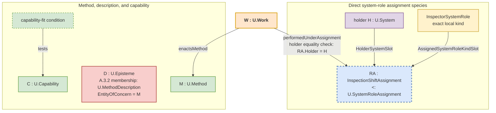

rmined at one named slice. A time selector may be part of a `U.ContextSlice`; a value or result range stays in `RangedValueKind` or `ResultKind`; changing data stays with its subject pattern; and a claim-bearing mathematical set representation opens C.29 only for a mathematical-lens use. Leave both fields out unless membership of the same declared kind can differ across the named slices.

Applicability and meaning remain distinct. The effective `U.ReferenceScheme` is part of episteme identity. The exact `U.ClaimScope` delimits use; when current for the declaration, a relevant time interval, selected `CHR:ReferencePlane`, or selected `BoundedModelUseStructure : U.Structure` further delimits or organizes applicability. Retain both the effective `U.ReferenceScheme` and exact `U.ClaimScope` when adding these applicability qualifiers.

#### A.6.0:4.3 - Use RelationSignature for reusable relation declaration

`RelationSignature` is the relation-facing use of one `U.Signature`. It is not a second U-kind.

Its `EntityOfConcernRef` identifies one exact already admitted direct relation kind. If `A.6.RCD` settles a derived relation kind, that kind counts here only after its direct subject settlement states the participant meanings, exact base-definition and named-substrate dependencies, obtaining and applicability laws, and a direct occurrence-identity rule. The derivation or predicate definition may be cited as a dependency, but a predicate-definition episteme whose `EntityOfConcern` is the reusable predicate definition rather than the admitted relation kind is not a `RelationSignature`. A `RelationSignature` declares:

- the relation-kind designator;
- one `SlotSpec` for each world-side participant meaning that needs reusable typed declaration;
- the direct pattern's obtaining predicate and declared laws, restated for reuse without claiming that the predicate is satisfied;
- applicability of those claims;
- the occurrence-identity rule supplied by the direct relation pattern, restated for reuse without applying it to any occurrence;
- for an admitted derived relation kind, the exact base relation definitions, named substrate and authorized derivation operation, and applicability dependencies already established by the direct subject settlement.

The direct relation pattern remains authoritative for when the relation obtains and how an individuated occurrence keeps identity. The signature declares those rules for reuse.

A direct relation may obtain before anyone writes a signature. Ordinary prose may therefore stop at:

> During Shift-17, Robot-7 is assigned as inspector through InspectionAssignment-17.

This is an A.2.1 assertion about an occurrence of declared species `MaintenanceInspectionAssignment` under `U.SystemRoleAssignment`. A.2.1 defines the species' predicate and occurrence-identity rule. The occurrence has `Robot-7` as holder, `InspectorSystemRole` as assigned-kind value, and only the values required for any other declared participants. When several patterns must reuse those participant meanings, predicate, and identity rule, the species' `RelationSignature` becomes useful for typed assertions and F.6 attribution. When another claim must refer to this assignment episode, use A.6.REL for explicit individuation.

#### A.6.0:4.4 - Declare participant meanings and operation parameters under different specializations

For each world-side participant meaning whose reusable declaration is current, a `RelationSignature` declares one A.6.5 SlotSpec. The following code sketch is a compact representation of that declaration:

```text
SlotSpec := <SlotKind, ValueKind, refMode>
refMode := ByValue | RefKind
```

| Component | Meaning in a RelationSignature |
|---|---|
| `SlotKind` | The declaration-local name by which this `RelationSignature` distinguishes one participant meaning of its EntityOfConcern relation kind. It is not a participant, system-role kind, or mathematical operand. |
| `ValueKind` | The exact world-side kind admitted for the relation participant. |
| `refMode` | How a receiving episteme, such as an assertion, description, or occurrence record, carries a participant designation: by value or through one exact governed RefKind. That designation denotes the actual participant. The occurrence record and the relation occurrence are distinct. |

Use A.6.5 to declare these participant meanings. In the simple `MaintenanceInspectionAssignment` species, use `HolderSystemSlot` and one declaration-local `AssignedSystemRoleKindSlot` with `MaintenanceSystemRoleKindDomain` as its ValueKind and `ByValue` as its refMode. In `InspectionAssignment-17`, `InspectorSystemRole` is the assigned-kind participant value. A stronger species adds only a real participant that changes its predicate or occurrence identity. Taxonomy episteme, reference scheme, interval description, and generic context may interpret an assertion but are not generic world-side assignment participants. Do not force SlotSpecs into a one-off assertion that has no receiving typed use.

A formal or mechanism declaration may instead need named operation arguments and a result. A.6.1 governs that `OperationAlgebra`. A representation may use a mathematical operand order, product, function, or tuple. A.6.3.RT governs a same-EntityOfConcern representation-scheme transition; C.29 governs only a mathematical-lens use. Those operation parameters do not become `RelationSignature` SlotSpecs or SlotKinds merely because the same notation uses angle brackets or numbered arguments. When a relation claim consumes a mathematical representation, state an explicit correspondence between the representation's operands and the independently declared SlotSpecs.

#### A.6.0:4.5 - Expose real declaration dependencies

Open a `SignatureManifest` only after this test. Add an import when removing one named provider would leave this declaration unable to interpret a required non-local term or unable to replay one of its stated laws; name the provider and the exact required term or law. Add a provide entry when this declaration introduces a named term or law and one named dependent declaration relies on it. A background citation, similar vocabulary, shared publication, list membership, or convenient replay order is not a dependency.

The `SignatureManifest` heading co-locates entries with three functions: `id` is an identity-neutral display designator; `signatureRef` and its optional `.edition` pin form a governed reference to an already recoverable signature episteme; and `imports` and `provides` may carry or represent dependency and name-or-law introduction claims in the signature's exact `U.ClaimGraph`.

The `SignatureManifest` section may carry entries with these functions:

| Entry | Meaning |
|---|---|
| `id : SignatureId` | An identity-neutral display designator or representation metadata for one already independently identified signature episteme. It is not a governed reference and does not enter the C.2.1 identity triple. |
| `signatureRef : U.EpistemeRef` | A governed reference resolving to the already identified signature episteme selected for replay. Changing its serialization preserves the referent only while resolution returns that same episteme under the effective reference scheme. |
| `signatureRef.edition` | An optional edition pin on `signatureRef` for one already recoverable episteme edition. The pin neither enters the C.2.1 identity triple nor establishes that an `EpistemeEditionRelation` obtains. |
| `imports` | When the signature's exact `U.ClaimGraph` states that interpretation requires a named term or that replay requires an exact law claim from a named provider declaration, this entry carries that claim content or visibly represents it. Name both provider and required term or law. The designators, governed references, or list membership alone establish no dependency or source-use occurrence. |
| `provides` | When the signature's exact `U.ClaimGraph` states that it introduces a public term or law on which a named dependent declaration relies, this entry carries that claim content or visibly represents it. Public SlotKinds and RefKinds can be named terms. Being listed establishes no consumer dependency by itself. |

A change confined to the spelling of `id` or the serialization of `signatureRef` preserves episteme identity only when the reference still resolves to the same episteme and its exact claim content, exact EntityOfConcern, and effective `U.ReferenceScheme` remain unchanged. Changing `signatureRef.edition` selects another already recoverable edition; it does not by itself establish an edition relation, historical continuity, or `U.Signature` membership for the referent. If a C.2.1 identity discriminator changes, A.6.0:4.10 governs the resulting identity.

Use these dependency-manifest predicates:

- **SM-1 Term-and-law resolution.** Every required non-local term or exact law claim resolves under the effective reference scheme to the one named provider declaration that supplies it.
- **SM-2 No redeclaration and legal direction.** A provided term or law is not also supplied by a transitive import under the same effective reference scheme, and the claimed provider-to-consumer direction matches the predicate of the exact dependency or source-use relation rather than a drawn arrow or list order.
- **SM-3 Replay order and cycles.** A selected one-pass provider-to-consumer replay method requires an acyclic ordering of the recovered dependency designations. A cycle means that this replay method cannot run; it does not by itself prove that every semantic dependency in the cycle is prohibited. Apply each exact dependency governor to its edge. If no current governor decides whether the semantic cycle is legal, return an exact missing-governor blocker instead of deleting an edge or inventing an order. Keep the graph representation, cycle check, and ordering notation separate from the semantic dependency claims; use C.29 only when a mathematical-lens use is current.
- **SM-4 Export boundary.** A dependent declaration relies on provided names and cited laws, not on private publication layout or implementation detail.

The remove-the-provider test above identifies a candidate dependency. State the exact dependency or source-use relation only after its direct predicate is satisfied for the named provider, consumer, term or law, and use. A citation, manifest entry, list membership, or replay result can support an assertion about that relation. A provider or provider-edition change may require resolution, replay, or currentness review; it changes the consumer signature's identity only when the consumer's own claim content, exact EntityOfConcern, or effective reference scheme changes.

A governed reference to a separately identified object is not an exported vocabulary name merely because that reference appears in the signature.

#### A.6.0:4.6 - Specialize declaration use without minting another root kind

A signature profile is a constrained use of the same `U.Signature` kind. The profile states which content is current and which neighboring patterns define or constrain later use.

**`profile = FormalSubstrate`.** Declare vocabulary and terms, inference kinds, formal laws, applicability, and the actual declaration dependencies carried in the signature's claim content. A.6.1 separately governs `OperationAlgebra`, operation designators, typed argument and result positions, admission conditions, application, and realization. An A.6.1 declaration may cite the FormalSubstrate signature. When a mathematical object is selected as a lens for another entity, C.29 governs the lens-use claim.

**`profile = PrincipleFrame`.** Write the postulates and invariants, then name the observable distinction each one requires: what must be observed or compared to tell whether the frame's claim holds. Cite the separately identified characteristic or measurement declaration that makes that distinction checkable; units, scales, `CHR:ReferencePlane` values, comparators, and normalizations remain under A.17, A.18, C.16, CHR, A.19.CPM, and A.19.UNM. If the text decides whether a proposed operation application, run, or gate may proceed, move that decision to A.6.1 or the direct evaluation and gate pattern, including A.21/C.11 where applicable. A PrincipleFrame may state what a decision must respect, but it is not that admission decision. For ordinary reuse, apply the frame's Applicability and the direct subject rules for any reference-plane or model-use-structure question. When the receiving claim needs an exact semantic relation between two local senses whose interpretation bases differ, first recover the two exact F.17 local senses; cite an F.9 Bridge only if its direct predicate obtains and state the bounded-use claim, direction, preservation, loss, and any required reliance separately. Cited declarations remain independently identified objects, not extra PrincipleFrame identity components.

State a relation between two signatures directly as refinement, conservative extension, equivalence, or another independently governed relation only when that relation's own predicate obtains. Before using the refinement label, compare all three reusable content duties: `Vocabulary`, `Laws`, and `Applicability`. Name the terms preserved, added, or removed; the laws preserved, strengthened, or changed; and whether the population, time, `CHR:ReferencePlane`, and claim scope stay the same, narrow, or widen. An unexplained applicability widening fails the refinement claim; use another direct relation whose predicate explicitly permits the widening instead of hiding it under `refinement`. Use a C.29 morphism only when a mathematical structure-preservation claim is actually current.

#### A.6.0:4.6a - Rule-content actual-use predicate declaration

`RuleContentBasisFindingDefinition@R7` is one ordinary `U.Signature` for two reusable predicates over claim content. Its exact EntityOfConcern is the reusable predicate definition; both `SubjectKind` and `RangedValueKind` are `U.ClaimGraph`. No distinct result kind is current because an ordinary C.2.1 assertion states whether a predicate obtains. The declaration is not a `RelationSignature`: `dependentContent` and `baseContent` are semantic parameters, not world-side relation participants or A.6.5 SlotSpecs.

Its vocabulary includes `SelectedRuleContentSubgraphDesignation@RuleContentBasisFindingDefinition-R7`, `derivedUsingRuleContent@RuleContentBasisFindingDefinition-R7`, and `evaluatedAgainstRuleContent@RuleContentBasisFindingDefinition-R7`. The designation resolves one exact nonempty base subgraph selected for one identified use. `RuleContentDerivationProfile@R7`, `RuleContentEvaluationProfile@R7`, and `RuleContentBasisFamilyAlgebra@R7` are named subgraphs of this signature's ClaimGraph.

The derivation predicate obtains only when an identified derivation claim used exact `baseContent` as a formal premise under a declared inference rule or application to produce exact `dependentContent`. The evaluation predicate obtains only when an identified criterion-selection claim selected exact `baseContent` for one exact bounded evaluation claim concerning `dependentContent`. Definition, constraint, applicability, consultation, citation, influence, provenance, evidence, evaluation Work, result, sufficiency, assurance, reliance, authority, and publication establish neither predicate by themselves.

An assertion names the exact actual-use claim identity and bounded receiving use, and adds scope, temporal policy, scheme interpretation, Bridge/loss, or source/witness qualifications only when each independently changes that assertion. A changed subject, content, mode, use, actual-use claim, scope extension, time policy, or interpreted endpoint identifies a successor assertion under C.2.1 rather than mutating every use of this reusable definition.

R7 is a changed-law successor of historical `RuleContentBasisFindingDefinition@R6`, not identity-continuous reuse. The C.2.1 succession assertion names predecessor, successor, `changeClass = reusable-law-change`, the changed law set—formal-premise/criterion-selection truth split, owner-claim removal, per-question analysis separation, independent candidate axes, pairwise compatibility, temporal-policy identity, and non-permissive reliance—and `inheritedAcceptanceOrUse = none`. A dependency pin selects R6 or R7 explicitly; a pin change reopens dependants rather than silently retargeting them.

#### A.6.0:4.7 - Keep declaration, realization, and use under their direct patterns

| Current object or claim | Subject pattern |
|---|---|
| Constitution and C.2.1 identity of the exact claim-bearing episteme, including a separately identified relation-occurrence description episteme | C.2.1; the direct object or relation pattern still governs the described EntityOfConcern |
| Reusable declaration episteme and `U.Signature` membership | A.6.0 |
| Relation obtaining and explicitly individuated occurrence | Direct relation pattern and A.6.REL |
| `RelationSignature` SlotSpecs and participant-designation discipline | A.6.5 |
| Mechanism `OperationAlgebra`, typed argument and result positions, admission conditions, application, and realization | A.6.1 |
| Method | A.3.1 |
| Performed work | A.15.1 |
| Optional source-to-receiving-episteme viewing construction | A.6.3 |
| Same-EntityOfConcern representation-scheme transition | A.6.3.RT |
| Cross-reference-scheme, cross-plane, or changed model-use-structure use | Use F.9 only when the use relates two exact F.17 local senses and its direct Bridge predicate obtains; state the bounded-use claim separately. Otherwise use the direct plane or model-use-structure pattern. |
| Numeric comparison, normalization, units, scales, and measurement | A.19.CPM and A.19.UNM, together with A.17, A.18, C.16, and the direct measurement pattern when each object or relation is current |
| Mathematical or diagrammatic lens use, including its operand mapping or correspondence | C.29 |
| Current representation-factor bundle for governed episteme publication positions | C.2.7 |
| Publication-face use and the distinct publication occurrence, form, and carrier relations | E.17 for the publication-face use profile; E.24.PUB for the direct occurrence, form, and carrier relations |
| Evidence-use or status-use relation | A.2.4 |
| Evidence-provenance graph or path | A.10 |
| Actual named assurance claim and its bounded result | B.3 |
| Operational gate profile and the decision that uses its result | A.21 and C.11 |

The rows name the direct patterns that define or constrain these common adjacent objects and claims.

#### A.6.0:4.8 - Add explicit objects only for a named receiving use

Make three decisions by naming the next sentence, comparison, tool, or declaration that must work:

1. **State the direct relation and stop.** Use this branch when the task only asks whether one direct relation's predicate holds for its actual participants under its subject pattern's conditions. State the affirmative or negative claim under that pattern, or an exact governed modal claim when that family is current. For example, `During Shift-17, Robot-7 is assigned as inspector through InspectionAssignment-17` is a complete current A.2.1 assertion when the direct `MaintenanceInspectionAssignment` predicate holds. Add an A.10 or receiving-evaluation reliance judgment only when the task separately asks whether to rely on the assertion.
2. **Share one declaration.** Reuse or author a signature when at least two named claims or consumers must use the same participant meanings, vocabulary, laws, or applicability. For example, a staffing assertion and an F.6 Work-attribution consumer can cite the `MaintenanceInspectionAssignment` `RelationSignature` when both must interpret `HolderSystemSlot`, its declaration-local `AssignedSystemRoleKindSlot` with `MaintenanceSystemRoleKindDomain` as ValueKind and `ByValue` as refMode, any real species-specific participants, and the same direct predicate. In `InspectionAssignment-17`, `InspectorSystemRole` is the assigned-kind participant value. One sentence that merely repeats the word `assigned` does not open this branch. When a declaration is authored, C.2.1 identifies the episteme from its own claim content, exact EntityOfConcern, and effective reference scheme; A.6.0 then judges `U.Signature` membership.
3. **Distinguish one occurrence.** Open occurrence identity only when a later claim must refer to that same occurrence, compare or qualify it, track its beginning, continuation, cessation, or change, or use it as a participant of another relation. For example, F.6 work attribution must cite the exact covering assignment episode, and a staffing history that compares Shift-17 with a later reassignment must apply A.2.1's uninterrupted-obtaining same-versus-new-occurrence rule. A roster-row identifier that merely designates an assertion identifies neither the assignment occurrence nor a new occurrence; use F.18 only after A.2.1 has distinguished the occurrence to which a reference should resolve.

These are the `receiving-use` thresholds. They concern three different objects and are not stages that construct a relation or episteme from need. The stop is observable: the target direct assertion, shared declaration for the named consumers, or occurrence-referencing claim can be written without another unresolved object. That target motivates authoring, selection, reuse, or explicit individuation. Apply C.2.1 to episteme identity and the direct relation pattern to occurrence identity. Selecting or reusing an unchanged episteme leaves its identity unchanged. When entries, branches, returns, or stops form one reusable structure, apply A.22.CGUS only after the A.22 identity, local locus bindings, selected relations and constraints, and potential continuations are recoverable.

#### A.6.0:4.9 - Recover formal-substrate and PrincipleFrame uses by direct governing relation

| Current claim | Direct governed use |
|---|---|
| Author, select, or cite a formal declaration | Use `U.Signature(profile=FormalSubstrate)` with its subject, vocabulary, inference kinds, laws, applicability, and real dependencies. |
| Use a mathematical object to preserve selected structure while hiding other structure | Use C.29 and state the mathematical-lens relation. |
| Declare, apply, or realize an operation | Use A.6.1 for the `OperationAlgebra`, typed argument and result positions, admission conditions, application, and realization; cite a FormalSubstrate signature only when that named dependency is current. |
| Carry an encountered distinction toward later work | Use E.18.1 for the carry-through relation. |

The same independently identified formal object or episteme can participate in these different uses while retaining its own identity and kind. State the applicable declaration, dependency, operation, lens, or carry-through relation for the receiving use.

For a `PrincipleFrame`, write one postulate or invariant together with the observable difference that would count for or against it. Cite a characteristic, measurement, unit, scale, reference plane, comparator, or normalization declaration only when that declaration is needed to state or check that difference; an informative citation is not a dependency. Do not put an operation-admission, run-acceptance, or gate-passage verdict into the frame. For ordinary reuse, apply the frame's Applicability and the direct subject rules for any reference-plane or model-use-structure question. If the receiving claim needs an exact semantic relation between two local senses whose interpretation bases differ, recover the two exact F.17 local senses and test the direct F.9 predicate; cite a Bridge only when it obtains, state preservation and loss in a separate bounded-use claim, and establish any required reliance before use. A cited declaration may be superseded, or an independently obtaining dependency relation may cease or be replaced, without retroactively changing the PrincipleFrame's identity. Changing the PrincipleFrame's own citation or dependency claim changes its claim content and therefore identifies another episteme; the same follows when its exact EntityOfConcern or effective reference scheme changes. Any edition, refinement, or supersession relation between the two epistemes must independently obtain and must pass the Vocabulary-Laws-Applicability comparison above.

#### A.6.0:4.10 - Change the exact object that changed

Apply C.2.1 first. Every `U.Episteme` is identified by exact claim content carried by one exact `U.ClaimGraph`, one exact EntityOfConcern, and one effective `U.ReferenceScheme`. Changing any member of this mandatory triple identifies another episteme. That episteme is a `U.Signature` only when it independently satisfies A.6.0 membership. A changed discriminator, `SignatureId`, or `signatureRef.edition` value does not by itself establish signature membership or historical continuity.

A change to `imports` or `provides` changes the consumer signature's identity only when it changes that signature's own claim content. A changed provider or provider edition can instead leave the consumer episteme unchanged while requiring the named dependency or source-use assertion, resolution result, replay result, or currentness judgment to be reconsidered.

A changed later use does not change the signature unless the change alters one of its C.2.1 identity discriminators. For example, a new mechanism realization remains a new realization, and a new publication layout remains a new publication form.

Connect two different epistemes by `EpistemeEditionRelation`, refinement, supersession, or another independently governed continuity relation only when that relation's own predicate obtains under its direct governor. Revision work, shared title, changed identifier, citation, or sequence alone establishes no such occurrence.

When a once-current signature becomes stale while its identity remains recoverable, G.11 governs currentness and selection among recoverable editions.

Reopen declaration authoring when a proposed change affects the signature's exact claim content, EntityOfConcern, effective reference scheme, declared dependency, Vocabulary, Laws, Applicability, or the boundary of a FormalSubstrate, PrincipleFrame, or other admitted profile. The revised claim-bearing candidate is another C.2.1 episteme; A.6.0 judges its signature membership again, and any edition, refinement, or supersession relation remains a separate claim under its direct governor. Also reopen the affected declaration element when current problem-owning-domain or formal-method SoTA changes the term, inference form, law shape, applicability condition, or realization boundary being declared.

When a governed kind name, `SubjectKind`, `RangedValueKind`, SlotKind, RefKind, or exported term is renamed, apply F.19 to the changed wording; use E.10 for unresolved lexical questions and F.18 for durable naming. Accept the rename only when a cold reader can still recover the same FPF kind, declaration use, and practical action; otherwise keep the old name or return the naming defect. Do not revise the signature merely because a realization, work occurrence, measurement, Bridge use, evidence-use relation, publication, provider currentness, or G.11 selection changed. Update that neighboring object under its subject pattern, and reopen the signature only if its own claim or dependency content must change.

### A.6.0:5 - Archetypal Grounding

#### A.6.0:5.1 - Physical modeling: connector-equation FormalSubstrate

A multi-domain modeling team repeatedly uses one connector-and-equation calculus. The `EntityOfConcernRef` of its `U.Signature(profile=FormalSubstrate)` identifies that calculus. `SubjectKind` names the modeled connector declarations governed by the calculus, and `RangedValueKind` names its well-formed terms and equations. Vocabulary names the potential and flow variables. Its inference and equation laws say how a selected connection assertion yields potential equality and the zero-sum flow equation. Applicability states the modeling assumptions and selected `CHR:ReferencePlane`. If those terms or laws cannot be interpreted or replayed without a named quantity declaration, the manifest names that provider and the exact imported term or law; otherwise a background citation stays outside the dependency manifest.

The sentence `ModeledPort_A is connected to ModeledPort_B` is a separate model-side connection assertion. If repeated typed connection claims require a `RelationSignature`, first recover or admit the exact modeled-connection relation kind, its two connectable-port participant meanings, direct predicate, qualifier laws, Applicability, and occurrence-identity rule; only then may that relation declaration cite this FormalSubstrate when the dependency test passes. A generated equation set and a connector diagram are later result and representation epistemes, not either declaration; use A.6.1 for operations, A.15.1 for Work, and E.24.PUB for publication. Govern each representation and its declared correspondence through the applicable representation pattern, including A.6.3.RT for a same-EntityOfConcern representation-scheme transition. Open C.29 only for a mathematical-lens use.

Practical payoff: engineers can compare the connector vocabulary and equation laws across tools.

#### A.6.0:5.2 - Clinical work: dose-response claim before relation-kind admission

A clinician needs the ordinary claim: `During PatientEpisode_8472, Intervention_5mg was associated with OutcomeChange_BPminus10 over ObservationWindow_Days0to28 under the stated dosing and population conditions.` No current direct pattern in this corpus governs a `DoseResponseRelationKind`. For this use, A.6.RCD therefore keeps the sentence as a local compound claim in one C.2.1 episteme; repeated clinical uses may justify a reusable predicate-definition episteme, but neither result is a `RelationSignature` or a relation occurrence.

The local predicate treats the named patient episode, intervention, outcome change, and observation window as its exact inputs. `ObservationWindow_Days0to28` answers how long this patient's outcome change is aggregated for this assertion. The claim's or reusable definition's Applicability instead states the population, dosing protocol and conditions, and the time and claim scope in which the rule is used. Do not repeat the patient window as Applicability unless a separate applicability claim genuinely uses that same interval. Before any `RelationSignature` can be published, the missing-governor result must name the candidate relation kind, these participant meanings, the direct predicate, Applicability, occurrence-identity rule, and a standalone clinical domain governor; E.24/E.24.UK must admit the result.

A selected assay-result episteme may support or refute the compound assertion. Use A.2.4/A.10 to qualify that evidence use and any intended reliance. When an assay result changes, reassess whether it supports or refutes the same bounded assertion; that assessment may stay the same, change, or be unresolved. The reusable predicate definition remains unchanged. A changed outcome meaning, population, dosing condition, or declared applicability changes the definition's claim content and C.2.1 identity.

Practical payoff: clinicians and analysts can write and compare the bounded claim now, reuse a settled predicate definition when repetition warrants it, and keep patient episodes, evidence epistemes, and evidence-use claims distinct.

#### A.6.0:5.3 - Learning: criterion declaration and evidence use

During `AssessmentInterval_2026Q2`, learner `Learner_17` correctly diagnoses cavitation in `PumpCase_A` and `PumpCase_B` and selects the stated corrective action. A separate observation episteme, `PerformanceObservation_17A`, states what was observed. After applying the reusable declaration `Criterion_PumpCavitationDiagnosis_v3`, assessor `Assessor_4` makes the separate competence-assertion episteme `CompetenceAssertion_17_Q2`: `Learner_17 met Criterion_PumpCavitationDiagnosis_v3 for diagnosing cavitation and selecting the stated corrective action in PumpCase_A and PumpCase_B during AssessmentInterval_2026Q2.`

`Criterion_PumpCavitationDiagnosis_v3` is the reusable declaration governed here. Its `EntityOfConcernRef` identifies the pump-cavitation diagnosis criterion; `SubjectKind` names assessed pump-cavitation diagnostic performances and `RangedValueKind` names the results `meets` and `does not meet`. Vocabulary defines the cases, diagnosis, and corrective action; Laws say which observable response earns either result; Applicability limits the equipment family, task form, and assessment method. No current direct pattern supplies `DemonstratedCompetenceRelationKind`, so this case asserts neither that relation signature nor a world-side demonstrated-competence occurrence.

For this bounded assessment use, the direct A.2.4/A.10 evidence-use relation names `PerformanceObservation_17A` as `EvidenceEpisteme`, the quoted competence claim as `EvidenceTargetClaim`, the two specified cases as `EvidenceClaimScope`, `supports` as `EvidencePolarity`, and `AssessmentInterval_2026Q2` as `EvidenceRelevanceWindow`. Its A.10 evidence-provenance path identifies the observation work, method, carrier, and assessor's relying context. That relation supports reliance on this exact competence claim; it does not authorize course progression. A self-report without that observation path, a performance on another task, or a performance outside the named interval does not support this bounded claim.

Changing the publication form or making another publication occurrence for the unchanged criterion or competence assertion changes neither episteme. Changing the criterion's Vocabulary, Laws, or Applicability changes its claim content and identifies another declaration episteme; any edition or continuity relation must separately obtain. A new performance observation or assessor claim likewise identifies separate evidence or claim content rather than changing the criterion declaration.

Practical payoff: two assessors or curriculum tools can reuse the same declared criterion and its performance-and-result meanings while making separately identified competence claims about separately observed performances.

#### A.6.0:5.4 - Formal work: length-indexed zero-vector operation

An engineer declares the reusable operation `zeroVector(n)` in ordinary language: give it a natural number `n`; it returns a vector of `n` real-valued entries, every one zero. In the A.6.1 `OperationDeclaration`, argument `lengthIndex` means the requested component count and has ValueKind `NaturalNumber`. Result `zeroVectorResult` means the returned zero vector and has the indexed result family `FiniteVector(RealScalar, n)`. The application predicate says that one application binds one `n` and returns that vector. The dependency law states `length(zeroVector(n)) = n`, and the zero law states that every indexed entry equals scalar zero. Applicability limits this declaration to finite vectors over the declared `RealScalar` field.

The declaration imports the exact type-former `FiniteVector(RealScalar, n)` and its length-index law from FormalSubstrate signature `FiniteVectorSubstrate_v2`. Remove that provider and neither the result declaration can be interpreted nor the length law replayed, so this is a declaration dependency rather than a background citation. The operation argument and result remain A.6.1 declarations; they are not A.6.5 relation SlotSpecs.

A Lean representation may write the result as `Vector Real n`. A proof-carrying record representation may write `entries: List Real` together with `lengthProof: entries.length = n`. Because both represent the same operation declaration and no mathematical lens changes the next comparison action, A.6.3.RT alone governs this representation-scheme transition. It preserves the result-length index and the all-zero law. Lean binder order, implicit elaboration, record field order, and the location of the length proof are representation-local and need not survive. Stop here: no C.29 result is needed. If a later comparison uses a named free-module lens to decide algebraic reuse, that changed lens use opens C.29 and must separately state the preserved addition and scalar action and the lost coordinate or layout detail. State a blocked inference only when it passes F.19:4's full guard test.

Practical payoff: formal-methods engineers can fill and inspect the dependent A.6.1 declaration, test its actual FormalSubstrate dependency, and compare representations.

#### A.6.0:5.5 - PrincipleFrame: heat-flow balance

A thermal-modeling team writes a `PrincipleFrame` stating that net heat flow across a selected system boundary must balance the change in stored energy. The frame names the observable distinction between inward and outward heat flow at that boundary. It cites separately governed heat-flow characteristics, units, the selected `CHR:ReferencePlane`, and the measurement declaration needed to check that distinction; its Applicability names the modeled systems and conditions for which the balance claim is made.

A comparison result may show that the residual is below the chosen tolerance. The comparator and tolerance remain under their direct comparison and measurement patterns; operation admission remains under A.6.1, and a gate-passage verdict remains under A.21/C.11. If a laboratory measurement sense is proposed for use in a plant-model sense, resolve both exact F.17 local senses and apply F.9. Cite a Bridge only when its predicate obtains; state the bounded use and any preservation or loss of sign convention, unit, and boundary interpretation separately.

Practical payoff: the physical principle remains reusable while the measurement setup, comparator, run decision, and cross-scheme transport can change or fail independently.

#### A.6.0:5.6 - Reduced ordinary-use case

The sentence `During Shift-17, Robot-7 is assigned as inspector through InspectionAssignment-17` is enough for a task that only reports whether the direct `MaintenanceInspectionAssignment` predicate holds for its actual participants during that episode. Stop there. If a staffing assertion and an F.6 Work-attribution consumer must reuse the same participant meanings and assignment laws, cite that direct species' existing `RelationSignature`. If later Work attribution or history must distinguish this assignment from a later reassignment, apply A.2.1's direct occurrence-identity rule and refer to the distinguished episode. A roster-row id that merely points to the assertion opens neither branch. Each result is complete for its stated task; the shorter result is not an incomplete signature.

### A.6.0:6 - Bias-Annotation

**Scope declaration:** Universal across FPF-governed domains.

- **Gov.** Favors making the direct governor of declaration membership, declared content, and neighboring claims inspectable, together with explicit dependencies. Counter-risk: declaration administration can grow beyond reuse value. Mitigation: add `SignatureManifest` only for actual dependency.
- **Arch.** Favors a small declaration core with direct neighboring patterns. Counter-risk: the signature becomes a central container. Mitigation: keep realization, work, evaluation, and publication with their direct patterns.
- **Onto-Epist.** Favors strict separation of declaration episteme, declared subject, obtaining occurrence, assertion, and representation. Counter-risk: excessive explicitness. Mitigation: stop at the direct assertion unless two named consumers share declaration content or one later claim must distinguish the occurrence.
- **Prag.** Favors reusable named SlotSpecs and laws. Counter-risk: one-off work becomes formal paperwork. Mitigation: ordinary direct sentences remain sufficient.
- **Did.** Favors the four content groups and local mantra. Counter-risk: readers treat the mnemonic order as a required execution order. Mitigation: apply A.22.CGUS only to an independently identified structure of potential continuations; actual execution remains a separate Work or Transformation claim.
- **Context transport.** Interpret the signature's claims under the effective `U.ReferenceScheme` and use them within their stated scope. Counter-risk: the same label in another context is treated as equivalent or safely substitutable. Mitigation: when a proposed reuse relates two exact F.17 local senses, test the direct F.9 predicate and cite a Bridge only when it obtains; state direction, rule, tolerated loss, and polarity in a separate bounded-use claim. Without the needed semantic relation and use claim, do not transport the claim by label alone.
- **Comparability.** Two declarations do not become comparable because both expose numbers. Counter-risk: numeric appearance hides incompatible characteristics, measurement procedures, units, scales, comparators, or normalization. Mitigation: apply the current A.17/A.18/C.16 characteristic, measurement, and unit-and-scale patterns and A.19.CPM/A.19.UNM comparison and normalization patterns as the case requires, then state the resulting comparison boundary; keep their detailed legality and result-shape rules with those subject patterns.
- **Register.** Make technical declaration blocks and worked cases readable for their intended use. Counter-risk: a technically correct block remains unusable without private decoding. Mitigation: apply F.19's connected reading and local revalidation. Unpack decisive FPF terms or add an ordinary explanation only when needed to recover the claim or action and its relevant result; preserve the governed object, subject pattern, admissible use, and practical action.

The examples deliberately span physical modeling, medicine, learning, and formal work. Each worked declaration has its own C.2.1 identity, which remains independent of its publication form.

### A.6.0:7 - Conformance Checklist

1. **Exact declaration object.** The text identifies one `U.Signature` episteme and one exact `EntityOfConcernRef`.
2. **Identity.** Content, EntityOfConcern, and effective `U.ReferenceScheme` remain recoverable.
3. **Minimum content.** `SubjectKind` and `RangedValueKind`, together with Vocabulary, Laws, and Applicability, carry semantic content rather than empty publication rows. `ResultKind`, `SliceSet`, and `ExtentRule` appear only when their declared distinctions are current.
4. **Optional slice-dependent membership.** `SliceSet` names the addressable `U.ContextSlice` values to inspect and `ExtentRule` determines `Extension(SubjectKind, slice)` only when the same declared kind can have different members across those slices; neither field stands for a generic interval, range, changing dataset, or set representation.
5. **Vocabulary boundary.** A declared token is not treated as durable U-kind admission without E.24.UK and its direct pattern.
6. **Relation declaration.** A `RelationSignature` identifies one exact already admitted direct relation kind. An admitted derived relation kind has direct subject settlement for participant meanings, base-definition and named-substrate dependencies, obtaining, applicability, and occurrence identity. A predicate-definition episteme is not treated as that `RelationSignature`, and the declaration does not assert an occurrence. Every worked case that uses a `RelationSignature` also names the already admitted relation kind, direct governor and predicate, participant meanings, Applicability, occurrence-identity rule, and one ordinary affirmative or negative assertion. A hypothetical domain-local relation kind is labelled and fully settled before the example uses it.
7. **Direct relation-pattern governance.** The direct relation pattern defines or constrains obtaining and occurrence identity.
8. **Typed-declaration boundary.** Reused participant meanings are declared inside a `RelationSignature` by A.6.5 SlotSpecs with exact SlotKind, ValueKind, and refMode. Operation arguments and results remain A.6.1 declaration content. Mathematical operands and field order remain representation-side under A.6.3.RT; C.29 opens only when a named mathematical lens changes the declared lens use or next comparison action. An operand-to-participant correspondence is stated only for an already governed relation claim.
9. **Semantic locality.** Meaning uses the effective reference scheme; applicability uses the exact claim scope and only qualifiers current for the declaration, such as a relevant time interval, selected `CHR:ReferencePlane`, or genuinely current model-use structure.
10. **Dependency truth.** Every import names the provider and exact term or law without which interpretation or law replay fails; every provide entry names a dependent declaration that relies on the introduced term or law. Citations and list order do not qualify. SM-1 through SM-4 hold, and a replay cycle is distinguished from a semantic-prohibition verdict.
11. **Realization boundary.** Mechanism behavior and admission conditions remain with A.6.1.
12. **Progressive elaboration.** A direct assertion is enough when the task only asks whether the predicate holds; a signature opens when at least two named consumers share declaration content; occurrence identity opens only for a later same-occurrence reference, comparison, qualification, history/change claim, or relation participation. A log or assertion identifier alone opens none of them.
13. **CGUS boundary.** Judge any condition-governed unfolding claim through A.22.CGUS, using the independently identified structure and continuation conditions stated in §4.
14. **Profile boundary.** FormalSubstrate and PrincipleFrame remain profiles of `U.Signature` rather than new root kinds. A PrincipleFrame names its postulates and the observable distinctions needed to check them, leaves operation and gate admission with their subject patterns, and uses F.9 for a relation between two exact F.17 local senses, citing a Bridge only when its direct predicate obtains.
15. **Changed object.** Changed exact claim content carried by the `U.ClaimGraph`, exact EntityOfConcern, or effective reference scheme identifies another episteme. Judge A.6.0 membership for that episteme independently, and assert edition, refinement, supersession, or another continuity relation only when its own predicate obtains. A changed use, identifier, publication form, carrier, provider currentness, or G.11 refresh state does none of those things by itself.
16. **F.19 self-application and reader use.** Apply F.19 by value to every materially changed technical declaration, mantra, checklist instruction, and worked case; revalidate the changed span with its meaning-dependent neighbours. The cold intended reader must be able to recover the same governed object, subject pattern, admissible use, and practical claim or action, including any result that changes that use. Keep ordinary technical wording when it already carries the needed distinctions; unpack terms or add an explanation only when recovery needs it. Use E.10:11 item 16 when the value-substitution question is selected. State a nearby non-use or contrasting case only when F.19:4's full guard test warrants it. A `Plain` label without that reader-visible recovery does not pass.
17. **Case-level witness.** Each worked case names its exact EntityOfConcern, the direct pattern that defines or constrains the claim being made, and what the practitioner can now write, decide, or inspect. State the nearest category error it rejects only when F.19:4's full guard test warrants that contrast. A domain label or the presence of several case headings is not evidence of cross-domain fit.

### A.6.0:8 - Common Anti-Patterns and How to Avoid Them

| Failure mode | Why it fails | Repair |
|---|---|---|
| Signature as publication template | Visual rows and publication metadata become signature identity. | Recover the declaration content and C.2.1 identity; govern publication separately. |
| Relation signature as relation occurrence | Declaring participant meanings and laws is treated as evidence that the relation obtains. | Evaluate the direct predicate for the actual participants, state affirmative or negative assertion polarity under the exact direct claim family, keep supported, refuted, or unresolved reliance with `A.10` or the receiving evaluation, and use A.6.REL only when a receiving use needs occurrence identity. |
| Applicability as context label | One undefined context word hides reference scheme, claim scope, time, selected `CHR:ReferencePlane`, and model use. | Recover each current qualifier under its direct kind or relation. |
| Citation as declaration dependency | A bibliography entry, shared term, or manifest row is treated as proof that one declaration depends on another. | Remove the candidate provider: if the consumer can still interpret every required term and replay every stated law, keep a citation rather than an import. Otherwise name the provider, exact term or law, direct dependency predicate, and named dependent use. |
| Mandatory maximum form | Every sentence receives SlotSpecs, dependencies, editions, and occurrence records. | Name the receiving use and include only the declaration or occurrence-identity objects it needs. |
| Mnemonic as executable sequence | Imperative wording is treated as a runnable continuation structure. | Keep it as Plain recall or declare the actual condition-governed structure with A.22.CGUS. |
| PrincipleFrame as admission verdict | A postulate, invariant, measurement threshold, or comparator result is treated as permission for an operation, run, or gate to proceed. | Keep the postulate and observable distinction in the PrincipleFrame; cite the direct measurement or comparison declaration; use A.6.1 for operation admission and gate passage to A.21/C.11. |
| Realization inside the declaration | Current mechanism behavior or test outcomes become signature laws. | Keep declared laws here; state the mechanism declaration or realization under A.6.1 and the evaluation claim under its direct evaluation pattern. |

### A.6.0:9 - Consequences

**Benefits.**

- Reusable declarations receive one stable episteme identity.
- `RelationSignature` epistemes can expose named typed SlotSpecs without forcing every relation occurrence into a record.
- Meaning becomes inspectable through the exact reference scheme; applicability becomes inspectable through the exact claim scope plus any current time interval, selected `CHR:ReferencePlane`, or selected model-use structure.
- In physical-modeling practice, an author can reuse one connector-equation FormalSubstrate while keeping a modeled connection assertion, generated equations, and a diagram separate from that declaration.
- In clinical practice, an author can write the bounded patient-episode, intervention, and outcome assertion now, relate an assay-result episteme to that claim through A.2.4/A.10, and defer a `RelationSignature` until a direct clinical relation governor exists.
- A changed realization, observation, evidence-use relation, or publication can be repaired independently when the declaration's own claim content, EntityOfConcern, and effective reference scheme remain unchanged.

**Costs and trade-offs.**

- Before choosing a form, the author answers three concrete questions: does the task only ask whether one predicate holds; do at least two named consumers need the same declaration content; or does a later claim need to refer to the same occurrence, compare it with another, qualify it, record its history, or use it as a participant in another relation? Those answers select a direct assertion, reusable declaration, or occurrence identity.
- Authors must recover the exact declared subject and effective reference scheme; a familiar label is not enough.
- A `RelationSignature` case also requires an already admitted relation kind, direct governor and predicate, participant meanings, Applicability, occurrence-identity rule, and an ordinary assertion. Without that settlement, the author keeps a local claim, predicate definition, or exact missing-governor blocker instead of inventing SlotSpecs.
- Typed reuse adds authoring effort for A.6.5 relation SlotSpecs or A.6.1 operation declarations, plus A.6.0 dependency declarations only when another signature actually relies on named terms or laws.
- A change to exact claim content, EntityOfConcern, or effective reference scheme identifies another episteme even when the publication looks identical; authors must separately judge `U.Signature` membership and any claimed edition, refinement, or supersession relation.

### A.6.0:10 - Rationale

The ontic is needed because the same reusable declaration is cited across work occurrences, publication occurrences, and representations. Treating it as only a table-shaped publication form loses identity; treating it as the declared world-side object collapses episteme and EntityOfConcern.

The declaration components answer four different engineering questions. `SubjectKind`, `RangedValueKind`, and optional `ResultKind` identify the declared subject and value or result range. When slice-dependent membership is current, `SliceSet` names the addressable context slices and `ExtentRule` says how the members of the same declared kind are determined at one slice. Vocabulary supplies reusable names and, for a RelationSignature, named participant SlotSpecs; A.6.1 supplies operation arguments and results for a mechanism declaration. Laws state the reusable regularities. Applicability states where those regularities are used. Their conceptual separation is stable even when publication layout changes.

`RelationSignature` is a use of `U.Signature` because it has the same episteme identity and content duties. Introducing a second root kind would duplicate those duties while leaving obtaining and occurrence identity with direct relation patterns anyway.

Progressive elaboration protects didactic primacy. A practitioner can begin with a readable relation sentence and add formal declaration only when reuse creates value. Exactness is increased for a named claim or operation.

### A.6.0:11 - SoTA-Echoing

| Current source | What it contributes | FPF disposition and practical implication |
|---|---|---|
| JuliaHub Dyad 3.2 component and analysis documentation; Modelica 3.7 retained only as historical acausal-modeling lineage | Dyad supplies the current engineering comparator: reusable relation-first components and connections remain separate from selected analyses, solution objects, generated artifacts, and optional schematic presentation. Modelica preserves the older declarative-connection lineage. | **Adopt and generalize the separation, not either tool's ontology.** Keep the connector or relation declaration separate from a concrete assertion, analysis, generated equations or artifacts, solver Work, and diagram. FPF relation-kind admission, participant meanings, the direct predicate, applicability, and the occurrence-identity rule require an FPF direct governor. |
| The current Lean Language Reference, covering Lean `4.33.0-rc1`, describes structures through named fields whose types may depend on earlier fields, while the kernel checks formal terms independently from presentation convenience. | It supports the case 5.4 representation of the indexed result as `Vector Real n` and makes the dependence of result length on argument `n` inspectable. | **Adapt as a dependent-type representation precedent.** A.6.1 defines the argument and result meanings. The concrete Lean-to-proof-carrying-record comparison stays under A.6.3.RT unless a named lens changes the next comparison action. |
| TypeDB 3.x declares relation types through explicit related role types and can specialize those declarations. | It supports stable schema-local names as a representation precedent for declared participant positions. | **Adapt with a stricter boundary.** A.6.5 SlotSpecs are used only after the FPF relation kind and direct governor are independently settled. |
| For the RDF-validation branch, SHACL 1.2 Core (Working Draft, 30 June 2026) gives the current standards-track answer by separating shapes graphs, evaluated data graphs, validation work, and validation reports. | It supports keeping a reusable constraint declaration, evaluated data, evaluation work, and an evaluation-report episteme as different objects. | **Adapt only as a work-in-progress representation and validation precedent.** The clinical local claim and the learning A.2.4/A.10 evidence-use relation remain governed by their current FPF subject patterns. |
| For the semantic-web foundational-ontology branch, the March 2026 gUFO preprint gives a current branch answer by using reification patterns for relational aspects. | It supplies a stress question about when arity, participant dependence, and relation-occurrence reification matter. | **Reject as FPF ontology; retain only as a stress comparator.** For relation-kind admission, the direct predicate and occurrence identity, use the FPF direct governor. Apply §4.8's three receiving-use questions to decide whether a declaration or occurrence identity is needed. |


Sources:

- JuliaHub, [Dyad 3.2 documentation](https://help.juliahub.com/dyad/stable/); Modelica Association, [Connectors and Connections](https://specification.modelica.org/) as historical lineage.
- Lean project, [Inductive Types and Structures](https://lean-lang.org/doc/reference/latest/The-Type-System/Inductive-Types/).
- TypeDB, [`relates` statement](https://typedb.com/docs/typeql-reference/statements/relates/).
- W3C, [SHACL 1.2 Core](https://www.w3.org/TR/shacl12-core/).
- Almeida, Guizzardi, Sales, and Fonseca, [gUFO: A Gentle Foundational Ontology for Semantic Web Knowledge Graphs](https://arxiv.org/abs/2603.20948).

These sources test the separation among declaration, represented structure, realization, and use. FPF's constructive ontology, C.2.1 episteme identity, A.6.5 relation-slot discipline, A.6.1 operation declaration, and direct relation patterns remain authoritative for the solution.

### A.6.0:12 - Relations

- **Builds on:** A.7, C.2.1, C.3, A.2.6, and A.6.5.
- **Governs:** reusable `U.Signature` declaration epistemes, including `RelationSignature` use and the FormalSubstrate and PrincipleFrame profiles.
- **Constrained by:** F.19 for the register and usability of materially changed technical declaration blocks, the mantra, checklist instructions, and worked cases. The local result must let the cold intended reader recover the claim or action, decisive governed terms, and practical use; add an ordinary explanation only when needed for that recovery. Use E.10's compact route and exact rules for unresolved lexical questions.
- **Coordinates with:** A.6.REL for relation occurrence, A.6.RCD for needed-claim derivation and relation-kind settlement before declaration, A.6.1 for mechanism declaration and realization, A.3.1 for methods, A.15.1 for work, F.9 for explicit bridge use, A.17, A.18, C.16, A.19.CPM, and A.19.UNM for characteristic, scale, comparison, and normalization questions, C.29 for mathematical-lens use, and E.24.UK for durable U-kind admission.
- **Described and published through:** C.2.1, E.17, and E.24.PUB.
- **Evolves with:** G.11 for currentness and explicit direct relations between signature editions.
- **Used by:** C.22 task signatures for A.6.0 declaration identity and content; a changed C.22 discriminator identifies another episteme and establishes an edition only when the direct continuity predicate obtains. Also used by A.19.CPM comparison declarations, A.19.SelectorMechanism selection declarations, C.29 and E.18.1 when their current claim requires a FormalSubstrate declaration, and any pattern that needs reusable vocabulary, laws, applicability, or relation SlotSpecs. Specialized operation declarations remain under A.6.1 rather than A.6.0.

### A.6.0:End

## A.6.1 - U.Mechanism - Reusable Law-Governed Operation Declaration

> **Status:** Stable

**Pattern kind.** Ontic declaration pattern.

**Builds on.** A.6.0 for signature identity and content, C.2.1 for episteme identity, and A.2.6 for claim scope.

**Coordinates with.** A.6.REL for relation occurrences, A.6.RCD for the lightest honest comparison claim, A.6.5 for RelationSignature SlotSpec discipline, C.3 for local operation ValueKinds, A.1 for holon recognition, A.3.1 for Methods, A.15.1 for performed Work, F.9 for exact cross-scheme sense correspondence, C.2.1 for the separate claim that one Bridge suits one bounded use, A.10 for ordinary reliance on that claim, B.3 only for an actual named assurance claim, CHR for selected `CHR:ReferencePlane` values, A.1.1 and A.22 for a selected `BoundedModelUseStructure`, C.29 for mathematical-lens use, E.20 for mechanism introduction, E.24.PUB for publication, A.22.CGUS for a constraint-governed potential-continuation structure and its separate case results, and G.11 for currentness.

### A.6.1:1 - Problem frame

An engineer needs a reusable declaration of operations, their typed argument and result positions, the laws they preserve, and the conditions under which an operation is admitted. The declared operation family may be used for physical modeling, clinical calculation, selection, normalization, or another named engineering use.

Use this pattern when the working question is:

> What operation family is being declared, which laws govern it, and under which claim scope, time, selected `CHR:ReferencePlane`, and mechanism conditions may its operations be used?

**Primary governed object.** One claim-bearing episteme being identified as `U.Mechanism`. Inside that episteme's C.2.1 identity, its exact `EntityOfConcernRef` identifies the declared operation family. `U.Mechanism` is a dependent durable U-kind governed through the `U.Signature` identity and content settlement; it adds operation and admission semantics to the reusable declaration. The episteme and the declared operation family remain distinct: the episteme carries the declaration, while `EntityOfConcernRef` identifies the family.

**Primary working reader and concern.** The reader is an engineer who needs to reuse or compare an operation declaration without confusing it with the method that uses it, the entity that realizes it, the work that evaluates it, or a publication that presents it.

The first useful move is to name the declared operation family, its `SubjectKind`, and its family-level `RangedValueKind`, then state its `OperationAlgebra`, `LawSet`, `AdmissibilityConditions`, and exact Applicability. Add a family-level `ResultKind` only when one distinct result kind is current. For each reused operation, point to the argument or result meaning that carries the `SubjectKind`, `RangedValueKind`, or `ResultKind` meaning, then declare every additional argument and result meaning and exact ValueKind. Also state the operation's `ApplicationPredicate`, `ApplicationExtentRule`, and `ApplicationIdentityRule`. `ApplicationExtentRule` maps the facts at one independently grounded application locus to the semantically relevant boundary or interval over which that operation's predicate obtains; it is not the signature-level `ExtentRule` that determines kind membership at a selected context slice. Open an actual operation-application binding only when one particular application has been independently identified and a downstream claim says which value that application used or returned. Add a dependency manifest only when removing one named provider term or law would make this declaration uninterpretable or prevent law replay; shared wording or a background citation is not a dependency.

What goes wrong if this pattern is missed: implementation behavior, method instructions, evaluation outcomes, and publication metadata enter the declaration as if they were operation laws. A later user cannot tell whether the declaration changed, one realization failed, or only the evidence became stale.

What this buys: the declaration can remain stable while methods, realizers, evaluations, descriptions, and publications evolve under their own patterns.

Do not use this pattern merely because prose contains words such as mechanism, algorithm, process, or workflow. Recover the current object first. Use A.3.1 when the current object is a semantic way of doing, A.15.1 when it is performed work, and the direct system or episteme pattern when it is a physical assembly or a model description.

### A.6.1:2 - Problem

FPF needs reusable operation declarations for scope, normalization, selection, comparison, physical modeling, and other domains. Without one precise ontic:

1. an operation name does not reveal its typed arguments or result;
2. declared laws are mixed with admission predicates and evaluation outcomes;
3. applicability is hidden behind an unexplained context label;
4. a realization is confused with the declaration it realizes;
5. mathematical notation or imperative prose is overread as an executable sequence;
6. descriptions, publications, methods, and dated work acquire mechanism identity by proximity.

The repair is a small set of exact distinctions applied with progressive explicitness.

### A.6.1:3 - Forces

| Force | Tension |
|---|---|
| Reuse and semantic locality | Reusers need stable operation meaning, while every use has an effective `U.ReferenceScheme` and bounded Applicability. |
| Law and admission | Laws state reusable regularities; admission predicates decide whether one proposed operation use is admissible. |
| Declaration and realization | A declaration can have several realizers; changing one realizer does not by itself change declaration identity. |
| Light use and typed reuse | One readable operation sentence is often enough, while repeated use may need exact argument and result declarations; a receiving claim about one use may additionally need a particular application and its bindings. |
| Domain breadth and kind precision | The same form serves physical engineering, medicine, learning, and software without treating code or documents as the default object. |
| Mathematical precision and ontology | Algebraic notation can expose preservation claims, but a mathematical lens does not decide the FPF kind by form. |
| Recall and conditional structure | A short mantra helps a reader remember the distinctions; A.22.CGUS applies only when selected relations and constraints define one reusable structure with at least two potential continuations. |

### A.6.1:4 - Solution

Use `U.Mechanism` as the dependent durable U-kind for a reusable law-governed operation declaration episteme. Identify it through C.2.1. Put operation vocabulary, typed argument and result declarations, application rules, laws, admission conditions, and applicability in its content. Keep each actual application and binding, realizing entity and realization occurrence, method, Work, evaluation, evidence, description, representation, and publication as its own object or relation. Section 4.7 handles each question under the pattern that can identify it.

**Local mechanism mantra.** *Name the operation family and subject. Declare exact arguments, results, application rules, laws, admission conditions, and applicability. Bind actual values only in one independently identified exact application. State a realization relation only when a named realizer satisfies its predicate. Keep method, work, evidence, description, and publication separate.*

This mantra is Plain recall wording. Its imperatives summarize the distinctions; any prescribed order of performed work belongs to the direct method-description or work-plan pattern. Apply A.22.CGUS only when one independently identified A.22 structure has local loci and at least two potential continuations defined by selected relations and applied constraints. A post-qualification presentation may show one traversal as a separate `DemonstrativeUnfoldingSlice@Context`.

#### A.6.1:4.1 - Admit and identify U.Mechanism

`U.Mechanism` is a dependent durable U-kind governed through `U.Signature` and therefore through `U.Episteme`. Its identity is:

```text
<content, EntityOfConcernRef, effectiveReferenceScheme>
```

The dependence reuses the `U.Signature` identity settlement and subject pattern. It is not parthood and does not make `U.Mechanism` a root beside `U.Episteme`.

Use this early object-and-relation guide:

| Current object | Exact reading |
|---|---|
| `U.Mechanism` | The reusable declaration episteme governed here. |
| declared operation family | The exact subject identified by `EntityOfConcernRef`; its direct kind is preserved. |
| realizing entity | The entity claimed to realize the declaration; it keeps its own direct kind. |
| mechanism-realization relation | The direct relation between the mechanism episteme and a realizing entity under stated scope and time. |
| mechanism description | A C.2.1 episteme about the `U.Mechanism` episteme when such meta-description is actually needed. |
| mechanism publication | An E.24.PUB use that presents the episteme without changing its identity. |

A machine part does not become `U.Mechanism` by being called a mechanism. For example, a pump assembly remains a `U.System`; this pattern defines or constrains a reusable operation declaration to which a realizing entity may be related while retaining its direct kind.

#### A.6.1:4.2 - State mechanism content

The following is a conceptual content outline, not a mandatory record or publication layout.

```text
U.Mechanism content:
  EntityOfConcernRef
  effectiveReferenceScheme
  SubjectKind
  RangedValueKind
  ResultKind?
  SliceSet?
  ExtentRule?
  OperationAlgebra:
    OperationDeclaration*:
      operationDesignator
      ArgumentDeclaration*:
        argumentDesignator
        argumentMeaning
        ValueKind
        bindingDesignationRule
        bindingPredicate
        cardinality?
      ResultDeclaration*:
        resultDesignator
        resultMeaning
        ValueKind
        bindingDesignationRule
        bindingPredicate
        cardinality?
      ApplicationPredicate
      ApplicationIdentityRule
      ApplicationExtentRule
  LawSet
  AdmissibilityConditions
  Applicability
  SignatureManifest?
```

The content components have distinct jobs:

| Content component | Meaning and use |
|---|---|
| `EntityOfConcernRef` | Identifies the exact declared operation family. |
| effective `U.ReferenceScheme` | Supplies the meaning under which the content identifies this episteme. A changed effective reference scheme changes episteme identity. |
| `SubjectKind`, `RangedValueKind`, and optional `ResultKind` | Name the declared subject and value range, plus a distinct result kind when current. |
| optional `SliceSet` and `ExtentRule` | Use only when membership of the same `SubjectKind` can differ across selected `U.ContextSlice` values. `SliceSet` names those addressable slices; `ExtentRule` maps one selected slice to `Extension(SubjectKind, slice)` by stating how membership is judged there. Leave both out for a time interval, time-varying result, measurement series, operation-application extent, value or result range, arbitrary change function, changing dataset, or claim-bearing mathematical set representation; C.29 is the pattern for the last case. |
| `OperationAlgebra` | Contains one exact `OperationDeclaration` for every reused operation. Each argument and result declaration gives a declaration-local designator, semantic meaning, exact ValueKind, binding designation rule, binding predicate, and any semantic cardinality. The application predicate says what applying that operation means; the extent and identity rules distinguish its particular applications. |
| `LawSet` | States equations, invariants, closure conditions, and other reusable regularities of the declared operations. |
| `AdmissibilityConditions` | States predicates that decide whether one proposed operation application is admitted under current values and conditions. |
| Applicability | Delimits declaration use by exact `U.ClaimScope`, selected time value, selected `CHR:ReferencePlane` when current, and mechanism-specific conditions. Cite `GammaTimePolicy` only when the temporal selection rule matters. When the selected `CHR:ReferencePlane` value is `world`, `WorldRegime in {prep, live}` may distinguish preparation from live use. |
| `SignatureManifest` | Names actual imported and provided declaration content when dependency replay matters. It is not a publication manifest. |

Choose the three headline fields before listing operation positions. In plain terms: name the common kind of thing this operation family is about in `SubjectKind`, and name the common value domain over which the family ranges in `RangedValueKind`. Add `ResultKind` only when one distinct family-level result kind is current. For every operation, point to the argument or result meaning that realizes each current family-level declaration; extra arguments and results keep their own exact ValueKinds. A collection or reference wrapper likewise keeps its own ValueKind and must state how it refers to or contains the family-level kind. If the operations do not share one truthful subject-and-range pair, do not hide that fact in a union, `Any`, or an input or output list: split the declaration or stop. If several result kinds are only operation-local, omit the singular family-level `ResultKind` and keep them in their exact `ResultDeclaration`s.

`OperationDeclaration`, `ArgumentDeclaration`, and `ResultDeclaration` name parts of the declaration content. A `bindingDesignationRule` says whether a binding carries the value itself or one exact governed reference that resolves to it; a stored token or compatible reference does not establish a binding. An operation index may be derived from the operation designators for retrieval, but it is not another semantic content group.

A.6.5 SlotSpecs are not used here. They declare participant meanings only inside a `RelationSignature` for one already governed direct relation kind. A.6.1 argument and result declarations instead govern the named values of an operation application. Mathematical operand order remains a C.29 representation unless an explicit correspondence relates it to these independently declared operation meanings.

Keep neighboring facts outside mechanism identity-bearing content. Cite an F.9 Bridge only when two exact `SchemeSenseCell` values are being related across semantic contexts and its predicate obtains. Cite an actual application binding only when the downstream claim asserts which value the application used or returned. Evaluation, subject participation, evidence use, and realization each require their own obtaining predicate. A new neighboring occurrence or binding does not change `U.Mechanism` identity unless it reveals changed semantic content. A stable designator can refer to a mechanism episteme; file path, publication state, release label, and layout do not enter episteme identity merely because a tool stores them beside the content.

#### A.6.1:4.3 - State meaning and applicability without a generic context slot

Meaning and applicability answer different questions:

- the effective `U.ReferenceScheme` determines how the declaration content is interpreted;
- `U.ClaimScope` identifies the entities and relations to which the current use claim applies;
- the applicability interval states when that use is claimed;
- the selected `CHR:ReferencePlane` states the world, conceptual, or epistemic referent mode when that distinction is current;
- mechanism-specific conditions state assumptions that affect operation admission;
- optional `modelUseStructureRef : U.StructureRef` cites one selected `BoundedModelUseStructure` only when its relations delimit or change mechanism use.

Do not replace these values with one generic context field. Do not add `modelUseStructureRef` merely to preserve an old context column.

When one proposed receiving use spans different local senses, take these steps. First, use F.9 only to test the exact `SchemeSenseCell` correspondence and identify an obtaining Bridge. Second, state a separate current C.2.1 claim about whether that Bridge suits this use, in this direction, under this correspondence rule, and within this loss tolerance; give the claim affirmative or negative polarity. Third, choose the reliance branch from the consequence of the proposed use:

- for ordinary reliance with no actual assurance claim, use A.10. Name the exact evidence-provenance relation, bounded use, unsupported stronger use, window, and reopen or stop condition; proceed only with `RelianceDisposition=pass`;
- when an actual named assurance claim about this use is current, use B.3 and require its result for that same bounded assurance use. Whether a direct domain rule requires the assurance claim or it is otherwise current, identify it independently under B.3.

A.6.1 `AdmissibilityConditions` decide whether the proposed operation application is admitted. Its actual application and bindings remain under A.6.1, while dated Work remains under A.15.1; the Bridge, bounded-use claim, and reliance result retain only their own predicates and results.

For example, let `BridgeDoseTerms-7` be the obtaining F.9 Bridge between exact cells `WardDoseValueCell` and `ProtocolDoseValueCell` under its exact `BridgePredicateProfile`. The separate C.2.1 claim for reusing the protocol mechanism in the ward-to-protocol prescribing direction is negative because the use rule cannot meet the ward's zero tolerance for changing the dose unit or scale. That reuse stops before reliance. It also stops when the bounded-use claim is absent, when A.10 does not return `RelianceDisposition=pass` for an ordinary bounded use, or, when an actual named assurance claim is current, when B.3 has no `AssuranceResult` for the same use with `disposition=supported-for-use`. None of those outcomes makes the Bridge cease to obtain or makes an operation application admitted or actual.

A changed effective `U.ReferenceScheme` identifies another mechanism episteme through C.2.1. A changed selected `CHR:ReferencePlane` reopens the exact CHR assertion; a changed `BoundedModelUseStructure` requires exact A.1.1/A.22 assertions. If the project also claims that a plane transition or model-use change relation occurred, name its admitted predicate and participants or stop that claim. For any comparison or change relation actually claimed, name its source and target objects, the comparison or relation asserted, and the meaning or structure it preserves and loses. Any reliability claim, including its Formality and Guarantee, remains under its direct reliability relation.

Numeric comparison and aggregation use A.19 and the direct measurement and scale patterns. Orders are declared before arithmetic is applied, units are made compatible before values are combined, and any reduction to one score cites its governing scalarization relation.

#### A.6.1:4.4 - Separate laws, admission, evaluation, and evidence

`LawSet` states regularities of the declared operations. `AdmissibilityConditions` decide whether one proposed application may proceed under current values and declared conditions. If a mechanism uses `admit`, `degrade`, or `abstain`, those are declared application dispositions with declared effects; they are not automatically the operation's result algebra.

A recognition-evaluation operation declares the finite result-value domain `true | false | unknown`. It returns `true` when its governed bound argument values determine that the candidate satisfies the selected world-side criterion, `false` when they determine that the candidate fails it, and `unknown` when missing evidence or an unavailable dependency prevents either determination. Here `unknown` means that the governed values determined neither satisfaction nor failure; the application may still be admitted and occur. Candidate status and any receiving-work disposition remain separately governed.

World-side satisfaction or failure follows the direct criterion and candidate facts whether or not the project can currently determine them. Measurements, evidence, and assurance may support or warrant claims about those facts or about the returned judgment. If an exact evidence or interpretation-basis episteme is also a declared operation argument, its actual binding records only the application's use of that value under the declared argument meaning. Criterion satisfaction, evidence support or warrant, and candidate identity remain independently governed.

A separately materialized evaluation-result or classification-assertion episteme remains under C.2.1. Its claim content may state the returned value, while exact evidence and assurance relations govern support or warrant and G.11 governs edition currentness. For this three-valued operation, neither the separately materialized episteme nor its currentness is the returned value itself. Thus a mechanism realization may obtain while current evidence is insufficient to rely on it, and an evaluation may return a value without changing mechanism identity.

#### A.6.1:4.5 - Bind one actual operation application exactly

Use the readable direct forms first:

```text
During exact application P of declared operation O, value V is bound under argument declaration a.
Exact application P returns value R under result declaration r.
```

A particular application is an occurrence of the `ApplicationPredicate` declared for exact operation O. The exact operation declaration supplies the application identity and extent rules; the phrase *operation application* does not admit a public `OperationApplication` U-kind, one universal application relation kind, or a work record. Its identity rule must name the semantically relevant application locus and boundary: for example, one physical cycle, one calculation invocation from call to return, or one comparison act from selected operands to returned judgment. If none of those examples fits, name the domain event that starts and ends the application. A trace identifier can designate that occurrence but cannot identify it by storage convention alone. If the declaration supplies no truthful application predicate, extent rule, or identity rule at the granularity required by the receiving claim, the actual application is blocked rather than reconstructed from a method name, plan row, log, or nearby result.

An *operation-application binding* is an occurrence of one declaration-local binding predicate under that exact application. Its direct participants are the exact application occurrence and the exact bound entity or value. The exact mechanism episteme and the named argument or result declaration govern the predicate; they are not substituted for the actual value. An argument binding obtains only when the value actually participates in P under the declared argument meaning, resolves under the binding designation rule, satisfies the declared ValueKind and cardinality, and lies within P's governed extent. A result binding obtains only when P actually returns that value under the declared result meaning; type compatibility, a planned filling, a method-description field, a stored reference, or a matching token establishes neither binding.

One binding occurrence is identified by `<exactApplicationOccurrence, exactMechanismEpisteme, operationDesignator, argumentOrResultDesignator, exactBoundValue, maximalContinuousBindingExtent>`. The extent lies within the exact application extent; a result-binding extent cannot begin before that result is returned. Repeated applications remain distinct through their independently governed application identities, and the same value bound under two declaration-local meanings yields two distinct bindings. A declaration may state a different cardinality or binding-continuity rule only when that semantics is part of the exact operation declaration.

The controlled phrase *operation-application binding* names only this family of declaration-local binding occurrences. Public work-participant, input, output, result, evidence, and production relations remain with their direct patterns. A result binding records the value the application returned. Production or entity-identity inception, a result episteme, and later reliance each require their own governing claims.

A dated performance is a separate Work individual. When a Work claim also relies on one already identified application and its bindings, recover each exact actual performer through A.13 and let A.15.1 independently admit `W : U.Work` from its performance history, temporal extent, at least one obtaining `enactsMethod -> U.Method` relation, and at least one obtaining locally declared Work-to-System containment relation with its exact boundary. Add the same obtaining A.13 assignment and F.6 `performedUnderAssignment(W, RA)` only when this application account or its receiving use expressly consumes precise assignment-bound attribution; then check holder equality and assignment coverage. F.6 identifies neither assignment nor performer, and missing or failed F.6 leaves the Work intact. Add any additional enactment, work-to-referent, performed resource use, continuity policy, or Work-mereology relation only when the claim asserts it and its own predicate obtains. A.6.1 does not identify the Work occurrence. If no direct subject-relation rule or declaration-local binding rule is defined for the claimed participation at the required granularity, retain the exact missing-governor blocker. When a governing rule is present, state any known predicate failure or the missing case facts that leave the participation claim unresolved.

#### A.6.1:4.6 - State realization as a direct relation

Use the readable direct form first:

```text
Entity E realizes U.Mechanism M for ClaimScope S during interval T.
```

The relation has these positions when typed reuse needs them:

| Relation position | Value kind | Meaning |
|---|---|---|
| declared mechanism | `U.Mechanism` | The declaration whose operations and laws are current. |
| realizing entity | `U.Entity` or a narrower direct kind | The entity claimed to realize the declaration; its direct kind remains unchanged. |
| realization scope | `U.ClaimScope` | The exact entities and relations for which the realization claim is made. |
| derived realization extent | temporal interval | The maximal continuous interval over which the realization predicate obtains; this is an identity contribution, not a writable participant. |

The realization predicate obtains when the realizing entity provides the declared operations and preserves the declared laws for admitted uses in the stated scope and interval. A refined mechanism declaration may narrow Applicability or strengthen laws or admission conditions only with the preserved and changed semantic content stated explicitly. The realizing entity realizes the exact mechanism episteme named in the relation. Any refinement or edition relation is a separate claim under its direct predicate. If a claimed realization relaxes a declared law, bypasses an admission condition, or relies on undeclared operation meanings, return to the exact realization predicate. State that the relation does not obtain when that predicate is known false; leave the exact claim unresolved when required meanings or case facts are unavailable.

The non-derived participants are the declared mechanism, realizing entity, and realization scope. When a later use needs one occurrence distinguished from another, its direct identity is `<declaredMechanism, realizingEntity, realizationScope, maximalContinuousRealizationInterval>`. The interval is derived as the maximal continuous interval over which the realization predicate obtains. A new evaluation window or a gap in available evidence does not split the occurrence; demonstrated cessation followed by later realization does.

Ordinary use stops at the readable sentence. If another claim must refer to or compare one realization occurrence, the direct relation pattern and A.6.REL govern explicit occurrence identity. Evidence, evaluation, application, and binding occurrences remain supporting or use-side neighbors rather than realization participants.

#### A.6.1:4.7 - Keep mechanism, application, method, work, and description questions separate

One project concern can need several linked values. Recover each by its working question:

| Working question | Governing object and pattern |
|---|---|
| What reusable operation declaration is current? | `U.Mechanism` under A.6.1. |
| What particular operation application and actual argument or result values are current? | The exact declaration-local application and operation-application binding occurrences under A.6.1. |
| What semantic way of doing is selected? | `U.Method` under A.3.1. |
| What episteme describes that method? | `U.MethodDescription` under A.3.2. |
| What work is intended? | `U.WorkPlan` under A.15.2. |
| What dated work occurred? | One Work occurrence admitted under `U.Work` by A.15.1. |
| What entity realizes the mechanism? | The entity's direct kind plus the mechanism-realization relation in A.6.1. |
| What supports a claim about admission, application, result, or realization? | Domain-local evaluation, measurement, evidence, assurance, and currentness relations under their direct patterns. |
| How is the mechanism represented or published? | A.6.3, A.6.3.RT, and E.24.PUB. |

A MethodDescription may cite a mechanism declaration. A Method selection requires an independently established selector result. When an actual A.6.1 application supplies that result, it must apply a declared selector operation whose obtaining result or `SelectionSlot` binding identifies the exact selected Method. A direct constraint relation may separately constrain the Method. An operation declaration may type a `U.Method` as an argument or result only when that is the operation's declared meaning; an actual application may bind the Method under that declared argument or result meaning. Planned assignment, actual `enactsMethod`, and a dated Work occurrence require their own governing predicates. One Work occurrence admitted under `U.Work` may enact the Method; the claim about that occurrence may cite the independently identified application and bindings under A.15.1. For that Work claim, recover each required actual performer and the temporal extent, enactment, and locally declared Work-to-System containment basis under A.13/A.15.1 as in §4.5; precise assignment-bound attribution remains conditional there. Add resource-use, affected-referent, continuity, and neighboring result or effect claims only when the account asserts them, each under its own governing predicate.

#### A.6.1:4.8 - State exact comparison claims among mechanism declarations

State a mechanism-declaration comparison only when its predicate is defined and the case facts satisfy it. A relation label alone admits neither a relation kind nor an occurrence.

| Current comparison claim | Exact preservation test |
|---|---|
| refinement | Preserves the inherited operation, argument, result, application, and binding meanings selected by the claim; states every narrowed Applicability or strengthened law or admission condition; and makes no substitution claim outside the retained applicability. |
| conservative extension | Adds exact operation declarations or declared optional arguments or results while preserving the meanings, application predicates, identity and extent rules, laws, and admitted uses of inherited operations. |
| equivalence | Supplies an explicit mapping that preserves and reflects the selected operation declarations, argument and result meanings, binding meanings, application predicates, identity and extent rules, and law and admission structure. |

These rows test declaration content; they do not admit a relation kind or occurrence. If the corpus already admits the exact comparison relation, use its direct pattern. If one case-specific comparison claim is enough, use A.6.RCD disposition 2 only after its exact claim subject, constructor, endpoint facts, and preservation facts are recoverable; otherwise return A.6.RCD's exact missing-substrate or missing-governor result. When the same predicate must be reused across cases, apply A.6.RCD's reusable predicate-definition branch. If a downstream use instead needs comparison occurrences with their own identity and no relation kind has been admitted, return `missing-governor[mechanism-comparison-occurrence]`; a label such as *refinement* or the adjective *direct* does not fill that gap.

In every branch, identify the exact endpoint mechanism epistemes, their effective `U.ReferenceScheme` values, claim scope, comparison predicate, and preserved and changed semantic content. Changed C.2.1 identity discriminators identify another episteme. If historical continuation matters to the comparison or receiving use, test the separate `EpistemeEditionRelation(earlierMechanismEpisteme, laterMechanismEpisteme)` under C.2.1. The two endpoint epistemes remain distinct participants; refinement, extension, equivalence, a shared name, or a later date establishes neither that relation nor one continuing episteme.

**Continuing revision and replacement contrast.** `FixtureSelectionMechanism-R2` has changed claim content relative to `FixtureSelectionMechanism-R1`, so it is another mechanism episteme. In the continuing branch, the exact source use and the applicable continuity rule identify which claim, EntityOfConcern, and scheme features must be preserved or may deliberately change; the current facts satisfy that rule. Revision Work, Method, provenance, and change facts supply evidence for the test; the applicable continuity rule and current facts determine whether continuity obtains. `EpistemeEditionRelation(FixtureSelectionMechanism-R1, FixtureSelectionMechanism-R2)` then lets G.11 follow the lineage to the later episteme, but every current application and realization claim is still re-evaluated against R2's own applicability and laws; an R1 realization does not automatically realize R2. In the replacement branch, `FixtureSelectionMechanism-Alt1` has another C.2.1 identity and no obtaining edition relation to R1. Treat it as an independent declaration: carry forward neither R1 currentness nor its realization claims, and compare or select Alt1 only through its own applicability and an exact comparison predicate.

`transport` is not a generic A.6.1 mechanism relation. If the current question is cross-context `SchemeSenseCell` correspondence, identify the two exact F.17 cells, test the direct F.9 predicate, and cite a Bridge only when it obtains; infer neither mechanism identity nor equivalence from it. A changed effective reference scheme identifies another episteme; changed `CHR:ReferencePlane` or model-use organization requires its subject pattern. Compare mechanism content only after those exact endpoints and relations have been recovered.

Quotient, product, categorical morphism, and similar constructions are mathematical-lens claims under C.29 when they are current. The lens states which mechanism content is preserved and lost. Mathematical notation does not create an application, binding, realization occurrence, or mechanism U-kind by form.

#### A.6.1:4.9 - Keep description, representation, and publication separate

`U.Mechanism` is already an episteme. A second episteme that explains, summarizes, or compares it is a C.2.1 meta-description whose `EntityOfConcernRef` identifies the mechanism episteme. A diagram, equation set, program, or table is a representation governed by A.6.3 and A.6.3.RT when representation transition matters. An E.24.PUB publication occurrence makes one selected episteme edition available for its declared audience and use. A presentation carrier bears or renders the selected publication form under `PublicationFormBearingRelation`.

A grouping of several mechanism epistemes and realizations may be selected as a `U.Structure` or shown through a `U.View` when that structure or view is current. The grouping does not admit another root kind by itself.

#### A.6.1:4.10 - Use progressive explicitness

Choose the explicitness needed by the current question:

- A direct sentence names one operation and its condition clearly enough for present work.
- A `U.Signature` is identified when reusable vocabulary, laws, or applicability matter.
- A `U.Mechanism` is identified when reusable operation and admission semantics matter.
- One particular application and its exact argument or result bindings are identified only when a downstream claim asserts that the application occurred or that one exact value participated or was returned.
- A mechanism-realization relation occurrence is explicitly individuated only when another claim relies on that occurrence identity.

These conditions govern different objects. If entries, branches, returns, or stops form one reusable structure, apply A.22.CGUS only after its A.22 identity, local loci, selected relations and constraints, and potential continuations are recoverable.

#### A.6.1:4.11 - Change the exact object that changed

When mechanism content, `EntityOfConcernRef`, or the effective `U.ReferenceScheme` changes, identify another `U.Mechanism` episteme under C.2.1. A changed operation, argument or result declaration, application predicate, application identity or extent rule, law, admission predicate, applicability claim, or relied-on dependency therefore changes the declaration episteme when its semantic content changes.

Call that later episteme an edition of an earlier mechanism episteme only when the exact C.2.1 `EpistemeEditionRelation` obtains. With that relation, G.11 may follow the lineage to discover the later declaration and then re-evaluate its applicability, applications, bindings, and realizations. Without it, keep the later declaration as a non-continuing replacement and open those current-use and realization questions independently. A shared label, refinement claim, later publication, or changed filename supplies no continuity.

Treat a new particular application or binding, new realizer, failed evaluation, new evidence item, changed Work occurrence, returned value, or new publication as a change to that neighboring object and its affected relation. Reconsider the mechanism declaration only when the change overturns relied-on mechanism-content semantics.

Use E.20 when introducing a new mechanism declaration or changing the governing assignment of mechanism semantics. Use G.11 when the question is currentness, freshness, selection of a continuing later episteme, or decay of a relied-on declaration or cited source episteme.

### A.6.1:5 - Archetypal Grounding

#### A.6.1:5.1 - Physical modeling: thermal connector operations

A physical-modeling team repeatedly uses a thermal connector operation family. The mechanism episteme declares named temperature and heat-flow argument and result meanings with their exact ValueKinds, connection operations, equality and conservation laws, application identity and extent rules, and admission conditions for unit compatibility and steady-state conduction. Applicability names a `U.ClaimScope` over the modeled systems, the use interval, selected `CHR:ReferencePlane = conceptual` for these model-side connector claims, and the steady-state conduction condition; a component port is a modeled participant or locus, not a `CHR:ReferencePlane` value.

One equation-based model can realize that declaration for simulation use. The modeled heater and pipe remain physical systems. Solver work, validation measurements, and a connection diagram remain work, evidence, and representation under their own patterns.

Practical payoff: another model can be compared against the same operation and law declaration without treating equation order, solver choice, or a diagram as mechanism identity.

#### A.6.1:5.2 - Clinical work: dose-adjustment operations

A clinical team declares a dose-adjustment mechanism over one common patient subject and one common dose-value domain. The headline fields and the heterogeneous operation positions connect as follows; every named ValueKind must already resolve under the effective reference scheme.

| Declaration locus | Filled value and connection |
|---|---|
| `SubjectKind` | `Patient`; required argument `patient` has `ValueKind = Patient` and identifies the patient for whom one calculation is proposed. |
| `RangedValueKind` | `DoseValue`; required argument `currentDose` has `ValueKind = DoseValue`, and the LawSet states the dose bounds and unit-preserving rules over that domain. |
| optional `ResultKind` | `DoseRange`; result `proposedDoseRange` has `ValueKind = DoseRange`. This field is present because the returned range is not one `DoseValue`. If the operation instead returned one `DoseValue`, omit the separate `ResultKind`; if several operations returned unrelated local kinds, keep those kinds in their own result declarations rather than forming a union. |
| other operation-local arguments | `drug : Drug`, `patientMass : MassValue`, and `renalFunction : RenalFunctionMeasure`; these exact ValueKinds constrain this operation but do not replace or widen the family-level subject and range. |

Admission conditions state which measurements and qualification intervals make one calculation admissible. Applicability names the patient-population `U.ClaimScope`, qualification interval, selected `CHR:ReferencePlane` (normally `world` for the patient-side use claim), and clinical conditions under which the declaration is used.

An exact claim-bearing clinical-protocol episteme is a `U.MethodDescription` only when it describes one admitted `U.Method` and satisfies A.3.2; its publication form and carrier remain separate. One clinician's treatment occurrence is work only when the A.15.1 occurrence basis obtains. Exact laboratory measurement values may be bound as arguments of one admitted calculation application, while the measurement and evidence relations that warrant their use remain separate. The returned dose-range binding records only the range returned by that application. A prescription and any materialized result episteme require their own governing claims.

Practical payoff: protocol presentation, one treatment occurrence, and the declared calculation laws can change independently.

#### A.6.1:5.3 - Manufacturing: fixture selection

A machining team declares a fixture-selection mechanism. Its operations filter candidate fixtures, compare admissible loading envelopes, and return a non-dominated candidate set. Laws preserve units and the partial order over constraints. The admission predicate evaluates true only when current workpiece geometry, machine envelope, and measurement qualification interval are available.

The machinist's setup method and the dated setup work remain separate. A fixture is a system. A selector implementation may realize the mechanism for a stated scope and interval.

**Positive realization in plain terms.** `FixtureSelectorRuntime-12-E3` realizes exact mechanism episteme `FixtureSelectionMechanism-E3` for `Cell7FixtureSelection-Q3` during `[2026-07-01T08:00Z, 2026-07-19T14:32Z)`. During that interval the independently identified runtime provided `filterCandidates`, `compareLoadingEnvelopes`, and `returnNonDominatedSet`; every admitted use required current workpiece geometry, the current machine envelope, and a current measurement-qualification interval; and its results preserved the declared unit and constraint-partial-order laws.

| Realization position or test | Filled value |
|---|---|
| declared mechanism | `FixtureSelectionMechanism-E3 : U.Mechanism`, the exact mechanism episteme containing those operations, laws, admission conditions, and Applicability |
| realizing entity | `FixtureSelectorRuntime-12-E3 : U.System`; the runtime keeps its system kind |
| realization scope | `Cell7FixtureSelection-Q3 : U.ClaimScope`, covering fixture selection for machining cell 7 under the named machine-envelope and qualification conditions |
| realization predicate | the runtime provides all three declared operations, enforces `GeometryCurrent`, `MachineEnvelopeCurrent`, and `MeasurementQualificationCurrent` before an application is admitted, and preserves `UnitPreservationLaw` and `ConstraintPartialOrderLaw` in returned candidate sets |
| derived extent | the maximal continuous interval `[2026-07-01T08:00Z, 2026-07-19T14:32Z)` over which those facts obtain |

If a later claim needs this positive realization occurrence, its identity is `<FixtureSelectionMechanism-E3, FixtureSelectorRuntime-12-E3, Cell7FixtureSelection-Q3, [2026-07-01T08:00Z, 2026-07-19T14:32Z)>`. The interval is derived, not a fourth writable participant.

**Runtime contrast.** `FixtureSelectorRuntime-12-FastPath-E4 : U.System` exposes the same three operation names but accepts a loading-envelope comparison when `MeasurementQualificationCurrent` is false. It therefore bypasses one declared admission condition and does not realize `FixtureSelectionMechanism-E3` for that scope, even if its returned candidate set happens to match E3 in one run. A missing audit-log segment for E3 instead reopens evidence and warrant under A.10. Without demonstrated cessation or bypass, that gap does not make the world-side realization predicate false or split its occurrence, although the project may have to withhold its positive assertion until warrant recovers. Demonstrated cessation followed by later restored conformity would create a later maximal-continuous realization occurrence.

Practical payoff: the team can replace the implementation without turning a scalar convenience score into the declared ordering law, and it can reject a look-alike implementation without rewriting the declaration.

#### A.6.1:5.4 - FPF scope and normalization declarations

A.2.6 scope operations and A.19 normalization operations may use the `U.Mechanism` declaration shape when their direct patterns need reusable operations, laws, admission conditions, and typed results. A.2.6 and A.19 retain their domain semantics. A.6.1 supplies the declaration and realization distinctions; it does not redefine scope or comparison.

Practical payoff: A.2.6 and A.19 remain the governing loci for scope and normalization meaning while reusing the mechanism declaration form.

#### A.6.1:5.5 - Publication operations

E.24.PUB may cite a mechanism declaration for operations that assemble, validate, and expose a publication package. The mechanism episteme declares those operations, laws, and admission conditions. The dated publication work, resulting publication use, information carrier, evidence, and currentness relations remain with their direct patterns.

Practical payoff: the declaration captures reusable publication-operation semantics while the released package and carrier retain their direct kinds.

#### A.6.1:5.6 - Reduced ordinary use

An engineer states, "this conversion is admitted only for values in the calibrated interval." No later claim reuses an operation family, compares declarations, identifies an actual application, or refers to a realization occurrence. The direct sentence and its governing characteristic and measurement patterns are enough. No mechanism episteme is opened.

Practical payoff: precision grows only when a receiving use needs reusable mechanism identity or an exact application binding.

#### A.6.1:5.7 - Recognition evaluation: Pump #37

A project repeatedly evaluates the A.1 holon-recognition criterion. In ordinary language, one bounded evaluation act applies the selected criterion to Pump #37 and returns `true`, `false`, or `unknown`. For this replay, resolving `HolonRecognitionMechanism-E1_Ref` under its effective reference scheme returns exact mechanism episteme `HolonRecognitionMechanism-E1`; neither label nor suffix establishes an edition relation. That episteme has `SubjectKind = U.Entity`, `RangedValueKind = RecognitionJudgmentValue`, no separate `ResultKind`, and operation `recognizeAdmittedHolonCandidate`.


`RecognitionJudgmentValue` is one local finite `U.Kind` under C.3, used here as the operation's `RangedValueKind`; its membership rule admits exactly `true`, `false`, and `unknown`. It is an operation-local kind, not a public U-kind or universal claim-status algebra. Candidate facts, evidence status, episteme-currentness values, and receiving-work dispositions use their direct kinds. The argument and result rows are A.6.1 declarations, not A.6.5 SlotSpecs.

For this exact mechanism episteme, the declaration-local designation, cardinality, and binding predicates are:

| Member | ValueKind and designation rule | Cardinality | Declaration-local binding predicate |
|---|---|---:|---|
| `candidate` | `U.Entity`; an exact `U.EntityRef` must resolve to the entity | exactly one | `recognitionCandidateBound(P, E)` holds only when application `P` actually evaluates `E` as its candidate |
| `admittedHolonKind` | one already identified C.3 `U.Kind` value for an admitted holon kind, carried by value; that holon kind's direct pattern supplies any kind-specific condition | exactly one | `recognitionKindBound(P, K)` holds only when `P` evaluates the candidate against admitted kind `K` |
| `recognitionCriterion` | `U.Episteme`; an exact `U.EpistemeRef` must resolve to the selected criterion-bearing episteme | exactly one | `recognitionCriterionBound(P, C)` holds only when `P` applies the claims in `C` as its recognition criterion |
| `criterionParameter[constructionFacts]` | `U.Episteme` (the exact ValueKind of this separately declared `criterionParameter` argument); an exact `U.EpistemeRef` resolves to the candidate-facts episteme used by the evaluation | exactly one | `recognitionParameterBound(P, constructionFacts, V)` holds only when `P` uses `V` under that meaning |
| `criterionParameter[reidentificationRule]` | `U.Episteme` (the exact ValueKind of this separately declared `criterionParameter` argument); an exact `U.EpistemeRef` resolves to the reidentification-rule episteme used by the evaluation | exactly one | `recognitionParameterBound(P, reidentificationRule, V)` holds only when `P` uses `V` under that meaning |
| `interpretationBasis` | `U.Episteme`; an exact `U.EpistemeRef` must resolve to the selected basis episteme | exactly one | `recognitionBasisBound(P, B)` holds only when `P` uses `B` as its interpretation basis |
| `recognitionJudgment` | `RecognitionJudgmentValue`, carried by value | exactly one | `recognitionJudgmentReturned(P, J)` holds only when `P` returns `J` under this result meaning |

These predicate names are local to `HolonRecognitionMechanism-E1`; they do not admit public binding relation kinds. `Pump_37_Ref` can be type-correct without a binding: the candidate predicate is current only when the exact application actually uses its resolved referent under the `candidate` meaning. The same rule applies to each argument, and a result predicate is current only after the application returns that value.

For this mechanism episteme, `ApplicationPredicate(P)` holds only when bounded evaluation act `P` fixes exactly one value for every required argument above, applies `recognizeAdmittedHolonCandidate` from `HolonRecognitionMechanism-E1`, and returns exactly one `RecognitionJudgmentValue`. Its `ApplicationExtentRule` sets the maximal extent from the moment all required argument bindings are fixed and evaluation begins through the terminal judgment return. Its `ApplicationIdentityRule` reidentifies one application by `<HolonRecognitionMechanism-E1, recognizeAdmittedHolonCandidate, independently grounded evaluation-act locus, maximal application extent>`. A later invocation is another application even with the same bound values. A trace token or reused work label can designate an act but cannot merge the two.

For the worked case, `Pump37RecognitionApplication-2026-07-21T100000Z` designates the evaluation act that began at 10:00:00 and returned at 10:00:04. It used `Pump_37_Ref -> Pump_37 : U.Entity`, admitted kind `U.System`, `A1-Holons-Criterion-E1_Ref`, `Pump37-Construction-Facts-E1_Ref`, `Pump37-Reidentification-Rule-E1_Ref`, and `Pump37-Interpretation-Basis-E1_Ref`. The six argument-binding predicates have maximal continuous extents from 10:00:00 through the terminal return. A required fastening-relation fact could not be resolved during this act, so the bound values could determine neither satisfaction nor failure. The act returned `unknown`; the extent of `recognitionJudgmentReturned(Pump37RecognitionApplication-2026-07-21T100000Z, unknown)` is the terminal return event at 10:00:04 and does not begin earlier. The application did occur; Pump #37's world-side satisfaction or failure did not change; and `unknown` is not an admission refusal.

If the project also claims that dated classification Work occurred, first recover the exact actual performer `S : U.System` through A.13 and let A.15.1 independently admit a separate Work occurrence `W` from its performance history, temporal extent, at least one obtaining `enactsMethod -> U.Method` relation, and at least one obtaining locally declared containing-system relation with its exact boundary. Add the same obtaining A.13 assignment `RA` and F.6 `performedUnderAssignment(W, RA)` only when this classification-work claim or its receiving use expressly consumes precise assignment-bound attribution; then check `S = RA.HolderSystemSlot` and assignment coverage. F.6 identifies neither assignment nor performer, and missing or failed F.6 leaves `W` intact. The candidate application binding above can establish Pump #37's participation in the application; add a separate work-to-candidate or resource-use claim only when its declared predicate obtains, and add `workContinuityPolicyRef` only when an identity or segmentation question needs it. Any materialized classification-assertion or evaluation-result episteme remains under C.2.1. Evidence and assurance support or warrant its claim content through their own relations, and G.11 tests edition currentness. That result binding records only the returned recognition judgment. Work and episteme identity, evidence and warrant, world-side criterion satisfaction, and B.2 whole reidentification each remain independently governed.

Practical payoff: another evaluation can reuse the same typed operation while binding another candidate or basis, and evidence loss can change the returned value to `unknown` without rewriting the candidate or criterion.

### A.6.1:6 - Bias-Annotation

**Scope declaration:** Universal across FPF-governed domains.

- **Gov.** Favors one direct governing declaration for operation meaning. Counter-risk: every operation becomes a mechanism card. Mitigation: choose the explicitness needed by the current question.
- **Arch.** Favors separate declaration, realization, method, work, and publication relations. Counter-risk: too many linked objects. Mitigation: make an object's identity or a relation's obtaining explicit only when the current assertion or receiving use needs it.
- **Onto-Epist.** Favors `U.Mechanism` as declaration episteme and preserves the direct kind of its subject and realizer. Counter-risk: the familiar word mechanism is overread as a machine part. Mitigation: the early object-and-relation guide and heterogeneous cases expose the distinction.
- **Prag.** Favors explicit argument and result declarations, application rules, laws, admission conditions, and applicability. Counter-risk: formal apparatus outruns value. Mitigation: ordinary direct statements remain admissible, and an actual binding opens only when a downstream claim asserts which value participated or was returned.
- **Did.** Favors a short mantra and concrete cases. Counter-risk: readers treat imperative recall as execution order. Mitigation: apply A.22.CGUS only to an independently identified potential-continuation structure and keep actual Work or Transformation separate.

### A.6.1:7 - Conformance Checklist

1. **Exact episteme.** One `U.Mechanism` episteme and its exact `EntityOfConcernRef` are recoverable.
2. **Identity.** Content, EntityOfConcern, and effective `U.ReferenceScheme` remain recoverable.
3. **Signature dependence and family-level anchors.** The mechanism uses A.6.0 signature content and adds operation and admission semantics without becoming a second root beside `U.Episteme`. One truthful family-level `SubjectKind` and `RangedValueKind` pair is connected to the exact argument or result meanings that realize those declarations; optional `ResultKind` is present only for one distinct family-level result kind. Additional operation-local ValueKinds remain local. If no common pair exists, split the declaration or stop instead of using a union or generic input or output list.
4. **Typed operation declarations.** Every reused operation has declaration-local argument and result meanings, exact ValueKinds, binding designation rules, and semantic cardinalities when needed. None is an A.6.5 SlotSpec.
5. **Application semantics.** Every claimed particular application has an exact application predicate, identity rule, extent rule, and recoverable occurrence boundary.
6. **Actual bindings.** Every claimed actual argument or returned result has an obtaining declaration-local binding with the exact application and bound value; type compatibility, description, plan, record, or token match is insufficient.
7. **Binding identity.** The application, exact mechanism episteme, operation designator, argument or result designator, bound value, and maximal continuous binding extent distinguish the binding occurrence.
8. **Recognition result.** A recognition-evaluation declaration uses `true | false | unknown` with the A.1 meanings; `unknown` records that the governed evaluation determined neither satisfaction nor failure. The application and candidate facts remain separately governed; candidate state, evidence status, episteme currentness, and receiving-work disposition use their direct kinds.
9. **Law and admission split.** Reusable laws, proposed-application admission predicates, and the operation's own returned value remain distinct.
10. **Exact applicability.** `U.ClaimScope`, time, selected `CHR:ReferencePlane` when current, and mechanism-specific conditions replace generic context wording.
11. **Optional structure.** A model-use structure is cited only when its selected relations delimit or change the receiving mechanism use; it does not replace the effective reference scheme or claim scope.
12. **Dependency truth.** SignatureManifest content names actual imports and provided names only when dependency replay matters.
13. **Realization relation.** A realizer keeps its direct kind; the direct relation declares its participants, obtaining predicate, and maximal-continuous-interval identity rule.
14. **Evaluation and evidence boundary.** Evidence availability can change evaluation or warrant without changing world-side satisfaction; an argument binding establishes use, not truth or warrant.
15. **Method and work boundary.** Method, method description, work plan, dated work, actual application, and binding remain separately identifiable. A.6.1 defines neither dated-work identity nor work mereology.
16. **Result boundary.** A result binding records the returned value. Production or entity-identity inception uses A.15.PROD; a materialized result episteme uses C.2.1.
17. **Mechanism comparison claims.** Every refinement, conservative-extension, or equivalence claim names exact endpoint mechanism epistemes, reference schemes, scope, predicate, and preserved and changed content. Historical continuation is stated only through a separately obtaining C.2.1 `EpistemeEditionRelation`; a comparison or shared label supplies none. The claim uses an already admitted direct relation, the applicable A.6.RCD branch, or the exact missing-governor stop. Generic mechanism `transport` is absent; exact cross-context `SchemeSenseCell` correspondence requires F.9.
18. **Mathematical-lens boundary.** Quotient, product, morphism, operand order, and tuple claims use C.29 when mathematical structure preservation is current.
19. **Progressive explicitness.** One-off direct use is not forced into a mechanism declaration or application-binding apparatus.
20. **CGUS boundary.** Use A.22.CGUS only for a qualifying condition-governed continuation; mnemonic imperatives remain recall wording.
21. **Changed object.** Declaration, application, binding, realization, evaluation, evidence, work, representation, and publication changes return to the object that actually changed.

### A.6.1:8 - Common Failure Modes and Repairs

| Failure | Ontological diagnosis | Correct action |
|---|---|---|
| A mechanism is identified by its document or file. | Publication or representation has taken the episteme position. | Recover `<content, EntityOfConcernRef, effectiveReferenceScheme>` and state publication separately. |
| One implementation defines the mechanism. | Realizer and declaration are collapsed. | State the mechanism-realization relation and keep implementation identity with its direct kind. |
| Operation arguments or results are written as A.6.5 SlotSpecs. | Direct-relation participant declaration and operation declaration are collapsed. | Declare argument and result meanings inside the exact A.6.1 `OperationDeclaration`; reserve SlotSpecs for one `RelationSignature`. |
| A planned value, method-description field, compatible kind, reference, or matching token is treated as an actual binding. | Declaration or representation is substituted for an obtaining application-side relation. | Identify the exact application occurrence and assess the binding under its declared predicate, extent, and identity. Retain the missing-governor blocker when a required governing rule is absent; otherwise state the known failure or the missing case facts that prevent the exact participation claim. |
| Admission tests are written as laws or as the operation's returned result. | Proposed-application disposition is confused with reusable regularity or domain result. | Put the admission predicate in `AdmissibilityConditions`, invariants in `LawSet`, and returned values in the exact result declaration. |
| `unknown` means that the candidate fails or that the application did not occur. | Evaluation uncertainty is collapsed with world-side failure or occurrence. | Keep the application and its result binding; use `unknown` only when the available governed argument values and dependencies cannot determine satisfaction or failure. |
| Evidence bound as an argument makes the criterion true. | Actual evidence use is confused with world-side satisfaction and warrant. | Keep the binding as an application-use fact; evaluate the direct criterion from governed candidate facts and state evidence or assurance relations separately. |
| A returned value is called the entity produced by work. | Operation result binding is confused with production or entity-identity inception. | State only the returned-value binding; use A.15.PROD and the subject identity rule when production or inception is separately current. |
| Applicability says only "in this context." | Reference scheme, claim scope, time, selected `CHR:ReferencePlane`, and conditions are hidden. | Recover each current value under its subject pattern and add a model-use structure only when its relations matter. |
| F.9 is used for every reference-scheme, `CHR:ReferencePlane`, or model-use change. | Cross-context sense correspondence is collapsed with episteme identity and independently governed applicability or structure changes. | Apply the three-step split in 4.3: F.9 supplies only the exact `SchemeSenseCell` correspondence; a separate C.2.1 claim states whether that Bridge suits the named bounded use; then apply the ordinary A.10 or assurance-bearing B.3 branch selected there. Use C.2.1 for reference-scheme identity, the selected plane to CHR, and model-use organization to A.1.1/A.22. If an actual transition or use relation is asserted, name its predicate and participants or stop that claim. |
| A graph or imperative list is called the executable mechanism. | Representation order is overread as condition-governed continuation. | Recover the declaration, realization, Method or WorkPlan, Work, or representation claim under §4.7. Use A.22.CGUS only when one independently identified A.22 structure has local loci and at least two potential continuations defined by selected relations and applied constraints. |
| An evaluation result changes mechanism identity. | Support for a claim is confused with declaration content. | Repair evaluation, binding, or evidence; revise the mechanism only when semantic content changed. |
| A comparison returns one score from incomparable values. | Scalarization has replaced the declared order and scale relations. | Return the admissible set or cite the exact scorer and comparison pattern that defines or constrains reduction. |
| A declaration materializes every optional component and neighboring relation before a receiving use needs them. | Apparatus completeness is substituting for use-value and blurring the mechanism boundary. | Add only the content needed to define the reusable operation family. Add a neighboring application, binding, dependency, Bridge, evaluation, evidence-use, or realization claim only when that exact occurrence or dependency is asserted and its own rule passes. |

### A.6.1:9 - Consequences

**Benefits.**

- Mechanism declarations can remain stable while realizers and work change.
- Physical, clinical, manufacturing, epistemic, and software cases use one declaration discipline without one domain becoming the default ontology.
- Admission, evaluation, and evidence claims become independently inspectable.
- Independently governed cross-reference-scheme, cross-`CHR:ReferencePlane`, and cross-model-use comparisons expose preserved and lost meaning without one generic transport relation.
- A reader can stop at a direct sentence when durable mechanism identity has no receiving use.

**Costs and trade-offs.**

- Authors recover the declared subject, effective reference scheme, and exact applicability rather than relying on one context label.
- A realization claim may need a separate relation and evidence-use statement.
- Mechanism comparison may require explicit mappings among operation argument and result declarations and a C.29 lens.
- Some familiar single-score or implicit-latest practices become unusable until their scale, scorer, or time policy is stated.

### A.6.1:10 - Rationale

`U.Mechanism` earns a dependent durable name because many later patterns rely on one reusable declaration of operations, laws, admission predicates, and applicability. Treating that declaration as only a table format loses identity. Treating it as the realizing system or method makes every implementation change look like a law change.

The declaration uses the `U.Signature` identity and content settlement because its reusable vocabulary, laws, applicability, and dependencies have the same episteme discipline. It remains a separate dependent U-kind because operation algebra and admission semantics create recurring action-facing claims that an ordinary signature does not govern. This dependence does not assert a C.3 subkind relation by itself.

The actual application and each binding are separate because the stable declaration can be reused with different actual values, and the same value can participate under different declaration-local meanings. Exact application and binding predicates, extents, and identities distinguish actual participation from a plan, description, reference, compatible type, or result record and keep work-input and work-result relations domain-specific.

The realization relation is separate because several entities can realize the same declaration and one entity can realize it only for a bounded scope and interval. Evidence can change without changing that world-side or semantic relation. This keeps mechanism evolution local and makes failure diagnosis practical.

Progressive explicitness serves didactic primacy. The pattern begins with a readable engineering question and a mantra, then introduces typed content only when reuse requires it. The mantra improves recall; A.22.CGUS enters only for an independently identified structure of potential continuations, while an enabled continuation, Work occurrence, and actual Transformation remain separate values.

### A.6.1:11 - SoTA-Echoing

| Source line | Source refs | Adopt, adapt, or reject | Effect in this pattern |
|---|---|---|---|
| Current complete semantics for effect handlers | Satoshi Kura, ["On Complete Categorical Semantics for Effect Handlers"](https://arxiv.org/abs/2602.03275), 2026. | Adapt as a software-derived stress case. The work distinguishes operation signatures, equational theories, handlers, and semantic models, and shows that one familiar realization model is not uniquely forced by the declaration. It does not supply a universal ontology for physical or social mechanisms. | `U.Mechanism`, its laws, a realizing entity, and the realization relation remain separate. One implementation cannot define mechanism identity by itself. |
| Current dependent effect semantics | Kura, Gaboardi, Sekiyama, and Unno, ["A Category-Theoretic Framework for Dependent Effect Systems"](https://arxiv.org/abs/2601.14846), 2026. | Adapt the use of indexed predicates and graded structure to stress typed positions and condition-dependent operation claims. Reject the inference that one categorical formalism determines the FPF ontology. | Argument and result declarations, application rules, `AdmissibilityConditions`, `U.ClaimScope`, and mathematical-lens boundaries are explicit. |
| Current relation-first multi-domain modeling, with historical acausal lineage | JuliaHub Dyad 3.2 component and analysis documentation, 2026; Modelica Language Specification 3.7 as historical lineage. | Adapt Dyad's current separation of reusable relation-first components from separately selected analyses and their result objects. Retain Modelica only for the historical distinction between acausal equations and imposed calculation order. Neither source is FPF ontology authority. | The physical case separates declaration laws, component relations, analysis choice, solver or simulation Work, result, and diagram. Equation or display order does not create a continuation structure; apply A.22.CGUS only when its own structure conditions hold. |
| Scoped operations, resources, and handlers | Bosman, van den Berg, Tang, and Schrijvers, ["A Calculus for Scoped Effects and Handlers"](https://arxiv.org/abs/2304.09697), LMCS 20(4), 2024; Matache, Lindley, Moss, Staton, Wu, and Yang, ["Scoped Effects as Parameterized Algebraic Theories"](https://arxiv.org/abs/2402.03103), 2024. | Adapt the separation among operations, equations, scopes, resources, and handlers. Keep it as one demanding software case rather than the default transdomain model. | `OperationAlgebra`, `LawSet`, Applicability, and realization remain distinct content and relation positions. |


### A.6.1:12 - Relations

- **Builds on:** A.6.0, C.2.1, and A.2.6.
- **Governs:** reusable `U.Mechanism` declaration epistemes, their mechanism-specific content, declaration-local application and binding semantics, exact particular operation applications and bindings when current, and direct realization claims.
- **Coordinates with:** A.6.REL for occurrence identity; A.6.RCD for compound comparison claims and missing-relation stops; A.6.5 for RelationSignature SlotSpec discipline; C.3 for operation ValueKinds; A.1 for recognition criteria; A.3.1 and A.3.2 for Method and Method description; A.15.2 and A.15.1 for planned and performed Work; C.2.1 for mechanism epistemes, editions, result epistemes, and bounded Bridge-use claims; A.19 for comparison; F.9 for cross-scheme sense correspondence; A.10 for ordinary reliance; B.3 only for an actual named assurance claim; CHR for selected reference planes; A.1.1 and A.22 for selected model-use structure; C.29 for mathematical-lens use; E.20 for introduction; E.24.PUB for publication; A.22.CGUS for potential-continuation structure and case results; and G.11 for currentness.
- **Described and published through:** C.2.1, A.6.3, A.6.3.RT, and E.24.PUB.
- **Uses for precision restoration:** E.10, E.10.ARCH, and F.18 after the current object and relation positions have been recovered.

#### A.6.1:12.1 - Transformation-flow use

When E.18.1 reaches a mechanism question, A.6.1 supplies the reusable operation declaration and any current exact application, application binding, or realization relation. E.18.1 then carries that governed object to the next locus. Method selection, performed Work, evaluation and evidence, and gate passage retain their direct governors.

When selected relations and applied constraints connect signature, mechanism, method, Work, and evaluation constituents into one independently identified A.22 structure with local loci and at least two potential continuations, apply A.22.CGUS to that structure. A presentation of one traversal through a qualified CGUS is a separate demonstrative slice. The local mechanism mantra remains Plain mnemonic wording unless that wider structure actually qualifies and the later presentation is about it.

#### A.6.1:12.2 - Claim dispositions and return conditions

For a `U.Mechanism` identification, state that its defining predicate is not satisfied when a required condition is known false; leave the identification unresolved when the text cannot recover an exact declared operation family, typed argument and result meanings, application rules, laws, admission conditions, and Applicability. For an actual application or binding, retain the §4.5 missing-governor blocker when a required declaration-local predicate, extent rule, or identity rule is absent. When those rules are present, state any known predicate failure or the missing participants and case facts that leave the claim unresolved. A realization does not obtain when the entity fails to preserve a declared law for admitted use; leave the realization claim unresolved when its required scope, interval, or case facts cannot be recovered.

Return to the smallest changed object:

- changed declaration content, EntityOfConcern, or effective reference scheme requires A.6.1 and identifies another mechanism episteme; call it a continuing edition only when the separate C.2.1 `EpistemeEditionRelation` obtains, otherwise treat it as a non-continuing replacement;
- exact cross-context `SchemeSenseCell` correspondence requires F.9; a selected `CHR:ReferencePlane` change requires CHR, and a model-use-structure change requires A.1.1/A.22. An asserted transition or use relation must name its predicate and participants or stop; none becomes a generic mechanism-transport claim;
- a particular application or binding returns to its exact declaration-local predicate, extent, and identity rules; if a required rule is absent for the claimed actual use at its required granularity, retain the exact missing-governor blocker rather than widen A.6.1 into a universal work-participant relation;
- realizer capability or realization scope returns to the direct realization relation;
- evaluation and evidence currentness require their exact predicates and G.11 when currentness is the claim;
- method and work changes require A.3.1, A.15.2, or A.15.1;
- representation and publication changes require A.6.3, A.6.3.RT, or E.24.PUB;
- a changed governing-definition assignment requires E.20.

### A.6.1:End

## A.6.2 - Effect-free episteme morphing
> **Status:** Stable
> **Type:** Definitional pattern

**One-line summary.** Effect-free episteme morphing (EFEM) is a local mathematical discipline for law-constrained arrows between exact epistemes. It compares what the source and receiving epistemes say, what they concern, and the schemes that make their claims interpretable, then states the allowed ClaimGraph difference. If its rule needs grounding, representation, conformance, or another separately obtaining relation, it names and reads that occurrence without changing it. The declaration, arrow, use claim, operation application, and performed Work remain distinct.

**Use this pattern when** a project needs to state and reuse a law-constrained mathematical relation between two exact epistemes while keeping that arrow distinct from a claim that it suits one use, an operation application, publication, and performed Work.

**What goes wrong if missed.** A view, retargeting, refinement, representation change, publication rendering, mechanism application, or work occurrence is treated as the same operation, so the project can no longer tell whether the EntityOfConcern changed or only the episteme changed.

**What this buys.** EFEM gives one law-constrained episteme-to-episteme morphism discipline with explicit preserve/retarget mode, clear boundaries among actual values, declaration-local participant meanings, and references, plus conservativity and composition conditions.


**Builds on.**
A.6.0 `U.Signature` for subject, vocabulary, laws, and applicability; A.6.1 `U.Mechanism`; A.6.5 for declaration-local SlotSpecs; C.2.1 for `U.Episteme` identity and direct constitution, empirical-grounding, and edition relations; E.10.D2 for the EntityOfConcern, Description-episteme, describing-use, and specification-use boundary; and C.3 plus F.9 for kind-level and exact cross-local reasoning.

**Used by.**
A.6.3 epistemic viewing; A.6.4 EntityOfConcern retargeting; E.17.0 multi-view describing; E.17 (MVPK); and E.18 structural reinterpretation over transformation-flow structure.

**EntityOfConcern change-mode discipline.** EFEM classifies each arrow as `preserve` or `retarget` by comparing the exact C.2.1 EntitiesOfConcern designated by its endpoint `entityOfConcernRef` values. Earlier source-side spellings must be normalized to the EntityOfConcern family before conformant use and do not define a second EntityOfConcern ontology.

**Object settlement.** EFEM and `EpMorphism` are local mathematical classes defined here in the selected formal substrate, not admitted durable U-kinds. `U.Episteme` is reused from C.2.1. An A.6.0 FormalSubstrate signature that declares EFEM vocabulary and laws is a separate episteme; one arrow, one use-specific assertion about that arrow, any operation application, performed Work, and publication remain separate objects under their direct governors.

### A.6.2:1 - Problem frame

FPF repeatedly needs to relate one exact episteme to another, often alongside a separately described operation that produced the receiving episteme:

* turning an informal method description into a more formal specification;
* projecting a large system description into a smaller “for‑safety‑officer” view;
* re‑expressing the same behavioural model in a different calculus or notation;
* relating an analysis about one subsystem to an analysis about another, with the separate bounded-use assertion and current-case judgement required by A.6.4.

All of these can be described by **episteme-to-episteme mathematical arrows**. The arrow relates exact epistemes and states its laws; it does not itself change an episteme, measure, execute, or actuate. Any operation application and Work remain separate.

Without one reusable local discipline for such arrows:

* each family (KD‑CAL, E.18, MVPK, discipline packs) reinvents its own notion of “projection”, “reinterpretation”, or “refinement”;
* laws about which parts of the source and receiving epistemes may differ, and which grounding or reference-plane facts their rules read and compare, fragment across the spec;
* cross‑family reasoning (e.g. “this E.18 structural reinterpretation is a retargeting, not a view”) becomes brittle and ad‑hoc.

### A.6.2:2 - Problem

Concretely, without EFEM:

1. **No single place for “effect‑free” discipline.**
   The laws for mathematical relations between exact epistemes are otherwise scattered or implicit; any operation application remains separate.

2. **Endpoint EntityOfConcern identity or difference is unclear.**
   Some arrow families have endpoint epistemes about the same exact EntityOfConcern; others have endpoints about independently different entities. Without a common `EntityOfConcernChangeMode` classification, a relation that looks like a harmless representation change can hide a different receiving EntityOfConcern.

3. **No functorial backbone.**
   MVPK, KD‑CAL, and E.18 all rely on episteme arrows that compose and respect identities, but the conditions for identity, composition, purity, conservativity, formal domain, and any arrow-family repeat law are not formulated once and reused. Different parts of the spec repeat subtly different sets of laws.

4. **Slot/Ref confusion.**
   C.2.1 identifies an episteme through exact claim content, one exact EntityOfConcern, and one effective ReferenceScheme. A.6.5 SlotSpecs apply only inside an exact reusable relation declaration. Laws for projection or retargeting that rely on unnamed fields or tuple positions therefore hide which parts of the source and receiving epistemes are being compared and which separately obtaining facts the rule reads.

The result: engineers and tool builders can no longer tell whether a mathematical relation keeps the same EntityOfConcern, identifies a different receiving one, or merely accompanies an operation. When the endpoints concern different entities, they also need a separate A.6.4 bounded-use assertion and a current-case judgement of whether the exact facts satisfy it.

### A.6.2:3 - Forces

* **Epistemic purity vs operational power.**
  Effect-free episteme arrows are useful because their laws can be reasoned about algebraically and composed. If a use needs I/O, solver calls, measurements, or another effect, identify the operation application and Work separately instead of giving that activity to the arrow.

* **Preserve vs retarget.**
  A viewing arrow has endpoint epistemes with the same EntityOfConcern; a retargeting arrow has independently different ones. A separate A.6.4 bounded-use assertion states the invariant, visible loss, receiving use, conditions, and affirmative or negative polarity. A current-case judgement separately reports `satisfies`, `fails`, or `cannot decide` from exact facts.

* **Conservativity vs usefulness.**
  EFEM should be **conservative**: no new commitments about the EntityOfConcern beyond what the identified source ClaimGraphs and exact admitted facts license under the named schemes. The receiving ClaimGraph may factor, aggregate, normalize, or re-express source content and may use a different representation when the loss and interpretation rule are explicit. Any operation or Work that produces that receiving episteme remains separate.

* **Locality vs reference planes and Bridges.**
  Interpret each ClaimGraph through its episteme's effective ReferenceScheme (C.2.1). When a use relates two exact source-local senses, test the direct F.9 predicate and cite a Bridge only when it obtains; state the bounded-use claim and any reliance separately. When a use crosses a ReferencePlane, cite its applicable plane relation. EFEM cannot hide either relation inside a “pure” content rewrite, and a local-sense or plane difference alone creates neither one.

* **EntityOfConcern and Description-episteme boundary and specification-use refinement.**
  The EntityOfConcern is distinct from a Description episteme about it; the EntityOfConcern itself may be `U.Episteme` when an episteme is under concern. `...Description` names a Description episteme, and `...Spec` names one admitted for specification use only when its claims are checkable and the named harness or validation relation can test them. EFEM compares what the two epistemes say, what they concern, and their effective schemes; it states what remains the same and what differs. When grounding or a describing-use viewpoint matters, name the exact relation occurrence or use qualification on each side and compare its facts. Any change to that occurrence follows its direct relation pattern; viewpoint selection and conformance require their own claims (A.7, E.10.D2).

### A.6.2:4 - Solution — define one local arrow discipline

#### A.6.2:4.1 - Informal definition

> **Definition.** An **effect-free episteme morphism** is a local mathematical arrow `f : X -> Y` between two exact epistemes. Under its selected formal substrate, it states how claim content, the EntityOfConcern, and any material reference or representation scheme correspond. Its content is this mathematical relation and its laws. Any Work, mechanism application, or episteme creation is a separate fact under its direct governor.

This is a local mathematical class defined here in the selected formal substrate, not an admitted durable U-kind. The pattern keeps the short name **EFEM** for that class. A reusable A.6.0 FormalSubstrate signature may declare its vocabulary and P0-P5 laws, but that signature episteme is not the class and is not one arrow.

An arrow in this class:

* has exact domain and codomain epistemes identified under C.2.1;
* is effect-free: no Work, mechanism application, system change, or carrier mutation follows from the arrow;
* states the exact conservativity rule it claims;
* obeys the declared identity and composition laws; and
* is classified locally by `EntityOfConcernChangeMode` as `preserve` or `retarget`.

Within the selected formal substrate, one arrow is identified by its exact domain, codomain, arrow rule or designator, and declared formal equivalence. Two arrows can have the same endpoints and still be different. Changing a claim about whether the same arrow is suitable for another use does not reidentify the arrow.

The ordinary FPF objects remain separate:

* `f` is the local mathematical arrow;
* the A.6.0 FormalSubstrate signature is a C.2.1 episteme declaring reusable vocabulary and laws for the arrow family;
* a C.2.1 bounded-use assertion `q` about `f` is another episteme; its ClaimGraph states the invariant, visible loss, named receiving use, conditions, and affirmative or negative polarity;
* a current-case judgement separately compares exact facts with `q` and returns `satisfies`, `fails`, or `cannot decide`;
* an operation application and any Work that computes, authors, or changes an episteme are identified only when they actually occur.

The A.6.3 viewing branch has endpoint epistemes about the same EntityOfConcern. The A.6.4 retargeting branch has endpoints about independently different entities and adds the separate bounded-use assertion `q` and current-case judgement defined above.

#### A.6.2:4.2 - Direct signature components (A.6.0 alignment)

When repeated use needs a reusable formal declaration, an A.6.0 `U.Signature(profile=FormalSubstrate)` episteme may declare this local arrow family. Its direct declaration components are:

```text
SubjectKind     = local formal type EpMorphism
RangedValueKind = admitted ordered-pair range over exact U.Episteme values satisfying the declared endpoint-kind constraints
ResultKind      = omitted; the arrow is the declared subject, not an operation result
Applicability   = selected formal substrate, admitted endpoint kinds, and arrow-family conditions
```

`SubjectKind` here is a type inside the selected formal substrate, not a durable FPF U-kind. Add `SliceSet` and `ExtentRule` only if one declared local type genuinely has slice-varying membership; do not use them to hide a use-specific suitability claim.

**Vocabulary.**

* `U.Episteme` — the exact domain and codomain values.
* `EpMorphism` — the local formal type of arrows in the selected substrate.
* `EntityOfConcernChangeMode = {preserve, retarget}` — a local two-value classification of one arrow, derived from its resolved endpoint EntitiesOfConcern rather than a durable U-kind or a `U.Characteristic`.
* `Ep` — the selected category whose objects are the admitted exact epistemes and whose arrows are the admitted `EpMorphism` values. Call it a category only when it contains the required identities and is closed under every declared composition.
* `EoCBase` — the endpoint-only thin category used to compare EntityOfConcern identity. Its objects are the exact independently resolved EntitiesOfConcern represented in the substrate. Between every ordered pair of admitted objects `A,B` it has one formal endpoint arrow `u_{A,B}`; `u_{A,A}` is the identity, and composition follows endpoints. These arrows are not independently meaningful domain or world-side relations.
* `dom(f)` and `cod(f)` — the exact endpoint epistemes; `id_X` and `compose(g,f)` — the declared identity and composition operations.
* `α : Ep -> EoCBase` — the declared mapping on objects and arrows. `α(X)` is X's exact EntityOfConcern after `entityOfConcernRef(X)` resolves it. For `f : X -> Y`, `α(f)` is the unique endpoint arrow `u_{α(X),α(Y)}`. It deliberately forgets f's arrow rule; different Ep arrows with the same endpoint EntitiesOfConcern therefore have the same image.

For each arrow, recover the C.2.1 identity values of X and Y and state which identity-bearing values or ClaimGraph parts are preserved or differ. If the arrow rule uses a neighboring relation, name its exact predicate and participants on each side and state which endpoint facts it reads or compares. Equal or different endpoint profiles do not mean that the arrow changed a relation occurrence or made it obtain or cease; any actual relation change and producing application or Work remain under their direct patterns. `SubjectRef` remains only a legacy source projection; resolve it to the exact episteme and EntityOfConcern.

A claim that `f` is suitable for one exact use is a separate C.2.1 bounded-use assertion `q`; a current-case judgement separately tests exact facts against it. A.6.1 governs the application occurrence and its argument and result bindings when those facts are current; the applicable system and Work patterns govern the performing system and performed Work. The A.6.0 signature and the mathematical arrow `f : X -> Y` remain the reusable declaration and relation.

**Laws and applicability.** P0-P5 below govern the local arrow class. A.6.5 SlotSpecs enter only when an exact reusable direct-relation declaration is current; they are not fields of X, Y, or `f`.

#### A.6.2:4.3 - Laws P0–P5 (normative)

All laws below test membership in the local EFEM arrow class under the selected formal substrate. They do not assert membership in a durable U-kind.

##### A.6.2:4.3.1 - P0 — Typed episteme, endpoint-value, and relation-read profile (C.2.1-grounded)

For any arrow `f : X→Y` presented as an effect-free episteme morphism:

1. **Typed epistemes.** `X` and `Y` are epistemes of declared kinds `K_X, K_Y : U.EpistemeKind`, each identified under C.2.1 by exact claim content, one EntityOfConcern, and one effective ReferenceScheme. Grounding and representation relations are added only when current; a viewpoint selected for a named describing use remains outside episteme identity.

2. **Value and use projection.** For each episteme `E`—and separately for a named describing use when one is current—EFEM laws may refer to:
   * `content(E) : U.ClaimGraph` — E's exact identity-bearing claim content;
   * `entityOfConcernRef(E) : U.EntityRef` — designates E's exact EntityOfConcern;
   * `selectedViewpointRef?(use) : U.ViewpointRef` — only when the named describing use selects one exact viewpoint; this is not a component of E's identity;
   * `referenceScheme?(E) : U.ReferenceScheme` — E's effective designation and interpretation scheme;
   * `representationSchemeRef?(E) : U.RepresentationSchemeRef` — only when an exact representation scheme and its correspondence relation are current for E under their direct governors; C.29 governs any mathematical-lens use; this is not a C.2.1 identity component;
   * a separately current neighboring fact — name the exact `EpistemeEditionRelation`, exact A.10 evidence or provenance relation, or other governed predicate and its participants when the arrow family reads or compares it; do not collect these facts in a generic projection. If E asserts such a fact, that assertion is already part of `content(E)`.

   When grounding matters, name the exact grounding relation, its grounding holon, and the claims it covers; grounding is not another component of episteme identity.

3. **Derived `EntityOfConcernChangeMode` and subtype restriction.**
   Each admitted arrow receives its mode from its resolved endpoint EntitiesOfConcern:

   * `entityOfConcernChangeMode(f) = preserve` when X and Y concern the same exact entity; a current grounding relation remains a separately governed fact;
   * `entityOfConcernChangeMode(f) = retarget` when X and Y concern independently different entities. Any claim that `f` supports one receiving use is a separate A.6.4 bounded-use assertion `q`; its ClaimGraph states the invariant, visible loss, receiving use, conditions, and affirmative or negative polarity. A current-case judgement separately tests the exact facts.

   The parent EFEM class contains both modes. A named species or subtype may admit only one mode, but that restriction does not by itself make the subtype closed under composition. Classify each composite again from its final endpoints under P3.
4. **Legacy SubjectRef and describing-use discipline.**
   For Description epistemes, including those admitted for specification use, resolve legacy `subjectRef(E)` to exact E and its EntityOfConcern. State which endpoint claim content, EntityOfConcern, and effective scheme are preserved or differ. When grounding or a selected describing-use viewpoint matters, name the exact occurrence or use qualification on each side and state which facts the rule reads or compares. Any occurrence change follows its direct relation pattern, while viewpoint selection and conformance remain separately claimed.

##### A.6.2:4.3.2 - P1 — Effect-free arrow, separate execution

The mathematical statement `f : X -> Y` records only the arrow and its laws. A claim that a system computed, authored, stored, transmitted, or published Y requires the corresponding application, Work, result, or publication facts separately.

When a system actually measures, simulates, translates, normalizes, fits, or otherwise produces or changes an episteme, identify separately:

* the exact A.6.1 operation application and its argument and result bindings, when that declaration is current;
* the system and any performed Work;
* the affected or newly constituted episteme and its C.2.1 identity facts; and
* any production, evidence, publication, or reliance relation that actually obtains under its own direct governor.

The same arrow can relate already existing epistemes, or be used in several separately identified applications. Conversely, two applications do not become the same because they use the same arrow. When a result or production relation is current, identify its separately governed application and exact result facts.

##### A.6.2:4.3.3 - P2 — Claim conservativity (no unlicensed commitments)

Let `content_X = content(X)` and `content_Y = content(Y)`, with their effective ReferenceSchemes and exact EntitiesOfConcern. Interpret each ClaimGraph through its effective scheme. Name any additional exact source episteme, current fact, grounding relation, or scheme correspondence that the arrow rule actually admits; an entity or label by itself is not a claim premise. Then:

> Every assertion in `content_Y` must be recoverable as a logical consequence, conservative re-expression, selection, or declared aggregation of the identified source ClaimGraphs and exact admitted facts under the named schemes. This includes assertions about an episteme's edition, source, status, witness, provenance, or evidence. Calling an assertion metadata does not exempt it from P2.

An EFEM arrow may omit claims or conservatively reorganize and re-express them. It may not introduce an unsupported atomic commitment, silently widen claim scope, or cross a ReferencePlane without the exact relation required for that move.

A separately obtaining edition, provenance, evidence, or status relation remains outside episteme identity. If the arrow family compares such a relation across X and Y, name the exact predicate and participants on each side. The arrow records that comparison; it does not create or update the relation. If Y asserts the relation, that assertion is identity-bearing `content_Y` and must pass the same source-to-result trace as every other assertion.

Where `entityOfConcernChangeMode(f) = retarget`, the arrow declaration states its formal cross-entity correspondence; it does not itself establish conservativity for a receiving use. A separate A.6.4 bounded-use assertion `q` states the invariant, visible loss, receiving use, conditions, and polarity, and a current-case judgement separately tests the exact facts. An ordinary time-to-frequency representation of the same signal instead routes through A.6.3.RT; apply C.29 when the case also makes a mathematical-lens-use claim. A Fourier relation enters a retargeting case only after C.2.1 independently identifies a different receiving EntityOfConcern.

##### A.6.2:4.3.4 - P3 — Category structure and EntityOfConcern mapping

Use this law only after the selected FormalSubstrate declares both categories and the mapping below. `Ep` has admitted exact epistemes as objects and admitted EFEM arrows as arrows. It is a category only when it contains the required identities and every composite of admitted arrows with a matching middle episteme. If that closure is absent, keep the individual arrows and do not claim this category or functor.

`EoCBase` is the endpoint-only thin category over the exact resolved EntitiesOfConcern represented in the substrate. For every admitted pair `A,B`, it contains one formal arrow `u_{A,B}`. Its only endomorphism at A is `u_{A,A}=id_A`, and `compose(u_{B,C},u_{A,B})=u_{A,C}`. This formal arrow records only endpoint identity or difference; it is not an F.9 Bridge, a domain relation, or a claim that any world-side relation obtains.

```text
α : Ep -> EoCBase
```

On objects, `α(X)` is the exact EntityOfConcern resolved through `entityOfConcernRef(X)`; the reference is only the means of resolution. For `f : X -> Y`, `α(f)=u_{α(X),α(Y)}`. Thus a preserve-mode arrow maps to the base identity even when f is not an identity arrow in Ep, while a retarget-mode arrow maps to the unique formal arrow between its different endpoint entities. `α` intentionally forgets the rule that distinguishes two Ep arrows with the same endpoint entities.

**Practitioner check.** Point to exact X, Y, and f; resolve both EntitiesOfConcern; and identify the resulting endpoint arrow. For a proposed composition, point to the exact middle episteme and the admitted composite, then check P0-P2 for that composite. If the family lacks a required identity or composite, use its individual arrows without claiming the category or functor. No extra proof or record is required unless the receiving use calls for one.

1. **Identities.** For each admitted episteme X, Ep contains `id_X : X -> X`. For every `f : X -> Y`:

   ```text
   dom(id_X) = X
   cod(id_X) = X
   compose(id_Y, f) = f = compose(f, id_X)
   α(id_X) = id_α(X)
   ```

   `id_X` preserves the episteme's claim content, EntityOfConcern, effective ReferenceScheme, and every other declared episteme value. A viewpoint selected for one named describing use remains a separate use qualification.

2. **Composition.** For admitted `f : X -> Y` and `g : Y -> Z`, Ep contains an admitted `h = compose(g,f) : X -> Z`; h must satisfy P0-P2. It also satisfies:

   ```text
   dom(h) = X
   cod(h) = Z
   α(h) = compose(α(g), α(f))
   compose(k, compose(g,f)) = compose(compose(k,g), f)
   ```

   The α equation is replayable from endpoints. For a retargeting round trip from entity A through B back to A, both sides are the unique base endomorphism `u_{A,A}=id_A`; this says nothing about inverse world-side relations or identical Ep arrow rules. The composite has `preserve` mode when X and Z concern the same exact entity and `retarget` mode when they concern different entities.

   A preserve-only or retarget-only subtype is not thereby closed under parent composition. A composite remains in that subtype only when its final mode and all additional subtype laws match; otherwise it remains an EFEM arrow in the parent class. When a receiving-use claim is made, a separate `q` states the final-use invariant, accumulated visible loss, receiving use, conditions, and polarity; a separate current-case judgement tests the final facts.

3. **Scheme-aware composition.** If endpoint RepresentationSchemes or effective ReferenceSchemes differ, name the exact correspondence used by each route under its direct governor and state the equality or declared equivalence that makes the two routes agree. A.6.3.RT governs a same-EntityOfConcern representation-scheme transition; C.29 governs any mathematical-lens use. A scheme difference alone establishes neither. Use `natural`, `oplax`, or similar terminology only when the substrate supplies the actual mapping, comparison arrow, diagram, and working probe. Otherwise state the required two-route agreement in ordinary language. Any witness episteme remains separately identified.

##### A.6.2:4.3.5 - P4 — Arrow and repeat boundary

The common EFEM model treats `f : X -> Y` as one arrow with exact endpoints, an arrow rule or designator, and declared formal equivalence. It does not treat every arrow as a function that can be evaluated on an object, and it makes no claim that a separately declared operation is deterministic. A concrete substrate may add an evaluation operation only after declaring its argument kind, result kind, and relation to these exact arrows; that extra operation is not part of the common EFEM laws.

No universal idempotence follows. A normalization or another endomorphism `f : X -> X` may separately claim a repeat law such as `compose(f,f) ≃ f` only when composition is defined on the declared domain, `≃` is the substrate's stated equivalence, and a working fixture or proof supplies the witness. This mathematical repeat claim is not evidence that an operation was executed twice.

##### A.6.2:4.3.6 - P5 — Formal domain and separate use conditions

Each arrow family states the formal domain in which its laws apply:

* the allowed kinds of the two exact endpoint EntitiesOfConcern;
* any exact grounding relations or endpoint facts that the arrow rule reads;
* the admitted RepresentationScheme and ReferenceScheme pairs and any correspondence needed by the formal relation under its direct governor; and
* any ClaimScope constraint required by the arrow law itself.

If `X` or `Y` lies outside that domain, the arrow is not a member of this local family. This is distinct from an operation application being admitted or rejected. When a receiving-use claim is made, a use-specific scope, operating condition, or selected viewpoint enters `q` only when it changes the invariant, visible loss, receiving use, or conditions; `q` carries affirmative or negative polarity, and a separate current-case judgement tests exact facts against it. Changing either does not reidentify the arrow.

When the use also relates two exact F.17 local senses and the F.9 predicate obtains, cite that Bridge and a separate bounded-use claim. When it crosses a ReferencePlane, cite the applicable plane relation. If transport is performed, identify the A.6.1 application separately. Different labels, contexts, schemes, planes, or operating conditions alone create none of these relations.

### A.6.2:5 - Archetypal Grounding (Tell–Show–Show)

The examples below show how EFEM is intended to be used across the EntityOfConcern and Description-episteme boundary, specification-use refinements, and Viewpoint/MVPK publication lanes.

#### A.6.2:5.1 - Typed specification-use refinement `Specify_DescEp_SpecDesc` (species of EFEM)

*Context.* You have a `U.MethodDescription` for a safety check and want a more formal `U.MethodSpec` with checkable constraints or test-harness obligations about the same Method. Before calling the relation conservative, identify the exact claims that already support those constraints.

*Shape.*

* Domain: `X = U.MethodDescription` episteme with `entityOfConcernRef(X) : U.MethodRef`, `content(X) : U.ClaimGraph_D`, and `ReferenceScheme_D`; when the named engineering validation use selects viewpoint P, record that selection separately.
* Codomain: `Y = U.MethodSpec` episteme with the same `entityOfConcernRef(Y) = entityOfConcernRef(X)`, more structured `content(Y) : U.ClaimGraph_S`, and a more explicit ReferenceScheme. If the same named validation use continues, it preserves its selected viewpoint P separately.

`Specify_DescEp_SpecDesc` is a species of EFEM only when all of these hold:

* `entityOfConcernChangeMode(Specify_DescEp_SpecDesc) = preserve`. The shared Method establishes endpoint EntityOfConcern equality; the Method entity itself is not a logical premise.
* P1 — effect-free: it is the declared arrow between the two epistemes; any operation application that produces Y is separate.
* P2 — conservative: every behavioral claim, constraint, and test obligation in Y traces to exact claims in X, an additional named source episteme, or an independently current fact under its named relation and effective scheme.
* P3-P5 — category structure and scope: the declared arrows compose only when their exact endpoints and P3 mappings agree. P5 includes the named engineering scope, operating conditions, effective scheme, or selected viewpoint in the formal domain only insofar as the arrow law depends on them. Keep separately any such condition or viewpoint that changes the named validation or receiving-use claim.

If an author chooses a new threshold, acceptance condition, harness obligation, or other commitment not supported by that basis, Y has been strengthened and the proposed arrow fails P2. Identify the new assertion in Y's changed ClaimGraph. When a particular application or Work accounts for that strengthening, identify that occurrence and the direct production relation separately. The new assertion remains outside the conservative arrow; the application, Work, and production relation account for its origin.

Keeping episteme identity, describing use, and production separate matches A.7 and E.10.D2. Under C.2.1, each Description episteme is identified by its complete claim content, its own exact EntityOfConcern reference, and its effective ReferenceScheme; any describing use or production relation is separately identified. `Specify_DescEp_SpecDesc` is an optional EFEM species once a specification-use or refinement gate admits that use. E.10.D2 governs specification-use admission, A.7 governs the Description/Specification distinction, and the declared `Specify_DescEp_SpecDesc` arrow carries the episteme-to-episteme relation.

#### A.6.2:5.2 - Internal normalisation of a View (species of EFEM, `entityOfConcernChangeMode = preserve`)

*Context.* In MVPK you compute an engineering view `V` of a system description; you then normalise the view (sort, factor, put equations into normal form) without changing what it says.

Let `X = V_raw`, `Y = V_norm`. For this example, assume each episteme independently satisfies E.17.0's `U.View` membership condition. The two views have the same:

* `entityOfConcernRef(X) = entityOfConcernRef(Y)` (same system);
* when grounding is current, the same exact grounding occurrence and grounding holon are found on both sides; this is an endpoint comparison, not a change made by `NormalizeView`;
* any viewpoint selected by the named normalization use is the same exact P for X and Y; this selection is outside episteme identity;
* `representationSchemeRef(X) = representationSchemeRef(Y)` (same notation).

The EFEM `NormalizeView : X→Y`:

* has `entityOfConcernChangeMode(NormalizeView) = preserve`;
* has a source-to-receiving ClaimGraph difference consisting only of the declared normalization. If an exact `EpistemeEditionRelation` or another neighboring relation matters, name its predicate and participants on each side and compare the endpoint facts; `NormalizeView` does not change that occurrence. An assertion such as “normalised at edition E” is part of Y's ClaimGraph and must pass P2;
* is effect-free and separately claims idempotence on the output-closed domain of valid `EpistemeView` values under the fixed scheme and normalization rules; equality means exact normalized ClaimGraph equality plus equality of all identity-bearing episteme values, and a fixture that composes `NormalizeView` with itself supplies the repeat witness (P4);
* is conservative (P2): no new claims, only re‑expression.

MVPK can reuse the EFEM laws for these normalization arrows. Claim the relevant category and functor only when their mappings, identity laws and composition conditions are established under P3 and the selected MVPK profile.

#### A.6.2:5.3 - Retargeting sketch (`entityOfConcernChangeMode = retarget`)

*Context.* E.18 structural reinterpretation relates a physical-layout episteme to a functional-behaviour episteme. The EntityOfConcern changes from the physical assembly to the functional network.

Inside EFEM, this becomes a species with `entityOfConcernChangeMode = retarget`:
* input episteme describes `S₁` (e.g. a component hierarchy holon);
* output episteme describes `S₂` (e.g. a functional network holon);
* one exact arrow `r` relates the two endpoint epistemes under its declared formal rule; a separate A.6.4 assertion `q` states the invariant, visible loss, bounded receiving use, conditions, and polarity; and a current-case judgement separately tests the exact facts;
* P2 checks only the formal consequence relation declared for `r`; the ordinary current-case judgement tests the exact facts against `q`, and A.20 enters only when that proposition is an internal constraint.

The details belong to A.6.4 and E.18; EFEM provides the generic discipline.

#### A.6.2:5.4 - Worked endpoint-value and relation-read profile (engineering SystemDescription episteme kind)
*(informative)*

To make the C.2.1 value and EFEM law discipline concrete, consider an engineering episteme of a dependent system-description kind whose exact EntityOfConcern is one `U.System`:

| Value named by the EFEM species | Kind or reference form | Use |
| --- | --- | --- |
| exact EntityOfConcern | `U.Entity` constrained to `U.System`; designated by `U.EntityRef` | identifies the system that the claims concern |
| claim content | `U.ClaimGraph` | carries the description or specification claims |
| effective ReferenceScheme | `U.ReferenceScheme` | makes the claims and their designations interpretable |

This table names the three values that identify an episteme; it is not a `RelationSignature` or SlotSpec table. `EntityOfConcernSlot`, `ClaimGraphSlot`, and `ReferenceSchemeSlot` are declaration-local SlotKinds only when the reusable C.2.1 `EpistemeConstitutionRelationSignature` is being inspected. An EFEM species states how the endpoint values compare. If its rule uses a selected viewpoint, empirical-grounding relation, or representation relation, it names the exact occurrence or use qualification separately and reads or compares the endpoint facts without changing the occurrence.

Two typical EFEM species over this kind are:
* `Specify_DescEp_SpecDesc_Sys : SystemDescription → SystemSpec` — an `EntityOfConcernChangeMode = preserve` species that:
  * relates independently identified source and receiving epistemes with the same exact EntityOfConcern, makes their effective ReferenceSchemes explicit, and cites any separately obtaining empirical-grounding relation or viewpoint selection only when the formal relation depends on it;
  * satisfies P2 only when every claim in the receiving specification is recoverable from exact source ClaimGraphs or independently current facts under named relations and schemes; the unchanged EntityOfConcern is an endpoint identity condition, not a proposition or additional premise;
  * satisfies C.2.1:7.1 by declaring its endpoint-value comparison, named relation-read profile, and change mode.

* `Normalize_EngView : U.View → U.View` — a view‑normalisation EFEM (again with `EntityOfConcernChangeMode = preserve`) that:
  * states how the formal relation uses the three C.2.1 identity values and makes the exact source-to-receiving ClaimGraph difference explicit; any difference between separately obtaining endpoint facts that it compares is named by the exact predicate and participants, and any normalization application remains separate;
  * is effect-free and separately claims idempotence on its output-closed engineering-view domain under the fixed scheme and normalization rules; equality means exact normalized ClaimGraph equality plus equality of all identity-bearing episteme values, and a composition fixture supplies the repeat witness (P4);
  * is conservative (P2) by construction: it never introduces new atoms about the selected system.

Concrete `A.6.3/A.6.4/E.17.*` patterns for engineering description and specification-use idioms state explicitly, under C.2.1:7.1 and `CC-EFEM.*`, which of the three C.2.1 endpoint values remain the same or differ and which exact separately obtaining relation occurrences their arrow rules read or compare.

### A.6.2:6 - Bias-Annotation

* **Episteme‑first, world‑second.** EFEM relates epistemes as mathematical objects. For measurement or execution, identify the capable system, the A.6.1 application when current, the Work it performs, the resulting episteme, and any production relation separately.

* **Actual values, not unnamed fields.** Laws name the exact claim content, EntityOfConcern, and effective ReferenceScheme they use and keep empirical grounding, representation, view conformance, and describing-use viewpoint selection separate. A SlotKind is mentioned only when the exact reusable relation declaration is current.

* **Arrow domain and use-local semantics.** EFEM names the formal domain of each arrow family. When a receiving-use claim is made, a separate `q` carries the receiving-use invariant, visible loss, conditions, and polarity; a current-case judgement separately tests the exact facts. Scope, operating conditions, and selected viewpoint enter only when they change that proposition or judgement. An obtaining semantic Bridge between two exact local senses, a ReferencePlane relation, and any transport application remain separately identified; no implicit cross-local or cross-plane EFEM is permitted.

* **EntityOfConcern and Description-episteme boundary and specification-use/refinement respect.** EFEM never collapses an EntityOfConcern with a Description episteme or with a specification-use refinement. C.2.1 identifies each Description episteme directly; any authoring, measurement, observation, model, source-use, representation, or refinement relation is stated only when it is current. A specification refinement can be represented by an EFEM arrow only after an exact specification-use or refinement gate admits it; any application that produces the refined episteme remains separate.

### A.6.2:7 - Conformance Checklist (normative)

| ID                                                  | Requirement                                                                                                                                                                                                                                                                                                                                                                                           |
| --------------------------------------------------- | ----------------------------------------------------------------------------------------------------------------------------------------------------------------------------------------------------------------------------------------------------------------------------------------------------------------------------------------------------------------------------------------------------- |
| **CC-EFEM.1 (Typed episteme objects).** | Every arrow presented as an effect-free episteme morphism SHALL have exact domain and codomain epistemes whose C.2.1 claim content, EntityOfConcern, and effective ReferenceScheme are recoverable. The FormalSubstrate declaration names which of those three values it uses and which exact separately obtaining relation occurrences its rule reads or compares. Those occurrences retain their independently established currentness; any change follows the direct relation pattern. A.6.5 SlotSpecs are required only for an exact reusable relation declaration and remain local to that declaration. |
| **CC‑EFEM.2 (Derived EntityOfConcernChangeMode).** | Each arrow family declares `entityOfConcernChangeMode : EpMorphism -> {preserve, retarget}` and derives each arrow's value from its resolved endpoint EntitiesOfConcern: `preserve` for the same exact entity, `retarget` for independently different entities. A named subtype may restrict one value but is closed under composition only when every admitted composite still meets that restriction. Any bounded-use assertion `q` remains separate, and its current-case judgement separately tests exact facts. An F.9 Bridge is additional only for a separate local-sense relation. |
| **CC‑EFEM.3 (Purity).** | An EFEM arrow SHALL assert no Work, mechanism execution, or carrier mutation. If a system constructs or changes an episteme, identify the system, any performed Work, the affected or resulting episteme, and any obtaining production or change relation separately (C.2.1:7.1). Identify an A.6.1 application and its argument and result bindings only when that declaration is current; the arrow may then relate the exact epistemes under P2–P5. |
| **CC‑EFEM.4 (Conservativity).** | Each arrow family states which of the three endpoint identity values and which ClaimGraph parts remain the same or differ under the declared schemes and arrow-family conditions. When a receiving-use claim is made, a separate `q` states the receiving-use invariant, visible loss, conditions, and polarity; the current-case judgement reports `satisfies`, `fails`, or `cannot decide` from exact facts. An arrow declaration does not make unsupported output commitments valid. |
| **CC‑EFEM.5 (Category structure and repeat claims).** | Each arrow family names its exact endpoints, arrow rule or designator, declared equivalence, identity and composition conditions. Claim category `Ep` and mapping `α` only when identities and every matching composition close. The resolved endpoint EntitiesOfConcern uniquely determine the thin-base arrow `α(f)`, but they do not identify f itself. A retargeting round trip maps to the thin-base identity and is reclassified from its final endpoints. Idempotence or another repeat claim is added only for an endomorphism whose declared domain makes composition meaningful, with its equivalence and witness stated. Any evaluation operation, deterministic-execution claim, or repeat claim about an operation application is separate and follows that operation's rule. |
| **CC‑EFEM.6 (Formal domain and separate use conditions).** | Each arrow family SHALL state its allowed endpoint EntityOfConcern kinds, any endpoint facts or grounding relations its formal rule reads, admitted schemes and correspondences, and any ClaimScope constraint required by the arrow law. When a receiving-use claim is made, use-specific scope, operating conditions, or selected viewpoint enter `q` only when they change its invariant, visible loss, receiving use, or conditions; `q` carries polarity, and the separate current-case judgement tests exact facts. When the use also relies on an obtaining Bridge between two exact F.17 local senses, cite F.9 and its separate bounded-use claim; when it crosses a ReferencePlane, cite the applicable plane relation. No context, scheme, plane, or operating-condition difference creates either relation automatically. |
| **CC‑EFEM.7 (Description and specification-use discipline).** | For any `...Description` or `...Spec` episteme, identify exact E and its EntityOfConcern under C.2.1; admit specification use only under E.10.D2; and state which endpoint claim content, EntityOfConcern, and effective scheme are preserved or differ. Name any grounding occurrence and describing-use viewpoint qualification separately and compare only the facts the rule actually reads. Any occurrence change follows its direct relation pattern; viewpoint selection and E.17.0 conformance require their own claims. |
| **CC-EFEM.8 (Endpoint-value and relation-read declaration).** | Any EFEM species SHALL declare its morphism family and change mode and compare the three C.2.1 endpoint identity values. It SHALL name every empirical-grounding, representation, or conformance occurrence and every describing-use viewpoint qualification that its rule reads, together with the endpoint facts compared. Those occurrences retain their separately governed current values. Any actual relation change follows its direct pattern, and any producing activity follows its exact application and Work. |

### A.6.2:7.1 - Common Anti-Patterns and How to Avoid Them

| Anti-pattern | Why it fails | Correct action |
|---|---|---|
| EFEM as performed work | An episteme rewrite is treated as measurement, actuation, or work occurrence. | Use EFEM only for episteme-to-episteme morphisms; use A.15 when work in the world is current. |
| EFEM as publication rendering | A face, carrier, or rendering change is treated as the episteme morphism itself. | Use E.17 for publication forms and use EFEM only for the episteme relation being represented. |
| Retargeting as harmless view | Endpoint epistemes concern different entities, but the bounded-use proposition or current case remains unstated. | Identify the A.6.4 arrow; write `q` with its invariant, visible loss, use, conditions, and polarity; then report the current-case judgement from exact facts. Add F.9 only for a separate local-sense relation. |
| Representation lens as ontology | A category arrow, graph, or mapping notation is treated as a new root U-kind. | Keep the mathematical object in its selected formal substrate; use C.29 when that object is used as a mathematical lens. Keep U-kind settlement in E.24/C.3. |

### A.6.2:9 - Consequences

* **Single place for episteme‑to‑episteme laws.**
  Effect-free arrow families used across KD‑CAL, MVPK, E.18, and discipline packs can reuse one local law set instead of re-inventing it. Each actual application and use claim remains separate.

* **Clear separation from mechanisms & work.**
  Measurement, execution, and simulation require a capable system, the applicable A.6.1 operation application when current, and performed `U.Work`; identify any resulting episteme and production relation separately. EFEM remains effect-free and compositional. Any semantic correspondence, temporal qualification, evidence, or reliance claim remains under its own pattern.

* **Stable backbone for Viewing & Retargeting.**
  A.6.3 and A.6.4 do not need to repeat P0–P5; they specialise EFEM with additional constraints (preserve/retarget). Other patterns (e.g. MultiViewDescribing, MVPK, E.18 structural reinterpretation) can depend on EFEM as a stable base.

* **Value-and-relation clarity.**
  By requiring each EFEM species to compare the three C.2.1 identity values and name the exact separately obtaining relations its rule reads, the pattern keeps an EntityOfConcern, a declaration-local SlotKind, and a reference to the entity distinct. Equal or different endpoint relation facts are a comparison result, not an effect of the arrow.
* **Better didactics.**
  When a didactic expression–meaning–subject triangle is useful, use the C.2.1:5 projection: expression maps to selected representation elements and any publication carrier; meaning is the ClaimGraph interpreted under its effective ReferenceScheme; subject is the exact EntityOfConcern. Keep any material empirical grounding, representation correspondence, reference, and viewpoint selection for a named describing use separately identified, rather than adding triangle slots.

### A.6.2:10 - Rationale

**Why a separate EFEM pattern (A.6.2) instead of folding into A.6.1 or C.2.1?**

* A.6.1 defines Mechanism declarations and their separately identified applications, including operational guards and time conditions. A.6.2 instead defines a local mathematical arrow class. Any semantic Bridge, plane relation, transport application, or Work remains under its direct pattern.
* C.2.1 fixes episteme identity through claim content, exact EntityOfConcern, and effective ReferenceScheme and keeps neighboring direct relations separate, but does not define morphisms. EFEM is a morphism-level pattern over those values and relations.

This split mirrors how A.6.0 separates a declaration from what later uses it: C.2.1 says what an episteme is; A.6.2 states the laws of a local episteme-to-episteme arrow family; A.6.1 and A.15 govern any application and Work.

**Why insist on EntityOfConcernChangeMode?**

Because a relation can look like a harmless view even though its endpoint epistemes concern different entities—for example, component assembly and function bundle. Declaring `preserve` versus `retarget` exposes that endpoint distinction. It does not make the arrow fit for a use. The separate A.6.4 bounded-use assertion and current-case judgement determine whether the arrow supports the named receiving use.

**Why name actual values and exact relation reads instead of informal fields?**

FPF distinguishes actual participants and their references from the declaration-local SlotKinds used in a reusable `RelationSignature`. Reusing that distinction here:

* aligns episteme morphisms with the framework's direct-relation architecture;
* enables checks that an EFEM species compared only the three declared endpoint values, read only the named neighboring occurrences, and left any actual relation change to its direct pattern and producing application or Work;
* avoids minting another generic parameter, field, or relation-role vocabulary.

### A.6.2:10.1 - SoTA-Echoing

**Practice question.** What current transformation practice supports reusable definitions and composition while keeping execution and correctness evidence separate, and does it justify a universal repeat law?

| Source or practice | Contribution used here | Limit and disposition |
| --- | --- | --- |
| [Zhao et al., *KBX: Verified Model Synchronization via Formal Bidirectional Transformation* (2024)](https://arxiv.org/abs/2404.18771) | Separates formal BX definitions, generated synchronization, and consistency verification. | **Adapt.** Supports the declaration, arrow, application, and use-claim split. Its formal synchronizer does not make every arrow effect-free or idempotent in FPF. |
| [He and Zan, *BIT: A template-based approach to incremental and bidirectional model-to-text transformation* (2024)](https://doi.org/10.1016/j.jss.2024.112148) | Separates a user-facing surface language, formal core semantics, printer/parser execution, round-trip properties, and empirical cases; it also treats some computational effects explicitly. | **Adapt.** Supports a readable first route and explicit effect boundary. BIT's round-trip laws are construction-specific, not a universal EFEM idempotence law. |
| Category, optic, fibration, cospan, and BX traditions | Supply durable mathematical lineage for arrows, identities, composition, views, and correspondences. | **Retain as lineage.** Use the selected FormalSubstrate for the local mathematical theory; apply C.29 when the mathematics is used as a lens. Reject automatic F.9 Bridge, EntityOfConcern decision, or idempotence. |
| Current FPF C.2.1, C.29, A.6.3.RT, and A.6.4 | Separate episteme identity, mathematical-lens use, same-entity representation change, and changed-entity retargeting with a use-specific claim. | **Adopt.** These are the direct FPF boundaries. |

The thin EFEM arrow class is a bounded FPF synthesis.

### A.6.2:11 - Relations

* **Specialises / is specialised by.**

  * Builds on A.6.0 `U.Signature` for direct subject, range, optional result, slice, and extent components together with Vocabulary, Laws, and Applicability; coordinates with A.6.1 `U.Mechanism` without making mechanism application part of EFEM.
  * Refined by the A.6.3 EntityOfConcern-preserving viewing branch and the A.6.4 EntityOfConcern-retargeting branch.

* **Constrained by.**
  A.6.5 declaration-local SlotSpec discipline; C.2.1 episteme constitution and any separately current empirical-grounding or edition relation; E.10.D2 for the EntityOfConcern, Description-episteme, describing-use, and specification-use boundary; Part F for exact local-sense or ReferencePlane relations; and E.10 for naming discipline.

* **Consumed by.**
  E.17.0 `U.MultiViewDescribing` (families of Description epistemes, including Description epistemes admitted for specification use, under Viewpoints); E.17 (MVPK — publication of source-backed faces, with a separate A.6.3 construction when another receiving episteme is actually constructed and an optional morphism-publication profile); E.18 (structural reinterpretation and other transformation-flow relations over epistemes); KD‑CAL/LOG‑CAL rules that reason about episteme transforms categorically.

### A.6.2:End

## A.6.3 - Episteme viewing - EntityOfConcern-preserving episteme construction
> **Status:** Stable

**Use this when.** You need to derive a smaller, reorganized, or differently expressed body of claims from existing claims while keeping the same thing under discussion. In FPF terms, the source and result are independently identifiable epistemes with the same `EntityOfConcern`. The result may select, reorganize, normalize, translate, or combine claims from the named sources, but it must not add a claim those sources do not support.

**First useful result.** Write one source-to-result statement. For example:

> `Result Y is made from source X. Both are about the same named thing. Y keeps [named claims], omits [named claims], and adds no claim unsupported by [named sources].`

Then name or show the rule that selects, rewrites, or combines the claims. Do not call the construction an A.6.3 viewing unless X and Y can be identified separately and this rule can be inspected.

**What this does not decide.** A.6.3 says how Y is licensed by named sources about the same thing. It neither proves the claims true nor makes Y a `U.View`; use E.17.0 for view membership. Use A.15.1 for the work that produced Y, A.15.PROD if first constitution matters, and E.24.PUB for publication, but only when those separate facts matter.

**Builds on:** A.6.0 direct declaration structure; A.6.2 effect-free episteme morphing; C.2.1 episteme identity; E.17.0 viewpoint conformance and view membership; A.6.3.CR conservative retextualization; A.6.3.RT representation-scheme transition; A.6.4 retargeting; C.29 mathematical-lens use; A.13 Work basis; A.15.1 work; A.15.PROD local work/change/entity-identity-inception claims.

**Used by:** E.17 publication-face construction, E.17.0 multi-view describing, E.18 transformation-flow descriptions, and domain patterns that derive a smaller or differently expressed episteme from one or more source epistemes.

### A.6.3:1 - Problem frame

Engineering work often needs a different body of claims about the same thing. Examples include a safety-focused slice of a system description, a normalized technical card, a conservative translation between notations, or a coverage view built from requirements and design epistemes plus stated correspondence claims.

Several neighboring facts can all be true but are not the same fact:

1. X and Y are identified as C.2.1 epistemes;
2. Y was constructed from X under one declared viewing rule;
3. X and Y have the same EntityOfConcern;
4. Y makes no stronger claims than the identified sources license;
5. Y conforms to an exact viewpoint and is therefore a `U.View`;
6. a system performed work that first constituted Y;
7. Y was later published through an exact form and carrier.

Ordinary use may need only items 1 through 4. The remaining claims are opened independently.

### A.6.3:2 - Problem

How can a project say that Y was constructed from X about the same thing while making clear what was preserved, what was lost, and why Y adds no unsupported claim?

Keep that construction separate from the work that produced Y, any publication of Y, and any separate check that Y qualifies as a `U.View`.

Without this distinction, a query execution is treated as view membership, a generated file is treated as the episteme, a new claim is hidden as harmless formatting, or an EntityOfConcern change is smuggled into a same-entity projection.

### A.6.3:3 - Forces

| Force | Tension |
|---|---|
| Conservativity vs usefulness | A receiving episteme may reorganize, summarize, or omit claims while adding no unsupported commitment about the EntityOfConcern. |
| Same concern vs changed expression | X and Y share one exact EntityOfConcern, while claim content or effective reference scheme may differ and therefore identify another episteme. |
| Algebraic composition vs actual work | Viewings should compose and replay as mathematical constructions, while systems and work occurrences remain separate. |
| Direct source vs several-source correspondence | Some constructions use X alone; others depend on exact relations among several source epistemes. |
| Construction history vs stable kind membership | Viewpoint conformance depends on Y and the viewpoint, independently of how Y was constructed. |
| Lightweight assertion vs assurance | A readable source-to-receiving statement often suffices; disputed loss or correspondence requires exact declarations and evidence. |

### A.6.3:4 - Solution

**Local mantra.** Identify X and Y. Hold their EntityOfConcern fixed. State the conservative construction and admitted loss. Add exact correspondence dependencies when used. Test `U.View` membership separately under E.17.0 only when the receiving use needs that membership.

#### A.6.3:4.1 - Identify both epistemes independently

Before declaring a viewing, recover for each of X and Y under C.2.1:

- exact claim content;
- exact EntityOfConcern;
- effective `U.ReferenceScheme`.

X and Y are separate epistemes whenever one of those identity discriminators differs. A filename, table, diagram, query result, `viewpointRef`, or publication form is not a substitute for either identity.

If the supposed receiving item has no recoverable claim content or EntityOfConcern, stop: the receiving episteme has not been identified. If the exact EntityOfConcern differs, use A.6.4 retargeting rather than A.6.3.

#### A.6.3:4.2 - Declare the viewing construction

A.6.3 viewing is the EntityOfConcern-preserving branch of A.6.2's local effect-free arrow class. In the selected formal substrate, one viewing arrow is written `v : X -> Y` and has exact source episteme X and exact receiving episteme Y.

The reusable A.6.0 declaration describes the admitted local arrow family, rather than turning one arrow or endpoint pair into a kind:

```text
SubjectKind      = local A.6.2 EpMorphism type restricted to preserve-mode viewing arrows
RangedValueKind = admitted ordered-pair range over exact U.Episteme values satisfying the declared endpoint-kind constraints
ResultKind       = omitted; v is the declared subject and Y is its exact receiving endpoint
Applicability    = selected formal substrate, admitted endpoint kinds, viewing-rule conditions, and preserve mode
```

`EpMorphism` is a local mathematical type in the selected substrate, not a durable FPF U-kind. The arrow records the declared construction from X to Y. Section 4.6 separately governs an account of its actual execution.

A concrete viewing declaration states:

1. exact X and exact Y;
2. that `EntityOfConcern(X)=EntityOfConcern(Y)`;
3. the claim-content construction from X and any additional exact sources to Y;
4. how the source and receiving reference schemes are related;
5. preserved claim components, admitted omissions or losses, and prohibited strengthening;
6. applicability conditions and any fixed configuration needed for replay.

A separate assertion says whether this arrow supports one named receiving use and states any use-specific loss or conditions. If the current use needs an account of a query, rewrite, model, or other method being applied, identify that application and any admitted Work separately; `v : X -> Y` alone does not assert that they occurred.

#### A.6.3:4.3 - Apply the same-EntityOfConcern and conservativity laws

For every admitted `v : X -> Y`:

1. **Same EntityOfConcern.** X and Y designate the same exact EntityOfConcern. Similar labels, bridge claims, or one shared project do not establish this equality.
2. **No unsupported strengthening.** Every claim in Y about that entity is recoverable as a consequence, conservative re-expression, or explicitly admitted aggregation of claims in the identified sources under the declared reference and representation semantics.
3. **Declared loss.** Every omitted concern or claim family that affects receiving use is named, together with the condition under which the loss is admitted.
4. **Reference discipline.** A changed effective reference scheme is explicit. If the change alters available operations or representation semantics, use A.6.3.RT; apply C.29 when the transition uses a declared mathematical lens. Do not call such a change formatting.
5. **No hidden retargeting.** Subsystem-to-system, method-to-work, model-to-modeled-system, or episteme-to-publication changes are not same-EntityOfConcern viewing.

For a lightweight check, take each claim in Y—or each group covered by one rule—and point to the source claims and the selection, rewriting, or aggregation rule that licenses it. Mark omitted claim groups. If a result claim cannot be traced this way, treat it as a new claim rather than a viewing result. If support cannot be decided exactly, state the structural or domain check used as an approximation and what it cannot establish. Add a proof only when disagreement, risk, or the receiving use makes it necessary.

Truth of source claims is a separate evaluation. Conservativity says what Y is licensed to claim from the sources; it does not establish that those claims are true in the world or adequate for a decision.

#### A.6.3:4.4 - Keep optional viewpoint selection and view membership separate

For the current use of receiving episteme Y, name the describing use and exact viewpoint P only when that selection changes what the receiver reads or checks. Keep Y, its EntityOfConcern, the use, and P distinct. Selecting P is outside C.2.1 identity and does not make E.17.0 conformance obtain.

After Y is identified, apply E.17.0 only when the current use needs `U.View` membership:

```text
EpistemeViewpointConformanceRelation(Y,P) obtains
  -> the same episteme Y is a U.View
```

Directly authored Y can be a view without any A.6.3 source relation. Conversely, a valid A.6.3 construction can yield Y that fails P's concern-coverage or semantic-form rules and therefore is not a view under P.

#### A.6.3:4.5 - Distinguish direct and correspondence-mediated construction

**Direct viewing.** Y is constructed from X and fixed configuration only. The declaration names the exact claim selection or rewriting rule and any loss. No generic correspondence object is required.

**Correspondence-mediated viewing.** Y depends on several exact source epistemes or on exact relations between their claim-bearing contents. Recover each direct correspondence, realization, trace, equivalence, or consistency relation under its governing pattern before using it. Then identify the C.2.1 episteme that states or describes those relations if the construction must cite it.

Plain `correspondence model` may name that exact claim-bearing episteme for convenience. It is not a public `U.CorrespondenceModel` kind, and its graph edges or table cells do not establish the direct relations. If a needed relation lacks a governor, return the exact missing-relation blocker or use A.6.RCD.

The viewing declaration cites the exact source epistemes and exact correspondence claims on which Y depends. If Y asserts facts about a correspondence episteme, evidence, or evaluation result, those assertions belong to Y's claim content and follow C.2.1's identity rule. The cited objects remain independently identified, and the assertions still require the support specified by the viewing law.

#### A.6.3:4.6 - Keep mathematical construction, work, production, and publication distinct

Describe querying, rewriting, modeling or rendering in ordinary practitioner terms. When the account claims a particular dated `U.Work` occurrence, establish its A.13 basis and A.15.1 admission; identify the system that performed the work and the method it used. The source epistemes, parameters, tools, and receiving entities participate only through their direct relations or A.6.1 operation bindings.

If that work first constitutes exact episteme Y and the identity-inception claim matters, A.15.PROD governs the local work/change/identity claim. Neither work nor inception establishes conservativity or E.17.0 conformance.

If Y is made available, E.24.PUB separately identifies the publication occurrence, publication form, and `U.PresentationCarrier`. Publication neither creates the A.6.3 construction nor grants `U.View` membership.

#### A.6.3:4.7 - Preserve composition and replay

For fixed source epistemes, rules, reference semantics, correspondence dependencies, and configuration:

- identity viewing preserves the same C.2.1 episteme;
- composing `f : X -> Y` with `g : Y -> Z` gives the same licensed receiving claims as the declared composite, up to the stated equivalence;
- deterministic viewings yield the same Y identity discriminators on replay;
- random seeds, model editions, external service state, or timing that can change Y are explicit inputs to the work or declaration, not hidden meta;
- applying an idempotent normalization twice yields the same receiving episteme up to the declared representation equivalence.

If two paths differ in claims, EntityOfConcern, or effective reference scheme beyond the declared equivalence, they do not identify the same receiving episteme and the composition claim fails.

#### A.6.3:4.8 - Stop at the lightest sufficient statement

For ordinary use, this can be enough:

> `Safety summary Y is conservatively constructed from plant description X; both concern Plant-7; Y omits maintenance-cost claims and introduces no safety claim not recoverable from X.`

Add a reusable declaration, explicit mathematical arrow, correspondence episteme, evaluation result, work occurrence, production claim, or publication objects only when a named receiving work or decision depends on that object.

### A.6.3:5 - Worked cases

#### A.6.3:5.1 - Safety-focused system description

X is a rich system-description episteme about exact plant S. Y is a smaller episteme about the same S containing only safety-critical functions, hazards, and mitigations recoverable from X. The viewing declaration names the filter and omitted claim families. A.6.3 construction obtains. Y becomes a `U.View` only after exact safety viewpoint P is resolved and `EpistemeViewpointConformanceRelation(Y,P)` obtains.

#### A.6.3:5.2 - Directly authored view without a source

Architecture episteme E is authored directly against maintainability viewpoint P and passes E.17.0 conformance. E is a `U.View`, but no A.6.3 viewing from another episteme exists. Inventing an identity source merely to satisfy this pattern would falsify the construction history.

#### A.6.3:5.3 - Query result that fails conformance

Query Q constructs Y from source X while preserving the same system and making only licensed claims. Y omits one concern required by viewpoint P. A.6.3 construction is valid; E.17.0 conformance fails, so Y is not a view under P.

#### A.6.3:5.4 - Normalized publication card

X and Y are separately identified epistemes about exact morphism f. Y reorders claims and normalizes names without changing their interpretation. `NormalizeTechCard : X -> Y` is an idempotent direct viewing. A later publication occurrence makes Y available through a TechCard form. Y is called `U.View` only if it conforms to the exact publication viewpoint; the form and carrier remain separate.

#### A.6.3:5.5 - Cross-model coverage

Requirements episteme R and design episteme D concern exact system S. Exact realization relations connect particular requirements to design elements. A correspondence assertion episteme states those occurrences. Receiving episteme Y selects only requirements with an obtaining realization relation. A.6.3 records the correspondence-mediated construction from the exact sources to Y; the assertion episteme and matrix representation remain separate from the realization occurrences.

#### A.6.3:5.6 - Retargeting boundary

X concerns pump P-14. A proposed Y concerns the whole cooling skid. Even if every Y claim is derived from X plus neighboring descriptions, A.6.3 does not apply because the exact EntityOfConcern changed. Use A.6.4 and state the retargeting invariant.

### A.6.3:6 - Consequences

| Gain | Cost or boundary |
|---|---|
| Construction history is inspectable without defining view membership. | X and Y must be independently identified before the construction is asserted. |
| Direct authoring and generated epistemes coexist. | A generated result needs a separate E.17.0 test before it can be called a view. |
| Correspondence-mediated constructions can use exact domain relations. | Graph edges and trace tables cannot substitute for relation obtaining. |
| Work and publication stay outside the mathematical construction. | Tool execution and availability require their own patterns when current. |
| Composition can be replayed. | Hidden state or undeclared loss invalidates the algebraic claim. |

### A.6.3:7 - Rationale and SoTA-Echoing

| Source or practice line | Adopted move | Rejected overread | Practical effect |
|---|---|---|---|
| Lenses, optics, and compositional transformation research | Use identity, composition, conservativity, and explicit loss as checks over episteme-to-episteme construction. | The mathematical construction does not itself establish that a direct world-side relation obtains. | Viewing arrows can be composed and replayed while operation applications, Work occurrences, and world-side relations remain separately governed. |
| Bidirectional transformation and model-synchronization practice | Make cross-model correspondence dependencies explicit and test path agreement. | A generic correspondence record or graph edge does not establish correspondence. | Coverage and consistency viewing declarations cite exact source relations, so broken dependencies can be repaired locally. |
| Model-based view-as-query practice | Treat query and projection as common construction routes. | Query execution does not establish E.17.0 conformance. | Generated and directly authored epistemes meet the same independent E.17.0 membership rule. |
| FPF C.2.1 and E.17.0 architecture | Keep episteme identity, viewing construction, conformance, evaluation, work, production, and publication separate. | — | The next engineering action can rely on the exact relation it actually needs. |

### A.6.3:8 - Conformance checklist

1. X and Y each have recoverable C.2.1 identity.
2. X and Y have the same exact EntityOfConcern; otherwise the route is A.6.4.
3. The declaration states the exact claim construction, reference semantics, applicability, preserved content, and admitted loss.
4. Y introduces no unsupported commitment about the EntityOfConcern.
5. Every correspondence-mediated dependency resolves to exact source epistemes and governed direct relations.
6. `U.View` is asserted only after independent E.17.0 conformance.
7. A viewpoint selected for a named describing use is not used as membership evidence and does not enter X or Y identity.
8. Systems, tools, work, parameters, and production claims are recovered separately when actual construction work matters.
9. Publication occurrence, form, carrier, and rendering remain separate from X, Y, and v.
10. Composition, deterministic replay, and declared loss pass for the receiving use.
11. Ordinary use stops without materializing objects the next work or decision does not need.

### A.6.3:9 - Relations

- **A.6.0** supplies the direct declaration structure used in A.6.3:4.2.
- **A.6.2** supplies the effect-free morphism and composition discipline.
- **C.2.1** identifies source and receiving epistemes.
- **E.17.0** alone governs `U.Viewpoint`, conformance, and `U.View` membership.
- **A.6.3.CR** governs conservative textual re-expression when wording and organization are the main change.
- **A.6.3.RT** governs same-EntityOfConcern representation-scheme transition with explicit recoverability and loss.
- **A.6.4** governs a changed EntityOfConcern.
- **C.29** governs a declared mathematical-lens use of the construction or correspondence, including a diagram used for that mathematical claim.
- **A.13** supplies the basis for an explicit dated Work claim; **A.15.1 and A.15.PROD** govern its admission and any local entity-identity-inception or completion claim.
- **E.24.PUB** governs publication occurrence, form, and carrier.
- Use **A.6.RCD** when a needed correspondence relation lacks a governed expression.

### A.6.3:End

## A.6.3.CSC - Controlled Semantic Coarsening

> **Type:** Architectural (A)
> **Status:** Stable
> **Normativity:** Normative unless marked informative

**Placement.** `Controlled Semantic Coarsening` helps a practitioner make and bound a shorter account. Its exact branch is a specialization under `A.6.3 U.EpistemicViewing` for construction `c : X -> Y`, where exact source episteme `X` and exact receiving coarsened episteme `Y` concern the same exact EntityOfConcern and `Y` is admissible only for a narrower use under declared loss and return.

**Builds on.** `C.2.1` for exact episteme identity and `A.6.3` for the exact same-EntityOfConcern construction `c : X -> Y`.

**Coordinates with.** `A.6.3.CR` for the same-EntityOfConcern rewording boundary; `A.6.3.RT` for a material representation-scheme transition; `E.17.EFP` for an explanation-facing use; `E.24.PUB` for publication occurrence, form, carrier, audience, and bounded use; and `E.17.ID.CR`, `F.9`, `F.9.1`, `A.15`, `A.6.4`, `A.20`, and `A.21` at their own triggers.

### A.6.3.CSC:1 - Problem frame

**Practical entry; exact identity when material.** For ordinary shortening, begin with the source passage or account, its present reader and use, and the distinctions that use still needs. Write the shorter candidate directly, then compare it with the source: the candidate must neither lose a distinction needed for that use nor add or strengthen anything the source does not support. Record any loss, the non-admissible uses, and the condition for going back. This local, reversible result does not by itself assert an exact A.6.3 construction. When the result must travel, be cited, be disputed, cross a scheme boundary, or support consequential reliance, identify exact source episteme `X`, exact receiving episteme `Y`, and exact `c : X -> Y`. Exact CSC remains a same-EntityOfConcern construction; a changed EntityOfConcern requires A.6.4.

**Use this when.** You need to shorten a text or another account without losing the distinctions needed for its present use or saying more than the source supports—for example, a summary, redacted disclosure, or dashboard account whose omissions must remain visible and bounded. If the live task is only layout, carrier, extraction, or authoring, use E.24.PUB, A.7, or E.8 as appropriate. Identify the exact episteme endpoints under §4.3 when their identity matters.

**Plain recognition line.** Shorten the account and compare it with the source: keep the distinctions needed now, remove anything the source does not support, state what was lost, and say when the reader must go back.

`Controlled Semantic Coarsening` supplies the controlled-loss and use-boundary test for a shorter candidate. In the exact branch it characterizes `c : X -> Y`: a same-EntityOfConcern A.6.3 construction with explicit claim-content rule, endpoint scheme relation, preservation, controlled loss, prohibited strengthening, narrower use, and return.

**Start here.** Compare the source passage or account and shorter candidate for the present use: retain the needed distinctions, identify loss or unsupported addition, and make the use limit and return trigger clear. The ordinary result is the shorter candidate with its adjacent or directly linked source. Use the optional six-row note in §4.1 when the receiving use needs an inspectable comparison. Do not construct C.2.1 identity triples or `c : X -> Y` merely to shorten material for a local, reversible use. Open the exact branch when independent reuse, citation, dispute, cross-scheme interpretation, policy, bridge, work, gate, privacy, engineering justification, or assurance makes endpoint or construction identity matter.

**Neighboring contributions.** Use A.6.3.CR for same-EntityOfConcern rewording, A.6.3.RT when a material representation-scheme change is current, E.17.EFP for an explanation-facing use, and E.17.ID.CR for bounded comparison. Use F.9 for the Bridge and bounded-use claim, and add an F.9.1 stance note only when it helps explain that claim. Use A.6.4 when the EntityOfConcern changes. Use A.15.1 only when the claim depends on actual coarsening Work, and use E.24.PUB to identify an occurrence that makes selected episteme `X` or `Y` available through a form and carrier.

**What goes wrong if missed.** A helpful summary hides a qualifier or distinction needed by its current reader, or adds or strengthens a claim beyond source support. A reader may then rely on the summary for a decision that needs the omitted information. In an exact case, mistaking the publication or representation for its claim-bearing episteme also leaves the endpoint unidentified.

**What this buys.** The practitioner reaches a useful shorter candidate before optional formal apparatus, while the comparison still exposes required distinctions, controlled loss, prohibited strengthening, non-admissible use, and return. When the result becomes load-bearing, reuse that comparison to establish the exact endpoint and construction account.

**Working decision sequence.** Name the current reader/use and the distinctions that must survive -> write the shorter candidate -> compare it with the source -> mark retained distinctions, any loss, and anything added or strengthened beyond source support; state non-admissible use and return -> use the candidate for the named orientation, triage, disclosure, retrieval, comparison, or planning-preparation purpose -> stop locally, or open the exact branch if the result must travel or support stronger use.

**Ordinary use.** For orientation, bounded disclosure, retrieval, workshop framing, preliminary triage, comparison, or planning preparation, stop when the source remains adjacent or directly linked, the candidate neither loses a distinction needed for that use nor adds or strengthens anything the source does not support, and no stronger use is attempted.

**Exact reuse or reliance use.** Identify `X`, `Y`, `c`, their C.2.1 identities, preserved claims, controlled loss, prohibited strengthening, and return when the coarsened result will be independently reused, externally relied on, disputed, cited, interpreted across schemes or bounded model-use structures, policy-bearing, bridge-adjacent, work-adjacent, gate-adjacent, privacy-sensitive, or engineering-justification-facing. Add evidence or assurance only when that receiving use requires it.

**Stop condition.** Stop at the ordinary candidate when it is usable only with the adjacent or linked source, it neither loses a material distinction for the present use nor adds or strengthens anything the source does not support, no stronger use is attempted, and the return condition blocks the remaining overread.

State the actual use limit and return through the distinction that was lost or weakened, or the additional support the proposed use requires. Apply `F.19:4` when deciding whether an explicit warning or denied downstream use helps the intended reader. A positive narrower-use statement may already make the boundary clear; the underlying admissibility condition remains in force.

**Admissible-use examples.**

| Admissible project use | Source-finding or reversible probe | Non-admissible downstream use |
| --- | --- | --- |
| A shorter incident note, redacted partner note, dashboard wording, lookup form, workshop sheet, or didactic account retains the distinctions needed for its named triage, disclosure, retrieval, coordination, or planning-preparation use. | The note points to the source and makes the reader check both whether needed distinctions survived and whether the candidate added or strengthened anything the source does not support before release, audit, accountability, engineering-justification, or independent reuse. | Neither the shorter candidate nor its publication occurrence, form, or carrier is release authority, evidence, audit closure, accountability finding, bridge or substitution admissibility, work authority, or assurance conclusion. |

**Not this pattern when.** Use A.6.3.CR for ordinary rewording with no narrower-use or controlled-loss question; A.6.3.RT for a representation-medium change whose material issue is the scheme; E.17.EFP for explanation fidelity; E.17.ID.CR for comparison; F.9 for a Bridge and its separately stated bounded-use claim; F.9.1 only for a separate stance note about such a claim; A.6.4 for a changed EntityOfConcern; A.15 for work; and A.20/A.21 for a constraint or gate claim.

### A.6.3.CSC:2 - Problem

FPF often needs a coarsened form of a source-bearing side: a manager summary, a redacted disclosure note, a dashboard tile, a lookup surrogate, a workshop simplification, or a didactic compression. The coarsened form can be valuable, but it becomes dangerous when readers forget that its admissible use is narrower than the source-bearing side.

A coarsened rendering stays usable under these conditions:

- the source-bearing side retains the fuller claim scope and remains directly reopenable;
- the coarsened rendering has declared concrete loss or reduced recoverability;
- the coarsened rendering makes only the narrower use admissible;
- downstream use is non-admissible from the coarsened rendering alone;
- downstream use reopens the source-bearing side or uses the pattern that supplies the needed definition, constraint, test, method, evidence rule, or genuine `authoritySourceRef` relation.

Without a named pattern for that relation, neighboring patterns repeat partial coarsening rules locally. The repetition hides the shared constraint and makes it too easy for coarsened renderings to travel as if they were the source-bearing side.

### A.6.3.CSC:3 - Forces

| Force | Tension |
| --- | --- |
| Reader economy vs source relation | Readers need short, useful renderings, but shortness must not erase the source-bearing side or its limits. |
| Ordinary use vs exact reuse or reliance | A small summary should stay cheap, while independent transfer, dispute, citation, policy, bridge, work, gate, privacy, or consequential reliance needs the exact branch. Add evidence or assurance only if and to the extent the receiving use materially requires it. |
| Helpfulness vs non-admissible authority interpretation | A reader may propose the same short account for orientation and for a decision requiring evidence, a Bridge or substitution claim, approval, or execution authority. Those uses need their own support. |
| Coarsening-chain reuse vs provenance reset | Reusing one coarsened rendering to make another saves effort, but it must not reset source path, loss envelope, uncertainty, or reopen duty. |
| Neighbor clarity vs family sprawl | One shared controlled-coarsening account should prevent local repetition without stealing ordinary rewrite, representation, explanation, comparison, bridge, stance, work, or gate questions from the patterns that define or test them. |

### A.6.3.CSC:4 - Solution

Begin with direct semantic compression. Name the present reader or use, point to the source passage or account, list the distinctions that use needs, write the shorter candidate, and compare candidate with source. Make clear what survived, what was omitted, weakened, aggregated, redacted, or made harder to recover, and what the candidate added or strengthened without support in the source; then state which stronger use remains non-admissible and what makes the reader return. The ordinary result is the shorter candidate and its directly reachable source; the surrounding text may already make the use, loss, and return clear. Use §4.1 only when a separate comparison record helps the receiving use.

The ordinary result is deliberately provisional: it can support the named local, reversible use while the source remains adjacent or directly linked, but it does not yet assert an exact CSC relation or make the candidate independently transferable. When endpoint or construction identity changes interpretation, comparison, migration, conflict, publication, reuse, or reliance, identify exact A.6.3 construction `c : X -> Y`. `X` and `Y` are then independently constituted C.2.1 epistemes about the same exact EntityOfConcern. State the exact claim-content rule from `X` and any named additional source epistemes to `Y`, the relation between their effective reference schemes, preserved claims, controlled loss, prohibited strengthening, applicability, narrower admissible use, and return.

Use these Plain terms with that progressive boundary:

- **Source-bearing side** means the concrete source passage or account used in the ordinary comparison. In the exact branch it resolves to exact source episteme `X`; an open corpus or record neighborhood is inadmissible, and a selected source pack or set can itself be `X` only if it independently has exact claim content, exact EntityOfConcern, and effective reference scheme.
- **Coarsened rendering** means the shorter candidate offered for the named use. In the exact branch it resolves to exact receiving coarsened episteme `Y`. A visible summary, page, tile, publication form, or carrier may express or expose `Y`; it is not `Y` merely by readability.
- **Present or narrower admissible use** means the practical use for which the candidate is being made, such as orientation, retrieval, bounded disclosure, workshop framing, or preliminary triage. In the exact branch this becomes the explicitly bounded use of `Y`.
- **Non-admissible downstream use** means the use the candidate or `Y` does not make admissible alone, such as approval, audit closure, release gate, work plan, equivalence, bridge/substitution, accountability finding, or canonical technical claim.
- **Return trigger** means the condition that requires the source, local re-expansion, exact `X`, an exact source relation, or the pattern that supplies the needed definition, constraint, test, or method.
- **Exact reuse or reliance case** means a coarsening result that will travel independently, be cited or disputed, cross schemes, support external reliance, or become policy-, bridge-, gate-, work-, privacy-, engineering-justification-, or assurance-facing.

Producing an ordinary candidate does not require a Work record. When the current claim needs the history of actual coarsening, use A.13 to establish each performer's agential basis and A.15.1 to admit the dated Work independently, including at least one Method actually followed. Add F.6 only if that use must also state exactly under which assignment the Work was performed. Name a separate capability claim, an additional enacted Method, source-use or A.6.1 bindings, and any A.15.PROD inception claim only when the receiving claim depends on them. Establish conservativity or controlled loss through the source-to-candidate comparison.

E.24.PUB identifies an exact publication occurrence that makes one selected episteme edition available to a declared audience for a bounded use through one exact publication form and `U.PresentationCarrier`. Plain **published episteme** names the episteme in that contingent publication use. Establish `X`, `Y`, `c`, and their admissible use under the CSC rules above.

#### A.6.3.CSC:4.1 - Ordinary mini-card

Use this optional six-row aid when the receiving use needs an inspectable comparison. For ordinary use, keep only the smallest comparison that makes the shorter candidate useful and honest; its values may remain in the source, candidate, and surrounding text.

| Row | Question |
| --- | --- |
| Source passage or account | What exact passage, account, or directly linked source is being shortened? |
| Shorter candidate | What shorter wording or account is offered now? |
| Present use and must-retain distinctions | Who will use it for what, and which distinctions, qualifiers, alternatives, uncertainty, or scope must survive for that use? |
| Loss or unsupported addition | What detail, qualifier, alternative, uncertainty, scope, evidence path, relation, recoverability, or representation factor was omitted, weakened, aggregated, or redacted; and what, if anything, did the candidate add or strengthen beyond what the source supports—for example a number, classification, temporal statement, approval status, causal claim, modal claim, or authority claim? |
| Non-admissible downstream use | What downstream claim, effect, work, or reliance use is not admissible from this candidate alone? |
| Return trigger | What demand forces comparison with the source, re-expansion, or use of the pattern that supplies the needed stronger claim? |

When a card is useful, keep it inline with the adjacent or directly linked source and candidate. The comparison makes only the named local use admissible and cannot be detached as evidence, authority, a bridge, a work plan, or a settled exact CSC account.

If no required distinction was lost, no claim was added or strengthened beyond what the source licenses, the non-use boundary is clear, and the return remains cheap, stop. Do not create another durable coarsening object or an identity dossier solely for local orientation. If the candidate must travel independently or the exact content identity changes the receiving use, carry the already recovered source, candidate, use, loss, and return into the exact branch instead of starting a second account.

#### A.6.3.CSC:4.2 - First check

Before using the shorter candidate, ask:

1. Is the present reader or use explicit, and are the distinctions needed for that use named before shortening?
2. Can the source passage or account be reached directly, and does the candidate preserve every named distinction?
3. Are all omissions and weakenings identified, and is every candidate claim supported by the source rather than added or strengthened by fluent prose—for example a number, classification, temporal statement, approval status, causal claim, modal claim, or authority claim?
4. Is the stronger downstream use that remains non-admissible stated together with a practical return trigger?
5. Are the source material, candidate content, publication occurrence, form, carrier, actual Work, evidence, assurance, authority, and gate claim kept separate whenever one of those distinctions is current?

This first check tests only source-to-candidate fidelity; it establishes neither that the source claims are true nor that the source or candidate is adequate for a later decision. If any answer is no, revise the candidate or return to the source. Use A.6.3.CR when no controlled-loss or narrower-use issue remains, A.6.3.RT when representation-scheme change is primary, A.6.4 when the EntityOfConcern changes, and E.8, A.7, or E.24.PUB when the live object is authoring, extraction/carrier behavior, or publication. A repair request describes future work. Resume a blocked use only after the required repair is complete and verified.

#### A.6.3.CSC:4.3 - Ordinary vs exact reuse or reliance account

Ordinary cases should remain light. A short orientation summary, redacted partner note, workshop simplification, or lookup handle needs only the source-to-candidate comparison while the source remains directly available and no stronger use is attempted. The six-row form is optional.

Open the exact branch only when independent reuse, dispute, reliance, citation, cross-scheme interpretation, policy, bridge, work, gate, privacy, engineering justification, or assurance makes identity material. Then:

1. identify exact source episteme `X` and exact receiving coarsened episteme `Y` by claim content, EntityOfConcern, and effective `U.ReferenceScheme`;
2. confirm that both concern the same exact EntityOfConcern;
3. state exact `c : X -> Y`, including claim construction, endpoint-scheme relation, preservation, controlled loss, prohibited strengthening, applicability, narrower admissible use, and return; and
4. keep any source set, model, graph, state representation, evidence set, publication occurrence, form, carrier, actual Work, viewpoint, representation, and grounding facts separate and add only those needed by the receiving use.

The exact account below inherits the `E.17:5.1e` local-field rule. Use its entries as review aids for one exact reuse or reliance case. Apply the defining subject pattern to establish any additional FPF object, relation, or source-reference claim made with those entries.

Keep only entries that change the current use or next action:

- `sourceEpistemeRef`, `receivingCoarsenedEpistemeRef`, and `viewingConstructionRefOrStatement` first; separately identify any `PublicationUnit`, publication occurrence, publication face or form, interop publication form, or carrier that exposes either endpoint;
- `coarsenedRenderingPublicationUnitIfAny` only when one `PublicationUnit` is distinct from the publication, disclosure note, dashboard tile, or `interop publication form` on which it appears;
- one exact source-relation reference, `projectSourceRecordRef`, or privileged reopen path, with any cited pattern named for the concrete definition, constraint, test, method, or source relation it supplies, so a coarsened rendering cannot reset its own provenance;
- optional `coarseningBranch` only when it selects one additional branch-specific rule in `A.6.3.CSC:4.4`; ordinary direct semantic compression remains unlabelled;
- every concrete lost or weakened distinction, with several recorded when several coexist; no single loss tag may substitute for this account;
- `recoverabilityAfterCoarsening` only when recovery changes the next action, using exactly one immediate-action value from `A.6.3.CSC:4.5` for the proposed use;
- at least one kept claim or distinction bundle, one coarsened or dropped bundle, and one reopen-only bundle when the case is disputed or later cited;
- an exact `E.17:5.1b` literal in a local field permitted by `E.17:5.1e` only when that source-relation status changes the next bounded use; CSC keeps no local paraphrase catalog;
- uncertainty or abstention state when branch interpretation, preserved distinctions, source pin, or named narrower use cannot yet be stated stably;
- the independent-verification question when downstream testing, assurance, gate, or external reliance appears;
- `audienceOverReadRisk`, plus a light reader-reliance or user-evidence check when readers may mistake the coarsened rendering for authority it does not carry; and
- whether local re-expansion is enough or the proposed use still requires return to exact `X`, an exact source relation, a genuine `authoritySourceRef`, or the pattern that supplies the needed definition, constraint, test, method, evidence rule, or gate rule.

The concrete named narrower use, non-admissible downstream use, and return trigger are authoritative and are stated once. Do not add a disposition label that repeats or mixes those decisions.

#### A.6.3.CSC:4.4 - Optional branch rules and named-use discipline

Ordinary direct semantic compression needs no `coarseningBranch`: state its concrete narrower use, blocked use, and return directly. In an exact case, the optional branch cue is used only when it selects one of the additional rules below. It is non-exhaustive, grants no authority, and does not replace concrete loss or use; `aggregation` is not a catch-all name for a summary.

| Optional branch cue | Additional rule it selects |
| --- | --- |
| source-pinned surrogate, index, or handle | Keep the named source directly reachable and limit the candidate to source-finding, retrieval, or orientation. Naming an `authoritySourceRef` only routes return to its governed relation; the candidate does not become that authority, evidence, gate, or work source. |
| privacy or redaction | Name the sharing boundary, every concrete withheld or weakened distinction, the re-identification or accountability risk being reduced, the exact source review path, and the accountability or gate uses that remain blocked. |
| exceptional interop-facing simplification | Keep exact `X`, exact `Y`, and `c` recoverable and name the exact operative relation claim, such as bounded contrast, broader/narrower, partial overlap, proxy, or lossy normalization. Use E.17.ID.CR when bounded comparison is primary. For an equivalence, substitution, or projection claim, establish the operative relation and support its bounded use under the pattern that governs that relation. Use F.9 when the claim requires a Bridge between exact local senses with different interpretation bases, and state its bounded-use claim separately; an F.9.1 stance note is optional reader help about that claim. |
| genuine aggregation or quotient condition | Name the distinctions combined and the aggregation rule while exact `Y` still concerns the same exact EntityOfConcern as `X`. A bounded selected set may appear inside `Y`'s claim content but is not an endpoint by itself. If several entities or alternatives become a new class-level or proxy EntityOfConcern, use A.6.4. |

A branch cue changes only the additional rule named in its row. Scheme difference, publication adjacency, citation, independent reuse, or high stakes alone selects none of these branches and proves no correspondence or authority.

#### A.6.3.CSC:4.5 - Concrete loss, recoverability, and anti-overread

Name every concrete distinction omitted, weakened, aggregated, redacted, narrowed in scope, made harder to recover, or lost through representation change. Several losses can coexist and all decision-relevant ones remain visible. Redaction and aggregation describe how a loss arose; neither substitutes for the lost qualifier, uncertainty, alternative, evidence path, relation, scope, trace, or inspection possibility. No loss tag is required when the concrete account already changes every relevant decision. If a publication-facing case also needs an E.17 source-relation status, use the exact literal `source-loss-declared`; that literal says that loss was declared and does not say what was lost.

Recoverability and admissible use remain separate. After naming all losses, read the rows in order and take the first action whose condition holds for the proposed use. If several losses would suggest different actions, choose the action required by the most restrictive unresolved loss.

| Immediate next action | Use it only when |
| --- | --- |
| recover from the candidate | the candidate itself carries the information and method needed to recover the distinction now and is sufficient for the proposed use |
| return to the named source | the candidate is not sufficient, and the named source-bearing side can restore the distinction without new reconstruction, test, or validation |
| perform named reconstruction, test, or validation before use | neither the candidate nor the named source is sufficient, and a specific new recovery or validation action is available and must complete before the proposed use proceeds |
| block or drop the current use | neither the candidate nor the named source is sufficient, and no specific new recovery or validation action is currently available for this use; independent new evidence may later reopen and reclassify the case, but it does not change the immediate block |

The four rows are mutually exclusive descriptions of the next move, not a strength scale. A recoverable candidate is not automatically admissible for downstream use, and a blocked use is not repaired merely by saying the source might exist.

A coarsening chain may not reset provenance. For `X -> Y1 -> Y2`, identify all three epistemes and both constructions, carry forward every earlier loss and uncertainty, and state only the added loss at the second step. If that cannot be done, return to exact `X`.

#### A.6.3.CSC:4.6 - Neighboring-pattern boundaries

| If the primary question is now... | Use this pattern contribution or exact authority source |
| --- | --- |
| Same-entity textual rewording without a separate narrower-use or controlled-loss question | `A.6.3.CR` |
| Representation scheme or reasoning-medium shift | `A.6.3.RT` |
| Source structure is ordered into a sequential narrative path and the ordering rationale is primary | `A.6.3.NAR` for the narrative rendering relation; keep CSC for the controlled-loss and narrower-use account when source distinctions are dropped or narrowed |
| Explanation-facing class over exact source episteme `X`, whether or not it is currently published | `E.17.EFP`; any publication occurrence, form, and carrier remain under E.24.PUB |
| Bounded comparison over exact source epistemes, with any publication access stated separately | `E.17.ID.CR` |
| Equivalence, substitution, projection, or interop relation | The pattern that governs the operative relation; use `F.9` when the claim requires a Bridge between exact local senses with different interpretation bases, with a separate bounded-use claim |
| A short reading note about an already constituted F.9 bounded-use claim | `F.9.1`; a Card is optional packaging rather than a prerequisite |
| Changed EntityOfConcern or proxy EntityOfConcern | `A.6.4` |
| Carrier, export, OCR or parsing, or front-end behavior is primary | `A.7` first; then `A.6.3.RT`, `A.6.3.CSC`, `A.6.4`, or interpretation sources only if meaning-bearing structure, loss, retargeting, or interpretive lift is live |
| Briefing treated as a Work plan or execution cue, or actual Work is asserted | The applicable `A.15` pattern for the plan or actual Work; for an authority-looking claim, select the matching `A.6` `A6-AW-*` row by the actual assertion and follow its direct subject pattern |
| Constraint, gate, approval, assurance, or adjudication claim | Use the direct pattern for the asserted claim: `A.20` for the actual constraint and `A.21` for the actual gate. For authority-looking wording, first select the matching `A.6` `A6-AW-*` row by the actual assertion and follow its direct subject pattern |

Neighboring guidance may cite CSC when controlled loss, narrower use, and source return become the primary question. CSC does not replace the concrete definitions, tests, methods, evidence rules, work rules, or gate rules used by those other questions.

#### A.6.3.CSC:4.7 - Well-formedness constraints

**Well-formedness constraint CSC-WF-0 (ordinary bounded use).** An ordinary local candidate is usable only while its source is adjacent or directly linked, the present use and must-retain distinctions are explicit, any loss and anything added or strengthened beyond source support are visible together with the non-admissible use, and return remains cheap. This provisional comparison asserts neither exact endpoint identity nor an independently transferable CSC construction.

**Well-formedness constraint CSC-WF-1 (exact controlled-coarsening construction).** An exact or independently reused CSC account is well formed only when it identifies exact `X`, exact `Y`, and exact `c : X -> Y`; the same EntityOfConcern; one declared narrower admissible use; one non-admissible downstream use; controlled loss; and one visible return to exact `X`, established source relations, or the pattern that supplies the needed definition, constraint, test, or method. A source publication, declared set, model, graph, state representation, evidence set, open corpus, folder, topic, search cluster, form, or carrier cannot substitute for either endpoint.

**Well-formedness constraint CSC-WF-2 (no authority upgrade).** A coarsened rendering does not gain evidence, bridge, work, approval, gate, or adjudication authority by repetition, fluency, audience convenience, citation, or publication on a more visible publication face or channel.

**Well-formedness constraint CSC-WF-3 (source path continuity).** A coarsening chain remains well formed only while exact original source episteme, every intermediate receiving/source episteme, every declared construction, accumulated loss, uncertainty state, and return remain recoverable.

### A.6.3.CSC:5 - Archetypal Grounding

**Tell.** Controlled semantic coarsening begins by comparing a shorter candidate with its source for the present use: it must neither lose a needed distinction nor add or strengthen anything the source does not support, while any loss, non-use, and return remain visible. When the result travels independently or becomes load-bearing, the exact account is `c : X -> Y` under same EntityOfConcern, declared loss, narrower use, prohibited strengthening, and return.

**Show (System).** Exact incident episteme `IR-42-X` contains trace, confidence-band, and alternative-branch claims. Exact orientation episteme `IR-42-Manager-Y` carries a controlled subset. Use a dashboard tile exposing `Y` for planning orientation. For release approval, audit closure, causal justification, or a Work order, return to `X` and apply the evidence, Work, or gate rule that governs that use; for an authority-looking claim, select the matching A.6 `A6-AW-*` row and follow its direct subject pattern.

**Show (Episteme).** Exact research-review episteme `ResearchReview-X` is used to construct exact retrieval episteme `RiskHandle-Y`. The visible handle is a form. Use it only to retrieve `X`; consult `X` for the evidence, alternatives, and source relations omitted from `Y`.

#### A.6.3.CSC:5.1 - Worked slices

**Direct text shortening (ordinary form).** The source paragraph says: `Release only after a current smoke-test pass; rollback must remain available; a designated approver must approve any exception. The deployment guide then gives six implementation details not needed by the current planner.` The practitioner marks the three decision conditions as must-retain and writes: `Release only after a current smoke-test pass; keep rollback available; every exception needs approval by a designated approver.` Comparison records the omitted implementation details, confirms that the candidate adds or strengthens no unsupported claim, blocks audit/evidence/release-authority use from the candidate alone, and points back to the paragraph on dispute or independent reuse. A variant that keeps all three conditions but adds `therefore release is approved` is rejected at the same comparison: the source states preconditions and an exception rule, not current approval status. The faithful candidate remains with its linked source, and the invented-status variant is discarded; the local comparison needs no separate card or C.2.1 dossier. If the faithful candidate will be cited in a release decision, the exact branch identifies `X`, `Y`, and `c` and adds only the source, work, evidence, gate, or assurance relations that decision needs.

**Manager orientation summary.** Exact source episteme `IR-42-X` states trace, confidence-band, alternative-branch, and incident claims about exact incident `IR-42` under its effective incident-analysis scheme. Exact coarsened episteme `IR-42-Manager-Y` states the narrower cache-failover orientation claim about the same incident under its effective briefing scheme. `ManagerCoarsening : X -> Y` preserves the leading-concern claim, drops confidence bands and alternatives, blocks approval/audit/release/causal/work-order use, and returns to `X`. A dashboard tile and its carrier merely expose `Y`.

**Redacted partner note.** Exact source episteme `IncidentDisclosure-X` and exact receiving episteme `PartnerDisclosure-Y` concern the same incident. Their declared coarsening omits actor identity and trace path for bounded disclosure, preserves coordination claims, blocks accountability/legal/audit/readiness/gate use, and returns to `X` or the exact authority destination. The note form, redaction layout, and carrier are not either episteme.

**Redacted functional-description publication.** Exact source episteme `FunctionalArchitecture-X` states flow relations, method-selection limits, work-plan prerequisites, result-measurement requirements, and two exception claims about one exact system. Exact partner episteme `FunctionalPartner-Y` concerns the same system; `PartnerFunctionalCoarsening : X -> Y` preserves the main flow claim, removes exceptions and measurement detail, permits bounded coordination orientation, blocks work/gate/evidence/justification/control/release use, and returns to `X`. A partner table and carrier expose `Y` through E.24.PUB.

**Coarsened narrative briefing.** Exact source episteme `ArchitectureCandidates-X` states three candidate, two trade-off, and one unresolved-constraint claims about one exact system. Exact briefing episteme `CandidateBriefing-Y` concerns the same system. NAR supplies the narrative-ordering account; CSC supplies the declared omission of alternatives, orientation-only use, blocked selection/decision/implementation/evidence use, and return to `X`. The briefing form is neither endpoint.

**Exceptional interop-facing simplification.** Exact source episteme `ExchangeComparison-X` states the bounded source-local claims and exact comparison or Bridge dependencies. Exact orientation episteme `ExchangeGloss-Y` states the narrower broader-than gloss about the same comparison EntityOfConcern. `InteropCoarsening : X -> Y` does not establish equivalence, projection, substitution, or a Bridge; establish the operative relation and support its bounded use under its governing pattern, or return to `X`. When the claim needs a Bridge between exact local senses with different interpretation bases, use F.9 and a separate bounded-use claim. An F.9.1 stance note may explain that claim but cannot replace it.

**Bad fit: hidden work authority.** `Deployment may proceed; see summary S-3.` The sentence claims permission to deploy on the basis of a summary. Select the matching `A.6` `A6-AW-*` row for that permission assertion and follow its direct subject pattern; use the applicable `A.15` pattern if a Work plan or actual Work is also claimed. Reopen the source-bearing side before any work or approval claim proceeds.

### A.6.3.CSC:6 - Bias-Annotation

Scope: **Universal** for source-to-rendering relations that claim controlled semantic coarsening inside FPF.

This pattern favors **Prag** and **Did** by reaching a useful shorter candidate through direct comparison before optional identity work. It also favors **Gov** and **Arch** by requiring non-admissible downstream use, source reopen, and the concrete neighboring definition, test, method, evidence rule, work rule, or gate rule when release, policy, assurance, adjudication, bridge, work, evidence, or gate use is attempted. The mitigation for over-formalization is the ordinary source-to-candidate comparison, with a mini-card only when useful: exact endpoints, construction, Work, publication, evidence, and assurance open only when the receiving use makes them material.

### A.6.3.CSC:7 - Conformance and counterexample replay

A check is retained only if it changes the next admissible use, blocks a concrete overclaim, or preserves the exact source-return path.

#### A.6.3.CSC:7.1 - CSC-Core

| ID | Requirement | Purpose |
| --- | --- | --- |
| **CC-CSC-0 (Ordinary entry).** | The practitioner names the present use and must-retain distinctions, writes the shorter candidate, compares it with the source, rejects unsupported additions or strengthening, and records loss, non-use, and return before optional identity work. | Makes direct semantic compression the first useful move without admitting a fluent invention. |
| **CC-CSC-1 (Exact endpoints when material).** | When the candidate must travel independently or exact content identity changes the receiving use, exact `X` and `Y` each have recoverable claim content, EntityOfConcern, and effective `U.ReferenceScheme`. | Blocks a source set, model, graph, evidence set, publication, form, carrier, or readable tile from replacing an episteme. |
| **CC-CSC-2 (Exact construction when material).** | The same trigger requires exact `c : X -> Y` with same EntityOfConcern, claim construction, endpoint-scheme relation, preservation, controlled loss, prohibited strengthening, applicability, and return. | Makes a load-bearing coarsening claim testable without making the formal account the ordinary entrance. |
| **CC-CSC-3 (Admissible use).** | The ordinary candidate names its present use; exact `Y` has one stated narrower admissible use. | Keeps convenience from becoming broad authority. |
| **CC-CSC-4 (Non-admissible use).** | The stronger downstream use that needs more than the ordinary candidate, exact `Y`, or its publication is explicit, together with the limiting loss or missing support. Apply `F.19:4` to how that boundary is expressed; retain the actual admissibility condition. | Blocks authority laundering. |
| **CC-CSC-5 (Return).** | Ordinary return resolves to the directly linked source; an exact account resolves to exact `X`, an established source relation, a genuine authority source, or the concrete neighboring contribution needed by the stronger claim. | Prevents provenance reset and fictive routing. |
| **CC-CSC-6 (Neighbor separation).** | Actual Work, additional source epistemes, correspondence, representation, mathematical-lens use under C.29, viewpoint/`U.View`, grounding, publication occurrence, form, carrier, audience, and bounded use remain separate and use their own definitions, tests, or methods when current. | Prevents a filled coarsening card from becoming an omnibus ontology. |
| **CC-CSC-7 (Ordinary economy).** | Ordinary cases return the shorter candidate with its directly reachable source after comparison; a separate six-row note is optional. Exact endpoint and construction identity open only when independent transfer or the receiving use makes them material. | Preserves usability without deleting the exact branch. |

#### A.6.3.CSC:7.2 - Exact reuse or reliance conditions

| ID | Requirement | Purpose |
| --- | --- | --- |
| **CC-CSC-8 (Optional branch/named-use split).** | The concrete narrower use, non-admissible use, and return are stated once; optional `coarseningBranch` appears only when it selects a branch-specific rule, and no duplicate disposition or mandatory loss tag repeats them. | Keeps compact aids action-selecting rather than authority-looking. |
| **CC-CSC-9 (Loss/recoverability).** | Exact reuse or reliance cases state every concrete decision-relevant loss and select exactly one immediate recoverability action for the proposed use. | Preserves multiple losses while making the next move unambiguous. |
| **CC-CSC-10 (Chain continuity).** | Every coarsening chain keeps exact original source episteme, each intermediate episteme, each construction, accumulated loss, and return; otherwise reopen exact `X`. | Prevents summarization from resetting source identity. |
| **CC-CSC-11 (Privacy).** | Redaction cases name sharing boundary, withheld claims, risk rationale, blocked accountability/gate uses, and exact source review path. | Prevents redaction-as-closure. |
| **CC-CSC-12 (Interop).** | Interop simplification names the operative relation and supports its bounded use under that relation's governing pattern. When that relation is a Bridge between exact local senses with different interpretation bases, name the exact F.9 Bridge and separate bounded-use claim; an optional F.9.1 stance note stays separate. | Prevents simplified wording or a stance word from asserting correspondence. |
| **CC-CSC-13 (No authority by repetition).** | Fluency, citation, repetition, publication visibility, or a more convenient carrier cannot widen use. | Keeps `Y` within its declared use. |

#### A.6.3.CSC:7.3 - Counterexample replay

| Case | Required result |
| --- | --- |
| Preserve vs retarget | Exact same EntityOfConcern permits CSC; aggregation into a new proxy subject requires A.6.4. |
| Ordinary candidate vs exact `Y` | A directly linked local candidate may be useful through the source-to-candidate comparison without a separate card or exact endpoint dossier; it cannot travel independently or support the exact branch until `Y` and `c` are established. |
| Same vs different scheme | Coarsening can occur within one scheme; material representation-semantic change additionally opens RT, but scheme difference alone establishes neither `c` nor controlled loss. |
| Candidate vs `U.View` | Exact coarsened `Y` can be valid under CSC and still fail E.17.0 conformance; a tile or layout is not a View. |
| Source publication/form/carrier | A publication occurrence may make exact `X` available; form and carrier express it. None becomes `X`, and changing one does not reidentify unchanged `X`, `Y`, or `c`. |
| Loss or unsupported addition | Any omitted or weakened qualifier, uncertainty, alternative, evidence path, or scope is named, and every candidate claim remains supported by the source; an added or strengthened claim such as `therefore release is approved` fails even when all required source conditions survive. The narrower use and return condition block the stronger use. |
| Source set/model/graph/evidence set | Such an object is an endpoint only when the selected claim-bearing whole passes C.2.1; otherwise exact `X` claims about or cites it. |
| Work or description | Actual coarsening Work and a coarsening-description/card episteme remain separate from `c`; editing either does not change unchanged endpoints. |
| Grounded source, ungrounded coarsening | Grounding, evidence, or authority attached to `X` does not transfer to `Y`; `Y` needs its own direct grounding/evidence/authority path for any use that requires one. |
| Selected structure overread | `X` may describe a selected architecture or other A.22 structure. Establish epistemes `X` and `Y`, construction `c`, and any viewpoint, `U.View` or publication claims independently under their subject rules. |


### A.6.3.CSC:8 - Common Anti-Patterns and How to Avoid Them

| Anti-pattern | Failure | Avoid by |
| --- | --- | --- |
| Helpful summary becomes authority | A reader relies on the coarsened rendering for a downstream decision that its claims do not support. | State the unsupported downstream use and reopen trigger. |
| Citation laundering | A coarsened rendering is cited as if it were the source. | Keep the source-bearing side named and reopenable. |
| Label-as-evidence | A reader treats a lookup handle as evidence for a claim in the source. | State retrieval-only use. |
| Redaction-as-closure | Withheld detail is treated as resolved detail. | State the sharing boundary and accountability reopen condition. |
| Stance cure | `projection` or `nonEquivalent` is used instead of establishing the operative relation, supporting its bounded use, or stating loss and source return. | Recover the operative relation under its governing pattern, support its bounded use, and keep the CSC loss account and source return. For a Bridge between exact local senses with different interpretation bases, use F.9 with a separate bounded-use claim; an F.9.1 stance note remains optional reader help. |
| Briefing-as-work | A reader treats a summary as sufficient basis for a work plan, execution cue, gate decision, or approval. | Use the applicable `A.15` pattern for the Work plan or actual Work. For an authority-looking claim, select the matching `A.6` `A6-AW-*` row by the assertion and follow its direct subject pattern; use `A.20` or `A.21` for the actual constraint or gate claim. |
| Summary-chain source loss | A note summarizes an already coarsened note and loses the original source and loss envelope. | Keep the same source-bearing side and added loss delta visible, or reopen that source-bearing side. |
| Aggregation EntityOfConcern shift | A quotient or bundle turns several entities or alternatives into one new proxy EntityOfConcern. | Apply `A.6.4` rather than treating EntityOfConcern shift as a same-lineage source-to-rendering case. |

### A.6.3.CSC:9 - Consequences

| Benefits | Trade-offs and mitigations |
| --- | --- |
| Cheap coarsened renderings stay admissible because the source, admissible use, loss, non-admissible use, and reopen path remain visible. | Authors must compare the candidate with its source. The optional mini-card helps when the receiving use needs an inspectable account of that comparison. |
| Neighboring patterns can cite one common coarsening-boundary account instead of repeating partial local doctrine. | Readers must still use the pattern or exact authority source that defines or tests the primary downstream claim. The neighboring-boundary table and bad-fit examples keep that disposition inspectable. |
| Load-bearing coarsening becomes reviewable without making every summary a full assurance object. | In high-risk cases the assurance record can grow. The use-specific field rule keeps growth tied to real risk. |

### A.6.3.CSC:10 - Rationale

Controlled coarsening is useful because FPF work often needs cheap readable forms. It is risky because those forms often travel farther than their admissible use. The pattern therefore begins with direct source/candidate comparison; it makes retained distinctions, loss, non-use, and return explicit enough for the present task, then opens exact endpoint, source, work, evidence, publication, or assurance relations only when a stronger receiving use needs them.

This pattern is narrower than a general simplification pattern. It applies only when the coarsened rendering remains tied to a source-bearing side and has a declared narrower use and return condition.

Keep exact source episteme `X` recoverable when using or further coarsening `Y`. Identify each endpoint by its claim content, EntityOfConcern and effective reference scheme; state publication and representation relations separately when they matter. If admissibility is missing, complete the required source or admissibility repair before resuming the blocked use.

### A.6.3.CSC:11 - SoTA-Echoing: Adopted Or Adapted Invariants And Rejected Shortcuts

**SoTA alignment rule.** Read each row here as source idea -> local FPF invariant -> practical local test -> popular shortcut rejected.

**Purpose.** This section justifies the pattern's safeguards. It is not an additional operational checklist. The Solution, conformance checks, worked slices, and Relations above carry the live pattern discipline.

**Positive SoTA use.** Use CSC when a coarsened readable rendering is still worth using in project work, but only for a narrower admissible use and without pretending that the rendering carries the source-bearing side's admissibility.

| Claim need | Source idea and current source | Current source reference | Local FPF invariant and practical local test | Adopted or adapted invariant and rejected shortcut |
| --- | --- | --- | --- | --- |
| Fluent summaries and generated renderings can be useful without preserving every source distinction or carrying an adequate source relation. | Current long-document summarization work shows that factual inconsistency is sensitive to discourse structure and that widely used automatic metrics can be unstable under meaning-preserving compression and other perturbations. | Maynez et al. (2020), *On Faithfulness and Factuality in Abstractive Summarization*; FActScore and RAGAS (2023) as evaluation lineage; Zhong and Litman (2025), *Discourse-Driven Evaluation: Unveiling Factual Inconsistency in Long Document Summarization*; Mujahid, Wright, and Augenstein (ACL 2026), *Stress Testing Factual Consistency Metrics for Long-Document Summarization*; source maturity = peer-reviewed current evaluation pressure plus lineage. | The ordinary comparison checks source and candidate at the distinctions needed by the present use; the exact branch separates source pointer, availability, retrieval, source use, source faithfulness, claim admissibility, omission, added commitment, independent verification, admissible use, non-admissible use, and return when those distinctions matter. | **Adopt or adapt.** Adopt direct distinction-level and source-context comparison; adapt it to a lightweight local comparison with an optional card. Reject fluency or an automatic factuality score as proof that required distinctions survived or that a stronger use is admissible. |
| Redaction and de-identification reduce exposure without deleting accountability, utility, or audit questions. | Current privacy guidance ties de-identification and formal privacy guarantees to the intended sharing model, utility, measurable privacy loss, residual hazards, and re-identification or inference risk. | NIST SP 800-188, *De-Identifying Government Datasets: Techniques and Governance* (2023); NIST SP 800-226, *Guidelines for Evaluating Differential Privacy Guarantees* (2025), when a differential-privacy guarantee is actually claimed; source maturity = current government guidance. | The privacy and redaction branch requires sharing boundary, withheld distinctions, intended use, source review path, residual risk, and non-admissible accountability or gate uses; a claimed differential-privacy guarantee retains its own exact parameters and evaluation. | **Adapt.** Use privacy guidance to bound disclosure while rejecting redaction, masking, or a privacy label as closure, zero risk, or authority for a stronger use. |
| Claims about views, representations, and their correspondence to a described subject do not become mere formatting claims when a publication face or rendering is made easier to read. | Architecture-description practice makes viewpoint, view, model kind, and correspondence explicit rather than treating a clearer view as neutral formatting. | ISO/IEC/IEEE 42010:2022; source maturity = current architecture-description standard. | The pattern keeps coarsening distinct from representation-scheme transition, explanation profiling, comparative review, an F.9 Bridge and bounded-use claim, an optional F.9.1 stance note, and work and gate authority. | **Adopt or adapt.** Adopt explicit view and correspondence discipline; adapt it to same-lineage coarsened renderings and neighboring-pattern boundaries. |
| Data and interoperability publication practice distinguishes discoverability, metadata, validation, and exchange from authority to substitute one object for another. | Web-data and semantic-web standards separate catalog metadata, provenance, structural metadata, and validation conditions from the data or relation itself. | W3C Data on the Web Best Practices (2017); W3C SHACL (2017); W3C DCAT v3 (2024); source maturity = mature web standards and recommendations for metadata, validation, and catalog interoperability. | Exceptional interop simplification must name its relation kind. Use `E.17.ID.CR` when bounded comparison is primary. For an equivalence, substitution, or projection claim, establish the relation and support its bounded use under its governing pattern. Apply F.9 when the claim requires a Bridge between exact local senses with different interpretation bases, and state its bounded-use claim separately; F.9.1 is used only for an optional stance note about that claim. | **Adapt or reject.** Adapt explicit metadata and validation discipline; reject using a simplified relation gloss or stance word as Bridge or substitution admissibility. |
| Explanation usefulness depends on the user and can be over-read as authority it does not carry. | Explainable-AI practice treats explanation as audience-facing explanation with limits, not as a universal guarantee. | NIST IR 8312, *Four Principles of Explainable Artificial Intelligence* (2021); source maturity = mature government guidance for bounded explanation principles. | `audienceOverReadRisk` and source reopen keep helpful prose subordinate to the source-bearing side when stakes rise. | **Adopt or adapt.** Adopt user-sensitive explanation limits; adapt them to FPF coarsening cases where a rendering is useful but not authoritative for downstream use. |

The practical implication is the same across these traditions: coarsened readable publication faces or renderings are valuable, but their admissible use depends on source relation, relation kind, validation evidence, audience, and reopen path. The worked slices in `A.6.3.CSC:5.1` are the nearest recovery loci for those SoTA rows.

**Semantic-web boundary.** In the W3C row, Data on the Web, SHACL, and DCAT describe publication metadata, provenance, validation, cataloging, and interoperability. For an operative equivalence or substitution claim, establish the relation and support its bounded use under the pattern that governs that relation; apply F.9 when it is a Bridge between exact local senses with different interpretation bases.

### A.6.3.CSC:12 - Relations

- **Specializes:** `A.6.3 U.EpistemicViewing` as exact same-EntityOfConcern controlled-loss construction `c : X -> Y` between independently constituted epistemes.
- **Coordinates with:** `A.6.3.CR`, `A.6.3.RT`, `A.6.3.NAR`, `E.17.EFP`, `E.17.ID.CR`, F.9 for the Bridge and bounded-use claim, F.9.1 for an optional stance note about that claim, `A.15`, `A.6.4`, `A.20`, and `A.21`.
- **Does not replace:** conservative retextualization, representation-scheme transition, structure-to-narrative rendering, explanation profiling, bounded comparative review, F.9 Bridge and bounded-use discipline, an optional F.9.1 stance note, changed-EntityOfConcern discipline, work authority, gate authority, or adjudication authority.
- **Entry relation:** open CSC when a shorter candidate needs an explicit account of needed distinctions, any loss, anything added or strengthened beyond source support, narrower use, non-admissible use, and source return. Exact `Y` and `c` are required only when the result travels independently or their identity changes the receiving use; a readable form alone establishes neither.
- **Concrete contribution:** CSC is a `specialization under A.6.3` that supplies the controlled-loss, narrower-use, non-use, and source-return account. Use `F.19:4` to express a use boundary without adding unsupported warnings.

### A.6.3.CSC:12a - Boundary with quantum-like state-representation coarsening

For a less detailed account of a model, state representation, or evidence set, use the ordinary source-to-candidate comparison and first check at `A.6.3.CSC:4.1`-`4.2`. They already require that the candidate neither lose a distinction needed for the present use nor add or strengthen anything the source does not support. A dashboard row, partner-safe page, diagram, or coarse display may expose claim-bearing content through a publication form and carrier; readability alone does not identify an exact episteme.

C.26 becomes current only when a named quantum-like cue remains material after that ordinary CSC comparison—for example incompatible probes, contextual probability, an instrument-like update, an open-information-system update rule, or no faithful-enough export for the declared use. Without such a surviving cue, stay in CSC.

If the coarsened candidate claims to preserve action, intervention, manipulation, explanation, or cross-abstraction structure, state the exact correspondence or causal-abstraction relation before relying on that claim. C.26 may supply the additional quantum-like state-representation account only when the surviving cue requires it; CSC continues to supply the loss, unsupported-addition, narrower-use, non-use, and return boundary.

Independent reuse, formalization, empirical comparison, high stakes, or comparative performance can raise CSC identity or evidence demands. None of them opens C.26 by itself: a named quantum-like residue must remain. Do not add QL wording or apparatus to ordinary summary, anonymization, diagramming, audience adaptation, or controlled coarsening.

### A.6.3.CSC:12b - C.29 mathematical-lens use relation

> When controlled semantic coarsening depends on mathematical abstraction, quotienting, coarse-graining, or a learned coarse representation, `A.6.3.CSC` still supplies the source-return condition, narrowed admissible use, non-admissible downstream claim, and coarsened-rendering account. Apply the current output-choice discipline at `C.29:4.4` and its authoritative output set at `C.29:4.4.1`; accept the result selected there, including a no-lens or neighboring-pattern outcome, instead of copying its output literals here. When C.29 selects a mathematical-lens result, it supports only the adequacy of the mathematical abstraction or coarse-graining lens for the stated use. It does not make the coarsened rendering a bridge, replacement source, evidence record, or causal-use admissibility.

### A.6.3.CSC:End

## A.6.3.CR - ConservativeRetextualization: EntityOfConcern-Preserving Textual Re-Expression

> **Type:** Specialization pattern
> **Status:** Stable
> **Normativity:** Normative

### A.6.3.CR:1 - Problem frame

Use this pattern when one already available source line about the same EntityOfConcern needs a second textual form: a report rewrite, summary, translation, or declared filtered restatement. The real job is still same-entity textual re-expression, not explanation, representation change, bridge work, retargeting, evidence, gate authority, or work authorization.

**Primary EntityOfConcern.** The `EntityOfConcern` is one published textual rendering over the same EntityOfConcern line. It is not the whole source corpus, not an explanation face, not a downstream decision, and not a publication with a new authority-reference relation.

**First useful move.** Separate the source slice, the published slice, the omission or source-loss note, and the admissible use. If preservation is doubtful, name the missing basis or defect; repair it within CR when possible, or name the pattern for the actual changed claim or use.

**What goes wrong if missed.** A summary, translation, or manager-readable rewrite is treated as harmless editing after it has started hiding explanation work, bridge work, changed authority relation, or a narrower admissible use.

**What this buys.** One honest same-entity textual rewrite with visible source-relation tether, visible omission or loss notes, and a clear repair or next-pattern route when conservativity fails.

**Ordinary use.** If the rewrite is admissible only for orientation, source-finding, review, comparison, or planning preparation, one source-slice to published-slice sentence or mini-card with the admissible use and visible omission or source-loss note is enough.

**Reliance-facing use.** Open the fuller rewrite-admissibility record only when the rewritten text will be externally relied on, disputed, cited as a source-relation reason, used across context, or read as release, gate, work-preparation, engineering-justification, approval, or evidence justification.

**Not this pattern when.** Not this pattern when the case is primarily explanatory rendering (`ExplanationFaithfulnessProfile`), representation-scheme change (`RepresentationSchemeTransition`), changed EntityOfConcern (`A.6.4`), comparative review (`E.17.ID.CR`), an F.9 Bridge or bounded-use claim, an optional F.9.1 stance note about such a claim, or a deliberately coarsened rendering whose narrower admissible use, non-admissible downstream use, and source-bearing return have become primary. In that last case, use `A.6.3.CSC Controlled Semantic Coarsening`.

### A.6.3.CR:2 - Problem

Without a dedicated pattern for conservative textual re-expression:
1. report, summary, translation, and filtered rewrite cases are handled ad hoc;
2. authors treat textual simplification as if it were automatically conservative;
3. the boundary to explanation-facing renderings stays blurry;
4. correspondence-mediated rewrites are not distinguished from direct rewrites;
5. subsequent users cannot tell whether the result is still a view of the same EntityOfConcern or a new interpretive publication.

### A.6.3.CR:3 - Forces

- **Same entity, different wording.** Readers need different textual forms without reopening the EntityOfConcern.
- **Compression vs loss visibility.** Shorter or plainer forms are often useful, but omissions and source-loss modes must stay explicit.
- **Direct vs correspondence-mediated rewrites.** Some rewrites read from one source episteme; others depend on a declared `CorrespondenceModel`.
- **Textual focus vs family creep.** The pattern should cover same-entity textual re-expression, not explanation, not representation-wide shifts, and not retargeting.
- **Publication discipline.** Admissible MVPK faces and publication renderings still matter even when the transform looks like "just a rewrite."

### A.6.3.CR:4 - Solution — entityOfConcernRef-preserving textual re-expression under `A.6.3`

#### A.6.3.CR:4.1 - Informal definition

> `ConservativeRetextualization` is a named pattern specialized under `A.6.3 U.EpistemicViewing` for textual re-expression of the same EntityOfConcern.
>
> It preserves the exact EntityOfConcern resolved by each side's `entityOfConcernRef` under that side's effective ReferenceScheme, keeps the transform effect-free, and allows only claim-preserving or explicitly loss-declared rewriting of already available content.
>
> It may change register, ordering, textual density, language, emphasis, or local wording. It may not silently introduce new claims, an F.9 Bridge, bounded-use suitability, current reliance, authorization, actual receiving use, new Work, evidence, gate, release, policy, assurance, adjudication force, or a changed EntityOfConcern.

Here, **entityOfConcernRef-preserving** means that resolved-entity equality, not identical reference spelling. Keep a material reference or scheme change explicit under `A.6.3:4.3`.

#### A.6.3.CR:4.1.a - Pattern, case, and publication distinction

`ConservativeRetextualization` is a **pattern description** and a named specialization under `A.6.3`. Concrete entityOfConcernRef-preserving rewrites are passive episteme cases or publication texts reviewed under this pattern.

This distinction matters because the pattern defines or constrains **how** a rewrite is recognised, justified, and checked.

#### A.6.3.CR:4.1.b - Local working vocabulary

This pattern repeatedly uses a small working vocabulary.
- **Source slice** = the already available pinned or otherwise reviewable textual content being restated.
- **Published slice** = the resulting textual rendering that remains under entityOfConcernRef-preserving discipline.
- **Ordinary case** = a reviewable same-entity rewrite where a short account keeps the source tether, omission notes, and neighboring-pattern conditions readable.
- **Case needing fuller review** = a case where dispute, policy, assurance, required correspondence witness, or cross-context reliance makes a fuller record worth publishing.

`sourceSlice` and `publishedSlice` are local review labels for the source textual slice and resulting textual rendering in one rewrite case. A `publishedSlice` remains a rendering label. When one exact selected `U.Episteme` is made available, E.24.PUB separately requires its bounded-use declaration, publication form, carrier, and obtaining `EpistemePublicationRelation`; no publication kind or second episteme identity follows from the slice label.

These local review labels follow the `E.17:5.1e` local-field rule.

#### A.6.3.CR:4.2 - Scope and exclusions

**In scope**
- entityOfConcernRef-preserving report rewrite;
- entityOfConcernRef-preserving summary;
- entityOfConcernRef-preserving translation between natural-language textual forms;
- declared filtering or foregrounding of already-present claims in textual form.
- correspondence-witnessed textual synthesis where every receiving claim remains recoverable to one entityOfConcernRef-preserving source line or declared entityOfConcernRef-preserving correspondence witness.

**Out of scope**
- a difference between the EntityOfConcern values resolved by the source and receiving references, including a hidden change of EntityOfConcern (`A.6.4`);
- explanation-facing renderings whose main purpose is explanatory rendering rather than same-entity rewrite (`ExplanationFaithfulnessProfile`);
- representation-regime changes such as text→table, text→diagram, or text→latent form (`RepresentationSchemeTransition`);
- comparison, abductive-prompt, ranking, recommendation, bridge-mediated, substitution, or action-selection work that introduces new claims rather than restating available ones.

#### A.6.3.CR:4.2.a - Reader guidance

Use this pattern when the EntityOfConcern stays fixed and textual restatement remains the primary move.
- If the main change is explanatory, apply ExplanationFaithfulnessProfile.
- If the main change is a representation-scheme shift, apply RepresentationSchemeTransition.
- If the EntityOfConcern changes, apply A.6.4.

#### A.6.3.CR:4.2.b - What the user checks first

The user usually does not begin by filling every field name. The first useful questions are simpler:
1. Is the published result still about the same EntityOfConcern?
2. Does the result remain a textual restatement, or is explanation or a representation-scheme change now primary?
3. Can the reader see what was omitted, softened, or foregrounded?
4. If several source slices or a correspondence witness are doing work, can each receiving claim be traced to one entityOfConcernRef-preserving source line or declared entityOfConcernRef-preserving correspondence witness?
5. Is the source merely pointed at, was it actually used, are the rewritten claims recoverable from it, and is the result admissible for the intended use?
6. If any answer is doubtful, is the problem a missing source or condition, a repairable preservation defect, or an actual changed claim needing another pattern?

If omissions, softening, or filtering are admissible only because the published result is coarsened, tied to narrower admissible use, non-admissible for downstream use, and tied to source-bearing return, the case has crossed out of ordinary conservative retextualization even if the prose still looks like a summary. Use `A.6.3.CSC Controlled Semantic Coarsening` for that source-to-rendering relation.

Here, **source-bearing return** means returning to the source-bearing content. First identify any missing source or condition and repair and recheck a preservation defect within CR when the intended restatement can be restored. A **changed-claim exit** applies when the attempted claim really becomes explanation, representation shift, retargeting, gate, evidence, Work, assurance, or Bridge use: name that claim and use the pattern that defines, constrains, or tests it. Resolve the exact predicate or defining `ClaimGraph` only when the current claim or a named later use depends on that rule edition. A coarsened textual slice may need both source-bearing return and a changed-claim exit.

Only after these questions are answered does a fuller review record usually become worth writing.

#### A.6.3.CR:4.3 - Working-model first; explicit review record only when the case needs fuller review

Follow **E.14’s working-model-first discipline**: an ordinary report, summary, or translation states what stayed the same, what was omitted, when the rewrite stops being conservative, and which pattern to use next. Put only the support needed for the current review or reliance question beneath that account.

**Ordinary case (default).** For everyday entityOfConcernRef-preserving rewrites, it is usually enough that the text or its surrounding publication keeps explicit:
- which source `U.Episteme` claims are being re-expressed;
- that the EntityOfConcern resolved by each side's `entityOfConcernRef` remains the same;
- whether the case is direct or correspondence-mediated when that is not obvious;
- what omissions or source-loss modes matter for the reader;
- which pattern to use if the case becomes explanation, representation shift, retargeting, gate, evidence, work, assurance, Bridge use, or another non-retextualization claim.

**Explicit review record (when fuller review is needed).** A fuller record is warranted when the case is assurance-facing, gate-adjacent, cross-context, correspondence-heavy, policy-bearing, or likely to be disputed. Include or inherit the fields needed to inspect the material preservation, correspondence, source-use, or downstream-use question. The record may inherit pattern ids and already-pinned metadata instead of restating them inline. The available field groups are:
- transform relation (`patternSpecializationRef = A.6.3 specialization`, `relationFunctionClaimRef`, `sourcePublicationOrRecordForm`, `targetPublicationOrRecordForm`, `changeTargetRef`);
- preservation context (`entityOfConcernPolicy = preserve`, `boundedContextPolicy`, `viewpointPolicy`, `referenceSchemePolicy`, `representationSchemePolicy`, `groundingPolicy`, `referencePlanePolicy`);
- claim and publication discipline (`claimPolicy`, `claimScopePolicy`, `publicationScopePolicy`, `reliabilityTransportPolicy`, `pinningPolicy`, `provenancePolicy`, `lossProfile`);
- continuity and bridge discipline (`claimContinuityClass`, `microtheoryContinuityClass`, `onticContinuityClass`, `bridgeRequirement`, `conservativityWitness`);
- downstream and admissibility discipline (`worldContactPolicy`, `evidencePolicy`, `gatePolicy`, `workCrossing`, `upstreamPatternLocator`, `downstreamPatternLocator`, `admissibleFaces`, `admissiblePublicationRenderings`, `compositionRule`, `reopenCondition`);
- naming and presentation discipline (`publicNamePolicy`).

The fuller record makes these cases reviewable without hiding meaning in style, topic familiarity, or editor intuition.

#### A.6.3.CR:4.3.a - Ordinary admissibility defaults

Default admissibility for ordinary entityOfConcernRef-preserving textual cases:
- primary admissible faces are `PlainView` and `TechCard`;
- bounded report-only use is admissible when source pins, provenance, loss notes, and entityOfConcernRef-preserving conservativity remain visible;
- `InteropCard` use is admissible only when the governing publication-face source explicitly permits source-pinned, text-preserving export without added semantics;
- `AssuranceLane` or gate-bearing use is not default and requires governing publication-face policy plus source-pinned conservativity without hidden strengthening.

#### A.6.3.CR:4.4 - Direct and correspondence-mediated profiles

**Direct ConservativeRetextualization**
- source slice and published slice are textual re-expressions of one source episteme;
- no `CorrespondenceModelRef` is needed;
- the main required admissibility record is explicit loss and provenance discipline.

**CorrespondenceConservativeRetextualization**
- the receiving textual rendering is derived from a declared correspondence between epistemes or views of the same EntityOfConcern;
- `CorrespondenceModelRef` is required;
- the result remains under `A.6.3` only if the correspondence witnesses entityOfConcernRef-preserving conservativity and no new claims are imported beyond the declared witness set.

Cross-language translation is not automatically direct. If the translation depends on declared correspondence, reference-scheme mediation, or bounded equivalence notes, it must be treated as correspondence-mediated rather than disguised direct rewriting.

#### A.6.3.CR:4.4.a - Recurring same-entity textual moves

The pattern covers a small family of recurring textual moves as long as the same EntityOfConcern remains explicit:
- **Register shift** — a technical statement is rewritten into plainer engineer-manager prose without changing what is being said about the same entity.
- **Summary or filtered restatement** — a source note is shortened or focused on one declared slice, with omissions stated rather than hidden.
- **Cross-language restatement** — the same source claim is restated in another natural language while the same source tether and same-entity line remain explicit.
- **Correspondence-witnessed textual synthesis** — one textual rendering is produced from declared same-entity correspondences without importing an extra bridge or substitution admissibility record.

These are recurring move shapes, not separate patterns. The specialization relation remains the same: entityOfConcernRef-preserving textual re-expression under `A.6.3`.

#### A.6.3.CR:4.5 - Shared conservative retextualization rule bundle

##### A.6.3.CR:4.5.a. Preservation rule
A case under `ConservativeRetextualization` preserves the same resolved EntityOfConcern, the declared bounded context, and the already available claim-bearing source while changing wording, register, language, ordering, or density. It states what remains preserved about claim scope, publication scope, pins, provenance, grounding, and ontic scaffold, and it says whether the case is `Direct` or `Correspondence`.

##### A.6.3.CR:4.5.b. Loss and reliability rule
A reviewed case makes explicit what is omitted, shortened, foregrounded, or carried only through a declared source-loss mode by the rewrite. Reliability transport may remain source-bounded or be explicitly downgraded, but it must never be silently widened by cleaner prose, more forceful rhetoric, or management-facing polish.

##### A.6.3.CR:4.5.c. Authority and changed-claim boundary
A case reviewed under this pattern stays about the same entity and remains an episteme-to-episteme textual rewrite. It does not establish explanation faithfulness, an F.9 Bridge or bounded-use suitability, retargeting, current reliance, authorization, or actual receiving use. If the rewrite becomes explanatory, Bridge-bearing, gate-bearing, or world-facing, state the attempted claim and use the pattern that defines, constrains, or tests it. Use F.9 for a semantic Bridge between two exact F.17 local senses or a proposed bounded use of that Bridge. Take a current reliance question to triggered A.10 or B.3 and authorization to the pattern that directly constrains the receiving act. For an asserted occurrence, first recover the actual object or occurrence under its direct obtaining or admission rule, then cite the evidence on which the assertion relies. A precise dated Work claim needs A.13 and independent A.15.1 admission; add F.6 only for precise assignment-bound attribution. Do not create those records when their branches are not live.

##### A.6.3.CR:4.5.d. Composition and reopen rule
Repeated direct rewrite over the same source line may be idempotent, but heterogeneous rewrites and correspondence-mediated rewrites are generally order-sensitive. A reviewed case must reopen whenever correspondence witness, source pins, provenance, admissible-face assumptions, or entityOfConcernRef-preserving conservativity stop being explicit. Revalidate the affected claims when a load-bearing source, correspondence witness, provenance, face or use assumption, or preservation condition changes, even if it remains explicit; use `E.17:5.1b–c` for the applicable reopen condition.

##### A.6.3.CR:4.5.e. Non-collapse note for correspondence
Correspondence-mediated retextualization does **not** by itself establish an F.9 Bridge, bounded-use suitability, current reliance, authorization, or actual receiving use. Apply F.9 when a cross-local-sense semantic Bridge or a proposed bounded use of that Bridge is claimed. When reliance is current, apply triggered A.10 or B.3. The pattern for the receiving act handles authorization; recover any asserted occurrence under its direct obtaining or admission rule and cite evidence when the assertion relies on it. These are independent questions, not a mandatory record bundle for every rewrite.

##### A.6.3.CR:4.5.f. Local conservativity witness for borderline textual cases
For borderline textual rewrites, the user treats the case as conservative only while each point below remains visibly preserved or its loss is declared and admissible for the stated use. A missing basis or repairable defect follows the repair route in §4.2.b; an actual changed claim or use follows the pattern that defines, constrains, or tests it.
- **Modality and force.** A rewrite may not silently turn possibility, uncertainty, permission, obligation, recommendation, decision status, bounded scope, temporal window, or hypothesis language into a wider commitment.
- **Caveats and qualifications.** A rewrite may not quietly remove conditions, exception notes, uncertainty markers, or temporal qualifiers that still matter for interpreting the same source.
- **Reliability assessment.** Cleaner prose, better ordering, or manager-facing polish may not silently raise confidence, warrant claim, or readiness for action.
- **Bridge and receiving-use boundary.** Same-entity textual fluency may not establish a semantic Bridge between local senses, bounded-use suitability, current reliance, authorization, or a comparative-review occurrence. Open only the F.9, A.10 or B.3, authorization, or occurrence branch that the actual later use needs; recover an asserted occurrence under its direct obtaining or admission rule.
- **Alternative preservation.** A rewrite may not collapse open alternatives, rival hypotheses, or declared plurality into one apparently settled interpretation unless the loss is stated and still admissible under this pattern.

This witness is local to `ConservativeRetextualization`. It does not replace the broader conservativity invariants of `A.6.3`; it makes them inspectable for textual rewrites where fluent prose can otherwise hide strengthening.

### A.6.3.CR:5 - Archetypal Grounding

#### A.6.3.CR:5.1 - Same-EntityOfConcern report rewrite
**Source note slice.** `Service S exceeded the latency threshold in the evening batch window. Trace T-44 and dashboard pin D-17 show the spike. Two low-confidence hypotheses remain open.`

**Published report slice.** `Evening-batch latency for Service S exceeded the threshold. Source pins: Trace T-44, Dashboard D-17. Low-confidence hypotheses are omitted here and remain in the pinned source note.`

This is an admissible direct `ConservativeRetextualization` because the EntityOfConcern stays fixed, the report remains textual, and the omission is stated rather than hidden. In ordinary internal use, this often needs only source pins plus visible omission notes rather than a full explicit review record.

#### A.6.3.CR:5.1.a - Ordinary inherited-pin summary
**Pinned source cluster.** `In this example, N-14 is the source note in §5.1; N-14, trace T-44, and dashboard card D-17 are already published together under one incident review bundle.`

**Published stand-up slice.** `Evening-batch latency exceeded the threshold for Service S. See N-14 / T-44 / D-17 for the pinned source cluster.`

This is still an admissible ordinary case even though the short stand-up slice does not restate every pin and qualifier inline. The didactic point is that lightweight use may inherit already-published pins and provenance when the tether stays visible to the reader.

#### A.6.3.CR:5.1.b - Benign omission that stays ordinary
**Source note slice.** `Service S exceeded the latency threshold in the evening batch window. Trace T-44 and dashboard pin D-17 show the spike. The note also lists two low-confidence hypotheses for separate investigation.`

**Published stand-up slice.** `Evening-batch latency for Service S exceeded the threshold. Source pins: T-44, D-17. Low-confidence hypotheses are omitted from this stand-up note and remain in the pinned source.`

This stays ordinary `ConservativeRetextualization` because the omission is declared, the same EntityOfConcern remains visible, and no separate narrower admissible use, non-admissible downstream use, or source-bearing return is needed to justify the omission. Ordinary omission alone is not controlled semantic coarsening.

#### A.6.3.CR:5.1.c - Functional-description textual summary

**Source note slice.** `The principle scheme says: choose method family MF-2 for small-batch mixing when material X remains below threshold T; selected method M-2 still requires work plan WP-17 and result measurement RM-4.`

**Published summary slice.** `For small-batch mixing, choose method family MF-2 when material X remains below T. Selected method M-2 still requires work plan WP-17 and result measurement RM-4.`

This remains `ConservativeRetextualization` because it is a textual restatement of the same source-episteme claims and it keeps the work-planning and result-measurement requirements visible. It is admissible for interpretation and source-finding. It does not by itself provide performed `U.Work`, evidence, gate passage, engineering justification, or control architecture. If the summary drops WP-17 or RM-4, or makes the selected method look executable by summary alone, restore those requirements before presenting it as a faithful summary or executable guidance. A deliberately coarsened version needs `A.6.3.CSC Controlled Semantic Coarsening` with narrower admissible use, forbidden stronger use, and source-bearing return. For stronger use, apply the exact governing requirement to the current facts; the CSC label or a reference alone does not satisfy it.

#### A.6.3.CR:5.1.d - Generated-summary source-relation variant

A generated or machine-assisted summary may stay in `ConservativeRetextualization` only when it remains an entityOfConcernRef-preserving textual re-expression and its source relation is visible enough for the intended use. This is the ordinary LLM-generated-summary case: a model-produced paragraph over a pinned inspection note, method-selection note, safety note, incident note, or other source slice is not automatically `ExplanationFaithfulnessProfile` merely because it was generated; it remains `ConservativeRetextualization` only while it restates source claims and leaves omissions, loss, and non-admissible uses visible. Ordinary source-finding use can stay light; use the compact variant below when the summary will be reused, cited, disputed, or relied on.

| Source-relation question | CR-local meaning |
| --- | --- |
| source pointer present | The summary points to the source slice or source bundle it claims to restate. |
| source actually used | The inspectable source relation shows that the generation or rewrite actually used the named source, not merely a similar topic or remembered background. If that relation is unavailable, source use remains unresolved; retain only the justified source-pointer or orientation use until the relation is recovered. |
| claim recoverable from source | Each claim-bearing summary claim can be recovered from the source slice or declared correspondence witness. |
| claim merely plausible | A sentence sounds likely but is not recoverable from the source. Do not present it as source-backed: retain only a justified source-finding or orientation pointer, or explicitly separate the unsupported proposition and repair it or handle it under the pattern for the new claim. |
| omission or loss | Relevant omitted qualifiers, alternatives, caveats, uncertainty, or conditions are visible enough for the admissible use. |
| claim widening | The summary does not turn possibility, hypothesis, bounded scope, or low-confidence wording into a wider commitment. |
| added linkage | New causal, bridge, comparison, work, gate, evidence, or explanation links are not introduced as if they were in the source. |

When the generated-summary case needs shared vocabulary, use only the `E.17:5.1b` source-relation or bounded-use distinction that changes the present use. Keep claim recoverability from the source separate from admissibility for that use, and an unknown relation separate from one known absent. The same source governs independent-verification claims and reopen conditions.

The summary may expose or cite the source slice it restates. It does not become that source slice by fluency, brevity, translation, layout, generated form, or reuse. If the needed source content, governing requirement, or case relation is missing, a repair request or source-gap note is only prospective: it neither establishes earlier source use nor supplies the missing claim support or use condition.

If the generated summary is source-pointer-only, merely plausible, claim-widened, or carrying added linkage, do not treat it as a conservative source-equivalent summary. For source-finding or orientation, retain only the justified pointer and separate any unsupported or new proposition from the source-backed account. Repair the claim against the source, or apply A.6.3.CSC, ExplanationFaithfulnessProfile, RepresentationSchemeTransition, E.17.ID.CR, A.15, A.10, or another pattern that defines, constrains, or tests the actual claim. An orientation or coarsening label alone does not make an unsupported claim source-faithful.

#### A.6.3.CR:5.2 - Same-EntityOfConcern rewrite via declared correspondence

**Source design slice.** `Cooling loop CL-2 preserves safe temperature margins during standard operating demand.`

**Source safety slice.** `Cooling loop CL-2 maintains the temperature condition required for hazard-control claim HC-7 during standard operating demand.`

**Published joint-review slice.** `For standard operating demand, Cooling loop CL-2 is described in both the design and safety views as maintaining the required temperature condition. This summary relies on CorrespondenceModel CM-12 and does not add claims beyond that declared overlap.`

The synthesis may stay in this pattern only if the source relation remains explicit, every downstream claim remains recoverable to the design slice, the safety slice, or the declared `CorrespondenceModel`, and the text does not silently widen claims beyond the declared entityOfConcernRef-preserving overlap. Because this case requires a correspondence witness, a fuller review record is usually warranted.

#### A.6.3.CR:5.2.b - Cross-language re-expression without hidden bridge work
**Source slice.** `The backup controller stays in passive watch mode until the primary loop fails two consecutive heartbeat checks.`

**Published slice.** `Резервный контроллер остаётся в режиме пассивного наблюдения, пока основной контур не провалит две последовательные проверки heartbeat.`

**English reader gloss (comprehension aid only).** `The backup controller remains in passive observation mode until the primary loop fails two consecutive heartbeat checks.`

The gloss helps an English-only reader follow the example and find the claim being re-expressed. It is a comprehension aid, not a second source or verification of the Russian translation. A conservativity claim still requires suitable language competence or other evidence for the same-claim, same-EntityOfConcern, and hidden-bridge tests.

This remains in `ConservativeRetextualization` only if the translation is tethered to the same source claim, preserves the same EntityOfConcern, and adds no claim beyond the source. Apply F.9 only when a semantic Bridge between local senses or a proposed bounded use of that Bridge is claimed.

#### A.6.3.CR:5.2.c - Boundary to controlled coarsening
**Source slice.** `Vendor bulletin VB-7 requires rollback when pressure drift exceeds 2.5%, and it keeps two equipment-specific exceptions in the pinned annex.`

**Published coarsened slice.** `Pressure drift above 2.5% is a warning condition in the bulletin. Check the pinned bulletin and annex before treating the note as rollback guidance.`

This does **not** remain ordinary `ConservativeRetextualization`. The coarsened slice drops equipment-specific exceptions and remains only an orientation warning: it is not an executable rollback command. It can stay honest only through narrower admissible use, non-admissible downstream use, and source-bearing return to the source-bearing bulletin. Once that narrower-use boundary becomes primary, the case leaves ordinary same-entity rewrite and must use `A.6.3.CSC Controlled Semantic Coarsening` rather than being treated as a harmless summary.

#### A.6.3.CR:5.3 - Boundary to explanation-facing renderings

A text is rewritten not mainly to restate the same source, but to explain why it matters, simplify reasoning for a learner, or narrate a mechanism. That move should leave `ConservativeRetextualization` and be reviewed under `ExplanationFaithfulnessProfile`.

#### A.6.3.CR:5.4 - Boundary to representation-scheme transition
A prose note is rewritten as a table, matrix, diagram, latent representation, or distributed representation with a material representation-scheme change. Even if the EntityOfConcern stays fixed, this is not only a textual rewrite; it belongs with `RepresentationSchemeTransition`.

### A.6.3.CR:6 - Bias-Annotation


This pattern intentionally biases toward same-entity conservativity and away from explanation or retargeting inflation. The main mitigation is to repair a preservation defect within CR when possible and apply `ExplanationFaithfulnessProfile`, `RepresentationSchemeTransition`, `A.6.4`, or the pattern that defines, constrains, or tests the actual changed claim or use when it requires leaving same-entity textual restatement.

### A.6.3.CR:7 - Conformance Checklist

1. **CC-CR-1 — Same EntityOfConcern remains explicit.**
   The EntityOfConcern values independently resolved by the source and receiving `entityOfConcernRef` values are equal.
2. **CC-CR-2 — Textual re-expression remains the right family.**
   Textual restatement remains primary; explanation or a material representation-scheme change is not the primary move.
3. **CC-CR-3 — Loss, provenance, pinning, and reliability are explicit or inherited by pinned reference.**
   The case states these explicitly or inherits them through already-pinned content that remains visible to review.
4. **CC-CR-4 — Direct vs correspondence split is explicit.**
   The direct-vs-correspondence split is explicit and justified.
5. **CC-CR-5 — Correspondence witness is named where needed.**
   If correspondence-mediated, `CorrespondenceModelRef` is declared.
6. **CC-CR-6 — Local conservativity witness remains satisfied.**
   The reviewed case does not silently widen modality, remove caveats, raise reliability assessment, add an F.9 Bridge or bounded-use suitability claim, establish current reliance or authorization, claim that receiving use occurred, or collapse declared alternatives beyond stated loss notes.
7. **CC-CR-7 — A missing condition, preservation defect, or changed claim is explicit on failure.**
   If the case fails a check, name the missing source or condition, the repairable preservation defect, or the actual changed claim. Repair and recheck within CR when the intended restatement can be restored. For an actual different claim or use, name the pattern to use next (`ExplanationFaithfulnessProfile`, `RepresentationSchemeTransition`, `A.6.4`, `B.5.2`, or another applicable pattern).
8. **CC-CR-8 — Working-model first remains intact.**
   Ordinary same-entity rewrites stay lightweight; fuller explicit review records carry the fields needed for cases requiring fuller review.

### A.6.3.CR:8 - Common Anti-Patterns and How to Avoid Them

| Anti-pattern | Why it is wrong | How to avoid it |
|---|---|---|
| Treating every summary as automatically conservative | summary demand hides omission and claim shift | publish loss and provenance discipline explicitly |
| Hiding correspondence in plain paraphrase | required correspondence witness disappears into prose | declare `CorrespondenceModelRef` when needed |
| Letting a rewrite become explanation | explanation work quietly becomes a textual "rewrite" | apply explanation governance once didactic or explanatory work dominates |
| Letting the EntityOfConcern shift by topic similarity | same topic is not the same EntityOfConcern | independently resolve the source and receiving `entityOfConcernRef` values; apply `A.6.4` if the resolved entities differ |

### A.6.3.CR:9 - Consequences

- Textual same-entity rewrites get an admissible place without inventing a second pattern for the same move.
- Direct and correspondence-mediated variants stay visibly separated.
- Loss, provenance, and reliability transport become explicit instead of implicit editorial judgement.
- Ordinary working-model use stays lightweight, while cases needing fuller review get the additional record content their risk and use warrant.
- The pattern remains bounded by `A.6.3`, `A.6.4`, explanation-facing work, and representation-shift work.

### A.6.3.CR:10 - Rationale

This pattern is worth splitting out because same-entity textual re-expression is common and useful. Keeping it under `A.6.3` as a named specialization keeps the boundary with neighboring transform families visible, makes a recurring authoring move easier to review, and preserves E.14’s working-model-first discipline for ordinary cases.

### A.6.3.CR:11 - SoTA Alignment: Adopted Invariants, Adapted Invariants, and Rejected Shortcuts

**SoTA alignment rule.** Read each row here as source idea -> local FPF invariant -> practical local test -> popular shortcut rejected. A source citation governs nothing by reputation; it counts only when the cited idea is translated into the Solution, conformance checks, boundary rules, worked slices, and Relations of this pattern.

**Traditions covered.** This pattern binds itself to architecture-description governance, summarization factuality, translation-quality governance, and plain-language rewrite practice.

| Claim need | Source idea and current source | Current source reference | Local FPF invariant and practical local test | Adopted invariant, adapted invariant, and rejected shortcut |
|---|---|---|---|---|
| Conservative rewrite must stay visibly tied to the same source content rather than shifting through presentation fluency. | Architecture-description practice separates source publication, view, viewpoint, and required correspondence witness instead of letting rendered prose silently change the EntityOfConcern. | ISO/IEC/IEEE 42010:2022; source maturity = mature standard | `A.6.3.CR` keeps entityOfConcernRef-preserving textual restatement under `A.6.3`, applies `A.6.4` when the resolved EntityOfConcern changes, and keeps bridge relation work out of fluent rewrite. | **Adopt.** |
| Summary-like rewriting is not automatically harmless; factuality and faithfulness need source-sensitive checking. | Modern summarization work treats unsupported compression, strengthening, and hallucinated linkage as core failure modes rather than editorial noise. | Maynez et al. (2020), *On Faithfulness and Factuality in Abstractive Summarization*; source maturity = research paper as source for evaluation use | `A.6.3.CR` adopts that stance and adapts it to FPF by making omission, reliability assessment, and same-entity bounds explicit review concerns. | **Adopt and adapt.** |
| Translation quality is governed through declared quality aspects such as accuracy, omission, and addition rather than by fluency alone. | Translation-quality governance separates adequacy from text smoothness and requires explicit treatment of omission and addition error classes. | W3C Multidimensional Quality Metrics (MQM) Community Group and MQM issue-type framework: ongoing framework and community practice, with stable issue-type work and current attention to human, machine, and generative-AI translation quality evaluation. | `A.6.3.CR` adapts this by treating correspondence-mediated and cross-language rewrites as admissible only when loss, provenance, and same-entity bounds stay explicit. | **Adapt; source maturity = ongoing framework and community practice.** |
| Plain-language rewrite may improve readability, but it must not silently change commitments, scope, or force. | Plain-language standards favour reader-oriented rewriting while preserving the original commitments and conditions that matter for use. | ISO 24495-1:2023; source maturity = mature standard | `A.6.3.CR` adopts reader-oriented simplification for ordinary cases and rejects the popular shortcut that “plainer text” alone proves conservativity. | **Adopt and reject the popular shortcut.** |

**Architecture-description governance.** `A.6.3.CR` adopts the discipline that rendered text must stay visibly tied to a declared source publication or `U.View` line. It therefore rejects same-topic textual polish as sufficient evidence of entityOfConcernRef-preserving conservativity.

**Summarization factuality.** `A.6.3.CR` adapts modern factuality concerns into source-sensitive conservativity checking, including independent verification and reopening when those questions are live. Use `E.17:5.1b` for the source-relation and bounded-use distinctions needed by the case, keeping source recoverability separate from use admissibility; use `E.17:5.1c` for the shared use-boundary terms and `E.17:5.1d` to select the primary boundary. This pattern uses them only for entityOfConcernRef-preserving textual restatement.

**Translation and plain-language traditions.** `A.6.3.CR` adopts the reader-oriented value of translation and plain rewrite, but rejects the still-popular habit of treating cross-language or plain-language textual fluency as automatic proof that no new claim has been introduced. The W3C MQM source is used for issue-type and evaluation discipline, not as a brand-level warrant that a translated or rewritten sentence is source-equivalent.

**Local stance.** Best-known current practice motivates a narrow rule: entityOfConcernRef-preserving textual restatement is admissible only when source tether, loss, provenance, and same-entity bounds remain explicit enough that the reader can still tell what was preserved, what was omitted, when the rewrite has become a different claim, and which pattern to use next.

### A.6.3.CR:12 - Relations

- **Builds on:** `A.6.3`, `A.6.2`, `A.7`, `E.10.D2`, `E.17.0`, `E.17`, `F.9`, `F.18`, `E.10`
- **Coordinates with:** `ExplanationFaithfulnessProfile`, `RepresentationSchemeTransition`, `E.17.ID.CR ComparativeReviewUnit`, `A.6.4`, `B.5.2`, `A.15`
- **Failed conservativity:** name the missing source or condition, repair and recheck a preservation defect within CR when possible, or apply the pattern for the actual changed claim or use. Retargeting uses `A.6.4`, abductive work uses `B.5.2`, and action or work claims use the applicable `A.15` pattern; explanation, representation change, and other live claims keep their own routes.
- **Boundary notes:** explanation-facing cases apply `ExplanationFaithfulnessProfile`; representation-regime shifts apply `RepresentationSchemeTransition`; bounded comparative review cases apply `E.17.ID.CR ComparativeReviewUnit`; EntityOfConcern changes apply `A.6.4`.

### A.6.3.CR:End

## A.6.3.RT - Representation-Scheme Transition: EntityOfConcern-Preserving Representation-Scheme Transition

> **Type:** Specialization pattern
> **Status:** Stable
> **Normativity:** Normative

### A.6.3.RT:1 - Problem frame

Use this pattern when practical content must survive a change of representation scheme or reasoning medium: prose to table, table to diagram, diagram to structured notation, a model to a different inspectable rendering, or another declared representation change. In plain language: **change the representation while preserving what matters for this use**.

Start with the content that must survive and the action the new representation should support. The source can be givens, constraints and a partial construction while the answer is still unknown. Under an available scheme, make the target, compare it with the source, and state what was preserved, foregrounded, rearranged, lost or newly suggested. Exact episteme identities are not prerequisites for this ordinary first result.

Plain starting vocabulary:

| Term | Plain meaning |
| --- | --- |
| `source material` | The source claims, table, prose, diagram, model, record, publication, or other material being re-represented. In an exact case, distinguish the source episteme from its form, carrier, world-side concern, and additional inputs. |
| `content to survive` | The claims, relations, commitments, uncertainty, source pins, or distinctions the target representation must still support for the declared use. |
| `target representation` | The table, diagram, symbolic expression, sequence of signs or other representation made for the receiving task. Its visible form or carrier does not by itself identify a receiving episteme. |
| `representation scheme` | The conventions for forming and interpreting expressions in this use. Different expressions can use the same scheme. |
| `reasoning medium` | What the representation lets a user inspect, compare, infer, traverse, or replay more or less easily. |
| `representation delta` | What changed in shape, notation, salience, topology, ordering, interaction, or another representation factor. |
| `loss and recoverability` | What becomes harder to see or is omitted, and how the user can recover it when it matters. |
| `use and return` | What the target supports, what it does not support, and when and where to return to source material. |
| `representation worker` | The person, team, or system doing the conversion. Recover the exact system-role assignment, method, and dated Work only when production history matters; doing the work grants no authority over the represented claims. |

**First useful move.** Name the content that must survive and the target representation; make the target; then attach a compact representation note: source material, intended user action, target representation and why, preserved content, representation/reasoning-medium delta, loss or unsupported additions, admissible and non-admissible use, and return trigger.

**What goes wrong if missed.** A cleaner table, diagram, notation, or decoded rendering is treated as harmless formatting after it has hidden uncertainty, changed the concern, imported a new relation, weakened recoverability, or invited a stronger action than the source supports.

**What this buys.** Users gain a representation suited to their task while preservation, reasoning affordances, loss, unsupported strengthening, and source return stay visible.

**Ordinary use.** For inspection, comparison, source-finding, technical discussion, or reversible planning preparation, the target representation and compact note are normally enough.

**Reliance-facing use.** Open the exact episteme-construction branch when the target must travel independently, be cited or disputed, cross a scheme boundary for consequential use, be considered for admission as receiving episteme `Y` in a generated or decode-mediated case, or meet an exact-identity requirement from a named public, evidence, or assurance receiver. Then recover exact source episteme `X`, receiving episteme `Y`, and viewing construction `v : X -> Y`, together with the source claims and relations on which `v` depends, and the scheme relation, loss/recoverability, evidence, or assurance actually needed for that use.

**Later-specific occurrence.** Open `RepresentationSchemeTransitionRelation@Context` only when actual representation-transformation Work and the exact six participants defined in §4.1.b are themselves material. An exact `v : X -> Y` does not imply that occurrence.

**Not this pattern when.** Use A.6.3.CR for same-regime wording, A.6.3.NAR when reader-useful narrative ordering is primary, E.17.EFP when explanation adequacy is primary, A.6.4 when the EntityOfConcern changes, A.7 for carrier work or extraction that has not yet constituted a receiving episteme, and A.6.3.CSC when a narrower-use coarsened receiving episteme is primary.

### A.6.3.RT:2 - Problem

Without a dedicated representation-scheme-transition pattern:

1. teams treat text-to-table, table-to-diagram, and notation shifts as harmless formatting;
2. changes in reasoning medium and recoverability remain implicit;
3. a visible edge, row, geometry, or decoder output silently imports claims that the source did not make;
4. latent or distributed representations tempt users to treat feature geometry as ontology-by-default;
5. users cannot tell when the case has become retargeting, explanation, narrative ordering, carrier work, bridge use, or controlled coarsening; and
6. exact endpoint, occurrence, Work, publication, and assurance records are demanded before an ordinary useful target representation exists.

### A.6.3.RT:3 - Forces

- **Same concern, different reasoning medium.** Teams need representations suited to different tasks without silently changing what the claims concern.
- **Legibility vs recoverability.** A clearer target helps only if users can recover the source content and distinctions needed by the declared use.
- **Useful foregrounding vs unsupported strengthening.** Tables, diagrams, notation, and interactive views can expose structure while also making added links look source-given.
- **Representation change vs ontology change.** New notation or geometry can make structure visible; visibility does not establish world-side structure or a new EntityOfConcern.
- **Progressive exactness.** Ordinary conversions should stay easy, while externally relied-on or decode-mediated cases retain exact identity, source dependencies, loss, and evidence discipline.
- **Recoverability before decode ambition.** Directly inspectable cases establish the normal entry; latent cases need explicit decoding access and evidence for their use.

### A.6.3.RT:4 - Solution — preserve practical content across a representation change

#### A.6.3.RT:4.1 - Ordinary representation move

Produce the useful target first:

1. Name the user action the new representation should help: compare, inspect, traverse, calculate, communicate or replay. Identify the user's familiarity with the notation when that changes what they can do with it.
2. Point to the source material. Recover the givens, constraints and partial construction, including the claims, commitments, uncertainty and source references that must survive. Keep unknowns identifiable as unknowns.
3. Choose an available scheme and a target representation suited to that action. Identify the formation and interpretation rules needed for this use; a familiar notation can be named without reproducing its grammar.
4. Make the smallest target that supports the action. Arrange its parts so they can be used together: for example, keep a shared element recognizable in two groupings, or align a sequence of signs with a temporal reference. Explain any meaning-bearing mark, position or timing whose interpretation is not already clear from the selected conventions. A.6.3.RT.OE develops this construction when the expression's parts must be prepared for the intended operation.
5. Compare target and source. Mark what is preserved and foregrounded; what is rearranged, omitted or harder to recover; and which visible links or interpretations were added by the representation.
6. Try the intended operation when a short trial can decide whether the expression is useful. Apply the relevant mathematical, physical or other subject Method. Use the result to judge or repair the expression.
7. State the representation and reasoning-medium delta only as far as it changes use or blocks a likely overread.
8. Close with admissible use, non-admissible use, and a concrete return trigger and destination.

The first result is the expression and its representation note. If working with the expression establishes a new claim, its construction or argument supplies the source for representing that claim. Do not describe the new conclusion as content preserved from the original givens; sharing an EntityOfConcern does not establish that preservation.

Choose another available scheme when the current one cannot express a needed distinction. If new signs or rules are needed, develop the scheme through notation-design work. The scheme's description can use A.6.0 for a reusable vocabulary, laws and applicability, and A.6.1 for declared operations when those are needed. Those declarations describe the designed rules. RT uses the selected rules to construct particular expressions.

Use this compact note for ordinary work:

| Representation note entry | Practical question |
| --- | --- |
| User action | What should the target make easier? |
| Source material | What will the user return to? |
| Content to survive | Which claims, relations, commitments, uncertainty, or pins matter? |
| Target and reason | Which representation is chosen, and why does it help? |
| Preserved/foregrounded | What remains recoverable, and what becomes easier to see? |
| Rearranged/lost/added | What is omitted or weakened, and which apparent relation is not source-given? |
| Use boundary | What may and may not be done with the target? |
| Return | Which condition sends the user back to the source or to a stronger claim's direct pattern? |

#### A.6.3.RT:4.1.a - Exact episteme-construction branch

Open this branch only when the receiving use makes exact claim identity material: the target must travel independently, be cited or disputed, cross a scheme boundary for consequential use, be considered for admission as receiving episteme `Y` in a generated or decode-mediated case, or meet an exact-identity requirement from a named public, evidence, or assurance receiver.

Then establish exact A.6.3 construction `v : X -> Y`:

1. identify source episteme `X` and receiving episteme `Y` independently under C.2.1 by claim content, exact EntityOfConcern, and effective `U.ReferenceScheme`;
2. require the same exact EntityOfConcern; a changed concern requires A.6.4;
3. state how claims in `X` and any named additional source epistemes construct the claims in `Y`;
4. state the relation between endpoint schemes, preserved and foregrounded content, admitted loss or recoverability, prohibited strengthening, applicability, use, and return; and
5. cite every exact correspondence relation on which `v` actually depends. Scheme difference, similar content, adjacency, or a visible edge proves none.

A source model, graph, publication occurrence, form, carrier, table, or display does not substitute for `X`; a target table, diagram, notation, page, or file does not substitute for `Y`. If the target has no recoverable claim content, exact EntityOfConcern, or effective reference scheme, keep it as a useful rendering or candidate carrier and do not assert exact RT yet.

An exact `v` performs no Work and is not a relation occurrence. A system may perform representation-transformation Work under A.15.1; methods, source-use relations, A.6.1 bindings, and any A.15.PROD inception claim remain separate. E.17.0 independently decides viewpoint conformance and dependent `U.View` membership. E.24.PUB independently identifies publication occurrence, form, carrier, audience, and bounded use. Completing the exact construction does not itself authorize reliance.

#### A.6.3.RT:4.1.b - Later-specific six-participant occurrence

Use `RepresentationSchemeTransitionRelation@Context` only when the actual transition occurrence is itself needed and all six exact participants plus actual Work are present. The suffix `@Context` retrieves one independently selected A.1.1 `BoundedModelUseStructure : U.Structure`; it introduces no generic context kind or description-context field.

```text
RepresentationSchemeTransitionRelation@Context <: U.Relation:
  TransitionModelUseStructureSlot = <TransitionModelUseStructureSlot, U.Structure, U.StructureRef constrained to one exact BoundedModelUseStructure>
  PreservedEntityOfConcernSlot = <PreservedEntityOfConcernSlot, U.Entity, U.EntityRef>
  SourceRepresentationEpistemeSlot = <SourceRepresentationEpistemeSlot, U.Episteme, U.EpistemeRef>
  ReceivingRepresentationEpistemeSlot = <ReceivingRepresentationEpistemeSlot, U.Episteme, U.EpistemeRef>
  SourceRepresentationSchemeDescriptionSlot = <SourceRepresentationSchemeDescriptionSlot, U.Episteme, U.EpistemeRef>
  ReceivingRepresentationSchemeDescriptionSlot = <ReceivingRepresentationSchemeDescriptionSlot, U.Episteme, U.EpistemeRef>
  direction = SourceRepresentationEpistemeSlot -> ReceivingRepresentationEpistemeSlot
```

The six SlotSpecs and direction are the exact `RelationSignature`. `X` and `Y` have the same exact EntityOfConcern and their own effective schemes. Each scheme-description episteme is independently constituted: its claims describe one exact endpoint scheme, its EntityOfConcern is that scheme, and its own effective reference scheme makes the description interpretable. A scheme label or visible notation fills no scheme-description slot.

A positive occurrence obtains only when all of the following hold together:

1. all six participants resolve exactly, and the `BoundedModelUseStructure` was independently selected because its model-use organization changes this transition use;
2. A.13 identifies the actual performer, and A.15.1 independently admits the dated representation-transformation Work. If the current use also needs to say exactly which assignment covered that Work, F.6 checks that separate relation against the same A.13 assignment; F.6 identifies neither performer nor assignment, and a missing or failed attribution leaves the Work intact. The Work uses all six participant values collectively through its governed inputs, result, references, A.6.1 bindings, or a combination of these;
3. exact `v : X -> Y` states claim construction, endpoint-scheme relation, same EntityOfConcern, preservation, loss or recoverability, prohibited strengthening, applicability, use, and return; and
4. every depended-on correspondence is an exact separately governed relation or claim.

Work, performer, assignment, method, operation application, source-use relations, and any inception claim are not seventh participants or identity discriminators. Work alone proves neither `v` nor the occurrence. Conversely, an inspectable `v` without the selected model-use structure and exact Work remains an ordinary exact construction.

The occurrence is participant-determined by the complete six-participant tuple. Changing any participant identifies another occurrence. A repeat Work episode, evidence change, publication, form, carrier, layout, transition-description edition, or C.29 output does not reidentify an unchanged tuple. A changed C.2.1 discriminator of `X` or `Y` first identifies another episteme and therefore another tuple.

#### A.6.3.RT:4.1.c - Transition description and source-relation epistemes

Describe the occurrence durably only after it obtains and a receiving use needs that description. The transition-description episteme is identified under C.2.1 by claim content about the exact six-participant occurrence, that occurrence as EntityOfConcern, and its own effective `U.ReferenceScheme`. Editing its claim graph creates another description episteme without changing the occurrence.

Its claim content may make these values recoverable; they are not extra participants or identity fields:

| Description content | Meaning |
| --- | --- |
| `transitionRelationRef` | The exact six-participant occurrence. |
| `viewingConstructionRefOrStatement` | Exact `v : X -> Y`, including claim construction, endpoint-scheme relation, same exact EntityOfConcern, preservation, loss/recoverability, prohibited strengthening, applicability, use, and return. |
| `representationTransformationWorkRef` | Exact A.15.1 Work already used in the obtaining test; actual performer, assignment, Method, A.6.1 bindings, and any A.15.PROD inception claim remain separate. |
| `sourceRelationReferenceEpistemeRefs[]` | C.2.1 epistemes about exact source relations actually used; each relation still needs its own obtaining basis. |
| `preservedClaimRefs[]` | Exact source claims carried into `Y` for this use. |
| `preservedCommitmentRefs[]?` | Exact commitments preserved when a commitment is current. |
| `representationSchemeDeltaDescriptionRef` | What differs between the source and receiving schemes described by the participating scheme-description epistemes. |
| `reasoningMediumDeltaDescriptionRef?` | Changed inspection, comparison, inference, or replay affordance when material. |
| `representationLossDescriptionRef?` | Lost, narrowed, foregrounded, or rearranged distinctions. |
| `recoverabilityDescriptionRef?` | How omitted content is recovered from exact `X` or source relations. |
| `admissibleUseDescriptionRef` | What `Y` supports now. |
| `nonAdmissibleDownstreamUseDescriptionRef` | Which stronger use has not been established. |
| `returnConditionDescriptionRef` | When the user returns to exact `X` or its source relations. |

At least one of loss and recoverability is explicit; both are explicit when distinctions are lost and a recovery route is claimed.

When `v` cites a claim about one exact source relation, identify any reference-bearing episteme independently by its own C.2.1 triple: claims designating that relation and stating its exact kind, signature, defining pattern, and use in `v`; the source relation as EntityOfConcern; and its effective scheme. The episteme is not the relation, and citation does not make the relation obtain.

Publication may expose `X`, `Y`, the occurrence, or its description; forms, carriers, C.29 representations, and publication occurrences substitute for none of them.

#### A.6.3.RT:4.2 - Progressive use and local vocabulary

Use three levels, without copying one level's burden into another:

- **Ordinary target:** target representation plus compact note.
- **Exact construction:** add `X`, `Y`, `v`, endpoint schemes, exact source dependencies, and claim-level loss/return when the receiving use triggers them.
- **Actual transition occurrence:** add the six-participant relation, Work, and optional occurrence-description episteme only when that historical relation is itself material.

Use detailed vocabulary only when it changes the next representation decision or blocks a concrete overclaim:

- **semiotic mode** — the meaning-bearing relation doing the main work, such as structural likeness, trace, conventional code, model-mediated correspondence, or decode-mediated recovery;
- **factor delta** — the representation-factor change material to review;
- **source dependencies of `v`** — the identified source claims and relations on which the construction depends, including which are needed jointly for each part of it and any required precedence between those parts. This dependency structure can branch or join;
- **source-return references** — links or other locators used to reopen source material for omitted detail or a changed question;
- **decode-mediated case** — a case whose receiving interpretation depends on a declared decoding or access relation;
- **actionability shift** — an apparent change in what users think they can do, which is not work authority, gate status, or permission; and
- **recoverability evidence** — evidence that omitted content can be recovered well enough for the declared use.

State the actual use, loss, evidence, and return once. Use A.10 or B.3 only when a specific evidence or assurance claim is current.

#### A.6.3.RT:4.3 - Direct and correspondence-mediated constructions

In a **direct** exact construction, `Y` is constructed from `X` and fixed declared configuration. State the claim construction, endpoint-scheme relation, same exact EntityOfConcern, preservation, loss/recoverability, prohibited strengthening, applicability, use, and return; no generic correspondence object is required.

In a **correspondence-mediated** exact construction, `Y` depends on additional source epistemes or governed relations among their claim-bearing contents. Recover each needed direct relation and, when `v` cites a claim about it, the exact C.2.1 assertion episteme. A correspondence table, model, graph edge, or scheme difference is neither the relation nor proof that it obtains.

Both profiles retain the same exact EntityOfConcern. A correspondence by itself establishes neither an F.9 Bridge nor any substitution, comparative-review, evidence, or publication claim. Add C.29 only for a current mathematical modeling or reasoning use.

#### A.6.3.RT:4.4 - Recurring moves and useful deltas

Recurring move shapes include tabulation, diagramming, structured-notation shift, and a same-EntityOfConcern correspondence-mediated representation shift.

In ordinary language, say what changed and why it helps: “the table foregrounds row comparison”, “the diagram foregrounds dependency shape”, or “the notation foregrounds explicit argument positions”. Add salience, topology, actionability, calibration, interactivity, or semiotic-mode detail only when it materially changes use or misuse risk.

#### A.6.3.RT:4.5 - Preservation, loss, decode, and composition

##### A.6.3.RT:4.5.a - Preservation and conservativity

The ordinary move preserves the practical content named for the use. The exact branch preserves the same exact EntityOfConcern across independently constituted `X` and `Y` while changing scheme and often reasoning medium.

Check for unsupported strengthening when a target:

- upgrades a source-visible relation into dependency theory or another relation not present in the source;
- turns geometry, notation, embedding proximity, or decoder output into ontology-by-default;
- adds a Bridge, substitution, comparative, mechanism, temporal, or control claim that the source does not state and that has not been independently established under its governing pattern;
- collapses source alternatives, uncertainty, or bounded scope into one wider commitment; or
- treats decode-mediated recovery as direct givenness.

Check each target-side connective against the source or exact same-EntityOfConcern correspondence. A clearer, more structured, or more formal target does not establish a broader reliability claim.

##### A.6.3.RT:4.5.b - Loss and recoverability

State which distinctions, inspection possibilities, uncertainty cues, or local qualifiers are lost, foregrounded, rearranged, or harder to recover. The target may remain useful under a reliability claim bounded by the source or with an explicitly narrowed admissible use. If it remains honest only through a declared narrower use and source return, A.6.3.CSC is primary.

##### A.6.3.RT:4.5.c - Decode-mediated entry

A latent or decode-mediated case stays bounded until it has source material for the same concern, a decoding or access relation, recoverability evidence for the intended use, admissible and non-admissible use, remaining user action, and source return. When exact reliance is claimed, recover exact source episteme `X`, receiving episteme `Y`, construction `v`, and the source dependencies of `v` defined in §4.2.

A latent region, activation pattern, embedding, probe result, decoded rendering, publication form, or carrier may help locate the case but fills no episteme endpoint. Missing recovery evidence keeps the result exploratory, report-only, or blocked.

##### A.6.3.RT:4.5.d - Composition and reopen rule

Repeated same-regime normalization may be idempotent; heterogeneous representation shifts are generally order-sensitive. For an ordered sequence of representation shifts, compare the source and target of each shift and carry forward the loss from earlier shifts. Keep the source and target, content under test, scheme delta, preserved and withdrawn commitments, loss/recovery, and remaining action recoverable at every step.

Reopen the affected account when source content, endpoint identity, recovery assumptions, pins or provenance, correspondence or counter-witness disposition, primary semiotic mode, intended publication or receiving use, or accumulated loss changes. A changed EntityOfConcern requires A.6.4; a changed target-side claim uses the pattern that defines that exact claim.

#### A.6.3.RT:4.6 - Boundary triggers

| What became primary | Required move |
| --- | --- |
| Same-regime wording only | Use A.6.3.CR. |
| Reader-useful ordering into a narrative path | Use A.6.3.NAR; keep RT only for a remaining material scheme shift. |
| Explanation adequacy of an existing face | Use E.17.EFP. |
| Receiving episteme has an independently identified different exact EntityOfConcern | Use A.6.4 for the retargeting arrow, its separate C.2.1 bounded-use assertion, and the current-case judgement `satisfies`, `fails`, or `cannot decide`. |
| Changed kind, ontology frame, predicate set, mathematical domain, or notation without an established EntityOfConcern change | Repeat the C.2.1 identity test and use the exact ontology pattern for any changed claim. Stay in RT when the same EntityOfConcern remains current and representation is the primary change. |
| Same-signal time/frequency or another mathematical representation change | Stay in RT when the same EntityOfConcern remains current and representation is the primary change. Add C.29 only when the use depends on a contested or claim-bearing mathematical lens. A.6.4 opens only after C.2.1 independently identifies a different receiving entity. |
| Carrier rendering, export or serialization of a chosen representation; OCR or parsing that extracts carrier content without yet constituting a receiving episteme | Use A.7 or the corresponding carrier/extraction pattern. |
| A narrower-use coarsened receiving episteme | Use A.6.3.CSC with explicit loss and source return. |
| Cross-context equivalence, substitution, or Bridge use | Keep RT for the representation delta. Use F.9 to test a Bridge between two exact F.17 `SchemeSenseCell` values from different semantic contexts; cite the Bridge only if it obtains, and keep any C.2.1 bounded-use claim separate. |
| Bounded comparison over already available source epistemes | Use E.17.ID.CR; keep RT only for a remaining material representation change. |
| Problem formulation or abductive prompt, candidate, or selection | Use B.5.2.0 for the prompt and B.5.2 for the abductive loop. |
| Performed Work, a work plan, or authority to act | Use the applicable A.15 pattern for performed Work or a work plan. For an authority-looking claim, select the matching A.6 `A6-AW-*` row and its direct subject pattern. An RT note or construction supplies neither the Work nor the plan and grants no authority to act. |
| Evidence or assurance force | Keep RT for preservation/loss and use A.10 or B.3 for that exact claim. |
| Temporal or dynamics claim | Use C.27 or A.3.3 for the claim actually made. |
| Transformation-flow graph/path, step-validity, or gate-decision claim | Use E.18, A.20, or A.21 respectively. |
| A contested mathematical lens | Keep RT for the representation transition and use C.29 only for adequacy of that lens. |

### A.6.3.RT:5 - Archetypal grounding

#### A.6.3.RT:5.1 - Ordinary same-concern text-to-table move

**Source slice.** `Service S showed three recurring latency spikes in the evening batch window. Trace T-44 and dashboard pin D-17 concern the same service and time window.`

**Target table.** These are recurring latency spikes.

| Service | Window | Spike count | Source pins |
| --- | --- | --- | --- |
| Service S | Evening batch | 3 | T-44, D-17 |

The first result needs no endpoint dossier. The note says the service, window, count, recurrence, and pins can be inspected together; those claims survive; prose order is lost; no causal or severity claim is added; use is inspection; and any question about an omitted qualifier or causality returns to the source note and traces.

An independently cited target includes the recurrence caption. If the table is independently cited or disputed, exact source episteme `LatencyFinding-X` and receiving episteme `LatencyTable-Y` concern `Service-S-during-W` under effective schemes `ServiceTelemetryScheme-4` and `TabularTelemetryScheme-2`. `TabulateLatency : LatencyFinding-X -> LatencyTable-Y` is the exact construction; it states claim construction, endpoint-scheme relation, same exact EntityOfConcern, preservation, omission and recoverability, prohibited strengthening, applicability, inspection-only use, and return to the source note and traces. The visible table form and file carrier are not `Y`.

#### A.6.3.RT:5.1.a - A diagram used in a geometric construction

A.6.3.RT.OE:5.1 develops the equilateral-triangle construction on a nonzero segment AB in the Euclidean plane. It keeps the same segments available as radii of two constructed circles and as sides of the triangle. The radius equalities can then be combined in the geometric argument.

For the RT use, the source consists of the construction instructions and intermediate geometric relations. The representation note preserves the circle constructions and segment identities, names joint inspection as the gain, and returns to the subject premises if an intersection or equality is disputed. Geometry supplies the construction and justified conclusion; drawing measurements are not proof premises. The construction and drawing can develop together.

#### A.6.3.RT:5.1.b - Syllables against a hand-cycle reference

A.6.3.RT.OE:5.3 prepares given syllable-duration assignments against a learned three-beat hand cycle with four pulses per beat. Arithmetic and rhythmic composition determine the six-pulse preparation and the phrase's ending at the third cycle boundary.

RT's representation note retains duration assignments, pulse constancy and cycle position, identifies coordination with the hand reference as the gain, and returns to those conditions when the ending no longer aligns. The utterance and gestures can both represent rhythmic content and realize rhythm. Actual fluency or learning requires observation when either is the question.

#### A.6.3.RT:5.2 - Positive later-specific table-to-diagram occurrence

For this identity-and-obtaining illustration, take the stated endpoint, scheme, model-use, Work and binding facts as hypothetical givens. The source table, receiving diagram and omitted qualifiers are not shown, so this case does not replay their preservation comparison.

Exact source episteme `CoolingLoopRelationTable-X` and exact receiving episteme `CoolingLoopDependencyDiagram-Y` state the same two connection claims about `CoolingLoop-7` under effective schemes `TabularPlantScheme-5` and `DirectedDiagramPlantScheme-3`. `Y` is a candidate episteme, not automatically a `U.View`.

Scheme-description epistemes `TabularPlantSchemeDescription-5` and `DirectedDiagramPlantSchemeDescription-3` concern their respective schemes and state their interpretation rules. Independently selected `CoolingLoopReviewModelUseStructure` satisfies A.1.1 because its model-use organization changes this review. A.13 identifies `PlantModelingTool-2` as the actual performer through the exact covering assignment. A.15.1 independently admits dated `CoolingLoopDiagrammingWork-18`. Because this example states precise assignment-bound attribution, its direct case fact says that the Work was performed under the same exact A.13 assignment, so the F.6 check is positive. If that direct fact were missing or another F.6 condition failed, the Work would remain intact and only the attribution would be unresolved. The Work's A.6.1 bindings use all six participants. `DiagramCoolingLoop : X -> Y` is the exact construction; it states claim construction, endpoint-scheme relation, same exact EntityOfConcern, preserved connection claims, omitted table qualifiers and their recoverability, prohibited strengthening, applicability, topology-inspection use, and return to `X`.

Only then does this occurrence obtain:

```text
RepresentationSchemeTransitionRelation@Context(
  CoolingLoopReviewModelUseStructure,
  CoolingLoop-7,
  CoolingLoopRelationTable-X,
  CoolingLoopDependencyDiagram-Y,
  TabularPlantSchemeDescription-5,
  DirectedDiagramPlantSchemeDescription-3)
```

Its transition-description episteme cites the Work, construction, exact source relations, omitted qualifiers, topology-inspection use, blocked control-timing/work-order inference, and return to `X`. Rows become directed edges; pairwise lookup becomes topology inspection; each edge links back to its source-table relation. Publication, diagram form, and SVG carrier remain separate. `Y` is a `U.View` only if E.17.0 conformance independently obtains.

#### A.6.3.RT:5.2.a - Correspondence-mediated text-to-table shift

**Source prose.** `In the safety view, CL-2 maintains the required temperature condition during standard operating demand.`

**Target row.**

| Source framing | Subject | Preserved claim | Correspondence reference |
| --- | --- | --- | --- |
| Safety | CL-2 | maintains required temperature condition during standard operating demand | CM-12 |

`CM-12` is an additional illustrative correspondence reference, not content recovered from the source quotation. Until its relation kind, endpoints and obtaining basis are supplied, this row does not establish a correspondence-mediated exact construction.

For reliance-facing use, the case stays RT only when exact `X`, exact `Y`, and `v : X -> Y` are identified, their EntityOfConcern is the same, and every relied-on correspondence is an exact governed occurrence. The visible row and correspondence record are not those governed correspondence occurrences.

#### A.6.3.RT:5.2.b - Same-concern diagram-to-structured-notation shift

**Source diagram.** `CoolingLoop -> Sensor A; CoolingLoop -> Valve B`

**Target notation.** `dependsOn(CoolingLoop, SensorA)` and `dependsOn(CoolingLoop, ValveB)`

This remains RT when the notation carries the same two source connection claims and adds no dependency theory. If `dependsOn` has stronger semantics than the source arrows, that added claim must be removed or separately established.

#### A.6.3.RT:5.2.c - Functional-description diagram, table, or screen shift

A source description says that a mixing cell transfers liquid from Tank A through heat exchanger H-2 to reactor R-4, while keeping instrumentation and control claims outside. A target table foregrounds the transfer path. This remains RT only while the same functional slice is represented without adding performed-work order, module structure, evidence, gate passage, or control architecture.

Explanatory diagram order is not physical time or Work order unless the source states that temporal claim. OCR or parsing that merely extracts pixels, text, or layout starts with A.7. If the target becomes honest only by omitting exceptions, confidence bands, or source distinctions under a narrower use, use A.6.3.CSC.

#### A.6.3.RT:5.3 - Boundary to textual rewrite

A prose note is shortened, reordered, or translated but remains in the same textual regime. Use A.6.3.CR rather than inventing RT.

#### A.6.3.RT:5.4 - Boundary to explanation-facing rendering

A representation is changed mainly to teach or explain an existing face. E.17.EFP is primary; RT remains only for a separately material scheme transition.

#### A.6.3.RT:5.4.a - Boundary to bridge-bearing comparison

A local reliability note about Pump P-2 becomes a comparison claiming operational equivalence with Unit U-7 in another plant. That is not merely representation change. Keep any local representation delta in RT. Under F.9, first resolve the two exact F.17 `SchemeSenseCell` values and test that a Bridge obtains; then state the separate C.2.1 bounded-use claim for this equivalence or substitution use.

#### A.6.3.RT:5.4.b - Boundary to carrier work

A table is exported as CSV and dashboard PNG after its representation scheme was chosen. The later Work produces the CSV and PNG carriers by formatting, exporting, packaging, or rendering the already chosen representation; it is not another RT merely because the visible form changed.

#### A.6.3.RT:5.4.c - Boundary to coarsened dashboard view

An incident worksheet carries three causal branches, two confidence bands, and an open ambiguity; a dashboard tile foregrounds only cache-failover evidence. If the tile needs a declared narrower use, non-admissible action, and explicit return to the worksheet, A.6.3.CSC is primary. The tile is not causal proof, service-status verdict, or action cue.

#### A.6.3.RT:5.4.d - Boundary to structure-to-narrative rendering

**Source structure.** `Architecture candidate C-2 has module split M, data-custody constraint D, placement constraint P, and unresolved latency versus maintainability trade-off T.`

**Unsupported narrative.** `The team first tried to preserve M, then found that D forced P, so C-2 accepts latency residual T to preserve maintainability.`

This adds an earlier attempt by the team, a discovery with the claim that D forced P, and a decision resolving the source's still-unresolved trade-off.

**Source-faithful reader ordering.** `To examine C-2, first consider module split M, then data-custody constraint D and placement constraint P; finally consider the unresolved latency-versus-maintainability trade-off T.`

The source-faithful alternative orders the selected structures into a reader path; “first”, “then”, and “finally” describe that reading order, not a history of design Work. Apply A.6.3.NAR for ordering, connective account, preservation/loss, use, and source return. Use RT only for a remaining representation-scheme shift that does not depend on that narrative ordering.

#### A.6.3.RT:5.5 - Guarded decode-mediated rendering

Probe run P-8 is tied to model-state log M-12 and evaluation bundle EV-4. If their source material concerns one independently identified failure episode, a decoded rendering may suggest a cluster corresponding to that same episode. Until the decoding/access relation and recoverability evidence support a named stronger use, keep the result exploratory and report-only. A latent region, feature cluster, probe result, source publication, or readable output fills no episteme endpoint.

### A.6.3.RT:6 - Bias-Annotation

| Bias | Countermove |
| --- | --- |
| Harmless-format bias | Compare source and target for reasoning affordances, loss, and added claims. |
| Formality-first bias | Produce the useful target and compact note before opening exact endpoints or an occurrence. |
| Ontology-by-notation bias | Treat geometry, rows, edges, embeddings, and decoder output as representations until an independent ontology claim is established. |
| Clarity-authority bias | Do not let a cleaner target widen evidence, reliability, assurance, gate, or work authority. |
| Decode-givenness bias | Require explicit decoding access and recoverability evidence for the declared use. |
| Object-collapse bias | Keep exact construction, relation occurrence, performed Work, occurrence-description episteme, publication, form, and carrier distinct. |

### A.6.3.RT:7 - Conformance and counterexample replay

#### A.6.3.RT:7.1 - Ordinary and exact checks

1. **CC-RT-1 — Useful ordinary entry.** A user can recover the source content, choose an available scheme, make a target suited to the next action, and compare it with the source before supplying exact endpoint identities. Givens, unknowns and a partial construction can support this first result.
2. **CC-RT-2 — Same concern and right family.** The target still concerns the same thing; representation scheme or reasoning medium is the primary change rather than wording, narrative, explanation, carrier work, retargeting, bridge use, or controlled coarsening.
3. **CC-RT-3 — Delta and source comparison.** Preserved and foregrounded content, rearrangement, loss, recoverability, and apparent links not licensed by the source are visible.
4. **CC-RT-4 — Use and return.** Admissible and non-admissible use plus a practical source-return trigger are clear.
5. **CC-RT-5 — Progressive burden.** Detailed factors, semiotic mode, decode evidence, exact identities, Work, publication, evidence, and assurance appear only when each changes use or blocks a likely error.
6. **CC-RT-6 — Exact endpoints when triggered.** `X` and `Y` are independently constituted C.2.1 epistemes with the same exact EntityOfConcern and recoverable effective schemes; forms, carriers, models, displays, and readable output substitute for neither.
7. **CC-RT-7 — Exact construction.** `v : X -> Y` states claim construction, endpoint-scheme relation, same exact EntityOfConcern, preservation, loss/recovery, prohibited strengthening, applicability, use, and return.
8. **CC-RT-8 — Exact dependencies and neighbors.** Correspondence dependencies obtain independently; C.29 representation, E.17.0 View membership, grounding, publication, evidence, assurance, bridge, gate, and receiving Work remain separate.
9. **CC-RT-9 — Later-specific occurrence only at its trigger.** A positive `RepresentationSchemeTransitionRelation@Context` has the exact A.1.1 model-use structure, preserved concern, `X`, `Y`, two exact scheme-description epistemes, and actual Work satisfying §4.1.b.
10. **CC-RT-10 — Occurrence, Work, and description stay distinct.** The participant tuple identifies the occurrence; Work and production claims remain separate; the transition-description episteme has the occurrence as EntityOfConcern and its own C.2.1 identity.
11. **CC-RT-11 — Occurrence identity.** Only a changed participant reidentifies the occurrence; repeat Work, evidence, publication, layout, carrier, description edition, or C.29 output does not.
12. **CC-RT-12 — Reuse is local.** When the source or target, delta, dependency, loss, use, evidence, or return changes, reopen only the affected part of the account.
13. **CC-RT-13 — Construction and subject result.** The expression uses identified rules and supports the named operation. A trial is required only when it can decide usefulness. A new subject conclusion keeps its construction or argument as its source; notation-scheme design and the subject Method remain distinct from making the expression.

#### A.6.3.RT:7.2 - Counterexample replay

| Case | Required result |
| --- | --- |
| Ordinary entry | A service note can become a useful comparison table and loss note without first inventing `X`, `Y`, `v`, Work, publication, or assurance records. |
| Constructive use | Givens and an intermediate geometric construction can become a diagram used in an argument. RT compares the diagram with those inputs; geometry establishes any new conclusion. |
| Scheme limit | If the selected conventions cannot express a required distinction, choose another scheme or design the missing rules before claiming a usable expression under them. |
| Preserve vs retarget | Exact RT requires equal EntityOfConcern; a changed concern requires A.6.4 even when labels overlap. |
| Same scheme | If scheme and reasoning medium are unchanged and only wording changes, use A.6.3.CR. |
| Different scheme | Scheme difference alone establishes neither `v`, correspondence, Work, Bridge, nor the six-participant occurrence. |
| Candidate vs `U.View` | A valid receiving episteme and RT construction may fail E.17.0 conformance and remain a non-View candidate. |
| Publication/form/carrier | Availability, form change, or carrier replacement substitutes for no endpoint and reidentifies no unchanged construction or occurrence. |
| Work without conservativity | A system may produce `Y`, yet unsupported strengthening or hidden loss blocks the exact construction and occurrence. |
| Grounded source, ungrounded receiver | Grounding of `X` does not transfer through `v`; `Y` has an `EpistemeEmpiricalGroundingRelation` only when its own covered claims and conditions make one obtain. |
| Readable decode without recovery basis | Keep a fluent decoded output exploratory, report-only, or blocked until the same-concern source, a declared decoding or access relation, recoverability evidence for the intended use, admissible and non-admissible use, remaining user action, and return are present. Readability, probe score, feature geometry, or publication form fills no episteme endpoint. |
| Selected structure overread | The exact `BoundedModelUseStructure` is one participant only in the triggered occurrence; it is not transformer, viewpoint, `U.View`, representation, publication, or EntityOfConcern. |
| Cross-scheme dependency | Scheme difference, similar content, a description, or C.29 output cannot replace an exact transition. When the dependency crosses semantic contexts, none of those cues can replace the obtaining F.9 Bridge and separate bounded-use claim. |
| Description or C.29 output | Editing the transition description or mathematical output does not change the occurrence unless an exact participant changes. |

### A.6.3.RT:8 - Common Anti-Patterns and How to Avoid Them

| Anti-pattern | Why it fails | Repair move |
| --- | --- | --- |
| Endpoint dossier before target | Ordinary work stalls before a useful table, diagram, or notation exists. | Produce the target and source comparison first; open exact identities only at a named receiving-use trigger. |
| Every format shift is harmless | Representation changes alter inspection, salience, and recoverability. | State the practical representation/reasoning delta and compare source with target. |
| Scheme, semiotic mode, and viewpoint collapsed | Users cannot tell what changed or which claim needs review. | Name only the distinction that changes use, and keep viewpoint under E.17.0 when it is current. |
| Notation becomes ontology | Geometry or notation appears to define the world. | Point every target-side relation back to source claims or establish the new ontology claim separately. |
| Occurrence description treated as occurrence | A changed description, publication, layout, or carrier appears to change relation identity. | Keep six-participant identity on the occurrence and identify the description under C.2.1. |
| Retargeting hidden as representation | A changed EntityOfConcern is mislabeled as same-concern conversion. | Use A.6.4 when the concern changes. |
| Latent case first | Decode demands overwhelm the ordinary representation task. | Keep latent use exploratory until decoding access and recovery evidence are explicit. |

### A.6.3.RT:9 - Consequences

- Ordinary users can obtain a useful target representation without a six-participant record.
- Representation and reasoning-medium changes become explicit rather than rhetorical.
- Exact same-EntityOfConcern, scheme, source dependencies, loss, and occurrence identity remain available for consequential use.
- Recoverability and decode dependence become reviewable instead of hiding behind cleaner output.
- Work, View membership, publication, evidence, assurance, bridge, and ontology claims remain separate.

Costs and trade-offs:

- Authors must compare source and target instead of judging only appearance.
- Reliance-facing use adds exact identity and evidence work proportionate to the receiver.
- Some attractive targets remain orientation-only or exploratory because source return or recovery is weak.

### A.6.3.RT:10 - Rationale

Representation changes are neither always cosmetic nor always new ontology. The reusable move is to preserve practical content for a use, expose the changed reasoning medium, and keep loss and return honest. Exact `v : X -> Y` is the stronger claim-level description when needed; the six-participant occurrence is later-specific evidence about actual transition Work, not the entrance fee for changing prose into a table.

An expression can help obtain a result by keeping relevant parts available for joint inspection or manipulation. This benefit depends on its arrangement, the permitted operations and the user's preparation. Comparing the expression with its source protects the givens while the subject Method develops the construction or argument. E.5.2 keeps the meaning portable when another notation is used; portability leaves the effort and available reasoning operations to be compared.

### A.6.3.RT:11 - SoTA-Echoing

**Practice question.** How can a practitioner change a representation so that it supports the next operation while retaining the source distinctions on which that operation depends?

**Selected answer and alternative.** Adopt comparison directed by the receiving use: identify the source and target meanings, make the target, inspect the relations the use needs, and expose loss and return. Adapt operative-expression construction to the same comparison. A serious default is conversion followed by a syntax, format-conformance or readability check. That default is sufficient for a carrier-only change when an established semantic contract already covers the required preservation. It is insufficient when the conversion can change the represented claim.

Compare the answers with the same source, target, reader preparation and requested operation. For example, `A then (B or C)` and `(A then B) or C` use the same labels and can both be well formed. Checking the represented dependency finds that only the first requires A before either continuation. The comparison in §4.1 asks the reader to inspect that dependency; a format or readability check can leave it unexamined. The selected answer spends effort on the distinction that changes the next action. It accepts that additional comparison cost rather than promising a cheaper conversion. Reuse an applicable semantic-preservation result when one already answers the receiving question.

Preparing an operative expression adds a second useful choice. In §5.1.a, keeping the same segments identifiable as radii and triangle sides supports the geometric argument; in §5.1.b, coordinating syllables with the hand cycle supports the rhythmic construction. A polished copy with those relationships hard to recover can preserve individual labels while remaining unsuitable for the operation. The cases justify trying the intended operation when that trial can decide usefulness, with its subject rules and preparation stated. They do not rank one medium above all others.

**How the choice shapes RT.** Section 4.1 combines target construction with source comparison and a conditional trial of the intended operation. Section 4.3 states the source and target semantics for a stronger preservation claim; §4.5 exposes loss and decoding assumptions. CC-RT-1 and CC-RT-13 check these moves, and §5 shows their use. This choice rejects syntax, visual appeal or decoder fluency as sufficient evidence of semantic preservation. Technical translation or causal-intervention claims require the semantics and tests appropriate to those claims; the ordinary comparison in §4.1 remains available when the practitioner needs none of them.

**Reopen this choice** if a target accepted by this procedure loses a dependency, timing relation or uncertainty distinction needed by the declared use; if a changed decoding assumption defeats the claimed recovery; or if an alternative preserves those distinctions and supports the same operation with less preparation or comparison effort. Revisit the affected branch and source comparison.


| Source and role in the comparison | Adopted move | Rejected overread | Practical effect in RT |
| --- | --- | --- | --- |
| Danielle Macbeth, [“Seeing How It Goes: Paper-and-Pencil Reasoning in Mathematical Practice”](https://doi.org/10.1093/philmat/nkr006), 2011, especially pp. 16-18 and 31-42; Catarina Dutilh Novaes, *Formal Languages in Logic: A Philosophical and Cognitive Analysis*, 2012, §§3.2, 5.2 and 6.1. Conceptual basis for the selected operative-expression line. | Prepare expressions, preserve common parts across useful groupings, and connect manipulation with interpretation and learned capabilities. | An expression is only a secondary illustration, or a semantically equivalent notation offers the same reasoning operations and effort to every user. | Grounds target construction and the Euclidean example. These arguments support the operation; they supply no measured learning gain for this pattern. |
| David P. Nelson, *Solkattu Manual: An Introduction to the Rhythmic Language of South Indian Music*, 2008, exercise 7. Constructive case supporting the vocal-gestural application of that line. | Coordinate syllable durations with a learned hand cycle and construct a phrase ending at a cycle boundary. | A symbolic or calculated alignment establishes a particular performer's fluency. | Supplies the duration assignments and six-pulse preparation in §5.1.b; the representation and the performance have separately assessable uses. |
| Stefan Hallerstede and John Hatcliff, “A mechanized semantics for component-based systems in the HAMR AADL runtime” (2025), DOI `10.1016/j.scico.2025.103312`; Jason Belt et al., “Model-driven development for the seL4 microkernel using the HAMR framework” (2023), DOI `10.1016/j.sysarc.2022.102789`, including the applied unmanned-aircraft case. Candidate basis for explicit semantic preservation in technical translations. | Prefer explicit source and target semantics, machine-checkable translation, named preserved properties, and an exercised analysis, verification, or generation path over language or diagram status. | An architecture-language label, visual model, code generator, verified platform, or standard conformance by itself proves lossless same-concern continuity, whole-system validity, or downstream authority. | Grounds technical model-to-analysis and model-to-implementation cases: state the exact source/target meanings, translation, checked property, residual loss, bounded use, and return. |
| Jonatan Reyes, Mina Massoumi, Anil Ufuk Batmaz, and Marta Kersten-Oertel, “Shades of Uncertainty: How AI Uncertainty Visualizations Affect Trust in Alzheimer's Predictions” (2026), current preprint `arXiv:2602.01264`; two bounded studies with 37 general participants and 10 experts. Evidence that uncertainty encoding and audience can change reported confidence and perceived reliability. | Record audience- and encoding-sensitive changes in confidence, perceived reliability, and recognition of limits. | A vivid or continuous display is automatically more truthful, action-ready, or settled cross-domain evidence. | Supports revisiting the comparison when a different encoding or audience changes the interpretation of uncertainty. The two studies do not establish a universal RT rule. |
| Chinh Hoang and Mohammad Rashedul Hasan, “The Abstraction Gap in Vision-Language Causal Reasoning” (2026), current preprint `arXiv:2605.28779`; a CAGE benchmark report used as failure evidence for fluency-only comparison. | Separate fluent target text from faithful causal-chain preservation. | Readability establishes causal fidelity, evidence, ontology, or a settled universal theory of representation change. | Supplies a benchmarked fluency-versus-causal-chain warning for the source-comparison and report-only boundary of generated or decoded explanations. |
| Atticus Geiger et al., “Causal Abstraction: A Theoretical Foundation for Mechanistic Interpretability” (JMLR 26, 2025), together with Denis Sutter, Julian Minder, Thomas Hofmann, and Tiago Pimentel, [“The Non-Linear Representation Dilemma: Is Causal Abstraction Enough for Mechanistic Interpretability?”](https://proceedings.neurips.cc/paper_files/paper/2025/hash/dbb98528c9870377f3f0d133aae6050b-Abstract-Conference.html) (NeurIPS 2025). The first supplies a mapping-and-intervention approach; the second supplies a counterexample to unrestricted alignment. | Adopt explicit mapping and intervention tests, bounded by assumptions about information encoding. Sutter et al. show that sufficiently powerful alignment maps can fit an algorithm even when the model cannot perform its task. Mapping accuracy therefore needs to be judged together with what the map itself computes. | An alignment score alone establishes that the model implements the proposed algorithm. | In §4.5.c, state the decoding relation and the recovery it supports for the intended use. When that use asserts a model's mechanism, reopen the claim if the fitted map supplies the computation attributed to the model. |

The domain studies support the named comparisons within their stated tasks and evidence. RT adopts their source-comparison questions and adapts the burden to the receiving use; it leaves the subject's construction, intervention, learning and reliance claims to their own methods.


### A.6.3.RT:12 - Relations

- **Builds on:** `A.6.3` and `A.6.2` for effect-free source-to-receiving construction; C.2.1 for exact endpoint and description identity; A.1.1 for the later-specific model-use structure; A.13 for actual-performer identification; A.15.1 for independent dated-Work admission; F.6 only for current precise assignment-bound attribution; C.2.7 and E.10.D2 when representation factors or semiotic mode are material.
- **Operative-expression construction:** A.6.3.RT.OE prepares an expression under available conventions so the next operation can be performed. Use its result in the ordinary representation move of :4.1.
- **Coordinates with:** A.6.3.CR, A.6.3.NAR, A.6.3.CSC, E.17.EFP, E.17.ID.CR, A.6.4, A.7, F.9, B.5.2.0, B.5.2, A.15, E.18, A.20, A.21, A.10, B.3, C.27, A.3.3, C.26, and C.29 at the specific boundaries named above.
- **Keeps separate:** actual Work and method; E.17.0 View membership; E.24.PUB publication occurrence, form, carrier, audience, and use; grounding; bridge; evidence; assurance; gate; temporal, dynamics, and transformation-flow claims.
- **Boundary:** RT contributes preservation, representation/reasoning delta, loss/recovery, use, and return. It does not let a table, diagram, notation, model display, decoded output, publication, form, or carrier substitute for an exact episteme or authorize a stronger claim.

### A.6.3.RT:12a - Boundary with quantum-like state-representation shortcuts

Use RT when the primary move is the same-concern shift from one state representation to another: state vector to typed description, fuller model to quantized record, or one notation to another. Start with the ordinary representation note: content to survive, shortcut representation, loss, use, and return.

Add the following only when the shortcut's claim requires it:

1. source and receiving schemes and the same EntityOfConcern;
2. representation-factor, reasoning-medium, salience, topology, actionability, calibration, or interaction delta that matters;
3. decoding relation and recovery evidence;
4. causal- or approximate-causal-abstraction mapping when action, intervention, manipulation, or cross-abstraction structure is claimed; and
5. the exact C.26 cue and bounded use when a quantum-like state-representation claim is actually current.

| Ordinary shortcut note | Question |
| --- | --- |
| Source and content | Which fuller representation or evidence set carries the distinctions? |
| Shortcut | Which cheaper, typed, quantized, symbolic, or lower-detail representation is used? |
| Loss | Which precision or expressivity is lost, and which compatibility, recovery, or evidence relation is not carried? |
| Admissible use | Which use remains admissible—for decision, explanation, triage, comparison, or action selection? |
| Return | Which dispute, stronger-use demand, evidence gap, or recovery failure sends the user back to the fuller representation? |

For a shortcut with the declared QL cue, apply C.26:12b to the receiving use. A conditional comparison or explanation under the same assumptions can retain its sufficient account. Prediction, model adoption or a comparative-performance claim needs the applicable adequacy account; reuse existing support and obtain only the missing contribution. Reuse or formal notation alone does not require a fuller record. Do not describe ordinary compression, low-bit implementation, diagramming, or representation learning as quantum-like without a claim-bearing formal cue.

### A.6.3.RT:12b - C.29 mathematical-lens use relation

When RT imports a contested or claim-bearing mathematical lens, RT still carries source/target schemes, same-EntityOfConcern construction, preservation, loss, and return. Cite the applicable C.29 output only for adequacy of that mathematical lens. C.29 neither replaces the RT account nor broadens it into bridge, evidence, or causal authority.

### A.6.3.RT:End

## A.6.3.RT.OE - Construct an Operative Expression

> **Type:** Method pattern
> **Status:** Draft
> **Normativity:** Normative

### A.6.3.RT.OE:1 - Problem frame

Use this pattern when the available content and notation do not yet give the practitioner an expression with which to perform the needed operation. A diagram contains the right objects but obscures their shared parts. An instruction groups alternatives differently from the work it should guide. A rhythmic phrase has known durations but its entry against a recurring cycle is hard to follow.

An **operative expression** is an expression prepared for a specified use: calculating, comparing, inferring, constructing or coordinating an action. Its signs can be written, drawn, spoken or gestural. The selected notation supplies their formation and interpretation rules; the subject Method supplies the operation to perform.

**First useful move.** Name one operation that should become possible, then identify the parts of the content that must be examined together for that operation. To compare the sides of a constructed triangle, keep each segment recognizable both as a triangle side and as a radius of the circle used to construct it.

The result is a usable expression and the interpretation needed for its next use. A representation change can also need A.6.3.RT's comparison with the source. Any new subject result obtained while using the expression has its own construction or argument.

The examples require their stated geometric, grammatical or rhythmic conventions. Use an existing expression directly when the intended operation is already straightforward. Choose another scheme when the available one cannot express a needed distinction. Designing new notation rules or learning a subject operation remains separate work when either is missing.

### A.6.3.RT.OE:2 - Problem

Content can be present while its useful relations remain difficult to recover. A reader may have to remember a shared quantity across distant expressions, infer a grouping that the inscription does not specify, or coordinate a sequence without a common reference.

Making the expression visually tidy can preserve that difficulty. Changing its arrangement can also suggest a relation that the source never supplied: equality through aligned marks, precedence through left-to-right position, or simultaneous action through matching rows.

The task is to prepare the expression so that the needed operation can be carried out under its actual conventions, while retaining the content and qualifications that the operation uses.

### A.6.3.RT.OE:3 - Forces

| Force | Tension |
| --- | --- |
| Shared content and different groupings | One part can participate in several useful relations; a presentation can hide that common part. |
| Concision and recoverable operation | Short expressions save space while suppressing intermediate structure the user needs. |
| Useful arrangement and added meaning | Position, grouping or timing can expose a relation or silently introduce one. |
| Stable reference and changing construction | New parts must remain related to the earlier ones while the work develops. |
| Available notation and recipient preparation | The same expression can support a trained operation and leave another recipient unable to begin. |
| Representing and discovering | Working through an expression can produce a new result that was not already given. |

### A.6.3.RT.OE:4 - Solution

Recover the next operation, prepare its participating parts under an available scheme, arrange them around the relation the operation needs, and try that operation. Use its success or failure to keep or repair the expression.

**Recover the operation → identify participating parts → expose their relation → check interpretation → perform the operation → retain the usable expression.**

Construction and use may alternate. A partial expression can be sufficient to obtain the next part; a finished result need not exist before the expression is made.

#### A.6.3.RT.OE:4.1 - Recover the operation and the available content

State what the practitioner should do with the expression and what result would count as useful. “Understand the diagram” is insufficient when the actual work is to compare two paths, substitute a quantity, identify a shared prerequisite or enter a phrase at the right time.

Recover the givens, constraints, unknowns and partial construction used by that operation. Keep their status visible when it matters: a given equality, a provisional correspondence and a result just derived support different next steps.

Use the subject Method to recover an absent operation or premise. B.5.RC and B.5.RA can help recover a construction or argument. An expression can expose the missing contribution and provide a useful stopping point.

#### A.6.3.RT.OE:4.2 - Give recurring parts a stable interpretation

Identify which elements must remain recognizable across the expression. Use the selected scheme's names, positions, types, units, binding rules or temporal references to keep them connected.

When one part belongs to different groupings, retain its identity through the change of grouping. A line can be examined as a circle's radius and then as a triangle's side. A quantity can appear in two equations whose combination depends on it denoting the same value under the same conditions.

When similar marks denote different parts, distinguish them before combining their relations. For a formula with a bound variable and a free variable, preserve the binding scopes when renaming. For a repeated rhythmic sign, its position can distinguish occurrences even when the syllable is unchanged.

Use the amount of labeling the operation needs. Reuse familiar conventions; explain a local convention at its first consequential use.

#### A.6.3.RT.OE:4.3 - Arrange the parts around the needed relation

Choose the arrangement from the operation:

| Needed operation | Useful arrangement | What must remain interpretable |
| --- | --- | --- |
| Combine two relations through a shared part | Place the relations together and keep the common part identifiable in both groupings. | Which occurrence refers to that part, and under which conditions. |
| Apply an operation to a compound expression | Make the grouping and scope available through the scheme's delimiters, layout or formation rules. | Which elements are arguments of which operation. |
| Compare quantities or alternatives | Use a shared order, unit, origin or other applicable reference. | The comparison relation and any transformation used to obtain it. |
| Coordinate a sequence with a recurring process | Place the signs against an explicit temporal or positional reference. | Start, duration, recurrence and what stays constant. |
| Continue a partial construction | Retain the earlier objects and expose the attachment or joining condition for the next part. | Which relations are given, constructed or still conjectured. |

An arrangement can reveal several possible analyses. Keep the one needed now available without destroying another analysis required by the next operation. The Euclidean case below uses the same segments in two radius comparisons and then in the triangle.

A useful relation may require an intermediate expression. Expand a shorthand, introduce a temporary name or separate a compound into parts when that makes the operation executable. Keep the rule relating the intermediate form to its source.

#### A.6.3.RT.OE:4.4 - Check what the arrangement says

Read the prepared expression using the selected conventions. Compare its participating parts, grouping, ordering and reference with the source content.

Pay particular attention to a relation conveyed by position, enclosure, adjacency, repetition or timing. State its meaning when the convention does not already supply it. An arrow can mean implication, temporal order, a permitted transition or material flow; use the relation needed by this expression.

Test a small case that would distinguish the intended reading from a plausible changed one. In :5.2, the continuation C distinguishes two groupings because one requires A first and the other permits C on its own. The test exposes a change in permitted work that a list of retained letters would miss.

When the expression is used as a replacement for another, A.6.3.RT compares the content carried between them. A coarsened or partial expression may still be useful for the selected operation; retain a way to recover a distinction that a later use needs.

#### A.6.3.RT.OE:4.5 - Perform the operation and repair the expression

Use the subject Method to perform the intended operation on the prepared expression. Inspect the actual transition: which parts were selected, how they were combined and what result followed.

If the operation cannot be followed, locate what is missing. The expression may hide a shared part, omit a scope delimiter or lack a stable reference. Repair that contribution. If the notation lacks a required distinction, return to scheme selection or design. If the subject inference or construction lacks a premise or operation, return to that Method.

Keep a new conclusion with the construction or argument that establishes it. A diagram can make the argument possible while the argument still supplies the conclusion's justification. Drawing scale, apparent symmetry or a coincident mark supports a subject claim only through the applicable rules.

A worked operation establishes this use under the stated preparation. If fluent execution, learning, transfer or explanation quality is the question, select the corresponding assessment. Use C.2.8 for a recipient's recoverable structure and the relevant Explanation Design or learning Method for the needed change.

#### A.6.3.RT.OE:4.6 - Return the expression for its next use

Keep the expression, the conventions that another user needs and the relation to the content from which it was prepared. Include a changed assumption, omission or unresolved interpretation where it can alter the next operation.

The next use can continue the construction, communicate the result or apply it in another situation. Reopen the expression when that use requires a relation it no longer makes available. Stop preparing it when it supports the present operation adequately.

### A.6.3.RT.OE:5 - Archetypal Grounding

#### A.6.3.RT.OE:5.1 - Keep a segment available in different geometric groupings

The subject task is to construct an equilateral triangle on a nonzero segment AB in the Euclidean plane. The geometric Method permits a circle centered at A through B, another centered at B through A, an intersection C and the joins AC and BC. The subject premises and construction justify those objects, including the intersection.

Prepare a diagram in which the same A, B and C retain their labels and the segments can be examined in these groupings:

| Examination | Relations available |
| --- | --- |
| Circle centered at A | AB and AC are radii, so AB = AC. |
| Circle centered at B | BA and BC are radii, so BA = BC. |
| Triangle ABC | AB, BC and CA are its three sides. |

Keep the shared segment visible while moving between the first two groupings. AB and BA denote the same undirected segment; their lengths are equal. The subject argument can therefore combine the radius equalities and conclude that the triangle's three sides are equal.

The expression's contribution is the jointly usable arrangement of those parts. Geometry supplies the constructions, radius property and equality reasoning. Measuring the drawing is unnecessary for that argument. If a later construction needs one of these segments extended, retain the point labels and the circle relations that justify its earlier length.

This develops Macbeth's analysis of Euclid I.1.

#### A.6.3.RT.OE:5.2 - Preserve a shared prerequisite in a grouped instruction

A working convention uses “then” for ordered performance and “or” for choosing one continuation. The intended content is: perform A, then choose B or C.

Prepare:

`A then (B or C).`

The parentheses make B or C the second contribution. The allowed completed sequences are A followed by B and A followed by C.

Compare the alternative grouping:

`(A then B) or C.`

Under the same convention, it permits A followed by B or C on its own. The letters and operation words are unchanged, but the expression no longer requires A before C. A reader following C without A exposes the difference.

Retain the first grouping when A is a common prerequisite. For example, if A establishes the coordinate reference used by either subsequent construction, the second grouping permits a construction without that reference. The repair changes grouping; it requires no new vocabulary or new domain Method.

If the original work instead permits C independently, the second expression is appropriate. The source work determines that choice.

#### A.6.3.RT.OE:5.3 - Coordinate a phrase with a recurring hand cycle

Use a learned solkattu convention in which syllables express a rhythmic phrase and hand gestures mark its cycle positions. The cycle has three beats, each containing four pulses, marked by clap, little finger and ring finger. The pulse remains constant.

The content to express is four successive `ta ki ṭa` groups with four, three, two and one pulses per syllable. Their durations are:

| Group | Pulses per syllable | Group duration |
| --- | ---: | ---: |
| First | 4 | 12 pulses |
| Second | 3 | 9 pulses |
| Third | 2 | 6 pulses |
| Fourth | 1 | 3 pulses |

The phrase occupies 30 pulses. The twelve-pulse cycle supplies the recurring reference. To finish at a cycle boundary, rhythmic composition selects a six-pulse preparation: 6 + 30 = 36, or three cycles. The preparation can be voiced as `ta ki ṭa` with two pulses per syllable.

Prepare the vocal sequence against the continuing hand cycle. The phrase starts six pulses after the cycle origin and ends at the third boundary. Preserve the pulse and duration assignments through the changes of syllable rate. Merely placing four identical syllable groups on a page would leave those assignments unavailable.

The resulting expression coordinates two learned channels: phrase syllables and hand-cycle reference. Arithmetic and rhythmic composition determine the entry and ending. A performer can use that expression to produce the phrase; the utterance and gestures can both represent the content and realize rhythm.

For a performer who needs to locate the cycle boundaries inside this phrase, add these cues to the same pulse reference:

| Cycle boundary | Place in the phrase |
| --- | --- |
| Pulse 12 | Hold `ki` in the first group; that syllable begins at pulse 10 and lasts four pulses. |
| Pulse 24 | Begin `ṭa` in the second group; its syllables begin at pulses 18, 21 and 24. |
| Pulse 36 | The final `ṭa` has ended; the next cycle begins. |

The duration labels retain the whole phrase. These additional cues expose the positions needed for its coordination; use the compact labels alone when that relationship is already available to the performer.

This case adapts Nelson's exercise 7. Reuse the pulse alignment when phrase and cycle change tempo together. Recompute it when a syllable duration in pulses, the cycle's pulse division or the phrase's entry relative to the cycle changes. A particular performer's fluency remains a question for actual performance.

### A.6.3.RT.OE:6 - Bias-Annotation

Under E.3's five Principle-Taxonomy lenses (Gov, Arch, Epist, Prag and Did), this pattern concerns expression construction for a stated operation under available conventions. It assumes that subject operations and notation rules can be obtained. It does not supply the full practice of notation invention, mathematical proof, composition or instruction.

The cases favor expressions whose participating parts can be inspected directly or followed in time. Very large constructions can need abstraction, tooling or several coordinated representations. Reader preparation and the operation govern whether the added structure helps.

### A.6.3.RT.OE:7 - Conformance Checklist

- **CC-RT.OE-1 - Working operation.** The expression is prepared for a stated operation and useful result.
- **CC-RT.OE-2 - Source and interpretation.** The participating content and selected conventions can be recovered.
- **CC-RT.OE-3 - Shared parts and scope.** Identity, grouping, binding and references preserve the relations used by the operation.
- **CC-RT.OE-4 - Meaning-bearing arrangement.** Position, order and timing have the interpretation required by the use.
- **CC-RT.OE-5 - Executable use.** The intended operation can be followed, or the missing contribution and its consequence are identified.
- **CC-RT.OE-6 - Result status.** A newly obtained subject result retains its construction or argument.
- **CC-RT.OE-7 - Useful return.** The expression and necessary qualifications support the next use.

### A.6.3.RT.OE:8 - Common Anti-Patterns and How to Avoid Them

| Failure in these situations | Consequence | Repair |
| --- | --- | --- |
| Preserve all labels but hide a shared part | The user cannot combine the relevant relations. | Keep the common part recognizable across the needed groupings. |
| Remove grouping to make the expression shorter | A different operation or continuation becomes permitted. | Restore the scheme's scope or grouping rule. |
| Align signs without a common reference | The arrangement suggests a comparison or timing relation that does not hold. | Supply the relevant origin, scale, units or temporal reference. |
| Treat a conclusion suggested by a drawing as source-given | The claim loses the argument needed for its use. | Perform the subject inference and retain its premises. |
| Change notation when the subject operation is missing | A new form leaves the same construction unavailable. | Obtain the missing Method contribution and then prepare its expression. |
| Infer fluent performance from a calculated arrangement | A prepared sequence is mistaken for acquired capability. | Assess execution or learning when that result is required. |

### A.6.3.RT.OE:9 - Consequences

The practitioner can prepare expressions that make the next operation possible and can repair them when the work exposes a missing relation. A partial construction becomes usable before the whole result is finished.

The gain depends on the selected operation, conventions and preparation. An expression adequate for one step can need revision for a later comparison, extension or recipient.

### A.6.3.RT.OE:10 - Architectural Rationale

Reasoning and construction can proceed through expressions. A common part can join relations from different groupings; a delimiter can preserve a permitted operation; a temporal reference can coordinate signs in action. These contributions explain why semantic content and the means of using it belong in the same design question.

A.6.3.RT governs carrying content through a representation change. This Method develops the construction of the usable expression itself, including a first expression for a partial construction under available rules. The subject Method still supplies geometry, arithmetic, rhythmic composition or another operation performed with it. Construction of the expression and production of a subject result may alternate within the same work.

E.5.2 keeps interpretation portable across notations. C.37 helps choose representations for a use, and C.2.8 characterizes recoverable structure for a recipient. The present contribution is how to arrange the content so the selected operation can be performed. Designing notation rules and teaching their use remain further Methods within the notational repertoire.

### A.6.3.RT.OE:11 - SoTA-Echoing

**Practice question and selected answer.** How can available content be made usable in a notation for a particular operation? Prepare the participating parts, their common relations and a workable reference; try the subject operation and repair the expression.

**A comparison for the phrase/cycle use.** Consider a performer who knows the syllable-duration and hand-cycle conventions of :5.3 but still needs to locate the cycle boundaries within this phrase. Pulse-labelled syllables and a joint phrase/cycle expression are both available under the same pulse, duration assignments and six-pulse preparation. The compact syllable notation preserves the phrase and its durations; the performer must derive where the cycle boundaries occur. The joint expression adds the three boundary cues developed in :5.3: hold the first group's `ki` at pulse 12, begin the second group's `ṭa` at 24 and complete the final syllable as the next cycle begins at 36.

Choose those additional cues when locating that relation is the current difficulty. Their price is three more entries to prepare and follow; their gain is that the needed coordination can be read at its common reference instead of being reconstructed during this use. The compact notation remains sufficient when the performer already coordinates the phrase with the cycle. This deliberately exchanges a little preparation and notation for an explicit relation. Once that relation can be followed from the compact notation, the extra entries can be omitted.

**Adapt** Nelson's comparison of verbal instructions, pulse annotations and joint phrase/tāḷa notation (printed p. 17). It supplies the preparation-sensitive choice, rather than a measured universal improvement. The comparison governs the shared-reference operation in :4.3, the interpretation check in :4.4, the boundary cues in :5.3 and the sufficient-stop rule in :4.6.

**Prepared parts and fruitful combination.** Danielle Macbeth's [“Seeing How It Goes: Paper-and-Pencil Reasoning in Mathematical Practice”](https://doi.org/10.1093/philmat/nkr006) (2011, pp. 16-18 and 36-42) analyzes geometric regrouping and preparation of expressions for combining content. **Adapt** the shared-part and preparation operations in :4.2-4.5. The Euclidean case develops her account of a segment used as a radius and as a triangle side. Her historical-philosophical comparison motivates these operations; it supplies neither a universal notation-design procedure nor a measured effect for the present Method.

**Manipulation and interpretation.** Catarina Dutilh Novaes, *Formal Languages in Logic: A Philosophical and Cognitive Analysis* (2012), §§3.2, 5.2 and 6.1, especially pp. 201-203, examines writing used in reasoning and learned symbolic manipulation. **Adapt** the connection between available rules, recipient preparation and operative use. Her discussion makes abstraction from meaning neither necessary nor sufficient for a cognitive gain. This pattern therefore keeps both rule-governed manipulation and the interpretation required by the next use. The source's accounts of human cognition do not establish equal effects for all readers or AI agents.

**Vocal and gestural construction.** David P. Nelson, *Solkattu Manual: An Introduction to the Rhythmic Language of South Indian Music* (2008), printed pp. 17 and 19, supplies the notation comparison above and exercise 7's duration assignments, continuing hand cycle and six-pulse preparation. **Adapt** their coordination in :5.3; the added boundary cues are derived from those durations. The rhythmic Method and learned conventions supply the subject operation. The source's teaching advice and the constructed alignment give bounded support for this use; performance remains subject to its actual execution.

These are conceptual and practice-specific sources for the chosen construction, with the common sequence developed by synthesis. Reopen the choice when an available expression supports the same operation with less preparation, a local repair fails because notation rules are inadequate, or use reveals a consequential relation that the current expression hides.

### A.6.3.RT.OE:12 - Relations

- **A.6.3.RT** compares content carried between source and target representations.
- **E.5.2** governs recoverable interpretation and portable conceptual meaning.
- **B.5.RC and B.5.RA** recover a missing construction or argument.
- **B.5.RR** carries a changed premise through the dependent reasoning.
- **C.37** selects representations that jointly support a working use.
- **C.2.8** characterizes structure recoverable by a specified recipient under stated conditions.
- **A.6.0 and A.6.1** describe reusable scheme vocabulary, rules or operations when those declarations are needed.
- **The applicable subject Method** supplies the construction, inference, calculation or performance carried out with the expression.

### A.6.3.RT.OE:End

## A.6.3.NAR - Structure-to-Narrative Rendering

> **Type:** Specialization pattern
> **Status:** Stable
> **Normativity:** Normative unless explicitly marked informative

### A.6.3.NAR:1 - Problem frame

Use this pattern when selected source structure must become a readable sequential account for a declared reader or listener use. In plain language: **turn this structure into a narrative that this reader can follow without hiding what the narrative leaves behind**. Typical cases include a scientific mechanism turned into a paper section, an architecture trade-off turned into a team explanation, a conceptual graph turned into a lesson sequence, or an event graph turned into a story draft.

Start from the reader's practical need, not from an identity dossier. Select the relations, constraints, events, mechanisms, dependencies, conflicts, alternatives, or changes that matter for that need; choose a useful order and connective account; draft the smallest narrative that works; then compare it with the source material for preservation, foregrounding, loss, and unsupported additions.

Plain starting vocabulary:

| Term | Plain meaning |
| --- | --- |
| `source material` | The episteme, publication, model, graph, architecture description or view, evidence set, situation record, event stream, proof field, or source pack from which the narrative is prepared. In an exact case, distinguish the source episteme from every form, carrier, world-side object, or additional input. |
| `selected source structures` | The relations, constraints, events, mechanisms, dependencies, conflicts, alternatives, or changes that must remain recoverable for the reader's use. |
| `source-structure selection rationale` | Why these structures, rather than other available structures, serve this reader or listener use. |
| `source temporal posture` | Whether the material concerns retrospective or reverse-engineered actuality, live unfolding, prospective planned structure, prospective fiction or canon, or a mixed case. State it only when it changes how the narrative may be read. |
| `rendering mediation mode` | Whether the narrative uses source claims directly or depends on an architecture description, view, decision, telemetry record, or another independently identified description. |
| `reader or listener use` | What the reader or listener must understand, decide, predict, reconstruct, or do after using the narrative. |
| `ordering and connective account` | The chosen event, causal, discovery, didactic, tension, traversal, or other order, plus the links that explain why one step follows another. |
| `narrative rendering` | The receiving sequential account. A page, audio file, slide, or publication carrier can express or make it available without being the account's claim-bearing identity. |
| `loss and return` | What the narrative omits, weakens, rearranges, or cannot support, and where the reader returns when that missing structure matters. |
| `narrating or rendering worker` | The person, team, or system doing the narrative-construction work. Recover the exact worker, system-role assignment, method, and dated Work only when actual production history matters; establish any authority claim separately. |
| `structural-information question` | How much of the selected source structure can this reader correctly extract from the narrative under the stated preparation, access and budget? Use `C.2.8` for the characteristic, `C.33` for architecture-use adequacy and the applicable domain evaluation for a local scale. |

**First useful move.** Write the shortest useful narrative and place a compact narrative note beside it: reader/use; source material; selected structures and why they matter; ordering/connective account; what is preserved and foregrounded; what is omitted, weakened, or newly asserted without support; admissible use; and the return trigger. Use F.19:4's plausible-reader test for any optional non-admissible downstream use. This note is a reading aid.

**What goes wrong if missed.** A memorable sequence substitutes for the source structure. Readers retain the story but cannot reconstruct the relations that licensed it, or they treat a connective sentence added for fluency as a source claim.

**What this buys.** Narrative ordering can make tangled structure usable while selection, sequence, loss, unsupported strengthening, and return remain inspectable. The narrative does not thereby become proof, authority, evidence, architecture, publication, work history, or the selected source structure itself.

**Ordinary use.** For low-reliance teaching, orientation, or internal explanation, the useful narrative and compact note are enough. Exact endpoint identities and a formal construction record are not prerequisites for this first result.

**Reliance-facing use.** Open the exact branch only when the receiving use makes claim-level identity and preservation evidence material: for example, the narrative must travel independently, be cited or disputed, cross a material representation-scheme boundary for consequential use, enter generated-output admission under an identity-bearing receiver, support consequential reliance, or satisfy another named receiver that requires exact identity. A public context is a cue to ask which receiving requirement applies; publicness alone is not sufficient. Then recover exact source episteme `X`, receiving narrative episteme `Y`, and construction `n : X -> Y`, together with the additional source chain, scheme relation, loss, evidence, or assurance actually required by that receiving use.

Carrier export, generated-output admission, publication, evidence, assurance, ethics, and work authorization are separate questions; apply the corresponding pattern only when that claim is current.

### A.6.3.NAR:2 - Problem

Projects often need narrative because selected source structures are too tangled for a reader to use directly. A mechanism, architecture, model, evidence set, or event graph may need a beginning, order, tension, action, update point, or learning path before humans can follow it.

Without `A.6.3.NAR`:

1. narrative is treated as style polish after the real work is done;
2. narrative is treated as mere lossy summary even when sequence-making is the main representational move;
3. selected structure, ordering decisions, event models, and lost relations disappear behind fluent prose;
4. engagement is allowed to raise confidence, authority, ethical permission, or policy force without the current evidence relation, assurance result, ethical basis, or policy basis required for that stronger claim;
5. generated narrative output is trusted because it is coherent or dramatic;
6. exact identity and assurance fields are demanded before an ordinary reader-useful narrative exists, making the pattern needlessly hard to enter.


### A.6.3.NAR:3 - Forces

| Force | Tension |
| --- | --- |
| Selected source structure vs human sequence | A reader often needs an ordered path, while the selected source structure may be a graph, mechanism, option set, architecture, or evidence field rather than a line. |
| Engagement vs truth boundary | Tension, viewpoint, protagonist, and pacing can help attention, but they do not widen truth, evidence, authority, ethical permission, or admissible downstream use. |
| Compression vs recoverability | A narrative foregrounds some structure and leaves other structure behind. The useful loss must be visible. |
| Event comprehension vs non-event structure | Some selected source structures involve events and actions; others involve dependencies, constraints, alternatives, or architectures. The pattern must support both without forcing a fiction model. |
| Domain richness vs Core economy | Narratology, storycraft, cognitive narrative research, science communication, NLG, and teaching practice are rich, but most of their vocabulary belongs in domain narrative source packs or local and domain frameworks rather than FPF Core. |

### A.6.3.NAR:4 - Solution

Produce the ordinary useful result first:

1. Name the reader or listener and the practical use: what must become understandable, reconstructible, predictable, or discussable.
2. Point to the source material and select only the structures needed for that use. Say why those structures matter.
3. State temporal posture or mediation only when it changes the ordering or the trust boundary.
4. Choose an ordering and connective account: event, causal, discovery, didactic, tension, traversal, or another explicit rule.
5. Draft the smallest narrative that lets the reader follow that path. For technical prose, use F.19 for precise plain-language repair.
6. Compare the draft back to the source material. Record what it preserves and foregrounds, what it omits or weakens, and which connective or interpretive statements are not source claims.
7. State the admissible narrative use and the return condition. Name when exact source material must be restored, or state the stronger claim-specific question and apply the pattern whose Solution answers it. Use F.19:4's plausible-reader test for any optional non-admissible use.

Use this compact note for ordinary work. Fill only entries that affect use or block a likely overread:

| Narrative note entry | Practical question |
| --- | --- |
| Reader/listener and use | Who needs the narrative, and what should it enable? |
| Source material | What exact page, episteme, graph, model, record, or source pack will the author return to? |
| Selected structures and rationale | Which selected source structures matter, and why these? |
| Ordering and connective account | Why does this path help the reader, and which links are explanatory additions rather than source claims? |
| Preserved and foregrounded | What can the reader still recover, and what receives extra attention? |
| Omitted, weakened, or unsupported | What is deferred, lost, rearranged, or newly suggested without source support? |
| Use boundary | What use does this narrative support, and within which limits? |
| Return or stronger question | When must the reader restore exact source material, or what stronger claim-specific question must be answered before the use continues? |

#### A.6.3.NAR:4.0.1 - Exact construction branch

Open this branch only when the receiving use makes exact identity material: the narrative must travel independently or be cited; an exact interpretation is disputed; a material cross-scheme reuse is consequential; generated-output admission requires claim-level identity; consequential reliance is current; or another named public, evidence, or assurance receiver explicitly requires exact identity. Public distribution by itself is not such a requirement. Apply E.24.PUB separately when an actual publication occurrence, form, carrier, audience, or bounded publication use is current.

Then establish exact A.6.3 construction `n : X -> Y`:

1. identify source episteme `X` and receiving narrative episteme `Y` independently under C.2.1 by claim content, exact EntityOfConcern, and effective `U.ReferenceScheme`;
2. require the same exact EntityOfConcern; a narrative about another concern requires A.6.4;
3. state how exact claims in `X` and any named additional source epistemes construct the sequential claim content of `Y`;
4. state the endpoint scheme relation, ordering rule, preserved and foregrounded content, admitted loss, prohibited strengthening, applicability, and return; and
5. cite every exact correspondence relation on which the construction actually depends and test it under its direct predicate.

Recover `X` as the exact source episteme whose claim content and EntityOfConcern supply the narrative source, and recover `Y` as the exact receiving narrative episteme. Treat input models and publications according to their source claims and keep forms and carriers in their direct roles. If the receiving item lacks recoverable claim content, an exact EntityOfConcern, or an effective reference scheme, keep it as candidate prose or a carrier and stop before asserting exact NAR.

Use this fuller local record for the construction account only when the trigger above is present:

```text
StructureToNarrativeRenderingCase:
  sourceEpistemeRef: X
  receivingNarrativeEpistemeRef: Y
  viewingConstructionRefOrStatement: n : X -> Y
  additionalSourceEpistemeRefs?:
  exactCorrespondenceRelationRefs?:
  selectedSourceStructureRefs:
  sourceStructureSelectionRationale:
  sourceTemporalPosture?:
  renderingMediationMode?: direct-source-claims | architecture-mediated | mixed
  architectureMediationEpistemeRef?:
  sourceStructureDefinitionClaimEpistemeRefs?:
  sourceStructureConstraintClaimEpistemeRefs?:
  narrativeConstructionWorkRef?:
  narratingOrRenderingSystemRef?: U.EntityRef resolving to an admitted U.System
  narratingOrRenderingSystemRoleKindRef?: U.KindRef resolving to one exact local system-role kind
  narratingOrRenderingSystemRoleAssignmentRef?: U.RelationRef constrained to U.SystemRoleAssignment
  readerOrListenerSystemRefs[]?: U.EntityRef values resolving to admitted systems
  readerOrListenerSystemRoleKindRefs[]?: U.KindRef values resolving to exact local system-role kinds
  readerOrListenerSystemRoleAssignmentRefs[]?: U.RelationRef values constrained to U.SystemRoleAssignment
  readerInterestOrUseHypothesis:
  intendedReaderOrListenerUse:
  orderingRationaleOrTraversalRule:
  preservedStructure:
  foregroundedStructure:
  coarsenedOrLostStructure:
  unsupportedStrengtheningBlocked:
  epiplexityOrStructuralInformationRef?:
  recoverabilityClassOrSourceBasisReturnCondition:
  eventModelSupport?:
  engagementOrMotivationClaim?:
  admissibleUse:
  nonAdmissibleDownstreamUse?:
  strongerClaimQuestionsAndActions[]?:
```

`selectedSourceStructureRefs` identifies the selected structures. A PatternID mentioned in `sourceStructureSelectionRationale` or surrounding prose only locates the content used to recognize or test them; it is not another structure reference. Include `sourceStructureDefinitionClaimEpistemeRefs` or `sourceStructureConstraintClaimEpistemeRefs` only when the exact identity of one or more definition or constraint claims changes reconstruction, comparison, dispute, or reliance. Both lists may be present and each resolves only to claim-bearing C.2.1 epistemes of the named kind.

Resolve `X` and `Y` to their complete C.2.1 identities and use this record only for the construction account. When actual production history matters, recover each precise performer's A.13 core and independently admit dated narrative-construction Work under A.15.1; add F.6 afterward only when precise assignment-bound attribution is current. `readerInterestOrUseHypothesis` remains the working hypothesis. Include each optional System, system-role-kind, or assignment reference only when its exact referent and direct claim obtain independently. Connect source epistemes, parameters, methods, tools, and `Y` through exact direct relations or A.6.1 bindings. If the Work first constitutes `Y` and that inception claim matters, use A.15.PROD to test that separate local claim.

`epiplexityOrStructuralInformationRef?` refers to a qualified `C.2.8` comparison or estimate when the narrative use depends on structural amount. Identify the receiving narrative episteme, its expressing form, the observer and relevant preparation, access and budget. A formal epiplexity or other mathematical estimate uses the `C.29` model-to-characteristic correspondence; a domain estimate retains its scale and evaluation conditions. The field remains optional for the ordinary narrative and note.

`nonAdmissibleDownstreamUse?`, also named `groundedNonAdmissibleDownstreamUse?`, is one optional explanatory field governed by F.19:4's plausible-reader test.

Publication remains separate. E.24.PUB identifies any occurrence that makes selected episteme `Y` available to an audience and bounded use through a publication form and `U.PresentationCarrier`. C.2.1 identifies `Y`, A.6.3 governs the construction `n`, and E.17.0 independently decides whether `Y` has `U.View` membership.

Use this optional unfolding block when an independently identified selected structure must be carried into a reader-facing sequence with explicit loss and return:

```text
NarrativeUnfoldingStructureBlock:
  sourceEpistemeRef: X
  structureBeingRenderedRef:
  unfoldingStructureBeingRenderedRef?:
  narrativeOrderingStructureRef:
  readerActSequenceHypothesis?:
  receivingNarrativeEpistemeRef: Y
  preservedStructure:
  lostOrCoarsenedStructure:
  narrativeStructureUseReturnCondition: return to exact source episteme X, then through its designation relations to the selected source structure when an omitted branch or exact order matters; apply the relevant pattern for any stronger claim
  blockedOverread?: optional explanatory guard under F.19:4's plausible-reader test
```

`structureBeingRenderedRef`, `narrativeOrderingStructureRef`, and any receiving narrative episteme occupy different positions. Use `unfoldingStructureBeingRenderedRef` only when the source structure is itself a constraint-governed unfolding structure. Treat the block as an A.22.CGUS `U.Structure` specialization only when CGUS admission and identity tests pass; ordinary NAR does not require it. `returnCondition` names the same value as `narrativeStructureUseReturnCondition`, not a second return rule.

#### A.6.3.NAR:4.1 - Ordinary and reliance-facing cases

An internal explanation, teaching example, orientation narrative, or early team account normally closes with the compact note and a source comparison. Its first useful result is the narrative itself, not an exactness form.

Move progressively. Add temporal posture, event-model support, mediation, viewpoint, engagement, or worker history only when each distinction changes the use or blocks a likely error. Open the exact construction branch only at its declared trigger. A reliance-facing case then carries forward the ordinary narrative and note; it does not replace them with a dossier.

#### A.6.3.NAR:4.2 - Exact same-EntityOfConcern and correspondence-mediated profiles

This subsection applies only after the exact branch is open. Exact NAR is same-EntityOfConcern: `X` and `Y` designate the same exact concern even when their effective reference schemes differ. Similar content or a declared correspondence does not relax this rule. If the receiving narrative concerns another entity, use A.6.4 and state the retargeting relation there.

Use the **direct-source-claims** profile when `n` constructs `Y` from claims in `X` and fixed configuration. A situation, event stream, domain model, proof-dependency field, evidence set, fictional canon, or source pack can contribute only through claims in `X` or through named additional source epistemes and exact relation occurrences. The raw object, graph, set, or pack is not the source endpoint.

Use the **correspondence-mediated** profile when `n` depends on exact relations among `X`, additional source epistemes, or their designated structures. Recover each correspondence, realization, trace, equivalence, or consistency relation by applying the pattern that defines its predicate, and cite the assertion episteme when the construction uses a claim about that occurrence. Use a C.34 record only when C.34's correspondence test fits the current use; it is not a generic cure for dissimilar endpoints.

#### A.6.3.NAR:4.2.1 - Direct and architecture-mediated routes

In the direct route, the exact source episteme states or designates the source situation, event structure, proof dependencies, canon claims, or source-pack claims that `n` orders. Viewpoint discipline may help, but `X`, `Y`, and `n` remain the central objects.

In the architecture-mediated route, one exact architecture-description, architecture-view, decision, candidate-structure, or telemetry episteme participates as `X` or as an explicitly named additional source episteme. Independently recover any selected A.22 structures, world-side holons, decisions, relations, or telemetry occurrences that its claims designate. The return chain is `Y` to exact source episteme(s), then through their exact designation relations to exact structures or occurrences when those are current. Keep every selection, coarsening, abstraction, omission, ordering, and correspondence explicit by using the applicable `C.32.*`, C.33, C.34, architecture-description, or decision test. NAR defines only `n`'s source-to-narrative construction, preservation, loss, and return boundary.

In either route, the temporal posture matters. A historical reconstruction, live commentary, prospective project narrative, and fictional continuation can all be narrative epistemes, but they have different source claims, evidence and uncertainty boundaries, order, and return conditions. A system may perform narrative-construction Work; recover its identity only when actual production history matters.

#### A.6.3.NAR:4.3 - Ordering rationale

The ordering rationale is not decoration. It is the structure-to-sequence rule.

Common ordering rationales:

| Ordering rationale | Use when |
| --- | --- |
| Event order | The selected source structure is a sequence of happenings or state changes. |
| Causal order | The selected source claims describe causal links whose order matters to understanding a mechanism, dependency, intervention, or consequence. |
| Discovery order | The narrative teaches how a claim, design, or explanation was found. |
| Didactic order | The source material is reordered so a learner can build prerequisites and reconstruct the selected source structures later. |
| Tension order | The narrative preserves conflicts, trade-offs, obstacles, failed attempts, or unresolved alternatives. |
| Traversal rule | The source material presents a graph, architecture, relation set, or option field and the narrative follows a declared path through it. |

If the source material only changes carrier form, file format, export layout, OCR extraction, or byte order, this pattern is not open. Carrier serialization alone is not narrative rendering.

#### A.6.3.NAR:4.4 - Event model, viewpoint, and agency

If the narrative asks readers to understand events, actions, mechanisms, or change, state enough event-model support to preserve the relevant happening or mechanism type, participants, causal or dependency links, update points, and what the reader is expected to predict or revise.

If viewpoint, narrator, focalized object, protagonist, or agency choices affect understanding, keep their detailed vocabulary in the narrative domain. In FPF Core the reusable check is simpler: which selected source structure does the viewpoint foreground, hide, or weaken for this declared use? Invoke another FPF pattern only for a specific stronger claim that pattern actually defines.

#### A.6.3.NAR:4.5 - Engagement, ethics, and assurance boundary

Engagement is a real use claim. When engagement or motivation matters, state the intended effect, the source structure that may not be distorted for that effect, the affected reader or decision context, and the return condition. Use F.19:4's plausible-reader test for any optional explanatory guard.

Use `D.1` for ethical value-frame entry, `D.2` through `D.4` for multilevel conflict and decision use, `D.5` for bias, human impact, or ethical assurance, `A.10` for evidence, and `B.3` for assurance. Apply only the patterns needed by the current claim.

#### A.6.3.NAR:4.6 - Reopen, lower, and return rule

An ordinary narrative remains fit while its source material, selected structures, reader use, ordering/connective account, loss statement, and return still match the actual use. An exact case additionally depends on the current identities of `X` and `Y`, the construction `n`, its source relations, and every exact qualification used by the receiving claim. Repair the smallest affected account and its dependent claims; do not turn NAR into a general narrative monitor.

| Trigger | Required move |
| --- | --- |
| Source material or selected structures change | Recompare the narrative with the changed source, revise ordering, preservation, loss, unsupported additions, and return, and lower use until the useful path is honest again. |
| An exact discriminator of `X`, `Y`, an additional source episteme, or a depended-on relation changes | Reidentify only the changed exact object; restate the affected part of `n`, preservation, loss, and return. Use C.33 only for architecture-relevant captured/lost structure and G.2 only for its SoTA harvesting/synthesis claims. |
| Intended reader or listener use becomes stronger, broader, or more reliance-facing | Lower the existing narrative to its supported use. Open the exact branch only if the changed receiver now makes claim identity material, and add only the identity, source-chain, evidence, assurance, ethics, publication, or policy account that receiver requires; otherwise revise the ordinary note and stop there. |
| Ordering rationale or connective account changes | Reopen the ordering and visible-loss account. Use RT as well when a material representation-scheme shift remains after narrative ordering is accounted for; use CSC when a narrower-use coarsened episteme is primary. |
| Exact source material is missing, stale, or unreachable, or a stronger claim still lacks its claim-specific result | Lower downstream use. Restore access to the exact source material; when the stronger claim is current, apply the pattern whose Solution answers that question and keep the claim unresolved until its result is available. Use G.11 when currentness or freshness is the live defect. |
| Generated output, source-pack plan, schema, or admission result changes | Use C.35 for admission of an affected generated result to architecture use and G.2 for its SoTA harvesting/synthesis claims; reopen NAR only for the affected source-to-narrative relation, loss, and return. |
| Domain narrative vocabulary or relevant narrative, NLG, or cognitive SoTA changes a relied-on field | Refresh that domain basis and replay the affected use; do not enlarge Core vocabulary merely to mirror the domain source. |
| Downstream use requires evidence, assurance, ethics, publication, policy, decision, or work authority that NAR does not supply | Keep NAR as the narrative construction account and state the stronger claim under `A.10`, `B.3`, `D.1`–`D.5`, `E.24.PUB`, or the exact pattern that defines the needed decision or Work relation. |
| A correspondence or preservation claim weakens | Use C.34 for the correspondence that remains only when the receiving architecture use is within its scope, and C.33 for captured/lost architecture-relevant structures. Revisit a depended-on `C.2.8` structural comparison and its domain evaluation when the weakened claim changes what counts as correct recovery. Lower uses that required stronger sameness. |
| Observer preparation, access, assistance or budget changes for a relied-on structural-amount claim | Reopen that `C.2.8` comparison under the changed conditions. Revise the narrative when the changed recovery no longer supports its stated reader use. |

### A.6.3.NAR:5 - Archetypal Grounding

Tell: NAR turns selected source structure into a reader-useful sequence while keeping ordering, loss, unsupported strengthening, and source return visible. It is not a general story-writing pattern.

#### A.6.3.NAR:5.1 - Scientific mechanism narrative

A chemistry paper has calculations, candidate mechanisms, failed synthesis attempts, and an unresolved tension between theory and experiment. For an internal explanation, the first useful result is a discovery-ordered account: failed attempts, structural clue, revised mechanism, new experiment, remaining uncertainty. Its compact note says that candidate relations and failed attempts are preserved, full calculations are deferred, connective claims are not proof, and mechanism-proof use returns to the calculations and experiment record.

If a published account must travel independently, be cited or disputed as a stable account, or support consequential reliance, open the exact branch. Mere publication of a source-linked low-reliance explanation does not require it. Source episteme `ChemistryMechanism-X` states the relevant claims about the reaction case; receiving episteme `ChemistryDiscovery-Y` concerns the same case. `DiscoveryNarrativization : X -> Y` records the exact selection, scheme relation, discovery order, preserved and lost claims, prohibited proof overread, and return. Calculation files are not `X`; the paper form and carrier are not `Y`.

#### A.6.3.NAR:5.2 - Architecture trade-off narrative

An architecture team needs to explain why one candidate structure was selected. It first writes a tension-ordered account: current pain, candidate split, data-custody and placement constraints, characteristic trade-off, rejected alternatives, selected structure, and remaining residual. For team orientation, the note identifies the architecture description or decision material, what alternatives are omitted, and that implementation authority remains outside the narrative.

If this account will guide a design decision or travel as architecture rationale, exact source episteme `ArchitectureTradeoff-X` and exact receiving narrative episteme `ArchitectureRationale-Y` concern the same project system. `ArchitectureRationaleNarrativization : X -> Y` records the exact construction and source return. Candidate structures remain independently identified A.22 objects designated by source claims, not source endpoints. The posture is prospective during choice and retrospective during reconstruction; publication, decision, synthesis, and performed Work remain separate.

#### A.6.3.NAR:5.2.1 - Architecture narrative repair after source change

Later, a rejected candidate gains a new measurement basis and a placement constraint changes. The old story remains coherent but no longer preserves the live candidate set. Lower it to historical orientation, update the selected structures and ordering, state the changed loss and residual, and restore return to the current architecture description or decision material. In an exact case, reidentify only source epistemes whose C.2.1 identity changed, and restate the affected construction `n` under A.6.3.

C.33 carries captured and lost architecture-relevant structures: preserve the old rejected-candidate relation as history, capture the new candidate-set relation, and mark the obsolete measurement basis lost for current decision use. C.34 carries only a correspondence that actually remains. Implementation or decision use stays non-admissible until the exact architecture claim, decision result, or synthesis result and any required use relation are current.

#### A.6.3.NAR:5.2.2 - Live unfolding event narrative

A commentator narrates a football match while it unfolds. The ordinary narrative selects score state, possession changes, tactical shape, player roles and positions, momentum, and uncertainty, then uses event and tension order for live orientation. Here *player roles* is ordinary football language for tactical contribution and behaviour—such as pressing, covering, marking, playmaking, or providing width—not an asserted FPF system-role kind or assignment. The narrative does not turn provisional interpretation into settled event evidence.

Later analysis, statistics, rule disputes, injuries, or official-result use returns to the event record and official sources. If the commentary itself must be replayed, cited, or disputed, an exact case identifies the live event-record episteme `MatchState-X`, commentary episteme `LiveNarrative-Y`, and `LiveNarrativization : MatchState-X -> LiveNarrative-Y`; the match and event stream are not `X`, and audio is a form or carrier rather than `Y`.

#### A.6.3.NAR:5.3 - FPF seminar-route boundary

A team orders selected FPF claims for learners: EntityOfConcern discipline, problem frames, pattern use, relation records, source return, framework authoring, and improvement loops. The first result is a teachable route whose note records prerequisite order, deferred detail, reconstruction tasks, and return to exact FPF passages.

Teaching these claims does not establish that FPF is correct. A separate E.24.PUB occurrence may make a selected narrative episteme available through a teaching form and carrier; publication neither constitutes the narrative episteme nor establishes the NAR construction.

#### A.6.3.NAR:5.4 - Franchise-continuation storycraft boundary

A storycraft team selects continuity constraints, premise, theme, character-agency treatment, causal plot structure, viewpoint, stakes, and return points from an admitted canon or local source pack, then orders them into a proposed continuation. NAR records selection, order, foregrounding, loss, and source return; it does not turn storycraft vocabulary into FPF Core.

If an exact continuity claim must travel, `CanonSelection-X` and `ContinuationNarrative-Y` are independently identified and `ContinuationNarrativization : CanonSelection-X -> ContinuationNarrative-Y` states the exact construction. Canon classification, generation method, rights, publication, and full narrative-quality evaluation stay outside NAR. Use G.2 for SoTA source-pack synthesis, C.35 for generated results intended to inform architecturing, and the relevant agency, responsibility, evidence, and publication tests for those separate claims.

#### A.6.3.NAR:5.5 - Homotopy-theory explanation boundary

A teacher turns graph-heavy mathematical material into a didactic sequence of definitions, dependencies, examples, counterexamples, theorem prerequisites, and proof-status boundaries. The ordinary note records which structures a learner can reconstruct, which proof details or generalizations are deferred, and when to return to formal statements. Recalling an analogy alone does not establish a proof or recovery of the mathematical structure being taught.

If the explanation is cited as a stable mathematical account, exact source episteme `HomotopySource-X` and receiving episteme `HomotopyNarrative-Y` concern the same mathematical EntityOfConcern; the construction records ordering and visible loss. For mathematical-lens, proof, source-use, evidence, publication, and teaching-evaluation claims, use the patterns that define or test those exact claims.

#### A.6.3.NAR:5.6 - Automated event-graph narrative

An LLM or NLG system uses source claims designating an event graph, agent goals, constraints, and a domain schema, then performs generation Work and proposes the resulting story-scene carrier. The first inspection compares the proposed sequence with the selected event relations, marks preserved constraints, omissions, and hallucinated connective claims, and limits use to candidate review.

Generated prose is not an admitted narrative episteme merely because it is fluent. Use C.35 when the generated result is intended to inform architecturing; it tests that exact result's next architecture use. If reliance-facing use later opens exact NAR, independently identify `EventPlan-X` and `StoryScene-Y`, then state `EventNarrativization : EventPlan-X -> StoryScene-Y`, the additional source chain, loss, prohibited strengthening, and return. The graph and schema are not `X`; the system's generation Work, evidence, assurance, and publication remain separate.

### A.6.3.NAR:6 - Bias-Annotation

| Bias | How NAR counters it |
| --- | --- |
| Story-substitution bias | Requires selected source structure, visible loss, bounded use, and source return before the narrative is relied on. |
| Formality-first bias | Produces a useful narrative and source comparison without opening an exact identity record that the receiving use does not need. |
| Engagement-authority bias | Treats engagement as a bounded use claim; evidence, assurance, ethics, and policy force remain with the patterns that define those claims. |
| Sequence-naturalization bias | Makes the ordering and connective account explicit instead of letting a fluent order look inevitable or source-given. |
| Carrier-serialization bias | Keeps file export, stream order, OCR, and layout changes outside NAR unless selected source structure is actually ordered into a narrative path. |
| Generated-fluency bias | Keeps generated output as candidate material until source comparison and any independently required admission pass. |
| Narratology-import bias | Keeps narratology and storycraft detail in domain practice instead of creating automatic FPF Core kinds. |

### A.6.3.NAR:7 - Conformance and counterexample replay

| Check | Pass condition |
| --- | --- |
| `CC-NAR-1` | An ordinary user can produce a readable narrative before supplying exact endpoint identities or assurance fields. |
| `CC-NAR-2` | Reader/listener use, source material, selected structures, and the reason for selecting them are clear. |
| `CC-NAR-3` | The ordering and connective account are explicit enough to distinguish source relations from narrative links added for readability. |
| `CC-NAR-4` | The narrative has been compared with its source for preservation, foregrounding, omission, weakening, rearrangement, and unsupported strengthening. |
| `CC-NAR-5` | Admissible use and a usable return trigger and destination are present; any optional non-admissible use passes F.19:4's plausible-reader test. |
| `CC-NAR-6` | Temporal posture, mediation, event-model support, viewpoint, engagement, and worker history appear only when each changes use or blocks a likely overread. |
| `CC-NAR-7` | Evidence, assurance, ethics, policy, publication, decision, and Work claims use the patterns that define or test those exact claims. |
| `CC-NAR-8` | The exact branch is opened only when an identified receiving use makes claim identity material, such as independent travel, citation, dispute, material cross-scheme reuse, identity-bearing admission, consequential reliance, or an explicit named-receiver requirement; publicness alone is not a trigger. |
| `CC-NAR-9` | In that branch, exact `X` and `Y` are independently identified by claim content, exact EntityOfConcern, and effective `U.ReferenceScheme`; source objects, forms, carriers, and readable prose do not substitute for them. |
| `CC-NAR-10` | Exact `n : X -> Y` states same EntityOfConcern, claim construction, endpoint scheme relation, ordering, preservation, loss, prohibited strengthening, applicability, and return. |
| `CC-NAR-11` | Additional source epistemes and correspondence dependencies are exact when used; actual Work, system, system-role kind or assignment, method, publication, carrier, evidence, assurance, and `U.View` membership remain separately identified and must satisfy their own definitions or tests. Completing the exact record does not itself authorize reliance. |
| `CC-NAR-12` | Reuse is lowered or locally repaired when the source, selected structure, order, loss, use, exact identity, depended-on relation, or return changes. |

Counterexample replay:

| Case | Required result |
| --- | --- |
| Ordinary entry | A team can turn an architecture trade-off structure into a useful explanatory sequence and loss note without first inventing `X`, `Y`, `n`, Work, or assurance records. |
| Preserve vs retarget | Exact NAR requires the same exact EntityOfConcern; a different narrated concern requires A.6.4 even when derived from `X`. |
| Same vs different scheme | Narrative order may be primary in either case. A material scheme change additionally opens RT, but scheme difference alone establishes neither `n` nor correspondence. |
| Candidate vs `U.View` | A valid narrative episteme and NAR construction can fail conformance to exact viewpoint P. That failed test grants no `U.View` membership through P; conformance to another viewpoint remains independent. |
| Source publication/form/carrier | A publication can make `X` available and a form or carrier can express it; none becomes `X`, and a narrative page or audio file is not `Y`. |
| Narrative order | Chronology, tension, or didactic order is a declared construction rule, not automatically world-side event order, proof order, performed-Work order, or an obtaining relation. |
| Controlled loss | If `Y` is usable only under declared loss, narrower use, and source return, coordinate CSC; NAR ordering alone does not make the loss admissible. |
| Grounded source, ungrounded narrative | Grounding of `X` or a designated evidence set does not ground `Y`; recover a separate exact `EpistemeEmpiricalGroundingRelation` for `Y` only when its own claims satisfy that rule. |
| Selected structure overread | NAR may order an A.22 structure designated by source claims. Identify the source and receiving epistemes independently; keep the selected-structure and narrative-ordering positions distinct. |

### A.6.3.NAR:8 - Common Anti-Patterns and How to Avoid Them

| Anti-pattern | What fails | Repair move |
| --- | --- | --- |
| Identity dossier before narrative | Ordinary teaching or orientation stalls before anyone receives a useful account. | Draft the smallest reader-useful sequence and source comparison first; open exact identity only when a named receiving use triggers it. |
| Good story as source replacement | The narrative is memorable, but later users cannot recover the selected source structure. | Add the compact note or exact case appropriate to the use: selected structures, preservation/loss, bounded use, and source return. |
| Tacit selection as narrative success | The author or model picked structures, but no one can explain why they serve this reader. | Reconstruct the selection rationale and reader-use hypothesis; keep the output orientation-only until they are clear. |
| Sequence by habit | Chronology, textbook order, or dramatic order is used without saying why it helps or what it hides. | State the ordering/connective account and compare it with the source. |
| Engagement as evidence | Attention, transportation, or emotional uptake is treated as stronger truth or permission. | Keep engagement as a bounded use effect; use A.10, B.3, or D.1–D.5 only for the specific evidence, assurance, or ethics claim. |
| Narratology word import | Plot, focalization, voice, protagonist, suspense, or narrator are treated as automatic Core kinds. | Keep domain vocabulary in narrative practice unless a separate Core decision admits a reusable distinction. |
| Generated narrative by fluency | LLM output is accepted because it reads coherently. | Compare it with admitted source claims, use C.35 when the generated result is intended to inform architecturing, and open exact NAR only if the receiving use requires it. |


### A.6.3.NAR:9 - Consequences

Positive consequences:

- A reader receives a usable sequence before formal identity work is required.
- Selection, ordering, connective additions, loss, and return remain inspectable.
- Exact episteme and source-chain discipline remains available when independent travel, citation, dispute, material cross-scheme or generated admission, consequential reliance, or another named receiving requirement makes it necessary; publicness alone adds no identity burden.
- Human-authored and generated narratives face the same source-comparison boundary without pretending that their production histories are the narrative relation.
- FPF Core stays small while narratology, NLG, pedagogy, and storycraft details mature in their own domains.

Costs and trade-offs:

- Authors must compare the narrative with the source rather than judging it by fluency alone.
- Reliance-facing narratives require exact identity and preservation work proportionate to the receiver's use.
- Some attractive narratives must be limited to orientation because selected structure or return is not recoverable.
- Evidence, assurance, ethics, or policy claims may add work when they are genuinely current, preventing persuasion from becoming hidden authority.

### A.6.3.NAR:10 - Rationale

Narrative makes non-linear structure usable by giving readers a path through events, mechanisms, evidence, options, architecture decisions, or prerequisites. That strength is also the risk: a well-formed story can make a source look simpler, more certain, more complete, or more permissible than it is.

The narrow reusable move is therefore reader-first and progressive. Choose structure for a use, order it, connect it, draft the account, and expose loss and return. Exact `n : X -> Y` is the stronger description of that move when a receiving use needs claim-level identity; it is not the entrance fee for every explanation.

### A.6.3.NAR:11 - SoTA-Echoing

| Exact source or practice anchor | Adopt, adapt, or reject | Contribution to NAR use | Boundary and currentness |
| --- | --- | --- | --- |
| Roald Hoffmann, “The Tensions of Scientific Storytelling” (American Scientist, 2014) | Adopt as practice grounding: scientific narratives order calculations, failed attempts, mechanisms, unresolved tensions, and discoveries rather than merely decorating results. | Grounds the discovery-order worked case and the need to retain unresolved tension and source return. | Historical practice anchor, not current cognitive SoTA or authority over FPF ethics. |
| Wolf Schmid, `Narratology: An Introduction` (2010), and Matei Chihaia, `Introductions to Narratology: Theory, Practice and the Afterlife of Structuralism` (2012) | Adapt source material, selection, composition, order, viewpoint, and presentation as domain distinctions. | Grounds the ordering/connective account and viewpoint-sensitive loss. | Historical domain anchors; fiction-specific vocabulary does not become FPF Core ontology. |
| Tan T. Nguyen, “A Review of Mechanistic Models of Event Comprehension” (2024); Lijuan Chen and Xiaodong Xu, “Neural and Behavioral Evidence for Differential Processing of Narrative Perspective in Novel Reading” (2026); Christoph Mengelkamp, Stefanie Golke, and Markus Appel, “Effects of Reading Goal Instructions on the Comprehension and Metacomprehension of Informative Narratives” (2025); Antonios Georgiou, Tankut Can, Mikhail Katkov, and Misha Tsodyks, “Large-scale study of human memory for meaningful narratives” (2025) | Adopt as current cognitive pressure for event models, prediction and update, reading-goal effects, reconstruction, memory loss, metacomprehension error, and viewpoint-sensitive recovery. | Supports triggered event-model/viewpoint fields, reader-use entry, source comparison, and return. | These studies inform narrative use; they do not supply evidence, assurance, ethics, or policy authority for a particular narrative. |
| Albert Gatt and Emiel Krahmer, “Survey of the State of the Art in Natural Language Generation” (2018); Amal Alabdulkarim, Siyan Li, and Xiangyu Peng, “Automatic Story Generation: Challenges and Attempts” (2021); Rogelio E. Cardona-Rivera, Arnav Jhala, Julie Porteous, and R. Michael Young, “The Story So Far on Narrative Planning” (2024); Vikram Kumaran, Jonathan Rowe, Bradford Mott, and James Lester, “SceneCraft: Automating Interactive Narrative Scene Generation in Digital Games with Large Language Models” (2023), DOI `10.1609/aiide.v19i1.27504`; Yuan Ma, Richard Susilo, Patrik Haslum, and Hanna Suominen, “Text-to-Text Automatic Story Generation: A Survey” (2026); Aynigar Rahman, Aihe Yu, and Kyungeun Cho, “Game Knowledge Management System: Schema-Governed LLM Pipeline for Executable Narrative Generation in RPGs” (2026) | Adopt content and narrative planning, grounding, controllability, schema constraints, repair, and evaluation limits for automated cases. | Grounds the generated event-graph case, generated-fluency boundary, source comparison, and conditional C.35 architecture-use exit. | The 2018/2021 surveys are historical anchors; the 2024/2026 planning, survey, and schema-governed work represents the current line used here. |
| Melanie C. Green and Timothy C. Brock, “The Role of Transportation in the Persuasiveness of Public Narratives” (2000); Michael F. Dahlstrom and Shirley S. Ho, “Ethical Considerations of Using Narrative to Communicate Science” (2012); Hanna Meretoja, “Narrative and Human Existence: Ontology, Epistemology, and Ethics” (2014, background only); FPF `D.1` through `D.5` | Adapt engagement as a real effect with a bounded-use and ethical boundary. | Grounds the engagement check and the anti-pattern against treating engagement as evidence or permission. | Historical/background anchors. Current evidence, assurance, ethics, and policy claims still require their own exact sources and FPF patterns. |

### A.6.3.NAR:12 - Relations

- **Specializes:** `A.6.3` for structure-to-sequence narrative construction. The ordinary entry exposes selection, ordering, loss, use, and return; the triggered exact branch states same-EntityOfConcern `n : X -> Y` and any exact correspondence dependencies.
- **Coordinates with:** `A.6.3.CR` for same-regime textual re-expression, `A.6.3.RT` for a material representation-scheme transition, `A.6.3.CSC` for controlled semantic coarsening, `A.6.4` for changed EntityOfConcern, and `E.17.EFP` for explanation-use adequacy.
- **Uses when current:** `C.2.8` for extractable structural amount, the applicable domain evaluation for its local scale, `C.29` for a mathematical estimate's correspondence, `C.33` for captured and lost architecture-relevant structure, and `C.34` for an exact correspondence claim needed by architecture work.
- **Coordinates with:** `A.22.CGUS` only when the structure being rendered is independently admitted as a constraint-governed unfolding structure or the optional unfolding block passes CGUS admission and identity tests.
- **Coordinates with:** `C.35` for generated results entering architecture work, `G.2` for its SoTA harvesting/synthesis claims, `E.6` and `E.11` for learning order and first-entry publication questions, and `E.17` for publication-form use, `E.17.0` for viewpoint conformance, `E.17.AUD` for audience, and `E.24.PUB` for publication questions.
- **Uses when current:** `G.11` for source-return currentness; `D.1`–`D.5`, `A.10`, and `B.3` for the particular ethics, evidence, or assurance claims they define.
- **Uses when current:** `F.19` for precise plain language in technical narrative and for the plausible-reader test of an optional explanatory guard.
- **Boundary:** NAR defines the structure-to-sequence construction, preservation, loss, and return boundary. It does not let a model, graph, stream, source pack, publication, form, carrier, or readable prose substitute for an exact episteme; grant `U.View` membership; authorize reliance; prove source claims; admit generated output; decide ethics; or turn domain narrative vocabulary into FPF Core.

### A.6.3.NAR:End

## A.6.4 - EntityOfConcern retargeting
> **Status:** Stable
> **Type:** Definitional pattern

**One-line summary.** Use EntityOfConcern retargeting when one episteme concerns one entity and another concerns a different entity, yet a stated invariant remains useful across that change for one named purpose.

**Retargeting in plain terms.** The two epistemes concern different things. One named receiving use is admitted only when exact facts establish the stated invariant and show that the visible loss remains acceptable under named conditions.

**Use this when.** Use this pattern only after C.2.1 identifies the two epistemes and shows that their exact EntitiesOfConcern differ. A changed model kind, ontology frame, predicate set, coordinate system, or notation is a cue to repeat that identity test, not proof of retargeting.

**What goes wrong if missed.** A changed EntityOfConcern is treated as “the same thing in another form”, so claims, evidence, gate results, work authority, or currentness are carried forward without their own direct predicates or current results. The opposite error is to demand a semantic Bridge or reversible mapping when the case needs neither.

**First useful move.** Identify r by its exact endpoint epistemes, arrow rule or designator, and the selected formal substrate's equivalence criterion. Name both EntitiesOfConcern. Then state the invariant, visible loss, named receiving action, conditions, and exact facts used to judge the case.

**What this buys.** The reader can decide one receiving use from the bounded-use assertion q and current facts; source-claim survival, performed Work, and EntityOfConcern identity retain their separate bases.

**Not this pattern when.** If the EntityOfConcern is preserved, use the pattern for the change that actually occurred: A.6.3.CR for wording, A.6.3.RT for representation scheme or reasoning medium, A.6.3.CSC for controlled coarsening, or E.17.EFP for explanation mode. A normal time-to-frequency description of the same signal is first a C.29 and A.6.3.RT case. Use F.9 only for a separately claimed Bridge between two exact local senses. Keep every other independently current claim under its direct pattern; the Relations section names the main neighboring owners once.

### A.6.4:1 - Problem frame

Several familiar moves can hide a real change of EntityOfConcern, but none proves that change merely by its name or notation:

* **Physical cabinet and selected functional structure.** An episteme about cabinet `Cab-7` and one about selected functional `U.Structure` `Route-A` concern different exact entities when C.2.1 identifies them independently. A current behavior-test result can supply the case basis for a bounded retargeting claim. The source expression `Realises(Cab-7, Route-A)` names an intended relation and its participants but has no current direct predicate or governor; A.6.RCD therefore returns `missing-governor`, and the expression contributes nothing to that basis.
* **Signal and spectrum.** The ordinary Fourier case often concerns one signal in two representations. That is a C.29 mathematical-lens use followed by A.6.3.RT when the EntityOfConcern is preserved. A.6.4 opens only if the receiving episteme concerns a separately identified spectrum object and the use explains why that object, rather than the original signal under another representation, is current.
* **Observations and fitted model.** A dataset and a learned model can be different exact entities. An affirmative q may state a predictive invariant and name a prediction use; exact fit and held-out test outcomes then supply current-case facts for the separate judgement. Individual observations and unmodelled distinctions remain visible losses. Model fitting itself is separate Work.

For a case used positively, the local arrow r relates two identified epistemes with different EntitiesOfConcern, q affirmatively states the bounded-use proposition, and the current case facts satisfy it. If a system produced or changed an episteme, identify that application and Work separately.

A domain relation, mathematical transform, or F.9 Bridge contributes only the claim established by its own governor. C.2.1 independently identifies the two EntitiesOfConcern.

### A.6.4:2 - Problem

Without this discipline:

1. **Notation decides ontology.** A changed coordinate system, mathematical domain, model kind, or predicate vocabulary is treated as proof that the EntityOfConcern changed.
2. **Retargeting is confused with viewing.** A real move from one independently identified entity to another is called another view, so its loss and receiving-use boundary disappear.
3. **The invariant and loss remain rhetoric.** Phrases such as “energy is preserved” or “the model summarizes the data” do not say which claim survives, which distinctions disappear, or which use remains sound.
4. **A mapping apparatus replaces the actual case.** A generic kind bridge, score, diagram, or reversible optic is demanded even when the exact endpoints, q, and current facts already let the reader judge the named use.
5. **Arrow, claim, and execution collapse.** A mathematical arrow is treated as if it granted a use, performed an operation, or produced an episteme.
6. **Structural reinterpretation duplicates the core rule.** E.18 or a discipline pack invents another retargeting ontology instead of placing the same arrow and separate use claim in its own transformation-flow structure.
7. **Neighboring changes disappear into one label.** Grounding, representation, scope, operating conditions, viewpoint selection, publication, operation application, and performed Work are folded into retargeting instead of being identified only when they occur.

### A.6.4:3 - Forces

* **Different subject versus unsupported new claim.** Changing the EntityOfConcern is permitted only when the receiving claims are conservative with respect to the declared invariant.
* **Useful loss versus hidden loss.** Retargeting may discard information, but the loss boundary and the use that tolerates it must be visible.
* **Direct case versus universal apparatus.** Use a domain relation, mathematical map, semantic Bridge, or diagram as current-case basis only when its own governor establishes the needed claim. Identify r from its endpoints, arrow rule or designator, and formal equivalence; judge q separately from exact current facts.
* **Composition versus accidental equivalence.** Compatible retargetings may compose. Equality of two evaluation routes, reversibility, idempotency, or semantic correspondence requires its own stated conditions; it does not follow from the word *retargeting*.
* **Modularity.** The retargeting arrow relates two epistemes, q states one bounded-use proposition, and a separate current-case judgement says whether the facts satisfy it, fail it, or leave it undecidable. Grounding, publication, Work, evidence, assurance, gate, flow structure, and cross-local-sense correspondence remain separate.

### A.6.4:4 - Solution — separate the arrow, use claim, current-case judgement, and any application

#### A.6.4:4.1 - Informal definition

> **Definition.** An **EntityOfConcern-retargeting morphism** is a local `EpMorphism r : X -> Y` whose exact endpoint epistemes concern different exact entities. A separate bounded-use assertion q affirms or denies that one declared invariant makes the stated loss acceptable for one named receiving use under named conditions.

`EntityOfConcernRetargetingMorphism` is a local mathematical subtype in the selected formal substrate, not a durable kind. This pattern defines that subtype and the practical discipline for claims about its use.

Keep four things distinct:

1. **The arrow `r`.** Within the selected formal substrate, its exact domain X, codomain Y, arrow rule or designator, and declared formal equivalence identify it. The two endpoint epistemes and their different EntitiesOfConcern are recoverable. A changed use claim does not create another arrow.
2. **The bounded-use assertion `q`.** This is a C.2.1 episteme about exact arrow r. Its ClaimGraph states the invariant, visible loss, named receiving use, conditions, and affirmative or negative polarity. Its complete claim content, exact EntityOfConcern, and effective ReferenceScheme identify q. A citation inside q can point to case facts; it does not decide whether those facts satisfy the proposition.
3. **The current-case judgement.** Compare the exact current facts with q's conditions and proposition, and report `satisfies`, `fails`, or `cannot decide`. That result is not q's polarity and does not reidentify q or r. Use A.20 only when the case raises an internal-constraint check, A.10 only for a current evidence-use claim, and B.3 only for a current assurance claim or its material-reliance threshold. Otherwise the named rule and direct case facts are enough.
4. **Any application occurrence.** If a system actually computes, authors, or otherwise produces or changes an episteme by using the declared operation, identify that A.6.1 application, its argument and result bindings, the performing system, and any Work separately. The mathematical statement `r : X -> Y` alone names no occurrence.

The smallest useful practitioner account still asks six questions:

| Question | What it recovers |
| --- | --- |
| Which exact arrow relates the source and receiving epistemes? | r's exact endpoints X and Y, arrow rule or designator, and selected formal substrate's equivalence criterion |
| Which different entities do they concern? | the independently identified EntityOfConcern pair |
| What exactly does q affirm or deny? | invariant, visible loss, named receiving use, conditions, and polarity |
| Which current facts bear on that proposition? | the direct case basis |
| What do those facts show? | `satisfies`, `fails`, or `cannot decide` |
| If the case cannot be decided, what is missing? | the exact missing fact and reopen condition |

These answers may be one short paragraph; they require no new record form or assurance package. Add a separately governed commitment change, neighboring claim, or durable result only when it changes q, the judgement, or the receiving action; ER-1 and CC-A.6.4-5 name the values to inspect. Add an F.9 Bridge only when the same case separately claims a semantic relation between two exact F.17 local senses.

When the judgement of an affirmative q is `fails`, retain q as the stated proposition but do not admit that case. When a current-case judgement is `cannot decide`, keep the source material, name the exact missing fact and what would reopen the question, and stop. Failure of an affirmative q does not by itself establish a negative q; a negative assertion needs its own claim content and case basis.

#### A.6.4:4.2 - Formal declaration and object boundaries

Repeated formal use may be declared in an A.6.0 `U.Signature(profile=FormalSubstrate)` episteme. That declaration is about the local subtype `EntityOfConcernRetargetingMorphism`; it is not the subtype, one arrow, a use claim, or an application occurrence.

```text
SubjectKind     = local formal subtype EntityOfConcernRetargetingMorphism of EpMorphism
RangedValueKind = admitted ordered-pair range over exact U.Episteme values satisfying the declared endpoint-kind constraints
ResultKind      = omitted; r is the declared subject, not an operation result
Applicability   = selected formal substrate and endpoint and arrow-family conditions
```

`X` and `Y` are exact C.2.1 epistemes. `r : X -> Y` is one local mathematical arrow in the selected formal substrate. Its identity uses the exact endpoints, arrow rule or designator, and the selected substrate's equivalence criterion; the endpoints alone do not identify it. The declaration states which parts of X and Y's claim content, exact EntityOfConcern, and effective ReferenceScheme remain the same or differ. If r's rule reads a representation or another separately obtaining relation, it names the exact occurrence and compares endpoint facts without changing that occurrence.

A.6.4 reuses the one A.6.2 formal model: category `Ep`, endpoint-only thin category `EoCBase`, `dom`, `cod`, identities, `compose`, and the declared mapping `α`. For retargeting arrow r, `α(r)=u_{α(X),α(Y)}` is the unique formal endpoint arrow between the independently different EntitiesOfConcern. It records only that endpoint difference and deliberately forgets r's arrow rule; it is not an independently declared domain or world-side relation. The local classification function `entityOfConcernChangeMode` returns `retarget` for r and records the same endpoint difference. It classifies only the endpoint-change mode; it adds no domain-function evaluation or second retargeting calculus.

The bounded-use assertion q, current-case judgement, and any application occurrence remain separate. Add A.6.5 SlotSpecs only inside an exact reusable direct-relation declaration; they are not fields of r, X, Y, or q.

#### A.6.4:4.3 - Laws (ER-0...ER-6)

These laws refine A.6.2 for the local retargeting subtype. They do not assert durable U-kind membership.

**ER-0 - Arrow class and endpoint basis.**

An arrow `r : X -> Y` is in the local retargeting subtype only when X and Y are exact C.2.1 epistemes, `entityOfConcernChangeMode(r)=retarget`, and their exact EntitiesOfConcern differ. A shared label, kind name, diagram, implementation, use claim, or F.9 card identifies neither r nor its endpoints by itself.

**ER-1 - Arrow identity and neighboring facts.**

1. The selected formal substrate supplies r's arrow rule or designator and equivalence criterion; same endpoints alone do not identify an arrow.
2. The declaration states which parts of X and Y's claim content, exact EntityOfConcern, and effective ReferenceScheme remain the same or differ. It names any separately obtaining representation or other relation that r's rule reads and the endpoint facts compared; r does not change that occurrence.
3. Grounding, scope, operating condition, representation, and any viewpoint selected for a describing use remain separate values or relations.
4. A different scheme, scope, context, or plane does not by itself create an F.9 Bridge. Cite F.9 only for an actually claimed direct relation between two exact F.17 local senses.

**ER-2 - Separate use proposition and current-case judgement.**

For each named receiving use, one separate C.2.1 assertion q states an affirmative or negative proposition about whether the source claims preserve the declared invariant in the receiving episteme and whether the visible loss is acceptable under the named conditions. The same r may have different q assertions for different uses without changing arrow identity.

A separate current-case judgement applies q to the exact current facts and returns `satisfies`, `fails`, or `cannot decide`. A direct fact, proof, test, or obtaining relation can enter the ordinary case basis through its own governor. Open A.20 only for an internal-constraint claim, A.10 only for evidence use, and B.3 only for assurance or its material-reliance threshold. Each retains its own identity; q's polarity stays as written, and `cannot decide` is reopened when its named missing fact becomes available.

**ER-3 - Composition and separately claimed final use.**

Two retargeting arrows with an exact matching middle episteme compose in the parent Ep category; A.6.2 category closure supplies the composite and requires it to satisfy the parent laws. The composite remains in the A.6.4 retargeting subtype only when its final endpoint EntitiesOfConcern differ and its other subtype laws hold. A round trip whose final endpoints concern the same exact entity is a preserve-mode EFEM arrow in the parent class, not an A.6.4 retargeting arrow.

A claim that an admitted composite is suitable for a final use is another q: it states the final source and receiving entities, preserved invariant, accumulated loss, receiving use, conditions, and polarity. A separate judgement applies that proposition to the final current case.

No universal SquareLaw follows. A consumer that claims two evaluation routes equivalent, or relies on a correspondence between epistemes, identifies the routes or correspondence, comparison rule, tolerated difference, and witness under the direct governor of that claim.

**ER-4 - Determinism and repeat boundary.**

Determinism, reversibility, and idempotence may be properties of the declared arrow only when the selected formal substrate states the exact domain, equality or equivalence, and evidence used to test them. A repeat property of an operation or application is a different claim: it follows from the rule and inputs of that operation or application. The mathematical statement `r : X -> Y` says nothing about execution or repetition. Ambient time, randomness, solver state, and external services belong to an explicitly declared operation or mechanism.

**ER-5 - Applicability and optional semantic-Bridge branch.**

The formal declaration states admissible endpoint families and material mathematical conditions. Each q separately states the invariant, loss boundary, receiving use, case conditions, and affirmative or negative polarity; the current-case judgement states whether the facts satisfy it. F.9 is triggered only for a separately claimed relation between two exact local senses. Optional `CL` summarizes evidence about that Bridge; it is neither a retargeting threshold nor a participant in r or q.

Legacy `KindBridge` plus mandatory `CL`, and generic SquareLaw-retargeting interfaces, are not reactivated here. A consumer that still needs one identifies a current direct governor or stops at `missing-governor`.

**ER-6 - Separate application, Work, and resulting episteme.**

An arrow that preserves the EntityOfConcern belongs to the A.6.3 preserving branch rather than this subtype. When a system measures, computes, fits, translates, authors, or otherwise changes an episteme, identify the A.6.1 application and bindings when current, the performing system and Work, and the resulting C.2.1 episteme separately. The arrow can relate those epistemes without performing that activity or creating a universal production relation.

#### A.6.4:4.4 - Boundary with representation, explanation, transformation-flow structure, and neighboring claims

A.6.4 is triggered only by an independently established change of exact EntityOfConcern. A changed kind, ontology frame, predicate set, mathematical domain, or notation is a recognition cue that reopens the C.2.1 identity test; none decides the branch by itself.

Boundary rules:
- if the EntityOfConcern is preserved and the main change is representation scheme or reasoning medium, use `A.6.3.RT`;
- if the EntityOfConcern is preserved and the main change is explanation mode, explanatory stance, or explanation-facing publication, use `E.17.EFP`;
- if the same case also asserts a semantic relation between two exact local senses from different semantic contexts, test `F.9` separately and cite a Bridge only when its predicate obtains; use `F.9.1` only for an optional stance note about that already constituted use claim. A domain correspondence, mathematical rule, or direct case fact enters the current-case basis only through the exact claim established by its governor; that claim alone does not open F.9;
- if a legacy consumer asks for `KindBridge`, `CL`, or a universal SquareLaw-retargeting witness without a current direct governor, stop at `missing-governor` rather than making that apparatus constitutive in A.6.4;
- if the EntityOfConcern is preserved and the receiving item is useful only under narrower declared use with visible loss and source-bearing reopen, use `A.6.3.CSC`;
- if a `StructuralReinterpretation`, `PathSliceId`, `CrossingRef`, or `DecisionLogRef` is present, use `E.18`, `A.20`, or `A.21` for graph, path, constraint, and gate relations. Those references do not prove semantic continuity or retargeting admissibility by themselves;
- for decoded or latent output, use C.2.6 and C.2.7 for the anchoring mode and representation factors; keep the output report-only or exploratory until its exact source or model-state relation, decode or probe relation, recoverability evidence, admissible use, and source-return action are stated under their current governors;
- B.5.2 governs changes within its abductive loop, including its prompt, candidate and rival sets, selected prime hypothesis, plausibility filtering, and reopen. Apply A.6.4 additionally only for an independently established EntityOfConcern change and bounded receiving use;
- keep any other independently current claim under the pattern that defines or tests it; the Relations section names the main neighboring owners.

A.6.4 defines arrow r, bounded-use assertion q, and the separate current-case judgement that E.18 may place at a `StructuralReinterpretation` locus. That placement identifies none of them and does not make the judgement `satisfies`.

### A.6.4:5 - Archetypal Grounding (Tell-Show-Show)

**Tell.** Retargeting means “different EntityOfConcern, one stated invariant, visible loss, one named use, and exact current facts for judging it”.

**Show 1 — Physical cabinet to selected functional structure.** X concerns cabinet `Cab-7`; Y concerns selected functional `U.Structure` `Route-A`. C.2.1 identifies the cabinet and structure independently. Affirmative q states that the routing-behaviour invariant makes the visible loss acceptable for fault-isolation planning. A current behaviour-test result compares `Cab-7`'s observed routing under q's named conditions with the routing decisions stated for `Route-A` and meets q's criterion; the judgement is `satisfies`. The source expression `Realises(Cab-7, Route-A)` names an intended relation and its participants but has no current direct predicate or governor, so it stops at `missing-governor` and contributes nothing to that judgement. Y drops cabinet layout and manufacturer details. E.18 placement identifies neither r nor q and supplies no judgement.

**Show 2 — Fourier near-miss and positive branch.** In the ordinary case, X and Y both concern sampled signal run `Signal-17`; X uses a time-domain representation and Y a frequency-domain representation. Route first through C.29 and then A.6.3.RT. Under its declared conditions, Parseval's relation gives the energy-preservation equality; the spectrum notation still represents the same EntityOfConcern.

A positive A.6.4 branch opens only if C.2.1 separately identifies, for example, exact signal run `Signal-17` and exact spectral-distribution object `Spectrum-17` as the two EntitiesOfConcern. The receiving use must actually concern `Spectrum-17`—for example, comparing its peak distribution with another spectrum—rather than merely read another representation of `Signal-17`. Then r relates the two epistemes; affirmative q states the spectral-comparison proposition and may cite the Fourier relation and Parseval test. The current-case judgement is `satisfies` only when the named facts meet q's conditions and criterion while lost time localization remains visible.

**Show 3 — Dataset to model.** X concerns dataset D; Y concerns fitted model M, independently identified under the applicable model pattern. Affirmative q states the predictive invariant, visible losses, named prediction use, and conditions. The exact fit result and held-out test outcome are current-case facts; the judgement is `satisfies` when those facts meet q's conditions and invariant criterion. Individual observations and unmodelled distinctions remain visible losses, and any other dataset claim needs its own transfer basis. The fitting application and Work remain separate from r, q, and the judgement.

### A.6.4:6 - Bias-Annotation

A.6.4 deliberately foregrounds the exact source and receiving entities when the EntityOfConcern changes. Recover that pair, q's invariant and visible loss, the named receiving use, and the current-case basis. Open a neighboring branch only when a separately current claim needs its direct pattern.

### A.6.4:7 - Conformance Checklist (normative)

**CC-A.6.4-1 - Exact endpoints and changed EntityOfConcern.** C.2.1 identifies X and Y and their exact EntitiesOfConcern; the two entities differ. A changed kind, frame, predicate set, domain, or notation alone does not pass this check.

**CC-A.6.4-2 - Arrow identity.** The selected formal substrate supplies r's exact endpoints, arrow rule or designator, and equivalence criterion. Same endpoints, a diagram, or a use claim alone does not identify r.

**CC-A.6.4-3 - Separate use proposition and case judgement.** One C.2.1 assertion q names r, one receiving use, the invariant, visible loss, conditions, and affirmative or negative polarity. A separate current-case judgement reports `satisfies`, `fails`, or `cannot decide` from exact current facts. The same r may have another q and judgement for another use.

**CC-A.6.4-4 - Conservative receiving claim.** For an affirmative q, a `satisfies` judgement requires enough current case basis for q's invariant and stated use, and the receiving episteme adds no unsupported commitment about that invariant. For either polarity, facts contrary to q's proposition yield `fails`; a missing deciding fact yields `cannot decide` plus that fact and the reopen condition. Neither result changes q's polarity.

**CC-A.6.4-5 - Triggered additions only.** For a Description or specification-use episteme, name every material change to claim content, effective scheme, grounding, scope, operating condition, or selected viewpoint under A.7 and E.10.D2. Add those values, evidence, currentness, a route-equivalence test, or a reopen condition only when they change q or the reader's action.

**CC-A.6.4-6 - Separate semantic correspondence.** Test an F.9 Bridge only when the case also claims a relation between two exact local senses. The Bridge, its bounded-use claim, optional `CL`, evidence, and reliance remain separate from r and q.

**CC-A.6.4-7 - Separate application and Work.** For measurement, computation, actuation, model fitting, authoring, and other effects, identify the exact operation application and its argument and result bindings when an A.6.1 operation declaration is current; identify any performed Work separately. The arrow statement `r : X -> Y` neither identifies an application or Work occurrence nor proves a production relation.

**CC-A.6.4-8 - Fourier boundary.** A same-signal time/frequency change routes to C.29 and A.6.3.RT. A.6.4 is used only after the receiving spectrum or other mathematical object is independently identified as a different EntityOfConcern.

**CC-A.6.4-9 - StructuralReinterpretation boundary.** E.18 governs structure position, path, crossing, and gate relations. A.20 tests q's exact proposition only when an internal constraint is current, and A.21 governs any gate decision. None identifies r or supplies a `satisfies` judgement merely by reference or placement.

**CC-A.6.4-10 - Honest stop and light ordinary use.** A missing deciding fact yields `cannot decide` and names the fact and reopen condition; contrary facts yield `fails`. Otherwise one short paragraph answering the six practical questions is enough. No separate evidence, assurance, publication, currentness, or reusable declaration is required unless its own use condition is current.

### A.6.4:8 - Common Anti-Patterns and How to Avoid Them

| Anti-pattern | Why it fails | Correct action |
|---|---|---|
| Retargeting as viewing | A changed EntityOfConcern is treated as the same object under another viewpoint. | Resolve `EntityOfConcernRef` to the exact entity: use A.6.3 when that entity is preserved, and A.6.4 only when the independently identified entities differ. |
| Retargeting as publication rendering | A diagram, export, or face is treated as the arrow or as support for its use. | Keep publication forms in E.17 and E.24.PUB; state r and the separate use claim q only when each is current. |
| Universal Bridge as admission | A `KindBridge`, F.9 Bridge, `CL`, mapping, or optic is required or used to inherit every downstream claim. | Use the A.6.4 minimum basis; add F.9 only for a separate local-sense relation and state every neighboring claim under its own rule. |
| Mathematical notation decides retargeting | A Fourier, graph, path, or category representation is treated as proof that the EntityOfConcern changed. | Use C.29 for the mathematical lens and repeat the C.2.1 identity test. Use A.6.3.RT when the entity is preserved; use A.6.4 only for independently different entities. |

### A.6.4:9 - Consequences

* **Viewing and retargeting separate cleanly.** A viewing arrow preserves the EntityOfConcern. A retargeting arrow relates epistemes with independently different EntitiesOfConcern; q states one bounded-use proposition, and the separate current-case judgement says whether the facts satisfy it.
* **StructuralReinterpretation receives one core rule.** E.18 can place r and q without duplicating their identities; the A.6.4 current-case basis remains the exact facts and separate judgement.
* **Loss becomes usable information.** A lossy mapping can serve one bounded purpose; reversibility and semantic identity remain separately established claims.
* **Optional apparatus stays optional.** F.9 enters only for cross-local-sense correspondence; route-equivalence, evidence, assurance, gate, publication, and Work branches enter only when their own claims are current.
* **Description boundaries remain visible.** Claim content, scheme, grounding, scope, operating condition, and viewpoint changes do not disappear into one retargeting bundle.

### A.6.4:10 - Rationale

A.6.4 exists because some mathematical arrows relate epistemes that concern different entities. A changed use claim does not create another arrow; the reader decides each receiving use from its q and current case facts.

### A.6.4:11 - SoTA-Echoing

**Practice question.** What current transformation practice helps a reader keep a transformation definition, its execution, and a correctness claim separate—and what, if anything, can that practice say about whether the source and receiving epistemes concern different entities?

| Source or practice | Contribution used here | Limit and disposition |
| --- | --- | --- |
| [Zhao et al., *KBX: Verified Model Synchronization via Formal Bidirectional Transformation* (2024)](https://arxiv.org/abs/2404.18771) | KBX separates formal bidirectional-transformation definitions, generation of a synchronizer, and consistency verification. | **Adapt.** This supports the declaration, application, and use-claim split. KBX synchronizes models; it does not decide FPF EntityOfConcern identity or make one bounded use sound. |
| [He and Zan, *BIT: A template-based approach to incremental and bidirectional model-to-text transformation* (2024)](https://doi.org/10.1016/j.jss.2024.112148) | BIT distinguishes a usable surface language, a formally defined core, executable printer/parser behavior, round-trip properties, and empirical cases. | **Adapt.** This supports keeping readable first use, formal declaration, execution, and well-behavedness evidence distinct. BIT's model/text synchronization does not decide whether two FPF epistemes concern different entities. |
| Current FPF C.2.1, C.29, and A.6.3.RT | C.2.1 identifies each episteme and EntityOfConcern; C.29 bounds the mathematical lens; A.6.3.RT handles representation change with preserved EntityOfConcern. | **Adopt.** These are the direct identity and routing rules. |
| Fibrations, cospans, Fourier transforms, and data/model mappings | These provide mathematical lineage and stress cases for endpoints, composition, invariants, and loss. | **Retain as lineage; reject as ontology shortcut.** None proves that the EntityOfConcern changed or that a receiving use is sound. |

The A.6.4 split among r, q, and any application occurrence is a bounded FPF synthesis from these distinctions, not an externally established retargeting ontology.

### A.6.4:12 - Mini-checklist (for use)

When you think you need retargeting, ask:

1. **Does the EntityOfConcern change?** If no, use A.6.3 or another preserving pattern.
2. **Which exact arrow, endpoint epistemes and EntitiesOfConcern are involved?** Name them before naming a mapping technology.
3. **Which invariant does q state?** Name its exact proposition and case assumptions.
4. **What is lost, and which receiving use tolerates that loss?** A broad "same meaning" answer is insufficient.
5. **What witnesses the invariant and loss judgement?** If the witness is missing or contradicted, stop or reopen.
6. **Is a relation between two local senses also claimed?** Only then test F.9 separately; no Bridge follows merely from retargeting.
7. **Was computation or other Work performed?** When an A.6.1 operation declaration is current, identify the exact application and its argument and result bindings. Identify any performed Work separately from r and q.

### A.6.4:13 - Relations


* **Builds on.** A.6.0 for a reusable FormalSubstrate declaration; A.6.2 for the local arrow discipline; A.6.3 for the preserved-EntityOfConcern neighboring branch; C.2.1 for episteme, EntityOfConcern, and use-assertion identity; C.29 for mathematical-lens use; A.6.3.RT for preserved-EntityOfConcern representation transitions; A.6.5 for SlotSpecs inside a reusable direct-relation declaration; A.7 and E.10.D2 for Description and specification-use boundaries; C.2 and C.3 or the relevant domain pattern for the invariant; and F.9 only for a separately claimed relation between exact local senses.
* **Consumed by.** E.18 may place r and q at a `StructuralReinterpretation` locus; A.20 may test the exact proposition carried by q; E.17 may publish an episteme that describes the case; KD-CAL and LOG-CAL may reason over a stated invariant. None redefines r or q.
* **Neighbor boundaries.** `A.6.1` and `A.15` govern an actual application and Work; `A.10` governs evidence; `B.3` governs assurance and reliance; `A.21` governs gate decisions; `C.27` governs temporal adequacy; `A.3.3` governs dynamics; the applicable direct control pattern governs control; and `E.24.PUB` governs publication. C.2.6 and C.2.7 govern language-state anchoring and representation factors; B.5.2 governs its abductive-loop state. Legacy `KindBridge` plus mandatory `CL`, and generic SquareLaw-retargeting interfaces, are not constitutive here.

### A.6.4:End

## A.6.P - Relational Precision Restoration - Recovering Direct Relations from Under-Specified Claims

> **Type:** Architectural (A)
> **Status:** Stable
> **Normativity:** Normative unless marked informative

**Plain name.** Relation precision restoration.

**Mint or reuse.** This pattern reuses direct relation kinds, direct obtaining predicates, relation-participant meanings, `RelationSignature`, `SlotSpec`, `U.Relation`, `U.Episteme`, designators, references, descriptions, publications, and representations from the patterns that define or constrain those relations and objects. It introduces no U-kind, universal record-shaped relation object, qualification object, or generic relation-change object. A `RelationKind` token designates an already settled relation kind in a local or public vocabulary; the token is neither the kind nor an occurrence.

**Plain object stack.** A direct relation is what obtains among its actual participants under the participant meanings and obtaining condition stated by its direct pattern. Each participant keeps its independently governed kind. A compatible `RelationSignature` is a declaration episteme; one declaration-local `SlotSpec` can correspond to one participant meaning when reusable typed use is current. An assertion or occurrence-description episteme may designate the participants or an already recoverable occurrence. A table row, tuple, record, graph edge, functional expression, or arrow is a representation only through an explicit `C.29` correspondence. None of those epistemic or representational objects makes the relation obtain or supplies occurrence identity by form.

### A.6.P:1 - Problem frame

**Use this when.** Use this pattern when a claim contains a relation-bearing phrase, but the phrase does not yet determine the direct relation, exact participants, direction, or detail needed by a later engineering claim or operation. Common recognition moments include a broad predicate such as "linked", "aligned", or "supports"; a participant named by metonymy; a qualifier that sounds precise while leaving the head kind unknown; service, server, provider, delivery, access, or bare *role* wording that leaves the promise, interface, System, system-role kind or assignment, direct participation, Method, Work, or evidence object unclear; whole, part, complete, turnkey, or end-to-end wording that leaves a candidate whole, boundary, parthood, composition, coverage, or Work claim unresolved; and `integrity` wording that still leaves open whether the sentence is about a structural whole, a characteristic or measurement, or evidence or assurance. When bare *role* is the trigger, use E.10.ROLE to recover the intended branch before applying A.6.P to a direct relation claim.

Quoted, external, or ordinary source prose may remain as written. Use A.6.P only when an FPF statement will use the phrase to guide action, justify a decision or gate, support assurance or reliance, publish a claim, or reuse it in another named source, practice, or model-use setting. Repair that receiving FPF statement; preserve the source wording as a quotation or source expression instead of rewriting it as though the source had made the repaired claim.

**Primary working reader, viewpoint, and concern.** The working reader is an engineer viewing the sentence as input to a later claim or operation. The concern is that another person can find the same world-side or episteme-side objects, find the same pattern that defines the relation or constrains the operation, and know which additional declaration, assertion, occurrence, designation, or representation detail that later use actually needs.

**Primary EntityOfConcern.** One relation-bearing claim in an episteme whose current expression leaves the direct relation kind or one or more actual participants unresolved, or leaves unclear whether a later claim or operation needs reusable declaration, explicit occurrence identity, designation, or representation.

**First useful move.** Replace the broad phrase with one readable sentence that names the exact participants and the direct relation believed to obtain. Name the pattern that defines that relation's participants, obtaining condition, and identity rule. If either the participants or the relation remain genuinely ambiguous, keep a small working candidate note and resolve that ambiguity before adding a reusable declaration, assigning a designator, or choosing a representation.

**First-minute result.** The draft `Bearing_B is linked to Pump_P` becomes `Bearing_B isInstalledPartOf Pump_P during Interval_T` after inspection identifies the physical part relation governed by `A.14` and its current interval. If no later maintenance claim or operation distinguishes this installation episode from another, the repair stops there. A `RelationSignature`, explicit occurrence reference, or graph representation is added only when a named later claim or operation needs it.

**What goes wrong if missed.** A lexical replacement can make the sentence sound technical while preserving the same ambiguity. At the opposite extreme, an engineer can turn every relation phrase into a record-shaped episteme and then confuse that episteme, a declaration, or an identifier with the relation that obtains. Both failures obscure what is true, which object changes, and which pattern defines or constrains the needed claim or operation.

**What this buys.** The repaired claim remains readable. Load-bearing uses gain exact relation kinds, participant meanings, reusable typed declarations, occurrence identity, designations, and representations only where those distinctions change the later claim or operation.

**Not this pattern when.** Use the direct relation pattern when the relation and participants are already clear. Use `A.6.5` when only reusable `SlotSpec`s are needed, `A.6.REL` when one obtaining occurrence needs explicit identity, `C.2.1` when the issue is assertion or description identity, and `F.18` when the object and relation are known and only designation remains unresolved.

FPF treats relation realism and epistemic access separately. A relation can obtain among its participants before anyone states, stores, diagrams, or names that fact. An assertion can affirm or deny the direct obtaining predicate. A declaration episteme carries reusable vocabulary and laws. A designator denotes an already recoverable object under an effective reference scheme. An episteme becomes available through a publication relation. A representation corresponds to an independently governed object or claim content. Relation precision restoration keeps these objects connected without collapsing them.

### A.6.P:2 - Problem

An under-specified relation claim blocks a later claim or operation because several ontological questions remain hidden inside one phrase:

1. What kinds of objects are being related?
2. Which direct relation predicate is asserted to obtain?
3. Which relation-participant meanings are current, and are all actual participants named?
4. Does the current text state world-side participation, make an episteme claim about the direct relation, or define a local kind of entities participating under one meaning?
5. Does reusable typed use require a compatible `RelationSignature` and declaration-local `SlotSpec`s?
6. Does a later claim or operation need one obtaining occurrence to have explicit identity?
7. If something changes, is the changed object the occurrence, a declaration edition, assertion content or reliance posture, an evidence relation, a designation, a receiving-episteme reference, a description, a publication relation, a Bridge, or a representation edition?

Without answers, readers cannot tell whether two statements disagree, whether one participant may replace another, whether an inverse sentence preserves meaning, or whether a later claim refers to an obtaining occurrence rather than to an assertion or representation of it.

### A.6.P:3 - Forces

| Force | Tension |
|---|---|
| Readability and precision | Ordinary work benefits from short relation sentences, while reuse may need exact participant typing and identity. |
| Relation realism and epistemic access | A relation may obtain independently of its assertion, yet engineering work reaches it through observations, epistemes, descriptions, publications, and representations. |
| Generality and grounding | The method applies across domains, while every repaired relation needs domain-grounded participants and an exact obtaining condition. |
| Minimal explicitness and later claims | Premature declarations and records create burden; insufficient detail makes a named later comparison, substitution, change, or reference unreliable. |
| Natural-language direction and relation polarity | Inverse wording can aid readers, while silent participant reversal can change the predicate. |
| Stable world-side facts and evolving epistemes | The relation kind can stay stable while assertions, declarations, evidence, descriptions, publications, and representations change independently. |
| Grammar and ontology | Verb-shaped wording can express a relation, work, method, or change, but grammatical form settles neither identity nor agency. |

### A.6.P:4 - Solution

Begin with the objects named by the claim. Recover exact actual participants and one direct relation first. Then add only the declaration, assertion detail, occurrence identity, designation, reference, or representation demanded by the exact later claim or operation.

**Local RPR mantra — five moves.** *Name the referents. State the direct relation or comparison with its actual participants, then use the pattern that defines or constrains that relation. For the next named reader or task, add a declaration only to reuse typed rules, occurrence identity only to distinguish occurrences, a designation only to refer back to one object, or a representation only to show it in another form; otherwise add none. If a later sentence says something changed, name which object changed—the relation occurrence, claim-bearing episteme, designation relation, or representation—and use the pattern that defines or tests the changed-object claim. Then shorten without hiding the relation or its participants.*

`Referents` means the objects recovered in 4.1; it is not a shared kind. `Comparison` means the direct comparison relation governed by `A.19.CPM`. `Actual participants` means the independently governed entities that participate under the relation's participant meanings. The mantra does not ask the reader to fill slots or positions or to create a record.

The mantra keeps the repair order and stop in attention. Sections 4.1-4.12 remain the governing Solution for hidden arity, world-side and epistemic separation, demand-driven declaration and individuation, relation-dependent wording, polarity, unresolved candidates, exact changed objects, Plain relaxation, and continuation under the rule for the recovered claim. The mantra is Plain didactic wording, not a second method, work plan, or performed work.

#### A.6.P:4.1 - Recover the objects before choosing relation notation

Start from the claim as written and ground each load-bearing head:

1. Identify the exact referent intended by each participant expression.
2. State the independently admitted kind of each referent using the pattern that admits or constrains that kind.
3. Separate a world-side object from an episteme about it and from a publication or representation of that episteme.
4. Recover metonymy explicitly. The phrase `at the table` may state physical location or participation in a negotiation meeting. Evidence from the current case selects the direct relation; neither reading by itself establishes a local system-role kind or system-role assignment.
5. Leave the claim unresolved when the current evidence does not select one referent. A more technical synonym is not a repair.

The result of this step is an ordinary sentence containing identifiable objects. It is not a newly minted object kind. When several candidates remain live, use the small working note in A.6.P:4.9.

If the material is still a cue and no relation-bearing claim can yet be stated, stay with `A.16.1` or `B.4.1` instead of forcing relation publication. If the cue has stabilized into an open explanatory question but still has no selected relation answer, use `B.5.2.0`.

If counter-evidence or a failed use shows that a published relation statement overstates its articulation, closure, or framing, use `A.16.2` to reopen, back off, or respecify that publication. `A.16.2` records the retreat; A.6.P repairs the relation again only after the engineer can name a grounded candidate relation, its participants, and a discriminating check. Use `A.16.0` only when readers must see lineage, branching, loss, or responsibility-transfer history; a local return needs no trajectory account.

A.6.P begins when the available observations or claims let the engineer name at least one grounded candidate relation, its participants, and a discriminating check.

#### A.6.P:4.2 - State the direct relation, participant meanings, and obtaining condition

Write the smallest readable direct-relation sentence that answers the current question:

```text
<actual participant 1> <direct relation predicate> <actual participant 2> ...
```

Then name the pattern that defines or constrains the direct relation and recover from it:

- the admitted direct relation kind and its explicit governed `RelationKind` token;
- the relation-participant meanings and actual participants, each retaining its independently governed kind;
- the condition under which the relation obtains and its semantic predicate is satisfied by those participants considered under the participant meanings;
- applicability, direction, symmetry, inverse law, polarity, and temporal qualification when they change the predicate;
- the occurrence-identity rule, whether or not the current use needs explicit individuation;
- when the direct ontology says that a new occurrence is constructed or constituted, the constructor, inputs, construction work or process, and their contribution to occurrence identity.

Every in-scope positive or governed-negative direct subject-relation result names an explicit admitted `RelationKind` token. When no suitable token exists, first settle the relation value and any required relation-kind admission using the pattern that defines them, `A.6.RCD`, and `E.24`; then apply `F.8` and, for durable naming, `F.18` and `F.17`. Naming does not admit a kind or occurrence. An exact `A.6.1` operation-application binding, local `A.15.PROD` or `A.6.RCD` claim, or non-assertability result keeps the semantics defined for that operation, production, or missing-relation claim and is not coerced into this relation-kind family.

An ordinary assertion may name the actual participants directly. When reusable typed use is current, a compatible `RelationSignature` declaration can restate the participant meanings, obtaining predicate, applicability, and identity rule and contain only the declaration-local `SlotSpec`s needed by the receiving typed uses. The declaration remains an episteme; it neither makes the relation obtain nor supplies occurrence identity.

Assertion polarity remains claim-side. An affirmative assertion claims that the direct predicate is satisfied; a negative assertion denies it. Refutation or unresolved reliance belongs to `A.10` or the receiving evaluation. Denial, refutation, or unresolved reliance creates no negative world-side occurrence.

Do not select ontology from grammar. A verb-shaped phrase supplies neither constructive identity nor agency. Use the pattern that defines, constrains, or tests the relation, object, Work, Method, change, local system-role kind, system-role assignment, or admitted System named by the current claim.

#### A.6.P:4.3 - Recover actual participants, hidden arity, qualifiers, and typed declaration only when needed

Ask which actual participation belongs to the direct relation's obtaining condition. Add a participant or qualifier only when it changes one of these:

- predicate satisfaction or relation obtaining;
- applicability or admissible use;
- occurrence identity;
- whether one participant can replace another without changing the claim;
- interpretation under an effective reference scheme;
- scope, `Γ_time`, viewpoint, view, or another exact qualification defined by the direct relation or receiving claim;
- witness or evidence expectations for a named decision or publication use;
- the exact later claim or operation.

For `Sample_S wasMeasuredBy Instrument_I`, a later evidence claim may separately refer to the measurement work occurrence, its interval, the applied measurement method, a measurement-result episteme, and a calibration episteme. The measured-by relation includes only the actual participants selected by its direct obtaining condition; the other objects remain participants or content of their own work, evidence, temporal, method-use, measurement, assertion, or description relations.

When reusable typed use is current, declare each participant meaning needed by that use through A.6.5:

```text
SlotSpec := <SlotKind, ValueKind, refMode>
```

One `SlotKind` names one participant meaning locally inside one exact `RelationSignature`. `ValueKind` states the independently governed kind of the corresponding actual participant. `refMode` states how a receiving assertion or occurrence-description episteme designates that participant. The `SlotSpec` is declaration content; the participant does not become or occupy that declaration component. If one proposed `ValueKind` hides objects for which the predicate has different meaning, recover a real common kind or split the direct relation kind instead of preserving a hidden union as a prose list.

#### A.6.P:4.4 - Keep world-side, declaration, assertion, designation, and representation objects distinct

| Object | Engineering question | Defining or constraining rule |
|---|---|---|
| direct relation kind | Which obtaining occurrences fall under this classificatory distinction? | direct relation pattern, with `A.6.RCD` and `E.24` when admission is current |
| relation-participant meaning | How does one actual participant contribute to the obtaining predicate while retaining its own kind? | direct relation pattern |
| actual participant | Which exact independently governed entity participates under that meaning? | participant's direct pattern and the direct relation pattern |
| semantic predicate and applicability | Under which condition and qualifications does the direct relation obtain for those participants? | direct relation pattern |
| `RelationSignature` declaration | Which relation semantics and typed participant declarations are reusable? | `A.6.0` |
| declaration-local `SlotSpec` | Which participant meaning, participant `ValueKind`, and receiving-episteme designation mode are declared for typed reuse? | `A.6.5` |
| relation-participant designation | Which value or governed reference in a receiving episteme denotes one actual participant? | `C.2.1`, with `A.6.5` only when a compatible `SlotSpec` is current |
| relational assertion | Which episteme affirms or denies the direct predicate, or carries another exact claim-family modality? | `C.2.1` plus the direct claim pattern |
| relation-occurrence description episteme | Which episteme describes one already individuated occurrence? | `C.2.1` |
| individuated relation occurrence | Which obtaining occurrence does a later claim or direct relation compare, qualify, nest, or reference? | direct relation pattern with `A.6.REL` |
| designator and reference use | Which governed name denotes an already recoverable object, and which receiving episteme uses that reference? | `F.18` and the receiving claim pattern |
| publication relation | Which episteme edition is made available, to whom, and for which use? | `E.17` and `E.24.PUB` |
| representation element | Which table field, row, tuple component, graph edge, formula position, functional expression, or arrow corresponds to an independently governed object or claim content? | `C.29` for the explicit correspondence; the representation object's own pattern for its identity and change |

A representation can correspond to a direct relation, assertion content, declaration, participant designation, or already recoverable occurrence. State the exact source element, represented FPF object or claim content, and explicit `C.29` correspondence. Representation form neither makes the relation obtain nor supplies participant or occurrence identity.

Functional and arrow forms are therefore assertion or representation notation, not world-side relation objects:

```text
installedPartOf(Bearing_B, Pump_P, during=Interval_T)
Bearing_B --installedPartOf{during=Interval_T}--> Pump_P
```

The first can represent the content of a relational assertion; the second is a binary projection in a selected representation. A use that relies on either notation declares how its argument or endpoint elements correspond to the actual participants, direct predicate, qualifications, and any designated occurrence. The ordinary readable sentence remains sufficient when no representation-dependent use is current.

#### A.6.P:4.5 - Increase explicitness only for a named receiving use

Here **receiving use** is Plain shorthand for the exact later claim or operation that needs an additional object. It is not a shared FPF kind. Name that claim or operation and the rule that defines or constrains it before using it to justify more apparatus.

Use progressive elaboration from one recovered direct relation:

```text
readable direct-relation sentence with actual participants
  +-- compatible RelationSignature and SlotSpecs, when reusable typed declaration is current
  +-- explicit occurrence individuation, when a named receiver needs occurrence identity
      +-- occurrence-description episteme or stable designation, only when that receiver needs it
  +-- relational assertion detail, when polarity, modality, or reliance is current
  +-- C.29 representation and correspondence, when a representation-dependent use is current
```

This diagram is itself a `C.29` representation of independent elaboration branches, not a world-side structure or mandatory process. A `RelationSignature` is not a prerequisite for explicit occurrence identity. An assertion may name actual participants without a reusable declaration. A relation can obtain under its direct rule even when no local episteme exposes an occurrence designator. Conversely, a stored row, graph edge, tuple, or identifier does not establish obtaining.

Apply the `A.6.REL` receiving-use test before explicit individuation. Comparison, occurrence history, nesting, and participation of an occurrence in another direct relation normally need identity. A direct relation assertion can stop without explicit occurrence identity when no later claim or operation distinguishes that occurrence. Repeated occurrences may have the same participants; the direct identity rule, not participant equality or row identity, supplies the discriminator.

#### A.6.P:4.6 - Resolve relation-dependent wording by the actual object

| Current reading | Actual object | Next move |
|---|---|---|
| world-side participation | one exact entity participates directly in an obtaining relation under one relation-participant meaning and retains its independently governed kind | use the direct relation pattern; add no `SlotSpec` unless reusable typed declaration is separately current |
| assertion- or description-side designation | a claim-bearing assertion or occurrence-description episteme designates an actual participant, or an already recoverable occurrence when identity is current | use `C.2.1` plus the direct claim or description pattern; use A.6.5 only when a compatible `RelationSignature` actually supplies typed reuse |
| local kind used for participation-based reasoning | one exact local kind recovered through its candidate domain, operative membership condition, intended member/non-member boundary, and continuity rule, whose later typed claim quantifies over entities participating under one designated participant meaning and a declared extent rule; a practice or source reference may locate or prompt comparison of the definition but does not identify the kind | use `C.3` and `C.3.1` only for typed membership, quantification, substitution, or kind-order reasoning |

These readings leave no fourth qualification object. A readable word such as `result`, `input`, `problem bearer`, or `next continuation` can remain in Plain prose when the direct relation or claim is recoverable. Naming that reading creates neither a kind nor an occurrence. The world-side participant never becomes a declaration-local `SlotSpec`; the receiving episteme's designation denotes the participant without replacing it.

#### A.6.P:4.7 - Name change by the object that actually changes

There is no universal relation-edit operation. First point to the object that the sentence says changed. If the sentence says that the same object continued, use that object's identity rule to test that claim. If identity-bearing episteme content changed, name the result as another episteme rather than an in-place edit:

| Object named as changed | What the reader does | subject pattern and stop |
|---|---|---|
| obtaining relation occurrence | Ask whether the later event is the same occurrence. Apply the direct relation's identity rule. For a temporally extended occurrence, record that it began, continued, ceased, or split. If the rule says it is not the same occurrence, name a second occurrence; do not say that the first occurrence became it. | direct relation pattern with `A.6.REL` |
| `RelationSignature` declaration content | If vocabulary, participant meanings, `SlotSpec`s, laws, applicability, identity-rule content, EntityOfConcern, or effective reference scheme differs, name the revision Work and its output as another episteme. Test that output anew as a `U.Signature`. Call the two epistemes editions, refinements, or successors only after the complete direct predicate for that relation is satisfied; otherwise stop at two distinct epistemes. | `C.2.1` and `A.6.0`; `A.15.1` for revision Work |
| relational assertion content | If claim content, EntityOfConcern, or effective reference scheme differs, name another assertion episteme. Keep the revision Work, later episteme, retraction or currentness claim, publication, reliance posture, and continuity relation separate. Then test the world-side predicate again; edited text is not evidence that the world-side relation changed. | `C.2.1`, the direct claim pattern, and `A.15.1` for revision Work |
| reliance posture for one declared use | Record reliance as supported, refuted, or unresolved for that use. Do not change assertion polarity or create an occurrence. | `A.10` or the receiving evaluation |
| evidence or witness relation | State which evidence-bearing episteme or carrier bears on which claim, then test whether that relation begins, ceases, or is superseded. Record time and freshness through the exact evidence/currentness predicates. | `A.10`, `B.3`, or the pattern that defines the direct evidence predicate |
| participant designation in a receiving episteme | If an author substitutes another by-value designation inside the receiving claim, the resulting claim content identifies another episteme. If the same reference value receives another interpretation, state the exact interpretation relation separately. If another reference value replaces the earlier reference value, apply A.6.5's reference-retargeting rule. Recheck the world-side predicate; A.6.5 reference retargeting is available only when the receiving claim reuses a compatible declared `SlotSpec`. | `C.2.1` and `F.18`; `A.6.5` for the declared reuse |
| occurrence designator | Assign, replace, retire, or interpret a designator only for an already recoverable occurrence. The name does not create or change the occurrence. | `F.18` and the effective reference scheme |
| description episteme | If claim graph, EntityOfConcern, or effective reference scheme differs, name another description episteme and the revision Work separately. Assert an edition, refinement, or supersession relation only after its own predicate is satisfied; otherwise stop at two descriptions. | `C.2.1`; `A.15.1` for revision Work |
| publication relation | State that one selected episteme was made available, that its availability ceased, or that another episteme was published. Do not infer a content or world-side change from publication alone. | `E.17` and `E.24.PUB` |
| representation-bearing episteme | If its claim content, EntityOfConcern, or effective reference scheme differs, name another episteme and keep the revision Work separate. Do not infer a represented-world change from that new episteme. | `C.2.1`; `A.15.1` for revision Work |
| representation form or element | First ask: did one mark or form change, or is practical content being re-represented for the same concern under another scheme or reasoning medium? For a mark or form change, name the resulting representation object under that object's identity rule; do not call it a scheme transition. State a changed `C.29` correspondence or lens-use claim separately as another claim-bearing episteme. Ordinary `A.6.3.RT` use may stop with the target representation, source comparison, preserved content, representation delta, loss, use boundary, and return. When the needed claim makes exact identity material, independently identify source episteme `X`, receiving episteme `Y`, their same exact EntityOfConcern and effective schemes, and `v : X -> Y` with applicability, preservation, loss, and prohibited strengthening. Only when the needed sentence asserts the historical six-participant occurrence also require the selected model-use structure, two scheme-description epistemes, actual Work, direct predicate, applicability, and occurrence-identity rule; a declaration-local SlotKind or a reference record is not enough. If that exact occurrence claim lacks a current predicate, record the established A.6.RCD `missing-governor` result. None of these changes by itself changes the represented world-side object. | `A.6.3.RT` for the ordinary note, triggered exact construction, or later-specific occurrence; `C.2.1` and `C.29` for separate claims; `A.6.RCD` only for a missing direct occurrence governor |
| actual correspondence occurrence, separate from a `C.29` claim or representation | A `C.29` correspondence claim, Card, edge, or representation does not prove that an occurrence exists. Name the representation element and what it represents, then write the plain correspondence sentence the next task needs. If a current exact ClaimGraph states that predicate and its applicability, test whether it holds. If the task only needs to know whether the correspondence holds, stop there. If it must distinguish two occurrences, use that exact occurrence-identity rule with `A.6.REL`. If no current predicate source supplies the predicate and identity rule, record the established A.6.RCD `missing-governor` result while keeping the element, represented object or claim content, and needed sentence visible. A changed representation form, lens-use account, or preservation or loss claim does not by itself change an actual correspondence occurrence. | the pattern that defines the exact correspondence predicate and identity rule, with `A.6.REL` only when occurrence distinction is required; otherwise `A.6.RCD`; the separate `C.29` representation/correspondence assertion remains distinct |
| claim-bearing lens-use, preservation, or loss-account episteme | If the selected representation, represented object or claim content, `LensMappingMode`, `PreservedStructure`, `LostStructure`, declared lens use, any stated blocked overread, stop or return condition, EntityOfConcern, or effective reference scheme changes the claim content, name another episteme. Recheck the correspondence occurrence and any world-side claim separately. Select any blocked overread through F.19's plausible-reader test. A changed display form alone does not establish a changed lens-use or loss claim. | `C.2.1` and `C.29` |
| direct Bridge occurrence | Name the local-sense endpoints and write the Bridge sentence the next task needs. Use only a pattern that states that direct predicate. If the task only needs to know whether the Bridge holds, stop after testing the predicate. If it must distinguish occurrences, use that pattern's identity rule and say whether one occurrence began, continued, or ceased, or whether another occurrence exists. A new Card, direction statement, `CL`, loss note, licence, evidence item, or publication does not by itself change the occurrence. | the pattern that states the direct Bridge predicate and identity rule; if none exists, `A.6.RCD` |
| Bridge description or Bridge Card episteme | If Bridge kind, direction, `CL`, loss, admitted use, substitution licence, or EntityOfConcern content differs, name another episteme. Keep revision Work, the later episteme, any edition or refinement relation, evidence, and publication separate. Do not report a changed Bridge occurrence unless its predicate or identity rule says so. | `C.2.1`; `F.9` for Bridge-description content |

The object in the first column controls the operation and continuity test. `Revision` may name an activity family; for an actual revision, recover each exact actual performer through A.13 and let A.15.1 independently admit the dated `U.Work`. Add F.6 only when the relation-repair use also consumes precise assignment-bound attribution through the same obtaining A.13 assignment; missing or failed F.6 leaves the revision Work intact. The revised episteme is a separate object; performing the revision does not let an identity-bearing episteme change in place. A shared title, sequence, identifier, or authoring intention does not establish an edition, refinement, or supersession relation. If none of the identifying facts for the selected row changed, do not invent a change claim.

#### A.6.P:4.8 - Preserve polarity and inverse meaning

Participant order is part of many relation predicates. `Bearing_B isPartOf Pump_P` and `Pump_P hasPart Bearing_B` can be paired as inverse readings only when that inverse law is declared under the direct parthood pattern. A symmetric relation is symmetric under its direct law, not because a sentence sounds reciprocal.

When two viewpoints use different readable directions:

1. keep the same participant referents and their exact kinds;
2. name the forward predicate defined or constrained by the direct relation rule;
3. use an explicit inverse predicate or inverse reading when one is available under that pattern;
4. keep scope, time, viewpoint, and reference scheme fixed while checking equivalence;
5. treat a change of participant kind or predicate as a semantic change rather than a stylistic rewrite.

#### A.6.P:4.9 - Use an actionable guide and keep a small candidate note when grounding is unresolved

For each ambiguity cluster, guide the reader through this order:

> trigger expression -> candidate grounded objects and direct relations -> discriminating observations or tests -> readable direct-relation rewrite -> only the additional declaration, assertion, occurrence, designation, or representation needed by the named receiver -> applicable defining or testing rule

Do not organize the guide as a synonym list or make a table field the ontology. A qualifier such as `comparative`, `safe`, `interactive`, or `reliable` narrows wording but does not restore the head kind by itself.

When grounding remains unresolved, use this informative temporary episteme. The prompts are not a reusable schema or tuple kind.

| Question | What to write |
|---|---|
| Which wording is unresolved? | quote the phrase whose head, participant, predicate, or qualifier is unresolved |
| Which distinction is unresolved? | name the exact question about head kind, participant referent, direct relation kind, direction, or qualification |
| Which grounded alternatives remain? | name candidate objects, kinds, or direct relations, not synonyms |
| What separates the alternatives? | name the observation, claim, identity test, or direct-pattern condition |
| What reading is selected now? | write the selected objects and direct relation, or state that the distinction remains unresolved |
| What changes after selection? | write the readable sentence, optional declaration need, occurrence-identity need, assertion or representation need, or condition for applying a neighboring pattern |

For `Alice is at the table`, the physically present place and participation in a meeting are both plausible only while local evidence leaves them open. A location observation selects a located-at relation. A meeting roster may support a separately governed participation claim; an exact `U.SystemRoleAssignment` may also be relevant when its direct species predicate independently obtains. The note combines neither relation and infers neither a system-role kind nor an assignment from the place expression.

When alternatives remain unresolved, the note may support explanation only. It cannot justify a decision, mechanism gate, publication claim, assurance, reliance, or cross-context reuse. Before stopping, name the reader, decision, or work that is blocked and name the observation, test, or direct-pattern condition that would separate the alternatives. Continue only after that discriminator selects one grounded reading; otherwise keep the alternatives explicit and keep the named use blocked.

#### A.6.P:4.10 - Classify boundary claims and keep engineered rewriting epistemic

Use `A.6.B` only when a sentence at the boundary does at least one of four things: defines a truth-conditional relation or signature rule (**L**); decides whether one identified mechanism application may start or continue (**A**); states one individual duty whose actual bearer and `U.Commitment` relation are recoverable (**D**); or states which execution effect or evidence can be observed and under which conditions (**E**). A sentence about claim scope or use, when to start or stop A.6.P, how to correct an endpoint kind, or whether a Bridge is needed does not qualify merely because it limits the repair.

Before giving a sentence an **A** label, answer two questions: Which mechanism application is about to start or continue? What predicate is checked at that point to admit or reject it? If either answer is missing, do not label the sentence **A**. Keep its scope or use, A.6.P start or stop decision, endpoint-kind correction, and Bridge need with the patterns that define or constrain those questions. Split any mixed sentence before classifying its claims:

- **L** states the direct relation semantics, declaration invariants, polarity, participant meanings, and any reusable `SlotSpec` typing;
- **A** states one predicate checked when an identified mechanism application starts or runs. Its result says whether that application is admitted, may continue, or is rejected. A condition does not become **A** merely because it limits a claim, tells an author when to enter or stop this pattern, asks for an endpoint-kind correction, or requires a Bridge;
- **D** states an obtaining individual `U.Commitment` whose actual duty bearer is an admitted System or other party accepted by A.2.8; a system-role kind or assignment may be an applicability ground but is neither the bearer nor the commitment relation;
- **E** states work and evidence expectations, witness carriers, observation conditions, and freshness using the patterns that define those work, evidence, and freshness claims.

Scope, `Γ_time`, viewpoint, reference scheme, witnesses, admissible use, any justified non-admissible overread, and stop or return condition stay with the direct relation or claim that actually needs them. They are not a universal qualifier kit. Select a non-admissible overread through F.19's plausible-reader test. An `admissible use` sentence is not an **A** claim unless the reader can point to both the mechanism application and its runtime entry predicate.

If a later task must state a relation between a source episteme `X` and a receiving episteme `Y`, or describe an operation that produces `Y`, first identify `X` and `Y` independently under `C.2.1`. A difference in claim content, EntityOfConcern, or effective ReferenceScheme identifies another episteme; no component is rewritten in place. Keep `X`, `Y`, the mathematical arrow or construction, any use-specific assertion, and any operation application distinct. Use `A.6.3` only for an exact compatible construction between epistemes about the same exact EntityOfConcern. Use `A.6.2` for a local effect-free arrow family. Use `A.6.4` for an exact arrow `r` whose endpoint epistemes concern independently different entities. A separate C.2.1 bounded-use assertion `q` is about exact `r`; its ClaimGraph states the invariant, visible loss, named receiving use, conditions, and affirmative or negative polarity. A separate current-case judgement records comparison of the exact facts with `q` and returns exactly `satisfies`, `fails`, or `cannot decide`; `cannot decide` names the missing fact and reopen condition. None of these patterns rewrites an episteme component or substitutes a declaration-local SlotKind or reference record for the arrow or application. If the needed entry or result condition is missing, preserve `X`, `Y`, the changed EntityOfConcern if any, and the sentence the next task needs as an explicit stop that names the missing arrow, use-claim, or application condition. Call `X` and `Y` editions, refinements, or successors only when that direct continuity relation independently obtains; a shared title, sequence, or authoring intention is not enough.

If a system authors, materialises, checks, or publishes the output, that dated activity is `U.Work` under `A.15.1`. The Work, any operation application it realizes, the mathematical arrow, the endpoint epistemes, and any use assertion remain distinct. None by itself makes the repaired world-side relation begin or cease, changes its actual participants, or supplies occurrence identity. Ordinary A.6.P repair stops before these objects unless the reader's later task actually needs them.

#### A.6.P:4.11 - Relax wording, then apply the exact governing rule

After the relation has been recovered, Plain wording may be shorter than the Tech explanation. The shorter wording remains usable when a reader can still recover the exact participants, direct relation, the pattern that defines its participant and obtaining rules, every qualification that changes the declared use, and the point at which reusable declaration, occurrence identity, assertion detail, or representation becomes necessary.

Stop using A.6.P when the direct relation and participants are selected. The selected direct pattern defines or constrains that relation. Apply the relevant pattern separately to any remaining assertion, occurrence-identity, evidence, work, Bridge, description, publication, designation, or representation question.

When generic relation recovery identifies one current claim at a method, intended-work, actual-work, production, evaluation, delivery, acceptance, transfer, or receiving-use boundary, apply `A.6.P.WMR`. Its application records exactly one of four result families:

1. an exact direct subject-relation claim, positive or governed negative;
2. an exact `A.6.1` operation-application binding;
3. a local `A.15.PROD` claim or another local relation-bearing claim selected under `A.6.RCD` disposition 2;
4. an exact non-assertability result independently reasoned as `factually unsupported`, `missing-information`, or `missing-governor`.

Only `missing-governor` is an ontology blocker, and it names the affected receiving use, exact participants, and missing predicate or obtaining law. When participant referents and the named receiving claim are exact but no current direct relation closes that claim outside A.6.P.WMR, require `A.6.RCD` rather than improvising a relation or kind.

| Recovered question | What the reader does | Result or governing rule |
|---|---|---|
| interface, port, signature, participant, field, parameter, or representation-position wording | Name the actual interface-side object and the direct claim needed next; keep any schema field or representation position separate from that object. | `A.6.RSIR`, then the pattern defining the exact interface-side claim |
| basedness or dependence on an explicit base | Name the actual dependent, base, and direct relation; apply that relation's predicate and stop when the readable assertion answers the receiving use. Add scope, time, evidence, a reusable declaration, or occurrence identity only when the selected predicate or one named receiver needs it. Include a blocked overread only when it passes F.19's plausible-reader test. | `A.6.6` |
| service, server, provider, SLA, API, delivery, connection, entitlement, or access wording | State the decision, explanation, design choice, or action that depends on the phrase, then use A.6.P:4.11a to name each concrete subject or relation in a readable sentence. The branch is a wording-use recovery rule, not a service kind or case record. | `A.6.P:4.11a`, then the pattern defining or constraining each recovered claim |
| sameness, correspondence, export, alignment, mapping, or substitution between locally interpreted values | Use A.6.9 to distinguish designation of one value, an operation, and a cross-local semantic-correspondence claim. Designation and an operation stay with their direct rules. For a semantic-correspondence claim, name the exact F.17 endpoints and the claim the next task needs; apply F.9 only when their interpretation bases differ. Shared spelling, a mapping artefact, or a Card is not evidence that the Bridge obtains. | `A.6.9` for disambiguation, then the defining rule for the recovered claim; `F.9` for a current Bridge question, `C.2.1` only for a separate claim or description, and `A.6.RCD` only after the participants and needed relation claim are exact but its governing predicate is missing |
| `integrity` wording — first question | Ask what the sentence lets the next reader do. Does it make a whole, part, structure, or coverage claim; characterize or measure something; or use evidence to support an assurance claim? The word `integrity` selects none of these branches by itself. | choose one of the three direct branches below; if evidence does not discriminate them, keep the alternatives explicit and block the named use |
| `integrity` as a characteristic or measurement | Identify the bearer and integrity characteristic. If a value is reported, also name the scale, coordinate or level, unit when needed, measurement method, result, and evidence pointer. For example, `structural integrity is measured at X` takes this branch without inventing a candidate whole or parthood claim. | `C.16.P` until characteristic and scale construction are clear, then `C.16` and the exact measurement pattern |
| `integrity` as evidence or assurance | Name the exact claim, the evidence that bears on it, and the reliance or assurance use under consideration. A report called an integrity report is neither a whole nor assurance by title. | `A.10`; `B.3` only when an assurance claim is current |
| actual whole, part, structural-whole, complete, turnkey, or end-to-end claim | Name the actual bearer, participants, and direct claim. Recover a candidate whole, its boundary, and the relevant parts or constituents only when that claim requires them. Common examples are parthood, membership, portion, phase, composition, selected structure, holon recognition, whole reidentification, work coverage, and completion; this is not a closed taxonomy. In `the assembled pump remains an integral whole`, recover that pump, its boundary, parts, and the rule that defines or constrains the whole, part, or structure claim; include a selected structure only when the receiving use consumes it. A `wholenessSituation`, bundle, or adjective proves none of those claims. | `A.14`, `C.13`, `A.22`, `A.1`, `B.2`, `A.15.1`, or `A.15.PROD` as selected by the claim; otherwise `A.6.RCD` after the exact missing predicate is shown |
| evidence bearing on a named claim | Name the evidence-bearing episteme or carrier, the claim it bears on, and the exact reliance or assurance use. | `A.10`, with `B.3` only when an assurance claim is current |
| method/work/result/production/delivery/acceptance wording whose exact governor is hidden | Name the exact objects and the sentence needed at the method, work, result, production, delivery, acceptance, transfer, or receiving-use boundary. | `A.6.P.WMR`, then one of its four truthful result families |
| exact participants but no current direct relation for the named receiving claim | Preserve the exact participants and sentence needed next; do not improvise a relation or kind. | `A.6.RCD` |
| one work occurrence enabling, preparing, or producing for another exact use | Name both work-side objects and the exact enabling, preparing, or producing claim; do not substitute a plan, method, or package. | `A.15.1`, `A.15.4`, `A.15.PROD`, or the direct work relation |
| an episteme assertion or description | Identify the claim-bearing episteme, its EntityOfConcern, and its effective reference scheme; keep publication separate. | `C.2.1`, then `E.17` when publication is current |
| architecture wording | Name the architecture object, scope, and claim the sentence actually makes. | `C.30.P` |
| characteristic, measurement, comparison, or quality wording | Name the bearer, characteristic, scale or comparison basis, result, and use that are current. | `C.16`, `C.16.P`, `A.17`-`A.19`, or `C.25` as selected by the actual claim |
| palette, front, archive, shortlist, or selected-set wording | Name the selected-set object and the exact selection, comparison, currentness, archive, or use claim. | `G.2`, `A.19`, `C.18`, `C.19`, or `G.5` as selected by the actual object and use |
| quantum-like relation or probe wording | First recover the ordinary direct relation; only then state the remaining probe, frame, order, export, or state-representation claim. | the pattern defining the ordinary relation first; `C.26` only for the residual quantum-like claim |
| mathematical tuple, graph, arrow, function, or other representation | Name the representation elements, represented objects or claim content, explicit correspondences, declared use, preserved and lost structure, and stop or return condition; keep any Bridge separate. Include a blocked overread only when it passes F.19's plausible-reader test. | `C.29`; `F.9` separately for a Bridge description or Card |
| designation after ontology is settled | Recover the object and relation first, then state why one durable designation is needed. | `F.18` |

##### A.6.P:4.11a - Recover service/access claims through their concrete rules

Start with the decision, not a facet list. Ask what the reader must choose, do, accept, explain, restart, or stop. Then write one plain sentence naming the concrete subject or relation. If the source sentence carries several claims, write several plain sentences and name the pattern that defines or constrains each claim. The first useful result names each referent or relation, the claim needed for the current decision, and the next action. Add an exact C.2.1 assertion and `ClaimGraph` identity only when a named downstream use must carry or compare that claim independently.

**Source-domain guard.** Bare *service* has no default System reading. In ordinary business and physical-world talk it may name a dated occurrence of service provision, a reusable way of providing it, offered outcome or eligibility content, provider participation, or another direct claim. In software talk it may be metonymic wording for an exact process, deployed component, endpoint, application, host, or cluster. Name the referent before choosing Work, Method, `U.PromiseContent`, a local system-role kind, `U.SystemRoleAssignment`, `U.System`, or a direct relation. Never rewrite *service* automatically as *server* or as a System.

This table is a local recovery aid. Select the rows for the actual claims and stop when their direct results answer the receiving use.

| Current claim behind service/access wording | Plain action first | Concrete rule |
| --- | --- | --- |
| What a consumer may rely on | State the promised outcome, eligibility, access description, and acceptance content that the present decision uses. | Use one `U.PromiseContent` episteme under A.2.3. Open a further subject, action, or result claim only through the row and predicate that govern it. |
| Provider or consumer participation | Name the participation meaning, admitted participant, and participation predicate needed now. If the same claim also needs a work-facing System classification, name its local system-role kind under A.2; if assignment identity matters, cite the assignment occurrence and its declared `U.SystemRoleAssignment` species. | Use the pattern that defines the participation relation. Add A.2 classification or A.2.1 assignment only when that separate identity matters. |
| Individual duty, recommendation-as-duty, or prohibition | State the actual bearer, direct commitment predicate, exact modality, referents, scope and time, constitutive rule, and required instituting basis. Test any responsibility claim separately through its direct domain predicate or return the exact missing governor. | Use one obtaining A.2.8 `U.Commitment`. |
| Offer, grant, approval, revocation, or another instituting communication | Name the actual communicative occurrence, acting system, participants, and relevant assignment. | Use A.2.9 `U.SpeechAct`; state any resulting grant, commitment, or delivery through its own relation. |
| Permission, non-prohibition, exercise, non-violation, or conflict | State which permission-side question is current and name the exact bearer or beneficiary, action specification, normative-frame edition, ClaimScope, qualification or validity window, and obtaining case facts that the result needs. | Use the exact A.2.8.PER result. |
| Exact software or physical bearer, access point, delivery entity, or proposed physical/operational arrangement | Name the process, component, endpoint, host, application, cluster, front desk, equipment, arrangement, or other exact referent and state the claim made about that entity. Preserve an arrangement proposed by the source; do not replace it with one convenient endpoint before evaluation. | Use A.1/A.1.SCR only when the repaired claim depends on whether that exact entity is a `U.System`. |
| Reusable way of requesting, connecting, repairing, providing, or delivering | State the reusable way of doing. | Use one `U.Method` under A.3.1; handle its description and any dated enactment in their own rows when those claims are current. |
| API, interface, access procedure, runbook, or other description | Name the claim-bearing description and what it describes. | Use C.2.1; use `U.MethodDescription` only after A.3.2's same-individual membership test, and add publication or specification use only when current. |
| Intended delivery, connection, repair, or provisioning | State the intended Work and its intended fillings. | Use one `U.WorkPlan` under A.15.2; open the Work row when performed history becomes current. |
| Actual service provision, request handling, connection, provisioning, repair, or delivery | Recover each exact actual performer through A.13, then use A.15.1 to admit one dated occurrence and name its Method, extent, and containing System. Add F.6 only when this service account also consumes precise assignment-bound attribution; its absence or failure leaves the Work intact. | Use A.15.1 `U.Work` and only direct Work relations that obtain. |
| Capability to provide or sustain service or access | Name the holder and the capability whose currentness matters. | Use one holder-dependent `U.Capability` under A.2.2. |
| Ticket, case, log, measurement, evidence, or evaluation | State the particular claim carried or supported and the decision that relies on it. | Use C.2.1 for the episteme and only the measurement, evaluation-operation, result-binding, or A.10 evidence relations needed now. |
| Promise use, outcome delivery, fulfilment, or acceptance | State the exact relation claimed and its participants. | Use A.2.3 relations when their conditions hold, plus separately governed evaluation, result, delivery, or acceptance relations actually used. |
| Current status, connectivity, entitlement, delivery, acceptance, exposure, or another subject relation | Name the bearer and direct relation or characteristic asserted now. | Use A.19.SPR while the state wording remains unresolved; otherwise use the pattern that defines the asserted relation or characteristic, adding Work only for a dated performed occurrence. |
| No current direct relation states the needed claim | Preserve the participants, write the sentence the next task needs, and name the decision that cannot proceed. | Record the established A.6.RCD result `missing-governor[...]` and retain that exact unresolved sentence. |

**Four language probes.** Use these probes to select the current question and its relevant rows.

- **“My service stopped.”** Ask what stopped. Service-provision Work may have ceased; an exact deployed software or physical bearer may have stopped or become unavailable; or promised availability or fulfilment may have failed. The sentence alone selects none. State, Work, promise, evidence, and fulfilment remain separate. Use A.1.SCR only if the repaired bearer claim itself depends on systemhood.
- **“Which services do we provide?”** Name the offerings or promise contents being compared and any provider assignments that are current. Open performed Work or fulfilment only when the question needs those claims.
- **“How is this service provided?”** A reusable way of providing it selects a Method; a procedure or API text selects an episteme and perhaps MethodDescription; a dated provision selects Work. The wording alone selects none.
- **“Restart the service.”** Name the exact bearer to restart—for example, a process, deployed component, endpoint, host, application, or cluster—and the action's governor.

**Addressability is an aid, not a classification rule.** If the sentence says call, visit, connect to, route to, restart, deploy, or scale, use it to ask which exact access point, delivery bearer, or other entity the claim concerns. Apply A.1 only when the repaired claim depends on systemhood. Actual Work still passes A.15.1, and every relation is tested against its defining predicate and obtaining condition. An endpoint may be an access point without being the whole delivery system.

**Internet-access case.** “We sell internet access” first becomes the commercial claim the reader needs: promise content, permission, provider or consumer participation, status, fulfilment, or another direct relation. For the promise reading, state the concrete claim—for example, `Customer-18 may rely on PromiseContent-IA-18 for the named connectivity outcome and acceptance content`—using the pattern that defines or constrains it. If actual participation matters, state the exact direct provider and consumer participation predicates. State local system-role classifications or assignments separately only when their own A.2/A.2.1 conditions hold. If the source instead proposes the physical or operational whole `InternetAccessArrangement-CA17`, preserve that exact entity beside `ProviderGateway-2`, `HomeRouter-18`, and the status claims; use A.1.SCR only when the decision depends on whether the arrangement itself is a System. Do not substitute one gateway or endpoint before that evaluation. Keep the connection Method and API or procedure description separate. `ProvisionConnectionPlan-18` is intended Work; `ConnectionEstablishmentWork-42` is one dated occurrence. A real grant uses A.2.8.PER and is not inferred from a credential. Connectivity status, measurement, evidence, evaluation, delivery, fulfilment, and acceptance each need their own claim. After these claims are recovered, use A.1.STM only when the live question is how one result contributes to use of a named project system-of-interest; otherwise stop after stating the direct claim.

**Physical repair-shop case.** For “The repair service is delayed,” select the subject from the blocked decision. If the blocked decision is where to leave the machine, name the front desk or intake point and test systemhood only if that decision needs it. If the decision is what physically performs the repair, name the workshop, equipment, or other exact bearer. If it is who is responsible, name the direct responsibility predicate, its actual participants, applicability, and occurrence identity or return the exact missing governor; a provider label, classification, or assignment is insufficient. What the customer was promised is promise content; an individual deadline duty is a separately obtaining commitment; how repair is done is a Method; the procedure card is a separate description; the repair that happened is dated Work. Fulfilment or acceptance requires its own relation.

**No duplication boundary.** A.6.P defines only this recovery move. The recovery table introduces no common service/access kind or record. When the named decision depends on systemhood, cite A.1.SCR for the exact bearer or arrangement assertion. When the next question asks how an already recovered result contributes to project use, cite A.1.STM. State every other subject assertion under its exact predicate or constraint.

The selected predicate, its obtaining rule, and the current facts determine the result.

##### A.6.P:4.11b - Recover pattern-governance and pattern-routing shorthand

Treat "pattern X governs/owns Y" as under-specified language. Recover exact `Y` and ask what X actually contributes: does it define a predicate, constrain a use, supply a test, describe a method, or only serve as a citation? State that contribution in ordinary prose. Add an exact C.2.1 assertion or `ClaimGraph` only when a named downstream use needs claim identity. A pattern id may remain as a locator for that content. If the sentence asserts actual formal-premise use, use A.6.RCD to derive or test the needed claim. If it asserts membership in or selection by a reusable signature, use A.6.0 to test that criterion under the signature's exact laws. Attribute any actual action, ownership, or authority claim through the direct relation that establishes it.

Likewise, "return/route/send/exit to the pattern for the next question" is procedural shorthand unless an actual relation is current. A true stop has no receiver. If work should continue, state the condition or unresolved question and name a candidate pattern whose `Use this when` entry accepts it. Preserve a real work, control, communication, API/tool, transport, graph, source/carrier, access, mathematical, or admitted B.4.1 route relation when that is the sentence's actual subject.

Ordinary instructions may say that an agent “uses” or “applies” a pattern. Expand that wording only when the claim depends on the identity of the actor, Method, description, dated Work, result, Transformation, or transformation-flow structure; then distinguish those objects using A.3.2, A.15.1, A.3.4, or the applicable flow pattern. A displayed sequence of pattern descriptions may describe a Method or constrain a separately admitted transformation-flow structure; establish any separately claimed Work, Transformation, or flow under its direct pattern.

#### A.6.P:4.12 - Lexical guardrails

Overloaded words are diagnostic entry points, not relation kinds. In Tech or normative prose, `same`, `synced`, `linked`, `connected`, `anchored`, `grounded`, `supported`, and similar words cannot substitute for an unnamed direct relation or claim family. `Bind` and `rebind` remain name-binding or relation-specific vocabulary and are not generic relation-change verbs. A Plain gloss is admissible when its direct reading and the next applicable rule remain recoverable.

`E.10` is the pattern for the trigger scan and `E.10.ARCH` the shared wording-use recovery architecture. `F.18` is the pattern for durable name selection after the governed object is known. A.6.P does not maintain a second trigger registry or mint one specialization for every repeated word.

### A.6.P:5 - Archetypal Grounding

#### A.6.P:5.1 - Physical assembly and repeated occurrences

**Tell.** A maintenance note says `replacement bearing is linked to Pump_P`.

**Show.** Inspection finds that `Bearing_B` participates as the installed part and `Pump_P` as the assembly whole in the direct installed-part relation during `Interval_T`. Both remain physical holons of their independently governed kinds. `A.14` governs the parthood predicate and obtaining condition. The maintenance assertion names them directly. If no later claim distinguishes installation episodes, the repair stops at the readable sentence.

**Show the identity-dependent use.** A reliability analysis compares the installed-part relation before removal with the relation after reinstallation. The same bearing and pump can participate in two occurrences. The analysis applies the direct identity rule and `A.6.REL`, exposes the two already obtaining occurrences, and designates them separately in its assertion. Maintenance database rows and diagram edges may represent the assertion or occurrence descriptions through explicit `C.29` correspondences; row or edge identity is not physical relation identity.

When repeated maintenance assertions need one typed declaration, an `InstalledPartRelationSignature` may contain declaration-local `InstalledPartSlot` and `AssemblyWholeSlot` `SlotSpec`s corresponding to the two participant meanings. Those declaration components type the assertions' participant designations. They are not world-side places occupied by the bearing and pump.

Installation work constitutes the beginning of another installed-part occurrence only when the direct parthood identity rule says that it does. Creating or updating the maintenance row is representation work and is not an ontological constructor. The material character of the installed-part relation also does not by itself introduce a separate relator; the direct parthood ontology would have to identify and justify any constitutive truth-maker.

#### A.6.P:5.2 - Clinical evidence use and negative reliance

**Tell.** A care note says `the measurement supports the dose change`.

**Show.** The repair distinguishes the measurement work occurrence, its measurement-result episteme, the work-plan claim, the measured characteristic, the applicable range, and the exact evidence relation. `C.16` governs measurement construction and applicability; `A.10` governs whether that episteme bears on the named dose-change claim for this use. The broad predicate is not replaced by a universal support relation.

**Show the boundary.** If current evidence refutes the dose-change assertion or leaves reliance unresolved, the receiving evaluation records that posture. It does not create a negative world-side measurement, treatment, or evidence occurrence. A fresh publication of the same measurement-result episteme changes availability, not the measured condition or evidence relation by itself.

#### A.6.P:5.3 - Episteme correspondence and representation

**Tell.** Two teams say `the models are aligned`, and one tool draws an edge between their model nodes.

**Show — models.** Model epistemes `DesignModel_E` and `MaintenanceModel_E` have `EntityOfConcern` `PumpAssembly_P204` and effective reference schemes `CAD-Part-Scheme-v7` and `Asset-Register-Scheme-2026Q2`, respectively. `AlignmentEdge_17` joins nodes labelled `BRG-6204` and `bearing-4471`.

**Structure decision.** No established model-use structure changes either label's reading or whether replacement approval may use the pairing. Add no `BoundedModelUseStructure`; a diagram boundary is not evidence.

**Needed sentence.** `For bearing-replacement planning on PumpAssembly_P204, CAD-Part-Scheme-v7 label BRG-6204 and Asset-Register-Scheme-2026Q2 label bearing-4471 denote the same installed bearing.` This is a candidate claim, not yet a fact.

**Edge boundary.** Under `C.29`, `AlignmentEdge_17` represents that sentence. It does not make the sentence true, prove one referent, or identify a Bridge occurrence.

**Adjacent reading.** Record `ninety-seven percent of endpoint pairs passed the mapping test` with `C.16`. If approval relies on that measurement, `A.10` governs the evidence relation. The percentage does not establish the needed sentence.

**Result.** `A.6.RCD missing-governor`: bearing-replacement approval is blocked; participants are `BRG-6204` and `bearing-4471`; the needed sentence is above; the edge remains a representation. No current direct correspondence or Bridge pattern states when the cross-scheme claim holds. A future direct pattern must state its predicate, conditions, and, if occurrences must be distinguished, identity rule. Until then, do not assert `the models are aligned` or mint a Bridge from the edge or a Card.

**Show the boundary.** The graph edge and its endpoint positions remain representation elements. An explicit `C.29` correspondence states which assertion content, participants, and direct relation the edge represents. The edge does not make the correspondence obtain, prove same EntityOfConcern, or individuate a relation occurrence. Shared labels likewise establish neither same world-side referent nor substitutability.

When the claim is that both model epistemes concern the same world-side holon, recover each episteme's exact EntityOfConcern or grounding designation plus the observations, trajectory, or identity evidence governed for that holon. A Bridge preserves stated correspondences and losses; it does not prove the common world-side referent.

**Show the viewpoint-conformance use.** A review must decide whether model episteme `E` conforms to maintenance viewpoint episteme `P`. Identify `E` from its claim content, EntityOfConcern, and effective reference scheme, and resolve `P` as one claim-bearing viewpoint edition before reading a diagram, field, or reference as ontology. Then apply the direct predicate governed by `E.17.0`: `EpistemeViewpointConformanceRelation(E,P)`. Plainly, `E` conforms to this exact viewpoint.

For unchanged `E` and `P`, the pair `<E,P>` determines one positive occurrence. Selecting `P` for this review is a separate use qualification: selection neither makes conformance obtain nor enters occurrence identity. If another review selects `P2`, test `<E,P2>` instead of retagging `E`. A `viewpointRef` or diagram label does not identify either participant by itself. A query, transformation, or projection may supply construction history for `E`, but neither that history nor an assertion, evaluation, representation, or publication makes conformance obtain.

Add an occurrence designator only if the next decision must distinguish two conformance occurrences. Add an evaluation result or evidence path only if the reader must rely on the conformance verdict. Add construction history only if the task asks how `E` was produced; add a representation or publication only if another reader must inspect or receive it; add associated Work only if the task asks who performed which activity. Otherwise add none of these objects. A.6.P stops after recovering `E`, `P`, and the direct relation; `E.17.0` governs the predicate and, if the use separately asks whether an episteme is a `U.View`, that recognition.

#### A.6.P:5.4 - Method, Work, system-role objects, and agency

The sentence `the inspection method checks Pump_P` may remain ordinary metonymy under F.19. For a separate claim about actual inspection history, recover the following exact case. The source basis says that admitted `System_S` has the A.13 core for inspection: it is independently classified under local kind `InspectorSystemRole` and holds obtaining `InspectionAssignment-17` of declared `MaintenanceInspectionAssignment` species for the stated scope and window. A.15.1 then independently admits `InspectionWork_W` and its `enactsMethod(InspectionWork_W, InspectionMethod_M)` relation; the examination relation separately connects the Work to `Pump_P`. Because this worked account expressly states under which assignment the inspection was performed, F.6 then establishes `performedUnderAssignment(InspectionWork_W, InspectionAssignment-17)` and checks the already recovered performer against the holder. If that F.6 relation were unsupported, the Work would remain and only its assignment-bound attribution would be unresolved. Taxonomy episteme and reference scheme may interpret the assertion but are not assignment participants. `System_S` performs `InspectionWork_W`.

#### A.6.P:5.5 - Formal reduced case

`3 < 5` is assertion content in mathematical notation. The numeral occurrences, comparison sign, and operand places are representation elements under `C.29`. An explicit correspondence can relate them to the values, direct less-than predicate, and any compatible declaration used for typed reuse. No receiving use here distinguishes one obtaining occurrence from another, so the engineer stops at the assertion. A graph edge, tuple, or statement reifier introduced by a tool represents the proposition or assertion; it does not constitute the direct relation.

### A.6.P:6 - Bias-Annotation

This pattern favors ontology-first recovery, direct relation sentences, and the lightest explicit form that serves the named receiving use. That bias counters record-first and vocabulary-first repair.

The counter-risk is under-specification: an engineer may stop before a load-bearing participant, applicability condition, occurrence identity, or reference is exposed. The receiving-use test, hidden-arity check, three-way relation-dependent wording distinction, and explicit conditions for applying neighboring patterns provide the counterweight.

The pattern also favors neutral domain language. Examples span physical assembly, clinical Work, epistemes, ambiguous source *role* wording, system-role kinds and assignments, Methods, and formal relations so that one publication technology or professional tradition does not become the default ontology.

### A.6.P:7 - Conformance Checklist

1. **Recognition.** The use begins with one actual relation-bearing claim and states which later claim or operation is blocked by its ambiguity.
2. **Grounded heads.** Every load-bearing head refers to an exact object or remains explicitly unresolved; a qualifier does not substitute for the head kind.
3. **Direct relation.** Every positive or governed-negative direct subject-relation result names exact actual participants, an explicit admitted `RelationKind` token, and the pattern that defines its predicate, participant meanings, obtaining condition, and identity rule. The A.6.P.WMR non-relation result families remain defined or tested by the rules for the recovered Method, Work, result, production, delivery, acceptance, transfer, or receiving-use claim.
4. **Participant meanings.** The direct pattern states the participant meanings, actual participation, obtaining predicate, applicability, and occurrence-identity rule; every participant retains its independently governed kind.
5. **No negative occurrence.** Negative assertion, refutation, or unresolved reliance remains claim- or evaluation-side and creates no negative world-side occurrence.
6. **Demand-driven declaration.** A compatible `RelationSignature` and declaration-local `SlotSpec`s appear only when reusable typed use is current; an ordinary assertion may name participants directly.
7. **Designation separation.** A participant designation or occurrence reference remains content of a receiving episteme and neither replaces the referent nor makes the relation obtain.
8. **Hidden arity and qualifiers.** Every participant or qualifier included in the repair changes predicate satisfaction, applicability, identity, substitution, interpretation, admissible use, witness needs, or the named later claim or operation.
9. **Occurrence threshold.** Explicit `U.Relation` identity appears only when a named receiver needs one occurrence distinguished from another; repeated occurrences with the same participants use the direct identity discriminator.
10. **Construction choice.** When construction is identity-bearing, the pattern defining that construction names the constructor, inputs, construction work or process, and identity contribution; otherwise the repair introduces no constructor.
11. **Object separation.** Direct relation kind, participant meaning, actual participant, declaration, assertion, occurrence description, occurrence, designator, reference, publication, Bridge, and representation remain distinct where present.
12. **Relation-dependent wording.** The reading resolves to world-side actual participation, an assertion- or description-side designation, or a justified C.3 local kind; no fourth qualification object is introduced.
13. **Polarity.** Participant order, inverse wording, symmetry, assertion polarity, and temporal qualification follow the direct relation law.
14. **Changed object.** Every change statement selects one exact changed object and its governing row in A.6.P:4.7; no generic relation-edit operation remains.
15. **Boundary classification.** Apply L, A, D, and E only to an actual A.6.B boundary statement. Before marking **A**, point to the particular mechanism application and the predicate checked at entry; if either is absent, leave claim use or scope, A.6.P entry or stop, endpoint-kind correction, and Bridge need with their own patterns.
16. **Candidate guide and stop.** Unresolved alternatives are grounded objects, kinds, or relations with a discriminating check, not a synonym list or representation-first ontology. Until the check selects one reading, the note remains Plain or informative, names the blocked reader, decision, or work and the needed discriminator, and carries no decision, gate, publication, assurance, reliance, or cross-context reuse.
17. **Representation boundary.** A table, row, field set, tuple, graph edge, functional expression, arrow, formula, or reifier has explicit `C.29` correspondence for any relied-on FPF use and does not constitute the represented relation by form.
18. **Optional episteme relation or operation.** Use this path only when a later task must relate source and receiving epistemes or describe an operation that produces the receiving episteme. Identify both endpoints independently under `C.2.1`. Use `A.6.3` for an exact compatible same-EntityOfConcern construction, `A.6.2` for a local effect-free arrow that satisfies its entry and laws, and `A.6.4` for an exact different-EntityOfConcern arrow `r`. Its separate C.2.1 bounded-use assertion `q` is about exact `r` and has a ClaimGraph stating the invariant, visible loss, named receiving use, conditions, and affirmative or negative polarity. A separate current-case judgement reports exactly `satisfies`, `fails`, or `cannot decide` from the exact facts; `cannot decide` names the missing fact and reopen condition. If the selected pattern's entry or result condition is missing, preserve the endpoints, changed EntityOfConcern if any, and needed sentence as an explicit stop naming the missing arrow, use-claim, or application condition. Keep any continuity relation separate, and use `A.15.1` for actual authoring, materialisation, checking, or publication Work. The arrow, use assertion, operation application, and Work remain distinct and none supplies occurrence identity for the repaired world-side relation.
19. **Plain relaxation.** Short final wording retains a recoverable direct relation, actual participants, and visible escalation points.
20. **Neighboring subject result.** The repaired claim closes under one exact predicate or constraint selected in A.6.P:4.11, including exactly one of the four A.6.P.WMR families when that specialization is current; the neighboring pattern identifier is only its locator.

### A.6.P:8 - Common Anti-Patterns and How to Avoid Them

| Failure mode | Why it fails | Repair |
|---|---|---|
| Replace a broad word with a more technical synonym | The same participants and obtaining condition remain unresolved. | Ground the objects, select the direct relation, and write the readable sentence before naming. |
| Turn every relation phrase into a record-shaped episteme | Representation burden appears before any receiver needs the episteme or occurrence identity. | Use the direct sentence and apply the `A.6.REL` receiving-use test. |
| Let the declaration make the relation obtain | A declaration episteme is confused with the world-side relation. | Keep reusable laws and `SlotSpec`s in `A.6.0` and `A.6.5`; keep obtaining and identity with the pattern that defines the relation. |
| Treat the actual participant as occupying a declaration component | World-side participation is replaced by a schema metaphor. | State participation under the direct participant meaning; use the `SlotSpec` only inside a compatible reusable declaration. |
| Treat relation-dependent wording as an intrinsic kind | A participant described as result, input, or next continuation loses its own kind. | Apply the three-way distinction and use C.3 only for actual typed reasoning. |
| Use one generic relation-change verb | Occurrence change, assertion revision, declaration revision, evidence change, reference retargeting, EntityOfConcern retargeting, and representation change collapse. | Select the changed object and use the operation governed for that object. |
| Infer agency or identity from an active verb | Grammar is treated as ontological evidence. | Recover the exact acting system or direct identity rule independently of grammar. |
| Preserve a hidden union as a long list | The predicate changes meaning across listed participant kinds. | Recover the common predicate or split the relation kind and any compatible declarations. |
| Reverse a sentence for style | Participant meanings and polarity can change silently. | Use the direct inverse law or keep the forward predicate explicit. |
| Use a graph, tuple, function, arrow, or table as ontological proof | Representation is mistaken for what it represents. | State an explicit `C.29` correspondence and keep world-side obtaining and identity with the direct pattern. |

### A.6.P:9 - Consequences

**Benefits**

- Engineers can retain short practical relation language without surrendering exact ontology.
- Hidden participants and kind collapses become repairable through one repeatable sequence.
- Reusable declarations, occurrence identity, designations, and representations appear only for named receiving uses.
- Assertion, declaration, occurrence, evidence, designation, publication, Bridge, and representation changes remain independently reviewable.
- Neighboring claims remain separate subject assertions under their exact predicates rather than entering a generic container.

**Costs and mitigations**

- Grounding an ambiguous phrase takes more work than lexical replacement. The first useful move and small candidate note keep that work bounded.
- Some claims become longer when their truth depends on scope, time, viewpoint, witness, or another participant. Plain relaxation restores readability after the precise reading is stable.
- Domain-specific direct relation patterns still need their own obtaining and identity rules. A.6.P supplies recovery and selection of the defining or constraining rule, not a universal relation ontology.

### A.6.P:10 - Rationale

The problem is ontological before it is lexical. A broad expression is dangerous because it can hide different objects, predicates, participant meanings, actual participants, or later claims and operations. Replacing the expression without recovering those objects merely moves the ambiguity.

FPF therefore begins with relation realism: a relation may obtain independently of an assertion about it. Actual participants retain their independently governed kinds while participating under relation-local meanings. An optional `RelationSignature` makes those meanings reusable as typed declaration content; an assertion or description can designate participants or an already recoverable occurrence; a representation corresponds to the selected object or claim content. None of those adjacent objects substitutes for world-side obtaining or identity.

Construction matters only when the direct ontology makes it identity-bearing. In that case, constructor, inputs, construction work or process, and output identity explain how another occurrence begins. Other relations may obtain without such a constructor. A.6.P therefore uses constructional analysis as a discriminating test rather than as a universal ontology.

Progressive elaboration preserves affordability. An engineer can stop at a readable direct fact. Typed declaration, assertion detail, occurrence identity, stable references, descriptions, publications, and representations appear only when a named later claim or operation depends on them. This order also explains why naming comes late: a good name helps designate a recovered distinction but cannot create it.

The changed-object rule prevents a second ontology collapse. Revising an assertion, declaration, evidence relation, designation, reference, publication, Bridge, or representation is not automatically a change in the direct relation being discussed. Naming the changed object makes continuity, evidence, and return conditions intelligible.

Neutral terminology matters because A.6.P is cross-domain. Every claim about an object uses the rule that defines or constrains that claim; A.6.P does not collect unlike objects under one local umbrella. Domain-specialized vocabulary enters only when a direct local pattern defines or constrains the current object.

### A.6.P:11 - SoTA-Echoing

#### Ontological SoTA and constructive grounding

These sources constrain relation occurrence, identity, and construction. They are not interchangeable: FPF takes constructor-and-input discipline from the constructional-ontology line, uses BORO as a distinct 4D comparison, and treats implementation ontologies as stress comparators rather than proof.

| Ontological source and status | What it contributes | FPF adoption, mutation, and practical effect |
|---|---|---|
| Florio and Linnebo, [Introduction to Constructional Ontology](https://www.utwente.nl/en/eemcs/fois2024/resources/papers/florio-linnebo-introduction-to-constructional-ontology.pdf), 2024 | Separates constructors, constructor inputs, and constructional process, and examines functional and relational ways to characterize construction and output identity. | **Adopt the discriminating construction test.** Recover constructor, inputs, process, and identity only when the direct relation ontology makes construction constitutive. A storage operation is not thereby an ontological constructor. |
| Borgo and Righetti, [Towards Applied Constructional Ontology](https://doi.org/10.3233/FAIA250480), 2025 | Tests how constructional analysis can expose conceptual, structural, completeness, and consistency choices while marking unresolved application questions. | **Adopt as improvement pressure, not an imported ontology.** A.6.P exposes the exact construction and identity choice whenever it changes occurrence identity. |
| Partridge, [BORO Ontology](https://borosolutions.net/boro-ontology), C-FORS 2025 presentation | Presents BORO as a 4D extensional, category, and constructional ontology with an evolution method. | **Use as an ontological comparison under an explicit boundary.** A.6.P may use temporal extent when the direct identity rule needs it; FPF does not import universal 4D identity, unrestricted composition, or BORO's category architecture. |
| Almeida, Guizzardi, Sales, and Fonseca, [gUFO](https://arxiv.org/abs/2603.20948), 2026 preprint | Provides a foundational-ontology implementation with differentiated relation and reification patterns. | **Use the distinctions as a comparator; do not treat the implementation as proof.** Direct relation, optional explicit occurrence, assertion, and representation remain separate without importing the source category hierarchy. |
| [OntoUML Relator](https://ontouml.readthedocs.io/en/init-ontouml/classes/sortals/relator/index.html), specification lineage | Models a relator as a dependent truth-maker whose existence connects participants in a material relation. | **Retain as a material-relation comparator, not a universal answer.** The physical case requires the direct parthood ontology to identify and justify such a truth-maker before a relator is introduced; formal and other relations receive none by analogy. |
| Andrei Rodin, [Venus Homotopically](https://philsci-archive.pitt.edu/12116/), 2016 | Shows that identity across presentations is not obtained from a shared label alone; background, observations, and a trajectory can establish the same world-side referent. | **Retain as constructive-grounding lineage.** Candidate referents are separated through observations, identity tests, and direct-pattern conditions; naming does not close ontology. |

#### Representation and implementation stress tests

These sources do not decide what exists. They test whether a representation can preserve the ontological distinctions selected above without turning a statement, row, graph term, tuple, or reifier into the world-side occurrence.

| Representation or implementation line | Distinction tested | Bounded use in A.6.P |
|---|---|---|
| [TypeDB 3.x `links` statement](https://typedb.com/docs/typeql-reference/statements/links/) and current relation model | A query can select an explicit relation variable with named source-language role players, while shorthand remains available when no reference to the represented item is needed. | **Test progressive explicitness, not ontology.** A.6.P makes explicit occurrence identity conditional on a named receiver. TypeDB demonstrates one implementable representation; it does not establish the FPF relation kind, actual participation, obtaining condition, or identity rule. |
| [RDF 1.2 Concepts](https://www.w3.org/TR/rdf12-concepts/), Candidate Recommendation Snapshot, 7 April 2026 | RDF distinguishes proposition expressed by a triple term, assertion of a triple, and reifiers used for further statements. | **Test proposition, assertion, and reifier separation.** A statement term or graph edge can represent claim content but cannot establish that the direct relation obtains. |

#### Service and access separation pressure

These sources constrain the recovery of service or access wording; they do not define a service ontology for FPF.

| Source line | Separation pressure | FPF adoption, adaptation, and rejection |
|---|---|---|
| [S-OPL: Service Ontology Pattern Language, specification v1.7](https://nemo.inf.ufes.br/en/projetos/patterns-and-pattern-languages/) | Offering, agreement, participants, and delivery are related but different modeling problems. | **Adopt** the separation; **adapt** it by using the existing patterns for promise content, commitment, speech acts, direct participation, system-role kinds, direct system-role assignments, Work, evidence, and evaluation. **Reject** the imported process ontology and service ontology, participant taxonomy, and any common service-situation carrier or service bundle. |
| [NIST SP 800-207, Zero Trust Architecture](https://csrc.nist.gov/pubs/sp/800/207/final) | Requester, resource, policy decision, and enforcement functions must remain distinguishable in an access decision. | **Adopt** the demand to name the exact requester, requested use, resource, policy or grant, and enforcement facts; **adapt** grants through A.2.8.PER and performed enforcement through a system, assignment, and dated Work when those facts are current. **Reject** the component diagram as FPF ontology and infer neither `U.Access` nor `AccessRelation`. |
| [The Open Group ArchiMate 3.2 specification](https://pubs.opengroup.org/architecture/archimate32-doc/) | Service, interface or point of access, and realization system are not interchangeable. | **Retain as a comparison only.** Distinguish a service provision, access description or Method, exact access point, and realization bearer; use A.1 only for a separate system-dependent claim. **Reject** imported ArchiMate elements and relations, source-word-induced systemhood, and addressability as a classification rule. |

Earlier public service lineage also cited ITIL 4, ISO 24617-2 speech-act practice, and SRE literature. They remain bounded examples rather than ontological governors: ITIL offer and service-level wording can cue A.2.3 or A.6.C; a communicative act is separated from its content and any enduring binding by A.2.9, A.2.3, and A.2.8; SRE interface, SLO, deployment, telemetry, and incident distinctions can help name separate claims. None licenses an always-unpack word rule, a mandatory facet family, every deontic phrase becoming a commitment, every performative phrase becoming a speech act, or actuals becoming Work and evidence automatically.

Across these sources, FPF adopts separation pressure and adapts it to the subject-and-relation distinctions in 4.11a. It explicitly rejects `U.Access`, `AccessRelation`, a service bundle, word-induced systemhood, and blanket actuals-to-Work.

The first table governs the general ontological moves. The second checks representability only after those moves have been selected. The service-and-access table constrains one recurring recovery branch without importing a service ontology. The physical, clinical, episteme, work, and formal cases test that the resulting method is not specialized to information systems.

**Reopen the smallest affected passage.** Start with the one claim, case, continuation, or source row that uses the changed fact. Reopen it when the exact subject predicate changes who participates, when the relation obtains, or how an occurrence is reidentified; when newer source evidence overturns or narrows the construction or reification distinction used there; or when an actual use can no longer reach the practical result or stopping boundary promised by that passage. Do not reopen the whole pattern unless the same change reaches several passages. If a continuation no longer matches the cited pattern's `Use this when` condition and promised result, stop using that continuation until it is repaired.

### A.6.P:12 - Relations

- The direct relation pattern defines or constrains obtaining, predicate satisfaction, and the occurrence-identity rule. After A.6.P recovers that relation, `A.6.REL` governs demand-driven explicit individuation, application of that identity rule, and occurrence-as-participant use.
- `A.6.0` governs `U.Signature` and compatible `RelationSignature` declarations; `A.6.5` governs declaration-local `SlotSpec`, `SlotKind`, participant `ValueKind`, and receiving-episteme designation mode.
- Use `A.6.RSIR` to distinguish direct participation, declaration, operation, assertion or description, and representation when interface, role, slot, field, parameter, or endpoint wording is the entry cue.
- `A.6.B` separates L, A, D, and E claims after the direct relation is recovered. When the next task needs a relation between epistemes or an operation that produces a receiving episteme, identify both endpoints independently under `C.2.1`. Use `A.6.3` for its compatible same-EntityOfConcern construction, `A.6.2` for its local effect-free arrow, and `A.6.4` for an exact different-EntityOfConcern arrow `r`, its separate C.2.1 bounded-use assertion `q` about exact `r`, and the separate three-valued current-case judgement defined there. If the selected pattern lacks an entry or result condition for the case, stop explicitly and name the missing arrow, use-claim, or application condition. Use `A.15.1` for actual authoring, materialisation, checking, or publication Work; keep the arrow, assertion, judgement, application, and Work distinct; and assert an edition or successor relation only after its own predicate is satisfied. Ordinary A.6.P repair stops before these objects.
- `A.6.6` provides specialized recovery for basedness. Service/access wording stays in A.6.P:4.11a until the exact predicate is recovered; cite the pattern that states it when the reference must travel. A.1.SCR applies only after one exact bearer or arrangement claim has been recovered and the decision depends on systemhood; A.1.STM applies only after recovery when the separate question is contribution to use of a named project system-of-interest. Cross-context and whole-part wording may use `A.6.9` or `A.6.H` only when that pattern's entry accepts the objects named in 4.11 and its result states the direct predicate and participants or an explicit blocker. If either check fails, keep the 4.11 blocker and name the missing predicate or unmet entry condition. A situation record, Card, or bundle does not replace the direct relation, claim-bearing episteme, or representation.
- `A.6.P.WMR` defines the method, work, result, production, delivery, acceptance, transfer, and receiving-use boundary and the four result families listed in 4.11.
- Use `A.6.RCD` after the reader can name the participants and the sentence the next task needs, but no current pattern supplies its predicate. Broad wording alone is not a `missing-governor` result.
- `C.2.1` governs assertions and descriptions. A.6.P identifies one candidate episteme `E`, one viewpoint episteme `P`, and the conformance question; `E.17.0` tests `EpistemeViewpointConformanceRelation(E,P)`. If the next task also asks whether `E` is a `U.View`, `E.17.0` handles that recognition separately. Viewpoint selection, evaluation, construction, representation, and publication do not establish conformance; `A.10` governs reliance, while `E.17` and `E.24.PUB` govern publication.
- Use `C.3` and `C.3.1` only if the next claim must quantify over a locally defined participant set, test membership or substitution, or order kinds. Otherwise do not mint a local kind.
- Use `A.1`, `A.2`, `A.2.1`, `A.3.1`, `A.3.4`, and `A.15.1` for the direct criteria for Systems, exact local system-role kinds, separate System-classification judgments, direct `U.SystemRoleAssignment` species, Methods, actual bounded change, and Work.
- The exact predicates defined in `A.10` constrain evidence relations, and those in `B.3` constrain assurance. `F.9` directly defines `Bridge` as a species of `U.Relation`, its two local-sense participants, its `BridgePredicateProfile`, the condition under which the predicate is true, and its occurrence-identity and recurrence rule. Use `C.2.1` separately for assertions, occurrence descriptions, and Bridge Cards; use `A.10` or `B.3` for evidence reliance or assurance, `E.24.PUB` for publication, and the receiving object's own pattern for any use that actually occurs. Use `A.6.RCD` only when the needed relation is not supplied by F.9 or another current defining or testing pattern after the participants and needed sentence are explicit. `C.30.P` defines or constrains architecture wording, `C.16.P` characteristic wording, `G.2` palette/front/archive distinctions, and `A.6.F` function-like wording. Each cited pattern contributes the named definition or constraint; its identifier is a locator only when that reference must travel.
- `A.16.1` and `B.4.1` retain cue material that has not reached a grounded relation-bearing claim; `B.5.2.0` carries a stabilized open explanatory question that has no selected relation answer; `A.16.2` records reopen, backoff, or respecification when a published relation overstates articulation, closure, or framing. Use `A.16.0` only when lineage, branching, loss, or responsibility-transfer history itself must be published.
- Use `F.19` for ordinary precise-plain-language repair and its plausible-reader test. Use `E.10` for wording triggers, E.10.ROLE to recover the actual branch of bare *role*, and `E.10.ARCH` for the shared recovery architecture. Use `F.18` for designation after objects and relations are recovered.

### A.6.P:12b - C.29 mathematical-lens account and representation boundary

Use `C.29` for a declared mathematical-lens-use account or representation only when a mathematical object, tuple, graph, function, arrow, table, or other formalism is used for a stated subject and purpose. It defines the candidate mathematical object designation, mapping mode, explicit correspondence, preserved structure, lost structure, declared use, stop or return condition, and any justified blocked overread. Select that overread through F.19's plausible-reader test. C.29 does not assert world-side participation, make a direct relation obtain, admit its kind, or supply occurrence identity.

When a sentence claims cross-context meaning, export, correspondence, or substitution, first name what each endpoint means locally, then use `F.9` to state and test the direct Bridge predicate. F.9 supplies the obtaining condition and occurrence-identity rule when the two exact local-sense endpoints resolve, their interpretation bases differ, and the declared profile applies. `C.2.1` separately identifies an assertion, occurrence description, or Bridge Card and the bounded-use claim; `A.10` and `B.3` separately govern evidence reliance and assurance, `E.24.PUB` governs publication, and the receiving object's pattern governs any use that actually occurs. A changed claim, Card, evidence item, reliance result, or publication is not a changed Bridge occurrence. Use `C.29` only when the reader relies on a representation or mathematical-lens account; a representation does not establish the Bridge or the represented world-side relation. If the sentence needs no cross-context correspondence or substitution claim, add no Bridge. If it needs another relation for which no current pattern supplies a defining or testing rule after the participants and needed sentence are explicit, record the established A.6.RCD `missing-governor` result.

### A.6.P:End

## A.6.P.WMR - Exact Relation Recovery for Method and Work Claims

> **Plain label:** recover the exact relation hidden by input, result, and handoff wording
> **Type:** Architectural precision-restoration pattern (A)
> **Status:** Stable
> **Normativity:** Normative unless explicitly marked informative
> **Specializes:** `A.6.P` Relational Precision Restoration

### A.6.P.WMR:1 - Problem Frame

**Use this when.** Practitioners **SHOULD** use this pattern after `A.6.P` generic relation recovery has isolated one current method-or-work boundary claim and the exact entity is already in view, but words such as `input`, `raw material`, `source data`, `source material`, `output`, `result`, `outcome`, `deliverable`, or `handoff` still do not reveal the direct relation that makes the sentence true. They **SHOULD** also use it when method, intended-work, actual-work, production, evaluation, delivery, acceptance, transfer, or receiving-use wording leaves that claim's participant meaning or orthogonal claim dimensions unclear.

The primary EntityOfConcern is one relation-bearing claim in an episteme. The trigger word helps a practitioner notice the problem; it is not the governed object, a participant kind, a relation kind, or a universal family of inputs and results.

**Primary working reader, concern, and viewpoint.** The primary reader is a practitioner or engineer whose current task is to make one boundary-word claim safe for a named use. Their concern is which exact relation and claim dimensions can be stated safely for that use now; the viewpoint is that use. The `SubjectPatternLocator` identifies the pattern description containing the defining or constraining ClaimGraph, while current case facts determine whether the relation obtains.

**First useful result.** Start at the boundary-word sentence and answer three ordinary questions: what exact thing is being named, relative to what exact method, plan, work, operation application, transformation, delivery, or receiving use, and what direct verb can safely be said now—or why can it not yet be said.

For example, a note says, `inspection report R-17 is the result of inspection`. `R-17` is an exact report episteme. If the current related object is independently identified inspection application `P-17` and its declaration-local result-binding predicate actually holds, write: `Inspection application P-17 returned report R-17.` Then stop unless the current use separately asks about report inception, inspection Work, evidence, publication, delivery, or acceptance.

The nearest three failures keep the same thing and related object while changing only the deciding deficit:

- if the binding governor is known and the case facts fail its positive predicate, the proposed positive binding is `factually unsupported`;
- if the governor is known but the fact needed to decide whether P-17 returned R-17 is unavailable, return `missing-information`;
- if no current result-binding predicate or direct report relation governs that pair, return `missing-governor` and name the exact participants, proposed predicate, affected use, and absent definition; name a future pattern or declaration need only when one is actually identifiable.

Only when another reading could change the answer should the practitioner make the formal distinctions explicit: reusable declaration versus intended, committed, current, or historical subject relation; exact extent; polarity; and whether the claim is assertable. A direct relation additionally names its exact `RelationKind` and resolving direct pattern or relation-declaration episteme. An operation binding or local claim instead names its declaration-local or admitted predicate and defining declaration. These assurance details check the ordinary answer; they are not prerequisites for understanding a simple positive past-tense sentence.

**What changes in practice.** The engineer stops debating which broad word is correct. They name the thing, the exact object it is relative to, and the direct verb they can safely say now; if no verb is yet justified, they state the exact failed fact, unavailable fact, or absent governor. Formal claim dimensions and assurance apparatus appear only when they can change or check that answer. Planning, actual participation, production, evaluation, delivery, acceptance, and transfer no longer inherit one another through vocabulary.

**Adoption test.** Given one compressed sentence, the reader can replace it with either the shortest direct sentence under its exact governor or an exact factually-unsupported, missing-information, or missing-governor result, without turning a plan, description, binding, record, or label into actuality.

**What goes wrong if missed.** A plan is read as actual participation; a method description is treated as a work occurrence; an operation result binding is mistaken for a produced entity; a changed continuing entity becomes a new output; a delivery or handoff package is treated as the transfer; or a convenient missing relation is replaced by a new universal kind.

**Ordinary non-use boundary.** Practitioners **SHOULD NOT** use this pattern when the exact direct relation and all claim dimensions needed by the receiving use are already readable; they **SHOULD** apply that direct pattern and stop. They **SHOULD** use `C.2.P` first when the unresolved question is which source expression, episteme, publication, or source-to-use relation is current; `A.15.PROD` directly when the only current question is production-work participation, entity-identity inception, or production completion and its participants are already exact; and the direct measurement, evaluation, commitment, delivery, acceptance, transfer, resource, premise, transformation, method, planning, or work pattern when that relation is already selected.

### A.6.P.WMR:2 - Problem

Boundary words are useful in ordinary language because they compress a relation into a role-like label. The compression becomes unsafe when a later claim depends on which relation actually obtains. The same entity can be a resource used by work, an argument bound in one operation application, an affected referent changed by work, a constituent of another entity, a premise used in reasoning, a newly constituted episteme, a delivered item, or an object used by receiving work. Those are not interchangeable positions.

The repair preserves ordinary readability without manufacturing a universal work-result ontology. It also recovers, without collapsing them, the claim subject, modality and temporal extent, polarity, and recovery or support state. A reusable declaration, an intended relation, an obtaining commitment, an actually obtaining or historically obtained subject relation, and an unresolved claim can overlap across those dimensions; they are not one posture axis. A sentence can be ontologically precise and still be false or unsupported; evidence and assurance remain separate questions.

### A.6.P.WMR:3 - Forces

| Force | Tension |
| --- | --- |
| Ordinary language vs exact relation | Practitioners need short sentences, while the receiving use needs exact participants and an obtaining condition. |
| Method semantics vs dated work | A reusable way of doing and its description can name participant roles without assigning or binding an entity in one actual occurrence. |
| Plan vs actuality | Intended work and planned fillings guide action but do not establish dated work or actual participation. |
| Operation binding vs work relation | An `A.6.1` application can bind an argument or result value without producing that entity or identifying the surrounding work. |
| Change vs production | Work can cause an actual change without constituting a new entity or completing production. |
| Readability vs ontology economy | A familiar label is cheap, but one universal input, output, result, or handoff kind would erase direct subject semantics. |
| Local blocker vs broad invention | A missing governor stops only the affected claim; independent claims continue, and ontology does not expand by convenience. |

### A.6.P.WMR:4 - Solution

**Normative method boundary.** The Conformance Checklist states each method requirement once; the explanatory sections add none. A generic prescription states what one exact policy or other normative episteme requires; it does not create an individual duty bearer or commitment occurrence. A claim that one actual System or separately governed party has that duty instead cites one separately obtaining A.2.8 `U.Commitment`. WMR opens that individual branch only when the source sentence actually makes that claim. Ontic identity, obtaining, polarity, non-entailment, and admissibility remain declarative.

**Stable WMR lens.** Treat the boundary wording as one use-specific claim about an exact thing relative to an exact object. Recover the direct verb or reason-specific stop first. Keep claim subject, time, polarity, and assertability independently recoverable when any of them can change the answer; do not turn the wording into a participant kind, relation kind, or universal input or result family.

The method handles one relation-bearing claim at a time. The trigger word stays in view only until the exact thing, related object, and safe direct verb or stop are recoverable. The result replaces the compressed phrase with the shortest ordinary sentence. If a neighboring claim is still needed, apply the pattern whose Solution answers that exact question.

#### A.6.P.WMR:4.0 - Thin recovery core and conditional interfaces

The stable ordinary core is one `A.6.P`-isolated relation-bearing claim, one exact thing, one exact related object, one direct verb or reason-specific stop, exactly one of four truthful exit families, and one readable sentence. The fourth family is an exact non-assertability result whose reason is independently `factually unsupported`, `missing-information`, or `missing-governor`; only `missing-governor` is an ontology blocker that names the affected use and absent definition, applicability, or occurrence rule. It names a future pattern or declaration need only when one is actually identifiable.

Claim subject, modality and temporal extent, polarity, and recovery or support state remain four independent assurance controls. Their values must be recoverable whenever they can change the answer, but a practitioner does not have to recite the four labels when an ordinary sentence already makes the only material reading clear. WMR supplies this recovery and stop. It does not absorb the algorithms, checklists, or ontics of rules applied to a separate question.

| Additional question and applicable rule | Apply it only when | Result used here |
| --- | --- | --- |
| the rule that defines or tests the exact direct relation, or `A.6.1` | the exact relation or one declared operation application is the current question | one readable direct subject-relation claim, one exact declaration-local application binding, or its exact non-assertability result |
| `A.6.RCD` | no direct relation closes the named use, and a substrate-admitted compound claim, repeated predicate semantics, or relation-kind question is current | its lightest local claim, reusable-definition or conditional kind-admission continuation, or exact blocker; WMR does not reproduce the derivation or disposition algorithm |
| `A.15.PROD` | production-work participation, entity-identity inception, or production completion is explicitly the current question | one local production claim or that branch's exact blocker; WMR does not reproduce the branch basis |
| `A.15.1`, then `F.18` when naming is needed | an action nominal or plan-like label is being relied on as one performed occurrence | one exact Work occurrence admitted under `U.Work` at the required granularity or the exact lowered neighboring object or blocker; apply F.18 only after that result when durable naming is needed |
| `A.3.4` and the rule for the current transformation-composition claim | the current claim actually depends on an actual change or positive transformation composition | one independently identified transformation, one governed composition result, or the exact missing-governor or missing-substrate blocker |
| the rule for evidence use, assurance, naming, delivery, acceptance, transfer, publication, or another subject | the current use additionally needs that distinct claim | only the separately established claim, judgment, name, occurrence, or blocker; none becomes a WMR field or makes the recovered relation obtain |

The substantial interfaces retained below distinguish exits or show why tempting exits differ. Repetition of another rule's full basis is not evidence of correctness; use only the separately established result needed by the current claim.

#### A.6.P.WMR:4.1 - Three ordinary questions and two conditional assurance questions

| Ask | Write |
| --- | --- |
| 1. What exact thing is this? | Name one exact referent under its admitted kind. `Input`, `Output`, `Result`, `Outcome`, `Deliverable`, and `Handoff` do not become kinds. |
| 2. Relative to what exact object is it being named? | Name one exact method description, plan, dated Work, operation application, transformation, evaluation, delivery, transfer, receiving work, or another directly governed object. Split several current related objects into separate claims. |
| 3. What direct verb can be said now—or why not? | Write the shortest direct relation sentence, declaration-local binding, local claim, or reason-specific non-assertability result. A synonym, shared time, plan row, diagram edge, or nearby record is not the deciding relation. |
| 4. Could a claim dimension change the answer? | Only then state the material claim subject, modality and extent, polarity, or recovery or support distinction. Keep them independent. |
| 5. Does a named later use need the formal governor or assurance replay? | Name the PatternID locator for the defining or testing content, exact `RelationKind` and relation-declaration episteme, declaration-local predicate, or local-claim rule that makes the answer checkable. Add occurrence identity, evidence, publication, or assurance only when that later use needs it. |

The practitioner stops after question 3 when the ordinary answer has one clear reading and no named later use needs more apparatus. Questions 4 and 5 inspect or reuse that answer; they do not replace it.

#### A.6.P.WMR:4.2 - Use the four claim dimensions only when they can change the answer

The four dimensions remain independent. Make a dimension explicit when two plausible values would change the sentence, the next action, or the stop. Otherwise let ordinary grammar carry it: `CF-17 was consumed by W-204 during I-204` already states a positive historical subject relation at one extent and does not require the reader to label four axes.

| Claim dimension | Recovered answer | Non-inference guard |
| --- | --- | --- |
| Claim subject | One reusable declaration, particular intended relation, commitment relation, or particular subject relation. | Selecting the subject decides neither whether it obtains nor its polarity, time, or support. |
| Modality and temporal extent | `generic`; `intended or planned`; `actually obtaining` at the current exact extent; or `historically obtained` at one exact past extent. State commitment fulfilment separately. | An obtaining commitment does not make the promised relation fulfilled; a past relation remains a historical claim at its governed extent. |
| Polarity | Positive or negative under one exact predicate, condition, and governor. | A governed negative claim individuates no obtaining relation occurrence. Absent support or missing information does not establish negative polarity. |
| Recovery or support state | `governed-and-assertable`, `factually unsupported`, `missing-information`, or `missing-governor`. | This state reports whether the selected claim can be asserted; it neither makes nor prevents the subject relation from obtaining. |

**Well-formedness constraint `WMR-WF1` — orthogonal claim dimensions.** Whenever one of the four dimensions can alter the result, its value must be separately recoverable from the sentence or its immediate governed basis. No dimension supplies another. Explicit axis vocabulary is required only for a material ambiguity, comparison, assurance replay, or reusable formalization; it is not a prerequisite for every simple direct sentence.

`Factually unsupported` applies when an applicable governor is known but the available facts fail to support the proposed assertion; no opposite polarity follows without its own basis. `Missing-information` applies when the governor is known but one named fact needed for the answer is unavailable. `Missing-governor` applies when the exact participants and question are known but no current direct predicate, condition, or defining pattern or declaration closes it.

A current commitment is expressible without collapsing fulfilment only when its exact commitment `RelationKind`, participant meanings, extent, obtaining predicate, and the `SubjectPatternLocator` for its defining or constraining content are named; a local id such as `COM-17` is not that settlement. The promised delivery remains intended and unfulfilled until its own exact token, fulfilment predicate, and facts establish fulfilment. A separately stated past case fact remains positive at its governed extent after its named participants satisfy the governor's predicate; it need not obtain now to remain historically true.

A change in any dimension is substantive. A plan does not become an actually obtaining relation because its date arrives; a later observation does not retroactively manufacture a missing relation; and stronger support does not substitute for the subject relation's own facts.

#### A.6.P.WMR:4.3 - Choose one of four truthful exits

Choose by the kind of answer the receiving use needs:

1. If one direct subject pattern or declaration defines the relation between the exact participants, use the direct relation exit.
2. If the claim is only that one identified operation application used or returned one value, use the declaration-local `A.6.1` binding exit.
3. If the question is production-work participation, entity inception, production completion, or another substrate-admitted local conjunction, use the local `A.15.PROD` or `A.6.RCD` claim exit.
4. If none of those positive exits has its required basis, stop with the exact reason: failed fact, unavailable fact, or absent governor.

The exit determines the next action; it is not a fifth claim classification.

| Exit | Use it when | Result |
| --- | --- | --- |
| Exact direct subject relation claim | The direct governor supplies the `RelationKind`, participant meanings, predicate, applicability, and defining source. A positive claim has separate case facts satisfying the predicate. A negative claim additionally has an explicit applicable non-obtaining criterion and separate facts satisfying it. | The shortest positive or negative direct sentence. A positive occurrence, assertion episteme, local id, and evidence remain distinct; a governed negative claim individuates no occurrence. |
| Exact `A.6.1` operation-application binding | One identified application and exact bound value satisfy the declaration-local argument or result predicate, extent, kind, cardinality, and identity rule. | A sentence stating only the binding. It says neither that dated work occurred nor that work produced, constituted, delivered, or accepted the bound entity. |
| Local `A.15.PROD` or `A.6.RCD` claim | One local production question or another local compound question admitted by the selected substrate is current, and no new occurrence kind is needed. | The readable local claim under its exact base governors and the lightest sufficient disposition. |
| Exact non-assertability result | The governor is known but the required fact fails (`factually unsupported`) or is unavailable (`missing-information`), or no current direct relation, truthful binding, or admitted local claim closes the exact participants and use (`missing-governor`). | A sentence naming the proposed polarity and extent, then the known governor and failed fact, the known governor and unavailable fact, or the exact absent definition. Only `missing-governor` names the affected use; it names a future pattern or declaration need only when one is identifiable. No fallback relation or opposite polarity follows. |

A case-local positive direct relation needs two independent premises. An already published project relation-declaration episteme names the exact `RelationKind`, participant meanings, predicate, applicability, and defining source. A separate didactic world-side fact says that the exact participants at the exact extent satisfy that predicate. A positive sentence needs both. If the governor exists and the fact fails or is unavailable, return `factually unsupported` or `missing-information`; reserve `missing-governor` for absence of the governor. WMR neither publishes the token nor copies its declaration.

A governed negative sentence needs the analogous negative or non-obtaining criterion and separate facts satisfying it. Failure to support a positive claim, an absent record, or an unobserved event is not a negative premise.

The rejected `MethodDescriptionSlotFillingInWorkRelation` is not a fallback. A method-description field, planned filling, compatible type, stored reference, matching token, work-card row, or nearby result record establishes no actual participant relation by itself.

#### A.6.P.WMR:4.4 - Ordinary sentence shapes

These shapes are informative drafting aids. A practitioner **MAY** use one after the ordinary answer is known. Only distinctions current for the receiving use appear. In either direct-relation shape, the relation wording is an ordinary reading of one exact `RelationKind` with its resolving direct pattern or relation-declaration episteme; any assertion id remains outside that governor position. The actually-obtaining and historically-obtained shapes are available only after a separate fact says that their exact participants and extent satisfy the predicate; the compact sentence need not copy the fact fixture or evidence package.

```text
Reusable declaration:
  Under <applicability>, <exact declaration> declares that <exact entity position>
  has <participant or predicate meaning>; no particular intended or obtaining relation follows.

Particular intended relation:
  <exact WorkPlan or other intended-work episteme> states that <exact entity>
  is intended to <direct relation> <exact related object> under <condition>;
  actual obtaining remains open.

Actually obtaining now:
  <exact entity> <direct relation in ordinary words> <exact related object>
  during <current exact extent>; governed by <RelationKind token> under <direct pattern or relation-declaration episteme>.

Historically obtained:
  <exact entity> <direct relation in ordinary words> <exact related object>
  during <exact past extent>; governed by <RelationKind token> under <direct pattern or relation-declaration episteme>.

Governed negative:
  During <exact extent>, <exact entity> did not <direct relation in ordinary words> <exact related object>
  under <RelationKind token>, with defining or constraining content at <SubjectPatternLocator>; <separate case facts> satisfy
  <the direct pattern's or declaration's explicit negative or non-obtaining criterion or closure basis>,
  and no relation occurrence is individuated.

Obtaining `U.Commitment`, promised relation separate:
  <U.Commitment occurrence> obtains for <actual duty-bearing System or separately governed party>, with <modality>, <referents>, <scope>, and <validity interval>;
  <current prescription>, <exact constitutive rule>, <rule-required actual instituting basis>, and <actual facts> satisfy the A.2.8 direct predicate;
  the promised relation remains <intended | unfulfilled | fulfilled at exact extent> under its own <RelationKind token> and <SubjectPatternLocator>.

Factually unsupported:
  Under <known governor>, the <positive or negative> claim that <exact relation sentence> is not assertable
  because <available facts> fail <applicable named condition>; no opposite polarity follows.

Missing information:
  Under <known governor>, whether <exact entity> <candidate direct relation> <exact related object> obtains
  is unresolved because <named deciding fact> is unavailable.

Missing governor:
  Whether <exact participant> <proposed direct relation> <exact related participant> obtains
  is unresolved for <named use> because no current definition supplies <predicate, applicability, or occurrence rule>;
  name a future pattern or declaration need only when one is identifiable. No PatternID or case fact is required for a rule that does not exist.
```

For example, `CF-17 was not consumed by W-204` does not follow merely because the positive consumption fact fails or is unavailable. It closes as a governed negative sentence only if the direct pattern or declaration for machining resource consumption supplies an applicable non-consumption criterion or complete closure basis for the exact quantity, work, and extent and separate case facts satisfy it. Otherwise the proposed positive claim remains `factually unsupported` or `missing-information`, or the relation question remains `missing-governor`, according to the independently recovered deficit.

A practitioner **MAY** retain the trigger word as optional Plain orientation after the direct sentence is recoverable. The direct sentence and its dimensions, not the familiar label or support state, carry the claim into planning, work, evaluation, delivery, acceptance, transfer, or receiving use.

#### A.6.P.WMR:4.5 - Composition and universal-result stop

**Invariant `WMR-I1` — ontology economy.** No universal work-result, transformation-result, production, input, output, outcome, deliverable, handoff, evidence, actual-filling, or status relation or kind follows from boundary-word recovery. **Invariant `WMR-I2` — transformation non-entailment.** No actual transformation follows from a method, plan, desired state, model, description, evaluation result, publication, transfer, flow arrow, adjacency, shared work, or common affected referent.

When the repaired claim depends on transformation composition, state its exact participants and question, then apply `A.3.4` and the rule for that composition claim. Keep only the resulting independently identified transformations plus either one governed composition claim or the exact missing-governor or missing-substrate blocker. WMR does not restate or evaluate their contribution, compatibility, composition, or reidentification algorithm.

The blocker reaches only the composition-dependent claim; independent work, change, production, evaluation, delivery, acceptance, transfer, and receiving-use questions continue under their own governors.

#### A.6.P.WMR:4.6 - Recognition and assurance remain separate

For ordinary recognition, the first three questions and one of four truthful exits are enough. Use the two assurance questions and explicit claim-dimension vocabulary only when they can change the answer or a named later use needs to inspect it.

A practitioner **MAY** open a separate assurance branch when the receiving use additionally needs evidence, warrant, assurance, gate, currentness, publication, or reliance. Apply the relevant evidence, assurance, gate, currentness, publication, or reliance check to the exact direct subject claim, `A.6.1` application binding, local `A.15.PROD` or `A.6.RCD` claim, or non-assertability result together with its governor. Preserve `factually unsupported`, `missing-information`, and `missing-governor` as different reasons; only the last can name a future pattern or declaration need, and only when that need is identifiable. Support or assurance changes neither polarity nor whether the subject relation obtains.

DPF or FPF authoring may trigger the applicable E.19, A.10, B.3, or other assurance checks. Those checks remain with their subject patterns rather than becoming a second WMR checklist.

#### A.6.P.WMR:4.7 - Decide the main `result` readings before scanning examples

When the trigger is `result`, use the deciding fact before any catalogue:

- if the same entity continues and changed, recover that continuing entity and its separately governed change;
- if an entity first began to exist, open A.15.PROD's entity-inception branch;
- if one operation application returned a value, state only its A.6.1 result binding;
- if the referent is a measured characteristic value, keep that exact value and its direct measurement relation; if it is a comparison, diagnosis, or evaluation claim, identify that exact C.2.1 episteme and its direct basis;
- if an entity was delivered or transferred, use the direct delivery or transfer occurrence;
- if the claim is a downstream effect, apply the pattern whose Solution answers that exact effect-relation question;
- if `result` names a `C.11` `ChoiceResult`, an acceptance verdict, a decision occurrence or record, an enduring condition, or another value, entity, fact, or claim already identified under its applicable identity or occurrence rule, keep that exact kind and write only the direct relation current for this use.

If no row has its deciding fact and governor, `result` remains unresolved and the answer is the reason-specific non-assertability result. These readings share no result kind or relation family.

The broader boundary-word palette below is an informative recognition aid. A row suggests a likely related object and candidate semantics; the result then leaves the palette for the direct governor. Several rows may apply to the same entity at different times or for different uses, and they remain separate claims.

| Encountered wording | Recovery direction |
| --- | --- |
| `input` | Name the exact entity and related object. Test the concrete affected-referent, resource-use, parameter-binding, constituent-supply, premise-use, reference-use, operation-argument, transformation-participation, planned-filling, or other direct relation current in the case. No input family follows. |
| `raw material` or physical `source material` | Keep the physical entity distinct from its constituent, affected-referent, consumed-resource, transfer, supply, or transformation relation. `Source` alone does not open C.2.P. |
| epistemic `source data` or `source material` | Let C.2.P recover the exact source expression, episteme, publication, and source-to-use relation; then recover the separate relation to the current method, plan, work, transformation, evaluation, or receiver. |
| `output` | Apply the `result` split above. A changed continuing entity is not newly constituted merely because it is called an output. |
| `result` | Apply the deciding branches above. Keep the referent under its own kind and write only the direct relation or binding that makes this use true. |
| `outcome` | Distinguish a downstream subject effect from a measured value, comparison, or evaluation verdict. Each has its own related object and governor. |
| `deliverable` | Recover the entity separately in each planning, commitment, delivery, and acceptance claim. Planned, produced, delivered, and accepted are not inherited from one another. |
| `handoff` | Recover the actual transfer work or direct transfer relation. A package or record is a separate episteme; transfer, delivery, and receiving use remain distinct. Use E.10.MOVE only when that exact process-move question is current. |

When no direct governor closes a selected row, name the exact participants, proposed predicate and question, affected use, and absent definition, applicability, or occurrence rule. Name a future pattern or declaration need only when one is identifiable. A broader hypernym, another boundary word, or a new universal record does not settle the missing relation.

#### A.6.P.WMR:4.8 - Work-name grounding by morphology and occurrence

An action nominal such as `testing`, `assembly`, `maintenance`, `evaluation`, or `inspection` is a morphology cue, not an occurrence identification or recovered kind. Placement in function- or flow-structure prose does not identify a `U.Function` or any other object by itself. When the use remains function-like and claim-bearing while its exact FPF object or relation is hidden, `A.6.F` is the next subject pattern. When the object is already recoverable, the label resolves to the exact `U.Method`, `U.MethodDescription`, required or desired behavior or effect claim, actual `U.Transformation` independently grounded under A.3.4, selected `TransformationFlowStructure`, selected functional `U.Structure` and its `ArchitectureStructuralView`, C.2.1 `FunctionalElementClaim` episteme, `FunctionalStructureViewUse`, candidate bearer, `U.Capability`, functional-port declaration, allocation or correspondence claim, plan content, performed Work occurrence admitted under `U.Work`, or another object actually defined by its direct pattern. The view branch cites these separate values; it does not create an individual from the action word. In a WBS element, activity, or Work Package the nominal ordinarily names plan or assignment content about intended work; none of these uses identifies an already performed Work occurrence.

A use that needs only the recovered method, method description, plan, structure, or other already governed value closes under that direct pattern. Only reliance on the label as one performed occurrence handles the candidate designation and required granularity under `A.15.1`.

For a performed-occurrence question, apply A.15.1 and use only its established result: one exact Work occurrence admitted under `U.Work` at the granularity needed by the current use, an exact lowering to the neighboring method, description, plan, evidence, telemetry, temporal, or other supported object, or an exact blocker. A materially needed `workContinuityPolicyRef` remains part of the A.15.1 identity judgment rather than a WMR field. Apply `F.18` only after one occurrence is established and needs a durable name.

Any output, result, outcome, production, delivery, or acceptance wording is a separate WMR claim only while its direct relation or claim dimensions remain hidden. Once readable, apply the rule for that relation or claim; it does not become part of work identity.

The preceding action-nominal classification is an FPF-scoped synthesis from recurring morphology-and-subject ambiguity, not a rule imported from PMI, PRINCE2, IDEF0, or IDEF3. A domain may conventionally use an action nominal as the durable name of an already grounded method, plan item, functional-view record, or dated work occurrence; that direct identity and exact predicate win over morphology. The synthesis reopens if repeated practice shows that the cue classifies a directly grounded value under the wrong predicate family, or if a trigger case cannot close through `A.6.F`, the exact subject predicate, or `A.15.1` without new ontology.

| Planning or description lineage | Bounded use here | Prohibited inference |
| --- | --- | --- |
| PMBOK WBS practice | Its deliverable-oriented naming pressure is used only to recognize that WBS elements and Work Packages are often named from expected deliverables. | The named plan element proves no dated occurrence, enacted method, actual participant, produced entity, result, or outcome. |
| PRINCE2 7 public Foundation page | The page is used only as currentness evidence that PeopleCert presents Version 7 and describes seven recurring project-management practices. It does not expose detailed product, product-description, activity, or Work Package distinctions, so those distinctions are not source authority here. | Neither the page nor PRINCE2 terminology supplies occurrence identity, a positive FPF kind inference, or any production, delivery, or acceptance claim. |
| IDEF0 historical recognition lineage (non-authoritative here) | A box label remains source-side function-model wording. A still-hidden FPF claim requires `A.6.F`; otherwise the label names the already recovered required-transformation or required-effect claim, actual `U.Transformation`, functional-view record, method description, `TransformationFlowStructure` locus, or other exact governed value under its direct pattern. | This lineage supplies no positive FPF kind inference: neither box form nor function wording identifies `U.Function` or supplies identity evidence for a performed Work occurrence admitted under `U.Work`. |
| IDEF3 Units-of-Behavior historical recognition lineage (non-authoritative here) | The terminology remains only as wording that may occur in inherited process descriptions. | This lineage supplies no positive FPF kind or relation inference; a Unit-of-Behavior description or label is never identity evidence for a dated Work occurrence admitted under `U.Work`. |

**Inspection contrast.** `inspection method` names the way of doing. `planned Pump-14 inspection work` is intended-work content. `Pump-14 inspection on 2026-07-15 09:10-09:34` becomes an exact performed occurrence only when applying A.15.1 establishes it at the required granularity; otherwise retain the lowered object or blocker. If the current question is whether the work first constituted an inspection-report episteme, apply A.15.PROD and use its local entity-identity-inception claim or exact branch blocker. A measured or diagnostic result uses its direct result rule, and a pass/fail verdict remains a separately governed evaluation-result episteme rather than the inspected entity or a downstream effect.

### A.6.P.WMR:5 - Archetypal Grounding

**Informative worked examples.** Start each case with the ordinary decision and result. Section 5.1 then expands one machining case as the sole author-side relation-declaration replay. Sections 5.2-5.7 retain only the situation, deciding fact or blocker, ordinary result, and stop needed to demonstrate a different branch. These cases add no RFC duty. Their identifiers, relation tokens, and assumed project settlements add no FPF ontology.

#### A.6.P.WMR:5.1 - Inspection and machining: one ordinary result, one assurance replay

A source says, `the inspection report is the result of inspection`. First identify report episteme `R-17` and ask what it is relative to. If exact inspection application `P-17` actually returned `R-17` under its declaration-local result predicate, write: `Inspection application P-17 returned report R-17.` If the current question is when exact Work first constituted the report, apply A.15.PROD. If neither relation is governed, return `missing-governor` naming `R-17`, the proposed application or Work participant, proposed predicate, affected use, and absent definition; name a future pattern or declaration need only when one is identifiable. Do not invent `WorkResult`.

Now a traveler says, `raw stock WP-204 and cutting fluid CF-17 are inputs; the machined part and inspection report are outputs of machining`. Exact machining Work `W-204-MACHINE` and continuing workpiece `WP-204` are already identified. The ordinary result is:

- `Applying A.15.1 identifies W-204-MACHINE with affectedReferent WP-204.`
- `Cutting-fluid quantity CF-17 was consumed by W-204-MACHINE during I-204 under MachiningWorkConsumesResource.`
- `T-WP204-GEOMETRY is the bounded geometry change of continuing WP-204; W-204-MACHINE caused it under MachiningWorkCausesGeometryChange.`

The workpiece remains `WP-204`, not a newly constituted output. A report binding or inception claim stays open until its own application or A.15.PROD basis is present. If the consumption fact fails, the proposed positive fluid claim is `factually unsupported`; if it is unavailable, return `missing-information`; if the relation governor is absent, return `missing-governor` and name the missing machining-resource predicate and its defining pattern or declaration.

A later measurement-result episteme `R-204`, diagnostic finding, evaluation verdict, or accepted-deliverable claim is a separately governed claim; delivery or physical transfer of continuing `WP-204`, and transfer or publication of `R-204`, are separate again. Shared chronology and one machining case entail none of them: each current claim needs its own direct governor and facts.

**Author-side assurance replay — the one fully expanded relation-declaration fixture.** Exact published relation-declaration episteme `MFG-WORK-REL-2026` contains the defining ClaimGraph for these case-local predicates:

| RelationKind | Direct participants and extent | Obtaining condition and applicability |
| --- | --- | --- |
| `MachiningWorkConsumesResource` | exact consumed resource quantity, exact Work individual admitted under `U.Work`, and `Γ_time` | the quantity was actually consumed by that Work during the named extent; applicable only to Plant-7 machining Work |
| `MachiningWorkCausesGeometryChange` | exact Work, independently A.3.4-grounded geometry transformation, and governed extent | that Work actually caused that transformation at the extent; applicable only to the named Plant-7 case |

Separately stipulated world-side facts say that `CF-17` was consumed by `W-204-MACHINE` during `I-204` and that this Work caused `T-WP204-GEOMETRY`. The declaration episteme, work and transformation identities, chronology, and assertion epistemes `MFG-RU-CF17-W204` and `MFG-WC-W204-TWP204` supply none of those facts. The formal replay therefore yields the same ordinary sentences and the same three failure reasons. This is assurance for the result above, not the entry price for reading it.

#### A.6.P.WMR:5.2 - ETL data: direct participation, then a receiving-use stop

An ETL note says, `RawOrders is the source input and WarehouseOrders is the delivered output`. Exact Work `ETL_Nightly_0811` and both dataset entities under their admitted subject kinds are known. Exact relation-declaration episteme `ETL-DATA-REL-2025` contains the defining ClaimGraph for `SourceDatasetParticipatesInETLWork` and `DestinationDatasetParticipatesInETLWork`; separate case facts say that `RawOrders_0811` and `WarehouseOrders_0811` satisfy the declared source-dataset and destination-dataset participant meanings and predicates for that job.

Write: `RawOrders_0811 participated as the source dataset in ETL_Nightly_0811`, and `WarehouseOrders_0811 participated as the destination dataset in ETL_Nightly_0811.` Those facts establish neither delivery nor use by analytics. If decision Work `D-0811` is now claimed to use `WarehouseOrders_0811` as a premise but no premise-use, reference-use, or application-binding governor is available, stop with `missing-governor` and name the missing analytics-decision predicate and receiving use. This case demonstrates a positive direct relation followed by a distinct blocked receiving use.

Before calling `WarehouseOrders_0811` a new output, decide which dataset continues. If the ETL job updates the same dataset in place, identify that dataset's bounded change under A.3.4. If a derived dataset begins, apply its dataset-identity rule and use A.15.PROD only when the exact inception basis closes. When a catalog entry, lineage view, or publication is the source from which a reader reaches either dataset, use C.2.P to identify the exact source expression, source-to-use path, allowed use, and reopen condition. An E.17 face or form, or an E.24.PUB publication or availability occurrence, neither creates the dataset nor proves that analytics used it. Row-count, quality, latency, and drift results remain separate measurement or evaluation objects; each evaluation names its own criterion and predicate and cites the `SubjectPatternLocator` for their defining or constraining content.

#### A.6.P.WMR:5.3 - Clinical work: administration is not a health outcome

A case note says, `the patient and dose were inputs; the summary and good outcome were results`. Exact clinical Work `Appendectomy_Case_8472` has affected referent `Patient_8472`. Exact relation-declaration episteme `MED-ADM-2026` contains the defining ClaimGraph for `ClinicalWorkAdministersDoseToPatient`; a separate case fact says that `MedicineDose_8472` was actually administered during the named interval.

Write: `Appendectomy_Case_8472 administered MedicineDose_8472 to Patient_8472 during the named interval.` Keep `DischargeSummary_8472` as an episteme whose binding or inception needs its own basis. The phrase `good outcome` names no health-effect relation here, so return `missing-governor` for the proposed patient effect rather than treating a summary, discharge, or verdict as that effect. This case demonstrates a positive administration claim and an independently blocked downstream effect.

Administration is only one possible relation for `MedicineDose_8472`. The same medicine quantity may instead be a constituent of an administered preparation or compound therapy, or a resource consumed by the clinical Work; each alternative needs its own exact direct governor and case fact, and the positive administration sentence proves neither. If a patient-state change is current, first identify that exact transformation under A.3.4. Then ask separately whether a declared work-to-patient-change predicate with the exact Work, transformation, applicability, and a satisfying case fact obtains. Administration alone proves neither the change nor that the clinical Work caused it.

Keep a measured value, diagnostic finding, evaluation verdict, and claimed health effect as four different objects or claims. A discharge summary may cite any of them without becoming them. Each current claim names its own participants, temporal extent, predicate, criterion when applicable, and the content that supplies that predicate or criterion; a measurement or diagnosis does not establish a verdict, and a verdict does not establish the patient's later health effect.

#### A.6.P.WMR:5.4 - Pump 14: continuing entity and later decision use

A P2W note says, `the pressure problem was the input, adjustment was the work, and restored pressure was the result`. Keep accepted `ProblemCard@Context PC-P14-PRESSURE` as the separate problem-side object. Do not say that this accepted pressure-problem claim guided `U.WorkPlan WP-P14-2026-07-15`: the case supplies no direct relation for that use. Return `missing-governor` naming the ProblemCard and WorkPlan participants, proposed planning-use predicate, affected planning use, and absent definition; name a future declaration need only if one is identifiable. Do not infer that the problem caused `W-P14-ADJUST-1010-1020`. A.15.1 identifies that Work; A.3.4 identifies `T-P14-PRESSURE-RISE` as a bounded change of continuing `HydraulicLoop_P14`. Exact relation-declaration episteme `P14-REL-2026` contains the defining ClaimGraph for `AdjustmentWorkCausesPressureRise` and `MeasurementResultUsedByDecisionWork`; separate case facts satisfy both predicates.

Keep four values separate: `SetPointAdjustment@PlantOps-v3` is the selected `U.Method`; an A.3.2 `U.MethodDescription` episteme carries reusable claims about how that Method is done; `WP-P14-2026-07-15` states intended Work; and `W-P14-ADJUST-1010-1020` is the dated Work occurrence. Naming any of them neither identifies an additional relation nor makes one obtain, so the unsupported ProblemCard-to-plan guidance claim remains `missing-governor`.

`P14-REL-2026` is available in the current case record. Independently, a separately stipulated world-side fact satisfies its actual-causation predicate, so write: `W-P14-ADJUST-1010-1020 caused T-P14-PRESSURE-RISE`. In the explicitly earlier case record, `P14-REL-2026` is absent; at that epistemic stage, keep that Work and transformation separate and return `missing-governor` naming both participants, the proposed causation predicate, the affected use, and the absent definition. No receiver or future declaration is required to state that blocker. Separately write: `Decision Work D-P14 used measurement-result episteme MR-P14-AFTER as its declared basis.` The loop continues; no entity begins, no production-completion criterion is current, and no transformation-composition claim follows. This case demonstrates work-caused change and later epistemic use without a production reading.

#### A.6.P.WMR:5.5 - Hair styling: a changed referent and an unresolved configuration

A salon record says, `hair and gel were inputs; the hairstyle, photo, and satisfaction were outputs`. A.15.1 identifies styling Work `W-STYLE-27` with affected referent `Hair_27`; A.3.4 identifies `T-HAIR-27` as the arrangement change of that continuing hair. Exact relation-declaration episteme `SALON-RESOURCE-USE-2026` contains the defining ClaimGraph for `StylingWorkConsumesResource` and `StylingWorkCausesHairArrangementChange`; separate case facts support the work-change claim and, when known, the gel-consumption claim.

Write: `Applying A.15.1 identifies W-STYLE-27 with affectedReferent Hair_27`, and `W-STYLE-27 caused T-HAIR-27 under StylingWorkCausesHairArrangementChange.` When the separate consumption fact is present, also write: `W-STYLE-27 consumed StylingGel_27 under StylingWorkConsumesResource.` Do not yet write `EveningArrangement_27 is the resulting configuration`: the case has selected neither an A.22 structure, a characteristic-state fact, a relation occurrence, nor a description episteme and therefore has no direct configuration governor. Return that blocker. This case demonstrates a continuing changed entity plus a blocked attempt to turn `result` into an unnamed configuration kind.

`Client_27` is the person receiving the service; `Hair_27` is the continuing affected referent. A hair-to-person part claim, a service-recipient claim, or a person-level effect claim needs its own exact direct governor and case fact; naming the client beside the hair establishes none of them. Ordinary styling changes continuing `Hair_27` and does not create a new entity. A separately individuated wig, extension, or other artifact may instead open its own identity-inception question under A.15.PROD when its identity rule and inception basis close.

For gel use, distinguish the three stops. With a current `StylingWorkConsumesResource` governor, a case fact that fails its predicate is `factually unsupported`, while an unavailable consumption fact is `missing-information`; an absent conforming declaration, predicate, or applicability condition is `missing-governor`. A method-description ingredient field or appointment-plan row substitutes for none of those bases. `Photo_27` remains separately identified: its identity, photography or record-forming Work, representation of `Hair_27`, and publication are separate questions. A measured satisfaction response, an evaluation verdict, and any downstream effect of the service likewise require separate predicates and subject patterns; none constitutes the hairstyle or follows from the photo.

#### A.6.P.WMR:5.6 - Car 42: completion without inception

A finishing note says, `the last nut was the input and completed Car 42 was the output`. Car 42 already satisfies its identity rule before `NutFasteningWork-42`. Exact relation-declaration episteme `CAR42-WORK-REL-2026` contains the defining ClaimGraph for `FastenerParticipatesInFasteningWork` and `FasteningWorkCausesFastenerChange`; separate case facts say that `Nut-42-LAST` participated and the Work caused the two independently identified fastening transformations.

Write: `Nut-42-LAST participated in NutFasteningWork-42 under FastenerParticipatesInFasteningWork`, and `NutFasteningWork-42 caused the two named fastening transformations under FasteningWorkCausesFastenerChange.` Do not open entity inception: the car continues.

For the narrowly bounded finishing use, `NutFasteningWork-42` can be the whole Work selected by a local A.15.PROD production-work claim only when the fastening method's intended production effect and applicability, the exact work-to-change facts, and the current completion facts supply that narrow production basis. For the broader factory use, the same occurrence can be a proper operational part of `CarProductionWork-42` only when an exact A.15.1 work-part relation obtains and the containing Work has its own separate production basis. Neither reading supplies the other, and neither proves that the two fastening transformations are parts of one composite transformation.

When completion is current, use exact completion-criterion episteme `CAR-COMP-ED-42`, its named applicability basis, exact boundary state, and production Work to ask A.15.PROD for the historically indexed completion claim. The suffix `ED-42` and the criterion's publication establish no edition continuity. If a later criterion episteme continues an earlier one, state the separate C.2.1 `EpistemeEditionRelation`; otherwise treat it as a non-continuing replacement. If Car 42 had already completed earlier, classify the fastening separately as rework, repair, or maintenance. This case demonstrates completion distinct from inception and from automatic criterion lineage.

Production completion establishes neither delivery, acceptance, release, nor Car 42's present condition. Each current claim needs its own direct governor and facts.

#### A.6.P.WMR:5.7 - Authoring: changed episteme, publication, and review use

An authoring note says, `research notes were inputs; the draft was the output handed off to review`. First apply C.2.1. If claim content, exact `EntityOfConcern`, and effective `U.ReferenceScheme` are unchanged, keep `DraftEpisteme_31` and state only the changed carrier, rendering, publication, evidence, or transfer relation. If a discriminator changes, identify distinct `LaterDraftEpisteme_31`; assert `EpistemeEditionRelation(DraftEpisteme_31, LaterDraftEpisteme_31)` only when C.2.1's historical-continuation predicate obtains.

Exact relation-declaration episteme `AUTHORING-USE-REL-2026` contains the defining ClaimGraph for source-premise use and review-reference use. With separate case facts, write: `Authoring Work W-AUTHOR-31 used SourceNotes_31 as a premise`, and `Review Work W-REVIEW-31 used DraftEpisteme_31 as a reference.` A saved file, bibliography entry, or handoff record supplies neither fact.

`DraftFile_31` is a separately identified form-bearing entity, not `DraftEpisteme_31`. Rendering work, changed bits, or adjacency to the draft establishes neither the file's first existence nor a new episteme. When either first-existence question matters, ask A.15.PROD separately for the inception of `DraftFile_31` or of already distinct `LaterDraftEpisteme_31` and consume its local claim or exact blocker. File inception neither creates nor replaces the claim-bearing episteme.

When publication is current, exact publication occurrence `PUB-31` obtains under E.24.PUB only while its five fixed participants—the selected episteme edition, audience declaration, bounded-use declaration, exact publication form, and presentation carrier—satisfy its availability predicate. Those participants together with the maximal continuous availability interval identify the occurrence. E.17 instead governs the multi-view face or form; it does not identify `PUB-31`. Publication or availability proves none of delivery, acceptance, transfer, access, reliance, or use by review Work, and the declaration-local phrase `selected episteme edition` creates no edition continuity.

If ordinary `handed off` wording already names one exact transfer relation, apply its direct pattern and stop. A transfer package or handoff record establishes neither that transfer nor use by the receiver. Apply E.10.MOVE only when the wording still hides an FPF-governed move, workflow, next action, or readiness claim; its recovery creates no process move, transfer, Work, permission, or receiving-use relation. This case demonstrates identity first, conditional edition continuity, direct source or review use, exact publication identity, and bounded transfer-word recovery.

### A.6.P.WMR:6 - Bias-Annotation

Lenses tested: **Gov**, **Arch**, **Onto/Epist**, **Prag**, **Did**. Scope: **Limited to recovering one method-or-work boundary claim after A.6.P has isolated it; not Universal governance for all relation ambiguity, work identity, production, evidence, publication, transfer, or receiving use.**

The pattern deliberately weights **Onto/Epist** toward exact entities, relation kinds, claim distinctions, and non-invention, and **Prag** toward the shortest usable result from the four-exit architecture. **Did** puts ordinary wording and heterogeneous cases before heavier assurance. The **Arch** cost is coordinating the defining content and predicates for several exact claims rather than one convenient input, output, or result architecture. The **Gov** boundary is that WMR cannot admit a missing relation: a current definition must supply its predicate, participants, applicability, and occurrence rule, or the result remains `missing-governor`. Mitigation is the three-question ordinary core, two conditional assurance questions, four truthful exits, and independent `factually unsupported`, `missing-information`, and `missing-governor` reasons. Only the last can open a concrete ontology-definition question. The following domain-bias rows are informative risk cues; they add no duties beyond the checklist.

| Bias | Countermeasure |
| --- | --- |
| Artifact bias | The countermeasure distinguishes a changed continuing referent, newly constituted entity, episteme, resource, or delivered item before any `result` reading. |
| Workflow bias | Arrows, stages, WBS rows, and work-package names remain descriptions or plans until exact work and direct relations obtain. |
| Production bias | Work-caused change, entity-identity inception, and production completion remain separate claims. |
| Data bias | Epistemic source-to-use and premise or reference relations remain explicit; a datum does not become an operation argument or work input by default. |
| Evidence bias | An available record or application binding establishes neither truth, warrant, acceptance, nor downstream use. |
| Ontology-growth bias | An exact blocker replaces any convenience move toward a broad new kind. |

### A.6.P.WMR:7 - Conformance Checklist

| Check | Pass condition |
| --- | --- |
| `CC-A6PWMR-1` | A conforming practitioner **MUST** keep one exact relation-bearing claim as the `EntityOfConcern` and **MUST** treat trigger words only as recognition aids. |
| `CC-A6PWMR-2` | A conforming practitioner **MUST** name the exact entity and admitted kind independently of its boundary-word role. |
| `CC-A6PWMR-3` | A conforming practitioner **MUST** name the exact related object and **MUST** split several current related objects into separate claims. |
| `CC-A6PWMR-4` | Before every positive direct relation, a conforming practitioner **MUST** establish two independent premises: (1) the exact `RelationKind` resolves through a direct rule or already published relation-declaration episteme to participant meanings, obtaining condition, applicability, and defining source; and (2) a separate case fact says that the exact participants at the exact extent satisfy that condition. The practitioner **MUST** keep that fact distinct from any token, declaration, work or transformation identity, chronology, record, assertion episteme, local id, or evidence item. A failed fact returns `factually unsupported`, an unavailable fact returns `missing-information`, and only an absent governor returns `missing-governor` with exact participants, proposed predicate, affected use, and absent definition. A future pattern or declaration need is named only when identifiable. |
| `CC-A6PWMR-4a` | Before every governed negative direct-relation claim, a conforming practitioner **MUST** recover the current exact governor, its applicable negative or non-obtaining criterion or closure basis, and separate case facts satisfying that basis at the exact extent. The practitioner **MUST NOT** infer negative polarity from failure or unavailability of the positive fact and **MUST NOT** individuate an obtaining relation occurrence. |
| `CC-A6PWMR-5` | A conforming practitioner **MUST** keep claim subject, modality and exact extent, polarity, and recovery or support state independently recoverable whenever any can change the answer and **MUST** check `WMR-WF1`. The practitioner **MUST NOT** require the four labels when a simple sentence already carries the only material reading. |
| `CC-A6PWMR-6` | A conforming practitioner **MUST NOT** substitute a direct subject-relation claim, `A.6.1` operation-application binding, local `A.15.PROD` or `A.6.RCD` claim, and non-assertability result for one another. |
| `CC-A6PWMR-7` | A conforming practitioner **MUST** return first the shortest ordinary direct sentence or exact factually-unsupported, missing-information, or missing-governor result and **MUST** open additional apparatus only for a named receiving use. |
| `CC-A6PWMR-8` | Authors and modelers **MUST NOT** introduce a universal input, output, result, outcome, deliverable, handoff, evidence, production, actual-filling, status, work-result, or transformation-result kind or relation. This checks `WMR-I1`. |
| `CC-A6PWMR-9` | A conforming practitioner **MUST NOT** infer an actual relation or transformation from a plan, description, token match, application record, work record, measurement, result episteme, adjacency, or shared referent. This checks `WMR-I2`. |
| `CC-A6PWMR-10` | For a composition-dependent claim, a conforming practitioner **MUST** preserve independently grounded claims and **MUST** return either the direct composition result or its exact blocker without stopping those independent claims. |
| `CC-A6PWMR-11` | When a label is relied on as performed work, a conforming practitioner **MUST** state its candidate designation and required granularity, apply A.15.1, and use only the established exact Work occurrence admitted under `U.Work`, lowered neighboring object, or blocker. After one exact occurrence is established, the practitioner **MAY** apply F.18 for durable naming. |
| `CC-A6PWMR-12` | When entity-identity inception is current, a conforming practitioner **MUST** state the exact candidate entity or pre-inception basis, exact Work question, and receiving use, apply A.15.PROD, and use only the resulting local inception claim or blocker. The practitioner **MUST NOT** substitute Work, change, rendering, an identity rule, or proximity for that result. |
| `CC-A6PWMR-13` | When evidence, warrant, assurance, gate, currentness, publication, or reliance is current, a conforming practitioner **MUST** apply the relevant check or use to the exact direct subject claim, exact `A.6.1` application binding, exact local `A.15.PROD` or `A.6.RCD` claim, or exact non-assertability result and **MUST** use only the separately established result. For non-assertability, the practitioner **MUST** preserve `factually unsupported`, `missing-information`, and `missing-governor` as independent reasons; only `missing-governor` may open an identifiable future definition need. The practitioner **MUST NOT** treat support or assurance as polarity, obtaining, or a field of the relation-bearing claim. |

### A.6.P.WMR:8 - Common Anti-Patterns and How to Avoid Them

**Informative misuse examples.** The Repair column describes the outcome of applying the checklist; it creates no additional imperative or world-side fact.
| Anti-pattern | Symptom | Repair |
| --- | --- | --- |
| Boundary word as kind | `Input`, `Output`, `Result`, or `Handoff` is used as the entity kind. | The repaired claim restores the entity's admitted kind, related object, direct relation, orthogonal claim dimensions, and governor. |
| Plan as actuality | A planned filling, work-package row, or intended deliverable is treated as an actual participant or result. | Intended relation content stays under the plan; actuality opens only from direct obtaining facts. |
| Binding as production | An operation result binding is treated as proof that work produced or constituted the bound entity. | The repaired claim states only the binding; `A.15.PROD` opens separately when exact production facts make that question current. |
| Result record as result relation | A report, log, or evaluation-result episteme is treated as the changed entity, work, or direct subject relation. | The repaired claim identifies the episteme and its claim content, then keeps any work, change, measurement, or evaluation relation separate. |
| Local id used as ontology | A project id or assertion id is cited where the `RelationKind`, obtaining predicate, relation-declaration episteme, or `SubjectPatternLocator` is needed. | Name the token and its exact reference scheme or resolver; keep any occurrence, assertion episteme, and local id separate. When no current exact predicate source exists, return the established `missing-governor` result. |
| Missing governor hidden by hypernym | A broad word makes an unresolved relation look complete. | The repaired result records exact participants, proposed predicate, obtaining question, affected use, and absent definition, applicability, or occurrence rule; a future definition need is optional. |
| Composition by proximity | Shared work, time, flow, or referent is treated as transformation composition. | The repaired result keeps independently identified transformations and returns the exact composition blocker. |

### A.6.P.WMR:9 - Consequences

- Practitioners retain short ordinary sentences while downstream users can recover the exact relation and its orthogonal claim dimensions.
- Method, plan, work, operation application, actual change, production, evaluation, delivery, acceptance, transfer, and receiving use remain independently inspectable.
- Local missing-governor blockers reveal where subject ontology is absent without forcing a new public kind.
- One compressed phrase may split into several claims; that is the cost of preserving different obtaining conditions and subject patterns.

### A.6.P.WMR:10 - Rationale

Boundary words describe a relation position only relative to an exact object. Treating them as entity kinds or universal relations erases the exact predicate, current facts, and subject assertion that determine obtaining. The three-question ordinary method restores the thing, related object, and direct verb or stop first; two conditional assurance questions expose claim dimensions and the formal predicate definition only when those distinctions can change or check the answer.

**Mint vs reuse.** `A.6.P.WMR` introduces only this pattern id and its Tech and Plain labels; it mints no `U`-kind, relation kind, boundary-word family, result record, or work occurrence. The worked-case `RelationKind` tokens are explicitly assumed to have been published by named project relation-declaration epistemes; naming them in a case neither admits them into FPF nor republishes their declarations. It reuses each exact subject kind, direct relation, local `A.6.RCD` claim, and blocker under its own governor. Any durable name for a recovered entity, relation, or performed-work occurrence starts under `F.18` only after this recovery closes.

The lightest truthful exit is preferred. A direct relation is cheaper than a local compound claim; a local claim is cheaper than reusable predicate semantics; an exact non-assertability result is more truthful than an invented universal relation. This economy preserves expressive project language while keeping occurrence identity and ontology growth demand-driven.

### A.6.P.WMR:11 - SoTA-Echoing

**Informative source comparison.** These rows classify source use and its effect on the Solution; they add no practitioner or modeled-world obligation.

These sources answer different practice questions. Provenance, metrology, and project-planning vocabularies expose useful distinctions and recurrent compression risks; none admits an FPF kind, makes a work or participant relation obtain, or replaces the three-question ordinary recovery and its two conditional assurance questions.

The three-question ordinary recovery, two conditional assurance questions, and four-exit architecture are an FPF-scoped synthesis hypothesis for one claim whose exact thing is known while its work or method boundary relation or one material claim distinction remains hidden. The cited traditions neither establish that architecture nor authorize it outside this boundary. The synthesis reopens if repeated subject practice yields a stable direct governor that replaces a branch, or if a trigger case cannot close through one of the four exits without new ontology.

| Exact source and currentness role | Adopted or adapted move in A.6.P.WMR | Rejected overread and practical effect |
| --- | --- | --- |
| W3C, [*PROV-DM: The PROV Data Model*](https://www.w3.org/TR/prov-dm/) and [*Constraints of the PROV Data Model*](https://www.w3.org/TR/prov-constraints/), W3C Recommendations, 2013. Mature provenance-model lineage, not current work ontology. | **Adapt.** The distinction between usage and generation is preserved while sections 4.3, 5, 5.1, and 5.7 recover the exact FPF subject-use, operation binding, entity-identity inception, production, publication, and receiving-use claims separately. | A provenance activity, `used` or `wasGeneratedBy` record, or recorded time makes none of those FPF relations obtain by itself. PROV generation is not imported as a universal FPF production or result relation. |
| JCGM, [*International Vocabulary of Metrology, VIM 2.9 — measurement result*](https://jcgm.bipm.org/vim/en/2.9.html), official VIM3 online entry. Current measurement-result subject comparator. | **Adopt and adapt.** The measurand, attributed values, uncertainty, and relevant-information discipline are retained; sections 4.7 and 5.1-5.5 therefore keep instrument or operation output, measurement-result episteme, diagnostic finding, evaluation verdict, and downstream subject effect separate. | A measurement-local input or output role does not create a work input/output kind, and a value, indication, report, or verdict does not become the changed entity or downstream outcome by the word `result`. |
| Project Management Institute, [*PMI Lexicon of Project Management Terms*, version 5.0](https://www.pmi.org/-/media/pmi/documents/registered/pdf/pmbok-standards/pmi-lexicon-pm-terms.pdf), January 2026. Current official planning and work-name vocabulary comparator. | **Adapt.** The Lexicon's distinct activity, WBS, work-package, output, result, and deliverable terms expose the metonymy repaired in 4.8 and the machining, Car 42, and authoring cases. A WBS or Work Package remains plan or assignment content until A.15.1 occurrence grounding is present. | A named plan element, scheduled activity, expected deliverable, output, or result proves no dated Work occurrence admitted under `U.Work`, enacted method, actual participant, production, delivery, acceptance, or downstream effect. The source vocabulary is not FPF ontology. |
| PeopleCert, [*PRINCE2 Project Management Foundation (Version 7)*](https://www.peoplecert.org/browse-certifications/project-programme-and-portfolio-management/PRINCE2-2/prince2-7-foundation-3579), official public Foundation certification/product page. Currentness and broad-practice comparator only. | **Bounded reference only.** The page establishes the public Version 7 offering and describes seven recurring project-management practices. It does not expose the detailed product, product-description, activity, or Work Package distinctions, so A.6.P.WMR does not attribute section 4.8's morphology or work-name rule to this page. | Neither Version 7 status nor broad practice language makes any planning entity, activity, Work Package, performed work, production, delivery, acceptance, or receiving-use claim obtain. An exact official locus is required before detailed product-planning distinctions can become load-bearing source evidence. |

For a practitioner encountering one of these standard vocabularies, the action is the same: preserve its bounded provenance, measurement, or planning meaning, then ask what exact thing is named, relative to what exact object, and what direct verb or stop is justified. Open the two assurance questions only when a material ambiguity or receiving use needs them. The standard term is evidence about likely interpretation, not the direct relation's governor.

Currentness checked on 2026-07-21. PMI version 5.0 is the January 2026 Lexicon; the current public PeopleCert page presents Foundation Version 7 and seven broad practices but no detailed product-planning semantics; the JCGM VIM3 2.9 entry remains the official online measurement-result definition; and the latest published PROV-DM remains the 2013 Recommendation, so it is used only as mature lineage. The adaptations reopen when PMI changes the relevant activity, work-package, output, result, or deliverable distinctions; when PeopleCert publishes or identifies an exact official locus for any detailed PRINCE2 product-planning distinction proposed as load-bearing here; when JCGM changes the measurement-result boundary; or when a successor provenance model changes usage or generation semantics for the declared comparison.

### A.6.P.WMR:12 - Relations

- **Specializes:** `A.6.P` for the focused method-and-work boundary-word recovery case.
- **Entry condition:** apply A.6.P.WMR after `E.10` and `E.10.ARCH` trigger and applicability checks only while the exact method-or-work boundary relation or a required claim dimension remains hidden; an already readable direct governor and complete claim dimensions need no WMR repair.
- **Uses:** `A.6.RCD` when exact participants are known but no direct relation closes the receiving claim; `C.2.P` for epistemic source expression and source-to-use recovery before the exact relation involving a Work occurrence is recovered.
- **Coordinates with:** `A.3.1` method identity and generic participant meanings; `A.3.2` method descriptions; `A.6.1` actual operation applications and declaration-local bindings; `A.15.1` dated work; `A.15.2` intended work and plans; `A.15.3` planned fillings; `A.3.4` actual bounded change; and `A.15.PROD` production-work, entity-identity-inception, and production-completion recovery.
- **Durable naming condition:** apply `F.18` only after the exact governed value from a direct subject relation, exact `A.6.1` application binding, or exact local `A.15.PROD` or `A.6.RCD` claim, together with its receiving use, is recovered. The fourth family—an exact non-assertability result independently reasoned as `factually unsupported`, `missing-information`, or `missing-governor`—does not authorize durable naming. Only `missing-governor` is an ontology blocker, and it names a future pattern or declaration need only when one is identifiable. A durable performed-work name additionally requires the `A.15.1` occurrence basis.
- **Neighboring assertions:** state the recovered measurement, evaluation, commitment, delivery, acceptance, transfer, resource, premise, source-use, Transformation, evidence, assurance, publication, gate, decision, or Work claim under its exact predicate; cite its `SubjectPatternLocator` only when the locator is needed.
- **Boundary:** A.6.P.WMR is the pattern for the recovery method and ordinary direct sentence. It does not define direct subject ontics, create the work occurrence, make an operation binding obtain, admit a relation kind, supply evidence or warrant, or decide downstream reliance.

### A.6.P.WMR:End

## A.6.RCD - Needed Relation Claim Derivation and Relation-Kind Admission

> **Type:** Kernel relation-foundation pattern
> **Status:** Stable
> **Normativity:** Normative unless explicitly marked informative

**Plain name.** Derive the needed relation claim before admitting a relation kind.

### A.6.RCD:0 - Use This When

Use this pattern when an engineer can name the exact participant referents and the claim, check, decision, or continuation that is blocked, but no current direct relation states the needed relation-bearing claim.

Typical first-minute situations are:

- several exact base-relation facts seem to imply the needed claim, but `related to` or a convenient verb hides how;
- a formula, query path, graph edge, or rule appears to define the answer, and the team is about to treat it as a relation kind;
- the same compound claim recurs and the team needs to decide whether to keep deriving it locally, publish reusable predicate semantics, or admit a relation kind;
- a proposed primitive relation appears to be only a composition, projection, closure, aggregation, or cross-algebra juxtaposition of existing claims.

**Primary EntityOfConcern.** One exact needed relation-bearing claim for one named receiving use. The application also settles whether that claim remains local, receives a reusable predicate-definition episteme, or justifies a derived or primitive relation kind. This wording does not mint a `NeededRelationClaim` kind or an application-record kind.

**First useful move.** Write the blocked receiving use and the participant meanings in ordinary domain language. Then use `A.6.P` to recover the pattern containing the current subject predicate and ask whether that predicate can already state the needed affirmative, negative, or exact rule-qualified modal claim for those participants. If it can, apply its test and use the exact blocker boundary below when the result cannot yet be stated. Derive a compound predicate only when no current direct predicate can express the needed claim.

**What goes wrong if missed.** A team either leaves the claim as vague connective prose or promotes a formula, query, graph path, definition, or convenient name into ontology. The first loses replayable meaning. The second invents relation kinds without an obtaining law or occurrence identity.

**What this buys.** The engineer gets the lightest sufficient result: an existing direct relation, a local compound claim, reusable predicate-definition content with an optional separately admitted derived relation kind, or a genuinely irreducible primitive relation kind. The ontology grows only when the receiving use needs occurrence semantics that claim content alone cannot supply.

**Ordinary non-use boundary.** Do not use this pattern when a current direct predicate can already state the needed affirmative, negative, or exact rule-qualified modal claim; write that claim using the predicate's pattern and stop. A negative, hypothetical, forecast, or rule-qualified modal claim needs no obtaining relation occurrence. If the predicate and its applicability rule exist but the attempted positive result cannot be stated, use the three-way boundary below: `factually unsupported` only when the available case basis is sufficient to apply the positive test and that test fails; `missing-information` when a fact needed to decide that test is unavailable. Do not use A.6.RCD for wording-only cleanup, mathematical-lens adequacy, naming, evidence, assurance, or publication questions. `E.10`, `C.29`, `F.18`, `A.10`, `B.3`, and `E.17` supply the relevant definitions or tests.

**Cheap stop.** If a readable current direct relation closes the receiving use, stop before constructing a compound claim. If a local compound claim closes it, stop before publishing a reusable definition. If a reusable definition closes it, stop before admitting a relation kind.

#### A.6.RCD:0.1 - Name the exact blocker

Use three ordinary blocker phrases without turning them into a common result kind:

- `missing-governor` means that, for the stated participants and use, no current predicate definition, applicability condition, occurrence rule, or other governing rule can state or test the attempted relation claim. It says nothing about whether case facts exist.
- `factually unsupported` means that the required governor and positive test exist, the available case basis is sufficient to apply that test, and the test fails. It stops the attempted affirmative; it does not establish the negative.
- `missing-information` means that at least one fact needed to decide the current test is unavailable, so the test cannot yet return its positive, negative, or inapplicable result.

If an applicability rule exists and the available case basis establishes that the case is outside it, return that rule's inapplicable result. State a negative claim only when an applicable non-obtaining criterion or complete closure basis exists and the available facts satisfy it; failure of the positive test alone is not that basis. If the governing rule itself is absent, use `missing-governor`; if a fact needed to decide its test is unavailable, use `missing-information`. `missing-substrate` remains the narrower section 4.2 stop for unavailable constructor semantics. These phrases are readable outcomes, not new U-kinds, result records, or an omnibus blocker ontology.

### A.6.RCD:1 - Problem Frame

FPF permits rich claims over already identified entities and admitted relations without requiring one primitive relation kind for every useful sentence. The difficult case begins after relational precision restoration: the participants are recoverable, the receiving use is real, and simpler direct relations exist, but no one current direct relation carries the needed claim.

The ordinary result of this pattern is claim content in a `C.2.1` episteme. Deriving that content is not the constitution of an actual relation occurrence. Repeated use can justify reusable predicate-definition content. Only a further occurrence-semantics need can justify a derived relation kind, and only irreducible action-facing semantics can justify a primitive relation kind.

### A.6.RCD:2 - Problem

Two errors compete.

1. **Under-definition.** `Related to`, `fulfils`, `enacts`, `reachable`, `supports`, or another convenient phrase hides the base facts, participant meanings, polarity, intermediate participants, applicability, or rule by which the claim follows.
2. **Premature admission.** A repeated expression, formula, query, graph path, table row, definition, or name is treated as a relation kind or relation occurrence although no direct subject settlement states obtaining and occurrence identity.

Authors MUST preserve expressive claims while preventing representation-created ontology and primitive-kind inflation.

### A.6.RCD:3 - Forces

| Force | Tension to resolve |
| --- | --- |
| Exact semantics vs readable use | Authors MUST make each conforming derivation replayable without making every practitioner read formal notation. |
| Local affordability vs repeated reuse | One local claim should stay cheap; repeated semantics should not be copied inconsistently. |
| Expressive claims vs small ontology | FPF should permit compound truths without minting one kind per compound predicate. |
| Reuse vs hidden dependencies | Reusable definitions need visible base-relation and substrate editions. |
| Truth conditions vs occurrence semantics | A predicate can be satisfied without supplying a way to reidentify relation occurrences. |
| Formal power vs substrate authority | Constructor names are available only where the selected substrate gives them semantics. |
| Mathematical representation vs ontology | A formula, path, graph, or query can represent a rule without making that rule obtain in the world. |

### A.6.RCD:4 - Solution

Name the blocked receiving claim and participants. Reuse a current direct predicate when it can state that claim. Derive only what the selected substrate warrants. Publish reusable predicate semantics only for repeated use. Admit a relation kind only with its direct obtaining and occurrence-identity laws. Stop when the receiving use works.

#### A.6.RCD:4.1 - Execute the demand-first method

1. **Name the blocked use.** State the exact claim, check, decision, or continuation that cannot proceed, and what answer would close it.
2. **Recover participants and direct relations.** Use `A.6.P` to name the actual participant referents under their relation-participant meanings and retrieve the smallest plausible base from the exact pattern content or declaration that defines each base predicate and its obtaining law. Similar tokens, shared field names, or adjacent graph edges are not a base.
3. **Choose the least constructor admitted by the current substrate.** State the constructor semantics and the base claim content it consumes. Do not infer an operator from punctuation or notation.
4. **Replay three things.** Test one positive case, one discriminating failure case, and the named receiving use. Keep hidden intermediates, polarity, scope, time, and base-definition editions visible when they change the result.
5. **Select the lightest disposition.** Choose exactly one of the four dispositions in section 4.3 and stop at its stopping rule.
6. **Open reusable semantics only when repeated use needs the same rule.** First decide whether every reuse concerns one exact subject or the parameterized rule is reused across several subject instances. For one subject, identify a subject-bounded compound-law episteme whose exact `EntityOfConcern` is that subject and state the reuse limit. For a rule reused across subject instances, identify the exact reusable predicate definition as `EntityOfConcern`; that episteme may satisfy A.6.0 `U.Signature` membership before any relation kind is admitted, but it is not a `RelationSignature`.
7. **Open kind admission only when occurrence semantics are consumed.** A derived kind needs a direct subject settlement with obtaining, applicability, base dependencies, and a non-optional occurrence-identity rule. A primitive candidate additionally carries the failed derivation, the exact action-facing distinction lost, its own obtaining and recurrence laws, independent receiving uses, and a standalone subject-pattern obligation.

Use this compact working note only while the decision is live:

```text
A.6.RCD working note:
  blockedReceivingUse:
  participantMeanings:
  candidateBaseRelationClaims:
  selectedSubstrateAndEdition:
  constructorSemantics:
  positiveCase:
  discriminatingFailureCase:
  receivingUseReplay:
  disposition:
  predicateDefinitionModeIfCurrent: subjectBounded | reusableAcrossSubjects
  predicateDefinitionEntityOfConcernIfCurrent:
  subjectBoundReuseBoundaryIfCurrent:
  directSubjectSettlementIfKindCurrent:
  stopOrReturn:
```

The note is a pattern-local prompt. A filled, claim-bearing use is an episteme under `C.2.1`; the printed shape is not a new record kind, `RelationSignature`, relation kind, or relation occurrence.

#### A.6.RCD:4.2 - Respect substrate authority

A constructor probe is usable only when the selected substrate defines its inputs, output claim, applicability, and relevant laws. The following table is a non-exhaustive set of recurring single-substrate semantic probes. It is neither a universal operator registry nor a claim that any substrate supports the whole list.

| Recurring single-substrate semantic probe | Minimum semantics to recover | Boundary |
| --- | --- | --- |
| typed restriction | the base predicate, restricted participant kind or condition, and scope | a narrower claim is not automatically a new relation kind |
| participant permutation or converse | participant correspondence, polarity, and whether the direct subject ontology treats the inverse reading as the same occurrence | syntax does not decide occurrence identity |
| composition | the two or more base predicates, exact shared participant, order or direction, and intermediate witness policy | a hidden intermediate does not disappear from semantics because a query projects it away |
| projection | the source claim, retained participants, hidden participants, and existential or other projection law | projection can yield claim content without yielding an occurrence-identity rule |
| conjunction | all conjuncts, their common applicability, and one truth condition for the compound claim | co-truth does not create a cross-subject relation kind |
| negation or complement | the substrate's closed-world, open-world, constructive, probabilistic, or other negation law | absence of a base assertion is not automatically a negative relation fact |
| transitive or path closure | admitted edge relation, direction, path rule, zero-length policy, cycle policy, and subject structure | a graph path is a representation or witness; it is not the obtaining relation occurrence |
| aggregation | the population or collection, grouping rule, aggregated value, aggregation operator, empty or duplicate treatment, scope, and applicability | an aggregate or scalar summary does not silently become a relation predicate or occurrence |
| probabilistic operator | the event or sample space, random variables or events, probability operator or model, conditioning, threshold or decision rule, applicability, and uncertainty boundary | a probability, likelihood, or posterior does not silently become a relation predicate, and shared event labels do not bridge algebras |

**Cross-algebra claim-use boundary.** Ask how the named decision or work occurrence actually uses each result. For every consumed result, state its own obtaining premise-use, reference-use, decision-use, or other direct use relation under the pattern for that question. If the decision is one actual application of a declared operation, an exact A.6.1 argument binding may state that use instead. If no current predicate definition, applicability condition, or occurrence rule can state the required result-use relation for those participants, return `missing-governor`; if the governor exists and the available case basis is sufficient to apply its positive test but that test fails, return `factually unsupported`; if a fact needed to decide the test is unavailable, return `missing-information`. Co-publication, a shared topic, or one decision record supplies no use relation.

Stop there when those independent uses close the named decision or work question. Open a separate joint predicate only when the decision genuinely depends on a joint condition that the independent use relations cannot express; then name that condition and use A.6.RCD to derive exactly it. Do not add a generic joint-use relation or record merely because one decision cites results from two algebras.

When a consumed result relies on an obtaining F.9 Bridge between two exact F.17 `SchemeSenseCell` values, cite that Bridge and the separate bounded-use claim; add `CL` or a loss note only when the receiving use needs it. When the result instead crosses exact ReferencePlanes, cite the applicable plane relation and policy. If both facts are current, state both under their own predicates. A cell or plane difference alone creates neither relation, and one branch never fabricates the other. A Bridge-related penalty is current only when an actual named B.3 assurance claim uses an applicable declared domain model, calibrated mappings where needed, stated dependencies and assumptions, and current case facts whose rule yields that penalty. It affects only the calculated assurance result for that named use; it supplies no default fold and changes no independently stated characteristic.

A local compound claim needs recoverable constructor semantics, but it does not need a separately materialized substrate document. Authors MUST name and pin the substrate when the derivation is nontrivial, intended for interoperability, used as proof, or becomes a reusable predicate definition. If no current substrate supplies the proposed operator, return a missing-substrate blocker rather than improvising a universal constructor algebra.

#### A.6.RCD:4.3 - Select one of four dispositions

| Disposition | Test | Result | Stop |
| --- | --- | --- | --- |
| **1. Existing exact predicate** | One current exact ClaimGraph already supplies the participant meanings, obtaining predicate, applicability, and claim family needed by the use. | State the readable affirmative, negative, or exact modal claim in a claim-bearing episteme under that predicate, retaining the source pattern only as a locator. Current case facts or constituting history supply its factual basis. If no needed predicate, applicability condition, or occurrence rule exists, return `missing-governor`; if the governor exists and the available case basis is sufficient to apply its positive test but that test fails, return `factually unsupported`; if a fact needed to decide the test is unavailable, return `missing-information`. State a negative only under an applicable non-obtaining criterion or complete closure basis whose facts are satisfied. | Stop. Do not derive a synonym predicate or duplicate relation kind. Only when an adequately grounded affirmative case satisfies the predicate is there an obtaining occurrence; use A.6.REL only when a named use consumes that occurrence's identity. |
| **2. Local compound relation-bearing claim** | A substrate-admitted composition of current base predicates closes this one receiving use, and no repeated definition or occurrence semantics is needed. | Put positive or negative compound claim content in one identified `C.2.1` episteme. An information-sufficiency or reliance assessment stays with the evaluation or evidence pattern and uses the blocker boundary in section 0.1; it is not a third predicate value. | Stop. Introduce no relation kind, `RelationSignature`, or `U.Relation` occurrence. |
| **3. Reusable predicate semantics, with derived-kind continuation only when needed** | Several uses need the same parameterized rule. If they all concern one exact subject, the rule is subject-bounded; if the rule is reused across subject instances, it is a genuinely reusable predicate definition. | Publish one C.2.1 episteme with the truthful branch-specific `EntityOfConcern`: the exact subject for a subject-bounded compound law, or the exact reusable predicate definition for cross-subject reuse. The latter may independently satisfy A.6.0 `U.Signature` membership. If a receiving use also needs stable relation-occurrence semantics, return a derived-kind candidate plus its proposed direct subject settlement and handle that candidate under `E.24` and `E.24.UK`, and to `A.11` when parsimony is current. | Stop at the selected definition unless occurrence semantics are named and the proposed settlement is supplied. A definition is not a kind. A.6.0 membership does not make it a `RelationSignature`; only an admitted relation kind opens that specialization. |
| **4. Primitive relation kind** | Every accepted derivation loses one exact action-facing distinction, and the candidate has independent receiving uses plus its own obtaining, recurrence, applicability, and occurrence-identity laws. | Carry the candidate to `A.11`, `E.24`, and `E.24.UK`, and author a standalone direct subject pattern. | Stop or block if the failed derivation, lost distinction, independent use, direct pattern, or identity law is absent. A convenient name never passes this test. |

These are economy dispositions, not maturity stages. Later need can reopen a local claim or definition. The four dispositions do not impose a required maturity ladder on any application.

#### A.6.RCD:4.4 - Keep kinds, predicates, claims, and occurrences distinct

Keep the order visible: the admitted relation kind classifies; its direct predicate defines the test; current case facts or constituting history determine whether that test is satisfied, failed, or still open; a claim-bearing episteme states an affirmative, negative, or exact rule-qualified modal claim; and an obtaining world-side occurrence exists only in a satisfied affirmative case. Apply section 0.1 when the test or its factual basis cannot yet produce a result. Use A.6.REL for explicit occurrence individuation only when a named use consumes identity.

| Object | What it is | What it is not |
| --- | --- | --- |
| admitted direct relation kind | the admitted classificatory distinction over its possible obtaining occurrences | not the direct predicate, one case result, an assertion, or an occurrence |
| direct obtaining predicate | the declared test for named participant meanings under its applicability conditions | not proof that the test is satisfied in this case and not an occurrence |
| direct relation-bearing assertion | one `C.2.1` episteme whose exact claim family states affirmative, negative, or exact rule-qualified modal content about the predicate for named participants | not the world-side obtaining result and not an information-sufficiency or reliance disposition |
| obtaining direct relation occurrence | one world-side relation occurrence for which current case facts or constituting history satisfy the direct predicate; its direct identity rule exists even when no named use needs an explicit designator | not created by the assertion, evidence, a representation, or an identifier |
| local compound relation-bearing claim | claim content in one `C.2.1` episteme, asserting or denying satisfaction of a substrate-admitted compound predicate | not a relation kind and not a relation occurrence |
| subject-bounded compound-law episteme | one `C.2.1` episteme whose exact `EntityOfConcern` is the promise-content edition, subject structure, decision occurrence, or other exact subject to which the rule is explicitly limited | not a predicate definition reusable across subject instances, not a `RelationSignature`, and not a classifier of relation occurrences |
| reusable predicate-definition episteme | one `C.2.1` episteme whose exact `EntityOfConcern` is the reusable predicate definition itself and whose claims define its parameterized semantics across subject instances | may satisfy A.6.0 `U.Signature` membership, but is not a `RelationSignature` before relation-kind admission and does not classify relation occurrences |
| admitted derived relation kind | a classificatory distinction over relation occurrences, with obtaining defined through admitted base relations | not the definition episteme; it needs its own direct subject settlement and identity rule |
| admitted primitive relation kind | a classificatory distinction whose needed action-facing semantics cannot be preserved by accepted derivation | not a reward for a familiar word or notation |
| claim or derivation representation | formula tokens, formula trees, query paths, graph elements, tables, diagrams, or other `C.29` representation elements | not satisfaction, obtaining, admission, or occurrence identity |
| designator or typed reference | a name or reference associated with an already settled definition episteme, relation kind, or individuated occurrence | not one token that silently creates or identifies all three |

#### A.6.RCD:4.5 - Settle a reusable predicate definition truthfully

When the same rule is used more than once, first ask where the reuse actually travels.

- **One exact subject.** If every use asks about the same promise-content edition, subject structure, decision occurrence, or other exact subject, identify a subject-bounded compound-law episteme whose `EntityOfConcern` is that subject. State plainly that the rule may be reused only for claims about that subject; a familiar formula does not make it portable to another subject.
- **Across subject instances.** If the same parameterized rule is applied to several independently identified subjects, identify one reusable predicate-definition episteme whose `EntityOfConcern` is the exact predicate definition itself. If its claim graph supplies the subject and value range, Vocabulary, Laws, and Applicability required by A.6.0, the already identified episteme may satisfy `U.Signature` membership without relation-kind admission. It remains a predicate-definition declaration, not a `RelationSignature` or a classifier of occurrences.

In either branch, the definition content states:

- parameter and participant meanings;
- the exact base-relation claims and the pattern content or declarations that define their predicates and obtaining laws;
- the derivation rule under the selected substrate;
- polarity, scope, time, and applicability;
- base-definition and substrate dependencies plus their editions when current;
- positive and discriminating cases;
- the admissible claim use and the non-admissible occurrence or ontology overread.

If neither the exact subject nor the exact reusable predicate definition is the truthful `EntityOfConcern`, keep the needed results as local compound claims. Do not manufacture a union concern or alternate opportunistically between the rule and a nearby domain subject.

#### A.6.RCD:4.5a - Reusable rule-content predicates stop before relation-kind admission

`RuleContentBasisFindingDefinition@R7` is the disposition-3 declaration for two repeated cross-subject predicate semantics: `derivedUsingRuleContent(dependentContent, baseContent)` and `evaluatedAgainstRuleContent(dependentContent, baseContent)`. Its exact EntityOfConcern is that reusable predicate definition. Its `SubjectKind` and `RangedValueKind` are both `U.ClaimGraph`; predicate obtaining is asserted through C.2.1, so no separate result kind is introduced. The declaration may satisfy ordinary A.6.0 `U.Signature` membership. It is not a `RelationSignature`, relation kind, relation occurrence, registry, or claim that every definition or constraint was actually used.

Use the first predicate only when an identified derivation claim names the exact nonempty base subgraph as a formal premise under a declared inference rule or application producing the exact dependent content. Use the second only when an identified criterion-selection claim selects that base for an exact bounded evaluation claim concerning the dependent content. The dependent and base values are predicate parameters, not A.6.5 SlotSpecs. Actual-use assertions remain ordinary C.2.1 epistemes; consultation, influence, provenance, evidence, evaluation Work, and later sufficiency remain separate.

This reusable declaration does not replace the cheaper branches. A subject-local assertion that names its defining or constraining ClaimGraph and closes the receiving use stops at disposition 1 or 2. Open the R7 definition only where repeated cross-subject semantics are actually reused; open a basis analysis only for a named comparison, replay, conflict, or reliance use. No accepted use currently needs an obtaining relation occurrence between rule content and dependent content as a participant or comparison object, so the relation-kind continuation remains closed.

#### A.6.RCD:4.6 - Prepare derived or primitive relation-kind admission only with occurrence semantics

When a named use consumes occurrence semantics, A.6.RCD yields a relation-kind candidate and the settlement material needed for admission: a derived-kind candidate plus its proposed direct subject settlement, or a primitive-kind candidate plus its candidate standalone subject pattern. Apply the admission predicates defined in `E.24` and `E.24.UK`, and the parsimony predicate in `A.11` when that question is current. Neither a proposed settlement nor a candidate pattern locator admits the kind. For a candidate that is admitted, the resulting direct subject settlement states:

1. the classified relation occurrences and exact participant meanings;
2. the obtaining predicate and applicability;
3. for a derived kind, the exact derivation law and base-definition dependencies;
4. a direct occurrence-identity rule that distinguishes repetition;
5. recurrence, cessation, and continuation conditions when those distinctions matter;
6. at least one named receiving use that consumes occurrence semantics;
7. the standalone subject pattern.

An admitted relation kind never has `identity intentionally absent`. Ordinary use can omit explicit individuation, occurrence records, and designators because no named use consumes them; the direct identity rule still exists.

A pure converse preserves one base occurrence only when the direct subject ontology explicitly says that inverse wording concerns the same occurrence. Restriction, projection, composition, closure, aggregation, and hidden intermediates require an explicit identity decision. Their syntax does not decide whether the derived occurrence inherits one base identity, is constituted as a composite occurrence, or has a new direct identity rule. If no truthful rule is available, remain at local-claim or predicate-definition level.

Before relation-kind admission, authors MAY ask A.6.0 whether a genuinely reusable predicate-definition episteme satisfies ordinary `U.Signature` membership. That declaration's `EntityOfConcern` is the exact predicate definition, not a candidate relation kind, and the result neither classifies occurrences nor admits a kind.

Authors MAY publish under A.6.0 a `RelationSignature` whose `EntityOfConcern` is an exact relation kind only after that kind is admitted. The `RelationSignature` declares reusable SlotSpecs and restates the direct laws; it does not admit the kind or make an occurrence obtain.

#### A.6.RCD:4.7 - Separate recognition from assurance

**Recognition branch for ordinary receiving use.** Ask only:

1. What receiving claim or action is blocked?
2. Who or what are the exact participants, and under which meanings?
3. Does one current direct predicate already state the needed affirmative, negative, or exact rule-qualified modal claim?
4. If not, what smallest substrate-admitted compound claim answers it?
5. Which of the four dispositions lets the receiving use proceed now?

The ordinary branch can stop at a readable direct claim or one readable compound claim. It does not require a named substrate document, predicate-definition publication, new relation kind, signature, explicit occurrence, or designator when the receiving use consumes none of them.

**Negative direct-claim case.** A staffing check asks whether `Robot_7` holds `CellInspectorAssignment`, a declared direct species of `U.SystemRoleAssignment` for `InspectorSystemRole`, in `Cell_3` during `Interval_T`. The current A.2.1 participant meanings and the direct species predicate state the positive test over the actual holder system, cell, and interval; a taxonomy or scheme is not an assignment participant. If an applicable non-assignment criterion or complete assignment closure basis exists and the available facts satisfy it, one claim-bearing episteme states the negative result and disposition 1 closes the check; there is no obtaining assignment occurrence to individuate. If no current direct-species predicate, applicability condition, or needed occurrence rule exists, return `missing-governor`. If the governor exists and the available case basis is sufficient to apply the positive test but it fails, return `factually unsupported`; if a fact needed to decide the test is unavailable, return `missing-information`. Neither a failed positive test nor either blocker is a third assignment polarity.

**Assurance branch for DPF and FPF authors.** DPF and FPF authors use this branch whenever they author a compound claim, reusable predicate definition, or relation-kind admission candidate, including a durable local compound claim that stops at disposition 2. In addition, verify:

- exact base patterns, definitions, editions, and applicability;
- selected substrate and constructor semantics;
- positive case, discriminating failure case, and receiving-use replay;
- one truthful definition `EntityOfConcern` when reusable semantics are published;
- dependency and currentness conditions;
- direct occurrence-identity and recurrence rules for every admitted relation kind;
- representation correspondence without representation-to-world collapse;
- naming only after the exact definition episteme, kind, or occurrence is settled;
- evidence relations under A.10, assurance results under B.3, gate results under A.21, and decision results under C.11 or the pattern whose Solution answers the exact decision claim.

Passing the assurance branch does not make evidence constitutive of relation obtaining. It makes the derivation and admission decision replayable for the declared use.

#### A.6.RCD:4.8 - Stop and return deliberately

Stop at the first disposition that closes the named receiving use. Use this pattern when:

- a relied-on base relation or predicate definition changes;
- the selected substrate edition or constructor semantics changes;
- applicability, polarity, participant meaning, scope, time, or hidden-intermediate policy changes;
- the derivation becomes unreadable, computationally unsuitable, or unable to interoperate for the declared use;
- repeated consumers begin to need one reusable definition or stable occurrence identity;
- a purported primitive gains an accepted lossless derivation, or a derived kind loses a truthful identity rule.

`G.11` supplies currentness, dependency closure, and scoped refresh when a relied-on base definition, substrate edition, or applicability settlement changes. Re-evaluate only affected claims and dependent kinds; do not rebuild a global relation registry.

### A.6.RCD:5 - Archetypal Grounding — Worked Cases

#### A.6.RCD:5.1 - Promise-content fulfilment: use the existing direct A.2.3 predicate

**Situation.** `PromiseContent_Housing42_v3` says that exact housing `Housing_42` must be delivered to `AssemblyCell_B` during `Interval_42`, satisfy `OutcomeSpec_Housing42_v3`, and satisfy the acceptance predicate in `AcceptanceSpec_Housing42_v3`. The actual delivery work is the independently identified `U.Work` occurrence `Work_DeliverHousing42`; it is not the delivered entity, the post-delivery state, the evaluation, or the acceptance result.

**A.2.3 predicate and required subset.** A.2.3 already supplies the direct predicate `fulfilsPromiseContent(W, SC)`, so disposition 1 is available. For this exact promise-content edition, the necessary and sufficient world-side subset is:

1. `PromiseContentUse(Work_DeliverHousing42, PromiseContent_Housing42_v3, Interval_42)` obtains;
2. `PromisedOutcomeDeliveryRelation(Work_DeliverHousing42, OutcomeSpec_Housing42_v3)` obtains because the selected work facts, exact delivered entity `Housing_42`, and its post-delivery state satisfy that OutcomeSpec; and
3. the acceptance predicate in `AcceptanceSpec_Housing42_v3` is satisfied for those exact facts and states.

No production or entity-inception claim is current because `Housing_42` already existed before this delivery work. This edition requires no additional generic transfer or institutional-acceptance relation beyond the two A.2.3 relations and its acceptance predicate. If another edition requires one, it must name that exact direct relation and its participants rather than adding a `delivery work` bundle.

**Evaluation, result, and evidence.** Separate evaluation work `Work_InspectHousing42` applies the declared acceptance method. Its exact operation-result binding carries the verdict value; optional episteme `InspectionVerdict_Housing42` states that evaluation result. An A.10 evidence-use relation may support reliance on the affirmative fulfilment assertion. The evaluation work, result binding, verdict episteme, and evidence-use relation neither become parts of `Work_DeliverHousing42` nor make `PromiseContentFulfilmentRelation` obtain. The three world-side conditions above make the direct relation obtain; evaluation and evidence only support an assertion about it.

**Positive case.** All three required conditions above are satisfied, so the direct predicate is satisfied and a claim-bearing episteme may state `fulfilsPromiseContent(Work_DeliverHousing42, PromiseContent_Housing42_v3)` without creating the occurrence.

**Discriminating failures.** `Work_DeliverHousing42` can occur and `Housing_42` can be in the target post-state while `PromiseContentUse` is absent or concerns another promise edition; then `PromisedOutcomeDeliveryRelation` for this promised outcome does not obtain and the promise is not fulfilled. Or the delivery relation can obtain while one acceptance condition is false; an `accepted` label or report cannot repair that failure. Missing evidence leaves reliance on the assertion unresolved; it creates neither fulfilment nor non-fulfilment.

**Disposition and stop.** Stop at disposition 1 under A.2.3. No new compound-law episteme, predicate definition, relation kind, or `RelationSignature` is needed. Use A.6.REL only if a later use must distinguish this fulfilment occurrence from another occurrence of the same admitted relation.

#### A.6.RCD:5.2 - System-role assignment and performed Work: recover A.13 and A.15.1 first, then use F.6 directly when attribution is current

**Situation.** A work record needs the readable claim that one actual system performed one exact Work occurrence under one exact assignment to a system role.

**Base and direct result.** Recover `S : U.System` as the exact actual performer through A.13 and let A.15.1 independently admit exact `W : U.Work`. When the work record expressly needs the under-assignment claim, reuse the same obtaining A.13 assignment `RA`, apply F.6 to the direct predicate `performedUnderAssignment(W, RA)`, and compare `RA.HolderSystemSlot` with the already recovered `S`. F.6 identifies neither assignment nor performer. A C.2.1 episteme may assert that result for the receiving use. The system performs the Work; the assignment supplies its holder and assigned-kind projection but neither acts nor creates another participation relation. If F.6 is missing or fails, retain the Work and remove only the under-assignment claim.

**Positive case.** A.13 has already recovered `S` through the same obtaining `RA`, A.15.1 has independently admitted `W`, `RA` covers `W`, `RA.HolderSystemSlot = S`, and F.6's direct Work-attribution predicate holds for the exact pair. The readable result is “S performed W under RA.” No generic enactment object is needed.

**Discriminating failure.** The assignment obtains, but another system performs the Work, or `S` performs Work outside the assignment's extent. Assignment plus nearby Work is insufficient; capability, responsibility, authority, and a result also remain separate claims.

**Disposition and stop.** Stop at disposition 1 under A.2.1 and F.6. Admit no `RoleEnactment` kind, compound relation, occurrence, or `RelationSignature`. If a later use needs another participation or functioning relation in addition to Work attribution, name its direct predicate or return that exact missing governor instead of generalizing from *enacted*.

#### A.6.RCD:5.3 - Supply-chain reachability: subject-bounded query or reusable predicate definition

**Situation.** One planner asks whether `Supplier_A` can reach `Plant_B` inside `SupplyNetwork_North_2026`. Other planners want the same directed-reachability rule for independently identified supply-network structures.

**Base and derivation.** Name the direct edge-relation kinds, direction, structure parameter, source and target parameters, path or closure rule, zero-length and cycle policies, applicability, and edge-definition editions. A one-off answer is a local compound claim. Repeated queries only about `SupplyNetwork_North_2026` may use a subject-bounded compound-law episteme whose `EntityOfConcern` is that exact structure and whose reuse boundary excludes other structures. When the same parameterized rule is reused across independently identified structures, publish `DirectedReachabilityPredicate_v1` as a predicate-definition episteme whose `EntityOfConcern` is that exact reusable definition. If its claim graph supplies A.6.0's subject and value range, Vocabulary, Laws, and Applicability, it may independently satisfy ordinary `U.Signature` membership without becoming a `RelationSignature`.

**Positive case.** A path exists whose every edge is an obtaining occurrence of the admitted base relation under the selected structure and closure rule.

**Discriminating failure.** A graph representation contains a visual or stored path, but one edge points in the wrong direction, denotes a different base relation, or belongs to a superseded structure edition. Representation connectivity therefore does not satisfy the reachability predicate.

**Disposition and stop.** The one-off query stops at disposition 2. Repeated use confined to one exact structure stops at disposition 3's subject-bounded branch. Cross-structure reuse stops at disposition 3's reusable predicate-definition branch and may add ordinary A.6.0 `U.Signature` membership. If a subject practice later needs reachability occurrences with action-facing identity, recurrence, continuation, or participation in another relation, the A.6.RCD application records a derived reachability-kind candidate plus a proposed direct subject settlement; apply the E.24 and E.24.UK admission tests and the A.11 parsimony test when current. Create a `RelationSignature` only for an admitted relation kind. Path identity, query-result-row identity, predicate-definition identity, subject-structure identity, and relation-occurrence identity are not interchangeable.

#### A.6.RCD:5.4 - Formal and probabilistic result use: preserve separate algebras

**Situation.** One engineering decision-work occurrence consumes one formal result episteme and one probabilistic result episteme.

**Base and derivation.** Keep the formal result in its formal substrate and the probabilistic result in its probability substrate. State the two result-use assertions under their exact predicates in one `C.2.1` episteme whose exact `EntityOfConcern` is the engineering decision-work occurrence. The formal and probabilistic result epistemes remain distinct used results; neither their pair nor a union of nearby objects replaces that concern.

No F.9 Bridge is needed for this case as stated: the two result epistemes enter the decision through separate direct use relations, and no obtaining relation between two exact F.17 cells is claimed. No ReferencePlane crossing is claimed either, so no plane relation or policy is added. Either fact could later become current without creating the other.

**Positive case.** Both direct use relations obtain for the decision-work occurrence under their own applicability, so the decision rationale can cite each result for its admitted use.

**Discriminating failure.** The two results are co-published or mention the same subject, but the decision work has no current direct use relation to one of them. Shared carrier, topic, or notation does not establish decision use.

**Disposition and stop.** The apparent combined need decomposes into two independently stated receiving claims. Each closes under disposition 1 with its exact direct decision-use relation. Do not publish a cross-algebra conjunction predicate merely to join the sentences, and do not infer one composite relation occurrence from a decision record.

#### A.6.RCD:5.5 - Primitive-candidate stop test

A subject practice proposes a primitive relation because all accepted bases preserve co-occurrence and shared participants but lose one independently used subject distinction. The candidate advances only when the subject can name that lost distinction, show a positive and discriminating case, state its own obtaining and recurrence laws, distinguish repeated occurrences, and identify independent receiving uses. If any item is missing, the honest result is a local claim, reusable predicate definition, or exact blocker. This is disposition 4's positive test, not a license to mint a placeholder relation.

### A.6.RCD:6 - Bias-Annotation
Lenses tested: **Gov**, **Arch**, **Onto/Epist**, **Prag**, **Did**. Scope: **Universal** for applications of this pattern across FPF subject practices.

This pattern corrects primitive-kind bias: a useful repeated phrase or representation can look ontologically important before its exact claim and occurrence semantics are recovered. It also corrects false-parsimony bias: if every accepted derivation loses a distinction that changes real work and the subject supplies its own obtaining and identity laws, refusing the primitive would hide needed ontology.

The formal examples can bias authors toward syntax-first reasoning. The method therefore begins from the blocked receiving use, direct participants, and direct relations. The ordinary branch stays readable; formal apparatus appears only when it changes replay, reuse, proof, interoperability, or admission.

### A.6.RCD:7 - Conformance Checklist

1. **Blocked use.** The exact claim, check, decision, or continuation under repair is named.
2. **Participants first.** Actual referents and relation-participant meanings are recovered before constructor or notation choice.
3. **Direct-predicate stop.** `A.6.P` recovers the current subject predicate before compound derivation begins. If that predicate can state the needed affirmative, negative, or exact rule-qualified modal claim, use it and stop. If no needed predicate, applicability condition, or occurrence rule exists, return `missing-governor`; if the governor exists and the available case basis is sufficient to apply its positive test but that test fails, return `factually unsupported`; if a fact needed to decide the test is unavailable, return `missing-information`. A negative additionally needs an applicable non-obtaining criterion or complete closure basis and facts that satisfy it.
4. **Exact base.** Every base predicate names the exact pattern content or declaration that defines it and its obtaining law. The current case separately supplies the relevant facts or constituting history; an assertion or representation does not turn that rule into an obtaining occurrence.
5. **Substrate authority.** Every used constructor has semantics in the selected substrate; nontrivial, interoperable, proof-bearing, or reusable derivation pins the substrate and edition.
6. **Replay.** One positive case, one discriminating failure case, and the receiving-use replay agree.
7. **Lightest disposition.** Exactly one of the four dispositions closes the current use; later branches are not opened by habit.
8. **Claim polarity and occurrence boundary.** Direct and compound assertions may be affirmative, negative, or rule-qualified modal claims. The subject predicate defines the test, current case facts or constituting history determine its satisfaction, and the assertion states the result without creating an occurrence. The three blocker phrases in section 0.1 remain distinct and are not predicate values. Use A.6.REL only when a satisfied affirmative case has an occurrence whose identity a named use consumes.
9. **Definition identity and reuse boundary.** A subject-bounded compound-law episteme names the exact subject as its `EntityOfConcern` and states that reuse does not travel to another subject. A genuinely reusable predicate-definition episteme names the exact reusable predicate definition as its `EntityOfConcern`. Both state exact applicability and visible base dependencies.
10. **Definition/signature boundary.** A genuinely reusable predicate-definition episteme may satisfy ordinary A.6.0 `U.Signature` membership before relation-kind admission. It is not a `RelationSignature`, does not classify relation occurrences, and does not make one obtain.
11. **Derived-kind candidate and admission.** When a named use needs stable occurrence semantics, the A.6.RCD application records a derived-kind candidate plus a proposed direct subject settlement covering derivation and dependencies, obtaining, applicability, recurrence where current, and a direct occurrence-identity rule. Apply the admission predicates defined in `E.24` and `E.24.UK`, and the parsimony predicate in `A.11` when current. Neither the proposal nor a `SubjectPatternLocator` admits the kind. Only an admitted relation kind proceeds to an A.6.0 `RelationSignature`; ordinary `U.Signature` membership of a predicate-definition episteme is independent of that branch.
12. **Primitive-kind settlement.** A primitive candidate records the failed derivation, exact action-facing loss, independent uses, own obtaining and identity laws, and standalone direct pattern before A.11/E.24/E.24.UK admission can pass.
13. **Identity never absent.** Explicit individuation can be omitted from ordinary use; an admitted relation kind's identity rule cannot.
14. **Representation boundary.** Formula, query, graph, tree, path, diagram, row, and name remain representations or designators connected to independently recovered content.
15. **Neighboring claims.** Apply A.10 for evidence, B.3 for assurance, A.21 for gates, A.15 for work, C.11 or the exact decision pattern for decisions, E.17 for publication, F.18 for naming, and G.11 for currentness.
16. **Stop or return.** The result states the current stop and the exact dependency or use change that would reopen it.

### A.6.RCD:8 - Common Anti-Patterns and How to Avoid Them

| Anti-pattern | Failure | Repair |
| --- | --- | --- |
| `RelatedTo` as a universal fallback | Vague wording substitutes for participants and predicate. | Name the blocked use and derive the smallest exact claim. |
| Formula-as-fact | A formula tree or theorem token is treated as predicate satisfaction. | Recover the claim and its applicability; keep the formula under `C.29`. |
| Query-path ontology | A path match is treated as an obtaining relation occurrence. | Separate base-edge obtaining, closure semantics, query result, and any later occurrence identity. |
| Definition-as-kind | A reusable episteme is treated as a classifier of occurrences. | Keep its one `EntityOfConcern` and claim content; run separate derived-kind admission only for an occurrence-semantics need. |
| Kind-by-name | A good relation name is treated as admission evidence. | Use `F.18` only after the exact definition episteme, kind, or occurrence is settled. |
| Identity intentionally absent | An admitted kind has truth conditions but no occurrence identity because current prose does not expose occurrences. | Supply the direct identity rule or remain at claim or definition level. |
| Universal constructor algebra | Restriction, negation, closure, probability, and cross-algebra conjunction are assumed to mean the same thing everywhere. | Use only operators supplied by the selected substrate; return a blocker otherwise. |
| Hidden intermediate erased | Projection removes an intermediate from notation and therefore from semantics. | State the shared participant and witness policy even when the receiving claim projects it away. |
| Cross-algebra conjunction | Formal and probabilistic results are merged because one decision uses both. | Keep each algebra and direct decision-use relation separate. |
| Primitive by exhaustion | Failure to find a derivation is treated as proof of irreducibility. | Record the searched admitted base, exact lost distinction, positive and failure cases, and direct identity law; otherwise keep an exact blocker. |

### A.6.RCD:9 - Consequences

**Benefits.** FPF can state many exact compound claims without multiplying primitive relation kinds. Repeated subject semantics become reusable without confusing a definition with ontology. When occurrence semantics really matter, derived and primitive relation kinds enter with direct obtaining and identity laws rather than with syntax or names.

**Costs.** Authors MUST expose base dependencies and substrate semantics for nontrivial reuse. Authors of a direct subject pattern MUST supply the additional settlement content required by section 4.6 before a relation kind is admitted. Some familiar relation words remain local claims or exact blockers.

**Boundary.** This pattern reduces public primitive kinds and duplicate declarations; it does not reduce the number of true compound claims or obtaining base-relation facts.

### A.6.RCD:10 - Rationale

Claim composition and relation-kind admission answer different engineering questions. A claim asks whether an exact predicate, possibly built from admitted base predicates, is satisfied for named referents. A relation kind classifies obtaining occurrences and therefore needs a rule for reidentifying those occurrences. Repetition of the first question can justify publication of the predicate rule; it does not answer the second.

The demand-first order is deliberately asymmetric. Existing direct relations are cheapest because their admitted definitions already state obtaining and identity. Local compound claims preserve expressive reach without public ontology cost. Predicate-definition epistemes prevent repeated derivations from drifting. Derived relation kinds add occurrence semantics only where named uses consume them. Primitive relation kinds remain available for irreducible distinctions rather than being prohibited by abstract minimalism.

### A.6.RCD:11 - SoTA-Echoing

| Practice or source line | What this pattern uses | What it rejects or bounds |
| --- | --- | --- |
| W3C [OWL 2 Structural Specification](https://www.w3.org/TR/owl2-syntax/) inverse object properties and property-chain axioms | Typed inverse and composition examples constrain the substrate-authority test in 4.2 and the supply-chain reachability case in 5.3: direction, shared participants, and the selected chain law remain explicit. | An OWL axiom neither establishes FPF equivalence nor supplies world-side obtaining or occurrence identity; case 5.3 still stops at a local claim or predicate definition unless the subject practice separately supplies occurrence semantics. |
| [Alloy language reference](https://alloytools.org/spec.html) relational restriction, transpose, join, product, union, difference, and closure | This mature explicit-operator substrate constrains 4.2 and the supply-chain reachability replay in 5.3, including direction, closure, zero-length, and cycle policy. | Alloy syntax is not a universal FPF constructor algebra and does not admit relation kinds; case 5.3's kind branch remains stopped until a direct subject practice supplies action-facing occurrence semantics and identity. |
| W3C [SPARQL 1.1 Property Paths](https://www.w3.org/TR/sparql11-property-paths/) | Query-local path and closure semantics for the reachability worked case. | A successful path query is not an obtaining relation occurrence and its result-row identity is not occurrence identity. |
| Florio and Linnebo, [Introduction to Constructional Ontology](https://www.utwente.nl/en/eemcs/fois2024/resources/papers/florio-linnebo-introduction-to-constructional-ontology.pdf), 2024, and Borgo and Righetti, [Towards Applied Constructional Ontology](https://doi.org/10.3233/FAIA250480), 2025 | Their constructor, input, process, and output-identity distinctions are adapted as a discriminating probe for the occurrence-semantics gate in 4.6 and the primitive-candidate stop in 5.5: authors MUST state in the candidate's direct subject rule which construction is identity-bearing. | A construction description or inherited source category neither constitutes FPF work or a relation occurrence nor admits a relation kind; 5.5 remains stopped until the direct subject practice supplies its own obtaining and identity law. |
| Chris Partridge, [BORO Ontology](https://borosolutions.net/boro-ontology), C-FORS 2025 presentation; current bounded extensional comparator | Its temporal-extent, recurrence, and ontology-evolution pressure is adapted for the occurrence-identity requirements in 4.6 and the primitive-candidate stop in 5.5: a temporal gap distinguishes repeated occurrences only when the direct subject rule adopts that discriminator. | FPF rejects universal 4D identity, unrestricted composition, and BORO category architecture. Reopen this bounded comparison if a later BORO edition or a direct FPF identity rule changes whether temporal extent is action-relevant for the 4.6/5.5 stop. |
| Almeida, Guizzardi, Sales, and Fonseca, [gUFO](https://arxiv.org/abs/2603.20948), 2026 preprint relation-reification comparison | Its differentiated relational-aspect and reification patterns stress the object boundary in 4.4 and the occurrence-identity and primitive-candidate stops in 4.6 and 5.5. | FPF adapts those distinctions as a current comparison but rejects an OWL class, property, reifier, or imported category hierarchy as proof of obtaining or occurrence identity; the candidate remains stopped until its direct subject rule supplies both. |

Reopen these source-use decisions when a selected substrate changes its operator semantics, a newer practice invalidates one of the representation boundaries, or a direct FPF relation pattern supplies a more action-capable derivation or identity rule without worse ontology truth, reader use, or modeling cost.

### A.6.RCD:12 - Reopen Conditions

Reopen the exact affected disposition, not the whole relation foundation, when:

- a base relation definition, participant meaning, obtaining law, or applicability changes;
- a substrate edition changes a constructor used by the claim;
- a local claim recurs enough to need one stable definition;
- a reusable definition gains or loses a truthful single `EntityOfConcern`;
- a named use begins or ceases to need stable occurrence identity;
- an admitted derived kind loses a base dependency or identity rule;
- an admitted primitive gains a lossless derivation or loses its independent action-facing use;
- repeated reader error shows that the definition, kind, occurrence, representation, or designator is being confused.

### A.6.RCD:13 - Relations

- **Entered from:** `A.6.P` only after exact participants are recovered and no current direct relation closes the named receiving claim.
- **Builds on:** `A.6.REL` for relation obtaining and occurrence identity; `A.6.5` for participant declaration discipline; `C.2.1` for local claims and predicate-definition epistemes; and the direct subject patterns supplying base relations.
- **Coordinates with:** `A.11`, `E.24`, and `E.24.UK` for parsimony, ontic settlement, and durable admission; `A.6.0` for possible ordinary `U.Signature` membership of a genuinely reusable predicate-definition episteme before relation-kind admission, and for `RelationSignature` only after the exact relation kind is admitted; `C.29` for derivation representations; `F.9` only when a consumed result relies on an obtaining Bridge between two exact F.17 cells and its separate bounded-use claim; the applicable plane relation and policy only when an exact ReferencePlane crossing is current; `B.3` only when an actual named assurance claim uses an applicable declared domain calculation for a Bridge-related penalty, with any resulting penalty confined to the calculated assurance result for that named use; `F.18` for names and designators after settlement; and `G.11` for dependency currentness and scoped refresh. Bridge and plane branches may coexist, but neither supplies or requires the other.
- **Does not replace:** direct subject relation patterns, `A.6.P`, `E.24.UK`, `C.29`, `F.18`, evidence or assurance patterns, or work and decision patterns.

### A.6.RCD:End

## A.6.RSIR - Relation, Signature, Interface, Role, and Slot Precision Restoration

> **Type:** FPF precision-restoration pattern
> **Status:** Stable
> **Normativity:** Normative unless marked informative

### A.6.RSIR:0 - Use This When

**Plain name.** Relation-signature-interface-role-slot recovery.

Use this pattern when relation, signature, interface, assignment, enactment, slot, field, parameter, argument, endpoint, port, API, protocol, connector, capability, affordance, method, function, concern, interest, Markov-blanket, computational-boundary, or active-inference-boundary wording hides which FPF object or claim kind is current. For bare claim-bearing *role*, apply `E.10.ROLE` once. Do not apply RSIR when that step recovers a system-role kind, assignment, capability, Work, deontic relation, evidence use, another direct object, or ordinary non-use. Apply RSIR only when the still-unanswered question concerns direct participation, a reusable declaration, an interface, an operation declaration or binding, or a representation position.

**Primary EntityOfConcern.** The EntityOfConcern is one encountered use of an ambiguous engineering phrase together with the claim that this use is intended to carry. RSIR recovers the direct governed object, direct relation and participant meaning, actual participant, declaration-local `SlotSpec` or operation declaration, exact operation application and binding, assertion- or description-side designation, representation position and correspondence, or claim before selecting its subject pattern. The phrase remains wording in an episteme or in speech; it is not the world-side object, occurrence, value, or relation named by the recovered claim.

**Primary working reader.** The first reader is an FPF pattern author, reviewer, or practitioner repairing a phrase before selecting the subject pattern. The downstream reader is the engineer, manager, analyst, or steward who needs the repaired phrase to preserve useful project language without minting a shadow ontology.

**First useful move.** Recover the project concern first, then recover the current governed EntityOfConcern or claim kind. As soon as the applicable definition, constraint, or test is clear, apply that rule and stop the RSIR repair. Keep a reduced-use source label only when no governed value is being asserted.

**What goes wrong if missed.** The same word is used for differently defined objects without saying which claim is current. For example, `interface` may denote an API description, reusable signature, functional port, compatibility claim, or module-boundary relation. Bare *role* may point to a system-role kind, one assignment, direct-relation participation, a declaration-local `SlotKind`, a representation position, use of an episteme, another object, or ordinary wording. A later reader then cannot recover which relation obtains, which participant is meant, which declaration is current, whether an exact operation application binds an actual value, or which representation correspondence is intended.

**What this buys.** The reader gets one small recovery move before the direct pattern is applied. The repair preserves useful engineering words while preventing a lexical cue from minting a new root kind or collapsing direct participation, reusable declaration, assertion or description, exact operation application and binding, and representation correspondence.

**Not this pattern when.** Do not use `A.6.RSIR` after the subject pattern is already clear. Do not use it for general relation repair after `A.6.P` is selected, for slot discipline after `A.6.5` is selected, for function-like repair after `A.6.F` is selected, for module-interface repair after `A.6.M` is selected, for transformation wording after `A.3.4.P` is selected, or for publication and description repair after `E.17`, `C.2.1`, or `C.2.P.DR` is selected.

### A.6.RSIR:1 - Problem frame

The RSIR cluster sits at a common failure point in FPF texts. A project team sees one word and treats it as if it already selected the ontology:

- bare “role” whose E.10.ROLE branch may be a system-role kind, assignment, direct relation-participant meaning, declaration-local `SlotKind`, representation position, evidence use, another exact object, or ordinary wording;
- "interface" in a module relation, functional port, API description, protocol, signature, or publication view;
- "slot", "field", "parameter", or "argument" in wording about an actual relation participant, a `RelationSignature` declaration, an A.6.1 argument or result declaration, one actual operation application and bound value, a data, formula, or method-call representation, or ordinary prose;
- "signature" in a law-governed declaration, API shape, interface specification, or plain sign-off phrase;
- "function" in architecture, capability, method, work, mathematical modeling, or quality wording.

`A.6.RSIR` is the first-level recovery pattern for this bounded cluster. It does not decide every neighboring subject ontology. It helps the practitioner recover which object or claim is current, identify the rule that defines or tests it, and then stop the RSIR repair.

### A.6.RSIR:2 - Problem

Without this pattern:

1. **Lexical cues create shadow kinds.** Interface, role, slot, endpoint, and function words become local root kinds because they sound technical.
2. **Participant, declaration, and representation uses become system roles.** A direct relation-participant meaning, declaration-local `SlotKind`, argument, field, endpoint, or representation position is renamed as a system-role kind. Evidence-use, transformation, and interface claims then lose their direct relations and patterns.
3. **System-role kinds become declaration or representation labels.** A real context-local system-role kind is demoted into a declaration-local `SlotKind` or source-schema field, so its `KindSignature`, exact assignment occurrence and window, `SystemRoleAssignmentStateRelation`, and Work consequences can no longer be recovered.
4. **Signatures absorb implementations.** A law-governed `U.Signature` is used as if it were a mechanism, method, work-start gate decision, interface conformance proof, or publication.
5. **Participant, declaration, application, and representation boundaries are skipped.** A field or parameter is edited without deciding whether it denotes a direct relation-participant meaning or actual participant, a declaration-local `SlotSpec`, an A.6.1 argument or result declaration, one exact operation application and actual binding, or a position in a selected representation.
6. **Evidence and status uses keep old role grammar.** An episteme, standard, report, publication, or badge is said to have a role instead of being used in an evidence-use, source-use, status-use, publication-use, assurance-use, or gate relation.
7. **Neighboring patterns are copied locally.** A pattern repeats negative catalogues such as "not proof, not permission, not gate" instead of recovering the current object and applying the pattern that defines or constrains the claim.

### A.6.RSIR:3 - Forces

| Force | Tension |
|---|---|
| Recognition vs ontology | Engineering words are useful entry cues, but FPF use needs the governed object or claim kind. |
| First-level repair vs overreach | The pattern must recover enough to choose the direct pattern without becoming a second ontology for relation, role, interface, capability, method, function, evidence, or status. |
| Declaration and binding precision vs system-role ontology | One exact direct participant or bound value may itself be a system-role kind, assignment, system, or another entity. A compatible `SlotSpec` or A.6.1 declaration may type the reusable use, but participant, declaration content, exact application, binding occurrence, designation, and representation position remain distinct. |
| Interface usefulness vs interface-as-kind collapse | Interface words are often useful, but they may point to several different subject patterns. |
| Minimal rewrite vs precision | Ordinary prose can remain ordinary; claim-bearing prose must name the governed object, direct relation use, declaration, or representation correspondence on which it relies. |
| Source label preservation vs misuse | A source label can remain quote-only or reduced-use, but it cannot silently make work, evidence, assurance, gate, publication, or architecture claims admissible. |

### A.6.RSIR:4 - Solution

Use `A.6.RSIR` as a first-level recovery move. `RSIRRepairNote` is optional working support, not a required record, schema, or publication layout. Omit every branch that is not current. The ordinary path may stop after `projectConcern`, `recoveredEntityOfConcernOrClaimKind`, `selectedSubjectPatternLocator`, and one result stated as `retainedSourceLabelUse`, `blockedOverread`, or `nextAdmissibleUse`. The PatternID is only a locator for applicable defining, constraining, or testing content.

```text
RSIRRepairNote (optional working support; keep only current lines):
  projectConcern:
  recoveredEntityOfConcernOrClaimKind:
  selectedSubjectPatternLocator?: PatternID used only as a locator
  retainedSourceLabelUse?:
  blockedOverread?:
  nextAdmissibleUse?:
  encounteredWording?:
  currentUse?:
  directParticipantMeaningAndActualParticipant?:
  relationDeclaration?:
  assertionOrDescriptionDesignation?:
  operationDeclaration?:
  exactOperationApplicationAndBinding?:
  representationUseAndCorrespondence?:
  neighboringCandidateValues?:
  stopCondition?:
```

When the optional note is used, it is complete when the current object or claim kind is clear enough to apply the subject pattern, keep ordinary prose, keep quote-only wording, or stop the stronger claim. No unused branch is filled for completeness.

#### A.6.RSIR:4.1 - Recovery order

1. **Recover the project concern.** Say what the project is trying to do: assign work responsibility, declare a signature, check an interface, compare functions, name a port, use evidence, assert status, describe a method, or make another claim.
2. **Recover the current object or claim kind.** Decide whether the wording points to a direct relation or participant meaning, an actual participant, a reusable `RelationSignature` or `SlotSpec`, an assertion- or description-side participant designation, an A.6.1 argument or result declaration, one exact operation application and actual binding, a representation position and correspondence, a signature, interface claim, system-role kind, system-role assignment, system-role-kind description, port, boundary claim bundle, capability, affordance, Method, function, concern, interest, publication, source label, or ordinary prose.
3. **Name the applicable rule.** Use the table in `A.6.RSIR:4.2` only until the definition, constraint, or test needed by the current question is clear. Record its PatternID only as a locator.
4. **Separate direct participation, reusable declaration, and assertion or description.** Use `A.6.5` only when one complete `SlotSpec` in one exact `RelationSignature` is current. The direct relation pattern defines or constrains participant meaning, actual participants, obtaining, and occurrence identity. If an assertion or description episteme designates a participant, `C.2.1` governs that episteme's identity and content, while the direct assertion, evaluation, evidence-use, or description family governs the exact predicate, polarity, or use relation. When a compatible `SlotSpec` is current, `A.6.5` governs the designation's `ValueKind` and `refMode` discipline; an ordinary assertion may instead name actual participants directly without opening a reusable `RelationSignature`.
5. **Separate operation declaration, actual application and binding, and representation.** Use `A.6.1` for declaration-local `ArgumentDeclaration` and `ResultDeclaration` content. Open an actual operation-application binding only after one exact application has been independently identified and its actual bound value matters to a receiving claim. Keep a method-call, formula, tuple, edge, or schema place under `C.29` or its exact representation pattern and state correspondence separately.
6. **Keep the source label reduced-use when no governed claim is current.** A word can remain a cue, quotation, title, or local shorthand without being admitted as FPF-governed vocabulary.

Use Tech `position` only for a place in a selected representation, such as a tuple component, formula or method-call argument, graph-edge endpoint, or schema field. Until an explicit correspondence is stated, that position is neither a relation-participant meaning, actual participant, `SlotKind`, `SlotSpec`, nor evidence that the direct relation obtains.

#### A.6.RSIR:4.2 - Subject pattern selection

| Recovered object or claim kind | Apply this rule or pattern family | RSIR boundary |
|---|---|---|
| direct relation wording | `A.6.P` for recovery, then the rule that defines or tests the direct relation; use `A.6.REL` only when a receiving claim needs explicit occurrence identity or reference | RSIR stops when that direct rule is selected. An ordinary readable assertion may stop before explicit occurrence individuation or identifier assignment. |
| direct relation-participant meaning or actual participant | the direct relation pattern; add `A.6.5` only if a receiving use needs a reusable typed declaration | State the participant meaning and actual participant directly. Neither one is a `SlotKind`, `SlotSpec`, designation, operation binding, or representation position. |
| reusable relation-declaration slot, field, parameter, argument, or endpoint | `A.6.5` for one complete `SlotSpec` inside one exact `RelationSignature`, with `A.6.0` for the containing signature | The `SlotKind` is declaration-local and corresponds to one already recovered participant meaning; the declaration does not make the relation obtain. |
| assertion- or description-side participant designation | `C.2.1` for episteme identity and content; the direct assertion, evaluation, evidence-use, or description family for predicate, polarity, and use; `A.6.5` only when a compatible current `SlotSpec` types the designation | An ordinary assertion may name actual participants directly. A typed designation remains episteme content: it is neither the actual participant nor evidence that the direct predicate obtains. |
| operation argument or result declaration | `A.6.1` and the exact mechanism edition and operation declaration | `ArgumentDeclaration` and `ResultDeclaration` are declaration content. Do not reuse relation `SlotSpec` vocabulary for them. |
| exact operation application or declaration-local argument or result binding | `A.6.1` and the exact mechanism edition and operation declaration | Identify the application occurrence independently; assert a binding only for the exact application and actual bound value under the declared predicate. Do not admit public `OperationApplication`, a universal input/output/result relation, or infer production, a produced entity, result episteme, evidence, or work from a result binding. |
| tuple component, formula or method-call argument, graph-edge endpoint, schema field, or other representation position | `C.29` or the exact representation or publication pattern | Keep the position inside that representation and state explicit correspondence when an FPF claim consumes it; do not turn it into a relation participant, declaration, or actual binding by form. |
| signature or law-governed declaration | `A.6.0`; use `A.6.5` only for `SlotSpec` declarations inside a `RelationSignature`, and `A.6.1` for operation argument and result declarations | Do not put mechanisms, methods, work, evidence, actual participants, operation applications or bindings, or representation positions into signature identity-bearing content. |
| bare *role* already recovered as an exact local system-role kind — RSIR non-use | Apply `E.10.ROLE` once, then `A.2`, `C.3`, and the description or naming rules when their use is current | Do not apply RSIR. A system-role kind classifies entities already admitted as systems. It is not a `SlotKind`, assignment, capability, Method, status, or representation position. |
| bare *role* already recovered as a system-role assignment — RSIR non-use | Apply `E.10.ROLE` once, then `A.2.1`; when precise performed Work is claimed, recover each exact actual performer through A.13 and let A.15.1 independently admit the dated Work, adding F.6 only when the claim expressly consumes precise assignment-bound attribution through the same obtaining A.13 assignment; apply `A.6.5` only for a reusable species declaration | Do not apply RSIR. Recover the assignment occurrence and its declared `U.SystemRoleAssignment` species. The species defines the participant meanings; the occurrence supplies the holder System, assigned local kind, and any other participants. Taxonomy and scheme epistemes are not generic participants. Assignment extent follows uninterrupted predicate truth; a receiving assertion or use names any interpretation edition it depends on. |
| state of an assignment to a system role, or structure of relations among system-role kinds | `A.2.5`, `A.2.7` | Recover `SystemRoleAssignmentStateRelation` or `SystemRoleKindRelationStructure`; infer neither from ordinary label chains. |
| system-role-kind description or durable system-role-kind name | `F.4`, `F.5`, `F.18`, and `F.17` when public or cross-context reuse is current | Name the exact local kind or its description episteme. Do not hide assignment, capability, Method, or Work inside the name. |
| independently encountered system-role enactment or assignment wording | When precise performed Work is current, apply A.13 first and let A.15.1 independently admit the dated Work; apply A.2.1 and F.6 afterward only when the claim expressly consumes precise assignment-bound attribution through the same obtaining A.13 assignment. If the starting cue was bare *role*, apply `E.10.ROLE` once and do not apply RSIR after it selects this branch | Recover the exact actual performer `S : U.System` and dated `W : U.Work`. For an attribution-bearing claim, also recover the exact obtaining `RA : U.SystemRoleAssignment` and use `performedUnderAssignment(W, RA)` or the Plain sentence `S performed W under RA`; F.6 identifies neither S nor RA, and missing or failed F.6 leaves W intact. Create no second enactment object beside Work and assignment. |
| module interface or architecture interface | `A.6.M` for module-interface claims; `C.30`, `C.30.ASV`, `C.30.AD`, or `C.30.TFS-REL` for architecture-of, structural-view, architecture-description, or transformation-flow-structure claims; `A.6.0` plus `A.6.5` only for a reusable `RelationSignature` and its complete `SlotSpec`s; `C.29` or the exact representation pattern for interface diagrams or schema positions and their correspondence | Do not create generic `U.Interface`. |
| Markov blanket, Markov border, computational boundary, boundary leak, or active-inference boundary | Recover the current claim before choosing a pattern: accepted local Markov dynamics (`A.3.3`), mathematical or probabilistic lens (`C.29`, sometimes `C.26`), viability or measure-model-act envelope (`C.26.3`), holon delimitation or boundary crossing (`A.1` plus the direct governing relation pattern), relation precision (`A.6.P` after a relation-bearing case is recovered), reusable `RelationSignature` and `SlotSpec` declaration (`A.6.0`, `A.6.5`) or representation position and correspondence (`C.29` or the exact representation pattern), module-interface or interface-specification claim (`A.6.M`), functional port or functional element (`A.6.F`), physical component (`A.14`, `C.13`, `B.3.5`), boundary description or publication (`C.2.1` for claim-bearing description content, `C.30.AD` for architecture descriptions, `E.17` for reader-facing publication of an already accepted account), agency-threshold claim (`A.13` for the agency criterion, `C.16` when a value must be made interpretable as a measurement, `A.19` when a declared `CharacteristicSpace` or reusable by-value `CharacteristicSpacePredicate` over it is the current object), or boundary-package statement classification (`A.6.B`) only when L, A, D, or E classification is the recovered object. | Do not create `U.MarkovBlanket`, generic `U.Boundary`, generic `U.Interface`, or binary `U.Agent`; do not treat a statistical separation, interface, interface module, physical component, description, and boundary-package classification as the same object. |
| functional port or functional structure | `A.6.F`, `A.3.4`, `E.18`, `C.30.TFS-REL` | Do not equate port, function, module interface, and signature by vocabulary alone. |
| API, protocol, connector, service-access wording | Recover the governed object first: `E.17` for API or interface-description publication; `A.6.0` and `A.6.5` for a reusable `RelationSignature` and its `SlotSpec`s; `C.29` or the pattern that defines the exact API-description claim for schema or representation positions and explicit correspondence; `A.6.M` for module-interface claims; `A.6.C` only when recovered protocol, service-term, SLA, or agreement-like wording bundles promise, utterance or publication, governance, Work or consequence, or evidence claims; `A.6.P:4.11a` when service or service-access wording still hides its exact referent or direct relation; `A.6.B` only for L, A, D, or E statement classification inside a boundary package. | API may be description, protocol episteme, exact service or access referent or direct relation, signature, publication, module interface, representation, or boundary-package statement classification. |
| capability | `A.2.2`; method, work, evaluation, or gate patterns only when they use an explicit capability criterion | Role labels and interface labels do not establish or demonstrate capability. |
| affordance or action invitation | `A.6.A` | Do not rename affordance as role, interface, or capability until its exact predicate and current subject assertion establish that value. |
| method, method description, work plan, or dated work | `A.3.1`, `A.3.2`, `A.15`, `A.15.1`, `A.15.2` | Method, description, plan, and work are distinct even when source wording says process. |
| function or functional wording | `A.6.F` | Function-like wording can point to several patterns; `A.6.F` governs that recovery. |
| concern, interest, viewpoint, problem, or characteristic-space selection | `A.7` for EntityOfConcern and description distinction; `C.22` or `C.22.2` for problem-card claims; `E.17.0` or `E.17.2` for viewpoint or view claims; `F.4` or `F.18` for system-role-kind-description or naming cases; `A.19` or `E.21` for characteristic-space cases | Do not mint generic `U.Concern` or `U.Interest` by wording alone. |
| publication, description, declarative representation, source wording | `C.2.1`, `E.17`, `C.2.P.DR`, `E.10`, `E.10.ARCH` | Do not let description or publication use displace the EntityOfConcern selected by the project concern. |

#### A.6.RSIR:4.2.1 - Relation-defined wording dispatch

When wording derives a qualification, status, or category from participation in a relation, recover the object needed by the next use before naming it:

1. If the claim concerns an actual entity participating under one named relation-participant meaning, state the direct relation, that meaning, and the actual participant. The participant retains its direct kind.
2. If reusable typed declaration is current, use `A.6.5` for the corresponding `SlotSpec` inside one exact `RelationSignature`. Its `SlotKind` is declaration-local and neither is the participant nor makes the relation obtain.
3. If an episteme asserts, evaluates, or describes the participation, `C.2.1` governs the episteme's identity and content, while the direct assertion, evaluation, evidence-use, or description family governs the exact predicate, polarity, or use relation. When a compatible `SlotSpec` is current, `A.6.5` governs the participant designation's `ValueKind` and `refMode` discipline; without reusable declaration, the assertion may designate the actual participants directly.
4. If repeated local quantification over such actual participants is current, use `C.3` and `C.3.1` for the local `U.Kind`, membership rule, and extent rule. Neither the participant-meaning label nor the declaration-local `SlotKind` admits that kind.
5. If the source exposes a tuple component, argument, edge endpoint, schema field, or other representation position, keep it under `C.29` or the exact representation pattern and state an explicit correspondence before an FPF claim consumes it. A value shown at that position establishes neither actual participation nor relation obtaining.

For parameter, argument, or result wording, separately recover the A.6.1 declaration content, one independently identified exact operation application and any obtaining declaration-local binding, and the selected representation position. Open the binding only when the actual bound value matters to a receiving claim. Neither the declaration nor representation syntax establishes the binding; a result binding is distinct from production, a produced entity, a result episteme, evidence, and work.

When a receiving use compares or constrains a whole organization of relation occurrences, `A.22` may govern a selected `U.Structure`. One actual participant, corresponding `SlotSpec` or designation, operation binding, or representation position does not by itself establish such a structure.

#### A.6.RSIR:4.3 - Replacement candidate rule

Do not replace one umbrella with another. The minimum admissible repair candidate names:

- the current object or claim kind;
- the subject pattern;
- one result current for the receiving use: a retained reduced-use source label, a blocked stronger reading, or the next admissible use.

Name a direct relation, claim-bearing episteme, declaration-local `SlotSpec`, A.6.1 operation declaration or actual application binding, or representation correspondence only when that exact object is current for the receiving use. Do not fill an unused branch or require both a retained source-label use and a blocked overread. If the minimum cannot be named, leave the phrase in quote-only or reduced-use form and record the blocker.

#### A.6.RSIR:4.4 - Reduced-use source labels

Reduced-use labels are allowed. They are not failures. A source label remains reduced-use when it helps readers find or recognize the case but does not carry FPF-governed content.

Examples:

- “API role” can remain a quoted source phrase while the branch is selected with `E.10.ROLE`. The repaired claim may be an API description, an exact provider system-role assignment, a declaration or representation position, a promise-content episteme under A.2.3, an independently obtaining commitment under A.2.8, `PromiseContentUse`, a delivery or acceptance relation, another named direct relation, or an interface specification.
- "parameter" can remain ordinary prose while a complete `SlotSpec` is named only for a current reusable relation declaration, an operation `ArgumentDeclaration` or `ResultDeclaration` and any exact application binding stay under `A.6.1`, and a method-call, formula, or other representation position stays under `C.29` or its exact representation pattern.
- "function" can remain ordinary engineering language when no architecture, capability, method, work, mathematical, quality, or module claim depends on it.

#### A.6.RSIR:4.5 - Shortcut Cost and Reopen Condition

`A.6.RSIR` is a deliberately weak first-level recovery move. The baseline is full use of the subject pattern: `A.6.P` for relation repair, `A.6.5` only for reusable `RelationSignature` `SlotSpec` discipline and compatible participant-designation typing, `C.2.1` plus the direct claim family for assertion or description content, `A.6.1` for operation declarations and any exact application binding, `C.29` or the pattern that defines the exact representation claim for positions and correspondence, `A.2`, `C.3`, and `A.2.1` for system-role kinds and system-role assignments after that branch is selected with `E.10.ROLE`, `A.6.M` for module-interface, `A.6.F` for function-like repair, or the evidence, status, publication, architecture, method, work, gate, or problem pattern named by value.

The saved effort is that a practitioner does not run several full patterns before knowing which one is current. The loss budget is narrow: RSIR may select a direct pattern, preserve a reduced-use source label, or record a blocker. It may not decide the system-role kind, system-role assignment, signature, operation application or binding, evidence-use relation, status assertion, exact service or access relation, architecture description, or Method relation that belongs to the selected pattern.

Reopen RSIR when the selected pattern shows that the source phrase carried more than one governed object, the object kind was selected too early, a needed slot distinction was missed, or evidence, status, publication, gate, method, work, architecture, capability, or concern claims were folded into one label. The reopened repair splits the phrase into multiple governed values or keeps the excess wording reduced-use.

### A.6.RSIR:5 - Archetypal Grounding

**System case: module interface claim.** A team says "the cooling module exposes the heat-exchanger interface." RSIR first asks what claim is current. If the claim is substitutability or separate change, use `A.6.M`. If a reusable relation declaration for exchanged-medium and boundary-condition participant meanings is current, use `A.6.0` plus `A.6.5` for the `RelationSignature` and complete `SlotSpec`s. If the current use is a diagram, API schema, or other representation, keep its positions under `C.29` or the exact representation pattern and state explicit correspondence. If the claim is a functional port in a transformation-flow structure, use `A.6.F`, `A.3.4`, and `E.18`. RSIR does not create `U.Interface`.

**Bare-role case: API provider wording.** A source says “the API role is provider.” Apply `E.10.ROLE` once. If it recovers a provider System, local `ProviderSystemRole` kind, assignment, capability, provider Work, promise, access relation, publication, or another direct object, apply that object's rule and do not apply RSIR. Apply RSIR only when the still-unanswered question is the participant meaning in a direct relation, a reusable declaration, an interface claim, an operation declaration or binding, or an API-schema representation position. For protocol, service-term, SLA, or agreement-like wording that bundles several claims, use A.6.C to unpack the claims before stating each object or relation. Use A.6.M only for a module-interface claim and A.6.B only for boundary-package statement classification. Do not assign a system role to the API description.

**Evidence case: reviewer and report wording.** A report says “reviewer evidence role approved the gate.” Apply `E.10.ROLE` once and split the claims. Apply A.2/A.2.1 for any exact reviewer system-role kind or assignment. Use A.10 for evidence reliance on a named claim, B.3 only for an actual named assurance claim, F.10 for an exact status-use relation, E.24.PUB when publication availability is current, and E.17 when the accepted account needs a reader-facing publication form. Use A.21 for the gate decision and A.2.9 for any issuing speech act. None of those recovered branches needs RSIR unless a separate direct-participation, reusable-declaration, interface, operation, or representation-position question remains. No episteme receives a system-role assignment by being evidence.

**Slot case: method parameter.** A method description says "parameter target controls the model." The sentence does not identify what `target` designates or which control relation is claimed. Keep it as reduced-use source wording and recover those missing values before asserting the control claim. A separate positive example illustrates an A.6.1 argument label. In the current `recognizeAdmittedHolonCandidate` declaration, `candidate` is an `ArgumentDeclaration` meaning one exact entity being evaluated, with `ValueKind = U.Entity`; `recognitionJudgment` is the declared result meaning. Under A.6.1, the project independently identifies the bounded recognition-evaluation invocation `P-37` by that declaration's application predicate, identity rule, and extent rule. During `P-37`, Pump #37 is actually bound under `candidate`, and the returned value `unknown` is bound under `recognitionJudgment`. In a call representation such as `recognizeAdmittedHolonCandidate(target = Pump-37, ...)`, the named-argument position `target` corresponds to the declared `candidate` meaning but is neither the declaration nor either binding. The practitioner writes: "`target` is the call label; A.6.1 declares `candidate : U.Entity`; during exact application `P-37`, Pump #37 is bound as candidate." Stop there unless the receiving claim needs the result binding or another subject pattern.

#### A.6.RSIR:5.1 - Near-Miss Checks

| Source phrase | Positive recovery | Near miss to reject |
|---|---|---|
| “API role is provider” | Apply `E.10.ROLE` once. If it recovers `ProviderSystemRole`, an exact assignment, provider Work, API publication, promise, access relation, or another direct object, apply that object's rule and leave RSIR closed. Apply A.6.RSIR only for a remaining declaration, direct-participation, interface, operation, or representation-position question; use A.6.C only when protocol, SLA, service-term, or agreement-like wording bundles unlike claims. | Do not assign a system role to an API description or protocol, and do not repeat the E.10.ROLE recovery inside RSIR. |
| "endpoint parameter source" | Use the direct relation pattern when the phrase hides a participant meaning or actual participant; use `A.6.5` only for a complete `SlotSpec` in a current reusable `RelationSignature`; use `A.6.1` when it names an operation `ArgumentDeclaration`, `ResultDeclaration`, or an actual binding in one independently identified exact application; use `C.29` or `E.17` when it is a representation position or API description, and `A.6.P:4.11a` when a service-documentation label hides the concrete subject or relation; state explicit correspondence whenever the FPF claim consumes the representation. | Do not create an endpoint kind, a work-facing role from the word "source", a parameter ontology, a public application kind, a universal input/output relation, or a world-side participant or binding from representation shape. |
| “`Engineer-7#Verifier:Lab-A`” | Recover `Engineer-7` as the holder System, `VerifierSystemRole` as the local kind, and both the assignment occurrence and its declared `U.SystemRoleAssignment` species. In this case `Lab-A` is the facility System in which verification Work occurs; state that Work relation separately when claimed. | Do not put `Lab-A` into assignment identity or keep `Holder#Role:Context` as normative ontology. |
| "function of the pump" | `A.6.F`, `A.3.4`, `E.18`, or `C.30.TFS-REL` when the phrase names functional structure; `A.2.2` when it names a system capability. | Do not treat "function" as the recovered kind before the current claim is known. |
| “standard evidence role” | Apply `E.10.ROLE` once, then use A.10, B.3, F.10, or E.17 for the recovered evidence, source, status, assurance, or publication claim. Leave RSIR closed unless a separate direct-participation, declaration, interface, operation, or representation-position question remains. | Do not invent `U.EvidenceRole` or put the standard episteme into `U.SystemRoleAssignment`. |

### A.6.RSIR:6 - Bias-Annotation

This pattern has a relation-cluster bias because it sits in A.6. It mitigates that bias by stopping as soon as the applicable definition, constraint, or test is clear.

It has an interface and software-language stress case because API, endpoint, protocol, and interface wording often enters from software. The pattern deliberately keeps the recovery general: architecture interfaces, physical ports, functional ports, service-access descriptions, and publication forms are all possible, and none is selected by word choice alone.

It resists semio-bias by keeping descriptions, publications, records, reports, standards, and source labels under the patterns that define or constrain those objects and uses: `C.2.1`, `E.17`, `C.2.P.DR`, `A.10`, `B.3`, `F.10`, `C.28`, `E.10`, or `E.10.ARCH` when those objects or uses are current. A source label may help recognition; its presence is not evidence that the denoted object is the current EntityOfConcern or that a proposed action is admissible.

### A.6.RSIR:7 - Conformance Checklist

1. The repair starts with project concern, not with a replacement word.
2. The current EntityOfConcern or claim kind is named before a subject pattern is applied.
3. The repair stops once the applicable rule and concrete next action are clear.
4. When reusable relation declaration is current, slot discipline uses `A.6.5` and states one complete `SlotSpec = <SlotKind, ValueKind, refMode>` inside one exact `RelationSignature`; actual participants and representation positions remain outside it.
5. A system-role-assignment claim names one occurrence and its declared `U.SystemRoleAssignment` species. The species defines the participant meanings and rule; the occurrence supplies its holder, assigned local kind, and any other participant that distinguishes it. Apply the direct rule for a system-role-kind description, `SystemRoleAssignmentStateRelation`, selected structure among system-role kinds, capability, Method, planned Work, or performed Work; do not apply RSIR merely to repeat that result.
6. Evidence-use and status-use cases are not represented through `U.SystemRoleAssignment` for epistemes. Apply `E.10.ROLE` once to bare *role*; if it recovers evidence use, status use, or another direct object, apply that object's rule and leave RSIR closed.
7. Interface wording is kept as a recognition cue but is not admitted as generic `U.Interface`.
8. Every neighboring object family selected in the dispatch table uses its defining or testing rule rather than being redescribed inside RSIR.
9. Relation-defined wording dispatches separately to the direct participant meaning and actual participant; a declaration-local `SlotSpec` when reusable typing is current; an assertion- or description-side designation whose episteme identity and content stay with `C.2.1`, whose predicate, polarity, and use stay with the direct claim family, and whose typing stays with `A.6.5` only when a compatible `SlotSpec` is current; a C.3 local kind when repeated quantification is current; or a representation position plus explicit correspondence. It does not create one umbrella qualification object.
10. Operation wording keeps A.6.1 `ArgumentDeclaration` or `ResultDeclaration` content, one independently identified exact application and obtaining argument or result binding, and any call or formula representation position distinct; it infers neither a public application kind nor production, a produced entity, a result episteme, evidence, or work from the binding.
11. Quote-only or reduced-use labels carry no action-facing claim beyond the claim admitted by the selected rule.

### A.6.RSIR:8 - Common Anti-Patterns and How to Avoid Them

| Anti-pattern | Why it fails | Repair |
|---|---|---|
| Rename *role* to *position* everywhere | It loses real system-role-kind and assignment cases and creates a new umbrella. | Start with `E.10.ROLE`; recover a system-role kind, assignment, direct participant, declaration-local `SlotSpec`, representation position and correspondence, episteme-use relation, another object, or ordinary prose from the current claim. |
| Treat interface as one root kind | It merges module, functional, protocol, API, signature, publication, representation, architecture, and boundary-package claims. | Recover the governing object first; then apply `A.6.M` for module-interface, `A.6.F` for functional port or functional structure, `A.6.0` plus `A.6.5` for a reusable `RelationSignature` and its `SlotSpec`s, `C.29` or the exact representation pattern for positions and explicit correspondence, `E.17` for publication or API-description cases, `A.6.C` only when recovered agreement-like, protocol, or SLA wording bundles promise, utterance or publication, governance, Work or consequence, or evidence claims, `A.6.P:4.11a` when service or service-access wording hides its exact referent or direct relation, `A.6.B` only for L, A, D, or E statement classification inside a boundary package, or `C.30`, `C.30.ASV`, `C.30.AD`, or `C.30.TFS-REL` for architecture claims. |
| Put evidence and status into a system-role assignment | It gives epistemes a work-facing assignment they do not have. | Use evidence-use, source-use, status-use, assurance-use, or publication-use relations under A.10, B.3, F.10, E.17, C.2.1, or C.28 when those relations are current. |
| Use `A.6.5` as relation identity | Slot discipline does not say which relation is being asserted. | Apply `A.6.P` or the relation-specific pattern for relation identity; use `A.6.5` only for SlotSpecs. |
| Treat function as the recovered kind | Function-like wording may point to capability, method, work, architecture, mathematical function, quality, or module allocation. | Apply `A.6.F` after RSIR selects function-like recovery. |
| Keep a quoted source label but use it as governing content | Reduced-use wording becomes hidden FPF vocabulary. | State the retained source-label use and blocked overread. |

### A.6.RSIR:9 - Consequences

`A.6.RSIR` adds a bounded recovery step when the engineering object or claim remains unclear after the F.19 reading with E.10 cues. The selected subject pattern then handles the substantive claim; neighboring patterns can refer to this recovery instead of repeating it.

The pattern also keeps useful source vocabulary alive. Engineers can still say interface, API, role, parameter, function, and endpoint. FPF simply refuses to let those words select ontology by themselves.

The cost is one explicit stop: after the direct pattern is clear, RSIR must stop. Otherwise it becomes the giant repair pattern it was created to avoid.

### A.6.RSIR:10 - Rationale

The RSIR cluster needs a bounded recovery step when F.19's whole-span reading and E.10's compact cues leave an engineering object or claim unclear. Direct relation, declaration, interface, system-role, Work, publication, evidence, and status rules retain their own objects and predicates. Apply the thinner `E.10.ROLE` entry once to bare *role*. If one concrete direct-participation, declaration, interface, operation, or representation question remains unanswered, apply RSIR to that question; otherwise leave RSIR closed.

The main ontological principle is separation among participant, declaration, application and binding, assertion and designation, and representation. An actual direct-relation participant retains its direct kind under one participant meaning. A corresponding `SlotSpec`, when reusable typed relation declaration is current, states a declaration-local `SlotKind`, exact `ValueKind`, and `refMode`. An assertion or description remains a C.2.1 episteme; its direct claim family supplies predicate, polarity, or use, and A.6.5 types a participant designation only against a compatible current `SlotSpec`. An A.6.1 declaration states reusable operation meaning, while one exact application and obtaining binding relate that occurrence to an actual value. A C.29 representation position may correspond to any of those objects without becoming one.

The second principle is direct rule use. Once the current object is recovered, apply the rule that defines, constrains, or tests the claim. RSIR only identifies that rule and its PatternID locator when the reference must travel.

### A.6.RSIR:11 - SoTA-Echoing

This pattern does not introduce new external SoTA sources beyond the source uses already admitted by E.24 for ontic introduction. It applies those source uses to the narrower RSIR recovery problem.

| Practice or source line | Why it matters for RSIR | FPF adoption in this pattern |
|---|---|---|
| Modular ontology design-pattern work, including MODL, MOMo, and commonsense ontology micropatterns such as Shimizu and Hitzler 2024 and Eells, Dave, Hitzler, and Shimizu 2024. | Current ontology-engineering lesson: use small reusable ontology structures without copying local slot doctrine across patterns. | Adopt and narrow: RSIR does not become an ontic registry. It recovers the current governed object, leaves participant meaning and actual participation with the direct relation pattern, uses `A.6.5` only for a current `RelationSignature` `SlotSpec`, uses `C.29` or the exact representation pattern for positions and correspondence, and uses `E.24` only for durable ontic decisions. |
| Ontology-interoperability lifecycle work such as Qiang 2025 and 2026. | Current caution that overlapping labels and conflicting local concepts become expensive if not settled before reuse, matching, and validation. | Treat interface, slot, function, Method, concern, and bare *role* as recovery cues until the current EntityOfConcern, direct relation and participants, declaration, any representation position and correspondence, and direct pattern are named by use; bare *role* starts at `E.10.ROLE`. |
| Process-representation ODP work such as Norouzi, Hertling, Waitelonis, and Sack 2025. | Current warning that process and workflow ontologies often hide implicit patterns from domain users. | Adapt for RSIR source labels: "process", "workflow", "method", "function", "parameter", and "interface" may remain useful source labels, but they do not carry FPF-governed content until the direct method, work, transformation-flow, role, slot, publication, or evidence pattern is selected. |
| gUFO, UFO, and OntoUML role, relator, situation, and high-order type practice, including Almeida, Guizzardi, Sales, and Fonseca 2026. | Current foundational-ontology warning against flattening system classifications, assignment occurrences, participant meanings, declaration-local slots, representation positions, status classifications, and evidence uses into one taxonomy. | Use only as a bounded comparator. FPF recovers exact local system-role kinds and direct `U.SystemRoleAssignment` species separately; direct patterns retain participant meanings, A.6.5 retains declaration-local `SlotSpec`s, C.29 retains positions and correspondence, and episteme uses retain their direct relations. |
| Current engineering architecture practice around functions, ports, modules, interfaces, signatures, and views. | Accepted internal-practice constraint from `A.6.M`, `A.6.F`, `A.6.0`, `E.18`, `C.30`, `C.30.ASV`, `C.30.AD`, and `C.30.TFS-REL`: these words are related but do not name one root kind. | Adapt as a positive recovery map: preserve interface and function language as recognition cues, then recover module-interface, signature, functional port, transformation-flow, architecture-of, structural-view, architecture-description, API publication, protocol, or plain source-label use by current claim. |

### A.6.RSIR:12 - Relations

Use `F.19` for the whole-span reading with the compact cues in `E.10:0.2`. Apply `E.10.ROLE` once to bare claim-bearing *role*. Apply RSIR afterward only if one concrete direct-relation, declaration, interface, operation, or representation question remains; all other recovered branches use their direct rules and leave RSIR closed. `E.10.ARCH` describes both entries in the shared restoration architecture.

`A.6.5` defines complete declaration-local `SlotSpec = <SlotKind, ValueKind, refMode>` content inside one exact `RelationSignature` and, only when a compatible `SlotSpec` is current, participant-designation typing. `C.2.1` supplies the assertion or description episteme's identity rule, while the direct claim rule supplies predicate, polarity, and use. An ordinary assertion may designate actual participants directly without reusable declaration.

Apply `A.6.P` for relation precision restoration after the recovered object is a relation or relation-bearing claim.

`A.6.0` defines `U.Signature`; `A.6.1` defines operation argument and result declaration content plus the rules for any independently identified exact application and declaration-local binding; `E.20` supplies mechanism-introduction rules. A.6.1 admits no public `OperationApplication` U-kind or universal input/output/result relation, and its result binding alone establishes none of production, a produced entity, a result episteme, evidence, or work.

`A.2`, `A.2.1`, `A.2.2`, `A.2.5`, `A.2.7`, `A.15`, and Part F system-role-description and naming patterns define or constrain local system-role kinds, direct system-role assignments, capability, `SystemRoleAssignmentStateRelation`, `SystemRoleKindRelationStructure`, system-role–Method–Work alignment, and durable system-role-kind names.

Apply `A.6.M`, `A.6.F`, `A.6.A`, `A.3.4.P`, `E.18`, `C.30`, `C.30.ASV`, `C.30.AD`, or `C.30.TFS-REL` for the corresponding module-interface, functional, affordance, transformation, transformation-flow, architecture-of, structural-view, or architecture-description question.

Apply `C.2.1`, `E.17`, `C.2.P.DR`, `A.10`, `B.3`, `G.6`, `F.10`, or `C.28` for the corresponding episteme identity and content, publication, declarative representation, evidence, assurance, provenance, status, or causal-use question; the exact direct claim rule still supplies the predicate, polarity, or use asserted through that content.

### A.6.RSIR:End

## A.6.A - Action-Invitation Precision Restoration (ACT-INV)

> **Type:** Architectural (A)
> **Status:** Stable
> **Normativity:** Normative (Core)

**Plain-name.** Affordance and action-invitation precision restoration.

**Use this pattern when** affordance-like or action-first wording hides a site, invited enactor, candidate action, coupling frame, detector or viewpoint, normal form, admissible use, or subject-pattern boundary.

**What goes wrong if missed.** An invitation becomes a duty, capability, work occurrence, gate, policy, or evidence claim; the project then acts on “actionable” wording without knowing who is invited to do what, where, and under which relation.

**What this buys.** The phrase becomes an explicit `actionInvitation(...)` relation with sense family, site, invited enactor, candidate action, normal form, articulation state, admissible downstream use, and neighboring-pattern boundary.

**First useful move.** Rewrite the trigger as one `actionInvitation(...)` with exact site, invited enactor, candidate action, sense, coupling frame and normal form. If the candidate action is enactment, name its exact `methodRef -> U.Method` first and keep any `methodDescriptionRef` auxiliary. If viewpoint use matters, resolve `viewpointRef` under the effective reference scheme; include `view` only after its independent E.17.0 conformance is already established.

**Not this pattern when.** If the current claim is already primarily about a Method, MethodDescription, WorkPlan, actual Work, capability, duty, gate, evidence, evaluation or publication, use that subject pattern. Keep A.6.A only when a preceding invitation relation itself remains useful; its record never substitutes for the downstream object.

**E.24.UK settlement.** A.6.A does not admit `U.ActionInvitationPrecisionRestoration` as a durable U-kind. The pattern defines or constrains action-invitation precision restoration for affordance-like and action-first wording. The durable values it may recover are the explicit `actionInvitation(...)` relation, its sense family, normal form, candidate action, site, would-be enactor, and neighboring method, work, capability, commitment, evidence, gate, or publication values when those claims are current.

**Intent.**
Provide a reusable discipline for repairing overloaded **affordance-like and action-first** language in FPF texts.

This pattern is an **A.6.P RPR specialisation** for **post-threshold** action-oriented content: it turns bare action-oriented prose into one explicit, slot-explicit **action invitation** relation family with a declared **sense family**, admissible **normal forms** (`CuePack | ActionOption | OptionSet | PolicyHook`), explicit **change semantics**, and lexical guardrails.
Pre-threshold action-guiding cue content remains with `A.16.1` or `B.4.1` until the cue is articulated enough for `actionInvitation(...)` publication.
It does **not** mint a parallel execution ontology: when a candidate action is invited enactment, it selects an exact independently admitted `U.Method`; any current `methodDescriptionRef` is a separate C.2.1 episteme used to identify, constrain or justify that Method or intended Work. Intended Work remains a `U.WorkPlan`, and actual enactment remains dated `U.Work` with exact `enactsMethod` under **A.15**. The invitation, Method, MethodDescription, plan and Work never become one action kind by prose.

It allows ecological-psychology, phenomenological, active-inference, control-theoretic, interface, engineering-operations, and robotics uses to coexist **without false identity by label**.

**Placement.**
Part A > cluster **A.6 Signature Stack & Boundary Discipline** > specialisation of **A.6.P** for under-specified affordance-like and action-first language.

**Builds on.**
A.3, A.6, A.6.B, A.6.P, A.6.RSIR, A.6.S, A.6.0, A.6.5, A.2.6, A.7, A.15, E.8, E.10, F.9, F.18.

**Coordinates with.**
**C.16.Q** for evaluative-language repair; **C.2.2a, A.16, A.16.1, A.16.2, and B.4.1** for language-state chart positions, articulation and closure coordination, admissible moves, early cue classification, next-use docking, and admissible retreat when a published invitation must be reopened; use **A.16.0** only when lineage, branch, loss, or an actual responsibility-handoff history itself must be published as an explicit trajectory account; **B.5.2.0** when the admissible continuation is still an open probe question rather than an invitation; **C.2.LS, C.2.4, C.2.5, C.2.6, and C.2.7** for articulation, closure, anchoring, and representation-factor facets referenced but not governed here; **A.10** and **B.3** for evidence and assurance; **B.4** and **B.5** for anomaly-driven cycles; **E.17.0**, **E.17**, and **E.18** for viewpoint reference resolution, independent view conformance, and viewpoint publication; **F.9** for Bridges and bounded-use claims; **F.9.1** for optional stance notes about those claims; **C.3.3** for kind-bridge repair when endpoint kind mismatches appear.

**E.10.ARCH relation.**
A.6.A is the precision-restoration realization pattern for action-invitation wording only. Apply A.6.A when an `E.10` or `E.10.ARCH` repair has recovered an action-invitation case and the action-first language still hides a site, invited enactor, candidate action, coupling frame, detector or viewpoint, normal form, admissible use, or subject-pattern boundary after quality, capability, deontic, work, evidence, assurance, gate, decision, publication, state-family, architecture, function-like, and relation-only cases have been excluded or governed by the patterns for the recovered claims. If the repaired phrase is primarily evaluative, use `C.16.Q`; if it is primarily capability, method, work, duty, evidence, assurance, gate, or decision, use the subject pattern and keep A.6.A only as an optional preceding invitation record when the invitation semantics remain live.

**Non-goal.**
This pattern does **not** assert that physical affordances, interface affordances, social affordances, epistemic probe moves, articulation-closure moves, latent policy cues, and control opportunities are one concept.

Its job is to publish a disciplined treatment of action-first language across those traditions, using a direct contrast when that is enough and an F.9 Bridge only for an exact cross-context semantic-correspondence claim, while preventing false identity by shared language.

It also does **not** assert that every trigger use of action-first language is admissibly repaired by `actionInvitation(...)`:

* where the repaired statement is primarily **evaluative**, use **C.16.Q**;
* where it is primarily about **general capability**, capability wording, method wording, or method-description wording, use **A.6.F**, `U.Capability`, `U.Method`, or `MethodDescription` according to the claim being made;
* where it is primarily **deontic**, apply **A.6.B**;
* where it is primarily about **scheduled or executed enactment**, use the governing **A.15** pattern family: exact `U.Method`, separate `U.MethodDescription`, intended `U.WorkPlan`, and actual `U.Work` with exact `enactsMethod` once execution has occurred. Keep `actionInvitation(...)` only as a preceding invitation when that relation is still current, never as a shadow execution model.

### A.6.A:1 - Problem frame

FPF repeatedly encounters a predictable precision failure mode around **affordance-like and action-first** language.

Authors say:

* “this handle affords pulling”
* “the interface invites confirmation”
* “the alarm calls for rollback”
* “this discrepancy suggests probing deeper”
* “the draft is ready for formalization”
* “the model wants to brake”
* “the situation is actionable”

…but the intended meaning is actually one of several different **action-oriented families**, for example:

1. **Physical affordance** — a physical or environmental configuration offers a bodily action to an embodied agent.
2. **Interface affordance** — an operator-interface element, operator panel, alarm, or publication face presents an operator move.
3. **Social affordance** — another agent or interactional setting invites a response or coordination move.
4. **Epistemic probe move** — a problem situation invites asking, comparing, measuring, testing, or instrumenting.
5. **Closure-advance move** — a situation invites naming, rescoping, proxy declaration, or formalization.
6. **Latent policy cue** — a learned or distributed state carries an action-oriented tendency not yet locally articulated.
7. **Control opportunity** — a closed-loop state invites braking, rollback, replan, isolate, escalate, or override.

The recurrent failure modes are:

* **Site confusion.** The invitation-bearing site is unclear: physical entity, scene, interface entity, description episteme, carrier, policy state, or problem episode.
* **Enactor confusion.** It is unclear **which `U.System`, collective system, or role assignment whose holder is a `U.System`** is invited to act: human operator, robot controller, research team, review service, or named automation system.
* **Action confusion.** The candidate action is hidden behind vague language like *actionable*, *calls for*, *ready for*, *natural next step*.
* **Invitation vs obligation collapse.** A situation that merely invites an action is rewritten as if it already created a duty.
* **Invitation vs capability collapse.** A local, situated action opportunity is rewritten as if it were a general capability claim.
* **Invitation vs work collapse.** Offered action is narrated as if it had already been executed.
* **Substrate confusion.** Ecological, embodied, latent-distributed, and symbolic-local action cues are silently collapsed.
* **Bridge illusion.** Similar language across traditions is mistaken for sameness.
* **Premature closure.** An early cue is published as if it were already a committed method, gate, or policy.

### A.6.A:2 - Problem

How can FPF let authors use the communicative convenience of **affordance-like and action-first** language while preventing category errors when the language crosses:

* ecological and phenomenological discourse,
* interface and operator-facing discourse,
* active-inference and world-model discourse,
* control, monitoring, and incident-response discourse,
* robotics and embodied-AI discourse,
* epistemic exploration and problem-framing discourse?

### A.6.A:3 - Forces

* **Action speed vs auditability.** Action-first language is attractive because it is fast; that same speed makes it unsafe at boundaries.
* **Situated coupling vs explicit publication.** Affordances arise in agent–environment or policy–world coupling, but boundary use requires explicit local publication.
* **Preconceptual cue vs later articulation.** Some invitations are real before they are stably worded.
* **Enactor specificity vs shared discourse.** A cue may be visible to one detector yet relevant to another would-be enactor.
* **Opportunity vs obligation.** Not every invitation is a gate or commitment.
* **Option plurality vs premature scalarisation.** Several candidate actions may co-exist without an admissible total ordering.
* **Cross-tradition dialogue vs false unification.** The framework should preserve parallels without asserting identity.
* **Progressive closure.** An action cue may later become an option, then a policy hook, and only later a formal gate or work plan.

### A.6.A:4 - Solution - Stable lens -> Sense Family -> Slots -> Normal Form -> Change Lexicon -> Guardrails

#### A.6.A:4.0 - Trigger rule

A use of affordance-like or action-first language is in scope for A.6.A when any of the following holds:

* the prose uses tokens such as **affords**, **invites**, **calls for**, **actionable**, **ready for**, **ripe for**, **natural next step**, **the model wants**, **the interface tells**, **this problem asks for**;
* a boundary, gate, incident note, design note, or review note uses such language for admission, selection, triage, or action guidance;
* different traditions are compared using the same action-first wording;
* a draft introduces *model affordance*, *interface affordance*, *actionable insight*, *policy invitation*, or *ready for formalization* without declared sense;
* the author intends the phrase to carry more than one of: situational action opportunity, latent cue, operator move, probe move, closure move, or control move.

#### A.6.A:4.0a - Operational repair sequence

When the trigger fires, authors SHOULD follow the A.6.P repair sequence:

1. **Capture the trigger span.**
   Copy the trigger phrase.

2. **Reconstruct the candidate set.**
   Enumerate plausible candidate interpretations, including:

   * candidate **relation families** (`actionInvitation` vs `evaluativeAscription` vs capability claim vs commitment vs work occurrence),
   * candidate **site classification over the EntityOfConcern and Description-episteme boundary**, with publication or carrier participation stated separately when live,
   * candidate **would-be enactor classifications**,
   * candidate **action tuples**.

   If the occurrence is decision-bearing or publication-bearing, record a short **Candidate-Set Note** before selecting a repair.

3. **Select one explicit action-invitation sense.**
   Pick one `ActionInvitationSense` token and state why rivals were rejected in this local context.

4. **Emit a slot-explicit rewrite.**
   Rewrite the sentence into one explicit `actionInvitation(...)` record with site, would-be enactor, candidate action, coupling frame, detector, `viewpointRef` and independent `view` when live, normal form, and qualifiers. Resolve any viewpoint reference under the effective reference scheme; record inclusion establishes no dependent-kind membership.

5. **Classify boundary-bearing consequences.**
   If the repaired statement is used for admissibility, commitments, publication, automation, or evidence-bearing decisions, classify the downstream claim uses with **A.6.B** and, where enactment is implied, through **A.15**, instead of letting the vague action-first phrase carry evidence, admissibility, gate, or decision consequences by itself.

#### A.6.A:4.1 - Post-threshold lens: action-invitation classification specified by `actionInvitation(...)`

A.6.A stabilises the ambiguity cluster by treating in-scope post-threshold affordance-like or action-first statements as **qualified action-oriented content that must publish an explicit action-invitation normal form and declared downstream classification**, not as bare adjectives or rhetorical verbs.
Early action-guiding cue content may remain in `A.16.1` or `B.4.1` as cue-pack content, a `RoutedCueSet`, or another typed cue-preserving upstream publication before A.6.A application.
`A.6.A` is therefore applied only once local `AE` is high enough to name site, enactor, and action structure explicitly and local `CD` is high enough that one invitation interpretation is worth publishing as a relation record rather than remaining cue-pack or unresolved cue content. If the admissible publication is still a cue pack, `RoutedCueSet`, or open abductive prompt, stay in `A.16.1`, `B.4.1`, or `B.5.2.0`.
If a published `actionInvitation(...)` later loses those minimal articulation and closure conditions, retreat via `A.16.2` rather than leaving a stale invitation record live.

In A.6.P terms, this pattern fixes one post-threshold relation family and one downstream classification discipline:
* **`actionInvitation`** — the explicit post-threshold relation kind for affordance, invitation, control-opportunity, probe-move, and closure-advance rewrites once the cue or content is articulated enough to publish a relation record.

#### A.6.A:4.1a - RelationKind specification skeleton for `actionInvitation`

The family-specific `RelationKind` token is **`actionInvitation`**.
Its relation specification publication SHALL declare, at minimum:

* **(L)** applicability in the local Context or plane set;
* **(L)** site-centred polarity: the relation is about a **site or situation** inviting a candidate action **for** an enactor; it SHALL NOT be silently rewritten as a monadic property of a site participant alone;
* **(L)** participant SlotSpecs for site, invited enactor, candidate action, sense, coupling frame, and normal-form positions;
* **(A)** repair options for site-kind and enactor-kind mismatches: explicit narrowing, `KindBridge`, `retargetSite(...)`, `retargetInvitedEnactor(...)`, or a stated combination of these repairs when several mismatch conditions are live;
* **(L)** qualifier expectations for `scope`, `Γ_time`, `viewpointRef`, `effectiveReferenceScheme`, independent `view`, `representationSubstrate`, `bridgeRef`, and (when relevant) `articulationHint`;
* **(D)** detector and invited-enactor separation discipline: the perceiver or detector SHALL NOT be silently collapsed into the invited enactor when they differ;
* **(D)** obligation barrier: invitation language SHALL NOT be silently rewritten as duty language;
* **(A/E)** witness discipline for decision use, publication use, and automation use;
* **(L/A)** admissible semantic change classes and edition-fence expectations;
* **(A/E)** cross-context and cross-plane policy when reuse is claimed.

Each in-scope occurrence SHALL be representable as a pattern-specific **QualifiedRelationRecord**:

`ActionInvitationRecord :=`
`⟨`
`  relationKind             : actionInvitation,`
`  siteTuple                : …,`
`  siteClassification?      : tuple-member -> EntityOfConcern ref, Description episteme ref, or non-claim-bearing site kind,`
`  publicationOrCarrierParticipation? : publication face, publication form, carrier, rendering, or none,`
`  invitedEnactorTuple      : …,`
`  candidateActionTuple     : …,`
`  actionInvitationSense    : ActionInvitationSense,`
`  couplingFrame            : …,`
`  detector?                : …,`
`  viewpointRef?            : U.ViewpointRef,`
`  effectiveReferenceScheme?: U.ReferenceScheme,`
`  view?                    : U.View,`
`  normalForm               : CuePack | ActionOption | OptionSet | PolicyHook,`
`  articulationHint?        : open-cue | sketched | option-explicit | hook-explicit,`
`  scope?                   : U.Scope,`
`  Γ_time?                  : GammaTimePolicy,`
`  representationSubstrate? : ecological-world-coupled | embodied-kinesthetic | latent-distributed | symbolic-local | hybrid,`
`  bridgeRef?               : BridgeId,`
`  witnesses?               : EvidenceRefSet`
`⟩`

**Viewpoint and view discipline.**
When `viewpointRef` is present, `effectiveReferenceScheme` is also explicit and the reference resolves under that scheme to one exact independently admitted `U.Viewpoint` episteme. `view` is a separate optional value: it names one independently identified C.2.1 episteme that already has `U.View` membership only because exact E.17.0 `EpistemeViewpointConformanceRelation(view, viewpoint)` obtains for at least one admitted viewpoint. The selected `viewpointRef` need not be the viewpoint to which an optional view conforms unless the record explicitly claims that relation. Including `viewpointRef` or `view` in `ActionInvitationRecord` establishes neither `U.Viewpoint` nor `U.View` dependent-kind membership; it only cites already established objects. Detector, viewpoint selection, view membership, viewing construction and publication remain separate.

So the sentence “X affords Y” is never accepted as a terminal form.
Within the scope of A.6.A it must be rewritten into an explicit `actionInvitation(...)` instance with declared downstream subject pattern or publication; earlier pre-threshold cue content may instead remain as cue-pack content, a `RoutedCueSet`, or another typed cue-preserving upstream publication before A.6.A application.

**Discipline note.**
`ActionInvitationSense` is a **slot value inside** the relation family; it is not a replacement for the relation family itself.
The stable intermediate lens is the `actionInvitation(...)` relation; the sense token refines **what kind of invitation** is being published.

**P2W relation note.**
`candidateActionTuple` names the invited move as relation content. It is not an actual `U.Work` occurrence and not a `U.WorkPlan`. When that move is invited enactment, the tuple SHALL select one exact independently admitted Method as `methodRef -> U.Method`; an optional `methodDescriptionRef` cites a separate C.2.1 episteme used only to identify, constrain or justify that Method or intended Work. Selecting the Method makes the invited action inspectable but does not schedule or perform it. When the publication needs intended Work, actual Work, work result or result measurement, use `A.15`, `A.15.1`, or `A.15.2` instead of stretching `actionInvitation(...)`; actual Work enacts the Method, never the description.

**A.7 boundary note.**
`siteClassification` uses the EntityOfConcern and Description-episteme boundary: the site member is either an EntityOfConcern-side participant, a Description episteme participant, or a non-claim-bearing site kind named directly.
If a publication face, publication form, interop publication form, carrier, or rendering participates, declare it in `publicationOrCarrierParticipation` under A.7 and publication-face and publication-form discipline rather than widening the site classification with a generic quoted `Surface` token.

**Separation note.**
`detector` and `invitedEnactor` are not synonyms.
When both matter, they SHALL be published separately.

**Enactor note.**
When `invitedEnactorTuple` is published as an actual would-be enactor, it SHALL resolve to a `U.System` or to a role assignment whose holder is a `U.System`. An episteme, description, publication face, or carrier may participate in the **site**, but not as the acting bearer.

**Episteme non-agency note.**
If the site is a Description episteme, any later enactment still occurs through carriers, acted-on systems, or both; the description itself never acts.

#### A.6.A:4.2 - Core construct: `ActionInvitationSense`

Every in-scope use SHALL resolve to an explicit **`ActionInvitationSense`** token.

An `ActionInvitationSense` token publishes at least:

`ActionInvitationSense :=`
`⟨`
`  senseId,`
`  siteArity,`
`  enactorArity,`
`  candidateActionArity,`
`  defaultArticulationHint,`
`  admissibleArticulationHints,`
`  defaultRepresentationSubstrate,`
`  admissibleRepresentationSubstrates,`
`  defaultNormalForm,`
`  admissibleNormalForms,`
`  couplingFrameKind,`
`  admissibleEvidenceModes,`
`  admissibleChangeClasses,`
`  bridgePolicy`
`⟩`

Where:

* **`defaultArticulationHint`** and **`admissibleArticulationHints`** use the current local articulation-token set
  `{ open-cue, sketched, option-explicit, hook-explicit }`
* **`defaultRepresentationSubstrate`** ∈
  `{ ecological-world-coupled, embodied-kinesthetic, latent-distributed, symbolic-local, hybrid }`
* **`admissibleRepresentationSubstrates`** explicitly declares the admissible publication substrates for the sense;
* **`defaultNormalForm`** ∈
  `{ CuePack, ActionOption, OptionSet, PolicyHook }`

#### A.6.A:4.2a - A.16 articulation-token relation note

A.6.A carries `articulationHint` only as a **local articulation-cue field**.

This field is deliberately **not** a new formality progression, **not** a maturity scale, and **not** a surrogate for **F**. Its only job is to preserve local articulation and closure cues until they can be related to `A.16` move logic and the explicit `C.2.4` and `C.2.5` governing facets.

Local `articulationHint` tokens SHALL be related to `A.16` move logic and to the explicit `C.2.4` and `C.2.5` governing facets one-for-one, and A.6.A SHALL treat them as local publication cues only.
Until then, local hints SHALL NOT be thresholded, aggregated, or compared across Contexts.

#### A.6.A:4.3 - Normative starter set of sense families
A Context MAY add local senses, but the following starter set is normative as the initial disambiguation menu:

| `ActionInvitationSense` token | Use when the action-first phrase means…                                                     |            Default normal form | Typical substrate                                    | Must **not** be silently collapsed into                  |
| ----------------------------- | ------------------------------------------------------------------------------------------- | -----------------------------: | ---------------------------------------------------- | -------------------------------------------------------- |
| `AIS.PhysicalAffordance`      | a physical or environmental configuration offers a bodily action to an embodied agent       |    `CuePack` or `ActionOption` | `ecological-world-coupled` or `embodied-kinesthetic` | site-participant property alone, generic capability, executed work |
| `AIS.InterfaceAffordance`     | an operator-interface element, operator panel, alarm, or publication face presents an operator move | `ActionOption` or `PolicyHook` | `symbolic-local` or `hybrid`                         | duty or commitment, execution log                           |
| `AIS.SocialAffordance`        | another agent or social situation invites a response or coordination move                   |    `CuePack` or `ActionOption` | `embodied-kinesthetic` or `hybrid`                   | role assignment itself, deontic commitment               |
| `AIS.EpistemicProbe`          | a problem situation invites asking, contrasting, measuring, testing, or instrumenting       |  `ActionOption` or `OptionSet` | `hybrid`                                             | explanatory merit, evidence claim, finished method       |
| `AIS.ClosureAdvance`          | a situation invites naming, rescoping, proxy declaration, or formalization toward closure   |                 `ActionOption` | `symbolic-local` or `hybrid`                         | Formality **F**, acceptance status, quality ascription   |
| `AIS.LatentPolicyCue`         | a learned or distributed state carries an action-oriented tendency not yet locally articulated |       `CuePack` or `OptionSet` | `latent-distributed` or `hybrid`                     | explicit rationale, control adequacy, quality claim      |
| `AIS.ControlOpportunity`      | a closed-loop state invites braking, rollback, replanning, isolation, escalation, or override |    `OptionSet` or `PolicyHook` | `hybrid`                                             | bare “model wants”, obligation, work occurrence          |

**Normative rewrite note.**

* In **ecological and embodied** contexts, bare *affords* SHALL rewrite to **`AIS.PhysicalAffordance`** unless another sense is explicitly declared.
* In **operator-interface, alarm, or operator-panel** contexts, bare action-first phrasing SHALL rewrite to **`AIS.InterfaceAffordance`**, **`AIS.ControlOpportunity`**, or both when both senses are live. If the wording instead claims module interface, functional port, API, protocol, signature, interface specification, or service-access compatibility, use `A.6.RSIR`, `A.6.M`, `A.6.F`, or `A.6.0` according to the recovered EoC rather than treating the cue as an action invitation.
* In **epistemic exploration** contexts, "this suggests probing, formalizing, or reframing" SHALL rewrite to **`AIS.EpistemicProbe`**, **`AIS.ClosureAdvance`**, or both when both senses are live.
* In **learned world-model, active-inference, or policy** contexts, bare "the model wants" or "the state suggests" SHALL rewrite to **`AIS.LatentPolicyCue`**, **`AIS.ControlOpportunity`**, or both when both senses are live, with the distinction made explicit.
* If the sentence is chiefly about **better, worse, fit, or merit**, use **C.16.Q** instead of A.6.A.

#### A.6.A:4.4 - Required slots for a conforming `actionInvitation`

A conforming `actionInvitation` SHALL make explicit:

1. **Site tuple and site classification.**
   Site tuple members: named EntityOfConcern, scene, interface element or front-end element, Description episteme, episode, control state, or non-claim-bearing site kind - with publication or carrier participation stated separately when live.

2. **Invited enactor tuple.**
   Which `U.System`, collective system, or role assignment whose holder is a `U.System` is invited to act.

3. **Candidate action tuple.**
   What action is being invited. If it is enactment, the tuple names exact `methodRef -> U.Method`; any `methodDescriptionRef` remains a separate auxiliary episteme and neither field asserts a WorkPlan or actual Work.

4. **`ActionInvitationSense`.**
   Which action-oriented family is intended.

5. **Coupling frame.**
   The live coupling relation and admissible-use boundary under which the invitation is published.
   Examples: reach envelope, interface state, incident horizon, control horizon, probe pack, open issue set.

6. **Detector, viewpoint reference, and independent view.**
   Who or what detected the cue; which exact viewpoint episteme `viewpointRef` resolves to under the effective reference scheme when a viewpoint is selected; and, independently, which already-conforming `view : U.View` is cited when a view itself participates. None follows from another.

7. **Normal form and `articulationHint`.**
   How the invitation is published and how far it has been articulated.

8. **Scope and time when relevant.**
   `U.Scope` and `Γ_time` SHALL be explicit when omission changes meaning.

9. **Representation substrate when relevant.**
   Especially when comparing ecological, embodied, latent-distributed, and symbolic-local treatments.

10. **Witness mode and evidence references.**
    Exemplars, sensory traces, probe notes, kinematic data, interface events, controller traces, run logs, or review notes.

#### A.6.A:4.5 - Normal-form discipline

An `ActionInvitationSense` SHALL declare one admissible default normal form and MAY declare additional admissible normal forms explicitly.

**Docking note.**
Where a published invitation already points toward enactment, the candidate action SHOULD select the existing exact `U.Method` ref. A current `U.MethodDescription` ref remains a separate C.2.1 source for identifying, constraining or justifying that Method or intended Work; existing `U.WorkPlan` and `U.Work` refs remain separate when those objects already exist. `PolicyHook` SHALL always be a hook over pre-existing gate, method, or protocol publications; it does not mint a new Method, execution, admissibility, or deontic ontology.

**ANF-1 — `CuePack`.**
Use for early or low-articulation action invitations, especially `AIS.PhysicalAffordance`, `AIS.SocialAffordance`, and many cases of `AIS.LatentPolicyCue`.

A conforming `CuePack` publishes:

* exemplar or contrast episodes, sensory traces, or probe cues,
* site conditions,
* enactor descriptor or enactor constraints,
* a small gloss set of candidate actions,
* optional ordinal urgency or salience summaries,
* explicit warning that the cue is **not yet** a commitment, a selected method, a gate, or work,
* explicit note that witness-bearing does **not** by itself make the hinted action correct, required, or selected.

**ANF-2 — `ActionOption`.**
Use when one candidate action tuple is explicit.

A conforming `ActionOption` publishes:

* one candidate action tuple,
* invited enactor and role assignment when live,
* local guard sketch,
* expected near-field effect,
* an exact `U.Method` ref when the option is invited enactment, plus a separate optional `U.MethodDescription` ref or `U.WorkPlan` ref only when that independently existing object is current,
* explicit note that the option is **not yet selected**, **not yet obligatory**, and **not yet executed**.

**ANF-3 — `OptionSet`.**
Use when several candidate actions coexist.

A conforming `OptionSet` publishes:

* explicit action members,
* any local comparator, triage rule, or partial order,
* admissible incomparability if no total order is admissible,
* prohibition on hidden scalarisation.

**ANF-4 — `PolicyHook`.**
Use when the invitation is explicitly bound to an existing controller, gate, playbook, method, or override protocol.

A conforming `PolicyHook` publishes:

* referenced policy, method, gate, and protocol ids (pre-existing governing FPF patterns or `authoritySourceRef` named sources only),
* applicable guard or trigger conditions,
* admitted acting or maintaining System; any exact system-role kind or assignment needed by the hook's work context; the direct responsibility relation that selects that System, or the exact A.6.RCD missing governor; and any separate `authoritySourceRef` source,
* escalation or override references when relevant,
* explicit note that the hook is a **binding publication** over existing semantics, not itself a commitment, an admissibility rule, or a work occurrence.

#### A.6.A:4.6 - Separation from quality, capability, commitment, and work

A.6.A SHALL prevent the collapse of action invitation language into neighbouring families.

* A statement about **better, worse, fit, or merit** belongs to **C.16.Q**.
* A statement about **what a system can do in general** belongs to capability wording, method wording, or method-description wording under **A.6.F** and the subject pattern for the asserted capability, method, or method-description claim.
* A statement about **what must be done** belongs to **A.6.B** when the wording asserts an A-classified admissibility claim or a D-classified commitment claim.
* A statement about **what was actually done** belongs to **A.15** and exact dated `U.Work`, whose `enactsMethod` relation points to the exact `U.Method`.
* An invited enactment selects its exact Method without becoming a plan or occurrence; any `methodDescriptionRef` remains auxiliary. If an invitation points to a Description episteme, any later enactment still occurs through symbol carriers, acted-on systems, or both; the description itself never acts and is never what Work enacts.
* Mixed sentences that carry both evaluative and invitational content SHALL be split into `evaluativeAscription(...)` and `actionInvitation(...)` records, with explicit cross-references when the co-occurrence matters.

Mixed sentences SHALL be split.

Examples:

* “This scene is good for grasping” may require **both** `evaluativeAscription(...)` and `actionInvitation(...)`.
* “This alarm requires rollback” is **not** an admissible final affordance record; it needs explicit gate or duty classification.
* “The robot can grasp this handle” is a capability claim unless the situated site, enactor, coupling frame, and invitation are made explicit.
* “The operator clicked rollback” is work, not invitation.

#### A.6.A:4.7 - Bridge discipline across traditions

Whenever two traditions are compared using action-first language, first ask whether the comparison asserts or relies on semantic correspondence between exact senses in different semantic contexts. If it does, resolve those senses and test F.9; cite an obtaining Bridge only when its direct predicate is true, and state a separate bounded-use claim only when a proposed use is live. That claim carries the use, direction, correspondence rule, tolerated loss, and polarity. If the comparison does not assert or rely on that correspondence, use E.17.ID.CR for bounded comparative review or the exact direct relation that supplies the contrast, then stop. Add an F.9.1 stance note only as optional reader help for an already constituted bounded-use claim.

Useful stance labels include, for example:

* **`localRename`**
* **`operationalizes`**
* **`partialAnalogy`**
* **`projection`**
* **`nonEquivalent`**

Examples:

* A named comparison between `AIS.PhysicalAffordance` and `AIS.InterfaceAffordance` may remain a direct bounded contrast under E.17.ID.CR or another exact direct relation. If it asserts cross-context semantic correspondence, any bounded partial analogy needs an obtaining F.9 Bridge and a matching use claim. An optional `partialAnalogy` note helps reject identity; the label alone establishes nothing.
* `AIS.EpistemicProbe` and `AIS.ClosureAdvance` usually need the direct progression-by-closure relation that is actually claimed. If their senses cross semantic contexts, apply F.9 before adding any optional stance note.
* A named use from `AIS.LatentPolicyCue` toward `AIS.ControlOpportunity` needs F.9 only when it relies on cross-context semantic correspondence; then any operationalization or projection reading follows the obtaining Bridge and the use claim's direction, rule, and tolerated loss. Otherwise the exact direct relation must supply the proposed contrast or use.
* A robotics comparison from `AIS.PhysicalAffordance` toward `PolicyHook` may remain a direct contrast. If it relies on cross-context semantic correspondence, a projection reading requires the obtaining F.9 Bridge and a matching bounded-use claim under the controller frame; an F.9.1 note only explains that existing claim.
* Action invitation and quality ascription may co-occur, but co-occurrence is **not** identity.

#### A.6.A:4.8 - Change lexicon

A conforming pattern SHALL narrate changes with a stable change lexicon aligned to A.6.P:

* **`declareActionInvitation(...)`** — create a new explicit action invitation record.
* **`withdrawActionInvitation(...)`** — retire a prior record.
* **`retargetSite(...)`** — change the site tuple while keeping the same relation family.
* **`retargetInvitedEnactor(...)`** — change the invited enactor tuple when that slot is ref-backed.
* **`reviseAction(...)`** — change the candidate action tuple by value (or split into the corresponding `retargetParticipant(...)` form if the local relation specification makes the action slot ref-backed).
* **`reviseSense(...)`** — change the value in the `actionInvitationSense` slot.
* **`reArticulate(...)`** — change the `articulationHint` while preserving sense family.
* **`reFrame(...)`** — change coupling frame.
* **`reGuard(...)`** — change guard sketch or hook condition.
* **`rePolicyHook(...)`** — change policy, gate, or method hook details.
* **`reView(...)`** — change detector publication, ref-backed viewpoint selection, or independent view inclusion under the declared ref-vs-value discipline. Changing `viewpointRef` does not mutate the viewpoint episteme; adding or replacing `view` does not establish E.17.0 conformance.
* **`rescope(...)`** — change `U.Scope`.
* **`retime(...)`** — change `Γ_time`.
* **`refreshWitnesses(...)`** — refresh witness bindings.
* **`changeRelationKind(...)`** — semantic move to a different relation family; never edit in place silently.

A silent move from invitation to commitment, capability, or work is a breaking semantic change.

**A.6.P rewrite note.**
`retargetSite(...)` and `retargetInvitedEnactor(...)` are family-specific refinements of participant retargeting and SHALL be used only when the corresponding slots are ref-backed. `reviseAction(...)`, `reviseSense(...)`, `reArticulate(...)`, `reFrame(...)`, `reGuard(...)`, and `rePolicyHook(...)` are by-value revisions unless the local relation specification explicitly declares the corresponding slot as ref-backed, in which case the text SHALL use the matching `retargetParticipant(...)` form. This preserves A.6.5’s ref-vs-value discipline.

#### A.6.A:4.8a - A.6.B classification template for `actionInvitation`

When an action invitation becomes boundary-bearing, classify it explicitly:

* **L** — `actionInvitation` relation specification skeleton, `ActionInvitationSense` semantics, normal-form admissibility, enactor and site discipline, and the boundary between an F.9 bounded-use claim and any optional F.9.1 stance note.
* **A** — admissibility conditions for using the invitation in selector use, triage use, automation use, or publication use.
* **D** — duties on authors, operators, or stewards of the named source with authority-reference relation: lexical firewall, naming the invited actor, naming the hook `authoritySourceRef` source, naming override paths where required.
* **E** — carrier-referenced witnesses: sensory traces, interface events, probe notes, controller logs, run traces, incident records.

Do not let bare action-first language carry L-, A-, D-, or E-classified claims, admissible-use consequences, or evidence consequences by itself.

#### A.6.A:4.9 - Lexical guardrails

In **Tech prose and normative prose**:

* bare **affords, invites, calls for, actionable, ready for, ripe for, natural next step, the model wants, or the interface tells** MUST NOT appear without immediate repair;
* **actionable insight** MUST be rewritten to `ActionOption`, `OptionSet`, or `PolicyHook`, or to **C.16.Q** if the use is primarily evaluative;
* **affordance** MUST NOT be treated as a monadic property of a site participant without enactor, site, and coupling frame;
* an invitation MUST NOT be presented as if it were already a duty, gate, or work occurrence;
* a latent policy cue MUST NOT be presented as if it were already an explanation;
* `articulationHint` MUST NOT be treated as **F**, as acceptance status, or as a replacement for `A.16` grounding references;
* generic `Surface` facet tokens MUST NOT be introduced inside A.6.A; publication face, publication form, interop publication form, carrier, or rendering participation must be declared under A.7 and publication-face and publication-form discipline, not by widening the site classification;
* hidden enactor language inside adjectives such as *graspable*, *deployable*, *actionable*, *ready* SHALL be unpacked;
* quoted metalinguistic uses are allowed, but SHALL be marked as token-under-discussion.

#### A.6.A:4.10 - Progressive elaboration

A.6.A allows monotone elaboration:

1. Start by selecting an `ActionInvitationSense` and recording rival candidates when ambiguity is live.
2. Declare site, would-be enactor, action, frame, and site-facet relation binding; if the action is enactment, select the exact Method and keep any description ref auxiliary.
3. Choose an admissible normal form and a local `articulationHint` when omission would hide articulation state.
4. Add guards, method hooks, policy hooks, and witness bindings.
5. If a `CuePack` or `ActionOption` is projected into `OptionSet` or `PolicyHook`, or connected to **C.16.Q**, **A.6.B**, or the relevant **A.15** pattern family, publish an explicit projection or operationalization note rather than silently upgrading the invitation.
6. If traditions are compared, first ask whether the comparison asserts or relies on cross-context semantic correspondence. If yes, test F.9 and cite an obtaining Bridge only when its predicate is true; add a matching bounded-use claim only when the proposed use is live. If no, use E.17.ID.CR or the exact direct relation that supplies the contrast. Add an F.9.1 stance note only when it helps read an already constituted claim.
7. If the invitation becomes boundary-bearing, emit the relevant L, A, D, and E decomposition hooks and, where enactment is implied, apply the relevant A.15 pattern family.
8. Never move from invitation into capability, commitment, or work silently.

#### A.6.A:4.10a - Endpoint-first downstream discipline

If a repaired phrase already names an admissible downstream `authoritySourceRef`, `relationFunctionClaimRef`, or P2W method-to-work reference such as a gate hook, exact Method ref, separate MethodDescription ref, `U.WorkPlan`, declaration-local planned-filling row addressed through that WorkPlan, or `U.Work` occurrence, authors SHOULD publish that downstream reference directly and keep `actionInvitation(...)` only as the preceding repair record when the invitation semantics themselves still matter. `actionInvitation(...)` is therefore a post-threshold invitation record, not a shadow substitute for `A.6.B`, `A.15`, or gate-subject patterns.

### A.6.A:5 - Archetypal Grounding

#### A.6.A:5.1 - Tell

If a draft says *affords*, *calls for*, *invites*, or *actionable*, the author has not yet named the action-oriented family.

A conforming post-threshold rewrite publishes one explicit `actionInvitation(...)` with one `ActionInvitationSense`, one site tuple, one invited enactor tuple, one candidate action tuple, one coupling frame, one normal form, and explicit articulation, scope, time, and substrate qualifiers when they matter. Earlier action-guiding cue content may still remain outside A.6.A as cue-pack content, a `RoutedCueSet`, or another typed cue-preserving upstream publication until threshold conditions are met.

#### A.6.A:5.2 - Show (System case)

**Draft:** “The alarm calls for rollback.”

**Repair A — control and incident line**

`actionInvitation(`
`  site = AlarmBundle_AB9 × ServiceState_S7,`
`  siteClassification = { AlarmBundle_AB9: non-claim-bearing carrier site, ServiceState_S7: EntityOfConcern },`
`  publicationOrCarrierParticipation = { AlarmBundle_AB9: carrier exposing cue },`
`  invitedEnactor = OpsTeam_Phoenix,`
`  candidateAction = Enact(methodRef = RollbackMethod_R41, methodDescriptionRef = RollbackRunbook_R41, actedOn = Release_R41),`
`  actionInvitationSense = AIS.ControlOpportunity,`
`  couplingFrame = IncidentPolicy_IP2 × Horizon_H15m,`
`  detector = AnomalyPolicy_AP7,`
`  viewpointRef = U.ViewpointRef(VP.OperationsControl),`
`  effectiveReferenceScheme = OperationsControlScheme_2026,`
`  view = OperationsRollbackView_9,`
`  normalForm = PolicyHook,`
`  articulationHint = hook-explicit,`
`  scope = U.WorkScope(ProdCluster_EU_1),`
`  Γ_time = RunWindow_RW,`
`  witnesses = {AlertTrace_91, ErrorBudgetSeries_4}`
`)`

`VP.OperationsControl` is independently admitted as a `U.Viewpoint` episteme and is resolved by `viewpointRef` under `OperationsControlScheme_2026`. `OperationsRollbackView_9` is independently identified under C.2.1 and is a `U.View` only because `EpistemeViewpointConformanceRelation(OperationsRollbackView_9, VP.OperationsControl)` independently obtains under E.17.0. Their inclusion in the invitation record establishes neither membership. The invitation selects `RollbackMethod_R41` for its candidate enactment but does not create a WorkPlan or assert that rollback Work occurred; `RollbackRunbook_R41` remains an auxiliary MethodDescription.

**Recognizable near misses.** `Enact(methodDescriptionRef = RollbackRunbook_R41)` with no exact Method is unresolved invited enactment, not a usable action option. `viewpoint = VP.OperationsControl` stores a dependent-kind value by name and hides reference resolution. A `viewpointRef` alone does not make a diagram or dashboard a `U.View`; a `view` field alone does not make its episteme conform. An alarm, invitation record or PolicyHook alone does not prove duty, gate passage or performed rollback Work.

**Repair B — ecological and robot line**

**Draft:** “This handle affords pulling.”

`actionInvitation(`
`  site = DoorHandle_17 × DoorState_Closed × ReachEnvelope_RE2,`
`  siteClassification = { DoorHandle_17: EntityOfConcern, DoorState_Closed: EntityOfConcern, ReachEnvelope_RE2: Description episteme },`
`  invitedEnactor = ServiceRobot_R2,`
`  candidateAction = PullAlong(Axis_A1),`
`  actionInvitationSense = AIS.PhysicalAffordance,`
`  couplingFrame = GripClass_G1 × ClearanceProfile_CP3,`
`  detector = PerceptionStack_PS4,`
`  normalForm = ActionOption,`
`  articulationHint = option-explicit,`
`  Γ_time = Window_W1,`
`  witnesses = {DepthFrame_883, ContactModelRun_17}`
`)`

#### A.6.A:5.3 - Show (Episteme case)

**Draft:** “This problem asks for a better question.”

**Repair A — epistemic probe line**

`actionInvitation(`
`  site = ProblemFramingEpisode_PF3,`
`  siteClassification = { ProblemFramingEpisode_PF3: Description episteme },`
`  invitedEnactor = ResearchTeam_A,`
`  candidateAction = Enact(methodRef = ContrastiveQuestioningMethod_Q2, methodDescriptionRef = ContrastiveQuestioning_Q2),`
`  actionInvitationSense = AIS.EpistemicProbe,`
`  couplingFrame = ExemplarPack_EP3 × OpenIssueSet_O2,`
`  detector = Reviewer_A1,`
`  normalForm = OptionSet,`
`  articulationHint = sketched,`
`  representationSubstrate = hybrid,`
`  witnesses = {EpisodeNotes_3, CounterexampleCard_2}`
`)`

**Repair B — closure-advance line**

**Draft:** “The draft is ready for formalization.”

`actionInvitation(`
`  site = DraftHypothesis_H7,`
`  siteClassification = { DraftHypothesis_H7: Description episteme },`
`  invitedEnactor = AuthorCollective_C1,`
`  candidateAction = Formalize_DescEp_SpecDesc(TypedInvariantSet_V1),`
`  actionInvitationSense = AIS.ClosureAdvance,`
`  couplingFrame = AmbiguityMemo_8 × ClaimScope_G1,`
`  detector = ReviewPanel_R4,`
`  normalForm = ActionOption,`
`  articulationHint = option-explicit,`
`  representationSubstrate = symbolic-local,`
`  witnesses = {AmbiguityMemo_8, ReviewCommentSet_5}`
`)`

### A.6.A:6 - Bias-Annotation

Lenses tested: **Gov**, **Arch**, **Ontology and episteme**, **Prag**, **Did**. Scope: **Universal** for overloaded affordance-like and action-first language in FPF-governed wording.

* **Gov bias:** this pattern may tempt authors to smuggle decisions into invitation language.
  *Mitigation:* explicit A.6.B claim classification and obligation barrier.
* **Arch bias:** this pattern prefers one stable relation family over loose action talk.
  *Mitigation:* allow Plain exploratory prose before Tech prose or normative publication.
* **Ontology and episteme bias:** this pattern insists on separating invitation from evaluation, capability, commitment, and work.
  *Mitigation:* first separate a direct contrast from a cross-context semantic-correspondence claim; test F.9 only for the latter, and keep any bounded-use claim and optional F.9.1 reading note separate.
* **Prag bias:** it favors enactor, site, and action explicitness, which raises authoring cost.
  *Mitigation:* small starter set, normal-form discipline, and copyable rewrites.
* **Did bias:** repeated rewrites make the pattern teachable, but may over-formalize early cues.
  *Mitigation:* `CuePack` and local `articulationHint` keep early stages admissible without pretending closure.

### A.6.A:7 - Conformance Checklist (CC-A.6.A)

A text or pattern conforms to A.6.A iff:

1. **CC-A.6.A-1 — Explicit post-threshold relation family and explicit sense.**
   Every in-scope post-threshold action-first use resolves to one declared `actionInvitation(...)` instance and one declared `ActionInvitationSense`; earlier cue-like content stays under `A.16.1` or `B.4.1` instead of being forced into A.6.A prematurely.
2. **CC-A.6.A-2 — Explicit site and site-facet relation binding.**
   The site tuple is explicit; when ambiguous or mixed, the site classification over the EntityOfConcern and Description-episteme boundary is explicit, and publication or carrier participation is stated separately when live.

3. **CC-A.6.A-3 — Explicit invited enactor.**
   The invited enactor tuple is explicit.

4. **CC-A.6.A-4 — Enactor discipline.**
   When the invited enactor is meant as the actual would-be enactor, it resolves to a `U.System` or role assignment with system holder.

5. **CC-A.6.A-5 — Explicit candidate action and Method when enactment is invited.**
   The candidate action tuple is explicit and reviewable. If it is enactment, it selects exact `methodRef -> U.Method`; any `methodDescriptionRef` remains a separate C.2.1 episteme and neither selection establishes intended or actual Work.

6. **CC-A.6.A-6 — Explicit coupling frame.**
   The coupling frame is explicit.

7. **CC-A.6.A-7 — Detector, viewpoint reference, and view separation.**
   When current, `detector`, ref-backed `viewpointRef`, its effective reference scheme, and independent optional `view` are not silently collapsed. The reference resolves to an exact admitted viewpoint episteme; a cited view already passes E.17.0 independently.

8. **CC-A.6.A-8 — Lawful normal form.**
   The invitation is published as `CuePack`, `ActionOption`, `OptionSet`, or `PolicyHook`, with corresponding discipline observed.

9. **CC-A.6.A-9 — Articulation-hint discipline.**
   If omission changes meaning, `articulationHint` is explicit and is not treated as **F** or as an acceptance state.

10. **CC-A.6.A-10 — No invitation-as-obligation.**
    An invitation is not silently published as a duty or gate.

11. **CC-A.6.A-11 — No invitation-as-work.**
    An invitation is not silently published as a work occurrence.

12. **CC-A.6.A-12 — No capability collapse.**
    A situated invitation is not silently rewritten as a general capability claim.

13. **CC-A.6.A-13 — No site-participant-property collapse.**
    Affordance language is not published as a monadic site-participant property when enactor, site, and coupling frame matter.

14. **CC-A.6.A-14 — No hidden scalarisation.**
    `OptionSet` publication does not introduce a hidden comparator value or ranking without an explicit comparator or policy.

15. **CC-A.6.A-15 — No silent sense rewrite.**
    Sense changes use the declared change lexicon.

16. **CC-A.6.A-16 — No silent relation-family switch.**
    Moving from invitation to quality ascription, capability, commitment, or work uses `changeRelationKind(...)` or an explicit split.

17. **CC-A.6.A-17 — Bridge accountability.**
    A cross-tradition comparison first states whether it asserts or relies on semantic correspondence between exact senses in different semantic contexts. If yes, it cites an obtaining F.9 Bridge only after the predicate passes and adds a matching bounded-use claim only when a proposed use is live. If no, it uses E.17.ID.CR or the exact direct relation that supplies the contrast. Any F.9.1 stance note remains optional reader help for an already constituted claim.

18. **CC-A.6.A-18 — Boundary-claim hook when needed.**
    If the repaired invitation is used for admissibility, commitments, publication, or automation, downstream L-, A-, D-, or E-classified hooks are explicit.

19. **CC-A.6.A-19 — Lexical firewall.**
    Bare action-first trigger tokens are absent from Tech prose and normative prose except as quoted metalinguistic discussion.

20. **CC-A.6.A-20 — `actionInvitation` relation specification skeleton is published.**
    The family-specific `RelationKind` token resolves to a relation specification skeleton with SlotSpecs, enactor and site discipline, qualifier expectations, repair sequences, witness discipline, admissible change classes, and cross-context policy.

21. **CC-A.6.A-21 — Candidate-Set Note is used when ambiguity is live.**
    If the site classification, publication or carrier participation, enactor classification, relation family, or sense selection is non-obvious, the text records a short Candidate-Set Note before decision-bearing use.

22. **CC-A.6.A-22 — Record inclusion grants no dependent-kind membership.**
    `viewpointRef` resolves under the effective reference scheme to an independently admitted `U.Viewpoint`; optional `view` names an independently identified episteme whose `U.View` membership follows only from exact E.17.0 conformance. Neither field nor the invitation record establishes either membership.

### A.6.A:8 - Common Anti-Patterns and How to Avoid Them

| Anti-pattern                   | Symptom                                                                                     | Why it fails                                           | How to avoid or repair                                           |
| ------------------------------ | ------------------------------------------------------------------------------------------- | ------------------------------------------------------ | --------------------------------------------------------------- |
| **Site-participant-property affordance** | "The site participant is actionable" with no enactor or coupling frame | collapses relationality into monadic property language | publish site, enactor, action, and coupling frame |
| **Invitation-as-obligation**   | "This calls for rollback" is treated as if rollback is already required                     | hides A-classified or D-classified claim status and accountability | publish `actionInvitation(...)`, then classify duty or gate use with A.6.B |
| **Invitation-as-work**         | “The system reacted” is used where only a cue or option exists                              | confuses offer with execution                          | keep invitation separate from A.15 and `U.Work`                   |
| **MethodDescription as invited Method** | `Enact(methodDescriptionRef=Runbook)` supplies no exact Method | makes a C.2.1 episteme the world-side way of doing | select exact `methodRef -> U.Method`; keep the description auxiliary |
| **Viewpoint or view by record inclusion** | a field name or bundle row is treated as proof of `U.Viewpoint` or `U.View` | bypasses reference resolution and E.17.0 dependent-kind rules | resolve `viewpointRef` under the effective scheme and establish any view's conformance independently |
| **Capability-as-invitation**   | “The robot can do X” stands in for a situated affordance                                    | destroys local enactor and site conditions             | separate capability description from action invitation          |
| **Latent cue as explanation**  | a model tendency is narrated as if it were already an explicit rationale                    | overstates articulation and evidence                   | keep as `CuePack` or `OptionSet` until further articulation     |
| **Premature automation**       | a cue without required witness records is wired directly into gates or controllers with no explicit hook `authoritySourceRef` named source or guard | creates unsafe action-to-automation coupling                         | require `PolicyHook`, A.6.B claim classification, and witnesses                |
| **ArticulationHint as F proxy**| `hook-explicit` is treated as "more formal"                                                | recreates a forbidden second formality characteristic          | keep F in C.2.3; reserve articulation and closure semantics for `A.16` |

### A.6.A:9 - Consequences

**Benefits.**
This pattern gives FPF an admissible **post-threshold repair record family** for **action-first** discourse. It lets embodied, ecological, latent, interface, and control cues be published without pretending they are already commitments, capabilities, characteristics, scales, or work.

It also complements C.16.Q cleanly: C.16.Q repairs **evaluative** ambiguity, while A.6.A repairs **action-inviting** ambiguity.

**Trade-offs and mitigations.**
The pattern adds authoring overhead and can feel heavy in early exploration.

Mitigation: allow bare action-first language in Plain exploratory notes, but require repair before it enters Tech prose, normative prose, boundary, automation, assurance, or publication use.

### A.6.A:10 - Rationale

A.6.A makes one strategic move:

> **Affordance-like and action-first language is not treated as a monadic property and not treated as a hidden duty. It is treated as a family of action invitations whose members differ by site, enactor, candidate action, coupling frame, substrate, and admissible publication form.**

This bridge interpretation is intentionally neutral: in ecological settings the site is **not** treated as a literal speaker or norm-giver. "Invitation" is the stable publishable FPF lens for situated opportunity-to-act talk, not a claim that all source traditions use that word or share one ontology.

This gives FPF an admissible treatment for:

* ecological and embodied affordances,
* interface and operator prompts,
* epistemic "probe this", "formalize this", and "reframe this" moves,
* latent policy cues in learned systems,
* control opportunities in closed loops,

without forcing them into one false universal vocabulary.

It also keeps the larger architecture clean:

* **C.16.Q** governs evaluative repairs,
* **A.6.A** governs action-invitation repairs,
* **A.6.B** governs boundary claim classification,
* **A.15** governs enactment and work,
* **A.16** governs articulation and closure progression and admissible moves,
* **C.2.3** remains the sole subject pattern for formality characteristic **F**.

### A.6.A:11 - SoTA-Echoing

Recent philosophical and ecological work treats affordances as **action-relevant possibilities** perceived in engagement and, in some accounts, as **invitations for action**, rather than as viewpoint-free monadic site-participant properties. A.6.A adopts that relational, action-first stance, adapts it by forcing explicit `siteTuple`, `invitedEnactorTuple`, and `couplingFrame` publication, and rejects silent collapse into monadic site-participant labels. ([Frontiers][1], [Springer][2])

Recent empirical review work on affordance perception emphasises **attunement and recalibration** in person-plus-environment systems rather than fixed, context-free labels. A.6.A adopts the need for enactor- and situation-specific publication, adapts it into `CuePack`, `ActionOption`, and `OptionSet` normal forms, and rejects any assumption that an affordance phrase is already an admissible characteristic, scale, or universally portable invariant. ([Springer][2])

Current active-inference work frames generative models in **action-perception loops** and, in many cases, **action-oriented models** that are for adaptive interaction rather than only detached description. A.6.A adopts the action-oriented emphasis and the separation between model-side cueing and enacted action; it adapts this by making `detector` and `invitedEnactor` explicit and by forbidding latent policy cues from counting as work, commitment, or explicit rationale by default. ([UCL Discovery][3])

Current robotics work increasingly uses affordances as **intermediate representations** between perception-language representations and concrete action, including compact keypoint or staged affordance plans. A.6.A adopts this as evidence that affordance publication can be an admissible intermediate publication form; it adapts it into `ActionOption`, `OptionSet`, and `PolicyHook`, and rejects silent promotion of such representations into deontic obligation, proof of correctness, or objective value. ([Robotics: Science and Systems][4])

**Coverage note.**
This section already covers the claim-bearing relational and action-oriented stance. Operator-facing interface practice should also cite explicit operator-interaction, operator-alarm, and incident-response source lines so that its evidence relation is as direct as the current ecology, active-inference, and robotics branch.

### A.6.A:12 - Relations

* **Specialises:** **A.6.P** as an RPR pattern for overloaded affordance-like and action-first language.
* **Builds on:** **A.3** and **A.7** for enactor discipline and EntityOfConcern and Description-episteme plus publication and carrier separation; **A.15** for keeping invitation distinct from enactment; **A.6.B** for boundary claim classification; **E.17.0**, **E.17**, and **E.18** for viewpoint reference resolution, independent view conformance, and viewpoint publication.
* **Works alongside:** **C.16.Q** for evaluative language; the two are siblings, not substitutes.
* **Coordinates with:** **C.2.2a, A.16, A.16.1, A.16.2, and B.4.1** for language-state chart positions, admissible moves before post-threshold repair, and retreat when a published invitation must be reopened; use **A.16.0** only when lineage, branch, loss, or an actual responsibility-handoff history itself must be published as an explicit trajectory account; **B.5.2.0** for probe-question cases that are still prompt-shaped; **C.2.LS, C.2.4, C.2.5, C.2.6, and C.2.7** for language-state facet governance.
* **Must not replace:** **C.2.3** as the single subject pattern for **F**.
* **Recommends publication via:** **E.10, F.17, and F.18** when `actionInvitation` tokens, starter senses, and red-flag rewrites become shared vocabulary.

[1]: https://www.frontiersin.org/journals/psychology/articles/10.3389/fpsyg.2024.1388852/full "https://www.frontiersin.org/journals/psychology/articles/10.3389/fpsyg.2024.1388852/full"
[2]: https://link.springer.com/article/10.3758/s13423-023-02319-w "https://link.springer.com/article/10.3758/s13423-023-02319-w"
[3]: https://discovery.ucl.ac.uk/10191719/3/Friston_Neural%20representation%20in%20active%20inference.pdf "https://discovery.ucl.ac.uk/10191719/3/Friston_Neural%20representation%20in%20active%20inference.pdf"
[4]: https://roboticsconference.org/2024/program/papers/62/ "https://roboticsconference.org/2024/program/papers/62/"

#### A.6.A:12.1 - Language-space refactor note
This pattern is scoped to **action-invitation repair and endpoint continuation**, not to the whole early cue family. Early action-guiding cue content may remain in `A.16.1` as cue-pack content, a `RoutedCueSet`, or another typed cue-preserving upstream publication before it stabilizes into `actionInvitation(...)`.

#### A.6.A:12.2 - Canonical downstream relation
`actionInvitation(...)` should be classified through `A.6.B` and connected to `A.15` when work enactment is live toward gates, commitments, methods, or work. Operator-facing starter senses such as `AIS.AlertInterventionCue` or `AIS.OperatorInterventionCue` should not be buried under generic `AIS.InterfaceAffordance` when human factors and policy hooks substantively differ.

#### A.6.A:12.3 - Governance boundary
This pattern may cite an F.9 Bridge and bounded-use claim, an optional F.9.1 stance note, an A.16 articulation-state result, authority-reference fields, or language-state facet characteristics from `C.2.LS`, `C.2.4`, `C.2.5`, `C.2.6`, and `C.2.7`; it does not redefine any of them.

### A.6.A:End

## A.6.F - Function and Functional Precision Restoration (RPR-FUNCTION)

> **Type:** Architectural pattern
> **Status:** Stable
> **Normativity:** Normative unless explicitly marked informative

### A.6.F:1 - Problem frame

Use this pattern when `function`, `functional`, `functionality`, `effect`, or a similar function-like phrase carries an FPF claim beyond ordinary prose. The reading to inspect may concern architecture, work, method, capability, a system-role kind or assignment, participation, actual functioning, responsibility, quality, mathematics, module allocation, an interface, or another claim named by value. These are recognition and dispatch possibilities, not one semantic kind.

The first useful move is to recover the exact object or claim and its subject pattern. Return the repaired wording, next admissible use, and needed stop or subject-pattern return. Use the following `FunctionUseRepair` note only when a receiving use needs the repair to remain inspectable:

```text
FunctionUseRepair:
phrase:
sourceCueText?:
functionLikeReadingUnderRepair:
exactGovernedObjectOrClaim:
directRelationPredicateUse?:
relationalAssertionUse?:
obtainingRelationOccurrenceUse?:
reusableDeclarationUse?:
selectedClaimBearingEpistemeUse?:
representationUse?:
subjectPatternApplicationRefs?:
blockedLocalOverreadRefs?:
nextAdmissibleUse:
stopCondition:
```
Stop when the source cue, exact entity, value, claim, or claim-bearing episteme, subject pattern, and the next admissible use are clear. If the next step must test whether named participants stand in a relation, add its admitted direct predicate. If it must preserve an affirmative, negative, or modal claim about that predicate, identify the exact `C.2.1` relational-assertion episteme and its claim. If it must track one particular obtaining instance, apply the subject pattern's identity rule and add the separately individuated occurrence. Otherwise leave those three branches empty. Add reusable declaration, other selected assertion, specification, or view episteme, or representation correspondence only when the next step needs it.

What goes wrong if A.6.F is missed: a function becomes a root kind; functional architecture becomes a peer ontology beside architecture; a capability becomes a function; a method or work occurrence becomes a function; a mathematical function becomes design ontology; a module allocation becomes functional truth; or a quality claim hides behind "functionality".

What A.6.F buys in practice: the practitioner can keep useful engineering language while naming the exact object or claim and going straight to its subject pattern. Direct participation, reusable declaration, claim-bearing description, and representation remain separate instead of becoming one generic function record.

Not this pattern when the phrase is ordinary prose and carries no FPF claim being made. If the issue under repair is a general relation word, evaluative language, grounded architecture adequacy, or an architecture structural view, use `A.6.P`, `C.16.Q`, `C.30`, or `C.30.ASV` respectively.

**E.10.ARCH subject-pattern relation.** When `E.10` encounters function-like wording whose exact entity, value, claim, claim-bearing episteme, direct relation, or subject pattern is hidden, `E.10.ARCH` may apply `A.6.F` until that object and the remaining action are clear or the wording is lowered to ordinary prose, quote-only wording, reduced-use cue, blocked use, or incomplete rewrite. A direct relation names its actual participants; a reusable `RelationSignature` and declaration-local `SlotSpec`s, selected assertion, specification, or view episteme, and C.29 representation correspondence are added only for a current receiving use. After recovery, apply the subject pattern; `A.6.F` alone establishes no architecture, mathematics, quality, work, evidence, assurance, gate, decision, or release claim.

### A.6.F:2 - Problem

FPF texts repeatedly use function-like wording for different FPF kinds and relations:

- required transformation or effect in an architecture view;
- capability of a holon;
- method wording;
- work occurrence or work result;
- a system-role kind or assignment, participation, actual functioning, or responsibility;
- mathematical function or relation;
- quality, fitness, or characteristic wording;
- module allocation or interface relation;
- functional architecture shorthand.

These uses are all legitimate in ordinary engineering speech. They are not the same FPF object or claim. If the text does not name the exact entity, value, claim, or claim-bearing episteme and its subject pattern, subsequent reasoning cannot tell whether the sentence is about architecture, behavior, work, a system-role kind or assignment, participation, actual functioning, responsibility, mathematics, module structure, quality, evidence, or decision. When a separate direct relation, reusable declaration, assertion or specification, selected view, or representation is current, identify it as that separate object.

### A.6.F:3 - Forces

| Force | Tension |
| --- | --- |
| Familiar engineering speech vs object and claim precision | Engineers naturally say "function", "functional", and "functionality"; when the phrase carries an FPF claim, the exact entity, value, claim, or claim-bearing episteme and its subject pattern must be recoverable. |
| Functional architecture vs peer ontology | Functional architecture is useful, but it is the `FunctionalStructure` case of `ArchitectureOf@Context`, not a separate root architecture kind. |
| Capability or effect vs work or method | A function-like phrase may describe what a holon can do, what a method prescribes, or what work has done; those are different values, claims, epistemes, and, where applicable, direct relations, each with its own subject pattern. |
| Mathematical function vs design relation | Mathematical functions and relations can be used for reasoning; use C.29 to test their lens use and stop condition. |
| Module allocation vs functional relation | Functional dependencies may be allocated to modules, but function and module-interface structure do not become one FPF kind. |
| Small repair vs unneeded evidence, quality, decision, or assurance apparatus | Most cases need the exact object or claim, its subject pattern, and a stop condition. Add direct-relation participants, reusable declaration, selected claim-bearing episteme, or representation correspondence only when the current use needs that object. |

### A.6.F:4 - Solution

A.6.F is an A.6.P RPR specialization for function-like wording. It does not mint `U.Function`. It assigns the use under repair to an exact entity, value, claim, or claim-bearing episteme and its subject pattern, then stops unless another claim remains current. It does not package direct relations, declaration-local `SlotSpec`s, assertions, specifications, views, and representation elements as peer records.

#### A.6.F:4.1 - Trigger rule

A.6.F applies when function-like wording may carry one or more of these independently established readings. The list is a recognition and dispatch palette, not a `U.*` kind, claim kind, relation kind, or admission result:

The familiar estimate of roughly seven meanings is only a recall cue, not a fixed count. Several entries below unfold into different objects, claims, and relations, function wording often transfers metonymically among them, and one occurrence may carry more than one reading. Recover what the sentence actually says rather than assigning it to a numbered meaning.

- architecture or functional architecture;
- capability, effect, externally promised behavior, or user-visible functionality;
- method wording, work occurrence, or work result;
- a system-role kind or assignment, participation, actual functioning, or responsibility;
- mathematical function, mapping, relation, loss, objective, or value functional;
- quality, fitness, characteristic, score, or proxy wording;
- module allocation, interface, signature, port, API, protocol, flow, or mechanism relation;
- another independently established claim named by value, such as evidence, assurance, gate, decision, or release.

If none of those readings carries a current FPF claim, the wording may remain ordinary Plain prose.

#### A.6.F:4.2 - FunctionUseRepair

`FunctionUseRepair` is an optional pattern-local repair note for a receiving use that needs inspectable detail. Its `functionLikeReadingUnderRepair` value only helps a reader recognize and dispatch a possible reading; neither that value nor the three scan groups below is a `U.*` kind, claim kind, relation kind, or admission result. The recovered result belongs in `exactGovernedObjectOrClaim` under its subject pattern. The note carries no project-publication, evidence, decision, or `U.Function` authority. `FunctionalStructure` is an `ArchitectureStructureKindRef` value under C.30.ASV, not a kernel Function kind.

```text
FunctionUseRepair ::= {

  phrase,
  functionLikeReadingUnderRepair: {
    directObjectOrValueReading?:
      holonCapability |
      methodDescription |
      mechanismRealization |
      workPlan |
      workOccurrence |
      workResult |
      mathematicalFunction,

    claimOrConditionReading?:
      requiredTransformation |
      requiredEffect |
      inputCondition |
      outputCondition |
      systemRoleKindOrAssignmentCue |
      participationOrFunctioningCue |
      responsibilityCue |
      qualityExpression |
      characteristicExpression |
      functionalArchitecture |
      evidenceClaim |
      assuranceClaim |
      gateClaim |
      decisionClaim |
      publicationClaim,

    relationParticipantOrLocusReading?:
      functionalElementLocus |
      transformerSideFiller |
      candidateBearer |
      functionalPort |
      methodPosition |
      mathematicalRelation |
      moduleAllocation |
      interfaceRelation |
      signatureRelation,

    otherDeclared?
  },
  exactGovernedObjectOrClaim: oneOrMoreOf {
    exactEntityOrValueRef?,
    exactClaimOrClaimContent?,
    exactClaimBearingEpistemeRef?
  },

  directRelationPredicateUse?: {
    admittedDirectRelationKindRef,
    relationKindToken?,
    semanticPredicate,
    actualParticipantRefs,
    directRelationPatternRef
  },

  relationalAssertionUse?: {
    relationalAssertionEpistemeRef,
    assertedClaimContent,
    assertedSemanticPredicate,
    polarityOrModality,
    actualParticipantRefs,
    directRelationPatternRef
  },

  obtainingRelationOccurrenceUse?: {
    individuatedRelationOccurrenceRef,
    obtainingSemanticPredicate,
    actualParticipantRefs,
    occurrenceIdentityRuleRef,
    directRelationPatternRef
  },

  reusableDeclarationUse?: {
    relationSignatureRef,
    declarationLocalSlotSpecRefs
  },

  selectedClaimBearingEpistemeUse?: {
    assertionSpecificationOrViewEpistemeRef,
    selectedClaimOrDesignation
  },

  representationUse?: {
    representationElementRefs,
    explicitC29Correspondence,
    representedObjectOrClaimRef
  },

  sourceCueText?,
  subjectPatternApplicationRefs?,
  blockedLocalOverreadRefs?,
  admissibleUse,
  nonAdmissibleUse?,
  nextAdmissibleUse,
  stopCondition
}
```
The repair is complete when a practitioner can name the exact object or claim, apply its subject pattern, and state the remaining action. When a note is needed, at least one exact entity or value, claim or claim content, or claim-bearing episteme is required in `exactGovernedObjectOrClaim`. A source cue stays in `sourceCueText`; it is not a recovered value. When a direct relation is current, first name its admitted kind, semantic predicate, and actual participants in `directRelationPredicateUse`. Add `relationalAssertionUse` only when one exact `C.2.1` episteme affirms, denies, or otherwise modalizes that predicate. Add `obtainingRelationOccurrenceUse` only when the receiving use needs one separately individuated obtaining occurrence under the subject pattern's identity rule, applied through `A.6.REL`; a predicate or assertion never supplies occurrence identity. Add a reusable `RelationSignature` and declaration-local `SlotSpec`s only for reusable typed use; add another selected assertion, specification, or view episteme only when it is a separate claim-bearing object; add a C.29 representation element and explicit correspondence only when representation matters. If the text still hides a function, capability, work, method, system-role kind or assignment, participation, functioning, responsibility, module, evidence, gate, or mathematical-function collapse, the repair is incomplete.

Preserve the subject's necessary applicability and stop conditions in the repaired claim. Add `blockedLocalOverreadRefs` or `nonAdmissibleUse` as an explanatory guard only under F.19:4's full independent-ground, plausible-reader, contribution, and smallest-clear-correction test. An unused guard may be omitted without an absence entry.

#### A.6.F:4.3 - Repair assignments

When a function-like phrase is claim-bearing, recover the exact object or claim under concern before lowering or rewriting the phrase. C.30.ASV does not define a world-side or view-local `FunctionalElement` individual. Its `FunctionalStructureView` is the same `ArchitectureStructuralView` episteme about one selected functional `U.Structure`; a `FunctionalStructureViewUse` may cite exact `FunctionalElementClaim` epistemes and other values needed by the use. Required or desired effects, actual transformations, candidate bearers, capabilities, ports, allocations, and correspondences remain separately established claims or values. If a distinct functional-element individual is genuinely needed, first define its predicate and identity in a subject pattern; otherwise stop at the smaller exact requirement, behavior or effect claim, capability, participant, condition, port declaration, or other directly defined object. A field name or source cue is not a substitute for that object.

**Method-description guard.** A procedure, code file, solver model, recipe, protocol, or algorithm is only a clue. First identify the knowledge object and the exact method it is about. Then point to at least one claim that says how that method is done, such as its transformation or enactment concern, applicability, precondition, intended effect or preserved condition, bound, generic participant meaning, or internal method composition. Only then classify that already identified `U.Episteme` as `U.MethodDescription` under A.3.2. A title, author, citation, approval, file form, or runnable artifact alone is a near-miss. If no admitted `U.Method` is its exact `EntityOfConcern`, or no way-of-doing claim is present, do not use `U.MethodDescription`: keep the actual plan, work, result, formal substrate, mechanism declaration, representation, publication occurrence or form, or carrier with its subject pattern. A different code, text, diagram, or publication form does not decide membership. If claim content, exact method, or effective reference scheme changes, C.2.1 first identifies the resulting episteme; then apply A.3.2 to that individual.

| Function wording use | Recovered object or claim and subject pattern | Boundary |
| --- | --- | --- |
| required or desired functional behavior, transformation, or effect | Keep the requirement or other claim about the required or desired behavior or effect with its exact requirement, architecture, capability-gap, functional-view, method, or other claim-bearing pattern. Use `U.Transformation` only for one independently grounded actual bounded change under A.3.4. Use `TransformationFlowStructure` only for an independently selected structure over explicitly named loci, not for the required effect itself. | Requirement wording establishes neither an occurrence nor a filled `FunctionalElementClaim`. Stop at the claim pattern unless the changed referent, boundary, conditions, actual before/during/after facts, and continuity or reidentification rule are grounded. A functional view may cite the required claim, selected structure, bearer candidate, capability, and allocation without saying that the change occurred. |
| functional element in a view | Under C.30.ASV, use one `ArchitectureStructuralView` episteme whose `EntityOfConcern` is one selected functional `U.Structure`. When needed, add a `FunctionalStructureViewUse` that cites exact C.2.1 `FunctionalElementClaim` epistemes and only separately established behavior or effect, bearer, capability, port, allocation, or correspondence values. | This is a claim-and-view interface, not a `FunctionalElement` individual, loose table row, or module. If no bearer or candidate allocation is current, keep the requirement, required-behavior claim, required-effect claim, capability gap, functional-behavior slot, or candidate-allocation question with its subject pattern. |
| transformer-side filler and candidate bearer | For a design-only candidate, keep the candidate transformer-side system locus or candidate `U.System` reference without asserting an assignment or performed Work. If the local kind `TransformerSystemRole` is current, name that kind; add a separate judgment classifying a System under it only when that judgment obtains. If an assignment is independently current, recover its directly declared species and its obtaining occurrence with actual participant values, holder, applicability, and extent under A.2.1. If performed Work is independently current, point to its basis: A.13 first, independent A.15.1 Work admission second, and F.6 afterward only for precise assignment-bound attribution. Coordinate the selected locus with `A.3.4 TransformerRef?`, `A.7`, `A.15`, `A.15.1`, and `A.15.2` only for the claims that are actually current. | A `FunctionalElementClaim` may cite an independently established candidate-bearer locus, but that citation is not the whole transformer ontology. A kind, classification judgment, assignment species, assignment occurrence, and dated Work are independent facts; none manufactures another. |
| input condition, output condition, and functional ports | `A.3.4 InputConditionRefs?`, `OutputConditionRefs?`, and `FunctionalPortRefs?`; `U.Signature` discipline through `A.6.0` and `A.6.5` when accepted or produced states, media, flows, signals, information, work products, formal objects, or functional port signatures matter | A functional port is not automatically a module interface. Use A.6.M only when module-interface or substitution compatibility is the claim. |
| capability of a holon | the exact `U.Capability` value or capability claim under its subject pattern | Does not imply that a method, module, work occurrence, or successful transformation exists. |
| method or algorithm wording | `U.Method` only when the claim concerns a reusable semantic way of doing; `U.MethodDescription` only for an already identified `U.Episteme` that passes the A.3.2 guard above: one admitted `U.Method` is its exact `EntityOfConcern` and at least one claim says how that method is done | Procedure, code, solver, recipe, protocol, and algorithm forms are clues only; they establish neither membership, execution, nor evidence. |
| mechanism wording | `U.Mechanism` through `A.6.1` and `E.20` when a law-governed realization or operation structure is the claim | Does not become a method, Work occurrence, capability, selected functional structure, or functional-view claim by label. |
| work plan, work occurrence, or work result | Recover the exact `U.WorkPlan` under `A.15.2`, one exact dated `W : U.Work` under `A.15.1`, or the separately identified result entity or episteme together with the predicate that relates it to the current Work or application. Use `A.15.PROD` when production, entity inception, or production completion is current, and `A.6.RCD` only when the needed direct result relation has no current governor. | A plan, Work occurrence, and result are different objects. None implies reusable function ontology or completed functioning, and a result is not part of Work identity. |
| system-role or responsibility wording | `VP.AllocationResponsibility` is only a recognition cue. A positive responsibility claim names an admitted domain responsibility predicate, its actual participants, applicability, and occurrence identity; otherwise return the exact `A.6.RCD` missing governor. If an assignment claim is also current, recover its directly declared species and obtaining occurrence under A.2.1. If performed Work is current, point to its basis: A.13 first, independent A.15.1 Work admission second, and F.6 afterward only for precise assignment-bound attribution. | A system-role kind, classification judgment, assignment, function phrase, commitment, position, authority label, or Work attribution establishes no responsibility relation by form. Responsibility may obtain with or without a commitment, and each relation keeps its own predicate and identity. |
| participation or actual functioning | Name the direct domain predicate, actual participants, applicability, and occurrence identity for the claimed participation or functioning. If the corpus has no such predicate for the receiving use, return the exact `A.6.RCD` missing governor. | Assignment, capability, allocation, nearby Work, or a function label does not make participation or actual functioning obtain. |
| mathematical function or relation | C.29 mathematical-lens use with domain, codomain or relation domain, preserved and lost structure, lens-use admissibility value, and stop condition | Does not become architecture, evidence, causal proof, assurance, or decision claim by itself. |
| quality or fitness expression | `C.25`, `C.16`, `C.16.Q`, `A.17`, `A.18`, or an admitted characteristic or measurement subject pattern according to the claim being made | Does not let "functionality" carry a quality claim without bearer and subject pattern. |
| module allocation | Recover the exact allocation or correspondence claim or relation under its subject pattern. When a functional view cites it, use `FunctionalStructureViewUse` with its `ArchitectureStructuralView` and the exact claim or relation reference; use `A.6.M` when a module-interface claim is being made. | Does not make function and module one FPF kind. One selected functional structure may have allocation claims involving several modules, one module may occur in claims about several functional structures, and a module may have no current functional-view claim. |
| interface relation, module-interface relation, or signature relation | Use `A.6.RSIR` first when bare interface, API, port, protocol, or service-access wording could point to several direct EoCs; then use `A.6.M` for the module-interface boundary and `A.6.0` and `A.6.5` for signature discipline, with `A.6.B`, `A.6.C`, or `A.6.P:4.11a` only when that boundary, interface condition, API, protocol, service, promise, or duty claim is being made | Does not turn a functional link, port label, API name, or signature into implemented compatibility. |
| evidence, result, assurance, gate, decision, or publication claim | the direct evidence, result, assurance, gate, decision, publication, or source pattern named by value | Function wording can point to these claims, but it does not authorize or prove them by itself. |
| functional architecture | `ArchitectureOf@Context` whose `structureKindRefs` includes `FunctionalStructure`, one selected functional `U.Structure`, and the `ArchitectureStructuralView` episteme about that structure. Use `FunctionalStructureViewUse` only when citations to exact `FunctionalElementClaim` epistemes or other separately established values change action. | Not a peer architecture ontology, functional-element individual, selected transformation-flow structure, or mathematical graph description by itself. |

**Required-versus-actual check.** “The cooling loop shall reduce outlet temperature by 8 °C within 60 seconds” remains a requirement or functional-view claim; by itself it identifies no `U.Transformation`. If a later run actually changes the loop state, identify that cooling occurrence separately under A.3.4 from the changed loop, exact boundary and conditions, actual before/during/after facts, and continuity or reidentification rule. Requirement-only material is the countercase and stop: it cannot admit an actual transformation, observed functioning, or evidence of success.

#### A.6.F:4.4 - Functional architecture boundary

Functional architecture is the `FunctionalStructure` case of `ArchitectureOf@Context`: the declared organization used to relate one selected functional structure to independently established claims about required behavior or effects, capabilities, functional dependencies, and constraints that a holon is to realize, before or alongside allocation to modules, local system-role kinds or assignments, work, evidence, control relations, selected transformation-flow structures, or mathematical descriptions of those structures. Under C.30.ASV, the view is an `ArchitectureStructuralView` episteme whose `EntityOfConcern` is that selected structure; it does not define a functional-element individual. A `FunctionalStructureViewUse` may cite exact `FunctionalElementClaim` epistemes and other separately established values needed by the use.

```text
Functional architecture shorthand:
  open the `ArchitectureOf@Context` form in the current C.30 edition;
  name the exact described holon and select one functional `U.Structure`;
  use the `ArchitectureStructuralView` episteme whose `EntityOfConcern` is that structure and whose exact viewpoint conformance obtains;
  add `FunctionalStructureViewUse` only when exact `FunctionalElementClaim` epistemes or other separately established values change action;
  require an independent A.3.4 basis for every actual-transformation reference;
  fill every other C.30 field required by this architecture use.
```
The view keeps requirement, required-behavior/effect, capability, dependency, and constraint claims with their subject patterns; their wording does not turn them into `U.StructureRef` values or actual transformations. An actual-transformation reference is admissible only after A.3.4 independently grounds the occurrence. A selected `TransformationFlowStructure`, path slice, crossing, flow valuation, or mathematical description may be related to functional structure through `C.30.TFS-REL`, `E.18`, or `E.18.2`, but it is neither the required effect nor the functional architecture itself unless the positive selected-structure co-reference check succeeds.

#### A.6.F:4.5 - Function-flow-module alignment note

Recover the local alignment when functional wording touches flow or module allocation but does not yet require a full structural view or `A.6.M` module-relation repair. Use this note only when the receiving use needs an inspectable alignment record; otherwise state the recovered alignment and boundary in the repaired wording.

```text
FunctionFlowModuleAlignmentNote:
required function or effect:
flow path or dependency:
proposed module allocation:
separateNeighborClaims:
known mismatch:
subjectPatternApplicationRefs:
admissible use:
non-admissible use?:
```

The note records only the local function-flow-module alignment and boundary. Its explanatory non-admissible-use guard is optional under the full F.19:4 test and needs no absence entry when unused. Functional architecture, module relation, implemented-interface, evidence-sufficiency, and architecture-decision claims remain with their subject patterns.

#### A.6.F:4.6 - Common kind and relation separations

| Confusion | Repair |
| --- | --- |
| function = module | Keep `VP.Functional` and `VP.ModuleInterface` distinct; connect them through declared correspondence, allocation, retargeting, or `A.6.M` module-relation repair. |
| function = capability | Capability belongs to a holon. Keep a required or desired behavior/effect as claim content under its requirement, architecture, capability-gap, functional-view, method, or other subject pattern; neither that claim nor the capability establishes an actual transformation. |
| function = work | One `W : U.Work` is a dated world-side occurrence. Its result or output is a separately identified entity or episteme. Connect it only through the subject-specific direct result or production relation that actually obtains, or use one local `A.15.PROD` claim for the current production-work, inception, or completion question. Use `A.6.RCD` only when a needed relation has no current governor. Function wording remains design-side or description-side content unless an exact work-facing claim is current. |
| function = method | Method is a reusable way of doing. A method claim may state an intended effect, but that effect is neither the method nor an actual `U.Transformation`; apply A.3.4 only when the actual change occurrence is independently grounded. |
| function = system-role kind, assignment, participation, functioning, or responsibility | Recover only the branch the sentence asserts. A system-role kind is a local `...SystemRole` kind; an assignment is one occurrence and its declared `U.SystemRoleAssignment` species; performed Work uses F.6 separately; participation, functioning, and responsibility each need their domain predicate or an `A.6.RCD` missing governor. |
| mathematical function = holon purpose | Use C.29 for mathematical function or relation; recover domain, codomain or relation domain, preserved and lost structure, lens-use admissibility value, and stop condition. |
| functional diagram = evidence | Diagram is a view or publication; evidence claim uses `A.10` or `G.6`. |
| functionality = quality | Recover the quality bearer and subject pattern through `C.25`, `C.16`, or C.16.Q before using the wording as an adequacy claim. |

#### A.6.F:4.7 - Composability and compositionality

Composability and quality compositionality are separate claims. If the text says parts can be assembled, keep that as a structure or use claim. If it says a quality of the whole follows from parts, assign the quality-composition claim to `C.25` and C.16-backed measurement or quality claim:

```text
Composability:
  exactGovernedObjectOrClaim: the A.6.M `ModuleInterfaceClaim` content for "A and B can be assembled under interface X"
  selectedClaimBearingEpistemeUse: the exact C.2.1 episteme carrying that claim content
  directRelationPredicateUse?: only an exact domain predicate independently admitted for a direct module-allocation or module-interface relation, with its actual participants
  relationalAssertionUse?: the exact C.2.1 episteme that affirms, denies, or modalizes that admitted predicate, only when such a predicate is current
  obtainingRelationOccurrenceUse?: only when that admitted relation has a same-versus-new-occurrence rule and the receiving use must distinguish one obtaining occurrence through A.6.REL
  reusableDeclarationUse?: one compatible RelationSignature and its declaration-local SlotSpecs, only when repeated typed use needs them
  subjectPatternApplicationRefs: A.6.M for `ModuleInterfaceClaim`; C.2.1 for its claim-bearing episteme; A.6.RCD when a reusable direct relation is needed but absent; A.6.REL only after the direct relation is admitted and one obtaining occurrence must be distinguished; A.6.0 and A.6.5 only for the reusable declaration
Quality compositionality:
  exactGovernedObjectOrClaim: the affected Q-Bundle and the exact structural-characteristic, causal-hypothesis, or evidence-relation claim that this use relies on
  directRelationPredicateUse?: the exact predicate defined or tested through C.16, C.16.Q, or A.10 and its actual participants, only when that relation is current
  relationalAssertionUse?: the exact C.2.1 episteme and its affirmative, negative, or modal quality or evidence claim when that assertion is current
  subjectPatternApplicationRefs: C.25; C.16 or C.16.Q; A.10 only when evidence provenance is the claim being made
Non-admissible:
  successful assembly is not quality propagation
```
Compositional formalisms may express explicit composition structures and view or model relations. They do not make safety, latency, reliability, or another quality propagate automatically.

A.6.F defines no separate quality-composition record. Use the claim form supplied by the applicable subject pattern. A composite family uses the exact C.25 Q-Bundle, including its bearer, scope, measures, qualification window, mechanisms or status, and evidence. A single characteristic or measurement follows C.16, with C.16.Q used only when quality wording still needs repair; name its bearer, scope, measure, and claim identity. Keep a causal inference with its causal pattern, and use A.10 only when evidence provenance is the claim being made. If those values cannot be named, keep the quality-composition claim unresolved rather than filling an A.6.F-only schema.

#### A.6.F:4.8 - Worked slices

**Function-like module claim; no direct relation.** A release note says, “The brake-control functional package is in the vehicle-control system.” The head noun is `package`; do not turn the modifier `functional` into `U.Function`. For this use, recover this concrete result:

- `exactGovernedObjectOrClaim`: A.6.M `ModuleInterfaceClaim` content naming `BrakeControllerPackage`, `VehicleControlSystem`, `Release-2026Q2`, `VP.ModuleInterface`, `BrakeControlBoundary`, and an `interfaceSpecificationRef` that resolves `BrakeControlInterfaceSpec-v5`; its direct-relation disposition is `noDirectRelationClaimed`;
- `selectedClaimBearingEpistemeUse`: `BrakeArchitectureNote_v3 : U.Episteme` under C.2.1 carries that content and has `BrakeControllerPackage` as its exact `EntityOfConcern`;
- `directRelationPredicateUse`, `relationalAssertionUse`, and `obtainingRelationOccurrenceUse`: `not used`, because no domain rule has admitted a direct module relation predicate or an obtaining occurrence for this case;
- remaining action: apply A.6.M to the declared interface and admissibility conditions; do not infer a function allocation, direct relation, or implemented compatibility from the source phrase.

**Interrupted assignment; occurrence identity needed.** A maintenance log says, “Robot-7 resumed its inspection function after a documented period with no inspection assignment.” Treat `function` as a cue. Recover `InspectorSystemRole` and one declared direct species `CellInspectorAssignment <: U.SystemRoleAssignment`; then test its direct predicate for `Robot-7 : U.System` and the species-specific cell and interval participants. Keep `Robot7AssignmentLog_42` as the separate C.2.1 episteme that states the interval facts. A.2.1 says that the demonstrated non-assignment period ends the first assignment occurrence and the later resumption begins another. When the maintenance history must distinguish them, apply A.6.REL with that identity rule to keep `InspectorAssignment_PreGap` and `InspectorAssignment_PostGap` distinct. A taxonomy or scheme is not an assignment participant, and neither assignment implies inspection Work.

**Neighbor claims that need their own relation.**

- `TestArticle-7 participates passively in TestWork-9 during TestInterval-9` is not established by `TestArticleSystemRole` or `TestArticleAssignment-7`. Until a direct passive-test-participation predicate supplies participant order and identity, return `A.6.RCD missing-governor[direct passive-test-participation relation]`; the tester's Work and F.6 attribution remain usable.
- `Motor-M1 drives PumpAssembly-A during PumpRun-17` needs a direct motor-drive-functioning predicate. Assignment, torque capability, and pumping Work remain separate; without that predicate return `A.6.RCD missing-governor[direct motor-drive-functioning relation]`.
- `Hammer-3 supports PaperStack-9 during Interval-P` needs a direct artifact-support predicate. Do not replace that exact claim with an interchangeable list of use, load, support, or function kinds; without the predicate return `A.6.RCD missing-governor[direct artifact-support relation]`.

**Functional architecture phrase.** A team says, "the functional architecture is the user journey." A.6.F does not let the phrase create a separate architecture kind. For a receiving use that needs inspectable detail, the repair can be recorded as:

```text
FunctionUseRepair:
phrase: "functional architecture"
functionLikeReadingUnderRepair: functionalArchitecture
exactGovernedObjectOrClaim: the `ArchitectureOf@Context` claim record and its one selected functional `U.Structure`
selectedClaimBearingEpistemeUse: the exact `ArchitectureStructuralView` episteme whose `EntityOfConcern` is that structure, plus any exact C.2.1 `FunctionalElementClaim` epistemes cited by the use
subjectPatternApplicationRefs: C.30; C.30.ASV
blockedLocalOverreadRefs: the source claim "the functional architecture is the user journey"
nextAdmissibleUse: when the view changes action, use `FunctionalStructureViewUse` to cite the view, exact claim epistemes, and only separately established bearer, capability, port, allocation, or correspondence values
stopCondition: ordinary phrasing remains Plain when no architecture claim is made; requirement-only material remains a claim; an actual transformation appears only on an independent A.3.4 basis
```
**Functionality as quality.** A product note says, "new functionality improves adequacy." The repair separates the exact added-capability or required-effect claim from the quality claim. Capability or effect wording may stay as recognition, but the adequacy claim goes to `C.25`, `C.16`, C.16.Q, or the admitted characteristic or measurement pattern that states its bearer and criterion. A.6.F stops once those exact claims and subject patterns are clear; it adds no reusable declaration, view, or representation apparatus unless the receiving use actually needs it.

**Mathematical function or loss.** A model note says, "the loss function explains the holon purpose." The repair keeps the mathematical function under C.29 lens discipline: domain, codomain or relation domain, preserved and lost structure, lens-use admissibility value, and stop condition. The loss may inform a reasoning move; it does not become holon purpose, evidence sufficiency, causal proof, assurance, or project decision by itself.

**Pump-station functional dependency.** A maintenance note says, "the backup pump function is degraded." A.6.F first separates the required effect, the exact `U.Capability` value or capability claim, the physical module allocation, the performed maintenance work, the evidence relation, and the quality claim. The functional wording may open a `FunctionalStructure` view under C.30.ASV or go to the capability pattern; it does not by itself prove the pump was tested, authorize operation, or make the backup module compatible with the main line.

**Product-platform allocation.** A hardware team says, "thermal management functionality moved to the chassis." The repair separates required heat-removal effect, module allocation, interface constraints, signature constraints, architecture structural view, and any evidence or gate claim. A.6.F keeps the function-like wording useful for architecture work while sending module-interface and evidence claims to their subject patterns.

### A.6.F:5 - Archetypal Grounding

| Tell-Show-Show row | Grounding |
| --- | --- |
| Tell | A practitioner reads “the function”, “functional architecture”, or “this functionality” and needs to know whether the sentence is about capability, effect, method, Work, a system-role kind or assignment, participation, actual functioning, responsibility, module allocation, mathematical relation, quality, or architecture. A.6.F asks for the exact object or claim and its subject pattern before the phrase carries an FPF claim. |
| Show: `U.System` | A robot, software system, plant, product platform, or AI-agent system may have capabilities, required effects, control functions, module allocations, runtime flows, and user-visible functionality. Those are not one FPF object; A.6.F identifies the exact entity, value, claim, episteme, or direct relation current in each use and requires its subject pattern for it. |
| Show: `U.Episteme` — method-description case | An algorithm file is not automatically a method description. It passes the A.3.2 membership test only when one identified claim-bearing episteme has one admitted exact `U.Method` as its `EntityOfConcern` and says substantively how that method is done. File form, name, author, citation, approval, or executability alone is the near-miss; stop at the direct representation, publication, form, carrier, or other current pattern. |
| Show: `U.Episteme` — other function-like claims | A functional diagram, modeling-language view, architecture view or note, generated-code architecture note, benchmark report, or mathematical model may cue a claim-bearing episteme; a publication form can express its selected edition and a publication occurrence can make that edition available. Read the claim before the form: use C.30 for architecture and view claims, C.30.ASV for structural-view claims, and the pattern that defines any required representation correspondence; keep a benchmark report as an episteme and publication rather than evidence or a method description, and require an exact A.10 or G.6 evidence relation before using it as support; use its subject pattern for a mathematical or formal claim and use C.29 when a mathematical-lens use is current. Neither the episteme, publication occurrence, form, carrier, nor correspondence becomes the function, capability, Work, evidence relation, architecture, or mathematical object by its form. |

### A.6.F:6 - Bias-Annotation

Lenses tested: **Arch**, **Ontology and episteme**, **Prag**, **Did**, **Gov**. Scope: function-like wording that carries an FPF claim being made across FPF.

| Bias risk | Mitigation |
| --- | --- |
| Function-root bias | The pattern explicitly does not mint `U.Function`; it requires the subject pattern for the exact object or claim. |
| Functional-architecture exception bias | Functional architecture is normalized as `FunctionalStructure`, not a peer ontology. |
| Module bias | Function-to-module allocation uses correspondence or `A.6.M` module-relation repair; function and module remain distinct. |
| Mathematical bias | Mathematical function wording is assigned to C.29 when used as a lens. |
| Check-only bias | Every conformance item carries a repair action or subject-pattern application. |

This checklist verifies the preceding guidance after the practitioner has chosen the selected repair action; it is not a required project control form and not a substitute for the card, note, view, relation, or repair guidance above.

### A.6.F:7 - Conformance Checklist

| ID | Requirement | Failed-check repair |
| --- | --- | --- |
| **CC-A6F-1 Exact object or claim.** | Every function-like phrase that carries an FPF claim names its subject pattern and at least one exact entity or value, claim or claim content, or claim-bearing episteme. When a direct relation is current, the admitted kind and semantic predicate are distinguished from the `C.2.1` relational-assertion episteme and from any separately individuated obtaining occurrence; each current branch names its actual participants, and neither a predicate nor an assertion supplies occurrence identity. A reusable declaration appears only when typed reuse is current; another selected assertion, specification, or view appears only when that claim-bearing episteme is current; representation correspondence appears only when representation is current. | Complete the object-or-claim distinction in the wording or demote the phrase to Plain prose; use `FunctionUseRepair` only when its inspectable detail is needed. |
| **CC-A6F-2 No `U.Function`.** | The use does not mint or rely on `U.Function` as a new root kind. | Assign the use to a functional view, capability, method, Work, exact system-role kind or assignment, direct participation, functioning, or responsibility predicate, mathematical lens, quality or characteristic, module allocation, or another subject pattern. |
| **CC-A6F-3 Functional architecture expansion.** | Functional architecture expands to an `ArchitectureOf@Context` claim record with one selected functional `U.Structure`. When the view changes action, use the `ArchitectureStructuralView` episteme whose `EntityOfConcern` is that structure and a `FunctionalStructureViewUse` that cites exact `FunctionalElementClaim` epistemes and only separately established values. No label or `@Context` suffix creates a functional-element individual or fills a claim. | Add the exact claim record, selected structure, view episteme, and any needed claim references; otherwise keep the phrase as ordinary recognition wording. |
| **CC-A6F-4 Function and capability split.** | Capability claims and function or effect claims remain distinct. | State the exact `U.Capability` value or capability claim under its subject predicate, using the subject pattern only as a locator, and keep the required behavior or effect claim with its requirement, functional view, method, or other exact claim-bearing source. |
| **CC-A6F-4A Required-effect and actual-change split.** | A required or desired behavior/effect remains claim content; every `U.Transformation` reference has an independent A.3.4 occurrence basis. | If only requirement, architecture, method, desired-effect, diagram, or assertion material is available, stop before `U.Transformation`. If an actual change is current, identify its changed referent, boundary, conditions, actual facts, and continuity or reidentification rule separately. |
| **CC-A6F-5 Function, work, and method-description split.** | Method, `U.MethodDescription` membership, work occurrence, and work result claims do not hide inside function wording; source form does not establish membership. | For a reusable way-of-doing claim, recover the exact `U.Method` under A.3.1. For `U.MethodDescription`, first identify the C.2.1 episteme, its exact admitted `U.Method` as `EntityOfConcern`, and at least one substantive way-of-doing claim under A.3.2. Otherwise use the direct plan, work, result, representation, publication, or other pattern. |
| **CC-A6F-6 Function and neighboring relations split.** | Local system-role kind, System-classification judgment, assignment species, assignment occurrence, participation, actual functioning, responsibility, Work, and capability remain separate. `VP.AllocationResponsibility` is only a recognition cue. | Name each current fact independently. An assignment needs both its directly declared species and obtaining occurrence under A.2.1; actual Work points to its basis: A.13 first, independent A.15.1 Work admission second, and F.6 afterward only for precise assignment-bound attribution. Name an admitted domain predicate and actual participants for participation, functioning, or responsibility, or return the exact A.6.RCD missing governor. |
| **CC-A6F-7 Mathematical function boundary.** | Mathematical function or relation wording used to justify reasoning names C.29 lens fields and stop condition. | Add C.29 lens-use admissibility value, preserved and lost structure, and stop condition, or mark mathematical use as ordinary. |
| **CC-A6F-8 Quality and functionality boundary.** | Quality, fitness, characteristic, score, or "functionality" wording recovers bearer and subject pattern. | Assign the claim to `C.25`, `C.16`, `C.16.Q`, `A.17`, `A.18`, or the characteristic named by value or measurement subject pattern according to the asserted quality, characteristic, measurement, or comparison claim. |
| **CC-A6F-9 Module-interface boundary.** | Functional relation, module allocation, interface, signature, port, API, protocol, flow, and mechanism wording remain separated. | Add `A.6.RSIR` interface-cue recovery, `FunctionFlowModuleAlignmentNote`, the `A.6.M` module-interface boundary, the `A.6.0` and `A.6.5` signature discipline, declared correspondence, declared allocation, or `A.6.M` module-relation repair. |
| **CC-A6F-10 Useful action.** | The repair leaves a remaining admissible use: apply the subject pattern to the exact object or claim; open a functional view; add an alignment note; add the admitted direct-relation predicate, relational assertion, separately individuated obtaining occurrence, reusable declaration, selected claim-bearing episteme, or representation correspondence only for a named use; assign the claim to C.29, C.30, C.30.ASV, A.15, C.25, C.16, A.10, B.3, A.20, A.21, or C.11; or stop. | Restore that use, or classify the phrase as reduced-use cue, quote-only wording, blocked transfer, or incomplete rewrite. |

### A.6.F:8 - Common Anti-Patterns and How to Avoid Them

| Anti-pattern | Symptom | Repair |
| --- | --- | --- |
| **Root function kind** | The text treats function as a new universal FPF kind. | Name the exact object or claim and apply its subject pattern; use the optional `FunctionUseRepair` when the receiving use needs that record. |
| **Functional architecture exception** | Functional architecture is treated as a peer architecture ontology. | Expand to `FunctionalStructure` under `ArchitectureOf@Context` and C.30.ASV. |
| **Capability collapse** | What the holon can do is treated as a functional dependency or vice versa. | Split capability claim from functional relation or effect claim. |
| **Work collapse** | Work occurrence or result is described as a function. | Assign occurrence or result claims to A.15 and P2W and keep functional wording design-side unless a work-evidence claim is being made. |
| **Algorithm-form shortcut** | Procedure, code, solver, recipe, protocol, or algorithm form is treated as proof of `U.MethodDescription` membership. | Recover the claim-bearing C.2.1 episteme, one admitted `U.Method` as its exact `EntityOfConcern`, and at least one substantive way-of-doing claim under A.3.2; otherwise keep the source form with its subject pattern. |
| **Mathematical-function import** | A mathematical function, loss, objective, or value functional becomes design ontology. | Use C.29 and state preserved and lost structure plus stop condition. |
| **Module allocation shortcut** | A function is considered implemented because a module is named. | Add correspondence, allocation, module-interface boundary, signature-discipline boundary, or `A.6.M` module-relation repair. |
| **Functionality as quality proxy** | "Functionality" carries adequacy or quality claim without bearer and subject pattern. | Recover bearer and subject pattern through `C.25`, `C.16`, C.16.Q, or an admitted characteristic or measurement subject pattern. |
| **Sterile kind repair** | The wording is typed but no useful move remains. | Restore the direct action on the exact object or claim: use the pattern that defines or tests it, open the selected view, add the needed alignment or correspondence, or stop the stronger reading. |

### A.6.F:9 - Consequences

| Benefit | Cost or trade-off |
| --- | --- |
| Function-like prose remains usable without minting `U.Function`. | Claim-bearing uses must name the exact object or claim and subject pattern; additional relation, declaration, assertion, specification, view, or representation objects appear only for a named use. |
| Functional architecture becomes a normal architecture-by-structure-kind case. | C.30 or C.30.ASV may be needed when the phrase carries an architecture claim. |
| Capability, method, Work, system-role kind, assignment, participation, functioning, responsibility, mathematical, quality, module, and interface claims stay separable. | One familiar word may require several independently established objects or claims when several readings are current. |
| C.29, C.25, C.16, A.15, C.30, and `A.6.M` govern only the claims that belong to them. | A conforming use stops once the exact object or claim, subject pattern, and remaining action are clear instead of opening all possible subject patterns. |

### A.6.F:10 - Rationale

Function-like wording is too useful to ban and too overloaded to leave unresolved. The smallest useful repair is not a new ontology or a generic record. Name the exact entity, value, claim, or claim-bearing episteme, apply its subject pattern, and state the remaining use. Add an explanatory rejected reading only under the full F.19:4 test.

This design follows A.6.P: recover the direct relation and actual participants when one obtains; add a reusable `RelationSignature` and declaration-local `SlotSpec`s only for typed reuse; keep assertion, specification, or view epistemes separate; and keep representation elements under C.29 with explicit correspondence. It also follows C.30: functional architecture is selected structure for a described holon, not a peer of architecture, not a selected transformation-flow structure by default, and not a mathematical graph description by itself.

The pattern keeps ordinary language usable. A phrase can remain Plain when it carries no FPF claim. When it carries an ontological, evidence, causal, assurance, bridge, gate, work, decision, or admissibility claim, the exact object or claim and subject pattern are recoverable. No generic relation, claim, slot, or view record stands in for that result.

### A.6.F:11 - SoTA-Echoing

| Practice or source line | A.6.F adoption | Action consequence | Boundary |
| --- | --- | --- | --- |
| ISO/IEC/IEEE 42010:2022 architecture-description discipline | Adapt view and concern discipline to functional architecture as a structure-kind view over an architecture claim. | Functional architecture expands through C.30 and C.30.ASV rather than becoming a separate ontology. | ISO terminology does not mint `U.Function` or turn diagrams into architecture. |
| Deliberate exclusion — SysML v2 and its UML-lineage modeling practice | Do not use it as the SoTA basis for this pattern; its popularity and search visibility do not establish present engineering advantage for this problem. | No A.6.F rule or example depends on SysML model elements. More useful domain languages may still supply bounded comparison evidence under their own current source-use record. | This is an explicit non-lineage boundary: SysML terminology and diagram practice do not define FPF kinds, relations, subject patterns, or functional-view adequacy. |
| INCOSE systems-engineering and MBSE functional-analysis practice | Adopt the practical need to separate function, requirement, behavior, physical allocation, and verification claims. | A function-like phrase can guide architecture work only after capability or effect, allocation, evidence, and verification claims are separated. | Functional analysis practice is not evidence sufficiency, assurance, gate passage, or project decision by itself. |
| ISO/IEC 25010 quality-model practice | Treat functionality or functional suitability as quality wording when it evaluates a product or service. | Assign quality-like uses to C.25, C.16, or C.16.Q before they carry adequacy claims. | "Functionality" is not a free adequacy score and not an `ArchitectureOf@Context` claim or selected functional view. |
| C.29 mathematical-lens discipline | Adopt domain, codomain or relation-domain, preserved and lost structure, lens-use admissibility value, and stop condition for mathematical function use. | Mathematical function wording enters a C.29 lens claim only when its fields are recoverable. | Mathematical functions, objectives, and value functionals do not become holon purpose, evidence, causal proof, assurance, or decision claim by themselves. |
| GonzoML neural-network architecture discussions | Adapt practitioner operation language involving blocks, activations, path-selection, memory, cache, loss functions, pruning, ablation, and architecture search as recognition material. | Function-like neural-network wording must resolve to the exact mathematical object, flow relation, module-interface claim, capability or effect, quality characteristic, decision, or evidence claim and its subject pattern. | Neural-network labels and benchmark results do not become FPF ontology, architecture decision, evidence sufficiency, gate passage, or assurance by themselves. |

### A.6.F:12 - Relations

Builds on: `A.6.P`, `A.6.RSIR`, `A.6.0`, `A.6.5`, `A.6.B`, `A.6.C`, `A.6.9`, `A.7`, `E.10`, `E.10.ARCH`, `C.2.P`, `F.18`, and `E.8`.

Coordinates with: `C.2.1` when the task must preserve an assertion about the direct predicate; `A.6.REL` only when the task must distinguish one obtaining occurrence; `C.30`, `C.30.ASV`, `C.30.TFS-REL`, `E.18`, `A.15`, `A.2`, `C.29`, `C.25`, `C.16`, `C.16.Q`, `A.17`, `A.18`, `A.10`, `G.6`, `B.3`, `A.20`, `A.21`, `C.11`, `A.6.RSIR`, and `A.6.M` when a module or interface claim is being made.

Does not replace: C.30 grounded architecture and selected-structure adequacy, C.30.ASV architecture structural-view adequacy, E.18 selected transformation-flow structure, E.18.2 mathematical descriptions, C.29 mathematical-lens use, C.25 Q-Bundles, C.16 characterization, A.15 work and method discipline, A.10 or G.6 evidence, B.3 assurance, A.20 or A.21 gate or release records, or C.11 decisions.

### A.6.F:End

## A.6.M - Module Relation Repair

> **Type:** Architectural pattern
> **Status:** Stable
> **Normativity:** Normative unless explicitly marked informative

### A.6.M:1 - Problem frame

Use this pattern when an architecture or engineering text says "module", "component", "interface", "port", "platform", or "open architecture", and the phrase is doing more than ordinary orientation. If a stratification or architecture-operation source label covered by `C.30.STRAT` is doing the work, apply `C.30.STRAT` first; use A.6.M only when that repair recovers module-interface claim content. Use A.6.M when the question under repair is whether one holon is being claimed as a replaceable, reusable, or separately changed structural unit of a larger holon under the exact `VP.ModuleInterface` viewpoint episteme. The note or claim does not make a direct module relation obtain.

The first useful output is `ModuleRelationRepairNote`, a claim-repair note rather than a relation occurrence:

```text
ModuleRelationRepairNote:
  wholeHolonRef:
  candidateModuleHolonRef:
  effectiveReferenceScheme: U.ReferenceScheme, byValue
  claimScope?: U.ClaimScope, byValue
  modelUseStructureRef?: only when one selected model-use structure changes module meaning
  moduleInterfaceViewpointRef?: VP.ModuleInterface
  selectedDependencyStructureRef?: U.StructureRef
  boundaryRef:
  interfaceSpecificationRef?: U.EpistemeRef constrained to InterfaceSpecification
  interfaceSpecificationGap?: exact missing-specification result
  admissibilityConditions:
  substitutabilityPolicyRef?:
  changePolicyRef?:
  directModuleRelationDisposition:
    noDirectRelationClaimed | admittedRelationAndOccurrence | missingGovernor
  admittedRelationKindOrDeclarationRef?:
  obtainingRelationOccurrenceRef?: U.RelationRef
  missingRelationParticipantRefs?:
  proposedPredicate?:
  affectedUse?:
  futureDefinitionNeed?:
  definingPatternLocator?: PatternID used only as a locator
  claimBoundary:
  notAModuleBecause:
  governedNonModuleClaimPatternRefs:
  stopCondition:
```
Exactly one of `interfaceSpecificationRef` and `interfaceSpecificationGap` is current. `noDirectRelationClaimed` leaves every direct-relation field empty. `admittedRelationAndOccurrence` requires an exact admitted relation kind or defining declaration plus one separately obtaining occurrence. `missingGovernor` names the actual participants, proposed predicate, affected use, and missing definition or declaration; a PatternID may locate an applicable rule but cannot fill any of those positions.

Ordinary use stops when the whole, candidate module, boundary, interface specification, admissibility conditions, substitutability policy, change policy, blocked false interpretation, relation disposition, and neighboring work, procedural, role, or enactor subject-pattern choice are clear enough to choose the next architecture move. Use the fuller `ModuleInterfaceClaim` record only when substitutability, conformance, publication, evidence, assurance, change policy, repeated reuse, or cross-team coordination requires durable claim content.

What goes wrong if A.6.M is missed: a functional link becomes a module interface; a signature becomes an implemented interface; a port label becomes proof of integration; "open" becomes a decoration; a platform label hides the actual extension rules; a stratification or architecture-operation source label bypasses `C.30.STRAT` and mints a false local kind; autonomy-like wording is confused with separate module change policy; and a module diagram starts being used for claims governed elsewhere.

What A.6.M buys in practice: the practitioner can repair one module or interface phrase into usable claim content, distinguish it from an independently admitted direct relation occurrence, see which FPF pattern defines or constrains any remaining non-module claim, and stop before full measurement, evidence, or mechanism-suite records are needed.

Not this pattern when the question under repair is the general architecture claim, selected architecture structure kind, structural view, stratification wording or source-label recovery, function wording, procedural or work-package wording, role or enactor wording, autonomous operation, independent acting, unsupervised decision or action, measurement, modularity characterization, or reusable-structure residue. Use `C.30`, `C.30.ASV`, `C.30.STRAT`, `A.6.F`, `A.15`, `A.2`, `E.16`, `C.31`, `C.16`, or `C.31.RSA` as appropriate. For any other claim being made, apply the governing FPF pattern and keep A.6.M only for the module-relation and interface-specification portion.

**E.10.ARCH relation.** A.6.M is the precision-restoration pattern for module-interface relation wording, interface-specification wording, platform-grammar wording, substitutability wording, change-policy wording, and open-architecture module-interface claims. `E.10`, `E.10.ARCH`, or `C.30.STRAT` applies A.6.M only after the recovered result is a module-interface relation, interface specification, platform grammar, substitutability policy, change policy, or open-architecture module-interface claim. If the source wording is still a stratification or architecture-operation source label covered by `C.30.STRAT`, apply `C.30.STRAT` first. If the claim being made is non-module work, role, evidence, assurance, gate, decision, characteristic, flow, autonomy, component, mechanism, or mathematical-lens use, apply the subject pattern named in `A.6.M:12` and keep A.6.M only for the module-interface slice when that module-interface relation remains the claim being made.

### A.6.M:2 - Problem

Engineering teams use module language for several different things:

- a component in a part-whole decomposition;
- a replaceable unit under a declared interface;
- a functional element;
- a software package, neural-network block, hardware board, chiplet, subsystem, service, team boundary, or delivery unit;
- a published API, protocol, signature, port, connector, or endpoint;
- a platform extension point;
- a control relation, deployment scope, or stratification or architecture-operation source label that still needs `C.30.STRAT` recovery;
- an open-architecture claim.

These are useful ordinary words, but they do not establish the same FPF claim. A module claim is not created by a label. A conforming module-interface claim names the candidate `U.Holon`, larger `U.Holon`, exact `VP.ModuleInterface` viewpoint episteme when needed, boundary, interface specification, admissibility conditions, substitutability policy when replacement is claimed, change policy when separate change is claimed, and any exact evidence, conformance, or admissible-use claim being made. It remains claim content unless a separate direct relation pattern has admitted a module relation and its obtaining predicate is satisfied.

The practical question is: does this phrase name a module relation, component relation, functional allocation, procedural or work-package relation, exact system-role-assignment occurrence, direct domain responsibility relation, deployment or placement structure, interface specification, signature declaration, port or endpoint slot, transformation-flow crossing, mechanism realization, platform grammar, control relation, autonomy-like operation claim, source label governed first by `C.30.STRAT`, or only plain source wording?

### A.6.M:3 - Forces

| Force | Tension |
| --- | --- |
| Engineering convenience vs relation precision | Practitioners need short words such as module and interface, but claim-bearing use must recover both holons, the boundary, interface specification, admissible use, and whether an independently admitted direct relation is actually current. |
| Module claim vs root or relation kind | A candidate module keeps its direct holon kind. Neither the source word nor a `ModuleInterfaceClaim` record admits `U.Module` or a general direct module relation; a reusable relation needs its own A.6.RCD settlement. |
| Interface label vs interface specification | An API name, port label, connector label, or signature may substantiate an interface claim, but it is not by itself substitutability or conformance. |
| Function-flow-module proximity vs false identity | Functions, E.18 flow relations, control relations, mechanisms, and module interfaces often meet at the same artifact, but each has a different subject pattern. |
| Open architecture payoff vs open label overread | MOSA and open-system practice make open interfaces useful only with standards, conformance expectations, replacement or change policy, and data or access constraints when those conditions are part of the claim being made. |
| Team boundary vs module boundary | Conway's law and mirroring practice make team communication boundaries and delivery-responsibility scopes architecture-relevant, but they do not turn a team boundary, delivery unit, system-role assignment, or responsibility relation into a module interface by identity. Assignment also does not establish responsibility: cite an admitted direct domain predicate with its actual participants or the exact A.6.RCD missing governor. |
| Parallel decomposition vs serial bottleneck | Amdahl-style reasoning makes serial work, synchronization, communication overhead, and shared resource limits visible; more modules, teams, or parallel transformation-flow paths do not automatically improve throughput or evolvability. |
| Cheap repair vs full evidence pack | Most cases need a relation repair note, not a full conformance, evidence, assurance, gate, or mechanism-suite record. |

### A.6.M:4 - Solution

A.6.M specializes `A.6.P` for module, component, interface, platform, and open-architecture wording when the recovered result is module-interface claim content, an interface specification, platform grammar, substitutability claim, or open-architecture module-interface claim. Stratification or architecture-operation source labels covered by `C.30.STRAT` are governed by `C.30.STRAT` until that repair recovers this module-interface content. A.6.M neither mints root kinds from those labels nor admits a direct module relation from record syntax.

A candidate module is an exact `U.Holon` used in a claim that treats it as a replaceable, reusable, or separately changed structural unit of a larger `U.Holon`, ordinarily under the exact `VP.ModuleInterface` viewpoint episteme. The claim names its boundary, interface specification, admissibility conditions, substitutability policy when replaceability is claimed, and change policy when separate change is claimed. Effective `U.ReferenceScheme` and `U.ClaimScope` qualify the claim; an optional selected model-use structure appears only when its organization changes module meaning. None replaces the two holons or makes a module relation obtain. A `FunctionalElementClaim` is different: it is view-local claim content inside a functional structural-view episteme, not a root kind and not a module relation. It binds required behaviour or effect to bearer or candidate bearer, capability, functional ports, and allocation claims when those claims are current; required or desired content is not an actual `U.Transformation`. The relation between functional and module claims is separately governed allocation or correspondence, not identity. One module candidate can correspond to many functional elements; many module candidates can correspond to one functional element; a functional element can remain unallocated; and a module candidate can be present in a module-interface view with no current functional behaviour in the functional view.

Functional ports and module interfaces may both use `U.Signature` discipline, but they govern different claims. A functional port constrains input condition, output condition, accepted-state, and produced-state slots for a functional behavior or transformation. A module interface constrains boundary, substitutability, compatibility, protocol references, schema references, version policy, change policy, and conformance expectations for a module relation. Do not move a functional-port claim into module-interface structure unless a module-interface or substitution claim is actually being made.

For modular synthesis, A.6.M supplies only the module-interface claim slice. A synthesis action may align required functional claims under `VP.Functional`, transformation-flow topology under `E.18` and `C.30.TFS-REL`, control structure under `C.30.LCA`, procedures and work packages under `VP.Procedural`, and module and interface claims under `VP.ModuleInterface`. `VP.AllocationResponsibility` is only a recognition cue for allocation or responsibility concerns: a positive responsibility claim needs its admitted direct domain predicate, actual participants, applicability, and occurrence identity, or the exact A.6.RCD missing-governor result. Use A.6.M to repair claims about modules and their interfaces; non-module candidate generation, allocation, responsibility, evidence, assurance, decision, Work, and characteristic claims remain with their direct patterns.

#### A.6.M:4.1 - `ModuleInterfaceClaim` record

Use `ModuleInterfaceClaim` only when the light repair note is not enough and durable claim content is needed. Its Plain reading is *claim about a module and its interface in a larger whole*.

The F.18 comparison also covered `ModuleUseClaim`, `ModuleInWholeClaim`, and `ModuleRelationClaim`. The selected pair keeps the claim and interface visible without predicate syntax. `ModuleUseClaim` can suggest operational use, `ModuleInWholeClaim` can suggest a spatial or part-whole predicate, and `ModuleRelationClaim` can suggest that a direct relation has already been admitted. Reopen the naming choice only if the governed content changes or repeated reader error shows that this distinction is still not recoverable.

```text
ModuleInterfaceClaim:
  claimEpistemeRef: U.EpistemeRef
  entityOfConcernRef:
    moduleHolonRef | selectedDependencyStructureRef |
    admittedDirectModuleRelationOccurrenceRef
  effectiveReferenceScheme: U.ReferenceScheme, byValue
  claimScope?: U.ClaimScope, byValue
  modelUseStructureRef?: U.StructureRef
  moduleHolonRef: U.HolonRef
  wholeHolonRef: U.HolonRef
  viewpointRef?: U.ViewpointRef = VP.ModuleInterface
  selectedDependencyStructureRef?: U.StructureRef
  boundaryRef: BoundaryRef
  interfaceSpecificationRef?: U.EpistemeRef constrained to InterfaceSpecification
  interfaceSpecificationGap?: exact missing-specification result
  functionalCorrespondenceRelationRefs?: FinSet(U.RelationRef)
  transformationFlowStructureRefs?: FinSet(U.StructureRef)
  transformationFlowRelationOccurrenceRefs?: FinSet(U.RelationRef)
  mechanismRefs?: FinSet(U.EntityRef constrained by the selected mechanism pattern)
  dependencyRelationOccurrenceRefs?: FinSet(U.RelationRef)
  substitutabilityPolicyRef?: U.EpistemeRef
  changePolicyRef?: U.EpistemeRef
  variabilitySlotRefs?: FinSet(SlotSpecRef)
  evidenceOrSourceRelianceRelationRefs?: FinSet(U.RelationRef)
  directModuleRelationDisposition:
    noDirectRelationClaimed | admittedRelationAndOccurrence | missingGovernor
  admittedRelationKindOrDeclarationRef?:
  obtainingRelationOccurrenceRef?: U.RelationRef
  missingRelationParticipantRefs?:
  proposedPredicate?:
  affectedUse?:
  futureDefinitionNeed?:
  definingPatternLocator?: PatternID used only as a locator
  admissibleUse
  nonAdmissibleUse
```

This form is claim content in one C.2.1 episteme. Its identity uses that content, the one exact `entityOfConcernRef`, and the effective `U.ReferenceScheme`. `claimScope` qualifies the claim when its coverage matters. `modelUseStructureRef` is present only when one independently selected model-use structure changes the meaning of *module* for this claim; it is not a module participant, whole, boundary, or source of relation obtaining. `VP.ModuleInterface` is a reference to the exact viewpoint episteme when viewpoint use matters; citing it does not make this claim a `U.View`. The interface-specification and direct-relation fields obey the same exclusive branches as `ModuleRelationRepairNote`. If `entityOfConcernRef` names an admitted direct module-relation occurrence, the disposition is `admittedRelationAndOccurrence` and `obtainingRelationOccurrenceRef` resolves that same occurrence. Under the other two dispositions, `entityOfConcernRef` stays with the module holon or selected dependency structure.

A `ModuleInterfaceClaim` record, package path, file boundary, graph edge, list position, common name, or publication does not make a world-side module relation obtain. Current A.6.M admits no general direct module relation kind. If repeated engineering use genuinely needs one direct module relation occurrence, first use the applicable subject rule and `A.6.RCD` to recover the exact module and whole participant meanings, obtaining predicate, applicability, recurrence rule, and occurrence-identity rule. Use `A.6.REL` only after that relation is admitted and a later use must distinguish one obtaining occurrence from another. A separately constituted `RelationSignature` may then declare reusable SlotSpecs; neither the signature nor this claim creates the occurrence.

Well-formedness: the claim names both holons, one exact EntityOfConcern, an effective reference scheme, one boundary, and exactly one of an interface-specification reference and an explicit interface-specification gap. Its direct-relation disposition has exactly the fields required by the selected branch. Optional structure, relation, evidence, mechanism, policy, conformance, source, and reliance references are used only when those exact objects and claims are current under their direct rules.

#### A.6.M:4.2 - Interface specification is not a label

A.6.M calls the independently identified specification episteme an `InterfaceSpecification`. It is one `U.Episteme` under C.2.1 whose `EntityOfConcern` is the exact boundary named by the module claim. Its identity is `<exact ClaimGraph, that one EntityOfConcern, effective U.ReferenceScheme>`. Its claim content may include:

```text
InterfaceSpecification claim content:
  signatureRefs?: FinSet(SignatureRef)
  slotSpecSetRefs?: FinSet(SlotSpecSetRef)
  portEndpointSpecRefs?: FinSet(PortEndpointSpecRef)
  protocolRefs?: FinSet(EpistemeRef)
  schemaRefs?: FinSet(EpistemeRef)
  admissibilityConditions
  semanticConditions
  versionPolicyRef?
  changePolicyRef?
  conformanceExpectationRefs?
  evidenceOrSourceRelianceRefs?
  nonAdmissibleUse
```

`interfaceSpecificationRef` is one `U.EpistemeRef` constrained to that specification form. Under the effective reference scheme it resolves one already identified `InterfaceSpecification`; it carries none of the specification content itself. Two spellings or serialized references may resolve the same unchanged specification. Retargeting the reference selects another already identified specification without changing the previous one. Changing identity-bearing specification content, its `EntityOfConcern`, or its effective reference scheme yields another episteme. When no complete specification is established, keep an explicit `interfaceSpecificationGap` rather than a partly filled reference.

A signature declares vocabulary, laws, and applicability. A slot or endpoint record names positions and field structure. A protocol or schema constrains interaction. A mechanism reference can substantiate a realization relation. Evidence relations, source relations, reliance relations, and conformance expectations substantiate reliance only when the corresponding evidence, source-use, assurance, or conformance claim is being made. None of these, alone, is the module interface.

#### A.6.M:4.3 - Repair applications for overloaded words

| Source wording | Governing repair application |
| --- | --- |
| `component` | First recover the claim actually made under `A.14`: for example `ComponentOf`, `ConstituentOf`, `PortionOf`, belonging under the collection's own rule, or `PhaseOf`. Apply A.6.M only when a module-interface relation is being claimed. |
| `module` | Recover a `ModuleInterfaceClaim` or `ModuleRelationRepairNote` over exact `U.Holon` refs under the exact `VP.ModuleInterface` viewpoint episteme when needed. Do not infer a direct relation occurrence; use an admitted direct relation only when its defining rule exists and current facts make its predicate obtain. |
| `functional element` | Keep it as `FunctionalElementClaim` inside a functional structural-view episteme; use `A.6.F` to repair wording and connect it to module-interface structure only through an exact allocation or correspondence relation. Keep required or desired behaviour as claim content. Cite an actual `U.Transformation` only when A.3.4 independently supplies its changed referent, boundary, conditions, actual before/during/after facts, and continuity basis. |
| `work package`, `delivery unit`, or `team boundary` | Keep Work, Method, WorkPlan, exact system-role kind and assignment, and responsibility claims separate. Use `A.15`, `A.2`, and `VP.Procedural` for their own objects; treat `VP.AllocationResponsibility` only as a cue, then cite the direct allocation or responsibility predicate or the exact missing governor. Relate those facts to module-interface structure only through a declared correspondence, allocation, or boundary relation. |
| `deployment scope` or `placement` | Recover a deployment or placement structure under `C.30` or `C.30.ASV` when that deployment or placement structure is being claimed. Relate it to module-interface structure only through declared correspondence or boundary relation. |
| `interface` | Recover the independently identified `InterfaceSpecification` episteme and an `interfaceSpecificationRef` that resolves it, not a wire, API label, port label, E.18 transformation-flow relation, or function by itself. |
| `signature` | Keep as A.6.0 declaration. It is not an implemented interface, mechanism, gate, evidence row, or substitution policy. |
| `port` or `endpoint` | Recover `SlotSpec`, endpoint field, or interface-specification field when the claim is being made. It is not a module, graph edge, transformation-flow crossing, or proof of integration. |
| `functional link` | Keep it as claim content in a functional structural-view episteme; relate it to module claims only through an exact correspondence, allocation, or retargeting relation. |
| `E.18 transformation-flow relation` or `path` | Keep under `E.18` and `C.30.TFS-REL`; it may inform an architecture-to-transformation-flow relation, but it is not an interface specification. |
| `platform` | Recover `PlatformGrammarRef`: extension rules, variability slots, interface specifications, substitution policy, and conformance expectations when platform extension, variation, substitution, or conformance use is being claimed. |
| stratification or architecture-operation source label | Apply `C.30.STRAT` first. Use A.6.M only when the recovered result is a module-interface relation, interface specification, platform grammar, substitutability policy, change policy, or open-architecture module-interface claim. Otherwise apply `C.30.LCA`, `C.30.ASV`, `A.6.F`, `E.18`, `C.16.P`, `C.29`, `C.2.P`, or use ordinary source-label disposition when no FPF-governed claim remains. |
| `open architecture` | Recover an `OpenArchitectureClaim` episteme: published interface specifications, substitution rules, change policy, data-rights or access constraints when those constraints are part of the claim, and exact conformance, evidence, source, or reliance relations only when that stronger reliance claim is being made. |

#### A.6.M:4.4 - First repair sequence

1. Name the phrase and the practical situation.
2. Select the whole holon and candidate module holon.
3. State whether the source phrase is module relation, component relation, function allocation, procedural or work-package relation, exact system-role-assignment occurrence, direct responsibility relation, deployment or placement structure, interface specification, signature, port or endpoint, transformation-flow crossing, mechanism realization, platform grammar, control relation, autonomy-like operation claim, `C.30.STRAT` source-label case, or open-architecture claim.
4. State the boundary and the declared interface specification or explicit interface-specification gap.
5. State the admissibility conditions, substitutability policy, and change policy, or mark any of those fields not established by the repair.
6. State the subject pattern for any non-module claim being made: `C.30`, `C.30.ASV`, `A.6.F`, `A.15`, `A.2`, `E.18`, `C.30.TFS-REL`, `C.31`, `C.31.RSA`, `C.16`, `A.10`, `B.3`, `A.20`, `A.21`, `C.28`, `E.20`, `G.5`, or `C.11`.
7. Stop when the claim, direct-relation disposition, and next use are explicit. Do not open A.6.RCD or A.6.REL unless a named receiving use genuinely needs a reusable direct relation or distinguishable obtaining occurrence.

#### A.6.M:4.5 - Worked slices

**Ports line up.**

```text
Phrase:
  "The ports line up, so the modules are compatible."

ModuleRelationRepairNote:
  wholeHolonRef: VehicleControlSystem
  candidateModuleHolonRef: BrakeControllerPackage
  effectiveReferenceScheme: VehicleControlInterfaceScheme-2026Q2
  claimScope: BrakeControllerReleaseUse-2026Q2
  directModuleRelationDisposition: noDirectRelationClaimed
  boundaryRef: BrakeControlBoundary
  interfaceSpecificationGap: endpoint names are present, but protocol and semantic conditions are still missing
  admissibilityConditions: not yet declared
  substitutabilityPolicyRef: missing
  changePolicyRef: missing
  claimBoundary: interface-spec repair; no evidence or gate claim yet
  notAModuleBecause: port labels alone do not establish implemented interface compatibility
  governedNonModuleClaimPatternRefs: A.6.5 for endpoint slots; A.6.B only if L, A, D, or E boundary-package statement classification is current; A.6.M only if a module-interface or substitution claim remains
  stopCondition: endpoint slots and missing interface-spec fields are visible
```

**Open platform claim.**

```text
Phrase:
  "This is an open platform."

OpenArchitectureClaim:
  architectureClaimRef:
  platformGrammarRef:
  interfaceSpecificationRefs:
  variabilitySlotRefs:
  substitutabilityPolicyRef:
  changePolicyRef:
  conformanceExpectationRefs:
  evidenceOrSourceRelianceRefs?:
  nonAdmissibleUse:
    "open" does not by itself prove substitutability, interoperability,
    assurance, procurement suitability, or architecture quality
```

The first slice repairs the claim without requiring measurement. The second slice applies MOSA-like conformance expectations and substitution policy only for the conformance or substitution claim being made.

Supplier-diversity, procurement suitability, use-context compatibility, business constraint, policy authorization, and provider-selection claims are not module-interface fields. If those claims are being made, A.6.M names only the module-interface slice; non-module selection, procurement, work, role, evidence, assurance, gate, release, and mechanism claims are governed by the patterns named in `A.6.M:12`.

**Team boundary claim.**
```text
Phrase:
  "The team communication boundary matches the module boundary."

ModuleRelationRepairNote:
  wholeHolonRef: PaymentsPlatform
  candidateModuleHolonRef: SettlementService
  effectiveReferenceScheme: PaymentsPlatformInterfaceScheme-2026Q2
  claimScope: SettlementServiceProductLineUse-2026Q2
  directModuleRelationDisposition: noDirectRelationClaimed; team/module correspondence remains diagnostic
  boundaryRef: SettlementServiceBoundary
  interfaceSpecificationGap: the service API exists, but semantic versioning, data schema, and semantic conditions are incomplete
  admissibilityConditions: admitted team-delivery and on-call responsibility predicates obtain for their actual Systems, scopes, and intervals; otherwise record the exact missing governor; substitutability not established
  substitutabilityPolicyRef: missing
  changePolicyRef: missing
  claimBoundary: exact system-role assignment, direct responsibility relation, Work, and procedural correspondence first; module-interface relation only after boundary and interface specification are declared
  notAModuleBecause: team communication boundary and an independently obtaining delivery-responsibility relation do not by themselves establish module interface, substitutability, or compatibility
  governedNonModuleClaimPatternRefs: A.15 and A.2 for team and work claims; C.29 if the team-to-module correspondence is claimed as homomorphism-like or almost-same structure; A.6.M only for the declared module-interface relation
  stopCondition: the correspondence is usable as an architecture diagnostic, not as proof
```

The third slice uses Conway-like mirroring as a diagnostic prompt. It does not make organization structure, communication relations, a system-role assignment, or delivery responsibility into module-interface structure by identity. The responsibility claim remains valid only through its own admitted direct predicate or returns the exact missing governor.

Proxy-cost replay: if a repair proposes more modules, more open interfaces, or more parallel transformation-flow paths, name what may get worse before claiming improvement. Synchronization work, communication overhead, conformance work, shared-resource pressure, hidden exception cost, or cross-boundary change cost can become the claim being made. A.6.M repairs only the module-interface relation; speedup, bottleneck, modularity, measurement, work, and quality tradeoffs are governed by `C.29`, `E.18`, `C.31`, `C.16`, `A.15`, or the related subject pattern named by value when that related claim is being made.

#### A.6.M:4.6 - Lowering and Reopen Conditions

Lower an A.6.M repair to reduced-use cue, quote-only wording, blocked use, or incomplete rewrite when the module-interface relation, interface specification, admissibility conditions, substitutability policy, or change policy cannot be stated by value.

Reopen the repair when any of these change: the whole holon, candidate module holon, boundary, interface specification, explicit interface gap, substitutability policy, change policy, platform grammar, conformance expectation, relied-on evidence relation, relied-on source relation, source-label recovery from `C.30.STRAT`, team-boundary correspondence, work correspondence, or the subject pattern for a related claim being made.

If the reopened material is no longer a module-interface relation, A.6.M keeps only the previous repair as source context and the claim being made is governed by the pattern named in `A.6.M:12`.

### A.6.M:5 - Archetypal Grounding

**Tell.** A module is not a little box. It is a holon related to a larger holon under a declared boundary, interface specification, admissibility conditions, substitutability policy, and change policy.

**Show.** A software package, neural-network block, chiplet, power converter, document template, or organizational unit can be treated as module-like only when the claim says what whole is at issue, what boundary it offers, what interface specification governs use, what substitutability policy makes replacement admissible, and what change policy governs separate change. That claim still does not make a direct module relation obtain.

**Show.** A port label, API endpoint label, source-local route label, flow edge, or function name may be a useful clue. It can substantiate a module-interface claim only after the relevant signature, slot, protocol, semantic condition, correspondence, mechanism, evidence relation, conformance expectation, source relation, or reliance relation named by value is declared.

Holon, relation, and episteme: the candidate module and whole retain their admitted holon kinds. A `ModuleInterfaceClaim` is content in a C.2.1 claim episteme and may concern the module holon, one selected dependency structure, or an independently admitted direct module relation occurrence; it is not that relation. The `InterfaceSpecification` is another independently identified episteme, and `interfaceSpecificationRef` only resolves it. Framework and module-description epistemes, authoring Work, publication occurrence, publication form, carrier, effective reference scheme, ClaimScope, and optional model-use structure retain separate identities and direct relations. Method descriptions enter as epistemes; method values enter through their Method pattern. Stratification and architecture-operation labels named by `C.30.STRAT` remain source labels unless `C.30.STRAT` recovers module-interface claim content that A.6.M can repair.

### A.6.M:6 - Bias-Annotation

| Bias risk | A.6.M repair |
| --- | --- |
| Box bias | Do not treat a diagram box as a module. Recover holon, whole, boundary, and interface specification. |
| Open-label bias | Do not treat "open" as substitutability. Recover standards, conformance expectations, data or access constraints, and change policy when those conditions are part of the claim being made. |
| Component bias | Do not treat every part as a module. Apply A.14 to component wording unless a module-interface relation is being claimed. |
| Interface-label bias | Do not treat API, port, endpoint, or signature labels as implemented compatibility. Recover the independently identified `InterfaceSpecification` episteme and a governed reference that resolves it, or record an exact specification gap. |
| Team-boundary bias | Do not treat Conway-like mirroring, a responsibility label, team communication boundary, or delivery-unit label as a module boundary. Recover the admitted Systems, exact system-role kinds and assignments needed for Work, Work and procedural relations, and direct responsibility predicate or exact missing governor first; add module-interface correspondence only when the boundary and interface specification are declared. |
| Parallelism bias | Do not treat decomposition into more modules, teams, services, or transformation-flow paths as performance or evolvability improvement. Recover serial work, synchronization, communication overhead, shared resources, and bottleneck claims through `E.18`, `C.30.TFS-REL`, C.29, C.31, or neighboring characteristic patterns when those claims are being made. |
| Platform bias | Do not treat a platform name as architecture quality. Recover platform grammar and the claim named by value it can substantiate. |

### A.6.M:7 - Conformance Checklist

| ID | Check |
| --- | --- |
| `CC-A6M-1` | The text names the whole holon, candidate module holon, effective reference scheme, claim coverage when it matters, and exact module-interface viewpoint episteme when used, or explicitly stops at ordinary non-claim-bearing wording. No context suffix or optional model-use structure supplies those objects. |
| `CC-A6M-2` | The repair states whether the phrase is a module relation, component relation, function allocation, procedural or work-package relation, exact system-role-assignment occurrence, direct responsibility relation, deployment or placement structure, interface specification, signature, port or endpoint, transformation-flow crossing, mechanism realization, platform grammar, control relation, autonomy-like operation claim, `C.30.STRAT` source-label case, or open-architecture claim. |
| `CC-A6M-3` | No root kind is created for module, interface, platform, or open architecture, and `ModuleInterfaceClaim` is not treated as an independently admitted direct relation. The three direct-relation dispositions remain distinct. A needed reusable relation requires its defining rule and `A.6.RCD`; occurrence identity uses `A.6.REL` only after that relation is admitted and obtains. |
| `CC-A6M-4` | The independently identified `InterfaceSpecification` episteme, its exact C.2.1 identity, and an `interfaceSpecificationRef` that resolves it are recoverable when interface compatibility, substitutability, or conformance is claimed. A missing specification remains an explicit gap. |
| `CC-A6M-5` | Substitution or change policy is declared when replaceability, alternate supplier, upgrade, or platform extension is being claimed. Substitutability not established by the repair is marked as not established, not implied by wording. |
| `CC-A6M-6` | Function, transformation-flow, control, work, evidence, assurance, gate, decision, causal, and mechanism claims use their subject patterns. |
| `CC-A6M-7` | A failed check gives a repair action or subject-pattern application, not only a rejection. |
| `CC-A6M-8` | A current `G.2` source row for MOSA, open systems, platform practice, Conway correspondence, team-boundary correspondence, or Amdahl-style decomposition limits appears before guidance from that source is used for practitioner-facing claims being made. |
| `CC-A6M-9` | RFC keywords are used only for pattern users, records, claims, conformance items, or publication records, evidence records, or assurance records. Modeled modules and interfaces are not written as agents with duties. |
| `CC-A6M-10` | Lower or reopen the repair when whole holon, module holon, boundary, interface specification, interface gap, substitutability policy, change policy, platform grammar, conformance expectation, relied-on evidence relation, relied-on source relation, source-label recovery, team-to-work correspondence, or neighboring subject pattern changes. |

### A.6.M:8 - Common Anti-Patterns and How to Avoid Them

| Anti-pattern | Symptom | Repair |
| --- | --- | --- |
| `BoxIsModule` | A diagram box, package, or file boundary is treated as a module or as proof that a module relation obtains. | Recover the two holons, claim content, boundary, and interface specification; keep the box as representation/publication material and use a direct relation occurrence only after its governing predicate obtains. |
| `SignatureAsInterface` | A signature declaration is treated as implemented compatibility. | Keep signature under A.6.0 and add interface-specification fields only when interface compatibility is being claimed. |
| `PortAsProof` | Matching port or endpoint names are treated as integration proof. | Recover slot specs, protocol or schema, semantic conditions, and evidence, conformance, source relation, or reliance relation named by value. |
| `FunctionalLinkAsInterface` | A functional relation is treated as module boundary. | Keep `VP.Functional` and add correspondence or allocation only when module allocation or correspondence is being claimed. |
| `OpenByPublicationOnly` | Published interface text is treated as open architecture. | Add substitution policy, conformance expectations, change policy, source or evidence relation, and data or access constraints when those conditions are part of the open-architecture claim; non-module selection, procurement, work, evidence, assurance, gate, mechanism, and decision claims are governed by the patterns named in `A.6.M:12`. |
| `TeamBoundaryAsModule` | A team boundary, responsibility label, communication boundary, or delivery unit is treated as a module interface. | Recover the admitted Systems, exact system-role kinds and assignments, Work and procedural relations through `A.15`, `A.2`, and `VP.Procedural`; treat `VP.AllocationResponsibility` only as a cue and cite the direct responsibility predicate or exact missing governor. Add A.6.M only for the declared module-interface relation; use `C.29` when a homomorphism-like correspondence claim is being made. |
| `MoreModulesMeansBetter` | More modules, teams, services, threads, or parallel transformation-flow paths are treated as automatic improvement. | Recover serial work, synchronization, communication overhead, shared resources, and bottleneck claims; mathematical speedup or homomorphism claims are governed by `C.29`, and characteristic tradeoffs are governed by `C.31` and `C.16`. |
| `PlatformAsKind` | A platform label becomes a root kind or quality claim. | Use `PlatformGrammarRef` and apply subject patterns for quality, measurement, and decision claims. |
| `StackAsArchitecture` | A stack diagram is treated as the architecture itself or as a module-interface relation by label. | Apply `C.30.STRAT` first; then use `C.30` or `C.30.ASV` for architecture or structural-view use, `A.6.M` only for a recovered module-interface relation, or ordinary source-label disposition. |

### A.6.M:9 - Consequences

Benefits:

- Module and interface talk becomes usable without minting false root kinds.
- Practitioners get a cheap relation repair before measurement or evidence work.
- MOSA and open-system claims become precise enough to make real substitution and change reasoning admissible.
- Functional, flow, control, mechanism, work, evidence, assurance, gate, decision, and causal claims stay with their subject patterns.

Costs:

- Ordinary architecture prose loses the convenience of treating boxes, ports, interfaces, and modules as one kind.
- Interface claims sometimes require additional records before substitutability can be relied on.
- "Open architecture" becomes harder to claim because interface publication alone is not enough.

### A.6.M:10 - Rationale

The central decision is to treat *module* as relation-sensitive claim language over exact admitted holons, not as a root kind and not as a relation admitted by notation. The same system, organization-as-system, episteme, Work occurrence, discipline, or other admitted holon may be claimed as a component under one direct relation, as a module candidate under one interface-and-change claim, or as a bearer/candidate bearer in functional claim content. `effectiveReferenceScheme` and `ClaimScope` make the claim interpretable and bounded. An independently selected model-use structure may qualify model-local meaning, but it neither becomes a holon nor supplies module membership. Method descriptions and publication-family material enter through their episteme and publication patterns; authoring, description edition, publication occurrence, form, and carrier remain distinct.

A.6.M follows `A.6.P`: overloaded relation language is repaired by recovering the actual subjects, claim content, direct-relation disposition, qualifiers, admissible use, and sources. A.6.M is the pattern for the module/interface claim repair. A direct module relation, if later needed, is admitted only by its subject pattern with A.6.RCD's participant, obtaining, applicability, and identity discipline; A.6.REL then handles distinguishable obtaining occurrences.

The pattern deliberately keeps measurement out of the first move. A module relation can be repaired before anyone knows whether external coupling density, interface standardization share, evidence reuse, or reusable-structure accounting will be needed. When those claims are being made, A.6.M applies `C.31`, `C.31.RSA`, and `C.16`.

### A.6.M:11 - SoTA-Echoing

| Source or practice | Currentness or lineage use | Adopt | Adapt for FPF | Reject or boundary | Practitioner implication |
| --- | --- | --- | --- | --- | --- |
| DoD OUSD(R&E) MOSA guidance and implementation guidebook (`https://www.cto.mil/sea/mosa/`; `https://www.cto.mil/wp-content/uploads/2025/03/MOSA-Implementation-Guidebook-27Feb2025-Cleared.pdf`) | Current official acquisition and engineering practice family for open modular systems; used as current practice guidance, not as a complete FPF ontology. | Modular design, interface standards, conformance verification, replacement policy, change policy, and competitive reuse are real conformance and substitution expectations. | Recover them as an independently identified `InterfaceSpecification` episteme plus an `interfaceSpecificationRef` that resolves it, `PlatformGrammarRef`, `substitutabilityPolicyRef`, `changePolicyRef`, conformance expectation, source relation, and evidence relation only where the recovered claim needs them. Non-module selection, procurement, policy, evidence, assurance, gate, decision, Work, system-role-assignment, responsibility, and mechanism claims keep their own direct patterns; a responsibility claim names its predicate or exact missing governor. | Do not treat `open`, interface publication, or modular-looking structure as substitutability, assurance, procurement suitability, supplier-set selection, policy authorization, quality proof, or decision authority. | A practitioner asking whether something is open first repairs the relation and interface specification; other claims remain with the patterns named in `A.6.M:12`. |
| Conway's law, the mirroring hypothesis, and Team Topologies and inverse Conway practice (`https://www.melconway.com/Home/Committees_Paper.html`; `https://doi.org/10.1016/j.respol.2012.04.011`; `https://itrevolution.com/wp-content/uploads/2022/06/TTOP_excerpt.pdf`) | Mature socio-technical law and empirical lineage plus current organization-design practice; used as diagnostic pressure, not as a proof rule. | Team communication structure, boundary placement, and delivery-responsibility relations can create real pressure on module and interface boundaries and useful correspondence clues. | Recover admitted Systems, exact system-role kinds and assignments, and Work through `A.15` and `A.2`; use `VP.AllocationResponsibility` only as a viewpoint cue, then cite the direct responsibility predicate or exact missing governor. Connect that material to `ModuleInterfaceStructure` only through declared correspondence, allocation, boundary relation, and preserved and lost structure note. Use `C.29` for a homomorphism-like claim. | Do not treat Conway's law, an org chart, assignment, responsibility label, or delivery unit as proof of module interface, substitutability, modularity quality, evidence, gate passage, or architecture decision. | A practitioner may use team-boundary mismatch as a diagnostic prompt, then repair each exact relation before deciding what architecture change is warranted. |
| Amdahl's law and communication and synchronization extensions (`https://www.cs.cmu.edu/~18742/papers/Amdahl1967.pdf`; `https://arxiv.org/abs/1306.3302`; `https://arxiv.org/abs/2603.20654`) | Mature mathematical law plus current extension sources for communication, synchronization, and scalable-workload-fraction limits. | Serial work, synchronization, communication overhead, shared resources, and changing scalable workload fractions can limit the payoff of decomposition, parallelization, or specialization. | Use `C.29` for mathematical speedup or value-scalable-fraction reasoning, `E.18` for transformation-flow structure, `C.30.TFS-REL` when the module claim uses an architecture-to-transformation-flow relation, and `C.31` and `C.16` for modularity and characteristic tradeoffs. | Do not treat module count, team count, service count, transformation-flow path count, or accelerator count as improvement, scalability, throughput, or evolvability by itself. | A practitioner considering a module split names the serial part, shared bottleneck, synchronization or communication overhead, and characteristic tradeoff before claiming improvement. |
| SEI Views and Beyond, ISO/IEC/IEEE 42010:2022, and multi-view architecture practice | Mature architecture-description lineage plus current international view-description discipline; not used as a current module-quality source. | Module and component-and-connector views are distinct architecture descriptions. | Use `ModuleInterfaceStructure` and `RuntimeInteractionStructure` as structure-kind signals under `C.30.ASV`. | Do not reduce architecture to a module diagram. | Module repair stays one architecture-structure concern, not the whole architecture ontology. |
| Platform and product-line engineering practice (`https://tag-app-delivery.cncf.io/fr/whitepapers/platform-eng-maturity-model/`; `https://www.sei.cmu.edu/library/variability-in-software-product-lines/`; `https://arxiv.org/abs/2605.21353`) | Mature product-line variability lineage plus current platform-engineering maturity-model and current SPLE-review cues; used for variability-slot and extension-rule discipline, not as one FPF platform kind. | Variation slots and extension rules matter for reuse and substitution. | Use `PlatformGrammarRef`, `variabilitySlotRefs`, and change policy instead of a platform root kind. | Do not treat platform name as architecture quality, architecture scale-preference evidence, procurement suitability, supplier-set selection, or decision authority. | The next module-repair action is to identify extension rules and substitution conditions; non-module quality, scale-preference, procurement, supplier-set, and decision claims are governed by the patterns named in `A.6.M:12` when those claims are being made. |
| Architecture-operation language, with neural-network and software-system intakes as source examples | Current practitioner-language source examples accepted by the architecture workstream; used as recognition material, not as a standard or current-best-known authority. | `C.30.STRAT` source labels, including source examples such as `block`, `layer`, `expert`, `router`, `cache`, and `state`, are useful recognition prompts. | Keep them as source labels until the recovered FPF kind, relation, claim-use, or source-use disposition is known; use A.6.M only for module-interface relation, interface specification, platform grammar, substitutability, or open-architecture module-interface claims. | Do not import source-context labels as module kinds or evidence of adequacy. | The same repair works for neural-network block replacement, hardware module substitution, organizational module repair, and episteme-module repair without making any source context the ontology. |

Older or local sources may serve as lineage or worked examples only when the row says so. They do not stand in for current competitive source, and they do not make a module, interface, platform, or open-architecture claim admissible for comparison, assurance, gate, selection, or decision use without the subject pattern for that use.

### A.6.M:12 - Relations

| Pattern | Relation |
| --- | --- |
| `A.6.P` | A.6.M is an RPR specialization for module-interface claim and interface-specification language; its record forms do not create a direct relation occurrence. |
| `A.6.RSIR` | Bare interface-like wording is recovered before A.6.M is applied; A.6.M governs only recovered module-interface claim content, interface specification, platform grammar, substitutability policy, change policy, or open-architecture slice. |
| `A.6.RCD` and `A.6.REL` | A needed reusable direct module relation requires its subject pattern and A.6.RCD for participants, obtaining, applicability, recurrence, and identity. A.6.REL applies only after the direct relation is admitted and a later use must distinguish obtaining occurrences. |
| `C.2.1`, `A.2.6`, and `A.22` | Govern the `ModuleInterfaceClaim` episteme, the separate `InterfaceSpecification` episteme, effective reference scheme, ClaimScope, and any independently selected dependency or model-use structure. None creates a module relation. |
| `C.30.STRAT` | Recovers stratification and architecture-operation source labels before A.6.M governs only recovered module-interface relation cases. |
| `E.16` | Governs autonomy-budget, autonomous operation, independent acting, unsupervised decision or action, and freedom-of-action claims when those description or view uses are being made; A.6.M keeps only the module-interface relation, boundary, interface specification, and substitution or change-policy slice. |
| `A.14` | Component and part-whole wording uses A.14 first unless a module-interface relation is being claimed. |
| `A.6.0` and `A.6.5` | Signatures, slots, ports, endpoints, and field structure remain governed by signature and slot discipline. |
| `A.6.B`, `A.6.C`, and `A.6.P:4.11a` | Boundary, interface-specification, API, protocol, service, promise, and duty wording uses A.6.M only when the claim is module-interface relation, interface specification, substitutability, change policy, platform grammar, or open-architecture module-interface claim. |
| `C.30` and `C.30.ASV` | Architecture claims and module-interface structural views stay architecture-governed. |
| `C.33`, `C.34`, and `C.35` | Use these only when a module carrier, interface carrier, view, source label, generated map, or discovered structure needs architecture-specific captured-structure adequacy, lost-structure adequacy, preservation adequacy, or generated-carrier admission support. Use A.6.M for module-interface relation, interface specification, substitutability, change-policy, and platform-grammar claims. |
| `A.6.F` | Function and functional wording stays distinct from module allocation. |
| `A.15` and `A.2` | Method, WorkPlan, performed Work, exact system-role-kind and assignment claims, team-boundary wording, and delivery-unit wording keep their own defining or constraining patterns. Responsibility claims use an admitted direct domain predicate or the exact A.6.RCD missing-governor result; `VP.AllocationResponsibility` is only a recognition cue. Use A.6.M only for a recovered module-interface relation or correspondence. |
| `E.18` and `C.30.TFS-REL` | E.18 transformation-flow relations, path slices, crossings, and flow valuations are not interface specifications. |
| `C.31` | Modularity and reusable-structure characteristics are governed by C.31 after relation repair when characteristic or measurement use is being made. |
| `C.31.RSA` | Reusable-structure accounting is governed by C.31.RSA when reusable loci, bespoke residue, or report-only share claims are being made. |
| `C.16` | Measurement, score, scale, unit, comparability, and evidence-stub admissibility remain C.16-governed. |
| `A.10`, `B.3`, `A.20`, `A.21`, `C.28`, `E.20`, `G.5`, `C.11` | Evidence, assurance, gates, causal use, mechanism suites, set-return selection, and local decisions use their subject patterns; they are not A.6.M claims. |

### A.6.M:End

## A.6.5 - Relation-Declaration Slot Discipline - SlotKind, ValueKind, RefKind, and participant-designation discipline

> **Type:** Architectural (A)
> **Status:** Stable
> **Normativity:** Normative unless marked informative


### A.6.5:1 - Problem frame

**Plain name.** Relation-declaration slot discipline.

**Use this when.** Use this pattern after the direct relation kind has been recovered and a reusable typed declaration of its participants is current for another assertion, comparison, substitution, or reference use. Typical triggers are one relation declaration reused across patterns, another relation referring to an explicitly individuated occurrence, or an engineer checking a proposed replacement participant against the declared ValueKind.

**Primary working reader and concern.** The intended reader is an engineer making one relation declaration reusable.

**Primary EntityOfConcern.** One `SlotSpec` declaration in one exact `RelationSignature`.

**First useful move.** Write the readable relation sentence, identify the relation kind and relation-participant meanings, and name where its predicate, applicability, and identity rule are defined. For every relation-participant meaning whose reusable typed declaration is current, add one SlotSpec to the `RelationSignature`, using the compact declaration notation `SlotSpec = <SlotKind, ValueKind, refMode>`. `refMode` states how an assertion or relation-occurrence description episteme carrying a relation-participant designation denotes the actual participant. When a reference is used, it retains its RefKind and its referent retains the declared ValueKind; the SlotSpec remains declaration content. If the direct relation or its relation obtaining predicate is still unclear, stop and use `A.6.P` or `A.6.RSIR`; declaration notation cannot recover a missing ontology.

**First-minute result.** For `Robot_7 is assigned to InspectorSystemRole for this inspection shift`, start from an independently defined species under `U.SystemRoleAssignment`, here illustrated as `InspectionShiftAssignment`, and use its predicate and case facts to determine whether a shift occurrence obtains. When reusable participant typing is needed, give `HolderSystemSlot` the value kind `U.System` and entity-reference mode; give `AssignedSystemRoleKindSlot` the value domain `InspectorSystemRoleKindDomain` and by-value reference mode. Add another participant only when it changes the predicate or occurrence identity. An assertion designates the occurrence's participants and states its `assignmentInterval` separately. Stop there unless later work must substitute a participant, distinguish this assignment episode from another, or test an A.2.5 state condition.

**What goes wrong if missed.** In the readable sentence `Robot_7 is assigned to InspectorSystemRole`, the holder system, the exact system-role kind, each declaration-local SlotKind, and each participant designation carried by an assertion episteme can collapse into one word such as *role* or *holder*. A later claim then cannot tell what may be substituted, what retains identity, or whether it refers to a system, a system-role kind, an assignment occurrence, an assignment-state relation, or an assertion about either occurrence.

**What this buys.** Engineers retain a readable relation sentence while its load-bearing uses gain exact participant typing, unambiguous reference use, and a clear route to the definitions or constraints for predicate truth and occurrence identity.

**Not this pattern when.** Use `A.6.P` or `A.6.RSIR` first while the relation kind or its participants remain unresolved. Use `A.6.REL` for relation-occurrence identity, `A.6.0` for the containing `U.Signature`, `C.2.1` for an assertion or description, and `C.3` for a local kind needed by membership, substitution, typed quantification, or subkind use; use `C.3.2` for its declaration, membership judgment, or optional extension. In every other case, find the direct relation's accepted definition before applying this slot discipline.

The worked cases below are contrasts only; none supplies another relation's predicate or definition.

The following objects meet at this boundary and remain distinct:

1. an obtaining relation occurrence in the world;
2. the direct relation kind and its predicate;
3. a `RelationSignature` episteme whose content includes SlotSpecs corresponding to the direct relation's relation-participant meanings and restates its predicate, applicability, and identity rule for reuse;
4. a `SlotSpec` containing the declaration-local SlotKind name for one relation-participant meaning, its actual-participant ValueKind, and its designation mode;
5. an assertion or other episteme claiming that the relation obtains.

Use the `A.6.REL` relation-object architecture. A **relation-participant meaning** is the relation-local semantic content specifying one domain contribution to the obtaining predicate. An **actual relation participant** is the concrete entity participating in an obtaining occurrence under that meaning while retaining its intrinsic kind. A `SlotSpec` is declaration content corresponding to the relation-participant meaning. A **relation-participant designation** is the value or reference of a declared RefKind carried by an assertion or relation-occurrence description episteme to denote the actual participant. Source-specific vocabulary keeps its meaning inside the source representation or ontology until an explicit correspondence relates it to the named FPF object.

The RelationSignature and SlotSpecs are declaration content about reusable relation semantics. The world-side relation obtains under its direct predicate and identity rule independently of those epistemes.
In Tech register, `SlotKind` is the declaration-local kind by which one `RelationSignature` distinguishes a relation-participant meaning. World-side relation prose names the meaning and actual participant directly; the relation occurrence contains no SlotKind. In an assertion or relation-occurrence description episteme, the corresponding SlotSpec distinguishes a relation-participant designation carried by value or by a reference of the declared RefKind. External representation elements retain their source-specific names. A declared correspondence must relate such an element to a named SlotSpec before an FPF relation claim can reuse it.

### A.6.5:2 - Problem

The engineering problem appears when the same relation declaration is used in another claim, substitution, or comparison. A ValueKind that covers participants for which the predicate has different meanings makes typed reuse unsound. A reference value leaves its referent kind unstated. A designator for an actual participant is promoted into a U-kind. A role value is confused with the system that holds it. A verb-shaped predicate is read as proof that the relation is work, a method, a transformation, or an acting holon.

These errors do more than blur terminology. They change which substitutions are valid, which object a later claim may reference, what makes the relation obtain, and which definition or constraint the repair must preserve.

### A.6.5:3 - Forces

| Force | Tension |
|---|---|
| Readability and reuse | The first relation sentence stays simple, while later claims may need exact typed SlotSpecs. |
| Local SlotKind and durable participant | A SlotKind is local to one declaration, while the relation participant keeps the identity and kind defined elsewhere. |
| Exact range and open-ended ontology | A ValueKind needs enough precision for the predicate without forcing every participant into a newly minted U-kind. |
| Embedded value and stable reference | Some assertion or relation-occurrence description epistemes designate an actual participant by value; others designate it through a reference to an independently identified entity. The world-side relation occurrence has the participant directly in either case. |
| Logical form and constructive grounding | Predicate and slot discipline help review a relation, while FPF still needs grounded participants, a relation obtaining predicate, and a relation occurrence-identity rule. |
| Grammatical verb and ontological kind | A verb can express a relation predicate without turning the relation into work, method, transformation, agency, or a holon. |

### A.6.5:4 - Solution

Apply relation-declaration slot discipline only after the direct relation and its relation-participant meanings have been recovered. Give every relation-participant meaning needed by the current typed use one complete `SlotSpec` in the `RelationSignature`. Let the direct-relation definition supply the obtaining predicate and occurrence-identity rule. Follow the `A.6.REL` minimum-current-object rule: a later use adds only its current object and the direct relation to an already recoverable object rather than restating the complete relation-object architecture.

#### A.6.5:4.0 - Ontological status of the discipline

Relation-declaration slot discipline is a rule set, not a durable U-kind. This pattern reuses `RelationSignature`, `SlotSpec`, `SlotKind`, `ValueKind`, and `RefKind` from the existing signature and relation vocabulary; it introduces no U-kind. A.6.5 constrains one `SlotSpec` declaration belonging to one exact `RelationSignature`. Operation argument and result declarations remain under `A.6.1`; mathematical operands and their order remain representation elements; use `C.29` when that representation is used as a declared mathematical lens.

A.15.3 may cite one exact SlotSpec as the target of a planned participant designation inside a `U.WorkPlan`. That citation does not fill the SlotSpec, extend SlotSpec to another description family, make the planned designation an actual participant, or make the direct relation obtain. Planned operation arguments and results instead cite their exact A.6.1 declarations. Only a declaration-local participant specification inside one exact `RelationSignature` is a SlotSpec. Method-description, plan, work, evaluation, card, schema, and record fields retain the kinds and declaration rules supplied by their defining patterns. A field that receives relation semantics follows the applicable declaration or representation correspondence route in §4.2; the field, SlotSpec, designation, and actual participant remain distinct.

#### A.6.5:4.1 - Keep pattern scope exact

| Object or claim | Defining or constraining content | What A.6.5 contributes |
|---|---|---|
| Direct relation kind, relation-participant meanings, and relation obtaining predicate | the direct-relation definition | no replacement; A.6.5 supplies the SlotSpec discipline for a compatible `RelationSignature` |
| Relation occurrence and identity | the direct-relation definition and `A.6.REL` | exact participant ValueKinds; refMode applies only to relation-participant designations in an assertion or relation-occurrence description episteme |
| `RelationSignature` declaration | `A.6.0` defines the containing signature | complete `SlotSpec` declarations inside its vocabulary item |
| Assertion that a predicate obtains | `C.2.1` defines assertion content; the direct claim pattern defines that claim family | no new assertion kind; the assertion can name exact relation participants |
| Local derived kind of participants | `C.3` and `C.3.1` define the kind, subkind, and continuity questions; `C.3.2` supplies its KindSignature, membership judgment, and optional extension | when a `RelationSignature` is needed, its SlotSpec uses the declared participant ValueKind while the SlotKind remains local to that declaration |
| Planned participant designation | `A.15.2` and `A.15.3` define the planned claim | one exact SlotSpec may be cited as the target of a planned filling; A.6.5 contributes only the declaration-local SlotKind, ValueKind, and refMode discipline and establishes neither the plan claim nor actual participation |

None of these objects gets its identity or truth condition from A.6.5. A.6.5 supplies the participant-declaration and designation-typing discipline at their shared boundary.

#### A.6.5:4.2 - Declare one complete SlotSpec for each relation-participant meaning needed by typed reuse

The following code block is a compact representation of a declaration. Its assignment mark, angle brackets, order, and alternatives are notation elements.

```text
SlotSpec := <SlotKind, ValueKind, refMode>
refMode := ByValue | RefKind
```

**SlotKind** is the declaration-local kind by which one exact `RelationSignature` distinguishes one relation-participant meaning. `HolderSystemSlot` and `AssignedSystemRoleKindSlot` are different SlotKinds inside the `InspectionShiftAssignment` declaration even when a receiving assertion designates the holder by reference and the assigned system-role kind by value. A receiving semantic field is covered by an explicit declaration against one exact SlotSpec. An external or independently named representation field keeps its source name and requires an explicit correspondence to the declared SlotSpec; use C.29 when that correspondence is part of a declared mathematical-lens use. Neither route makes the field a SlotSpec or the designation an actual participant. A mathematical operand or numbered argument belongs to its mathematical representation, not to the relation declaration.

**ValueKind** is the exact world-side kind admitted for the actual participant corresponding to the declared participant meaning. Recover it from the accepted declaration that defines that kind. The declaration may settle a durable U-kind, a current C.3 kind, a Concept-Set entry, or an imported sort whose bridge states the corresponding FPF kind. If one proposed ValueKind hides several kinds for which the predicate has different meaning, recover their real common kind or split the relation kind. A prose list of alternatives does neither.

**RefKind** is the kind of reference used when a named-use assertion or relation-occurrence description episteme carries a relation-participant designation by reference. A system applying the declared resolution Method obtains a participant of the declared ValueKind as referent. `U.EntityRef`, `U.HolonRef`, `U.EpistemeRef`, and `U.StructureRef` are examples only where their exact RefKind declarations and admission predicates apply. The shorthand `byRef` is usable in a compact local sketch only when the exact RefKind is declared next to that sketch; it is not a complete `refMode` by itself.

**ByValue** means that an assertion or relation-occurrence description episteme carries a value as its relation-participant designation. **By reference** means that it carries a reference value of the declared RefKind as that designation. In both cases, the designation denotes the world-side actual participant. The reference value retains its RefKind, its referent retains the declared ValueKind, the SlotSpec remains declaration content, and the relation occurrence retains its direct identity.

**Naming and source-token repair.** Use `...Slot` only for one declaration-local SlotKind inside one exact `RelationSignature`. Use `...Ref` only for an admitted RefKind or for a reference value or designator of that kind; never use it for the actual participant or the SlotKind. Keep the participant's ValueKind name free of both suffixes. Thus `HolderSystemSlot` is the SlotKind, `U.System` is the participant ValueKind, and `Robot_7_Ref : U.EntityRef` is a reference designation whose referent is `Robot_7 : U.System`. If a source token such as `holder` conflates those objects, split them rather than cosmetically renaming the token. A concrete source field keeps its source name and is related to the SlotSpec identified by `HolderSystemSlot` only through an explicit declaration or representation correspondence.

#### A.6.5:4.3 - Apply the well-formedness constraints


```text
A6.5-S1 CompleteSlotSpec:
  every relation-participant meaning needed by reusable typed use has one SlotSpec
  with exactly one SlotKind, one ValueKind, and one refMode.

A6.5-S2 LocalSlotKind:
  SlotKind is interpreted only inside the exact RelationSignature that
  contains the corresponding SlotSpec.

A6.5-S3 ExactParticipantKind:
  each actual participant corresponding to the declared relation-participant meaning
  has the declared ValueKind; each receiving-episteme designation denotes such a participant.
  A C.3 kind ordered by an explicit U.SubkindOf relation may narrow
  that range only when typed membership or substitution is current.

A6.5-S4 HonestReference:
  when refMode is a RefKind, the receiving assertion or description carries
  a reference of that RefKind whose resolution denotes a participant
  of the declared ValueKind. The relation itself does not store it.

A6.5-S5 DirectPredicateDefinition:
  the identified direct-relation definition states the predicate,
  applicability, and any relation occurrence-identity rule.

A6.5-S6 NoHiddenUnion:
  one ValueKind does not hide participant kinds for which the direct
  predicate has different semantics. Recover one real common ValueKind or split the relation kind.

A6.5-S7 RepresentationBoundary:
  a representation or publication form does not become the
  world-side participant or relation occurrence by form.
```

A system performing typed substitution keeps the SlotSpec fixed, resolves any reference under its declared scheme, and checks the designated actual participant against the exact ValueKind; the designation must still satisfy the declared refMode and, when applicable, RefKind. A system performing retargeting changes a reference value in an assertion or description while preserving SlotKind, ValueKind, and RefKind. Neither designation operation by itself changes a world-side participant or makes the direct predicate true. The identified direct-relation definition supplies that predicate and identity rule; the current case must supply the relevant facts or constituting history. A system applies the direct obtaining test to those facts or constituting history, and a claim-bearing episteme records affirmative or negative polarity. Only when an explicit reliance judgment is current does `A.10` or the receiving evaluation separately record supported, refuted, or unresolved reliance. Type compatibility and assertion form do not by themselves establish obtaining or occurrence identity. Evidence supporting the case conclusion and any constitutive contribution are governed separately by the relevant evidence and direct-relation rules.

#### A.6.5:4.4 - Distinguish predicate grammar from holonhood and agency

A relation predicate is often written as a verb phrase: a system **is assigned to** a system-role kind, a part **belongs to** a whole, one claim **supports** another, or one occurrence **results from** Work. The grammatical verb only helps express the predicate. It does not settle the ontological kind of what the expression denotes.

Use the following definitions for that distinction:

- `A.15.1` and `A.3.1` supply the constructive assembly, composition, identity, and meta-holon-transition conditions that admit `U.Work` and `U.Method` as holon kinds. `U.Transformation` is instead a root U-kind under `A.3.4` for one independently grounded actual bounded change. Verb-shaped wording proves neither classification.
- One context-local system-role kind is admitted under `C.3` and described through `A.2`; it is neither a holon nor an assignment. An admitted `U.System` participates as holder in an assignment occurrence whose species is declared under `U.SystemRoleAssignment`.
- `U.Relation` is an individuable obtaining relation occurrence under `A.6.REL`. A SlotSpec does not give it constructive parthood or meta-holon transition and does not admit it as a holon.
- Only an admitted `U.System` acts. A system may be classified by an exact local system-role kind and may participate as holder in an obtaining `U.SystemRoleAssignment`; neither the kind nor the assignment acts. Work is performed, a Method is applied in Work, and a transformation occurs or is carried out.

When one word could denote a relation predicate or a holon occurrence, first ground the participants and ask what obtaining or occurrence identity rule the receiving claim needs. Then find its definition. Do not decide by part of speech.

Predicate grammar also decides neither claim polarity nor reliance. An ordinary relational assertion states affirmative or negative polarity for the exact direct predicate; a forecast, scenario, counterfactual, permission, or other claim family retains the rules that define that claim family. Only when an explicit reliance judgment is current for the declared use does `A.10` or the receiving evaluation separately state supported, refuted, or unresolved reliance. Those claim-side distinctions do not by themselves make the world-side relation obtain; any constitutive effect follows the direct relation's rule.

#### A.6.5:4.4a - Keep ordinary predicate parameters outside SlotSpec

A reusable predicate definition may be an ordinary A.6.0 `U.Signature` without being a `RelationSignature`. Its semantic parameters are not SlotSpecs unless an independently admitted direct relation kind has world-side participant meanings that a typed receiver must reuse. In particular, the `dependentContent` and `baseContent` parameters of `RuleContentBasisFindingDefinition@R7` are `U.ClaimGraph` values in a predicate declaration. They do not name relation participants, `SlotKind`s, occurrence positions, or a new relation kind.

A C.2.1 assertion of `derivedUsingRuleContent` or `evaluatedAgainstRuleContent` designates those exact values and its exact derivation or criterion-selection claim. A record or formula may represent the parameters; use C.29 when that representation is used as a declared mathematical lens. Table shape does not turn the parameters into SlotSpecs. If later work proposes a relation kind, it must independently pass A.6.RCD and E.24/E.24.UK with participant meanings, obtaining, applicability, and occurrence identity; the predicate declaration supplies none by implication.

#### A.6.5:4.5 - Use progressive elaboration

Start with the lightest object that supports the named engineering use. The branch diagram maps three independent receiving-use thresholds that share one recovered direct relation; none is a prerequisite for either of the others:

```text
readable assertion of the recovered direct relation
  +-- reusable RelationSignature with SlotSpecs, when several uses need the same participant typing
  +-- explicit occurrence individuation, when a named claim or direct relation relies on occurrence identity
      +-- relation-occurrence description episteme, when a receiving episteme describes the occurrence
      +-- stable relation-occurrence reference, when a receiving episteme contains a designation of it
  +-- local C.3 kind with an extent rule under C.3.2, when membership, substitution, quantification, or subkind use is current
```

The branches are independent thresholds; explicit occurrence individuation does not require a `RelationSignature`. The direct-relation definition supplies the obtaining predicate and direct occurrence-identity rule, while current case facts or constituting history must satisfy the predicate before that rule distinguishes an occurrence.

The local-kind branch does not turn every participant qualification into a kind. It is justified only when membership, substitution, quantification, or `U.SubkindOf` reasoning will be performed. C.3.2 supplies the KindSignature, pre-judgment admissibility, membership judgment, and any separately needed extension; a local-kind judgment does not require a RelationSignature or a materialized extension.

#### A.6.5:4.6 - Dispatch the world-side fact, claim, and local kind

| Current reading | Object or claim | Next pattern |
|---|---|---|
| Relevant current-case facts or constituting history satisfy the direct obtaining predicate for these participants | one world-side relation occurrence whose participants retain their own kinds | direct relation pattern for the test and identity rule; the current case for its factual basis; `A.6.REL` only when occurrence identity is consumed |
| A claim-bearing episteme designates the participants under declared SlotSpecs and records affirmative or negative polarity for the direct predicate; evidence and reliance remain separate when used | an assertion episteme about the direct relation; an affirmative assertion may designate an occurrence only after current-case facts or constituting history satisfy the direct predicate and the identity rule has been applied; the assertion states that result; assertion form by itself neither warrants nor constitutes the occurrence, and any constitutive contribution follows the direct relation's rule; forecasts, scenarios, counterfactuals, permissions, and other claim families retain their own defining rules | `C.2.1`, A.6.5, and the direct claim-family definition; add `A.10` or the receiving evaluation only when a reliance judgment is current |
| A typed claim ranges over all actual participants corresponding to one declared participant meaning | local C.3 kind whose extent rule selects those participants | `C.3` and `C.3.1` for kind, subkind, and continuity; `C.3.2` for the KindSignature, admissibility, membership judgment, and optional extension |


Keep the direct relation fact under its relation pattern, the claim under `C.2.1`, and introduce a C.3 local kind only when membership, substitution, quantification, or typed reasoning is current.

The declaration's exact local `ValueKind` constrains the actual participant corresponding to that meaning; when typed quantification is current, a separately defined C.3 local kind and its membership rule supply the reusable classification.

#### A.6.5:4.7 - Read the SlotSpecs of a Direct System-Role-Assignment Species

`A.2.1` defines the `U.SystemRoleAssignment` relation family through directly declared species. The family has no root `RelationSignature` that hides several participant laws. Conditional on an independently defined two-participant `InspectionShiftAssignment` species, a compatible `RelationSignature` declares the following SlotSpecs under A.6.5. Its predicate, applicability, and `InspectorSystemRoleKindDomain` remain supplied by that species' definition, not by the family citation:

| SlotKind | ValueKind | refMode | Meaning |
|---|---|---|---|
| `HolderSystemSlot` | `U.System` | `U.EntityRef` | The admitted system that is the holder; a receiving assertion designates it by an entity reference. |
| `AssignedSystemRoleKindSlot` | `InspectorSystemRoleKindDomain` | `ByValue` | The exact local system-role kind assigned under this direct species. |

Every assignment species declares its own participant meanings, predicate, applicability, and occurrence-identity rule. It adds another participant meaning only when its corresponding participant changes the predicate or occurrence identity. A `KindSignature`, system-role-taxonomy episteme, effective reference scheme, bridge, or model-use structure may interpret a receiving assertion or use when needed; it is not another participant merely because it helps interpret the claim.

`assignmentInterval` is not another SlotKind or a ValueKind admitted for a relation participant. It is a local content value in an assignment assertion or relation-occurrence description. The field states the currently known temporal extent of one occurrence, including an explicit open end when the occurrence is current. Under `A.2.1`, an occurrence of one direct species begins when its predicate starts obtaining for all fixed actual participants and continues while it obtains without interruption. Closing an open temporal description refines the same occurrence when continuity holds. A missing-evidence interval remains unknown and establishes neither continuity nor a split. The direct rule ends the occurrence when a participant changes or its predicate ceases to obtain; demonstrated non-assignment supports concluding that it ended. A.2.5 defines assignment-state predicates and direct state relations; the patterns for capability, performed Work, and supporting claims retain their distinct definitions.

#### A.6.5:4.8 - Recover interface and port relations before declaring slots

Keep recognizable source words such as **interface**, **port**, **endpoint**, **API**, and **signature** in the recognition sentence; do not erase them and do not promote them into a generic `U.Interface`. Then use this sequence:

1. Repeat the source sentence so the practitioner can still recognize the situation.
2. Say in ordinary language what connects, crosses, or is transferred between which exact entities.
3. Recover the exact direct relation and its definition. If no current definition supplies the needed participant meanings, predicate, applicability, and identity rule, require `A.6.RSIR` or record one missing-relation result naming the proposed participants, required predicate, and receiving use.
4. Only after the direct relation's definition is recovered, let its `RelationSignature` declare the SlotSpecs for participant meanings actually reused by the receiving typed claim.

**Compact contrast.** In “the evaporator outlet interfaces with the compressor inlet,” keep **interfaces** for recognition. If the intended claim is that refrigerant crosses from one named outlet to one named inlet, name that medium and those two endpoints and recover the exact transfer-relation definition before declaring any slots. If **interface** instead names a diagram boundary, API description, protocol, or publication form, use the definition for that object and use. A catalogue of possible participants closes neither branch; without a definition of the direct relation, stop before a `RelationSignature`.

#### A.6.5:4.9 - Name the operation by the object that changes

| Operation | Exact change | Relevant defining or constraining content |
|---|---|---|
| supply a designation under one SlotSpec in an assertion or description | carry a value or reference that designates the actual participant admitted by that SlotSpec | A.6.5 supplies designation typing; the direct-relation definition supplies the participant meaning and predicate |
| replace a participant designation in an assertion or description | change the designation associated with one SlotSpec while preserving that SlotSpec | resolve the new designation, then let a system apply the direct obtaining test to the relevant facts or constituting history before recording assertion polarity and any separate reliance posture |
| substitute a participant designation in typed reasoning | replace one designation with another while preserving the SlotSpec, resolving any reference under its declared scheme, and checking the designated actual participant against the ValueKind while the designation satisfies refMode and, when applicable, RefKind; designation substitution by itself does not replace a world-side participant or establish predicate truth | A.6.5; C.3/C.3.1 only when a local participant-kind or subkind use is current, and C.3.2 for that kind's membership judgment |
| retarget a reference | replace one reference value in an episteme with another of the same RefKind | the receiving episteme's definition states how it carries the designation; the effective reference scheme supplies the resolution rules and the RefKind declaration constrains the referent range; F.18 enters only when a durable name changes; world-side change is a separate claim |
| resolve a reference | obtain the designated referent from a reference under its reference scheme | the effective reference scheme supplies the resolution rules and the direct RefKind pattern constrains the referent range; F.18 enters only when durable naming is current |
| revise or re-edition a referent | change the referred object or episteme under its own continuity rules | direct object and edition patterns |

`F.18` supplies the rules for durable name designation; participant-designation substitution and reference resolution do not. When a system selects a method at run time, use the definition of that method family or selector; A.6.5 supplies no method-selection operation. Do not rename that choice with the generic slot `binding` metaphor. If early or late timing matters, name which operation in this table is early or late.

### A.6.5:5 - Archetypal Grounding

#### A.6.5:5.1 - System-role assignment: first minute, substitution, and repeated occurrence

**First minute.** Assume the case facts explicitly: `Robot_7` is an admitted `U.System`; `InspectorSystemRole` is a local system-role kind; and `InspectionShiftAssignment <: U.SystemRoleAssignment` declares only two participant positions, holder System and assigned system-role kind. `InspectionShiftAssignment-17` is the occurrence with those values that obtains without interruption from 09:00 to 17:00 on 13 July. A.2.1 supplies the family and continuity discipline; it does not inspect this robot or warrant the assertion. The species predicate, applicability, and `InspectorSystemRoleKindDomain` must come from the independent `InspectionShiftAssignment` definition, which is assumed but not supplied here. The `directClaimFamilyRef` below is a placeholder for that source. The stated case facts satisfy that predicate, and the `SystemRoleAssignmentAssertion` records affirmative polarity. Any evidence and reliance posture remain separately established. The following field block represents that assertion episteme:

```text
SystemRoleAssignmentAssertion:
  directClaimFamilyRef: <independent InspectionShiftAssignment definition>
  participantDesignations:
    HolderSystemSlot: Robot_7_Ref
    AssignedSystemRoleKindSlot: InspectorSystemRole
  assignmentInterval: [2026-07-13T09:00, 2026-07-13T17:00]
```

The two labels inside `participantDesignations` are convenient source-side labels in this compact representation. An explicit representation correspondence relates each label to the SlotSpec identified by the matching SlotKind in the `InspectionShiftAssignmentRelationSignature`; equal spelling does not identify field and SlotKind, and another source field keeps its own name. `assignmentInterval` is a different assertion field and corresponds to no relation-participant SlotSpec. `Robot_7_Ref : U.EntityRef` resolves to `Robot_7 : U.System`; `InspectorSystemRole` is carried by value under the declaration-local `InspectorSystemRoleKindDomain`. The assertion does not create the assignment, and neither the system-role kind, assertion, nor assignment performs inspection Work.

If inspection admission also needs `InspectionReady`, A.2.5 tests `InspectionShiftAssignment-17` against that exact `SystemRoleAssignmentStatePredicate`. The resulting `SystemRoleAssignmentStateRelation` is separate from the assignment and has its own maximal continuous truth interval. The assignment may continue while that state relation ceases to obtain.

**Substitution.** Assume `Robot_8_Ref : U.EntityRef` resolves to another admitted `Robot_8 : U.System`. Replacing only the `HolderSystemSlot` designation with `Robot_8_Ref` passes the declared ValueKind check, but it does not create an assignment for `Robot_8`. Current case facts must separately satisfy the direct `InspectionShiftAssignment` predicate before an affirmative assertion is warranted. The proposed designation can therefore be type-correct while the direct claim remains negative or unresolved.

**Repeated occurrence.** If the same two participants enter another inspection shift after a demonstrated non-assignment period, the A.2.1 continuity rule ends the first occurrence and starts another. A copied field block or reused row key does not merge them. Conversely, closing an open `assignmentInterval` for one uninterrupted assignment refines the same occurrence; an evidence gap alone does not split it. Under that continuing assignment, `true → false → true` for one fixed A.2.5 predicate creates two assignment-state-relation occurrences without creating another assignment.

#### A.6.5:5.2 - Hypothetical physical-assembly boundary

`Bearing_B isPartOf Pump_P` may remain a readable source claim, but current A.14 supplies no generic or installed-part occurrence-identity rule based on removal, reinstallation, installation interval, or installation work. `PartHolonSlot`, `WholeHolonSlot`, and their RefKinds are therefore only a hypothetical declaration candidate until an accepted direct part-relation pattern states the participant meanings, predicate, applicability, and same-versus-new-occurrence rule. Do not claim current conformance or an individuated part-relation occurrence from this sketch.

Conditional on such a future declaration, changing a proposed part designation from `Bearing_B_Ref` to `Bearing_C_Ref` could be ValueKind-compatible while the direct relation remains false because current case facts do not satisfy its predicate. Until that parthood relation is defined, keep the bearings, pump, installation work, proposed part relation, assertion, designations, and representation separate. The counterexample demonstrates that typed substitution cannot create obtaining; it does not supply the missing parthood settlement.

#### A.6.5:5.3 - Episteme fields are not relation participants by table shape

C.2.1 identifies an evaluation episteme by its exact EntityOfConcern, ClaimGraph, and effective ReferenceScheme. An EntityOfConcernRef designates that entity when such a reference is used. A card or tuple view may contain visible fields such as `entityOfConcernRef`, `claimGraph`, and `referenceScheme`. Their co-occurrence in one record does not by itself establish another world-side relation, make the fields participants, or declare SlotSpecs for them.

When a direct relation among an episteme and other entities is current, its definition states the relation kind, participant meanings, obtaining condition, and occurrence identity, and its compatible `RelationSignature` contains the needed SlotSpecs. A.6.5 supplies the rules for typing participant designations in a receiving assertion. This prevents a convenient episteme form from becoming a pseudo-relation merely because it can be drawn as a tuple or table.

#### A.6.5:5.4 - Relation-dependent result wording

After machining, the machined component can remain the same physical entity in a changed state. It does not acquire a special result kind. Start with one question: **did this same component continue through the change, or did a new entity begin?**

1. **Same component continued.** Name that component, the characteristic that changed, and the actual machining transformation. Use the pattern that defines that characteristic and A.3.4 for the bounded change. The component's identity continues; calling it the work's “result” adds no kind, participant meaning, or relation.
2. **A new entity began.** Use this branch only when a current definition supplies an admitted identity-inception predicate and identity rule and the current Work and change facts satisfy them. If no such definition exists, return one missing identity-inception result naming the candidate entity, relevant work and change facts, required inception predicate, and receiving use. Do not infer a generic work-result relation.
3. **The sentence names another relation.** Rewrite it with its one concrete verb and participants before declaring slots. For example, `Component_C was delivered to AssemblyCell_2` selects one candidate delivery claim about that item and receiver, not a `result` kind. Recover that direct relation's definition and any additional participant meanings it requires; if that definition cannot be recovered, return a missing-relation result. Handle an evaluation or acceptance sentence separately when that is the actual wording rather than listing possible pattern families.

Only the direct relation selected by one of those concrete sentences receives a compatible `RelationSignature`, and only when reusable typed use is current. Its assertion episteme records that relation; A.6.5 neither invents a broad result participant nor turns the domain choice into a catalogue.

#### A.6.5:5.5 - Formal reduced case

The expression `3 < 5` is notation carried by a mathematical assertion episteme. Its numeral occurrences, comparison sign, and left and right operand places are representation elements; they are not thereby FPF relation participants or SlotSpecs. When a reusable direct-relation declaration is current in an FPF use, the relation definition must identify what entities the numerals designate, the lesser-number and greater-number participant meanings, and the obtaining condition. Its `RelationSignature` may then contain local SlotSpecs such as `LesserNumberSlot` and `GreaterNumberSlot`. An explicit correspondence relates the operand places and their designations to those SlotSpecs. Operand order remains local to the mathematical representation, and the notation alone neither establishes the world-side relation nor individuates an occurrence. No receiving use in this case relies on occurrence identity, so the engineer stops at the typed assertion.

### A.6.5:6 - Bias-Annotation

This pattern has a typed-declaration bias because it serves relation uses that depend on reusable participant typing. Progressive elaboration limits that bias: ordinary users stop at a readable relation sentence when no receiving use depends on SlotSpecs.

It also has a logic-facing bias because predicates and typed declarations make substitution and comparison reviewable. Constructive FPF adds what that logical form alone cannot supply: grounded participants, a direct obtaining condition, and an occurrence identity rule when identity is needed.

A declaration episteme describes reusable relation semantics; a separate representation episteme may represent an assertion or relation-occurrence description. Neither episteme is the world-side relation occurrence by form. Publishing an unchanged episteme preserves its C.2.1 identity; any effect on a world-side occurrence follows that occurrence's direct rule.

### A.6.5:7 - Conformance Checklist

1. The direct relation kind and the definition of its predicate, applicability, participant meanings, and identity rule are named before SlotSpecs are declared.
2. Every participant meaning needed by reusable typed use has one complete `<SlotKind, ValueKind, refMode>` SlotSpec in the `RelationSignature`.
3. Each SlotKind is local to the one exact `RelationSignature` that contains its SlotSpec.
4. World-side relation prose names participant meanings and actual participants; declaration prose uses `SlotSpec` for the complete declaration and `...Slot` only for its declaration-local SlotKind; receiving-episteme prose names participant designations and uses `...Ref` only for admitted RefKinds or reference values of those kinds. Actual participant ValueKind names carry neither suffix. For every semantic or representation field that receives relation semantics, verify the applicable §4.2 declaration or representation correspondence route and keep the field, SlotSpec, designation, and actual participant distinct. `Position` and `place` are not alternate FPF names for a declaration slot.
5. Each ValueKind is exact enough for the direct predicate and does not combine participant kinds for which the predicate has different semantics.
6. An assertion or description episteme that designates a participant by reference names the exact RefKind and resolves it to the declared ValueKind.
7. The actual relation participant, its reference, reference resolution, SlotSpec declaration, participant designation in the assertion, and relation occurrence remain distinct.
8. A C.3 kind is introduced only for a current typed-quantification, membership, substitution, or subkind use.
9. A verb-shaped predicate is not used as evidence of work, method, transformation, agency, or holonhood.
10. Only an admitted `U.System` is admitted for `HolderSystemSlot`. Each species under `U.SystemRoleAssignment` declares its `AssignedSystemRoleKindSlot` domain and any additional participant meaning whose value changes the predicate or occurrence identity.
11. `U.Work` and `U.Method` rely on their own constructive holon tests, while `U.Transformation` relies on `A.3.4`'s actual-bounded-change identity; A.6.5 admits none of them by grammar.
12. The direct-relation definition supplies the obtaining predicate and occurrence-identity rule; current-case facts or constituting history supply the factual basis; a claim-bearing episteme records polarity; and evidence or reliance remains a separate judgement.
13. A declaration, assertion, description, representation, or publication episteme does not create the world-side relation by form.
14. Ordinary use can stop before signatures, explicit occurrence identity, or C.3 kind derivation when the receiving use depends on none of them; typed reuse, occurrence identity, and local-kind quantification are independent thresholds, and none is a prerequisite for another.
15. Relation-declaration slot discipline remains a rule set; its pattern name does not admit another U-kind.
16. A relation fact, an episteme claim, and a locally derived kind are handled by the patterns that define those respective objects.
17. A SlotSpec declares one direct-relation participant meaning inside one exact `RelationSignature`. Method-description, operation, plan, work, evaluation, representation, card, schema, and record fields retain the kinds and declaration rules supplied by their defining patterns; a field that receives relation semantics uses the applicable §4.2 route.
18. An A.15.3 planned-filling row may cite an exact SlotSpec, but the planned designation remains plan content and establishes neither an actual participant nor relation obtaining.
19. Interface, port, endpoint, API, and signature language remains available for recognition. The text states what connects, crosses, or is transferred between which entities and recovers the direct-relation definition before declaring SlotSpecs; an unresolved case requires A.6.RSIR or an exact missing-relation result.
20. When source wording calls an entity a result, first determine whether the same entity continued or a new entity began. A separately worded delivery, acceptance, or evaluation claim is opened one at a time with its concrete participants; no pattern catalogue or generic result kind substitutes for that decision.

### A.6.5:8 - Common Failure Modes and Repairs

| Failure | Why it matters | Repair |
|---|---|---|
| Rule set treated as a root kind | A rule set is promoted into an unsupported world-side entity. | Keep A.6.5 as the rule set that constrains `SlotSpec` declarations; apply E.24.UK to any future U-kind candidate. |
| Generic `byRef` without an exact RefKind | A later use cannot tell what referent kind can be resolved. | Declare the exact RefKind, or expand the compact sketch next to its use. |
| Reference treated as the relation participant | A storage or publication choice changes the claimed world-side ontology. | Keep the referent as participant; state refMode only for the receiving assertion or description episteme that carries the designation. |
| One SlotSpec contains a ValueKind written as a list of unrelated alternatives | Different predicate semantics are hidden behind one participant meaning. | Recover the real common ValueKind when one exists; otherwise split the relation kind. |
| One source word names a SlotKind, participant ValueKind, reference, and field | A reader cannot tell which object may be substituted, resolved, or renamed. | Split the meanings: use `...Slot` only for the declaration-local SlotKind, `...Ref` only for an admitted RefKind or reference value of that kind, and neither suffix for the participant ValueKind. Keep the source field name and state its explicit correspondence; for example, distinguish `HolderSystemSlot`, `U.System`, and `Robot_7_Ref : U.EntityRef`. |
| Active grammar used as agency evidence | A relation, method, work, structure, or episteme is said to act. | Recover the acting `U.System`; use the patterns that define the relation, Work, Method, and transformation claims. |
| A universal context, taxonomy, scheme, or model-use SlotSpec added to the `U.SystemRoleAssignment` family or every species | Interpretive or receiving-use material is turned into a world-side participant, and several assignment laws are hidden under one root signature. | Give each assignment species only `HolderSystemSlot`, its declaration-local `AssignedSystemRoleKindSlot`, and any additional participant meaning whose value changes the predicate or occurrence identity. Keep a `KindSignature`, taxonomy episteme, scheme, bridge, or model-use structure with the assertion or receiving use unless another relation independently makes it a participant. |
| Interface language erased or promoted | A recognizable source sentence is replaced by either a generic `U.Interface` or an untyped participant catalogue. | Keep the source word for recognition, state what connects, crosses, or is transferred between which exact entities, recover the definition of the direct relation, and declare only the SlotSpecs that a receiving typed use actually reuses. Stop at A.6.RSIR or a missing-relation result when the relation remains undefined. |
| Result-family catalogue | The word `result` triggers a list of possible relation families, so the reader cannot tell which object continued or what claim to make. | Ask whether the same entity continued or a new entity began. For continuation, name the changed characteristic and actual transformation. For inception, require an admitted identity-inception predicate and its definition. If another concrete verb such as `delivered` is present, recover that one relation and its participants. Return the corresponding missing-relation or missing identity-inception result when the needed definition is absent. |
| A participant designation is promoted into a new qualification ontic | A value or reference in an episteme is mistaken for a further world-side object. | Apply the three-way dispatch in A.6.5:4.6: direct relation fact, assertion episteme, or current local participant kind. |
| A method-description, operation, plan, work, evaluation, card, schema, or record field is called a SlotSpec | A reusable direct-relation participant declaration is invented from representation shape or broad wording. | Require the direct-relation definition and one exact `RelationSignature` and SlotSpec. Apply §4.2: explicitly declare a receiving semantic field against that SlotSpec, or keep an external or independently named representation field's source name and state its explicit correspondence to that SlotSpec. Keep the field, SlotSpec, designation, and actual participant distinct. Handle operation arguments and results under A.6.1 and use the definitions for the other fields. |
| An A.15.3 planned designation is treated as the actual relation participant | Plan content is mistaken for world-side participation and predicate satisfaction. | Keep the row in the WorkPlan; identify any later participant and obtaining relation independently under that relation's definition. |

### A.6.5:9 - Consequences

**Benefits.** Typed relation reuse becomes reviewable without treating an assertion or storage record as the world-side relation. Substitution checks can name the SlotKind and exact participant ValueKind. Reference changes can be distinguished from referent changes. Exact local system-role kinds remain separate from their holder systems and assignment occurrences, and relation predicates remain separate from Work and agency.

**Costs.** Load-bearing relation patterns need exact participant ValueKinds and designation modes. A proposed ValueKind may require a relation-kind split when the direct predicate has different semantics for different participant kinds. Existing compact `byRef` sketches may need adjacent expansion before another pattern can rely on them.

**Limits.** A.6.5 is limited to precise SlotSpec declarations and participant-designation typing. It neither defines the direct obtaining test nor decides a current case. The direct-relation definition supplies the predicate and identity rule, current facts or constituting history supply the case basis, and a claim-bearing episteme states the result. Separate patterns define evidence, reliance, model-use structure selection, and domain-interface semantics.

### A.6.5:10 - Rationale

SlotKind, ValueKind, and `refMode` answer three different engineering questions about one `RelationSignature`: **which participant meaning does this declaration distinguish**, **what exact world-side kind must the corresponding actual participant have**, and **how does a receiving assertion or description episteme designate that participant**. When `refMode` selects reference designation, RefKind names the exact reference kind. Keeping the answers separate is enough to support typed substitution and honest reference use without adding a universal relation record.

The direct-relation definition remains essential. A pair of typed participants does not say whether the relation obtains or whether repeated occurrences with the same participants are identical. Constructive ontology therefore combines logical slot discipline with grounding and domain identity rather than treating a schema as the world.

The predicate boundary prevents a second collapse. Natural language often verbalizes relations, work, methods, and transformations. FPF admits their kinds through direct ontological tests, not through grammar. This keeps only systems as actors and as actual participants corresponding to `HolderSystemSlot`, while preserving the accepted holonhood of work and methods and the separate actual-bounded-change identity of transformations.

### A.6.5:11 - SoTA-Echoing

| Current line | What it contributes | FPF adoption and practical effect |
|---|---|---|
| [Lean 4 reference: structures and fields](https://lean-lang.org/doc/reference/latest/The-Type-System/Inductive-Types/) | The current official Lean language reference makes each structure field and its type explicit; a later field type may depend on an earlier field. | **Adapt as a formal stress test.** In a SlotSpec, the declaration-local SlotKind and exact participant ValueKind are explicit. FPF does not infer that a Lean structure is a world-side relation or ontic. This disciplines the formal reduced case in A.6.5:5.5, where operand order remains local to the mathematical representation and an explicit correspondence relates operands to `RelationSignature` SlotSpecs before FPF reuse. |
| [TypeDB `relates` statement](https://typedb.com/docs/typeql-reference/statements/relates/) | In current TypeDB 3.x syntax, each external role type is declared through a named relation type, with explicit scope when equal labels occur under different relation types. | **Adapt the declaration locality.** FPF uses `SlotKind`, not `SystemRole`, for the declaration-local name of a participant meaning inside a `RelationSignature`; the exact system-role kind remains the by-value participant under a direct assignment species' `AssignedSystemRoleKindSlot`, and occurrence identity remains with A.2.1 rather than storage identity. This prevents `HolderSystemSlot`, `AssignedSystemRoleKindSlot`, and `InspectorSystemRole` from collapsing in A.6.5:5.1. |
| [RDF 1.2 Concepts](https://www.w3.org/TR/rdf12-concepts/) | The RDF 1.2 Candidate Recommendation of 7 April 2026 distinguishes triple terms, propositions, asserted triples, and reifiers used in further statements. | **Adopt the separation.** A graph term or reifier may represent an assertion, but it does not replace the world-side relation, direct obtaining condition, or SlotSpec. This is the boundary exercised by the episteme case in A.6.5:5.3. |
| Almeida, Guizzardi, Sales, and Fonseca, [gUFO](https://arxiv.org/abs/2603.20948), 2026 preprint | The current comparison line exposes relation aspects, reification choices, and higher-order typing pressure. | **Use as a stress comparator.** Keep relation occurrence, signature, assertion, and local typed projection distinct without importing the source taxonomy as FPF ontology. This tests the three-way dispatch in A.6.5:4.6 and the result-qualification case in A.6.5:5.4. |


### A.6.5:12 - Relations

- `A.6.0` defines `U.Signature` and `RelationSignature`; A.6.5 supplies SlotSpec declaration discipline inside their vocabulary declarations.
- `A.6.REL` defines explicit relation-occurrence individuation and the progressive threshold for stable reference.
- `A.6.P` and `A.6.RSIR` recover the direct relation and its participants before slot typing begins.
- Use `A.2.1` for the system-role-assignment family's discipline and continuity rule, the exact direct species definition for its predicate, applicability, participant meanings, and assigned-kind domain, and A.6.5 for the SlotSpec reading of that species' declaration.
- `C.2.1` defines episteme identity, assertion and description content, and their semantic fields; A.6.5 §4.2 gives the declaration and representation correspondence routes by which such fields receive relation semantics while field, SlotSpec, designation, and actual participant remain distinct.
- `C.3` and `C.3.1` define local participant kinds, subkind relations, and continuity when membership, substitution, typed quantification, or subkind use is current; `C.3.2` supplies the KindSignature, membership judgment, and optional extension.
- `A.15.3` may cite an exact RelationSignature SlotSpec for a planned participant designation; A.15.2/A.15.3 define the planned claim, the direct-relation definition supplies the participant meaning and later actual-participation predicate, and A.6.5 supplies only SlotSpec declaration discipline. Operation arguments and results remain A.6.1 declarations.
- `A.15.1` and `A.3.1` define the constructive holonhood and identity of Work and Methods; `A.3.4` defines the actual-bounded-change identity of transformations; `E.18` defines selected transformation-flow structures over those independently defined transformations and adjacent loci.
- `A.1`, `A.2`, `A.2.1`, and `A.15` keep acting systems, exact local system-role kinds, system-role assignments, Methods, and performed Work distinct.
- Use `A.2.4` for compact episteme evidence-use and status-use relation SlotSpecs, `A.10` for the full evidence-provenance path, and `F.10` for durable status semantics. A.6.5 does not duplicate those relations or make an episteme the holder system, assigned system-role kind, assignment occurrence, or assignment-state relation.
- When one is current, the exact named C.30 architecture-relation subpattern defines the architecture relation. `A.6.M` defines module-interface relations; after `A.6.RSIR` recovery, a non-module interface use follows its direct-relation definition. A.6.5 does not duplicate either family.
- `C.29` governs a declared mathematical-lens use of tuple, graph, database, or mathematical representations of a relation, assertion, signature, or occurrence description.
- `E.10` supplies wording-use recovery, `E.24.UK` supplies the U-kind admission test, and `F.18` supplies designation guidance after the object is known.

### A.6.5:End

## A.6.6 - Base Declaration Discipline - Direct relation first; reusable declaration only when needed
> **Status:** Stable
> **Type:** Definitional relation-discipline pattern

**Plain-name.** Saying exactly what something depends on.

**Use this pattern when** a sentence says that one thing is calibrated to, based on, attributable to, constrained by, or otherwise usable relative to another, and the actual relation is still hidden by words such as *anchor*, *support*, *ground*, or *based on*.

**First useful move.** Name the actual dependent and base, state the direct relation in an ordinary sentence, and apply that relation's own predicate to the current facts. Stop when this readable assertion answers the receiving question.

**What goes wrong if missed.** An umbrella word hides the relation kind or reverses its participants. At the opposite extreme, a simple assertion is expanded into slots, witnesses, editions, and a new record even though no later use needs them.

**What this buys.** A direct, testable assertion first. Scope, time, evidence, a reusable `RelationSignature`, or a reviewable record is added only when the direct predicate or one named receiving use needs that distinction.

**Not this pattern when.** If the direct relation and its participants are already clear, use its direct pattern. If *support* means evidence use, assurance, ordinary help, work enablement, navigation, source description, or another non-basedness reading, use that reading's direct pattern instead.

### A.6.6:1 - Problem frame

FPF repeatedly needs to express a family of situations of the form:

> **The use, admissibility, or interpretation at issue depends on an explicit relation between the actual dependent and its base.**

Examples occur across several disciplines:

* reference selection and identification (IDs, handles, pointers, registries),
* scale/datums/calibration (measurement traceability, baselines, normalisation),
* grounding of properties and abstractions to objects (attribution; “this property is about that thing”),
* admissibility/assurance (claims linked to evidence, checks, or proofs),
* publication discipline (what a statement is fit to be used for, where, and when).

In drafts, authors often reach for a single umbrella metaphor (frequently “anchor/anchoring”). That metaphor collapses **different ontological situations** and **different operation classes**, blocking precise invariants and obscuring their direction and applicable rules.

Like A.6.5, this family can expose **typing conflicts across viewpoints**: an endpoint may be named by its self-kind while the selected direct relation expects another participant kind or reference mode. Make that mismatch explicit only when it is current; do not hide it by renaming ends or flipping direction. Use SlotSpecs only when a reusable relation declaration actually needs them.

Every ordinary basedness assertion first needs only:

1. the actual **dependent**;
2. the actual **base**; and
3. the direct relation and its obtaining test.

Scope, time, evidence, continuity, or a reusable declaration is added only when the direct predicate or one named receiving use depends on it. Until the direct relation is named, umbrella words such as *anchor*, *ground*, *attach*, *support*, or *based on* usually mean only:

> “There is an under-described relation here.”

The repair is therefore progressive: recover and test the direct relation, stop if the assertion is enough, and materialize declaration or assertion machinery only for a concrete later use.

### A.6.6:2 - Problem

Typical failure modes this pattern is designed to eliminate:

1. **Relation-kind elision.**
   One verb phrase is used to cover: ID-to-registry reference, claim-to-evidence admissibility, calibration-to-standard, property-to-object attribution, policy gating, etc. Rules and invariants cannot be stated because the relation kind is unspecified.

2. **Perspective flip (dependent-view vs base-view).**
   The same situation is described alternately as “X is anchored/grounded” and “Y is an anchor/ground”, with incompatible naming, hidden directionality, and silent re-typing of the ends.

3. **Base–witness confusion.**
   Evidence, pins, certificates, or proofs are treated as “the base”, even when they are only witnesses for a base relation (or conversely: a true base is treated as a mere witness).

4. **Scope/time collapse.**
   Based declarations are treated as timeless truths; time dependence is smuggled in via “current/latest/recently”, violating explicit `Γ_time` discipline.

5. **`Γ_time` used as a proxy for freshness.**
   Authors treat `Γ_time` as “freshness” or “evidence decay”, collapsing TimePolicy with witness-timespan/freshness predicates.

6. **Decision use without its required basis.**
   Declarations that gate work, publication, or assurance omit the basis required by that decision. A witness, pin, or time selector is required only when that use needs it; omitting the required basis prevents its audit.

7. **Grounding conflation.**
   “Grounding” is used as if it were one relation, while FPF already distinguishes at least:
   * constructive grounding of a model-edge by a trace (`tv:groundedBy`),
   * situational/empirical grounding of an episteme via a grounding holon (C.2.1),
   * source-local meaning recovery and, when needed, an F.17 `SchemeSenseCell` and `LocalSenseBasisRelation` (not a base declaration).

8. **Slot/basing conflation.**
   A.6.5 distinguishes relation positions, their fillers, and stored references. Umbrella basing language can hide the direct relation at the next layer, while record-edit language can be mistaken for change in the relation itself.

9. **Anchor relapse (source or meaning surrogate).**
   “Anchor/anchoring” is used to mean “the source”, “the meaning”, “the global reference”, or “the thing that makes this true”. This hides the exact source, scheme, expression, local claim, and any obtaining basis relation behind a metaphor; the phrase alone does not let a reviewer recover them.

10. **Support bucket relapse.**
    “Support”, “support basis”, “support relation”, or “support record” is used as a generic container for unlike relations. Some cases are direct base-dependence; others are evidence use, assurance input, causal-use support basis, mathematical-lens use, work enablement, source description, publication companionship, or ordinary help. Treating them as one support relation recreates the under-described dependence that A.6.6 is meant to repair.

### A.6.6:3 - Forces

| Force | Tension |
| --- | --- |
| **Universality vs precision** | One discipline must cover calibration, evidence linking, reference selection, attribution, gating, etc., without collapsing them into one pseudo-relation. |
| **Minimal kernel vs decision auditability** | Few primitives are preferred, but decision-relevant declarations must expose the basis required by the decision, including witnesses, pins, or explicit time selectors when that use needs them. |
| **Two perspectives, one reality** | Dependent-view and base-view must both be expressible without renaming relation-end meanings or flipping meaning. |
| **Compatibility with A.6.5** | When a reusable base-relation declaration needs SlotSpecs or edit history, keep SlotKind, ValueKind, and RefKind distinct and do not collapse slot edits with semantic re-declarations. |
| **Lexical guardrails** | Umbrella metaphors can hide participants, direction, and the applicable relation rule; the wording must recover those values. |
| **Cross-local integrity** | When a declaration actually depends on a relation between different local kinds, local senses, scopes, or planes, that exact relation must remain explicit and reviewable; different sources alone do not create a Bridge. |

### A.6.6:4 - Solution - State the direct relation, then add only what the receiving use needs

#### A.6.6:4.0 - Ordinary direct path

Start with a readable sentence:

> `Thermocouple channel TC-17 is calibrated to standard ITS-90 for rig R3.`

Identify `TC-17` and `ITS-90`, then apply the direct `calibratedTo` predicate and its applicability rule to the current facts. If the task only asks whether that calibration relation obtains for this rig, the sentence and predicate result are complete. Do not create a declaration record, witness set, edition, or assurance package merely because those fields could be written down.

Add a qualifier only when it changes the direct assertion or a named receiving use:

- name scope when the relation is limited to a range, population, rig, publication, or other exact extent;
- name time when the predicate or the use is time-dependent;
- cite an evidence-use or provenance relation when a claim about the relation is relied on;
- open occurrence identity only when another claim must refer to the same occurrence, compare it, qualify it, or record its history; and
- open a reusable declaration only when the reuse test in A.6.6:4.3 is met.

The assertion episteme, reusable declaration, world-side relation occurrence, evidence, and any Work remain different objects.

#### A.6.6:4.1 - Optional scoped assertion record

When replay, comparison, publication, or repeated review needs a stable representation, a project may show one C.2.1 assertion episteme in this local form:

```text
scoped witnessed base declaration :=
  < dependent,
    base,
    directRelationKind,
    assertionPolarity,
    scope?,
    gammaTime?,
    evidenceUseRefs? >
```

This is a representation of claim content, not a public kind, `RelationSignature`, or world-side occurrence. `directRelationKind` resolves to an already governed relation kind; an affirmative assertion requires that relation's predicate to obtain for the actual participants, while a negative assertion requires nonobtaining to be established under the applicable criterion or closure basis. Failure to establish the affirmative does not establish the negative. `scope` and `gammaTime` are present only when the direct relation or named use needs them. `evidenceUseRefs`, when present, resolve to exact A.2.4 evidence-use relations for this assertion. The evidence epistemes, producing Work, operation result, carrier, provenance, currentness, and later reliance remain separately identified under A.2.4 and A.10.

A.6.6 admits neither `U.BaseDeclarationDiscipline` nor `U.ScopedWitnessedBaseDeclaration`. The latter is a retired spelling and must not be used as a kind or as a world-side relation occurrence.

The record's C.2.1 identity follows its complete ClaimGraph, exact EntityOfConcern, and effective ReferenceScheme. Changing an identity-bearing value identifies another episteme; a representation-only edit need not. Neither change by itself begins, ends, or alters the world-side relation it describes.

#### A.6.6:4.2 - Direct relation and optional assertion are different objects

The useful stable picture is a direct arrow in ordinary reading:

> dependent **stands in the named direct relation to** base.

The arrow is not a generic mathematical constructor. Its participant meanings, predicate, applicability, and occurrence identity come from the selected direct relation pattern. A scoped assertion episteme may affirm or deny that this predicate holds, and evidence may support reliance on that assertion. Filling the optional record or merely asserting the claim establishes no occurrence. An episteme or publication may have a constitutive role under the direct relation's own rule; evidential support remains independently governed.

Calibration, attribution, policy dependence, constructive grounding, and other cases therefore remain different relation kinds. A.6.6 supplies a recovery discipline, not one universal `BaseRelation` kind.

#### A.6.6:4.3 - Reusable declaration only for a named reuse

Use the direct relation's A.6.0 `RelationSignature` only after the relation kind is already admitted and at least two named consumers need the same reusable declaration content. That signature states the participant meanings, predicate, applicability, and occurrence-identity rule. A.6.5 SlotSpecs belong inside that reusable declaration; they are not required in an ordinary one-case assertion.

If no direct pattern supplies the relation kind, participants, or predicate, keep the exact local claim or return the A.6.RCD `missing-governor` result. Do not repair the gap by minting a generic `BaseRelation` kind or token, SlotSpecs, or a scoped-record type.

#### A.6.6:4.4 - What a reusable direct-relation declaration must say

For a named receiving use that genuinely needs a `RelationSignature`, the direct relation definition states:

- the dependent and base participant meanings and direction or symmetry;
- the obtaining predicate and applicability;
- the occurrence-identity rule supplied by the direct pattern;
- admissible participant kinds and reference modes;
- any scope, time, evidence, or cross-local condition that changes this predicate or the named reuse; and
- the direct continuity or change rules, when that history is current.

Different exact local kinds, F.17 senses, scopes, or ReferencePlanes are handled by their applicable direct relations. Source difference alone creates no Bridge. A RelationSignature declares reusable content; the reusable form by itself neither asserts a current case nor establishes an occurrence.

#### A.6.6:4.4a - Claim-scoped non-kind predicate-base branch

When one identified derivation or criterion-selection claim uses exact claim content as its base, reuse A.6.6's endpoint, scope, time, witness, Bridge/loss, change, and overread discipline without pretending that a new relation kind or special base-declaration occurrence has been admitted. Identify the exact dependent `U.ClaimGraph`, exact nonempty selected base subgraph by value, the `derive` or `evaluate` mode, exact derivation or evaluation-and-selection claim identity, bounded receiving use, and effective reference scheme. Add an exact A.2.6 ClaimScope, temporal policy/domain, source or witness qualification, or cross-scheme Bridge and loss account only when that independently varying fact changes the assertion.

The assertion is ordinary C.2.1 claim content under `derivedUsingRuleContent` or `evaluatedAgainstRuleContent`. The dependent and base are predicate parameters, not automatically A.6.5 SlotSpecs, participants of a reusable relation occurrence, or an intrinsic `rule-bearing` classification. Same-scheme use adds no Bridge. A source edition, designation, acceptance/currentness fact, trace, or witness qualifies the assertion but does not enter semantic-base identity. Equal graphs under the same scheme count as one semantic base with multiple qualifications; a changed graph is another base.

Change only the fact that changed: declare or withdraw a selected base, repoint the dependent, rescope, retime, refresh witnesses, or change the predicate relation. A changed subject, content, mode, bounded use, actual-use claim, scope extension, temporal policy, or interpreted endpoint identifies another C.2.1 assertion. A claimed edition succession additionally requires the continuity conditions of C.2.1:4.5. Do not infer a new relation kind, occurrence, evidence result, Work, authority, or reliance from that change.

A basis-family analysis is a separate, optional C.2.1 episteme opened only for a named comparison, replay, material-conflict, or reliance receiver. Its candidate universe, evaluations, pairwise compatibility, temporal partition, established family, and disposition neither edit this reusable predicate declaration nor become fields of each actual-use assertion.

#### A.6.6:4.4.1 - Perspective and voice

State the relation in the shortest ordinary sentence that keeps both participants and direction recoverable: `TC-17 is calibrated to ITS-90` is valid. Functional or arrow notation may be added when it helps a formal receiver; it is not the default. Base-view wording is also valid when it preserves the same relation and direction. Do not turn `B validates X` into an inverse relation unless that inverse is independently defined.

#### A.6.6:4.5 - Lexical discipline

**Normative lexical rule.** In Tech or normative prose, do not use umbrella metaphors (`anchor`, `attach`, `ground`, or `support`) in place of the actual relation. Prefer an ordinary relation-specific sentence; add functional or arrow notation only when a named receiver benefits from it.

**Red-flag rule (`anchor*` as dependence metaphor).**
* In **Tech or normative** prose, rewrite `anchor*` as an ordinary relation-specific sentence, or move to the already reserved primitive that actually governs the claim.
* In **Plain or source** commentary, quoted umbrella wording may remain for traceability when the repaired sentence immediately names the actual relation. It must not be converted into a generic `validatedBy`, `verifiedBy`, `SupportRelation`, or metaphor-headed token.

**Carve-outs (pattern-defined primitives).** This red-flag rule does **not** ban uses where “anchoring” is already a *pattern-defined primitive* elsewhere in the spec, such as E.10 MG-DA token-to-EntityOfConcern anchoring or A.10 evidence anchors. It still acts as a review trigger: confirm you are using the reserved sense, not smuggling a basedness meaning.

**Naming guard for relation vocabulary.** Do not mint a new direct relation whose name merely preserves a metaphor such as `Anchor*`, `Ground*`, or `Attach*`. Name the actual relation kind and use the corresponding ordinary verb phrase. In an optional assertion record, the local `directRelationKind` field identifies that already admitted relation kind; the field is not another relation kind.
**Lane guard for meaning.** If the intent is “say what this expression means in this source”, do not introduce an `Anchor…` or `Ground…` relation. Recover the source-local claim under F.0.1; use F.17 only when a durable `SchemeSenseCell` or obtaining `LocalSenseBasisRelation` is actually needed. Semantic meaning assignment is not a base-declaration record.

**Grounding disambiguation rule.** If the prose says “grounded”, its actual ordinary or governed meaning MUST be recovered. The following branches illustrate distinct meanings, not an exhaustive classification:
* constructive grounding (`tv:groundedBy`, base is a trace),
* situational/empirical grounding (base is a grounding holon or experimental setup),
* source-local meaning lane (exact source, scheme, expression, local claim, and optional F.17 cell or basis relation; no special base-declaration object).

**Bind deconfliction note.** Do not use “bind/binding” as a synonym for declaring, refreshing, or changing an assertion or reusable relation declaration. This local edit vocabulary does not rename name binding or other already governed binding relations, including A.6.1 application bindings. Use the local declaration-change label only when a named receiver needs that history.

#### A.6.6:4.6 - Base-change operation lexicon

The following local labels classify changes to an optional assertion episteme or reusable declaration when a named receiver needs that history. They do not describe the beginning, ending, or change of the world-side relation itself, and an ordinary direct assertion needs none of them. In decision or publication use, preserve the prior episteme when changing its ClaimGraph, exact EntityOfConcern, or effective ReferenceScheme; such a change identifies another episteme. A representation-only edit need not do so. Claim edition continuity only when the C.2.1:4.5 rule and case facts establish it.

Operation classes (conceptual):
1. **declareBase** - create a new optional assertion with explicit `dependent`, `base`, `directRelationKind`, and `assertionPolarity`, or a new reusable declaration for that same already governed direct relation kind; add only the scope, time, evidence-use, or other qualifications that its direct predicate or named receiver needs.
2. **withdrawBaseDecl** — retire an assertion or declaration (or render it inapplicable by scope narrowing or time restriction, depending on the direct relation's declaration).
3. **rebase** — change `base` while keeping the same `dependent` and `directRelationKind` (legality depends on the direct relation's declaration; often requires witness refresh).
4. **repointDependent** — change `dependent` while keeping the same `base` and `directRelationKind`.
5. **rescope** — change `scope` (widen/narrow/translate) under the direct relation's scope rule; widening often triggers witness refresh.
6. **retime** — change `Γ_time` selector/policy when time matters; not a substitute for witness-timespan/freshness predicates.
7. **refreshWitnesses** — add/refresh witnesses/pins when decision use continues across time advances, scope widening, or evidence refresh.
8. **changeDirectRelationKind** — not an edit-in-place. Changing `directRelationKind` changes claim meaning; mint a new assertion or declaration rather than silently rewriting the kind. When edition history is needed, relate it to the prior episteme only if C.2.1:4.5's continuity rule and case facts establish that relation. Use F.13 for a separately current lexical-continuity claim.

**Relation to A.6.5 slot operations (non-normative mapping).** A project may realize an edit to an optional assertion or declaration through A.6.5 slot operations. The semantic account must still say which episteme field changed. A separately claimed change to the actual relation uses the direct relation's change rule and any current Work; it is never inferred from the record edit.

**Relation to E.18 assurance ops (informative).** On `U.Transfer`, `ConstrainTo`, `CalibrateTo`, `CiteEvidence`, and `AttributeTo` have their own declared meanings and constraints. A project may use the local declaration-change labels to describe changes in a represented assertion, but those labels neither subsume the E.18 operations nor create their relations.

#### A.6.6:4.7 - Disambiguation guide for selecting the direct relation

When a draft uses an umbrella phrase (“anchored”, “attached”, “grounded”), replace it with the direct relation that actually fits the claim:

| Colloquial intent | Direct relation or reading (illustrative) | Participants and conditions | Typical supporting material, when needed |
| --- | --- | --- | --- |
| “This ID refers to that thing” | **Identification** (`identifies`) | For “ID I identifies entity E”, name I and E. If the source means an entity-ref or slot-content value instead, name that actual referent. | issuance record, registry pin |
| “This thing is indexed by that ID” | **Indexing** (`indexedBy`) | Entity E is indexed by ID I; apply the actual indexing rule. | issuance record, registry pin |
| “This thing is registered” | **Registration** (`registeredIn`) | Recover the participant registered, its registry or registry entry, and the domain's registration predicate and direction. | issuance record, registry pin |
| “Make measurements comparable by calibration” | **Calibration** (`calibratedTo`) | Name the instrument, model, or output said to be calibrated and the applicable standard or datum; the domain's calibration rule must determine their roles. | calibration Work plus certificate pin |
| “This is the datum of that” | **Datum relation** (`datumOf`) | Recover what is the datum of what, and the applicable domain rule; `datumOf` does not supply the calibration or normalisation predicate. | the domain-required basis; calibration Work or certificate pin only if that rule needs it |
| “Make measurements comparable by normalisation” | **Normalisation** (`normalisedTo`) | Name what is normalised—an instrument, model, or output—and the standard or datum used; recover the normalisation predicate and direction from its domain rule. | the domain-required basis; calibration Work or certificate pin only if that rule needs it |
| “This result bears on that claim” | **Evidence use** under A.2.4, with A.10 only when replayable provenance or reliance is needed | dependent: result or other evidence episteme; base: target claim | exact evidence-use relation; producing Work, result binding, carrier, provenance, currentness, and reliance remain separate |
| “This edge is grounded in construction” | **Constructive grounding** (`tv:groundedBy`) | dependent: WM edge; base: constructor trace (`Γ_m`) | trace pins, edition pins |
| “This description is about X” | **Ordinary aboutness** under A.7/C.2.1 | description episteme and its exact EntityOfConcern X; aboutness alone does not establish a source-to-receiving construction | the source or describing relation required by the use |
| “Construct a view of the same entity” | **Viewing** (`viewedVia`) under A.6.3 | separately identified source and receiving epistemes, the same exact EntityOfConcern, and the construction rule | viewing pins |
| “Retarget a description to another entity” | **Retargeting** (`retargetedAlong`) under A.6.4 | separately identified source and receiving epistemes with different exact EntitiesOfConcern, the retargeting arrow `r`, and separate bounded-use assertion `q` | exact `r` and `q`, and a separate current-case judgement when that case is evaluated |
| “Allowed only under policy P” | **Constraint / policy** (`constrainedBy`, `permittedUnder`) | dependent: work-step / publication item; base: policy/rule | policy pin, waiver/work ref |
| “Property belongs to object” | **Attribution / aboutness** (`attributedTo`, `aboutEntity`, `characterises`) | dependent: property/abstraction; base: object | observation/derivation witnesses |
| “This expression means … in this source” | **Source-local meaning lane** (F.0.1; F.17 only when a durable address or basis relation is needed) | local expression and local-sense claim | exact source passage and, when current, an obtaining basis relation |

This table is illustrative. Each row keeps its own direct relation and governor; it is not a list of species of one universal base relation or record. Grammatical subject and object expose a sentence's direction but do not by themselves determine dependent/base allocation. Where the domain predicate or participant allocation is not supplied, recover it from the source or leave that local choice open; this guide does not define it. Ordinary aboutness and source-local meaning do not by themselves select a basedness or construction branch.

*Note.* A.6.3 defines the viewing arrow. A.6.4 keeps the retargeting arrow `r`, bounded-use assertion `q`, and current-case judgement separate: `q`'s ClaimGraph contains the invariant, visible loss, named receiving use, conditions, and affirmative or negative polarity; the judgement compares exact facts with `q` and returns exactly `satisfies`, `fails`, or `cannot decide`. A `cannot decide` judgement names the missing fact and reopen condition. This table directs those construction cases to their own patterns; it defines no second operator, arrow, assertion, judgement, application, or Work.

#### A.6.6:4.7a - Support wording selection test

When a draft uses `support`, `supported by`, `supporting`, `support basis`, `support relation`, or a support-headed compound, do not first choose a more formal synonym. Ask what assertion the next reader needs.

If the sentence is genuinely about basedness, write the smallest direct form:

```text
dependent stands in <direct relation> to base
```

Identify the actual participants and apply that direct predicate. Stop there when it answers the use. Add scope, time, an assertion record, a reusable `RelationSignature`, occurrence identity, or evidence only when the predicate or one named receiver needs it.

If the sentence is not basedness, use the matching ontology:

| Support wording means... | Use... |
| --- | --- |
| an episteme bears on a claim | the exact A.2.4 evidence-use relation; use A.10 when provenance, currentness, rival explanations, or bounded reliance must be replayed |
| a claim is acceptable for material reliance | A.10 for the actual bounded-reliance basis; B.3 only for a separately identified assurance claim, with the exact evidence-use relations kept separate |
| a causal, intervention, counterfactual, or simulation-only use is admissible | C.28 |
| a mathematical lens exposes preserved or lost structure | C.29 for that lens; C.26 only for its applicable quantum-like/contextual-model case; F.9 only for a separately obtaining correspondence between exact local sense cells; the direct mathematical pattern for the actual mathematical object or rule |
| one thing helps or enables work | the applicable work, resource, capability, or action relation, or ordinary Plain help |
| a file, section, packet, or companion helps a reader | E.17, E.11, I.2, or ordinary orientation |
| a source, model, diagram, or view describes something | A.7, C.2.1, E.17, and the direct describing or source-use relation |

Do not create `SupportRelation`, `SupportBasis`, `SupportRecord`, `validatedBy`, or `verifiedBy` as a fallback. Work, a result episteme, its carrier, provenance, evidence use, and later reliance remain separate.

### A.6.6:5 - Archetypal Grounding

#### A.6.6:5.1 - System archetype: calibration to a standard

**Tell.** A lab instrument channel `TC‑17` is described as “anchored to ITS‑90”. Later, the reference standard is swapped, the phrase “still anchored” is kept, and the applicability window silently expands. Downstream work disagrees and nobody can reconstruct what changed.

**Show.** First state the direct assertion: `TC-17 is calibrated to ITS-90 for rig R3 over 0–200 °C during the stated calibration interval.` Apply the calibration predicate and stop there if this answers the use. When a later publication or comparison needs the exact assertion edition, show the same claim in an optional scoped record:

```
BD#Calib_TC17_v5 :=
〈 dependent    = ThermocoupleChannelRef(TC-17),
base         = StandardRef(ITS-90 / CalStd-2025-09),
directRelationKind = calibratedTo,
assertionPolarity  = affirmative,
scope        = WorkScope{rig=R3, range=[0..200]°C},
gammaTime          = interval[2025-09-01, 2026-03-01] 〉
```

When a later decision relies on this assertion, cite the exact A.2.4 evidence-use relation from the calibration-certificate episteme to the assertion. Use A.10 only if that decision also needs the producing Work, operation result, carrier, provenance, or currentness path. Then distinguish changes by what actually changed:

* New standard ⇒ **rebase** + **refreshWitnesses**.
* Wider applicability window ⇒ **retime** and likely **refreshWitnesses**.
* Relation-kind change (“not calibration, just normalisation”) ⇒ **changeDirectRelationKind** is not an edit; mint a new assertion or declaration. Claim continuity with the prior episteme only when that history is needed and C.2.1:4.5's rule and case facts establish it.

#### A.6.6:5.2 - Episteme archetype: an evaluation result used as evidence

**Tell.** A report says that model M improved accuracy by 4%. The team points to `EvalRun-2025-10-12`, but that Work occurrence is neither the claim nor an evidence relation, and its log carrier does not become evidence merely by being attached.

**Show.** First recover the accuracy measure, reference condition or population, and percentage convention from the reported comparison. If those operands cannot be recovered, the exact 4% comparison claim remains unidentified; stop before relying on that numerical target. Once they are recovered, identify the result episteme that states the measured comparison and the target claim about the 4% improvement. State the exact A.2.4 evidence-use relation between that episteme and claim, including the relevant ClaimScope, polarity, window, and receiving use. If the decision also needs replayable source, carrier, provenance, currentness, or bounded-reliance information, use A.10 to cite the evaluation Work, its actual operation-result binding, the result episteme, the log carrier, and their independently obtaining direct relations.

Stop with the short evidence-use statement when it answers the question. No `validatedBy(claim, Work)` edge or scoped base-declaration record is required. If a project later needs a reusable evidence-relation declaration, that direct relation must first have its own participant meanings, predicate, applicability, and occurrence-identity rule.

#### A.6.6:5.3 - Structural archetype: constructive grounding of a model edge

**Tell.** Suppose a B.3.5 assurance requirement for this publication requires a recoverable constructor trace. A structural edge is published (“A componentOf B”) without that trace. It becomes treated as “obvious”, while the construction chain is not recoverable. Ordinary parthood does not require this trace; the failure here concerns the selected hypothetical assurance requirement.

**Show.** First state and test the direct `tv:groundedBy` assertion between the model edge and constructor trace. Stop when that assertion answers the use. If a publication needs a stable assertion edition with its current qualifiers, it may represent that C.2.1 episteme as:

```
BD#EdgeGrounding_ComponentOf_17 :=
〈 dependent    = WMEdgeRef(Edge:componentOf#17),
base         = TraceRef(Γ_m:ComposeCAL#c17),
directRelationKind = tv:groundedBy,
assertionPolarity  = affirmative,
scope        = PublicationScope{view=WMCardLite, system=S, line=L3},
gammaTime          = snapshot(2025-11-02) 〉
```

The printed trace reference names the intended constructor trace; its presence does not establish the trace or the grounding relation. If another use relies on the assertion that the grounding relation obtains, cite its exact evidence-use and provenance relations separately. This example shows why “grounding” must be disambiguated: here it is a declared constructive relation with an explicit base (trace), not a vague claim of “stability”.

### A.6.6:6 - Bias-Annotation

| Lens | Bias introduced by this pattern |
| --- | --- |
| **Governance / assurance** | Prefers explicit witnesses and time selectors when the decision's basis requires them; increases auditability but adds authoring overhead. |
| **Architecture** | Prefers the direct assertion and predicate first. It permits a reusable declaration or scoped assertion record only for a named receiver, reducing both hidden relations and record-first over-formalization. |
| **Onto-epistemic** | Makes the actual relation kind and direct predicate explicit; resists both metaphor-only wording and a universal base-relation kind. |
| **Didactic** | Teaches the short dependent–base–direct-relation question first; the optional record vocabulary appears only for a named later use. |

### A.6.6:7 - Conformance Checklist

An A.6.6 use conforms when the checks for its selected branch pass:

1. **CC-BD-1 - Direct assertion first.** The actual dependent, base, direct relation, and readable affirmative or negative assertion are recoverable. The direct pattern supplies the predicate. Test affirmative obtaining or establish nonobtaining under its applicable criterion or closure basis; a record, label, or failure to establish the affirmative supplies no case result.
2. **CC-BD-2 - Ordinary stop.** If that assertion answers the receiving question, no SlotSpecs, declaration record, witnesses, edition, occurrence identity, or assurance package is required.
3. **CC-BD-3 - Reusable declaration is demand-driven.** A `RelationSignature` satisfies the reuse test in A.6.6:4.3 and applies only to an already admitted relation kind.
4. **CC-BD-4 - Assertion and occurrence stay separate.** A scoped witnessed record, when used, is a C.2.1 assertion or description episteme. It is not the world-side relation occurrence, and its form alone does not establish that occurrence; any constitutive contribution follows the direct relation's rule.
5. **CC-BD-5 - Qualifiers are local.** Scope and time are explicit when the selected predicate or named receiving use depends on them; they are not a universal field kit. `Gamma_time` is not used as a proxy for evidence freshness.
6. **CC-BD-6 - Evidence ontology is direct.** Evidence use follows A.2.4 and A.10. Work, operation result, result episteme, carrier, provenance, evidence-use relation, and reliance remain separate; no generic `verifiedBy` or `validatedBy` edge is minted.
7. **CC-BD-7 - Crossings are conditional.** An actual relation between two exact F.17 cells uses F.9 only when its predicate obtains and keeps the bounded-use claim separate. A ReferencePlane crossing uses its applicable plane relation. One creates neither the other.
8. **CC-BD-8 - No silent retyping or direction flip.** Participant kinds and direction follow the direct relation. A mismatch is repaired by the applicable narrowing, Bridge, retargeting, or direct relation rule, not by renaming an endpoint.
9. **CC-BD-9 - Plain language remains sufficient.** Ordinary relation-specific prose is preferred. Functional or arrow notation is optional and may not replace the readable assertion.
10. **CC-BD-10 - Metaphors do not become ontology.** `anchor`, `ground`, `attach`, and `support` remain source-word triggers unless they name an already reserved primitive; no metaphor-headed fallback kind or relation is minted.
11. **CC-BD-11 - Meaning lane stays separate.** Source-local meaning starts with F.0.1 and uses F.17 only when a durable sense address or basis relation is needed; it is not a base-declaration record.
12. **CC-BD-12 - Change claims name the changed object.** Changing an assertion's or reusable declaration's ClaimGraph, exact EntityOfConcern, or effective ReferenceScheme identifies another episteme; representation-only editing need not. An actual relation change requires the direct relation's own change predicate and any separately current Work.
13. **CC-BD-13 - Optional history is proportional.** `declareBase`, `rebase`, `rescope`, `retime`, or `refreshWitnesses` is used only when a named receiver needs that declaration history. The label establishes no world-side fact.

### A.6.6:8 - Common Anti-Patterns and How to Avoid Them

| Anti-pattern | Why it fails | Repair |
| --- | --- | --- |
| **Generic support bucket** | Hides whether support means basedness, evidence use, assurance, work enablement, navigation, source description, or ordinary help | Apply the support wording selection test; state the direct relation or keep ordinary help instead of minting a support-headed relation or record |
| **Umbrella “anchored/attached/grounded” with no direct relation** | Hides relation kind and predicate | Name the participants, use the relation-specific verb, and apply its direct predicate |
| **Perspective flip without recoverable participants** | Direction and typing become ambiguous | Keep the same participants and direction in both active and passive wording; add formal endpoint names only when reused |
| **Work or carrier treated as evidence relation** | Collapses producing Work, result episteme, carrier, provenance, evidence use, and reliance | State the exact A.2.4 evidence-use relation; open A.10 only for the replayable provenance or reliance path |
| **Implicit “current/latest”** | Violates explicit time discipline | Declare `Γ_time` explicitly and use witness timespans for freshness where needed |
| **Decision use without its actual basis** | A relied-on assertion cannot be checked | Cite the exact evidence-use, provenance, currentness, or assurance relations required by that decision; do not add a generic witness field or new document |
| **Semantic meaning expressed as basedness** | Confuses source-local meaning with another relation | Recover the source-local claim under F.0.1 and add an F.17 cell or basis relation only when needed |
| **Relation-kind change presented as an edit** | A semantic shift masquerades as continuity | State the new direct relation and use the applicable continuity rule when that history matters |
| **Using `*Slot` to name an endpoint/value** | Confuses SlotKind with ValueKind/RefKind; breaks substitution and tooling | Keep `*Slot` for positions; use `base`/`dependent` for values and `*Ref` for stored references |
| **Optional record field treated as a carrier or free-text kind** | Lets a record label stand in for the direct relation | Make the field identify the already admitted relation vocabulary entry; keep the assertion, carrier, and relation occurrence separate |

### A.6.6:9 - Consequences

**Benefits**

- A readable direct assertion can close an ordinary question without record-first work.
- Reusable declarations remain available when several consumers need the same participant meanings and laws.
- Scope, time, evidence, and continuity are explicit exactly where they change a predicate or receiving use.
- Evidence use, source-local meaning, semantic Bridges, plane crossings, and ordinary help keep their own ontologies.

**Trade-offs and mitigation**

- The author must identify the direct relation instead of hiding it behind *support* or *anchor*. The mitigation is one ordinary sentence and the direct predicate, not a universal form.
- A later replay or publication use may require more detail. Add only the missing declaration, qualifier, assertion, evidence, or occurrence identity at that point.

**Adoption test (informative).** A team has adopted A.6.6 when it can answer three questions in order: What are the actual participants and direct relation? Does its predicate hold for this case? Does a named later use require a reusable declaration, occurrence identity, scope, time, evidence, or history? A negative answer to the third question is a valid stop.

### A.6.6:10 - Rationale

**Why focus on base declaration rather than a metaphor.**
The recurring ambiguity is not “how to attach”, but which direct relation is being asserted between which participants. A readable relation-specific sentence exposes that answer; an optional declaration can then preserve it for a named reuse.

**Why keep the direct relation, assertion, and evidence separate.** The relation's predicate determines whether the world-side fact obtains. A C.2.1 episteme may affirm or deny it under the applicable polarity test, and A.2.4/A.10 may support reliance on that assertion. Conflating these objects lets a record or carrier stand in for truth.
A base is a participant in the selected direct relation. Evidence or other supporting material justifies an assertion only through its own direct relations. Conflating the two makes both reasoning and audit unreliable.

**Why add scope and `Gamma_time` conditionally.** They are required when the direct predicate or receiving use changes across extent or time. Adding them everywhere hides the ordinary relation behind a universal qualifier form.
A declaration is never “everywhere forever” by default in FPF. Scope makes applicability explicit; `Γ_time` prevents hidden time dependence (“recent”, “current”, “latest”).

**Why prohibit kind edits.**
Changing the relation kind changes meaning; treating it as an update erases history and breaks continuity discipline.

**Why retain a local declaration-change lexicon.** When a named receiver tracks assertion or declaration history, the labels distinguish which episteme field changed. They are optional and do not describe actual relation change without the direct relation's own predicate.
When that history is needed, explicit change classes distinguish rebase, retime, rescope, and witness refresh; a generic edit label hides those differences and recreates the ambiguity A.6.5 removed at the slot layer.

### A.6.6:11 - SoTA-Echoing

1. **RDF-star and statement qualification.**
   **Adopt/Adapt.** RDF-star/SPARQL-star explored attaching qualifiers/provenance to statements and edges. RDF 1.2's Candidate Recommendation Snapshot of 7 April 2026 distinguishes representing a proposition from asserting that it holds. We adopt the “qualified statement” intuition, but adapt it by requiring an explicit relation kind and by making `Γ_time` and USM scopes explicit when the direct relation or receiving use needs them.
   *Primary sources:* [Hartig and Thompson, *Foundations of an Alternative Approach to Reification in RDF* (first submitted 2014)](https://arxiv.org/abs/1406.3399), retained as history and marked obsolete by its authors; [RDF 1.2 Concepts and Abstract Data Model, Candidate Recommendation Snapshot, 7 April 2026](https://www.w3.org/TR/2026/CR-rdf12-concepts-20260407/).

2. **Wikidata-style statements with qualifiers and references.**
   **Adopt/Adapt.** Wikidata statements separate a core statement from optional qualifiers and references. We adopt that separation and adapt it by making decision-relevant basis requirements explicit through exact evidence-use relations, with slots only for a genuinely reused declaration, and explicit scope/time where the assertion or time-dependent use needs them.
   *Primary source:* [Wikidata, Help:Statements](https://www.wikidata.org/wiki/Help:Statements).

3. **Metrology traceability and calibration competence.**
   **Adopt/Adapt.** Calibration is an operation relating a standard's quantity values and uncertainties to indications, then using that information to obtain measurement results. Metrological traceability is a property of a measurement result related to a reference through a documented calibration chain. We retain the need for documented calibration evidence and adapt time-dependent applicability through explicit `Γ_time` and the witnesses or pinned calibration records required by the assertion or receiving use.
   *Primary sources:* [JCGM VIM, calibration (2.39)](https://jcgm.bipm.org/vim/en/2.39.html) and [metrological traceability (2.41)](https://jcgm.bipm.org/vim/en/2.41.html); [ISO/IEC 17025:2017](https://www.iso.org/standard/66912.html), edition confirmed in 2023.

4. **Assurance case metamodels for claim–evidence structure.**
   **Adopt/Adapt.** SACM formalises claim/evidence structures and emphasises structured support relations. We adopt the idea that decision-relevant admissibility links should be explicit, and adapt it by using FPF’s scope/time discipline and by treating relation-kind elision as a first-order defect.
   *Primary source:* [OMG Structured Assurance Case Metamodel (SACM), version 2.3, October 2023](https://www.omg.org/spec/SACM/2.3).

5. **Objects over a base as a stable mathematical lens.**
   **Adopt/Adapt.** Modern category-theory texts make “objects over a base” (slice categories) a reusable pattern for “X relative to B”. We adopt that lens as the stable abstraction behind base declarations, and adapt it with explicit scope/time and witness semantics needed for engineering governance.
   *Primary source:* Riehl, *Category Theory in Context* (2016).

**SoTA binding note (informative):** the “object over a base” lens is the abstraction used to keep the pattern stable across domains (item 5).

### A.6.6:12 - Relations


**Specialises A.6.P Relational Precision Restoration.** A.6.6 handles basedness wording by recovering the actual dependent, base, and direct relation, then stopping or opening only the additional object required by a named use.

**Builds on A.6.REL and `A.6.0`.** The direct pattern supplies relation obtaining and occurrence identity. A reusable `RelationSignature` is justified only for an already admitted relation kind and shared declaration content; the declaration form alone establishes no occurrence.

**Builds on A.6.5 only when reusable declaration content is current.** SlotKinds, ValueKinds, and reference modes type participant positions inside that `RelationSignature`; an ordinary one-case assertion needs no SlotSpec record.

**Coordinates with A.2.4 and A.10.** A.2.4 states the exact evidence-use relation. A.10 represents the independently established sources, Work, result epistemes, carriers, provenance, currentness, and later-use relations needed for bounded reliance. Neither pattern admits generic `verifiedBy` or `validatedBy` edges, and Work is not an evidence carrier.

**Coordinates with A.14 and C.2.1.** Constructive grounding and empirical grounding retain their exact direct predicates and participants. Their assertion epistemes and evidence remain separate from the world-side relations.

**Coordinates with A.6.3 and `A.6.4`.** A.6.3's viewing construction keeps the source and receiving epistemes distinct with the same exact EntityOfConcern. A.6.4 retargets between different exact EntitiesOfConcern; its retargeting arrow `r`, bounded-use assertion `q`, current-case judgement, operation application, and Work remain distinct. Ordinary aboutness alone selects neither construction. A.6.6 adds no second arrow or universal relative-to object.

**Coordinates with F.9 and ReferencePlane rules conditionally.** F.9 applies only to an obtaining Bridge between two exact F.17 cells and keeps its bounded-use claim separate. A ReferencePlane crossing uses its applicable plane relation. If both are current, state both; if only one is current, introduce no object from the other branch.

**Coordinates with A.2.6, A.7, and E.24.UK:** A.2.6 governs scope and explicit `Γ_time`; implicit “latest/current” remains inadmissible. A.7 keeps EntityOfConcern, Description-episteme, specification use, and publication face, form, unit, carrier, and rendering distinct. E.24.UK supplies the kind-admission boundary applied in A.6.6:4.1.

**Coordinates with C.3.3 and E.18.** C.3.3 supplies `U.KindBridge` only for an independently established cross-local kind correspondence, with its exact kinds, direction, declared `CL^k`, and use/loss conditions; different participant kinds alone establish no KindBridge or silent re-typing. E.18 retains the meanings of its assurance operations on `U.Transfer`, including `CalibrateTo`, `CiteEvidence`, `AttributeTo`, and `ConstrainTo`; A.6.6's declaration-change labels do not replace them.

**Coordinates with E.8, F.0.1, F.15, and F.17:** E.8 governs pattern-authoring order and SoTA discipline. F.0.1 recovers exact source-local meaning; F.17 supplies an optional durable sense address or basis relation. F.15 supplies the carrier/source-currentness, provenance, and refresh validation harness when that validation is current.

**Feeds E.10, E.10.D1, and F.18 lexical governance.** Umbrella words trigger recovery of the direct relation. Ordinary relation-specific prose remains valid; notation and durable public names are added only for a named use.

### A.6.6:End

## A.6.7 - `MechSuiteDescription` — Description of a set of distinct mechanisms

> **Type:** Architectural pattern.
> **Status:** Stable.
> **Normativity:** Normative [A] (Core).

**Use this when.** Several distinct mechanism intensions must be used together under shared obligations. Identify the members, cite the required specifications, and state any permitted ordering.

A `MechSuiteDescription` is a Kernel **Description** token that names a **set of distinct** `U.Mechanism.Intension` (different mechanisms, not realizations of one mechanism) and declares **suite-level obligations**, **required spec pins**, and any **allowed usage protocols**, without conflating this with `MechFamilyDescription` or with publication `Pack`s.

**Plain-name.** mechanism suite description; mechanism suite passport.

**Builds on.** A.6.1 (`U.Mechanism.Intension` canonical form), A.6.5 (SlotSpecs where a RelationSignature is current), E.10 (lexical + ontological rules; strict distinction; minimal specificity; kind suffixes), E.18 (transformation-flow structure and crossing visibility), E.18.1 (P2W carry-through), A.21 (gate-level decisions).

**Used by.** Mechanism stacks governed by **shared admissibility, transport and audit obligations** and declared mechanism intensions, including shared suites reused by Part G patterns such as G.5.

**Declared vocabulary and references.**

* **Declares:** `MechSuiteDescription` (KernelToken, Description) and the record names used by its canonical form: `MechSuiteId`, `SuiteObligation`, `SuiteObligations`, `SuiteSpecPins`, `SuiteProtocol`, `ProtocolStep`, `SuiteAuditObligations`.
* **Reuses (by reference):** `U.Mechanism.Intension` (members), `MechFamilyDescription` / `MechInstanceDescription` (optional citations), existing pinned references such as `CN‑Spec` / `CG‑Spec` (as pins), and E.18/P2W notions (as obligations/pins), without introducing new U-kinds.

**LEX.TokenClass.**
* `LEX.TokenClass(MechSuiteDescription) = KernelToken.`
* `LEX.TokenClass(MechSuiteId) = KernelToken.`
* `LEX.TokenClass(SuiteObligations) = KernelToken.`
* `LEX.TokenClass(SuiteSpecPins) = KernelToken.`
* `LEX.TokenClass(SuiteProtocol) = KernelToken.`
* `LEX.TokenClass(SuiteAuditObligations) = KernelToken.`

**EntityOfConcern.** A finite set of distinct mechanism intensions intended for joint use. The description's Tech name ends with `…Description`.
Lexical note: do **not** prefix this token with `U.`. The `U.*` namespace is for admitted U-kinds and governed kernel values; `MechSuiteDescription` is a description value for a suite of mechanism intensions, not a root kind.

### A.6.7:1 - Problem frame

In FPF, a **mechanism** is a node-level `U.Mechanism.Intension` with explicit argument and result declarations for each operation and a declared LawSet/guards/transport/audit (A.6.1). Many architectures, however, require **a stable bundle of multiple different mechanisms** that are intended to be used together under shared admissibility and crossing discipline (e.g., a characterization chain, an admissibility-gated selection pipeline, or a universal Part-G kernel that multiple `G.*` patterns must reuse).

FPF already has `MechFamilyDescription`, but its meaning is: **many realizations of one and the same `U.Mechanism.Intension`**. That construct cannot correctly represent a bundle of different mechanisms (different intensions), and trying to overload it creates a level error.

Additionally, FPF reserves “Pack” for publication/shipping bundling (e.g., G.10); using “Pack” to mean “container of mechanisms” creates ontological collisions and downstream confusion.

### A.6.7:2 - Problem

The suite user needs one description that can:

1. represent a **set of distinct mechanisms** (distinct `U.Mechanism.Intension`),
2. declare **shared obligations** that must hold across the set (e.g., crossing visibility, admissibility-citation discipline, guard decision format, penalty routing),
3. provide **shared spec pins** (e.g., “this suite is governed by CN-Spec and CG-Spec”), without duplicating those spec contents,
4. constrain **allowed protocols** of use (allowed pipelines / permitted ordering), without turning the suite into a mechanism, and
5. preserve strict distinction among:

   * a suite of mechanisms (`MechSuiteDescription`),
   * a family of realizations of one mechanism (`MechFamilyDescription`),
   * a publication bundle (`Pack`, e.g., G.10).

### A.6.7:3 - Forces

1. **Strict distinction (level hygiene).**
   *“many mechanisms”* must not be encoded as *“many realizations of one mechanism”*.
   Violating this blurs specialization laws, mechanism-declaration invariants, and audit/crossing responsibilities.

2. **Minimal specificity + kind suffix discipline (E.10).**
   The token name should encode only what is essential: it is a description, it is about mechanisms, it is a suite.
   It must not capture a particular domain (e.g., CHR) in the Kernel name.

3. **Governing spec ref centrality (CN‑Spec and CG‑Spec).**
   Suites must cite governing spec refs as pins, not duplicate their internals, otherwise multiple competing admissibility centers arise.

4. **Transport and crossing visibility discipline.**
   Cross-context and cross-plane steps must be visible and bridge-only; penalties must route to `R/R_eff` only; suites must not embed CL/Φ/Ψ/Φ_plane tables. Visibility is mediated via E.18 / P2W (crossing bundles + UTS/Path pins), not by “implicit semantics”.

5. **Guard vs gate separation.**
   Mechanisms can output tri-state guard outcomes and explanations; **gate decisions** (including `block`) and `DecisionLog` remain gate-level (`OperationalGate(profile)`). A suite must not collapse these layers.

6. **FPF is conceptual.**
   The suite is a conceptual descriptor: no implementation fields, no “lint rules”, no machine governance. The suite expresses obligations as conceptual constraints and required pins/anchors.

### A.6.7:4 - Solution

Declare the members and their shared conditions in a `MechSuiteDescription`:

#### A.6.7:4.1 `MechSuiteDescription` (data model)

`MechSuiteDescription` declares:

1. **Suite identifier:** a stable identifier for downstream citation.
2. **Membership:** a finite set of distinct mechanism intensions.
3. **Suite obligations:** shared invariants that every member (and any permitted composition of members) must respect.
4. **Suite spec pins:** required citations/pins to governing spec refs and other “anchor” references.
5. **Suite protocols:** allowed pipelines of use (permitted ordering and optional steps), expressed at the descriptive level.
6. **Suite audit obligations:** required audit/pin visibility for downstream uses (UTS/Path pins, crossing pins, guard pins), expressed as required anchors (not run-time values).
7. **Notes:** didactic boundaries and anti-pattern warnings.

A minimal canonical form:

```
MechSuiteId := Identifier  // PascalCase; stable citation handle. Versioning MAY be carried externally.

SuiteObligation := declared suite-level obligation
// Canonical reusable names (not exhaustive):
//   bridge_only_crossings,
//   two_bridge_rule_for_described_entity_change,
//   transport_declarative_only,
//   penalties_route_to_r_eff_only,
//   guard_decision_tristate(pass|degrade|abstain),
//   unknown_never_coerces_to_pass,
//   gate_decision_separation,
//   guard_lexeme_reservations,
//   cg_spec_cite_required_for_numeric_ops,
//   no_silent_scalarisation_of_partial_orders,
//   no_silent_totalisation,
//   no_thresholds_in_suite_core,
//   crossing_visibility_required,
//   planned_slot_filling_in_work_planning_only,
//   finalize_launch_values_in_work_enactment_only,
//   implementation_export_discipline_when_cited

SuiteObligations := { SuiteObligation[*] } // clause set; duplicates-free.

MechSuiteDescription := ⟨
  mech_suite_id: MechSuiteId ,
  mechanisms: U.Mechanism.IntensionRef[+] ,     // references to distinct member intensions
  suite_obligations: SuiteObligations ,
  suite_spec_pins: SuiteSpecPins ,
  suite_protocols?: SuiteProtocol[*] ,
  suite_audit_obligations?: SuiteAuditObligations ,
  suite_notes?: DidacticNotes
⟩
```

**Norms.**

* **Suite identifier.**
  `mech_suite_id` MUST be present and stable: it is the citation handle for downstream planning and `U.Work.Audit`.

**Well-formedness constraints (admissibility; non-deontic).**

* **WF‑MS‑1 (Membership set semantics).** `mechanisms` contains references to pairwise distinct mechanism intensions; field order carries no semantics.
* **WF‑MS‑2 (Protocol closure).** If `suite_protocols` is present, then for every `ProtocolStep` in every `SuiteProtocol`, `step.mechanism ∈ mechanisms`.
* **WF‑MS‑3 (Suite ≠ Pack).** `MechSuiteDescription` does not carry shipping/publication payloads; use the applicable shipping or publication pattern for those results.
* **WF‑MS‑4 (Suite ≠ Mechanism).** `MechSuiteDescription` contains no `OperationAlgebra`/`LawSet`/execution semantics and is not admissible where a `U.Mechanism.*` node is required.

* **Membership is by mechanism intension (order-free).**
  `mechanisms` MUST denote a duplicates-free set of distinct `U.Mechanism.Intension` members. Membership order has no semantics; any intended ordering is expressed only in `suite_protocols`. A suite is defined by declared mechanism intensions and suite protocols.

* **No substitution by `MechFamilyDescription`.**
  A suite MUST NOT be encoded as a `MechFamilyDescription`.
  If desired, a suite MAY additionally **cite** `MechFamilyDescription` / `MechInstanceDescription` for particular members (e.g., “preferred realization for this context”), but such citations do not redefine membership.

* **No “Pack” meaning.**
  A suite MUST NOT be named or treated as a publication pack. `Pack` remains reserved for publication/shipping bundling (e.g., G.10).

* **No mechanism semantics in the suite.**
  A suite is a **Description**, not a mechanism: it does not define `OperationAlgebra` and does not absorb gate logic.

#### A.6.7:4.2 SuiteObligations (canonical obligation vocabulary)

`MechSuiteDescription` MAY declare any obligations. The canonical names in §4.1 support reuse across Part G and admissibility-gated characterization stacks; they are not an exhaustive inventory.

`SuiteObligations` SHOULD be written as an explicit, duplicates-free clause set. Select applicable clauses from the canonical vocabulary in §4.1 and state any additional obligations explicitly. The requirements below remain applicable under their stated conditions.

**Obligation meanings (normative).**

1. **`bridge_only_crossings`.**
   Well-formedness constraint: cross-context and cross-plane reuse performed by any member mechanism is represented via that member’s published `Transport` as Bridge-only (no implicit crossings). A suite does not create transport exceptions.

   1.1. **`two_bridge_rule_for_described_entity_change`.**

   * If a suite member's admissible use requires changing the EntityOfConcern (kind or identity change, `CL^k`), the crossing MUST be explicit and MUST satisfy the two-bridge rule: plane transfer or context transfer and kind transfer are distinct, both are Bridge-mediated, and both remain penalty-routed to `R/R_eff` only.

   1.2. **`transport_declarative_only`.**
   * Well-formedness constraint: suite obligations do not introduce any additional graph edge kind beyond E.18 `U.Transfer` and do not embed CL/Φ/Ψ/Φ_plane tables. Any transport-related obligation is expressed only as referenced pins/anchors whose realization is mediated by E.18 / gate surfaces.

2. **`penalties_route_to_r_eff_only`.**
   Well-formedness constraint: CL/Φ/Ψ/Φ_plane penalties associated with crossing discipline route to `R/R_eff` only; suites do not define transport penalties that alter `F/G`.

3. **`guard_decision_tristate(pass|degrade|abstain)` and `unknown_never_coerces_to_pass`.**
   Well-formedness constraint: admissibility/eligibility outcomes use a tri-state guard result `GuardDecision := {pass|degrade|abstain}`. Unknown/insufficient evidence is not coerced to `pass`; it resolves to `{degrade|abstain}` under declared failure behavior (e.g., probe-only as a SoS‑LOG branch id, not as a new decision value).

4. **`gate_decision_separation`.**
   Well-formedness constraint: suites do not define or use `GateDecision` values (including `block`) as part of mechanism/suite semantics. Gate-level outcomes and `DecisionLog` remain on `OperationalGate(profile)`.

5. **`guard_lexeme_reservations`.**
   Well-formedness constraint: `USM.CompareGuard` and `USM.LaunchGuard` denote gate-owned guard events/pins; member mechanisms and suite protocols use `…Admissibility` / `…Eligibility` for guard predicates, not the reserved gate lexemes.

6. **`cg_spec_cite_required_for_numeric_ops`.**
   Well-formedness constraint: any member operation that performs numeric comparison/aggregation/admissibility-sensitive scoring cites the applicable `CG-Spec` (and relevant subrefs) as spec pins, rather than embedding equivalent local admissibility content.

7. **`no_silent_scalarisation_of_partial_orders` and `no_silent_totalisation`.**
   Well-formedness constraint: if a member mechanism induces a partial order, it preserves set-/relation-valued semantics; it does not silently reduce to a scalar/total order. Any totalization is explicit and policy-bound.

8. **`no_thresholds_in_suite_core`.**
   Well-formedness constraint: suite core does not publish acceptance thresholds (“passing scores” / hidden cutoffs). Thresholds belong to acceptance clauses / task signatures / gate profiles.

9. **`crossing_visibility_required`.**
   Well-formedness constraint: any GateCrossing relevant to suite use publishes a `CrossingBundle` (E.18) and can be cited as an audit anchor.
   GateCrossing includes (at minimum) cross-context, cross-plane, and cross-kind/EntityOfConcern changes, entry into `U.WorkEnactment` (LaunchGate), and any `edition_key` change of pinned `editions{…}` vectors.
   Suites may require `CrossingBundleRef` / UTS / Path pins and policy-id pins as anchors, and MUST NOT embed CL/Φ/Ψ/Φ_plane tables.

10. **`planned_slot_filling_in_work_planning_only`.**
    Well-formedness constraint: any planned slot filling used as a baseline for suite use is authored in `WorkPlanning` as a planned baseline (no run-time slot instances; no launch values).

11. **`finalize_launch_values_in_work_enactment_only`.**
   Well-formedness constraint: `FinalizeLaunchValues` (and any witness of actual launch values) occurs only in `U.WorkEnactment`; neither the suite nor any planned-baseline WorkPlanning plan item is a place for launch values.

#### A.6.7:4.3 SuiteSpecPins

A `MechSuiteDescription` MUST be able to declare required spec pins as references, not as duplicated content. Canonically:

```
SuiteSpecPins := ⟨
  required_spec_refs?: {CNSpecRef?, CGSpecRef?, ...},
  required_edition_pins?: EditionPin[*],
  required_policy_id_pins?: PolicyIdPin[*],
  required_planned_baseline_ref?: PlannedBaselineRef?
⟩
```

**Norms.**

* If the suite is admissibility-gated for characterization, `CNSpecRef` and `CGSpecRef` MUST be required (as references/pins).
* Spec pins are citations and anchors. They do not replace the underlying `…Spec` objects.
* A suite MAY require the presence of a planned-baseline WorkPlanning plan item in P2W (e.g., a WorkPlanning plan item such as `…SlotFillingsPlanItem` that pins chosen refs/editions), but MUST treat it as a **reference/pin requirement**, not as a place to store launch values or gate decisions.
  When required, the planned-baseline WorkPlanning plan item is authored in `WorkPlanning` and is citeable by downstream `U.Work.Audit`; any `FinalizeLaunchValues` witness remains `U.WorkEnactment`-only.
* A suite MAY be referenced by `TargetSlotOwnerRef` for a planned-baseline plan item: the Description-level ref names the description whose `SlotKind` set is being filled. This does not make the suite a mechanism and does not create run-time slot instances.

#### A.6.7:4.4 SuiteProtocols

A suite MAY describe allowed protocols (pipelines) as descriptive constraints on how suite members are intended to be composed. A `SuiteProtocol` describes the member-operation sequence. Its description:

* MUST name the member mechanisms it uses (explicitly; no “implicit use”),
* MAY mark steps as optional,
* MUST NOT introduce hidden crossings or hidden admissibility steps,
* MUST identify any “publish/telemetry” as an external step of the surrounding protocol, realized through existing publication surfaces (e.g., Part G shipping), rather than as a hidden tail inside a mechanism. This external step is not a `ProtocolStep` in the suite-member sequence.

A canonical shape for the suite-member sequence:

```
SuiteProtocol := ⟨
  steps: [ ProtocolStep₁, …, ProtocolStepₙ ],
  invariants?: ProtocolInvariant[*],
  notes?: DidacticNotes
⟩

ProtocolStep := ⟨
  mechanism: U.Mechanism.IntensionRef,
  operation: OperationName,
  optionality: {required|optional},
  requires_pins?: PinRef[*]
⟩
```

#### A.6.7:4.5 SuiteAuditObligations

A suite MAY require that downstream use provide certain audit anchors. These are **requirements**, not run-time values. A suite audit obligation MAY include:

* required `UTS` + `Path` pins,
* required crossing-surface visibility pins for any crossing relevant to suite use,
* required presence of `USM.CompareGuard` and/or `USM.LaunchGuard` **pins** (not gate checks),
* required declaration of guard ownership (e.g., a `GuardOwnerGateSlot` anchor),
* required expression of guard violations as `GuardFail` events aggregated by the guard-owning gate (per `GuardOwnerGateSlot`), not as extra mechanism/suite states,
* required policy-id pins for any degrade/sandbox/probe-only branches (SoS‑LOG branch id anchors).
* required parity/selection-grade pins when applicable (e.g., when suite use claims parity-grade comparison/selection surfaces downstream).

**Norm.** A suite must never publish a `DecisionLog` or `GateDecision`. If the suite requires guard pins, it requires their **presence** as anchors so that the gate-level owner can aggregate `GuardFail`s and decide `degrade|block` per gate profile.

#### A.6.7:4.6 Examples

**Example 1 (membership-and-ordering illustration).** A characterization admissibility suite. This compact form illustrates membership and ordering; a conformance demonstration must also supply the member/operation bindings and the other applicable required values.

```
CHRMechanismSuiteDescription : MechSuiteDescription :=
  mech_suite_id = CHRMechanismSuiteId
  mechanisms = { UNM, UINDM, USCM, ULSAM, CPM, SelectorMechanism }
  suite_obligations includes:
    bridge_only_crossings,
    penalties_route_to_r_eff_only,
    guard_decision_tristate(pass|degrade|abstain),
    gate_decision_separation,
    cg_spec_cite_required_for_numeric_ops,
    no_silent_scalarisation_of_partial_orders,
    crossing_visibility_required,
    planned_slot_filling_in_work_planning_only,
    finalize_launch_values_in_work_enactment_only
  suite_spec_pins requires: {CNSpecRef, CGSpecRef}
  suite_protocols includes:
    normalize → indicatorize → score → (fold_Γ?) → compare → select
```

The surrounding protocol continues with external `publish/telemetry` after `select`, through the applicable publication surface.

This description is not a `MechFamilyDescription` (because it contains multiple distinct mechanisms), and it is not a `Pack` (because it does not ship publications; it only declares membership and shared obligations/pins/protocols).

**Example 2 (non-conformant).** Misusing a family as a suite:

```
CHRMechanismFamily : MechFamilyDescription := { UNM, UINDM, USCM, ... }
```

This is a level error: `MechFamilyDescription` is reserved for realizations of a single mechanism intension.

**Example 3 (non-conformant).** Turning a suite into a hidden gate:

* The suite declares `GateDecision` values or embeds a `DecisionLog`.
* The suite defines acceptance thresholds (“pass score ≥ 0.7”) as part of suite obligations.
* The suite embeds Φ/CL tables or invents an additional graph edge kind beyond E.18 `U.Transfer`.

All violate the separation between mechanism/suite descriptions and gate-level operational control.

### A.6.7:5 - Archetypal Grounding

A suite is an archetypal mechanism-suite “passport”:

* It answers **what mechanisms exist in the bundle** and **what shared invariants** make their composition lawful.
* It provides **shared governing spec anchors** (pins) that downstream planning and work must cite.
* It remains descriptive: it does not contain run-time outputs, and it does not replace the transformation-flow structure selected under E.18 for composition and crossing visibility.

### A.6.7:6 - Bias-Annotation

Common biases this pattern guards against:

* **Overloading “family”.** Treating “many different mechanisms” as “many realizations of one mechanism” destroys level hygiene and encourages semantic drift across members.
* **Publication conflation.** Using “pack” semantics to smuggle publication/shipping obligations into the meaning of a mechanism bundle.
* **Gate conflation.** Treating suite-level obligations as gate decisions (“block”) instead of keeping `block` at the gate layer.
* **Convenience totalization.** Collapsing partial orders into scalars “for ease of selection”, which undermines set-return semantics and admissibility gating.

### A.6.7:7 - Conformance Checklist

A `MechSuiteDescription` is conformant iff all applicable items hold:

**CC‑A.6.7‑1 (Correct level).** The suite’s `mechanisms` enumerate **distinct** `U.Mechanism.Intension` members. The suite is not encoded as `MechFamilyDescription`.

**CC‑A.6.7‑2 (Description token, not `U.*`).** The suite token is a Description token and MUST NOT be introduced under `U.*`. Its name ends with `…Description`.

**CC‑A.6.7‑3 (No execution semantics).** The suite MUST NOT define mechanism blocks (`OperationAlgebra`, `LawSet`, etc.) and MUST NOT be used as a mechanism node.

**CC‑A.6.7‑4 (No gate decisions).** The suite MUST NOT define `GateDecision`, MUST NOT publish `DecisionLog`, and MUST preserve gate/mechanism separation.

**CC‑A.6.7‑5 (Spec pins, not duplication).** If the suite is admissibility-gated for numeric comparison/aggregation/scoring, it MUST require `CG-Spec` citation pins (and SHOULD require `CN-Spec` pins where applicable). It MUST NOT duplicate spec content as “local CG-Spec”.

**CC‑A.6.7‑5a (CN+CG pins for admissibility-gated characterization).** If the suite is admissibility-gated for characterization, it MUST require both `CNSpecRef` and `CGSpecRef` as pins (references), consistent with A.6.7:4.3.

**CC‑A.6.7‑6 (Transport discipline preserved).** The suite MUST NOT introduce transport exceptions. Any crossing obligations must remain Bridge-only and must route penalties to `R/R_eff` only.

**CC‑A.6.7‑7 (Tri-state guard discipline when used).** If the suite declares admissibility/eligibility semantics, it MUST use `GuardDecision := {pass|degrade|abstain}` and MUST NOT coerce unknown to pass.

**CC‑A.6.7‑8 (No thresholds in core).** The suite MUST NOT publish acceptance thresholds or “passing scores”. Thresholds must remain in acceptance clauses / task signatures / gate profiles.

**CC‑A.6.7‑9 (Crossing visibility anchors).** If suite use depends on crossings (context or plane/kind, entry into `U.WorkEnactment` (LaunchGate), or edition-key changes), the suite MUST require crossing visibility anchors (BridgeId/channel, ReferencePlane, CL mode, policy-id pins, UTS/Path pins) as audit obligations, without embedding the tables.

**CC‑A.6.7‑10 (Suite id present).** The suite MUST declare `mech_suite_id: MechSuiteId` so that downstream planning/audit can cite it stably.

**CC‑A.6.7‑11 (Two-bridge discipline preserved).** If suite obligations claim cross-kind/EntityOfConcern validity, they MUST require explicit `CL^k` handling (two-bridge rule) and MUST NOT allow implicit EntityOfConcern changes.

**CC‑A.6.7‑12 (Implementation export hygiene when cited).** If the suite cites realizations/implementations, the citations MUST preserve export/import discipline (LOG/CHR: no Γ export; CAL: exactly one Γ; imports acyclic).

**CC‑A.6.7‑13 (No Pack conflation).** The suite MUST NOT be introduced, named, or used as a publication/shipping `Pack`.

**CC‑A.6.7‑14 (Protocol closure & explicitness).** If `suite_protocols` is present, every `ProtocolStep.mechanism` MUST be a member of `mechanisms` (WF‑MS‑2) and the protocol MUST NOT rely on implicit mechanism steps or implicit crossings.

**CC‑A.6.7‑15 (P2W split preserved when applicable).** If the suite requires a planned-baseline pin, that baseline MUST be a `WorkPlanning` plan item and MUST NOT contain launch values or `FinalizeLaunchValues` witnesses; such witnesses remain `U.WorkEnactment`-only.

### A.6.7:8 - Common Anti-Patterns and How to Avoid Them

1. **Anti-pattern: “Family-as-suite”.**
   Using `MechFamilyDescription` to list multiple distinct mechanisms.
   **Fix:** use `MechSuiteDescription` for “many mechanisms”, and keep `MechFamilyDescription` for “many realizations of one mechanism”.

2. **Anti-pattern: “Pack-as-suite”.**
   Naming/using the suite as a `Pack`.
   **Fix:** reserve `Pack` for publication/shipping bundling; use `Suite` for mechanism bundles.

3. **Anti-pattern: “Suite contains admissibility tables”.**
   Duplicating CG‑Spec or embedding CL/Φ/Ψ tables in suite obligations.
   **Fix:** publish pins and references only; keep admissibility content in `...Spec` and policy registries; keep crossing realization in E.18/gate surfaces.

4. **Anti-pattern: “Suite is a hidden gate”.**
   Introducing thresholds, `block`, or `DecisionLog` in the suite.
   **Fix:** suite declares guard formats and required pins; the gate issues decisions.

5. **Anti-pattern: “Implicit calls”.**
   A protocol implies “normalize happens somewhere” without explicit member and pin visibility.
   **Fix:** protocols enumerate steps and required pins; E.18 `Uses` edges remain explicit.

### A.6.7:9 - Consequences

**Benefits.**

* Eliminates level confusion between “family of realizations” vs “bundle of mechanisms”.
* Provides a Kernel governing pattern for universal obligations reused across multiple patterns (notably Part G universalization).
* Makes admissibility/transport/audit obligations shared and explicit, reducing semantic drift across member mechanisms.

**Costs.**

* Introduces an additional `MechSuiteDescription` publication that must be maintained as suites evolve.
* Requires discipline: suites must remain descriptive and must not become “meta-mechanisms” or “hidden gates”.

### A.6.7:10 - Rationale

Characterization and admissibility-gated selection pipelines are unified by:

* shared governing spec refs (e.g., CN‑Spec / CG‑Spec),
* shared transport and crossing discipline (Bridge-only; penalties to `R_eff`),
* shared guard semantics (tri-state, no coercion),
* and explicit protocol constraints (allowed pipelines).

Encoding this unity as “one mechanism” or “one family” forces false commonality and invites hidden semantics. A dedicated **suite descriptor** preserves modularity and keeps the level separation clean.

### A.6.7:11 - SoTA-Echoing

Separating **governing spec refs** from **operators**, declaring composition protocols, and keeping **decision procedures** distinct from **gating/acceptance control** make the requirements of each part visible.

Use this separation to describe multi-step evaluation pipelines, such as calibrated scoring, uncertainty-aware comparison, Pareto / selected-set selection, and quality-diversity archives. `MechSuiteDescription` describes their shared obligations while keeping domain methods and FPF pattern generators outside the universal core.

### A.6.7:12 - Relations

* **Relates to A.6.1:** suite members are `U.Mechanism.Intension`; the suite does not replace the mechanism definition.
* **Relates to A.6.5:** member operation declarations retain A.6.1 argument/result meanings, ValueKinds and binding rules. A.6.5 applies only where a cited `RelationSignature` independently declares participant SlotSpecs; there SlotKind stability, correct refMode and non-semantic SlotIndex remain required.
* **Relates to E.18 / P2W:** suite protocols describe intended composition; use E.18 for the selected transformation-flow structure and its crossings, and E.18.1 for P2W carry-through.
* **Suite conformance:** Suite-level conformance uses the conceptual checklist in §7; suites require pins/anchors rather than procedural validation.
* **Relates to G.10:** suites are not packs; G.10 handles shipping of Part-G outputs as a SoTA pack, while E.17 publishes reader-facing forms of an already accepted engineering account.

### A.6.7:End

## A.6.9 - Cross-Context Sameness Disambiguation - Restoring the concrete claim behind "same", "equivalent", and "align" (RPR-XCTX)
> **Type:** Relational precision-restoration pattern; Architectural (A) — A.6.P specialisation (RPR)
> **Status:** Stable
> **Normativity:** Normative

**Use this pattern when** a document, table row, boundary statement, or publication claim uses *same*, *equivalent*, *aligned*, *mapped*, or *corresponding* in a way that may hide ordinary designation, a non-semantic lane or id claim, or a real relation between exact local senses.

**What goes wrong if missed.** A label match, explanation, ID mapping, or partial correspondence becomes global identity or a licence for an unspecified use. Direction, use rule, tolerated loss, evidence, and the actual downstream act disappear inside one umbrella word.

**What this buys.** The sentence becomes one concrete result: a same-context designation, a claim stated using its concrete predicate or constraint, an obtaining F.9 Bridge with a separate bounded-use claim when a use is proposed, or an explicit stop. A card is added only when the claims must travel.

> **Builds on:** A.6.P for relational prose repair; F.17 for exact scheme-based SenseCells; F.18 for designation; F.9 for the direct Bridge relation, profile, bounded-use boundary, and card boundary; C.2.1 for claim and description identity; F.0.1, F.7, and F.8 for sense-family and downstream naming discipline; A.7 and A.6.6 for lane and identifier dispatch
> **Coordinates with:** A.10 for evidence-provenance relations and local reliance dispositions; B.3 for assurance; E.17.0 for View membership; E.24.PUB for publication occurrence, form, and carrier; C.3.3 for the exact `KindBridge` relation and C.3.2 for a fresh target classification judgment; A.2.6 for scope operations; A.6.3.RT for representation transition; A.22 for structure; A.2.1, F.6, and A.15.1 for system-role-kind, assignment, and Work claims

Use this pattern when umbrella sameness wording could hide which exact local senses, designation, lane, identifier, scope operation, representation transition, structure relation, or proposed use is current. The trigger starts a dispatch; it does not oblige the author to assert a Bridge or complete a card.

When the remaining question is semantic, first test whether a Bridge obtains. For a proposed use of an obtaining Bridge, state the use separately in ordinary language: what someone will do, in which direction, by which correspondence rule, and how much semantic loss that use tolerates. Give that C.2.1 claim affirmative or negative polarity. F.9, A.10, and B.3 supply the exact follow-through; A.6.9 teaches the reader how to recover it from ambiguous prose.

### A.6.9:1 - Problem frame

Cross-context prose routinely compresses a multi-part claim into one adjective: *same*, *equivalent*, *align*, *map*, *matches*, or *corresponds*.

First decide whether this is a Bridge situation at all. A positive F.9 case has two exact F.17 `SchemeSenseCell` endpoints whose `<ReferenceScheme, LocalSenseClaim>` projections differ, plus an applicable relation-semantic profile whose predicate is true for those cells. Labels, identifiers, systems, mapping implementations, selected structures, cards, and publications may help identify endpoints or support the predicate; none by itself supplies a resolved endpoint or makes the profile predicate true.

If a Bridge obtains, several questions still remain independent:

* what concrete comparison, substitution, translation, explanation, publication, or other use is proposed;
* the direction of that use;
* the use-specific correspondence rule;
* the semantic-loss tolerance for that use;
* whether the C.2.1 claim about that use is affirmative or negative;
* whether current A.10 evidence or B.3 assurance supports relying on that claim;
* whether separate authorization is required; and
* whether any Work, assertion, publication, relation, operation application, or other receiving object actually occurred.

A.6.9 makes that dispatch visible. It prevents an explanation, mapping witness, score, or polished card from becoming global identity, authorization, or proof of performance.

### A.6.9:2 - Problem

When an umbrella predicate is used as if it were a complete answer, readers silently choose defaults:

* **Symmetry hallucination:** “equivalent” is read as symmetric even when the intended relation is narrower or broader.
* **Relation-to-use jump:** a true correspondence is treated as sufficient for the requested comparison or substitution.
* **Loss erasure:** “same” implies lossless transfer although units, granularity, preconditions, or stance differ.
* **Permission confusion:** “A is suitable for this comparison” is read as permission or authorization to perform it.
* **Implicit inversion:** relation symmetry is treated as two safe use directions, or endpoint order is mistaken for the safe inclusion direction.
* **Occurrence smuggling:** a named “publication use” or “mapping use” is treated as an actual publication or mapping operation.
* **Temporal incoherence:** an unpinned claim silently combines different glossary, schema, code-list, ontology, or model editions.

These are ontology and inference defects, not merely word-choice defects.

### A.6.9:3 - Forces

| Force | Pull | Push |
| --- | --- | --- |
| Brevity | One word such as “same” is fast. | It hides the object, action, direction, rule, tolerance, and stop. |
| Practical interoperability | Teams want shared labels and reusable mappings. | Shared labels and running code are not semantic identity or proof of a safe use. |
| Relation versus use | One semantic relation can remain fixed. | Different uses of it can have opposite polarity or different evidence. |
| Direction | A relation may be symmetric or oriented. | Every proposed use still has its own source-to-receiving direction. |
| Evidence evolves | Counterexamples and warrants change. | Evidence change should reopen reliance without silently reidentifying the Bridge. |
| Version drift | Canons and models change by edition. | The relation profile needs an applicability and as-of basis. |
| Practical safety | Cross-context reuse can save work. | Suitability, reliance, authorization, and actual performance must not collapse. |

### A.6.9:4 - Solution

Treat an umbrella sameness sentence as a **dispatch trigger**, not as an automatic Bridge and not as a demand for a card. Recover the concrete subject and action first. Then choose the smallest truthful branch:

1. **Ordinary designation inside one semantic bounded context.** If both expressions resolve to the same exact `<ReferenceScheme, LocalSenseClaim>` projection, use the ordinary naming pattern and stop. When only the admitted extent of that claim changes, apply A.2.6 `widen`, `narrow`, or `refit`. No F.9 Bridge is current.
2. **Lane or reference-plane repair.** If the sentence confuses Object, Description, Carrier, or `CHR:ReferencePlane`, restore the exact kinds under A.7 or the governing plane rule.
3. **Identification or indexing.** If the sentence means same id, key, code, or index target, use A.6.6. Identifier equality does not establish meaning correspondence.
4. **Scope operation.** A.2.6 is the pattern for `widen`, `narrow`, `refit`, and `translate` over exact scope values; when the sentence concerns claim extent, recover the exact `U.ClaimScope`. `translate` may consume an independently obtaining F.9 Bridge and a separate affirmative claim for that exact direction, rule, and tolerance; it is neither representation Work nor a structure crossing.
5. **Other locality hidden by context wording.** Route interpretation to the effective `U.ReferenceScheme`; claim extent to `U.ClaimScope`; empirical grounding to one exact `EpistemeEmpiricalGroundingRelation`; time to the qualification window required by the temporal predicate; project wording to an exact composite `U.Work` under A.15.6; viewpoint use to the E.17.0 viewpoint relation and one `U.ViewpointRef` resolving exact P; and any world-side subject claim to the pattern that defines its relation predicate and obtaining condition. A bare context word supplies none of these governed objects or claims.
6. **Representation transition.** A representation change is not a Bridge. For ordinary A.6.3.RT use, name the same concern, content to survive, target representation, source comparison, admissible use boundary, and source-return trigger and destination. When cross-scheme dependency or reliance makes exact claim identity material, independently constitute source episteme `X` and receiving episteme `Y`, require `EntityOfConcern(X)=EntityOfConcern(Y)` exactly, and state exact `v : X -> Y` with scheme relation, preservation, loss, and prohibited strengthening. Assert `RepresentationSchemeTransitionRelation@Context` only when every six-participant obtaining condition and actual dated representation-transformation Work are present; performed Work alone neither proves `v` nor makes that relation obtain. A Bridge supplies neither `v` nor the Work and makes no transition occurrence obtain.
7. **Structure comparison or crossing.** Recover each exact `BoundedModelUseStructure` independently, then apply the conditional A.22 cross-structure rule in §4.8 only if exact governed subject crossings and a named receiving use remain. A SenseCell Bridge, label, diagram, shared participant, or reference supplies neither structure selection nor crossing; without an exact direct crossing governor, return the A.6.RCD missing-governor stop.
8. **Cross-local semantic relation.** Resolve two exact F.17 `SchemeSenseCell` values from different semantic bounded contexts, declare the F.9 relation-semantic profile, and cite a Bridge only when its predicate obtains. Scheme difference, same spelling, a mapping witness, or two endpoint references alone establishes no Bridge.
9. **Proposed use of an obtaining Bridge.** In a second sentence, name action `u`, direction `d`, use-specific rule `r`, tolerated loss `t`, and claim polarity under C.2.1. When someone will rely on that claim, recover A.10 or B.3 reliance for the same use.
10. **Explanation or unresolved proposal.** Say plainly what remains unestablished. A candidate or negative card carries no positive occurrence reference.
11. **Claim that the use happened.** Name the actual receiving object and use the rule that defines the claim about that object; the use position inside the C.2.1 claim is not that object.

For A.6.9, **semantic bounded context** is a Plain practice name for the local interpretation basis recovered from one exact cell's `<ReferenceScheme, LocalSenseClaim>` projection. It supplies only that interpretation basis; each receiving object or relation remains governed by the applicable branch above. Representation transition, A.2.6 scope translation, F.9 local-sense Bridge, and direct structure crossing remain four independently governed moves.

#### A.6.9:4.0 - Trigger and endpoint recovery

Open the dispatch when **same**, **identical**, **equivalent**, **align**, **map**, **match**, **correspond**, *treat as*, *reuse*, *share*, *unify*, *canonical source*, *synced*, *normalized*, *one-to-one*, *same ID*, or *mirrors* could hide the current object or action. Apply equivalent triggers in any language.

If the dispatch leaves a semantic-correspondence question, resolve the local senses before deciding whether a Bridge is current. A shared semantic-context projection still exits through ordinary designation. Each candidate endpoint reference must be a `SenseCellAddressRef` resolving one exact F.17 `SchemeSenseCell`. Keep the cell distinct from each C.2.1 description episteme about it, each F.18 designator, and each address reference. A reference resolves the cell, a designator names it, and a description claims something about it; only the cell fills the Bridge endpoint. A string, system, table, class name, file, context label, card, or identifier may be the source expression or a neighboring evidence object from which that cell is recovered. If a token is metonymic — *the system*, *the model*, *the service*, *that table* — test only governed referents that a plausible intended reader could recover from the local span, then recover the intended local expression and claim. If either endpoint remains unresolved, keep the sentence explanatory and return `unresolved SenseCell endpoint`.

Pin the endpoint reference-scheme and local-sense-claim editions, or an exact as-of basis, when the correspondence can change with a canon or model edition. `Γ_time` may be used as a compact card label for that basis. It is not a participant. It contributes to profile identity only when it states the profile's exact applicability or as-of basis.

Before testing a Bridge, check ontological strata. C.3.3 establishes only the exact `KindBridge` between source and target local kinds. C.3.2 makes a fresh target classification judgment under the target `KindSignature` edition and slice. Use the pattern that defines the measurement claim for value normalization, A.2.1 for system-role assignment, F.6 for performed-Work attribution, E.24.PUB for publication occurrence, form, and carrier, and A.6.3.RT for representation transition. F.9 can supply a semantic premise needed by one of those claims; each neighboring claim obtains only under its named subject pattern.

#### A.6.9:4.1 - Stable lens: relation, use claim, reliance, and receiving object

Keep these objects distinct:

1. **Bridge occurrence.** The direct relation has exactly two F.17 cell participants and obtains under one exact F.9 profile.
2. **BridgePredicateProfile.** It contains only Bridge kind, kind-defined symmetry or orientation, endpoint-sense readings, relation-specific correspondence or difference condition, applicability and as-of basis, Boolean truth condition, and stop dependencies.
3. **Bounded-use claim.** An ordinary C.2.1 claim says whether the exact obtaining Bridge is suitable for `<u,d,r,t>`. Its EntityOfConcern is the Bridge; its ClaimGraph designates the use, direction, rule, tolerance, and polarity; its effective scheme interprets them.
4. **Optional Bridge Card.** It packages claims and evidence when durable reuse pays. It neither creates the relation nor grants the use.
5. **Separately governed receiving object.** If the use happened, its Work, assertion, publication, direct relation, operation application, or other object keeps its own participants, obtaining or performance condition, and identity.

```text
Bridge(SourceSenseCell, ReceivingSenseCell; BridgePredicateProfile)
```

Use that notation only after the F.9 predicate passes. For a proposal, write `candidate Bridge(...)` or use a candidate card with no positive occurrence reference.

Changing `u`, `d`, `r`, or `t` changes the bounded-use claim, not the Bridge. Changing evidence, an A.10 relation or local `RelianceDisposition`, or a B.3 claim, record, or disposition reopens reliance without reidentifying the Bridge or the bounded-use claim. A changed endpoint or relation-semantic profile identifies another Bridge candidate.

#### A.6.9:4.2 - Explicit claim skeleton

Use this table for the semantic branch. The action, direction, rule, and tolerance rows apply only to a proposed use of an obtaining Bridge.


| Item | When required | Meaning and stop |
| --- | ---: | --- |
| `SourceSenseCellRef`, `ReceivingSenseCellRef` | every Bridge candidate | Exact F.17 addresses; unresolved endpoints stop the semantic branch. |
| semantic-context projections | every Bridge candidate | Derived `<ReferenceScheme, LocalSenseClaim>` pairs; they must differ for F.9. |
| `BridgePredicateProfile` | every Bridge candidate | Exact by-value relation semantics only; a label or id is insufficient. |
| `BridgeKind` and relation orientation | profile and readable explanation | What semantic correspondence or difference is claimed; not a use licence. |
| applicability / `Γ_time`, truth condition, dependencies | profile | When and how the direct predicate is tested; missing dependencies stop without inventing an occurrence. |
| action `u` | every proposed use | What the reader proposes to compare, substitute, translate, publish, or otherwise do. |
| direction `d` | every proposed use | Exact use-source to use-receiving order; relation symmetry supplies no direction by implication. |
| rule `r` | every proposed use | The correspondence rule the action will follow. |
| tolerance `t` | every proposed use | Which semantic loss is acceptable for this action; observed loss remains evidence. |
| polarity and effective ReferenceScheme | every bounded-use claim | Whether the claim is affirmative or negative and how its designations are interpreted. |
| A.10 or B.3 branch | when someone will rely on the claim | The exact evidence-provenance relation plus local disposition, or the B.3 claim or explicit disposition selected by its trigger. |
| permission result | only when permission is required | Cite the exact A.2.8.PER result the use needs: an obtaining strong grant, weak non-prohibition finding, exercise relation, or conflict result. Policy and predicates supply grounds; they are not that result. |
| receiving-object ref | only when the use is said to have happened | Exact Work, assertion, publication, relation, application, or other object under its subject pattern. |
| `ClaimMode` and card EntityOfConcern | only when a card pays | Actual card concerns the obtaining Bridge; candidate or negative card concerns the admitted F.9 Bridge relation kind and carries proposed endpoints and profile in its ClaimGraph. |

Only the two endpoint cells fill the direct relation's participant slots. Use content is ClaimGraph content, not another relation participant or profile component.

#### A.6.9:4.3 - Judgement and change

Choose the least-committing truthful Bridge kind: `Equivalence`, `Narrower-than`, `Broader-than`, `Partial-overlap`, `Disjoint`, or one declared cross-family relation kind. The kind settles relation semantics only.

If a Bridge obtains and a use is proposed, judge that use separately:

* `Partial-overlap` can support an affirmative label-use claim when its exact rule preserves the named differences; the Bridge does not grant that use automatically.
* `Disjoint` can support a contrastive explanation; a proposed substitution receives negative polarity.
* `Equivalence` is symmetric, but `A -> B` and `B -> A` are different use claims.
* `Narrower-than` and `Broader-than` orient the semantic relation. Narrower-to-broader is usually easier to warrant, but every use direction still needs its own rule, tolerance, and polarity; recover reliance when someone will rely on that claim.
* A broader-to-narrower proposal normally requires refined cells and a separately tested Bridge. Another profile over the same broad endpoints cannot make an unsafe use safe by declaration.
* Type-structure reuse requires a separate claim naming the structural rule and loss tolerance. Matched invariants can support that claim; no `CL` number grants it.

`CL` may remain optional evidence shorthand: `0` contradicted, `1` weakly comparable, `2` bounded support with counterexamples, `3` matched stated invariants with no current material counterexample. It is neither profile identity nor a suitability threshold.

Narrate changes by the object that changed:

1. `retargetEndpoint` for another source or receiving cell;
2. `replaceBridgeProfile` for changed relation-semantic content;
3. `reviseBoundedUseClaim` for changed `u`, `d`, `r`, `t`, effective scheme, or polarity;
4. `retestObtaining` for changed endpoint facts or dependencies under the fixed profile;
5. `reopenReliance` for changed evidence, currentness, A.10 relation or disposition, or B.3 claim, record, or disposition;
6. `reviseBridgeCard` for changed package content;
7. `publishBridgeCardEdition` for a publication occurrence; and
8. `recoverReceivingObject` when the use is claimed to have happened.

An inverse asymmetric relation and any direct A-to-C relation require their own profiles and tests. Two chained Bridges do not entail a third.

#### A.6.9:4.4 - Lexical guardrails

In normative or decision-carrying prose, replace the umbrella word with a sentence that exposes the action and stop:

| Intended meaning | Plain action | Exact follow-through |
| --- | --- | --- |
| ordinary same-context designation | “Both expressions designate this local sense.” | Cite the common projection and naming pattern; no Bridge. |
| cross-family semantic interpretation | “Use A to explain B; do not substitute it.” | Test the cross-family Bridge. Use it for explanation only when it obtains and a separate affirmative explanation-use claim states its nearest non-use. |
| naming convenience | “Use the label ‘actor’ in this comparison; keep account and customer eligibility distinct.” | Obtaining Bridge plus a C.2.1 claim naming direction, label rule, and zero tolerance for eligibility transfer. |
| directional substitution | “For calculation X, read A as B by rule R within tolerance T; do not reverse it.” | Obtaining Bridge, affirmative claim for `<X,A->B,R,T>`, and current A.10 or B.3 reliance. |
| type-structure reuse | “Reuse this subtype row only while invariants I remain true and loss stays within T.” | Obtaining Bridge plus a separately warranted structural-use claim. |
| contrast | “These senses differ in this stated way; do not substitute them.” | Obtaining `Disjoint` or `Partial-overlap` Bridge plus negative substitution-use polarity. |
| unresolved proposal | “The mapping is available, but the semantic relation is not established.” | Candidate card or plain stop naming the missing endpoint, predicate fact, or dependency. |

Plain teaching prose may retain *same*, *align*, or *map* when the local sentence tells the reader what to do and what result would reopen the claim. Add a non-inference only when a plausible intended reader could otherwise overread the sentence and the guard changes understanding or action.

#### A.6.9:4.5 - Disambiguation guide

| Trigger | First question | Default route | Stop |
| --- | --- | --- | --- |
| “A is the same as B” | Same local sense or relation between distinct senses? | designation first; otherwise least-committing F.9 kind | no exact cells or predicate -> explanatory only |
| “Align A and B” | Shared label, comparison, substitution, or structure use? | name the proposed action; test F.9 only if a semantic-correspondence claim remains | mapping score alone establishes neither relation nor use |
| “Map A to B” | Semantic reading or operational transformation? | operational only: use its defining operation rule, with Work only when performance is claimed; semantic as well: keep code or ETL as potential evidence and test F.9 | code direction is not use suitability |
| “Same ID/key/one-to-one” | Identifier relation or meaning relation? | A.6.6 first | collision-free ids do not establish sense identity |
| “B is a view/projection of A” | View membership, representation, or sense reuse? | E.17.0, C.29, or representation pattern first | dropped constraints block stronger use claims |
| “Equivalent” | What relation, action, direction, rule, and tolerance? | test overlap or inclusion before equivalence | symmetry alone grants no use |

#### A.6.9:4.6 - Mapping witnesses are not Bridges

A lookup table, aligner model, transformation function, API, or ETL step is an implementation or evidence object. It may support the claim that a Bridge obtains or that one bounded use is suitable. It does not determine either claim by itself. Code may run `A -> B` while the semantic Bridge is symmetric, oriented the other way, or absent; and even an obtaining Bridge may be unsuitable for that operation's rule or tolerance.

When the mapping witness is used to support a semantic-correspondence claim, keep it in the A.10 evidence path or optional card. Test the F.9 predicate; if a Bridge obtains and a use is proposed, state the C.2.1 bounded-use claim and recover reliance when someone will rely on that claim.

#### A.6.9:4.7 - Coordination boundaries

- **Naming and endpoint objects:** F.18 selects designators; F.17 governs exact scheme-based cells and rows. A `SchemeSenseCell`, C.2.1 description episteme, designator, and resolving reference remain distinct; none creates a Bridge.
- **Reference scheme and scope:** C.2.1 is the pattern for the effective `U.ReferenceScheme`; A.2.6 is the pattern for `U.ClaimScope`, `widen`, `narrow`, `refit`, and `translate`. A.2.6 translation may consume an exact Bridge plus its affirmative bounded-use claim but is not representation Work or structure crossing.
- **Grounding:** C.2.1 alone supplies an `EpistemeEmpiricalGroundingRelation`. Its grounding holon is the participant against which covered empirical claims are grounded; it is not assumed identical to the episteme's EntityOfConcern.
- **Time:** the qualification window is part of the exact temporal or subject predicate and assertion. F.9 profile applicability or `Γ_time` does not become a generic context or time participant for another claim.
- **Project wording:** A.15.6 recovers an actual project as one exact composite `U.Work` after A.15.1 admission and exact work parthood. Project label, plan, situation word, or Bridge supplies no project identity.
- **Viewpoint:** E.17.0 governs the direct `EpistemeViewpointConformanceRelation`; one `U.ViewpointRef` resolves exact viewpoint episteme P. The viewpoint, its reference, candidate/View episteme, and evaluator remain distinct.
- **Evidence and assurance:** A.10 is the pattern for evidence provenance and local reliance; B.3 is the pattern for assurance claims, records, and explicit dispositions.
- **Representations and publications:** E.17.0 is the pattern for conformance-dependent View membership, E.24.PUB is the pattern for publication occurrence/form/carrier, and C.29 is the pattern for mathematical-representation objects. A.6.3.RT starts an ordinary same-concern representation move with content to survive, source comparison, loss, admissible use, and the source-return trigger and destination; its triggered exact construction independently identifies `X`, `Y`, and `v`; actual representation-transformation Work is required only for the six-participant occurrence.
- **Kinds and classifications:** C.3.3 establishes the exact `KindBridge` between source and target local kinds. C.3.2 separately judges the candidate under the target kind, target `KindSignature` edition, and target slice; the result may be `true`, `false`, or `unknown`. F.9 supplies only local-sense correspondence needed by that use.
- **Structures:** A.1.1/A.22 independently select each exact `BoundedModelUseStructure`; §4.8 applies the descriptive A.22 conditional cross-structure rule only after exact governed crossings and all four structure discriminators are recoverable. A SenseCell Bridge cannot substitute for that architecture.
- **Direct subject relations, Work, and system-role claims:** every world-side relation has its own exact predicate, participant bindings, and assertion. A.2.1, F.6, A.15.1, and A.15.6 define assignment and exact performed or composite Work predicates; semantic relation, context wording, and use claim have no enactment effect.
- **Permission:** apply A.2.8.PER and cite the exact result the proposed use needs—an obtaining strong grant, weak non-prohibition finding, exercise relation, or conflict result. Policy and direct predicates supply conditions or grounds but are not the permission result. Any required authority relation remains separate.

#### A.6.9:4.8 - Structure comparison and conditional cross-structure selection

Use this branch only when the receiving question depends on the organization of actual subject crossings among several bounded model-use structures. First recover every participating `BoundedModelUseStructure` independently under A.1.1/A.22: one exact model episteme, its admitted model-use holons, the exact obtaining applicability, actual-use, and fixed-content model-expression-coherence occurrences, the exact applied constraint claims, and one named bounded-model-use frame. A shared system, model, episteme, scope, or other participant does not merge two selected structures and proves neither overlap nor parthood.

Next enumerate every actually obtaining subject-crossing occurrence selected for the proposed organization. For each one, name its exact participants, relation kind and predicate, direction when asymmetric, applicability, obtaining result, occurrence identity, and recurrence rule, and test them against the pattern that defines those relation rules. An F.9 Bridge relates exact local senses only. Context labels, edge labels, Cards, registry rows, references, Views, diagrams, and common participants may help locate the proposed crossing's objects or evidence; only an occurrence satisfying its direct governor establishes that crossing. If no current pattern defines a required crossing, stop through A.6.RCD at the exact missing-governor question; do not replace it with a vague edge family.

Only then apply A.22's conditional cross-structure rule for one named receiving or crossing-analysis use. Declare the substrate as the exact independently selected `BoundedModelUseStructure` values; the selected relation organization as the exact obtaining crossing occurrences; the exact applied constraints and invariants; and the use frame as the question, admissible action, and forbidden overread. Those are the four A.22 discriminators. The A.22-local label `CrossContextRelationStructure` serves only as a retrieval aid under that rule; A.6.9 gives it no public-vocabulary use. The resulting `U.Structure` is the dependent organization identified by those four discriminators. Container or holon identity, context grouping, and the crossing occurrences remain governed separately. Any `U.View`, Context Map, diagram, Card, or publication that depicts, packages, or carries the organization retains its own identity and relation to it.

When a load-bearing claim says that this organization was selected, separately name the selecting system, exact Method, dated selection `U.Work`, and direct participation relations or A.6.1 bindings. Name the exact selection judgment and its result: when persistence is needed, a C.2.1 result episteme whose exact EntityOfConcern is the selected structure; when an accountable choice is claimed, the exact decision and its direct decision governor. A generic result reference, the dated selection Work, and visible mapping artifacts may designate or warrant the selection claim only through the named relations. They remain outside the structure's four discriminators, and every crossing still obtains only under its direct governor.

### A.6.9:5 - Archetypal Grounding

#### A.6.9:5.1 - System archetype: IAM User and CRM Customer

The ambiguous sentence is: “An IAM User is the same as a CRM Customer.”

Treat this as a schematic hypothetical illustration. The abbreviated endpoint readings are:

- `SenseCell(IAMRoleReferenceScheme-v3, User-human-or-service-account-role)`;
- `SenseCell(CRMRoleReferenceScheme-v5, Customer-commercial-party-role)`.

These sketches name the intended scheme editions and sense readings. A full case must still resolve each `<ReferenceScheme by value, LocalExpression, LocalSenseClaim>` value, with `User` and `Customer` as the respective local expressions.

For the illustration, assume that the local meanings share some human cases, while service accounts and prospects provide cases excluded by the opposite reading. These are additional hypothetical premises, not facts recovered from the ambiguous sentence. Profile `P-IAM-CRM-OVERLAP-v2` states the symmetric `Partial-overlap` relation, exact endpoint readings, overlap and difference conditions, edition basis, truth condition, and required membership evidence. The example additionally stipulates that the profile applies and its predicate is true, and therefore uses `b-iam-crm` as an obtaining Bridge. The profile description lists what a full test needs; it does not supply that test or its evidence.

Now state the use separately. Dashboard team proposes `u-actor-label`: render IAM users as “actors” in a CRM-oriented comparison. Direction `d-iam-crm` is IAM-to-CRM dashboard reading. Rule `r-actor` keeps account eligibility and customer eligibility visible as separate columns. Tolerance `t-actor` allows the shared label but no eligibility, assignment, workflow, or Work inference. A C.2.1 claim about `b-iam-crm` is affirmative for `<u-actor-label,d-iam-crm,r-actor,t-actor>`.

Reliance on that claim remains conditional on the exact A.10 evidence-provenance relation and `RelianceDisposition=pass` for the named dashboard comparison. A hypothetical passing result would be an additional example premise, not a result recovered from the endpoint sketches. It would not authorize data processing, create a system-role assignment, or prove that a dashboard publication occurred. Reverse label reuse is another bounded-use claim even though the Bridge relation is symmetric.

An optional actual card may package the Bridge claim, this bounded-use claim, observed counterexamples, the A.10 path and disposition, currentness, and nearest non-use. Its EntityOfConcern is `b-iam-crm`; the card neither creates the relation nor performs the dashboard work.

If a later workflow isolates `HumanVerifiedUser` and `VerifiedCustomer`, refine both cells and test another Bridge. A stronger use claim over the broad cells cannot repair a false or unsuitable predicate.

#### A.6.9:5.2 - Episteme archetype: Person in two knowledge-graph schemes

The sentence is: “Person in KG-A is equivalent to Person in KG-B.” The named readings are `Person-including-fictional` under KG-A v4 and `Person-real-with-external-id` under KG-B v7. Sherlock Holmes illustrates the fictional-person distinction; the external-id rule adds another membership condition. These cues establish neither `Partial-overlap` nor inclusion.

To test `Partial-overlap`, recover the exact membership definitions and a common admissible case, an A-only case and a B-only case. To test inclusion, establish the chosen proper-inclusion predicate from those definitions and case facts; the short labels do not supply it. Until then, stop and name the missing membership definition or case fact. No exact overlap Bridge is asserted by this sketch.

The two proposed uses remain conditional illustrations. If an exact Bridge obtains, a glossary comparison that labels both rows “Person” while displaying the fiction and external-id differences can receive affirmative polarity only for a stated direction, correspondence rule and loss tolerance, with a warranted A.10 result when relied on. A type-structure merge receives negative polarity only when its exact direction and merging rule cannot preserve membership and its tolerance permits no such loss. Those rule and case premises still have to be supplied.

When their basis is supplied, both claims concern the same obtaining Bridge; neither changes its identity. Refining KG-A into `RealPerson` and `FictionalPerson` changes an endpoint and opens a new Bridge test.

#### A.6.9:5.3 - Published NAICS language and a `Conformist` cue

Start with separate objects. C.2.1 identifies exact model episteme edition `NAICS-2022-ClassificationEpisteme` by its exact ClaimGraph, EntityOfConcern, and effective ReferenceScheme; A.1 independently identifies exact `IndustryClassificationApplication-7 : U.System`. If availability matters, E.24.PUB separately tests `EpistemePublicationRelation(NAICS-2022-ClassificationEpisteme, ClassificationAudienceDeclaration-2, ClassificationUseDeclaration-5, NAICS-2022-TableForm, NAICS-2022-PDFCarrier)` together with its exact form-expression and form-bearing occurrences. The episteme, publication occurrence, form, carrier, declarations, and application system keep different identities. Publication establishes availability to the exact audience and use declarations. Access, adoption, applicability, actual use, performed Work, and any application-side parthood remain claims under their own predicates and facts.

Recover the use branch before selecting structure. Require `HolderSystem(ClassificationAssignment-3)=IndustryClassificationApplication-7`, exact F.6 `performedUnderAssignment(ClassificationWork-4, ClassificationAssignment-3)`, and the application's actual use of the selected NAICS content during that Work concerning exact `ClassifiedOrganization-42`; only then may `ModelUseRelation(ClassificationAssignment-3, NAICS-2022-ClassificationEpisteme, ClassificationWork-4, ClassifiedOrganization-42)` obtain. A positive `NAICSClassificationModelUseStructure` additionally requires exact `ModelApplicabilityRelation(NAICS-2022-ClassificationEpisteme, ClassifiedOrganization-42, ClassificationClaimScope)`, fixed-content coherence with the exact classification-expression episteme under a declared predicate and ReferenceScheme, exact applied constraint claims naming the edition and classification distinctions to preserve, and `NAICSClassificationFrame`: “Which NAICS edition and distinctions govern the classification of `ClassifiedOrganization-42` as a complete organization?” Model use comes from the actual-use facts above; any application-system parthood claim requires its own predicate and facts. Without the complete A.1.1/A.22 basis, stop at publication availability or the exact direct relation that does obtain.

Treat DDD *Conformist* only as a Plain cue to a proposed directed subject dependency. Preserve the exact proposed source, target, direction, adoption condition, dependency predicate, update authority, required preserved meaning, permitted loss, claim scope, and standard-edition basis. A positive occurrence would additionally require exact participant meanings and fillers, its direct relation kind and predicate, obtaining and applicability conditions, occurrence identity and recurrence, all supplied by one compatible direct subject governor. The label, published-language status, table edge, and selected structure may cue or represent the proposal; only a compatible direct subject governor supplies its predicate and occurrence rules. When no such governor is current, return `missing CROSS-LOCALITY-BRIDGE governor`.

An F.9 Bridge may separately obtain between exact NAICS-side and application-side `SchemeSenseCell` values and may support one bounded interpretation claim. Adoption, dependency, update authority, preservation of application meaning, and a subject-crossing occurrence remain separately governed claims. A later NAICS edition is a distinct C.2.1 episteme. Before `NAICSClassificationModelUseStructure` is selected for that edition, establish applicability, actual use, coherence, preservation, loss, and any governed crossing for the exact edition. Republishing unchanged claims in another form or carrier changes the publication objects only; it does not establish the application's use of another episteme edition.

### A.6.9:6 - Bias-Annotation

This pattern is biased toward:

* **Explicit action over fluent ambiguity.** It slows only sentences that would otherwise hide what someone will do.
* **Relation-use separation.** One Bridge can support several independently tested uses without becoming a licence.
* **Locality of meaning.** Exact scheme and local-sense claims provide the interpretation basis without a reified context bearer.
* **Evidence humility.** Scores, counterexamples, and invariants inform claims and reliance but do not manufacture relation truth or permission.

The dispatch stays cheap: same-context designation and direct-relation cases stop before F.9. The heavier path is reserved for a cross-local relation that a named use will actually consume.

### A.6.9:7 - Conformance Checklist

A repaired sentence or boundary statement conforms iff:

1. **Concrete action.** The reader can say what object, comparison, substitution, translation, publication, or other action is at issue.
2. **Use the specific patterns before testing a Bridge.** First apply the pattern that defines, constrains, or tests each effective reference scheme, claim scope, grounding, qualification window, exact composite project Work, viewpoint, representation transition, selected structure, direct subject relation, lane, identifier, system-role kind, assignment, or Work claim.
3. **Exact endpoints.** Every Bridge candidate uses two F.17 cell addresses resolving exact values.
4. **No context proxy.** Semantic bounded context is the Plain local interpretation basis recovered from the endpoint projection; it is not a project situation, model-use structure, scope, grounding, time, viewpoint, identity, or direct relation participant.
5. **Direct Bridge truth.** A positive occurrence appears only after the exact profile applies, its predicate is true, and dependencies are present.
6. **Profile boundary.** Profile identity contains relation semantics only, with no use, tolerance, polarity, reliance, authorization, or receiving object.
7. **Separate use claim.** Every proposed use of an obtaining Bridge names `u`, `d`, `r`, `t`, polarity, and effective scheme in a C.2.1 claim about the exact Bridge.
8. **Evidence honesty.** Observed loss and mapping witnesses stay in evidence; permitted loss stays in the bounded-use claim; `CL` grants nothing.
9. **Reliance branch.** Current reliance follows A.10 or B.3 for the same use and does not become authorization.
10. **Receiving-object boundary.** Any claim that the use happened names the actual object and states the concrete claim using the rule that defines its predicate.
11. **Card boundary.** Actual, candidate, and negative cards use the correct EntityOfConcern and never create a Bridge or receiving occurrence.
12. **Change honesty.** Endpoint, profile, use claim, reliance, card, publication, and receiving-object changes remain distinct.
13. **No inferred inverse or composition.** An asymmetric inverse, opposite use direction, or direct A-to-C Bridge gets its own exact judgement.
14. **Practical result.** The final sentence tells the reader what to do and what condition would stop or reopen the result. It adds a non-inference only when a plausible intended reader could otherwise overread the sentence and the guard changes understanding or action.
15. **Same-locality route.** Same projection uses ordinary designation and, when claim extent changes, A.2.6 `widen`, `narrow`, or `refit`; it does not mint a Bridge.
16. **RT boundary.** An ordinary A.6.3.RT note states the same concern, preserved content, representation delta, loss, admissible use, and source-return trigger and destination. A triggered exact construction adds exact `X`, `Y`, and `v`; actual representation-transformation Work enters only when the six-participant occurrence is asserted. None is scope translation or a Bridge.
17. **Structure boundary.** Each participating `BoundedModelUseStructure` is independently selected; every selected subject crossing satisfies the predicate and obtaining condition defined for that relation, with its participants and occurrence identity explicit; and the conditional A.22 cross-structure selection names exact substrate, relation organization, applied constraints and invariants, and receiving-use frame. When a load-bearing selection claim is current, also recover the separate selection-work and judgment basis under §4.8; identify a result episteme when persistence is needed and an exact governed decision when an accountable choice is claimed. Missing relation law returns the A.6.RCD missing-governor stop; shared participants, labels, references, Views, diagrams, Cards, and generic result refs establish none of these facts.
18. **Grounding and endpoint distinctions.** Grounding holon and EntityOfConcern are not assumed identical; every SenseCell, description episteme, designator, and reference remains distinct.
19. **Published-model crossing stop.** The NAICS replay independently identifies the exact episteme edition and application system, keeps E.24.PUB occurrence/form/carrier separate, recovers applicability and actual model use before structure selection, and treats *Conformist* as a proposal only. If the receiving use selects another edition, establish applicability, actual use, coherence, preservation, loss, and any governed crossing for that exact episteme before selecting the structure. A positive adoption, dependency, or update-authority crossing requires a current pattern that defines its predicate, obtaining condition, and identity rule; an F.9 Bridge or publication evidence may support but does not supply that governor.

### A.6.9:8 - Common Anti-Patterns and How to Avoid Them

| ID | Anti-pattern | Failure | Repair |
| --- | --- | --- | --- |
| `AP-XCTX-1` | Bridge by adjective | *Same* or *aligned* hides relation and action. | Name the action; dispatch it; test F.9 only if semantic correspondence remains. |
| `AP-XCTX-2` | Scheme difference becomes relation | Two schemes differ, so a Bridge is presumed. | Treat difference as a trigger only; establish the direct predicate. |
| `AP-XCTX-3` | Profile as use licence | Direction, rule, or tolerated loss is embedded in profile identity. | Move it to the separate C.2.1 bounded-use claim. |
| `AP-XCTX-4` | Bridge-alone substitution | An obtaining Bridge is cited as sufficient for a use. | Require the affirmative bounded-use claim and current A.10 or B.3 reliance. |
| `AP-XCTX-5` | Mapping witness becomes semantics | A lookup, score, or ETL path proves the relation or use. | Keep it as evidence and test both propositions explicitly. |
| `AP-XCTX-6` | String or id becomes endpoint | A word, file, id, or system fills a SenseCell slot. | Resolve the exact F.17 cell; handle ids under A.6.6. |
| `AP-XCTX-7` | Symmetry grants two use directions | One symmetric occurrence is read as two licences. | State each direction in its own use claim. |
| `AP-XCTX-8` | Loss note becomes tolerance | An observed difference is assumed acceptable. | Keep it in evidence and name accepted loss as `t`. |
| `AP-XCTX-9` | Confidence laundering | Higher `CL` or reviewer approval grants a use. | Treat `CL` as evidence shorthand and recover claim polarity plus reliance. |
| `AP-XCTX-10` | Suitability becomes permission | An affirmative semantic claim is read as authorization. | Apply A.2.8.PER and cite the needed grant, non-prohibition, exercise, or conflict result; if it is absent or unresolved, state that exact result. |
| `AP-XCTX-11` | Named use becomes occurrence | “Publication use” is treated as a publication. | Recover the exact publication occurrence under E.24.PUB, or recover another receiving object and cite the pattern that defines it. |
| `AP-XCTX-12` | Chain upgrade | A-to-B and B-to-C become direct A-to-C equivalence. | Test a direct A-to-C Bridge and composite use independently. |
| `AP-XCTX-13` | Timeless or facetless claim | Edition or compared facet stays hidden. | State applicability and refine endpoint readings. |
| `AP-XCTX-14` | Kernel promotion | A strong Bridge is used to admit one global U-kind. | Apply E.24.UK and A.11 independently. |

### A.6.9:9 - Consequences

* **Pros**

  * Turns ambiguous sameness into a visible relation question and a visible action question.
  * Lets one Bridge remain stable while use direction, tolerance, evidence, and polarity change.
  * Prevents scores, cards, assurance, and publications from becoming hidden permission or occurrence.
  * Gives authors exact local stops instead of a vague “not equivalent”.

* **Cons**

  * A positive use normally needs two sentences instead of one adjective.
  * Reviewers must inspect the correspondence rule, tolerated loss, and evidence for the named action.
  * Many attractive “same” claims become only an explanatory comparison or a negative use claim.

**Adoption test (PRAG).** Take one sentence containing *same*, *equivalent*, *align*, or *map*. A practitioner passes when they can name the concrete action and state the truthful result of the selected branch. A non-semantic result uses its concrete predicate or constraint and exits before F.9.

For a semantic-correspondence question, resolve the local senses and decide whether the F.9 branch applies. If it does, recover the exact cells and profile and say whether the Bridge obtains. Distinguish a false predicate result or an inapplicable case from missing facts or a missing governor. Only a proposed use of an obtaining Bridge additionally needs the separate bounded-use claim and, when someone will rely on it, the applicable reliance result. Name any required authorization or claimed receiving occurrence that remains missing. If the wording prevents recovery, keep it explanatory and name the exact missing meaning; a complete false test is not missing information.

### A.6.9:10 - Rationale

Cross-context sameness wording is not one predicate. A.6.9 first restores the actual question and states designation, lane, id, scope, representation, structure, system-role-kind, assignment, and Work claims in ordinary language using their concrete rules. Add exact C.2.1 assertion and `ClaimGraph` identity only when a later use must carry or compare one of those claims independently. Only a remaining cross-local semantic question uses the F.9 Bridge predicate.

For that branch, exact cells and a relation-only profile make correspondence falsifiable. A separate C.2.1 claim makes the proposed use equally explicit without reidentifying the Bridge. A.10 or B.3 can reopen reliance without changing either object. Authorization and the actual receiving object remain visible rather than hiding inside *suitable*, *aligned*, or *mapped*.

The repair sequence is therefore: **name the action and route the object; for a remaining semantic-correspondence question, test F.9; for a proposed use of an obtaining Bridge, state the use claim and check reliance when someone will rely on it; recover permission or performance only when claimed.**

### A.6.9:11 - SoTA-Echoing

(informative; post-2015 alignment)

| SoTA practice | Primary source | What A.6.9 echoes | What A.6.9 adds | Stance |
| --- | --- | --- | --- | --- |
| Correspondences between viewpoints | ISO/IEC/IEEE 42010:2022 | Correspondence is not identity and retains intent and constraints. | Separates the direct semantic relation from each proposed use and actual publication or view object. | **Adopt + specialise** |
| Declarative validation shapes | W3C SHACL (2017) | Make implicit conditions testable. | Uses a profile for relation truth, a claim for bounded-use suitability, and a card only for packaging. | **Adapt** |
| Scored entity alignment with error analysis | BootEA (Sun et al., 2018) | Alignment evidence is graded and fallible. | Keeps scores and counterexamples as evidence rather than relation identity or a use licence. | **Adapt** |
| Textual entity matching | BERT-INT (Tang et al., 2020); Ditto (Li et al., 2021) | Matchers yield conditional, error-prone correspondences. | Requires exact endpoint readings, a falsifiable Bridge predicate, and a separate action-specific claim. | **Adopt conceptually** |
| Heterogeneous schema matching | SMAT (Zhang et al., 2021) | “Match” covers several relation types. | Distinguishes relation kind, relation orientation, proposed-use direction, rule, and tolerance. | **Adapt** |
| Human-in-the-loop matching | Mudgal et al. (SIGMOD 2018) | Scores require abstention and curated error cases. | Uses the exact A.10 evidence or B.3 assurance predicates and preserves explicit negative or blocked outcomes. | **Adapt** |

### A.6.9:12 - Relations

* **Specialises:** A.6.P by restoring the concrete object and action hidden by cross-context sameness wording.
* **Uses:** F.17 exact `SchemeSenseCell` identity; F.9 Bridge participants, relation-only profile, obtaining, occurrence identity, bounded-use boundary, and card boundary; C.2.1 claim identity and polarity; A.10 or B.3 for reliance.
* **Coordinates with:** F.18 and F.5 for designators; A.6.6 for identifiers; C.2.1 for effective reference scheme, episteme edition, and empirical grounding; A.2.6 for scope operations; A.15.6/A.15.1 for exact composite project Work; the patterns that define the temporal and direct predicates for their qualification windows; E.17.0 for viewpoint conformance and View membership; E.24.PUB for publication occurrence, form, and carrier; C.29 for mathematical representation; A.6.3.RT for the ordinary same-concern representation note, triggered exact construction, and occurrence only when actual Work is current; C.3.3 for the exact cross-local `KindBridge` and C.3.2 for the fresh target judgment; A.1.1/A.22 and the pattern that defines each selected structure crossing; A.2.8.PER for the exact permission result and any direct pattern needed for a separate authority relation.
* **Constrains:** every proposed use of an obtaining Bridge to cite an obtaining Bridge, state a separate C.2.1 claim for its exact direction, rule, tolerance, and polarity, recover current reliance when someone will rely on that claim, and state any claim about the actual receiving object using the rule that defines its predicate.

### A.6.9:End

## A.6.S - TargetSignature and optional ConstructorSignature - demand-driven signature engineering

> **Type:** Architectural (A)
> **Status:** Stable
> **Normativity:** Mixed (normative where RFC 2119 keywords appear; quadrant classification is governed by A.6.B)
> **One-liner:** Start from the actual signature assertion, revision, relation, operation application, or Work. Add a separate ConstructorSignature only when a named receiving use needs reusable constructor vocabulary, laws, and applicability. Keep an operation description, any mathematical arrow, its application, performed Work, and publication faces distinct.

**E.24.UK settlement.** A.6.S admits no `U.SignatureEngineeringPair` kind or durable arrangement individual. The spelling is retired. `TargetSignature` and `ConstructorSignature` are use-specific designations for two independently identified `U.Signature` epistemes; neither designation adds another kind, constitution relation, or identity discriminator. Merely pairing two documents or naming both signatures establishes no relation between them.

**Use this pattern when** a project already has, or genuinely needs, a reusable signature that declares how another signature is to be authored or revised, and at least one named receiving use needs that declaration to remain stable across applications, editions, or publishers.

**Do not use this pattern** merely because one signature is edited, one direct relation is stated, one view is prepared, or one work occurrence changes a carrier. Apply that direct rule and stop. A one-off revision needs no ConstructorSignature.

**First useful move.** Say what changes in ordinary language: for example, `The editor added the refund law to PaymentBoundarySignature and issued edition 4.` Identify the changed signature episteme and, when current, the operation application, System, Work, result, or edition relation. Only then ask whether a later receiver needs a reusable declaration of the constructor operations.

**What goes wrong if missed.** At one extreme, the signature, the operation description, and the Work that changes or publishes it collapse into one “contract/editing” story. At the other, every small edit acquires a second signature, a pair object, two operation lexicons, and a full attribution package.

**What this buys.** The light path stays light. Where repeatable constructor language has real users, the ConstructorSignature can preserve that language while the TargetSignature, operation description, A.6.2 arrow, application, Work, assignment, carrier, and publication view keep their own identities and direct relations.

### A.6.S:0 - PCP-TERM/LEX token guards (local-first)

This pattern reserves the following tokens in Tech (normative) register:

* **TargetSignature** — the engineered signature episteme (and its editions) under construction and stabilisation (**not** the EntityOfConcern, and **not** the target source or cell of an F.9 relation).
* **ConstructorSignature** — the enabling signature that describes constructor operations for TargetSignature evolution (do **not** mint a second Tech token such as `EnablingSignature`).

Rename-guards (common collisions):

* **enabling** — Plain adjective meaning “producing/maintaining the TargetSignature”; it is not a `U.*` token.
* **constructor** — MUST distinguish `ConstructorSignature` (episteme), a constructor-operation description, the A.6.2 arrow used to state its effect-free episteme relation, and the admitted System that applies the described constructor operation and performs any separately admitted construction Work. State any local system-role classification and obtaining assignment separately. If the physics term is intended, spell **Constructor Theory** explicitly.
* **target** — avoid bare “target” in Tech clauses; use `TargetSignature` or qualify the target (for example, “F.9 target cell” or “target holon”).
* **contract** — if source wording uses this Plain shorthand, recover whether it means `TargetSignature`, Contract Bundle, promise content, commitment, or work/evidence. In this pattern the intended recovered value is usually `TargetSignature`; promises, duties, and gates are classified under `A.6.B` and `A.6.C`.

### A.6.S:1 - Problem frame

Boundary descriptions often arrive as “half-signatures”: an n-ary relation in ordinary prose, overloaded markers such as *binding*, *anchoring*, or *contract*, and unstated assumptions about participants, applicability, and publication. Teams then revise the boundary through edits, reviews, and partial publications.

A.6.5, A.6.6, A.6.2-A.6.4, and E.17 already govern several different moves that may occur during that work. The missing discipline is not a universal engineering container. It is a proportional choice:

1. state the actual edit, relation, arrow, application, Work, edition, or view and stop when that answers the use; or
2. when a named receiver needs the same constructor vocabulary and laws again, identify a separate ConstructorSignature and state the exact dependency or use that connects it to the work.

Without that choice, four failures recur:

1. the TargetSignature, constructor-operation description, application, and performed Work are conflated;
2. a one-off revision is inflated into a durable two-signature apparatus;
3. semantic changes hide behind generic edit language instead of identifying the receiving episteme and any actual edition, continuity, or reference change; and
4. publication views acquire claims not present in the described signature.

An episteme does not act. When performed Work is claimed, recover each actual performer `U.System` and the complete A.13 core, then independently admit the dated occurrence under A.15.1, as set out in §4.0. A System may separately apply a described operation. Use F.6 afterward only for a receiving claim that consumes precise assignment-bound attribution through the same obtaining A.13 assignment; F.6 identifies neither assignment nor performer, and the assignment itself does not act.

### A.6.S:2 - Problem

FPF needs a pattern for **engineering signatures as boundary epistemes**: a disciplined way to construct, revise, and publish a target `U.Signature` from partial input, while maintaining:

* separation between *signature* and *mechanism* (A.6.0 vs A.6.1),
* separation between *laws*, *admissibility*, *deontics*, and *work evidence* (A.6.B),
* explicit multi‑view publication without semantic drift (E.17),
* reproducible evolution across editions without silent mutation.

### A.6.S:3 - Forces

* **Stability vs evolution.** TargetSignatures must be stable enough to coordinate, yet change as understanding improves.
* **Explicitness vs overhead.** Unpacking slots/bases/views increases clarity but also increases authoring effort.
* **Arrow law vs enacted work.** An A.6.2 arrow may state the effect-free relation between source and receiving signature epistemes. An application of the described constructor operation has its own predicate, extent, and identity rule under A.6.1. Claims about a created successor or written carrier identify the changed object and effect; any performed Work is admitted separately. For performed Work, recover each actual performer's complete A.13 core and let A.15.1 independently admit the occurrence, as in §4.0. Add F.6 only when a later claim expressly consumes precise assignment-bound attribution through the same obtaining A.13 assignment; F.6 checks that exact Work-assignment link and identifies neither the assignment nor the performer. Missing or failed F.6 leaves the Work intact.

* **Multi‑view richness vs semantic coherence.** Views help stakeholders, but they risk becoming divergent “versions of truth”.
* **Local meaning vs cross-local reuse.** Signature claim content pins its effective ReferenceScheme where interpretation matters. The local kind and any source-local meaning remain separate values. Use F.9 for an actual semantic Bridge between exact local senses whose `<ReferenceScheme, LocalSenseClaim>` interpretation bases differ, and judge its bounded-use claim separately. Distinct F.17 cells or a mapping alone do not establish that relation.
* **Contract talk vs ontology.** “Contract” language invites mixing promises, norms, and invariants; FPF requires quadrant discipline.


### A.6.S:4 - Solution - start with the direct move; add a ConstructorSignature for named reuse

#### A.6.S:4.0 - Keep the signature, arrow, application, and Work separate

The smallest account names the actual object and move. Describe a signature revision through its source and receiving signature epistemes. A changed C.2.1 discriminator identifies another episteme; an edition or continuity relation requires its own source use, continuation rule, and preserved or deliberately changed features. Republishing unchanged claim content need not identify another episteme. A view, direct relation assertion, operation application, carrier write, and performed Work remain under their own patterns.

A **ConstructorSignature** is optional. When used, it is a `U.Signature` whose reusable declaration content describes a family of constructor operations: its subject and value or result range, vocabulary, laws, and applicability. It does not perform those operations and does not contain the Work that applies them.

If a constructor family also uses an A.6.2 mathematical arrow, identify that arrow separately. The arrow relates exact source and receiving epistemes. Its rule states how their claim content, EntityOfConcern, and effective ReferenceScheme compare. When it reads a neighboring grounding, representation, conformance, edition, or provenance occurrence, name that occurrence and the endpoint facts compared; the arrow neither changes the occurrence nor makes it obtain. A.6.3 and A.6.4 apply only to their exact viewing or EntityOfConcern-retargeting cases.

When dated authoring, deriving, materializing, validating, storing, or publishing Work is claimed, first recover each actual performer as a System under A.1 and its complete A.13 core: the local agential system-role kind and criterion, System classification, obtaining A.2.1 assignment, and the scope, working situation, and window needed by the use, with evidence for those claims. A.15.1 then independently admits the dated occurrence from its performance history, at least one Method actually followed, temporal extent, and at least one obtaining locally declared containing-System relation. Use F.6 afterward only for precise assignment-bound attribution through that same obtaining assignment; missing or failed F.6 leaves the independently admitted Work intact. Additional classifications or assignments, an operation application and its bindings, the resulting episteme, and carrier, evidence, or publication relations enter only when their own claims are current. Add an agency-characteristic profile only when the local criterion, a claimed characteristic, or an assurance use requires it under A.13/A.15.1.

#### A.6.S:4.1 - Decide whether a second signature is needed

Start with the **TargetSignature**: the `U.Signature` being authored, stabilized, or revised. Its A.6.0 declaration content identifies its subject and value or result range and supplies the reusable vocabulary, laws, and applicability that make it a signature. It contains neither operational gates, deontic duties, evidence claims, nor construction Work merely because those topics occur nearby.

Add a **ConstructorSignature** only when a named receiver needs reusable constructor-operation vocabulary, laws, and applicability. The receiver may be a later editioning process, another authoring System, a publication process, or another repeatable use that would otherwise have to reconstruct the same operation declaration. A one-off edit, direct relation assertion, arrow, operation application, or Work occurrence does not qualify by itself.

The two signatures remain separate C.2.1 epistemes. State only the relation that is actually current:

* when one signature cannot interpret a required term or replay a law without the other, use the exact A.6.0 declaration-dependency claim;
* when a System uses a Method or MethodDescription that cites the ConstructorSignature while revising the TargetSignature, state that method/source use and any actual application or Work under its direct pattern;
* when both signatures are merely relevant to the same local question, name them without inventing a pair relation; and
* if a future use needs a durable relation occurrence between them, first supply that relation kind's participant meanings, predicate, applicability, occurrence identity, and E.24/E.24.UK settlement. A.6.S supplies none by default.

`TargetSignature` and `ConstructorSignature` are Tech designations of each signature's place in this use, not local system-role kinds. A publication may explain TargetSignature as “the signature being engineered”; it need not introduce the abbreviation *SoI*. Do not conflate the TargetSignature with its exact C.2.1 EntityOfConcern. Distinct signature editions remain distinct epistemes when their C.2.1 discriminator triples differ; any empirical-grounding, edition, continuity, dependency, source-use, or publication relation remains separately identified.

**Mint-or-reuse note.** A ConstructorSignature is admitted by the ordinary A.6.0 membership rule, not by being named next to a TargetSignature.

#### A.6.S:4.2 - Choose the constructor vocabulary that the receiving use needs

A ConstructorSignature declares only operation families that a named receiver will reuse. It need not contain both A.6.5 slot operations and A.6.6 declaration-change labels, and it need not contain either family when another direct operation declaration is enough.

**Slot operations, when current.** Use A.6.5 when a reusable relation declaration needs stable participant positions, fillers, or references. Its vocabulary distinguishes name binding, first or later by-value filling, reference retargeting, typed substitution, resolution, and parameter passing. Keep `bind` for name binding; do not use generic *edit* to hide a reference retargeting or a referent-internal change. A one-off ordinary edit that needs no reused SlotSpec stays an ordinary edit.

**Assertion or declaration history, when current.** Use A.6.6 first to state the actual dependent, base, and direct relation. Stop when that readable assertion answers the use. If a named receiver needs the history of an optional assertion representation or reusable declaration, its local labels such as `declareBase`, `rebase`, `rescope`, `retime`, or `refreshWitnesses` may describe which represented field changed. They do not establish or change the world-side relation. Producing new evidence is separate Work; changing a witness reference is only a record edit.

**Mathematical arrows, when current.** An operation description may cite an A.6.2, A.6.3, or A.6.4 arrow only when that mathematical relation is useful to the receiver. The ConstructorSignature states the arrow family and the endpoint values or facts it reads or compares. The arrow remains effect-free; an application that produces a receiving episteme and any performed Work remain separate.

**Publication operations, when current.** For E.17 publication, a ConstructorSignature may declare a reusable publication or view-producing operation when its named receiver needs that declaration. Apply A.6.3 only when the operation uses a mathematical source-to-receiving viewing construction; identify those epistemes and the viewing rule. Keep the publication face faithful to its source and apply §4.4 for any separate `U.View` claim. For publishing a face, writing a carrier, committing a file, or issuing a release, distinguish any claimed operation application under A.6.1, any actual changed-object or effect claim, and Work admitted under §4.0. Neither signature performs those actions.

The test is practical: remove the proposed operation family. If the named receiver can still perform or assess its use without reconstructing a shared vocabulary or law, leave that family out.

#### A.6.S:4.3 - Change discipline: Viewing vs Retargeting vs editing

When more than one distinction is current, classify each move separately rather than forcing all four buckets into every revision:

1. **Publication form and conditional viewing.**
   A *presentation* change (views, stakeholder cards, projections) may be an E.17/E.24.PUB form or carrier change. Use A.6.3 only when a mathematical source-to-receiving viewing construction is current, preserving the exact EntityOfConcern; E.17.0 separately governs any `U.View` membership claim.

2. **Direct edits and conditional declaration history.**
   State a one-off vocabulary, law, applicability, or reference change directly. Use A.6.5 only for reusable relation-participant declarations or reference operations that matter to the receiver. Use A.6.6 declaration history only after the actual base-dependence relation is stated and a named receiver needs that history.
3. **Editioning + reference retargeting (A.6.5).**
   Use when the TargetSignature meaningfully changes and downstream coordination needs a new TargetSignature edition. Do not silently mutate the existing episteme: identify the successor edition and retarget the references whose receiving use now selects it (`Retarget<...>` in the relevant Ref slots).


4. **Epistemic retargeting and structural reinterpretation (A.6.4; rarer).**
   Use only when the source and receiving `EntityOfConcernRef` values resolve to different exact EntitiesOfConcern. A reference-only change that still resolves to the same entity stays with its actual reference operation. A.6.4 identifies the source and receiving epistemes and one exact arrow `r`. A separate C.2.1 bounded-use assertion `q` is about that exact `r`; its ClaimGraph contains the invariant, visible loss, named receiving use, conditions, and affirmative or negative polarity. A separate current-case judgement compares the exact facts with `q` and returns exactly `satisfies`, `fails`, or `cannot decide`; `cannot decide` names the missing fact and reopen condition. This is distinct from an ordinary new edition of the same TargetSignature.

Rule of thumb:

* If only the publication form or carrier changes, use E.17/E.24.PUB and stop; no slot/base declaration is required unless another receiving use needs it.
* If the change is “new TargetSignature edition for consumers”, identify the new edition and explicitly retarget the references whose receiving use now selects it.
* If the change is a different EntityOfConcern, use A.6.4's three-part account: the exact arrow `r`, a separate C.2.1 bounded-use assertion `q`, and a separate current-case judgement. A kind difference alone identifies none of them.

**EFEM discipline.**
When a constructor operation really uses an A.6.2 arrow family, declare its endpoint comparison and `entityOfConcernChangeMode` under A.6.2. An operation description that needs no mathematical arrow introduces none.
**Editioning is orthogonal**: you MAY mint a new edition even under `preserve`; references whose receiving use now selects that edition MUST be retargeted explicitly, with A.6.5 slot discipline where applicable.
For an actual measurement, actuation, validation run, carrier write, or other effect, identify any claimed operation application under A.6.1, changed-object or effect claim under its direct rule, and Work under §4.0 independently. An effect alone establishes neither application nor Work; the A.6.2 arrow performs none of these actions.

#### A.6.S:4.4 - Add publication and claim controls only when they are current

For E.17 publication, choose a faithful publication form for the bounded reader/use and point to the exact source episteme edition. Preserve E.17's no-content-extension rule: informative explanation may expose source meaning without adding boundary commitments. Only when the selected episteme's `U.View` membership is asserted or needed, resolve its exact viewpoint and E.17.0 conformance; add an A.6.3 source-to-receiving construction only when that separate relation is current. The publication occurrence, carrier, viewpoint use, conformance claim, and any publication Work remain separate. When E.17's CC-MVPK-3b boundary claim-set condition applies, keep normative face text traceable to that A.6.B claim set, with informative commentary; a face does not become a second boundary specification. No MVPK package is required merely because a signature changed.

Classify atomic claims under A.6.B, keeping laws, operational admissibility, deontic commitments, and evidence-use claims separate. Correct quadrant classification alone needs no register. Use the applicable claim register when stable identifiers serve reuse, a decision, audit, or cross-face citation; keep a return to the claim's ID or canonical source location for a material dependency. Do not put operational gates, duties, evidence results, or Work into the TargetSignature merely to make one authoring record complete. Without a need for the register, ordinary claim content and the direct patterns are enough.

#### A.6.S:4.5 - Signature-construction relation in a transformation-flow structure (informative)

If a team represents actual signature-construction Work as an E.18 `TransformationFlowStructure`, reference only the A.6.S objects and direct relations that the flow uses; do not convert them into a second graph ontology:

* Declared constructor arrows may appear at transformation-flow loci as independently defined A.6.2 values over signature epistemes. An actual operation application and any performed Work remain separately identified.
* Concrete carrier writes (commits, releases, registry writes, and carrier and source-currentness pinning) may be admitted as Work under §4.0; an E.18 Work locus may bind that already admitted Work. Use F.6 afterward only when the receiving flow account consumes precise attribution through the performer's obtaining A.13 assignment; missing or failed attribution leaves the carrier-write Work intact. Use A.10 for evidence and provenance, E.17 for publication, and the relevant carrier patterns for carriers. The constructor-operation declaration, any identified application that writes a carrier, and the admitted Work remain distinct.
* For validation and admission, E.18 governs any selected gate/check position; each check follows its own subject rule. When an actual gate decision is present, use A.21 and name its exact `GateDecisionResult`, bounded action, applicable `GateProfile` application, complete required `GateCheckApplicationResult` set, decision value, consequence, scope/window, and recheck condition. Use a short `GateCheckRef` only when a selected publication structure needs one, and a `DecisionLog` only when audit or reuse is current.
* When the source and receiving `EntityOfConcernRef` values resolve to different exact EntitiesOfConcern, use A.6.4: identify the exact arrow `r`, separate bounded-use assertion `q`, and any separate current-case judgement, then let E.18 place each only when that transformation-flow use is current. A kind change without that basis supplies no positive claim, and any actual operation application remains separate.

This mapping is optional. A one-off revision needs neither an E.18 flow nor a ConstructorSignature. When a flow is current, use E.18 for its structure and E.18.2 for any mathematical description of that selected structure, including a graph or path description. Use C.29 only for a declared mathematical-lens use. A.6.S identifies the TargetSignature and any independently justified ConstructorSignature and operation declarations.

#### A.6.S:4.6 - State during construction (informative)

Do not mint a new kernel “signature state” unless you need it.
In most cases, use:

* **edition** + explicit continuity/withdrawal links for semantic evolution, and
* a coarse **status** (`Draft`/`Review`/`Stable`/`Deprecated`) for process signalling.

If a project needs a reusable state-change policy, place it in the applicable signature's declared content or in a separately identified policy episteme, according to its actual EntityOfConcern and use. A one-off status change is stated directly.
Where state-change policy is normative, express it as a status or state-transition policy for the relevant signature episteme or publication under its effective scheme and ClaimScope, with A.2.4 and F.10 status-use discipline and A.6.5 slot discipline where needed. Do not call the episteme's status a system role or create a system-role assignment for it; use E.10.ROLE to route bare *role* wording to the actual status, state, declaration position, or other direct branch.

### A.6.S:5 - Worked cases

**Ordinary cheap stop.** An editor adds the law `Refund does not increase net balance` to `PaymentBoundarySignature` and issues edition 4. The changed ClaimGraph identifies a new signature episteme; the edition or continuity relation and the editor's Work are stated only when the receiving claim uses them. If nobody needs reusable constructor vocabulary, stop. No ConstructorSignature or pair object is created.

#### A.6.S:5.1 - Repeated engineering of a service boundary

**Working situation.** Several client teams and two authoring Systems will revise and republish the same payments boundary over multiple editions. They need one reusable account of the allowed authoring operations.

**TargetSignature:** `PaymentBoundarySignature` declares operations such as `Authorize`, `Charge`, and `Refund`; the participant meanings and ref modes reused in any actual relation declaration; laws such as idempotent charging; and the external-API applicability boundary. Keep operation arguments and results under A.6.1; A.6.5 governs participant positions only in an exact RelationSignature.

**ConstructorSignature:** `PaymentSignatureEngineering` is justified because the named authoring and review uses reuse the same operation vocabulary and laws. It may declare:

* a by-value law revision and a reference-retargeting operation when those distinctions are reused; apply A.6.5 only if the move concerns a SlotSpec in an exact RelationSignature, keeping ordinary law-content revision under its declaration rule and operation arguments/results under A.6.1;
* a direct calibration, provenance, or other relation assertion under its own pattern, with an A.6.6 declaration-change label only when a receiver tracks its represented history; and
* an E.17 publication operation for the repeated Plain, Tech, and interoperability publications, with a reusable view-producing operation only when needed and any A.6.3 construction identified separately.

`PaymentSignatureEngineeringPipeline`, if admitted as a System, may apply the described operations. Any claimed dated authoring or publication Work requires its complete A.13 performer core and independent A.15.1 admission as in §4.0. The ConstructorSignature does not act. Add the separate F.6 Work-assignment relation only for precise attribution through that same obtaining assignment; state an application binding, carrier, evidence relation, or additional classification or assignment only when its own claim is current.

The sentence `Charges are recorded in Ledger L for the external API` must first name and test its actual direct relation. Do not replace it with `declareBase`, a generic `baseRelation`, or a witness package. If later comparison needs a stable representation of that assertion and its scope, A.6.6 may add the optional declaration history.

The publication faces are faithful forms over the exact TargetSignature edition for their bounded readers and uses. Any claim that the selected episteme is a `U.View` requires its own E.17.0 conformance under §4.4. `Guarantees idempotency` is unpacked into the actual law, any separate mechanism admission condition, deontic commitment, and evidence-use claim; the word *contract* creates none of them.

#### A.6.S:5.2 - Repeated engineering of a model-correspondence signature

**Working situation.** A research group maintains a correspondence signature across several model editions and publishes mathematical and engineering views. A second group must reproduce the same revisions.

`ModelCorrespondenceSignature` is the TargetSignature. Its vocabulary, laws, and applicability state the exact correspondence claim and the schemes in which it is interpreted. An actual F.9 Bridge is cited only when a relation between two exact F.17 cells obtains and a separate bounded-use claim is current.

`CorrespondenceSignatureEngineering` is an optional ConstructorSignature because the second group reuses its declared revision and view-production vocabulary. A reference-retargeting operation may identify a new model edition. An A.6.2 arrow may compare exact source and receiving signature epistemes and any named neighboring facts; it changes none of those facts. The actual application, authoring System, Work, resulting episteme, and publications remain separate.

If the project only changes one reference dataset window once, state that direct revision and any needed Work or successor edition, then stop. Do not create the ConstructorSignature merely to host `retime`.

### A.6.S:6 - Bias-Annotation

Scope: signature-engineering uses that meet the entry condition; ordinary one-off revisions remain outside the two-signature branch.

* **Architecture bias (Arch):** a reusable ConstructorSignature can improve repeated work but can also turn one edit into a framework.
  *Mitigation:* require a named receiver for the reusable vocabulary and laws; otherwise use the direct move and stop.
* **Onto/Epist bias (Onto/Epist):** treating “editing the signature” as harmless can hide semantic change.
  *Mitigation:* distinguish a direct edit or new same-EntityOfConcern edition from an A.6.4 retargeting. A changed C.2.1 discriminator identifies another episteme; A.6.4 opens only when the exact EntityOfConcern changes.

* **Pragmatic bias (Prag):** repeatable operation declarations cost authoring effort.
  *Mitigation:* introduce them only when a named receiver would otherwise reconstruct the same vocabulary or law.

### A.6.S:7 - Conformance Checklist

| ID | Requirement | Purpose |
| ---: | --- | --- |
| **CC-A.6.S-1** | State the actual assertion, revision, relation, arrow, application, or Work first. If it answers the receiving use, no ConstructorSignature or pair object is required. | Preserves the cheap direct path. |
| **CC-A.6.S-2** | A ConstructorSignature appears only when one named receiving use needs reusable constructor vocabulary, laws, and applicability. It is an independently identified `U.Signature`; `U.SignatureEngineeringPair` is not used. | Prevents an unsupported object and needless second signature. |
| **CC-A.6.S-3** | When two signatures are both current, state the exact A.6.0 dependency, method/source use, or other direct relation that actually obtains. Co-mentioning them creates no relation. | Keeps the connection explicit without inventing a universal pair. |
| **CC-A.6.S-4** | The ConstructorSignature declares only operation families its named receiver reuses. A.6.5 slot verbs, A.6.6 declaration-change labels, A.6.2-A.6.4 arrows, E.17 views, assignment identity, and evidence are each conditional on their own current use. | Prevents the constructor menu from becoming a mandatory package. |
| **CC-A.6.S-5** | A meaning change identifies a new TargetSignature episteme when a C.2.1 discriminator changes. State edition, continuity, and reference-retargeting claims only under their actual predicates; use A.6.4 only when the exact EntityOfConcern-retargeting arrow `r` is current, and identify any bounded-use assertion `q` and current-case judgement separately. | Separates episteme change, editioning, reference change, and retargeting. |
| **CC-A.6.S-6** | If an A.6.2-A.6.4 arrow is declared, keep the arrow, any separately governed use assertion, any current-case judgement, operation description, application, and Work distinct. Name the endpoint values and neighboring facts read or compared; the arrow changes no neighboring relation occurrence. | Preserves the accepted arrow/application/Work boundary. |
| **CC-A.6.S-7** | If E.17 publication is used, each face is a faithful publication form over the exact source episteme and adds no new claim. A claimed `U.View` requires E.17.0 conformance; an A.6.3 construction is separate and conditional. Preserve applicable boundary claim-set traceability under §4.4. The publication occurrence, carrier, viewpoint use, conformance, and Work remain separate. | Prevents publication drift. |
| **CC-A.6.S-8** | A System, not a signature, assignment, or local system-role kind, performs actual Work. Recover each actual performer's complete A.13 core, including its classification and obtaining A.2.1 assignment, and let A.15.1 independently admit the Work as in §4.0; add the separate F.6 Work-assignment relation afterward only when the receiving claim consumes precise attribution through that same assignment. Add application, carrier, provenance, or evidence relations only when their own distinctions are needed. | Preserves agency without mandatory attribution paperwork. |
| **CC-A.6.S-9** | Laws, operational admissibility, deontic commitments, evidence use, and Work remain under their direct patterns. The TargetSignature and ConstructorSignature do not become all-purpose containers. | Preserves A.6.B and direct-relation boundaries. |
| **CC-A.6.S-10** | The account begins with an ordinary sentence naming what changed or was reused and what visible result follows. Formal vocabulary is added only where it changes a receiving inference. | Keeps the pattern usable by a cold reader. |

### A.6.S:8 - Common Anti-Patterns and How to Avoid Them

| Anti-pattern | Symptom | Why it fails | Repair |
| --- | --- | --- | --- |
| **Pair object by juxtaposition** | Two signatures are named and called `U.SignatureEngineeringPair`. | No admitted kind, predicate, applicability, or occurrence identity exists. | Retire the pair token; state the exact dependency or use that actually obtains, or merely name both signatures. |
| **ConstructorSignature for every edit** | A one-line revision acquires two operation lexicons, arrow metadata, assignment, evidence, and publication records. | Reusable declaration work has replaced the actual task. | State the direct revision and stop; add a ConstructorSignature only for a named reuse of its vocabulary and laws. |
| **One publication mixes declaration and work record** | Target laws, constructor notes, review history, gates, and Work evidence share one undifferentiated artifact. | Signature, operation description, application, Work, and carrier cannot be distinguished. | Separate only the objects current for the receiving use; do not create a ConstructorSignature merely to hold notes. |
| **Silent semantic edit** | A law or applicability changes while consumers still cite the old episteme. | A new C.2.1 discriminator triple is presented as the same episteme. | Identify the successor episteme and the exact edition, continuity, or reference change actually used. |
| **Arrow as performed operation** | An A.6.2 arrow is said to author, validate, or publish a signature. | Mathematical relation, application, and Work collapse. | Let the arrow compare exact epistemes; identify any application, System, and Work separately. |
| **View as another truth** | Plain and Tech faces add different commitments. | Publication gained semantics. | Keep each face a faithful E.17 publication form over the exact source episteme and state any new claim separately; use §4.4 for view membership and boundary claim-set integrity. |
| **Episteme as actor** | The ConstructorSignature builds or publishes the TargetSignature. | Hides the acting System and gives agency to a description. | Say what the signature describes; name the System and Work only when the receiving claim needs them. |

### A.6.S:9 - Consequences

**Benefits.** One-off work remains readable and cheap. Repeated engineering can still reuse a stable ConstructorSignature. Edition, view, arrow, application, Work, assignment, evidence, and carrier claims remain independently repairable.

**Costs.** A project must decide whether reusable constructor content exists instead of opening a standard package automatically. When it does exist, maintaining another signature costs attention. The mitigation is the named-receiver test and a declaration containing only the vocabulary and laws that receiver reuses.

**Adoption test (informative).** Ask three questions in order: What actual signature claim or change is current? Does that direct account answer the use? Which named receiver, if any, needs reusable constructor vocabulary and laws? A valid adoption result may contain one TargetSignature and one ordinary revision sentence, with no ConstructorSignature.

### A.6.S:10 - Rationale

Stable boundaries sometimes benefit from a reusable description of how they are revised. That is the useful two-signature technique: one `U.Signature` is the current target declaration, and another `U.Signature` declares constructor operations for a named reuse. It is not a universal architecture for editing and does not require a third pair object.

A.6.5, A.6.6, A.6.2-A.6.4, and E.17 supply distinct optional moves. Treating all of them as mandatory constructor primitives would recreate the ambiguity and overhead those patterns are meant to remove. The direct move comes first; the reusable ConstructorSignature packages only the operation language that has an actual receiver.

The result keeps viewing, declaration edits, episteme succession, reference retargeting, EntityOfConcern retargeting, application, and Work distinct. A.6.B likewise keeps laws, gates, duties, and evidence-use claims from competing in one “contract” paragraph.

**SoTA source note (informative).** Modern effect systems support the separation between an operation declaration and effectful realization; categorical optics inform explicit preservation claims; and architecture-description practice informs accountable views. A.6.S adopts those limited separations without importing a tool ontology or making a ConstructorSignature mandatory.

### A.6.S:11 - SoTA-Echoing

* **Adopt: algebraic effects and effect systems separate operation signatures from handler semantics.**
  Contemporary effect systems emphasise that an operation signature can be described independently of how effects are handled. A.6.S adopts that separation here: the TargetSignature remains the boundary declaration, while any operation application, construction Work, and operational enforcement remain separately identified. This echoes row-typed algebraic effects and modern handler formulations (Leijen 2017; Hillerström & Lindley 2018).

* **Adapt: categorical optics treat “focus” and “round‑trip laws” as a disciplined interface for bidirectional structure.**
  Optics offer a compact mathematical language for “what is preserved” under a transformation and when updates are coherent. A.6.S adapts this mindset to boundary evolution: viewing corresponds to projection, and retargeting corresponds to an explicit transition with stated preservation claims. Profunctor optics provide a post‑2015 reference point for this style of interface reasoning (Pickering, Gibbons & Wu 2017).

* **Adapt: architecture-description practice relates views to viewpoints and stakeholder concerns.**
  ISO/IEC/IEEE 42010:2022 contributes that discipline. FPF's local adaptation identifies the exact `U.Viewpoint` episteme and tests the selected episteme's `U.View` membership through E.17.0 conformance; a publication face remains the separate form over its source for a bounded reader/use, with membership and A.6.3 construction conditional under §4.4. Any separate `responsibility` or `view-accountability` claim needs its actual participants and governing predicate. A ConstructorSignature is added only when a named receiver reuses the view-producing operation declaration; it is not required to explain how every view was produced.

* **Adopt in spirit: behavioural protocol disciplines treat boundaries as typed interaction protocols with safety commitments.**
  Session and behavioural type practice treats boundaries as protocols with progress and safety properties, which matches the A.6 split between signature laws and mechanism entry gates. A.6.S does not import tooling or typechecking, but it adopts the practice of making boundary interactions explicit and law‑governed (e.g., modern MPST practice as cited in A.6.1).

### A.6.S:12 - Relations

* **Depends on:**

  * A.3.1/A.3.2/A.15/A.15.1/A.15.2 — Method, MethodDescription, WorkPlan, Work, and work-result separation
  * A.7 — Strict Distinction (object ≠ description ≠ carrier; Face ≠ Surface)
  * A.6 — Signature Stack & Boundary Discipline
  * A.6.0 — `U.Signature`
  * A.6.2 — effect-free episteme-arrow discipline, only when a constructor operation uses a mathematical arrow; endpoint facts are read or compared, not changed by the arrow
  * A.1, A.13, and A.15.1 — System admission, the complete actual-performer core including local-kind classification and an obtaining A.2.1 assignment, and independent dated-Work admission; F.6 follows only for precise attribution through that same assignment
  * C.2.1 — episteme identity through claim content, exact EntityOfConcern, and effective ReferenceScheme, with empirical grounding and edition continuity kept as separate direct relations
  * (optional) E.18 — TransformationFlowStructure, when signature-construction work is represented as a transformation-flow structure
  * E.10 and LEX discipline — if the publication uses Plain twins (“SoI”) or shorthands, keep their exact Tech readings recoverable and keep Plain twins out of normative register
  * A.6.3 — `U.EpistemicViewing`
  * A.6.4 — EntityOfConcern-retargeting arrows, their separate C.2.1 bounded-use assertions, and separate current-case judgements
  * A.6.5 — relation-declaration slot discipline
  * A.6.6 — Base Declaration Discipline
  * A.6.B — Boundary Norm Square & Claim Register discipline
  * E.17 and E.17.0 — MVPK and multi‑view describing

* **Coordinates with:** A.6.5 for reused relation-participant or reference operations and A.6.6 for direct base-dependence assertions and optional declaration history; neither vocabulary is mandatory.

* **Constrains:** a signature-engineering use only where the relevant meaning change, edition, reference retargeting, view, application, or Work claim is current; one distinction does not make the others mandatory.

### A.6.S:End

## A.6.H - Wholeness Language Unpacking — RPR-WHOLE

> **Type:** Relational-precision specialization
> **Status:** Stable
> **Normativity:** Normative unless explicitly marked informative

**At a glance.** Use A.6.H when words such as *whole*, *part*, *integrity*, *complete*, *turnkey*, or *end-to-end* hide the exact object or relation on which a decision depends.

**Use this when.** Enter after A.6.P:4.11 has recovered the concrete candidate objects and the sentence needed by the receiving use, and that sentence genuinely asks about a whole, part, structure, integrity, coverage, or completion. A.6.H helps the practitioner expose the candidate whole or other bearer, its boundary when relevant, the independently identified parts or constituents, and the exact direct claim together with the rule that defines, constrains, or tests it.

**Not this pattern when.** Do not enter merely because a source contains a trigger word. Apply `C.16.P`/`C.16` when the current question is characteristic or measurement, `A.10`/`B.3` for evidence use or assurance, `C.2.1` for episteme identity or edition, `E.17`/`E.24.PUB` for publication, and the applicable A.3/A.15 rule for Method, WorkPlan, or Work. Keep using A.6.P when the candidate objects or the receiving sentence are still unknown.

**What goes wrong if missed.** A situation record, diagram, bundle, adjective, phase label, or coverage slogan becomes the supposed whole or relation. Parts, members, portions, phases, method factors, Work parts, evidence, and measured characteristics are then silently treated as one generic “part of” claim.

**What this buys.** A short identity-first repair from overloaded prose to one or more direct claims with exact participants and, when needed, PatternID locators for their definitions or tests—or to an explicit blocker when a needed predicate is absent.

**What changes in practice.** The practitioner writes the few direct sentences the next decision consumes: which entity, which relation and participants, which rule defines or tests that claim, and which stronger inference remains blocked.

### A.6.H:1 - Problem frame

Natural language compresses several different engineering questions into the same small vocabulary:

- What individual is being treated as one whole?
- Where is its boundary, and what lies outside it?
- Which independently identified objects are parts, constituents, members, portions, or proper temporal restrictions?
- Which relations among those objects actually obtain?
- Does a named use need a construction trace or a selected structure?
- Is the same whole being recognized again, or must it be reidentified?
- Is “complete” about performed Work, capability, specification, evidence, or another exact coverage claim?
- Is “integrity” a measured characteristic, an assurance claim, or a claim that an assembled entity remains one whole?

Those questions have different participants, predicates, and subject patterns. A.6.H keeps the source wording readable while making the load-bearing claims exact.

A word is load-bearing here when a requirement, invariant, interface statement, architecture choice, model relation, decision, test oracle, assurance use, or downstream action depends on its interpretation. `E.10` is the pattern for shared wording-use discovery. A.6.H begins only after the current wholeness-family claim has been selected by value.

### A.6.H:2 - Problem

Without an exact-object discipline, the following failures recur:

1. **Candidate-whole ambiguity.** “The whole system” is asserted before one candidate entity, boundary, or identity rule is recoverable.
2. **Reference-level drift.** One noun phrase alternates among a referent, a claim-bearing episteme, a publication form or carrier, intended Work, performed Work, and evidence.
3. **Parthood overload.** Physical components, conceptual constituents, collection members, measured portions, and temporal restrictions are written as one generic inclusion.
4. **Order-as-structure.** A method factor, step description, plan item, or performed occurrence is treated as a component because a diagram places it inside a box.
5. **History-as-parthood.** A `v2`, revision, edition, shift, retry, or monitoring window is routed through `PhaseOf` before episteme identity or Work-temporal law is applied.
6. **Construction-by-list.** A list of objects, repeated trace, or selected diagram is treated as proof that one whole or direct relation obtains.
7. **Coverage-as-wholeness.** “Complete”, “turnkey”, or “end-to-end” is treated as a whole-level property without a scope, covered items, direct coverage or completion predicate, or current Work state.
8. **Integrity collapse.** A measured characteristic, security or data-integrity term, evidence report, assurance claim, and structural-whole claim are all forced through mereology.
9. **Change-by-vocabulary.** Generic verbs such as *recompose*, *rephase*, or *recomplete* replace the exact changed object and direct changed relation.

The practical failure is non-decidability: another reader cannot tell which object is at issue, what relation is claimed, what evidence would bear on it, or which stronger use is blocked.

### A.6.H:3 - Forces

| Force | Tension |
| --- | --- |
| Conversational economy vs. recoverability | Ordinary prose needs compact words, while a load-bearing use needs exact objects and relations. |
| Whole recognition vs. relation truth | Recognizing one candidate whole does not establish its parts, structure, integrity, or completion. |
| Stable identity vs. change | A useful history needs continuity, while changed epistemes, Work occurrences, and replaced carriers must not be collapsed. |
| Structural description vs. performed reality | Method descriptions, plans, diagrams, and evidence can guide work without becoming the performed occurrence or its parts. |
| Minimal apparatus vs. downstream assurance | Most cases need one readable direct claim; some need a construction trace, selected structure, measurement chain, or assurance relation. |
| Cross-domain wording vs. subject-specific rules | *Module*, *pipeline*, *team*, *integrity*, and *complete* travel across domains, but their governed objects do not merge. |

### A.6.H:4 - Solution

#### A.6.H:4.1 - Entry and result contract

Enter with:

- one exact sentence or decision that depends on wholeness-family wording;
- the concrete candidate objects recovered under A.6.P:4.11;
- the receiving use that would change if the wording were read differently; and
- any already known definition, constraint, or test and its PatternID locator when that reference must travel.

Return one of:

1. one or more readable direct claims, each naming the predicate or claim family, ordered participants, material qualification, and the PatternID locator when its defining or testing content must be cited;
2. one concrete next action for a still-current measurement, evidence-use, episteme, publication, Method, plan, Work, production, or completion question: apply the named rule when its entry holds, or stop when no such question remains; or
3. an A.6.RCD `missing-governor[...]` result naming the exact participants, proposed predicate, affected use, and absent definition, applicability, or occurrence-identity rule. Name a future pattern or declaration need only when one is actually identifiable.

When evidence cannot yet select among several readings, keep the candidate objects, discriminating questions, and blocked receiving use explicit in ordinary prose. An ordinary shared note may hold the alternatives, keeping each separately recoverable. A note, table, list, or trace does not by its presence establish a whole, relation occurrence, identity, coverage, assurance result, or new kind.

#### A.6.H:4.2 - Apply the exact-object sequence

Use the following sequence only as far as the current sentence requires:

1. **Recover the working question.** State what a reader must decide, do, accept, measure, rely on, start, continue, or stop. The cue word selects no branch.
2. **Name the subject and reference level.** Distinguish the referent entity, claim-bearing episteme, publication occurrence, publication form, presentation carrier, Method, MethodDescription, WorkPlan, performed Work, and evidence carrier. Keep only the subjects current in this case.
3. **Recover a candidate whole only for an actual whole claim.** Identify the candidate individual, its direct identity pattern, relevant boundary or delimitation, environment, and at least one interaction, dependency, or constraint across that boundary when the use needs it.
4. **Identify the alleged parts independently.** A label, location, list, graph node, file section, timestamp, or common name does not by itself establish the claimed parthood. Recover each component, constituent, entity said to belong to a collection, portion, temporal restriction, Method factor, Work part, or other object using the rule that defines or tests that claim.
5. **State every direct relation occurrence separately.** Name exact participants and test the direct predicate. A relation obtains neither because the whole was recognized nor because a trace, view, or record lists it.
6. **Add construction or selected structure only when the receiving use consumes it.** `C.13` may report already recovered parts, relations, constraints, and a construction rule. `A.22` may identify one selected structure when its selection basis and identity discriminators are current. Neither creates the direct facts.
7. **Recognize or reidentify the whole only when that question is current.** Use `A.1` for holon recognition and `B.2` for a remaining whole-reidentification question after direct existing-whole explanations have been tested. A changed adjective or part list alone decides neither.
8. **Separate coverage, completion, and performed Work.** Name what is covered, under which scope and criterion, by which exact relation, and whether the claim concerns a MethodDescription, capability, plan, Work occurrence, production result, evidence set, or another subject. Apply A.15.1/A.15.PROD or the rule for that exact subject; do not treat a plan as performed Work.
9. **Stop after unpacking.** State each recovered whole, relation, characteristic, Work, evidence use, or verdict directly. Apply another named rule only when one exact question remains and its entry holds; otherwise stop with the completed claims or exact blocker.

#### A.6.H:4.3 - Classify `integrity` by the claim it carries

The word `integrity` never chooses mereology by itself.

| Current sentence | First exact objects | Governing exit | Blocked overread |
| --- | --- | --- | --- |
| “Structural integrity is measured at X.” | bearer, integrity Characteristic, Scale or coordinate, Unit when needed, measurement method, result, evidence pointer, and time stance | `C.16.P`, then `C.16` and the exact measurement pattern | Do not invent a candidate whole, boundary, parts, or `PhaseOf` merely because the Characteristic is named *integrity*. |
| “This report supports the integrity claim.” | exact claim, evidence-bearing episteme or carrier, evidence-use relation, relying use, limitations, and currentness when required | `A.10`; `B.3` only when an assurance claim is current | A report title, provenance link, or measured value is neither assurance nor a whole. |
| “The assembled pump remains an integral whole.” | exact pump, direct identity rule, boundary, independently identified parts, direct assembly or parthood relations, any current selected structure, and the whole-recognition or reidentification question | `A.14`, `C.13`, `A.22`, `A.1`, or `B.2` as selected by the actual claim | The adjective *integral*, a BoM, or an assembly record does not establish the whole or relations. |
| “Data integrity” or another defined term of art | exact bearer, defined Characteristic or constraint, threat/assumption or qualification basis, and receiving use | the characteristic, constraint, security, measurement, or evaluation pattern | Do not reinterpret the term as structural wholeness unless the sentence separately makes that claim. |

If the source leaves these readings genuinely open, preserve the alternatives and block the named use until evidence discriminates them.

#### A.6.H:4.4 - Select the direct relation, not a generic part edge

| Intended claim | Required test and subject pattern | Typical non-inference |
| --- | --- | --- |
| Physical or structural component | Identify both entities, the direct `ComponentOf` predicate, boundary relevance, and obtaining facts under `A.14`/the structural pattern. | Diagram containment or removal from a list does not establish component parthood. |
| Conceptual or content constituent | Identify the exact episteme or publication-unit whole and the exact constituent under `A.14`. Keep the described referent separate. | A section in a file is not therefore a component of the described system. |
| Measured portion | Name the whole, portion, extensive measure μ, compatible unit, additivity/non-overlap rule, and boundary under `A.14`. | A percentage, share, or smaller numeral does not make a structural component. |
| Collection belonging | Name the collection, its identity rule, the entity said to belong, and the collection's own rule for when belonging begins and ends. | Belonging alone is not transitive parthood and does not make an acting collective system; neither does it prohibit a separately grounded part relation. |
| Proper temporal restriction of an enduring individual | Apply the subject's direct identity rule, then use `PhaseOf(x,y)` only when `x` is the same exact `y` restricted to a proper interval. Ordinary restrictions may nest or overlap. Coverage and non-overlap apply only to a separately selected exhaustive partition under A.14. | A timestamp, state label, or changed property alone does not create a phase object. |
| Distinct episteme history | Compare C.2.1 claim content, EntityOfConcern, and effective ReferenceScheme. When a discriminator changes, identify another episteme; assert `EpistemeEditionRelation` only when its independent historical-continuation predicate obtains. | `v2`, filename, shared title, provenance, publication order, revision Work, or source use establishes neither identity nor continuity. |
| Performed Work interval, episode, part, retry, resumption, or later occurrence | Use A.15.1 `TemporalPartOf_work`, `EpisodeOf_work`, `OperationalPartOf_work`, another admitted Work-part relation, or a separately identified Work occurrence according to its exact predicate. | A shift, phase, step, log row, or MethodDescription section never routes Work through generic `PhaseOf`. |
| Method factor, order, branch, or join | Identify exact Methods and method-composition claims under `A.3.1`/`B.1.5`; use B.1.4 only for a bounded aggregation of already recovered order relations. | A box, sequence position, description constituent, plan item, or Work part is not a Method part by appearance. |

#### A.6.H:4.5 - Unpack `complete`, `turnkey`, and `end-to-end`

Ask what the next reader may do because the claim is supposedly complete.

| Candidate reading | What must be named | Direct return |
| --- | --- | --- |
| Complete whole or assembly | candidate whole, identity, boundary, required parts, direct relations, construction rule when current, and completion predicate | `A.1`, `A.14`, `C.13`, `A.22`, or the exact construction/completion pattern |
| Specification coverage | exact claim-bearing episteme, described EntityOfConcern, effective ReferenceScheme, required content or criterion set, coverage predicate, scope, and gaps | `C.2.1` and the exact coverage/evaluation pattern; `A.3.2` only when the episteme is classified or used as a MethodDescription under its membership rule |
| Capability coverage | exact holder, capabilities, required actions or conditions, scope, and direct coverage criterion | `A.2.2` and the exact capability/coverage pattern |
| Work coverage or completion | exact Work occurrence(s), temporal extent, performed parts or episodes when needed, completion or production predicate, acceptance boundary, and evidence | `A.15.1`, `A.15.PROD`, or the exact completion/acceptance pattern |
| Evidence coverage | exact claim set, evidence-bearing objects, evidence-use relations, scope, limitations, and relying use | `A.10`; `B.3` only for an assurance claim |
| End-to-end method or workflow | exact Methods, method parts and joins, exposed interactions, failure and stop conditions; performed runs remain separate | `A.3.1` and `B.1.5`, with A.15.1 for actual Work |

A sentence may require several rows. Write several direct claims; an ordinary note may hold them when each remains separately recoverable.

#### A.6.H:4.6 - Use wording as a cue, not as ontology

The following recurring expressions are useful review cues:

- *whole*, *entire*, *integrated*, *coherent*, *holistic* — ask whether there is an actual candidate whole, a measurement or assurance claim, or only rhetoric;
- *part*, *piece*, *component*, *module*, *element*, *subsystem*, *includes*, *contains*, *comprises* — recover the object and direct relation rather than accepting the noun;
- *phase*, *version*, *revision*, *edition*, *lifecycle* — apply the direct identity pattern before any history label;
- *complete*, *turnkey*, *end-to-end*, *fully specified* — recover the exact coverage or completion claim;
- *pipeline*, *workflow*, *process*, *step*, *stage* — distinguish Method, MethodDescription, WorkPlan, performed Work, order relation, and publication representation;
- *collection*, *group*, *team*, *set* — distinguish who or what belongs under the collection's own rule, an acting system, system-role assignments, and a selected collection structure;
- *context*, *environment*, *discipline as a whole* — name the actual bounded context, episteme family, community, organization, or other subject before making a boundary or nesting claim.

When a cue occurs inside a defined term of art, retain the definition and its PatternID locator when needed. Open A.6.H only if the sentence also makes an unresolved whole, part, structure, coverage, or completion claim.

#### A.6.H:4.7 - Describe change through the object that changed

When a wholeness-looking story changes, name the exact object and direct relation:

- for a different boundary or interaction claim, state the changed object and apply the applicable boundary or delimitation rule;
- for an added, removed, or differently related item, test the parthood, collection's own belongs-to, portion, or selected-structure claim;
- for changed episteme content, EntityOfConcern, or effective ReferenceScheme, compare C.2.1 identity and test edition continuity separately;
- for a different publication form, occurrence, or carrier, state that publication or carrier claim and apply its rule;
- for a changed Method, MethodDescription, WorkPlan, Work history, production result, or completion claim, state that object and apply its rule;
- for a changed coverage scope, criterion, evidence set, or assurance use, repair that direct claim rather than inventing a generic completeness status.

Do not substitute a generic change lexicon for those objects and predicates. A readable verb is welcome when the exact direct claim remains recoverable.

#### A.6.H:4.8 - Guardrails

1. No situation record, card, bundle, adjective, table, graph, or trace is the whole or direct relation by presence.
2. No generic `partOf` closes a load-bearing claim when a direct relation kind or subject pattern is required.
3. No order, plan, or Work history is structural parthood by position.
4. No claim that an entity belongs to a collection is upgraded to component assembly or acting-system identity.
5. No cross-boundary flow or influence is treated as a part merely because it crosses the boundary.
6. No `integrity` reading is selected before the bearer, claim, and receiving use are known.
7. No plan, description, or publication is treated as performed Work.
8. No version, revision, edition, phase, filename, or provenance label decides identity or continuity.
9. No construction trace or selected structure creates its listed parts or relations.
10. No coverage statement becomes assurance, acceptance, readiness, or completion beyond its exact predicate and evidence.

### A.6.H:5 - Archetypal Grounding

#### A.6.H:5.1 - Assembled pump

Source sentence: “After seal replacement, the assembled pump remains an integral whole.”

1. The subject is `PumpUnit-37`, not the maintenance record, drawing, or seal-replacement Work.
2. The pump's direct identity rule decides whether the same individual continued.
3. The current use names the pump boundary, impeller, casing, replacement seal, and the exact assembly or parthood relations on which operation depends.
4. If the decision consumes one selected organization of those relations, A.22 governs that structure; if it consumes a construction account, C.13 reports already recovered facts.
5. A.1 recognizes the candidate whole; B.2 opens only if the replacement leaves a genuine whole-reidentification question.
6. For calibration, seal replacement, and inspection, identify any actual Work under A.15.1 and state any claimed change separately under the rule for the changed object.

#### A.6.H:5.2 - Laboratory pipeline

Source sentence: “The whole chromatography pipeline is turnkey, and the chemist owns the whole thing.”

The repair separates the following claims and unresolved questions; `turnkey` and `owns` still need the receiving decision and discriminating facts:

- the reusable procedure is one exact Method or composite Method under A.3.1/B.1.5, with exact joins and exposed interactions;
- its procedure document is a separate `U.MethodDescription` episteme under C.2.1/A.3.2;
- “turnkey” becomes the exact specification, capability, Work, or evidence coverage claim needed by the receiving use;
- treat *owns* as a local wording cue. First state the decision that depends on it and the exact proposed sentence. Candidate readings include, for example, property or title, possession or custody, operational control, decision authority, stewardship or responsibility, assignment, commitment, and permission; they have different participants and predicates. Apply the direct rule when one exists, or return A.6.RCD `missing-governor[...]` naming the participants, proposed predicate, affected use, and absent definition; and
- an actual laboratory run is dated Work under A.15.1.

Thus “the laboratory owns the instrument,” “the chemist has custody during the run,” “the chemist may authorize disposal,” and “the chemist is responsible for calibration” are four different claims. None follows from belonging to the team, classification, assignment, commitment, or permission merely by form.

No one claim is a component relation merely because the source uses *pipeline* or *whole*.

#### A.6.H:5.3 - Paper, proof, and revision

Source sentence: “Section 3 is part of the proof, and v2 is part of v1.”

- Recover whether Section 3 is a constituent of the paper episteme, a publication-unit constituent, or a described proof step. Keep those subjects separate.
- Recover argument order under its subject pattern rather than as physical containment.
- Compare the exact C.2.1 triples for the two labelled epistemes. Changed claim content identifies two epistemes. Assert `EpistemeEditionRelation(E_v1,E_v2)` only when its historical-continuation predicate obtains.
- If one unchanged episteme is needed only during a proper interval, `PhaseOf(E@τ,E)` may state that restriction. It does not connect v1 to v2.
- Keep any drafting, review, or publication Work separate from publication occurrences and from the two epistemes that participate in `EpistemeEditionRelation`.

#### A.6.H:5.4 - Integrity measurement and assurance

Source sentence: “The structural integrity score is 0.82, so the system is assured.”

First recover the bearer, integrity Characteristic, Scale, measurement method, result episteme, evidence, and time stance under C.16.P/C.16. For “the system is assured”, name the exact target claim and assurance use before applying B.3; then recover the evidence-use relation, scope, limitations, and relying context. The score alone does not establish that assurance result.

### A.6.H:6 - Recognition and assurance stay separate

**Recognition questions** decide which objects and direct relations are current:

- Is there one candidate whole under A.1?
- Which independently identified parts, constituents, members, portions, or temporal restrictions participate?
- Which direct relations obtain?
- Does a selected structure or construction account matter to this use?
- Does the same whole persist, or is reidentification current?

**Evidence-use questions** under A.10 decide what the evidence supports for the stated relying use:

- Which claim is being supported?
- Which evidence bears on it through which relation?
- What scope, limitation, time stance, and relying use apply?
- Does the evidence support recognition, relation truth, measurement, completion, or another claim?

Apply B.3 only when an actual named assurance claim and assurance use are current. Evidence can make an assertion inspectable without becoming constitutive of the whole or relation.

### A.6.H:6.1 - Bias-Annotation

- **Governance bias.** The pattern favors reviewable direct claims over rhetorically satisfying wholeness language. Ordinary prose and explicit unresolved alternatives mitigate this when a decision is not yet due.
- **Architecture bias.** Use the applicable patterns and small typed vocabularies instead of one reusable wholeness schema. The minimum-current-object rule mitigates unnecessary apparatus.
- **Ontological/epistemic bias.** It insists on separating referent, episteme, publication, Method, plan, Work, and evidence. This cost is paid only when the distinction changes the receiving use.
- **Pragmatic bias.** It favors early disambiguation to avoid downstream refactoring. A local direct sentence is sufficient; reusable declarations or structures are added only for a named later use.
- **Didactic bias.** It uses recurring cue words and worked cases to teach the route; `F.19` governs the connected language-and-precision reading, with `E.10` cues and direct wording rules where needed.

### A.6.H:7 - Conformance Checklist

| ID | Requirement |
| --- | --- |
| `CC-A6H-1` | The entry names the working decision, concrete candidate objects, receiving use, and load-bearing sentence. |
| `CC-A6H-2` | The subject level is explicit when referent, episteme, publication, carrier, Method, plan, Work, or evidence would select different relations. |
| `CC-A6H-3` | An actual whole claim identifies the candidate individual, direct identity pattern, boundary or delimitation when relevant, and independently recovered parts or constituents. |
| `CC-A6H-4` | Every direct relation claim names exact participants and satisfies the rule for its actual polarity or stated modality. An affirmative occurrence claim requires adequately grounded obtaining facts; a negative claim requires its own non-obtaining criterion or adequate closure basis. Missing facts establish neither result; co-listing, wording, position, or representation establishes none. |
| `CC-A6H-5` | `PortionOf` names an extensive measure μ, compatible unit, and additivity/non-overlap basis. |
| `CC-A6H-6` | `PhaseOf` is used only for a proper temporal restriction of one unchanged directly governed individual; changed epistemes use C.2.1 and Work uses A.15.1. |
| `CC-A6H-7` | Method factors, description constituents, plan items, and performed Work parts remain separate and use their subject patterns. |
| `CC-A6H-8` | `integrity` is classified as a characteristic/measurement, evidence/assurance, actual structural-whole claim, or another defined term before another rule is applied. |
| `CC-A6H-9` | `complete`, `turnkey`, and `end-to-end` name the exact covered objects, scope, criterion, predicate, gaps, and applicable defining or testing rule. |
| `CC-A6H-10` | C.13 construction and A.22 selected structure are added only for a named use and create no direct part or relation occurrence. |
| `CC-A6H-11` | A.1 recognition and B.2 reidentification are opened only for their actual questions; an adjective, list, or changed label decides neither. |
| `CC-A6H-12` | The result is one or more subject-qualified assertions or exact blockers. An ordinary note may hold them; its presence establishes no whole, relation occurrence, or new kind. A PatternID appears only as a locator for current defining or testing content, or for an identifiable future definition need. |

### A.6.H:8 - Common Anti-Patterns and How to Avoid Them

| Anti-pattern | Failure | Repair |
| --- | --- | --- |
| Holistic-as-evasion | “We took a holistic view” replaces the actual decision, subject, boundary, or relation. | Name the receiving use and exact claim, or remove the load-bearing assertion. |
| Universal part-of | Components, constituents, members, portions, phases, Method factors, and Work parts share one edge. | Recover each object and direct predicate under its subject pattern. |
| Record-as-whole | A `wholenessSituation`, bundle, BoM, graph, or trace is treated as the whole or relation. | Recover the candidate entity, independently grounded facts, exact assertion and predicate, and the subject pattern only as its ClaimGraph locator. |
| Structure-as-sequence | Method order or plan order becomes containment. | Recover exact Methods and order/join claims under B.1.5/B.1.4; keep Work separate. |
| Version-as-phase | Different epistemes are called phases of one document lineage. | Apply the C.2.1 identity triple, then test `EpistemeEditionRelation` independently. |
| Work-phase shortcut | Shift, monitoring window, episode, retry, or resumption uses generic `PhaseOf`. | Apply A.15.1's exact temporal-part, episode, operational-part, retry, resumption, or occurrence rule. |
| Integrity-as-wholeness | A measurement, security property, report, or assurance claim is forced through parts and boundary. | Use the four-way integrity classification in 4.3. |
| Completeness-by-rhetoric | “Turnkey” or “end-to-end” supplies no covered set, scope, criterion, or subject pattern. | State the exact specification, capability, Work, evidence, construction, or completion claim. |
| Description/referent drift | The same noun alternates among a system, model episteme, document, carrier, plan, and Work. | Name each current subject and its direct relation. |
| Generic change narration | A new change verb replaces the changed object and predicate. | State the exact boundary, relation, episteme, publication, Method, Work, or coverage change. |

### A.6.H:9 - Consequences

| Benefits | Costs and mitigations |
| --- | --- |
| Decidable disagreements | The practitioner must name the exact subject and receiving use before arguing about the word. |
| Local repair | One sentence may become several direct claims; stop after the claims the receiving use actually needs. |
| Separate rule sources | Mereology, episteme identity, Work, measurement, evidence, publication, and assurance retain their distinct rules. |
| Honest uncertainty | An unresolved case blocks only the named use; the candidate readings and discriminating questions remain explicit. |
| Reusable evidence-use claims | Recognition facts and evidence-use claims can be checked independently; B.3 assurance applies only for an actual named assurance claim and use. |
| Less ontology by wording | Familiar trigger words no longer mint kinds, relations, structures, or lifecycle objects. |

The practical test is simple: **if “whole” matters, name the thing, the relation, and what the reader may do with the claim.**

### A.6.H:10 - Rationale

Wholeness language is useful because it compresses boundary, identity, relation, construction, coverage, and assurance into ordinary speech. The same compression becomes dangerous only when downstream work relies on one particular reading.

The minimal repair is an exact-object sequence that starts with the working decision, recovers only the objects that decision consumes, and applies another rule only for a still-current concrete question. This preserves conversational economy while preventing a representation, record, label, or adjective from replacing an in-world object or relation.

The sequence also preserves two positive uses. `PhaseOf` remains valid for a proper restriction of one unchanged enduring individual, including one unchanged episteme when its C.2.1 identity triple is fixed. And ordinary whole recognition remains useful when an exact candidate entity, boundary, parts, relations, and direct identity rule are genuinely current.

### A.6.H:11 - SoTA-Echoing

| Source tradition | Current practice used here | Local adoption | Rejected shortcut |
| --- | --- | --- | --- |
| [ISO/IEC/IEEE 42010:2022](https://www.iso.org/standard/74393.html), architecture-description practice | Distinguish the entity of interest from its description and make concerns, viewpoints, environment, and boundary explicit. | Recover the candidate referent and boundary before treating a description or publication as evidence about it. | A view, diagram, or architecture document is the system whole or establishes its parts. |
| [ISO/IEC 21838-2:2021](https://www.iso.org/standard/74572.html), upper-ontology discipline | BFO distinguishes continuant parthood from occurrent parthood; its temporal parthood has occurrent domain and range. | FPF's A.14 makes a local choice: proper temporal restriction of one unchanged enduring individual, including an unchanged episteme, under its direct identity and relation tests. This differs from BFO temporal parthood and supplies no episteme-edition or Work shorthand. | One universal part edge or lifecycle object covers components, versions, and Work. |
| [ArchiMate 3.2](https://www.opengroup.org/sites/default/files/docs/downloads/n221p.pdf), enterprise-architecture relation practice | Different structural and behavioral relations answer different questions. | Use the source vocabulary as a comparison aid while retaining FPF subject patterns and occurrence rules. | A modelling-language edge label establishes the in-world FPF relation. |
| [Team Topologies](https://teamtopologies.com/), sociotechnical boundary practice | Team boundaries, interaction modes, and cognitive load affect organization and flow. | Treat team and ownership wording as cues. Recover the claim actually made using the distinctions in §5.2, and use A.6.RCD only when no current pattern defines the needed predicate. | A team boundary or a list of who belongs to the team establishes no ownership, responsibility, assignment, or Work by itself. |
| ISO/IEC/IEEE 29148:2018, requirements quality | Requirements should identify the item, condition, and verifiable claim without referent/document ambiguity. | Require exact subjects, scopes, predicates, and blocked overreads on load-bearing surfaces. | A specification sentence becomes true or complete because the document is complete-looking. |
| [NIST SP 800-53 Rev. 5](https://csrc.nist.gov/publications/detail/sp/800-53/rev-5/final), security and privacy controls | Integrity claims depend on exact information, constraints, threats, controls, assessment, and evidence. | Recover the data/security integrity characteristic, measurement, evaluation, or assurance question and apply its rule before any structural-whole reading. | Every occurrence of *integrity* means wholeness or mereological coherence. |

Whenever *fraction*, *percentage*, or *share* is used as a part claim, recover the extensive measure μ and additivity basis before `PortionOf`; otherwise keep the value with the pattern that defines its measurement, allocation, collection belonging, or other actual claim.

### A.6.H:12 - Relations

- **Specialises:** `A.6.P` after its 4.11 whole/part/integrity/coverage branch has recovered exact candidate objects and the receiving sentence.
- **Uses for direct mereology:** `A.14`; construction accounts to `C.13`; selected structures to `A.22`; holon recognition to `A.1`; and remaining whole reidentification to `B.2`.
- **Uses for episteme and publication questions:** `C.2.1`, `A.3.2`, `E.17`, `E.24.PUB`, and `C.29` as selected by the exact subject.
- **Uses for Method, plan, and Work questions:** `A.3.1`, `B.1.5`, `A.15.2`, `A.15.1`, `A.15.PROD`, and `B.1.4` only for bounded aggregation of already recovered temporal or order relations.
- **Uses for integrity, evidence, and assurance questions:** `C.16.P`, `C.16`, the exact measurement pattern, `A.10`, and `B.3`.
- **Uses for absent relation governance:** `A.6.RCD` after participants, required predicate, and blocked receiving use are exact.
- **Does not establish from wording or record form alone:** a whole, lifecycle or other new kind, automatic edition series, universal part relation, coverage status, assurance verdict, or direct relation occurrence.

### A.6.H:End

# Cluster A.V - Constitutional Principles of the Kernel

## A.7 - Strict Distinction (Clarity Lattice)
> **Status:** Stable

### A.7:0 - Use this when

Use this pattern when one sentence, diagram, card, identifier, file, plan, or run is being read as several nearby FPF objects and the team needs to recover the exact relation position before checking the recovered claim under its exact subject predicate. A frequent case is deciding whether the live object is a Method, an episteme that qualifies as MethodDescription, a system Capability, a WorkPlan, or dated Work.

**What goes wrong if missed.** A label such as *algorithm*, *SOP*, *recipe*, or *script* is treated as membership evidence; a direct Method reference is forced through a document; or a description, plan, capability and occurrence inherit one another's force.

**What this buys.** A practitioner can identify the current object, make the smallest direct claim, and stop without manufacturing a description, execution, evidence, gate, or authority relation.

**Primary working object.** The exact sentence or publication position whose nearby objects have been conflated. A.7 restores the distinctions; A.3.1 is the pattern for the Method, C.2.1 is the pattern for episteme identity, A.3.2 is the pattern for same-individual `U.MethodDescription` membership, A.15 is the pattern for plan and Work, and naming/reference patterns contain the defining content for designation and resolution.

**First useful move.** Name the object the receiving use actually needs. For a suspected MethodDescription, first identify one admitted `U.Episteme`, then require one admitted `U.Method` as its exact `EntityOfConcern` and at least one substantive claim about that Method as a way of doing. For a direct Method use, resolve the identifier or receiving `methodRef` under its effective reference scheme; do not invent a MethodDescription.

**Not this pattern when.** If the current object and direct relation are already clear, use the applicable pattern immediately. A.7 supplies no decision about Method identity, episteme identity, MethodDescription membership, capability adequacy, work readiness, occurrence, evidence, publication, or gate passage; handle each such claim under its applicable pattern.

### A.7:1 - Intent

Provide a **single, didactically clear lattice of distinctions** for recognizing and correcting category errors. The pattern addresses four recurrent confusions:

1. **System-role kind vs function** (classification vs behaviour),
2. **MethodDescription vs Method vs Capability vs Work** (description vs abstract way-of-doing vs system ability/envelope vs performed occurrence),
3. **Holon vs System vs Episteme** (what can act and what cannot),
4. **EntityOfConcern vs Description episteme, View, and Publication** (the item under concern vs epistemes and publication relation positions that make it available; specification is a gated use or refinement of a Description episteme, not a third peer member of this distinction).

It harmonizes A.2 and A.2.1 for system-role kinds and system-role-assignment relations, A.3.4 for transformation, A.10 for evidence-provenance and carrier and source-currentness relations, A.14 for advanced mereology, A.15 for System-Role-Method-Work alignment, C.2.1 for episteme constitution and its separate empirical-grounding and edition relations, E.17 for publication and view discipline, and F.9, F.17, and F.18 for bridge and naming discipline.

### A.7:2 - Problem frame

* **Holons (A.1) and systems.** All holons are part-whole units; a System can act because its organization satisfies A.1. Add a local system-role-kind classification or assignment only when the receiving claim uses that stronger distinction.
* **Transformation (A.3.4), Work, and optional attribution.** A claimed change names the affected entity and the direct transformation facts used by the claim. For a precise dated Work claim, first recover each actual performer System and its A.13 core: local agential kind and criterion, classification, obtaining assignment, scope, working situation, window, and supporting evidence. Then admit the occurrence independently under A.15.1 from its performance history, at least one Method actually followed, temporal extent, and at least one obtaining local containing-System relation. A short Work reference may leave these facts implicit only when they remain recoverable. If the current claim must also identify the assignment under which the Work was performed, name the same obtaining assignment and check that attribution separately through F.6. F.6 identifies neither performer nor assignment, and a failed check leaves Work intact.
* **Method and Work backbone (A.3.1, A.3.2, A.15).** Keep MethodDescription, Method, Capability, WorkPlan, and Work distinct. Name only the values used by the current claim. A System acts; a local kind, assignment, Method, or episteme does not.
* **Evidence (A.2.4, A.10).** Identify the exact episteme and the claim for which it is used as evidence. Add provenance, carrier, source-currentness, and reliance relations when the use requires them. Systems inspect or revise epistemes, publish or store their representations on carriers, and rely on their claims; those epistemes do not perform these actions.

Practitioner check: recover the intended referent and action in sentences such as “the document decided” or “the process executed itself”. Correct a literal or metonymic claim that assigns the action to a participant unable to perform it. Keep established shorthand when the capable System and its action are recoverable.

Boundary for use from other patterns: A.7 restores the `EntityOfConcern`, the admissible describing relation, and the publication boundary; then use the defining or testing rule for the remaining claim, with its PatternID kept only as a locator. Do not let A.7 turn an architecture, structure, work, method, evidence, characterization, or decision question into a general discussion of descriptions. If the `EntityOfConcern` is itself a Description episteme or view, keep the pattern centered on that episteme as the item under concern; description-of-description or publication-force issues open only when they are the exact claim being made.

### A.7:3 - Problem

When documents blur the above lines, three classes of defects appear:

1. **Category collapse.** People write “function”, “role”, or “process” interchangeably; teams then disagree whether they are changing a MethodDescription, a Method, a Capability envelope, or reporting an actual Work occurrence.
2. **Agency misplacement.** Epistemes (documents, models) are treated as doers; collectives as raw sets; or a “holon” is used where **only a system** makes sense.
3. **Audit failures.** A MethodDescription alone is taken to establish that its Method was performed; a Work claim lacks its occurrence basis or time span; or a Description episteme, a Description episteme admitted for specification use, a View, publication face, publication unit, or carrier is treated as the `EntityOfConcern`, decision, permission, gate, work occurrence, or assurance result merely because of its label or publication position.

### A.7:4 - Forces

| Force                                        | Tension                                                                                                                             |
| -------------------------------------------- | ----------------------------------------------------------------------------------------------------------------------------------- |
| **Didactic brevity vs conceptual precision** | Teams want short words (“process”, “function”) ↔ the framework must keep the four distinction families apart.                          |
| **Universality vs domain idioms**            | We admit engineering idioms (procedure, SOP, algorithm, workflow) ↔ internally we must map them unambiguously.                    |
| **Parsimony vs completeness**                | Minimal concept set ↔ enough distinctions to avoid the classic traps: system-role kind versus function; description, Method, Capability, and Work; and episteme versus carrier. |

### A.7:5 - Solution — The **Clarity Lattice** (normative distinctions & safe vocabulary)

#### A.7:5.1 - **Terminology (normative): orthogonal characteristics**
- **senseFamily** — the categorical characteristic, used by F.7/F.8/F.9: {Role | Status | Measurement | Type‑structure | Method | Execution}. Rows must be **sense‑uniform**.
- **ReferencePlane** — the referent mode per CHR: {world/external | conceptual | epistemic}.
- **EntityOfConcern and Description-episteme boundary** — the item under concern is separated from Description epistemes (E.10.D2, C.2.1). Specification use requires an independently constituted Description episteme, checkable claims, and a named harness, validation, conformance, measurement, or evaluation relation capable of checking them for the stated use. When viewpoint selection affects reliance, preserve or explicitly update the named describing use and its selected viewpoint. Formality, acceptance conditions, a C.16 measurement criterion, and verification practice may contribute under their direct rules. Specification is not a third member of the strict distinction.
- **DesignRunTag** — the design vs run DesignRunTag. It is not a temporal “plane”, generic layer, or stance.
- **Publication face, form, unit, carrier, and rendering boundary** — Description epistemes, including Description epistemes admitted for specification use, may be made available through publication units, publication forms, faces, renderings, and carriers. Their publication positions do not by themselves identify the `EntityOfConcern`, the Description episteme, or a specification-use gate or refinement; readable form alone establishes no evidence, gate passage, work, assurance, or decision force. The ordinary didactic faces for architectural patterns in FPF are:
  {**PlainView** (explanatory prose), **TechCard** (typed cards and IDs), **NormsCard** (TechCard profile for checklists), **AssuranceLane** (evidence bindings)}. Publication faces and forms are orthogonal to the `EntityOfConcern` and Description-episteme boundary, to specification-use gates and refinements, and to DesignRunTag.
- **Direct Description account and specification-use boundary** — a Description episteme is independently identified under C.2.1 by its complete claim content, exact `EntityOfConcern`, and effective `ReferenceScheme`. A.7 introduces no universal EntityOfConcern-to-Description constructor or morphism. When it matters how the claims were produced, selected, carried, or revised, state the exact authoring, measurement, observation, model, source-use, representation, refinement, or other direct relation that is current. A later specification-use claim must satisfy the preceding conjunction under E.10.D2 and the direct pattern that supplies the capable checking relation.

- **EntityOfConcern / episteme / publication boundary** — `EntityOfConcern` names the exact item under concern. An independently identified episteme may genuinely concern a document, publication face, or carrier; bearing or publishing this episteme does not by itself make that object its EntityOfConcern. A Description episteme makes claims about its exact item under its effective scheme. Publication faces, forms, units, renderings, and carriers may make it available, but presentation alone establishes neither episteme identity nor specification use, evidence, gate passage, Work, assurance, or decision force. Evidence and any constitutive contribution to those relations remain governed by their direct rules.
A.7 establishes the following **distinction groups**. Use their **names** and **scope** exactly as below.

#### A.7:5.2 - System-role kind vs function-like wording, functional behaviour, capability, method, and work

* **System-role kind.** One local `U.Kind` with `U.System` candidates and an operative condition for a stable, assignable, work-facing contribution. Its member/non-member boundary and continuity rule complete the C.3 recovery. A practice or source reference locates the definition; it does not identify the kind. An obtaining assignment occurrence may relate a system to that kind only through a directly admitted `U.SystemRoleAssignment` species. The kind is **not behaviour**. Example: the kind currently named `CoolingCirculatorSystemRole`, whose ThermalLoop-7 provenance locates one definition.
* **Function-like wording.** A source phrase such as "function", "behaviour", "service", or "does X" may name a required transformation or effect (A.3.4), functional behaviour (A.6.F), a capability envelope, a method, performed work, a quality, or a structure. Recover the governed claim before choosing the FPF term.
* **Under a system-role assignment.** A System or acting holon that holds an assignment may have a **Capability** to enact a **Method** under conditions. A precise Work claim still uses A.13 to identify the actual performer and A.15.1 to admit the dated occurrence independently. Add F.6 only if the claim must also identify the assignment under which that Work was performed. The system-role kind, assignment, Method, Capability, transformation, and effect do not substitute for the Work or performer.

Safe rewrite for earlier "Holonic Duality (Substance vs Function)": **Holonic Duality (Substance vs system-role kind).** A `U.System` keeps its identity while its classifications and obtaining assignments change. A contribution named by a system-role kind may call for a Method, a Capability envelope to enact that Method under conditions, and possible Work occurrences; none follows from the kind alone.

**Normative guard:** Use **system-role kind** for that exact local `U.Kind`, an admitted direct species under `U.SystemRoleAssignment` for assignment occurrences, **functional behaviour** for a behaviour claim stated with A.6.F, **Method** for the abstract way-of-doing, **Capability** for a holder System's bounded ability or envelope for a Work family or result class under stated conditions, **Work** for the performed occurrence, and **Transformation** or effect wording for an actual change identified with A.3.4. Do not call the kind or assignment itself a function, and do not define Method as Capability or as the transformation or effect itself.

#### A.7:5.3 - MethodDescription vs Method vs Capability vs Work (description vs way-of-doing vs ability envelope vs occurrence)

* **MethodDescription** — one already identified claim-bearing `U.Episteme` whose exact C.2.1 `EntityOfConcern` is one admitted `U.Method` and whose claims, under its effective `U.ReferenceScheme`, say something substantive about that Method as a way of doing. A transformation or enactment concern, generic participant meanings, applicability, precondition, intended effect or preserved condition, bound, or internal method composition can satisfy the positive threshold. The labels *algorithm*, *SOP*, *recipe*, *script*, *procedure*, code, diagram, or design-time artifact are cues only. Authoring, revision, citation, publication, approval, or use time establishes neither episteme identity nor `U.MethodDescription` membership. Its publication cites A.10 carrier/source-currentness refs when the carrier is used as evidence or source.
* **Method** — the **abstract order-sensitive way-of-doing** composed with **Γ\_method** (B.1.5). A Method is not an occurrence, description episteme, or system ability. Actual participants and operation values remain occurrence-side facts of separately admitted `U.Work` and its direct bindings.
* **Capability** — a named holder System's **bounded ability or envelope** for a Work family or result class, stated with its operating and resource conditions, measures, qualification window, and currentness condition. Name a Method or system-role assignment only when that exact condition or fit input is current. It is not the MethodDescription and not the performed Work.
* **Work** — the **dated run-time occurrence** (what actually happened), with resource spend (Γ\_work) and temporal coverage (Γ\_time).

**Designation, reference, and description are different.** A Method identifier designates one exact `U.Method` under the applicable designation rules of an effective `U.ReferenceScheme`. A receiving claim's `methodRef` separately resolves under its effective scheme to that same Method. Neither operation needs a MethodDescription. Cite a separate `methodDescriptionRef` only when that receiving claim actually depends on claims in an exact episteme edition that has already passed A.3.2 membership.

**Minimally viable reference and membership case.** Under `MaintenanceReferenceScheme-2026`, identifier `PumpSealInspectionMethod` designates exact admitted Method `M-PSI`. `MaintenancePlan-47` is a separately governed `U.WorkPlan`; its `methodRef = PumpSealInspectionMethod` resolves directly to `M-PSI`, without a description hop. Episteme `PumpSealInspectionGuide-e3` is independently identified by C.2.1 from its exact claim content, `EntityOfConcern = M-PSI`, and effective scheme. Its claims state the inspection precondition, ordered clean–inspect–classify way of doing, rejection bound, and stop; the same episteme therefore passes A.3.2 membership as `U.MethodDescription`. If `MaintenancePlan-47` relies on those exact e3 claims, a separate `methodDescriptionRef = PumpSealInspectionGuide-e3` may be cited. The plan, Method, MethodDescription, Capability and any later Work remain different objects.

**Recognizable near misses.** A catalogue row containing only `PumpSealInspectionMethod` designates or mentions a Method but is not a MethodDescription. A file named `PumpSealInspectionSOP-v3.pdf` supplies neither the C.2.1 episteme identity nor the substantive method claim by filename. `methodRef = PumpSealInspectionMethod` does not imply that a description exists. A newly authored, revised, cited, approved, published, or used episteme does not gain membership unless its exact Method EntityOfConcern and substantive way-of-doing claim satisfy the same test.

**Normative guard:** A MethodDescription alone does not establish that its Method was performed. Its claims may support a named claim only through the applicable evidence-use relation; never present Method or Capability as if it had happened; never define Method as Capability; never infer MethodDescription membership from form, label, lifecycle time, or use. Resolve direct Method designation and receiving references without mandatory description indirection.

#### A.7:5.4 - Holon vs System vs Episteme (who can act)

* **System or acting holon.** A System can act because its physical or operational organization satisfies A.1. An ordinary sentence may name the recognizable System by a contribution noun: `The engineer designed the pump`, `The reviewer checked the manuscript`, or `The service accepted the request`. Keep that wording when the System and contribution are recoverable and no receiving inference depends on a local system-role kind or assignment identity.
* **System-role kind and assignment, when current.** Add a local system-role-kind classification and obtaining assignment when their identity, extent, or participants are used by the claim, including the A.13 core for precise Work admission. State the admitted assignment species when that relation is current. Precise attribution of an already admitted Work to that assignment remains a separate F.6 claim. The assignment and kind do not make the System able to act and do not act themselves.
* **Capability, Method, and Work, when current.** Name Capability only for an ability or envelope claim, Method only for the way of doing, and Work only for a performed occurrence. An ordinary actor sentence need not materialize all three.
* **Episteme.** An episteme cannot act. A System may author, revise, use, or publish it; state the actual operation, Work, carrier, publication, evidence, or source relation only when the receiving claim uses that distinction.
* **Holon.** Use the umbrella word only when systemness is not part of the claim. If action is asserted, the acting entity must satisfy A.1 as a System; an assignment is not the admission test.

**Progressive example.** `The design team selected valve V-12` is enough for an ordinary design account when the team is a recoverable collective System and no later inference needs a precise Work or assignment identity. If an audit claims dated `ValveSelectionWork-47`, use A.13 to recover `DesignTeamSelectionSystem` as the actual performer with its core basis, then A.15.1 to admit the Work independently from the occurrence facts in :2, including at least one Method actually followed. If the audit must also identify the assignment under which that Work was performed, use F.6 to check `ValveSelectionAssignment-47` and compare its holder with the already identified performer. Keep the core's admitted assignment species, assigned local kind, extent, and evidence recoverable; add another Method, Capability, or further evidence detail only to the degree used by the audit.

#### A.7:5.5 - Episteme vs publication carrier and source-currentness record

* **Episteme** — one C.2.1 knowledge holon identified by its complete claim content, exact `EntityOfConcern`, and effective `ReferenceScheme`. Its content may include a claim, model, or requirement set.
* **Publication carrier** — the physical or digital bearer of an episteme publication or stored representation (file, volume, dataset item).
* **Source-currentness record** — a record of claims about source currentness for a stated use and conditions, distinct from the source episteme and the carrier bearing the record. Use the applicable A.10/G.11 relations when the receiving evidence, source, or reliance claim depends on them.
* **Use:** Evidence use relates an exact episteme to the claim for which it is used (A.2.4). Arguments and validity concern its claims; provenance and reproducibility also need the source, production, carrier, or checking conditions on which the particular use depends. Apply A.10 and B.3 only for the provenance, reliance, or assurance claims actually made.

**Normative guard:** When “we updated the spec” matters to the receiving use, state whether its C.2.1 claim content, EntityOfConcern, or ReferenceScheme changed, a carrier changed, or a source-currentness claim was updated. Name the affected object and its direct relation; a carrier change alone does not establish a new episteme.

#### A.7:5.6 - Formal inclusion, world-side collection, and collective System

- **Mathematical or representation inclusion** — say that an element is in a set, a value fills a tuple place, or a value lies in a coordinate domain under the applicable mathematical statement. Keep the statement with its defining mathematical rule; use `C.29` for an actual mathematical-lens use and `A.19` when a characteristic scale or coordinate is current. No world-side belongs-to relation follows.
- **World-side collection** — identify the collection and use its subject-specific belongs-to rule. That rule says who or what may belong, when belonging begins and ends, whether it may recur, and how past belonging is stated. Belonging alone establishes neither parthood nor holonhood, but it does not prohibit a separately grounded constructive part relation.
- **Collective System** — treat a team or other grouping as an acting System only after the candidate passes all six `A.1` matters. A list, formal set, catalogue, or belongs-to statement does not establish that result.
- **Use the direct relation for every stronger claim:**

  - **ComponentOf** — mechanical or structural part in systems.
  - **ConstituentOf** — logical or content part in epistemes.
  - **PortionOf** — quantitative portion with conserved extensives.
  - **PhaseOf** — temporal part of the same carrier over a proper interval.
  - **System-role assignment** — a System is the `HolderSystemSlot` value in one obtaining occurrence of a directly admitted `U.SystemRoleAssignment` species.

**Normative guard:** Formal inclusion establishes no world-side belonging. Collection belonging establishes neither constructive parthood nor holonhood and does not make either impossible. If a grouping is claimed to act, test it against all six `A.1` matters. Add a local system-role kind, assignment, Method, Work, or constructive part relation only when that separate claim obtains.

#### A.7:5.7 - Operator alignment (required names)

* **Γ\_sys** — composition of **system** properties (physical/systemic).
* **Γ\_method** — composition of **Method** (order, branching).
* **Γ\_time** — composition of **Work** histories and temporal parts.
* **Γ\_work** — composition of **resource spend** and yields tied to Work. Do not track costs with Γ\_method; costs (resources/yield) belong to Γ\_work.

**Normative guard:** Use the four exact operator names for their respective composition claims. For domain “process” or “behaviour”, recover the object and predicate under its direct rule; it may concern a Method, Work, A.3.4 transformation, A.6.F functional behaviour, mechanism, or another domain object. Add an explicit distinction only when the intended value is not cheaply recoverable.

#### A.7:5.8 - EntityOfConcern and Description-episteme boundary vs publication face, form, unit, and carrier boundary (orthogonal, normative)
* **EntityOfConcern-to-description boundary.** A.7 keeps the EntityOfConcern and an episteme that describes it distinct; E.10.D2 supplies the Description and specification-use repair. What the `EntityOfConcern` value is and how it is described are different questions. A Description is a `U.Episteme` about that exact entity under its effective scheme. A named describing use may separately select one viewpoint when the selection changes what is read or checked. Specification is a checkable use or refinement of the independently constituted Description episteme and requires checkable claims plus a named harness, validation, conformance, measurement, or evaluation relation capable of checking them for the stated use. Formality, acceptance, a C.16 measurement criterion, or verification practice may contribute to that test but does not substitute for it. When viewpoint selection affects reliance, preserve or explicitly update the named describing use and its exact selected viewpoint. EntityOfConcern, Description, selected viewpoint, and specification use remain distinct.
* **Publication governs availability.** Publication units, publication forms, faces, renderings, and carriers make Description epistemes available to readers or tools, including Description epistemes admitted for specification use. That availability relation alone identifies neither the `EntityOfConcern` nor the Description episteme and grants no specification use or evidence use. A description may independently concern one of these publication objects. Name A.10 carrier/source-currentness relations when the receiving evidence, source, or reliance use depends on them.
* **Publication-face field pins.** A **TechCard** retains the source pins needed to interpret its claims. For a displayed numeric or comparable characteristic value, resolve the characteristic and its interpretation rule; the **CHR-Pins** fields are {**UnitType**, **ScaleKind**, **ReferencePlane**, **EditionId**}, with each supplied when it affects that interpretation. An E.17 publication profile is separately selected. A nonnumeric description requires no unit or scale merely from being shown as TechCard.
* **Semantic and plane boundary.** A context or ReferencePlane difference alone establishes no F.9 Bridge, `CL`, or trust penalty. When two exact F.17 local senses and the direct F.9 predicate establish a Bridge, cite that relation and a separate bounded-use claim; `CL` remains optional evidence shorthand. A cross-plane use cites its applicable plane relation. Apply a trust penalty only when a named current policy applies to the exact use.

#### A.7:5.8a - Same or near-same EntityOfConcern across descriptions and views

Different descriptions, views, viewpoints, publication units, or role-method-interest positions may concern the same `EntityOfConcern`, different entities of concern, or an unresolved candidate set. A.7 does not accept sameness by publication title, view label, carrier continuity, shared ordinary name, or common reader interest.

Use this split when the text needs to say whether two descriptions or views are about the same thing:

| Case | A.7 relation case | Admissible move |
| --- | --- | --- |
| same referent by value | the localized `EntityOfConcern` or relation named by value, carried by the current claim, or selected by a reference case and the resolved `entityOfConcernRef`, where live, refer to the same item by declared reference discipline | same-entity work inside the declared use |
| preserved by viewing | A.6.3 viewing preserves the exact EntityOfConcern while producing another episteme whose claim content or effective ReferenceScheme may differ; any representation relation and any viewpoint selected for a named describing use remain separate | same-EntityOfConcern Description, Specification, or view transformation |
| publication-unit primary only | a bounded publication unit states what it is mainly about, plus its carried move and outside-work boundary, without establishing a claim-bearing episteme trace by itself | publication-unit stability only |
| bridge-conditional semantic reuse | An F.9 Bridge obtains between two exact local senses, and a separate affirmative bounded-use claim names the proposed use, direction, correspondence rule, tolerated loss, and polarity. A practitioner may first use F.18 to settle the governed value's designations and, only when a durable term row is needed, then use F.17 to constitute that row; neither step establishes the Bridge or licenses reuse, while publication, evidence, and any reliance judgement remain separate. | bridge-scoped semantic reuse only; no entity-identity conclusion follows |
| retargeted under invariant | A.6.4 identifies an exact arrow r between epistemes with different EntitiesOfConcern. A separate C.2.1 bounded-use assertion q about exact r states the invariant, visible loss, named receiving use, conditions, and affirmative or negative polarity. A separate current-case judgement compares exact facts with q's conditions and proposition and returns `satisfies`, `fails`, or `cannot decide`; `cannot decide` names the missing fact and reopen condition. | retargeted use only after an affirmative q for the named use receives a separate `satisfies` judgement; otherwise retain the exact result, including the missing fact and reopen condition for `cannot decide` |
| unresolved candidate | construction/reference/bridge/witness trace is insufficient | candidate tracking, question framing, or non-use |
| different entity | the applicable identity or reference rule and the available facts establish that the two descriptions concern distinct entities | keep the established difference; a missing sameness or reuse path alone leaves identity unresolved |

When a sameness, difference, or reuse claim needs mathematical justification, use the defining mathematical rule; use C.29 only for an actual lens. E.18 and E.18.1 govern their transformation-flow and problem-to-work carry-through claims, and E.18 applies when a gate crossing is the live relation. A structural, graph, flow, or architecture-description comparison uses its relevant architecture pattern. If no rule supplies the needed identity, correspondence, or postulate-theory justification, leave that claim unresolved.

#### A.7:5.8b - Compact relation-position recovery aid

When one visible source-side carrier, publication face, diagram, dashboard, card, model output, `PublicationUnit`, rendering, or generated artifact can be read as several FPF values at once, use A.7 only to recover the current relation position. Name the current `EntityOfConcern`, Description episteme, view, publication face, publication form, `PublicationUnit`, carrier, rendering, mathematical-lens use, evidence relation, gate decision, work occurrence, authority-reference relation, source-currentness relation, or source-use claim, then apply the subject pattern for that position.

This aid is not a reusable object, local record, table, or master checklist. If the direct governed claim is already clear, do not add an A.7 recovery note; cite the direct pattern.

#### A.7:5.9 - Direct Description account and specification-use boundary (normative)

A.7 uses no `Describe_EoC_DescEp` function. To say that one episteme describes something:

1. identify the Description episteme through its complete C.2.1 claim content, exact `EntityOfConcern`, and effective `ReferenceScheme`;
2. state the claims it makes about that EntityOfConcern in ordinary language;
3. when the receiving use asks how those claims arose or are carried, name the exact authoring, measurement, observation, model, source-use, representation, refinement, or other direct relation and its participants; and
4. keep any publication occurrence, form, face, carrier, evidence use, Work, or specification-use gate separate.

If the EntityOfConcern is itself an episteme, the new Description does not automatically copy, preserve, refine, or extend its claims. Any representation, source-use, comparison, refinement, or loss claim needs its own direct rule. If the EntityOfConcern is a system, structure, Method, Work occurrence, physical object, characteristic, relation, or other non-episteme, claims are likewise not “inside” it waiting to be copied; the actual measurement, observation, model, postulate, authoring, or other relation explains the claim when that explanation is current.

**Example.** `PumpPerformanceDescription-e4` is a C.2.1 episteme whose EntityOfConcern is pump P-12 and whose claims state the measured flow and pressure under the named scheme. `MeasurementRun-88 produced ObservationEpisteme-88`, and that observation supports the stated measurement claim through its direct evidence-use relation. The Description, pump, measurement Work, observation episteme, evidence use, and publication carrier remain different objects. No universal constructor is needed.

A Description episteme becomes usable as a specification when its C.2.1 constitution, checkable claims, and a named harness, validation, conformance, measurement, or evaluation relation capable of checking them for the stated use are recoverable under E.10.D2 and the applicable direct pattern. When viewpoint selection affects reliance, preserve or explicitly update the named describing use and its selected viewpoint. Formality, acceptance conditions, measurement criteria, and verification practice contribute under their own rules; formal notation alone is insufficient. Specification use remains separate from the EntityOfConcern, Description identity, publication expression, and Work.

A Description episteme, its specification-use status, and a publication result are distinct from the dated activity that produces them. An actual describing, formalizing, specifying, or publishing activity may be admitted separately as Work. Use `Gamma_method` for the composition of its Method, `Gamma_time` for Work histories and temporal parts, and `Gamma_work` for resource spend and yields tied to that Work. An ordinary statement about authoring needs those relations only when its claim uses them.

#### A.7:5.10 - Outcome specification strict distinction

A.7 supplies only the distinction. The authoritative promise-facing `OutcomeSpec` shape is in A.2.3:4.1.1, and the authoritative unit-of-delivery counting rule is in A.2.3:4.1.2.

An `OutcomeSpec` is a specification-use episteme form, not a new U-kind, a Work occurrence, an affected entity, a post-work state, an operation-result binding, or a verdict episteme. Its mode says which facts the promise constrains:

* `WorkOnly` constrains selected facts about one or more delivery Work occurrences;
* `ResultOnly` constrains the exact affected referent and required post-work state, regardless of method; and
* `Composite` constrains both.

**Readable example.** `The provider cuts and styles the client's hair within 20 minutes, and the resulting hairstyle meets the stated evening-style condition.` The first clause constrains delivery Work and may name the exact Method. The second constrains the client's post-work hairstyle state. Exact affected-referent, actual-change, production, delivery, acceptance, and evidence-use relations are stated only when the receiving claim needs them. No `U.Work.Delta` field or universal delta record is required; an optional mathematical change expression remains a separate lens when a named comparison uses it.

Evidence supports assertions about the selected Work facts, affected referent, post-work state, and direct relations. Evidence and its carrier do not become any of those facts. Counting is also separate: A.2.3's `unitOfDelivery` says how accepted delivery is counted and how double counting is prevented; it is not part of `OutcomeSpec`.

### A.7:6 - Worked cases

#### A.7:6.1 - System and episteme

**Digital twin and asset.** In this example, `Twin-e4` is a C.2.1 description episteme about the asset. `Maintenance system M updated the asset configuration using Twin-e4.` This ordinary sentence keeps the acting System, asset, and episteme visible. If the receiving claim concerns exact Work, carrier change, evidence, source currentness, or an assignment, add those objects and direct relations separately. Twin-e4 supplies the representation used by M; the updating action belongs to M. A cross-plane use cites only its applicable plane relation and policy.

**Review and manuscript.** `Reviewer Dana reviewed Manuscript-e7 and wrote Review-e2.` This is valid ordinary actor wording when Dana is a recoverable System and no inference uses assignment identity. `PeerReviewGuide-e2` is a MethodDescription only if its exact EntityOfConcern is the PeerReview Method and its claims say substantively how that Method is performed. For a precise audit, use A.13 to identify the review performer and A.15.1 to admit the review Work independently. Add F.6 only if the audit must also identify the assignment under which that Work was performed. Keep the resulting review episteme, manuscript and review carriers, and evidence or source relations separate.

#### A.7:6.2 - Progressive technical examples

**Pump in a cooling loop.** `Pump P-12 circulated coolant during the 10:00-10:45 run.` If that sentence remains ordinary actor wording, no full performance record is required. For a precise Work claim, recover the actual performer and its A.13 core, then use A.15.1 to admit the dated run independently with at least one Method actually followed, the interval, and an obtaining containing-System relation. That core includes an obtaining assignment, here `CoolingLoopCirculationAssignment-17`, its admitted species, holder and assigned-kind participants. Add F.6 only if the claim must also identify the assignment under which the run was performed. Add Capability and another Method only for their own claims; none follows merely from the noun *pump*.

**Standard used in a design.** `The design team used Safety Standard S-174 when selecting valve V-12.` The standard is an episteme and does not act. Its PDF and printed volume are carriers; name them when the receiving source or evidence claim uses them. `Valve Selection SOP v5` is a MethodDescription only after the A.3.2 membership test; the ordinary sentence does not require an assignment. A reliance-bearing Work account uses A.13 to identify the actual performer and A.15.1 to admit `ValveSelectionWork-47` independently. Keep its :2 admission basis, including the core assignment and Method actually followed, recoverable. Add F.6 only if the account must also say under which assignment the Work was performed. Evidence use and current source edition remain separate.

**Set and team.** `{Alice, Bob, 3.14}` is a set and cannot act. `Cooling maintenance team T repaired pump P-12` is ordinary actor wording when T is already recoverable as a collective System. Add its coordination Method, Work occurrence, local system-role kind, or assignment only when the corresponding stronger claim is current.

### A.7:7 - Conformance Checklist (normative)

| ID                                       | Requirement                                                                                                                                                                                                                                                                                    | Practical test                                                                                                                            |
| ---------------------------------------- | ---------------------------------------------------------------------------------------------------------------------------------------------------------------------------------------------------------------------------------------------------------------------------------------------- | ----------------------------------------------------------------------------------------------------------------------------------------- |
| **CC-A7.1 (System, system-role-kind, and behaviour split)** | A System acts because it satisfies A.1. A local system-role kind classifies it; an assignment occurrence relates it to that kind only when the direct assignment predicate obtains. Method, Capability, Work, transformation, kind, and assignment keep their separate meanings. | Accept ordinary actor wording when the System and contribution are recoverable; add classification, assignment, Capability, Method, or Work only for the stronger current claim. |
| **CC‑A7.2 (Transformer-system-role assignment domain)** | A suffixed source designation such as `TransformerSystemRole@ValveSelectionContext` is only a locator. The exact kind must first be recovered through its C.3 candidate domain, membership distinction, boundary probes, and continuity rule; the suffix identifies none of them. A direct `U.SystemRoleAssignment` species must then admit that kind in its declaration-local kind slot and systems in its holder slot. | Type-check the exact species, holder, kind domain, predicate, applicability, and occurrence identity; do not filter a permissive family value by a role label. |
| **CC-A7.3 (Episteme non-agency)** | An episteme does not act or hold a work-facing assignment. A System may author, revise, use, or publish it. | The ordinary sentence names the acting System; add exact Work, carrier, publication, evidence, source, or assignment relations only when the receiving claim uses them. |
| **CC‑A7.4 (MethodDescription ≠ Method ≠ Capability ≠ Work)** | **MethodDescription** is the same independently identified C.2.1 episteme only when its exact EntityOfConcern is one admitted Method and at least one substantive way-of-doing claim obtains; **Method**, **Capability**, and **Work** retain their separate meanings. Form, label, design-time status, authoring, revision, citation, publication, approval, or use time grants no membership. | Identify the episteme triple and apply the A.3.2 threshold; then name each current Method, Capability claim and dated Work occurrence separately. |
| **CC‑A7.5 (Operator fit)**               | Use **Γ\_method** only for composing **Method**; **Γ\_time** only for **Work** histories; **Γ\_work** only for resource spend/yields; **Γ\_sys** for systemic properties of systems.                                                                                                           | No sentence should use a single generic “process operator” for all four.                                                                 |
| **CC-A7.6 (Carrier/source-currentness reference)** | An evidence-use claim **SHALL** identify the exact episteme and the claim for which it is used. Cite A.10 carrier/source-currentness refs when the particular evidence, source, or reliance use depends on them. | Recover the episteme and target claim, then the carrier or source-currentness facts required by that use; ordinary citation does not itself assert an evidence-use relation. |
| **CC-A7.7 (Formal inclusion, collection, and collective)** | Mathematical set, tuple, coordinate, and other formal inclusion stays with its defining mathematical rule and creates no world-side relation. Use `C.29` for an actual mathematical lens and `A.19` for the relevant characteristic scale or coordinate. A world-side collection uses its own identity and belongs-to rule. A grouping claimed to act must separately pass all six `A.1` matters. | Check the distinct formal, collection, and collective-System claims. Infer neither belonging from formal inclusion nor parthood or holonhood from belonging; do not prohibit a separately grounded constructive part claim. |
| **CC‑A7.8 (Diagram legend)** | Domain “process” or “behaviour” keeps its recovered meaning under the direct rule for that claim. Use the exact Γ operator for a composition claim, and disambiguate an unclear domain use explicitly. | A clear domain sentence may stand; an ambiguous one identifies its actual object and predicate without forcing a Method/Work binary. |
| **CC-A7.9 (Progressive actor wording)** | A contribution noun may stand for a recoverable System in ordinary prose. An assignment, local system-role kind, Capability, Method, or Work is added only when that exact distinction changes a receiving inference. | `The engineer designed the pump` may stand. For a precise Work claim, recover the A.13 core and A.15.1 admission basis stated in :2, including the core assignment and at least one Method actually followed. Add F.6 only if the receiving use must also identify the assignment under which that Work was performed. |
| **CC-A7.10 (Work-facing chain clarity)** | A diagram shows only the positions used by its claim. MethodDescription membership, Capability, assignment, Work, and evidence are not inferred from a complete-looking chain. | Begin with the acting System and direct claim; expand the chain only for a named design, attribution, or reliance use. |
| **CC-A7.11 (Terminology hygiene)** | Avoid bare `actor` when the acting subject is known. Name the System directly or use a recognizable contribution noun. | Assignment identity is required only when a work-facing assignment claim is current; ordinary actor wording does not create one. |
| **CC‑A7.12 (System-role domain guards)** | Work-facing assignment species declare `HolderSystemSlot` for systems or acting holons and a local system-role-kind domain for `AssignedSystemRoleKindSlot`. Epistemes may be used through reference-use, constraint-source-use, evidence-use, status-use, source-use, publication-use, requirement-use, definition-use, explanation-use, assurance-use, or gate-use relations, but those uses create neither a system-role kind nor an assignment. | Each assignment names its occurrence and declared species. The species defines participant meanings, predicate, applicability, and occurrence identity; the occurrence supplies holder, assigned kind, case applicability, and extent. Episteme uses name the relation. |
| **CC-A7.13 (EntityOfConcern and Description visibility)** | Each Description episteme is independently identified by complete claim content, exact EntityOfConcern, and effective ReferenceScheme. A.7 supplies no universal describing constructor. | Text or diagram keeps the EntityOfConcern and Description episteme visible and states any current authoring, measurement, observation, model, source-use, representation, or refinement relation separately. |
| **CC-A7.14 (Description-source discipline)** | A Description about an episteme does not automatically copy or preserve its claims; a Description about a non-episteme does not extract claims from the subject. | Name the exact source-use, representation, refinement, measurement, observation, model, authoring, or other relation that warrants the claim when that explanation is current. |
| **CC-A7.15 (Specification-use boundary)** | When text claims specification force for a specification, formal specification, requirement, acceptance item, harnessed invariant, or measurement-criterion object, it retains the independently constituted Description episteme, checkable claims, and a named harness, validation, conformance, measurement, or evaluation relation capable of checking those claims for the stated use. Preserve or explicitly update the named describing use and selected viewpoint when they affect reliance. C.2.3 formality, A.21 gate or acceptance discipline, C.16 measurement criteria, A.6.2 refinement, and other direct patterns may contribute under their own conditions. E.17 expresses an already admitted specification use; E.10 governs its suffix. Neither publication, suffix, nor formal notation substitutes for the admission conjunction. | Recover the episteme, claims and capable checking relation for the stated use, plus any reliance-relevant viewpoint selection. Specification remains a use of the Description episteme, not a peer ontology class. |
| **CC-A7.16 (Gamma separation)** | A Description episteme, its specification-use status, and a publication result do not carry the cost or time actuals of the activity producing them. | Recover any separately admitted describing, formalizing, specifying, or publishing Work; keep Method composition, Work histories and temporal parts, and Work resource relations distinct. |
| **CC‑A7.17 (Publication face and form discipline)**     | Publication names use the current publication face, form, unit, carrier, and rendering vocabulary. `PlainView`, `TechCard`, `InteropCard`, and `AssuranceLane` are faces over epistemes or views; new `...PublicationFace` or `...PublicationForm` heads are not introduced as A.7 kinds in this ontology.                                                 | Token scan shows no ad‑hoc `...PublicationFace` or `...PublicationForm` kinds.                                                       |
| **CC‑A7.18 (Semantic and plane crossings).** | A face relying on an obtaining F.9 Bridge cites its two exact F.17 local senses, that Bridge, and a separate bounded-use claim; `CL` is optional. Other semantic relations use their own predicates and participants. Cross-plane content cites the applicable plane relation. Context or plane difference alone creates no Bridge, `CL`, or penalty; any trust penalty cites the named current policy and its applicability to this use. | Audit resolves the exact semantic or plane relation and any current policy application without inferring one from labels, contexts, planes, cards, or `CL`. |
| **CC-A7.19 (UTS row reference)** | When a selected durable naming settlement and the receiving use require an F.17 term row, public names shown on faces **SHALL** point to that UTS row with twin labels (Tech/Plain), edition pins, and carrier/source-currentness refs when the source or evidence use depends on them. | If the row is needed, recover its identifier, labels, edition pins, and applicable source/evidence refs. Otherwise keep the sufficiently defined local designation; publication alone requires no row. |
| **CC-A7.20 (Direct Method reference)** | An identifier's designation of one exact Method under an effective ReferenceScheme and a receiving claim's resolved `methodRef` remain separate from `U.MethodDescription` membership. Neither requires a description hop; `methodDescriptionRef` is optional and edition-specific only when the receiving claim uses that episteme's claims. | Resolve the identifier and receiving reference directly to the Method, then apply A.3.2 independently only for an actually cited description episteme. |

### A.7:8 - Canonical rewrites (didactic library)

The middle column stipulates facts for each teaching case, including its named System, Method, classification, object, or occurrence; these facts are not recovered from the short quotation in the first column. In a real repair, establish the needed facts before using the corresponding rewrite. Keep an ordinary deployed-System metonymy when that is the recoverable intended reading, and do not invent an actor, Method, classification, or assignment to complete a chain.

| Source wording | Start with | Add only for the stronger claim |
| --- | --- | --- |
| “The process enforced the rule.” | `Control system CS-4 enforced Rule R during Run 12.` | If dated Work is current, recover the actual performer and its A.13 core, then admit the occurrence independently through A.15.1 with the :2 basis, including at least one Method actually followed. If the account must also identify the assignment under which the Work was performed, check it separately through F.6. Add another Method or further evidence detail only when the receiving claim needs it. |
| “The specification decided to tighten limits.” | `Design-control team D changed the limit in Specification-e4.` | The successor episteme, authoring Work, carrier and publication relations when current. The specification never acts. |
| “Our role is pump; the role circulates coolant.” | `Pump P-12 circulates coolant in loop L.` | The local system-role kind for a classification claim; the assignment occurrence only for assignment or attribution; Capability, Method, and Work only for their respective claims. |
| “We followed the blueprint, so it is done.” | `Team T used Method M; completion still requires evidence of the performed Work.` | The blueprint label identifies neither a Method nor a MethodDescription. Cite a MethodDescription only after A.3.2 membership is established and its exact claims are used; keep the blueprint carrier, Work and evidence relations separate. |
| “Team = set of members; it repaired the pump.” | `Team T repaired pump P-12` only after T is recoverable as a collective System under all six `A.1` matters. | State any world-side belongs-to rule separately; add coordination Method, Work, local kind, assignment, or constructive part relation only when that stronger claim is current. |
| “Process cost is tracked by Gamma_method.” | `Work cost is tracked through the applicable work-cost relation; Gamma_method composes the Method.` | Add the actual resource and time relations for the Work occurrence. |
| “Holon has TransformerRole.” | `System S counts under the kind currently named TransformerSystemRole for the ValveSelection use.` | Recover the C.3 kind independently. Add the exact assignment occurrence and species only when an assignment claim is current; the use label is not part of kind identity. |
| “Publication is a special mechanism.” | `Publication makes Description episteme E available through form F on carrier C.` | State the publication occurrence, view or conformance, carrier, and publishing Work under their direct patterns; no universal describing operation is introduced. |

### A.7:9 - Anti‑patterns (with fixes)

1. **System-role-kind-as-behaviour** — calling the **system-role kind** a function or saying it acts.
   **Fix:** Name the acting System and direct behaviour or Work first. Add the local kind, assignment, Method, or Capability only when that stronger claim is current; none of them acts.

2. **Episteme‑as‑system** — “the model routed traffic” when “model” denotes an episteme rather than the deployed acting System.
   **Fix:** Name the System that used the episteme; keep recoverable deployed-System shorthand when that is the intended referent. Add Work, carrier, assignment, evidence, or source details only when the receiving claim uses them.

3. **Triad everywhere** — omitting **Work** entirely.
   **Fix:** Add a Work occurrence only when performed action is claimed; a design-time distinction diagram need not pretend that Work occurred.

4. **Operator blur** — using one “process operator” for everything.
   **Fix:** Choose among **Γ\_method**, **Γ\_time**, **Γ\_work**, **Γ\_sys**.

5. **Formal set, world-side collection, and collective collapse** — mathematical inclusion or collection belonging is used to make a grouping act or to infer constructive parthood.
   **Fix:** Keep formal inclusion with its mathematical or representation rule; state world-side belonging under the collection's own rule; require all six `A.1` matters for a collective System; state any constructive part relation separately.
6. **Unspecified evidence use** — citing content as evidence without identifying the episteme, target claim, or conditions needed for that use.
   **Fix:** Recover the evidence-use relation. Add A.10 carrier/source-currentness refs when that evidence or source use depends on them; a carrier reference alone does not establish support.

7. **Holon/system drift** — “holon maintains temperature”.
   **Fix:** Say **system**; reserve “holon” for neutral mereology.

8. **Function and system-role-kind swap in tables** — columns labelled “Function” whose entries are local system-role kinds.
   **Fix:** Rename the column to **System-role kind**. If behaviour is also being compared, give it a separate column and state the actual behaviour claim under its direct rule, including A.6.F functional behaviour or A.3.4 transformation where applicable.

9. **Process‑word leakage** — domain “process” used as FPF operator.
   **Fix:** Use the exact Γ operator for the composition claim. Keep a clear domain use of “process”; if it is ambiguous, state the actual Method, Work, transformation, mechanism, or other object intended.

10. **Carrier and episteme swap** — “we versioned the model” meaning a file was renamed.
    **Fix:** State whether the **episteme content** changed; if only a carrier was renamed, say so.

11. **Publication-as-mechanism** — modelling “publication” as if it were a Method or Mechanism.
    **Fix:** Identify the Description episteme directly through C.2.1 and keep specification use and publication separate. Name an actual authoring, measurement, observation, model, source-use, representation, or refinement relation only when current; operational build, render, or upload activity is separate Work by a System on carriers.

12. **Form-first MethodDescription** — “this is an SOP/algorithm/script, therefore it is a MethodDescription.”
    **Fix:** Identify the C.2.1 episteme, resolve one admitted Method as its exact EntityOfConcern, and find at least one substantive way-of-doing claim; otherwise retain only the source cue.

13. **Mandatory description hop** — a Method identifier or receiving `methodRef` is forced through a document or description edition.
    **Fix:** Resolve designation and the receiving reference directly to the exact Method under their effective ReferenceScheme discipline; cite `methodDescriptionRef` separately only when its claims are actually used.

14. **Lifecycle time as membership** — authoring, revision, citation, approval, publication, or use is treated as creating MethodDescription membership.
   **Fix:** Keep those Work and neighboring relations under their subject patterns; reapply the same A.3.2 membership test to the independently identified episteme.

### A.7:10 - Consequences

| Benefit                      | Why it matters                                    | Trade‑off / Mitigation                             |
| ---------------------------- | ------------------------------------------------- | -------------------------------------------------- |
| **Category safety at scale** | Makes category slips in claims across holarchies easier to recognize and correct. | Slight explicitness; mitigate by keeping ordinary System-and-action wording and adding assignment, kind, Method, Capability, Work, carrier, or evidence detail only when a receiving inference needs it. |
| **Trustworthy evidence**     | Claim-relative evidence use and the applicable A.10 provenance, carrier, and source-currentness relations make the audit basis inspectable. | Requires discipline → provide checklists.          |
| **Operator determinism**     | Correct Γ‑flavour selection preserves invariants. | A bit more modelling → reusable templates.         |
| **On‑ramp for managers**     | Canonical rewrites give immediate phrasing fixes. | Team training → this pattern is the training page. |

#### A.7:10.1 - EntityOfConcern and publication-boundary consequences

| Benefits | Trade‑offs / Mitigations |
|---------|---------------------------|
| **Category-error detection and correction.** Clear separation of System and Episteme, `EntityOfConcern` and Description-episteme boundary, specification use or refinement, and publication availability helps expose recurring modeling defects. | Name publication face, form, unit, carrier, and rendering uses when the distinction matters; E.8 supplies publication-face guidance. |
| **Audit and pedagogy align.** References distinguish the evidence episteme, its target claim, a carrier, and any current source-currentness claim; Normative face houses checklists; Plain face teaches; Tech face types. | Slight increase in pattern length; offset by predictable navigation and machine-checkable CC. |
| **Cross-context and plane safety.** Faces expose an obtaining F.9 Bridge only for two exact local senses and keep its bounded-use claim and optional `CL` separate; cross-plane use exposes its applicable plane relation. | Authors must name only current relations and policies; tooling may assist, but no penalty follows automatically from context, plane, Bridge, or `CL`. |

### A.7:11 - SoTA‑Echoing

* **Digital twins (ISO 23247-1/-2, 2021).** The public previews of [Part 1, §§3.2.2–3.2.5](https://gso-sims-preview-doc-aws.s3-eu-west-1.amazonaws.com/iso-23247-1-2021-en.html) distinguish observable manufacturing elements from synchronized digital representations; [Part 2, §§3.5/5.2.3–5.2.4](https://cdn.standards.iteh.ai/samples/78743/024341895c784ad18c5f6361d5ae074e/ISO-23247-2-2021.pdf) distinguishes implementing and management systems and permits a digital-twin entity to denote a system or systems. **Adapt:** distinguish the representation from its implementing System, and identify the FPF kind from the actual referent.
* **Observability (OpenTelemetry).** [Semantic Conventions 1.44.0](https://opentelemetry.io/docs/specs/semconv/) defines attribute meanings; the [Specification Overview 1.60.0](https://opentelemetry.io/docs/specs/otel/overview/) and [exporter description](https://opentelemetry.io/docs/concepts/components/#exporters) distinguish export components and their data mappings. **Adapt:** keep semantic definitions and transport or representation mappings distinct. Publication-face and publication-form orthogonality is the FPF use of that distinction.
* **Active inference.** In [*Active Inference: A Process Theory* (2017), §§2–2.2](https://discovery.ucl.ac.uk/id/eprint/1530701/1/Friston_Active_Inference_Process_Theory.pdf), Friston, FitzGerald, Rigoli, Schwartenbeck and Pezzulo distinguish a generative model, policies, the generative process, and the action/observation cycle. **Adopt** this historical model/action distinction for A.7's referent recovery; identify the model and acting System under their own FPF rules.
* **Constructor theory.** [Deutsch's *Constructor Theory*, arXiv:1210.7439v2 (17 January 2013), §§1.1/2.14/2.15](https://arxiv.org/abs/1210.7439v2) distinguishes tasks and constructors and also treats information and knowledge as abstract constructors. [Marletto's *Constructor theory of life* (2015), §3.1](https://www.constructortheory.org/wp-content/uploads/2016/03/ct-life.pdf) retains embodied knowledge's constructor role; her [*Constructor Theory of Thermodynamics* (2016)](https://www.constructortheory.org/wp-content/uploads/2016/07/THD-ArXiv-Final.pdf) concerns thermodynamic work and work media. **Adapt** the historical task/realization distinction. A.7 uses that distinction without assigning these source meanings of knowledge or thermodynamic work to `U.Episteme` or `U.Work`.
* **Quality-diversity (MAP-Elites).** In [*Illuminating search spaces by mapping elites* (2015), §3/Fig. 2](https://arxiv.org/pdf/1504.04909), Mouret and Clune describe storing candidate solutions by feature-space cell and retaining the best found for an occupied cell. The returned feature-performance map differs from the run producing it; default parent selection chooses one elite. **Adopt and adapt** this historical archive/execution distinction and collection-valued output example; govern any FPF typed-space or order claim by its own rule.
* **Formal verification and quantities.** [*LiquidHaskell: Experience with Refinement Types in the Real World* (2014)](https://goto.ucsd.edu/~nvazou/real_world_liquid.pdf), by Vazou, Seidel and Jhala, presents logical refinement predicates and contracts. Koenig and Leino's [*Programming Language Features for Refinement*, KRML 248 (2015)](https://leino.science/papers/krml248.pdf), together with the [Dafny Reference Manual's refinement section](https://dafny.org/dafny/DafnyRef/DafnyRef#sec-refinement), describes restricted program refinement. [uom 0.38.0](https://docs.rs/uom/0.38.0/uom/#design) supplies dimension-safe quantities with declared units and conversions. **Adapt** these distinct practices to motivate the specification-use boundary: the claiming specification, formality, refinement, measurement-criterion, and publication patterns govern the applicable check, law, and pins.

### A.7:12 - Rationale (informal)

* **Engineering cognition:** A small, repeatable grammar helps practitioners recognize and correct category slips such as “process vs procedure vs execution”.
* **Compatible with ISO/BORO practice:** Distinguishing reusable ways of doing, claim-bearing description epistemes, system capabilities, and dated operations mirrors established systems-engineering discipline while keeping FPF’s holonic rigor; procedure-like labels remain cues rather than kind evidence.
* **Didactic primacy:** Practitioners start with a readable sentence naming the System, action, subject, or Description. They add assignment, local system-role kind, Method, Capability, WorkPlan, Work, MethodDescription, carrier, source, or evidence relations only when the current claim uses those distinctions.
* **Why name publication faces and forms in A.7?** Strict Distinction already guards the `EntityOfConcern` value from the Description episteme that makes claims about it. In practice, misreadings happen at the publication face: cards and tables are taken as the EntityOfConcern merely because they publish the claims, even when those claims concern another item; governance words leak where physics or logic should stand. Naming publication face, form, unit, carrier, and rendering uses as orthogonal closes that gap without entangling semantics with any tool or notation. Specification use or refinement is also named only to keep it orthogonal to `EntityOfConcern`, Description, and publication expression. This preserves **C-1 universality** and **P-1 Cognitive Elegance**, while giving E.8 a crisp governing source for multi-face presentation rules.

### A.7:13 - Relations

 **Builds on:** A.1 (Holon), A.2 and A.2.1 (system-role kinds and system-role-assignment relations), A.3.1/A.3.2/A.3.4 (Method, MethodDescription, Transformation), A.10 (evidence-provenance, carrier, and source-currentness relations), A.14 (Advanced Mereology), A.15/A.15.1/A.15.2 (System-Role–Method–Work, Work, and WorkPlan Alignment).
* **Constrains:** A.13 (Agency sits on systems only; epistemes non‑behavioural), Part B operators (**Γ_method**/**Γ_time**/**Γ_work**/**Γ_sys**) and their choice points; **publication is not a Γ‑operator**.
* **Extends:** E.8, E.10, Part F and Part G, B.3, and the C-cluster by enforcing the EntityOfConcern/Description boundary, specification-use and publication orthogonality, System/Episteme separation, same or near-same EntityOfConcern discipline across views, and progressive actor wording. Publication remains the separately governed availability of an exact episteme through a form and carrier.
* **Coordinates with:** E.18 for crossing visibility, A.21 for gate checks, E.17 for publication, and E.10 for lexical checks. F.17 identifies exact local senses and F.9 governs an obtaining Bridge between two such senses; a ReferencePlane crossing follows its applicable plane relation. The bounded-use claim, reliance, optional `CL`, and any named policy penalty remain separate.

### A.7:14 - Practitioner one-page review (copy-paste)

**Ordinary repair account**

> `Engineer Dana repaired pump P-12. MaintenanceNote-e4 describes the repair. Carrier C bears publication form F.`

Keep the sentence this short when the receiving use needs no stronger distinction. Contribution nouns such as *engineer*, *reviewer*, *pump*, *team*, or *service* are acceptable when the underlying System and contribution are recoverable and no decision, attribution, admission, or reliance depends on a hidden kind or assignment identity.

**Reliance-bearing expansion, when needed**

> `The practitioner used A.13 to identify System S as the actual performer with its core basis, then used A.15.1 to admit dated Work W independently from its performance history, enacted Method M, temporal extent, and obtaining containing-System relation. If the receiving account must also say under which assignment W was performed, the practitioner uses F.6 to check that relation against the same obtaining assignment A and compare S with A's holder. Keep the required core facts recoverable; add Capability C, another Method, further detail of local system-role kind K, method-description episteme D, carrier P, evidence-use relation R, or resource relations only where the receiving claim relies on them.`

**Six checks**

1. **Acting subject:** Is the acting System recoverable? If assignment identity is not used, do not invent it.
2. **Current distinctions:** Are Method, Capability, Work, assignment, local kind, and MethodDescription named only for claims that actually use them?
3. **Description boundary:** Is each Description episteme independently identified by claim content, EntityOfConcern, and effective scheme, with any authoring, measurement, source-use, representation, or refinement relation stated separately?
4. **Right operator:** `Gamma_method` composes Method; time and resource actuals belong to Work or their direct relations.
5. **Episteme and carrier:** Does the episteme remain non-acting and distinct from its publication form and carrier?
6. **Grouping:** If a group acts, is it recoverable as a collective System rather than merely a set?

**Diagram legend stub**

* `process` in source language may mean Method, Work, transformation, mechanism, or another direct object; recover the live claim.
* A system-role-kind column lists local classifications, not behaviour.
* A behaviour column states the actual behaviour claim under its direct rule; it need not display a full assignment chain.

### A.7:End

## A.7.1 - Consequence-Guided Ontological Problem Solving

> **Type:** Architectural (A)
> **Status:** Stable
> **Normativity:** Normative

### A.7.1:0 - Use this when

Use this pattern when a clear or apparently clear engineering claim produces the wrong action, identity, dependence, obtaining, responsibility, or projection consequence, and a typed or constructive distinction may repair it. One grounded counterexample or one subject-pattern invariant can trigger the work; you do not need two polished alternative ontologies before starting.

The first useful move is to state the affected engineering result and the smallest defeated or disputed claim, then enter the first diagnostic locus that can change that result. Stop as soon as an admitted working account determines the next move truthfully.

**Not this pattern when.** If the blocker is missing observation or evidence, reopen the exact domain or evidence question and its predicate. If wording alone hides the distinction, use `C.2.P` or `E.10`. If the problem is a material premise conflict between FPF methods, use `A.7.2`. If a missing distinction must become durable FPF ontology, require `E.24`/`E.24.UK`, `A.8`, and `A.11` rather than admitting it here.

The primary reader is a domain engineer or ontology analyst responsible for the affected use. This pattern is a `U.MethodDescription`. When actual ontology-analysis Work is claimed, recover the exact performing `U.System` through A.13 and let A.15.1 independently admit the dated `U.Work` and enacted Method. Add F.6 only when the analysis result also consumes precise assignment-bound attribution through the same obtaining A.13 assignment; missing or failed F.6 leaves the Work intact. The reader, performer System, MethodDescription episteme, Method, any assignment and attribution, Work, and returned engineering result remain separate.

### A.7.1:1 - Problem frame

A maintenance sentence can be lexically clear and still merge two relation occurrences across removal and reinstallation. A responsibility claim can use a plausible system-role word or assignment while omitting the direct responsibility predicate and its participants. A graph or logical type can look exact while omitting the construction that changes the action. In these situations, a glossary is too little and an exhaustive ontology exercise is too much.

The governed concern is the smallest ontology-analysis application that changes one declared engineering use, result, or guarantee. The ordinary product is a repaired statement, Method choice, action, subject-qualified result, or explicit blocker—not an ontology artifact by default.

### A.7.1:2 - Problem

Ontology work often starts from available vocabulary rather than a failed consequence. That encourages blanket constructive replay, premature kind admission, and durable records even when direct kinds and relations already decide the next action. The opposite failure treats clear words as sufficient and leaves a category error inside Work, evidence, system-role-kind, assignment, state, capability, relation, responsibility, or representation claims.

The practical question is not “How much ontology can we recover?” It is “Which distinction changes the engineering move at the required guarantee, and what is the cheapest truthful return?”

### A.7.1:3 - Forces

| Force | Tension |
|---|---|
| Consequence focus vs ontological completeness | The next action may need one distinction, while the subject admits many legitimate constructions. |
| Subject-pattern reuse vs missing ontology | Existing patterns should decide ordinary cases, yet a durable missing distinction sometimes must be admitted. |
| Early stop vs hidden projection loss | Coarse accounts are economical until a consequential counterexample defeats them. |
| Domain inquiry vs ontology analysis | Missing facts require observation; conflated kinds require conceptual repair. |
| Working account vs reusable record | A local decision may be enough; recurrence, automation, dispute, or high consequence can justify durable capture. |

### A.7.1:4 - Solution

#### A.7.1:4.1 - Retain the complete application boundary

This A.7.1 `U.MethodDescription` episteme narrows the method claims stated by `C.19.2` for consequence-guided ontology analysis. When applying A.7.1, retain the declared use, problem-facing result, claimed guarantee, horizon, useful threshold, and separation among the MethodDescription episteme, described Method, reader, A.13-qualified performing System, independently admitted dated Work, and result. For an actual-Work claim, retain the separately declared assignment species and obtaining occurrence used by A.13; add F.6 attribution through that same occurrence only when the receiving analysis use expressly consumes that precise assignment-bound attribution. A missing or failed F.6 relation leaves the Work intact. This wording adds no relation occurrence between the described Methods.

The normal short path uses the already selected A.7.1 analysis method as its one current apparatus. It begins from one exact engineering subject, exact subject predicate, and the pattern description locating that predicate; subject and predicate are inputs and constraints, not apparatus candidates. Use `C.18` only when the team must generate or reframe alternative analysis methods, models, formalisms, or other direct-kind apparatuses for the same declared use. Use `C.11` only when two or more already-available apparatuses are eligible for that same use and guarantee, making a real local-choice question current. After selection, use the planning Method described in `A.15.2` and identify dated Work under the predicate defined in `A.15.1`; `C.24` enters only for tool-call enactment planning.

#### A.7.1:4.2 - Start from the defeated consequence

Name five things in ordinary domain language:

1. the affected engineering result and its required guarantee;
2. the smallest claim whose current reading fails or is disputed;
3. the observed consequence failure, subject-pattern invariant, or grounded counterexample;
4. at least one candidate correction or a request to recover one; and
5. the action that must remain blocked until the distinction is settled.

One defeated reading is enough. Recovering or constructing an alternative can be part of the work.

#### A.7.1:4.3 - Enter one of four diagnostic loci

The four loci are a named diagnostic set; they are not a mandatory sequence.

1. **Domain inquiry.** Ask whether the relevant behaviors, interventions, evidence, and consequences are known. If not, return domain, measurement, or evidence work without ontology invention.
2. **Wording use.** Ask whether one term or sentence obscures distinct claims. Use `C.2.P` or `E.10` only when wording precision is the live blocker.
3. **Working typed account.** Test whether direct kinds, participant positions, relation direction, temporal qualification, evidence relation, and occurrence identity suffice for the use. Reuse the direct relation, local system-role-kind, system-role-assignment, state, capability, Method, Work, responsibility, and evidence patterns already in FPF.
4. **Subject-specific constructive ground.** Return to the exact subject construction only when action, identity, dependence, obtaining, constitution, or decision-changing CT2R loss differs across constructions. Use the direct relation-occurrence, local system-role-kind, direct `U.SystemRoleAssignment` species, system-recognition, Work-occurrence, state or capability, responsibility, or structural-construction pattern. Do not default to `C.13` or a generic constructive calculus.

#### A.7.1:4.4 - Perform only consequence-changing ontology work

1. Select the first locus capable of resolving the delta.
2. Have the admitted system perform the required domain, wording, typing, evidence, or construction work.
3. Use exact `A.7.CP` claim IDs through `ClaimUsedAsReasoningBasisRelation@Context` only when those claims are load-bearing in the work. Do not traverse the compact by default.
4. Preserve direct evidence, currentness, source-use, kind-admission, and subject-construction patterns.
5. Return the repaired result immediately when the next action is truthful at the declared guarantee.

The method result uses one of these closed local dispositions in its result episteme: `repairedEngineeringStatement`, `methodChoice`, `actionSelected`, `noOntologyIntervention`, `returnToDirectOwner`, or `unresolvedWithBlocker`. These are method-result dispositions, not new U-kinds. Each names the affected use, practical result or blocked claim, and stop/reopen condition.

#### A.7.1:4.5 - Decide whether the working account is enough

A working account is sufficient when admitted direct kinds and relations determine the next move and plausible constructional alternatives do not change the result or guarantee. Stop without declaring the alternatives false. Do not create an occurrence ledger, evidence apparatus, publication package, or ontology record whose distinctions cannot change the use.

Create a durable ontology result only when reuse, dispute, high consequence, automation, or cross-pattern change makes persistence valuable. If the work exposes a missing distinction that must persist, submit the candidate for E.24 admission and return only after a positive admission result.

#### A.7.1:4.6 - Reopen and teach without premature structure admission

Reopen on a consequential counterexample, changed guarantee, failed use, projection loss, changed occurrence identity, or a newly admitted subject-pattern distinction. Reopen only the affected engineering and ontology decisions.

A short domain, wording, typed-account, or constructive-ground presentation may remain an ordinary explanation or, when persistence matters, a C.2.1 episteme about the question and proposed alternatives. A reusable CGUS requires one identified A.22 structure, local locus bindings, selected relations and applied constraints, and at least two potential continuations; its present-case continuation results remain separate.

### A.7.1:5 - Archetypal Grounding

**Support occurrence repair.** A maintenance claim says bearing B1 continued supporting shaft S1 after removal and reinstallation. The direct relation identity rule defeats that reading before a second ontology is written. The A.7.1 analysis method is already selected, while the current support-relation pattern constrains the disputed claim; neither the bearing/shaft subject nor that subject pattern is an apparatus candidate, so the work creates no option set. Ontology-analysis work uses `A7CP-01` and `A7CP-10`, recovers two support occurrences, repairs the warranty and incident-attribution claim, and returns it to maintenance. No new relation kind or U-kind is created.

**Missing telemetry non-use.** A team cannot determine pump state because telemetry was never collected. State kinds, evidence relations, and candidate actions are already clear. The result is `returnToDirectOwner` for measurement and evidence work with the blocked state claim; no premise-use occurrence or ontology artifact is minted.

**Construction-changing case.** A maintenance set uses “part” both for an item that belongs under the set's own rule and for `ComponentOf`. Removing the item changes the construction only in the `ComponentOf` case. Apply `C.13` to the disputed item's construction, repair the maintenance claim, and leave unrelated belongs-to claims unchanged.

### A.7.1:6 - Bias-Annotation

Lenses tested: **Gov**, **Arch**, **Onto/Epist**, **Prag**, **Did**. Scope: engineering uses in which ontology may change a practical result.

Ontology-display bias favors elaborate category systems even when existing predicates and current facts already decide the case. Lexical bias treats clear wording as proof of sound ontology. Evidence bias converts unresolved reliance into a third world state. The mitigation is a defeated consequence, first-capable locus, subject-qualified result or blocker, and positive stop.

### A.7.1:7 - Conformance Checklist

| ID | Check |
|---|---|
| `CC-A7.1-1` | The use names one engineering result, guarantee, smallest disputed claim, and consequence failure. |
| `CC-A7.1-2` | One grounded defeated reading can trigger the method; fabricated alternatives are not required. |
| `CC-A7.1-3` | The work enters the first capable domain, wording, typed-account, or constructive-ground locus rather than a mandatory ladder. |
| `CC-A7.1-4` | The normal case uses the already selected A.7.1 analysis method as its one current apparatus; the engineering subject and its subject pattern remain inputs and constraints. Candidate generation and choice open only for alternative direct-kind apparatuses eligible for the same use and guarantee. |
| `CC-A7.1-5` | Keep the intended reader, MethodDescription episteme, Method, A.13-qualified performing `U.System`, independently admitted dated `U.Work`, and problem-facing result distinct. Add an F.6 attribution only when the receiving use expressly consumes it. The local system-role kind classifies the performer under its own criterion; the assignment relates the holder to the assigned-kind value. |
| `CC-A7.1-6` | Only load-bearing `A.7.CP` claims receive reasoning-basis relation occurrences. |
| `CC-A7.1-7` | Direct relation, local system-role-kind, assignment, state, capability, responsibility, evidence, source-use, Work, and kind-admission patterns remain authoritative. |
| `CC-A7.1-8` | The result uses one declared local disposition and includes stop/reopen or exact blocker. |
| `CC-A7.1-9` | Any durable ontology result is justified by reuse, dispute, consequence, automation, or cross-pattern change. |
| `CC-A7.1-10` | No provisional branch presentation is treated as an admitted CGUS. |

### A.7.1:8 - Common Anti-Patterns and How to Avoid Them

| Anti-pattern | Repair |
|---|---|
| Begin from a glossary or full ontology checklist. | Begin from the affected result and defeated claim; enter only the capable locus. |
| Treat missing evidence as a missing kind. | Return to measurement/evidence with the exact blocked claim. |
| Run constructive analysis for every typed relation. | Stop when direct kinds, positions, direction, time, and identity already determine the move. |
| Treat a graph, predicate, or formal class as the world construction. | Recover CT2R loss and the direct subject construction before reverse inference. |
| Let the MethodDescription episteme, reader designation, local system-role kind, or assignment do the Work. | Recover the exact performing `U.System` through A.13, then let A.15.1 independently admit the dated ontology-analysis `U.Work` and enacted Method. Add F.6 only when the repair also consumes precise assignment-bound attribution; its absence or failure leaves the Work intact. Classify the performer by the local system-role kind's criterion; keep that judgment separate from the assignment. |
| Copy the twelve compact claims into the method. | Cite exact `A7CP-*` IDs only when load-bearing; keep `A.7.CP` as the authoritative source. |

### A.7.1:9 - Consequences

The pattern gives ontology work a practical exit. It can repair a consequence-changing conflation, return to the real blocker, or stop at an adequate working account without pretending the rest of ontology is false. The cost is naming the defeated claim and the work/result boundary. The benefit is less speculative ontology and more reliable engineering action.

### A.7.1:10 - Rationale

Ontology effort should scale with changed consequence, not with available vocabulary. A subject-pattern invariant or grounded counterexample provides a better start than a universal checklist because it exposes why the current account fails. Four loci preserve the common places where repair occurs without forcing an order. The description-level narrowing of `C.19.2` carries the economics, work separation, and truthful one-apparatus path.

**Repair only the ontology that changes the engineering move.**

### A.7.1:11 - SoTA-Echoing

| Practice question | Current practice and source | FPF alignment | Disposition |
|---|---|---|---|
| How should analysis effort be bounded? | Resource-rational cognition ties analysis to decision value under limited resources (Lieder & Griffiths 2020). | The useful threshold, first-capable locus, and positive subject-qualified result or blocker bound current ontology work. The missing-telemetry case demonstrates non-use. | **Adapt.** No universal cost scalar decides ontology truth. |
| How much model detail is useful? | Resolution is question-relative and balances decision distortion against parsimony (Merrick & Weyant 2019). | A working account is enough when alternatives cannot change the result or guarantee; consequence-changing cases reopen it. | **Adapt.** FPF preserves multiple direct ontological accounts under their applicable patterns rather than one resolution axis. |
| Do different ontology questions need different methods and outputs? | Current competency-question research distinguishes purposes and expected products (Keet & Khan 2024). | The four diagnostic loci and result dispositions keep domain, wording, typed, constructive, and return outcomes distinct. | **Adapt.** No mandatory competency-question artifact is imposed. |
| When should a coarse account be refined? | Counterexample-guided abstraction refinement repairs only distinctions exposed by a consequential counterexample (Clarke et al. 2000, canonical verification lineage). | A grounded counterexample can trigger one application and reopen the smallest receiving claim. | **Comparator only.** Model-checking authority and tooling are not generalized to ontology. |

These sources change the working method and its cases. They do not license a fixed explication ladder, exhaustive ontology traversal, or replacement of domain evidence by conceptual work.

### A.7.1:12 - Relations

- **Description-level specialization:** A.7.1 narrows the method claims stated by `C.19.2`. On the ordinary one-apparatus path, the already selected A.7.1 analysis Method is the direct-kind apparatus; the engineering subject and its subject pattern remain inputs and constraints. A.7.1 retains the declared use, problem-facing result, claimed guarantee, horizon, useful threshold, the distinct MethodDescription episteme and described Method, reader, A.13-qualified performing System, independently admitted dated Work and result, and the stop and reopen conditions. For an actual-Work claim, the separately declared assignment species and obtaining occurrence are those used by A.13; add F.6 attribution through that same occurrence only when the receiving use expressly consumes exact assignment-bound attribution. It retains `C.18` and `C.11` candidate and choice behavior only for alternative analysis Methods, models, formalisms, or other applicable apparatuses eligible for the same use and guarantee. This wording adds no relation occurrence between the described Methods and asserts neither `U.SubkindOf` nor a world relation.
- **Consumes:** exact `A.7.CP` claim epistemes through `ClaimUsedAsReasoningBasisRelation@Context` only when the ontology-analysis work relies on them.
- **Coordinates with:** `A.7.2` when a material cross-pattern premise conflict is current; neither method is the other's parent or source of premise truth.
- **Returns to:** direct relation, local system-role-kind, assignment, System, state, capability, Method, Work, responsibility, evidence, temporal, structural, and domain patterns for the claim being repaired.
- **Escalates durable ontology to:** `E.24`/`E.24.UK`, `A.8`, and `A.11`; it does not admit U-kinds or relations itself.
- **Preserves:** current `A.7` Strict Distinction and `A.22.CGUS` admission law.

### A.7.1:End

## A.7.2 - FPF Ontology-Premise Reconciliation

> **Type:** Architectural (A)
> **Status:** Stable
> **Normativity:** Normative

### A.7.2:0 - Use this when

Use this pattern when two or more dated applications of current FPF methods or patterns yield ontology-claim or decision epistemes whose claims or practical consequences cannot jointly support the same receiving claim or consequence in the same scope. Trace each result to the exact pattern or method clauses, premises, and accepted source-use occurrences that the application actually used; a difference between texts alone is not a conflict. One material contradiction is enough; recurrent conflict is not required.

The first useful move is to name the smallest receiving ontology claim and, for each dated application, the result claim or decision, the practical consequence it would support, and the exact clause, premise, or source use on which it relied. If the result claims or consequences differ by scope, stop with a context split instead of forcing agreement.

**Not this pattern when.** A vocabulary difference, unlike source function, or different subject with no shared practical consequence is not a premise conflict. Use `A.7.1` for one engineering ontology defect, `C.2.P`/`E.10` for wording use, direct evidence-use or formal patterns for missing warrant, and source-currentness patterns for stale editions.

The primary reader is an FPF maintainer, architecture steward, or pattern author responsible for a material cross-pattern contradiction. This pattern is a `U.MethodDescription` episteme that describes a `U.Method`. For any precise dated reconciliation `U.Work`, use A.13 to identify the actual performer System and let A.15.1 independently admit the occurrence. If the case or receiving result must also identify the assignment under which the reconciliation Work was performed, check that relation separately through F.6 against the assignment used by A.13. A short result may omit an assignment identifier it does not use; no unused assignment or attribution is presumed. The pattern episteme, described Method, reader, performing System, any separately established assignment species and occurrence, optional assignment check, Work, source uses, and returned FPF decision remain distinct.

### A.7.2:1 - Problem frame

Neighboring FPF pattern epistemes and `U.MethodDescription` epistemes can state different premises about existence, constitution, identity, dependence, obtaining, representation, agency, or formal projection. A dated application of a system-role-assignment method clause may yield a decision claim that assignment Work or a policy-valid instituting act must occur before an individual commitment obtains, while an application of a relation-method clause may yield a claim that a signed chart constitutes that same assignment. Both texts may be internally clear, yet the application results can conflict about assignment constitution, duty, or responsibility for one maintenance action.

The governed concern is one bounded reconciliation of exact FPF receiving claims and their practical consequences. The ordinary result can be compatibility, separation, non-composition, no-conflict stop, or unresolved escalation. Convergence is not mandatory.

### A.7.2:2 - Problem

A premise catalogue does not repair dated applications whose result claims conflict. Prestige ranking of sources can hide the receiving claim, while broad foundation rewriting can damage unrelated pattern decisions. Conversely, treating different source functions as automatically incomparable can leave a real same-claim contradiction unresolved.

Reconciliation must recover what each Work occurrence actually used, what source content bore on the named claim, the exact evidence and currentness predicates and assertions, and which smallest FPF decision must reopen.

### A.7.2:3 - Forces

| Force | Tension |
|---|---|
| Compatibility vs honest pluralism | Shared use is valuable, but some methods should remain context-separated or non-composable. |
| Small repair vs foundation drift | Reopen the decision that carries the conflict without rewriting unrelated ontology. |
| Source use vs source prestige | Sources matter through exact claim use, not status labels or total rankings. |
| Formal comparability vs domain evidence | Typed consequences can expose contradiction, but formal shape cannot settle the world by itself. |
| Current decision vs reopenability | Landed FPF is the default internal basis, yet grounded counterexamples and accepted contradictions can reopen it. |

### A.7.2:4 - Solution

#### A.7.2:4.1 - Recover the exact conflict

1. Name the smallest disputed receiving ontology claim and its current edition.
2. For each dated application, name its resulting ontology-claim or decision episteme, the practical consequence the receiving use would take from it, and the exact method clause, premise, or source-use occurrence on which the work relied.
3. Recover the exact FPF claim epistemes, dated application-work occurrences, direct kinds and relations, `A.7.CP` reasoning-basis occurrences, source-use occurrences, scope, and currentness.
4. Test whether the result claims support incompatible answers to the same receiving claim or practical consequence in the same scope. If not, return `noConflictStop` or `contextSplit`.
5. Compare exact source content through direct evidence, formal-semantics, domain, scope, and currentness patterns. Do not rank source labels.
6. Translate candidate distinctions into FPF objects and constructive consequences. Test them against subject evidence and only the `A7CP-*` claims used by the reconciliation work.
7. Reopen the smallest FPF decision set, preserve unaffected subject-pattern decisions, and repair the method clause or subject-pattern decision that caused the dated applications to yield incompatible results. Run enough of the affected application again to obtain a checked result; do not stop at rewriting a premise list.
8. Return one declared result with affected use, stop, and reopen condition.

#### A.7.2:4.2 - Use one closed reconciliation result set

The result episteme uses exactly one local disposition:

- `reconciledCompatibility` — repaired clauses and checked application results now support compatible use for the named claim and scope;
- `contextSplit` — the claims or constructions are valid only in different named contexts or scopes;
- `doNotCompose` — both may remain current, but their outputs must not be combined for the named use;
- `unresolvedEscalation` — evidence or decision authority is insufficient, with the exact blocked use and receiving subject pattern named;
- `noConflictStop` — the apparent conflict disappears after claim, consequence, or scope recovery.

These are reconciliation-result dispositions, not new U-kinds. Compatible co-use is demonstrated only when warranted. A current conflict does not have to end in one winner.

#### A.7.2:4.3 - Record claim-relative source use

`OntologyClaimSourceUseRelation@Context` relates one source episteme, one receiving ontology claim, and the dated ontology-decision or reconciliation work occurrence that actually consumes that source for that claim. It is local to this use and does not create a universal source-authority relation.

```text
OntologySourceUseFunctionValue ::=
  formulateReceivingClaim
  | constrainReceivingClaim
  | testOrStressReceivingClaim
  | interpretFormalOrImplementationSemantics
  | compareReceivingAlternatives
  | traceLineage

OntologySourceUseDispositionValue ::=
  adopt | adapt | reject | comparatorOnly | lineageOnly | unresolved

ReceivingClaimChangeDispositionValue ::=
  changed | unchanged | undeterminedPendingResolution

OntologyClaimSourceUseRelation@Context <: U.Relation

RelationSignature:
  SourceEpistemeSlot:
    SlotKind: SourceEpistemeSlot
    ValueKind: U.Episteme
    refMode: U.EpistemeRef
  ReceivingOntologyClaimSlot:
    SlotKind: ReceivingOntologyClaimSlot
    ValueKind: U.Episteme
    refMode: U.EpistemeRef
  OntologyDecisionWorkSlot:
    SlotKind: OntologyDecisionWorkSlot
    ValueKind: U.Work
    refMode: WorkRef

semanticDirection: SourceEpistemeSlot -> ReceivingOntologyClaimSlot
  through the named OntologyDecisionWorkSlot

RelationOccurrenceQualifiers:
  sourceUseScope: U.ClaimScope
  useFunction: OntologySourceUseFunctionValue
  sourceContentSliceRef?: U.EpistemeRef
  sourceContentKindRef?: U.KindRef
  modelUseStructureRef?: U.StructureRef
  sourceCurrentnessResultRef?: U.EpistemeRef
  receivingClaimCurrentnessResultRef?: U.EpistemeRef
  landedFPFDecisionRef?: U.EpistemeRef
  evidenceUseRelationRefs[]?: U.EntityRef
  disposition?: OntologySourceUseDispositionValue
  blockedOverreadRef?: U.EpistemeRef
  receivingClaimChangeDisposition?: ReceivingClaimChangeDispositionValue

OccurrenceIdentity:
  <exact source-episteme edition,
   exact receiving-claim edition,
   exact ontology-decision work occurrence,
   useFunction,
   sourceUseScope,
   maximalContinuousUseInterval>
```
The source participant is the source episteme and edition consumed. The receiving participant is the ontology-claim episteme and edition being formulated, constrained, tested, interpreted, compared, or traced. For the Work participant, use A.13 to identify the actual performer and A.15.1 to admit the dated ontology-decision `U.Work` independently. If the case must also identify the assignment under which that Work was performed, F.6 checks the assignment used by A.13 and compares its holder with the already identified performer. The assignment relates the independently identified System to its assigned-kind value; that System performs the Work.

The minimal occurrence needs only those three exact participants, `useFunction`, `sourceUseScope`, and the derived maximal continuous interval during which the named work actually consumes content from that source episteme for that receiving claim. Citation, access, bibliography membership, prestige, publication status, or co-location alone is insufficient. If the work consumes only a separately identified claim or content episteme inside the source, `sourceContentSliceRef` names that slice; it does not duplicate the source participant under a bundle alias. Changing a source or receiving-claim edition, work occurrence, function, scope, or demonstrated actual-use interval identifies another occurrence. A changed optional qualifier identifies another occurrence only when it changes the content or direct use predicate; a later review record alone does not.

Add `modelUseStructureRef` only when one independently selected `BoundedModelUseStructure` changes interpretation of this use. Add source-content kind, currentness-result, landed-decision, evidence-use, disposition, blocked-overread, or receiving-claim-change references only when the reconciliation work actually asserts or consumes that item under its subject pattern. A recorded `unresolved` disposition needs no fabricated blocked-overread episteme; `unchanged` is recorded only when the work actually reaches that result, while absence of a change disposition remains no claim.

#### A.7.2:4.4 - Identify source-use conflict without ranking traditions

`OntologySourceUseConflictFinding@Context <: U.Episteme` cites two or more exact source-use occurrences and states a conflict only when their content bears on the same receiving claim or same practical consequence in the same scope and their conclusions cannot jointly hold.

Different use functions are neither automatically comparable nor automatically insulated. Compare their exact content through direct evidence, formal-semantics, domain, scope, and currentness patterns. A finding can support adoption, adaptation, rejection, context split, non-composition, or unresolved return only with the exact counterexample, contradiction, proof consequence, or evidence relation that warrants it. “Stronger source” without claim-specific grounds is not a resolution.

#### A.7.2:4.5 - Stop and reopen

Stop with `noConflictStop` when the shared claim or consequence disappears after recovery. Stop with `contextSplit` or `doNotCompose` when that boundary truthfully protects the use. Stop unresolved only with the exact missing evidence basis or decision predicate and source and blocked use.

Reopen when a source or receiving-claim edition changes, currentness changes, new domain or formal evidence bears on the same claim, a blocked overread becomes relevant, a landed decision changes, or later dated applications of repaired clauses yield incompatible same-scope consequences. Reopen only affected source-use, application-result, and receiving decisions.

### A.7.2:5 - Archetypal Grounding

**Compatible repair.** One dated method application yields a claim that a policy-valid instituting act creates `MaintenanceCommitment-17`, an exact `U.Commitment` whose actual bearer is `MaintenanceSystem-4`; it does not thereby establish responsibility. Another application yields a claim that a signed organization chart is sufficient to make `MaintenanceAssignment-17 : MaintenanceCoordinatorAssignment` obtain. Reconciliation Work recovers both result claims, their method clauses, source uses, and reasoning-basis uses of `A7CP-01`, `A7CP-03`, `A7CP-05`, and `A7CP-06`. It repairs the assignment clause so the chart is evidence for an assignment assertion rather than constitution of the assignment. If responsibility is also claimed, it is tested independently under an admitted maintenance-responsibility predicate with actual participants, applicability, and identity; otherwise the exact missing governor is returned. The result is `reconciledCompatibility`: commitment, assignment, responsibility, performing system, and Work no longer substitute for one another, while unrelated evidence and publication law stays unchanged.

**Context split.** One dated application uses a pattern's `ComponentOf` clause for a pump assembly; another applies a maintenance-set pattern's belongs-to rule to a candidate item. Both result claims say “part”, but their subjects, receiving claims, constructions, and consequences differ. The result is `contextSplit`; neither source clause nor application result defeats the other.

**Non-convergence.** Two dated method applications yield incompatible same-scope dependence claims, but available evidence and formal consequences warrant neither correction. The result is `doNotCompose` for the affected assurance use or `unresolvedEscalation` with exact result claims, missing evidence basis or decision predicate and source, and reopen condition. Familiarity or institutional status cannot manufacture convergence.

### A.7.2:6 - Bias-Annotation

Lenses tested: **Gov**, **Arch**, **Onto/Epist**, **Prag**, **Did**. Scope: material cross-pattern ontology-premise conflicts in FPF.

The dominant biases are prestige hierarchy, forced convergence, and formal-shape authority. The mitigations are claim-relative source-use occurrences, same-claim/same-consequence tests, direct evidence/currentness patterns, a smallest-decision repair, and truthful context-split/non-composition outcomes.

### A.7.2:7 - Conformance Checklist

| ID | Check |
|---|---|
| `CC-A7.2-1` | The conflict names exact receiving claims, practical consequences, contexts, scopes, and current editions. |
| `CC-A7.2-2` | Vocabulary difference or unlike source function alone does not trigger reconciliation. |
| `CC-A7.2-3` | The reader, `U.MethodDescription` episteme, described `U.Method`, actual performer identified through A.13, independently admitted dated reconciliation `U.Work`, source uses, and returned result are distinct. For a precise actual-Work claim, retain the separately declared assignment species and obtaining occurrence used by A.13; add the F.6 check only when the case must also identify the assignment under which the Work was performed. A short result may omit unused identifiers without presuming those facts. |
| `CC-A7.2-4` | Every load-bearing common claim is cited from `A.7.CP` through an actual reasoning-basis occurrence. |
| `CC-A7.2-5` | Every source-use occurrence has the three exact participants, source and receiving-claim editions, function, claim scope, and maximal continuous actual-use interval. It includes only content-slice, model-use, currentness, evidence, disposition, blocked-overread, or claim-change qualifiers actually used or asserted in this reconciliation. |
| `CC-A7.2-6` | Evidence, publication, formal semantics, and currentness remain with subject patterns. |
| `CC-A7.2-7` | The repair reopens the smallest decision set and preserves unrelated FPF decisions. |
| `CC-A7.2-8` | The result is one of the five declared dispositions with affected use and stop/reopen condition. |
| `CC-A7.2-9` | Compatibility is demonstrated rather than assumed; context split and non-composition remain valid outcomes. |

### A.7.2:8 - Common Anti-Patterns and How to Avoid Them

| Anti-pattern | Repair |
|---|---|
| Rank sources or traditions before naming the receiving claim. | Recover exact source content, use function, scope, currentness, and consequence. |
| Rewrite a premise list while dated applications keep yielding conflicting results. | Repair the smallest method clause or subject-pattern decision that causes the incompatible result, then check the affected application result. |
| Force one ontology because shared terminology looks desirable. | Permit `contextSplit` or `doNotCompose` when constructions or uses differ. |
| Treat citation, publication, or a completed review dossier as an obtaining source-use relation. | Require actual consumption by dated decision work for one receiving claim; keep optional content-slice, model-use, currentness, evidence, and disposition records only when this reconciliation uses them. |
| Let a pattern, source, reader label, system-role kind, or assignment perform reconciliation. | Use A.13 to identify the actual performer and A.15.1 to admit the dated reconciliation Work independently. Retain the separately declared assignment species and obtaining occurrence used by A.13; add F.6 only if the result must also identify the assignment under which that Work was performed. Neither the kind nor the assignment acts. |
| Copy the common compact into this method. | Cite exact `A7CP-*` claims; keep `A.7.CP` as the authoritative source for the claim content and relation definition. |

### A.7.2:9 - Consequences

FPF gains a way to repair foundation conflicts without a total source hierarchy or an omnibus ontology pattern. The method can prove compatible co-use, preserve scoped pluralism, block composition, or return unresolved with an accountable reopen. The cost is exact source/receiving/work and currentness recovery; that cost is paid only for material conflicts.

### A.7.2:10 - Rationale

The receiving claim supplies the adjudication question. This keeps source kind, currentness, evidence use, local use function, disposition, and claim change orthogonal. Repairing the smallest method decision preserves corpus stability, while non-convergence outcomes prevent a neat vocabulary from overruling absent evidence.

**Repair the smallest foundation conflict; do not manufacture one foundation.**

### A.7.2:11 - SoTA-Echoing

| Practice question | Current practice and source | FPF alignment | Disposition |
|---|---|---|---|
| Do unlike formal modalities or calculi share one world semantics? | Typed proof traditions preserve exact operator and inference behavior (Rijke, Shulman & Spitters 2020; Acclavio, Catta & Straßburger 2021). | Formal source use is one local function; representation or notation cannot settle the receiving ontology claim by form. The non-convergence case retains direct formal patterns. | **Adopt as formal comparator.** FPF does not import either calculus as universal ontology. |
| Do different ontology questions warrant different comparisons? | Keet & Khan 2024 distinguish competency-question purposes and products. | Reconciliation starts from one receiving claim and practical consequence instead of comparing whole source traditions. | **Adapt.** No mandatory question taxonomy or artifact is imported. |
| Can modal expression, object, scope, and satisfier be collapsed? | Moltmann 2024 separates modal expression, object, scope, weak/strong permission, and action satisfiers. | The method compares exact claim contents and constructive consequences instead of vocabulary labels; direct permission patterns retain their semantics. | **Adapt as a consequence-sensitive source use.** No modal-object or truthmaker U-kind is imported. |
| Do capability claims require more than possibility wording? | Toyoshima et al. 2022 retain bearer and realization conditions in applied-ontology capability accounts. | A source can test one receiving capability claim while `A.2.2` remains the FPF subject pattern. | **Comparator only.** The external hierarchy is not imported. |

Each row changes a source-use or comparison boundary in the Solution and cases. No row grants total authority to a source family, and a newer publication alone does not reopen unrelated FPF decisions.

### A.7.2:12 - Relations

- **Coordinates with:** `A.7.1`. `A.7.2` is neither its parent nor child; it handles material cross-pattern premise conflict and can return repaired subject-pattern decisions to it.
- **Consumes:** exact claim contents from `A.7.CP` through actual `ClaimUsedAsReasoningBasisRelation@Context` occurrences; it does not copy or own the compact. Pattern epistemes and `U.MethodDescription` epistemes supply clauses or declared premises; their described Methods remain distinct, while dated application Work and its separately governed result claims supply the reconciliation inputs.
- **Defines:** `OntologyClaimSourceUseRelation@Context` and `OntologySourceUseConflictFinding@Context` for bounded ontology-decision and reconciliation source use only.
- **Coordinates with:** `A.10` for evidence use, `G.11` for currentness, `C.29` and direct formal patterns for formal semantics, `C.2.1` for source epistemes, `E.24.PUB` for publication-occurrence, form, and carrier questions, `E.17` for multi-view publication, and subject patterns for the receiving ontology claim.
- **Preserves:** current landed FPF decisions as default internal basis while allowing grounded, claim-specific reopen. It does not replace `E.9.DA` review or DRR discharge.
- **Does not define:** a universal source-authority kind, source role, prestige ranking, evidence relation, publication relation, or source-currentness relation.

### A.7.2:End

## A.7.CP - Constructive-Premise Compact and Reasoning-Basis Use

> **Type:** Architectural (A)
> **Status:** Stable
> **Normativity:** Normative

### A.7.CP:0 - Use this when

Use this pattern when reasoning, ontology analysis, choice, or reconciliation actually relies on a broad constructive claim and another person must be able to recover which claim, exact receiving claim or result, posture, scope, work occurrence, and interval carried that reliance.

The first useful move is to name the dated reasoning work, each exact claim-bearing result or receiving decision it is forming, the exact `A7CP-*` claim IDs used for that result, and whether each use is an `adoptedPremise` or `conditionalAssumption`. Leave the other compact claims latent.

**Not this pattern when.** Use the relevant subject pattern for citation, publication, shared vocabulary, ordinary `A.7` category-error repair, source currentness, or domain/evidence questions when no compact claim is used in reasoning. No reasoning-basis occurrence obtains in that case.

The primary reader is an author or reviewer who must make one load-bearing constructive premise use recoverable. The governed object is one `ClaimUsedAsReasoningBasisRelation@Context` occurrence and the exact compact claim content it cites.

### A.7.CP:1 - Problem frame

Dated work applying an FPF method can rely on broad claims such as “a publication does not create world-side obtaining” or “a MethodDescription episteme does not perform Work”. A `U.MethodDescription` episteme may state or cite one of those claims as a declared premise or branch condition for its described `U.Method`. `ClaimUsedAsReasoningBasisRelation@Context` obtains only when one actual inference, comparison, or choice in dated Work relies on that claim for the exact receiving result. Copying the claim into every method description makes it drift; leaving the dated reliance implicit hides whether a particular result used an adopted premise, a conditional branch, or no common claim at all.

The compact publishes twelve stable claim contents once. A `U.MethodDescription` episteme can declare an intrinsic premise or a branch condition for its described Method; a dated application records only the compact claims actually used in its reasoning. Ordinary Work therefore does not acquire a foundation checklist.

### A.7.CP:2 - Problem

Three conflations make premise use unreliable:

1. claim content is confused with the posture in which one work occurrence uses it;
2. citation or co-location is confused with actual reliance in reasoning; and
3. a support pattern is treated as a method that performs or governs the consuming work.

The result is either hidden premises or a copied catalogue that becomes a second ontology authority. Both failures obscure occurrence identity and reopen behavior.

### A.7.CP:3 - Forces

| Force | Tension |
|---|---|
| Stable claims vs local use | Claim content should be durable, while posture, work, context, and interval vary per use. |
| Recoverability vs cheap first use | Load-bearing use needs a trace; ordinary method use should not traverse twelve claims. |
| Shared support vs subject patternship | Common claims coordinate patterns without absorbing evidence, currentness, construction, work, or kind admission. |
| Adopted premise vs conditional assumption | Both can support reasoning, but their defeaters and reopen conditions differ. |
| Reuse vs copied variants | one authoritative source prevents drift; consumers still need locally intelligible action guidance. |

### A.7.CP:4 - Solution

#### A.7.CP:4.1 - Publish the compact once

The compact carries these stable claim contents:

1. **`A7CP-01 Existence and obtaining`.** World-side obtaining is not created by a claim, database row, predicate, or publication merely representing it.
2. **`A7CP-02 Constructive settlement`.** When identity, constitution, dependence, or obtaining changes a consequence, name the construction or direct governing relation that grounds it; a reconstructible trace is not itself the world construction.
3. **`A7CP-03 Constitution and social objects`.** Constituting acts, admitted systems, and the relations they institute remain distinct from descriptions of those acts and relations.
4. **`A7CP-04 Epistemic openness and fallibility`.** Evidence and reliance may remain unresolved without turning unresolved evidence into a third world-side obtaining mode.
5. **`A7CP-05 Representation boundary`.** Descriptions, logical forms, database rows, graphs, and publications represent or carry claims under exact relations; their form does not prove the represented ontic.
6. **`A7CP-06 Agency and work attribution`.** A `U.MethodDescription` episteme describes an admitted `U.Method`; for a precise performed-Work claim, recover each exact actual performer through A.13 and let A.15.1 independently admit the dated `U.Work`. Only when the claim or its receiving use expressly consumes precise assignment-bound attribution does F.6 separately relate that Work to the same obtaining A.13 assignment; F.6 identifies neither the assignment nor the performer, neither the system-role kind nor the assignment acts, and missing or failed F.6 leaves the Work intact. A result follows only through its own separately established relation—for example, a production, operation-result, measurement, evaluation, decision, delivery, or acceptance relation—not from Work in general.
7. **`A7CP-07 Kind discipline`.** Use direct existing kinds and local admission before proposing a universal kind, root relation, or role-like surrogate.
8. **`A7CP-08 Scoped pluralism`.** Different source traditions or apparatuses may be useful for different receiving claims; compatibility is tested by consequences, not achieved through prestige hierarchy.
9. **`A7CP-09 Structure and wholeness`.** A description of structure is not the structure; not every construction is mereology, and `C.13` alone defines constructional mereology.
10. **`A7CP-10 Time, identity, and currentness`.** World-side temporal qualification, occurrence identity, claim/publication currentness, and source supersession are separate questions.
11. **`A7CP-11 Subject-pattern separation`.** Capability, state, architecture, role, method, work, evidence, permission, and relation families retain their subject patterns even when an ontology method diagnoses a conflict among them.
12. **`A7CP-12 Formal projection non-reversal`.** CT2R and formalization may preserve, collapse, or omit structure. Logical validity or representation form does not reverse-infer a unique world construction.

The twelve IDs form a stable closed compact in this pattern. They are not steps, completeness criteria for every ontology use, or twelve intrinsic premise kinds.

#### A.7.CP:4.2 - Record actual reasoning-basis use

`Premise` and `assumption` name postures of exact claim use, not disjoint claim kinds.

```text
ClaimUsedAsReasoningBasisRelation@Context <: U.Relation

RelationSignature:
  BasisClaimSlot:
    SlotKind: BasisClaimSlot
    ValueKind: U.Episteme
    refMode: U.EpistemeRef
  ReasoningWorkSlot:
    SlotKind: ReasoningWorkSlot
    ValueKind: U.Work
    refMode: WorkRef
  ReceivingReasoningResultSlot:
    SlotKind: ReceivingReasoningResultSlot
    ValueKind: U.Episteme
    refMode: U.EpistemeRef

semanticDirection: BasisClaimSlot -> ReceivingReasoningResultSlot
  through the named ReasoningWorkSlot
ReasoningBasisPostureValue ::= adoptedPremise | conditionalAssumption

RelationOccurrenceQualifiers:
  basisClaimAddress: ClaimAddress
  posture: ReasoningBasisPostureValue
  reasoningUseScope?: U.ClaimScope
  modelUseStructureRef?: U.StructureRef

OccurrenceIdentity:
  <exact basis-claim edition and claim ID,
   exact reasoning-work occurrence,
   exact receiving-result edition,
   posture,
   reasoningUseScope when present,
   maximalContinuousRelianceInterval>
```

`BasisClaimSlot` is the exact claim-bearing episteme used, and `basisClaimAddress` is a `C.2.1 ClaimAddress` selecting the exact claim inside that same edition by its intrinsic ClaimGraph identity. `ReasoningWorkSlot` is the dated reasoning, choice, ontology-analysis, or reconciliation `U.Work` that relies on it. `ReceivingReasoningResultSlot` is the claim, comparison, decision, or other claim-bearing result episteme whose content that Work forms or revises using the basis claim. If the practical result is world-side, use the direct result claim that bears on it; the world-side object retains its subject pattern. Use A.13 to identify the admitted `U.System` that performs the Work and retain the obtaining occurrence of the separately declared `U.SystemRoleAssignment` species used by A.13. Recover the obtaining F.6 attribution for that exact Work-assignment pair only when the claim or its receiving use expressly consumes precise assignment-bound attribution; the assignment holder must be the same System. The assignment's existence, holder, or interval does not establish that attribution; the independently identified System performs the Work. Claim episteme, described Method when one is used, Work occurrence, assignment occurrence, attribution, use posture, receiving result, and any world-side result remain distinct. The words “premise” and “assumption” are not relation participants.

The relation obtains during the maximal continuous interval in which the named work actually relies on the exact basis claim to form or revise the exact receiving result. Access, citation, publication, co-location, or use of the claim elsewhere in the same work is insufficient. `reasoningUseScope` appears only when this premise use is narrower than or otherwise differs from the receiving result's declared claim scope; `modelUseStructureRef` appears only when an independently selected `BoundedModelUseStructure` changes interpretation. Source currentness, evidence, publication, work method, and the receiving result's own governance remain with their subject patterns.

One occurrence is identified by the exact basis-claim edition and ID, reasoning-work occurrence, receiving-result edition, posture, optional narrower use scope, and maximal continuous reliance interval. If one work uses the same basis claim for two independent results, record two relation occurrences that share the work participant but name different receiving results; do not duplicate the work. A change to any identity value ends or splits only the affected result-specific occurrence.

#### A.7.CP:4.3 - Keep posture and transition explicit

`adoptedPremise` means the named work presently uses the basis claim as accepted support for the exact receiving result. `conditionalAssumption` means the work uses it for that result only in a narrower model, scenario, proof, or branch with an explicit test, defeater, or reopen condition. Every conditional assumption actually used can function as a premise inside that bounded subargument; not every adopted premise is conditional. Neither posture changes the basis-claim episteme's intrinsic kind.

The same claim can have different postures in different work or for different receiving results of one work. A posture transition creates a later occurrence only for the exact receiving result on that relation edge. Reopen that result and its dependents; another result of the same work remains closed when its separate premise-use occurrence and posture did not change.

#### A.7.CP:4.4 - Use the cheapest truthful path

1. Name the exact reasoning work and each exact receiving claim, decision, comparison, or other claim-bearing result it is forming.
2. For each receiving result, cite only the compact IDs that are load-bearing.
3. Record one relation occurrence per exact basis claim, receiving result, posture, and continuous reliance interval; reuse the same work reference across independent results.
4. Name a narrower `U.ClaimScope` or selected `BoundedModelUseStructure` only when it changes this premise use.
5. Keep evidence, currentness, source use, kind admission, subject construction, work method, and result governance with their subject patterns.
6. Stop when every load-bearing receiving result points to its exact premise-use occurrences. Do not inspect unused compact entries.

### A.7.CP:5 - Archetypal Grounding

**Relation-occurrence repair.** Ontology-analysis work splits one support relation into two occurrences after removal and reinstallation and returns `SupportOccurrenceRepairDecision-17`. That result relies on `A7CP-01` and `A7CP-10`, so two reasoning-basis occurrences name the same work and receiving result but different basis claims. The other ten claims stay latent.

**Role/chart reconciliation.** Reconciliation work returns `AssignmentConstitutionDecision-42`, which distinguishes assignment constitution from a chart that evidences the assignment. Four result-specific relation occurrences connect that decision to `A7CP-01`, `A7CP-03`, `A7CP-05`, and `A7CP-06`. Source-use and evidence relations stay under their subject patterns.

**Same-work selective reopen.** `SupportRepairWork-19` returns both `WarrantyClaimRepair-19` and `IncidentAttributionRepair-19`. Each has its own relation occurrence to `A7CP-10`. The warranty result uses that claim as an adopted premise; the incident result uses it as a conditional assumption while a removal timestamp is disputed. Evidence that settles that timestamp changes the posture only on the incident-result edge, so `IncidentAttributionRepair-19` reopens while the unchanged warranty-result edge leaves `WarrantyClaimRepair-19` closed.

**No compact use.** Missing telemetry blocks a state claim while the relevant state and evidence distinctions are already clear. Work returns to measurement/evidence. No compact claim is load-bearing, so no reasoning-basis occurrence is created.

### A.7.CP:6 - Bias-Annotation

Lenses tested: **Gov**, **Arch**, **Onto/Epist**, **Prag**, **Did**. Scope: cross-pattern constructive premise support and actual reasoning-basis use.

The main biases are foundation maximalism, premise-kind inflation, and trace-by-citation. The mitigation is one compact publication source, exact claim IDs, two context-local postures, actual work participation, and a non-use rule that keeps ordinary reasoning cheap.

### A.7.CP:7 - Conformance Checklist

| ID | Check |
|---|---|
| `CC-A7CP-1` | Every relation occurrence names one exact basis-claim episteme/ID, dated reasoning-work occurrence, exact receiving-result episteme, posture, optional narrower use scope, and maximal continuous reliance interval. |
| `CC-A7CP-2` | The work actually relies on the claim for that exact receiving result; citation, access, publication, or use elsewhere in the work is insufficient. |
| `CC-A7CP-3` | `adoptedPremise` and `conditionalAssumption` are use postures, not intrinsic claim kinds. |
| `CC-A7CP-4` | A posture or identity change splits only the affected result-specific relation occurrence and reopens that receiving result and its dependents. |
| `CC-A7CP-5` | Consumers cite only load-bearing claim IDs and do not copy the compact. |
| `CC-A7CP-6` | The support pattern is not a Method, performer, work plan, result, or mandatory catalogue traversal. A `U.MethodDescription` episteme may declare a premise or branch condition for its described Method, but only an admitted `U.System` performs dated reasoning Work. Any assignment, F.6 attribution, and result relation used by the case must obtain separately. |
| `CC-A7CP-7` | Evidence, currentness, source use, subject construction, kind admission, and work method remain with subject patterns. |
| `CC-A7CP-8` | The twelve compact claims retain their stable IDs and contents as one closed support set. |

### A.7.CP:8 - Common Anti-Patterns and How to Avoid Them

| Anti-pattern | Repair |
|---|---|
| Require every ontology use to check all twelve claims. | Cite only actual load-bearing claims; unused entries remain latent. |
| Treat a citation or work-wide claim use as a premise-use occurrence for every result. | Name the dated work, exact receiving result, and inference or comparison that actually relies on the basis claim; use separate relation occurrences for independent results. |
| Define “premise” and “assumption” as separate episteme kinds. | Keep one exact claim episteme and record the context-local posture. |
| Let the compact, a MethodDescription episteme, its described Method, a system-role kind, or an assignment perform the consuming Work or bring about its result. | Name the admitted `U.System` that performs the dated reasoning `U.Work` and retain the assignment species and obtaining occurrence used by A.13. When the claim or its receiving use expressly consumes precise assignment-bound attribution, name the obtaining F.6 attribution for that exact Work-assignment pair. State any result only through the direct result relation that the case independently establishes. |
| Copy the compact into `A.7`, `A.7.1`, or `A.7.2`. | Keep one authoritative source and use exact claim-ID references. |
| Hide evidence or currentness inside the relation. | Cite direct evidence/currentness results without turning them into relation fields. |

### A.7.CP:9 - Consequences

The compact makes broad constructive reliance recoverable without enlarging current `A.7` or creating copied foundation variants. Ordinary users pay nothing unless a claim is actually load-bearing. The cost is precise claim/work/posture identity in consequential reasoning; the benefit is one stable authoritative content source and bounded reopen.

### A.7.CP:10 - Rationale

Claim content and reasoning posture vary on different axes. Publishing the content once and recording use through a direct relation prevents both hidden premises and premise-kind inflation. Work participation makes the relation ontologically honest: an episteme can be used by reasoning work but cannot reason or act by itself.

**Use only the premise the work actually relies on.**

### A.7.CP:11 - SoTA-Echoing

| Practice question | Current practice and source | FPF alignment | Disposition |
|---|---|---|---|
| Can exact claim content be reduced to possible-world equivalence? | Fine 2017 argues for exact truthmaker content beyond coarse modal equivalence. | Compact claims retain exact contents and IDs; FPF does not merge them into one modality field. | **Comparator only.** No truthmaker ontology is imported. |
| How should formal claims preserve typed behavior? | Homotopy type theory and related typed proof practice preserve exact proposition/type roles (Rijke, Shulman & Spitters 2020). | Reasoning-basis use cites an exact claim episteme and does not infer world ontology from formal form. | **Adapt as formal comparator.** Direct formal patterns keep proof semantics. |
| Do bearer and realization distinctions matter for capability claims? | Applied-ontology capability work retains bearer and realization conditions (Toyoshima et al. 2022). | `A7CP-11` keeps capability claims under `A.2.2` rather than importing a compact capability ontology. | **Comparator only.** The external hierarchy is not imported. |
| Do weak permission, strong permission, and action satisfiers have the same content? | Moltmann 2024 distinguishes those contents and their use. | `A7CP-11` protects direct permission patterns; exact claim IDs can support analysis without becoming permission objects. | **Adapt as separation pressure.** No modal-object U-kind is added. |

The current-practice implication is practical: exact claim use and subject-pattern boundaries matter more than a large premise catalogue. The worked cases demonstrate when two, four, or zero compact claims are used.

### A.7.CP:12 - Relations

- **Defines:** the twelve `A7CP-*` constructive claim contents and `ClaimUsedAsReasoningBasisRelation@Context`, whose direct result-specific edge states that dated reasoning work used one exact basis claim to form or revise one exact receiving result episteme.
- **Is consumed by:** dated Work applying the Methods described by `A.7.1` or `A.7.2`, which cites exact compact claims and exposes relation occurrences only for load-bearing actual reliance. The A.7.1 and A.7.2 `U.MethodDescription` epistemes may separately declare premises or branch conditions for their described Methods; neither MethodDescription nor Method is a participant of `ClaimUsedAsReasoningBasisRelation@Context`.
- **Coordinates with:** current `A.7` for its existing strict distinctions without broadening its EntityOfConcern, first move, Solution, or cases.
- **Preserves subject patternship in:** `A.10` and `G.11` for evidence/currentness, `E.24`/`E.24.UK` for ontology admission, subject construction patterns for constructive settlement, and `A.7.2` for ontology source-use relations.
- **Does not define:** a premise method, source authority, evidence relation, work plan, performer kind, common realism checklist, or universal foundation ontology.

### A.7.CP:End

## A.8 - Universal Core Principle

> **Type:** Kernel admission discipline pattern
> **Status:** Stable
> **Normativity:** Normative unless a section is explicitly informative

### A.8:0 - Use This When

Use this pattern when a candidate durable U-kind is proposed as a kernel-level universal primitive rather than as a local concept, C.3 `U.Kind`, direct subject-pattern value, Concept-Set row, slot, relation, record, publication form, or dependent durable value.

**What goes wrong if missed.** A local domain noun enters the kernel as if it were universal, or a genuinely universal primitive is rejected because its domain projections use different words.

**What this buys.** Kernel admission becomes a falsifiable cross-domain claim: the candidate must keep the same abstract contribution across diverse domain families while losses and local differences stay visible.

Typical moments:

- a candidate U-kind is proposed because several domains use similar words;
- a local subject value starts being treated as universal because it is useful in one field;
- `E.24.UK` admits a durable U-kind candidate, and the remaining question is whether it belongs in the universal core;
- source or draft type wording claims kernel-level status and must be recovered into current U-kind governance.

**Primary EntityOfConcern.** The EntityOfConcern is the universal-core admission claim for one candidate U-kind.

**First useful move.** Apply `E.24.UK` first. If the candidate survives as a durable U-kind and claims kernel-level status, test whether it makes the same abstract contribution in at least three foundationally different domain families.

**Not this pattern when.**

- If the issue is C.3 typed claim quantification, use `C.3` and `C.3.1`.
- If the issue is whether the public `U.*` spelling should survive at all, use `E.24.UK`.
- If the candidate can be expressed by composition, dependent value, slot relation, or direct subject pattern, use `A.11` and the direct pattern before A.8.

### A.8:1 - Problem Frame

FPF needs some universal primitives. It also needs to avoid turning a field's favorite vocabulary into the kernel. A word that works in software, finance, biology, or physics may still be local. A kernel-level U-kind must survive contact with different foundational domains without changing what kind of work it does in the model.

When source wording proposes a kernel-level U-kind, recover its admission claim: `E.24.UK` decides durable U-kind admission basis, and A.8 tests the universal-core claim.

### A.8:2 - Problem

Without A.8:

1. **Parochial drift.** A local domain concept enters the kernel and later cracks outside its home domain.
2. **Kernel bloat.** Near-universal values accumulate because each domain asks for its own core noun.
3. **False universality.** Search frequency, source prestige, or familiar spelling replaces cross-domain evidence.
4. **C.3 confusion.** A context-local `U.Kind` is mistaken for a universal FPF U-kind.

### A.8:2.1 - Forces

| Force | Tension |
|---|---|
| Universality vs parsimony | FPF needs a small kernel, but some concepts really do carry the same modeling work across domains. |
| Domain familiarity vs abstract contribution | Familiar words and prestigious sources can hide that the candidate only works in one tradition. |
| Same word vs same work | Different domains may use different words for the same abstract contribution, and the same word may name different local objects. |
| Stable kernel vs evolving FPF | A kernel primitive must survive new pattern families without forcing every local distinction into U-kind status. |

### A.8:3 - Solution

Use the three-domain falsification test only after `E.24.UK` has admitted the candidate as a durable U-kind candidate.

The candidate passes A.8 only when all four conditions hold:

1. **Distinct domain families.** At least three projections come from foundationally different domain families.
2. **Same abstract contribution.** Each projection shows the same kernel contribution, not merely a similar word.
3. **Non-trivial diversity.** Each projection adds a non-trivial signal or bridge evidence not subsumed by the other projections.
4. **Recorded losses.** Differences, losses, and bridge risks are visible enough that readers can tell what is shared and what is local.

Use this compact record:

```text
UniversalCoreProjection:
  CandidateUKind:
  UKindAdmissionResultRef: exact accepted E.24.UK output; follow it to the shared decision only when common inputs or decision mode are needed.
  DomainFamily:
  DomainTerm:
  LocalEoC:
  SameAbstractContribution:
  DifferenceOrLoss:
  EvidenceRef:
```

Three records are the minimum evidence. Use them for a falsification attempt: if one projection changes the candidate's abstract contribution, the candidate is not universal in the proposed form.

### A.8:3.1 - Archetypal Grounding - Diversity Evidence

For busy readers: one idea, three worlds. A candidate that cannot keep the same abstract contribution across three different domain families lacks support from this test for its proposed universal-core claim. Reconsider its useful content as local, dependent, or constrained by a subject-specific predicate only under the conditions supplied by E.24.UK, A.11 and the defining subject rule.

| Candidate under test | Domain-family projections | What must stay the same | What may differ |
| --- | --- | --- | --- |
| `U.System` | thermodynamic control volume; biological cell or organism; cyber-physical system | acting physical or operational holon satisfying all six constructive components and the applicable kind-specific condition in A.1:4.2–4.3 | boundary physics, substrate, observability, and control style |
| `U.Episteme` | theorem or proof text; clinical guideline; model card or safety case | claim-bearing non-agentive knowledge object that can be used, cited, revised, or published | carrier, notation, authority source, and assurance regime |
| `U.Work` | machining run; lab assay; review or approval act | dated performed occurrence: A.13 identifies the actual performer and A.15.1 independently admits the Work from that performer basis plus its Method, history, extent, and obtaining containing-System relation; F.6 adds an assignment check only when the current use must also say under which assignment the Work was performed | physical medium, institutional form, measurement trace, and evidence carrier |

These rows are grounding examples, not automatic admissions. The projection record still needs an `E.24.UK` basis and must state losses and bridge risks.

When diversity evidence is load-bearing, record domain-family coverage, non-trivial difference, and bridge evidence. Quality-diversity telemetry such as `Diversity_P` or `IlluminationSummary` can support the projection record only through its governing C.17, C.19, or direct pattern; it is not a standalone gate.

### A.8:3.2 - Bias-Annotation

A.8 intentionally biases against kernel growth by name familiarity. This is useful because every admitted universal primitive raises the cost of FPF reasoning. The counter-bias is the three-domain falsification test: do not reject a candidate merely because domains spell it differently when the same abstract contribution is visible and losses are recorded.

### A.8:4 - Conformance Checklist

| Check | Requirement |
| --- | --- |
| `CC-A8-1` | The candidate has an `E.24.UK` durable U-kind admission basis before A.8 is applied. |
| `CC-A8-2` | The A.8 claim is kernel-level universal-core admission, not C.3 typed reasoning. |
| `CC-A8-3` | At least three domain-family projections are recorded. |
| `CC-A8-4` | Each projection states the same abstract contribution in that domain. |
| `CC-A8-5` | Differences and losses are explicit; same-word evidence alone is insufficient. |
| `CC-A8-6` | A failed A.8 test does not support the proposed universal-core claim. Reconsider local use, a dependent value, a Concept-Set row, C.3 `U.Kind`, or a subject-pattern expression under E.24.UK, A.11 and the defining subject rule; select an alternative only when its own conditions hold. Rejection or an unresolved proposal remains possible. |

### A.8:4.1 - Common Anti-Patterns and How to Avoid Them

| Anti-pattern | Why it fails | Correct action |
|---|---|---|
| Same-word admission | A term is admitted because many domains use the same word. | Require three domain-family projection records that show the same abstract contribution. |
| Prestige admission | A famous source or standard is treated as universal-core evidence by itself. | Record how the candidate is used in multiple domain families and state difference and loss. |
| Local success as kernel status | A local pattern works well and is therefore promoted to universal primitive. | Try dependent value, Concept-Set row, C.3 `U.Kind`, or direct subject-pattern value first. |
| False demotion by vocabulary mismatch | A universal candidate is rejected because domains use different names. | Compare abstract contribution, not spelling. After the ontic test, use F.18 for naming and F.9 only for a remaining cross-local semantic-correspondence claim. |

### A.8:4.2 - Consequences

A passed A.8 test strengthens the case for kernel placement but does not bypass E.24.UK admission predicates, A.11 parsimony, or the exact subject assertion. A failed test does not support the proposed universal-core claim. Reconsider the useful content under E.24.UK, A.11 and the defining subject rule; a local, dependent, or subject-constrained alternative needs its own basis. The failed placement test does not invalidate an independently established admission. The cost is evidence work across at least three domain families.

### A.8:4.3 - Rationale

Universal core primitives are expensive because every downstream pattern can rely on them. A.8 therefore treats universality as a claim about repeated abstract contribution across different foundational domains, not as a claim about lexical frequency, popularity, or early convenience.

### A.8:4.4 - SoTA-Echoing

The pattern adapts three current practice lines. Ontology engineering distinguishes upper-level commitments from domain ontology terms; A.8 turns that distinction into a falsification test for FPF U-kinds. Cross-domain modeling practice uses multiple heterogeneous cases to test whether a construct travels; A.8 records those projections with losses rather than treating analogy as proof. Quality-diversity practice helps surface non-trivial diversity, but A.8 keeps telemetry as evidence for projection records, not as an admission gate.

### A.8:5 - Relations

- **Builds on:** `E.24.UK`, `A.11`, `C.3`, `C.3.1`, `F.8`, and `F.18`.
- **Coordinates with:** Concept-Set and F.18 for naming domain-family projections after the ontic question is settled. Use F.9 only for a cross-local semantic-correspondence claim in comparison, naming or translation: resolve two exact F.17 `SchemeSenseCell` values with different semantic-context projections and test the F.9 predicate under its profile, applicability and dependency conditions. State any proposed use of an obtaining Bridge in a separate bounded-use claim. Ordinary designation or an already shared meaning follows its direct rule.
- **Does not replace:** `E.24.UK` for U-kind admission, `A.11` for parsimony, or `C.3` for typed claim quantification.

### A.8:End

## A.9 - Cross‑Scale Consistency (C‑3)

> *“The logic of a bolt must still be the logic of the bridge.”*

### A.9:1 - Context

FPF models reality as a **nested holarchy**: parts → assemblies → systems → supra‑systems; axioms → lemmas → theorems → paradigms. Designers and analysts must zoom freely without logical whiplash. Classical mereology and modern renormalisation theory both warn: if rules mutate across scales, predictions and audits collapse. FPF therefore mandates a single, scale‑invariant Standard.

### A.9:2 - Problem

| Failure Mode              | Real‑World Symptom                                         |
| ------------------------- | ---------------------------------------------------------- |
| **Invalid extrapolation** | Unit‑tested module fails once integrated.                  |
| **Brittle dashboards**    | Portfolio KPI “green” hides a red supplier averaged away.  |
| **Compositional chaos**   | Different teams’ roll‑ups yield non‑deterministic results. |

These pathologies derail safety cases and budget decisions across disciplines.

### A.9:3 - Forces

| Force                                  | Tension                                                      |
| -------------------------------------- | ------------------------------------------------------------ |
| **Local autonomy vs Global coherence** | Free optimisation of parts ↔ predictable behaviour of whole. |
| **Simplicity vs Fidelity**             | Single rule‑set ↔ non‑linear, emergent effects.              |
| **Determinism vs Emergence**           | Stable roll‑ups ↔ need to legitimise genuine synergy jumps.  |
| **Didactic clarity vs Formal rigour**  | Managers grasp intent quickly ↔ analysts can prove it.       |

### A.9:4 - Solution — Invariant Quintet + Meta‑Holon Transition

#### A.9:4.1 - Invariant Quintet

Any aggregation operator `Γ` that claims FPF conformance **MUST** preserve these five invariants:

| Code     | Invariant             | One‑line Intuition                               |
| -------- | --------------------- | ------------------------------------------------ |
| **IDEM** | *Idempotence*         | Folding a singleton changes nothing.             |
| **COMM** | *Local Commutativity* | Order of independent folds is irrelevant.        |
| **LOC**  | *Locality*            | Worker or partition choice cannot affect result. |
| **WLNK** | *Weakest‑Link Bound*  | Whole never outperforms its frailest part.       |
| **MONO** | *Monotonicity*        | Improving a part cannot worsen the whole.        |

*Mnemonic:* **S‑O‑L‑I‑D** (Same - Order‑free - Location‑free - Inferior cap - Don’t‑regress).

**Inter‑Layer Standard note**
When holons are composed as a Layered‑Control stack, each Planner ↔ Regulator pair MUST publish an inter‑layer Standard: {referenceSignal, guaranteedTrackingError, cycleTime}.  Matni, Ames and Doyle (2024, https://arxiv.org/abs/2401.15185) prove such Standards satisfy COMM + LOC invariants, giving a constructive instance of the Quintet.

#### A.9:4.2 - Meta‑Holon Transition (MHT)

If empirical data show a true violation (e.g., redundancy raises WLNK limit), the modeller **declares an MHT**: the collection becomes a new holon at a new scale, and the quintet applies anew at that scale.

### A.9:5 - Archetypal Grounding

| Invariant  | **`U.System` — Pump Skid**                    | **`U.Episteme` — Meta‑Analysis**                |
| ---------- | --------------------------------------------- | ----------------------------------------------- |
| IDEM       | One‑pump skid ≅ that pump.                    | Single‑study review ≅ that study.               |
| COMM / LOC | Pumps welded in any order / yard → same spec. | Labs contribute in any order → same statistics. |
| WLNK       | Pressure rating ≤ weakest pump.               | Reliability ≤ least‑replicated study.           |
| MONO       | Stronger motor never lowers flow.             | Larger sample size never lowers confidence.     |

### A.9:6 - Conformance Checklist

| ID          | Requirement                                                                                                                                                                                      | Purpose (manager‑friendly)                                |
| ----------- | ------------------------------------------------------------------------------------------------------------------------------------------------------------------------------------------------ | --------------------------------------------------------- |
| **CC‑A9‑1** | Every calculus that defines an aggregation operator `Γ` **SHALL** provide a plain‑language note and a formal argument for how `Γ` upholds **all five invariants** (IDEM, COMM, LOC, WLNK, MONO). | Makes the Standard both human‑readable and checkable.     |
| **CC‑A9‑2** | A *singleton fold* (` card (parts) = 1 `) **MUST** return the part unaltered (IDEM). | Locks the recursion base case. |
| **CC‑A9‑3** | Folding two independent sub‑graphs in any order or on any compute site **MUST** yield equal results (COMM + LOC).                                                                                | Enables safe parallel work and reproducible analytics.    |
| **CC‑A9‑4** | No aggregate metric **MAY** exceed the minimum of that metric across parts unless an **MHT** is declared (WLNK).                                                                                 | Prevents stealth inflation of reliability or truth.       |
| **CC‑A9‑6** | A declared **Meta‑Holon Transition** **SHALL**: (a) name the new supervisory holon; (b) cite the data triggering the transition; (c) restate how the quintet holds at the new scale.             | Ensures emergence is captured explicitly, not hand‑waved. |

### A.9:7 - Consequences

| Benefit                      | Why it matters                                                   | Trade‑off / Mitigation                                                           |
| ---------------------------- | ---------------------------------------------------------------- | -------------------------------------------------------------------------------- |
| **Stable roll‑ups**          | Summaries and reports remain faithful as parts evolve.          | Requires early agreement on `Γ`; offer reference libraries.                      |
| **Visible risk floor**       | WLNK blocks “averaging away” critical weaknesses.                | Can look overly conservative; redundancy, when real, lifts the minimum honestly. |
| **Parallel progress**        | COMM + LOC allow distributed teams to integrate without re‑work. | Needs explicit independence assumptions; templates guide authors.                |
| **Objective emergence flag** | Quintet failure becomes a measurable R\&D signal.                | Teams must learn to document MHTs instead of ignoring anomalies.                 |

### A.9:8 - Rationale

*Post‑2015 evidence across domains*

* **Physics** ‑ Renormalisation coherence echoes IDEM, COMM, LOC.
* **Distributed data platforms** rely on COMM + LOC for deterministic aggregations.
* **Safety engineering** ‑ Fault‑tree analyses hinge on WLNK; aviation failures (2018‑24) confirm its necessity.
* **Lean improvement** ‑ MONO underpins Kaizen: fix a bottleneck, never worsen the plant.

Packaging these insights as one memorisable quintet → **Cognitive Elegance** with formal bite.

### A.9:9 - Relations

| Relation           | Linked Pattern                       | Contribution                                              |
| ------------------ | ------------------------------------ | --------------------------------------------------------- |
| **Builds on**      | A.1 Holon Ontic Foundation (U.Holon and Admitted Holon Kinds)               | Supplies part/whole semantics.                            |
| **Reinforces**     | A.7 Strict Distinction (Clarity Lattice)               | Prevents layer‑mixing during folds.                       |
| **Enabled by**     | A.8 Universal Core Principle                   | Tests the universal-core claim for an operand kind proposed as a kernel primitive.        |
| **Foundation for** | B.1 Holon Aggregation and Part-Whole Construction | B-section part-whole construction uses this universal-core discipline. |
| **Triggers**       | B.2 Meta-Holon Transition - Whole Reidentification            | When invariants fail through synergy, an MHT is invoked.  |

### A.9:10 - Known Uses (2018‑2025)

* **Spacecraft avionics** ‑ Applying WLNK exposed a sub‑grade connector, saving a \$40 M launch window.
* **Global vaccine meta‑reviews** ‑ COMM + LOC let five epidemiology teams merge data independently; results converged within 0.1 % effect size.
* **Distributed ML training** ‑ MONO guaranteed optimiser swaps never reduced accuracy, cutting iteration time by 20 %.

### A.9:11 - Open Questions for expert panel

1. **Order‑sensitive physics** – Should quantum‑circuit folds live in an Extension Pattern with a relaxed invariant set?
2. **Synergistic redundancy** – Can WLNK be reframed using an “effective minimum” when true redundancy lifts the floor?
3. **Didactic tooling** – Which visual cues best alert non‑formal audiences to an approaching Meta‑Holon Transition?
4. **Layer depth** — In an LCA (layered control architectures, https://arxiv.org/abs/2401.15185) stack every Planner is external to its Regulator; should FPF limit the number of nested layers, or is indefinite chaining acceptable?

### A.9:End

## A.10 - Evidence Graph Referring: Claim-Bound Evidence and Provenance Graph

> **Type:** Kernel pattern
> **Status:** Stable
> **Normativity:** Normative

### A.10:1 - Problem frame

Use this pattern when a source, carrier, result episteme, credential, dashboard, provenance label, generated explanation, model card, or review note is being relied on for a named claim or bounded action and the source-to-use account is still implicit.

**Primary EntityOfConcern.** The live object is the exact relied-on claim and bounded use. A.10 builds a descriptive evidence-provenance path that represents the independently established sources, carriers, work, result epistemes, provenance relations, currentness, and later-use relations needed to judge that use. The path is not a new world-side relation and its edges establish none of the facts they cite.

**First useful move.** Name the selected claim `C` in episteme `E` and its bounded use `U`. Recover the cited sources, carriers, and direct relations `S`, and currentness `T` when it affects that use. Use §4.5 to determine the bounded A.10 disposition `D`, or name what is missing for that classification. When `C` states a local result `R`, retain the rule that defines or tests `R` and the episteme stating it. Add a dated `U.Work` occurrence only when that Work is itself a current claim. If the account says that Work returned, produced, or obtained a value, name the exact A.6.1 application binding, one local A.15.PROD claim, or a direct subject relation under its own pattern; otherwise keep the Work and value as separate facts. Mark any missing rule or relation as a gap.

**What goes wrong if missed.** Carrier presence becomes truth, provenance becomes approval, a result record becomes performed work, MethodDescription becomes a run trace, a graph edge becomes an obtaining relation, and a currentness or assurance decision is inferred from display styling.

**What this buys.** A source-to-use account that can be replayed, contested, refreshed, narrowed, or handed to the pattern that defines or tests an additional claim, while keeping the claim, carrier, performed work, local result, result episteme, provenance, currentness, reliance, assurance, and action distinct.

**Not this pattern when.** A.10 does not establish measurement, formal, causal, diagnostic, conformance, comparison, selection, acceptance, gate, permission, commitment, Work, or decision results. It does not establish representation correspondences. Use the pattern that defines or tests each result, A.15.1 and A.6.1 for performed Work and actual bindings, C.2.1 for the result episteme, G.11 for currentness, and B.3 only when an actual named assurance claim is current. Use A.6.3.RT for a same-EntityOfConcern representation transition, or the applicable direct transition pattern for another transition. Use C.29 only for an unresolved mathematical-lens choice, transfer or reliance question.

Use A.2.4 first when only the first evidence-use or status-use classification of an episteme is at issue. Enter A.10 when carrier identity, source recovery, provenance, currentness, rival explanations, or bounded reliance must remain replayable.

Here `path` means a path in a descriptive evidence/provenance graph, never a route of action or a universal evidence relation.

### A.10:2 - Problem

Source-backed reasoning fails in recurring ways:

1. the relied-on claim is not named;
2. a carrier or publication face is substituted for the claim it represents;
3. a method description, plan, signature, or stored reference is substituted for actual work and bindings;
4. a local domain result is replaced by a generic evidence or result field;
5. provenance, currentness, reliance, assurance, and authorization are collapsed; or
6. a graph edge is asserted before the direct source, work, production, representation, participation, or use relation is known to obtain.

The practical effect is false authority and unreplayable decisions: a badge looks like permission, a dashboard looks like a gate decision, or a model output looks like an accepted conclusion.

### A.10:3 - Forces

- **Minimality vs consequence.** Orientation needs a small path; material reliance needs the exact fields that change the decision.
- **Carrier identity vs claim content.** The same content can appear in several carriers and editions; a carrier can be authentic while the claim is false or stale.
- **Reusable method vs performed work.** A method is a repeatable way of doing. Ordinary reading, orientation, or reliance can remain ordinary; a claim about performed `U.Work` requires the dated occurrence and exact bindings consumed by the claim.
- **Provenance vs result establishment.** A.10 must make a result traceable without establishing the result itself.
- **Graph convenience vs ontic discipline.** A graph can represent many relations compactly but cannot make them obtain.
- **Contestability vs confidentiality.** Reliance must be challengeable while sensitive carriers may require scoped, redacted, hashed, or access-controlled views.

### A.10:4 - Solution — recover exact objects before drawing the path

#### A.10:4.1 - Start with the relied-on claim

Name the C.2.1 episteme and select the claim or proposition being relied on from its ClaimGraph. Recover that claim's subject, interpretation basis, polarity or status when current, and uncertainty or qualification when relevant. If the claim is used as evidence for another target claim, name that target separately under A.2.4. When the selected claim states a local result, use the pattern that defines or tests that result: C.16 for measurement, C.28 for causal support, A.19 for comparison or selection, G.4 for an acceptance-clause application, A.21 for a gate decision, C.11 for an option-set choice, and the applicable formal, diagnostic, conformance, identity, permission, or commitment pattern. When *role* appears in a technical result, use E.10.ROLE to select the exact local system-role-kind classification, `U.SystemRoleAssignment` occurrence or state, relation among system-role kinds, declaration, participation, interface, or representation claim before citing its governor.

A source episteme may contain several claims. Keep an ordinary source citation ordinary; use C.2.1:4.2.5 `ClaimAddress` only when an exact intrinsic claim reference is needed and resolves uniquely. If that needed address does not resolve uniquely, follow C.2.1's whole-episteme or separately identified claim-episteme alternative.

A carrier, citation, provenance entry, or A.10 classification does not constitute the result episteme or the domain result. When their identity is live, use C.2.1 for the result episteme and the direct subject pattern for the domain result; use A.15.PROD when inception through Work is claimed.

#### A.10:4.2 - Ground source, carrier, publication, and representation

Recover the selected source episteme and its edition and claim content. When availability, form, or carrier matters, separately recover the `EpistemePublicationRelation` occurrence, publication form, carrier, or face involved, together with any copy, extraction, or transformation between source and use. Use E.24.PUB for publication, form, and carrier relations, E.17 for multi-view publication, and C.29 for mathematical representation correspondences. The descriptive graph points outward to those independently established objects and relations.

Carrier authenticity, integrity, or provenance may support only its named origin, history, build, or transformation claim. It does not imply truth, safety, approval, release, permission, assurance, or work occurrence.

#### A.10:4.3 - Separate method, work, participants, and local result

Under A.3.2, an already identified episteme is a `U.MethodDescription` when its `EntityOfConcern` is one admitted `U.Method` and it makes at least one substantive claim about that Method as a way of doing. Generic participants, parameters, effects—including intended effects—and operating conditions can supply such claims; a name, date, or approval alone cannot. A particular work-plan intention, actual-participant binding, or proof/test occurrence remains a separate claim. The description has no actual-participant slots, and its generic method claims do not establish that Work occurred.

Source production, measurement, verification, interpretation, transformation, query, review, publication, or later reliance may be described ordinarily. When the current claim says that one of these is a dated `U.Work` occurrence, first recover each actual performer's A.13 core and independently admit the occurrence through A.15.1 from its performance history, enacted Method, extent, and containing-System relation. Add F.6 afterward only when the evidence account also needs precise assignment-bound attribution. The A.13 core always includes the obtaining assignment. A short account may omit an assignment identifier unused by the receiving claim only when the complete core and all consumed relations remain recoverable; a precise attribution claim additionally requires the F.6 facts. Affected or evaluated referents, resources, and actual participants enter only through direct subject relations or A.6.1 operation-application bindings. Capability, authority, and responsibility remain separate predicates. A compatible signature, plan, description, log schema, or graph node establishes none of those bindings.

For every cited result, name the pattern that defines or tests it and its C.2.1 result episteme separately. The provenance path may represent exact Work, participants, entities, domain results, result epistemes, and outcomes only after their direct relations are established. Relate Work to a returned or produced value only through an exact A.6.1 application binding, one exact local A.15.PROD claim, or a direct subject predicate under its own pattern; otherwise show the two facts separately and return the reason-specific non-assertability result if that connection is needed.

#### A.10:4.4 - Build a descriptive evidence-provenance path

The minimum A.10 path records only what the bounded use needs:

| Field | Required content |
| --- | --- |
| Relied-on claim | The selected claim or proposition in one identified C.2.1 episteme; a separate target claim when the evidence use distinguishes it |
| Bounded use | The ordinary orientation, learning, action, or reliance use being judged, and its premise, reference, decision-use, operation-argument, or other direct use relation. Add an exact later `U.Work` occurrence only when it is independently current. |
| Sources and carriers | Selected source epistemes and editions; publication occurrences, forms, carriers, and faces when material; transformations; and direct provenance/citation relations |
| Work and bindings | Only independently current dated `U.Work`, its complete basis, and the performers, Methods, resources, direct relations, and A.6.1 bindings used by the claim. A claimed Work-to-value link also needs an A.6.1 application binding, one local A.15.PROD claim, or a direct subject predicate defined by its own pattern. |
| Result rule | For each asserted local result, the pattern that defines or tests it and its distinct result episteme |
| Time/currentness | Source and result windows plus G.11 currentness when currentness affects use |
| Challenge | A live rival explanation when it needs discrimination; a locally grounded, plausible unsupported use when excluding it changes reliance; an available contest/redress path when a party is affected; and the stop or reopen condition applicable to this use |

Graph nodes retain their admitted kinds. Each edge cites one independently established direct relation; no generic `evidences`, `verifiedBy`, `validatedBy`, `measuredBy`, `producedByWork`, or criterion-participant relation is minted as a fallback. A project may label display edges for navigation, but the label has no ontic force.

#### A.10:4.5 - Classify bounded reliance

The canonical local `RelianceDisposition` member set is exactly: `pass`, `degrade`, `abstain`, `reopen`, `evidence-needed`, `assurance-needed`, and `blocked-current-use`. `pass` supports only the exact bounded use; `degrade` supports only the named narrower or reversible use. `assurance-needed` says that A.10 alone cannot support the attempted use because a direct domain rule or receiving decision requires a separately stated assurance claim. It creates no assurance claim and does not open B.3 until that claim is current. No disposition is claim truth, `CV.Status`, gate decision, selector outcome, approval, permission, release, assurance, or Work authorization.

When an actual named assurance claim is current, use B.3 for that assurance question. A.10 continues to supply the exact source and provenance paths but does not issue the assurance result. Consequential evidence use without such a claim stays with the direct safety, access, status, gate, permission, release, responsibility, or controlled-action pattern.

A reliance limitation qualifies the attempted use. When advice must also say what to do next, use `C.11.DUA` to compose a feasible continuation from that limitation. Further inquiry is one possible continuation. Retain the unsupported claim boundary when choosing a narrower use, another action or a stop. Use an already adequate `C.11` choice directly.

#### A.10:4.5a - Route unlike exploratory inputs without changing their kind

When an observation, objective, former cue, novelty characterization, or similarly interesting item is proposed as a premise for an exploratory or creative move, recover the item under its direct owner before applying this bounded reliance classification. Do not rename every item `signal` or `cue`, and do not create a second premise-disposition vocabulary.

| Incoming item | Source/result recovery | A.10 use | Receiving choice |
| --- | --- | --- | --- |
| Evidence-bearing measurement, assessment, experiment, inference, or capability result | The selected claim in an identified C.2.1 episteme and the measurement, capability, experiment, inference, or other pattern that defines or tests its result. | State the relied-on claim, evidence-provenance path, bounded premise use, and existing `RelianceDisposition`; exclude a locally plausible unsupported use when that distinction changes reliance. | When an option or probe comparison is current, `C.11` compares the available alternatives and emits its `ChoiceResult`. |
| Objective, reward, utility term, loss, preference, or heuristic that is not evidence | The exact objective, evaluation, preference, Method, or source-local construction. | Apply A.10 only to a separate evidence or source-reliance claim about that construction or its bounded transfer; the numeric objective is not self-authenticating evidence. | Enter the term as the declared `EvaluativeMeasure`, `PreferenceOrder`, or `ChoiceRule` input that it actually supplies, with assumptions and limits visible. |
| A former pre-articulation cue that has now been articulated | `A.16.1` no longer owns the articulated result. Use `B.4.1`, `B.5.2`, or the direct endpoint claim owner selected by the articulation. | Qualify reliance only when that articulated claim is actually used as a premise. | `C.11` owns any current option/probe comparison; the earlier cue pack neither selects nor evidences the move. |
| A non-evidential `C.17` novelty, surprise, use, or creativity characterization | `C.17` owns the characteristic claim, its scale/basis, and its limitations. | Apply A.10 only when evidence or source reliance for that characteristic claim is current; characterization is not evidence merely by being decision-relevant. | `C.11` may consume the bounded characteristic together with other premises and still choose, reject, probe, or reroute. |

The composition retains the direct source result and an existing `RelianceDisposition` when bounded reliance is current. A later `ChoiceResult` is required only for an actual option/probe comparison under `C.11`. If the source claim is already qualified and the current `C.11` record can use it directly, stop; no intermediate premise record is required.

#### A.10:4.6 - Currentness, actual use, and graph limits

Source availability and source currentness are distinct. Record issue/effective windows, supersession, revocation, source-order rules, and the G.11 currentness result when a use depends on them.

Actual reliance requires one exact premise, reference, decision-use, operation-argument, or other direct relation to the result episteme. When that reliance is also claimed as dated `U.Work`, recover the Work independently. Storage, indexing, citation, graph membership, visibility, or co-location establishes neither reliance nor performed Work.

Part-whole, temporal, production, publication, representation, provenance, participation, and reliance relations must each be established separately. The A.10 graph may cite them together for replay but never substitutes one for another.

#### A.10:4.6a - Authority-reliance use of ordinary A.10 evidence-provenance paths

Use this subsection when an authority-looking carrier is being relied on. The A.10 path represents one named claim, its exact sources and direct relations, and one bounded use; it is not an authority relation. If the Work occurrence, gate decision, speech act, commitment, permission, exact system-role assignment, assignment-state assertion, or other required relation already exists in a project-side source, recover that object by value and let the graph cite it.

Start with A10-lite for source-finding, orientation, learning, and bounded reversible probes. It is sufficient only when these fields supply the evidence required by the claim and its direct rule; reversibility alone does not establish sufficiency:

| Field | Required content |
| --- | --- |
| claim or effect | The claim, effect, or source-backed reliance use the evidence carrier is being asked to evidence for the named work occurrence or reliance use. |
| evidence carrier | The display, badge, credential, attestation, dashboard tile, copied text, generated text, log, trace, source file, report, or other `SymbolCarrier`/publication carrier. |
| producer, issuer, verifier, or source contact | Name the admitted System that issued, attested, copied, generated, verified, displayed, or maintains the source-backed content, and the direct issuer, verification, publication, register, or source-maintenance relation used by this claim. If dated Work is asserted, first recover each precise performer's A.13 core and independently admit the Work under A.15.1. The core includes the obtaining assignment; add an F.6 link through that same assignment only when this evidence path consumes precise assignment-bound attribution. |
| method use or Work occurrence | Name the ordinary source-finding or method use. Add admitted measurement, verification, review, build, attestation, copy, extraction, generation, query, trace, or log `U.Work` only when independently current. If that Work is said to have returned, produced, or first constituted the carrier or result, cite an exact A.6.1 application binding, one local A.15.PROD claim, or a direct subject predicate under its own pattern; otherwise keep the facts separate. |
| time window | Issue time, effective window, decay, supersession, revocation, policy or gate version, and reopen condition, each when the selected source or bounded use depends on it. Name a missing required value rather than inventing one. |

Minimum evidence-provenance path for routine reliance:

| Field | Required content |
| --- | --- |
| evidenced claim or effect | Approval, permission, gate passage, local system-role-kind classification, system-role-assignment occurrence or state, relation among system-role kinds, status currentness, work occurrence, evidence relation, assurance input, or other claim named by value or effect being attempted. Route any other technical *role* use through E.10.ROLE. |
| evidence carrier | The visible or recovered carrier, with enough identity to reopen it. |
| issuer, performer, trust root, status register, and source-side predicates | Name every object this path actually uses: the admitted System performing source-side Work; the trust-root or status-register episteme, register, or service; and the issuer, publication, registration, status-source, source-maintenance, trust, acceptance, or currentness predicate by which that object bears on the relied-on claim. For admitted Work, first recover every precise performer's A.13 core and independently admit the Work under A.15.1. The core includes the obtaining assignment; add an F.6 link through that same assignment only when this path consumes precise assignment-bound attribution. If no current pattern defines or tests the needed predicate, return the A.6.RCD `missing-governor` result. Authority and source-maintenance responsibility remain separate relations. |
| affected entity and relying context | The release, service, model, person, admitted System and any separately obtaining assignment, policy subject, work target, claim, audience, tenant, environment, or other entity for which reliance is attempted. |
| time window and freshness | Retain each issue/effective, decay, supersession, revocation, policy/gate-version, or reopen value that the selected source or bounded use consumes; report a missing required value. |
| relevant Work occurrence or method trace | Any independently current production, verification, query, generation, review, or other `U.Work`, plus the method trace when the method matters. Connect that Work to the carrier or result only through an exact A.6.1 application binding, one local A.15.PROD claim, or a direct subject predicate under its own pattern; otherwise record them separately. |
| evidence relation and rival explanation | Which claim the carrier evidences, how it evidences it, and any live rival explanation that must be distinguished—for example, that the display is stale, the badge spoofed, copied or generated wording changes the claim, or a context shift or limited source relation defeats the use. |

Expanded fields are collected only insofar as they decide the current reliance question. Evidence depth follows consequence severity, reuse, contestability, cross-context movement, and the evidence relation required for the attempted claim. Do not expand a source-finding note into a full evidence dossier, and do not collect every expanded field merely because a carrier is copied, generated, credential-like, provenance-like, or cross-context.

**Adversarial misuse guard.** When a carrier appears to support a claim, name what it appears to establish and any live competing explanation. An apparently current credential may have an authentic carrier but a stale displayed status; a copied approval may be genuine but concern a different scope or window. Test the source, issuer, or currentness predicate and relying context that distinguish that explanation; include source-side Work and precise attribution only when the claim uses them. Authenticity and provenance can contribute to their named claims, but appearance or provenance alone does not establish additional truth, currentness, or authority. If the required predicate has no governor, return that A.6.RCD gap.

**Data-minimization and privacy boundary.** Preserve the minimum source, provenance, and direct-relation account sufficient for the intended use. Use redacted, hashed, scoped, or access-controlled carrier refs when raw material would expose personal identity, access tokens, cryptographic proof payloads, tenant identifiers, security logs, incident details, internal release metadata, audit trails, privileged reviewer identities, sensitive model provenance, or sensitive data provenance. Redaction creates no source relation; it must preserve enough recoverability for the relying context.

| Expanded field | When it is needed |
| --- | --- |
| method trace or work trace | The selected provenance, attestation, generated/copy/dashboard/rollback source relation, or Work claim depends on how the method was applied or the Work occurred. A source relation alone need not assert Work. |
| evidence-carrier integrity | A plausible spoof, stale source, copy, transformation, rendering, redaction, or context shift could change the relied-on claim or its use. Check the integrity property that discriminates that risk. |
| identity or holder binding | The claim depends on a credential holder, admitted System, separately obtaining assignment holder, acting holon, issuer, performer, delegate, revoker, verifier, or relying party. |
| verifier context, relying-party context, and acceptance rule | The evidence relation is accepted only for a verifier, audience, tenant, environment, release line, policy subject, operational mode, or consumer-side policy or gate rule that accepts the evidence for this use. |
| proof, cryptographic-signature, or status verification result | The selected credential, provenance, attestation, authenticity, revocation, or currentness claim requires that verification result under its source specification or verification/use policy. Retain every check required by that regime. |
| policy version, gate version, and decision source | The attempted permission, release, rollback-authority, policy-authorization, or other use depends on that policy or decision. Gate version and gate-decision source are required for a gate-dependent use. |
| source-chain transform notes | Evidence relation passed through extraction, copy, rewrite, representation shift, explanation rendering, summary, export, redaction, or another transform step before reliance. |
| source order and supersession rule | Multiple source candidates disagree or freshness or priority may defeat the visible publication face, publication carrier, rendering, or cue. Include the direct register or status-source-order relation when a register entry is the source for an exact system-role-assignment occurrence, status assertion, permission, commitment, or gate state. |
| minimum disclosure boundary | Raw evidence would expose secrets, personal data, tenant identifiers, privileged logs, tokens, security-sensitive traces, or unnecessary identities. |

Case repairs:

| Case | Evidence repair |
| --- | --- |
| Stale credential badge or status display | Name the exact issuer or trust-root object and its direct issuer or trust relation; name the exact status register, entry, and direct registration or status-source relation when one exists; then show the verifier and relying-party context and the proof, status, freshness, window, entry-version, and integrity facts needed to resolve the stale-source claim. Include holder or subject binding when the claim or regime requires it, validity limits when present or required, and revocation/status checks when the mechanism is present or the selected verification/use policy requires them. Display presence is not an obtaining system-role-assignment occurrence, status assertion, or permission. |
| Verifiable credential, credential view, or register excerpt | Treat it as an `A.10` carrier. Name the exact issuer or trust-root object and relation; the exact status register, entry, and registration or status-source relation when present; the selected source `U.Episteme` and edition and, when availability matters, its exact `EpistemePublicationRelation`; verifier, relying context, acceptance rule, and the proof/currentness facts required by that rule. Include holder or subject binding only when required by the claim or verification regime, validity limits when present or required, and status/revocation checks when that mechanism is present or the selected verification/use policy requires it. Passing the applicable checks may evidence credential currentness for that bounded use; it does not imply a holder-bound claim where none was established. A strong grant, exercise, weak non-prohibition or non-violation finding, or conflict requires `A.2.8.PER`; an actual commitment requires `A.2.8`; an issuing act requires `A.2.9`; an exact system-role assignment requires `A.2.1`; a status assertion requires its direct status pattern; an entry predicate requires its defining pattern and `A.6.B` boundary classification; and gate passage requires `A.21`. Display presence creates none of them. |
| Copied approval or review summary | Show the original `A.2.9 SpeechActRef` or issuing act when approval or authorization is claimed, or the original reviewed source when only review-content currentness is claimed. Add the copy relation, currentness, scope, and window. Add a separately identified dated `U.Work` only when it is current, and connect it to the copy or result only through an A.6.1 application binding, one local A.15.PROD claim, or a direct subject predicate defined by its own pattern. State separately whether the claim concerns an `A.2.8.PER` grant, finding, exercise, or conflict result; an `A.2.8` duty, recommendation, or prohibition commitment; or another Work relation. Copy evidence is not approval by itself. |
| Provenance, authenticity, or attestation label | Show the bounded origin, history, build, or process claim; selected source `U.Episteme`, the exact `EpistemePublicationRelation` occurrence when availability is material, or evidence carrier; the method/Work trace, source-specific proof, and carrier-integrity facts that this claim and its verification regime require; the verifier or relying policy that accepts them; and any live rival that changes reliance. Provenance does not show truth, safety, approval, release, gate passage, permission, or assurance unless another FPF relation named by value carries that additional claim or effect. |
| Dashboard status tile | Recover the dashboard query and the source relation or source-bearing record it uses, with the time, window, currentness, source order, freshness policy, and live rival relevant to the claim. For a gate-dependent use, cite the current `A.21` `GateDecisionResult`, directly or through its `DecisionLogRef`, with gate profile, gate version, release target, and work target. For a release claim not dependent on a gate, cite that claim's own rule and decision source; do not invent a gate result. A.10 records this source-to-use account. A status display is not gate passage or Work occurrence by itself. |
| Rollback command-like cue | Show command record or issuing speech act, authorization relation, actor, affected work target or claim target, scope, window, and whether the cue is only an `A.6.A` action invitation. A command cue is not performed-work evidence. |
| Rollback performed-work result | Show `A.15.1` `U.Work` occurrence, method trace or work trace, logs, outcome evidence, and time window. Performed-work evidence is not approval, assurance, or gate passage by itself. |
| Generated explanation | Use `E.17.EFP` to classify the explanation relation and source-finding use. For reliance, show claim-bound attribution alignment: every operative claim relied on maps to a source passage, carrier, or `relationFunctionClaimRef` or `authoritySourceRef` named by value that evidences that claim in the relying context. When that mapping is complete, A.10 may support bounded reliance on those source-backed operative claims; explanation wording alone still does not issue, approve, authorize, pass a gate, evidence performed work, or raise assurance. |
| Model card or datasheet used as evidence | Show documented bounded-use statement or external intended-use field, version, window, evaluation condition, limitations, evidence carriers, and whether a `B.3` assurance claim is being made. Documentation does not become readiness or assurance by presence. |
| Extracted source-to-use path to gate or release claim | Name the selected source `U.Episteme` ref and, when availability is material, the exact `EpistemePublicationRelation` occurrence ref; the source-bearing relation or pattern reference that identifies the rule carrying the claim; the actual transformation chain and any loss or non-commutativity, identifying its first step when present; the FPF relation or pattern that defines or constrains each relevant transform (`A.6.3.CR`, `A.6.3.RT`, `A.6.3.CSC`, `E.17.EFP`, `E.17.ID.CR`, or `E.18` where applicable); and the bounded inference relation after the transform. A lossless chain retains those actual relations without a fictional lossy step. Also name the `relationFunctionClaimRef` or `authoritySourceRef` named by value that carries the claim being made; the reopen trigger naming the selected source episteme, publication occurrence when relevant, source-bearing relation, transform record, evidence relation, or pattern passage that must be rechecked; and the gate claim or release claim blocked until those source-to-use and cited-claim relations are recoverable. |
| Conflicting source relations | When display, source publication carrier, decision log, recency signal, freshness signal, copied summary, generated summary, credential status, provenance label, or assurance evidence disagree, name the visible source relation, rival source relation, source-order rule, decision-source relation, freshness policy, and supersession rule. Do not choose by color, visual salience, confidence wording, copied wording, or apparent recency; the work claim or reliance claim is contested until the source-order question is resolved. |
| Sensitive evidence-provenance path | Use redacted, hashed, scoped, or access-controlled carrier refs when raw carriers expose secrets, personal data, security-sensitive traces or data, privileged logs, tenant identifiers, or unnecessary identities. Redaction does not create a source relation; it must preserve enough recoverability for the relying context. |
| Pointer or proof-status evidence-provenance path | Use a hash, proof or status verification result, selected source `U.Episteme`, exact `EpistemePublicationRelation` occurrence when availability matters, source or source-currentness relation, scoped pointer, disclosure receipt, or access-controlled view instead of copying raw sensitive carriers or payloads when that pointer preserves enough recoverability for the relied-on claim or effect. Do not copy raw secrets, tokens, privileged logs, personal identities, or tenant details merely to make the path look fuller. |

If the evidence-provenance path is incomplete, A.10 reports the missing source, carrier, work, rule for the cited result, direct relation, or G.11 currentness fact and narrows or blocks only the attempted use. Possible continuations include source-finding only, reopen original carrier, request issuer or status verification, refresh the source query, mark stale or contested, narrow the attempted P2W class or reliance claim, proceed only with a reversible local probe under an explicit work plan, or block the unsupported use.

**Missing source-relation repair assignment.** If the relying actor cannot recover or verify the source relation, first name the missing relation or source-bearing record and the affected use. Source-finding, a request, narrowing, or a stop may be the complete continuation. If the selected continuation allocates or requests repair, recover the recipient and the independently obtaining project-side responsibility, allocation, permission, or commitment relation that the instruction consumes. An assignment to an admitted System must identify that System and its actual assignment basis. Plan or request the future repair under its applicable planning or assignment rule; this is not an assertion that repair Work has occurred. The source-side objects and relations identified above remain separate facts, not responsibility by source label or form. Return an exact A.6.RCD missing governor only when the selected assignment claim requires that missing predicate. Source exposure and the affected party's challenge remain available independently of who may later perform repair.

| Viewpoint | Prompt |
| --- | --- |
| Relying actor | Which claim named by value or effect needs an evidence relation, and what is the minimum carrier, source-bearing record or relation, time, and evidence-provenance path for that claim or effect? |
| Issuer, verifier, or status relation maintainer | Which facts in the selected source relation and verification regime must be exposed or repaired for this claim? |
| Auditor or technical reviewer | Can the carrier and selected source relation be recovered, together with the method/Work trace, time, and live rival that this reliance question needs? |
| Security reviewer or compliance reviewer | Which applicable verification, source-order, supersession, and disclosure conditions decide this reliance question? |
| LLM user or tool user | Which generated or copied operative claims map to source passages or carriers, and which claims remain only source-finding? |
| Author of model documentation or data documentation | Which intended-use, evaluation-condition, version, window, limitation, and evidence carriers bound the model documentation or data documentation? |

**Repeated missing-source-relation indicator.** If A.10 results for the same visible carrier family repeatedly report stale, contested, missing-source-relation, or no-currentness findings, record a source-relation repair action: instrument the source relation, expose the carrier field that carries the source-bearing relation, expose decision-log refs, add currentness checks and status checks, preserve claim-bound source relations for generated or copied outputs, require credential views to show status windows and currentness windows, require model documentation and data documentation to expose intended-use and evaluation-condition fields, or require provenance labels and attestation labels to name their bounded claim type. Repetition is an indicator that the source relation or display needs repair; it is not a reason to make each acting user rebuild the evidence-provenance path manually.

Display guidance for evidence and currentness: an evidence or status display should show the claim or effect, evidence carrier, the selected source relation and its recoverable reference, time window and freshness when they affect use, relying context, and any locally plausible unsupported Work use, reliance use, claim, or effect that the display must distinguish. A display that can only show source availability should say so; it must not imply approval, permission, gate passage, Work occurrence, or assurance.

Incident-learning fields for evidence and currentness overread: visible carrier or publication face, intended claim or effect, missing evidence-provenance field, evidence carrier named by value, exact source-side predicate actually used, ordinary method trace or admitted Work trace, and needed time relation; any live rival relevant to the incident; current safe disposition; and the smallest upstream repair to the implicated source relation, instrumentation, or publication. Identify the selected source episteme and the publication occurrence, form, carrier, or source display when that object needs repair; the field definitions above determine which facts must remain recoverable.

Contestability and redress relation: when an evidence-provenance path or source-currentness relation affects person or team status, access, responsibility, a compliance relation, or a release decision, the A.10 result names the disputed claim, evidence carrier, affected use or harm, available challenge, review, redress, communication, source, publication, register, access, or contact relation, allowed evidence or argument, possible disposition change, outcome route, reopen trigger, and safe interim disposition. Source exposure remains independent of who may later perform review or repair Work. Name a responsibility, allocation, commitment, permission, or authority relation—or its exact missing governor—only when assigning that future Work; its absence does not close the challenge.

**Positive repaired evidence-use statement.** When the source account is complete, write the smallest bounded statement: named relied-on claim; carrier and source; direct provenance and citation relations; ordinary bounded use; and `RelianceDisposition`. Include currentness, a locally plausible unsupported use, and a stop or reopen condition when each changes that reliance decision. Add producing or interpreting `U.Work`, each actual performer's A.13 core, independent A.15.1 admission, Method, actual bindings, and later Work only when those facts are current. Add F.6 afterward only when the receiving account needs precise assignment-bound attribution. A claimed Work-to-value link needs an exact A.6.1 application binding, one local A.15.PROD claim, or a direct subject predicate under its own pattern. Add authority or responsibility only when an exact relation is independently required by the use. A short Work statement may omit an unused assignment identifier only when the complete A.13 core, including its obtaining assignment, and every consumed relation remain recoverable; an assignment is never the authority or responsibility result.

What this does not authorize: A.10 does not approve, authorize, pass a gate, release, create permission or commitment, establish a local system-role-kind classification, establish a `U.SystemRoleAssignment` occurrence or state, establish a relation among system-role kinds, establish performed Work, establish a domain result, assert a representation correspondence, or raise assurance. It supplies source recovery, provenance, and bounded reliance for the exact neighboring objects named by value.

#### A.10:4.6b - Local evidence-use classifier and `RelianceDisposition` for source-bearing carrier or display reliance

Use this subsection when a visible carrier, publication face, selected source `U.Episteme` ref, exact `EpistemePublicationRelation` occurrence ref when availability is material, source relation ref, or display is being relied on for a named claim or act. First recover the claim kind, the pattern or source rule that defines or tests the claim, the source/provenance path, and the bounded use. Broad words such as `source`, `metric`, `confidence`, `conformant`, `safe`, `ready`, `certified`, `approval`, or `permission` are recovery prompts, not relation names.

This is a local reliance-use classifier, not a Core evidence-kind ontology. Use only the row that decides the attempted use. The path represents exact direct relations and the `RelianceDisposition` records one bounded A.10 judgment; neither becomes a general evidence or authority relation.
Affordability: ordinary orientation or source-finding can stop here; bounded reliance states one evidence use and the currentness window, unsupported-use boundary, and stop or reopen condition that apply to it. If a direct domain rule requires assurance, state the exact assurance claim and then use B.3. Plain wording remains ordinary unless it changes one of the named source, evidence, gate, assurance, Work, decision, or control claims.

Cheap stop: if the bounded claim, carrier, evidence-provenance path, and bounded evidence use are recoverable, with the currentness, unsupported-use boundary, and stop or reopen condition applicable to that use, and there is no actual assurance claim, gate relation, Work relation, control-bearing relation, or release relation, stay in `A.10`. Do not open B.3, A.21, B.2.5, or a broad evidence pack merely because the carrier or display looks official, quantitative, generated, credentialed, or safety-related.

Common wrong first classification: a visible carrier, selected source `U.Episteme` ref, publication-form or carrier ref, exact `EpistemePublicationRelation` occurrence ref, source relation ref, or display is approval, permission, safety, or readiness. First honest entry: recover the A.10 evidence-provenance path for one bounded claim or use; approval, permission, safety, readiness, gate passage, and work authority must be established separately under the pattern that defines or tests each claim.

Plain disposition palette: `RelianceDisposition=pass` means proceed only inside the bounded evidence use; `degrade` means use only a narrower or reversible version; `abstain` means do not decide yet; `reopen` means a changed or contested evidence relation defeated the previous classification; `evidence-needed` names missing evidence at the decision point; `assurance-needed` says a separately stated assurance claim is required before this attempted use can proceed; `blocked-current-use` blocks the attempt until its evidence-provenance path or source relation changes.

| Source-looking evidence use or attempted use | First A.10 action | Escalation trigger | Forbidden overread |
| --- | --- | --- | --- |
| Ordinary source-backed report, record, citation, observation, model card, datasheet, data card, or publication excerpt | Name the claim, carrier, producer or Method trace when relied on, evidence-provenance path, and bounded evidence use. Add currentness, a locally plausible unsupported use, and a stop or reopen condition when they change reliance. | Open B.3 only when an actual named assurance claim is current; open A.21 for a relied-on gate decision, A.15 or A.15.1 for Work, or another pattern only when that relation is actually claimed. | Evidence presence as approval, gate passage, assurance, release permission, Work authority, control authority, or safety acceptance. |
| Confidence, calibration, prediction interval, abstention reason, or selective-action cue | Name the act and the assumptions of the selected inference or calibration method. Retain its calibration population and exchangeability when that method requires them, and the window, shift, applicability, and stop condition that bound this evidence use. Use `pass` or `degrade` only for that use; exclude a locally plausible unsupported wider use when the distinction matters. | Open C.27 or G.11 when timing, expiry, refresh, distribution shift, monitoring, or applicability changes the act; open B.3 only for an actual named assurance claim. | Confidence as global permission, trust, readiness, safety, release reliance, or engineering justification. |
| Generated explanation, generated summary, or didactic reconstruction | Keep the rendering in `E.17.EFP` as explanation or source-finding unless each relied-on operative claim has an `A.10` evidence-provenance path or another source relation that carries or exposes the source basis for the operative claim. | Apply `A.10`, `B.3`, `A.21`, `A.15`, or the pattern that defines or tests the operative claim being relied on. | Explanation wording as evidence, assurance, approval, gate passage, work occurrence, or permission. |
| Conformance label, `CV.Status`, benchmark result, score, semantic-fidelity marker, or CV-looking publication near release | Recover the declared relation: measurement or marker relation, `A.20` step-local CV status, `A.21` gate check, `E.19` admission/refresh review result, `E.21` pattern-quality evaluation result, `C.16` characterization, or external-rule source named by value. A score label alone selects neither E.19 nor E.21. | Open `A.21` only when a named gate applies its profile rule to the effective check-application results and returns a `GateDecisionResult`; open `B.3` only when an assurance claim is being made. | Conformance or score as value, adequacy, release confidence, work occurrence, safety, trust, or gate passage outside the declared relation. |
| Provenance, authenticity, C2PA-like credential, SLSA-like attestation, build record, or status-register display | State the bounded origin, history, build, or currentness claim being evidenced and the source relation carrying it. Retain the method/production trace, holder, status, verifier rule, and relying-context facts required by that claim or verification regime. | Open the record or relation that carries truth, permission, safety, release, gate passage, work occurrence, or assurance only when that relation is being claimed by value. | Provenance, authenticity, or status-currentness as truth, safety, approval, permission, release, gate passage, or assurance. |
| Contest, redress request, challenge, appeal, or conflicting source relation | Name the contested claim, evidence carrier, source-order or currentness issue, affected use or harm, available challenge or redress relation, allowed evidence, possible disposition change, outcome route, and reopen trigger. Add a review-responsibility relation or missing governor only when the claim assigns future review Work. | Open neighboring system-role, assignment-state, commitment, gate, control, assurance, Work, or representation patterns only when those effects are claimed by value. | Appeal-channel presence, challenge form, or redress workflow presence as truth, compliance proof, social-effect acceptance, completed redress, gate passage, or work authorization. |

For A.10 use, `RelianceDisposition` is a local disposition over the evidence-provenance path and the bounded reliance use. Outside a table column already headed `RelianceDisposition`, write the qualified form `RelianceDisposition=...` and bind it to the named bounded evidence use, with currentness and window, an unsupported-use boundary, and a reopen or stop condition when applicable; it is not `CV.Status`, `GateDecisionResult`, selector result, or `ProblemCard@Context` state.

Observed-effect or consequence evidence supports what happened or is credibly recorded. If the claim says that the source caused, prevented, would have changed, or causally contributed to the effect, use `C.28` for that causal question while retaining its A.10 evidence path and any separately required Work or assurance relation. A normative responsibility or allocation claim uses its own direct rule; the phrase 'responsible for' must be resolved from the source claim before selecting either branch.

If a proxy marker, benchmark, confidence value, dashboard metric, or score becomes the primary driver for action, release, resource allocation, people status, team status, or P2W priority, check whether the claim being made also raises an `E.13` proxy-to-objective question. Do not open `E.13` for every metric; open it only when the proxy is being used as the target or decision driver.

Use `C.26.1` when publication, observation, or another interaction changes the represented state while its output is being used as if it were a passive read, export, comparison, or decision input. First identify what the interaction changed and which use of the output must change. This is the probe-coupled question for a dashboard, warning, label, or public status display; ordinary influence without the false passive-read use does not activate it.

| `RelianceDisposition` | A.10 classification | Minimum A.10 statement |
| --- | --- | --- |
| `RelianceDisposition=pass` | The evidence relation named by value is present and current for the named use, evidence of the required kind is present, the source relation is current enough for that use, and the evidenced use is bounded. | State the evidenced claim, act, work occurrence, review claim, or P2W carry-through use and its evidence-provenance path. Add the applicable window and any locally plausible unsupported use that must be excluded. |
| `RelianceDisposition=degrade` | The source relation carries only a narrower claim, smaller audience, reversible local act, lower assurance input, or shorter window. | State the narrowed bounded evidence use, the proposed or locally plausible wider use it excludes, and the applicable stop condition. |
| `RelianceDisposition=abstain` | Evidence is insufficient, stale, out-of-context, uncalibrated, conflicted, or not tied to the claimed relation, while immediate rejection is not justified. | State the claim not decided and the missing evidence or relation needed before use. |
| `RelianceDisposition=reopen` | A contest, changed representation, changed selected entity, stale source, expired window, changed profile, conflicting source, retargeting, or new evidence defeats the previous evidence-provenance path. | State the source or relation to reopen and the previous use that is no longer evidenced. |
| `RelianceDisposition=evidence-needed` | The visible carrier, selected source `U.Episteme` ref, exact publication-occurrence ref when availability is material, source relation ref, or display may matter, but evidence of the required kind or the source-currentness relation is absent. | State the missing evidence kind, the pattern or source rule that defines or tests it, and the decision point so delay does not become indefinite. |
| `RelianceDisposition=assurance-needed` | A direct domain rule or receiving decision requires a separately stated assurance claim before the attempted use may proceed, and the current A.10 basis alone cannot supply it. | State the required assurance claim and its direct domain basis. Apply B.3 only after that claim is current; until then block or narrow the attempted use. |
| `RelianceDisposition=blocked-current-use` | No current evidence-provenance path carries the evidence relation needed for the attempted act, work, claim, gate, release, assurance, review, control-bearing feedback, or P2W use. | State the blocked use and the neighboring pattern or project record required before a new attempt. |

Minimum contest relation with possible redress: a contest relation exists when the affected party can identify the disputed claim or source, affected use or harm, an available challenge, review, redress, communication, source, publication, register, access, or contact relation, evidence or argument allowed in challenge, possible disposition change, outcome route, and reopen trigger. A system-role label, assignment, feedback channel, complaint form, or appeal label without those recoverable values is not enough to change the disposition. Responsibility for future review Work is a separate claim.

Affected-party contestable minimum: even when raw evidence stays restricted, the contesting party must be able to see enough of the claim, source class, disposition, affected use, available challenge or contact route, and allowed challenge evidence to challenge the result. Privacy, security, or privilege can narrow disclosure; they cannot erase the challengeable minimum while still claiming contest or redress.

False-negative reliance guard: a blocked, abstained, or evidence-needed use is not final if challenge evidence, missing affected-party evidence, changed source relation, changed selected source `U.Episteme` edition, changed `EpistemePublicationRelation` occurrence when availability is material, changed publication form, changed evidence carrier, changed representation, or redress can materially change the disposition. If refusal is based on missing evidence, name the missing evidence kind and decision point rather than closing the dispute by vagueness.

Sensitive evidence boundary: use scoped, hashed, redacted, or access-controlled evidence refs when raw carriers would expose personal data, secrets, tokens, privileged logs, tenant identifiers, incident details, security-sensitive traces, or unnecessary identities. A redacted path must still preserve enough recoverability for the relied-on claim, disposition, and contest relation.

Worked source-overread slices:

| Slice | A.10 usable classification | Unsupported lift |
| --- | --- | --- |
| Software supply-chain attestation is cited near a release conversation. | The attestation may evidence its named bounded origin, build-method, or production-trace claim. Recover the verifier-rule, holder, and currentness facts that this claim or its verification/use regime requires. | Runtime safety, release approval, gate passage, or assurance unless `B.3`, `A.21`, or another relation that carries the asserted use is established for that use. |
| A verified provenance credential, watermark, or authenticity mark appears on a publication face. | The mark may evidence where the carrier, signature, assertion, or manifest came from under the verifier regime. | Truth of the represented world-state, safety, permission, or adequacy by provenance alone. |
| A confidence interval or calibration result is used for one reversible act. | State the act, context, calibration condition, and bounded evidence use, with the applicable window, unsupported-use boundary, and stop condition. | Global readiness, trust, safety, release reliance, or engineering justification. |
| A generated explanation or summary says a result is reliable. | Treat the rendering as source-finding or explanation until the operative claim has an `A.10` evidence-provenance path or another source relation that carries or exposes the source basis for the operative claim. | Evidence, approval, gate passage, work occurrence, or assurance by fluent wording. |
| Contest or redress is claimed after a source relation, selected source `U.Episteme`, exact publication occurrence, publication form, or evidence carrier is challenged. | State the disputed claim, affected use or harm, available challenge or redress relation, allowed challenge evidence, possible disposition change, outcome route, and reopen trigger. Add future-review responsibility only when that stronger claim is current. | Claim truth, compliance proof, completed redress, or social-effect acceptance by appeal-channel presence. |
| A harmed party gives challenge evidence that could change the disposition, but the receiving System answers "evidence insufficient" without naming the missing evidence kind or decision point. | Treat the refusal as `RelianceDisposition=reopen` or invalid `RelianceDisposition=evidence-needed`; name the missing evidence kind, decision point, available challenge route, and possible disposition change. | Closed refusal, completed redress, or `RelianceDisposition=blocked-current-use` by vague insufficiency. |

#### A.10:4.6c - Route a Changed Claim Across Several Actual Receiving Uses

Use `A.10.1` when a later or replacement source may materially change a claim and the receiving uses must still be found across a bounded frame or closed across several actual uses. `A.10` continues to govern each exact one-use source-to-use account, direct-use relation, and `RelianceDisposition`. Applying `A.10.1` bounds the receiving-use search frame, states source-outward and receiver-oriented coverage and gaps, classifies found candidates as `depends`, `mentions only`, or `unresolved`, and prepares only action-changing `depends` branches for application of their direct subject-pattern guidance.

If one already-known bounded reliance use is the whole question, apply `A.10` and the direct subject guidance. A citation, carrier, declared edge, or graph-reachable node does not become affected merely because the source changed. The completed A.10.1 account cites each independently obtained subject result afterward; it neither replaces that result nor changes A.10's disposition set.

#### A.10:4.7 - Causal support in evidence-provenance paths

An A.10 path used for a causal claim cites the exact C.28 components it actually carries; it does not compress them into one alternative-valued “support basis” or copy C.28's field list.

```text
causalSupportComponentRefs?: CausalSupportComponentRefs
causalUseSupportResultRef?: CausalUseSupportResultRef
```

`CausalSupportComponentRefs` remains defined only by C.28. A.10's ordinary evidence-provenance path still identifies the exact source, carrier, Work or data, provenance relations, and bounded use required by this pattern. Inside the C.28 contract, cite only the components the causal claim actually relies on. When C.28 admits another specialist component, A.10 can cite it through that contract without defining a second schema.

Examples:

- an observational cohort path cites the observation and measurement Work plus `observationalOrNaturalBehaviorData`; an intervention-effect statement still needs a C.28 identification or design result;
- a randomized estimate path cites assignment and Work evidence, its identification or design result, estimate, uncertainty, and limits;
- a prospective counterfactual-sampling path may cite the realizability result, its decision Method, the sampling construction or obstruction required by its status, and any unresolved question; counterfactual-quantity bounds use a separate identification result, and the prospective path claims no performed sampling or data;
- a performed counterfactual-sampling path cites independently admitted dated sampling Work and the resulting sample or data; add precise assignment-bound attribution only when the receiving support claim uses it. Only the complete Work/data path may support `realizedCounterfactualSamplingData`;
- a simulation path cites model output, assumptions, validation, and bounded model use; it does not become realized or interventional evidence by relabeling;
- a target-trial emulation path cites its `TargetTrialMappingResult`, including the observational source, protocol-to-data mappings, gaps, residual-confounding assessment, and sensitivity mappings; reporting completeness alone establishes neither identification nor low bias;
- an off-policy or causal-RL path cites its exact `OffPolicyCausalEvaluationResult` with the question, behaviour and evaluation policies, overlap check, supported and unsupported use, and reopen condition. It also cites optional details about history or horizon, confounding, changed endpoints or transport, the estimator, and uncertainty only when they change what the path supports, where that support came from, whether it is current, its bounded use, or when it reopens;
- a causal-representation path cites its exact `CausalVariableRepresentationRecord` with the question, source representation, selection or abstraction Method, representation assumptions, intervention-validity result, supported and unsupported use, and reopen condition. It also cites optional invariance, fidelity, query-preservation, uncertainty, or shift-limit results only when they change what the path supports, where that support came from, whether it is current, its bounded use, or when it reopens;
- a transport path cites every changed endpoint, assumptions, overlap evidence, formula or comparator, uncertainty or unresolved assumptions, and bounded use carried by its transportability result; and
- an observationally identified estimate cites both the evidence path and separate identification and estimate results.

What changes in practice: the path exposes where every relied-on component came from and may cite the C.28 support-result episteme. A.10 creates none of the C.28 components, the causal verdict, or downstream authority by carrying their refs.

### A.10:5 - Archetypal Grounding

**Runtime acceptance from a measurement result.** C.16 dated measurement work obtains a pressure measurement result with uncertainty under a named model and calibration; a distinct C.2.1 episteme states it. If the claim that this Work first constituted that episteme is current, A.15.PROD recovers one local entity-inception claim. Separate evaluation work applies the declared G.4 pressure clause through A.6.1 bindings and obtains `unknown`; another C.2.1 episteme states that verdict. Later C.11 decision work uses the verdict episteme as a premise and defers. A.10 can trace the source publications, calibration and measurement work, result episteme, evaluation work, clause declaration, exact bindings, provenance, and any currentness or live rival that affects reliance. The supplied G.4 `unknown` and C.11 deferral are separate results, not an A.10 disposition. The bounded claim/use and the evidence basis needed by §4.5's seven-value rule are not specified here, so the A.10 reliance classification remains unresolved. Select that claim and use and recover their required basis before classifying them; neither `unknown` nor deferral fills the gap. No ledger edge establishes measurement, verdict, decision, or use.

**Meta-analysis.** Source study publications, datasets, analysis code, inclusion work, statistical method, and synthesis work are recovered by their direct relations. The application of the statistical method and the result relation establish the pooled estimate and uncertainty; the relied-on claim in the result's C.2.1 episteme states that pooled estimate and uncertainty. A.10 records source identity, transformations, coverage, provenance, currentness, and the bounded clinical or policy use, not a generic `validatedBy` relation.

**Credential display.** A credential view can support credential currentness when the issuer or trust-root object and relation, verifier, relying use, and applicable verification facts are recoverable. Retain validity limits when present or required, status-source/register and revocation facts when the mechanism is present or the selected verification/use policy requires them, and holder binding when that claim or regime requires it. A bearer credential need not identify its holder, and a holder need not be the credential subject; neither case relaxes the actual selected policy. Permission remains with A.2.8.PER, commitment with A.2.8, an issuing act with A.2.9, and an exact system-role-assignment occurrence with A.2.1. A status assertion requires its direct status pattern; an entry predicate requires its defining pattern and A.6.B boundary classification; gate passage remains with A.21. Display presence creates none of them.

### A.10:6.1 - Bias-Annotation

A.10 corrects carrier-authority bias and graph-authority bias. A polished badge, attestation, dashboard, generated explanation, or provenance mark can make an unsupported claim look settled; a tidy graph can make an ungrounded edge look like an obtaining relation. The repair is to recover the claim, source, carrier, direct relations, bounded use, and disposition. Add Work and its local result, defining rule, and result episteme when asserted, and currentness or a live rival when it changes reliance. More impressive paperwork is not a substitute.

### A.10:6 - Conformance Checklist

1. **Claim:** the selected claim or proposition and its C.2.1 episteme are named, together with a separate target claim when the evidence use distinguishes it. An asserted local result retains its defining or testing rule.
2. **Result rule:** every measurement, formal, causal, diagnostic, conformance, comparison, selection, acceptance, gate, permission, commitment, system-role-kind classification, system-role-assignment occurrence or state, relation among system-role kinds, or decision result identifies the pattern that defines or tests it; any other technical *role* use is first routed through E.10.ROLE.
3. **Carrier/source:** the selected source episteme and edition, any material publication occurrence, form, carrier, or face, the copy/transform chain, and direct provenance or citation relations are recoverable.
4. **Work:** whenever production, interpretation, transformation, evaluation, or reliance is asserted as dated `U.Work`, point to its basis: the A.13 core including the obtaining assignment first, independent A.15.1 Work admission second, and F.6 afterward only for precise assignment-bound attribution. Add direct relations, A.6.1 bindings, and resource-use facts only when the receiving claim uses them. Ordinary source-finding action need not be admitted as `U.Work`.
5. **MethodDescription boundary:** the identified episteme meets A.3.2's positive membership rule. Its generic method claims, including intended effects, establish no actual participants, occurrence, use, proof/test event, or result.
6. **Result boundary:** domain result, result episteme, carrier, provenance entry, outcome, and later action remain distinct.
7. **Graph boundary:** every asserted edge names an independently established direct relation; no edge establishes work, participation, production, result, currentness, reliance, or representation by graph membership.
8. **Time/currentness:** edition, window, supersession, revocation, source order, and G.11 result are explicit when they affect use.
9. **Reliance:** bounded use and local `RelianceDisposition` are present. Include a grounded, plausible unsupported use, a live rival, and a stop or reopen condition when they change the reliance decision; B.3 opens only when an actual named assurance claim is current.
10. **Contest/privacy:** the affected party can challenge the claim and disposition, while sensitive carrier access is minimized without erasing recoverability.

### A.10:6.2 - Common Anti-Patterns and How to Avoid Them

- **Carrier as truth.** Recover the claim and direct source relation; authenticity or availability is not truth.
- **MethodDescription replaced by a plan or run trace.** Recover the substantive generic method claims, including any intended effect, separately from a particular plan, dated Work, and actual bindings.
- **Generic result field.** Name the domain result, the pattern that defines or tests it, and the distinct C.2.1 episteme.
- **Edge as fact.** Establish the direct relation first; then let the graph represent or cite it.
- **Provenance as assurance or permission.** Enter B.3, A.2.8.PER, A.21, or the pattern that defines or tests the additional claim only when that claim is live.
- **Citation as actual use.** Ground the exact premise/reference/argument relation and any later Work claimed as such.
- **Full dossier by default.** Collect only fields that decide the bounded use, consequence, contestability, and reopen condition.

### A.10:7 - Consequences

**Benefits.** Reliance becomes replayable without turning A.10 into an authority over the results it cites. The same path can expose stale sources, hidden transformations, ungrounded work, incompatible currentness, or an unsupported lift from provenance to action.

**Trade-offs.** Subject-pattern recovery takes more effort than a single evidence edge. The gain is that later users can challenge exactly the claim, work fact, source relation, currentness result, or reliance boundary that failed.

**Failure containment.** Missing source, work, direct binding, rule for a cited result, currentness, or use relation blocks or narrows only the affected reliance use. It does not authorize a universal evidence or result relation.

### A.10:8 - Rationale

Evidence use is a relation-specific claim about why one later use may rely on one episteme. Provenance records make the source history recoverable; they do not create the source facts, local result, truth, work, or use. Keeping the descriptive graph outward-facing keeps each cited result with the rule that establishes it while still making complex source chains inspectable.

### A.10:8.1 - SoTA-Echoing

These sources contribute concrete distinctions to source-to-use recovery. Apply their relevant contracts to the selected claim and verification/use regime; identify FPF objects and direct relations independently.

| Source | Practical lesson for A.10 | Limit on reliance |
| --- | --- | --- |
| [W3C PROV-O, Recommendation 30 April 2013](https://www.w3.org/TR/prov-o/) | Qualified provenance descriptions and stable source/activity/agent references help recover source, copy, and transform identity. In an A.10 path, every edge cites an independently established direct relation between the appropriate FPF objects. | A PROV-shaped graph, `wasGeneratedBy` label, or qualified relation does not establish FPF Work, participation, result, truth, currentness, or later use. |
| [W3C Verifiable Credentials Data Model v2.0, Recommendation 15 May 2025](https://www.w3.org/TR/2025/REC-vc-data-model-2.0-20250515/) | Distinguish issuer, represented subject, holder, verifier, validity, status, proof, and relying context. Recover the verifier rule and the currentness facts needed for the bounded use and its local disposition. Check validity limits when present or required, status when the mechanism is present or the selected policy requires it, and holder binding when the claim or verification regime requires it. Retain any stronger requirement of the actual selected policy. | The holder need not be the subject; bearer credentials need not identify the holder. A conforming or cryptographically verifiable credential does not by itself create transitive trust, permission, a `U.SystemRoleAssignment` occurrence, gate passage, assurance, or truth of every represented claim. |
| [SLSA specification v1.2](https://slsa.dev/spec/v1.2/) and [in-toto Attestation Framework v1.2](https://github.com/in-toto/attestation/blob/df02077bf97218a8860a5c534eff1f1381f56984/spec/v1/README.md), with its [`Statement/v1` contract](https://github.com/in-toto/attestation/blob/df02077bf97218a8860a5c534eff1f1381f56984/spec/v1/statement.md) | Distinguish artifact subject, predicate type, producing context, source inputs, authenticated envelope, verifier expectation, and versioned attestation. Recover the bounded build/source claim and the producing Work or System, verifier rule, holder, and window required by that claim or regime. Keep provenance separate from the reliance decision and exclude a locally plausible unsupported wider use. | A signed attestation, SLSA level, or verification summary is not runtime safety, release approval, gate passage, assurance, or proof that an uncited Work/result relation obtains. SLSA and in-toto versions are separate; `Statement/v1` alone does not identify an in-toto minor specification version. |
| [C2PA Content Credentials Technical Specification 2.4, April 2026](https://spec.c2pa.org/specifications/specifications/2.4/specs/C2PA_Specification.html) | For claim-bound content attribution, distinguish asset/manifest identity, claim generator, assertions, ingredients/actions, signature validation, trust policy, and specification version. Recover the carrier, manifest/assertion, transformation, verifier/trust regime, edition, and currentness window relevant to that claim. | A valid manifest, repository receipt, authenticity mark, or visible Content Credential does not establish truth of the represented world state, authorship beyond its exact assertion, permission, safety, or adequacy. |
| Mitchell et al., [*Model Cards for Model Reporting*, FAT* 2019](https://doi.org/10.1145/3287560.3287596), and Gebru et al., [*Datasheets for Datasets*, CACM 64(12), 2021](https://doi.org/10.1145/3458723) | Use intended-use, evaluation-condition, performance/limitation, motivation, composition, collection, and maintenance disclosures to find sources. For every operative claim relied on, recover its source, carrier, and bounded use, plus Work and the local result when asserted. | A model card, datasheet, polished summary, or disclosed limitation is not evidence for an unstated claim, performed evaluation, assurance, approval, or deployment permission. |

A credential, attestation, documentation, or provenance model does not supply FPF authority for the claims it represents. The direct subject rule still determines what each claim establishes.

### A.10:9 - Relations

- **Builds on:** C.2.1 for claim and result epistemes; E.24.PUB for publication, form, and carrier relations and E.17 for multi-view publication; A.13 for every precise performer's local core, A.15.1 for independent dated Work admission, and F.6 only for a current precise assignment-bound attribution; A.6.1 for actual operation bindings; A.15.PROD when entity inception through Work or production completion is current; and E.10.ROLE plus the selected A.2-family pattern for any technical *role* claim.
- **Coordinates with:** A.2.4 for first-use evidence/status classification; G.11 for currentness; C.29 for mathematical representation; B.3 for assurance; C.16 for measurement; C.28 for causal use; A.19 for comparison/selection; G.4 for acceptance declarations and applications; C.11 and A.21 for option-set choice and gate results, respectively.
- **Constrains:** provenance and reliance descriptions only. A.10 does not create another pattern's result, occurrence, participation, representation, currentness, assurance, permission, commitment, gate, or decision.

### A.10:10 - Older source text interpretation and neighboring-pattern notes

Treat legacy names such as `manifest`, `creator`, `observer`, `symbol register`, `SCR`, `RSCR`, `MIC`, `verifiedBy`, `validatedBy`, or evidence `path` as recovery prompts, not decisions about object kinds or current relations.

- For a manifest or source register, recover what the claim selects: for example, claim-bearing content, a source register or service, a publication occurrence or form, a carrier, or a provenance description. Recover the source, edition, claim, and direct relations relevant to that use; the old name does not decide among these objects.
- A `creator`, `observer`, producer, verifier, or maintainer participates as an admitted System only when the direct participation relation obtains. If dated Work is asserted, recover every precise performer's A.13 core and independently admit the Work under A.15.1. Add F.6 afterward only when precise assignment-bound attribution is current. Name any exact direct relation or A.6.1 binding used by the claim separately. Those labels and assignments supply neither participation, authority, nor responsibility.
- A method-instantiation note is not work. Recover the exact `U.Method`, generic MethodDescription claims, dated occurrence, enactment, ordering, participants, and result separately.
- A `work result`, `measurement result`, `validation result`, or `verification result` label requires the exact domain result and a separate C.2.1 episteme; the legacy field name establishes neither.
- Read a resource roster's actual claims about resources. Distinguish those claims from the resources and resource-use relations described, and from the carrier or provenance account through which the claims are encountered. Use C.2.1 or E.24.PUB when those distinctions change the use; an ordinary roster citation can remain ordinary.

When older text also claims approval, permission, gate passage, assurance, causality, comparability, representation, publication effect, or decision, use the pattern that defines or tests that additional claim and let A.10 retain only source recovery, provenance, bounded reliance, and contestability.

### A.10:10a - Evidence carriers for quantum-like statements

Use A.10 when a quantum-like statement is being relied on. Name the minimal claim, selected source episteme and edition, any material publication occurrence, form, or carrier, bounded use, and `RelianceDisposition`. Include time/currentness, a live rival, and a locally plausible unsupported-use boundary when they change reliance. Add producing or interpreting dated `U.Work`, Method, actual bindings, and a Work-to-value predicate only when those facts are independently current. Use C.16 for a measurement claim, the relevant C.26 pattern for actual probe or frame effects, and C.29 for a mathematical-lens correspondence. Use F.9 when the claim needs a Bridge between exact senses in different contexts; then distinguish that relation from the judgment of its bounded use and tolerated loss. Use B.3 only for an actual named assurance claim. Consequential uses without one retain their direct safety, permission, gate, release, or other governing rule.

The `quantum-like` label has no evidence weight. A descriptive graph may represent the source and use relations only after those relations are established.

### A.10:10b - C.29 mathematical-lens use relation

When a mathematical lens is used in the evidence account, use C.29 for the representation correspondence, declared lens use, and lens-use boundary claim. A.10 may cite that C.29 episteme and record its provenance, currentness, bounded reliance, and later use; an A.10 graph edge does not establish the correspondence. Use C.16 when measurement construction is the question and B.3 only when an actual named assurance claim is current.

### A.10:End

## A.10.1 - Revalidate Affected Uses When a Relied-on Source Changes

**Pattern type.** Method pattern.

**Status.** Stable.

**Normativity.** Normative unless a passage is marked informative.

> **One-sentence summary.** When a relied-on source claim changes and its receiving uses are not yet fully known, bound where uses count, search from both source and receiver sides, confirm actual dependence, and apply direct subject guidance only across action-changing reach; finish with the useful direct result and its material limits, adding a common account only for a receiving use that needs it.

### A.10.1:1 - Problem Frame

Use this pattern when a claim-bearing source has been revised, replaced, refined, superseded, or challenged and the practical question is not merely whether the source is current, but which existing results or actions actually relied on the changed claim.

The primary `EntityOfConcern` is the bounded source-to-use structure: the changed claim and the exact direct use relations through which receiving results, decisions, specifications, plans, or actions depended on it. The practitioner is not asked to know every receiving use in advance. The first move is to state the source comparison and the present decision that bounds where a receiving use would count.

**First useful move.** Compare source episteme `S0` with later or replacement episteme `S1` for the present question `Q`. Establish the action-relevant claim difference or name what prevents that comparison.

When relevant meaning, applicability and access remain compatible, a repaired reference can be the completed result. It needs no multi-use search or additional subject-result record. A new URL, file, layout, revision label, carrier, or publication occurrence alone establishes no material claim change. Missing claim content or access leaves a scoped gap rather than establishing unchanged meaning.

When a material change makes several receiving uses worth discovering, state:

> The material claim change is `ΔC`. Uses count for question `Q` within search frame `F`; the first known coverage limits are `G`.

**What goes wrong if missed.** One team replays every analysis because a version changed. Another preserves every result because the represented world did not change. A third follows citations or graph edges and calls every reachable item affected while missing an undeclared use of the premise. All three replace actual reliance with a proxy.

**What this buys.** The practitioner can finish with a repaired reference, a qualified subject result, or a scoped limit. When a common receiving question needs an affected-use account, it remains local, replayable, and honest about coverage. Inspected unaffected uses remain usable for their stated conditions; unresolved reliance and inaccessible surfaces bound the conclusion. Only `depends` branches enter the subject judgment, and reach stops at the last receiving action that can change.

**Not this pattern when.**

- Use `A.10` when one already-known bounded reliance use is the whole question.
- Use `C.2.1`, `E.17`, or `E.24.PUB` when source identity, edition continuity, publication, carrier, form, audience, or availability is the live question and no several-use revalidation is needed.
- Use `G.11` when currentness, decay, refresh planning, or refresh reporting is the live result.
- Use `E.15` when the changed object is one FPF pattern edition; it retains Delta-Class, predecessor-function continuity, pattern checks, and its own change result.
- Use the direct subject pattern for a world-side change with no source change; examples include a changed sensor, market, organization, configuration, or situation affecting a law's applicability.
- Use the direct subject pattern for the judgment or action needed after discovering an affected use. Section 4.5 identifies the governing contributions for those questions.

**What changes in practice.** A source change no longer means “redo everything” or “update the link.” The team first establishes whether claim content changed or names the missing fact. If affected-use discovery is needed, it states where uses count and how that area was searched, confirms reliance in receiving content, and revalidates only the smallest action-changing branch. A sufficient direct result closes its receiving question.

### A.10.1:2 - Problem

Source-change impact is difficult precisely when the receiving uses are partly unknown. A source register may know the source but not every later premise. A receiving decision may use an equivalent claim without retaining the same citation. A dependency graph may include declared edges that do no current work and omit an informal premise that does.

The cheapest apparent boundaries are therefore unreliable:

1. a file or edition label says too little about changed meaning;
2. a citation, mention, link, carrier, adjacency, or graph path says too little about actual reliance;
3. a repository search says too little about surfaces it could not inspect;
4. transitive reach says too much when no downstream action can change; and
5. a local revalidation summary says too little about the subject result that justified it.

Without a bounded search frame, “no affected use found” can silently mean “we searched one convenient repository.” Without application of direct subject guidance and an independently obtained subject result, “preserved” or “reopened” becomes an ungoverned universal status. The method must make both errors visible without turning every source change into a corpus-wide programme.

### A.10.1:3 - Forces

| Force | Tension |
| --- | --- |
| Unknown receiving uses vs bounded effort | Receiving uses cannot all be named before discovery, but a global corpus search is rarely justified. |
| Source-outward trace vs receiver-side reality | Backlinks and lineage find declared uses; receiver inspection finds equivalent or undeclared premises. Neither direction alone is generally adequate. |
| Automation vs judgment | Search, lineage, traces, and AI can find candidates; the practitioner tests actual reliance in the receiving content under the direct rule. |
| Local closure vs hidden gaps | Independent resolved branches should finish, while inaccessible or unindexed surfaces must not become implicit evidence of no impact. |
| Reuse vs safety | Unaffected prior results should remain usable, but only when the changed claim lies outside their actual dependency. |
| Common move vs subject authority | Source-to-use discovery is reusable; materiality remains specific to the subject, including any separate evidence, assurance, or release question. |
| Short account vs recoverability | The result should be usable without a universal impact record, yet another practitioner must be able to reproduce the frame, coverage, direct-use test, and stop. |

### A.10.1:4 - Solution

Use the outline in 4.1 to locate the current move; sections 4.2–4.7 give its comparison criteria, fields, and stop conditions.

#### A.10.1:4.1 - Perform the Nine-Step Move

1. **Start from the changed source, not a presumed receiver.** Name the predecessor and later or replacement source epistemes, the claim set whose change may matter, and the present question that bounds the search. Leave source identity, edition continuity, access, or applicability unresolved when the required fact is missing.
2. **Compare claims rather than files.** Separate changes in proposition, subject, scope, applicability, assumptions, limits, evidence status, and effective conditions from wording, layout, publication, carrier, and revision-label changes. If comparison establishes compatible meaning, applicability and access, finish with any needed reference repair. If comparison cannot establish them, return the material gap; neither branch requires a multi-use search merely to record its stop.
3. **Select a receiving-use search frame.** Use the search-frame fields in 4.3 to state where a receiving use would count for the present question.
4. **State reproducible discovery coverage.** Name the exact source identifiers, claim addresses and aliases used; the included search surfaces; the source-outward and receiver-oriented routes; and every unsearched, inaccessible, stale, unindexed, or identity-ambiguous surface.
5. **Discover and then name candidate receiving uses.** Use search, citations, lineage, traces, indexes, owner knowledge, or tools to find candidates. Inspect the receiving content and recover the exact premise, evidence-use, operation-argument, specification, decision-basis, or other direct relation. Discovery alone establishes no reliance.
6. **Classify and bound reach.** Distinguish actual dependence, irrelevant mentions and unresolved uses within the searched frame. Group equivalent irrelevant mentions when one inspected reason covers them. Retain the direct-use basis and gaps that can change the receiving conclusion, without a separate exclusion record for each mention. Follow a `depends` branch only through another exact use relation while a receiving action can change. Supply the discovery-and-reach content needed by each subject judgment.
7. **Apply the direct subject pattern's guidance.** Use the discovery-and-reach statement to apply that guidance to the changed claim, exact direct use, current conditions, affected reach, coverage limits, and material subject facts. The practitioner or admitted System carrying out that application may find that the proposed dependence must be narrowed or rejected or that stronger evidence is required. Use adequate existing evidence and return the supported subject result or its scoped blocker directly to its existing consumers. Further inquiry is selected for the receiving question; a discovery gap alone does not commission Work.
8. **Supply a common account when a receiver needs it.** A sufficient direct subject result can finish the use. If another receiving question needs an overview, cite the independently governed results and summarize only the consequences it needs. That summary neither replaces those results nor changes `A.10 RelianceDisposition`.
9. **Stop at the completed receiving answer.** Apply the branch conditions in 4.7. Preserve the coverage and direct-use basis needed for the conclusion actually returned, including material gaps. Name a next actor or reopen observation when the receiving use needs that continuation. An unresolved independent branch need not delay a completed one.

This numbered presentation is an `A.22.CGUS` learning unfolding, not a lifecycle and not a mandatory sequence of `U.Work`. Discovery, source recovery, subject inquiry, and communication may overlap. Only the information dependencies in the move impose order.

#### A.10.1:4.2 - Compare the Source at Claim Size

Recover each source as a `C.2.1` episteme: a claim-bearing informational object, not its file or display. Name the predecessor and later or replacement episteme, their relevant claim addresses, subjects, interpretation bases, effective conditions, and edition relation when that relation is established.

Treat a difference as material here only when it can alter a receiving action or result. Useful comparison dimensions are:

| Comparison dimension | Question |
| --- | --- |
| Proposition or result | Does the later source state a different fact, value, rule, or result? |
| Subject and scope | Does the claim now concern a different entity, population, configuration, jurisdiction, interval, or use? |
| Applicability and assumptions | Did an entry condition, premise, model assumption, or interpretation basis change? |
| Limits and uncertainty | Did a supported range, exclusion, uncertainty, evidence status, or unsupported use change? |
| Effective conditions | Did an effective date, validity window, revocation, supersession, or conditional branch change? |

Wording can change without meaning changing; one word can also reverse an obligation. A text diff is a locator, not the semantic verdict.

If the same source episteme is merely republished on a new carrier, update the governed identity, publication, representation, availability, or one-use reliance facts through `C.2.1`, `E.17`, `E.24.PUB`, and `A.10` as applicable. Do not open the several-use search unless availability itself changes the bounded reliance question.

#### A.10.1:4.3 - Bound the Search Frame and Make Coverage Reproducible

These fields apply when affected-use discovery is selected. Set the frame before treating found candidates as the universe. Keep it in the existing result or working source at the detail needed to interpret the search. A harmless reference repair opens none of these fields. A claim of no impact across a frame does require adequate coverage and support for that frame.

| Search-frame field | Minimum useful content |
| --- | --- |
| Present question | The decision, result, release, account, or other use for which impact matters now. |
| Organizational and product boundary | Named project, product, portfolio, organization, or other working boundary. |
| Receiving families | Decision, result, model, specification, plan, account, procedure, or other families in which a use would count. |
| Conditions | Configurations, jurisdictions, populations, situations, intervals, horizons, or editions that bound applicability. |
| Discovery surfaces | Repositories, registers, model stores, data catalogues, decision records, account stores, owner-held sources, and other included locations. |
| Owners and access | Responsible contacts, access limits, and any surface whose owner or identity is unresolved. |
| Explicit exclusions | The boundary and exclusion reasons needed to delimit this question. Group equivalent exclusions; do not enumerate every non-receiving product, period or mention. |

Coverage is adequate only relative to that frame. Use complementary routes:

- **Source-outward discovery** starts from exact source identifiers, claim addresses, aliases, citations, backlinks, provenance, data or model lineage, declared traces, and transformations.
- **Receiver-oriented discovery** inspects the included receiving families for the same or an equivalent premise, limit, parameter, assumption, evidence use, or decision basis, even when the source identifier is absent.

One justified complete index may cover both directions. Otherwise state both routes and their limits. For every surface, record the query or inspection basis, the source identifiers and aliases used, the date or source value inspected when it matters, and the result or gap. An unsearched, inaccessible, stale, unindexed, or identity-ambiguous surface is a discovery-coverage gap. Outside the covered surface, a use is `not found`, not established unaffected.

#### A.10.1:4.4 - Confirm Direct Reliance Before Following Reach

Search output supplies candidates. The receiving content supplies the reliance test.

| Discovery disposition | Use it when | What follows |
| --- | --- | --- |
| `depends` | The receiving action, interpretation, condition, result, check, specification, or public reference uses the changed claim through an exact direct relation and could change if that claim changes. | Include the use in affected reach and prepare a discovery-and-reach statement for application of its direct subject-pattern guidance. |
| `mentions only` | The content cites, lists, stores, describes, or sits near the source, but its current action or result does not use the changed claim. | Exclude it from affected reach. Group equivalent irrelevant mentions and retain a short reason in the existing result when its receiver needs it; no separate certificate is required. |
| `unresolved` | The premise, equivalent claim, applicability, direct relation, receiving content, or necessary access cannot yet be recovered or contested dependence remains. | Name the missing fact or owner. Continue independent resolved branches, but do not classify this candidate as unaffected. |

These discovery dispositions answer whether a found candidate belongs in the affected branch. They are not `A.10 RelianceDisposition` values. Use `A.10` to judge whether one bounded evidence use passes, degrades, abstains, reopens, needs evidence or assurance, or is blocked for current use.

A citation, a present or missing trace, storage, indexing, carrier co-location, succession, ownership, declared dependency, graph reachability, or a shared keyword does not establish `depends`. A missing trace may be a discovery or coverage gap; it is not impact and it does not prove no impact. Conversely, an undeclared use can `depend` when the receiving content actually uses an equivalent premise.

Follow a `depends` branch only through another exact direct use relation. Stop before a downstream item whose action, condition, result, or required check cannot change. The affected reach is the smallest dependency-closed structure that contains every in-frame use that can change an action; it is not every transitively reachable node.

For a branch that needs subject judgment, supply the following discovery-and-reach content at the detail required by its receiver. It may already be present in the direct result; no second statement is needed:

| Position | Required content |
| --- | --- |
| Source change | Predecessor and later or replacement epistemes; exact material claim difference; unresolved identity, edition, or applicability facts. |
| Search and coverage | Present question, bounded frame, included surfaces, source-outward and receiver-oriented routes, explicit exclusions, and known gaps. |
| Direct use | Named receiving result or action, exact premise or other direct use relation, current conditions, and the evidence for `depends`. |
| Reach and stop | Further exact receiving uses followed, last action that can change, `mentions only` and `unresolved` candidates relevant to the branch, and the stop reason. |
| Subject application and result | The direct subject pattern to apply, its needed current inputs, the independently governed subject result to obtain, and the existing consumer that should receive that result. |

The statement is usable claim content for that subject judgment, not a new mandatory carrier or universal record. A table, list, matrix, or optional `G.6` path slice may present it; the representation establishes none of its relations.

#### A.10.1:4.5 - Apply Direct Subject Guidance and Keep the Result Independent

Discovery and reach classification prepare the branch for subject judgment. A practitioner or admitted System applies the direct subject pattern's concrete rule or test to each `depends` branch. Recover or recheck facts about current conditions, evidence, authority, cost, and Work only where those facts can change the independently governed result.

| Live question | Governing contribution to apply |
| --- | --- |
| Source and claim identity | `C.2.1` |
| One bounded evidence or source reliance use | `A.10` |
| Truth claim or measurement, formal, causal, diagnostic, conformance, comparison, or acceptance result | The direct definition or test: `C.16` for measurement, `C.28` for causal support, `A.19.CPM` for comparison of admitted CHR profiles under an explicit comparator, `A.19.SelectorMechanism` for selection from admitted candidates under explicit criteria after comparison, `G.4` for an acceptance-clause application, and the applicable truth, formal, diagnostic, or conformance pattern. |
| Choice or decision | `C.11` or the applicable subject decision pattern |
| Assurance | `B.3`, only when an actual named assurance claim is current |
| Authority, responsibility, commitment, permission, gate, or release | The direct authority, commitment, permission, gate, or release pattern |
| Currentness and refresh planning | `G.11` |
| Planned or performed Work and actual bindings | `A.15.2` for the applicable `U.WorkPlan` and `PlanItem` structure; `A.13` and `A.15.1` for precise performers and independently admitted dated Work; `A.6.1` for actual bindings |
| FPF pattern-edition continuity | `E.15` |

A practitioner or admitted System may, by applying the direct subject rule or test, narrow or reject the proposed affected reach. Keep the independently obtained result on its existing direct route: the engineering source-change result governed by `SYSE.19` goes to `SYSE.14`; revision feedback governed by `FIN.17` goes to `FIN.4`; and the assumption-impact result governed by `STR.2` goes to `STR.3` and `STR.4`.

When a common account is needed, it cites independently governed subject results and is never their own input. The information dependency is:

> material source change → needed discovery and reach → application of direct subject guidance → independently governed subject result → common account, if a further receiving use needs it

#### A.10.1:4.6 - Complete the Affected-Use Revalidation Account

Prepare a common account only when a receiving question needs an overview beyond the sufficient direct results. Cite each independently governed result used by that overview. A repaired reference or a direct subject result can close its own question without this account. When durability or reliance requires an episteme, ordinary `C.2.1` content is sufficient.

| Account position | Content when needed for this receiving question |
| --- | --- |
| Source comparison | Source epistemes, relevant claim addresses and material change or gap. Include publication, carrier and access distinctions when they affect the conclusion. |
| Search frame and coverage | The question, boundary, discovery basis and material limits of a search actually performed. Preserve enough to judge any no-impact claim at its stated scope. |
| Candidate uses | Direct-use bases for affected branches and unresolved candidates that limit the conclusion. Equivalent irrelevant mentions may share one short exclusion reason. |
| Action-changing reach | The dependent branch, last action that can change and why reach stops there. |
| Subject applications and results | The subject result and its governing contribution, with the conditions and existing receiver material to this overview. |
| Local summaries | The supported use consequences that the receiver needs, with the cited subject basis. |
| Reuse and continuation | Earlier values and inspected independent results needed for reuse; material gaps and any continuation or reopen condition the receiving use needs. |

`Preserved`, `narrowed`, `reopened`, `superseded`, `reliance withdrawn`, and `blocked` are local prose summaries, not a universal status vocabulary. When they summarize subject judgments, they require those judgments' basis. They replace neither `RelianceDisposition` nor assurance, permission, authority, release or decision.

Keep earlier source editions and prior results recoverable for their original uses and conditions. A later source does not rewrite what an earlier source meant. Reuse a prior result only when its conclusion and conditions remain current and the changed claim lies outside its actual dependency.

#### A.10.1:4.7 - Stop, Return Gaps, and Reopen Locally

Close the branch that answers the present question:

| Branch taken | Sufficient completion |
| --- | --- |
| Compatible meaning, applicability and access; only a reference or carrier changed | Complete the needed reference repair. No affected-use search, separate subject-result record or common account follows merely to certify that stop. |
| A claim of no impact within a receiving-use frame | Supply a bounded frame, adequate discovery coverage and the actual-use basis supporting that claim. Equivalent irrelevant mentions may be grouped. Missing coverage limits the claim; absence of a search hit alone does not establish no impact. |
| Affected uses need subject judgment | Return their independently governed supported results or scoped blockers with the direct dependence, action-changing reach and material coverage limits. Finish independent resolved branches. A common summary follows only when its receiver needs it. |
| Comparison, dependence, access or subject qualification remains unresolved | Return the exact gap and its effect on current use. Preserve independently supported results. Name further Work only when it is needed and selected for the receiving question. |

Retain the history and reasoning needed to reuse the result. State who must receive an unresolved action question or what would reopen a continuing use when that information changes practice; a completed small repair need not create a monitoring arrangement.

An inaccessible or unsearched surface is not established unaffected. Reopen locally when a source, claim, direct relation, included surface, subject result or applicability condition changes enough to affect the current conclusion. Use `A.15.9` and `C.11.DUA` when further acquisition is considered; attainable contribution and whole burden govern its selection without weakening support or authority conditions.

### A.10.1:5 - Archetypal Grounding

**Tell.** A source change matters through a claim that a receiving use actually relied on. Search helps find possible receiving uses; the practitioner applies the direct subject rule to determine whether an action can change.

#### A.10.1:5.1 - Show: Sensor-Calibration Range in an Actual Engineering Host

A pump-controller project used edition E2 of a sensor-calibration `MethodDescription`. E2 states that temperature compensation for module `TS-2` is valid from `-20 °C` to `50 °C`. E3 narrows ordinary validity to `-10 °C` through `50 °C` and requires a new calibration Method and evidence below that range.

The search frame is the named pump-controller project, `TS-2` configurations, current service-release interval, and the model, test, safety, interface-architecture, and decision stores used for that release question. Other hardware configurations are excluded when they do not use `TS-2` under the changed condition.

The source-outward route follows exact E2 references and established traces. The receiver-oriented route scans the included stores for the old temperature range and equivalent cold-start premises. Inspection finds:

- the thermal-model parameter bound `depends`;
- the cold-start test condition `depends`;
- the safety claim's use of evidence produced under that condition `depends`, and its action-changing reach continues to the service-release premise; and
- the interface description's bibliography entry `mentions only`.

The affected reach stops at the last service-release action that can change. A practitioner or admitted System applies `SYSE.19` to the discovery-and-reach statement. The independently governed engineering revalidation result records evidence that supports units `S006`–`S008` under the tested conditions and leaves `S009`–`S010` without the needed calibration evidence. That result goes directly to `SYSE.14`, where the authorized release decision remains. The release coordinator also needs one overview across the unit groups. That common account cites the engineering result, preserves the bibliography-only use and unaffected configurations, and summarizes the affected release branches. The engineering result could otherwise finish its direct receiving use without a second account.

#### A.10.1:5.2 - Show: Financial Model and Data Refresh

A market-data supplier corrects a yield-curve claim for a named date range. The old claim was used by a valuation model and a cash forecast; a nearby finance memo merely cites the vendor report.

The search frame fixes the corporation and portfolio, jurisdiction, decision date, currency and instrument families, model and dataset inventory, finance-account stores, and the desks and periods explicitly excluded from the current question. Data lineage and source identifiers provide the source-outward route. A receiver-side scan checks model inputs, forecast assumptions, liquidity-account premises, and exposure calculations for the same or an equivalent claim.

The valuation input and forecast assumption are `depends`. The nearby memo is `mentions only`. One local workbook cannot be accessed, so that workbook is a discovery-coverage gap; it is not called unaffected. A practitioner or admitted System applies `FIN.17` to the resolved discovery-and-reach statements, retaining finance-specific model, data, jurisdiction, accounting, reconciliation, evidence, and authority judgments within that application. The independently governed finance result goes as revision feedback directly to `FIN.4`. The portfolio receiver needs an overview of the resolved models and the inaccessible workbook. That account cites the finance result and retains the workbook's coverage limit. It adds no exclusion record for each vendor-report mention.

#### A.10.1:5.3 - Show: A Changed Research Estimate Is Only One Kind of Strategic Signal

An industry-research edition corrects an adoption estimate used as a premise for one strategic assumption and option. Nearby scenario prose cites the report without using the estimate.

The search frame fixes the named strategic decision, assumption and option registers, current scenario set, decision horizon, and source store. Source references and a receiver-side assumption scan identify the relied-on assumption branch as `depends` and the nearby citation as `mentions only`. An inaccessible business-unit assumption store remains a coverage gap.

A practitioner or admitted System applies `STR.2` to the discovery-and-reach statement. That application keeps signal qualification, uncertainty, the affected strategic assumption, option or commitment consequences, horizon, and the assumption-impact result within `STR.2`'s governing scope. The independently governed assumption-impact result goes directly to `STR.3` and `STR.4`. A market or competitor change with no changed source claim goes straight to `STR.2`; it is not forced through A.10.1.

#### A.10.1:5.4 - Reduced Boundary Cases

| Case | A.10.1 response | Direct continuation |
| --- | --- | --- |
| The same source episteme appears at a new URL with a new layout. | Compatible claims, applicability and access; repair the reference and finish without multi-use discovery or another result record. | `C.2.1`, `E.17`, `E.24.PUB`, and `A.10` when availability affects one bounded use. |
| A bibliography or catalogue mentions the changed source but uses none of its claims. | `mentions only`; no affected reach. Group equivalent mentions and retain a short reason only when the existing result's receiver needs it. | No subject revalidation follows from mention alone. |
| Candidate content appears to use the claim, but the premise or applicability cannot be recovered. | `unresolved` with the exact missing fact. | Return the exact gap now. Obtain the missing basis only when a needed stronger conclusion warrants that contribution. |
| An included repository is inaccessible or its index is stale. | Record a discovery-coverage gap; finish independent resolved branches. | Do not call possible uses in that surface unaffected. |
| The source is unchanged but the represented world changed. | Outside this pattern's selected branch. | Use the direct configuration, currentness, change, or decision pattern. |

### A.10.1:6 - Bias-Annotation

This pattern counteracts version bias, visibility bias, graph-completeness bias, and authority transfer. A newer or official source deserves inspection, but recency and status do not establish materiality for a named use. A visible link or graph path is easier to count than an undeclared premise, and a polished impact report can look like a subject verdict.

The repair is deliberately asymmetric: tools may broaden candidate discovery, while inspection of direct receiving content and application of the direct subject rule or test narrow what can be concluded. The pattern therefore favors recoverable local closure over confident global claims. Sensitive repositories may use scoped, redacted, hashed, or responsible-party-attested searches, but their access limits remain visible.

### A.10.1:7 - Conformance Checklist

| ID | Requirement | Purpose |
| --- | --- | --- |
| **CC-A10.1-1 (Source and claim).** | A conforming use **MUST** name predecessor and later or replacement source epistemes, exact claim addresses or recoverable content, and unresolved identity or edition facts. | Prevents carrier or version labels from becoming source meaning. |
| **CC-A10.1-2 (Material difference).** | Material claim changes **MUST** be separated from wording, publication, carrier, layout, and revision-label changes; established compatible meaning, applicability and access **MUST** take the cheap stop. Missing comparison or access facts **MUST** remain a scoped limit rather than proof of no change. | Keeps harmless republishing cheap and one-word semantic changes visible. |
| **CC-A10.1-3 (Bounded frame).** | The present question, organizational or product boundary, receiving families, conditions, discovery surfaces, owners, and explicit exclusions **MUST** be stated before a clean no-impact conclusion. | Makes “where uses count” inspectable. |
| **CC-A10.1-4 (Coverage and gaps).** | When a search supports the returned impact conclusion, coverage **MUST** name exact identifiers and aliases, source-outward and receiver-oriented routes or a justified index covering both, included surfaces, and every unsearched, inaccessible, stale, unindexed, or identity-ambiguous surface. | Prevents omitted coverage from becoming evidence of no use. |
| **CC-A10.1-5 (Direct reliance).** | Every `depends` disposition **MUST** cite an exact receiving action or result and the direct premise, evidence-use, operation-argument, specification, decision-basis, or other relation by which it uses the changed claim. | Rejects mention, adjacency, and graph reachability as impact. |
| **CC-A10.1-6 (Discovery dispositions).** | A searched frame **MUST** distinguish dependent, irrelevant and unresolved candidates at the detail needed for its conclusion. Equivalent irrelevant mentions **MAY** be grouped; a separate exclusion record per mention is not required. Discovery values **MUST NOT** replace `A.10 RelianceDisposition` or a subject result. | Keeps discovery membership distinct from use admissibility and subject judgment. |
| **CC-A10.1-7 (Action-changing closure).** | Reach **MUST** follow only exact direct use relations and **MUST** stop after the last receiving action, condition, result, or check that can change. | Prevents transitive fanout. |
| **CC-A10.1-8 (Dispatchable statement).** | Every branch prepared for application of direct subject-pattern guidance **MUST** carry the changed claim, bounded frame, coverage and gaps, exact direct use, current conditions, action-changing reach, stop, and direct subject pattern. | Gives the applying practitioner or admitted System a usable input without a universal impact record. |
| **CC-A10.1-9 (Subject governance).** | Truth, evidence, causality, choice, currentness, assurance, authority, permission, release, planning, Work, and other subject results **MUST** remain governed by their direct patterns and continue to their existing consumers. | Prevents common discovery from becoming domain authority. |
| **CC-A10.1-10 (Acyclic completion).** | A common account summarizing a subject judgment **MUST** cite its independently governed result and **MUST NOT** be used as that result's own input. A sufficient reference repair or direct result needs no additional account. | Preserves the changed source → subject result → completed account direction. |
| **CC-A10.1-11 (Local summaries and reuse).** | Local summaries of subject judgments **MUST** retain their subject basis. Inspected unaffected uses and earlier source/result values **MUST** remain recoverable for their stated conditions; a harmless reference repair requires no separate preservation judgment. | Avoids a shadow status ontology and needless invalidation. |
| **CC-A10.1-12 (Honest stop).** | Completion **MUST** meet the branch conditions in 4.7 for the conclusion actually returned. A no-impact claim requires adequate frame, coverage and actual-use support; unresolved coverage **MUST NOT** be called unaffected. Further records, Work and continuation fields are required only by the receiving use. | Makes local closure reproducible without claiming global completeness. |

### A.10.1:8 - Common Anti-Patterns and How to Avoid Them

| Anti-pattern | Failure | Repair |
| --- | --- | --- |
| **Version fanout** | A new edition reopens every downstream result. | Compare claims first; follow only actual action-changing dependence. |
| **Carrier preservation** | The same world object or familiar file shape is treated as proof that all uses remain valid. | Separate source episteme, claim content, publication, carrier, and world-side change. |
| **Search hit equals impact** | Every textual hit is classified affected. | Inspect the receiving content and exact direct use relation. |
| **Declared graph equals reality** | Every reachable node is reopened and undeclared premises are missed. | Combine source-outward and receiver-oriented discovery; establish each relation independently. |
| **One convenient repository equals coverage** | “No use found” hides inaccessible, stale, or excluded surfaces. | State the frame, surface-by-surface basis, explicit exclusions, and gaps. |
| **Unresolved means unaffected** | A missing premise or inaccessible source receives a silent clean result. | Return `unresolved` or a coverage gap and name the practitioner or System responsible for the next action. |
| **Subject judgment in the common account** | “Preserved” or “reopened” is issued before engineering, finance, strategy, assurance, permission, or release judgment. | Apply the direct subject guidance and pass its independently governed result to its existing consumers. Add a local summary only for a common receiving question. |
| **Completed account fed back into its own result** | The common summary becomes circular evidence for the subject verdict it contains. | Keep the acyclic application and direct subject-result-to-consumer route. |
| **Perpetual impact programme** | Every change creates a standing corpus-wide monitoring obligation. | Stop at the present bounded question; use `G.11` only when a named currentness or refresh need remains. |

### A.10.1:9 - Consequences

**Benefits.** Source changes receive effort proportional to their actual use. Teams can preserve inspected unaffected results, expose undeclared dependencies, continue clean branches despite a local gap, and apply the correct governing pattern to each affected question while preserving its evidence and authority boundaries. The account remains usable without a mandatory graph, matrix, workflow, or new ontology.

**Costs and limits.** Claim-sized comparison and receiver-oriented inspection require judgment. Coverage can be expensive when repositories are fragmented or access is restricted. The method makes those limits visible; it cannot convert incomplete access into assurance. A genuinely broad claim with many actual consumers can still produce broad revalidation.

**Failure containment.** A missing source fact, unresolved direct relation, inaccessible surface, or subject blocker narrows or blocks only the affected frame or branch. It neither invalidates unrelated uses nor supports a global unaffected-use claim.

### A.10.1:10 - Rationale

The pattern begins under A.10 because a source change matters through reliance, not through source succession alone. It is separate from A.10 because one known source-to-use account and the discovery of several partly unknown receivers have different first actions, coverage burdens, and stop rules.

The search frame solves the unknown-receiver problem without claiming a universal corpus. Complementary discovery solves a second asymmetry: source-side traces miss undeclared or equivalent premises, while receiver-side searches can miss transformed or aliased source content. The direct-use test then prevents either search route from becoming semantic authority.

The subject-application/result sequence is deliberately acyclic. The common method can identify where subject judgment is needed, but applying it does not establish engineering release, finance reconciliation, strategic consequence, assurance, permission, or other domain meaning. When a receiver needs an overview, completing it afterward preserves that use without replacing the independently governed results that justify it. A sufficient direct answer needs no duplicate completion.

No new kind or primitive relation is needed. Existing epistemes, direct relations, subject results, Work, plans, publications, and representations can carry every required claim. The method contributes a reusable action boundary, not an impact ontology.

### A.10.1:11 - SoTA-Echoing

| Current problem-solving claim | Practice and source | A.10.1 alignment and working implication | Adoption |
| --- | --- | --- | --- |
| Reverify only the slice that can affect the checked property, and reuse an unchanged prior result when its actual dependency is outside the change. | Dependency-aware incremental build practice distinguishes actual from declared dependencies ([Bazel dependency concepts](https://bazel.build/concepts/dependencies)); change-aware model checking reuses prior results through property-relevant dependency slices (Li, Chen, Huang, and Ding, [2024](https://doi.org/10.1002/smr.2626)). | Sections 4.3–4.4 require actual receiving-use inspection, action-changing closure, and explicit reuse conditions. A build or program graph is only an analogy: it cannot establish prose meaning or reliance. | **Adopt and adapt.** Adopt dependency-bounded reverification and result reuse; adapt the dependency test to exact claim use and independently governed subject results. |
| Traceability, heterogeneous-model links, and automated analysis can lower the cost of candidate impact discovery, but conflict and semantic judgment remain explicit. | A systems-engineering change-impact case connects heterogeneous model semantics, traceability, conflict handling, and versioning (Wu et al., [2025](https://doi.org/10.1016/j.aei.2025.103490)); `SYSE.19` supplies the current FPF-aligned engineering host. | Section 4.3 uses traces and tools for source-outward discovery, pairs them with receiver inspection, and treats gaps and `unresolved` candidates as results rather than hiding them. The calibration case in section 5.1 shows the practical boundary. | **Adapt.** Use tools to find candidates and coverage limits; retain direct-use and subject-authority tests. |
| Full rerun and pure reachability are conservative only in appearance: they spend effort on unaffected uses while still missing undeclared reliance. | Broad rerun and graph-fanout are serious rival practices when the change is genuinely system-wide, but neither is an adequate default impact test at comparable effort. | Sections 4.2–4.7 take the cheap stop, bound the frame, add receiver-oriented discovery, and widen only when actual dependent reach or an unresolved coverage gap requires it. | **Reject as defaults.** Retain broad replay only for a genuinely broad frame or when the direct subject pattern requires it. |

The practical SoTA contribution is the combination of claim-sized comparison, bounded bidirectional discovery, actual-use classification, dependency-closed reach, reuse of unaffected results, and an acyclic subject-application/result sequence. No one graph, repository, or status vocabulary substitutes for that combination.

### A.10.1:12 - Relations

**Builds on:**

- `C.2.1` for source-episteme identity, claim content, subject, interpretation basis, edition continuity, and publication/carrier separation.
- `A.10` for each exact source-to-use account and its independent `RelianceDisposition`.
- `A.11` for using existing kinds, relations, results, records, forms, and representations instead of minting an impact ontology.

**Coordinates with:**

- `G.6` when an addressable evidence or provenance path slice is useful; graph representation remains optional and establishes no reliance.
- `G.11` when currentness, decay, or the completed result justifies a refresh plan or report; G.11's result shape remains unchanged.
- `E.15` as the specialization for changes to one FPF pattern edition, retaining Delta-Class, predecessor-function continuity, proportionate pattern checks, and its candidate-plus-change-account result.
- `B.3` and every direct evidence, truth, causal, choice, authority, permission, gate, release, planning, and Work pattern governing the corresponding results.

**Supplies:** A practitioner using A.10.1 obtains a bounded discovery-and-reach statement for application of `SYSE.19`, `FIN.17`, `STR.2`, `PSD.14`, or another direct subject pattern when its actual receiving content relied on the changed claim. The independently governed subject result continues directly to its existing consumers. A common A.10.1 account cites it only when a further receiving question needs that overview.

**Constrains:** changed-source affected-use discovery and local closure only. A.10.1 creates no new source, relation, graph fact, subject verdict, assurance, authority, permission, release, Work occurrence, plan, or universal status.

### A.10.1:End

## A.11 - Ontological Parsimony

> **Type:** Kernel parsimony and admission discipline pattern
> **Status:** Stable
> **Normativity:** Normative unless a section is explicitly informative

### A.11:0 - Use This When

Use this pattern when FPF work proposes a new U-kind, core relation, dependent durable value, or public structural name and the current question is whether existing ontology can express the claim without the proposed durable ontology addition.

Typical moments:

- a new U-kind seems useful after `E.24.UK` recovers the candidate object;
- a proposed root kind may actually be a dependent value, slot, relation, record, publication form, lens, local frame, or C.3 `U.Kind`;
- two candidates overlap strongly;
- a name is convenient but the ontology may already be expressible through existing patterns.

**Primary EntityOfConcern.** The EntityOfConcern is the parsimony claim for one candidate ontology addition.

**First useful move.** Recover the candidate with `E.24.UK` or the subject pattern, then find the best current FPF expression for the exact receiving claim or use.

In this pattern, an **existing governed expression** is an admitted kind or dependent value, slot, current relation, record, publication form, lens, local frame, or direct-pattern claim whose direct owner defines its use.

**What goes wrong if missed.** FPF grows duplicate kinds for claims already carried by governed expressions. Later patterns then argue over words instead of recovering the EntityOfConcern, exact relation or slot, and admissible claim.

**What this buys.** A small ontology can still express rich project situations: A.11 either identifies the existing governed expression that carries the claim or supplies a positive parsimony finding, with a boundary, for the candidate's complete admission test.

**Not this pattern when.** The current question is only a local display name, publication title, naming taste, or ordinary glossary cleanup. Use the relevant Part F naming pattern unless the name is being asked to carry durable ontology.

### A.11:1 - Problem Frame

FPF needs enough primitives to be useful, but every new primitive creates learning cost, bridge cost, and future repair cost. Ontological parsimony is not anti-growth. It tests whether composition, reuse, dependent-value settlement, and subject patterns can express the action-facing claim without material loss. A positive parsimony finding is necessary for the proposed addition; it does not complete its admission.

When source or draft wording proposes a candidate durable value in `U.*` form, treat that as a proposal requiring an admission decision. Apply A.11 after `E.24.UK` recovers the governed object and before naming patterns choose a public label.

For a relation-kind candidate, first apply `A.6.P`. If the participants are exact but no current direct relation expresses the named receiving claim, apply `A.6.RCD`. Stop when it returns an existing exact predicate, a local compound claim, or subject-bounded or reusable predicate-definition content. A derived relation-kind candidate continues only when a named use needs stable occurrence semantics and supplies its proposed direct settlement; an irreducible primitive relation-kind candidate continues only under A.6.RCD disposition 4.

### A.11:1.0 - Problem

A useful project word, slot-position label, publication form, diagram element, mathematical lens, or repeated source term can start acting like a durable FPF kind before the governed object and subject pattern are recovered. The problem is to decide whether the candidate preserves an action-facing distinction that the best existing governed expression cannot carry, or should remain that expression or a local name.

### A.11:1.1 - Forces

| Force | Tension |
| --- | --- |
| Expressive reach vs. kind inflation | FPF must name durable objects clearly, but each extra root kind increases learning, checking, and bridge cost. |
| Local usefulness vs. universal burden | A local project name may be helpful in one context, while a U-kind becomes a cross-corpus obligation. |
| Composition vs. material loss | Existing slots, relations, and patterns often express the claim, but some candidates preserve a distinction that composition would hide. |
| Reader clarity vs. ontology compactness | A plain label can help users, but a convenient label must not conceal a relation, slot position, publication form, or mathematical lens. |
| Growth vs. reopenability | FPF needs new primitives when problems demand them, but admitted values need reopen conditions when overlap or fuzziness appears. |

### A.11:2 - Solution

Use four gates to establish the parsimony finding for the proposed ontology addition. Apply every gate to the same exact candidate, receiving claim or use, and current facts. Find the best existing expression first; then state the exact loss, overlap discriminator, newly admissible claim or action, and nearest excluded case for that same use. A positive finding continues the complete admission test under E.24/E.24.UK or the candidate's direct subject-kind governor; it is not that admission result or project-side permission.

| Gate | Test question | Pass condition |
| --- | --- | --- |
| Composition | What is the best existing governed expression for this exact receiving claim or use? | Pass only when that expression loses a stated claim, boundary, or admissible use. |
| Non-redundancy | How far does the candidate overlap an existing governed value or relation, and what discriminates the remainder? | Pass only when the bounded remainder changes an admissible claim for the same use. |
| Action-facing contribution | Which exact claim or action becomes admissible because this addition exists? | Pass only when that contribution reaches the named use rather than supplying naming comfort or source prestige. |
| Sharp boundary | What is the one-sentence inclusion test, and which nearest case is excluded? | Pass only when both cases can be distinguished from stated facts without private author intent. |

The questions can be answered as an ordinary comparison. Use this compact record or view when the result must be retained or consumed. If an E.24-family decision is current, put or reference the parsimony evidence there and resolve this view back to that decision, preserving every required E.24:4.0a value. The view is not a second independently editable admission decision; a local wording or existing-expression answer need not create one.

```text
ParsimonyAdmissionRecord:
  Candidate: candidate examined by this parsimony inquiry
  RecoveredGovernedObject:
  E24FamilySettlementDecisionRef: exact E.24:4.0a shared decision when one is current
  ReceivingClaimOrUse:
  CurrentFactsRef:
  ExistingExpressionAttempt: best existing governed expression for that claim or use
  MaterialLossIfComposed: exact lost claim, boundary, or admissible use
  OverlapWithExistingValues: extent plus discriminator
  ActionFacingContribution: exact newly admissible claim or action
  BoundaryTest: inclusion test plus nearest excluded case
  Disposition: parsimony finding and continuation; cite the separate admission result when current
```

Possible continuations of the parsimony finding:

- retain as a root U-kind only with the corresponding complete admission result;
- retain as a dependent durable value only with its complete root-coupled settlement: same-individual dependence keeps the root individual's identity and adds a stable membership condition implying root-kind membership for that same individual; identity dependence identifies a distinct individual through a governed relation to a named root individual and all additional discriminators;
- retain as a local C.3 kind or typed claim under its direct rule;
- express through an existing governed expression;
- keep as source wording or a local name;
- for a relation-kind candidate, stop at the exact `A.6.RCD` existing-predicate, local-compound, subject-bounded-law, or reusable-predicate-definition result; none of these stops admits a relation kind;
- continue a derived relation-kind candidate only with the required stable occurrence semantics, named receiving use, and proposed direct settlement; or
- continue an irreducible primitive relation-kind candidate only when `A.6.RCD` disposition 4 passes: every accepted derivation loses the exact action-facing distinction, and independent receiving uses and obtaining, recurrence, applicability, and occurrence-identity laws are supplied.

These are continuation alternatives, not a single admission-result vocabulary. An actual U-kind decision uses E.24.UK:4.1–4.2: exactly `root`, `same-individual-dependent`, `identity-dependent`, `reuse`, `local-kind`, or `reject`. Only the first three are positive admissions after the complete test; the remaining three are non-admission exits.

### A.11:2.1 - Archetypal Grounding - Maintenance

| Candidate claim | Parsimony result | Why |
| --- | --- | --- |
| `CoolingPump` as a new root U-kind | First recover the project claim that distinguishes role classification, function, capability, component relation, or another governed expression. If that claim identifies an admitted `U.System` in an exact local cooling-circulator role, use the C.3 classification; otherwise return the missing discriminator. Add an assignment occurrence, capability, Method, or Work only when its own predicate is current. | The useful result follows the grounded project claim; the noun alone neither selects the role reading nor creates a universal kind. |
| `Actuator` or another transformer-like noun | Recover the governed object and predicate needed by the candidate use; keep an ordinary functional or other subject claim with its direct rule. Use A.3 for a grounded acting-side claim and A.3.4 to identify any independently claimed actual change. An asserted Work needs the complete A.13 core and independent A.15.1 admission, with F.6 only for consumed precise attribution. If the facts do not select the predicate, return the missing discriminator. A new durable value still needs the parsimony finding and complete E.24.UK admission. | Neither the noun nor an identified change supplies an acting System, assignment, or Work. Those claims need their own facts. |
| Provenance-chain wording | Use A.10 for one source-to-use account and bounded reliance. Open G.6 when the use needs path identity, slicing, citation, or local refresh through already established objects and relations. Continue a new durable-value proposal only if the direct evidence or provenance patterns cannot express the needed claim without material loss; complete admission remains separately required. | Parsimony tries subject patterns before minting a kernel addition; a chain label does not itself require an addressable path. |
| `SmallPart` or similar vague size class | Reject or keep local. | The boundary depends on private scale expectations unless a direct measurement or classification pattern supplies a crisp rule. |

A retained addition also needs a reopen condition. Reopen the parsimony finding and reconsider or lower admission under its governing rule when usage collapses, overlap with an existing value is discovered, an existing governed expression becomes adequate, the boundary becomes fuzzy, or the name starts hiding that expression. This is maintenance discipline, not a fixed calendar ritual.

### A.11:4 - Bias-Annotation

A.11 corrects kind-inflation bias. A useful word, field name, record label, or diagram element can start behaving like a universal kind because it appears often, feels important, or has prestige in a source tradition. The repair is ontological: recover the governed object and try the best existing governed expression before admitting a new durable value.

It also corrects false-parsimony bias. A compact ontology is not achieved by refusing every new value. If composition hides a reviewable distinction or blocks an action-facing claim, a positive parsimony finding supports continuing the candidate's admission test and states its boundary, overlap, and reopen condition.

### A.11:3 - Conformance Checklist

| Check | Requirement |
| --- | --- |
| `CC-A11-1` | The candidate's governed object is recovered before parsimony is judged. |
| `CC-A11-2` | If the candidate uses `U.*` force, `E.24.UK` is applied before F.5, F.8, or F.18 naming. |
| `CC-A11-3` | The best existing governed expression is attempted by value. For a relation-kind candidate this includes the exact `A.6.P` / `A.6.RCD` disposition. A representation may supply evidence. A derived relation-kind candidate requires its justified stable occurrence semantics, receiving use, and direct settlement; only a primitive candidate requires A.6.RCD disposition 4's irreducibility test. Admission remains the complete governing result. |
| `CC-A11-4` | Material loss is stated as a lost claim, lost distinction, lost boundary, or lost admissible use, not as naming discomfort. |
| `CC-A11-5` | Strong overlap lowers or rejects the candidate unless the difference changes claims. |
| `CC-A11-6` | The parsimony finding identifies the applicable section 2 continuation and, for a relation-kind candidate, the exact `A.6.RCD` result. Any actual U-kind admission cites the complete E.24.UK result rather than treating a continuation as admission. |

### A.11:5 - Common Anti-Patterns and How to Avoid Them

* **Slot label becomes kind.** A system-role designation, transformation-participant label, source-maintenance position, carrier position, or boundary slot is renamed as if the label created a new universal kind; recover the admitted System, exact local system-role kind or direct relation, any separately obtaining assignment, and Work only when each is current.
* **Publication form becomes ontology.** The appearance of a card, record, view, dashboard, figure, or report title does not establish a new durable kind or make a depicted relation obtain. Recover what the claim selects: claim-bearing content, a publication form, a carrier, or another subject. Use C.2.1/E.24.PUB when that distinction changes the claim; a form can itself be a legitimate subject, and a view-episteme remains distinct from its carrier.
* **Mathematical lens becomes object.** A graph, tuple, algebra, metric, coordinate, or threshold does not establish a new durable kind by mathematical appearance. Recover its actual object and predicate. Use C.29 only for an actual lens-use claim, identifying the represented subject, correspondence, and preservation/loss boundary. An ordinary threshold, measurement, formal declaration, or other governed claim stays with its direct subject rule.
* **Local project name becomes kernel vocabulary.** A useful project label is promoted to durable FPF vocabulary before composition and direct-pattern expression are tried.
* **Overlap is ignored.** A candidate is admitted even though an existing pattern already carries the same claim with clearer boundaries.
* **Parsimony as refusal.** A new value is rejected because "fewer kinds is better" even though existing composition loses a distinction users need to claim, compare, repair, stop, or rely on.

### A.11:6 - Consequences

| Consequence | Benefit | Cost or boundary |
| --- | --- | --- |
| Smaller durable vocabulary | FPF stays learnable and bridgeable across domains because already governed expressions do not become accidental U-kinds. | The comparison must show the best existing expression by value; retain a record or view when that answer is reused. Hand-waving about simplicity is not enough. |
| Better U-kind admissions | Complete admission requires the parsimony evidence: material loss, non-redundancy, action-facing contribution, boundary test, and reopen condition; these do not replace the other admission conditions. | Some attractive names remain local or dependent even when they are common in source traditions. |
| Clearer neighboring-pattern use | Readers know when to use E.24.UK, A.8, C.3, Part F naming, or a direct subject pattern. | The pattern supplies the parsimony finding; the governing admission test decides admission and Part F chooses the public name. |

### A.11:7 - Rationale

Ontological parsimony preserves FPF's ability to handle many domains without turning every local distinction into a root object. The pattern follows the same discipline used by `E.24.UK`: recover the governed object first, then decide whether a new durable value is needed. Using an existing governed expression is a successful result, not a failure to mint a kind.

The practical criterion is not abstract minimalism. A candidate earns a positive parsimony finding only when users gain a claim, comparison, repair, stop condition, reliance condition, or boundary they cannot recover by composition without material loss. Admission still requires its complete governing test. That keeps parsimony tied to FPF's work-facing purpose rather than to a taste for small vocabularies.

### A.11:8 - SoTA-Echoing

Current ontology-engineering practice favors modularity, reuse, explicit competency questions, and controlled admission of new terms over unchecked class growth. A.11 adapts that practice to FPF: the admission question is not merely "can a class be defined?" but whether the candidate changes admissible claims, boundaries, or work-facing use inside the FPF pattern system.

Constructional-ontology and BORO-like source lines add a second discipline: identity, construction, dependency, and part-whole distinctions must be recovered before a convenient term becomes a kind. FPF keeps that source discipline without importing a classical top-level taxonomy as-is; U-kinds remain tied to accepted ontics, slot discipline, and action-facing pattern use.

### A.11:9 - Relations

- **Builds on:** `E.24.UK`, `A.6.P`, `A.6.RCD`, `A.8`, `C.3`, `F.8`, `F.18`, and direct subject patterns.
- **Coordinates with:** `E.24.CD` for candidate detection and `E.24.PUB` when a publication form or structural name created the admission claim.
- **Does not replace:** universal-core testing in `A.8`, typed claim quantification in `C.3`, or naming discipline in Part F.

### A.11:End

## A.11.OP - Decision-Relevant Least Action and Operational Parsimony

> **Type:** Part A pragmatic principle pattern
> **Class:** `Prag`
> **Status:** Stable
> **Normativity:** Normative unless marked informative

**Plain name.** Keep only work that changes a substantive choice or result, or protects a condition on which the use relies.

**Primary reader.** A practitioner or designer deciding whether one proposed action or supporting apparatus should be mandatory.

### A.11.OP:1 - Problem frame

**Use this when.** Use this pattern when someone proposes making an action or apparatus mandatory and a plausible question remains: does this requirement change the subject work, or does it only make the route look controlled?

The primary `EntityOfConcern` is one proposed mandatory requirement under one declared use and one substantive horizon. The pattern screens the requirement for a substantive contribution. A contribution is necessary, but does not alone make the work obtainable, worthwhile or obligatory; *action*, *apparatus*, *requirement*, and *horizon* keep their ordinary meanings.

**First useful result.** Return one of two short answers:

- retain the requirement for this use and horizon because it has a named substantive contribution and its direct choice, realization, assurance or authority basis justifies requiring the work; or
- remove the requirement or leave it optional because it has no such contribution, or because a contribution does not justify its burden for this use.

For a proposed inquiry whose worth is still open, use `C.11.DUA` to compare what can be gained with feasible effort, delay, opportunity cost and downside; use `C.11` when a current chooser and options need a local choice. Finish with the supported answer and feasible continuation, which may retain the current action, narrow a claim or decline an unsupported use.

Ordinary use needs no score or separate record. Name the receiving decision, result, reliance, or recovery condition in the same sentence as the disposition.

**Three recognition cases.**

- A team has added a second status update before a repair decision. Every possible status leaves the same repair action, and no later user relies on the duplicate update.
- A laboratory considers a bounded probe that leaves today's setup unchanged but can determine which of two methods will be used next week.
- A release route contains both a deterministic build step that creates the selected publication and an assurance check whose evidence is consumed by the release decision.

These are one recurring problem across unlike situations: mandatory effort can be ceremonial, immediately productive, decision-relevant only later, or necessary because another use relies on the assurance or recovery condition it preserves.

**What goes wrong if missed.** Requirements accumulate because each sounds prudent in isolation, while their possible results change no substantive choice and produce no selected result. The opposite error removes exploration, deterministic realization, safety evidence, recovery support, or a small discriminating cue merely because it does not change the next administrative state.

**What this buys.** The practitioner can remove ceremony without treating the fewest steps as the goal. Useful exploration, realization work, assurance, option preservation, and recovery remain when their receiving use is named.

**Not this pattern when.**

- When the question is the force or applicability of an instituted obligation, use its direct authority. Apply A.11.OP only to discretionary apparatus inside the space it leaves. If the present question concerns the obligation's merits, use `C.11.DUA` to examine its protective contribution, burden and feasible amendment; that appraisal does not cancel its current force.
- When several already qualifying alternatives need comparison, use their direct choice, apparatus, architecture, or Method Engineering pattern.
- When the question is whether a new durable ontology value should exist, use `A.11`.
- When the question is how to use an already selected pattern, use `E.11.PUA` or `E.11.PUR`.
- When ongoing Work needs one next action chosen from current facts, use `A.15.7`.
- When an available direct-kind apparatus is already being configured for a declared use, use `C.19.2` for that application question.

### A.11.OP:2 - Problem

Methods and their administrative or support arrangements can accumulate apparatus, such as duplicate reads, checks, and handoffs. Each addition can be defended by a possible future benefit. If hypothetical usefulness is enough, every requirement survives. Attention and elapsed time then move from the subject result to the route's own states and receipts.

Simple minimization fails in the other direction. A deterministic assembly step may have no rival outcome yet still create the selected result. A decision maker may use new information to change a later policy while leaving the immediate action unchanged. A safety check may return the expected result while supplying evidence on which release reliance depends. A practitioner may use a recovery cue to avoid continuing from the wrong place. Counting branches, steps, documents, or minutes does not distinguish those cases.

The problem is therefore not how to minimize action in general. It is how to admit one proposed mandatory requirement only when a materially plausible difference reaches a named substantive use, without weakening the direct authority that governs the action.

### A.11.OP:3 - Forces

| Force | Tension |
| --- | --- |
| Economy versus result production | Removing ceremony saves effort, but a deterministic action can be the work that realizes the selected result. |
| Immediate economy versus delayed information value | A probe can leave the next action unchanged while changing a later decision inside the relevant horizon. |
| Light use versus assurance | Ordinary decisions should stay conversational, but a relied-on exposure, release, rollback, or recovery condition may need evidence. |
| Local closure versus open-world reuse | A declared horizon makes action possible; unspecified future reuse cannot justify every precaution. |
| Parsimony versus authority | A burden screen can expose ceremony, but it cannot override law, regulation, Guard-Rails, assurance floors, or direct duties. |
| One general rule versus direct owners | The recurring admission question should be easy to find, while Method, choice, apparatus, evidence, assurance, and Work claims retain their own patterns. |
| Plain guidance versus theory laundering | Use epistemic and counterfactual distinctions without importing a universal engineering objective from free-energy or physical least-action formalisms. |

### A.11.OP:4 - Solution

Apply one bounded admission question before making the proposed action or apparatus mandatory.

> **Admission rule.** An author or method designer **MUST NOT** make a proposed action or apparatus mandatory unless at least one materially plausible result can change a named substantive decision or branch within the declared horizon, the action realizes an already selected transformation or required subject result, or removing it changes a named assurance or recoverability condition on which the declared use relies.

Passing one branch establishes only a substantive contribution for this use and horizon. It does not establish that the work can be obtained or is worth requiring. Complete any live worth or choice question through its direct owner before selecting the requirement.

#### A.11.OP:4.1 - Name the use and nearest substantive horizon

1. Name the proposed requirement and the declared use for which mandatory status is being considered.
2. End the horizon at the nearest named substantive decision, receiving use, selected transformation result, assurance use, or recovery use that can justify the requirement.
3. Name the possible result or removal consequence that reaches that horizon. Do not use the requirement's own status, completion flag, receipt, or other administrative transition as its receiver.

The nearest substantive horizon is not necessarily the next event. It may include a later decision when the dependency from the present result to that decision is stated. End it before any further use whose receiver and dependency have not been named.

#### A.11.OP:4.2 - Compare keeping and removing through three branches

| Admission branch | Passing condition | Boundary of the result |
| --- | --- | --- |
| **Decision-changing result** | At least one materially plausible result changes a named subject branch or selection among named alternatives inside the horizon. An information-gathering action passes when one of its possible results changes a later policy even if the immediate action stays the same. | The passing basis is the result-to-decision dependency. Obtainability, expected contribution after uncertainty, burden and eventual choice remain open. |
| **Selected realization** | The action performs a required part of an already selected transformation or obtains the required subject result. A deterministic step needs no fabricated rival outcomes. | This branch establishes the action's contribution to the selected result; it presupposes selection and leaves feasibility, authorization, actual Work, and result status to their direct owners. |
| **Assurance or recoverability preservation** | Removing the action changes a named assurance or recoverability condition on which the declared use relies. | This branch preserves that condition; its required level and evidential basis come from the direct assurance or recovery owner. |

Compare the concrete situation with and without the requirement. A passing branch removes the objection that the work contributes nothing. Retain it only as far as its direct basis justifies requiring it. An already selected transformation or established reliance can supply that basis without another comparison.

When a proposed inquiry could matter but its worth remains open, apply `C.11.DUA` to the actual demand and receiving question. Identify the attainable observation, what it could change, and its whole cost within the receiving horizon. Compare available continuations through `C.11` when a local choice is needed. A useful possible result can still arrive too late, require unavailable means, or cost more than its contribution. Keep the presently supported answer or select a feasible alternative under its actual limits. Do not invent an OptionSet or an inquiry merely to certify that none is needed.

If no branch passes, remove the requirement or leave it as an optional convenience. Convenience and prior investment do not supply the missing receiving difference.

#### A.11.OP:4.3 - Judge material plausibility through the subject claim

*Materially plausible* means more than logical possibility and less than certainty. The direct owner of the claimed consequence supplies its standard of evidence. A low-probability result can remain material when its consequence changes exposure or the admissible policy. A large information volume is material only when some possible result changes a named receiving use.

When the branches cannot be distinguished, name the exact claim and missing basis and return them to that claim's direct owner. Keep the qualified answer already supported. A bounded experiment is one possible continuation only when an attainable result and worthwhile contribution justify its whole burden under §4.2. Unresolved usefulness alone does not select an experiment or create permanent mandatory status.

#### A.11.OP:4.4 - Return authority and claims to their direct owners

Apply this screen only inside the space left by every applicable direct authority. The direct owner establishes the obligation or floor and resolves disputes about its basis or applicability.

When the requirement itself is being appraised, use `C.11.DUA` to compare the protected bearer and interest, the threshold and horizon, the causal contribution claimed, and who bears the burden. Identify who can amend the requirement and whether that amendment is feasible in time. Keep its merits and present force distinct: neither a protective label nor a burdensome rule settles the merits, and an unfavorable appraisal supplies no unilateral waiver. The legal, ethical and domain claims remain with their direct owners.

A passing branch establishes only the named contribution. Every downstream claim remains with the direct pattern named in Relations; obtain the required result by value instead of treating this screen as its substitute.

#### A.11.OP:4.5 - Keep the result light and reopenable

For ordinary use, say:

> Keep `<requirement>` for `<declared use>` until `<nearest substantive horizon>` because `<named contribution and the basis for requiring this work>`.

or:

> Remove or demote `<requirement>` for `<declared use>` because keeping and removing it produce the same substantive decision and result and change no relied-on assurance or recovery condition.

If a proposed inquiry has a contribution but is unavailable or not worthwhile, finish with the current supported answer and selected continuation. Keep a short reason or limitation in that result when the recipient needs it; add no empty probe fields or separate omission account.

A named later use that must cite, compare, audit, or rely on the disposition records it in the existing record kind appropriate to that use. Otherwise the one-sentence result is complete.

Reopen the disposition when the horizon, plausible results, selected transformation, direct duty, assurance floor, recovery reliance, or burden-bearing alternative changes.

#### A.11.OP:4.6 - Keep framework layers distinct

FPF owns this cross-domain admission principle. A Method Engineering DPF may use it when deciding which requirements should be mandatory in a named Method situation; that DPF still owns the Method-specific design. A local practice framework may bind the principle to its own execution and assurance mechanisms. Those mechanisms retain local scope, and the FPF admission condition must still be established for the declared use.

### A.11.OP:5 - Archetypal Grounding

#### A.11.OP:5.1 - Duplicate status update and deterministic publication build

A publication repair route asks for a second status update immediately before the repair decision. The update has the same possible values as the first one. None changes `repair`, `stop`, or `publish`, no receiver cites it, and removing it changes no assurance or recovery condition. The second update passes no branch, so the route removes it or leaves it as an optional convenience.

The same route runs a deterministic build after the sources and publication form have been selected. The build has no decision-changing outcome by design, but it assembles the selected sources into the required publication. It passes selected realization and remains. Any claim about the assembled publication or its release still needs its direct owner.

#### A.11.OP:5.2 - Exploration whose value appears in a later decision

A maintenance team must choose next week between Method A and Method B for a recurring seal failure. A bounded probe performed today can return one of three observations: evidence favoring A, evidence favoring B, or an unresolved result that triggers a hold. Today's immediate action is unchanged, but every possible probe result has a named effect on the later Method-selection decision.

The probe passes the contribution screen. Its horizon ends at that named selection and window. The team still has to decide whether to obtain it.

For a constructed comparison, suppose A, B and holding are all available within the applicable operating constraints. The team minimizes expected hours of later rework or deferral over the same maintenance horizon. Its current model gives three conditions with weights 0.4, 0.4 and 0.2:

| Selected continuation | Condition favoring A | Condition favoring B | Unresolved condition |
| --- | --- | --- | --- |
| Method A | 0 hours | 10 hours | 5 hours |
| Method B | 10 hours | 0 hours | 5 hours |
| Hold | 4 hours | 4 hours | 4 hours |

These are illustrative planning inputs. On this basis, A and B each cost five expected hours; holding costs four. Suppose the probe distinguishes the three conditions in time. Choosing A, B or holding after its result costs 0.8 expected hours before probe effort. At one hour for the whole probe, the total is 1.8 hours, so the team selects the probe and the stated conditional continuation. At five hours for the same probe, still available before selection, the total is 5.8 hours: the completed advice is to hold on the current basis. If the probe cannot return before selection, its information does not serve this horizon. The operating constraints and uncertainty remain visible in each answer.

If instead the team establishes that every materially plausible observation leads to Method A and no other reliance changes, the probe fails even the contribution screen for that use. The team can choose A directly, without inventing a study and then recording why it was omitted.

#### A.11.OP:5.3 - Assurance evidence with an unchanged operating decision

A pressure-system release check is expected to confirm the current operating decision. The release authority nevertheless relies on its evidence, and omission changes the accepted exposure for release. The check passes assurance preservation even when its most likely result leaves the operating branch unchanged.

`B.3`, the applicable evidence pattern, and the release authority set the assurance floor and disposition. A.11.OP returns only that the check is non-ceremonial for this named release reliance. A candidate check qualifies here only when the relying condition, exposure change, and direct owner are known.

Now consider a local rule requiring a copy of the same accepted check record. In this constructed case, every relying reader already has the original, and retyping adds no independent verification. It consumes the technician's only hour available for correcting an identified defect. The local rule owner can amend this copying requirement today while retaining the required check and its accessible evidence. The useful amendment is to use the original record and recover that hour for correction. The protected people and pressure-system condition, the lost correction opportunity and the feasible authority to amend supply the comparison. If the amendment cannot be obtained in time, the technician follows the applicable requirement or authorized hold route; a favorable merits comparison alone does not authorize omission.

#### A.11.OP:5.4 - Recovery cue and discriminating language

After an interrupted multi-part analysis, a small progress marker identifies the last closed item and the next item. Removing it can cause the practitioner to repeat completed work or resume from the wrong branch. The marker passes recovery preservation while that continuation use relies on it. If the task is short and the next item is already unambiguous, the marker becomes optional.

In another case, a sentence must distinguish a reusable Method from dated Work that enacted it. The distinction changes whether the practitioner repairs a description claim or a performance claim. The requirement to preserve that distinction passes the decision-changing-result branch for this use. Other terminology remains informative unless a named interpretation or action depends on it.

#### A.11.OP:5.5 - Speculative compliance without a receiver

A team proposes generating a compliance packet for possible future reuse. No applicable authority or named receiving use has been established for the packet, so it passes no branch and is not mandatory.

If an applicable duty or relying receiver is later established, reopen the disposition under that direct authority. The earlier speculative possibility was not evidence that the duty already existed.

### A.11.OP:6 - Bias-Annotation

Scope: **Universal** for the cross-domain admission question governed by this pattern.

| Lens | Likely bias | Countermove |
| --- | --- | --- |
| **Gov** | Parsimony language is used to bypass an instituted duty, safety rule, or assurance floor. | Return authority and applicability to the direct law, duty, Guard-Rail, evidence, gate, or assurance owner. |
| **Arch** | Every special case receives another owner, or this pattern absorbs Method, choice, Work, evidence, and assurance decisions. | Keep one three-branch admission screen and return every downstream claim to its direct pattern. |
| **Onto/Epist** | An author declares ordinary words such as *action*, *apparatus*, or *horizon* as new kinds, or treats information volume as decision relevance. | Keep the words ordinary and name the exact receiving decision, result, reliance, or recovery condition. |
| **Prag** | “Less is better” deletes exploration, deterministic realization, prevention, or recovery; “might help” preserves ceremony forever. | Compare keeping and removing at the nearest named substantive horizon through all three branches. |
| **Did** | The branch table becomes a mandatory form that costs more than the judgement it supports. | Keep ordinary use to one disposition sentence and introduce durable evidence only for a named relying use. |

### A.11.OP:7 - Conformance Checklist

| Check | Passing condition |
| --- | --- |
| `CC-A11.OP-1` Governed requirement | One proposed mandatory requirement, one declared use, and one nearest substantive horizon are recognizable. |
| `CC-A11.OP-2` Substantive receiver | The justification reaches a named subject decision, receiving use, selected result, assurance use, or recovery use; the requirement's own route state is not its receiver. |
| `CC-A11.OP-3` Three-branch comparison | Keeping and removing the requirement have been compared through decision-changing result, selected realization, and assurance or recoverability preservation. |
| `CC-A11.OP-4` Material plausibility | Each claimed difference has the basis appropriate to its subject, evidence, risk, causal, decision, or assurance claim; bare logical possibility and information volume are insufficient. |
| `CC-A11.OP-5` Deterministic realization | A required deterministic step is retained when it realizes the already selected result without fabricated outcome branches. |
| `CC-A11.OP-6` Delayed decision value | For an inquiry proposed for a later decision or reliance, at least one materially plausible result reaches that named use inside the horizon. This contribution is not sufficient to require acquisition; a live inquiry decision also establishes obtainability and worthwhile contribution under its direct owner. |
| `CC-A11.OP-7` Assurance boundary | A retained assurance or recovery action names the relied-on condition and its direct owner; that owner establishes the floor and evidential basis. |
| `CC-A11.OP-8` Disposition boundary | Passing a branch establishes contribution only. The final disposition uses the applicable choice, realization, assurance or authority basis; appraisal of a requirement's merits remains separate from its current force. |
| `CC-A11.OP-9` Light result | Ordinary use ends in the direct one-sentence disposition; a durable result uses an existing record kind required by a named later use. |
| `CC-A11.OP-10` Direct-owner return | Each downstream claim remains with the direct pattern named in Relations and is obtained from that pattern by value. |
| `CC-A11.OP-11` Reopen condition | The disposition names or makes recoverable which change in horizon, result, transformation, duty, reliance, or alternative can reopen it. |
| `CC-A11.OP-12` Theory boundary | Epistemic value and a counterfactual horizon may inform the comparison. Expected free energy, variational free energy, and Hamiltonian least action do not supply a universal engineering admission rule. |

### A.11.OP:8 - Common Anti-Patterns and How to Avoid Them

| Anti-pattern | What fails | Repair |
| --- | --- | --- |
| **Fewest steps wins** | Deterministic realization, exploration, assurance, or recovery is deleted because it adds work. | Apply all three branches and compare substantive consequences, not step count. |
| **Next-click horizon** | A probe is judged useless because it changes a later decision rather than the next administrative action. | End the horizon at the nearest named substantive receiver and state the dependency. |
| **Infinite downstream usefulness** | Any requirement survives because it might help an unnamed future user. | Require a named receiver, decision, reliance, or recovery use; otherwise remove or demote it. |
| **Administrative self-receiver** | A receipt is justified because it updates the route state that exists only to carry the receipt. | Name a subject decision or reliance outside the requirement's own administration. |
| **Fabricated alternatives for deterministic work** | A build or transformation step must invent outcome branches to look decision-relevant. | Retain it through selected realization when it performs the already selected result. |
| **Precaution label as assurance** | Calling a step “safety” or “compliance” creates an unsupported floor. | Name the direct authority, evidence, exposure, and relied-on condition; return their disposition to the direct owner. |
| **Possible contribution as sufficient reason to require work** | A probe is demanded because it could matter, despite unavailable means, excessive burden or a missed receiving window. | Establish contribution here; complete the live demand or choice question through C.11.DUA or C.11 and retain a useful current answer when acquisition is not selected. |
| **Mandatory parsimony record** | The screen creates the same ceremony it is meant to remove. | Use one ordinary disposition sentence unless a named later use needs a durable episteme. |
| **Free-energy or physics laundering** | Expected free energy, variational free energy, or Hamiltonian least action is presented as proof of a universal engineering rule. | Keep only the bounded epistemic, pragmatic, horizon, and risk distinctions; reject mathematical equivalence and mandated scalarization. |

### A.11.OP:9 - Consequences

The pattern changes practice before a requirement is installed. A designer names the receiving horizon and checks what keeping or removing the requirement changes. Duplicate status work becomes removable without making “less paperwork” a universal argument. Deterministic transformations remain because they produce the selected result. Exploration, assurance, recovery, and small cues have a substantive reason to remain when their delayed or relied-on consequence is explicit. Their direct basis determines whether to require them; a relevant but excessive inquiry can give way to a qualified current answer.

| Benefit | Cost or boundary |
| --- | --- |
| Mandatory effort is tied to a decision, result, reliance, or recovery use. | The designer must name that receiving use instead of appealing to generic prudence. |
| Immediate and delayed value are distinguished without a universal calculation. | Material plausibility still depends on the applicable subject, evidence, risk, or assurance basis. |
| Ordinary application stays conversational. | Consequential or disputed use may need an existing claim-bearing episteme for its relying consumer. |
| Direct owners remain intact. | The screen decides only whether the requirement is non-ceremonial for the declared use and horizon. |
| Local closures can remove speculative work and still reopen. | A changed horizon, duty, result, reliance, or alternative can legitimately reverse the earlier disposition. |

### A.11.OP:10 - Rationale

Operational parsimony is about relevance, not abstract minimization. The fewest-step method can be wrong when one additional action realizes the chosen result, changes a later policy, or preserves a relied-on condition. The longest method can also be wrong when its extra actions have no substantive receiver. Comparing keeping and removing one proposed requirement makes that difference visible without inventing a global cost function.

The three branches distinguish contributions that a step-count screen would confuse. Decision-changing result recognizes exploration and discrimination. Selected realization recognizes deterministic work. Assurance or recoverability preservation recognizes a named relied-on condition. None alone establishes obtainability, net value or an obligation. Existing selection or reliance can settle the need; otherwise the direct choice or demand method completes it. This preserves useful work while allowing a probe that could matter to lose against an available continuation.

The horizon must be substantive and bounded. A next-event horizon hides delayed information value; an indefinite horizon lets hypothetical future usefulness justify everything. The nearest named receiver is the smallest horizon that can carry the reason and the smallest reopen boundary when the use changes.

The rule coordinates existing decisions, transformations, results, evidence, assurance, and recovery uses. Keeping these objects under their direct patterns preserves FPF layering while giving practitioners one discoverable admission question.

### A.11.OP:11 - SoTA-Echoing

| Practice question | Best-known line and serious alternative | Defect overcome and pattern mutation | Source roles and limits | Reopen condition |
| --- | --- | --- | --- | --- |
| How should a process designer recognize information-seeking action whose value appears in a later decision rather than the immediate result? | Historical anchors distinguish epistemic from pragmatic value and evaluate present action across counterfactual future policies. The serious default is an immediate-result screen that calls a probe useless when the next action stays unchanged. | The default deletes useful exploration. **Adapt:** the decision-changing-result branch recognizes a probe's contribution when a materially plausible result changes a named later policy inside the substantive horizon; the receiving choice still decides whether obtaining it is worthwhile. | Friston et al., [“Active Inference: A Process Theory”](https://direct.mit.edu/neco/article/29/1/1/8207/Active-Inference-A-Process-Theory) (2017), supplies the epistemic/pragmatic distinction; Friston et al., [“Sophisticated Inference”](https://direct.mit.edu/neco/article-abstract/33/3/713/97487) (2021), supplies the counterfactual policy horizon. They supply historical discriminators, not evidence of a universal engineering threshold, FPF ontology, or effectiveness claim. At comparable use effort, naming the receiving decision preserves delayed value that the immediate-result default loses. | Reopen if stronger current evidence changes the epistemic/pragmatic distinction, defeats the receiving-decision test, or supplies a lower-effort discriminator that preserves the same exploration boundary. |
| When does relevant uncertainty justify another inquiry? | The current constructed-value-of-information line separates decision relevance from uncertainty magnitude and examines uncertainty in the prioritization itself. The serious alternative treats either large uncertainty or a possible decision change as a sufficient acquisition rule. | **Adapt:** contribution screens a demand; the receiving decision then compares attainable gain with the whole burden. Use a proportionate sensitivity comparison when plausible input changes could reverse that result. | Runge et al., [A Simplified Method for Value of Information Using Constructed Scales](https://pubsonline.informs.org/doi/10.1287/deca.2023.0474) (2023), supplies preliminary decision-relevance assessment. Davis et al., [Constructed value of information with iterative scoring and parametric uncertainty](https://pubmed.ncbi.nlm.nih.gov/41678595/) (2026), supplies a later research-priority comparison in which scoring uncertainty can change priorities. Their domain results motivate these distinctions; they do not establish a universal required score, authority or engineering threshold. `C.11` and `C.11.DUA` carry the local choice and advice methods. | Reopen when a relevant source or actual use changes how attainable information alters the receiving decision, or defeats the proportionality of the comparison. |
| Can expected free energy or physical least action serve as a universal scalar rule for admitting engineering actions? | The selected critical line shows that expected free energy is not obtained merely by projecting variational free energy forward, while least-action results in the free-energy principle depend on a particular random-dynamical and Bayesian construction. The serious alternative is to transplant EFE, VFE, or Hamiltonian “least action” as a general engineering objective. | The transplant launders model-dependent mathematics into authority and can hide the actual receiving use. **Reject:** no EFE/VFE/Hamiltonian equivalence or mandatory score enters the Solution. **Adapt:** judge information-seeking work by a named receiving decision and counterfactual horizon, with risk and ambiguity supplied by their direct owners. | Millidge, Tschantz, and Buckley, [“Whence the Expected Free Energy?”](https://direct.mit.edu/neco/article/33/2/447/95645/Whence-the-Expected-Free-Energy) (2021), supplies failure evidence against the simple VFE-forward account. Friston et al., [“The free energy principle made simpler but not too simple”](https://www.sciencedirect.com/science/article/pii/S037015732300203X) (2023), supplies the model-dependent least-action construction. Neither source establishes an engineering duty, assurance floor, scalar optimum, or universal process law. The selected qualitative rule is cheaper to apply and keeps direct authorities visible. | Reopen if a current primary result establishes a transferable engineering admission rule with explicit scope and lower decision error at comparable effort, or if a governed use requires a quantitative comparator under its own direct pattern. |

### A.11.OP:12 - Relations

- **Classified by:** `E.3` as one `Prag` principle. It primarily advances P-1 Cognitive Elegance, P-7 Pragmatic Utility, P-10 Open-Ended Evolution, and P-11 State-of-the-Art Alignment while respecting the other Pillars.
- **Coordinates with:** `A.11`, which governs admission of ontology additions. Namespace adjacency makes the two parsimony questions discoverable; their EntitiesOfConcern remain distinct.
- **Coordinates with:** `E.11.PUA` and `E.11.PUR`, which govern use, recommendation, coordination, and reuse after a pattern has been selected. A.11.OP asks whether an extra mandatory requirement belongs in the first place.
- **Coordinates with:** `C.11.DUA` for the merits and feasible continuation of an advice or evidence demand, including a single requirement with no live OptionSet; `C.11` for a current local choice and probe-worthiness; and `C.19.2`, `A.19`, and Method Engineering for their apparatus, architecture or Method comparisons. A.11.OP supplies the contribution screen. These direct owners complete the applicable demand, selection or configuration question.
- **Coordinates with:** `E.13` for proxy-to-value repair and `E.23` for operations inside repeated evaluated improvement. A.11.OP retains the initial action-admission question.
- **Coordinates with:** `A.3.1` and `A.3.2` for Method and MethodDescription identity, `A.15.1` for dated Work, and `A.15.7` for next-action choice during ongoing Work. A.11.OP governs design-time admission of the requirement.
- **Constrained by:** applicable law and regulation, `E.5` Guard-Rails, `A.10` reliance boundaries, `B.3` assurance floors, and any other direct subject or authority pattern for the use.
- **Consumed by:** Method Engineering and other DPFs when they decide whether domain-specific requirements or support apparatus deserve mandatory status. Those frameworks retain their domain decisions and evidence.
- **May be specialized by:** local practice frameworks for concrete execution and assurance. Their local arrangements remain local rather than FPF authority.

### A.11.OP:End

## A.12 - Acting-Side Externalization and Reflexive Split

> **Type:** Part A architectural ontology pattern
> **Status:** Stable
> **Normativity:** Normative unless a section is explicitly informative

### A.12:0 - Use This When

Use this pattern when self-action or passive wording hides the acting participant or the subject claimed to change, or when interaction is mistaken for parthood.

Typical moments:

- "the robot calibrates itself";
- "the model updates itself";
- "the document refreshes its own cross-references";
- "the organization corrected itself";
- "the system verifies that its own change succeeded";
- "the lathe makes the workpiece, therefore the workpiece is part of the lathe during manufacturing".

**First useful move.** Name the proposed acting participant and the subject claimed to change, then state the relation between them that matters to your question. For the robot below, the calibration controller acts on the sensor suite. Use the precise account in §4.1 when you need to distinguish their identities or establish a particular System, change, Work or evidence claim; the ordinary acting-side distinction does not require constructing that frame.

**What goes wrong if missed.** A controller and controlled part can collapse into one object, an automated publication update can hide its performer, and the performer’s output can be mistaken for sufficient evidence of success. Changing another holon can also be mistaken for containing it.

**What this buys.** You can locate the acting participant, trace the claimed change, and ask separately what establishes the change or its success. When both participants are distinct parts of one holon, Reflexive Split exposes their internal relation.

**Not this pattern when.**

- If the current question is whether a bounded change occurred, use `A.3.4`.
- If the current question is whether work was performed or succeeded, use `A.15` and `A.15.1`.
- If the current question is an assignment occurrence, use `A.2.1`; if it is a relation among exact local system-role kinds, use `A.2.7`. For another participation relation, use the pattern that defines that relation.
- If the current question is evidence independence or source use, use `A.10` and the evidence-use or source-use patterns.
- If the current question is part-whole admission, use `A.1`, `A.14`, and `C.13`.

### A.12:1 - Problem Frame

Separate the acting and changed participants before deciding whether the claimed change, Work or evidence obtains. Their participation, System recognition and part-whole relations are separate questions. A self-action sentence may describe internal regulation; §4.2 gives the conditions for that reading.

### A.12:2 - Problem

Without A.12:

1. **Self-action hides the acting side.** "The system changed itself" leaves unclear who acts, what changes, and which participation relation is asserted.
2. **Transformation and work collapse.** A bounded transformation, a method, a work occurrence, and evidence of success are treated as the same claim.
3. **Epistemes become agents.** A document, model, source record, report, or theory is said to update, decide, authorize, or verify itself.
4. **Reflexive systems become single blocks.** A regulator and regulated part are hidden inside one block, so failure analysis and architecture work lose the internal relation that mattered.
5. **Transformation becomes containment.** A system changing another holon is treated as that holon's containing whole.
6. **Evidence becomes self-certifying.** The acting system's own output is treated as sufficient evidence for the success or safety of its work.

### A.12:3 - Forces

| Force | Tension |
| --- | --- |
| Causal clarity vs convenient speech | Everyday speech compresses "self-repair" and "automatic update"; engineering use needs the acting side and changed object. |
| Internal regulation vs object collapse | A larger holon may contain both regulator and regulated parts; that does not make the regulator and regulated position identical for the current claim. |
| Automation vs accountability | Automated work still needs a system in role, method or work claim, and evidence relation when those claims matter. |
| Episteme use vs episteme agency | A carrier update, another episteme edition and a changed publication relation need different identity tests (§4.3). A Work performer or `U.SystemRoleAssignment` holder must be an admitted `U.System`. |
| Boundary crossing vs parthood | When an exact boundary-crossing relation independently satisfies the predicate, applicability, and identity rules that define it, it does not thereby make the acting system a part of the changed holon or the larger whole containing it. Without those rules, keep the crossing claim open rather than inferring either crossing or parthood. |

### A.12:4 - Solution

Separate the acting participant from the subject claimed to change. Add the precise claims needed to explain the case.

#### A.12:4.1 - Acting-Side Externalization

When a precise change-bearing account is needed, use the following frame to distinguish the participants and the claims you are making. It is not a required form for an ordinary acting-side explanation. Fill a neighboring-claim position only when that claim is needed and its own admission conditions hold:

```text
ActingSideExternalization@Context:
  changedSubjectRef: one exact continuing referent identified by the identity rule that defines that referent
  actingEntityRef: exact U.Entity proposed for the acting side
  actingSystemRef?: U.System, fill only after actingEntityRef satisfies the complete A.1 U.System criterion
  a1RecognitionDispositionOrBlockerRef?: required while actingSystemRef is unfilled
  actingSystemRoleAssignmentRef?: U.RelationRef constrained to U.SystemRoleAssignment, only when one exact obtaining work-facing assignment is current
  actingSideParticipationRef?: one exact obtaining relation occurrence satisfying the predicate and participant meanings that define the participation, causal, or interaction claim
  transformationRef?: U.Transformation, fill only when A.3.4 identifies a bounded change of changedSubjectRef
  methodRef?
  methodDescriptionRef?
  workPlanRef?
  workOccurrenceRef?
  holonBoundaryCrossingRelationRef?: one exact obtaining relation occurrence satisfying the predicate, applicability, and identity rules that define the crossing relation
  evidenceRelationRefs?
  strongerOwnerRefs:
```

Identify `actingEntityRef` and `changedSubjectRef` as distinct participants in the claim. `changedSubjectRef` is a question-local position, not a U-kind or union ValueKind: its value retains its independently admitted kind and identity rule. A presentation carrier does not become a `U.Holon` by filling it. Fill `transformationRef` only when A.3.4 establishes a bounded change of that same continuing referent.

Before calling the acting entity a `U.System`, apply the complete A.1 criterion. Until recognition is established, retain the entity and its `recognized | rejected | unknown` disposition or blocker, and leave `actingSystemRef` unfilled. Once recognized, that position names the same entity under `U.System`, not another actor. Tight coupling or membership in a larger holon does not merge the acting and changed positions.

`ActingSideExternalization@Context` describes the relation frame; it does not define a U-kind or establish that a change occurred. Each neighboring claim has its own participants and defining or testing rule. Neither A.12 frame has a generic context, scope or qualifier position. Ask what the proposed qualifier changes:

- If claim content, EntityOfConcern or the effective reference scheme changes, C.2.1 identifies another episteme.
- If the question is whether a `U.ContextSlice` belongs to a claim’s set-valued applicability boundary, use A.2.6’s `U.ClaimScope` and membership evaluation.
- Select A.1.1’s `BoundedModelUseStructure` only when the decision depends jointly on one model edition’s applicability, actual use in assigned Work, fixed-content expression coherence, applied constraints and complete selection-use frame.

For another condition, state the condition or relation and apply its defining or testing rule. A pattern citation is usually enough to locate that rule. Recover its identity-bearing defining or constraining ClaimGraph only when the graph’s identity changes interpretation, comparison, migration, conflict, publication or reuse. A claim phrase or nearby participant does not fill an A.12 field unless it satisfies that field’s meaning.

Use:

- `A.3.4` when `transformationRef` becomes current;
- `A.15` and `A.15.1` when method, work plan, work occurrence or work success is claimed; for an actual Work occurrence, follow the performer/admission/attribution order below;
- `A.2.1` when an exact assignment occurrence becomes current, and `A.2.7` only when a relation among exact local system-role kinds becomes current;
- `A.10` when evidence or source independence becomes current;
- `A.1`, `A.14`, and `C.13` when holon identity, part-whole, or constructive grounding becomes current.

For a dated Work claim, first establish each actual performer’s A.13 core: an admitted System, a local agential system-role kind and criterion it satisfies, an obtaining assignment, and the scope, situation and window the use needs, supported by evidence. Add an agency-characteristic profile only for a consumed Grade/autonomy/profile claim, a characteristic-dependent local criterion, or an assurance use that requires it. Then admit the occurrence independently under A.15.1 from its performance history, enacted Method, temporal extent and obtaining containing-System relation. Only if precise assignment-bound attribution is also claimed does F.6 relate that admitted Work to the same obtaining assignment. A Work-only account stops after admission.

#### A.12:4.2 - Reflexive Split

Use Reflexive Split when the acting and changed participants are two distinct entity parts or subsystems of one containing holon, with an independently obtaining part relation for each. Establish those premises before using this frame; the word "self-" alone does not establish them. If the source supports another reading, keep that acting-side or relation account and leave any unsupported internal-parts claim open.

```text
ReflexiveSplit@Context:
  containingHolonRef: exact U.Holon
  actingPartOrSubsystemRef: exact U.Entity
  changedPartOrSubsystemRef: exact U.Entity
  holonDelimitationRelationRefs?: exact obtaining parthood relations to containingHolonRef
  holonBoundaryCrossingRelationRef?: one exact obtaining relation satisfying the predicate, applicability, and identity rules that define the crossing relation
  actingSystemRoleAssignmentRef?: U.RelationRef constrained to U.SystemRoleAssignment, only when one exact obtaining work-facing assignment is current
  transformationRef?
  methodRef?
  workOccurrenceRef?
  evidenceRelationRefs?
```

`ReflexiveSplit@Context` carries no system-recognition position. Its two part-or-subsystem fields identify exact entities, not phases, assignments, relation occurrences, or generic structures. Each filled entity position needs an independently obtaining parthood or subsystem relation to `containingHolonRef` under A.14 and the direct part-relation specialization.

When the acting-position entity must also be evaluated as a system, use a companion `ActingSideExternalization@Context`: its `actingEntityRef` identifies that exact `U.Entity`; its disposition or blocker remains explicit before recognition; and its optional `actingSystemRef` may identify the same entity only after A.1 recognition. Do not insert `actingSystemRef` or an A.1 disposition into `ReflexiveSplit@Context`.

A temporal phase, system-role assignment, parthood occurrence, software-module description, or selected structure remains a separate object under the identity and relation rules that define it. A software component fills a part-or-subsystem field only when it is itself the exact entity and its direct part relation obtains. If a source supplies only unlike positions such as phases or assignments, state those direct relations and do not force them into this frame.

The minimal rule is:

```text
actingPartOrSubsystemRef != changedPartOrSubsystemRef
```

for the current change-bearing claim.

#### A.12:4.3 - Episteme And Publication Cases

If a source says "the document updates itself", identify the acting participant and decide which changed-object reading the claim needs:

- **Carrier-change reading.** One exact publication file, representation carrier, or source-record carrier continues through a separately grounded change under its direct carrier identity rule. It may fill `changedSubjectRef` as that exact carrier, not as a `U.Holon` merely by carrier form; use A.3.4 only when the bounded change of that same referent is independently admitted.
- **Episteme-edition reading.** Changed claim content identifies another episteme, with the predecessor, successor, and exact edition relation governed separately. Do not call it transformation of one unchanged episteme.
- **Relation-occurrence reading.** One exact episteme-related direct relation—for example constitution, empirical grounding, edition, reference, or publication use—obtains when its actual participants satisfy its direct predicate. Its direct identity and change rules determine whether that occurrence continues, ceases, or is replaced. Use C.2.1 for episteme identity and edition distinctions and E.17 or E.24.PUB for publication use. The relation occurrence does not fill `changedSubjectRef`; if an actual change is also claimed, identify its continuing subject and A.3.4 facts separately.

Choose the reading before filling a singular field; carriers, epistemes and relation occurrences are not interchangeable values. Call the acting entity a `U.System` only after A.1 recognition, and fill a work-facing assignment only when that `U.SystemRoleAssignment` obtains. Use C.2.1 for episteme identity, E.17/E.17.2 for publication relations and E.24.PUB for the publication-form boundary when those claims are needed.

#### A.12:4.4 - No Containing-Whole Inference From Interaction

Treat the interaction and part-whole claims separately. A system changing another holon does not thereby become its part or the larger whole containing it.

For a part-whole claim, use A.14 or the rule defining the exact part-whole predicate to test parthood independently of the interaction claim.

#### A.12:4.5 - No Self-Evidence Shortcut

A producer’s output does not automatically establish a claim of success, safety, adequacy or authorization. State the claim you need to support, then use A.10 to identify its evidence and provenance. The producer’s output may contribute when that evidence relation supports the claim.

Use B.3 when a separate assurance conclusion is requested. Introduce an observer, measurement setup or independent source only when its contribution matters to the evidence account.

### A.12:5 - Archetypal Grounding (Worked Cases)

#### A.12:5.1 - Robot Self-Calibration

Source wording: "the robot calibrates itself."

CalibrationController-R17 acts on SensorSuite-R17; both are parts of Robot-R17. The precise account below takes their A.1 recognition and two independently obtaining A.14 `ComponentOf` relations as premises, then distinguishes performer admission, Work, attribution and change:

```text
ReflexiveSplit@RobotInternals:
  containingHolonRef: Robot-R17
  actingPartOrSubsystemRef: CalibrationController-R17
  changedPartOrSubsystemRef: SensorSuite-R17
  holonDelimitationRelationRefs: ComponentOf(CalibrationController-R17, Robot-R17); ComponentOf(SensorSuite-R17, Robot-R17), each independently obtaining under A.14

ActingSideExternalization@RobotCalibration:
  changedSubjectRef: SensorSuite-R17, the exact continuing U.Holon identified under A.1 for this claim
  actingEntityRef: CalibrationController-R17
  actingSystemRef: CalibrationController-R17, the same entity after it satisfies the complete A.1 U.System criterion
  actingSystemA13CoreRef: A.13 core for CalibrationController-R17 as precise performer in this action, including CalibrationAssignment-R17 as the same obtaining assignment
  actingSystemRoleAssignmentRef: CalibrationAssignment-R17, one obtaining work-facing U.SystemRoleAssignment held by CalibrationController-R17
  transformationRef: SensorCalibrationTransformation-R17, independently admitted under A.3.4 as a bounded change of SensorSuite-R17
  workOccurrenceRef: CalibrationWork-R17, independently admitted under A.15.1 from its performance history, enacted Method, temporal extent, and containing-System relation; because this case claims exact assignment-bound attribution, F.6 afterward relates the already admitted Work to CalibrationAssignment-R17
  strongerOwnerRefs: A.1 identities of SensorSuite-R17 and CalibrationController-R17; A.14 part relations; A.13 performer core including A.2.1 CalibrationAssignment-R17; A.15.1 CalibrationWork-R17; F.6 performed-under-assignment relation; A.3.4 SensorCalibrationTransformation-R17
```

Robot-R17 remains the containing holon. CalibrationWork-R17 and SensorCalibrationTransformation-R17 are separate admitted objects. The A.13 core includes CalibrationAssignment-R17; after independent A.15.1 Work admission, this case’s additional F.6 attribution uses that same obtaining assignment. The references name the admissions used by the example; each admission still needs its stated basis.

#### A.12:5.2 - Document Cross-Reference Update

Source wording: "the document updates its cross-references."

BuildRunner-4 updates the cross-references in PublicationFile-17. BuildScriptEpisteme-9 describes CrossReferenceUpdateMethod-3 under A.3.2; the script is the MethodDescription, not the acting entity or the Method merely by its form. This case follows the publication carrier through the update.

The bounded case-local continuity rule treats PublicationFile-17 as the same carrier only if the file object opened for the build still exists when the build closes, every write asserted to update PublicationFile-17 targets that same open object, and the build neither deletes and recreates that file, atomically replaces it, nor substitutes another carrier. E.24.PUB states which publication form the carrier bears; it does not supply this case-local identity rule. If a continuity fact fails, identify the replacement carrier rather than asserting a transformation of one continuing file. If carrier identity is unresolved, stop before asserting that change. A changed C.2.1 episteme discriminator selects the separate episteme-edition reading.

```text
ActingSideExternalization@DocumentBuild:
  changedSubjectRef: PublicationFile-17, the exact continuing U.PresentationCarrier reidentified by the bounded case-local continuity rule stated above
  actingEntityRef: BuildRunner-4
  actingSystemRef: BuildRunner-4, the same entity after it satisfies the complete A.1 U.System criterion
  actingSystemA13CoreRef: A.13 core for BuildRunner-4 as precise performer in this action, including CrossReferenceUpdateAssignment-27 as the same obtaining assignment
  methodRef: CrossReferenceUpdateMethod-3, admitted under A.3.1
  methodDescriptionRef: BuildScriptEpisteme-9, admitted under A.3.2 as a description of CrossReferenceUpdateMethod-3
  actingSystemRoleAssignmentRef: CrossReferenceUpdateAssignment-27, one obtaining work-facing U.SystemRoleAssignment held by BuildRunner-4
  transformationRef: PublicationCarrierChange-27, independently admitted under A.3.4 from the build boundary, the before/during/after carrier-state facts below, and the bounded case-local continuity rule
  workOccurrenceRef: DocumentBuildWork-27, independently admitted under A.15.1 from its performance history, enacted CrossReferenceUpdateMethod-3, temporal extent, and containing-System relation; because this case claims exact assignment-bound attribution, F.6 afterward relates the already admitted Work to CrossReferenceUpdateAssignment-27
  evidenceRelationRefs: BuildLogEvidenceRelation-27, one exact A.10 evidence-provenance relation supporting the DocumentBuildWork-27 occurrence claim
  strongerOwnerRefs: E.24.PUB PublicationFormBearingRelation for the before/after bearing facts; bounded case-local PublicationFile-17 continuity rule, not E.24.PUB; A.1 recognition of BuildRunner-4; A.13 performer core including A.2.1 CrossReferenceUpdateAssignment-27; A.15.1 DocumentBuildWork-27; F.6 performed-under-assignment relation; A.7 carrier/episteme distinction; A.3.1 CrossReferenceUpdateMethod-3; A.3.2 BuildScriptEpisteme-9; A.3.4 PublicationCarrierChange-27; A.10 BuildLogEvidenceRelation-27
```

Before the boundary, exact `PublicationFormBearingRelation(PublicationFile-17, CrossReferencePublicationForm-26)` obtains and the borne form contains stale form-level link addresses. During the boundary, the same open file object remains in place while its link-address state is rewritten; the build log records no replacement event. After the boundary, exact `PublicationFormBearingRelation(PublicationFile-17, CrossReferencePublicationForm-27)` obtains and the borne form contains the refreshed addresses. Those facts, the build-open/build-close boundary, and the case-local continuity rule ground `PublicationCarrierChange-27` under A.3.4. They do not decide episteme identity: if claim content, EntityOfConcern, or the effective reference scheme changed, C.2.1 identifies another episteme and any historical continuation needs a separately governed edition relation.

An episteme-edition case instead identifies predecessor and successor epistemes plus their edition relation. A reference-relation case identifies one relation occurrence and its defining rule. Keep those accounts separate from the carrier-change case; they are not alternative values for its singular fields.

#### A.12:5.3 - Lathe And Workpiece

Source wording: "the lathe makes the workpiece, so the workpiece belongs to the lathe during manufacturing."

Lathe-3 is the acting participant; Workpiece-8 is the changed subject. That distinction does not establish that Workpiece-8 is part of Lathe-3. Test any such parthood claim independently under A.14 or its defining part-whole rule. The precise account separates the admitted Work and change:

```text
ActingSideExternalization@Machining:
  changedSubjectRef: Workpiece-8, the exact continuing U.Holon identified under A.1 for this claim
  actingEntityRef: Lathe-3
  actingSystemRef: Lathe-3, the same entity after it satisfies the complete A.1 U.System criterion
  actingSystemA13CoreRef: A.13 core for Lathe-3 as precise performer in this action, including MachiningAssignment-8 as the same obtaining assignment
  actingSystemRoleAssignmentRef: MachiningAssignment-8, one obtaining work-facing U.SystemRoleAssignment held by Lathe-3
  transformationRef: MachiningTransformation-8, independently admitted under A.3.4 as a bounded change of Workpiece-8
  workOccurrenceRef: MachiningWork-8, independently admitted under A.15.1 from its performance history, enacted Method, temporal extent, and containing-System relation; because this case claims exact assignment-bound attribution, F.6 afterward relates the already admitted Work to MachiningAssignment-8
  strongerOwnerRefs: A.1 identities of Workpiece-8 and Lathe-3; A.13 performer core including A.2.1 MachiningAssignment-8; A.15.1 MachiningWork-8; F.6 performed-under-assignment relation; A.3.4 MachiningTransformation-8
```

`MachiningWork-8` and `MachiningTransformation-8` are independently identified; this account asserts no Work-to-change relation between them.

The additional proposed claim is: "Lathe-3 transmits cutting force to Workpiece-8 during MachiningTransformation-8." To decide whether it supports a boundary-crossing explanation, a defining rule must supply the force-transfer or crossing relation kind, obtaining predicate, applicability and occurrence identity. This case supplies no such rule: that is its A.6.RCD `missing-governor`, and `holonBoundaryCrossingRelationRef` stays unfilled. The missing rule leaves this extension open; the acting/changed distinction remains usable and parthood still requires its own test.

### A.12:5.4 - Bias-Annotation

| Bias risk | Failure | Mitigation |
| --- | --- | --- |
| Self-action convenience | "The system changed itself" hides the acting side and exact continuing changed subject. | Recover that changed subject by the identity rule that defines it, identify the acting-side entity, and then state each direct relation used by the claim. |
| Episteme agency | A document, model, report or source record is treated as acting. | Identify the acting entity; apply A.1 if Systemhood is claimed and §4.1’s admission order if Work is claimed. Keep C.2.1 episteme identity and E.17/E.24.PUB publication claims separate. |
| Containing-whole inference from interaction | A system that changes another holon is treated as that holon’s containing whole. | Test parthood independently under A.14 or C.13. §5.3 shows how the acting-side account remains usable while a crossing claim is open. |
| Self-evidence shortcut | The acting system’s output is treated as sufficient evidence by default. | Apply §4.5’s claim-first evidence question; add B.3 only for an assurance conclusion. |

### A.12:6 - Conformance Checklist

| Check | Requirement |
| --- | --- |
| `CC-A12-1` | A self-action or passive change account names the proposed acting participant and changed subject separately. When the precise frame is used, it identifies one exact continuing `changedSubjectRef` by that referent’s identity rule and requires `actingEntityRef`; before A.1 recognition it keeps the exact disposition or blocker and leaves `actingSystemRef` unfilled, and after recognition that optional position identifies the same entity under `U.System`. A filled `transformationRef` identifies an A.3.4 bounded change of that same `changedSubjectRef`. `ReflexiveSplit@Context` carries only acting and changed part positions; a companion acting-side frame carries this recognition boundary when needed. |
| `CC-A12-2` | A Reflexive Split case identifies distinct exact entity parts or subsystems inside one containing holon, and each position has its independently obtaining direct part relation. Temporal phases keep their phase identity rules; assignments use A.2.1; parthood uses A.14 or the exact part-relation rule; descriptions use C.2.1; selected structures use A.22. None fills an A.12 part position merely by being nearby. |
| `CC-A12-3` | A.12 does not create `U.Transformer`, `U.Boundary`, or `U.Interaction`. |
| `CC-A12-4` | Bounded transformation claims require `A.3.4`; method and work claims require `A.15` and `A.15.1`. For an actual Work claim, establish each performer’s A.13 core before independent A.15.1 occurrence admission. The profile is conditional as stated in §4.1. |
| `CC-A12-5` | A system-role-assignment field is filled only by one exact obtaining work-facing `U.SystemRoleAssignment`; any claim that exact Work was performed under it uses `F.6`. System-role-kind relation claims require `A.2.7`. |
| `CC-A12-6` | Evidence and source-use claims use A.10's direct relations; a separately current assurance conclusion uses B.3. |
| `CC-A12-7` | Episteme and publication cases do not assign agency to the episteme or publication form. |
| `CC-A12-8` | Changing another holon does not make it a part of the acting system. A filled singular crossing reference resolves one exact obtaining relation and its defining rule. If that rule is absent, leave the field unfilled and state the A.6.RCD `missing-governor` problem: the participants, needed sentence and receiving use. An ordinary explanation is enough; no additional record is required. Any containing-whole claim requires a separately admitted exact part-whole relation. |

### A.12:7 - Common Anti-Patterns and How to Avoid Them

| Anti-pattern | Symptom | Repair |
| --- | --- | --- |
| Self-action literalism | "The system fixed itself" is accepted as one undivided claim. | Identify the acting and changed participants. Use `ReflexiveSplit@Context` only when §4.2’s two-entity-part and one-holon conditions hold. |
| Transformer kind inflation | The acting side is modeled as `U.Transformer`, as a special system kind, or as a provisional phrase placed in a `U.System` slot. | Before recognition retain the exact `U.Entity` and A.1 disposition or blocker and leave `actingSystemRef` unfilled. After recognition use the exact `U.System`. Add a local `TransformerSystemRole` classification only after C.3 recovers that kind from its system-candidate domain, work-facing membership distinction, member/non-member boundary, and continuity rule. Add acting-side participation or an assignment separately only when that exact relation is current. |
| Boundary as object by word | Boundary or interaction words become durable root objects. | Identify the relation actually claimed: holon delimitation, boundary crossing, transformation, signaling, evidence, source use or publication use. Apply its defining or testing rule; §4.1 gives the condition for recovering an identity-bearing ClaimGraph. |
| Work success by action | Because a system acted, the work is treated as successful. | Use A.15.1 and evidence-use patterns for performed work and success. |
| Evidence by producer | The acting system’s own output is accepted as enough evidence. | Use §4.5 to identify which claim the output supports under A.10. |
| Manufacturing as containment | A tool or teacher changing another holon is treated as its containing whole. | Keep transformation and part-whole claims separate. |

### A.12:8 - Consequences

Positive consequences:

- Self-action claims become inspectable without denying real internal regulation.
- Transformation, Work, assignment and evidence claims can be tested separately.
- An automated publication update identifies its performer separately from the script and changed content.
- Internal control loops and automated changes can be traced through their acting and changed participants.
- Interaction cases retain a separate parthood question.

Costs:

- When the acting/changed distinction matters, a compact "self-" sentence needs unpacking.
- Some diagrams need one more internal distinction between acting and changed positions.
- Supporting a success or safety claim can require evidence beyond the producer’s success message.

### A.12:9 - Rationale

The acting/changed distinction helps trace an internal control loop, locate the performer of an automated update and separate a produced result from the evidence supporting a claim about it. Those questions can require different admissions; §4.1 gives their conditional routes.

### A.12:10 - SoTA-Echoing

| Source or practice | Contribution to the distinction | FPF use |
| --- | --- | --- |
| Control practice | Distinguishing controller, controlled object, feedback and plant structure helps inspect regulation. | Use Reflexive Split for internal regulation when the two-entity-part and one-holon conditions hold. |
| [Constructor theory: introductory account](https://www.constructortheory.org/what-is-constructor-theory/) | A substrate undergoes a specified possible task; a constructor retains the capacity to perform the task again. | Keep the changed substrate and proposed acting entity distinct. FPF separately requires A.1 for a System claim and A.3.4 for a bounded change claim. |
| Assurance and evidence practice | A produced result and evidence supporting a claim about it are different objects. | Use A.10 for the claim’s evidence and provenance; use B.3 when an assurance conclusion is requested. |
| Software and automation practice | An automated-update sentence can hide the distinction between the executing entity, script and changed object. | Identify the acting entity and apply A.1 before calling it a System. Apply A.3.2 before treating the script as a MethodDescription; keep change, Work and evidence claims separate. |

### A.12:11 - Relations

- **Builds on:** `A.1` for holon and System admission, `A.2.1` for a directly declared assignment species and its obtaining occurrence, `A.2.7` for relations among exact local system-role kinds, and `A.3.4` for bounded transformation.
- **Coordinates with:** `A.10` for evidence, `A.14` and `C.13` for part-whole claims, `A.15` and `A.15.1` for method and work, `C.2.1` and `E.17` for episteme and publication cases, and `B.2.5` for supervisor-subholon feedback relation.
- **Does not own:** transformation occurrence evidence, work success, evidence independence, part-whole admission, MHT declaration, or the architecture of the larger holon.

### A.12:End

## A.13 - The Agential Role & Agency Spectrum

### A.13:0 - Use This When

Use this pattern when a precise claim of agency matters: which System qualifies for a local goal-directed system-role kind, and which assignment actually holds for the action in question? Start with that System, the kind and criterion it satisfies, the obtaining assignment, and only the scope, situation and window the use needs. Keep the evidence for those facts recoverable. The first result is a supported agency claim, not a five-characteristic measurement exercise.

Open the characteristic profile when a Grade, autonomy or profile claim consumes it, when the local kind’s criterion depends on a characteristic, or when a named assurance use requires it. Otherwise stop at the core. A characteristic-only claim about an admitted System need not assert a system-role assignment.

Ordinary use of "agent" does not by itself require this precise account. Use A.12 for an acting/changed-participant question and A.15.1 for whether a particular dated Work occurrence took place.

### A.13:1 - Intent & Context

A.13 separates a precise agency claim from a claim about the holder’s agency characteristics. The former identifies a System’s local kind and obtaining assignment; the latter states the characteristics the receiving use needs.

This pattern builds directly on the FPF Kernel. A.1 establishes that the acting holder must be a `U.System`. A.2 and A.2.1 distinguish a local system-role kind, classification by that kind, and an obtaining occurrence of a directly declared `U.SystemRoleAssignment` species. A.12 supplies the acting-side externalization principle.

This distinction serves three uses:

1. Define **agency** as an assignment claim: a local agential system-role kind is assigned to a `U.System` through an obtaining `U.SystemRoleAssignment`, rather than being an intrinsic holon type.
2. Describe a multi-dimensional **spectrum of agency** through the agency-characteristic profile when its values are needed.
3. Provide a **didactic grading system** for communicating a profile summary.

### A.13:2 - Problem

Treating agency as an intrinsic property or a mere label hides different questions:

1. **Episteme-as-Actor:** When "the specification decided to update the system" hides the actor, use A.12 to identify the proposed acting entity. A precise agency claim needs that entity admitted as a System under A.1, distinct from the specification under A.7.
2.  **Type Inflation:** Introducing a root agent kind alongside `U.System` and `U.Episteme` would violate **Ontological Parsimony (C-5)**. The same System may qualify for an agential system-role kind and receive an assignment in one working situation but not another. The agency claim states its scope and window separately; a root type cannot express these differences.
3. **Unsupported Claims:** A label such as "agent" supplies neither the local kind criterion and obtaining assignment nor evidence for a claimed autonomy profile. Those claims need their own support under A.10.
4. **The Binary Trap:** "Agent/not-agent" alone does not distinguish a thermostat’s feedback, a cruise-control system’s prediction and a strategic robotic swarm’s self-learning capabilities.

### A.13:3 - Forces

| Force | Tension |
| :--- | :--- |
| **Scientific Fidelity vs. Simplicity** | Spectrum accounts draw attention to different capacities and levels of agency. A teachable summary still needs to state which characteristics and measurement bases it uses. |
| **Role vs. Type** | The same System can qualify for a local agential kind and hold its assignment in one situation but not another. Characteristic claims are additional when consumed by the use. |
| **Measurement vs. Label** | A quick label such as "Level 3 agent" summarizes more detailed claims. When assurance consumes agency characteristics, it needs their evidence-backed values, not that label. |
| **System-only Action vs. Collective Action** | A precise agency claim for a team or swarm needs the collective admitted as a `U.System`, not merely named as a group. |

### A.13:4 - Solution

Establish the agency core first. Add the characteristic profile when the receiving claim requires it; use a Grade only as its didactic summary.

#### A.13:4.1 - The Core Definition: Agential participation through an exact system-role assignment

An ordinary-language **"agent"** is not a fundamental FPF type. When a precise agency claim is needed, name four things:

1. the acting holder recognized as a `U.System`;
2. the exact local agential system-role kind whose membership criterion the holder satisfies;
3. an occurrence of a directly declared `U.SystemRoleAssignment` species that assigns that kind to the holder and actually obtains; and
4. any claim scope, working situation, and time window needed by the intended use, kept separate from the assignment's identity.

This keeps a useful ordinary word without creating a universal `Agent` or `AgentialRole` kind. Classification by the local kind does not establish an assignment or performed Work. An episteme cannot be this assignment’s holder because the holder must be a `U.System`. Evidence supports the core facts independently of any profile; a characteristic-only claim about an admitted System need not add an assignment.

#### A.13:4.2 - Local Agential System-Role Kinds and Their Specializations

*   **Local agential system-role kind:** A practice or source may define a local kind whose stable work-facing contribution is goal-directed action. The kind classifies candidate Systems under its own criterion; it is not a universal root kind, an assignment occurrence, or Work.
*   **Specialized agential system-role kinds:** A local practice may distinguish transformation, observation, planning, or another contribution when it supplies a real criterion for the distinction. An assignment to one such kind establishes only that assignment; any transformation, observation, plan, or performed Work still needs its own claim.

#### A.13:4.3 - Measuring Agency: The Agency Characteristic Profile and the Spectrum

The agency-characteristic profile describes distinct capabilities of the holder. Use it for a consumed Grade/autonomy/profile claim, a characteristic-dependent local criterion or a named assurance use that requires it. A.13 defines this domain profile; A.17, A.18, A.19, C.16 and A.10 govern characterization, measurement and evidence.

The following descriptions state what the five characteristics concern. A measured value also needs its declared characteristic definition, scale, measurement method and evidence basis under the patterns above. Each measurement names its holder and, where relevant, task family or work target, claim scope, situation and time window. A.10 governs the claim’s evidence and provenance.

1. **Boundary Maintenance Capacity (BMC):** The ability of the System to maintain its own structural and functional integrity against perturbations. The maintained property is the holder’s integrity, not merely the value it controls.
2. **Predictive Horizon (PH):** The temporal or causal depth of the holder’s internal model. State which depth the claim uses; the horizon is distinct from prediction accuracy.
3. **Model Plasticity (MP):** The rate at which the holder can update its internal model (`U.GenerativeModel`) in response to prediction errors (`U.Error`). Describe the model update and its rate; evaluate capability acquisition separately under E.10.LRN.
4. **Policy Enactment Reliability (PER):** The probability that the holder will successfully execute its chosen `U.Method` under operational conditions. The event is successful Method execution; a result or safety claim needs its own basis.
5. **Objective Complexity (OC):** A measure of the complexity of the `U.Objective` the holder can pursue, from simple set-points to abstract, multi-scale goals. These examples distinguish objectives; a complexity comparison needs a declared criterion and scale.

##### A.13:4.3.1 - Task-family specialization claims

When assessing a holder’s **time-to-usable specialization**, name the holder, `TaskFamily` and work target. Use C.22 for the task anchor and C.22.1 for adaptation time or budget to the declared work-measure threshold. Keep task family, work target, claim scope, situation, measurement window, threshold, adaptation budget and provenance basis distinct where the claim uses them. The same holder can show different specializations for different task families; this does not establish greater intelligence in general or a new U-kind.

Low-human-overlap or newly discovered task families remain admissible when the task family, evidence basis, and reuse window are explicit by value.

#### A.13:4.4 - The Agency Grade (Didactic Layer)

Engineers and managers can use the **Agency Grade** as a **non-normative, didactic** summary of a profile. The scale runs from 0 to 4; an assurance use that consumes agency characteristics needs their supported values, not this summary.

| Grade | Label | Typical agency-characteristic profile (Conservative Lower Bound) | Archetypal Example |
| :--- | :--- | :--- | :--- |
| **0** | **Non-Agential** | `BMC ≈ 0`, `PH ≈ 0`, `MP ≈ 0` | A rock, a document, a passive structural component. |
| **1** | **Reactive** | `BMC > 0`, `PH ≈ 0`, `MP ≈ 0` | A thermostat; a simple feedback controller. Follows fixed rules. |
| **2** | **Predictive** | `BMC > 0`, `PH > 0`, `MP ≈ 0` | A model-predictive controller with a fixed model; a chess engine that plans moves but doesn't learn new strategies. |
| **3** | **Adaptive** | `BMC > 0`, `PH > 0`, `MP > 0` | A self-calibrating sensor system; a machine learning agent that updates its model with new data. |
| **4** | **Reflective/Strategic** | High `BMC`, `PH`, `MP`, `PER`, and `OC`. Capable of meta-cognition (reasoning about its own reasoning) and pursuing abstract goals. | An autonomous R&D system; a cohesive, self-organizing DevOps team. |

The profile states characteristic claims and their supporting evidence; the Grade is a pedagogical summary. A claim about a holder’s Agency Grade requires a corresponding auditable profile under CC-A13.3. The Grade remains unavailable as a normative premise under CC-A13.4.

### A.13:5 - Archetypal Grounding

Start with the simple controller: “Thermostat_Model_T800 holds T800-home-heating-assignment as HomeHeatingController for household-temperature control.” The holder, local kind and assignment are different objects. For this illustration, System admission, qualification under the local kind’s criterion and an obtaining assignment are premises. The working case must supply that criterion, the supporting facts and any needed scope, situation or window; the names alone supply none of them.

The table gives schematic variations for individual and collective Systems, then a knowledge-artifact contrast. Profile and Grade remain separate claims. These local kind names are examples, not a universal `AgentialRole` vocabulary.

| Archetype | Holder (`U.System`) | Illustrative local agential system-role kind | Distinct obtaining assignment occurrence | Agency-characteristic profile sketch (illustrative assumptions) | Resulting Agency Grade |
| :--- | :--- | :--- | :--- | :--- | :--- |
| **Simple Controller** | `Thermostat_Model_T800` | `HomeHeatingController` | `T800-home-heating-assignment` assigns `Thermostat_Model_T800` to `HomeHeatingController` for household-temperature control. | `BMC`: High (assumed). <br> `PH`: Zero (no prediction). <br> `MP`: Zero (fixed logic). <br> `PER`: Very High. <br> `OC`: Low (single set-point). | **Grade 1 (Reactive)** |
| **Advanced Controller** | `PredictiveCruiseControl_v3` | `VehicleDynamicsController` | `PCC-v3-vehicle-dynamics-assignment` assigns `PredictiveCruiseControl_v3` to `VehicleDynamicsController` for the driving situation supplied by the working case. | `BMC`: High. <br> `PH`: High (predicts traffic flow). <br> `MP`: Zero (fixed model). <br> `PER`: High. <br> `OC`: Medium (optimization). | **Grade 2 (Predictive)** |
| **Learning System** | `SelfCalibratingSensorArray` | `IndustrialProcessAdaptiveController` | `sensor-array-process-adaptation-assignment` assigns `SelfCalibratingSensorArray` to `IndustrialProcessAdaptiveController` for the calibration task family and window supplied by the working case. | `BMC`: High. <br> `PH`: High. <br> `MP`: Medium (assumed). <br> `PER`: High. <br> `OC`: Medium. | **Grade 3 (Adaptive)** |
| **Collective acting holder** | `DevOpsTeam_Phoenix` (a collective `U.System`) | `ProjectPhoenixDeliveryCoordinator` | `phoenix-team-delivery-assignment` assigns the collective System `DevOpsTeam_Phoenix` to `ProjectPhoenixDeliveryCoordinator` for the project work being claimed. | `BMC`: High (maintains delivery capacity). <br> `PH`: High (release planning). <br> `MP`: High (assumed). <br> `PER`: Medium-High. <br> `OC`: High (abstract business goals). | **Grade 4 (Reflective/Strategic)** |
| **Knowledge artifact** | No acting holder. `ISO_26262_Standard.pdf` is a file carrier; the selected standard edition and any exact claim episteme made available through it remain distinct. | **N/A** | **N/A**: neither the carrier nor an episteme is a `U.System`, so neither can receive an agential system-role assignment. | N/A | **Grade 0 (Non-Agential)** |

The profile values above are illustrative assumptions, not measured results. The case explanations support narrower statements:

- The thermostat “maintains temperature” in the household-control use. That does not establish the thermostat’s own structural and functional integrity under perturbation; `BMC: High` remains an assumption.
- “Learns drift” leaves the sensor’s model/parameter-update versus capability-acquisition meaning unspecified. `MP: Medium` does not supply that missing account.
- The team’s retrospectives name an activity, not a measured rate of internal-model update. `MP: High` remains an assumption; E.10.LRN keeps model change and capability acquisition separate.

**Key takeaway from grounding:**
The same ontology works for a thermostat, a predictive controller, a learning System, and a collective System: classification by a local kind and an obtaining assignment are both stated, while scope, situation, Work, evidence, profile, and grade remain separate. An exact ISO claim episteme may be cited in an A.10 evidence-provenance account or a B.3 reliance claim; any direct relation relied on by that account or claim must actually obtain under its own defining rule. Its file carrier merely bears a publication form.

### A.13:6 - Conformance Checklist

Apply these normative checks to the corresponding agency, profile or Grade claim in an FPF publication:

| ID | Requirement (Normative Predicate) | Purpose / Rationale |
| :--- | :--- | :--- |
| **CC-A13.1 (Holder Type)** | The holder System of an obtaining agential `U.SystemRoleAssignment` **MUST** be a `U.System`. | Prevents the "episteme-as-actor" category error. Enforces **Strict Distinction (A.7)**. |
| **CC-A13.2 (Assignment Mandate)** | A precise claim of agency **MUST** name the exact local agential system-role kind and an obtaining occurrence of a directly declared `U.SystemRoleAssignment` species. Any claim scope, working situation, and time window needed by the use remain separate. | Binds agency to a specific holder and assignment without turning a generic context field into their identity. |
| **CC-A13.3 (Characteristic Evidence)** | Any claim about a holder’s Agency Grade or autonomy profile **MUST** be substantiated by an auditable agency-characteristic profile with Evidence Graph Ref (A.10). | Requires support for the Grade or profile claim. |
| **CC-A13.4 (Grade is Didactic)** | The **Agency Grade (0-4)** **SHALL NOT** be used as a normative input for formal reasoning. It is a didactic summary of the agency-characteristic profile. | An assurance case that consumes these characteristics uses their supported values, not the Grade. |
| **CC-A13.5 (Collective as System)** | To claim agency for a collective (e.g., a team or swarm), it **MUST** first be admitted as a `U.System` under the complete A.1 criterion. Identify its defined boundary and coordination `U.Method`; those two features alone do not establish Systemhood. | Distinguishes an admitted collective System from a mere set or collection (`MemberOf`); parthood claims use A.14. |
| **CC-A13.6 (MHT for Emergent Agency)** | If a collection of Systems develops a new supervisory structure and crosses a documented agency-characteristic threshold, apply B.2’s whole-reidentification test. When B.2 establishes the transition, a **Meta-Holon Transition (MHT)** **MUST** be declared. | Supervision and threshold crossing prompt the inquiry. If the same whole explains the changed facts, stop without MHT. A prior description as non-agential or at a lower didactic Grade may describe the starting case; it is not a normative premise. |

### A.13:7 - Consequences

| Benefits | Trade-offs / Mitigations |
| :--- | :--- |
| **Agency core:** Local kind, classification and obtaining assignment answer different questions; the same System may qualify and be assigned in one situation but not another. | **Modeling granularity:** Distinguish those claims and any performed Work; state scope or window when it changes the claim. Use a short ordinary-language account first and expose identifiers only when needed. |
| **Characteristic claims:** The profile separates the capabilities being claimed and the evidence needed for their values. | **Measurement effort:** Testing, analysis and data gathering take work. Build the profile iteratively; an initial estimate can be used with its uncertainty and evidence limits explicit. Missing support for that estimate does not imply low System reliability or assign a `Reliability (R)` score; any local R result needs its own bearer, scale, rule and support. |
| **Didactic communication:** The 0–4 scale gives a short vocabulary for discussing profiles, from simple automation to strategic intelligence. | **Grade misuse:** A Grade claim needs the underlying profile under CC-A13.3 and cannot replace its characteristic values in formal reasoning under CC-A13.4. |
| **Collective agency:** The same core distinguishes agency claims for admitted team, swarm and organization Systems. | - |

### A.13:8 - Rationale

The core answers which System qualifies for a local kind and holds its assignment. The profile answers separate questions about that holder’s capabilities. A Grade summarizes the profile for communication; it does not replace the detailed characteristic results needed by an assurance use.

The following research contributions inform different agency questions:

- Levin’s [scale-free cognition paper (2019)](https://www.frontiersin.org/journals/psychology/articles/10.3389/fpsyg.2019.02688/full) proposes an account of individuality and goal-directedness while allowing more than one useful agent definition.
- Levin’s [TAME proposal (2022)](https://www.frontiersin.org/journals/systems-neuroscience/articles/10.3389/fnsys.2022.768201/full) describes a rich space of capacities rather than one privileged scalar of cognition. It motivates distinguishing capabilities instead of treating "agent" as a sufficient comparison.
- Friston et al.’s [active-inference account of agency (2013)](https://pubmed.ncbi.nlm.nih.gov/24093015/) is a historical anchor concerning prior beliefs about action in an embodied account. That question differs from defining A.13’s five measurement scales or Grade mapping.

### A.13:9 - Relations

*   **Builds on:**
    *   `A.1 Holonic Foundation`: Establishes that only `U.System`s can be bearers of behavioral roles.
    *   `A.2 System-Role Kinds and Assignments`: Distinguishes an exact local system-role kind, classification by that kind, and an obtaining `U.SystemRoleAssignment`.
    *   `A.12 Acting-Side Externalization and Reflexive Split`: Work by an acting holder is modeled using the acting-side externalization principle.
*   **Coordinates with:**
    * `B.2 Meta-Holon Transition (MHT)`: New supervisory structure together with a documented agency-characteristic threshold crossing prompts the whole-reidentification inquiry. B.2 first tests whether the same whole suffices; only an established transition warrants the MHT declaration.
    * `B.3 Trust & Assurance Calculus`: A profile can supply evidence-backed characteristic results when a named reliability, safety or other assurance argument uses them. Retain each result’s bearer, scale and basis; the didactic Grade is not the assurance input.
    * `D.2 Multilevel Ethics For Holon Work`: For a multilevel ethical concern, name the local gain, possible loss, affected levels or scopes and next subject question. State responsibility or accountability separately under the rule defining that relation and its participants; use an agency-characteristic input only if that rule calls for it.

### A.13:End

## A.14 - Advanced Mereology: Components, Portions, Aspects & Phases
> **Type:** Kernel mereology and part-whole relation discipline pattern
> **Status:** Stable

**At a glance.** Use A.14 when wording such as *part*, *member*, *portion*, *aspect*, or *phase* could hide different claims. Recover whether the subject is a constructive part, belongs to a collection, is an amount of the same stuff, is one aspect, or is the same carrier during a proper time interval before downstream architecture, Work, assurance, or U-kind admission relies on it.

**Use this when.** Use this pattern when a text says that something is part of something else, belongs to a collection, is some amount of the same stuff, is an aspect of one holon, or is the same holon during a time interval, and choosing the wrong relation would change identity, aggregation, responsibility, evidence, or structural grounding.

**What goes wrong if missed.** Teams count members as components, portions as components, aspects as separate wholes, or phases as separate objects; constructive traces and Working-Model relation claims then ground the wrong EntityOfConcern.

**What this buys.** One human-facing relation catalogue that keeps constructive components and constituents, measured portions, bearer-dependent aspects, proper temporal phases, and collection belonging under each collection's own rule distinct without inventing a catch-all *aspect* or *member* vocabulary.

**Not this pattern when.** Not this pattern when the current question is only a selected Characteristic (`C.16`/`A.19`), viewpoint or view (`E.17.0`/`E.17.1`), representation or projection (`C.29` or its direct projection pattern), temporal claim without a `PhaseOf` relation (`C.27.TA`), constructive trace (`C.13`), Working-Model assurance grounding (`B.3.5`), meta-holon transition (`B.2`), or general U-kind admission (`E.24.UK`).

### A.14:1 - Problem frame - why an advanced mereology?

Before choosing a relation, identify the candidate part and whole, or the entity and collection. Use their normal identity rules. A local system-role kind, Method, Work occurrence, view, or trace does not become a structural part merely because the text calls it one; use its own pattern unless a separate part claim is established.

Four recurring questions then matter:

1. **Quantities vs. parts.** Engineers routinely need “some of the fuel”, “the first 10 pages”, or “a 30% subset of data”. These claims concern measured stuff or extent: use **PortionOf** when its measure and boundary conditions hold, and account for conservation. State any separately obtaining structural relation independently.

2. **Selected concern vs. structural aspect.** Engineers also say “the thermal aspect”, “the safety view”, or “the inspection slice”. A Characteristic, viewpoint, representation, selected partition, or time window does not become a world-side part by that wording. `AspectOf` is used only for a bearer-dependent structural part distinguished under a named facet rule.

3. **Change vs. replacement.** “The prototype **before calibration**” may be a proper temporal restriction of one unchanged pump. By contrast, “v2 of the spec” first opens C.2.1 identity and, for two different epistemes, its independent edition-continuity test; “shift 1 vs. shift 2” first opens A.15.1 Work-part or occurrence law. None of those labels selects `PhaseOf` by itself.

4. **Belonging vs. construction.** “Vehicle 12 belongs to Fleet North” uses the fleet's own rule. That sentence alone makes neither the vehicle a constructive part nor the fleet an acting System, and it does not prohibit either separate claim.

### A.14:2 - Problem — what breaks without these distinctions?

If we only have “generic partOf” plus Component/Constituent, five classes of errors appear:

1. **Conservation errors.** Counting “20 L of fuel from Tank A” as a component supplies no measure, additivity or conservation account for additions and removals. Γ_sys proofs still require Σ-balance.

2. **Aspect creation by wording.** A selected Characteristic, view, projection, partition rule, dashboard slice, or concern label is turned into a world-side part without identifying the aspect, bearer, facet rule, or identity condition.

3. **Temporal smearing.** Flattening “before/after” for one enduring carrier into a timeless whole collapses history; treating two changed epistemes or two Work occurrences as temporal pieces of that carrier collapses identity and occurrence history. Γ_time and Γ_method cannot repair either mistake after the fact.

4. **Identity confusion.** Modelling a “new version” as a component or phase lets a label decide identity. For an episteme, first compare the C.2.1 identity triple and then test edition continuity separately; for another enduring holon, apply its direct identity rule to determine whether the same individual persists or a reidentification question opens.

5. **System-role leakage.** A local system-role kind, assignment, or relation-position label is put into a part tree (“the PumpRole is part of the plant”), making structural reasoning brittle.

### A.14:3 - Forces

| Force | Tension |
| --- | --- |
| **Expressiveness vs. parsimony** | Portion, aspect, and phase claims need usable direct relations, while the catalogue must not turn every concern word into a part kind. |
| **World-side structure vs. analysis** | A real bearer-dependent aspect must be stateable, while Characteristics, views, projections, partitions, and time windows keep their own meanings. |
| **Universality vs. domain nuance** | One relation discipline must serve physical systems and epistemes, while measurement, facet rules, and time behave differently by subject. |
| **Identity vs. change** | Preserve the same bearer or carrier through allowed change, while making reidentification explicit when its rule fails. |
| **Readable claim vs. assurance** | The ordinary relation sentence must stand on its own, while a named assurance use may require a `sum`, `slice`, or `set` account. |

### A.14:4 - Solution — extend the mereology catalogue, keep it clean

**A.14 defines three direct sub-relations of `partOf`** and re-affirms the firewall between mereology and neighboring claims:

1. **PortionOf** — a measured part of a whole under one extensive measure and boundary rule.
2. **AspectOf** — a bearer-dependent structural part distinguished under a named facet rule.
3. **PhaseOf** — the same carrier restricted to a proper time interval.
4. **Keep local kinds, Methods, and Work out of structural part trees.** Do not treat a local system-role kind or a Method as a structural part. A separately identified System or Episteme may have its own direct part relation; use method-composition patterns for submethods and A.15.1 for Work parts and occurrences.
5. **Use the collection's own belongs-to rule.** State who or what may belong, what makes belonging begin and end, and how recurrence and past belonging are handled. FPF does not use one public `MemberOf` relation for unlike collections. Belonging alone establishes neither holonhood nor parthood, and it does not rule out a separately grounded constructive part relation after all six A.1 matters pass.

The classical pair **ComponentOf** (structural, discrete) and **ConstituentOf** (conceptual, logical/epistemic) remain as in the kernel; § 6 distinguishes them from **PortionOf**, **AspectOf**, **PhaseOf**, and collection belonging.

### A.14:5 - Formal cores (normative semantics)

#### A.14:5.1 - PortionOf — metrical part of a measurable whole

**Intent.** Capture “some of the same stuff/extent”, governed by a measure that adds up.

**Applicability.** Any `U.Holon` that carries an **extensive** measure μ on the chosen scope
(examples: mass, volume, length‑of‑text, byte size, wall‑time budget).

**Primitive.** `PortionOf(x, y)` means: *x is a measured part of y of the same kind of stuff/content, allowing x = y; the strict case is ProperPortionOf under POR-2*.

**Axioms (A14‑POR‑\*)**

* **POR‑1 (Partial order).** PortionOf is reflexive, antisymmetric, transitive on its domain.
* **POR‑2 (Metrical dominance).** If `x ProperPortionOf y` then `0 < μ(x) < μ(y)` for the agreed μ.
* **POR‑3 (Additivity on disjoint portions).** If `PortionOf(x,y)`, `PortionOf(z,y)`, and `x ⟂ z` (the two portions do not overlap), and their join is admitted under the same measure and boundary rule, then `μ(x ⊔ z) = μ(x)+μ(z)` and `PortionOf(x ⊔ z,y)`. `ProperPortionOf` additionally requires the joined measure to remain strictly below `μ(y)`; a join equal to the whole is `PortionOf` but not `ProperPortionOf`.
* **POR‑4 (Kind integrity).** x and y must share the same **measure kind** and **unit** (or a declared conversion).
* **POR‑5 (Boundary compatibility).** For physical wholes, the whole’s boundary encloses the union of its portions; cross‑boundary “leaks” are interactions, not portions.

**Didactic tests.**

- ✔ “5 kg from a 20 kg billet” — PortionOf.
- ✔ Two disjoint 5 kg cuts from the same 20 kg billet have a 10 kg join under the same mass unit and boundary rule; that join is still a ProperPortionOf the billet.
- ✔ “Pages 1–10 of the report” — PortionOf (μ = page or token count).
- ✘ “The pump module of the plant” as an integrated structural part — use **ComponentOf** for that claim, not PortionOf.
- ✘ “The Methods section of the paper” as a conceptual part of its argument — use **ConstituentOf** for that claim, not PortionOf.

Either object may also support a separate PortionOf claim when it satisfies the same-stuff/extent, measure and boundary conditions above.

#### A.14:5.2 - PhaseOf — temporal part of the same carrier

**Intent.** Capture “the same holon during a sub‑interval”, preserving identity through change.

**Applicability.** Any `U.Holon` that persists across time with a recognised **carrier identity**.

**Primitive.** `PhaseOf(x, y)` means: *x is y restricted to a proper time interval*.

**Axioms (A14‑PHA‑\*)**

* **PHA‑1 (Strict temporal parthood).** `PhaseOf` is irreflexive, asymmetric, and transitive on proper temporal restrictions of one unchanged carrier. In particular, `PhaseOf(y,y)` is false: a whole-lifetime or self-reference is not a proper temporal part.
* **PHA‑2 (Proper interval and same carrier).** `PhaseOf(x,y)` requires the interval of x to be a proper sub-interval of y's interval and the carrier-identity rule to hold throughout both. It does not require x to be a maximal cell of a partition.
* **PHA‑3 (Nesting and overlap are allowed).** Temporal restrictions of the same carrier may nest or overlap. A week may be part of a year-long phase, and a diagnostic window may overlap a calibration window. Those facts are not contradictions and do not by themselves select an aspect or partition.
* **PHA‑4 (Selected partition is an additional claim).** When a use needs exhaustive non-overlapping cells, declare one carrier, one interval to be covered, one analysis aspect or partition rule, and the selected family of `PhaseOf` values. Only cells of that same explicitly selected partition must be pairwise non-overlapping and jointly cover the declared interval. Another aspect or rule may select a different, overlapping family.
* **PHA‑5 (Identity through change).** Properties may vary between phases, but the carrier’s identity criteria hold continuously (e.g., same serial number, same legal identity, same theorem statement).
* **PHA‑6 (Escalation to MHT).** If identity criteria break (e.g., metamorphosis with new objectives), **declare a Meta‑Holon Transition (B.2)** rather than a PhaseOf.

**Didactic tests.**

- ✔ “PumpUnit\#3 **before** calibration” — PhaseOf(Pump\#3\_pre, Pump\#3).
- ✔ If `PhaseOf(Pump#3@week-32, Pump#3@2026)` and `PhaseOf(Pump#3@2026, Pump#3)`, transitivity also gives `PhaseOf(Pump#3@week-32, Pump#3)`. A high-vibration diagnostic window may overlap a calibration window for the same pump; neither is thereby a cell of one selected partition.
- ✔ “Specification episteme E during τ₂”, with the C.2.1 identity triple unchanged and a proper interval current — PhaseOf(E@τ₂, E). ✘ “Spec v2” — if a C.2.1 discriminator changed, identify another episteme and test `EpistemeEditionRelation(E_v1,E_v2)` separately; the label proves neither identity nor continuity.
- ✘ “Shift 1 of the same batch run” — use A.15.1 `TemporalPartOf_work`, `EpisodeOf_work`, `OperationalPartOf_work`, or another exact Work-part or occurrence relation whose predicate obtains.
- ✘ “Prototype vs. production unit” — likely **different carriers**; use ComponentOf/ConstituentOf or MHT per criteria.

#### A.14:5.3 - AspectOf — bearer-dependent structural part under one named facet rule

**Intent.** State that one identified bearer-dependent part is an aspect of its bearer without turning a Characteristic, viewpoint, representation, concern, partition, or time window into a part.

**Participants and qualifier.** `x` and `y` occupy the `U.Holon` parthood domain: `x` is the aspect and `y` its bearer. Each must already satisfy its applicable holon-kind and identity rule; `AspectOf` does not grant systemness, agency, or independent-whole status. The qualifier `f` names the facet rule used in this occurrence; it does not introduce a universal `U.Facet` kind.

**Primitive.** `AspectOf(x, y; f)` means: *x is the bearer-dependent structural part of y distinguished under facet rule f*. The notation shows the required qualifier; the public sentence may remain “x is an aspect of y under the f rule.”

**Obtaining conditions and properties (A14-ASP-*).**

- **ASP-1 (Identified occurrence).** Name x, y, f, the relation occurrence, and the aspect-identity rule. The facet rule states what distinguishes x from the rest of y and what change preserves or ends this aspect.
- **ASP-2 (Structural dependence).** `AspectOf(x,y;f)` implies `ut:StructPartOf(x,y)`, `x != y`, and asymmetry for that occurrence. It implies none of ComponentOf, ConstituentOf, PortionOf, PhaseOf, collection belonging, or independent systemhood.
- **ASP-3 (Facet-local and non-transitive).** An occurrence under f gives no occurrence under another facet. `AspectOf` is not assumed transitive through another bearer or facet; state every relied-on relation directly.
- **ASP-4 (Bearer and aspect identity).** If the bearer is reidentified, or f and the aspect-identity rule no longer identify x, the old occurrence ends. A changed view, diagram, name, or measurement does not by itself change the world-side occurrence.
- **ASP-5 (Neighbor boundary).** A measured quality routes to `C.16`/`A.19`; a viewpoint or view to `E.17.0`/`E.17.1`; a representation or projection to `C.29` or its direct projection pattern; a selected temporal window to `PhaseOf` or `C.27.TA`; a selected partition to the pattern governing that structure. None creates `AspectOf` by selection alone.

**Didactic tests.**

- ✓ In Reactor-7, the thermal-boundary rule distinguishes ThermalEnvelope-7 as the connected enclosure of insulation panels, seals, and boundary interfaces that constrains heat transfer across the reactor boundary. ThermalEnvelope-7 is identified by the continuing enclosure under that rule, not by a fixed panel list. `AspectOf(ThermalEnvelope-7, Reactor-7; thermal-boundary)` obtains while that enclosure and Reactor-7 continue. Replacing one panel under the same rule preserves the aspect; dismantling the enclosure, replacing the facet rule with a different boundary, or reidentifying Reactor-7 ends the occurrence. A changed temperature reading or dashboard view does not.
- ✗ “Safety is an aspect of the design” when *safety* is only a Characteristic, concern, viewpoint, or heading. Recover that actual claim first.
- ✗ “Pump-7 during warm-up is its thermal aspect.” Use `PhaseOf` for the proper temporal restriction and `A.19` for a measured thermal Characteristic when those claims obtain.

#### A.14:5.4 - CT2R-LOG and Compose-CAL handshake

- A direct structural parthood claim is usable without this assurance handshake. If the publication elects B.3.5 or a named current requirement demands it, link the claim through `tv:groundedBy` to its applicable current C.2.1 `Γ_m.sum` or `Γ_m.slice` construction-trace episteme and declare `validationMode=axiomatic`. The direct relation pattern decides whether the occurrence obtains and how it is identified; the relevant entity pattern decides identity through change. The trace only reports that basis.
- **AspectOf** uses one current `C.13 slice` trace when that assurance branch is elected. The trace names the aspect, bearer, facet rule, relation occurrence, and identity conditions; it creates none of them.
- **PhaseOf** is temporal parthood and shall not be grounded through `Γ_m`. Its assurance follows the same-carrier and proper-interval criteria, the separately declared selected-partition rule when one is claimed, and `Γ_time` ordering (`B.1.4`).
- A collection's own belongs-to relation remains distinct from constructive parthood (`CC-MEM-2`). State its participants, what makes it obtain, and whether later belonging is the same occurrence or a new one under the collection's pattern. A direct claim needs no B.3.5 fields. If B.3.5 assurance is elected, link `validationMode=axiomatic` to one current `C.13 set` trace that reports the relation that already obtains. The trace supports neither a ComponentOf inference nor a universal prohibition on separately grounded parthood.

Two quick identity tests apply before relying on a trace. The same listed constituents can form a different whole when their direct assembly relations or rule differ. Conversely, a permitted constituent replacement can preserve the same whole. An equal input list, a repeated trace, or `validationMode=axiomatic` decides neither case.

### A.14:6 - Choosing the right relation (decision table)

| You want to say... | Use | Why |
| --- | --- | --- |
| “This is a piece of the same stuff or extent.” | **PortionOf** | One extensive measure and conservation rule govern the claim. |
| “This is a discrete structural part inside the whole.” | **ComponentOf** | The part is structurally integrated; amount and facet selection do not decide it. |
| “This is a logical or content part of a conceptual whole.” | **ConstituentOf** | The claim concerns conceptual or epistemic assembly. |
| “This dependent structural part is one aspect of this bearer under this facet rule.” | **AspectOf** | Name the aspect, bearer, facet rule, occurrence, and identity rule; a Characteristic, view, projection, partition, or time window is not enough. |
| “This is the same entity during a proper sub-interval.” | **PhaseOf** | The same carrier and its identity rule hold over a proper temporal restriction. |
| “This item belongs to that collection.” | **The belongs-to rule defined for that collection** | Name the entity and collection, state what makes belonging begin and end, and distinguish recurrence. Belonging establishes neither parthood nor its impossibility. |
| “This System is classified by a local work-facing kind, has an assignment to that kind, or participates in a direct relation.” | The corresponding local system-role-kind classification, `U.SystemRoleAssignment`, or direct relation participation; use A.6.5 when the relation needs reusable participant typing. | Kind classification, assignment occurrence, and relation participation are not parts. |

> **Firewall reminder.** If the sentence is about system-role-kind classification or assignment, how action is done, or what happened when, use `A.2`/`A.2.1`, `A.3.1`, or `A.15.1` as appropriate. For an episteme, use A.14 for content parthood or a proper interval of one unchanged C.2.1 identity; changed claims, EntityOfConcern, or effective reference scheme identify another episteme, and any historical continuation uses C.2.1 `EpistemeEditionRelation` only when its predicate obtains.

### A.14:7 - Archetypal Grounding

| Relation | Physical or engineering-design example | Text, publication, or episteme example or boundary |
| --- | --- | --- |
| **PortionOf** | 50 L from a 200 L fuel tank under volume μ. | Pages 1-10 from a 120-page report under page or token count. |
| **ComponentOf** | Impeller ComponentOf PumpUnit. | Figure 2 ComponentOf a physical poster layout. |
| **ConstituentOf** | Control law ConstituentOf Controller Design. | Lemma A ConstituentOf Theorem Proof. |
| **AspectOf** | ThermalEnvelope-7 AspectOf Reactor-7 under the thermal-boundary rule; `A.14:5.3` shows the bearer, enclosure, occurrence, identity, preservation, and ending conditions. | A selected view, concern, heading, or projection of an episteme is not AspectOf. Use this relation only if a bearer-dependent structural aspect, facet rule, occurrence, and aspect identity are independently established. |
| **PhaseOf** | PumpUnit-3 before calibration, with the same carrier identity. | One unchanged theorem episteme restricted to a proper interval while its C.2.1 identity remains fixed. |
| **Collection belonging** | “Vehicle 12 belongs to Fleet North under its registration rule.” The rule supplies beginning, ending, recurrence, and history; the claim establishes neither holonhood nor parthood. | The same discipline applies to collections of epistemes. Listing or publishing them creates no occurrence. |

### A.14:8 - Bias-Annotation

A.14 corrects parthood bias: ordinary words such as *part*, *member*, *phase*, *aspect*, *section*, *version*, *module*, *function*, *role*, and *ingredient* can hide different objects or relations. Recover whether the source means component, constituent, measured portion, bearer-dependent aspect, proper temporal phase, collection belonging, local system-role-kind classification, assignment, Method, Work, evidence, or transformation.

It also corrects analysis and representation bias. A Characteristic, viewpoint, view, projection, selected partition, dashboard slice, diagram, table row, or time window may describe or foreground something about a bearer without becoming a world-side structural aspect. `AspectOf` begins only after the aspect, bearer, facet rule, relation occurrence, and aspect identity are established. Publication or construction traces report such a claim; they do not create it.

### A.14:9 - Conformance Checklist - type guards

#### A.14:9.1 - Global firewall and scope

| ID            | Requirement                                                                                 | Purpose                                                 |
| ------------- | ------------------------------------------------------------------------------------------- | ------------------------------------------------------- |
| **CC-A14-0** | A local system-role kind **MUST NOT** occur as a node in any `partOf` chain by kind identity; a `U.System` classified by that kind remains eligible for holon mereology on its independent system identity. `U.Method` **MUST NOT** occur in A.14 structural `ComponentOf` or structural `partOf` chains by method identity alone; A.3.1 and B.1.5 define submethod assembly. If an exact admission predicate establishes a different entity, such as a `SystemRoleKindDescription`, Work occurrence, `U.SystemRoleAssignment` occurrence, `SystemRoleKindRelationStructure`, method relation structure, or episteme, name that entity, assertion, and subject-pattern locator. | Keeps local system-role kinds out of holon mereology by kind identity and keeps method holarchy out of structural component mereology while preserving admitted entities. |
| **CC‑A14‑0a** | `U.MethodDescription` / `U.WorkPlan` and other describing epistemes **MAY** participate in `partOf` only as `U.Episteme` nodes: content `ConstituentOf`, measured text `PortionOf`, or `PhaseOf` for a proper interval of one unchanged C.2.1 identity. A changed C.2.1 discriminator identifies another episteme; connect two such identities only through an independently obtaining `EpistemeEditionRelation`. They **MUST NOT** be asserted as `ut:StructPartOf` of any `U.System`. | Allows episteme structure and legitimate temporal restriction without smuggling Methods or automatic edition continuity into structure. |
| **CC‑A14‑0b** | A collection-belonging relation **MUST NOT** be inferred or auto-rewritten as any `partOf` sub-relation. This non-inference does not prohibit a separately grounded constructive part relation for the same entities. | Separates collection belonging from parthood without assuming they can never coexist. |
| **CC‑A14‑0c** | `SerialStepOf` / `ParallelFactorOf` **MUST NOT** appear in any `partOf` chain or table in A.14; model order and concurrency potential via **A.15** and direct method-composition patterns such as `B.1.5`. If a node linked by those relations is also a submethod, state that `U.Method` claim separately before using method holarchy. | Prevents the “order‑as‑structure” and “edge-as-part” category errors.       |

#### A.14:9.2 - PortionOf guards

| ID                                 | Requirement                                                                                                                                                               | Purpose                                 |
| ---------------------------------- | ------------------------------------------------------------------------------------------------------------------------------------------------------------------------- | --------------------------------------- |
| **CC‑POR‑1 (Domain)**              | `PortionOf(x,y)` is valid only if the modelling scope declares at least one **extensive measure** μ for y (mass, volume, token count, byte size, wall‑time budget, etc.). | Prevents “portion” without a measure.   |
| **CC‑POR‑2 (Kind)**                | x and y **SHALL** share the same μ‑kind and compatible units (or an explicit conversion).                                                                                 | Prevents apples‑to‑oranges addition.    |
| **CC‑POR‑3 (Monotone additivity)** | For disjoint portions `x ⟂ z` with `PortionOf(-,y)`, whose join is admitted under the same measure and boundary rule: μ(x ⊔ z) = μ(x)+μ(z). | Secures Σ‑reasoning and Γ\_sys proofs. |
| **CC‑POR‑4 (Boundary)**            | For physical systems, the whole’s boundary encloses the union of portions; cross‑boundary flows are **not** portions.                                                     | Distinguishes stock vs flow.            |
| **CC‑POR‑5 (Non‑replacement)**     | “Replacing 20% of y by v” **MUST** be modelled as **PortionOf** removal + **Component/Constituent** insertion, not as a single PortionOf rewrite.                         | Avoids silent identity change.          |

#### A.14:9.3 - PhaseOf guards

| ID                                    | Requirement                                                                                                                                                      | Purpose                                |
| ------------------------------------- | ---------------------------------------------------------------------------------------------------------------------------------------------------------------- | -------------------------------------- |
| **CC‑PHA‑1 (Proper interval & carrier identity)** | `PhaseOf(x,y)` requires `x ≠ y`, a proper sub-interval of y's interval, and an explicit identity criterion for y valid throughout both restrictions (e.g., serial number, legal identity, theorem statement). | Excludes self/whole-lifetime phasing and prevents re-identification by stealth. |
| **CC‑PHA‑2 (Nesting & overlap)** | Nested or overlapping `PhaseOf` values for one carrier **MAY** obtain. Do not infer a partition, aspect difference, or carrier difference merely from overlap. | Keeps universal temporal parthood consistent and permits ordinary windows. |
| **CC‑PHA‑3 (Selected partition)** | If a claim selects an exhaustive partition, it **MUST** name one carrier, covered interval, aspect or partition rule, and family of phase cells. Only cells of that same selected partition are required to be pairwise non-overlapping and jointly cover the declared interval. | Makes coverage and non-overlap local to the claim that needs them. |
| **CC‑PHA‑4 (Escalation)**             | If identity criteria fail during change, declare a **Meta‑Holon Transition** (B.2) instead of PhaseOf.                                                           | Makes re‑identification explicit.      |
| **CC-PHA-5 (Episteme & Work boundary)** | `PhaseOf` **MAY** restrict one unchanged `U.MethodDescription` episteme to a proper interval only after its C.2.1 identity triple remains fixed. Changed description epistemes use `EpistemeEditionRelation` only when C.2.1's historical-continuation predicate obtains. Work intervals, episodes, performed parts, retries, resumptions, and later occurrences **SHALL** use A.15.1's exact relations; generic `PhaseOf` is not their substitute. `PhaseOf` never applies to a local system-role kind by kind identity or to `U.Method`. | Keeps episteme identity, edition continuity, and Work-temporal law with their subject patterns. |

#### A.14:9.4 - AspectOf guards

| ID | Requirement | Purpose |
| --- | --- | --- |
| **CC-ASP-1 (Participants and rule)** | Name the aspect and bearer in the `U.Holon` parthood domain, the facet rule, the relation occurrence, and the aspect-identity rule. The relation grants neither systemness nor independent-whole status. | Prevents an aspect label from admitting its own object. |
| **CC-ASP-2 (Obtaining)** | The facet rule must state what distinguishes the aspect and what change preserves or ends it. A chosen concern, Characteristic, viewpoint, view, projection, partition, label, or temporal window establishes no `AspectOf` occurrence. | Keeps selection and description from becoming world-side parthood. |
| **CC-ASP-3 (Relation properties)** | `AspectOf(x,y;f)` implies one asymmetric `ut:StructPartOf(x,y)` occurrence with `x != y`. Infer neither another facet occurrence, transitivity, ComponentOf, ConstituentOf, PortionOf, PhaseOf, collection belonging, nor independent systemhood. | Keeps the relation facet-local and non-omnibus. |
| **CC-ASP-4 (Identity and assurance)** | Bearer reidentification or failure of the facet and aspect-identity rule ends the old occurrence. A direct claim needs no B.3.5 fields; after profile election it uses one current `C.13 slice` trace and `validationMode=axiomatic`. | Keeps occurrence identity and optional assurance separate. |

#### A.14:9.5 - Grounding and validation (normative)

| ID | Requirement | Purpose |
| --- | --- | --- |
| **CC-GND-1** | A direct `ut:StructPartOf` assertion is usable without this assurance profile. When its publication elects B.3.5 or a named current requirement demands that profile, the assertion must use `validationMode=axiomatic` and link through `tv:groundedBy` to its applicable current C.2.1 `sum` or `slice` construction trace. The trace reports independently grounded participants, direct relation occurrences, the construction rule, and identity or reidentification conditions; it creates none of them. | Makes an elected assurance basis inspectable without making it the relation's truth-maker. |
| **CC-GND-2** | For epistemic edges (`ut:EpiPartOf` and its sub-types), `tv:groundedBy` is optional; instead supply `ev:evidence` and set `validationMode in {axiomatic, postulate, inferential}`. | Harmonises evidence treatment for epistemic edges. |
| **CC-GND-3** | The public query Standard remains `?x ut:PartOf+ ?y`; every result still depends on its direct relation semantics and identity. Alias, trace, or validation mode creates or reidentifies no occurrence. | Preserves one query surface without moving authority into assurance apparatus. |

*Note.* Property names and trace semantics are defined in CT2R-LOG and Compose-CAL.

#### A.14:9.6 - Collection belonging and separately grounded parthood

| ID | Requirement | Purpose |
| --- | --- | --- |
| **CC-MEM-1** | State collection belonging with the predicate defined for that subject. Name the entity, collection, collection identity rule, what makes belonging begin and end, whether it can recur, and how past belonging is said. | Keeps unlike fleets, corpora, communities, populations, products, and Suites under their own rules. |
| **CC-MEM-2** | From collection belonging alone infer neither a constructive part relation nor holonhood. Also do not infer that either is impossible. | Separates non-implication from universal prohibition. |
| **CC-MEM-3** | If the same collection independently passes all six `A.1` matters and a constructive part relation obtains, publish that second claim under its direct pattern. A direct belonging sentence needs no B.3.5 fields. When B.3.5 assurance is elected for it, use `validationMode=axiomatic` and one current `C.13 set` trace; the trace reports the collection, entities, relation occurrences, rule, and identity conditions and creates none of them. | Keeps collection belonging, constructive parthood, assurance, and collective action separate. |

#### A.14:9.7 - CT2R‑LOG handshake (Working‑Model → Assurance)

| ID                 | Requirement                                                                                                                                                              | Purpose                                                                                 |
| ------------------ | ------------------------------------------------------------------------------------------------------------------------------------------------------------------------ | --------------------------------------------------------------------------------------- |
| **CC-A14-10** | A published direct relation may remain usable without B.3.5 fields. When its publication elects B.3.5, follow the relation's branch: structural parthood links its current `sum` or `slice` construction trace, while collection belonging links one current `C.13 set` trace under the collection's own rule; both declare `validationMode=axiomatic`. The direct relation and identity tests remain decisive; trace and mode create neither occurrence nor identity. | Keeps direct use lightweight while making an elected assurance posture inspectable. |
| **CC‑A14‑11**      | **PhaseOf** edges **SHALL NOT** use Γ_m for grounding. The relation record **SHALL** provide identity and proper-interval criteria per **CC‑PHA‑1/2**; a selected exhaustive partition additionally follows **CC‑PHA‑3** and references **Γ_time** when ordering matters. | Keeps temporal parthood distinct from construction and partition-specific constraints.       |

#### A.14:9.8 - Relation-use decision procedure

**Step 0 — Recover the claim.** If the sentence concerns system-role-kind classification or assignment, Method, Work, evidence, a Characteristic, viewpoint, view, projection, partition, or temporal claim without parthood, use that direct pattern. A.14 is not selected merely because ordinary speech says *part* or *aspect*. State different obtaining relations as separate claims.

**Step 1 — Does the claim concern measured stuff or extent?** If yes, use **PortionOf**. Declare μ, unit, boundary, and additivity conditions.

**Step 2 — Does the claim concern a discrete integrated or conceptual part?** If yes, use **ComponentOf** or **ConstituentOf**. Do not use PortionOf merely because the part can also be measured.

**Step 3 — Is it the same carrier during a proper sub-interval?** If yes, use **PhaseOf** after the carrier-identity and interval tests. Another episteme or Work occurrence uses its own identity and relation patterns.

**Step 4 — Is it a bearer-dependent structural aspect?** Use **AspectOf** only after naming the aspect, bearer, facet rule, relation occurrence, and aspect-identity rule. If the source names only a Characteristic, viewpoint, view, projection, selected partition, concern, or time window, return that actual claim instead.

**Step 5 — Does the entity belong to a collection?** Use the belongs-to rule defined for that collection after naming the entity, collection, beginning, ending, recurrence, and history conditions. Infer neither part nor holonhood and do not infer that separately grounded parthood is impossible. If collective action is current, apply all six A.1 matters separately.

**Quick spot-tests.**

| Smell | Likely error | Fix |
| --- | --- | --- |
| “20% of the chassis” | A percentage substitutes for the structural or measured-extent predicate. | Establish ComponentOf for an integrated part; state a separate PortionOf claim for same-stuff extent under its measure and boundary conditions. The percentage alone establishes neither. |
| “Chapter 2 is 15% of the book” | Content assembly and text measure are collapsed. | State the chapter's conceptual contribution as ConstituentOf and its measured text share as a separate PortionOf claim when their respective conditions hold. |
| “Safety is an aspect of the design.” | Characteristic, concern, viewpoint, or structural aspect remains unresolved. | Recover the actual claim. Use AspectOf only with an identified aspect, bearer, facet rule, occurrence, and identity condition. |
| “The dashboard slice is an aspect of the reactor.” | A view or projection is made into a world-side part. | Use the view, publication, or representation pattern; add AspectOf only for an independently established reactor aspect. |
| “Spec v2 overlaps v1.” | A version label is asked to decide identity and phase. | Compare C.2.1 identities and test edition continuity; use PhaseOf only for one unchanged episteme over a proper interval. |
| “Team is part of the project.” | Collection belonging is confused with constructive parthood. | State the affiliation rule. If an integrated whole is also claimed, apply all six A.1 matters and state the part relation separately. |

#### A.14:9.9 - Interplay with Γ‑flavours (how these relations behave under aggregation)

| Γ‑flavour                    | Mereological hooks (what A.14 supplies)                                                                                                                | Key effect                                                                                    |
| ---------------------------- | ------------------------------------------------------------------------------------------------------------------------------------------------------ | --------------------------------------------------------------------------------------------- |
| **Γ\_sys (B.1.2)** | Treat PortionOf as additive stocks; ComponentOf respects boundary integration; AspectOf remains facet-local structural parthood and is not a separate aggregation operator; PhaseOf is not aggregated here. | Conserves extensive measures and prevents facets from becoming system decompositions. |
| **Γ\_epist (B.1.3)** | PortionOf of text or data uses a declared measure; ConstituentOf composes arguments or sections; AspectOf is available only for an independently admitted episteme-dependent structural aspect under a declared facet rule. A viewpoint, view, heading, or projection remains with E.17 or C.29. PhaseOf may restrict one unchanged episteme to a proper interval. | Preserves provenance and prevents description choices from creating episteme parts. |
| **Γ\_ctx / Γ\_time (B.1.4)** | **PhaseOf** supplies proper temporal restrictions, including nested or overlapping windows. A separately selected partition supplies non-overlap and coverage only for its own cells. Order/dependencies live in **Γ\_ctx** and method graphs (A.15/B.1.5). **PortionOf** is orthogonal (quantities inside steps/runs). | Ensures chronological consistency without turning every temporal restriction into one partition. |
| **Γ\_method (B.1.5)** | Γ\_method composes Methods rather than A.14 structural parts. A recipe-labelled claim-bearing episteme is a **MethodDescription** only when its `EntityOfConcern` is one admitted `U.Method` and at least one substantive way-of-doing claim obtains under A.3.2; any graph form is a representation handled by C.29. When a recipe refers to stuff-like inputs, those are **PortionOf** statements on resources. | Separates recipe composition from structure. |
| **Γ\_work (B.1.6)**          | Only **Work** carries resource deltas; when logging “consumed 5 kg from Tank A”, model it as **PortionOf** relation to the stock prior to consumption. | Makes Σ‑balance explicit; aligns with CC‑POR‑3/4.                                             |

### A.14:10 - Common Anti-Patterns and How to Avoid Them

- **Member as component.** A person, team, document, or object belongs to a collection and is then counted as structurally integrated.
- **Aspect by label.** A Characteristic, concern, viewpoint, view, projection, partition, heading, dashboard slice, or time window is called an aspect and entered into a part tree. Recover the actual claim; require the full AspectOf occurrence when structural parthood is intended.
- **System-role expression as part.** A local kind, assignment, or relation position is put into a part tree instead of using its direct pattern.
- **Method as part.** A Method, recipe, or algorithm is treated as a structural component instead of using Method, MethodDescription, Work, or transformation patterns.
- **Portion without measure.** Some fuel, data, time, or text is named as a portion without measure kind, unit, boundary, and additivity conditions.
- **Phase as replacement or lineage.** Another episteme, version label, or Work segment is treated as PhaseOf without applying C.2.1 or A.15.1.
- **Diagram or trace as relation.** A breakdown, graph, table, construction trace, or validation mode is used as proof that parthood or identity obtains.

### A.14:11 - Pedagogy aids (non-normative)

**Practitioner checklist**

1. What subject and relation does the sentence claim?
2. Does every PortionOf have a declared extensive measure, unit, boundary, and additivity condition?
3. Does every AspectOf name the aspect, bearer, facet rule, occurrence, and identity rule—and avoid replacing a Characteristic, view, projection, partition, or time window?
4. Is every PhaseOf a proper interval of one unchanged carrier rather than another episteme or Work occurrence?
5. Does every collection claim use its own belongs-to rule without inferring or prohibiting a separate part relation?
6. Are local system-role kinds, assignments, Methods, Work, views, and traces kept outside the part tree unless an independently admitted entity and direct part relation are current?

### A.14:12 - Consequences

**Benefits**

- **Predictable composition.** Additive portions, facet-local aspects, same-carrier phases, and explicit collection rules keep unlike claims separate.
- **Analysis does not create ontology.** Characteristics, viewpoints, views, projections, partitions, and time windows remain usable without being turned into structural parts.
- **History without confusion.** Aspect and phase identity changes are explicit; collection history stays with the collection's rule.
- **Readable first use.** A practitioner can state the direct component, constituent, portion, aspect, phase, or belongs-to sentence before any elected assurance account.

**Trade-offs and mitigations**

- **More distinctions.** Authors must name a measure for PortionOf, a facet and identity rule for AspectOf, or a proper interval and carrier identity for PhaseOf. The decision table and practitioner checklist organize that first relation choice.
- **Aspect judgement.** Distinguishing a structural aspect from a Characteristic, view, projection, or temporal claim requires judgement; neighboring patterns provide the stop and route.
- **Optional assurance effort.** `sum`, `slice`, and `set` traces are added only when B.3.5 or another named current requirement elects them.
- **Escalation discipline.** When bearer or carrier identity fails, use the direct reidentification pattern rather than preserving an AspectOf or PhaseOf occurrence by label.

### A.14:13 - Rationale

A.14 exists because part-whole words carry identity, aggregation, measure, facet, time, and assurance commitments. The pattern keeps those commitments in the direct relation instead of letting everyday nouns, concerns, views, diagrams, or breakdown tables decide ontology. Component, constituent, portion, bearer-dependent aspect, proper phase, and collection-belonging claims can then support downstream work without smuggling Characteristics, viewpoints, local kinds, assignments, Methods, Work, or publication claims into mereology.

### A.14:14 - SoTA-Echoing

This edition's collection-belonging rule follows the current constructional line: first identify what is being constructed and what gives it identity, then state the relation that actually obtains. It does not import a ready-made universal membership predicate.

| Source line | Useful contribution | Limit | A.14 decision and destination |
| --- | --- | --- | --- |
| Partridge et al., [the constructional turn](https://www.utwente.nl/en/eemcs/fois2024/resources/papers/partridge-et-al-taking-a-constructional-turn-to-radically-enrich-a-top-ontologys-foundation.pdf), and [BORO C-FORS 2025](https://research.borosolutions.net/boro-ontology/) | Set, sum, tuple, and assembly constructors have different outputs, dependence, and identity conditions. | BORO's extensional, 4D, and unrestricted-composition commitments are not FPF defaults. | **Adapt.** Solution item 5 and `CC-MEM-1` distinguish a collection's own belongs-to rule from a `C.13 sum`; `CC-MEM-2/3` require a separate constructive-part claim rather than deriving or prohibiting it from belonging. |
| Florio and Linnebo, [constructional ontology](https://www.utwente.nl/en/eemcs/fois2024/resources/papers/florio-linnebo-introduction-to-constructional-ontology.pdf), and Borgo and Righetti, [applied constructional ontology](https://doi.org/10.3233/FAIA250480) | Givens, constructors, inputs, and construction processes must be distinguished; set, sum, and ordered-pair constructions are not interchangeable. | The applied work is exploratory and does not supply FPF's domain-facing identity, admission, use, or history rules. Its plural membership is not a world-side belongs-to predicate. | **Adopt the explicit-choice obligation; reject predicate import.** The decision table and Step 5 ask for the entity, collection, and its own beginning, ending, recurrence, and history conditions. |
| Kit Fine, [*Towards a Theory of Part*](https://doi.org/10.5840/jphil20101071139) | Composition comes before derived part claims, and different operations have different application, identity, presence, and character principles. | Fine's broad use of *part* can also cover set elements or sequence places; that umbrella is too broad for a practitioner-facing FPF relation. | **Adopt operational priority; narrow the public result.** `CC-MEM-2` blocks both the inference from belonging to parthood and the inference that parthood is impossible; `CC-MEM-3` admits the second claim only after all six `A.1` matters pass. |
| Kit Fine, [*The Identity of Social Groups*](https://doi.org/10.5334/met.45) | Structured groups can persist through changing manifestations, and the same participants need not identify the same group. | An identity-through-change rule does not make a register, corpus, product series, or Suite a structured whole. | **Adopt the identity questions, not automatic embodiment.** `CC-MEM-1` requires the collection's identity and belonging history; the A.1 gate remains separate. |

#### Aspect branch application

For AspectOf, the BORO and CCO rows above supply the constructor-sensitive question: which bearer, facet rule, dependent aspect, and identity conditions make this structural part? Fine's composition-first pressure blocks a bare *aspect* label from deciding parthood. A.14 adapts that line in `A.14:5.3`, the decision procedure, and `CC-ASP-1` through `CC-ASP-4`; `C.13 slice` remains an optional report, not the constructor of the aspect. The serious alternatives are routed rather than renamed: measured Characteristic (`C.16`/`A.19`), viewpoint or view (`E.17`), representation or projection (`C.29` or its direct pattern), selected partition, and temporal restriction (`PhaseOf`/`C.27.TA`). The author must identify the actual relation before reusing the word *aspect*.

The resulting collection alternatives are deliberately distinct:

- **Selected:** an ordinary subject-specific belongs-to sentence plus the collection's own rule.
- **Rejected:** one generic `MemberOf`, because it collapses formal inclusion, classification, participation, collection belonging, and constructive parthood.
- **Rejected for present public use:** one qualified generic collection-belonging predicate, because its qualifiers must recreate every subject rule.
- **Retained as a separate possible claim:** constructive parthood, but only when its direct relation obtains and all six `A.1` matters pass.

A.14 supplies no immediate cross-domain query key for all belongs-to relations; use `F.18` to name a narrower relation when repeated query, comparison, or declaration use justifies that extra vocabulary.

The rest of the catalogue retains its own governing source lines:

- **Metrical mereology** advances motivate **PortionOf** with explicit μ and Σ-laws, preventing the classic “stuff as components” fallacy.
- **Temporal parts and identity through change** motivate **PhaseOf** as transitive proper temporal parthood, with nesting and overlap allowed, partition-specific coverage and non-overlap, and escalation when identity criteria fail.
- **Engineering product models**, including the ISO 15926 family, pressure authors to keep functional classification, physical product breakdown, and stocks or consumables distinct; A.14 routes those claims to their direct relations instead of one part tree.
- **Knowledge-episteme edition histories** in contemporary MBSE and open-science practice motivate explicit endpoint identities and provenance-preserving composition. FPF uses the C.2.1 identity triple and independently obtaining `EpistemeEditionRelation` for distinct editions; A.14 retains `PhaseOf` only for a proper temporal restriction of one unchanged episteme.

The catalogue keeps direct component, constituent, portion, bearer-dependent aspect, phase, and collection-belonging claims distinct, while a separately grounded constructive part claim remains possible without another universal relation vocabulary.


### A.14:15 - Relations

- **Builds on:** `A.1`, `A.7`, `B.1`, `B.2`, `C.13`, and `B.3.5` for holon identity, strict distinction, gamma-flavour separation, meta-holon transition, constructive grounding, and Working-Model assurance.
- **Coordinates with:** `C.16` and `A.19` for measured Characteristics; `E.17.0`/`E.17.1` for viewpoints and views; `C.29` and direct projection patterns for representations; `C.27.TA` for temporal claims; and `A.2`, `A.2.1`, `A.3.1`, `A.3.2`, `A.15`, `A.15.1`, and `A.3.4` when wording concerns a local kind, assignment, Method, Work, or transformation rather than parthood.
- **Used by:** architecture, description, evidence, and U-kind admission patterns when their structural claim depends on a clean parthood relation.

### A.14:End

## A.15 - System-Role–Method–Work Alignment

> **Type:** Architectural (A)
> **Status:** Stable
> **Normativity:** Normative unless marked informative

**At a glance.** Use this pattern when a team must say which System performed which Work, under which assignment, which Method the Work enacted, and which plan applied without confusing any of those values with a description, capability, record, or result. A precise actual-performer branch first reuses A.13's core, then A.15.1 independently admits the dated Work, and only afterward F.6 uses the same obtaining assignment when precise assignment-bound attribution is current; an agency characteristic profile remains conditional on its receiving use.

**Use this when.** Separate a local system-role kind, an assignment occurrence that obtains, its holder system, a `U.Method`, any `U.MethodDescription`, a `U.WorkPlan`, a holder `U.Capability` instance, the capability-fit and evidence claims actually relied on, and dated Work before a schedule, display, document, or familiar label is treated as if it established the whole chain.

**Start here when.** The team is mixing system classification or assignment with recipe, schedule, capability, or performed Work, often under an ambiguous source word such as *role*, *process*, *workflow*, or *activity*.

**First output.** If the team is planning, name the intended `U.WorkPlan`, intended performer System, local system-role kind, and Method needed by the next decision; do not invent Work or an obtaining assignment. If performance has occurred, first recover the A.13 core and independently admit the dated Work under A.15.1 from its actual history, Method, extent, and containing-System relation. Then, only when precise assignment-bound attribution is current, establish F.6 `performedUnderAssignment` through the same obtaining assignment. Name only the assignment occurrence, declared species, holder System, and Method needed by this decision. Say plainly that the A.13-qualified holder System performed the Work under that same assignment and that the Work enacted the Method only when both relations obtain. Keep the local system-role kind, MethodDescription, WorkPlan, capability, assertions, records, and results separate in either branch.

**Working enactment-alignment sequence.** For precise actual performance, recover the A.13 core for the holder System and local agential kind -> recover the same obtaining assignment occurrence and its declared species -> separate Method from MethodDescription, WorkPlan from Work, and capability from performance -> independently admit the dated Work through A.15.1 -> apply F.6 only when precise assignment-bound attribution is current -> state only the relations needed by the next use -> proceed, plan, probe, narrow, use the pattern for another claim, or stop.

**Working alignment applications.**

1. For a precise actual-performer claim, recover the exact holder System, the local agential system-role kind and criterion, classification, same obtaining assignment, scope, working situation, window, and adequate A.13 core evidence. Add a characteristic profile only when a Grade, autonomy or profile result, criterion-dependent characteristic, or assurance use consumes it.
2. Name the declared assignment species and the occurrence that actually obtains. The species defines the holder and assigned-kind positions; the occurrence supplies their actual values. Add another participant only when it changes the assignment.
3. Name the Method and keep any MethodDescription separate. Name the intended `U.WorkPlan`, the actual dated Work occurrence, or both as the claim requires; never use one as proof of the other.
4. State `performedUnderAssignment` and `enactsMethod` only when their predicates obtain. The holder system performs the Work; neither the kind, assignment, Method, description, plan, nor capability acts.
5. If a visible item is being relied on for a Work, approval, evidence, gate, or release claim before the relation required by that claim is known, use `A.15.4`; keep only the alignment part here.


**Minimum sufficient use.** Recover only the values and relations needed by the receiving use. Ordinary orientation can stop at one clear sentence. A reliance-bearing claim may also need exact occurrence identity and extent, the selected source and its currentness, a capability-fit claim, and the evidence or assurance claim actually relied on.

**Recovered-reference sufficiency condition.** Proceed when every project-side value on which the claim relies is identified by its admitted kind, exact referent, scope, and current window. Otherwise narrow the claim, run a bounded reversible probe, recover the missing relation, or create only the smallest repair request, decision request, prospective WorkPlan entry, or missing-source note needed for the next use.

**Ordinary use.** “Robot-7 performed InspectionWork-17 under InspectionAssignment-17, and the Work enacted TurbineInspectionMethod” can be enough when the A.13 core, same obtaining assignment, F.6 link, and `enactsMethod` relation remain recoverable and the receiving use needs no additional identifiers. A Grade or autonomy profile is not implied.

**Reliance-bearing use.** Use the fuller frame when assignment identity, assignment state, Method edition, capability fit, plan baseline, approval, evidence, release, or disputed responsibility changes the decision. Responsibility and authority remain separate direct relations; neither follows from a system-role kind or assignment.

**Stop condition.** Stop once the separation changes no next admissible use and blocks no concrete overclaim about classification, assignment, assignment state, Method, plan, Work, result, approval, evidence, or release.

**Admissible-use examples.**

| Admissible project use | Source-finding or reversible probe | Non-admissible use |
| --- | --- | --- |
| A maintenance team identifies `PumpInspectorSystemRole`, the direct `MaintenanceInspectionAssignment` species and current occurrence, the inspection Method and its MethodDescription, and the current `U.WorkPlan`. After inspection, it identifies the dated Work occurrence and a separate inspection record. | A briefing says inspection is ready, but the MethodDescription, plan, or assignment occurrence is missing; use the briefing only to locate or repair that source before reliance. | A dashboard tile, copied approval, generated explanation, role label, or briefing is treated as the assignment, Method, WorkPlan, performed Work, or execution evidence. |

**Alignment frame in plain terms.** The system-role kind says what contribution kind is in question. The assignment relates this system to that kind in one actual episode. The Method is the way the Work is done. The WorkPlan says what is intended. The dated Work occurrence is what happened. Descriptions and records state claims about those values; they are not those values.

**What goes wrong if missed.** A team collapses classification, assignment, recipe, plan, capability, and performed Work into one fuzzy “process” or “role” label, then mistakes documentation for execution, capability for performance, a schedule for an occurrence, or an assignment for responsibility.

**What this buys.** A compact trace that answers who performed the Work, under which assignment, which Method the Work enacted, and which separate plan and evidence applied, while leaving every stronger neighboring claim to its direct pattern.

**Not this pattern when.** Use `A.15.1` for one dated Work occurrence, `A.15.2` for planning or schedule baselines, `A.15.5` for work-entry readiness, `A.16` or `A.16.1` for a cue that has not become an alignment question, `A.6` or `A.6.B` for boundary or policy wording, `E.10.ROLE` when *role* is still unresolved, and `A.15.4` when a visible item is being relied on by appearance.

**Related pattern contributions.** Use `A.2` and C.3 to identify exact local system-role kinds, `A.2.1` for direct `U.SystemRoleAssignment` species, A.13 for the precise local agency core and any conditionally consumed profile, `F.6` for performed-Work attribution through that same assignment, `A.15.1` for dated Work, `A.15.2` for WorkPlan epistemes, `A.15.3` for declaration-local planned-filling content inside a WorkPlan, `A.15.4` for work-relevant reliance by appearance, `A.15.5` for work-entry readiness, `F.11` to align Method and Work vocabulary across contexts, and `F.17` for the human-facing term sheet.

**Causal-use work boundary.** Counterfactual sampling, randomization, intervention assignment, target-trial emulation, and causal evidence collection can be represented here as Methods, MethodDescriptions, WorkPlans, dated Work occurrences, and their exact assignment and Method relations. A.15 does not make the resulting causal use admissible. Use `C.28` for the causal-use question, rung, estimand, separate evidence/identification/estimate/sampling/simulation components, counterfactual-sampling result, support result, and supported and unsupported uses.

**Related-record mistakes.** A cue, publication, plan, record, result, evidence item, or approval can help locate a value without becoming that value. Recover the dated Work under `A.15.1`. State a subject-specific production or result relation only under its direct pattern; for a production-work, entity-inception, or production-completion question, A.15.PROD may instead return one local claim or exact blocker. Use `A.15.4` only when reliance on an encountered appearance is the problem.

**Boundary to coarsened renderings.** A briefing, summary, redacted note, or coarsened rendering may orient work. Rely on it for an execution, approval, gate, or evidence question only when the exact sources and relations required by that use remain explicit and reopenable. Use `A.6.3.CSC` when coarsening itself changes what may be relied on.


**Outside-practice result boundary.** When one receiving decision or piece of Work needs a bounded result governed by another practice, use `A.15.9` to inspect an already-available result before requesting anything new, ask only for the remaining gap, and preserve supplier Method and authority separately from the receiving decision. A.15 keeps the underlying Method, Work, performer, assignment, communication, result, and record distinctions unchanged.

### A.15:1 - Problem frame

When the alignment is already clear and ongoing Work still needs one next action chosen from current facts within an applicable domain Method, use `A.15.7`. It keeps the domain Method, steering Method, deciding System, intended performer, and any later WorkPlan or performed-action claim separate.


Complex work requires several independent distinctions: what a System is; which local system-role kind classifies it; which assignment occurrence obtains and which declared `U.SystemRoleAssignment` species it instantiates; how Work is done through `U.Method`; whether an episteme is a `U.MethodDescription`; which holder capability is relied on; what `U.WorkPlan` states; which dated Work happened; and which separate assertions, records, results, and evidence concern that Work.

A.15 brings these already defined values together without creating a new process object or redefining their ontologies:

* **A.2 and C.3** identify a local system-role kind and any classification judgment. Classification neither creates an assignment nor proves Work.
* **A.2.1** identifies an assignment occurrence and its declared species under `U.SystemRoleAssignment`. The species declares `HolderSystemSlot`, a declaration-local `AssignedSystemRoleKindSlot` with its local system-role-kind domain, its predicate and applicability, any additional participants, and its occurrence-identity rule. The occurrence supplies the actual participants and extent. Taxonomy, scheme, signature, assertion, evidence, and interval may interpret or describe the claim; they are not generic participants.
* **A.13, A.15.1, and F.6** govern ordered but distinct results. A.13 supplies the exact System, local agential kind and criterion, classification, obtaining assignment, scope, working situation, window, and adequate core evidence; its characteristic profile is conditional. A.15.1 then independently admits dated Work. Only after admission, and only when the receiving use expressly consumes precise assignment-bound attribution, does F.6 relate that Work to the same assignment through `performedUnderAssignment`. Its holder projection is used only to compare holder equality with the actual performer already recovered through A.13; F.6 identifies neither assignment nor performer. Missing F.6 attribution does not revoke Work membership.
* **A.3.1 and A.3.2** keep `U.Method` distinct from `U.MethodDescription`.
* **A.15.1 and A.15.2** keep actual dated Work distinct from intended WorkPlan and from every record about either.
* **A.2.2, A.10, and neighboring direct patterns** keep capability-fit claims, evidence use, source currentness, publication, responsibility, authority, access, results, and assurance outside assignment and Work identity.

Use `E.10`, `E.10.ARCH`, and `E.10.ROLE` when source wording such as *process*, *workflow*, *action*, *activity*, *schedule*, or *role* has not yet been resolved. The wording chooses no FPF object by itself. Recover the exact Method, MethodDescription, WorkPlan, Work, Transformation, Dynamics, evidence, gate, source, publication use, participation relation, declaration slot, or ordinary non-technical use that the claim actually needs.

### A.15:2 - Problem

Without this alignment, several category errors recur:

1. **System-role-kind as part.** `AuditorSystemRole` is placed in structural `partOf` decomposition although it is a local kind used to classify systems.
2. **Description as execution.** A recipe, algorithm, SOP, or MethodDescription is treated as proof that Work occurred.
3. **Capability as Work.** Ability and actual performance are collapsed.
4. **Incomplete Work basis or attribution.** A Work claim lacks its required performer, assignment, or Method basis, or a precise assignment-bound attribution claim lacks its holder-equality check.
5. **Assignment as responsibility or authority.** Holding a system-role assignment is treated as if it established a duty, permission, responsibility, authority, or approval relation.
6. **Universal assignment record.** A permissive root signature hides different direct species and turns taxonomy, scheme, context, or source into generic participants.
7. **Actor by association.** A kind, assignment, capability, Method, description, plan, or record is made to act. Only the admitted holder system performs Work.
8. **Process soup.** One overloaded source word stands for classification, assignment, Method, description, plan, Work, result, and record at once.

### A.15:3 - Forces

| Force | Tension |
| --- | --- |
| Structure and enactment | Stable structural decomposition must remain distinct from system classification, assignment, Method, plan, capability, and dated Work. |
| Simple and specialized assignments | A simple assignment should remain light, while a real commission, position, or locus must retain the participant that distinguishes its species and occurrence. |
| Method, plan, and occurrence | A reusable Method, its description, intended Work, and performed Work must stay connected without becoming one record. |
| Clarity and precision | Practitioners need ordinary readable claims, while reliance-bearing use may need exact occurrence identity, evidence use, source currentness, or assurance. |
| Accountability and proportionality | Auditability may require a full trace, but ordinary orientation should stop at the shortest sufficient relation chain. |

### A.15:4 - Solution

Recover the actual values first, then state only the relations needed by the receiving use. A.15 aligns system-role kind, assignment, Method, MethodDescription, capability, WorkPlan, Work, and separate records; it does not create a universal process object or a universal assignment signature.

When source wording points to changing, producing, selecting, deriving, controlling, or maintaining an `EntityOfConcern`, use `E.10.ARCH` to recover the object. A workflow graph, process calculus, matrix, category, embedding, or neural representation may describe or serve as a lens over a Method relation structure; it is not automatically a Method, assignment, WorkPlan, or Work occurrence.

#### A.15:4.1 - Core entities kept distinct

* **Exact local system-role kind.** A value such as `InspectorSystemRole : U.Kind` is admitted under A.2 with C.3 through its `U.System` candidate domain, operative work-facing membership condition, member/non-member boundary, and continuity rule. It is not a system, assignment, relation slot, capability, Method, Work, responsibility, or authority. A system classification judgment and an assignment occurrence are separate claims.
* **`U.SystemRoleAssignment`.** This is the relation family consumed by A.15 and F.6. It has no permissive root `RelationSignature`. Each direct species declares `HolderSystemSlot : U.System`, a declaration-local `AssignedSystemRoleKindSlot` whose ValueKind is one exact local system-role-kind domain, its predicate and applicability, every real additional participant, and its occurrence-identity rule.
* **`U.Method`.** The run-independent semantic way of doing. A Work occurrence can stand in `enactsMethod(W, M)`; the Method does not act.
* **`U.MethodDescription`.** An already identified `U.Episteme` whose exact `EntityOfConcern` is an admitted Method and whose substantive claims say how that Method is done, as judged by A.3.2. Wording, file form, or publication alone establishes no membership.
* **`U.Capability`.** The A.2.2 holder-dependent ability instance. Capability statements, evidence, currentness assessments, and fit conditions are separate. Capability proves neither assignment nor performance.
* **`U.WorkPlan`.** A `U.Episteme` about possible future Work, including intended windows, dependencies, performers, and budgets. It does not bring a future Work occurrence into existence.
* **`U.Work`.** The admitted kind for concrete dated Work occurrences. One Work individual has its own temporal extent, at least one obtaining A.15.1 `enactsMethod` relation, and at least one obtaining locally declared containing-system relation. It may stand in further enactment, affected-referent, binding, resource-use, production, and result relations when the receiving use needs those independently obtaining facts. Any log, ticket, assertion, description, or performed-work record is a separate episteme.

**Work occurrence and record boundary.** Do not add a universal `primaryTarget` field, a local `kind` field, or an Operational, Communicative, and Epistemic enumeration to Work identity. Recover the exact affected-referent, transformation, speech-act effect, commitment effect, production, delivery, acceptance, or other relation under its direct pattern. Those adjectives can remain recognition cues; they do not define Work subkinds by enumeration.

**Didactic note for managers: the chef analogy.** `ChefSystemRole` is one local system-role kind. A kitchen-assignment species defines the holder and assigned-kind positions and adds shift, station, or commission only when it changes the assignment. A particular assignment fills those positions with the chef System, the kind, and any additional value. A cookbook can be a MethodDescription; the chef's skill can be a capability; a WorkPlan can schedule cooking; and making one souffle on Tuesday is dated Work. Its temporal and resource-use relations can state the 25-minute extent, eggs, butter, and consumed gas, while a kitchen log remains a separate episteme. A restaurant vocabulary or scheme can help interpret the claims without becoming a participant in every assignment. The cookbook, skill, plan, assignment, and log do not cook.

#### A.15:4.2 - Canonical relations



The diagram shows a simple direct assignment species. A stronger appointment can declare a real additional participant such as a review commission; that specialized occurrence itself is the `U.SystemRoleAssignment`. Do not create a weaker generic occurrence beside it.

* **Capability fit.** A MethodDescription, WorkPlan, or work-admission assertion may require a holder capability threshold. The fit condition tests the holder's `U.Capability` instance and may cite declared measures, `U.Characteristic` values, Q-Bundle slots, or architecture-characteristic criteria. It is neither an assignment participant nor a second capability kind.
* **MethodDescription membership.** `D` is a `U.MethodDescription` only when A.3.2 recovers Method `M` as its exact EntityOfConcern and at least one substantive way-of-doing claim. “D describes M” is shorthand for that constitution and membership result, not another binary relation.
* **`enactsMethod(W : U.Work, M : U.Method)`.** This relation states which exact Method the dated Work enacts. A.15.1 defines its participant order, predicate, occurrence identity, and multiplicity. It neither attributes a performer nor turns a description into the Method.
* **`performedUnderAssignment(W : U.Work, RA : U.SystemRoleAssignment)`.** F.6 defines this relation. For a precise actual performer, `RA` is the same obtaining assignment used by A.13 for the exact action, scope, working situation, and window. It must be an occurrence of a declared assignment species, have the A.13-qualified System as holder, and cover the Work while the species predicate obtains. The assignment is the attribution ground, not the actor. A record may state the relation without constituting it. Read an existing `performedBy(W, RA)` claim only through the F.6 compatibility boundary after resolving the holder System; do not author new claims with that spelling.

One assignment occurrence continues through the maximal uninterrupted interval in which its direct species predicate obtains for fixed participants. A declared interval, taxonomy, scheme, KindSignature, assertion, evidence item, or selected model-use structure can describe or interpret the claim but does not create the occurrence or become a generic participant.

For a precise performed occurrence, first recover the A.13 core for the exact actual performer System and action, then admit `W : U.Work` under A.15.1 from its independent occurrence, Method, extent, and containment facts. Only afterward trace `W` to the same `RA` through F.6 `performedUnderAssignment` when the receiving use needs precise assignment-bound attribution, and compare `RA.HolderSystemSlot` with the already recovered performer; F.6 identifies neither. Trace `W` to `M` separately through `enactsMethod`. Cite a characteristic profile only when conditionally consumed; cite a MethodDescription, plan, capability claim, evidence item, taxonomy, or scheme separately only when the receiving use relies on it. The performer System acts; the kind, assignment, capability, Method, description, plan, evidence, and record do not.

#### A.15:4.3 - Bounded specialization scouting and `CheckpointReturn`

When one human-plus-AI pair faces a new task or solution family, identify each participating human or AI service as an admitted System before using this alignment. The pair may use four local system-role kinds for this bounded work: `OutcomeCriterionHolderSystemRole`, `AIScoutSystemRole`, `AISpecialistProbeSystemRole`, and `CommitAuthoritySystemRole`. Claim an assignment only by naming its occurrence and declared species under `U.SystemRoleAssignment`. The `CommitAuthoritySystemRole` name does not supply decision authority; any authority relation must obtain independently.

First distinguish the probe's question. If another probe could change which option survives the `OptionSet`, return to C.11. If changed live facts or domain-Method limits could change the next action during ongoing Work, return to A.15.7. Use the enactment checkpoint below only when the action or option is fixed, tool or service calls must be planned, and route shape or rollout order is uncertain.

The pair declares one outcome criterion, explores several candidate routes for that fixed action or option, spends a bounded scouting or probing budget before commitment, and returns one `CheckpointReturn` comparing the tested routes. Keep scouting budget, probing budget, and commit checkpoint distinct. Use A.15 only for this dyadic assignment, Method, plan, and Work alignment; use C.24 for checkpoint-record semantics and E.16 for budget and guard enforcement.

Every `CheckpointReturn` carries:

- the declared outcome criterion and current `TaskFamily`;
- the candidate approaches actually tested;
- evidence observed for each tested approach, including progress toward the work-measure threshold and important failure signals;
- burned and residual budget;
- the recommended next use: continue probing, commit to planned Work, narrow the Method or claim, use the direct pattern for another claim, or stop; and
- the commit trigger that would justify leaving the bounded probe.

The return is evidence about candidate approaches, observed results, budget, and the commit trigger. It is not the selected Method, `U.WorkPlan`, or actual Work. Execution-evidence, provenance, and rollout-decision claims need their own admitted values and relations before committed rollout.

Low-human-overlap approaches remain admissible here only while they stay tied to the outcome criterion, budget limits, and the exact evidence or provenance relation used by the receiving claim.

#### A.15:4.4 - Boundary to A.15.4 Work-Relevant Appearance-Based Reliance Repair

Use `A.15.4` when an encountered episteme, carrier, display, credential view, generated explanation, copied statement, provenance mark, dashboard tile, schema wording, API wording, or source-relation chain is being relied on by appearance for Work, assignment currentness, assignment state, source currentness, approval, authorization, gate passage, evidence, engineering justification, release, or another reliance-bearing claim.

A.15 itself keeps the exact local system-role kind, holder system, direct assignment occurrence, Method, MethodDescription, WorkPlan, dated Work occurrence, and every separate episteme distinct. A.15.4 recovers the project-side value and relation that must hold before the visible item can warrant the attempted use.

A principle scheme, functional diagram, scenario, screen, or explanation that exposes an `E.18.1` P2W carry-through structure may help a team plan Work or find a source. It does not become the selected Method, plan, Work occurrence, result, evidence, or authority by publication.

#### A.15:4.4a - Inspecting Method–Work Alignment Across an Unfolding Structure

Do not create a linkage record merely because one unfolding structure mentions several Method- and Work-related values. Keep each direct relation under the pattern that defines it. When a receiving use must preserve an inspectable explanation across those relations, write one bounded `C.2.1` episteme whose EntityOfConcern is the exact selected unfolding `U.Structure`. Its ClaimGraph may cite, as separate claims, the selected Method and Method-relation structure, MethodDescription epistemes, relevant local system-role kinds and assignment occurrences, the Work that enacts the Method, Work-part relations, independently identified transformations and their direct Work-to-change claims, intended WorkPlans, readiness results, capability-fit conditions, evidence, assurance, and gate decisions. Include only claims needed by that receiving use.

Call this episteme a *Method–Work alignment account* in ordinary prose. Its identity comes from its EntityOfConcern, ClaimGraph, and effective ReferenceScheme, not from a field bundle. Each claim in the account remains defined or tested by its own pattern: A.3.1 for Method, A.3.2 for MethodDescription, A.15.2 for planning, A.15.5 for readiness, A.15.1 for dated Work and Work relations, A.10 for evidence, B.3 for assurance, A.20 for internal-constraint results, and A.21 for gate decisions. If the useful account would need several unrelated entities of concern, split it instead of using one umbrella record.

Another structure, such as CGUS, P2W, P2S, an improvement-loop slice, or a transformation-flow slice, may cite the exact episteme only when its receiving use needs this alignment explanation. The citation creates none of the cited relations and cannot replace their sources, currentness checks, or criteria.

#### A.15:4.5 - Boundary to A.15.5 Work-Entry Readiness

Use `A.15.5` when the current question is whether intended Work is ready to enter its boundary. A.15 keeps system-role kind, assignment, Method, plan, and Work distinct; A.15.5 carries `WorkEntryReadiness@Context`, `FullKitCondition`, commitment disposition, resource-readiness references, WIP or flow-policy references, planned baselines, and launch-gate references when those values are current.

Readiness is not performed Work, evidence sufficiency, or gate passage. A briefing, dashboard, source bundle, or P2W record may cue A.15.5, but a readiness result needs the WorkPlan being judged, the PlanItem content used by the criterion, missing inputs, any performed preparation Work, the planned baseline, and the stop or degraded-use condition. Address the PlanItem content through that WorkPlan; it is not another readiness target.

### A.15:5 - Archetypal Grounding

Use this alignment whenever the live question joins a holder system, exact local system-role kind, assignment occurrence, Method, plan, capability, or performed Work. Physical engineering, knowledge work, and socio-technical work can use the same distinctions without turning A.15 into a universal process ontology.

**Boundary case — possessed algorithm versus enacted Method.** `Robot-7 : U.System` is classified under `InspectorSystemRole` and is the holder of `InspectionAssignment-17`, an occurrence of a direct maintenance-assignment species. A capability claim may say that Robot-7 can inspect turbines, and source prose may say it “possesses inspection algorithm A”. Neither claim is dated performance, and neither makes `TurbineInspectionProcedure-v3` a `U.MethodDescription`. If `InspectionWork-17` occurs, first recover Robot-7's full A.13 core through that same obtaining assignment and let A.15.1 independently admit the Work. Then, because this alignment also expressly consumes precise assignment-bound attribution, establish F.6 through `InspectionAssignment-17`. The already recovered performer performed the Work under that assignment, and the Work enacted `TurbineInspection@Maintenance-2026`. Use A.3.2 to decide whether the procedure episteme is a MethodDescription. Robot-7 acts; the kind, assignment, capability, algorithm wording, Method, and description do not.

| Alignment position | Manufacturing | Scientific peer review |
| --- | --- | --- |
| Exact local system-role kind | `WeldingRobotSystemRole` | `PeerReviewerSystemRole` |
| Holder system | `ABB_Robot_Model_IRB_6700`, designating one particular robot `U.System` in this hypothetical case; IRB 6700 is its model designation | `Dr_Alice_Smith`, modeled as an admitted `U.System` |
| Direct assignment species and occurrence | `FactoryWeldingAssignment` with the robot and `WeldingRobotSystemRole`; include another participant, for example a factory line or work order, only if that species predicate depends on it | `JournalReviewAssignment` with Alice and `PeerReviewerSystemRole`; a commission-sensitive appointment species also carries the exact review commission |
| Separate semantic sources when used | `FactoryProductionSystemRoles-2026` and `Factory-Line-B-Scheme` may be used as sources for classification or interpretation claims under the applicable source and evidence relations | `PhysicsPeerReviewSystemRoles-2026` and `PhysicsLetters-A-Review-Scheme` may be used as sources for classification or interpretation claims under the applicable source and evidence relations |
| Selected model-use structure, only when current | Cited by the receiving factory interpretation claim, never inserted as a participant of every assignment species | Cited by the receiving journal interpretation claim, never inserted as a participant of every assignment species |
| `U.MethodDescription` episteme | `Welding_Procedure_WP-28A.pdf`, with `WeldingMethod` as exact EntityOfConcern and substantive way-of-doing claims | `Peer_Review_Guidelines_v3.docx`, with `PeerReviewMethod` as exact EntityOfConcern and substantive way-of-doing claims |
| Holder capability, when relied on | ability to execute a 3F welding seam within a declared envelope and current window | ability to evaluate a quantum-optics manuscript within a declared envelope and current window |
| Work occurrence | `Weld_Job_#78345`, whose temporal relation covers 15:32–15:34 UTC; separate resource-use relations connect 1.2 kWh and 5 g Argon, and `enactsMethod` connects `WeldingMethod` | `Review_of_Manuscript_#PL-2025-018`, whose temporal relation ends on 2025-08-15; a separate resource-use relation connects four hours of reviewer time, and `enactsMethod` connects `PeerReviewMethod` |

**Key takeaway.** Both cases use an admitted holder System, a local system-role kind, an assignment occurrence and its declared species, a Method, a separate MethodDescription, a capability relied on for the case, and dated Work. Their taxonomies, schemes, commissions, records, and results remain separate values and relations. This common alignment does not erase their different domain ontologies.

#### A.15:5.1.a - Briefing guides orientation, not execution

**Source set.** A release team has one deployment method description, one current work plan, one approval or decision record when required, and the evidence records and evidence relations used to decide whether the rollout may proceed. A short rollout briefing is prepared for the daily stand-up.

**Briefing slice.** `Status briefing only: rollback procedure appears verified in the current source bundle. Execution remains tied to the deployment method, work plan, required approval or decision record, and evidence relation.`

This briefing may orient the team and cue attention. If the team wants to execute from the briefing alone, use `A.15.4` or the evidence, gate, decision, or assurance pattern that defines or tests the claim to recover the missing project-side kind and reference. Inside `A.15`, keep only the system-role kind, assignment, Method, plan, and Work-occurrence separation.

#### A.15:5.1.b - P2W principle-scheme publication guides planning, not occurrence

**Source set.** A team has a principle scheme that shows an `E.18.1` P2W carry-through structure for a fabrication task: signature or principle episteme, method-family selection, selected method, `U.WorkPlan`, an actual Work occurrence admitted under `U.Work`, a separate work-result record, and result measurement.

**Published slice.** `For this batch family, method M-2 is selected from the declared method family; prepare work plan WP-17 before any actual Work occurrence exists.`

This publication may guide method inspection and work-planning preparation under `A.15`. A conforming use keeps selected method, `U.WorkPlan`, actual dated Work occurrence, separate assertion or record about it, work-result record, and result measurement distinct. If the publication is used for evidence, provenance, engineering justification, gate or constraint decision, physical medium, screen, export, OCR behavior, or publication-use, use the pattern that defines or tests that claim. If no project-side kind and reference named by value exists, create only an `A.15.4` repair request, decision-request record for the next decision, prospective work-plan entry, or explicit missing-source-relation note.

#### A.15:5.1.c - Scenario guides method selection, not performed work

**Source set.** A method-selection scenario says that material X is below threshold T, resource window W is available, and the fabrication cell is under setup condition S. The scenario is admitted source material; a publication form or carrier may expose that source material for choosing between method families but does not become the selected method or plan.

**Published slice.** `Under scenario S, method family MF-2 is admissible for planning; choose the selected method and prepare the work plan before execution.`

The scenario can guide method-family selection and work-planning preparation. Once the team selects a method or prepares a plan, state that project choice or plan in a separate episteme. If an actual Work occurrence is later claimed, ground that world-side individual independently under `A.15.1`; a separate assertion or performed-work record may designate it but does not become the occurrence. If the scenario is used for evidence, gate, or engineering-justification reliance, first recover the project evidence relation, gate or constraint decision, or engineering-justification record named by value under `A.10`, `A.20`, `A.21`, or `B.3`; otherwise record only an `A.15.4` repair request, decision-request record, prospective work-plan entry, or missing-source-relation note.

### A.15:6 - Bias-Annotation

Bias lenses: **Gov**, **Arch**, **Onto and Epist**, **Prag**, **Did**. Scope: **Universal** for system-role–Method–Work alignment across engineering, operational, and knowledge-work settings.

| Bias risk | Failure | Repair |
| --- | --- | --- |
| Governance bias | A familiar system-role label, assignment row, approval display, or status is treated as proof that Work happened or responsibility obtains. | Keep classification, assignment, Work, responsibility, authority, and evidence in their direct relations. |
| Architectural bias | A system-role kind, capability, fit condition, Method, or record is placed in structural decomposition. | Keep structure, classification, dependent capability, relations, epistemes, and dated Work distinct. |
| Epistemic bias | A recipe, schedule, roster, or log is treated as its world-side referent. | Recover the exact Method, assignment, WorkPlan, Work, and obtaining relations; keep the source as an episteme. |
| Pragmatic bias | One overloaded *process* or *role* term is retained because it feels shorter. | Use `E.10.ARCH` or `E.10.ROLE`, then write the shortest sentence that names the recovered values. |
| Didactic bias | The chef analogy hides direct-species and occurrence requirements. | Pair it with one concrete assignment species and one F.6 attribution; do not require a full schema for ordinary use. |

### A.15:7 - Conformance Checklist

| ID | Check | Why |
| --- | --- | --- |
| **CC-A15-1** | Keep exact local system-role kind, `U.SystemRoleAssignment`, `U.Method`, `U.MethodDescription`, `U.Capability`, `U.WorkPlan`, `U.Work`, and every record or result distinct. | Prevents one alignment frame from becoming one object. |
| **CC-A15-1a** | Treat a dated Work individual as world-side; keep assertions, descriptions, logs, tickets, and performed-work records as separate epistemes. Actual performer, Method, temporal, locally declared containing-system, affected-referent, binding, and resource-use relations obtain independently and are not stored fields of the occurrence. | Blocks record fields from constituting Work. |
| **CC-A15-2** | Keep the reusable Method, its description, intended Work, and performed Work distinct. Operational events do not mutate a MethodDescription or WorkPlan. | Prevents recipe, schedule, and execution collapse. |
| **CC-A15-3** | For a precise actual performer, reuse the A.13 core and independently admit dated Work through A.15.1. Only when the receiving use expressly consumes precise assignment-bound attribution, relate that Work through the same obtaining occurrence of a directly declared species under `U.SystemRoleAssignment`; confirm that `RA.HolderSystemSlot` equals the already recovered performer and that the assignment predicate covers the Work interval. Require a characteristic profile only when conditionally consumed. | Preserves the independently recovered performer and Work while adding only the conditional attribution; F.6 discovers neither and no universal assignment signature is invented. |
| **CC-A15-4** | For precise assignment-bound attribution, trace the A.13-qualified `H` through the same obtaining assignment `RA`, then `W -performedUnderAssignment-> RA`, `RA.HolderSystemSlot -> H`, and `W -enactsMethod-> M`. Cite characteristic profile, MethodDescription, plan, capability, source, and evidence separately only when relied on. | Preserves one inspectable A.13→A.15.1→F.6 chain without turning interpretation metadata into participants. |
| **CC-A15-5** | Keep system-role kinds, capabilities, fit predicates, Methods, and evidence or assurance records out of `partOf` hierarchies unless another direct pattern admits a structural relation. | Blocks classification, evidence, and assurance as parts. |
| **CC-A15-6** | Attribute resource use to dated Work through exact obtaining relations, not to a MethodDescription, WorkPlan, capability, assignment, or fit predicate. | Keeps costs with performance. |
| **CC-A15-7** | Use `U.WorkPlan` for intended Work and identify actual Work independently. | Stops schedule-as-performance drift. |
| **CC-A15-8** | Resolve unqualified *process*, *workflow*, *activity*, *schedule*, and *role* wording through `E.10.ARCH` or `E.10.ROLE`. | Prevents wording cues from choosing ontology. |
| **CC-A15-9** | State `enactsMethod` and `performedUnderAssignment` separately. Only the admitted holder System with its A.13 core performs Work; a profile is conditional. A capability or algorithm-possession phrase proves neither performance nor MethodDescription membership. Spontaneous physical evolution without this alignment is not Work. Use A.3.4 to identify an actual bounded change, and A.3.3 when a `U.Dynamics` episteme describing its state space and transition law is needed. | Prevents kind, assignment, capability, Method, description, plan, dynamics, and records from becoming actors. |
| **CC-A15-10** | Treat a speech act that institutes an assignment, authorization, or gate-relevant effect as its own Work occurrence only when A.15.1 admission and the exact effect relation obtain. | Keeps the communicative Work distinct from later operational Work. |
| **CC-A15-11** | Recover the assignment's direct species, exact local assigned-kind domain, real participants, predicate, and occurrence. Taxonomy, scheme, signature, context, and source are cited separately when the receiving claim uses them. An approver or deployer label neither creates a Work subkind nor proves performance. | Prevents a permissive assignment record and kind-by-label. |
| **CC-A15-12** | Represent causal intervention and sampling work only through exact Methods, MethodDescriptions, WorkPlans, Work occurrences, assignment attribution, and Method enactment. Use `C.28` for the causal-use question, rung, estimand, separate support components, causal-use support result, supported use, and unsupported use. | Keeps work alignment from becoming causal authority. |
| **CC-A15-13** | Use A.15.4 when a visible item is relied on by appearance; retain only the system-role–Method–Work separation here. | Keeps reliance repair out of the alignment kernel. |
| **CC-A15-14** | Keep an E.18.1 P2W structure, its publication, selected Method, WorkPlan, Work, result record, and measurement distinct. | Publication alone establishes none of the project-side values. |

### A.15:8 - Common Anti-Patterns and How to Avoid Them

- **System-role-kind as part.** Do not place `InspectorSystemRole`, a capability, fit condition, or evidence or assurance record in structural decomposition merely because it appears on an architecture diagram.
- **Universal assignment signature.** Do not give `U.SystemRoleAssignment` one permissive root signature. Recover the direct species and its exact local assigned-kind domain.
- **Generic assignment beside an appointment.** Let the specialized appointment occurrence itself belong to `U.SystemRoleAssignment`; F.6 uses its common holder projection.
- **Recipe as evidence.** A MethodDescription can identify or constrain a Method but does not prove performed Work.
- **Plan as performed Work.** A schedule or intended-assignment claim remains distinct from dated Work, which is identified independently under A.15.1; use A.15.2 for WorkPlan membership.
- **Capability as Work.** Ability, a capability statement, or a passing fit condition is not performance.
- **Assignment as responsibility or authority.** Recover the direct neighboring relation required by the claim, for example responsibility, commitment, permission, authority, access, or gate passage, or return its exact missing governor.
- **Approval collapse.** Keep approval or authorization Work and the operational Work it permits as separate occurrences and effect relations.
- **Process soup.** Resolve ambiguous source wording before relying on it; do not create a generic process object.
- **Appearance as execution.** Use A.15.4 when a dashboard, credential, copied approval, generated explanation, provenance label, or command-like cue is being relied on by appearance.
- **P2W publication as Work.** A principle scheme, functional diagram, scenario, screen, or explanation can guide planning without becoming Method, WorkPlan, Work, result, evidence, gate, or justification.

### A.15:9 - Consequences

| Gain | Cost or trade-off |
| --- | --- |
| Teams can ask which System performed which Work, under which assignment and Method, without making a kind or document act. | Reliance-bearing use must recover the assignment occurrence and its declared species rather than stop at a familiar label. |
| Simple assignments stay simple while commission-, position-, or locus-sensitive assignments preserve their real participants. | Each bounded vocabulary must admit the direct species and local system-role-kind domain it actually uses. |
| MethodDescription, WorkPlan, Work, result, and evidence can change independently. A MethodDescription can be revised without rewriting past Work; a holder can be replaced when the replacement satisfies the required classification, assignment, and capability-fit conditions. | A decision-relevant case may need several short direct claims instead of one overloaded record. |
| Responsibility, authority, permission, capability, assignment state, and result stay available without being inferred from assignment. | The receiving use must say which of those stronger relations it truly needs. |
| The chef analogy and ordinary first sentence make the distinction teachable. | Readers still need one concrete direct-species example so the analogy does not hide assignment identity. |

For example, `AuditorSystemRole` can be the local kind used by an audit-assignment species. A particular assignment names its holder System, but this precise attribution still requires F.6 to relate `ApprovalWork-17` to that same assignment and confirm holder equality with the A.13-qualified performer after A.15.1 independently admits the Work. Any decision authority, responsibility, gate effect, Method, capability fit, result, and evidence are separate claims. The kind name and assignment prove none of them.

### A.15:10 - Rationale

The practical failure is simple: teams often store classification, assignment, recipe, plan, capability, execution, result, and evidence in one “process” record, then cannot tell which fact changed. A.15 keeps the values separate and adds only the two alignment relations needed most often: performed-Work attribution and Method enactment.

The separation follows established ontology and practice distinctions among enduring systems, relation occurrences, event-like Work, and epistemes. Process-theory formalisms such as Petri nets and process calculi remain source lineage for dynamic interaction, but their word *process* is recovered here to Method, MethodDescription, WorkPlan, dated Work, Dynamics, Transformation, or a separate episteme rather than imported as one FPF object. FPF adapts the useful distinctions through local system-role kinds, assignment species and their occurrences, a common holder projection, Methods, WorkPlans, dated Work, and neighboring relations; it does not import a foreign hierarchy.

The distinction is operationally useful. When work fails, a team can ask whether the wrong system was assigned, the assignment did not cover the Work, the Method was unsuitable, the MethodDescription was wrong, the plan was stale, the capability claim was unsupported, or the performed occurrence departed from the Method. Correcting one answer need not rewrite the others.

### A.15:11 - SoTA-Echoing: Adopted Invariants and Rejected Shortcuts


| Practice need | Source line and status | FPF adaptation | Rejected shortcut |
| --- | --- | --- | --- |
| Keep case, decision, plan, and executed occurrence separable. | OMG CMMN 1.1 (2016) and OMG DMN 1.5 (2024) provide mature modeling lineage; ITIL 4 Change Enablement (2023) provides current practitioner guidance. | Keep MethodDescription, WorkPlan, approval Work, and operational Work separate, with every Work occurrence admitted on its own A.15.1 basis. | One undifferentiated *process* object. |
| Keep system classification, relation occurrence, and dated Work distinct. | Almeida, Guizzardi, Sales, and Fonseca, gUFO (2026 preprint), is a current foundational-ontology comparator rather than imported hierarchy. | Retain FPF's exact local system-role kinds, direct assignment species, holder projection, and Work identity laws. | A foreign role hierarchy or relation model deciding FPF identity. |
| Recover event, performer, qualified association, and records without making a log row the event. | OCEL 2.0 (2024) is current object-centric event-log practice; W3C PROV-O (2013) is representation lineage. | Identify dated Work and the exact assignment occurrence first; keep logs and provenance as separate epistemes and relations. | Anonymous Work, assignment by label, or record-as-occurrence. |
| Keep authorization acts and the operations they permit distinct. | ITIL 4 Change Enablement (2023) and DMN 1.5 (2024) separate assessment, decision, authorization, scheduling, and realization. | Admit each communicative or operational Work occurrence independently and state its exact effect relation. | Approval collapsed into later operational Work, or label-defined Work subkinds. |
| Keep bounded exploration separate from committed rollout. | Current agentic tool-use, self-correction, and human-in-the-loop work-control practice extends the ReAct, Toolformer, and Reflexion lines with explicit checkpoints and bounded tool use. | When an action or option is fixed, tool or service calls must be planned, and route shape or rollout order is uncertain, use exact local system-role kinds and assignments for the participating systems, and return candidate evidence, budget, and a commit trigger in `CheckpointReturn`. | One successful probe silently becomes the selected Method, WorkPlan, or rollout. |

Use FPF's direct identity rules for alignment, not SysML v2 or ISO 42010. Use `C.30.AD` for architecture-description questions.

For visible credential, provenance, dashboard, explanation, or composed-source cases that require a project-side value and relation before reliance, use A.15.4.

### A.15:12 - Relations

* `A.15.9` coordinates one receiving decision or piece of Work with one bounded result governed by another practice. It first tests an already-available result, requests only a remaining gap, and preserves supplier Method and authority separately from receiver decision authority; it creates no new alignment object or result kind.

* `A.15.7` supplies the situation-responsive steering Method after current Work, its domain Method, and relevant facts are known; it returns the selected action, intended performer, and stop or feedback condition without making the answer into Work.


* **Architecture-work boundary:** C.32.P2S and C.32.PAD may cite MethodDescriptions, pattern-use references, exact system-role assignments, separate responsibility or authority relations, readiness exits, and expected structure effects. C.32.ADR may publish those references. A.15 supplies only Method, description, plan, readiness, performed Work, and attribution distinctions.
* **Uses:** `A.7` for strict distinction among system-role kind, assignment, Method, MethodDescription, plan, Work, and records.
* **Builds on:** `A.2` and C.3 for exact local system-role kinds and classification; `A.2.1` for direct `U.SystemRoleAssignment` species; A.13 for the precise local agency core and conditionally consumed profile; `A.2.2` for capability; `A.2.5` for `SystemRoleAssignmentStateRelation`; `A.2.7` for relations among system-role kinds; `A.6.5` for relation-slot discipline; A.3.1/A.3.2/A.3.3/A.3.4 for Method, MethodDescription, Dynamics, and Transformation, respectively; `A.15.1` for independent Work admission; `A.15.2` for WorkPlan; `A.15.3` for declaration-local planned-filling content inside that WorkPlan; `A.15.5` for readiness; and F.6 for the later `performedUnderAssignment` relation and holder-equality projection only when precise assignment-bound attribution is consumed.
* **Coordinates with:** A.15.4 for work-relevant reliance repair; E.10, E.10.ARCH, and E.10.ROLE for wording recovery; A.6 for boundary and policy claims; A.10 for evidence and provenance; B.3 for assurance; A.20 and A.21 for constraints and gates; C.28 for causal-use admissibility; C.29 for mathematical-lens use; E.18.1 for P2W carry-through; C.32.P2S for architecturing-flow references; and E.17.EFP for generated-explanation faithfulness.
* **Used in:** claims that must keep systems, local system-role kinds, assignments, Methods, WorkPlans, Work occurrences, result records, and reliance repairs distinct. A.15 is not a generic process ontology, workflow engine, evidence graph, gate pattern, or publication pattern.

### A.15:12a - Coordinated-work evidence and distributed-state relation note

Use A.15 first when the claim concerns which system performed which Work, under which system-role assignment, which Method the Work enacted, and which separate result is claimed. Coordinated Work, routine skill, team alignment, tacit knowledge, and fit among assignment, Method, and Work are not quantum-like by default.

Application choices:

1. Name the holder systems, local system-role kinds, exact assignments, Methods, Work occurrences, and separate results needed by the claim.
2. State which Work occurrences and which separate C.2.1 assertions, traces, observations, reports, or metrics make the coordination visible.
3. Ask whether ordinary system-role–Method–Work alignment explains the case. If yes, stop in A.15.
4. Add a C.26.2 low-recoverability distributed-state reading only after establishing its collective `U.System` bearer and boundary under C.26.2, and only when no participant statement, local component report, single evidence record, dashboard, or exported representation carries the inferred state faithfully enough for its intended use. Without that collective bearer, retain ordinary A.15 alignment of individual performers.
5. State the weakest evidence-bound reading, its time window, rival explanations, and export loss.
6. Use A.10 for evidence provenance and bounded reliance, and C.26.2:4.11 to select the evidence posture and additional support for the intended use. Obtain a B.3 assurance result for the named target claim and receiving use when an actual assurance claim is current. QLP-3 use or a direct domain requirement for assurance requires that claim and result. Momentary, low-consequence local Work guidance does not by itself require B.3.

The C.26.2 reading is a minimal evidence-bound `U.Episteme` claim about that collective System. It is not a group mind, performed Work, evidence sufficiency, or assurance by itself.

| Position | Required content |
| --- | --- |
| Evidence or provenance relation | Exact Work, or a separate assertion, trace, observation, report, or metric about it, connected to the reading through an independently established direct evidence/provenance relation, recoverable through A.10 or G.6 |
| Time window | When the reading holds and when it decays or needs refresh |
| Probe or occasion | The question, task, workshop, incident, handover, dashboard, or coordination situation that made the state inferable |
| Weakest claim | The minimal distributed-state reading carried by the sources |
| Rival explanations | For example, routine compliance, policy, command, coincidence, incentive, documentation, or local skill |
| Export loss | What is lost when the reading is summarized into one report, score, or statement |

Useful outputs are an A.15 alignment claim when assignments and Work explain the case; a C.26.2 reading about the declared collective System within its boundary when the evidence survives ordinary rivals; an A.10 account of the evidence relation; a B.3 assurance result for a current named assurance claim, including the claim required by QLP-3 use or a direct domain rule; or no distributed-state reading when the sources, rivals, or time window cannot be named.

### A.15:12b - C.29 mathematical-lens use relation

When a mathematical lens helps select a Method, compare Method families, shape a WorkPlan, or diagnose Work, use C.29 only for the mathematical-lens use supporting that diagnostic or selection reason. The next concrete value remains under its direct pattern: `ChoiceResult` or another local choice record when a choice is made, the selected Method when Method selection is claimed, `U.WorkPlan` for intent, dated Work for execution, a separate result record for a result claim, and A.15.4 when a reliance appearance is being used as the reason before the required relation is known. A mathematical lens may explain why a distinction is useful; it does not make a plan into performed Work or a Method explanation into execution evidence.

### A.15:12c - P2W Work-Family Split

When an E.18.1 P2W use reaches work planning or work-entry readiness, keep the selected Method, one `U.WorkPlan` with any declaration-local `SlotFillingsPlanItem` content, `WorkEntryReadiness@Context`, dated Work occurrence, and separate result records distinct. A planned-filling row is addressable only through that WorkPlan and gains no independent identity. A principle scheme, functional diagram, or scenario may guide Method inspection and planning only after the current work-family value is named.

Work planning may cite evidence and currentness requests for the direct relation under repair. A.15.5 may cite the exact WorkPlan and designate declaration-local PlanItem content when its readiness criterion uses that content. Name evidence, gate passage, performed Work, result measurement, assurance, or refresh before relying on a planning or readiness record for that stronger claim.

### A.15:12d - P2W Performed-Work Relation

When E.18.1 reaches performed Work, keep `U.Work` as the admitted kind and identify one exact dated occurrence under it. `WorkEnactment` is not a second kind or pseudo-object between plan and occurrence.

A performed-work record is a separate `U.Episteme`. It may cite a WorkPlan, planned baseline, and exact Work occurrence. It can state bindings, performed values, substitutions, variance, telemetry, outputs, outcome claims, and result references only through independently obtaining relations; none is stored in or constituted by the Work occurrence. Comparator, transport, `PrincipleFrame`, formal-substrate signature, evidence, assurance, and gate relations remain separate.

### A.15:12e - P2W Integration as System-Role Assignment and Work Feasibility

When E.18.1 uses *integration* to ask whether an admitted system can hold an exact local system-role kind and perform Work under interface constraints, name the system-role kind, the direct `U.SystemRoleAssignment` species and occurrence when assignment is claimed, the Method or MethodDescription, the relevant WorkPlan or Work occurrence, and the interface constraints defined by the architecture or module-interface pattern.

Classification, assignment, capability fit, interface satisfaction, authority, responsibility, Method selection, planning, and performed Work remain separate claims. Other connected values, for example artifacts, telemetry, acceptance records, diagrams, selected structures, checks, gates, evidence, and provenance, also keep their direct relations.

### A.15:12f - Lowering, Repair, and Refresh Conditions

Lower an A.15 claim when the holder system, exact local system-role kind, direct assignment species or occurrence, Method, MethodDescription, WorkPlan, readiness relation, dated Work, or capability fit cannot be named at the granularity needed by the next use. A weaker result can be a separation note, missing-source note, A.15.4 repair request, decision request, prospective WorkPlan entry, or A.15.5 readiness-gap note.

Repair only the relation that changed. A corrected assignment or `SystemRoleAssignmentStateRelation` does not rewrite the Method; a changed WorkPlan does not rewrite performed Work; corrected evidence or source-currentness does not rewrite assignment or Work; and an A.15.4 repair request carries no stronger A.15 claim.

Refresh before reliance when the exact local system-role kind or its criterion changes, the assignment species or predicate changes, another assignment occurrence is needed, the Method family or WorkPlan changes, the execution window changes, or a result, evidence, assurance, gate, reliance, or mathematical-lens relation is no longer current. A taxonomy, scheme, KindSignature, or selected model-use structure triggers refresh only when the receiving claim actually depends on the changed semantic basis. If the remaining question is no longer system-role–Method–Work alignment, use its direct pattern and keep only the A.15 separation still needed.

### A.15:End

## A.15.1 - U.Work

> **Type:** Architectural (A)
> **Status:** Stable
> **Normativity:** Normative unless marked informative

**At a glance.** Use `U.Work` for one world-side dated occurrence only after each claimed performer is an admitted `U.System` with the current A.13 core basis for the exact action: one local agential system-role kind and its criterion, classification of that System under the kind, one obtaining assignment of that kind, and the scope, working situation, and window needed by the use. Evidence must support those core claims. Admit the occurrence in A.15.1 only when its performance history, at least one Method actually followed, temporal extent, and at least one obtaining locally declared containing-System relation are independently grounded. This membership closes before and does not depend on F.6 `performedUnderAssignment`; apply F.6 afterward only when the receiving use makes a precise assignment-bound performer attribution. Add an agency-characteristic profile only when the receiving claim consumes a Grade, autonomy or profile result, when the local criterion itself explicitly depends on such a characteristic, or when an assurance use requires it. A WorkPlan, MethodDescription, log, dashboard, assertion, or record is a different object and does not make the Work occur. Start with the ordinary sentence in the compact example below; open the technical relation path only when the receiving claim needs it.

**Use this when.** Use this pattern when a plan, MethodDescription, schedule, log, telemetry stream, dashboard, approval-looking cue, publication face, result statement, or evidence relation is being treated as if performed Work; or when the exact dated action, A.13-qualified performer basis, Method, interval, or containing-System relation needed for Work admission is missing. Use F.6 separately after admission when a precise claim about the assignment under which the Work was performed is current.

**Primary reader.** Engineers, operators, process owners, modelers, auditors, and FPF authors who need to say what actually happened without turning plans, descriptions, logs, outputs, measurements, or changes into Work.

**First useful object and short-account rule.** Name one independently identified dated candidate action, each actual performer System and its A.13 local agential kind, criterion, classification, obtaining assignment, scope, working situation, and window, the Method actually followed, when the action occurred, and one declared relation to a System whose stated boundary contains the complete occurrence. Keep evidence for those facts recoverable; add a characteristic profile only under the conditional branch above. When those facts pass A.15.1, admit the occurrence as `W : U.Work`. Only afterward, if precise assignment-bound attribution is current, let F.6 test `performedUnderAssignment(W, RA)` using the same obtaining A.13 assignment and the direct case fact for the exact pair. A Work-only account may stop after admission; a short attribution account may omit an unused identifier only when every required link remains recoverable. Add another enacted Method, containing-System relation, direct Work-to-referent relation, binding, resource-use relation, profile, or assurance result only when the receiving claim needs it. If the next sentence reports a result, change, production, delivery, or judgment, use the matching section 4.6 row; do not make it a Work field.

Use the following route:

1. Recover the direct subject first. If the question is only about a Method, plan, capability, result, change, resource, evidence item, or publication, use that subject's pattern and stop.
2. Identify the candidate performer as an exact System under A.1 without using the candidate Work to prove systemhood.
3. For every precise Agent claim, recover the A.13 core basis in section 4.0 before using actual performance as evidence; open the characteristic-profile branch only under its stated receiving-use condition.
4. Test the actual bounded candidate action, every actual performer's A.13 core, at least one Method actually followed, the interval, and one declared Work-to-System relation whose stated boundary contains the complete occurrence. On pass, admit `W : U.Work` and its A.15.1-owned relations.
5. Only after admission, and only when precise assignment-bound attribution is current, use F.6 with the same obtaining A.13 assignment for each performer.
6. Add direct Work-to-referent, operation-binding, resource-use, result, change, production, delivery, evaluation, or acceptance claims only when their own predicates and case facts obtain.

**Compact positive example.** Before inspection, `Robot-7` is independently admitted as a System. `InspectionControllerSystemRole` has a declared A.2 membership criterion for goal-directed, condition-sensitive regulation of the inspection action; evidence shows that Robot-7 satisfies it. `InspectionAssignment-17` is an obtaining direct assignment of that kind for the service scope, working situation, and window. The exact 09:00–09:20 inspection history, `TurbineInspectionMethod`, and the declared containment within `InspectionService-A` independently satisfy the A.15.1 occurrence test, so first admit `InspectionWork-17 : U.Work`. Then separately use the direct case fact for the pair to establish F.6 `performedUnderAssignment(InspectionWork-17, InspectionAssignment-17)` and say: `Robot-7 performed InspectionWork-17 under InspectionAssignment-17`. This example's assurance use also compares obstacle response, policy choice, persistence, and operational closure, so it cites the corresponding A.13 profile evidence; Work admission itself consumes no such profile unless its criterion or receiving use requires one.

**Nearest non-use example.** A dashboard says *inspection complete* but exposes only a schedule row and a copied log. Keep the schedule as WorkPlan content and the log as possible evidence. Until the A.13 performer basis and performed occurrence can be recovered, do not call either one Work.

**Recognition check.** First, can the team point to one exact dated action, every actual performer System with its A.13 core, at least one Method actually followed, the extent, and one exact containing-System relation? If not, do not admit `U.Work`. Second, if precise assignment-bound attribution is current, can it point from that already admitted Work to the same obtaining A.13 assignment through the direct F.6 case fact, holder equality, declared species, and coverage? If not, retain the Work and leave only that attribution unresolved.

**Stop condition.** Stop the admission branch once the candidate is either admitted as one `U.Work` individual at the needed granularity from the A.13-qualified performer, occurrence, Method, extent, and containing-System facts, or lowered to a truthful neighboring claim. If precise assignment-bound attribution is current, continue only until F.6 establishes or rejects the exact Work-assignment relation. Missing or rejected F.6 attribution never revokes independently established Work membership; it lowers only the assignment-bound attribution. A missing optional profile blocks only the Grade, autonomy, profile, criterion-dependent, or assurance claim that requires it.

**What changes in practice.** A team no longer promotes a plan, log, output, state change, or assignment into Work. It identifies one occurrence and its actual performer basis first, then adds only the result, change, resource, or evidence relations that the current decision consumes.

**What this buys.** One independently admitted dated Work identity whose A.13-qualified actual performer Systems, enacted Methods, temporal extent, and required containing-System relations remain inspectable, plus a separately decidable F.6 relation whenever a receiving use needs exact assignment-bound attribution, together with only the direct neighboring relations and conditional profile or assurance claims used by the current decision.

**Not this pattern when.** Use the direct pattern when the current question concerns agency (`A.13`), a Method (`A.3.1`), MethodDescription (`A.3.2`), plan or schedule (`A.15.2`), readiness (`A.15.5`), appearance-based reliance (`A.15.4`), evidence or assurance (`A.10` or `B.3`), publication-use behavior (`E.17`, with `E.24.PUB` for publication identity), or a declarative representation (`C.2.P.DR`).

### A.15.1:1 - Problem Frame

After we have separated **which system-role assignment obtains** (via `U.SystemRoleAssignment`), **what capability is being relied on** (via `U.Capability`), **how in principle** the Work is done (the exact `U.Method`), and which claim-bearing episteme, if selected, describes that Method (`U.MethodDescription`), we still need a precise concept for **what happened as performed Work** in real time and space.

Every Work individual has an A.13 core basis for every claimed actual performer System, an independently grounded performance history, at least one enacted Method, temporal extent, and at least one locally declared containing-system relation. Several such relations may obtain under different exact system boundaries. The A.13 core already contains one obtaining assignment for its scope, situation, and window; an F.6 relation may later use that same occurrence but is not a Work-membership premise. A Work stands in a direct work-to-referent, binding, or resource-use relation only when that relation obtains world-side; none is a field stored in the occurrence. A separate assertion or description may designate that individual and state the relations, but the episteme neither creates the relations nor becomes the Work occurrence.

### A.15.1:2 - Problem (what breaks without a clean notion of Work)

1. **Plan and occurrence confusion.** Schedules and diagrams get mistaken for performed work, so audits and KPIs attach to plans or representations instead of dated occurrences.
2. **Method-description and work conflation.** A method description, code artifact, or SOP is reported as if it were performed work; conversely, logs are treated as recipes.
3. **Who and when leakage.** People and calendars are baked into method descriptions; reuse and staffing agility collapse.
4. **Resource dishonesty.** Energy, money, and tool wear are represented as fields or booked to Methods, local system-role kinds, or assignments instead of being stated through separately obtaining resource-use relations involving exact Work individuals; costing and sustainability measures drift.
5. **Mereology muddle.** Teams hand-wave over work parts, retries, overlaps, or long-running episodes; roll-ups double-count or miss work.

### A.15.1:3 - Forces (what the definition must balance)

| Force                              | Tension we resolve                                                                                    |
| ---------------------------------- | ----------------------------------------------------------------------------------------------------- |
| **Universality vs. domain detail** | One Work notion for surgery, welding, ETL, proofs, lab cycles—while letting each keep its vocabulary. |
| **Granularity vs. aggregation**    | Selected-grain occurrences vs. composite Work; we need roll-up without presuming partlessness or letting Work parthood create another object's composition. |
| **Concurrency vs. order**          | Parallel or overlapped activities need clear part and overlap semantics.                              |
| **Identity vs. retries**           | A failed attempt, a retry, and a resumed episode—what is “the same” work?                             |
| **Time realism vs. simplicity**    | We need intervals and coverage but cannot bury users in temporal logic notation.                      |

### A.15.1:4 - Solution — admit dated Work occurrences under `U.Work`

#### A.15.1:4.0 - Recover the A.13 agency basis before claiming an Agent performer

This pattern does not define another kind of Agent and does not infer agency from Work. In precise FPF prose, **Agent** is shorthand for the A.13 core result about one exact admitted `U.System`, one exact local agential system-role kind and its membership criterion, classification of that System under the kind, one obtaining assignment of that kind, and the claim scope, working situation, and time window needed by the use. Evidence must support each asserted core fact. An agency-characteristic profile is a separate conditional result, not a universal member of that core.

Before concluding that a candidate occurrence is Work:

1. admit the exact candidate performer `S` as `U.System` under A.1 without using the candidate Work, assignment, capability, or actor-like name to establish systemhood;
2. state the proposed action, relevant objective or norm, conditions, System boundary, scope, working situation, and window without calling the occurrence Work;
3. recover an exact local agential system-role kind `K` under A.2 whose independently stated membership criterion names the stable work-facing contribution and the minimum goal-directed, condition-sensitive regulation required at this grain;
4. establish with appropriate evidence that `S` satisfies that criterion and is classified under `K`;
5. recover one direct A.2.1 assignment species that assigns `K` and one obtaining occurrence `RA` whose holder is `S`, assigned-kind value is `K`, predicate and participants pass, and extent covers the scope, situation, and window; and
6. open A.13's agency-characteristic profile only when the receiving claim asserts a Grade, autonomy, or profile value, the local membership criterion explicitly consumes one of its characteristics, or a named assurance use requires it. Then cite only the characteristic values, evidence, and qualification limits that use consumes. Otherwise the core basis stops at item 5 plus the evidence needed to establish items 1–5.

The local membership criterion is the positive discriminator. It may require selection or regulation among admissible continuations, or maintaining or returning to a declared target under relevant perturbation. Initiating, continuing, redirecting, regulating, pausing, and stopping are possible evidence, not a universal checklist. A closed loop can pass a narrow Grade-free regulation role and fail a broader inspection, diagnosis, or project-decision role. A separately asserted Grade still requires the auditable profile specified by A.13. This preserves A.13's agency spectrum without turning that optional characterization layer into a universal Work precondition.

Only then use section 4.1 to test the actual bounded candidate action, Method followed, time, containing-System relation, and other facts used by the Work claim. On pass, A.15.1 admits `W : U.Work` without assuming an F.6 conclusion. After that admission, F.6 may attribute `W` through the same obtaining `RA`; actual performance cannot be used to bootstrap the A.13 classification or assignment, and F.6 cannot be used to bootstrap Work membership. A profile cannot substitute for the local criterion, classification, or obtaining assignment.

Do not infer agency from systemhood, acting eligibility, an actor-like product name, assignment alone, capability, causal power, physical change, participation, containment, being the project system-of-interest, or one irrelevant feedback loop. If the exact local kind or its criterion, classification, obtaining assignment, required scope, situation, or window fit is missing, lower the sentence to functioning, behaviour, interaction, causal participation, transformation, or an unresolved performer claim as the available evidence warrants. If only a conditionally required profile or assurance basis is missing, retain any independently grounded core agency and Work claims and lower only that stronger profile, Grade, autonomy, or assurance claim.

#### A.15.1:4.1 - Definition and occurrence identity

`U.Work` is the admitted U-kind for dated 4D occurrence holons. One Work individual is one independently identified performed occurrence with its own temporal extent. Admit a candidate when the exact performance history is grounded; every claimed actual performer is an admitted `U.System` with a current A.13 core basis under section 4.0 for the exact action, scope, working situation, and window; the action actually follows at least one exact Method; its extent is known; and at least one locally declared Work-to-System relation places the complete occurrence inside an exact System boundary. On admission, state the obtaining `enactsMethod` and containing-System relations. A.15.1 neither assumes nor requires F.6 `performedUnderAssignment` to establish `W : U.Work`.

Elsewhere in FPF, a **complete A.13/A.15.1/F.6 basis** is the combined post-admission basis used only when a receiving claim needs both admitted Work and precise assignment-bound performer attribution. Its order is fixed: section 4.0 supplies the A.13 core and evidence for every performer; A.15.1 independently admits one dated Work occurrence with at least one obtaining `enactsMethod` relation, its temporal extent, and at least one obtaining locally declared Work-to-System relation whose stated boundary contains the complete occurrence; only then does F.6 test the link through the same covering A.13 assignment occurrence for every precisely attributed performer. This combined basis is not the A.15.1 admission test. A missing F.6 link leaves `W : U.Work` intact and leaves only the exact assignment-bound attribution unresolved. Add an A.13 characteristic profile only when the receiving claim consumes a Grade, autonomy or profile result, a criterion-dependent characteristic, or an assurance result.
The canonical F.6 relation `performedUnderAssignment(W, RA)` is checked only after `W` is admitted and attributes that exact Work occurrence to one exact assignment occurrence. For an obtaining attribution, its attribution-facing holder projection is `S = attributedPerformerSystem(W, RA) = RA.HolderSystemSlot`; this projection does not discover `S`, and the direct case fact must establish that the System already recovered through A.13 performed `W` under `RA`. The assignment must also cover the attributed extent. In practitioner prose name both objects: `S performed W under RA`. If the relation is unresolved, retain the independently admitted Work and do not assert that sentence. The legacy spelling `performedBy(W, RA)` is a deprecated compatibility alias only; do not author new claims with it, and never say that `RA` performed `W`.
One or more exact `enactsMethod` relations connect the Work individual to the `U.Method` values actually enacted. At least one locally declared Work-to-System relation locates the complete occurrence under an exact containing-system boundary; several may obtain under different valid boundaries. Direct work-to-referent, binding, and performed resource-use relations are recovered independently only when they obtain and the current claim needs them. An occurrence designator permits reference but does not identify work by label, ticket, trace, record, or storage convention; an assertion or description about the occurrence is a separate `U.Episteme`.

The actual `enactsMethod` relation obtains between the Work occurrence and the exact `U.Method`; it is not a field of either participant. An exact `U.MethodDescription` may be cited when its claims identify, constrain, or justify that method for the receiving use; the description is not enacted and its fields do not become actual work bindings. A selected model-use structure likewise enters only through the exact receiving relation whose interpretation it changes.

Call a selected method description, continuity policy, or criterion an **edition** only when an exact C.2.1 `EpistemeEditionRelation` connects it to the earlier episteme and obtains. Otherwise name the selected episteme, or say that one episteme is a non-continuing replacement for another.

#### A.15.1:4.1a - Direct Work relations used by this pattern

These relations are world-side facts, not fields stored in Work. For each A.15.1-owned relation below, both participants must already be independently admitted under the stated kinds. The exact relation kind plus the ordered participant pair identifies the relation occurrence for ordinary use; if a later claim must distinguish its history or compare two occurrences, use A.6.REL. A changed participant pair identifies another occurrence. State a relation only when its predicate passes.

| Relation and participant order | When it obtains and where it applies | Identity, multiplicity, and boundary |
| --- | --- | --- |
| `enactsMethod(work, method)` with `<U.Work, U.Method>` | The performed occurrence actually follows that exact way of doing over the stated Work extent or an explicitly named performed part. A plan, MethodDescription, label, or intended use does not establish it. | Identity is this relation kind plus the ordered Work–Method pair. Every Work enacts at least one Method. Several may obtain when each Method is actually enacted and its covered extent or performed part is stated. |
| `TemporalPartOf_work(part, whole)` with `<U.Work, U.Work>` | The first Work is a proper temporal sub-occurrence of the second: its exact extent is strictly inside the whole's extent and all of its performed content belongs to that same occurrence history. It applies only when the slice is itself useful as an independently admitted Work individual. | Identity is this relation kind plus the ordered part–whole pair. A part may belong to several larger Work occurrences when the predicate passes for each; no unique parent is assumed. An interval, telemetry segment, or record is not thereby a Work part. |
| `EpisodeOf_work(episode, whole)` with `<U.Work, U.Work>` | The first Work is an independently admitted event-bounded sub-occurrence of the second. Actual start and end events and the performed content must establish both the episode boundary and its inclusion in the whole. A named use selects which already grounded episode matters; it does not create the episode. | Identity is this relation kind plus the ordered episode–whole pair. Several episodes and several larger wholes are allowed when each predicate passes. If boundary facts permit more than one grouping, a cited continuity-policy episteme may support the assertion but is not a participant and does not make the relation obtain. |
| `OperationalPartOf_work(part, whole)` with `<U.Work, U.Work>` | The first Work is an independently admitted performed sub-occurrence whose performed content is a constitutive part of the whole occurrence at the stated operational grain. Mere overlap, a Method factor, schedule row, interval, or result label does not establish it. | Identity is this relation kind plus the ordered part–whole pair. Several parts and several containing Work occurrences are allowed when each predicate passes. State any Method-factor relation separately. |

**Containing Systems.** Current assertions do not use bare `executedWithin`. Declare a direct local predicate such as `workOccursWithinPlantBoundary(work, system)` with participant order `<U.Work, U.System>`. Its predicate must say which exact system delimitation and qualification window make the complete Work occurrence lie within that System for the stated use, and must route that delimitation to A.1, A.14, or the applicable domain pattern. Its ordinary occurrence identity is the exact local relation kind plus the ordered Work–System pair. The A.15.1 occurrence basis includes at least one such obtaining relation. The same Work may stand in several true containing-System relations at different valid boundaries; no universal uniqueness or automatic “immediate” System is assumed. A part relation between Systems, organizational accountability, colocation, or a diagram does not by itself create another Work-containment relation. If the use needs one and none is declared and grounded, return `missing-governor[work-containment]`. Historical `executedWithin` is only a route cue to recover this local relation; do not author a new current claim with it.

**Retries and resumptions.** Bare `retryOf` and `resumptionOf` are likewise route cues, not complete universal relation names. A domain that needs either relation declares a local two-participant species over `<U.Work, U.Work>`. A retry predicate states which earlier Work ended without satisfying which independently named completion condition, which target remains current, and which facts make the later Work another attempt rather than mere repetition. A resumption predicate states the earlier unfinished Work, the interruption boundary, and the direct continuity facts that make the later Work continue it rather than start another attempt. For either species, the exact local relation kind plus its ordered later–earlier pair identifies the ordinary occurrence; the declaration states applicability and whether more than one predecessor is allowed. A repeated label, shared Method, or temporal adjacency establishes neither relation. A continuity-policy episteme may support an ambiguous judgment but is not a participant and cannot replace the local predicate.

Ordinary interval relations are not an A.15.1 synonym list. When a Work use needs overlap, precedence, containment, or another interval relation, use C.27.TA to name the temporal bearer, reference, intervals, direct temporal predicate, and the use that needs it; use B.1.4 only when those already recovered relations are aggregated. These declarations also do not replace F.6 `performedUnderAssignment` or a domain-specific Work-to-referent predicate. A consumer names the relation and actual participants rather than citing “the Work record.”

If the receiving sentence says that a referent changed, identify one exact `U.Transformation` independently under A.3.4. If a declared domain predicate relates exact Work W and transformation T, name that predicate, its participant order, and the facts that make it obtain. If no one direct predicate suffices but a one-case compound claim does, use A.6.RCD disposition 2 only when the substrate-admitted constructor, governed base predicates, actual participants, and case facts are recoverable; the result is C.2.1 claim content, not a relation kind or occurrence. Otherwise retain W and T separately and return `missing-governor[work-to-change]`, or A.6.RCD's missing-substrate result when the proposed constructor itself has no current semantics. Shared time, referent, or wording does not establish that Work-to-change claim. A morphism, delta expression, state-plane trace, pre-state, or post-state may represent or support the neighboring change claim; none is a Work field or identity discriminator.

> **Memory aid:** *Work = “how it went this time”* (dated, resourced, attributable).

#### A.15.1:4.2 - Core occurrence references and neighboring links

**When current Work also uses live steering.** One current Work occurrence may enact both its domain Method and the `A.15.7` steering Method, but only if each `enactsMethod` relation is independently grounded. Merely consulting the pattern or a MethodDescription, or admitting the steering Method as a submethod of a composite Method, proves neither enactment. The next-action answer says what should happen next; it neither creates another Work occurrence nor changes Work that has already occurred. Treat choosing as a smaller Work occurrence only when its own A.15.1 basis and its relation to the larger Work are both needed and grounded.

When a separate assertion or description episteme describes one Work occurrence, recover the following content at the granularity required by the current use. Each item names an occurrence designator, a world-side relation or temporal fact, or a reference to another episteme; the list is not a slot or field schema for the Work individual:

1. **Occurrence and extent** — one occurrence designator plus exact start and end, or an explicitly open end for in-flight work; add location only when the work claim depends on it.
2. **Performer System and agency basis** — for admission, name every actual performer `U.System` and its A.13 core, including the obtaining assignment for the action, scope, situation, and window. After Work admission, use F.6 only when the receiving claim needs the exact assignment under which that System performed the Work; keep the declared species, holder, other participants, and coverage recoverable.
3. **Enacted method** — actual `enactsMethod -> U.Method`. Cite `methodDescriptionRef -> U.MethodDescription` only when the receiving claim depends on that exact description episteme; the description is not enacted.
4. **Containing Systems** — name at least one locally declared Work-to-System predicate, its actual Work and `U.System` participants, and the exact system boundary and qualification window that make it obtain. Name several when different valid boundaries matter to the receiving use. A System's part relation to a larger holon does not by itself establish another Work-containment relation.
5. **Work-to-referent relation used by the claim** — name the declared domain predicate, its participant order, and the actual Work and referent participants only when that predicate obtains and the receiving claim uses it. "Work on X", shared timing, a record mention, or a convenient `affected` field establishes no such relation. If the use needs the relation but no predicate governs it, keep the Work and referent and return `missing-governor[work-to-referent]`. An obtaining work-to-referent fact does not by itself assert change, production, delivery, or acceptance.
6. **Actual participation and bindings** — for an operation argument or result, name one identified A.6.1 application and its exact declaration-local binding. For another participant, parameter, supplied constituent, premise, or reference use, name the declared subject predicate, participant order, and actual values. If the required route is absent, name the missing relation or binding in the `missing-governor` result rather than asserting it. A MethodDescription field, plan row, type-compatible value, or log token establishes none of them.
7. **Performed resource use** — name the declared resource-use predicate and its actual Work, resource, amount, unit, and extent participants at the boundary needed by costing or sustainability use. If no predicate governs the needed use, return `missing-governor[resource-use]`; do not infer use from colocation, timing, or a plan estimate.
8. **Continuity policy for an unresolved segmentation** — when a named identity, episode, retry, resumption, or aggregation use has more than one defensible segmentation, cite `workContinuityPolicyRef` to the exact C.2.1 episteme whose claims state the branch criterion and tolerances for that use, and interpret those claims under its effective `U.ReferenceScheme`. If the criterion or its applicability cannot be recovered, leave that segmentation unresolved. The episteme is a `U.MethodDescription` only if it independently satisfies A.3.2's method-description criterion. A simple uninterrupted occurrence needs no continuity-policy reference; the policy supports a judgment about the occurrence and neither constitutes nor rewrites it.
9. **Work mereology and temporal relations** — exact parent, part, predecessor, successor, overlap, retry, or resumption relations only when their predicates obtain.
10. **Actual change and production claims** — identify each actual transformation independently under A.3.4; connect it to Work only through a declared domain predicate with its exact Work and transformation participants or a filled A.6.RCD disposition-2 claim with recoverable constructor, base predicates, participants, and case facts. Otherwise return `missing-governor[work-to-change]`. Keep the current A.15.PROD production-work, entity-identity-inception, and production-completion claims separate. None follows from work identity or parthood.
11. **Evaluation and downstream claims** — use the one matching §4.6 row for evaluation work and result, evidence use, delivery or transfer, and acceptance; omit every row that is not current.
12. **Evidence, publication, and model use** — cite only the exact evidence-use, publication-use, currentness, claim-scope, reference-plane, bridge, or selected model-use relation needed by the receiving claim.

#### A.15.1:4.3 - Clear distinctions in a Work claim

| You are pointing at…                          | The right FPF concept  | Litmus                                                          |
| --------------------------------------------- | ---------------------- | --------------------------------------------------------------- |
| A claim-bearing episteme expressed through a **recipe, code artifact, or diagram** and substantively about one admitted exact method | **`U.MethodDescription`** | Does the same episteme meet A.3.2's exact membership threshold? Otherwise retain the claim-bearing episteme and any representation, publication, or formal-substrate object independently identified by its own pattern; do not call the episteme a MethodDescription. |
| The **semantic "way of doing"**               | **`U.Method`**             | Same method identity across notations?                         |
| The **assignment** (which admitted System is assigned under which local system-role kind in this case) | **one obtaining occurrence of one directly declared species under `U.SystemRoleAssignment`** | Can this assignment occurrence change without changing the System or its declared species? |
| The **ability** ("can do within bounds")      | **`U.Capability`**         | Would remain even if not assigned?                             |
| The **dated occurrence** with logs and resource-use evidence | One Work individual admitted under **`U.Work`** | Did the exact action happen during the stated extent, with every actual performer's A.13 core, at least one Method actually followed, and at least one declared containing-system relation under an exact boundary? If precise assignment-bound attribution is also claimed, does a separate F.6 relation obtain for the already admitted Work? Are any claimed binding, work-to-referent, or resource-use facts independently obtaining? |
| The **actual state change associated with this occurrence** | **`U.Transformation` plus a named domain predicate, or a C.2.1 local compound claim under A.6.RCD disposition 2** | Is the change independently grounded under A.3.4? Does the direct predicate obtain for exact W and T, or does the local claim expose its constructor, governed bases, participants, and case facts? If neither route is present, retain both objects and return `missing-governor[work-to-change]`. |

#### A.15.1:4.4 - Publication-use boundary for `U.Work`

A publication about one Work occurrence projects an already declared assertion or description episteme; it does not create the world-side occurrence, add performed-occurrence facts, or make a plan, source reconstruction, dashboard, publication face, or carrier count as performed work.

Preparation is classifiable as one Work individual under `U.Work` only after it actually occurs and its performer's A.13 basis, at least one enacted Method, temporal extent, and at least one obtaining locally declared Work-to-System containment relation are independently grounded. After that admission, establish the covering assignment's F.6 attribution separately only when the receiving preparation claim needs precise assignment-bound performer attribution. Add a Work-to-referent, binding, or resource-use fact only through its own obtaining relation when the receiving claim needs it. `WorkEntryReadiness@Context` under `A.15.5` asks whether intended Work is ready to enter a Work boundary; a readiness label, full-kit checklist, or launch-looking cue is not a performed occurrence.

| Publication-use pressure | Work-local rule |
|---|---|
| PlainView, TechCard, InteropCard, or AssuranceLane presents work material | Project only the work-occurrence references needed by that view: temporal extent, actual performer System and its A.13 basis, enacted Method, and at least one obtaining local containing-system relation, plus the assignment and F.6 attribution when the receiving claim uses their identity, and any separately established binding, resource-use, or Work-to-referent relation on which the view relies. Project a neighboring result, change, production, delivery, evidence, or judgment only through its matching §4.6 row; do not add a consequence field to Work. |
| numeric, comparable, aggregation, or benchmark content appears | Pin the comparator, aggregation policy, CG-Spec, reference plane, and transport edition needed by the claimed comparison; do not hide scalarization in the publication face. |
| publication cites method-description, work-plan, or cross-context material | Keep the Work occurrence as the dated performed individual admitted under `U.Work`. Cite the exact selected method-description or work-plan episteme. For a semantic crossing, cite an obtaining F.9 Bridge between two exact `SchemeSenseCell` values and state the proposed action, direction, correspondence rule, and tolerated loss in a separate bounded-use claim. Cite a UTS, reference-plane, or edition relation only when its own predicate obtains. |
| reconstructed records look like a performed occurrence | Do not synthesize a surrogate Work occurrence; a publication may cite only Work individuals that meet the occurrence basis in this pattern. |

#### A.15.1:4.5 - Crossing visibility for work publications

When a work publication relies on another selected method-description episteme, name that episteme and the relation the publication actually uses; do not infer an edition from a version label or later date. For a semantic crossing, name the two F.17 sense cells and test the F.9 Bridge predicate profile, then state the proposed action, direction, rule, and tolerated loss in a separate C.2.1 bounded-use claim. For a reference-scheme, claim-scope, model-use, reference-plane, unit, or publication change, cite the direct relation that the publication actually uses. State reliance through the applicable A.10 account of independently established evidence-use relations or the B.3 assurance result, and state any penalty only under its separate policy; none of these facts changes the Work occurrence's identity.

A claim that a planned, gate-selected, or launch-labelled value was actually used requires a named direct predicate with its actual participants to obtain, or an exact A.6.1 operation-application binding to connect one identified application to that value. If the required predicate or binding rule is undefined, keep the planned designation and return `missing-governor[actual-use]`. If the rule exists but its positive test fails or lacks a deciding fact, keep the planned designation and return `factually unsupported` or `missing-information`, respectively. Do not back-fill a plan or infer an actual binding from shared wording. Pre-state and post-state references remain with an independently governed transformation or comparison claim; bracketing the Work interval does not bind them to the occurrence.

#### A.15.1:4.6 - Route a result or consequence without folding it into Work

Start with the ordinary sentence the reader needs, then select exactly one row for each separate claim. An absent row stays absent; the table is not a result record to fill.

| Reader's sentence | What to identify | Stop / non-inference |
| --- | --- | --- |
| **This work happened.** | A.15.1: exact `W : U.Work`, every actual performer's A.13 basis, independently grounded performance history, enacted Method, extent, and at least one locally declared containing-system relation with its boundary | a log, plan, output, verdict, or F.6 assertion does not establish `W` |
| **S performed W under RA.** | F.6 after Work admission: the same obtaining A.13 assignment, declared species and participants, direct case fact for the exact pair, holder equality, and interval coverage | a covering assignment or admitted Work alone does not establish `performedUnderAssignment` |
| **The application returned X** or **X is a result of W.** | for an application return, the exact A.6.1 application and result binding; for a Work-to-result claim, its already declared domain predicate, exact W and X participants, and obtaining facts. If the required Work-to-result predicate is absent, retain any independently established application binding and return `missing-governor[work-to-result]`. Use A.6.P.WMR when the source wording hides which route is intended | a result binding is not production, delivery, acceptance, or a universal work-result relation |
| **This referent changed through W.** | A.3.4: one exact `U.Transformation`; then name the declared domain predicate with exact W and T participants, or one C.2.1 local compound claim under A.6.RCD disposition 2 with its substrate-admitted constructor, governed base predicates, actual participants, and case facts. Without either, return `missing-governor[work-to-change]` and keep W and T separately usable | temporal overlap, a delta picture, or common referent does not connect the change to W |
| **W produced X**, **X first existed through changes attributed to W**, or **production completed.** | the one current A.15.PROD branch: production-work participation, entity-identity inception, or production completion, each with its own criterion and boundary | one branch establishes neither of the other two nor delivery or acceptance |
| **Evaluation found V.** | separate evaluation `U.Work`; exact evaluation application and result binding or direct evaluation-result relation; when a durable claim is needed, one C.2.1 evaluation-result episteme | the evaluator's work, returned value, and result episteme are three different objects |
| **These observations support the claim.** | A.10 account of the independently established evidence-provenance relations supporting the named claim, or A.2.4 for the lighter episteme evidence-use relation | evidence supports the named claim for the bounded use; it does not create the work, result, or verdict |
| **X was delivered or transferred.** | name the declared delivery or transfer predicate, its exact source, destination, transferred X, and any required occurrence or interval participants. Use A.2.3 for a separately current promise-content claim; if no delivery or transfer predicate governs the claimed transfer, return `missing-governor[delivery-or-transfer]` | production, a package, or a handoff label does not establish transfer |
| **X was accepted.** | name the criterion episteme, acceptance or evaluation Work, returned value or result episteme, and the declared acceptance predicate with its exact verdict and X participants. Use A.2.3 only for its current promise-content branch; if no acceptance predicate is present, return `missing-governor[acceptance]` | delivery, a passing evaluation value, or evidence alone does not establish acceptance |

**Three-question result check.** (1) **Did the work occur?** Name `W`, every actual performer's A.13 basis, the grounded performance history, enacted Method, time, and at least one declared relation to a containing System under an exact boundary. If the use also needs exact assignment-bound attribution, run F.6 only after that admission and name its separate result. (2) **What separate result or consequence is claimed?** Name the exact returned value, entity, change, production claim, or transfer and use its row above. (3) **Who judged or accepted what, by which criterion and evidence?** Name the evaluation work, result, evidence relation, and acceptance relation separately. Stop after the last current question.

### A.15.1:5 - Work mereology (how occurrences form holarchies)

Work identity is occurrence-grounded and 4D. Start from the actual performance history: work-entry and end events, occupied spatiotemporal extent, actual performer Systems with their A.13 bases, enacted Methods, the exact locally declared containing-system relations needed by the use, any direct work-to-referent relations, actual bindings, resource use, and exact work-part or temporal relations. A separately asserted F.6 relation relates the Work to the obtaining assignment under which it was performed; it neither admits nor reidentifies the Work. A distinct actual work-entry after an established completion or termination identifies a later occurrence; a proper work part and its parent are distinct individuals; independently grounded concurrent performances are distinct. A record, trace, policy episteme, or later judgment creates none of them.

#### A.15.1:5.1 - Parts and wholes of Work (occurrence facts)

* **Temporal-part (`TemporalPartOf_work`).** Both participants are independently admitted Work individuals. The first is a proper temporal sub-occurrence of the second under the §4.1a predicate, with its own exact extent and performed content. Use it when a later resource, evidence, KPI, acceptance, repair, or aggregation claim needs that Work part as an individual. A bare interval, telemetry window, or evidence slice stays a C.27.TA temporal aspect or its direct domain object; it is not the first participant of `TemporalPartOf_work`.
* **Episode-part (`EpisodeOf_work`).** Both participants are independently admitted Work individuals. The first is an event-bounded performed sub-occurrence of the second under the §4.1a predicate. Entry, resumption, mode switch, switch-to-method, interruption, switch-away, completion, or a declared pause may supply candidate boundary events. Cite an exact `workContinuityPolicyRef` only when direct facts permit more than one grouping for the named use; timestamps, a policy, or an episode-looking label alone establish no episode relation.

`workContinuityPolicyRef` designates the exact C.2.1 episteme whose claims state the named use, boundary events, tolerated variation, and branch criterion. Interpret those claims under that episteme's effective `U.ReferenceScheme`. Add a `U.ClaimScope`, temporal qualification window, or model-use structure only when changing it changes the segmentation assertion; otherwise omit it. The policy episteme supports classification of the already existing history for that use. A later or competing policy episteme can support another identity or segmentation assertion. Call it an **edition** only when an exact C.2.1 `EpistemeEditionRelation` obtains between the exact earlier and later epistemes; without that relation it is a non-continuing replacement. Either way, the policy neither becomes a `U.MethodDescription` by policy form nor changes the occurrence, its parts, or their actual facts.

* **Operational-part (`OperationalPartOf_work`).** A **work-part occurrence** that may enact a factor of a recovered `U.Method`, for example, an incision occurrence within an appendectomy occurrence, possibly **overlapping** with others in time. If a method-description reference is used, it identifies, describes, constrains, or evidences that method factor; the referenced `U.MethodDescription` is not enacted. If no `U.Method` factor is recovered, keep the material as the work part, evidence segment, telemetry segment, mechanism material, system-component behavior, or missing-source-relation note that was actually identified; do not infer a method factor from its label.
* **Concurrent work parts (derived use-side reading; no fourth parthood relation).** First state each exact work-part relation to the same parent. Then use C.27.TA to state the exact temporal-overlap predicate, reference, intervals, and use. If a claim also says that the parts were coordinated, name its declared coordination predicate and actual participants. Shared parentage and overlap do not by themselves establish coordination, and `ConcurrentPartOf_work` is not introduced as a primitive work-part relation.

**Naming threshold.** Do not mint a durable public U-kind or durable named work object, or infer a separate work occurrence for every interval, telemetry segment, pause, or episode-looking wording. Use a derivative part relation for an independently admitted Work part; give that part a durable name only when downstream use needs its own resources, evidence, KPI, acceptance, repair, aggregation, cross-context reliance, or source-relation return use. In other cases keep the temporal relation, evidence slice, telemetry segment, method-description constituent, missing-source-relation note, or other concrete neighboring object that the task actually needs.

**Didactic rule:** **Method composition is not proof of Work decomposition, and Work decomposition is not proof of method composition.** A temporal work part may enact the same whole method during a slice. An episode may continue one method or mode, span several operational parts, or repeat the same method fragment; an evidence policy may support a finer segmentation claim without changing method identity. An operational part may correspond to a method factor only when that factor is recovered as `U.Method`.

**Quick choice test.**

- Ask **"do I need only an interval or aspect, or an independently admitted Work sub-occurrence?"** Use C.27.TA or the direct temporal object for the first. Use `TemporalPartOf_work` only for the second, after its proper-sub-occurrence predicate passes.
- Ask **"does this named use need an event-bounded fragment of the parent?"** If yes, recover the candidate boundary events. Cite `workContinuityPolicyRef` only when interruption, resumption, switch, replacement, or pause leaves the grouping ambiguous for that use; then use `EpisodeOf_work` only when its direct predicate is satisfied.
- Ask **"which performed sub-occurrence has its own actual performer System with an A.13 basis, temporal extent, enacted Method, affected referent, bindings, resource use, or separately consumed place in an aggregation?"** If that is current, use `OperationalPartOf_work` or another declared Work-part relation. When precise assignment-bound attribution is also current, check the separate F.6 relation only after admitting the sub-occurrence. A neighboring evaluation or effect claim does not establish Work parthood by itself.
- Ask **"which way-of-doing part is being composed?"** If the answer needs preconditions, effects, interface, and whole-method relation, recover a `U.Method` submethod under `A.3.1` and `B.1.5`; do not make the work part itself carry the method identity.

#### A.15.1:5.2 - Key relations among Work

**Temporal order and overlap.** A.15.1 supplies each Work occurrence and its exact extent; it does not declare `precedes`, `happensBefore`, `overlaps`, `contains`, and `within` as interchangeable relation names. Use C.27.TA to name the temporal bearer, reference, exact intervals, direct temporal predicate, and use that needs it. A differently named predicate is used only when its own declaration gives the same participant meanings and law. Use B.1.4 after those temporal facts are recovered when the task asks for a roll-up.

**Retry and resumption.** Use only a locally declared retry or resumption species that passes §4.1a. Name that predicate and the actual later–earlier Work pair. Bare `retryOf` or `resumptionOf` wording is a prompt to recover the local relation, not a positive claim.

**Causal use.** If one Work occurrence is claimed to explain, trigger, or cause another, keep the Work-to-Work relation separate from the causal-use claim. Use `C.28` or the pattern that defines and tests that causal use.

#### A.15.1:5.3 - Work-occurrence relations used by Part B roll-ups
`A.15.1` supplies the identity of each independently identified Work occurrence or Work part and makes its exact temporal and performed resource-use relations recoverable. It does not itself return a temporal aggregate or resource ledger.

* **Temporal coverage.** When a receiving use needs utilization, elapsed time, phase coverage, or another roll-up over Work intervals, open `B.1.4`. Its recovered `ContextTemporalAggregation@Context`, coverage and non-overlap conditions, aggregation policy, and optional `Gamma_time` notation govern union, hull, or another admitted temporal aggregate. The work intervals remain A.15.1 facts.
* **Resource aggregation.** When a receiving use needs a total over materials, energy, time, money, tool wear, or another performed resource value, open `B.1.6`. Its recovered `WorkResourceAggregation@Context`, typed resource-accounting basis, evidence refs, overlap or deduplication policy, ledger, aggregation rule, and optional `Gamma_work` notation govern the aggregate. Each contributing performed resource-use relation obtains separately with its exact Work occurrence as a participant; any ledger or assertion about that relation is a separate episteme.

**Manager's tip:** cite the exact `B.1.4` or `B.1.6` aggregation result and policy beside the KPI. A Work-part list, shared parent, or operator spelling supplies neither the aggregate nor its policy.

#### A.15.1:5.3a - Before A Timetable Becomes Architecture Evidence

A timetable, workflow row, or architecture table can help locate candidate Work. It does not establish a Work occurrence, whole, part, overlap, or order. Before relying on such rows in an architecture decision:

1. identify each Work occurrence from every actual performer's A.13 basis, independently grounded performance history, enacted Method, actual interval, and an obtaining relation to a containing System; when precise assignment-bound attribution is current, apply F.6 separately after admission;
2. if several rows are claimed as parts of one Work whole, identify that whole and every part independently, then state the exact Work-part relation that holds;
3. if two occurrences are claimed to overlap or follow one another, state their actual intervals and the exact C.27.TA temporal relation; and
4. state coordination, participation, resource use, result, or acceptance only through its own obtaining relation when the architecture decision needs it.

Two activities with similar names or one planned time window can still be distinct Work, and a schedule row may remain only plan content. If the actual occurrence or required relation is missing, preserve the plan, description, interval, or separately grounded Work that is available and stop the stronger architecture claim.

#### A.15.1:5.4 - Identity and reidentification of Work

Two descriptions, assertions, records, or traces resolve to the same Work occurrence only when they designate the same actual world-side performance history, not merely the same name, policy label, similar policy content, or later date. First compare the direct facts at the selected grain:

* the same actual work-entry or start and compatible occupied spatiotemporal extent;
* the same performance history, with each actual performer System's A.13 basis, enacted Method, and the locally declared containing-system relations used by the identity claim, plus every actually obtaining work-to-referent, binding, and resource-use fact used by that claim, placed at the interval where it obtains; any separately asserted F.6 relation remains an attribution fact rather than a Work-identity discriminator;
* compatible work-part and temporal relations; and
* no fact that already identifies distinct individuals: a proper part versus its parent, independently grounded concurrent performances, or a later work-entry after the first occurrence's established completion or termination.

A corrected or later description of the same actual start, open end, or completed end can refine the assertion without changing the occurrence. A change of performer, assignment, enacted Method, referent, binding, resource use, or obtaining containing-system relation during an otherwise unended performance history is an actual change to state explicitly; that change alone neither splits nor preserves the Work occurrence.

When a named receiving use must decide whether an interruption, resumption, method or mode switch, performer replacement, retune, rework, referent or binding change, or composite boundary stays inside one parent, cite the exact continuity-policy episteme, its effective reference scheme, applicable scope and window, and the branch criterion it applies to those facts. The selected policy can support one identity or segmentation assertion for that use. A later or competing policy episteme may support another assertion; call it a later edition only when the exact C.2.1 `EpistemeEditionRelation` obtains, and otherwise treat it as a non-continuing replacement. Neither branch retroactively changes what occurred.

#### A.15.1:5.5 - Interruptions, retries, resumptions, and description changes

* **Established end and later entry:** identify a later Work occurrence when the first occurrence has actually completed or terminated and another work-entry occurs. A larger composite Work may contain both only through explicit work-part relations.
* **Retry:** identify the later Work occurrence independently. Add a retry relation only through a locally declared species whose exact predicate connects it to the ended attempt and whose participant meanings, identity, cardinality, and applicability are stated; bare `retryOf` remains only a route cue.
* **Ambiguous interruption or resumption:** preserve the actual boundary events and facts. If a named use must decide same-parent versus separate-occurrence grouping, apply its exact `workContinuityPolicyRef`; without that criterion, return an unresolved segmentation rather than making the policy implicit.
* **Performer, assignment, method, referent, binding, retune, or mode change:** state the actual change where it occurs. Split or retain the parent only when the direct facts already decide the boundary or a policy current to the named identity, episode, retry, resumption, or aggregation use supplies the criterion.
* **Method-description episteme change:** record the newly selected description episteme separately. That selection neither splits nor preserves Work by itself; only an accompanying actual occurrence change enters the boundary judgment. Call the two descriptions editions only when their exact C.2.1 `EpistemeEditionRelation` obtains.
* **Rework:** identify the later performance independently. Relate it as another occurrence, episode, or operational part only after the applicable direct predicate and any genuinely needed boundary policy are satisfied. Keep causal attribution with the governing causal-use pattern.

These rules answer Work-occurrence identity and segmentation. When the current question is instead whether exact performer, support, and continuation-state relations let the admitted occurrence continue or recover under interruption, handoff, or degraded support, use the actual-Work branch of `A.15.8`. It neither splits nor preserves the Work occurrence; return every identity, retry, or resumption claim here.

Plans, costs, quality statistics, telemetry evidence, and method-reliance claims may depend on whether the selected history is a temporal part, event-bounded episode, operational part, or later occurrence. Name a continuity-policy episteme, effective reference scheme, scope, and qualification window only when that distinction is actually current. Otherwise retain the direct occurrence facts and stop; do not add policy apparatus to a simple uninterrupted case.

#### A.15.1:5.6 - Work mereology does not compose effects or transformations

A parent Work can have exact work parts without having one composite effect or composite transformation. Any temporal aggregate uses `B.1.4`; any performed-resource aggregate uses `B.1.6`; each names its own concern, policy, evidence, and result. Identify every actual transformation independently under A.3.4. Connect one to Work only through a named domain predicate and exact participants, or a C.2.1 local compound claim under A.6.RCD disposition 2 with its constructor, governed bases, participants, and case facts recoverable; otherwise return `missing-governor[work-to-change]`.

Work parthood, method parthood, temporal inclusion, a common affected referent, a list of changed characteristics, or adjacent plan items establishes neither transformation parthood nor a composite transformation. If a production or effect claim needs transformation composition, name the declared composition predicate, its participants, and the facts that make it obtain. If none is available, retain the exact Work and independently identified transformations and return `missing-governor[transformation-composition]`. A.15.PROD may still recover any independent production-work, entity-inception, or completion claim that does not depend on that missing composition.

### A.15.1:6 - Archetypal grounding (parallel domains)

#### A.15.1:6.0 - Change without Work and self-directed Work

- **Change without Work:** `LunarTideRise-2026-07-27` may be identified under A.3.4 as a Transformation of the exact water body over the stated interval. The fixture supplies no actual performer `U.System` with an A.13 agency basis for a tidal action, no Method that such a performer followed, and no containing-System relation for a performed occurrence, so A.15.1 does not admit Work. A causal explanation, assignment-like label, or hypothetical F.6 link supplies none of those missing admission facts.
- **Self-directed Work:** in the rehabilitation case, the current model admits `MotorControlRightArmSystem-7 : U.System` and `Person-7 : U.System`; A.14 `ComponentOf(MotorControlRightArmSystem-7, Person-7)` and `ComponentOf(LeftArm-7, Person-7)` obtain, so the mover and the affected limb are distinct parts of one person. `SelfCarePerformerSystemRole` is a declared local agential kind for the stated stretch action; the case gives its target-relative membership criterion, classifies `MotorControlRightArmSystem-7` under it, makes `SelfCarePerformerAssignment-7` obtain for the scope and window, and cites evidence that the System satisfies that local criterion; this case makes no Grade or autonomy-profile claim. `MotorControlRightArmSystem-7` then performs `LeftArmStretchWork-7` from `2026-07-27T07:30:00+03:00` to `2026-07-27T07:35:00+03:00` under that assignment; F.6 `performedUnderAssignment` obtains and the Work enacts `AssistedLeftArmStretchMethod-E1`. Clinic relation specification `ClinicRehabRelations@Clinic-E1` declares `RehabWorkOccursWithinPersonBoundary@Clinic-E1(work, system)` for the stated person delimitation and five-minute window, and the case facts make it obtain for that Work and `Person-7`. The same specification declares `RehabWorkStretchesLimb@Clinic-E1(work, limb, interval)`, which obtains for that Work, `LeftArm-7`, and the five-minute interval. Separately, A.6.1 application `AssistedStretchApplication-7` binds its declared `AffectedLimbArgument` to `LeftArm-7`. The first Work-to-limb fact and the operation binding remain different; neither is a primitive self-relation, and this case-specific decomposition is not a required anatomy for every self-directed action.

These branches test admitted facts, not human resemblance. A non-human or molecular-scale System can perform Work when its A.1 admission, A.13 local kind and criterion, classification, obtaining assignment for the scope, working situation, and window, evidence adequate for those core claims, exact performance history, actual enacted Method, extent, and at least one obtaining local Work-to-System containment relation ground A.15.1 admission; unfamiliar agency is not a reason to reject it. If a receiving use also claims the exact assignment under which that Work was performed, check F.6 separately after admission. Add an A.13 characteristic profile only for a Grade, autonomy or profile claim, a criterion-dependent characteristic, or a named assurance use.

Each case below is presented as readable content of a separate assertion or description episteme. Arrow notation abbreviates independently obtaining world-side relations involving the named Work individual; `methodDescriptionRef` and continuity-policy references cite separate epistemes. The bullet layout declares no slots or fields on the Work individual.

#### A.15.1:6.1 - Surgical case (overlap and episodes)

* **Top work occurrence:** `Appendectomy_Case_2025-08-10T0905_1142`.
* **Actual method and containing-system relation:** `enactsMethod -> Appendectomy@Hospital-2025`; `SurgicalWorkOccursWithinServiceBoundary@Hospital-8472(Appendectomy_Case_2025-08-10T0905_1142, SurgicalService_A)` obtains under the service delimitation declared in `SurgicalServiceWorkBoundaryRelations@Hospital-8472`.
* **Patient and administered dose:** project relation specification `MED-ADM-2026`, owned by `ClinicalAdministrationRelations@Hospital-8472`, declares `ClinicalWorkAdministersDoseToPatient(dose, patient, clinicalWork, interval)`. The stipulated administration facts make it obtain for `MedicineDose_8472`, `Patient_8472`, `Appendectomy_Case_2025-08-10T0905_1142`, and the surgery interval. This relation establishes only that administration claim. The case names no admitted predicates for theatre, consumables, or staff-time resource use, so those optional claims return `missing-governor[SURGERY-RESOURCE-USE]` and do not enter Work identity.
* **`methodDescriptionRef`:** `Appendectomy_v5`.
* **A.13 Agent basis, performer System, and assignment:** `SurgicalTeamSystemRole` is a declared local agential kind for coordinated operative action; its criterion requires goal-directed, condition-sensitive regulation of the stated surgical action, the fixture classifies `OR_Team_A : U.System` under it, and cited evidence supports that local criterion and classification for the surgery scope and window; no Grade or autonomy-profile claim is used. `SurgicalTeamAssignment` is the directly declared assignment species whose signature gives the holder and assigned-kind participant meanings. `OR_Team_A_SurgicalTeamAssignment_2025-08-10` is the obtaining occurrence: its holder is `OR_Team_A`, its assigned kind is `SurgicalTeamSystemRole`, and its extent covers the surgery. F.6 states that `OR_Team_A` performed this Work under that occurrence. The team System acts; the kind, species, and occurrence do not.
* **Operational parts:** `Incision` (09:15–09:22), `Exploration` (overlaps with monitoring), `Closure` (11:10–11:35).
* **Episode:** a brief power dip occurs from 10:02 to 10:07. The named surgery-continuity use applies `HospitalWorkContinuityPolicy_2025`, a C.2.1 policy episteme interpreted under `Hospital-Operating-Scheme-2025`; its stated pause-and-resumption criterion keeps both event-bounded fragments under the same parent Work. The power dip alone would not decide that grouping.
* **B.1.4 temporal roll-up:** `SurgeryORUtilizationAggregation-8472` uses union under `ORUtilizationUnionPolicy-2025`; `SurgeryPatientLeadTimeAggregation-8472` uses hull under `PatientLeadTimeHullPolicy-2025`. Both consume the named surgery and part intervals; neither supplies a resource-use or acceptance relation.
* **B.1.6 resource roll-up:** no positive aggregate is asserted in this fixture because the direct theatre-, consumables-, and staff-time resource-use predicates are absent. Preserve the Work and the administration relation and return `missing-governor[SURGERY-RESOURCE-USE]`; open B.1.6 only after the project declares those predicates and supplies their actual participants and facts.

#### A.15.1:6.2 - ETL pipeline (parallelism and retries)

* **Top work occurrence:** `ETL_Nightly_2025-08-11T01:00-01:47`.
* **Actual method and containing-system relation:** `enactsMethod -> Nightly_ETL_Load@DataOps-2025`; `ETLWorkOccursWithinPlatformBoundary@WarehousePlatform(ETL_Nightly_2025-08-11T01:00-01:47, DataPlatform_Prod)` obtains under the platform delimitation declared in `ETLWorkBoundaryRelations@WarehousePlatform`.
* **Dataset participation; resource stop:** relation specification `ETL-DATA-REL-2025`, owned by `ETLDataUseRelations@WarehousePlatform`, declares `SourceDatasetParticipatesInETLWork(dataset, work, extent)` and `DestinationDatasetParticipatesInETLWork(dataset, work, extent)`. The stipulated job facts make the first obtain for `RawOrders_2025-08-11`, `ETL_Nightly_2025-08-11T01:00-01:47`, and its extent, and the second for `WarehouseOrders_2025-08-11` with the same Work and extent. Neither predicate means later analytics use or dataset transformation. The case names no direct cluster-time or storage-use predicate, so those optional claims return `missing-governor[ETL-RESOURCE-USE]`.
* **Actual change, no connection yet:** A.3.4 identifies `WarehouseOrders_LoadTransformation_2025-08-11` as the bounded change of the exact dated warehouse partition across 01:00–01:47 under the declared source-snapshot and partition-write conditions. Before that boundary the partition lacks `AcceptedOrdersRowSet_2025-08-11`; after it, the project data-state relation to that row set obtains. This fixture declares neither a direct W-to-T predicate nor a complete A.6.RCD disposition-2 claim with a constructor, governed base predicates, participants, and case facts, so it returns `missing-governor[ETL-WORK-TO-CHANGE]`. Keep the Work, transformation, and dataset-participation facts; shared time, destination label, and post-state do not connect W to T.
* **A.13 Agent basis, performer System, and assignment:** `ETL_Runtime` is independently admitted as the exact running System. `BatchExecutionControllerSystemRole` is a declared local agential kind whose membership criterion requires condition-sensitive regulation of the stated batch action against the batch completion and failure policy. The runtime's scheduler, authoritative state, policy branches, retry/redirect behavior, and stop conditions support its classification under that local criterion at this grain; no Grade or autonomy-profile claim is used. `TransformerRuntimeAssignment` is the direct assignment species; `ETL_Runtime_TransformerAssignment_2025-08-11` is the obtaining occurrence with holder `ETL_Runtime`, assigned-kind value `BatchExecutionControllerSystemRole`, and an extent covering the ETL interval. Actual trace facts then support the dated ETL action and Method enactment; F.6 relates that Work to the same assignment. Code, a model artifact, the assignment alone, or a successful output does not supply agency or Work.
* **Parallel parts:** `Extract_A` ‖ `Extract_B`; `Transform` starts when either completes (overlap).
* **Retry:** `WarehouseWriteAttempt-1` ended at 01:36 without satisfying `WarehousePartitionWriteComplete@ETL-2025`; `WarehouseWriteAttempt-2` then entered to satisfy that same condition for the same dated partition and source snapshot with a smaller batch. Local declaration `ETLRetryRelations@WarehousePlatform` defines `RetriesWarehousePartitionWrite(later, earlier)` over `<U.Work, U.Work>` by exactly those facts and permits one immediate failed predecessor. The relation obtains for the two named attempts; a generic `retryOf` token is not used.
* **B.1.4 temporal roll-up:** `ETLSLACoverageAggregation-2025` uses hull under `ETLSLAHullPolicy-2025`; `ETLClusterUtilizationAggregation-2025` uses union under `ETLClusterUnionPolicy-2025`. They consume the named Work-part intervals and do not establish dataset participation, resource use, or change.
* **B.1.6 resource roll-up:** no compute or storage aggregate is asserted until the ETL project declares cluster-time and storage-use predicates and supplies the exact Work, resource, value, unit, and extent participants. Until then return `missing-governor[ETL-RESOURCE-USE]`; the two dataset-participation relations remain valid.

#### A.15.1:6.3 - Thermodynamic cycle without a whole-rig performer shortcut

`Carnot_Cycle_Run_2025-08-09T1300_1306` is a candidate Work designator, and `Carnot_Cycle_Operation@ThermoLab` is the proposed enacted Method. A state-plane trace can support thermodynamic state and Transformation claims, while a declared `ThermoWorkOccursWithinRigBoundary@ThermoLab` relation can locate an independently admitted Work occurrence inside `LabRig_7`.

The current fixture admits `LabRig_7` as a System and supports its containment and thermodynamic participation, but it does not independently declare a local agential kind for the rig whole, classify the rig under it, establish an obtaining assignment, or supply evidence that the rig whole satisfies such a criterion for the proposed cycle action. Do not invent whole-rig initiation, redirection, or stop facts. Recover the exact human operator, controller runtime, or coordinated team, its A.13 core, and the independently grounded occurrence, Method, extent, and containment facts before admitting the candidate as performed Work. Only after admission may a precise assignment-bound claim add F.6.

Until then, retain the supported System functioning, thermodynamic change, Method proposal, state-plane representation, and evidence claims. Lower only the unsupported Agent, performer, `U.Work`, and F.6 claims. A containing System, controlled apparatus, MethodDescription, or trace does not perform by being the locus or evidence of the cycle.

#### A.15.1:6.4 - Claim handling (episodes versus monitoring slices)

* **Top work occurrence:** `ClaimHandling_Case_8142_2026-06-03`.
* **Actual method and containing-system relation:** `enactsMethod -> ClaimHandling@InsuranceOps-2026`; `ClaimWorkOccursWithinOperationsBoundary@InsuranceOps(ClaimHandling_Case_8142_2026-06-03, ClaimsOperations_A)` obtains under the operations delimitation declared in `ClaimsWorkBoundaryRelations@InsuranceOps-2026`.
* **Claim and resource stop:** this fixture names `Claim_8142`, handler-time intervals, and `ClaimsPlatform_A`, but supplies no admitted Work-to-claim, handler-time-use, or case-system-time-use predicate. Keep the grounded claim-handling Work and return `missing-governor[CLAIM-REFERENT-AND-RESOURCE-USE]` for those optional relations. Callback and monitoring records remain neighboring evidence or telemetry, not occurrence constituents.
* **`methodDescriptionRef`:** `Claims_Method_v7`.
* **A.13 Agent basis, performer System, and assignment:** `ClaimsHandlerSystemRole` is a declared local agential kind for claim-resolution action; its criterion requires goal-directed, condition-sensitive regulation of the stated handling action, the fixture classifies `ClaimsTeam_A : U.System` under it, and cited evidence supports that local criterion and classification for the claim scope and window; no Grade or autonomy-profile claim is used. `ClaimsHandlerAssignment` is the directly declared assignment species whose signature gives the holder and assigned-kind participant meanings. `ClaimsTeam_A_HandlerAssignment_2026-06-03` is the obtaining occurrence: its holder is `ClaimsTeam_A`, its assigned kind is `ClaimsHandlerSystemRole`, and its extent covers the claims Work. F.6 states that `ClaimsTeam_A` performed this Work under that occurrence. The team System acts; the kind, species, and occurrence do not.
* **Episode policy:** `InitialReviewEpisodeWork-8142` and `ResumedResolutionEpisodeWork-8142` are first independently admitted as Work individuals with their own A.13-qualified actual performers, performance histories, enacted Methods, extents, and containing-System relations. Any precise assignment-bound attribution for either episode is checked separately through F.6 after admission. The named claims-handling continuity use then applies `ClaimsWorkContinuityPolicy_v7`, a C.2.1 policy episteme interpreted under `Claims-Handling-Scheme-2026`. Its stated under-one-hour callback criterion supports assertion `ClaimsSegmentation-v7-8142` that the two named Work individuals stand in `EpisodeOf_work` relations to `ClaimHandling_Case_8142_2026-06-03`. The policy supports the ambiguous grouping; it does not create either episode Work or relation.
* **Nearest non-continuing replacement:** competing episteme `ClaimsWorkContinuityPolicy_15min-Alt`, interpreted under the same reference scheme, states a fifteen-minute callback threshold. Applied to the same 29-minute gap, it supports assertion `ClaimsSegmentation-15min-8142` that the resumed performance is a later Work occurrence rather than an episode under the first parent. No `EpistemeEditionRelation` between the exact v7 and 15-minute policy epistemes is established, so the second is a non-continuing replacement, not an edition. Either assertion may govern its named receiving use; switching the selected policy changes the use-local segmentation judgment, not either interval's actual history. Only if C.2.1's historical-continuation predicate is separately satisfied may the later policy be called an edition.
* **Temporal monitoring slice:** `MonitoringSlice_09:15-09:20` is a C.27.TA temporal aspect used for queue-latency evidence. It is not a `TemporalPartOf_work` participant or an episode. If a later use needs an independently admitted Work sub-occurrence with its own performed content and exact extent, identify that Work first and test the applicable §4.1a part predicate.
* **Method relation:** under `ClaimsSegmentation-v7-8142`, both episodes enact the same claim-handling method; under `ClaimsSegmentation-15min-8142`, each of the two Work occurrences enacts that method. The segmentation choice changes neither enactment fact. The five-minute slice does not prove a submethod.

#### A.15.1:6.5 - Internal-combustion engine without cell-whole performerhood

`EngineRun_Cell7_2026-06-03T1300_1330` is a candidate Work designator and `FourStrokeEngineOperation@TestBench-2026` is the proposed Method. `Engine_Cell7` may be an admitted containing System, and `EngineUnderTest_7` may exhibit functioning, behaviour, causal participation, state change, and resource use under separately governed claims.

Those facts do not classify the cell whole or engine-under-test under a local agential kind. This fixture supplies no independent A.13 local-kind criterion, cell-whole classification, obtaining agential assignment, or evidence that the cell whole satisfies such a criterion. Recover the exact operator, controller runtime, or coordinated team, its A.13 core, and the independently grounded test action, Method, extent, and containment facts before admitting performed test Work. Only afterward may a precise assignment-bound attribution add F.6. If the admission basis is absent, keep the engine-cycle, telemetry, Method-factor, Transformation, and resource claims and leave the performer and Work unresolved.

Crank-angle intervals and one-second telemetry windows remain C.27.TA temporal aspects unless a receiving use first identifies an independently admitted performed Work sub-occurrence and the `TemporalPartOf_work` predicate passes. Intake, compression, combustion-expansion, and exhaust are Method factors only when A.3.1/B.1.5 establish their Method identities and whole-Method relation; physical strokes and traces do not become submethods or Work parts by label.

#### A.15.1:6.6 - Detector receiver: narrow control agency versus broad reception Work

`Receiver_Rx42` is an admitted System whose components can function and interact with `RF_TestSignal_42_2115`. A named automatic-gain-control loop may support a narrow A.13 claim only if a local `GainRegulationControllerSystemRole` has an independent target-relative membership criterion, the exact controller System satisfies it, an assignment obtains for the relevant window, and evidence shows that the System satisfies that criterion; add a characteristic profile only if the receiving use consumes one. That narrow claim does not make the receiver whole an Agent for envelope detection, diagnosis, or a broader reception service.

Admit `ReceiverReception_Rx42_2026-06-03T2115_2120` as Work only after the exact performer System, its complete A.13 basis, actual performance history, `enactsMethod` fact for `EnvelopeDetection@RadioLab-2026`, temporal extent, and containing-System relation independently pass A.15.1. Only after that admission may a precise assignment-bound claim add F.6. Otherwise retain receiver functioning, component behavior, waveform interaction, retuning trace, and Method proposal without a Work assertion.

A one-second reception slice remains a C.27.TA temporal aspect unless an independently admitted performed Work sub-occurrence and the direct part predicate are established. Tuning, rectification, smoothing, and acoustic output may be Method factors, component behaviors, mechanism material, evidence traces, or operational Work parts only under the pattern that defines the claimed relation; an AGC loop or detector component does not settle those identities.

#### A.15.1:6.7 - Classification work without result collapse

`Pump37_RecognitionWork_2026-07-20T1015_1022` is one Work individual admitted under `U.Work`, with temporal extent 10:15–10:22. `RecognitionEvaluatorAssignment` is a directly declared species whose signature uses the local `RecognitionEvaluatorSystemRole` domain. The fixture declares `RecognitionEvaluatorSystemRole` as a local agential kind, gives its evaluation-action membership criterion, classifies `RecognitionEvaluator_A` under it, and cites evidence that the System satisfies that local criterion for the scope and window; no Grade or autonomy-profile claim is used. `Pump37_EvaluatorAssignment_2026-07-20` is its obtaining occurrence, with `RecognitionEvaluator_A` as holder and an extent covering the Work. Exact F.6 `performedUnderAssignment` and `enactsMethod(Pump37_RecognitionWork_2026-07-20T1015_1022, HolonRecognitionEvaluation@FPF)` obtain. `FPFRecognitionWorkBoundaryRelations` declares `RecognitionWorkOccursWithinServiceBoundary(work, system)`; under its stated service delimitation and 10:15–10:22 window, the relation obtains for this Work and `FPF_Recognition_Service_A`. A.6.1 application `Pump37_RecognitionApplication_2026-07-20T1017` has obtaining `candidateArgument -> Pump_37` and `judgmentResult -> unknown` bindings, so candidate participation and returned value need no generic affected-referent or Work-result relation. This fixture supplies no admitted evaluator-time or runner-compute resource-use predicate; return `missing-governor[PUMP37-RESOURCE-USE]` for those optional claims without lowering the Work or application bindings.

The returned `unknown` value remains the A.6.1 result binding. No `U.Transformation` of `Pump_37` or of a classification record is asserted. This evaluation Work remains admitted from the stated performer's A.13 basis, independently grounded performance history, enacted Method, extent, and the obtaining service-boundary relation just stated; its covering assignment and F.6 attribution remain separate obtaining facts. The application binding is another separate fact, and the absent optional resource-use predicates do not lower the Work. No pre-state, post-state, or delta is needed. Candidate-side criterion satisfaction remains under A.1; evidence and assurance remain neighboring relations; and any materialized classification assertion or evaluation-result episteme remains under C.2.1.

#### A.15.1:6.7.1 - Filled result route: build, verify, transfer, accept

`BuildRunnerAssignment` is a directly declared species whose signature uses the local `BuildRunnerSystemRole` domain. The fixture declares `BuildRunnerSystemRole` as a local agential kind, gives its build-action membership criterion, classifies `BuildRunner_A : U.System` under it, and cites evidence that the System satisfies that local criterion for the scope and window; no Grade or autonomy-profile claim is used. `BuildRunnerAssignment_2026-07-21` is its obtaining occurrence, with that System as holder and an extent covering 09:00–09:12. The exact action history, Method, extent, and `BuildWorkOccursWithinServiceBoundary` fact first admit `ReleaseBinary12_BuildWork_2026-07-21T0900_0912 : U.Work`. F.6 then separately states that `BuildRunner_A` performed that Work under the same assignment. Those facts establish distinct Work and attribution results. The rows below add only the result and consequence claims that are current in this case. Every additional verification, evaluation, or acceptance Work named in a row needs its own A.15.1 admission basis; any precise assignment-bound attribution for it needs its own later F.6 check. It does not inherit `BuildRunner_A` or the build assignment.

| Current case claim | Exact object or relation | Kept separate from |
| --- | --- | --- |
| build application returned the binary | A.6.1 application `BuildApplication_12` of declared operation `storeWrite@BuildOps-v12`, with argument binding `storeTarget -> ArtifactStorePartition_12` and result binding `builtBinary -> ReleaseBinary_12` | entity inception, production completion, delivery, acceptance |
| subject practice also needs a direct result relation | case-local occurrence `BuildRunReturnedBinary_12` under already declared predicate `BuildRunReturnedBinary@BuildOps-v12`, relating the build Work to `ReleaseBinary_12`; if that declaration were absent, this row would be omitted and the A.6.1 binding retained | a universal `WorkResultRelation` |
| the artifact-store partition changed | A.3.4 identifies `ArtifactStorePopulationTransformation_12`. BuildOps relation specification `BuildOpsWorkChangeRelations-v12` declares the direct predicate `BuildWorkPopulatedStore@BuildOps-v12(work, transformation)` with participant order `<work, transformation>`. Its test requires the named Work to be the performed process that, through exact `storeWrite@BuildOps-v12` application `BuildApplication_12` and its `storeTarget -> ArtifactStorePartition_12` binding, brings about the independently identified population transformation of that same partition. The stipulated Work, application, target binding, and transformation facts make the predicate obtain for `ReleaseBinary12_BuildWork_2026-07-21T0900_0912` and `ArtifactStorePopulationTransformation_12`; C.2.1 assertion `BuildWorkPopulatedStore-12` states that positive claim | the application remains an independently identified occurrence used by the predicate test; shared time, artifact label, or returned binary cannot establish the direct W-to-T claim |
| this was production, the binary first existed, and production completed | three separate A.15.PROD local claims: whole-production-work participation for the build Work; inception of `ReleaseBinary_12` at 09:11 under `ReleaseBinaryIdentitySpec_v12`; completion at 09:12 under `BuildCompletionCriterion_v12` | one omnibus production/result record |
| verification returned `pass` | separate `ReleaseBinary12_VerificationWork_2026-07-21T0913_0918 : U.Work`, A.6.1 application `VerifyApplication_12`, result binding `verdict -> pass`, and C.2.1 episteme `BinaryVerificationResult_12` when the durable verdict claim is needed | acceptance and the build Work's result binding |
| checksums and test logs support that verdict claim | A.10 account citing evidence-provenance relation `BinaryVerificationEvidenceUse_12`, bounded to the verification claim and staging decision | truth by carrier presence or acceptance |
| the binary moved to staging | relation occurrence `ArtifactTransferToStaging_12` under declared predicate `ArtifactTransferredToStaging@BuildOps-v12`, with participants `ReleaseBinary_12` and `StagingSystem_A`, establishes this transfer | production, verification, acceptance |
| staging accepted the binary | `StagingAcceptanceWork_12`, `StagingAcceptanceCriterion_v12`, and its returned verdict remain available, but this fixture declares no acceptance predicate relating that verdict to `ReleaseBinary_12`; return `missing-governor[STAGING-ACCEPTANCE]` and do not assert acceptance | transfer, evidence, or a bare `pass` value cannot fill the missing relation |

The readable report is therefore: the build Work occurred; a different entity was returned and produced; `BuildWorkPopulatedStore-12` states the positive local W-to-T claim; separate verification Work returned a verdict supported by evidence; and the entity was transferred to staging (`ArtifactTransferToStaging_12`). Acceptance remains at `missing-governor[STAGING-ACCEPTANCE]`. Removing any non-current row does not alter the identity of the build Work.

### A.15.1:6.8 - Bias-Annotation

| Bias | How A.15.1 prevents it |
| --- | --- |
| Plan-as-work bias | `U.WorkPlan`, schedules, method descriptions, and intended parameter bindings stay separate from the dated occurrence. |
| Log-as-work bias | Telemetry, dashboards, provenance rows, and work publications can evidence or describe a work occurrence; they do not become the occurrence. |
| Method-as-occurrence bias | `U.Method` and `U.MethodDescription` identify or describe the way of doing; an independently grounded assertion that one Work individual is admitted under `U.Work` designates the dated performed occurrence. |
| Evidence-as-authority bias | Evidence, assurance, gate, release, and causal-use claims keep their subject patterns and do not follow from a work record by appearance. |
| Record-handling-as-transformation bias | Copying, formatting, evaluating, or publishing records can be grounded as Work occurrences admitted under `U.Work` without an automatic change claim. Any claimed record or dataset transformation still needs independent A.3.4 identity plus a declared predicate with the exact Work and transformation participants, or a filled C.2.1 local compound claim under A.6.RCD disposition 2; otherwise return `missing-governor[work-to-change]`. |

### A.15.1:7 - Scope Declaration and Rationale

* **Applicability:** Use the same occurrence test for pragmatic costing, architecture use, teaching examples, and source or evidence questions; when the current claim is only about a description, publication, source, or evidence relation, apply the direct pattern for that claim.
* **Scope declaration:** The occurrence head is universal. Temporal semantics use the declared temporal reference. A simple uninterrupted occurrence needs no continuity-policy episteme; identity, episode, retry, resumption, or aggregation claims cite `workContinuityPolicyRef` and its effective `U.ReferenceScheme` only when the named use must resolve an ambiguous boundary. Add claim scope, a qualification window, model-use structure, evidence use, or source-currentness assessment only when changing that neighboring fact would change the receiving assertion or reliance; otherwise omit it.
* **Rationale:** Gives FPF a clean, actionable notion of **occurrence** with an A.13 agency basis for every actual performer `U.System`, an independently grounded performance history, an obtaining `enactsMethod` relation, temporal extent, and containment. When precise assignment-bound attribution is current, a separately checked F.6 relation uses the covering occurrence of the exact directly declared `U.SystemRoleAssignment` species. Costing, quality, and audit then rest on independently identified Work occurrences rather than plans, recipes, assignments made to act, or a generic role-enactment fact.

### A.15.1:8 - Conformance Checklist (admission checks)

**CC-A15.1-1 (Strict distinction).**
`U.Work` is the admitted kind for dated performed Work occurrences. Each Work individual is world-side; it is not a `U.Method` (reusable way), `U.MethodDescription` (description), local system-role kind, System-classification judgment, `U.SystemRoleAssignment` (assignment), `U.WorkPlan` (plan or schedule), or assertion, record, log, or publication about Work.

**CC-A15.1-2 (Required occurrence basis).**
A conforming world-side Work account starts with one exact dated candidate action and every actual performer `U.System` with its A.13 local kind and criterion, classification, obtaining assignment, scope, working situation, and window, plus evidence adequate for those core claims and any characteristic profile conditionally consumed by the receiving use. It establishes that the action actually followed at least one Method, has a temporal extent, and lies inside at least one locally declared Work-to-System boundary; on that independent basis A.15.1 admits the occurrence under `U.Work` and states its owned relations. F.6 is not an admission condition. When the receiving claim also needs precise assignment-bound performer attribution, apply F.6 afterward to the already admitted Work and the same obtaining A.13 assignment. The account also names every declared Work-to-referent, participation, or resource-use predicate used by the receiving claim, or returns the exact missing governor instead of inventing a relation.
**CC-A15.1-3 (Time window).**
A conforming assertion or description about one Work occurrence designates a world-side individual with a closed temporal extent `[t_start, t_end]`, or an explicitly open end while the occurrence is in flight. The episteme states or designates that extent and, where relevant, location or asset; neither an interval field nor the presence of the record creates the occurrence.

**CC-A15.1-4 (Interpretation and policy basis).**
A load-bearing work claim names direct occurrence facts first. It cites `workContinuityPolicyRef`, its effective `U.ReferenceScheme`, and applicable scope or qualification window only when a named identity, episode, retry, resumption, or aggregation use must resolve an ambiguous segmentation. Any selected method-description episteme, aggregation-policy episteme, selected model-use structure, acceptance criterion, evaluation work, result episteme, and evidence use remains a neighboring claim rather than a work-identity field.

If two local senses must be related, F.9 receives two exact `SchemeSenseCell` endpoints and one `BridgePredicateProfile`; a Bridge is positive only when that profile's predicate obtains. State the proposed comparison, substitution, translation, or publication separately in a C.2.1 bounded-use claim, with its action, direction, correspondence rule, and tolerated loss. State reliance through the applicable A.10 account of independently established evidence-use relations or the B.3 assurance result. A different reference scheme, system-role assignment, selected description episteme, or model-use structure alone establishes none of these facts.
**CC-A15.1-4b (No mandatory state-plane or delta).**
A Work claim needs no `StatePlaneRef`, pre-state, post-state, or delta merely to establish occurrence identity. If the receiving claim says that a referent changed, A.3.4 identifies the transformation and its state or boundary facts. Connect it to Work only through a declared domain predicate with exact W and T participants, or one C.2.1 local compound claim under A.6.RCD disposition 2 with a recoverable constructor, governed base predicates, actual participants, and case facts; otherwise return `missing-governor[work-to-change]`.
**CC-A15.1-5 (SystemRoleAssignment interval coverage).**
Every obtaining F.6 `performedUnderAssignment(W, RA)` attribution cites two assignment identities already recovered through A.2.1 and the performer’s A.13 core: the exact directly declared species and the same obtaining occurrence `RA` of that species. The species supplies the signature, participant meanings, predicate, and applicability. The occurrence supplies the actual participant values, including the holder System, and has an extent covering the Work or exact performed part. The holder equals the exact admitted `U.System` already recovered as actual performer through A.13. If holder equality or coverage fails, keep the Work occurrence, performer claim, assignment occurrence, and attribution separate; repair or reject only the attribution, or establish a retroactive occurrence only under A.2.1's exact rule for its directly declared species. F.6 discovers neither identity nor performer.

**CC-A15.1-6 (Actual participant and operation binding).**
For an operation argument or result, name one identified A.6.1 application and its exact declaration-local binding. For any other actual parameter, participant, premise, constituent, reference use, resource, or work-to-referent claim, name the declared subject predicate, participant order, and actual participant values. If the required route is absent, name the missing relation or binding in the `missing-governor` result and do not assert it. A MethodDescription declaration, default, A.15.3 planned filling, gate selection, compatible ValueKind, or stored token establishes no actual binding.
**CC-A15.1-7 (Capability check).**
Any capability threshold relied on for a Work occurrence is the declared bound in the selected method-side claim and is tested by a named A.2.2 capability-fit predicate against each performer system's capability instance for the work interval or declared checkpoints. Name that predicate, the capability instance, threshold, work need, and result. If the fit predicate is absent, return `missing-governor[capability-fit]` and assert neither fit nor failed fit. A `U.Method` or `U.MethodDescription` may cite or describe the threshold but creates neither capability nor fit. State a failed fit in its evaluation-result episteme or direct characteristic/evaluation relation, never as an intrinsic work outcome.

**CC-A15.1-8 (Acceptance criteria).**
An acceptance claim names the selected criterion episteme or comparator specification, its applicable scope and window, the evaluation or acceptance work that applied it, its returned value or result episteme, and the declared acceptance predicate with all actual participants. If the claim relies on historical continuity with an earlier criterion episteme, name the exact C.2.1 `EpistemeEditionRelation`; a version label alone is not enough. If no acceptance predicate governs the claim, return `missing-governor[acceptance]`. Success class, quality measurement, comparison result, and acceptance verdict remain distinct; no verdict is an intrinsic field of the Work occurrence or a condition of `U.Work` membership.
**CC-A15.1-9 (Resource honesty).**
Performed resource-use facts (energy, materials, machine-time, money, tool wear) are attributed through declared predicates that name the particular Work, resource, amount, unit, and extent participants, not to `U.Method`, `U.MethodDescription`, a system-role kind or assignment, or `U.Capability`. If no predicate governs the needed use, return `missing-governor[resource-use]`; estimates remain in Method descriptions or plans. Any aggregate ledger, unit conversion, allocation, or overlap and deduplication result belongs to `B.1.6` and cites the contributing Work occurrences and resource-use facts.

**CC-A15.1-10 (Mereology declared).**
When exact work-part relations obtain among Work individuals, declare each relation: temporal-part, episode-part, operational-part, or another relation with its own predicate. Ambiguous mixtures lower aggregation and identity claims. Each A.15.1 work-part relation uses two independently admitted Work participants and the predicate and identity rule in §4.1a. A bare interval stays with C.27.TA or its direct domain object. Concurrency adds a separately declared temporal-overlap claim through C.27.TA. If the reader also claims coordination, name its declared predicate and actual participants; overlap alone does not establish it.

**CC-A15.1-11 (Temporal coverage selection).**
For a temporal roll-up, `B.1.4` names the exact Work refs, aggregation concern, time window, coverage and non-overlap conditions, and policy selecting union, convex hull, or another admitted result. A.15.1 supplies the occurrence intervals but does not own the aggregate.

**CC-A15.1-12 (Resource aggregation).**
For a resource roll-up, `B.1.6` names the exact Work refs, typed resource basis, units, evidence, delimitation and time window, overlap or deduplication policy, ledger, and aggregation rule. A.15.1 supplies performed resource-use facts but does not own the aggregate ledger.

**CC-A15.1-13 (Identity and retries).**
A distinct actual work-entry after an established completion or termination identifies a later Work occurrence; a proper work part and its parent and independently grounded concurrent performances are also distinct individuals. Add an `EpisodeOf_work` relation only when its §4.1a predicate holds. Add a retry or resumption relation only under an exact locally declared species whose participant meanings, predicate, identity, cardinality, and applicability pass §4.1a; bare `retryOf` and `resumptionOf` are route cues only. An interruption, performer or assignment replacement, method or mode switch, retune, rework, affected-referent change, or binding change is stated as direct history and neither splits nor preserves the parent by itself. Cite `workContinuityPolicyRef` only when a named use needs a branch criterion for that ambiguity. A changed MethodDescription or another policy episteme alone revises at most the dependent description or segmentation judgment. Call the policy an edition only when an exact C.2.1 `EpistemeEditionRelation` obtains; a non-continuing replacement can support a different judgment without rewriting the occurrence.
**CC-A15.1-14 (Concurrency and ordering).**
Overlaps and precedences among Work occurrences use C.27.TA with an exact temporal bearer, reference, intervals, and declared predicate. A list of familiar interval words supplies no relation declaration, and implicit "step order" is not performed-work evidence.

**CC-A15.1-15 (Cross-locality evaluation).**
A work occurrence keeps one identity when several receiving uses evaluate it. Each use names its own effective reference scheme, claim scope, criterion, qualification window, evaluation work, and result episteme. When two local senses must be related, test the exact F.9 Bridge, then state the proposed comparison or substitution, direction, rule, and tolerated loss in a separate bounded-use claim and check reliance under A.10 or B.3. A shared work name, record, or Bridge carries no acceptance across uses.
**CC-A15.1-16 (Method-description changes do not decide Work identity).**
If the selected MethodDescription episteme changes during the occurrence, state the description-selection or override claim separately. That selection change alone neither splits nor preserves Work. When an accompanying actual performer-system, covering-assignment, enacted-method, binding, affected-referent, mode, or extent change creates a boundary question for a named use, apply that use's exact continuity-policy criterion. A later or competing policy episteme may support another judgment; it is a later edition only when its exact C.2.1 `EpistemeEditionRelation` to the earlier policy obtains. Otherwise it is a non-continuing replacement. Neither changes the occurrence.
**CC-A15.1-17 (Distributed performers).**
If multiple admitted `U.System`s jointly perform the same top-level Work occurrence, name every actual performer and recover its A.13 basis before A.15.1 admission. If precise assignment-bound attribution is current, use F.6 after admission to check the exact assignment for each System. If the use instead needs a parent Work with child occurrences, admit every child independently from its own performer basis, history, Method, extent, and containment, then add any needed F.6 attribution and Work-part relation. A lead, responsibility, or coordination claim remains separate and cannot substitute for the actual performer set.

**CC-A15.1-18 (Logs are evidence, not work by themselves).**
Logs and telemetry support a claim about Work only through an exact evidence-use relation that identifies the candidate action, every actual performer System with its A.13 basis, at least one Method actually followed, temporal extent, and at least one obtaining local Work-to-System containment relation. Those facts may support A.15.1 admission but the log creates none of them. When a precise assignment-bound attribution is also current, support its separate F.6 assertion without making the log or evidence constitute the relation.

**CC-A15.1-19 (Affected referent and work scope).**
Each assertion or description about a Work occurrence designates the exact Work individual and states a direct work-to-referent relation only when the receiving use needs one. That relation must obtain independently; naming the referent in the episteme establishes neither actual change, production, delivery, acceptance, nor a universal `affected` relation. When the receiving use needs no such relation, omit it without lowering the Work occurrence.
**CC-A15.1-20 (Actual change stays neighboring).**
When the receiving claim needs actual change, identify an exact `U.Transformation` under A.3.4. Connect it to Work only through a declared domain predicate with exact W and T participants, or one C.2.1 local compound claim under A.6.RCD disposition 2 with a recoverable constructor, defined base predicates, actual participants, and case facts; otherwise retain both objects and return `missing-governor[work-to-change]`. Work can occur without a current transformation claim, and a no-op, evaluation, inspection, communication, or record-handling occurrence is not forced into a delta schema. The inverse also holds: an accompanying occurrence is admitted as Work only when every actual performer System has an A.13 basis and the exact performance history, enacted Method, temporal extent, and at least one obtaining local containing-system relation independently ground A.15.1 admission. Any precise assignment-bound attribution is then checked separately through F.6. Apply the paired first-use probe to natural change and self-directed action; do not invent an assignment for a causal participant, reject a non-human performer by resemblance, or collapse internal performer and affected positions into a primitive self-relation.
**CC-A15.1-21 (Record handling remains Work without automatic transformation).**
Copying, formatting, evaluating, or publishing records can be admitted as `U.Work` when every actual performer System has an A.13 basis and the exact action history, at least one obtaining `enactsMethod` relation, extent, and at least one obtaining local containing-system relation are grounded. A precise assignment-bound attribution is a separate later F.6 result. State an affected referent, binding, or resource-use fact only through its independently obtaining relation when the receiving claim uses it. Identify any actual record or dataset transformation separately under A.3.4; a label, output record, or post-state picture does not establish it.
**CC-A15.1-22 (Containing-System relation declared).**
Each Work occurrence has at least one obtaining locally declared Work-to-System relation whose predicate names the exact system delimitation and qualification window that contain the complete occurrence. Name several when distinct valid boundaries matter; none is inferred from a System part relation, accountability, colocation, or a diagram. Keep every containing System distinct from the affected referent. If the receiving claim relates Work to that referent or to a Transformation, name the separate declared predicate, actual participants, and obtaining facts; containment and shared timing establish neither. Bare `executedWithin` is a historical route cue, not a current positive relation.

**CC-A15.1-23 (No transformation composition from Work mereology).**
Exact Work parts support only their declared work-part facts and provide inputs to separately recovered `B.1.4` or `B.1.6` aggregation claims. They establish neither component transformations, transformation parthood, a composite transformation, nor a parent effect. Recover each actual transformation independently; when a production or effect claim needs unavailable transformation composition, return `missing-governor[transformation-composition]`.
**CC-A15.1-24 (No new claims on publication views).**
MVPK views about Work project the declared assertion or description of the Work occurrence; they do not add properties or claims. Numeric or comparable content names unit, scale, reference-plane, and `EditionId` pins; work-publication views do not use "signature" for these publication pins.

**CC-A15.1-25 (No Gamma leakage).**
Publication views cite exact `B.1.4` temporal-aggregation or `B.1.6` work-resource-aggregation results and policies when showing aggregates. They do not encode aggregation semantics in prose or imply defaults. Optional Gamma notation lives with its recovered Part B aggregation claim; the view carries only pinned references needed by the publication use.

**CC-A15.1-26 (No input-output re-listing).**
Publication views do not restate method-description input and output lists; they publish presence pins and source references only under the publication-use pattern governing that view.

**CC-A15.1-27 (Comparator ordering and return sets).**
Across-occurrence comparison presented on a publication view about Work uses a declared `ComparatorSet` (map-then-compare), returns sets when order is partial, and lowers hidden scalarization or ordinal-mean claims.

**CC-A15.1-28 (Comparator and transport pins).**
Numeric or comparable acceptance or KPI claims on a publication view about Work pin `ComparatorSet.edition`, comparator-spec edition, and, where conversions occur, `TransportRegistry.edition` with the selected transport policy ids. When two local senses must be related, cite the exact obtaining F.9 Bridge only as the correspondence premise, state the proposed bounded reuse in a separate C.2.1 claim, and check reliance under A.10 or B.3. A selected reference-plane change remains with CHR and its direct relation; the Bridge transfers neither reuse nor a plane value. Penalties affect the reliability relation only.

**CC-A15.1-29 (Telemetry-reference pins, when applicable).**
If a work occurrence feeds G.11 or QD and OEE portfolios, the evidence relation cites the telemetry, archive, and policy references declared by the governing comparison, archive, evidence, or refresh pattern. Illumination remains report-only telemetry unless a governing comparison, archive, or selection pattern promotes that use.

**CC-A15.1-30 (Part naming parsimony).**
Do not create a durable named work part for every interval, telemetry segment, pause, event-log row, engine stroke label, detector component, or encountered wording. Name a work part only when downstream use needs its own resources, evidence, KPI, acceptance, repair, aggregation, cross-context reliance, or source-relation return use. Otherwise retain the temporal relation, evidence slice, telemetry segment, method-description constituent, missing-source-relation note, or other direct neighboring object actually available without adding a durable work-part name.

**CC-A15.1-31 (Method and work granularity are coupled but not isomorphic).**
A work part may enact a recovered submethod, but the correspondence is not automatic. A temporal work part usually enacts the same whole method during a slice. An episode may continue under one method or mode, span several operational parts, or repeat the same method fragment; an evidence policy may support a finer segmentation claim without changing method identity. An operational work part corresponds to a method factor only when that factor is recovered as `U.Method` under `A.3.1` and `B.1.5`; otherwise keep it as the work part, method-description node, evidence segment, mechanism material, or system-component behavior actually identified.

**CC-A15.1-32 (Work rows do not create architecture).**
Before a timetable, workflow, or architecture row supports a Work whole, part, overlap, or order claim, every Work occurrence is independently admitted from each actual performer System's A.13 basis, grounded action history, enacted Method, actual interval, and required containing-System relation; every whole, part, and temporal relation is then established separately. Apply F.6 afterward only for a precise assignment-bound attribution. Similar labels, shared rows, or planned co-occurrence establish none of these facts.

### A.15.1:9 - Work-to-aggregation interface

`A.15.1` makes the occurrence-side inputs recoverable without storing them in the occurrence: a separate assertion or description episteme designates exact Work individuals or work parts and states their temporal extents and the separately obtaining resource-use relations selected for aggregation. `B.1.4` identifies the temporal-aggregation claim and result; `B.1.6` identifies the resource-aggregation claim, ledger, and result. Neither becomes a Work field.

#### A.15.1:9.1 - Temporal aggregation return

For utilization, lead time, cycle time, phase coverage, or another temporal roll-up, use `B.1.4`. Name the exact work refs, carrier or aggregation concern, time window, coverage and non-overlap conditions, aggregation policy, and admissible use there. Union, convex hull, and optional `Gamma_time` notation are properties of that recovered temporal aggregation, not fields or identity invariants of a Work occurrence.

When the exact `B.1.4` result selects the Work-interval profile, retain these use-specific choices:

* **Union of intervals** for utilization or availability: preserve every covered instant and do not count overlap twice.
* **Convex hull** `[min t_start, max t_end]` for lead time or cycle time: preserve elapsed span from first start to last end, including gaps.
* **Declared algebraic behavior:** for either exact set-based policy, duplicate input is idempotent, input order is irrelevant, and adding intervals cannot shrink the union or hull. If another policy lacks those properties, name it rather than borrowing the union/hull result.

Never switch union and hull silently between KPIs. The formulas above profile a recovered B.1.4 aggregation over Work intervals; the selected B.1.4 claim, not A.15.1, states the temporal result.

#### A.15.1:9.2 - Resource aggregation return

For a total or ledger over performed resource-use facts, use `B.1.6`. Name the exact work refs, typed resource-accounting basis, units, measurement or evidence refs, holon delimitation, time window, overlap or deduplication policy, aggregation rule, and admissible use there. Additivity, allocation, traceability, the aggregate ledger, and optional `Gamma_work` notation belong to that recovered resource-aggregation claim, not to Work-occurrence identity.

**Filled heterogeneous BuildOps route.** Published case-local specification `BuildOpsResourceUseRelations-v12` declares `BuildWorkUsesResource@BuildOps-v12(work, resource, amount, unit, extent)` with participant order `<work, resource, amount, unit, extent>`. Its test requires the named Work actually to occupy or consume the named resource during that extent, with the amount measured in the named unit. Separate case facts state that `ReleaseBinary12_BuildWork_2026-07-21T0900_0912` occupied `BuildPoolCPU_A` for `24` `runner-core-minute` during `09:00-09:12`, and consumed `0.84` `kWh` of `GridElectricity_BuildZone3` within `BuildService_A_Delimitation-v12` during the same extent. Those facts make relation occurrences `BuildRunUsedCPU_12` and `BuildRunUsedElectricity_12` obtain with those exact participant tuples. `BuildRunnerAllocationEvidence_12` and `BuildZone3EnergyMeasurement_12` support the facts; neither record is the resource use, and neither relation is a field of the Work.

B.1.6 result `BuildResourceAggregation_12 : WorkResourceAggregation@Context` names concern `Build12MeasuredResourceUse`, bounded context `BuildOps-v12`, that exact Work, and the two relation occurrences. It uses typed basis `BuildComputeAndElectricityBasis-v12`, measures `BuildRunnerCoreMinuteMeasure_12` and `BuildZone3KWhMeasure_12`, evidence refs `BuildRunnerAllocationEvidence_12` and `BuildZone3EnergyMeasurement_12`, holon delimitation `BuildService_A_Delimitation-v12`, and window `09:00-09:12`. Policy `BuildResourceRelationDedup-v12` counts each exact relation occurrence once across repeated evidence or a parent/child view. Rule `BuildTypedResourceVectorSum-v12` adds only entries of the same resource type and unit. Ledger `BuildResourceLedger_12` contributes `<BuildRunUsedCPU_12, 24 runner-core-minute>` and `<BuildRunUsedElectricity_12, 0.84 kWh>` and returns `Build12MeasuredResourceVector = <24 runner-core-minute, 0.84 kWh>` without summing or converting its unlike components. Its admissible use is the measured resource-disclosure input for Build 12; it proves no Work identity, production result, efficiency, cost, sustainability verdict, or acceptance.

When an exact `B.1.6` aggregation must allocate shared or overlapping resource use, retain these non-default policy examples:

* **Parent attribution:** book a declared shared fixed value once at the parent and independently measured variable values at children.
* **Pro rata by wall time:** divide a declared shared value by relative durations only when that driver is admissible for the resource basis.
* **Driver based:** allocate by a measured driver such as CPU share, weight, or priority and state the exact allocation rule that uses it.

Whichever policy is selected, add only disjoint or explicitly deduplicated values and keep every aggregate figure traceable to its contributing Work refs and evidence. A policy label alone establishes neither allocation nor ledger value.

A Work publication or KPI may cite either result through the E.17 publication face that projects that exact result. It may not recreate an unselected operator, infer an aggregate from parthood, or turn an aggregation record into a Work occurrence.

### A.15.1:10 - Work-claim interpretation checks

When another decision relies on a work occurrence, perform three quick checks:

1. **Method-description interpretation.** Does `methodDescriptionRef` resolve to the selected `U.MethodDescription` episteme under the effective `U.ReferenceScheme` used by the receiving claim? If the claim also says this is an edition of an earlier description, does the exact C.2.1 `EpistemeEditionRelation` obtain? If two local senses must be related, test an F.9 Bridge and state the bounded use separately rather than treating the reference change as a Bridge.
2. **Performer and conditional assignment coverage.** For every admitted `U.System` named as performer, does section 4.0 recover its A.13 basis? If this receiving check expressly consumes precise assignment-bound attribution, does the account also cite the exact directly declared assignment species and the same obtaining occurrence `RA` already recovered through A.2.1 and A.13, and does F.6 obtain for the already admitted Work and that `RA`? Does `RA` carry the actual participant values, have that System as holder, and cover the Work or exact performed part? If no attribution is current, stop after the performer and Work checks. If the conditional attribution branch fails, retain the Work and performer and repair or reject only the assignment occurrence or F.6 attribution that failed.
3. **Evaluation boundary.** Has separately performed evaluation or acceptance work applied the selected criterion episteme to the independently obtaining relations involving the Work occurrence, changed subject, measurement results, or delivered entity that the criterion actually requires? If not, no acceptance verdict follows. If yes, keep the evaluation work, result episteme, verdict content, evidence, and acceptance relation separate. Claim edition continuity only when the exact C.2.1 relation obtains.

These checks tell the reader which description, assignment, criterion, evaluation, and relation to cite. They neither create one judgment-context object nor make acceptance part of work identity.

### A.15.1:11 - Common Anti-Patterns and How to Avoid Them

* **"The log is the performed occurrence."** Dumping telemetry without recoverable candidate-action facts—every actual performer System's A.13 basis, at least one Method actually followed, time window, and at least one obtaining local containing-system relation, plus any other relation the receiving claim uses—does not establish Work. Recover and admit the occurrence independently, keep the log as evidence, and add F.6 only afterward when precise assignment-bound attribution is current.
* **Record-handling-as-transformation.** ETL, copying, formatting, evaluation, or publication work is treated as proof that a record or dataset changed -> Keep the grounded Work occurrence, but assert actual change only after A.3.4 identifies the transformation and either a declared domain predicate with the exact Work and transformation participants obtains or a C.2.1 local compound claim under A.6.RCD disposition 2 exposes its substrate-admitted constructor, governed base predicates, actual participants, and case facts; otherwise return `missing-governor[work-to-change]`.
* **Silent cross-locality acceptance.** "Ops accepted it, so audit accepts it." -> Name each receiving criterion, evaluation work, and result episteme. Assert acceptance only through that use's declared predicate and actual participants; otherwise return `missing-governor[acceptance]`. If the criteria use different local senses, test the F.9 Bridge, state the proposed cross-local comparison or substitution in a separate bounded-use claim, and check reliance; the Bridge itself transfers no acceptance.
* **Description-change-as-occurrence-change.** Selecting another MethodDescription episteme is treated as automatically splitting or preserving Work -> State the description-selection change separately. Only when an accompanying actual history change creates an identity question for a named use should its continuity-policy criterion be applied; the policy revises the judgment, not the occurrence. Call the descriptions editions only when their exact C.2.1 relation obtains.
* **Budget on the method or system-role object.** Charging costs to a Method, local system-role kind, or assignment -> Attribute performed resource use only through exact relations involving Work individuals; keep estimates in Method descriptions or plans.
* **Part ambiguity.** Mixing retries, episodes, and operational parts with no declared relation → Choose and declare the part relation.
* **Timetable-as-Work-architecture.** Rows with similar labels or one planned window are treated as one Work whole, its parts, or overlapping Work → Recover every actual Work occurrence first; then establish each Work-part and temporal relation separately. Keep an unperformed or ungrounded row as plan or description content.
* **Slice-as-episode.** A monitoring interval, telemetry window, crank-angle segment, or one-second reception trace is called an episode only because it has timestamps -> Keep it as a C.27.TA temporal aspect, evidence relation, or telemetry relation. Use `TemporalPartOf_work` or `EpisodeOf_work` only after the first participant is independently admitted as Work and the corresponding §4.1a predicate passes; add a continuity policy only if direct boundary facts leave its grouping ambiguous.
* **Episode-as-new-work by habit.** A pause, retune, or interruption is always recorded as either a new occurrence or the same one -> Preserve the boundary events first. Apply exact `workContinuityPolicyRef` only when a named use must decide the grouping; otherwise return unresolved segmentation rather than forcing either answer.
* **Method-factor-as-work-part by label.** A step, stroke, receiver component, graph node, or method-description section is treated as a work part or submethod by name -> Recover the current object: `U.Method` factor, `U.MethodDescription` constituent, `TemporalPartOf_work`, `OperationalPartOf_work`, evidence segment, mechanism material, system-component behavior, or missing-source-relation note.
* **Granularity inflation.** Every interval or trace row receives a durable work-part name -> Name the work part only when a current resource, evidence, KPI, acceptance, repair, aggregation, cross-context reliance, or source-relation return use hangs on it.
* **Union-hull confusion.** Changing KPI coverage silently between reports -> recover the exact `B.1.4` temporal aggregation and cite its policy per KPI.
* **Double-count in overlaps.** Summing child and parent resource facts as one ledger -> recover the `B.1.6` aggregation claim and apply its exact overlap or deduplication policy.

### A.15.1:12 - Existing work-log repair applications

1. **Recover occurrence assertions.** For existing logs, first recover the exact candidate action, every actual performer System's A.13 basis, at least one Method actually followed, the extent, and at least one obtaining locally declared containing-system relation; admit the Work only from those independent facts. If precise assignment-bound attribution is current, then recover the same covering assignment occurrence and its separate F.6 relation. Add optional `methodDescriptionRef` and only those independently obtaining work-to-referent, binding, and resource-use relations on which the receiving claim relies. Do not create Work by creating a record.
2. **Recover the work-judgment basis.** Name the direct occurrence facts first. Add exact `workContinuityPolicyRef`, effective reference scheme, scope, or qualification window only when the identity, episode, retry, resumption, or aggregation judgment has more than one defensible branch. Keep any selected MethodDescription episteme, aggregation policy, criterion, and evidence-use relation outside the Work.
3. **Record a continuity policy only for an actual ambiguity.** Cite exact `workContinuityPolicyRef` and its named use when an interruption, resumption, replacement, switch, or composite boundary could support more than one segmentation. If direct facts already close a simple uninterrupted case, omit the policy.
4. **Separate temporal aspect, temporal Work part, episode, and operational part.** Keep a bare interval or aspect with C.27.TA or its direct domain object. Use `TemporalPartOf_work` only between independently admitted Work individuals when the proper temporal-sub-occurrence predicate passes; use `EpisodeOf_work` only for an independently admitted event-bounded Work sub-occurrence; and use `OperationalPartOf_work` only for an independently admitted performed constituent of the whole. Recover any Method factor separately.
5. **Name only useful work parts.** If no named resource, evidence, KPI, acceptance, repair, aggregation, cross-context reliance, or source-relation return claim depends on the candidate part, retain the independently established relation, evidence slice, or telemetry slice without adding a durable work-part name.
6. **Use B.1.4 for temporal roll-up.** Cite the exact temporal aggregation and its union, hull, coverage, and non-overlap policy in the KPI rather than recreating it on Work.
7. **Use B.1.6 for resource roll-up.** Recover the typed resource ledger, evidence basis, allocation, and overlap or deduplication policy there; each contributing performed resource-use relation remains independently obtaining with an exact Work occurrence as a participant.
8. **Pull plans out.** Keep calendars and planned fillings in exact `U.WorkPlan` content; establish performed values only through direct relations in which the Work occurrence participates and through exact A.6.1 bindings.
9. **Bind actual values directly.** For an operation argument or result, name the identified A.6.1 application and its exact binding. For any other participant or parameter, name the declared subject predicate, participant order, and actual values; return the matching missing-governor result when that predicate is absent. Retain MethodDescription defaults and WorkPlan choices as non-actual neighbors.

### A.15.1:13 - Consequences

| Benefits                                                                                                                 | Trade-offs and mitigations                                                                 |
| ------------------------------------------------------------------------------------------------------------------------ | ------------------------------------------------------------------------------------------ |
| **Auditable reality.** Cost, time, and quality claims cite concrete Work individuals through exact governing relations; root-cause analysis and Work attribution improve. | **More explicit occurrence claims.** Identify Work occurrences and their assertion or description epistemes; do not treat record creation as occurrence creation. |
| **Sound roll-up inputs.** Exact Work refs, intervals, parts, and performed resource-use facts make temporal and resource aggregation replayable. | **Separate aggregation.** Recover temporal aggregation in `B.1.4` and work-resource aggregation in `B.1.6`; cite their policies and results rather than copying Gamma semantics into Work. |
| **Cross-locality clarity.** Exact method-description, scheme, scope, criterion, evaluation, and acceptance relations prevent silent meaning drift. | **Bridge upkeep.** Maintain F.9 Bridges only for exact local-sense crossings that a receiving use actually needs. |
| **4D extensional coherence.** Parts, overlaps, and retries stop double-counting and identity confusion.                  | **Learning curve.** Teach episode vs retry; include examples in onboarding.                |

### A.15.1:13.0 - Rationale

`U.Work` is retained as the admitted kind for dated Work occurrences because performer System, local system-role kind, system-role assignment, Method, MethodDescription, WorkPlan, affected entity, actual change, evaluation-result episteme, delivered entity, and downstream effect are different FPF objects. One Work individual is the world-side occurrence. Every actual performer is an admitted `U.System` with an A.13 agency basis for the action, scope, and window. A.15.1 admits the occurrence from that performer basis plus independently grounded history, Method, extent, and containment. Only when precise assignment-bound attribution is current may F.6 then relate that already admitted Work to the same obtaining assignment already recovered through A.13; it identifies neither. An assertion or description about the Work is a separate episteme. Missing assignment attribution does not revoke Work membership. Add direct Work-to-referent, binding, resource-use, or change facts only when their own relations obtain.

### A.15.1:13.1 - SoTA-Echoing

**SoTA alignment rule.** A source tradition counts here only when it preserves the local separations: `U.Work` is the admitted kind; one Work individual is a world-side dated occurrence; each actual performer is an admitted `U.System` with an A.13 agency basis for the action, scope, and window; and A.15.1 independently admits the Work from that performer basis plus its history, enacted Method, temporal extent, and locally declared containing-System relation. F.6 enters only when the receiving use also consumes precise assignment-bound attribution through the same obtaining A.13 assignment; a missing or failed F.6 relation leaves `W : U.Work` intact. An assertion or description about the occurrence is a separate `U.Episteme`. Several containing Systems may be valid under different stated boundaries. Work-to-referent, binding, and resource-use relations are added only when they independently obtain. Neighboring change, evaluation, evidence, production, delivery, acceptance, and responsibility claims remain separate.

| Source tradition | Source reference and status, qualified 2026-08-26 | Local invariant adopted | Shortcut rejected |
| --- | --- | --- | --- |
| Occurrent and 4D occurrence ontology | ISO/IEC 21838-2:2021, BFO 2020, and BORO-style extensionalism are mature identity lineage, not a newly published operational practice. | `U.Work` admits dated occurrence holons; each Work individual has its own temporal extent and participates in separately obtaining occurrence relations, while assertions and records about it remain separate epistemes. Parts, retries, resumptions, and overlaps stay explicit. | Treating a Method factor, diagram, system-role label, log entry, or record schema as the performed occurrence. |
| Object-centric event logging and process mining | The [OCEL 2.0 semantic specification](https://www.ocel-standard.org/specification/overview/) remains the semantic basis; the [OCEL 2.1 revision](https://www.ocel-standard.org/specification/formats/bundled/) adds a compact single-file CSV serialization and a bundled format using CSV or Parquet tables. | Event records can support Work claims only when they designate independently grounded candidate actions and make every actual performer's A.13 basis, enacted Method, temporal extent, local containing-system relation, and any relied-on object, binding, resource-use, interpretation, or policy relation recoverable. Any precise assignment-bound attribution remains a separate later F.6 result. A serialization revision changes neither Work identity nor these admission conditions. | Treating telemetry or event rows alone as Work occurrences or as membership evidence for `U.Work`. |
| Observability and telemetry practice | [OpenTelemetry Specification 1.60.0](https://opentelemetry.io/docs/specs/otel/) and its current traces, metrics, and logs practice. | Telemetry can support, replay, measure, or diagnose a claim about Work, but the occurrence still needs every actual performer's A.13 basis, independently grounded history, enacted Method, temporal extent, and local containing-system relation. Add F.6 only for a separately claimed precise assignment-bound attribution, and add another enactment, affected-referent, binding, or resource-use fact only when the receiving claim uses it. | Counting trace, metric, or log existence as the performed Work, a result, or dominance evidence without the direct evidence, comparison, or archive relation. |
| Provenance and evidence-provenance practice | W3C PROV is a mature recommendation; the [2025 PROV-O and BFO alignment](https://pmc.ncbi.nlm.nih.gov/articles/PMC11833102/) is a later interoperability contribution. | Assertions or descriptions about Work cite the evidence-provenance relations and currentness notes their use needs without letting evidence, assurance, gate, or provenance claims replace the occurrence. | Using a provenance relation, assurance statement, or gate result as if it were the performed Work. |
| Temporal-interval and aggregation practice | Interval-algebra lineage plus current operations-management use of utilization, lead-time, and resource-ledger roll-ups. | A.15.1 supplies identified Work intervals, parts, and performed resource-use facts; use `B.1.4` for temporal aggregation and `B.1.6` for work-resource aggregation, each with its stated policy and admissible use. | Mixing union, hull, parent cost, child cost, and ordinal comparison on the Work object without a recovered Part B aggregation claim. |

**Qualification and smallest reopen.** A newer source reopens this table only when it changes an admission fact or a relation used by a receiving Work claim. Revise the affected row and its matching admission, example, checklist, or public cue; do not rewrite unrelated Work identity content merely because a source version advanced.

### A.15.1:14 - Relations

* **Builds on:** A.1 for exact System admission; A.2 for local agential system-role kinds and classification; A.2.1 for direct assignment species and occurrences; A.13 for the precise agency claim, characteristic profile, scope, window, and evidence; A.3.1 for `U.Method`; A.3.2 for `U.MethodDescription`; C.2.1 for episteme editions and effective `U.ReferenceScheme`; A.2.6 for claim scope; and C.27.TA for temporal qualification.
* **Coordinates with:** F.6 for attribution through the same obtaining A.13 assignment; A.15 for alignment; A.6.1 for actual bindings; A.3.4 for actual Transformations; A.15.PROD for production and inception; B.1.4 and B.1.6 for aggregation; E.10/E.10.ROLE for Agent, performer, and role wording; A.10, B.3, E.17, and A.15.4 for evidence, assurance, publication-use, and appearance-based reliance; A.15.5 for readiness; and C.32.P2S for carry-through. Permission, gate, result, production, delivery, and acceptance remain independent of Work identity.
* **Informs:** reporting and KPI patterns, assurance and evidence patterns that use Work as the reference occurrence, and planning patterns that compare exact `U.WorkPlan` claims with independently identified Work occurrences.

### A.15.1:15 - Didactic quick cards

* **What is Work?** *How it went this time* → dated, attributable, and actually enacted.
* **Performer chain:** Who performs? **An admitted System with an A.13 agency basis at this grain.** Did dated performance occur? **A.15.1 independently admits Work.** When precise assignment-bound attribution is current, under which assignment? **The same obtaining A.13 assignment later tested by F.6; otherwise stop at admitted Work.** Can? **Capability.** How? **Method.** Intended? **WorkPlan.**
* **Three-question result check:** Did the Work occur? What separate result or consequence is claimed? Who judged or accepted what, by which criterion and evidence? Use section 4.6 and stop after the last current question.
* **Passive stop:** Containing equipment, affected subjects, causal participants, actor-like labels, and assignments do not perform by implication.
* **Roll-ups:** A.15.1 supplies exact Work references, intervals, parts, and performed resource-use facts; cite B.1.4 for temporal aggregates and B.1.6 for resource ledgers, each with its declared policy.
* **Episodes vs retries:** record end, interruption, resumption, and later work-entry facts first; add a continuity policy only when a named use still has more than one defensible grouping.

### A.15.1:15a - P2W Performed-Work Use Relation

When E.18.1 reaches performed Work, first recover each actual performer System's A.13 local kind and criterion, classification, obtaining assignment, scope, working situation, and window, with evidence adequate for those core claims and a characteristic profile only when conditionally consumed. Then identify the exact candidate action, Method actually followed, extent, and at least one obtaining locally declared containing-System relation, and admit one Work individual under `U.Work`. Only after admission, if precise assignment-bound attribution is current, use F.6 to relate that Work to the same assignment. Add only the actual operation binding, resource use, or Work-to-referent relation on which the receiving sentence relies. Planning may name intended performer conditions but does not backdate an A.13 assignment, agency claim, or Work occurrence.
A Work occurrence may be designated by an episteme that also cites a `U.WorkPlan`, exact A.15.3 planned-filling claim, or prior readiness claim as a baseline. For an operation argument or result, cite one identified A.6.1 application and its exact binding. For another participant, premise, resource use, or work-to-referent claim, name the declared predicate, participant order, and actual values; if that predicate is absent, return the corresponding `missing-governor` result. Do not copy a result or consequence into Work; follow the concrete §4.6 route.

### A.15.1:16 - Lowering, Repair, and Refresh Conditions

Lower a candidate Work assertion when any claimed actual performer lacks the complete A.13 basis for the action, scope, and window, or when the exact candidate-action history, occurrence designator, temporal extent, at least one Method actually followed, or one required locally declared containing-System relation cannot be recovered. Do not lower an independently admitted Work merely because F.6 is missing, unresolved, uses another assignment, or fails holder or coverage checks; lower only the precise `performedUnderAssignment` and assignment-bound performer claim. Lower an additional enactment, Work-to-referent, operation binding, or resource-use claim separately when its direct basis is missing. Do not lower supported System functioning, behaviour, causal participation, Transformation, plan, Method, evidence, or telemetry claims merely because the Agent, Work, or attribution branch fails.
Repair the Work assertion or description when a subsequent source changes the resolved temporal extent, actual performance history, an actual performer System's A.13 basis, enacted Method, selected method-description reference, direct binding, resource-use claim, work-to-referent relation, obtaining containing-system relation, or work-part relation. Repair the separate F.6 attribution when the covering assignment, direct pair fact, holder equality, species, participants, or coverage changes; do not rewrite Work membership merely because attribution changes. Reidentify only when the direct A.15.1 boundary rules decide the change or the selected policy's branch criterion applies to a named ambiguous use. Repair a result or consequence through the matching §4.6 row rather than editing Work.

Refresh before cross-context model use, aggregation, comparison, measurement, acceptance, release reliance, gate use, evidence use, assurance use, QD or OEE archive use, or P2W carry-through use. If the claim being made after refresh is no longer about performed work, use the direct pattern for that object or relation and retain a Work-occurrence reference only when the receiving claim actually depends on that occurrence.

### A.15.1:End

## A.15.2 - U.WorkPlan

> **Type:** Architectural (A)
> **Status:** Stable
> **Normativity:** Normative unless marked informative

**At a glance.** Use `U.WorkPlan` when a system needs one plan to coordinate possible future performed Work for an already existing subject over a stated horizon. One `PlanItem` names the intended Method, window, performer System or local system-role-kind condition, and only the resource, dependency, commitment, target, or baseline needed now. The plan states what is intended; it neither makes Work happen nor turns a merely possible performance into an existing entity.

**Use this when.** Use this pattern when a schedule, calendar, rota, Kanban ticket, Gantt bar, shift plan, rollout plan, reservation, planning cue, or P2W preparation note may be an episteme about intended work but is being treated as a method, method description, performed work, evidence, approval, gate result, publication cue, query-plan representation, or database query-optimizer representation. A system may use `U.WorkPlan` only when it can state the plan's substantive claims, the existing thing those claims concern, the scheme used to interpret them, and the possible future performance named in the plan content. The episteme itself neither acts nor makes work happen.

**First useful object.** One exact `U.WorkPlan` about one present subject, read under one reference scheme, with one horizon and one `PlanItem`. For ordinary coordination, that item names the possible future performance or repeated-work subject, target `U.Method`, planned window, intended performer System or local system-role-kind condition, and the one resource, dependency, commitment, target, or baseline the current decision needs. A later fulfilment or variance question is not required for membership or first use; open it only when a receiver asks about one independently identified Work occurrence.

**Ordinary path.**

1. Identify the already existing subject whose future work is being coordinated, the horizon, and one `PlanItem`.
2. In that item name the possible future performance, target Method, planned window, and the intended performer System or local system-role-kind condition needed now.
3. Add only the resource, dependency, commitment, target, or baseline needed for the current coordination decision.

**Filled ordinary example.** A plan about existing `Lathe-7`, interpreted under `FabMaintenanceScheme-E2`, can set horizon `2026-07-27`, item `inspect-spindle`, method `SpindleInspectionMethod-E2`, window `08:00–09:00`, intended performer System `MaintenanceTech-4` with local kind `MaintenanceTechnicianSystemRole`, a one-hour machine reservation, dependency `lockout complete`, and baseline `normal vibration`. The team can coordinate tomorrow's rota and reservation from that content and stop. No future Work occurrence, fulfilment policy, variance rule, or relation kind is needed.

**Detailed authoring and later fulfilment or variance.** Open the later-use path only when a receiver asks whether one independently identified Work occurrence fulfilled, deviated from, or remained outside one plan item. Then use section 4.5 and the smallest A.6.RCD result that the receiving use actually needs. The detailed checks below preserve authoring and later-comparison boundaries; they are not prerequisites for the ordinary example.

1. Ask what already existing thing the plan coordinates work for, then identify that one present `U.Entity` as C.2.1's EntityOfConcern. It may be an exact system, asset, or promise-content episteme. Use the plan episteme itself only when its claims are expressly about its own coordination commitments. Keep a possible future performance, repeated-work family, or proposed group as a plan-content designator. If several existing things have no independently identified joint subject, split the claims or lower the cue; do not use a merely possible Work occurrence as if it already existed.
2. State the coordination facts the team will act on now: target method, any method-description episteme the plan actually cites, horizon and window, intended performer System and local system-role-kind condition, capability threshold, resources, dependencies, commitments, acceptance target, baseline, and effective reference scheme. Call the cited description an edition only when the C.2.1 `EpistemeEditionRelation` predicate obtains. If the team plans one particular future participant or operation value and will later compare that choice with actual participation, use A.15.3 only after an exact declaration member defines both its reusable meaning and its later actual-use predicate. Otherwise keep the choice as ordinary plan content; if typed reuse is required but that member or predicate is absent, return `missing-governor`. For an expected effect, name the intended subject and target under the pattern that defines them rather than adding a generic result field.
3. Ask what claim the schedule-like source actually carries. Intended-work coordination opens `U.WorkPlan`; a way of doing or its instructions opens A.3.1 or A.3.2; a dated performance opens A.15.1; a reusable planned declaration member opens A.15.3. Readiness, evidence, a gate result, appearance-based reliance repair, publication use, a forecast or dynamics model, and a declarative representation stay with their named patterns. A ticket, diagram, row, or file is only a cue or representation until one of those claims is stated.
4. For ordinary coordination, declare only the `PlanItem` organization, constraints, resources, dependencies, commitments, targets, and baseline needed to coordinate the intended work now. Stop this route once the plan is usable at that granularity. Do not choose a future fulfilment or variance policy, A.6.RCD disposition, or relation kind merely to make the plan coordinate work.
5. Only when a receiver later asks whether one exact Work occurrence fulfilled, deviated from, or remained outside one exact plan item, identify that Work independently under A.15.1 and open section 4.5. Select the smallest A.6.RCD disposition: a one-case local compound assertion for one case; a reusable predicate-definition episteme for repeated semantics that need no occurrence identity; relation-kind admission only for a receiver that genuinely consumes distinct relation occurrences. Unavailable case facts return `missing-information`; absent predicate, policy, or relation authority returns `missing-governor`. Neither stop creates a negative claim or universal fulfilment/variance relation.

**Reliance-bearing use.** Use fuller WorkPlan claim content when cross-team coordination, budget reservation, delivery commitment, gate preparation, audit expectation, cross-context acceptance, release preparation, evidence-reference notes, source-currentness requests, or P2W carry-through depends on the plan.

**Stop condition.** Stop once a system can coordinate the intended work at the needed granularity. If step 3 identifies another claim, use that pattern and make no WorkPlan claim. If no pattern states the predicate needed for a later fulfilment, variance, or occurrence-facing relation, stop only that stronger use; the plan and any local comparison whose predicate and supporting facts can be stated remain usable.

**What goes wrong if missed.** Teams treat calendars, tickets, reservations, or rollout notes as if work already happened; identify a possible future performance as an existing Work occurrence; let the plan episteme act; or treat a plan as method, evidence, gate result, approval, or publication authority.

**What this buys.** One identifiable intended-work episteme whose present subject, horizon, windows, Systems intended to perform the Work and their local system-role-kind conditions, capability-fit requirements, constraints, budgets, dependencies, commitments, acceptance targets, baseline, and later comparisons with independently identified Work occurrences remain inspectable.

**Not this pattern when.** Use the direct pattern when the current claim is a dated performed work occurrence (`A.15.1`), A.15.3 declaration-local planned-filling content, work-entry readiness or full-kit condition (`A.15.5`), a reliance appearance being used before the governing pattern or relation is recovered (`A.15.4`), a method (`A.3.1`), a method description (`A.3.2`), evidence or assurance (`A.10` or `B.3`), an internal constraint result (`A.20`) or gate decision (`A.21`), publication-use behavior (`E.17`, with `E.24.PUB` for publication identity), a non-agentive forecast or dynamics model (`A.3.3`), or a declarative representation overread as a work-control or method claim (`C.2.P.DR`).

### A.15.2:1 - Context (plain‑language motivation)

**Before and during Work.** Before Work begins, keep intended-work content in this WorkPlan. Use `A.15.5` when the question is whether that Work is ready to start, and use `C.11` only when a known chooser must compare an already formed `OptionSet`. Do not invent current Work for `A.15.7`. During Work, an `A.15.7` answer remains separate from the plan. Revise the WorkPlan only when the intended-work content actually changes, and identify any later performed action under `A.15.1` rather than back-filling the plan.


Intended operations are coordinated in **time**. Even with suitable performers, capabilities, and methods, no intended performance begins merely because it is forecast or described: a system must decide when and by whom possible future work is intended, under what **constraints** and **budgets**. Teams need a first-class concept for **plans and schedules** that does **not** get confused with:

* the **semantic “way of doing”** (that is `U.Method`),
* the **written recipe** (that is `U.MethodDescription`),
* the **performed work occurrence** (an individual admitted under `U.Work`), or
* the **state-change model** (that is `U.Dynamics`).

`U.WorkPlan` is that missing intended-work episteme.

### A.15.2:2 - Problem (what breaks without `WorkPlan`)

1. **“Workflow = schedule” conflation.** Flowcharts or code are used as calendars; resource clashes and SLA misses follow.
2. **Plan and occurrence blur.** Gantt bars or Kanban tickets are reported as if the work already happened; audits and costing degrade.
3. **Specification and time leakage.** People and calendars creep into MethodDescriptions; reuse and staffing agility collapse.
4. **No variance model.** Without planned baselines, planned-versus-actual deviations in time, cost, and quality cannot be explained or improved.
5. **Structure entanglement.** BoM and org charts get baked into “process” views; plans become brittle and unmaintainable.

### A.15.2:3 - Forces (what the definition balances)

| Force                              | Tension we resolve                                                                                      |
| ---------------------------------- | ------------------------------------------------------------------------------------------------------- |
| **Universality vs. domain idioms** | One plan concept that fits hospitals, fabs, data centers, and research labs—while honoring local terms. |
| **Commitment vs. flexibility**     | Plans need enough firmness to coordinate, while remaining easy to update as reality changes.                         |
| **Intended performer vs. performed-work assignee** | Plans may name intended performers; the assignment used for performed work is still checked for the work interval. |
| **Budgets vs. performed resource use** | Plans state targets and reservations; A.15.1 and the exact resource-use or ledger pattern govern performed resource-use facts. |
| **Decomposition vs. fulfilment**  | Plan tasks decompose conveniently; they do not force a shape on performed Work occurrences.                       |

### A.15.2:4 - Solution - `U.WorkPlan` as the time-bound intention for `U.Work`

#### A.15.2:4.1 - Definition, membership, and identity

`U.WorkPlan` is a same-individual dependent kind under `U.Episteme`. C.2.1 first identifies exact episteme P by:

```text
<exact ClaimGraph, one already identified present EntityOfConcern, effective U.ReferenceScheme>
```

A.15.2 recognizes that same P as `U.WorkPlan` when its ClaimGraph substantively declares coordination of possible future performed work over one exact horizon through at least one `PlanItem` and, when it contains several items, their plan-content organization. The intended-performance designator may denote one proposed future performance, a named repeated-work family, or one bounded proposed group. It remains claim content: planning it neither asserts the existence of a dated Work occurrence nor makes a merely possible performance into C.2.1's already identified EntityOfConcern.

The present EntityOfConcern is the already identified existing entity that the plan's claims are about: for example, a system, asset, or promise-content episteme for which work is being coordinated. When the plan claims are expressly about their own coordination commitments, C.2.1's reflexive option permits P itself. When the claims concern several entities jointly, C.2.1 still requires one independently identified joint EntityOfConcern; otherwise split the claim content rather than filling the position with a list of unrelated or merely possible referents.

The stable positive membership condition is substantive intended-work content. At least one `PlanItem` must name its intended-performance designator, intended method or method family, planned window or entry condition, intended performer System or local system-role-kind condition, and enough constraints, resources, dependencies, commitments, targets, or baseline to make one coordination decision—for example, reserve a machine, order two items, staff a window, or set the target to be checked later. A calendar picture, ticket title, publication, approval cue, method description, forecast, or list of dates that supplies no such intended-work claims does not gain `U.WorkPlan` membership by format.

The dependent kind supplies no second identity rule. Changing exact ClaimGraph content, the present EntityOfConcern, or the effective `U.ReferenceScheme` identifies another episteme under C.2.1. An explicit `EpistemeEditionRelation` may preserve historical continuity only when its own predicate obtains. Changing only a file path, carrier, layout, publication occurrence, ticket key, or version label leaves identity unchanged when the three C.2.1 discriminators are preserved.

Planned Methods, possible-performance designators, intended performer Systems, local system-role-kind conditions, windows, desired fillings, capability-fit requirements, resource budgets, dependencies, commitments, acceptance targets, and expected effects are claim content or separately governed planned claims. They establish no dated Work occurrence, obtaining `U.SystemRoleAssignment`, capability-fit result, actual participant, resource use, Transformation, result value, result episteme, produced entity, delivery, acceptance verdict, or downstream outcome.

> **Strict distinction (memory aid):**
> **Method** = *how in principle*. **MethodDescription** = *how it is written*.
> **WorkPlan** = *when, by whom in intent, under which constraints*.
> **Work** = *how it went this time*.

#### A.15.2:4.2 - `PlanItem` content

A `PlanItem` is a declaration-local content component in one exact `U.WorkPlan`, not a U-kind, future or performed work occurrence, method part, assignment, relation occurrence, or result record. Its designator is interpreted inside that exact plan episteme. A receiving episteme may refer to the content component, but the designator or reference does not make its intended claims actual.

Choose only the claims the team will use to coordinate the intended work. The list is an open recognition palette, not a record schema or a kind defined by enumeration. When one row mentions a neighboring relation, state its own participants and predicate rather than treating the row or reference as proof that it obtains:

1. **Target method and description use** — the `U.Method` intended for enactment and, only when one plan claim relies on a particular `U.MethodDescription` episteme, that episteme and the relying instruction, constraint, or justification claim. Call the description an edition only when the C.2.1 `EpistemeEditionRelation` predicate obtains. The description neither identifies the method, constrains or justifies it by itself, nor becomes the enacted object.
2. **Planned window or entry condition** — earliest start, latest finish, timebox, recurrence, blackout period, or another exact intended temporal condition.
3. **Intended performer and system-role-kind conditions** — an intended performer `U.System` designator, the local system-role kind under which that performer is expected to qualify, its admission conditions, and, only when it already obtains, an assignment occurrence whose species is declared under `U.SystemRoleAssignment` and that is expected to cover later Work. A proposed holder-and-kind pair is not an actual assignment.
4. **Capability requirement** — an exact A.2.2 threshold or `CapabilityFitCondition` needed for planned work entry. Cite an existing capability claim only when the plan relies on it. The plan neither creates `U.Capability` nor evaluates fit for the later work interval.
5. **Resource budgets and reservations** — intended energy, materials, machine windows, money, and exact reservation claims. A planned budget is neither a performed resource-use fact nor a B.1.6 aggregate ledger result.
6. **Dependencies and commitments** — state the source item or commitment, the affected target item, and the condition that blocks, orders, overlaps, or excludes the planned work. A cited gate, approval, source-currentness, or promise claim keeps its own predicate; the citation establishes neither gate passage, approval, promise fulfilment, nor world-side ordering.
7. **Acceptance targets** — name the criterion and target value or window that a later evaluation will test. The target is not the evaluation or acceptance verdict.
8. **Location, affected-subject, and asset constraints** — where a proposed performance is intended to occur and which existing referent it is intended to concern, without asserting actual participation or change.
9. **Desired planned bindings** — use A.15.3 only when the plan intentionally fills one exact participant, argument, or result member already declared by A.6.5, A.6.1, or another pattern that states both the member meaning and its later actual-use predicate. A.15.2/A.15.3 state the intended choice; the declaration states what later counts as actual use. Without that member, keep an ordinary plan choice when typed reuse is unnecessary, or return `missing-governor` when it is necessary.
10. **Expected effect, result, or delivery target** — write the planned sentence with its intended subject and target: for example, the machine state sought, measurement window to be met, entity to be produced, or publication or delivery to be completed. Use the pattern that defines that effect. The broad words `output`, `result`, `outcome`, `deliverable`, or `handoff` do not name one plan field or universal kind.

A method description may describe generic participant meanings and intended effects, but it supplies no planned filling by itself. A desired filling remains planned; an expected result or effect remains expected. Neither establishes a dated Work occurrence admitted under `U.Work`, actual participant, operation application, actual change, returned value, result episteme, produced entity, acceptance verdict, delivery occurrence, or downstream outcome.

> **Didactic guardrail:** No log, telemetry value, performed-work fact, actual participant, or actual result belongs in WorkPlan identity-bearing claims merely because the plan later receives a comparison. Step logic and solver internals remain with the exact Method, MethodDescription, Mechanism, or representation pattern.

#### A.15.2:4.3 - Clear distinctions for schedule, process, and workflow wording

| If you say…                                 | In FPF it is…                                        | Why                                               |
| ------------------------------------------- | ---------------------------------------------------- | ------------------------------------------------- |
| "The **schedule** for tomorrow's surgeries" | **`U.WorkPlan`** | Episteme declaring intended cases, windows, intended performer Systems and local system-role-kind conditions, resources, dependencies, and targets without asserting occurrence. |
| "The **workflow** for appendectomy"         | **`U.MethodDescription`** and `U.Method`             | Recipe and semantic way, not a calendar.          |
| "The **process** already ran at 10:00" | A Work occurrence admitted under `U.Work` only when A.15.1 grounds that dated individual | Identify its performer System, obtaining assignment, enacted Method, temporal extent, and containing System. Add participation, resource use, change, result, acceptance, or outcome only when that separate claim is actually being made. |
| "The **thermodynamic trajectory**" | a trajectory representation or model; **`U.Dynamics`** only when the episteme meets A.3.3's state-space and transition-law criterion; add exact changed-subject and `U.Transformation` claims only when their direct predicates obtain | A trajectory expression is neither plan nor performed work by form. |
| "The **plan** assigns Dr. Lee" | **`U.WorkPlan`** carrying a claim about the System intended to perform the Work and its local system-role-kind condition; cite an assignment occurrence and its declared species only when that assignment already exists | The plan does not create or validate an assignment for the performed Work interval. |
| "The **budget** for Shift-B" | **`U.WorkPlan`** planned resource-budget claim | The plan states the budget. A.15.1 identifies later Work, the applicable resource-use predicate states what it consumed, and B.1.6 aggregates those facts only when a ledger or allocation result is needed. |

> **Schedule-word guard.** Schedule-like words do not determine the kind by themselves. Use `U.WorkPlan` only when the text actually states intended Work, a horizon or window, the System intended to perform the Work or its local system-role-kind conditions, and enough constraints, resources, dependencies, targets, or baseline to coordinate it. Otherwise use the pattern for the Method, instructions, dated Work, evidence, gate, publication use, or representation actually claimed.

#### A.15.2:4.4 - Plan mereology (composition of plans ≠ composition of methods or work occurrences)

Keep three separations crystal-clear:

* **Method composition** admits a composite `U.Method` only when A.3.1/B.1.5 supplies the submethods, whole-forming relations, and whole-level commitments.
* **Work organization** starts with exact A.15.1 work-part relations. Temporal overlap is an independently governed interval fact under C.27.TA, and coordination is a separate direct claim when it obtains. Shared parentage or overlap creates neither a `ConcurrentPartOf_work` primitive nor coordination.
* **Plan-content organization** arranges declaration-local `PlanItem` components inside the exact ClaimGraph for coordination. It is epistemic organization, not world-side work or method mereology.

Common plan-content claim families include:

* **precedence or dependency constraints** naming exact source and target item designators, start or finish conditions, and any prerequisite or gate condition;
* **overlap or exclusivity constraints** naming the exact scheduling policy and the windows it permits or excludes;
* **refinement claims** stating which intended-performance designator is preserved and exactly which window, constraint, target, or budget is tightened; and
* **alternative claims** stating the alternatives and the independently governed condition used to choose among them.

Start with the readable plan constraint—for example, “item B starts only after clearance claim C for item A is current.” Keep that claim inside the WorkPlan ClaimGraph and name the two item designators, the condition, scope, and qualification. A graph edge, row order, or repeated spelling creates no world-side ordering, assignment, resource use, work parthood, or relation kind. If several plans reuse the same parameterized rule, A.6.RCD may supply a predicate-definition episteme. Open relation-kind admission only when a named receiver must distinguish occurrences of that relation; then E.24/E.24.UK and the standalone direct pattern must supply obtaining and identity before A.6.REL is used. If the rule, its source predicates, or occurrence identity cannot be stated, return the corresponding A.6.RCD blocker rather than minting `Precedes_pl`, `MutuallyExclusive_pl`, `Refines_pl`, or another pseudo-kind here.

**Didactic rule:** A `PlanItem` does not force an identical work shape. A later one-case comparison with an independently identified Work occurrence remains a separate local plan-use assertion unless an admitted direct relation has actually been supplied.

#### A.15.2:4.5 - How `WorkPlan` meets `Work`

Ask one concrete question first: “Did Work W satisfy plan item I under policy F?” Identify W under A.15.1, then name exact WorkPlan episteme P, declaration-local item I, and policy episteme F. Check only the independently obtaining facts that F requires—for example, enacted Method, required assignments, and Work extent in the hospital case below. Put the answer in a separate C.2.1 assertion whose EntityOfConcern is P. The assertion neither changes P nor admits a `WorkPlanFulfilmentRelation` kind.

A positive answer requires every fact in F's positive criterion. State a negative answer only when F contains an applicable failure or closure criterion and the case facts satisfy it. Missing occurrence facts return `missing-information`; an absent predicate or policy authority returns `missing-governor`. Neither stop is a negative claim. The assertion keeps W, P, I, F, polarity, and the supporting facts explicit; a matching label, window, ticket, record link, or policy name closes nothing. Several Work occurrences may satisfy different parts of I, or one consolidated Work may satisfy several items, only when F states that mapping. Unplanned Work remains valid Work; a separate assertion may classify it as unplanned for one named variance or improvement use.

If a receiving practice repeatedly needs the same parameterized fulfilment rule but consumes no relation-occurrence identity, use A.6.RCD disposition 3 to publish one predicate-definition episteme with one truthful exact EntityOfConcern, participant meanings, derivation, applicability, polarity, dependencies, and currentness; it is not a `RelationSignature` or relation kind. Only when a named receiver also needs distinguishable fulfilment occurrences may A.6.RCD return a relation-kind candidate for E.24/E.24.UK admission, a standalone direct subject settlement, and later A.6.REL discipline. Until those requirements are met, return the exact blocker only for the stronger use; do not infer partlessness, deny the local assertion or reusable predicate semantics, or add a universal `fulfils` edge.

A variance question is handled in the same economy. Use a separate local comparison assertion unless the measurement, evaluation, acceptance, resource, or temporal pattern already states the exact comparison. Name one planned value in exact P and I, one independently established actual value, the comparison method, scale, qualification window, and result. Do not make variance an intrinsic field of a Work occurrence, enter it into P's identity-bearing claim content, or rewrite the plan. Common comparison questions include:

* **schedule variance:** actual Work extent against the planned window, using the exact temporal comparison and any B.1.4 aggregate needed by the receiving KPI;
* **resource or cost variance:** exact A.15.1 performed resource-use facts or a B.1.6 aggregate result against the planned budget;
* **method variance:** actual `enactsMethod` against the intended method, including an exact substitution claim when the comparison asserts substitution;
* **description-selection variance:** the method-description episteme cited by a named assertion about a Work occurrence or by a separately governed instruction-use claim, compared with the description reference planned earlier; call either object an edition only when the C.2.1 `EpistemeEditionRelation` predicate obtains, and do not treat that episteme as enacted;
* **acceptance-target variance:** a separately governed measurement, evaluation, or acceptance verdict against the planned target; and
* **assignment variance:** for every actual performer, compare the exact obtaining assignment occurrence used by F.6 with the corresponding intended performer and local system-role-kind conditions in the plan. Check the occurrence's directly declared species, actual holder System, assigned local system-role-kind value, every additional participant that the plan constrains, and the part of its covering interval constrained by the plan. Report a **species mismatch** when the actual occurrence instantiates a different assignment species; when the species matches, report an **occurrence-value mismatch** only for a holder, assigned-kind value, plan-relevant additional participant, or interval value that differs from the plan. Do not collapse either comparison into a label match.

> **Manager's view:** A plan that cannot support one exact later local fulfilment or variance question is only a calendar picture for that use, not yet a reliance-bearing WorkPlan.

### A.15.2:5 - What a good `WorkPlan` states (review checklist)

Use this as a human-facing recognition palette, not a rigid schema or a definition by enumeration:

1. **Present EntityOfConcern, horizon, and cadence** (for example, the current service system and “W36 surgeries” or “daily ETL”), with possible future performances kept as plan-content designators.
2. **`PlanItem` content components** with intended-performance designator, target Method, the selected method-description episteme when one plan claim relies on it, planned windows, and dependencies.
3. **Intended performer System and local system-role-kind conditions**, any reference to an existing assignment occurrence and its declared species, and the A.2.2 capability threshold or fit condition; a proposed holder-and-kind pair or threshold is not an assignment or fit result.
4. **Safety envelopes**, constraints, and other admissibility conditions for planned work.
5. **Resource budgets** and exact **reservation claims** on assets.
6. **Acceptance targets** with their direct criteria and intended qualification windows.
7. **Cross-context interpretation boundary:** before copying a planned value, target, or verdict into another context, pin both effective reference schemes and resolve the two F.17 `SchemeSenseCell` values. F.9 says only whether their Bridge obtains. A separate C.2.1 claim says whether this exact reuse is acceptable in this direction, under this correspondence rule and tolerated loss; A.10 governs ordinary evidence reliance and B.3 governs assurance-bearing reliance. A negative use claim leaves the Bridge true but stops the reuse; a non-passing reliance result stops or narrows it. Establish any value conversion, target comparison, commitment, acceptance, verdict reuse, plan coordination, or Work claim separately under the pattern that defines it.
8. **Baseline when the receiving comparison needs one.** If this plan is being related to another exact plan episteme and `EpistemeEditionRelation` actually obtains, name both epistemes and add the change note that makes their attributed difference inspectable. A first plan and a non-continuing replacement carry no such relation; a revision label or change note alone does not create it.
9. **Policy pointers** to A.15.1 work continuity, B.1.4 temporal aggregation, B.1.6 resource aggregation, and any exact local comparison policy needed by the receiving KPI.
10. **Exception question** stating how ad hoc or emergency Work will be handled by a local plan-use assertion; use one reusable predicate-definition episteme only for repeated semantics, and require an admitted direct relation kind before claiming fulfilment or exception occurrences.

### A.15.2:6 - Archetypal grounding (parallel domains)

#### A.15.2:6.1 - Hospital OR day plan (shift rota + cases)

* **WorkPlan:** `OR_DayPlan_2025-08-12-E3 : U.WorkPlan` is one C.2.1 episteme. Its present `EntityOfConcern` is exact existing system `OR-Service-System-12 : U.System`; its effective reference scheme is `HospitalORPlanningScheme-E4`; its horizon is `2025-08-12T00:00:00+03:00/2025-08-13T00:00:00+03:00`. Proposed case performances remain ClaimGraph designators and are not dated Work occurrences.
* **One `PlanItem`:** `Case_1_Appendectomy` coordinates proposed performance `PlannedAppendectomy-Case1` through the following exact content.

| PlanItem concern | Filled value |
|---|---|
| target method | `LaparoscopicAppendectomyMethod-E2 : U.Method` |
| planned window | `2025-08-12T09:00:00+03:00/2025-08-12T10:30:00+03:00` |
| intended performer and system-role-kind conditions | one performer System satisfying `SurgeonSystemRole` and `AppendectomyLeadCapability-v3`; one performer System satisfying `AnesthetistSystemRole` and `ORAnesthesiaCapability-v2`; these are intended conditions, not system-role assignments |
| budget and reservations | 90 minutes of `OR-3`, one `SterileKit-A17`, and consumables budget `ORCase1-Consumables-B3` |
| dependency | positive `PreOpClearance-Case1-E2` claim must be current before the planned window starts |
| acceptance target | `procedureCompleteBy10:30`, compared under C.27.TA against the exact Work extent after Work occurs |
| baseline | exact C.2.1 episteme `OR-DayBaseline-2025-08-05-E1` |

* **Later Work:** A.13 first recovers the surgeon and anesthetist as the exact actual performers through their respective obtaining assignments, and A.15.1 independently admits `AppendectomyWork-2025-08-12-Case1 : U.Work` with `workContinuityPolicyRef = SingleProcedureFromAnesthesiaStartToHandover-E1`, temporal extent `2025-08-12T09:04:00+03:00/2025-08-12T10:21:00+03:00`, and `enactsMethod` to `LaparoscopicAppendectomyMethod-E2`. Because the named one-case policy expressly consumes both assignment-bound attributions, F.6 afterward establishes `performedUnderAssignment` for `RA-Surgeon-DrK-2025-08-12` and `RA-Anesthetist-DrM-2025-08-12` through those same assignments. The named policy tests the exact within-window claim qualified under C.27.TA. The plan created none of those facts, and either failed F.6 relation would leave the Work intact while preventing this attribution-dependent fulfilment conclusion.
* **Named one-case policy:** `ORCase1FulfilmentPolicy-E2` is one exact C.2.1 episteme about exact plan episteme `OR_DayPlan_2025-08-12-E3`, interpreted under `HospitalORPlanningScheme-E4`. Its ClaimGraph is limited to item `Case_1_Appendectomy` and states positive polarity only when the identified Work enacts the target Method, both required `performedUnderAssignment` relations obtain, and its extent lies inside the planned window. It uses only those four facts for this local conclusion, does not travel to another plan episteme, and admits no fulfilment relation kind.
* **Visible result:** C.2.1 assertion episteme `OR-DayPlan-Case1-Fulfilment-Assertion-E1` has `OR_DayPlan_2025-08-12-E3` as its exact `EntityOfConcern`; its ClaimGraph names `AppendectomyWork-2025-08-12-Case1`, item `Case_1_Appendectomy`, policy `ORCase1FulfilmentPolicy-E2`, the four supporting facts, and positive polarity. The result says that this Work satisfies this plan item under that policy. It does not rewrite the plan and does not assert a universal relation.
* **Nearest false shortcut:** a theatre log row carrying key `Case_1_Appendectomy` and start time `09:04` establishes neither `performedUnderAssignment` nor `enactsMethod`. Without those independently obtaining facts the local conclusion returns `missing-information`; matching labels and times produce neither negative polarity nor fulfilment.
* **Edition boundary:** `OR_DayPlan_2025-08-12-E3` is the first plan episteme used for this day, so this case has no `EpistemeEditionRelation` and needs no change note. If planners later change its ClaimGraph but establish no edition predicate, C.2.1 identifies a new, non-continuing plan episteme. Reusing the day-plan label or adding a `Rev-4` note cannot turn that replacement into a continuation; a later policy must name whichever exact plan it judges.

#### A.15.2:6.2 - Fab maintenance weekend (asset reservations)

* **WorkPlan:** `Fab_Maintenance_W36` is interpreted under `FabMaintenancePlanningScheme-E3`, has horizon `[2025-09-06T00:00Z, 2025-09-08T00:00Z)`, and concerns already identified `Fab-Production-System-4 : U.System`. `Tool_42` and `Tool_13` remain exact assets named by the PlanItems; they are not an unproved joint EntityOfConcern.
* **`PlanItem` content:** `Tool_42 chamber clean` under `ChamberCleanMethod-E2`; `Tool_13 calibration` under `ToolCalibrationMethod-E1`; the ClaimGraph carries an exact exclusivity constraint with production windows under the named scheduling policy, not a reusable `MutuallyExclusive_pl` relation kind.
* **Reservations:** nitrogen, DI water, metrology window.
* **Later local assertion:** The exact chamber-cleaning Work occurrence is identified independently as an individual admitted under `U.Work`. `FabChamberCleanPlanUsePolicy-E1` asks whether that Work enacted `ChamberCleanMethod-E2`, stayed inside the planned window, and kept nitrogen use within the reserved amount. A.15.1 supplies the Work and enactment facts; C.27.TA qualifies the within-window claim; B.1.6 supplies the resource aggregate used in the budget comparison. In this transfer probe the three policy conditions all obtain, so a separate C.2.1 assertion about the plan states positive fulfilment. Early completion and nitrogen underrun additionally require the corresponding strict comparisons. A shared item label or reservation row supplies none of those facts.

#### A.15.2:6.3 - Data-center rollout (multi-context plan)

* **WorkPlan:** `DC_Rollout_Phase-2` is interpreted under `DCOperationsPlanningScheme-E5`, has horizon `[2025-09-01T00:00Z, 2025-09-15T00:00Z)`, and concerns already identified `Service-A-Operations-System : U.System`. The Security Audit scheme remains a separate interpretation source used only through the branch below.
* **Interpretation boundary:** Operations uses `DCOperationsPlanningScheme-E5`; Security Audit uses `SecurityAuditScheme-E4`. Their acceptance criteria remain separate; apply the branch in checklist item 7 before proposing any cross-context reuse.
* **Bridge premise:** exact F.17 cells `OperationsReadyCell-E3` and `SecurityAuditPassedCell-E2` participate in F.9 Bridge `OpsAuditReadinessOverlapBridge-E1` under `OpsAuditPartialOverlapProfile-E1`. The Bridge obtains as `partial-overlap`: both senses exclude a known blocking security defect, while Operations readiness also requires rollback rehearsal and live monitoring and the audit sense applies its own security criteria.
* **Rejected verdict transfer:** C.2.1 claim `AuditPassAsOperationsReadyUse-E1` proposes copying `GateDecision=pass` from A.21 gate `SecurityAuditGate-E2` into an A.15.5 work-entry readiness result, from the audit cell to the Operations cell, by identity transfer and with zero tolerance for omitted readiness conditions. The claim is negative because the two senses do not align on rollback rehearsal or monitoring readiness. A.10 evidence-provenance path `OpsAuditTransferEvidencePath-E1` has `RelianceDisposition=pass` for that negative claim, so the team retains the A.21 audit decision and evaluates Operations readiness separately under A.15.5. The obtaining Bridge remains true. A narrower plan use may cite the audit decision as one readiness input; it still cannot transfer the verdict.
* **`PlanItem` content:** `Deploy Service A`, `Pen-test A`; exact dependency and window claims name their predicates and conditions inside the plan ClaimGraph.
* **Later local assertions:** Exact deployment and audit Work occurrences are identified independently as individuals admitted under `U.Work`. Separate operations and audit evaluations apply their own targets and produce separately governed verdicts; plan-use assertions state exact local fulfilment and per-context comparison without adding those actual facts to the plan content or creating one cross-context fulfilment relation.

### A.15.2:7 - Scope Declaration and Rationale

* **Applicability:** Use the same intended-work test for coordination, budgeting, architecture planning, teaching examples, and source or evidence questions. When the current claim is performed work, a non-agentive forecast, dynamics, evidence, assurance, publication use, appearance-based reliance repair, or declarative representation, apply the direct pattern for that claim.
* **Scope declaration:** Domain-general where a system is actually coordinating possible future performed work. A tide table, weather forecast, simulation schedule, or predicted natural trajectory is not a WorkPlan unless its claim content also coordinates a system's intended Work. Interpret the plan through its effective `U.ReferenceScheme` and, when the use needs a bounded claim set or model-applicability question, the exact `U.ClaimScope` and `ModelApplicabilityRelation` governed by A.2.6 and A.1.1. An already identified `BoundedModelUseStructure` enters only when a separate receiving claim or use relation states how that structure changes this plan use and its direct predicate obtains; otherwise omit the structure rather than inventing a context field. Ordinary project, domain, or context wording stays Plain and creates no container or identity field. For cross-context sense reuse, apply checklist item 7.
* **Rationale:** Planning and scheduling become a first-class episteme that systems can use to coordinate intended Methods, intended performer Systems and local system-role-kind conditions, and possible future Work without turning the episteme into an actor or the proposal into an occurrence or assignment.

### A.15.2:7a - Conformance Checklist

| ID | Requirement | Practical test |
| --- | --- | --- |
| CC-A15.2-1 | Exact C.2.1 ClaimGraph, one already identified present EntityOfConcern, and effective `U.ReferenceScheme` identify the episteme; A.15.2 adds one stable intended-work membership condition and no second identity. | A possible future performance or PlanItem designator is not used as an existing EntityOfConcern merely because it appears in the plan. Carrier, layout, publication, ticket key, and version label can change without reidentification when the three discriminators remain fixed. |
| CC-A15.2-2 | A conforming `U.WorkPlan` makes substantive claims for coordinating possible future performed Work over an exact horizon through at least one `PlanItem`. | The plan states an intended-performance designator, Method, window or entry condition, the System intended to perform the Work or its local system-role-kind condition, and the constraints, resources, dependencies, commitments, targets, or baseline needed by its receiving use without asserting that a Work occurrence exists. |
| CC-A15.2-3 | Every `PlanItem` remains declaration-local plan content and names the possible future performance and claims it coordinates. | A `PlanItem` designator is not treated as a U-kind, future entity, method part, Work occurrence, assignment, relation occurrence, or result record. |
| CC-A15.2-4 | Claims about a System intended to perform the Work, its local system-role-kind conditions, and A.2.2 capability requirements remain planned. Cite an assignment occurrence and its declared species only when that assignment already obtains; the plan supplies no capability-fit result. | Publishing a proposed holder-and-kind pair or threshold creates neither assignment, capability, nor fit for the later Work interval. |
| CC-A15.2-5 | A desired participant, argument, or result uses A.15.3 only after one exact declaration member supplies its reusable meaning and later actual-use predicate. | The plan states the intended choice; it does not turn method-description wording, a broad field label, a compatible ValueKind, or a planned reference into participation. Keep ordinary plan content when typed reuse is unnecessary; otherwise return `missing-governor`. |
| CC-A15.2-6 | An expected change, result, entity, delivery, acceptance, or outcome names its intended subject and target and remains a plan claim. | No `output`, `result`, `outcome`, `deliverable`, or `handoff` field is treated as a universal kind or as proof that the object exists or the effect occurred. |
| CC-A15.2-7 | `PlanItem` organization names exact local predicates and conditions but does not admit relation kinds or force the same shape on performed Work. | Graph order and spellings such as `Precedes_pl` or `MutuallyExclusive_pl` establish no reusable relation or world-side fact. |
| CC-A15.2-8 | A one-case fulfilment answer is A.6.RCD disposition 2: a separate assertion about exact plan episteme P, item I, Work W, and policy F. F names the independently obtaining Work facts and the positive or negative criterion used. | Shared labels or links cannot close the claim. Negative polarity needs an applicable explicit criterion and case facts; unavailable facts return `missing-information`, absent predicate or policy authority returns `missing-governor`. Repeated semantics may use a predicate-definition episteme; only an occurrence-facing receiver can open relation-kind admission. |
| CC-A15.2-9 | A variance question compares exact planned and actual values through one local comparison assertion or the measurement, temporal, resource, evaluation, or acceptance pattern that defines the comparison. | Comparison method, scale, qualification window, and result are explicit; no universal variance relation or intrinsic Work field is inferred. |
| CC-A15.2-10 | Cross-context planning pins each effective reference scheme and applies the separate Bridge/use/reliance branch in checklist item 7. | F.9 is cited only for an exact `SchemeSenseCell` Bridge; the separate C.2.1 use claim and A.10 or B.3 reliance result decide whether the attempted use proceeds, narrows, or stops. Run target conversion, commitment, acceptance, and verdict reuse under the pattern that defines each claim; the Bridge establishes none of them. |
| CC-A15.2-11 | Evidence, assurance, gate, launch-value, and result-measurement claims stay in the patterns that govern those relations. | Evidence-reference notes or requests do not become evidence, assurance, gate passage, or result measurement. An A.15.5 readiness result and `GateDecision=pass` alone establish neither an A.2.8.PER permission relation nor a Work occurrence. |
| CC-A15.2-12 | Planned preparation tasks may appear in the WorkPlan, but A.15.5 governs the local readiness criterion and result. | The plan says what should be prepared; it neither performs the preparation nor decides readiness for work entry by itself. |

### A.15.2:7b - Common Anti-Patterns and How to Avoid Them

- **Future-work-as-entity.** Do not use a possible future performance or PlanItem designator as C.2.1's already identified EntityOfConcern or as a dated Work occurrence; keep it in plan claim content until an exact direct entity or occurrence exists.
- **Plan-as-actual.** Do not treat a Gantt bar, Kanban ticket, shift rota, or calendar booking as performed work; identify or cite an exact Work occurrence admitted under `U.Work` only when A.15.1's occurrence basis is present.
- **Workflow-as-schedule.** Do not infer a plan from a MethodDescription or flowchart; recognize a `U.WorkPlan` only when the claims state a present subject, intended-performance designator, horizon, window, constraints, the System intended to perform the Work or its local system-role-kind conditions, and any baseline needed for the current coordination decision.
- **Assignment-or-capability-by-plan.** Do not treat an intended performer System, local system-role kind, proposed holder-and-kind pair, threshold, or capability reference as an obtaining `U.SystemRoleAssignment`, capability instance, or fit result for later Work; apply A.2.1/A.2.2 at the exact interval and use.
- **Budget-as-cost.** Do not book planned budgets as performed resource use; establish performed facts on exact A.15.1 Work and any aggregate ledger or allocation under B.1.6.
- **Plan-shape overreach.** Do not force performed Work to match plan decomposition, infer non-fulfilment from a missing link or unavailable facts, or mint a fulfilment relation from a local comparison. Stop at a positive or governed-negative local compound assertion when it suffices; use a predicate-definition episteme for repeated semantics without occurrence identity; open relation-kind admission only for a named occurrence-facing need.
- **Context-bridge overreach.** Do not bridge contexts as wholes or use F.9 to convert planned values, commitments, criteria, or verdicts. F.9 relates exact `SchemeSenseCell` values; apply checklist item 7 for the separate use claim and reliance result before any cross-context plan use.
- **Evidence-note-as-claim.** Do not treat evidence-reference notes, gate-preparation notes, or source-currentness requests as evidence, gate passage, assurance, or release authorization.
- **Readiness-or-gate-as-permission.** A ready result reports entry conditions and an A.21 gate decision governs its declared crossing; neither institutes permission or performed Work. Recover an exact current A.2.8.PER grant when permission is required.
- **Description-as-planned-filling.** Do not turn a method-description word such as input or output into a planned slot. Use A.15.3 only when one exact declaration member already states what the value means and what later counts as actual use. Otherwise keep the choice as ordinary plan content or return `missing-governor` when typed reuse is required.
- **Expected-as-actual.** Do not treat a desired filling, expected effect, output, result, outcome, deliverable, or handoff as an actual participant, change, returned value, produced entity, delivery, acceptance, or downstream effect.

### A.15.2:7c - Consequences

| Benefit | Trade-off and mitigation |
| --- | --- |
| Plans become inspectable without being confused with performed work. | More explicit claims; mitigate by using compact `PlanItem` content for ordinary coordination. |
| Variance becomes meaningful because planned baseline and performed work stay separate. | Requires discipline around baselines; keep the exact plan episteme and baseline visible, and name an edition relation only when its predicate actually obtains. |
| Cross-team and cross-context coordination becomes safer. | Requires the two reference schemes, exact `SchemeSenseCell` correspondence, separate use claim, and reliance result; apply checklist item 7 before reusing a planned value, target, or verdict. |
| P2W carry-through can prepare work without pretending work already happened. | Use `A.15.1`, `A.15.3`, `A.15.4`, `A.15.5`, `A.10`, `B.3`, `A.20`, or `A.21` only when the source actually makes the corresponding performed-work, planned-filling, appearance-based reliance, readiness, evidence, assurance, internal constraint, or gate claim. |

### A.15.2:7d - SoTA Alignment

| Source tradition and status, qualified 2026-08-26 | Local invariant adopted | Shortcut rejected |
| --- | --- | --- |
| ISO 21502:2020 project-management guidance and PMBOK Guide Eighth Edition (2025), used as current planning-practice inputs | A plan is an intended-work coordination episteme: horizon, selected delivery approach or Method family, baseline, dependencies, resource expectations, and acceptance targets are declared before performed Work and compared with performed values after Work occurs. | Treating a schedule, ticket, or baseline as evidence that the Work already occurred. |
| ISO 55000:2024 asset-management practice | Asset reservations, maintenance windows, lifecycle objectives, risk, and value expectations belong in planning until A.15.1 identifies the performed Work and the applicable change and resource-use predicates are satisfied. | Treating planned asset availability or reserved capacity as actual asset intervention or actual resource consumption. |
| [ISO 9001:2015](https://www.iso.org/standard/62085.html) with Amendment 1:2024 remains the published edition; [Edition 6](https://www.iso.org/standard/88464.html) is under publication and scheduled for September 2026 | Planned quality objectives, acceptance targets, change notes, and performance evaluation stay replayable so variance can drive improvement. The unpublished replacement is a refresh trigger, not yet a basis for silently changing the distinctions between plans and performed Work. | Editing the plan after the fact so that quality, cost, or schedule variance disappears, or treating a forthcoming edition as already applicable. |
| Mature adaptive-work representation practice such as OMG CMMN 1.1 (2016) | Weakly structured or ad hoc Work can still be compared with identified plan content through a local assertion, or through a direct relation when one is actually defined. | Treating CMMN as current universal practice; forcing every emergency, adaptive, or consolidated Work occurrence into the original plan shape; or minting a universal fulfilment relation from one comparison. |

**Qualification and smallest reopen.** Recheck the ISO 9001 row when Edition 6 is published and its changed requirements can be compared by value. Reopen only the plan-content, variance, acceptance-target, or worked-use passage whose practitioner action changes. A new notation edition or example with no such effect does not reopen the whole pattern.

### A.15.2:7e - Relations

* **Builds on:** C.2.1 for episteme identity and local assertion identity; `A.15` for System-Role-Method-Work alignment; `A.15.1` for independently identified performed Work occurrences admitted under `U.Work`; A.2.1 for direct `U.SystemRoleAssignment` species; A.2.2 for capability instances, thresholds, and fit conditions; A.3.1 for `U.Method`; and A.3.2 for `U.MethodDescription`.
* **Coordinates with:** A.15.3 for planned filling against exact governed declarations; A.6.1 for operation argument and result declarations; A.6.5 for RelationSignature participant declarations; A.6.RCD for the existing-direct/local-compound/reusable-predicate/relation-kind economy; E.24/E.24.UK for any later kind admission; A.6.REL only after an admitted direct or derived relation needs occurrence discipline; A.15.4 for work-relevant appearance-based reliance repair; A.15.5 for work-entry readiness; C.27.TA for direct temporal-aspect claims; B.1.4 for temporal aggregation; B.1.6 for performed-resource aggregation; A.10 for accounts of independently established evidence-provenance relations; B.3 for assurance; A.20 for internal constraint results and A.21 for gate decisions; C.32.P2S for architecturing-flow references to intended work; E.17 for publication-use questions; and F.9 only for exact cross-context `SchemeSenseCell` correspondence, with any proposed use and reliance routed through checklist item 7.
* **Used by:** P2W carry-through when principle-to-work reasoning reaches WorkPlanning, and P2S carry-through when architecture-selected structures require intended-work epistemes. Both uses keep present plan subject, possible future performance, readiness, performed Work, actual use, evidence, gate, comparison, result, and downstream effect separately governed.

### A.15.2:8 - P2W WorkPlanning use

When `E.18.1` reaches WorkPlanning, one exact `U.WorkPlan` retains its present EntityOfConcern and states possible future performed Work over an exact horizon through `PlanItem` content: intended-performance designators, windows, Methods, intended performer Systems and local system-role-kind conditions, capability requirements, constraints, budgets, dependencies, commitments, targets, evidence-reference notes, and source-currentness requests. If the plan chooses a value for a reusable declaration member, use A.15.3; if it states an expected effect, name the intended subject and target under the pattern that defines that effect.

When the P2W use also needs a readiness question, the WorkPlan may supply target PlanItems, planned preparation tasks, reservations, and planned baselines. `A.15.5` supplies the exact readiness criterion and local result about that plan content; the criterion may consume current commitment, resource, work-in-progress or load, flow-policy, and launch-gate claims only through their separately governed values, boundaries, counting or threshold rules, and qualification windows.

If the same P2W source material also claims performed work, an actual launch value or participant, evidence, gate passage, result, measurement, publication use, appearance-based reliance repair, or refresh, state that claim outside the WorkPlan under the pattern that defines it. The WorkPlan establishes none of them.

### A.15.2:9 - Launch-value and actual-use boundary for P2W

For P2W use, `U.WorkPlan` may state intended performer Systems and local system-role-kind conditions, planned values, exact A.15.3 fillings, constraints, reservations, commitments, and evidence-reference notes. A.15.5 may later publish one C.2.1 work-entry readiness result whose exact EntityOfConcern is this WorkPlan; its ClaimGraph may designate the relevant declaration-local PlanItem content used by the readiness criterion. An A.21 `GateDecision` separately selects, narrows, blocks, or passes its declared crossing under one current `GateProfile`. Neither result institutes permission.

When the entry criterion consumes permission material, keep the current A.2.8.PER values distinct. A `GrantedPermissionRelation@Context` occurrence is strong permission only for its exact beneficiary, action specification, `U.ClaimScope`, and `validityWindow`. A `NonProhibitionFinding@Context` reports only its frame-relative result for its `evaluationWindow`; it is not a grant. A `PermissionNormConflictFinding@Context` exposes overlap for its `overlapWindow`, and a current resolution result is usable only when the A.2.8.PER resolution predicate obtains and the result names its `effectiveWindow`; an unresolved conflict stops or degrades the proposed use. `PermissionExerciseRelation@Context` and `NonViolationFinding@Context` require already dated actual Work and therefore cannot be prospective proof that the intended performance may start. When the governing entry policy requires a grant, absence or unavailability of that exact current grant permits no authorization claim; readiness, gate passage, or non-prohibition cannot stand in for it. The WorkPlan, readiness result, gate decision, permission values, and their windows make no planned value actual and create no Work occurrence.

At performed-work entry, identify one exact Work occurrence as an individual admitted under `U.Work` by A.15.1. For an actual relation participant or another world-side value, name the direct relation and its obtaining predicate. For an operation argument or returned result, use A.6.1 only after the exact application and its declaration-local binding predicate obtain. Keep the gate decision, plan claim, readiness result, permission facts, Work occurrence, actual-use relation, provenance, change, result episteme, production, delivery, acceptance, and downstream effect separate.

### A.15.2:10 - Lowering, repair, and refresh conditions

Lower a candidate `U.WorkPlan` claim when the reader cannot identify one present EntityOfConcern, the effective `U.ReferenceScheme`, the horizon, one substantive `PlanItem`, or its intended-performance designator well enough to coordinate the intended work. Split the claim content when several existing subjects have no one jointly identified EntityOfConcern. Retain any independently identified planning cue, schedule or forecast representation, method-description note, missing-source-relation note, `A.15.4` repair request, publication-use cue, readiness-gap note for A.15.5, or evidence-reference note; do not claim a conforming WorkPlan without its membership basis.

When intended method, window, performer System or local system-role-kind condition, capability requirement, resource budget, dependency, commitment, acceptance target, baseline, plan-content claim, local comparison policy, or exception policy changes, repair the exact ClaimGraph. If claim content, present EntityOfConcern, or effective reference scheme changes, C.2.1 identifies another episteme. Then ask separately whether `EpistemeEditionRelation` obtains between the two exact epistemes and name it only when it does. With no earlier plan episteme in scope, the result is a first plan. When another plan episteme is present but the edition predicate does not obtain, the result is a non-continuing replacement. A changed file, carrier, layout, publication, ticket key, revision label, or change note alone establishes neither reidentification nor continuity.

Do not rewrite an independently identified Work occurrence when only the plan changes, and do not make a revised plan evidence that Work occurred. Repair an actual participant, resource use, change, result, production, delivery, acceptance, evidence, or downstream effect under the pattern that defines that claim. When a one-case local fulfilment or variance assertion is no longer enough, use A.6.RCD disposition 3 if repeated predicate semantics are sufficient. Only when a named receiver needs distinguishable relation occurrences does kind admission open; if no truthful occurrence settlement or governing pattern is available, preserve the plan, local assertions, and reusable definition and return `missing-governor` for that stronger use.

Refresh the selected plan episteme before relying on it for cross-context coordination, budget reservation, release or gate preparation, work-entry readiness, evidence-reference use, performed-work entry, result measurement, or P2W carry-through. If the proposed reuse crosses the two named reference schemes, resolve both `SchemeSenseCell` values and test whether their exact F.9 Bridge obtains. Then apply checklist item 7 to the proposed use and its reliance result, and re-establish each value, criterion, commitment, or verdict mapping under the pattern that defines that claim. If the refreshed use claims readiness, performed work, actual participation, evidence, assurance, gate passage, result, publication use, representation, or appearance-based reliance repair, use that claim's governing pattern and retain only the intended-work claims here.

### A.15.2:End

## A.15.3 - SlotFillingsPlanItem

> **Tech-name:** `SlotFillingsPlanItem`
> **Plain-name:** planned-filling plan item
> **Short code:** `SFPI`
> **Type:** WorkPlanning pattern
> **Status:** Stable
> **Normativity:** Normative unless explicitly marked informative
> **Placement:** Part A -> A.15 work family
> **Builds on:** `C.2.1` episteme identity, `A.15.2 U.WorkPlan`, `A.6.5` relation-declaration SlotSpec discipline, `A.6.1` operation declarations, and the pattern that defines any other target member
> **Used by:** plans that must remember a chosen future relation participant, operation argument, expected result, or another value tied to an already declared member before work begins
> **One-line purpose:** record inside one `U.WorkPlan` which value is intended for one already declared member; the declaration defines how later actual use is judged, while A.15.3 records only the intention and makes nothing actual.

**At a glance.** Use `SlotFillingsPlanItem` when a plan must preserve a concrete choice before Work begins—for example, `Robot_8_Ref` as the planned holder for a future system-role assignment, with the assignment species named separately, or `Pump_37_Ref` as the planned `candidate` in a recognition operation. Point to the declaration member that already defines that position, record the planned value and conditions, and later compare them with what actually happened without rewriting the plan. A field name, compatible type, Method phrase, form position, or plan label is not such a declaration.

**Use this when.** Use this pattern only when the choice points to a member already defined in a `RelationSignature`, an A.6.1 `OperationDeclaration`, or another declaration whose own pattern states both the member's meaning and the rule for its later actual use. If the plan merely says *use this method*, *reserve this resource*, or *meet this threshold* without reusing such a member, keep ordinary A.15.2 plan content. A planned row establishes no dated work, relation participant, operation application, returned value, change, delivery, or outcome.

**First useful object.** One `PlanItem` inside an identified `U.WorkPlan` with at least one row that names the intended future use, declaration edition, declaration-local member, planned value or designation, and the conditions under which that choice applies. The row follows the member's designation rule and semantic cardinality; it does not redefine either.

**Working use order.**

1. Identify the `U.WorkPlan` edition and the future performance being planned. Keep the WorkPlan's already identified present EntityOfConcern unchanged.
2. Open the declaration that will be used later and choose one member it actually defines. Verify that the declaration's own pattern states both what that member means and what must hold for actual use.
3. Record the declaration edition, its local member designator, and the planned value or designation. Do not substitute a description, record, form field, or matching label.
4. Apply the member's ValueKind, designation rule, and semantic cardinality. Add conditions and edition pins only when they can change which planned value is effective. State prohibitions, exclusions, and completeness as separate plan claims; omission is not prohibition.
5. When the later use occurs, identify the dated work and each actual participant or binding independently. Compare actual with planned under a stated comparison policy; preserve the cited plan instead of backfilling it.

**Ordinary use.** One row is enough: declaration edition, member designator, planned value or designation, and the condition under which it is intended. The declaration's own pattern must already define the member and its later actual-use rule.

**Reliance-bearing use.** Add concrete reference kinds, declaration or value edition pins, alternative-selection conditions, target-declared cardinality, and a later comparison policy only when coordination, replay, audit, or work-entry preparation would change without them.

**Stop condition.** Finish with one of these results. (1) The row resolves to an existing declaration member, and the planned value meets its ValueKind, designation, cardinality, and condition rules. (2) No reusable member is needed, so the choice stays ordinary A.15.2 plan content. (3) Typed reuse is needed but the member, its meaning, its actual-use rule, or the pattern that defines them is missing; return `missing-governor` for that planned use. (4) Required planning information is missing or unresolved; name what must be recovered (§12b). Do not invent a SlotSpec, wrapper declaration, generic field, or actual-use relation here.

**What goes wrong if missed.** A plan silently turns method prose or a schema field into a slot, treats type compatibility as planned or actual participation, treats omission or an empty filler as a prohibition, or later edits the baseline to match what happened.

**What this buys.** The team can later say what it intended, what actually happened, and whether the two differ, while the declaration, plan, work, and actual participation remain separate objects.

**Not this pattern when.** Use the exact declaration predicate and ClaimGraph located through `A.6.5`, `A.6.1`, or another declared-member source when defining the member; use A.15.2 for ordinary intended work without a planned filling; use A.15.1 for dated work; and use the exact applicable predicates for actual relation participation, operation bindings, methods, evidence, assurance, gates, acceptance, results, publication, or representation.

### A.15.3:1 - Context

A WorkPlan may need more precision than *use this Method* or *perform this task*. An inspection plan may need to remember that `Robot_8_Ref` is intended for `HolderSystemSlot` in the cited `InspectionRobotSystemRoleAssignmentSignature` edition. A recognition plan may need to remember that `Pump_37_Ref` is intended for the declaration-local `candidate` argument.

The declaration already states the participant, argument, or result meaning. The WorkPlan states the intention. A.15.3 joins them only as plan content. It neither changes the declaration nor makes the planned value participate.

### A.15.3:2 - Problem

Without this boundary, five failures recur:

1. **Generic slot creation.** Any description field named input, output, role, result, or parameter is treated as a SlotSpec.
2. **Declaration-family collapse.** RelationSignature SlotSpecs and operation arguments or results are placed in one undifferentiated slot schema.
3. **Plan-as-actual inference.** A planned value is treated as a participant in an obtaining relation or an actual operation binding.
4. **Description-as-declaration inference.** A `U.MethodDescription` that mentions an input or effect is treated as if it declared a reusable participant locus.
5. **Baseline rewrite.** Performed values are copied back into the plan, erasing substitution and variance.

### A.15.3:3 - Forces

| Force | Demand |
| --- | --- |
| Planning usefulness | Preserve the value or designation intended for later work. |
| Declaration locality | Read each member only inside the cited declaration edition and the pattern that defines it. |
| Family separation | Keep RelationSignature participants distinct from A.6.1 operation arguments and results. |
| Intention versus actuality | Permit useful planned claims without asserting work or participation. |
| Replay versus burden | Pin only the editions and conditions that can change a later planning or comparison decision. |

### A.15.3:4 - Solution

#### A.15.3:4.0 - What the plan item is—and is not

`SlotFillingsPlanItem` is a content form inside one `U.WorkPlan` ClaimGraph. It is not a U-kind, dependent durable kind, `U.Relation` occurrence, ontic `SlotRelation`, independent record, or second slot ontology. Its item and row designators have meaning only within that WorkPlan episteme.

C.2.1 and A.15.2 identify the WorkPlan episteme. Changing an identity-bearing row creates different WorkPlan claim content and therefore another WorkPlan episteme. The two are historical editions only if an `EpistemeEditionRelation` predicate obtains between them; a shared file, label, carrier, or revision order does not supply that continuity. A reference may point to the WorkPlan and this content component, but it gives the PlanItem no separate identity or edition rule.

A **planned-filling claim** says: for this intended future performance and under these conditions, use this value or designation for this declared member. A.15.2 and A.15.3 state that intention. The member's own pattern still defines what the participant, argument, or result means and what must hold for its later actual use.

The phrase **planned filling** does not mean that a declaration is filled, a relation obtains, an application occurs, or a value is actually bound. The row is plan content and needs no relation kind of its own. A later claim that the plan was fulfilled, missed, or changed belongs to A.15.2, A.6.RCD, or the applicable comparison pattern.

A planned-filling row states a positive intention. To prohibit or exclude a value, require its absence, or claim the list is complete, write a separate constraint or negative plan claim with its own applicability and polarity rule. Omission, an empty filler, and a negated reference do not express those claims.

#### A.15.3:4.1 - Use only members that a declaration already defines

Each row points to one member in one declaration edition selected for the intended future use. First choose what is being planned; then open the pattern that defines that member and the rule for its actual use:

| Planned choice | Existing declaration member | What remains defined elsewhere |
| --- | --- | --- |
| participant in a future direct-relation claim | one `SlotSpec` in one `RelationSignature` edition | the relation pattern defines participant meaning and the obtaining predicate; A.6.5 defines the local `SlotKind`, `ValueKind`, and `refMode`; A.15.3 records only the planned designation |
| argument in a future operation application | one `ArgumentDeclaration` in one A.6.1 `OperationDeclaration` | A.6.1 and the cited mechanism define the argument meaning, ValueKind, designation rule, binding predicate, and cardinality; A.15.3 records only the planned value |
| expected result of a future operation application | one `ResultDeclaration` in one A.6.1 `OperationDeclaration` | A.6.1 and the cited mechanism define result meaning and the result-binding predicate; an expected value is not a returned value |
| another declared future use | one declaration member whose own pattern defines both the member meaning and its actual-use predicate | cite that pattern and declaration; if either definition is absent, return `missing-governor` instead of inventing a target |

A `U.MethodDescription` is not a target merely because it mentions inputs, effects, parameters, bounds, or acceptance conditions. Nor does a suite description, kit description, table, schema, card, checklist, interface form, or database field expose an A.6.5 SlotSpec unless a cited `RelationSignature` actually contains that SlotSpec. Operation arguments and results stay in A.6.1 declarations; planning them does not turn them into A.6.5 SlotSpecs.

One item may contain several rows when they serve the same intended performance, baseline policy, and rule for revising the plan. Each row still resolves to its own declared member. Split the item when those three controls differ. The WorkPlan's present EntityOfConcern remains its C.2.1 identity discriminator; a merely possible future performance does not replace it.

#### A.15.3:4.2 - State one planned-filling row

A conforming item contains or resolves these values:

```text
SlotFillingsPlanItem:
  planItemDesignator
  workPlanRef
  intendedPerformanceDesignator
  plannedFillingRows:
    - rowDesignator
      targetDeclarationRef
      targetOperationDesignator?
      targetMemberDesignator
      targetMemberFamily:
        RelationSignatureSlotSpec |
        OperationArgumentDeclaration |
        OperationResultDeclaration |
        OtherDeclaredMember
      memberDefinitionPattern
      plannedValueOrDesignation
      planningConditions?
      declarationEditionPin?
      plannedValueEditionPin?
  baselinePolicyRef?
  laterComparisonPolicyRef?
```

This block represents WorkPlan claim content; it is not an ontic record schema or a second authority for rows. `targetMemberFamily` is an open local dispatch vocabulary, not a public kind or closed inventory. For an operation argument or result, `targetOperationDesignator` is required so the member resolves inside the cited mechanism edition; it stays absent for relation SlotSpecs. The `memberDefinitionPattern` field points to the pattern that defines the member and its actual-use predicate. A.15.3 still states only the plan's intention.

Read the designation rule from the selected member instead of copying it into the plan. An A.6.5 member uses its `refMode`; an A.6.1 member uses its `bindingDesignationRule`. A ByRef value must use the concrete reference kind required there and resolve to the declared ValueKind. A generic `Ref`, `SpecRef`, stored token, or merely compatible value does not pass.

Use the selected member's semantic cardinality. For a single-valued member, conditions and a resolution rule must make at most one planned value effective for one intended use. Alternatives need conditions and a rule that selects among them; row order supplies neither priority nor exclusivity. A multivalued member keeps the declaration's set, sequence, multiset, repetition, and ordering semantics. If the declaration and cited policy do not decide the needed cardinality, return `missing-governor` for the member cardinality or selection policy.

Omitting a row leaves that planned filling unstated by this item. It does not say the value or later participant is absent. Prohibition, exclusion, required absence, and closed-world completeness remain separate plan claims with their own applicability and polarity rules.

`intendedPerformanceDesignator` names the future use being planned; it does not make a future Work occurrence or entity exist. The enclosing WorkPlan keeps its already identified present EntityOfConcern under C.2.1 and A.15.2.

Add time, location, capability, readiness, gate, evidence, source-currentness, bridge, or publication conditions only when changing one would change whether the planned value applies or which value is selected. Cite the separate claims that establish those conditions. `planningConditions` points to them; it creates none of them and is not a generic condition bundle.

When a baseline or comparison policy selects a planned value or judges a later match, identify its concrete kind, defining pattern, edition, applicability, and reference scheme. A generic `PolicyRef` or shared label supplies no policy. Pin a declaration or edition-bearing value only when another resolution would change the planned meaning, and make the target reference and pin agree.

#### A.15.3:4.3 - Plan a future relation participant

For a RelationSignature row:

1. open the relation pattern and its obtaining predicate;
2. choose the `RelationSignature` edition the plan will use;
3. choose its declaration-local SlotSpec and `SlotKind`;
4. check the planned designation against the SlotSpec's `ValueKind` and `refMode`;
5. apply the declaration's semantic cardinality and participant constraints; and
6. record the row as a positive intended designation.

The row does not fill the SlotSpec. The SlotSpec remains reusable declaration content. The planned designation does not become the actual participant, and the direct relation does not obtain until its direct predicate is satisfied for independently identified participants.

#### A.15.3:4.4 - Plan a future operation argument or result

Open the cited A.6.1 mechanism edition, choose its `operationDesignator`, then choose the `argumentDesignator` or `resultDesignator`. Apply that declaration's ValueKind, `bindingDesignationRule`, binding predicate, semantic cardinality, and the plan's stated conditions.

The row plans a value; it is not an application or binding. An actual argument binding needs an identified application whose argument-binding predicate holds. An actual result binding additionally needs that application to return the value under the declared result meaning. Type compatibility, an expected result, a method phrase, a ticket value, or a matching token establishes neither binding.

#### A.15.3:4.5 - Compare later use without changing the plan

When work actually occurs, identify `W : U.Work` under A.15.1. Independently establish actual relation participation under the relation's obtaining predicate and each operation argument or result binding under the A.6.1 application-binding predicate. A matching plan row, label, type, or value establishes none of those facts.

If the team must state whether actual use matched the plan, name the comparison policy and the independently established actual facts. A one-off comparison may use A.6.RCD disposition 2 for a local compound assertion. Repeated parameterized comparisons may use disposition 3: keep a compound law subject-bounded when every reuse concerns one exact subject, or identify a reusable predicate-definition episteme when the rule is used across subjects. Do not admit a comparison relation kind unless a later calculation or decision must refer to repeated comparison occurrences as such; then name that use and follow relation-kind admission. None of these comparisons changes the WorkPlan or creates a universal planned-to-actual relation.

An unplanned participant is still an actual participant when the relation's obtaining predicate holds for the complete participant set. To say that a planned value was missing, excluded, or substituted, apply the comparison policy's closure or negative criterion to the case facts. An absent log, unresolved reference, or unavailable fact yields `missing-information`, not a negative use or variance result; absent authority yields `missing-governor`.

#### A.15.3:4.6 - Preserve revisions and replay

Pin a declaration edition or edition-bearing planned value only when choosing another one could change the planned meaning. *Latest*, a mutable alias, a publication face, or an untyped policy label is not a reproducible reference.

If the selected declaration member changes before use, revise the WorkPlan claim content. An identity-bearing change creates another WorkPlan episteme; assert historical continuity only when `EpistemeEditionRelation` obtains. Preserve the earlier WorkPlan reference already cited by work or another actual use, and state substitution or variance separately. A carrier or representation change alone does not reidentify the plan while the C.2.1 discriminators stay fixed.

A card, table, view, index, or generated summary may show selected WorkPlan content under its publication-use pattern. It is read-only: it may not add planned rows, defaults, declaration meanings, cardinality, conditions, or baseline rules.

### A.15.3:5 - Archetypal Grounding

#### A.15.3:5.1 - Planned holder designation against one direct system-role-assignment species

An inspection team plans a future assignment of `Robot_8`. It names `InspectionRobotSystemRoleAssignment` as the species and `Robot_8_Ref` as the intended holder. **Plan result:** one row points to the cited `InspectionRobotSystemRoleAssignmentSignature` edition and its `HolderSystemSlot`; `Robot_8_Ref : U.EntityRef` resolves to admitted `Robot_8 : U.System`. The species declares `InspectionRobotSystemRoleKindDomain` as the domain of its local assigned-kind slot and uses `InspectionRobotSystemRole` as the required value. This plan item records only the planned holder designation. The enclosing A.15.2 WorkPlan separately states `InspectionRobotSystemRole` as the intended local system-role-kind condition; naming the species fills no occurrence participant. A.2.1 defines the species predicate and occurrence identity, while A.6.5 defines the declaration-local SlotKinds, ValueKinds, and reference modes.

The row establishes neither a `U.SystemRoleAssignment` occurrence nor actual participation. Later, an affirmative assignment assertion is available only when the direct species predicate holds for its complete real participant set and its occurrence law is satisfied. A type-compatible planned holder can therefore remain the baseline while that predicate either fails under a stated negative criterion or cannot yet be resolved; taxonomy, reference scheme, or generic context is not added as a world-side participant.

**Blocked near-miss:** `Bearing_C isPartOf Pump_P` cannot supply a relation row. A.6.5:5.2 keeps `PartHolonSlot` and `WholeHolonSlot` hypothetical until a part-relation pattern defines their meanings, predicate, applicability, and occurrence identity. Return `missing-governor: planned part-relation participant designation for <Bearing_C, Pump_P>` or keep the choice as ordinary A.15.2 plan content; do not present the sketch as an admitted `RelationSignature`.

#### A.15.3:5.2 - Planned argument and expected result against A.6.1

A team plans one Pump #37 recognition evaluation. It expects the application to use Pump #37 as `candidate` and return `true` if the cited criterion, construction facts, reidentification rule, interpretation basis, and required fastening-relation fact are available and determine satisfaction. The condition reference records that expectation; it makes none of those claims true. `Pump37-Classification-Plan-E1_Ref` identifies the WorkPlan, `HolonRecognitionMechanism-E1_Ref` identifies the cited A.6.1:5.7 mechanism edition, and `Pump37-ExpectedTrue-Conditions-E1_Ref` identifies the separate condition claims.

The WorkPlan carries this copyable planning content:

```text
SlotFillingsPlanItem:
  planItemDesignator: pump37-recognition-baseline
  workPlanRef: Pump37-Classification-Plan-E1_Ref

  intendedPerformanceDesignator: planned-pump37-recognition-use-01
  plannedFillingRows:
    - rowDesignator: candidate-pump37
      targetDeclarationRef: HolonRecognitionMechanism-E1_Ref
      targetOperationDesignator: recognizeAdmittedHolonCandidate
      targetMemberDesignator: candidate
      targetMemberFamily: OperationArgumentDeclaration
      memberDefinitionPattern: A.6.1
      plannedValueOrDesignation: Pump_37_Ref
      planningConditions: Pump37-ExpectedTrue-Conditions-E1_Ref
      declarationEditionPin: HolonRecognitionMechanism-E1
    - rowDesignator: expected-recognition-true
      targetDeclarationRef: HolonRecognitionMechanism-E1_Ref
      targetOperationDesignator: recognizeAdmittedHolonCandidate
      targetMemberDesignator: recognitionJudgment
      targetMemberFamily: OperationResultDeclaration
      memberDefinitionPattern: A.6.1
      plannedValueOrDesignation: true
      planningConditions: Pump37-ExpectedTrue-Conditions-E1_Ref
      declarationEditionPin: HolonRecognitionMechanism-E1
```

In that operation declaration, `candidate` accepts exactly one `U.Entity` through a `U.EntityRef`; `recognitionJudgment` returns exactly one carried-by-value member of `RecognitionJudgmentValue = {true, false, unknown}`. The rows cite those rules instead of redeclaring them.

Later, A.6.1 identifies `Pump37RecognitionApplication-2026-07-21T100000Z`. The application binds Pump #37 as `candidate`, but a required fastening-relation fact is unavailable, so it returns `unknown`. **Comparison result:** the plan expected `true` under its cited conditions; the actual application returned `unknown` because one availability condition failed. An A.6.RCD disposition-2 local compound assertion may state that comparison from the preserved plan edition, application, result binding, and failed condition. It neither rewrites a row nor admits a universal planned-to-actual relation.

The plan rows themselves identify no application, bind no candidate, return no result, prove no A.1 criterion, create no result episteme, and warrant none of those actual-use claims. Those later facts remain with A.6.1, A.1, C.2.1, and the applicable evidence or assurance patterns.

#### A.15.3:5.3 - Hardware-acceptance pseudo-slots rejected

A hardware acceptance method says to use a calibrated instrument, selected reference plane, calibration record or certificate, and threshold. That sentence describes a method; it declares no A.6.5 SlotSpecs. Keep those choices as ordinary A.15.2 plan content, each under the pattern that defines the plane, calibration or evidence reference, and threshold.

Open A.15.3 only when an A.6.1 declaration, a `RelationSignature` SlotSpec, or another declared member already defines both the position and its actual-use rule. Otherwise return `missing-governor` for typed reuse; do not wrap the method description or fixture card in a fictitious slot-bearing declaration. Measurement, evidence sufficiency, readiness, acceptance, and actual instrument use remain separate.

#### A.15.3:5.4 - Edition-sensitive selector or archive planning

A selector or archive plan may need to preserve a comparator, descriptor definition, distance definition, evidence policy, or another edition-sensitive choice. A suite description, archive card, or generated view does not make those labels declaration members.

If a cited declaration exposes an A.6.1 argument or result, a `RelationSignature` SlotSpec, or another member whose defining pattern supplies its meaning, actual-use predicate, and cardinality, record one A.15.3 row per chosen member and pin only editions that affect the plan. Otherwise keep the choice as ordinary A.15.2 content or return `missing-governor` for typed reuse. The later application, dated work, archive or selection result, evidence path, publication, and variance remain separate; the card is a read-only view.

### A.15.3:6 - Scope Declaration and Rationale

**Scope.** A.15.3 records only positive planned designations against declared members inside one WorkPlan. It does not define declarations, prohibitions, negative constraints, work identity, actual participation, applications, comparison results, evidence, readiness, gates, production, delivery, acceptance, publication, or downstream effects.

**Rationale.** The practitioner gets a reusable planned baseline without another U-kind or universal slot relation. Each declaration family keeps its own member meanings and actual-use rules; A.15.3 adds only the planned choice.

### A.15.3:7 - Conformance Checklist

| ID | Requirement | Practical test |
| --- | --- | --- |
| CC-A15.3-01 | The item is WorkPlan content, not a U-kind, record, or relation occurrence. | Its designator resolves inside one cited WorkPlan episteme; no independent PlanItem identity or row authority is claimed. |
| CC-A15.3-02 | The WorkPlan keeps its already identified present EntityOfConcern; the item separately names the future performance being planned. | Planning that performance does not make it an existing entity, reference target, or dated Work. |
| CC-A15.3-03 | Every row points to one declaration edition and member whose pattern defines both member meaning and actual-use predicate. | The declaration reference, local member designator, family, defining pattern, and predicate route all resolve; A.15.3 states only the intention. |
| CC-A15.3-04 | Relation rows use only admitted A.6.5 SlotSpecs inside cited `RelationSignature` editions. | A.2.1 `HolderSystemSlot` resolves; hypothetical `PartHolonSlot` and `WholeHolonSlot` do not and return the named blocker. |
| CC-A15.3-05 | Operation rows use A.6.1 argument or result declarations. | Mechanism edition, operation designator, member designator, ValueKind, designation rule, binding predicate, and cardinality resolve together. |
| CC-A15.3-06 | Any other target has a pattern that explicitly defines it. | Missing member meaning, actual-use predicate, or defining pattern yields `missing-governor`, not a generic target. |
| CC-A15.3-07 | The planned value follows the member's ValueKind, designation rule, and cardinality. | A single-valued target has at most one effective planned value; conditions and a resolution rule select among alternatives, while multivalued and ordering semantics come from the declaration. |
| CC-A15.3-08 | A row states a positive intention. | Omission is open-world; prohibitions, exclusions, required absence, and completeness use separate plan claims rather than empty or negated fillers. |
| CC-A15.3-09 | Planned filling remains planned. | No row establishes dated work, relation obtaining, application, binding, returned result, change, production, delivery, acceptance, or outcome. |
| CC-A15.3-10 | Plan revision follows C.2.1 WorkPlan identity. | Changed identity-bearing content identifies another WorkPlan episteme; edition continuity is asserted only when `EpistemeEditionRelation` obtains, and PlanItems gain no separate edition ontology. |
| CC-A15.3-11 | Later actual facts are established independently. | Identify Work under A.15.1; establish actual relation participation and application bindings under the relation's direct predicate and the A.6.1 binding predicates respectively. None follows from a plan row. |
| CC-A15.3-12 | Later comparison preserves the cited baseline and polarity. | Substitution or variance uses a stated comparison policy; a missing-filler or negative result needs its closure or negative criterion and case facts. |
| CC-A15.3-13 | Edition, reference, and policy pins are concrete and decision-relevant. | No implicit *latest*, generic RefKind, generic PolicyRef, publication face, or conflicting pin controls a row. |
| CC-A15.3-14 | Conditions and views do not become plan authority. | Time, location, readiness, evidence, gate, bridge, publication, and comparison claims are cited from their own patterns; cards and views add no rows or rules. |

### A.15.3:8 - Common Anti-Patterns and How to Avoid Them

| Anti-pattern | Failure | Repair |
| --- | --- | --- |
| Generic slot-bearing description | Any description with fields is treated as a reusable declaration. | Point to a declared `RelationSignature` SlotSpec, A.6.1 argument or result, or another member whose pattern defines its meaning and actual use. |
| Dependent PlanItem U-kind | A ClaimGraph component receives a rival identity and ontic settlement. | Keep `SlotFillingsPlanItem` as declaration-local WorkPlan content. |
| Planned SlotRelation | The plan claim is reified as an obtaining world-side relation. | Keep planned filling as positive claim content; open an actual relation only under its direct predicate. |
| Declaration/plan responsibility blur | The declaration pattern is said to make the planning intention, or A.15.3 is said to define actual use. | Let the declaration pattern define member meaning and actual-use predicate; let A.15.2 and A.15.3 state the intention. |
| Method-description slot | Generic method wording is mistaken for a declaration member. | Keep it as ordinary plan content or return `missing-governor` when typed reuse is required. |
| Relation/operation collapse | A.6.1 arguments and results are written as A.6.5 SlotSpecs. | Dispatch by target family and keep each declaration vocabulary local. |
| Row-count cardinality | Row count or order silently defines multiplicity, alternatives, or sequence. | Use the declaration's cardinality; for alternatives, state conditions and a resolution rule. |
| Empty filler as prohibition | Omission, null, or a negated reference is read as *must not use*. | State prohibition, exclusion, required absence, or completeness as a separate plan claim. |
| Plan-as-actual | A planned value is treated as actual participation or a returned result. | Identify work and actual relation or application bindings independently. |
| Generic reference or policy | `Ref`, `SpecRef`, `PolicyRef`, or a shared label is treated as sufficient. | Use the concrete RefKind and identify the policy's kind, defining pattern, edition, applicability, and reference scheme. |
| Latest-as-baseline | A mutable label stands for a declaration or value edition. | Pin the edition when choosing another one could change the planned or comparison result. |
| Backfilled plan | Actual values replace planned rows after work. | Preserve the cited plan edition and state a neighboring substitution or variance claim. |

### A.15.3:9 - Consequences

| Benefit | Cost and control |
| --- | --- |
| Planned choices remain replayable. | Each row must point to a declared member and the pattern that defines it. |
| Declaration families remain coherent. | Planners must dispatch relation participants and operation values separately. |
| Actual-use claims remain honest. | A matching plan row cannot substitute for grounding the Work occurrence and the independently obtaining relations involving it. |
| Missing ontology becomes visible. | An unowned filling returns a precise blocker instead of a convenient generic slot. |

### A.15.3:10 - Rationale

Planning needs a way to preserve intended values without turning every planning field into ontology. Existing `RelationSignature` SlotSpecs, A.6.1 operation declarations, and other declarations already define reusable member meanings and actual-use predicates. A.15.3 records only the intended use of those members inside one WorkPlan.

The split is concrete: the declaration pattern defines the member and actual-use rule; A.6.5 or A.6.1 defines its declaration form; the WorkPlan remains one C.2.1 episteme whose A.15.2/A.15.3 content records the intention; and later Work, applications, relation occurrences, results, and comparisons are identified separately. A row cites its declaration for planning; it establishes none of those later facts.

### A.15.3:11 - SoTA-Echoing

| Current practice line | Adoption in A.15.3 | Rejected shortcut |
| --- | --- | --- |
| ISO/IEC/IEEE 12207:2017 and ISO/IEC/IEEE 15288:2023 distinguish process descriptions, planning, execution, and information items while allowing local life-cycle adaptation. | Keep the declaration, intended plan content, and performed work separate. | Treating a process-tooling layout or checklist field as an FPF declaration. |
| [SLSA v1.2 build provenance](https://slsa.dev/spec/v1.2/build-provenance) separates build definition, including resolved dependencies, from run details; [in-toto Statement v1](https://github.com/in-toto/attestation/blob/main/spec/v1/statement.md) separates subjects from the typed predicate content. | Cite declaration and edition only when replay depends on them; keep run, provenance, result, and evidence claims separate. | Importing a supply-chain record schema as a universal slot or result ontology. |
| Nix flake-lock practice makes selected dependency revisions explicit for reproducibility. | Pin a declaration or value edition only when resolving another edition could change the planned meaning. | Saying *latest* when a later comparison needs one edition. |

### A.15.3:12 - Relations

- **Builds upon:** C.2.1 and A.15.2 for WorkPlan identity, present EntityOfConcern, intended-performance designators, and intended-work content; A.6.5 for SlotSpecs inside `RelationSignature` editions; A.6.1 for operation argument and result declarations; and the pattern that defines any other admissible declaration member.
- **Coordinates with:** A.15.1 for dated Work; relation patterns for actual participants; A.6.1 for applications and bindings; A.6.RCD for local fulfilment or variance claims when no comparison relation is already defined; A.15.5 for work-entry readiness; and the evidence, gate, evaluation, result, production, delivery, acceptance, publication, and currentness patterns when those claims are made.
- **Does not replace:** a declaration, method or method description, WorkPlan, dated Work, actual participant or binding, constraint or negative plan claim, comparison result, result episteme, evidence, gate, production, or publication object.

### A.15.3:12a - P2W planned-filling use

When P2W reaches intended work and a planned value reuses a declaration member admitted by 4.1, carry the WorkPlan, intended-performance designator, declaration edition, member designator, defining pattern, planned value, and each condition or pin whose change would alter the effective planned value or later comparison. The declaration pattern defines the member and actual-use rule; A.15.2 and A.15.3 state the intention. P2W creates neither the declaration, plan claim, participant, nor application binding.

If no reusable member is needed, carry ordinary A.15.2 plan content. If typed planned use is needed but the member, its meaning, its actual-use predicate, or its defining pattern is absent, carry `missing-governor` for that intended use. For an incomplete or unresolved plan, name the planning information to recover (§12b). A planned-filling row does not carry performed work, readiness, evidence, gate, result, measurement, publication, delivery, acceptance, exclusion, or completeness claims. Preserve each separately—for example, A.15.1 identifies performed Work and A.15.5 decides work-entry readiness.

### A.15.3:12b - Lowering, repair, and refresh conditions

Use ordinary A.15.2 plan content when no reusable declaration member is needed. For typed use, name any missing or unresolved planning information, including the intended-performance designator, declaration edition or member designator; an operation argument or result also requires its operation designator. Recover that information so the row identifies the intended use and resolves to an existing declaration member. Return `missing-governor` only when the needed member or its defining pattern does not exist, or the member's meaning, designation rule, cardinality, or actual-use predicate has not been defined. Do not replace that blocker with a generic slot-bearing description.

State prohibitions, exclusions, required absence, and completeness under their plan-constraint or negative-claim patterns instead of using omission or an empty filler. A later missing-filler, substitution, or variance result needs a comparison policy whose closure or negative criterion applies to the case facts.

Revise the WorkPlan ClaimGraph when the target member, planned value, intended-performance designator, condition, or relied-on declaration edition changes. If a C.2.1 identity discriminator changes, identify another WorkPlan episteme and relate it to the earlier one only when `EpistemeEditionRelation` obtains. Preserve the earlier WorkPlan reference already cited by work or another actual use. Refresh only a declaration, reference resolution, policy, or WorkPlan episteme whose changed resolution would alter the later decision; re-evaluate an actual-use change under its relation predicate or A.6.1 application predicate.

### A.15.3:End

## A.15.4 - Work-Relevant Appearance-Based Reliance Repair

> **Type:** Architectural (A)
> **Status:** Stable
> **Normativity:** Normative unless marked informative

**At a glance.** Use `A.15.4` when a dashboard tile, credential view, copied approval, generated explanation, publication face, API response, source pointer, or weak indication is about to justify work or reliance, but the prerequisite for that use is unclear. Ask three questions: **What am I about to do or rely on? Which exact fact, relation, decision, or result would warrant that use? Can I open it and confirm that it covers this case and time now?** Keep the appearance at the lightest safe use until that prerequisite can be checked.

**Use this when.** Use this pattern only while appearance hides the direct object and test needed for one attempted use. If the direct question and the pattern that defines or tests it are already known, apply that pattern directly.

**First output.** Start with one ordinary sentence:

> This green tile points to `GateDecision-42`, but its link is stale. Use the tile only to find the current decision; do not deploy `Release-42` until that decision says `pass` for this release, target, scope, and window.

That sentence is a complete first result for this one-prerequisite use: it names the attempted use, the appearance, the missing prerequisite, the safe use now, the overread to block, and the observation that permits return. It is not a relation, record kind, U-kind, assignment, or project authority and needs no independent identity. If the prerequisite is recovered immediately, omit the note and use the direct relation or result.

When a short worksheet is useful, unpack the same result without adding ontology:

```text
Attempted use:
Appearance:
Missing prerequisite:
Safe use now:
Blocked overread:
Return when:
```

Use structured `RequiredPositionEntries` only when the attempted use has several independent prerequisites, when release, safety, compliance, external impact, or irreversibility makes the distinctions load-bearing, or when another person or system must inspect the result later. Then add one row per direct object:

```text
RequiredPositionEntries:
  - SubjectPatternLocator:
    DirectObjectKind:
    ProjectSideObjectRef:
    RequiredPostureOrCurrentness:
    DependencyOnAttemptedUse:
```

These are rows in the local note, not relation participants or a new prerequisite ontology. If the analysis itself must persist as a reusable claim, publish one bounded C.2.1 episteme whose exact EntityOfConcern is the subject of the attempted use and whose ClaimGraph contains the needed rows and disposition. Split it when the claims have different entities of concern.

**First repair use in practice.** State what the appearance may safely do now: orient attention, help find the required relation or result, preserve an early cue through `A.16.1`, support planning only through a `U.WorkPlan`, permit a bounded reversible probe, or block only the unsupported use.

**What goes wrong if missed.** The appearance is treated as proof of approval, gate passage, evidence, assurance, performed Work, currentness, or release authorization. Work then proceeds or stops while the relation or result that must support the claim is missing, stale, revoked, or contradicted.

**Subject of the repair in plain terms.** The pattern handles one attempted-use question. It does not introduce a local repair relation. The appearance, attempted use, direct prerequisites, safe current use, and blocked overread retain the kinds and relations supplied by their own patterns.

**First repair checks.**
1. Name the appearance by its actual kind without treating it as the required relation or result.
2. Name the exact attempted use and the subject that use concerns.
3. Name the first direct prerequisite and the pattern that defines or tests it. For an ordinary one-prerequisite case, stop with the plain note.
4. Add typed rows only under the structured-use conditions above. Keep each independently required claim, instituted effect, relation occurrence, result, decision, assignment, evidence relation, currentness relation, or plan in its own row.
5. Before allowing the attempted use, check that every required relation obtains or every result passes its defined criterion, is current, covers the actual beneficiary, action, target, scope, and window, and has any evidence-use, source-currentness, or other source relation required by this reliance.
6. A relevant permission or norm conflict, gate decision, or work-entry-readiness result remains a separate prerequisite. An unresolved conflict blocks only the affected use and does not make an independently obtaining grant cease.

**Not this pattern when.** Stay in A.15 when the question is only separation among the acting System, local system-role kind, classification judgment, direct `U.SystemRoleAssignment` species, `U.Method`, `U.MethodDescription`, `U.WorkPlan`, and `U.Work`. Stay in `A.15.2` for WorkPlan construction, `A.15.3` for declaration-local planned-filling content, and `A.15.5` for full-kit condition or work-entry readiness. Stay in `A.16.1` and `C.2.4` for pre-articulation cue preservation, `C.16.Q` for a dynamic-quality claim, `A.6.A` for an action invitation, and E.17 for publication-face exposure. When the direct evidence, gate, constraint, boundary, permission, authority, Work, or other claim is already known, use the pattern and test selected by the §3 lookup instead of A.15.4.

**What this buys.** The acting engineer-manager can keep work moving without trusting appearances: use the reliance appearance for orientation or source-finding when that is all it can carry, proceed only inside the recovered relation when that relation exists, and turn repeated ambiguity into source-relation repair work rather than repeated manual reconstruction.

### A.15.4:1 - Problem Frame

Dashboards, credential views, generated explanations, copied approvals, provenance labels, green tiles, schema wording, API wording, and composed source-relation chains often look ready for work or reliance before the record or relation that carries the claim is visible. The practical problem is to decide what an engineer-manager may do now without turning appearance into approval or permission, gate passage, evidence, assurance, performed Work, system-role-assignment currentness, assignment-state or credential-status currentness, responsibility, authority, or release authorization.

**Plain recognition line.** Let the dashboard tile, credential view, copied approval, generated explanation, publication face, API response, or pointer lead to the required relation or result and the check it must pass. Do not let the reliance appearance become the relation, slot filler, or project-side reference that authorizes work or reliance.

**Reliance-appearance and claim/effect-position discipline.** In this pattern, `source` is not a generic kind. The value required for the attempted use is an actual relation occurrence, decision/finding/status result, plan, Work occurrence, or claim about that object. Apply the criterion defined for that value. A project record may be a `U.Episteme` that names it, and a publication relation may expose that record; neither the record nor its display makes the relation obtain or the result pass. If no typed reference and applicable test can be recovered, keep the appearance at orientation, source-finding, cue-pack preservation, repair request, or bounded-probe use.

**How to read the optional note and typed rows.** `A.15.4` does not introduce `U.Source`, `U.RequiredValue`, `WorkReliancePremise`, a generic cue head, a generic visible-thing kind, or a repair relation. The following labels are worksheet prompts for values defined elsewhere:
- `RelianceAppearanceRef` names the dashboard tile, credential view, copied wording, generated explanation, publication face, carrier, display, API wording, source-finding pointer, or low-articulation indication whose appearance is tempting the work or reliance use. `RelianceAppearanceKind` states its actual kind rather than making these items one kind. If the live value is a preserve-worthy early cue, use `U.PreArticulationCuePack` under `A.16.1`.
- `WorkOrRelianceUseKind` and `WorkOrRelianceUseRef` name the use being justified: intended work, reliance on a claim, reliance on performed work, a work-relevant P2W claim, or a P2W chain position. These fields select the current branch; they do not create a durable kind.
- `RequiredPositionEntries` is the sole prerequisite set and contains one row per independently required direct object. Every row states `SubjectPatternLocator`, `DirectObjectKind`, the native `ProjectSideObjectRef` required for that object, `RequiredPostureOrCurrentness`, and `DependencyOnAttemptedUse`. The locator points to the pattern whose content defines, constrains, or tests the direct object; a proxy or navigation pattern is insufficient. One row may point to a required claim, another to an instituting speech act, grant, conflict finding, gate decision, assignment, evidence/currentness relation, plan, or other direct object; the row set creates none of them and never turns a claim into an instituted effect.
- `AllowedUseNow` states what use remains admissible after repair, such as orientation, source-finding, bounded reversible probe, narrowed reliance, or proceed-inside-recovered-relation.
- `AppearanceOverreadBlocked` names the false use that the reliance appearance would create by appearance, for example treating a dashboard color as gate passage or a copied approval as a current speech act.
- `RecoveryOrStopCondition` names the first failed prerequisite and what must change. Before reopening, follow every typed ref and verify that the relation obtains or the result passes its defined criterion, is current, covers the attempted beneficiary/action/target/scope/window, and has the evidence or source relation required for this reliance. When a relevant conflict exists, its separate `PermissionNormConflictFinding@Context` row must carry the current disposition defined in `A.2.8.PER`; an `unresolved` or norm-selecting result blocks the affected use without changing grant currentness. A named or complete-looking record is not enough.

Here `evidence relation`, `attestation relation`, and `currentness relation` mean `A.10` evidence-provenance, attestation, or currentness relations named by value. They are not work-procedure elements and do not carry authorization by their wording.

### A.15.4:2 - Problem - Cluster Boundary

A.15 remains the kernel for separating an acting System, exact local system-role kind, classification judgment, direct `U.SystemRoleAssignment` species, `U.Method`, `U.MethodDescription`, `U.WorkPlan`, and dated `U.Work`. A.15.4 starts only when a reliance appearance begins to justify a work or reliance claim and the team still needs to recover the required relation or result, its project-side reference, and the rule or test that applies. If those are already known, use them directly; A.15.4 adds no enduring relation around them.

### A.15.4:2.1 - Forces

| Force | Tension |
| --- | --- |
| Work momentum vs. prerequisite recoverability | Teams need to keep work moving, but a reliance appearance can make the wrong claim look like work authorization while a required relation or result is still unnamed. |
| Cheap first note vs. high-impact reliance | Routine source-finding should stay light, while release, safety, compliance, exact system-role-assignment, credential-status, assignment-state, and gate cases need more fields. |
| Publication face vs. required value | The visible carrier may be useful for orientation, but the work or reliance claim belongs to the project-side FPF kind, relation or result, and reference named by value. |
| Neighboring claims vs. local repair | A.15.4 can recover a missing prerequisite for the attempted work or reliance use, but evidence, gate, assurance, boundary, work-occurrence, and the permission/authority object selected by the §3 branch use the patterns and tests that define them. |
| Repeated ambiguity vs. individual burden | Repeated ambiguity about a required claim, instituted effect, relation, result, or reference should become prerequisite-lookup or source-relation repair work, not repeated manual reconstruction by every acting practitioner. |

### A.15.4:3 - Solution - Work-Relevant Appearance-Based Reliance Repair

#### Core stress-case rule

**Ordinary local note.** Use the opening sentence or six-line note and stop after the first missing prerequisite. Do not build a full evidence, currentness, or provenance dossier for that case.

For several prerequisites, a high-impact use, audit, handoff, or later reliance, expand that note with `RequiredPositionEntries`, `AllowedUseNow`, `AppearanceOverreadBlocked`, and `RecoveryOrStopCondition`.

The reliance appearance may be a tile, credential view, approval-looking memo, generated explanation, copied review, provenance mark, API wording, functional-description publication, or composed source-relation chain. The A.15.4 check asks whether every direct object required by the attempted use resolves and meets the posture and currentness predicates defined for that object, not merely whether a project-side reference is named or the reliance appearance is impressive, fluent, easy to inspect, or visually salient.

**Conditional structured field set.** Use the fuller fields below only for several independent prerequisites, later handoff or audit, or release-, safety-, compliance-, gate-, or other high-impact reliance. Also use them when an exact prerequisite's own rule requires assignment identity, assignment state, credential status, assurance, currentness, revocation, or cross-context detail. Select the depth from the attempted use and those direct prerequisites. The fields are worksheet aids or C.2.1 ClaimGraph content when persisted, not a record kind.

| Field | Working question |
| --- | --- |
| acting or affected system | Which admitted System would perform the Work, rely on the appearance, or be affected by the claim? A system-role kind, system-role assignment, credential status, and assignment-state relation are not the acting system. |
| system-role-assignment claim | Which assignment occurrence is being claimed, and which `U.SystemRoleAssignment` species declares it? A context field ending in `...SystemRoleAssignmentRef` is typed by `U.RelationRef constrained to U.SystemRoleAssignment` and resolves the occurrence. Keep capability, authority, responsibility, and Work attribution in their own rows. |
| intended work or work target | Is the user planning intended work, relying on a dated `U.Work` occurrence or result, or making another reliance claim? Name that branch and its required relation or result before the reliance appearance guides it. |
| affected resource or claim | Which resource, claim, gate, credential, credential-status, system-role-assignment-state relation or assertion, evidence, approval, or source-finding pointer with an authority relation is supposedly affected? |
| context | Which bounded context, environment, project slice, API setting, connector setting, protocol setting, or relying situation makes the claim applicable? |
| policy or gate version | Which policy, gate profile, constraint version, method version, or register edition applies to the claim? |
| time window | During which window is the claim, effect, source relation, or recovered-use boundary claimed to hold? |
| currentness or revocation field | Is the source relation current, stale, revoked, superseded, expired, contradicted, or unknown? |
| issuer or required reference | Which issuer, project reference, register entry, source-currentness or credential-status record, speech act, gate decision, evidence relation, or work-occurrence record is required for the current use, and where is its criterion defined? |
| verifier or relying context | Who is checking or relying on the claim, and in which context? |
| evidence or attestation relation | Which `A.10` evidence, provenance, or attestation relation, if any, justifies the claim without itself becoming approval, gate passage, assurance, or work occurrence? |
| sourceRelationClass | Which `E.17:5.1b` source-relation class or claim-use class applies to the reliance appearance and required claim or use? |
| unsupported effect | Which requested work claim, reliance claim, required value, or downstream effect remains unsupported and needs narrowing, repair, reopening, probing, or blocking? |

Start with the A.15.4 first repair checks above when the reliance appearance is being used as a reason for intended work, reliance, or a work-relevant claim. If the direct question is already known, use the §3 lookup and test its exact predicate and subject assertion; permission or authority uses the single branch there. Use A.15.4 only when `SubjectPatternLocator` and the project-side reference must still be recovered before a system-role-assignment, method, plan, Work, work result, result measurement, or another work or reliance claim can proceed.

**When a reliance appearance seems to authorize work or reliance.** Use A.15.4 when a publication, display, credential view, wording, or explanation looks like permission, prohibition, readiness, or evidence for intended work or reliance. This is a recognition moment, not a new kind. The repair question remains: what does the user intend to do next, what relation or result would make that use admissible, and which project-side reference and test are required?

Here "authority-looking case" is only a recognition phrase for the encountered situation. The record, relation, slot filler, or project-side reference that authorizes, forbids, records, or supports the required relation is named by value under its FPF pattern. Use `E.17:5.1c` for the shared meanings of `orientation use`, `reliance use`, operative claim, unsupported downstream use, and `reopen trigger`; use `E.17:5.1d` when the primary question under repair belongs to another FPF rule or result.

The central behaviour is: name the work or reliance claim under repair, work-relevant P2W claim under repair, or P2W chain position under repair; name each required relation or result and its project-side reference; keep the selected `U.Episteme`, exact `EpistemePublicationRelation` occurrence when availability is material, publication form, MVPK face, publication carrier, rendering, and source-finding cue distinct; choose the minimum sufficient recovered use; and do not raise the claim beyond the recovered relation, source relation, or recovered use boundary. If a project record names a required relation or result, follow its typed ref and apply the criterion defined for it, including obtaining, result posture, currentness, scope, and evidence for this attempted use. Cite the exact defining or constraining `ClaimGraph` only when rule identity or edition changes the use or reliance; the record's statement does not make the relation obtain.

**Positive repaired disposition.** First name the attempted use and open each prerequisite through its typed ref. The appearance may guide that use beyond orientation only after every referenced relation actually obtains or result passes its defined criterion, is current, covers this beneficiary/action/target/scope/window, and has the evidence or source relation required for this reliance. When a relevant permission/norm conflict exists, its separate finding row must be current and settled for this use; an `unresolved` or norm-selecting disposition blocks the use without rewriting grant currentness. Then write what may happen next. The first failed row keeps only that unsupported work or reliance use blocked.

Reliance dispositions after prerequisite recovery:

| Work or reliance disposition | Use when | Minimum useful result |
| --- | --- | --- |
| Orientation or source-finding note | The reliance appearance is only a publication face, publication carrier, rendering, cue, retrieval cue, learning aid, or reversible local probe trigger. | Use the opening ordinary sentence or six-line note. Name the first missing direct object in plain language; add no `RequiredPositionEntries` row unless a structured-use condition applies. |
| Routine reliance note | The team needs ordinary bounded reliance without release, safety, compliance, delegated system-role-assignment claim, assignment-state claim, credential-status claim, contested source relation, or cross-context reuse. | For one prerequisite, use the opening ordinary result. If several prerequisites are independently required, add one typed row for each. Name the acting or affected System, target, situation, window, assignment occurrence, capability, authority, or responsibility only when this attempted use relies on that value; each stronger relation must obtain independently or return its exact missing governor. |
| High-impact reliance disposition | The attempted use is external-impact, irreversible, release-bearing, gate-bearing, compliance-bearing, safety-bearing, delegated, revoked, system-role-assignment-state-claim-bearing, credential-status-claim-bearing, generated-source-mediated, copied-source-mediated, provenance-mediated, contested, or cross-context; or one typed prerequisite row triggers high-impact conditions defined for that prerequisite. | Use the additional fields required by the attempted use and those exact `RequiredPositionEntries` rows. When permission or authority is current, choose exactly one row in the §3 branch rather than copying the whole catalogue here. |

For a structured use, add only the rows and fields that the attempted use actually needs:

| Field | Value |
| --- | --- |
| `RelianceAppearanceRef` | Name the appearance being relied on by value, such as the dashboard tile, credential view, copied text, generated explanation, publication face, publication carrier, rendering, or source-finding cue. |
| `RelianceAppearanceKind` | Name the encountered object or relation kind without granting authority by appearance: selected `U.Episteme`, exact `EpistemePublicationRelation` occurrence or reference, publication form, MVPK face, publication carrier, rendering, `PublicationUnit`, dashboard tile, credential view, generated wording, copied wording, or source-finding cue. |
| `WorkOrRelianceUseKind` and `WorkOrRelianceUseRef` | Name the use being justified by value: intended work, reliance on a claim, reliance on a dated `U.Work` occurrence, method-family selection, selected method, method of work, work plan, planned work, work result, result measurement, release reliance decision, non-work reliance claim, work-relevant P2W claim, or P2W chain position. A planned baseline remains claim content in one exact `U.WorkPlan`; performed work becomes `U.Work` only after its exact actual performer is identified and that performer's A.13 core basis is independently recovered and the dated occurrence is independently admitted through `A.15.1`; work-result measurement belongs with the evidence relation or result-measurement record that carries it. |
| `RequiredPositionEntries` | This is the sole prerequisite set. Add one row per independent direct object, whether it is a claim, instituted effect, relation occurrence, result with a pattern-defined criterion, gate decision, assignment, evidence/currentness relation, plan, or other prerequisite. Each row names its `SubjectPatternLocator`, exact `DirectObjectKind`, native typed `ProjectSideObjectRef`, `RequiredPostureOrCurrentness`, and `DependencyOnAttemptedUse`. The locator must identify the pattern whose content defines, constrains, or tests that direct object; never store several patterns, kinds, or refs as comma-separated prose, and never coerce the refs into one generic `U.EntityRef` list. |
| `AllowedUseNow` | State the safe current use. `proceed-inside-recovered-relation` is allowed only after every required entry passes its `RequiredPostureOrCurrentness` and exact-use match; otherwise retain orientation, source-finding, bounded probe, repair request, narrowed reliance, or blocked unsupported use. |
| `AppearanceOverreadBlocked` | State the overread being blocked, such as treating display color as gate passage, copied approval as a current speech act, a credential screenshot as permission, or a generated explanation as evidence. |
| `RecoveryOrStopCondition` | Write the first row that fails and the observation that would make it pass. Reopen only after following every typed ref and verifying that its relation obtains or its result passes the criterion defined for it, is current, covers the attempted use, and has any evidence-use, source-currentness, or other source relation required by this reliance. Include separately required current conflict-finding, gate, and work-entry-readiness rows; an unresolved conflict row blocks the affected use without changing grant currentness. |

**Borrowed episteme and publication discipline.** A.15.4 borrows the `C.2.1`, `E.17`, and `E.24.PUB` distinctions rather than minting a new generic `U.*` kind. The claim-bearing FPF kind here is `U.Episteme`. When availability of its selected edition matters, name the exact `EpistemePublicationRelation` occurrence or reference. Publication forms, MVPK faces, publication carriers, renderings, `PublicationUnit` instances, and source-finding cues are separate kinds or relation positions in the case; no publication-kind shortcut replaces them. A planned baseline remains one exact `U.WorkPlan` episteme; any A.15.3 planned-filling rows remain declaration-local ClaimGraph content inside it. Launch values and finalization values remain their own project records, decision logs remain gate or decision records, performed-work evidence remains evidence, and dated Work occurrences remain `A.15.1` matters.

When a required relation or result, its project-side reference, or its test is incomplete, choose one `A.15.4` disposition after naming the work or reliance use and the exact direct objects it requires; use `RequiredPositionEntries` only when the stated structured-use conditions apply. Pick the lightest disposition that preserves practical work and recoverability:

1. Use the reliance appearance only for orientation or source-finding.
2. Reopen the selected source `U.Episteme` for the current claim, the exact `EpistemePublicationRelation` occurrence when availability is the issue, the source-bearing relation, register entry, direct record, or direct relation; or refresh source-currentness, credential-status, system-role-assignment-state, context-state, or another currentness relation.
3. Narrow the acting or affected System, an exact context field ending in `...SystemRoleAssignmentRef` when assignment identity is current, requested operation or work class, affected work target, affected resource, affected claim, context, and effective window until the recovered record or relation really covers the recovered use. Check capability through A.2.2, precise assignment-bound Work attribution through F.6, and authority or responsibility through its separately admitted direct predicate or exact missing governor.
4. Run a bounded reversible probe under an explicit `U.WorkPlan` when no external-impact reliance is being made.
5. Separate finding or exposing the missing source from assigning its repair. For source finding, ask an identified issuer, maintainer, verifier, holder, publisher, source contact, or acting user to expose the source or record on the strength of the direct source, publication, register, communication, access, or contact fact already available; this request neither assigns Work nor implies responsibility. Assign prospective repair Work, or say who must repair, only when an applicable allocation, responsibility, commitment, permission, or authority relation selects the System. Without that stronger relation, return the exact A.6.RCD missing governor for the repair assignment while keeping the cheap information request available. Keep every additional missing gate, evidence, assignment, state, currentness, or boundary object in its own row.
6. Repair the `U.WorkPlan`, `U.MethodDescription`, dashboard label, source-relation link, or boundary wording that made the overread plausible.
7. Proceed only inside the recovered scope and window.
8. Block only the work claim or reliance claim that lacks the required relation.

#### Repair assignment rule

**Missing source exposure versus repair assignment.** If a required source or record is unavailable, first make the light request: ask an identified issuer, maintainer, verifier, holder, publisher, source contact, or acting user to expose or locate it using the available direct source, publication, register, communication, access, or contact fact. This request is source finding, not prospective Work allocation, and creates no duty, authority, or responsibility. If the current move instead assigns repair Work, decision Work, planning Work, or source-relation-gap Work, select the admitted System through an independently obtaining allocation, responsibility, commitment, permission, or authority relation. An exact system-role kind or assignment may be an applicability ground but supplies none of those stronger relations. Without one, record the exact A.6.RCD missing governor for the repair assignment while retaining the safe source-finding request and narrowed use.

**Reliance-appearance kind check.** First name the actual kind of the reliance appearance: episteme, publication occurrence, publication form, carrier, rendering, dashboard tile, credential view, generated/copied wording, or source-finding cue. If it exposes a typed ref, follow that ref to the required relation or result and apply the criterion defined in its `SubjectPatternLocator`. Resolve an exact defining or constraining `ClaimGraph` only when the rule identity or edition changes this use. If the appearance exposes only a face, carrier, wording, or record entry, use it for orientation/source-finding until the direct object and evidence/currentness relation are recovered.

**Source-relation guard.** Release urgency, delegated-claim urgency, compliance concern, color, salience, copied wording, or generated wording does not replace the source relation named by value. A dashboard tile may guide release only as a current view of the relevant `GateDecisionResult` plus evidence relation, currentness relation, scope, and window.

#### Prerequisite lookup table

Patterns and checks by required direct-object kind:

- cue-only orientation: use only for attention, learning, source-finding, or a reversible local probe trigger; stay with `A.16`, `A.16.1`, or `A.6.A` when those claims are being made.

**Permission and authority branch — use only when that is the live claim.** Do not route from *approved*, *authorized*, *allowed*, *may*, or the look of a permit. Ask what is true now and choose one row.

| Plain question | Pattern and required object | What closes or blocks this branch |
| --- | --- | --- |
| Did an admitted system perform an approval, authorization, delegation, grant, or revocation communication? | `A.2.9`; one `SA : U.SpeechAct` occurrence. | Identify the System that actually performed the communication and independently recover its A.13 core basis, then let A.15.1 admit the speech-act Work independently. If the reliance claim must also identify the assignment that covered the communication, or the policy makes that assignment material, name the assignment already used in the A.13 account and use F.6 to compare its holder with the performer. Add the context, time, act type, and evidence needed for reliance. The assignment supplies neither performerhood nor authority. A `SpeechActRecord`, message, or carrier is not the act, and the act alone does not make an institutional effect obtain. |
| Does a policy-valid strong grant currently obtain for this beneficiary and action? | `A.2.8.PER`; one `GrantedPermissionRelation@Context` occurrence. | Match beneficiary, action specification, policy/context, scope/window, and instituting `SpeechActRef`. A valid revocation, supersession, or policy failure may prevent or end the grant. An unresolved same-case conflict can block this attempted use without making the grant cease to obtain; keep those results separate. This is the permission-side instituted effect. |
| Before action, did a current frame complete enough for this use contain no applicable prohibition? | `A.2.8.PER`; one `NonProhibitionFinding@Context`. | Name the frame, use, beneficiary/action, scope/window, and evaluation. A stale or incomplete frame returns `unresolved`, not permission. |
| Did dated Work actually exercise one obtaining grant? | `A.2.8.PER`; one `PermissionExerciseRelation@Context` occurrence. | Identify who actually performed the Work, independently recover that System's A.13 core basis, and use A.15.1 to admit that dated occurrence before matching its action and performer to the grant's beneficiary branch. If the exercise result must also identify the assignment under which the Work was performed, check that separately through F.6 against the assignment used by A.13. No dated Work means no exercise; non-exercise is not violation. |
| After Work, did a current sufficiently complete frame find no applicable violation? | `A.2.8.PER`; one `NonViolationFinding@Context`. | For both the acted-on Work and the evaluation Work, identify the actual performer, independently recover that System's A.13 core basis, and use A.15.1 to admit the dated occurrence independently. If the finding must also identify an assignment for either occurrence, check that assignment separately through F.6. Then name the frame, scope/window, and result. Exercise or non-exercise alone settles nothing; a stale or incomplete frame returns `unresolved`. |
| Do an obtaining grant and a current norm reach incompatible conclusions for the same beneficiary/action and overlapping scope/window? | `A.2.8.PER`; one `PermissionNormConflictFinding@Context`. | Cite the applicable precedence rule or an authorized decision. If the decision is asserted as dated Work, identify its actual performer, independently recover that System's A.13 core basis, and use A.15.1 to admit it independently. Add F.6 only if the conflict record must also identify the assignment under which that decision Work was performed. If neither an applicable precedence rule nor an authorized decision resolves the conflict, keep the conflict `unresolved` and block the affected use. |
| Is an actual system or separately governed party obliged, prohibited, or given a recommendation-as-duty? | `A.2.8`; one `U.Commitment`. | Name the actual duty bearer, direct predicate, modality, exact referents, scope and window, applicable constitutive policy and rule, and actual instituting basis. A system-role kind or assignment may satisfy a rule antecedent but is not the duty bearer or commitment. The utterance, record, and carrier are not the commitment. |

A gate or readiness result remains an additional `A.21` or `A.15.5` prerequisite; it creates none of these objects. If the issue is only wording, classify it through `A.6` or the single permission-word branch in `A.6.B`. If only a permit, badge, message, record, or tile is visible, stay at orientation or source finding until one row above passes its stated test.
- system-role-assignment reliance: use `A.2.1` and name the assignment occurrence and its declared species. Assignment-state reliance instead uses the A.2.5 `SystemRoleAssignmentStateRelation`; credential-status reliance uses the exact proof or status result under `A.10`; context-state reliance uses its applicable direct state pattern and record; and a state established by a gate decision keeps its separate A.21 `GateDecisionResult`. Keep every required object in its own row.
- boundary, policy, API, schema, "allowed", "authorized", "approved", "recommended", or "guaranteed" wording: split the statement through `A.6` or `A.6.B`. When its live job is permission or authority, return to the branch above; the displayed word does not choose the object.
- gate decision or gate passage: cite `A.21` `GateDecisionResult` (the result referenced by the local `GateDecisionRef` used below), its `gateRef`, `profileApplicationRef`, `rationale`, `DecisionLogRef`, gate profile, gate version, complete check set and check-application results, scope, window, and replay or freshness pins.
- Flow constraint-validity witness: cite `A.20` `ConstraintValidityResult`, its evaluation state, outcome when present, and `witnessOrReason`, the `GateCheckRef` that resolves to the `GateCheckApplicationResult` citing this result through `sourceResultRef`, `PathId` or `PathSliceId` when applicable, window, sentinel, and pins when those fields are needed for the claim.
- release, deployment, repair, inspection, or rollback work occurrence: cite the actual performer's A.13 basis, one dated `U.Work` occurrence independently admitted under `A.15.1`, and the `A.10` evidence or provenance relation when reliance on the occurrence is needed. If the reliance claim must also identify the assignment under which the Work was performed, check that relation separately through F.6.
- evidence, provenance, authenticity, currentness, copied-source, or generated-source relation: apply `A.10` and name the claim-bound evidence relation, currentness relation, and the use allowed or blocked by that relation.
- assurance, safety, compliance, trust, release confidence, or `R`, `F`, `G`, or `CL` increase: apply `B.3` and name the typed assurance claim plus its limitations and reopen condition. If the word `ready` names full-kit or work-entry readiness, use `A.15.5`; if it names a gate decision, use `A.21`.
- generated explanation: use `E.17.EFP` for explanation faithfulness or source-finding relation, then require `A.10` claim-bound source relation for every operative claim that will be relied on.
- ambiguous approval, permission, or authorization wording: use the permission and authority branch above and choose by the plain question it answers now, never by the displayed word.

Recovered prerequisites for A.15.4 closure:
| Pattern or relation used | Recovered output for this A.15.4 repair | A.15.4-local use |
| --- | --- | --- |
| `A.6` or `A.6.B` | Typed claim IDs (`L-*`, `A-*`, `D-*`, and `E-*`) plus the pattern that defines or constrains the current boundary claim or the current effect-bearing claim. | Use for wording, boundary, API, schema, or use-boundary recovery before intended work or reliance. |
| `A.10` | Claim-bound evidence relation, freshness field, currentness field, and the use allowed or blocked by that relation for the attempted claim. | Use for evidence, provenance, authenticity, credential-currentness, copied-source, or generated-source recovery. |
| `B.3` | Typed assurance claim, no-assurance-use disposition, or rejected or downgraded assurance claim. | Use only when the work or reliance claim under repair relies on a typed assurance claim. |
| `A.21` | `GateDecisionResult`, `gateRef`, `profileApplicationRef`, `DecisionLogRef`, gate profile, gate version, scope, window, and replay or freshness pins. | Use for gate-passage reliance in the named scope and window. |
| `A.20` | `ConstraintValidityResult` with its evaluation state, outcome when present, and `witnessOrReason`, `PathId` or `PathSliceId` when applicable, window, sentinel, and pins when those fields are needed for the claim. | Use for flow constraint-validity reliance. |
| Permission or authority is current | Use the single branch above and carry the native object named by the selected row with its own closing conditions. | Do not mint or cite a generic permission-result object. |
| `A.13` and `A.15.1`; F.6 when the assignment matters | Identify the actual performer from the performance facts and independently recover its A.13 core basis; A.15.1 independently admits the dated `U.Work` occurrence. If this reliance must also state under which assignment the Work was performed, F.6 checks that separate relation. Add the `A.10` evidence or provenance relation when the reliance uses it. | Use for reliance on performed Work without turning the assignment check into a Work premise. |
| `E.17.EFP` | Explanation class, source-finding relation, and faithfulness relation over the selected source `U.Episteme`, with the exact `EpistemePublicationRelation` occurrence named separately when availability is material. | Use for generated-explanation faithfulness and source-finding before operative reliance. |

High-impact work or reliance - especially external-impact, irreversible, release-bearing, system-role-assignment-bearing, assignment-state-claim-bearing, credential-status-claim-bearing, gate-bearing, compliance-bearing, safety-bearing, delegated, contested, or assurance-bearing claim or effect - may guide work only for the acting or affected System, any exact `...SystemRoleAssignmentRef` whose assignment identity is current, the work or reliance claim under repair, work-relevant P2W claim under repair, P2W chain position under repair, affected work target or claim, audience, scope, environment, version, policy context, operational mode, and time window for which the required project-side source relation, evidence relation, gate decision, or assurance claim is recoverable. Capability, authority, responsibility, assignment, Work attribution, and permission remain separate prerequisite rows. Cue-only, source-finding, learning, and bounded reversible probes stay lightweight and do not require a full evidence, currentness, or provenance dossier.
Quick dispositions:

| Encountered case | First `A.15.4` disposition |
| --- | --- |
| Release dashboard tile exposing a source relation | If the tile is a current dashboard view of `A.21` `GateDecisionResult` with `decisionValue=pass` (recovered directly or through a `DecisionLogRef` that cites it) plus release scope or work target, environment, scope, window, gate profile, gate version, and `A.10` evidence relation, it may carry gate-passage reliance for that release and environment. |
| Release dashboard tile without current gate or evidence relation | Use the tile only for display or source-finding until the current `A.21` `GateDecisionResult` (recovered directly or through a `DecisionLogRef` that cites it), release scope or work target, environment or scope, time window, gate profile, gate version, and `A.10` evidence relation are recoverable. Open `B.3` only when an assurance claim is being made. |
| Copied review summary or copied approval | Treat it as copied wording and a currentness cue. If the intended use relies on permission or authority, use the single branch above and follow only the selected row. Gate passage still needs the `A.21` decision. Performed Work still needs its actual performer identified and that performer's A.13 core basis independently recovered and the dated occurrence independently admitted through `A.15.1`; if the relied-on account must also identify the assignment, check it separately through F.6. Reliance still needs the applicable `A.10` evidence/currentness relation. |
| Delegation chain with forwarded approval | Each link names delegator, delegatee, delegated operation or work class, affected work target, affected resource, affected claim, scope, window, the delegation record or relation permitting delegation, subdelegation allowance if any, revocation relation, currentness relation, and evidence relation. A forwarded approval is not delegated authority by copy alone. |
| System-role-assignment, revocation, assignment-state, or credential-status display | Resolve an assignment claim to both its occurrence and declared `U.SystemRoleAssignment` species. Resolve the other claims to the assignment-state relation, state-changing speech act, context-state record, credential proof or credential-status result, or gate decision with freshness field, revocation relation, or revocation record; visual display cannot defeat a higher-priority revocation or supersession relation. |
| Conflicting source relations | Do not resolve by color, visual salience, copied wording, or apparent recency. Name source-relation order, the decision or rule establishing that order, freshness policy, and supersession rule; the work claim, reliance claim, or effect is contested until resolved, while source-finding and bounded reversible probes remain available. |
| Credential badge or register-backed credential-status view | Treat the display as a publication of a register-entry episteme. Before relying, recover separately: the register entry and its publication relation; the constitutive policy or rule; the admitted System and any assignment needed by the authorization claim; each matching exercise or evaluation Work, with its performer identified and the performer's A.13 core basis independently recovered and the dated occurrence admitted independently through A.15.1; a separate F.6 check if the result must also identify the assignment under which that Work was performed; the relation or finding required by the selected §3 row; and the evidence, currentness, and revocation relations. Assignment does not supply performerhood, authority, or responsibility. The entry is authoritative source only under the named rule for the claim or effect covered by that rule. Inscription alone performs no Work, institutes no effect, and creates neither exercise nor non-violation. |
| Rollback command-like cue | Treat it as a cue, or use `A.6.A` when it is an action invitation, unless the command record, authorization, work occurrence, performed-work result, or gate decision is recoverable. |
| Generated explanation says "authorized" | Use the explanation only to find source publications, claim-bound source relations, or required relations and results. If permission or authority is the live claim, route through the single branch above. The explanation itself supplies none of that branch's objects and proves neither gate passage nor performed work. |
| Extracted source publication, rewrite, representation shift, explanation, then gate or release claim | Return to the selected source `U.Episteme` and, where the break concerns availability, its exact `EpistemePublicationRelation` occurrence, form, or carrier; otherwise return to the source-bearing relation, transform record, evidence relation, explanation relation, or required relation or result at the first lossy or non-commutative transformation operation. The gate claim or release claim waits for the required transform record, evidence relation, explanation relation, gate decision, or assurance claim. |
| Repeated green-tile failures without recoverable source relation | Treat recurrence as upstream source-relation repair work: expose decision refs, fix dashboard semantics, add claim-bound source relations and currentness, revise boundary wording, or add review cues so the acting user is not repeatedly forced to reconstruct missing source relation. |

### A.15.4:3.1 - Archetypal Grounding - Worked Dashboard And Approval Examples

Worked dashboard and approval slice:

A release dashboard shows a green approval-looking tile for `Release-2026.05.08-prod`. If the tile is a current view of the relevant `GateDecisionRef` plus evidence relation and currentness relation, it may carry bounded gate-passage reliance for that release scope and window. A claim that deployment happened still requires a dated `A.15.1` work occurrence plus the evidence or provenance relation needed for the relying context. If the gate reference is missing or stale, treat the tile as orientation and source-finding until the team can name the release-work claim under repair, release-work position under repair, `SubjectPatternLocator` for the claim or effect, and the required gate-decision, evidence, and currentness fields.

| Step | Required record or relation |
| --- | --- |
| Required project claim or effect kind | Release reliance, gate passage, compliance proof, assurance increase, evidence relation, or currentness relation. |
| Gate decision record | Cite the current `A.21` `GateDecisionResult` (recovered directly or through a `DecisionLogRef` that cites it), gate profile, gate version, release scope or work target, scope, window, and replay or freshness pins. Without that record, the tile is not release authorization or gate passage. |
| Flow constraint-validity witness | Cite `A.20` `ConstraintValidityResult` and its `witnessOrReason` only when the claim is about flow constraint validity, not about the gate decision itself. |
| Evidence and currentness relation | Use `A.10` for the dashboard query, publication-carrier integrity, evidence refs, time, window, freshness field, revocation relation or revocation record, verifier context, relying context, and rival explanation such as stale display or copied status. |
| Assurance claim | Use `B.3` only if the tile is being used to raise readiness, compliance, trust, safety, release confidence, `R`, `F`, `G`, or `CL`; otherwise no assurance tuple is being claimed. Use `A.15.5` instead when the current claim is full-kit or work-entry readiness. |
| Repaired gate-use reliance | With the decision and evidence relation recovered, rely on gate passage only for the named release scope or work target, environment, gate profile, gate version, time, and window. A claim that deployment happened still needs its actual performer identified and that performer's A.13 core basis independently recovered, the dated Work independently admitted through A.15.1, and the evidence or provenance relation needed for the relying context. If that claim must also identify the assignment under which deployment was performed, check the assignment separately through F.6. |
| Blocked overreads | The dashboard color does not create approval, deontic permission, compliance proof, rollback success, work occurrence, or assurance by display. |

Approval memo green-tile case:

An approval memo may carry an approval claim when it exposes the `A.2.9` `SpeechActRef`, the identified actual performer, that performer's independently recovered A.13 core basis, and the A.15.1 account that independently admits the speech-act Work. If the approval use must also identify the grantor assignment, or that assignment changes policy applicability, add `actingSystemRoleAssignmentRef : U.RelationRef constrained to U.SystemRoleAssignment` and use F.6 to compare its holder with the already identified performer. Keep affected release scope or work target, judgement context, time, window, publication-carrier refs, evidence refs, and the instituted effect separate. Authority is never supplied by the assignment. The memo supports only the bounded approval use defined in `A.2.9`; release, deployment, rollback, or other performed Work needs its own A.13/A.15.1 basis and any A.10 evidence relation required for reliance.

Credential-status and system-role-assignment-state green-tile case:

A credential, credential-status, or system-role-assignment-state response is a publication of a claim-bearing register entry, not the status, `SystemRoleAssignmentStateRelation`, or assertion itself. It may serve as authoritative source only when the named register rule identifies the exact entry, issuer, holder-and-assignment binding, relying context, freshness and window, authorized entry-producing Work, and exact direct effect for which that Work is constitutive. Apply the criterion named by the selected §3 row to decide whether the relation obtains or the finding is warranted, and use `A.10` for the evidence and currentness claims. The response never supplies release, Work occurrence, gate passage, permission, authority, or evaluation result merely by being present.

Situation viewpoint prompts:

| Viewpoint or repair concern | Prompt |
| --- | --- |
| Acting practitioner | What can I safely do next without turning the encountered episteme or episteme publication into unsupported work or reliance justification? |
| Release engineer | Which `A.21` gate decision, decision log, release scope, work target, and `A.15.1` work occurrence are separate here? |
| Source, gate, evidence, or assignment-record contact | Which source-currentness value, assignment-state relation or assertion, credential-status value, decision ref, or evidence relation needs exposure? Which direct source, publication, register, communication, access, or contact fact supports that request? Only if repair Work is being assigned: which allocation, responsibility, commitment, permission, or authority relation selects its performer? |
| Audit or peer-review viewpoint | Which prerequisite, object, and test in the §3 lookup must be recoverable? If permission or authority is current, which one row in that branch answers the live question? |
| Boundary claimant | Which words need typed claim IDs before they can guide work or reliance? |
| Manager | Is repeated ambiguity prerequisite-lookup or source-relation repair work rather than another manual check for the acting practitioner? |
| LLM user or tool user | Which required relation, result, or source relation does the explanation help find, and which operative claims still need an `A.10` claim-bound source relation? |
| Security or compliance source contact | Which revocation relation, currentness relation, proof, credential-status record, system-role-assignment-state assertion, source-relation order, or supersession relation needs exposure, and which direct source, register, communication, access, or contact fact supports asking for it? If repair Work is assigned, which independent allocation, responsibility, commitment, permission, or authority relation selects the performer, or which exact missing governor blocks only that stronger move? |
| Model or data documentation steward | Which intended use, evaluation condition, version, window, limitation, and evidence relation bound the model or data documentation? |
| Assurance viewpoint | Which named claim actually has a `B.3` assurance claim, with what assurance tuple, evidence relation, limitations, and reopen condition? |

Search cues for A.15.4 include: approval, approval-looking display, authorization, authorization-looking display, permission, permission display, allowed wording, green dashboard, release tile, release readiness, model card, datasheet, data card, provenance, provenance mark, attestation, attestation label, credential, credential badge, generated explanation, copied review, copied approval, review summary, compliance-looking mark, delegation, delegation display, revocation, revocation status, gate passed, gate passage, rollback successful, rollback cue, and assurance label. These are retrieval cues only; decide the required relation or result, the pattern whose content defines or tests it, and the project-side reference from the work or reliance question under repair, not from the displayed word, publication-carrier name, or source name.

Work and reliance disposition table for authority-looking cases:

| Question under repair | Start in | First useful output |
| --- | --- | --- |
| Can this episteme publication, publication face, publication carrier, rendering, or cue guide work or reliance by appearance? | `A.15.4` | Work or reliance use, required claim/effect, project-side reference, and minimum use supported by the recovered relation. |
| Is the problem boundary, policy, API, schema, or connector wording? | `A.6` or `A.6.B` | Typed `L-*`, `A-*`, `D-*`, and `E-*` claims before the work claim or reliance claim is used. |
| Is the problem evidence, currentness, provenance, credential-status, generated-source relation, copied-source relation, or source-chain recovery? | `A.10` | Claim-bound evidence relation, currentness relation, and the use allowed or blocked by the recovered relation. |
| Is the problem assurance, readiness, safety, compliance, trust, release confidence, or change in `R`, `F`, `G`, or `CL`? | `B.3` | Typed assurance claim, no-assurance-use disposition, or downgraded or rejected assurance use. Use `A.15.5` instead when the current claim is full-kit or work-entry readiness. |

Display guidance for bounded credential status or system-role-assignment state: a visible state label meant to guide Work should expose source type, reference or link named by value, freshness, window, scope, unsupported Work claim, unsupported reliance claim, and unsupported effect. For example, prefer `Gate decision: pass; GateDecisionRef; release scope; environment; window; not compliance proof, rollback success, or assurance increase` over a bare approval-looking label.

Incident-learning fields for authority-looking overread: encountered selected episteme, publication occurrence, form, or carrier; work or reliance claim under repair; required relation or result, its `SubjectPatternLocator`, and project-side reference; acting or affected System; a context field ending in `...SystemRoleAssignmentRef` only when assignment identity matters to F.6 attribution or another direct relation that independently obtains; separate capability, authority, and responsibility rows when current; affected target, context, and window; missing or stale source, publication occurrence, source-bearing relation, register entry, or project-side reference; the direct source, publication, register, communication, access, or contact fact supporting a cheap exposure request; and, only for prospective repair Work, the selecting allocation, responsibility, commitment, permission, or authority relation or exact A.6.RCD missing governor; plausible overread; safe disposition; and smallest upstream repair.

Contestability and redress relation: when an authority-looking case affects assignment state, credential status, access, assignment, responsibility, release blockage, compliance claim, or safety-impacting Work, name the available challenge, review, redress, communication, source, publication, register, access, or contact relation before the work claim or reliance claim hardens. Recover the disputed source relation or claim, affected use or harm, allowed evidence or argument, possible disposition change, outcome route, and reopen trigger. Keep cheap source exposure available even when no one yet bears responsibility for future repair. Only a claim that a System must conduct later review or repair Work needs its own allocation, responsibility, commitment, permission, or authority relation; if that relation is absent, its exact missing governor blocks that stronger duty claim, not the challenge itself.

Lintable overread cues:

| Lint signal | Required relation or result named by value |
| --- | --- |
| `approved`, `authorized`, `allowed`, `recommended`, or `guaranteed` in boundary, API, schema, or policy wording | Split through `A.6` or `A.6.B`; when permission or authority is the live claim, use the single branch above instead of routing from the word. |
| Dashboard tile, credential-status color, system-role-assignment-state color, or release tile used as release evidence or gate passage | Require `A.21` `GateDecisionResult` (recovered directly or through a `DecisionLogRef` that cites it) plus `A.10` evidence and currentness relations. A displayed assignment-state label is neither `SystemRoleAssignmentStateRelation` nor its assertion. |
| Register screenshot, badge, or entry used as permission, authority, system-role-assignment, assignment-state, or gate evidence | Require separate recoveries: the register-entry episteme and its publication relation; the constitutive rule; every authorized entry-producing, exercised, or evaluation Work, with its performer identified and the performer's A.13 core basis independently recovered and the dated occurrence admitted independently through A.15.1; a separate F.6 check when the result must also identify the assignment under which that Work was performed; the direct relation or finding under the selected §3 row; and `A.10` evidence and currentness. The entry may be authoritative source for the rule's exact claim or effect, but inscription creates neither actual exercise nor a non-violation finding. |
| Generated explanation uses `authorized`, `approved`, or similar wording | Use `E.17.EFP` for explanation/source-finding and `A.10` for the claim-bound source relation; if permission or authority is current, choose one row in the single branch above. |
| Model card, datasheet, label, or note cited as readiness, safety, compliance, or release confidence | Require a typed `B.3` assurance claim, intended-use match, evaluation condition, limitations, and `A.10` evidence relation. Use `A.15.5` instead when the current claim is full-kit or work-entry readiness. |
| Provenance or attestation label cited as truth, safety, release, permission, or authority | Require the bounded `A.10` provenance/process-trace claim plus the applicable pattern and test for the relied-on truth, safety, release, permission, or authority claim. For the last two, use the single branch above; the label is not its result. |
| Evidence, assurance, gate, or work-occurrence words without the relation or result that carries that claim or effect | Recover the `A.10` evidence relation, `B.3` assurance claim, `A.21` gate decision, or `A.15.1` work-occurrence record respectively before the work claim or reliance claim is used. |

Stress cases for practice:

| Case | Expected A.15.4 disposition |
| --- | --- |
| Green release dashboard tile with no `GateDecisionRef`. | Source-finding only; recover the `A.21` `GateDecisionResult`, directly or through a decision log that cites it, plus `A.10` evidence before gate-passage reliance. |
| Copied approval from last month. | Treat the copy as a source-finding cue; use the permission/authority branch above to choose the one live question, then recover currentness and evidence for that selected object. |
| Credential badge screenshot after revocation. | Recover the register-entry episteme, its publication relation, named status rule, authorized entry-producing Work, direct status relation, and evidence/currentness/revocation relation separately. The revoked direct relation blocks reliance even when the entry remains visible. |
| Register entry says `grant exercised; no violation`, but no dated matching Work or evaluation Work is recoverable. | Keep both claims blocked. For each exercise or evaluation occurrence, identify the actual performer, independently recover that System's A.13 core basis, and use A.15.1 to admit the dated Work independently. If the claim must also identify the assignment under which either occurrence was performed, check that relation separately through F.6. Then test the action and beneficiary or the current sufficiently complete frame. Inscription establishes neither result. |
| Generated explanation says `authorized by policy`. | Use `E.17.EFP` for explanation/source-finding and `A.10` for the claim-bound source relation; if permission or authority is current, choose and verify one row in the single branch above. |
| Boundary wording says `guaranteed approved for production`. | Split the sentence through `A.6` or `A.6.B`; use `A.6.C` for agreement-like or promise-bearing content and the single permission/authority branch above only for the permission or authority claim that remains. |
| Dashboard says green while decision log says blocked. | Treat as conflicting source relations; name source-relation order, the decision or rule establishing that order, freshness policy, and supersession rule before the work claim or reliance claim is used. |
| CRISPR lab dashboard says the guide edit is ready. | Treat the dashboard as orientation or source-finding until the protocol publication or protocol record, approval record or gate record, exact direct system-role-assignment occurrence when assignment identity matters, evidence relation, current lab context record, and `U.WorkPlan` for the intended edit are recoverable. Recover capability, authority, responsibility, permission, and Work attribution separately when current. If the question is full-kit or work-entry readiness for the intended edit, use `A.15.5`; the readiness tile still does not create biological-intervention authorization, deontic permission, safety, or performed Work. |

### A.15.4:3.2 - Archetypal Grounding - High-Impact Reliance-Repair Slice

A lab manager sees a green tile for `CRISPR-guide-G42 ready` and a copied message saying the edit is approved. `A.15.4` does not ask the manager to decide whether the tile is a good UI. It asks what work or reliance claim is about to be made.

```text
A.15.4 structured local note:
  RelianceAppearanceRef: B17-G42-GreenTile plus B17-CopiedApprovalMessage
  RelianceAppearanceKind: dashboard display plus copied wording
  WorkOrRelianceUseKind: intended work
  WorkOrRelianceUseRef: B17-GeneEditIntervention
  RequiredPositionEntries:
    - EntryId: B17-PROTOCOL
      SubjectPatternLocator: E.24.PUB
      DirectObjectKind: EpistemePublicationRelation
      ProjectSideObjectRef: B17-ProtocolPublication-e5
      RequiredPostureOrCurrentness: obtains; protocol edition e5 is currently available to the B-17 lab audience for this intervention use
      DependencyOnAttemptedUse: the intended Work must use the applicable protocol edition
    - EntryId: B17-GRANT-ACT
      SubjectPatternLocator: A.2.9
      DirectObjectKind: U.SpeechAct occurrence
      ProjectSideObjectRef: B17-GrantSpeechAct
      RequiredPostureOrCurrentness: actual performer identified; performer's A.13 core basis independently recovered; speech-act Work independently admitted through A.15.1; when this case must identify the grantor assignment, F.6 checks that assignment and compares its holder with the performer; recognized by the current grant policy
      DependencyOnAttemptedUse: grounds B17-InterventionGrant; the act itself is not permission
    - EntryId: B17-GRANT
      SubjectPatternLocator: A.2.8.PER
      DirectObjectKind: GrantedPermissionRelation@Context occurrence
      ProjectSideObjectRef: B17-InterventionGrant
      RequiredPostureOrCurrentness: obtains and is current for the exact beneficiary, intervention action, sample batch, scope, and window, with no valid revocation or supersession ending the grant
      DependencyOnAttemptedUse: the intervention requires this strong grant
    - EntryId: B17-CONFLICT
      SubjectPatternLocator: A.2.8.PER
      DirectObjectKind: PermissionNormConflictFinding@Context
      ProjectSideObjectRef: B17-InterventionPermissionNormConflictFinding
      RequiredPostureOrCurrentness: current disposition=settledByApplicableRule; B17-ConflictPrecedenceRule-e2 matches this beneficiary, intervention action, sample batch, scope, and window and selects the grant for this attempted intervention
      DependencyOnAttemptedUse: an unresolved or norm-selecting disposition blocks AllowedUseNow for this intervention; the finding neither revokes nor ends B17-InterventionGrant
    - EntryId: B17-CONFLICT-EVIDENCE
      SubjectPatternLocator: A.10
      DirectObjectKind: claim-bound evidence-provenance relation
      ProjectSideObjectRef: B17-ConflictFindingEvidence
      RequiredPostureOrCurrentness: supports only the current B17-InterventionPermissionNormConflictFinding disposition and the applicability of B17-ConflictPrecedenceRule-e2 to this exact attempted use
      DependencyOnAttemptedUse: supplies the evidence/currentness path for B17-CONFLICT without becoming the finding, rule, or grant
    - EntryId: B17-GATE
      SubjectPatternLocator: A.21
      DirectObjectKind: GateDecisionResult
      ProjectSideObjectRef: B17-InterventionGateDecision-e2
      RequiredPostureOrCurrentness: current GateDecisionResult with decisionValue=pass under the applicable GateProfile application, with its DecisionLog recoverable
      DependencyOnAttemptedUse: the current lab policy separately requires gate passage; this decision does not create the grant
    - EntryId: B17-WORK-ENTRY
      SubjectPatternLocator: A.15.5
      DirectObjectKind: C.2.1 result episteme carrying an A.15.5 readiness claim
      ProjectSideObjectRef: B17-WorkEntryReadiness-e3
      RequiredPostureOrCurrentness: current A.15.5 readiness claim for the exact plan item and intended B17-GeneEditIntervention in B17-GeneEditWorkPlan-e4, performer, kit, context, and entry window; ReadinessResultValue=ready, seeking a separately governed commitment is its stated next move, and no StopCondition is triggered
      DependencyOnAttemptedUse: the current lab policy separately requires work-entry readiness; readiness does not create the grant or gate decision
    - EntryId: B17-ASSIGNMENT
      SubjectPatternLocator: A.2.1
      DirectObjectKind: B17EditorSystemRoleAssignment, a direct species of U.SystemRoleAssignment
      ProjectSideObjectRef: B17-EditorAssignment
      RequiredPostureOrCurrentness: obtains, names the intended performer as holder, and covers the proposed Work window
      DependencyOnAttemptedUse: identifies the intended performer and the assignment context required by the beneficiary branch and F.6 attribution; it establishes neither capability, permission, authority, responsibility, nor Work
    - EntryId: B17-PROTOCOL-EVIDENCE
      SubjectPatternLocator: A.10
      DirectObjectKind: claim-bound evidence-provenance relation
      ProjectSideObjectRef: B17-ProtocolPublicationEvidence
      RequiredPostureOrCurrentness: supports only the claim that B17-ProtocolPublication-e5 obtains and exposes protocol edition e5 for this lab audience and intervention use throughout the decision window
      DependencyOnAttemptedUse: supplies the publication/currentness evidence required for B17-PROTOCOL without standing in for that publication relation
    - EntryId: B17-GRANT-EVIDENCE
      SubjectPatternLocator: A.10
      DirectObjectKind: claim-bound evidence-provenance relation
      ProjectSideObjectRef: B17-InterventionGrantEvidence
      RequiredPostureOrCurrentness: supports only the claim that B17-InterventionGrant obtains and is current for this beneficiary, action, batch, scope, and window, including the instituting act, policy, revocation, and supersession sources used by that claim
      DependencyOnAttemptedUse: supplies the evidence/currentness path required for B17-GRANT without creating or replacing the grant
    - EntryId: B17-GATE-EVIDENCE
      SubjectPatternLocator: A.10
      DirectObjectKind: claim-bound evidence-provenance relation
      ProjectSideObjectRef: B17-InterventionGateEvidence
      RequiredPostureOrCurrentness: supports only the claim that B17-InterventionGateDecision-e2 is the current GateDecisionResult with decisionValue=pass for this attempted use under its GateProfile application, with its DecisionLog recoverable
      DependencyOnAttemptedUse: supplies the evidence/currentness path required for B17-GATE without becoming gate passage
    - EntryId: B17-ASSIGNMENT-EVIDENCE
      SubjectPatternLocator: A.10
      DirectObjectKind: claim-bound evidence-provenance relation
      ProjectSideObjectRef: B17-EditorAssignmentEvidence
      RequiredPostureOrCurrentness: supports only the claim that B17-EditorAssignment obtains, has the intended performer as holder, and covers the proposed Work window
      DependencyOnAttemptedUse: supplies the evidence/currentness path required for B17-ASSIGNMENT without creating or extending the assignment
    - EntryId: B17-PLAN
      SubjectPatternLocator: A.15.2
      DirectObjectKind: U.WorkPlan
      ProjectSideObjectRef: B17-GeneEditWorkPlan-e4
      RequiredPostureOrCurrentness: current plan for the intended performer, intervention, sample batch, method, resources, and window; not actual Work or permission
      DependencyOnAttemptedUse: describes the Work that would be entered if every other prerequisite passes
  AllowedUseNow: source-finding and prerequisite refresh only; do not intervene while any entry is absent or fails its required posture or currentness
  AppearanceOverreadBlocked: tile color and copied message do not authorize biological work or prove safety
  RecoveryOrStopCondition: before intervention, follow every typed ref; reopen only when every listed relation obtains or result passes its stated criterion, is current for this beneficiary, action, sample batch, scope, and window, and has its required evidence or source relation; B17-CONFLICT must have a current grant-selecting disposition, the gate must say pass, and work-entry readiness must have ReadinessResultValue=ready, with commitment-seeking stated separately as the next move
```

**Named-but-revoked grant near-miss.** Suppose `B17-InterventionGrant` and its complete-looking record are present, but policy-valid `B17-GrantRevocation` took effect before the intervention window. The `B17-GRANT` entry then fails `RequiredPostureOrCurrentness` because the grant no longer obtains. A current protocol, plan, `GateDecisionResult` with `decisionValue=pass`, readiness result, and green tile do not repair that failure: `AllowedUseNow` remains source-finding and prerequisite repair, and the intervention stays blocked.

### A.15.4:4.1 - Bias-Annotation

A.15.4 corrects appearance-based reliance. A publication face, dashboard tile, credential view, generated explanation, copied approval, provenance mark, schema wording, or API response can look ready for work before the required relation or result and its project-side FPF reference are named. The repair keeps the reliance appearance separate from the source relation or other relation that supports the claim.

It also corrects over-repair bias. Follow the opening progressive path: stop with the ordinary result when one prerequisite is enough, and open structured rows or a durable episteme only under the stated structured-use conditions.

### A.15.4:4 - Conformance Checklist

| ID | Requirement (Normative Predicate) | Purpose and Rationale |
| :--- | :--- | :--- |
| **CC-A15.4-1 (One attempted use; proportionate prerequisite account)** | Before an appearance guides work or reliance, a conforming use names one exact attempted use and every independently required object. An ordinary one-prerequisite case may use the six-line plain note and stop. A structured case uses one `RequiredPositionEntries` row per direct object; every row supplies `SubjectPatternLocator`, the exact direct-object kind, native project-side ref, required posture and currentness, and dependency on the attempted use. It never stores comma-separated patterns, kinds, or refs or coerces them into a generic `U.EntityRef` list. If a required prerequisite is absent or fails its posture, `AllowedUseNow` stays at the safe narrowed use. | Keeps the ordinary path light and every structured prerequisite under the rule or test that defines it. |
| **CC-A15.4-2 (P2W publication use boundary)** | A principle scheme, functional diagram, scenario, screen, or explanation that exposes a P2W chain guides only the `A.15` work or planning kind selected by the project use: method-family selection, selected method, `U.WorkPlan`, dated `U.Work`, work-result record, or result measurement. Claims outside that selected use require their own relation or result and source relation named by value. | Keeps P2W publication use tied to the work use under repair instead of turning publication form into project authority. |
| **CC-A15.4-3 (Lowering and refresh)** | When a required relation or result, its `SubjectPatternLocator`, source-currentness relation, revocation relation, affected Work target, relying context, or time window cannot be recovered, the disposition is orientation, source-finding, contested use, bounded reversible probe, repair request, or blocked unsupported claim. The note states the return or refresh condition for the first failed prerequisite; a structured use keeps independently required currentness, decision, evidence, state, copied-source, generated-source, and publication objects in separate rows. | Keeps A.15.4 useful without admitting a repair relation or generic source kind. |
| **CC-A15.4-4 (Exact reopening judgment)** | Naming is only the first recovery step. Before `AllowedUseNow` permits the attempted use, follow every typed ref and verify that its relation obtains or its result says pass or ready under the criterion defined for it, is current, covers the beneficiary, action, target, scope, and window, and has any evidence-use, source-currentness, or other source relation required by this reliance. A relevant `PermissionNormConflictFinding@Context` has its own row and current `A.2.8.PER` disposition; an `unresolved` or norm-selecting result blocks the affected use but does not make a separately obtaining grant cease. Any separately required A.21 gate decision is current, and any separately required A.15.5 work-entry-readiness result says `ready` under its exact criterion and remains inside its reliance window. A named, recorded, but revoked or mismatched grant keeps the use blocked. | Prevents explicit records and green displays from substituting for current world-side or institutional conditions. |
| **CC-A15.4-5 (Register source is not the effect)** | A register-backed reliance keeps the register-entry episteme, its publication relation, constitutive rule, authorized entry-producing Work, actual exercised Work or evaluation Work when current, direct relation/finding, and evidence/currentness relation separate. For every asserted Work, identify the actual performer from the performance facts and independently recover its A.13 core basis; A.15.1 independently admits the dated occurrence. Add F.6 only when the result must also identify the assignment under which that Work was performed; a failed check leaves the Work intact. The entry is authoritative source only for the exact claim or effect covered by the named rule. Inscription establishes none of them. | Prevents record-as-world and record-as-Work overread. |

### A.15.4:5 - Common Anti-Patterns and How to Avoid Them

- **Appearance as source relation.** A dashboard tile, credential display, copied approval, generated explanation, provenance label, command-like cue, or composed source-relation chain is used as if presentation itself carried the work-relevant source relation. First name the work or reliance claim under repair, work-relevant P2W claim under repair, or P2W chain position under repair, then recover the required relation or result, its `SubjectPatternLocator`, and project-side reference. If that value is missing, lower only the unsupported reliance.

### A.15.4:6 - Consequences

| Consequence | Trade-off and cost | Mitigation |
| --- | --- | --- |
| Work can continue at the lightest use supported by a recovered relation instead of stopping on every suspicious display. | The practitioner names the claim being made and the required relation or project reference before relying on the appearance. | Follow the opening progressive path; add structured rows only when its stated conditions apply. |
| Appearance-based approval, evidence, assurance, gate, and work-occurrence overreads are blocked. | Some convenient dashboard or copied-text shortcuts become unusable until source-currentness relation is recovered. | Keep orientation, source-finding, and bounded reversible probes available when no external-impact reliance is being made. |
| Repeated ambiguity becomes prerequisite-rule or source-relation repair work rather than repeated manual heroics. | The repair may reveal missing register entries, stale selected source epistemes, non-current or unresolved `EpistemePublicationRelation` occurrence refs, or underspecified gate and evidence relations. | Assign only prospective repair work or source-relation gap work; do not backdate evidence, gate passage, work occurrence, or assurance. |

### A.15.4:7 - Rationale

A.15.4 exists because Work often first meets a source expression, selected source `U.Episteme`, exact publication occurrence, source-bearing relation, or composed source-relation chain through a display, publication face, generated explanation, copied statement, credential view, dashboard tile, schema wording, or API wording before the required relation or result and project-side reference are visible. Using A.15.4 lets the practitioner keep Work moving with orientation or bounded source-finding while preventing that appearance from becoming approval, evidence, assurance, gate passage, performed Work, release authorization, system-role-assignment currentness, assignment-state currentness, responsibility, authority, or credential-status currentness by appearance.

The repair is deliberately local and creates no new authority relation. Once the exact evidence, gate, assurance, system-role assignment, assignment state, Work, publication, boundary, permission, or authority object selected in §3 is recovered, apply the predicate defined for it through `SubjectPatternLocator`. Resolve an exact defining or constraining `ClaimGraph` only when rule identity or edition changes this use; an ordinary PatternID is otherwise enough.

### A.15.4:8 - SoTA-Echoing

**SoTA alignment rule.** Interpret each row here as source idea -> local FPF invariant -> practical local test -> popular shortcut rejected. A source citation governs nothing by reputation; it counts only when the cited idea is translated into the Solution, conformance checks, boundary rules, worked slices, and relations of this pattern.

| Claim need | Source idea and current named object | Current object or relation ref | Local FPF invariant and practical local test | Adopted invariant, adapted invariant, and rejected shortcut |
| --- | --- | --- | --- | --- |
| Dynamic authorization or policy-response displays need requested operation named by value, affected resource or work target, situation, and window. | Dynamic authorization practice separates subject, requested operation, affected resource or work target, situation, and window before a relying use is allowed. | NIST SP 800-207 Zero Trust Architecture; Cedar Policy Language Reference Guide v4.5; OpenFGA authorization-modeling docs; source maturity = current standards, specifications, and widely used technical practice. | The local note names the attempted work or reliance use, affected resource or work target, policy version, situation, and time window before treating a visible allow or deny response as a source for work or reliance. | **Adopt, adapt, reject.** Adopt bounded currentness, source-relation, and bounded-use invariants; adapt them through FPF project records named by value; reject treating policy-looking output as permission or work-relevant source relation by display. |
| Register-backed credential status or system-role-assignment state needs source and effect separation. | Current identity practice separates register entry, publication, issuer–holder binding, constitutive rule, authorized update or evaluation Work, direct status relation or finding, verifier and relying context, revocation, and freshness. | W3C Verifiable Credentials Data Model v2.0 Recommendation and current digital identity or register-backed status practice; source maturity = current specifications and technical practice. | Treat the entry as authoritative source only under the named rule for its exact effect; test the direct relation or finding and the evidence and currentness claims separately. | **Adopt, adapt, reject.** Adopt register authority and currentness checks; reject entry or display presence as the status, assignment-state relation, Work, exercise, non-violation, gate passage, permission, or authority itself. |
| Provenance and attestation marks need source relation and process-trace relation without becoming truth, release, or work evidence. | Provenance and attestation practice separates origin relation, process traceability relation, build claim, supply-chain claim, and verification metadata from truth of downstream claims, release authorization, or deontic permission. | C2PA Specifications 2.4 content provenance and attestations; SLSA v1.2 provenance; in-toto Statement v1 attestations; source maturity = current standards, specifications, and widely used practice. | A provenance or attestation mark remains source relation or process-trace relation until `A.10`, `B.3`, `A.20`, `A.21`, `A.15.1`, or another source relation named by value carries the downstream claim. | **Adopt, adapt, reject.** Adopt source traceability and process traceability; reject provenance-mark-as-truth, release authorization, deontic permission, gate passage, assurance, or work occurrence. |
| Change, gate, release, and approval displays need decision, schedule, and performed-work separation. | Release and change practice separates approval/authorization acts, permission and authority objects, gate decisions, planned schedules, and performed work. | ISO/IEC/IEEE 15288:2023 and ISO/IEC/IEEE 12207:2017 life-cycle process separation; ITIL 4 Change Enablement and current release and change practice; source maturity = current life-cycle standards plus mature service-management practice. | An approval-looking display supports reliance only when it exposes the exact §3 branch object, `GateDecisionResult`, `U.WorkPlan`, or dated `A.15.1` Work occurrence required by the attempted use, plus the evidence/currentness relation needed for reliance. | **Adopt, adapt, reject.** Adopt decision, permission/authority, schedule, and performed-work separation; reject a green tile, copied approval, or generated explanation as any of those by appearance. |

**Digital-identity and provenance boundary.** The cited identity, provenance, policy, and change sources supply currentness, credential-status, system-role-assignment-state, provenance, and change-practice checks. They do not turn a credential, provenance label, attestation, policy response, register excerpt, or dashboard display into Work, gate passage, permission, authority, assurance, release, or another project relation. Use §3 to recover the exact relation or result and its applicable test before relying.

The nearest recovery references are the worked dashboard case, the permission and authority branch in §3, `CC-A15.4-1`, `CC-A15.4-2`, and the direct `A.10`, `B.3`, `A.21`, and `A.15.1` checks named in the prerequisite lookup. If a SoTA row cannot be recovered through those local checks, do not let its citation stand in for the local `A.15.4` rule.

### A.15.4:9 - Relations

* **Cluster relation:** `A.15.4` is a cluster member under `A.15` for work-relevant appearance-based reliance repair; it does not replace the A.15 system-role-kind, assignment, Method, plan, and Work kernel.
* **Uses:** `E.17`, `E.17:5.1b`, `E.17:5.1c`, and `E.17:5.1d` for source-relation and use-boundary vocabulary; `E.17.EFP` for explanation faithfulness and source-finding; `A.16.0` for source transfer; `A.6`, `A.6.B`, and `A.6.C` for boundary wording; `A.10` for evidence and currentness; `B.3` for assurance; `A.15.5` for work-entry readiness; `A.20` for constraint validity; `A.21` for gate decisions; `A.2.1` for exact system-role assignments; `A.2.5` for assignment-state relations; A.13 for actual performers' core agency bases; A.15.1 for independently admitted dated Work; F.6 only when the receiving result must also identify the assignment under which that Work was performed; and `A.2.8`, `A.2.8.PER`, and `A.2.9` only through the single permission and authority branch in §3.
* **E.10 and E.10.MOVE relation-selection rule:** When the direct question is already known, apply its subject pattern directly or use the §3 lookup. Use `E.10.MOVE` when work-entry or readiness wording still hides the governed claim. Use `E.10.ARCH` when the distinction among a world-side fact, reusable declaration, claim or report, and representation remains unresolved. Permission or authority uses the single §3 branch. `A.15.4` starts only while a required relation or result is still hidden by the reliance appearance.
* **A.15 boundary relation:** use `A.15` directly when the remaining question under repair is system-role-kind, assignment, Method, plan, and Work alignment rather than a reliance appearance being used as a reason for Work or reliance.

### A.15.4:9.1 - C.29 mathematical-lens use relation

> If a mathematical lens appears in work-relevant appearance-based reliance repair, use `C.29` only to state why the lens helps expose or bound a reliance appearance such as generated wording, dashboard cue, copied phrase, publication form, MVPK face, publication carrier, rendering, `PublicationUnit`, or source-finding cue. Use `A.15.4` for the reliance appearance, required relation or result named by value, return or reopen condition, reliance relation, and whether that appearance can guide work under a recovered relation. Use `A.15` and `A.15.1` for method choice, plans, and performed work when those claims are being made; a `C.29` lens-use result does not turn a cue, rendering, or diagnostic phrase into source relation.

### A.15.4:9.2 - P2W Result-Related Source Boundary

When a P2W use under `E.18.1` produces result wording, use this pattern only when a reliance appearance such as publication, dashboard, generated explanation, copied statement, provenance mark, schema wording, API wording, or composed source-relation chain is about to justify result-related work or reliance by appearance. No generic `WorkResult` kind is admitted.

Recover the required relation or result and its project-side reference before relying on any result-related cue: result artifact, resource ledger, launch-values-bound record, substitution record, telemetry, acceptance record, quality-evaluation record, done-state update, feedback pin, result measurement, evidence relation, assurance claim, parity relation, refresh relation, or system-role-assignment enactability claim. If the applicable rule, relation, or result is missing, use the reliance appearance only for orientation or source-finding and block only the unsupported result-related work or reliance.

### A.15.4:9.3 - Lowering, Repair, and Refresh Conditions

Lower an `A.15.4` use when the attempted Work or reliance claim, required relation or result, relying context or window, or one required evidence, gate, assurance, system-role assignment, assignment state, Work, publication, boundary, permission, or authority object selected in §3 cannot be recovered. The lowered use is orientation, source-finding, contested use, bounded reversible probe, repair request, or blocked unsupported claim.

Repair the local note or persisted claim when its appearance, source currentness, revocation, source order, dashboard or credential publication, copied or generated source relation, boundary wording, or work-result cue changes. Repair the recovered value through the applicable evidence, assurance, gate, constraint, system-role-assignment, assignment-state, Work, publication, boundary, permission, or authority pattern named in §3; A.15.4 does not replace the repair defined there.

Refresh before allowing the reliance appearance to guide release, safety, compliance, a delegated system-role-assignment or assignment-state claim, contested source relation, cross-context reuse, work-result reliance, external-impact reliance, or irreversible Work. Stop at the smallest changed prerequisite or source relation: reliance appearance, selected source `U.Episteme` for the current claim, exact `EpistemePublicationRelation` occurrence when availability is material, publication form or carrier when either changed, required relation or result, source-currentness relation, system-role-assignment-state assertion or its evidence or currentness relation, credential-status record, context-state record, revocation record, gate relation, evidence relation, assurance relation, copied-source relation, generated-source relation, or Work relation.

### A.15.4:End

## A.15.5 - Work-Entry Readiness and Full-Kit Preparation

> **Type:** Architectural (A)
> **Status:** Stable
> **Normativity:** Normative unless marked informative

**At a glance.** Use A.15.5 to judge whether one exact intended performance named in a `U.WorkPlan` and `PlanItem` satisfies one exact work-entry readiness criterion at a stated evaluation time. Separately performed preparation or checking Work applies that criterion to exact current plan, filling, resource, assignment, commitment, permission, source, and gate inputs. Persist the local result as a C.2.1 episteme only when another use must rely on it; readiness makes neither the target Work nor any input fact obtain.

**Use this when.** Use this pattern when a team is about to commit, release, launch, or admit intended work and needs to know whether the needed inputs, currentness refs, publication refs, resources, planned fillers, constraints, and gate conditions are ready enough for that work entry.

**Primary EntityOfConcern.** The persisted readiness result is one C.2.1 episteme whose exact EntityOfConcern is the `U.WorkPlan` being judged. Its ClaimGraph designates the relevant `PlanItem`, intended performance, criterion, evaluated facts, verdict, and applicability window. Preserve the plan's exact intended-work kind or work-family classification when that distinction is current; it remains ClaimGraph content and does not instantiate a dated `U.Work`. The plan names the target `U.Method`; cite a separately constituted `U.MethodDescription` episteme only when the readiness criterion or planned use relies on that exact description edition. The intended-performance designator, intended-work kind, plan item, method, and description are not a dated target `U.Work` occurrence.

**First output.** One readable work-entry readiness result naming the WorkPlan, PlanItem and intended performance; criterion; checking Work; local readiness value; every input proposition and qualification interval used; reliance window; and stop or recheck condition. Planned fillings, resources, assignments, commitments, current permission facts, gate decisions, provenance, and assurance remain inputs or neighboring claims defined and tested separately; they retain their own identities, while any persisted readiness-result episteme cites them in its ClaimGraph.

**Ordinary route.** Name the exact WorkPlan, PlanItem, intended performance, any current intended-work kind, criterion, and evaluation time. Perform and identify the checking Work when the check actually occurs; apply the criterion only to its named current inputs; return `ready`, `readyWithKnownGaps`, `notReady`, or `unknown` with the reliance window and stop or recheck condition. Stop there unless a separate receiver actually needs a persisted result episteme, gate decision, permission result, performed target Work, provenance path, or assurance claim.

When degraded support, handoff, or continuation-state evidence can change work entry, use the present-WorkPlan branch of `A.15.8` to test the proposed performer, support, and state configuration, then return here with its bounded result. Ordinary full-kit checking does not require `A.15.8`.

**What this buys.** A team can decide the next bounded move—start no work yet, prepare an exact missing input, recheck, or submit declared checks to a gate—without turning a plan, green label, commitment, reservation, permission fact, or preparation activity into target Work or into one all-purpose readiness object.

**Not this pattern when.** Use `A.15.2` for the work plan itself, `A.15.3` for planned slot fillers, `A.15.1` for dated performed work, `A.21` for gate decisions, `A.15.4` only when a reliance appearance is already being used as a reason for work or reliance before the subject pattern slot, relation, or project-side reference is named, `B.1.6` for resource aggregation after work, `E.18` for transformation-flow structure, and `E.18.1` for P2W carry-through from accepted problem-side material.

### A.15.5:1 - Problem Frame

Teams often say that work is "ready", "full-kitted", "committed", "green", "released", or "good to start." Those words can point to different FPF values: an intended WorkPlan, a PlanItem baseline, a performed preparation activity, a gate decision, a source-currentness relation, resource availability, or resulting performed work.

`A.15.5` gives the readiness question and its local result one place without importing a management framework object as an FPF kind. Readiness is pre-work-entry unless a recheck after launch or post-launch variance claim is explicitly current. A readiness claim may cite preparation or checking Work, but it is neither that Work nor the target performed Work.

### A.15.5:2 - Problem

Without one explicit local work-entry readiness claim and result semantics:

1. Full-kit preparation becomes an attractive umbrella for planning, source relations, gate passage, and performed work.
2. A green tile or ready label is treated as a `GateDecisionResult`.
3. Declaration-local planned-filling content inside the WorkPlan is overread as evidence that the planned values were actually prepared or used.
4. Resource readiness is confused with resource consumption.
5. A committed item becomes "done" by position in a board, not by a separately established completion claim about dated `U.Work`.

### A.15.5:3 - Forces

| Force | Pressure |
| --- | --- |
| Work-entry speed | Teams need a short readiness result before work entry. |
| Open-world discipline | An input omitted from one criterion is not thereby absent; an unavailable required fact returns `unknown` unless an applicable explicit failure condition is established. |
| Plan and work split | A readiness claim can cite intended work and performed preparation or checking Work without becoming performed target Work. |
| Gate separation | An A.21 gate may consume a readiness result as a declared check input, but readiness does not publish a `GateDecisionResult`. |
| Full-kit usefulness | Full-kit thinking is valuable when it states what must be known, prepared, reserved, or checked before work starts. |

### A.15.5:4 - Solution

Represent readiness as one domain-local result claim about exact plan content, not as a root U-kind, imported management object, generic container, or default relation occurrence. When persistence matters, C.2.1 identifies the result episteme; A.15.5 supplies the readiness-specific criterion and result-value semantics only.

**E.24.UK settlement.** This pattern introduces no root `U.Readiness`, root `U.Move`, imported TameFlow `MOVE` kind, `FullKitCondition` object, independent readiness entity, or default readiness relation. Exact plans, plan components, methods, performed Work, resources, assignments, commitments, permission results, gate decisions, evidence, provenance, and assurance retain their subject patterns.

#### A.15.5:4.1 - One work-entry readiness claim

Start with one ordinary sentence:

> At evaluation time T, checking Work W applied criterion C to intended performance I in PlanItem J of WorkPlan P and returned readiness value R for use through window V; stop or recheck when Q occurs.

`P` is one exact `U.WorkPlan` episteme. `J` and `I` are declaration-local plan content, not existing future entities. `C` is one exact criterion episteme whose applicability to this plan item and evaluation time is current. `W` is one separately identified dated `U.Work` occurrence with its performer system, covering assignment, enacted method, extent, and any actual A.6.1 bindings or direct participants required by the check. `R` is a local `ReadinessResultValue`, not a gate decision, permission, commitment, work occurrence, or universal result kind.

The local value family is:

- `ready` — every input required by C is determined and satisfies C for V;
- `readyWithKnownGaps` — C explicitly admits the named gaps for this exact bounded use, every non-waived input is determined and satisfied, and V plus the stop condition expose the remaining risk;
- `notReady` — an applicable failure or closure condition in C is determined for this case; and
- `unknown` — one required fact, currentness result, predicate, or applicability basis cannot be determined. Absence of an assertion or persisted episteme is not by itself `notReady`.

When the answer must persist, one C.2.1 result episteme states this complete local claim. Its exact `EntityOfConcern` is P; its ClaimGraph names J, I, C, W, R, evaluated input facts, evaluation time, V, and the stop or recheck condition under one effective `U.ReferenceScheme`. C.2.1 supplies episteme identity. A.15.5 adds no second readiness identity, independent readiness U-kind, or default readiness relation occurrence. If repeated predicate semantics are needed, use A.6.RCD's reusable-predicate branch; open relation-kind admission only for a named receiver that must distinguish readiness occurrences as such.

The result episteme reports the check. It is not performed target work, and the checking Work is not the result. If a current claim says that exact checking or preparation Work first constituted that episteme, recover only that local entity-identity inception claim under A.15.PROD; A.15.5 does not infer or copy it.

#### A.15.5:4.2 - Readiness criterion and full-kit inputs

Use one exact readiness criterion when the entry question depends on what must be known, prepared, reserved, gathered, communicated, assigned, or pinned before work starts. The criterion states:

- the exact WorkPlan and its present EntityOfConcern, PlanItem, intended-performance designator, any exact intended-work target and intended outcome or value claim current in the plan, any current intended-work kind or work-family classification, target `U.Method`, evaluation time, and applicability window it judges;
- each required positive or negative predicate, the allowed named gaps if any, and the rule for `ready`, `readyWithKnownGaps`, `notReady`, and `unknown`;
- which changed fact, expired interval, new conflict, source revision, or resource or assignment change ends reliance; and
- the stop, degraded-use, preparation, or recheck action for each non-ready result.

Full-kit thinking supplies a recognition palette for inputs; it is not a `FullKitCondition` object or a field bundle. Open only the input claims that C actually consumes:

1. exact A.15.2 plan content and any A.15.3 planned fillings, with the declaration member and conditions that give each filling meaning;
2. current information, source-currentness, publication, measurement, evidence, or assurance claims under their subject patterns;
3. exact resource-availability or reservation claims, intended performer Systems and local system-role-kind conditions, any already obtaining occurrence of an exact directly declared `U.SystemRoleAssignment` species when C requires an assignment, capability threshold or fit result, and exact commitment claims when C uses them; plus any exact current work-in-progress or load and flow-policy claims under the pattern that defines their counted work, boundary, threshold, and qualification window;
4. separately performed preparation Work and readiness-checking Work, each with its exact performer system, obtaining assignment, enacted method, temporal extent, and actual direct participants or A.6.1 bindings;
5. exact prospective A.2.8.PER grant, non-prohibition, or conflict facts and their qualification windows when permission is current; and
6. an exact A.21 `GateDecisionResult` only when a current A.21 profile application governs the declared check applications and their mappings to that decision. The gate decision remains a separate result.

An exact post-launch variance or recheck result may enter only after the target Work is actual and only through the measurement, comparison, evaluation, resource, temporal, acceptance, or other pattern that defines that exact result. Name the target Work, comparison or evaluation rule, local result, qualification window, and subject pattern. It may trigger or inform an explicitly marked recheck; it neither proves that readiness held before entry nor rewrites the earlier readiness result.
For each input, name the subject pattern, exact proposition or relation occurrence, and the interval or currentness result on which this readiness check relies. A generic input, evidence, context, resource, assignment, or policy reference supplies none of those facts. Omission says only that the current criterion did not consume that input; it does not prove absence.

Full-kit preparation can include gathering information, coordinating intended performer Systems and local system-role-kind conditions, producing a missing source `U.Episteme` or source publication, reserving a resource, pinning a planned filling, or creating shared understanding. Those activities are `U.Work` only when actually performed. The plan can state them before occurrence; the readiness claim may cite them after occurrence; neither object becomes the other.

For every cited preparation or readiness-checking Work occurrence, first recover each actual performer's A.13 core for the action and independently admit the exact dated `U.Work` under A.15.1 from its performance history, at least one actual `enactsMethod` relation, temporal extent, and at least one obtaining locally declared containing-system relation. Only when the readiness claim also needs precise assignment-bound attribution, establish F.6 afterward through the same obtaining A.13 assignment and keep its declared species, participants, holder, coverage, and exact Work-assignment link recoverable. Name another enacted Method, boundary, direct participant relation, or A.6.1 binding only when the readiness claim uses it. The system performs the work; an assignment, plan, method description, checklist, criterion, readiness result, evidence path, or dashboard does not. A planned preparation task remains A.15.2 content until the occurrence facts obtain.

**Boundary with planned fillers and appearance-based reliance.** A missing planned value stays with A.15.3 as a planned-filling baseline or with the subject pattern when an evidence, currentness, publication, gate, permission, or assurance relation is already known. Use A.15.4 only when a reliance appearance, such as a dashboard label, copied approval, publication face, or credential view, is being used as the reason to treat the readiness or work-reliance claim as carried before that subject pattern relation has been recovered.

#### A.15.5:4.3 - Commitment and Launch Boundary

Keep commitment facts separate from the readiness value. The criterion may consume exact current commitment claims and their qualification intervals, but `ready`, `readyWithKnownGaps`, `notReady`, or `unknown` does not mean `committed`, institute a commitment, discharge one, or authorize entry. State the practical next move—stop, prepare, probe, seek a separately governed commitment, submit to a gate, launch only under its separately satisfied entry conditions, or recheck—as the result's bounded use and return condition, not as another ontic status family. The older labels `readyForProbe`, `readyForCommitment`, `committed`, `blocked`, and `requiresGateDecision` therefore resolve to a local readiness value plus an explicit next move, commitment claim, stop, or gate question; they are not additional `ReadinessResultValue` members.

Use `A.2.8.PER` when a pre-entry readiness criterion consumes permission material. Name each exact value and its own qualification: a current `GrantedPermissionRelation@Context` occurrence with its beneficiary, permitted-action specification, `U.ClaimScope`, and `validityWindow`; a distinct `NonProhibitionFinding@Context` with its frame and `evaluationWindow`; and any `PermissionNormConflictFinding@Context` with its `overlapWindow`, disposition, and, when settled, the subject pattern's resolution result and `effectiveWindow`. Non-prohibition is not a grant, a grant does not resolve conflict, and an unresolved current conflict blocks or degrades the readiness use under the criterion. `PermissionExerciseRelation@Context` and `NonViolationFinding@Context` require already dated actual work: cite either only as evidence about a different exact Work occurrence, or in an explicitly marked post-launch recheck after the target Work is actual, with its own `exerciseInterval` or `evaluationWindow`. Neither retrospective result proves current grant, capability, future exercise or non-violation, readiness, gate passage, or target-work performance. The readiness result institutes no permission, exercises none, resolves no conflict, and turns no non-prohibition finding into a grant. Use A.21 only when a current profile application governs the declared check applications and their mappings to a distinct `GateDecisionResult`. Keep `DecisionLogRef`, scope, currentness result, and effective window recoverable for this readiness use. A readiness badge, green tile, full-kit label, or commitment board position is not gate passage; gate passage creates none of the permission objects.

#### A.15.5:4.4 - Relation to A.15 Family

| Current claim | Subject pattern |
| --- | --- |
| Intended target work and horizon | `A.15.2 U.WorkPlan`. |
| Planned fillings before work | A.15.3 declaration-local planned-filling content inside the exact `U.WorkPlan`. |
| Preparation activity that actually happened | `A.15.1 U.Work`. |
| Target work that actually happened | `A.15.1 U.Work`. |
| Readiness before work entry | `A.15.5` local result claim, persisted as a C.2.1 episteme when needed. |
| Resource budgets or reservations before work | `A.15.2` plan content plus the exact predicate and source for the current resource-availability or reservation claim; A.15.5 cites the current claim only when the criterion consumes it. |
| Resource consumption by work | `B.1.6` plus `A.15.1`. |

#### A.15.5:4.5 - Relation to P2W and Pattern Use

When `E.18.1` carries accepted problem-side material to a readiness question, `E.18.1` names that carry-through relation and cites `A.15.5` for the readiness result. When a user needs to know which pattern to use before readiness is current, use `E.11.PUR`.

### A.15.5:5 - Archetypal Grounding - Worked Slices

#### A.15.5:5.1 - Fixture deformation test

**Situation.** An accepted cooling-fixture ProblemCard has been carried through E.18.1 into `WorkPlan-LAB-043 : U.WorkPlan`; that P2W carry-through creates neither readiness nor target Work. Its `PlanItem-TEST-043` designates possible future performance `planned-fixture-deformation-test-043`, classifies the intended work as fixture-deformation testing under the plan's current scheme, selects `FixtureDeformationTestMethod-E2 : U.Method`, and relies on `FixtureDeformationTestProcedure-E5 : U.MethodDescription` only for the setup limits stated in that edition. The plan also carries declaration-local planned-filling rows `SFI-043` for specimen and instrument choices, planned resource reservation `FixtureBayReservation-043`, and intended performer-system and `FixtureTestTechnicianSystemRole` conditions. The rows have no identity outside this WorkPlan. None is target test Work.

`FixtureTestEntryCriterion-E2` requires, for the proposed start window, a resolved specimen identity, heat-flow invariant claim, boundary-condition plan, sensor-calibration result, selected fixture-drawing edition, resource-availability claim, and fixture-test-technician assignment, all current for this use. The assignment basis is explicit once: `FixtureTestTechnicianAssignment` is a directly declared `U.SystemRoleAssignment` species. It defines the holder and assigned-kind positions, uses `FixtureTestSystemRoleKindDomain`, requires `FixtureTestTechnicianSystemRole`, and applies to this laboratory test. Its obtaining occurrence `FixtureTestTechnicianAssignment-043` has `FixtureTechnicianSystem-043` as holder and covers the proposed start window. The A.15.3 rows preserve only the planned specimen and instrument choices. The calibration result, its A.10 evidence path and currentness result, and the E.17 drawing-edition publication use remain separate inputs. The criterion returns `notReady` when a required input is known to be expired or unresolved; unavailable facts return `unknown`. Any input revision, assignment gap, resource loss, or start-window change ends reliance and requires recheck.

`CalibrationCurrentnessCheck-043 : U.Work` was performed by `LabMetrologySystem-2 : U.System` under obtaining `RA-LabMetrology-2-E7`, enacted `CalibrationCurrentnessCheckMethod-E1`, and determined that the cited sensor-calibration result expired before the proposed start. Separately, `FixtureEntryReadinessCheck-043 : U.Work` was performed by `LabOperationsCoordinatorSystem-1 : U.System` under obtaining `RA-LabOperationsCoordinator-1-E4`, enacted `FixtureEntryReadinessEvaluationMethod-E2`, and applied the criterion to the exact plan inputs.

The C.2.1 episteme `FixtureTestEntryReadinessResult-E1`, whose exact EntityOfConcern is `WorkPlan-LAB-043`, states `notReady` for `PlanItem-TEST-043`: the calibration result is expired and the fixture-drawing edition remains unresolved. Its stop is `do not start planned-fixture-deformation-test-043`; its return condition is `obtain a current calibration result, select the drawing edition, and rerun the readiness check`. The preparation and checking Work occurred; the target test did not. No A.21 gate decision or A.2.8.PER permission result follows from this readiness result.

**What changes in practice.** The team stops the target test, assigns the two named preparation moves, and reruns the exact criterion after their inputs are current; it neither turns the existing plan into performed Work nor asks a gate or permission label to stand in for the missing facts.

#### A.15.5:5.2 - Documentation Repair Probe

Situation: an assisting agent can run a reversible documentation probe to find source-currentness gaps.

For the probe itself, apply one exact readiness criterion to its WorkPlan, using the designated declaration-local PlanItem content that the criterion needs, and return the local readiness value with its relied-on inputs, window, and recheck condition. If the probe is actually run, first recover the precise performer System's A.13 core for that action and independently admit the dated occurrence as `U.Work` under A.15.1 from its performance history, enacted Method, extent, and containing-System relation. Add F.6 afterward only when the target repair-readiness account also consumes precise assignment-bound attribution through the same obtaining A.13 assignment; otherwise leave F.6 unopened. Then run a separate readiness check for the target repair. The claims about the probe plan, probe readiness result, performed probe, and target-repair readiness result are four distinct claims.

#### A.15.5:5.3 - Release screen with separate readiness, gate, and permission windows

At `10:00`, `ReleaseReadinessCheck-12 : U.Work` evaluates `ReleasePlan-E7`, `PlanItem-Deploy-12`, and `ReleaseEntryCriterion-E3`. The persisted result says `ready` for reliance only in `[10:00, 10:30)` and requires recheck after any source, resource, assignment, permission, or gate-input change.

At `10:05`, the current A.21 application of profile `Release-Core-E4` consumes that readiness result through one identified `GateCheckApplicationResult`, cited by its `GateCheckRef`, among the complete effective check set. The gate returns a `GateDecisionResult` with `decisionValue=pass` for `[10:05, 10:20)`; `DecisionLogRef=ReleaseGateLog-12` cites the separate log recording that result. That gate result is not the readiness result and does not institute permission.

Separately, exact A.2.8.PER `GrantedPermissionRelation@Context` occurrence `DeployGrant-12` covers the named beneficiary and deployment action for `[09:00, 11:00)`. `DeployNonProhibitionFinding-E2` reports `nonProhibited` from its named current frame, explicitly complete for this use, in evaluation window `[10:00, 10:15)`; it is not the grant. A `PermissionNormConflictFinding@Context`, if an incompatible current norm is established over the same content and window, would be a third permission-side input and an unresolved disposition would stop the use. A policy that requires readiness, gate passage, a current grant, and the frame-relative non-prohibition result may rely on those distinct inputs at `10:10`; it must re-evaluate the relevant branch when any window ends or a conflict appears. None of them proves that deployment Work occurred. A.15.1 identifies that Work only after its dated occurrence basis obtains.

If a dashboard shows green but the exact readiness result or its reliance window, the current A.21 profile application and `DecisionLogRef`, or the required permission value and qualification window cannot be recovered, the display remains a cue, an appearance-based reliance question, or a prompt to open the exact A.10 evidence-provenance and applicable currentness question for the claim being relied on. It is not readiness, evidence sufficiency, gate passage, authorization, or performed work by appearance.

### A.15.5:6 - Bias-Annotation

- **Ready-label bias.** A green tile, ready label, release screen, or commitment board position can look stronger than the recoverable claim. Recover whether the current object is readiness, appearance-based reliance repair under `A.15.4`, gate decision, work authorization, or performed work.
- **Full-kit umbrella bias.** Full-kit preparation is useful, but it can hide planned baselines, performed preparation work, resource readiness, source currentness, and target work. Keep each current value in its subject pattern.
- **Baseline-as-actuals bias.** Planned fillers and readiness references do not prove launch values, performed values, variance, or results.

### A.15.5:7 - Conformance Checklist

| ID | A conforming readiness use... | Check |
| --- | --- | --- |
| `CC-A15.5-1` | names the exact WorkPlan, PlanItem, intended performance, criterion, and evaluation time. | The readiness result cannot float free of the plan content and bounded entry question it judges. |
| `CC-A15.5-2` | separates readiness from performed work. | No target `U.Work` occurrence is asserted unless dated work evidence is current. |
| `CC-A15.5-3` | separates full-kit inputs from preparation and checking Work. | Cite preparation or checking as actual only through one exact dated `U.Work`, performer system, obtaining assignment, enacted Method, extent, and required actual bindings. |
| `CC-A15.5-4` | cites planned baselines without rewriting them. | A.15.3 planned-filling rows remain declaration-local content inside the exact WorkPlan. |
| `CC-A15.5-5` | keeps gate decisions in A.21. | Readiness labels do not create `GateDecisionResult` without A.21 fields. |
| `CC-A15.5-6` | keeps resource readiness and resource aggregation distinct. | Planned reservations and actual consumption are not merged. |
| `CC-A15.5-7` | states stop, degraded-use, or recheck condition. | The reader can tell whether to stop, probe, commit, launch, or name a missing value under its subject pattern. |
| `CC-A15.5-8` | keeps prospective and retrospective permission inputs temporally typed and non-productive. | A current grant uses its `validityWindow`; non-prohibition uses its `evaluationWindow`; conflict uses its `overlapWindow` and any subject-pattern resolution `effectiveWindow`. Exercise and non-violation appear only for different dated Work or an explicit post-launch recheck, with their own intervals. None proves another permission value, readiness, gate passage, capability, or target-work performance. |
| `CC-A15.5-9` | keeps the readiness result, domain-local inputs, provenance, assurance, and any inception claim under their subject patterns. | C.2.1 identifies the readiness-result episteme; each measurement, evaluation, resource, permission, gate, or other input keeps its own result algebra; use A.10 for provenance and state any assurance result separately under B.3, and A.15.PROD is opened only for a separately current local entity-identity inception claim. |

### A.15.5:8 - Common Anti-Patterns and How to Avoid Them

| Anti-pattern | Why it fails | Better use |
| --- | --- | --- |
| Ready label as authorization | A label is treated as permission, conflict resolution, work authorization, or gate passage. | Use `A.2.8.PER` for the exact permission/conflict result, A.21 for gate decision, or A.15.4 when a reliance appearance is being used as a reason for work or reliance before the subject pattern slot, relation, or project-side reference is named. |
| Full kit as work done | Prepared inputs are treated as target work completion. | Record preparation work separately and target work only when it occurs. |
| Baseline as actuals | Planned slot fillers are treated as launch or performed values. | Keep planned fillers in A.15.3 and record variance after work. |
| MOVE imported as kind | TameFlow source wording becomes an FPF object. | Recover intended work, commitment, readiness, gate, preparation work, or performed work under FPF patterns. |

### A.15.5:9 - Consequences

Benefits:

- Teams can inspect work-entry readiness without flattening plan, preparation, gate, resource, and performed-work claims.
- The adapted pre-entry Full-Kitting distinctions supply a recognition palette for a local readiness criterion; neither TameFlow nor its source vocabulary governs FPF readiness.
- Gate and work evidence remain auditable because readiness only cites them when they are current.

Costs:

- Some "ready" claims become incomplete until the target work, missing inputs, and stop condition are named.
- A full-kit check may expose missing preparation Work or inputs that need their own plan, subject-pattern currentness, evidence-provenance, publication, resource, or assignment claims.

### A.15.5:10 - Rationale

The readiness question is practical and recurrent: should this intended work enter the work boundary now? FPF already has the kinds needed to answer it. One local criterion and result claim keep the answer inspectable without collapsing the plan, its inputs, the checking Work, gate, permission, or target Work into one object.

The local result is deliberately dependent on exact inputs defined in their subject patterns. It preserves the `U.WorkPlan`, its A.15.3 declaration-local planned-filling content, `U.Work`, A.21 gate decisions, resource claims, and the A.15.4 appearance-based reliance question as distinct values while giving the practitioner one inspectable answer. It may consume an immediate A.15.4 disposition within the same use; only a separately persisted C.2.1 claim is citable later. It does not turn every missing input into a source problem or merge the cited inputs with the result episteme; their references remain claim content.

### A.15.5:11 - SoTA-Echoing

| Source family | Currentness and bounded source use | Local adoption |
| --- | --- | --- |
| Steve Tendon, [*The Book of TameFlow: Theory of Constraints Applied to Knowledge-Work Management*](https://leanpub.com/tameflow), current Leanpub edition accessed 2026-08-27 | Adapt only the pre-entry Full-Kitting distinctions used to recognize minimum outcome or value, target scope, commitment, WIP pressure, and preparation inputs. Reject source `MOVE` or Full-Kitting as an FPF kind or universal readiness ontology; the source remains scoped to knowledge-work management. | Use the adapted distinctions only as inputs to an FPF-local readiness criterion and result; keep WorkPlan, PlanItem, gate, preparation Work, resource, assignment, permission, and performed-Work claims under their subject patterns. |
| Current A.15 work-family settlement | Current internal governing basis for intended work, planned baseline, dated performed Work, and readiness boundaries. | Reuse the split directly; readiness cites but does not replace those values. |
| Current A.21 gate-publication discipline | Current internal governing basis for gate decisions and their publication. | Readiness may feed a gate, but gate passage belongs to A.21. |

Correct a factual citation or publication-status label in its row without reopening the readiness action when the used distinction and limit are unchanged. Reopen only the TameFlow row and its Full-Kitting-dependent recognition and action passages in §§4.2 and 9 if a source-edition change alters a used distinction. Reopen the affected A.15.5 boundary if the current FPF A.15 or A.21 work/readiness settlement changes it. Another example, prestige change, or unused source-edition change does not reopen the whole pattern.

### A.15.5:12 - Relations

- **Builds on:** `A.15`, `A.15.1`, `A.15.2`, `A.15.3`, `A.15.4`, `A.21`, `B.1.6`, `E.18`, `E.18.1`, and `E.24`; consumes current `A.2.8.PER` grant/non-prohibition/conflict refs as prospective inputs, and exercise/non-violation refs only as evidence about different dated work or in an explicit post-launch recheck after target work is actual.
- **Coordinates with:** `E.11.PUR` for recommended pattern use before readiness is selected, `E.10.MOVE` for readiness wording repair, `C.32.P2S` when readiness prepares work that realizes architecture-selected structures, and `A.3.4.P` when workflow or process wording is primarily transformation-situation wording.
- **Does not replace:** target `U.WorkPlan`, its declaration-local planned-filling content, `U.Work`, `GateDecisionResult`, the A.15.4 reliance question and note, resource aggregation, or transformation-flow structure.

### A.15.5:End

## A.15.6 - Project, Process, and Case Recovery through Work, Method, and Transformation

> **Type:** Architectural (A)
> **Status:** Stable
> **Normativity:** Normative unless marked informative

**Plain name.** Recover what project, process, or case wording refers to.

**Primary reader.** This pattern is for the FPF practitioner who must identify what project-, process-, or case-management wording actually refers to before relying on the claim, then open the pattern that defines or constrains that subject.

### A.15.6:1 - Problem frame

**Use this when.** Use this pattern when project, process, case, program, initiative, or situation wording is about Work and change, but the claim does not yet reveal whether it concerns one performed Work whole, a reusable way, a selected structure, or another named subject or claim being followed to a closure decision.

Use it also when a team cannot keep its problem-development, solution-development, and development-platform questions connected without assuming one target noun, lifecycle, Method, or System. This branch recovers one revisable project account before the reader opens the patterns that define its selected subjects and relations.


Use it also when a project names a **project system-of-interest** without showing whether that name denotes an already admitted `U.System` or only an intended future System in a plan, or when project designation is being inferred from a system-role label.

An `@Project` name alone establishes no locality, authority, parthood, or identity. A claim of locality to one actual project requires a direct relation to its performed project Work, as section 4.5 states.

**First useful move.** If the project focus itself is unresolved, state the sought outside difference, relying use, conflicting interests, comparison-and-acceptance conditions, receiving decision, evidence horizon, and main uncertainty. Compare candidate project subjects and materially different solution forms before designating a project system-of-interest or Method-of-interest.

Otherwise ask what the next decision is about: the Work that happened, the reusable way of doing, the organization of particular Method-side objects and relations, a TransformationFlowStructure, the referent being changed, or the System whose change or later use organizes the project.


In the process branch, choose `U.Method`, a `U.Structure` selected under `A.22`, or `TransformationFlowStructure` before choosing a viewpoint, record, suffix, dashboard, or publication.

In the project system-of-interest branch, first distinguish an actual System from a planned future one, then keep plan or decision designation, local system-role-kind classification, and any system-role assignment as separate claims.

**Three short recognition cases.** Use these before the full pump example.

- **Project:** a plan designates `PumpUnit-3` for an upgrade. While work is only intended, use A.15.2 for the `U.WorkPlan` and stop there. After performance, use A.15.1 to identify the composite project `U.Work`; add a work-to-pump or work-to-change relation only under its own predicate. Stop when the current plan or Work question is answered—the plan, Work, and pump are not one project object.
- **Process:** several inspections use `BearingInspectionMethod-4`. Use A.3.1 for that reusable `U.Method` and stop when the way-of-doing question is answered. Open A.22 only when the organization of identified method-side objects and obtaining relations changes the next action, and E.18 only when transformation flow is the question. One inspection Work merely enacts the Method.
- **Case:** a failed pressure test opens a closure question about `PumpUnit-3` or about one readiness or acceptance claim. Use the pattern for that subject—A.15.5 when readiness is current, otherwise the pattern that defines or tests the acceptance or the named subject—and stop when the closure answer and its basis are known. Name later release or pumping use, when relevant, as outside the case closure rather than absorbing it into a case object.

**What goes wrong if missed.** A plan is counted as performed work, a temporary organization is identified with its project, one work occurrence is mistaken for a repeatable process, or a case record replaces the named subject or claim whose bounded closure is being managed. Parallel `@Project`, `@Process`, and `@Case` names then create apparent kinds without identity rules.

**What this buys.** Project Work receives one occurrence identity under A.15.1. Process improvement can select one reusable `U.Method`, one A.22 `U.Structure`, or one `TransformationFlowStructure` without collapsing them. Case Work stays oriented to the subject its claims actually concern.

Plans, organizations, Transformations, descriptions, publications, results, and evidence can then be related without being collapsed. Any responsibility assertion must name its own direct relation and participants; if no pattern defines that relation, return `missing-governor` and name the participants.

**Not this pattern when.** Use `A.15.1` directly when the subject is already known to be performed work, `A.3.1` when it is already a reusable method, `A.3.4` when it is already a bounded transformation, or `E.18` when it is already a selected transformation-flow structure. This pattern recovers the direct subject from management wording; it does not replace those ontics or domain management methods.

**No new management kinds.** Project, process, case, program, initiative, and situation are useful Plain cues, not automatic FPF kinds. Start with the positive recovery in section 4: an actual project may be composite `U.Work`; a process concern may select `U.Method`, an A.22-selected `U.Structure`, or `TransformationFlowStructure`; a case concern follows the named subject or claim to its closure. Plans, organizations, changes, descriptions, results, and evidence keep their own identities and relations.

A method-side structure may be called `MethodRelationStructure` locally only after A.22 selects it for one question and use; the label or an `@BoundedContext` suffix adds no identity. Likewise, familiar management wording does not create a project, case, situation, selection, or result relation. If the required relation or claim has no current defining pattern, return the named participants and `missing-governor`; do not repair the gap by minting a management kind.

### A.15.6:2 - Problem

The same happening can be approached through three legitimate concerns. A project manager may need the identity, cost, completion, or result of one unique Work whole, but a result or measure remains its own subject when that is what the claim asserts. A process engineer may need one reusable `U.Method`, one A.22-selected `U.Structure` whose organization changes the next question or action, or a `TransformationFlowStructure`. A case worker may need to follow one named subject or claim to a bounded closure while keeping the named downstream use outside that closure.

Treating these concerns as three views of one unspecified "project situation" loses the direct subjects. Treating them as three sibling kinds duplicates ontics already supplied by `U.Work`, `U.Method`, `U.Transformation`, selected structures, epistemes, characteristic bearers and assignments, relation occurrences, and continuing referents. The engineering problem is to recover the subject or claim and its direct relations while keeping familiar Plain wording available for retrieval.

### A.15.6:3 - Forces

| Force | Tension |
|---|---|
| Familiar management vocabulary vs kind precision | Project, process, and case are useful recognition words, but they do not by themselves provide FPF identity rules. |
| Unique occurrence vs repeatable way | One Work whole has a dated 4D identity and is first admitted by A.15.1 from A.13-qualified actual performer facts, independently grounded performance history, an enacted Method, extent, and containment. When precise assignment-bound performer attribution is current, the combined A.13/A.15.1/F.6 basis additionally relates that already admitted Work through the same obtaining assignment. A reusable Method may be enacted by many Work occurrences, but every enactment claim must state the obtaining A.15.1 relation between that Work and Method. Relations among method-side values remain direct until all four A.22 discriminators select a `U.Structure`; a `TransformationFlowStructure` separately organizes transformation flows. A selected method-side structure or transformation-flow structure is neither the dated Work nor a Method holon. |
| Case subject or claim vs neighboring history | A case follows the named subject or claim in its closure question; Work, changes, editions, measurements, decisions, evidence, records, and downstream use remain separately defined. |
| Intention vs actuality | A charter, plan, authorization, or funded intention can establish intended work without making performed work occur. |
| Actual system vs intended future system | A plan can describe the system the work is meant to produce or use, but an intended future System cannot be treated as an existing `U.System` or assignment holder before its applicable identity-inception boundary. |
| Project designation vs system-role classification and assignment | A project may designate one System without classifying it under a local system-role kind or asserting a system-role assignment. Conversely, an A.2 classification under a local system-role kind, or even an assignment occurrence and its declared `U.SystemRoleAssignment` species, does not prove that the project designated the holder. |
| Expected target vs actual result | An objective or target guides work; an actual change, produced entity, evaluation, delivery, acceptance, or later use needs the pattern and facts that define its relation to the Work. |
| Temporary work vs temporary organization | A team or organization may change while the same work whole continues, or persist across several work wholes. |
| Description coherence vs EntityOfConcern honesty | Shared source events tempt authors to call project, process, and case accounts views of one entity even when their descriptions concern different entities. |
| Continuity vs organizational change | Interruption, resumption, team replacement, split, and merge require a work continuity policy rather than identity by label. |

### A.15.6:4 - Solution

Recover the direct subject selected by the working concern. Use the pattern whose `Solution` answers that subject question, then relate plans, Systems, Transformations, results, descriptions, and publications through their own obtaining relations.

#### A.15.6:4.0 - Recover the subject before adding management detail

1. Read the working question, not the management label. Ask whether it is about one performed Work whole, a reusable way, an organization of already identified things and relations, a transformation flow, or a named subject or claim being followed to closure.
2. Name that subject in ordinary language. Use `A.15.1` for Work, `A.3.1` for a Method, `A.22` for a selected `U.Structure`, `E.18` for a transformation-flow structure, or the pattern that defines the other subject or claim.
3. Add only the plan, system, assignment, change, result, description, evidence, or publication relations needed by the current question. A common label or record makes none of those relations obtain.
4. Stop when the direct subject and the claim needed now are clear. Continue to section 4.1 for actual-project qualification, 4.2 for a process concern, or 4.3 for case closure only when that further question remains current. If a needed relation has no defining pattern, return its participants and `missing-governor` rather than inventing one.

#### A.15.6:4.0a - Select or reopen one bounded project focus

Use this branch only while the next decision still depends on selecting or reopening the problem, direct project subject, solution form, Method relation, or development-platform contribution. If one already identified Work, Method, System, transformation, structure, episteme, capability, population, relation, or other subject answers the current question, use its direct pattern and stop rather than completing a project template.

**Project-focus decision** is Plain wording for one conforming C.11 `ChoiceResult` over an already-current `OptionSet`. It introduces no project-focus kind, project record, project-partition object, relation kind, or actual project occurrence. If options are still being invented, expanded, or reframed, complete that work under the Method that governs the project question. If the rows are only labels or fragments and the question is several complete ways to obtain the same result, stop here and apply `C.38`. If the hard work is open-ended invention, expansion, or reframing, apply `C.18`. Return only after a current `OptionSet` exists; do not manufacture a winner to enter this branch.

When the result must persist, identify one ordinary C.2.1 episteme through all three identity discriminators:

| C.2.1 discriminator | Project-focus value |
| --- | --- |
| exact claim content | one `U.ClaimGraph` that states the current C.11 inventory and result together with the five project-focus content groups below |
| exact `EntityOfConcern` | the exact `DecisionSubject` whose current choice result is being recorded, at the declared `DecisionSubjectGranularity` |
| effective `U.ReferenceScheme` | one named project-decision scheme and edition whose designation, interpretation, comparison, and evaluation rules give the C.11 terms, alternatives, focus content, and result their meaning |

This aboutness choice lets one chooser revise the selected problem without inventing a project-focus object. Authority, commitment, budget ownership, Agent status, and performed Work remain neighboring claims under their own governors; none changes the `EntityOfConcern` merely by appearing in the decision record.

The minimally useful result carries the full C.11 choice discipline through five connected content groups:

1. the observed situation, sought outside difference, and already-available bounded problem options in the current `OptionSet`;
2. affected entities and interests, materially relevant alternatives, and one explicit comparison basis: a `PreferenceOrder` or `EvaluativeMeasure`, plus the current `BeliefState` and `OutcomeModel` and any decision-relevant dependence layer;
3. the selected option's direct-subject disposition: one exact System, Method, capability, Work, episteme, population, relation, arrangement, or other admitted subject when that choice changes the decision, or an explicit unresolved-subject disposition;
4. the identified `DecisionSubject` and `DecisionSubjectGranularity`, one explicit `ChoiceRule`, and, when an inquiry alternative is live under C.11, its probe-worthiness account using `ProbeActionSet`, `ProbeBudget`, `CostToProbe`, and the applicable `ValueOfInformation` or `ValueOfComputation`; and
5. one explicit `ChoiceResult`—`choose now`, `reject current set`, `probe again`, or `reroute`—with the receiving decision or use, evidence horizon, principal uncertainty, next question, and observation that reopens the choice.

Keep any inquiry limitation or reason needed by the decision or its recipient in the same result; inactive inquiry adds no placeholder or omission account.

An unresolved direct subject does not force a false selection. A `choose now` result may select a bounded problem whose option explicitly leaves that disposition unresolved and names the next question; otherwise return `probe again` with the exact next probe or `reroute` to the pattern that now owns the question. If the current set itself still needs reframing, return to the option-formation step at the start of this branch.

Stop when the lawful `ChoiceResult` and the reason it is lawful are recoverable. Changing the selected problem, `OptionSet`, comparison or acceptance basis, direct-subject disposition, `ChoiceRule`, `ChoiceResult`, or receiving decision changes the identity-bearing `U.ClaimGraph` and therefore identifies another episteme even when the chooser remains the same. Another supporting item, evaluation, or publication does not reidentify the focus episteme unless claim content, `EntityOfConcern`, or effective scheme also changes.

Call a later focus episteme another edition only when an exact C.2.1 `EpistemeEditionRelation` obtains under the named **project-focus continuation rule**: the later episteme actually uses the earlier one as its revision source; preserves the exact `DecisionSubject` as `EntityOfConcern`, the receiving-use lineage, and the scheme features that keep the decision interpretable; explicitly records every deliberately changed focus-defining claim or permitted scheme feature; and is not a fork, translation, retargeting, or independent reconstruction. Shared chooser, performers, organization, budget source, label, or calendar alone establishes neither episteme identity nor edition continuity. Focus succession decides no performed-Work identity question.

Proceed by logical dependency, not by a compulsory Work sequence:

1. problematize the situation and comparison basis;
2. compare candidate direct subjects, designating a project system-of-interest only when one System boundary and systemhood change the decision;
3. describe the use or operation in which the subject is expected to matter, keeping functioning, behaviour, interaction, causal participation, intended Work, actual Work, and Method enactment under their own governors;
4. compare materially different solution forms, which may be Systems, Methods, epistemes, arrangements, or combinations;
5. designate a project Method-of-interest only when that Method's identity, architecture, comparison, enactment, development, or maintenance is the current question; and
6. recover the Methods and arrangements used to develop it and the other Methods whose change affects the selected problem or solution.

Inspect the account through the lightest optional view that changes the decision:

| View | Working question | First useful result | Boundary |
| --- | --- | --- | --- |
| Problem factory | Which problem merits attention and resources, for whom, and under what comparison and acceptance conditions? | A C.11 `ChoiceResult` over bounded problem options, including an honest unresolved, probe, or reroute result. | Not a System, Method, Work occurrence, phase, level, or organization. |
| Solution factory | Which materially different System, Method, episteme, arrangement, or combined candidates should remain, be selected, or be rejected? | A `ChoiceResult` with alternatives, evidence needs, and reopen condition. | Selection performs no Work, realizes no candidate, and implies no Method. |
| Factory of factories | Which provider Systems, Methods, capabilities, tools, assignments, organization arrangements, and cultural practices enable or distort the first two views? | One bounded platform or organization-change `ChoiceResult` and its receiving contribution claim. | A platform improvement is not project success without receiving contribution and outside consequence. |

The development lemniscate is a didactic view of recurrent dependency and feedback among these questions. It is not a universal Method, lifecycle, calendar sequence, Work occurrence, level stack, or organization. For a mantra or diagram, state whether the order shown is teaching order, logical dependency, Method unfolding, planned Work order, observed Work order, or feedback; one order establishes none of the others.

Return ordinary prose and add a small map only when it changes the decision. The account may be distributed across existing artifacts and may remain partly unresolved. A missing chooser, granularity, current option set, comparison basis, lawful choice result, direct-subject disposition, or receiving decision is a named stop or reroute—not an invitation to fill a project template. A missing performer basis or authority claim leaves only a selected claim that depends on it unresolved. An actual project occurrence still enters section 4.1 and receives its identity only as admitted composite `U.Work`.

#### A.15.6:4.1 - Recover an actual project as composite `U.Work`

In Plain use, **actual project** denotes one composite `U.Work` occurrence: the performed work whole. A project-focus decision, temporary organization, `U.WorkPlan`, authorization, schedule, budget, dashboard, or repository is a neighboring object or claim; none supplies another identity for the performed whole.

First recover every actual performer System's A.13 core: the exact admitted System, local agential system-role kind and classification, obtaining assignment for the scope, working situation, and window, evidence adequate for the local criterion and classification, and any characteristic profile conditionally consumed by a Grade, autonomy, criterion-dependent, or assurance claim. Recover the exact composite performance history, Method actually followed, temporal extent, containing-System relation, and independently admitted Work parts. Use those facts to admit the candidate composite `W : U.Work` under A.15.1 and state the Work-part relations; do not use an F.6 conclusion as an admission premise. Only afterward, when precise assignment-bound attribution is current, use F.6 to relate that already admitted Work to each performer's same obtaining A.13 assignment, preserving direct case support, holder equality, species, participants, and coverage. A short attribution account may omit an unused identifier only when every required link remains recoverable. Admit each included Work occurrence independently. A shared project label, plan membership, focus decision, continuity policy, or temporal containment establishes neither the composite Work nor its parthood.
Only then apply five project-specific qualification tests to the admitted Work:

1. The composite work has a temporary or transient boundary with a start and a completion or termination condition.
2. An accepted intention episteme states the intended objective and any intended product, service, result, or value. For this qualification, either an existing direct predicate connects its intended-performance designation to the admitted Work and obtains, or one local claim under A.15.2 or A.6.RCD names the plan or decision, designation, Work, applicable policy, and independently obtaining Work facts. If no predicate or claim constructor governs the needed connection, return `missing-governor` and name the unsupported relation; use test 5's `factually unsupported` or `missing-information` result when a governor exists but the case does not support the positive claim. Do not imply a generic plan-or-decision relation.
3. A work-part and continuity policy says how interrupted, resumed, split, or merged work retains or changes identity; the policy decides an actual ambiguity but does not create the Work or its parts.
4. At least one independently admitted performed Work occurrence is connected to the composite Work by an obtaining work-part relation.
5. For each claim used to qualify the project, name what the claim is about—the participating system, affected referent, transformation, result referent, or another subject actually asserted—and say how that subject matters to the Work. Then choose one truthful claim form: state an obtaining direct relation of the needed kind; use a typed `A.6.1` binding for one reusable-operation application; state a local production, inception, or completion claim under `A.15.PROD`, or another relation-defined claim under `A.6.RCD`; or return one non-assertability result. For non-assertability, state whether the reason is `factually unsupported`, `missing-information`, or `missing-governor`. Only `missing-governor` means that no pattern currently admits the relation or claim needed for the question, so only that reason reopens ontology. Project wording and container membership supply none of these links.

No performed work means no actual project occurrence yet. A proposal, charter, authorization, schedule, budget decision, or funded intention can establish a `U.WorkPlan` and related commitments. It does not backdate performed work, a future system, an assignment, an actual change, or a result.

The project occurrence uses the identity, temporal extent, parts, episodes, continuity, and relation-specific aggregation defined in `A.15.1`. Project wording adds no second identity rule. When a reader asks for the project result, ask first: **What exactly is the result, and result of or for what?** Keep that referent in the kind or claim already established for it, then apply test 5. If the required governor exists, the available case basis is sufficient to apply its positive test, and that test fails, return one non-assertability result with reason `factually unsupported`; if a fact needed to decide the test cannot be recovered, use `missing-information`; only when no predicate, applicability condition, or other rule defines the required relation or claim use `missing-governor` and reopen ontology. A negative additionally needs an applicable non-obtaining criterion or complete closure basis and satisfying facts. Otherwise keep an intended target in the plan.

Whole-project roll-up requires obtaining work-parthood plus an aggregation policy defined for the one relation and measure being aggregated. Outputs, effects, verdicts, epistemes, deliveries, and uses do not become one result merely because they share the project label.

#### A.15.6:4.1a - Connect project work to its project system-of-interest and network question

Start with an ordinary sentence: **this project work is intended to change, produce, restore, evaluate, or prepare the use of this system**. Then name the composite project `U.Work`, the system or intended-system designator, the plan or decision that selected it, the concrete change or use being pursued, and the next decision that needs the designation.

The primary expression is **project system-of-interest**, inherited from systems engineering without adding target, aim, or goal semantics. `systemOfConcern` may be used as a historical Plain synonym. Neither expression admits a System, system-role kind, assignment, relation, or project kind.

When the designated system already exists, identify that same entity under its admitted `U.System` kind. The plan or decision may say why it matters to the project, but that designation does not put the system inside a project container. Actual links still come from relations that obtain: a work-to-referent or work-to-change relation, one independently identified Transformation, a branch-local A.15.PROD production or inception claim, an evaluation, a participation or use relation, or another separately defined direct relation. Include only links used by the named decision.

When the System is only intended, keep its designator and expected change or use inside the `U.WorkPlan`, decision, System description, or other claim episteme. Before its identity rule first holds, there is no future `U.System`, system-role-assignment holder, or Transformation of that not-yet-existing System. A.15.PROD may later state the identity-inception boundary. After inception, relate the actual System to the earlier description through the applicable reference or identity claim, then test project designation, participation, local system-role classification, and any assignment at their own times.

Project designation, local system-role classification, and system-role assignment do not entail one another. Classify an actual System under `SystemOfInterestSystemRole` only after A.2 identifies that local kind and its feature criterion and the System satisfies it. When assignment identity or its window matters, A.2.1 names an occurrence with the System as holder and its declared `U.SystemRoleAssignment` species. That species declares `SystemOfInterestSystemRoleKindDomain` for the assigned-kind position; the occurrence supplies `SystemOfInterestSystemRole` as a value from that domain. Designation, passive affectedness, or a familiar label establishes neither classification nor assignment; an assignment does not prove project designation. A patient record, damage claim, measurement result, or other non-System case subject can remain central to project Work but cannot be classified under that system-role kind or hold such an assignment.

When one project question spans operation or use of the project system-of-interest together with production, identity inception, later change, verification, feedback, or recursive builder questions, E.18.NET may select the relevant independently identified TFS or nested-network members. The selection must pass its four A.22 discriminators: direct members, obtaining cross-member relation occurrences, applied constraints, and one `networkUseFrame`; all endpoint bindings must resolve. If a member or relation is ungrounded, keep a Plain proposed network explanation and name the missing member, governor, false or unresolved predicate, occurrence, or binding. The selected network is a non-agentive `U.Structure`, not the project, performed Work, a case, or evidence of work parthood.

If the network-selection judgment must persist, use one ordinary C.2.1 result episteme whose `EntityOfConcern` is the selected network and whose claim says only why it answers the named project question for the stated basis and qualification window. Project Work, transformations, case closure, production, evidence, and decisions remain separate subjects and claims. A record creates none of them and creates no `projectHasNetwork` relation.

**Use the lightest claim that answers the project-selection question.** A plan or decision designation and every independently obtaining Work, change, production, evaluation, delivery, acceptance, or use fact remain usable. Often the ordinary sentence “this plan designates PumpUnit-3 as the system this upgrade is about” is already the whole needed claim; do not construct a conjunction around it.

For one bounded decision that genuinely needs the combined truth, a C.2.1 local compound claim may cite the named plan or decision, composite Work, actual System, direct facts, applicability, and case facts. Its constructor semantics must be recoverable, but A.6.RCD does not require a separately materialized substrate document for a simple one-case claim. Name and pin the substrate when the derivation is nontrivial, intended for interoperability, used as proof, or reused. Repeated parameterized use may justify a reusable predicate-definition episteme. Admit a relation kind only when a named receiver also needs distinguishable project-selection occurrences with their own identity.

Return `missing-substrate[project-selection-conjunction]` only when the stronger compound claim is needed and no current substrate supplies the proposed operator semantics. The blocker stops that compound claim; it does not invalidate the plan designation or any direct fact.

For `PumpUnit-3`, the plan and upgrade decision directly designate the pump, while the admitted composite Work, Work parts, and pump-change facts remain supported independently by their defining patterns and facts. That is enough for ordinary project attention. Open a compound local claim only for a decision that consumes the conjunction, and materialize or pin its substrate only under the conditions above.

#### A.15.6:4.2 - Recover a process concern through `U.Method`, a selected `U.Structure`, or `TransformationFlowStructure`

When the question is about repeatability, ordering, throughput, variation, control, or improvement, select the subject that the claim actually concerns:

- `U.Method` for the reusable way of doing;
- a `U.Structure` selected under `A.22` when the organization of already identified method-side objects and relations changes the next question or admissible action;
- `TransformationFlowStructure` when the question concerns the organization of transformation flows.

Keep a measure, evaluation result, relation occurrence, event collection, or dated Work as its own subject when that is what the claim asserts.

For a method-side `U.Structure`, identify the constituents, the selected obtaining relations, the applied constraints, and the frame that states the selection question, permitted action, and prohibited overread. Only then may `MethodRelationStructure` serve as a local designator. If any discriminator is absent, keep the direct relations unbundled.

A dated `U.Work` occurrence supports only the fact recovered from it. To show Method enactment, use A.15.1 to state which Method that Work enacts. To show one operation application, name the reusable A.6.1 declaration, the particular application, and its typed argument or result bindings. A shared label, compatible result, trace, record, order, or timestamp establishes neither fact and does not retype Work as a Method or structure.

Do not force multi-object event data into one preselected case key or one flattened sequence. Preserve the relevant object and event relations, then select a process execution, grouping, query, or constraint only when the current use needs it. The selection is a modeling decision. A selection-result episteme concerns the observed material and serves as evidence only through an independently obtaining evidence-use relation; neither the selection nor that evidence use establishes Method identity. Stop when the reusable way, selected organization, or transformation-flow question has been answered.

#### A.15.6:4.3 - Recover a case concern through one named subject or claim

A case label is a cue to read the closure question. Recover:

1. the named subject or claim and the pattern that identifies it;
2. only the Work, changes, conditions, measurements, evidence, decisions, and references used by this closure question;
3. the pattern and facts that define the closure basis;
4. the later receiving use, named plainly but kept outside the closed case.

The subject need not be one continuing changed entity. It may be any independently identified thing or claim needed by the closure question—for example, a maintained System, patient, material batch, episteme edition thread, characteristic bearer or assignment, measurement or result episteme, relation occurrence, decision, Work occurrence, or selected edition-lineage structure. Each keeps its own identity rule. Changed claim content identifies another episteme; a value neither changes nor acts merely because it is measured.

Do not infer the case subject from a log's case key or from one record format. Object-centric evidence may connect several objects and several possible groupings. Select the grouping the closure question needs and state the information lost by any flattening. CMMN, DCR, Declare, and similar notations can help represent flexible case work, but their usefulness or ease of use is a separate use question; notation does not choose the subject, close the case, or prove that Work occurred.

If a case claim must persist, use one or more ordinary C.2.1 epistemes. A case record remains an episteme and has no participant slots; any `SlotSpec` belongs to the signature of the relation it declares. Split closure, relation, evidence, and network-selection claims when they concern different subjects. Use A.22 only when one named later use must reuse their organization as one selected structure and all four identity discriminators pass.

You may state the working boundary without asserting a new relation. If a later use requires a relation from the closed case to that use, apply the pattern that defines or tests that relation. If none does, return its participants and `missing-governor`; prose or a record cannot make it obtain.

A reusable Method or completed Work alone closes no case and proves no Transformation. State the separate closure or change claim and apply the pattern that defines it.

#### A.15.6:4.4 - Do not force the three readings into one view family

Project, process, and case wording is only a cue to inspect the claim. Under `C.2.1`, each description is identified through its actual claim content, the `EntityOfConcern` recoverable from that content, and the effective reference scheme; a management topic does not assign that `EntityOfConcern`.

| Description wording | Recover the direct EntityOfConcern from what the claim actually says |
|---|---|
| project cost, completion, or result | Select the composite project `U.Work` only when cost, completion, or another predicate is actually asserted of that Work. If the claim is about a measure, transformation, produced entity, value, condition, verdict, decision, relation occurrence, or result episteme, select that named subject instead. |
| process repeatability, variation, throughput, or improvement | Select `U.Method` only when the claim concerns the reusable way; select an A.22 `U.Structure` or `TransformationFlowStructure` only when it concerns that admitted organization. Otherwise select the measure, evaluation result, obtaining relation, relation-bearing claim, or admitted collection-as-whole of occurrences actually asserted. |
| case condition, trajectory, closure, or next downstream use | Select the subject or claim named by the closure question: a continuing referent and its conditions, an episteme edition thread, characteristic bearer or assignment, measurement or result episteme, relation occurrence, Work, decision, or another directly identified subject. Name the downstream receiving use but keep it outside the closed case. |

One description keeps one truthful `EntityOfConcern`. When independent claims have different direct subjects, keep separate epistemes rather than inventing a union concern. An E.17.0 viewpoint episteme states the concern and conformance rules for a description; it does not turn different direct subjects into views of one entity. When accounts with different `EntityOfConcern` values must be related, keep each episteme and its own viewpoint-conformance judgment explicit, then state the correspondence relations required by the Work that uses those accounts; source-event proximity creates neither conformance nor a new multi-view family.

If the description needs empirical grounding, identify the admitted grounding holon and the `EpistemeEmpiricalGroundingRelation` defined by `C.2.1`. `GroundingHolonSlot` belongs to that relation's `RelationSignature`; it is not a slot of the description episteme. Project Work, `U.Method`, a selected method-side `U.Structure`, `TransformationFlowStructure`, transformation, and affected referent do not acquire episteme or grounding-relation slots from the account.

For process and case descriptions, readability, simulation support, and ease of use are properties of the representation in a stated use. They can change which representation a team chooses, but they do not identify the described subject, establish claim truth, close a case, or prove that Work occurred.

#### A.15.6:4.5 - State project-local relations

An existing `@Project` name is a compatibility and retrieval cue. It does not establish identity, parthood, authority, viewpoint, or locality.

When a record or relation is genuinely local to one actual project, name the obtaining relation to the composite `U.Work` and use a typed reference:

| Current referenced object | Honest reference head |
|---|---|
| the selected composite project-work occurrence | `projectWorkOccurrenceRef : U.EntityRef`, constrained to ValueKind `U.Work` |
| another specific work occurrence | `workOccurrenceRef : U.EntityRef`, constrained to ValueKind `U.Work` |
| a repeatable method | `methodRef : U.EntityRef`, constrained to ValueKind `U.Method` |
| a selected method-side structure | `methodRelationStructureRef : U.EntityRef`, resolved to the `U.Structure` selected under `A.22`; the local designator `MethodRelationStructure` adds no kind or identity constraint |
| a transformation-flow structure | `transformationFlowStructureRef : U.EntityRef`, constrained to ValueKind `U.Structure` |
| the entity being changed | `affectedReferentRef : U.EntityRef`, narrowed to the ValueKind already admitted for that entity when the reference must carry that constraint |

Use `projectWorkOccurrenceRef` only for the identified project-work occurrence. Do not use a generic project reference when the relation actually concerns a `U.Method`, selected `U.Structure`, `TransformationFlowStructure`, affected referent, description, publication, viewpoint, source use, evidence, or authority.

#### A.15.6:4.6 - Apply work continuity rather than label or focus continuity

Project-focus succession and actual-project Work continuity are different questions. A changed focus-defining claim, `EntityOfConcern`, or effective scheme identifies another C.2.1 episteme. It becomes another focus edition only through an obtaining `EpistemeEditionRelation` under the project-focus continuation rule in 4.0a; a same chooser or label is insufficient. Neither another focus episteme nor an edition relation continues or reidentifies performed Work. Conversely, one composite Work may continue under its declared A.15.1 policy while its focus episteme changes.
For interrupted, resumed, split, merged, or performer-changing project Work, apply the A.15.1 work-part and continuity policy:

- performer or team replacement changes participation and A.13/F.6 bases but need not change parent-Work identity;
- interruption and resumption remain episodes of one parent Work or become linked Work occurrences according to the declared policy;
- split and merge use work-part, containing-work, predecessor, successor, or new-Work identities;
- failed or terminated Work remains actual project Work even when its intended result is absent or adverse; and
- continuous operations qualify as a project only when one finite composite Work first passes independent A.15.1 admission and obtaining work-parthood, then passes the five project-specific qualifications; any precise assignment-bound performer attribution is a separate later F.6 result.

The organization performing or coordinating project Work is a neighboring `U.System`. Organization, project-focus, DecisionSubject, or label continuity does not decide project-Work continuity.

#### A.15.6:4.7 - Use the recovered subject and stop

Section 4.0 is the first pass. Sections 4.1–4.6 add only the branch detail needed by the current question. The worked cases below point back to those tests instead of restating them as new admission rules.

Stop when the direct subject, the required relation or claim, and its basis are clear. Continue to `A.15.7` only when ongoing Work now needs a next-action choice; continue to `A.3.1.MR` only when several Work occurrences or sources still support competing candidate Methods. A later decision, publication, evidence, or assurance question opens its own pattern rather than extending this recovery indefinitely.

### A.15.6:5 - Archetypal Grounding

**Integrated pump-modernization case: one project, several subjects.** Before performance, `PumpUpgradePlan-7 : U.WorkPlan` describes intended upgrade Work, the existing `PumpUnit-3`, a proposed replacement controller, and expected later pumping use. At this point there is no actual project Work, no replacement-controller System, and no achieved vibration reduction.

Apply section 4.1 when the Work occurs. `PumpUpgradeWork-7` is admitted after its actual performer Systems have A.13 bases and its performance history, enacted Methods, extent, local containing-system relation, and four obtaining Work-part relations independently pass A.15.1. F.6 then separately checks each claimed assignment-bound attribution through the same A.13 assignment. The included diagnosis, bearing-replacement, controller-production-and-installation, and qualification Work occurrences are each admitted independently. Their timestamps and common project label do not establish parthood.

The five project qualifications add only what this use needs. A local C.2.1 claim may record that the admitted composite Work fulfilled the intended-performance designation under the stated policy; it creates no universal plan-to-Work relation. `MaintenanceTeam-4` and `ControllerAssemblyCell-2` remain neighboring performer Systems, not the project. A failed pump-qualification test may still leave actual project Work while the intended result remains unachieved.

Apply section 4.1a to the project system-of-interest. The plan and upgrade decision designate the already existing `PumpUnit-3`; direct Work-to-pump and Work-to-change facts separately say how the pump matters. Classification under a local `SystemOfInterestSystemRole` and any assignment occurrence require their own tests. A proposed controller remains plan content until its identity rule first holds; production completion, later operation, classification, and assignment are separate claims.

Apply section 4.3 separately to the pump, calibration, and controller-production cases. The pump case follows pump condition through repair and test while later pumping use stays outside closure. The calibration case follows `TestRig-2` and the calibration facts used by qualification. The controller-production case closes only when the applicable Work, change, inception, completion or readiness, evidence, and decision facts support that result. Any Work-realized change separately names the performer System with its A.13 basis, Work, changed referent, and the relation connecting Work to change, plus F.6 attribution only when the receiving question explicitly asks under which assignment the Work was performed.

Apply section 4.2 to the process question. `BearingDiagnosisMethod-4` is the reusable way. An A.22-selected enactment-review structure may organize independently admitted Work and the obtaining relations that state which Method each occurrence enacts, but it neither composes the Methods nor proves pump change. If event data links the work order, pump, controller, test rig, measurements, and several Work occurrences, keep those object relations visible; select a grouping or query only for the question being answered.

Expected and actual results remain apart. A vibration target in the plan is intended. A pump Transformation, production result, evaluation episteme, delivery, acceptance, and later use each need their own pattern and facts. If result wording hides the relation, apply A.6.P.WMR and return its one applicable outcome. Whole-project roll-up requires an obtaining Work-part basis and one policy for the stated relation and measure.

After the project completes, `PumpingRunWork-8` is separate Work unless an obtaining Work-part relation says otherwise. Likewise, controller-production and pump-test transformation-flow structures remain independent. Select an E.18.NET network only when the engineering question needs both and the required cross-boundary relation occurrences obtain; the network is not the project and performs no Work.

**Construction case: bricks become a wall.** Vasya performs one bounded wall-building occurrence. For the project question, first admit the composite `U.Work` from Vasya's A.13 basis, grounded action history, enacted Method, extent, containing-System relation, and Work-part relations. Then add F.6 only if the claim needs the exact assignment under which Vasya performed it. Keep the intended wall description, resources, completion condition, and any actual-change, identity-inception, or completion claim separate.

For the process question, select the repeatable bricklaying `U.Method`; use an A.22-selected `U.Structure` only when its four discriminators make method-side organization matter, or `TransformationFlowStructure` when transformation-flow organization matters. Vasya's Work supports an enactment observation only when A.15.1 states that it enacts the Method. A declared operation application instead needs its A.6.1 declaration and typed binding.

For the case question, follow the subject named by closure: pre-existing bricks or other continuing materials for actual A.3.4 changes, a production or identity-inception claim while the wall comes to exist, or the continuing wall only after inception. Do not give a not-yet-existing wall a transformation history. These are related project, process, and case subjects, not three kinds of one object.

**Medicine case: a patient episode.** A hospital improvement initiative can be admitted as the composite Work that introduces and evaluates a new care arrangement after its A.13-qualified actual performers, performance history, enacted Method, extent, containment, and obtaining Work-part relations pass A.15.1. Any precise assignment-bound attribution follows separately through F.6. The clinical-pathway concern selects `U.Method`, an A.22-selected `U.Structure` only when its four discriminators make care-method organization change the next action, or `TransformationFlowStructure` when the question concerns care-flow organization. Evaluation across Work occurrences uses only occurrences for which A.15.1 states the enacted Method, or for which a declared A.6.1 operation and typed application binding support the observed fact. One patient's changing condition is the case concern only when that is what the claim asserts; diagnostic claims, treatment Work, evidence, and decisions remain separate subjects and relations. The improvement plan, care team, patient record, and performed clinical Work likewise retain their own identities.

**Learning case: a course redesign.** The finite redesign effort is composite project Work only after its A.13-qualified actual performers, performance history, enacted Method, extent, containment, and obtaining Work-part relations pass A.15.1; any precise assignment-bound attribution follows separately through F.6. The teaching `U.Method`, an A.22-selected `U.Structure` used only when its four discriminators make teaching-method organization change the next action, and `TransformationFlowStructure` for learning-flow organization are distinct possible process subjects tested across cohorts. One learner's changing mastery is a case concern only for claims actually about that learner or condition. Use C.2.1 and E.24.PUB to distinguish the epistemes and publications encountered through a syllabus, progress card, and course dashboard; none is the performed redesign, teaching Method, structure, or learner.

**Research case: an experimental materials campaign.** The finite campaign that prepares alloy specimens, performs load tests, and analyzes measurements is admitted as composite project `U.Work` only after its actual performers have A.13 bases and its performance history, enacted Method, extent, containing System, and obtaining relations to independently admitted preparation, testing, and analysis Work parts pass A.15.1. Any precise assignment-bound attribution is checked afterward through F.6. The experimental protocol is a reusable `U.Method`, and the selected preparation-test-analysis organization is a transformation-flow structure only when that organization changes the research decision. Each specimen remains the affected referent followed through preparation and testing. The hypothesis, preregistration, measurement-result episteme, and article are separately identified epistemes; publishing the article does not perform the experiment, and a surprising measurement does not become an actual Problem until the C.22.PFR condition and applicability relations obtain. Thus project progress, protocol improvement, specimen history, result interpretation, and publication can change independently.

**Situation-wording contrast.** The Plain word *situation* does not select one common kind. An operating pump configuration comprises the admitted `U.System`, its parts, and state relations, plus Work or transformation only when the account actually asserts those facts. A proof gap is carried by the proof episteme and the named unresolved-consequence and proof-acceptance applicability relations needed for the proof decision. A multi-party emergency comprises the participating Systems, actual Transformations, response Work, and relevant temporal or causal relations; an emergency description is a separate episteme. A future scenario is a `U.MethodDescription` only when the same episteme meets A.3.2's criterion for describing one independently admitted Method. A possible-state description keeps its own claim content; describing a future state alone does not admit a MethodDescription. Recover those direct subjects and relations; do not put all four under root `U.Situation`.

**Incident-wording contrast.** Do not mint `U.IncidentSituation`. Recover only what the decision or action at hand needs: the actual event or bounded change, responsive `U.Work`, participating Systems, obtaining relations, and the incident-description episteme or publication. An incident record describes or publishes claims about those subjects; it is not the incident by form.

**Planning-only boundary.** A funded proposal with objective, schedule, assigned team, and charter can establish intended project work and a `U.WorkPlan`. Before a candidate composite Work has A.13-qualified actual performers and independently passes A.15.1 for its performance history, enacted Methods, extent, at least one obtaining local containing-system relation, and obtaining Work-part relations, there is no actual project Work to which cost, result, or completion claims can attach. F.6 may add precise assignment-bound attribution only after that admission. The first performed task or its timestamp alone does not close the admission gate.

### A.15.6:6 - Bias-Annotation

This pattern has a project-recovery bias because project wording is widespread in FPF names. The process and case branches prevent that bias from making composite work the subject of every management claim.

It has a 4D work-occurrence bias for actual projects. The guard has an explicit order: first A.13-qualified performer facts and A.15.1 Work admission with obtaining work-parthood; separately, F.6 attribution when a precise assignment-bound claim is current; then the five project-specific qualifications. A temporary organization, plan, Transformation, product, dashboard, or time-contained occurrence remains a neighboring object unless the admission and qualification facts establish the composite Work and the claim is actually about it.

The examples include engineering, medicine, and learning to resist software-document bias. **Working product** is Plain recognition wording, not an episteme kind, result kind, or universal relation position. Recover the entity under the pattern that defines or constrains it, then state the production-work, entity-identity-inception, changed-referent, measurement, evaluation, delivery, acceptance, or later-use claim that the decision actually needs. Keep the Plain wording only while the needed relation or claim remains recoverable.

### A.15.6:7 - Conformance Checklist

1. Start with section 4.0: read the claim and name the subject it actually concerns rather than interpreting the management label as a kind.
2. For an actual project, apply A.15.1 to the composite `U.Work`, then the five project qualifications in section 4.1. Planning material remains content of its `U.WorkPlan` until Work occurs.
3. Use obtaining Work-part relations and A.15.1 continuity rules; a time interval, team, charter, repository, policy, or label establishes neither parthood nor continuity.
4. For a process concern, choose among `U.Method`, an A.22-selected `U.Structure`, and `TransformationFlowStructure` as section 4.2 states. Before using Work as evidence, use A.15.1 to state which Method the Work enacts, or identify the A.6.1 application and bindings that support the claim.
5. Preserve multi-object evidence until the current use selects a grouping, query, or constraint. Record what a flattening omits; do not identify its result with a Method, Work occurrence, or case subject.
6. For a case concern, name the subject or claim, the references used by closure, the closure basis, and the downstream use that remains outside. Keep the case record as a separate episteme.
7. Recover each description's claim content, EntityOfConcern, and effective scheme under C.2.1. Treat notation readability or simulation support as a representation-use question, not as subject identity, claim truth, case closure, or performed Work.
8. Keep project system-of-interest designation, System identity, local system-role classification, and any assignment occurrence separate in every direction. Do not backdate a future System.
9. Use section 4.1a for a project-selection account. A direct designation may answer the ordinary case; a stronger compound claim needs recoverable constructor semantics, and `missing-substrate` blocks only that stronger claim.
10. Keep performer, Work, change, result, success, acceptance, evidence, decision, description, publication, and later use as separate claims. Apply the pattern that defines or tests the current relation.
11. For result wording, name the referent and say what it is a result of or for; then use the applicable A.6.P.WMR outcome. Whole-project aggregation also needs its Work-part basis and relation-and-measure policy.
12. Use E.18.NET only for independently identified transformation-flow structures connected by obtaining cross-boundary relation occurrences. The network is not the project, an actor, performed Work, or evidence of Work parthood.
13. For a Transformation, first identify the actual bounded change and continuing referent. Add an actor-side or Work-realization claim only when its own predicate and facts establish it.
14. Reuse of one Method or transformation-flow structure elsewhere has its own enactment or selection facts and creates neither cross-project Work parthood nor cross-case identity.
15. A changed source or direct FPF dependency reopens only the affected rule and nearest case named in section 11.

### A.15.6:8 - Common Anti-Patterns and How to Avoid Them

| Anti-pattern | Failure | Repair |
|---|---|---|
| Charter-created project occurrence | Authorization or funding is counted as performed project work. | Keep the `U.WorkPlan` and any separately defined decision claim; admit actual project work only after the complete `A.15.1` occurrence basis obtains. |
| Interval-made work part | An occurrence is called part of project Work because its timestamp lies inside the chosen project interval. | Admit the occurrence and composite Work independently, then state the obtaining work-part relation. Otherwise retain only the temporal relation. |
| Team-is-project | The temporary organization and the work it performs share one identity. | Identify the organization as `U.System`, the project as composite `U.Work`, and connect them through participation relations. |
| Occurrence-is-process | One successful or failed execution is treated as the repeatable Method, or a local structure label is treated as an admitted process object. | Select `U.Method`, an A.22-selected `U.Structure`, or `TransformationFlowStructure` according to the claim. Fill all four A.22 discriminators before locally calling the structure `MethodRelationStructure`; otherwise keep direct relations unbundled. Work supports a Method-enactment observation only when A.15.1 states which Method it enacts. An operation-application observation instead needs the declared A.6.1 operation and typed application binding. |
| Case-file or changed-entity substitution | A record replaces the subject, or every case is forced into one continuing affected entity. | Read the closure claim, select the `EntityOfConcern` it names, preserve episteme-edition, characteristic or measurement, relation, decision, result, and continuing-referent identity laws, and keep the case file as a separate episteme. |
| Three-view collapse | Project, process, and case topics assign subjects to descriptions and accounts with different subjects are published as one multi-view description. | Recover each EntityOfConcern from actual claim content; split independent subjects into separate epistemes and add correspondence relations where useful. |
| Suffix-provided locality | `@Project` or `@BoundedContext` is expected to establish identity, authority, or a selected structure. | Name the obtaining relation and typed reference. For a method-side structure, fill A.22's four discriminators; no suffix contributes locality or identity. |
| System-role-kind-by-label | A System is classified under `SystemOfInterestSystemRole` because someone called it the project system-of-interest. | Keep project designation Plain, or identify the local system-role kind and test the System against its A.2 feature criterion. Only then, if assignment identity matters, recover an assignment occurrence and its declared `U.SystemRoleAssignment` species. The species defines participant meanings and the predicate; the occurrence supplies the participants and extent for the case. |
| Assignment proves project designation | An obtaining system-role assignment is treated as proof that one project designated its holder. | Use the designation stated by the named plan or decision for the ordinary claim. If a named decision consumes a compound selection truth, use the lightest A.6.RCD disposition and keep assignment, Work, change, and use facts separate. |
| Backdating a future System | A planned controller or plant is treated as an admitted System, classified under a local system-role kind, or made an assignment holder before it exists. | Keep the designator and expected use in plan content; after identity inception, test designation, classification, and assignment separately. |
| Project-result field | Entities, values, conditions, choices, measurements, verdicts, decisions, relation occurrences, changed referents, and claim-bearing epistemes are grouped as one intrinsic result of the project. | Ask what the result is and what it is a result of or for. Keep that subject in the kind or claim already established for it, then choose one WMR outcome. If no positive assertion is available, return one non-assertability result marked `factually unsupported`, `missing-information`, or `missing-governor`; only the last is an ontology blocker. |
| Network-is-project | A network of transformation-flow structures is treated as the project, workflow actor, or work-breakdown structure. | Keep the `E.18.NET` structure non-agentive and include Work in the project only through obtaining `A.15.1` work-parthood. |
| Probe-is-constructor | The `A.6.RCD:4.2` conjunction row or a reference scheme is treated as if it supplied constructor semantics. | A simple one-case claim may use recoverable constructor semantics without a separately materialized substrate document. Pin the substrate for nontrivial, interoperable, proof-bearing, or reusable derivation; otherwise return `missing-substrate` only for the stronger unavailable claim. |
| Actor invented or suppressed | Every Transformation is forced to have a Work performer, or project Work, a TFS or network, a Method, a record, or the changed subject is silently put in an acting position. | Ground the A.3.4 change first. Add a causal or interaction participant only when the applicable direct predicate and the case facts establish that position. For a Work-realized change, establish the performer System with its A.13 basis, Work, changed referent, and the relation that connects Work to the change, plus F.6 attribution only when the receiving question explicitly asks under which assignment the Work was performed; a short account may omit an unused assignment identifier. Otherwise invent no actor, assignment, Method, or Work. |

### A.15.6:9 - Consequences

**Benefits.** Cost and completion claims can refer to one actual composite Work occurrence through their direct predicates. Any responsibility assertion separately names its relation and participants or returns `missing-governor` with the unsupported relation. The project system-of-interest, selected project-relevant network, case subjects, system-role classifications and assignments, changed referents, produced entities, evaluations, deliveries, acceptance decisions, and downstream uses retain their own facts.

A team can say plainly which System the project is about without inventing a kind or assignment and can tell when that System is only intended. Process evaluation can use Work observations whose A.15.1 relation states which Method was enacted, or operation-application observations supported by a declared A.6.1 operation and typed binding, without turning observed Work into a Method or structure. Case Work can close around a continuing entity, episteme edition, characteristic inquiry, relation, decision, or result while naming—but not absorbing—the downstream use.

**Costs.** Teams must state work continuity policy and distinguish intention from performed occurrence. Some legacy `@Project` records need explicit typed relation fields. Description families may need to be separated when earlier publications hid different `EntityOfConcern` values behind one project label.

**Limits.** This pattern does not supply project-management, process-management, or case-management methods. It does not decide success, acceptance, evidence strength, authority, or result semantics. It only recovers the direct FPF subject and relations those methods operate on.

### A.15.6:10 - Rationale

Apply A.13 and A.15.1 first to admit and identify actual project Work: recover every actual performer System's local agential kind and criterion, classification, obtaining assignment, scope, working situation, and window, with evidence adequate for those core claims and a characteristic profile only when conditionally consumed; name the exact performance history, at least one Method the Work enacts through an obtaining relation, the Work extent, at least one obtaining locally declared containing-System relation, and the Work-part relations that constitute the composite. Only after admission, use F.6 for each precise assignment-bound attribution. Add an episode, continuity, or aggregation claim only when the project use needs it. A short project account may omit assignment identifiers or further valid boundaries its receiving claim does not use. State resource use, Work-to-referent facts, change, production, evaluation, delivery, acceptance, and later result use as separate claims, each under its direct relation predicate and case basis. The project-specific tests qualify that admitted Work; they do not constitute it. Adding a project kind would duplicate the Work identity while mixing it with plans, organizations, Transformations, and descriptions.

Process and case concerns reveal why one project container is insufficient. Repeatability belongs to `U.Method`; direct method-side relations remain unbundled until the structure's constituents are identified independently, its selected relations obtain, its constraints are applied, and one frame names the selection question, permitted action, and prohibited overread. Only then select one `U.Structure` under `A.22` and, if useful for that question, call it `MethodRelationStructure`. Transformation-flow organization belongs to `TransformationFlowStructure`. None is the unique dated Work occurrence. A case remains centered on the subject or claim named by its closure question, even when several Methods, structures, Work occurrences, Systems, results, measures, and decisions are relevant. Direct recovery therefore preserves more engineering information than a three-label hierarchy.

The project system-of-interest distinction follows the same economy. A plan or decision can directly designate why one System matters to this project, while A.2 separately answers whether the System is classified under a defined local system-role kind and `U.SystemRoleAssignment` answers which assignment occurrence obtains. Use that designation directly when it answers the question. For a one-case compound claim, recover the constructor semantics and direct facts; materialize or pin a substrate only for nontrivial derivation, interoperability, proof, or reuse. Return `missing-substrate` only for a needed stronger claim whose operator semantics are unavailable. An intended future System remains claim content until inception. Reopen A.6.RCD for a reusable predicate or relation kind only when a named receiver needs that stronger result.

### A.15.6:11 - SoTA-Echoing

| Source line and status, qualified 2026-08-26 | What it contributes | FPF adoption |
|---|---|---|
| [PMI, What Is a Project](https://www.pmi.org/about/what-is-a-project), current practice wording checked 2026-08-26 | Practice terminology emphasizes a temporary endeavor producing a unique product, service, or result through structured activities. | **Adapt as vocabulary pressure.** After A.13 and A.15.1 independently admit the actual referent as composite performed `U.Work`, qualify it as project Work; when precise assignment-bound attribution is current, add F.6 afterward. Keep intended product or result, task descriptions, and deliverables as related values rather than a project kind. |
| [APM, What Is Project Management](https://www.apm.org.uk/resources/what-is-project-management/), current practice wording checked 2026-08-26 | Project practice describes a unique transient endeavor and discrete packages of work directed toward planned objectives. | **Adopt the work selection.** Use independently admitted transient composite Work and obtaining Work-part relations, while separating the temporary performing organization. |
| Winch, [*An Action Theory of the Project*](https://doi.org/10.1177/87569728241270574), 2025 issue | Distinguishes temporary organization, permanent organization, future-oriented action, intention, and intended future state. | **Adapt.** Keep organization, performed Work, plan or intention, affected referent, and intended state as related objects with different identities. |
| Sydow, Lundin, Ekstedt, and Braun, [*The theory of temporary organization three decades later*](https://doi.org/10.1016/j.scaman.2025.101405), 2025 | Project plasticity and continuity persist across changing organizational arrangements. | **Adopt as a continuity safeguard.** Let `A.15.1` episode and continuity policy decide project-Work persistence instead of team identity or project label. |
| Adams et al., [*Defining Cases and Variants for Object-Centric Event Data*](https://arxiv.org/abs/2208.03235), 2022, and Küsters and van der Aalst, [*OCPQ*](https://arxiv.org/abs/2506.11541), 2025 | Real events may relate to several objects; one preselected case key or flattening can lose information, while object-centric queries and constraints select bounded answers. | **Adopt for process and case recovery.** Preserve object relations until a named use selects a grouping, query, or constraint. A selection-result episteme may serve as evidence through an independently obtaining evidence-use relation; it is not automatically a Method, Work occurrence, or case subject. |
| Jalali, [*Evaluating user acceptance of knowledge-intensive business process modeling languages*](https://doi.org/10.1007/s10270-023-01120-6), 2023 | In two studies of trained course participants, CMMN, DCR, and Declare received different perceived-usefulness and ease-of-use results; interactive simulation may influence learning and perceived usability. | **Adapt as a representation-use boundary.** A notation can help practitioners work with flexible cases, but it does not choose the case subject, establish closure, or prove Work. Keep perceived ease of use and simulation support visible when selecting a description form. |
| Current FPF `A.3.1`, `A.22`, `A.15.1`, `A.6.1`, and `E.18` | Separates reusable Method, an A.22-selected `U.Structure`, performed Work, reusable operation declaration, and `TransformationFlowStructure`. | **Adopt directly.** Process recovery selects the subject named by the claim; project recovery first admits composite Work under A.15.1. Work supports a Method-enactment or operation-application claim only through its obtaining relation or binding. |

Taken together, these sources support the Solution's actions: admit composite project Work before qualifying it; select the Method, structure, or transformation-flow subject for a process question; recover a case from the closure claim rather than a record key; and keep organizations, descriptions, results, and later uses separate.

**Qualification and smallest reopen.** If project-practice or project-theory sources change the temporary, unique, intention, organization, or continuity distinction used here, revisit the matching section 4.1 or 4.6 rule and nearest case. If object-centric process or case-language work changes the loss from grouping, the available query or constraint result, or practitioner-use consequence, revisit only sections 4.2–4.4, their checklist item, and the case that uses it. If a direct FPF dependency changes, reopen only the passage it defines or constrains. `G.11` propagates those affected dependencies; an unrelated source update triggers no whole-pattern rewrite.

### A.15.6:12 - Relations

- `A.1` defines the identities of participating Systems, affected holons, and description-grounding holons.
- `A.3.1` defines reusable `U.Method` identity and composition. Apply `A.22` to select a method-side `U.Structure`: identify its constituents, selected obtaining relations, applied constraints, selection question, permitted action, and prohibited overread. Use `MethodRelationStructure` only as a local designator after that selection.
- Use `A.3.4` for one actual bounded change of one continuing referent. State actor-side participants only when the applicable dynamics, interaction, participation, or causal-use predicate obtains; Work-facing performer, assignment, Work, and work-to-change claims remain separate.
- Apply `A.13` first to recover each actual performer's local agential kind and criterion, classification, obtaining assignment, scope, working situation, and window, with evidence adequate for those core claims; add a characteristic profile only when a Grade, autonomy or profile result, criterion-dependent characteristic, or assurance use consumes it. `A.15.1` then independently supplies the admission and identity test for performed `U.Work`: performance history, actual performers, at least one enacted Method, extent, at least one obtaining locally declared containing-System relation, and the Work-part relations that constitute a composite. Only after admission does F.6 add any precise assignment-bound attribution through the same assignment. Name another enacted Method, episode, continuity claim, or relation-specific aggregation only when the receiving use needs it. A short account may omit unused assignment identifiers or further valid boundaries. Project qualifications add no second Work identity or container-made parthood.
- Use `A.15.2` for intended work and `U.WorkPlan` before and during performance; a merely intended future System remains plan content rather than an actual holder.
- Use `A.2` to identify and classify local system-role kinds from their feature criteria. When assignment identity matters, `A.2.1` adds an assignment occurrence and its declared `U.SystemRoleAssignment` species. The species defines participant meanings and the predicate; the occurrence supplies the participants and extent for the case. Neither classification nor assignment grounds project designation.
- Use `A.15.PROD` only for the selected production-work, entity-identity-inception, or production-completion question; it supplies no universal project-result relation.
- `A.6.RCD` defines the economy among one-case claims, reusable predicates, and relation kinds. For project selection, use the direct plan or decision designation when sufficient. A one-case compound claim needs recoverable constructor semantics but no separately materialized substrate document unless nontrivial derivation, interoperability, proof, or reuse requires one; `missing-substrate` blocks only a stronger claim whose operator semantics are unavailable.
- Apply `A.6.P.WMR` when result wording hides the relation. Choose one of four outcomes: obtaining direct relation, typed A.6.1 binding, local claim under `A.15.PROD` or `A.6.RCD`, or one non-assertability result. Its reasons are `factually unsupported`, `missing-information`, and `missing-governor`; only the last reopens ontology. WMR admits no `ProjectResultRelation` or `WorkResultRelation`.
- `A.7` restores the EntityOfConcern, description-episteme, and publication boundary before a project card, charter, repository, dashboard, or other record is related to the composite work occurrence.
- `C.2.1` defines description and record episteme identity through actual claim content, one `EntityOfConcern` recoverable from that content, and the effective reference scheme. Management topics assign no subject; empirical grounding, viewpoint membership, scope, edition, and publication remain separate relations.
- Use `E.17` and `E.24.PUB` to publish project, process, and case accounts without replacing their direct subjects.
- `E.18` defines one selected transformation-flow structure. `E.18.NET` defines a non-agentive network only when independently identified structures and obtaining cross-boundary relations are selected; its use frame can answer one named project question without making the network the project, a case, an actor, performed Work, or a source of work parthood.
- Use `A.6.REL` when a Work, Method, Transformation, result, or correspondence relation occurrence must be identified because it participates in another relation.
- `A.1.STM` receives a recovered project system-of-interest, network question, or case result only when the practitioner must restore the system-thinking long dependency; it changes none of these direct identities or relations. Use `E.10` to recover project, process, case, and situation wording when source expressions remain ambiguous.

### A.15.6:End

## A.15.7 - Situation-Responsive Work Steering and Next-Action Selection

> **Type:** Architectural (A)
> **Status:** Stable
> **Normativity:** Normative unless marked informative

**Plain name.** Choose the next action while Work is under way and current facts matter.

**Primary reader.** A person, team, robot, AI system, organization, or other deciding System that must choose what should happen next during ongoing Work, or someone supporting that choice.

### A.15.7:1 - Problem frame

**Use this when.** Use this pattern when you are in the middle of Work, current facts can change what should happen next, and a domain Method still sets what is allowed.

**First useful result.** Give a short answer with three visible parts:

1. **Decision now:** take this next action because this current fact and the Method's limits make it the best supported choice.
2. **Performer:** name the intended System performer. If another System made the choice, name the chooser separately.
3. **Stop and feedback:** say when to stop, fall back, or look again, and which resulting observation can inform the next choice.

For a reversible local choice, ordinary project language is enough. Create a durable claim-bearing episteme only when another use needs to cite, compare, audit, or rely on the answer. The answer does not itself perform or predict the action, and this pattern adds no universal action, situation, or next-step kind.

**Three recognition cases.**

- A DJ is already performing. The current track is ending, the room response has changed, a promised genre constraint still applies, and several known tracks remain possible. The question is what to play next, who will make the transition, and what cue would make the DJ abandon it.
- A case worker is handling an open case. New evidence may make the displayed case state stale, while policy and authority still bound the allowed response. The question is whether to refresh, take the safe fallback, compare several live actions, or stop.
- A robotic maintenance system receives a recommendation during inspection. A sensor state has changed since the recommendation was produced. The question is whether the recommendation remains usable, needs refresh, or must give way to a safe response.

**What goes wrong if missed.** A plan, policy, score, case file, recommender output, dashboard, trace, or pattern body is treated as the chooser. Every cue is forced into a heavy decision record, or every adjustment is called improvisation. The team may also invent an option set after the real issue has become stale information, missing authority, missing capability, or no current Work at all.

**What this buys.** The user gets one practical next action without losing the domain Method, current Work, deciding System, performer, authority, and stop or feedback condition. Familiar recognition, quick adaptation, explicit comparison, candidate generation, and tool-call planning remain different branches rather than one universal procedure.

**Not this pattern when.** Use the nearest applicable pattern instead:

- Before Work exists, use `A.15.2` for intended-work content and `A.15.5` for work-entry readiness.
- When ongoing Work is blocked because an exact performer, support, or continuation-state relation is missing or unsupported—not because known candidates need choosing—use the actual-Work branch of `A.15.8` to repair that configuration or stop, then return here.
- For a settled short procedure with no material branch, use the applicable domain Method; consult its `A.3.2` MethodDescription when a description is needed.
- For a choice outside current Work when the chooser and `OptionSet` are already known, use `C.11`.
- For missing action candidates, use a subject-specific generation Method; use `C.18` only for an actual open-ended candidate archive and front.
- After the action is fixed, use `C.24` only if calls to tools or services must be planned.
- For a plan revision before Work, use `A.15.2`.
- For retrospective Method recovery, use `A.3.1.MR`.

**When a DPF reuses this pattern.** A DPF uses it only for a live next-action question that passes this entry. Reuse supplies the general steering Method; the DPF still names any domain-specific problem, facts, authority, vocabulary, result, and return that change what its practitioner does. If no such use-changing contribution remains, cite this pattern rather than copying it.

### A.15.7:2 - Problem

Situation-responsive Work needs more than permission to vary. A practitioner must notice which facts can change the continuation, remain within the applicable domain Method, distinguish choosing from performing, and know when to stop or reconsider. Existing choice doctrine begins too late when the available actions are still being recovered from current Work. Planning begins too early when the Work is already happening. Tool-call planning begins after the underlying action has been fixed.

Without a direct Method, teams oscillate between two errors. They follow an obsolete plan as though nothing changed, or they call unconstrained variation improvisation and lose reviewability. In both cases the current fact, relevant Method limits, chooser, performer, and return condition disappear.

### A.15.7:3 - Forces

| Force | Tension |
| --- | --- |
| Responsiveness versus method discipline | Current facts may require a different continuation, but the domain Method still limits admissible action. |
| Speed versus truthfulness | A cheap reversible choice should stay light; stale or consequential input needs refresh, comparison, fallback, or stop. |
| Recognition versus explicit comparison | A familiar cue may support one response without constructing an `OptionSet`; several live alternatives may require `C.11`. |
| Choice versus action | The deciding System and intended performer may be the same or different, and neither a score nor a document occupies either position. |
| Domain Method versus steering Method | The reusable way being performed and the Method for choosing its next action are distinct even when the same Work enacts both. |
| Feedback versus retrospective rewriting | A new observation may inform the next choice or a later Method change; it does not rewrite completed Work or the earlier Method. |
| Plain use versus durable reliance | Most local choices need a readable sentence; another use may need a separately identified claim-bearing episteme and exact supporting relations. |

### A.15.7:4 - Solution

Use the following steering Method. Keep the answer as small as the current decision permits, and stop as soon as a direct result or honest blocker is available.

#### A.15.7:4.1 - Keep the two Method positions distinct

The **domain Method** is the reusable way whose current enactment is being steered. It states the applicable way of doing, participant meanings, intended result or preserved condition, allowed variation, and stops.

The **steering Method** supplied here uses current facts to choose one next action within those limits.

Usually, one current Work occurrence may enact the domain Method and, when this steering Method is actually used, also enact the steering Method. Before either claim, use A.13 to identify the actual performer and A.15.1 to admit the dated Work independently. If this account must also say under which assignment the Work was performed, check that relation separately through F.6. Ground each `enactsMethod` claim separately; neither follows from the other. If the choice must be treated as a smaller Work occurrence, identify its own performer and Work basis and state its relation to the larger Work only when that relation actually obtains.

A domain Method may instead be an admitted composite containing the steering Method as a submethod. That requires the identity of both Methods and an exact composition relation under `A.3.1` and `B.1.5` or another direct composition rule. Method composition still does not prove that a particular Work occurrence enacted the submethod.

Reading this pattern, consulting a MethodDescription, following a plan, or receiving a recommendation does not by itself establish those Method, composition, or enactment claims.

#### A.15.7:4.2 - Run the seven-step steering Method

1. **Confirm current Work or close this entry.** Name the ongoing Work occurrence at the grain that changes the decision. When the performed-Work claim matters, first use A.13 to identify the actual performer, then let A.15.1 independently admit the dated occurrence from its performance history, enacted domain Method, time, and required containing-System relation. If this steering account must also identify the assignment under which the Work was performed, check that assignment separately through F.6; F.6 identifies neither performer nor assignment, and a failed check leaves the Work intact. If Work has not begun, stop using this pattern: use `A.15.2` for intended-work content, `A.15.5` for work-entry readiness, or `C.11` only when a known chooser must compare an already formed `OptionSet`. Do not turn intended Work into a current occurrence or every small action into separate Work.
2. **Use only action-guiding information about current facts.** Name the relevant observation, participant response, available material, resource or safety limit, commitment, case fact, or time pressure. Recover the source and time conditions that can change its use. A missing timestamp or the age of a record alone does not defeat still-applicable information. When a changed condition or missing required support defeats a relied-on claim, retain the other qualified information and name the affected limit. Use `C.11.DUA` to compare a feasible, timely refresh with a supported narrower action, the declared safe fallback or stopping. Obtain the needed evidence for the selected use; do not act on an unsupported premise because refresh is costly. A directly checkable live cue needs an ordinary observation sentence, not a universal situation record or evidence dossier.
3. **Recover both Method positions.** State the domain Method and its relevant allowances and stops. State the steering Method only when it is actually used, and choose the separately grounded co-enactment or admitted-submethod account in §4.1. A description, plan, policy, score, case model, recommender output, or dashboard may inform the decision; it neither acts nor decides.
4. **Form the smallest honest set of available actions.** Include only actions allowed now by the domain Method and named constraints. If the Method already requires one action and no material branch remains, follow it and stop using this pattern. If no acceptable action is known, use a subject-specific generation Method; use `C.18` only when an open-ended candidate archive and front are actually needed. Do not hide invention inside choice.
5. **Use the lightest truthful choice mode.** State the cue, comparison, quick forecast, value concern, or mandatory criterion that can change the answer. A reliable cue may select a familiar response after an applicability and consequence check. An unfamiliar or consequential case may require diagnosis, adaptation, or a quick mental or physical forecast. When several live alternatives genuinely require comparison, pass the chooser, current `OptionSet` and comparison basis to `C.11`. Include an inquiry question only when it is live under C.11's conditions; an already supported choice needs no invented probe or omission account.
6. **Keep choosing, authority, and acting separate.** Name the deciding System and the intended performer. If the choice depends on permission, responsibility, commitment, capability, or authority, establish that exact relation instead of inferring it from a system-role label or recommendation score. If the required relation does not obtain or cannot be grounded, return to the System that must supply it or stop.
7. **Return decision, performer, and feedback separately.** State the selected action and the reason that distinguished it, the intended performer, and the nearest stop, fallback, new observation, or return to ongoing Work. If the choice changes intended-work content, update the `U.WorkPlan` separately. If the action is performed, follow step 1 to identify its actual performer and admit the dated Work; add F.6 only if the returned result must also identify the assignment under which the action was performed, and ground any operation application separately. Retain the resulting observation without rewriting the earlier Method or Work.

#### A.15.7:4.3 - Select the current branch

| Current situation | What to use now | Result and stop |
| --- | --- | --- |
| The domain Method already requires one action | Follow the Method or its selected description directly. | The required action and its existing stop; no steering or decision wrapper. |
| One familiar live cue points to one response and a quick consequence check passes | Use the recognition branch in this pattern. | One decision, intended performer, live cue, and nearest return to ongoing Work. |
| Several admissible actions remain and comparison can change the choice | Use `C.11`; add `A.19` kernels only when their comparison or selection result matters. | A `ChoiceResult` under the applicable constraints. Return a fixed action here for performer and feedback; keep any retained tie-set explicit, and follow a `reject current set`, `probe again`, or `reroute` result to its stated next question. |
| The available actions are absent or inadequate | Use a subject-specific generation Method; use `C.18` only for an actual open-ended archive/front question. | New candidates or an honest failure to generate; no premature choice. |
| The action is fixed but calls to tools or services must be planned | Use `C.24`. | A call plan and checkpoint return; the call plan is not the underlying choice. |
| A changed condition or missing required support defeats an action-guiding claim | Keep the other qualified information; compare feasible, worthwhile refresh with a supported narrower action, the named safe fallback or stopping under §4.2. | Qualified information supports the selected continuation, with the affected limit stated. Age or a missing administrative time field alone does not invalidate an applicable claim. |
| Safety, authority, capability, applicability, or current Work is unresolved | Use the pattern that defines or tests the missing claim—for example, `A.2.2` for capability, `A.15.1` for performed Work, and `A.15.5` only for work-entry readiness; keep safety, authority, and applicability with the pattern that defines them. | The missing claim grounded under its own rule, or a named unresolved claim with return or stop; no action, permission, capability, Work, or Method change is inferred from the unresolved claim. |

#### A.15.7:4.4 - Keep the first result light

For a reversible local use, speak plainly: “Choose track B because the room response changed and it still satisfies the promised genre constraint; the DJ performs the transition; abandon it if the next cue shows the transition is failing.”

Only a named later use justifies a durable claim-bearing episteme. Identify it under `C.2.1`, state what exact decision or observation it concerns, and include only the source, currentness, authority, comparison, or assurance distinctions on which that use relies. Do not mint a general `SituationRecord`, `NextActionRecord`, or `FeedbackRecord` merely to preserve the template.

### A.15.7:5 - Archetypal Grounding

#### A.15.7:5.1 - DJ performance

A DJ is already performing under an event performance Method. The current track is ending, the DJ directly hears that room response has fallen, one promised genre constraint still applies, and three known tracks fit the remaining time. The DJ rules out one track because its transition violates the domain Method, recognizes a familiar cue favoring a second, briefly checks how the transition is likely to land, and chooses it.

The answer names the chosen track and reason, the DJ as chooser and intended performer, and the condition for abandoning the transition. The current Work separately enacts the performance Method and, because this steering Method was actually used, the steering Method. The playlist shows available material; it is not the performer, the whole Method, or proof that either enactment obtains.

#### A.15.7:5.2 - Social dance or jazz

During one performance, a participant recognizes a familiar phrase ending and chooses a contribution that fits the domain Method and the other participants' current response. A quick forecast is enough because the contribution is reversible and the next cue arrives immediately. If several materially different contributions need comparison, the chooser forms a current option set and opens `C.11`; otherwise no formal comparison record is needed.

The performers, deciding System, musical or movement material, interaction, Methods, and Work occurrence remain distinct. “Improvisation” is a retrieval word here, not a universal Method or permission for random variation.

#### A.15.7:5.3 - Case handling and stale information

A worker is performing one case-handling Work occurrence under a domain Method. A displayed case state predates newly filed evidence. Because that age can change the action, the worker refreshes the case state before relying on it. If refresh is unavailable, the worker uses the declared safe fallback or stops. The case file records claims; it neither chooses, supplies authority, nor performs Work.

The worker also uses an identified procedure whose version and applicability remain unchanged. The displayed copy has no separate expiry field, and this use requires none. The worker retains that procedure while refreshing the case-state claim affected by the new evidence. The result names the current next action and its limits, with no separate certificate for retaining the unaffected procedure.

If the organization's admitted case-handling Method already includes this steering Method, state that composition separately. Do not infer it from the case model or a repeated workflow label.

#### A.15.7:5.4 - AI recommendation

An AI system using a model proposes the next inspection action, but a sensor condition changed after the model's input window closed. The model and recommendation remain separate from the deciding and performing Systems. The responsible deciding System refreshes the input, tests the recommendation under the current Method and safety constraints, uses a safe fallback, or stops. A confident score establishes neither currentness, authority, capability, nor the action.

### A.15.7:6 - Bias-Annotation

- **Optimization bias:** do not force every responsive choice into a fully enumerated optimization problem.
- **Human-only bias:** deciding and performing Systems may be people, teams, robots, AI systems, organizations, or other equipped or combined arrangements.
- **Automation bias:** a recommender output, score, dashboard, or case file informs a decision only through current and applicable claims; it does not become the chooser.
- **Improvisation romanticism:** responsiveness remains bounded by the domain Method, actual constraints, and stop conditions.
- **Record inflation:** durable records are optional and use-driven; a direct observation sentence can be enough.

### A.15.7:7 - Conformance Checklist

- **CC-A15.7-1 — Current Work.** Is ongoing Work identified, or did the user correctly stop and name `A.15.2`, `A.15.5`, or `C.11` for the question that remains?
- **CC-A15.7-2 — Method limits.** Is the applicable domain Method and the relevant allowance or stop explicit?
- **CC-A15.7-3 — Action-guiding information.** Does every stated fact matter to the action, and is the observation, report, recommendation, or other information current enough when that matters?
- **CC-A15.7-4 — Method relation.** Are domain and steering Methods distinct, with co-enactment or composition asserted only from its own basis?
- **CC-A15.7-5 — Available actions.** Are mandatory action, recognition, comparison, generation, and tool-planning branches kept separate?
- **CC-A15.7-6 — Chooser and performer.** Are the deciding System, intended performer, and any authority or capability claim stated separately?
- **CC-A15.7-7 — First result.** Does the answer visibly state the decision, performer, and stop or feedback condition?
- **CC-A15.7-8 — No backdating.** Are later observations, plan changes, performed actions, and Method changes identified separately rather than written back into earlier Work?
- **CC-A15.7-9 — Plain use.** Can a cold practitioner understand what to do before meeting the formal distinctions?

### A.15.7:8 - Common Anti-Patterns and How to Avoid Them

| Anti-pattern | Repair |
| --- | --- |
| “The dashboard chose the next action.” | Name the deciding System; state which current dashboard claim it used and why that claim remained applicable. |
| “We improvised.” | State the relevant domain-Method limits, current fact, chosen action, performer, and stop. |
| “Every cue needs a decision dossier.” | Keep a reversible live cue in ordinary language unless another use relies on a durable claim. |
| “The steering Method is obviously part of the domain Method.” | Either state two separately grounded enactments or admit the exact submethod relation; infer neither from consultation. |
| “The recommendation was recent enough.” | State the action-changing qualification window or refresh, safe fallback, or stop. |
| “The plan already contains the action, so Work occurred.” | Keep plan revision, next-action answer, and performed Work separate. |
| “Several options might exist, so use C.11 first.” | Recover the current Work, relevant Method limits, facts, and available actions first; use `C.11` only when several live options remain. |

### A.15.7:9 - Consequences

| Benefit | Cost or caution |
| --- | --- |
| Responsive Work remains methodical without becoming rigid. | The practitioner must identify the few facts that can actually change the next action. |
| Familiar cue recognition stays lightweight. | High-consequence or stale-input cases still require comparison, refresh, fallback, or stop. |
| Choosing, authority, and acting remain visible. | A recommender cannot absorb accountability merely because it supplies a score. |
| Feedback can improve later choices or Methods. | Completed Work and earlier Method claims cannot be rewritten after the fact. |
| `C.11`, candidate generation, and `C.24` keep clear entry points. | The user must stop this pattern when another question becomes current. |

### A.15.7:10 - Rationale

This pattern supplies a reusable Method for a common working question: what should this deciding System do next during current Work, given current facts and the Method that still bounds the Work? Keeping that Method separate from the domain Method preserves two independently testable claims while allowing either co-enactment or an admitted composite.

The pattern begins before late-stage option comparison and ends before tool-call planning or performed-action recording. That placement keeps the first result small and makes explicit comparison, generation, planning, evidence, and assurance conditional rather than universal burdens.

### A.15.7:11 - SoTA-Echoing

| Source line and status (qualified 2026-08-26) | Contribution | FPF adoption |
| --- | --- | --- |
| Recent peer-reviewed reviews: [high-risk decision-making](https://pmc.ncbi.nlm.nih.gov/articles/PMC10564111/) (2023) and [recognition-primed decision-making in sport](https://pmc.ncbi.nlm.nih.gov/articles/PMC9252097/) (2022) | Distinguish direct recognition, diagnosis or adaptation, quick simulation, rule-based response, analytic comparison, and adaptive response in different situations. | **Adopt the plurality of choice modes.** Do not turn one occupational model into a universal law; use the lightest truthful mode for the current case. |
| Mature representation standard: [OMG CMMN 1.1](https://www.omg.org/spec/CMMN/1.1/About-CMMN) (2016) | Represents discretionary, event-centered case work whose later actions can depend on changing case information. | **Use as a representation contrast, not as current universal practice.** A notation or case file does not identify the deciding System, establish authority, or supply this Method. |
| Current beta input: [OMG Essence 2.0 Beta 2](https://www.omg.org/spec/Essence/2.0/Beta2) (beta, March 2026) | Offers a current proposal for describing and composing engineering-method elements. | **Use only as neighboring beta Method Engineering.** Its beta status and method-description purpose do not make it a stable next-action doctrine. |
| Method Engineering lineage and recent review: the [2010 situational Method Engineering review](https://www.jucs.org/jucs_16_3/situational_method_engineering_state.html) and a [2023 review](https://doi.org/10.1016/j.procir.2024.06.001) | Show established and recent ways to construct or adapt Methods for a situation. | **Keep as neighboring Method Engineering.** Constructing or describing a Method and choosing the next action during its enactment are distinct activities; their Work identities require their own A.15.1 basis. |
| Current FPF `A.15.1`, `C.11`, `C.24`, and `G.11` | Separates performed Work, fixed-option choice, downstream call planning, and refresh of a changed basis. | **Adopt directly.** Place this pattern between current Work/Method recovery and only the branch that becomes current. |

**Qualification and smallest reopen.** These sources were checked for the uses above on 2026-08-26. Reopen only the row and the recognition, adaptation, currentness, or case-handling passage whose action guidance changes. A newer example, a new decision model, or a status change with no practical effect does not reopen the whole pattern.

### A.15.7:12 - Relations

- **Builds on:** `A.3.1` for domain and steering Method identity; A.13 for each actual performer; `A.15.1` for independently admitted current Work and each separately obtaining enactment; F.6 when the result must also identify the assignment under which that Work was performed; and `A.10` for source/currentness reliance when it changes the action.
- **Coordinates with:** `A.15` for SystemRole–Method–Work alignment before next-action selection; `A.15.6` for recovery of the direct subject from project, process, or case wording before live Work steering; `A.15.2` for intended-work content and a separate WorkPlan change; `A.15.5` for work-entry readiness; `B.1.5` for admitted Method composition; `C.11` for comparison among a current `OptionSet`; `A.19` only for a current comparison or selector result; `C.18` only for an actual open-ended candidate archive/front; `C.24` for tool-call planning after the action is fixed; and `G.11` for scoped refresh.
- **Keeps separate:** chooser, intended performer, authority, capability, MethodDescription, plan, recommendation, performed action, result, and later Method or description change.

### A.15.7:End

## A.15.8 - Work-Performance Configuration and Recovery Testing

> **Type:** Architectural (A)
> **Status:** Stable
> **Normativity:** Normative unless marked informative

**Plain name.** Test whether the exact performer, support, and continuation-state configuration for Work can continue or recover when something important changes.

**Primary reader.** A practitioner preparing or performing human, automated, biological, organizational, computational, or mixed Work whose result may depend on several Systems, tools, records, resources, and environmental conditions.

### A.15.8:1 - Problem frame

**Use this when.** Use this pattern when a result succeeds in one configuration but may fail after interruption, handoff, delay, support loss, replacement, or changed conditions, and the decision needs to know which exact relation to repair or test. Begin through exactly one lawful branch:

- **Actual-Work branch:** start from one exact dated `U.Work` occurrence already admitted under `A.15.1`. Name actual performers, assignments, and attribution only where their direct rules pass.
- **Present-WorkPlan branch:** start from one exact present `U.WorkPlan` under `A.15.2`. Intended performers and intended performance remain declaration-local plan content; they are not an existing future `U.Work`, obtaining assignment, or actual attribution.

Start with an ordinary branch-exact sentence:

> **Actual Work:** For this admitted Work occurrence, these Systems performed it under the direct attribution rules; these other Systems or values supported it; this is where the state needed to continue lives; this dependency failed under this probe; repair this relation or stop.
>
> **Present WorkPlan:** For this present WorkPlan, these Systems are named only as intended performers in its declaration-local content; these other Systems or values support the proposed configuration; this is where the state needed for intended performance would be recovered; this dependency is unsupported by the current plan or probe claim; repair the plan relation or stop.

**First useful result.** Return a short branch-specific account naming the exact Work or WorkPlan focus, required result and receiving decision, actual or intended performers, supports, continuation-critical state, probe and observation, the direct relation result or exact blocker, and the next repair or stop.

**What changes in practice.** Instead of saying that a person, tool, team, organism, service, or machine must “pay attention”, “remember”, or become one “extended performer”, the practitioner names the exact relation whose loss changes continuation or recovery and challenges that relation under one representative condition. The next move becomes a bounded configuration repair, direct domain test, plan change, or stop.

**Cheap non-use.** Do not use this pattern merely because Work uses a tool, a person takes notes, software has state, a bacterium responds to its environment, or several Systems participate. Stop when current results from directly governed domain Work already identify the actual configuration, continuation state, representative recovery evidence, and limits needed by the decision, with the applicable Method and evidence boundary explicit. If `A.15.5` has established an ordinary full kit and no interruption, handoff, support loss, or configuration ambiguity can change entry, stop there. If the configuration is adequate and only the next action during current Work is open, use `A.15.7`.

**Not this pattern when.** Use `A.1` or `B.2` when the current question is whether a proposed whole is a System or must be reidentified; `A.2.2` for capability of one admitted holder; `A.15.1` for Work occurrence identity or resumption segmentation; `A.15.2` for the WorkPlan; `A.15.5` for ordinary entry readiness; `A.15.7` for next-action selection; `A.22` for one selected Structure; `C.30` for architecture; the direct representation pattern for a representation; `A.10` for evidence reliance; or the applicable domain Method when only its test, threshold, algorithm, safety rule, or intervention is missing.

### A.15.8:2 - Problem

Performance often depends on relations among actual or intended performers, supporting Systems, physical resources, representations, records, services, models, environmental conditions, and state needed for continuation. A perfect run can hide that one dependency is stale, inaccessible, inconsistent, unavailable to a successor, or supported only by the current session.

Umbrella words conceal different objects. “Attention” may mean sensing, selection, monitoring, search, checking, or a holder capability. “Memory” may mean internal state, a record, model state, retrieval, cultural continuation, or a relied-on claim. “Work state” may mix world state, epistemes, carriers, and cues. Treating these words as fields on one composite performer hides the relation that must change and can incorrectly assign System identity, Work, capability, authority, or evidence.

The missing practical move is neither a theory of mind nor a universal resilience procedure. It is to recover the exact Work-dependent configuration, expose the minimum state needed to continue, challenge the weakest decision-changing dependency, and return the observation to its direct owner.

### A.15.8:3 - Forces

| Force | Tension |
| --- | --- |
| Useful whole versus justified whole | A coupled arrangement can be a useful unit of analysis without being one admitted `U.System`, performer, Agent, or capability holder. |
| Actual versus prospective | Actual Work permits obtaining performer and support claims; a present WorkPlan permits only current claims about plan content and a proposed configuration. |
| Compact result versus exact ownership | A reader needs one short result, while System identity, Work, capability, representation, evidence, architecture, and choice remain independently governed. |
| Perfect-run success versus recoverability | Success in one live configuration does not establish recovery after interruption, handoff, staleness, or degraded support. |
| Transferable skeleton versus domain mechanism | Many domains share the configuration-and-probe move, but their checkpoints, cues, thresholds, safety conditions, and recovery mechanisms differ. |
| Recognition versus assurance | One credible failure can open the pattern; consequential use may require much stronger evidence, authority, and stop rules. |
| State availability versus state correctness | A carrier may be present while its value is stale, inconsistent, uninterpretable, inaccessible, or unsafe to use. |

### A.15.8:4 - Solution

Choose one branch, keep every System and value separately identified, recover only relations that can change the named result or decision, and run the weakest representative probe that can expose an unsupported dependency. Return the branch-specific result to direct owners. Do not first decide whether cognition, mind, or agency is “extended”.

#### A.15.8:4.1 - Keep the governed object and non-kinds explicit

This pattern introduces no root `U.ExtendedPerformer`, `U.WorkSystem`, `U.WorkState`, `U.Attention`, `U.Memory`, or joint-cognition kind. It does not admit an arrangement as a System, performer, Agent, Structure, ArchitectureRelation, or capability holder merely because its constituents are coupled or jointly useful.

In the actual branch, the governed world-side focus is one exact admitted `U.Work` occurrence. In the prospective branch, it is one exact present `U.WorkPlan`; proposed performance stays declaration-local content of that episteme. Supporting Systems and values may be inside or outside a selected containing-System boundary. Their contribution, dependency, access, update, control, or other relations must be directly declared and supported when the result relies on them.

An arrangement remains ordinary prose unless another use needs an exact `U.Structure` admitted under `A.22`. An architecture claim enters only through `C.30`. A configuration account can designate several independently governed Systems and values without making them one whole or using a plural EntityOfConcern.

#### A.15.8:4.2 - Follow the seven-step configuration-and-recovery sequence

1. **Choose the lawful branch and name its focus, required result, and receiving decision.** For an actual case identify one exact dated `U.Work` occurrence under `A.15.1`. For a prospective case identify one exact present `U.WorkPlan` under `A.15.2` and the declaration-local intended-performance content used by the configuration claim. Use `A.15.5` only when entry readiness is current. Do not call intended performance a future Work entity.
2. **Keep performers, intended performers, supports, and values separate.** In the actual branch identify the admitted Systems that performed the Work, with assignments and attribution only where their direct predicates pass. In the prospective branch name intended performers only inside the exact WorkPlan's claim content. In either branch identify supporting and external interacting Systems, physical resources, representations, records, models, tools, services, and environmental conditions without forcing them into one whole.
3. **Recover concrete contributions and dependencies.** Translate words such as *attention*, *memory*, *computation*, and *checking* into exact sensing, selection, monitoring, operation, record, state, evaluation, communication, access, update, control, or other direct relations. For actual Work, retain only relations whose obtaining, loss, or change can alter continuation, result, or recovery of that occurrence. For a WorkPlan, retain only relations whose obtaining, loss, or change can alter the current plan, proposed configuration, or intended-performance content. For every attempted relation claim, name the exact participants and receiving use. When a current predicate definition, applicability condition, occurrence rule, or other governor can state or test it, apply that governor and preserve its result: use `factually unsupported` only when the available case basis is sufficient and the positive test fails, `missing-information` when a needed fact is unavailable, and an inapplicable or negative result only under the governor's own rule. Return `missing-governor` only when no current rule can state or test the attempted claim for those participants and that use. Name capability and authority only when their direct claims are current.
4. **Expose the minimum continuation state.** For each value needed after interruption, handoff, support loss, or delay, state what it concerns, where it resides, who or what may update and use it, how currentness or consistency is determined, and which return condition makes it usable. Keep world state, claims, carriers, and cues distinct.
5. **Select the weakest decision-changing condition.** Choose one representative interruption, handoff, degraded support, changed performer, changed tool or environment, or delayed-continuation condition. Apply it to the named Work occurrence in the actual branch. In the prospective branch, formulate it as a condition of the current WorkPlan, proposed configuration, or intended-performance content. If executing the probe creates actual test Work or a later performance, admit that occurrence separately under `A.15.1`; otherwise keep the condition in the plan or probe claim. Do not demand a ritual battery.
6. **Run the direct domain probe and observe recovery.** Select an applicable human-factors, biological, software, robotics, operations, rehearsal, safety, or other domain `U.Method` only to define or constrain the probe, mechanism, thresholds, safety rules, and evidence rules. When the probe is executed, recover each actual performer through A.13 and admit its dated probe Work separately under `A.15.1`; state that the Work enacts the Method. Add A.2.1 and F.6 only when this probe account expressly consumes precise assignment-bound attribution through the same obtaining A.13 assignment. A missing or failed attribution leaves the probe Work intact. When the probe remains prospective, keep it as a condition in the WorkPlan or probe claim. Observe result recovery, time or burden where material, wrong continuation, missing or stale state, unsupported dependency, protected-condition loss, and fallback or stop. This pattern supplies no universal cue, timeout, checkpoint algorithm, intervention, or safety threshold.
7. **Return one branch-specific account to direct owners.** State which exact Work occurrence or present WorkPlan is the focus, what configuration is supported for which occurrence or intended-performance content and window, what failed or remains unknown, and the next relation or configuration repair or stop. Return System identity to `A.1` or `B.2`, Structure to `A.22`, architecture to `C.30`, capability to `A.2.2`, actual Work and resumption identity to `A.15.1`, plan content and plan change to `A.15.2`, representations to their direct owners, evidence to `A.10`, and a receiving choice to `C.11` or `A.15.7`.

#### A.15.8:4.3 - Return the first result in plain language

Use this compact form and omit rows the receiving decision does not need:

> **Focus:** exact actual `U.Work` occurrence … / exact present `U.WorkPlan` … and its declaration-local intended-performance designator …
>
> **Required result and receiving decision:** …
>
> **Actual performers for the Work / intended performers in the plan, plus supports:** …
>
> **State needed to continue and where it is recovered:** …
>
> **Probe and observation:** …
>
> **Direct relation result or exact blocker, and next repair or stop:** …

For a small reversible use, this ordinary prose is enough. The result describes support for one configuration and window; it does not certify every configuration, create a whole, or make the repair decision.

#### A.15.8:4.4 - Persist only the account another use needs

When another use must retain, compare, audit, or rely on the result, identify one or more C.2.1 account epistemes explicitly.

- An actual-branch account selects the exact `U.Work` occurrence as its one truthful EntityOfConcern.
- A prospective-branch account selects the exact present `U.WorkPlan` as its one truthful EntityOfConcern. Its ClaimGraph may designate the declaration-local intended-performance content but does not turn that designator into an entity.
- The ClaimGraph may also designate independently governed actual or intended performers, supports, state bearers, exact relation claims, and the direct governor's result. It may record the ordinary A.6.RCD blocker `factually unsupported`, `missing-information`, or `missing-governor` only under that pattern's three-way split; these phrases are not new kinds or relation values. Probe observations, uncertainty, and the repair or stop remain separate claim content.
- The effective `U.ReferenceScheme` always supplies the designation and interpretation rules needed by those claims and adds only the measurement, comparison, or evaluation rules actually used. Any actual measurement, comparison, or evaluation occurrence remains under its direct pattern.
- If one focus cannot truthfully carry the combined claims, keep claims local or use several epistemes. Do not invent a plural focus.

The account is not the world-side configuration, performed Work, WorkPlan, carrier, evidence, or merely possible future performance.

#### A.15.8:4.5 - Separate recognition from assurance

- **Recognition:** one actual or credible failure under interruption, transfer, support loss, or stale intermediate state is enough to open `A.15.8`. One ordinary sentence can name the first weak relation and probe.
- **Assurance:** safety-, release-, compliance-, irreversible-, or high-impact use adds the applicable direct test, evidence, assurance, authority, and stop rules. A successful probe does not establish universal readiness or waive those rules.

### A.15.8:5 - Precision restoration

Recover the exact object or relation before relying on the umbrella word.

| Source phrase | Recover before relying on it | Do not infer |
| --- | --- | --- |
| *extended performer* | Select the branch first. For actual Work, name admitted performer Systems and obtaining assignments or attribution only through direct rules. For a WorkPlan, keep intended performers in declaration-local plan content. In both branches name supports, exact relations, and the boundary selected for the use. | Coupled things form one System, Agent, mind, performer, or capability holder. |
| *attention* | After branch selection, recover the exact observation, sensing, selection, prioritization, monitoring, search, checking, or capability claim whose obtaining, loss, or change affects the named Work or current WorkPlan. | One scalar resource or mechanism is shared by a person, model, robot, organization, and collective. |
| *memory* | Recover the exact holder capability, internal state, model state, record or episteme, persistent runtime state, cultural-continuation claim, or retrieval, update, and forgetting relation that is current. | Storage, retrieval, capability, knowledge, model state, and cultural continuation are one value. |
| *computation* | Recover the exact operation, Method, performed Work, performing System, inputs, outputs, and resource relation when each is current. | A model, calculator, or service performs the containing Work merely because it computes. |
| *checking* | Recover the exact observation, monitoring, evaluation, verification, validation, assurance, or decision Work and its separately governed result. | A checklist or score performs checking, supplies authority, or proves fitness. |
| *work state* | Recover the minimum exact world-side states, claims, intermediate results, commitments, configuration values, bearers, carriers, update/use relations, and currentness conditions needed for the named continuation. | One new `U.WorkState` object; a record is identical to world state; or persistence proves resumability. |
| *cue* or *return point* | Recover the exact sign, representation, event, location, state condition, or source-finding aid; who or what interprets it; and the observation that it changes recovery. Use `A.10` when it is relied on as evidence and `A.15.4` when appearance-based reliance hides its owner. | A cue is evidence of correctness, a universal trigger, or an obtaining recovery relation by appearance alone. |
| *configuration* or *arrangement* | Recover the exact Systems, values, and obtaining or proposed relations needed by the branch. Use `A.22` or `C.30` only when a selected Structure or architecture claim is actually required. | A support list is already one Structure, architecture, whole, or performer. |

**Bias check.** Human-centered cognitive vocabulary and anthropomorphic AI vocabulary are easy to recognize and therefore easy to overgeneralize. Begin with the exact Work or WorkPlan and direct relations. A bacterium, computation, machine, person, or team enters by the same FPF branch and relation rules; none requires mental, stakeholder, or ethical vocabulary unless the receiving question independently does.

### A.15.8:6 - Worked cases

#### A.15.8:6.1 - Literature qualification across a researcher, services, and files

**Situation.** `LiteratureQualificationWork-2026-08-27-AM` is one admitted actual Work occurrence. `Researcher-17` is first recovered as an actual performer through A.13, and A.15.1 admits the Work independently. This recovery account also compares accountability under one named assignment, so it separately establishes the exact A.2.1 occurrence and F.6 attribution; failure of that later relation would lower only the accountability attribution, not erase the Work. A search service, language-model service, repository, pinned papers, claim sheet, and unresolved-question note support the Work; none becomes a performer or constituent of a new whole merely by appearing in the configuration. A reviewer may continue later.

**Probe.** The fresh-session and reviewer-handoff probe removes the original model session and asks the reviewer to recover the bounded question, exact source editions, accepted and rejected claim reasons, open uncertainty, and next probe.

**Observation and result.** The reviewer can recover the papers but cannot distinguish why one claim was rejected because the claim sheet lacks a decision reason and one citation lacks an edition pin. The result focuses on the exact Work occurrence, identifies the missing source and record relations, and returns two repairs to their representation and source owners. The unsupported claim stops. No “extended researcher”, composite System, or researcher capability is inferred.

**What changed.** Repair the source pin and decision record before continuing; do not ask the person or model to “remember better”.

#### A.15.8:6.2 - Non-human distributed computation after worker loss

**Situation.** `SettlementComputationWork-2026-08-27-Run42` is one admitted long-running computation Work occurrence. Its separately grounded performer Systems exchange messages and use an object store, configuration values, intermediate results, completed-effect records, and provenance records. Another worker must continue without duplicating an irreversible settlement effect.

**Probe.** `RecoveryTestController-Run42 : U.System` first has the A.13 core for the probe action; A.15.1 then independently admits `WorkerLossRecoveryProbeWork-Run42-P1 : U.Work` in the bounded representative environment. The recovery comparison expressly uses which controller assignment covered the probe, so the account separately establishes that A.2.1 occurrence and F.6 attribution through the same A.13 assignment. That probe Work enacts the selected computing `U.Method`: it removes one worker after a message has been emitted but before its local completion record is available, then attempts recovery from the selected state mechanism. If the F.6 link failed, the probe Work would remain and only its assignment-bound attribution would be unresolved.

**Observation and result.** Process state is recoverable, but channel state and the completed-effect provenance relation are not mutually consistent. The branch-specific account names those state bearers and update/use relations and returns the missing idempotency or provenance condition. A Chandy-Lamport snapshot, event sourcing, transaction protocol, or another computing Method may be selected as the reusable way for the repair. If the repair is carried out, an admitted System performs the dated repair Work and that Work may enact the selected Method; this pattern selects neither.

**What changed.** Add or repair the exact checkpoint, provenance, or idempotency condition. No human attention, memory faculty, or cognitive ontology enters.

#### A.15.8:6.3 - Equipped performer in a present WorkPlan

**Situation.** `ConcertPerformancePlan-2026-09-12` is one exact present `U.WorkPlan`. Its declaration-local content names a musician and a robotic prosthesis controller as intended performers for a proposed performance after device replacement. It also names an instrument, cue source, power support, control link, and allowed latency. None of this content is a future Work occurrence or obtaining assignment.

**Probe.** The current plan proposes a rehearsal under changed latency and a degraded visual-cue condition. Its material, timing, control, threshold, and stop rules are taken from the applicable music-performance, robotics, human-factors, and safety Methods. If the rehearsal occurs, first recover each actual performer through A.13 and admit the actual Work independently under `A.15.1`. Add F.6 only if the receiving rehearsal account also consumes precise assignment-bound attribution; missing or failed F.6 leaves the rehearsal Work intact.

**Observation and result.** Current evidence does not support recovery after cue loss within the required timing window. The WorkPlan-focused account names the intended performers, support and control relations, return condition, uncertainty, and the planned probe. It returns a plan repair: restore a redundant cue/control relation or narrow the supported configuration. Capability claims for the musician, device, or any independently admitted whole stay separate.

**What changed.** Repair the proposed sensing, control, cue, or recovery relation before declaring entry readiness; do not infer one timeless capability holder.

### A.15.8:7 - Conformance and practical checks

A use conforms to this pattern only when it passes the checks that its claimed result needs:

1. A cold reader can obtain the first result without deciding whether cognition or mind is extended.
2. The selected focus is exactly one admitted actual `U.Work` occurrence or one exact present `U.WorkPlan`; intended performance remains declaration-local plan content.
3. Actual performers, intended performers, supports, values, and environmental conditions remain distinct. Every attempted relation claim names exact participants and the receiving use, applies a current direct governor when one exists, and preserves its `factually unsupported`, `missing-information`, inapplicable, negative, or other direct result; `missing-governor` is used only when no rule can state or test that claim.
4. No arrangement becomes a System, performer, Agent, capability holder, Structure, architecture, or evidence merely by inclusion or wording.
5. Continuation-critical state names its concern, bearer or carrier, update and use relations, currentness or consistency condition, and return condition when each matters.
6. The probe is the weakest representative condition that can change the receiving decision; its mechanism, thresholds, safety rules, and evidence rules come from an applicable direct domain Method. For any dated probe Work, recover the exact actual performer through A.13 and let A.15.1 independently admit the occurrence; add F.6 only for an expressly consumed precise assignment-bound attribution, whose failure leaves the Work intact.
7. Actual test or later performance Work is admitted separately under `A.15.1`; a proposed condition remains a plan or probe claim.
8. The result names one unsupported dependency and next repair or stop, or states that the selected probe found none within its declared window.
9. A relied-on account has one truthful C.2.1 focus and effective ReferenceScheme; incompatible focuses split instead of forming a plural EntityOfConcern.
10. Recognition and assurance remain separate; high-consequence use opens direct evidence, assurance, authority, and domain-stop rules.

**Recognition check.** Ask a reader to produce the compact result from one case in ordinary language. If the reader first needs a theory of attention, a new performer whole, a capability diagnosis, or a full architecture model, repair the entry and boundary.

**Assurance check.** For consequential use, identify the exact direct test, evidence, criterion, authority, protected condition, applicability window, and stop. If any is absent, retain the configuration observation but do not upgrade it to readiness, safety, release, or permission.

### A.15.8:8 - Anti-patterns

- **Composite by coupling.** Treating person, device, service, records, and environment as one performer because they jointly matter.
- **Future Work from a plan.** Giving intended performance, intended performers, or proposed relations actual Work identity or obtaining attribution.
- **Umbrella slots.** Adding universal attention, memory, cue, or Work-state fields instead of recovering exact objects and relations.
- **Carrier equals state.** Treating a note, trace, checkpoint, model context, or file as identical to the world state or claim it carries.
- **Perfect-run readiness.** Generalizing one successful live configuration to interruption, handoff, support loss, or changed conditions.
- **Probe as assurance.** Treating success under one probe as universal capability, safety, permission, release, or certification.
- **FPF as domain algorithm.** Inventing a universal timeout, checkpoint, cue, redundancy, practice, or recovery procedure in this pattern.
- **Configuration as architecture by default.** Naming a support list a Structure or ArchitectureRelation without the direct admission and selection rules.

### A.15.8:9 - Consequences and trade-offs

| Consequence | Practical effect |
| --- | --- |
| Named failure relation | Repairs target an assignment, interface, carrier, update rule, source pin, control link, support condition, or return condition rather than a vague lack of attention or memory. |
| Neutral transfer | The same entry and result work for people, software, machines, organisms, teams, and mixed configurations. |
| Preserved ownership | Work, plan, capability, System identity, representation, evidence, architecture, and choice remain independently checkable. |
| Better handoff and degraded-mode evidence | A representative interruption or support-loss probe exposes dependencies hidden by a perfect run. |
| Additional modeling cost | The practitioner must identify exact relations, carriers, currentness conditions, and the receiving decision instead of keeping one umbrella noun. |
| Bounded conclusion | A result supports only the tested configuration, condition, and window; further assurance or transfer needs direct Methods and evidence. |

### A.15.8:10 - SoTA-echoing source effects

Use source traditions for the action they change and keep their scope limits. The links and publication/status labels below were checked 2026-08-27. Correct a citation or publication-status label in its row without reopening the action when the used distinction and limit are unchanged. Reopen only the affected row and action when a source change alters the inventory, boundary, probe, observation, or decision supported by this pattern.

| Source tradition | Source-use and currentness disposition | Action-changing contribution retained | Limit retained |
| --- | --- | --- | --- |
| Clark and Chalmers, [“The Extended Mind”](https://era.ed.ac.uk/items/4830feaf-cf19-4870-964e-df0a4a96699e/full) (1998) | Retain as historical lineage and a live contrast; reject constitutive extension as an FPF System-admission or performer-attribution rule. | Makes constitutive extension a live alternative and therefore forces an explicit boundary rather than an implicit “extended performer”. | Coupling or parity is not an FPF System-admission test, Work-attribution rule, or design Method. |
| Hutchins, [cockpit memory](https://doi.org/10.1207/s15516709cog1903_1) (1995), and Hollan, Hutchins, and Kirsh, [distributed cognition](https://escholarship.org/uc/item/8sb9s5rm) (2000) | Retain as historical cognitive-science lineage; adapt only the search for information propagation and material supports. | Inspect information propagation and material supports around activity, not only an unaided person. | An analytical unit is not automatically one System or capability holder, and the human-technology lineage is not universal ontology. |
| Hollnagel and Woods, [cognitive systems engineering](https://doi.org/10.1006/ijhc.1982.0313), and Fern, [NASA HMI study](https://ntrs.nasa.gov/citations/20160012462) (2016) | Retain human-factors and cognitive-systems-engineering lineage plus the 2016 NASA application; adapt only coordination/recovery search and stress-scenario use. | Add coordination, synchronization, interface, and recovery relations and use stress scenarios instead of component lists alone. | “Joint cognitive system” remains a source-local stance and supplies no general whole identity, authority, safety, or evidence rule. |
| NASA, [Objective Function Allocation Method](https://techport.nasa.gov/projects/95457), page updated 2024 | Adapt the current official project record as a scoped systems-engineering and human-factors allocation example. | Compare alternative human, automation, and robotic allocations as performance configurations rather than by static stereotypes. | Allocation quantities and trade-offs remain systems-engineering and human-factors Methods. |
| ISO [6385:2016](https://www.iso.org/standard/63785.html) and ISO/IEC [CD 25589](https://www.iso.org/standard/90831.html) | Use the current published ergonomic standard as a scoped inventory reference and the unfinished committee draft as a specialist contrast. | Make workers, equipment, space, environment, interaction, and current human-machine-teaming questions visible in the inventory. | One is ergonomic and human-centred; the other is an unfinished specialist draft. Neither creates a transdisciplinary `WorkSystem` or team kind. |
| Hodgetts and Jones, [interruption recovery](https://pubmed.ncbi.nlm.nih.gov/16938050/) (2006); Ratwani and Trafton, [cue association](https://pubmed.ncbi.nlm.nih.gov/21077561/) (2010); Ülkü et al., [resumption timing](https://pubmed.ncbi.nlm.nih.gov/39994973/) (2025) | Retain the 2006/2010 human-task studies as empirical lineage and adapt the 2025 study as a current bounded probe source. | Make actual return cues and resumption conditions testable rather than inferred from perfect-run performance. | Bounded human laboratory tasks establish no universal cue, delay, mechanism, threshold, or transfer to unlike Work. |
| Chandy and Lamport, [distributed snapshots](https://doi.org/10.1145/214451.214456) (1985), and Marinho et al., [workflow provenance](https://doi.org/10.1016/j.datak.2021.101877) (2021) | Retain mature distributed-systems lineage and adapt the 2021 provenance result as a non-human recovery stress test. | Supply the decisive non-human contrast: recovery may require consistent process, channel, control-flow, and provenance state. | Snapshot and provenance techniques are direct computing Methods, not universal FPF algorithms or proof that every Work needs a checkpoint. |
| Hu, Wang, and McAuley, [MemoryAgentBench](https://arxiv.org/abs/2507.05257) (ICLR 2026), and Liu and Gabriel, [PM-Bench](https://arxiv.org/abs/2607.12385) (COLM 2026) | Adapt these current conference benchmarks only for their configuration-specific probe distinctions. | Separate retrieval, updating, long-range use, forgetting, deferred-intention execution, and environment monitoring into configuration-specific probes. | Benchmark labels are not FPF kinds or capability holders; the reported results do not transfer outside tested agent configurations without evidence. |

### A.15.8:11 - Relations

- **Builds on:** `A.1` and `A.13` for admitted Systems and exact actual-performer cores; `A.15.1` for independent actual-Work admission; `A.2.1` and `F.6` only for an expressly consumed precise assignment-bound attribution; `A.15.2` for present WorkPlans and declaration-local intended-performance content; `A.6.REL` and direct relation patterns for obtaining relations; `A.6.RCD` for the exact `missing-governor`, `factually unsupported`, and `missing-information` split; and C.2.1 when a result must persist as an account episteme.
- **Coordinates with:** `A.15.5` for work-entry readiness; `A.15.7` for next-action selection after a configuration blocker is repaired; `A.2.2`, `E.23.CAE`, and `E.23.CDI` for holder capability, the wider access/expression differential, and capability development; `A.22` and `C.30` for selected Structure and architecture; `C.27.TA` for temporal/currentness claims; `C.2.P.DR` and direct representation patterns for carriers and representations; `A.10` for evidence reliance; `A.15.4` for appearance-based reliance repair; `C.11` for receiving decisions; direct domain patterns and Methods for probe mechanisms, thresholds, and safety rules; and direct subject patterns for authority and evidence. An `A.15.8` observation may support an `E.23.CAE` configuration disposition, while the exact Work/WorkPlan relation test remains here.
- **Informs:** domain patterns for equipped or joint performance, human capability development, organizational coordination, operations and service recovery, human factors, robotics, software and distributed systems, and biological Work when they retain their own quantities, mechanisms, evidence, and stops.

### A.15.8:12 - Didactic quick card

**Which branch?** Actual dated Work, or a present WorkPlan with intended performance only as plan content. **Who performs?** Only Systems with the direct actual attribution, or intended performers named only by the plan. **What supports?** Separately identified Systems and values through exact relations. **What must survive?** The minimum state, its carrier, update/use, currentness, and return condition. **What do we test?** Use an applicable direct domain Method to define one decision-changing loss, handoff, delay, or reconfiguration; when the probe occurs, an admitted System performs the dated probe Work. **What comes back?** The direct relation result or exact blocker and the next repair or stop—not a new performer whole.

### A.15.8:End

## A.15.9 - Request and Use a Bounded Result from Another Practice

> **Type:** Method pattern
> **Status:** Stable
> **Normativity:** Normative unless explicitly marked informative

### A.15.9:1 - Problem frame

**Plain name.** Use the outside-practice result this decision can rely on; obtain a new contribution when it is worth the work.

**Use this when.** One decision or piece of Work can change because of a legal interpretation, safety limit, tax consequence, privacy condition, calculation, objection, observation, or another result governed by a different practice. The available source or request instead names a department, title, document, meeting, approval, provider, or tool, so the receiver still cannot tell what result is needed or how it may be used.

**Primary reader.** The person, team, organization, or other deciding System that owns the receiving decision or Work. When acquisition is selected, seek a supplier able to return the needed result from the applicable practice; neither *supplier*, *specialist*, *profession*, nor *professional result* is a new FPF kind.

**First useful result.** Give the useful answer the present basis supports, with the limitation that changes its receiving use. An answer can finish at a narrower action, conditional conclusion, retained alternative, or exact unsupported-use blocker.

A missing result for a stronger claim does not itself select acquisition. Request the smallest additional contribution only when it is obtainable and worth its whole burden for this question. A simple answer can remain two ordinary sentences without a separate acquisition disposition.

**What changes in practice.** The receiver checks a result before commissioning more Work, asks for an answer rather than a department or document, and states where supplier judgement ends and the receiving decision begins. A usable existing answer can stop the work before any new request, assignment, meeting, delivery, or acceptance ceremony.

**Cheap non-use.** Do not open this pattern merely because another practice originally produced a source. If the current result, its limits, and its permitted use are already clear and no cross-practice boundary changes the next action, use the result under its direct pattern and stop. Use `A.10` directly when the only open question is evidence, currentness, or bounded reliance. Use the `RESULT-TO-NEXT-MOVE` entry when a result already exists and only its next downstream question is open.

**Not this pattern when.** Use the supplier's domain Method for the specialist answer itself; `A.2.2` for capability; `A.13` for agency; `A.15.1` for dated Work; `A.2.9` for communication; `C.11` for a live choice among an existing `OptionSet`; and `C.38` only when the question has changed from one bounded contribution to several complete ways of obtaining the same receiving result.

### A.15.9:2 - Problem

A receiver often asks for *legal approval*, *a safety review*, *an architect sign-off*, *a tax memo*, or *an AI check*. Those phrases identify a search direction or artifact, not the result that can change the receiving decision. They hide the subject, configuration, interval, assumptions, evidence, qualification, authority boundary, and non-use condition.

The opposite failure is to rebuild an organization around a small question. A reversible exchange acquires a fixed role catalogue, responsibility matrix, approval workflow, supplier account, and mandatory record even though an existing qualified answer could have closed the issue. The administrative apparatus grows while the result remains vague.

The missing move is small: start with the receiver's decision, inspect what already exists, preserve the useful answer and its limits, and select further acquisition only when its obtainable contribution warrants the work. Preserve the supplier's Method and authority and use the result inside its supported boundary. The request, planned or actual Work, communication, result, evidence, acceptance, reliance, authority, and receiving decision remain different facts.

### A.15.9:3 - Forces

| Force | Tension |
| --- | --- |
| Reuse versus fresh Work | A current qualified result can be cheaper and safer than a new request; a narrower answer can remain useful when a stronger one is unsupported. Acquisition must earn its cost without treating a stale or wrong-configuration answer as adequate. |
| Small request versus useful boundary | The receiver needs a short request without omitting the subject, situation, use, and stop that make the answer meaningful. |
| Supplier judgement versus receiver authority | The supplier governs its Method and professional conclusion; the receiver still owns the decision that consumes it unless a separate authority relation says otherwise. |
| Informal exchange versus recoverability | Two sentences may be enough for a reversible choice; consequential reliance may require exact sources, Work, evidence, authority, dissent, and currentness. |
| Named specialist versus supported performer | A title, department, credential, provider label, or tool name can help find a candidate but does not establish capability, assignment, authority, or performed Work. |
| Recognition versus assurance | A vague outside-practice dependency is enough to open the pattern; high-consequence use requires stronger direct evidence, assurance, and stop rules. |
| Shared move versus domain ownership | The inspect-reuse-or-request boundary transfers across practices, while every domain keeps its own questions, Methods, evidence standards, acceptance, and consequences. |

### A.15.9:4 - Solution

Begin with one receiving decision or piece of Work and one result that could change its next action. Inspect an available result before commissioning anything new. Return what it supports now, including a real stop where required. If a particular additional contribution is worth obtaining, bound the request, let the supplying practice govern how it answers, then assess and use the return without transferring either side's authority.

#### A.15.9:4.1 - Follow the nine-step bounded-result sequence

1. **Name the receiving decision or Work.** State who will use the result, what action can change, and the consequence of delay or error. Do not begin with a department, profession, meeting, or document.
2. **Inspect an already-available result first.** Identify the exact result or claim, its subject, conditions, source, date or window, qualification, and intended use. Apply `A.10` only to the evidence, currentness, provenance, and bounded reliance actually needed. Use the result where adequate and retain the limit that matters. A stale, wrong-configuration, unsupported, or merely authoritative-looking answer leaves that exact claim unqualified; an independently supported narrower answer can still finish this use.
3. **Select acquisition before constructing the request.** When a missing result or proposed inquiry makes acquisition live, use `C.11.DUA` to compare an obtainable calculation, interpretation, limit, objection, observation, decision, or other contribution with the present answer, narrower action, alternative, deferral, or stop. Include formulation, qualification, delivery, supplier Work, interpretation and use, delay, displaced work, and downside within the receiving horizon. Being able to change the answer is necessary for a useful contribution, but does not alone make obtaining it worthwhile. If acquisition is selected, ask for the smallest result that can supply that contribution; permit a supported result, bounded objection, or blocker as its return.
4. **Bound the subject and use.** State the subject, configuration or situation, interval, assumptions, important exclusions, acceptance condition, and non-use boundary at the grain that can change the answer.
5. **Preserve the supplier's practice and Method.** Name the supplying practice and applicable Method, source, or inquiry status when known. The request may state needed inputs and evidence, but it does not replace the supplier's Method. If no applicable Method or source is known, state the missing basis. Inquiry into that basis is further acquisition subject to step 3; naming the gap creates no assigned Work.
6. **Recover performer and authority only when reliance needs them.** A small exchange may not need either. When they matter, establish capability, access, conflict, assignment, permission, authority, responsibility, and commitment under their direct patterns. For actual supplier Work, recover each actual performer through `A.13`, let `A.15.1` independently admit the dated Work, and use `F.6` afterward only if the receiving use also needs to say exactly under which assignment the Work was performed. Failure of that attribution leaves the Work and its separately assessed result intact.
7. **Keep request, Work, communication, and result distinct.** A claim-bearing episteme specifies the request; the act of requesting or communicating it is separate. A WorkPlan, assignment, commitment, communicative Work, dated supplier Work, source or returned result, evidence, delivery, acceptance, and later effect each require their own basis. Sending a file or holding a meeting establishes none of the stronger facts by itself.
8. **Assess and use the result.** Check the subject, conditions, provenance, evidence, uncertainty, qualification, dissent, currentness, and authority boundary that matter to this use. Rely within the supported limit, reject the unsupported use, or keep the blocker. Select any repair request or other new contribution through step 3. The supplier does not make the receiving decision merely by supplying the result.
9. **Reopen locally.** Name the source, Method, subject configuration, use, capability, authority, conflict, evidence, or later observation whose change can alter the disposition. Reopen only the affected request, result, reliance, or receiving decision.

The sequence is logical, not a compulsory workflow. Step 2 can close a useful narrower answer as well as full reuse. Step 3 opens when acquisition is live, and the later steps only when their qualification, request, return, or reliance question is current. Several independent contributions may proceed concurrently, and one receiver may use one result while another claim remains blocked.

#### A.15.9:4.2 - Return the first result in ordinary language

For a small reversible use, give the answer directly and retain only what its recipient needs to interpret it. For example: “Use the published cutoff for employee items. Keep the contractor submission date unchanged; that source does not cover the contractor batch.” This completes the present answer without a request or a statement explaining why no request was made.

When acquisition has been selected under §4.1, a compact request may read:

> For [receiving decision], answer [smallest result question] about [subject and configuration] for [window and use]. State the supported result, a bounded objection, or the exact blocker; do not decide the receiving question for us.

Do not add a field merely because it appears in a larger case. Add the supplier, Method, performer, Work, evidence, authority, acceptance, or reopen detail only when it changes or supports the receiving use.

#### A.15.9:4.3 - Persist only what another use must recover

If several contributions, audit, dispute, or consequential reliance require a durable account, use one or more ordinary `C.2.1` epistemes. Each account identifies its truthful EntityOfConcern and effective reference scheme, then designates only the request, Work, result, relation, evidence, disposition, and reopen facts actually used. This pattern adds no professional-contribution kind, universal account schema, profession taxonomy, or approval record.

Keep incompatible focuses separate. An account about the receiving decision is not the supplier Work; an account about a returned result is not the world-side subject it concerns; a file carrying either account is not the result or authority. Use `A.10` for source-to-use reliance on evidence and the direct subject pattern for the result's own identity and validity.

#### A.15.9:4.4 - Separate recognition from assurance

- **Recognition.** A title-, department-, document-, approval-, or tool-shaped request that cannot yet name the result and receiving use is enough to open `A.15.9`. One available-result check and a short answer with its use limit can finish the question. A new request is one possible selected continuation.
- **Assurance.** Safety-, release-, compliance-, irreversible-, or high-impact use adds the applicable domain Method, evidence, authority, independence, assurance, acceptance, and stop rules. A concise request does not lower those burdens, and a fluent answer does not satisfy them.

### A.15.9:5 - Worked cases

#### A.15.9:5.1 - Reuse closes a payroll scheduling question

An administrator asks whether moving one contractor submission from Thursday to Friday will miss the current pay run. Before requesting new payroll Work, the administrator finds a dated payroll result covering the same payroll entity, cutoff, and calendar edition. The source is current for employee payments but explicitly excludes the contractor batch.

The administrator returns: “Use the current result for employee items. Keep the contractor submission date unchanged; the checked source does not cover that batch.” The present scheduling answer is complete, while permission to move the contractor item remains unestablished. If moving it later becomes valuable enough to warrant an obtainable contractor-cutoff result, step 3 selects that acquisition.

#### A.15.9:5.2 - A heat-pump choice needs one acoustic result

An engineering team is choosing a compressor operating region. It already has a general product noise rating, but the decision concerns tonal noise in a named room, mounting configuration, and speed range. The general rating is useful source material but is not qualified for that use.

Suppose the existing qualified operating region remains available, but the proposed region could meet an important capacity need before the controller choice. The acoustics team can answer the configuration-specific question in that window using an available test setup; the expected gain over keeping the existing region warrants the preparation, test, interpretation, and delay together. This case premise selects acquisition; a general rating or merely cheap test would not do so.

The team requests: “For the controller decision, return the observed tonal-noise and vibration limits for this compressor, mounting, room, and speed range, with the tested conditions and unsupported region. A supported limit, objection, or missing-test blocker is useful; the acoustics result does not choose the controller.” The acoustics practice keeps its Method and evidence rules; the engineering team keeps the architecture decision. If the question later becomes which complete internal, provider, reuse, or redesign way can make the same accepted control result available, leave this one-contribution question and use `C.38`.

#### A.15.9:5.3 - A fluent tool output is not specialist approval

A case worker receives a generated summary labelled *verified legal review*. The summary cites no governing edition, jurisdiction, case configuration, performing Agent, Method, or authority. It may help locate sources, but it cannot support the current eligibility decision.

The case worker returns: “The generated summary can help locate sources, but is not qualified for this eligibility decision in this jurisdiction. That decision remains blocked on the missing legal basis.” A dated legal-result request becomes a continuation only if the obtainable contribution warrants acquisition for this case. If later evidence supports the tool or another Agent as the actual performer of bounded legal-research Work, those facts still do not create legal authority or make the receiving administrative decision.

### A.15.9:6 - Precision restoration

| Source phrase | Recover before relying on it | Do not infer |
| --- | --- | --- |
| *professional result* or *specialist return* | The actual governed result kind, subject, conditions, supplier practice, and receiving use. | A new FPF result kind or universal profession ontology. |
| *ask legal / safety / architecture / finance* | The smallest result question and the decision it can change. | A department, title, or field name already identifies the answer. |
| *review* | The reusable Method, planned Work, dated review Work, communication, and returned result that are actually claimed. | Scheduling or delivery proves Work, acceptance, or adequacy. |
| *approved* or *signed off* | The exact result plus any separately supported authority, permission, acceptance, or gate relation. | A word, signature image, or provider status transfers decision authority. |
| *specialist* | The candidate or actual performing Agent; for an actual-Agent claim, its A.13 core includes the obtaining assignment. Add current capability, access, conflict, and authority only when needed. | Title, credential, organization, species, or tool label establishes those relations. |
| *AI review* or *tool check* | The source or result, actual performer if current, Method, dated Work, provenance, checks, evidence, and authority boundary needed by this use. | Fluency, automation, branding, or activity establishes truth, Work, permission, or acceptance. |
| *received* or *delivered* | The communication or transfer that occurred, the independently identified result, and any separate acceptance and use. | Delivery is production, acceptance, reliance, or effect. |

**Bias check.** Institutional prestige, official status, publication recency, ubiquity, and academic praise are retrieval cues, not proof that a result is the best current answer or fits this use. Prefer the result that repairs known shortcomings and survives the receiving question's evidence and applicability checks. An official standard may be the best available basis, but not because it is official.

### A.15.9:7 - Conformance and practical checks

A use conforms only when the checks needed by its claimed result pass:

1. The receiving decision or Work, receiver, and action that can change are recognizable to a cold reader.
2. An already-available result is inspected before new supplier Work is requested, unless none can reasonably be found at the required cost.
3. The first result gives the useful supported answer and its material limit or exact blocker. Any new request is selected for its obtainable contribution against the whole acquisition burden under `C.11.DUA`; a limitation alone requires neither a request nor a separate no-request explanation.
4. Subject, configuration or situation, interval, assumptions, intended use, and non-use boundary are present at the grain that can change the answer.
5. The supplying practice keeps its Method, evidence standards, qualification, and domain authority; the receiver keeps its own decision authority unless a separate relation says otherwise.
6. Request, WorkPlan, assignment, communicative Work, dated Work, result, evidence, delivery, acceptance, reliance, authority, and receiving decision are not collapsed.
7. A performer, capability, assignment, authority, or Work claim appears only when its direct basis is current. Actual performer recovery follows `A.13`, independent Work admission follows `A.15.1`, and `F.6` applies after that admission when the receiving claim requires precise assignment-bound attribution.
8. `A.10` governs evidence, provenance, currentness, and bounded reliance rather than being copied here.
9. A supported result, bounded objection, and honest blocker are all usable returns; an approval-looking label cannot erase a blocker.
10. The reopen condition names the smallest changed fact that can alter this use, not a ritual periodic review.

**Recognition check.** Give a reader a department-, document-, approval-, or tool-shaped request. The reader should be able to name the receiving decision, return the supported answer or exact blocker, and select further acquisition only when worthwhile, without designing an organization.

**Assurance check.** For consequential reliance, ask which direct domain Method, evidence, source edition, independence or conflict condition, authority, acceptance rule, applicability window, and stop are required. Missing assurance narrows or blocks reliance; it does not erase a separately identified source or result.

### A.15.9:8 - Anti-patterns

- **Request the artifact.** “Send a report” replaces the question and receiving use.
- **Mandatory fresh work.** A current qualified result is ignored because the workflow expects a new review, or a useful narrower answer is withheld until every gap becomes a request.
- **Approval by appearance.** A title, logo, signature, provider label, dashboard state, or *verified* tag is treated as authority or acceptance.
- **Receiver takeover.** The request dictates the supplier's Method or rewrites the professional conclusion to fit the desired decision.
- **Supplier takeover.** Supplying one result is treated as making the receiver's decision.
- **One contribution account as ontology.** Request, assignment, Work, communication, result, evidence, acceptance, and authority become fields of one invented world-side object.
- **Tool exceptionalism.** AI output is either accepted by fluency or rejected by species rather than assessed under the same direct result, evidence, Work, and authority rules.
- **Local change, global reopen.** One changed source or condition forces every contribution and decision to be repeated.

### A.15.9:9 - Consequences and trade-offs

| Consequence | Practical effect |
| --- | --- |
| Existing-result stop | Avoids unnecessary specialist Work, delay, and duplicate review while keeping stale or wrong-case answers visible. |
| Smaller requests | Suppliers receive a decision-relevant question and may return an objection or blocker without manufacturing a document-shaped success. |
| Preserved authority | Supplier judgement and receiver decision stay independently reviewable. |
| Better failure information | Missing Method, capability, access, authority, evidence, or current source limits the affected claim without automatically commissioning its replacement. |
| Cross-domain reuse | Engineering, administration, finance, governance, science, medicine, law, safety, and other practices can share the boundary without sharing one domain Method. |
| Additional precision cost | Consequential cases require exact subject, conditions, evidence, authority, and use instead of a familiar approval label. |
| Bounded conclusion | The result supports only the named receiving use and limits; broader transfer needs another check. |

### A.15.9:10 - Rationale and SoTA use

The best-known current line for this problem is result-first and use-bounded: define what the receiving decision needs, reuse a qualified result when possible, retain a useful narrower answer, select worthwhile obtainable acquisition, and preserve the supplier's Method and authority separately from the receiver's decision. Current `SYSE.9` demonstrates the bounded-request, specialist-Method, authority-split, and receiving-use parts of this move in engineering, while `C.11.DUA` governs acquisition value and feasibility; the unlike administration, finance, and governance cases show that the boundary transfers while their domain content does not.

This pattern does not select a professional standard, role framework, maturity model, organization chart, or review regime because it is official, new, popular, or widely taught. Such sources matter only when a distinction they supply changes the nine-step move, one direct domain result, or its limits. A source with institutional authority can still be obsolete for the live problem; a less famous source can be stronger when it identifies and repairs the older line's failure.

`A.10` already owns evidence, provenance, currentness, and bounded reliance, while `RESULT-TO-NEXT-MOVE` already routes an obtained result to the downstream question that is current. Repeating either Method here would create a shadow specification. `A.15.9` contributes only the cross-practice receiving-decision boundary, the existing-result stop, the bounded request after acquisition is selected, the supplier/receiver authority split, and local reopen.

### A.15.9:11 - Relations

- **Builds on:** `A.15` for System-role-Method-Work separation; `A.10` for evidence, provenance, currentness, and bounded reliance; `A.13` and `A.15.1` when actual performer and Work facts matter; `A.2.2` for capability; `A.2.1` for assignment identity and the obtaining assignment required by the A.13 core; `F.6` when later precise assignment-bound Work attribution is needed; `A.2.9` for communication; `C.2.1` for any persistent claim-bearing account; and the direct subject pattern for the result itself.
- **Coordinates with:** `C.11.DUA` for the value and feasibility of acquiring a further contribution; the supplying DPF or domain Method for the answer; `E.18.1` for accepted-problem carry-through; `A.15.7` when a qualified result becomes one fact in ongoing Work steering; and `RESULT-TO-NEXT-MOVE` when the result exists and a later downstream question becomes current.
- **Question-change boundary with C.38:** stay in `A.15.9` when one receiving decision needs one bounded result from another practice. Move to `C.38` only when the new question is how several complete ways could make the same receiving result available. From `C.38`, return here only for one missing or unqualified outside-practice result inside a way.
- **Keeps outside:** supplier-domain ontology and Methods, organization design, procurement and service arrangements, fixed role catalogues, universal approval workflows, the receiving choice, actual realization, and authority transfer.

### A.15.9:End

## A.15.PROD - Production Work, Entity-Identity Inception, and Production Completion Recovery

> **Type:** Architectural (A)
> **Status:** Stable
> **Normativity:** Normative unless marked informative

**Plain name.** Separate production work, when this exact entity first exists, and when production was completed.

**At a glance.** Production wording often compresses three questions: is this dated Work the whole production Work or only a declared part; when did changes attributed to that Work first make the applicable identity rule true so this entity began to exist; and, for completion, which subject state satisfied the criterion and which separate governor made that satisfaction close the exact production Work? This pattern answers each question with separate local claims. It introduces no universal production relation or production-work kind. Call one specification or criterion an edition of another only when their exact C.2.1 `EpistemeEditionRelation` obtains.

**Plain claim-record gloss.** A local compound relation-bearing claim is one checkable statement for one selected question, built from already governed facts. It is neither an omnibus production record nor a new relation kind. Whole production work, first existence, and completion therefore remain three separate claims even when they cite overlapping facts.

### A.15.PROD:1 - Problem Frame

**Use this when.** Practitioners **SHOULD** use this pattern when work is said to have *made*, *produced*, *built*, *assembled*, *grown*, *generated*, *finished*, or *completed* something and the receiving decision needs to know which exact production question is true. They **SHOULD** prefer it when one work occurrence is nested in larger work, several work parts occur concurrently, an entity becomes identifiable before all work ends, or completion is being confused with delivery, acceptance, release, publication, or availability.

**Primary EntityOfConcern by selected branch.** Production wording is the umbrella. A production-work-participation claim concerns exact `currentWork`; an entity-inception claim concerns exact `producedEntity` after inception. Completion needs two claims when Work closure is asserted: the state-satisfaction claim concerns exact `completionSubject`, while the production-work-completion claim concerns exact `productionWork` and cites the separate closure governor. Keep each in its own C.2.1 episteme when persisted; never manufacture a union concern.

**Primary working reader.** A practitioner or modeler responsible for settling one of these production, identity, or completion questions for a current engineering, manufacturing, construction, lifecycle, audit, or scientific use before relying on delivery, acceptance, release, publication, or availability.

**Primary viewpoint.** The practitioner **SHOULD** recover the smallest receiver-relevant claim: select one branch, identify its exact `EntityOfConcern`, and stop when that branch is decided or its exact blocker is known. This pattern is not a form to fill in.

**First useful move.** The practitioner **SHOULD** first ask which answer the receiving action or decision needs now:

1. Is this dated Work the whole production Work for this use, or a declared proper part of it?
2. Which identity rule applies to the candidate, and at what boundary did changes attributed to this Work first make that rule true so this entity began to exist?
3. Which subject state satisfies the applicable completion criterion, and which declared predicate or local claim makes that satisfaction close the exact production Work at this boundary?

The practitioner **MUST NOT** substitute one branch's conclusion for another branch's answer. Shared facts may support more than one branch only through each branch's own predicate and applicability.

**What goes wrong if missed.** Any work-caused change is called production; an entity is treated as existing before its identity rule first holds; a finishing operation is mistaken for entity creation; a plan, log, post-state picture, or first observation is treated as the change-producing link; and a later delivery or acceptance claim is used to revise historical completion without a new basis and claim.

**What this buys.** Teams can attribute production work at the right work boundary, state when one entity first exists, and preserve historical completion without inventing a universal relation kind. Narrow and larger production readings can coexist through exact work-part relations. Identity, completion, rework, delivery, acceptance, release, publication, and availability remain independently inspectable.

**Cross-domain recognition test.** These three non-exhaustive recognition situations show that the same three production questions remain separate across heterogeneous practice:

| Recognition situation | First current question | Blocked overread |
| --- | --- | --- |
| A fastening step is said to have "produced Car 42". | Is the step whole production work or a proper part, did Car 42 already exist, and which completion criterion is current? | The last visible step establishes neither first existence nor completion by narrative order. |
| A culture run or spontaneous biological process is said to have "produced Batch B17". | Does the case satisfy the common performer/Work route in section 4.2; only then, which identity or completion branch is current? | Growth or reaction may ground an actual transformation, while production through Work still requires independently admitted Work and its own attribution basis. |
| A build pipeline is said to have "produced ReleaseBinary 12". | Which dated build work and governed effects first established the exact artifact identity, or satisfied the build-completion criterion? | Build success, publication, release, deployment, and availability remain different claims. |

**First worked replay — Car 42.** Apply the common performer/Work route in section 4.2 to `FasteningCell-7`, `NutFasteningWork-42`, and their enacted fastening Method. The named Work-to-change predicate, finishing-state criterion, and separate closure rule establish that the Work completed the required fastening; Car 42 already existed. A missing Work-to-change or Work-closure governor returns the exact blocker shown in case 5.1 while preserving the independently established Work, transformation, or state-satisfaction claim.

**So-what adoption test.** Would replacing the separate branch answers by one broad production sentence change what the receiver may rely on, schedule, audit, accept, release, or reopen? If yes, the practitioner **SHOULD** apply this recovery. If only one already-governed neighboring claim is current, the practitioner **SHOULD** use its direct pattern instead.

**Not this pattern when.** Practitioners **SHOULD** use `A.15.1` directly when the only question is what work occurred; `A.3.4` when the only question is what actually changed; `A.3.1` when the only question is the reusable way of doing; the direct identity pattern when only entity identity is current; or the direct evaluation, delivery, acceptance, release, publication, availability, evidence, or assurance pattern when only that neighboring claim is current. This pattern coordinates those objects only for a selected production-recovery question.

**No-mint disposition.** Authors and modelers **MUST NOT** introduce `U.ProductionWork` as a U-kind. They **MUST NOT** introduce `WorkProducesEntityRelation`, `EntityIdentityInceptionByWorkRelation`, `ProductionWorkRelation`, or `ProductionCompletionRelation` as universal relation kinds. The default result is one local C.2.1 claim episteme per selected question under A.6.RCD disposition 2. Repeated use of the same predicate with the same participant meanings in one subject practice may justify one reusable predicate-definition episteme in the pattern that defines it for that practice. Consider a derived relation-kind candidate only when a named later action must refer again to the same obtaining relation occurrence rather than merely reuse the predicate; A.6.RCD and later admission govern that continuation.

### A.15.PROD:2 - Problem

Production speech crosses several ontological boundaries. Dated Work is an occurrence. A transformation is the bounded change of a referent. An identity-specification episteme states when a candidate counts as the entity in question; a named applicability predicate or filled local claim applies it to the candidate basis and boundary. Entity-identity inception is the first boundary at which that applicable rule becomes true. For completion, a criterion first tests the state of `completionSubject`; a separate closure predicate or local claim says whether that satisfaction closes `productionWork`. A measurement or evaluation result is a separately defined value or episteme about its own concern; it is neither the produced entity nor Work completion itself.

These boundaries often differ. A ship can first exist while outfitting continues. A car can already exist before a required nut is fastened. A finished product can later be damaged, delivered, rejected, repaired, republished, or made unavailable. One broad production predicate hides those differences and also hides the exact missing governor when attribution cannot be established.

### A.15.PROD:3 - Forces

| Force | Tension |
| --- | --- |
| Familiar production language vs exact claim identity | One sentence often carries work participation, entity inception, completion, and later acceptance at once. |
| Narrow work vs containing work | A finishing occurrence may itself be production work for one bounded use and a proper part of a larger production occurrence for another. |
| Product-class identity before the entity exists | Entity-inception recovery remains blocked unless the exact identity-specification episteme and either a named applicability predicate or a filled local claim apply it to the candidate basis, subject context, and inception boundary before inception; no surrogate future entity is introduced. |
| Actual work effects vs observation | Logs, deltas, pictures, and first observations may support a claim; exact named predicates and obtaining facts establish the Work-to-change or change-to-identity links. |
| Work composition vs transformation composition | A.15.1 may ground composite work while no accepted transformation-composition governor exists. |
| First existence vs completion | Identity and completion may coincide, but neither criterion entails the other. |
| Historical truth vs later state | Index earlier completion by its exact criterion, applicability basis, boundary, and state; later damage, loss, rework, delivery, or acceptance receives a separate claim. |
| Reusable language vs ontology economy | Repeated domain use may justify predicate semantics, but a convenient production label does not justify a universal relation kind. |

### A.15.PROD:4 - Solution

The practitioner **MUST** choose one of the three production questions, name the Work and the affected referent, candidate basis, or produced entity involved, and gather only the facts that decide that question. The practitioner **MUST** state each answer as a separate local compound relation-bearing claim and **MUST** stop or return an exact blocker when a required predicate, criterion, applicability rule, boundary fact, work granularity, or transformation-composition rule is missing. If another person, tool, or later decision must reuse the answer, identify that claim as one C.2.1 episteme. When the receiving use also depends on availability to an audience through a form or carrier, establish the separate E.24.PUB publication occurrence.

**Core and branch cut.** The common recovery core is receiver-first question selection, exact-object recovery, closure through declared predicates or one local claim selected under A.6.RCD disposition 2, and a deliberate stop. The production-work, entity-identity-inception, and production-completion branches add only their own `EntityOfConcern`, criterion or boundary, and branch-specific base. One branch neither inherits facts from another nor turns the common method into an omnibus production object. Work identity, transformation identity, subject identity, evidence, assurance, delivery, acceptance, release, publication, and availability remain with their subject patterns.

#### A.15.PROD:4.1 - Split the three questions before recovering evidence

| Question | Claim content | Ordinary stopping result | What it does not establish |
| --- | --- | --- | --- |
| Production-work participation | exact `currentWork` is itself `productionWork`, or exact `currentWork` is a declared proper work part of exact `productionWork` | one local positive or negative compound claim, or an exact work-grounding blocker | entity inception, completion, delivery, acceptance, or a universal production-work kind |
| Entity-identity inception | governed actual effects of exact `identityClosingWork` made exact `producedEntity` satisfy the rule in exact applicable `productIdentitySpecification` for the first time at exact `inceptionBoundary` | one local inception claim after the entity exists, plurality of incomparable minimal claims, or an exact blocker | production completion, later persistence, acceptance, or a reusable binary relation kind |
| Production completion | exact `completionSubject` satisfies exact applicable `productionCompletionCriterion` at `completionBoundary`, and a separate declared closure predicate or local claim connects that satisfaction to exact `productionWork` | one state-satisfaction claim plus, when asserted, one historically indexed Work-completion claim; otherwise the exact closure blocker | entity inception, delivery, acceptance, release, publication, or availability |

The three claims may cite overlapping facts. They remain different claims because they answer different receiving questions and can have different boundaries, criteria, and truthful C.2.1 `EntityOfConcern` values.

#### A.15.PROD:4.2 - Recover the smallest exact base

The practitioner **MUST** use only objects needed by the selected branch:

| Working name | Exact object and governor | Required contribution |
| --- | --- | --- |
| `productIdentitySpecification` | one exact C.2.1 predicate-definition episteme whose subject pattern states the identity rule; any continuing-edition relation to another specification episteme is stated separately | states the identity rule before inception without pretending that a future entity exists |
| identity-specification applicability basis | one named applicability predicate with its actual participants and boundary facts, or one filled local compound claim selected under A.6.RCD disposition 2 | applies the exact specification episteme to the candidate basis, subject context, and candidate `inceptionBoundary`; it introduces no universal applicability relation |
| `producedEntity` | one exact `U.Entity`, designated only after inception | is the entity whose identity rule first became true |
| `productionMethod` | one exact `U.Method` under A.3.1 | states the governed way of doing, intended production effect, applicability, and relevant identity or completion criterion meaning |
| `currentWork` | one exact Work individual admitted under `U.Work` by A.15.1 | designates the world-side dated occurrence. Recover every exact actual performer through A.13, then let A.15.1 independently admit the Work from its history, at least one obtaining `enactsMethod` relation, extent, and at least one obtaining locally declared containing-system relation. Only when this production claim also consumes precise assignment-bound attribution name the obtaining occurrence of the exact declared `U.SystemRoleAssignment` species and the separate F.6 relation through the same A.13 assignment. Missing or failed F.6 preserves the Work and lowers only that attribution. Name an additional enactment, binding, resource-use, or affected-referent relation only when the production claim uses that independently obtaining fact; none is a field stored in the occurrence. |
| `productionWork` | one exact Work individual admitted under `U.Work` by A.15.1 | designates either the same occurrence as `currentWork` or the exact larger Work occurrence of which `currentWork` is a declared proper part |
| `actualTransformation` | one or more independently identified `U.Transformation` occurrences under A.3.4 | names what changed without becoming the work or the produced entity |
| work-to-change basis | one named domain predicate with exact Work and transformation participants and obtaining case facts, or one filled local compound claim selected under A.6.RCD disposition 2 | establishes that selected actual changes are effects of exact work; coincidence is insufficient |
| `completionSubject` | the exact state-bearing entity or continuing referent judged by the completion criterion | keeps the criterion's subject explicit instead of applying a product-state test to Work |
| `productionCompletionCriterion` | one exact C.2.1 predicate-definition episteme whose subject pattern states the state-satisfaction rule; any continuing-edition relation to another criterion episteme is stated separately | states what state of `completionSubject` counts as satisfying the production requirement at the candidate boundary |
| production-work closure governor | one declared subject predicate or one filled local A.6.RCD claim that connects exact criterion satisfaction for `completionSubject` to closure of exact `productionWork` at the boundary | states why the Work is complete; criterion satisfaction alone does not supply this link |
| local assertion | one C.2.1 episteme | carries only the state-satisfaction claim or the production-work-completion claim needed by the selected question |

A neighboring object enters only when a named predicate or filled local claim connects it to the selected Work, entity, or claim and omitting that connection would change the named action or decision. Otherwise keep method descriptions, work plans, objectives, commitments, product specifications, evaluation results, and E.24.PUB publication occurrences, forms, and carriers separate. None is constitutive of every production occurrence.

#### A.15.PROD:4.3 - Select one production-work branch

**Whole-work branch.** `currentWork = productionWork` is admissible only when that exact dated Work enacts `productionMethod`; the method states its intended production effect; a named applicability claim applies the method to this case's inputs and conditions; the named work-to-change predicates obtain for the exact Work and transformations; and the identity or completion criterion that decides the selected question is named and applicable. A familiar broader production label establishes no parent work.

**Proper-part branch.** Exact `currentWork` is admissible as a proper part of exact `productionWork` only when `OperationalPartOf_work` or another exact A.15.1 work-part relation with fitting occurrence semantics obtains. Interval overlap or concurrency is asserted separately and establishes neither parthood nor coordination. The containing Work must likewise enact the production method; the method must state its intended production effect; a named applicability claim must apply it to the containing case; the named work-to-change predicates must obtain; and the identity or completion criterion that decides the selected question must be named and applicable. A shared label, project membership, common referent, temporal containment, overlap, or adjacency in a plan establishes no work parthood.

The two branches can support different bounded uses. A nut-fastening occurrence can be the whole production work for a narrowly bounded finishing operation and also a proper part of a larger car-production occurrence, provided each local claim names its exact extent, criterion, and work relation. `productionWork` is a relation-defined reading of one Work occurrence admitted under `U.Work`, not an intrinsic kind.

#### A.15.PROD:4.4 - Ground actual effects without inventing transformation composition

The practitioner **MUST** first recover every actual transformation independently through A.3.4: changed referent, exact extent or formal boundary, boundary conditions, actual before/during/after facts, and continuity or reidentification rule. The practitioner **MUST** then name the declared domain predicate for each exact Work-to-transformation pair, state its participant order, and show the case facts that make it obtain. If no one direct predicate suffices, use a local compound claim selected under A.6.RCD disposition 2 only when its constructor, governed base predicates, actual participants, and case facts are recoverable. If neither route is present, keep the Work and transformation separate and return `missing-governor[work-to-change]`. Temporal overlap, a common changed referent, a delta expression, a log record, or a post-state picture may supply evidence for those facts; the declared predicate or compound claim and its obtaining facts establish the link.

One transformation identified at the resolution needed by the production claim establishes neither presence nor absence of finer transformation parts. Work parts, method parts, samples, temporal subdivisions, concurrent changes, and flow representations do not establish transformation parts or a composite transformation.

If the selected production claim uses only independently identified transformations, continue without a composition claim. If it asserts positive composite-transformation identity, transformation parthood, or transformation holonhood and no accepted governor supplies that basis, return the exact missing-governor blocker. Composite `identityClosingWork` under A.15.1 does not cure that blocker and does not imply an isomorphic composite transformation.

#### A.15.PROD:4.5 - Recover entity-identity inception

**Definition: A15PROD-D1 (Entity-identity inception).** Entity-identity inception is the boundary at which exact `producedEntity` first satisfies the identity rule stated by exact `productIdentitySpecification` and a named applicability predicate or filled local claim applies that specification to the candidate basis, subject context, and boundary. Plain: **when this exact entity first exists**. `inceptionBoundary` is a case-local boundary designator, not a second technical term, claim kind, or relation kind.

For this branch, the practitioner **MUST** complete all five steps:

1. recover exact `productIdentitySpecification` as one C.2.1 predicate-definition episteme in the subject pattern that states the identity rule. Before inception, the governed question remains about exact work, method, actual effects, that specification episteme, and its candidate basis; no future `producedEntity` participant exists;
2. recover the named applicability predicate or filled local claim that applies that specification episteme to the exact candidate basis, subject context, and candidate `inceptionBoundary`, together with the exact actual effects of exact work and the declared links by which those effects bear on that rule;
3. find the earliest exact `inceptionBoundary` at which the rule in that applicable specification episteme becomes true and designate the resulting exact `producedEntity` only on the after-side of that boundary; the pre-inception candidate basis remains distinct from that entity;
4. identify exact `identityClosingWork`, using the one closing work occurrence when it exists or, for jointly necessary concurrent or nested work parts, their exact composite work under A.15.1 and its declared work-part relations; and
5. constitute a positive local inception claim as one C.2.1 episteme only after exact `producedEntity` exists and the claim names exact `productIdentitySpecification`, its named applicability predicate or filled local claim, exact `identityClosingWork`, exact `inceptionBoundary`, and all declared Work-to-change and change-to-identity predicates or compound bases. Add an E.24.PUB occurrence only when a receiving use also needs that episteme to be available through a named form or carrier.

A local inception claim **MUST** be indexed by the exact specification episteme and applicability basis used at `inceptionBoundary`. A later specification episteme does not silently rewrite that earlier claim. If an exact C.2.1 `EpistemeEditionRelation` connects the two specifications, the lineage can trigger refresh of a current dependent use, but the later specification still needs its own applicability basis at the boundary being judged. Without that relation, treat the later object as a non-continuing replacement and evaluate it independently. Changed applicability yields either a separately qualified claim under its new exact basis or an exact blocker; it does not move the earlier indexed boundary.

Supporting material, whether a representation, plan, record, rule episteme, or observation, enters one of the five steps only through its declared relation to that step; it does not replace the required Work, applicability, effect, or boundary predicate. Absence of recoverable work granularity for `identityClosingWork` yields a **work-granularity blocker**. Several incomparable minimal work composites yield several local inception claims and remain plural unless a separate selection rule applies.

**Regulated-identification boundary.** A persistent identifier is not an inception criterion. A current subject practice that allocates an identifier at build or registration while keeping allocation separate from entity status supplies designation and continuity only. First existence requires a separately applicable subject-identity rule; its absence yields the exact identity-governor blocker. An assigned number does not make the candidate basis the after-side entity.

#### A.15.PROD:4.6 - Recover state satisfaction and historically indexed production completion

Completion wording often hides two claims. First ask whether the exact state-bearing subject satisfied the applicable criterion. Then ask whether the subject practice makes that satisfaction sufficient to close the exact production Work.

The **state-satisfaction claim** names:

- exact `completionSubject` whose state is judged;
- exact `completionBoundary`;
- exact `productionCompletionCriterion` episteme applicable to that subject and boundary;
- the named applicability predicate or filled local claim; and
- the actual boundary-state facts and the criterion predicate they satisfy.

When persisted, this C.2.1 episteme has `completionSubject` as its exact EntityOfConcern. It says nothing yet about whether Work is complete.

The separate **production-work-completion claim** names exact `productionWork`, the exact state-satisfaction claim, the same boundary, and the declared closure predicate or filled local A.6.RCD claim that makes this criterion satisfaction sufficient to close that Work. Its exact EntityOfConcern is `productionWork`. If no closure governor is available, keep the positive state-satisfaction claim and return `missing-governor[production-work-completion]`; do not apply a subject-state predicate to Work by metonymy.

Index every historical state-satisfaction and Work-completion claim by its exact criterion episteme, applicability basis, boundary, and boundary-state facts. Later damage, loss, destruction, delivery, rejection, acceptance, release, publication, or unavailability receives a separate claim. Rework or later production Work that closes under an applicable criterion at a later boundary receives another local Work-completion claim.

Entity-identity inception, criterion satisfaction, and production-Work completion remain separate even when they share a boundary. A later evaluation-result episteme may support one of these claims under a direct evidence-use relation; the branch's declared predicates and facts still establish its boundary, subject state, and Work closure.

Past Work and the two completion claims remain addressable after later destruction or evidence decay. A later assertion carries its own evidence currentness and reliance status. The produced entity, measurement or evaluation result, delivered entity, acceptance verdict, release, publication, availability, and downstream effect remain objects and claims defined and tested separately.

**Practice-specific criteria stay local.** NASA systems-engineering guidance, Scrum's Definition of Done, and similar authoritative practice sources can supply a criterion for the exact subject and practice use they address. Exact A.15.1 Work identity and a subject-practice closure predicate or local claim separately establish whether criterion satisfaction closes that Work. Transition, delivery, review, and release retain their own claims.

#### A.15.PROD:4.7 - State one local claim and stop

The default A.6.RCD disposition is **local compound relation-bearing claim**. For an ordinary positive answer, the practitioner **MUST**:

1. name the receiving action or decision, state what it must decide, and select one production question;
2. recover the exact participants, direct predicates, applicability facts, and boundary facts needed by that question;
3. state the smallest readable conjunction of those governed facts and the one answer it supports, or return the exact missing-information, missing-governor, criterion, applicability, work-granularity, or boundary-state blocker; and
4. keep any durable answer in one truthful C.2.1 episteme with exact claim content, one exact `EntityOfConcern`, and an effective `U.ReferenceScheme`, then stop without introducing a relation kind, relation signature, or relation occurrence.

This ordinary positive branch does not require the practitioner to name a substrate document, constructor, hidden-witness policy, polarity algebra, or ordered-boundary operator. It requires the governed facts and a readable answer. Open author-side semantic replay only when A.6.RCD:4.2 requires a substrate pin—nontrivial, interoperability-facing, proof-bearing, high-consequence, or reusable use—or when the current negative claim or first-satisfying-boundary claim actually depends on negation, witness, ordering, or earliest-boundary semantics.

**Branch constructor semantics for the triggered replay.** These are branch-local claim constructors, not a universal production algebra:

| Branch | Least constructor over governed base claims | Hidden-participant, polarity, and time policy |
| --- | --- | --- |
| production-work participation | one typed conjunction over exact A.15.1 work identity, actual method enactment, method applicability and intended production effect, affected referent, direct work-to-change facts, the receiver's current criterion, and either exact work identity or one exact A.15.1 proper-part relation | every participant and conjunct remains named; no projection hides work, transformation, or criterion witnesses; a negative result requires the selected substrate's explicit negation law rather than absence of a base assertion |
| entity-identity inception | one time-indexed conjunction over identity-specification applicability, exact work and governed effects, direct work-to-change and change-to-identity links, and satisfaction of the applicable identity predicate, followed by the substrate's earliest-satisfying-boundary selection over its declared ordered candidate-boundary domain | the candidate basis remains distinct from the after-side entity; work parts and actual transformations remain named or follow the substrate's explicit witness policy; incomparable minimal work composites remain plural, and A.15.PROD supplies no arbitrary minimization rule |
| production completion | one boundary-indexed conjunction first states criterion satisfaction for exact `completionSubject`; a second conjunction states exact `productionWork`, that satisfaction claim, and the declared closure predicate or local closure rule | the claims keep their different entities of concern; no earliest-boundary operator is implied unless separately required, and missing closure semantics preserves satisfaction while blocking only Work completion |

For DPF or FPF authoring and every other pin-triggering use, the responsible author or modeler **MUST** name the exact selected substrate and edition and replay its constructor inputs, output claim, applicability, hidden witnesses, polarity law, and temporal policy. A negative or earliest-boundary claim **MUST** recover the specific negation, witness, ordering, or selection semantics it consumes even when no broader replay is needed. If no current substrate supplies semantics that the claim actually requires, return the exact **missing-substrate blocker**. A.15.PROD supplies no fallback operator.

For an ordinary positive result, the truthful `EntityOfConcern` is exact `currentWork` for production-work participation and exact `producedEntity` for entity-identity inception. Completion uses exact `completionSubject` for the state-satisfaction episteme and exact `productionWork` for a separate Work-completion episteme. A modeler **MUST** split claim content that cannot truthfully concern one exact entity and **MUST NOT** manufacture a union concern from work, method, transformations, criteria, evidence, and receivers.

Repeated use within one subject practice may justify one predicate-definition episteme, with the subject pattern locating the ClaimGraph that defines those participant meanings. Consider a subject-specific derived relation kind only when a named later action must also refer again to the same obtaining relation occurrence. The subject definition must then state obtaining, applicability, base dependencies, recurrence, and occurrence identity. A.6.RCD defines that candidate-construction branch; A.15.PROD defines no such kind admission by itself.

#### A.15.PROD:4.8 - Separate recognition from assurance

**Recognition branch for ordinary work.** Use the three questions in section 1, the branch outcomes in section 4.1, and the ordinary claim rule in section 4.7. Stop with one readable answer or exact blocker; open only the specific semantic replay needed for a negative claim, an earliest-boundary judgement, or an A.6.RCD:4.2 substrate pin.

**Assurance branch for authors and high-consequence use.** Replay the exact basis in six visible groups:

- **Work and Method.** Check exact work identity and every relied-on work-part relation, the actual `enactsMethod` relation, method applicability, and the intended production effect.
- **Actual change and entity inception.** Check every work-to-change and change-to-identity predicate and retain the explicit non-inference from work or method composition to transformation composition.
- **State satisfaction and Work closure.** Check every criterion-applicability fact and boundary-state satisfaction fact. Keep the state-satisfaction claim separate from the closure predicate or local claim that closes the Work.
- **Claim epistemes and their current basis.** Check the exact identity-specification and completion-criterion epistemes, the named applicability predicate or filled local claim for each episteme at its claimed boundary, any separately current C.2.1 `EpistemeEditionRelation`, C.2.1 identity, and the evidence-use relations actually relied on.
- **Positive and discriminating cases.** Replay both, so removal of one deciding fact blocks only the claim that consumes it.
- **Pinned author substrate.** When A.6.RCD:4.2 requires a pin, DPF and FPF authors **MUST** record the selected substrate and edition and expose direct base predicates, applicability, hidden participants, polarity law, boundary domain and ordering, witness policy, and every earliest-boundary rule used by the claim.

Assurance may warrant reliance on the claim. Work, change, entity inception, and completion remain established by their branch predicates and obtaining facts.

**Assurance scope by use.** Replay only what the actual reliance consumes. A model or declaration checks exact claim content, one truthful `EntityOfConcern`, reference scheme, participants, predicates, polarity, and boundary indexing. A conformance use checks that the selected branch reaches one grounded answer or blocker and stops. Pattern review additionally checks the worked and discriminating cases, direct-owner boundaries, checklist, and no-mint disposition. Each assurance use assesses the stated claim; it neither widens that claim nor replaces the branch predicates and facts.

#### A.15.PROD:4.9 - Run the recovery sequence and stop deliberately

The ordinary sequence is section 4.7 applied to the selected branch. If several production questions are current, handle each as a separate claim. For production-work participation, choose the whole-work or proper-part branch in section 4.3; for inception or completion, use sections 4.5 or 4.6. Stop after the readable answer or exact blocker. If later reuse needs a durable claim, identify its C.2.1 episteme; if the receiving use also needs availability through a form or carrier, establish the separate E.24.PUB occurrence. Open delivery, acceptance, release, publication, availability, result, evidence, assurance, or relation-kind questions only when the named action or decision asks one of them; none follows from the production answer.

##### Triggered author replay

Continue only for an A.6.RCD:4.2 pin-triggering use or when a negative or earliest-boundary answer consumes additional semantics:

1. name the branch-local constructor and, when a pin is required, the exact substrate and edition; expose only the inputs, applicability, hidden-participant or witness policy, polarity law, boundary domain and ordering, and temporal rule that can change this answer;
2. for entity inception, verify the ordered candidate-boundary domain and earliest-satisfying rule; for a negative claim, verify the applicable negation law; for completion, keep the claim indexed by its criterion, applicability basis, and boundary;
3. if one required operator or substrate is unavailable, return the exact missing-substrate blocker rather than lowering the absence to a negative production answer; and
4. stop after the author replay returns the same ordinary answer or blocker.

#### A.15.PROD:4.10 - Pattern NameCard

This NameCard names the recovery pattern, not a relation kind. It uses F.18's expanded identity-bearing form with a direct local-sense claim because no separately recoverable F.17 SenseCell is current for this local naming settlement:

```text
NameCard:
  NameCardId: NC-A15-PROD-PATTERN
  GovernedValueRef: the A.15.PROD pattern that separates and recovers production-work participation, entity-identity inception, and production-completion claims
  SubjectPatternLocator: A.15.PROD
  ReferenceScheme: FPFCoreReferenceScheme
  ClaimContent: NC-A15-PROD-PATTERN.ClaimGraph — complete C.2.1 U.ClaimGraph constituted by all identity-bearing naming-settlement claims designated below
  LocalSenseRef: local expression `Production Work, Entity-Identity Inception, and Production Completion Recovery`; sense claim: the A.15.PROD recovery pattern asks which of the three production questions is current while keeping actual work, first existence, completion, delivery, acceptance, release, publication, and availability distinct under FPFCoreReferenceScheme
  TechLabel: Production Work, Entity-Identity Inception, and Production Completion Recovery
  PlainLabel: separate production work, when this exact entity first exists, and when production was completed
  CandidateSet: Production Work, Entity-Identity Inception, and Production Completion Recovery; Entity Production by Work; Entity-Identity Inception Through Work; Production Boundary Recovery
  CandidateCoverage: recovery-pattern, entity-production, entity-inception, and boundary-recovery head families; no plausible current family remains untested
  RejectedCandidates:
    Entity Production by Work: hides whether the claim concerns work participation, first existence of the entity, or completed production
    Entity-Identity Inception Through Work: omits production work before and after first existence and omits production completion
    Production Boundary Recovery: uses a generic boundary head and does not expose the three governed questions
  SelectionRationale: the selected title names the three distinctions that the pattern must recover and makes the completion kind explicit; it cannot be parsed as one binary or ternary production relation
  LineageEntries: initial durable settlement; the selected Tech and Plain labels are current; this card asserts no alias, rename, split, merge, or retirement
  RefreshCondition: reopen naming if repeated subject use justifies an admitted derived relation kind or one question needs a separate primary EntityOfConcern and recovery algorithm
```

### A.15.PROD:5 - Archetypal Grounding

#### A.15.PROD:5.1 - Car 42 and the required nut

**Identity boundary.** Car 42 already satisfies its identity rule before `NutFasteningWork-42`.

**Assignment declaration.** `Car42FasteningAssignmentSpecies` is a directly declared `U.SystemRoleAssignment` species. Its ordered participant positions are holder and assigned system-role kind; their domains are `U.System` and `Car42FasteningPerformerSystemRoleKindDomain`.

**Assignment occurrence rule.** The species applies to Car-42 fastening Work and says that its holder supplies the fastening contribution as `Car42FasteningPerformerSystemRole` throughout the declared interval. Holder, assigned-kind value, and that uninterrupted interval identify one occurrence.

**Work and Method basis.** The common route in section 4.2 is instantiated here: A.13 recovers `FasteningCell-7 : U.System` through obtaining `Car42FasteningAssignment-42`; A.15.1 independently admits `NutFasteningWork-42` with its enacted fastening Method. Because this case consumes precise assignment-bound attribution, F.6 then relates the admitted Work through the same assignment.

**Actual-change basis.** A.3.4 separately identifies `Car42FastenerAttachmentTransformation`. It concerns the same continuing car and does not bring Car 42 into existence.

**Whole-work branch for the narrow use.** `NutFasteningWork-42` can be the whole `productionWork` when its fastening method is applicable and `FasteningWorkChangedAttachment@Car42(work, transformation)` obtains for that Work and `Car42FastenerAttachmentTransformation`.

**State satisfaction.** At the fastening boundary, `Car42FinishingStateSatisfactionClaim` has exact EntityOfConcern `Car42` and states that the car satisfies `Car42FinishingCriterion-v1`.

**Work closure.** Separately, subject-bounded `Car42FasteningClosureRule-v1` supports `Car42FasteningWorkCompletionClaim`, whose EntityOfConcern is `NutFasteningWork-42`, because the required attachment state is satisfied and no required fastening activity remains for this narrow use.

**Wider-work contrast.** For the broader factory use, the same occurrence can be a proper operational part of `CarProductionWork-42` under an exact A.15.1 part relation. The verb *fasten* and narrative order decide none of these claims.

**Cold-practitioner replay.** Applying section 4.7 to the case facts returns: **this Work completed the required fastening for this use; Car 42 already existed**. Missing `FasteningWorkChangedAttachment@Car42` returns `missing-governor[CAR42-FASTENING-WORK-TO-CHANGE]`. Missing `Car42FasteningClosureRule-v1` preserves `Car42FinishingStateSatisfactionClaim` and returns `missing-governor[CAR42-FASTENING-WORK-COMPLETION]`. The author-side counterfactual uses `Car42FasteningPredicates-v1` for the Work-to-change predicate and `Car42-Claims-v2` for the separate state-satisfaction and Work-completion claims; removing each deciding fact separately reproduces those two results without introducing a universal production or completion relation kind.

#### A.15.PROD:5.2 - Incomplete but identifiable Ship 27

**Identity rule and applicability.** Exact ship-identity specification episteme `SHIP-ID-2` states the hull-closure rule. Local applicability claim `ShipIdentitySpecApplies-2` applies it to exact candidate hull basis `Ship27-HullBasis`, exact yard context `Yard-27`, and the ordered candidate boundaries ending at `inceptionBoundary`.

**Entity inception before later Work ends.** Exact hull-assembly work can close that specification's rule at `inceptionBoundary` while outfitting, software installation, trials, and commissioning continue. The resulting inception claim concerns when Ship 27 first exists and remains indexed by `SHIP-ID-2` and `ShipIdentitySpecApplies-2`.

**Ordinary answer.** Ship 27 first exists at `inceptionBoundary` under that exact specification and applicability basis; later Work continues, and production completion remains a separate question.

**Continuing edition — assignment declaration.** `ShipIdentityRuleRevisionAssignmentSpecies` is a directly declared `U.SystemRoleAssignment` species. Its ordered positions are holder and assigned system-role kind, with holder domain `U.System` and assigned-kind domain `ShipIdentityRuleReviserSystemRoleKindDomain`.

**Continuing edition — assignment predicate.** The predicate applies to ship-identity revision Work in `Yard-27` under `ShipIdentityRuleRevisionMethod`. It obtains when the holder supplies that revision contribution throughout the declared interval. Holder, assigned-kind value, `Yard-27`, and that uninterrupted interval identify one occurrence.

**Continuing edition — Work and Method.** Applying the common route in section 4.2, A.13 recovers `YardIdentityGovernanceSystem` through obtaining `ShipIdentityRuleReviserAssignment-2R`, whose assigned-kind value is `ShipIdentityRuleReviserSystemRole` and whose interval covers the full Work. A.15.1 independently admits `ShipIdentityRuleRevisionWork-2R` with the enacted revision Method. Because this branch consumes precise assignment-bound attribution, F.6 then relates the admitted Work through that same assignment.

**Source expression and predicate.** C.2.P recovers the source expression *hull assembly closes Ship 27 identity* in `SHIP-ID-2`. Predicate-definition episteme `YardRevisionSourceUsePredicates-v1` declares case-local predicate `usesAsRevisionSource(work, sourceEpisteme)` with participant order `<revision Work, source episteme>`.

**Source-use obtaining test.** The predicate applies only to ship-identity revision Work under `ShipIdentityRuleRevisionMethod`. It is true only when that Method application opens the source episteme and uses the selected source claim as a premise.

**Edition basis.** The exact source-use participants are `ShipIdentityRuleRevisionWork-2R` and `SHIP-ID-2`. The revision Work opens `SHIP-ID-2`, selects its hull-closure claim as an explicit premise, and produces `SHIP-ID-2R`, whose separate C.2.1 ClaimContent says that hull assembly plus installed propulsion closes Ship 27 identity. Those facts make `usesAsRevisionSource(ShipIdentityRuleRevisionWork-2R, SHIP-ID-2)` obtain.

The applicable continuity rule for this specification family requires exact use of `SHIP-ID-2`, preservation of the ship EntityOfConcern and listed identity claims, and explicit identification of the corrected claim content without a reference-scheme retargeting. The current source use and preserved and deliberately changed features satisfy that rule, so `ShipIdentitySpecEdition-2-to-2R : EpistemeEditionRelation` obtains for `SHIP-ID-2` and `SHIP-ID-2R`. The performer, Method, Work, provenance, and replacement facts supply evidence for the test; no label makes continuity true. The lineage carries forward neither old applicability nor a new inception boundary.

**Lineage blockers.** Keep the two failures distinct:

- If the source-use predicate is not defined, return `missing-governor[SHIP-IDENTITY-REVISION-SOURCE-USE]`.
- If its definition is current but the actual premise-selection facts cannot be recovered, return `missing-information[SHIP-IDENTITY-REVISION-SOURCE-USE]`.

Either result keeps `SHIP-ID-2R` usable as a separately identified specification episteme but blocks `ShipIdentitySpecEdition-2-to-2R`. A similar title, later date, common publisher, or bare provenance edge does not restore that lineage.

**Non-continuing replacement.** `SHIP-ID-3` is another exact specification episteme, but this fixture establishes no `EpistemeEditionRelation` from `SHIP-ID-2` or `SHIP-ID-2R` to it. A later date, similar ship terminology, and use by the same yard do not make it an edition. A use selecting `SHIP-ID-3` must establish its applicability independently and constitute a separately qualified C.2.1 claim or return the exact blocker; lineage-based refresh cannot substitute it for either earlier specification.

The continuing edition reopens dependent current uses through the named lineage. The non-continuing replacement opens a new applicability question without altering earlier claims.

**Author-side substrate.** Exact substrate edition `YardIdentityHistory-v3` defines time-indexed conjunction over the named work, applicability, actual-effect, work-to-change, change-to-identity, and identity-satisfaction claims. It also defines earliest selection over its declared ordered candidate-boundary domain.

The positive replay returns exact boundary `tI` because the identity predicate stated by `SHIP-ID-2` is false at every earlier candidate boundary and true at `tI`. Exact Work and transformation witnesses remain named.

**Nearest substrate failure.** A snapshot substrate can conjoin facts at `tI` but supplies no ordered boundary domain or earliest-selection law. It cannot establish inception even if a later image satisfies the rule, so the branch returns the exact missing-substrate blocker rather than treating first observation as first existence. The example adds no universal earliest operator or arbitrary minimal-work selection.

**Designation is not identity.** The current IMO integrated scheme uses an IMO ship identification number as a stable designator across later flag, name, ownership, or type changes and states that allocation does not define ship status. Ship identity and continuity therefore still require their applicable subject rules. If the receiving use cannot recover a separate ship-identity rule for this candidate basis and boundary, the inception branch returns the exact identity-governor blocker.

**Larger Work.** A larger exact production-work occurrence contains the identity-closing and later Work through declared A.15.1 part relations.

**State satisfaction.** At `completionBoundary`, one claim may state that Ship 27's actual state satisfies the applicable completion criterion.

**Work closure.** A separate yard closure predicate or local claim must connect that satisfaction to completion of the larger production Work. Without it, preserve the state claim and return `missing-governor[SHIP27-PRODUCTION-WORK-COMPLETION]`.

Delivery, class acceptance, and operational release remain separate. The sentence `the yard produced Ship 27` is admissible only after the writer selects Work participation, first existence, state satisfaction, or Work completion.

#### A.15.PROD:5.3 - Nested and concurrent attribution

**Work structure.** Factory work may contain project work, subassembly work, `identityClosingWork`, and completion-closing work. Every selected work-part relation remains explicit. Jointly necessary concurrent work parts use exact composite work under A.15.1.

**Plural minimal composites.** Two incomparable minimal work composites yield two local inception claims, each indexed by its exact identity-specification episteme and applicability basis. Nested or concurrent attribution creates no additional inception occurrence, and none of those work compositions establishes transformation composition.

**Epistemic basis remains separate.** The identity-specification and completion-criterion epistemes remain cited by the local claims. Each applicability basis remains its named predicate or filled local claim, and any C.2.1 edition relation between such epistemes is separate. None is a work participant.

#### A.15.PROD:5.4 - Pressure adjustment without entity inception

**Work, Method, and change.** A dated pressure-adjustment Work occurrence may enact an exact pressure-adjustment method, while A.3.4 independently identifies a pressure transformation.

**Work-to-change claim.** Open a positive claim only when the subject practice supplies a named predicate with Work and transformation participant positions and the case facts make that predicate obtain. Otherwise keep the two occurrences separate and return `missing-governor[pressure-work-to-change]`.

**Stop.** If the affected vessel or process already exists and no production-completion criterion is current, the result records the exact Work, the exact transformation, and their obtaining Work-to-change predicate. The production-work-participation, entity-inception, and completion branches remain unopened.

#### A.15.PROD:5.5 - PumpSkid assembly before PumpSkid identity

**Actual Work and change.** Mounting, wiring, fluid-connection, and whole-configuration changes may each be independently identified under A.3.4, and exact work parts may be grounded under A.15.1.

**Inception basis.** A PumpSkid inception claim may proceed only when a named applicability predicate or filled local claim applies the exact PumpSkid identity-specification episteme to the candidate configuration and boundary. Named Work-to-change and change-to-identity predicates must also obtain for the actual participants and case facts. A missing applicability or link returns its exact blocker.

**Transformation-composition boundary.** A claim that additionally requires positive composite-transformation identity or transformation parthood stops at `missing-governor[transformation-composition]`. Work or method decomposition supplies no proof of transformation decomposition.

#### A.15.PROD:5.6 - Completion persists after later destruction

**Historical positive case.** The product's state satisfied criterion episteme `PC-3` at boundary `tC`, and the subject-practice closure rule made that satisfaction sufficient to close the named production Work.

`CompletionHistory-v1` keeps the Work identity, applicability of `PC-3`, subject-state facts at `tC`, state-satisfaction claim, and separate Work-completion claim explicit. The two claims keep their different entities of concern. The history uses the declared boundary and does not apply an earliest operator. Record a later accident and destruction in separate claims while retaining the historical claims at `tC`.

**Nearest historical failure.** Keep the later certificate or an unindexed current-state predicate, but remove the semantics that say the subject satisfied `PC-3` at `tC`. The historical check then returns the exact missing-substrate blocker; neither the certificate nor the current-state predicate supplies the missing boundary-indexed satisfaction or Work-completion basis.

If only the closure rule is missing, the state-satisfaction claim remains and only Work completion returns its exact missing governor. Current evidence, availability, replacement Work, acceptance status, and insurance decisions remain separate.

#### A.15.PROD:5.7 - Non-agentive biological synthesis

**Actual transformation.** A spontaneous reaction or biological growth process may be independently grounded as one or more actual transformations under A.3.4. The transformed referent may itself be a `U.System`; the performer question remains separate.

**Performer and Work result.** Apply the common route in section 4.2. A production-through-Work claim opens only after A.13 recovers every exact actual performer and A.15.1 independently admits dated Work with an applicable enacted Method. This fixture stipulates neither basis, so it retains the referent and transformations and returns the performer/Work blocker. Assignment-bound attribution and F.6 are additional only when the receiving use expressly consumes them; their absence is not itself a Work-membership failure.

Entity inception and completion then still need their own exact identity, state-satisfaction, and Work-closure governors. Do not turn observed growth into the missing performer-side basis.

#### A.15.PROD:5.8 - Scrum Increment before review or release

**Product-state and identity basis.** The Scrum Guide and one exact organizational Definition of Done episteme are authoritative practice sources for this bounded software-product use. When `PBI-84` first satisfies that criterion at `tD`, the local product-state and Increment-identity claims may be stated under their exact applicability rules. Work that does not meet that Definition of Done is not part of the Increment.

**Review and release stay separate.** Multiple Increments may exist before Sprint Review, and review is not a release gate.

**Current A.15.PROD use.** The pattern may use the applicable Definition of Done for the state-satisfaction or identity question it actually answers, while keeping Sprint Review, delivery, and release separate.

**Work-completion boundary.** The guide does not identify exact A.15.1 Work, its performer basis, or a local predicate that makes satisfaction close that Work. A Work-completion claim therefore needs an additional subject-practice closure governor. Otherwise keep the product-state claim and return the exact Work-completion blocker.

#### A.15.PROD:5.9 - ReleaseBinary 12: complete build-to-inception replay

BuildOps asks one question: **when did exact `ReleaseBinary_12` first exist?** Verification, transfer, release, deployment, publication, and availability are not part of this answer. The fixture uses one affected referent and one transformation; it does not hide an unnamed effect chain.

**Ordinary answer.** The runner performed the named Work under the applicable build Method. The named Work-to-change predicate connects that Work to the store-population transformation, and the named change-to-identity predicate says that the transformation made the applicable binary-identity rule become true first at 09:11. Therefore **`ReleaseBinary_12` first exists at 09:11 through this build Work; decide completion and later uses separately.** The table below supplies the exact assurance basis for that answer.

| Needed fact | Exact case fact |
| --- | --- |
| Work, performer, and method | Applying the common route in section 4.2, A.15.1:6.7.1 first reuses `BuildRunner_A : U.System`'s A.13 core for this action, including the exact direct assignment species and obtaining occurrence `BuildRunnerAssignment_2026-07-21`; A.15.1 then independently admits `ReleaseBinary12_BuildWork_2026-07-21T0900_0912 : U.Work` from its performance history, enacted Method `ReproducibleBuild@BuildOps-v12`, interval 09:00–09:12, and the obtaining `BuildWorkOccursWithinServiceBoundary` relation to `BuildService_A`. Because this case claim consumes attribution under that assignment, F.6 then establishes the exact relation. The enacted Method states the intended effect of producing an immutable binary. Method-applicability claim `ReproducibleBuildApplies-12` applies that Method to exact build input and configuration `BuildInputSet_12`. |
| Application and candidate basis | After the produced entity exists, A.6.1 application `BuildApplication_12` has result binding `builtBinary -> ReleaseBinary_12`; that binding designates the returned entity but establishes neither its inception nor its boundary. The same identified application is an application of declared operation `storeWrite@BuildOps-v12` and has argument binding `storeTarget -> ArtifactStorePartition_12`; A.15.1:6.7.1 uses this application and binding in the obtaining test for the named Work-to-transformation predicate below. Before inception, `BuildOutputBasis_12` designates the candidate bytes, manifest, digest, and their positions in that partition, not a surrogate future binary. |
| Actual transformation | A.3.4 independently identifies the one transformation consumed here: `ArtifactStorePopulationTransformation_12 : U.Transformation`, the change of `ArtifactStorePartition_12` from no complete candidate tuple at 09:00 to the written bytes, manifest, and digest at 09:11, after which that tuple remains fixed through build completion at 09:12. |
| Work to change | A.15.1:6.7.1's BuildOps relation specification declares `BuildWorkPopulatedStore@BuildOps-v12(work, transformation)` with participant order `<work, transformation>`. Its stated test and the stipulated Work, application, target-binding, and transformation facts make `BuildWorkPopulatedStore@BuildOps-v12(ReleaseBinary12_BuildWork_2026-07-21T0900_0912, ArtifactStorePopulationTransformation_12)` obtain. Shared timing or the result binding alone would not establish this predicate. |
| Identity criterion and applicability | Predicate-definition episteme `ReleaseBinaryIdentitySpec_v12` says that this BuildOps binary exists when one immutable byte sequence, manifest, and digest are fixed together and addressable by that digest in `ArtifactStorePartition_12`. Applicability claim `ReleaseBinaryIdentitySpecApplies-12` applies that episteme to `BuildOutputBasis_12`, the BuildOps-v12 context, and the ordered candidate boundaries from 09:00 through 09:12. This is the criterion episteme for the selected inception question; `BuildCompletionCriterion_v12` belongs to the separate completion question at 09:12. |
| Change to identity | BuildOps predicate-definition episteme `ReleaseBinaryIdentityPredicates-v12` declares case-local predicate `StorePopulationClosedBinaryIdentity@BuildOps-v12(transformation, identitySpecification, candidateBasis, boundary, producedEntity)` with that participant order. Its test requires the governed store change to make the applicable identity rule false at every earlier candidate boundary and true at the named boundary. The stipulated case facts make it obtain for `<ArtifactStorePopulationTransformation_12, ReleaseBinaryIdentitySpec_v12, BuildOutputBasis_12, 09:11, ReleaseBinary_12>`. |
| Local result | C.2.1 episteme `ReleaseBinary12InceptionClaim` has exact `EntityOfConcern = ReleaseBinary_12` and states only that this entity first exists at 09:11 through the governed effects of `ReleaseBinary12_BuildWork_2026-07-21T0900_0912` under `ReleaseBinaryIdentitySpec_v12` and `ReleaseBinaryIdentitySpecApplies-12`. It asserts neither build completion nor verification, transfer, acceptance, release, deployment, publication, or availability. |

**Nearest failing variant.**

Keep every fact above, including the result binding, store transformation, work-to-change predicate, identity specification, applicability, ordered boundaries, and the state that satisfies the identity rule at 09:11. Remove only the declaration and obtaining fact for `StorePopulationClosedBinaryIdentity@BuildOps-v12`.

The exact result is `missing-governor[RELEASE-BINARY-CHANGE-TO-IDENTITY]` for `<ArtifactStorePopulationTransformation_12, ReleaseBinaryIdentitySpec_v12, BuildOutputBasis_12, 09:11, ReleaseBinary_12>`. A timestamp, completed write, or `builtBinary` binding cannot replace that missing change-to-identity predicate.

**Author-side replay of the same result.** Case substrate `ReleaseBinaryInceptionClaims-v1` defines a time-indexed conjunction over the named Work, performer basis, method applicability, the performed `storeWrite` application fact (not the later result binding), affected referent, transformation, work-to-change predicate, identity specification, applicability claim, and change-to-identity predicate.

Its declared ordered boundary domain is 09:00-09:12, and its earliest-satisfying rule returns 09:11. The positive replay therefore yields `ReleaseBinary12InceptionClaim`.

In the failing variant, the same constructor lacks exactly the change-to-identity conjunct and returns `missing-governor[RELEASE-BINARY-CHANGE-TO-IDENTITY]`, exactly as the ordinary replay does. These case-local predicates and this substrate introduce no universal production, work-to-change, or change-to-identity relation kind.

### A.15.PROD:6 - Bias-Annotation

**Scope limitation.** These annotations cover the three production-recovery branches and their named neighboring claims; they do not classify production language outside a current A.15.PROD use.

| Bias | Countermeasure |
| --- | --- |
| Verb bias | The countermeasure treats *make*, *produce*, *build*, *finish*, and *complete* as retrieval cues and selects one of the three questions by exact facts. |
| Record bias | The countermeasure keeps plans, logs, pictures, tickets, certificates, and publications as epistemic or publication objects until direct relations connect them to work, change, identity, or completion. |
| Final-step bias | The check rejects creation by last-visible-step order and replays the exact applicable identity-specification episteme, its direct applicability basis, and the exact work effects. |
| Container bias | A project, factory, batch, case, or common referent supplies no proof of work parthood or production attribution. |
| Composition bias | Work parts, method parts, samples, and flow structure supply no transformation-part inference. |
| Present-state bias | The check evaluates completion at its historical boundary under the exact criterion episteme used there, not only from the entity's current state. |
| Universal-relation bias | The countermeasure prefers the local compound claim that answers the receiver over a broad production relation name. |

### A.15.PROD:7 - Conformance Checklist

| Check | Requirement |
| --- | --- |
| `CC-A15.PROD-1` | The receiving use selects production-work participation, entity-identity inception, production completion, or an explicit subset. One branch conclusion is never another branch's answer; shared facts support each branch only through its own predicate and applicability. |
| `CC-A15.PROD-2` | `currentWork` and `productionWork` designate exact A.15.1 Work occurrences admitted under `U.Work`, not plans, labels, projects, methods, logs, publications, or records that describe those occurrences. |
| `CC-A15.PROD-3` | The whole-work branch names actual `enactsMethod`, method applicability and intended production effect, affected referent, exact work-to-change facts, and the criterion current for the receiver. |
| `CC-A15.PROD-4` | The proper-part branch names an exact A.15.1 work-part relation and gives the containing work the same grounding required by the whole-work branch. |
| `CC-A15.PROD-5` | Every actual transformation is independently identified under A.3.4; work, method, samples, temporal subdivision, and flow representations do not imply transformation composition. |
| `CC-A15.PROD-6` | Every Work-to-change and change-to-identity link names a declared predicate with participant order and obtaining facts or a filled local A.6.RCD claim. Completion separately names the criterion-satisfaction predicate for `completionSubject` and the closure predicate or local claim for `productionWork`; neither substitutes for the other. |
| `CC-A15.PROD-7` | Exact `productIdentitySpecification` is identified as a C.2.1 episteme before inception without a surrogate future `producedEntity`; a named applicability predicate or filled local claim applies it to the candidate basis, subject context, and exact `inceptionBoundary`, and the entity is designated only after that exact applicable rule first holds. Publication availability, when required, is a separate E.24.PUB occurrence. Any claim that this is an edition of another specification names an obtaining C.2.1 `EpistemeEditionRelation`. |
| `CC-A15.PROD-8` | A positive inception claim satisfies `A15PROD-D1` and names exact `identityClosingWork`, exact `productIdentitySpecification`, its named applicability predicate or filled local claim, exact `inceptionBoundary`, exact `producedEntity`, and first satisfaction of that exact applicable specification's rule. |
| `CC-A15.PROD-9` | Concurrent or nested identity-closing work is composed only through exact A.15.1 work-part relations; incomparable minimal composites remain plural, and each local inception claim retains its exact identity-specification episteme and applicability basis. |
| `CC-A15.PROD-10` | A completion use first names exact `completionSubject`, criterion episteme, applicability, boundary-state facts, and state-satisfaction predicate. A separate Work-completion claim names exact `productionWork` and the closure predicate or local claim that makes that satisfaction sufficient to close it. Missing closure semantics blocks only Work completion. |
| `CC-A15.PROD-11` | Historical state-satisfaction and Work-completion claims retain their exact criterion episteme, applicability basis, boundary, and boundary-state facts. Rework, a later criterion, damage, loss, delivery, acceptance, release, publication, or availability receives a separate claim. |
| `CC-A15.PROD-12` | Each local assertion is one C.2.1 episteme with one truthful exact `EntityOfConcern`, claim content, effective reference scheme, and decided positive or negative polarity; no union concern is manufactured, and unresolved information sufficiency or reliance remains separately evaluated. |
| `CC-A15.PROD-13` | An unresolved basis is returned as the exact missing-governor, work-granularity, criterion, applicability, boundary-state, or transformation-composition blocker, not as a third predicate value. |
| `CC-A15.PROD-14` | The current no-mint result introduces no universal production relation kind, `U.ProductionWork`, relation signature, or relation occurrence and asserts no universal reducibility. A later subject-specific candidate requires A.6.RCD only when a named later action must reidentify the same obtaining relation occurrence; its definition states obtaining, applicability, base dependencies, recurrence, and occurrence identity. A primitive candidate additionally demonstrates failed lossless derivation, one action-facing distinction every accepted derivation loses, and independent receiving uses. |
| `CC-A15.PROD-15` | Recognition and assurance remain separate. Evidence and evaluation can support a branch claim; the branch predicates and obtaining facts establish Work, transformation, entity inception, or completion. |
| `CC-A15.PROD-16` | The produced entity, measurement or evaluation result, delivered entity, acceptance verdict, release, publication, availability, and downstream effect remain distinct; each positive claim names its declared predicate or its own subject pattern, and a missing predicate returns the corresponding blocker. |
| `CC-A15.PROD-17` | A practice-specific source is used only for the branch question it answers: a stable identifier does not establish entity status or inception; a systems-engineering realization criterion does not collapse transition into completion; and a Scrum Definition of Done does not supply work identity, effects, review, or release. |
| `CC-A15.PROD-18` | An ordinary positive local claim names its governed base facts, the exact Method and/or criterion applicability consumed by its branch, readable conjunction, answer, and stop without requiring a substrate document. A pin-triggering use names the exact substrate and edition and replays only the constructor semantics it consumes. A negative or earliest-boundary claim exposes its polarity, witness, boundary-domain, ordering, or selection law; unavailable required semantics returns the exact missing-substrate blocker. |

### A.15.PROD:8 - Common Anti-Patterns and How to Avoid Them

| Anti-pattern | Failure | Repair |
| --- | --- | --- |
| Every work-caused transformation is production | Modification of a continuing entity is treated as entity creation or completed production. | The repair first recovers work plus actual change and opens only the production question needed by the receiver. |
| The final visible step created the product | Narrative order substitutes for first satisfaction of the exact applicable identity-specification episteme. | The repair recovers exact `identityClosingWork`, actual effects, the specification episteme, its named applicability predicate or filled local claim, and the earliest satisfying boundary. |
| Plan or log as production work | Intended or recorded material is treated as the dated occurrence. | The repair recovers exact A.15.1 work and relates plan, log, and evidence separately. |
| Shared label as work parthood | Two occurrences called *assembly* are treated as parent and part. | The repair states the exact A.15.1 work-part relation or keeps the occurrences separate. |
| Work parts imply transformation parts | Composite work is used as proof of a composite transformation. | The repair keeps transformations independently identified and returns the missing transformation-composition governor when needed. |
| Completion equals acceptance | A later customer or regulator verdict is used as the production-completion criterion. | State completion at its exact historical boundary and govern acceptance separately. |
| Current damage erases completion | Present nonconformance is used to deny an earlier satisfied criterion. | Keep the earlier claim indexed by its criterion, applicability basis, boundary, and boundary state; state the later transformation separately. |
| One omnibus production episteme | Work, inception, completion, delivery, and evidence are put into one claim with a union concern. | The repair splits one local C.2.1 episteme per selected question and direct neighboring claim. |
| Relation-name escalation | Familiar production wording is promoted to a universal relation kind. | The repair stops at A.6.RCD disposition 2 unless repeated subject semantics and occurrence identity independently justify continuation. |

### A.15.PROD:9 - Consequences

| Benefits | Trade-offs and mitigations |
| --- | --- |
| Production attribution becomes replayable at exact work boundaries. | More than one local claim may replace one familiar sentence; the three-question first move keeps ordinary use short. |
| Entity first-existence and production completion no longer overwrite each other. | The added cost is one exact identity-specification or completion-criterion episteme and its applicability basis for each current claim; name a separate C.2.1 edition relation only when lineage is current. Reuse the specification episteme already identified by the subject pattern instead of copying it. |
| Narrow and containing production work can coexist without a new kind. | Absence of exact work mereology yields an unresolved work-granularity blocker. |
| Historical completion survives later change while current evidence remains refreshable. | Boundary truth and present reliance stay separate; direct evidence and refresh patterns define or constrain current reliance. |
| Missing transformation composition no longer blocks independent production claims. | A composition-dependent claim stops at an explicit blocker; independently identified transformations and exact blockers remain useful results. |

### A.15.PROD:10 - Rationale

In the selected cases and declared receiving uses, no need for a universal production relation kind has been demonstrated. Each current question closes through declared predicates, the case facts that make them obtain, and one branch-local claim or exact blocker. This is a bounded current parsimony result, not proof that every production relation is reducible or that no irreducible production-relation fact can occur in another subject practice. The bases vary across manufacturing, construction, biology, software, formal work, and epistemic production; local compound claims preserve those subject differences and expose a missing predicate instead of hiding it behind a broad relation name.

A later subject practice reopens A.6.RCD when several named claims reuse the same participant meanings or when a named later action must refer again to the same obtaining relation occurrence. Repeated predicate use alone stops at a reusable predicate-definition episteme. A derived-kind candidate additionally states obtaining, applicability, base dependencies, recurrence, and stable relation-occurrence identity. A primitive candidate additionally requires failed lossless derivation, one action-facing distinction lost by every accepted derivation, and independent receiving uses. A.15.PROD records the present no-mint disposition but neither forbids nor pre-admits a later subject-specific derived or primitive relation kind.

The three-question split also preserves time correctly. Work may begin before an entity exists and continue after it first exists. Completion may occur at inception or later. Delivery, acceptance, release, publication, and availability may occur later still. Keeping each boundary and criterion separate gives practitioners useful historical claims without treating every neighboring event as part of production identity.

### A.15.PROD:11 - SoTA-Echoing

Scrum, NASA systems-engineering guidance, and IMO regulation are authoritative practice or regulatory sources for their named local questions. They are not treated here as SoTA merely because they are official or widely used. Manufacturing-information, product-information lifecycle, event-log, constructional-ontology, and provenance sources remain bounded comparators. None supplies a universal production ontology or a cross-domain answer to every A.15.PROD branch.

**FPF synthesis scope.** The three-question decomposition is an FPF-scoped architectural hypothesis for receiver-specific production recovery. The reviewed source set contains no independent best-known comparison that would justify calling Scrum, NASA, or IMO a SoTA answer to the cross-domain architecture. Their rows constrain only their named practice questions. The whole-to-proper-part and Work-closure architecture remains a bounded FPF hypothesis built from exact Work identity, direct predicates, state-satisfaction claims, and subject-practice closure rules. A later best-known comparison can reopen only the affected branch.

| Source, named branch question, and classification | Exact answer carried into A.15.PROD | Adoption status and blocked overread |
| --- | --- | --- |
| Schwaber and Sutherland, [*The Scrum Guide*](https://scrumguides.org/scrum-guide.html), official edition 2020. **Authoritative practice source for the bounded Scrum question.** | The guide makes the applicable Definition of Done the quality-state criterion, says that an Increment is born when a Product Backlog item meets it, excludes work that does not meet it, permits multiple Increments before Sprint Review, and says that review is not a release gate. The guide does not identify exact Work or provide the subject-practice rule that closes Work. | **Adopt for this bounded practice question, not as SoTA or a cross-domain production rule.** The Definition of Done supplies only the branch-specific criterion; a Sprint, backlog item, Increment label, review, or release supplies neither the exact A.15.1 Work, its performer and effects, nor a universal production rule. |
| NASA [NPR 7123.1D, *Systems Engineering Processes and Requirements*](https://nodis3.gsfc.nasa.gov/displayDir.cfm?Internal_ID=N_PR_7123_001D_&page_name=Chapter3) and the official [NASA Systems Engineering Handbook product-realization guidance](https://www.nasa.gov/reference/5-0-product-realization/). **Authoritative agency practice source family for its tailored realization question.** | The sources distinguish implementation or integration, verification, validation, and transition. The handbook also keeps a validated end product separate from its later transition to the next product layer or user. They do not identify the exact local Work or make criterion satisfaction close that Work. | **Adopt for the named NASA practice branch, not as SoTA or a universal completion rule.** The tailored product-layer success, verification, or validation criterion can supply a local state-satisfaction basis; a validation report, transition record, or delivery is not the world-side boundary or the separate Work-closure governor. |
| IMO [Resolution A.1215(34), *Integrated IMO Identification Number Scheme*](https://wwwcdn.imo.org/localresources/en/OurWork/IIIS/Documents/A%2034-Res.1215%20-%20INTEGRATED%20IMO%20IDENTIFICATION%20NUMBER%20SCHEME%20%28Secretariat%29.pdf) and [Circular Letter No.5096](https://wwwcdn.imo.org/localresources/en/OurWork/IIIS/Documents/Circular%20Letter%20No.5096%20-%20Implementation%20of%20Resolution%20A.1215%2834%29%20-%20IMO%20Integrated%20Identification%20Number%20Scheme%20%28Secretariat%29.pdf). **Authoritative regulatory source family for ship designation.** | The current scheme allocates an identifier at build or first registration, keeps it unchanged through the ship's life, and explicitly says that allocation does not define ship status. It supplies neither an applicable identity rule nor inception or Work completion. | **Adopt the stable-designation boundary, not as SoTA or an identity-inception rule.** The number can help reidentify Ship 27 but does not by itself make the hull basis the ship, locate first existence, or establish completion, delivery, or operational status. |
| [IEC 62264-2:2026](https://webstore.iec.ch/en/publication/75127). **Current-standard reference for the manufacturing-information question: which operations objects and relationships can an interface exchange?** | Sections 4.2, 4.6, and 4.8 keep exact work, actual resources, criterion or test content, boundary-state facts, records, and evaluation results separately recoverable; case 5.6 preserves an earlier completion claim after later destruction. | **Adopt and adapt as an information-interface reference, not a SoTA-bearing production-recovery answer.** An exchanged operations object, record, test result, or work definition establishes neither a Work occurrence admitted under `U.Work` nor any work-to-change, inception, or completion fact by form. |
| Failla, Rossoni, Quirini, and Colombo, ["Managing lifecycle of product information with an ontology-based knowledge framework"](https://doi.org/10.1016/j.jii.2025.100820), 2025. **Current research proposal for the product-information traceability question.** | Sections 4.2 and 4.8 and cases 5.2 and 5.5 preserve traceability between product knowledge and a project instance while keeping templates, cloned information individuals, records, and the project-world entity distinct. | **Adapt for product-information lifecycle traceability, not physical or project-world inception.** The paper does not supply A.15.PROD's identity-specification applicability, earliest world-side boundary, work-to-change chain, or completion architecture. |
| [IEEE 1849-2023 XES](https://standards.ieee.org/ieee/1849/10907/). **Current-standard reference for the event-evidence interchange question.** | Sections 4.4 and 4.8 and the plan-or-log anti-pattern let logs and event streams support reconstruction while exact A.15.1 work, A.3.4 transformations, work-to-change facts, identity, and completion remain independently governed. | **Adopt for evidence interchange; reject as ontology.** A logged event, timestamp, trace order, or extension attribute establishes neither a performed occurrence nor a causal, production, identity, or completion link by form. |
| Borgo and Righetti, ["Towards Applied Constructional Ontology"](https://doi.org/10.3233/FAIA250480), 2025. **Ontology-design analogy about givens, constructors, dependence, mereology, and identity choices.** | The Rationale and the construction-label and composition anti-patterns retain only the caution that a chosen ontology construction or label does not settle a product-construction fact. The paper supplies no production-work, project-world inception, or production-completion practice answer. | **Retain as a sharply limited design analogy, not SoTA-bearing product-construction evidence.** Lexical proximity between constructional ontology and constructing products supplies no support for sections 4.3-4.6 or case 5.5. |
| The historical [W3C PROV-DM Recommendation](https://www.w3.org/TR/prov-dm/), 2013. **Historical lineage for provenance generation and availability.** | Sections 4.1, 4.5, and 4.6 deliberately separate production-work participation, entity-identity inception, production completion, and later availability so each can have its own work, rule, boundary, and evidence. | **Reject wholesale; retain as lineage.** PROV remains useful for provenance interchange, but its generation bundle is not imported as FPF's universal production ontology. |

The practical source-use result is visible in the Solution, checklist, and cases: the Scrum source supplies a bounded product-state criterion without collapsing review into release; NASA guidance distinguishes realization activities from transition; and IMO regulation supplies stable designation without status or inception. These are authoritative local constraints, not evidence that any one source is the best-known cross-domain production architecture.

### A.15.PROD:12 - Relations

- **Builds on:** `A.13` for the exact actual performer; `A.15.1` for Work identity, Work parts, concurrency, continuity, and independent Work admission; `F.6` only for a production claim that consumes precise assignment-bound attribution through the same obtaining A.13 assignment; `A.3.1` for the production Method, intended effect, and applicability; `A.3.4` for actual transformations and the transformation-composition stop; `C.2.1` for local claim and predicate-definition epistemes; and `A.6.RCD` for disposition, derivation, blocker, and subject-specific continuation.
- **Coordinates with:** `A.1` and the subject-specific identity owner; `A.6.1` for an actual application and result binding without treating either as inception; `C.2.P` for exact source expressions; `A.15.2` for plans distinct from Work; `A.15.6` for project and process wording recovery; `A.10` for an evidence-use or bounded-reliance claim; `B.3` for assurance; `E.24.PUB` for availability through a publication occurrence, form, and carrier; and `G.11` when a pinned definition, substrate edition, or applicability settlement changes.
- **Coordinates with:** the exact characteristic-state, evaluation, completion-criterion, delivery, acceptance, release, availability, and refresh predicates or patterns selected by the current case.
- **Informs:** production attribution, manufacturing and construction histories, biological and informational entity inception, rework analysis, product-lifecycle records, completion audits, and P2W or P2S continuation when the receiving action or decision asks one of the three recovered questions.

### A.15.PROD:13 - Lowering, Repair, and Refresh Conditions

An ordinary production-work claim lowers when its exact Work, Method enactment, Method applicability, intended production effect, affected referent, Work-part relation, Work-to-change predicate or local claim, or the criterion and its applicability consumed by the receiver is missing.

An inception claim lowers when its exact identity specification and applicability, identity-closing Work, actual effects, Work-to-change and change-to-identity bases, or after-side entity cannot be recovered. A claim that this is the first satisfying boundary additionally needs an ordered candidate-boundary domain and an earliest-satisfying rule.

A completion use preserves a valid state-satisfaction claim whenever possible. That claim lowers only when its completion subject, criterion and applicability, boundary, boundary-state facts, or state-satisfaction predicate is missing. The separate Work-completion claim lowers when exact production Work or its closure predicate or local claim is absent; loss of that link does not erase the state-satisfaction claim.

An ordinary positive claim needs no materialized substrate document. A negative claim needs the selected substrate's applicable negation law. A pin-triggering or earliest-boundary use needs only the constructor, witness, polarity, ordering, or time semantics it actually consumes; missing required semantics yields the exact missing-substrate blocker. A representation, record, or publication can carry evidence or a claim but cannot supply those missing semantics.

A maintainer **MUST** repair only the affected local claim when later information changes work identity or parthood, a direct work-to-change fact, the exact identity-specification episteme or its applicability basis, the exact completion-criterion episteme or applicability relation, a boundary state, a relied-on base-predicate edition, or the selected substrate edition or constructor semantics. An earlier inception or completion claim remains indexed by the exact specification or criterion episteme and applicability basis used at its boundary. An obtaining C.2.1 `EpistemeEditionRelation` can trigger lineage-aware refresh of current dependent uses but does not rewrite that claim; a non-continuing replacement opens a new independent applicability question. A later transformation, delivery, acceptance, release, publication, or availability claim does not by itself repair or invalidate an earlier production claim.

A relying practitioner **MUST** refresh an earlier claim after a change to its exact identity-specification episteme or direct applicability basis, completion-criterion episteme or applicability relation, any relied-on C.2.1 `EpistemeEditionRelation`, relied-on base-predicate edition, selected substrate edition, constructor semantics, witness or hidden-participant policy, polarity law, temporal policy, work-continuity policy, evidence basis, reference scheme, claim scope, or receiving use. Follow an obtaining edition relation only to discover the continuing later episteme, then re-evaluate that episteme's applicability for the current use. Treat a replacement without that relation as a new identity and do not carry forward lineage or applicability. Refresh claim currentness and reliance separately from the historically indexed occurrence, exact specification or criterion episteme, applicability, and boundary facts.

A maintainer **MUST** reopen source binding only for the branch whose practice answer changed: a changed Scrum Definition-of-Done rule reopens the software-Increment branch; a changed NASA realization, verification, validation, or transition rule reopens the affected systems-engineering completion use; and a changed IMO identification rule reopens regulated ship designation and continuity, not a generic entity-inception claim. A new source that actually answers cross-domain whole/proper-part production-work attribution reopens section 4.3 and the FPF synthesis hypothesis. A changed comparator reopens only the information, evidence, analogy, or lineage boundary it supports unless a direct subject rule also changes.

### A.15.PROD:End

## A.16 - Language-State Move Coordination

> **Type:** Architectural (A)
> **Status:** Stable
> **Normativity:** Normative unless marked informative

**Plain-name.** Language-state move coordination.

**Start here when.** Your first honest content is a cue, not yet a claim, requirement, method, or Work record, and you need to name the next admissible language-state move without pretending that the cue already meets a downstream pattern's entry conditions.

**First useful move.** Name the cue or current claim-bearing episteme and the intended next use. Then decide which identity case applies:

1. a precursor cue or witness is being preserved in its first typed publication;
2. the same episteme edition is being issued in another publication form; or
3. changed C.2.1 identity content requires a separately identified successor episteme.

Choose one admissible move from §4.1, publish one small move note from §4.4, and stop. Add optional history, Work, publication, rendering, or authority detail only when the current use depends on it.

**Typical next patterns.** Use `A.16.1` for early preservation, `B.4.1` for route publication, `B.5.2.0` for cue-derived abductive prompting, endpoint tests in `A.6.P`, `A.6.A`, or `C.16.Q`, and `A.16.2` when the right move is reopen, backoff, respecify, or retire.

**Not this pattern when.** Use `A.16.0` when history itself needs an accountable trajectory; use `A.6.P`, `C.16.Q`, or `A.6.A` for slot-explicit precision repair; use `E.18` when the target is a graph publication of a path. When *move* means a project action rather than this local publication transition, use `E.10.MOVE`, then route the actual question through `E.11.PUR`, `A.15.5`, `A.15.1`, `A.15.2`, or its more specific subject pattern.

### A.16:1 - Problem frame

The language-state `U.CharacteristicSpace` in `C.2.2a` makes positions explicit, but practitioners still need admissible moves for preserving, publishing, narrowing, reopening, or docking selected content to a later use. Those moves must not become a second formality-only climb, a generic one-pass process, or an invisible jump into a stronger pattern claim.

A local note is usually enough. A heavier history is warranted only when lineage, branching, loss, supersession, or a history-dependent responsibility handoff changes what a later reader may conclude.

### A.16:2 - Problem

Without one coordination rule, authors force cues into anomaly or requirement language too early, describe every change as maturation, hide reopen and backoff, confuse a new form with a new episteme, treat route selection or publication as authority, or wrap every move in a trajectory account.

### A.16:3 - Forces

| Force | Tension |
| --- | --- |
| **Coordination vs duplication** | Coordinate moves over the declared language-state chart without recreating `A.19`, endpoint patterns, or `E.18`. |
| **Local sufficiency vs history visibility** | Let one typed note stand alone while preserving richer history when it changes a later decision. |
| **Early capture vs endpoint discipline** | Preserve low-articulation content without claiming that an endpoint test has passed. |
| **Continuity vs identity change** | Keep a form-only publication of one episteme distinct from the first typed preservation and from a content-changing successor episteme. |
| **Advance vs retreat** | Support formalize and operationalize together with reopen, sketch-backoff, respecify, and retire. |
| **Plain use vs assurance detail** | Keep the shortest practitioner path short while exposing exact Work, publication, or authority relations when they are genuinely current. |

### A.16:4 - Solution

`A.16` defines admissible move names, guards, identity decisions, and next-use docking. It does not define formality `F`, make Work occur, pass an endpoint test, create publication availability, establish authority, or supply a rival path calculus.

Here *move* means a typed transition in the publication of selected episteme content. Observation can supply a precursor cue for early preservation under `A.16.1`; `B.4.1` begins when route publication becomes worth making explicit. A.16 starts when a cue is deliberately noticed, stabilized, route-published, projected, formalized, operationalized, reopened, respecified, or retired.

#### A.16:4.1 - Canonical move table

This is the one canonical move table. Later examples apply it; they do not define another move family.

| Move | Use it when | Publication result | Keep explicit |
| --- | --- | --- | --- |
| `notice` | a low- or unstable-articulation cue is worth preserving | preservation-worthiness becomes explicit; a first typed preservation may begin | why the cue is worth preserving and which witnesses remain |
| `stabilize` | the noticed cue needs a steadier local shape before route or endpoint choice | `U.PreArticulationCuePack` or an equivalent early form may become admissible | cue nucleus, anchors, contrasts, witnesses, and preservation rationale |
| `route` | a stabilized cue has several plausible downstream directions or one route must be selected | `RoutedCueSet` or another route-bearing publication makes plurality and any selection explicit | live routes, selected route if any, selection reason, and reopen condition |
| `projection` | one aspect of an explicit route must be foregrounded without claiming endpoint admission | a typed route-bounded partial publication on an existing MVPK face | what is foregrounded, what is omitted or lost, and how reopen remains possible |
| `formalize` | articulation or closure can increase under a named later rule | a more explicit symbolic, slot, or normal-form publication | the rule used, changed facets, and any new evidence-generating Work boundary |
| `operationalize` | selected content is ready to face a method, Work, gate, or other operational question | the episteme or project record is docked to the pattern that defines or tests that use | the exact downstream contribution, its guard, and any world-facing Work boundary |
| `reopen` | the current route, frame, or closure no longer holds cleanly | a publication in the same broad family expresses the reduced closure claim | reopened rivals, retained witnesses, and which prior endpoint-use or current-use claim no longer holds |
| `sketchBackoff` | an endpoint-bound or operational form over-commits the available grounds | an exploratory cue-bearing form becomes admissible again | retained anchors and witnesses, withdrawn closure, and the next safe question |
| `respecify` | the broad family remains plausible but its framing scaffold, facet reading, or route specification is wrong | a revised framing or route specification replaces the earlier one | replaced commitments, invariants that stay fixed, and any episteme-identity change |
| `retire` | a cue, route-bearing publication, episteme, or branch is no longer current for the named use because its grounds failed, a successor took over, or a current-use decision ended | retirement or withdrawal is explicit | reason, exact retired object, successor or no-successor note, and preserved history |

The table names moves, not the resulting objects. `U.PreArticulationCuePack`, `RoutedCueSet`, and `U.AbductivePrompt` are publication forms defined elsewhere. A claim-bearing episteme remains `U.Episteme`; `E.24.PUB` separately defines a bounded publication occurrence.

`projection` means route-bounded partialization. Its result must be a typed publication form; an MVPK face alone or an untyped placeholder is not enough. `respecify` changes framing, route specification, or a facet-profile reading. It does not replace the slot-explicit repairs governed by `A.6.P`, `C.16.Q`, or `A.6.A`.

Do not use A.16 to decide measurement admissibility, Bridge substitution, endpoint ontology, or another subject claim. Name the applicable pattern and test directly; A.16 coordinates only the publication move that makes that question current.

#### A.16:4.2 - Guard discipline

State the guard through named language-state facets and the route condition that matters. Use `AE` from `C.2.4`, `CD` from `C.2.5`, `LanguageStateAnchoringMode` from `C.2.6`, and `LanguageStateRepresentationFactorBundle` from `C.2.7`, separately or through one published facet profile. Add witnesses, scope, and `GammaTime` selectors when needed. “The idea matured” is not a guard.

A summarized chain may omit repeated unchanged fields, but it must leave every move identity, endpoint-rule change, loss, and status change that affects interpretation reconstructible. A later higher-closure publication does not retroactively strengthen an earlier cue; later retreat does not erase the earlier publication.

#### A.16:4.3 - Decide identity before describing movement

Do not use “move between publication forms” as a shortcut across these three cases:

1. **First typed preservation.** A precursor cue, trace, contrast, or witness may have no source episteme or source publication form. Name the precursor and the first typed preservation form. C.2.1 governs the identity of the first claim-bearing episteme when one is admitted.
2. **Same episteme edition, another form.** When EntityOfConcern, ClaimGraph content, and effective reference scheme remain the same, one episteme edition may be issued in another form or on another carrier. Name the episteme and source and target forms only when they matter. `E.24.PUB` governs each claimed availability occurrence; neither form nor occurrence creates a successor episteme.
3. **Content-changing successor.** When a C.2.1 discriminator changes, identify a separate target episteme. Name the source and target epistemes, the changed discriminator, what content is preserved, changed, and lost, and the exact lineage relation only when its predicate obtains. A repeated label, form, carrier, or move name proves no continuity. Use `A.16.0` only if the multi-step or branching history is load-bearing.

The same discipline applies to project records through their own identity patterns. `E.24.PUB` says that an already identified episteme was made available for a bounded use; it says neither that content changed nor that an endpoint test passed.

#### A.16:4.4 - One minimal move note

Write one note, keeping conditional fields out unless they change the use:

| Field | Minimum content |
| --- | --- |
| Current item | precursor cue or exact source episteme/project record; source form only when one exists and matters |
| Identity case | first typed preservation, same edition in another form, or content-changing successor |
| Move and guard | one move from §4.1 and the changed facet or route condition that justifies it |
| Target | exact target episteme/project record when identified, typed target publication form, and the concrete object or claim that the downstream pattern defines, constrains, or tests; name the exact `ClaimGraph` carrying that rule only when its identity or edition changes the use |
| Preservation | witnesses or anchors retained; for a successor episteme, content preserved, changed, and lost plus any exact lineage relation |
| Return | endpoint condition not yet met, omitted or lost content, and reopen or retirement condition |

Add an `EpistemePublicationRelation` occurrence only when bounded availability matters. Add the MVPK face only when rendering matters. Neither replaces the form, episteme, or next pattern.

#### A.16:4.5 - Work crossing and actual relation changes

Some `formalize` and `operationalize` moves only re-express available content. Others require measurements, experiments, installation or use of instrumentation, execution, or other dated `U.Work`. In the latter case, expose the boundary and use the applicable Work, measurement, experiment, gate, or endpoint pattern. A.16 records the pending or separately established crossing; it does not claim that Work occurred or produced a result.

Next-use docking and a Work crossing do not by themselves establish a change in authority, responsibility, permission, or commitment. If one of those relations actually changes, record it as a separate claim: the exact relation under its governing pattern; participants in that relation's own roles, including exact giving and receiving admitted systems when its predicate requires them; any exact `U.SystemRoleAssignment` occurrences through which they participate; its object or action, scope, and effective interval; and the assigning, instituting, revoking, or superseding act when its pattern requires one. A.2, A.2.1, and the applicable deontic or authority pattern establish and test that claim.

Use `A.16.0` for such a handoff only when its legitimacy or interpretation depends on upstream move or lineage history. Otherwise the local Work-boundary note and separately established relation are enough.

#### A.16:4.6 - Keep coordination claims separate

Do not compress several claims into `AuthorityState`. A reusable language-state coordination readout is only a compact view of independently established facts, not a new U-kind or world-side state. Include only the fields needed by the reader:

| Claim | What to show |
| --- | --- |
| Route plurality or selection | live routes; selected route if any; selection reason; route-bearing publication |
| Endpoint admission or use disposition | named endpoint test, its result, and the exact stronger use admitted, narrowed, or blocked |
| Publication availability | exact episteme, form, bounded use, and `EpistemePublicationRelation` occurrence when current |
| Current use or retirement | exact cue, episteme, publication, or branch and the currentness, withdrawal, supersession, or retirement claim that applies |
| Actual relation change | only an independently established authority, responsibility, permission, or commitment relation with participants, object or action, scope, interval, and act; otherwise omit the optional claim or report the unresolved change; state that a relation is unchanged only when an applicable negative criterion or complete closure basis supports that claim |

Open route plurality is not a lineage fork. A multi-route state keeps several directions live inside one route-bearing publication. A lineage fork has separately identified successor members, their preserved and lost content, and any exact lineage relations that obtain.

`EndpointAdmissionProfile` may still be reused as a declarative decision profile for next-use docking. It combines the relevant `C.2.2a` position, `C.2.LS` facet readings, route condition from `B.4.1`, prompt readiness from `B.5.2.0`, and visible witness or grounding conditions. Apply it to judge only whether docking to the later question is admissible: relation-like content toward `A.6.P`, an open question and rival set toward `B.5.2.0`, evaluative or action-inviting content toward `C.16.Q` or `A.6.A`, viability or other quality-family content toward `C.25` when quality-family decomposition is the question, and executable docking toward `A.15`. Apply the endpoint pattern's own tests to that content; tone, style, or apparent explicitness passes no endpoint test by itself. The admission result creates no authority, responsibility, permission, commitment, publication, gate, or Work state.

#### A.16:4.7 - One history threshold

A local note is sufficient when the move or short chain is reconstructible without extra lineage machinery. Use `A.16.0` only when at least one of these is load-bearing:

- derivation, supersession, fork, merge, or retirement structure;
- a multi-move history whose compression would hide a change in the applicable pattern or rule;
- loss notes or reopen conditions spanning more than one move; or
- an actual responsibility handoff, Bridge entry, or viewpoint entry whose legitimacy or interpretation depends on upstream history.

When that history must itself be published as a graph path, use `E.18`. A.16 defines move admissibility; A.16.0 packages the trajectory account; E.18 governs the graph publication.

### A.16:5 - Worked moves and recoveries

#### A.16:5.1 - Incident-control line

An operator alert about a production disturbance may follow `notice -> stabilize -> route -> operationalize`, then `reopen` when counter-evidence arrives. The alert need not become an anomaly or requirement immediately. Each step names the form and next pattern; any dated response Work remains a separate claim.

#### A.16:5.2 - Inquiry and admissible retreat

An inquiry cue about a model-versus-observation discrepancy may follow `notice -> stabilize -> route -> projection -> formalize`. If the framing over-commits while anchors remain unstable, continue with `reopen -> sketchBackoff -> respecify`, retaining the witnesses and withdrawing only the unsupported closure.

#### A.16:5.3 - Three identity cases in one line

A raw vibration trace and operator contrast may first be preserved as `PumpVibrationCuePack-1`; no fictional source episteme is required. Publishing the unchanged cue-pack episteme in a review card and a long-form note is a form-only case under E.24.PUB. If later analysis changes its ClaimGraph from “unexpected vibration” to a bounded bearing-fault proposition, C.2.1 identifies a successor episteme; the move note states the changed claim, retained trace, discarded rival, and any exact `EpistemeEditionRelation` that obtains.

#### A.16:5.4 - Retired route or branch

A `RoutedCueSet` may keep evaluative and abductive routes live. If review later shows the evaluative route unsupported, record that route's retirement while the abductive route remains current. Do not rewrite the history as though only one route ever existed. A route inside one publication becomes a lineage branch only after a separate successor member is identified.

#### A.16:5.5 - Premature endpoint capture

`notice -> gate decision` is not admissible merely because the cue sounds urgent. Recover the missing stabilization, route publication, and applicable endpoint test. Reopen an over-committing requirement label and publish the earlier safe form instead of defending the label.

#### A.16:5.6 - Silent route drift into Work planning

If an evaluative note starts guiding Work planning, publish a new route selection and operationalization note or use A.15.2 to plan the Work. Name an acting system, Method, system-role assignment, or Work only when the claim depends on that distinction; none is contained in the earlier cue.

#### A.16:5.7 - Form, pattern, and face stay distinct

“The move publishes a Tech face” and “the move enters A.6.P” omit the actual form. Name the typed publication form first, the object or claim that the cited pattern defines, constrains, or tests second, and the MVPK face only when rendering or review depends on it.

#### A.16:5.8 - Short compound histories

`notice -> stabilize -> route -> projection` into `U.AbductivePrompt` and `endpoint admission -> reopen -> sketchBackoff -> route` can be summarized only when each intermediate move, changed rule, loss, and independent status claim remains reconstructible. Retreat preserves the earlier endpoint result in the history. When comparing histories, do not treat `route -> projection` and an unsupported `cue -> requirement` leap as one “formalization speed”; compare the moves, forms, applicable rules, and independent status claims.

### A.16:6 - Bias and common mistakes

A.16 biases authors toward typed movement and away from “it naturally matured.” The bias must not become bookkeeping for its own sake: one local note is the default.

- **Trajectory-wrapper inflation.** Do not wrap every move in A.16.0.
- **Pattern-as-form or form-face collapse.** A pattern, publication form, episteme, occurrence, carrier, and MVPK face remain different.
- **Identity laundering.** A new form is not automatically a new episteme; changed C.2.1 content cannot be hidden as mere reformatting.
- **Irreversible maturity story.** Reopen, sketch-backoff, respecify, and retire are admissible.
- **Route/fork confusion.** Several routes in one publication are not separate successor epistemes.
- **Silent branch disappearance.** Retire, merge, or show that a route never became a separate branch.
- **Status bundle.** Do not call route selection, endpoint admission, publication, current use, and actual authority one state.
- **Hidden Work.** Formal wording, a gate-facing form, or an operational hook establishes no Work or Work result.
- **Endpoint substitution.** A.16 docks to the endpoint pattern; it never relaxes or replaces that pattern's conditions.
- **Old formality-only climb.** Unpack “informal to formal” into the actual move, facet change, route selection, identity case, and use change.
- **Hidden-lineage laundering.** If an endpoint claim depends on earlier move publications that cannot be recovered anywhere in the publication chain, treat the history as incomplete until those records or an adequate A.16.0 account are supplied.

### A.16:7 - Conformance checklist

Use this one checklist for authoring and review:

1. `A.16` does not redefine `F`, an endpoint test, Work, publication, or a graph-path calculus.
2. The note uses one move from §4.1 and names the facet or route guard; rhetorical relabeling is insufficient.
3. The identity case is explicit. A precursor needs no invented source episteme; a form-only case preserves all C.2.1 discriminators; changed content identifies a target episteme and records preserved, changed, and lost content.
4. The source condition, typed target form, and object or claim that the downstream pattern defines, constrains, or tests are recoverable. The publication occurrence and MVPK face are added only when material and substitute for none of them.
5. `projection` names a typed route-bounded form and its omissions; `respecify` does not hide an A.6.P, C.16.Q, or A.6.A precision repair.
6. Route plurality or selection, endpoint disposition, publication availability, and current-use or retirement claims remain separate.
7. A multi-route publication is not called a lineage fork. A true fork names separate successor identities, losses, and exact lineage relations.
8. Reopen, backoff, respecify, and retire say which witnesses remain and which closure, route selection, endpoint use, publication, or current-use claim changes.
9. Any dated Work and Work-result claim is established separately under its own patterns.
10. Docking or a Work crossing alone establishes no authority, responsibility, permission, or commitment change. A real change names the exact relation and its own participants, object or action, scope, interval, and instituting or ending act. An unchanged-relation claim requires an applicable negative criterion or complete closure basis.
11. Use `EndpointAdmissionProfile` only to judge admissible docking; apply all of the endpoint pattern's own conditions.
12. A short note stands alone. A.16.0 opens only at the §4.7 threshold, and E.18 opens only when the history itself is a graph publication.
13. A summarized chain leaves intermediate move identities, endpoint-rule changes, losses, and material status changes reconstructible.
14. Compared histories are typed by form, move, applicable pattern or rule, and independent status claims; they are not compared as generic “maturity speed.”

### A.16:8 - Consequences

**Benefits.** Practitioners can advance or retreat without inventing maturity, Work, publication, or authority claims. The three identity cases prevent both false continuity and needless successor creation. A small note remains useful on its own, while A.16.0 and E.18 remain available when history is genuinely load-bearing.

**Trade-off.** A consequential move needs explicit guards and preservation content. The mitigation is one canonical move table, one note schema, one history threshold, and one checklist rather than repeated packages.

**Failure containment.** A missing endpoint rule, Work relation, publication occurrence, lineage predicate, or actual authority relation blocks only that additional claim. The cue and any independently admitted earlier publication remain available.

### A.16:9 - Rationale

`C.2.3` defines formality; `C.2.2a` and `A.19` define position semantics; A.16 defines admissible movement; A.16.0 records only history that needs its own accountable publication. Keeping identity, route, endpoint, publication, current use, and actual authority separate prevents a convenient process word from becoming a substitute ontology.

### A.16:10 - SoTA-Echoing

**Claim 1.** Best-known incident-response, exploratory-design, and inquiry practice since 2015 treats advance, rollback, reopening, and retirement as explicit transitions rather than an irreversible maturity climb.

**Local adoption.** A.16 adopts explicit retreat and retirement, adapts them to typed publication forms and route conditions, and rejects the shortcut in which every change is narrated as improvement.

**Claim 2.** Current provenance and evaluation practice separates a lightweight transition note from a heavier history when branching, loss, or a history-dependent handoff affects later interpretation.

**Local adoption.** A.16 keeps the local note cheap, uses A.16.0 only at the stated threshold, and uses E.18 only for graph publication. It rejects both mandatory trajectory wrappers and vague compression of important history.

**Local stance.** Admissible language-state movement needs typed moves, explicit identity and status claims, and retreat options. It needs neither a mandatory formality climb nor a single “authority” scale.

### A.16:11 - Relations

- **Builds on:** `C.2.1` for episteme identity; `C.2.2a` for language-state positions; `C.2.LS` for facet profiles; `C.2.4` for articulation, `C.2.5` for closure, `C.2.6` for anchoring, and `C.2.7` for representation-factor readings; `A.18` for Scale semantics; and `A.19` for CharacteristicSpace and Coordinate semantics.
- **Coordinates with:** `A.16.0` for accountable trajectories; `A.16.1` for early preservation; `A.16.2` for retreat and respecification; `B.4.1` for route publication; `B.5.2.0` for abductive prompting; `A.6.P`, `A.6.A`, `C.16.Q`, and `C.25` for endpoint-local questions; `E.11.PUR`, `A.15.5`, `A.15.1`, and `A.15.2` for non-A.16 move wording and project action; `E.24.PUB` for bounded publication availability; `E.18` for graph publication; and `E.10.MOVE` when source wording does not mean this local move.
- **Constrained by:** A.2/A.2.1 and the applicable deontic or authority pattern for any actual relation change; A.13 followed by independent A.15.1 for precise performed Work, F.6 only afterward when precise assignment-bound attribution is current, A.15.PROD for production or inception, and the applicable domain predicate for result claims.

### A.16:End

## A.16.0 - `U.LanguageStateMoveTrajectory` - Optional trajectory-account normal form over the language-state `U.CharacteristicSpace`

> **Type:** Architectural (A)
> **Status:** Stable
> **Normativity:** Normative unless marked informative

**Plain-name.** Language-state move trajectory.

**Builds on.**
`C.2.2a`, `A.16`, `A.19`, `E.17`, `E.18`, `E.10`, `F.18`.

**Used by.**
`A.16.1`, `A.16.2`, `B.4.1`, `B.5.2.0`, `A.6.P`, `C.16.Q`, `A.6.A`, `F.9.1`, `E.17.1`.

**Use this when.** Use this pattern when one local language-state move is no longer enough because a reviewable history must keep episteme editions, publication forms, branches, retirements, or losses visible, or because an actual responsibility handoff depends on that history.

**What goes wrong if missed.** Readers treat cue packs, routed cue sets, endpoint-bound publications, and next-use dockings as successive states of one unchanged episteme; forks, losses, authority changes, and work-requiring crossings become implicit, and an actual responsibility change may be mistaken for semantic docking.

**What this buys.** One optional trajectory account that records lineage, position claims, move kinds, publication forms, losses, and the next use and authority boundary without wrapping every local `A.16` move in heavy history machinery.

### A.16.0:1 - Problem frame
In engineering, inquiry, operator, and management practice, teams sometimes need more than a local move note. When branch structure, supersession, retirement, bridge-sensitive loss, a multi-step change in the applicable rule, or an actual responsibility handoff whose legitimacy depends on upstream history matters, readers need one place that identifies the episteme editions, publication forms, and links involved.

Cue packs, routed cue sets, abductive prompts, typed route-bounded projection forms, partial normal forms, and endpoint-bound records may appear in that history as publication forms or published records. They are not the disturbances, telemetry traces, model outputs, bodily tensions, or carrier documents that ground it.

The trajectory account records the selected episteme edition at each load-bearing step, the form and publication occurrence when availability matters, and links to successor editions when claims change.

### A.16.0:2 - Problem
Without an explicit trajectory-account pattern for those heavier cases:

1. history is mistaken for a generic one-pass process story rather than read as typed language-state moves over a declared `U.CharacteristicSpace`;
2. an early seam form is confused with an endpoint-admitted episteme or with the publication occurrence that makes an episteme edition available;
3. forks, merges, route retirement, supersession, and route-sensitive loss become implicit and unverifiable;
4. every local move is either over-wrapped in ad hoc history prose or under-described in a way that hides a work boundary or a separately established responsibility or authority change;
5. bridge and viewpoint docking inherit under-described upstream history.

### A.16.0:3 - Forces
| Force | Tension |
| --- | --- |
| **History value vs wrapper inflation** | Publish lineage only when it matters, without making trajectory accounts mandatory around every admissible move. |
| **Lineage fidelity vs readable publication** | Trajectory history must stay branch-aware without becoming unreadable bookkeeping. |
| **Seam usefulness vs endpoint discipline** | Upstream publications must be useful while remaining visibly upstream of endpoint admission. |
| **Account clarity vs neighboring rules** | The trajectory account must explain heavy-history cases without taking over the position, move, publication, path, or endpoint rules. |
| **Local move lineage vs bridge entry** | A trajectory may later cross viewpoint or context boundaries, but that crossing does not redefine its move or lineage semantics. |

### A.16.0:4 - Solution
`U.LanguageStateMoveTrajectory` is the **optional** trajectory-account normal form for a load-bearing history across positions in the language-state `U.CharacteristicSpace` named in `C.2.2a`. It records selected episteme editions, links among changed editions, typed moves, publication forms, and any availability occurrence that matters.

It does **not** define position semantics, move admissibility, publication forms, or path-publication semantics. Use `C.2.2a` and `A.19` for positions, `A.16` for moves, `E.24.PUB` for publication availability, and `E.17` or `E.18` for face and path publication.

It answers the question: `when the history matters, which episteme edition is current, what precedes or branches from it, which moves and links connect the entries, how is each edition published when availability matters, what was lost, and which rule or use applies next?`

#### A.16.0:4.0a - E.24.UK settlement

`U.LanguageStateMoveTrajectory` is retained as a dependent durable trajectory-account U-kind under the language-state settlement, not as a root U-kind. Its identity depends on the selected episteme editions, the declared `U.CharacteristicSpace` from `C.2.2a`, the typed move and lineage links, and any publication occurrence that is load-bearing for the account. An ordinary local history, route note, or publication form does not become `U.LanguageStateMoveTrajectory` by resemblance.

#### A.16.0:4.1 - Keep the account positions distinct
Keep seven positions distinct:

- **selected episteme edition** - the current `U.Episteme` whose claims are being positioned or re-expressed;
- **lineage links** - explicit `derivedFrom`, `supersedes`, `forkedFrom`, `mergedFrom`, and retirement or no-successor links among episteme editions when the claims change;
- **grounds or witnesses** - disturbances, discrepancies, traces, model outputs, bodily tensions, contrasts, or exemplars that justify the history;
- **publication form** - a cue pack, routed cue set, prompt form, typed route-bounded projection form, partial normal form, or endpoint-bound record used to express an edition;
- **publication occurrence** - an `EpistemePublicationRelation` occurrence only when availability to an audience for a bounded use matters;
- **publication face** - the MVPK face on which a form is rendered when face typing matters;
- **carrier** - the document, console note, card, trace file, model output, or other entity that bears the form.

A form, face, carrier, or publication-occurrence change can leave the selected episteme edition unchanged. A changed claim discriminator identifies another episteme edition. Publication alone creates neither the edition nor a lineage link.

Several live routes for one selected edition are **not** yet a lineage fork. A fork requires separately identified successor editions with explicit links, authority, and losses; publishing the same edition through two forms is not enough.

A trajectory step may reuse one edition in another form, add a successor edition, or relate several editions through fork, merge, supersession, or retirement. It does **not** describe a trajectory of the source phenomenon.

Here `route` names an `A.16` move-family label or a typed upstream publication-form cue. It is not an action route, work sequence, workflow, or transformation-flow path.

#### A.16.0:4.2 - Position-account discipline
The position read by this pattern is the slot-explicit claim defined in `C.2.2a`: a partial coordinate publication in the declared language-state `U.CharacteristicSpace`, where each basis-slot reading is published as a `ValueSet(slot)`, interval, or other admissible set-valued claim.

Early seam publications may leave some slots unknown or wide. That uncertainty is admissible only if it is explicit. A trajectory account therefore records the position claim for the current episteme edition and, when needed, for predecessor or sibling editions that justify the move reading.

#### A.16.0:4.3 - Use threshold and core trajectory record
A single local `A.16` move note is sufficient when no load-bearing branch, loss, or supersession structure needs publication and no actual responsibility handoff depends on upstream history.

Use `U.LanguageStateMoveTrajectory` when at least one of the following is load-bearing:

- derivation, supersession, fork, merge, or retirement structure;
- multi-step loss notes or reopen conditions that would be hidden by a compressed move note;
- an actual responsibility handoff whose legitimacy or interpretation depends on upstream history;
- bridge or viewpoint entry that depends on upstream route, loss, or lineage structure.

A conforming trajectory account then keeps at least the following explicit:

- the current selected episteme edition;
- predecessor, sibling, or ancestor editions when the current reading depends on lineage;
- the lineage link kind (`derivedFrom`, `supersedes`, `forkedFrom`, `mergedFrom`, `retiredWithSuccessor`, `retiredWithoutSuccessor`, or another explicitly typed link);
- the current position claim and any load-bearing predecessor position claims;
- the typed move or move sequence;
- the publication form and, when availability matters, the publication occurrence;
- the MVPK face only when rendering matters;
- the next question or use, the applicable pattern, and its concrete contribution;
- when an actual responsibility handoff is load-bearing, the separate participants, relation, object or action, scope, interval, and instituting-act references required by `A.16.0:4.6`;
- any loss note, reopen condition, branch-specific authority note, or bridge-sensitive note that matters.

#### A.16.0:4.4 - Recorded move-family discipline
`U.LanguageStateMoveTrajectory` records the `A.16` move family: `notice`, `stabilize`, `route`, `projection`, `formalize`, `operationalize`, `reopen`, `sketchBackoff`, `respecify`, and `retire`.

Not every account uses every move. Forward movement, retreat, reframing, and explicit retirement belong to one family defined in `A.16` when that history is worth publishing.

`A.16` defines the detailed move guards. `A.16.0` records the moves and their satisfied guards; it does not replace them.

#### A.16.0:4.5 - Seam publication and face discipline
A trajectory account may refer to seam publication forms that remain upstream of endpoint admission. In the current cluster these include:

- `U.PreArticulationCuePack`;
- `RoutedCueSet`;
- `U.AbductivePrompt`;
- partial normal forms already typed elsewhere;
- other explicitly typed upstream publications that preserve a non-endpoint position.

These are not a rival publication-face sequence. They are typed publication forms rendered, when necessary, on existing MVPK faces under `E.17`.

Untyped placeholders such as "route-bounded publication face" are non-conformant in a trajectory account unless the text also names the actual publication form and, separately, the MVPK face if face typing matters.

#### A.16.0:4.6 - Endpoint docking and next use
A trajectory does not need to terminate to be useful. What matters is a visible docking milestone to the next pattern-based question or later use.

Typical next-use patterns include:

- `A.6.P` for relation precision or repair;
- `A.6.A` for an action invitation;
- `C.16.Q` for quality or evaluative-characterization wording repair;
- `B.5.2` for abductive inquiry;
- `A.15.2` for planning future Work, including its target Method;
- `C.25` for quality-family decomposition and Q-Bundle structure.

Name the next pattern and what its content defines, constrains, or tests. The account already identifies the selected episteme edition; add a project record, particular publication form, or publication occurrence only when that distinction changes the next use. This is next-use docking, not a transfer of responsibility, and a pattern reference alone does not prove endpoint admission.

**Separate responsibility-handoff branch.** Open this branch only when responsibility, commitment, permission, or authority actually changes. Name the exact relation before and after the change under its applicable pattern, then the participants in that relation's own roles. Include giving and receiving admitted systems when its predicate requires them and, when their system-role classification matters, the exact system-role kinds and assignments through which they participate. State its governed object or action, scope, effective interval, and any assigning, instituting, revoking, or superseding act that the relation requires. The trajectory account cites that relation and its history; episteme lineage, publication form, publication occurrence, endpoint admission, and next-use docking neither create nor prove it.

After docking to a next use, monitoring, maintenance, revisit, or later re-entry may continue through new lineage entries or later trajectories. Keep lineage continuity separate from the current endpoint use and from any separately established responsibility or authority relation.

#### A.16.0:4.7 - Re-expression and additional world-facing Work
Some `formalize` and `operationalize` steps re-express already available grounds through rewriting, slot-explicit articulation, route-bounded partialization, view retargeting, or normal-form repair. Performing those activities can itself be dated Work under A.15.1; the distinction here is whether new world-side measurements or interventions are needed.

Some steps additionally require new measurements, experiments, installation or use of instrumentation, execution, or other `U.Work`. When that happens, the trajectory account shall expose the work-boundary crossing. The account records why the crossing was required; use the relevant work, gate, or endpoint pattern to describe or test the world step. Add a particular Work, assertion, or `ClaimGraph` identity only when the claim or later reliance depends on it.

A work-boundary crossing does not by itself transfer responsibility or authority. If a separate actual responsibility handoff occurs, use the triggered branch in `A.16.0:4.6` and keep its relation distinct from the Work, episteme lineage, publication, and endpoint use.

#### A.16.0:4.8 - Relation to `A.16` and `E.18`
`U.LanguageStateMoveTrajectory` is not an `E.18` path publication, and `A.16.0` does **not** define language-state move semantics.

- `A.19` and `C.2.2a` define the declared characteristic-space reading of positions;
- `A.16` defines move kinds and guards;
- `E.17` and `E.18` define publication-face discipline and graph publication of paths;
- endpoint patterns define, constrain, or test endpoint-local claims and uses;
- `E.24.PUB` distinguishes the selected episteme edition, publication form, carrier, bounded use, and any publication occurrence that matters.

`A.16.0` standardizes only the heavier history package for cases where that history is itself worth publication.

The word `move` remains inherited from `A.16` and means a typed language-state publication transition. `A.16.0` does not generalize it into project action, work-entry readiness, pattern-use recommendation, performed work, work plan, workflow, or transformation-flow path. If source wording uses move-like language outside this scope, restore the concern through `E.10.MOVE` before selecting `E.11.PUR`, `A.15.5`, the A.15 work family, or another applicable pattern.

#### A.16.0:4.9 - Bridge and viewpoint entry
A trajectory may later cross a viewpoint or context boundary. When that happens:

- the trajectory establishes neither an F.9 Bridge nor the suitability of any bounded cross-context use; exact relation and use claims remain with `F.9`;
- stance notes remain with `F.9.1`;
- viewpoint reuse remains with `E.17.1`;
- endpoint-local semantics remain in the rules defined or tested by the named endpoint patterns; publication availability remains a separate `E.24.PUB` relation.

`A.16.0` only makes those entry points explicit. It establishes no current reliance, authorization, or receiving use. When those questions are live, apply triggered `A.10` or `B.3` for reliance, the pattern that directly constrains the receiving action for authorization, and evidence of the receiving Work or publication for occurrence. No bundled record is required when those questions are not live.

### A.16.0:5 - Archetypal Grounding
**Tell.** A language-state trajectory account is not `we kept refining the note`. It is an optional, lineage-aware account of episteme editions and their publication history, with declared position claims, move kinds, losses, and the next applicable pattern or use.

**Show (System).** A service disturbance is a system-side phenomenon, not a trajectory lineage member. It grounds an alerting episteme lineage. One stabilized cue pack may first keep two routes live in one `RoutedCueSet`; only later, if distinct successor episteme editions are constituted and published, does the lineage fork.

**Show (Episteme).** A model-vs-observation discrepancy is a witness-lane tension, not the positioned episteme edition or its lineage. Once the discrepancy is preserved in a cue pack, one branch may express the selected edition in a typed prompt form and later formalize it; if the claims change, identify a successor edition. Another branch may reopen or retire if the provisional route proves unsupported.

### A.16.0:6 - Bias-Annotation
The pattern biases authors toward lineage-aware history accounts rather than stage stories that conflate re-expression with changed claims. That bias is intentional when branch, loss, next-use, actual responsibility, or authority semantics matter. The counter-bias is equally intentional: do **not** publish a trajectory account when a local move note already suffices.

### A.16.0:7 - Conformance Checklist
- `CC-A.16.0-1` `U.LanguageStateMoveTrajectory` **SHALL NOT** be treated as mandatory wrapper syntax around every `A.16` move.
- `CC-A.16.0-2` A language-state trajectory account **SHALL** identify the current selected episteme edition and **SHALL NOT** collapse it with grounds, publication form, publication occurrence, face, or carrier.
- `CC-A.16.0-3` Position claims used in the trajectory **SHALL** be published as slot-explicit claims in the declared language-state `U.CharacteristicSpace`, not as folk stage labels.
- `CC-A.16.0-4` Fork, merge, supersession, derivation, and retirement **SHALL** be made explicit whenever the account depends on them.
- `CC-A.16.0-5` Publication form and MVPK face **SHALL NOT** be collapsed, and untyped seam placeholders **SHALL NOT** substitute for typed publication forms.
- `CC-A.16.0-6` `projection` **SHALL** be read as route-bounded partialization with visible loss notes and an admissible reopen condition.
- `CC-A.16.0-7` Work-requiring `formalize` or `operationalize` steps **SHALL** expose the work-boundary crossing; they **SHALL NOT** call that crossing a responsibility handoff unless the separate `A.16.0:4.6` branch is satisfied.
- `CC-A.16.0-8` When graph publication of paths is needed, authors **SHOULD** reuse `E.18` rather than inventing a rival path calculus here.

### A.16.0:8 - Common Anti-Patterns and How to Avoid Them
- **Meta-wrapper inflation.** Treat `A.16.0` as obligatory around every move. Repair by publishing a local `A.16` move note unless a later use depends on the history.
- **One-publication myth.** Record a changed claim discriminator under the same episteme edition. Repair by identifying the successor editions and their links.
- **Pattern and form collapse.** Treat a pattern reference as if it were a publication form. Repair by naming the form and the cited pattern's concrete definition, constraint, or test separately.
- **Form and face collapse.** Treat seam publications as if they minted a second MVPK face family. Repair by naming form and face separately.
- **Multi-route and fork collapse.** Treat several live routes for one selected episteme edition as if they were already several successor editions.
- **Hidden work crossing or invented responsibility handoff.** Do not describe operationalization as purely linguistic when it required new world-facing work, and do not treat that crossing or next-use docking as a responsibility transfer. Publish the work boundary; open the separate `A.16.0:4.6` branch only for an actual responsibility, commitment, permission, or authority change.

### A.16.0:9 - Consequences
The benefit is that heavy-history language-state movement becomes lineage-aware, reviewable, and dockable without premature endpoint capture or metonymic collapse. The trade-off is more explicit publication of position claims, lineage links, move kinds, loss notes, next-use docking, and any actual responsibility handoff when history is worth publishing.

### A.16.0:10 - Rationale
Language-state work needs one trajectory-account normal form for the subset of cases where history itself matters. Without it, readers have to reconstruct lineage, branch structure, retirement, next-use docking, and any actual responsibility handoff from fragments. With it overused, every local move becomes over-wrapped. The pattern exists to hold the middle line.

### A.16.0:11 - SoTA-Echoing
The pattern matches contemporary practice in exploratory inquiry, operator-centered incident work, model probing, and structured design iteration: admissible progress sometimes requires visible intermediate publications, branch-aware history, disciplined retreat, explicit next-use docking, and—where it actually occurs—a separately established responsibility handoff rather than a hidden jump from cue to endpoint.

### A.16.0:12 - Relations
- Builds on: `C.2.2a`, `A.16`, `A.19`, `E.17`, `E.18`.
- Coordinates with: `C.2.LS`, `A.16.1`, `A.16.2`, `B.4.1`, `B.5.2.0`, `B.5.2`, `A.6.P`, `C.16.Q`, `A.6.A`, `F.9`, `F.9.1`, `E.17.1`, and `E.10.MOVE` when move-like wording is not a language-state trajectory-account claim.
- Constrains: trajectory-account publication, branch visibility, seam publication reading, docking visibility, and anti-pipeline language across the cluster.

### A.16.0:13 - Worked trajectories

#### A.16.0:13.1 - Multi-route state before fork
A routed operator cue may first keep intervention and inquiry routes live for one selected episteme edition in one `RoutedCueSet`. That is still a multi-route state. Only if distinct successor editions are later constituted, linked, and published does the lineage fork.

#### A.16.0:13.2 - Inquiry trajectory with fork
An inquiry cue pack centered on a felt or trace-anchored discrepancy cue may first identify one selected episteme edition, then fork into:

- `notice -> stabilize -> route -> projection -> formalize`, with a cue-derived prompt form expressing the explanatory branch, and
- `notice -> stabilize -> route -> projection -> operationalize`

if one branch supports explanatory work while another supports immediate probe or control work. The fork remains admissible only if the successor editions and links are visible and each branch keeps distinct loss notes and next-use conditions. If responsibility actually changes, keep the separately established responsibility-handoff conditions distinct as well.

#### A.16.0:13.3 - Operator trajectory with retirement
An operator alert note about a service disturbance may move:

`notice -> stabilize -> route -> projection -> operationalize`

If later evidence no longer supports one route, the admissible continuation may include explicit retirement of that branch rather than silent disappearance. The retirement does not erase the prior branch; it ends the retired branch's current use and preserves continuity explicitly. Any authority change still requires the separate relation in §4.6.

#### A.16.0:13.4 - Bridge-sensitive trajectory
A route-bearing comparative note may move through a seam publication and only later dock to a bridge overlay or viewpoint bundle. The bridge or viewpoint attachment does not replace the trajectory account; it annotates or re-expresses a lineage that already exists.

### A.16.0:14 - Trajectory publication package discipline
A publishable trajectory account should normally identify:

- the current selected episteme edition;
- predecessor, sibling, or ancestor editions when they are load-bearing;
- the lineage link kind;
- the current position claim and any load-bearing predecessor position claims;
- the move or move sequence;
- the publication form and, when availability matters, the publication occurrence;
- the MVPK face only when rendering matters;
- the grounds or witnesses that make the history necessary;
- the next route, docking pattern and contribution, or retirement state;
- the losses, open rivals, or reopen conditions that matter for continuation.

If these are missing, the publication is usually only plain sequence prose, not a conforming trajectory account.

### A.16.0:15 - Practitioner check
A practitioner should ask:

1. Is the author describing history over the declared language-state `U.CharacteristicSpace`, or only narrating progress informally?
2. Is the selected episteme edition distinct from the grounds, publication form, occurrence, face, and carrier?
3. Is this history heavy enough to justify `A.16.0`, or would a local `A.16` move note have sufficed?
4. Are multi-route state and lineage fork being kept distinct?
5. Are derivation, supersession, fork, merge, or retirement links visible where the reading depends on them?
6. Does the current claim concern an episteme edition, a seam or endpoint publication form, or—when bounded availability matters—an `EpistemePublicationRelation` occurrence? Are those positions kept separate, and is the endpoint test named?
7. If `formalize` or `operationalize` required world-facing work, is the work-boundary crossing explicit? If responsibility, commitment, permission, or authority also changed, are its participants, exact relation, object or action, scope, interval, and required instituting act stated separately?

### A.16.0:16 - Boundary notes
`A.16.0` does not replace `C.2.2a` / `A.19` position semantics, `A.16` move guards, `A.16.1` cue-pack semantics, `A.16.2` retreat / retirement semantics, `B.4.1` seam entry routing, `B.5.2.0` abductive prompt species, `E.17` face typing, `E.18` path publication, or any endpoint-local repair logic.

Its job is narrower: publish one intelligible history package where lineage, branch, loss, retreat, retirement, next-use docking, or a separately established responsibility handoff is load-bearing. It does not turn those different relations into one handoff relation.
### A.16.0:End

## A.16.1 - `U.PreArticulationCuePack`

> **Type:** Definitional (D)
> **Status:** Stable
> **Normativity:** Normative unless marked informative

**Plain-name.** Pre-articulation cue pack.

**Use this when.** Use this pattern when the first honest publication is a preserve-worthy cue nucleus that should remain visible before it becomes a claim, selected route, method, work record, anomaly statement, or endpoint publication.

**What goes wrong if missed.** Early cues either vanish, become vague "signals", or get promoted too soon into route decisions, claims, evaluations, methods, invitations, or work records.

**What this buys.** One admissible preservation form for low-articulation but meaningful cue content, with enough witness, anchor, and route-candidate discipline for later successor publication without pretending the endpoint already exists.

**Start here when.** Your first honest content is a preserve-worthy cue nucleus that should not yet be forced into a claim, route decision, method, or work record.

**First output.** One `U.PreArticulationCuePack` with an explicit cue nucleus, preservation rationale, primary witness or anchor when one is load-bearing, and any early lane candidates or route-candidate hints that are already visible.

**Typical next patterns.** Use `B.4.1` when route plurality or route selection becomes publishable; `B.5.2.0` for cue-derived abductive prompting; `A.6.P` when a relation-bearing claim needs repair for a named receiving use and you can name at least one grounded candidate relation, its participants, and a discriminating check; `A.6.A` or `C.16.Q` under their own entry conditions; and `A.16.2` when reopening or retirement becomes the truthful move. Use `C.2.4` for any additional local articulation threshold declared for a receiving branch.

**Common neighboring-pattern mistakes.** Do not publish a cue pack as a selected-route decision, anomaly statement, evaluative ascription, `A.6.A` invitation, or Work record; if route selection is already explicit, use `B.4.1`; if endpoint semantics are already stable, use the applicable endpoint pattern to test them and publish the corresponding form; if backoff or retirement is the active problem, use `A.16.2`.

### A.16.1:1 - Problem frame
Some `U.Episteme` content is worth preserving before it is ready for route or prompt publication, relation or evaluative repair, an `A.6.A` invitation, method or work use, or endpoint admission. `U.PreArticulationCuePack` therefore exists as the earliest durable seam publication form for such pre-threshold cue content.

The cue pack is deliberately earlier than `RoutedCueSet`. It may carry early directional hints, but it does not yet contain a selected route, route-selection status, or route rationale.

### A.16.1:2 - Problem
Without an explicit cue-pack publication form, such epistemes either disappear, are prematurely forced into `AnomalyStatement` or `Characteristic`, or leak into prose as vague cue or signal language, loose evaluative talk, fit-talk, premature work-possibility claim, or premature reliance-possibility claim.

### A.16.1:3 - Forces
| Force | Tension |
|---|---|
| **Low-articulation shape vs publishability** | Preserve early cues without pretending that the preserved episteme already carries a stabilized endpoint claim, is expressed in a later publication form, or has an endpoint publication occurrence. |
| **Pre-route preservation vs later `B.4.1` publication** | Let cue preservation stand independently before route publication is justified. |
| **Carrier awareness vs stack duplication** | Respect traces, bodies, and model states without creating a second carrier stack beside `A.7`. |
| **Plurality vs auditability** | Allow several plausible continuations without collapsing the cue pack into a route record. |

### A.16.1:4 - Solution
`U.PreArticulationCuePack` is a typed publishable episteme form that serves as the earliest durable seam publication form inside the language-state cluster. It is not a claim, not a characteristic, not a method, not work, and not a route record. When rendered, it appears on an ordinary MVPK face; cue-pack status is a property of the publication form, not a rival face kind.

A cue pack may exist before any route is selected and even before route-candidate hints can yet be named clearly. When route plurality or selection becomes explicit enough to publish, use `B.4.1` to state it and publish the next form as a `RoutedCueSet`.

#### A.16.1:4.0a - E.24.UK settlement

`U.PreArticulationCuePack` is retained as a dependent durable publication-form value under the `U.Episteme` and language-state publication settlement, not as a root U-kind. Its identity is the preservable cue-pack form for pre-threshold episteme content. A cue, trace, witness, anchor, route hint, carrier, or local note does not become this value merely because it appears inside a pack.

#### A.16.1:4.1 - Core shape
A conforming cue pack may publish:

- `cueNucleus`
- `preservationRationale?`
- `laneCandidates?`
- `routeCandidateHints?`
- `valenceProfile?`
- `languageStateClosureDegreeRef?`
- `languageStateFacetProfileRef?`
- `detector?`
- `primaryAnchor?`
- `candidateAnchors?`
- `primaryWitnessRef?`
- `witnessRefs?`
- `exemplars?`
- `contrasts?`
- `traceRefs?`
- `embodimentRefs?`
- `modelStateRefs?`
- `scope?`
- `GammaTime?`

`cueNucleus` names the minimal preserved core: what exactly is being kept visible rather than lost in carrier noise or premature endpoint wording.

`primaryWitnessRef` and `primaryAnchor` provide explicit triage when one witness or anchor is load-bearing for preservation. Secondary witnesses, anchors, traces, embodiment refs, and model-state refs may enrich the pack without displacing that primary nucleus.

`laneCandidates` and `routeCandidateHints` are early directional hints only. They are **not** a selected route, route rationale, or route-selection status. Those belong to `RoutedCueSet` under `B.4.1`.

The referenced facets keep their own definitions. `primaryAnchor`, `candidateAnchors`, contrasts, and exemplars commonly provide anchor material for `AE` under `C.2.4`; `languageStateClosureDegreeRef` docks to `C.2.5`; anchoring and representation-factor refs dock to `C.2.6` and `C.2.7`; `languageStateFacetProfileRef` may bundle them through `C.2.LS`.

In this cluster, a cue is a salient epistemic nucleus extracted from witnesses, traces, felt tensions, model outputs, work-possibility hints, reliance-possibility hints, contrasts, or other grounds and made preservable as a pack. A raw signal-like trace counts as a cue only when that salience and preservability have been made explicit; otherwise it remains a trace, not yet a cue. Any evidence use is separately qualified under A.10 for a named target claim.

#### A.16.1:4.2 - Use boundary
A cue pack may preserve:

- a cue nucleus,
- preservation rationale,
- primary and candidate anchors,
- primary and secondary witnesses,
- contrasts and exemplars,
- early directional plurality or route-candidate hints.

A cue pack shall not silently serve as:

- a route decision record,
- a selected-route publication,
- a finished anomaly statement,
- a finished evaluative ascription,
- a finished `A.6.A` invitation,
- a method step,
- a work occurrence.

#### A.16.1:4.3 - Transition discipline
A cue pack may admissibly feed:

- `B.4.1` once route plurality or route selection deserves explicit publication;
- `B.5.2.0` to constitute and check a cue-derived abductive prompt;
- `A.6.P` when a relation-bearing phrase needs its direct relation, participants, direction, or detail restored for a named receiving use;
- `A.16.2` when prior stabilization must be reopened, backed off, respecified, or retired.

### A.16.1:5 - Archetypal Grounding
**Tell.** A cue pack says "there is a preserve-worthy cue nucleus here" without falsely claiming that a later route or endpoint form already exists.

**Show (System).** A console alert with traces and tension indicators may be worth preserving as a cue pack before anyone can honestly publish route selection, gate logic, or work execution.

**Show (Episteme).** A researcher's stabilized felt or trace-anchored discrepancy cue with exemplars and contrasts can be published as a cue pack before it becomes a routed cue set, an abductive prompt, or an anomaly statement.

### A.16.1:6 - Bias-Annotation
This pattern biases authors toward preserving low-articulation meaningful cues instead of discarding them or disguising them as later publication forms with higher closure, a selected route, or a passed endpoint test. The counter-bias is deliberate as well: a cue pack must still name what is being preserved and why.

### A.16.1:7 - Conformance Checklist
- `CC-A.16.1-1` A cue pack **SHALL NOT** be presented as a claim, characteristic, method, work occurrence, or route-decision record.
- `CC-A.16.1-2` A cue pack **SHALL** make `cueNucleus` explicit.
- `CC-A.16.1-3` When preservation depends on privileged grounding, `primaryWitnessRef` or `primaryAnchor` **SHALL** be explicit.
- `CC-A.16.1-4` `laneCandidates` and `routeCandidateHints` **MAY** be published early, but `selectedRoute`, `routeRationale`, and route-selection status **SHALL NOT** be smuggled into the cue pack.
- `CC-A.16.1-5` If route-candidate hints are not yet nameable, publication is still admissible only when `preservationRationale` and grounding make the preservation need explicit.
- `CC-A.16.1-6` Language-state, anchoring, and representation-factor details **MAY** be referenced; use `C.2.LS` for the facet profile, `C.2.4` for articulation explicitness (`AE`), `C.2.6` for anchoring mode, `C.2.5` for closure degree, and `C.2.7` for representation factors.
- `CC-A.16.1-7` A cue pack **SHALL NOT** claim that an endpoint test passed or that a stronger use is admitted; use the applicable endpoint pattern to test and publish that later result.

### A.16.1:8 - Common Anti-Patterns and How to Avoid Them
- **Cue as claim.** Do not promote the pack into a proposition without a later admissible move.
- **Cue as route record.** Do not let `selectedRoute`, route rationale, or route-selection status hide inside cue-pack prose.
- **Cue without nucleus.** Do not publish only refs and carriers while leaving the preserved core unnamed.
- **Cue without triage.** Do not pretend all witnesses or anchors are equally load-bearing when one clearly carries the preservation need.
- **Cue as carrier zoo.** Do not make `U.PreArticulationCuePack` a replacement for `A.7` carrier discipline.

### A.16.1:9 - Consequences
The benefit is an admissible preservation form for early cues and a cleaner seam into `B.4.1` route publication and the later patterns that define, constrain, or test endpoint claims. The trade-off is one more explicit publication form that must be named and maintained.

### A.16.1:10 - Rationale
`U.PreArticulationCuePack` is the earliest durable seam publication in the cluster. It keeps pre-threshold cues visible before route selection and without overloading `A.6.P`, `B.4.1`, or `B.5.2`.

### A.16.1:11 - SoTA-Echoing
The pattern fits early cue capture in design, embodied cognition, incident triage, model interpretation, and focusing-like practice, where low-articulation but real cues need preservation before route or endpoint choice.

### A.16.1:12 - Relations
- Builds on: `C.2.2a`, `A.16`, `C.2.LS`, `A.7`.
- Coordinates with: `A.16.0`, `C.2.4`, `C.2.5`, `C.2.6`, `C.2.7`, `B.4.1`, `B.5.2.0`, `A.6.A`, `C.16.Q`, `A.16.2`.
- Constrains: publication of pre-threshold cues.

### A.16.1:13 - Worked Examples and Invalid Publications

#### A.16.1:13.1 - Operator cue pack
A valid operator-facing cue pack might preserve:

- one cue nucleus around a disturbance/work-or-intervention possibility tension,
- a primary witness trace,
- candidate anchors from recent operator work step and system response,
- lane candidates toward intervention, inquiry, and rollback,
- but no selected route and no final gate decision.

This is admissible because it preserves early significance without pretending the cue is already a route record, a gate, method, or work record.

#### A.16.1:13.2 - Inquiry cue pack
An inquiry cue pack may preserve exemplars, contrasts, a felt or trace-anchored discrepancy cue nucleus, and candidate anchor fragments. This is admissible even before route publication is needed or an under-specified relation-bearing claim requires `A.6.P`.

#### A.16.1:13.3 - Invalid publication to reject
It is invalid to publish a cue pack and then cite it as if it were already an anomaly statement, a routed cue set, an explanatory bundle, or a control obligation. The cue pack is only the preservation form.

### A.16.1:14 - Authoring and Practitioner Checks

#### A.16.1:14.1 - Author prompt
A cue pack should answer four questions:

- what exactly is being preserved?
- why is it worth preserving now rather than losing it?
- which witness or anchor currently carries the primary load?
- which downstream directions, if any, are already visible without pretending that a route has been selected?

#### A.16.1:14.2 - Practitioner check
A practitioner should check:

- whether the pack has a clear cue nucleus;
- whether primary witness or primary anchor triage is explicit when needed;
- whether it is being abused as a shadow claim or shadow route record;
- whether route language is still an early directional hint rather than route selection.

#### A.16.1:14.3 - Carrier reminder
The cue pack may cite traces, embodiment, and model-state refs, but it should not try to replace `A.7` carrier discipline.

### A.16.1:15 - Migration and Extension Notes

#### A.16.1:15.1 - Migration from vague cue or signal language
Source prose often says merely "there is a signal" or "something suggests possible work". A conforming migration first asks whether the source is truly signal-like in the narrow telemetry or trace sense, or whether the load-bearing phenomenon is a broader cue nucleus, work-possibility hint, reliance-possibility hint, contrast, or figure-against-background shift. It then turns the passage into a cue pack with explicit cue nucleus, primary witness or anchor, and route-candidate hints only if those hints are already visible.

#### A.16.1:15.2 - Local extension rule
Contexts may add local cue-pack fields only if they remain preservation aids rather than covert route-decision or endpoint semantics.

#### A.16.1:15.3 - Boundary reminder
If a cue pack begins to carry a route decision, a passed endpoint test or stronger-use disposition, relation slots, Method or Work semantics, or an independently claimed authority relation, this pattern no longer suffices. Use the pattern that defines, constrains, or tests that claim, and publish the corresponding form.

### A.16.1:16 - Cue-Pack Package Discipline

A cue pack is useful only if it preserves enough structure to support later route publication or prompt formation without pretending that an endpoint claim has passed its test, a later publication is available, or an actual authority relation exists.

#### A.16.1:16.1 - Minimal preservation package
A robust cue pack should make visible:

- the **cue nucleus** being preserved,
- the **preservation rationale**,
- the **primary witness or primary anchor** when one is load-bearing,
- the **candidate anchors / contrasts / exemplars** that keep the nucleus non-arbitrary,
- the **secondary witnesses or carriers** that corroborate or enrich it,
- and the **lane candidates or route-candidate hints**, if such directional hints are already visible.

This is what turns early cues into an admissible preservation form.

#### A.16.1:16.2 - Route-candidate hints are optional, not forbidden
A cue pack is not an archive of low-articulation cues, but it also need not wait until route-candidate hints are fully articulate. If route-candidate hints are already visible, publish them. If they are not yet visible, publication may still be admissible when the cue nucleus, grounding, and preservation rationale make clear why the cue should not be lost.

#### A.16.1:16.3 - Valence is not endpoint semantics
Valence, urgency, discomfort, promise, or attraction may explain why a cue is preserved. They do not by themselves establish an `A.6.A` invitation, evaluation, abductive prompt, selected route, or route-selection status.

### A.16.1:17 - Cue-Pack Continuations and Non-Continuations

#### A.16.1:17.1 - Admissible continuations
Depending on the next use, a practitioner may:

- publish a routed cue set under `B.4.1`,
- constitute and check a cue-derived abductive prompt under `B.5.2.0`,
- repair wording in a later claim under its applicable precision-restoration pattern once that claim is needed,
- or use the appropriate `A.16` retreat or retirement move under `A.16.2` when the stabilized publication overstates what the available grounds support or is no longer current for the named use.

#### A.16.1:17.2 - Non-continuations
A cue pack should not be used directly as:

- a stable proposition,
- a route decision,
- a deontic commitment,
- a work occurrence,
- or a measurement-bearing quality endpoint.

Those are not just later stages of the same text. They are different claims, decisions, Work occurrences, or endpoint forms, each with its own defining or testing conditions. Publication availability and any actual authority relation are separate again.

#### A.16.1:17.3 - Multi-direction state versus lineage fork
Several lane candidates or several low-articulation route-candidate hints may live inside one cue pack. That is still one cue-pack publication.

A fork happens only after distinct successor epistemes or project records are identified, with their preserved and lost content and any exact lineage relations. Making those epistemes available through the forms to an audience for a bounded use is a separate E.24.PUB claim. Practitioners should not treat pre-route plurality inside one cue pack as if it were already a forked lineage.

#### A.16.1:17.4 - Split and merge cases
One cue pack may later split into several route-bearing continuations if its preserved cue nucleus actually contains several tensions. Several cue packs may also merge if later stabilization reveals that they were fragments of one more coherent cue complex. Both cases are admissible if the continuity and later successor-publication consequences are published explicitly.

### A.16.1:18 - Worked Cue Complexes and Practitioner Tests

#### A.16.1:18.1 - Mixed-source cue complex
A cue pack may combine trace refs, embodiment refs, model-state refs, and exemplar fragments. This is admissible provided the pack still identifies what unifies those grounds into one cue nucleus rather than using the pack as an unstructured container for unrelated fragments.

#### A.16.1:18.2 - Practitioner test for under-specified packs
A practitioner may ask: if the candidate-anchor and witness references were hidden, could a reader still name the cue nucleus and understand the preservation rationale? If what is being preserved remains unclear, the pack is under-specified and should be rewritten, retired, or not published yet.

#### A.16.1:18.3 - Practitioner test for covert endpoint capture
A practitioner should also ask whether every sentence in the pack would remain true if no endpoint test had passed, no later publication were available, and no actual authority relation had been established. If not, use the applicable endpoint, publication, or authority pattern, or rewrite the sentence back into preservation language.

### A.16.1:19 - Cue-Pack Continuation and Comparative Preservation Rule

#### A.16.1:19.1 - Continuation visibility
A cue pack should make visible which continuations apply: keeping the cue open, later route publication, a split or merge of cue packs, or retirement of the exact cue, publication, or branch.

#### A.16.1:19.2 - Preservation worthiness test
Keep a cue pack only when its nucleus would likely be lost or distorted without it. If the same cue already lives stably in a later receiving form with more closure, a published route selection, and any needed endpoint-use disposition, the cue pack may have become redundant.

#### A.16.1:19.3 - Comparative preservation rule
Compare cue packs only when nuclei, primary witness choice, primary anchor choice, and any early directional hints are explicit. Emotional intensity, rhetorical urgency, or author confidence are not admissible comparison proxies.

### A.16.1:20 - Witness and Carrier Triage

#### A.16.1:20.1 - Witness priority rule
Not all witnesses play the same role. Authors should distinguish the witness that anchors the cue nucleus from secondary witnesses that only enrich or corroborate it. Without that distinction, cue packs become hard to carry into `B.4.1` route publication because everything in the pack starts looking equally load-bearing.

#### A.16.1:20.2 - Carrier overload boundary
A cue pack may cite traces, embodiment, model-state refs, or document fragments, but it should not absorb their full carrier semantics. When carrier analysis itself becomes central, use `A.7` or the applicable carrier pattern instead of embedding that analysis into the pack.

#### A.16.1:20.3 - Early directional plurality rule
Plural lane candidates or plural route-candidate hints are not a flaw. If the same cue nucleus points toward several downstream patterns, keep that plurality visible through `B.4.1` route publication, which makes the live routes and any selected route explicit. The error is not plurality; the error is hiding plurality under a single convenient gloss.

### A.16.1:21 - Practitioner Check Matrix and Migration Tests

A practitioner can test a cue pack with four questions:

1. **What exactly is being preserved?** If the nucleus is unclear, the pack is under-specified.
2. **Why this pack rather than a later receiving form with more closure, a published route selection, or a passed endpoint test for the needed use?** If the answer is only habit, the pack may be redundant.
3. **Which witness or anchor is primary?** If none can be named where triage matters, the pack may be storage rather than preservation.
4. **Which downstream directions remain live, if any?** If the publication hides them, later `B.4.1` route publication will be distorted.

Migration from loose signal language should therefore reconstruct not just a vague "signal", but the preserved cue nucleus, its primary witness or anchor, and any directional hints that are already honestly visible.
### A.16.1:End

## A.16.2 - Reopen / SketchBackoff / Respecify

> **Type:** Architectural (A)
> **Status:** Stable
> **Normativity:** Normative unless marked informative

**Plain-name.** Admissible reopen / backoff / respecification.

### A.16.2:1 - Problem frame
A governed history across the language-state chart must support admissible retreat as well as tightening. When a route, publication form, or framing scaffold over-commits, teams need a first-class way to reopen, back off, respecify, or retire a branch without pretending nothing changed.

### A.16.2:2 - Problem
Without an explicit retreat pattern, teams treat reopening as failure, hide regressions, silently mutate endpoint-bound or route-bearing forms back into exploratory cue-bearing publication forms with no audit trail, or let obsolete branches disappear without any visible withdrawal note.

### A.16.2:3 - Forces
| Force | Tension |
|---|---|
| **Reversibility vs trust** | Allow backoff without making the trajectory discipline look arbitrary. |
| **Explicit retreat vs clutter** | Name retreat and retirement without drowning the model in bookkeeping. |
| **Witness retention vs honest revision** | Keep what remains valid while explicitly discarding what no longer holds. |
| **Framing revision vs repair-pattern boundary** | Allow route-specification or framing-scaffold revision without letting `A.16.2` swallow slot-explicit epistemic precision repair from governing patterns. |

### A.16.2:4 - Solution
This pattern defines the retreat, reframing, and retirement side of the `A.16` move family.

#### A.16.2:4.1 - Move family
| Move | When to use it | What remains stable | What may change |
|---|---|---|---|
| `reopen` | the current family is still right, but closure was over-committed | family and major orientation | closure, rival set, guards |
| `sketchBackoff` | the current publication form overstates articulation or stability | witnesses, traces, some anchors | publication form, articulation-explicitness value, route certainty |
| `respecify` | the family remains plausible, but the framing scaffold, route specification, or facet-profile reading is wrong | broad domain, witness base, and major family commitments | framing scaffold, route specification, facet-profile reading |
| `retire` | a cue, route-bearing publication, episteme, or branch is no longer current or no longer worth preserving | historical continuity and any cited witnesses that still matter | current-use or retirement status, successor/no-successor status, and any separately established relation change |

`respecify` is intentionally narrower than epistemic precision repair. Slot-explicit epistemic precision restoration, bearer repair, or endpoint-local lexical precision remains with governing patterns such as `A.6.P`, `C.16.Q`, and `A.6.A`.

#### A.16.2:4.2 - Required publication note
Every retreat or retirement move shall name:

- source publication form,
- source articulation, closure, route plurality or selection, endpoint-use disposition, publication availability, and current-use status insofar as each is current,
- trigger or counter-evidence,
- target family or target publication form,
- retained witnesses,
- withdrawn assumptions, route claims, endpoint-use or current-use claims, and any exact authority, responsibility, permission, or commitment relation that separately changes,
- and whether a successor now exists or the branch is retired without successor.

#### A.16.2:4.3 - Status and relation discipline
A retreat or retirement move shall separately update any route selection, endpoint or gate result, publication availability, current-use or retirement claim that no longer holds. The move does not by itself establish a change in authority, responsibility, permission, or commitment. If one of those relations does change, name its exact predicate, participants, object or action, scope, interval, and ending or instituting act under its direct pattern.

### A.16.2:5 - Archetypal Grounding
**Tell.** Backoff is not regression; it is an admissible language-state move when the current publication form over-commits. Retirement is not erasure; it says that the exact cue, episteme, publication, or branch is no longer current for the named use while preserving its history.

**Show (System).** On a rollback cue, a practitioner may reopen a prior decision path instead of pretending the original operationalization still holds, or retire one branch once a better-supported successor line has taken over.

**Show (Episteme).** A formalized hypothesis may sketch-backoff to a cue pack when its framing collapses under new exemplars, or it may respecify its route specification while leaving slot-explicit epistemic precision repair to governing patterns.

### A.16.2:6 - Bias-Annotation
The pattern pushes against false linear progress narratives. The cost is that teams must expose when closure, route selection, endpoint-use disposition, publication availability, or current use is being relaxed, replaced, or retired.

### A.16.2:7 - Conformance Checklist
- `CC-A.16.2-1` Retreat or retirement moves **SHALL** cite the trigger or counter-evidence that justifies them.
- `CC-A.16.2-2` A retreat or retirement move **SHALL NOT** silently preserve a passed endpoint test, stronger-use disposition, gate result, publication availability, or current-use claim when the target form no longer supports it.
- `CC-A.16.2-3` Reopen / backoff / respecify / retire moves **SHOULD** preserve witnesses and trace links whenever still valid.
- `CC-A.16.2-4` Target articulation, closure, route selection, endpoint-use disposition, publication availability, and current-use or retirement status **SHALL** remain separate and be explicit when the move substantively changes them.
- `CC-A.16.2-5` `respecify` **SHALL NOT** be used to smuggle slot-explicit epistemic precision repair out of governing patterns.

### A.16.2:8 - Common Anti-Patterns and How to Avoid Them
- **Shame-driven concealment.** Teams hide the retreat. Publish the move.
- **Silent downgrade.** The publication loses closure, a selected route, a passed endpoint test, publication availability, or current use, but no one updates the exact affected claim.
- **Retreat as erasure.** Earlier witnesses disappear even though they remain valid.
- **Respecify as silent repair.** `respecify` is used to hide a real epistemic precision restoration that belongs to later repair governing patterns.
- **Silent branch disappearance.** A branch stops mattering, but no retirement or supersession note is published.

### A.16.2:9 - Consequences
The benefit is explicit reversibility, reframing, and retirement handling. The trade-off is more explicit transition records and more explicit governance notes.

### A.16.2:10 - Rationale
Language-state history is not one-way tightening. Without retreat and retirement discipline, `A.6.P` and endpoint forms would encode only one-way progress and would hide the real cost of over-commitment.

### A.16.2:11 - SoTA-Echoing
This fits iterative design, incident response, scientific reframing, embodied inquiry, and exploratory model work where recovery from over-commitment and honest branch retirement are part of competent practice.

### A.16.2:12 - Relations
- Builds on: `A.16`, `C.2.5`.
- Coordinates with: `C.2.2a`, `A.16.0`, `A.16.1`, `B.4.1`, `B.5.2`, `A.6.P`, `A.6.A`, `C.16.Q`.
- Constrains: admissible retreat, respecification, and retirement paths.

### A.16.2:13 - Worked Retreat Trajectories

#### A.16.2:13.1 - Reopen within the same family
A routed evaluative note may remain within the same family but move from high closure to lower closure when a rival frame becomes a live alternative again. This is `reopen`, not `sketchBackoff`.

#### A.16.2:13.2 - Sketch-backoff to cue pack
An over-specified `A.6.A`-governed invitation may later prove premature. First select the identity case under A.16:4.3 and C.2.1, then record the publication-form change:

`source form: actionInvitation; move: sketchBackoff; target form: U.PreArticulationCuePack`

with explicit withdrawal of the route selection and endpoint-use claim that no longer hold. Any actual authority relation is updated separately only if its own predicate changes.

#### A.16.2:13.3 - Respecify without repair-pattern drift
A route-bearing publication may keep the same broad family but replace one framing scaffold or route specification with another. That is `respecify`, not silent editing, and not slot-explicit epistemic precision repair.

#### A.16.2:13.4 - Retire an obsolete branch
A route-bearing branch may later become obsolete because another branch now carries the governing pattern and witness support for the current use. The admissible continuation is explicit `retire`, not silent disappearance.

### A.16.2:14 - Authoring and Review Guidance

#### A.16.2:14.1 - Author prompt
A retreat or retirement note should say:

- what proved over-committed or no longer current,
- what remains valid,
- which route selection, endpoint-use disposition, publication availability, current-use claim, or separately established authority relation is withdrawn,
- what publication form now becomes appropriate,
- and whether any successor carries the continuity forward.

#### A.16.2:14.2 - Review prompt
A reviewer should ensure that retreat does not become silent erasure. Valid witnesses should survive unless explicitly discarded with reason, and retired branches should either name a successor or say clearly that none exists.

#### A.16.2:14.3 - Boundary reminder
Retreat is an admissible move, not a rhetorical excuse to avoid publishing mistakes. The value of the pattern depends on making the retreat or retirement visible.

### A.16.2:15 - Migration Notes

#### A.16.2:15.1 - Migration from regression language
Older language often talks about "going backwards" or "regressing". The preferred migration is to name whether the change is reopen, sketch-backoff, respecify, or retire, and which route, endpoint, publication, current-use, or actual relation claim changes.

#### A.16.2:15.2 - Integration reminder
When retreat affects governing patterns such as `A.6.P`, `A.6.A`, `C.16.Q`, or `A.15`, update the exact endpoint result, invitation, evaluation, Work hook, or current-use claim instead of leaving a stale downstream assertion.

### A.16.2:16 - Retreat Package Discipline

A retreat is trustworthy only when it makes visible what changed, what survived, and which exact route, endpoint, publication, current-use, or independently established relation claim no longer holds.

#### A.16.2:16.1 - Minimal retreat note
A retreat note should make explicit:

- the **source form** and the separate route selection, endpoint-use disposition, publication availability, current-use status, and actual relation claims that matter,
- the **triggering mismatch or counter-evidence**,
- the **move kind**,
- the **target form or target family**,
- the **retained witnesses**,
- the **withdrawn assumptions or route claims**,
- the **required downstream updates** for any affected governing pattern,
- and the **successor / no-successor status** if a branch is retired.

#### A.16.2:16.2 - Retreat is not erasure
Retreat preserves continuity: a high-closure formulation or one that had passed a named endpoint test for a stronger use was adopted, then shown to over-commit in stated respects, and therefore backed off or withdrawn admissibly.

#### A.16.2:16.3 - Partial retreat
Some retreats withdraw only one route claim or scope assumption, or remove one framing scaffold or operational hook from the current use. In those cases name the surviving core rather than resetting everything.

### A.16.2:17 - What each retreat preserves and withdraws

#### A.16.2:17.1 - Reopen
`reopen` usually preserves the family and much of the surrounding structure while withdrawing closure. It reintroduces rival possibilities without claiming that the entire earlier publication was inadmissible.

#### A.16.2:17.2 - Sketch-backoff
`sketchBackoff` more sharply withdraws closure, a route selection, or a passed endpoint test and its stronger-use disposition. It typically preserves witnesses, exemplars, or cue anchors while withdrawing the over-committing publication form. An actual authority relation changes only through its own predicate and act, not merely because the form changed.

#### A.16.2:17.3 - Respecify
`respecify` keeps the broad family but changes framing scaffold, route specification, or facet-profile reading. It is neither pure retreat nor silent edit: it preserves enough of the prior publication to justify continuity, but it does not authorize semantic slot repair that belongs to governing patterns.

#### A.16.2:17.4 - Retire
`retire` ends current use of the exact cue, episteme, route-bearing publication, or branch while preserving historical continuity. It may point to a better-supported successor or explicitly state that no successor currently exists. Publication availability and any actual authority relation remain separate claims.

### A.16.2:18 - Worked Recovery Cases

#### A.16.2:18.1 - Reopening a routed evaluative note
An evaluative note may have reached a high closure state under one route, but new contrasts give the reviewer grounds to reconsider a serious rival. `reopen` is admissible when the bearer, family, and witness base remain largely intact but the closure claim must be relaxed.

#### A.16.2:18.2 - Sketch-backoff from prompt to cue pack
An abductive prompt may later prove over-committed because its open question was formulated before the cue anchors had stabilized. The admissible recovery is to sketch-backoff to `U.PreArticulationCuePack`, preserving the cue carriers while withdrawing the prompt-readiness and current-use claims.

#### A.16.2:18.3 - Respecifying a route specification
A route-bearing publication may keep the same general direction but replace one route specification with another when later review shows that the original framing selected the wrong governing pattern family. The point of `respecify` is to make that replacement visible without pretending the earlier route specification never existed.

#### A.16.2:18.4 - Retiring a route branch
A route-bearing branch may later be withdrawn because better-supported grounds, clearer closure, or a more adequate successor publication now carry the work. `retire` keeps that withdrawal visible instead of letting the branch vanish into later prose.

### A.16.2:19 - Review Matrix for Retreat Integrity

A reviewer can test retreat integrity with five questions:

1. **Was the trigger explicit?** If not, the retreat risks becoming retrospective narrative repair.
2. **Were the affected claims updated?** If the earlier route selection, endpoint admission, gate result, publication availability, current-use claim, evidence-use basis, or actual authority relation no longer applies, revise that exact dependent claim under its direct pattern.
3. **Did valid witnesses survive?** If all earlier grounding disappeared without reason, the retreat probably became erasure.
4. **Was the move kind correctly named?** Reopen, sketch-backoff, respecify, and retire solve different problems; confusing them obscures what actually changed.
5. **If a branch was retired, was successor / no-successor status explicit?** If not, the retirement record leaves unclear whether a successor exists.

The matrix is intentionally small: `A.16.2` should keep retreat legible, not surround it with decorative procedure.

### A.16.2:20 - Required Downstream Repairs

#### A.16.2:20.1 - Stale downstream publication/work-target rule
A retreat or retirement often leaves stale downstream publications or Work targets behind: prompts, `A.6.A`-governed invitations, evaluative notes, requirement candidates, or Work hooks that were admissible only under the prior closure, route selection, or endpoint-use disposition. A conforming retreat should therefore name which downstream publications or Work targets remain valid, which must be revised, and which must be withdrawn.

#### A.16.2:20.2 - Narrow retreat propagation
Retreat propagation should be as narrow as truth permits. If only one framing scaffold failed, then only the downstream publications or Work targets that depend on that scaffold need revision. Over-broad rollback is wasteful; under-broad rollback leaves false route, endpoint, publication, or current-use claims in circulation.

#### A.16.2:20.3 - Retreat timestamping and witness continuity
Where several revisions exist, the retreat note should make clear which earlier publication it revises and which witness set still carries continuity across the revision. Without that linkage, readers may not know whether two nearby texts are alternative drafts or a genuine retreat sequence.

### A.16.2:21 - Comparative Retreat Rule

#### A.16.2:21.1 - Retreat kinds are not interchangeable
`reopen`, `sketchBackoff`, `respecify`, and `retire` solve different problems. Comparing them as if they all meant "we stepped back" erases the particular closure, framing, route, endpoint-use, publication, or current-use change each one makes.

#### A.16.2:21.2 - Honest recovery over softening prose
Authors in a context may prefer softening language such as "refined further" or "adjusted slightly" even when a real retreat or retirement occurred. `A.16.2` rejects that habit. If closure dropped, framing was withdrawn, route selection or endpoint use changed, or a branch was retired, name the move directly.

#### A.16.2:21.3 - Boundary to silent editing
If a publication is simply rewritten and no continuity account is preserved, that is editing, not `A.16.2`. Retreat is a reviewable move only when the earlier high-closure form or the form that had passed a named endpoint test remains part of the visible history.

### A.16.2:22 - Review Addendum for Retreat Integrity

Add three checks to the base retreat matrix:

- **Were downstream dependencies updated?**
- **Was the propagation scope truthful?**
- **Does the revised history remain legible?**

These checks keep `A.16.2` tied to explicit recovery and retirement rather than narrative smoothing.
### A.16.2:End

## A.17 - Canonical “Characteristic” (A.CHR‑NORM)

### A.17:1 - Context

To have reproducibility and explainability there is a need to **measure** various aspects of systems or knowledge epistemes or publications. A dedicated measurement backbone (see **C.MM‑CHR**, Measurement & Metrics Characterization) already exists, prescribing the **CSLC discipline** – i.e. define a **Characteristic**, choose a **Scale** (with a **Unit** if applicable), record a **Level/Value**, and thus obtain a **Coordinate** on that scale, optionally mapping to a **Score** via a **ScoringMethod (USCM)**. However, historically multiple near-synonyms (“axis”, “dimension”, “property”, “feature”, "metric") have been used interchangeably for “what is being measured,” and often the _aspect itself_ gets conflated with _how it is expressed_ (units, ranges, labels). This pattern enters the FPF **Kernel lexicon** to **canonize a single term** for the measured aspect and enforce a clear separation between **what** is measured and **how** it is measured.

### A.17:2 - Problem

When measurement concepts are not kept rigorously distinct, several issues arise:

-   **Polysemy at the anchor.** Teams say “dimension” or “feature” but mean slightly different things, so the very trait being measured is ambiguous.

-   **Arity mistakes.** A relational quality (e.g. similarity between two items) might be treated as if it were an intrinsic property of one item, or vice versa, leading to logical errors.

-   **Expression conflation.** The aspect being measured is often mixed up with its expression – for example, using “scale” or “axis” to mean both the quality _and_ its unit or range. This leads to **unsafe arithmetic** (averaging ordinal ranks, comparing raw numbers from incompatible scales, etc.) because values get interpreted out of context.

In summary, projects lacking a canonical terminology for metrics risk miscommunication and pseudo-quantitative operations. Measurements of physical quantities, architectural attributes, or performance scores end up on **incommensurate rails** due to inconsistent naming and handling.

### A.17:3 - Forces

-   **F1 – Single anchor of meaning.** Any numeric value is meaningless unless one can ask “value of _what_?”. The measurement’s meaning must be anchored in a single clearly named aspect.

-   **F2 – Arity clarity.** Some characteristics apply to a single entity (e.g. its mass or length), while others inherently relate multiple entities (e.g. distance between two points, coupling between modules, agreement between judges). If arity isn’t explicit, claims and calculations become corrupted.

-   **F3 – Scale integrity.** Different kinds of scales permit different operations – e.g. you can average temperatures on a common interval or ratio scale but not ranks or grades (ordinal scale) without losing meaning. If one mixes values without regard to scale type or units, the result is nonsense (**pseudo-arithmetic**).

- **F4 - Combining measurements.** A measurement model relates quantities to obtain another quantity; a ScoringMethod combines values into a score for a declared evaluation. Each calculation needs its applicable relation and Scale operations. A common numerical encoding alone supplies neither.

-   **F5 – Transdisciplinarity.** The measurement framework should work for **any domain**. The same conceptual scaffold must serve physical science (e.g. lab temperature readings), software engineering (e.g. module cohesion ratings), and even subjective assessments (e.g. figure-skating scores) without bias. One vocabulary, many CG‑frames.

- **F6 - Revisable state descriptions.** Development can change the Characteristics and state distinctions that matter. The description should support the changes, returns and further questions needed by the practice, including revision of its state space or transition law.

### A.17:4 - Solution

**Establish “Characteristic” as the one canonical construct for “what is measured.”** In every FPF context, the _aspect or trait_ being measured MUST be referred to as a **Characteristic**. This term replaces “axis” or “dimension” in normative usage (those may appear _only_ as explanatory aliases in Plain register). By fixing a single name and schema, we cleanly separate a **Characteristic** from its **Scale** (and **Unit**), and from any observed **Value/Level** on that scale. The solution also differentiates single-entity vs multi-entity cases and binds all measurements to the standard CSLC sequence.

To enforce this solution, the following rules apply:

-   **A17-R1 (Canonical term).** In all normative models and specifications, the measured aspect **SHALL** be referred to as a **Characteristic**. (Legacy terms “Axis” or “Dimension” are retired from technical vocabulary – see Part J Lexicon Update.)

-   **A17-R2 (Entity vs. relation subtype).** Each Characteristic **MUST** declare its intended _arity_. An **Entity-Characteristic** applies to exactly one bearer (e.g. _Temperature_ of a reactor, _Evolvability_ of a software module), whereas a **Relation-Characteristic** applies to an ordered tuple of two or more bearers (e.g. _Distance_ between two sensors, _Coupling_ between modules, _Agreement_ among reviewers). The arity is part of the definition and **must be explicit** wherever it’s not obvious from naming.

- **A17-R3 (Characteristic space).** When several Characteristics form a declared space, identify their slots, Scales and admissible values under A.19. State the constraints and additional structure required by its use. Use A.3.3.CC when compatible combinations must be constructed: it selects variables and constraints and compares implicit descriptions, parametrizations and finite sets. A.3.3 completes the state and transition account when the question concerns modeled change.

-   **A17-R4 (Lexical guardrails).** Normative text **SHALL** use only the canonical measurement terms: **Characteristic, Scale, Level, Value, Coordinate, Score, Normalization, Unit**. Synonyms like _axis_, _dimension_, _metric_, _grade_, _property_, etc., are **forbidden in formal usage**. (They may appear in narrative explanations or user-facing documentation _only if_ clearly defined as aliases for the canonical terms.) Authors **MUST** not use deprecated terms in identifiers or formal statements, and any didactic alias should be introduced with an explicit mapping to the official term. These lexical rules uphold clarity and are further detailed in **E.10 LEX‑BUNDLE**.

- **A17-R5 (Symbol policy).** **Γ** is reserved for holonic composition; **𝒢** denotes a ScoringMethod from Coordinates to a Score. Documents **SHALL NOT** reuse Γ for a ScoringMethod.

- **A17-R6 (Scale order and preference).** For an ordered Scale, use its order to compare values of the Characteristic: a higher temperature value means hotter. A use that ranks values by desirability **SHALL** declare its preference rule, such as higher-is-better, lower-is-better, a target or range, or another ordering. Describing or comparing magnitudes requires no preference rule.

- **A17-R7 (Scoring against preference).** A ScoringMethod **SHALL** state how its score order represents the declared preference. Where one input is higher-is-better or lower-is-better, improving that input while holding the others fixed **MUST NOT** worsen the score, for admissible inputs under the stated conditions. Target-based preference is checked against its declared target or loss rule; the preferred direction may change across the target. A quantity calculation or unit conversion uses its measurement relation and Scale rules under A.18/C.16.

- **A17-R8 (Arity declaration).** Authors **SHALL** mark a Characteristic as **`U.EntityCharacteristic`** (applies to exactly one bearer) or **`U.RelationCharacteristic`** (applies to a relation of cardinality ≥ 2). Examples: *Cohesion* → entity‑level; *Coupling* → relation‑level.

- **A17-R9 (Relational scale anchors).** For relation‑level cases, the Scale’s admissible values **SHALL** be defined over the **tuple** domain (e.g., distances, similarities, inter‑role latencies). Ambiguity that re‑reads a relational Characteristic as unary is **forbidden**.

- **A17-R10 (Intension vs Description).** The **Characteristic** remains the **Characteristic EntityOfConcern**; any rubric, catalogue of levels, or examples are **Description epistemes**. Keep the intensional Characteristic distinct from its descriptive episteme (cf. `U.Episteme` roles: Object–Concept–Symbol).

#### A.17:4.1 - CharacteristicSpace & Change Reasoning *(Normative/Clarifying)*

**R17 - State-space use.** When a change model uses a CharacteristicSpace, declare its Characteristics, Scales, units and admitted combinations under A.19. Add topology, distance or another structure when the inference relies on it.

**R18 - Allowed changes and state recognition.** For a model of change, state the allowed continuations and their conditions through A.3.3. Use a state predicate or checklist when the receiving use needs to recognize a condition. A.2.5 governs the particular case of a condition on an assignment to a system role; a gate or assurance use supplies its own required support.

**I7 — Vector interpretation.** A **U.Coordinate** vector may collect multiple coordinates for multi‑Characteristic reasoning; composition into a single Score, if desired, is an **explicit new 𝒢** on that vector.

### A.17:5 - Archetypal Grounding (System & Episteme Examples)

**In a physical system (`U.System`):** Consider a **Distance** Characteristic defined for a pair of physical objects. For example, two machines in a factory have a Distance of 3.5 meters between them. Here _Distance_ is a Relation-Characteristic (applies to the pair), with an associated Scale (e.g. a ratio scale in meters), and the measured 3.5 m is a **Coordinate** on that scale. If we instead look at an **Engine Temperature** Characteristic (unary), a particular engine might have a Temperature of 350 K at some moment – _Temperature_ (the Characteristic) is clearly separated from how it’s measured (Scale in Kelvin) and the reading (350, a Coordinate on that scale). A value of 360 K is hotter than 350 K. Whether it is preferable depends on the intended operation: heating and cooling can prefer opposite changes while using the same temperature Scale.

**In an epistemic context (`U.Episteme`):** Consider a **Formality** Characteristic to rate a documentation episteme's rigor. We might define an ordinal Scale with named Levels such as _Informal_, _Semi-formal_, _Formal_. A given specification document can then be said to have _High Formality_ – meaning it occupies the “Formal” **Level** on the Formality Scale. Here _Formality_ (Characteristic) captures _what_ we measure about the document, while the tiered Scale (with qualitative levels) expresses _how_ we categorize it. Because we use an ordinal scale, we can rank documents by Formality, but we would not average “Semi-formal” and “Formal” (avoiding meaningless arithmetic on an ordinal metric). In another knowledge context example, one could define a Characteristic **Reliability** for a knowledge source with a percentage Scale from 0 to 100%. An article’s reliability might be 85% – which is only interpretable by knowing it refers to “Reliability” on a 0–100% Scale (i.e. a specific Coordinate on that Characteristic’s scale).

### A.17:6 - Bias-Annotation

A shared term can conceal different measured aspects. When adapting a disciplinary term, recover its bearer or tuple, Characteristic and Scale before reusing a value. Quantitative and qualitative measurements retain the different operations their Scales allow. Development may require revising the selected Characteristics and the model relating their changes; A.3.3 supplies that construction.

### A.17:7 - Conformance Checklist

When authoring or reviewing FPF-compliant metrics, use the following checklist to ensure **Characteristic normalization** is applied:

1.  **Declared Characteristic:** Have you explicitly named a **Characteristic** for each aspect being measured, instead of using generic terms? (e.g. use _“Reliability”_ as a Characteristic name rather than saying “this dimension”).

2.  **Arity Explicit:** Is it clear whether the Characteristic is unary or relational? If a metric involves a relationship, are the participating entities (pair, tuple, etc.) identified in its definition?

3.  **Separate Scale/Unit:** For each Characteristic, have you defined the **Scale** (and **Unit**, if applicable) separately, rather than embedding units or ordinal terms in the name of the Characteristic? (e.g. _“Length (m)”_ should be captured as Characteristic = _Length_, Unit = _meter_).

4.  **Scale-appropriate operations:** Are you only performing comparisons or calculations that make sense for the declared scale type? (No averaging of ranks, no mixing of units – ensure **ordinal** Characteristics aren’t treated like numbers, and **interval/ratio** values respect zero and units.)

5. **Calculation or scoring:** Does a quantity calculation use a stated relation with compatible quantities and Scale operations? If values are combined into an overall Score, does the ScoringMethod state the preference it represents and preserve the declared preference in its score order?

6.  **Canonical terminology in use:** Are you using the terms _Characteristic_, _Scale_, _Level/Value_, _Coordinate_, _Score_, _ScoringMethod_, _Unit_ in all formal descriptions? Confirm that no deprecated synonyms (axis, dimension, etc.) appear in technical content or identifiers (they can appear in Plain explanations only with proper reference to the canonical term).

7. **State use:** When Characteristics describe modeled change, are their admitted combinations and the transition law sufficient for the question under A.3.3? If a state condition is being recognized, is its predicate and required support determined by that receiving use?

_(Failure to satisfy the above indicates a violation of this pattern’s intent. The **LEX-BUNDLE** rules in E.10 provide automated checks for term usage, and MM-CHR templates enforce explicit Characteristic/Scale definitions.)_

### A.17:8 - Consequences

By instituting **Characteristic** as the single term and enforcing the CSLC structure, this pattern yields several positive outcomes:

-   **Unambiguous metrics:** Every measurement has a single, well-defined anchor of meaning – the Characteristic – eliminating guesswork about “what is this number about?”.

-   **Separation of concerns:** We cleanly separate _what_ is measured from _how_ it’s represented. The Characteristic names the quality of interest, while the Scale/Unit defines the expression. A raw value now **means nothing by itself** – it must be read as “X units on the Y scale of Z Characteristic,” which greatly reduces misinterpretation.

-   **Unary vs. relational clarity:** The explicit distinction between Entity-Characteristic and Relation-Characteristic ensures that relational properties (like “distance between A and B” or “consistency among experts”) aren’t mistakenly treated as inherent properties of a single object. This guards against logical errors and data modeling mistakes.

-   **Cross-domain comparability:** All measurements, regardless of domain, follow the same **CSLC** rails. This means a temperature in Kelvin and a reliability score in percent can each be traced through Characteristic → Scale → Coordinate. They can’t be directly compared unless designed to be, which is _good_: any composite scoring must be done via an explicit **SCP** mapping to a common **Score** scale. The pattern thus enables interoperability (through well-defined Score bridges) while preventing illegitimate comparisons.

- **Revisable change accounts:** Characteristic meanings and Scales remain explicit as a state model changes. Revising a constraint, input or law can change which states are reachable; adding a Characteristic can supply predictive information that an earlier description omitted.

There are few downsides. One consequence is that modelers must learn the canonical terms and possibly refactor existing documentation (a short-term effort). Also, enforcing scale integrity means quick-and-dirty aggregate scores are not allowed unless justified via a SCP – this introduces a healthy “pause” to ensure composite metrics are well-founded. Overall, the benefits in clarity and correctness far outweigh the overhead. Teams gain a _lingua franca_ for metrics, and the risk of metric abuse (mixing apples and oranges) is significantly reduced.

### A.17:9 - Rationale

The distinction between Scale order and preference follows the different questions they answer. [VIM3 §1.27](https://jcgm.bipm.org/vim/en/1.27.html) orders quantity values by magnitude. Evaluation adds a judgement about which values are desirable for a use. [VIM3 §1.22](https://jcgm.bipm.org/vim/en/1.22.html) supplies the separate notion of a relation between quantities. FPF adopts these measurement distinctions and places use-dependent preference with A.19.ECS and the applicable comparison or scoring Method.

The Canonical Characteristic pattern is a direct response to recurring measurement pitfalls. By insisting on “one precise name per concept”, it upholds **Strict Distinction (A.7)**, ensuring that the framework never treats two different ideas as one. For instance, earlier practice might label both a requirement category and its score as “dimension,” causing confusion; with A.17, the _aspect_ is a Characteristic and its _score_ is separate, so each idea has its place. This clarity is pedagogically vital (**P‑2 Didactic Primacy**): readers and contributors immediately know what a term means and how to interpret any value associated with it.

The solution also draws on fundamentals of measurement theory (Stevens’ levels of measurement) to prevent misuse. By encoding scale types and unit handling into our patterns, we avoid the “pseudo-quantitative” fallacies – no more averaging things like _risk levels_ or adding up _grades_ as if they were true numbers. In effect, A.17 puts a safeguard around **P‑1 Cognitive Elegance and P‑7 Ontological Parsimony**: we use a minimal, universal set of measurement constructs, and we avoid bloating the conceptual space with domain-specific or redundant terms. One canonical set of terms also makes the framework more teachable and **composable across contexts**, since patterns and projects aren’t inventing new synonyms that others must decipher.

Distinguishing entity and relation Characteristics keeps the bearer of a measurement recoverable. A.3.3 can use the declared Characteristics to describe a state; an assurance argument can name the aspect for which it uses a measurement. Quantity calculations use their mathematical relation and applicability conditions; evaluative scores additionally need the preference that the scoring method represents. This lets a reader distinguish a derived physical value from a judgement about that value.

The question determines the required state description. A model may need repeated states, several continuations or a stopping condition. Development can revise that model and open new questions. A state-recognition checklist serves a use that needs such recognition; it does not supply the transition law.

In summary, A.17 is the linchpin that turns a loose collection of measurement practices into a **coherent, principle-driven system**. It rationalizes the language, thereby rationalizing thought: by speaking in one clear voice about measurements, FPF ensures that every number in the system can be trusted to answer “value of what, on what scale, relative to what context.” This rationale is reflected in improved model integrity and cross-domain trust in the meaning of metrics.

### A.17:10 - Relations

-   **Builds on / Elaborates:** _FPF Core Measurement Schema_ (as outlined in C.16). A.17 lifts the metric template concepts from C.16 into a kernel-level rule. It also reinforces **A.7 Strict Distinction**, by giving each measurement concept a unique name and forbidding overloaded terms.

-   **Constrains:** All other patterns that define or use metrics. For example, **A.3.3 `U.Dynamics`** (system dynamics) must name its state variables as Characteristics with proper scales (it cannot refer to them loosely as “KPIs” without context). Similarly, any **service-level targets / SLO clauses (A.2.3 `U.PromiseContent.acceptanceSpec`)** or **assurance calculations (B.3, D.3 patterns)** that involve measurements are governed by this canonical terminology (no unwarranted synonyms or unit confusion per ISO/IEC 80000, ISO/IEC 25024, QUDT, SOSA/SSN best practices). The pattern’s lexical rules are part of the **LEX-BUNDLE** (E.10) – any FPF-conformant context must adhere to these naming conventions.

-   **Coordinates with:** **A.18 (CSLC-KERNEL)**, which defines the minimal **Characteristic/Scale/Level/Coordinate** Standard in detail. A.17 provides the vocabulary and basic distinctions (what is a Characteristic, and its arity), while A.18 applies this to ensure each measurement template is well-formed. Also coordinates with **C.2 KD-CAL** and the **A.19/C.16 characterization stack**; those patterns use the Characteristic/Scale constructs to build domain-specific metrics (e.g. knowledge quality scores) and rely on A.17’s canon for consistency.

-   **Anticipates:** **E.10 Lexical Discipline** rules – A.17’s enforcement of a single term and controlled aliases is a concrete instance of the lexical uniformity mandated in E.10. It also paves the way for **F.7 Concept-Set Bridges** in Unification patterns, since external ontologies for quantities (ISO 80000, QUDT, etc.) can be mapped cleanly onto FPF Characteristics now that the term is fixed. In short, A.17 is a foundational lexicon pattern that a) ensures internal consistency and b) simplifies alignment with external standards for measurable properties.

### A.17:End

## A.18 - Minimal CSLC in Kernel (Characteristic ⟷ Scale ⟷ Level ⟷ Coordinate) (A.CSLC‑KERNEL)

**Aliases (for narrative use only):** _“Axis”_ (≈ Characteristic), _“Point”_ (≈ Coordinate). _(These colloquial aliases may be used in Plain language **explanations**, but never in formal identifiers or normative text.)_

### A.18:1 - Problem Frame

We often need to **characterize some aspect** of a subject, whether the subject is one entity or a relationship between entities. Whether it’s recording a physical quantity, an architectural property, or a performance rating, the characterization must:

-   remain _domain-neutral_ (work for engineering metrics, subjective scores, etc.),

-   ensure that two measurements are **comparable if and only if** they share the same defined aspect and scale, and

-   accommodate both **ordered tiers** (qualitative levels like Low/Medium/High) and **numeric magnitudes** (continuous or interval values) without mixing them up.

In FPF’s kernel, the **CSLC pattern** (CG‑frame–Scale–Level–Coordinate) provides the minimal vocabulary and constraints to achieve this. It defines how one **Characteristic** ties to one **Scale**, and how any measured **value** can be treated as a **Coordinate** on that scale (with an optional named **Level** if the scale is discrete or tiered). The context here is the need for a _unified Standard_ so that every single measurement can be interpreted and compared on common grounds.

### A.18:2 - Problem

**Uninterpretable values.** A raw number or label means nothing without knowing **what aspect it measures** and **how it is measured**. The string “4”, the label “High”, or the real number 9.81 convey no insight unless we know **which Characteristic** they pertain to and the **Scale** that gives them meaning. In cross-disciplinary work this ambiguity is magnified: a “5” could be a risk rank (ordinal), a length in meters (ratio), or a satisfaction score (perhaps interval). Common failure modes include:

-   In **ordinal settings** (e.g. expertise levels _Novice < Skilled < Expert_), one can **rank** values but not meaningfully add or average them. Treating ordinal labels like numbers (e.g. averaging _Novice=1, Expert=3_) produces invalid results.

-   In **cardinal settings** (e.g. seconds, meters, kelvins), arithmetic operations do make sense – but only if units are respected and zero is meaningful (for ratio scales). If we strip away units or mix scales (seconds vs. minutes), we again get nonsense.

Without a strict Standard, one team might treat “High” and “Medium” as having a numeric gap, another might average **4** (on a 5-star scale) with **4** (as 4 seconds) because both are “4”. **Inconsistent practices make cross-domain reasoning impossible.** We need a kernel-level solution that _fixes_: (a) the **aspect being measured**, (b) the **scheme by which it’s measured**, and (c) the **type of scale structure** (ordinal vs. metric), _and_ that ensures each reported value is bound to that scheme. At the same time, the Standard should _not_ force artificial numeric detail where it isn’t applicable (e.g. we shouldn’t assign meaningless numbers to purely qualitative tiers just to satisfy a structure).

### A.18:3 - Forces

-   **F1 – Transdisciplinarity.** The pattern must uniformly handle measurements in _physical domains_ (e.g. length, time, temperature), _system attributes_ (e.g. a module’s coupling or reliability), and _human judgments_ (e.g. user satisfaction scores). It needs to be neither overly quantitative (alienating softer domains) nor overly qualitative (lacking precision for hard science).

-   **F2 – Comparability vs. freedom.** We want to compare “like with like” – e.g. two readings of the same Characteristic on the same Scale – with absolute confidence. At the same time, the system should allow **different Scales for the same Characteristic** when necessary (for example, one project might measure Quality on a 0–5 star scale, another on a 0–100 percentage scale). The pattern must permit such flexibility _without_ letting those differing scales be conflated.

-   **F3 – Ordinal vs. cardinal integrity.** The Standard should preserve the nature of the data: **order-only vs order+distance**. If something is ordinal (ranks, grades), the framework should prevent unwarranted numeric operations on it. If it’s cardinal (real-valued with units), the framework should enable arithmetic but still keep track of units and zero. In essence, it must protect ordinal data from “leaking” into interval arithmetic.

-   **F4 – Named tiers vs. continuous magnitudes.** In many domains, **named Levels** (tiers or grades) are useful – e.g. Technology Readiness Levels or bond credit ratings – whereas in others, a continuous scale is needed. The pattern should support **optional Level labels** (for tiered scales) _without forcing_ every scale to have such labels. In other words, Levels are an add-on for discrete/tiered scales, not a requirement for truly continuous measures.

-   **F5 – Method agnosticism.** The kernel Standard should say _what_ must be defined (Characteristic, Scale, etc.) but **not prescribe how measurements are obtained**. Whether a value comes from a sensor reading, a simulation, or an expert judgment is up to the respective patterns (e.g. Sys-CAL vs. KD-CAL). The pattern must not bake in any process or scoring methodology; it only ensures that once a measurement exists, it’s well-formed and comparable. This avoids locking in any particular assessment method.

### A.18:4 - Solution

**Adopt a minimal “one characteristic – one scale – one coordinate (value)” Standard for all measurements.** In the FPF kernel, any metric must bind **exactly one Characteristic to exactly one Scale**, and any observation produces **one Coordinate (value)** on that Scale (with an optional **Level** name if the scale has discrete tiers). We nickname this the **CSLC clause**:

> **Exactly one Characteristic + exactly one Scale ⇒ one Coordinate (value), with an optional Level.**

Concretely, the parts of this clause are defined as follows:

-   **Characteristic:** the aspect or feature being measured (the “CG‑frame” along which comparison is made). It answers “_What are we measuring?_” – e.g. _Distance, Temperature, Quality, Reliability_.

-   **Scale:** the organized set of possible values that the Characteristic can take, including the type of scale (_nominal_, _ordinal_, _interval_, or _ratio_), the measurement **Unit** (if applicable), and any bounds or structure. The Scale defines “_How do we measure it?_” – e.g. “meters on a linear scale from 0 up to 1000” or “ratings 1 through 5 with ordering only”.

-   **Coordinate:** a concrete measured value that locates the subject on the chosen scale. This could be a number (for a numeric scale) or a category label (for an ordinal scale). It answers “_What is the result?_” – e.g. 7.4 (meters), or _Expert_ (level).

-   **Level (optional):** a named **tier or category** on the scale, used only if the scale is tiered or discretized. For example, an ordinal scale might have Levels _Low, Medium, High_. A Level is essentially a human-friendly label for certain coordinates or ranges. On purely continuous scales, **Level** is not used.

Using this **CSLC structure**, every measurement is unambiguous and self-contained: the Characteristic tells us the context, the Scale tells us how to interpret the value, and the Coordinate is the outcome on that scale (with a Level label if appropriate). Notably, this pattern _forbids bundling multiple characteristics into one metric_ – each metric template is one-characteristic-per-template to keep semantics crisp. If something needs to assess multiple factors, it should be modeled as multiple CSLC metrics or an explicit composite over several CSLC metrics (see §8 below). This one-aspect-one-scale rule is what allows unambiguous comparison and prevents hidden complexity.

Finally, the solution ensures **tier optionality**: If a domain uses named Levels, we include them; if not, we don’t force it. For example, one can have a _Bug Severity_ Characteristic with Levels {Minor, Major, Critical} on an ordinal scale, whereas a _Length_ Characteristic would have a continuous scale (no predefined levels, just units). Both fit the pattern.

#### A.18:4.1 - Characteristic-space support must stay declared

- When one front, archive, shortlist, or derived tradition view is discussed in one space, declare the object kind and the relevant characteristic space explicitly.
- Use one `SpaceRef` only when the text truly needs to recover which space or typed feature family is carrying the comparison.
- One declared space does not imply that every neighboring line must use the same space.
- Different declared spaces may coexist for the same family when they answer different comparison questions, but the active one must stay recoverable.
- If one atlas-like reading uses several declared spaces over the same palette, front, archive, or shortlist family, say which `SpaceRef` is active in the current reading rather than letting the atlas label hide that choice.
- If one outcome-side declared space/ref is materially different from one representation-side or search-side declared space/ref, keep that difference explicit rather than calling both simply `space`.
- `OutcomeMapRef` is warranted only when the text needs one declared map from the current set result into one outcome-side or effect-side declared space/ref.
- When `OutcomeMapRef` is cited for one atlas-like or cross-scale reading, keep the source set result and the projected outcome-side declared space/ref visible together so the map stays support for the view rather than a replacement default.

#### A.18:4.2 - Scale order, preference and calculation

For a magnitude comparison, interpret values under the Characteristic and Scale, including the meaning of their order and units. For a judgement about which value is better, state the preference for that use: higher, lower, a target or range, or another declared rule. A nominal Scale supplies labels without an intrinsic order; a receiving use can still express a preference among them. A descriptive measurement needs no preferred direction.

A mathematical relation can combine quantities into another quantity, as a measurement model does in C.16. Identify that relation, its conditions and the Scale of the resulting quantity. A unit conversion expresses the same quantity on another compatible Scale. A ScoringMethod instead supplies a Score for a declared evaluation and follows A.17-R7's preference rule. For example, multiplying resistance by current gives voltage; ranking designs by cost and reliability requires a choice of preference.

For evaluative comparison or combination across different CSLC templates, the ScoringMethod must declare a bounded output range for its Score.

### A.18:5 - Archetypal Grounding (System & Episteme Examples)

**In a physical scenario (`U.System`):** Consider an athlete’s long jump. We define a Characteristic **Jump Distance** with a Scale “meters (m)” ranging from 0 upward (ratio scale with meters as the unit). When the athlete jumps and lands at 7.45 m, we record a **Coordinate** of _7.45 m_ for the Jump Distance Characteristic. Here, Jump Distance is the Characteristic, the meter-scale is the declared Scale, and _7.45 m_ is the value (Coordinate). Because this is a cardinal measurement, we can meaningfully say one jump is 1.5 m longer than another, etc. Now consider another metric in the system: **Battery Health** of a device, which might be categorized qualitatively. We could define an ordinal Scale with Levels like _Good, Fair, Poor_ for the Battery Health Characteristic. If a particular device is rated “Poor”, that is a Coordinate on the Battery Health scale (with _Poor_ as the Level name). No arithmetic is done on these labels, but we can order devices by health (Good > Fair > Poor). Both examples illustrate the one-characteristic-one-scale rule: the jump’s distance is not combined with any other aspect; the battery’s health is evaluated on its own defined scale.

**In a knowledge context (`U.Episteme`):** Consider measuring an author’s expertise in a certain domain. We introduce a Characteristic **Expertise Level** for a person, with an ordinal Scale defining tiers such as _Novice, Competent, Expert_. Alice might be assessed at _Expert_ level in software engineering – that’s a **Coordinate** on the Expertise Level scale for the Characteristic “Software Engineering Expertise”. Bob might be at _Competent_. We cannot average Alice’s and Bob’s levels, but we can say the scale is ordered (_Expert_ > _Competent_ > _Novice_). For a more quantitative episteme example, consider a Characteristic **Hypothesis Confidence** for a scientific claim, with a Scale 0–1 (or 0–100%) representing probability or confidence level (ratio scale). One hypothesis might have a confidence of 0.95, another 0.7; these are Coordinates on the Confidence scale. We can compare them numerically (0.95 is higher than 0.7, and 0.95 _implies_ higher confidence), and we could even combine multiple confidence values through Bayesian formulas (if justified) – but crucially, we would only do so in a way that respects their scale (probabilities combined properly, not treated as arbitrary scores). The Expertise Level and Hypothesis Confidence examples show how the CSLC pattern accommodates both an ordinal qualitative measure and a continuous quantitative measure in the knowledge domain, each with one Characteristic and one defined Scale.

### A.18:6 - Bias-Annotation

The CSLC structure supports physical measurements and human assessments by keeping the Characteristic, Scale and reading distinguishable. The chosen measurement procedure supplies the domain assumptions. Scale order describes the Characteristic; an evaluation states which values it prefers for its use. This separation allows a descriptive reading to remain interpretable when the evaluation changes.

### A.18:7 - Conformance Checklist

When defining a new metric template or using measurements, practitioners **SHALL** verify the following:

1.  **One characteristic, one scale:** Each metric **template** binds exactly **one Characteristic** to exactly **one Scale**. If you find a metric trying to cover multiple things at once, split it into separate metrics.

2. **Order and preference:** Is the Scale's order interpretable for the Characteristic? When the use judges which value is preferable, is that preference stated? A descriptive magnitude comparison requires only the measurement interpretation. A target-based evaluation states its target and how deviations are compared.

3.  **Unit and level clarity:** If the Scale is quantitative, specify the **Unit** (e.g. _seconds, meters, %_) and make sure all values include or assume that unit. If the Scale has named Levels, list them clearly and use them consistently. Do **not** use the same label to mean different things on different scales, and avoid using unit terms in Characteristic names (the unit belongs with the scale).

4.  **Scale-appropriate operations only:** Only perform those comparisons or calculations that are valid for the given scale type. For a nominal scale, you can check equality but not order. For an ordinal scale, you can order or rank values but not do math like “A minus B.” For interval scales, addition/subtraction is OK (with unit conversion if needed), but ratio comparisons (A is twice B) might not make sense without a true zero. For ratio scales, all arithmetic operations are allowed _with proper attention to units_. This check prevents logical errors (e.g. averaging “High” (3) and “Medium” (2) and getting 2.5 — which is meaningless).

5.  **No bare numbers:** Never present a raw number or value without its context of Characteristic and Scale. If someone sees “42” in your output, they should _also_ see or know “42 of what, measured how.” A reader who is not aware of the metric’s template should not be left guessing what a given value signifies. In practice, this means labeling reports and data with the metric name or identifier so that values can be traced back to their meaning.

6. **Cross-template operations:** For a conversion, recover the relation between compatible Scales, including units. For a quantity calculation, recover the model and its conditions under C.16. For an evaluative comparison or combination, state the ScoringMethod, its preference under A.17-R7 and its bounded Score output range. For example, converting 0.5 minutes to 30 seconds preserves duration; combining cost and reliability into a score needs an evaluation rule.

7.  **Level optionality respected:** If your Characteristic doesn’t naturally have tiers, don’t force it to have **Level** names (you can leave the Level concept unused). Conversely, if your Characteristic is commonly described in categories, it’s fine to define Levels for clarity. The key is to use the Level field intentionally: either not at all (for truly continuous measures) or in a fixed, **non-overlapping** way (for discrete categories). Do not use “Level” for something that behaves like a continuous value (it would be confusing to assign a label where a number would do, or vice versa).
8. **Comparability test:** For a direct magnitude comparison, use the same Characteristic and Scale, with compatible measurement conditions under C.16. A declared conversion can establish that common basis. A preference judgement additionally uses its declared preference; changing that preference alone does not change the measurement Scale.

_(The above serve as normative checkpoints. Many of these are automatically supported by using the standard metric templates in software: e.g. the system will enforce one Characteristic per template, require a unit for ratio scales, etc. The **Lexical rules** from A.17/E.10 are assumed: use canonical names and notations for all parts of the metric.)_

### A.18:8 - Consequences

Adopting the minimal CSLC Standard in the kernel yields a number of benefits:

-   **Universal interpretability:** Every measurement is intrinsically self-describing. One cannot have a “mystery number” floating around; by design you must know it’s _X (Coordinate) on Y Scale of Z Characteristic_. This dramatically reduces miscommunication in reports and data exchange. An engineer and an analyst can share a metric knowing they interpret it the same way, because the context travels with the value. Level is optional when scale is tiered or discreet.

- **Interpretable comparison and calculation:** A magnitude comparison retains the Characteristic, Scale and measurement conditions that make the values comparable. A valid unit conversion preserves that basis across presentations. A derived quantity uses its measurement model; a composite Score adds the evaluation rule. Readers can therefore question a scoring choice separately from the measurement it uses.

-   **Flexibility across domains:** The pattern is **transdisciplinary**. It doesn’t matter if the measurement is temperature in Kelvin, length in inches, code complexity in “abstract points,” or user satisfaction on a five-level Likert scale – all are handled uniformly. This makes it easier to plug new patterns for new domains into FPF, since they don’t need special rules for their metrics; they just instantiate the CSLC template in their context.

-   **Ordinal and cardinal handled with equal rigor:** By explicitly classifying scales, the pattern gives ordinal data the respect it deserves (no pretending it’s numeric) and gives ratio data the formal context it needs (units, zero, etc.). This balance means both qualitative assessments and quantitative measurements live side by side, each with their constraints respected. Domains that lean heavily on categorical ratings benefit from the **Level** concept (with no pressure to assign fake numbers), and domains that use real measurements benefit from unit enforcement and type-aware computations.

- **Interpretable multi-factor scoring:** A ScoringMethod exposes how its input Coordinates contribute to the Score. Its preference, score order and declared output range allow the reader to examine the weighting or formula and judge whether it represents the intended evaluation.

-   **Methodological neutrality (and innovation):** Because the kernel imposes no method for obtaining the values – only how to frame them once obtained – patterns and tool builders are free to innovate in how they measure things. The Standard just ensures that once they do, everyone else can understand and use the results correctly. This separation of concerns (what vs. how) accelerates multi-disciplinary collaboration: a social scientist’s observational scale can feed into a systems model without any confusion, as long as it’s couched in the CSLC terms.

Defining a Characteristic, Scale and measurement method takes work that can be reused. When an existing definition answers the question, use it. When two presentations differ, determine whether a unit conversion supplies a common measurement basis or a different model is needed. Introduce a ScoringMethod when the intended result is an evaluative Score.

Overall, A.18’s consequences are overwhelmingly positive: **measurements become first-class, well-understood citizens of the model.** The cost is a slight increase in definition effort and discipline, which is a small price for coherence. Once this pattern is in place, neighboring patterns in Parts B, C, and D that reason about metrics can rely on it. For example, trust calculations (Part D) can assume that any metric they consume has a known scale and meaning, and knowledge dynamics algorithms (Part B or C) can safely combine evidence knowing the comparisons are valid. The minimal CSLC Standard is thus a foundational enabler for robust, cross-domain assurance in FPF.

### A.18:9 - Rationale

The rationale behind A.18 is to enforce _semantic clarity_ at the data level, thereby solving many downstream problems. Without this pattern, one must constantly ask, “What does this number mean? Can I combine these two values?” – questions that have led to many project errors. By building the answers into the framework (“every number knows its unit, scale, and aspect”), we front-load the work and eliminate ambiguity. The solution directly addresses each force:

-   **Transdisciplinarity:** We include both ordinal and cardinal mechanisms so that no discipline’s metrics are left out. This was informed by observing multi-disciplinary teams: e.g., in a single project, a human factors specialist might rate usability (ordinal) while an engineer measures throughput (ratio). A.18 gives them a common language and prevents one from misusing the other’s data. It embodies the idea that _universal structure enables local freedom_: everyone’s metric can plug in, as long as they specify it properly.

- **Comparability vs. freedom:** Measurement comparison needs a common interpretation of the Characteristic, Scale and measurement conditions. A unit conversion can establish that interpretation across compatible presentations. Preference answers a further question: which result serves the intended use? The same temperature Scale supports identifying the hotter sample, choosing a cooling intervention or maintaining a target. Only the latter uses add a preferred direction or target rule.

-   **Ordinal vs. cardinal separation:** The rationale here is guided by measurement theory: we want to preserve information content. Treating ordinal data with only order operations preserves all its information; doing more (like adding them) injects false information. The pattern’s strictness on scale types forces modelers to be honest about what their data can and cannot do. This not only prevents errors but also encourages **best practices** (e.g. if you find you desperately want to average an ordinal score, perhaps you should refine it into an interval scale in your methodology). The outcome is a framework that respects both the **qualitative** and **quantitative** realms appropriately, aligning with **FPF’s Pillar of Pragmatism** – use formalism where it’s justified, but not beyond its limits.

-   **Optional Levels:** Requiring Levels in every case would have been too rigid (not everything has named tiers), but not supporting them would fail domains that rely on them (like maturity models or grading systems). The rationale for making Level _optional_ is to accommodate both. We saw in practice that many metrics naturally form tiers (e.g. technology readiness levels TRL 1–9) and giving them a slot in the model (instead of burying them in definitions) makes those metrics much easier to work with and integrate. Meanwhile, continuous metrics carry no baggage of unused fields. This design was checked against existing standards (like ISO 25024 for quality measures) to ensure we aren’t deviating from industry expectations: indeed, separating the concept (Characteristic) from the scheme (Scale) aligns well with standards, and including an optional categorization aligns with common practice in capability maturity models, etc.

-   **Method neutrality:** The decision to _not_ include any measuring procedures in A.18 (no specific formulas, no mandated evidence type) comes from the principle of separation of concerns. The kernel should provide the _what_ and _how (structurally)_, while neighboring measurement or method patterns provide method-side constraints and evidence expectations. This keeps the kernel lean (**P‑1 Cognitive Elegance**) and allows domain experts to implement whatever method is appropriate, merely committing to wrap their results in the CSLC form. By doing so, we avoid any bias toward empirical vs analytical, or manual vs automated measurements – FPF welcomes all, as long as they conform to the schema. This was rationalized by examining case studies: e.g., some reliability metrics come from formal proofs (analysis), others from testing (empirical) – the kernel can carry both result kinds identically, requiring only that each result says what it measured and on what scale.

In essence, A.18 is the _infrastructure of meaning_ for metrics. It may appear as a simple template, but it’s profoundly enabling. It forces clarity at creation time, so we don’t have to infer or debate meaning at usage time. The pattern’s practical payoff lies in preventing errors that _don’t have to happen_. It encodes lessons from both metrology (the science of measurement) and everyday data science (where unit errors and mis-comparisons are infamous issues). The rationale is backed by these lessons: **fix the interpretation rules in the design, and you eliminate entire classes of confusion and mistakes.** By having this in the kernel, every mechanism – from knowledge scoring to system performance – benefits immediately, and their results become interoperable to a degree that would be impossible without a common structure.

### A.18:10 - Relations

-   **Extends/Uses:** **A.17 (CHR-NORM)** – A.18 explicitly builds on the canonical terminology established in A.17. It uses the term **Characteristic** as defined there (and no other synonyms) and carries forward the edict that “axis/dimension” be treated as mere narrative aliases. It also leverages the Entity-vs-Relation Characteristic distinction from A.17: Section 7.4 of this pattern references tests for disambiguating relational metrics. Essentially, A.17 provides the **lexical and conceptual groundwork** (what a Characteristic is, and the basic vocabulary), while A.18 provides the **structural and normative rules** for linking Characteristics to measurements.

-   **Core foundation for metrics:** This pattern underpins the **Measurement & Metrics Characterization spec (C.MM‑CHR)** – the pattern that implements metric storage and computation. In MM-CHR, every `U.DHCMethodRef` and `U.Measure` follows the CSLC format defined by A.18. By lifting CSLC rules to the kernel, we ensure all FPF patterns (like **KD-CAL** for knowledge dynamics, **Sys-CAL** for systems, or any custom CAL/CHR) share a common approach to metrics. A.18 also informs **A.19 CharacteristicSpace**, **A.19.CHR**, and **C.16 MM-CHR**, which carry measurable property templates and composite characterizations.

- **Supports dynamic reasoning:** A.3.3 uses Characteristics and Scales to specify state variables. Linking a five-level performance rating to a probability needs a justified model or correspondence between their meanings. A ScoringMethod is appropriate when the result is an evaluative Score.

-   **Coordinates with assurance patterns:** Many patterns in Part B and D (for trust, assurance, and ethics) involve **scores** and **metrics**. For instance, **B.3** (Assurance Levels) computes overall assurance from evidence scores; A.18 ensures those input scores are well-defined and comparable (e.g. all are 0–1 or all are percentages, with polarity noted). **D.4** (Trust-Aware Calculus) might combine trust metrics across domains – again, A.18 provides the common ground so that a “trust score” coming from an operational metric and one coming from a social rating can be normalized and compared meaningfully. In summary, any pattern that aggregates or uses measurements is constrained (in a positive way) by A.18’s rules. They “plug into” this framework.

- **Lexical and external correspondence:** E.10 governs the measurement vocabulary; A.18 applies A.17's distinction between measurement interpretation and use-dependent preference to CSLC templates. Defined scale types and units make the terms used in quantity measurement recoverable for an F.9 correspondence with external measurement standards.

### A.18:End

---

## A.19 - CharacteristicSpace & Dynamics Hook (A.CHR‑SPACE)

> **Type:** Kernel characteristic-space and dynamics-typing pattern
> **Status:** Stable

**Use this when.** Use this pattern when the current object is either a declared `CharacteristicSpace` or a reusable by-value `CharacteristicSpacePredicate` over that space: characteristics, scales, value sets, coordinate bindings, optional overlays, predicate operators and cuts, comparability and normalization boundaries, partial-observation handling, and the `U.Dynamics.stateSpace` hook.

**What goes wrong if missed.** Teams compare raw numbers from different scales, treat dashboards or scores as the space, hide thresholds inside state labels, silently change a predicate use's scope or evaluation window, smuggle method sequences into checklists, or give consumer patterns private space and predicate kinds.

**What this buys.** One declared space and one recoverable predicate form that make state, threshold, comparability, normalization, and dynamics-typing claims inspectable while leaving each evaluation, result, evidence use, gate, and selection occurrence with its subject pattern.

### A.19:0 - First use: declare a space and one predicate

Use A.19 when you need to say which Characteristics form one state space and what reusable condition can be tested on a state in that space.

**First move.** Name the `CharacteristicSpace` and list its slots. Each slot names one Characteristic, its subject or input roles, and one Scale with its admissible values. Add order, topology, distance, or a mapping only when a real use needs it.

**Smallest complete case.** A pump team declares `PumpOperatingSpace` with two slots:

| Slot | Characteristic and subject | Scale |
| --- | --- | --- |
| `coolantTemperature` | temperature of one Pump | degrees Celsius, `0..120` |
| `dischargePressure` | discharge pressure of one Pump | kilopascals, `0..1000` |

For Pump #37, the available tuple of Coordinates is `(72 °C, 315 kPa)`. The reusable condition is:

> `ready(x) := 60 °C <= x.coolantTemperature <= 80 °C and x.dischargePressure >= 300 kPa`.

For this tuple, `ready(x)` is true. That is the practical result: a reader can recover the two meanings, inspect the current input, and repeat the test. The declaration does not by itself claim that the readings are current, authorize work, or pass a gate.

**Add only what the next use needs.**

- If the Characteristic, Scale, or measurement chain is not sound yet, start with A.17, A.18, or C.16.
- Use A.19.UNM for normalization, A.19.UINDM for indicator choice, A.19.USCM for scoring, A.19.ULSAM for scale aggregation, A.19.CPM for comparison, and A.19.SelectorMechanism for selection. Use B.1 for a separate holonic-composition claim. G.0 checks whether the numeric operation is admissible.
- Use A.3.3 when the space types a dynamics model.
- Use A.19.CHR with A.15.3 or E.18 only for a planned suite or baseline, and E.20 only for a project specialization.
- Use the direct evaluation, gate, evidence, or assurance pattern for that separate use.

If none of those questions is current, stop with the space and predicate above.

**Boundary.** A.19 defines the space and reusable predicate. A subject binding, partial observation, evaluation, result, comparison, gate, evidence use, view, or publication remains a separate value or occurrence under its direct pattern.

### A.19:1 - Intent & Scope (Normative)

**Intent.** Establish two composable A.19 values. `U.CharacteristicSpace` is the declared space of characteristics, scales, genuine Scale value sets, Coordinate positions and groups, optional overlays, comparability boundaries, normalization boundaries, and typing hooks. `CharacteristicSpacePredicate` is a typed unary Boolean predicate over declared Coordinates in one such space. Partial observations and their absence statuses remain consumer inputs. For dynamics, `U.Dynamics.stateSpace` points to the declared space so a holon's change can be described as a trajectory in typed Coordinates. For epistemes, state remains governed by ESG; F-G-R are assurance coordinates, not an episteme state space.

`U.CharacteristicSpace` is the declared multi-characteristic space. `CharacteristicSpacePredicate` is a reusable predicate by value, not its wording, evaluation, or result. Consumer uses remain separate from both.

**Scope.** Pattern A.19 defines:
- the declared `U.CharacteristicSpace` value as a finite product of slot value sets under A.18;
- the slot construct that binds one `U.Characteristic` to one selected scale and value set;
- the typed unary `CharacteristicSpacePredicate` over declared Coordinates, including its input variable, domain and coordinate projection, Scale meanings, any A.19.UNM normalization used to obtain its inputs, Boolean expression, cut or band, composition, and polarity;
- optional order, topology, and distance overlays that downstream patterns may use when declared; and
- the typing hook `U.Dynamics.stateSpace : CharacteristicSpace`.

A.19 stops after the space, predicate, optional overlays, and dynamics typing hook. Use A.19.UNM for normalization, A.19.CPM for comparison, A.19.SelectorMechanism for selection, C.16 and A.10 for measurement and evidence, and A.3.3 for dynamics.

**Space-and-predicate versus consumer boundary.** A consumer reference such as `...SpaceRef` designates one declared space. A consumer use of a predicate separately binds its exact `U.ClaimScope`, relevant A.2.6 `U.ContextSlice` membership, effective `U.ReferenceScheme` and reference plane, application or evaluation window, available input or partial-input status, and evaluation operation. Those bindings are not fields of the space or predicate. They may change while the predicate remains the same; changing the predicate's input domain or coordinate projection, Scale meaning, normalization, Boolean expression, cut or band, composition, or polarity creates a different predicate. Any obtaining semantic Bridge, its bounded-use claim and reliance, and any applicable plane relation are separately identified for the consumer use; none identifies the predicate. A.19.CPM separately governs comparison relations, comparator applications, and their results.

`A.19.ECS` constructs an evaluation `CharacteristicSpace` for an object kind under improvement. `E.21`, `E.9.DA`, `E.2.DA`, and other evaluation patterns consume declared spaces and predicates for their own evaluated objects. A.19 supplies the reusable values; those patterns supply object-specific applicability, evaluation, result, evidence-use, stop, and receiving-work semantics.
### A.19:2 - Context (Informative)

FPF already standardizes what is characterized through A.17 and how one characteristic is scaled through A.18. Dynamics, evaluation, and comparison additionally need a declared common value space in which several characteristics coexist without losing scale, arity, or meaning. They also need reusable predicates whose semantic components remain recoverable independently of a criterion description, one evaluation occurrence, or one result. A.19 supplies those two values without inventing a generic semantic-locality container or duplicating consumer scope, time, evidence, and result relations.

### A.19:3 - Problem (Informative)

- **P1 - Feature-vector drift.** A list of values with implicit units, scales, subject/input arity, or partial-input handling cannot support a sound state or comparison claim.
- **P2 - Hidden change conditions.** Stage labels can conceal the state differences and allowed returns needed by the current model. Declare those meanings and transitions when the use relies on them.
- **P3 - Semantic-locality collapse.** Different claim scopes, context slices, reference schemes, or reference planes may use different coordinate sets or meanings. Treating one umbrella context label as their common identity makes projection and comparison unverifiable.
- **P4 - Relational characteristics.** A multi-entity characteristic loses arity and direction when flattened into an intrinsic scalar.
- **P5 - Hidden predicate semantics.** A threshold label or criterion-description edition can conceal the actual input variable, Coordinate projection, Scale, Boolean operator, cut, polarity, and normalization or coordinate-mapping basis.
- **P6 - Geometry by implication.** An undeclared order, topology, distance, scalarization, or aggregation can silently decide a comparison or selection.

### A.19:4 - Forces (Informative)

- **F1 - Scale integrity at product size.** Every Coordinate retains its own Characteristic, Scale, unit, and admissible domain, while an observation's missing or censored status remains separate.
- **F2 - Transdisciplinarity with lexical clarity.** Quantitative, qualitative, intrinsic, and relational characteristics must compose without replacing the canonical A.17-A.18 vocabulary.
- **F3 - Minimal core with explicit overlays.** Order, topology, distance, normalization, scalarization, and aggregation are available only when declared under their subject patterns.
- **F4 - Predicate reuse without consumer collapse.** One semantic predicate should be reusable across state, comparison, acceptance, selection, and improvement uses, while each use retains its own scope, slice, plane, window, evaluation, result, and evidence relations.
- **F5 - Safe composition.** Projection, embedding, product, and declared coordinate transport must preserve exact coordinate and scale meaning and make losses explicit. Any semantic Bridge or plane relation remains separate from coordinate transport and is cited only by a consumer that needs it.
- **F6 - Ordinary usability.** An engineer should be able to state a space and criterion without first creating a publication record, evaluation occurrence, or generic result relation.

### A.19:5 - Solution

#### A.19:5.1 - `U.CharacteristicSpace`

##### A.19:5.1.1 - Type signature

Each slot `i` names one `U.Characteristic` and one chosen `Scale`:

> `slot_i = (Characteristic_i, Scale_i)`.

The Characteristic supplies its subject/input signature: the entity kinds and roles required when it is assigned a value. For a relation Characteristic the signature also gives the role order, or states that the relation is symmetric. A use of the slot binds that participant tuple separately. The tuple is not the Coordinate; the Coordinate is a value on the chosen Scale. C.16 uses the same separation between measurand or subject tuple and measured Coordinate.

The **CharacteristicSpace** is the Cartesian product of the slots' genuine Scale value sets:

> `CS = product_i ValueSet(Scale_i)`.

A point `x` in `CS` supplies one Coordinate `x(i)` from `ValueSet(Scale_i)` for every slot. Using that point for a subject separately binds a conforming subject/input tuple `b_i` and states or evaluates the characteristic assignment between `b_i` and `x(i)`. For example, the distance Characteristic may bind `(Machine-A, Machine-B)` while its Coordinate is `3.5 m`.

A complete state is total over the selected basis. An observation or evaluation input may instead be partial: it supplies Coordinates only for a subset of slots and records `missing`, `censored`, `unknown`, or another observation status separately. A consumer applies its own applicability and tri-state or error rule before treating such input as a state. `not-applicable` is normally an applicability fact, not a Scale value; a domain may use it as a genuine value only when the Scale explicitly defines that meaning.

Any `U.Dynamics.stateSpace` refers to a declared `CharacteristicSpace`. The dynamics model states the constraints selecting its admitted states within that product, and its trajectories use points satisfying the applicable state constraints. A.3.3.CC constructs the configuration description; A.3.3 supplies additional state information, the dynamic law, time base, observation relation and prediction-use conditions.

##### A.19:5.1.2 - Slot discipline (invariants)

To ensure consistency and comparability, a CharacteristicSpace must obey the following invariants:

-   **A19-CS-1 (Exactly one per slot).** Each slot **binds exactly one** Characteristic to **exactly one** Scale (including a specific Unit or kind, if applicable). This mirrors the CSLC clause of “one aspect – one scale”: there are no ambiguous or compound mappings in a single slot. (If a Characteristic can be measured on multiple scales, only one is chosen for a given space; others would require separate slots or a different space.)

- **A19-CS-2 (Named basis).** A CharacteristicSpace declaration contains an ordered basis of slots. Each slot has a stable technical name and makes its Characteristic, Scale, position, and the Characteristic's subject/input signature recoverable. Plain-language aliases may aid recognition but do not change the basis.

- **A19-CS-3 (Stable meaning).** Do not silently change a slot's Characteristic, Scale, or position while claiming the same space. Declare the changed space and an explicit mapping from the earlier space. Call that mapping an embedding only when it is point-injective and preserves every named structure; use a lossy normalization or projection for deliberate coarse-graining.

- **A19-CS-4 (Arity preservation).** A slot for an entity Characteristic binds one subject. A slot for a relation Characteristic binds the exact ordered or unordered subject/input tuple required by that Characteristic. Direction and symmetry belong to this signature. In either case the Coordinate remains one value on the declared Scale; the participant tuple never substitutes for it.

- **A19-CS-5 (No hidden normalization, preference, or aggregation).** A `CharacteristicSpace` carries no implicit normalization, polarity preference, threshold, formula, or aggregation. A `CharacteristicSpacePredicate` may declare polarity, operator semantics, and a cut or band over that space. Normalizing, indicatorizing, scoring, folding, comparing, and selecting remain explicit operations under their subject patterns. A.19.UNM governs normalization semantics and admissibility; C.16 governs relied-on measurement and calibration claims.
- **A19-CS-6 (Value and absence discipline).** Each slot declares its admissible Scale domain. Missing, censored, unknown, and inapplicable input states stay with the observation, record, or evaluation use rather than entering the ontic Scale value set. `not-applicable` is a Scale value only when that domain explicitly gives it a subject-side meaning.

- **A19-CS-7 (Space-versus-consumer boundary).** A `CharacteristicSpace` declaration contains only its basis, optional overlays, and typing hooks. A consumer separately declares references to the space, relation positions, source use, views, publication details, applicability, partial-input handling, and evaluation results.

##### A.19:5.1.3 - Minimal structure hooks (optional overlays)

A CharacteristicSpace has no default order, topology, or distance. Declare only the structure that a real use needs:

- **Order overlay.** `OrderOverlay = (D, preceq, laws, applicability)`, where `D` is a stated subset of `CS`, `preceq` is a typed binary relation on `D`, and `laws` say whether it is a preorder, partial order, or another named order. The declaration explains how the relation respects each participating Scale.
- **Topology overlay.** `TopologyOverlay = (D, tau, construction, applicability)`, where `tau` is a topology on `D`. The construction may cite a product topology or give another basis; the name alone supplies no continuity claim.
- **Distance overlay.** `DistanceOverlay = (D, d, distanceLaws, parameters, applicability)`, where `d : D x D -> nonnegative values`. `distanceLaws` states exactly which separation, symmetry, direction, and triangle conditions hold; parameters include any weights, units, normalization basis, and validity conditions.

The declaration of every overlay is optional. Once a consumer relies on one, however, it names the exact overlay and stays within its domain and applicability conditions; any claimed order preservation, continuity, convergence, sensitivity, robustness, or stability must satisfy the laws of that overlay. An overlay adds analysis structure and cannot redefine a slot's Characteristic, Scale, admissible operations, or Coordinate meaning.

Here **distance** means a mathematical distance function, not a performance measure or a C.16 measurement method. Use `U.DHCMethod` for the measurement definition and `U.DHCMethodRef` to refer to it.

##### A.19:5.1.4 - Dynamics hook (typing only)

A `U.Dynamics.stateSpace` **SHALL** refer to a `CharacteristicSpace` that types its state values. The dynamics model declares the subset admitted by its constraints; when these depend on time or external conditions, that dependence remains part of the model. States and trajectories use points of the CharacteristicSpace satisfying those applicable constraints. Thus the product supplies coordinate meanings and the model supplies compatibility and change. A.3.3.CC constructs the configuration description, including implicit constraints or a parametrization. A.3.3 determines the additional information and transition law required for the prediction. A.19 supplies the space and applicable overlays without choosing that law or time base.

##### A.19:5.1.5 - Lexical discipline (Normative)

In all **normative references, definitions, and identifiers** related to this pattern, the specification uses the canonical measurement terminology: **Characteristic**, **Scale**, **Level**, **Coordinate**, **CharacteristicSpace**, **slot**, **basis**. Legacy terms like “axis” or “dimension” are **forbidden** in Technical and Formal registers of the spec (per A.17’s lexical rules). They may appear _at most once_ in explanatory **Plain** language as mapped aliases to aid understanding (and if used, must be explicitly identified as equivalent to the official terms). In this pattern, we consistently use “slot” or “basis element” (never “axis”) to refer to a component of a space, and “Characteristic” (never “dimension”) to refer to the measured aspect. Here a point is a tuple of Coordinates, not an alias for a single Coordinate. This lexical discipline ensures clarity and consistency across the framework (see A.17 and C.16 L-rules for the formal policy on terminology).

##### A.19:5.1.6 - Quotients & NormalizationFix (Normative)

**Subject-pattern note.** `≡_UNM` and `NormalizationFix` are defined in **A.19.UNM**. This section constrains only how they are **cited** when used in state‑space reasoning.

**Design rule — read invariants, not labels.** Any checklist, acceptance predicate, equality check, join, or comparability claim over a `CharacteristicSpace` that depends on representation choice (chart, unit, reference plane, normalization choice, or label) **SHALL** be evaluated on **quotients by ≡_UNM** or on explicitly **Normalization‑fixed** charts, not on raw labels.
*Minimal obligations:*
1) **Name the quotient or fix.** If a checklist predicates over a **normalization‑variant** property, it **MUST** name the **NormalizationFix** (including the referenced **UNM** and the relevant `NormalizationMethodInstance`(s), by reference) and thus the **≡_UNM** class.
2) **Declare NormalizationMethod class.** Every normalization used **MUST** name its method‑class token and validity window **as defined in A.19.UNM** (do not restate the class taxonomy here).
3) **Join and equality only on invariants.** Equality checks and joins across spaces **MUST** target invariant forms (the **≡_UNM** quotient or a declared **Normalization-fixed** representation), never raw un-fixed coordinates.

##### A.19:5.1.7 - Overlay use, sensitivity, and calibration (Normative)

Use the weakest declared overlay that the argument needs. Declaring an order or distance does not make every predicate monotone, every map non-expansive, or either property necessary or sufficient for acceptance. Bands, target regions, and Boolean cuts are valid even when they are not isotone or continuous.

When a consumer makes a sensitivity, robustness, continuity, stability, or prediction-use claim, that consumer states:

1. the exact function, predicate evaluation, or transition map and the overlay it uses;
2. the domain, codomain, applicability conditions, and claimed property;
3. any bound, margin, approximation, uncertainty, or error allowance required by the consumer's policy; and
4. the evidence or argument needed for that use.

A useful bound need not be `Lipschitz <= 1`; its admissible value comes from the named use and policy. Claim isotonicity only when the use depends on order preservation. Claim commutation with normalization only when that exact composition matters. C.16 governs relied-on measurement and calibration claims. A.3.3 governs prediction error, horizon, and model applicability; A.20, A.21, G.4, and the direct authority pattern govern their own constraint, gate, criterion, and decision consequences. Non-expansiveness or commutation alone grants no gate, release, assurance, or work authority.

##### A.19:5.1.8 - `CharacteristicSpacePredicate` (by-value)

A `CharacteristicSpacePredicate` is a typed unary predicate over one declared space:

> `P : D_P -> Boolean`, where `D_P` is a declared subset of `CS`.

Its input variable denotes one state. The predicate declares which coordinates it reads and any projection used to obtain them. Its complete by-value meaning contains:

- the exact `CharacteristicSpace`, input variable, domain, and coordinate projection;
- each read Coordinate's Scale and value interpretation;
- any exact coordinate projection or A.19.UNM normalization instance used to obtain those inputs;
- the operators, cuts, bands, regions, or unary subpredicates used in its Boolean expression; and
- the polarity that says which outcome satisfies the predicate.

Conditions defined by thresholds, bands, and regions are unary predicates of this kind. Compose predicates with logical operators only after their input bindings and domains are aligned; otherwise give the composition an explicit binding that makes the conversion visible. A dominance or other comparison between two states is instead a typed binary comparison relation such as `R : D_left x D_right -> Boolean`, governed by A.19.CPM or another direct comparison pattern. Its comparator application and result are not components of a unary `CharacteristicSpacePredicate`. Use a genuinely n-ary predicate only when its full variable roles, domains, projections, and result type are declared.

An arbitrary condition relation is not automatically a state or Coordinate. A use binds either a direct characteristic assignment or an explicit governed projection from its subject/input tuple to the predicate input. When the affected entity differs from the condition participants, the consumer also states that direct relation. An F.9 Bridge relates two exact local senses; it is not this subject-to-input binding.

The predicate carries no applicability, assessment, observation, evidence, or evaluation window. A consumer separately binds the exact `U.ClaimScope`, relevant `U.ContextSlice` membership, effective reference scheme and plane, application or evaluation window, available input, and evaluation operation. An evaluation may return `unknown`, `not-applicable`, or `error` when input or applicability is unresolved; those consumer results do not enlarge the predicate's Boolean codomain or the space's Scale value sets. When asserting a particular performed evaluation as `U.Work`, establish its A.13 basis and then its independent A.15.1 admission; keep its operation application and result separate from the predicate.

Predicate identity changes when one of these semantic components changes. Wording, notation, carrier, publication, identifier, or description-edition changes alone do not create another predicate. A consumer may evaluate the same predicate in another scope or window, but may not silently change its space, projection, Scale, normalization, expression, cut, band, composition, or polarity. An obtaining semantic Bridge or plane relation may be cited by one consumer use without becoming part of predicate identity.

**Minimally viable case.** In a pump space with `batteryVoltage` on the volt Scale, `batteryReady(x) := x.batteryVoltage >= 24 V` is a unary predicate with Boolean result. A maintenance check separately binds Pump #37, its current measured input and window, and the evaluation result. Comparing two pumps by voltage would be a separate binary comparison relation, not a second reading of `batteryReady`.

#### A.19:5.2 - State Spaces & Comparability

> **Memory hook:** Compare only values already in the same declared space or carried into one common space through an exact coordinate mapping. Reusing a predicate also requires the same semantic predicate. If the use also claims a relation between two exact F.17 local senses, cite an F.9 Bridge only after its predicate obtains and state the bounded-use claim and reliance separately. If the ReferencePlane changes, cite the applicable plane relation. Scope and window remain separate in either case.

This section supplies space projection, embedding, product, and two coordinate-comparability regimes. It does not perform a CPM comparison or a SelectorMechanism selection. A consumer that names a state or category cites the declared space and predicate, then keeps its own scope, evaluation, result, evidence, and work relations.

A CharacteristicSpace may be written abstractly as `CS = ⟨I, basis⟩`, where `I` indexes slots and `basis` is the ordered set of `(Characteristic, Scale)` bindings. A consumer-specific label for a space does not create another A.19 kind; the consumer instead states the exact use or relation position, entity, claim scope, context-slice membership, effective reference scheme and plane, and predicate relevant to that use.

##### A.19:5.2.1 - CS Operators (notation-neutral, reference-scheme-local)

To enable model composition, define operations on CharacteristicSpaces independently of notation. Every operation states its effective `U.ReferenceScheme` and reference plane. Those values locate the operation but create no correspondence. When a use relates two exact F.17 local senses, test the direct F.9 predicate and cite the Bridge only when it obtains; state the bounded-use claim and any reliance separately. A ReferencePlane crossing cites its applicable plane relation. A scheme or plane difference alone establishes neither relation.

###### A.19:5.2.1.1 - Subspace — projection

For a space `CS_I` with basis `I` and a subset `S`, the projection `pi_S^I : CS_I -> CS_S` keeps the Coordinates in `S` and discards the others. The type-correct laws are `pi_I^I = identity_CS_I` and, for `T subseteq S subseteq I`, `pi_T^S after pi_S^I = pi_T^I`. A projection preserves an order, topology, or other structure only when that fact follows from the named overlays; projection alone makes no such promise.

###### A.19:5.2.1.2 - Embedding and lossy mapping

An embedding `iota : CS_1 -> CS_2` is point-injective and preserves every structure named by its declaration. It gives an injective slot correspondence and an injective value map for each corresponding slot. Identity maps and exact, reversible unit conversions can support an embedding when they preserve the declared Scale meaning. The declaration states its domain, image, preserved structures, and any A.19.UNM instances used.

A coarse-graining, binning, many-to-one normalization, or dropped-coordinate operation is not an embedding. Declare it as a lossy mapping or projection, state the preserved and lost distinctions, and let each consumer decide whether that loss is admissible for its comparison, prediction, gate, or assurance use. When the use relates two exact F.17 local senses and the F.9 predicate obtains, cite that Bridge and a separate bounded-use claim. A ReferencePlane change instead cites its applicable plane relation. The coordinate mapping, semantic relation, plane relation, and C.16 calibration or measurement backing remain separate.

###### A.19:5.2.1.3 Product – **Combination** `CS₁ ⊗ CS₂ = CS⊗`.

The **product** of two spaces CS₁ and CS₂ is a new space **CS⊗** whose basis is the disjoint union of both bases, so even same-named slots retain their source identity. Its state is a pair `(x₁, x₂)`. For example, a product can combine internal capability Coordinates with external-condition Coordinates for a readiness use. The product does not aggregate them: any cross-slot scale aggregation uses a declared `Gamma` fold under A.19.ULSAM and any needed A.19.UNM normalization. Use B.1 when a separate holonic-composition claim is made.

##### A.19:5.2.2 - Comparability of **States** (two admissible regimes)

A label such as `Ready`, `Authorized`, or `Degraded` is a consumer-side category, not a space or comparison result. Its subject pattern states the predicate and evaluation use. Comparing two coordinate states depends on the declared spaces, mappings, scales, and comparison scope; A.19 permits only the following two coordinate regimes.

###### A.19:5.2.2.1 Coordinatewise comparability (`≼_coord`)

Two states can be compared **coordinatewise** only under strict conditions. Essentially, we require the states to be expressed in the **same measurement space**, with the **same units and scales**, and using the **same state definitions**. Formally, coordinatewise comparison is allowed **only if all of the following hold**:

-   **Same space.** Both coordinate values lie in the same `CharacteristicSpace` by value. Similar names, shared storage, or a common model-use label are insufficient.

-   **Scale congruence.** For each slot being compared, the scale type, unit, and polarity orientation are **identical**. For example, if comparing temperature values, both must be on the same scale (say, °C on an interval scale with “higher = hotter” orientation). No unit mismatches or differing interpretations can be present.

-   **Predicate and use congruence.** When comparison depends on a category predicate, both values use the same `CharacteristicSpacePredicate` by value. CPM still states the exact comparison scope, comparator, reference plane, and evaluation window; A.19 does not infer them from matching labels.

When these conditions are met, one can define a **coordinatewise preorder** over states. Common patterns include:

- **Dominance:** For a given set of “higher is better” slots, we say state *x* **≼<sub>coord</sub>** state *y* if and only if for *every relevant slot a*, the coordinate $a(x) \le a(y)$ (**after orienting all slots to the declared polarity for that slot**). In other words, *y* is as good or better on all enforced criteria. This defines a Pareto-like ordering (often partial, not total).

-   **Predicate band inclusion:** If states are defined by satisfying declared predicate bands (e.g. State _Y_ means declared coordinates stay above specific levels), then we might say _x_ **≼<sub>coord</sub>** _y_ if _x_ satisfies every predicate that defines _y_’s state. For instance, if state _y_ = “High Performance” requires speed > 100 and accuracy > 90%, then _x_ is “no less than y” if _x_ also satisfies those predicates.

By default, **no comparability** is assumed unless proven. If any of the above congruence conditions fails, one must **not** fall back to ad-hoc comparisons (like matching by name or normalizing without declaration). Either switch to a **normalization-based regime** or declare the states **incomparable**.

###### A.19:5.2.2.2 Normalization‑based comparability (`≼_normalization`)

When two state vectors do not meet the strict conditions for coordinatewise comparison (e.g. they come from different spaces, or the “same” Characteristics are measured on different scales or units), the only sanctioned way to compare them is: **normalize, then compare**.

Concretely: if we have state _x_ in CS₁ and state _y_ in CS₂, a normalization‑based comparison is permitted only if the model can cite a set of `NormalizationMethodInstanceId`(s) under a chosen **UNM** (per **A.19.UNM**) that lands the relevant coordinates of _x_ into CS₂ (or lands both into a declared common target space). The result is understood as **NCVs** (or an `≡_UNM` quotient class) per A.19.UNM.

**Comparability rule (normalize-then-compare).** We say _x_ **≼<sub>normalization</sub>** _y_ only if, after applying the cited normalization instances to produce a representation of _x_ in CS₂ (or a common target), the mapped state can be compared **coordinatewise** under `≼_coord`. In other words, we never compare raw _x_ and _y_; we compare *after mapping into a common, well-typed space*.

If a normalization use also spans different reference schemes or planes, keep the decisions separate. The A.19.UNM instance supplies the coordinate mapping. Cite an F.9 Bridge only when the use relates two exact F.17 local senses and its direct predicate obtains; state the bounded-use claim and reliance separately, with `CL` only as optional evidence shorthand. A ReferencePlane crossing cites its applicable plane relation. CPM supplies the comparison scope and evaluation window, and B.3 enters only for an actual assurance use. None of these relations or consequences follows from the scheme or plane difference alone.

**Inspectability.** Each normalization instance used for comparison is recoverable through its A.19.UNM declaration. C.16 governs measurement and calibration backing. When values differ in scale, reference scheme, or plane, keep the normalization, any independently obtaining semantic Bridge with its separate use claim, any applicable plane relation, and their limitations explicit.

> **Mnemonic:** Never compare before both values are carried into the same well-typed space; never claim the same predicate, scope, plane, or window merely from matching labels.

##### A.19:5.2.3 - Predicate-use and state-assertion boundary

A.19 defines the space and `CharacteristicSpacePredicate`; it does not define a state assertion, applicability relation, dated evaluation work, gate, evidence relation, assurance result, or permission to act.

A consumer use recovers: the exact subject or input; any direct characteristic assignment or projection from that subject; the A.19 space and predicate; one set-valued `U.ClaimScope`; relevant A.2.6 `U.ContextSlice` membership; effective `U.ReferenceScheme` and reference plane; application or evaluation window; and, only when current, any obtaining F.9 Bridge with its separate bounded-use claim and reliance, plus any applicable plane relation. The consumer identifies the exact evaluation-operation application and its typed result under the applicable evaluation or assertion rule. A.10 provenance, G.11 currentness, measurement backing, assurance, and receiving-work disposition remain separate.

For a `Ready` claim requiring temperature below a cut and pressure above a cut, A.19 supplies the two declared coordinates, scales, normalization or coordinate-mapping basis, operators, cuts, polarity, and conjunction. The actual state assertion binds the pump, scope, slice, evaluation interval, inputs, result, and evidence use. Any semantic Bridge or plane relation needed by that use remains separate. Changing the evaluation interval does not change the predicate; changing either cut does.

Transporting a predicate into another space or transporting an assertion across spaces requires the exact Coordinate correspondence. Use an embedding only for point-injective structure-preserving transport; use a declared lossy mapping or projection when normalization discards distinctions. If the use relates two exact F.17 local senses and the F.9 predicate obtains, cite that Bridge and its separate bounded-use claim. If the ReferencePlane changes, cite the applicable plane relation. A scheme or plane difference alone establishes neither relation. If the required correspondence is absent, the current use is incomparable or unevaluable rather than approximately valid.

##### A.19:5.2.4 - Cross-reference-scheme and cross-plane comparability

A comparison across reference schemes or planes follows the relations the case actually needs. When it relates two exact F.17 local senses and the F.9 predicate obtains, cite that Bridge and a separate bounded-use claim; `CL` is optional evidence shorthand. A plane crossing cites its applicable plane relation. Keep the coordinate mapping and A.19.UNM instances explicit. A context, scheme, or plane difference alone establishes no Bridge or comparison admissibility, and a reverse comparison needs its own justified direction.

A comparison may reuse a predicate only when its complete by-value meaning is unchanged. When a coordinate mapping is needed, it must preserve every predicate component required by this use. If the reuse also relates two exact local senses through an obtaining Bridge, a separate bounded-use claim states that semantic use and any required reliance passes. CPM separately binds comparison scope, comparator, input values, effective reference plane, and evaluation window. The Bridge alone copies neither predicate content, scope, nor time, and a common label establishes none of them.

B.3 or the direct assurance pattern contains the defining content for any confidence or margin consequence. Report the values as incomparable for the use when a critical coordinate lacks an admissible normalization or coordinate mapping; a separately needed semantic Bridge, bounded-use claim, or plane relation is absent; any required reliance does not pass; or the predicate, plane, scope, or window cannot be held fixed.

##### A.19:5.2.5 - Characteristic-Space Reference Chain

When evaluating a checklist, StateAssertion, gate, assurance argument, or decision through a declared `CharacteristicSpace`, keep the space-related references distinct:

`declared Coordinates -> [normalization or quotient, when used] -> [indicator choice, when used] -> [order, topology, or distance overlay, when used] -> neighboring predicate evaluation, assertion, gate, assurance, or decision claim`

Only the branches actually used are present. A.19 supplies the declared space and any named mapping, quotient, or overlay; the consumer supplies applicability, operation, result, and consequence. Co-implementation in software or records does not collapse these values.

#### A.19:5.3 - Operator library (notation‑neutral)

**Spaces:** `Sub` (projection), `Emb` (embedding), `Prod` (product), `Quot` (quotient by declared equivalence), `NormalizationFix` (fix to a named chart or edition).

**Predicate and assertion transport:** `Pull` transports a predicate through a declared embedding or lossy mapping; `Push` transports an assertion with proof or waiver under its subject pattern. **Indicatorization and aggregation:** `Indicatorize` applies an `IndicatorChoicePolicy`; `Fold_Gamma` performs admissible aggregation under its subject pattern. **Semantic-relation mnemonic:** `Align_B` is not a space operator: when retained as a consumer mnemonic, it names only an already obtaining F.9 Bridge between two exact F.17 local senses. A ReferencePlane relation remains separate.

**OP-1 (Normative).** Use `Align_B` only after the direct F.9 predicate obtains. The consumer cites that exact Bridge, a separate bounded-use claim, and the reliance required for the named gate, comparison, or assurance use; `CL` remains optional evidence shorthand. A ReferencePlane crossing cites its applicable plane relation and does not use `Align_B` unless an independently obtaining semantic Bridge is also current. The consumer separately binds scope, evaluation window, and result; any assurance consequence requires a separately current B.3 assurance result.

#### A.19:5.4 - Set-view, comparison, and selection boundary

A view, comparison result, selection, portfolio, distance-based neighborhood, or transition-sensitive interpretation is a consumer value. It may cite an A.19 space, predicate, order, distance, or transition relation, but its identity and result remain with the direct view, comparison, selection, or transition pattern.

### A.19:5.5 - Further worked uses

**More coordinates.** A pump condition may add vibration or calibration Coordinates to the two-slot example. Add each slot only with its Characteristic, subject/input signature, Scale, and genuine value domain; then extend the predicate explicitly.

**Episteme evaluation.** A method-description review uses clarity, evidence recoverability, source currentness, and relation precision coordinates. A.19 supplies the declared characteristic space; the evaluation pattern contains the defining content for the stop condition, rating interpretation, and improvement decision.

**Cross-scheme comparison.** A built-asset team compares readiness values expressed under different measurement conventions. It first names an admissible normalization into one declared target space. If the use also relates two exact F.17 local senses, it tests the direct F.9 predicate and cites the Bridge only when it obtains, with a separate bounded-use claim and reliance. If the ReferencePlane changes, it cites the applicable plane relation. A separate A.19.CPM application then binds the compared states, comparator, scope, window, and result.

### A.19:5.6 - Bias-Annotation

A.19 corrects feature-vector bias: a list of numbers, labels, or dashboard fields is not yet a `CharacteristicSpace`. The space exists only when each slot binds a `U.Characteristic` to a Scale and genuine Scale value set with declared meaning and optional overlays. Partial-observation and applicability statuses remain with the consumer.

It also corrects consumer-pattern bias. A.19 is the pattern for the reusable space and semantic predicate values. Each current gate, evaluation, comparison, selection, assurance, dashboard, or portfolio claim binds its own application, scope, window, result, evidence use, and publication consequences under the applicable pattern; consuming the A.19 values creates no private space or predicate kind.

### A.19:6 - Conformance checks

Start with the base declaration. If the current job is only to declare a local space, or that space plus one predicate, stop after these checks.

**Base declaration**

1. The ordered basis names every slot's Characteristic, Scale, admissible value set, position, and subject/input signature.
2. A complete point contains one genuine Coordinate from each Scale. Missing, censored, unknown, and inapplicable inputs remain separate observation or evaluation statuses.
3. No order, topology, distance, normalization, indicator, aggregation, or comparison is implied. Any one that is present is named explicitly.
4. When a `CharacteristicSpacePredicate` is present, its input variable, domain, Coordinate projection, Boolean expression, cut or band, composition, and polarity are recoverable. A binary comparison remains separate.
5. The declaration contains no hidden evaluation result, gate decision, evidence relation, publication object, or permission to act.

**Triggered additions**

Apply a row only when its trigger is present.

| Trigger | Additional check |
| --- | --- |
| Subspace or product | List the carried slots and Scale meanings. Projection uses the type-correct composition law; a product performs no aggregation. |
| Embedding or lossy mapping | An embedding is point-injective and preserves every named structure. A many-to-one normalization, binning, dropped Coordinate, or other coarse-graining is a lossy mapping or projection with preserved and lost distinctions stated. |
| Normalization, quotient, equality, or join across spaces | Cite the admissible A.19.UNM instance, Scale conditions, domain, and validity window. Compare in one declared target space. Use a quotient or fixed chart when the claimed equality or join depends on normalization invariance; otherwise report the values as incomparable. |
| Same-space state comparison | Compare Coordinates directly only when both states use the same declared space, slot meanings, Scale metadata, and state definition. A.19.CPM separately binds the comparator, scope, plane, window, application, and result. |
| Indicator use | Cite the `IndicatorChoicePolicy`; a normalized value is not automatically an indicator. |
| Cross-reference-scheme or cross-plane use | Cite an F.9 Bridge only for two exact F.17 local senses when its predicate obtains, and state the bounded-use claim separately; `CL` is optional. Cite the applicable plane relation separately. Name matching, context/scheme/plane difference, and an expired mapping establish neither relation nor admissibility. |
| Predicate evaluation or state assertion | Bind the actual subject/input tuple and available Coordinates or governed projection. The consumer separately states its scope, relevant slice, reference scheme and plane, applicability or evaluation window, operation application, typed result, and partial-input rule. |
| Changed predicate, mapping, or overlay | Keep earlier assertions tied to the earlier values. A new declaration does not retroactively rewrite a historical assertion or result. |
| Sensitivity, robustness, continuity, stability, or order-preservation claim | Name the exact function or predicate use, overlay, domain, assumptions, and bound or law required by the consumer's policy. Add C.16 uncertainty and calibration limits when measured Coordinates are relied on. |
| Dynamics prediction used in comparison or gating | Apply A.3.3 and the direct consumer's policy for model edition, domain, horizon, currentness, error or uncertainty, observation, sensitivity, stability, and normalization-composition conditions. No one regularity property grants authority. |
| Gate, permission, evidence, or assurance use | Use the direct gate, authority, evidence, and assurance patterns for their applications and results. A.19 contributes only the cited space, predicate, mapping, or overlay and requires no persistence identifier or log by itself. |

Choose the needed expression form through C.2.3. Automation or assurance can require more explicit identifiers and records under their direct patterns, but it does not enlarge the base A.19 declaration.

### A.19:7 - Common Anti-Patterns and How to Avoid Them

_The following are common modeling mistakes (“anti-patterns”) related to measurement spaces, and how to correct them:_

-   **“Same label ⇒ comparable.”**
    ✗ Assuming two `Ready` labels or two same-named coordinates are comparable across different reference schemes or planes.
  ✓ Normalize into one declared target space. Cite an F.9 Bridge only when its predicate obtains between two exact F.17 local senses, state the bounded-use claim and reliance separately, and cite the applicable plane relation for a ReferencePlane crossing. Let CPM state the comparison scope, comparator, plane, and window.

-   **“Compare before common-space mapping.”**
    ✗ Comparing values directly across different scales, e.g. _Drift\_A = 5°C vs Drift\_B = 5°F_ as if they were the same.
  ✓ **Normalize to common units first:** for drift expressed as a temperature difference, use ΔT_C = ΔT_F × 5/9. For absolute temperature values, apply the Fahrenheit-to-Celsius **NormalizationMethod** _m_(T_F) = (T_F - 32) × 5/9. Then compare the converted values of the same declared Characteristic. Always **normalize into one space** before comparing magnitudes.

- **“Checklist = method sequence.”**
  - Wrong: `Ready` means “do Step 1, then Step 2.”
  - Repair: let the checklist state the conditions that must hold. Put the way of reaching them in a separate Method or MethodDescription, planned occurrences in a WorkPlan, and what actually happened in Work. Evidence separately supports an assertion or evaluation result; it is not the condition itself.

-   **“Retro-fix past assertions.”**
    ✗ Going back to edit or reinterpret old StateAssertions after changing a threshold or NormalizationMethod (e.g. “We updated the criteria, let’s ‘fix’ last quarter’s records to match”).
    ✓ **Never alter historical assertions:** **Leave history as-is.** If criteria change, issue new assertions under the new criteria going forward, and if needed, explicitly **version** the **NormalizationMethod** or **UNM** declaration or checklist. Past assertions retain the criteria and time under which they were made; any renewed use requires checking their applicability and currentness. This ensures auditability and avoids erasing or rewriting what was asserted under earlier standards.

**C.27 temporal-claim relation.**

- C.27 may flag: a rate or rate-change claim that needs base characteristic, scale and unit, time base or sampling window, transformation or finite-difference method, evidence, and admissible use.
- A.19 governs CharacteristicSpace and Coordinate discipline; C.16 governs measurement construction and backing.
- Non-admissible use: words such as velocity, acceleration, throughput, cadence, or recovery speed do not by themselves establish a Characteristic, Scale, or measurement method.
- Use boundary: when the interpretation governs the current claim, cite `baseCharacteristicRef`, the relevant measure reference, sampling window, construction method such as `DHCMethodRef`, and the C.16 measurement or construction relation reference; C.27 does not define a parallel measurement system.

**A.19.ECS object-under-improvement evaluation construction relation.**

- A.19 defines `CharacteristicSpace` as an ontological structure: slots, characteristics, scales, value sets, overlays, and comparability boundaries.
- A.19.ECS governs the construction of one object-under-improvement evaluation `CharacteristicSpace` for an object being improved. It is used before `E.22` and `E.23` when no adequate object-under-improvement evaluation exists.
- Existing object-under-improvement evaluation patterns such as `E.21`, `E.9.DA`, `E.2.DA`, and the naming vector inside `F.18` are examples of this construction shape for object kinds under improvement. They keep their own coordinate, value-meaning, and stop-condition definitions.

### A.19:8 - Consequences

| Consequence | Benefit | Cost or boundary |
| --- | --- | --- |
| Coordinate and observation claims become inspectable | A reader can recover the subject/input tuple, slot, Characteristic, Scale, value set, actual Coordinate, partial-input status, window, and mapping references. | Declaring the space and its use takes more work than naming a feature vector or dashboard column. |
| Predicate meaning remains reusable | A criterion survives description, evaluation, scope, and window changes when its semantic components are unchanged. | Authors must name coordinates, scales, operator, cut or band, polarity, and normalization or coordinate-mapping basis. Any semantic Bridge and plane relation are cited separately by the consumer; the bounded-use claim and reliance remain separate from both. |
| Consumer patterns stay bounded | Gates, evaluations, comparisons, selectors, assurance claims, and dashboards use declared spaces and predicates without redefining them. | Each consumer must still declare its own scope, slice, plane, window, result, and evidence use. |
| Dynamics has a typed state space | A dynamics model can say which space its state belongs to without letting A.19 define the dynamic law or time base. | Dynamic laws, evidence, and work consequences must still be governed elsewhere. |

### A.19:9 - Rationale

A characteristic space is the minimal object that keeps multi-characteristic claims from becoming loose feature lists. The pattern binds each characteristic to a scale and value set, then lets neighboring patterns consume the declared space for state predicates, thresholds, comparisons, gates, evaluations, assurance, dashboards, and dynamics models.

The separation matters because a threshold or region is not the space, yet its semantic predicate is reusable before and after any one evaluation. A.19 is the pattern for that by-value predicate; comparison, acceptance, selection, assertion, evidence-use, publication, and decision occurrences and results require their own current claims under the applicable patterns.

### A.19:10 - SoTA-Echoing

Measurement and evaluation practice requires explicit variable definitions, subject/input roles, Scales, units, value ranges, partial-input treatment, normalization, and comparability before multi-criteria comparison is meaningful. A.19 adapts that discipline by treating the CharacteristicSpace and its genuine Coordinate values as the declared ontic object, while observation absence, scoring, indicator choice, normalization use, and assurance remain with their direct patterns.

Dynamical-systems and state-space practice supplies the useful hook: a dynamics model needs a declared state space, but the state space does not itself define the law, time base, observation model, or intervention. FPF keeps that boundary so that characteristic-space declarations can be reused across system, episteme, evaluation, and architecture work without smuggling consumer semantics into the space.

### A.19:12.1 - C.29 mathematical-lens use relation

> If topology, order, distance, product, subspace, or embedding is only a `CharacteristicSpace` overlay or operation, stay in A.19. If that mathematical structure is used to explain, predict, assure, compare across reference schemes or planes, relate independently governed values, or carry a reusable explanation, add the applicable C.29 lens-use result. C.29 does not replace the A.19 space or predicate declaration.

### A.19:12.2 - Source-use basis and currentness

A.19 is primarily internal-kernel doctrine, not an external SoTA-import pattern. The accepted FPF basis for `U.CharacteristicSpace` is the chain of `A.17` for `U.Characteristic`, `A.18` for scale and value discipline, `C.16` for measurement and coordinate evidence, `A.19.UNM` for normalization methods, `C.29` when a mathematical lens is used beyond local space declaration, and `E.24` for ontic-head and slot-relation discipline.

Use G.11 to check source currentness for the named use. Reopen A.19 when a subject pattern changes Characteristic identity, Scale semantics, value-set meaning, subject/input arity, partial-observation discipline, normalization admissibility, comparability, Bridge discipline, mathematical-lens boundary, or ontic slot discipline. Do not reopen A.19 merely because one consumer adds a score table, dashboard, evaluation report, certification interface, or portfolio view that uses the space.

### A.19:13 - Relations - Ontic Relations and Consumer Boundary

- **Builds on:** `E.24` for ontic-head discipline, `A.6.5` for declaration SlotSpecs, `A.17` and `A.18` for characteristic and scale discipline, `A.2.6` for `U.ClaimScope` membership over exact `U.ContextSlice` values, and `C.16` for measurement and coordinate claims.
- **Coordinates with:** `A.19.CPM` for comparator and comparison scope; `A.19.SelectorMechanism` for explicit selection conditions; `G.4` and other direct consumers for typed predicate evaluation; `F.9` only for an obtaining semantic Bridge between two exact F.17 local senses; the applicable plane pattern for a plane relation; `A.10` and G.11 for provenance and currentness; and `C.2.1` when a predicate description or evaluation assertion is itself an episteme.
- **Does not replace:** a consumer's evaluation, comparison, selection, evidence use, gate, assurance, view, or publication.

### A.19:End

## A.19.ECS - Evaluation CharacteristicSpace Construction

> **Type:** Method pattern
> **Status:** Stable
> **Normativity:** Normative

**Use this pattern when.** Use this pattern when an object version is to be improved or judged, but the evaluation that says what "better" means is not yet available, not yet explicit, or not yet adequate for the object.

### A.19.ECS:1 - Problem frame

Use `A.19.ECS` when an object version is to be improved or judged, but the evaluation that says what "better" means is not yet available, not yet explicit, or not yet adequate for the object.

`A.19` says how a `CharacteristicSpace` is structured: declared characteristics, declared scales, slots, value sets, declared coordinate groups, and no hidden normalization or aggregation. `A.19.ECS` says how to make such a `CharacteristicSpace` for the evaluated object, so that an evaluation can later evaluate that object and `E.23` can run an improvement loop without inventing values.

The ordinary output is an evaluation characteristic-space specification: a grouped set of characteristics, scales, value meanings, evidence-basis rules, missingness rules, result-row shape, calibration points, coordinate-specific evidence payloads, protected trade-offs, status meanings, and stop or reopen conditions for one evaluated object kind and use scope.

**Not this pattern when.** If a suitable evaluation already exists, cite it and use `E.22` for question framing or `E.23` for repeated improvement. Use `A.17`, `A.18`, and `C.16` when the live problem is one characteristic, one scale, or measurement admissibility and scale lawfulness. Use `C.16.P` first when candidate coordinate wording still hides whether the use under repair is a characteristic, scale, coordinate, score, metric label, quality-term repair, or subject-pattern relation. Use `A.19` when the live problem is the structure of `CharacteristicSpace` itself. Use `C.25` when the evaluated EntityOfConcern is a composite engineering quality family that already fits Q-Bundle form. Use `F.18` when the live problem is durable naming. Use `E.21`, `E.9.DA`, or `E.2.DA` when the evaluated EntityOfConcern is respectively one FPF pattern version, one `DRR`, or one FPF-level Pillar-adequacy evaluated EntityOfConcern.

**First useful move.** State the sentence: "good as what kind of object, for which use, against which contrast cases?" Then name the evaluated object kind, the use scope, and at least three contrast cases: one admissible evaluated object, one below-floor evaluated object, and one outside-declared-object-kind boundary case that should return to evaluation selection before the evaluation is opened or receive an explicit object-kind-fit defect/value when that evaluation has already been invoked.

**Existing-evaluation boundary.** If the answer is "use this existing evaluation" and the evaluated object kind, use scope, floor, protected trade-offs, and stop meanings are already recoverable, do not construct a new `CharacteristicSpace`.

**What goes wrong if missed.** A team says "improve this" and then chooses convenient scores. A scale set appears from nowhere. Chairs, coal plants, nuclear plants, and FPF patterns all get compared on coordinates that do not distinguish the evaluated object kind. One visible value improves while the intended use gets worse. A review can say "better" but cannot say which object property changed, what trade-off was protected, or why improvement may stop.

**What this buys.** `A.19.ECS` gives improvement work a way to create the missing evaluation before the loop starts. It keeps `E.23` universal and simple: `E.23` changes the object and asks an evaluation to re-evaluate it; `A.19.ECS` helps build that evaluation when none is yet adequate.

**Primary EntityOfConcern in plain terms.** The primary EntityOfConcern is the construction of one evaluation `CharacteristicSpace` for one evaluated object kind and declared use.

**Primary working reader.** The first reader is the engineer, analyst, pattern author, evaluator, steward, or method designer who must define what counts as improvement for an evaluated object before running an improvement loop.

### A.19.ECS:2 - Problem

FPF already has named patterns for single characteristics, scales, coordinate values, Q-Bundles, and repeated improvement. The gap is the construction of a useful grouped scale set for an evaluated object kind.

Recurring failures:

1. **Scale set from air.** An evaluation lists coordinates because they are familiar, not because they discriminate the evaluated object kind or use.
2. **Wrong-kind comparison.** Objects outside the declared kind are scored as if they were weak objects under improvement, or are silently skipped, instead of being returned to evaluation selection before opening or handled by an explicit object-kind-fit defect/value after opening.
3. **One-score collapse.** Several independent characteristics are averaged into one score, hiding object-kind-fit defects and trade-offs.
4. **Unstated polarity.** Readers cannot tell which direction is preferred or when a value has no preferred direction.
5. **No floor or exceptional meaning.** Values are recorded, but nobody can say what is viable, exceptional, or still inadmissible for the declared use.
6. **No evidence or missingness rule.** A coordinate value is asserted without saying what observation, content locus, test, example, source, or judgment can justify it, or what absence means.
7. **No protected trade-off.** The evaluation encourages improvement on visible coordinates while damaging safety, usability, affordability, source preservation, entry cost, neighbour fit, or another value that should constrain the change.
8. **No stop or reopen condition.** Improvement continues forever or stops after a convenient checklist closure, not because the evaluation says the evaluated object has reached the declared aim.
9. **Specification underdeclaration.** A new evaluation is mentioned in prose, table, rule, or local rubric, but its declared specification does not make evaluated object kind, coordinate set, value meanings, status meanings, relations, and non-use boundaries recoverable.
10. **Result-form underdeclaration.** The evaluation has coordinates, but the returned result can be a prose impression, a two-column value table, or a checklist count without evidence basis, adjacent-value rationale, calibration discipline, or coordinate-specific payload.
11. **Evidence-basis leakage.** Evidence needed to justify the evaluation result, corpus projection, currentness, retrieval, or parity is written as if it were the evaluated object's own method or user action.

### A.19.ECS:3 - Forces

| Force | Tension |
|---|---|
| **evaluated-object-kind discrimination vs broad reuse** | The evaluation must fit the evaluated object kind, but it should reuse existing FPF characteristic and scale discipline where possible. |
| **Small first version vs enough coordinates** | A useful first evaluation can be compact, but it needs enough coordinates to block false improvement and wrong-kind comparison. |
| **Measurement admissibility and scale lawfulness vs ordinal judgment** | Some coordinates are measured through `C.16`; others are evidence-backed ordinal content values. The evaluation must say which is which. |
| **Improvement direction vs trade-off protection** | Preferred movement must be visible without turning every coordinate into an optimization command. |
| **Contrast cases vs overfitting** | Contrast cases are needed to test the scale set, but the evaluation must not become a list of examples only. |
| **Reusable specification vs local use** | A reusable evaluation must make the same evaluation characteristic-space elements recoverable across uses. A local project can use a smaller specification when the use is bounded and non-reusable. |
| **Local stop vs open-ended improvement** | A loop may stop for the declared use while the object and the scale set remain improvable under a new use, source, or comparison concern. |

### A.19.ECS:4 - Solution

Construct an evaluation `CharacteristicSpace` by declaring the evaluated object kind, use scope, contrast cases, characteristic slots, scale bindings, value meanings, evidence-basis and missingness rules, result-row shape, calibration points, coordinate-specific evidence payloads, protected trade-offs, status meanings, and stop or reopen conditions.

`EvaluationCharacteristicSpaceSpec := <EvaluatedObjectKindRef, ObjectVersionUnderImprovementRef?, DeclaredUseScope, WorkingReaderScope, QualificationWindow, DiscriminatingCaseSet, ObjectKindFitRule, CharacteristicSlotSet, ScaleBindingSet, PolarityAndPreferredMovement, FloorAndExceptionalMeaningSet, EvaluationEvidenceBasisRule, EvidenceAndMissingnessRule, ResultRowShape, AdjacentValueRationaleRule, CalibrationPointSet, CoordinateSpecificEvidencePayloadRule?, ProtectedTradeoffSet, DominanceOrComparisonRule?, StatusValueSet, StopOrReopenCondition, NeighborPatternExitSet, E22QuestionFrameUse?, E23StartCondition>`

#### A.19.ECS:4.1 - Local names and kind settlement

| Local name | Use | Non-use boundary |
|---|---|---|
| `EvaluationCharacteristicSpaceSpec` | Local specification for constructing one evaluation `CharacteristicSpace`. | Not a score sheet, review packet, work plan, gate, evidence record, or project approval. |
| `EvaluatedObjectKindRef` | Exact kind of object the evaluation evaluates. | Not a vague artifact, file bundle, campaign, chat, or source collection. |
| `DeclaredUseScope` | Use for which the evaluated object is being judged or improved. | Not all possible uses. |
| `DiscriminatingCaseSet` | Positive, below-floor, and outside-declared-object-kind boundary cases used to test whether the characteristic space distinguishes the evaluated object kind and use. | Not a substitute for the coordinate set. |
| `ObjectKindFitRule` | Rule for admissible evaluated object, below-floor evaluated object, and outside-declared-object-kind boundary case. | Not permission to omit declared coordinates after an evaluation has been invoked. |
| `CharacteristicSlotSet` | The grouped slots, each binding one characteristic to one scale. | Not an arbitrary checklist and not hidden aggregation. |
| `ScaleBindingSet` | The chosen scale and value meaning for each characteristic slot. | Not a metric dashboard unless a distance or measurement claim is explicitly declared by the neighbour. |
| `PolarityAndPreferredMovement` | Direction of preferred movement for each coordinate, or a statement that the coordinate has no simple preferred direction. | Not permission to optimize one coordinate while damaging protected trade-offs. |
| `FloorAndExceptionalMeaningSet` | Viable-for-use and exceptional-for-use value meanings for declared coordinates. | Not a maturity ladder and not proof that future improvement is impossible. |
| `EvaluationEvidenceBasisRule` | The checked evidence loci required for the result: object version, corpus/projection loci when corpus-facing, source-currentness loci when currentness is valued, comparator loci when parity is valued, worked-case loci when case coverage is valued, and missing or unchecked loci when they affect values. | Not a separate "not evaluated" alternative, not permission to infer values from reputation, review state, or absence of visible defects, and not the evaluated object's own method or user action. |
| `EvidenceAndMissingnessRule` | What justifies a value and how missing, censored, unknown, object-kind-fit, or boundary-return cases are handled. | Not project evidence, assurance, or gate proof by itself. |
| `ResultRowShape` | Required result row fields for the evaluation, including coordinate, value, and a short rationale; some evaluations may add evidence-locus or payload fields. | Not a free-form review paragraph and not a two-column coordinate/value table. |
| `AdjacentValueRationaleRule` | Rule that each result rationale says why the lower adjacent value would understate the evidence and why the higher adjacent value would overstate it, or for the top value what would lower or reopen the claim. | Not verbosity for its own sake. |
| `CalibrationPointSet` | Reusable 3/4/5 or equivalent adjacent-value calibration points for common evaluator disagreements. | Not a second score system and not a shortcut around the declared scale. |
| `CoordinateSpecificEvidencePayloadRule` | Extra payload that a coordinate needs when a category label can fake discharge: comparator plus selected ingredient plus current locus, source plus adopted payload plus currentness window, projection locus plus retrieval cue, or another payload named by value. | Not administrative burden, not the evaluated object's method, and not live evaluated-object text unless the evaluated object itself is an evaluation result or projection carrier. |
| `ProtectedTradeoffSet` | Qualities or neighbour claims that must be checked when visible coordinates improve. | Not a hidden veto without a declared evaluation pattern or value meaning. |
| `PrecisionRepairKindRule` | Rule for checking pre-repair and post-repair evaluated object kind, characteristic kind, relation or claim kind, current ontic slot, relation position, use relation, admissible use, and scope when coordinate or evaluation wording is repaired; when another pattern description contains the defining or constraining content, cite its `subjectPatternLocator` and exact ClaimGraph. | Not a lexical substitution table and not permission to change object kind or slot, relation position, use relation, or claim kind by cleaner wording. |
| `StatusValueSet` | Local admissible-use result values for the evaluation. | Not release state, gate status, or evaluator praise. |
| `E23StartCondition` | Minimum condition for using this evaluation inside `E.23`. | Not the improvement loop itself. |

These names are local to this pattern. They do not mint kernel `U.*` kinds, measurement templates, gate states, evidence kinds, or release states.

#### A.19.ECS:4.2 - Construction moves

Use these moves when constructing or repairing an evaluation. They are not a mandatory work sequence; each move is a required content question whose answer must be recoverable before the evaluation is used for improvement.

1. **Name the evaluated object kind and use.** Say what object kind is being evaluated and for which declared use. If the evaluated object kind is not recoverable, stop before choosing coordinates.
2. **Build the discriminating cases.** Include at least one evaluated object that should pass, one object of the same general family that should fail the floor, and one different object kind that should return to evaluation selection before opening or receive an explicit object-kind-fit defect/value if this evaluation has already been invoked.
3. **Choose candidate characteristics.** Draw candidates from the object kind's real failure modes, first-principles structure, user or operator harms, domain tradition, current `SoTA`, existing evaluations, and FPF neighbouring patterns named by value.
4. **Bind each slot.** For each candidate, state the characteristic, chosen scale, value set, admissible domain, missingness semantics, and whether the value is a measurement claim or an ordinal content evaluation.
5. **Remove false coordinates.** Drop coordinates that do not change admissible action, do not discriminate the evaluated object, duplicate another coordinate without a different repair action, or belong to another exact evaluation.
6. **Split compound coordinates.** If a coordinate mixes two repair actions, two object kinds, or two incompatible scales, split it or assign one part to the neighboring pattern governing the claim that governs it.
7. **State preferred movement and trade-offs.** For each declared coordinate, state the preferred direction or explain why no simple direction exists. Name the protected trade-offs that must be checked when the coordinate improves.
8. **Define result form, evidence basis, and calibration.** State the required result row shape, evidence basis, adjacent-value rationale rule, calibration points for common disagreements, and any coordinate-specific payload needed for high or floor-reaching values.
9. **Define floor, exceptional, status, and stop.** State the viable-for-use floor, exceptional-for-use meaning, status values, and local stop or reopen condition.
10. **Record subject assertions and their rule loci.** When the coordinate depends on evidence, assurance, gate, work, decision, publication, naming, quality-bundle, measurement, OEE/NQD, or mathematical-lens content, name the exact subject, relation function, defining or constraining ClaimGraph, and subject assertion. A `subjectPatternLocator` may help find that ClaimGraph but asserts no governance relation; do not rewrite the dependency as routing or package-placement prose.
11. **Start `E.23` only after evaluation values exist.** A repeated improvement loop can start only when the evaluated object version, evidence basis, result form, and evaluation are recoverable enough for re-evaluation.

#### A.19.ECS:4.3 - Evaluation specification minimum

A.19.ECS does not prescribe a publication or record form. It states which evaluation characteristic-space elements must be recoverable before an evaluation characteristic space is reusable for judgement or improvement. The selected publication or record form may be an FPF pattern, local engineering standard, rubric, table, review form, model card section, protocol note, or project rule, but that form is not governed here. The evaluation characteristic-space specification must make these items recoverable by value:

| Specification item | Required content |
|---|---|
| `Evaluation problem frame` | Evaluated object kind, declared use, first useful move, existing-evaluation boundary, and what goes wrong if no evaluation exists. |
| `Non-use boundary` | Boundaries to single-characteristic, measurement, Q-Bundle, naming, evidence, assurance, gate, work, decision, publication, and loop-method patterns. |
| `Local names and kind settlement` | Local field names, use named by values, and non-use boundaries. |
| `Evaluation record shape` | The local record or bundle shape used by the evaluation. |
| `Object-kind fit rule` | Admissible evaluated object, below-floor evaluated object, and outside-declared-object-kind boundary handling before and after invocation. |
| `Evaluation evidence basis` | Loci named by value that must be checked or named when a value depends on object version, corpus projection, source currentness, mature comparator, worked case, retrieval, or other external evidence. |
| `Result-row shape` | Required result row fields, at minimum coordinate, value, and short rationale; any required evidence-locus or coordinate-specific payload fields are declared here. |
| `Coordinate set` | Coordinate heads, properties of the evaluated object, evaluated-object properties and use conditions, scale/value meanings, evidence loci, and protected trade-offs. |
| `Calibration and payload rules` | Adjacent-value calibration points and coordinate-specific payloads that prevent impressionistic `3`/`4`/`5` assignment or category-list discharge. |
| `Status and stop condition` | Admissible-use statuses, local stop meanings, and reopen conditions. |
| `Worked slices` | At least one passing evaluated object, one below-floor evaluated object, and one outside-declared-object-kind boundary case. |
| `Common anti-patterns` | The false interpretations or values the evaluation must block. |
| `Neighbouring-pattern claim assignment` | Neighbouring FPF patterns named by value and the claims being made that each pattern defines or constrains. |

This minimum is a content requirement, not a file-format requirement. For an FPF pattern publication form, `E.8` still governs the authoring form. `A.19.ECS` only states what the evaluation must make recoverable so that `E.22` can frame an improvement-oriented quality evaluation and `E.23` can run a repeated improvement loop.

When construction or repair changes coordinate wording or evaluation wording, the evaluation characteristic-space specification records `PrecisionRepairKindRule` or an equivalent result-row requirement. The check compares the pre-repair and post-repair evaluated object kind, characteristic kind, relation or claim kind, current ontic slot, relation position, use relation, admissible use, and scope; when another pattern description contains the relevant definition or constraint, it cites that exact ClaimGraph and may add a non-semantic subject-pattern locator. A cleaner phrase that changes those items, treats a coordinate position as an object kind, or loses the value's slot, relation position, use relation, or claim kind is a changed evaluation decision, not a wording repair.

#### A.19.ECS:4.4 - Discriminating-case test

An evaluation is not ready if it cannot distinguish these three outcomes:

1. **Admissible evaluated object.** The object is of the evaluated object kind and can meet or exceed the floor under the declared use.
2. **Below-floor evaluated object.** The object is of the evaluated object kind or a declared comparable family, but fails one or more floors.
3. **Outside-declared-object-kind boundary case.** Before the evaluation is opened, the object should return to evaluation selection or construction rather than be treated as the evaluated object kind. If the evaluation has already been invoked for that object, the result is an explicit object-kind-fit defect/value or repair status, not omitted coordinates.

Example: for a nuclear-plant adequacy evaluation, a nuclear plant can vary along safety, output, maintenance, regulatory, thermal, waste-handling, grid, and resilience coordinates. A coal plant may be a power-generation alternative only when the declared use explicitly compares power-generation options across plant kinds. A chair or FPF pattern is outside the nuclear-plant evaluated-object kind: before opening the evaluation it returns to a suitable evaluation; after a forced invocation, the record shows an object-kind-fit defect/value rather than pretending the chair has weak nuclear-plant quality or silently skipping coordinates.
#### A.19.ECS:4.5 - Scale-set improvement

The evaluation characteristic space itself can be improved. In that case, the evaluated object is the current `EvaluationCharacteristicSpaceSpec` version, not the original evaluated object.

Use `E.23` for the repeated improvement method over the scale set when the improvement aim is live. The evaluation for that meta-level improvement may be:

- this pattern's conformance checklist for whether the scale set is constructible and usable;
- `E.21` when the evaluation characteristic-space specification is itself an FPF pattern version;
- `E.9.DA` when the decision record selecting the scale set is the `DRR` decision-adequacy object being evaluated;
- `E.2.DA` when the scale set changes FPF-level Pillar adequacy;
- `F.18` when the live problem is name choice for the scale-set heads;
- `C.16`, `A.17`, `A.18`, or `A.19` when the live problem is measurement admissibility, scale lawfulness, or characteristic-space admissibility.

Do not improve an evaluated object by silently changing its evaluation. If the evaluation changes, the loop record names the changed evaluation version and states whether earlier object-version values remain comparable, need a bridge, or must be retired for the new use.

### A.19.ECS:5 - Archetypal Grounding

**Show, FPF pattern quality.** The evaluated object kind is one FPF pattern version. The existing evaluation is `E.21`, so `A.19.ECS` stays closed unless `E.21` itself is being redesigned. `E.23` may improve the pattern version under `E.21`.

**Show, DRR adequacy.** The evaluated object kind is one `DRR` version for a declared campaign-decision use. The existing evaluation is `E.9.DA`. If a campaign needs a different DRR adequacy coordinate, `A.19.ECS` can test whether that coordinate belongs inside `E.9.DA`, another evaluation, or no current FPF pattern.

**Show, FPF Pillar adequacy.** The evaluated object is FPF as a corpus or release candidate. `E.2` gives the Pillars; `E.2.DA` is the evaluation. `A.19.ECS` explains why `E.2.DA` needs evaluated object, use, eligibility, coordinates, evidence loci, stop meanings, and neighbour governing relations rather than a Pillar essay.

**Show, name improvement.** The evaluated object is a durable term candidate. `F.18` already supplies a grouped lexical quality vector: `SemanticFidelity`, `CognitiveErgonomics`, `MorphologicalActionFit`, and `AliasRisk`, plus NQD discipline over candidate names. `A.19.ECS` treats `F.18` as an existing local evaluation for naming, not as a reason to build another one.

**Show, no evaluation yet.** A team says "make this onboarding method better" but cannot say better for whom, by what values, or with what stop. `A.19.ECS` opens before `E.23`: it names evaluated object kind, user, use, contrast cases, candidate characteristics, scales, floors, missingness, protected trade-offs, and neighbour governing relations. Only then can `E.22` frame an improvement-oriented quality evaluation and `E.23` improve the method.

### A.19.ECS:5.1 - Bias-Annotation

A.19.ECS corrects score-first bias. Teams often begin improvement by choosing convenient scores, visible dashboards, or familiar criteria. The pattern starts instead from evaluated object kind, declared use, contrast cases, characteristic slots, scale bindings, value meanings, evidence basis, missingness, protected trade-offs, and stop conditions.

It also corrects evaluation-reuse bias. A reusable evaluation is useful only when it fits the object kind and use. If the existing evaluation already fits, use it; if it does not, construct or repair the evaluation characteristic space before starting an improvement loop.

### A.19.ECS:6 - Conformance checklist

| Check | Requirement | Why |
|---|---|---|
| `CC-A19ECS-1` | An evaluation characteristic-space specification SHALL name evaluated object kind, use scope, reader scope, and qualification window. | Prevents context-free quality claims. |
| `CC-A19ECS-2` | It SHALL include admissible, below-floor, and outside-declared-object-kind boundary contrast cases. | Tests evaluated-object-kind discrimination. |
| `CC-A19ECS-3` | Each coordinate SHALL bind one characteristic to one scale or state why it is an ordinal content evaluation rather than a measurement claim. | Preserves A.17/A.18/C.16/A.19 discipline. |
| `CC-A19ECS-4` | Each coordinate SHALL state value meanings, polarity or no-simple-direction value rule, evidence rule, and missingness rule. | Makes values replayable. |
| `CC-A19ECS-5` | The specification SHALL state floor, exceptional, status, stop, and reopen meanings for the declared use. | Lets improvement stop locally without claiming final perfection. |
| `CC-A19ECS-6` | Protected trade-offs SHALL be named when improving visible coordinates can harm another live value. | Blocks Goodhart-style improvement. |
| `CC-A19ECS-7` | The specification SHALL not average ordinal coordinates or turn undeclared coordinates into hidden pass, waiver, or failure. | Preserves non-scalar comparison. |
| `CC-A19ECS-8` | Wrong-kind objects SHALL return to evaluation selection before opening, or receive an explicit object-kind-fit defect/value when the evaluation has already been invoked. | Keeps the declared coordinate table complete after invocation and prevents false low scores before the suitable evaluation is selected. |
| `CC-A19ECS-9` | If made reusable beyond one local use, the evaluation characteristic-space specification SHALL make the minimum items in `A.19.ECS:4.3` recoverable by value. If the selected publication form is an FPF pattern, `E.8` also applies to that publication form. | Prevents underspecified evaluations. |
| `CC-A19ECS-10` | If the evaluation itself changes during improvement, the loop record SHALL name the changed evaluation version and the comparability effect on earlier object-version evaluations. | Prevents silent value drift. |
| `CC-A19ECS-11` | The evaluation characteristic-space specification SHALL state any evidence, assurance, gate, work, decision, publication, naming, measurement, Q-Bundle, OEE/NQD, mathematical-lens, or related claim as an exact subject assertion or named relation by value when that claim is being made. The coordinate Solution carries the evaluation construction itself; a subject-pattern locator, reference boilerplate, architecture-placement rationale, and neighboring content stay in relations, rationale, source-basis, or decision-rationale material unless they change a coordinate. | Prevents an evaluation from becoming a second ontology or reference boilerplate. |
| `CC-A19ECS-12` | A reusable evaluation characteristic-space specification SHALL state what would lower, reopen, or retire the evaluation: missing contrast case, changed use, changed source-use relation or source-currentness status, hidden trade-off loss, or corrected neighbouring-pattern claim assignment. | Makes high-value evaluation claims falsifiable instead of permanent praise. |
| `CC-A19ECS-13` | A reusable evaluation characteristic-space specification SHALL define the result-row shape and require a short rationale for every coordinate value. | Prevents prose impressions and two-column tables from being mistaken for evaluation results. |
| `CC-A19ECS-14` | It SHALL define the evaluation evidence basis and any coordinate-specific evidence payload needed for source-currentness, comparator, corpus-projection, worked-case, retrieval, or external-currentness claims. Missing or unchecked evidence lowers the coordinate that needs it. | Makes values replayable without creating an "inactive" or "not evaluated" escape route. |
| `CC-A19ECS-15` | It SHALL publish calibration points for common adjacent-value disagreements whenever the evaluation is expected to be reused by different evaluators. | Keeps `3`, `4`, and `5` from drifting into evaluator temperament. |
| `CC-A19ECS-16` | It SHALL declare where result evidence, corpus-projection evidence, retrieval evidence, comparator evidence, currentness evidence, and quality-status evidence live. These payloads SHALL stay in the evaluation result, evidence basis, projection carrier, or selected publication carrier unless the evaluated object itself is that carrier. If the payload implies a user-facing action for another evaluated object, publish that move or boundary, not the carrier proof. This is an evaluation-payload placement rule, not a lexical ban: evidence-use payloads do not enter live evaluated-object text merely because they are true or useful to authors or evaluators. | Prevents evaluation evidence from leaking into the evaluated object's method or live text. |
| `CC-A19ECS-17` | If construction or repair changes coordinate wording or evaluation wording, the specification SHALL require a pre/post kind-restoration check for evaluated object kind, characteristic kind, relation or claim kind, current ontic slot, relation position, use relation, admissible use, and scope, plus the exact defining or constraining ClaimGraph when another pattern description contains it. | Prevents coordinate cleanup from changing what the evaluation evaluates. |

### A.19.ECS:7 - Common Anti-Patterns and How to Avoid Them

| Anti-pattern | Symptom | Repair |
|---|---|---|
| **Scale set from air.** | Coordinates appear because they are familiar. | Rebuild from evaluated object kind, use, contrast cases, failure modes, domain tradition, first principles, and current source-use relation. |
| **Wrong-kind object forced through the table.** | Objects outside the declared kind are either scored as weak members of that kind or silently exempted from declared coordinates. | Add an object-kind-fit rule and boundary cases: before opening, return to a suitable evaluation; after invocation, record an explicit object-kind-fit defect/value or repair status. |
| **Checklist masquerading as characteristic space.** | A list of tasks is treated as coordinates. | Convert each task row to an evaluated EntityOfConcern property with a characteristic, scale, value meaning, and evidence rule, or move it to work planning. |
| **One total quality score.** | Several ordinal values are averaged. | Use coordinates, statuses, dominance or comparison rule, and protected trade-offs; do not scalarize unless an neighboring pattern governing the claim explicitly declares the operation. |
| **Improvement without floor.** | A loop continues because more change is possible. | State floor, exceptional meaning, stop condition, and reopen condition. |
| **Hidden value drift.** | The evaluation changes while old evaluations are compared as if nothing changed. | Version the evaluation and state comparability, bridge, or retirement. |
| **Evaluation theft.** | The new evaluation starts asserting evidence, assurance, gate, work, decision, or publication truth without the corresponding predicate and case facts. | State each neighboring subject assertion under its exact predicate or constraint and leave only the value evaluation here. |
| **Result prose as evaluation.** | An evaluator returns a narrative, two-column table, checklist count, or value list without evidence basis and short rationales. | Define the result-row shape, require short rationales and evidence basis, and lower any coordinate whose needed evidence is missing or unchecked. |
| **Evidence basis as evaluated-object method.** | Corpus projection, retrieval, currentness, comparator, monolith-parity, quality-status evidence, or author or reviewer turn correspondence is written in the evaluated object as if it were what the evaluated-object user does. | Move the evidence to the evaluation result, evidence basis, projection carrier, or selected publication carrier; keep only the user action or boundary that the evidence justifies. |
| **Coordinate wording as ontology change.** | A coordinate or repair name sounds cleaner, but changes the evaluated object kind, characteristic kind, relation or claim kind, admissible use, or scope. | Treat it as a changed evaluation decision, recover the pre/post kind relation, and repair or reopen the evaluation rather than accepting lexical cleanup. |

### A.19.ECS:8 - Consequences

A conforming `A.19.ECS` result lets `E.22` ask a useful improvement-oriented quality-evaluation question and lets `E.23` run a repeated improvement loop without inventing values during the loop. It also gives object-specific evaluation patterns such as `E.21`, `E.9.DA`, `E.2.DA`, and `F.18` a common construction shape: evaluated object kind, use, contrast cases, coordinates, value meanings, evidence basis, result-row shape, calibration points, coordinate-specific payloads, protected trade-offs, status meanings, and local stop or reopen condition.

The cost is intentional. A reusable evaluation is heavier than a local checklist, because it must prevent wrong-kind use, hidden value drift, proxy-for-value substitution, neighbour theft, and false stop claims. When a local rubric is enough, keep the rubric local. When reuse is needed, carry the evaluation by value.

### A.19.ECS:9 - Rationale

Improvement cannot be better than its evaluation. A loop that changes an object version without a declared characteristic space can only produce activity, persuasion, or evaluator preference. An evaluation that lists scales without evaluated-object-kind discrimination, floor, evidence, missingness, trade-offs, and stop meanings cannot guide improvement safely.

Placing this method under `A.19` keeps the ontology clean. `A.19` governs the structure of `CharacteristicSpace`; `A.19.ECS` governs the construction method for evaluations of declared EntityOfConcern kinds and uses. `A.19.ECS` governs the selected characteristics, scales, coordinate construction, and evaluation-use boundaries of the evaluation characteristic space, not its publication or record form. An FPF pattern is only one possible publication form when the evaluation belongs in FPF; a local rubric, standard, table, or project rule is enough when the use is local. `E.23` stays a universal loop method because it does not need to know how every domain chooses its scales. Domain and FPF-specific evaluations such as `E.21`, `E.9.DA`, `E.2.DA`, and `F.18` keep coordinate choices inside those evaluations.

### A.19.ECS:10 - SoTA-Echoing

| Claim | Current practice line | Adoption in A.19.ECS | Boundary |
|---|---|---|---|
| Evaluation artifacts must declare intended use, object, criteria, and missingness before their values are useful. | Current reporting anchors: BenchmarkCards/EvalCards practice for evaluation-card structure, model-card lineage for intended-use and performance-characteristic reporting, and HELM/VHELM/AHELM-style evaluation suites for scenario, metric, raw-result, and modality-extension transparency. | `A.19.ECS` starts from evaluated object kind, use scope, contrast cases, coordinate meanings, evidence rule, and missingness rule. | It is not a benchmark harness, automated judge, or publication format by itself. |
| Multicriteria evaluation needs preserved dimensions and protected trade-offs. | Current QD overview: `A survey on Quality-Diversity optimization: Approaches, applications, and challenges`, Swarm and Evolutionary Computation 100:102240 (2026); retained design lineage: MCDA and value-focused thinking for criterion separation and trade-off visibility. | The pattern requires coordinate values, polarity or no-simple-direction value rule, protected trade-offs, status meanings, and stop or reopen conditions. | Scalarization belongs only to an neighboring pattern governing the claim or explicitly declared local method. |
| Improvement concern can damage the intended value when the evaluation is a weak proxy. | Current proxy-risk anchors: `Goodhart's Law in Reinforcement Learning` (ICLR 2024) and current catastrophic-Goodhart reward-misspecification work (NeurIPS 2024); retained lineage: Goodhart taxonomy. | `A.19.ECS` requires evidence rules, missingness rules, protected trade-offs, and lowering/reopen conditions before a loop can treat a value as improved. | It is not an anti-measurement rule; it makes the measurement or ordinal evaluation explicit enough to be challenged. |
| OEE and NQD work keeps the quality side distinct from novelty, diversity, archive, pool, and selected-set semantics. | Current QD, OEE, and NQD neighbour basis: quality-diversity work evaluates quality together with novelty and diversity, while archive and front are separate relations. Use `C.17` for novelty and diversity retention, `C.18` for archive and front relations, `C.19` for pool treatment, `G.5` for selected-set result declaration, `G.9` for parity, and `G.11` for currentness and refresh. When audience availability is current, use `E.17` for a source-backed publication face and return to source and `E.24.PUB` for the publication occurrence, form, carrier, audience, bounded use, and availability. | An evaluation may supply `Q` values. It does not thereby establish neighboring search, selection, retention, currentness, or publication claims. Examples include novelty, diversity, archive, front, pool, selected-set, parity, refresh, and publication claims; apply the named definitions and tests only when the corresponding claim is current. | `A.19.ECS` constructs an evaluation `U.CharacteristicSpace`; using it neither performs nor establishes OEE or NQD generation, selection, archive, publication, parity, or refresh. |

### A.19.ECS:11 - Relations

| Pattern | Relation |
|---|---|
| `A.19` | Defines `CharacteristicSpace`. `A.19.ECS` gives the method for constructing one evaluation `CharacteristicSpace` for an evaluated object. |
| `A.17`, `A.18`, `C.16` | Govern characteristics, scales, scale values, coordinates, measures, units, measurement admissibility, and scale lawfulness. `A.19.ECS` uses them by reference for each slot. |
| `C.25` | Governs Q-Bundle normal form for composite engineering quality families. `A.19.ECS` may select or repair the characteristic-space part before a Q-Bundle endpoint is used. |
| `E.22` | Frames one improvement-oriented quality-evaluation question after an evaluation is declared. `A.19.ECS` constructs the missing or inadequate evaluation. |
| `E.23` | Governs repeated improvement after evaluated object version and evaluation are declared. `A.19.ECS` provides the evaluation when it is missing or underdesigned. |
| `E.21` | Existing evaluation for one FPF pattern version. `A.19.ECS` explains the construction shape but does not replace `E.21`. |
| `E.9.DA` | Existing evaluation for one `DRR` decision-adequacy claim. `A.19.ECS` does not replace it. |
| `E.2.DA` | Existing evaluation for FPF-level Pillar adequacy. `A.19.ECS` explains why it must publish evaluated object, coordinates, values, evidence loci, status, and stop meanings. |
| `F.18` | Existing naming discipline with a grouped lexical quality vector. Use `F.18` for durable term and name improvement. |
| `C.16.P`, `C.16.Q`, `E.10`, `A.6.P`, `C.2.P` | Repair overloaded characteristic/scale/score, quality, lexical, relation, and source-use wording before it becomes a coordinate or status value. |
| `C.18`, `C.19`, `G.5`, `G.9`, `G.11` | Govern OEE/NQD novelty, diversity, archive, pool, selected-set, parity, and refresh semantics. An evaluation may supply `Q` values, but it does not govern the rest of OEE/NQD. |
| `C.29` | Governs mathematical-lens use when a mathematical structure is used to define or justify coordinates. |
| `A.10`, `B.3`, `A.20`, `A.21`, `A.15` | Govern evidence, assurance, local CV, gates, and work when an evaluation result is reused for those claims. |

### A.19.ECS:End

## A.19.SPR - State-Family Precision Restoration

> **Type:** State-family precision-restoration pattern
> **Status:** Stable
> **Normativity:** Normative unless explicitly marked informative

**Plain-name.** State-wording repair.

### A.19.SPR:0 - Use this when

Use this pattern when a phrase such as “the system is ready”, “the source is current”, or “the evidence status is incomplete” matters to an FPF claim but does not yet say which item the sentence is about, what is true of it, or which rule makes that statement meaningful.

**What goes wrong if missed.** A short status word starts carrying several claims at once. A source label becomes evidence, a readiness label becomes gate passage, or a project-side status leaks into pattern guidance.

**First question.** Ask:

> What exact item is this sentence about, what does it say about that item, and which rule or criterion gives the statement its meaning?

**Cheap direct repair.** Write the answer as one ordinary technical sentence. Name the item, the actual value, relation, result, or claim, and the rule or criterion only when the reader needs it to understand or act. If that sentence is clear and safe for the intended use, stop. Do not create a repair note or list every claim the sentence does not make.

**What this buys.** A reader can understand the statement and its next practical use without learning a hidden status vocabulary.

Typical triggers include `state`, `status`, `posture`, `stance`, `currentness`, `validity`, `stable`, `accepted`, `blocked`, `candidate`, `degraded`, `readiness`, `ready`, and similar compounds. A precise-looking field such as `LensUseBoundaryValue` or `dynClaimPosture` is also a trigger when its object, possible values, or rule cannot be recovered.

**Not this pattern when.**

- If the exact item, claim or value, and applicable rule are already clear, use that rule directly.
- If `readiness` or `ready` still hides whether the sentence concerns a subject state, assignment condition, work entry, gate decision, publication use, permission, or performed Work, use `E.10.MOVE` first.
- If the wording is ordinary prose and carries no FPF-governed claim, keep it ordinary.
- If one `Characteristic`, Scale, Coordinate, score, or measurement construction is hidden, use `C.16.P` first.
- If a source expression, publication, carrier, or source-use relation is hidden, use `C.2.P` first and return here only if a state-wording problem remains.
- For relation, architecture, quality, function, or naming problems, use `A.6.P`, `C.30.P`, `C.16.Q`, `A.6.F`, or `F.18` as selected by `E.10`.

### A.19.SPR:1 - Problem frame

FPF needs compact state words. Engineers reasonably say that a pump is stable, a source is current, an evidence path is incomplete, an assurance claim has expired, or an intended performance is ready for work entry.

The words work when the reader can recover the item, the actual claim or value, and the rule behind it. Trouble begins when the word replaces those facts. “Ready” may mean a patient condition, an assignment satisfying a condition, an A.15.5 work-entry result, an A.21 gate decision, or merely a green display. Those are different claims.

A repaired sentence may therefore name an ordinary domain condition, an obtaining relation, an assertion episteme, an evaluation result, a decision result, or a project-side record field. It introduces a predicate only when the rule for that claim defines or needs one.

### A.19.SPR:2 - Problem

How can FPF keep useful words such as `state`, `status`, and `ready` without:

- creating one general `Posture` or readiness kind;
- replacing one broad status word with another;
- treating every state statement as a `CharacteristicSpace` position or predicate;
- merging source use, evidence, assurance, publication, assignment state, work entry, gate decisions, performed Work, and project records;
- copying the same wording-repair procedure into every pattern; or
- deleting a useful local finite field whose object, values, rule, and practical use are already clear?

### A.19.SPR:3 - Forces

| Need | Tension |
| --- | --- |
| Short working language | Practitioners need compact sentences, but a consequential claim must still identify what is being judged. |
| Local fields | A finite field can be useful; a vague status field can hide several unrelated claims. |
| Direct patterns | A.19 covers characteristic spaces, while evidence, assurance, publication, assignment state, readiness, gates, and project records keep their own rules. |
| Small repair | Most cases need one rewritten sentence, while replayed or high-consequence cases may need a few additional fields. |

### A.19.SPR:4 - Solution

Start with the direct sentence:

1. name the exact item;
2. say what value, relation, result, or claim is current; and
3. name the rule or criterion when the sentence is not understandable or usable without it.

Stop there when the intended reader can act safely. Add evidence, time, allowed-use, or blocked-inference detail only when that detail changes the receiving action or prevents a likely harmful conclusion.

Use a `StateFamilyPrecisionRepair` note only when another person or tool must replay the repair, or when the claim has enough consequence that its extra basis must remain inspectable:

```text
StateFamilyPrecisionRepair:
  triggerSpan:
  finalSentence:
  recoveredObjectRef?:
  recoveredClaimValueRelationOrResult?:
  definingOrTestingPatternLocator?:
  predicateRef?:
  criteriaOrEvidenceRef?:
  allowedUse?:
  blockedInference?:
  checkAgainWhen?:
```

The optional fields are triggered separately:

| Add this field | Only when... |
| --- | --- |
| `predicateRef` | the direct pattern defines or needs a reusable predicate. |
| `criteriaOrEvidenceRef` | a receiving decision relies on the criterion or evidence identity. |
| `allowedUse` | the same value could drive materially different actions. |
| `blockedInference` | a likely adjacent inference would be harmful, such as treating readiness as gate passage. |
| `checkAgainWhen` | the value can expire or change during the intended use. |
| exact references and machine fields | automation, audit, comparison, or later replay needs those identities. |

A direct relation, classification, assertion episteme, evaluation result, decision result, or record field keeps its own form. The repair note does not turn it into a new state predicate or result kind.

#### A.19.SPR:4.1 - Direct repair

For ordinary prose, inspect only the current sentence:

1. **Find the item.** For system-role wording, distinguish an exact local system-role kind, an obtaining assignment, its state condition, the world-side assignment-state relation, and an assertion about either. Do not stop at bare `role`.
2. **Write the claim.** Say that the item has a value, that a relation obtains, that an assertion or result says something, or that a project record has a field value.
3. **Use the direct rule.** Cite the applicable pattern when its criterion or distinction matters. If the direct rule already settles the sentence, A.19.SPR has finished its job.

Add a time boundary, evidence basis, allowed use, or blocked inference only under the triggers above. If the item or claim still cannot be recovered, keep the wording as a quotation or navigation cue, narrow its use, or state the exact blocker.

##### A.19.SPR:4.1.1 - Assignment-state exits

| Recovered claim | Direct exit |
| --- | --- |
| One exact system-role assignment or its holder, with no state condition claimed | `A.2.1`; the assignment itself is not readiness. |
| A reusable condition for assignments to one exact local system-role kind | A.2.5 `SystemRoleAssignmentStatePredicate`, by value. |
| One exact assignment satisfies that condition during the relevant interval | The world-side A.2.5 `SystemRoleAssignmentStateRelation` occurrence. |
| An affirmative or negative claim about the assignment or an established relation occurrence | A.2.5 `SystemRoleAssignmentStateAssertion : U.Episteme`; the assertion is not its EntityOfConcern. |
| Evidence, currentness, reliance, or an evaluation concerning that assertion episteme | `A.2.4`, `A.10`, or the direct evaluation pattern. Keep the assertion episteme distinct from the assignment and world-side relation. |
| Whether intended Work may enter now | `A.15.5` or the direct receiving pattern. A.2.5 may supply an assignment-state input; it does not publish the admission result, gate decision, or Work occurrence. |

##### A.19.SPR:4.1.2 - Readiness exits

When `readiness` or `ready` still hides which governed value is meant, use `E.10.MOVE` first. Once the claim is recovered, leave the wording repair through exactly one direct exit:

| Recovered readiness-like claim | Direct exit |
| --- | --- |
| A subject such as a patient or system has a value in a still-hidden state frame | `A.19.SPR`, followed by the subject pattern that defines or tests that value. |
| An assignment satisfies an assignment-state condition | `A.2.5`. |
| One intended performance satisfies a work-entry criterion | `A.15.5` work-entry readiness result. |
| A distinct `OperationalGate(profile)` consumes declared checks and publishes a decision | `A.21`; a ready label alone is not gate passage. |
| A publication use, permission claim, or dated performed Work is meant | `E.17`, the direct permission pattern, or `A.15.1`, respectively. Readiness wording establishes none of them. |

#### A.19.SPR:4.2 - Where the repaired claim belongs

| What the sentence means | Use this pattern or record |
| --- | --- |
| position in a declared `CharacteristicSpace` | `A.19`, with `A.17`, `A.18`, `C.16`, and `C.16.P` when construction is hidden |
| reusable transition law, trajectory, or dynamics model | `A.3.3` |
| exact system-role assignment with no state condition claimed | `A.2.1`; do not treat assignment as readiness |
| by-value assignment-state condition, obtaining assignment-state relation, or assertion episteme about either | `A.2.5`, keeping `SystemRoleAssignmentStatePredicate`, `SystemRoleAssignmentStateRelation`, and `SystemRoleAssignmentStateAssertion` distinct |
| evidence, currentness, reliance, or evaluation concerning an assignment-state assertion | `A.2.4`, `A.10`, or the direct evaluation pattern; the assertion episteme does not become its subject |
| work-entry use of an assignment-state claim | `A.15.5` or the direct receiving pattern; A.2.5 supplies only the exact assignment-state input |
| language-state position for episteme or publication wording | `C.2.2a` and `A.16.*` after `C.2.P` when source-publication recovery is needed |
| source use, source currentness, source publication, or source-use disposition | `C.2.P`, `E.17`, `E.9.DA`, or source-use field named by value |
| evidence path state, evidence relation, or reliance disposition | `A.10` |
| assurance result, assurance claim, assurance input, or engineering-justification use | `B.3` |
| constraint or local CV | `A.20` or the direct constraint pattern |
| ambiguous `readiness` or `ready` wording | `E.10.MOVE` until the governed value is recovered |
| work-entry readiness | `A.15.5` |
| distinct gate decision | `A.21` only when an `OperationalGate(profile)` consumes declared checks and publishes that decision |
| release or permission claim | the direct release or permission pattern; a readiness value establishes neither |
| publication use, publication face, form, or unit value, source-finding use | `E.17`, `E.17.0`, `E.17.AUD`, or publication pattern governing the claim |
| Description episteme admitted for specification use or specification refinement | `A.7`, plus the specification-granting neighbouring pattern named by value: `A.6.2`, `C.2.3`, `A.21`, `C.16`, `E.17`, `E.10`, or another named pattern |
| temporal claim status or temporal-use classification | `C.27`, retaining `dynClaimPosture` only as a declared C.27 field |
| mathematical-lens use admissibility | `C.29`, retaining `LensUseBoundaryValue` only as a declared C.29 field |
| `DRR` decision-adequacy result or source-use classification | `E.9.DA` |
| pattern-quality result or pattern-quality review status | `E.21`, with `E.19` only as review or admission profile |
| administrative, review, dispatch, release or admission, or source-control state | the project-side administrative, review, dispatch, release or admission, or source-control record; not pattern prose unless the pattern's own `EntityOfConcern` is that record |

#### A.19.SPR:4.3 - Keeping a technical state field

A technical field such as `...Status`, `...Readiness`, or `...State` may stay when the text makes three things clear: what item the field describes, which values it can take, and which rule or criterion gives those values meaning.

Add an allowed-use boundary only when the field changes a receiving action. Add a blocked inference only when a likely misreading would be harmful. Add a validity window or recheck condition only when the value can change during the intended use. Machine-readable identifiers belong only to automation, audit, comparison, or replay that consumes them.

If the three basic facts are missing, complete them or replace the field with the ordinary sentence the reader actually needs. A narrowing adjective alone does not recover the claim.

### A.19.SPR:5 - Worked examples

Each example starts with the smallest useful final wording. The second paragraph adds detail only for a machine-readable, replayed, or high-consequence use.

#### A.19.SPR:5.1 - Physical-system state

**Before:** “Pump 37 is in a good operating state.”

**After:** “Pump 37 satisfies `InspectionOperatingCondition`: its coolant temperature is 72 °C, within the 60–80 °C band, and its discharge pressure is 315 kPa, above the 300 kPa minimum.”

For a relied-on inspection decision, also name the reading time, measurement basis, condition edition, and the event that requires another check. Do not add those fields to a casual status sentence that no decision consumes.

#### A.19.SPR:5.2 - Work-entry readiness is not gate passage

**Before:** “Release 12 is ready.”

**After:** “At 10:00, the A.15.5 check found that `PlanItem-Deploy-12` satisfied its release-entry criterion and was ready for work entry until 10:30; recheck if a required input changes. No A.21 gate decision has yet been made.”

When another use must replay the check, add the exact WorkPlan, criterion, checking Work, input facts, result episteme, and reliance window. Add an A.21 sentence only if a distinct `OperationalGate(profile)` actually consumes declared checks and publishes its own decision.

#### A.19.SPR:5.3 - Source currentness

**Before:** “The source posture is good.”

**After:** “This review uses edition E7 as the accepted decision source. Recheck that use if the edition or the reviewed question changes.”

For automation or consequential reliance, also name the exact source-use relation, currentness result, use window, and the claim that must be reconsidered. The short sentence does not turn the source into evidence, assurance, gate passage, or FPF doctrine.

#### A.19.SPR:5.4 - Other direct repairs

- **Evidence.** Replace “evidence status incomplete” with “The current evidence path does not yet support reliance on claim C; obtain the missing calibration record and check again.” Add exact evidence and currentness references only when the receiving decision needs them.
- **Publication.** Replace “publication posture allows decision input” with “This publication exposes candidate input X for the decision; the decision rule still evaluates X.” Publication does not decide or assure by itself.
- **Mathematical lens.** Keep `LensUseBoundaryValue` in C.29 when its possible values and intended lens use are defined. State the practical result in ordinary words; the field does not establish evidence, assurance, release, or source authority.
- **Temporal claim.** Keep `dynClaimPosture` in C.27 when its values and temporal use are defined. Say which temporal claim is usable and for what purpose; the field does not upgrade its evidence or authority.
- **Project-side state.** Put review, dispatch, release, admission, or source-control status in the project record that carries it. A pattern may mention only the user-facing boundary needed for its own subject.

### A.19.SPR:6 - Conformance checks

| Check | Requirement |
| --- | --- |
| `CC-A19SPR-1` | The final sentence names the exact item and what is claimed or valued, or explicitly keeps the wording ordinary, quoted, navigation-only, narrowed, or blocked. |
| `CC-A19SPR-2` | The direct rule or criterion is recoverable whenever the claim is not understandable or usable without it. |
| `CC-A19SPR-3` | A predicate appears only when the direct pattern defines or needs one; relations, assertions, results, decisions, and record fields keep their own forms. |
| `CC-A19SPR-4` | An allowed-use or blocked-inference clause appears only when it changes the receiving action or prevents a likely harmful conclusion. |
| `CC-A19SPR-5` | A time window, expiry rule, or recheck condition appears when the value can change during the intended use. |
| `CC-A19SPR-6` | Source, evidence, assurance, publication, assignment state, work entry, gates, decisions, release or admission, and project records use the patterns or records that define or test those exact claims. |
| `CC-A19SPR-7` | Source and publication patterns are not used as a general home for evidence, assurance, gate, Work, temporal, mathematical-lens, or project status. |
| `CC-A19SPR-8` | A retained technical field names its item, possible values, and rule; it adds use, time, evidence, and blocked-inference fields only under their triggers. |
| `CC-A19SPR-9` | A cold reader can say what the sentence is about, what it claims, and what to do or check next. Type-correct but opaque wording fails. |
| `CC-A19SPR-10` | Corpus repair classifies each use; it never performs a blind global replacement of `posture`, `state`, `status`, or `readiness`. |

### A.19.SPR:7 - Common mistakes

| Mistake | Symptom | Repair |
| --- | --- | --- |
| **Status word as cover** | `posture` or `status` hides a source relation, evidence result, assurance result, gate decision, or release claim. | Say what item has which value or relation under the direct rule. |
| **One broad word replaces another** | `support` becomes `support posture`, `basis posture`, or `source posture`. | Recover the actual source, evidence, assurance, relation, characteristic, or reader-help claim before choosing words. |
| **Technical field without meaning** | A `...Status` or `...Posture` field has no object, possible values, or rule. | Complete those three facts or replace the field with an ordinary sentence. |
| **Project status in pattern prose** | Review, dispatch, landing, release, or source-control state appears as user guidance. | Move it to the project record and keep only the practical boundary the pattern user needs. |
| **Everything becomes a source-language case** | Evidence, assurance, gate, Work, temporal, or lens-use claims are all sent to source or publication repair. | Use the direct pattern for the actual claim. |

### A.19.SPR:8 - Relations

The dependency and distribution detail belongs here, after the working method. A.19.SPR builds on `E.10`, `E.10.ARCH`, `E.10.MOVE`, `A.19`, `A.3.3`, `A.2.5`, `A.15.5`, `C.2.2a`, `A.10`, `B.3`, `A.20`, `A.21`, `C.27`, `C.29`, `E.17`, `E.9.DA`, `E.21`, and `F.18`. It coordinates with `A.17`, `A.18`, `C.16`, `C.16.P`, `C.16.Q`, `A.6.P`, `C.2.P`, `C.30.P`, `E.8`, `E.19`, and `E.11` when those patterns define or test the recovered claim.

| Pattern | Contribution |
| --- | --- |
| `E.10`, `E.10.ARCH` | Recognize the wording problem and keep one shared restoration architecture. |
| `E.10.MOVE` | Resolves ambiguous readiness-like wording before it exits to A.19.SPR or a direct pattern. |
| `A.2.5`, `A.15.5` | Distinguish assignment-state predicate, world-side relation, assertion episteme, and the separate work-entry readiness result. |
| `A.19`, `A.3.3`, `C.16.P` | Define characteristic-space, dynamics, and characteristic or scale claims when those are the actual subject. |
| `C.2.P`, `C.2.2a`, `A.16.*`, `E.17` | Define source, publication, and language-state claims. |
| `A.10`, `B.3` | Define evidence-use and assurance claims. |
| `A.20`, `A.21` | Define constraint or adjudication results and distinct gate decisions. |
| `C.27`, `C.29` | Define temporal-claim and mathematical-lens uses, including their local fields. |
| `E.9.DA`, `E.21`, `E.19` | Define DRR adequacy, pattern-quality results, and review or admission profiles. |
| `F.18`, `F.19` | Settle durable names after the claim is known and rewrite the final practitioner path in plain technical language. |
| `E.11` | Places first-use cues without creating a second routing table. |

### A.19.SPR:9 - Rationale

The problem is not the word `state`. The problem is a sentence that hides what has changed, what is being judged, or which rule makes the judgment meaningful. Recovering those facts first lets FPF keep short engineering language without creating a general status ontology.

Local fields such as `LensUseBoundaryValue` and `dynClaimPosture` remain useful when their object, possible values, and rule are clear. Broad phrases such as `source posture`, `evidence posture`, or `release posture` should instead become the direct sentence or project record the reader actually needs.

### A.19.SPR:End

## A.19.SOURCE-SET-SPACE-SUBSTRATE - Source-Set and Search/Outcome-Space Substrate

> **Type:** Architectural (A)
> **Status:** Stable
> **Normativity:** Normative

**Plain-name.** Source-set / search-outcome-space substrate.

**Declared relation-and-ref-position stack.** The declared relation-and-ref-position stack that links one recoverable source set to search-side and outcome-side references over `A.19` `CharacteristicSpace`, states how those two refs relate, and makes the source-to-outcome relation plus its distortion, uncertainty, or error posture explicit enough to guide use.

### A.19.SOURCE-SET-SPACE-SUBSTRATE:0 - Use this when

Use this pattern when one working line depends on all of the following at once:

- one declared source set still matters and must stay recoverable by name;
- one search-side space reference and one outcome-side space reference must both be explicit;
- the line must say whether those refs resolve to one declared `CharacteristicSpace` or to two distinct declared `CharacteristicSpace` declarations;
- the source-to-outcome relation is load-bearing enough that the reader must know what is being related, in which direction, and through which declared carrier, declared map ref, or qualifier ref;
- and distortion, uncertainty, or error cannot be left as vague atmosphere.

This is the right pattern for QD, OEE, archive/front, or adjacent synthesis lines when the problem is no longer only "what space exists?" and not yet "what shortlist or shipped result do we publish?".

Not this pattern when:

- you only need to declare or compare `CharacteristicSpace` itself, with no source-set or source-to-outcome requirement; use `A.19`;
- you are publishing selector or shipping metadata such as `SelectorOutcomeKind`, `SetResultFamily`, `HandoffKind`, or public shortlist identity; use `G.5` or `G.10`;
- you are building one interpretive view over an already-declared substrate; use `A.19.DECLARED-SUBSTRATE-INTERPRETIVE-VIEW` or a local specialization such as `G.2`;
- you are deciding live pool policy, frontier retention, or next-move planning; use `C.19` or `C.24`.

### A.19.SOURCE-SET-SPACE-SUBSTRATE:0.1 - What goes wrong if missed

If this pattern is missed, authors usually collapse several different things into one vague "space" or one vague "projection":

- the declared source set disappears behind bare words such as `front`, `archive`, `palette`, or `portfolio`;
- `SearchSpaceRef` and `OutcomeSpaceRef` never become explicit, or `SpaceRefRelationKind` never becomes explicit, so one line silently hides whether search and outcome use one declared space twice or two different declared spaces;
- `DescriptorMapRef` or `DistanceDefRef` gets mistaken for the space itself rather than one representation or metric qualifier;
- publication metadata in `G.5` or `G.10` starts standing in for substrate semantics;
- and distortion, uncertainty, or error is either hidden or treated as if every non-trivial case were only one bridge-loss story.

The result looks tidy, but the reader cannot tell what is being searched, what is being evaluated, what is only being published, and where uncertainty actually enters.

### A.19.SOURCE-SET-SPACE-SUBSTRATE:0.2 - What this buys

This pattern buys one conservative but expressive substrate declaration:

- the active source set stays visible;
- the search-side and outcome-side references over `A.19` spaces stay distinct;
- the relation between those refs becomes inspectable instead of being hidden in one overloaded noun or verb;
- heavier qualifier refs remain available without being forced into every case;
- and interpretive-view or publication neighbors can reuse the substrate without changing what it means.

The practical payoff is simple: readers can tell what the line is acting on, what relation between the two space refs it assumes, what kind of qualification they must keep in view, and which neighboring pattern governs the next use or action if that requirement grows.

### A.19.SOURCE-SET-SPACE-SUBSTRATE:0.a - TERM/LEX token-status guard (local-first)

Keep this token-status split explicit:

- `CharacteristicSpace` is the reused `A.19` kind. This pattern does not mint a second space kind.
- `SearchSpaceRef` and `OutcomeSpaceRef` are role-named local fields whose slot content is typed by the existing `CharacteristicSpaceRef` / `SpaceRef` idiom. They are not new heads, not slot aliases inside the space, and not `U.Role` claims. In source-set/space-substrate or typed-set-view passages, read them as role-specific refinements of that older `SpaceRef` idiom rather than collapsing the roles back into one umbrella `SpaceRef`.
- `SpaceRefRelationKind` is a local relation-kind field over those two refs. In this slice, `sameDeclaredSpaceAs` and `distinctDeclaredSpaceFrom` are controlled token values for that field, not free prose.
- `SourceToOutcomeRelation` and `DistortionPosture` are local declaration fields. Their field names do not by themselves create one new generic ontology; the declaration requirement is satisfied only when their payload is explicit enough to audit.
- `SourceSetFamily`, `SourceSetComposition`, and `DerivedViewKind` are local fields in this `SourceSetSpaceSubstrate` declaration. Whether any value later becomes a broader stable head is outside this pattern.
- `BasePaletteRef`, `OutcomeMapRef`, `SpaceMetricRef`, `TransitionRelationRef`, `BridgeDistortionNote`, `DescriptorMapRef`, and `DistanceDefRef` are guarded neighboring refs or interpretive qualifiers reused here. This pattern may cite them, but it does not redefine them.
- `carrier` inside `SourceToOutcomeRelation` names the declared line, declared object, or neighboring declared map ref / qualifier ref through which the relation is being realized in this local record. It is not a claim that the thing is `U.PresentationCarrier` or another carrier relation.

### A.19.SOURCE-SET-SPACE-SUBSTRATE:0.b - First-minute operator cue and confusion guide

If you are about to write one line that says what is being searched, what is being judged, and whether those two relations sit in one declared space or in two declared spaces, stop and fill this pattern before you write any more umbrella prose such as `space`, `projection`, `portfolio`, or `front`.

Do this in the first minute:

1. Name the active source set.
2. Point `SearchSpaceRef` and `OutcomeSpaceRef` to declared `CharacteristicSpace`.
3. Choose `sameDeclaredSpaceAs` or `distinctDeclaredSpaceFrom`.
4. State the source-to-outcome relation in direction, mode, and carrier.
5. State the governing posture token.

If one of those five cells cannot yet be filled honestly, do not improvise around it. Either you are still in `A.19`, or you have really moved into interpretive-view work, publication, or policy, or the current line is still missing one declared basis.

| If the question under repair sounds like... | Use now | Why |
| --- | --- | --- |
| "Which space are we searching in and which space are we judging in?" | `A.19.SOURCE-SET-SPACE-SUBSTRATE` | This pattern governs the dual-ref substrate stack. |
| "How should I help the reader inspect that already-declared line?" | `A.19.DECLARED-SUBSTRATE-INTERPRETIVE-VIEW` | That is one interpretive reading over the substrate, not the substrate declaration itself. |
| "What do we publish, ship, keep live, or plan next?" | `G.5`, `G.10`, `C.19`, or `C.24` | Those are downstream output or policy questions. |
| "I only need one space declaration." | `A.19` | No source-to-outcome substrate stack is in play yet. |

Common confusion to kill early: `DescriptorMapRef`, distance definitions, and `OutcomeMapRef` values may discipline the line, but they do not answer the first-minute substrate question unless the five cells above are already filled.

### A.19.SOURCE-SET-SPACE-SUBSTRATE:1 - Problem frame

In many search, synthesis, and source-set/space-substrate lines, the live substrate-bearing line is not just one `CharacteristicSpace` and not just one published shortlist or archive either. The line actually depends on a stack such as:

- one declared source set, for example one front, archive, palette, or another declared source-set family;
- one search-side reference to an `A.19` `CharacteristicSpace`;
- one outcome-side reference to an `A.19` `CharacteristicSpace`;
- one explicit `SpaceRefRelationKind` over those two references, stating whether they resolve to the same declared space or to two different declared spaces;
- one relation from the source-side line into the outcome-side line;
- and one declared posture about whether that relation is transparent, approximate, learned, lossy, uncertain, or otherwise qualified.

Without an explicit substrate declaration for that stack, nearby declarations start carrying loads they are not meant to carry. `A.19` gets stretched from space typing into source-set governance. `C.18` descriptor maps start masquerading as the whole search space. `G.5` and `G.10` publication fields start reading like ontology. Interpretive views or atlas views drift into default meaning instead of staying optional derived help.

### A.19.SOURCE-SET-SPACE-SUBSTRATE:2 - Problem

How should one declare a source-set and search/outcome-space line so that:

1. the declared source set remains explicit and recoverable;
2. `SearchSpaceRef` and `OutcomeSpaceRef` stay guarded refs to declared `A.19` `CharacteristicSpace`, not new free-floating space kinds;
3. the text states whether those refs point to one declared space or to two distinct declared spaces;
4. the source-to-outcome relation is explicit enough for the reader to know which source-to-outcome relation mode is being claimed: mapped, projected, translated, scored, or otherwise connected;
5. distortion, uncertainty, and error are stated honestly rather than hidden in prose;
6. `SourceSetComposition` and `DerivedViewKind` remain conditional fields rather than fabricated mandatory baggage;
7. qualifier refs such as `OutcomeMapRef`, `SpaceMetricRef`, `TransitionRelationRef`, and `BridgeDistortionNote` remain available but substrate-side only;
8. and neighboring declarations such as `A.19`, `C.18`, `G.5`, `G.10`, and `A.19.DECLARED-SUBSTRATE-INTERPRETIVE-VIEW` can dock to the substrate without redefining it?

### A.19.SOURCE-SET-SPACE-SUBSTRATE:3 - Forces

| Force | Tension |
| --- | --- |
| `A.19` typing vs adjacent substrate requirement | `A.19` already declares `CharacteristicSpace`, but source-set and publication-form semantics still need a separate substrate declaration. |
| Precision vs over-typing | The line needs explicit ref positions, an explicit ref-to-ref relation kind, and explicit relation posture, but it should not fabricate composition, derivation, metrics, or transition qualifier when the case does not need them. |
| Reuse vs semantic collapse | `DescriptorMapRef`, `DistanceDefRef`, `OutcomeMapRef`, or `BridgeDistortionNote` are useful qualifiers, but they must not silently become the whole substrate. |
| User readability vs architectural honesty | Cold readers need a first-minute explanation, while specialist readers still need exact boundaries and docking rules. |
| Interpretive views vs substrate core | Atlas or interpretive-view lines can be valuable, but they should remain optional derived help rather than the default meaning of the substrate. |
| Uncertainty honesty vs fake closure | Many current lines use learned, adaptive, unstructured, or distribution-valued spaces or relations; the pattern must expose that posture without pretending the heaviest qualification posture is already settled. |

### A.19.SOURCE-SET-SPACE-SUBSTRATE:4 - Solution

Declare the source-set or search/outcome-space line through one explicit substrate stack, keep only the load-bearing core mandatory, and place every heavier requirement in conditional fields, interpretive qualifiers, or companion declarations.

#### A.19.SOURCE-SET-SPACE-SUBSTRATE:4.1 - Declared relation-and-ref-position stack and outside work

Use this pattern to declare only the substrate stack below:

- the declared source set that the line is acting on;
- the recoverable concrete source-set identity when the family name alone would be ambiguous;
- the search-side reference to one declared `A.19` `CharacteristicSpace`;
- the outcome-side reference to one declared `A.19` `CharacteristicSpace`;
- the explicit `SpaceRefRelationKind` over those two ref positions;
- the explicit source-to-outcome relation;
- and the explicit distortion, uncertainty, or error posture for that relation.

Do not use this pattern to declare:

- `A.19` space typing itself;
- selector outcome publication, shortlist identity, or shipping closure;
- live pool policy or enactment planning;
- or optional interpretive-view families that interpret or reorganize an already-declared substrate.

#### A.19.SOURCE-SET-SPACE-SUBSTRATE:4.2 - Minimal declaration stack

Use the following notation-independent stack:

```text
SourceSetSpaceSubstrate := <
  SourceSetFamily,
  SourceSetRef?,
  SearchSpaceRef,
  OutcomeSpaceRef,
  SpaceRefRelationKind,
  SourceToOutcomeRelation,
  DistortionPosture,
  SourceSetComposition?,
  DerivedViewKind?,
  BasePaletteRef?,
  OutcomeMapRef?,
  SpaceMetricRef?,
  TransitionRelationRef?,
  BridgeDistortionNote?
>
```

Interpret the fields as follows:

- `SourceSetFamily` names the primary declared source-set family that the line is anchored on.
- `SourceSetRef?` names the concrete declared source set or declared set result when several same-family source sets or set results are live or when one neighboring governing pattern must be cited to keep that identity unique. It may be omitted only when the concrete source set is unambiguous from the declared line.
- `SearchSpaceRef` points to one declared `A.19` `CharacteristicSpace` in the search-side position.
- `OutcomeSpaceRef` points to one declared `A.19` `CharacteristicSpace` in the outcome-side position.
- `SpaceRefRelationKind` states how those two refs relate. In ordinary use, the token is either `sameDeclaredSpaceAs` or `distinctDeclaredSpaceFrom`.
- `SourceToOutcomeRelation` is one controlled declaration slot. State at least direction, mode, and carrier.
- `DistortionPosture` is one controlled declaration slot with one primary posture token plus optional clarifying note. In this slice, lawful posture tokens include `transparent-for-current-use`, `lossy-bridge`, `metric/model-dependent`, `transition-dependent`, `uncertainty-bearing`, `learned/adaptive`, and `unstable-under-refresh`.
- `SourceSetComposition`, `DerivedViewKind`, and related `...Kind` values remain declaration fields or controlled field values unless some governing pattern explicitly promotes them; they are not automatically independent heads merely because their names end with `Kind`.

This is an `A.6.5` / `A.6.P` move: `SearchSpaceRef` and `OutcomeSpaceRef` are ref-typed slot contents, while `SpaceRefRelationKind` is the explicit `RelationKind` token that governs how those two ref positions are read together.

#### A.19.SOURCE-SET-SPACE-SUBSTRATE:4.3 - Substrate declaration laws (SS-0..SS-7)

**SS-0 - One substrate line, one explicit stack.**
Treat a line as declared substrate only if one recoverable source-set basis, two recoverable space refs, one explicit ref-to-ref relation kind, one explicit source-to-outcome relation, and one explicit posture are present together.

**SS-1 - Ref typing is preserved.**
`SearchSpaceRef` and `OutcomeSpaceRef` must resolve to declared `A.19` `CharacteristicSpace`. They do not become parallel space kinds, slot aliases, or role claims.

**SS-2 - Source-set recoverability is mandatory.**
The reader must be able to recover not only the source-set family but, when several same-family source sets or set results are simultaneously live, the concrete declared source set or set result through `SourceSetRef?` or one cited neighboring governing pattern that uniquely identifies it.

**SS-3 - Relation requirement must be explicit.**
`SourceToOutcomeRelation` is conforming only when direction, mode, and carrier are explicit enough to tell what is related to what, through which carrier/relation mode, and through which declared interpretive qualifier.

**SS-4 - Posture honesty is mandatory.**
`DistortionPosture` must say whether the line is transparent for current use or qualified by loss, metric/model dependence, transition dependence, uncertainty, learning/adaptation, or instability under refresh. The line may not hide qualification in atmospheric prose.

**SS-5 - Conditional and qualifier fields stay subordinate.**
`SourceSetComposition`, `DerivedViewKind`, `BasePaletteRef`, `OutcomeMapRef`, `SpaceMetricRef`, `TransitionRelationRef`, and `BridgeDistortionNote` may clarify the substrate, but they do not replace the core stack and do not become mandatory everywhere.

**SS-6 - Publication and policy stay outside.**
Publication metadata, shortlist identity, live-pool policy, and enactment policy remain neighboring decisions. A substrate line may feed them, but it does not decide them.

**SS-7 - Admission is fail-closed.**
If the source set cannot be recovered, either space ref is unresolved, `SpaceRefRelationKind` cannot be chosen honestly, relation direction, mode, or carrier remains vague, or posture remains unclassified, then the line is not yet a declared substrate. Keep it as a working gloss or move it to the governing pattern that can close the missing requirement.

#### A.19.SOURCE-SET-SPACE-SUBSTRATE:4.4 - Profiles

Use one of these ordinary profiles:

- **Shared-space profile.**
  `SearchSpaceRef` and `OutcomeSpaceRef` both resolve to the same declared `CharacteristicSpace`, and `SpaceRefRelationKind = sameDeclaredSpaceAs`.
- **Cross-space profile.**
  `SearchSpaceRef` and `OutcomeSpaceRef` resolve to two distinct declared `CharacteristicSpace` declarations, and `SpaceRefRelationKind = distinctDeclaredSpaceFrom`.
- **Derived-source supplement.**
  If the visible source set is one derived tradition, front, or palette view, keep `DerivedViewKind` and `BasePaletteRef` explicit so the derived view does not silently become the default meaning of the base palette or source set.

#### A.19.SOURCE-SET-SPACE-SUBSTRATE:4.5 - Operational declaration sequence (fail-closed)

When declaring one substrate-bearing line, proceed in this order:

0. **Entry test.** Confirm that the line really needs source-set plus search/outcome-space plus relation/posture discipline. If it only needs `CharacteristicSpace` typing, use `A.19`. If it only needs publication or policy, apply the governing pattern that carries that publication or policy question.
1. **Recover the active source set.** State `SourceSetFamily`. If several same-family source sets or set results are simultaneously live, fill `SourceSetRef?` or cite the neighboring governing pattern that makes that identity unique.
2. **Recover the space refs.** Point `SearchSpaceRef` and `OutcomeSpaceRef` to already-declared `CharacteristicSpace`.
3. **Choose the ref-to-ref relation kind.** Declare `sameDeclaredSpaceAs` only when both refs truly resolve to one declared space. Declare `distinctDeclaredSpaceFrom` only when they truly resolve to two distinct declared spaces. Do not leave this to reader inference.
4. **State the source-to-outcome relation.** Give direction, mode, and carrier explicitly. If one named `OutcomeMapRef` or another declared interpretive qualifier carries the relation, cite that qualifier explicitly. If not, state the carrier directly in prose.
5. **State the posture.** Declare whether the line is transparent for current use or qualified by loss, metric/model dependence, transition dependence, uncertainty, learning/adaptation, or instability under refresh.
6. **Add only the fields that are really doing work.** Add composition, derived-view, base-palette, metric, transition, or bridge qualifiers only when the current case actually depends on them.
7. **Run the boundary check.** If the line starts deciding publication metadata, shortlist identity, live candidate policy, enactment policy, or interpretive-view organization, stop and apply the pattern that governs that question.

**Fail-closed rule.** Do not treat the line as declared substrate if any of steps 1-5 remains unresolved. Incomplete recovery is a real defect here, not one stylistic omission.

#### A.19.SOURCE-SET-SPACE-SUBSTRATE:4.6 - Canonical rewrite forms

When the line is ready, it should be possible to rewrite it into one of these minimal forms.

**Shared-space form**

```text
SourceSetFamily      = ...
SourceSetRef?       = ...
SearchSpaceRef         = DeclaredCharacteristicSpace@...
OutcomeSpaceRef        = DeclaredCharacteristicSpace@...
SpaceRefRelationKind   = sameDeclaredSpaceAs
SourceToOutcomeRelation= <direction, mode, carrier>
DistortionPosture      = <posture token; optional note>
```

**Cross-space form**

```text
SourceSetFamily      = ...
SourceSetRef?       = ...
SearchSpaceRef         = SearchCharacteristicSpace@...
OutcomeSpaceRef        = OutcomeCharacteristicSpace@...
SpaceRefRelationKind   = distinctDeclaredSpaceFrom
SourceToOutcomeRelation= <direction, mode, carrier>
DistortionPosture      = <posture token; optional note>
```

If neither rewrite form can be completed honestly, the line is not yet publishable as substrate-bearing text.

#### A.19.SOURCE-SET-SPACE-SUBSTRATE:4.7 - Conditional fields stay conditional

Use `SourceSetComposition` only when the line genuinely consumes several declared source sets.

When composition is active:

- `SourceSetFamily` still names the primary family the line is anchored on;
- `SourceSetComposition` names the additional declared source-set families or the explicit composed-source posture that widens that primary family;
- the composition field does not replace the primary family, and it does not silently retitle the whole line as one different source kind.

Use `DerivedViewKind` only when one derived view is materially active and the reader must be able to recover that derivation.

Use `BasePaletteRef` only when a derived tradition or palette view would otherwise hide the recoverable base palette.

#### A.19.SOURCE-SET-SPACE-SUBSTRATE:4.8 - Qualifier refs stay substrate-side

`OutcomeMapRef`, `SpaceMetricRef`, `TransitionRelationRef`, and `BridgeDistortionNote` are admitted as substrate-side qualifier refs.

Use them when:

- one `OutcomeMapRef` or named declared map ref really disciplines the source-to-outcome relation;
- one metric really disciplines spread, neighborhood, or comparison claims;
- one `TransitionRelationRef` really disciplines dynamic coupling or transfer;
- or one bridge-loss note is the relevant reason the relation is qualified.

Do not make those interpretive qualifiers the semantic center of the substrate. They help explain the relation; they do not replace the line made explicit by `SourceSetFamily`, `SourceSetRef?`, `SearchSpaceRef`, `OutcomeSpaceRef`, and the declared relation/posture pair.

Qualifier semantics are first declared on the substrate side. Later interpretive views may reuse those qualifiers, but they do not become the place where the qualifier is first invented or materially changed.

#### A.19.SOURCE-SET-SPACE-SUBSTRATE:4.9 - Descriptor maps and distance definitions dock here, but do not replace the space refs

When a neighboring line already uses `DescriptorMapRef` or `DistanceDefRef`, dock it explicitly:

- `DescriptorMapRef` may realize or qualify the search-side or outcome-side representation requirement, as the current line requires;
- `DistanceDefRef` may realize or qualify the metric requirement over that representation on either side, as the current line requires;
- but neither one replaces `SearchSpaceRef` or `OutcomeSpaceRef`;
- and `CharacteristicSpace` remains a different kind from `DescriptorMap`.

Use this docking rule whenever a reader could otherwise mistake one local representation layer for the whole search-side or outcome-side space reference.

#### A.19.SOURCE-SET-SPACE-SUBSTRATE:4.10 - Publication and shipping remain downstream consumers

`G.5` and `G.10` may carry metadata such as `SelectorOutcomeKind`, `SetResultFamily`, `SourceSetFamily`, `SourceSetComposition`, `DerivedViewKind`, and `BasePaletteRef` when one selected or shipped result is being published.

That does not mean `G.5` or `G.10` defines the substrate.

Read the boundary this way:

- this pattern defines the substrate that later publication must preserve;
- `G.5` publishes selector-facing outcome metadata;
- `G.10` ships publication metadata and pins;
- neither one redefines the search-side reference, the outcome-side reference, or the source-to-outcome relation.

#### A.19.SOURCE-SET-SPACE-SUBSTRATE:4.11 - Ordinary and heavier use

For ordinary use, one short declaration block is enough:

- one `SourceSetFamily`;
- `SourceSetRef?` when family-level naming alone would be ambiguous;
- one `SearchSpaceRef`;
- one `OutcomeSpaceRef`;
- one explicit `SpaceRefRelationKind`;
- one explicit relation line;
- one explicit posture line.

Use the heavier stack only when one of these is true:

- several declared source sets are genuinely composed;
- one derived view must stay recoverable;
- one interpretive qualifier is materially active;
- one descriptor-map or distance-definition docking clause is needed to prevent collapse;
- or the reader would otherwise mistake publication metadata for substrate semantics.

#### A.19.SOURCE-SET-SPACE-SUBSTRATE:4.12 - Operator kit: choose, declare, self-check, apply governing neighbor

Use this compact kit whenever the task is practical declaration rather than one more explanatory paragraph.

| Decision point | What to do now | Admissible result | Stop or apply another pattern when... |
| --- | --- | --- | --- |
| `1. What is the line acting on?` | Name `SourceSetFamily`, and when several same-family source sets or set results are live also make the concrete source set recoverable. | The reader can tell which source set or set result the line is about. | The source set still floats behind one vague family word. |
| `2. Are search and outcome in one declared space or in two?` | Point `SearchSpaceRef` and `OutcomeSpaceRef` to declared `CharacteristicSpace`, then choose `sameDeclaredSpaceAs` or `distinctDeclaredSpaceFrom`. | The space-role split is explicit. | The same-space versus cross-space question is still being guessed from context. |
| `3. What relation is actually being claimed?` | Write one explicit `SourceToOutcomeRelation` with direction, mode, and carrier. | The reader can inspect what is related to what, through which carrier and relation mode. | You are still leaning on one umbrella word such as `projection`, `portfolio`, or `maps into`. |
| `4. What qualification is honest?` | Choose the governing `DistortionPosture` token and add one note only when it really sharpens the case. | The line is honest about loss, uncertainty, learning/adaptation, or other qualification. | Qualification remains atmospheric prose or one fake default of transparency. |
| `5. Which heavier qualifiers are truly active?` | Add only the qualifier fields that the current case actually uses. | Qualifiers stay subordinate to the substrate. | The next question is really interpretive-view work, publication, or policy. |

Use this minimal worksheet when drafting or repairing one substrate line:

```text
SourceSetFamily       = ...
SourceSetRef?        = ...
SearchSpaceRef          = ...
OutcomeSpaceRef         = ...
SpaceRefRelationKind    = sameDeclaredSpaceAs | distinctDeclaredSpaceFrom
SourceToOutcomeRelation = <direction, mode, carrier>
DistortionPosture       = <token; optional note>
Optional qualifiers       = <only those actually active>
```

Run this self-check before you leave the line:

- if the worksheet cannot be filled without one hidden assumption, the declaration is not ready yet;
- if the next needed prose is mainly "how should the reader inspect this substrate?", continue in `A.19.DECLARED-SUBSTRATE-INTERPRETIVE-VIEW`;
- if the next needed prose is "what gets published, shipped, retained, or enacted?", apply `G.5`, `G.10`, `C.19`, or `C.24`;
- if the current line changes because one neighbor wants different naming, glossing, or repair vocabulary, keep the substrate declaration here and let `F.18`, `A.0`, or `A.6.P` handle that neighboring requirement explicitly.

#### A.19.SOURCE-SET-SPACE-SUBSTRATE:4.13 - Using the substrate with neighboring patterns

Once one substrate line is declared, use neighboring patterns in this order:

- Use `A.19.DECLARED-SUBSTRATE-INTERPRETIVE-VIEW` when the next requirement is interpretive help over the same substrate. The interpretive view may foreground the line, but it does not become the ontology.
- Use `G.2` when that interpretation becomes palette-first, tradition-facing atlas work. Keep the base palette and the cited substrate recoverable while doing it.
- Use `A.6.P` when one passage collapses source set, space ref, interpretive view, atlas view, or map/ref wording into one umbrella word. Repair the wording back to the substrate declaration before adding more theory.
- Use `F.18` when the problem is label choice or naming-side comparison around this stack. Naming notes may explain why one head is better named; they do not settle the substrate relation.
- Use `A.0` when the task is cold-reader glossing of these tokens. Glosses help recognition; they do not replace the declaration block.

If a neighboring passage would change the source-to-outcome relation or the distortion posture, reopen this pattern first. Neighboring text may reuse the substrate, but it may not silently rewrite it.

### A.19.SOURCE-SET-SPACE-SUBSTRATE:5 - Archetypal Grounding

#### A.19.SOURCE-SET-SPACE-SUBSTRATE:5.1 - System

**Tell.** One QD line keeps saying that one archive is both the search-side role and the evaluation basis. Downstream readers need to see that the same declared `CharacteristicSpace` can still occupy two different role positions without turning the archive or the descriptor layer into the space itself.

**Show.**

```text
SourceSetFamily       = Archive
SearchSpaceRef          = BehaviorCharacteristicSpace@ed=12
OutcomeSpaceRef         = BehaviorCharacteristicSpace@ed=12
SpaceRefRelationKind    = sameDeclaredSpaceAs
SourceToOutcomeRelation = archive-retained candidates are navigated and judged
                          for local coverage gain in the same declared behavior
                          space
DistortionPosture       = metric/model-dependent; descriptor realization and
                          neighborhood metric qualifier are active
DescriptorMapRef        = QDDescriptorMap@ed=9
DistanceDefRef          = ArchiveNeighborhoodDistance@ed=4
SpaceMetricRef          = ArchiveNeighborhoodMetric@ed=4
```

**Cash-out.** This line now says three distinct things cleanly: the active source set is one archive, both role-refs resolve to the same declared `CharacteristicSpace`, and the `DescriptorMapRef` plus `DistanceDefRef` are only interpretive layers over that shared space reference. A downstream selection or archive-maintenance discussion can reuse this line without pretending the archive itself is the space.

#### A.19.SOURCE-SET-SPACE-SUBSTRATE:5.2 - Episteme

**Tell.** One synthesis line presents one derived tradition front and then starts speaking as if the visible front were the default meaning of the whole palette.

**Show.**

```text
SourceSetFamily       = Front
DerivedViewKind         = TraditionFront
BasePaletteRef          = SoTAPaletteDescriptionId
SearchSpaceRef          = TraditionComparisonSpace@ed=3
OutcomeSpaceRef         = AdoptionOutcomeSpace@ed=2
SpaceRefRelationKind    = distinctDeclaredSpaceFrom
SourceToOutcomeRelation = the visible tradition front is one derived reading
                          over the base palette and is compared against the
                          declared adoption outcome space through one explicit
                          cross-tradition outcome-bearing line
DistortionPosture       = lossy-bridge; derived-view selection and bridge-loss
                          notes must stay visible
BridgeDistortionNote    = CrossTraditionComparisonLossNote@ed=1
```

**Cash-out.** The visible front stays a derived view over the palette, the base palette stays recoverable, and the outcome-side evaluation line stays explicit. A later interpretive view or atlas view may reorganize this story, but it may not silently change the declared source-to-outcome relation or erase the bridge-loss warning.

#### A.19.SOURCE-SET-SPACE-SUBSTRATE:5.3 - Boundary anti-case

**Tell.** One note says only that "the shortlist front is the published result for the current selector result" and names no source-to-outcome relation, no search-side space, no outcome-side space, and no posture.

**Show.** This is not a substrate declaration. It is publication metadata over one already-selected set.

**Cash-out.** Apply `G.5` or `G.10` to that note. Do not pad it with pseudo-substrate words just to make it look deeper than it is.

#### A.19.SOURCE-SET-SPACE-SUBSTRATE:5.4 - Use-situation spread

Use the pattern this way across different working situations:

| Working situation | What to do with this pattern | What must stay explicit | Common miss avoided |
| --- | --- | --- | --- |
| Archive-side QD line where navigation and evaluation stay in one declared behavior space | Use the shared-space profile. Fill the six core fields, then add descriptor/metric qualifier only if active. | `Archive` as source set, both role-refs, `sameDeclaredSpaceAs`, and the active posture. | Treating the archive or descriptor layer as if it were the space itself. |
| Derived tradition/front line that is judged against one different outcome space | Use the cross-space profile and keep `DerivedViewKind` plus `BasePaletteRef` visible. | The derived view stays derived, the base palette stays recoverable, and the cross-space relation stays explicit. | Letting the visible front replace the base palette or hiding the bridge-loss posture. |
| Learned, adaptive, or uncertainty-bearing line where the space declaration is real but heavier qualification is still case-bound | Keep the substrate core explicit and choose the honest posture token such as `uncertainty-bearing`, `learned/adaptive`, or `unstable-under-refresh`. | The reader can see that the substrate is real without being promised fake geometric closure. | Pretending every serious case is either fully transparent or fully described by one metric stack. |
| Shortlist or publication note that only says what set result or publication form is shown or shipped | Do not use this pattern. Apply `G.5` or `G.10` directly. | The note stays publication-facing instead of imitating substrate depth. | Padding publication metadata with pseudo-substrate language. |

### A.19.SOURCE-SET-SPACE-SUBSTRATE:6 - Bias-Annotation

- **Gov bias.** The pattern prefers explicit declaration over convenient shorthand.
- **Arch bias.** The pattern keeps substrate, interpretive view, and publication consumers separated even when one merged story would read more smoothly.
- **Prag bias.** The pattern prefers a short explicit substrate declaration that can be reused across search, synthesis, and publication-adjacent lines.
- **SoTA bias.** The pattern assumes current QD and OEE work often uses learned, adaptive, unstructured, or uncertainty-bearing spaces and therefore resists premature geometric closure.

### A.19.SOURCE-SET-SPACE-SUBSTRATE:7 - Conformance Checklist

Treat a line as conforming only if every gate below passes.

| ID | Gate question | Fail when | Repair or governing pattern |
| --- | --- | --- | --- |
| `CC-A19SS-1` | Is the line really declaring one substrate-bearing relation rather than only `CharacteristicSpace`, publication metadata, or policy? | The line only names a space object, or only publishes, ships, or retains something, with no explicit source, ref, relation, or posture stack. | Move to `A.19`, `G.5`, `G.10`, `C.19`, or `C.24` as appropriate. |
| `CC-A19SS-2` | Is the active source set recoverable enough for the current case? | Only a vague family word such as `front` or `archive` remains, and several same-family source sets or set results are live with no way to tell which one is meant. | Add the concrete declared source set or set result id or cite the neighboring governing pattern that makes the source/set-result unique. |
| `CC-A19SS-3` | Do `SearchSpaceRef` and `OutcomeSpaceRef` both resolve to declared `A.19` `CharacteristicSpace`, and is `SpaceRefRelationKind` explicit? | One or both refs are vague, or the line leaves the same-space versus cross-space question to inference. | Restore the two refs and declare `sameDeclaredSpaceAs` or `distinctDeclaredSpaceFrom` explicitly. |
| `CC-A19SS-4` | Is the source-to-outcome relation explicit in direction, mode, and carrier? | The line hides the relation in one umbrella phrase such as `projection`, `portfolio`, or `maps into`, with no explicit carrier. | Rewrite into the canonical substrate form and state direction, mode, and carrier. |
| `CC-A19SS-5` | Is the active qualification posture explicit and honest? | The line is qualified in effect, but the posture is unstated or all non-transparent cases are blurred into one generic loss story. | Declare the governing posture token and any needed note; if that cannot be done honestly, keep the line informative only. |
| `CC-A19SS-6` | Are conditional and qualifier fields used only when they really do work? | Composition, derivation, base-palette, declared map ref, metric, transition, or bridge qualifiers are fabricated everywhere or silently become core. | Remove unused qualifiers; keep only the fields the current case actually depends on. |
| `CC-A19SS-7` | If `DescriptorMapRef` or `DistanceDefRef` is active, does the text say they realize or qualify the relation rather than replace the space ref? | The representation or metric layer is treated as if it were the declared search-side or outcome-side space. | Re-state the docking rule and keep the two space refs visible. |
| `CC-A19SS-8` | Does the line stay out of publication and policy work? | The prose starts deciding shortlist identity, selector outcome, shipping closure, or live-pool/enactment policy. | Split the line and move those downstream decisions to their governing patterns. |
| `CC-A19SS-9` | Can the line be rewritten into one canonical substrate form without invention? | The line still depends on hidden assumptions or unresolved candidates. | Keep it as a working gloss or repair the missing recovery before reuse. |
| `CC-A19SS-10` | Could a cold reader take the next lawful declaration step from this line without surrounding memo help? | The line still speaks only in umbrella words such as `space`, `projection`, or `portfolio`, and the reader cannot tell what to fill next. | Use the substrate worksheet from `4.12` or rewrite into one canonical substrate form before reuse. |
| `CC-A19SS-11` | When the next question is interpretive-view, publication, or policy, is the next governing pattern explicit? | The text keeps talking as if substrate, interpretation, publication, and policy were one layer, so the reader cannot tell where to continue. | Split the line and cite `A.19.DECLARED-SUBSTRATE-INTERPRETIVE-VIEW`, `G.5`, `G.10`, `C.19`, or `C.24` as the next governing pattern. |
| `CC-A19SS-12` | Does the current use claim only the breadth its declared posture and qualifiers actually license? | The prose implies universal geometric closure or one universal heavy-qualification story, but the declared posture or qualifiers stay narrower, uncertain, learned/adaptive, or case-bound. | Narrow the claim explicitly or add the missing posture/interpretive qualifiers that make the broader claim honest. |

### A.19.SOURCE-SET-SPACE-SUBSTRATE:8 - Common Anti-Patterns and How to Avoid Them

| Anti-pattern | Why it fails | Repair |
| --- | --- | --- |
| Treating one archive or front as the search space itself | A source set is not the same kind as one declared `CharacteristicSpace`. | Keep `SourceSetFamily` and `SearchSpaceRef` separate. |
| Leaving `SpaceRefRelationKind` implicit | The reader then has to guess whether search and outcome share one declared space or use two distinct declared spaces. | Declare `sameDeclaredSpaceAs` or `distinctDeclaredSpaceFrom` next to the two refs. |
| Letting `DescriptorMapRef` stand in for the whole substrate | A representation layer is not identical to the position-typed space declaration. | State the docking rule explicitly and keep the space refs visible. |
| Making `SourceSetComposition` or `DerivedViewKind` mandatory in every line | The line fabricates composition or derivation where none exists. | Keep them conditional. |
| Publishing with bare `portfolio` language | `portfolio` blurs retained-set, selected-set, and posture talk. | Use declared source-set and outcome metadata instead. |
| Treating all distortion as one bridge story | Not every qualified relation is bridge-mediated. | State the active posture directly. |
| Letting `G.5` or `G.10` sound like the substrate itself | Publication metadata then silently replaces substrate semantics. | Keep publication as downstream use of the substrate. |

### A.19.SOURCE-SET-SPACE-SUBSTRATE:9 - Consequences

**Benefits**

- Readers can see what the line is acting on, what spaces it distinguishes, what relation is declared between the two space refs, and what outcome load it claims.
- `A.19`, `C.18`, `G.5`, and `G.10` stay coordinated without collapsing into one layer.
- Heavier qualifiers such as declared map refs, metrics, transitions, and bridge-loss notes remain usable without being forced into every first slice.

**Trade-offs**

- The line must expose one explicit relation and one explicit posture instead of hiding them in umbrella prose.
- Some cases that used to look "simple" will expose real uncertainty or loss that now needs to be declared.
- Neighboring interpretive-view or publication patterns may need to be read as companions rather than assumed from local shorthand.

### A.19.SOURCE-SET-SPACE-SUBSTRATE:10 - Rationale

The pattern chooses a narrow but sturdy center of gravity.

`A.19` already declares `CharacteristicSpace`. The missing load is not another free-floating space kind. It is the ref-position and relation stack that tells the reader:

- which declared source set is active;
- which declared space is named in the search-side position;
- which declared space is named in the outcome-side position;
- what `SpaceRefRelationKind` says about those two refs;
- and how much transparency, distortion, uncertainty, or error the line is honestly claiming.

That is why this pattern stops before interpretive views and before publication metadata. If it tried to say less, the load would collapse back into vague `space` or `projection` talk. If it tried to say more, it would start absorbing views, fronts, archives, shortlists, or shipping semantics that belong elsewhere.

### A.19.SOURCE-SET-SPACE-SUBSTRATE:11 - SoTA-Echoing

| SoTA practice | Primary source(s) | Practice demand disciplined here | Practical safeguard bought | Adoption stance |
| --- | --- | --- | --- | --- |
| Modern multilevel evolutionary theory looks for one common substrate across several levels rather than forcing one tradition-local carrier to tell the whole story. | Vanchurin (2026) on generally covariant evolutionary dynamics; Warrell et al. (2024) on unified multilevel evolutionary frameworks. | `SS-0`, `SS-2`, `CC-A19SS-1`, `CC-A19SS-2`. | Keeps one neutral substrate beside `A.19`, so one archive, front, or publication face cannot silently stand in for the whole substrate declaration load. | **Adapt.** Keep one neutral substrate, but bind it to FPF declaration discipline. |
| Contemporary QD practice distinguishes feature/behavior space, quality/objective side, archive/repertoire set results, and local competition rather than treating one vague "space" as enough. | 2026 QD review; IJCAI 2024 stepping-stone results; MOUR-QD (2025). | `SS-1`, `SS-3`, `CC-A19SS-3`, `CC-A19SS-4`, worked slices `5.1` and `5.2`. | Forces search-side ref, outcome-side ref, and source-to-outcome relation to stay explicit, so downstream search/evaluation claims remain auditable. | **Adopt/Adapt.** Adopt the split; adapt it to FPF declared-source-set discipline. |
| Frontier QD and adjacent work increasingly use learned, adaptive, unstructured, and uncertainty-bearing spaces and qualifiers, so one heavy metric or transition stack should not be assumed everywhere. | Uncertain Quality-Diversity (2023); Extract-QD (2025); later adaptive-space and meta-competition lines. | `SS-4`, `SS-5`, `CC-A19SS-5`, `CC-A19SS-6`. | Makes uncertainty posture explicit while keeping declared map ref, metric, transition, and bridge-loss pins optional unless the case truly depends on them. | **Adopt/Adapt.** Adopt uncertainty honesty and optional heavier qualifiers; reject mandatory geometric monoculture. |
| Atlas and manifold-qualifier lines are useful in some cases, but they are not the default meaning of every source-set/space-substrate line. | UMAP 2024 review; 2024-2025 atlas and manifold-optimization lines. | `SS-5`, `SS-6`, boundary anti-case `5.3`, `CC-A19SS-8`. | Preserves substrate semantics so later interpretive or atlas views can help interpretation without quietly becoming the ontology. | **Adapt.** Keep atlas-form interpretation as a later specialization, not the substrate's ordinary center. |

### A.19.SOURCE-SET-SPACE-SUBSTRATE:12 - Relations

- **Builds on:** `A.19`, `A.17`, `A.18`.
- **Coordinates with:** `C.18`, `C.19`, `G.5`, `G.10`, `A.19.DECLARED-SUBSTRATE-INTERPRETIVE-VIEW`, `A.6.P`, `A.0`.
- **Specialized by:** `A.19.DECLARED-SUBSTRATE-INTERPRETIVE-VIEW` and later interpretive-view or atlas specializations when one line needs derived interpretation over an already-declared substrate.
- **Does not replace:** selector outcome publication, shipping metadata, live pool policy, or enactment planning.

### A.19.SOURCE-SET-SPACE-SUBSTRATE:End

---

## A.19.DECLARED-SUBSTRATE-INTERPRETIVE-VIEW - Declared-Substrate Interpretive View

> **Type:** Architectural (A)
> **Status:** Stable
> **Normativity:** Normative

**Plain-name.** Declared-substrate interpretive view.

**Declared-substrate interpretive-view record.** One declared substrate-side only view over one already-declared source-set and search/outcome-space substrate-bearing basis, written as a domain-specific use-site under existing `U.EpistemicViewing` and `U.MultiViewDescribing` law, so the reader can inspect one substrate through thinner or fuller interpretive views without changing the substrate, the publication face, or the EntityOfConcern. In this slice, the admissible basis is either the explicit substrate line itself or one declared source-set entry point or set-result entry point through which that substrate remains recoverable.

### A.19.DECLARED-SUBSTRATE-INTERPRETIVE-VIEW:0 - Use this when

Use this pattern when one already-declared substrate from `A.19.SOURCE-SET-SPACE-SUBSTRATE` is already in force, and the current passage either cites that substrate directly or works through one declared source-set entry point or set-result entry point that keeps the substrate recoverable, but the reader still needs one interpretive view to see how the line should be read in practice.

Typical indicators are:

- the substrate is already declared, but one thinner interpretive view is still needed so the active source set, search-side space, outcome-side space, or distortion posture stays understandable;
- one fuller atlas-form reading may help collect several typed set views, active set results, cited spaces, declared map refs, or interpretive qualifiers without changing the underlying substrate;
- one derived tradition or palette view must stay recoverable as a view over a base palette rather than silently becoming the palette's default meaning;
- or one line needs optional qualifier refs such as `OutcomeMapRef`, `SpaceMetricRef`, `TransitionRelationRef`, or `BridgeDistortionNote`, but those pins must stay qualifiers rather than the semantic center.

This is the right pattern when the working need is no longer "what substrate is declared?" and not yet "what shortlist, publication form, or shipped result do we emit?".

Not this pattern when:

- you still need to declare the substrate itself, including source-set and search/outcome-space roles; use `A.19.SOURCE-SET-SPACE-SUBSTRATE`;
- you only need `CharacteristicSpace`, its slots, or its typing hooks; use `A.19`;
- you are publishing selector outcomes, shortlist identity, or shipping metadata; use `G.5` or `G.10`;
- you are setting live pool policy, retained-set policy, or enactment/planning posture; use `C.19` or `C.24`;
- you are defining a new generic view law, viewpoint bundle, or publication-view family rather than one domain-specific interpretive reading; use `A.6.3`, `E.17.0`, `E.17`, or `E.17.1`;
- the line would change the EntityOfConcern rather than preserve it; use `A.6.4` or the appropriate retargeting pattern.

### A.19.DECLARED-SUBSTRATE-INTERPRETIVE-VIEW:0.1 - What goes wrong if missed

If this pattern is missed, interpretive-view work usually fails in one of four ways:

- the substrate is forced to carry every inspection question itself, so `A.19.SOURCE-SET-SPACE-SUBSTRATE` starts reading as if it also governed interpretive views, atlas readings, or palette interpretation;
- the word `view` appears as one fresh local theory, detached from existing `U.EpistemicViewing` and `U.MultiViewDescribing`, so viewpoint, view, and publication face start collapsing again;
- one atlas-form reading quietly becomes the default meaning of the whole family, so a fuller interpretive form starts redefining the base palette or base source set;
- or qualifier refs such as `OutcomeMapRef`, `SpaceMetricRef`, `TransitionRelationRef`, and `BridgeDistortionNote` either disappear into vague prose or are promoted into mandatory core everywhere.

The reader then cannot tell whether a visible interpretation is one optional interpretive view, one fuller atlas reading, one publication face, or one new semantic head.

### A.19.DECLARED-SUBSTRATE-INTERPRETIVE-VIEW:0.2 - What this buys

This pattern buys one disciplined middle layer:

- the substrate remains the semantic center;
- thinner interpretive views remain admissible when a full atlas form is unnecessary;
- `DeclaredSubstrateAtlasView` remains available as one fuller reusable specialization, but not as the default head;
- derived palette or tradition views keep their base palette and base source sets recoverable;
- active set results, cited spaces, declared map refs, and qualifiers stay recoverable when the current reading uses them;
- and publication, shipping, and pool-policy questions stay outside the view.

The practical payoff is simple: the reader can use one interpretive view to understand the declared line better without mistaking that interpretive view for the line's ontology, output, or policy.

### A.19.DECLARED-SUBSTRATE-INTERPRETIVE-VIEW:0.a - TERM/LEX token-status guard (local-first)

Keep this token-status split explicit:

- `DeclaredSubstrateInterpretiveView` is the ordinary/common interpretive-view head introduced here for domain-specific reuse over one already-declared substrate-bearing basis: either the substrate line itself or one declared source set or declared set result that keeps the substrate recoverable.
- `DeclaredSubstrateAtlasView` is the fuller specialization of that same family. It is not the common head and it is not automatically required.
- `TypedSetViews` is one local plural field over already-declared set-view heads or ids. It is not a new generic set-result ontology.
- `TraditionAtlasView` is one local `G.2` specialization of `DeclaredSubstrateAtlasView`, not the family head for all interpretive-view use.
- `OutcomeMapRef`, `SpaceMetricRef`, `TransitionRelationRef`, and `BridgeDistortionNote` are guarded neighboring refs or interpretive qualifiers reused here. This pattern may foreground them, but it does not mint them.
- `inspection question` is one local declaration field naming the interpretive load the current reading helps with. It is not a replacement for `U.Viewpoint`.
- `DerivedViewKind` and `BasePaletteRef` stay local recoverability aids here; they do not silently turn the derived reading into the base ontology.

### A.19.DECLARED-SUBSTRATE-INTERPRETIVE-VIEW:0.b - First-minute operator cue and confusion guide

Use this pattern only after one substrate is already declared, either cited directly or kept recoverable through one declared source set or declared set result. The first-minute move here is not "write more about the same space". It is "decide what inspection question the reader needs answered without changing the EntityOfConcern".

Do this in the first minute:

1. Cite the base substrate or the source-set entry point or set-result entry point that stays recoverable with it.
2. State the inspection question in one sentence.
3. Choose thin interpretation or atlas interpretation.
4. Keep the active source set and any active set result recoverable.
5. Add only the qualifiers that truly discipline the reading.

If you cannot name the base substrate or the recoverable source-set entry point or set-result entry point that carries it, or if the current prose would change the source-to-outcome relation or its posture, stop. You are either repairing the substrate, retargeting the object, or drifting into publication/policy.

| If the question under repair sounds like... | Use now | Why |
| --- | --- | --- |
| "How do I help the reader inspect the declared substrate?" | `A.19.DECLARED-SUBSTRATE-INTERPRETIVE-VIEW` | This pattern governs substrate-side only reading. |
| "What is the substrate itself?" | `A.19.SOURCE-SET-SPACE-SUBSTRATE` | The base line has to exist first. |
| "Which palette-first or tradition-facing atlas reading should I use?" | `G.2` over this family | That is one local specialization of atlas interpretation. |
| "What do we publish, ship, keep live, or plan next?" | `G.5`, `G.10`, `C.19`, or `C.24` | Those publication, shipping, live-pool, and planning questions stay outside interpretive views. |

Common confusion to kill early: one visible atlas or metric note does not make atlas form automatically necessary. Thin interpretation is already a complete admissible answer.

### A.19.DECLARED-SUBSTRATE-INTERPRETIVE-VIEW:1 - Problem frame

Once one source-set and search/outcome-space substrate has been declared, many lines still need one second-order interpretive view for ordinary work.

Examples include:

- one archive-centered reading that needs optional metric or transition qualifier to explain why certain regions stay promising;
- one derived tradition or palette reading that must remain visibly derived from a base palette;
- one atlas-form reading that collects several typed set views, active set results, spaces, declared map refs, metrics, or distortion notes so that cross-scale structure stays readable;
- one interpretive rendering that helps the reader inspect the declared substrate without turning that rendering into the substrate's default meaning.

Current FPF already points in that direction. `A.6.3` and `E.17.0` already give the general law that views are entityOfConcern-preserving and do not mint autonomous new semantics. `G.2` already keeps `TraditionAtlasView` as optional neighboring interpretation over one palette and declared set results rather than making atlas semantics the meaning of `Tradition` itself. What is still missing is one common interpretive-view pattern that:

- stays explicitly under existing view law;
- keeps thinner interpretive views admissible;
- keeps atlas form reusable but non-default;
- and keeps interpretive qualifiers optional and recoverable.

### A.19.DECLARED-SUBSTRATE-INTERPRETIVE-VIEW:2 - Problem

How should one declare a interpretive view so that:

1. it is explicitly one domain-specific use-site of existing `U.EpistemicViewing` and `U.MultiViewDescribing` law, not one fresh autonomous theory of views;
2. it keeps the already-declared substrate recoverable instead of replacing it;
3. it allows both ordinary thinner interpretive views and one fuller atlas-form interpretive view;
4. it keeps `OutcomeMapRef`, `SpaceMetricRef`, `TransitionRelationRef`, and `BridgeDistortionNote` optional and substrate-side only;
5. it keeps derived palette or tradition views recoverable through `DerivedViewKind` and `BasePaletteRef` when those are active;
6. it does not mint new set-result family heads, selector policy, publication policy, or shipping semantics;
7. it lets `G.2` keep `TraditionAtlasView` as one local specialization rather than as the generic head of the whole family;
8. and it fails closed when the line would really be retargeting, new view-law work, substrate repair, publication, or policy?

### A.19.DECLARED-SUBSTRATE-INTERPRETIVE-VIEW:3 - Forces

| Force | Tension |
| --- | --- |
| Existing view law vs local usefulness | The interpretive view must be useful in local substrate work, but it cannot invent a second `view` ontology beside `A.6.3` and `E.17.0`. |
| Substrate stability vs interpretive help | Readers need one interpretive layer, but that interpretive layer must not redefine the substrate. |
| Thin interpretation vs atlas-form reading | Some cases need only one light interpretive view; others genuinely need one fuller atlas-form reading. The pattern must admit both without making the fuller form default. |
| Recoverability vs convenience | Derived tradition or palette views help reading, but they must not hide the base palette, base source set, or active declared spaces. |
| Qualifier richness vs semantic inflation | Declared map refs, metrics, transition qualifiers, and distortion notes are often useful, but they must stay optional interpretive qualifiers rather than new mandatory core. |
| Readability vs downstream boundary discipline | The pattern should help cold readers immediately, while still keeping `G.5`, `G.10`, `C.19`, and `C.24` outside the interpretive view. |

### A.19.DECLARED-SUBSTRATE-INTERPRETIVE-VIEW:4 - Solution

Declare interpretive views as substrate-side only readings over one already-declared substrate-bearing basis, keep them explicitly under existing view law, and reserve atlas form for the cases that truly need it.

#### A.19.DECLARED-SUBSTRATE-INTERPRETIVE-VIEW:4.1 - Declared-substrate interpretive-view record and outside work

Use this pattern to declare:

- one `DeclaredSubstrateInterpretiveView`, the ordinary/common head of this interpretive-view family;
- one substrate-side only reading over one already-declared substrate-bearing basis: either one explicit `A.19.SOURCE-SET-SPACE-SUBSTRATE` line or one already-declared source set or declared set result whose declared spaces, declared map refs, and qualifiers remain recoverable through such a line;
- the inspection question that makes this view worth showing;
- the recoverable source set or source sets that the interpretive view is reading;
- any active set result, derived view, or base palette that the current reading keeps in play;
- any cited spaces or declared map refs that the current reading depends on, provided those remain recoverable through declared refs or the cited substrate-bearing line;
- and any optional qualifiers that the current view genuinely needs.

`DeclaredSubstrateAtlasView` is one fuller specialization inside that same family. It is not the common head.

Do not use this pattern to declare:

- `CharacteristicSpace` itself;
- the substrate role/relation stack from `A.19.SOURCE-SET-SPACE-SUBSTRATE`;
- selector outcomes, shortlist heads, or shipping outputs;
- live pool policy or enactment policy;
- or a new generic law for views, viewpoints, or publication faces.

#### A.19.DECLARED-SUBSTRATE-INTERPRETIVE-VIEW:4.2 - Minimal interpretive view declaration

A conforming interpretive view makes the following explicit:

- which interpretive-family head is active: ordinary `DeclaredSubstrateInterpretiveView` or fuller `DeclaredSubstrateAtlasView`;
- which already-declared substrate-bearing basis it is reading: either the explicit substrate line or the declared source-set entry point or set-result entry point that keeps that substrate recoverable;
- which inspection question the view is answering;
- which source set or source sets must stay recoverable while the view is active;
- which active set result, if any, the current reading is using over that source set;
- which cited spaces and declared map refs, if any, the current reading depends on, and how they remain recoverable;
- which optional qualifiers are genuinely doing work in the current case;
- and which neighboring publication, policy, naming, or inspection questions stay outside this view.

The minimum ordinary interpretive view declaration is therefore:

1. one declared substrate-bearing basis from `A.19.SOURCE-SET-SPACE-SUBSTRATE`: either the explicit base substrate line or one declared source set or declared set result whose substrate remains recoverable with it;
2. one explicit inspection question;
3. one recoverable active source-set basis, plus any active set result drawn from it when the reading uses one;
4. any cited spaces, declared map refs, and qualifying uncertainty/distortion refs remain recoverable whenever the reading cites them;
5. one explicit statement that this is substrate-side only and does not redefine substrate or publication semantics.

#### A.19.DECLARED-SUBSTRATE-INTERPRETIVE-VIEW:4.3 - Interpretive-view declaration laws (IV-0..IV-8)

**IV-0 - View-law docking is explicit.**
Every conforming interpretive view is one domain-specific use-site under existing `A.6.3` / `E.17.0` law. It does not introduce one autonomous new theory of views.

**IV-1 - The EntityOfConcern is preserved.**
The interpretive view preserves the EntityOfConcern already carried by the base line. If the current prose would change that EntityOfConcern, the line is no longer one interpretive view over the same substrate.

**IV-2 - The base substrate remains the semantic center.**
The interpretive view may foreground aspects of the base line, but it does not replace or repair the base substrate declaration. Substrate repair belongs back in `A.19.SOURCE-SET-SPACE-SUBSTRATE`.

**IV-3 - Source, set-result, and palette recoverability are mandatory.**
The current source set, any active set result drawn from it, and any active derived view or base palette must remain recoverable while the interpretive view is active.

**IV-4 - Interpretive qualifiers remain foregrounding devices only.**
`OutcomeMapRef`, `SpaceMetricRef`, `TransitionRelationRef`, and `BridgeDistortionNote` may be foregrounded, but they do not become the interpretive view's ontology and they do not silently change the base relation or posture.

**IV-5 - Thin interpretation and atlas interpretation are different profiles.**
Ordinary `DeclaredSubstrateInterpretiveView` is a complete admissible profile, not a placeholder. `DeclaredSubstrateAtlasView` is used only when the fuller composite inspection question is real.

**IV-6 - Atlas form requires a complete composite record.**
If atlas form is active, the view must keep the base substrate, the active source or set result, the relevant `TypedSetViews`, any cited spaces, any cited declared map refs, and any qualifiers explicit enough that the reader can recover why thin interpretation was not enough.

**IV-7 - Local specialization stays local.**
If `TraditionAtlasView` is used, it remains one `G.2` specialization of `DeclaredSubstrateAtlasView`; it does not become the common head of the family.

**IV-8 - Admission is fail-closed.**
If the current line would change the EntityOfConcern, add new generic view law, repair the substrate, decide publication, or decide policy, it is not a conforming interpretive view here. Apply the pattern that governs that question instead of stretching the family.

#### A.19.DECLARED-SUBSTRATE-INTERPRETIVE-VIEW:4.4 - Profiles

Use one of these profiles explicitly:

- **Thin-interpretation profile.**
  Use ordinary `DeclaredSubstrateInterpretiveView` when one source basis plus one inspection question is enough, and the current reading does not need several typed set views or several interpretive qualifiers held together at once.
- **Atlas-interpretation profile.**
  Use `DeclaredSubstrateAtlasView` when the reader must hold several declared views, spaces, declared map refs, or qualifiers together to understand the same base substrate-bearing line.

If neither profile can be chosen honestly, the line is not ready as interpretive-view text.

#### A.19.DECLARED-SUBSTRATE-INTERPRETIVE-VIEW:4.5 - Operational declaration sequence (fail-closed)

When declaring one interpretive view, proceed in this order:

0. **Entry test.** Confirm that one already-declared substrate exists and that the current inspection question can cite it either directly or through one declared source-set entry point or set-result entry point that keeps it recoverable, rather than drifting into substrate repair, publication, or policy.
1. **Name the active interpretive head.** Use ordinary `DeclaredSubstrateInterpretiveView` unless the current reading genuinely needs the fuller atlas form.
2. **Cite the base line.** Name the already-declared substrate the view is reading, or cite the source-set entry point or set-result entry point together with the recoverable substrate it depends on.
3. **State the inspection question directly.** Say what the view helps the reader see that the substrate alone leaves hard to inspect.
4. **Keep the base source/result recoverable.** Name the active source set, and if the view is over one declared front, archive, shortlist, palette, or other set result drawn from that source, keep that active set result recoverable too.
5. **Recover derived-view and palette structure when it matters.** If the view depends on one derived tradition or palette reading, state `DerivedViewKind` and `BasePaletteRef`.
6. **Add the actual qualifiers.** Add `TypedSetViews`, cited spaces, declared map refs, metrics, transition qualifiers, or distortion notes only when the current reading truly depends on them.
7. **Run the preservation check.** If the interpretive prose would materially change the base source-to-outcome relation or the base distortion/uncertainty/error posture, stop and reopen the substrate declaration.
8. **Run the boundary check.** If the prose starts changing the EntityOfConcern, minting new generic view law, publishing selected sets, shipping outputs, or deciding policy, apply the pattern that governs that question.

**Fail-closed rule.** Do not treat the line as a interpretive view if steps 2-7 cannot be completed honestly. Missing base-line recovery or hidden posture change is a real defect here.

#### A.19.DECLARED-SUBSTRATE-INTERPRETIVE-VIEW:4.6 - Thin interpretation remains a complete admissible form

Many cases need one interpretive view but not one atlas-form interpretation package.

Stay with one thinner interpretive view when:

- the current reading needs only one declared source set or one derived view over it;
- the current question does not need several typed set views assembled at once;
- one explicit interpretive sentence is enough to keep the current line readable;
- or the case does not genuinely depend on metrics, transitions, or bridge-loss notes.

This matters because the interpretive layer should stay proportionate to the inspection question. If a thin interpretive view already solves the reader's problem, forcing atlas form would over-type the line and create fake necessity.

#### A.19.DECLARED-SUBSTRATE-INTERPRETIVE-VIEW:4.7 - Atlas form is fuller interpretation and needs a complete record

Use `DeclaredSubstrateAtlasView` for the fuller interpretive cases:

- when several typed set views over one declared source set or one active derived set result must be read together;
- when one atlas-form reading helps the reader inspect cross-scale structure, cross-space structure, qualifier plurality, or declared-map-ref plurality;
- when the current interpretation genuinely depends on one declared map ref, metric, transition qualifier, or distortion note and those qualifiers must stay visible together with the active source sets or active set results they qualify.

The minimal admissible atlas-form interpretation declaration therefore contains:

- the cited base substrate or source-set entry point or set-result entry point;
- the active source set and any active set result drawn from it;
- `TypedSetViews` when several declared set views are being held together;
- any cited `SearchSpaceRef`, `OutcomeSpaceRef`, or other declared space refs that the atlas reading depends on;
- any cited `OutcomeMapRef`, `SpaceMetricRef`, `TransitionRelationRef`, or `BridgeDistortionNote` that materially disciplines the reading;
- `DerivedViewKind` and `BasePaletteRef` whenever the atlas reading is over one derived palette or tradition view;
- one explicit reason thin interpretation is insufficient.

If atlas form cannot state that composite interpretation view without invention, stay with thin interpretation or apply the pattern that governs the missing question.

#### A.19.DECLARED-SUBSTRATE-INTERPRETIVE-VIEW:4.8 - No autonomous local view law is introduced here

Read the docking to `A.6.3` / `E.17.0` strictly:

- the interpretive view preserves the EntityOfConcern already carried by the base line;
- it does not silently mint new intensional commitments about that same EntityOfConcern;
- it does not replace one viewpoint bundle or one publication-view family with one new local invention;
- and it does not collapse viewpoint, view, and publication face into one word.

If a case would need a different EntityOfConcern, a different generic view law, or one new viewpoint family, this pattern is no longer the governing pattern.

#### A.19.DECLARED-SUBSTRATE-INTERPRETIVE-VIEW:4.9 - Qualifier refs stay substrate-side

`OutcomeMapRef`, `SpaceMetricRef`, `TransitionRelationRef`, and `BridgeDistortionNote` are admitted here only as interpretive qualifiers.

They are declared first on the substrate side. This pattern may foreground or organize them for the reader, but it may not silently widen, narrow, or otherwise change the base substrate posture.

Use them when the current interpretive view genuinely needs them:

- `OutcomeMapRef` when the current reading must show how one declared source or set result bears on one outcome-side declared space/ref;
- `SpaceMetricRef` when neighborhood, spread, reachability, or crowding claims are load-bearing in the current reading;
- `TransitionRelationRef` when the current reading depends on explicit transition or cross-scale state-change qualifier;
- `BridgeDistortionNote` when the reader must keep one declared loss or distortion visible near the current reading.

If the interpretive view would newly introduce `lossy-bridge`, `uncertainty-bearing`, `transition-dependent`, `learned/adaptive`, or another materially different posture that the substrate did not already declare, reopen the substrate declaration instead of treating that posture change as view-only convenience.

#### A.19.DECLARED-SUBSTRATE-INTERPRETIVE-VIEW:4.10 - Publication, set-result, and pool-policy boundaries

This pattern does not publish selected sets, declare shortlist heads, or decide which candidate lines stay live.

Keep the split explicit:

- `A.19.DECLARED-SUBSTRATE-INTERPRETIVE-VIEW` helps the reader inspect one already-declared substrate;
- `G.5` publishes selector outcomes and their source/publication metadata;
- `G.10` ships publication faces and pins;
- `C.19` governs live candidate-pool and frontier policy;
- `C.24` governs enactment/planning posture.

If the prose starts deciding who survives, what is published, or what is shipped, it has already left this pattern.

#### A.19.DECLARED-SUBSTRATE-INTERPRETIVE-VIEW:4.11 - `G.2` keeps the tradition-facing atlas specialization

When the current interpretive view is tradition-facing and palette-first recoverability matters, use the local specialization governed by `G.2`.

Read the relation this way:

- `A.19.DECLARED-SUBSTRATE-INTERPRETIVE-VIEW` states the generic interpretive-view family and the generic fuller atlas form `DeclaredSubstrateAtlasView`;
- `G.2` keeps the palette-first, tradition-facing specialization `TraditionAtlasView`;
- `TraditionAtlasView` is therefore one local specialization of the fuller atlas form, not the common head of the whole interpretive family.

This keeps the family honest in both directions:

- the common interpretive-view family does not force `Tradition` or `Atlas` into every case;
- and the `G.2` specialization does not lose its palette-first recoverability.

#### A.19.DECLARED-SUBSTRATE-INTERPRETIVE-VIEW:4.12 - Operator kit: choose, record, preserve, apply governing neighbor

Use this compact kit whenever you need one interpretive view that can actually be used, checked, and bounded against neighboring patterns in practice.

| Decision point | What to do now | Admissible result | Stop or apply another pattern when... |
| --- | --- | --- | --- |
| `1. Which base line am I reading?` | Cite the base substrate or recoverable source-set entry point or set-result entry point. | The interpretive view is anchored on one visible base line. | The view still floats free of the line it is supposed to help read. |
| `2. What inspection question is this view answering?` | State the question directly in one sentence. | The reader can tell what this view helps inspect. | The view mostly repeats theory without naming the practical inspection load. |
| `3. Do I need thin interpretation or atlas interpretation?` | Choose ordinary `DeclaredSubstrateInterpretiveView` unless several views, spaces, declared map refs, or qualifiers must be held together at once. | The interpretive head is chosen honestly. | Atlas language appears by reflex, or thin interpretation would already solve the reading problem. |
| `4. Which source/result refs and qualifiers must stay recoverable?` | Keep the active source set, active set result, derived view, base palette, and cited qualifiers visible only when they truly do work. | Recoverability stays proportional to the inspection question. | The base palette or base source/result disappears behind the fullest visible overlay. |
| `5. Is the line still substrate-side only?` | Check whether the prose preserves the base substrate and its EntityOfConcern. | The view remains one reading, not one rewrite of the underlying line. | The prose is really changing the substrate, publishing outputs, or deciding policy. |

Use this compact interpretive view declaration when drafting or repairing the line:

```text
InterpretiveViewHead               = DeclaredSubstrateInterpretiveView | DeclaredSubstrateAtlasView
BaseSubstrateRef          = ...
InspectionQuestion           = ...
ActiveSourceSet       = ...
ActiveSetResult?         = ...
DerivedViewKind?          = ...
BasePaletteRef?           = ...
TypedSetViews?            = ...
CitedSpaceRefs?           = ...
InterpretiveQualifiers?        = ...
WhyThinIsEnough? /
WhyAtlasIsNeeded?         = ...
```

Run this self-check before you leave the passage:

- if the interpretive view would change the base relation or posture, reopen `A.19.SOURCE-SET-SPACE-SUBSTRATE`;
- if the atlas-necessity line is empty, stay with thin interpretation;
- if the next question under repair is naming repair, terminology precision, publication, or policy, apply `F.18`, `A.6.P`, `G.5`, `G.10`, `C.19`, or `C.24` instead of stretching interpretive-view prose across those boundaries.

#### A.19.DECLARED-SUBSTRATE-INTERPRETIVE-VIEW:4.13 - Using the interpretive view with neighboring patterns

Read neighboring patterns in this order once the interpretive view declaration is in place:

- Use `G.2` when the interpretive view becomes palette-first, tradition-facing atlas work. That is one local specialization of atlas interpretation, not the common family head.
- Use `F.18` when the question under repair is label choice around interpretive-view, atlas, palette, or declared-map-ref language. Naming notes may explain the labels, but they do not change the base substrate or the inspection question.
- Use `A.6.P` when one passage collapses view, surface, space, map, or palette into one umbrella word. Repair the layer split first, then continue.
- Use `A.0` when cold-reader glossing is what the current line lacks. Glosses help recognition; they do not replace the base interpretive view declaration.
- Use `G.5`, `G.10`, `C.19`, or `C.24` when the passage starts deciding outputs, survivor sets, or planning posture.

If a neighboring passage would change the EntityOfConcern or the base substrate posture, this pattern is no longer the governing pattern for that sentence. Reopen the base line or apply the pattern that governs the new question.

### A.19.DECLARED-SUBSTRATE-INTERPRETIVE-VIEW:5 - Archetypal Grounding

#### A.19.DECLARED-SUBSTRATE-INTERPRETIVE-VIEW:5.1 - System

**Tell.** One QD line already has one declared archive-side substrate. Readers still need one ordinary interpretive reading that keeps local archive neighborhoods readable, but no shortlist, atlas bundle, or shipping result exists yet.

**Show.** The active interpretive head is ordinary `DeclaredSubstrateInterpretiveView`. It reads one declared archive-side substrate line whose active source set remains `Archive` and whose active space question remains recoverable through `BehaviorCharacteristicSpace@ed=12`. The only extra qualifier kept visible here is `ArchiveNeighborhoodMetric@ed=4`, because the current question is simply how local archive neighborhoods shape the reader's interpretation of the already-declared line.

**Cash-out.** This is one thinner interpretive view over one already-declared substrate. It keeps one source set and one inspection question in view without introducing several `TypedSetViews`, one `OutcomeMapRef`, one `TransitionRelationRef`, or one bridge-loss note. Downstream interpretation gets the extra legibility without accidentally turning the metric note into ontology.

#### A.19.DECLARED-SUBSTRATE-INTERPRETIVE-VIEW:5.2 - Episteme

**Tell.** One synthesis line already keeps a base SoTA palette and one derived tradition-facing reading. The reader now needs one fuller atlas-form interpretive view that keeps the base palette recoverable while showing how several tradition-facing views and cross-scale notes sit together.

**Show.** The active interpretive head is `DeclaredSubstrateAtlasView`. It reads one declared palette-facing substrate line whose source-set family remains `TraditionPalette`, whose active derived view remains `TraditionFront`, and whose base palette remains recoverable through `SoTAPaletteDescriptionId`. The cited spaces stay explicit as `TraditionComparisonSpace@ed=3` and `AdoptionOutcomeSpace@ed=2`. The atlas reading keeps together the declared set views `TraditionFront` and `TraditionArchive`, the `OutcomeMapRef` value `PaletteToAdoptionOutcomeMap@ed=1`, the distortion note `CrossTraditionComparisonLossNote@ed=1`, and the local `G.2` specialization `TraditionAtlasView`.

**Cash-out.** Here the fuller atlas form is honest because several declared views, spaces, and qualifiers really must stay visible together. Even so, it still does not redefine the base palette. The reader can recover the palette, the active derived set result, the cited spaces, the `OutcomeMapRef`, the qualifier note, and the local specialization together.

#### A.19.DECLARED-SUBSTRATE-INTERPRETIVE-VIEW:5.3 - Boundary anti-case

**Tell.** One note starts from "atlas view" language, then quietly changes the base outcome posture and argues that only one shortlisted tradition should remain live.

**Show.** This is not a interpretive view anymore. It is mixing substrate repair with candidate-pool or publication policy.

**Cash-out.** Reopen the substrate if the base relation or posture changed. Apply `C.19`, `C.24`, `G.5`, or `G.10` to retention or shipping decisions instead of using interpretive-view prose to smuggle them in.

#### A.19.DECLARED-SUBSTRATE-INTERPRETIVE-VIEW:5.4 - Use-situation spread

Use the interpretive-view family this way across different working situations:

| Working situation | Choose | What must stay explicit | Common miss avoided |
| --- | --- | --- | --- |
| Archive-side QD line that only needs one metric cue so the reader can see local neighborhoods | Thin interpretation | One base substrate, one inspection question, one active source set, and the specific metric qualifier doing work. | Forcing atlas form into a case that only needs one simple reading aid. |
| Palette-first synthesis line that really needs several declared views, spaces, declared map refs, and loss notes held together | Atlas interpretation, with `G.2` when the case is tradition-facing | The base palette, derived view, cited spaces, qualifying map-ref/distortion refs, and the reason thin interpretation is insufficient. | Letting the most salient visible atlas overlay replace the palette-first base line. |
| Derived tradition/front note that only needs to remind the reader how to read one already-declared substrate | Thin interpretation | The inspection question, derived-view recoverability, and the base palette when it would otherwise disappear. | Treating every derived tradition reading as if it were already full atlas work. |
| Passage that starts changing the outcome posture, survivor set, or publication result | Do not use this pattern | The boundary out to substrate repair, publication, or policy stays explicit. | Smuggling retargeting or policy decisions into interpretive-view prose. |

### A.19.DECLARED-SUBSTRATE-INTERPRETIVE-VIEW:6 - Bias-Annotation

- **Gov bias.** The pattern prefers explicit reuse of existing view law over local convenience talk about one `view`.
- **Arch bias.** The pattern keeps substrate, interpretive reading, publication, and policy separated even when one merged story would sound simpler.
- **Prag bias.** The pattern prefers thinner interpretive views by default and treats atlas form as one fuller option rather than a universal baseline.
- **Did bias.** The pattern insists on recoverability of the base palette or base source set because readers otherwise over-trust the most salient visible interpretive form.

### A.19.DECLARED-SUBSTRATE-INTERPRETIVE-VIEW:7 - Conformance Checklist

Treat a line as conforming only if every gate below passes.

| ID | Gate question | Fail when | Repair or governing pattern |
| --- | --- | --- | --- |
| `CC-A19IV-1` | Is one already-declared base substrate or source-set entry point or set-result entry point named explicitly? | The interpretive view floats free of the line it is supposed to help read. | Cite the base substrate or the recoverable source-set entry point or set-result entry point. |
| `CC-A19IV-2` | Is the interpretive view explicitly docked to existing `A.6.3` / `E.17.0` law? | The text presents itself as one autonomous local theory of views. | State the docking explicitly or apply the pattern that really defines the missing view law. |
| `CC-A19IV-3` | Does the line preserve the same EntityOfConcern and keep the base substrate as semantic center? | The interpretive prose retargets the EntityOfConcern or repairs the substrate in place. | Reopen under `A.19.SOURCE-SET-SPACE-SUBSTRATE`, `A.6.4`, or the appropriate neighboring pattern. |
| `CC-A19IV-4` | Are the current source set, any active set result, and any active derived view or base palette recoverable? | The interpretive reading hides the base palette, base source/result, or active derived set result behind one fuller visible overlay. | Restore the missing recoverability fields. |
| `CC-A19IV-5` | Is the active profile chosen honestly: thin interpretation or atlas interpretation? | Atlas language is used by reflex, or the line needs atlas interpretation but never says so. | State the profile explicitly and justify why thin interpretation is or is not sufficient. |
| `CC-A19IV-6` | If atlas form is active, is the composite atlas-form interpretation declaration complete? | Several views, spaces, declared map refs, or qualifiers are being used, but `TypedSetViews`, cited spaces, declared map refs, qualifiers, or the reason thin interpretation is insufficient remain hidden. | Publish the missing atlas-form interpretation declaration or step back to thin interpretation. |
| `CC-A19IV-7` | Are interpretive qualifiers really substrate-side only and reused from the substrate side? | Metrics, transitions, declared map refs, or distortion notes silently change the base relation or posture, or become mandatory core everywhere. | Keep them as foregrounded qualifiers only, or reopen the substrate declaration. |
| `CC-A19IV-8` | If `TraditionAtlasView` is used, is it kept as one `G.2` specialization rather than the common family head? | The local specialization is treated as if every interpretive case were already palette-first atlas work. | Restore the split between `DeclaredSubstrateAtlasView` and `TraditionAtlasView`. |
| `CC-A19IV-9` | Does the line stay out of publication and policy work? | The prose starts deciding who survives, what is published, or what is shipped. | Split the line and apply `G.5`, `G.10`, `C.19`, or `C.24` to those questions. |
| `CC-A19IV-10` | Could a cold reader choose thin interpretation versus atlas interpretation and fill one interpretive view declaration without hidden invention? | The reader still needs surrounding memo knowledge to know which head to use, what fields matter, or why atlas is or is not needed. | Fill the compact interpretive view declaration from `4.12` and state why thin interpretation is enough or why atlas interpretation is necessary. |
| `CC-A19IV-11` | Is the inspection question explicit enough to tell the reader what this view helps inspect now? | The view mostly restates the base theory, but the practical inspection load stays unnamed. | State the inspection question directly and keep the base line recoverable beside it. |
| `CC-A19IV-12` | When specialization, naming repair, publication, or policy becomes the next question, is the governing neighbor explicit? | The interpretive prose silently drifts into `G.2`, `F.18`, `A.6.P`, `G.5`, `G.10`, `C.19`, or `C.24` without naming the boundary. | Split the line and cite the governing neighbor instead of stretching interpretive-view prose across that boundary. |

### A.19.DECLARED-SUBSTRATE-INTERPRETIVE-VIEW:8 - Common Anti-Patterns and How to Avoid Them

| Anti-pattern | Why it fails | Repair |
| --- | --- | --- |
| Writing as if `A.19.DECLARED-SUBSTRATE-INTERPRETIVE-VIEW` were a fresh autonomous theory of views | It duplicates existing `A.6.3` and `E.17.0` law and collapses `U.Viewpoint`, `U.View`, and publication-face discipline. | State the docking to existing view law explicitly. |
| Letting atlas language become the default meaning of every interpretive case | The fullest visible interpretive form silently becomes the family head. | Keep ordinary thinner interpretive views admissible and say when atlas form is actually needed. |
| Treating qualifier refs as the view's semantic center | Metrics, transitions, or distortion notes then replace the base substrate. | Keep the base substrate and inspection question explicit, and keep qualifier refs optional. |
| Letting a derived tradition view replace its base palette | The reader loses palette-first recoverability and mistakes one local interpretation for the default ontology. | Keep `DerivedViewKind` and `BasePaletteRef` visible together. |
| Turning the interpretive view into publication or pool policy | The reader can no longer tell whether the text is helping interpret the line or deciding what survives and gets published. | Keep `G.5`, `G.10`, `C.19`, and `C.24` outside this pattern. |
| Forcing atlas form into every first reading | Simple cases become over-typed and harder to use. | Start with the thinner interpretive-view form and widen only when the current need genuinely requires it. |

### A.19.DECLARED-SUBSTRATE-INTERPRETIVE-VIEW:9 - Consequences

**Benefits**

- Readers get one explicit interpretive layer without losing the declared substrate.
- FPF keeps one common interpretive-view family without forcing `G.2` or another local specialization to carry the whole interpretive requirement.
- Atlas-form interpretation remains available where it helps, but thinner interpretive views stay lawful.

**Trade-offs**

- The declaration must keep more boundaries explicit: view law, substrate, publication, and policy no longer collapse into one comfortable narrative.
- Some cases that once looked like "just a view" must now say whether they are thin interpretation, atlas interpretation, publication, or policy.
- The pattern requires the base palette or source set to stay recoverable, which can make local prose slightly less terse.

### A.19.DECLARED-SUBSTRATE-INTERPRETIVE-VIEW:10 - Rationale

The family needs one common interpretive-view pattern because neither of the earlier extremes is good enough.

If everything stays in the substrate, the substrate starts carrying interpretive and atlas-form requirements that are not part of its semantic center.

If everything stays inside one local specialization such as `G.2`, the common interpretive requirement gets trapped inside one tradition-facing case and starts looking like a local accident rather than a reusable family.

`A.19.DECLARED-SUBSTRATE-INTERPRETIVE-VIEW` is the middle answer:

- it keeps the interpretive layer generic and reusable;
- it keeps the layer explicitly under existing view law;
- it lets ordinary thinner interpretive views remain first-class;
- and it reserves atlas-form reading for the cases that truly need it.

That is why `DeclaredSubstrateAtlasView` appears here as one richer interpretive specialization, while `TraditionAtlasView` remains one `G.2` specialization of it rather than the common head.

### A.19.DECLARED-SUBSTRATE-INTERPRETIVE-VIEW:11 - SoTA-Echoing

| Practice line | Primary accepted basis | Practice demand disciplined here | Practical safeguard bought | Adoption stance |
| --- | --- | --- | --- | --- |
| Interpretive readings should remain entityOfConcern-preserving views rather than becoming fresh semantic centers. | `A.6.3` and `E.17.0` already require views to preserve the EntityOfConcern and not silently add new intensional commitments. | `IV-0`, `IV-1`, `IV-8`, `CC-A19IV-2`, `CC-A19IV-3`. | Keeps interpretive prose from quietly turning into retargeting or new view-law invention. | **Adopt.** Reuse the existing view law directly rather than minting one local alternative. |
| Palette-first SoTA synthesis already treats atlas interpretation as optional neighboring interpretation rather than the default meaning of `Tradition` or `SoTAPaletteDescription`. | `G.2:4.7` already keeps `TraditionAtlasView` as optional neighboring interpretation and preserves palette-first recoverability. | `IV-5`, `IV-6`, `IV-7`, `CC-A19IV-5`, `CC-A19IV-8`, worked slice `5.2`. | Keeps atlas form available without letting the most salient visible interpretive layer replace the base palette or family head. | **Adopt/Adapt.** Adopt palette-first recoverability and adapt it into one reusable common interpretive family. |
| Contemporary QD, manifold, and atlas practice uses both projection-style interpretation and richer atlas or geometry qualifiers, while heavier metrics and transition models remain case-dependent rather than universally mandatory. | Current atlas, manifold, and QD practice treats richer declared map ref, metric, and transition apparatus as optional discipline tied to the case rather than as mandatory baseline machinery. | `IV-4`, `IV-5`, `IV-6`, `CC-A19IV-5`, `CC-A19IV-6`, `CC-A19IV-7`. | Keeps thinner interpretation admissible, keeps atlas interpretation reusable but non-default, and prevents rich formal qualifier from being smuggled in by default. | **Adapt.** Keep richer formal qualifier available without pretending it is the baseline for every interpretive reading. |

### A.19.DECLARED-SUBSTRATE-INTERPRETIVE-VIEW:12 - Relations

- **Builds on:** `A.19.SOURCE-SET-SPACE-SUBSTRATE`, `A.19`, `A.6.3`, `E.17.0`, `E.17`.
- **Coordinates with:** `G.2`, `G.5`, `G.10`, `C.19`, `C.24`, `A.6.P`, `A.0`.
- **Specialized locally by:** `DeclaredSubstrateAtlasView`, and in palette-first tradition work `TraditionAtlasView` under `G.2`.
- **Does not replace:** substrate declaration, selector outcome publication, shipping metadata, or live candidate-pool / enactment policy.

### A.19.DECLARED-SUBSTRATE-INTERPRETIVE-VIEW:End

---

## A.19.CN - CN‑frame (comparability & normalization)

> **Scope.** This CN‑frame Algebra & Normalization Discipline **extends A.19** by fixing the **governance Standard** for CN‑frames, defining a **conformance checklist** and **regression harness**, and providing **didactic one‑pagers** and **anti‑patterns** so teams can introduce CN‑frames without tool lock‑in. The mandatory pattern structure and authoring discipline from **Part E** (Style Guide, Tell‑Show‑Show, checklists, DRR, guard‑rails) are applied throughout.
>
> **Governing-pattern boundary (cite, don’t duplicate).** A.19.CN governs the **CN-frame governance card, registry, bridges, and checklist/harness** (`CN-Spec`, registry, bridges, checklist/harness). It does **not** govern any CHR-mechanism **intensions**, term cards, or method taxonomies. Those are governed by the corresponding mechanism-governing patterns: **A.19.UNM**, **A.19.UINDM**, **A.19.USCM**, **A.19.ULSAM**, **A.19.CPM**, and **A.19.SelectorMechanism**. Evidence/backing is governed by **C.16**; admissibility gates are governed by **G.0**. Therefore A.19.CN specifies *where the references live*, *what must be citeable for audit*, and *how governance changes trigger regression* — not mechanism semantics.
>
> **Reader guide (fast navigation).**
> - “What does `NormalizationMethodId/…InstanceId/≡_UNM/NormalizationFix` mean?” → **A.19.UNM**.
> - “What is an Indicator / `IndicatorChoicePolicy` and why NCV ≠ Indicator?” → **A.19.UINDM**.
> - “Why can we trust a normalization / where does calibration or evidence live?” → **C.16 (MM‑CHR)**.
> - “What is admissible to compare or aggregate, and what is `MinimalEvidence`?” -> **G.0 (CG-Spec)**.

### A.19.CN:1 - Context

A.19 established a substrate‑neutral picture:

* a **CN‑frame** = a selected **CharacteristicSpace (CS)** + **chart** (coordinate patch + units) + a referenced **Normalization mechanism (UNM)** for one named bearer, comparison basis, scope/window, and intended use. A.19.UNM defines the admissibility, invariants, and `≡_UNM` semantics;
* **operators** (subspace, product, pullback/pushforward) and **comparability** (coordinatewise vs **normalization‑based (normalize‑then‑compare)**);
* **RSG touch‑points**: role readiness (**RSG** states) are **certified** against CS via **checklists** over observable characteristics;
* **entity/relational mixtures** across CN‑frames via minimal schemas and bridges.

**Terminology guard.** *CN‑frame* is the **lens** (I); *CN‑Spec* is the specification (S) that fixes the bearer, characteristic and scale editions, chart, comparison basis, scope/window, normalization references, comparability rule, aggregation choice, and intended use; *CN‑Description* is the didactic surface (D) with worked examples and anti-patterns. Mechanism-level term cards such as `NormalizationMethod`, `NormalizationMethodInstance`, `NCV`, `≡_UNM`, and `IndicatorChoicePolicy` remain defined by the corresponding **A.19.<MechId>** patterns and are only cited here.

**Lexical guard (map/Map, by reference).** Follow the lexical discipline governed by **A.19.UNM**: avoid introducing new normalization tokens that use “map/Map/mapping” (because `…Map` is a Part‑G method‑type kind). In normalization contexts prefer **normalize / transform / re‑parameterize**. Legacy tokens (including retired κ‑notation) are handled via **alias docking** (F.18); A.19.CN applies this rule and does not redefine it.

A.19.CN makes this *operational and auditable*.

### A.19.CN:2 - Problem

Absent a governance layer, four failure modes recur:

1. **Chartless numbers.** Measures move between teams without units, reference states, or declared normalization → **illusory comparability**.
2. **Hidden normalization flips.** Re‑parameterisations (e.g., normalising by batch size) silently alter meaning; trend lines lie.
3. **CN‑frame sprawl.** Every initiative mints a new “dashboard dimension”; semantics diverge; assurance collapses.
4. **Un‑bridgeable reports.** Cross‑team roll‑ups average **incongruent** CN‑frames, violating the **weakest‑link (WLNK)** discipline from Γ and B.3.

### A.19.CN:3 - Forces

| Force                         | Tension we must balance                                                              |
| ----------------------------- | ------------------------------------------------------------------------------------ |
| **Universality vs nuance**    | One Standard for robotics, safety, and finance, while each named source scheme retains its own exact meanings. |
| **Speed vs audit**            | Light ceremony for on‑ramp; hard guarantees for assurance and SoD.                   |
| **Local truth vs federation** | Keep meanings tied to their exact schemes and claims; still allow explicit relations and bounded receiving uses. |
| **Minimalism vs safety**      | Few mandatory slots; enough structure to forbid silent normalization drift.                  |

### A.19.CN:4 - Solution — **The CN‑Spec** (CN‑Spec) + **Registry** + **Bridges**

#### A.19.CN:4.1 - The **CN‑Spec** (comparability and normalization specification)

A **CN‑frame** is described by a compact, notation-free specification. The specification names the bearer and the exact boundary within which its readings may be compared:

```
CN‑Spec {
  name              : CN‑frameName
  edition           : <edition>
  bearer_ref        : <evaluated bearer or bearer kind>
  characteristic_space_ref : <CharacteristicSpaceRef>
  scope_ref?        : <ClaimScopeRef>
  window?           : <qualification interval>
  reference_or_comparison_basis : <corpus, baseline, reference state, or declared comparison set>
  cs_basis          : [{
    slot_id         : <tech-token>,
    characteristic  : <U.Characteristic>,
    scale           : { type: nominal|ordinal|interval|ratio, unit?: <U.Unit>, bounds?: <…> },
    polarity        : up|down|target-range,
    // if needed: missingness?, admissible_domain? (MM‑CHR-consistent metadata)
  }]
  chart             : { reference_state, coordinate_patch, measurement_protocol_ref }
  normalization     : {
    UNM_id?,
    methods: [NormalizationMethodId],
    instances?: [NormalizationMethodInstanceId],
    method_descriptions: [NormalizationMethodDescriptionRef],
    admissible_reparameterizations,
    invariants,
    fix?: <NormalizationFixSpec>
  }
  comparability     : { mode ∈ {coordinatewise, normalization-based}, minimal_evidence }
  intended_use      : <claim, comparison, admission, or aggregation use>
  indicator_policy? : { IndicatorChoicePolicyRef, scope, edition }
  acceptance        : { checklist_for_admission, window, evidence_anchors }
  aggregation       : { Γ_fold, WLNK/COMM/LOC/MONO choices, time_policy }
  alignment?        : [{ bridge_ref, direction, correspondence_rule, tolerated_loss, reliance_ref? }]
  maintenance       : { source_maintenance_assignment, DRR_links, deprecation_plan }
}
```

**Reading:** the CN-frame is the selected characteristic space and chart for one named bearer and use. `CN‑Spec` pins the editions, comparison basis, scope and window, normalization references, aggregation choice, and admission evidence that make that use auditable. A.19.UNM still defines normalization semantics, A.19.UINDM defines indicatorization, C.16 supplies measurement and evidence backing, and G.0 supplies admissibility gates. CN‑Spec records the values used; it does not make a source, scope, or Bridge into a universal container.

**Mechanism-reference note.** `UNM_id` identifies the admitted normalization mechanism. `NormalizationMethodId` and `NormalizationMethodInstanceId` retain the meanings declared by A.19.UNM, and evidence for a relied-on instance remains with C.16. CN‑Spec neither redefines those terms nor implies transport or a cross-local relation.

**L‑CN‑Spec‑NORM‑IDs (by reference).** Use the stable normalization identifiers specified by A.19.UNM. Avoid generic “map” nouns and retired κ-notation except through F.18 alias docking. Reference fields follow A.6.5: `*Ref` names a reference field and `*Slot` names a SlotKind.

#### A.19.CN:4.2 - **CN‑frame Registry**

One named registry and edition may publish:

* canonical CN-frame names and editions together with their characteristic-space and bearer references;
* the source-maintenance and certification assignments, including their non-overlapping windows where separation of duties is required; and
* the deprecation relation: what replaces an edition and from when.

The registry aids discovery and currentness. It does not supply the characteristic meanings, comparison basis, scope, or evidence recorded by each CN‑Spec.

#### A.19.CN:4.3 - **Bridges between exact local meanings**

When two CN-frame uses rely on different exact F.17 local senses, cite an obtaining F.9 Bridge between those cells. A compact record can expose the information needed by the receiving use:

```
Bridge <source F.17 cell> → <target F.17 cell>
  direction: <source-to-target use>
  correspondence_rule: <how the local claims correspond>
  applicable_use: <the receiving comparison or aggregation>
  kept_characteristics: [… ]
  lost_characteristics: [… ]
  tolerated_loss: <declared limit>
  transform: {pullback | pushforward | re-scaling | re-binning | … }
  plane_relation_ref?: <only when a separately defined plane relation obtains>
  extra_guards: {additional evidence, review assignment, or waiver speech act}
```

The Bridge establishes only the exact sense relation. A claim that uses it for comparison, admission, or aggregation remains a separate C.2.1 use claim with its direction, rule, and tolerated loss, together with the current A.10 evidence-use or B.3 assurance reliance required for that use. No Bridge follows from matching names, and no reverse direction follows automatically. B.3 supplies any current loss effect on assurance; CN‑Spec may add operational guards but does not redefine that calculus.

### A.19.CN:5 - Conformance Checklist (normative)

> **Pass these and your CN‑frames are fit for assurance and cross‑team composition.**

**CC‑A19.D1‑1 (Local identity and scope).** Every CN-frame **MUST** identify its name and edition, bearer, characteristic space, reference or comparison basis, intended use, and any scope/window that qualifies the readings. The same label under another scheme or edition is not evidence of the same frame.

**CC‑A19.D1‑2 (Units & polarity).** Each characteristic in `cs_basis` **MUST** declare **unit and scale** and **polarity** (↑ better, ↓ better, or target range). No unlabeled magnitudes.

**CC‑A19.D1‑3 (Chart).** `chart` **MUST** name the **reference state**, **coordinate patch** and **measurement protocol** (`U.MethodDescription`) to make numbers reproducible.

**CC‑A19.D1‑4 (Normalization references, not redefinition).** `normalization` **MUST** (i) cite the UNM mechanism (`UNM_id?`) and (ii) provide the normalization references required by the A.19.UNM governing pattern (methods / invariants / fix, and instances when used) so that any normalization‑based comparison is auditable. This pattern does not define what a “NormalizationMethod” is — it requires that CN‑Spec can point to the governing pattern that does.

**CC‑A19.D1‑5 (Comparability mode).** `comparability.mode` **MUST** be either **coordinatewise** (same chart & units) or **normalization‑based** (“normalize‑then‑compare” via the declared **UNM**). Mixed/implicit modes are prohibited. The semantics of `≡_UNM` and what counts as “same class” is governed by **A.19.UNM**; CN-Spec only pins the references needed to audit the choice.

**CC‑A19.D1‑6 (Admission checklist).** `acceptance.checklist_for_admission` **MUST** be observable and time‑bounded; each datum admitted to the CN‑frame **SHALL** cite a **StateAssertion** or equivalent `U.Evaluation`.

**CC‑A19.D1‑7 (Aggregation discipline).** `aggregation.Γ_fold` **MUST** specify WLNK/COMM/LOC/MONO choices and the **time policy** (e.g., average of rates vs integral of counts). **No free‑hand averages.** Folding admissibility and semantics are governed by **B.3** and **G.0** (and, when a folding mechanism is cited, by its mechanism-governing pattern); CN‑Spec only stores the governance pins.

**CC‑A19.D1‑8 (Relation and use discipline).** When reuse depends on different exact F.17 local senses, the receiving claim **MUST** cite an obtaining F.9 Bridge with exact endpoints, direction, correspondence rule, applicable use, and tolerated loss. The comparison or aggregation remains a separate C.2.1 use claim, with the current A.10 evidence-use or B.3 assurance reliance required by that use. Coordinate-by-name without that relation and use account fails.

**CC‑A19.D1‑9 (Separation of duties).** Editing CN-Spec and admitting data **MUST** be performed under distinct system-role assignments whose relevant windows do not overlap: `CN‑frameStewardAssignment ⊥ CN‑frameCertifierAssignment`.

**CC‑A19.D1‑10 (Maintenance, deprecation, and DRR).** Every CN-Spec **MUST** carry a **source-maintenance role assignment**, a **deprecation plan**, and links to **DRR** entries for rationale and changes (Part E.9).

**CC‑A19.D1‑11 (Anchors & lanes for comparability).** Any **admission** into a CN‑frame that is later **used for comparison/aggregation** **SHALL** cite the corresponding **A.10 evidence-provenance anchors** or **A.2.4 evidence-use relation slots** for each characteristic, with **assuranceUse lane** tags {TA, VA, LA} and **validity windows** (where applicable), so that the **SCR** can report lane‑separated contributions and freshness (B.3). Absence of anchors for a required characteristic renders items **incomparable**.

**CC‑A19.D1‑12 (Notation independence).** CN‑Spec content **MUST NOT** depend on a tool or file format; semantics precede notation (E.5.2 Notational Independence).

**CC‑A19.D1‑13 (Lexical guard‑rails).** characteristic names and role labels **MUST** follow the Part E lexical discipline (registers, twin labels; no overloaded “process/service/function”).

### A.19.CN:6 - Consequences (informative)

| Benefit                           | Why it matters                                                                                                        |
| --------------------------------- | --------------------------------------------------------------------------------------------------------------------- |
| **Auditable comparability**       | Chart + declared normalization (UNM + NormalizationMethods) make “same number” meaningful; silent re‑basings become explicit, reviewable choices.                   |
| **Safe roll‑ups**                 | Γ‑folds with WLNK/COMM/LOC/MONO stop optimistic averaging and preserve invariants.                                    |
| **Pluralism without incoherence** | Bridges with CL and loss notes allow federation without pretending to global sameness.                                |
| **RSG‑ready**                     | Admission checklists let **RSG** states reference **CN‑frame‑backed** facts (e.g., *Ready* requires characteristics within bounds). |

### A.19.CN:7 - Rationale (informative)

The CN‑Spec aligns A.19.CN with **Part E**: it packages Tell‑Show‑Show, Conformance Checklists, and DRR‑backed change, while honouring **DevOps Lexical Firewall**, **Unidirectional Dependency**, and **Notational Independence** so that semantics never depend on tooling.  It also operationalises B.3 **Trust & Assurance** by making CL penalties and WLNK folds first‑class.

### A.19.CN:8 - Archetypal Grounding *(Tell‑Show‑Show)*

> **Same slots, three arenas; no tooling implied.** The examples below use plain-language normalization descriptions as placeholders; any normative use must cite A.19.UNM-governed ids/refs (A.19.UNM) and evidence pins (C.16), not invent new terminology here.

#### A.19.CN:8.1 - **Industrial line** — *Weld‑quality CN‑frame* (`AssemblyLine_2026`)

* `cs_basis`: *BeadWidth\[mm] (target 6.0±0.2)*, *Porosity\[ppm] (↓)*, *SeamRate\[1/min] (↑ until limit)*
* `chart`: reference jig, fixture ID, torch type; `MethodDescription#Weld_MIG_v3`
* `normalization`: affine rescale on gray‑level calibration → invariant = physical porosity
* `comparability`: **normalization‑based (UNM)** (calibration tables applied)
* `aggregation`: WLNK on quality (min‑bound), COMM on counts, time = per‑shift histograms
* **RSG hook**: `WelderRole.Ready` requires *Porosity ≤ 500 ppm* & *BeadWidth within ±0.2 mm* admitted by this CN‑frame.

#### A.19.CN:8.2 - **Software/SRE line** — *Latency CN‑frame* (`SRE_Prod_Cluster_EU_2026`)

* `cs_basis`: *P50Latency\[ms] (↓)*, *P99Latency\[ms] (↓)*, *Load\[req/s]*
* `chart`: client vantage, trace sampler v4; `MethodDescription#HTTP_probe_v4`
* `normalization`: monotone time‑warp compensation for collector skew; invariant = percentile order
* `comparability`: **normalization‑based (UNM)** with declared normalization
* `aggregation`: MONO on latency (max of mins), WLNK across services
* **RSG hook**: `DeployerRole.Active` gated if **P99** < declared SLO over the admission window.

#### A.19.CN:8.3 - **Clinical/episteme line** — *Trial‑outcome CN‑frame* (`Cardio_2026`)

* cs_basis:
  - slot_id: ΔBP
    characteristic: BloodPressureChange
    scale: { type: ratio, unit: mmHg }
    polarity: down
  - slot_id: AdverseRate
    characteristic: AdverseEventRate
    scale: { type: ratio, unit: "%" }
    polarity: down
  - slot_id: Age
    characteristic: Age
    scale: { type: ratio, unit: years }
    polarity: neutral
* `chart`: cohort definition; `MethodDescription#TrialProtocol_v5`
* `normalization`: case‑mix adjustment (propensity score); invariant = adjusted ΔBP
* `comparability`: **normalization‑based (UNM)** (post‑adjustment)
* `aggregation`: LOC on subcohorts; WLNK on safety outcomes
* **RSG hook**: evidence-use validation of an admission requires CN‑frame acceptance; **Assurance** pulls CL from any Bridge used.

#### A.19.CN:8.4 - Worked mini-schemas (entity and relation mixtures across CN-frames, informative)

The three small schemas below show an operations use, an assurance use, and an alignment use. They are explanatory representations, not storage requirements. Each keeps the bearer, system-role kind and assignment, measurement or evaluation result, source-local relation, and evidence use distinct.

##### A.19.CN:8.4.1 - Operations CN‑frame — runtime gating and enactment

_Entity graph view:_

```
System ── classifiedAs ──> SystemRoleKind
System + SystemRoleKind + scope/window ── assignment ──> SystemRoleAssignment
Role-state graph ── lists ──> State
Checklist ── tested by evaluation Work ──> StateAssertion
Work ── performedBy ──> assigned System
Work ── enacts ──> Method
```

The System is classified under one exact local system-role kind and participates in an obtaining assignment for the stated scope and window. A role-state graph lists states such as Ready, Waiting, or Degraded. Evaluation Work applies the state checklist and supports a StateAssertion. Operational Work may proceed only when the relied-on assertion says that an enactable state obtains; the Work, Method, assignment, and result remain different objects.

_Relational stub:_

| Table | Key columns (essential) |
|---|---|
| **ROLE_ASSIGNMENT** | `RA_ID`; `HOLDER_SYSTEM_ID`; `SYSTEM_ROLE_KIND_ID`; `REFERENCE_SCHEME_ID`; `SCOPE_REF?`; `WINDOW_FROM`; `WINDOW_TO` |
| **RCS_SNAPSHOT** | `SNAP_ID`; `RA_ID`; `WINDOW_FROM`; `WINDOW_TO`; `CHAR_ID`; `VALUE`; `UNIT`; `SCALE_TYPE`; `RESULT_REF` |
| **RSG_STATE** | `STATE_ID`; `SYSTEM_ROLE_KIND_ID`; `NAME`; `ENACTABLE` |
| **CHECKLIST** | `CHK_ID`; `STATE_ID`; `PREDICATE_TYPE`; `PREDICATE_SPEC` |
| **STATE_ASSERTION** | `SA_ID`; `RA_ID`; `STATE_ID`; `CHK_ID`; `WINDOW_FROM`; `WINDOW_TO`; `VERDICT`; `NORMALIZATION_INSTANCE_ID?`; `BRIDGE_USE_CLAIM_REF?` |
| **WORK** | `WORK_ID`; `PERFORMER_SYSTEM_ID`; `METHOD_ID`; `WINDOW_FROM`; `WINDOW_TO`; result and evidence refs as needed |

The RCS snapshot keeps the characteristic, value, unit, scale, window, and result identity visible. A StateAssertion separately identifies any normalization instance and any claim that uses a Bridge. An enactment query can therefore ask whether the latest admissible assertion for this assignment has an enactable state and a passing verdict without treating a role label, CN-frame, or Bridge as the acting System.

##### A.19.CN:8.4.2 - Assurance CN‑frame — evidence freshness and related local meanings

_Entity graph view:_

```
NormalizationMethodInstance ── used for ──> characteristic re-expression
F.9 Bridge ── relates ──> exact source and target F.17 cells
ComparisonClaim ── cites ──> normalization instance and/or Bridge-use claim
RelianceClaim ── cites ──> evidence status and assurance limits
```

The normalization instance identifies the declared re-expression and its validity window. The Bridge identifies only an obtaining relation between two exact local senses. A comparison that relies on either one says so in its own use claim; its evidence and assurance limits remain explicit.

_Relational stub:_

| Table | Key columns (essential) |
|---|---|
| **NORMALIZATION_METHOD** | `NORMALIZATION_METHOD_ID`; `KIND`; `DESCRIPTION_REF` |
| **NORMALIZATION_INSTANCE** | `NORMALIZATION_INSTANCE_ID`; `NORMALIZATION_METHOD_ID`; `SRC_CHAR_ID`; `TGT_CHAR_ID`; `FORMULA_SPEC_OR_LUT_REF`; `VALIDITY_WINDOW`; `EVIDENCE_REF` |
| **BRIDGE** | `BRIDGE_ID`; `SOURCE_CELL_REF`; `TARGET_CELL_REF`; `DIRECTION`; `CORRESPONDENCE_RULE`; `APPLICABLE_USE`; `TOLERATED_LOSS` |
| **COMPARISON_USE** | `USE_CLAIM_ID`; `RESULT_REF`; `NORMALIZATION_INSTANCE_ID?`; `BRIDGE_ID?`; `EVIDENCE_USE_REF`; `ASSURANCE_REF?` |
| **ASSURANCE_EVENT** | `AE_ID`; `USE_CLAIM_ID`; `EFFECT`; `DETAILS`; `WINDOW` |

The tables make an audit path possible without assigning meaning to the table itself. A low-assurance relation, stale normalization instance, or refreshed evidence can be recorded as a distinct event and can reopen only the comparisons that rely on it.

##### A.19.CN:8.4.3 - Alignment CN‑frame — design-time reuse across local schemes

_Entity graph view:_

```
Checklist for target state ← re-expressed by N ─ Checklist for source state
source F.17 cell ── Bridge with direction and loss ──> target F.17 cell
SystemRoleKind' ── stated refinement relation ──> SystemRoleKind
```

A checklist from one source scheme may be re-expressed for another only through the named normalization instance and, when its local meaning changes, an obtaining F.9 Bridge plus a separate use claim. A stated refinement between system-role kinds records how their state distinctions correspond; it must preserve the entailment needed for enactability rather than relying on similar role names.

_Relational stub:_

| Table | Key columns (essential) |
|---|---|
| **RSG_REFINEMENT** | `REFINEMENT_ID`; `SOURCE_SYSTEM_ROLE_KIND_ID`; `TARGET_SYSTEM_ROLE_KIND_ID`; `SOURCE_STATE_ID`; `TARGET_STATE_ID`; `ENTAILMENT_RULE`; `EVIDENCE_REF` |
| **CHECKLIST_REEXPRESSION** | `REEXPRESSION_ID`; `SRC_STATE_ID`; `TGT_STATE_ID`; `NORMALIZATION_INSTANCE_ID`; `BRIDGE_USE_CLAIM_REF?`; `SOURCE_EDITION`; `TARGET_EDITION`; `VALIDITY_WINDOW` |

At least one enactable source state must correspond under the stated rule to an enactable target state when that is the promised refinement. The re-expression record fixes the two editions and validity window so later changes can reopen the affected alignment rather than silently changing an old checklist.

### A.19.CN:9 - Anti‑patterns (and the fix)

| Anti‑pattern            | Symptom                                   | Why it hurts                 | Fix (CN‑Spec slot)                           |
| ----------------------- | ----------------------------------------- | ---------------------------- | --------------------------------------- |
| **Chartless number**    | “Latency = 120”                           | No unit/vantage → untestable | Fill `cs_basis` + `chart`                          |
| **Normalization smuggling**     | Quiet “per‑unit” normalisation mid‑stream | Trend reversal               | Declare UNM normalization references (`NormalizationMethodId` / `NormalizationMethodInstanceId`) + named invariants (see A.19.UNM)        |
| **Bridge-by-name**      | Reusing equal labels under different schemes | False comparability | Establish the exact F.9 relation and state the separate receiving use and tolerated loss |
| **Free‑hand averaging** | Arithmetic mean on bounded risks          | Violates WLNK                | Declare `Γ_fold` with WLNK              |
| **CN‑frame sprawl**        | Ten nearly‑identical CN‑frames               | Cognitive debt               | Use Registry + DRR; prefer reuse        |
| **Role conflation**     | Same person edits CN‑Spec & certifies data     | SoD breach                   | Enforce `CN‑frameSteward ⊥ CN‑frameCertifier` |

### A.19.CN:10 - Didactic quick cards (one‑liners teams reuse)

1. **Numbers travel with their basis.** Cite the characteristic and scale editions, bearer, reference or comparison basis, scope/window, and result.
2. **If the normalization is not declared, the trend is fiction.**
3. **WLNK beats wishful means.** Use weakest‑link folds for safety.
4. **Admit → Assert → Act.** (CN‑frame admission → RSG StateAssertion → Method step).
5. **Relate before reuse.** When local meanings differ, establish the exact Bridge, then state the separate receiving use, direction, rule, and tolerated loss.
6. **Steward writes, Certifier admits.** (SoD by design.)
7. **Charts are recipes.** Name the `MethodDescription` that made the number.
8. **Deprecate in the open.** CN‑frame cards carry DRR & retirement plans.
9. **Keep characteristics few, meanings sharp.** Prefer ≤ 7 characteristics per CN‑frame.
10. **No tooling names in Core.** Semantics first; notation later.
11. **Use method/instance IDs; avoid generic “map” nouns.** Prefer `NormalizationMethodId`/`NormalizationMethodInstanceId` (see the **A.19.UNM** lexical guard).

### A.19.CN:11 - SCR / RSCR Harness (acceptance & regression)

> **These are concept‑level checks; notation‑agnostic.**

#### A.19.CN:11.1 - **SCR — Acceptance (first introduction)**

* **SCR‑A19.4‑S01 (Completeness).** **CN‑Spec has **all** mandatory slots; `cs_basis` include **unit, scale, and polarity**; `chart` references a `MethodDescription`.
* **SCR‑A19.4‑S02 (Normalization clarity).** `normalization` cites the UNM mechanism (`UNM_id?`) and provides the normalization references required by the A.19.UNM governing pattern (methods / invariants / fix, and instances when used). If instances are referenced in assurance logs, their evidence/backing and validity constraints are handled by the governing evidence pattern (C.16), not by A.19.CN.
* **SCR‑A19.4‑S03 (Comparability test).** Provide one worked example showing **coordinatewise** or **normalization‑based** comparison end‑to‑end (with Evidence Graph Ref).
* **SCR‑A19.4‑S04 (Γ‑fold audit).** Aggregation rule spells out WLNK/COMM/LOC/MONO choices; reviewer reconstructs result on a toy set.
* **SCR‑A19.4‑S05 (SoD).** Distinct `RoleAssignments` for `CN‑frameStewardRole` and `CN‑frameCertifierRole` exist; windows do not overlap.
* **SCR‑A19.4‑S06 (bearer and anchors surfaced).** For each CN-Spec characteristic used in the worked example, cite its bearer, Characteristic and Scale editions, reference/comparison basis, scope/window, and the A.10 evidence anchors that support the reading.

#### A.19.CN:11.2 - **RSCR — Regression (on change)**

* **RSCR‑A19.4‑R01 (UNM edit).** When `normalization` changes, flag every comparison and Bridge-use claim that cites that normalization for affected-only reassessment, then rerun the corresponding worked comparisons.
* **RSCR‑A19.4‑R02 (Slot surgery/Basis surgery).** Adding/removing/renaming slot/basis requires a **new edition**; old data remain valid **for their edition**.
* **RSCR‑A19.4‑R03 (Chart drift).** Updating measurement protocol bumps edition; **historic Work** keeps old edition link.
* **RSCR‑A19.4‑R04 (Fold change).** Any change to `Γ_fold` invalidates cached roll‑ups; re‑compute or mark as superseded.
* **RSCR‑A19.4‑R05 (Bridge health).** After either endpoint's scheme, claim, or edition changes, revalidate the Bridge direction, correspondence, and loss before relying on it again; reopen only the claims that use it.
* **RSCR‑A19.4‑R06 (Deprecation rule).** On deprecating a CN‑frame, Registry lists its successor; bridges re‑targeted or retired.

### A.19.CN:12 - Interaction summary (wiring to the rest of the kernel)

* **A.2 / A.2.5 (Roles / RSG).** RSG **checklists** quote **CN‑Spec.acceptance**; enactment gates rely on **admitted** CN‑frame data.
* **B.1 (Γ‑algebra).** CN‑Spec’s `Γ_fold` instantiates Γ\_ctx/Γ\_time/WLNK/MONO choices explicitly.
* **B.3 (Assurance).** Bridge CL enters the **R** term; WLNK protects safety roll‑ups.
* **Current proof/inference support and the C.16/A.19 characterization stack.** Units, scales, and measurement templates come from C.16, A.17, A.18, and A.19. Claims about folds currently use C.2.1 for claim/episteme identity, A.10 for evidence and provenance, B.3 for assurance, and C.23 when method-family evidence or maturity is at issue. Planned C.6 LOG‑CAL may later consolidate proof-use semantics, but supplies no current governing force.

### A.19.CN:13 - Minimal CN‑Spec template (copy/paste, informational)

**Template note (refs-only).** This template shows *slot placement* for governance. Token semantics for normalization belong to the A.19.UNM governing pattern (A.19.UNM); indicatorization semantics belong to the indicatorization governing pattern (e.g., A.19.UINDM); evidence/backing semantics belong to C.16; admissibility/evidence gates belong to G.0.

```
CN‑frame: <Name>      Edition: <edition>      Bearer: <bearer ref>
ComparisonBasis: <corpus, baseline, reference state, or declared comparison set>
ScopeAndWindow: <scope ref and qualification interval, when used>
IntendedUse: <claim, comparison, admission, or aggregation use>
characteristics:
  - <CharacteristicName> : <Unit/Scale>  [Polarity: up|down|target-range]
Chart:
  reference_state: <text>
  coordinate_patch: <domain/subset>
  measurement_protocol_ref: <MethodDescriptionId>
Normalization:
  UNM: <UNMId?>
  methods: [<NormalizationMethodId>… ]
  method_descriptions: [<NormalizationMethodDescriptionRef>… ]
  invariants: [<property>… ]           # what ≡_UNM preserves (token semantics: see A.19.UNM)
  fix?: <NormalizationFixSpec>          # canonical representative of the ≡_UNM class (token semantics: see A.19.UNM)
Indicators (optional):
  policy_ref: <IndicatorChoicePolicyRef>
  resulting_indicators: [<IndicatorId>… ] // selection is policy‑defined; NCVs alone do not make an Indicator (see A.19.UINDM)
Comparability:
  mode: coordinatewise | normalization-based
  minimal_evidence: <what must be observed to compare>  # admissibility/evidence gate surface (see G.0 and C.16)
Aggregation:
  fold: <Γ_fold expr>   time_policy: <window, statistic>
  WLNK/COMM/LOC/MONO: <declared choices>
Acceptance:
  checklist: [<observable criterion>… ]
  window: <ISO 8601 interval>
  evidence_anchors: [<Observation/Evaluation ids>… ]
Alignment (optional):
  bridges: [<BridgeId, CL, kept/lost characteristics, extra guards>… ]
MaintenanceAndDeprecation:
  source_maintenance_role_assignment: <RoleAssignmentRef>
  DRR_links: [<DRR ids>… ]
  deprecation_plan: <short note>
```

**Implementation note (non‑normative): conceptual audit fields.** (For implementation completeness only; not part of the CN‑Spec normative surface.) The goal is *auditability*: any implementation should be able to cite the relevant refs (CN‑Spec edition, evidence anchors, UNM instance refs, Bridge ids) when producing a `StateAssertion`. The normative semantics of normalization and evidence/backing are governed by the corresponding mechanism and evidence patterns (e.g., A.19.UNM and C.16). A.19.CN does not prescribe storage formats.

### A.19.CN:Close

A.19.CN makes comparability operational: a one-page *CN-Spec*, a registry for edition, status, supersession, and deprecation records, explicit relations and receiving-use claims for cross-local reuse, and a checklist plus harness for audit. It remains tool-agnostic and keeps every reading tied to its characteristic and scale editions, bearer, comparison basis, scope/window, evidence, and intended use.

### A.19.CN:End

## A.19.CHR - CHRMechanismSuite

> **Type:** Architectural (A)
> **Status:** Stable

**PatternId:** A.19.CHR
**Name:** `CHRMechanismSuite`
**Pattern class:** specialization of **A.6.7** (`MechSuiteDescription`) for the CHR (characterization) core.

**Introduces / fixes canonical objects and kinds**

* **`CHRMechanismSuiteDescription`** (object; kind: `MechSuiteDescription`): the canonical CHR suite description instance (cited downstream via `MechSuiteDescriptionRef`, edition-addressable when used as a reproducibility baseline).
* **`CHRMechanismSuiteSlotFillingsPlanItem`** (kind; `⊑ SlotFillingsPlanItem`): a suite-specialized plan item kind used as the **planned baseline** for P2W integration of the CHR suite (selection → WorkPlanning → WorkEnactment).

**Depends on**

* A.6.7 `MechSuiteDescription` (Kernel)
* A.15.3 `SlotFillingsPlanItem` (WorkPlanning)
* A.6.1 `U.Mechanism.Intension` (mechanism norm-form)
* A.6.5 slot discipline (`SlotSpec := ⟨SlotKind, ValueKind, refMode⟩`; `SlotIndex` is a projection)
* A.19 `CN‑Spec` (governance card)
* G.0 `CG-Spec` (admissibility gate for numeric operations)
* E.18 / E.18 (P2W + crossings + UTS/Path pins)
* E.10 lexical/ontological rules (strict distinction, suffix discipline, minimal specificity)
* E.19 conformance style (checklist obligations)

**Non-goals**

* No “data governance”, no implementation tooling, no “machine readability” requirements.
* Not a packaging/bundling mechanism (that remains **G.10**).
* Not a replacement for `MechFamilyDescription` (that remains “many implementations of **one** mechanism intension”).

### A.19.CHR:1 - Problem frame

Part G (and adjacent patterns that operate on measurable slot coordinates, e.g. Q-bundles) repeatedly needs the same *lawful characterization core*:
normalization, indicatorization, scoring, lawful aggregation, comparison, and selection under explicit admissibility constraints.

In the current corpus, many G patterns interleave:

* universal CHR admissibility mechanics (CN-Spec/CG-Spec citation, set-return semantics, tri-state uncertainty handling, penalties routing),
* CG-frame and crossing obligations (ReferencePlane, Bridge-only transport visibility, edition-sensitive pins), and
* discipline/method/generator specifics (method families, candidate/criteria emitters, packaging concerns),

inside one construct. This mixing makes it hard to universalize Part G, causes drift in defaults and guard semantics, and encourages “hidden tails”
(implicit UNM/UINDM/ULSAM or implicit slot filling outside WorkPlanning).

At the same time, the P2W split requires a uniform *planned baseline* object:
selection can choose refs/policies, WorkPlanning can record planned slot fillings, and WorkEnactment can witness `FinalizeLaunchValues`.
Without a canonical planned-baseline WorkPlanning plan item, teams tend to “smuggle” launch values into planning prose or into mechanism descriptions,
which breaks auditability and makes crossings and edition sensitivity non-obvious.

### A.19.CHR:2 - Problem

This pattern applies when a workflow (especially in Part G) needs lawful characterization over measurable slots/coordinates (e.g., in Q‑bundles), including normalization, indicatorization, scoring, aggregation, comparison, and selection.

### A.19.CHR:3 - Forces

* **No implicit crossings.** Any cross‑context / cross‑plane reuse must be expressed via Bridge-only Transport and visible crossing bundles (UTS/Path pins).
* **CN‑Spec and CG‑Spec must remain the governing spec refs.** Mechanisms cite them; mechanisms do not duplicate them.
* **Strict separation of layers.** Universal CHR core vs discipline/method specializations vs generators vs packaging.
* **SlotKind invariance.** Specialisation chains must preserve SlotKind meaning and only refine ValueKind / strengthen guards/laws.
* **No silent scalarization / totalization.** Partial orders must remain set‑valued; any numeric summary is report‑only unless explicitly declared as a lawful comparator/policy.
* **P2W split.** Planned slot filling belongs to WorkPlanning; launch values belong to WorkEnactment.

### A.19.CHR:4 - Solution

This pattern defines a single, canonical **CHR mechanism suite** as a *description object* (not a mechanism, not a pack), so that:

1. the CHR core is reusable across all Part‑G patterns (not only G.5),
2. admissibility is centralized via **spec pins** (`CN-Spec`, `CG-Spec`) and **Transport discipline**,
3. P2W integration is made explicit by requiring a standard **planned slot fillings** plan item in `WorkPlanning`, while keeping **FinalizeLaunchValues** exclusively in `WorkEnactment`.

Core idea:
`CHRMechanismSuiteDescription := {UNM, UINDM, USCM, ULSAM, CPM, SelectorMechanism} + SuiteObligations + SuiteSpecPins + SuiteProtocols (+ audit obligations)`.

#### A.19.CHR:4.0 - Pattern-definition map and implementability guard

**Tell.** CHR mechanisms are implementable only when each described CHR mechanism, suite obligation, protocol, extension block, or decision record names the FPF pattern, section, extension block, or DRR that governs it. The governing definition is citable and patchable by its `PatternId`, `PatternId:SectionPath`, `PatternScopeId = G.x:Ext.*`, or `DRRId` (E.9).

**Where each defined CHR pattern-definition locus is defined (cite, don’t duplicate):**

* **see `A.19.CHR:4.2.2` for canonical targets**.
* **CHR suite boundary (membership + obligations + protocols):** `A.19.CHR` (`mechanisms[]` declares `…IntensionRef`; `suite_protocols` declares order/optionality).
* **Planned baseline binding (instances/editions/policy pins):** `A.15.3` + `A.19.CHR:4.7.2` (refs/pins only; no launch values).
* **SoTA harvesting and method claims:** `G.2` (pack pattern) and downstream authoring kits (`G.3`, `G.4`) — not this suite.
* **Wiring modules for method/discipline/generator specifics:** `G.*:Extensions` as `GPatternExtension` blocks (`PatternScopeId = G.x:Ext.<…>`), with explicit `GoverningPatternId`.
* **RSCR trigger catalogue and trigger alias maps:** `G.Core` (catalogue defined there).
* **Lexical alias docking (token drift without breaking public references):** `F.18`.
* **Project‑level specialization and transformation-flow structures:** project patterns (`P.*`) for `⊑/⊑⁺` specializations; `E.18` for flow graphs citing planned baseline instance refs.

#### A.19.CHR:4.1 - Objects published by this pattern

##### A.19.CHR:4.1.1 - `CHRMechanismSuiteDescription`

A concrete `MechSuiteDescription` instance whose role is to:

* enumerate the canonical CHR mechanisms (as `U.Mechanism.IntensionRef`s),
* declare suite‑level obligations/invariants,
* declare suite‑level spec pins (refs only),
* declare admissible suite protocols (Uses pipelines),
* require a standard planned baseline plan item (`CHRMechanismSuiteSlotFillingsPlanItem`) on P2W paths.

**Note (non-normative, disambiguation).** Kernel A.6.7 already uses `CHRMechanismSuiteDescription` as an illustrative *example* of a `MechSuiteDescription`. This pattern fixes the same-named object as the **canonical** CHR suite instance and supplies its P2W hook plus conformance envelope.

##### A.19.CHR:4.1.2 - `CHRMechanismSuiteSlotFillingsPlanItem`

A `SlotFillingsPlanItem` specialization used in WorkPlanning to fix the **planned baseline** of:

* pinned `CN‑Spec` / `CG‑Spec` refs (and editions where required),
* chosen mechanism instances / method descriptions / comparator specs (refs only),
* time selector / time rule pins for “no implicit latest”,
* expected guards (Launch/Compare pins) and expected crossing policy pins,
* and context identifiers needed for audit traceability (CG‑frame, path slice, publication scope).

It is explicitly **not** a mechanism, not an admissibility gate, and not a witness of execution.

#### A.19.CHR:4.2 - Canonical mechanism membership

**Tell.** `CHRMechanismSuiteDescription.mechanisms` MUST contain the following six mechanism intensions (each published as `U.Mechanism.Intension` per their governing patterns) and MUST treat them as **distinct mechanisms** (not “implementations of one”):

1. `UNM` — Unified Normalization Mechanism
2. `UINDM` — Unified Indicatorization Mechanism
3. `USCM` — Unified Scoring Mechanism
4. `ULSAM` — Unified Lawful Scale Aggregation Mechanism
5. `CPM` — Unified Comparison Mechanism
6. `SelectorMechanism` — universal set‑returning selection kernel

**Show.**

```
CHRMechanismSuiteDescription.mechanisms :=
  [ UNM.IntensionRef,
    UINDM.IntensionRef,
    USCM.IntensionRef,
    ULSAM.IntensionRef,
    CPM.IntensionRef,
    SelectorMechanism.IntensionRef ]
```

**Membership semantics note (normative).**
`mechanisms` denotes a duplicates-free **set**; order carries no semantics. Any intended ordering is expressed only in `suite_protocols`.

**Rationale.** This suite is unified by **governance card, admissibility gate, and Transport discipline** (CN-Spec + CG-Spec + Transport), with membership by declared mechanism intension.

#### A.19.CHR:4.2.1 - CHR SlotKind Lexicon (suite‑wide minimum)

**Tell.** To prevent SlotKind drift across the CHR mechanism chain and across SoTA wiring modules, CHR mechanism intensions SHOULD use the SlotKind tokens from this lexicon whenever they refer to the corresponding semantic roles. New SlotKinds MAY be introduced, but only by first extending this lexicon (suite‑governed), then citing the new SlotKind from the affected mechanism card.

**Lexicon (minimum).** Tokens below are **SlotKind** names (not types). Concrete `ValueKind` / `RefKind` constraints are defined by the governing mechanism card and by A.6.5, A.19, G.0.

- **Core suite SlotKinds**
  - `CharacteristicSpaceSlot`
  - `CNSpecSlot`
  - `CGSpecSlot`
  - `ContextSlot`

- **Indicatorization**
  - `IndicatorChoicePolicySlot`
  - `IndicatorSetSlot`
  - `JustificationSlot`

- **Scoring**
  - `InputProfileSlot`
  - `ScoreProfileSlot`

- **Aggregation**
  - `MeasureSetSlot`
  - `GammaFoldSlot`
  - `GammaTimeRuleSlot` *(optional)*
  - `AggregatedMeasureSlot`
  - `ContributorSetSlot` *(optional)*

- **Comparison**
  - `LeftProfileSlot`
  - `RightProfileSlot`
  - `ComparatorSpecSlot`
  - `ComparisonResultSlot`

- **Selection**
  - `CandidateSetSlot`
  - `CriteriaSlot`
  - `TaskSignatureSlot` *(optional)*
  - `SelectionSlot`

- **Evidence / admissibility (optional, policy‑bound)**
  - `MinimalEvidenceSlot` *(optional)*

**Note.** This lexicon is intentionally small and role‑based: it constrains naming, not method semantics. Method/discipline specifics belong in SoTA packs (G.2) and wiring‑only `GPatternExtension` modules, not in the suite core.

#### A.19.CHR:4.2.2 - Canonical Intension targets (no dangling refs)

**Tell.** Each `…IntensionRef` enumerated in `CHRMechanismSuiteDescription.mechanisms` SHALL resolve to a canonical `U.Mechanism.Intension` publication under the mechanism’s designated governing pattern (for CHR: the corresponding `A.19.<MechId>` mechanism-profile pattern). Draft stubs are allowed; dangling refs are not.

**Canonical targets (normative anchors).**

- `UNM.IntensionRef` → `A.19.UNM`
- `UINDM.IntensionRef` → `A.19.UINDM`
- `USCM.IntensionRef` → `A.19.USCM`
- `ULSAM.IntensionRef` → `A.19.ULSAM`
- `CPM.IntensionRef` → `A.19.CPM`
- `SelectorMechanism.IntensionRef` → `A.19.SelectorMechanism`

#### A.19.CHR:4.3 - Suite obligations

`CHRMechanismSuiteDescription.suite_obligations` MUST be written using the **canonical obligation vocabulary** from A.6.7:4.2 and MUST include the following clauses (duplicates-free set semantics; order carries no meaning):

`{ bridge_only_crossings,
   two_bridge_rule_for_described_entity_change,
   transport_declarative_only,
   penalties_route_to_r_eff_only,
   guard_decision_tristate(pass|degrade|abstain),
   unknown_never_coerces_to_pass,
   gate_decision_separation,
   guard_lexeme_reservations,
   cg_spec_cite_required_for_numeric_ops,
   no_silent_scalarisation_of_partial_orders,
   no_silent_totalisation,
   no_thresholds_in_suite_core,
   crossing_visibility_required,
   planned_slot_filling_in_work_planning_only,
   finalize_launch_values_in_work_enactment_only,
   implementation_export_discipline_when_cited }`.

##### A.19.CHR:4.3.1 - Crossings, visibility, and penalties

* **`bridge_only_crossings`:** all cross-context and cross-plane reuse is Bridge-only (no implicit crossings).
* **`two_bridge_rule_for_described_entity_change`:** any EntityOfConcern (kind/identity) change (`CL^k`) is explicit and satisfies the two-bridge rule.
* **`transport_declarative_only`:** the suite does not embed CL/Φ/Ψ/Φ_plane tables and does not introduce any additional graph edge kind beyond E.18 `U.Transfer`; it requires only refs/pins/anchors whose realization is mediated by E.18 / gate surfaces.
* **`penalties_route_to_r_eff_only`:** CL/Φ/Ψ/Φ_plane penalties route to `R/R_eff` only; `F/G` are invariant under penalty routing.
* **`crossing_visibility_required`:** any GateCrossing relevant to suite use publishes a `CrossingBundle` (E.18) and can be cited as an audit anchor (including LaunchGate and `edition_key` changes of pinned `editions{…}` vectors).

##### A.19.CHR:4.3.2 - Guards and gate separation

* **Guard decision tristate:** mechanism‑level guards return
  `GuardDecision := {pass | degrade | abstain}`.
* **Unknown never coerces to pass:** unknown/insufficient evidence MUST map to `degrade` or `abstain`, not to `pass`.
* **Gate decision separation:** mechanisms and suite objects MUST NOT publish `GateDecision` nor `DecisionLog`. `block` is gate‑only (OperationalGate(profile)).
* **Guard lexeme reservations:** `USM.CompareGuard` / `USM.LaunchGuard` are gate‑level pins; mechanism predicates use suffixes `…Admissibility` / `…Eligibility`.

##### A.19.CHR:4.3.3 - Numeric admissibility and order lawfulness

* **CG‑Spec citation required:** any numeric scoring/aggregation/comparison MUST cite CG‑Spec (SCP + ComparatorSet + MinimalEvidence + Γ_fold + Φ/CL pins), and MUST NOT embed a “shadow CG‑Spec” inside mechanisms/suite.
* **No silent scalarisation of partial orders:** partial order comparisons remain set‑valued; any scalar summary is report‑only unless explicitly declared as a lawful comparator/policy.
* **No silent totalisation:** absence of totality MUST NOT be hidden by “tie‑breakers” or implicit weights.

##### A.19.CHR:4.3.4 - P2W discipline

* **Planned slot filling in WorkPlanning only.**
* **FinalizeLaunchValues in WorkEnactment only.**
* Suite and plan objects MUST NOT contain launch‑value witnesses.

##### A.19.CHR:4.3.5 - Thresholds and defaults

* **`no_thresholds_in_suite_core`:** acceptance thresholds live in AcceptanceClauses / TaskSignature / GateProfile, not in CHR suite core.
* **Default discipline (no competing defaults):** the suite MUST NOT introduce competing defaults. If a default is used (e.g., `PortfolioMode`), it MUST be cited from its single declared source (typically a TaskSignature or an explicit policy-id), and all other mentions are citations.

##### A.19.CHR:4.3.6 - Implementation export discipline (when cited)

* Suite MAY cite implementations (CAL/LOG/CHR) as refs, but:

  * LOG/CHR do not export Γ,
  * CAL exports exactly one Γ,
  * imports are acyclic.

##### A.19.CHR:4.3.7 - Routed claim mini-register (A.6.B)

**Intent.** `CHRMechanismSuite` is a suite-obligation boundary with a P2W hook. To avoid “contract soup”, the load-bearing statements below are routed as atomic claims per **A.6.B** and can be cited by IDs instead of being paraphrased across downstream patterns and MVPK faces.

| ID | Quadrant | Statement (atomic; verbatim) | Canonical location |
|---|---|---|---|
| **L-A67CHR-01** | L | `CHRMechanismSuiteDescription.mechanisms` denotes a duplicates-free set; order carries no semantics. | A.19.CHR:4.2 (Membership semantics note) |
| **L-A67CHR-02** | L | A “planned baseline” is a `CHRMechanismSuiteSlotFillingsPlanItem` in WorkPlanning that records planned fillers and pins for a P2W path slice. | A.19.CHR:4.1.2 / 4.6 |
| **L-A67CHR-03** | L | A planned baseline is not an execution witness and contains no launch values. | A.19.CHR:4.1.2 / 4.6 |
| **A-A67CHR-01** | A | A suite protocol is *suite-closed* iff every `ProtocolStep.mechanism` is a member of `CHRMechanismSuiteDescription.mechanisms`. | A.19.CHR:4.5 (WF‑MS‑2) |
| **A-A67CHR-02** | A | A P2W path slice is CHR-suite-ready for enactment iff a planned baseline of kind `CHRMechanismSuiteSlotFillingsPlanItem` exists for that slice, sets `target_slot_bearing_description_ref` to an edition-addressable `MechSuiteDescriptionRef` whose referent is `CHRMechanismSuiteDescription`, and pins `CNSpecRef` and `CGSpecRef`. | A.19.CHR:4.6 |
| **D-A67CHR-01** | D | Suite authors SHALL publish `CHRMechanismSuiteDescription` as a `MechSuiteDescription` instance. | A.19.CHR:7.1 (CC‑A67CHR‑1) |
| **D-A67CHR-02** | D | Suite authors SHALL NOT encode `CHRMechanismSuiteDescription` as a `MechFamilyDescription`. | A.19.CHR:7.1 (CC‑A67CHR‑1) |
| **D-A67CHR-03** | D | Suite authors SHALL enumerate exactly `{UNM, UINDM, USCM, ULSAM, CPM, SelectorMechanism}` as `U.Mechanism.IntensionRef`s in `CHRMechanismSuiteDescription.mechanisms`. | A.19.CHR:4.2 / 7.1 (CC‑A67CHR‑2) |
| **D-A67CHR-04** | D | Suite authors SHALL keep `CHRMechanismSuiteDescription.suite_spec_pins` refs-only. | A.19.CHR:4.4 / 7.1 (CC‑A67CHR‑3) |
| **D-A67CHR-05** | D | Suite authors SHALL NOT embed CL/Φ/Ψ/Φ_plane tables or introduce transport edges in `CHRMechanismSuiteDescription` or `CHRMechanismSuiteSlotFillingsPlanItem`. | A.19.CHR:4.3.1 / 4.4 / 7.2 (CC‑A67CHR‑13) |
| **D-A67CHR-06** | D | WorkPlanning authors SHALL publish one `CHRMechanismSuiteSlotFillingsPlanItem` per P2W path slice that uses the CHR suite. | A.19.CHR:4.6 / 7.2 (CC‑A67CHR‑10) |
| **D-A67CHR-07** | D | WorkPlanning authors SHALL ensure a `CHRMechanismSuiteSlotFillingsPlanItem` contains planned pins/fillers only. | A.19.CHR:7.2 (CC‑A67CHR‑11) |
| **D-A67CHR-08** | D | WorkPlanning authors SHALL NOT include launch values, execution witnesses, gate decisions, or decision logs in a `CHRMechanismSuiteSlotFillingsPlanItem`. | A.19.CHR:7.2 (CC‑A67CHR‑11) |
| **D-A67CHR-09** | D | MVPK face authors SHALL ensure any claimful face that publishes edition pins or comparability/launch claims also publishes the required BridgeCard + UTS row anchors and the applicable USM guard pin with `GuardOwnerGateSlot`. | A.19.CHR:7.3 (CC‑A67CHR‑16) |
| **E-A67CHR-01** | E | Evidence carrier for the planned baseline is the `CHRMechanismSuiteSlotFillingsPlanItem` instance and its citation from downstream `U.Work.Audit` as the baseline for the path slice. | A.19.CHR:7.2 (CC‑A67CHR‑14) |
| **E-A67CHR-02** | E | Evidence carrier for launch values and `FinalizeLaunchValues` is `U.WorkEnactment` (and its audit and evidence carriers), not the planned baseline plan item. | A.19.CHR:4.6 / 7.2 |

#### A.19.CHR:4.4 - Suite spec pins

`CHRMechanismSuiteDescription.suite_spec_pins` MUST be refs‑only and MUST include:

1. **Required spec refs:** `{CNSpecRef, CGSpecRef}` (as required pins, not copied content).
2. **Required planned baseline:** `required_planned_baseline_ref := CHRMechanismSuiteSlotFillingsPlanItem` (kind‑level requirement: “P2W path MUST publish a planned baseline plan item of this kind”).
3. **Required edition pins / policy pins (when applicable):**

   * `editions{CG‑Spec, ComparatorSet, UNM.TransportRegistryΦ, …}` when the chosen protocol path is edition‑sensitive,
   * policy‑id pins for Φ/Ψ/Φ_plane when crossings are expected.

**Tell (discipline).** Spec pins are **anchors**; they do not embed tables (CL ladders, Φ registries) and do not introduce transport edges.

#### A.19.CHR:4.5 - Suite protocols

`CHRMechanismSuiteDescription.suite_protocols` (if present) MUST follow the A.6.7 `SuiteProtocol` structure and MUST be closed over suite membership (WF‑MS‑2): every `ProtocolStep.mechanism` is a member of `CHRMechanismSuiteDescription.mechanisms`.

If `suite_protocols` is present, it SHALL include at least one protocol that is equivalent to the canonical **suite-closed** pipeline below (with `fold_Γ` explicitly optional).

**Show (canonical suite-closed protocol).**

```
normalize (UNM) →
indicatorize (UINDM) →
score (USCM) →
fold_Γ? (ULSAM) →
compare (CPM) →
select (SelectorMechanism)
```

**Tell.**

* The `fold_Γ` step is optional (explicitly optional, not implicit inside `score/compare/select`).
* `suite_protocols` encodes a pipeline/Uses contour between mechanisms; it does **not** define a specialisation relation (`⊑/⊑⁺`). Specialisations live in `A.6.1:4.2.1` (and in project `P.*` extensions).
* Any publish/telemetry step is **outside** `suite_protocols` (to preserve WF‑MS‑2 closure) and is governed by established publication patterns (G.10 and/or PTM), not as “hidden tails” inside CHR mechanisms.

#### A.19.CHR:4.6 - P2W hook: mandatory planned baseline

**Tell.** Any P2W path that uses `CHRMechanismSuiteDescription` MUST include a `WorkPlanning` plan item:

an instance of kind `CHRMechanismSuiteSlotFillingsPlanItem` (where `CHRMechanismSuiteSlotFillingsPlanItem ⊑ SlotFillingsPlanItem`)

that acts as the **planned baseline** for all suite‑level pinned refs/editions/policies used downstream.

This is the mandatory bridge between:

* *selection* (`G.*` set‑return choice of candidates/policies), and
* *WorkEnactment* (FinalizeLaunchValues witness + gate execution + logs).

#### A.19.CHR:4.7 - Canonical concept card fragments

##### A.19.CHR:4.7.1 - `CHRMechanismSuiteDescription` as a concrete `MechSuiteDescription`

**Show (canonical skeleton; refs only).**

```
CHRMechanismSuiteDescription := ⟨
  mech_suite_id        : MechSuiteId,
  mechanisms           : [UNM.IntensionRef, UINDM.IntensionRef, USCM.IntensionRef,
                          ULSAM.IntensionRef, CPM.IntensionRef, SelectorMechanism.IntensionRef],

  suite_obligations    : SuiteObligations {
                          bridge_only_crossings,
                          two_bridge_rule_for_described_entity_change,
                          transport_declarative_only,
                          penalties_route_to_r_eff_only,
                          guard_decision_tristate(pass|degrade|abstain),
                          unknown_never_coerces_to_pass,
                          gate_decision_separation,
                          guard_lexeme_reservations,
                          no_thresholds_in_suite_core,
                          cg_spec_cite_required_for_numeric_ops,
                          no_silent_scalarisation_of_partial_orders,
                          no_silent_totalisation,
                          crossing_visibility_required,
                          planned_slot_filling_in_work_planning_only,
                          finalize_launch_values_in_work_enactment_only,
                          implementation_export_discipline_when_cited
                        },

  suite_spec_pins  : SuiteSpecPins {
                          required_spec_refs := {CNSpecRef, CGSpecRef},
                          required_planned_baseline_ref := CHRMechanismSuiteSlotFillingsPlanItem,
                          required_edition_pins? := …,
                          required_policy_id_pins? := …
                        },

  suite_protocols?     : SuiteProtocol[*],            // includes the canonical pipeline
  suite_notes?         : …,                            // didactic boundaries + anti-patterns
  suite_audit_obligations? : …                         // UTS+Path pins, crossings visibility, guard governing-pattern assignment
⟩
```

##### A.19.CHR:4.7.2 - `CHRMechanismSuiteSlotFillingsPlanItem` as a `SlotFillingsPlanItem`

**Tell.** This plan item fixes the planned baseline for suite spec pins and for chosen mechanism/policy refs, within an explicit P2W context.

**Required fields (minimum; aligns with A.15.3 naming)**

* `target_slot_bearing_description_ref` MUST be edition-addressable and MUST reference the `CHRMechanismSuiteDescription` instance (kind: `MechSuiteDescription`) via a `MechSuiteDescriptionRef@edition(…)` (the suite description is the slot-bearing description for this planned baseline).
* MUST include explicit context anchors:
  * `described_entity_ref` (a concrete RefKind per C.2.3),
  * `bounded_context_ref`,
  * `cg_frame_ref`,
  * `reference_plane` (unless unambiguously derivable from the cited bounded-context reference and related context records; see A.15.3 context-derivability rule),
  * `path_slice_id`,
  * `publication_scope_id`,
  * `Γ_time_selector` (ByValue) or `Γ_time_rule_ref` (ByRef) — no implicit “latest”.
* MAY include `expected_usm_guard_pins ⊆ {USM.CompareGuard, USM.LaunchGuard}` (planned expectation only; not execution).
  If `expected_usm_guard_pins` is present and non-empty, the PlanItem MUST also pin (or make unambiguously derivable) `guard_owner_gate_ref` required for later aggregation of `GuardFail` events (A.15.3 guard-governing pattern rule).
* MUST include planned fillings for (at least) the suite spec pins, expressed as `planned_fillings` rows keyed by the corresponding SlotKind tokens:
  * `CNSpecSlot` filled by `ByRef(CNSpecRef@edition(…))` (edition‑pinned where required),
  * `CGSpecSlot` filled by `ByRef(CGSpecRef@edition(…))` (edition‑pinned where required),
    and (when applicable) the chosen method/comparator/mechanism refs as planned fillers (e.g., `ScoringMethodDescriptionSlot`, `ComparatorSpecSlot`, …).
* When crossings are expected, MUST include `expected_crossing_policy_refs` (refs only):
  `⟨bridge_card_ref, phi_policy_id, psi_policy_id?, phi_plane_policy_id?, reference_plane(src,tgt)⟩ …`,
  and SHOULD include the corresponding `expected_crossing_bundle_refs` (refs only) so crossing visibility has an explicit anchor.

**Prohibitions**

* MUST NOT contain `GateDecision` / `DecisionLog`.
* MUST NOT contain `FinalizeLaunchValues` witnesses or launch values.
* MUST NOT embed CL/Φ/Φ_plane tables; only refs/pins.

#### A.19.CHR:4.8 - Examples

##### A.19.CHR:4.8.1 - Example — normalization-based comparability with explicit Uses chain

**Show.**

* `CHRMechanismSuiteDescription` is referenced by a G‑pattern (e.g., method selection, parity selection, or lawful publish pipeline).
* WorkPlanning publishes `CHRMechanismSuiteSlotFillingsPlanItem` with:

  * pinned `CNSpecRef(ed=…)`, `CGSpecRef(ed=…)`,
  * pinned `ComparatorSpecRef(ed=…)` (from `CG‑Spec.ComparatorSet`),
  * pinned `ScoringMethodDescriptionRef(ed=…)` (e.g., a monotone scoring method),
  * explicit `Γ_timeSelector` (“point at …”, no implicit “latest”),
  * `ExpectedUSMGuards = {USM.CompareGuard, USM.LaunchGuard}`,
  * expected crossing policy pins for any cross‑context step.

The executed protocol (by E.18/P2W) is:
Suite-closed protocol:
`UNM → UINDM → USCM → CPM → SelectorMechanism`.
Downstream continuation (outside `suite_protocols`): publication/telemetry via `G.10` and/or `PTM`.

**SoTA note (illustrative, non-normative).** A `ScoringMethodDescription` here can represent a post‑2015 monotone model family (e.g., monotone lattice / constrained monotone learning) or a set‑valued scoring family (e.g., conformalized score intervals), as long as admissibility remains SCP‑bound and uncertainty is handled via tri‑state guards rather than being suppressed into a scalar.

##### A.19.CHR:4.8.2 - Example — archive `PortfolioMode` with report-only illumination

**Show.**

* The same CHR suite is used, but the selected `SelectorMechanism` specialization (via `G.*` extension) returns an **Archive** retained set.
* WorkPlanning plan item additionally pins:

  * `DescriptorMapRef@edition(…)` and `DistanceDefRef@edition(…)` (QD/illumination configuration),
  * an explicit policy ref that states illumination is **report‑only** by default,
  * a separate CAL policy‑id if illumination is ever promoted into dominance (never implicit).

**SoTA note (illustrative, non-normative).** Archive semantics align naturally with quality‑diversity families that matured after 2015 (MAP‑Elites‑class extensions, CMA‑ME‑class, etc.), while the pattern’s “promotion only via policy‑id” prevents an implicit collapse of diversity telemetry into dominance.

#### A.19.CHR:4.9 - Evolution rules

* **Kernel-first stability.** This suite is intentionally minimal. Adding a new core CHR mechanism to this kernel suite is a suite-version change and MUST be accompanied by alias docking (F.18) so existing references remain citeable. For exploratory or domain‑specific extra stages, prefer a suite variant (e.g., `A.19.CHR+` / `A.19.CHR.Extended`) or project‑level specializations (patterns P.\*) instead of mutating the kernel.
* **Mechanism specializations are not wiring.** Domain/project variants are expressed via A.6.1 (`⊑/⊑⁺`) under their governing pattern (typically a project pattern `P.*`), not by editing suite membership. The suite binds to `…IntensionRef`; the planned baseline (A.19.CHR:4.7.2 under A.15.3) chooses concrete instances/specializations.
* **Protocols evolve within the suite boundary.** Adding/changing suite protocols (A.19.CHR:4.5) is allowed as long as each protocol remains suite‑closed and does not import publish/telemetry as a mandatory step. If a protocol introduces a new required stage not present in membership, treat it as a suite variant rather than a protocol edit.
* **SoTA harvesting updates methods, not the kernel.** Updates from SoTA harvesting/synthesis (G.2) are carried via edition‑pinned `MethodDescriptionRef` / `ComparatorSpecRef` selections and wiring modules (`G.x:Ext.*`), keeping the kernel Intension set stable. If a SoTA update requires changing a mechanism’s signature/laws, the change happens in the governing A.6.1 mechanism card and MUST emit RSCR triggers from `G.Core`.
* **New mechanism families (outside CHR).** Introduce new mechanism kinds as new family-specific patterns under the appropriate mechanism family. If they require suite-level composition and P2W binding, add a corresponding suite pattern `A.6.7.<FamilyKey>` plus a suite-specific planned baseline specialization of A.15.3, mirroring the governing-pattern assignment routing of this pattern.

#### A.19.CHR:5.1 - `U.System` vignette (Tell–Show–Show)

**Tell.** A system-level decision must select a declared set of options when measurable evidence comes from multiple slices (test rigs, simulations, field trials). Measurements are multi-scale and not always comparable without explicit normalization, and some evidence is missing or stale. The team needs lawful comparison and selection without forcing a single scalar “fitness”.

**Show.** The system’s P2W path cites `CHRMechanismSuiteDescription` and publishes `CHRMechanismSuiteSlotFillingsPlanItem` as the planned baseline:
`CNSpecRef(ed=…)`, `CGSpecRef(ed=…)`, chosen `ComparatorSpecRef(ed=…)`, chosen `ScoringMethodDescriptionRef(ed=…)`, explicit `Γ_timeSelector` (point or window), and expected guard pins.
WorkEnactment witnesses `FinalizeLaunchValues` and runs `UNM → UINDM → USCM → CPM → SelectorMechanism`, returning a selected set under Pareto or Archive mode, while any cross-context reuse is surfaced by Bridge-only crossings and audit pins.

**Show.** If the team instead embeds normalization inside scoring (“we always normalize to [0,1]”) or collapses a partial order into a single weighted sum, the suite protocol explicitness and “no silent scalarization/totalization” obligations make the violation legible at review time, and the planned baseline cannot honestly pin the missing UNM/ULSAM steps.

#### A.19.CHR:5.2 - `U.Episteme` vignette (Tell–Show–Show)

**Tell.** A research episteme compares methodological claims across traditions where some evaluation scales are ordinal (rank-based) and others are interval or ratio. The group wants to select a method family for a task while keeping uncertainty explicit and avoiding illicit aggregation (e.g., averaging ranks).

**Show.** The episteme’s planned baseline pins `CNSpecRef` (comparability mode and indicator policy) and `CGSpecRef` (SCP, ComparatorSet, MinimalEvidence, Γ_fold). The suite runs `UINDM` to select indicators, `USCM` to compute lawful score measures under SCP, `ULSAM` only when Γ_fold is explicitly selected, and `CPM` to compare without scalarizing partial orders. The selector returns a selected set rather than forcing a single winner.

**Show.** If a draft evaluation writes “take the mean rank and pick the minimum”, the pattern’s admissibility discipline forces the author either to (a) re-express the step as a lawful comparator declared in CG‑Spec, or (b) keep the result as report-only telemetry, not a dominance driver.

### A.19.CHR:6 - Bias-Annotation

**Lenses tested:** `Gov`, `Arch`, `Onto/Epist`, `Prag`, `Did`. **Scope:** Universal for any Part‑G (and adjacent) use of the CHR characterization core via `CHRMechanismSuiteDescription` and the corresponding P2W planned-baseline WorkPlanning plan item.

* **Gov.** Bias toward fail-closed admissibility and explicit auditability (Bridge-only crossings, pinned spec refs, guard–gate separation). Mitigation: the tri-state `GuardDecision` allows uncertainty to degrade or abstain without forcing gate-level blocking; exploration can still proceed via explicit SoS‑LOG policy branches.
* **Arch.** Bias toward explicit node-level composition (E.18) and explicit P2W plan items (`SlotFillingsPlanItem`). Mitigation: the suite fixes only the universal core; discipline-specific generators and extensions remain separate mechanisms connected by `Uses`, keeping the suite compact.
* **Onto/Epist.** Bias toward a strict separation of CN‑Spec and CG‑Spec spec refs, mechanisms (A.6.1), and planning epistemes (A.15.3). Mitigation: specialization is explicitly supported (`⊑/⊑⁺`) and does not require inventing new kernel constructs; method diversity is expressed via MethodDescription refs and ComparatorSpec refs.
* **Prag.** Bias toward conservative uncertainty handling (unknown does not coerce to pass) may reduce decisiveness. Mitigation: “probe-only” and “sandbox” behaviors are permitted as explicit, audited degrade modes (policy-id + branch-id), not as silent coercions.
* **Did.** Bias toward explicit terminology and pins increases authoring surface area. Mitigation: this pattern provides a canonical protocol and a single planned-baseline kind so authors can reuse a stable template rather than re-inventing local prose conventions.

### A.19.CHR:7 - Conformance Checklist

A CHR mechanism-suite publication set is conformant to **A.19.CHR** iff all applicable items below hold. Where useful, checklist items cite L/A/D/E claim IDs from **A.19.CHR:4.3.7** to reduce paraphrase drift.

#### A.19.CHR:7.1 - Suite object checks

**CC‑A67CHR‑1 (Correct kind and level).**
A conforming `CHRMechanismSuiteDescription` SHALL be a `MechSuiteDescription` instance and SHALL NOT be encoded as a `MechFamilyDescription`.

**CC‑A67CHR‑1a (Stable citation handle).**
A conforming `CHRMechanismSuiteDescription` SHALL include a stable `mech_suite_id` suitable for downstream planning and `U.Work.Audit` citation.

**CC‑A67CHR‑2 (Canonical membership).**
A conforming `CHRMechanismSuiteDescription` SHALL enumerate exactly the six CHR mechanisms (UNM, UINDM, USCM, ULSAM, CPM, SelectorMechanism) as `U.Mechanism.IntensionRef`s.

**CC‑A67CHR‑2a (Membership set semantics).**
A conforming `CHRMechanismSuiteDescription.mechanisms` SHALL be duplicates-free and SHALL NOT treat order as semantic (WF‑MS‑1).

**CC‑A67CHR‑2b (No dangling IntensionRefs).**
Each `U.Mechanism.IntensionRef` enumerated in `CHRMechanismSuiteDescription.mechanisms` SHALL resolve to a canonical `U.Mechanism.Intension` publication under the designated governing pattern (draft stubs allowed; dangling refs are not). See `A.19.CHR:4.2.2`.

**CC‑A67CHR‑3 (Governing spec refs are pins, not copies).**
A conforming `CHRMechanismSuiteDescription` SHALL cite `CN‑Spec` and `CG‑Spec` as required spec refs and SHALL NOT duplicate them as “shadow specs”.

**CC‑A67CHR‑3a (Planned-baseline requirement is pinned).**
A conforming `CHRMechanismSuiteDescription` SHALL set
`suite_spec_pins.required_planned_baseline_ref = CHRMechanismSuiteSlotFillingsPlanItem`
so the P2W seam is enforced by the suite governing spec ref (not by ad hoc prose).

**CC‑A67CHR‑4 (Crossing discipline is complete).**
A conforming `CHRMechanismSuiteDescription.suite_obligations` SHALL include, at minimum:
`bridge_only_crossings`,
`two_bridge_rule_for_described_entity_change`,
`transport_declarative_only`,
`penalties_route_to_r_eff_only`,
`guard_decision_tristate(pass|degrade|abstain)`,
`unknown_never_coerces_to_pass`,
`gate_decision_separation`,
`guard_lexeme_reservations`,
`cg_spec_cite_required_for_numeric_ops`,
`no_silent_scalarisation_of_partial_orders`,
`no_silent_totalisation`,
`no_thresholds_in_suite_core`,
`crossing_visibility_required`,
`planned_slot_filling_in_work_planning_only`,
`finalize_launch_values_in_work_enactment_only`,
`implementation_export_discipline_when_cited`.

**CC‑A67CHR‑5 (Guard/gate separation).**
A conforming `CHRMechanismSuiteDescription.suite_obligations` SHALL:
1) enforce tri‑state guard decisions (`pass|degrade|abstain`),
2) enforce `unknown_never_coerces_to_pass`,
3) enforce guard–gate separation (no `GateDecision` / `DecisionLog` at mechanism/suite level; `block` remains gate‑only), and
4) enforce guard lexeme reservations (`USM.CompareGuard` / `USM.LaunchGuard` are gate-level pins; mechanism predicates use `…Admissibility/…Eligibility`).

**CC‑A67CHR‑6 (No hidden scalarization/totalization).**
A conforming `CHRMechanismSuiteDescription.suite_obligations` SHALL include explicit bans on silent scalarization of partial orders and silent totalization.

**CC‑A67CHR‑7 (No thresholds in core + single-source defaults).**
A conforming `CHRMechanismSuiteDescription.suite_obligations` SHALL include `no_thresholds_in_suite_core`.
If any suite protocol relies on defaults (e.g., `PortfolioMode`), the suite description and plan items SHALL cite those defaults from their single declared source (typically a TaskSignature or explicit policy-id), and SHALL NOT introduce competing defaults in the suite.

**CC‑A67CHR‑8 (Protocol explicitness + closure).**
If `suite_protocols` is present, a conforming `CHRMechanismSuiteDescription` SHALL:
1) express any dependence as an explicit protocol step (no hidden invocation of UNM/UINDM/ULSAM inside score/compare/select), and
2) satisfy WF‑MS‑2 (protocol closure): every protocol step cites a mechanism that is a member of the suite.

**CC‑A67CHR‑8a (Canonical protocol is available when protocols are published).**
If `suite_protocols` is present, a conforming `CHRMechanismSuiteDescription` SHALL include at least one protocol equivalent to:
`normalize (UNM) → indicatorize (UINDM) → score (USCM) → fold_Γ? (ULSAM) → compare (CPM) → select (SelectorMechanism)`,
where `fold_Γ` is explicitly optional.
Any publish/telemetry continuation is governed externally (e.g., by G.10 and/or PTM) and MUST NOT be encoded as a `ProtocolStep` inside `suite_protocols` (to preserve WF‑MS‑2 closure).

**CC‑A67CHR‑9 (Packaging separation).**
If protocols include `publish/telemetry`, it is governed by G.10 and/or PTM; the suite does not act as a pack or shipping publication.

#### A.19.CHR:7.2 - Planned baseline checks

**CC‑A67CHR‑10 (Planned baseline exists on P2W paths).**
For each P2W path slice that uses the suite, Authors SHALL provide a `CHRMechanismSuiteSlotFillingsPlanItem` in WorkPlanning.

**CC‑A67CHR‑10a (Correct slot-bearing description).**
A conforming `CHRMechanismSuiteSlotFillingsPlanItem` SHALL set `target_slot_bearing_description_ref = CHRMechanismSuiteDescriptionRef` (edition-addressable when used as a reproducibility baseline).

**CC‑A67CHR‑11 (Plan item is baseline, not execution).**
The plan item contains planned fillers and pins only; it does not contain launch values, execution witnesses, gate decisions, or logs.

**CC‑A67CHR‑11a (Minimum P2W context anchors).**
A conforming `CHRMechanismSuiteSlotFillingsPlanItem` SHALL include, at minimum:
`described_entity_ref`, `bounded_context_ref`, `cg_frame_ref`, `path_slice_id`, `publication_scope_id`, and an explicit time selector (`Γ_time_selector` ByValue or `Γ_time_rule_ref` ByRef),
and SHALL either include `reference_plane` or make it unambiguously derivable from the cited bounded-context reference and related context records.

**CC‑A67CHR‑11b (Planned guard pins and guard governing-pattern assignment).**
If `expected_usm_guard_pins` is present in a `CHRMechanismSuiteSlotFillingsPlanItem`, it SHALL satisfy
`expected_usm_guard_pins ⊆ {USM.CompareGuard, USM.LaunchGuard}`.
If `expected_usm_guard_pins` is present and non-empty, the plan item SHALL also pin (or make unambiguously derivable) `guard_owner_gate_ref` required for later aggregation of `GuardFail` events (per the A.15.3 guard-governing pattern rule).

**CC‑A67CHR‑11c (Planned spec pins are present).**
A conforming `CHRMechanismSuiteSlotFillingsPlanItem` SHALL include planned fillings (refs/pins; no copied content) for, at minimum, SlotKinds `CNSpecSlot` and `CGSpecSlot` (filled by edition‑pinned `CNSpecRef` / `CGSpecRef` where required by the chosen protocol).

**CC‑A67CHR‑12 (Edition/time explicitness).**
The plan item includes explicit time selector/rule (no implicit “latest”) and includes edition pins where the protocol is edition‑sensitive.
Edition pins MAY be carried via edition-addressable refs in `planned_fillings` and/or via per-row `SlotFillingRow.edition_pin` (A.15.3 edition-pin rule); they MUST remain pins and anchors, not copied content.

**CC‑A67CHR‑13 (Crossing pins are refs-only).**
Expected crossings are expressed via Bridge/policy refs and ReferencePlane pins; no embedded CL/Φ tables.
If expected crossings are listed, `expected_crossing_bundle_refs` SHOULD be provided (or be unambiguously derivable) so crossing visibility has an explicit audit anchor.

**CC‑A67CHR‑14 (Audit traceability).**
The plan item is citeable from downstream `U.Work.Audit` as the planned baseline, and deviations (retarget/substitute/assign/update) require a variance trace.

#### A.19.CHR:7.3 - MVPK face checks (when projected)

**CC‑A67CHR‑15 (Views do not add meaning).**
Any `TechCard(…)` / `PlainView(…)` projection of the plan item does not introduce new assertions beyond the plan item.

**CC‑A67CHR‑16 (Fail-closed pins on claimful faces).**
If a face publishes edition pins or claims comparability/launch, it MUST also publish the required BridgeCard + UTS row anchors and the appropriate USM guard pin with `GuardOwnerGateSlot`; otherwise, it is nonconformant (fail‑closed).

### A.19.CHR:8 - Common Anti-Patterns and How to Avoid Them

| Anti-pattern | Why it fails | Avoid / repair |
|---|---|---|
| Using `MechFamilyDescription` as a suite container | Collapses “many implementations of one mechanism” into “many mechanisms”, mixing levels and breaking reuse constraints | Use `MechSuiteDescription` for multi-mechanism sets; use `MechFamilyDescription` only for multiple implementations of a single `U.Mechanism.Intension` |
| Embedding a second CG‑Spec or CL/Φ/Φ_plane tables inside the suite or plan item | Duplicates the governing spec refs and creates drift between planning, gates, and audit | Publish refs and pins only (`CGSpecRef`, `BridgeCardRef`, policy-id pins); keep tables in their canonical registries and cite them |
| Implicit UNM/UINDM/ULSAM “inside” score/compare/select | Breaks auditability and violates the suite protocol explicitness obligation | Make dependencies explicit as protocol steps (`Uses`) and cite the chosen mechanism instances in the planned baseline and audit pins |
| Hidden thresholds or weights in CHR core | Moves acceptance criteria into the wrong layer, defeating the declared defaults source and traceability | Keep thresholds in AcceptanceClauses, TaskSignature, or GateProfile; if a policy is needed, mint a policy-id and cite it explicitly |
| Scalarizing partial orders “for convenience” | Violates set-return semantics and hides incomparability | Keep comparisons set-valued via CPM and selectors set-returning; any scalar summary must be declared as report-only telemetry or as an explicit lawful comparator |
| Treating planned baseline as a launch witness | Smuggles execution facts into planning and blurs P2W separation | Record planned slot fillings in WorkPlanning; witness `FinalizeLaunchValues` only in WorkEnactment and cite the plan item as baseline with variance traces |
| Using `CompareGuard` / `LaunchGuard` as mechanism lexemes | Collides with reserved gate-level pins and blurs guard vs gate responsibilities | In mechanisms use `…Eligibility` / `…Admissibility`; reserve `USM.CompareGuard` and `USM.LaunchGuard` for gate-visible pins |

### A.19.CHR:9 - Consequences

| Consequence | Upside | Cost / risk | Mitigation |
|---|---|---|---|
| One canonical CHR core anchor for Part G | Universalization becomes structurally simpler: G patterns cite one suite and specialize via `⊑/⊑⁺` or `Uses` | Up-front refactoring effort | Use the suite as a non-invasive anchor: keep existing method/generator constructs but route them through stable SlotKinds and planned baselines |
| Explicit P2W planned baseline | Eliminates hidden slot filling and improves auditability of editions, time selectors, and crossings | Adds a planning plan item per path slice | Keep the plan item minimal (refs and pins only) and project it to views for readability when needed |
| Tri-state guard semantics | Avoids false precision and prevents unknown from silently passing | More conservative behavior can yield larger selected sets or more abstentions | Use explicit SoS‑LOG degrade branches for probe-only exploration while preserving traceability |
| Spec pins, not copied spec content | Reduces drift and keeps CN‑Spec/CG‑Spec as real centers of gravity | Requires discipline in authoring and review | Enforce “refs-only” at suite/plan level and use conformance items CC‑A67CHR‑3 and CC‑A67CHR‑13 to keep the surface clean |

### A.19.CHR:10 - Rationale

This pattern deliberately fixes the CHR core as a **description object** rather than a new “meta-mechanism” so that:

1. **Level separation stays clean.** The suite is a D-episteme that enumerates mechanisms and obligations; the mechanisms remain `U.Mechanism.Intension` nodes with their own SlotSpecs, laws, guards, transport and audit. This prevents a “god object” that re-implements A.6.1 inside a new container.

2. **Spec refs remain centralized.** CN-Spec and CG-Spec already define the governance card and admissibility gate that own comparability, normalization, indicatorization policy, and numeric admissibility. The suite requires those specs as pins and forbids duplicating them, making “one center of gravity” operational rather than rhetorical.

3. **P2W integration becomes explicit without turning planning into execution.** A planned-baseline `SlotFillingsPlanItem` is the minimal, reusable way to record “what will fill which slots under which CG-frame and path slice” while preserving the rule that only WorkEnactment witnesses launch values.

4. **Uncertainty handling is made safe by construction.** Tri-state guard decisions are a minimal guard-decision form that supports admissible abstention and degradation while keeping gate decisions and decision logs in their proper place (OperationalGate(profile)).

In short: *governing specs are cited, not copied; plans are declared, not executed; and admissibility is a first-class surface, not a hidden tail.*

### A.19.CHR:11 - SoTA-Echoing

This pattern aligns with several post‑2015 practice lines while adapting them to FPF’s concept-first, spec-ref-pinned discipline.

| Practice line (post‑2015) | Primary source | What is adopted here | Adoption status |
|---|---|---|---|
| Architecture description standards emphasize explicit viewpoints, explicit views, and view consistency rules. | ISO/IEC/IEEE 42010:2022 | “Views are projections of existing content” is mirrored by MVPK faces that do not add meaning beyond the underlying episteme. | **Adopt/Adapt:** adopt the viewpoint discipline; adapt terminology to FPF’s `U.View` projections. |
| Selective classification work formalizes abstention/deferral under uncertainty as a first-class outcome. | Geifman & El‑Yaniv (SelectiveNet, 2019) | A first-class “abstain/defer” outcome is mirrored by tri-state `GuardDecision` where unknown does not coerce to pass. | **Adapt:** integrate abstention into guard outputs while keeping gate decisions/logs gate-only (SoS‑LOG for degrade branches). |
| Quality-diversity research treats diverse retained sets/archives as first-class outputs rather than forcing a single optimum. | Pugh, Soros, Stanley (Quality Diversity, 2016) | Treating retained sets/archives as primary outputs aligns with set-return selection and Archive mode, with illumination treated as report-only unless promoted by policy-id. | **Adapt:** preserve admissibility pins and forbid hidden scalarization/totalization; allow promotion only via explicit policy-id. |
| Open-endedness research emphasizes continual retained-set maintenance and explicit task/environment generation separate from the selector kernel. | Wang et al. (POET, 2019) | The separation “universal core vs generators via Uses” mirrors the need to keep method/task generation separate from the selector kernel. | **Adapt:** add explicit edition pins and crossing visibility pins so maintenance remains auditable across contexts or planes. |

**Terminology drift and deltas.** Many contemporary sources speak in terms of “pipelines” and “provenance”. FPF’s delta is the explicit separation of (a) planned baseline in WorkPlanning, (b) execution witnesses in WorkEnactment, and (c) audit pins that remain conceptual anchors rather than tooling formats. Where external practice sometimes relies on implicit transfer assumptions, FPF requires cross-context reuse to be explicit as Bridge-only transport with visible pins (`BridgeId`, `CL` or `CL^k`, and the relevant Φ/Ψ/Φ_plane policy-ids), with penalties routed to `R_eff` only.

### A.19.CHR:12 - Relations

#### A.19.CHR:12.1 - Builds on

* **A.6.7 `MechSuiteDescription`** (the base suite description kind and obligations surface)
* **A.15.3 `SlotFillingsPlanItem`** (planned baseline in WorkPlanning)
* **A.6.1 `U.Mechanism.Intension`** and **A.6.5 slot discipline** (SlotSpecs in signatures; SlotIndex as projection)
* **A.19 CN-Spec** and **G.0 CG-Spec** (governance card and admissibility gate)
* **E.18 / E.18** (P2W, crossings, UTS and Path pins)
* **E.10** (lexical and ontological discipline) and **E.19** (conformance style)

#### A.19.CHR:12.2 - Coordinates with

* **G.5** (selector semantics, set-return defaults, archive semantics and report-only illumination discipline)
* **G.10** and **PTM** (publication and telemetry as external steps, not suite internals)
* **A.21 OperationalGate(profile)** and **USM.Guards** (gate-level decisions and reserved guard pins)
* **C.23 SoS‑LOG** (explicit degrade branches such as probe-only and sandbox)

#### A.19.CHR:12.3 - Constrains and informs

* Constrains Part G universalization: G patterns should reference this suite for the universal CHR node set and express method and generator specifics only as (a) explicit specializations (`⊑/⊑⁺`) or (b) separate provider mechanisms connected via `Uses`.
* Informs other kits and suites: any kit or suite that materially participates in selection should provide an analogous `…SlotFillingsPlanItem` planned baseline, so that the P2W seam remains uniform and auditable.

#### A.19.CHR:12.4 - Notes for Part‑G

**Tell.** This pattern is intended as a universal core anchor for the Part‑G:

* G patterns not mixing universal CHR admissibility mechanics with CG-frame specifics, discipline-specific method content, and packaging concerns in one construct.
* Instead, they cite `CHRMechanismSuiteDescription` (universal node set and obligations) and keep specifics in explicit specializations or separate `Uses` providers.
* P2W integration is performed uniformly via `CHRMechanismSuiteSlotFillingsPlanItem` planned baselines, preserving the rule that only WorkEnactment witnesses launch values.

### A.19.CHR:End

## A.19.UNM - Unified Normalization Mechanism (UNM)

> **Type:** Architectural (A)
> **Status:** Stable
> **Normativity:** Normative (unless explicitly marked informative)
> **Placement:** Part A / CN‑Spec cluster (A.19) / CHR mechanism-governing patterns
> **Governing-pattern note (Phase‑3 canonicalization):** This pattern governs the meaning of `UNM.IntensionRef` (per `E.20`). The canonical publication anchor for `UNM.IntensionRef` remains `A.19.UNM`, while `A.6.1` governs the `U.Mechanism.Intension` **template**.
> **Boundary note:** The `CN_Spec` surface itself (incl. `CN_Spec.normalization` and `CN_Spec.comparability`) remains governed by `A.19.CN`; this pattern specifies only UNM’s stable semantic surface and how UNM **consumes/interprets** the CN‑frame routing fields (no shadow CN‑spec).
> **ID‑continuity:** legacy UNM mentions remain valid via *Tell + Cite* stubs (e.g., cite `A.19.UNM:4.1`).
> **Canonicalization hook (Phase‑3):** Any other location that mentions UNM (including legacy “card fragments”) SHALL be reduced to *Tell + Cite* and SHALL NOT restate `SlotIndex / OperationAlgebra / LawSet / AdmissibilityConditions / Applicability / Transport, Γ_timePolicy, PlaneRegime, and Audit`. This is the usability+didactic guard against “scattered semantics”.
**If someone says “we normalized”, ask (in this order):**
1) Which **`UNM_id`** (if applicable) and which **`NormalizationMethodInstanceId`** (and its validity window) was used?
2) Which **`NormalizationInvariant[*]`** were declared (i.e., *what is preserved*)?
3) Which **bearer, scope/window, reference or comparison basis, evidence, and intended comparison** were recorded, and does this use actually rely on an F.9 Bridge, kind relation, or plane relation?

**Mental model.** UNM **re‑parameterizes** a raw coordinate value (`CV`) into an `NCV` *under declared invariants* and exposes `≡_UNM` so downstream steps can be stated as “compare on invariants” *explicitly* (and audited).

### A.19.UNM:0 - At a glance — didactic, informative

**Intent.** Provide a single, explicit normalization mechanism for **coordinate values** in a `U.CharacteristicSpace`, so that **comparability** and downstream characterization steps can be stated as “**normalize-then-compare**” (governance), rather than as hidden arithmetic inside scoring/selection.

**Where it sits.**
- **CN-frame governance card:** `CN_Spec.normalization` + `CN_Spec.comparability.mode` route whether comparison is `coordinatewise` or `normalization-based`.
- **CHR suite role:** stage `normalize` (first-stage, when enabled by the suite protocol / comparability routing).

**Key outputs.**
- `NCV` (NormalizedCharacteristicValue) values for coordinates.
- A declared congruence `≡_UNM` (equivalence) induced by a chosen normalization method instance.
- Optionally, an explicit representative selection policy (`NormalizationFixSpec`, aka “NormalizationFix” in prose) when quotient objects must be presented as concrete chart items.

**Two IDs (do not conflate).**
- `UNM_id?` selects the **UNM mechanism instance** used by this CN‑frame (a `U.Mechanism` instance of type UNM; routing/governance level).
- `NormalizationMethodInstanceId` selects the **normalization method instance** applied to specific coordinate(s), with its validity window and evidence pins (method/application level).

**Minimum declaration set (didactic).**
- In `CN_Spec.comparability`: set `mode`, and (when UNM participates in acceptance/comparison) set `minimal_evidence`.
- In `CN_Spec.normalization`: declare `UNM_id?`, `methods`, `instances`, `method_descriptions`, `invariants`, and (if representatives are required) `fix`.
- In Audit: cite the chosen `NormalizationMethodInstanceId`, `NormalizationMethodDescriptionRef.edition`, characteristic-space and CN-Spec editions, bearer, scope/window, reference or comparison basis, invariants, evidence, and intended comparison. Cite a Bridge, kind relation, or plane relation only when the result or receiving use actually relies on it.

**Non-goals.**
- Not indicator selection (that is **UINDM**).
- Not scoring, aggregation, comparison, selection (USCM / ULSAM / CPM / SelectorMechanism).
- Not a data governance system: UNM is a concept-level mechanism with an explicit governing pattern and auditability.

**Governing-pattern note (Phase‑3 canonicalization).**
This pattern is the governing pattern for the canonical `U.Mechanism.Intension` for `UNM.IntensionRef`. Other locations that currently carry UNM “card fragments” should be reduced to **Tell + Cite** stubs pointing here, preserving public IDs/anchors.

### A.19.UNM:1 - Problem frame

FPF needs a disciplined way to talk about **measurable slots** (coordinates/scales) such that engineers can reason about:
- **What it means** to compare values across charts, slices, bearers, or reference bases, and
- **Where the “meaning-preserving” transformations live**, so comparisons are lawful and explainable.

In practice, teams routinely face a mismatch between:
- values that look comparable (“they’re numbers”), and
- values that are not comparable without normalization—for example, because their units, scale types, reference planes, bearer or population assumptions, comparison bases, intended uses, or validity windows differ.

FPF’s CHR family explicitly separates stages (normalize → indicatorize → score → fold → compare → select). UNM is the *normalization* stage, and its job is to make “compare-on-invariants” explicit and auditable.

### A.19.UNM:2 - Problem

Without an explicit UNM governing pattern:

1) **Normalization drifts into hidden places.** It gets embedded inside scoring, comparison, or selection, making admissibility and governance non-local.

2) **Comparability becomes rhetorical.** People say “we normalize” but cannot answer:
   *Which method? Which invariants? Which bearer, comparison basis, scope and window? Which evidence? Does the receiving comparison rely on an actual Bridge, kind relation, or plane relation?*

3) **Basis and relation changes become invisible.** Teams reuse normalizations for another bearer, comparison basis, source-local meaning, or reference plane without naming what changed or the relation on which the new use depends.

4) **Engineers cannot reconstruct the mechanism.** When UNM semantics are scattered, the pattern structure (problem/forces/solution) is lost, hurting didactic use by engineering managers.

### A.19.UNM:3 - Forces

| Force | Tension |
|---|---|
| **Evolvability vs Usability** | Stable mechanism surface ↔ method families evolve; single place to read ↔ modular wiring. |
| **Semantic precision vs Cognitive load** | Formal invariants/quotients ↔ a mechanism description that engineers can act on. |
| **Governing-pattern discipline vs Cross-cutting reality** | UNM touches CN, CG, transport, and plane claims ↔ avoid “shadow specs” and duplicate centers of gravity. |
| **Trustworthiness vs Overreach** | “Normalization is legitimate” must be evidence-backed ↔ UNM must not pretend to define measurement meaning itself. |
| **Locality vs Reuse** | A normalized value is valid for a declared bearer, basis, scope, window, and use ↔ a later use may need a separately supported relation or a new normalization. |
| **Fail-closed safety vs Convenience** | Unknown/insufficient evidence must not coerce ↔ teams want “a number anyway”. |

### A.19.UNM:4 - Solution

UNM is a `U.Mechanism` that normalizes coordinate values using declared method classes, producing:
- normalized values (`NCV`),
- an induced congruence `≡_UNM`,
- and (when needed) a representative policy (`NormalizationFix`) for quotient objects.

UNM is **not** a bag of algorithms. It is a **canonical semantic surface**:
- **Routing** lives in `CN_Spec.normalization` and `CN_Spec.comparability.mode`.
- **Evidence/calibration legitimacy** lives in `C.16 (MM‑CHR)`.
- **Method families** can be supplied by SoTA packs and wired via extensions, without mutating UNM’s surface.

#### A.19.UNM:4.0 - Vocabulary (normative)

**NormalizationMethodId.** A stable token naming a normalization method *kind*, used in `CN_Spec.normalization.methods`.

**NormalizationMethod.** The method *kind* (class) that defines:
1) the **invariants** it preserves (`NormalizationInvariant[*]`),
2) its **closure rules** (composition, and inverses where defined), and
3) its **validity rules** (admitted bearer, scope, qualification window, reference or comparison basis, and intended-use constraints).

**NormalizationMethodDescription.** An editioned epistemic description of a normalization method (bounds, validity region/window, scope constraints, and evidence links governed by `C.16`).
**NormalizationMethodDescriptionRef.** A ref to an editioned `NormalizationMethodDescription`, used in `CN_Spec.normalization.method_descriptions`.

**NormalizationMethodInstanceId.** A stable token naming a concrete, declared application of a normalization method to specific coordinate(s)/slot(s) in a base `U.CharacteristicSpace`, with a named validity window and (when required) evidence pins. Used in `CN_Spec.normalization.instances`.

**NormalizationMethodInstance.** The instance binding itself (conceptual); referenced in specs/logs/gates by `NormalizationMethodInstanceId`.

**CV (CoordinateValue).** A raw coordinate value for a **named measurable slot** in a chart: conceptually `⟨slot_id, raw_value⟩` (plus any chart/slice scoping needed by the chart). UNM re‑parameterizes `CV → NCV` under declared invariants and validity constraints.

**NCV (NormalizedCharacteristicValue).** A normalized **value** for a coordinate (UNM does **not** “normalize characteristics”; it normalizes coordinate values under declared invariants).

**`≡_UNM` (UNM-congruence).** The equivalence relation induced by one chosen `NormalizationMethodInstance` for its declared characteristic-space and CN-Spec editions, bearer, scope/window, reference or comparison basis, and intended comparison.
Two charts (or chart items/views) are `≡_UNM` iff they are related by a finite chain of admissible transformations that preserve the declared invariants.

**NormalizationInvariant.** A named invariant (e.g., unit alignment, polarity, reference plane) declared in `CN_Spec.normalization.invariants` and/or the selected `NormalizationMethodDescription`. Preserving the declared `NormalizationInvariant[*]` is the core admissibility claim for a normalization method instance.

**NormalizationFixSpec.** A declared policy selecting a canonical representative of a `≡_UNM` equivalence class when downstream consumers require a concrete chart item/view. Bound via `CN_Spec.normalization.fix` (otherwise keep quotient objects abstract).
**UNM_id.** An optional identifier in `CN_Spec.normalization.UNM_id?` selecting the UNM **mechanism instance** used by this CN‑frame. This is routing/governance; it is distinct from `NormalizationMethodInstanceId` (method/application).
**ValidityWindow.** A named validity window attached to a `NormalizationMethodInstanceId`, bounding where/when the instance is admissible (no implicit “latest”).

**Relation and reuse boundary.** A normalized value remains tied to the exact normalization-method instance and edition, characteristic-space and CN-Spec editions, bearer, scope and window, reference or comparison basis, evidence, and intended comparison. Reusing it does not by itself establish a transfer relation. Cite an F.9 Bridge or a plane relation only when that relation actually obtains, and state the receiving use separately.
**Lexical guard (strict distinction).** Avoid the word **`map`** / **`mapping`** for UNM transforms (especially `Map`), because `Map` is a specialized FPF term and creates ontology drift. Prefer “normalization”, “re‑parameterization”, “transform under invariants”.
Legacy κ‑notation for normalization is retired; do not re‑introduce it.

#### A.19.UNM:4.1 - UNM as a `U.Mechanism.Intension` (normative)

**Scope note.** This Mechanism.Intension is authored to the `U.Mechanism.Intension` **shape** governed by `A.6.1`. It defines only UNM’s stable *semantic surface*. It does **not** bind project pins (editions/policy‑ids), which belong to the P2W seam (`A.15.3` + `A.19.CHR`), and it does **not** emit `GateDecision`/`GateLog`. It may emit tri‑state `GuardDecision` and Audit pins.

**IntensionHeader**
- `IntensionId`: `UNM`
- `IntensionRef`: `UNM.IntensionRef`
- `Name`: Unified Normalization Mechanism
- `Status`: Stable
- `Version`: `v1.0`
- `SuiteRole`: CHR.normalize (when enabled by CN/CHR routing)

**Imports (cite, don’t duplicate)**
- `A.6.1` (shape: `U.Mechanism.Intension`, specialization discipline)
- `A.6.5` (slot discipline; SlotIndex is a projection)
- `A.19.CHR:4.2` (CHR suite boundary / membership)
- `A.19.CHR:4.2.1` (CHR SlotKind Lexicon)
- `A.19.CHR:4.5` (suite protocols: ordering/optionality; suite closure)
- `A.19.CN` (CN-frame routing: `normalization`, `comparability.mode`)
- `G.0` (CG-frame admissibility gates where required downstream)
- `C.16` (evidence carriers; calibration/validity for normalization legitimacy)
- `A.17/A.18` (measurement meaning & scale lawfulness; not redefined here)

**SubjectBlock**
- `SubjectKind`: `NormalizationMethod classes` (with induced `≡_UNM` over admitted chart items or views)
- `GovernedValueDomain`: coordinate values (`CV`) for named measurable slots in the exact `U.CharacteristicSpace` and CN-Spec editions; UNM normalizes **values**, not characteristics
- `BearerAndUseBoundary`: the exact bearer, scope and window, reference or comparison basis, evidence, and intended comparison declared for those values
- `ExtentRule`: “coordinate values admitted by the selected CN-Spec for this bearer and use, within the normalization-method instance's declared validity window”
- `ResultKinds`:
  - `NormalizedCharacteristicValue (NCV)`
  - `UNM-congruence (≡_UNM)`
  - optional quotient objects and/or `Normalization-fixed` representatives (via `NormalizationFixSpec`)
**SlotIndex (derived projection; minimum)**
- `CharacteristicSpaceSlot : ⟨ValueKind = U.CharacteristicSpace, refMode = U.CharacteristicSpaceRef⟩`
- `CNSpecSlot : ⟨ValueKind = CN‑Spec, refMode = CNSpecRef⟩`
- The `CNSpecSlot` resolves the exact bearer, claim scope and selected slices, qualification window, reference or comparison basis, evidence requirements, and intended comparison; these qualify the use and do not form a generic setting SlotKind.

UNM‑specific slots (must be alias‑docked into the CHR SlotKind lexicon if used across the suite):
- `NormalizationMethodInstanceSlot : ⟨ValueKind = NormalizationMethodInstanceId, refMode = ByValue⟩`
- `NormalizationMethodDescriptionSlot? : ⟨ValueKind = NormalizationMethodDescription, refMode = NormalizationMethodDescriptionRef⟩`
- `NormalizationInvariantSetSlot? : ⟨ValueKind = NormalizationInvariant[*], refMode = ByValue⟩`
- `NormalizationMethodInstancePairSlot? : ⟨ValueKind = NormalizationMethodInstanceId[2], refMode = ByValue⟩`  *(used only by `compose`; roles = {inner, outer})*
- `CoordinateValueSlot : ⟨ValueKind = CV, refMode = ByValue⟩`
- `NCVSlot : ⟨ValueKind = NCV, refMode = ByValue⟩`
- `UNMCongruenceSlot : ⟨ValueKind = UNM‑congruence (≡_UNM), refMode = ByValue⟩`
- `NormalizationFixSlot? : ⟨ValueKind = NormalizationFixSpec, refMode = ByValue⟩`

**Authoring note (didactic).** `NormalizationMethodDescriptionSlot`, `NormalizationInvariantSetSlot`, and `NormalizationFixSlot` are typically *resolved/derived* from `CN_Spec.normalization.{method_descriptions,invariants,fix}` plus the selected `NormalizationMethodInstanceId`. They are listed here because they participate in eligibility/audit semantics — not because every operation takes them as explicit inputs.

**Relation note (not a SlotKind).** A Bridge, kind relation, or plane relation is cited only when the use relies on that obtaining relation. Its declaration and receiving use remain separate from the UNM SlotIndex.

**OperationAlgebra (conceptual)**
1) `apply`
   - Preconditions: `UNM_Eligibility(…) ∈ {pass, degrade}` (fail‑closed; `abstain` ⇒ no NCV output).
   - Inputs: `NormalizationMethodInstanceSlot`, `CoordinateValueSlot`, `CharacteristicSpaceSlot`, `CNSpecSlot`; the selected CN-Spec supplies the exact bearer, scope/window, basis, evidence requirements, and intended comparison.
   - Outputs: `NCVSlot` (+ availability of `UNMCongruenceSlot` for the same method instance)

2) `compose`
   - Purpose: build a composed method (only when explicitly declared lawful).
   - Inputs: `NormalizationMethodInstancePairSlot` (roles = {inner, outer}), `CharacteristicSpaceSlot`, `CNSpecSlot`; both instances must be admitted for the same declared bearer, scope/window, basis, and intended use.
   - Output: `NormalizationMethodInstanceSlot` (new composed `NormalizationMethodInstanceId`), with an explicit validity window and evidence pins.

3) `quotient(≡_UNM)`
- Inputs: `CharacteristicSpaceSlot` (or chart view), `NormalizationMethodInstanceSlot`
- Output: quotient object under `UNMCongruenceSlot`
  (When a concrete representative is required, `NormalizationFixSlot` (`NormalizationFixSpec`) must be declared and used.)

**LawSet (UNM laws; identifiers are stable)**
- **UNM‑L0 (Values, not characteristics).** UNM produces `NCV` as a **value** under declared invariants; it does not redefine the underlying characteristic meaning (measurement meaning remains governed by A.17/A.18 and evidence by C.16).
- **UNM‑L1 (Declared method class gate).** A normalization method instance is admissible only if its method is declared in the allowed method class set: `{ratio:scale, interval:affine, ordinal:monotone, nominal:categorical, tabular:LUT(+uncertainty)}`.
- **UNM‑L1a (Method semantics are governed by the method).** `NormalizationMethod` defines invariants, closure (composition / inverses where defined), and validity rules. UNM consumes these declarations; it does not invent extra admissibility.
- **UNM‑L2 (Congruence is first-class).** Each chosen method instance induces `≡_UNM` over charts/views; equality/comparability decisions that rely on normalization are defined on the quotient (or on a declared fix), not on raw labels.
- **UNM-L2a (Declared-basis locality).** `≡_UNM` holds only for the selected method instance, characteristic-space and CN-Spec editions, bearer, scope and window, reference or comparison basis, and intended comparison. A later use must show that those premises still hold or constitute a new result.
- **UNM‑L3 (Fail‑closed).** If admissibility/evidence is insufficient (or required inputs are missing/stale), UNM does not silently coerce; it yields `abstain` or `degrade` (tri‑state guard discipline) and may surface an explicit freshness/work request (see A.19.UNM:4.5).
  *Didactic reading:* `abstain` ⇒ no lawful NCV/comparability for this slice; `degrade` ⇒ NCV may be produced but must be treated as policy‑gated and auditable (never “quietly good enough”).
- **UNM‑L4 (No implicit indicatorization).** `NCV` does not imply “indicator”; indicator status is a separate policy step (UINDM).
- **UNM-L5 (Relation before reuse).** When a receiving comparison depends on an F.9 Bridge, kind relation, or plane relation, cite the exact obtaining relation, its direction, what it preserves or loses, and the receiving use. A change of bearer, scope, corpus, scale, method, or window is not by itself such a relation. Supported penalties route to the **R-lane only** (never to F/G; if scalarized, into `R_eff`).
- **UNM‑L6 (Time explicitness).** Validity windows are named; no implicit “latest”.
- **UNM‑L7 (Auditability).** The applied method and CN-Spec editions, normalized values, bearer, scope and window, comparison basis, evidence pins, intended comparison, and any actually relied-on Bridge, kind relation, or plane relation must be auditable as refs or pins.
- **UNM-L8 (No shadow writers).** Downstream patterns cite the exact method, CN-Spec, basis, and evidence editions they use; they do not re-author those anchors or make a registry substitute for them.
- **UNM‑L9 (No publish/telemetry ops).** UNM defines no publish/telemetry step. Any publication/telemetry is out of suite closure and does not mutate UNM semantics (`NCV`, `≡_UNM`, quotient/fix); only Audit pins are produced here.

**AdmissibilityConditions**
Definition (UNM‑Eligibility):
`UNM_Eligibility(NormalizationMethodInstanceSlot, CoordinateValueSlot, CharacteristicSpaceSlot, CNSpecSlot) → GuardDecision`
where `GuardDecision ∈ {pass | degrade | abstain}` and follows this predicate semantics:
- **pass** iff all of the following hold:
  - (**CN-Spec binding**) the selected `NormalizationMethodInstanceId` is declared in `CN_Spec.normalization.instances` (or an equivalent declared surface), its method kind is included in `CN_Spec.normalization.methods`, and (if present) it satisfies `normalization.admissible_reparameterizations`; the exact characteristic-space and CN-Spec editions, bearer, claim scope and selected slices, qualification window, reference or comparison basis, and intended comparison are recoverable;
  - (**Target coordinate binding**) the input `CV`’s `slot_id` belongs to the method instance’s declared bound coordinate set;
  - (**Scale‑regime compatibility**) the method kind is compatible with the coordinate’s regime (`ratio:scale | interval:affine | ordinal:monotone | nominal:categorical | tabular:LUT(+uncertainty)`) and preserves the declared `NormalizationInvariant[*]` (from `CN_Spec.normalization.invariants` and/or the method description);
  - (**Validity window**) the method instance’s validity window covers the active slice/time policy (no implicit “latest”);
  - (**Evidence sufficiency when routed into governance**) when `comparability.mode = normalization-based` (or downstream uses `NCV` in gated decisions), the method instance’s evidence pins satisfy `CN_Spec.comparability.minimal_evidence` (structure typically gated by `G.0`; evidence semantics governed by `C.16`).
- **degrade** iff all non‑evidence conditions above hold, but the evidence check does not pass and the declared failure behavior permits producing a policy‑gated degraded `NCV` rather than abstaining.
- **abstain** otherwise (including missing binding, coordinate mismatch, out‑of‑window validity, or evidence failure when the declared failure behavior is abstain).

**Applicability**
UNM is applicable when:
- `CN_Spec.comparability.mode = normalization-based`, or
- a declared downstream step requires “compare-on-invariants” and thus requires explicit normalization.
UNM is typically skipped when `comparability.mode = coordinatewise` (unless an explicit downstream step requires a declared quotient/fix anyway).

**Relation and reuse boundary**
- A normalized value remains local to the exact method instance and edition, characteristic-space and CN-Spec editions, bearer, scope and window, reference or comparison basis, evidence, and intended comparison recorded for it.
- If a receiving use depends on a relation between distinct source-local meanings, cite the exact F.9 Bridge, its direction, what it preserves or loses, and that receiving use. If reference planes differ and the comparison depends on their relation, cite the exact plane relation as a separate claim.
- A changed bearer, scope, corpus, scale, method, or window does not by itself establish either relation. If the bearer kind also changes, state the separate kind relation rather than hiding it inside a Bridge. Any loss penalty remains on the R-lane and is used only when the corresponding relation claim supports it.
**Γ_timePolicy**
- Default: `point` (no implicit “latest”).
- If normalization relies on time windows, the validity window is part of the method instance and must be declared.

**PlaneRegime**
- A normalized value keeps the reference plane declared for its input and intended comparison; normalization creates no implicit plane crossing.
- When a comparison actually relies on a relation between different planes, cite that exact relation, its direction and loss, and keep its use separate from the normalization result.
**Audit**
Audit records MUST include:
- `CNSpecRef.edition` + `comparability.mode`, the exact `U.CharacteristicSpace` edition, and the evaluated bearer
- (when present) `CN_Spec.normalization.UNM_id` (the selected UNM mechanism instance id for this CN-Spec)
- chosen `NormalizationMethodInstanceId`, its validity window, and any `NormalizationMethodDescriptionRef.edition`
- declared `NormalizationInvariant[*]` and `NormalizationFixSpec` (if used)
- any declared admissible re-parameterizations (if present in `CN_Spec.normalization`)
- claim scope and selected slices, reference or comparison basis, intended comparison, and all evidence pins used by the instance
- an exact F.9 Bridge, kind relation, or plane relation only when the recorded result or receiving use actually relies on it, including direction, preserved or lost meaning, and the receiving use
- any emitted `FreshnessRequest` / work request identifiers (when applicable; see A.19.UNM:4.5)

#### A.19.UNM:4.2 - CN-frame wiring: `normalization` and comparability routing (normative-by-reference)

**Tell.** CN-frame does not “do normalization”; it **routes** normalization.
- `comparability.mode ∈ {coordinatewise, normalization-based}` governs whether comparisons are done directly or “normalize-then-compare”.
- `normalization.UNM_id?` selects the UNM mechanism instance used by this CN-frame.
- `normalization.methods / instances / method_descriptions / invariants / fix` provide the declared surface that UNM consumes.
(If present) `normalization.admissible_reparameterizations` constrain which re‑parameterizations count as “admissible” under the declared invariants.
(See CN-frame definition in `A.19.CN`; `A.19.CN` remains the governing pattern of the CN-frame surface. This section only states the UNM consumption/interpretation constraints and does not introduce a shadow spec.)

#### A.19.UNM:4.3 - Evidence and calibration are governed by MM‑CHR (normative-by-reference)

UNM does not claim “this normalization is legitimate” by decree.
Instead, the legitimacy claim is supported by evidence carriers, calibration records, and validity records governed by `C.16 (MM‑CHR)` and referenced from the chosen `NormalizationMethodInstance`.

#### A.19.UNM:4.4 - Didactic rule: quotients or fixes, never “labels” (normative)

When UNM is used to support comparability/acceptance:
- Think in **invariants and equivalence classes** (quotients), not in labels.
- If a concrete representative is needed, declare a `NormalizationFix` explicitly.
Do not silently treat an arbitrary representative as canonical.

#### A.19.UNM:4.5 - P2W and transformation-flow integration note (normative-by-reference)

When UNM is used inside transformation-flow structures/graphs (e.g., `E.18`):
- UNM occurs **before** selection/decision steps.
- If required measurements are **missing or stale**, UNM does not “guess a number”; it surfaces an explicit **freshness/work request** that must be planned in `U.WorkPlanning` and executed in `U.WorkEnactment`.
- A receiving step cites the exact normalized values, method and CN-Spec editions, bearer, scope/window, comparison basis, evidence and intended use. It cites a Bridge, kind relation or plane relation only when its conclusion actually relies on that obtaining relation and keeps any supported loss on the R-lane.
- Downstream consumers cite editioned method, basis and evidence anchors as refs and do not re-author them.

### A.19.UNM:5 - Archetypal Grounding (Tell–Show–Show)

**Tell.** UNM is the conceptual “front gate” that turns “raw coordinate values” into “values comparable under declared invariants”, by:
1) choosing an admissible normalization method instance (with evidence and validity window),
2) applying it to produce NCVs,
3) exposing `≡_UNM` and (optionally) quotient/fix structure so downstream mechanisms can remain lawful and explicit.

**Show (System).** A team compares alternatives using `normalization-based` comparability:
- CN-Spec declares:
  - `comparability.mode = normalization-based`
  - `normalization.invariants = {unit-alignment, polarity}`
  - a method instance `M_unitScale` with validity window `VW_2026Q1` and evidence pins.
- UNM applies `M_unitScale` to each coordinate value, producing NCVs.
- CPM compares the NCV-profiles (not raw profiles).
- If evidence pins are missing for a slice, UNM returns `GuardDecision = abstain`, preventing “fake comparability”.

**Show (Episteme).** Quotient thinking:
- Two chart items `x` and `y` are different raw values (different units or reference planes).
- Under a chosen normalization method instance, `x ≡_UNM y` holds.
- Comparability claims are made over `[x]_{≡_UNM}` and `[y]_{≡_UNM}` (equivalence classes).
- If reporting needs a single representative, a declared `NormalizationFix` selects it; otherwise, do not pretend a representative is canonical.

**Show (P2W and transformation flow).** Missing/stale inputs:
- A selector (or comparator) requires comparability under `normalization-based` mode.
- UNM finds that a required coordinate value is missing/stale for the current slice and the instance validity window.
- UNM returns `GuardDecision = abstain` (fail‑closed) **and** emits a `FreshnessRequest` that must be handled via planned baseline + enactment (UNM does not silently proceed).

### A.19.UNM:6 - Bias‑Annotation

Common cognitive traps around normalization:
- **Normalization-as-truth bias:** treating NCVs as “objective” instead of “objective under declared invariants and validity window”.
- **Hidden-steps bias:** assuming normalization “happened somewhere” and skipping explicit routing/pins.
- **Unit-blindness:** treating numeric sameness as semantic sameness.
- **Proxy legitimacy:** assuming a popular method is legitimate without evidence pins or validity region.

Mitigation: enforce explicit `NormalizationMethodInstance` + validity window + evidence pins; and keep `≡_UNM`/quotient semantics explicit.

### A.19.UNM:7 - Conformance Checklist

- [ ] **Template compliance:** canonical E.8 sections 1–13 present in order; pattern ends with `### A.19.UNM:End`.
- [ ] **Terminology:** uses `NormalizationMethodId`, `NormalizationMethodInstanceId`, `NormalizationMethodDescription(Ref)`, `CV`, `NCV`, `≡_UNM`, `NormalizationInvariant[*]`, `NormalizationFixSpec`; avoids “map” wording (esp. `Map`); κ‑notation is retired.
- [ ] **CN routing:** uses `CN_Spec.comparability.mode` and the `CN_Spec.normalization` surface; does not embed “shadow CN-spec”.
- [ ] **Fail-closed:** eligibility is tri-state and never coerces unknown to pass.
- [ ] **Lawfulness classes declared:** method class is one of `{ratio:scale, interval:affine, ordinal:monotone, nominal:categorical, tabular:LUT(+uncertainty)}` and the instance's validity window is named.
- [ ] **No indicator conflation:** does not treat NCV as automatically implying indicator status.
- [ ] **Relation and reuse discipline:** every NCV names the method and CN-Spec editions, bearer, scope/window, reference or comparison basis, evidence and intended comparison; cite a Bridge, kind relation, or plane relation only when the use actually relies on it, with any supported loss on `R`/`R_eff`.
- [ ] **Quotient/fix discipline:** if a representative is required, `NormalizationFix` is declared; otherwise quotient semantics remain abstract.
- [ ] **Auditability:** method and CN-Spec editions, bearer, scope/window, basis, evidence, intended comparison, and any actually used relation are recorded as refs or pins.
- [ ] **No shadow writers:** downstream consumers cite the exact method, basis, and evidence editions and do not re-author them or replace them with a generic registry.
- [ ] **P2W awareness (when used in flows):** missing/stale inputs lead to explicit `FreshnessRequest` emissions (planned via P2W), not silent coercion.
- [ ] **SlotKind discipline:** SlotKind tokens reuse the CHR SlotKind lexicon where applicable; UNM‑specific SlotKinds are docked into the suite lexicon before use (no ad‑hoc drift).
- [ ] **No proxy registry:** no registry key stands in for the exact normalized values, method, CN-Spec, bearer, scope/window, basis, evidence, intended comparison, or actually obtaining relation.

### A.19.UNM:8 - Common Anti‑Patterns and How to Avoid Them

1) **Hidden normalization inside scoring or selection**
   Avoid by using `CN_Spec.comparability.mode` and explicit UNM use.

2) **“NCV ⇒ indicator” shortcut**
   Avoid by treating indicatorization as UINDM policy, not a byproduct of normalization.

3) **“We normalized” without declaring invariants**
   Avoid by naming `NormalizationInvariant[*]` and exposing `≡_UNM`.

4) **Reusing a normalized value after its basis changed**
   Avoid by checking the exact bearer, method and CN-Spec editions, scope/window, comparison basis, evidence, and intended use again; cite a Bridge, kind relation, or plane relation only when the new use actually relies on it.

5) **Choosing a representative implicitly**
   Avoid by either keeping quotient objects abstract or declaring `NormalizationFix`.

6) **Using “map/mapping/Map” language as if it were harmless**
   Avoid by using “normalization / re‑parameterization under invariants” and by keeping `Map` for its specialized FPF meaning.

7) **Treating UNM outputs as comparable beyond their declared bearer, basis, scope/window, or reference plane**
   Avoid by keeping comparison local to the recorded premises. Where a conclusion depends on another source-local meaning, bearer kind, or plane, cite the exact obtaining relation and its loss; otherwise constitute a new normalization result or fail closed.

8) **Re-authoring method, basis, or evidence anchors downstream**
   Avoid by citing the exact editioned method, basis, and evidence anchors as refs; a downstream pattern neither rewrites them nor replaces them with a generic registry.

### A.19.UNM:9 - Consequences

**Benefits**
- Makes “normalize-then-compare” a first-class governance choice.
- Centralizes governing-pattern assignment, improving usability and reducing drift.
- Supports evolvability: method families can evolve via packs/extensions without mutating the mechanism surface.
- Prevents silent inadmissibility (unit, scale, and plane errors) by fail-closed guards.

**Costs**
- Requires explicit declarations (method instance, invariants, validity window, evidence pins).
- Some workflows must learn quotient/fix thinking (a conceptual overhead).

### A.19.UNM:10 - Rationale

UNM is designed as a **minimal canonical semantic surface**:
- Enough structure to prevent illegal comparisons and hidden transformations.
- Explicit routing in CN-frame so normalization is governance, not an algorithmic trick.
- Evidence/calibration are delegated to MM‑CHR to avoid redefining measurement meaning.
- Exact bearer, basis, scope/window and intended-use checks prevent accidental global normalization; actual Bridge, kind, and plane relations are cited only when a conclusion relies on them.

This balances evolvability (methods evolve) with didactic usability (one place to read what UNM is).

### A.19.UNM:11 - SoTA‑Echoing (post‑2015 practice alignment)

UNM does not prescribe algorithms, but it is designed to wire in SoTA normalization families via `NormalizationMethodDescriptionRef` + evidence pins (typically shipped as `G.2` SoTA packs and wired via `GPatternExtension` modules, not as mutations of UNM’s surface). Examples of post‑2015 method families that often appear as evidence-backed normalization candidates (domain-dependent):
- **SoTA ≠ popular.** Method families enter UNM through `G.2` claim structures + edition pins + evidence pins; “widely used” is not a validity claim by itself.
- **Calibration of probabilistic coordinates** (e.g., temperature scaling; multiclass calibration families such as Dirichlet calibration).
  *Typical citations:* Guo et al., 2017; Kull et al., 2019.
- **Shift-/validity-region-aware normalization** where “validity window/region” is explicit and shift detection enters as *evidence*, not as hidden branching.
  *Typical citations:* Lipton et al., 2018 (shift estimation); Ovadia et al., 2019 (uncertainty under shift) — as evidence motifs.
- **Order-preserving transforms** for ordinal regimes (normalization constrained to monotone transforms; scale lawfulness forbids arithmetic).
  *Typical citations:* modern monotonic modeling toolkits (post‑2017) used as *method families*, not as silent arithmetic.
- **Set-valued / uncertainty-aware normalization outputs** where uncertainty is preserved as a first-class outcome (tri‑state guards + set-valued uncertainty carriers, rather than coerced point values).
  *Typical citations:* conformal-style families (post‑2018+) used as evidence/uncertainty carriers.

SoTA is connected as **wiring** (packs/extensions) while UNM’s surface remains stable.

### A.19.UNM:12 - Relations

**Builds on / cites**
- `E.8` (pattern template)
- `E.20` (governing-pattern discipline for mechanism‑intension content)
- `A.15.3` (P2W planned baseline seam, when UNM is used in flows)
- `F.18` (alias docking / token continuity, when renaming or retiring legacy UNM tokens)
- `A.6.1` (U.Mechanism.Intension shape; specialization discipline)
- `A.19.CHR` (CHR suite boundary; slot lexicon; suite protocols)
- `A.19.CN` (CN_Spec normalization + comparability routing)
- `C.16` (MM‑CHR evidence/calibration carriers)
- `G.0` (CG-frame admissibility gates used downstream)
- `G.2` (SoTA synthesis packs as the method‑family ingress; wiring‑only integration)
- `E.18` (when UNM is used in transformation-flow structures/graphs; P2W freshness/work routing)
- `B.3` (congruence/quotient intuition, when referenced)

**Used by**
- CHR suite protocols (normalize stage), when `comparability.mode` requires normalization-based comparability.

### A.19.UNM:End

## A.19.UINDM - Unified Indicatorization Mechanism (UINDM)

> **Type:** Architectural (A)
> **Status:** Stable
> **Normativity:** Normative (unless explicitly marked informative)
> **Placement:** Part A / CN‑Spec cluster (A.19) / CHR mechanism-governing patterns (Phase‑3)
> **Source:** FPF / CHR Phase‑3 mechanism-governing patterns
> **Modified:** 2026‑01‑19
>
> **Governing-pattern note (Phase‑3 canonicalization):** this pattern governs the canonical `U.Mechanism.Intension` for `UINDM.IntensionRef` (CHR suite stage `indicatorize`). Mechanism-intension semantics are governed by `A.19.<MechId>`.
> `A.6.1` governs the **template** of `U.Mechanism.Intension`.
>
> **Canonicalization hook (ID‑continuity‑safe):** any other appearances of the UINDM intension (e.g., a legacy grounding stub in `A.6.1` or suite prose in `A.19.CHR`) SHALL be reduced to a **Tell + Cite** stub pointing to **`A.19.UINDM:4.1`**, while preserving the original section headings and their public `PatternId:SectionPath` IDs for continuity (alias‑dock legacy tokens rather than deleting them).
> Such stubs MUST NOT restate SlotIndex / LawSet / Admissibility content (no “second center of gravity” via near‑duplicate prose).

### A.19.UINDM:0 - At a glance (didactic, informative)

* **Suite stage:** `indicatorize` (ordering lives only in `A.19.CHR:suite_protocols`).
* **Inputs (conceptual):** exact `U.CharacteristicSpaceRef`, `CNSpecRef`, and `IndicatorChoicePolicyRef`, with the bearer, claim scope and selected slices, qualification window, evidence basis, and intended use declared by those editions; when the selected policy is evidence-gated, also supply `CGSpecRef` and, optionally, a `MinimalEvidenceRef` override.
* **Output:** `IndicatorSetSlot` = a set of `U.CharacteristicRef` (chosen coordinates), not measurements.
* **Non‑goals:** does **not** normalize, score, compare, aggregate, threshold, publish, or emit telemetry; it only selects a subset under explicit policy.
* **P2W seam:** concrete edition/policy pins are bound in planned baseline plan items (`A.15.3` + `A.19.CHR:4.7.2`); executions only record effective refs/pins in `Audit`.
* **Failure mode:** tri‑state guard (`pass|degrade|abstain`); unknown never coerces to `pass`.
* **Quick rule of thumb:** if `CN‑Spec.indicator_policy` is absent → `IndicatorizeEligibility = abstain` (fail‑closed); if the selected policy is evidence‑gated → `CGSpecRef` MUST be available and the effective MinimalEvidence MUST be explicit (override or `CG‑Spec.MinimalEvidence`).

### A.19.UINDM:1 - Problem frame

FPF’s Characterization (CHR) suite treats indicatorization as a **distinct mechanism boundary** within the CHR suite (authoritative membership: `A.19.CHR:4.2`).
Suite membership is a **set** (order has no semantics); any intended ordering is expressed only via `suite_protocols` (`A.19.CHR:4.5`), under the suite obligations (`A.19.CHR:4.3`).

Within the canonical suite‑closed protocol, UINDM appears as the `indicatorize` stage (after `normalize`, before `score/compare/select`; optional stages remain explicitly optional per `suite_protocols`).

UINDM’s job is concept‑level and governed by CN‑Spec and CG‑Spec: it selects an **indicator subset** over an existing `U.CharacteristicSpace` under `CN‑Spec.indicator_policy`, using the suite-wide SlotKind lexicon to prevent SlotKind drift across the CHR mechanism chain and across SoTA wiring modules.
A “subspace view” (if needed) is treated as a **derived support view** over the chosen set (see `A.19.UINDM:4.2`), not as an extra mandatory output of the kernel signature.

### A.19.UINDM:2 - Problem

Engineering teams routinely need to decide “which characteristics count as indicators” for a CN‑frame—before they can score, compare, aggregate, or select. If indicatorization is not given a **first‑class mechanism boundary**, several failure modes emerge:

* **Hidden indicatorization:** downstream mechanisms (scoring/comparison/selection) implicitly decide which characteristics matter, making the CHR pipeline opaque and hard to audit.
* **NCV conflation:** measurability (or “having an NCV”) is treated as sufficient to be an indicator, collapsing the crucial distinction between “measurable characteristic” and “indicator chosen under policy.”
* **Drift and non-determinism:** indicator sets vary between teams, bearer classes, source or corpus editions, windows, and intended uses without stable policy and basis pins, making comparisons and decisions irreproducible.
* **Silent evidence coercion:** missing/unknown evidence is implicitly treated as acceptable (“pass”) or collapsed to an empty set, degrading decision quality without visibility.

### A.19.UINDM:3 - Forces

1. **Policy primacy vs method freedom.** Indicatorization must be governed by explicit `IndicatorChoicePolicy`, while still allowing multiple method families (e.g., theory‑first, invariance‑driven, evidence‑gated) to be wired later without mutating the mechanism’s signature.

2. **Selection‑only vs “semantic alchemy.”** UINDM must not smuggle normalization, scaling, polarity flips, aggregation, or scoring inside “indicator choice.” It is a selection mechanism over the declared characteristic-space basis, not a transformation mechanism.

3. **Declared-use locality vs reuse.** An indicator set is valid for its characteristic-space and CN-Spec editions, bearer, scope and window, evidence basis, policy, and intended use; a later use must recheck those premises and cite any source-local, kind, or plane relation it actually relies on.

4. **Auditability vs authoring overhead.** Engineer‑managers need to see *why* an indicator set was chosen and *which editions/policies* were in effect, but FPF stays conceptual (no data governance, no tool‑enforced metadata). Audit obligations must therefore be minimal yet decisive.

5. **Evolvability vs didactic usability.** CHR mechanisms must remain evolvable (stable slot lexicon; method specifics in SoTA packs / wiring), while the spec must remain teachable: a reader should find UINDM’s purpose, boundary, laws, guard behavior, and audit obligations in one place.

6. **Fail‑closed discipline.** Unknown/insufficient evidence must never be coerced into “pass”; tri‑state guards (`pass|degrade|abstain`) are required to preserve correctness under uncertainty.

7. **P2W separation and gate/guard separation.** UINDM must expose eligibility and audit pins without turning into (i) a WorkPlanning baseline binder or (ii) an admissibility gate:
   planned slot fillings belong to WorkPlanning plan items, while GateDecision/GateLog live in gate patterns / WorkEnactment (suite protocols remain mechanism‑steps only).

### A.19.UINDM:4 - Solution

UINDM is the **canonical indicatorization mechanism** in the CHR suite. It defines:

* a stable **mechanism boundary** (“indicatorize” is a stage with its own operation and eligibility predicate),
* a stable **SlotKind surface** (via the suite lexicon),
* a strict **selection‑only law set** (no implicit UNM; no unit, scale, or polarity changes),
* a **tri‑state admissibility guard** (fail‑closed on missing policy, admissibility, or evidence), and
* an **audit minimum** (the exact editions, bearer, scope and window, evidence basis, intended use, and any relation actually used).

UINDM also preserves the CHR suite obligations by construction: it does not embed GateDecision/GateLog, it does not perform publish/telemetry steps, and it records relation pins only when a receiving use actually depends on an obtaining relation.

Method semantics (“how to pick indicators”) remain out of suite core: they belong in SoTA packs (`G.2`) and wiring‑only extension modules (`GPatternExtension` blocks), while UINDM remains the stable mechanism boundary.

#### A.19.UINDM:4.1 - Mechanism.Intension (normative)

This is the canonical `U.Mechanism.Intension` for `UINDM.IntensionRef` and is intended to be cited by CHR suite publications and by any wiring layers.

* **Scope note:** this intension is an **instance** authored to the `U.Mechanism.Intension` shape governed by `A.6.1`. It defines only the mechanism’s semantic surface (slots/ops/laws/guards/audit). It does **not** bind project‑specific pins (P2W), and it does **not** emit GateDecision/GateLog; it emits `Audit` pins and a tri‑state guard only.
* **IntensionHeader:** `id = UINDM`, `version = 1.0.0`, `status = stable`.
* **IntensionRef:** `UINDM.IntensionRef` (canonical target for the suite member named in `A.19.CHR:4.2`).
* **Tell.** Policy‑bound indicatorization: select an indicator subset over an existing `U.CharacteristicSpace` under `CN‑Spec.indicator_policy`.
* **Purpose:** freeze a policy‑bound indicator subset early so downstream CHR mechanisms can assume a declared indicator profile (or explicitly `degrade/abstain`) rather than silently “choosing indicators” inside scoring/comparison/selection.
* **Imports:** `A.19.CN (CN‑Spec.indicator_policy)`, `A.6.5 (slot discipline)`, `A.19.CHR:4.2.1 (CHR SlotKind Lexicon)`, and (when evidence‑gated) `G.0 (CG‑Spec.MinimalEvidence)`.
* **SubjectBlock:**

  * **SubjectKind:** `Indicatorization`.
  * **GovernedValueDomain:** `U.CharacteristicSpace`.
  * **SliceBasis:** the declared `U.ClaimScope` and its selected `U.ContextSlice` members, together with the qualification window and intended use.
  * **ExtentRule:** indicatorization ranges over the declared characteristic-space basis `CNSpecSlot.cs_basis` (within `CNSpecSlot.chart`) for the exact bearer, claim scope and selected slices, qualification window, evidence basis, and intended use; it never enlarges that basis.
  * **ResultKind?:** `U.Set`.
* **SlotIndex** (derived projection from `SlotSpecs` / guard SlotSpecs; uses `A.19.CHR:4.2.1` SlotKind tokens; no independent semantics):

  * `CharacteristicSpaceSlot : ⟨ValueKind = U.CharacteristicSpace, refMode = CharacteristicSpaceRef⟩`,
  * `CNSpecSlot : ⟨ValueKind = CN‑Spec, refMode = CNSpecRef⟩`,
  * `IndicatorChoicePolicySlot : ⟨ValueKind = IndicatorChoicePolicy, refMode = IndicatorChoicePolicyRef⟩`,
  * no generic `ContextSlot`: `CNSpecSlot` and `IndicatorChoicePolicySlot` resolve the exact bearer, claim scope and selected slices, qualification window, evidence basis, and intended use,
  * `CGSpecSlot? : ⟨ValueKind = CG‑Spec, refMode = CGSpecRef⟩` (optional; REQUIRED iff the chosen `IndicatorChoicePolicy` is evidence‑gated),
  * `MinimalEvidenceSlot? : ⟨ValueKind = MinimalEvidence, refMode = MinimalEvidenceRef⟩` (optional override; if evidence‑gated and omitted, the effective MinimalEvidence is `CGSpecSlot.MinimalEvidence`),
  * `IndicatorSetSlot : ⟨ValueKind = U.Set (of U.CharacteristicRef), refMode = ByValue⟩`.
* **OperationAlgebra** (suite stage = `indicatorize`, per `A.19.CHR:4.5`; canonical stage‑op = `Indicatorize`):

  * `Indicatorize(CharacteristicSpaceSlot, CNSpecSlot, IndicatorChoicePolicySlot, CGSpecSlot?, MinimalEvidenceSlot?) → IndicatorSetSlot`; the cited specs supply the exact bearer and use qualifications.
* **LawSet** (CHR‑lawful indicatorization):

  1. **Selection‑only:** `Indicatorize` MUST NOT alter units, scales, and polarities; it only selects a subset (no implicit `UNM`).
  2. **Declared-basis restriction:** the resulting set MUST be a subset of the declared characteristic-space basis (as constrained by `CNSpecSlot.cs_basis` and `CNSpecSlot.chart`).
  3. **No implicit NCV⇒indicator:** measurability/NCV is not sufficient; indicators exist only via `IndicatorChoicePolicySlot` (cites `A.19.CN` `indicator_policy`).
  4. **Edition-determinism for the declared use:** for fixed editions of all **ByRef** inputs (`CharacteristicSpaceRef`, `CNSpecRef`, `IndicatorChoicePolicyRef`, and—when evidence-gated—`CGSpecRef` plus optional `MinimalEvidenceRef`) and fixed bearer, claim scope and selected slices, qualification window, evidence basis, and intended use, the `IndicatorSetSlot` result is stable.
  5. **No silent evidence coercion:** if evidence is insufficient/unknown under the chosen policy, the result MUST NOT be “silently emptied” nor silently treated as “pass”; use tri‑state guards.
* **AdmissibilityConditions** (tri‑state guard; fail‑closed on missing admissibility/evidence):

  * `IndicatorizeEligibility(CharacteristicSpaceSlot, CNSpecSlot, IndicatorChoicePolicySlot, CGSpecSlot?, MinimalEvidenceSlot?) → GuardDecision ∈ {pass|degrade|abstain}`.
  * `pass` requires: (i) `CNSpecSlot.indicator_policy` is present, (ii) `IndicatorChoicePolicySlot` matches that policy reference and edition, (iii) `CharacteristicSpaceSlot` matches the declared characteristic-space basis, and (iv) that policy's eligibility conditions hold for the exact bearer, claim scope and selected slices, qualification window, evidence basis, and intended use.
  * If the chosen `IndicatorChoicePolicy` is evidence‑gated:
    (i) `CGSpecSlot` MUST be present,
    (ii) define `EffectiveMinimalEvidence := (MinimalEvidenceSlot if present, else CGSpecSlot.MinimalEvidence)`,
    and (iii) insufficient/unknown evidence MUST yield `degrade` or `abstain` per the **effective** failure‑behavior policy (never a silent `pass`).
  * If the chosen `IndicatorChoicePolicy` is **not** evidence‑gated, absence of `MinimalEvidenceSlot` MUST NOT affect eligibility; no accidental “always‑evidence‑gated” behavior is permitted.
* **Applicability:**
  * Intended to be used before any scoring/comparison/selection that assumes an indicator profile, while remaining a distinct step (no hidden indicatorization inside downstream mechanisms).
  * Reuse for another bearer, source-local meaning, scope and window, evidence basis, reference plane, or intended use requires a new eligibility decision. Cite an F.9 Bridge, kind relation, or plane relation only when the new use actually relies on it.
  * Pin‑binding note: choosing concrete policy editions/pins is a planned baseline concern (P2W); UINDM only consumes those refs and records the effective ones in `Audit`.
* **Relation boundary:** indicatorization creates no transfer relation. When a receiving use relies on an obtaining F.9 Bridge, kind relation, or plane relation, cite it with direction, preserved or lost meaning, and receiving use; supported penalties route to **`R_eff` only**.
* **Γ_timePolicy:** `point` by default (no implicit “latest”).
* **PlaneRegime:** the indicator set keeps the reference plane declared by the characteristic-space and CN-Spec editions; UINDM introduces no plane shift.
  When a receiving conclusion depends on a relation between different planes, cite that exact plane relation, its direction and loss, and keep its use separate from the indicator set.
* **Audit:**

  * MUST record: `CharacteristicSpaceRef.edition`, `CNSpecRef.edition`, `IndicatorChoicePolicyRef.edition`, exact bearer, claim scope and selected slices, qualification window, evidence basis, and intended use.
  * When evidence‑gated, MUST record: `CGSpecRef.edition` and effective MinimalEvidence (`MinimalEvidenceRef` when provided; otherwise `CGSpecSlot.MinimalEvidence`).
  * SHOULD record: the realized `GuardDecision` (`pass|degrade|abstain`) and, when non‑`pass`, the policy‑bound failure behavior reference that justified it.
  * SHOULD record: a stable description of `IndicatorSetSlot` (or an id reference to a **citable** indicator-set publication unit), plus any F.9 Bridge, kind relation, or plane relation only when the result or receiving use actually relies on it.

#### A.19.UINDM:4.2 - Interpretation notes (informative)

* **IndicatorSet is a set of references, not values.** `IndicatorSetSlot` contains `U.CharacteristicRef` tokens; it does not compute measurements. The move from “chosen indicators” to “measured indicator profile” is performed downstream (e.g., via scoring/comparison), not by UINDM.

* **Subspace views are derived, not mandatory.** If a project needs an explicit subspace view, treat it as a derived support view `CS|_S` where `S = IndicatorSetSlot` over the base `CS = CharacteristicSpaceSlot`. Do not add a new mandatory output to the kernel signature; model a first-class subspace support view via `⊑⁺` only when it is genuinely needed.

* **Justification is optional and externalized.** The CHR SlotKind lexicon includes `JustificationSlot`, but the canonical UINDM intension does not require it.
  If a project needs a first‑class justification output, treat it as an **extension** (`⊑⁺`) rather than by mutating the base `Indicatorize` signature,
  and model the justification as a justification `U.Episteme` (e.g., `JustificationSlot : ⟨ValueKind = U.Episteme, refMode = U.EpistemeRef⟩`).

* **Evidence‑gated indicatorization is explicit.** Evidence gating is *not* default: it is activated only when the chosen `IndicatorChoicePolicy` is evidence‑gated, in which case `CGSpecSlot` and `MinimalEvidenceSlot` become required inputs to avoid “silent passes.”

### A.19.UINDM:5 - Archetypal Grounding (informative)

#### A.19.UINDM:5.1 - Tell

Think of UINDM as a **policy‑bound projection**:

* Input: “the declared characteristic basis for this exact bearer, claim scope and selected slices, qualification window, evidence basis, and intended use, plus an explicit indicator choice policy”
* Output: “the subset of characteristic references that are allowed to count as indicators for downstream CHR steps”

The key didactic boundary is: **UINDM chooses coordinates; it does not alter coordinates.**

#### A.19.UINDM:5.2 - Show (U.System) — cross‑unit engineering dashboard

A program manager maintains a `U.CharacteristicSpace` for manufacturing sites, including ~30 characteristics (quality, safety, cost, throughput, sustainability).

* The CN‑Spec’s `indicator_policy` for the “weekly executive dashboard” selects a subset:
  `{DefectRate, IncidentRate, UnitCost, LeadTime, EnergyPerUnit, OnTimeDelivery}`.
* UINDM runs `Indicatorize(...)` and outputs `IndicatorSetSlot =` those references.
* One site lacks reliable incident reporting for the last week. The indicator policy is evidence‑gated; `IndicatorizeEligibility` returns `degrade` (not `pass`), and the audit records the effective MinimalEvidence and the edition pins used.

Downstream mechanisms can now be held to the invariant: **they may only score/compare/select using the declared indicator profile (or explicitly abstain/degrade).** This avoids “dashboard drift” where different teams silently score on different subsets.

#### A.19.UINDM:5.3 - Show (U.Episteme) — robust evaluation across environments

A research lead wants indicators for model robustness under distribution shift (different hospitals, sensors, geographies).

* The declared characteristic-space basis includes many candidate metrics (accuracy slices, calibration, subgroup error, OOD detection quality).
* The indicator choice policy is “invariance‑driven”: prefer indicators whose semantics remain stable under environment changes; deprioritize proxy metrics known to be environment‑sensitive.
* UINDM returns an indicator set used by the scoring and comparison stages; uncertain indicators are handled via tri‑state guarding rather than coerced to zero or silently dropped.

### A.19.UINDM:6 - Bias-Annotation (informative)

* **Gov (governance).** Bias toward explicit policy surfaces (`IndicatorChoicePolicyRef`, edition pins, auditable outcomes) rather than tacit “expert choice.” Risk: perceived extra work. Mitigation: keep the mechanism minimal (selection‑only) and push method detail into wiring modules.

* **Arch (architecture).** Bias toward stable interfaces: SlotKind tokens come from the suite lexicon and evidence gates are explicit inputs. Risk: reduced “quick hacks.” Mitigation: allow `⊑⁺` extensions for richer outputs (e.g., justification) without mutating the kernel signature.

* **Onto/Epist.** Bias toward a strict distinction between “measurable characteristic” and “indicator under policy.” Risk: teams accustomed to “everything measurable is an indicator” may resist. Mitigation: embed this as an explicit LawSet clause (“No implicit NCV⇒indicator”).

* **Prag (pragmatics).** Bias toward fail‑closed guards and traceability under uncertainty. Risk: more `abstain/degrade` outcomes early. Mitigation: couple `degrade` with explicit downstream behaviors (policy‑bound) rather than silent coercions.

* **Did (didactics).** Bias toward “one place to learn the mechanism”: the problem/forces/solution narrative is co‑located with the canonical Mechanism.Intension.

### A.19.UINDM:7 - Conformance Checklist

A UINDM publication or use is conformant if it satisfies:

1. **Mechanism.Intension completeness.** The mechanism publication includes the full intension shape (header/imports/subject/slot index/op algebra/laws/admissibility/applicability/transport/time/plane/audit), and uses the tri‑state guard form. SlotIndex is treated as a **derived** projection. (See `CC‑UM.0/CC‑UM.1/CC‑UM.9`.)

2. **SlotKind discipline.** SlotKind tokens match the CHR SlotKind lexicon for the roles used (`CharacteristicSpaceSlot`, `CNSpecSlot`, `IndicatorChoicePolicySlot`, etc.); no generic `ContextSlot` is introduced. New SlotKinds, if any, first extend the suite lexicon rather than appearing ad hoc in the mechanism.

3. **Selection‑only behavior.** `Indicatorize` does not alter units, scales, and polarities, does not perform implicit normalization, and does not enlarge the declared characteristic-space basis.

4. **No NCV shortcut.** “Measurable/NCV” is not treated as sufficient for indicatorhood; indicatorhood arises only via `IndicatorChoicePolicySlot` consistent with `CN‑Spec.indicator_policy`.

5. **Evidence gating is explicit.** When the chosen `IndicatorChoicePolicy` is evidence‑gated, `CGSpecSlot` is present and the effective MinimalEvidence is explicit and auditable
   (`MinimalEvidenceSlot` when provided; otherwise `CGSpecSlot.MinimalEvidence`); insufficient/unknown evidence must yield `degrade/abstain` per the effective failure‑behavior policy, never a silent `pass`.

6. **Reuse is explicit.** Another bearer, scope and window, basis, plane, or intended use gets a fresh eligibility decision; any F.9 Bridge, kind relation, or plane relation is cited only when the conclusion relies on that obtaining relation, with supported loss routed to `R_eff`.

7. **Gate/guard separation + lexeme discipline.** UINDM uses `…Eligibility` returning `GuardDecision ∈ {pass|degrade|abstain}` and does not embed GateDecision/GateLog in suite steps.
   Reserved gate‑lexemes (e.g., `…Guard`) are not used for mechanism‑level predicates; the mechanism stays at the guard/admissibility layer.

8. **P2W seam is preserved.** Planned slot fillings and edition pin‑bindings are not authored inside this mechanism intension; they are bound as WorkPlanning plan items under P2W and surfaced at run‑time only via `Audit` refs and pins.

9. **Specialization discipline (if extended).** Any specialization of UINDM (`⊑/⊑⁺`) MUST follow the multi‑level specialization discipline (`A.6.1:4.2.1`, `CC‑UM.8`): SlotKind invariance for inherited ops, no new mandatory inputs to the inherited `Indicatorize` op, and any extra outputs (e.g., justification outputs or subspace support views) expressed only via `⊑⁺`.

### A.19.UINDM:8 - Common Anti‑Patterns and How to Avoid Them

* **“NCV ⇒ indicator.”** Treating all measurable characteristics as indicators. Violates “No implicit NCV⇒indicator.”

* **Indicatorization hidden in scoring.** A scoring method silently ignores some characteristics or introduces an implicit “feature selection” without an explicit indicator set.

* **Silent emptying.** When evidence is insufficient, returning an empty indicator set (or treating missing evidence as “pass”) without a tri‑state guard decision.

* **Reusing an indicator set after its basis or use changed.** Reusing it for another bearer, scope and window, evidence basis, reference plane, or intended use without a new eligibility decision; or naming Bridge or plane-relation pins without an actual obtaining relation.

* **Smuggling plan‑binding into the mechanism.** Binding concrete edition pins / planned slot fillings (“launch values”) inside the UINDM description instead of using the P2W seam (WorkPlanning) and recording only effective refs/pins in `Audit`.

* **GateDecision leakage.** Emitting or implying GateDecision/GateLog as part of the `indicatorize` step (gate decisions are separated from suite steps; keep UINDM at guard+audit level).

### A.19.UINDM:9 - Consequences

**Benefits**

* Makes “which characteristics count as indicators” explicit, auditable, and policy‑bound.
* Prevents downstream semantic drift by freezing an indicator subset early in the CHR pipeline.
* Improves reproducibility via edition‑determinism (fixed editions ⇒ stable result).
* Preserves evolvability: new indicator selection method families can be added via wiring (packs/extensions) without changing the mechanism’s intension.

**Costs / trade‑offs**

* Adds an explicit step (and explicit policy work) before scoring/comparison.
* Strict fail‑closed behavior can increase early `degrade/abstain` outcomes until evidence and policies are properly specified.

### A.19.UINDM:10 - Rationale

Indicatorization is separated because it is a different kind of commitment than scoring or comparison:

* Indicatorization commits to **which coordinates are allowed to matter** under policy.
* Scoring/aggregation/comparison commit to **how** allowed coordinates are transformed, folded, or ordered under admissibility gates.

By making indicatorization selection‑only, UINDM avoids “semantic alchemy” (changing meanings while claiming to merely “pick indicators”) and supports the CHR suite’s broader discipline: explicit spec refs, explicit crossings, and explicit handling of uncertainty via tri‑state guards.

### A.19.UINDM:11 - SoTA-Echoing

**SoTA vs popular note.** This section records alignment to post‑2015 evidence‑backed practice. It is **not** a mandate to use fashionable methods; method semantics stay in SoTA packs (`G.2`) and wiring modules, while this pattern fixes the stable mechanism boundary.

**Pack note (Phase‑3):** this pattern does not currently cite a UINDM‑specific `G.2` SoTA pack/ClaimSheet. If/when such a pack is introduced, replace the bibliographic pointers below with the pack’s `ClaimSheetId` citations, keeping the mechanism semantics unchanged.

#### A.19.UINDM:11.1 - SoTA alignment map (normative)

| SoTA practice pointer (post‑2015+) | Primary source (post‑2015+) | Where it connects to UINDM | Adoption status |
| --- | --- | --- | --- |
| Prefer indicators stable under environment shift (avoid spurious proxies) | IRM / invariant prediction line ([arXiv][1]) | Expressed as **policy freedom** (`IndicatorChoicePolicySlot`) + explicit `Transport` + fail‑closed eligibility; method details stay out of the kernel | Adapt |
| Treat “why these indicators” as a first-class justification episteme, not tribal knowledge | Model Cards documentation discipline ([ACM Digital Library][2]) | Expressed as minimal but decisive `Audit` + optional `⊑⁺` justification output (without mutating the kernel signature) | Adapt |
| Keep architectural commitments traceable to one governing pattern (avoid “second centers of gravity”) | ISO/IEC/IEEE 42010:2022 “Systems and software engineering — Architecture description” | Expressed as the explicit governing-pattern hook + “Tell + Cite” stubs elsewhere (no competing semantics) | Adopt |

**Notes per row (SoTA‑Echoing; not method mandates).**
1. *Invariance under shift.* UINDM does not “implement IRM”; it merely makes room for invariance‑driven indicator policies to be wired while keeping the kernel selection‑only.
2. *Justification discipline.* UINDM keeps justification optional at the kernel level; if a justification publication or record is required, add it via `⊑⁺` so the base signature stays stable.
3. *Governing-pattern traceability.* The ISO architecture‑description discipline is used here only to motivate “one governing pattern + Tell + Cite stubs”; it does not add new Part‑A governing spec refs.

### A.19.UINDM:12 - Relations

* **Builds on**

  * `A.19.CN` (CN‑Spec, specifically `indicator_policy`).
  * `A.6.1` / `CC‑UM.*` (mechanism intension shape and authoring checks).
  * `A.19.CHR:4.2.1` (CHR SlotKind lexicon).
* **Used by**

  * `A.19.CHR` (suite membership and suite protocols; UINDM is the `indicatorize` stage).
* **Coordinates with**

  * `G.0` (CG‑Spec / MinimalEvidence) when indicator choice is evidence‑gated.
  * `E.20` (governing-pattern discipline) and `F.18` (alias docking) for Phase‑3 canonicalization and ID continuity.
[1]: https://arxiv.org/abs/1907.02893 "Invariant Risk Minimization"
[2]: https://dl.acm.org/doi/10.1145/3287560.3287596 "Model Cards for Model Reporting"

### A.19.UINDM:End

## A.19.USCM - Unified Scoring Mechanism, USCM

> **Type:** Architectural (A)
> **Status:** Stable
> **Normativity:** Normative (unless explicitly marked informative)
> **Placement:** Part A / CN‑Spec cluster (A.19) / CHR mechanism-governing patterns (Phase‑3)
> **Source:** FPF / CHR Phase‑3 mechanism-governing patterns
> **Modified:** 2026‑01‑20
>
> **Governing-pattern note, Phase‑3 canonicalization:** this pattern governs the canonical `U.Mechanism.Intension` for `USCM.IntensionRef` (CHR suite stage `score`). Mechanism-intension semantics of characterisation mechanisms live in explicitly designated governing patterns (`E.20`).
> `A.6.1` governs the **template** of `U.Mechanism.Intension`; this pattern governs the **USCM-specific** slots, operations, laws, admissibility, applicability, transport, plane, and audit obligations for that template.
>
> **Canonicalization hook, ID‑continuity‑safe:** any other appearances of the USCM intension (e.g., a legacy grounding stub in `A.6.1` or suite prose in `A.19.CHR`) SHALL be reduced to a **Tell + Cite** stub pointing to **`A.19.USCM:4.1`**, while preserving the original section headings and their public `PatternId:SectionPath` IDs for continuity (alias‑dock legacy tokens rather than deleting them).
> Such stubs MUST NOT restate SlotIndex, OperationAlgebra, LawSet, Admissibility, or Audit content (no “second center of gravity” via near‑duplicate prose).

### A.19.USCM:0 - At a glance — didactic, informative

* **Suite stage:** `score` (ordering lives only in `A.19.CHR:4.5` / `suite_protocols`; suite membership is a set in `A.19.CHR:4.2`).
* **Inputs, conceptual:** an admitted measure profile for the exact evaluated bearer, plus `CNSpecRef`, `CGSpecRef`, and `ScoringMethodDescriptionRef`; their editions name the criteria, claim scope and selected slices, qualification window, comparison or reference basis, evidence policy, and intended result use. `MinimalEvidenceRef` may override the CG-Spec minimum.
* **Output:** `ScoreProfileSlot` = a set of score measures (vector scores are first‑class; a scalar score is allowed only if explicitly declared).
* **Non‑goals:** does **not** normalize (UNM), aggregate (ULSAM), compare (CPM), select (SelectorMechanism), threshold, publish, or emit telemetry; it is a scoring step with explicit admissibility and evidence surfaces.
* **P2W seam:** concrete edition/policy pin bindings (including `ScoringMethodDescriptionRef@edition(…)` when USCM is used) are chosen in planned baseline plan items (`A.15.3` + `A.19.CHR:4.7.2`); executions only record effective refs/pins in `Audit`.
* **Failure mode:** tri‑state guard (`pass|degrade|abstain`); unknown never coerces to `pass`, and MUST NOT be coerced to `0/false`.
* **Quick rule of thumb:** if `CGSpecSlot.SCP` is missing → `ScoreEligibility = abstain` (fail‑closed); if `ScoringMethodDescriptionSlot` is missing → `ScoreEligibility = abstain` (no implicit scoring method); if `CN‑Spec.comparability` requires normalization‑based comparability → normalization MUST be explicit in choreography (Uses/pins), never hidden inside `Score`.

### A.19.USCM:1 - Problem frame

FPF’s Characterization (CHR) suite treats scoring as a **distinct mechanism boundary** within the CHR suite (authoritative membership: `A.19.CHR:4.2`). Suite membership is a **set** (order has no semantics); any intended ordering is expressed only via `suite_protocols` (`A.19.CHR:4.5`), under the suite obligations (`A.19.CHR:4.3`).

Within the canonical suite-closed protocol, USCM appears as the `score` stage (after `normalize` and `indicatorize`, before comparison and selection). USCM’s surface is admissibility-first: it produces **score measures** from admitted profiles while remaining constrained by the admissibility gate (`CG-Spec.SCP`) and by scale-lawfulness (CSLC).

USCM exists to keep a strict distinction between:

* **normalization** (UNM),
* **indicatorization** (UINDM),
* **scoring** (USCM),
* **aggregation/folding** (ULSAM), and
* **comparison/ordering/selection** (CPM + SelectorMechanism),

so that each commitment has a single place to live, can be audited, and can evolve without smuggling extra semantics into adjacent steps.

### A.19.USCM:2 - Problem

Engineering teams often need to convert an admitted (indicator or NCV) profile into one or more **score measures** for downstream comparison and selection. If scoring is not given a **first‑class mechanism boundary** with explicit admissibility and evidence surfaces, the following failure modes are common:

* **Illicit arithmetic by convenience:** teams apply weighted sums, averages, or nonlinear transforms across mixed scale kinds without an explicit admissibility profile, creating scores that are not CSLC‑lawful.
* **Hidden normalization:** scoring implementations silently normalize, align, or flip polarities, collapsing the distinction between “normalize” and “score” and making downstream reasoning non‑reproducible.
* **Silent scalarization:** multi‑criteria realities (vector scores, partial‑order comparability) are reduced to a single scalar via hidden tie‑breakers, producing an apparent total order that is not justified.
* **Unknown coercion:** missing or insufficient evidence is coerced into `0/false` or treated as “good enough,” yielding scores that look precise while being epistemically unsafe.
* **Drift and non-auditability:** different teams score the same admitted scoring target differently because admissibility constraints and effective policies (editions, evidence rules, crossings) are not explicit and not recorded.

### A.19.USCM:3 - Forces

1. **Admissibility discipline vs operational pressure.** Scoring is where "just compute a number" pressure is strongest, but admissibility must remain explicit and checkable: SCP and CSLC constraints must bound permissible transforms.

2. **Method diversity vs stable mechanism boundary.** Scoring methods evolve rapidly; USCM’s signature must remain stable so method families can be wired through SoTA packs and extensions without mutating the mechanism boundary.

3. **Vector reality vs scalar simplicity.** Many situations require multiple score dimensions. A single scalar score may be convenient but must be an explicit, declared commitment, not a hidden reduction.

4. **Uncertainty vs decisiveness.** Teams need decisions under uncertainty; the framework must prevent epistemic overconfidence. Tri‑state admissibility guards preserve correctness without forcing silent coercions.

5. **Strict distinction across CHR steps.** USCM must not absorb UNM, ULSAM, or CPM semantics “for convenience,” or the suite becomes opaque and non‑teachable.

6. **Evolvability vs didactic usability.** Interfaces must remain evolvable (stable SlotKind surface; method semantics externalized), while the spec remains teachable: a reader must find USCM’s purpose, boundary, laws, guard behavior, and audit minimum in one place.

7. **P2W separation and gate/guard separation.** Planned baseline binding, including editions and policy ids, belongs to WorkPlanning plan items; gate decisions belong under gate patterns and work‑enactment logs belong with `WorkEnactment`. USCM must expose eligibility and audit pins without turning into a gate or a planner.

### A.19.USCM:4 - Solution

USCM is the **canonical scoring mechanism** in the CHR suite. It defines:

* a stable **mechanism boundary** (`score` is its own stage with a canonical `Score` operation and a tri‑state eligibility predicate),
* a stable **SlotKind surface** (via the suite lexicon),
* an admissibility‑first **LawSet** anchored in `CG‑Spec.SCP` and CSLC,
* an explicit **anti‑smuggling rule** (no implicit normalization), and
* an **audit minimum** (the evaluated bearer and input profile, exact editions, criteria, scope and window, comparison basis, evidence used, effective evidence policy, result use, and any relation actually used).

USCM preserves the suite obligations by construction: it does not embed GateDecision/GateLog, it does not perform publish/telemetry steps, and it cites relation pins only when the score or its receiving use actually depends on an obtaining relation; supported loss stays in `R_eff`.

Method semantics (“how to score”) remain out of suite core: they belong in SoTA packs (`G.2`) and wiring‑only extension modules (`GPatternExtension` blocks), while USCM remains the stable conceptual mechanism boundary.

#### A.19.USCM:4.1 - Mechanism.Intension

This is the canonical `U.Mechanism.Intension` for `USCM.IntensionRef` and is intended to be cited by CHR suite publications and by any wiring layers.

* **Scope note:** this intension is an **instance** authored to the `U.Mechanism.Intension` shape governed by `A.6.1`. It defines only the mechanism’s semantic surface (slots/ops/laws/guards/audit). It does **not** bind project‑specific pins (P2W), and it does **not** emit GateDecision/GateLog; it emits `Audit` pins and a tri‑state guard only.

* **IntensionHeader:** `id = USCM`, `version = 1.0.0`, `status = stable`.

* **IntensionRef:** `USCM.IntensionRef` (canonical target for the suite member named in `A.19.CHR:4.2`).

* **SignatureManifest (optional; importability):** if a USCM publication is intended to be imported/reused, it SHOULD publish a `SignatureManifest` (A.6.0:4.5 and A.6.1; A.6.0 checklist item 10 with `SM-1` through `SM-4`; `CC‑UM.1`) consistent with `IntensionHeader`/`Imports`, explicitly exposing the stable SlotKind surface (including `ScoringMethodDescriptionSlot`) and any declared scalarization commitment.

* **Tell.** **SCP‑first** scoring: produce score measures from admitted profiles without violating CSLC / scale lawfulness.

* **Purpose:** **SCP‑first** scoring: produce score measures from admitted profiles without violating CSLC / scale lawfulness.

* **Imports:** `G.0 (CG‑Spec.SCP, CG‑Spec.MinimalEvidence)`, `A.18 (CSLC)`, `C.16 (ScoringMethod disclosure + polarity/monotonicity discipline)`, `A.19.CN (comparability.mode + normalization routing)`, `A.19.CHR:4.2.1 (CHR SlotKind Lexicon)`.

* **SubjectBlock:**

  * **SubjectKind:** `Scoring`.
  * **GovernedValueDomain:** `U.Measure`.
  * **SliceBasis:** the declared `U.ClaimScope` and selected `U.ContextSlice` members, together with the qualification window and intended result use.
  * **ExtentRule:** scoring ranges over the admitted indicator or NCV profile for the exact evaluated bearer, criteria, claim scope and selected slices, qualification window, comparison or reference basis, and intended result use; `CN-Spec.comparability` routes comparison and `CG-Spec.SCP` gates admissibility.
  * **ResultKind?:** `U.Set` (of `U.Measure`).

* **SlotIndex** (derived projection from `SlotSpecs` / guard SlotSpecs; uses `A.19.CHR:4.2.1` SlotKind tokens where applicable; any new SlotKind tokens introduced here MUST be suite‑docked into the lexicon by the suite-governing pattern to avoid drift):

  * `InputProfileSlot : ⟨ValueKind = U.Set (of U.Measure), refMode = ByValue⟩`,
  * `CNSpecSlot : ⟨ValueKind = CN‑Spec, refMode = CNSpecRef⟩`,
  * `CGSpecSlot : ⟨ValueKind = CG‑Spec, refMode = CGSpecRef⟩`,
  * `ScoringMethodDescriptionSlot : ⟨ValueKind = ScoringMethodDescription, refMode = ScoringMethodDescriptionRef⟩` (SlotKind token; when reproducibility matters it is edition‑pinned via the P2W baseline; if the suite lexicon does not yet contain this token, it SHALL be docked into the lexicon by the suite-governing pattern rather than introduced ad‑hoc),
  * no generic `ContextSlot`: the input profile, CN-Spec, CG-Spec, and scoring-method description resolve the exact evaluated bearer, criteria, scope and window, comparison or reference basis, evidence policy, and result use,
  * `MinimalEvidenceSlot? : ⟨ValueKind = MinimalEvidence, refMode = MinimalEvidenceRef⟩` (optional override; otherwise cite `CGSpecSlot.MinimalEvidence`),
  * `ScoreProfileSlot : ⟨ValueKind = U.Set (of U.Measure), refMode = ByValue⟩`.

* **OperationAlgebra** (suite stage = `score`, per `A.19.CHR:4.5`; canonical stage‑op = `Score`):

  * `Score(InputProfileSlot, CNSpecSlot, CGSpecSlot, ScoringMethodDescriptionSlot, MinimalEvidenceSlot?) → ScoreProfileSlot`; the cited inputs supply the evaluated bearer and use qualifications.

* **LawSet** (minimum; admissibility‑first, no hidden scalarization):

  1. **SCP+CSLC lawfulness:** any numeric transform used to produce `ScoreProfileSlot` MUST be admissible under `CGSpecSlot.SCP` and CSLC‑lawful (cites `G.0` + `A.18`).
  2. **ScoringMethod is explicit (no hidden defaults):** `Score` MUST cite `ScoringMethodDescriptionSlot` (edition‑pinned via P2W when reproducibility matters; see `A.19.CHR:4.7.2`). If a score is issued, the scoring method **𝒢** (Coordinate→Score) MUST be disclosed as required by `C.16` (bounded codomain; monotonicity consistent with template polarity). USCM MUST NOT rely on an implicit “default scoring method”.
  3. **No implicit normalization:** `Score` MUST NOT silently perform UNM; if `CNSpecSlot.comparability` requires normalization‑based comparability, the normalization step MUST be explicit in choreography (Uses/pins), not hidden in `Score`.
  4. **Vector scores allowed; scalarization must be explicit:** producing a single scalar score is allowed only if explicitly declared (e.g., by fixing `ScoreProfileSlot` cardinality to 1 and citing the lawful transform); partial‑order semantics MUST NOT be silently reduced to a scalar “tie‑breaker”.
  5. **Unknown is not coerced:** unknown / insufficient evidence MUST NOT be mapped to `0`/`false`; use tri‑state guards and explicit failure behavior.

* **AdmissibilityConditions** (tri‑state guard; fail‑closed on missing admissibility/evidence):

  * `ScoreEligibility(InputProfileSlot, CNSpecSlot, CGSpecSlot, ScoringMethodDescriptionSlot, MinimalEvidenceSlot?) → GuardDecision ∈ {pass|degrade|abstain}`.
  * `pass` requires: (i) `CGSpecSlot.SCP` is present, (ii) the scoring method and edition are explicit, (iii) the input profile is admitted for the exact bearer and criteria, (iv) the cited specs apply to the exact claim scope and selected slices, qualification window, comparison or reference basis, and intended result use, (v) the evidence supporting the admitted profile passes the effective minimum, and (vi) `CN-Spec.comparability` routing is satisfied, including explicit UNM when needed.
  * If `MinimalEvidenceSlot` is absent, the guard MUST evaluate evidence against `CGSpecSlot.MinimalEvidence` (by explicit rule), and MUST NOT return `pass` when evidence is missing/unknown.
  * If `ScoringMethodDescriptionSlot` is missing or unpinned/ambiguous under the active planned baseline, the guard MUST return `abstain` (fail‑closed), not “assume a default”.

* **Applicability:**

  * Intended to be used after indicatorization (when indicator profiles are used) and before comparison/selection.
  * Applicable only when admissibility/evidence surfaces are present via `CGSpecSlot` (fail‑closed otherwise).
  * Applicable only when a scoring method is explicitly declared via `ScoringMethodDescriptionSlot` (edition‑pinned when reproducibility matters). A “do nothing / identity scoring” intent (if ever needed) MUST still be declared as an explicit scoring method description, not as an implicit default.

* **Relation boundary:** scoring creates no transfer relation. If the input profile or receiving use relies on an F.9 Bridge, kind relation, or plane relation, cite that exact obtaining relation, its direction and loss; supported penalties route to **`R_eff` only**.

* **Γ_timePolicy:** `point` by default (no implicit “latest”).

* **PlaneRegime:** each admitted input and score keeps its declared reference plane; USCM introduces no plane crossing. When a conclusion depends on a relation between planes, cite that relation, its direction and loss, and keep the receiving use separate.

* **Audit:**

  * MUST record: the exact evaluated bearer and admitted input profile; `CNSpecRef.edition`, `CGSpecRef.edition`, and `ScoringMethodDescriptionRef.edition`; criteria, claim scope and selected slices, qualification window, comparison or reference basis, and intended result use.
  * MUST record the evidence refs used to admit the input profile and evaluate `ScoreEligibility`.
  * MUST record the **effective evidence policy**:
    * if `MinimalEvidenceSlot?` is present → record `MinimalEvidenceRef` as effective;
    * otherwise → cite `CGSpecSlot.MinimalEvidence` as effective.
  * SHOULD record the realized `GuardDecision` for `ScoreEligibility`, and (when `degrade`/`abstain`) the referenced failure behavior / downstream handling policy id (e.g., SoS‑LOG branch id) when such a policy is in scope.
  * SHOULD record: a stable description of `ScoreProfileSlot`; any F.9 Bridge, kind relation, or plane relation only when the score or receiving use actually relies on it; and, when normalization-based comparability was required, the explicit upstream UNM ref or pin.

#### A.19.USCM:4.2 - Interpretation notes — informative

* **A score profile is a set of measures.** `ScoreProfileSlot` is a `U.Set (of U.Measure)`. Treat this as “vector scoring by default.” If a project truly needs a single scalar score, declare that explicitly (per LawSet item 3), rather than assuming scalarity.
* **A score profile is a set of measures.** `ScoreProfileSlot` is a `U.Set (of U.Measure)`. Treat this as “vector scoring by default.” If a project truly needs a single scalar score, declare that explicitly (per LawSet item 4), rather than assuming scalarity.

* **USCM does not order; it scores.** USCM produces score measures. Any ordering, dominance, or set‑valued comparison is performed by CPM and SelectorMechanism (and any optional aggregation is made explicit via ULSAM). Treating the score as “the decision” is a category error in CHR terms.

* **ScoringMethod is explicit (no hidden defaults).** USCM requires `ScoringMethodDescriptionSlot`: the scoring method is a first‑class, auditable choice (typically pinned in planned baseline). This keeps “how we score” evolvable (wired via method packs) without making it implicit or accidental.

* **No implicit UNM is a boundary guard.** This discourages convenience implementations that “just normalize inside scoring.” USCM forbids that: if comparability requires normalization‑based routing, the UNM step is explicit in choreography (Uses/pins) and visible in audit surfaces.

* **Evidence policy is explicit and auditable.** `MinimalEvidenceSlot?` is an optional override; otherwise the effective policy is `CGSpecSlot.MinimalEvidence`. Failures do not disappear; they must show up as `degrade/abstain` and be traceable.

* **Relations are explicit and loss stays in `R_eff`.** When a score or receiving conclusion depends on another source-local meaning, bearer kind, or reference plane, cite the exact obtaining relation and supported loss. A changed bearer, scope, method, basis, or use is not by itself a crossing.

### A.19.USCM:5 - Archetypal Grounding — informative

#### A.19.USCM:5.1 - Tell

Think of USCM as **admissibility‑gated scoring**:

* Input: “an admitted profile of measures for this exact bearer, criteria, scope and window, comparison basis, evidence policy, and result use, plus the CN-Spec and CG-Spec editions that declare those bounds”
* Output: “a set of score measures that downstream steps may compare/select on”

The key didactic boundary is: **USCM is allowed to transform measures only within the admissibility surface (SCP+CSLC), and it must not hide normalization, aggregation, or ordering.**

#### A.19.USCM:5.2 - Show — U.System

A program manager evaluates competing rollout plans for a product launch.

* The admitted profile includes measures like `{Cost, LeadTime, Reliability, RiskExposure, CarbonPerUnit}`.
* The CG‑Spec’s `SCP` admits only scale‑lawful transforms (e.g., monotone transforms on ratio/interval measures, explicit unit alignment rules, and prohibited operations on ordinal measures).
* USCM runs `Score(...)` and outputs a score profile such as `{UtilityScore, RiskScore}` rather than forcing a single number.
* A plan lacks sufficient evidence for `RiskExposure` for the named planning bearer, selected claim slices, and qualification window; `ScoreEligibility` returns `degrade`, and the audit records the effective MinimalEvidence policy and the exact CN-Spec and CG-Spec editions.

Downstream steps can now compare and select with an explicit audit trail, instead of pretending that “the score was objective.”

#### A.19.USCM:5.3 - Show — U.Episteme

A research lead compares several model families for deployment across heterogeneous environments.

* Indicators include calibration and robustness metrics; scoring is done using a calibrated probabilistic score plus uncertainty‑aware score dimensions.
* A post‑2015 practice example is to keep monotonicity and interpretability constraints explicit (e.g., monotone additive models or monotone deep lattice style models) and to treat uncertainty as first‑class (e.g., conformal set‑valued scoring that yields intervals rather than point scores).
* USCM produces a score profile that can remain vector‑valued and uncertainty‑aware, and it refuses to coerce “unknown” into a point score. Comparisons and selections occur downstream using set‑valued semantics where appropriate.

### A.19.USCM:6 - Bias-Annotation — informative

* **Gov (governance).** Bias toward explicit admissibility and evidence surfaces (`CGSpecRef`, `SCP`, `MinimalEvidence`) rather than "standard practice" arithmetic. Risk: perceived overhead. Mitigation: keep the kernel signature small and push method specifics into SoTA packs and wiring modules.

* **Arch (architecture).** Bias toward stable interfaces and strict step boundaries (no implicit UNM; no hidden scalarization). Risk: reduced room for ad‑hoc shortcuts. Mitigation: allow richer scoring method families via wiring, without mutating the USCM intension.

* **Onto/Epist.** Bias toward treating scores as measures with declared semantics, not as “the truth.” Risk: teams accustomed to one‑number rankings may resist. Mitigation: treat scalarization as an explicit, auditable commitment, not as the default.

* **Prag (pragmatics).** Bias toward fail‑closed guards and traceability under uncertainty. Risk: more `degrade/abstain` outcomes early. Mitigation: couple `degrade` with explicit downstream behavior policies, rather than silent coercion.

* **Did (didactics).** Bias toward “one place to learn the mechanism”: the problem/forces/solution narrative is co‑located with the canonical Mechanism.Intension.

### A.19.USCM:7 - Conformance Checklist

A USCM publication or use is conformant if it satisfies:

1. **Mechanism.Intension completeness.** The publication includes the full intension shape (header/imports/subject/slot index/op algebra/laws/admissibility/applicability/transport/time/plane/audit), and uses the tri‑state guard form. SlotIndex is treated as a **derived** projection. (See `CC‑UM.*`.)

2. **SlotKind discipline.** SlotKind tokens match the CHR SlotKind lexicon for the roles used (`InputProfileSlot`, `CNSpecSlot`, `CGSpecSlot`, `MinimalEvidenceSlot`, `ScoringMethodDescriptionSlot`, `ScoreProfileSlot`); no generic `ContextSlot` is introduced. If a required token is missing, suite-dock it rather than introducing it ad hoc in the mechanism.

3. **SCP+CSLC admissibility is enforced.** Any numeric transform used to produce score measures is admissible under `CGSpecSlot.SCP` and CSLC-lawful; illicit operations (especially “convenient arithmetic” over non-lawful scales) are excluded.

4. **ScoringMethod is explicit and auditable.** `Score` cites `ScoringMethodDescriptionSlot` (edition‑pinned when reproducibility matters). No implicit “default scoring method” is assumed. The disclosed method respects polarity/monotonicity discipline (cf. `C.16`).

5. **No implicit normalization.** `Score` does not silently perform UNM. If `CN‑Spec.comparability` requires normalization‑based routing, the normalization step is explicit in choreography (Uses/pins) and auditable.

6. **No hidden scalarization.** Vector scores are permitted. A scalar score is produced only when explicitly declared, and partial‑order semantics are not reduced to a scalar tie‑breaker.

7. **Unknown and evidence handling is explicit.** Unknown / insufficient evidence is not coerced to `0/false`. Eligibility uses `GuardDecision ∈ {pass|degrade|abstain}` and evaluates evidence against the effective policy (`MinimalEvidenceSlot` override or `CGSpecSlot.MinimalEvidence`).

8. **P2W seam is preserved.** Planned slot fillings and edition pin bindings are not authored inside the mechanism intension; they are bound as WorkPlanning plan items under P2W and surfaced at run‑time only via `Audit` refs and pins.

9. **Relation and plane discipline.** Another bearer, scope and window, basis, method, plane, or result use gets a fresh eligibility decision. Any F.9 Bridge, kind relation, or plane relation is cited only when the score or conclusion relies on that obtaining relation, and supported loss routes to `R_eff`.

10. **Specialization discipline, if extended.** Any specialization of USCM (`⊑/⊑⁺`) follows the multi‑level specialization discipline (`A.6.1:4.2.1`, `CC‑UM.8`): SlotKind invariance for inherited ops, no new mandatory inputs to the inherited `Score` op, and any extra outputs or ops expressed only via `⊑⁺`.

### A.19.USCM:8 - Common Anti‑Patterns and How to Avoid Them

* **Hidden normalization inside scoring.** Scoring silently normalizes or aligns measures. Avoid by making UNM explicit in choreography and keeping USCM's `Score` admissibility‑only.

* **Weighted sum across mixed or non-admissible scales.** Treating “weights + sum” as universal. Avoid by requiring SCP+CSLC admissibility; if the scale operation is not scale-admissible, it is not admissible.

* **Silent scalarization.** Collapsing vector scores or partial orders into a single “overall score” via an untracked tie‑breaker. Avoid by leaving vector scores intact, and making scalarization an explicit declared commitment.

* **Implicit scoring method (“we just use the standard formula”).** The scoring method is assumed rather than declared and pinned. Avoid by requiring `ScoringMethodDescriptionSlot` and edition pinning in planned baseline; treat “identity scoring” (if ever needed) as an explicit method description, not a hidden default.

* **Unknown → 0 coercion.** Treating missing evidence as zero, false, or “good enough.” Avoid by tri‑state guards and explicit failure behavior, with auditable effective evidence policy.

* **Shadow CG‑Spec.** Hard‑coding admissibility rules inside a scoring method description instead of citing `CGSpecSlot.SCP`. Avoid by keeping admissibility in CG‑Spec and treating method details as wiring.

* **Telemetry or publish leakage.** Treating scoring as a reporting step. Avoid by keeping publish/telemetry outside suite closure and using the appropriate post-suite mechanisms.

* **SlotKind drift.** Renaming or re‑purposing slots across specializations or across mechanisms. Avoid by using the suite SlotKind lexicon and the `⊑/⊑⁺` discipline.

### A.19.USCM:9 - Consequences

**Benefits**

* Makes scoring a first‑class, admissibility‑gated CHR step, reducing illicit arithmetic and silent assumptions.
* Improves auditability and reproducibility via explicit edition pins and explicit evidence policy selection (override vs default).
* Preserves evolvability: scoring method families can change via SoTA wiring without changing the USCM intension.
* Supports correctness under uncertainty via tri‑state guards and explicit unknown handling.

**Costs / trade‑offs**

* Requires explicit CG‑Spec admissibility surfaces (SCP) and explicit evidence policies to achieve `pass`; this can feel slower than "just compute a score."
* Vector scores can be less immediately comfortable than a single number; downstream comparison/selection must be explicit about how vector scores are used.

### A.19.USCM:10 - Rationale

Scoring is a frequent source of semantic precision loss: it is easy to smuggle normalization, illegal arithmetic, implicit thresholds, and uncertainty coercion into “a simple scoring function.” USCM prevents that by forcing a clean boundary:

* **Admissibility first:** all transforms are justified by `CG‑Spec.SCP` and CSLC.
* **No hidden steps:** normalization is explicit (UNM), aggregation is explicit (ULSAM), ordering is explicit (CPM/SelectorMechanism).
* **Uncertainty is visible:** admissibility is tri‑state; unknown is not coerced.
* **Audit is minimal yet decisive:** effective editions and effective evidence policy are always traceable.

This increases both evolvability (stable interface, externalized method semantics) and didactic usability (a single place to learn USCM’s boundary and obligations).

### A.19.USCM:11 - SoTA-Echoing

**SoTA vs popular note.** This section records alignment to post‑2015 evidence‑backed practice. It is **not** a mandate to use fashionable methods; method semantics stay in SoTA packs (`G.2`) and wiring modules, while this pattern fixes the stable mechanism boundary.

**Pack note, Phase‑3:** this pattern does not currently cite a USCM-specific `G.2` SoTA pack or ClaimSheet. If such a pack is introduced, `ScoringMethodDescriptionSlot` SHOULD be wired to `ScoringMethodDescriptionRef(ed=...)` entries defined in that pack’s ClaimSheets, keeping the USCM mechanism semantics unchanged.

#### A.19.USCM:11.1 - SoTA alignment map

| SoTA practice pointer, post‑2015+                                             | Primary source examples, post‑2015+                                                                                                               | Where it connects to USCM                                                                                                                                        | Adoption status |
| ----------------------------------------------------------------------------- | ------------------------------------------------------------------------------------------------------------------------------------------------- | ---------------------------------------------------------------------------------------------------------------------------------------------------------------- | --------------- |
| Prefer monotone and interpretable scoring surfaces where appropriate          | Explainable additive and monotone model lines, e.g., Lou et al. 2016; Nori et al. 2019; monotone deep lattice style models, e.g., You et al. 2017 | Expressed as **admissibility‑bounded transform freedom** via `CGSpecSlot.SCP` and explicit scalarization rules; method details stay out of the kernel                 | Adapt           |
| Treat probabilistic scores as measures requiring calibration, not raw outputs | Calibration practice, e.g., temperature scaling (Guo et al. 2017) and successors                                                                  | Expressed as “score is a measure on an explicit scale,” bounded by SCP+CSLC and evidence gating; calibration itself is wired as method semantics, not kernel law | Adapt           |
| Keep uncertainty explicit and allow set‑valued scoring when appropriate       | Modern conformal prediction practice, e.g., Romano et al. 2019; Barber et al. 2021                                                                | Expressed as “vector scores allowed; unknown not coerced; no hidden scalarization,” enabling downstream set‑valued comparison/selection                          | Adapt           |
| Keep architectural commitments traceable to one governing pattern                     | ISO/IEC/IEEE 42010:2022 architecture description discipline                                                                                       | Expressed as explicit governing-pattern assignment and Tell+Cite stubs elsewhere (no competing semantics)                                                                  | Adopt           |

**Notes per row**

1. USCM does not "implement a particular scoring model"; it preserves a stable, admissibility‑gated surface on which such models can be wired.
2. Calibration is treated as a lawful transform family that must live within SCP+CSLC; the kernel does not mandate a specific calibration method.
3. Set‑valued scoring aligns with USCM’s “vector first, scalar by declaration” law, and is naturally consumed by CPM/SelectorMechanism without forcing a spurious total order.
4. Governing-pattern traceability is used here to keep the spec teachable and non-duplicative; it does not add new governance cards or admissibility gates.

### A.19.USCM:12 - Relations

* **Builds on**

  * `A.6.1` / `CC‑UM.*` (mechanism intension shape and authoring checks).
  * `A.19.CHR:4.2.1` (CHR SlotKind lexicon).
  * `G.0` (CG‑Spec, specifically `SCP` and `MinimalEvidence`).
  * `A.18` (CSLC lawfulness discipline).
  * `C.16` (ScoringMethod disclosure; polarity/monotonicity discipline for score mappings).
  * `A.15.3` + `A.19.CHR:4.7.2` (P2W planned baseline seam for edition/policy pin bindings; cited as seam, not duplicated in Intension).
  * `A.19.CN` (CN‑Spec, specifically `comparability` routing and normalization‑based comparability expectations).
* **Used by**

  * `A.19.CHR` (suite membership and suite protocols; USCM is the `score` stage).
  * Downstream CHR stages that require score measures as inputs (e.g., `CPM`, `SelectorMechanism`).
  * `E.18` when USCM instances are used as nodes in a selected `TransformationFlowStructure`; the selected `ScoringMethodDescriptionRef@edition(…)` and other pins live in planned baselines (P2W), while executions surface effective refs/pins via `Audit`.
* **Coordinates with**

  * `UNM` when `CN‑Spec.comparability` requires normalization‑based comparability (explicit choreography, no hidden UNM).
  * `ULSAM` when folding/aggregation is needed as a distinct, explicit step.
  * `G.2` and `GPatternExtension` wiring modules for post‑2015 method families, without mutating the USCM kernel.
  * `E.20` (governing-pattern discipline) and `F.18` (alias docking) for Phase‑3 canonicalization and ID continuity.

### A.19.USCM:End

## A.19.ULSAM - Unified Lawful Scale Aggregation Mechanism (ULSAM)

> **Type:** Architectural (A)
> **Status:** Stable
> **Normativity:** Normative (unless explicitly marked informative)
> **Placement:** Part A / CN‑Spec cluster (A.19) / CHR mechanism-governing patterns (Phase‑3)
> **Source:** FPF / CHR Phase‑3 mechanism-governing patterns
> **Modified:** 2026-01-20

**Governing-pattern note (Phase‑3 canonicalization):** this pattern governs the canonical `U.Mechanism.Intension` for `ULSAM.IntensionRef` (CHR suite stage `fold_Γ?`). Mechanism-intension semantics are governed by explicitly designated governing patterns (`E.20`).
`A.6.1` governs the **template** of `U.Mechanism.Intension` and the `U.MechAuthoring` discipline; this pattern governs the **ULSAM-specific** slots, operations, laws, admissibility, and audit obligations for that template.

**ID continuity note.** When migrating away from any legacy “card location”, preserve public anchors: keep the legacy section heading/ID as a **Tell + Cite stub** (or dock aliases via `F.18`) rather than deleting or silently renaming it.

**Canonicalization hook (ID‑continuity‑safe):** any other appearances of ULSAM intension content (e.g., a legacy grounding stub in `A.6.1` or suite prose in `A.19.CHR`) SHALL be reduced to a **Tell + Cite** stub pointing to **`A.19.ULSAM:4.1`**, while preserving the original section headings and their public `PatternId:SectionPath` IDs for continuity (alias‑dock legacy tokens rather than deleting them).
Such stubs MUST NOT restate SlotIndex / OperationAlgebra / LawSet / Admissibility content (no “second center of gravity” via near‑duplicate prose).
* **ID‑continuity‑safe:** if content is moved from an earlier location, preserve the earlier heading and its IDs as a stub that cites `A.19.ULSAM:4.1`.
* **Alias‑dock, don’t break:** if any legacy tokens exist, dock them via `F.18` + E.10 rules; do not silently replace tokens “by смысл”.
* **No shadow semantics:** derived summaries MAY be informative, but MUST NOT restate SlotIndex / OperationAlgebra / LawSet / Admissibility; they may only summarise and cite.

### A.19.ULSAM:0 - At a glance (didactic, informative)

* **Suite stage:** `fold_Γ?` (ordering lives only in `A.19.CHR:suite_protocols`; `mechanisms[]` membership is a set, not an order).
* **Input surface:** an admitted `MeasureSetSlot`, `CNSpecSlot`, `CGSpecSlot`, and `GammaFoldSlot`, with the grouping or membership basis, fold and policy editions, claim scope and selected slices, qualification window, evidence basis, contributors, and intended result declared by those inputs; `MinimalEvidenceSlot?` may override the CG-Spec minimum.
* **Output surface:** `AggregatedMeasureSlot` (+ optional `ContributorSetSlot?` as an explanation surface).
* **Non‑goals:** no scoring, no comparison, no selection, no “method catalog”, no hidden defaults, no hidden thresholds.
* **P2W seam:** edition/policy binding for `ΓFoldRef` / `MinimalEvidenceRef` is selected in planned baseline (A.15.3 + CHR P2W hook), not invented at run time.
* **Failure mode:** tri‑state guard `GuardDecision := {pass|degrade|abstain}`; unknown/insufficient evidence never coerces to “pass”.
* **Rule of thumb:** if you are about to “average/sum/roll up”, you probably need an explicit ULSAM `Fold_Γ` stage (or a justified decision to *not* fold).

**What this mechanism is.** `ULSAM` is the CHR mechanism that makes **aggregation explicit**: it performs an explicit **Γ‑fold** over a set of **admitted measures**, producing an **aggregated measure** (and optionally a contributor surface) under **declared admissibility**.

**What this mechanism is not.**
- It is **not** a scoring method (that is `USCM`).
- It is **not** a comparison mechanism (that is `CPM`).
- It is **not** a selection mechanism (that is `SelectorMechanism`).
- It is **not** a “method catalog”: method specifics belong to SoTA packs and wiring (`G.*:Ext.*`), not here.
- It is **not** a place to hide defaults (“implementation default fold”) or hidden thresholds.

**When you need ULSAM.**
- You want to “roll up” multiple measures into one measure (e.g., an overall reliability/assurance coordinate, a single aggregated risk measure, an aggregate score coordinate).
- You need the fold to be **auditable** (what contributed; what was excluded by evidence/admissibility).
- You need the fold to be **scale-lawful** (no ordinal arithmetic; no illegal mixing of units).
- You need the fold to be **policy-bound and edition-stable** (replayability and pin traceability).

**Where it sits in CHR.**
- In the CHR suite protocol, ULSAM corresponds to the optional stage `fold_Γ?` (i.e., **explicitly optional** and never hidden inside `score/compare/select`).

**60‑second script for engineer-managers.**
> "If you're about to average, sum, or otherwise compress multiple measures into one, stop. Ask: (i) do we have a declared Γ‑fold policy and SCP admissibility, (ii) are the measures admissible and scale-compatible, (iii) what do we do if evidence is missing? If you cannot answer with explicit pins/refs, you are not folding -- you are smuggling an assumption. Use ULSAM's `Fold_Γ`, record the effective Γ‑fold and contributor set, and keep the fold as an explicit step."

### A.19.ULSAM:1 - Problem frame (normative)

Within CHR, teams frequently need an **explicit aggregation step** (Γ‑fold) to produce an aggregated measure that is later consumed by comparison and/or selection. Without a dedicated mechanism boundary, aggregation tends to:
- leak into scoring (“the score function also averages everything”),
- leak into selection (“the selector silently computes a scalar”),
- become an “implementation default” rather than a declared policy,
- violate scale lawfulness (especially via ordinal arithmetic or unit-mixing),
- become unauditable (“what exactly got folded, and under what evidence posture?”).

### A.19.ULSAM:2 - Problem (normative)

How do we define an aggregation step that:
1) is **explicit** (separate from scoring/comparison/selection),
2) is **scale-lawful** and admissibility-gated (`CSLC` + `CG-Spec.SCP`),
3) is **Γ‑fold-policy-bound** (`CG‑Spec.Γ_fold` or explicit override),
4) is **evidence-gated** with tri‑state guards (no `unknown → 0/false` coercions),
5) is **auditable** (editions, effective fold, contributor surface),
6) preserves **kernel stability** while allowing SoTA evolution via wiring,
7) remains **didactically readable** (one governing pattern; no scavenger hunt).

### A.19.ULSAM:3 - Forces (normative)

- **Lawfulness vs convenience.** The most “convenient” aggregation (e.g., weighted sums) is often illegal across scales/units; lawful folds require explicit constraints.
- **Explicitness vs brevity.** A single scalar is short to discuss, but expensive in hidden assumptions.
- **Kernel stability vs method evolution.** Aggregation methods evolve; the kernel must not.
- **Evidence gating vs “always return a number.”** The mechanism must support abstain/degrade rather than coercion.
- **Optional stage vs pipeline clarity.** `fold_Γ?` is optional in CHR protocols; optionality must be explicit (not implicit “sometimes scoring folds”).
- **Auditability vs minimal overhead.** Recording contributor sets and effective pins adds overhead but prevents semantic drift.
- **Declared-set locality vs reuse.** A fold is valid for one admitted measure set, grouping or membership basis, policy editions, scope and window, evidence basis, contributors, and intended result; a later use must recheck those premises and cite any relation it actually relies on.
- **P2W separation and gate/guard separation.** ULSAM must expose eligibility and audit pins without turning into (i) a WorkPlanning baseline binder or (ii) an admissibility gate: planned slot fillings belong to WorkPlanning plan items, while GateDecision/GateLog live in gate patterns / WorkEnactment (suite protocols remain mechanism-steps only).

### A.19.ULSAM:4 - Solution (normative)

ULSAM is the **canonical scale‑aggregation mechanism** in the CHR suite. It defines:
* a stable **mechanism boundary** (`fold_Γ?` is a stage with its own operation and eligibility predicate),
* a stable **SlotKind surface** (via the suite lexicon),
* a **tri‑state admissibility guard** (fail‑closed on missing admissibility/evidence),
* and an **audit minimum** (admitted set and membership basis, fold and policy editions, scope and window, evidence, contributors, result, and any relation actually used).

Method semantics (“which aggregation family to use”) remain out of suite core: they belong in SoTA packs (`G.2`) and wiring‑only extension modules (`GPatternExtension` blocks), while ULSAM remains the stable mechanism boundary.

#### A.19.ULSAM:4.1 - Mechanism.Intension (canonical; normative)

Archetypal Grounding — **Mechanism.Intension** (normative).

This is the canonical `U.Mechanism.Intension` for `ULSAM.IntensionRef` and is intended to be cited by CHR suite publications and by any wiring layers.

* **Scope note:** this intension is an **instance** authored to the `U.Mechanism.Intension` shape governed by `A.6.1`. It defines only the mechanism’s semantic surface (slots/ops/laws/guards/audit). It does **not** bind project‑specific pins (P2W), and it does **not** emit GateDecision/GateLog or publish/telemetry steps; it emits `Audit` pins and a tri‑state guard only.

* **IntensionHeader:** `id = ULSAM`, `version = 1.0.0`, `status = stable`.
* **IntensionRef:** `ULSAM.IntensionRef` (canonical target for the suite member named in `A.19.CHR:4.2`).
* **Tell.** Explicit **Γ‑fold** over admitted measures — no hidden aggregation inside scoring/comparison/selection.
* **Purpose:** explicit **Γ‑fold** (and, when declared, time‑fold) over admitted measures — no hidden aggregation inside scoring/selection.
* **Imports:** `G.0 (CG‑Spec.Γ_fold, CG‑Spec.SCP, CG‑Spec.MinimalEvidence)`, `A.18 (CSLC)`, `A.19.CN (CN‑Spec.acceptance + aggregation routing)`, `A.6.5 (slot discipline)`, `B.3 (Γ‑fold defaults for R_eff, incl. WLNK)`, `A.19.CHR:4.2.1 (CHR SlotKind Lexicon)`.

* **SubjectBlock:**
  * **SubjectKind:** `ScaleAggregation` (Γ‑fold).
  * **GovernedValueDomain:** `U.Measure`.
  * **SliceBasis:** the declared `U.ClaimScope` and selected `U.ContextSlice` members, together with the qualification window and intended result use.
  * **ExtentRule:** aggregation ranges over the admitted measure set and its declared grouping or membership basis, scope and window, evidence basis, contributors, and intended result; `CNSpecSlot.acceptance` routes admission while `CG-Spec.Γ_fold` and `CG-Spec.SCP` govern admissibility.
  * **ResultKind?:** `U.Measure`.

* **SlotIndex** (derived projection from `SlotSpecs` / guard SlotSpecs; uses `A.19.CHR:4.2.1` SlotKind tokens; no independent semantics):
  * `MeasureSetSlot : ⟨ValueKind = U.Set (of U.Measure), refMode = ByValue⟩`,
  * `CNSpecSlot : ⟨ValueKind = CN‑Spec, refMode = CNSpecRef⟩`,
  * `CGSpecSlot : ⟨ValueKind = CG‑Spec, refMode = CGSpecRef⟩`,
  * `GammaFoldSlot : ⟨ValueKind = ΓFold, refMode = ΓFoldRef⟩`,
  * no generic `ContextSlot`: the measure set, CN-Spec, CG-Spec, and Γ-fold declaration resolve the grouping or membership basis, scope and window, evidence, contributors, and intended result,
  * `MinimalEvidenceSlot? : ⟨ValueKind = MinimalEvidence, refMode = MinimalEvidenceRef⟩` (optional override; otherwise cite `CGSpecSlot.MinimalEvidence`),
  * `AggregatedMeasureSlot : ⟨ValueKind = U.Measure, refMode = ByValue⟩`,
  * `ContributorSetSlot? : ⟨ValueKind = U.Set (of U.Measure), refMode = ByValue⟩` (optional but recommended for auditability).

* **OperationAlgebra** (suite stage = `fold_Γ?`, per `A.19.CHR:4.5`; canonical stage‑op = `Fold_Γ`):
  * `Fold_Γ(MeasureSetSlot, CNSpecSlot, CGSpecSlot, GammaFoldSlot, MinimalEvidenceSlot?) → (AggregatedMeasureSlot, ContributorSetSlot?)`; the cited inputs supply the set, grouping and use qualifications.

* **LawSet** (minimum; explicit, scale‑lawful folding only):
  1. **No hidden aggregation:** any Γ‑fold MUST be explicit as `Fold_Γ` (no folding hidden inside `Score/Compare/Select`).
  2. **Scale‑lawfulness:** aggregation MUST be CSLC‑lawful and admissible under `CGSpecSlot.SCP`; ordinal arithmetic (e.g., means on ordinal ranks) is forbidden unless explicitly allowed by the relevant CSLC fragment.
  3. **Γ‑fold admissibility:** `GammaFoldSlot` MUST resolve to either `CGSpecSlot.Γ_fold` or an explicitly pinned override (CAL policy) -- never an implicit "implementation default".
  4. **Evidence‑gated folding:** if evidence is insufficient/unknown, folding MUST follow tri‑state guard behavior and MUST NOT silently coerce.
  5. **Contributor accountability (when produced):** when `ContributorSetSlot?` is produced, it MUST be a subset of the admitted portion of `MeasureSetSlot`, and `AggregatedMeasureSlot` MUST be the result of applying the effective Γ‑fold to that contributor subset (no “hidden contributors”).
  6. **No implicit UNM:** ULSAM MUST NOT silently normalize/rescale to “force comparability.” If establishing a compare‑on‑invariants surface requires UNM for the measures being folded, UNM MUST appear as an explicit stage (Uses + pins) upstream; ULSAM itself remains folding‑only.

* **AdmissibilityConditions** (tri‑state guard; fail‑closed on missing admissibility/evidence):
  * `FoldEligibility_Γ(MeasureSetSlot, CNSpecSlot, CGSpecSlot, GammaFoldSlot, MinimalEvidenceSlot?) → GuardDecision ∈ {pass|degrade|abstain}`.
  * `pass` requires: (i) `CGSpecSlot` provides `SCP` and `Γ_fold`, (ii) `GammaFoldSlot` resolves to the admitted fold or an explicit override, (iii) the measure set and its grouping or membership basis are admitted by `CNSpecSlot.acceptance`, (iv) scope, window, evidence, contributors, and intended result are recoverable, and (v) the set is scale-compatible for that fold.
  * Define `EffectiveMinimalEvidence := (MinimalEvidenceSlot if present, else CGSpecSlot.MinimalEvidence)`; the guard MUST evaluate evidence against `EffectiveMinimalEvidence`.
  * If evidence is missing/unknown under `EffectiveMinimalEvidence`, the guard MUST NOT return `pass` (return `degrade` or `abstain` per the effective failure behavior; record the basis in Audit).

* **Applicability:**
  * Intended to be used only when a fold is explicitly required (and never as a hidden sub‑step of scoring/comparison/selection).
  * Applicable only when `CGSpecSlot` provides the admissibility surface (`Γ_fold` and `SCP`) (fail‑closed otherwise).
  * If comparability routing for the measures being folded is UNM‑based, applicability presumes an explicit upstream UNM stage; ULSAM does not “make measures comparable” by itself.

* **Relation boundary:** folding creates no transfer relation. If the admitted set or receiving use relies on an F.9 Bridge, kind relation, aggregation or membership relation, or plane relation, cite the exact obtaining relation, its direction and loss; supported penalties route to **`R_eff` only**.
* **Γ_timePolicy:** `point` by default; time‑fold requires explicit windowing policy (if an explicit operator is needed, introduce `FoldTime_Γ` as an `⊑⁺` extension using `GammaTimeRuleSlot` from the CHR SlotKind Lexicon).
* **PlaneRegime:** each contributor and aggregated measure keeps its declared reference plane; ULSAM introduces no plane crossing. When a result depends on a relation between planes, cite that relation, its direction and loss, and keep the receiving use separate.

* **Audit:**
  * MUST record: the admitted measure set and grouping or membership basis; `CNSpecRef.edition`, `CGSpecRef.edition`, and effective `ΓFoldRef`; claim scope and selected slices, qualification window, intended result, and the aggregated measure.
  * MUST record the evidence refs used to admit the measure set and evaluate `FoldEligibility_Γ`.
  * If `GammaFoldSlot` resolves via an explicit override, SHOULD record the override’s `policy-id` (or its stable ref) alongside `ΓFoldRef`.
  * When `MinimalEvidenceSlot?` is present, MUST record `MinimalEvidenceRef`; otherwise MUST cite `CGSpecSlot.MinimalEvidence` as the effective evidence policy.
  * When `ContributorSetSlot?` is produced, SHOULD record it (or an id reference) as an auditable explanation surface.
  * SHOULD record: any explicit UNM invocation ids/pins when folding presumes a compare‑on‑invariants surface established by UNM.
  * SHOULD record: an F.9 Bridge, kind relation, aggregation or membership relation, or plane relation only when the fold or receiving use actually relies on that obtaining relation.
  * SHOULD record: the evaluated `GuardDecision` (especially when not `pass`) and, when applicable, the effective evidence policy / failure behavior reference used to justify `degrade|abstain`.

#### A.19.ULSAM:4.2 - Interpretation notes (didactic, informative)

- **Γ‑fold is a declared governing spec ref, not an implementation choice.** In FPF terms, “how we fold” is a **policy-level commitment**: `GammaFoldSlot` MUST be resolvable to `CGSpecSlot.Γ_fold` routing or an explicit pinned override. If you cannot cite it, you do not have a fold — you have a hidden default.
- **ULSAM is not normalization.** ULSAM does not establish comparability by itself: it does not normalize, rescale, or “align units” as a hidden convenience. If a compare‑on‑invariants surface is required, invoke UNM explicitly upstream and cite the effective pins in Audit.
- **Prefer vector semantics when possible.** If you do not strictly need one aggregated measure, keep measures separate and let `CPM` + `SelectorMechanism` operate on a partial order (set-return semantics). A fold is a lossy compression; treat it as such.
- **Contributor surfaces are not “nice-to-have” in practice.** `ContributorSetSlot?` is optional in the signature, but operationally it is the simplest way to prevent “mystery rollups” and to preserve an explanation surface.
- **Time-fold is a specialization, not a loophole.** The base ULSAM declares `Γ_timePolicy` and allows time-fold only via explicit windowing policy. If a project needs an explicit `FoldTime_Γ` operator, introduce it as an `⊑⁺` extension consistent with `A.6.1:4.2.1` (no mutation of inherited ops; no SlotKind drift).
  - Use the suite lexicon token `GammaTimeRuleSlot` for the additional windowing rule input; do not overload `GammaFoldSlot` or invent a generic context input to carry time semantics.

### A.19.ULSAM:5 - Archetypal grounding (didactic, informative)

#### A.19.ULSAM:5.1 - Tell

- In CHR, ULSAM exists to keep the stage `fold_Γ?` **explicit**: if a pipeline wants folding, it invokes `ULSAM.Fold_Γ`; otherwise it skips the stage. Folding MUST NOT be smuggled into `USCM.Score`, `CPM.Compare`, or `SelectorMechanism.Select`.
- For a `U.System` decision: ULSAM explicitly folds the admitted measures about the named System, under the declared grouping or membership basis and CG-Spec fold policy, only when that aggregate result is actually needed.
- For a `U.Episteme` assessment: ULSAM explicitly folds the admitted evidential or measurement set about that episteme into an aggregate coordinate, often using a conservative Γ-fold such as weakest-link for reliability-like quantities.

#### A.19.ULSAM:5.2 - Show

**Scenario A (manager-facing): “roll up” a multi-metric readiness into one reliability-like coordinate.**
1. A CHR pipeline produces a set of admitted measures (post-`USCM` or directly from characteristic measures):
   `MeasureSetSlot = {m₁, m₂, …, m_k}`.
2. The team wants a single “readiness” measure `m_ready` to be used as an input to later comparison/selection.
   The temptation is to “just average” or “just do weighted sum”.
3. ULSAM forces three explicit questions before folding:
   - **Admissibility:** Is the fold admissible under `CGSpecSlot.SCP` (units/scale) and `CGSpecSlot.Γ_fold` (declared fold kinds)?
   - **Evidence:** Is the evidence posture sufficient under `MinimalEvidence`? If not, do we `degrade` or `abstain`?
   - **Policy identity:** What is the identity of the fold (which ΓFoldRef, which edition)?
4. Only then, the pipeline performs:
   `Fold_Γ(MeasureSetSlot, CNSpecSlot, CGSpecSlot, GammaFoldSlot, MinimalEvidenceSlot?) → (AggregatedMeasureSlot, ContributorSetSlot?)`.
   The audit records `ΓFoldRef` and (optionally) the contributor surface.

**Scenario B (engineer-facing): proposed aggregation across different bases.**
- A project tries to fold measures with different bearers, membership rules, scales, comparison bases, or reference planes. ULSAM first checks whether one admitted set and lawful fold can be stated. If the conclusion relies on an F.9 Bridge, kind relation, aggregation or membership relation, or plane relation, the project cites that exact obtaining relation and its loss; otherwise it constitutes separate folds or fails closed.

### A.19.ULSAM:6 - Bias-Annotation (informative)

This pattern intentionally biases CHR authoring toward **explicit aggregation boundaries** and against “scalarization by convenience”.

* **Gov (governance).** Bias toward auditable folds (editions, effective ΓFoldRef, contributor surfaces). Risk: perceived overhead. Mitigation: keep the signature stable and move method specifics to SoTA wiring.
* **Arch (architecture).** Bias toward keeping `fold_Γ` a distinct stage (no leakage into score/compare/select). Risk: longer pipelines. Mitigation: the stage is explicitly optional (`fold_Γ?`) and can be omitted when not required.
* **Onto/Epist (ontology/epistemology).** Bias toward scale-lawful aggregation (no illegal ordinal arithmetic; SCP-bound). Risk: forbids many informal “single-number” habits. Mitigation: use partial orders and set-return selection unless a lawful fold is truly needed.
* **Prag (practice).** Bias toward policy-bound defaults (no “implementation default Γ‑fold”). Risk: teams must name policies. Mitigation: provide conservative defaults in `CG‑Spec.Γ_fold` and keep overrides explicit.
* **Did (didactic).** Bias toward one-governing pattern readability (this pattern is the governing pattern; no scavenger hunt). Risk: duplication temptation elsewhere. Mitigation: enforce Tell+Cite canonicalization.

### A.19.ULSAM:7 - Conformance Checklist (normative)

| ID | Requirement |
|----|-------------|
| **CC‑A19ULSAM‑0** | **MechAuthoring discipline:** the canonical ULSAM Mechanism.Intension in `A.19.ULSAM:4.1` MUST satisfy `A.6.1` `U.MechAuthoring` and the relevant `CC‑UM.*` checks; this pattern does not override the `U.Mechanism.Intension` shape. |
| **CC‑A19ULSAM‑1** | **Single governing pattern:** the canonical ULSAM `U.Mechanism.Intension` MUST be governed by `A.19.ULSAM:4.1`. Any other ULSAM “card” text MUST be reduced to Tell+Cite referencing this governing pattern section. |
| **CC‑A19ULSAM‑2** | **No hidden aggregation:** any Γ‑fold MUST be explicit as `ULSAM.Fold_Γ` (no folding hidden inside `Score/Compare/Select`, including inside `USCM/CPM/SelectorMechanism`). |
| **CC‑A19ULSAM‑3** | **Scale-lawfulness:** a conformant ULSAM fold MUST be CSLC-lawful and admissible under `CGSpecSlot.SCP`. Ordinal arithmetic is forbidden unless explicitly allowed by the relevant CSLC fragment. |
| **CC‑A19ULSAM‑4** | **Γ‑fold admissibility:** a conformant ULSAM publication MUST ensure `GammaFoldSlot` resolves to `CGSpecSlot.Γ_fold` or an explicitly pinned override (CAL policy). "Implementation default fold" is non-conformant. |
| **CC‑A19ULSAM‑5** | **Evidence gating:** a conformant ULSAM publication MUST guard folding via `FoldEligibility_Γ` with `GuardDecision ∈ {pass|degrade|abstain}`; missing/unknown evidence MUST NOT yield `pass`. If `MinimalEvidenceSlot?` is absent, the guard MUST evaluate against `CGSpecSlot.MinimalEvidence`. |
| **CC‑A19ULSAM‑6** | **SlotKind discipline:** SlotKind tokens used in the ULSAM intension MUST come from the CHR SlotKind Lexicon (`A.19.CHR:4.2.1`). New SlotKinds require lexicon extension first. |
| **CC‑A19ULSAM‑7** | **Audit surface:** Audit MUST record `CNSpecRef.edition`, `CGSpecRef.edition`, and the effective `ΓFoldRef`; and MUST record `MinimalEvidenceRef` when overridden (else cite `CGSpecSlot.MinimalEvidence`). |
| **CC‑A19ULSAM‑8** | **Contributor accountability:** when `ContributorSetSlot?` is produced, it SHOULD be recorded (or referenced by stable id) as an explanation surface for what contributed after admissibility/evidence gating. |
| **CC‑A19ULSAM‑9** | **P2W separation:** planned baseline plan items MUST bind `ΓFoldRef`/`MinimalEvidenceRef`/editions (A.15.3 + CHR P2W hook); these bindings MUST NOT be invented as run-time decisions inside the suite protocol. |
| **CC‑A19ULSAM‑10** | **Gate/guard separation:** ULSAM MUST NOT embed GateDecision/GateLog or publish/telemetry operations in the `fold_Γ?` stage; admissibility is via `FoldEligibility_Γ` (tri‑state) and run‑time observability via `Audit` pins only. |
| **CC‑A19ULSAM‑11** | **No implicit UNM:** ULSAM MUST NOT silently normalize/rescale to force comparability. When a compare‑on‑invariants surface is required, UNM MUST be invoked explicitly upstream and SHOULD be cited via stable ids/pins in `Audit`. |

### A.19.ULSAM:8 - Common anti-patterns (didactic, informative)

| Anti-pattern | Symptom | Why it fails in FPF | How to avoid |
|---|---|---|---|
| Hidden rollup inside scoring | “Our score already averages everything.” | Violates the “no hidden aggregation” law and hides Γ‑fold identity. | Keep `USCM.Score` scoring-only; use `ULSAM.Fold_Γ` as an explicit stage. |
| Averaging ordinals | Means on ranks/levels, or unitless mixing | Illegal under CSLC/SCP unless explicitly allowed. | Keep ordinal outputs as ordinal; compare via CPM; if folding is required, use an ordinal-legal fold explicitly declared by Γ_fold policy. |
| Implementation default Γ‑fold | "If not specified, we use X." | Breaks replayability and violates Γ‑fold admissibility. | Require `GammaFoldSlot` to resolve to `CGSpecSlot.Γ_fold` or pinned override. |
| Coercing unknown to a number | “Missing metric becomes 0.” | Violates tri-state guard discipline; silently changes meaning. | Use `FoldEligibility_Γ` with `{pass|degrade|abstain}` and record the effective evidence policy. |
| Folding after the admitted set or basis changed | Measures with different bearers, membership rules, scales, scopes or windows, comparison bases, or planes are folded “as-is” | The result no longer follows from one declared set and lawful fold; relation labels cannot repair that gap. | Re-establish the admitted set and eligibility. Cite an obtaining relation and supported loss only when the fold or receiving use actually relies on it; otherwise keep separate folds or abstain. |
| Treating fold_Γ as mandatory | Always folding even when not needed | Unnecessary lossy compression; reduces set-return semantics. | Keep `fold_Γ?` explicitly optional in protocols; prefer vector+CPM+Selector when possible. |

### A.19.ULSAM:9 - Consequences (didactic, informative)

| Benefits | Costs / trade-offs |
|---|---|
| Clear separation of concerns: folding is explicit and auditable. | Adds an explicit step; authors must name Γ‑fold policies. |
| Prevents illegal “single-number” shortcuts (ordinal means, unit mixing). | Some familiar heuristics become non-conformant. |
| Improves evolvability: folding methods evolve via wiring, while the kernel signature stays stable. | Requires discipline to keep method specifics out of kernel prose. |
| Supports evidence-aware aggregation via tri-state guards. | Guard + Audit expectations may feel heavier than ad-hoc aggregation. |

### A.19.ULSAM:10 - Rationale (didactic, informative)

Aggregation is a **semantic commitment**: it changes a set/vector of measures into a single measure, and therefore changes what later comparison/selection can legitimately claim. In CHR, that commitment must be explicit, admissibility-gated, and auditable.

Keeping ULSAM as its own mechanism preserves:
- the strict boundary between **method choice** (SoTA packs) and **kernel signature** (Mechanism.Intension),
- the strict boundary between **planned baseline** (pins chosen in WorkPlanning) and **run-time audit** (what actually executed),
- and the engineer-facing clarity that “we folded here, not everywhere”.

### A.19.ULSAM:11 - Known uses (didactic, informative)

- CHR suite optional stage `fold_Γ?` (explicitly optional; never hidden).
- Folding trust/assurance-like quantities (conservative Γ‑folds such as WLNK as declared defaults under trust policy).
- Any project that requires an auditable “roll-up” measure prior to lawful comparison/selection.
- In E.18 transformation-flow structures: ULSAM appears as a mechanism instance node whose `ΓFoldRef` / `MinimalEvidenceRef` are bound in planned baseline (P2W), while Audit records the effective pins used at run time.

### A.19.ULSAM:12 - Builds on / Relates to

**Builds on (cite, don’t duplicate).**
- `A.6.1` (`U.Mechanism.Intension` shape; `U.MechAuthoring`; CC‑UM discipline).
- `A.6.5` (slot discipline; SlotIndex as a projection).
- `A.19.CHR` (CHR suite boundary; stage `fold_Γ?`; CHR SlotKind Lexicon).
- `G.0` (`CG-Spec.Γ_fold`, `CG-Spec.SCP`, `CG-Spec.MinimalEvidence`; admissibility gate).
- `A.18` (CSLC).
- `B.3` (Γ‑fold defaults for `R_eff`, including WLNK; trust skeleton).

**Relates to (coordination, not governing-pattern assignment).**
- `A.19.CN` (`CN‑Spec`), via `CNSpecSlot.acceptance` gating in admissibility.
- `A.19.UINDM`, `A.19.USCM`, `A.19.CPM`, and `A.19.SelectorMechanism` as adjacent CHR stages (Uses contour; no governing-pattern assignment transfer).
- Part G SoTA packs and wiring (`G.2` + `G.*:Ext.*`) for method family selection and edition/policy binding.

### A.19.ULSAM:13 - SoTA-Echoing (informative; not a center of gravity)

SoTA here is treated as **method-family source publications and `G.2` claim sheets to be wired** through `G.*:Ext.*` wiring, not as kernel semantics. ULSAM’s contribution is the stable boundary: explicit, admissible, auditable folding.

**SoTA vs popular note.** This section records alignment to post‑2015 evidence‑backed practice. It is **not** a mandate to use fashionable methods; method semantics stay in SoTA packs (`G.2`) and wiring modules, while this pattern fixes the stable mechanism boundary.

**Pack note (Phase‑3):** this pattern does not currently cite a ULSAM‑specific `G.2` SoTA pack/ClaimSheet. If/when such a pack is introduced, replace the bibliographic pointers below with the pack’s `ClaimSheetId` citations, keeping the mechanism semantics unchanged.

| SoTA practice pointer (post‑2015+) | Primary source | Where it connects | Adoption status |
|---|---|---|---|
| Permutation‑invariant set aggregation as a *method family* (set → summary) | Zaheer et al., “Deep Sets” (2017) [1] | Candidate `ΓFold` families can include permutation‑invariant folds; ULSAM keeps them admissibility-gated and policy-pinned. | **Adapt** (keep admissibility/pins explicit; do not treat learned folds as implicit defaults). |
| Attention-based permutation‑invariant set aggregation as a *method family* | Lee et al., “Set Transformer” (2019) [4] | Alternative learnable set folds (pooling by attention); still requires explicit policy binding and admissibility gating. | **Adapt** (publish as method family in SoTA pack; pin editions/policies; keep kernel unchanged). |
| Robust aggregation under uncertainty/outliers as a *policy-selectable fold family* | Rahimian & Mehrotra, “Distributionally Robust Optimization: A Review” (2019) [2] | Treat “worst‑case / risk‑aware” folds as explicit Γ‑fold options (policy-bound), not as hidden safety margins. | **Adapt** (policy‑bound and SCP/CSLC‑gated). |
| Governing-pattern discipline for architectural statements | ISO/IEC/IEEE 42010:2022 [3] | Supports the “one governing pattern” rule: ULSAM intension content lives here; other places cite. | **Adopt** (principle-level; applied to FPF pattern governing-pattern assignment). |

**Reminder.** “SoTA” means best known methods; it is not a synonym for “popular right now”. SoTA material should be curated and versioned in SoTA packs and connected via wiring modules, not embedded into kernel mechanism signatures.

[1]: https://arxiv.org/abs/1703.06114 "Zaheer et al., Deep Sets, 2017"
[2]: https://arxiv.org/abs/1908.05659 "Rahimian & Mehrotra, Distributionally Robust Optimization: A Review, 2019"
[3]: https://www.iso.org/standard/74393.html "ISO/IEC/IEEE 42010:2022 — Systems and software engineering — Architecture description"
[4]: https://arxiv.org/abs/1810.00825 "Lee et al., Set Transformer, 2019"

### A.19.ULSAM:End

## A.19.CPM - Unified Comparison Mechanism (CPM)

> **Type:** Architectural (A)
> **Status:** Stable
> **Normativity:** Normative (unless explicitly marked informative)
> **Placement:** Part A, CN-Spec cluster (A.19), CHR mechanism-governing patterns
> **Source:** FPF, CHR mechanism-governing patterns
> **Modified:** 2026‑01‑20
>
> **Governing-pattern note:** this pattern governs the canonical `U.Mechanism.Intension` for `CPM.IntensionRef` (CHR suite stage `compare`). Mechanism-intension semantics are governed by explicitly designated governing patterns (`E.20`).
> `A.6.1` governs the semantic content of a `U.Mechanism` declaration. This pattern specialises that content for CPM through the exact `EntityOfConcernRef`, effective `U.ReferenceScheme`, direct signature components, SlotSpecs, `OperationAlgebra`, `LawSet`, `AdmissibilityConditions`, Applicability, and an optional `SignatureManifest`. An obtaining F.9 `Bridge`, its separate C.2.1 bounded-use claim when consumed, any applicable ReferencePlane relation and policy, dated comparison `U.Work`, actual `Compare` operation application with its `ComparisonResultSlot` binding, A.10 evidence-provenance graph relation, G.11 currentness relation, and optional G.9 `ParityPlan` and `ParityReport` remain neighboring objects and relations.
> Other descriptions of CPM cite `A.19.CPM:4.1` rather than restating its declaration content or absorbing those named neighboring objects and relations into mechanism fields.

### A.19.CPM:0 - At a glance (didactic, informative)

CPM is the CHR comparison kernel: it compares two admitted profiles under an explicit, admissibility‑gated comparator and returns a **set‑valued** comparison outcome.

**One-screen purpose (manager-first).** CPM answers: "Given two admitted profiles and an explicit comparator, what relation holds under the declared admissibility frame?" It does **not** answer: "Which one should we pick?" (selection) nor "What is the score?" (scoring).

**Use this when.** Use CPM when the current project question is comparison under one declared comparator, not scoring, folding, selection, publication, or work authorization.

**What this buys.** The practitioner gets one set-valued comparison outcome that downstream selection can consume. The actual `Compare` application keeps the profile pair, comparator, claim scope and selected context slices, optional A.19 predicate, reference plane, evaluation window, policies, and output binding recoverable. Partial order, incomparability, missing evidence, and scale limits remain explicit instead of becoming a hidden scalar winner.

**First output.** Read the by-value set bound to `ComparisonResultSlot`: only the relation or poset tokens. Read comparator, comparison scope, predicate when used, plane, window, eligibility value, and evidence use from the actual operation application and their direct neighboring relations; they are not fields hidden inside the output.

**Manager quick checklist (before you trust a comparison):**
* **Comparator is explicit:** do we have a `ComparatorSpecRef`, and is it admitted by `CG‑Spec.ComparatorSet`?
* **Admissibility is declared:** do we cite `CG‑Spec` (and `SCP` when numeric ops exist) and treat violations as `degrade|abstain`?
* **Evidence is not faked:** are missing or unknown inputs treated as `degrade|abstain` under the effective MinimalEvidence policy (never as `pass`)?
* **Partiality is preserved:** are we willing to accept incomparability and ties as first‑class outcomes (set‑valued result), rather than forcing a winner?

* **Suite stage:** `compare` (pipeline order lives in `A.19.CHR:4.5`, not in the `mechanisms[]` enumeration).
* **Input (conceptual):** left profile, right profile, `CN-Spec`, `CG-Spec`, an explicit `ComparatorSpec`, one `U.ClaimScope` with selected A.2.6 `U.ContextSlice` members, an optional A.19 `CharacteristicSpacePredicate` when the comparison depends on one, effective reference plane, explicit evaluation window, and optional explicit `MinimalEvidence` override.
* **Output (conceptual):** the by-value `ComparisonResultSlot` set of relation or poset tokens. It is not a score, selected set, result episteme, work-result relation, evidence record, or container for replay metadata.
* **Planned slot fillings:** concrete `ComparatorSpecRef.edition` and policy ids are planned fillers only under the exact A.15.3 planned-filling declaration and are carried by `SlotFillingsPlanItem` rows (A.15.3 plus `A.19.CHR:4.7.2`). CPM's declaration does not fill project-specific slots. A dated comparison `U.Work` has separately governed occurrence-parameter bindings; an actual A.6.1 `Compare` operation application binds the set-valued result to `ComparisonResultSlot`; and its A.10 evidence-provenance path records the evidence and source-currentness basis used for replay.
* **Reproducible comparisons:** for parity and benchmark style runs that require a stable run package plus report record (editions, windows, parity pins), use `G.9` (Parity and Benchmark Harness). CPM stays kernel-only.
* **What CPM does not do (strict distinction):**

  * does **not** normalize (`UNM`);
  * does **not** choose indicators (`UINDM`);
  * does **not** score (`USCM`);
  * does **not** fold or aggregate (`ULSAM`);
  * does **not** select (“pick best”) — that is `SelectorMechanism`.
* **Core safety commitments:** admissibility gate via `CG-Spec.ComparatorSet` + `CG-Spec.SCP` + CSLC; tri-state admissibility (`pass|degrade|abstain`); unknown never coerces to “pass” or to a fabricated outcome; no silent scalarization or totalization.
* **Where method details live:** in editions of `ComparatorSpec` and their SoTA wiring (Part G packs and extensions), not inside CPM’s kernel semantics.
* **Quick rule of thumb:** if you need **numbers**, that’s `USCM`; if you need a **selection or selected-set result**, that’s `SelectorMechanism`. CPM’s job is only: **compare → relation tokens**.

### A.19.CPM:1 - Problem frame

FPF's Characterization (CHR) suite treats comparison as a **distinct** mechanism stage (`compare`) with suite‑wide obligations that forbid hidden scalarization or totalization, require tri‑state guards, and enforce admissibility declarations for numeric operations. Comparison must therefore be described as:

* a **mechanism** (in the `U.Mechanism.Intension` sense, per `A.6.1` and slot discipline `A.6.5`),
* that is **suite‑conformant** (per CHR obligations and protocol closure in `A.19.CHR`),
* and **governing-spec-ref-respecting** (comparability and admission are governed by `CN-Spec` and admissibility is gated by `CG-Spec` rather than re-invented locally).

Within suite protocols, CPM appears as the explicit `compare` stage: it consumes admitted left and right profiles, including scores and folded measures when those upstream stages are present, and produces an admissible, replayable comparison result that downstream selection can consume without CPM smuggling selection or scoring semantics into comparison.

### A.19.CPM:2 - Problem

Engineering teams frequently need to compare two options (designs, methods, vendors, trajectories, hypotheses, etc.) across multiple measures and under incomplete evidence. Without a canonical comparison mechanism, teams predictably fall into one or more of these failure modes:

* **Hidden scalarization:** forcing a single number (or a single winner) from multi‑criteria reality, erasing incomparability and ties.
* **Silent totalization:** inventing an implied total order by convenience tie‑breakers or implicit thresholds, even when only a partial order is warranted.
* **Inadmissible arithmetic:** comparing across measures using operations that are not scale-admissible (CSLC‑violating) or not admitted by the declared admissibility frame.
* **Comparator drift:** “the comparator” exists only as prose or code intuition; different teams compare the same option set and measure set differently because the comparator spec is not explicit and edition‑pinned.
* **Unknown coercion:** missing or unknown evidence is coerced into an outcome (e.g., `missing = equal`), producing comparisons that look decisive but are epistemically unsafe.
* **Comparison-boundary drift:** the same result label is reused after the profile pair, comparator, A.19 predicate, claim scope, selected context slices, reference plane, or evaluation window changed.
* **Cross-scheme or cross-plane leakage:** a comparison relies on a semantic relation between two exact F.17 `SchemeSenseCell` values without an obtaining F.9 `Bridge` and its separate bounded-use claim, or crosses exact ReferencePlanes without the applicable plane relation and policy. The relation or policy needed by the comparison is then unrecoverable.

CPM exists to make comparison explicit, admissibility-gated, set-valued, and replayable, so downstream selection can remain a separate policy-bound step.

### A.19.CPM:3 - Forces

1. **Usability vs correctness:** engineers want a "simple compare" function; correctness demands explicit admissibility, explicit comparator choice, and explicit handling of incomparability and unknown evidence.
2. **Total order convenience vs partial order truth:** total orders simplify downstream selection; partial orders are often the faithful representation (especially in multi‑criteria settings).
3. **Evolvability vs stability:** comparator methods evolve (SoTA churn); kernel semantics and slot field sets must remain stable and wiring‑friendly.
4. **Replayability vs speed of discussion:** teams want fast decisions; replay requires the dated comparison `U.Work`, the actual `Compare` operation application with exact edition, policy, argument, and result bindings, and an A.10 evidence-provenance path.
5. **Cross-scheme reasoning vs Bridge and ReferencePlane discipline:** a comparison that relies on a semantic relation between two exact F.17 `SchemeSenseCell` values requires an obtaining F.9 `Bridge` and a separate C.2.1 bounded-use claim; a plane-only crossing requires the applicable ReferencePlane relation and policy. Neither branch supplies scope, predicate, plane, or time from an umbrella context label.
6. **Avoiding “second centers of gravity”:** mechanism semantics must have a governing pattern; otherwise the suite, `A.6.1` archetypes, and Part‑G wiring drift apart.

### A.19.CPM:4 - Solution

CPM is specified as a canonical `U.Mechanism.Intension` whose core commitments are:

* **Comparator admissibility is declared and gated** (`CG-Spec.ComparatorSet`, and `CG-Spec.SCP` when numeric operations are involved; scale admissibility via CSLC).
* **Results are set‑valued relation or poset tokens**; partial orders remain partial; no silent scalarization or totalization.
* **Admissibility is tri‑state and fail‑closed** on missing admissibility and evidence; unknown never coerces into a fabricated outcome.
* **Comparison remains distinct from selection**; CPM produces relation outcomes; `SelectorMechanism` consumes them.

This pattern defines (governing-pattern, wiring‑friendly):
1. a **stable mechanism boundary** for admissible comparison: `Compare(...) → ComparisonResultSlot` plus a tri‑state `CompareEligibility` guard;
2. a **stable SlotKind field set** (by suite lexicon tokens) that downstream selection and Part‑G wiring can rely on without SlotKind drift;
3. an **admissibility and evidence responsibility split**: admissibility is gated by `CG-Spec` (and CSLC), while admission and comparability relations are cited from `CN-Spec`;
4. a minimal **replay basis**: dated comparison work, the effective refs and editions bound in the actual `Compare` operation application, its `ComparisonResultSlot` binding, and the A.10 evidence-provenance path needed to replay the comparison;
5. explicit **planned-filling separation**: `SlotFillingsPlanItem` rows carry planned edition and policy fillings; dated comparison `U.Work` remains the occurrence, the actual operation application carries argument and result bindings, and A.10 supplies the evidence-provenance path;
6. an explicit **comparison-use boundary**: claim scope, selected A.2.6 context slices, optional A.19 predicate, reference plane, and evaluation window are occurrence bindings, not generic context, comparator content, output fields, or an optional model-use structure.

#### A.19.CPM:4.1 - Mechanism.Intension (canonical; normative)

This is the canonical `U.Mechanism.Intension` for `CPM.IntensionRef`. It is intended to be cited by CHR suite publications and by any wiring layers.

* **Declaration boundary:** this A.6.1 mechanism intension declares `Compare` and `CompareEligibility`; it does not publish telemetry or create dated work, an actual operation application, comparison scope, result episteme, evidence use, provenance path, currentness relation, or publication relation. Each neighboring object or relation uses its direct governor.
  * **Planned slot fillings:** this intension does not fill project-specific slots for editions, policy ids, bridge ids, or similar pins. Planned fillers live in `SlotFillingsPlanItem` rows (A.15.3 plus `A.19.CHR:4.7.2`); dated comparison `U.Work` binds effective values as occurrence parameters.

* **IntensionHeader:** `id = CPM`, `version = 1.0.0`, `status = stable`.

* **IntensionRef:** `CPM.IntensionRef` designates this `U.Mechanism` episteme as the canonical suite member named in `A.19.CHR:4.2`; it is not the `EntityOfConcernRef` of the declared operation family.

* **SignatureManifest (optional; importability):** if a CPM publication is intended for reuse beyond the CHR suite, author SHOULD publish a `SignatureManifest` that records (i) the declared `Compare` stage‑op signature, (ii) the SlotKind field set (by lexicon tokens), and (iii) the explicit set‑valued output commitment (no silent scalarization or totalization).

* **Tell.** Lawful comparison producing **set‑valued** parity or poset outcomes (not a single scalar).

* **Purpose:** admissible comparison producing **set‑valued** parity or poset outcomes (not a single scalar).

* **Imports:** `G.0 (CG‑Spec.ComparatorSet, CG‑Spec.SCP, CG‑Spec.MinimalEvidence)`, `A.18 (CSLC)`, `A.19.CN (comparability and admission declarations)`, `A.19.CHR:4.2.1 (CHR SlotKind Lexicon)`.

* **EntityOfConcernRef:** the comparison operation family declared by `Compare` and `CompareEligibility` in this section.

* **Effective `U.ReferenceScheme`:** the CHR suite reference scheme in which the A.19.CHR SlotKind lexicon, CN-Spec, CG-Spec, and ComparatorSpec tokens are interpreted.

* **Direct signature components:**

  * **SubjectKind:** `Comparison`.
  * **RangedValueKind:** CHR-typed profile values in a CG-Frame (see `CG-Spec.ComparatorSet`).
  * **ResultKind:** `U.Set` of relation or poset tokens; the comparison result is set-valued by default.
  * **SliceSet:** `U.ContextSliceSet`.
  * **ExtentRule:** comparison ranges over admitted left and right profiles in one exact `U.ClaimScope`; selected `U.ContextSlice` values are members of that scope under A.2.6 and do not create a duplicate membership relation.

  These are direct A.6.0 declaration components. They do not form an additional comparison-content container, and they do not absorb comparator admission, evaluation, evidence-use, or replay relations.

* **SlotIndex** (derived projection from `SlotSpecs` and guard SlotSpecs; uses `A.19.CHR:4.2.1` SlotKind tokens; no independent semantics):

  * `LeftProfileSlot : ⟨ValueKind = U.Set (of U.Measure), refMode = ByValue⟩`,
  * `RightProfileSlot : ⟨ValueKind = U.Set (of U.Measure), refMode = ByValue⟩`,
  * `CNSpecSlot : ⟨ValueKind = CN‑Spec, refMode = CNSpecRef⟩`,
  * `CGSpecSlot : ⟨ValueKind = CG‑Spec, refMode = CGSpecRef⟩`,
  * `ComparatorSpecSlot : ⟨ValueKind = ComparatorSpec, refMode = ComparatorSpecRef⟩`,
  * `MinimalEvidenceSlot? : ⟨ValueKind = MinimalEvidence, refMode = MinimalEvidenceRef⟩` (optional override; otherwise cite `CGSpecSlot.MinimalEvidence`),
  * `ComparisonResultSlot : ⟨ValueKind = U.Set (relation or poset tokens), refMode = ByValue⟩`.

* **OperationAlgebra** (suite stage = `compare`, per `A.19.CHR:4.5`; canonical stage‑op = `Compare`):

  * `Compare(LeftProfileSlot, RightProfileSlot, CNSpecSlot, CGSpecSlot, ComparatorSpecSlot, MinimalEvidenceSlot?) → ComparisonResultSlot`.

* **Comparison-use bindings for each actual application** (required A.6.1 occurrence arguments; not CHR SlotKinds and not another container kind):

  * exact `U.ClaimScope` for the admitted profile pair and comparison claim;
  * selected `U.ContextSlice` members of that scope under A.2.6, without copying its membership relation;
  * optional by-value A.19 `CharacteristicSpacePredicate`, explicitly absent when comparison does not depend on one;
  * effective `U.ReferenceScheme` and reference plane; and
  * explicit comparison-evaluation point or interval.

  Together the profile pair and these bindings delimit the comparison scope. They do not form another U-kind, generic context input, model-use-structure field, or replay record. The comparator remains the separately declared `ComparatorSpecSlot`; evidence use retains its own A.2.4 claim scope and relevance window.

* **LawSet** (minimum; set-valued comparison, no hidden scalarization):

  1. **ComparatorSet gate:** `ComparatorSpecSlot` MUST be an element of `CGSpecSlot.ComparatorSet` (admissibility gate; cite `G.0`).
  2. **Set‑valued semantics:** `ComparisonResultSlot` is set‑valued (parity or poset tokens); partial orders remain partial — no silent totalization or scalarization.
  3. **CSLC+SCP admissibility:** any numeric ops implied by the comparator MUST be admissible under `CGSpecSlot.SCP` and CSLC-admissible (cite `G.0` + `A.18`).
  4. **Unknown is not coerced:** missing or unknown evidence MUST NOT be mapped to a comparison outcome; use tri‑state guards.
  5. **No hidden thresholds or tie-breakers:** any thresholds, epsilons, priority orders, or tie-break logic MUST live in the declared `ComparatorSpecSlot`, or in `CNSpecSlot.acceptance` as explicit acceptance clauses, and be edition-pinned for replay; CPM MUST NOT smuggle constants.
  6. **No implicit UNM:** CPM does not normalize or align internally. Normalization-based comparability requires already-normalized inputs plus exact upstream normalization refs; otherwise eligibility is `degrade` or `abstain`.
  7. **No silent boundary change:** a `Compare` application does not silently change its profile pair, `U.ClaimScope`, selected context slices, optional A.19 predicate, comparator, reference scheme or plane, or evaluation window. A changed binding is a different application and requires a newly evaluated outcome.

* **AdmissibilityConditions** (tri‑state guard; fail‑closed on missing admissibility and evidence):

  * `CompareEligibility(LeftProfileSlot, RightProfileSlot, CNSpecSlot, CGSpecSlot, ComparatorSpecSlot, MinimalEvidenceSlot?; comparison-use bindings) → GuardDecision ∈ {pass|degrade|abstain}`.
  * `pass` requires: (i) comparator admission; (ii) scale-admissible operations; (iii) admitted and comparable profiles under the exact claim scope and selected A.2.6 context slices; (iv) an explicit evaluation point or interval and reference plane; (v) the same by-value A.19 predicate when one is used; and (vi) satisfaction of the effective MinimalEvidence policy.
  * If `CNSpecSlot.comparability` is normalization‑based (compare‑on‑invariants), `pass` additionally requires that the inputs are already in the required invariant and normalization regime; CPM MUST NOT “make them comparable” by silent normalization.
  * If `MinimalEvidenceSlot` is absent, the guard MUST evaluate evidence against `CGSpecSlot.MinimalEvidence` (by explicit rule), and MUST NOT return `pass` when evidence is missing or unknown **or** fails the effective MinimalEvidence gate.

* **Applicability:**

  * Intended for the CHR stage `compare`: it may follow indicatorization or scoring and optional folding when those stages are present, and it precedes selection wherever selection occurs. It remains distinct from selection.
  * Applicable only when `CGSpecSlot` supplies the current admissibility and evidence-policy declarations. Missing declarations fail closed.
  * Inside the CHR suite, `A.19.CHR:4.5` alone determines stage ordering and optionality; CPM does not infer order from `mechanisms[]`.
  * Every actual comparison binds one exact `U.ClaimScope`, selected A.2.6 `U.ContextSlice` members, optional A.19 predicate, effective reference plane, and explicit evaluation point or interval. There is no implicit latest value and no default window inherited from the predicate.
  * When a comparison relies on a semantic relation between two exact F.17 `SchemeSenseCell` values, test the F.9 `BridgePredicateProfile`, cite the Bridge only when its direct predicate obtains, and state a separate C.2.1 bounded-use claim. If the predicate is false or unresolved and that semantic relation is required, `CompareEligibility` cannot be `pass`; follow the declared `degrade` policy when applicable, otherwise `abstain`. A plane-only crossing instead cites the applicable ReferencePlane relation and policy. If both facts are current, state both under their own predicates. Neither branch supplies claim scope, selected slices, predicate, comparator, or evaluation time.

* **Neighboring F.9 Bridge, C.2.1 bounded-use claim, and ReferencePlane relation and policy:**

  When profiles require interpretation across different semantic contexts, resolve the two exact F.17 `SchemeSenseCell` endpoints and test one F.9 `BridgePredicateProfile`. For an obtaining Bridge, state its exact endpoints and profile separately, then state suitability for the named comparison use in a C.2.1 assertion whose EntityOfConcern is that Bridge and whose ClaimGraph carries `<u,d,r,t>` and polarity. Include `CL` or an observed-loss note only when the receiving use consumes it; permitted loss remains `t` in the bounded-use claim. For a ReferencePlane crossing, cite the applicable plane relation and policy separately. Open A.10 only when bounded reliance is current and B.3 only when an actual named assurance claim is current. If that assurance argument consumes a locally declared `R_eff` calculation, cite its applicable domain model and calculation; neither the Bridge nor `CL` creates a penalty. Adding or changing any of these neighboring facts does not by itself change the CPM declaration.

* **Neighboring dated work, operation application, result binding, and evidence relations:**

  A dated comparison run is `A.15.1 U.Work`. Its actual A.6.1 `Compare` application binds the profile pair, comparator, comparison-use arguments, policies, and set-valued `ComparisonResultSlot`. A.2.4 separately governs evidence use with its own evidence claim scope and relevance window; A.10 governs the evidence-provenance path and local `RelianceDisposition` for the same bounded use; G.11 governs source or assertion-edition currentness. A durable result episteme, when needed, is governed by C.2.1, and any current entity-identity inception claim by A.15.PROD. No universal work-result or comparison-result relation is presumed. To replay the comparison, recover:

  * the two profile values or exact upstream refs, one `U.ClaimScope`, selected A.2.6 context slices, optional A.19 predicate, effective reference scheme and plane, and evaluation point or interval;
  * `CNSpecRef.edition`, `CGSpecRef.edition`, and the effective `ComparatorSpecRef`;
  * the effective MinimalEvidence policy, either the explicit override or `CGSpecSlot.MinimalEvidence`;
  * the realized `GuardDecision` and, for `degrade` or `abstain`, any current downstream-handling policy;
  * the effective upstream normalization dependency, or the explicit absence that caused degradation or abstention;
  * the comparison result; any obtaining F.9 `Bridge` and separate C.2.1 bounded-use-claim refs actually consumed by this occurrence; any optional `CL` or observed-loss-note ref actually used; any applicable ReferencePlane relation and policy refs; and, only when the comparison consumes an actual named assurance claim, that claim's B.3 `AssuranceResult` and declared domain-model and calculation refs.

  Use G.9 when a parity or benchmark use requires a stable run package and report record. These neighboring records support replay; none is CPM declaration content.

#### A.19.CPM:4.2 - Interpretation notes — informative

* **The output is a value, not a replay container.** The by-value set bound to `ComparisonResultSlot` contains relation or poset tokens only. Comparator, scope, predicate, plane, window, eligibility, evidence use, provenance, and currentness remain separate bindings or relations.
* **Set-valued output is the default, not a loophole.** “Set‑valued” means CPM preserves incomparability, ties, and partiality as first‑class outcomes; it does not authorize silent post‑processing into a scalar or a single winner.
* **Total orders are allowed only if declared by the comparator.** If a `ComparatorSpec` defines a total order, CPM still outputs a (singleton) set of relation tokens; the totalization is a property of the declared comparator, not an implicit kernel default.
* **Normalization is not smuggled into comparison.** If `CN‑Spec.comparability` declares normalization‑based invariants for comparison, that dependence must be represented explicitly via the suite protocol and, where needed, explicit Uses contours (CPM consumes admitted profiles; it does not silently normalize them).
* **Thresholds and tie-breakers are never kernel constants.** If thresholds exist, they belong to explicit policies or specs such as `ComparatorSpec` and `AcceptanceClauses`, are edition-pinned, and are recorded by the dated comparison occurrence for replay.

### A.19.CPM:5 - Archetypal Grounding — informative

#### A.19.CPM:5.1 - Tell

Think of CPM as a declaration for a **replayable, relation-producing comparison operation**:

* Input: "two admitted profiles + an explicit comparator spec + declared admissibility and evidence declarations"
* Output: “a **set‑valued** relation outcome that preserves incomparability and uncertainty”

The key didactic boundary is: **CPM compares; it does not decide.**

#### A.19.CPM:5.2 - Show (U.System) — comparing two supplier options without faking a total order

A program manager compares Supplier‑A vs Supplier‑B for a safety‑critical component. The team tracks a profile of measures (cost, lead time, defect rate, assurance, sustainability), but not all measures are strictly comparable across regions (different reporting regimes, different units).

* The project has a declared `CN‑Spec` (admission and comparability declarations) and a declared `CG‑Spec` that lists admissible comparators in `ComparatorSet` and evidence rules in `MinimalEvidence`.
* The comparator is `ParetoDominanceComparatorSpecRef@edition`, declared in `CG-Spec.ComparatorSet`.
* The actual application binds the two supplier profiles; the claim scope `supplier options for the named component and procurement decision`; its selected regulatory and reporting `U.ContextSlice` members under A.2.6; `ComparisonPredicate = none` because Pareto dominance is supplied by the comparator; the stated procurement reference plane; and the explicit comparison interval.
* CPM runs `Compare(...)`; a changed component, scope member, comparator, plane, or interval is another comparison rather than an update to the same output.

  * If Supplier‑A is better in cost but worse in defect rate and incomparable on assurance due to missing evidence, CPM does **not** invent “A wins” or “A loses”.
  * `CompareEligibility` returns `degrade` or `abstain` under the evidence policy. On `abstain`, no comparison tokens are fabricated. When an explicit `degrade` policy permits a bounded partial comparison, `ComparisonResultSlot` contains only the justified relation tokens and preserves incomparability.
* The downstream `SelectorMechanism` can then return a selected set (e.g., keep both suppliers in the candidate set) rather than forcing a single winner by hidden tie‑break rules.

#### A.19.CPM:5.3 - Show (U.Episteme) — uncertainty‑aware comparison with set‑valued outcomes

A research lead compares two proposed methods for a system component. Both methods have performance estimates with uncertainty bounds (e.g., distributions or prediction intervals). The team uses a SoTA uncertainty quantification package (post‑2015 conformal families are a common example) to avoid overstating confidence.

* `USCM` produces score profiles that are interval‑valued (or otherwise uncertainty‑annotated) rather than point estimates.
* The chosen comparator is uncertainty‑aware and declared as a `ComparatorSpec` (edition‑pinned) in `CG‑Spec.ComparatorSet`.
* `CompareEligibility` returns its guard value separately. If comparison proceeds, CPM returns justified relation tokens such as `not worse` or `incomparable`; if it abstains, no `abstain` token is smuggled into `ComparisonResultSlot`.
* The dated comparison `U.Work`, actual `Compare` application with its effective comparator, evidence-policy, and `ComparisonResultSlot` bindings, and A.10 evidence-provenance path let later readers reproduce why the comparison abstained or degraded instead of mistaking missing evidence for equality.

### A.19.CPM:6 - Bias-Annotation — informative

CPM is a comparison *kernel*; it does not remove bias by itself, but it prevents the most common bias‑amplifying failure modes (hidden thresholds, hidden tie‑breakers, unknown coercion).

Typical bias risks and mitigations:

* **Comparator choice encodes value judgments.** Weights, priority orders, thresholds, and “tie‑break” conventions can encode organizational bias. CPM forces these to live in explicit, edition‑pinned `ComparatorSpec` records or policy records rather than in invisible code or informal reasoning.
* **Missing evidence is rarely random.** If evidence is systematically missing for certain contexts or groups, naive “unknown → worse” is a bias amplifier. CPM’s tri‑state guard avoids coercion; but teams must still define policy‑bound failure behavior and be explicit when abstention is acceptable.
* **Cross-scheme comparisons can embed structural unfairness.** A comparison that relies on a semantic relation between two exact F.17 `SchemeSenseCell` values cites the obtaining F.9 `Bridge` and its separate bounded-use claim; together they expose the tested correspondence or difference and tolerated loss. A plane-only crossing cites the applicable ReferencePlane relation and policy. Neither branch replaces comparison scope, predicate, comparator, or time.
* **Overconfidence via scalarization.** Collapsing partial orders into scalars often overstates certainty and hides tradeoffs. CPM makes set‑valued outcomes first‑class, so the human or managerial decision can remain honest about tradeoffs.

### A.19.CPM:7 - Conformance Checklist

A CPM publication or use is conformant if it satisfies the checks below together with the A.6.1 mechanism conformance checklist and the CHR suite obligations in `A.19.CHR:4.3`:

| Check Id | Requirement (normative) | Notes (didactic and evidence) |
| :--- | :--- | :--- |
| **CC-A19CPM-0** | **Mechanism declaration completeness.** One `U.Mechanism` episteme, its exact comparison-operation-family `EntityOfConcernRef`, effective `U.ReferenceScheme`, direct signature components, SlotSpecs, `OperationAlgebra`, `LawSet`, `AdmissibilityConditions`, Applicability, and optional `SignatureManifest` are recoverable. | An obtaining F.9 `Bridge`, its separate C.2.1 bounded-use claim when consumed, any applicable ReferencePlane relation and policy, dated `U.Work`, actual operation application and result binding, any result episteme, A.10 evidence-provenance, G.11 currentness, and G.9 parity objects remain separate. |
| **CC‑A19CPM‑1** | **Single governing pattern.** The canonical CPM intension is governed here (`A.19.CPM:4.1`); other descriptions cite this section rather than restating the kernel law. | Prevents near-duplicate comparison semantics from drifting. |
| **CC‑A19CPM‑2** | **Suite stage alignment.** `Compare` is the canonical stage‑op for CHR stage `compare`; ordering and optionality are taken only from `A.19.CHR:4.5`. | Never infer order from `mechanisms[]`. |
| **CC‑A19CPM‑3** | **SlotKind discipline.** SlotKind tokens follow the suite lexicon (`A.19.CHR:4.2.1`). | No SlotKind drift across specializations and wiring. |
| **CC‑A19CPM‑4** | **Comparator admissibility gate.** `ComparatorSpecSlot ∈ CGSpecSlot.ComparatorSet` is enforced (fail-closed otherwise). | Admissibility is declared, not improvised. |
| **CC‑A19CPM‑5** | **Scale admissibility.** Any numeric operations implied by the comparator are admissible under `CGSpecSlot.SCP` and CSLC-admissible. | “Weighted sum” etc must be explicitly admissible. |
| **CC‑A19CPM‑6** | **Set‑valued semantics.** Outputs remain set‑valued; no silent scalarization or totalization is introduced. | Incomparability and ties are first‑class outcomes. |
| **CC‑A19CPM‑7** | **Tri‑state admissibility (fail‑closed).** `CompareEligibility(...) → {pass|degrade|abstain}` exists and does not return `pass` on missing admissibility and evidence. | Unknown never coerces to `pass`. |
| **CC‑A19CPM‑8** | **MinimalEvidence defaulting is explicit.** If `MinimalEvidenceSlot?` is absent, the effective evidence policy is `CGSpecSlot.MinimalEvidence` by explicit rule. | Avoid “implicit evidence policy.” |
| **CC‑A19CPM‑9** | **Gate and guard separation + lexeme discipline.** CPM does not publish `GateDecision` nor `DecisionLog`; mechanism predicates use `…Eligibility` (not reserved gate `…Guard`). | Aligns with suite obligations (`gate_decision_separation`, `guard_lexeme_reservations`). |
| **CC-A19CPM-10** | **Bridge and reference-plane discipline.** A comparison that relies on a semantic relation between two exact F.17 `SchemeSenseCell` values cites an obtaining F.9 `Bridge` under a satisfied `BridgePredicateProfile` and a separate C.2.1 bounded-use claim; a plane-only crossing cites the applicable ReferencePlane relation and policy; both are stated when both facts are current. | `CL` is optional. CPM supplies no default assurance penalty, fold, or `R_eff`; a local `R_eff` is admissible only for an actual named assurance claim under its declared domain model and calculation. These neighboring facts are not CPM declaration content. |
| **CC-A19CPM-11** | **Replay basis completeness.** Dated comparison `U.Work`, the actual `Compare` application, its profile, comparator, `U.ClaimScope`, selected A.2.6 context-slice, optional A.19 predicate, reference-plane, evaluation-window, policy, and `ComparisonResultSlot` bindings, plus direct evidence-use, provenance, and currentness relations, are recoverable. | The output value does not carry this metadata. |
| **CC-A19CPM-12** | **Planned-filling separation.** Editions and policy ids are planned fillings only in `SlotFillingsPlanItem` rows; the CPM declaration does not fill them, dated comparison `U.Work` remains the occurrence, and the actual operation application carries effective argument and result bindings. | Planned baseline = A.15.3 plus suite PlanItem; A.6.1 governs operation application; A.10 supplies evidence provenance when relied on. |
| **CC-A19CPM-13** | **No implicit UNM.** CPM never performs silent normalization; normalization-based comparability requires explicit upstream UNM refs or returns `abstain` or `degrade`. | Keeps compare-on-invariants explicit. |
| **CC-A19CPM-14** | **Comparison-scope completeness.** Every actual application binds one exact profile pair, `U.ClaimScope`, selected A.2.6 context slices, optional A.19 predicate, effective reference scheme and plane, and explicit evaluation point or interval. | No generic context input, optional model-use structure, or label supplies these values. |
| **CC-A19CPM-15** | **Outcome separation.** `ComparisonResultSlot` contains only the by-value set of relation or poset tokens; `GuardDecision` remains the separate eligibility value, and abstention fabricates no output token. | Comparator, scope, plane, window, evidence, provenance, currentness, result episteme, and selection remain separate. |
| **CC-A19CPM-16** | **No generic result relation.** The actual A.6.1 operation application binds the output; C.2.1 governs a durable result episteme when needed; direct subject patterns govern any other result relation. | CPM mints no universal comparison-result or work-result link. |

### A.19.CPM:8 - Common Anti‑Patterns and How to Avoid Them

* **Anti‑pattern: “Comparison returns a score.”**
  *Symptom:* `Compare(x,y)` returns a numeric margin or a single rank position.
  *Avoid:* keep numeric scoring in `USCM`; CPM returns relation tokens (set‑valued). If a numeric comparator is desired, it must be an explicit `ComparatorSpec` and still yields relation tokens as the kernel output.

* **Anti‑pattern: “CPM picks the winner.”**
  *Symptom:* comparison logic embeds winner selection or selected-set truncation.
  *Avoid:* CPM only compares; selection is `SelectorMechanism`, which consumes comparison outcomes and remains policy‑bound.

* **Anti‑pattern: “Comparator by prose or code default.”**
  *Symptom:* comparator choice is implicit (e.g., “we usually do lexicographic by safety then cost”), not edition‑pinned.
  *Avoid:* require an explicit `ComparatorSpecRef` from `CG-Spec.ComparatorSet`; dated comparison `U.Work` binds the effective edition as an occurrence parameter, and A.10 supplies its evidence-provenance path.

* **Anti‑pattern: “GateDecision leakage.”**
  *Symptom:* the `compare` step emits or assumes GateDecision, GateLog, or DecisionLog records as part of suite closure, or uses reserved gate‑lexemes (`…Guard`) for mechanism‑level predicates.
  *Avoid:* keep `CompareEligibility` as the mechanism-level tri-state predicate and assign gate decisions to their governing pattern. Keep dated comparison `U.Work`, the actual `Compare` operation application and its result binding, any result episteme, A.10 evidence-provenance, G.11 currentness, and publication relations separate from CPM declaration content.

* **Anti‑pattern: “SlotKind drift.”**
  *Symptom:* renaming or re‑purposing `LeftProfileSlot`, `RightProfileSlot`, `ComparatorSpecSlot`, or `ComparisonResultSlot` across specializations or across CHR layers.
  *Avoid:* use the suite SlotKind lexicon (`A.19.CHR:4.2.1`) and keep SlotIndex as a derived projection.

* **Anti‑pattern: “Smuggling plan‑binding into CPM.”**
  *Symptom:* hard‑coding comparator editions, policy ids, or “launch values” inside the CPM intension or pattern prose.
  *Avoid:* put edition and policy fillers only in `SlotFillingsPlanItem` rows; dated comparison `U.Work` binds effective refs as occurrence parameters, and A.10 supplies the evidence-provenance path.

* **Anti‑pattern: “Tie‑breakers as hidden constants.”**
  *Symptom:* forced total order via untracked thresholds, epsilons, or “if equal then compare cost” logic.
  *Avoid:* make tie-break policy part of explicit comparator and acceptance policies, pin their editions, and record their effective use in the dated comparison occurrence.

* **Anti‑pattern: “Unknown coerces to outcome.”**
  *Symptom:* missing evidence treated as equal, zero, or worse, producing decisive comparisons from absent information.
  *Avoid:* tri‑state guard; fail‑closed on missing evidence; explicit failure behavior via evidence policy.

* **Anti-pattern: `ComparisonResultSlot` as a replay record.**
  *Symptom:* comparator, scope, predicate, window, evidence, or currentness fields are placed inside the set-valued output.
  *Avoid:* keep the output to relation or poset tokens; recover effective arguments from the actual operation application and direct neighboring relations.

* **Anti-pattern: Using one F.9 Bridge rule for both semantic and ReferencePlane crossings.**
  *Symptom:* an F.9 Bridge is required merely because reference schemes or planes differ; the separate C.2.1 bounded-use claim is absent; or `CL` and a bare `R_eff` penalty are treated as mandatory.
  *Avoid:* cite an obtaining F.9 Bridge and separate bounded-use claim only for the semantic branch; cite the applicable ReferencePlane relation and policy for the plane branch; state both when both facts are current. Make only actually consumed refs recoverable with the dated `U.Work` and actual `Compare` application. Add `CL` only when needed. Open B.3 only for an actual named assurance claim, and use a local `R_eff` only if its declared domain model and calculation define it. Use A.10 for evidence provenance and ordinary bounded reliance, not to establish either crossing relation.

### A.19.CPM:9 - Consequences

* **Improved usability (didactic):** CPM gives a single, engineer‑readable place to learn “what admissible comparison means” and what it does *not* mean.
* **Higher replayability:** comparison results remain traceable through dated comparison `U.Work`, the actual `Compare` application and its `ComparisonResultSlot` binding, the A.10 evidence-provenance path, any consumed obtaining F.9 `Bridge` with its separate bounded-use claim, and any applicable ReferencePlane relation and policy.
* **Reduced semantic drift:** teams cannot silently shift from Pareto to lexicographic to “weighted sum” without changing explicit comparator specs and pins.
* **Explicit tradeoffs:** set‑valued outcomes force downstream reasoning to acknowledge incomparability and uncertainty rather than hiding them.
* **Cost:** downstream consumers (notably selection) must handle sets, abstentions, and partial orders explicitly. This is intentional: it moves complexity from hidden heuristics into explicit policy‑bound mechanisms.

### A.19.CPM:10 - Rationale

1. **Set‑valued by design:** partial orders are common in multi‑criteria settings; pretending they are total creates false certainty and brittle decisions.
2. **ComparatorSet gating:** declaring which comparisons are admissible, and under what scale or evidence rules, prevents “algorithm by convenience”.
3. **Tri‑state guards:** explicit `pass|degrade|abstain` preserves epistemic honesty: unknown is not silently converted into an outcome.
4. **Strict distinction:** separating compare from score and select prevents hidden semantic coupling and improves evolvability (methods change via wiring; kernel stays stable).
5. **Single governing pattern:** keeping one governing pattern eliminates near-duplicate comparison descriptions that drift apart and destroy usability.

### A.19.CPM:11 - SoTA-Echoing

**SoTA vs popular note.** This section records alignment to post‑2015 evidence‑backed practice. It is **not** a mandate to use fashionable methods; method semantics stay in SoTA packs (`G.2`) and wiring modules, while this pattern fixes the stable CPM mechanism boundary.

Concrete comparator-family SoTA packages are cited through their current Part G pack or claim sheet when one governs the use. CPM's kernel semantics remain unchanged.

| SoTA practice pointer (post‑2015)                                                                                                   | How it connects to CPM                                                                                                                                           | Adoption status in FPF                                                                                                |
| ----------------------------------------------------------------------------------------------------------------------------------- | ---------------------------------------------------------------------------------------------------------------------------------------------------------------- | --------------------------------------------------------------------------------------------------------------------- |
| **Fair ranking and constrained ranking** (e.g., Zehlike et al., 2017; Biega et al., 2018)                                             | Reinforces the “no hidden tie‑breaks and thresholds” stance: fairness constraints belong in explicit comparator and acceptance policies, not as silent kernel constants. | Integrate via `ComparatorSpec` editions in `CG‑Spec.ComparatorSet` + policy pins; CPM remains unchanged.              |
| **Uncertainty-aware and set-valued inference** (e.g., Romano et al., 2019; Barber et al., 2021)                                       | Supports “comparison may abstain” and “set‑valued outcomes are honest”: uncertain profiles should not be coerced into point‑comparisons.                         | Model as comparator families (or supporting method families) packaged in `G.2`; wired into declared `ComparatorSpec`. |
| **Differentiable sorting and learned comparators** (e.g., Grover et al., 2019; Blondel et al., 2020) | When comparators are learned, explicit comparator specs, edition and policy bindings in the actual operation application, its `ComparisonResultSlot` binding, and A.10 evidence-provenance become even more important for replay and drift control. | Treated as method implementations behind `ComparatorSpec` (wiring-only in Part G); CPM kernel stays stable. |
| **Robust multi‑criteria decision support under partial orders** (modern robust outranking and preference-learning variants post‑2015) | Emphasizes preserving incomparability and explicitly encoding thresholds and preferences as declared artifacts.                                                      | Packaged as comparator families; admissibility and evidence remain gated by `CG‑Spec`.                                     |

#### A.19.CPM:11.1 - Currentness and smallest reopen rule

**Qualification basis and window.** The stable kernel claim is qualified by the current editions of A.6.1/A.6.5 operation and slot discipline, A.19/A.18 space and scale semantics, A.19.CN comparability, G.0 comparator and evidence admissibility, A.2.6 scope semantics, and the exact current G.2 comparator pack or claim sheet cited by an actual use. For that use, the effective qualification window is the intersection of those bound editions' currentness and any validity interval declared by the comparator pack or claim sheet; `post-2015` is an orientation label, not an indefinite freshness claim.

**Reopen the CPM kernel only when.** Reopen the smallest affected CPM rule when a direct governor changes binary `Compare` application identity or bindings, `ComparisonResultSlot` kind, comparator admission, scale or normalization admissibility, tri-state eligibility, comparison scope, or the separation of output, evidence, provenance, and result epistemes, or when qualified evidence contradicts one of those kernel commitments. A new algorithm family, learned model, fairness constraint, uncertainty method, threshold, or robustness technique that still satisfies those commitments changes its G.2 pack, `ComparatorSpec`, `CG-Spec`, or policy binding rather than CPM.

**Smallest affected locus.** A signature or result-kind change reopens only the corresponding direct-signature, SlotSpec, or `OperationAlgebra` passage in `A.19.CPM:4.1`; an admissibility or failure-semantics change reopens the matching `LawSet` or `AdmissibilityConditions` clause. Update only the nearest exercising case in `A.19.CPM:5.2` or `:5.3` and the corresponding `CC-A19CPM` row. Source-family churn that changes no kernel commitment updates the direct pack or claim sheet and, when its summary is stale, only the affected row in this SoTA map.

### A.19.CPM:12 - Relations

**Builds on and cites (non‑exhaustive):**

* `A.6.1` (shape of `U.Mechanism.Intension`; specialization discipline)
* `A.6.5` (slot discipline; SlotIndex as derived projection)
* `A.19.CHR` (suite membership + obligations + `suite_protocols`; CHR SlotKind lexicon)
* `A.15.3` + `A.19.CHR:4.7.2` (planned slot-filling ontic and `SlotFillingsPlanItem` rows; CPM remains refs-only with respect to planned slot filling)
* `A.19` for `CharacteristicSpace` and the optional by-value `CharacteristicSpacePredicate` used by one comparison
* `A.2.6` for `U.ClaimScope` identity and exact `U.ContextSlice` membership
* `A.19.CN` for CN-Spec comparability plus acceptance and admission declarations
* `G.0` (CG‑Spec: `ComparatorSet`, `SCP`, `MinimalEvidence`, CL and ReferencePlane framing)
* `A.18` (CSLC scale admissibility)
* `C.27.TA` for an explicit comparison-evaluation point or interval
* `A.2.4`, `A.10`, and `G.11` for evidence-use scope, provenance, and currentness, separately from comparison scope and outcome
* `E.10` (lexical and ontological authoring rules; kind suffix discipline)
* `E.19` (checks; authoring discipline)
* `E.20` (governing-pattern discipline)
* `F.18` (alias docking; ID continuity)
* `E.18` (project transformation-flow structures consume CPM instances; CPM does not create a parallel “card deck”)

**Relates to (typical named patterns in the CHR Uses contour):**

* `UNM.IntensionRef`, `UINDM.IntensionRef`, `USCM.IntensionRef`, `ULSAM.IntensionRef`, and `SelectorMechanism.IntensionRef` (downstream consumer of CPM results).
* `G.5` (selection conformance), `G.9` (parity and benchmark harness), `G.10` and PTM (publication and telemetry outside suite closure).

### A.19.CPM:End

## A.19.SelectorMechanism - Unified Selection Kernel, SelectorMechanism

> **Type:** Architectural (A)
> **Status:** Stable
> **Normativity:** Normative (unless explicitly marked informative)
> **Placement:** Part A, CN-Spec cluster (A.19), CHR mechanism-governing patterns
> **Source:** FPF, CHR mechanism-governing patterns
> **Modified:** 2026‑01‑20
>
> **Governing-pattern note:** this pattern governs the canonical `U.Mechanism.Intension` for `SelectorMechanism.IntensionRef` (CHR suite stage `select`). Mechanism-intension semantics are governed by explicitly designated governing patterns (`E.20:4.2`).
> `A.6.1` governs the semantic content of a `U.Mechanism` declaration. This pattern specialises that content for selection through the exact `EntityOfConcernRef`, effective `U.ReferenceScheme`, direct signature components, SlotSpecs, `OperationAlgebra`, `LawSet`, `AdmissibilityConditions`, and Applicability. An F.9 bridge relation, dated selection `U.Work`, actual `Select` operation application with its `SelectionSlot` binding, any result episteme, A.10 evidence-provenance graph relation, G.11 currentness relation, and any publication relation remain neighboring objects and relations.
> Other descriptions of SelectorMechanism cite `A.19.SelectorMechanism:4.1` rather than restating its declaration content or absorbing those neighboring objects and relations into mechanism fields.

### A.19.SelectorMechanism:0 - At a glance — didactic, informative

* **What it is:** a universal **set-returning** selection kernel: it takes candidates, admissible comparison outcomes, and explicit criteria, and returns a **selected set**, not a forced single winner.
* **What it is not:** it is not a hidden scoring model, not a comparator, not a gate, and not a telemetry or publishing step.
* **Why it exists:** to prevent three recurring failure modes: **hidden thresholds**, **silent scalarization**, and **winner‑take‑all defaults** under partial orders and uncertain evidence.
* **Use this when:** the current project question is selection from admitted candidates under explicit criteria after comparison has already been made or cited.
* **What this buys:** the practitioner gets one selected-set value whose criteria, finite basis of exact upstream binary CPM applications, required comparison coverage, token provenance, scope, predicate basis, plane, window, and policy bindings are explicit. `degrade` and `abstain` remain eligibility values, not selected-set members or alternative result kinds.
* **First output:** read the by-value candidate set bound to `SelectionSlot`. Read the candidate universe, finite upstream CPM application basis, required pair coverage, derived comparison-token union, selection conditions, claim scope and context slices, reference plane, evaluation window, eligibility value, and evidence use from the actual `Select` application and direct neighboring relations; they are not fields inside the selected set.
* **How it evolves:** method semantics and SoTA algorithm families connect via `G.2` packs and wiring modules; the kernel signature stays stable and teachable.
* **Suite stage:** `select` (ordering lives only in `A.19.CHR:4.5` and `suite_protocols`; suite membership is a set in `A.19.CHR:4.2`).
* **Inputs (conceptual):** admitted candidates; a finite by-value basis of exact upstream binary CPM applications, each with its exact pair, realized `GuardDecision`, and own `ComparisonResultSlot` binding when produced; the exact union of justified relation or poset tokens from those bindings; explicit `CriteriaSlot`, `CNSpecSlot`, `CGSpecSlot`; one `U.ClaimScope` with selected A.2.6 `U.ContextSlice` members; the same A.19 predicate basis when one governs the comparisons or selection criteria; effective reference plane; explicit evaluation window; and optional TaskSignature and MinimalEvidence policy refs.
* **Output (conceptual):** the by-value `SelectionSlot` candidate set. A singleton is allowed only under explicit selection conditions or an admissible upstream total order. The output is not a decision log, guard value, result episteme, generic result relation, publication, or replay record.
* **Non-goals:** does **not** normalize (UNM), indicatorize (UINDM), score (USCM), fold (ULSAM), compare (CPM), define acceptance thresholds, publish, or emit telemetry; it is a selection step over already-admissible inputs.
* **Planned slot fillings:** concrete edition and policy pins are planned fillings under the exact A.15.3 declaration and are carried by `SlotFillingsPlanItem` rows (`A.15.3` plus `A.19.CHR:4.7.2`). The selector declaration does not bind project-specific fillings. Dated selection `U.Work` remains the performed occurrence; an actual A.6.1 `Select` operation application carries effective argument bindings and the selected-set `SelectionSlot` binding; and its A.10 evidence-provenance path records the evidence and currentness basis used for replay.
* **Transformation-flow use:** when used as a node type in `E.18`, project-specific selector-instance refs and pin refs are planned fillers in `SlotFillingsPlanItem` rows; this pattern governs the intension that those instances cite.
* **Failure mode:** tri‑state guard (`pass|degrade|abstain`); missing or unknown evidence never coerces to `pass`.
* **Mental model:** `SelectEligibility` gates the step; `Select` applies explicit criteria to set‑valued comparison outcomes; the result is a selected set whose “single winner” behavior must be explicit.

---

### A.19.SelectorMechanism:1 - Problem frame

FPF’s Characterization (CHR) suite treats selection as a **distinct mechanism boundary** within the suite (authoritative membership: `A.19.CHR:4.2`).
Suite membership is a **set**; order has no semantics. Any intended ordering is expressed only via `suite_protocols` (`A.19.CHR:4.5`), under suite obligations (`A.19.CHR:4.3`).

Within the suite‑closed protocol, `SelectorMechanism` appears as the `select` stage (after admissible comparison; optional stages remain explicitly optional per `suite_protocols`). The kernel’s role is concept‑level and governed by CN‑Spec and CG‑Spec:

* consume **admissible** comparison outcomes without collapsing them into a hidden scalar,
* apply **explicit** criteria and policy references, and
* return a **selected-set** result whose defaults are policy-bound and whose dated work, actual `Select` application, `SelectionSlot` binding, and evidence-provenance basis can be replayed.

The kernel uses the CHR suite SlotKind lexicon (`A.19.CHR:4.2.1`) to prevent SlotKind drift across specializations and across SoTA wiring layers.

---

### A.19.SelectorMechanism:2 - Problem

Engineering teams regularly need to make “a selection decision” under conditions that are normal in real projects:

* comparisons are partial, multi‑criteria, or set‑valued,
* evidence is incomplete or policy‑gated, and
* different stakeholders ask for different “best” notions.

If selection is not a first‑class mechanism boundary with stable semantics, the same high‑risk drift happens repeatedly:

* **Silent winner forcing:** partial orders get collapsed to a single winner by ad‑hoc tie‑breakers or hidden weights.
* **Hidden thresholds and constants:** thresholds, weights, dominance regimes, and default `PortfolioMode` fields get smuggled into implementations and become invisible in discussion and audit.
* **Scalarization by convenience:** set‑valued comparison outcomes get replaced by a scalar “score summary” that is treated as decision‑relevant without being declared as such.
* **Evidence coercion:** missing or unknown evidence gets treated as “good enough” (implicit pass) rather than yielding explicit `degrade` or `abstain`.
* **Boundary erosion:** selection quietly performs comparison, scoring, aggregation, or publishing.
* **Selection-boundary drift:** a selected-set label is reused after candidate universe, finite upstream comparison-application basis or its required coverage, selection conditions, A.19 predicate, claim scope, selected context slices, reference plane, or evaluation window changed.
* **Guard-output collapse:** `degrade` or `abstain` is treated as a selected-set member or as a generic selection result.

---

### A.19.SelectorMechanism:3 - Forces

1. **Set‑valued reality vs single‑winner convenience.** Many admissible comparisons are partial orders. The kernel must preserve set‑valued semantics while still allowing single‑winner outcomes when explicitly requested by criteria.

2. **Policy primacy vs method freedom.** Criteria and defaults must be explicit and policy‑bound, while multiple method families and decision styles must remain add‑able without mutating the kernel.

3. **No hidden thresholds vs usability pressure.** Engineers often want “just pick one.” If the spec does not constrain this, hidden thresholds and tie‑breakers become de facto policy.

4. **Evidence discipline vs delivery pressure.** Under uncertainty, teams default to coercion (unknown → pass). The kernel must enforce tri‑state eligibility and fail‑closed discipline.

5. **Replayability vs conceptual minimalism.** The mechanism declaration stays small, while dated selection work, the actual `Select` application and its argument and `SelectionSlot` bindings, and the evidence-provenance path retain the effective editions, policies, candidates, and selected set needed for replay.

6. **Evolvability vs didactic usability.** The kernel must be stable enough to support SoTA wiring and specialisation chains, but also teachable: one place states the mechanism boundary, laws, eligibility behavior, and the neighboring replay basis for realized use.

7. **Planned slot filling and gate and guard separation.** Planned fillers and pins live in `SlotFillingsPlanItem` rows. Selection must not mutate into a gate pattern: no `GateDecision` or decision logs inside the mechanism boundary.

8. **No competing defaults.** If defaults exist for `PortfolioMode`, dominance regime, or archive policy, cite their declared sources rather than re-declaring them in the kernel.

9. **Scope continuity vs legitimate reselection.** Selection may narrow candidates or apply explicit policy, but it may not silently change the finite upstream comparison-application basis, its required pair coverage, any member's predicate basis, claim scope, selected context slices, reference plane, or evaluation window. A justified change is a new selection application and may require new binary comparisons.

---

### A.19.SelectorMechanism:4 - Solution

`SelectorMechanism` is the canonical **selection kernel** for CHR and for selector specializations. It provides:

* a stable mechanism boundary for `select`,
* a stable SlotKind field set (via the CHR lexicon),
* a minimum law set that preserves set‑valued semantics and forbids hidden thresholds and hidden scalarization,
* a tri‑state admissibility guard that is fail‑closed under missing admissibility or evidence,
* a replay basis that separates effective occurrence bindings, the selected-set result, and supporting evidence from reusable selector semantics;
* an explicit selection-use boundary that keeps candidate universe, the finite upstream comparison-application basis and required coverage, the derived token union, selection conditions, scope, predicate basis, plane, and window distinct; and
* output discipline: `SelectionSlot` contains only the selected candidate set, while eligibility, evidence use, provenance, currentness, result epistemes, and publications remain separate.

Method semantics and SoTA algorithm families do not live inside the kernel: they connect via `G.2` SoTA packs and wiring modules, and via admissible specializations `⊑` and `⊑⁺` that obey the specialisation-chain discipline (`A.6.1:4.2.1`).

#### A.19.SelectorMechanism:4.1 - Mechanism.Intension — normative core

Archetypal Grounding — **Mechanism.Intension** (normative).

* **Declaration boundary:** this A.6.1 intension declares `Select` and `SelectEligibility`; it does not bind project-specific pins or create selection scope, dated work, an actual operation application, gate decision, selected-set episteme, evidence use, provenance path, currentness relation, or publication relation. Each neighboring object or relation uses its direct governor.
* **Canonicality note:** this is the canonical `U.Mechanism.Intension` for `SelectorMechanism.IntensionRef` and is intended to be cited by CHR suite publications and by any wiring layers; other mentions are **Tell + Cite** only.

* **IntensionHeader:** `id = SelectorMechanism`, `version = 1.0.0`, `status = stable`.

* **IntensionRef:** `SelectorMechanism.IntensionRef` designates this `U.Mechanism` episteme as the canonical suite member named in `A.19.CHR:4.2`; it is not the `EntityOfConcernRef` of the declared operation family.

* **Tell.** Universal set‑returning selection kernel over candidates and criteria; defaults remain policy‑bound; **no hidden thresholds**.

* **Purpose:** universal set‑returning selection kernel over candidates and criteria; defaults remain policy‑bound; **no hidden thresholds**.

* **Imports:** `A.6.1:4.2.1 (specialisation relation chains)`, `A.6.5 (slot discipline; SlotIndex as projection)`, `A.19.CN (CN‑Spec governance card)`, `C.22 (TaskSignature as a policy-reference artifact when used)`, `G.5 (selector conformance and default selection policy)`, `G.0 (CG‑Spec admissibility and evidence gates)`, `A.19.CHR:4.2.1 (CHR SlotKind Lexicon)`.

* **EntityOfConcernRef:** the selection operation family declared by `Select` and `SelectEligibility` in this section.

* **Effective `U.ReferenceScheme`:** the CHR suite reference scheme in which the A.19.CHR SlotKind lexicon, CN-Spec, CG-Spec, and any current TaskSignature tokens are interpreted.

* **Direct signature components:**

  * **SubjectKind:** `Selection`.
  * **RangedValueKind:** pair of values `<admitted candidate set, relation or poset token set over the same candidate universe>`.
  * **ResultKind:** `U.Set` of selected candidate values.
  * **SliceSet:** `U.ContextSliceSet`.
  * **ExtentRule:** selection ranges over one admitted candidate set and the exact union of justified relation or poset tokens from a finite basis of binary CPM applications whose pair endpoints lie in that candidate set and whose coverage satisfies the explicit selection conditions, all in one exact `U.ClaimScope`; selected `U.ContextSlice` values are members of that scope under A.2.6 and do not create duplicate membership.

  These are direct A.6.0 declaration components. They do not form another selector-content container, and they do not absorb candidate admission, comparison work, dated selection work, result, evidence-provenance, or replay relations.
* **SlotIndex:** derived projection from `SlotSpecs` (and any guard‑only SlotSpecs) per slot discipline; uses `A.19.CHR:4.2.1` SlotKind tokens; has no independent semantics.

  * `CandidateSetSlot : ⟨ValueKind = U.Set (candidates), refMode = ByValue⟩`.
  * `ComparisonResultSlot : ⟨ValueKind = U.Set (relation or poset tokens), refMode = ByValue⟩`.
  * `CriteriaSlot : ⟨ValueKind = U.Set (selection criteria or clauses, including explicit tie‑breakers; **acceptance thresholds are not criteria** and remain governed by the cited acceptance declarations and applied only via `SelectEligibility`), refMode = ByValue⟩`.
  * `TaskSignatureSlot? : ⟨ValueKind = TaskSignature, refMode = TaskSignatureRef⟩` optional; when present, SHOULD be the single policy-default slot or ref for selector defaults (e.g., `PortfolioMode` or dominance regime), but it does not replace `CNSpecSlot` or `CGSpecSlot` governing spec refs.
  * `CNSpecSlot : ⟨ValueKind = CN‑Spec, refMode = CNSpecRef⟩`.
  * `CGSpecSlot : ⟨ValueKind = CG‑Spec, refMode = CGSpecRef⟩`.
  * `MinimalEvidenceSlot? : ⟨ValueKind = MinimalEvidence, refMode = MinimalEvidenceRef⟩` optional override; otherwise the effective evidence policy is `CGSpecSlot.MinimalEvidence`.
  * `SelectionSlot : ⟨ValueKind = U.Set (selected set), refMode = ByValue⟩`.

* **OperationAlgebra** suite stage = `select`, per `A.19.CHR:4.5`; canonical stage op = `Select`

  * `Select(CandidateSetSlot, ComparisonResultSlot, CriteriaSlot, CNSpecSlot, CGSpecSlot, TaskSignatureSlot?, MinimalEvidenceSlot?) → SelectionSlot`.

  For an actual n-candidate use, the `ComparisonResultSlot` argument is the exact set-union of justified tokens from the finite basis members' own CPM output bindings. It carries no application reference, pair, eligibility value, scope, or replay metadata; those remain separate selection-use bindings. A CPM `abstain` with no output binding contributes no token.

* **Selection-use bindings for each actual application** (required A.6.1 occurrence arguments; not CHR SlotKinds and not another container kind):

  * one finite by-value comparison-application basis whose every member identifies an exact actual binary CPM `Compare` application, its exact left/right pair, realized `GuardDecision`, and its own `ComparisonResultSlot` binding when one was produced;
  * the finite set of required binary comparisons derived from the candidate universe, `CriteriaSlot`, and effective selector policy, including pair direction or comparator distinction when it changes the selection condition; every required comparison is discharged by an exact basis member, and every candidate excluded under `degrade` is named by the bound failure behavior;
  * a trace from every token in the Selector's `ComparisonResultSlot` argument to the basis member output binding that produced it; no missing pair, empty output, or `abstain` may be converted into a relation token;
  * one exact `U.ClaimScope` for the candidate universe and selection use;
  * selected `U.ContextSlice` members under A.2.6, without copying membership;
  * the same by-value A.19 `CharacteristicSpacePredicate` basis used by the relevant basis members or an explicit `none` when no predicate governs the use;
  * effective `U.ReferenceScheme` and reference plane;
  * explicit selection-evaluation point or interval; and
  * effective selection conditions: the by-value `CriteriaSlot`, current selector policy and defaults, and explicit failure behavior for `degrade`.

  The comparison-application basis is an occurrence binding and replay projection, not a new U-kind, SlotKind, relation, result container, batch CPM application, generic context input, model-use-structure field, or replay record. Acceptance and admission predicates remain with their direct declarations. Evidence use retains its own A.2.4 claim scope and relevance window.

* **LawSet** (minimum): the selection kernel is set-returning and policy-bound

  1. **Set‑returning by default:** a conformant `Select` MUST return a declared selected set by default. It MUST NOT silently collapse partial orders or incomparabilities to a single winner; if a singleton outcome is required, it MUST be an explicit criterion (or a declared upstream total order).
  2. **No hidden thresholds or constants:** a conformant publication MUST NOT smuggle thresholds, weights, dominance rules, or tie‑breakers. Selection‑level commitments MUST be explicit in `CriteriaSlot` and, where needed, in explicit policy defaults exposed through `TaskSignatureSlot`. Admissibility and acceptance thresholds are applied only via `SelectEligibility` using `CNSpecSlot.acceptance` and the effective evidence policy (`MinimalEvidenceSlot?` or `CGSpecSlot.MinimalEvidence`).
  3. **No hidden scalarization or token aggregation by assertion:** a conformant publication MUST consume `ComparisonResultSlot` as the exact union of the finite basis members' justified set-valued or partial outputs. Every consumed token MUST be traceable to at least one exact producing CPM application. Scalar summaries or relation tokens inferred from a missing pair, empty output, `degrade`, or `abstain` are forbidden; scalar summaries, if produced at all, are report-only unless explicitly promoted by policy outside suite closure.
  4. **Evidence gating is explicit:** when selection depends on evidence, it MUST cite either `MinimalEvidenceSlot` or the effective `CGSpecSlot.MinimalEvidence` policy and evaluate selection with the tri-state predicate. Candidate-level ineligibility handling MUST be explicit in current criteria or upstream results and recorded by the dated selection occurrence; the kernel MUST NOT invent evidence thresholds.
  5. **No competing defaults:** effective `PortfolioMode`, dominance regime, and other defaults come from declared policy refs and are bound by the actual application.
  6. **No silent boundary change:** `Select` does not silently change candidate universe, comparison-application basis membership, required comparison coverage, any member's pair, eligibility or output binding, selection conditions, A.19 predicate basis, claim scope, selected context slices, reference scheme or plane, or evaluation window. A changed binding is another selection application and may require new binary comparisons.
  7. **Guard-output separation:** `GuardDecision` is not a selected-set member. On `abstain`, no `SelectionSlot` value is fabricated. A `degrade` eligibility value permits a reduced set only under the explicitly bound failure behavior and criteria.

* **AdmissibilityConditions** (tri-state guard; fail-closed on missing admissibility, comparison coverage, token provenance, or evidence)

  * `SelectEligibility(CandidateSetSlot, ComparisonResultSlot, CriteriaSlot, CNSpecSlot, CGSpecSlot, TaskSignatureSlot?, MinimalEvidenceSlot?; selection-use bindings) → GuardDecision ∈ {pass|degrade|abstain}`.
  * `pass` requires: (i) every basis member's exact pair lies inside `CandidateSetSlot`; (ii) the basis covers every binary comparison required by the candidate universe and explicit selection conditions; (iii) every consumed relation token traces to a member's own output binding; (iv) explicit selection conditions and tie-breakers; (v) compatible A.19 predicate basis, claim scope, selected A.2.6 context slices, reference plane, and evaluation window across the basis and selection; (vi) coherent CN-Spec and CG-Spec editions; and (vii) satisfied admission, acceptance, and effective MinimalEvidence predicates under their direct owners.
  * If `MinimalEvidenceSlot` is absent, `SelectEligibility` MUST evaluate evidence against `CGSpecSlot.MinimalEvidence` by explicit rule, and missing or unknown evidence MUST NOT yield `pass`.
  * A basis member with `GuardDecision = degrade` may support a reduced set only when a current selector policy names the exact candidate-level failure behavior and the remaining basis still covers the comparisons required for that reduced use. The actual selection application binds that policy and its own realized eligibility value.
  * A missing required comparison, untraceable token, or required basis member with `GuardDecision = abstain` makes `SelectEligibility = abstain`; selection does not proceed and no selected-set output is created.

* **Applicability:**

  * Intended for the CHR `select` stage after the required finite set of admissible binary comparisons and produces a selected-set value. Selection remains distinct from comparison, acceptance, gate decision, publication, and telemetry.
  * Applicable only when `CNSpecSlot`, `CGSpecSlot`, explicit criteria, the effective evidence policy, and a finite comparison-application basis with complete required coverage and token provenance are current for the candidate universe. Missing declarations or coverage fail closed.
  * Inside the CHR suite, `A.19.CHR:4.5` alone determines stage ordering and optionality.
  * Every actual selection binds one exact `U.ClaimScope`, selected A.2.6 `U.ContextSlice` members, the finite basis of exact binary CPM applications and their pair, eligibility, and output bindings, the derived token union, A.19 predicate basis, effective reference plane, selection conditions, and explicit evaluation point or interval. There is no implicit latest value and no default window inherited from the predicate or comparison label.
  * A selection across reference schemes or planes follows the relations the case actually needs. When it relates two exact F.17 `SchemeSenseCell` values from different semantic contexts, test the F.9 `BridgePredicateProfile` and cite the Bridge only when its direct predicate obtains; state suitability for the named selection use in a separate C.2.1 claim. If that predicate is false or unresolved and the semantic crossing is required by the selection conditions, `SelectEligibility` cannot be `pass`; follow the already declared explicit `degrade` policy when applicable, otherwise `abstain`. When the selection crosses exact ReferencePlanes, cite the applicable plane relation and policy. If both facts are current, state both under their own predicates. A cell or plane difference alone establishes neither relation, and one branch never fabricates the other. Neither relation supplies candidate universe, comparison-application basis or coverage, relation tokens, selection conditions, scope, predicate, or time.

* **Neighboring semantic-Bridge, bounded-use, and reference-plane relations:**

  When candidates or comparison tokens require interpretation across different semantic contexts, resolve the two exact F.17 `SchemeSenseCell` endpoints and test one F.9 `BridgePredicateProfile`. For an obtaining Bridge, state its exact endpoints and profile separately. State suitability for the named selection use in a C.2.1 assertion whose EntityOfConcern is that Bridge and whose ClaimGraph designates `<u,d,r,t>` and polarity. Include `CL` or an observed-loss note only when the receiving use consumes it; permitted loss remains `t` in the bounded-use claim. For a ReferencePlane crossing, cite the applicable plane relation and policy separately. Open A.10 only when bounded reliance is current and B.3 only when an actual named assurance claim is current. If that assurance argument consumes a locally declared `R_eff` calculation, cite its applicable domain model and calculation; neither the Bridge nor `CL` creates a penalty. Adding or changing any of these neighboring objects does not by itself change the selector declaration.

* **Neighboring dated work, operation application, result binding, and evidence relations:**

  A dated selection run is `A.15.1 U.Work`. Its actual A.6.1 `Select` application binds the candidate set, finite comparison-application basis, required coverage, derived token union, selection-use arguments, policies, and selected-set `SelectionSlot`. A.2.4 separately governs evidence use with its own claim scope and relevance window; A.10 governs provenance; G.11 governs source or assertion-edition currentness. A durable selected-set episteme, when needed, is governed by C.2.1, and any current entity-identity inception claim by A.15.PROD. No universal work-result, comparison-result, or selection-result relation is presumed. To replay the selection, recover:

  * the candidate set and required binary comparisons; for every basis member, the exact CPM application, pair, realized `GuardDecision`, and its own output binding or explicit absence; and the trace from every consumed token to its producing member;
  * one `U.ClaimScope`, selected A.2.6 context slices, A.19 predicate basis, effective reference scheme and plane, and evaluation point or interval shared as required by the selection conditions;
  * `CNSpecRef.edition`, `CGSpecRef.edition`, and `TaskSignatureRef.edition` when TaskSignature is used;
  * the effective MinimalEvidence policy, either the explicit override or `CGSpecSlot.MinimalEvidence`;
  * the Selector's realized `GuardDecision` and, for `degrade` or `abstain`, the current failure-behavior policy;
  * the candidate-set value and exact derived union bound to the Selector's `ComparisonResultSlot` argument;
  * the effective criteria and selector-default refs; and
  * the selected-set result; any current obtaining F.9 Bridge and its separate C.2.1 bounded-use claim; any optional `CL` or observed-loss note actually consumed; and any applicable ReferencePlane relation and policy. Recover A.10 reliance or B.3 assurance only when the selection use actually consumes it.

  These neighboring objects support replay. The finite basis is a binding of the actual selection application, and none of them is selector-declaration content or a generic result container.

#### A.19.SelectorMechanism:4.2 - Boundary and layering rules

0. **Selection conditions are explicit values, not a new object kind.** The actual application binds `CriteriaSlot` plus effective selector-policy refs, defaults, and `degrade` failure behavior. Acceptance and admission predicates remain separate. `SelectionSlot` contains only the resulting candidate set; eligibility, conditions, scope, evidence, and replay metadata stay outside it.

1. **Selection consumes a traceable finite basis of upstream CHR products; it does not invent them.** The actual use binds exact binary CPM applications separately and supplies `ComparisonResultSlot` only as the union of their justified outputs. The kernel MUST NOT perform normalization (UNM), indicatorization (UINDM), scoring (USCM), folding (ULSAM), comparison (CPM), batch-result fabrication, or missing-pair completion inside `Select`. If a scalar “overall score” is desired, it must be declared upstream as an admissible scoring or comparator choice, not invented inside selection.

2. **Threshold discipline (acceptance is not selection).** Acceptance and admission thresholds are not selection criteria: they remain in their governing declarations and are applied only through `SelectEligibility`. Selection-level tie-breakers, `PortfolioMode`, and selected-set constraints may exist, but they MUST be explicit in current criteria or policy refs and bound by the dated selection occurrence, never hidden as unnamed constants.

3. **Report‑only summaries inside suite closure.** Any scalar summaries, illumination metrics, or auxiliary “why not chosen” telemetry are report‑only unless explicitly promoted by policy, and MUST NOT be used as hidden dominance rules (`A.19.CHR:4.3.3`).
   Publishing and telemetry remain outside suite closure and are handled by established publication forms such as `G.10` or `PTM`, not as hidden tails inside selection.

4. **Specializations are explicit and disciplined.** Any refinement or extension of `SelectorMechanism` must follow `A.6.1:4.2.1`:

   * SlotKind invariance for inherited operations,
   * no new mandatory inputs to inherited `Select`,
   * added capabilities appear as new operations or as `⊑⁺` extensions.

5. **Planned slot filling is preserved.** Planned fillers for `TaskSignatureRef@edition`, `CGSpecRef@edition`, evidence-policy overrides, and other pins live in `SlotFillingsPlanItem` rows. Dated selection `U.Work` binds effective values as occurrence parameters; its result and evidence-provenance relations make their use replayable without mutating the plan.

---

### A.19.SelectorMechanism:5 - Archetypal Grounding — informative

#### A.19.SelectorMechanism:5.1 - Tell

When comparisons are partial or set-valued, selection must not pretend there is a single best candidate by default. `SelectorMechanism` makes selection explicit, policy-bound, and replayable: it returns a set unless criteria explicitly demand otherwise.

#### A.19.SelectorMechanism:5.2 - Show, U.System example

**Scenario.** A platform team must pick a set of deployment options for a subsystem under multiple criteria: latency, cost, and regulatory risk. Comparisons are multi-criteria and do not induce a total order.

* `CandidateSetSlot = {OptionA, OptionB, OptionC}`.
* `CriteriaSlot` requires Pareto selection over the three unordered pairs `{A,B}`, `{A,C}`, and `{B,C}`, returns all non-dominated admissible candidates, and preserves the full selected set unless an explicit current criterion requires a singleton.
* The finite upstream comparison-application basis covers all three required pairs:

  * exact `Compare(OptionA, OptionB, ...)` has `GuardDecision = pass` and its own `ComparisonResultSlot` binds the justified tokens `OptionA ≼ OptionB` on latency and `OptionB ≼ OptionA` on cost;
  * exact `Compare(OptionA, OptionC, ...)` has `GuardDecision = degrade` because OptionC lacks the required risk attestation, and its output binding contributes no relation token about OptionC; and
  * exact `Compare(OptionB, OptionC, ...)` has the same explicit `degrade` basis and likewise contributes no relation token about OptionC.

  The Selector's `ComparisonResultSlot` argument is exactly the union of those justified member outputs, so its two tokens both trace to the `{A,B}` CPM application. No equality, worse-than, or `abstain` token is fabricated for OptionC.
* `MinimalEvidenceSlot?` is absent, so evidence is evaluated against `CGSpecSlot.MinimalEvidence`.
* The actual selection binds the three exact CPM applications and their pair, eligibility, and output bindings; the required-pair coverage and token trace; the deployment-option claim scope and selected regulatory `U.ContextSlice` members; the same predicate basis or explicit `none`; the reference plane and evaluation interval; and a `degrade` policy that permits exclusion of OptionC.

**Outcome.**

* Under that explicitly bound `degrade` policy, `SelectEligibility` returns `degrade`, excludes OptionC without coercing unknown evidence, and `SelectionSlot` returns `{OptionA, OptionB}`.
* If either required comparison involving OptionC instead had `GuardDecision = abstain`, that basis member would have no output binding, `SelectEligibility` would return `abstain`, and no selected-set value would be created. Neither guard value is a member of `ComparisonResultSlot` or `SelectionSlot`.
* The dated selection `U.Work`, actual `Select` application, finite CPM application basis, evidence-policy and `SelectionSlot` bindings, and A.10 evidence-provenance path preserve why the reduced-set branch proceeded and why the abstain branch did not.

#### A.19.SelectorMechanism:5.3 - Show, U.Episteme example

**Scenario.** A methods group selects a declared set of analysis methods for a task. Candidates are method family refs. The group wants diversity in the selected set, but does not want diversity metrics to silently become dominance criteria.

* `CandidateSetSlot` = `{Family1, Family2, Family3, Family4}`
* The selection conditions declare which binary method-family comparisons are required. A finite basis identifies every relied-on CPM application, its exact pair, eligibility value, and own output binding; the Selector's `ComparisonResultSlot` argument is their exact justified-token union.
* `TaskSignatureSlot` is present and is the single policy-default slot or ref:

  * `PortfolioMode` and dominance regime,
  * budgeting and telemetry hooks (when used).
* `CriteriaSlot` declares that diversity signals are telemetry unless explicitly promoted by policy.

**Outcome.**

* `SelectionSlot` returns a selected set; any archive‑style behavior is a specialization and policy choice, not a hidden kernel default.
* The dated selection `U.Work`, actual `Select` application with its `TaskSignatureRef.edition` and `SelectionSlot` bindings, and A.10 evidence-provenance path support later explanation without embedding tool tokens into the kernel.

---

### A.19.SelectorMechanism:6 - Bias-Annotation — informative

This pattern intentionally biases selection authoring toward explicitness and admissibility.

* **Governance bias.** Bias toward explicit criteria and policy-reference records rather than implicit constants. Risk: perceived overhead. Mitigation: keep criteria records minimal, and centralize defaults via `TaskSignatureSlot` when used.
* **Architecture bias.** Bias toward set‑return semantics and against forced total orders. Risk: consumers may expect a single winner. Mitigation: make single‑winner selection an explicit criterion or a declared comparator outcome, not an implicit kernel behavior.
* **Epistemic bias.** Bias toward fail‑closed evidence handling and against unknown coercion. Risk: more `degrade` or `abstain` early. Mitigation: improve evidence pins and policy clarity; do not relax the kernel.
* **Practice bias.** Bias against embedding telemetry and publication into selection. Risk: teams want one step to select and report. Mitigation: keep those relations under their governing patterns; retain replay through dated selection work, the actual `Select` application and result binding, A.10 evidence provenance, and G.11 currentness.
* **Didactic bias.** Bias toward one governing pattern and “Tell + Cite” elsewhere. Risk: refactoring work. Mitigation: the result is a spec that can be read and taught without scavenger hunts.

---

### A.19.SelectorMechanism:7 - Conformance Checklist

| ID | Requirement |
| --- | --- |
| **CC-A19SelectorMechanism-0** | **Mechanism declaration completeness:** one `U.Mechanism` episteme, its exact selection-operation-family `EntityOfConcernRef`, its effective `U.ReferenceScheme`, the direct signature components, SlotSpecs, `OperationAlgebra`, `LawSet`, `AdmissibilityConditions`, and Applicability are recoverable under A.6.1. |
| **CC‑A19SelectorMechanism‑1** | **Single governing pattern:** the canonical SelectorMechanism `U.Mechanism.Intension` is governed by `A.19.SelectorMechanism:4.1`; other descriptions cite this section rather than restating the kernel law. |
| **CC‑A19SelectorMechanism‑2** | **Set‑return default:** a conformant `Select` MUST be set‑returning by default; it MUST NOT silently collapse partial orders or incomparabilities to a single winner. |
| **CC‑A19SelectorMechanism‑3** | **No hidden thresholds or constants:** a conformant SelectorMechanism publication MUST NOT smuggle thresholds, weights, dominance rules, tie‑breakers, or default `PortfolioMode` fields. Selection‑level commitments MUST be explicit in `CriteriaSlot` and explicit policy defaults when used (e.g., via `TaskSignatureSlot`). Acceptance thresholds remain governed by `AcceptanceClauses`, `TaskSignature`, or `GateProfile` records and MUST be applied only via `SelectEligibility`. |
| **CC‑A19SelectorMechanism‑4** | **No hidden scalarization:** if `ComparisonResultSlot` is set‑valued or partial, a conformant publication MUST consume it as such; scalar summaries are report‑only unless explicitly promoted by policy outside suite closure. |
| **CC-A19SelectorMechanism-5** | **Evidence gating:** `SelectEligibility` returns `pass`, `degrade`, or `abstain`; missing or unknown evidence never yields `pass`. Candidate exclusion or restricted use is explicit in current criteria or policy and recorded by dated selection work rather than hidden in the mechanism declaration. |
| **CC‑A19SelectorMechanism‑6** | **SlotKind discipline:** SlotKind tokens used in the SelectorMechanism intension MUST come from the CHR SlotKind lexicon (`A.19.CHR:4.2.1`). New SlotKinds require lexicon extension first. |
| **CC-A19SelectorMechanism-7** | **Bridge and reference-plane discipline:** a semantic crossing cites an F.9 Bridge only between two exact F.17 `SchemeSenseCell` values when its profile applies and direct predicate obtains; its C.2.1 bounded-use claim is separate and `CL` is optional. A ReferencePlane crossing cites its applicable relation and policy separately. A scheme, cell, or plane difference alone establishes neither relation. A false or unresolved required Bridge predicate permits no `pass`; use only the explicit `degrade` or `abstain` route already declared. A.10 enters only for current reliance, and B.3—including any locally defined `R_eff` calculation—only for an actual named assurance claim under its declared domain model and calculation. All remain outside selector-declaration content. |
| **CC-A19SelectorMechanism-8** | **Replay basis completeness:** dated selection `U.Work`, the actual `Select` application, its candidate set, required binary comparisons, every exact upstream CPM application with pair, eligibility and own output binding or absence, token-to-producer trace, criteria and policy, `U.ClaimScope`, selected A.2.6 context slices, predicate basis, reference plane, evaluation window, derived token union, and `SelectionSlot` binding, plus direct evidence-use, provenance, and currentness relations, are recoverable. The outputs carry none of this metadata. |
| **CC-A19SelectorMechanism-9** | **Planned-filling separation:** `SlotFillingsPlanItem` rows carry planned editions and policy pins; dated selection `U.Work` remains the occurrence; the actual operation application carries effective argument and result bindings; and A.10 supplies evidence provenance when relied on. |
| **CC‑A19SelectorMechanism‑10** | **Specialisation-chain discipline:** any `⊑` or `⊑⁺` specialization of SelectorMechanism MUST satisfy `A.6.1:4.2.1`, especially SlotKind invariance and “no new mandatory inputs” to inherited `Select`. |
| **CC-A19SelectorMechanism-11** | **Guard and gate separation:** `SelectorMechanism` publishes neither `GateDecision` nor `DecisionLog`; `SelectEligibility` returns `pass`, `degrade`, or `abstain` separately from the selected set. |
| **CC-A19SelectorMechanism-12** | **Selection-condition completeness:** `CriteriaSlot`, effective selector policies and defaults, and any `degrade` failure behavior are explicit and bound by the actual application; acceptance and admission predicates remain separate. |
| **CC-A19SelectorMechanism-13** | **Selection-scope completeness:** every actual application binds candidate universe, finite exact binary CPM application basis, required comparison coverage, token-to-producer trace, `U.ClaimScope`, selected A.2.6 context slices, A.19 predicate basis, effective reference scheme and plane, and explicit evaluation point or interval. No generic context input, optional structure, batch result, or label supplies them. |
| **CC-A19SelectorMechanism-14** | **Output separation:** `SelectionSlot` contains only the by-value selected candidate set. On `abstain` no output is fabricated; a reduced set under `degrade` requires explicit current policy. |
| **CC-A19SelectorMechanism-15** | **Comparison continuity:** selection cites the finite exact basis of binary CPM applications and may not silently change its membership, required coverage, member pairs, eligibility or output bindings, predicate basis, scope, selected slices, plane, or window. A justified change is a new application and may require recomparison. |
| **CC-A19SelectorMechanism-16** | **No generic result relation:** the A.6.1 operation application binds `SelectionSlot`; C.2.1 governs a durable selected-set episteme when needed; direct subject patterns govern other result relations. |
| **CC-A19SelectorMechanism-17** | **Finite comparison-basis coverage:** selection conditions derive the required binary comparisons; each is discharged by an exact CPM application, and every consumed relation token traces to its producing member output. A missing pair, untraceable token, or required member that abstains forces selector abstention rather than a fabricated batch result. |

---

### A.19.SelectorMechanism:8 - Common Anti-Patterns and How to Avoid Them — informative

| Anti-pattern                 | What it looks like                                                              | Remedy                                                                                                                                              |
| ---------------------------- | ------------------------------------------------------------------------------- | --------------------------------------------------------------------------------------------------------------------------------------------------- |
| GateDecision leakage | `Select` emits `GateDecision` or writes a decision log | Keep gate decisions in their governing patterns. `SelectEligibility` remains the mechanism predicate; dated selection work records the realized eligibility value and direct replay basis. |
| Forced single winner         | `Select` always returns exactly one candidate even under incomparability        | Return a declared selected set by default; if single winner is required, make it explicit in `CriteriaSlot` and ensure the induced order is admissible and declared |
| Hidden tie-breakers          | “If incomparable, pick lower cost” without declaring that as policy             | Move tie-breakers into explicit criteria or into declared comparator policies; never embed inside the kernel                                        |
| Scalarization by convenience | Replace set-valued comparison with a scalar “summary score” treated as decisive | Keep summaries report-only unless explicitly declared as admissible comparator outputs                                                                  |
| Unknown coerced to pass      | Missing evidence treated as acceptable                                          | Use tri-state `SelectEligibility`; unknown maps to `degrade` or `abstain`                                                                           |
| Selection does comparison    | Selection stage recomputes scoring or comparison internally                     | Keep comparisons upstream; `SelectorMechanism` binds exact CPM applications and consumes only their justified-token union in `ComparisonResultSlot` |
| One binary comparison treated as a batch | One `Compare(left,right)` application is said to cover three or more candidates, or a token union loses its producing applications | Bind a finite basis of exact binary CPM applications, derive required pair coverage from the selection conditions, and trace every consumed token to a member output |
| Selected set as replay record | Candidate universe, comparison ref, criteria, scope, evidence, or currentness are placed inside `SelectionSlot` | Keep `SelectionSlot` to selected candidates; bind use arguments on the actual application and use direct evidence, provenance, and currentness relations |
| Boundary drift | Selection reuses a token union after comparison-basis membership, coverage, member pair or eligibility, predicate, scope, selected slices, plane, or window changed | Treat it as another selection application and perform the required binary comparisons again when their governed basis changed |
| Publish inside selection | Selection emits a publication or telemetry relation as part of mechanism semantics | Keep publication and telemetry under their governing patterns; dated work and direct relations retain replay |

---

### A.19.SelectorMechanism:9 - Consequences

**Benefits**

* Preserves correctness under partial orders by making set‑valued outcomes first‑class.
* Eliminates a major source of decision drift: hidden thresholds, hidden weights, and silent scalarization.
* Improves replayability and teachability: one governing pattern states selection semantics and guards, while dated work and direct relations preserve each realized use.
* Supports evolvability: new method families and selection styles can be wired without changing the kernel signature.

**Costs and trade-offs**

* Selected-set results can require explicit downstream handling when a single decision is needed.
* Strict evidence discipline increases early `degrade` or `abstain` until criteria and evidence policies are explicit.
* Teams must invest in explicit criteria records instead of relying on implicit conventions.

---

### A.19.SelectorMechanism:10 - Rationale

Selection is where many systems accidentally convert admissible but nuanced information into an unjustified scalar decision. Making selection a separate, explicit mechanism boundary achieves two things that matter for engineering management:

1. **Technical integrity:** it enforces admissibility and evidence discipline at the decision boundary without smuggling heuristics.
2. **Organizational clarity:** it makes defaults and thresholds discussable, reviewable, and maintainable as explicit policy references.

The set‑returning default is not a preference for large retained sets; it is a correctness safeguard when the order is not total. Single‑winner outcomes remain possible, but only by explicit criteria or declared admissible comparators.

---

### A.19.SelectorMechanism:11 - SoTA-Echoing

**SoTA vs popular note.** This section records alignment to post‑2015 evidence‑backed practice. It is not a mandate to use fashionable methods; method semantics stay in SoTA packs (`G.2`) and wiring modules, while this pattern fixes the stable selection boundary.

Concrete selector-family SoTA packages are cited through their current Part G pack or claim sheet when one governs the use. They connect through `CriteriaSlot` and `TaskSignatureSlot` references while kernel semantics remain unchanged.

#### A.19.SelectorMechanism:11.1 - SoTA alignment map (normative)

| SoTA practice pointer, post‑2015+                                                                               | Primary source examples, post‑2015+                                                                           | Where it connects to SelectorMechanism                                                                             | Adoption status |
| --------------------------------------------------------------------------------------------------------------- | ------------------------------------------------------------------------------------------------------------- | ------------------------------------------------------------------------------------------------------------------ | --------------- |
| Treat the Pareto set or declared selected set as a first-class output under multi-criteria partial orders       | Quality Diversity as a decision framing, e.g., Pugh et al. 2016; Vassiliades et al. 2018                      | Expressed as set‑return default and explicit set-return criteria; method details live in specializations and wiring | Adapt           |
| Use archive-based retained sets where diversity is part of the result, but do not silently promote it to dominance | Modern QD and archive practices post‑2015, including map-elites descendants and archive insertion policies | Expressed as policy‑bound criteria and report‑only telemetry unless explicitly promoted                            | Adapt           |
| Pair environments and methods in open-ended or co-evolutionary settings without breaking kernel semantics       | Open-ended environment-method pairing, e.g., Wang et al. 2019 and successors                                  | Expressed as candidate and criteria structuring plus admissible specializations; kernel unchanged                      | Adapt           |
| Include an explicit abstain or reject option under uncertainty rather than forcing a decision                   | Selective prediction and rejection-option practice, e.g., Geifman and El‑Yaniv 2017; follow-on selective nets | Expressed as tri-state `SelectEligibility` with fail-closed discipline                                             | Adopt           |
| Keep architecture commitments traceable to one governing pattern                                                        | ISO/IEC/IEEE 42010:2022 architecture description discipline                                                   | Expressed as explicit governing-pattern assignment and Tell+Cite stubs elsewhere                                             | Adopt           |

**Notes per row** (1–2 sentences; why to adopt, adapt, or reject):
* **Selected-set-as-output (QD framing):** adopt the *decision framing* (declared selected set as a first-class result) while keeping concrete QD or retained-set algorithms out of the kernel; they belong in `G.2` packs and wiring modules, preserving evolvability.
* **Archive retained sets (diversity as result):** adapt archive thinking by keeping diversity and illumination signals report‑only unless an explicit CAL policy promotes them to dominance; this prevents silent scalarization and preserves governing-pattern defaults (typically `G.5` and CAL).
* **Open‑ended environment–method pairing:** keep the kernel unchanged; open‑ended pairing is expressed by shaping candidates and criteria (and, when needed, admissible specializations `⊑` and `⊑⁺`) with explicit edition pins and transfer and validity rules in planned baseline, not by mutating `Select`.
* **Reject or abstain under uncertainty:** adopt the rejection‑option stance as a tri‑state guard with fail‑closed semantics; explicit abstain is preferable to forced choice under missing admissibility and evidence.
* **Governing-pattern architecture discipline:** adopt governing-pattern + Tell‑and‑Cite to keep the spec teachable and reviewable; this directly reduces drift and “second centers of gravity”.

---

#### A.19.SelectorMechanism:11.2 - Currentness and smallest reopen rule

**Qualification basis and window.** The stable kernel claim is qualified by the current editions of A.6.1/A.6.5 operation and slot discipline, A.19.CPM binary application and output semantics, A.19.CN and G.0 admission and evidence rules, G.5 selector-policy discipline, A.2.6 scope semantics, and the exact current G.2 selector pack or claim sheet cited by an actual use. For that use, the effective qualification window is the intersection of those bound editions' currentness and any validity interval declared by the selector pack, TaskSignature, or policy; `post-2015+` is an orientation label, not an indefinite freshness claim.

**Reopen the SelectorMechanism kernel only when.** Reopen the smallest affected selector rule when a direct governor changes set-return semantics, inherited SlotKinds or specialization constraints, criteria or policy binding, tri-state eligibility, the finite CPM application-basis and token-provenance boundary, selection scope, or the separation of selected set, evidence, provenance, result episteme, and publication, or when qualified evidence contradicts one of those commitments. A new selection algorithm, archive or diversity method, candidate-generation method, tie-breaker, `PortfolioMode`, rejection calibration, or domain policy that still satisfies those commitments changes its G.2 pack, G.5 policy, `CriteriaSlot`, `TaskSignature`, or other direct policy binding rather than this kernel.

**Smallest affected locus.** A signature, basis, coverage, or output change reopens only the corresponding direct-signature, selection-use-binding, `OperationAlgebra`, or `LawSet` passage in `A.19.SelectorMechanism:4.1`; an admissibility or failure-semantics change reopens the matching `AdmissibilityConditions` clause. Update only the nearest exercising case in `A.19.SelectorMechanism:5.2` or `:5.3` and the corresponding `CC-A19SelectorMechanism` row. Source-family or policy churn that changes no kernel commitment updates the direct pack, policy, or claim sheet and, when its summary is stale, only the affected row or note in this SoTA map.

### A.19.SelectorMechanism:12 - Relations

* **Builds on**

  * `A.6.1` and its conformance checklist for mechanism identity, declaration content, applicability, and specialisation-chain discipline.
  * `A.19.CHR` for suite membership, suite protocol closure, SlotKind lexicon, and threshold and default discipline.
  * `G.0` for `CG‑Spec` admissibility and evidence declarations.
  * `A.19` for the exact `CharacteristicSpacePredicate` basis when one governs selection.
  * `A.19.CPM` for every exact binary `Compare` application in the finite basis, its pair, realized eligibility value, and own set-valued output binding.
  * `A.2.6` for `U.ClaimScope` identity and exact `U.ContextSlice` membership.
  * `A.19.CN` for `CN-Spec` governance card used as an explicit input.
  * `C.22` for `TaskSignature` as a policy-reference artifact when used.
  * `A.6.5` for slot discipline (SlotIndex as projection; SlotKind invariance).
  * `A.15.3` + `A.19.CHR:4.7.2` for planned slot fillings.
  * `C.27.TA` for the explicit selection-evaluation point or interval.
  * `A.2.4`, `A.10`, and `G.11` for evidence-use scope, provenance, and currentness, separately from selection scope and output.
* **Used by**

  * `A.19.CHR` as the canonical `select` stage in CHR pipelines.
  * `G.5` as the primary conformance and specialization context for selector-based method dispatch and `PortfolioMode` policies.
  * `E.18` when selector instances are used as transformation-flow structure nodes; planned refs remain `SlotFillingsPlanItem` values, while dated selection work binds effective refs and cites its direct result and evidence-provenance relations.
* **Coordinates with**

  * `CPM` and other admissible comparison stages as producers of the exact result bindings whose justified-token union fills the Selector's `ComparisonResultSlot` argument.
  * `ULSAM` and other admissible aggregation stages that must remain explicit rather than hidden inside selection.
  * `E.20` governing-pattern discipline and `F.18` naming or alias handling when a source term needs a bridge.

### A.19.SelectorMechanism:End

## A.20 - Constraint Validity for Transformation Steps

> **Type:** Architectural (A)
> **Status:** Stable
> **Normativity:** Normative unless explicitly marked informative

**Plain name.** Internal-constraint check.

**Technical result name.** `ConstraintValidityResult`.

### A.20:0 - Use this when

Use A.20 when one transformation or one operation application is current in a transformation-flow structure and the question is whether that subject satisfies one named internal constraint for one stated case. It also applies when an A.6.4 bounded-use assertion q is current there and q's exact proposition is the named internal constraint. A.6.4 retains the separate current-case judgement.

**First useful move.** Write one sentence:

> For subject S and case facts I, constraint C is applicable and required; test T returned outcome O under window W, with witness or reason R.

**Quick worked case.** `TemperatureConversion-7` must add 273.15 to a Celsius input and must not return a value below 0 K. For input 25 °C, the test returns 298.15 K, so both required conditions are `satisfied`; the witness records the formula edition, input, output, and test result for this evaluation window. The practitioner may reuse this result for that case and window, or pass it to a current gate or assurance use; changed input, formula edition, assumptions, or window requires another check. If the output were 297.15 K, the formula condition would be `violated`; if no output could be recovered, it would be `unknown`; if the test had not run, its evaluation state would be `notRun`.

Stop after that result unless a gate, assurance argument, publication, or another named task needs it. Path and crossing structure, refresh, gate decisions, evidence, assurance, Work, and semantic bridges keep their own patterns.
**What goes wrong if missed.** A class label or green status replaces the actual constraint and test. An unknown or unrun required check disappears inside `pass`. A failed local constraint makes unrelated gate-fit facts look inapplicable. A.20 then starts redefining paths, publications, refresh, gates, or retargeting instead of reporting its own result.

**What this buys.** A practitioner can see which constraint was tested, why it applied, what case was used, what the result means, and which later decision may consume it.

**Not this pattern when.**

- Use `A.21` for a gate decision or profile consequence.
- Use `E.18` for transformation-flow positions, paths, crossings, valuations, or `PathSlice` identity.
- Use `E.17` for publication forms and faces, `G.11` for refresh work, and `C.27` for temporal-claim adequacy.
- Use `A.6.4` for retargeting semantics and `F.9` only for a separately claimed semantic correspondence.
- A `Signature`, WorkPlan, dated Work, or gate check does not enter A.20 merely because it occupies an E.18 position; use the pattern that defines the actual claim.

### A.20:1 - Problem frame

An E.18 transformation-flow structure may place a transformation beside signatures, mechanism descriptions, work-planning material, Work, checks, and retargeting material. Those neighboring values do not all have the same internal constraints.

A.20 addresses a narrower question: one identified subject is tested against one identified constraint under stated assumptions and case facts. The result may later be used by a gate or assurance argument, but it is not itself a gate decision or policy consequence.

### A.20:2 - Problem

How can FPF report internal constraint validity without:

- inventing a world-side `FlowConstraintValidity` relation whose participants are unspecified;
- using one status value for not applicable, not run, unknown, policy degradation, and gate blocking;
- requiring every specialist constraint for every transformation;
- suppressing independently useful gate-fit results after one local failure;
- copying publication, path, refresh, gate, or retargeting architecture into A.20; or
- treating an entity reference as a semantic bridge or requiring every retargeting to be reversible?

### A.20:3 - Forces

| Need | Tension |
| --- | --- |
| Small local result | A user needs one check result, while later replay needs its constraint, case, and window. |
| Open constraint families | Different transformations carry different laws; a fixed universal checklist would create false requirements. |
| Truth and policy separation | Whether a constraint holds is not the same as what a gate does with the result. |
| Missing information | Not applicable, not run, unknown, and error lead to different next actions. |
| Reuse without fanout | A reusable result must be precise without copying every possible consumer's record and policy. |

### A.20:4 - Solution

#### A.20:4.1 - Result ontology

`ConstraintValidityResult` is a C.2.1 result episteme. It is not a new U-kind and not a world-side relation. Its exact EntityOfConcern is the constrained subject. Its ClaimGraph states one application of one named constraint to one case.

The constrained subject is normally:

1. one independently identified `U.Transformation` used at an E.18 transformation position;
2. one A.6.1 operation application whose internal law is being tested; or
3. the exact proposition carried by one A.6.4 bounded-use assertion q, only when that proposition is the named internal constraint. q remains a C.2.1 episteme about exact arrow r; its ClaimGraph and the separate current-case judgement remain under A.6.4, and any actual operation application remains separate.

Another subject is admissible only when its own pattern defines a named internal constraint and states why this result form applies. An E.18 locus label alone supplies neither the subject nor the constraint.

Minimum result content:

```text
ConstraintValidityResult:
  resultRef: C.2.1 episteme
  constrainedSubjectRef:
  constraintRef:
  constraintEdition:
  applicabilityValue: required | optional | notApplicable
  applicabilityBasis:
  caseFacts:
  referenceSchemeAndScope:
  evaluationWindow:
  evaluationState: evaluated | notRun
  outcome?: satisfied | violated | unknown | error
  witnessOrReason:
  effectiveUseWindow?:
  evaluationWorkRef?:
```

`outcome` is present only when `evaluationState=evaluated` and `applicabilityValue` is `required` or `optional`. A not-applicable constraint records the reason it is outside this case. A not-run constraint records that evaluation work has not produced a result. Neither is `unknown` and neither silently counts as success.

If a dated evaluation Work occurrence matters, cite it separately through `evaluationWorkRef`; the Work and result episteme do not become one object.

The legacy label `FlowConstraintValidity` may be retained only as a locator for this result family. It does not name a relation, gate status, publication record, or flow-wide property.

#### A.20:4.2 - Applicability, required set, and summary

Before evaluation, name the constraints applicable to the current subject and case. Mark each as `required`, `optional`, or `notApplicable` and state why. The required set is complete only when every constraint that the current use depends on is named.

For one evaluated applicable constraint:

- `satisfied` means the test established the named constraint for the stated case and window;
- `violated` means the test established a counterexample or failed condition;
- `unknown` means required facts, applicability facts, or witness content could not be determined;
- `error` means the selected evaluation could not complete correctly.

When a consumer needs one local summary over the complete required set, use:

`ConstraintValiditySummary ∈ {satisfied, violated, unresolved, notApplicable}`.

The summary rule is:

1. `notApplicable` only when the declared required set is empty because no A.20 internal constraint applies to this subject and use;
2. `violated` when at least one required result is `violated`;
3. `unresolved` when no required result is violated but at least one required constraint is `notRun`, `unknown`, or `error`; and
4. `satisfied` only when every required applicable constraint has an evaluated `satisfied` result.

Optional results do not change the summary unless a separately accepted use decision moves their constraints into the required set. A missing required result can therefore never disappear beside a satisfied result.

#### A.20:4.3 - Constraint families and outcome rules

The following families are recognition aids, not a universal required list. Each application still names the actual constraint, edition, assumptions, case facts, and test.

| Constraint family | Trigger | `satisfied` means | Other outcomes |
| --- | --- | --- | --- |
| Type, domain, and range | The subject consumes or produces typed values. | Every case input and result used by the claim lies in the declared type, domain, and range. | A counterexample is `violated`; unavailable values are `unknown`; a failed test is `error`. |
| Admissibility conditions | The operation or transformation declares guards or admissible cases. | Every required guard is true for the case and window. | A false guard is `violated`; undetermined guard truth is `unknown`. |
| Law or invariant set | The current claim relies on a named law or invariant. | The named invariant holds for the case under its assumptions. | A counterexample is `violated`; missing case facts or witness content are `unknown`. |
| Quantity and unit coherence | The current operation combines quantities or units. | The case is coherent under the already declared quantity, unit, and reference-scheme rules. | A mismatch is `violated`; an unrecovered declaration is `unknown`. A.20 does not define or translate units or planes. |
| Sensitivity or stability bound | A robustness, continuity, perturbation, safety-envelope, or stability claim actually depends on a bound. | The cited bound covers the stated domain, assumptions, distance or norm, and case. | A counterexample is `violated`; absent assumptions or certificate content are `unknown`. No bound is required without this trigger. |
| Return-shape preservation | A consumer relies on a declared set, archive, order, or other non-scalar result shape. | The transformation preserves that declared shape for the current case. | Hidden scalarization or lost required structure is `violated`; unrecovered shape facts are `unknown`. A.20 does not rank or select the result. |
| A.6.4 retargeting invariant | The exact proposition in q is the named internal constraint for the current use; q remains the C.2.1 bounded-use assertion about r. | Exact current case facts establish the proposition as stated, including its invariant, visible loss, named receiving use, conditions, and polarity. | A counterexample is `violated`; a missing deciding fact is `unknown` unless the constraint itself makes absence a failure. This A.20 result may enter the case basis for A.6.4's separate `satisfies`, `fails`, or `cannot decide` judgement; it is not that judgement, and the exact current facts remain separately named. r and any application remain separate. |

The constraint's own pattern supplies its truth condition. A.20 supplies the application result form and summary only.

#### A.20:4.4 - Gate and policy boundary

An A.21 gate may consume an exact A.20 result or summary as one declared input. A.20 does not translate `satisfied`, `violated`, or `unresolved` into `pass`, `degrade`, `block`, or `abstain`; A.21 applies the current gate rule to its complete check set.

Every other applicable gate-fit check keeps its own result. A failed or unresolved internal constraint may prevent the aggregate gate decision from passing, but it does not make freshness, system-role fit, channel fit, regulatory conformance, reference-plane crossing, or another independent fact undefined or not applicable.

An implementation may defer expensive evaluation work after an already blocking result. That is a Work or evaluation policy. A deferred required check remains `notRun`; it is not published as not applicable or as a successful neutral value. Any aggregate decision must preserve that incompleteness under A.21.

#### A.20:4.5 - Retargeting boundary

For a `StructuralReinterpretation` use, receive the exact A.6.4 arrow r and q, a C.2.1 bounded-use assertion about r. q's ClaimGraph states the invariant, visible loss, named receiving use, conditions, and affirmative or negative polarity. A.20 opens only when that exact proposition is the named internal constraint. The separate A.6.4 current-case judgement compares exact current facts with q and returns `satisfies`, `fails`, or `cannot decide`; it is not the A.20 result. If an actual operation application is also current, identify and test it separately.

A.20 returns only a `ConstraintValidityResult` for that named internal constraint. That result may enter the case basis for the separate A.6.4 current-case judgement; the exact current facts remain separate, and the result reidentifies neither r nor q and records no application. It leaves `EntityOfConcernRef` as an entity reference and adds no `KindBridge` or UTS row. An isomorphism or lens, including reverse `put` and Put-Get or Get-Put laws, enters only as a separately current reversibility claim under its own governor.

Use F.9 separately only when the current claim also needs an obtaining semantic correspondence between two exact F.17 local senses. Keep its bounded-use claim, optional `CL`, evidence, and reliance separate; A.20 creates none of them.

#### A.20:4.6 - Neighboring claims

A.20 keeps only the result content needed to reuse the internal-constraint finding. When another claim is current:

- `E.17` defines publication relations and faces;
- `E.18` defines structure positions, transfers, paths, crossings, and `PathSlice` identity;
- `G.11` defines refresh planning and performed refresh work;
- `C.27` defines temporal-claim adequacy;
- `A.21` defines check applications, profile use, gate aggregation, and decision consequences;
- `A.10` and `B.3` define evidence use and assurance; and
- `A.15` defines plans and dated Work.

Citing an A.20 result in one of those claims does not copy that consumer's identity, scheduling, publication, or policy fields into A.20.

### A.20:5 - Worked cases

#### A.20:5.1 - Satisfied unit-conversion constraint

`TemperatureConversion-7` converts a Celsius input to kelvin. The named constraint says that the output must equal the input plus 273.15 K and must remain at or above 0 K. It is required for this use. For input 25 °C, the test obtains 298.15 K and a non-negative result, so the outcome is `satisfied`. The witness records the input, formula edition, output, and test result for this evaluation window.

The local summary is `satisfied` because this is the complete required set for the stated case. That result does not say that a release gate passed or that conversion Work occurred.

#### A.20:5.2 - Violation and missing-witness variants

If the same implementation returns 297.15 K for 25 °C, the formula constraint is `violated` and the returned values are the counterexample. If the implementation output cannot be recovered, the outcome is `unknown`, not `violated` and not `satisfied`. If the test was never run, its evaluation state is `notRun` and the summary is `unresolved`.

#### A.20:5.3 - Lossy retargeting

Suppose an A.6.4 arrow r relates an episteme about a detailed equipment classification to one about three maintenance classes. A separate q affirmatively states that the receiving classes preserve the maintenance action selected for every source case under named conditions and allows loss of manufacturer-specific distinctions for that use. Because that exact proposition is the named internal constraint here, A.20 tests it on the stated cases. No reverse mapping is part of that constraint. Exact facts that establish the invariant and keep loss within the boundary yield the A.20 outcome `satisfied`; a counterexample yields `violated`; a missing deciding fact yields `unknown`. The separate A.6.4 current-case judgement then compares all exact current facts with q's conditions and proposition and reports `satisfies`, `fails`, or `cannot decide`; the A.20 outcome does not replace it. Any operation that produced the receiving episteme remains separate.

### A.20:6 - Bias annotation

- **Status bias.** A green field or class label can look like a result. Recover the constraint application and case.
- **Gate bias.** A local constraint result can look like permission or release. Keep the gate decision separate.
- **Checklist bias.** A familiar list can look universally required. Select only the constraints triggered by the actual subject and use.
- **Formalism bias.** A reversible optic can look more rigorous than a lossy but adequate case. When q's proposition is the named internal constraint, test that proposition under its stated invariant and loss boundary; keep any separately claimed reversibility relation under its own governor.

### A.20:7 - Check the ordinary local result

For an ordinary A.20 use, check only these five points:

1. **Subject and constraint (`CC-A20-1`).** Name the exact subject and the exact constraint and edition being applied.
2. **Case and applicability (`CC-A20-2`).** State the assumptions, case facts, scope, evaluation window, and why the constraint is `required`, `optional`, or `notApplicable`.
3. **Evaluation and outcome (`CC-A20-2`).** Record `evaluated` or `notRun`. For an evaluated applicable constraint, record `satisfied`, `violated`, `unknown`, or `error` under the constraint's own outcome rule.
4. **Support (`CC-A20-1`).** Give the witness, counterexample, missing-information reason, or error reason that supports that result.
5. **Complete summary (`CC-A20-3`).** Use `ConstraintValiditySummary=satisfied` only when every constraint in the complete declared required set was evaluated and satisfied.

A specialist constraint such as a stability bound, return-shape condition, or retargeting invariant is present only when its trigger in section 4.3 applies (`CC-A20-4`).

#### A.20:7.1 - Extensions only when another use is current

| Trigger | Additional check | Direct pattern |
| --- | --- | --- |
| A gate consumes the result | Keep every applicable GateFit result independently recoverable; an A.20 failure changes only the A.21 aggregate under its current rule (`CC-A20-5`). A deferred required check remains `notRun` (`CC-A20-6`). | `A.21` |
| The exact proposition in an A.6.4 bounded-use assertion q is the named internal constraint | Apply A.20 to that proposition for the stated case and return only its `ConstraintValidityResult`; keep r, q, any operation application, and the A.6.4 current-case judgement separate. A Bridge or reversibility claim enters only when separately current (`CC-A20-8`). | `A.6.4`; add `F.9` only for a separate semantic-correspondence claim |
| Publication, structure, time, refresh, evidence, assurance, or Work is current | Keep those claims in their own result or relation and follow the direct pattern (`CC-A20-9`). A.20 adds no publication-face, path, slice, scheduler, gate-profile, or gate-algebra fields (`CC-A20-7`). | `E.17`, `E.18`, `C.27`, `G.11`, `A.10`, `B.3`, or `A.15`, as applicable |

### A.20:8 - Common mistakes

| Mistake | Why it fails | Repair |
| --- | --- | --- |
| Class label as truth | `LipschitzBounds` or `TypeDomainRange` does not identify the constraint application. | Name the constraint, edition, case, test, and result. |
| `abstain` for everything missing | Not applicable, not run, unknown, and policy consequence require different actions. | Keep applicability, evaluation state, outcome, and gate consequence separate. |
| Missing required result joins to pass | A neutral element erases incompleteness. | Use the complete required-set summary rule. |
| Constraint failure suppresses GateFit | Independent repair information disappears and results depend on evaluation order. | Preserve each applicable result; let A.21 combine them. |
| A.20 becomes a package architecture | Publication, paths, refresh, and gate fields are copied into a local result. | Keep only the result and cite the consumer's pattern. |
| Entity reference becomes bridge | Retargeting and semantic correspondence are confused. | Use A.6.4; add F.9 only for a separate cross-semantic claim. |

### A.20:9 - Consequences

The result is smaller and more reusable. A missing check can no longer disappear as success, and a gate can retain useful independent findings even after one internal failure. The cost is that a consequence-bearing use must name its required constraint set and cannot hide policy inside A.20 status words.

### A.20:10 - Rationale

Constraint truth, knowledge about that truth, and a policy response are different. A.20 records the evaluation result. The constraint's own pattern defines the truth condition. A.21 or another consumer decides what follows. Keeping those steps separate removes evaluation-order dependence and prevents a local validity pattern from becoming a second architecture for flows, publication, refresh, and gates.

### A.20:11 - SoTA echo

| Current practice line | Adopted move | Limit |
| --- | --- | --- |
| Refinement-type, property-based, and proof-carrying validation | Name the property, case, outcome, and witness rather than publishing an unqualified validation label. | A witness supports only the stated property and case. |
| Dimensional analysis and assumption-bound numerical validation | Keep quantity, unit, domain, assumptions, and validity region with the result. | The check does not define unit conversion or comparison policy. |
| Safety and assurance practice | Keep technical finding, evidence use, assurance, and decision consequence separate. | A complete record does not make the tested constraint true. |
| Current FPF A.6.4 retargeting | Use the exact proposition in q as A.20's constrained subject only when it is a named internal constraint; keep r, q, any application, and the separate tri-state current-case judgement distinct. | A semantic Bridge is a separate F.9 relation and use claim. |

### A.20:12 - Relations

- `E.18` places independently defined transformation and adjacent values in a selected transformation-flow structure.
- `A.6.1` and `E.20` define operation and mechanism content whose named constraints may be tested.
- `A.6.4` defines the retargeting arrow r, the separate bounded-use assertion q, and the separate current-case judgement. A.20 may test q's exact proposition only when it is a named internal constraint; any operation application remains separate.
- `A.21` consumes exact check results and defines gate-policy consequences without suppressing independent applicable results.
- `E.17`, `G.11`, `C.27`, `A.10`, `B.3`, and `A.15` define publication, refresh, temporal, evidence, assurance, and Work claims.
- `F.9` applies only when an additional semantic correspondence is current.
- `C.2.1` supplies result-episteme identity.

### A.20:End

## A.21 - Gate Decisions from Independent Check Results

> **Type:** Architectural (A)
> **Status:** Stable
> **Normativity:** Normative unless explicitly marked informative

**Plain name.** Gate decision.

**Technical result name.** `GateDecisionResult`.

### A.21:0 - Use this when

Use A.21 when a named gate must decide whether one bounded action or transition may proceed under an applicable profile rule. Identify every check that the rule requires, including the subject and criterion of each check.

**First useful move.** Name the action being decided, the profile rule that applies, and every required check result. Map each check result under that rule, then let the worst mapped value win.

**Quick worked case.** `WorkshopEntryGate-4` decides whether `CalibrationCycle-17` may start before 16:00. `WorkshopEntryProfile-E5` requires two checks: `CalibrationCertificate-44` for `TorqueWrench-12` is current under `CalibrationRule-E3`, and `WorkshopEnclosure-2` is closed under `EnclosureRule-E2`. Both checks are evaluated and satisfied, so each maps to `pass`; the gate returns `pass` and the cycle may start before 16:00. Recheck if the instrument, certificate edition, enclosure state, profile edition, or time window changes.

If the state of `WorkshopEnclosure-2` is unknown, that check remains `unknown`. `WorkshopEntryProfile-E5` maps the uncertainty to `block`, not to `abstain`, so the cycle stays on hold until the enclosure is checked. A different policy may accept a bounded uncertainty only through an explicit rule that names the subject, tolerance, consequence, and validity window.

**Short boundary.** A gate decision is neither work-entry readiness nor performed Work. Use `A.15.5` for the ordinary readiness question. If Work later occurs, identify it under `A.15.1`; do not treat the gate, plan item, or prospective claim as that later Work.

**What goes wrong if missed.** A green display is mistaken for permission, an unknown required check disappears as a neutral value, two different check subjects are merged by label, or a new path slice is treated as authority to weaken policy.

**What this buys.** The practitioner can recover what was decided, which rule applied, which facts supported the decision, what action follows, and when the decision must be made again.

**Not this pattern when.**

- Use `A.20` for one internal-constraint result.
- Use `A.15.5` for full-kit or work-entry readiness without a gate decision.
- Use `E.18` for transformation-flow positions, paths, slices, and structural crossings.
- Use the pattern that defines the policy, safety rule, regulatory rule, evidence claim, channel condition, or system-role claim for the truth of that check.
- Use `E.17` when the decision needs a source-backed reader face and return to source; use `E.24.PUB` when its publication occurrence, form, carrier, or availability matters.

### A.21:1 - Problem frame

A gate combines results defined elsewhere. A.20 may report an internal constraint; A.10 or B.3 may support an evidence or assurance check; E.18 may establish a structural crossing; a regulatory or safety pattern may define another criterion. A.21 does not redefine those truths. It records how one applicable profile maps their results to one bounded decision.

The gate is optional. A guard, dashboard, readiness label, plan item, path boundary, or publication form does not create a gate decision by resemblance.

### A.21:2 - Problem

How can one gate decision remain reproducible without:

- losing the identity and result of each check application;
- treating not applicable, not run, unknown, and policy consequence as one value;
- allowing a missing required result to vanish beside a passing result;
- inferring policy selection or weakening from a `PathSlice` boundary;
- requiring semantic-Bridge, publication, replay, crossing, or LaunchGate apparatus for an ordinary local decision; or
- turning a prospective work-entry question into a future Work individual?

### A.21:3 - Forces

| Need | Tension |
| --- | --- |
| One usable decision | The practitioner needs one action, while every contributing result must remain recoverable. |
| Order independence | Evaluation order should not change the decision, but early failure may justify deferring expensive work. |
| Policy flexibility | Different profiles may react differently, but no implicit default or path boundary may supply policy authority. |
| Plain entry | “Worst result wins” is easy to use, while exact result and rule identities are needed for replay. |
| Conditional assurance | Crossing, publication, regulation, safety, and reuse can need more evidence, but ordinary local use should stop earlier. |

### A.21:4 - Solution

#### A.21:4.1 - The decision result

`GateDecisionResult` is a C.2.1 result episteme. Its EntityOfConcern is the bounded action or transition being decided. Its ClaimGraph says that one identified profile application maps one complete effective set of check-application results to one decision and action consequence.

Minimum content:

```text
GateDecisionResult:
  resultId
  gateRef
  decisionSubjectRef
  boundedActionRef
  profileApplicationRef
  requiredCheckApplicationIds[]
  optionalCheckApplicationIds[]
  checkApplicationResultRefs[]
  scope
  qualificationWindow
  decisionValue: abstain | pass | degrade | block
  actionConsequence
  recheckCondition
  rationale
```

`decisionSubjectRef` names the proposal, transition, crossing, or prospective work-entry claim being decided. `boundedActionRef` names what the practitioner may do or must hold. Neither identifies a later Work occurrence.

One result is identified by the tuple containing the gate, decision subject, bounded action, profile application, canonical required and optional check-application identity sets, scope, and qualification window. A changed rule edition, checked subject, criterion, case, result, scope, or window requires another result. The decision value and rationale are the content derived for that fixed tuple; a contradictory value for the same tuple is an error, not another result to merge.

The rationale links every check-application result to its mapping rule and then to the aggregate and action consequence. A `GateDecisionExplanation` may restate that rationale in ordinary language; it is optional, carries no decision value, and cannot replace the result or rationale.

#### A.21:4.2 - One check application

A `GateCheckApplicationResult` is a C.2.1 result episteme that keeps the gate-facing use of one source result recoverable:

```text
GateCheckApplicationResult:
  checkApplicationId
  checkKind
  checkedSubjectRef
  criterionRef
  criterionEdition
  ruleApplicationRef?
  caseFactsRefOrValue
  scope
  qualificationWindow
  requirement: required | optional | notApplicable
  evaluationState: evaluated | notRun
  sourceResultRef?
  sourceOutcome?
  mappingRuleRef
  mappingRuleEdition
  mappedDecisionValue?: abstain | pass | degrade | block
  witnessOrReasonRefs[]
```

The pattern that defines or tests the source claim determines `sourceOutcome`; A.21 only applies the cited mapping rule. A not-applicable application states why the criterion does not apply. A not-run application states that evaluation work did not produce a result. Unknown, error, violation, and success keep the meanings supplied by their source patterns.

The application identity includes the checked subject, criterion and edition, applicable rule application, case facts, scope, and window. Two `SystemRoleFit` applications for different Systems and two `RegulatedConformance(X)` applications for different regulators or rule editions are different applications. Deduplicate only genuinely identical application results. If two copies claim different source outcomes for the same identity, stop and resolve the contradiction; do not join them by `checkKind`.

When a publication or selected structure needs a short `GateCheckRef`, that value refers to one identified `GateCheckApplicationResult`. It is not the old `{aspect, kind, edition, scope}` record and cannot omit the checked subject, criterion or rule application, case, scope, or window needed to resolve that result.

#### A.21:4.3 - Profile application

A `GateProfile` describes a policy. It does not show that the policy applies. Every gate decision points to the current application of one profile rule. That application identifies:

- the profile rule and edition;
- the gate, decision subject, and bounded action to which it applies;
- its scope and qualification window;
- the complete required and optional check set;
- the mapping rule for each applicable source outcome;
- the consequence attached to each aggregate decision; and
- any separately required authority or responsibility relation.

A.21 has no implicit default profile. A branch name, `PathSlice`, sentinel, publication mode, product label, or earlier decision does not select or authorize a profile. A new slice may bound changed data or trigger reevaluation; it cannot weaken inherited safety, regulatory, evidence, or other obligations. Any weakening needs another current rule application that permits it and any authority relation required for that change.

#### A.21:4.4 - Complete check set and independent results

Before aggregation, recover the complete effective required set from the profile application. Every required application is present even when it is `notRun`, `unknown`, `error`, or failed.

- `notApplicable` is allowed only when the application gives its scope or applicability reason.
- `notRun` never becomes `abstain` or `pass`.
- `unknown` and `error` remain visible before their explicit profile mapping.
- a failed A.20 result can prevent passage but cannot make freshness, channel, role-fit, regulatory, crossing, or another independent check inapplicable.
- evaluation work may defer an expensive check after a blocking result, but the deferred required check remains `notRun` in the result.

If a profile deliberately accepts known uncertainty, its mapping rule names the checked subject, tolerated uncertainty, permitted bounded action, consequence, and expiry or recheck condition. A generic neutral fold is insufficient.

#### A.21:4.5 - Aggregate and action meaning

In ordinary language: **the worst mapped result wins**. Only after every required application is present and its mapping is known, the technical aggregation is the order-independent join:

`abstain <= pass <= degrade <= block`.

The join is associative, commutative, and idempotent. `abstain` is neutral and `block` absorbs other values, but those algebraic properties do not change the source results.

| Decision | Meaning for the bounded action |
| --- | --- |
| `abstain` | The applicable profile says this gate makes no decision for this action and names the remaining decision route or absence of one. It grants no permission. It is not used for missing, unknown, failed, or unrun required checks. |
| `pass` | Every required application is present and the current profile accepts the bounded action without an added restriction, within the stated scope and window. |
| `degrade` | The profile accepts only the named restricted or conditional form of the action. The result states the restriction, stop or exit condition, and recheck condition. It is not an unspecified “proceed carefully”. |
| `block` | The profile refuses or holds the bounded action under the current facts and states what change or new result can reopen the decision. |

An optional application affects the aggregate only when the cited profile rule says it does. A required missing or `notRun` result can map to `degrade` or `block` under an explicit rule, never to `pass` or neutral `abstain`.

#### A.21:4.6 - Scope, composition, and change

Compose check sets only through the exact profile applications that cover the decision subject and scope. A more specific application may add, replace, or remove a check only when its policy rule and applicability fact say so. Preserve parameterized identities such as regulator X and its rule edition.

`lane`, `locus`, `subflow`, and `profile` may be used as scope values only when the selected structure or policy defines the corresponding boundary for this application. A scope label alone neither selects a profile nor merges check applications.
Recompute the result when the decision subject, bounded action, profile application, required set, check application identity or result, scope, or window changes. A refresh, edition bump, expired evidence window, changed crossing, or changed path slice matters only when it changes one of those inputs under its own pattern.

#### A.21:4.7 - Optional LaunchGate use

Use `LaunchGate` only when an A.21 gate-decision relation is current for one prospective `workEntryClaimRef`, WorkPlan or PlanItem entry question, and bounded attempted action. The gate refers to that prospective claim; it never targets a not-yet-existing Work individual.

`A.15.5` remains the ordinary route for full-kit and work-entry readiness. Add a LaunchGate only when the selected transformation-flow structure actually contains that gate use. Freshness, design-run-tag consistency, A.20 ingress validity, structural crossing, and SquareLaw are checks only when their exact claims, rules, and defining patterns are current. No one of them is mandatory merely because the word “launch” appears.

If a required ingress A.20 summary is not `satisfied` and the applied profile defines a pre-run barrier, the aggregate is `block`. Other available results remain visible; deferred checks remain `notRun`.

#### A.21:4.8 - Crossing and semantic-Bridge boundary

For a structural crossing, receive the exact changed-binding and crossing facts from E.18. Add a crossing check only when its criterion applies. SquareLaw is required only when the E.18 crossing rule for that case requires it.

A structural crossing does not imply an F.9 semantic Bridge. Add an F.9 Bridge, bounded-use claim, reliance, optional Bridge Card, or optional `CL` only when the separate semantic-correspondence relation and downstream use obtain. A gate whose decision does not rely on semantic correspondence carries none of this apparatus. Do not encode absent Bridge material as mandatory fields with `none` values.

#### A.21:4.9 - Guards and check families

A guard event is not automatically a GateCheck. When a selected structure assigns a guard failure to a gate, the current profile may consume that identified event through a declared check application and mapping rule.

The following names are recognition aids, not a universal catalogue: freshness, design-run-tag consistency, reference-plane crossing, comparator constraints, evidence completeness, safety envelope, regulator conformance, system-role fit, channel fit, equivalence preservation, outflow audit, and snapshot consistency. Each application names its checked subject, criterion, rule edition, case, and source result.

Use A.10 for claim-bound evidence reliance and B.3 when an actual named assurance claim is current. Use A.2 and C.3.2 for system-role classification, A.2.1 for exact assignments, and F.6 only for an expressly consumed assignment-bound Work attribution. A.2.6 answers whether a claim covers the selected slice; channel criteria remain with their domain pattern. Use E.18 for crossing claims within its applicable structure and the applicable comparison pattern for comparator claims.

#### A.21:4.10 - Publication, rationale, and reuse

The ordinary one-time result needs the fields in section 4.1 and a short rationale. It does not require a Multi-View Publication Kit (MVPK) face, AssuranceLane, evidence bundle, Bridge apparatus, cache key, or equivalence witness.

When publication is current, E.24.PUB defines the publication occurrence, form, carrier, audience, bounded use, and availability. Use E.17 when the result needs a source-backed reader face and return to source. A publication mode changes only that form; it neither selects a profile nor changes the required check set or aggregate. The published minimum is the result identity, decision subject, profile application, check-application refs, decision, action consequence, scope, window, and recheck condition. Crossing, evidence, regulation, safety, and assurance fields appear only when the corresponding claim is current.

A `DecisionLog` is an optional audit or reuse record that cites one or more `GateDecisionResult` values. It may retain source outcomes, mappings, rationale, evidence refs, and change history; it neither creates nor changes the decision.

Require an equivalence witness only when reuse, cacheability, or a stability interval is claimed. That witness covers every input whose equality is needed for the claimed reuse. A changed profile edition, required set, checked subject, criterion, case, source result, mapping, scope, or window defeats reuse and requires another decision.

### A.21:5 - Worked cases

#### A.21:5.1 - Ordinary local pass

The workshop case at the entry uses two required checks. Each application names its subject and criterion: `CalibrationCertificate-44` for `TorqueWrench-12` is current under `CalibrationRule-E3`, and `WorkshopEnclosure-2` is closed under `EnclosureRule-E2`. `WorkshopEntryProfile-E5` maps both satisfied results to `pass`. Worst-result aggregation gives `pass`; the short rationale names both results, and the bounded action is “start `CalibrationCycle-17` before 16:00”. No publication or replay record is required.

#### A.21:5.2 - Unknown and failed checks

If the state of `WorkshopEnclosure-2` cannot be established, that application is `unknown`; it does not disappear as `abstain`. The profile maps it to `block`, so the action is “hold the cycle and inspect the enclosure”. If `CalibrationCertificate-44` is expired while the enclosure check passes, the certificate application maps to `block`; the passing enclosure result remains available for repair and need not be rerun unless its own recheck condition is met.

If inspection was not performed after the block was already known, record that check as `notRun`. It remains in the required set and cannot support `pass`.

#### A.21:5.3 - Conditional high-consequence extension

`RegulatedReleaseProfile-E9` adds `RegulatedConformance(Regulator-X, Rule-E9)` and evidence-completeness applications for `ReleaseLot-27`. Unknown regulator conformance maps to `block`. The profile cites Regulator X, Rule E9, the evidence tolerance, the refusal consequence, and the window. If the decision is published or reused, add the E.24.PUB publication occurrence, form, and carrier account and an audit or equivalence record, using E.17 when a source-backed reader face and return to source are needed; ordinary gates do not inherit that apparatus.

### A.21:6 - Bias annotation

- **Green-display bias.** A display can look like a decision. Recover the gate result and applicable profile.
- **Neutral-value bias.** An algebraic neutral can hide an unknown or unrun check. Preserve applicability and evaluation state before mapping.
- **Profile-label bias.** A profile name can look authoritative. Require its applicable rule and any separate authority relation.
- **Infrastructure bias.** Publication and replay fields can look like the gate itself. Keep the decision result primary and add infrastructure only for its triggered use.

### A.21:7 - Check the ordinary gate decision

1. **Decision.** Name the gate, the action or transition being decided, its scope, and its time window.
2. **Applicable rule.** Point to the profile rule and edition that apply to this gate and subject. Recover its required checks, mappings, consequences, scope and window, and any authority the rule itself requires.
3. **Checks.** For each check, name its subject, criterion and edition, case, requirement, evaluation state, source result, and mapping rule.
4. **Nothing missing.** Keep every required check visible, including `notRun`, `unknown`, error, and failure.
5. **Worst result wins.** Aggregate only after the rule has mapped every required result. A missing or unrun required result cannot support `pass`.
6. **Next action.** State what `pass`, `degrade`, `block`, or `abstain` means for this action and when to decide again.
7. **Boundary.** Do not turn the decision into work-entry readiness or performed Work, and add no crossing, Bridge, publication, or assurance claim that is absent.

#### A.21:7.1 - Triggered additions

| Current use | Add | Direct pattern |
| --- | --- | --- |
| Launch decision | Prospective work-entry claim and only the checks selected by the applicable profile | `A.15.5`, `E.18`, and the pattern defining each check |
| Structural crossing | Changed-binding and crossing facts; SquareLaw only when its crossing rule applies | `E.18` |
| Semantic correspondence | Separate Bridge and bounded-use claim; optional evidence or publication apparatus only when used | `F.9`, `F.17`; `E.17` for a source-backed reader face, `E.24.PUB` for publication occurrence, form, carrier, and availability |
| Publication | Form, carrier, publication occurrence, and the minimum decision refs | `E.24.PUB`; `E.17` when a source-backed reader face is needed |
| Evidence, safety, regulation, or assurance | Exact source result and its evidence or assurance relation | `A.10`, `B.3`, or the applicable domain pattern |
| Reuse or replay | Equivalence witness when claiming reuse, cache, or stability over an interval; optional decision log for audit, history, or replay | §4.10; `G.6` when a citable provenance path is needed, `G.11` when currentness or refresh is at issue, and `E.24.PUB` when published |

### A.21:8 - Common mistakes

| Mistake | Why it fails | Repair |
| --- | --- | --- |
| Green cue as pass | No result, profile application, or check set is recoverable. | Recover the A.21 result or leave the cue non-decisional. |
| Merge by check label | Different subjects, criteria, regulators, or cases disappear. | Merge only identical check-application identities. |
| Unknown as `abstain` | A missing required fact becomes neutral and may yield pass. | Preserve `unknown`; apply an explicit profile rule. |
| New slice weakens checks | Locality is mistaken for policy authority. | Cite another applicable policy fact and any required authority. |
| `degrade` with no action | The word sounds precise but gives no usable consequence. | State the permitted restricted action, condition, stop, and recheck. |
| Every gate is a LaunchGate or crossing | Optional branches become universal infrastructure. | Activate only the branch present in the decision subject and selected structure. |
| Every crossing has a Bridge | Structural and semantic relations are collapsed. | Use E.18 for the crossing and F.9 only for a separate semantic relation. |

### A.21:9 - Consequences

The gate result preserves repair information, prevents unknown or unrun required checks from disappearing, and makes profile change auditable without turning a path boundary into authority. Ordinary gates stop after one result and short rationale; publication, replay, crossing, safety, regulation, and assurance add cost only when their claims are current.

The cost is explicit identity. A practitioner must name the decision subject, profile application, and each required check application instead of relying on labels such as “green”, “Core”, or “regulated”.

### A.21:10 - Rationale

Constraint truth, evidence about that truth, policy application, and bounded action are different claims. The source patterns establish check results. A.21 applies one current profile and records the consequence. Keeping those claims separate makes the decision independent of evaluation order and keeps failures useful for repair.

The join lattice gives a compact, deterministic aggregation after every source result has been identified and mapped. It does not supply applicability, evidence, permission, authority, or a missing result.

### A.21:11 - SoTA echo

| Practice line already used by A.21 | Adopted move | Limit |
| --- | --- | --- |
| Join-semilattice aggregation in distributed-systems practice | Use an associative, commutative, idempotent worst-result join after explicit mapping. | Algebra does not make unknown or unrun input neutral. |
| Policy evaluation and safety decision tables | Identify the applicable rule, subject, inputs, outcome mapping, and action consequence. | A profile label or default-looking branch is not policy application or authority. |
| Attestation and provenance practice, including in-toto and SLSA lineage | Publish refs and rationale when audit, transfer, or reuse is current. | An attestation, log, or dashboard does not create the gate decision or source truth. |
| Compositional crossing checks | Apply crossing equations to an exact structural crossing when its rule requires them. | A structural crossing does not imply a semantic Bridge; each applies only when its own relation and use are current. |

### A.21:12 - Relations

- `A.20` supplies exact internal-constraint results or a complete required-set summary without gate policy.
- `E.18` supplies selected-structure positions, paths, slices, and structural crossing facts; it does not make every work-entry question a gate or crossing.
- `A.15.5` defines full-kit and work-entry readiness and remains the ordinary route when no gate decision is current.
- Source claims remain under the applicable subject patterns named in §4.9; safety and regulatory criteria remain with their domain patterns.
- `F.9` and `F.17` apply only to a separately established semantic correspondence and bounded use.
- `E.17` governs a source-backed reader face and return to source; `E.24.PUB` governs publication occurrence, form, carrier, audience, bounded use, and availability when the result is published.
- `G.6` applies when a citable evidence-provenance path is needed; `G.11` governs source currentness and refresh when changed inputs may make the result stale. Reuse inputs and equivalence remain under §4.10.
- `F.19` keeps the ordinary decision path visible before algebra, publication, and assurance extensions.

### A.21:End

## A.22 - Structure and Structural Views (STRUCT-CAL)

> **Type:** Architectural pattern
> **Status:** Stable
> **Normativity:** Normative unless explicitly marked informative

### A.22:1 - Problem frame

Use this pattern when a practitioner needs to select `U.Structure` as the `EntityOfConcern`: an organization among exact constituents and obtaining relations, selected to expose a relation class, applied constraint, invariant, variation class, preserved arrangement, or lost arrangement that changes the next engineering or reasoning action.

The first A.22 question is not “which diagram or record shows the structure?” It is “which organization is selected for this named use?” Recover that organization in this order:

1. identify every constituent independently through the content that defines its kind and identity;
2. recover the exact relation occurrences among those constituents that actually obtain under their direct predicates;
3. state the exact constraints applied to those constituents and relations, plus the named selection-use frame that says what question or action this organization serves;
4. name the resulting selected organization and the admissible action or stop that follows.

When the use makes a load-bearing claim that a structure was selected, also recover the selecting system, its dated selection work and exact method-enactment relation, and the exact participant relations or A.6.1 bindings used by that work. Those neighboring facts support the selection judgment; they do not enter `U.Structure` identity. If the judgment must persist, identify a separate C.2.1 result episteme whose claim content designates the selected structure.

The first useful move is small:

```text
StructureQuestionCard@Project:
  named selection use:
  independently identified constituents:
  exact obtaining relation occurrences selected:
  constraints applied:
  selected structure:
  preserved structure:
  lost, hidden, or excluded structure:
  admissible action:
  stop or non-admissible overread: exact stop or return condition
  grounded non-admissible overread, optional:
  selecting system, method, and dated work, when selection is claimed:
  selection-result episteme, when a durable result is needed:
  claim scope or effective reference scheme of that claim, if current:
  reliance relation, if a neighboring reliance claim is being made:
```

`StructureQuestionCard@Project` is a project-side triage aid for this selected-structure use. It is not a new structure kind. Fill the reliance row only when extraction, coarsening, source-description, base-dependence, grounding, evidence, lens, simulation, representation, or action reliance is being claimed; otherwise leave it unused and keep the move on selected structure.

Here `@Project` is a compatibility and retrieval cue, not a type or relation assertion. It identifies neither a project entity nor a composite project `U.Work`, and it establishes no context, authority, viewpoint, or parthood. When this card is used in relation to one actual project, name that exact composite `U.Work` and the relation by which the current structure-selection work, decision, description, or other identified object concerns it. Otherwise no project-work reference is implied. The same rule applies to `ArchitectureStructureKindTriage@Project` below.

Stop at this card when it makes the next structure use clear. Open heavier records only when a named description, view, publication, extraction, coarsening, comparison, mathematical-lens, architecture-description, or other neighboring claim is being made.

What goes wrong if A.22 is missed: the practitioner reasons from the visible diagram, source publication, source-use record, lens output, generated representation, project record, or architecture description instead of asking which organization is selected and what loss or reliance boundary matters for action.

What A.22 buys in practice: a practitioner can name selected structure, state preserved and lost structure, name source-basis or lens reliance only when it is being claimed, add a `StructureUseReturnCondition` when loss matters, and apply the FPF definition or test for any non-structure claim being made.

Not this pattern when the question under repair is grounded architecture adequacy, architecture structural-view adequacy, or mathematical-lens use. Use `C.30`, `C.30.ASV`, or `C.29` respectively. For any other claim, use the pattern that defines or tests that claim and keep A.22 only to the selected-structure portion.

Thin precision-restoration pointer: when the wording still may name a structure, a structure description, an architecture description, a view, a publication form, or another exact claim, use `C.30.P` or `C.30.STRAT` first as triggered. Apply A.22 only after the selected-structure claim or structure-view portion is recoverable.

### A.22:2 - Problem

FPF needs a selected-structure EntityOfConcern that is usable across domain ontologies, mathematical formalisms, architecture notations, and publication forms. Working projects often notice that "the structure" is doing real work:

- dependencies repeat across cases;
- a method or work description hides an invariant relation;
- a model compresses a trace by preserving one relation class and losing others;
- a diagram shows an arrangement but is mistaken for the arrangement itself;
- a mathematical lens exposes preserved structure but is then overread as ontology;
- an architecture discussion needs selected structure over a holon before it can describe architecture.

How can FPF let a practitioner name structure as an EntityOfConcern while preserving the distinction between:

- selected structure and the source-description relation, source-use relation, evidence relation, lens output, simulation, generated representation, or declared substrate from which it was inferred or declared;
- structure and a Description episteme or view of that structure;
- structure and a publication face, diagram, table, graph, or publication form;
- structure and mathematical-lens application;
- structure and another FPF claim kind whose definition or test remains in the cited pattern;
- structure in general and architecture-specific structure selected by `C.30`.

### A.22:3 - Forces

| Force | Tension |
| --- | --- |
| First-principles structure EntityOfConcern vs ontology inflation | FPF needs a reusable selected-structure EntityOfConcern for organizations that expose relations, applied constraints, invariants, variation classes, preserved arrangement, and lost arrangement, but adding one such EntityOfConcern can accidentally invite many false root kinds. |
| Useful compression vs structure-use return | Structure makes work easier by compressing cases, but a `StructureUseReturnCondition` is needed when compression, extraction, coarsening, source-description reuse, base-dependence reuse, grounding reuse, evidence reuse, lens reuse, simulation reuse, or representation reuse hides a distinction needed for action. |
| Description and view usability vs structure confusion | Descriptions and views make structure inspectable, but a useful view can be mistaken for the structure itself. |
| Mathematical-lens application vs mathematical overread | C.29 lens output is usable within its declared mapping, preserved structure, lost structure, and stop condition; any evidence, causal, assurance, or decision claim uses its own predicate and result. |
| Architecture dependency vs architecture takeover | Architecture uses selected structure through `C.30`; A.22 does not import architecture as its parent or make every structure an architecture. |
| Plain engineering speech vs Tech recovery | Words such as structure, graph, architecture, module, function, interface, pattern, block, layer, level, tier, stack, expert, cache, router, and gate can remain in Plain prose, but a claim that depends on their precise meaning needs recoverable Tech fields and pattern applications. Use `C.30.STRAT` when a source label leaves the selected-structure claim ambiguous. |

### A.22:4 - Solution

Select `U.Structure` as the A.22 ontic head: a dependent, non-agentive organization selected from independently identified constituents and exact obtaining relation occurrences under applied constraints for one named use frame.

The constituents keep their own identities and kinds. Every selected relation occurrence must already satisfy its defining predicate and retain identity under that predicate's occurrence rule. A system or practitioner selects their organization; A.22 supplies the identity and boundary rule for that selected organization.

The applied constraints are the exact constraint claims used in the selection judgment, not the identity of the document, table, rule card, or constraint episteme that carries them. A usable frame states the question, admissible action, and stop or return condition. A generic phrase such as “current use” or “appropriate structure” is not a use frame. Any optional explanatory overread follows F.19:4's plausible-reader test and remains outside structure identity.

A system may perform dated structure-selection work by an exact method and may create a result episteme about the selected structure. Recover that basis when a load-bearing selection claim is current. The method, work, A.6.1 binding or direct participation relation, decision, and C.2.1 result episteme are neighboring objects outside structure identity.

A diagram, graph, table, model, description, view, or publication may designate, represent, or describe the selected organization and its already identified constituents. Use C.29, C.2.1, E.17.0, and the exact publication or source-use patterns for those neighboring claims; the direct participant and relation predicates remain the obtaining basis.

#### A.22:4.1 - Base `U.Structure` Identity and Selection

For a selected structure `S`, recover four identity discriminators:

```text
StructureIdentity(S) = <
  exact independently identified constituents,
  exact selected obtaining relation occurrences,
  exact constraints as applied,
  one named selection-use frame
>
```

Base `U.Structure` identity has no ambient context field. A bounded-context label, `U.ContextSlice`, `U.ClaimScope`, project record, description, view, graph, table, or publication is not automatically an additional discriminator. If an exact scope is referenced by an applied constraint, that constraint contributes through the third discriminator. If a model-use structure is independently selected as a constituent of another structure, it contributes through the first discriminator.

The first discriminator is an exact plurality, not a graph node set created by notation. A separately useful C.13 collection may designate the same constituents, but collection membership neither proves parthood nor replaces their direct identities. The second discriminator contains the exact relation occurrences chosen for this organization; a relation name, edge label, tuple position, or adjacency row is insufficient. The third contains the semantic constraints actually applied; changing only the rationale, formatting, or publication of an unchanged constraint claim does not change this discriminator. The fourth names the use question, admissible action, and stop or return condition.

Two references resolve to the same `U.Structure` when all four discriminators resolve to the same values. A changed designator, selecting system, method, work occurrence, result episteme, description, graph, representation scheme, view, or publication leaves the structure unchanged when the four discriminators remain unchanged. Replacing a constituent, a selected relation occurrence, an applied constraint, or the named use frame can identify another structure. If a relation occurrence itself may have been reidentified, apply its direct relation pattern before reapplying A.22. A change to an explanatory guard alone does not change identity. If its content changes an applied constraint or a frame value, compare that existing discriminator.

If no current predicate definition, applicability condition, or occurrence rule can identify the required constituent or test the obtaining-relation claim for this use, stop at the exact description or representation and return `missing-governor`. If the governor exists and the available case basis is sufficient to apply its positive test but that test fails, return `factually unsupported`; if a fact needed to decide the test is unavailable, return `missing-information`. State a negative only when an applicable non-obtaining criterion or complete closure basis and satisfying facts establish it. If the constraints or named use frame are absent, name that exact gap: the material may show an arrangement, but it does not yet support the claimed selected `U.Structure`.

The following two compact records are recovery aids, not new ontic kinds. In `SelectedStructureBasis`, the selected structure, constituents, selected obtaining relations, applied constraints, and use frame state identity; the preserved/lost and action/stop rows state the use-return boundary rather than adding identity fields.

```text
SelectedStructureBasis:
  selectedStructureRef:
  constituentRefs:
  selectedObtainingRelationOccurrenceRefs:
  appliedConstraintClaimRefs:
  namedSelectionUseFrame:
  preservedStructure:
  lostHiddenOrExcludedStructure:
  admissibleAction:
  stopOrNonAdmissibleUse: exact stop or return condition
  groundedNonAdmissibleUse?:

StructureSelectionUse:
  selectingSystemRef:
  selectionMethodRef:
  selectionWorkRef:
  directParticipationOrOperationBindingRefs:
  selectedStructureRef:
  selectionResultEpistemeRef?, when the judgment must persist:
  selectionDecisionRef?, when an accountable choice is current:
```

`StructureSelectionUse` records how a system performed the selection and reached the judgment. `SelectedStructureBasis` records the four identity discriminators plus the use-return boundary. Do not copy the system, work, method, result episteme, or decision into the structure basis. A `U.ClaimScope`, effective `U.ReferenceScheme`, or model-use structure that merely qualifies a claim about either record does not enter base identity. A scope referenced by an applied constraint or a model-use structure selected as a constituent enters only through that already declared discriminator. `stopOrReturnCondition` is another name for `stopOrNonAdmissibleUse`, not an independently filled value.

A.22 structure-aspect names such as functional, mereological, modular, transformation-flow, control, semantic, causal, dynamical, algebraic, topological, geometric, or coarse-grained remain cues for which relations and constraints to recover. They do not identify a structure without the four discriminators. C.30.ASV `ArchitectureStructureKindRef` values remain architecture-local classifiers; a matching label does not imply identity.

#### A.22:4.1a - Compact auxiliary boundary

Use description, publication, source-use, evidence, work, gate, decision, release, architecture-description, and mathematical-lens patterns when those claims are being made. The A.22 application contains the selected-structure portion and the structure-use return condition that protects that structure use; use each neighboring pattern only for the definition or test it contributes. A publication, diagram, graph, table, dashboard, file, model card, generated representation, or lens output may make a structural description or view available; it does not become the selected structure or supply neighboring claim authority by appearance.

#### A.22:4.1b - Constraint-governed unfolding structure

Use `A.22.CGUS` when the current A.22 structure has several locally declared loci whose bindings identify the independently selected constituents for the unfolding question, and when the selected obtaining relation occurrences together with the applied constraint claims define at least two potential continuations across allowed cases. The loci are not free-standing A.6.5 slots. A separate case- and time-indexed result may enable zero, one, or several candidates. This specialization remains `U.Structure`; it is not a route, workflow, method, work plan, performed work, decision, evidence relation, gate, architecture description, or publication.

Use `A.22.CGUS` only when the candidate has several loci and cross-locus constraints. A route card, table, graph, README entry, narrative, slide, or happy-path example may describe or demonstrate the unfolding structure, but it is not the structure itself.

#### A.22:4.1c - Bounded And Cross-Context Model-Use Structure Specializations

`BoundedModelUseStructure` is a `U.Structure` selected over one exact model episteme, exact admitted model-use holons, the obtaining model-applicability, actual model-use, and model-expression-coherence occurrences defined and tested by A.1.1, exact applied constraint claims used by the selection judgment, and one named bounded-model-use frame. Its A.22 identity uses exactly those constituents, selected occurrences, exact constraint claims, and frame. A claim scope, membership outcome, boundary display, or carrier is not an applied constraint by itself; a constraint claim may instead state a proposition about that scope or its A.2.6 membership predicate. No boundary crossing participates in that identity. Continuity across model editions additionally requires the exact C.2.1 episteme-edition relation and declared A.1.1 continuity rule. It is not a holon, description, view, or endpoint manufactured by a later crossing.

`CrossContextRelationStructure` is a conditional specialization of a different already identified `U.Structure`. Membership requires exact obtaining crossing occurrences that satisfy independently defined predicates, selected among several bounded model-use structures, applied constraints, and one named crossing-analysis use, with all four A.22 base discriminators established. Until a compatible crossing predicate and current facts establish those occurrences, a Context Map can describe only a proposed crossing organization and no positive `CrossContextRelationStructure` member is asserted. The selecting system and its work remain separate. Sharing a participant does not merge structures, and overlap does not prove parthood.

**Pending local name settlement.** The following F.18 NameCard is local to A.22 while the positive crossing-occurrence basis is unavailable. It does not create the structures, crossing relations, mapping method, or view.

```text
NameCard:
  NameCardId: NC-CROSS-CONTEXT-RELATION-STRUCTURE
  GovernedValueRef: U.Structure selected over several BoundedModelUseStructure values and their exact crossing relations
  SubjectPatternLocator: A.22
  ReferenceScheme: FPFCoreReferenceScheme
  LocalSenseRef: conditional selected organization of independently defined obtaining crossings among several bounded model-use structures under all four A.22 base discriminators; a Context Map may describe only a proposed organization until that exact positive basis exists
  TechLabel: CrossContextRelationStructure
  PlainLabel: relations among bounded contexts
  CandidateSet: CrossContextRelationStructure; BoundedContextRelationStructure; ContextRelationStructure; ContextMapStructure
  RejectedCandidates: BoundedContextRelationStructure hides plurality; ContextRelationStructure leaves the endpoint kind unresolved; ContextMapStructure confuses the structure with the DDD view and FPF Map
  SelectionRationale: reserve one local retrieval label for the conditional cross-structure rule without retyping its proposed description, view, diagram, or publication as an admitted structure
  PublicRowStatus: pending
  LineageEntries: replaces broad context-map and bounded-context-relation wording
  RefreshCondition: reopen when an independently defined crossing relation obtains and one positive A.22 membership witness is available; only then rerun F.18/F.17 for public reuse
```

This pending card has no `UnifiedTermRowRef`. Until its refresh condition is met, `CrossContextRelationStructure` is an A.22-local provisional designator only; other Core hosts must cite the descriptive A.22 conditional cross-structure rule rather than consume that label as public vocabulary.

DDD `Context Mapping` names a repeatable `U.Method`. A.15.2 defines the intended mapping plan. For each exact dated mapping Work individual, use A.13 to identify the actual performer and let A.15.1 independently admit the Work from its history, enacted Method, extent, and containing-System relation. If the mapping account must also identify the assignment under which the Work was performed, check that relation separately through F.6; F.6 identifies neither assignment nor performer. C.2.1 independently identifies the candidate episteme called a `Context Map`. While exact independently defined crossing occurrences or the four A.22 base discriminators are missing, its EntityOfConcern is the proposed or described crossing organization, not an exact `CrossContextRelationStructure`. Only after both conditions are met may a corresponding C.2.1 episteme designate the exact structure. Either episteme is additionally a `U.View` only when the E.17.0 test establishes `EpistemeViewpointConformanceRelation(E, P)`. Use C.29 for any representation relation and E.17/E.24.PUB for rendering or publication; form and carrier remain separate. Thus Method, plan, Work, performer, optional assignment check, proposal, selected structure, candidate episteme, dependent view membership, representation, and publication stay distinct while the external source terms remain retrievable.

#### A.22:4.1d - Transformation-flow structure network profile

Use `E.18.NET` when one engineering use selects two or more independently identified transformation-flow structures, or nested networks of them, together with exact obtaining relations across their boundaries. Apply the four A.22 discriminators directly: the exact TFS or nested-network members are the constituents; the exact cross-member relation occurrences satisfy their defining predicates and identity rules; the exact applied endpoint, boundary-exposure, and acyclic direct-member constraints are selected under E.18.NET; and the named network-use frame states the practical question, admissible action, and stop or return condition. Any optional explanatory overread follows F.19:4 and remains outside structure identity. The return condition reopens selection when a member, relation, constraint, or use-frame value changes and is not a fifth identity discriminator. The result is one dependent, non-agentive `U.Structure` specialization. E.18.NET defines the network's detailed identity, reference, recursion, local-state, and conformance rules; A.22 does not copy those fields.

Use the first discriminator to record structure constituents. Introduce a separately re-identifiable world-side membership relation only when a receiving use needs it and can supply its participants, obtaining predicate, and identity rule.

#### A.22:4.2 - Structure claim reliance relation selection


When a structure claim relies on something beyond the selected structure itself, choose the reliance relation kind, name the relation record by value, and name the definition or test used for that relation. Use that definition for the relation's required fields and use limits.

| Current reliance relation kind | What is named | Definition or test to apply |
| --- | --- | --- |
| Source-description relation | source episteme, source view, publication form or rendering where relevant, described structure or structure claim, source-basis pins or structure-use return condition, admissible use, and any grounded non-admissible use | `A.7` when nearby objects need distinguishing; `C.2.1` and `E.10.D2` for the episteme and describing use; `E.17.0` for claimed view membership; `A.6.3` for a source-to-receiving construction; `E.17` for a source-backed reader face; `E.24.PUB` and local rules for publication |
| Base-dependence or basedness | `dependent = structure claim or structural description`, `base`, declared `baseRelation`, scope, declared `Γ_time` when temporal scope is claimed, witness refs when witness use is claimed, admissible use, stop or return condition, and any grounded non-admissible use | `A.6.6` SWBD, or an admitted subject-specific base relation whose definition supplies the stated participants, applicability, and identity rule |
| EntityOfConcern or empirical grounding | exact claim-bearing episteme, its EntityOfConcern, and effective ReferenceScheme; when empirical grounding is claimed, the exact grounding holon, covered claim subgraph, and obtaining C.2.1 `EpistemeEmpiricalGroundingRelation`; claim scope, optional model-use structure, describing-use viewpoint, reference plane, and observation or witness condition only when current | `C.2.1`, `A.2.6`, `A.1.1`, `E.17.0`, `A.6.4`, `A.6.3.RT`, and `A.6.6` only for a separate base-dependence claim |
| Evidence or witness reliance | evidence-use relation, evidence-provenance relation, claim ref, witness publication or observation record, timespan and freshness; if an evidence graph is current, its graph path remains a mathematical or provenance expression rather than an action route | `A.10`, `A.2.4`, `G.6` |
| Mathematical-lens reliance | lens candidate, lens card, or lens-use record; primary `EntityOfConcern`; relation record or claim record named by value when lens reliance is being claimed; preserved structure; lost structure; stop condition; `MathLensUseOutputRef`; C.29 lens-use result; or `LensUseBoundaryValue` | `C.29`; `C.26` only when a residual contextual-model obstruction calls for its quantum-like lens; `F.9` only for separately needed cross-context semantic correspondence; the named mathematical-lens pattern for its own claims |
| Simulation, generated representation, model, or extracted trace | exact source episteme and publication when source availability matters, representation or extraction method, validation boundary, preserved structure, lost structure, and structure-use return condition | `C.29` for representation or extraction correspondence; `E.10.D2` and `E.17.0` for description and view claims; `E.17` and `E.24.PUB` for publication; `C.2.1` only for exact episteme identity or an explicitly claimed empirical-grounding relation; `A.10` for evidence; or the pattern that defines or tests the exact simulation, extraction, or validation claim |

If no reliance relation kind can be selected, keep the wording as a source-finding note, recognition cue, ordinary help, quote-only wording, or reduced-use cue. Do not create a generic reliance record to make the claim look resolved.

`U.Structure` does not carry description, representation, extraction, mathematical-lens, simulation, or generic reliance state as an internal structure field. Those are source-description, source-use, base-dependence, evidence, lens, extraction, simulation, or publication relations about a structure. `PublicationRef` is not an admissible substitute for the source episteme, source view, evidence relation, SWBD, or lens output.

#### A.22:4.3 - Structural descriptions and views

Structural descriptions and views reuse existing episteme and view machinery. Architecture does not define a second ontology of descriptions, views, viewpoint bundles, multi-view descriptions, publications, publication forms, or source-pin sets. Every record whose name ends in `Description@Context` here designates an existing `U.Episteme`: C.2.1 supplies its identity and E.10.D2 constrains its describing use. Every record whose name ends in `View@Context` remains that same episteme and has `U.View` membership only when the E.17.0 conformance test to an exact viewpoint episteme passes. A.6.3 supplies only an optional source-to-receiving construction. The `@Context` suffix is a local retrieval convention; it does not add a context object or identity field.

In the description and view forms below, `admissibleUse` states the actual use and its limits. `nonAdmissibleUse?`, also named `groundedNonAdmissibleUse?`, carries one optional explanatory guard under F.19:4's plausible-reader test; the two names do not introduce separate fields.

```text
StructuralDescription@Context ::= {
  descriptionId,
  entityOfConcernRef,
  effectiveReferenceScheme,
  selectedViewpointRef?,
  selectedModelUseStructureRef?,
  structureRefs: FinSet(U.StructureRef),
  structureClaimRelianceRefs?: FinSet(U.ScopedWitnessedBaseDeclarationRef | EvidenceRelationRef | EvidenceProvenanceRelationRef | MathLensUseOutputRef | StructureUseReturnConditionRef | U.EpistemeRef),
  describingEpistemeRef,
  admissibleUse,
  nonAdmissibleUse?
}

StructuralView@Context ::= {
  viewId,
  entityOfConcernRef,
  effectiveReferenceScheme,
  selectedViewpointRef?,
  selectedModelUseStructureRef?,
  structureRefs: FinSet(U.StructureRef),
  structuralAspectDescriptionRefs?,
  selectedRelationsOrOperations,
  hiddenOrLostStructure,
  admissibleUse,
  nonAdmissibleUse?
}
```

The exact EntityOfConcern and effective scheme identify the episteme with its claim content under C.2.1. `selectedViewpointRef`, when present, records that this named describing use selects exact viewpoint P; it does not establish conformance or `U.View` membership. `selectedModelUseStructureRef`, when present, resolves one independently selected `BoundedModelUseStructure` used by the receiving assertion or calculation; it is neither episteme identity nor another viewpoint field. When reliance is on a named claim, `U.EpistemeRef` resolves the exact C.2.1 claim-bearing episteme; a PatternID normally locates the definition, constraint, or test it uses, and an exact ClaimGraph is added only when that identity changes the use.

#### A.22:4.4 - Extracted and transformed structural views

Use extracted or transformed structure records when a view of structure is obtained from a corpus, trace, model, simulation, or generated representation, through a mathematical lens or coarsening pass, or within an observer or budget boundary, and may hide distinctions.

```text
ExtractedStructuralView@Context ::= {
  extractedViewId,
  entityOfConcernRef,
  effectiveReferenceScheme,
  selectedViewpointRef?,
  selectedModelUseStructureRef?,
  sourceCorpusOrTraceRefs,
  structureRefs: FinSet(U.StructureRef),
  extractionDescriptionRef,
  preservedStructure,
  lostStructure,
  validationBoundary,
  structureUseReturnCondition,
  admissibleUse,
  nonAdmissibleUse?
}

StructureExtractionDescription@Context ::= {
  extractionDescriptionId,
  entityOfConcernRef,
  effectiveReferenceScheme,
  selectedViewpointRef?,
  selectedModelUseStructureRef?,
  sourceInputKind,
  lensOrMethodRef,
  budgetOrObserverBoundary?,
  preservedStructureKinds,
  lostStructureKinds,
  validationBoundary,
  structureUseReturnCondition,
  admissibleUse,
  nonAdmissibleUse?
}

StructuralAspectDescription@Context ::= {
  aspectDescriptionId,
  entityOfConcernRef,
  effectiveReferenceScheme,
  selectedViewpointRef?,
  selectedModelUseStructureRef?,
  aspectKindRef,
  structureRefs: FinSet(U.StructureRef),
  structureClaimRelianceRefs?: FinSet(U.ScopedWitnessedBaseDeclarationRef | EvidenceRelationRef | EvidenceProvenanceRelationRef | MathLensUseOutputRef | StructureUseReturnConditionRef | U.EpistemeRef),
  admissibleUse,
  nonAdmissibleUse?
}

StructuralCoarseningDescription@Context ::= {
  coarseningDescriptionId,
  entityOfConcernRef,
  effectiveReferenceScheme,
  selectedViewpointRef?,
  selectedModelUseStructureRef?,
  sourceStructureRefs: FinSet(U.StructureRef),
  resultStructureRefs: FinSet(U.StructureRef),
  preservedUnder,
  brokenBy,
  lostStructure,
  structureUseReturnCondition,
  admissibleUse,
  nonAdmissibleUse?
}
```

#### A.22:4.5 - Structure-use return

`StructureUseReturnCondition` is present when compression, extraction, coarsening, evidence reuse, mathematical-lens use, simulation, ML evaluation, bounded exception, many-to-many allocation, or decision reliance hides a distinction needed for action, assurance, causal use, legal review, regulatory review, comparison, or subsequent decision reopening.

Do not make structure-use return mandatory for ordinary local recognition when no hidden distinction is being used for action. The condition is needed only when the repaired text still relies on a hidden selected-structure, source-basis, source-description, evidence, lens, simulation, extraction, or representation distinction.

#### A.22:4.6 - Relation to architecture
`StructuralAspectDescription@Context` describes one selected structural aspect under A.22. It is not an `ArchitectureStructureKindRef` by itself. `ArchitectureStructuralView@Context` is a C.30.ASV view over structures selected by `ArchitectureOf@Context` and typed by `ArchitectureStructureKindRef`.

A.22 is intentionally upstream of C.30. Architecture uses structure; structure does not import architecture as a parent.

`C.30` uses A.22 by selecting architecture-relevant structures for one described holon through `ArchitectureOf@Context`. `C.30.ASV` then defines and tests architecture structural views over those selected structures. A structure can be used by architecture, but a structure is not an architecture merely because an architecture description refers to it.

Architecture-related terms governed by C.30 or its subpatterns include `ArchitectureOf@Context`, `ArchitectureDescription@Context`, `ArchitectureStructuralView@Context`, `ArchitectureStructureKindRef`, `ArchitectureStructureKindTriage@Project`, `FunctionalStructureView@Context`, `ArchitectureTransformationFlowStructureRelation@Context`, `ControlStructureView@Context`, and `CrossScopeArchitectureResidualTriage@Context`. A.22 may name them as FPF pattern applications. It does not define their architecture-specific conformance.

#### A.22:4.7 - Boundary and repair table

| Tempting collapse | A.22 repair |
| --- | --- |
| The reliance relation is treated as the structure. | Recover the exact constituents, selected obtaining relation occurrences, applied constraints, and named use frame. When a neighboring source-description, source-use, base-dependence, grounding, evidence, lens, simulation, extraction, or representation reliance claim is current, name that exact relation and the content that defines or tests it separately. |
| The diagram, graph, table, dashboard, or publication form is the structure. | Recover the exact description or view and its publication occurrence, form, or carrier when relevant. If the account claims a source-description, base-dependence, grounding, evidence, lens, simulation, extraction, or representation relation, identify and test that relation separately. |
| A transformation-flow graph expression is the structure in every sense. | Use `E.18` for one selected TFS and its internal paths, crossings, and valuations; use `E.18.NET` for a selected network of independently identified TFS members and exact cross-member relations; use `E.18.2` and `C.29` for the graph expression. A.22 supplies only the selected-structure identity, and `C.30.TFS-REL` defines and tests the architecture-to-transformation-flow relation claim. |
| A mathematical lens output is the structure. | Use `C.29` for lens-use result and admissibility, and cite `MathLensUseOutputRef` only through C.29 lens-use result, preserved structure, lost structure, and stop-condition discipline. |
| A structure is cited as sufficient basis for evidence reliance, assurance, safety, causality, or gate passage. | Use `A.10` for claim-bound evidence reliance, `G.6` when a citable evidence-provenance path is needed, `B.3` for an actual named assurance claim, the safety pattern for safety, `C.28` for causal use, `A.20` for internal-constraint validity, and `A.21` for an actual gate decision. |
| A structure is a decision or work record. | Use `C.11` or the project-side decision pattern for the decision, `A.15` for the exact work-family object, and `C.2.1` for an episteme describing it. `A.20` or `A.21` applies only when an internal-constraint result or gate decision is at issue. |
| Architecture is a root kind beside structure. | Use `C.30`: architecture is selected structure for a described holon through `ArchitectureOf@Context`. |
| Function, module, interface, platform, layer, stack, block, expert, cache, router, or gate becomes a root kind by appearing in structure prose. | Use `C.30.STRAT` for an ambiguous source label, then the definition or test required by the recovered claim: `A.6.F` for function, `A.6.M` for a module-interface relation, `A.6.0` for a signature, `A.6.5` for relation slots, `A.6.B` for boundary norms, `A.6.C` for contract unpacking, `A.6.P:4.11a` for service or access wording, `E.18` for transformation-flow structure, or `C.30.ASV` for an architecture structural view. Apply any other direct pattern only for the claim it defines or tests. |

#### A.22:4.8 - Worked slices

**Maintenance-isolation structure selection.** A planner needs to choose which relations matter when isolating a pump skid for maintenance.

```text
named selection use: choose isolation points before Pump_37 maintenance
constituents: independently identified Pump_37, Motor_12, Valve_In_4, Valve_Out_4, and Bus_7
selected obtaining relations: exact installed-with, connected-to, supplied-by, and upstream-of occurrences that currently satisfy their defining predicates
applied constraints: isolate every live energy and material path to Pump_37; retain only relations relevant to this isolation use
selecting system: MaintenancePlanner_A
method and work: IsolationStructureSelectionMethod enacted in SelectionWork_2026-07-25
selected structure: Pump37_MaintenanceIsolationStructure
admissible action: prepare the isolation sequence from the selected paths
stop: reopen selection when a constituent, selected occurrence, or isolation constraint changes
```

`Pump37_MaintenanceIsolationStructure` is identified by the exact constituents, exact selected obtaining occurrences, applied isolation constraints, and maintenance-isolation use frame. `SelectionWork_2026-07-25`, the enacted method, and any C.2.1 episteme that records the judgment remain separate. A C.29 graph may represent the same organization, while the direct predicates of the selected relation occurrences remain its obtaining basis. A visually identical graph with an unestablished connection remains a representation candidate.

**Architecture kernel slice.** A team says, "the architecture is the graph." Recover the selected structure and the graph's exact reliance relation:

```text
declaredStructureSubstrateRef: TransformationFlowStructureRef under E.18, with mathematical graph description under E.18.2 when that expression is the current claim
candidate structure: selected transformation-flow structure
structure-claim reliance relation: selected relation record named by value(
  sourceDescriptionOrPatternApplicationRef = SourceViewRef, structure or crossing record selected under E.18, or E.18.2 mathematical graph description,
  relationContribution = E.18 selected-structure or crossing definition | A.6.6 base-dependence test | A.10 evidence, source-provenance, or reliance test | C.29 mathematical-lens result, chosen for the claim being made,
  relationKind = source-description | base-dependence | evidence | lens, selected for this reliance,
  validationBoundary = graph-path currentness boundary, slice currentness boundary, or crossing currentness boundary
)
next FPF pattern application: C.30.TFS-REL when this selected structure is used in an architecture-to-transformation-flow relation
stop or return condition: stop at the selected reliance relation's result; for a Work, evidence, gate, or decision claim, apply its specific test in A.22:4.7
non-admissible use: the graph as the whole architecture
```

The practitioner can now use the graph through the selected source-description, base-dependence, evidence, or lens relation and route the architecture claim to C.30.TFS-REL.

**Extracted code structure slice.** A code-agent relation graph or probe JSON reports imports, calls, registry wiring, and data-flow links. A.22 treats it as an extracted structural view only when the source codebase or publication, extraction method, preserved structure, lost structure, validation boundary, and structure-use return condition are named. Its admitted use is the declared extraction result. When the intended use is a claim about the codebase architecture, internal agent belief, assurance, or release readiness, recover that claim's own evidence and governing predicate.

```text
ExtractedStructuralView@Context:
  sourceCorpusOrTraceRefs: repo snapshot, probe outputs, traces
  preservedStructure: selected typed relation families
  lostStructure: unexplored regions, dynamic calls, hidden generated code, ambiguous relation kinds
  validationBoundary: probe coverage and source codebase or publication edition
  structureUseReturnCondition: when an architecture decision, assurance use, or repair depends on a relation not observed by the extraction
```

### A.22:5 - Archetypal Grounding

| Tell-Show-Show row | Grounding |
| --- | --- |
| Tell | A practitioner sees an arrangement that matters but does not yet know whether it is a diagram, a model, a graph, an architecture claim, a source description, base-dependence relation, evidence relation, lens relation, or decision. A.22 asks first: which exact constituents and obtaining relations are selected, under which applied constraints and named use frame, and what loss changes the next action? |
| Show: `U.System` | In a plant, vehicle, software system, or neural-network model, the selected structure may be transformation-flow, control, module-interface structure, placement, information, scale, or declared logical structure. The structure record does not become the system and does not prove that the system is safe, maintainable, or ready. |
| Show: `U.Episteme` | A paper, model, generated relation graph, dashboard, architecture note, or mathematical-lens output may describe or present a description of selected structure. A selected-structure claim may rely on that description through a source-description relation or an A.6.6 base-dependence relation. The episteme, view, and publication remain separate from the structure and from each relied-on relation; name that relation and its validation and structure-use return boundaries. |

### A.22:6 - Bias-Annotation

Bias lenses: **Arch**, **Onto**, **Epist**, **Prag**, **Did**, **Gov**. Scope: universal within FPF structure claims.

| Bias risk | Mitigation |
| --- | --- |
| Architecture bias | Do not make architecture the parent of all structure. A.22 stays upstream; C.30 carries grounded architecture and selected-structure adequacy. |
| Mathematical-formalism bias | A mathematical lens can expose preserved structure and lost structure, but C.29 still defines the lens-use result, admissibility, and stop condition. |
| Diagram bias | A useful diagram or generated relation graph is attractive enough to be mistaken for the structure. Description, specification-use, and publication boundaries stay explicit. |
| Review-only bias | Checks leave a repair action: name the structure, name the structure-claim reliance relation record by value, state a structural view, add a `StructureUseReturnCondition`, or apply the FPF definition or test needed by the claim. |
| Didactic-thinning risk | Semantic repair does not leave inert prose. The recognition text keeps the first useful move and the practical payoff visible before the formal records. |

This checklist verifies the preceding guidance after the practitioner has chosen the selected repair action; it is not a required project control form and not a substitute for the card, note, view, relation, or repair guidance above.

### A.22:7 - Conformance Checklist

| ID | Requirement | Failed-check repair |
| --- | --- | --- |
| **CC-A22-1 Base identity.** | The selected `U.Structure` is recoverable from exact independently identified constituents, exact selected obtaining relation occurrences, exact constraints as applied, and one named selection-use frame. | Recover the missing discriminator. If a constituent lacks its defining identity content or a relation lacks its predicate or occurrence rule, stop at that blocker rather than naming a structure from a graph or record. |
| **CC-A22-1a Independent grounding.** | Every constituent and selected relation occurrence keeps its direct identity; a collection, constraint episteme, graph, table, description, view, or publication neither creates them nor makes a relation obtain. | Apply the constituent and direct relation patterns first; treat the visible artifact as a C.29 representation or C.2.1 episteme only when that is what is present. |
| **CC-A22-1b Selection work and result separation.** | When a load-bearing selection claim is current, an exact system performs dated work with an exact method-enactment relation and exact participation relations or A.6.1 bindings. Any durable result is a separate C.2.1 episteme, and any accountable choice uses its decision predicate and test. | Name the acting system, method, work, bindings, and result or decision separately; remove them from structure identity. |
| **CC-A22-1c Reidentification.** | A changed designator, method, work, result episteme, graph, description, or publication leaves the structure unchanged when all four identity discriminators remain unchanged; a changed discriminator reopens identity. | Compare the four discriminators and apply each selected relation occurrence's direct identity rule before reapplying A.22. |
| **CC-A22-1d Transformation-flow network profile.** | An E.18.NET value applies all four A.22 discriminators to exact TFS or nested-network constituents, exact cross-member relation occurrences satisfying their predicates, the E.18.NET constraints as applied, and one named network-use frame. A constituent row supplies no generic membership occurrence, and A.22 carries no duplicate network fields. | Recover any missing member, relation predicate, or identity rule, then apply E.18.NET. If a separate membership relation is actually needed, state its participants and apply its predicate rather than inferring it from the constituent list or graph. |
| **CC-A22-2 Non-agentive structure.** | Any claimed action has a recoverable capable actor. Use F.19:4 to test literal or metonymic action wording; apply the relevant proof, decision, warrant, or adaptation predicate when that claim is current. | Recover the actor and action; identify exact System and Work only when the claim needs their identity. For another claim, use the pattern that defines or tests its result. |
| **CC-A22-3 Structure-claim reliance relation boundary.** | When source-description, source-use, base-dependence, grounding, evidence, lens, simulation, extraction, or representation reliance is claimed, name the concrete relation and the definition or test used for it. | Add the exact relation kind, definition or test, validation boundary, admissible use, and stop or return condition. Test any optional non-admissible use through F.19:4. If no admissible reliance is established, mark the reliance phrase as carrying no admissible reliance. |
| **CC-A22-4 Description and view separation.** | A structural description, structural view, extracted view, diagram, table, graph, dashboard, or publication face is not treated as the structure itself. | Recover any description or view and its publication form or occurrence; resolve any source-description relation or A.6.6 base declaration separately. Name the selected structure separately only if selected organization is being claimed. |
| **CC-A22-5 Describing-use separation.** | Description epistemes keep exact claim content, EntityOfConcern, and effective scheme under C.2.1. A named describing use may separately select one viewpoint, and a receiving calculation or assertion may separately select one independently identified `BoundedModelUseStructure`. E.17.0 alone supplies the `U.View` conformance test; A.6.3 supplies optional viewing construction. | Remove any compound context field; state only the exact episteme values and the optional use selections that the current action needs. |
| **CC-A22-6 Structure-use return.** | `StructureUseReturnCondition` is present when hidden selected-structure, source-basis, source-description, evidence, lens, simulation, extraction, or representation distinctions are used for action, assurance, causal use, legal or regulatory review, comparison, or decision reopening. | Add one structure-use return condition or narrow the record's admissible use so the hidden distinction is not relied on. |
| **CC-A22-7 Non-structure claim kind.** | Evidence, assurance, gate, release, causal, dynamics, measurement, work, decision, publication, bridge, and mathematical-lens claims use the patterns that define or test those claims. | The check passes when that concrete contribution and the claim kind are named, while the A.22 record remains limited to selected-structure use. |
| **CC-A22-8 Architecture pattern application.** | Architecture claims use `C.30` and `ArchitectureOf@Context`; A.22 does not treat architecture as a root kind or define C.30-specific records. | Apply C.30 or a C.30 subpattern and keep A.22 only as the selected-structure EntityOfConcern and structure-claim reliance relation. |
| **CC-A22-9 Plain and Tech recovery.** | Plain structure phrases may remain, but if they carry ontological, evidence, causal, assurance, bridge, gate, work, decision, or admissibility claim, the relevant Tech fields and FPF pattern applications are recoverable. | Add the missing Tech fields or demote the Plain phrase to ordinary recognition wording. |
| **CC-A22-10 Useful action.** | The repair leaves a remaining admissible practitioner use: name the structure, name the structure-claim reliance relation record by value, state a structural view, add a `StructureUseReturnCondition`, or apply the definition or test needed by the claim. | Restore that use, or classify the phrase as reduced-use cue, quote-only wording, blocked transfer, or incomplete rewrite. |
| **CC-A22-11 CGUS qualification and case use.** | A constraint-governed unfolding claim identifies one A.22 structure by the four discriminators; its local locus bindings, selected relations, and applied constraints define at least two potential continuations. The present-case result, any description, and every stronger neighboring claim are judged separately. | Use `A.22.CGUS` only after structure identity and CGUS membership are recoverable. If the structure qualifies but case facts are missing, return `unknown` for the affected alternatives. If only a display is present, keep it as an explanation; send description adequacy and stronger claims to their direct patterns. |

### A.22:8 - Common Anti-Patterns and How to Avoid Them

| Anti-pattern | Symptom | Repair |
| --- | --- | --- |
| **Structure-as-document** | A diagram, table, dashboard, relation graph, or prose section is called the structure. | Recover publication, publication-form, description, or view relation; name the structure separately only when selected organization is being claimed. |
| **Reliance-interpretation-as-structure** | A trace used as source basis, benchmark, lens output, model, or simulation is treated as the structure. | Name the exact A.6.6, source-description, evidence, or lens relation and its definition or test; state its validation boundary and stop or return condition, using F.19:4 for any optional explanatory guard. |
| **Loss-free extraction** | Extracted or coarsened structure is used without lost structure or structure-use return. | Add `preservedStructure`, `lostStructure`, `validationBoundary`, and `structureUseReturnCondition`. |
| **Architecture root-kind rebound** | Structure work reintroduces `U.Architecture` or treats architecture as parallel to structure. | Use `ArchitectureOf@Context` and C.30; keep A.22 as the upstream selected-structure EntityOfConcern. |
| **Lens ontology import** | A mathematical lens output becomes the imported ontology. | Use C.29 for the lens, cite it through C.29 lens-use result, preserved structure, lost structure, and stop-condition discipline. |
| **Sterile precision rewrite** | The text removes overread but no longer tells the practitioner what to do. | Restore the surviving action: structure card, structure-claim reliance relation, Description or view, `StructureUseReturnCondition`, or FPF pattern application. |

### A.22:9 - Consequences

| Benefit | Cost or trade-off |
| --- | --- |
| FPF gains a reusable selected-structure EntityOfConcern without minting architecture, module, interface, platform, or graph as root kinds. | A conforming use recovers the exact constituents, selected obtaining relation occurrences, applied constraints, named use frame, preserved and lost structure, and stop or return condition; one grounded non-admissible use is optional. |
| Structural views become usable without confusing the view, publication form, publication, source-use relation, grounding relation, and selected structure EntityOfConcern. | Existing loose prose that says "the structure is the diagram" needs repair. |
| Structure claims can rely on C.29 mathematical-lens results or E.18 transformation-flow structures through exact, separately established relations, without treating them as the general structure ontology. | FPF pattern applications are named when evidence, assurance, causal-use, gate, work, or decision claims are being made. |
| Architecture work can start from selected structure through C.30 instead of forcing architecture to be either a document or a module diagram. | Architecture-specific conformance stays outside A.22, so practitioners can require one extra C.30 application when the architecture claim or durable architecture-description use is being made. |

### A.22:10 - Rationale

FPF needs one general selected-structure kind because many useful claims depend on organization before they depend on a specific architecture, mathematical, measurement, or publication pattern. The selected structure is dependent and non-agentive. Claims about it are carried by separate epistemes and views: it can be described, sourced, compared, coarsened, extracted, or used by architecture.

The selected design keeps A.22 small enough for first use. A practitioner can write one `StructureQuestionCard@Project` and stop. Heavier describing-use viewpoint selection, independently selected model-use structure, A.6.6 base-dependence, extraction, lens, evidence, and structure-use return records are used only when the next use would otherwise hide loss, source-basis dependence, or a non-structure claim kind.

The reason to keep C.30 separate is architectural clarity. Architecture is selected structure for an exact described holon and architecture concern; architecture descriptions are Description epistemes and specification-use cases or views over that claim, while publications only make those epistemes or views available. A.22 supplies the structure substrate, not the architecture ontology.

### A.22:11 - SoTA-Echoing

| Exact practice or source anchor | FPF adoption | Action consequence | Boundary |
| --- | --- | --- | --- |
| FPF `C.2.1` and `E.10.D2` description discipline, `E.17.0` view membership, `A.6.3` construction, and `E.17`/`E.24.PUB` publication discipline | Current FPF separates exact EntityOfConcern, effective reference scheme, viewpoint, grounding holon, view, publication, rendering, and carrier. | A.22 structural descriptions and views reuse those direct relations rather than inventing a local display ontology or mandatory context field. | A description or view does not become the selected structure and supplies no evidence, assurance, gate, or decision authority by form. |
| Evans, [Context Mapping with an AI-based Component](https://www.domainlanguage.com/articles/context-mapping-an-ai-based-component/), 2026 | Current DDD practice distinguishes actual bounded model-use loci from the view used to inspect relations among them. | A.22 admits the `BoundedModelUseStructure` membership condition and the conditional `CrossContextRelationStructure` membership condition; the latter has no positive member until independently defined crossing occurrences and all four base discriminators exist. The reusable mapping way of doing remains `U.Method`, actual mapping is dated Work, and the product remains a C.2.1 episteme concerning a proposed organization until an exact structure can be designated; it becomes `U.View` only under exact E.17.0 conformance. | The DDD terms do not turn a system part, method, proposal, structure, view, and diagram into one object. |
| OMG SysML v2 | Excluded from both the SoTA basis and the adopted lineage for this structure-selection decision; no SysML-v2 contribution is adopted here. | No move adopted; use evidence from current structure and modeling practices that solve the problem in operating tools and projects. | A proposed adoption requires a comparison that demonstrates a contribution to this exact structure-selection question. Search prominence and the word *system* are not SoTA evidence. |
| C.29 mathematical-lens discipline | Adopt preserved structure, lost structure, lens-use admissibility, and stop-condition discipline when a mathematical lens is used for a structure claim. | Cite C.29 output through C.29 lens-use result, preserved structure, lost structure, stop condition, and structure-use return discipline. | Lens output is not structure, evidence, assurance, causal-use relation, or decision. |
| [arXiv:2603.00601](https://arxiv.org/abs/2603.00601) code-space architecture relation-graph work and related code-probing practice | Adapt partial-observability, typed-relation, uncertainty, and structure-use return pressure for extracted structural views. | Use extracted structural-view records with validation boundaries and an observation value selected from `observed`, `inferred`, or `unknown` where needed, plus structure-use return conditions. | Do not mint `U.CodeSpace` and do not treat probe output, probe JSON, or benchmark output as structure adequacy, assurance, release evidence, or assurance evidence. |
| Coarsening, compression, and RG-adjacent traditions | Adopt the need to say what structure is preserved and what is lost. | Use `StructuralCoarseningDescription@Context` and `StructureUseReturnCondition` before relying on a coarsened structure for action. | For RG, epiplexity, structural information, or equivalence reasoning, use C.29, C.16, or the cited pattern that defines or tests the exact claim. |
| GonzoML neural-network architecture discussions as practitioner-language intake | Adapt block replacement, dataflow change, memory placement, cache placement, path-selection, pruning, distillation, and architecture-search wording as general architecture-operation recognition material. | When such wording is used, keep block, cache, expert, router, gate, and similar words as `C.30.STRAT` source labels until changed structure kind, source-description relation, source-use relation, base-dependence relation, evidence relation, lens output, preserved structure, lost structure, and FPF pattern applications are recovered. | Neural-network labels, benchmark results, ablations, or pruning masks do not become structure ontology, architecture decisions, evidence sufficiency, gate passage, assurance, or architecture adequacy by themselves. |

### A.22:12 - Relations

Builds on: `A.1`, `C.13`, `C.2.1`, `A.6.REL`, `A.6.0`, `A.6.5`, `A.3.1`, `A.6.1`, `A.15.1`, `A.6.P`, `A.7`, `A.6.2`, `A.6.3`, `A.14`, `C.16`, `C.29`, `E.10.D2`, `E.10`, `C.2.P`, `E.17.0`, `E.17.1`, `E.24`, `E.24.PUB`, and `F.18`.

Coordinates with: `A.1.1`, `A.2.6`, `A.22.CGUS`, `C.30.P`, `C.30.STRAT`, `C.30`, `C.30.ASV`, `C.30.TFS-REL`, `C.30.LCA`, `C.30.ILC`, `A.6.F`, `E.18`, `E.18.NET`, `E.18.3`, `A.10`, `G.6`, `B.3`, `A.20`, `A.21`, `C.28`, `A.15`, `C.11`, `C.16`, `C.25`, `G.5`, `C.33`, `C.34`, and `C.35` when architecture-specific structure-capture, preservation, or discovery adequacy claim kinds are being made.

Architecture-specific adequacy: `C.33`, `C.34`, and `C.35` define or test architecture-specific capture, preservation, and discovery adequacy over selected structures. A.22 keeps the general selected-structure portion; it does not decide architecture use, candidate admission, measurement, evidence, assurance, or decision authority for those adequacy claims.

Does not replace: `C.30.P` or `C.30.STRAT` wording-use precision restoration, `C.30` for grounded architecture adequacy and conditional architecture-description use, `C.29` for mathematical-lens use, `C.16` for measurement and characterization, `C.28` for causal-use relation, `B.3` for assurance, `A.10` for claim-bound evidence reliance, `G.6` for citable evidence-provenance paths, `A.20` for internal-constraint validity, `A.21` for gate decisions, the subject pattern for release claims, `A.15` for work-family objects, `C.11` for decisions, `E.17` for a source-backed reader face, or `E.24.PUB` for publication occurrence, form, carrier, audience, bounded use, and availability.

Use `F.19` for ordinary precise-plain-language repair and its plausible-reader test for optional guards; unresolved structure or architecture wording follows `C.30.P` or `C.30.STRAT`.

### A.22:End

## A.22.CGUS - Constraint-Governed Unfolding Structure

> **Type:** A.22 specialization of `U.Structure`
> **Status:** Stable
> **Normativity:** Normative unless explicitly marked informative

### A.22.CGUS:0 - Use This When

Use this pattern when a diagram or explanation shows several possible next actions, but readers may mistake one displayed path for the required work sequence. Start with one ordinary question:

> Which alternatives are available now, and what condition blocks each one?

Name the decision or question, the visible alternatives, the condition for each alternative, and the facts available now. If a needed fact or rule is missing, mark that alternative `unknown` and stop when this answers the practical question. A useful explanation need not first become a formal record or an admitted structure.

Open the formal branch only when the team must qualify, persist, compare, publish, or rely more strongly on the structure. A `ConstraintGovernedUnfoldingStructure` (CGUS) is one A.22 `U.Structure` whose locally named loci, constituents, obtaining relations, and constraints define at least two potential continuations across the cases allowed by those constraints. A separate result says which alternatives are enabled, disabled, or unknown for one case and time window.

Do not use CGUS merely because a card, graph, table, narrative, prompt path, or README line looks route-shaped. A single recommendation or displayed sequence is not enough. The structure may branch, join, cycle through subject relations, remain partially ordered, or leave several alternatives live at once. A result with zero or one enabled alternative can still concern that same branching structure.

**What changes in practice.** Practitioners correct the visible alternatives and their conditions before completing formal fields. They keep potential structure separate from the result for the present case, and they mark an affected alternative `unknown` at its first unresolved fact or rule instead of inventing a continuation. Display order alone neither prescribes nor performs Work.

### A.22.CGUS:1 - Problem Frame

FPF often needs to explain how several identified things and relations constrain what may follow without turning that explanation into a workflow. The shared object is one A.22 structure. CGUS adds local loci and a membership test for potential branching; a continuation judgement then evaluates one case.

Descriptions, publication forms, evidence, assurance, authorization, work plans, performed Work, architecture claims, and mathematical models can be used alongside that structure. They remain separate objects and claims under the patterns that define or test them.

### A.22.CGUS:2 - Problem

A route-shaped explanation can hide the relations and constraints that make an alternative available. Readers then follow the displayed order as if it were a required procedure, or they treat a condition label as proof that the condition is true now.

The opposite repair is also harmful: authors replace the simple decision question with a large admission, replay, publication, and assurance package. The formal package becomes harder to use than the misleading card it was meant to correct.

### A.22.CGUS:3 - Forces

| Force | Tension |
| --- | --- |
| Useful explanation vs workflow overread | A visible path helps a reader, but actual Work may be nonlinear, interrupted, iterative, or arranged by another Method or plan. |
| Potential structure vs present result | The structure can retain several possible branches while the present case enables none, one, or several. |
| Plain entry vs formal replay | An ordinary correction should be cheap; qualification and replay still need enough identity and relation detail to be checked later. |
| Description vs described structure | A card, graph, table, or narrative can describe a structure without creating it. |
| Reuse vs copied mini-patterns | CGUS needs direct exits to relation, transformation-flow, work, publication, and assurance patterns without copying their architectures. |

### A.22.CGUS:4 - Solution

#### A.22.CGUS:4.1 - Ordinary branch

Write the smallest useful answer in domain language:

1. name the decision or question;
2. list the real alternatives;
3. state the condition for each alternative;
4. state the facts known for this case;
5. mark each alternative `available`, `blocked`, or `unknown`, and name the first missing fact or rule.

For example, a design review has two alternatives: accept the design or repair it. Acceptance needs both checks to pass. Repair needs at least one failed check and a repair proposal that concerns this design.

| Alternative | Present facts | Result shown on the card |
| --- | --- | --- |
| Accept the design | Thermal check failed; service check passed. | `blocked — thermal check failed` |
| Repair the design | A check failed and a repair proposal exists, but the proposal-to-design relation has not been established. | `unknown — proposal target not established` |

That corrected card is already useful. It keeps both potential alternatives visible and refuses to invent the missing relation. Continue only if a named later use needs formal structure identity or replayable results.

#### A.22.CGUS:4.2 - Formal qualification branch

Use the four A.22 discriminators to identify one `U.Structure`:

- its constituent references;
- the obtaining relation occurrences it selects;
- the applied constraint claims;
- the named selection-use frame: the question, admissible action, and stop or return condition. Any optional explanatory overread follows F.19:4 and remains outside the identity basis.

CGUS membership adds locally declared loci and bindings that expose how those constituents matter to the unfolding question. The selected relations and constraints must define at least two potential continuation candidates across allowed cases. The current continuation result, a description, or a publication field adds no structure-identity discriminator.

```text
selectedCGUSRef: one A.22 U.Structure
A22IdentityBasis:
  selectedConstituentRefs[]
  selectedObtainingRelationOccurrenceRefs[]
  appliedConstraintClaimRefs[]
  namedSelectionUseFrame:
    questionOrAction: exact selection question
    admissibleAction
    stopOrReturnCondition
forbiddenOverread?: optional explanation outside A22IdentityBasis
constraintGovernedProfileBasis:
  locusBindingRows[]:
    locusRef: <selectedCGUSRef, locusId>
    locusMeaning: why this constituent matters to this question
    selectedConstituentRef
  potentialContinuationRows[2..*]:
    continuationCandidateRef
    constrainingRelationOccurrenceRefs[]
    appliedConstraintClaimRefs[]
```

`forbiddenOverread?` and `groundedForbiddenOverread?` name the same optional explanation. Use F.19:4's plausible-reader test to decide whether it is useful here.

A CGUS locus belongs to this structure, not to a reusable relation declaration:

```text
CGUSLocusRef := <selectedCGUSRef, locusId>
CGUSLocusBinding := <selectedCGUSRef, locusId, locusMeaning, selectedConstituentRef>
```

The constituent must already belong to the A.22 identity basis. A locus binding neither changes that constituent's kind nor creates a relation. Do not use an A.6.5 `SlotSpec` as a free-standing structure position.

When replay must identify one participant in a relation occurrence, retain the direct relation definition, the occurrence, the participant order, and the participant binding:

```text
RelationParticipantLocator := <relationDefinitionRef, relationOccurrenceRef, participantOrder, participantRef, relationSignatureRef?, slotSpecRef?>
```

Add a `RelationSignature` and its declaration-local `SlotSpec` together only when an existing reusable declaration is itself needed for replay. Neither declaration value substitutes for the obtaining occurrence. The CGUS has no ambient context field.

Judge each continuation separately. An immediate local use may keep the following values in the explanation; persistence or replay may place them in an ordinary C.2.1 result episteme.
```text
ContinuationJudgementResult:
  selectedCGUSRef
  continuationCandidateRef
  basisRows[]:
    basisKind: conditionEvaluation | obtainingRelation
    conditionEvaluation?:
      conditionPredicateOrTestRef
      applicabilityResult
      caseInputRefs[]
      currentFactOrEvidenceRefs[]
      requiredPolarity
      observedOutcome: satisfied | notSatisfied | unknown | error
    obtainingRelation?:
      relationDefinitionRef
      relationOccurrenceRef
      participantRefsInPredicateOrder[]
      currentFactOrEvidenceRefs[]
    dependentSelectedRelationOccurrenceRefs[]
  qualificationWindow
  result: enabled | disabled | unknown | error
  reason

CurrentContinuationSetResult:
  selectedCGUSRef
  caseInputRefs[]
  qualificationWindow
  judgementResultRefs[]
  enabledContinuationCandidateRefs[]
  disabledContinuationCandidateRefs[]
  unknownContinuationCandidateRefs[]
  stopOrNextAction
  recheckConditions[]
```

A claim reference identifies the claim being applied; it does not show that the test applies or that its condition is satisfied. An obtaining relation is not a condition claim. Keep these two basis branches distinct and derive the case result only from completed judgements.

The membership test concerns potential topology. Changed facts, evidence, test outcomes, or time windows normally change a judgement and the current set, not the structure. Reidentify the A.22 structure when a constituent, selected obtaining relation occurrence, applied constraint, or named use frame changes. Reapply CGUS membership when a locus binding or potential-continuation row changes.

#### A.22.CGUS:4.3 - Four separate decisions

Do not turn qualification, case evaluation, description adequacy, and downstream reliance into one score.

| Decision | Passing basis | Honest lower result |
| --- | --- | --- |
| A.22 identity and CGUS membership | The four A.22 discriminators identify one structure; its local loci, relations, and constraints define at least two potential continuations across allowed cases. | Name the missing discriminator, binding, relation, constraint, or candidate. Keep the artifact as an explanation. |
| Continuation result for this case | Each candidate has an applicable test or obtaining-relation basis, case inputs, facts, required polarity, time window, and an `enabled`, `disabled`, `unknown`, or `error` result. | Mark the affected candidate unknown or stop on the missing value. Do not revoke an independently established structure. |
| Description or demonstrative-slice adequacy | The description says what it shows and omits for its declared use. Use C.33 only when a carrier's loss affects a declared architecture use within C.33's scope. | Narrow or correct the description. Missing publication or loss material does not deny the structure. |
| A stronger neighboring claim | The method, Work, evidence, assurance, gate, architecture, publication, currentness, or mathematical claim passes its own definition or test. | Stop only that stronger use and name its missing rule or basis. |

Potential branches and joins remain part of the structure even when the present case enables one or none. A linear teaching slice neither removes the other topology nor fixes the order of performed Work.

#### A.22.CGUS:4.4 - Explanations, descriptions, and the non-workflow boundary

Before qualification, an ordinary explanation is about the domain question or proposed alternatives. If persistence is needed, its C.2.1 `EntityOfConcern` remains that question or proposed set, not a CGUS that has not yet qualified.

After qualification, a whole-structure description may describe loci, bindings, relations, constraints, potential branches, case results, and relevant omissions. A separate demonstrative slice may show one traversal for a declared teaching or comparison use. That slice is a C.2.1 episteme: its exact claim content, the qualified CGUS as `EntityOfConcern`, and its effective `U.ReferenceScheme` jointly recover its identity. `DemonstrativeUnfoldingSlice@Context` is readable lineage for this possibility, not a `U.Kind` or an exact slice by itself. The slice neither creates nor reidentifies the structure. Use C.33 only when hidden or lost structure in its carrier matters to a declared architecture use within C.33's scope.

Displayed words such as *move*, *next*, and *path* remain ordinary language unless a stronger claim requires another kind. A proposed action, a plan item, a `U.WorkPlan`, dated `U.Work`, and an actual `U.Transformation` are different values. Use `E.10.MOVE`, A.15, and A.3 only when that distinction changes the claim; a display performs and authorizes nothing.

For a transformation-flow use, apply `E.18.3`. It owns the choice among one TFS, one parent-relative `SubflowRef`, or an E.18.NET network and the corresponding position and demonstration locators. CGUS keeps only its local locus bindings and potential topology; it does not copy the network's members, positions, valuations, Work, transformations, or tags.

Cite another pattern only when its content supplies a needed definition, constraint, test, method, evidence rule, or assurance rule. For example, use C.30 for an architecture claim and C.32 for architecture-candidate synthesis, E.23 for repeated quality improvement under a declared evaluation, G.11 for source currentness, C.29 for a mathematical-lens claim, A.10 for claim-bound evidence reliance, or B.3 for an actual named assurance claim.

If a durable name or a relation between local senses is the question, use F.17, F.18, or F.9 after the value has been recovered. Do not copy their naming or Bridge procedures into this pattern. Entry cards and publication faces remain under E.11 and E.17.

#### A.22.CGUS:4.5 - Replay and change localization

Replay structure identity from the four A.22 discriminators. Replay CGUS membership from the local locus bindings and potential topology. Replay the case result from each candidate's basis, inputs, facts, polarity, dependent occurrences, time window, outcome, and reason.

Localize change before reopening wider work. A changed constituent, selected occurrence, constraint, or use frame can reidentify the A.22 structure. A changed locus binding or potential-continuation row reopens CGUS membership. A changed fact, evidence item, test result, or time window normally reopens only the affected judgement and current set. A changed omission reopens the affected description use. A changed neighboring claim stays with the pattern that defines or tests it.

### A.22.CGUS:5 - Complete Worked Case

Return to the design review from `4.1`. The ordinary card becomes formal only because the team now needs to retain and compare the review basis across editions.

```text
selectedCGUSRef: DesignReviewAlternatives@DR-27
A22IdentityBasis:
  selectedConstituentRefs[]:
    DesignCandidate-A
    ThermalCheckResult-A
    ServiceCheckResult-A
    RepairProposal-A
    AcceptCandidate-Continuation
    RepairCandidate-Continuation
  selectedObtainingRelationOccurrenceRefs[]:
    ThermalCheckAboutCandidate@DR-27
    ServiceCheckAboutCandidate@DR-27
    RepairProposalTargetsCandidate@DR-27
  relationOccurrenceRecoveryRows[]:
    - relationOccurrenceRef: ThermalCheckAboutCandidate@DR-27
      predicateDefinitionRef: CheckResultAboutDesignCandidatePredicate
      participantRefsInPredicateOrder[]: [ThermalCheckResult-A, DesignCandidate-A]
    - relationOccurrenceRef: ServiceCheckAboutCandidate@DR-27
      predicateDefinitionRef: CheckResultAboutDesignCandidatePredicate
      participantRefsInPredicateOrder[]: [ServiceCheckResult-A, DesignCandidate-A]
    - relationOccurrenceRef: RepairProposalTargetsCandidate@DR-27
      predicateDefinitionRef: RepairProposalTargetsDesignCandidatePredicate
      participantRefsInPredicateOrder[]: [RepairProposal-A, DesignCandidate-A]
  appliedConstraintClaimRefs[]:
    AcceptIfBothChecksSatisfied
    RepairIfAnyCheckViolatedAndProposalTargetsCandidate
  namedSelectionUseFrame:
    questionOrAction: which review continuation is available now?
    admissibleAction: show the enabled, disabled, and unknown alternatives for this review
    stopOrReturnCondition: return to an unresolved test or relation; recheck when either result, the proposal relation, or the window changes
forbiddenOverread?: displayed order as performed Work, or an available branch as authorization
constraintGovernedProfileBasis:
  locusBindingRows[]:
    - <DesignReviewAlternatives@DR-27, candidate, design under review, DesignCandidate-A>
    - <DesignReviewAlternatives@DR-27, thermal-result, thermal finding, ThermalCheckResult-A>
    - <DesignReviewAlternatives@DR-27, service-result, service finding, ServiceCheckResult-A>
    - <DesignReviewAlternatives@DR-27, repair-proposal, proposed repair, RepairProposal-A>
    - <DesignReviewAlternatives@DR-27, accept, accept continuation, AcceptCandidate-Continuation>
    - <DesignReviewAlternatives@DR-27, repair, repair continuation, RepairCandidate-Continuation>
  potentialContinuationRows[]:
    - AcceptCandidate-Continuation, constrained by AcceptIfBothChecksSatisfied
    - RepairCandidate-Continuation, constrained by RepairIfAnyCheckViolatedAndProposalTargetsCandidate
continuationJudgements[]:
  - candidate: AcceptCandidate-Continuation
    basisKind: conditionEvaluation
    predicateOrTest: AcceptIfBothChecksSatisfied
    applicability: both named results concern DesignCandidate-A
    caseInputs: [ThermalCheckResult-A, ServiceCheckResult-A]
    currentFacts: [thermal violated, service satisfied]
    requiredPolarity: both satisfied
    observedOutcome: notSatisfied
    dependentOccurrences: [ThermalCheckAboutCandidate@DR-27, ServiceCheckAboutCandidate@DR-27]
    window: ReviewWindow-DR-27
    result: disabled
    reason: thermal check is violated
  - candidate: RepairCandidate-Continuation
    basisKind: conditionEvaluation
    predicateOrTest: RepairIfAnyCheckViolatedAndProposalTargetsCandidate
    applicability: the proposal concerns DesignCandidate-A
    caseInputs: [ThermalCheckResult-A, ServiceCheckResult-A, RepairProposal-A]
    currentFacts: [thermal violated, service satisfied, RepairProposalTargetsCandidate@DR-27 obtains]
    requiredPolarity: at least one violation and the targeting relation obtains
    observedOutcome: satisfied
    dependentOccurrences: [ThermalCheckAboutCandidate@DR-27, ServiceCheckAboutCandidate@DR-27, RepairProposalTargetsCandidate@DR-27]
    window: ReviewWindow-DR-27
    result: enabled
    reason: one check is violated and the repair proposal concerns this design
currentContinuationSet: enabled [RepairCandidate-Continuation]; disabled [AcceptCandidate-Continuation]; unknown []
stopOrNextAction: show repair as available; recheck when either result, the proposal relation, or the window changes
```

The structure has two potential continuations although this case enables only repair. The relation rows state their predicates and ordered participants; the judgement rows state the tests, applicability, inputs, facts, polarity, dependent occurrences, window, outcomes, and reasons.

If `RepairProposalTargetsCandidate@DR-27` or its participant binding is missing, the repair result becomes `unknown — proposal target not established`. If the structure's identity was established on another sufficient basis, only this case result is incomplete. If that occurrence belongs to the claimed identity basis, this structure claim also remains provisional.

If a later thermal check passes while the service check still passes, acceptance becomes enabled and repair becomes disabled. If the constituents, selected occurrences, constraints, use frame, locus bindings, and potential topology have not changed, the CGUS keeps its identity and membership. A replacement result episteme or relation occurrence must first be compared under the A.22 discriminators.

### A.22.CGUS:6 - Bias-Annotation

| Bias risk | Mitigation |
| --- | --- |
| Workflow bias | Ask about alternatives and conditions; use work and method patterns only for actual work-order or way-of-doing claims. |
| Display bias | Treat cards, graphs, tables, narratives, and entry lines as explanations or descriptions, not as the structure. |
| Formality bias | Start with the ordinary decision answer and open formal qualification only for a named later use. |
| Consumer bias | Keep transformation-flow, architecture, improvement, currentness, evidence, and publication details in their direct patterns. |
| Lexical bias | Words such as *route*, *path*, *loop*, *workflow*, *graph*, or *sequence* establish no CGUS by themselves. |

### A.22.CGUS:7 - Conformance Checklist

| ID | Passing condition | Failed-check repair |
| --- | --- | --- |
| **CC-CGUS-1 Identity and profile.** | The four A.22 discriminators identify one `U.Structure`; local locus bindings, relations, and constraints define at least two potential continuations across allowed cases. | Recover the missing value or keep the artifact as an explanation. |
| **CC-CGUS-2 Local loci and relation participants.** | Every `CGUSLocusBinding` uses a locus declared inside this CGUS and binds one constituent for a stated meaning. A needed relation participant retains its definition, occurrence, order, and binding; `RelationSignature` and `SlotSpec` appear together only for declaration-level replay. | Restore the locus or complete relation-participant basis. Never use a free-standing `SlotSpec` as a structure position. |
| **CC-CGUS-3 Explanation and description separation.** | An ordinary or persisted provisional explanation concerns the domain question or proposed alternatives. Post-qualification descriptions and slices concern the CGUS. None is the structure or a membership condition. | Restore the right `EntityOfConcern` or keep the explanation ordinary. |
| **CC-CGUS-4 Current continuation result.** | Each judgement retains its test or obtaining-relation basis, applicability, inputs, facts, polarity, dependent occurrences, window, outcome, and reason. The enabled set may contain zero, one, or several alternatives. | Mark the affected candidate unknown or stop on the missing value. |
| **CC-CGUS-5 Separate decisions.** | Identity and membership, case result, description adequacy, and each neighboring claim are judged separately. | Reopen only the affected decision. |
| **CC-CGUS-6 Work-order boundary.** | The selected structure and display expose branches and conditions. | Put any prescribed or performed Work order under the Method, work-plan, or Work pattern that establishes it. |
| **CC-CGUS-7 Graph-shaped coverage.** | Branches, joins, cycles, partial order, and live alternatives are preserved or explicitly omitted for the declared use. | Keep a chain provisional or state what its demonstrative slice omits. |

### A.22.CGUS:8 - Common Anti-Patterns And Repairs

| Anti-pattern | Symptom | Repair |
| --- | --- | --- |
| **Pretty route as ontology** | A card or graph is treated as the structure. | Keep it as an explanation; qualify the structure independently. |
| **Condition label as result** | A label or claim reference is treated as proof that a continuation is enabled. | Apply the test or recover the obtaining relation and facts; otherwise return `unknown`. |
| **One enabled branch as one-branch structure** | The present result erases other potential continuations. | Keep potential topology and the case result separate. |
| **Formal package or field count first** | A simple correction requires replay fields, or authors add references merely to raise schema completion. | Use the ordinary branch and stop when it answers the question. In formal use, retain only fields consumed by qualification or replay and test whether readers recover the right alternatives and smallest repair. |
| **Displayed order as Work** | A teaching slice becomes a project procedure or authorization. | Use the applicable Method, work-plan, or Work pattern for work order, A.21 for an actual gate decision, and the direct permission or authority rule for authorization, only when that claim is actually made. |
| **Consumer architecture copied inward** | CGUS repeats transformation-flow locators, naming procedures, or catalogs of neighboring claims. | Keep the local structural rule and exit directly to the pattern that defines or tests the other claim. |

### A.22.CGUS:9 - Consequences

CGUS preserves the usefulness of a route-shaped explanation without making it a workflow. Ordinary use is cheap: decision, alternatives, conditions, facts, honest result, and stop. Formal use costs more because structure identity, CGUS membership, the case result, and any description or neighboring claim must remain separately checkable.

This separation prevents a changed fact from reidentifying a stable structure and prevents a missing publication, evidence, or assurance value from erasing a useful ordinary answer.

### A.22.CGUS:10 - Rationale

The recurring object is a thin specialization of A.22 `U.Structure`, not a new root kind. Constraint-based process modeling, object-centric querying, artifact-centric modeling, acausal modeling, and FPF pattern use all distinguish a constraint-bearing structure from a performed trace, work order, view, publication, solver run, or example path.

The same distinction appears in acausal engineering models: component relations and constraints can be stated before an analysis chooses a calculation direction. FPF adopts only that general separation. Mathematical models, analyses, executions, results, and publications keep their own kinds and rules.

### A.22.CGUS:11 - SoTA-Echoing

| Source or practice anchor | FPF adoption | Boundary |
| --- | --- | --- |
| Aaron Küsters and Wil M.P. van der Aalst, [“OCPQ: Object-Centric Process Querying & Constraints”](https://arxiv.org/abs/2506.11541), 2025 | Current research comparator for typed objects, joins, many-to-many dependencies, and relation-preserving constraint queries. | A query or result is not the CGUS. |
| JuliaHub, Dyad 3.2 component and analysis documentation, 2026 | Current engineering comparator for reusable relation-first components separated from analyses and their solution objects. | FPF imports neither Dyad ontology nor its tools. Modelica 3.7 is retained only as historical acausal-modeling lineage. |
| Declare/MP-Declare, DCR, artifact-centric/GSM, and CMMN work | Lineage for declarative constraints, live alternatives, stages, guards, and weakly structured case work. | These are not current authority for a universal FPF process calculus; their notation and workflow ontology are not imported. |
| FPF pattern-language practice | Ordinary explanations may precede qualification; descriptions and demonstrative slices may follow it. | An entry card, example, or publication is neither admission evidence nor the specification. |

As of 2026-08-04, OCPQ and Dyad are the current comparators used here. Modelica, Declare, DCR, artifact-centric/GSM, and CMMN remain lineage where their distinctions are useful. Reopen this choice when a newer object-centric constraint method or relation-first engineering language changes the treatment of objects, relations, analyses, or live alternatives.

### A.22.CGUS:12 - Relations

Specializes: one A.22 `U.Structure` whose local locus bindings, obtaining relations, and constraints define at least two potential continuations across allowed cases. Continuation judgements, descriptions, slices, loss notes, and neighboring claims are separate results or uses.

Specialized by: `E.18.3` when the same structure also satisfies its transformation-flow condition. Local applications include architecture, abduction, improvement, narrative, grounding, currentness, and first-entry uses only when their own constituents, relations, constraints, and use frames are recoverable.

Coordinates with: `A.6.P` and A.6.5 for relation occurrence and reusable declaration precision; `E.18`, `E.18.NET`, and `E.18.3` for transformation-flow substrates; `A.3` and `A.15` for Method, plan, Work, and Transformation claims; `A.10` for claim-bound evidence reliance, `B.3` for an actual named assurance claim, `A.20` for internal-constraint validity, and `A.21` for gate decisions; `C.30` for architecture claims and C.32 for architecture-candidate synthesis; `E.23` for repeated quality improvement under a declared evaluation; `G.11` for currentness; `C.29` for mathematical-lens use; `C.33` for description loss that affects a declared architecture use; `E.11` for entry, `E.17` for a source-backed reader face, and `E.24.PUB` for publication occurrence, form, carrier, audience, bounded use, and availability; and `F.17`, `F.18`, and `F.9` for source-local sense, durable naming, and Bridge claims.

Does not replace any pattern that supplies the definition, constraint, test, method, evidence rule, or assurance rule for a neighboring claim.

Use `F.19` for ordinary precise-plain-language repair and the plausible-reader test for an optional explanatory overread.

### A.22.CGUS:End

# Part B - Trans-disciplinary Reasoning Cluster

## B.1 - Holon Aggregation and Part-Whole Construction

> **Type:** Part B holonic construction pattern
> **Status:** Stable
> **Normativity:** Normative unless a section is explicitly informative

### B.1:0 - Use This When

Use this pattern when a project needs to say how several admitted objects are considered as a whole, or when a whole-level claim depends on parts, collection belonging under the collection's own rule, component structure, constructional grounding, or a selected aggregation rule.

Typical moments:

- a product, plant, dataset, paper, model family, organization, fleet, batch, or research program is discussed as a whole;
- a dashboard rolls part measurements into a whole-level characteristic;
- a team says that a method, role, graph, or algebra "decomposes" something and may be smuggling part-whole claims;
- a collection needs whole-level characteristics without becoming an acting collective system;
- an aggregation claim is being used for architecture, assurance, evidence, or MHT reasoning.

**First useful move.** Recover the claim kind before choosing notation: part-whole construction, collection belonging under the collection's own rule, collection-as-whole grounding, a relation among local system-role kinds, a direct participation or assignment relation, method relation structure, work occurrence holarchy, selected architecture structure, or mathematical description. If claim-bearing source wording still says only “role,” use `E.10.ROLE` before choosing one of these branches.

**What goes wrong if missed.** Γ, graph, algebra, decomposition, factor, component, step, phase, and collection wording become one universal composition language. Roles and methods become parts; work occurrence evidence is inferred from method structure; a graph is mistaken for the structure; a collection becomes an acting whole by label.

**What this buys.** B.1 gives one doorway into part-whole construction while keeping its neighbors clean: A.14 is the pattern for relation vocabulary, C.13 is the pattern for constructional grounding, B.3.5 is the pattern for Working-Model assurance grounding, A.15.1 is the pattern for work-occurrence holarchy, and C.29 is the pattern for mathematical-lens use.

**Not this pattern when.**

- If the question is the local relation word, use `A.14`.
- If the question is constructive part-whole grounding, use `C.13`.
- If the question is assurance grounding for a working model, use `B.3.5`.
- If the question is an exact relation among local system-role kinds, use `A.2.7`; if it is classification, assignment, or a direct participation relation, state that fact through its own pattern and predicate. Send unresolved claim-bearing “role” wording through `E.10.ROLE`. Use the Method patterns for method relation structure and `C.29` when a mathematical lens is relied on for the current claim.
- If the question is performed-work occurrence parts, use `A.15.1`.
- If the question is whole reidentification or emergence-family wording, use `B.2` or `B.2.P`.

### B.1:1 - Problem Frame

B.1 is not a universal algebra pattern. It is the holonic construction doorway for part-whole and collection-as-whole claims.

The older Γ material remains useful only after the ontology-side claim has been recovered. Γ, graph, algebra, tuple, matrix, embedding, and neural representation can express or check a selected structure; they do not decide by spelling that the current object is a holon, that the relation is parthood, or that a role, method, step, or work occurrence is a part of a holon.

### B.1:2 - Problem

Without B.1:

1. **Mereology and notation collapse.** A graph or algebra is treated as the part-whole structure itself.
2. **Roles and methods become parts.** Role factors, method parameters, guards, steps, and compositions are read as holonic parts because the same word "decomposition" appears.
3. **Work occurrence is inferred from plan.** A method decomposition or schedule is treated as evidence that performed work had those parts.
4. **Collections become acting systems.** A set, list, batch, fleet, or community is treated as an admitted acting System or responsibility bearer from plural naming, a system-role kind or assignment, a Method, or Work. Admission of the acting collective remains an A.1 question; responsibility also needs the predicate, participants, and pattern or rule that defines it.
5. **Emergence becomes rhetoric.** A whole-level gain is explained by "synergy" or "more than the sum" without checking existing-whole explanations or B.2 whole reidentification.

### B.1:3 - Forces

| Force | Tension |
| --- | --- |
| Part-whole usefulness vs ontology explosion | FPF needs whole-level reasoning without minting a U-kind for every composed expression. |
| Constructional grounding vs math convenience | Algebra and graphs can make checks precise, but only after the ontology-side object and relation are selected. |
| Collection value vs false collective agency | Collections can have useful whole-level characteristics without becoming acting systems. |
| Method planning vs performed work | A method can guide expected decomposition; work occurrence parts require actual occurrence identity, timing, and evidence. |
| Emergence recognition vs ordinary repair | Some whole-level gains require B.2; many are explained inside the existing whole by ordinary part, method, measurement, or architecture repair. |

### B.1:4 - Solution

Use B.1 as a discriminator and construction frame.

#### B.1:4.1 - Holon Aggregation Claim Frame

When part-whole construction is current, recover:

```text
HolonAggregationClaim@Context:
  candidateWholeRef: U.Holon
  candidatePartRefs:
  aggregationPolicyRef?
  claimScopeRef?: U.ClaimScope
  qualificationWindowRef?
  identityOrRecognitionRule:
  partRelationRefs:
  constructionBasisRef?
  selectedStructureRef?
  wholeLevelCharacteristicRefs?
  assuranceGroundingRef?
  neighboringNonPartRelationRefs?
  mathLensOrRepresentationRef?
```

This is a claim frame, not a U-kind and not an acting record. It says what must be named before the aggregation claim is relied on.

Use:

- `A.14` for `ComponentOf`, `ConstituentOf`, `PortionOf`, `PhaseOf`, collection belonging under the collection's own rule, aspect, and related vocabulary;
- `C.13` for constructional grounding such as sum, set, slice, or another accepted construction;
- `B.3.5` when a working model relies on the part-whole claim for assurance or evidence;
- `C.16` when the current output is a whole-level characteristic;
- `A.1` and `A.15` when the whole is claimed to be an acting collective system.

#### B.1:4.2 - Didactic Firewall

| Source claim | Ontology-side recovery | Subject pattern |
| --- | --- | --- |
| "This object is made of these parts." | Part-whole construction over admitted holons. | `A.1`, `A.14`, `C.13`, `B.3.5` when assurance is current. |
| "These items belong to this collection." | The collection's own belongs-to rule or collection-as-whole grounding; no `ComponentOf` inference. | `A.14`, `C.13`, `C.16` for a collection-level or whole-level characteristic. |
| “This role is combined from role factors.” | Unresolved source wording. It may mean an exact relation among local system-role kinds, a classification or assignment, a direct participation relation, a naming question, or ordinary prose; none is holonic parthood by default. | `E.10.ROLE` first; then `A.2.7` only for the exact relation among local system-role kinds, or the direct pattern for the recovered classification, assignment, participation, or naming claim; use `C.29` only if a mathematical lens is selected. |
| "This method has steps, parameters, guards, or variants." | Method relation structure, method family, method description, or work plan; not performed work by default. | `A.15`, Method patterns, `C.29` if mathematical lens is selected. |
| "This run contained episodes or concurrent sub-runs." | Work occurrence holarchy with timing, evidence, occurrence identity, and work-part relation. | `A.15.1`, temporal pattern, evidence-use pattern. |
| "This graph or algebraic notation represents the structure." | Mathematical or representation description of a selected structure. | `C.29`, `A.22`, architecture or description pattern. |
| "The whole shows emergence." | Existing-whole explanation first; B.2 only when the whole itself must be reidentified. | `B.2`, `B.2.P`, or the direct characteristic, measurement, architecture, capability, or Work pattern. |

#### B.1:4.3 - Work Occurrence Holarchy

Performed work is different from structural composition.

A work occurrence can have temporal parts, episode parts, operational parts, concurrent sub-runs, retries, resource roll-ups, and effect composition. That is a work-occurrence holarchy governed by `A.15.1`, not evidence that the method or role expression is a holonic part-whole structure.

Use A.15.1 when the claim needs occurrence identity, temporal coverage, `Gamma_time`, `Gamma_work`, episode policy, overlap policy, resource aggregation, or performed-work evidence.

#### B.1:4.4 - Mathematical And Representation Apparatus

Use Γ, graph, algebra, tuple, matrix, embedding, or neural representation only after the object under concern and selected relation are named.

Acceptable uses:

- a mathematical lens for a selected structure;
- a constructional expression for a part-whole claim already admitted by A.14 and C.13;
- a representation of dependency relations;
- a checking apparatus for invariants or conservative bounds.

Blocked uses:

- graph wording as parthood admission;
- algebraic factorization as role, method, or work parthood admission;
- source notation as a new U-kind;
- one fold rule as a universal replacement for the subject pattern.

#### B.1:4.5 - Existing-Whole Before MHT

Before declaring B.2 whole reidentification, ask whether the whole-level gain can be explained inside the existing whole:

- better parts;
- corrected part relation;
- improved measurement;
- role or method relation repair;
- work occurrence evidence repair;
- functional or architecture selected-structure repair;
- source, publication, or representation correction.

Use B.2 only when the whole itself must be reidentified.

### B.1:5 - Archetypal Grounding (Worked Cases)

#### B.1:5.1 - Pump Skid

A pump skid can be a `U.System` holon whose parts include pumps, valves, controller, frame, and connectors.

B.1 recovers the holon aggregation claim. A.14 names component or portion relations. C.13 gives constructional grounding. C.16 carries whole-level characteristics such as maximum flow or pressure envelope. If a graph is drawn, it represents a selected dependency or structure; the graph is not the skid.

#### B.1:5.2 - Evidence Corpus

A corpus can be a collection under its own inclusion rule and a C.13 set account. This alone does not make it a holon. Treat an integrated claim-bearing corpus as a whole only after all six A.1 matters pass, including constructive part relations, assembly, a composition-grounded whole characteristic, and possible participation in a larger assembly. Coverage, source freshness, bias exposure, or evidential diversity may be collection-level characteristics without settling that stronger question.

The corpus does not become an acting system. A review board, script, or research team may instead be admitted as a System. If the current claim says only that it takes part in ordinary review or analysis, state the direct participation relation and stop there. If it says that the System performed admitted `U.Work`, recover that performer's A.13 core and independently admit the Work under A.15.1. Add F.6 afterward only when the B.1 claim also needs precise assignment-bound attribution. A short B.1 sentence may omit an unused assignment identifier only when every relation it consumes remains recoverable. A local kind and a separate System-classification judgment remain independently optional. The corpus may be an episteme or publication-side object under its subject patterns.

#### B.1:5.3 - Method With Steps

A machining method has ordered steps and parameters. Those steps are method relation or method-description material. They do not prove that a performed machining run occurred, nor that the run had the same parts.

If the current claim is the method structure, use Method patterns and C.29 when algebra is selected. If the current claim is the actual run, use A.15.1.

### B.1:6 - Bias-Annotation

| Bias risk | Failure | Mitigation |
| --- | --- | --- |
| Apparatus as ontology | Graph, algebra, tuple, matrix, embedding, or Gamma notation decides the object kind by spelling. | Recover the holon, relation, selected structure, and mathematical-lens use separately. |
| Decomposition as parthood | Source “role” factors, method steps, phases, or work episodes are treated as holonic parts by label. | Use `E.10.ROLE` when the role wording is unresolved, then the direct pattern for the recovered relation; use the Method, temporal, Work, or part-whole pattern for the other claims. |
| Collection as acting whole | A set, list, batch, fleet, or community receives agency or responsibility by plural naming. | Recover who or what belongs under the collection's own rule and the collection account, or admit the actual collective System under A.1. State responsibility separately by naming its predicate, participants, applicability, and occurrence identity; if no pattern or rule defines the needed claim, return that gap. |
| Emergence rhetoric | "More than the sum" replaces existing-whole explanation. | Test measurement, architecture, role, method, work, and evidence explanations before B.2 whole reidentification. |

### B.1:7 - Conformance Checklist

| Check | Requirement |
| --- | --- |
| `CC-B1-1` | The current claim identifies whether it is part-whole, collection belonging under the collection's own rule, collection-as-whole, a relation among local system-role kinds, classification, assignment, direct participation, method relation, work occurrence holarchy, selected structure, or mathematical description; unresolved claim-bearing “role” wording is sent through `E.10.ROLE`. |
| `CC-B1-2` | Part-whole claims name the exact whole and part participants, identity or recognition rule, part relation, constructional predicate and its defining pattern, plus any aggregation policy, selected structure, ClaimScope, or qualification window that changes the claim. |
| `CC-B1-3` | A.14 defines the relation vocabulary used here; C.13 defines the construction accounts. |
| `CC-B1-4` | Relations among local system-role kinds, classifications, assignments, direct participation relations, and Method relation structures are not treated as holonic parts merely because a label, graph, algebra, or naming convention composes them. `A.2.7` is used only for the first of those branches. |
| `CC-B1-5` | Performed work occurrence parts require A.15.1. |
| `CC-B1-6` | Mathematical and representation apparatus is named as lens or expression, not as ontology by spelling. |
| `CC-B1-7` | B.2 is used only when the whole itself must be reidentified after existing-whole explanations fail. |
| `CC-B1-8` | No generic `U.Boundary`, `U.Interaction`, `U.Level`, `U.Emergence`, or `U.Frustration` is introduced by aggregation wording. |

### B.1:8 - Common Anti-Patterns and How to Avoid Them

| Anti-pattern | Symptom | Repair |
| --- | --- | --- |
| Gamma as head ontology | Γ is treated as the thing that makes all wholes. | Recover the ontology-side claim first; use Γ only as constructional or mathematical apparatus when selected. |
| Graph as structure | A diagram or graph is treated as the part-whole structure. | Name the selected structure and relation pattern; keep the graph as representation or math lens. |
| Method as work | A method decomposition is used as evidence that work occurred. | Use A.15.1 for performed-work occurrence and evidence. |
| Collection as acting whole | A list or pool decides, acts, or bears responsibility. | Recover who or what belongs under the collection's own rule or its collection-as-whole account, or admit the actual collective System under A.1. A system-role kind, assignment, Method, or Work does not establish responsibility; name the predicate and the pattern or rule that defines it, or state that this is missing. |
| Emergence by narrative | "More than the sum" replaces existing-whole analysis. | Check existing-whole explanations before B.2. |

### B.1:9 - Consequences

Positive consequences:

- B.1 can still use useful aggregation apparatus without letting apparatus choose the ontology.
- Holonic part-whole claims become reviewable.
- Role, method, work, math-lens, and publication descriptions stop leaking into mereology.
- B.2 has a cleaner entry condition: whole reidentification, not ordinary improvement rhetoric.

Costs:

- Users must identify the claim kind before choosing a notation.
- Some Gamma-heavy examples require a subject pattern before the notation is used: work occurrence evidence uses `A.15.1`, work-resource aggregation uses `B.1.6`, mathematical-lens reliance uses `C.29`, and whole reidentification first uses `B.2.P` and then `B.2` when the problem remains current.
- Work occurrence analysis requires evidence and timing, not just a method plan.

### B.1:10 - Rationale

The practical force of B.1 is conservative. Whole-level reasoning is useful, but it must be grounded in accepted part-whole relations, constructional discipline, and use of the applicable direct patterns. This lets FPF speak across physical systems, epistemes, work occurrences, bounded contexts, disciplines, and collections without growing a new type for every composed expression.

Mathematical apparatus remains available. It becomes more useful after the governed object is known: graph for dependency representation, algebra for selected composition rules, tuple for slot relation expression, matrix or embedding for analysis, and C.29 when a mathematical lens is relied on for the current claim.

### B.1:11 - SoTA-Echoing

| Source family | Current lesson for B.1 | FPF decision |
| --- | --- | --- |
| Constructional ontology and applied ontology practice | Whole identity, dependency, and construction need explicit grounding rather than unrestricted composition. | B.1 requires A.14 relation vocabulary and C.13 constructional grounding before part-whole claims are relied on. |
| Systems engineering and digital engineering practice | Whole-level characteristics and architecture views need traceable part relations and selected structures. | B.1 separates part-whole construction from selected-structure descriptions, dashboards, and mathematical representations. |
| Method and process-modeling traditions | Plans, procedures, and performed occurrences are often conflated. | Method relation structure remains with Method patterns; performed-work holarchy remains with A.15.1. |
| Emergence and holonic systems practice | Genuine whole-level novelty must be distinguished from measurement, architecture, role, method, or work repair. | B.2 is the pattern for whole reidentification after existing-whole explanations are tested. |

### B.1:12 - Relations

- **Builds on:** `A.1` for holon admission, `A.14` for relation vocabulary, `C.13` for constructional grounding, and `B.3.5` for Working-Model assurance grounding.
- **Coordinates with:** `A.15` and `A.15.1` for method and work, `A.22` and `C.30` for selected structure and architecture, `C.16` for whole-level characteristics, `C.29` for mathematical lenses, and `B.2` for whole reidentification.
- **Refined by:** `B.1.1`, `B.1.2`, `B.1.4`, and `B.1.6` for selected dependency, system aggregation, contextual-temporal aggregation, and work-resource aggregation cases.

### B.1:End

## B.1.1 - Dependency Structure and Relation Grounding

> **Type:** Part B holonic construction pattern
> **Status:** Stable
> **Normativity:** Normative unless a section is explicitly informative

### B.1.1:0 - Use This When

Use this pattern when an aggregation, architecture, assurance, or construction claim depends on how candidate parts, members, phases, portions, or external relations depend on each other.

Typical moments:

- a dependency diagram is used to justify a whole-level claim;
- a graph mixes parthood, mapping, order, time, resource, and boundary-crossing relations;
- a project needs to know whether a relation is part-whole, dependence, representation, influence, source use, publication use, or evidence relation;
- a selected dependency structure will be expressed with a graph, table, matrix, or another mathematical or representation lens.

**First useful move.** Name the dependency relation under concern before choosing graph notation. Then decide whether it is part-whole, boundary crossing, order, temporal phase, resource, representation, evidence, publication use, source use, or another direct relation defined or tested by the applicable pattern.

**What goes wrong if missed.** A graph becomes the ontology; an edge named "depends on" carries many relation kinds at once; external influence becomes parthood; order and time are encoded as structure; and mathematical checks look precise while the relation being checked remains unclear.

**What this buys.** B.1.1 lets dependency material bear on B.1 aggregation without letting graph notation decide relation kinds.

**Not this pattern when.**

- If the current relation word is a mereology question, use `A.14`.
- If the current part-whole claim needs constructional grounding, use `C.13`.
- If the current object is architecture selected structure, use `A.22` and `C.30`.
- If the current expression is mathematical-lens choice, use `C.29`.
- If the current question is performed work, use `A.15.1`.

### B.1.1:1 - Problem Frame

B.1.1 separates dependency structure from graph representation.

A dependency structure can be ontology-side when a direct pattern has selected the relation under concern. A dependency graph is a mathematical or representation description of that selected relation structure. The graph may be useful, but it is not the holon, not the part-whole relation, and not the constructional grounding by itself.

### B.1.1:2 - Problem

Without B.1.1:

1. **Edge drift spreads.** `ComponentOf`, a collection's belongs-to relation, `PhaseOf`, `SerialStepOf`, `RepresentationOf`, source use, evidence relation, and control relation all become generic graph edges.
2. **Boundary crossing becomes parthood.** A power grid, supplier, teacher, measuring instrument, model, or source record is drawn as a part because it affects the holon.
3. **Design and run objects mix.** Planned structure, design description, actual work occurrence, and telemetry are placed in one dependency expression without a DesignRunTag or a distinction among the patterns that define those claims.
4. **Acyclic graph discipline overclaims.** A graph check says something about the drawing, but the ontology-side relation remains ungrounded.
5. **Mappings become parts.** A digital twin, dashboard, diagram, or architecture description is treated as a constituent of the object it describes.

### B.1.1:3 - Forces

| Force | Tension |
| --- | --- |
| Visual clarity vs relation precision | Graphs make dependencies visible but tempt one-edge-fits-all modeling. |
| Part-whole locality vs external influence | External systems can influence, measure, transform, or supply a holon without becoming its parts. |
| Mathematical checks vs ontology-side grounding | Acyclicity, cutsets, reachability, and flow checks help only after relation kinds are selected. |
| Design view vs run evidence | Design-time dependency descriptions and run-time evidence often share labels but concern different subjects and require separate claims. |

### B.1.1:4 - Solution

Use dependency structure first; use graph representation second.

#### B.1.1:4.1 - Dependency Structure Frame

```text
DependencyStructure@Context:
  dependencyQuestion:
  intendedUse?:
  claimScopeRef?: U.ClaimScope
  qualificationWindowRef?
  candidateNodeRefs:
  selectedDependencyStructureRef?
  dependencyRelationRefs:
  relationParticipantRefs:
  relationGroundingRefs:
  partWholeRelationRefs?
  boundaryCrossingRelationRefs?
  orderRelationRefs?
  temporalRelationRefs?
  resourceRelationRefs?
  representationRelationRefs?
  evidenceRelationRefs?
  publicationOrSourceUseRefs?
  designRunTag?
  definingOrTestingPatternRefs:
```

This frame is not a U-kind. It records the current relation claims, their exact participants, grounds and qualifications, the selected dependency structure when one is current, and the patterns that define or test those relations.

#### B.1.1:4.2 - Graph Representation

Use graph language only when a graph is the selected mathematical or representation lens:

```text
DependencyGraphRepresentation@Context:
  representedDependencyStructureRef:
  nodeExpression:
  edgeExpression:
  graphPropertyChecks?
  mathLensRef?
  publicationOrViewRef?
```

The graph may express acyclicity, reachability, cutsets, weak links, flow, or traceability. Those checks apply to the graph expression and bear on the selected relation only when the rule for that relation admits the mapping.

#### B.1.1:4.3 - Relation Grounding Guide

| If the edge means... | Recover... | Pattern that defines or tests the claim |
| --- | --- | --- |
| part of the whole | part-whole relation over admitted holons | `A.14`, `C.13`, `B.1` |
| an entity belongs to a world-side collection | the collection's own belongs-to occurrence, or a separately grounded collection-as-whole claim | `A.14`, `C.13`, `C.16`, and the pattern that defines that collection's rule |
| phase of the same carrier | temporal phase relation | the carrier's identity and phase rules, `A.14`, and `B.1.4` |
| ordered step or branch | method, process-view, Work, or order relation | `A.3.1`, `A.3.2`, `A.15.1`, or the pattern that defines the order relation; `B.1.4`, and `C.29` when a lens is current |
| performed work part | work occurrence relation with evidence and timing | `A.15.1` |
| external influence, signal, supply, measurement, or control | boundary-crossing relation or direct transformation, evidence, measurement, source-use, supply, or control relation | `A.1`, `A.3.4`, `A.10`, `C.26`, or the pattern that defines the exact direct relation |
| representation, dashboard, digital twin, or architecture description | description or representation relation, not parthood | `C.2.1`, `E.17`, `C.30.AD`, `C.30.AD.BA` |

#### B.1.1:4.4 - Graph Checks Are Conditional

Acyclicity, topological order, cutset, reachability, and flow checks are useful only after the graph is selected as a lens over a selected relation structure.

Do not infer:

- parthood from graph adjacency;
- independence from graph separation without a rule that makes the selected relation support that inference;
- performed work from a planned step graph;
- whole reidentification from a graph property without B.2;
- architecture from a graph without an exact described holon, selected structure, and architecture relation or claim.

### B.1.1:5 - Archetypal Grounding (Worked Cases)

#### B.1.1:5.1 - Plant Supplier

Source graph: `PowerGrid -> Plant`.

If the edge means electricity supply, recover a boundary-crossing or supply relation. The power grid is not a plant part. Use part-whole relations only for admitted plant internals.

#### B.1.1:5.2 - Digital Twin

Source graph: `DigitalTwin -> Turbine`.

If the edge means representation, recover the architecture-description, publication, source-use, evidence, or digital-twin relation. The digital twin is not a turbine component by graph adjacency.

#### B.1.1:5.3 - Work Plan And Work Occurrence

Source graph: `Prep -> Weld -> Paint`.

If the graph describes a method or process view, use the patterns that define the method, description, and order claims. If it describes performed Work, use A.15.1 with occurrence identity, timing, evidence, and the exact Work relation. Do not let the same graph do both jobs.

### B.1.1:6 - Bias-Annotation

| Bias risk | Failure | Mitigation |
| --- | --- | --- |
| Graph as ontology | A graph node or edge is treated as the in-life object or relation. | Recover the dependency structure and the exact relations, then use the patterns that define or test them before graph expression. |
| One-edge-fits-all | `depends on` carries parthood, order, representation, source use, evidence, and influence at once. | Split the relation kinds and name the pattern that defines or tests each one. |
| External influence as parthood | Supply, measurement, teaching, source use, or control is drawn as a component relation. | Use the exact boundary-crossing, evidence, source-use, publication-use, transformation, supply, or control relation and its defining pattern. |
| Design-description and run-occurrence collapse | A planned dependency graph is treated as evidence of performed work. | Separate design description, work occurrence, and evidence relations. |

### B.1.1:7 - Conformance Checklist

| Check | Requirement |
| --- | --- |
| `CC-B1.1-1` | A dependency claim names the relation kind before graph notation is relied on. |
| `CC-B1.1-2` | Graph, matrix, table, or diagram wording is treated as a mathematical or representation expression unless an exact structure relation makes that expression the structure under concern. |
| `CC-B1.1-3` | Part-whole edges use A.14 and C.13 discipline. |
| `CC-B1.1-4` | Boundary-crossing, transformation, evidence, source-use, publication-use, and representation relations are not recast as parthood. |
| `CC-B1.1-5` | Design description, run occurrence, and evidence are not mixed; the record names their separate patterns and uses a DesignRunTag or equivalent scope discipline when needed. |
| `CC-B1.1-6` | Graph checks are interpreted only through the selected relation's defining or testing rule and C.29 when the mathematical lens is relied on for the current claim. |

### B.1.1:8 - Common Anti-Patterns and How to Avoid Them

| Anti-pattern | Symptom | Repair |
| --- | --- | --- |
| DependencyGraph as ontology | The graph is treated as the thing being built. | Name the dependency structure and exact relations first. |
| External supplier as part | A supplier or infrastructure system is drawn inside the product. | Use the exact boundary-crossing, supply, commitment, evidence, publication-use, source-use, or other direct relation; use parthood only for admitted parts. Use `A.6.C` only when the source's contract wording itself must be unpacked. |
| Mapping as parthood | A model, dashboard, or digital twin is a node inside the asset. | Use the exact representation, publication, architecture-description, or evidence relation. |
| Order as component | A subsequent step is represented as a component of an earlier step. | Use the pattern that defines the order, method, description, or Work-occurrence claim. |
| Acyclicity as adequacy | The graph has no cycles, so the model is accepted. | Check whether the selected relation is grounded and whether graph checks answer the current concern. |

### B.1.1:9 - Consequences

Positive consequences:

- Dependency views become useful without becoming hidden ontology.
- External influences can be discussed without corrupting parthood.
- Graph checks keep their value and their limits.
- B.1 aggregation receives cleaner part-whole inputs.

Costs:

- A diagram alone is no longer enough; relation kinds and the patterns that define or test them must be named.
- Some compact dependency graphs need multiple relation layers or views.
- Graph-based checks may need C.29 when the mathematical lens is relied on.

### B.1.1:10 - Rationale

Dependency language is useful exactly because it is broad. That breadth is also the danger. FPF keeps the breadth for recognition, then restores precision by separating relation kinds, selected structures, mathematical expressions, and publication forms.

B.1.1 therefore does not abolish dependency graphs. It makes them honest: a graph represents a selected relation structure; each direct relation is grounded by the facts and rule that make it obtain.

### B.1.1:11 - SoTA-Echoing

| Source line | Practical implication for this pattern |
| --- | --- |
| Systems engineering dependency modeling | Dependency views are useful only when edge meaning is declared and traceable to the current engineering concern. |
| Graph theory and mathematical-lens practice | A graph property applies to the graph expression; it bears on the object only through an admitted mapping to the selected relation. |
| Applied ontology relation discipline | Part-whole, collection-specific belonging, representation, evidence, source-use, and influence relations have different admissibility conditions. |
| FPF design-description and run-occurrence distinction | A design dependency expression and a performed-Work occurrence use separate patterns and evidence. |

### B.1.1:12 - Relations

- **Builds on:** `B.1`, `A.1`, `A.14`, `C.13`, and `A.6.5`.
- **Coordinates with:** `A.15.1` for work occurrence, `B.1.4` for contextual and temporal aggregation, `C.29` for graph as mathematical lens, `A.22` and `C.30` for selected structure and architecture, `C.30.AD` and `C.30.AD.BA` for architecture description and digital-twin cases.
- **Can contribute evidence to:** `B.2` when dependency evidence bears on whole reidentification after existing-whole explanations fail.

### B.1.1:End

## B.1.2 - System Aggregation and Holon Delimitation

> **Type:** Part B holonic construction pattern
> **Status:** Stable
> **Normativity:** Normative unless a section is explicitly informative

### B.1.2:0 - Use This When

Use this pattern when one exact entity recognized under the already admitted `U.System` kind, or one exact entity still being evaluated under A.1 for that kind, is being considered as a whole and an engineering decision depends on coordinating its independently governed part-whole, delimitation, crossing, function/bearer, and whole-characteristic claims.

Typical moments:

- a machine, plant, robot, vehicle, building asset, service organization, or operating unit is proposed as a whole assembled from exact constituents;
- a system-level characteristic is to be rolled up from constituent characteristics;
- a supply, signal, measurement, control, source, publication, evidence, or transformation relation is being mistaken for a part relation;
- a functional element must be distinguished from and allocated to physical, organizational, software, or operational bearers;
- a named decision needs one recoverable view of the system boundary, exact crossings, and compatibility choices without turning that view into the system.

**First useful move.** Name the exact whole and its A.1 recognition status, the decision being made, and each load-bearing claim. For every claim, select its subject pattern and either recover the exact result or state the exact missing governor or information. Only then ask whether their joint organization itself changes the named decision.

**What goes wrong if missed.** System aggregation becomes a drawing exercise. Ports, suppliers, documents, digital twins, dashboards, source records, and measuring instruments become components by placement. Functional elements become physical parts by label. External change or measurement is read as containment. One convenient record then appears to establish all those unrelated facts.

**What this buys.** B.1.2 coordinates one engineering aggregation decision while leaving system recognition, exact parthood, assembly, delimitation, crossing, function, bearer, characteristic, evidence, description, representation, and decision claims with their subject patterns.

**Not this pattern when.**

- If the exact entity has not yet been evaluated under the already admitted `U.System` kind, use `A.1`; do not promote the proposal into a durable kind-like label.
- If one exact part-whole relation is the question, use `A.14` and its direct specialization.
- If constructive assembly grounding is the question, use `C.13`.
- If functional behavior or a functional element is the question, use `A.6.F` and the exact architecture structural-view pattern.
- If module or bearer allocation is the question, use `A.6.M` and the exact architecture or part-relation pattern.
- If a mathematical aggregation lens is the question, use `C.29`.
- If the question is project system-of-interest designation, system-role assignment, Work, transformation, service or access, evidence, description, or publication, use that subject pattern; B.1.2 neither identifies nor defines those relations.

### B.1.2:1 - Problem Frame

B.1.2 specializes B.1 for system holons, but it is a coordination method rather than the source of one omnibus system-aggregation relation. The useful engineering question is which exact independently governed facts must be considered together for one aggregation or delimitation decision.

Keep five frequently collapsed objects distinct:

1. **The exact system whole.** It is independently recognized under A.1 and its direct identity rule.
2. **Its environment.** In this pattern, `environment` means the exact external referents and exact crossing relations made relevant by a stated delimitation and use. It is not a generic surrounding object; an exact medium is named separately when that medium is itself the subject.
3. **An actual containing system.** The larger system of which `S` is an admitted part exists for this claim only when an exact part-whole relation independently obtains. Interaction or spatial surrounding is not enough.
4. **The project system-of-interest.** Project designation or selection is a separate claim from `U.System` identity, environment, parthood, system-role kind or assignment, and architecture. B.1.2 does not derive it from a box or aggregation decision.
5. **Use qualification and neighboring relations.** `Context` is not one world-side container supplied by B.1.2. When claim scope, effective reference scheme, or a bounded model-use structure qualifies a use, recover that exact qualifier under its subject pattern. Recover any system-role assignment or other neighboring relation separately. None delimits the system, identifies its environment, or establishes containment by itself.

B.1.2 does not make `Gamma_sys` the pattern head, create generic boundary or interaction U-kinds, or infer a part-whole relation from transformation, coordination, responsibility, or representation.

### B.1.2:2 - Problem

Without B.1.2:

1. **Boundary by drawing.** A box in a diagram is accepted as system delimitation.
2. **External relations become parts.** Suppliers, grids, sensors, controllers, teachers, measuring instruments, or digital twins are placed inside the system because they interact with it.
3. **Functional and physical structures collapse.** A resistor symbol, control function, chassis function, or service label is treated as a physical component by name alone.
4. **Whole-level characteristics lack grounding.** Mass, capacity, reliability, safety, throughput, assurance, or agency-like characteristics are rolled up without saying which bearers, relations, and scales support the claim.
5. **Transformation becomes containment.** A tool, teacher, actuator, script, or controller changes a holon and is then treated as its part or containing whole.
6. **Coordination record becomes ontology.** One aggregate-shaped record silently creates systemhood, parts, boundary, crossings, allocation, evidence, and representation instead of pointing to independently governed facts.

### B.1.2:3 - Forces

| Force | Tension |
| --- | --- |
| Engineering concreteness vs broad FPF holon scope | System aggregation must be practical for systems without making all holons systems. |
| Delimitation vs external dependency | A named use needs an exact system boundary while critical relations can cross it and remain external. |
| Component structure vs functional structure | Physical or organizational bearers may realize several functions, and one function may require several bearers. |
| Conservative roll-up vs redundancy | Weakest-link and conservation checks are useful, but redundancy or substitution may require B.2 whole reidentification. |
| Description vs in-life system | Diagrams, BIM models, digital twins, and dashboards describe systems; they are not the system by appearance. |
| Coordination vs ownership | One decision may need many direct facts, but the coordinating pattern must not become the source of all those relations. |

### B.1.2:4 - Solution

Use B.1.2 to coordinate one named system-aggregation or delimitation decision across independently governed results. Do not introduce `SystemAggregationRelation@Context`, `HolonDelimitationRelation@Context`, `HolonBoundaryCrossingRelation@Context`, or another record-shaped relation merely to hold the answers together.

#### B.1.2:4.1 - Recover Each Direct Result Or Blocker

| Working question | Subject pattern | Exact result or stop |
| --- | --- | --- |
| Which exact whole is being considered? | `A.1` and the kind-specific recognition pattern | One exact entity recognized under the already admitted `U.System` kind; or the exact entity, six constructive components, kind-specific condition, and `true | false | unknown` evaluation needed for recognition; otherwise the missing recognition basis. |
| Which constituents are parts, portions, phases, or members, and how do they assemble? | `A.14`, the exact part-relation specialization, and `C.13` for constructive assembly grounding | Exact obtaining part-relation occurrences and the assembly they support; otherwise the missing direct governor, participant identity, obtaining fact, or assembly basis. |
| Which facts and selected boundary-use claim delimit the system for this decision? | `A.1` for system identity; `A.14`, the exact part-relation specialization, and `C.13` for parthood and assembly; every exact crossing-relation pattern for external participants; `C.11` for a local choice among already available boundary readings; `C.32.PAD` for a post-synthesis architecture decision concerning exact project Work; `C.2.1` only for a separately persistent claim | First return exact identity, obtaining parthood and assembly, and crossing facts. If those facts answer the question, stop. If the named use additionally selects a boundary reading, return the C.11 `ChoiceResult` or C.32.PAD `ArchitectureDecisionRelation@Project` that makes its inclusion, exclusion, identity-preservation, and use claim current. Another choice branch passes only after its admitted direct decision predicate, source, and result are named; otherwise return the exact missing predicate or defining pattern, participant, obtaining fact, decision governor, or information blocker. When durable reliance is needed, one separate C.2.1 episteme states that claim and cites its basis; it creates none of the world facts. A selected `U.Structure` remains a separate B.1.2:4.2 branch. |
| Which relation crosses the selected boundary? | The direct source, supply, flow, coupling, control, measurement, evidence, publication, transformation, commitment, or other relation pattern; `F.9` only for a needed semantic correspondence or difference between two exact F.17 local senses from different semantic contexts | One exact obtaining relation occurrence with its participant bindings and direct predicate; otherwise the missing governor, endpoint, binding, or obtaining fact. |
| Which function is realized by which bearer? | `A.6.F`, `A.6.M`, and the exact architecture, allocation, or parthood pattern | Separate exact function, bearer, allocation or correspondence, and any obtaining parthood claims; otherwise the missing bearer, allocation, predicate, or defining source. |
| Which whole-level characteristic is claimed? | `C.16`, `A.19`, and `C.29` when a mathematical lens is used | Exact bearer, characteristic, assignment or value, scale, threshold or aggregation relation, and lens-use boundary; otherwise the missing bearer, scale, relation, or evidence. |
| Which evidence, description, representation, or publication supports inspection? | `A.10`, `B.3`, `C.2.1`, `C.29`, `E.17`, and the exact source or architecture-description pattern | The exact episteme and exact evidence, assurance, description, representation, source-use, or publication relation; otherwise the missing identity, relation, applicability, or reliance basis. |

Naming those results together does not create a further world-side relation. Stop at the first direct blocker that prevents the named decision; do not weaken it into an aggregate-shaped placeholder.

#### B.1.2:4.2 - Select A Structure Only When The Joint Organization Matters

If the joint organization of several exact results itself changes the named decision, select one ordinary `U.Structure` under `A.22`. Recover all four identity discriminators: exact independently identified constituents, exact selected obtaining relation occurrences, exact constraints as applied, and one named selection-use frame with its admissible action or stop.

The selected structure is non-agentive. It creates no system, part, crossing, allocation, characteristic, evidence, or decision fact and does not become the system, its environment, or its containing whole. A box, list, graph, table, description, view, or publication can represent or describe the selected organization but supplies none of the four discriminators by form.

#### B.1.2:4.3 - Make Interface Choices About Exact Crossing Relations

When the aggregate exposes, namespaces, internalizes, excludes, or leaves a crossing with its subject pattern, make that choice about one exact crossing-relation occurrence and one named use. These words are ordinary decision options, not a closed FPF enumeration and not another relation kind.

Name the direct world facts, affected endpoints, exact crossing predicate and occurrence, preserved obligation or information, evidence if relied on, and the C.11 `ChoiceResult` or C.32.PAD `ArchitectureDecisionRelation@Project` that chooses among the ordinary interface options when its exact predicate applies. A different choice passes only after its exact subject assertion, predicate, and result are named; otherwise stop with the established `missing-governor` blocker, whose content identifies the absent exact predicate source. If a later use must inspect the choice, identify a separate C.2.1 episteme whose claim content describes it and cites that direct result; the episteme does not make the crossing, parthood, compatibility, or decision fact obtain. This preserves interface accountability without an omnibus compatibility-check object. Without that account, an apparent simplification can silently drop an external obligation or proliferate unmanaged endpoints.

#### B.1.2:4.4 - Whole-Level Characteristics

Roll up system-level characteristics only after the exact bearer, characteristic relation or assignment, scale, and aggregation or inference rule are selected under their subject patterns.

Useful families include:

- additive quantities such as mass, cost, energy stock, or material amount;
- limiting quantities such as pressure rating, weakest connector, safety class, or availability bottleneck;
- logical or capability claims such as emergency-stop availability or vulnerability exposure;
- architecture characteristics that depend on selected structure.

Use `C.16`, `A.19`, and `C.29` when characteristic space, scale, threshold, or mathematical lens is relied on for the current claim. Use B.2 when redundancy, closure, or coordination creates or reveals a whole that must be reidentified.

#### B.1.2:4.5 - Functional Elements And Bearers

A functional element in a functional view is not automatically a system part.

Recover separately:

- functional behavior or functional element under `A.6.F`;
- physical, organizational, software, or operational bearer under `A.6.M`, A.14, C.13, and architecture patterns;
- allocation or correspondence between function and bearer;
- system aggregation only when bearer parthood is independently admitted.

One bearer may realize several functions. One function may require several bearers. This is allocation and correspondence before it is part-whole.

### B.1.2:5 - Archetypal Grounding (Worked Cases)

#### B.1.2:5.1 - Pump Skid

A pump skid may be one exact entity proposed for recognition under the already admitted `U.System` kind. Pumps, frame, valves, controller, and connectors become its components only when their exact A.14 part-relation occurrences obtain and C.13 grounds the assembly; the proposal, drawing, and component list establish none of those facts.

The power grid, maintenance crew, telemetry dashboard, and supplier are not skid components merely because the skid depends on them. Recover the exact systems or epistemes and their supply, work, telemetry, publication, source-use, or other direct relations. If a maintenance-isolation decision needs their joint organization, an A.22 selected structure may include the exact obtaining crossings without turning them into parts.

#### B.1.2:5.2 - Resistor In A Circuit

A resistor symbol in a circuit diagram is a functional or design-description element. The physical bearer may be a packaged resistor, a length of wire, a transistor region, or a module. Recover the exact function, bearer, allocation or correspondence, and any part relation separately; B.1.2 only coordinates them for the current circuit decision.

#### B.1.2:5.3 - Digital Twin Of A Building Asset

A BIM model, asset register, dashboard, or digital twin may describe the built asset and its systems. It is not the asset's part by being linked in a model. Use architecture-description, publication, evidence, source-use, representation, and naming patterns for the description side; use exact part-relation patterns only for admitted system parts of the built asset.

#### B.1.2:5.4 - Lathe And Workpiece

The lathe can change the workpiece through a bounded transformation and work occurrence. Those facts do not make the workpiece a lathe component or make the lathe the larger whole containing it. Use A.3.4, A.15.1, A.12, and the exact crossing or participation pattern; use part-whole only when an exact relation independently obtains.

### B.1.2:5.5 - Bias-Annotation

| Bias risk | Failure | Mitigation |
| --- | --- | --- |
| Box as ontology | A diagram boundary becomes system delimitation by appearance. | Name the exact system and obtaining part and crossing relations. Stop if they answer the question. If a distinct use-relative boundary choice remains, name the C.11 `ChoiceResult`, C.32.PAD `ArchitectureDecisionRelation@Project`, or another explicitly admitted direct result; otherwise stop with the missing-governor blocker. Use an A.22 selected structure only when its four discriminators are independently grounded. |
| Interface as part | Supply, signal, measurement, control, publication, or evidence relation becomes a component. | Recover the exact crossing occurrence under its subject pattern and keep it separate from parthood. |
| Function as bearer | A functional block or symbol is treated as a physical or organizational component. | Recover function, bearer, allocation or correspondence, and any parthood claim separately. |
| Description as system | BIM model, dashboard, digital twin, register, or source record is treated as the system. | Use description, representation, publication, evidence, source-use, and naming patterns for the description side. |
| Transformation as containment | A tool or teacher changes a holon and is read as its part or containing whole. | Use A.3.4, A.15.1, A.12, and the exact participation or crossing pattern; require a separately obtaining part-whole relation for containment. |
| Coordination as ownership | A convenient B.1.2 record is treated as the source of all named facts. | Use its subject pattern for every row; select an A.22 `U.Structure` only when the organization itself changes the decision. |

### B.1.2:6 - Conformance Checklist

| Check | Requirement |
| --- | --- |
| `CC-B1.2-1` | The exact whole is already recognized under the admitted `U.System` kind, or the exact entity and unresolved A.1 recognition result or blocker are stated without promoting the proposal into a kind-like label. |
| `CC-B1.2-2` | The named decision, exact system identity, and exact obtaining part and crossing relations are recoverable under their subject patterns. When a distinct use-relative inclusion/exclusion choice is claimed, it cites the applicable C.11 `ChoiceResult`, C.32.PAD `ArchitectureDecisionRelation@Project`, or another explicitly admitted direct result; without that predicate, source, and result it returns a missing-governor blocker. Any durable C.2.1 episteme states but does not create those facts. An optional selected structure separately satisfies all four A.22 discriminators. |
| `CC-B1.2-3` | External supply, signal, control, measurement, source, publication, evidence, transformation, or coupling claims retain exact participant bindings and direct relation patterns; none becomes parthood by crossing or importance. |
| `CC-B1.2-4` | Functional elements, bearers, allocation or correspondence, and any physical or organizational parthood are identified separately. |
| `CC-B1.2-5` | A whole-level characteristic names its exact bearer, characteristic relation or assignment, scale, aggregation or inference rule, evidence, and mathematical-lens boundary when current. |
| `CC-B1.2-6` | Changing, controlling, teaching, measuring, or repairing another holon does not make that holon a part of the acting system; any containing-whole claim has its own exact part-whole relation. |
| `CC-B1.2-7` | Description artifacts, models, dashboards, digital twins, and registers remain distinct from the system holon and from any selected structure they describe. |
| `CC-B1.2-8` | Any coordinating `U.Structure` has all four A.22 discriminators and remains non-agentive; otherwise the results stay a direct plurality. |
| `CC-B1.2-9` | Environment, containing system, project system-of-interest, and any claim or model-use qualifier remain separately identified; `Context` is not used as their common owner. |

### B.1.2:7 - Common Anti-Patterns and How to Avoid Them

| Anti-pattern | Symptom | Repair |
| --- | --- | --- |
| Box as boundary | A diagram rectangle determines system membership. | Recover system identity and every obtaining part and crossing relation; stop if those facts answer the question. If a distinct use-relative boundary choice remains, name the applicable C.11 `ChoiceResult`, C.32.PAD `ArchitectureDecisionRelation@Project`, or another explicitly admitted direct result; otherwise stop with the missing-governor blocker. Add a C.2.1 episteme only when that claim must persist; use an A.22 selected structure only when its four discriminators are independently grounded. |
| Supplier as component | External supplier or grid is treated as part of the system. | Recover the exact supply, commitment, evidence, source-use, or other crossing relation under its subject pattern; infer no parthood. |
| Function block as module | A functional block is treated as a physical component. | Recover the exact functional element, proposed bearer, allocation or correspondence, and any obtaining part relation separately. |
| Digital twin as part | A model or dashboard appears inside the system aggregate. | Use description, representation, publication, evidence, source-use, and naming patterns; add parthood only if its direct predicate independently obtains. |
| Redundancy as arithmetic | Redundancy is averaged into a better system score. | Check characteristic scale and existing-whole explanation; use B.2 when the whole must be reidentified. |

### B.1.2:8 - Consequences

Positive consequences:

- System aggregation remains practical for engineering systems and organizations.
- Boundary and interface concerns become explicit subject-pattern work without omnibus relation or check objects.
- Functional architecture, module allocation, and physical parthood stop collapsing into one diagram.
- Digital-twin and publication artifacts stay on the description side unless an exact stronger relation predicate is defined and current facts satisfy it.

Costs:

- Engineering diagrams used for decisions need annotations that name the exact relation and its defining pattern or declaration.
- Some familiar component lists must be split into physical parts, functional elements, external systems, sources, and descriptions.
- Whole-level characteristic claims need scale and relation discipline.

### B.1.2:9 - Rationale

System aggregation is the place where holonic thinking is most tempting and most useful. It is also where false parthood is easy: anything connected, measured, represented, or controlled can be drawn inside a system box.

B.1.2 preserves the engineering payoff by coordinating exact subject-pattern results for recognition, parthood, assembly, delimitation, crossings, function, bearer, characteristic, evidence, and description. It selects one ordinary A.22 structure only when their joint organization changes the named decision.

### B.1.2:10 - SoTA-Echoing

| Source family | Current lesson for B.1.2 | FPF decision |
| --- | --- | --- |
| Systems engineering and digital engineering practice | System breakdowns, interfaces, allocations, views, and digital twins must be coordinated but not identified with one another. | B.1.2 coordinates their exact subject-pattern results and uses A.22 only when one selected organization changes the decision. |
| Reliability and safety engineering | System-level claims need conservative relation and scale discipline. | Whole-level characteristic roll-up requires C.16, A.19, and C.29 when those claims are relied on for the current use. |
| Applied ontology and constructional mereology | External dependence and part-whole construction are different relations. | Crossing relations do not become parthood; A.14 and its direct specializations govern exact part relations, while C.13 may ground the assembly they support. |
| Holonic and cyber-physical systems practice | Coordination and closure can create useful whole-level objects. | B.2 is the pattern for whole reidentification when existing system aggregation is insufficient. |

### B.1.2:11 - Relations

- **Builds on:** `B.1`, `A.1`, `A.14`, `C.13`, `A.22`, and the direct relation patterns selected for the current decision.
- **Coordinates with:** `A.6.F` for functional elements, `A.6.M` for module and bearer allocation, `A.22` and `C.30` for selected structure and architecture, `C.16` and `A.19` for characteristics, `C.29` for mathematical lenses, `A.3.4` and `A.12` for transformation and acting-side externalization, and `C.30.AD` or `C.30.AD.BA` for architecture-description cases.
- **Can contribute evidence to:** `B.2` when system aggregation no longer explains the whole-level claim and whole reidentification is needed.

### B.1.2:End

## B.1.3 - Γ_epist - Knowledge‑Specific Aggregation

**At a glance.** Use B.1.3 to compose exact `U.Episteme` inputs into one knowledge aggregate while preserving provenance, conceptual fit, context, and the warrant each source actually contributes.

**Use this when.** Use this pattern when a named synthesis or compilation use depends on how claims, models, datasets, or arguments are combined, and the aggregation must keep source, mapping, conflict, order, and temporal qualifications inspectable.

**Not this pattern when.** Use C.2.1 for episteme identity and edition continuity, A.14 for a proper temporal restriction of one unchanged episteme, A.15.1 for Work parts or occurrences, B.1.4 for a bounded aggregation of already recovered order or temporal relations, and B.3 for the assurance claim that consumes the aggregate.

**What changes in practice.** Identify the target claim, each input's support role and dependencies before combining them. Return a justified calculation or a reasoned synthesis with its limitations; preserve provenance and conflicts. Return identity, edition, temporal restriction, Work, publication, and assurance questions to their subject patterns.

> **► decided‑by: A.14 Advanced Mereology**
**A.14/C.2.1 compliance —** Use **ConstituentOf** for semantic parts and **PortionOf** only for quantitative splits of texts/data with declared μ. Use `PhaseOf` only for a proper interval of one unchanged C.2.1 episteme. When a MethodDescription or document episteme's claim content, EntityOfConcern, or effective ReferenceScheme changes, identify another episteme and assert `EpistemeEditionRelation` only when its historical-continuation predicate obtains. Work segmentation uses A.15.1; no **ComponentOf** is used here.

> **Plain‑English headline.**
> **Γ\_epist** composes **epistemic holons** (claims, models, datasets, arguments) into a **single episteme** while preserving **provenance** and distinguishing the support, limitations, and conceptual mappings on which its conclusion depends. B.3 governs the meaning and model of any assurance calculation. This is a **semantic and evidential composition**, not a physical sum or a universal confidence fold.

### B.1.3:1 - Problem frame

* **Holonic foundation.** In the FPF, a `U.Episteme` is a holon whose identity is **knowledge-bearing** (A.1). It can be a **statement/claim**, a **model**, a **theory**, a **specification**, a **dataset with semantics**, or a **compiled claim-bearing synthesis**.
* **Strict Distinction (A.15).** We separate:
  **structure** (what the episteme comprises), **order** (argument flow), **identity and history** (C.2.1 identities and edition relations), **proper temporal restriction** (A.14), **work** (what was spent to produce/validate it), and **values** (objectives/criteria). Γ\_epist stays in the **structure/semantics** lane and calls out to Γ\_ctx/Γ\_time/Γ\_work only after their direct inputs are recovered.
* **Mereology (A.14).** For knowledge composition we primarily use **ConstituentOf** (logical or semantic parts), **UsageOf** or **ReferenceTo** (external reliance), and each collection's own belongs-to rule for collections such as anthologies or corpora. We do **not** use **ComponentOf** (physical) in Γ\_epist.
  `PhaseOf` may restrict the **same unchanged episteme** to a proper interval when its complete C.2.1 identity triple remains fixed. Distinct labelled versions or revisions require distinct C.2.1 identities when a discriminator changes and an independently obtaining `EpistemeEditionRelation` for any claimed historical continuation. Knowledge does not act and acquires neither a work-facing local system-role kind nor an assignment. Ordinary prose may say, for example, "the researcher synthesized the sources". If the receiving use does not identify that action as one particular dated `U.Work` occurrence, stop with the ordinary sentence. If it does, recover each actual performer's A.13 core and independently admit the occurrence under A.15.1. Add F.6 only when the receiving use also needs precise assignment-bound attribution; a short local projection may omit an unused assignment identifier only when every consumed relation remains recoverable.
* **Assurance (B.3).** Keep **F** (Formality), **G** (ClaimScope), and **R** (Reliability) distinct. Identify the meaning, scale, and receiving use of each value before calculating with it. A mapping's **CL** summarizes one relation's fit; its ordinal rank is not a numerical loss of reliability. Preserve provenance and make any unsupported inference or semantic crossing visible. Formality or mode does not supply a missing warrant model.
* **Order/time flavours.** Argument sequences may need **Γ_ctx** (non-commutative ordering of premises to conclusion). Knowledge evolution first uses C.2.1 to identify exact epistemes and any obtaining edition relations; B.1.4/**Γ_time** may then aggregate already recovered temporal restrictions, relation order, deprecation, or update windows for a bounded use. The aggregation creates neither identity nor continuity. Open B.2 only if the synthesis leaves a genuine whole-reidentification question after the existing-whole explanation check and identifies an exact candidate new whole; new wording or explanatory gain alone is not MHT.

### B.1.3:2 - Problem

Naive aggregation of knowledge holons causes recurring failures:

1. **Unsupported confidence folds.** Averaging incomparable scores can hide conflict; a compulsory minimum can discard useful complementary support or overstate the probability of several necessary conditions. Both violate B.3 when their inputs and dependency model are unjustified.
2. **Provenance erasure.** Merges that drop sources, methods, or links break **A.10 Evidence Graph Referring** and make results unauditable.
3. **Semantic drift.** Folding across mismatched concepts without explicit **mappings** (and their **CL**) yields incoherent composites that look formal but mean nothing.
4. **Order blindness.** Arguments with essential **dependency order** (premise ⇒ lemma ⇒ conclusion) are treated as sets; non‑commutativity is lost and results become non‑reproducible.
5. **Semantic-context chimeras.** Combining claims whose local senses or reference schemes differ, without exact mappings and—when meanings cross—an F.9 Bridge plus a separately warranted bounded-use claim, silently corrupts claims and inflates **R**.
6. **Category errors.** Importing **Γ\_sys** rules (e.g., “sum truth,” “avg formality”) into knowledge composition produces physically sounding but epistemically nonsensical models.

### B.1.3:3 - Forces

| Force                                      | Tension                                                                                                                      |
| ------------------------------------------ | ---------------------------------------------------------------------------------------------------------------------------- |
| **Conservatism vs. Synthesis** | Refuse unsupported assurance gains ↔ retain the real contribution of complementary and alternative support. |
| **Universality vs. Domain nuance**         | One operator across math, science, engineering specs ↔ domain‑specific semantics and evidence patterns differ.               |
| **Provenance fidelity vs. Cognitive load** | Keep the **full trail** of sources and methods ↔ avoid overwhelming authors with bookkeeping.                                |
| **Order/time discipline vs. Flow** | Respect argument **order**, exact episteme identity and edition relations, and any proper temporal restriction ↔ keep composition usable for day-to-day synthesis. |
| **Parsimony vs. Fit** | Small rule set (A.11) ↔ explicit mappings, use-specific limitations, and justified loss models where needed. |

### B.1.3:4 - Solution — **Terms, operator family, invariant Standard, core rules**

#### B.1.3:4.1 - Terms (didactic recap)

* **U.Episteme** — a claim-bearing knowledge holon. C.2.1 identifies it through the participant-determined `EpistemeConstitutionRelation` over `<claim content, exact EntityOfConcern, effective ReferenceScheme>`. `ClaimGraphSlot`, `EntityOfConcernSlot`, and `ReferenceSchemeSlot` name participant meanings only inside that relation's reusable declaration; they are not internal slots of the episteme. Empirical grounding uses the separate `EpistemeEmpiricalGroundingRelation`, while text, code, figures, datasets, SCR/RSCR references, publication forms, and presentation carriers remain separately governed provenance, representation, publication, or carrier material.
* **Evidence/Provenance Graph** — edges like **evidences**, **derivesFrom**, **usesMethod**, **isMeasuredBy** with anchors (A.10).
* **Semantic mapping** — the exact correspondence rule used by this composition. When it crosses semantic contexts, identify the source and receiving F.17 `SchemeSenseCell` values and an obtaining F.9 `Bridge`; keep the proposed use, direction, use-specific rule, permitted loss, reliance, and **CL** evidence summary separate. F.9 does not require CL for every Bridge; B.1.3 requires the summary for a mapping used in its support account. CL alone neither grants the use nor supplies a numerical penalty.
* **SCR** — a `U.SCR` that lists all symbol carriers included in the aggregate; **never dropped**.
* **Semantic context** — Plain shorthand for the local interpretation basis recovered from one exact F.17 `SchemeSenseCell` as `<ReferenceScheme, LocalSenseClaim>`. It is not another operation argument or entity. Crossing between two such contexts uses F.9 and the separate bounded-use and reliance steps above.

> **Didactic reminders.**
> • Knowledge does **not** act. A researcher or engineer may use it while performing Work. Recover the exact System and Work only when the receiving claim consumes them; use A.12 only when the acting-side distinction is itself current.
> • A collection's own rule establishes which epistemes belong to it; belonging is not a semantic argument link and does not by itself make a holon. Use **ConstituentOf** for logical or evidential composition.
> • `PhaseOf` is only a proper temporal restriction of one unchanged episteme. Changed C.2.1 discriminators identify another episteme; test `EpistemeEditionRelation` separately. Use MHT only for a remaining whole-reidentification question, not as a substitute for C.2.1 identity.

#### B.1.3:4.2 - The operator family (companion flavours)

To keep **design vs run** clean (A.15), Γ_epist has two companion flavours that share the same algebra but answer different semantic questions. Their declarations contain only the values on which the result depends. A performer, local system-role kind, or assignment is therefore not an operator argument: the same fold can be specified before staffing and can be applied in Work performed by different Systems without changing its result semantics.

When one particular operation application matters, use A.6.1 for that application and its argument and result bindings. A practitioner sentence may still say "the engineer compiled the guidance". If no particular dated `U.Work` claim is current, that ordinary sentence needs no classification or assignment apparatus. If one is current, recover every actual performer System's A.13 core and independently admit the Work under A.15.1 from its performance history, enacted Method, temporal extent, and containing System. Add F.6 afterward only when precise assignment-bound attribution is current. A short B.1.3 projection may omit an assignment identifier unused by its receiver only when every relation it consumes remains recoverable. An operation result binding says which value the application returned; it establishes neither production nor first existence of that value, publication, release, acceptance, nor a carrier. Open A.15.PROD or the publication patterns only when one of those separate questions is current.

**Synthesis (design-time semantic fold).** Compose exact input epistemes into a draft aggregate.

```
Γ_epist^synth : ( D_know : DependencyGraph< U.Episteme > ) → U.Episteme
```

* **Domain.** `D_know` designates exact source epistemes and the governed **ConstituentOf**, **UsageOf**, **ReferenceTo**, **evidences**, **derivesFrom**, and collection-specific belongs-to relations that obtain among them, together with the mappings used by the fold. The graph represents those objects and relations; it does not make them obtain.
* **Result.** One synthesized episteme whose claim content, exact EntityOfConcern, and effective reference scheme satisfy C.2.1. Its ClaimGraph integrates the retained content; provenance and SCR keep contributing sources and carriers traceable. State its formal basis, scope, and supported conclusion with limitations. Calculate an aggregate R only where B.3 and C.2.2 establish the input meanings, scales, and dependency model. Otherwise keep support separate and return a bounded reasoned synthesis. Neither a higher formality level nor an axiomatic mode requires an invented numerical score or an irrelevant empirical study.

**Compilation (target-scheme fold).** Map one synthesized episteme into one exact target reference scheme.

```
Γ_epist^compile : ( E_synth    : U.Episteme,
                    TargetScheme : U.ReferenceScheme ) → U.Episteme
```

* **Domain.** One synthesized episteme and the exact target reference scheme used to read the compiled claims—for example, the scheme used by a journal, standard, or program specification. For every meaning that crosses semantic contexts, the fold also relies on exact source and receiving `SchemeSenseCell` values, an obtaining F.9 Bridge, and a separately stated bounded-use claim; any relied-on use must pass A.10 or B.3.
* **Result.** One compiled, target-scheme episteme with explicit mapping and loss information and a C.2.1 identity determined by its claim content, exact EntityOfConcern, and effective reference scheme. The result is not thereby a publication, release, carrier, or accepted artifact.

**Relationship to Γ_ctx / Γ_time.**
If the knowledge fold explicitly depends on **argument order** (for example, a derivation), the internal fold uses **Γ_ctx** for the sequence. If a **temporal storyline** matters, first identify each exact episteme and any obtaining C.2.1 edition relation; then use B.1.4/**Γ_time** to aggregate only the recovered temporal restrictions, relation order, or applicability windows required by the use. Γ_epist composes exact selected episteme inputs, not a label-defined current slice. If the result changes claim content, EntityOfConcern, or effective reference scheme, C.2.1 identifies another episteme. Use B.2 only when exact construction facts leave a separate existing-whole versus candidate-new-whole question.

#### B.1.3:4.3 - Invariant Standard (how the Quintet applies)

* **IDEM (Idempotence).** Folding a single episteme without a change of claim or scheme returns itself. Repeating the same source or data creates no additional evidence or accidental assurance upgrade.
* **COMM/LOC (Local commutativity / locality).** Reordering genuinely independent contributions does not change a result under its declared model. A derivation or other order-dependent argument uses **Γ_ctx**; source order does not establish statistical independence.
* **WLNK (Weakest-link bound).** An unsupported indispensable premise limits the conclusion that needs it. A numerical minimum is appropriate only when the named quantity and dependency model justify a bottleneck or lower-bound interpretation. WLNK does not impose minimum over every cited source or every argument.
* **MONO (Monotonicity).** A monotonicity claim names the support change and the model under which it holds. Duplicate data, a contrary result, a changed target population, or the failure of a necessary assumption is not simply “more support”.

**No universal reliability fold.** B.3 governs the quantity, scale, dependency assumptions, and calculation. For two necessary independent conditions with probabilities 0.9 each, the conjunction has probability 0.81, not 0.9. Without independence, use a warranted conditional model or leave that joint probability unresolved. A minimum or maximum can be useful under its own declared meaning; monotonicity and boundedness alone do not establish that meaning.

**Formality and calculation.** Ordinal comparisons remain ordinal. A quantitative calculation requires commensurate inputs and a model for the proposed operation, including any mapping loss; a table of numbers alone is insufficient. Formal derivations state their logic and assumptions, and constructive derivations their proof basis. When no common aggregate is justified, a qualitative synthesis can still give a complete, useful answer to a bounded question.

#### B.1.3:4.4 - Core rules for epistemic aggregation (design‑time synthesis)

When computing **Γ_epist^synth(D_know)**:

**1. Provenance preservation.**
   The **provenance/evidence graph** is **unioned with de‑duplication**; every claim in the aggregate remains traceable to its sources and methods. No source, method, or dataset that supports a retained claim may be dropped.

**2. SCR construction.**
   Build a **U.SCR** that lists all symbol carriers (texts, code, figures, datasets) that materially participate in the aggregate. Provenance nodes must be mappable to SCR entries.

**3. Object alignment.**
   Identify the result's one exact **EntityOfConcern**. Reuse the same already identified entity when the inputs concern it. A governed least common ancestor in a domain taxonomy may support that identification, but the calculation does not create the entity. If the claim requires a collection, relation occurrence, or other joint subject, identify that entity under its direct pattern and show that its identity rule obtains. A list, dependency graph, shared label, or mapping cannot create a joint subject; if none is governed, stop with the missing composition governor instead of inventing a generic composite entity. Record the semantic mappings and their **CL** evidence summaries without silently merging homonyms.

**4. Recover the support relation before combining.**
   For the exact claim and scope, distinguish:

   * **Indispensable premises:** the conclusion requires each named premise. A missing or defeated premise blocks that inference, not every narrower conclusion.
   * **Alternative sufficient arguments:** each actually sufficient argument can support the conclusion; expose shared premises, datasets, assumptions, and failure causes. Different argument names do not prove independence.
   * **Complementary evidence:** a source may constrain a rival explanation, magnitude, uncertainty, or applicability without being a necessary premise. A limited additional study need not lower the existing support.
   * **Different scope slices:** retain their populations, outcomes, conditions, and time extents separately unless an explicit transport or combination rule supports the joint claim.
   * **Counterevidence:** retain credible results that conflict with the proposed conclusion. Weak support, absence of decisive support, an uninformative study, and evidence against a claim have different consequences.

   Deduplicate actual evidence, not just citations. Account for overlapping data and shared biases before treating agreement as additional corroboration. State what each live limitation changes in the resulting claim.

**5. Compose under the receiving model, or synthesize without a score.**
   Keep F ordinal under C.2.3; any minimum for essential formal constituents concerns that formality claim, not R. Form G through the applicable C.2.2/A.2.6 scope rules; adding a study does not by itself extend applicability. For R, name the target quantity, compatible scales, dependencies, and warranted operation under B.3/C.2.2. This can justify a bottleneck minimum, a sufficient-argument choice, a probabilistic calculation, or a statistical synthesis; none is the universal default.

   For a relied-on mapping, retain its CL summary and the actual limitation. A numerical loss function needs a receiving model that establishes its meaning, units, calibration or derivation, and assumptions. An ordinal CL rank, a monotone penalty table, or clipping to [0,1] supplies none of these. If no such calculation is justified, retain the separate support and mapping limitations in a reasoned synthesis; no penalty table or new study is required merely to return that result. A receiving assurance threshold applies only to the quantity and use for which it was justified.

**6. Conflict detection and disposition.**
   Detect contradictions, including overlapping-scope `p` and `¬p`. Resolve a scope or interpretation difference only when the source facts establish it; do not explain away a credible contrary result by an invented subgroup story. Otherwise narrow, qualify, or withhold the affected conclusion and retain explicit conflict edges. A numerical synthesis may represent disagreement only under its justified model, not conceal it. Open B.2 only if exact construction facts leave a separate whole-reidentification question after the existing-whole explanation check.

**7. Handling axiomatic and world-facing support.**
   Retain each episteme's declared mode and actual support:

* For an **axiomatic** input, empirical R may be N/A. Keep the proof, its conclusion under the stated axioms, and its formal validity; `line=formal` is a useful tag, not a conversion rule. **Do not set R to F.** An ordinal F-derived proxy describes only its declared ordinal meaning. Any value proposed for an R calculation needs a receiving model establishing meaning, scale, conversion, and assumptions; rescaling F into [0,1] is insufficient.
* For a **postulative** input, retain its actual warrant and empirical or other support as applicable. Apply a B.3.4 currentness or decay policy only to the support whose use consumes that policy; changing the mode creates neither evidence nor a conversion model.
* The aggregate declares its mode. If all its operative inputs are axiomatic, it is axiomatic; if an operative input is postulative, it is postulative. Keep any formal subclaim separately usable. A proof about a model supports a claim about a real system only with the needed model-to-world assumptions; evidence violating those assumptions remains visible.
* **Constructive note.** Under **F-constructive**, equivalence claims use **isomorphism/equivalence** in the chosen UF library; **CL=2** means proof-reconstructed alignment, not mere model-theoretic appeal.

**8. Order-aware arguments (optional).**
   If the argument requires premise ordering, embed a **Γ\_ctx** fold inside Γ\_epist; record the **OrderSpec** for reproducibility (NC‑1..3).
   **Gating:** OrderSpec is **recommended** at **M‑1** and **required** at **M‑2/F**.  # [M‑1→F]

**9. No costs here.**
   Any compute/collection effort is **Γ\_work**; attach references but do not mix costs into epistemic aggregation.

#### B.1.3:4.5 - Core rules for target-scheme compilation

When computing **Γ_epist^compile(E_synth, TargetScheme)**:

**1. Reference-scheme bindings.** # [M-1+]
   Map every operative concept, unit, and claim into **TargetScheme** and record the exact mapping and its **CL** evidence summary. For a meaning that crosses semantic contexts, name the source and receiving `SchemeSenseCell` values, the obtaining F.9 Bridge, the proposed use, direction, use-specific rule, and permitted loss; establish reliance separately. C.2.1 identifies the compiled episteme from its resulting claims, exact EntityOfConcern, and target scheme. A changed identity discriminator identifies another episteme; it does not by itself open a whole-reidentification question.

**2. Re-express the assurance basis.**
   Re-express F, G, and the support account in **TargetScheme**. Preserve the formal conclusion and empirical limitations separately. Recalculate R or a mapping loss only if the target use has the required meanings, scales, and model under B.3/C.2.2; a change of vocabulary or increased formality is not additional warrant. Without a justified aggregate, carry the separate support and bounded synthesis. A quantitative or formal application proves the calculations or derivations it actually claims, not a fictitious tuple imposed by its mode.

**3. Compilation trace.**
   Produce the compiled episteme's SCR and the carrier hashes needed to reconstruct this application; at **L2** require independent re-hash verification. This trace establishes neither publication nor release. # [M-1/L2]
**4. Order/time hooks.**
   If the compiled episteme includes an internal derivation, carry the **OrderSpec**. If it selects knowledge for a time-bounded use, name the exact C.2.1 episteme identity and link to the already recovered proper temporal restriction, edition relation order, applicability window, or B.1.4/**Γ_time** aggregation actually used.

### B.1.3:5 - Archetypal grounding (worked, didactic)

#### B.1.3:5.1 - Episteme — **Heterogeneous evidence into a guidance statement**

This is a didactic evidence-composition case, not a clinical recommendation. The receiving question concerns a treatment's pain outcome for an identified acute low-back-pain population within six weeks. The exact population and outcome, not a label or taxonomy operation, identify the subject.

* **Inputs:** `E₁` is a randomized trial, `E₂` an observational study, and `E₃` a mechanistic model. Retain their designs, findings, uncertainty, assumptions, and scope. A bare “R=0.84/0.55/0.60” list has no declared common quantity here and cannot support a numerical aggregate. Likewise, “medium/wide/narrow” is not a substitute for actual ClaimScope.
* **Synthesis:** retain protocols, datasets, analysis scripts, and other participating carriers in the SCR. Establish any dosage or outcome mapping from its actual measurement basis; units named mg and IU do not themselves establish a conversion. Keep chronic cohorts and different outcomes separate unless a warranted transport relation supports the receiving claim.
* **Necessary-premise case:** if the proposed inference requires an outcome mapping that is unsupported, withhold that mapped inference. Retain the trial's narrower source-scale conclusion rather than discard every source.
* **Complementary case:** a limited `E₂` may help assess a confounding explanation left open by `E₁`; `E₃` may constrain a mechanism without establishing the clinical effect size. Explain those contributions and their limits. The minimum of three unexplained scores neither captures them nor defeats the existing trial conclusion.
* **Dependence case:** if two reports reuse a cohort or share an outcome-measurement bias, do not count them as two independent confirmations. Different designs alone are insufficient to establish different biases.
* **Contrary-result case:** a credible `E₂` result conflicts with `E₁` in an overlapping subgroup. Keep the disagreement. Different baseline severity is a possible explanation only to the extent supported by the sources. Narrow or qualify the guidance claim; do not silently average the conflict away or call it an uninformative study.
* **Completion:** return the bounded guidance statement with its distinct supporting contributions, contrary result, scope, and unresolved interpretation. No common quantitative model has been supplied, so no aggregate R is returned. Whether another study is feasible and worth its total burden is a separate C.11/C.19.2 decision, not a condition for completing this synthesis.

For **Γ_epist^compile**, map the retained claims into the journal's scheme, carry the same limitations and any justified recalculation, and produce the compilation SCR and required hashes. C.2.1 identifies the target-scheme episteme “Guidance Statement v1.0”; later journal publication remains a separate occurrence.

#### B.1.3:5.2 - Episteme — **Controller proof and a real protective function**

* **Inputs:** a requirement specification, hazard analysis, test logs, and a proof of controller property P under assumptions A. Preserve each source's actual formal basis and support. No common R scale follows from four labels or formality levels.
* **Formal receiving question:** “Does A entail P in the stated model?” Retain the valid proof and its assumptions as the useful result. An empirical study is not needed to turn that result into an invented empirical R; F describes checkability, not the probability that the actual controller is safe.
* **World-facing receiving question:** “Does the installed controller deliver the protective function in these operating conditions?” Expose the reliance on A, the implementation/model correspondence, and the actual operating scope. If A is unsupported for this use, the proof alone does not establish the world-facing claim. If logs show an edge case violating A, retain that counterevidence and withhold the stronger assurance while preserving the theorem A ⇒ P.
* **Threshold case:** a receiving acceptance clause requires a justified probability of at least 0.95 for the real protective function. Substituting a high F or its rescaled value cannot meet it. A declared ordinal checkability comparison remains usable as an ordinal comparison. A numerical acceptance result requires the model and evidence that warrant that particular probability; otherwise return the narrower formal conclusion and the unresolved actual-system assurance.
* **Positive quantitative case:** if a receiving model actually establishes two necessary independent conditions, each with probability 0.9, their conjunction is 0.81. A 0.85 threshold is not met by replacing 0.81 with min(0.9, 0.9). If independence is unavailable, the joint probability needs the actual conditional model or remains unresolved; the formal proof is unchanged.

For **Γ_epist^compile**, map the retained claims to the certification scheme. Where local meanings differ, identify exact source and receiving `SchemeSenseCell` values, test the F.9 Bridge, state the bounded certification use and permitted loss, and establish relied-on use separately. C.2.1 identifies the resulting episteme. Certification, authorization, a publication occurrence, and actual system protection remain separate claims.

#### B.1.3:5.3 - Contrast (didactic)

| Aspect          | **Γ\_epist (Knowledge)**                                         | **Γ\_sys (Physical)**                       |
| --------------- | ---------------------------------------------------------------- | -------------------------------------------- |
| What is folded? | Claims, models, datasets, arguments                              | Components, materials, assemblies            |
| Conservatism | Support roles, dependence, and mapping limits under the named B.3 model; no invented aggregate | WLNK for a quantity whose physical model justifies a weakest-part bound |
| Fit             | **Mappings** with declared **CL**                                | **Interfaces/BIC** compatibility             |
| Order/time | Optional **Γ\_ctx** for argument order; C.2.1 for distinct episteme identities and edition relations; A.14 for a proper restriction of one unchanged episteme; B.1.4/**Γ\_time** for bounded aggregation of recovered temporal relations | Γ\_ctx for workflows; Γ\_time for phases of directly governed enduring carriers |
| Work/cost       | External in **Γ\_work** (compute, curation)                      | External in **Γ\_work** (energy, labour)     |

### B.1.3:6 - Proof obligations (normative)

**At synthesis (Γ\_epist^synth):**

1. **PO‑SYN‑PROV.** The **provenance/evidence graph** MUST be preserved (union with de‑duplication); every retained claim is traceable to sources/methods in the **SCR**.
2. **PO-SYN-OBJ.** The result **MUST** name one exact EntityOfConcern already identified under its direct pattern. If the synthesis depends on several inputs as a joint subject, its collection, relation, or whole identity **MUST** be independently governed; a list, graph, label, or mapping is insufficient. Every semantic mapping used by the fold **MUST** be declared with its **CL** evidence summary.
3. **PO-SYN-CL.** Every mapping used in the support account **MUST** retain its CL evidence summary and actual use limitation. A numerical loss **MUST** have a receiving model establishing its meaning, scale, derivation or calibration, and assumptions; ordinal ranks and monotonicity alone are insufficient. The summary neither establishes an F.9 Bridge nor grants use.
4. **PO‑SYN‑R.** The result **MUST** distinguish indispensable premises, sufficient alternatives, complementary support, scope slices, and counterevidence where present. An aggregate R **MUST** have warranted input meanings, scales, dependencies, and an operation under B.3/C.2.2. Otherwise retain separate support and a reasoned bounded synthesis. Neither F nor a mode tag supplies an R conversion.
5. **PO-SYN-CONFLICT.** The result **MUST** retain credible contrary evidence and distinguish an established scope or interpretation difference from an unresolved conflict. Narrow, qualify, or withhold the affected conclusion accordingly. B.2 applies only to a separately grounded whole-reidentification question.
6. **PO‑SYN‑ORDER.** If order matters, the **OrderSpec** MUST be recorded and Γ\_ctx **NC‑1..3** (determinism, context hash, partial‑order soundness) MUST hold.
7. **PO‑SYN‑NOWORK.** Resource spending, yields, and dissipation MUST NOT be computed here; instead, attach references to the aligned **Γ\_work** composition.

**At compilation (Γ\_epist^compile):**

1. **PO-COMP-SCHEME.** The exact target reference scheme **MUST** be declared. Every active concept and unit **MUST** have an explicit mapping; a cross-context meaning use **MUST** name the exact F.9 Bridge, separate bounded-use claim, permitted loss, and any relied-on A.10 or B.3 result.
2. **PO-COMP-ASSUR.** The formal basis, scope, and support account **MUST** be re-expressed in the target scheme without losing their limitations. Any recalculated R or loss **MUST** satisfy the receiving model; otherwise preserve the separate support and bounded conclusion.
3. **PO-COMP-SCR.** The compiled episteme **MUST** retain an SCR with the hashes, versions, and dates required to reconstruct the application. This obligation does not assert release or publication.
4. **PO-COMP-ID.** The output **MUST** be identified through its C.2.1 claim content, exact EntityOfConcern, and effective target scheme. A changed discriminator identifies another episteme. B.2 is opened only for an independently current existing-whole versus candidate-new-whole question, never as a substitute for this identity rule.
5. **PO‑COMP‑ORDER/TIME.** If derivational order is essential, the **OrderSpec** MUST be referenced. If temporal selection is essential, name the exact C.2.1 episteme identity and reference the already recovered proper restriction, edition-relation order, applicability window, and B.1.4/**Γ\_time** aggregation actually consumed.

### B.1.3:7 - Conformance Checklist (normative)

| ID            | Requirement                                                                                                                                                         | Purpose                        |
| ------------- | ------------------------------------------------------------------------------------------------------------------------------------------------------------------- | ------------------------------ |
| **CC‑B1.3.1** | Inputs to Γ\_epist MUST be `U.Episteme` holons; **ComponentOf** is forbidden; use **ConstituentOf**, **UsageOf**, or **ReferenceTo** for their different claims; use a collection's own belongs-to predicate only for collections. | Prevent category errors. |
| **CC‑B1.3.2** | Provenance and **SCR** MUST be preserved in the aggregate; dropping sources or methods is non‑conformant.                                                      | Enforce Evidence Graph Referring.    |
| **CC‑B1.3.3** | Any aggregate R MUST follow the justified input meanings, scales, support dependencies, and receiving model. No default min, max, or F-to-R conversion is supplied; absent a common model, retain a bounded synthesis and separate support. | Prevent unsupported assurance and preserve useful non-aggregate results. |
| **CC-B1.3.4** | Contrary evidence MUST remain visible. An established scope or interpretation difference may separate claims; an unresolved conflict must qualify, narrow, or defeat the affected conclusion. Use B.2 only for a separately grounded whole-reidentification question. | Keep the practical effect of disagreement visible. |
| **CC‑B1.3.5** | Every `U.Episteme` serving as an input to `Γ_epist` **MUST** declare its `mode` (`axiomatic` or `postulative`). An aggregate holon's mode **MUST** be `postulative` if any of its constituents is `postulative`. | Prevent category errors in reliability calculation. |
| **CC-B1.3.6** | A cross-context meaning use names explicit mappings, exact source and receiving F.17 cells, an obtaining F.9 Bridge, a separate bounded-use claim and permitted loss, and any reliance result the fold consumes. **CL** alone never grants the use. | Make semantic crossing inspectable. |
| **CC‑B1.3.7** | If order matters, Γ\_ctx **NC‑1..3** MUST hold. If an episteme history matters, exact C.2.1 endpoint identities and any obtaining `EpistemeEditionRelation` MUST be named; any proper restriction or B.1.4/**Γ\_time** aggregation MUST cite only already recovered temporal relations. | Preserve order, identity, continuity, and temporal integrity. |
| **CC-B1.3.8** | Keep design-time synthesis, target-scheme compilation, one actual operation application and its returned value, dated Work, performer and any relied-on assignment, production or first existence, publication, carrier, release, and acceptance separately governed. | Preserve semantic and practical boundaries. |

### B.1.3:8 - Anti‑patterns & repairs

| Anti‑pattern             | Symptom                                           | Repair                                                                                     |
| ------------------------ | ------------------------------------------------- | ------------------------------------------------------------------------------------------ |
| **Unsupported folding** | Incomparable scores are averaged, minimized, maximized, or converted from F | Identify support roles, scales, dependencies, and the receiving model. If none warrants aggregation, retain separate support and a bounded synthesis; do not hide counterevidence. |
| **Provenance amnesia**   | Sources/methods disappear in the aggregate        | Rebuild **SCR**; re‑run Γ\_epist with provenance union.                               |
| **Homonym merge** | Different concepts with the same name are silently merged | Declare the exact mapping. For cross-context meanings, identify and test the F.9 Bridge, state the bounded use and permitted loss, and keep low-CL or unresolved uses separate or **provisional**. |
| **Silent semantic crossing** | Local senses or schemes are mixed without a tested correspondence and use boundary | Declare the exact mappings; for cross-context meanings identify the F.9 Bridge, separate bounded-use claim, permitted loss, and any relied-on A.10 or B.3 result. |
| **Version soup** | Labels or time slices mix unchanged epistemes, distinct epistemes, edition continuity, publication, and Work history | Apply the C.2.1 identity triple first; test `EpistemeEditionRelation` separately; use A.14 only for a proper restriction of one unchanged episteme and A.15.1 for Work. Then aggregate only the exact recovered temporal relations the current use needs. |
| **Work stuffing**        | Compute/curation cost blended into reliability    | Move costs to **Γ\_work**; keep R based on evidence, not spend.                            |
| **Orderless proof**      | Derivation steps treated as a set                 | Add **OrderSpec**; compose with Γ\_ctx inside Γ\_epist.                                    |
| **Synergy by narrative** | A new theory or whole is claimed from explanatory gain alone | First identify the synthesized episteme through C.2.1. Open B.2 only if exact construction and identity facts leave an existing-whole versus candidate-new-whole question. |

### B.1.3:9 - Consequences

**Benefits**

* **Auditability by construction.** Every retained claim remains tied to its sources; **SCR** guarantees reconstructability.
* **Qualified synthesis.** Useful formal and complementary support is retained; dependency assumptions, contrary evidence, and mapping limitations constrain the resulting claim.
* **Target-scheme results.** Compiled epistemes are aligned with one declared reference scheme; any release or publication remains separately governed.
* **Didactic clarity.** Separates **semantic folding** (Γ\_epist) from **order** (Γ\_ctx), **time** (Γ\_time), **spend** (Γ\_work), and **emergence** (B.2).

**Trade‑offs**

* **Mapping overhead.** Declaring mappings and **CL** costs time; it prevents silent incoherence.
* **No forced single score.** Heterogeneous support may remain separate. This makes some comparisons less compact but avoids fictitious assurance and preserves a useful bounded conclusion. B.2 remains specific to a genuinely unresolved whole-reidentification question.

### B.1.3:10 - Rationale (informative)

* **Epistemic composition is not physical addition.** A missing necessary premise, a complementary study, and a contrary result do different work. The receiving claim and dependency model determine their combination; minimum is not universally conservative.
* **Provenance is part of meaning.** Dropping sources/methods changes what the episteme **is**; Γ\_epist treats provenance and **SCR** as first‑class.
* **Interpretation matters.** Exact reference schemes and local senses prevent quiet reinterpretation. F.9 governs any cross-context Bridge; C.2.1 governs the resulting episteme identity.
* **Parsimony with power.** Provenance, support roles and dependencies, exact mappings, and order/time hooks suffice for a useful synthesis without imposing a common score. [Gutierrez, Glymour and Davey Smith, *Evidence triangulation in health research* (2025)](https://link.springer.com/article/10.1007/s10654-024-01194-6) supports comparing design assumptions and shared biases, checking target-question comparability, and using qualitative comparison when quantitative pooling is unwarranted. This methodological contribution does not supply a universal R formula or make a further study mandatory.

### B.1.3:11 - Relations

* **Builds on:** C.2.1 (episteme identity and independently obtaining edition relations), A.6.1 (semantic operation declarations and exact application bindings), A.14 (ConstituentOf, collection belonging under each collection's own rule, and proper temporal restriction of one unchanged carrier), and A.15/A.15.1 (Strict Distinction and Work-temporal law). A.12 is used only when an acting-side distinction is current. An ordinary actor sentence needs no classification apparatus. Any particular dated synthesis or compilation `U.Work` first reuses each performer's A.13 core and is independently admitted under A.15.1; F.6 follows only when the receiving claim also needs precise assignment-bound attribution. A short local projection may omit an assignment identifier unused by the receiver only when every consumed relation remains recoverable.
* **Coordinates with:** B.1.1 dependency-structure and relation-grounding checks, B.1.4 (Γ\_ctx/Γ\_time inside knowledge folds), B.1.6 (Γ\_work for compute/collection spend).
* **Coordinates with:** F.9 for exact cross-context Bridges and bounded-use claims; A.10 or B.3 for reliance; A.15.PROD when production, first existence, or completion is current; and E.17/E.24.PUB for publication, form, and carrier. B.2 is used only when exact construction facts leave a separate whole-reidentification question after the existing-whole explanation check.
* **Used by:** B.3 assurance uses the aggregate's exact formal basis, scope, and support account, including any justified R calculation and mapping limitations; C.11 and C.19.2 govern a separately selected inquiry or action decision.

> **One‑sentence takeaway.**
> **Γ\_epist** preserves provenance, distinguishes what each source contributes, and combines support only as its meanings and dependencies warrant—returning a useful bounded synthesis when no common score is justified.

### B.1.3:End

## B.1.4 - Contextual and Temporal Aggregation

> **Type:** B-family aggregation pattern
> **Status:** Stable
> **Normativity:** Normative unless explicitly marked informative

**Use this when.** Use this pattern when the current claim aggregates already recovered relations over an exact set of ordered positions, phases, or a time window, and the question is not just ordinary part-whole construction. Typical cues are ordered steps, order-sensitive argument chains, asset histories, proper temporal restrictions of one enduring carrier, rolling windows, use-bounded roll-ups, time-sliced evidence, or a bounded chronology over exact C.2.1 episteme identities and already obtaining edition relations.

**Not this pattern when.** If the question is ordinary part-whole or collection admission, use `B.1`, `A.14`, and `C.13`. If it is episteme identity or historical edition continuity, use `C.2.1` before any aggregation. If the question is the method as such, method description, work plan, dated work occurrence, or Work temporal part or episode, use `A.3.1`, `A.3.2`, `A.15.2`, or `A.15.1`. If the question is work-resource accounting, use `B.1.6`. If the question is changed identity, use the pattern that defines the subject's identity or change; for a clear whole-reidentification question, use `B.2` directly to test whether the existing whole suffices or a new whole must be reidentified. Use `B.2.P` first only when emergence-family wording hides the claim kind. If the question is temporal adequacy of a claim, use `C.27`.

**What goes wrong if missed.** Order, phase, context, or time-window wording becomes ordinary parthood, method order, performed work, evidence currentness, or whole reidentification by label.

**What this buys.** The practitioner can aggregate order-sensitive and temporal material while keeping method, work, transformation, work-resource, temporal-adequacy, and MHT claims with the patterns that define or test them.

### B.1.4:1 - Problem Frame

Many useful aggregates are not simple unordered wholes. A manufacturing sequence changes meaning when steps are swapped. An argument chain depends on which premise is used before which lemma. A turbine or another enduring individual with a stated identity rule may be considered across proper temporal restrictions. An unchanged paper or dataset episteme may also be restricted to a proper interval only while its complete C.2.1 identity triple remains fixed; changed claim content, EntityOfConcern, or effective ReferenceScheme identifies another episteme, with edition continuity tested separately. In these cases the aggregation is about order or temporal coverage over already recovered relations, not about a new level, a generic boundary, or a hidden interaction kind.

`B.1.4` defines the aggregation claim. It asks which EntityOfConcern is being aggregated, which positions or phases are included, which scope and time window qualify the claim, which ordered or phase relation is being used, what the aggregate may be used for, and which neighboring pattern carries any stronger claim.

### B.1.4:1.1 - Problem

Without this pattern, four errors recur. First, `SerialStepOf` or another ordered relation is read as ordinary parthood, so changing the order looks harmless even when the aggregate meaning changes. Second, a phase label is read as a new holon level or a new whole, so identity change is hidden instead of handled by whole reidentification. Third, design-time plans, possible method order, run-time histories, and evidence windows are folded together as one sequence. Fourth, mathematical order, graph, or operator notation starts to stand for the in-life object instead of expressing a recovered relation for one bounded use.

The practical failure is not a missing diagram. It is an inadmissible aggregate: the user cannot tell which carrier is being followed, which positions or phases are included, which relation is ordered, which time window is covered, whether gaps or overlaps matter, or which pattern must carry a stronger work, resource, transformation, evidence, or whole-reidentification claim.

### B.1.4:1.2 - Forces

| Force | Tension |
| --- | --- |
| Order sensitivity vs. ordinary parthood | Ordered positions must remain reviewable without recasting them as parts of one physical whole. |
| Temporal coverage vs. carrier identity | A phase aggregate needs useful time windows, but it must not hide that the carrier changed identity. |
| Design-time relation vs. run-time history | Method order, work plan, and performed work often share labels, but they are different claims. |
| Compact notation vs. ontology | `Gamma_ctx`, `Gamma_time`, graph, or algebra notation can make a relation easy to use, but cannot create a holon, method, work occurrence, or transformation. |
| Local aggregation vs. stronger return | The pattern should keep a small aggregation record, while sending resource, evidence-currentness, transformation, and MHT claims to their owners. |

### B.1.4:2 - Solution

Recover a `ContextTemporalAggregation@Context` before using the aggregate:

```text
ContextTemporalAggregation@Context:
  aggregationConcernRef
  aggregatedEntityOfConcernRef
  includedPositionRefs?
  includedPhaseRefs?
  claimScopeRef?: U.ClaimScope
  aggregationMode: contextualOrder | temporalPhase | declaredMixedUse
  orderedRelationRefs?
  phaseRelationRefs?
  orderSpecRef?
  timeWindowRef?
  carrierIdentityRef?
  independenceOrJoinConditionRefs?
  coverageAndNonOverlapConditionRefs?
  boundaryCrossingRelationRefs?
  relatedMethodRefs?
  relatedMethodDescriptionRefs?
  relatedWorkOccurrenceRefs?
  relatedWorkResourceAggregationRefs?
  relatedTransformationRefs?
  relatedWholeReidentificationRefs?
  evidenceOrSourceRefs
  admissibleUse
  stopOrReturnCondition
  nonAdmissibleOverread?
  str