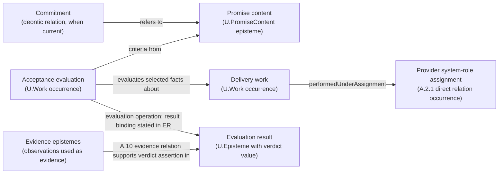

## MATH.21 - Construct an Object through Convergent Approximations

> **Type:** Method pattern
> **Status:** Draft
> **Normativity:** Normative unless marked informative

### MATH.21:1 - Problem frame

Use this pattern when a number, function, infinite structure or other mathematical object is to be obtained from increasingly informative constructions, and the work needs to establish what their limit is and what can be done with it. A formula, finite prefix or finite family can describe an approximation even when the object it describes is infinite.

The governing question is what the receiving argument or operation must retain as approximation improves. Examples include a value within a tolerance, the settled first part of an infinite sequence, or a function whose integral or derivative can be obtained from approximating functions. These requests can require different notions of convergence.

**First useful move:** state one requested observation or operation on the intended object, then find a condition under which an approximation supplies it. A shrinking interval can answer a numerical tolerance request. A compatible prefix can answer a request for finitely many entries. This gives a usable result before constructing every property of the limiting object.

The reader needs elementary reasoning about functions, sequences and inequalities. The numerical case introduces its use of real completeness; the function case also uses elementary differentiation. Other spaces require the knowledge needed to state their convergence and operations.

Use an already supplied object or applicable limit theorem when it answers the question. Use the fuller method when existence, retained structure, or use of a finite approximation remains unresolved. Physical adequacy and computational realization add their own questions to the mathematical construction.

### MATH.21:2 - Problem

Finite stages can look increasingly satisfactory while leaving the mathematical result undetermined. The intended limit may be absent from the chosen space. Agreement at each fixed input may fail to control all inputs together. An operation valid on every stage may cease to be valid at the limit.

Even established convergence can leave a practical question open: which stage supplies the requested result? Conversely, a finite observation can be available before an entire limiting construction has been resolved. The method must connect the convergence claim to the particular subsequent use.

### MATH.21:3 - Forces

| Force | Tension |
| --- | --- |
| Finite access | A finite construction can supply an observation of an infinite object without exposing all its properties. |
| Choice of space | A sequence can have a limit in a larger space while lacking one among the originally admitted objects. |
| Strength of convergence | A stronger condition can preserve more operations but require unnecessary work for a weaker request. |
| Representation | Different approximation families can construct the same object; their operations must respect that identification. |
| Existence and obtaining | A theorem can establish a limit while leaving the procedure for a requested approximation unspecified. |
| Reuse | An established convergence theorem saves work when its hypotheses match the new construction. |

### MATH.21:4 - Solution

**Local mantra:** name the limiting object and its next use; construct the approximation family; choose and establish convergence; obtain the object in the admitted space; carry only the justified properties and operations; return a sufficient finite result or the remaining mathematical question.

#### MATH.21:4.1 - State what approximation must preserve

Name the space of intended objects, the approximating objects and how the latter are compared with the former. If they initially have different kinds, supply an embedding or interpretation. For example, a rational number can approximate a real number; a finite word can determine the beginning of an infinite word.

State the requested result. Does the receiver need a value, an operation on the limit, an existence theorem, or a finite observation? For a numerical use, specify the error quantity and tolerance. For a prefix use, specify which entries must be settled. The mathematical question determines the approximation requirement.

Choose a convergence notion that supports that result. In a metric space, with distance d, a sequence x_n converges to x when, for every positive epsilon, all sufficiently late terms satisfy d(x_n,x)<epsilon. For functions, pointwise convergence allows the sufficiently late index to depend on the input; uniform convergence requires one index to work for all inputs in the named set. For infinite words, convergence can mean eventual agreement on every fixed finite prefix.

These are different constructions of the convergence requirement. Use their definitions to decide what they permit. Numerical distance is useful when it measures the requested difference; finite observation or another mathematical relation can be more suitable elsewhere.

#### MATH.21:4.2 - Construct and compare the finite stages

Give the approximating rule and establish the relations on which improvement depends. For nested intervals, prove containment and decreasing width. For compatible prefixes, prove that later stages retain the earlier entries. For a series or iterative construction, obtain a bound on the unresolved remainder.

The same argument must cover the stages used by the conclusion. A finite sample can suggest a bound or expose a failure; a claimed statement about all later stages needs the corresponding argument.

When the candidate limit is not yet available, a Cauchy condition can express progress using only the approximations. In a metric space it says: for every positive epsilon there is N such that d(x_m,x_n)<epsilon whenever m and n are at least N. This compares the entire remaining tail.

If a stopping rule uses only successive changes, derive how they bound the remaining tail. Successive changes of size 1/n become small, yet their accumulated sum is unbounded. A summable bound, a contraction estimate or another proved remainder relation can make a successive-change test useful.

Retain a cheaper construction when it already supplies the requested observation. Refinement need not improve every property at every stage.

#### MATH.21:4.3 - Obtain the limit where it is needed

If a candidate object is already available, prove convergence to it by the selected definition or a suitable theorem. Otherwise use an existence result whose conditions the approximation satisfies.

For example, completeness of a metric space means that every Cauchy sequence in it has a limit there. Establishing a Cauchy condition and applying a known completeness result can obtain an object without guessing its closed form. A local existence argument may suffice even when the whole space is incomplete.

When the limit falls outside the original objects, decide whether the receiving work admits an extension. Construct the new objects and the embedding of the old ones; prove the properties the subsequent work will use. One route takes suitable Cauchy sequences as representations and identifies those whose mutual distance tends to zero. MATH.2 supplies the quotient operation: operations on equivalent representatives must produce equivalent outputs, so the quotient result is independent of the representative. The real-number construction is one instance of this route.

Establish uniqueness when the receiver needs a single result. In a metric space, if x_n tends to both x and y, the triangle inequality gives d(x,y)≤d(x,x_n)+d(x_n,y); the right side can be made arbitrarily small, so x=y. Other convergence structures need their own uniqueness condition or an explicitly retained class of possible limits.

If convergence or existence fails, return the failed condition and the still valid finite information. That can suggest a different space, a different approximation family, or a weaker requested conclusion.

#### MATH.21:4.4 - Pass properties and operations through the limit

For every operation used next, establish the relevant interchange. If F is continuous for the chosen source and target convergence, x_n→x gives F(x_n)→F(x). The argument can be local to this family; global continuity is sufficient in many cases but is more than every use needs.

Check the property actually consumed. A limit of objects in a closed subset remains in that subset. Other properties can disappear: finite words padded with zeros can converge to an infinite word with infinitely many ones.

For a function limit, distinguish a claim about its values from a claim about integration or differentiation. The required limit theorem may ask for uniform control, domination, or another hypothesis specific to the operation. In :5.3 a uniform value bound supports integration over a finite interval, but it does not support differentiating the approximations to obtain the limiting derivative.

When an interchange fails, retain the established limit and repair the affected operation. Strengthen the convergence condition, choose another family, restrict the domain, or calculate that operation by a different argument. Select the repair from the receiver's need.

#### MATH.21:4.5 - Obtain a sufficient finite result

Translate the receiving request into a condition on a stage. If an established bound gives d(x_n,x)≤e_n, a stage with e_n within the requested tolerance supplies the approximation. For nested numerical intervals, the midpoint has error at most half their width. For compatible prefixes, a stage containing all requested entries supplies them.

When execution must find that stage, provide either an obtaining rule or a recognizable stopping condition with a reason it will be reached. An explicit rate of convergence is one option. An enclosure whose width can be checked during refinement may suffice without a rate fixed in advance.

A residual is useful only through its established relation to the requested error. A small equation residual can accompany a large error in the unknown; the comparison needed by the use must connect them.

Return the approximation with the mathematical bound or settled observation it supplies. If only existence has been established, retain that result and identify the missing obtaining procedure for a computational continuation. Numerical conditioning, finite arithmetic and execution cost belong to that continuation.

#### MATH.21:4.6 - Use and revise the construction

Use the limiting object in the argument, or use the finite result for the selected observation. Keep the convergence notion and any condition needed by the next operation with that use.

A changed tolerance can require a later stage. A changed operation can require a stronger convergence result. A changed space can remove existence or uniqueness. Reopen the affected argument and retain the finite constructions and proved consequences that survive.

In modeling, interpret the resulting mathematical consequence against the subject using C.29 and the corresponding modeling method. The approximation's mathematical convergence and its ability to answer the subject question remain separately assessable.

### MATH.21:5 - Archetypal Grounding

#### MATH.21:5.1 - Obtain a real object from rational intervals

The task is to construct a positive number r with r²=2 and obtain rational approximations with a chosen absolute error.

Start with l_0=1 and u_0=2. At each step take the rational midpoint m. If m²≤2, replace the lower endpoint by m; otherwise replace the upper endpoint. Squaring is increasing on the positive interval, so each step retains l_n²≤2≤u_n². The intervals are nested and their widths are 2⁻ⁿ.

The lower endpoints form a bounded increasing sequence. In the real numbers, their supremum r exists. Each l_n≤r≤u_n: every later lower endpoint is at most u_n, and earlier ones are no larger than l_n. The shrinking width makes this r the only common point.

Both r² and 2 lie between l_n² and u_n². Since the endpoints stay between 1 and 2, the width of this squared interval is (u_n-l_n)(u_n+l_n)≤4·2⁻ⁿ. It tends to zero, so r²=2. This obtains the desired object without presupposing a square-root value to drive the construction.

After four bisections the interval is [22/16,23/16]. Its midpoint 45/32 differs from r by at most 1/32. For a smaller tolerance epsilon, choose a stage with 2⁻ⁿ⁻¹≤epsilon, or refine until the interval width is at most twice epsilon.

**Changed space.** If the result must remain rational, existence fails. In a fraction p/q in lowest terms, p²=2q² would make p even, and then q even, contradicting lowest terms. The rational approximations and their widths remain available, but they construct a real number rather than a missing rational solution. The next decision concerns admitting that extension or retaining a finite rational answer.

#### MATH.21:5.2 - Construct an infinite word and return a finite observation

Let p_n be a binary word of length n, with p_n a prefix of p_(n+1). Positions start at zero. Define b(k) to be entry k of p_(k+1). Compatibility makes that entry agree with every later prefix, so b is an infinite binary word whose first n entries are p_n.

For a common space of approximations, pad each p_n with zeros to obtain an infinite word b_n. Use convergence by eventual agreement on each finite prefix. For a request about the first m entries, every b_n with n≥m agrees there with b. This proves convergence and gives the return stage: p_m supplies those entries. Any calculation depending only on them, such as their count of ones, can use that finite result.

The global property "has only finitely many ones" does not pass to this limit. Take p_n to consist of n ones. Each zero-padded b_n has finitely many ones, but b has a one at every position. A question about a fixed finite prefix is settled; a question about the entire tail needs another argument.

The construction uses a consistency relation between finite stages and a rule for obtaining every entry. Its computational realization additionally needs a way to obtain the required p_m. Merely knowing that such prefixes exist does not supply their generator.

#### MATH.21:5.3 - Preserve values and integrals, then inspect differentiation

For n≥1, let f_n(x)=sin(nx)/n on [-1,1]. The inequality |f_n(x)|≤1/n holds for every input in the interval. Thus the functions converge uniformly to f(x)=0.

For a requested value error epsilon, n≥1/epsilon is sufficient. Integration over the interval is also controlled: the absolute integral of f_n-f is at most 2/n, by the interval length and the uniform bound. This estimate supplies an integral-error result without depending on cancellation of positive and negative values.

Now ask for the derivative at zero. Each f_n has derivative cos(nx), so f_n'(0)=1 for every n. The limit function has f'(0)=0. The value convergence therefore fails to justify passing this operation through the limit, even at that one point.

One possible sufficient repair, for differentiable functions on a common open interval, is pointwise convergence of the functions together with locally uniform convergence of their derivatives. A suitable limit theorem then identifies the limiting derivative. The present f_n fail that condition. If the construction can change, a family with controlled derivatives can support the stronger use; if it must stay fixed, obtain the derivative of its limit by another argument.

The result retains uniform convergence and its finite value and integral bounds. Only the derivative interchange has been refused. This is why the requested next operation belongs in the initial choice of approximation.

### MATH.21:6 - Bias-Annotation

Numerical examples can make convergence look like increasing decimal accuracy. The prefix case exposes another form: agreement on finitely many observations of an infinite object. Function examples show that even numerical convergence has different strengths according to the subsequent operation.

The examples use ordinary classical mathematics. An effective or constructive account must retain the obtaining information its logic and representation require. A user of a known complete space can apply its theorems directly; a constructor of a new space must establish the relevant properties of that construction.

### MATH.21:7 - Conformance Checklist

For the proposed construction:

- The intended space, approximation family and comparison between their objects are stated.
- The receiving observation or operation determines the convergence requirement.
- The general argument covers the stages claimed, including the unresolved tail when it matters.
- The limit exists in the admitted space, or the required extension is justified.
- Uniqueness and representative independence are established where the subsequent use needs them.
- Each retained property or limit interchange has its applicable condition.
- A finite return supplies the requested error or observation; an executable return has an obtaining or stopping rule.
- A failed condition leaves the remaining valid construction and a useful next question identifiable.

### MATH.21:8 - Common Anti-Patterns and How to Avoid Them

**Small increments used as a tail bound.** The harmonic increments in :4.2 shrink while their sum grows. Derive a remainder estimate before using such an increment to decide that the requested approximation has been reached.

**An absent limit treated as an object of the original space.** The intervals in :5.1 have no rational point in common. Admit the real extension or return a finite rational approximation.

**A property inherited merely because every stage has it.** Each padded word in :5.2 has finitely many ones; its limit does not. Establish preservation for the particular property.

**A value approximation used for a different operation.** The functions in :5.3 approximate values uniformly but supply the wrong limiting derivative at zero. Inspect the interchange needed by the operation.

### MATH.21:9 - Consequences

The method can obtain new objects, justify a finite use of them, and localize the reason a proposed use fails. A family can remain valuable even when one requested operation does not pass to its limit.

Changing the space, convergence relation or preserved operation can open a further mathematical problem. Those changes also create different modeling and computational possibilities, whose additional costs and subject conditions can then be compared.

### MATH.21:10 - Architectural Rationale

Approximation is a construction through a relation between stages and a result. The relation determines what information accumulates and what a finite stage can supply. This explains the common method across rational intervals, prefixes and functions without making their convergence definitions interchangeable.

Existence, identification of equivalent constructions, preservation of operations and finite return are connected tasks. Quotient construction handles identification; proof construction supplies missing implications; convergence and continuity supply the limiting passage. Keeping their contributions explicit lets a changed operation reopen the relevant mathematical step.

A stronger notion of convergence is useful when it supports a needed consequence. A weaker one is sufficient when it already supplies the receiver's observation. This permits economical use of mathematical results while preserving their conditions.

### MATH.21:11 - SoTA-Echoing

The working question is how a family of approximations supplies an object and the operations needed on it. The selected line combines a convergence relation, an existence argument in the chosen space, preservation of the required operations, and a finite-use condition.

Avigad, Lewis and van Doorn's [Logic and Proof, §§21.3-21.4](https://leanprover-community.github.io/logic_and_proof/the_real_numbers.html#constructing-the-real-numbers) develops the Cauchy-sequence quotient and completeness of the reals. Its construction informs :4.3: specify when approximation families represent the same object and make arithmetic respect that identification. An existing completeness theorem is a cheaper alternative when its space already fits; constructing a new completion is useful when a missing object prevents the intended operation.

[Mathematics in Lean, chapter 11](https://leanprover-community.github.io/mathematics_in_lean/C11_Topology.html) organizes convergence and continuity through filters, while exposing metric versions for ordinary calculations. This supports the generality of :4.1/:4.4 without requiring filter notation for every use. Mathlib's current [uniform convergence](https://leanprover-community.github.io/mathlib4_docs/Mathlib/Topology/UniformSpace/UniformConvergence.html) and [limits of derivatives](https://leanprover-community.github.io/mathlib4_docs/Mathlib/Analysis/Calculus/UniformLimitsDeriv.html) give inspectable statements with different hypotheses. They inform the operation-specific repair in :5.3. Repeated numerical agreement cannot replace those hypotheses; an applicable theorem can avoid repeating its proof.

Bauer and Kavkler's [A Constructive Theory of Continuous Domains Suitable for Implementation](https://math.andrej.com/wp-content/uploads/2008/01/constructive-domains.pdf), 2008, is an implementation-oriented methodological anchor. It compares prescribed approximation rates with interval representations that test a requested width during computation, keeping the logical assumptions of that implementation explicit. The adopted contribution to :4.5 is the choice between a supplied rate and a justified stopping observation. Its particular logic and real-number implementation are alternatives for that branch, not requirements on every convergent construction.

Use the weakest established condition that supports the requested result. Reopen the comparison when the space or operation changes, when a claimed approximation cannot be obtained, or when a different representation supplies the same use with less work. These sources support the stated constructions; choosing a particular numerical algorithm remains a further task.

### MATH.21:12 - Relations

- **MATH.2** identifies equivalent representations and carries well-defined operations to their quotient.
- **MATH.19** constructs an existence, convergence or preservation argument when an intermediate implication is missing.
- **MATH.18** compares different mathematical accounts of a limiting construction.
- **MATH.22** changes assumptions when a needed limit or operation is absent; **MATH.23** develops the resulting conjecture.
- **C.29** interprets the mathematical consequence in its subject. Modeling methods choose the subject-relevant approximation and computational methods obtain its finite realization.
- **B.5.QD and C.40.CD** develop the next useful question after a construction, obstruction or changed use.

### MATH.21:End

## MATH.22 - Change Axioms and Trace Their Consequences

> **Type:** Method pattern
> **Status:** Draft
> **Normativity:** Normative unless marked informative

### MATH.22:1 - Problem frame

Use this pattern when a mathematical assumption excludes a construction you need, a theorem uses a stronger premise than its intended application supplies, or two accounts differ in what they assume. The work is to change the assumptions and establish what the changed theory permits.

An **axiom** is a statement taken as a premise of the theory being developed. A **model of those axioms** is a mathematical structure in which they hold under a stated interpretation. For example, an ordered set interprets an order relation; a collection of permutations interprets composition. This use of model concerns mathematical satisfaction. Applying the structure to an observed subject requires the additional correspondence work in C.29 and MMP.

**First useful move:** isolate one assumption and one construction or conclusion affected by it. Try to derive that conclusion from the remaining assumptions, or construct a case where they hold and the conclusion fails. The result identifies what can be retained and what must change.

The reader needs elementary reasoning about sets, operations, relations and their laws. The examples introduce the group, order and arithmetic assumptions they use. A change of logical inference rules needs the corresponding knowledge of that logic.

If a supplied theorem already works under the available assumptions, apply it. MATH.6 suffices for refuting one proposed consequence. Use the present method when the receiving work needs a revised theory, its changed constructions and its surviving results.

### MATH.22:2 - Problem

A familiar axiom set can make a useful construction impossible or unnecessarily restrictive. Dropping a premise admits more structures, but a familiar proof may then fail. Adding a convenient operation can conceal an existence assumption, and adding a desired law can conflict with laws already retained.

There are different outcomes to establish. A proof might survive unchanged, admit a new proof, need an extra condition, or have a counterexample. A stopped proof search leaves these possibilities unresolved. The revised theory must expose the difference because later reasoning and computation consume its consequences.

### MATH.22:3 - Forces

| Force | Tension |
| --- | --- |
| Generality | Fewer assumptions can cover more structures while supporting fewer conclusions. |
| Stronger constructions | Added axioms can supply an object or simplify a proof while excluding intended cases. |
| Familiar notation | A new symbol can abbreviate an existing construction or introduce a new assumption. |
| Proof reuse | A theorem may remain valid even when its familiar proof uses a removed axiom. |
| Useful metatheory | A small countermodel can settle a local question; a consistency claim about a foundation can require much stronger work. |
| Computational use | An existence principle can support a mathematical argument while leaving an obtaining procedure to be supplied. |

### MATH.22:4 - Solution

**Local mantra:** isolate the assumption and wanted construction; choose the change; build or interpret the changed structures; trace the affected arguments; establish what the comparison warrants; return the revised theory to use.

#### MATH.22:4.1 - Identify the assumption and its mathematical job

State the objects, operations and laws currently used. Find the step where the disputed assumption enters. It may justify rearranging operations, comparing two objects, choosing an element, taking a limit, or introducing an object with a required property.

Distinguish a law about the objects from a logical rule used to infer statements about them. Removing commutativity changes the structures being studied. Restricting proof by contradiction can change the permitted arguments even when the question concerns the same objects.

State the desired gain. Examples include admitting noncommuting operations, retaining incomparable alternatives, obtaining a missing limit, or preserving the computational content of a proof. This gain guides which consequences to examine first.

For a local question, the relevant definitions and proof dependencies are enough. Reconstruct a whole formal foundation only when the conclusion being sought depends on it.

#### MATH.22:4.2 - Choose the change and what stays fixed

With a fixed language and logic, removing axioms weakens the theory: every old model still satisfies the retained axioms, and additional models may become possible. Adding axioms strengthens it: every new model must satisfy the old axioms as well, so some old models may be excluded. Replacing an axiom combines removal and addition; neither direction of inclusion follows automatically.

Name the fixed assumptions and the changed one. If the vocabulary changes too, give the interpretation used to compare the accounts. MATH.18 develops that comparison.

When introducing a symbol for an operation, ask how the operation is obtained. An abbreviation such as d(x,y)=x+(-y) expands into operations already available. If a proposed definition instead asks for the unique object satisfying a property, establish existence and uniqueness on its intended inputs. Calling it a definition does not complete that construction. In :5.2, a least upper bound exists in one order and is absent in another.

An added operation can also require a larger collection of objects. In that case construct the extension and the map from the earlier structure, then establish which old operations and relations the map preserves. MATH.1/.2/.16 supply construction methods for objects and operations. An extension by limits also requires specifying convergence and establishing that the needed limiting objects exist.

#### MATH.22:4.3 - Construct models and separating cases

Give the objects and the interpretation of every operation and relation needed by the claim. Establish each retained axiom. For an infinite family, use a general argument; enumerated cases suffice only when they exhaust the admitted possibilities.

Choose a case that distinguishes the changed theories. To investigate an axiom A relative to retained assumptions T, a model of T in which A fails shows that A is not a consequence of T. A model where A holds shows that adding A is compatible with that model. These are different results, and both can matter.

Use MATH.6 to construct a countermodel. Finite structures are often a cheap first attempt because their operations and relevant failures can be displayed completely. An existing infinite structure with a short argument may be simpler.

If the changed account uses different objects or primitives, an interpretation can carry its constructions into an established theory. Check the translated axioms and the translated steps of inference needed for the result. A picture suggesting an analogy is a starting point for this work.

#### MATH.22:4.4 - Trace the consequences that the receiving work uses

For each required result, locate the affected proof step.

- Retain a proof when its steps use only assumptions that remain.
- Try another proof when the old one uses the removed assumption. A dependency of one proof need not be a necessary premise of the theorem.
- Keep a conditional result when the receiving use can supply the additional premise.
- Return a countermodel when the conclusion fails under the revised assumptions.
- Leave a particular consequence unresolved when neither an argument nor a countermodel has been obtained.

Apply the same reasoning to constructions. Check whether their inputs are still admitted, the operations remain defined, and the properties used by the next step still follow. For example, :5.1 retains cancellation after dropping commutativity but loses unrestricted rearrangement of factors.

When a proof is formalized, its recorded dependencies can help find affected steps. They report what that proof uses. A claim that no proof can avoid an axiom requires an additional argument.

If the result will generate data or a program, trace what the new principle supplies operationally. An existence argument and an effective construction support different next uses. MATH.12 handles extraction; the relevant computational method handles execution and cost.

#### MATH.22:4.5 - State what the model or proof establishes

In a sound interpretation of a deductive system, a proof preserves truth in every model of its premises. Therefore a model of T where A fails rules out a proof of A from T. If another model of T satisfies A, it likewise rules out a proof of not-A. Together these establish that A is independent of T, relative to the logic and semantics being used.

A model also supports consistency: a sound derivation of a contradiction from its axioms would have to make a contradiction true in that model. The construction of the model relies on background mathematics. Keep that dependence when reporting a consistency result, especially when comparing foundations. A failure to find a contradiction supplies no such construction.

For a definitional extension, expand the new symbols in the affected claims and arguments. When all new operations are definable in the old theory and the definitions can be eliminated, conclusions stated wholly in the old language retain their old justification. If an existence principle or inference rule has been added, examine its consequences separately.

The preceding model arguments use their stated semantics. A change to intuitionistic, dependent-type or another logic requires an interpretation sound for its own rules; an arbitrary transfer of classical model arguments could answer the wrong question.

#### MATH.22:4.6 - Use the revised theory

Return the changed assumptions together with the construction, theorem or obstruction needed by the receiving work. Carry the conditions under which it can be used. An unresolved consistency or consequence question can be handed to a collaborator without presenting it as settled.

Choose between revised theories by the work they enable and the costs they impose. One can admit more objects, another can make a needed construction available, and another can retain an effective procedure. FPF's ordinary characterization and choice methods apply when these alternatives must be compared; the present method supplies their mathematical consequences.

Use the changed result to reformulate a model, modify a method, or pose the next mathematical problem. For a new conjecture, state which further relation might hold under the retained assumptions. A later failure reopens the assumption or inference on which the failed use depends.

### MATH.22:5 - Archetypal Grounding

#### MATH.22:5.1 - Drop commutativity while preserving invertible composition

Suppose a collection has an associative operation, an identity e and an inverse for every element. These are the group assumptions. Add commutativity, xy=yx, and familiar rearrangements become available. For example, MATH.19's argument proves `(xy)^n=x^n y^n`.

The intended new use composes invertible operations whose order matters. Remove commutativity and retain the group assumptions.

Cancellation survives, although its proof may change. A commutative proof multiplies `ax=ay` on the right by the inverse of a, then rearranges `axa⁻¹` and `aya⁻¹` to obtain `x=y`. This uses commutativity. A replacement proof multiplies on the left: `a⁻¹(ax)=a⁻¹(ay)`. Associativity gives `(a⁻¹a)x=(a⁻¹a)y`, hence `x=y` by the inverse and identity laws. The theorem therefore survives after removing commutativity.

Unrestricted rearrangement fails. Consider all permutations of {1,2,3}, composed with the rightmost permutation acting first. Composition is associative, the identity leaves each element fixed, and each bijection has an inverse. Let f swap 1 and 2, and let g swap 2 and 3. Then fg sends 1 to 2 to 3 to 1 as a cycle, while f² and g² are identities. Thus (fg)² sends 1 to 3, but f²g² sends 1 to 1.

This is a model of the group assumptions with noncommuting elements. The two-element group {e,h}, with h²=e, is a model where every pair commutes. Under ordinary classical group logic, the two models show that commutativity is independent of the retained group axioms.

The revised theory now admits ordered compositions. It retains cancellation and inverses. Rearrangement remains usable for particular pairs whose commutation is established; it has ceased to be a general permission.

#### MATH.22:5.2 - Remove total comparability and inspect a proposed new operation

A partial order is reflexive, antisymmetric and transitive. A total order additionally compares every pair: x<=y or y<=x. Suppose the work needs to retain pairs for which neither direction holds.

Remove total comparability. On pairs of natural numbers, define (a,b)<=(c,d) when a<=c and b<=d. The three partial-order laws follow coordinate by coordinate. The pairs (1,0) and (0,1) are incomparable. The ordinary order on natural numbers supplies a model with total comparability; the pair order supplies a model without it.

Now ask for a least common upper bound of two objects. In the pair order, it is the coordinatewise maximum. It is above both inputs, and any common upper bound is above each coordinatewise maximum. This proves both the construction and its leastness.

The partial-order axioms alone do not supply that operation. Take four distinct objects a,b,u,v. Besides reflexive comparisons, require a<=u, a<=v, b<=u and b<=v, and no others. This is a partial order. Both u and v are upper bounds of a and b, but neither is below the other; a and b are not upper bounds. There is no least upper bound of the pair.

Consequently, writing "x join y" for every pair in an arbitrary partial order adds an existence requirement unless a construction has already supplied it. The work can select an order where joins exist, add the join assumption and accept its narrower class of models, or undertake a construction that enlarges the objects. Choosing one of u or v alone supplies an upper bound, not the missing least one.

This separates two changes that a generic instruction to "relax the order" would hide: allowing incomparability and requiring a combining operation. A model of alternatives can use the resulting order; any decision to prefer one alternative remains a separate choice.

#### MATH.22:5.3 - Introduce total reciprocal notation without retaining a false law

Suppose arithmetic uses field laws, including `0!=1` and distributivity, and the reciprocal law `x*inv(x)=1` for `x!=0`. The proposed change makes inv a total operation and asks that same law to hold at zero.

The retained laws already imply `0*y=0`. Indeed, `(0+0)*y=0*y+0*y` by distributivity, and cancelling one `0*y` from `0*y=0*y+0*y` leaves `0=0*y`. The proposed new reciprocal law at zero would therefore imply `0=1`. The retained assumptions and the new law conflict.

A different change works: over the rational numbers, define `inv(0)=0` and `inv(x)=1/x` for `x!=0`. This gives a total operation, retains the nonzero reciprocal law, and leaves the field operations unchanged. It has not made cancellation of a zero factor valid.

For a use involving the equation `x*y=x*z`, cancellation still requires `x!=0`. At `x=0`, all rational y,z satisfy the equation. A calculation using total reciprocal notation must retain that condition or inspect the zero case.

The result is a consistent construction within rational arithmetic and a revised law with its condition, rather than the initially requested unconditional inverse law. Total notation and stronger algebraic permission have been separated.

### MATH.22:6 - Bias-Annotation

Familiar structures can make their extra laws feel unavoidable. The permutation and partial-order cases expose assumptions that integers with addition or a single numerical scale can conceal.

The examples use elementary classical structures so that the changed laws can be inspected directly. They demonstrate the method without deciding between competing foundations of mathematics. A foundational change needs its own interpretation and consequences, including any change in constructive use.

### MATH.22:7 - Conformance Checklist

For the change being made:

- The altered axiom, definition or inference rule and the assumptions retained are identifiable.
- The desired construction or consequence explains why the change is useful.
- A claimed model supplies the required objects and interpretations and satisfies every retained axiom.
- A definition has its required existence and uniqueness, or the additional assumption is stated.
- Reused proofs survive at the steps that matter; a lost proof is distinguished from a refuted theorem.
- Independence, consistency and non-derivability claims have the appropriate model or argument and retain their background assumptions.
- The receiving use gets the revised consequence with its applicability and any obtaining procedure still needed.

### MATH.22:8 - Common Anti-Patterns and How to Avoid Them

**Removing a premise while retaining its rewrite permission.** Dropping commutativity in :5.1 permits noncommuting operations. Reordering their factors requires a local commutation argument.

**Defining an object that need not exist.** The four-object order in :5.2 has common upper bounds but no least one. Supply a construction or change the assumptions before using join as a total operation.

**Extending notation and silently strengthening a law.** Total reciprocal notation in :5.3 is available with a conditional inverse law. The unconditional law contradicts the retained arithmetic.

**Treating a failed proof as independence.** The proof may need a different lemma. Establish non-consequence through a separating model or a suitable metatheoretic argument. For the model route in :4.5, establish both directions of separation before claiming independence.

### MATH.22:9 - Consequences

The result exposes which generalizations preserve a useful conclusion, which additions buy a new construction, and which changes require a different problem. A small separating structure can prevent repeated attempts to derive a false consequence.

Changing axioms can also open a family of new questions. Which maps preserve the revised structure? Which previous constructions still work? Can a missing operation be supplied by extending the objects? These questions continue the mathematical development and give modeling or methodological work new usable constructions.

### MATH.22:10 - Architectural Rationale

A proof states what follows from assumptions. A model makes their simultaneous satisfaction and separating consequences inspectable. Using both permits directed theory change: follow a needed construction to its assumptions, change them, and return the consequences to that construction's use.

MATH.6 constructs countermodels, MATH.18 compares accounts through interpretations, and MATH.19 constructs missing arguments. Here these methods support a revised theory whose consequences can be used deliberately.

Logical consistency, mathematical fruitfulness and correspondence to an observed subject answer different working questions. The first controls what the axioms jointly permit; the second concerns the further constructions and questions they open; the third requires subject knowledge and observation. Their connection supports mathematical modeling without making one stand in for the others.

### MATH.22:11 - SoTA-Echoing

The working question is how to change mathematical assumptions while retaining justified and useful consequences. The selected line combines proof-dependency analysis, construction of models and interpretations, and explicit separation of definitional change from added principles.

**Adopt the model-and-consequence method.** The Open Logic Project's [Models and Theories](https://builds.openlogicproject.org/content/first-order-logic/introduction/models-theories.pdf) makes the relation between axioms and satisfying structures explicit. [Logic and Proof, §§10.1-10.5](https://leanprover-community.github.io/logic_and_proof/semantics_of_first_order_logic.html) supplies interpretation and soundness for the first-order branch. These are method sources for :4.3/:4.5. Their use defeats an inference from unsuccessful proof search to non-consequence: a separating structure supplies the needed reason. A known theorem or short existing interpretation is cheaper when it already settles the same question. The chosen branch accepts the cost of constructing a model when that difference remains unresolved.

**Adapt dependency analysis to the required return.** [Theorem Proving in Lean 4, Axioms and Computation](https://lean-lang.org/theorem_proving_in_lean4/Axioms-and-Computation/) explains how added principles affect proof and computational interpretation, and how axiom dependencies can be inspected. This changes :4.1/:4.4: trace the principle actually used and what a later construction can obtain. Reading a proof's dependencies is a useful alternative to rebuilding it. That inspection alone does not settle whether another proof avoids the principle. A non-derivability claim needs a separate argument, such as a separating model under the stated soundness assumption. The source describes one formal system; Lean use is optional, and its evaluation mechanisms are not generalized to all mathematics.

Retain these approaches while their constructions answer the local question at acceptable effort. Reopen the comparison when the logic changes, a proposed interpretation fails, another proof removes the alleged dependency, or the receiving use needs computational content that the revised theory has not supplied.

### MATH.22:12 - Relations

- **MATH.6** constructs a countermodel; **MATH.18** compares accounts through interpretations.
- **MATH.19** constructs or replaces affected arguments; **MATH.12** recovers their constructive output.
- **MATH.1/.2/.16** supply construction methods when a changed theory needs different objects or operations.
- **B.5.FM, B.5.TC and C.29** use the resulting assumptions and structures in reformulation, theory change and correspondence to a subject.
- **MMP and the relevant CMP methods** use the revised mathematical construction, adding subject interpretation or an executable procedure when required.
- **ME** can use this mathematical account to change formal descriptions of methods; the behavior of the described work still needs its own justification.

### MATH.22:End

## MATH.23 - Develop a Conjecture by Changing a Construction

> **Type:** Method pattern
> **Status:** Draft
> **Normativity:** Normative unless marked informative

### MATH.23:1 - Problem frame

Use this pattern when a mathematical construction works in some cases, fails after a change, or reveals a relation that could support a new theorem. You need to formulate the next claim and a way to investigate it.

A **conjecture** is a mathematical assertion proposed for investigation. Developing it includes choosing its objects, assumptions, quantifiers and conclusion. The result can become a theorem, a refuted claim, or a more useful question. Its value lies in what the answer would let someone construct, infer, explain or change.

**First useful move:** change one mathematically consequential part of the construction and compare what happens. Replace a parameter by a variable, combine two outputs, remove a used assumption, or ask the same operation to preserve another property. Try the changed construction and identify the equation, condition or obstruction that controls its result.

The reader needs the mathematical operations used by the starting construction and elementary proof reasoning. The examples explain their additional operations; the last example develops a limit argument. The method can be performed by a person, an AI agent or cooperating contributors with the needed preparation.

Use an established result when it already answers the question. MATH.19 helps prove a sufficiently clear claim. B.5.QD develops questions more generally. Here the work develops a mathematical assertion through construction, variation, proof analysis and counterexamples.

### MATH.23:2 - Problem

A list of successful cases leaves many possible general claims. A formula can match every computed value and fail beyond them. A proposed proof can depend on a property absent from the conjecture. Conversely, a failed conjecture can reveal a useful operation or a stronger question.

The difficulty is to extract a relation that can be investigated generally. Changing a number produces another instance; changing the construction law, allowed maps or quantifier can create a new problem. The latter change needs a mathematical reason and a feasible first attack.

### MATH.23:3 - Forces

| Force | Tension |
| --- | --- |
| Examples guide invention | Their generating rule may conceal a restriction that the conjecture omits. |
| Generality increases reuse | A broader claim can lose the construction that made the original case work. |
| Counterexamples improve understanding | Excluding a troublesome case can also discard the phenomenon the work needs to understand. |
| Computation expands exploration | Search quality depends on representation, tested cases and the property being evaluated. |
| A new problem opens work | Its first attainable result can be much smaller than the eventual theorem. |
| Results and methods develop together | An answer can be useful immediately while its construction opens further questions and transfers. |

### MATH.23:4 - Solution

**Local mantra:** recover the construction and its use; vary a consequential ingredient; express the suggested law; seek its reason and a separating case; revise the assertion or construction; choose and begin the next useful problem.

#### MATH.23:4.1 - Recover what makes the starting construction work

Write the inputs and the operations that produce the result. Identify a relation the result satisfies and where that relation is used. Separate what has been proved from what has only occurred in inspected cases.

Look inside the operation. Repeated updates may expose a recurrence. Combining two constructions may expose closure or an order dependence. A successful quotient may reveal which distinctions can be discarded. MATH.17 helps make the operations themselves available for this investigation.

When a program supplies examples, recover the class it actually generates. For instance, a generator that produces only trees cannot investigate a claim about arbitrary graphs unless the missing graph classes are handled elsewhere. The representation and evaluator are part of the available mathematical experiment.

#### MATH.23:4.2 - Construct a variation with a reason

Choose an ingredient whose change could affect the wanted relation. Useful mathematical moves include:

| Starting opportunity | Construction of the next problem |
| --- | --- |
| Several parameter values work similarly. | Replace the parameter by a variable, derive the update rule and ask which identity holds over its domain. |
| Two outputs can be combined. | Define their combination and ask whether it remains in the same class and preserves the required relation. |
| A proof uses a special hypothesis. | Remove or weaken it, locate the affected inference and ask for a replacement condition or counterexample. |
| A desired property fails. | Isolate the obstruction and ask whether it completely characterizes failure or only gives one sufficient obstruction. |
| The result survives a change of representation. | Construct the interpretation and ask which assertions, operations and equalities it preserves. |
| An approximation supports a limiting claim. | State the order of its quantifiers and ask which operations or properties survive the limit. |

These are possible operations, not required stages. Choose the one selected by the construction. MATH.8/.11/.13 supplies symmetry or invariant reasoning; MATH.18 supplies interpretations; MATH.22 develops changed assumptions. Use their fuller methods when that mathematical contribution is needed.

Keep the original use visible. Requiring equal-sized groups repairs a mean-of-means formula, but leaves a request about arbitrary groups unanswered. The latter needs another construction, as in :5.2.

#### MATH.23:4.3 - State the proposed law and its answer form

Give the objects, domains, allowed operations, assumptions and proposed conclusion. In particular, make the quantifiers distinguishable. These statements ask different questions:

- For each input, some construction has the property.
- One construction works for every input.
- Every admitted construction has the property.

A finite pattern of results can suggest a formula. Derive it from the generating operation, a recurrence, an invariant or another mathematical relation when possible. If that derivation is missing, retain the formula as a conjecture and identify the step that would establish it.

Say what would resolve the present question. An explicit construction, a characterization of all admissible cases, a bound, or a counterexample can open different next uses. A conjectured optimal construction needs both an attainable value and an argument excluding better ones when optimality is the required conclusion.

Check whether the proposed law is already a known result under another description. MATH.18 can compare representations. An available theorem can close this question and expose a more useful next one.

#### MATH.23:4.4 - Alternate a proof attempt with revealing cases

Use MATH.19 to find intermediate claims connecting the construction to the proposed conclusion. Identify which mathematical property each step consumes. This can expose a condition that the conjecture has not yet stated.

At an uncertain step, construct a case that challenges that condition. Prefer one that distinguishes plausible accounts. To test whether a summary supports composition, find inputs with the same summary and place them in the same surrounding construction. If their required outputs differ, the summary has lost information that composition needs.

Inspect the status of a failure. A counterexample satisfying the conjecture's premises refutes the conjecture. A failure of an auxiliary lemma may leave a different proof possible. A failed program may instead concern its representation or implementation. Recover the mathematical obstruction before revising the claim.

Computational search can propose constructions and counterexamples. Check a returned candidate against the mathematical conditions that its use requires. For a finite explicit object, this may be a small complete calculation. Sampled tests of an infinite family leave its universal claim to be justified.

#### MATH.23:4.5 - Revise the claim without hiding the lost use

Use the failure to choose the next mathematical change. Three common returns are:

1. **Repair a hypothesis.** State the condition that makes the failed lemma work, prove its sufficiency and check whether the intended cases satisfy it.
2. **Repair the construction.** Retain the original problem and change the objects, representation or operation so that the required property can be obtained.
3. **Change the conclusion.** Obtain a conditional answer, bound, obstruction or weaker property that still serves a useful question.

A sufficient condition can be worth developing before necessity is known. Label that difference: a proof that uniform convergence preserves continuity does not show that every continuous limit was obtained uniformly.

A counterexample can itself become a constructive ingredient. Ask what class it belongs to, which transformations preserve its obstruction, and which related conjectures it can test. The new question can concern the method of generating cases as well as the cases themselves.

Retain the result that survived. Changing the theorem should not erase a valid construction or an earlier unresolved requirement.

#### MATH.23:4.6 - Choose a next problem and begin its mathematical work

Compare the few continuations whose answers would change further work. A useful result can supply a missing lemma, a reusable combining operation, an explanation of failure, or a method that makes another class of questions approachable. Immediate engineering application is one possible use; developing a new mathematical operation can also enable later inquiry whose destination is not yet known.

Choose a first attempt that the available contributors can perform. For a broad characterization, this might be one direction of the theorem. For an extremal problem, it might be one explicit improved construction or a bound. For a limit question, it might be the estimate needed to justify one passage to the limit.

Return the conjecture, the mathematical basis that suggested it, the most revealing success or obstruction, and the next operation. An expression and a short argument can carry this result.

Use B.5.QD and C.40.CD when several questions and ways must develop together. E.10.INT helps distinguish the interest of further possible work from surprise, fame or a search score. C.36.RP supplies retention of the reconstructible method when continuing capability is at stake. Obtain further observations or checking only when their possible outcomes can change the next move enough to justify the effort.

### MATH.23:5 - Archetypal Grounding

#### MATH.23:5.1 - From repeated instances to a family of operations

Repeatedly apply `f(x)=a*x+b` over real numbers. A few calculations give:

`f²(x)=a²*x+(a+1)*b`,

`f³(x)=a³*x+(a²+a+1)*b`.

The useful next question is how to represent any number of repetitions without expanding every substitution. The conjectured formula is:

`f^n(x)=a^n*x+b*S_n`, where `S_0=0` and `S_n=1+a+...+a^(n-1)` for `n>0`.

Recover the generating rule. Applying f once more changes the coefficient of x from `a^n` to `a^(n+1)`, and the constant from `b*S_n` to `b*(a*S_n+1)`. The identity `S_(n+1)=a*S_n+1` therefore supplies the induction step. At `n=0`, `f^0` is the identity and `S_0=0`. The formula is proved for every natural n.

Now vary the problem: combine two potentially different maps `f(x)=a*x+b` and `g(x)=c*x+d`. Their composite is:

`f(g(x))=(a*c)*x+(a*d+b)`.

This constructs an operation on coefficient pairs: `(a,b)` composed with `(c,d)` gives `(a*c,a*d+b)`. The class is closed under composition. MATH.17 can study this operation; a computational method can use it to combine repetitions.

Order now becomes a useful question. Reversing the maps gives the same linear coefficient but constant `c*b+d`. Thus they commute exactly when `d*(a-1)=b*(c-1)`. This condition says when reordered operations retain the result.

The progression has produced a general iteration formula, a closed combining operation and a condition for rearrangement. A further question about vector-valued affine maps needs its matrix composition law; scalar commutation cannot be silently carried into that new setting.

#### MATH.23:5.2 - A failed combination produces a better summary and another conjecture

A computation stores the arithmetic mean of each nonempty group of real numbers. The proposed combining operation takes the mean of those means. For groups [0] and [2,4], it returns (0+3)/2=1.5, while the combined group has mean 2.

Inspect the missing mathematical relation. Each group mean gives a total only when its group size is known. Equal group sizes make the proposed operation work, but arbitrary groups require another construction.

Retain a sum s and count n. Combine (s,n) and (t,m) as (s+t,n+m), then return (s+t)/(n+m) when n+m>0. Associativity and commutativity follow from those of addition in both coordinates; (0,0) is an identity. Thus grouping and order of the combination do not change the final mean in real arithmetic. A finite-precision implementation needs its own error account.

The construction opens a broader mathematical question: **Which summaries permit the summary of a combined input to be computed from the two summaries alone?**

Let q map a collection of finite lists, closed under concatenation, to proposed summaries; let ++ concatenate lists. Means and medians here use nonempty lists, while sum and count also admit the empty list. A necessary condition is:

if q(u)=q(u') and q(v)=q(v'), then q(u++v)=q(u'++v').

It is also sufficient for defining a combining operation on attained summaries: choose lists representing the two summaries and apply q to their concatenation. The condition makes the result independent of those choices. This proves mathematical existence of the operation. Computing it from a concrete representation of the summaries still needs an effective rule. MATH.2 develops the compatible identification; MATH.12 and CMP handle obtaining the operation.

For means alone, take u=[0], u'=[0,0], and v=v'=[6]. The input summaries match, but the concatenated means are 3 and 2. The necessary condition fails. Sum and count repair it by an explicit operation.

Now ask whether median and count suffice. Take u=[0,1,100] and u'=[-100,1,2]. Each has count 3 and median 1. Append the same list [50,50]. The resulting five-element medians are respectively 50 and 2. This new conjecture is refuted by the same method.

The next useful problem concerns what more to retain. Sorted full lists are sufficient and can be merged, while a use requiring less storage can ask for a restricted input class or an approximate median with a stated error. The mathematical obstruction now informs a computational and modeling choice.

#### MATH.23:5.3 - A failed limit argument reveals a stronger condition

Consider the claim that a pointwise limit of continuous real functions is continuous. On `[0,1]`, let `f_n(x)=x^n` for positive natural n. Each function is continuous. At any fixed `x<1`, `x^n` tends to zero; at `x=1` it equals one. The limit f is zero below one and equals one at one, so it is discontinuous.

Locate the failed proof step. Pointwise convergence lets the approximation index depend on x. Continuity near a point needs control over nearby x together. Choosing a good approximation at the one point alone does not control its neighborhood.

This suggests a sufficient condition: **uniform convergence**. For every positive error allowance, one index makes all later approximations close to f at every point of the domain.

Work the proposed repair. Fix a point x0 and an error allowance e>0. Choose N so that the approximation error between f_N and f is less than e/3 everywhere. Continuity of f_N gives a neighborhood of x0 in which the difference between f_N(x) and f_N(x0) is less than e/3. The triangle inequality bounds the difference between f(x) and f(x0) by these three errors, hence by e. This proves continuity of f at x0.

The repaired theorem supplies a condition for transferring continuity. Here proof analysis discovered which quantifier change made the desired inference possible. A subsequent limit construction can use the proved condition to retain continuity.

Uniformity is sufficient, not necessary. On the domain `[0,1)`, the same `x^n` sequence has the continuous limit zero, but convergence is not uniform: for every n there is an `x<1` with `x^n=1/2`. The next question can therefore seek a weaker condition suited to the receiving use, rather than treating uniform convergence as the definition of every acceptable limit.

### MATH.23:6 - Bias-Annotation

Small examples are chosen to expose a relation and permit a full calculation. In a larger inquiry, simple generators can miss structures with different behavior. Change the generating rule or inspect a contrasting class when that difference could defeat the proposed claim.

A solved or famous problem can attract attention while its reusable mathematical contribution remains unclear. Recover the construction and the questions it opens. The choice of a next problem depends on the work and contributors, not on a universal ranking of interesting statements.

### MATH.23:7 - Conformance Checklist

For the conjecture being developed:

- The starting construction, established result and receiving use are recoverable.
- A mathematical change explains why the new question arises.
- Objects, domains, hypotheses, quantifiers and answer form distinguish the proposed claim.
- A proof attempt exposes its needed intermediate relation, and the chosen case tests a consequential condition.
- A counterexample is classified at the claim, lemma or implementation it actually defeats.
- A repaired hypothesis, construction or conclusion preserves the distinction between the new question and any earlier unsatisfied need.
- Generality follows from an argument over the stated class; tested cases retain their actual scope.
- The selected continuation has a useful attainable first operation and retains the earlier construction needed to perform it.

### MATH.23:8 - Common Anti-Patterns and How to Avoid Them

**Extrapolating the displayed values without the generating law.** The iteration formula in :5.1 is justified by its recurrence and induction. Agreement at a few n values alone would leave other continuations possible.

**Excluding the counterexample and abandoning the required class.** Equal-sized groups rescue the mean-of-means formula in :5.2, but not a requirement to combine arbitrary groups. Sum and count answer that requirement.

**Treating a convenient condition as necessary.** Uniform convergence repairs the continuity argument in :5.3. The final countercase shows why necessity remains a different claim.

**Losing the operation behind a successful answer.** Keeping only the mean hides the combining structure. Retaining sum and count makes later aggregation possible; retaining the compatibility argument supports the next summary question.

### MATH.23:9 - Consequences

A result becomes material for developing another mathematical problem. A failure can yield a condition, a construction or a new object of study. A success can reveal a family of operations and a way to transfer the result.

The method can stop with a well-formed conjecture and first attempt. Completing its proof, obtaining a computational procedure, learning the method and applying it to a physical subject have their own requirements. Keeping the connection to those uses makes partial progress useful without claiming their completion.

### MATH.23:10 - Architectural Rationale

B.5.QD locates a consequential next question. The mathematical contribution here is to construct its proposed law: expose composition and closure, change a quantifier, characterize a compatible identification, or isolate a premise through proof analysis. The cases show how these operations produce statements that can be proved or refuted.

MATH.17/.18, MATH.19/.22 and the other mathematical patterns supply the operative constructions. This pattern assembles them around the development of a conjecture. A case can close with a new question, an answer, or a further obstruction; a universal fixed order of research stages would obscure these returns.

A correct answer and a reusable method have related but different uses. Either can be obtained by people or AI agents. Retaining the derivation, allowed transformations and failed conditions permits another prepared contributor to adapt the work and formulate its next problem.

### MATH.23:11 - SoTA-Echoing

The working question is how to develop a mathematical conjecture from constructions and their failures, with a useful route into further work.

**Adapt proof analysis.** Lakatos's [Proofs and Refutations, Appendix 1](https://www.cambridge.org/core/books/abs/proofs-and-refutations/another-casestudy-in-the-method-of-proofs-and-refutations/AF9D68A35602B7F8F1409DF3E56C5D7B) connects counterexamples to the hidden lemmas and concepts in an attempted proof. The adopted move changes :4.4-.5: inspect the failed inference and consider a revised condition or construction. It improves on simply excluding the offending example when that exclusion abandons the intended class. The method can require more work than proving a fixed, adequate claim; use the latter route when its premises and conclusion already serve the inquiry. Lakatos supplies a method for developing the conjecture; its use can still leave the conjecture unresolved.

**Adapt construction search and generalization.** Georgiev, Gómez-Serrano, Tao and Wagner's [Mathematical exploration and discovery at scale, §§1.3-1.6 and 4](https://arxiv.org/html/2511.02864v3) distinguishes search for constructions from finding a program or formula that generalizes, and describes transitions to proof. It also reports evaluator defects and the limits of the tested search methods. This informs :4.1/:4.3-.4: inspect the generator and evaluator, recover a general construction, then establish the claim its use needs. Compared with direct object search, program search can retain reusable structure but adds generation and evaluation cost. A cheap direct search or existing theorem can be preferable. The paper supports these bounded choices, not a universal preference for AI search.

**Retain methods as a usable result.** The [Math and AI declaration of 11 September 2026](https://mathandai.org/) argues that counting solved problems can obscure understanding and transmission of methods. Adopt that question in :4.6 and the relation to C.36.RP: preserve what another prepared contributor needs to change and use the construction. The declaration is a position on the purpose of mathematical work, not evidence that transmission must remain exclusively human. The construction-to-proof account above supplies a concrete alternative involving AI contributors.

Reopen the route when a new counterexample changes the admitted class, another representation makes the conjecture simpler, or the receiver needs a result the present construction cannot provide. Improved search tools change the means and cost of investigation; they leave the proposed mathematical assertion and its possible use to be stated.

### MATH.23:12 - Relations

- **B.5.QD and C.40.CD** develop questions and obtaining ways across practices; this pattern supplies the mathematical conjecture-forming contribution.
- **MATH.17/.18** supply operations on constructions and interpretations between accounts.
- **MATH.8/.9/.11/.13** supply symmetry, selection and invariant methods that reveal general relations or obstructions.
- **MATH.19/.6/.22** supply proof construction, countermodels and changed axioms.
- **MATH.2** supplies the compatible identification used by composable summaries.
- **C.29 and MMP** interpret the mathematical result for a subject; **CMP** supplies effective search, construction and execution when needed.
- **E.10.INT, C.36.RP and HCD/DOCA** support interest, continuing availability of methods and acquisition of a missing capability.

### MATH.23:End


# SOURCE_FILE: Foundational Thinking DPF Suite/NOTATIONAL-ENGINEERING-DPF.md
---
# Notational Engineering DPF

> A pattern language for designing expressions that people and computational agents can interpret, manipulate, translate and use together.

- **Author:** Anatoly Levenchuk, with AI-assisted development and review
- **Version:** 20 September 2026
- **Status:** Eternal alpha: a repertoire open to correction and extension.
- **License:** © 2026 Anatoly Levenchuk. Original framework text: [Creative Commons Attribution 4.0 International (CC BY 4.0)](https://creativecommons.org/licenses/by/4.0/). Cited sources retain their own terms.
- **Publication:** [FPF ecosystem repository](https://github.com/ailev/FPF)

Begin with something a reader needs to do: distinguish two cases, trace a dependency, change a rule, translate a diagram or follow a score. Use the Table of Contents to find the relevant method, then open its Problem frame, Solution, worked cases and checklist. The Readme follows worked connections between methods; the Preface explains how the methods connect and why they are organized this way.

The reference code **NOT** names this DPF. Its numbers are stable pattern addresses; § shows position within a Part. Expressions can use written symbols, spatial arrangement, sound, gesture or a combination. Each method states what its reader must already know or be able to obtain.

This publication belongs to the [Foundational Thinking DPF Suite](https://github.com/ailev/FPF/tree/main/Foundational%20Thinking%20DPF%20Suite). Its [Reference](https://github.com/ailev/FPF/blob/main/Foundational%20Thinking%20DPF%20Suite/FOUNDATIONAL-THINKING-DPF-SUITE-REFERENCE.md) explains the mathematical, physical, computational and methodological connections. References such as A.6.3.RT.OE and C.2.8 name patterns in [FPF Core](https://github.com/ailev/FPF/blob/main/FPF-Spec.md). Open a supplier when its contribution is needed, and revisit a dependent conclusion when that contribution changes.

To cite this edition: Anatoly Levenchuk, *Notational Engineering DPF*, [FPF ecosystem repository](https://github.com/ailev/FPF). Include the version date shown above.

# Table of Contents

## Public units

| Unit | Title | Use |
| --- | --- | --- |
| Readme | [Notational Engineering - Readme](#notational-engineering---readme) | Follow connected notational work. |
| Preface | [Notational Engineering - Preface](#notational-engineering---preface) | Understand the connected methods, their rationale, sources and limits. |

## Part A - Design what can be expressed and done

| § | ID & Title | Status | Keywords & Search Queries | Dependencies |
| :--- | :--- | :--- | :--- | :--- |
| 1 | [NOT.1 - Choose the Distinctions and Operations a Notation Must Support](#not1---choose-the-distinctions-and-operations-a-notation-must-support) | Usable, evolving | notation design; reader operation; consequential distinction; expression gallery; requirement. What must a reader distinguish, infer or change using this notation? | C.2.8 for recovered structure; A.6.3.RT.OE for an expression under available rules; NOT.2/.3/.7 for construction and repair. |
| 2 | [NOT.2 - Construct Expressions with Recoverable Binding and Composition](#not2---construct-expressions-with-recoverable-binding-and-composition) | Usable, evolving | syntax; grammar; grouping; binding; scope; reference; composition. How can a composed expression retain its intended operands, names and interpretation? | NOT.1 for the operation; A.6.3.RT for relation and expression distinctions; NOT.3/.4 and CMP.12 for interpretation and transformation. |
| 3 | [NOT.3 - Give Expressions an Operative Interpretation](#not3---give-expressions-an-operative-interpretation) | Usable, evolving | semantics; interpretation; tacit operation; diagram reading; consequence; evaluator. Which operations let a prepared reader obtain a result from these signs? | NOT.2 for formed expressions; MATH.18 for mathematical interpretation; CMP.12 when an effective interpreter is needed. |
| 4 | [NOT.4 - Construct Transformations of Expressions That Preserve Their Use](#not4---construct-transformations-of-expressions-that-preserve-their-use) | Usable, evolving | rewrite; substitution; graph transformation; side condition; preserved observation; equality saturation. Which expression changes preserve the receiving use, and under what conditions? | NOT.2/.3 for binding and meaning; MATH.17/.18 for composition and interpretation; CMP.12 for executable transformation. |

## Part B - Translate, combine and improve notations

| § | ID & Title | Status | Keywords & Search Queries | Dependencies |
| :--- | :--- | :--- | :--- | :--- |
| 1 | [NOT.5 - Translate between Notations while Tracking Lost Distinctions](#not5---translate-between-notations-while-tracking-lost-distinctions) | Usable, evolving | translation; abstraction; many-to-one mapping; information loss; complement; round trip. What can the receiver recover, and which discarded distinctions must accompany the translation? | NOT.3 for the interpretation; MATH.2/.7/.18 for identification and preserved relations; NOT.6 for continued joint use. |
| 2 | [NOT.6 - Coordinate Complementary Representations through Shared References](#not6---coordinate-complementary-representations-through-shared-references) | Usable, evolving | multiple representations; shared reference; linked view; synchronization; update intent; constraint conflict. Which values should change when one representation is edited? | NOT.5 for translation limits; MATH.18 and C.29 for correspondence; ME.9 when representations describe a working method. |
| 3 | [NOT.7 - Redesign a Notation around the Reader's Difficult Operations](#not7---redesign-a-notation-around-the-readers-difficult-operations) | Usable, evolving | notation redesign; cognitive dimensions; dependency; editing burden; preparation; comparison. Which change makes the difficult operation easier, and where does it move effort? | NOT.1–.6 for requirements and operative rules; C.2.8, EXD and HCD for recovery, explanation and capability questions. |
| 4 | [NOT.8 - Construct Temporal or Embodied Notation with a Reading Procedure](#not8---construct-temporal-or-embodied-notation-with-a-reading-procedure) | Usable, evolving | temporal notation; embodied notation; rhythm; gesture; frame; segmentation; replay; enactment. How can order, duration or movement be expressed with a usable reading procedure? | NOT.1–.7 for design and interpretation; CMP.12 for an effective interpreter; B.5.MPC for physical realization. |

# Notational Engineering - Readme

A notation should let its users do something with an expression: derive a consequence, follow a dependency, change an assumption or instruct another performer. The methods in this language connect that work to the expression's structure and interpretation, then help carry the result between forms and through changes. They apply to symbolic, graphical, verbal, gestural and executable expressions. The subject practice supplies what the expressed distinctions mean and which consequences matter.

Bring an expression, the operation it should support and enough subject knowledge to recognize a useful result, or a collaborator who can supply that knowledge. Keep conventions that already work. Constructing an expression under adequate existing rules can start with FPF A.6.3.RT.OE; use this language when those rules, their interpretation or the supported operations need development.

You can ask an assisting agent: “Explain this and give me your comments in the language of my work, without framework jargon.” Ask it to demonstrate the reading or change and identify any rule, input or capability it had to supply.

## Practical entries

These selected connections show how results pass between methods. They are examples, not a catalogue or a prescribed sequence. Enter where the difficulty occurs and stop when the needed result is available. The Table of Contents and each pattern's `Use this when` provide direct access for other questions. The [Preface](#notational-engineering---preface) explains the repertoire and develops the first connection in greater detail.

### NT-CHANGE-TOGETHER - Carry a changed request through several representations

- **Situation:** A group uses a formula, operation graph and table for different operations, and a local request changes what their users should read or do.
- **Question:** What does the request change, and how can the useful forms remain connected?
- **First useful result or blocker:** The request expressed as a constraint on the shared construction, followed by its affected expressions or a conflict between requirements.
- **Start with:** [NOT.6 - Coordinate Complementary Representations through Shared References](#not6---coordinate-complementary-representations-through-shared-references) when the forms are already interpreted; [NOT.1 - Choose the Distinctions and Operations a Notation Must Support](#not1---choose-the-distinctions-and-operations-a-notation-must-support) when the required operation is still unclear.
- **Stop or return:** Keep unaffected interpretations. Return to the changed assumption, discarded distinction or incompatible requirement; an adequate existing representation needs no redesign.

#### Worked connection for NT-CHANGE-TOGETHER

1. **Give the forms something definite to express.** A stipulated rule is `r(q,b) = q + q + b` over real numbers. Both q occurrences use one supplied input; b is one shared parameter. The work is to obtain outputs and revise b. If grouping or references are unclear, [NOT.2 - Construct Expressions with Recoverable Binding and Composition](#not2---construct-expressions-with-recoverable-binding-and-composition) supplies those rules. Its result lets [NOT.3 - Give Expressions an Operative Interpretation](#not3---give-expressions-an-operative-interpretation) specify the reading: add q to itself, then add b. In the operation graph, q feeds both inputs of the first addition; that result and b feed the second. At b=1 and q=0, 1, 2, the outputs are 1, 3, 5.

2. **Use the interpretation to justify a useful change of expression.** [NOT.4 - Construct Transformations of Expressions That Preserve Their Use](#not4---construct-transformations-of-expressions-that-preserve-their-use) can replace the formula by `2*q + b`. Real arithmetic establishes the same output for every admitted q and b. The graph exposes the dependence; the compact formula makes the shared parameter easy to locate. Their value comes from those operations, not from one form being universally simpler.

3. **Give a translation only the work it can support.** [NOT.5 - Translate between Notations while Tracking Lost Distinctions](#not5---translate-between-notations-while-tracking-lost-distinctions) produces the table `(0,1), (1,3), (2,5)` at b=1. This supports lookup at the listed inputs. The table alone does not determine the output at q=3: `2*q + 1` and `2*q + 1 + q*(q-1)*(q-2)` agree on all three rows but give 7 and 13 there. Keep the generating rule with the table when the receiver needs other inputs or a rule change. If only the three listed answers are required, stop with the table.

4. **Interpret the request before propagating it.** The group asks for r(1,b)=4 while retaining the coefficient 2. NOT.6 uses the correspondence between that table row and the formula to obtain `2*1 + b = 4`, hence b=2. This new parameter supplies the graph and regenerates the table as `(0,2), (1,4), (2,6)`. The unedited old cells were derived values, not instructions to hold them fixed. If the request also keeps r(0,b)=1, it requires b=1 and conflicts with b=2. Return the two requirements to the group for a decision. If a separate record says that an output of 3 was observed at q=1, keep that observation beside the new prediction of 4. A parameter change does not revise the past event.

5. **Reopen the relevant rule when an occurrence changes meaning.** Suppose each q occurrence now means a fresh sensor read. With successive readings 4 and 5 and b=1, `read() + read() + b` gives 10; `2*read() + b`, using the first reading, gives 9. Return to NOT.3 for the meaning of an occurrence and NOT.4 for the transformation's conditions. If one sample is intended, bind that sample once and reuse it. If two observations are intended, retain both. The measurement method supplies the meaning of a read; [CMP.12 - Construct an Interpreter and a Meaning-Preserving Translation](https://github.com/ailev/FPF/blob/main/Foundational%20Thinking%20DPF%20Suite/COMPUTATIONAL-THINKING-DPF.md#cmp12---construct-an-interpreter-and-a-meaning-preserving-translation) supplies an effective interpreter when software must execute the expression.

6. **Repair the remaining burden only if it matters.** If common parameter changes are still laborious, [NOT.7 - Redesign a Notation around the Reader's Difficult Operations](#not7---redesign-a-notation-around-the-readers-difficult-operations) compares one accessible definition of b with repeated independent entries. The shared definition makes a common edit local but adds reference-following for individual readings. Keep the table for frequent lookup if that benefit warrants its maintenance. A later local exception returns to the sharing assumption: it cannot be expressed by a global parameter change alone.

The result can be the new expressions, a sufficient table, an exposed conflict or a missing interpretation. Applying the rule to a physical quantity requires the corresponding subject account; the arithmetic construction supplies no observation of that subject.

### NT-CARRY-A-SEQUENCE - Keep a sequence usable when its reader or reference frame changes

- **Situation:** A spoken or gestured instruction must also support later inspection, comparison or execution by another reader.
- **Question:** Which references and intermediate results must survive the change of carrier or reader?
- **First useful result or blocker:** A recoverable ordered account with its reference frame and interpretation, or the missing information or performer capability.
- **Start with:** [NOT.8 - Construct Temporal or Embodied Notation with a Reading Procedure](#not8---construct-temporal-or-embodied-notation-with-a-reading-procedure) for the reference and reading route; use NOT.5 when an interpreted sequence is available but the proposed translation loses what its receiver needs.
- **Stop or return:** Stop at the required reading. A changed frame returns to the interpretation; a request for enactment requires the performer's method and the observation needed to establish its result.

#### Worked connection for NT-CARRY-A-SEQUENCE

1. **Retain the references needed after a sign has passed.** A plan describes successive completed displacements on a grid. East is positive x, north positive y; the starting position is (0,0) and the performer faces north. `R` means one unit to the performer's right without turning; `F(2)` means two units forward without turning. The spoken score is `R; F(2)`, where the semicolon means complete the first displacement before starting the second. To inspect it later, use NOT.8 to construct a persistent companion with the same ordered signs, starting pose and frame convention. NOT.6 connects each spoken occurrence to its position in that score. Retain these references rather than only a list of recognized words.

2. **Carry the interpreted state to the next operation.** Use NOT.3's reading procedure: recover the facing direction, convert each displacement to grid coordinates, update the position, then read the next sign. Here R gives (1,0); F(2) then gives (1,2). No turn occurs. The intermediate position lets a receiving reader ask where the first displacement ends. The score leaves duration and the continuous path within each displacement open. Speaking it more slowly changes the delivery time, but supplies no new movement duration or distance.

3. **Test the translation against its receiving question.** An endpoint-only description gives (1,2). It is sufficient for the final-position question under this starting pose. It loses the order needed to recover the intermediate position: `F(2); R` has the same endpoint but passes through (0,2) rather than (1,0). NOT.5 therefore retains the ordered displacements when the receiver needs that distinction. A richer display of the endpoint alone cannot restore it. If a proposed abbreviation changes order while preserving only the number of signs, NOT.4 must return to the observation that the transformation was meant to preserve.

4. **Propagate a frame change, or change the score for a different intention.** Now the performer starts facing east, with the same body-relative signs and no turns. R moves south to (0,-1); F(2) moves east to (2,-1). NOT.6 updates the derived grid account from this changed premise. If the actual request is to retain the old grid displacements instead, define grid-relative signs `E(1)` and `N(2)` as one unit east and two units north, each without turning, and write `E(1); N(2)`. This restores the specified waypoints (1,0) and (1,2). Construct these new sign rules through NOT.2 and use NOT.3 to recover their different reading. The continuous path cannot be recovered from the old score alone, because it was never specified.

5. **Pass the right result to a performer.** A program receiving the ordered account still needs CMP.12's input representation and effective interpretation. Physical enactment additionally needs an applicable motion method, physical meaning for a grid unit, timing choices and control. A prepared person may already possess the required movement method. FPF B.5.MPC connects the mathematical, physical and computational contributions when the work needs all three; interpreted observation is needed to establish what movement occurred. The decoded endpoint is already a useful answer to the reading question.

This connection applies whenever changing medium or reader can remove references needed for later operations. A rhythm, laboratory signal or interaction trace needs its own relevant time references and subject rules. The movement case shows how the methods work together; it does not supply those other interpretations.

## Continue with the contribution the work needs

A notation can support thinking by keeping an assumption, dependency or alternative available for another operation. It can support methodology by making the descriptions of a working method usable together. When those descriptions serve different users, [ME.9 - Compose Complementary Method Representations for Their Uses](https://github.com/ailev/FPF/blob/main/Engineering%20DPF%20Suite/METHOD-ENGINEERING-PRINCIPLES-FRAMEWORK.md#me9---compose-complementary-method-representations-for-their-uses) selects and relates the claims those uses need; NOT.6 constructs their notational correspondence.

A missing inference belongs to the mathematical, physical, computational or other subject method that supplies it. A reader who lacks an available operation may need explanation or capability development. Change the notation when its form, references or interpretation cause the difficulty; obtain the other contribution when that is what prevents the next result.

# Notational Engineering - Preface

## NOT.Preface:1 - Problem frame and the work of designing a notation

Use this language when an expression's conventions need to be constructed or changed so that people or computational agents can work with it. The work may involve mathematical reasoning, a model, an algorithm, a diagram of a method, a movement score or another structured expression. Its subject supplies the distinctions and correct consequences; notational engineering supplies ways to make those distinctions expressible and usable.

A reader can recognize all the signs and still be unable to compose them, recover a dependency or perform the next transformation. Two displays can look consistent while referring to different objects. An abbreviated instruction can rely on preparation that its new reader lacks. These difficulties become especially visible when descriptions pass between specialists, people and AI agents.

Begin with one operation and an expression on which it matters. You need enough subject knowledge to say what a correct result would be, or access to someone who can supply that contribution. The individual methods then expose their additional prerequisites: rules for binding names, an interpretation, an allowed transformation, a temporal reference or a performer's available operations. Knowing a particular branch of mathematics, physics, programming or music is required only for a use that needs it.

Keep a sufficient notation when its conventions already serve the work. A.6.3.RT.OE in FPF helps construct an expression around a needed operation under available conventions. This DPF becomes useful when the conventions themselves leave a consequential distinction, interpretation or manipulation unsupported. Repair a mistaken subject account at its source; notation design can make that mistake visible without supplying the subject's answer.

## NOT.Preface:2 - Forces that shape the choice

| Requirement | Choice it creates |
| --- | --- |
| Express the needed distinctions | More detail can support one inference while obscuring another. |
| Make a frequent operation easy | A form convenient for lookup can make revision or composition expensive. |
| Preserve meaning during change | A compact rewrite can hide binding, side conditions or an observable intermediate result. |
| Retain complementary strengths | Several forms can aid different operations while adding correspondence and update work. |
| Fit the reader's preparation | A familiar shorthand can depend on acquired skills or an interpreter unavailable to the next reader. |
| Fit the medium | A persistent inscription, a sound and a gesture make different inspection and replay operations available. |

A notation's quality is relative to the work, reader and access conditions. C.2.8 characterizes the structure a reader can recover from a publication under stated resources and preparation. Use that common account when comparing expressions; the number of symbols or successful recognition of their names does not by itself measure useful understanding. C.11.DUA helps decide when an additional comparison can change the choice enough to warrant its cost.

## NOT.Preface:3 - The methods and their connections

### NOT.Preface:3.1 - Design what can be expressed and done

[NOT.1](#not1---choose-the-distinctions-and-operations-a-notation-must-support) derives a design requirement from the operation and from cases that need different treatment. [NOT.2](#not2---construct-expressions-with-recoverable-binding-and-composition) constructs formation, grouping, scope and reference rules. [NOT.3](#not3---give-expressions-an-operative-interpretation) gives the resulting expressions a meaning and a route by which a prepared reader obtains a consequence. These contributions connect what the work needs, what can be written and what the reader can do with it.

[NOT.4](#not4---construct-transformations-of-expressions-that-preserve-their-use) constructs changes to expressions, with their applicability conditions and preserved observations. A mathematical argument may justify a rewrite. A computational procedure may apply it. A surrounding physical or organizational use determines whether the preserved observation is sufficient. The same marks can therefore admit one transformation in a pure calculation and require another treatment when each occurrence performs an interaction.

### NOT.Preface:3.2 - Translate, combine and improve notations

[NOT.5](#not5---translate-between-notations-while-tracking-lost-distinctions) constructs a translation with the receiving question in view. It identifies losses, needed supplements and the limits of returning to the source. [NOT.6](#not6---coordinate-complementary-representations-through-shared-references) keeps several useful forms in joint use: it connects their referents and dependencies, then interprets an edit before propagating its consequences. A derived display value and an independently observed value can require different treatment even when they occupy similar cells.

[NOT.7](#not7---redesign-a-notation-around-the-readers-difficult-operations) locates an actual reading or editing burden, changes the expression or editing arrangement there, and compares both the intended improvement and effort moved elsewhere. [NOT.8](#not8---construct-temporal-or-embodied-notation-with-a-reading-procedure) adds the origins, frames, segmentation and available replay or enactment operations needed when signs unfold in time or bodily action. A temporal score can need the same formation, interpretation, translation and redesign methods as a static diagram.

There is no compulsory eight-stage process. Enter where the difficulty occurs. A translation loss can return to the original design requirement. An inconsistent update can expose a reference problem. A reading difficulty can require teaching a missing operation rather than another symbol. The working reminder for a longer combination is: **Recover the operation; make references and interpretation usable; carry the intended change; retain useful differences; repair the remaining burden.** The relevant bodies supply the conditions under which each continuation is needed.

### NOT.Preface:3.3 - Constituent actions in ongoing work

Defining an operator's binding rule can be part of constructing an expression grammar while a notation for working calculations is being designed. If users must transform an expression without changing its meaning, visually convenient grouping is insufficient: the interpretation of the transformed expression must remain recoverable. Symbol recognition and subject knowledge can both be present while the intermediate ability to follow binding and transformation rules is absent. The notation design must provide those rules and support their use; a successful reading of one expression does not establish the whole notation's suitability.

FPF B.1.5.EW helps recover these constituent–whole connections; B.1.5.RS examines a proposed replacement. Use the parts of the vertical that can change the present result. A Method described here can require additional capability, available support and compatible resources at other grains.

## NOT.Preface:4 - Worked connection - A formula, graph and table must change together

### NOT.Preface:4.1 - Construct the expressions and their interpretation

A group uses a simple rule, `r(q,b) = q + q + b`, over real numbers. Here q is one supplied input value and b is a shared parameter. The immediate work is to obtain values, inspect dependence on b and change that parameter. This stipulated mathematical example supplies its own interpretation; applying it to a price, measurement or other subject would require a separate account of that subject.

NOT.1 makes the operations explicit. A list of output values supports lookup at listed inputs. It does not necessarily support changing the rule or obtaining an answer at an unlisted input. NOT.2 fixes the references: both q occurrences use the same supplied value; b denotes the same parameter throughout this use. Parentheses or graph connections determine which operands each addition consumes.

For an operation graph, connect the input q to both inputs of one addition, then connect its result and b to a second addition. NOT.3 interprets those connections as addition of the supplied real values. With b=1 and q=0, 1 and 2, the outputs are 1, 3 and 5. A reader can obtain them by following the graph without a software implementation.

NOT.4 permits the transformation `q + q + b` to `2*q + b` under that interpretation. The arithmetic identity supplies preservation for every admitted q and b. A shorter inscription may be useful for changing or explaining the rule, but its symbol count does not establish that every reader will find it easier.

### NOT.Preface:4.2 - Translate only as far as the receiving question allows

NOT.5 translates the rule at b=1 into the table `(0,1), (1,3), (2,5)`. Lookup at those three inputs survives. The table alone does not determine the value at q=3: both `2*q + 1` and `2*q + 1 + q*(q-1)*(q-2)` agree on its rows, but give 7 and 13 respectively at q=3.

If the receiving work needs the general rule, retain that rule or a sufficient construction of it alongside the table. If it only needs the three listed values, the table can suffice. There is no reason to demand recovery of discarded distinctions that cannot affect the requested use.

### NOT.Preface:4.3 - Interpret an edit before propagating it

Now a participant asks that the output at q=1 become 4 while the coefficient 2 remains fixed. NOT.6 treats this as a constraint on the rule, not as an isolated replacement of a displayed cell. It gives `2*1 + b = 4`, hence b=2. The graph receives the new parameter; the table becomes `(0,2), (1,4), (2,6)`. Its former values were derived outputs, so they are recalculated.

If another participant also requires the old output at q=0 to remain 1, that requirement gives b=1. It conflicts with b=2 under the retained rule. The useful result is the conflicting pair of requirements and the assumption on which it depends. Silently choosing one edit would conceal the decision that the group must make.

An independent measurement record is different again. If its row says that an observed output was 3, a parameter change does not change that past observation. Keep the record and updated prediction separately so that the difference can inform the subject inquiry. Correspondence between representations does not license overwriting every similarly named value.

### NOT.Preface:4.4 - Change the operation and revisit the affected construction

Suppose a later description replaces each occurrence of q with a fresh sensor read. This changes the operation assumed in :4.1. If consecutive reads return 4 and 5 while b=1, `read() + read() + b` returns 10; `2*read() + b` using the first reading returns 9. The former rewrite is still correct for a single supplied q, but it cannot be transferred to this new interpretation merely by replacing the printed name.

NOT.3 restores what an occurrence now does; NOT.4 reopens the transformation's condition. If the intended operation is to take one sample and reuse it, explicitly bind that sample once. If two observations are required, retain them. CMP.12 provides the algorithmic interpretation when implementing those instructions. The physical measurement method supplies what each read obtains and under which conditions. These are connected contributions, and each has a result that another performer can consume.

Finally, NOT.7 can compare the group’s editing arrangements. A single named b avoids separately editing every derived row, while a table remains useful for direct lookup. Keeping both requires the correspondence already constructed in NOT.6. The comparison is about the actual operations, not a declaration that formulas or tables are universally better.

The connected result is a usable rule, its complementary expressions and an account of what the change affects. An adequate answer may be the new table, the conflict, or the need for a different reading operation. This combination also applies to other expression families: the arithmetic and sensor supply the worked conditions, while the transferable work is to recover references, interpretation, loss and intended change.

## NOT.Preface:5 - Conditions of use, checks and recurring failures

When a combined use needs checking, ask whether its participants can recover the same subject references, whether each operation has the inputs and interpretation it consumes, and whether a change reaches every dependent expression that matters. Keep independent observations, intended constraints and derived values distinguishable. An unchanged source can retain its previous interpretation; a new receiving question can make a formerly harmless loss important.

Three failures illustrated above need different repairs. More explicit syntax repairs ambiguous grouping or binding. A restored interpretation repairs an unknown operation. A translation supplement repairs a discarded distinction. Repeating a correct legend will not necessarily repair any of them. Use the method that changes the difficulty actually observed.

Prepared readers can fill gaps without noticing. A worked use by such a reader supports that use under its preparation and access conditions. Human learning, performance by an AI agent and reliable machine execution need their own applicable evidence. To assess understanding, ask for an actual consequence and a meaningful change; do not infer general capability from recognition of labels or fluent repetition of the example. EXD and HCD supply explanation and learning methods when those are the missing contributions.

Temporal and embodied uses require further care. Recover the reference that determines when or where a sign applies. A pause may be a specified rest or an observation gap; turning a body changes the room direction of body-right. NOT.8 carries these distinctions through decoding and keeps a correctly interpreted instruction separate from the capability to enact it. Its rhythmic and movement cases offer different ways to test that general method.

Additional assurance should serve the next use. A small construction and its changed-condition case can settle a local design choice. A claim about faster human learning or broad usability requires more than that construction. Seek the corresponding evidence when that stronger claim matters; retain the useful bounded result meanwhile.

## NOT.Preface:6 - Consequences and Architectural Rationale

This repertoire makes the expression and its interpretation available for deliberate work. Practitioners can expose a tacit step, preserve a useful rewrite, return from a lossy summary, coordinate complementary forms or redesign an expensive operation. They can hand a named contribution to another person or computational agent without assuming that the receiving agent reconstructs the same conventions unaided.

The organization follows operations across media. A catalogue organized by mathematical symbols, programming languages, diagrams, music and dance is valuable for finding established conventions. It would repeat several design problems here while hiding their common structure. Conversely, imposing one universal notation would sacrifice distinctions or useful operations of particular practices. The selected methods support reuse of existing notations and construction of differences where the receiving work needs them.

Formation, interpretation and transformation have distinct results. A well-formed expression can still lack an interpretation; an interpreted expression can lack an effective evaluation algorithm; a valid result can be expressed in a form that makes its revision difficult. Keeping those questions separate lets their methods connect without crediting syntax for a mathematical proof, a computational construction or a performer's preparation.

Translation and coordination also differ. A one-way translation may deliberately discard information irrelevant to its receiver. Continued joint use needs correspondence and an update policy, sometimes retaining several noninterchangeable accounts. Redesign then asks whether the resulting reading and editing operations justify their combined burden. NOT.8 specializes these operations where temporal or embodied carriers change the references and access conditions; it does not make every notation a performance score.

The two Parts group this presentation. They do not prescribe an order of work or imply that all eight methods are parts of every project. A narrower mathematical, programming or performance profile can reuse several bodies and add the rules peculiar to its practice. Such a profile must state which new operation or distinction it adds. The present language provides no complete grammar for every subject and no general theory of perception or learning.

## NOT.Preface:7 - Shared sources, alternatives and refresh

The bodies preserve their adopted contributions and limits. Several source lines also explain the arrangement of the language as a whole.

| Source line | Contribution and comparison |
| --- | --- |
| Blackwell and Green's [Cognitive Dimensions account](https://www.cl.cam.ac.uk/~afb21/publications/BlackwellGreen-CDsChapter.pdf), especially activities and notation/environment distinctions | This historical framework makes the actual operation and design trade-offs discussable. NOT.1 and NOT.7 connect those observations to a construction and a comparison. A list of desirable dimensions alone does not decide a redesign. |
| [NotaScope](https://ieeevis.b-cdn.net/vis_2023/pdfs/v-full-1328.pdf) and the [2024 Programming User Experience method](https://ppig.org/files/2024-PPIG-35th-brazauskas.pdf) | Matched expression galleries and structured expert observations can expose design differences. The bodies retain the limits of metrics and the small expert study; they do not turn either into a universal measure of understanding. |
| Formal expression, binding and graphical-reasoning sources in NOT.2–.4, including Macbeth, Dutilh Novaes and Piedeleu/Zanasi | Their contributions make the permitted manipulations and the reader's reasoning operations explicit. The synthesis allows syntax and spatial arrangement to support reasoning while requiring the actual interpretation and applicable rule. A resemblance between drawings alone supplies neither. |
| [Bidirectional programming](https://janis-voigtlaender.eu/papers/ThreeComplementaryApproachesToBidirectionalProgramming.pdf) and [partial states](https://link.springer.com/chapter/10.1007/978-3-032-22723-2_2) | These constructions expose information loss, retained complements and different meanings of an update. NOT.5–.6 adapt those questions to coordinated representations; automatic two-way copying is inadequate when a target edit is ambiguous or conflicts with a retained condition. |
| Ainsworth's [DeFT account](https://www.inf.ufpr.br/alexd/REPRESENTACOES_EXTERNAS/Ainsworth_2006.pdf) and the [recent meta-analysis of multiple representations](https://link.springer.com/article/10.1007/s10648-024-09958-y) | Complementary forms can constrain interpretation and support different operations, but coordination and preparation cost matter. These contributions support a conditional choice of several forms, not an assertion that adding forms always improves learning. |
| Solkattu, Takadimi, movement-notation and auditory-notation sources compared in NOT.8 | Different conventions reveal the importance of temporal reference, segmentation and the distinction between a score and its realization. The synthesis keeps their differences rather than assigning one meaning to every syllable, gesture or silence. |

Current rewriting and binding research can improve how expressions are transformed; bidirectional methods can change which updates are recoverable; empirical studies can revise the assumed burden for particular readers and media. Reopen the affected method when such a contribution changes its construction or supported use. A newer source or more familiar convention alone does not establish a better choice.

## NOT.Preface:8 - Relations to the rest of the Suite

[Mathematical Thinking](https://github.com/ailev/FPF/blob/main/Foundational%20Thinking%20DPF%20Suite/MATHEMATICAL-PRACTICE-DPF.md) supplies objects, compositions, arguments and interpretations used when the represented construction is mathematical. [Computational Thinking](https://github.com/ailev/FPF/blob/main/Foundational%20Thinking%20DPF%20Suite/COMPUTATIONAL-THINKING-DPF.md) supplies effective procedures, including interpreters and translations. NOT designs the expression conventions those methods can consume; it does not substitute a mathematical meaning for an algorithm that obtains its consequence.

[Mathematical Modeling](https://github.com/ailev/FPF/blob/main/Foundational%20Thinking%20DPF%20Suite/MATHEMATICAL-MODELING-PRACTICE-DPF.md), [Physical Thinking](https://github.com/ailev/FPF/blob/main/Foundational%20Thinking%20DPF%20Suite/PHYSICAL-THINKING-DPF.md) and FPF C.29 connect a subject with mathematical constructions and interpreted observations. B.5.MPC coordinates mathematical, physical and computational contributions when they are jointly needed. NOT.5–.6 help express those correspondences while keeping the related objects and claims distinguishable.

Within [Engineering DPF Suite](https://github.com/ailev/FPF/tree/main/Engineering%20DPF%20Suite), Method Engineering's ME.9 relates the claims needed when different uses of a working method require complementary descriptions; EXD develops explanations; HCD develops and assesses capabilities. They remain external contributions, used when the work needs that result. A notation repair can help any of them, while an operation missing from the method or from the reader's preparation needs the corresponding method or learning contribution.

The [Suite Reference](https://github.com/ailev/FPF/blob/main/Foundational%20Thinking%20DPF%20Suite/FOUNDATIONAL-THINKING-DPF-SUITE-REFERENCE.md) locates the publications and their shared architecture. Use the cited body's operative rules when its question arises. If an available edition changes those rules or no longer supplies the result your use needs, revisit that dependency rather than assuming that the shared PatternID guarantees compatibility.

## NOT.Preface:End

# Part A - Design what can be expressed and done

## NOT.1 - Choose the Distinctions and Operations a Notation Must Support

> **Type:** Method
> **Status:** Usable, evolving
> **Normativity:** Normative

### NOT.1:1 - Problem frame

**Use this when** you are choosing or designing a notation and cannot yet say what its users must be able to express, recognize or do with an expression. A candidate may name all the right objects while hiding their order, dependence or duration. Another may express the distinction but make a frequent change require rebuilding the whole description.

Start with a piece of work: composing operations, comparing two models, tracing a dependency or performing a sequence are examples. Identify an operation that a person or computational agent needs to carry out using the notation. Then find two cases that this operation must treat differently. Trying to express and use those cases gives the first design requirement that can be acted on.

The reader needs enough knowledge of the practice to explain why the cases differ and what a useful result would be. That knowledge can come from a collaborator. Choosing the notation does not require the designer to perform every specialist inference unaided; it does require access to the distinctions that those inferences use.

The result is a choice of distinctions and operations to support, together with a small expression or interaction that shows how a proposed notation could support them. It may instead be a reason to keep an existing notation, preserve an unresolved choice, or obtain a missing account of the work before adding symbols.

If a suitable notation already exists and only one expression needs repair, construct that expression under its rules using A.6.3.RT.OE. Return here when the rules themselves lack a needed distinction or make the required operation impractical.

### NOT.1:2 - Problem

How can a notation designer determine what the notation needs to make possible before committing to its symbols and rules?

A list of concepts leaves the work underdetermined. The same concepts can enter different compositions, questions and changes. A notation sufficient for recognizing an object may be insufficient for constructing it; a description sufficient for one question may discard what another question needs. Designing from familiar examples alone can conceal these differences until somebody tries a new case.

### NOT.1:3 - Forces

| Force | What must be reconciled |
| --- | --- |
| Discrimination and economy | Showing more distinctions increases expression and reading work; omitting one can prevent the required conclusion. |
| Reading and changing | A compact finished description can be expensive to revise. |
| Shared conventions and reader preparation | Familiar conventions save explanation for one group while imposing learning or translation on another. |
| Expression and environment | A distinction may be carried by marks, layout, an interaction or available context. Changing the medium can remove that support. |
| Present work and discovery | Trying a notation can expose a useful operation absent from the initial requirements. |

### NOT.1:4 - Solution

**Choose a working operation → find a consequential difference → locate what carries that difference → try a notation choice → compare the work it enables and displaces → retain or revise the requirement.**

#### NOT.1:4.1 - Choose an operation and the conditions for performing it

Describe what the user starts with, what they do and what they need to obtain. Prefer a question such as “after exchanging these two operations, what changes in the result?” to an aim such as “make the notation intuitive”. The former exposes what an expression must support.

Specify the preparation and access on which the operation relies. A mathematician may use established algebraic conventions; a performer may recognize a learned gesture; a program may receive only serialized text. An AI agent's access to a rendered page, a text extraction and an editor's internal structure are different conditions. Include the context that is actually available, rather than assuming that every reader receives the designer's view.

For a small task, one operation is enough to begin. If the notation will be used for a family of operations, choose cases that exercise materially different demands. For example, interpreting a completed expression and changing a shared component can need different support. Do not turn this selection into an inventory of every conceivable use.

#### NOT.1:4.2 - Find cases whose difference changes the work

Construct or recover a pair of cases that require different answers, permitted changes or actions. Explain the difference in the practice before deciding how to write it. Two arrangements of the same components can have different outputs; two performances with the same starting times can have different sustained intervals.

Attempt to express both cases with the candidate notation and its allowed context. If they become indistinguishable while the required answers differ, something needed by that operation has been omitted. Recover it through an expression rule, an accessible annotation, a query to another representation or a narrower declared use. The choice depends on how the expression will be used.

Conversely, two visibly different cases may be interchangeable for the present operation. Keep their shared representation if that simplification preserves the needed result. The question determines which differences matter.

A deliberately unfinished choice can itself matter. If the work permits an unspecified order or duration, retain a way to leave it unspecified and a way to recognize when the next operation needs it settled. A convention that silently chooses a value would change the work being described.

#### NOT.1:4.3 - Locate the information and operations behind the marks

Follow the user through the proposed operation. Which part of the expression identifies a participant, establishes a relation or permits a transformation? Which part is supplied by a convention, the surrounding account or an interaction with a tool?

This examination can reveal three different needs:

- The difference is known but cannot be expressed or recovered under the available rules. Design a way to carry it.
- The expression carries the difference, but obtaining or changing it is too costly. Change the arrangement or the supported operation; NOT.7 develops that redesign.
- The practice has not supplied the needed distinction or inference. Obtain that contribution from the relevant practitioner or method before prescribing how it must be expressed.

Test the whole expression and its usable context. A symbol may be ambiguous in isolation yet clear in a composition. A diagram may be clear to a prepared human reader while its plain-text export loses the grouping on which that reading depends. Preserve the effective context or revise the notation for the receiving conditions.

#### NOT.1:4.4 - Try a design choice through use

Propose a small change capable of supporting the selected operation. Examples include marking operand groups, adding a reference to a shared component, exposing event duration, or making an unresolved alternative visible. Construct the contrasting cases with that change and carry out the operation using the proposed reading rule.

Where modification matters, change an input, component or relation and follow the resulting edits. A notation that displays one finished example well may make the required family of changes error-prone or laborious. Include a contrasting case that challenges the same rule, rather than polishing the first example until it looks convincing.

Separate the notation's contribution from supplied subject knowledge. In a diagram for composing functions, arrows can expose the order of application; the functions and the ability to apply them supply the numerical result. If the result cannot be obtained because an algorithm or physical law is missing, return that question to the corresponding practice.

An expert walkthrough can establish an explicit loss or a useful candidate change. When it remains uncertain whether the intended reader can recover or perform the operation, use C.2.8 to choose a bounded reading probe with the intended preparation and access. Obtain further evidence only when its outcome could change the design or the permitted use.

#### NOT.1:4.5 - Compare the work enabled and the work displaced

Compare candidate notations on the selected operations under comparable conditions. Look for a practical trade-off: a shared definition may make one update cheap while requiring the reader to follow references; expanded expressions may be easy to read locally while repeating changes in several places.

Keep both alternatives when they serve different necessary operations and the correspondence between them can be maintained. NOT.6 develops that arrangement. For a choice among alternatives, compare only characteristics that affect the work and state the selection criterion. A simple contrast can settle the local choice: one notation loses an answer that the other preserves.

When the comparison must be reused across alternatives or design iterations, A.19.CPM governs comparison under a declared comparator; A.19.SelectorMechanism governs selecting a set from those results under stated criteria. A Pareto criterion can retain alternatives that are not dominated on the chosen characteristics. It does not by itself resolve a trade-off between reading and editing effort. Keep that trade-off visible until the work supplies a reason to choose, or retain both notations for their different uses. A vocabulary of design trade-offs can help notice a difficulty, but a vocabulary or weighted checklist cannot establish that a user can perform the operation.

Trying a candidate can reveal that the original question was incomplete. Revise the selected operations or cases when the newly visible distinction changes a useful next move. Then test the affected requirement again. This is a development of the problem and its proposed solution, for which C.40.CD supplies the common method.

#### NOT.1:4.6 - Retain the decision at the scale needed for the next construction

State the operation to support, the distinction it needs, how a candidate carries it and the burden or unresolved choice that remains. A short explanation beside the candidate can suffice. Keep the contrasting cases when they will help construct, teach or revise the rule; no separate requirements document is necessary for an ordinary small use.

Stop when the next notation construction or choice is clear enough to undertake. Detailed expression formation, interpretation and transformation can then be developed where needed. Do not reopen every design choice merely because a new example is available; reopen the choice whose supported operation or conditions changed.

### NOT.1:5 - Archetypal Grounding

#### NOT.1:5.1 - Same components, different composition

A team is designing a diagram notation for constructing pipelines of functions. Its first sketch shows the input, output and an unordered collection of function names. The current operation is to determine the result and then exchange two functions without losing their connections.

Use the supplied functions `f(z) = z + 1` and `g(z) = 2z`, with input `3`. Applying `f` then `g` gives `g(f(3)) = 8`. Applying `g` then `f` gives `f(g(3)) = 7`. Both cases have the same named components. The unordered sketch therefore loses a difference that the operation needs.

The designer tries directed connections, with the rule that a connection passes the output of one function to the input of the next:

```text
3 -> f -> g -> result     gives 8
3 -> g -> f -> result     gives 7
```

Now the reader can recover the composition order and derive each result from the supplied functions. Exchanging the two functions changes their connections; merely dragging a box on the page must either preserve those connections or expose that it changed them. The design has acquired both an expression requirement and a question about the editing operation.

If the diagram is only an inventory of available functions, the original unordered sketch can remain adequate. If later work needs branching or shared intermediate results, try those operations before deciding how their connections and identities will be expressed. Success with this linear case leaves those questions open.

#### NOT.1:5.2 - Same starting times, different durations

A notation for a sequence of signals lists their starting times in units of a shared pulse. Two sequences both start signals at `0` and `2`. In sequence A each signal lasts one unit; in sequence B each lasts two. The intervals are half-open: the signal is active at its start and inactive at its end.

For the question “when should each signal begin?”, the list `0, 2` suffices. For “is a signal active at time 1.5?”, it does not: the answer is no for A and yes for B. The omitted duration now changes the answer.

Try pairs of `(start, duration)`. Sequence A becomes `(0, 1), (2, 1)`; B becomes `(0, 2), (2, 2)`. The reader adds duration to start and compares 1.5 with the resulting interval. This exposes the needed difference with one simple convention. A timeline with interval bars might make repeated overlap questions easier; the pair notation is easier to transmit as plain text. Their comparative value depends on the operation and access.

If a performer's action determines the duration later, retain that unresolved value and identify which questions remain answerable. Suppose the first signal's duration is still to be chosen between 1 and 2. Write `(0, d)` with `d in {1, 2}, not yet chosen`. In either permitted case the signal is active at 0.5; at 1.5 the answer remains unresolved. Choosing `d = 2` makes the latter answer yes. The starting-time question remains answerable throughout. This continuation adds a requirement to preserve an unfinished choice, with no default that prescribes behavior the work has left open. Temporal and embodied notation design in NOT.8 develops such cases beyond this elementary timing example.

### NOT.1:6 - Bias-Annotation

Fluency can hide a notation's demands. A designer who knows the answer may supply order, grouping or duration from memory while believing the expression carries it. Test the selected operation with only the expression, declared conventions and available context. C.2.8 distinguishes this expert judgement from an actual reader's recovery.

A successful notation for one audience can require unavailable preparation in another. Preserve the audience and operation when drawing conclusions; human reading results do not establish an AI agent's interpretation, or vice versa. Check the receiving conditions that can change the choice.

### NOT.1:7 - Conformance Checklist

Use these questions to examine the design decision when its adequacy matters. They do not require a separate written answer for each ordinary application.

- Can the intended user identify the working operation, its starting information and the result they need?
- Does a consequential difference between cases explain why the selected distinction is required? If a difference is omitted, is the resulting loss acceptable for that use?
- Is the necessary information available in the expression, its declared conventions or an accessible interaction?
- Has the proposed rule been used on the contrasting cases, including a change when modification is part of the work?
- Are the subject knowledge and reader preparation needed for that use recoverable?
- Does the next construction follow from the decision, with remaining uncertainty and displaced work visible where they matter?

### NOT.1:8 - Common Anti-Patterns and How to Avoid Them

| Failure | What changes the next move |
| --- | --- |
| Choosing symbols from a concept inventory | Add the relation or operation that distinguishes cases. The pipeline inventory names both functions but loses their order. |
| Validating recognition while relying on manipulation | Try the required change. A reader's ability to name a diagram's boxes leaves the effect of moving or reconnecting them unresolved. |
| Requiring every difference to be written | Keep the simpler expression when the omitted distinction cannot change the selected result; the onset list suffices for starting times. |
| Completing an unknown to fit the notation | Express the unresolved choice or narrow the answerable question. A supplied duration would change the partly designed signal sequence. |
| Treating a familiar layout as shared context | Check what the receiver receives. Text export can remove grouping used in the displayed diagram. |

### NOT.1:9 - Consequences

The next notation decision becomes a choice about work that can be attempted. A designer can explain why a distinction, convention or editing operation is needed and can recognize when a simpler notation suffices.

The method costs representative construction and use. It can reveal a gap in the subject account that notation design alone cannot settle. Its result is local to the selected operations and conditions; extending use can expose another requirement. Keeping the contrast behind a decision makes that extension easier to reason about.

### NOT.1:10 - Architectural Rationale

A notation provides ways to form and use expressions. What to support depends on what the user needs to obtain or change. Starting with that operation connects the subject matter, reader preparation and representation without making any one of them a substitute for the others.

Contrasting cases make an omitted distinction consequential. If two cases with the same available representation require different answers, a reader using only that representation cannot be guaranteed the right answer in both. The design must recover the difference, obtain additional information or accept the resulting limitation. This argument identifies a requirement; trying the supported operation is still needed to learn whether the candidate is usable at the available effort.

The pattern chooses requirements through small constructive trials. NOT.2-.4 develop formation, interpretation and transformation rules. A.6.3.RT.OE addresses a different starting condition: the scheme is available and an operative expression must be built under it. C.2.8 characterizes what a prepared observer can extract; the present method uses that question to construct or choose a scheme. These contributions can be combined without making notation design a compulsory step in every reading task.

### NOT.1:11 - SoTA-Echoing

| Source and contribution | Adoption and limit |
| --- | --- |
| Blackwell and Green, [Cognitive Dimensions of Notations](https://www.cl.cam.ac.uk/~afb21/publications/BlackwellGreen-CDsChapter.pdf), historical foundation, especially the activity and system analysis sections | Adopt analysis relative to activity, notation, environment and medium. The method uses concrete operations to expose costs and trade-offs. It retains the source's warning that the dimensions are not a checklist yielding a universally best notation. |
| Brazauskas and Blackwell, [PUX Explorer](https://ppig.org/files/2024-PPIG-35th-brazauskas.pdf), PPIG 2024, §§2, 4.2 and 6 | Adapt the co-development of design problem and solution and the activity/experience comparison. Its study involved six specialist music-notation researchers. This supports a design aid at that scope, not general performance gains. Its trade-off weights were assigned from textual descriptions; they are not measured universal effects and are not imported here as quality scales. |
| Ross and colleagues, [Affordances of Sketched Notations for Multimodal UI Design and Development Tools](https://arxiv.org/abs/2508.09342), 2025 preprint, abstract-level contribution | Retain the distinction between isolated-symbol recognition and interpretation of a whole contextual sketch in AI-assisted work. The abstract motivates checking the receiving context. It does not establish a general advantage of a particular design or interpreter. |
| Kruchten, McNutt and McGuffin, [Metrics-Based Evaluation and Comparison of Visualization Notations](https://ieeevis.b-cdn.net/vis_2023/pdfs/v-full-1328.pdf), IEEE VIS 2023, §§3–4 | Reuse matched examples and their metrics to locate differences for closer reading when comparing working notations. The method assumes expressions implementing the shared tasks. Its metrics do not capture the whole user experience or supply a universally best notation. |

**Choosing the design move.** When the needed distinction is still unknown, construct a contrasting pair first. A gallery-based comparison already needs expressions that implement chosen tasks; preparing that gallery cannot replace discovering the missing task or distinction. Once several viable notations support a stable family of work, a shared set of examples becomes useful: compare the same readings and edits, use metrics to find costly cases, then inspect those cases. This costs more than the first pair but can expose repeated-change burdens hidden by one successful example. Reopen the small comparison when that broader burden could change the choice; NOT.7 develops the corresponding redesign. Cognitive Dimensions and PUX can also help discover or reformulate the operations to compare.

The contrast-based requirement construction and the two worked cases are the present synthesis. They connect notation design to available FPF representation, extraction and problem-development methods without prescribing one notation across practices.

### NOT.1:12 - Relations

| Pattern | Contribution to the working method |
| --- | --- |
| A.6.3.RT and A.6.3.RT.OE | Supply representation-scheme distinctions and the construction of an operative expression under available rules. A missing rule can become a notation-design question here. |
| C.2.8 | Characterizes recoverable structure for a prepared reader with stated access and effort; use it when extraction difficulty changes the notation choice. |
| C.40.CD | Develops a problem and candidate ways of dealing with it together when a notation trial changes the useful question. |
| C.11.DUA | Helps decide whether another comparison or reader probe can change the choice enough to justify its cost. |
| A.19.CPM and A.19.SelectorMechanism | Govern reusable comparison and set selection under declared conditions; preserve trade-offs instead of forcing one winner. |
| MATH.17/.18 and CMP.12 | Supply mathematical constructions and interpretations, or an effective interpreter and translation. They develop consequences and operations whose needed expression can be selected here. |
| NOT.2-.4 | Develop the chosen expression-formation, interpretation and transformation rules. |
| NOT.5/.6 | Develop translation and complementary representations when the needed operations call for more than one notation. |
| NOT.7/.8 | Develop redesign around difficult operations and notation whose distinctions unfold in time or embodied action. |

### NOT.1:End

## NOT.2 - Construct Expressions with Recoverable Binding and Composition

> **Type:** Method
> **Status:** Usable, evolving
> **Normativity:** Normative

### NOT.2:1 - Problem frame

**Use this when** a notation needs rules for combining expressions or referring to their parts, and the proposed marks leave those rules unclear. Readers may disagree about an operation's operands, the declaration an occurrence of a name uses, or which connections join two components.

The working question is “How can another user construct and recover the intended arrangement under these rules?” Start with one expression that admits two consequentially different readings. Give its components explicit places, make their grouping and references recoverable, and use the resulting construction to perform the intended operation.

The result is a small set of formation, binding and connection rules demonstrated by an expression and a contrasting case. These rules can support mathematical formulas, diagrammatic descriptions or structured sequences. A complete grammar or software parser is needed only when the work requires it.

The reader must know what the relevant components and operations mean, or obtain that account from a practitioner. The examples below require elementary arithmetic and the stated conventions. Theory of formal languages and category theory are optional tools for extending or proving properties of a scheme.

Use the rules already provided by a suitable notation when they settle the question. A.6.3.RT.OE helps construct an operative expression under such a scheme. Use NOT.1 first if the work has not yet determined which distinctions or operations the notation must support.

### NOT.2:2 - Problem

How can the rules for forming an expression expose its components, references and permitted composition well enough to support the required reading or change?

A printed formula can conceal two groupings. The same letter can name an external parameter and a locally introduced variable. Diagram ports with the same value type can have different roles. Correctly recognizing the individual signs therefore leaves open which whole has been expressed.

### NOT.2:3 - Forces

| Force | What must be reconciled |
| --- | --- |
| Compact writing and recoverable structure | Omitting delimiters saves space but can hide an operand boundary. |
| Local naming and larger composition | A useful short name inside one component can collide with a name supplied by its surroundings. |
| Equal types and different roles | Two admissible inputs may occupy different positions in an operation. |
| Flexible presentation and stable interpretation | Layout may change while connections remain; another layout change may alter the expression. |
| Partial construction and usable interpretation | An unfinished expression can retain a missing part, provided the reader knows which operations remain available. |

### NOT.2:4 - Solution

**Identify the constructors and their places → make grouping recoverable → define how references are resolved → define permitted connections → construct and read contrasting cases → abbreviate only what the reader can recover.**

#### NOT.2:4.1 - Identify the expression constructors and their operands

Take the needed operation and distinctions from the working question or NOT.1. Describe the elementary expressions and the ways to construct a larger expression from them. For each construction, identify the required parts and what may occupy each place.

For example, a summation expression needs an index declaration, bounds and a body. A two-input transformation needs both inputs and a way to distinguish their roles. A repeated sequence needs a repeat count and the sequence being repeated. These are different constructors with different rules.

State the restrictions that the intended use needs. The restrictions may concern the kind of an operand, the number and order of connections, or a relation between component interfaces. Keep a missing part visible when partial construction is allowed. Identify the operation that requires the part to be supplied.

#### NOT.2:4.2 - Make the composition structure recoverable

Choose how a user can determine which parts belong to each construction. Text may use delimiters, indentation or precedence; a diagram may use enclosures, named ports or connections. A notation unfolding in time may use a learned boundary gesture or a segmentation convention. Explain the selected rule where its effect is not already established for the intended reader.

Try a nested construction. Recover the outer operation and its immediate parts, then repeat that reading within each part. This is a useful structural reading for tree-like expressions. When a component is shared or a connection returns to an earlier component, expose its reference or connection instead of pretending that every use is an independent nested copy.

Choose the structural distinctions needed by the operation. Some schemes identify several bracketings or drawings as the same expression. Establish the relevant equivalence before omitting their differences. If alternatives are intentionally unresolved, show that unresolved choice and postpone only the operation that needs it decided.

#### NOT.2:4.3 - Define which declaration or external value a reference uses

Identify the constructions that introduce local names and the parts in which those names apply. State how a name occurrence reaches its declaration or an input supplied from outside. The visible extent of a box or line becomes a scope boundary only through an established rule of the notation.

For a notation with lexical scope, a common rule resolves a name at its nearest enclosing declaration with that name; if there is none, the value must come from the declared external context. Adopt that rule only when it fits the intended interpretation. Other schemes can make references available through earlier statements, explicit identifiers or connections. Define their resolution accordingly.

Trace the references in one expression with repeated names and one expression with a free input. Here a free input is one whose value must be supplied from outside the expression. If insertion, copying or renaming changes which declaration an occurrence reaches, expose that change before treating the result as equivalent. NOT.4 develops transformations that preserve the intended use.

For a reusable component, distinguish its locally introduced names from the inputs and results made available at its boundary. Compose components by those boundary references. A displayed label can be repeated without identifying its occurrences as the same declaration; the reference rule must settle that question.

#### NOT.2:4.4 - Define the permitted connections between components

Specify which component places can be connected and what the connection means for forming the expression. If a connection passes a result to an operand, include the operand's position or role as well as its accepted kind. Two inputs of the same kind may still be ordered.

Construct the compound expression and determine its remaining external inputs and outputs. Check each newly connected boundary; an unconnected required input remains an input to be supplied. If the scheme permits shared values, show how repeated references obtain that value. If it describes resources whose copying requires an operation, include that operation rather than deriving copying from a forked line alone.

A connection that forms a cycle needs a rule admitting and interpreting that cycle. Depending on the practice, it might describe an equation, feedback through time or a repeated computation. Choose the intended construction before using one picture for these different operations. NOT.3 develops its interpretation, and CMP.12 supplies an effective evaluator when one is required.

Formation rules establish a permitted expression. Whether its described mathematical construction exists, its algorithm terminates or its physical realization works remains a question for the corresponding methods. The rules should expose the information those questions need.

#### NOT.2:4.5 - Construct and read the cases that challenge the rule

Build the intended expression from the declared parts. Recover its grouping, resolve the references and identify the component boundaries. Then perform the required operation with the supplied interpretation.

Use a contrasting case that could reveal a mistaken rule. Depending on the chosen construction, change the grouping, reuse a name inside another scope, exchange two ports or introduce a shared component. Select the challenge because its interpretation can change the result.

If two readers still recover different arrangements that matter to the work, locate the point of divergence. Add or repair the corresponding delimiter, reference rule or connection convention. If both arrangements express the intended equivalence, make that equivalence part of the scheme instead of forcing one arbitrary drawing.

#### NOT.2:4.6 - Retain usable conventions and controlled abbreviations

Keep the rule at the scale required by its next use. A legend and a worked construction can suffice for a local diagram; repeated automated processing can justify a grammar, parser or structural editor. A user must be able to recover any omitted structure that changes the operation.

For an abbreviation, give the expansion or another way to establish its meaning. If several expansions are allowed, show why the difference does not affect the intended use. NOT.4 handles the corresponding preservation argument. Retain a visible distinction when no such argument is available and the choice matters.

The method finishes with rules that permit the required construction and make its use recoverable, or with a specific unresolved formation or interpretation question. Teaching those rules and comparing their reading cost use the relevant learning and explanation methods; a more explicit syntax alone does not establish that a reader has learned it.

### NOT.2:5 - Archetypal Grounding

#### NOT.2:5.1 - A sum with a local index and an external parameter

A team is designing a compact notation for repeated addition. Its proposed expression is:

```text
sum i=1..2 of i + p
```

The notation has not specified where the summation body ends. At external parameter `p = 10`, two readings give different results: `(1 + 10) + (2 + 10) = 23`, or `(1 + 2) + 10 = 13`.

Choose a constructor `sum(index, lower, upper, body)`. It introduces the index only within `body`; bounds use the surrounding context. Choose `add(left, right)` for addition. These rules express the first reading as:

```text
sum(i, 1, 2, add(i, p))
```

The occurrence of `i` in `add(i, p)` reaches the local index declaration. The occurrence of `p` has no local declaration and uses the external value 10. Substituting the two index values gives 11 and 12, then 23. The second reading has a different construction:

```text
add(sum(i, 1, 2, i), p)
```

Its outer operation adds the external parameter once and gives 13. The notation now makes the two operand structures recoverable.

Naming also matters. The expression `sum(p, 1, 2, add(p, p))` is a valid expression under the chosen lexical rule, but both occurrences in its body refer to the index. It gives 6 and no longer uses the external parameter. To rename the index while preserving that parameter, choose a name such as `j` that does not capture it: `sum(j, 1, 2, add(j, p))` still gives 23. This example identifies the binding condition; NOT.4 supplies the general transformation method.

#### NOT.2:5.2 - Two ports of the same type with different roles

A diagram notation describes a ratio operation. It has two numeric inputs, `numerator` and `denominator`, and a numeric output. The supplied rule divides the numerator by a nonzero denominator. Source A supplies 6 and source B supplies 3.

The first drawing joins both sources to an unlabeled box. Knowing that both connections carry numbers leaves their operand positions undecided. Choose named input ports and preserve their identities when the box is moved or redrawn:

```text
A: 6 -> ratio.numerator
B: 3 -> ratio.denominator
ratio.result -> answer
```

The result is 2. Reversing the two input connections is another well-formed construction with result 0.5. Port names make that change visible even though the input types remain the same.

Now enclose the ratio in a reusable component. Its exposed inputs refer to those two ports, and its output refers to `ratio.result`. Renaming the internal ratio box or changing its position can preserve those boundary connections. Swapping the connections changes the expressed operation. A rule that permits the former does not thereby permit the latter.

The same design question arises whenever compatible participants occupy different roles in a relation or operation. More elaborate diagram calculi can give the permitted connections and drawing equivalences mathematical definitions.

#### NOT.2:5.3 - Scope in a structured sequence

Suppose `sequence(A, B)` means perform A and then B, and `repeat(n, S)` means repeat S n times. Then `repeat(3, sequence(A, B))` contains three performances of each action. `sequence(repeat(3, A), B)` contains three of A and one of B. A written delimiter, spoken grouping cue or learned gesture can carry this boundary if the receiver can reliably use its convention. The temporal realization and effort of perceiving or performing it are further questions for NOT.8.

#### NOT.2:5.4 - Resolve a movable label at the time of its use

Three physical cups have permanent numbers 1, 2 and 3, volumes 20, 10 and 0 ml, and capacity 50 ml each. Removable tags A, B and C initially mark cups 1, 2 and 3 respectively. An instruction H says to transfer 5 ml from A to B. Each letter refers to the cup bearing that tag when the transfer is performed.

Write `H; swap-tags(B, C); H`, where the swap moves only tags. The first H gives volumes `(15, 15, 0)` by permanent cup number. After the swap, B marks cup 3. The second H therefore gives `(10, 15, 5)`. Both transfers have sufficient source volume and destination capacity.

The abbreviation H retains a lookup to perform, not cup numbers fixed when H was defined. If the intended instruction instead bound A and B permanently to the original cups, the same two transfers would give `(10, 20, 0)`. The designer must choose the rule matching the work. Changing the tags is an action on the represented situation; renaming a letter in the notation while preserving its reference is a different change.

### NOT.2:6 - Bias-Annotation

A designer can mistake their own intended grouping for a rule already available to the reader. Recover the expression from its declared conventions before relying on the intended result. The sum example separates those two readings with different outputs.

Familiar programming conventions can also be imported into another notation without justification. State the resolution policy that fits the represented work. An arrow, enclosure or repeated name acquires its binding and composition role through that policy.

### NOT.2:7 - Conformance Checklist

Use the applicable questions when the construction rules need checking.

- Can the reader recover the components and the places they occupy from the expression and available conventions?
- Are the groupings that change the operation distinguishable, or explicitly retained as unresolved alternatives?
- Does each needed reference reach its declaration, external input or unresolved place according to the stated policy?
- Do composition rules account for the roles of connected participants and the resulting external boundary?
- Does a contrasting construction expose a consequential change of grouping, reference or connection?
- Can an abbreviation be expanded or otherwise interpreted without losing a distinction needed by the operation?

### NOT.2:8 - Common Anti-Patterns and How to Avoid Them

| Failure | Repair |
| --- | --- |
| Supplying a constructor list without binding rules | State which constructors introduce names and where those names apply. The sum's index declaration governs its body. |
| Treating a repeated spelling as the same reference | Resolve the occurrence through its context. Local `p` can hide the external parameter in the sum example. |
| Checking input types but ignoring operand roles | Identify ordered or named places. The ratio receives numbers in either arrangement but computes different answers. |
| Letting layout imply an undocumented operation | Define which spatial or temporal relations carry grouping and connection; preserve those relations when changing presentation. |
| Dropping delimiters without recoverability or equivalence | Retain them until the precedence rule or an appropriate equivalence justifies their omission. |

### NOT.2:9 - Consequences

Users can construct expressions whose parts and references can be recovered, and can locate where a change alters the described operation. The same rules provide an input to interpretation, translation and automated processing.

Explicit structure can make an expression longer or impose conventions to learn. Controlled abbreviations and alternative views can reduce that burden once their interpretation is established. A scheme can also require a richer account of scope or interfaces than the first examples revealed.

### NOT.2:10 - Architectural Rationale

Formation, binding and composition answer connected questions. Formation identifies how an expression is built. Binding determines how its references obtain their values or participants. Composition determines how component boundaries are joined. A grammar that answers only the first question can leave the other two undecided.

This method develops the missing rules. NOT.1 selects what the work needs them to support; NOT.3 gives the interpretation and reading operations. A.6.3.RT.OE supplies construction under an available scheme. MATH.17/.18 can describe the operations and their interpretations mathematically, while CMP.12 constructs an effective interpreter or translation when required. The general notation-design result remains usable without first constructing all of those formal accounts.

Different graphical presentations or local names can express the same construction under the chosen rules. Treating them as equivalent requires the corresponding argument; it cannot be inferred from visual similarity. Conversely, giving two ports the same type cannot identify their roles. Keeping those questions explicit allows the notation to help reasoning about the construction itself.

### NOT.2:11 - SoTA-Echoing

| Source and contribution | Adoption and limit |
| --- | --- |
| Gheri and Popescu, [A Formalized General Theory of Syntax with Bindings](https://www.andreipopescu.uk/papers/bindings.pdf), §2 | Constructors alone leave binding positions undecided. Sections :4.1/.3 add the required binding rules; :5.1 works the sum and capture contrast. The source's alpha-equivalence, freshness and substitution theory supports formal development when needed. Its full mechanization adds no necessary step to the local notation example. |
| Piedeleu and Zanasi, [An Introduction to String Diagrams for Computer Scientists](https://arxiv.org/abs/2305.08768), §2 | Sections :4.2/.4 use typed, ordered interfaces and drawing equivalence under stated equations; :5.2 shows why equal input types alone lose a needed role distinction. Symmetric monoidal categories supply one mathematical class of schemes, not every notation's composition law. |
| Wehmeier, [Binding in classical and dynamic predicate logic](https://link.springer.com/article/10.1007/s10849-026-09472-0), 2026, introduction and §2 | Shared surface syntax can have different semantic binding behaviour. Section :4.3 therefore selects a resolution policy that fits the interpretation instead of treating nearest lexical binding as universal. The paper's proposed general binding schema is not imported into every notation. |
| Dutilh Novaes, [Formal Languages in Logic](https://doi.org/10.1017/CBO9781139108010), 2012, pp. 53-54 and §5.2.1, historical foundation | Keep diagrammatic formation and work with external inscriptions among the available choices in :4.2/.6. This counters selecting textual syntax merely because it has explicit rules. The resulting convention still has to support the reader's operation; explicitness alone establishes no learning advantage. |
| Zwaan and van Antwerpen, [Scope Graphs: The Story so Far](https://drops.dagstuhl.de/entities/document/10.4230/OASIcs.EVCS.2023.32), 2023, §§1–2 and 5 | Scopes, references and declarations can be related by paths with visibility and precedence policies. This is a developed alternative when static name resolution crosses nonlexical boundaries. Its expressiveness and execution costs remain relevant; the method is not a universal account of physical references or component composition. |

**Choosing the rule design.** Retain familiar conventions when they already determine the needed grouping, reference and connection. A constructor list or an implicit layout is cheaper to state, but the sum and ratio cases show the price when it leaves two consequential readings. For that local difficulty, add the missing scope, delimiter or operand role and try the changed expression. This costs more signs or conventions to learn, while preserving a first use through a legend and worked construction.

When static references cross imports or other boundaries that simple nested environments do not handle conveniently, a scope-graph model can make the resolution policy explicit and reusable. It requires constructing those scopes, paths and priorities, and assessing the available implementation. Use that richer account when the reference problem calls for it, rather than adding it to the elementary sum. Likewise, choose a formal binding theory or diagram calculus when its laws are needed for repeated transformation or reasoning.

Revisit the retained choice when a needed expression cannot recover its references or composition, the interpreted operation changes, or a less costly available scheme preserves the same needed distinction. The synthesis is a way to construct and revise those rules; it does not select one notation or one binding policy for every practice.


### NOT.2:12 - Relations

| Pattern | Contribution to the working method |
| --- | --- |
| NOT.1 | Selects the distinctions and operations the notation must support. |
| A.6.3.RT and A.6.3.RT.OE | Supply representation-scheme distinctions and expression construction when rules already exist. |
| NOT.3 | Develops the interpretation and reader operations that use the constructed expressions. |
| NOT.4 | Develops transformations with the necessary preservation, binding and side conditions. |
| MATH.17/.18 | Supplies operations on operations and interpretations for formal accounts of composition and binding. |
| CMP.12 | Constructs effective evaluation and translation of an admitted expression structure. |
| NOT.5/.6 | Develops translations or complementary expressions while retaining needed references. |
| NOT.7/.8 | Develops redesign for difficult reader operations and notation carried through time or embodied action. |
| C.2.8 | Characterizes what the prepared reader can recover under the actual access and effort conditions. |

### NOT.2:End

## NOT.3 - Give Expressions an Operative Interpretation

> **Type:** Method
> **Status:** Usable, evolving
> **Normativity:** Normative

### NOT.3:1 - Problem frame

**Use this when** a notation can form expressions, but its users lack a clear way to obtain the consequence those expressions are supposed to support. A legend may explain the signs while leaving the reader to invent how to combine, inspect or manipulate them.

Start with one question an expression should help answer. Give its relevant parts an interpretation, supply the operations needed to read them together, and follow that reading to a result. A useful first result can also be a located gap: a value, interpretation rule or reader capability that must be supplied before the question can be answered.

An **operative interpretation** here connects what an expression stands for with what a prepared reader can do to obtain a needed consequence from it. Reading can involve calculation, inspection of a diagram, rule-based manipulation or enactment. The reader may be a person or a computational agent; the applicable operations and preparation depend on that reader.

The designer needs the intended subject account and the operations on which the reading depends. The first example uses elementary Boolean reasoning, explained in the case; the temporal example uses addition and interval comparison. A machine implementation is a further construction when required.

Use an existing interpretation directly when it already supplies the needed reading. A.6.3.RT.OE addresses building an operative expression under an available scheme. Use the present method to develop or repair the scheme's interpretation and its reading operations. NOT.2 addresses missing grouping, binding and connection rules.

### NOT.3:2 - Problem

How can a notation's interpretation give its intended reader a usable way to obtain a consequence, while keeping the conditions of that consequence recoverable?

Assigning names to marks can leave their combined use unexplained. Assigning a mathematical meaning can specify an answer without providing a way to obtain it. A familiar reader may bridge either gap from experience while a new reader cannot tell which operation is missing.

### NOT.3:3 - Forces

| Force | What must be reconciled |
| --- | --- |
| Meaning and obtaining | An expression can denote a result that the available reader cannot compute or recognize. |
| Local rules and whole expression | A reading of each component must account for their composition and context. |
| Useful tacit skill and recoverable preparation | A trained perceptual or manipulative operation can be efficient but unavailable to another reader. |
| Several reading routes and one required consequence | Different routes can expose different structure or cost different effort while agreeing on the intended answer. |
| Represented condition and actual occurrence | A model can imply a result without establishing that the described situation obtained. |

### NOT.3:4 - Solution

**Choose the consequence → interpret the expression's parts and composition → supply the reading operations → perform a case → test a consequential change → retain the usable reading and its conditions.**

#### NOT.3:4.1 - Choose what the reading must produce

State the question, the expression and the information available outside it. Identify what would count as a useful result. Examples include the value of a formula, a permitted next action, whether two intervals overlap, or a consequence of a diagram's relations.

Distinguish obtaining the expressed answer from establishing its use in the subject matter. Reading an interval from a schedule can answer what is planned; observing what happened needs the corresponding observation. The interpretation should identify which question it answers.

Specify the reader's available operations. It may be reasonable to presuppose arithmetic, following a visible connection or a trained movement. Expose a less familiar operation if the intended reader could otherwise mistake its absence for a defect in the expression. A short prerequisite explanation can suffice; a capability that requires practice belongs in the appropriate learning method.

#### NOT.3:4.2 - Interpret components, composition and context

For the parts used by the question, specify what they denote or instruct and how their combination is interpreted. Include grouping and reference rules from NOT.2. An arrow may supply an input to an operation, express a precedence condition or prescribe a movement; choose its role in this scheme before deriving a consequence.

Give the interpretation of a compound expression in terms that permit its use. For a compositional mathematical scheme, interpret the parts and then apply the corresponding operation to their interpretations. MATH.5/.18 develops that construction and its preservation questions. When context contributes to interpretation, include the relevant context among the inputs rather than assigning a context-free meaning that the notation does not support.

If the expression admits alternatives or has an unresolved part, specify what can still be concluded. A reader may be able to obtain a common consequence across the alternatives. Another question may have to wait for the missing information. Preserve that distinction instead of silently completing the expression.

#### NOT.3:4.3 - Construct the reading operations

Show how the intended reader moves from the expression and available inputs to the result. For each indispensable step, identify what is inspected or changed and how the next step uses what was obtained. The procedure may reuse an established method rather than explain that method again.

For a formula, this can mean resolving a parameter, evaluating selected subexpressions and combining their values. For a diagram, it can mean identifying a boundary, following the admitted connections and applying the corresponding inference. For a performed notation, it can mean recognizing a cue and executing a learned action. Choose operations that the reader can actually perform under the stated conditions.

Keep the reasoning behind a manipulation available at the level required by the work. A rule may be applied fluently after training, while changing the rule requires understanding what it preserves. NOT.4 develops expression transformations; B.5.RC/RA helps recover an unfamiliar construction or argument when that is the missing contribution.

If a mathematical interpretation leaves the required obtaining procedure unavailable, name that remaining problem. CMP.12 constructs effective evaluation when the expression's operations admit it; other CMP methods can help construct the needed algorithm. Denotation alone does not establish computability or affordability. A human reading or trained perceptual operation also needs its actual capability and access conditions.

#### NOT.3:4.4 - Perform the reading and locate where it depends on additional knowledge

Take an expression whose relevant parts and input values are supplied. Carry the reading through to its stated result. At a step that cannot be performed, distinguish a missing input, an undefined interpretation and an unavailable operation. These lead to different repairs.

Compare the result with the intended consequence under the subject account. Repair an interpretation rule when it yields a different answer. Repair the reader preparation or access when the rule is usable in principle but cannot be carried out under the current conditions. If the subject account itself leaves the consequence unresolved, return that question to the corresponding mathematical, physical, computational or other practice.

When more than one reading route is offered, perform the routes on a case that could expose a difference. Establish the agreement needed by the use, or explain why the routes answer different questions. A route that only returns a final value may lose the dependency structure another operation needs.

#### NOT.3:4.5 - Change one condition that matters to the interpretation

Change a value, grouping, reference, context or intended question that could alter the result. Use the same rules to recover the new answer, or locate the rule that must change. The challenge should test the chosen interpretation rather than introduce an unrelated subject problem.

For a formal family, a general argument can establish that the reading operations implement the interpretation across that family. MATH.18 supplies interpretation-preservation questions; CMP.12 supplies executable translation and evaluation. For human or embodied use, C.2.8 can characterize what the prepared reader recovers and distinguish an expert walkthrough from observed use. Choose further checking when it can change the interpretation or permitted reliance.

#### NOT.3:4.6 - Keep the operative reading available to its users

Provide the interpretation, the indispensable reading operations and their prerequisites where the intended user can find them. A legend, one worked reading and a reference to a known method may be enough. A new operator needs enough explanation to use it, rather than only a new name.

Stop when the required consequence can be obtained at the declared scope, or when the missing contribution and the next way to obtain it are clear. Retain a slower explanatory route alongside a fluent route when users need to learn, justify or change the operation. A further notation redesign belongs to NOT.7 if the reading works but imposes avoidable difficulty.

### NOT.3:5 - Archetypal Grounding

#### NOT.3:5.1 - Turn a condition diagram into a reading procedure

A team designs a notation for combinations of conditions. Labels `P`, `Q` and `R` refer to conditions with supplied truth values. An `ALL` enclosure holds only when every enclosed condition holds. An `ANY` enclosure holds when at least one enclosed condition holds. The conditions are stable while the expression is read, and reading them does not change their values.

Consider:

```text
ALL {
  P
  ANY { Q R }
}
```

The legend defines the operators, but a new reader still needs a way to apply them to a nested expression. Supply this reading procedure: resolve each condition label from the given inputs; evaluate the innermost enclosure; replace it by its Boolean result; continue outward.

With `P = true`, `Q = false` and `R = true`, the inner enclosure is true because R is true. The outer enclosure combines true with true, so the whole condition holds. This result concerns the supplied conditions. Establishing their truth in an actual project is separate work.

A second route examines only values that can still change the answer. For `ALL`, one false child settles the result as false; for `ANY`, one true child settles it as true. With the same inputs, the reader checks P, then Q and R, and obtains the same result. If P changes to false, the outer `ALL` is false without inspecting Q or R. The stable, side-effect-free condition premise makes this omitted reading legitimate.

Now change the inner operator from `ANY` to `ALL` while keeping the original inputs. The inner result becomes false and therefore the outer result becomes false. The reader has followed the changed expression through the same interpretation rules. Replacing a label without resolving its value would leave a different gap: the input is missing, not the nesting rule.

The two reading routes expose a choice about obtaining the answer. They agree on these Boolean results; one shows every intermediate value, while the other can avoid work. A user who also needs all intermediate values should retain the first route or extend the second to produce them.

With P false and the values of Q and R not supplied, the whole expression is still false. A request for every intermediate value still needs those missing inputs.

#### NOT.3:5.2 - Recover what an interval notation means before using it

A signal plan contains the pair `(2, 4)`. The notation designer must say whether the second component is an ending time or a duration. Under the first interpretation, the planned active interval is `[2, 4)`; under the second it is `[2, 6)`. Half-open intervals include their start and exclude their end.

Choose `(start, duration)`. Give the reader two operations: add duration to start to obtain the end, then test whether a queried time is at least the start and less than the end. At time 5 the planned signal is active, because `2 <= 5 < 6`. If duration changes from 4 to 2, the new end is 4, and the signal is inactive at time 5.

The pair's two numeric entries did not establish this interpretation by themselves. The chosen convention and the comparison procedure make the answer obtainable. A timeline can support another reading by locating the queried point against a drawn interval, provided its scale and endpoints carry the same values.

This answers a question about the plan. To determine whether a device actually emitted the signal at time 5, obtain the relevant observation and the conditions relating it to emission. The notation can retain that observation or a model of the device, but the planned interval alone supplies neither.

### NOT.3:6 - Bias-Annotation

Expert familiarity can conceal a reading step. A fluent reader may move from a symbol to a consequence without noticing the convention or skill used. Recover that step when it changes what another reader needs to know or be able to do.

The opposite bias treats every interpretation as a complete algorithm awaiting transcription into code. A mathematical meaning can leave an obtaining problem unsolved, and a practiced perceptual operation can lack a suitable machine realization. Keep these different contributions visible when allocating work among agents.

### NOT.3:7 - Conformance Checklist

When the interpretation needs checking, ask the following questions at the scope of the proposed use.

- Is the consequence to be obtained distinguishable from the subject claims on which it depends?
- Do the used parts, their composition and relevant context have an interpretation?
- Can the intended reader identify and perform the indispensable reading operations, or locate the missing input or capability?
- Does the worked reading obtain the stated result without an unexplained inference supplied only by the author?
- Does a consequential change lead to the corresponding new result or to a located interpretation question?
- If several routes are offered, is their agreement or difference established for the observations the user needs?

### NOT.3:8 - Common Anti-Patterns and How to Avoid Them

| Failure | Repair |
| --- | --- |
| A legend names signs but leaves composition unused | Read a compound expression through to its result. The condition example needs a rule for proceeding through nested enclosures. |
| Treating a denotation as an available computation | Identify the operation that obtains the denoted answer and its conditions, or return the missing algorithmic problem. |
| Hiding a learned reading skill | Explain the operation or name the preparation needed to perform it. Test access and capability where uncertainty changes the next move. |
| Reusing a shortened reading after its premise changes | Recheck which observations it preserves. Short-circuit reading in the first case presupposes stable conditions without reading effects. |
| Reading a plan as a report of events | Obtain the observations needed for the event claim; the signal schedule alone states what is planned. |

### NOT.3:9 - Consequences

The notation acquires a path from expression to a useful consequence. Users can distinguish a missing input from a missing rule or capability and can allocate those contributions among people and computational agents.

Providing an operative interpretation can require more work than defining symbols. Several reading routes may be worth retaining because users need different intermediate results or have different preparation. A successfully performed small case supports that use; wider claims need the corresponding argument or experience.

### NOT.3:10 - Architectural Rationale

The interpretation connects representation with work. It identifies the meaning relevant to a question and the operations through which a reader can obtain a consequence. Neither a symbol inventory nor a description of intended meaning alone guarantees that those operations are available.

The separation between interpretation and obtaining preserves generality. MATH.18 can establish a mathematical interpretation. CMP.12 can construct an effective evaluator under its algorithmic conditions. NOT.3 asks what reading the notation is to support and supplies the missing connection for its intended user. It can therefore include a manual or embodied route without assuming that every semantic assignment is computable.

Several useful readings may expose the same structure differently. Choosing among them can change the work needed to recover an answer or the intermediate structure made available. This is one reason to design notations around operations, rather than treating them only as shorter ways to write conclusions.

### NOT.3:11 - SoTA-Echoing

| Source and contribution | Adoption and limit |
| --- | --- |
| Macbeth, [Seeing How It Goes: Paper-and-Pencil Reasoning in Mathematical Practice](https://doi.org/10.1093/philmat/nkr006), 2011, opening discussion and treatment of Peirce's alpha graphs, historical foundation | Adopt the distinction between recording an answer and working through signs to obtain or expose reasoning. Her different readings of a graph motivate retaining useful reading routes. Their mathematical case does not establish equal accessibility to every reader. |
| Dutilh Novaes, [Formal Languages in Logic](https://doi.org/10.1017/CBO9781139108010), 2012, §5.2, historical foundation | Adapt attention to the operations people perform with external inscriptions and the preparation those operations require. Treat the cited human studies at their studied scope; no general learning gain or cross-agent equivalence follows here. |
| Piedeleu and Zanasi, [An Introduction to String Diagrams for Computer Scientists](https://arxiv.org/abs/2305.08768), mathematical syntax/semantics account | Use compositional interpretation when the notation and target operations admit it: the whole interpretation follows the specified combination of parts. This offers a formal alternative to a merely demonstrated reading. The required obtaining procedure and the reader's access still depend on the intended use. |

**Choice between approaches.** If a known formal interpretation and an available evaluator already answer the question, use them; a new reading procedure adds no value. When the difficulty is obtaining the consequence from a new notation, the present method supplies that route and locates its tacit requirements. A trained reading can be useful before a full formal calculus exists; a broader preservation or automation claim can justify constructing that calculus through the mathematical and computational suppliers.

### NOT.3:12 - Relations

| Pattern | Contribution to the working method |
| --- | --- |
| NOT.1/.2 | Supply the required operations and the formation, reference and connection rules. |
| A.6.3.RT.OE | Constructs an operative expression when the scheme and reading operations are already available. |
| MATH.5/.18 | Constructs and compares mathematical interpretations, including consequences preserved through composition. |
| CMP.12 | Constructs an effective interpreter or meaning-preserving translation when the obtaining problem is algorithmic. |
| B.5.RC/RA | Recovers the construction or argument needed when a reading contains an unfamiliar step. |
| NOT.4/.5 | Develops use-preserving transformations and translations once the relevant interpretation is available. |
| NOT.7/.8 | Develops an easier reading or a temporal/embodied notation where the available route remains difficult. |
| C.2.8 | Characterizes recoverable structure under the reader's preparation, access and effort conditions. |
| C.29 and B.5.MPC | Connect an interpreted mathematical consequence with its physical subject and the work needed to use it. |

### NOT.3:End

## NOT.4 - Construct Transformations of Expressions That Preserve Their Use

> **Type:** Method
> **Status:** Usable, evolving
> **Normativity:** Normative

### NOT.4:1 - Problem frame

**Use this when** an expression is difficult to read, derive from or change, and you need a rule for turning it into a more useful expression without losing the consequence on which the work relies. Examples include naming a repeated construction, exposing a hidden intermediate step, regrouping a diagram, or replacing a long sequence by an expandable abbreviation.

Start with the reader operation that is difficult. Construct a proposed manipulation from the expression's formation and interpretation rules. State where the manipulation applies, explain what it preserves, then obtain and use a transformed expression. The result can instead be a located condition that prevents the proposed transformation.

The reader needs the notation's interpretation and the subject laws used in the manipulation. NOT.2 supplies grouping and reference rules; NOT.3 supplies interpretation and reading operations. Elementary arithmetic and ordered sequences suffice for the worked cases. More specialized laws can be supplied by a collaborator.

Apply an existing transformation directly when its rule and conditions already answer the question. Use this method when that rule must be constructed, extended or repaired. A change of notation calls for NOT.5's translation and recovery work. Constructing an effective interpreter or compiler calls for CMP.12. Choosing a different physical process or working method requires the corresponding subject methods as well as a way to express the change.

### NOT.4:2 - Problem

How can a notation provide useful transformations whose applicability and preserved consequences remain understandable when the expression or its context changes?

A visually simpler expression can hide a necessary distinction. Reusing a name can bind an occurrence that previously referred elsewhere; combining repeated signs can combine two actions that were meant to occur separately. A valid equality may hold only under a local assumption. Without those conditions, a transformation can preserve one displayed answer while changing the work it is supposed to support.

### NOT.4:3 - Forces

| Force | What must be reconciled |
| --- | --- |
| Easier use and retained distinctions | A compact or regular expression can discard information needed by another operation. |
| Local manipulation and surrounding context | Replacing a part must respect the names, connections and assumptions supplied by its surroundings. |
| One useful result and a reusable rule | A successful instance supports that instance; a rule for a family needs an argument covering that family. |
| More alternatives and search cost | Keeping several equivalent forms can enable a later move while increasing the work of finding and comparing them. |
| Meaning and execution | Equal mathematical values can come from computations or actions with different effects and costs. |

### NOT.4:4 - Solution

**Choose the use to preserve → construct the manipulation → establish its conditions → transform and read → challenge the changed condition → retain the useful rule or alternatives.**

#### NOT.4:4.1 - Choose the operation and the observations to preserve

Identify the expression, its interpretation and the next operation that should become easier. The aim may be to see a shared construction, carry out an inference, change one definition, or recover a particular step in a sequence. A shorter expression is useful only insofar as it helps such work.

State what must remain obtainable. A numeric value, a sequence of actions, the identity of a shared component and an explanation of intermediate steps are different demands. Retain the distinctions used by the actual question. If users need both a compact result and the derivation, keep the derivation available rather than assuming the result reconstructs it.

For a computation or action description, include the effects that matter: repeating a measurement twice can produce different inputs from reading one measurement twice. CMP.12 develops the corresponding execution-preservation question. A purely mathematical reading may require only equality of values under its stated interpretation.

#### NOT.4:4.2 - Build a rule from the structure causing the difficulty

Follow the difficult reading or edit and locate the expression structure responsible for it. Propose a manipulation using the available constructors and interpretation laws. For repeated subexpressions, try a named definition and references to it. For a long regular sequence, try an abbreviation with a defined expansion. To expose an inference, try expanding a definition or introducing an intermediate expression justified by a subject law.

Describe the matched form and its replacement, including which parts may vary. Preserve the surrounding expression and the connections through which it uses the replaced part. A diagram rule needs the relevant input and output places, not only similar-looking boxes. NOT.2 supplies those structural distinctions.

Introduce a name with a scope that reaches the intended occurrences. Choose a fresh name, or rename conflicting bound occurrences consistently, when the new scope would otherwise change an existing reference. Repeated spelling alone does not establish that two occurrences can be replaced by one shared definition.

For a growing rule family, construct several candidates and reuse previously established laws. Automatic enumeration or an AI proposal can help generate candidates. Their source of generation does not establish their validity: connect each used rule to its interpretation or an already established derivation. The search and validation algorithms belong to the applicable computational methods; this method determines the notation operation they must realize.

#### NOT.4:4.3 - Establish where replacement preserves the needed consequence

Interpret the matched form and the replacement under the same allowed inputs and context. Follow the meaning of their parts and composition far enough to obtain the required agreement. Use a known law where its premises hold; derive the missing law when that is the unresolved mathematical contribution. MATH.17 and MATH.18 supply operations-on-operations and interpretation reasoning.

Check the conditions that the proposed rule actually uses. Freshness of a name matters for introducing a binding; defined division matters for cancellation; an ordered boundary matters for a diagram connection. For a rule such as `x/x -> 1` over real numbers, `x != 0` is necessary. A condition established inside one branch remains local to that branch.

When replacement may occur inside a larger expression, show that the relevant enclosing constructors respect the chosen agreement. If the rule preserves a final value but changes an intermediate observation used outside the replaced part, restrict the replacement or retain that observation. A local equality under one assumption is not permission to merge every occurrence of the same printed term.

For a single bounded use, a direct derivation can suffice. For every expression in a family, establish the corresponding general argument. A separating case can refute the proposed rule; agreement on a few examples cannot establish a universal law. Choose additional checking when uncertainty about the rule can change its permitted use.

#### NOT.4:4.4 - Construct and use the transformed expression

Match the rule to the selected expression, instantiate its varying parts and satisfy its side conditions. Replace only the matched part, reconnect it to its surroundings and read the resulting expression using the notation's rules. Obtain the answer or perform the edit that motivated the transformation.

Compare the actual work before and after. A named definition can remove repeated edits while adding reference-following. An expanded derivation can be longer while making a missing inference accessible. Preserve both forms when they serve different needed operations; NOT.6 develops their maintained correspondence.

If the new form loses information needed to continue, restore that information or narrow the claim to the uses it still supports. Retaining a link to a derivation or an expandable definition can be enough. A label saying that the expressions are equivalent does not supply the missing reading procedure.

#### NOT.4:4.5 - Challenge the condition most likely to fail in reuse

Change a relevant binding, assumption, input class or intended observation. Repeat the affected transformation and reading, or explain why the rule no longer applies. Test the rule's boundary rather than adding an unrelated difficult example. Sections :5.1 and :5.3 show changed bindings and local assumptions.

If a transformation is to run automatically, give CMP.12 the admitted expression structures, matching and replacement rules, and observations to preserve. An algorithm for repeatedly applying rules also needs a search strategy and a stopping condition. The availability of several valid rewrites does not imply that applying them in arbitrary order terminates or finds the most useful form.

#### NOT.4:4.6 - Retain a useful rule or a useful set of forms

Keep the rule, the conditions that matter to its use and a recoverable reason for the preserved consequence. A short explanation beside a simple rule is enough when no larger account is needed. Reopen the affected rule when its interpretation, allowed context or required observation changes.

For one known operation, stop after a suitable transformed expression is obtained. When committing to one form repeatedly blocks other useful transformations, retain alternatives and defer the choice. Equality saturation is one computational way to represent many equivalent forms and select from them. It requires a suitable expression theory, valid rules, a selection criterion and resource limits; it is not the default procedure for a small manual rewrite.

Compare retained forms by the work they support, using NOT.1's comparison and NOT.7's redesign where needed. No one presentation needs to serve every reading, derivation and edit.

### NOT.4:5 - Archetypal Grounding

#### NOT.4:5.1 - Name a repeated construction without capturing another input

A reader wants to see and change the repeated construction in `(x + 1) * (x + 1)`. The expression denotes ordinary integer arithmetic with a fixed input x. Introduce a local definition: `let v = x + 1 in v * v`. Here `let` gives v the value of its defining expression within the following body.

At x = 3 the original expression gives `4 * 4 = 16`; the new one first obtains v = 4 and then the same result. For any integer x, substitution of v's definition recovers the original expression, establishing the general equality under this interpretation. To change the repeated construction to x + 2, change the one definition. The new value at x = 3 is 25, and expansion shows both occurrences received that change.

Now use a larger expression `u + (x + 1) * (x + 1)` with external inputs u = 10 and x = 3. Introducing `let u = x + 1 in u + u * u` is wrong: it turns the external u into a local reference and produces 20 instead of 26. A fresh v gives `let v = x + 1 in u + v * v`, which produces 26. The repair changes the binding choice, not the arithmetic law.

The rule applies to the pure arithmetic interpretation supplied here. If each occurrence instead instructs a fresh observation, sharing their results changes the operation. For example, two sensor reads may return 4 and 5, whose product is 20; one read returning 4 reused twice gives 16. Retain two observations unless their consolidation is justified for the intended use.

#### NOT.4:5.2 - Compress a sequence while preserving its order

A notation describes ordered cues A and B. The sequence `A; B; A; B` is to be shortened without changing the order of cues. Define `repeat 2 { E }` to expand into two copies of the entire finite sequence E, preserving its order. Then:

```text
A; B; A; B  ->  repeat 2 { A; B }
```

Expansion returns A, B, A, B. The third cue remains A. A reader changing B in every repeated unit can now change it once in the repeated body. If only the final B must change to C, expand or separate that occurrence: `A; B; A; C`. The earlier abbreviation no longer expresses the intended two identical units.

The tempting form `repeat 2 { A }; repeat 2 { B }` expands to A, A, B, B. It preserves counts but changes the third cue to B. Counts are insufficient for the selected ordered reading. No rule for exchanging cues was supplied.

This notation states cue order. If intervals, accents or bodily actions distinguish the repetitions, retain those distinctions in E or choose a different abbreviation. The order-preservation result alone supplies no claim about those further observations.

#### NOT.4:5.3 - Keep a cancellation inside the condition that permits it

For real x, consider `if x != 0 then x/x else 0`. Only the selected branch is evaluated. Within the first branch, division is defined and the quotient is 1, so the expression can become `if x != 0 then 1 else 0`.

At x = 2 both expressions return 1; at x = 0 both return 0 without evaluating the quotient. More generally, the two branches cover all real inputs and give the same result in each. Replacing the whole expression by 1 would fail at zero. Replacing an unrelated occurrence of x/x outside that guarded branch would also need its own domain condition. The useful transformation follows the local assumption through its scope.

#### NOT.4:5.4 - Reconnect an ordered pair after removing two swaps

A diagram carries an ordered pair of integer values on two wires: port 1 carries a and port 2 carries b. A swap exchanges the two values. Its output is (b, a); a second swap restores (a, b). Replace the two swaps by straight connections preserving port numbers. This argument holds for every integer pair.

The enclosing operation subtracts port 2 from port 1. In compact diagram notation:

```text
(1:a, 2:b) -> swap -> swap -> subtract(1, 2)
(1:a, 2:b) -> straight     -> subtract(1, 2)
```

Both forms return a - b. The replacement makes the source of each subtraction input directly traceable. If the replacement's outgoing wires are accidentally crossed, the enclosing operation instead receives (b, a) and returns b - a. Inputs (5, 2) then give -3 instead of 3; inputs (2, 5) give 3 instead of -3. Retaining two ports without retaining their correspondence loses the required use.

The diagram describes pure value operations, and the enclosing operation consumes only the ordered pair. That interpretation justifies this replacement in its context. Physical wire length or signal delay would be additional observations requiring a different preservation argument.

### NOT.4:6 - Bias-Annotation

A familiar algebraic identity can be applied under a different interpretation without notice. Integer or real arithmetic, finite machine arithmetic and effectful actions can admit different replacements. Recover the interpretation that the actual expression uses before transferring a rule.

The preference for a short final expression can hide the operation a learner or collaborator needs to recover. Retain an expandable or explanatory form when it enables that work. Conversely, keep a fluent compact form when repeated expansion only adds effort to an already understood operation.

### NOT.4:7 - Conformance Checklist

When the proposed transformation needs checking, examine the questions that bear on its intended use.

- Is the reading or edit to improve stated, together with the consequence to preserve?
- Can the matched structure, replacement and their connection to the surrounding expression be recovered?
- Do references, local assumptions and side conditions remain valid at each place where the rule is used?
- Does the preservation argument cover the stated family, or is the conclusion limited to the instances examined?
- Has a transformed expression actually supported the intended reading or change?
- Does the nearby failing case reveal the condition that blocks an invalid reuse?
- Can the work stop with this result, or does a stated further use justify retaining or searching additional forms?

### NOT.4:8 - Common Anti-Patterns and How to Avoid Them

| Failure | Repair |
| --- | --- |
| Choosing a fresh-looking spelling without checking its scope | Check the existing references. The u-to-v repair in :5.1 preserves the external input. |
| Sharing repeated signs that denote distinct actions | Retain the distinct executions or observations unless their consolidation preserves the needed behavior. |
| Keeping counts while changing order | Expand the sequence rule and inspect the ordered result; :5.2 separates these observations. |
| Promoting a branch-local equality to a global rule | Carry the assumption to each permitted use, as in guarded cancellation. |
| Treating one equality check as a rule for every context | Establish the context-sensitive argument, or keep the conclusion at the checked scope. |
| Applying transformations indefinitely because each is valid | Choose the needed form or use a bounded search with a stopping and selection rule. |

### NOT.4:9 - Consequences

The notation gains a usable way to derive, expose or change expressions. A reader can apply the rule, recognize a failed condition and preserve a useful earlier form when the new one supports different work.

Constructing the rule costs interpretation and sometimes a mathematical argument. More forms can improve choice while making reading, search and maintenance harder. Preserving one consequence leaves other observations to their own conditions; widening use can therefore require retaining additional structure.

### NOT.4:10 - Architectural Rationale

Transformation rules are operations on expressions with an interpretation. Their useful content includes both the replacement and the conditions under which it preserves the relevant consequence. This is why a copied shape or a familiar equality alone is insufficient.

Mathematical construction and computational realization supply different contributions. MATH.17/.18 establishes laws for the transformed operations and interpretations; CMP.12 makes a translation or evaluator effective. The present method constructs a notation-level manipulation for an intended reading or edit. It can be used manually, in an editor or in an automated transformation without identifying those implementations with one another.

The retained observation determines the strength of the rule. Identifying expressions by the same value can discard a derivation, evaluation order or history that another use needs. Selecting that equivalence and respecting it in surrounding constructions makes the limitation explicit. A richer needed result calls for a richer interpretation or another retained form.

### NOT.4:11 - SoTA-Echoing

| Source and contribution | Adoption and limit |
| --- | --- |
| Piedeleu and Zanasi, [An Introduction to String Diagrams for Computer Scientists](https://arxiv.org/abs/2305.08768), §§2 and 6.1 | Adopt rewriting relative to declared structural laws and matching that respects the expression's boundaries. Their graphical rewriting constructions concern specified categorical structures; an arbitrary diagram does not inherit those equations. |
| Willsey and colleagues, [egg: Fast and Extensible Equality Saturation](https://arxiv.org/abs/2004.03082), POPL 2021, §§2.2, 4 and 5 | Use the distinction between committing to one rewrite and retaining equivalent forms for later selection. Conditional rules and binding analysis show why syntax matching alone can be insufficient. An e-graph relies on supplied valid equations; its compact storage does not establish those equations or guarantee affordable saturation. |
| Hou, Laddad and Hellerstein, [Towards Relational Contextual Equality Saturation](https://arxiv.org/abs/2507.11897), 2025 work in progress, §§1–3 | Retain the distinction between context-local and general equality in :4.3. The proposed contextual reasoning still has implementation and cost questions; it supplies no completed general engine here. The guarded-division case derives a permitted local replacement from its own stated arithmetic conditions. |
| Pal and colleagues, [Equality saturation theory exploration à la carte](https://arxiv.org/abs/2609.14527), 2026 extended preprint, §6.3.1 and §8 | Rule generation can combine guided search and LLM proposals with separate validity checks and derivability from prior rules. The study remains domain-specific; its discussion leaves conditional rule inference partly open. Do not infer a sound general rewrite system from plausible generated rules. |

**Choice of method.** Prefer a directed, justified manipulation when one known operation needs a better expression. An automated search that retains many forms becomes useful when early commitment repeatedly prevents later improvements and the expression theory admits such search. Equality saturation addresses that alternative without making every notation problem a compiler project. Its cost and supplied validity conditions still matter; the current [egglog scheduling tutorial](https://egraphs-good.github.io/egglog-tutorial/04-scheduling.html) shows why deriving a needed condition before expanding alternatives can avoid wasted work. Reopen the choice when the number of interacting rules or repeated uses makes the small direct route inadequate.

The source contributions are combined here with notation requirements and reader operations. The worked arithmetic, cue and guarded-division cases demonstrate distinct conditions of that synthesis, not universal gains from a particular notation or tool.

### NOT.4:12 - Relations

| Pattern | Contribution to the working method |
| --- | --- |
| NOT.1 | Supplies the operation to improve and the comparison of work enabled and displaced. |
| NOT.2/.3 | Supply expression structure, binding, interpretation and reading operations. |
| MATH.17/.18 | Construct operations on operations and establish the interpretation or composition laws used by a transformation. |
| CMP.12 | Constructs an effective interpreter or translation and relates source and target execution where automation is needed. |
| C.2.8 | Characterizes what a prepared reader can recover from the transformed expression; a formal equality alone does not establish reader accessibility. |
| NOT.5/.6 | Develop translation between schemes and coordination of retained complementary representations. |
| NOT.7/.8 | Develop reader-operation redesign and temporal or embodied notation where those are the affected demands. |

### NOT.4:End

# Part B - Translate, combine and improve notations

## NOT.5 - Translate between Notations while Tracking Lost Distinctions

> **Type:** Method
> **Status:** Usable, evolving
> **Normativity:** Normative

### NOT.5:1 - Problem frame

**Use this when** work must continue in another notation and you need to construct or repair the translation. A diagram may need a textual form, an ordered performance may need a compact score, or an expression may need a representation accepted by another reader or tool.

Start with the operation the receiving notation must support. Construct its expression from the source's interpreted parts and connections, then use it to obtain the needed answer. Find a pair of source expressions that the translation would make indistinguishable. If the work needs their difference, retain it, enrich the target or restrict the translation's use.

The first result is a usable translation with an answer-recovery procedure, or a demonstrated loss and a concrete way to repair it. Recovering a needed answer, reproducing the source expression and carrying a target edit back are different demands; choose the ones the work actually has.

The reader needs the two notations' formation and interpretation rules, supplied by NOT.2 and NOT.3 where they are missing. Subject knowledge establishes which consequences matter. The examples need directed connections, ordered sequences and elementary arithmetic.

Use an established translation directly when its conditions meet the need. NOT.4 handles transformations within one notation. NOT.6 handles continuing coordination of several representations and their changes. CMP.12 develops an effective translator and its execution-preservation argument when software must perform the translation. A.6.3.RT governs the underlying representation change and the claims it can preserve.

### NOT.5:2 - Problem

How can a change of notation make the next operation possible while keeping its answer connected to the source and exposing distinctions that can no longer be recovered?

Two source expressions can produce the same target expression. The target may still answer a useful question, but a reverse converter cannot infer which source was used from that target alone. A familiar default can conceal this loss. Conversely, requiring complete reversibility can exclude a cheap summary that is sufficient for the actual question.

A target edit adds another difficulty. There may be several source changes consistent with it, each preserving different features of the earlier source. Successful conversion in one direction does not choose among them.

### NOT.5:3 - Forces

| Force | What must be reconciled |
| --- | --- |
| Receiving operation and source detail | A simpler target can make one operation easier while removing distinctions needed by another. |
| Meaning and expression form | The same consequence can survive different layouts or spellings; some work also needs those forms retained. |
| Recovery and retained information | Keeping extra source information enables a return but adds storage, access and maintenance work. |
| Forward translation and backward change | A forward rule can determine the view without determining which source update the user intended. |
| Composition and accumulated loss | A locally usable conversion can remove information that a later conversion needs. |

### NOT.5:4 - Solution

**Choose the receiving operation → construct the translation → obtain and return an answer → expose collapsed distinctions → repair the needed loss → establish the required return.**

#### NOT.5:4.1 - Choose what must remain possible

Name the source notation, target notation and intended reader operation. Specify the source expressions admitted for this use and the context required to interpret them. A drawing may use position as meaning or only as layout; a spoken sequence may rely on a separately maintained beat. Carry the context that the question uses.

Decide what the recipient must return: a value, a construction, an explanation, a reconstructed expression or a proposed change. These demands can require different information. An answer expressed in target units or names needs a way back to the source question.

If a source choice is unresolved, preserve the alternatives or the unresolved status that matters to the question. A default introduced by the translation is an added decision. Accept it only when making that decision is part of the intended work and its basis is available.

#### NOT.5:4.2 - Construct target expressions from interpreted source structure

For every kind of source part used by the operation, give its target construction. Then give a rule for translating their composition. Preserve operand order, connections, scope and reference where the interpretation uses them. Copying labels does not supply those rules.

Translate an expression by following its construction. For a diagram, this can mean declaring its nodes and translating each directed connection; for a sequence, translating each event while retaining its position or duration. Derive the target composite from those contributions. NOT.2 supplies the formation and reference rules; NOT.3 supplies the reading operations.

When a source ingredient has no target counterpart, choose an explicit treatment. Extend the target, carry an annotation, leave a visible unresolved part, or limit the admitted source expressions. Make this choice from the receiving operation. Silently deleting the ingredient or guessing its counterpart leaves the recipient unable to locate the loss.

For a mathematical interpretation, MATH.18 develops preservation and reflection of the required constructions and assertions. For a bijective change of mathematical representation, MATH.7 transports the operations through the inverse. Use those arguments when their conditions hold; a correspondence between printed signs alone does not establish them.

#### NOT.5:4.3 - Perform the receiving operation and recover its answer

Translate a small source expression, perform the intended operation in the target and interpret the result as an answer to the original question. Show the return explicitly. If the target gives a list of numbered nodes, say which source nodes those numbers refer to. If it supplies only a bound or a set of possible answers, retain that limitation on return.

Compare this result with what follows from the source under its declared interpretation. A mismatch locates a failed translation rule, a missing premise or a target operation that answers a different question. Repair the affected correspondence before relying on that answer.

A target-side answer can be spurious for the source if the target admits additional possibilities. Retain the source restriction or construct the needed reflection argument. For example, allowing arbitrary real values does not preserve a source question that admits only whole counts.

One successful expression establishes that case. A reusable translation needs an argument for its admitted family, such as a rule-by-rule construction over expressions. A separating example can refute a proposed general claim. Additional checking is warranted when its result can change the use or repair of the translation.

#### NOT.5:4.4 - Expose distinctions the target collapses

Look for different admitted source expressions with the same target expression. Ask whether the required operation gives different answers on them. If it does, the target alone cannot determine that answer: the translation has removed something the work needs. Section :5.2 makes this failure visible through cue order.

If every collapsed pair gives the same needed answer, the loss need not obstruct that question. For a claim about the whole admitted family, justify this independence over that family rather than infer it from a few pairs. MATH.2 supplies the mathematical construction through equivalence classes when that form is useful.

Include differences in assumptions, unfinished choices, references and reading context when they can change the answer. Equal visible strings can have different interpretations under different contexts. Conversely, two differently laid out diagrams can express the same directed structure when position has no role in their interpretation.

For several translation stages, follow the information needed by the final operation through each stage. A later, richer format cannot recover a distinction that an earlier stage removed unless another input supplies it.

#### NOT.5:4.5 - Repair the loss needed by the work

Choose the least burdensome repair that actually restores the operation. Retain the original expression when an occasional return is enough. Add the missing distinction to the target when the recipient must work independently. Otherwise, carry supplementary information with a defined recovery rule.

Call that supplementary information a *complement* when the target and the supplement together permit the required source recovery. State what it contains and how the return uses it. In :5.2 the position of a cue complements its count; in :5.3 a retained phase duration selects one backward update. A statement that the conversion is reversible cannot replace this construction.

Keep the target and its supplement associated with the same source. If the target is edited, check whether the old supplement still permits the intended reconstruction. A stored position can become invalid after deleting an event. Locate that conflict instead of returning an invented original.

The repair may instead be an explicit narrower use. A cue count remains useful for inventory even when it cannot recover order. Retain that useful result and identify the additional contribution needed by an order-sensitive question.

#### NOT.5:4.6 - Establish the return that the work requires

For an unchanged round trip, translate and reconstruct the source at the required level: the same expression, the same interpreted structure or the same needed consequence. State which level is obtained. Recovering a directed graph up to layout does not recover where its boxes were drawn.

For a target edit, construct a backward update using the edited target and retained source information. Specify what remains fixed and what may change. In the ordinary single-view setting, check two properties: returning an unchanged view leaves the source unchanged; translating the updated source yields the requested view. These properties still leave a choice of update policy, worked in :5.3. They do not mean that all possible edits must be accepted.

When several views constrain a shared source, distinguish the user's changed requirement from values merely copied from the earlier view. NOT.6 handles their propagation and possible conflict. An unchanged value in a submitted view is not necessarily an instruction to freeze it.

If conversion performs effects such as asking a reader for missing information or changing external state, include the relevant behavior in the return claim. Recovering the same output value need not undo those effects. CMP.12 supplies the computational correspondence when an executable implementation is required.

Stop once the chosen operation and required return work within their stated conditions. Retain the translation rule, any supplement and the loss that changes later use where the recipient can find them. Reopen the affected construction when the receiving question, source interpretation or admitted edits change.

### NOT.5:5 - Archetypal Grounding

#### NOT.5:5.1 - Translate a dependency drawing without inventing geometric meaning

A drawing has named nodes A, B, C and D. An arrow X→Y means that Y takes X's result as its direct input. Box positions carry no meaning. In one drawing the arrows are A→B and B→C; D is isolated. The receiver must determine C's direct input using ordinary text.

Construct this textual notation:

```text
nodes: A, B, C, D
direct-input pairs (supplier, receiver): (A, B), (B, C)
```

The reading rule selects the pair whose receiver is C and returns its supplier, B. Translating back draws one node per declared name and one arrow per pair. This recovers the named directed structure, including isolated D. It need not recover the original layout.

A list of node names alone fails. The second drawing with A→B and A→C would give the same list but a different answer for C. Retaining the pairs repairs that loss. Retaining only pairs would create a different loss: isolated D would disappear from a reconstructed drawing.

Now suppose horizontal position additionally records a planned start time. The earlier translation still answers the direct-input question, but it cannot reconstruct that timing. Add a start-time value for each node if timing is now needed. That extension follows a changed interpretation or question; it is not evidence that the original drawing already specified times.

#### NOT.5:5.2 - Keep a useful count without pretending it preserves a rhythm

A toy score is a sequence of four equally spaced cue positions. D and T name two distinct sounds; there are no rests. Translate a score into the counts of D and T. Both `D T D D` and `D D T D` become `D:3, T:1`.

The target answers how many sounds are required: four. It cannot answer which sound occurs second. In the first score it is T; in the second it is D. No reverse choice made from the counts alone can recover both originals.

For this family with one T, retain its position as a supplement. Counts plus `T-position:2` reconstruct `D T D D`: place T at position 2 and fill the remaining positions with D. This permits both the count and the second-cue question. If the score may contain several T cues, retain their positions, check that they are distinct and within the score, and check that their number agrees with the count. If rests or unequal intervals become relevant, the chosen description needs further distinctions.

The counts remain a sufficient result for inventory. Reconstructing performance order requires the supplement; reconstructing tempo would require a time scale that this toy score never supplied.

#### NOT.5:5.3 - Choose what a backward update preserves

A plan describes two successive phases by `[A:3; B:5]`, in whole minutes. A summary notation shows only their total, 8. The recipient changes that total to 10. Several source plans fit: `[A:3; B:7]` and `[A:5; B:5]` both do. The new total does not choose between them.

Suppose the work requires A to remain fixed. Retain A's duration, 3, and reconstruct B as `new total - 3`. The requested total 10 gives `[A:3; B:7]`. Returning the unchanged total 8 recovers `[A:3; B:5]`; summing the updated plan returns 10. If instead B must remain fixed, the other update policy gives `[A:5; B:5]`.

Assume phase durations must be nonnegative. A requested total of 2 is incompatible with retaining A at 3. Report that conflict and obtain a changed requirement if the work allows one. Substituting B = -1 would preserve the sum while violating the admitted source plan.

### NOT.5:6 - Bias-Annotation

A familiar target can look more definite than its source. Preserve the source's unresolved choices and restrictions where they affect the receiving use. A translator's chosen default is additional content.

Conversely, fear of information loss can make every conversion retain a complete original. Start with the actual question. The cue inventory needs counts; an editable score needs more. Retain the extra information when it opens a needed operation.

### NOT.5:7 - Conformance Checklist

When the translation needs checking, use the questions relevant to its declared use.

- Can the recipient construct the target from the source parts, connections and required context?
- Can a target result be returned as an answer to the source question at the stated strength?
- Do two collapsed source cases require different answers for any promised operation?
- Does a necessary supplement have a usable recovery rule and remain associated with the right source?
- Is the round-trip claim about expressions, interpreted structures or selected consequences?
- For an edited target, is the backward policy explicit, including incompatible edits?
- Does a changed question or translation stage require a distinction already discarded?

### NOT.5:8 - Common Anti-Patterns and How to Avoid Them

| Failure | Repair |
| --- | --- |
| Matching labels while losing their connections or scopes | Translate interpreted structure; the node/pair construction in :5.1 retains the required relation. |
| Recovering an arbitrary source and calling it the original | Exhibit the collapsed alternatives and retain the information needed to distinguish them. |
| Treating a useful summary as a complete substitute | Keep its successful use and add the missing information for the new question. |
| Returning a target answer outside the source's admitted cases | Restore the source restriction and the return argument. |
| Accepting a target edit by silently changing a protected source feature | Declare the backward policy and expose incompatible edits, as in :5.3. |
| Assuming a later format restores an earlier loss | Trace the needed distinction through the translation sequence or return to a retained source. |

### NOT.5:9 - Consequences

The recipient gains a usable expression and can tell which answers, reconstructions and changes it supports. A loss becomes a reason to choose a supplement, a richer notation or a narrower use instead of an unexplained conversion failure.

Retained information has an access and maintenance cost. A more restrictive reverse policy can protect a source feature while excluding useful edits. These trade-offs remain choices about the work; a round-trip law alone does not settle them.

### NOT.5:10 - Architectural Rationale

Translation changes the means through which an operation is performed. Its success therefore depends on both interpretation and the receiving operation. Two expressions may be interchangeable for counting and different for performing an ordered sequence.

The constructive loss test gives a local reason for a limit: when one target stands for two sources with different required answers, the target cannot by itself select the answer. Supplementary information repairs that failure only through a defined recovery operation.

Backward change is a further construction. Keeping one source feature fixed and changing another can realize the same target edit as a different policy. This is why two-way translation needs its own use conditions, and why continuing coordination of shared views belongs with NOT.6.

### NOT.5:11 - SoTA-Echoing

| Source and contribution | Adoption and limit |
| --- | --- |
| Foster, Matsuda and Voigtländer, [Three Complementary Approaches to Bidirectional Programming](https://janis-voigtlaender.eu/papers/ThreeComplementaryApproachesToBidirectionalProgramming.pdf), 2012, §§2–3 | Retain the historical construction of recovery from a view and a complement, and its treatment of partial backward updates. This grounds :4.5–4.6 without requiring complete invertibility of the forward view. Its pure-function setting does not cover every interactive conversion. |
| Xie, Schrijvers and Hu, [Effectful Lenses: There and Back with Different Monads](https://lirias.kuleuven.be/4268513), ICFP 2025, §§2.1–2.2 and 2.5 | Their effect-sensitive round-trip relations extend the pure setting. Use the consequence in :4.6: state which effects the return claim covers. Adopt no general promise that recovering values reverses external actions; implementing their formal framework is a separate computational construction. |
| Matsuda, Nguyen and Wang, [Lenses for Partially-Specified States](https://link.springer.com/chapter/10.1007/978-3-032-22723-2_2), ESOP 2026, §1 | Their shared-source problem shows why a copied value and an intended update constraint differ. Preserve that distinction in :4.6 and return multi-view coordination to NOT.6. The paper's stronger compositional results need its formal partial-state construction; this pattern does not infer them for arbitrary notations. |

**Choosing the translation method.** A bijection with transported operations is a strong choice when both notations express the same required information and a suitable inverse exists. It unnecessarily restricts a useful summary that deliberately omits detail. For that case, construct the receiving answer and retain only the information needed by the required return. A lens-style backward policy becomes useful when edits must propagate; it adds conditions and design choices that a one-way question need not carry. The pure view-and-complement account remains adequate for pure single-view conversions. Effects or interacting views select the stronger lines above when those difficulties actually occur.

This synthesis adapts those computational constructions to notation design by making the reader's operation determine the needed recovery. It does not claim that every diagram, performance or human interpretation already has an effective bidirectional implementation. Reopen the chosen method when a previously harmless loss obstructs a new question, an edit violates its preserved feature, or conversion effects change the relied-on result.

### NOT.5:12 - Relations

| Pattern | Contribution to the working method |
| --- | --- |
| A.6.3.RT | Governs representation changes, preservation of the claimed content and disclosure of loss or narrowed use. |
| NOT.1–.3 | Supply the needed operations, expression construction and operative interpretations used by the translation. |
| NOT.4 | Supplies justified transformations within a notation that can be combined with translation. |
| MATH.2/.7/.18 | Supply quotient-based independence, reversible transport, and preservation/reflection through mathematical interpretations when those constructions apply. |
| C.29.1 | Supplies correspondence and result return when using a mathematical representation for the original problem. |
| CMP.12 | Constructs an effective interpreter or translator and the required relation between executions. |
| NOT.6 | Maintains complementary representations and propagates changes through their shared references. |
| NOT.7/.8 | Develop reading-effort redesign and temporal or embodied representations when the target has those demands. |

### NOT.5:End

## NOT.6 - Coordinate Complementary Representations through Shared References

> **Type:** Method
> **Status:** Usable, evolving
> **Normativity:** Normative

### NOT.6:1 - Problem frame

**Use this when** different representations support different parts of the work, but a reader cannot reliably combine their results or carry a change between them. A formula can support derivation, a table direct lookup and a diagram recognition of a relationship. Their usefulness together depends on knowing what corresponds and which claims each supplies.

Start with one operation that needs contributions from two representations. Identify the objects, quantities or relations those contributions concern. Construct the correspondence, perform the combined operation, then follow one relevant change through it.

The result is a usable combination: readers can obtain the joined answer, locate a disagreement and update the affected contributions. A discovered incompatibility can instead identify the subject decision that must be made before combining them.

The reader needs the interpretations of the participating representations and the subject relations used to connect them. NOT.2 and NOT.3 supply missing formation and reading rules; NOT.5 supplies a needed translation. A name or explicit correspondence beside the two representations can suffice for a small use.

Keep a single adequate representation when another adds no useful operation. Use NOT.5 for a one-time translation whose target alone supports the remaining work. This method is for continuing joint use, including representations that cannot be fully translated into each other. When different uses of a working method need complementary descriptions, ME.9 relates the claims those uses require; this construction supplies their notational connections.

### NOT.6:2 - Problem

How can several representations jointly support reading, reasoning and change without requiring every reader to reconstruct their correspondence or silently reconcile their disagreements?

Side-by-side placement leaves that work unresolved. Equal names can denote different things; one thing can have different names. A table cell may be calculated from a model or measured independently. A displayed value may be old context or a constraint that a proposed edit must preserve. These differences determine which results can be combined and what should change next.

Forcing all representations into one form can remove the different operations that made them useful. The task is to construct the necessary connections while retaining those useful differences.

### NOT.6:3 - Forces

| Force | What must be reconciled |
| --- | --- |
| Local usefulness and joint reading | A representation can work well alone while making its connection to another hard to recover. |
| Shared references and different subjects | An object, its model and its encoded value can be related without being the same thing. |
| Redundancy and maintenance | Repeated content can aid comparison but must follow relevant changes. |
| Automatic propagation and intended edits | Updating every displayed value can erase a constraint or alter independently obtained information. |
| More operations and coordination effort | An additional representation earns its place through useful work, while it adds learning and navigation demands. |

### NOT.6:4 - Solution

**Choose complementary operations → recover referents → construct correspondences → perform a joined reading → propagate the intended change → retain the useful combination.**

#### NOT.6:4.1 - Select representations for the operations they support

Name the working question and the contributions needed to answer it. Use each representation for an operation it actually supports. A table may expose a recorded value, a formula generate values outside the table, and a graph reveal a shape under a declared scale. State what the reader obtains from each.

Keep a representation because it adds a needed distinction, constrains a plausible misreading or enables a useful operation. Do not infer a gain merely from using different media. Try the intended combination before expanding it.

The representations can overlap partially. They need not carry every fact or support identical operations. Identify the overlap needed for this use and the information that remains available only in one of them. Use NOT.5's loss and recovery construction when movement between them needs a translation.

#### NOT.6:4.2 - Recover what each sign refers to

For the joined operation, follow the relevant labels, positions and references to their referents. Establish whether two occurrences concern the same thing, different parts or versions of it, or things connected by a model or measurement relation. The same spelling does not decide this.

Give the correspondence a form the reader can follow: shared labels with a declared meaning, a small pairing table, a drawn connection or an explicit mapping rule. Use stable identifiers when names or positions can change independently. For a temporary two-item comparison, a direct explanation may be enough.

Include the context that makes the reference determinate. A column named time needs its unit and origin when compared with an axis; a position in a repeated score needs its cycle when several cycles are shown. Distinguish actual, planned and modeled values where they are different claims.

One source item can correspond to several target items, or several items to a summary. Show that multiplicity where it affects the operation. NOT.5 identifies what such a projection loses; a repeated label alone does not recover the missing distinctions.

#### NOT.6:4.3 - Construct the relations that let results be combined

Give the reading or construction rule connecting the matched contributions. A formula-to-table relation specifies which inputs generate which cells. A table-to-plot relation specifies axes, units and which cells determine a point. A procedure-to-flow-diagram relation specifies which described actions and conditions each node and connection expresses.

Distinguish a derived representation from an independent contribution. A graph generated from the same table can check rendering but does not supply an independent observation supporting the table's values. An observed trajectory and a predicted trajectory require the subject correspondence and comparison that relate them; C.29 supplies that modeling use.

Decide how a change will be handled. When a value is derived, give its source and transformation. When either side can be edited, give the backward policy or the condition under which a human choice is needed. Preserve information that the other representation cannot reconstruct.

For a chain of correspondences, follow the connection through the intermediate representations. If two routes reach what is supposed to be the same result, determine the agreement the work requires. A numerical tolerance can be appropriate for a plot, while an identity-sensitive reference needs the same referent. MATH.18 supplies the mathematical argument when the correspondence compares formal structures.

#### NOT.6:4.4 - Perform the joined operation

Take one input or object and follow it across the representations. Obtain each contribution, combine them using the stated relation and return the answer to the working question. Show where a reader switches representations and what is carried across that switch.

If the connection exists only in the author's memory, add the missing reference or operation. If the correspondence is clear but the subject inference is missing, obtain that contribution from the subject method or a collaborator. Merely adding another display will not perform the inference.

Use one consequential contrast to challenge the connection. A row with the same label but a different unit, a node in another version or a modeled value beside an observation may require different treatment.

For an immediate use, a worked joined reading may settle the question. A broader claim about how readily users can combine the representations requires evidence appropriate to their preparation and work; C.2.8 characterizes that recovery. Do not infer learning or transfer from the existence of the correspondence.

#### NOT.6:4.5 - Propagate the intended change and expose conflicts

Identify what changed and what the change asks to preserve. Separate an explicit new requirement from values merely retained in an old display. A change to one coefficient can require several table cells to change even if those cells were not directly edited.

Follow the affected references and derivations. Recompute dependent contributions or update their correspondence; leave independent information unchanged unless the subject work calls for its revision. If a representation no longer agrees and cannot yet be updated, make that limitation visible before its next joined use.

When edits arrive through several representations, combine their requirements and check whether a compatible result exists. The result can be several admissible revisions or a conflict. Do not manufacture a unique update when the supplied constraints leave a choice; use the declared policy or obtain the missing decision.

Distinguish changes with the same visible outcome but different meanings. Removing an item from an unfinished-work list can mean completion, cancellation or deletion. The intended action determines which other representations change. A suitable change description can be more informative than comparing two finished displays.

If a model and an observation disagree, return to their governing subject account. Updating the observation to match the model would destroy the independent contribution; changing the model may require a modeling decision. Coordination makes the disagreement usable rather than hiding it.

#### NOT.6:4.6 - Retain the combination at the needed effort

Keep the participating interpretations, references and change rules available where the joint work happens. For a small construction, shared labels, one mapping rule and a worked change can suffice. Repeated edits or many interdependent elements can justify automated propagation, but the software needs the same declared correspondence and conflict behavior.

Stop when the intended joined operation works and the selected change can be handled or its unresolved decision is located. Remove a representation that adds upkeep without enabling a needed operation. NOT.7 helps redesign a connection that is correct but difficult to use.

Reopen the affected correspondence when the subject identity, version, unit, interpretation, reader operation or permitted edit changes. Unaffected representations may remain useful for their own questions even when a particular combined answer is temporarily unavailable.

### NOT.6:5 - Archetypal Grounding

#### NOT.6:5.1 - Combine a formula, sample table and plot without freezing old values

A mathematical account defines `f(x) = 2x + b` for real x. A table stores its values at x = 0, 1 and 2, and a plot shows those same sample points with x horizontally and f(x) vertically. With b = 1, the table values are 1, 3 and 5.

The formula supports a value outside the table: f(3) = 7. The table supplies direct sample lookup; the plot exposes the relative positions of the samples. Connect each row's x to the formula input and each plotted point to that row's pair. The plot is generated from the table. Its agreement is not additional evidence that the formula describes some physical phenomenon.

Now the user requests f(1) = 4 while keeping the coefficient 2 fixed. The relation `2*1 + b = 4` gives b = 2. Recompute the table as 2, 4, 6 and move the plotted points accordingly; the formula now gives f(3) = 8. The old values at 0 and 2 were earlier derived values, not constraints freezing those points.

If the user instead requires f(0) = 1 and f(2) = 5 to remain, the three requested values cannot belong to a line of this form. f(0) fixes b = 1 and hence f(1) = 3. Expose the conflict. Choosing a different model or dropping a requirement changes the mathematical task; silently moving one representation would only hide it.

Finally, the three samples alone do not establish the formula for other inputs. Their generating formula is supplied here. If the table instead contains measurements, recover that different status before treating interpolation as a derivation.

#### NOT.6:5.2 - Link a component label, an adopted dimension and a mesh

A drawing identifies a beam as B9. A dimension note gives its adopted modeling length as 2.00 m. A one-dimensional model uses the variable L for that length, and a computational representation divides it into twenty equal segments. A correspondence states that B9's adopted length supplies L and that segment length is `L/20`.

The reader can now identify which beam a segment calculation concerns and obtain 0.10 m per segment. B9, the variable L and a segment-array entry are different things connected by the stated construction. Replacing their names by one common name would not express that relation.

An accepted model revision changes B9's adopted length to 2.02 m while keeping twenty equal segments. Update L to 2.02 and recompute the segment length as 0.101 m. The component reference remains B9. A copied old segment length of 0.10 would contradict the new construction because twenty such segments total only 2.00 m.

Suppose instead that 2.02 m is a new observation while the dimension note still describes a nominal 2.00 m design. Those values can coexist. Keep their different meanings and let the modeling work decide whether its adopted L changes. The correspondence does not itself turn an observation into a revised design.

This example coordinates quantities and references. It establishes no claim that twenty segments are sufficient for a physical simulation; that is a separate modeling and computational question.

### NOT.6:6 - Bias-Annotation

Visual agreement can be mistaken for independent support. Two displays generated from the same source share its error unless one checks a different contribution. Use the correspondence to distinguish repeated presentation from independent evidence.

The opposite tendency treats every difference as inconsistency. A nominal dimension and a measured dimension, or a prediction and an observation, can legitimately differ. Recover their claim and subject before choosing an update.

### NOT.6:7 - Conformance Checklist

When the combination needs checking, ask the questions that can change its use.

- Does each retained representation support a named operation or needed distinction?
- Can the reader recover the referents and the relation between their occurrences?
- Are derived values distinguished from independent contributions and different claim kinds?
- Can one joined answer be obtained by following the stated correspondences?
- Does a change preserve its actual requirements rather than every value copied from an earlier display?
- Are incompatible edits or interpretations exposed at the affected contribution?
- Can the work stop with the usable combination, without unnecessary synchronized copies?

### NOT.6:8 - Common Anti-Patterns and How to Avoid Them

| Failure | Repair |
| --- | --- |
| Placing representations together and leaving their connection implicit | Construct the referent mapping and perform a joined reading. |
| Treating a shared label as identity between an object, its model and its encoding | State the relation between those different things, as in B9, L and the mesh. |
| Treating two generated displays as independent confirmation | Trace their common source and identify which new question a comparison can actually test. |
| Freezing all old displayed values during a local edit | Separate the changed requirement from earlier derived context; :5.1 shows the difference. |
| Erasing an observation to make it agree with a prediction | Preserve the observation and return the discrepancy to the subject account. |
| Adding another representation to every explanation | Retain it for a useful operation and compare the added navigation or maintenance burden. |

### NOT.6:9 - Consequences

Different representations can contribute to one answer without pretending that they contain the same information or that their referred things are identical. Readers can move between their useful operations and find where a changed assumption affects the combination.

The connections cost interpretation and upkeep. More automatic propagation can reduce repetitive work but makes the update policy consequential. Some disagreements locate a genuine subject decision; notation design cannot settle that decision by synchronizing appearances.

### NOT.6:10 - Architectural Rationale

Complementarity concerns operations, not media count. Two textual forms can support different work, while a text and picture can duplicate the same limited information. The useful whole consists of contributions and the relations through which they can be combined.

Reference and derivation are distinct relations. A variable may represent a quantity of a component; a table value may result from evaluating that variable's formula. Retaining those relations allows a change to reach the right contribution without making the representations or their subjects identical.

Update intention is also content. A finished state can conceal whether an unchanged value is fixed by the user or merely carried forward. Making that intention recoverable permits local propagation and reveals conflicting demands before one silently replaces another.

### NOT.6:11 - SoTA-Echoing

| Source and contribution | Adoption and limit |
| --- | --- |
| Ainsworth, [DeFT: A conceptual framework for considering learning with multiple representations](https://www.inf.ufpr.br/alexd/REPRESENTACOES_EXTERNAS/Ainsworth_2006.pdf), 2006, §§3–4 and 7.5 | Use the historical distinction between a representation's task contribution and the effort of relating it to another. It informs :4.1 and :4.4. Linked displays do not by themselves show that a reader has learned the correspondence. |
| Rexigel, Kuhn, Becker and Malone, [The More the Better?](https://link.springer.com/article/10.1007/s10648-024-09958-y), 2024, cognitive-load analysis, discussion and limitations | The synthesis reports benefits in studied STEM settings but also heterogeneous effects, publication-bias concerns and a small underlying basis for some load comparisons. Use this to bound the learning claim in :4.4, not to impose a number of representations or promise a gain for every reader. |
| Matsuda, Nguyen and Wang, [Lenses for Partially-Specified States](https://link.springer.com/chapter/10.1007/978-3-032-22723-2_2), ESOP 2026, §§1–2 | Adapt their distinction between whole displayed state and update intention into :4.5 and :5.1. Partial constraints can expose a compatible propagation or conflict. Their compositional guarantees depend on the formal construction; the ordinary method here does not confer them on arbitrary manual correspondences. |

**Choice of coordination.** A single sufficient representation avoids the effort of maintaining correspondence. Several become useful when their operations contribute to the actual answer. Manual labels and a direct rule can then be enough. Repeated edits across shared information can justify a maintained transformation; the 2026 partial-state approach addresses an important failure of replacing whole views indiscriminately. It also requires a model of update intentions and admissible merging. Choose that added construction when propagation and conflicts matter, rather than adopting it merely because several displays exist.

The synthesis retains cognitive and computational contributions at their own scopes: a formally consistent update need not be easy to understand, and an easy comparison need not preserve a user's edit. Reopen the chosen arrangement when a useful operation remains inaccessible, navigation or upkeep outweighs its gain, or a changed edit exposes an inadequate correspondence.

### NOT.6:12 - Relations

| Pattern | Contribution to the working method |
| --- | --- |
| NOT.1–.3 | Supply the operations, expression rules and interpretations on which the joined reading relies. |
| NOT.5 | Constructs translations, answer recovery and retained information where one representation omits needed distinctions. |
| MATH.18 | Establishes the formal preservation and compatibility needed when mathematical accounts are compared. |
| C.29 | Relates a mathematical model to its subject and governs the return of a modeled result. |
| ME.9 | Relates the claims needed for different uses of a working method; NOT.6 supplies their notational correspondences. |
| C.2.8 | Characterizes recoverable structure for the intended reader, preparation, access and effort. |
| NOT.7/.8 | Develop difficult reading-operation repair and temporal or embodied coordination. |

### NOT.6:End

## NOT.7 - Redesign a Notation around the Reader's Difficult Operations

> **Type:** Method
> **Status:** Usable, evolving
> **Normativity:** Normative

### NOT.7:1 - Problem frame

**Use this when** a notation can express the required content, yet reading or changing that content is unnecessarily difficult. A reader repeatedly loses a dependency, has to reconstruct a grouping, or must change the same assumption in several places. Another symbol or a shorter inscription may leave the difficult operation unchanged.

Begin with one such operation on an actual expression. Find what the reader has to locate, infer, remember or alter. Change the notation or its editing arrangement at that point, then compare the operation and another operation that the change could burden.

The result is a repaired notation with a reason to prefer it for the intended work, or a decision to retain the existing form. A useful diagnosis may instead identify missing subject knowledge, an unavailable operation or inaccessible content that a notation change cannot supply.

The reader needs the subject criterion for a correct result and enough knowledge of the existing notation to inspect its interpretation. NOT.1 supplies a missing use requirement; NOT.2–.3 supply formation and interpretation. A sketch and a worked comparison can be enough for a local repair.

Keep a sufficient familiar form when no consequential reading or change difficulty is present. If the underlying account is wrong, repair that account. Use EXD.1–.3 when the needed work is to construct an explanation; use the instructional method appropriate to the missing capability when the reader cannot yet perform the required subject operation.

### NOT.7:2 - Problem

How can a notation be made easier to use without removing the distinctions, dependencies or operations on which its usefulness depends?

Shortness, visual neatness and familiarity can each help particular work, but none identifies the difficult operation. A repeated value may be easy to read and costly to change. A shared name may make the change local while sending readers elsewhere to recover the value. A new arrangement must be judged through those operations.

The repair also has to separate expression from assistance. An author can explain the missing connection during a trial, making an unchanged notation appear successful. A trained reader can reconstruct a relation that the expression never supplies. Those contributions may be useful, but they change what the notation itself has achieved.

### NOT.7:3 - Forces

| Force | What must be reconciled |
| --- | --- |
| Ease of one operation and another | Making a dependency explicit can consume space; sharing a definition can add a lookup. |
| Familiarity and better construction | A new convention can reduce later work while imposing an initial learning cost. |
| Local repair and general reuse | One expression can be fixed cheaply; a rule used across many expressions needs broader comparison. |
| Simplification and preserved meaning | Removing detail helps only when the needed distinctions remain obtainable. |
| Observation and intervention | Assistance or practice can improve a trial independently of the changed notation. |

### NOT.7:4 - Solution

**Locate the difficult operation → explain its burden → construct a targeted alternative → preserve the required meaning → compare use and displaced effort → retain or revise.**

#### NOT.7:4.1 - Locate the operation and its failure

Select a concrete question and the expression on which the reader must work. Ask for the answer or modification, not only an opinion of the notation. Recover the route taken: where the reader searches, which reference is followed, what has to be held in memory and where the result goes wrong or the work becomes costly.

Use an available response or observed difficulty when one exists. Otherwise, walk through the operation and treat the diagnosis as a design estimate. An actual trial is useful when plausible reader responses would change the repair decision; it is not a prerequisite for every obvious correction.

State the relevant preparation, permitted help, display or access conditions and effort limit. A reader who knows the local grouping convention faces a different question from one learning it. A page that hides half a diagram can create a different difficulty from the diagram's structure.

Keep the intended result in view. If the reader has correctly recovered the notation but lacks the subject inference, obtain that inference or capability. If an interpretation is ambiguous, NOT.2 or NOT.3 repairs the rule before comparisons of ease can settle its use.

#### NOT.7:4.2 - Explain which work the current form imposes

Describe the burden through operations: repeated searching, uncertain grouping, reconstruction of an unstated dependency, simultaneous retention of distant values, or many edits for one intended change. Choose the description that explains the observed case.

Locate the source of the burden. The expression, the construction rule, the editing environment and the reader's preparation can make different contributions. An editor that cannot show two needed passages together may be changed without introducing a new notation. A missing dependency needs expression even when the display is large enough.

Use Cognitive Dimensions as a vocabulary for such trade-offs when it helps the design conversation. Its activity-relative descriptions suggest where to look; a list of dimension names does not establish that a reader can perform the operation.

Retain successful uses of the current form. They identify what the repair must preserve and may reveal why an apparently awkward convention exists.

#### NOT.7:4.3 - Construct a change at the source of the burden

Choose a change that alters the difficult operation. The following constructions supply starting points; their costs determine whether to keep them.

| Difficult operation | Possible construction | Other work to inspect |
| --- | --- | --- |
| Matching an item to its corresponding value or next step | Align the participating entries, give them shared references, or place the relation beside them. | Reading across another ordering, crowding and maintaining repeated entries. |
| Recovering the extent or operands of an expression | Make grouping or operand roles visible and keep their formation rule available. | Added space and the reader's ability to construct the grouped expression. |
| Changing one assumption repeated in many places | Introduce a named common definition and make its uses recoverable. | Following references and expressing a legitimate local exception. |
| Reconstructing a long nested operation | Expose useful intermediate results with their inputs and continuation. | Additional names and the possibility of losing the connection between stages. |
| Exploring a construction before every choice is known | Permit a clearly marked partial expression and show which operations it already supports. | Distinguishing an unresolved choice from a completed value. |

A local label, grouping mark or rearrangement can suffice. Use NOT.4 when an expression transformation needs a preservation argument, NOT.5 when the alternative omits distinctions, and NOT.6 when both forms will remain in joint use.

Keep the alternative small enough to inspect. If construction reveals that the original question was wrong or incomplete, revise the requirement through NOT.1. Do not keep optimizing the old operation merely to preserve the initial design brief.

#### NOT.7:4.4 - Preserve what the work needs from the expression

Identify the meaning and operations that must survive the change. Work through one consequential contrast: reversed dependency, local exception, changed grouping or unresolved input, as appropriate to this notation. The new form must make the required difference recoverable.

If the repair adds a claim that was absent before, treat it as a content addition. If it supplies a new procedure or teaches a missing convention, include that contribution in the comparison. A useful combined repair is allowed; attribute its effect to the actual combination.

Preserve the path from a compressed form to the detail needed for its use. A shared definition needs a resolvable reference; an intermediate name needs its construction; an omitted branch needs a rule showing when it can be omitted. Compression is useful when it reduces the relevant work, not merely the displayed size.

#### NOT.7:4.5 - Compare the same operation and the burden it moves

Perform the selected operation with the old and new forms under comparable conditions. Compare correct and missing results first, then the effort relevant to the use: searches, unresolved references, edits, elapsed time or another suitably defined measure. C.2.8 distinguishes structure recovered from the effort of recovering it.

Also perform an operation plausibly made harder by the repair. A shared parameter may make a global change easy and a local exception harder. An outgoing-dependency index may improve downstream search while an incoming-dependency list remains better for finding prerequisites. Keep that trade-off visible in the choice.

For a human or agent trial, retain the first response before explanation or correction. If the same reader sees both forms, practice can contribute to the second result. For a local decision, that limitation may be acceptable. A general superiority or learning claim requires a comparison that supports that stronger conclusion; EXD.6 and, for instructional use, HCD.19 supply the corresponding evaluation methods.

A family of alternatives can justify matched examples and computed measures. Use those measures to locate an expression or change that needs inspection. Shorter code, fewer symbols or a smaller edit count does not alone establish better understanding. Do not build a comparison gallery when one bounded contrast can settle the local repair.

#### NOT.7:4.6 - Choose the repair at the needed scale

Retain the change when its demonstrated or reasonably expected contribution is worth the new burden for the actual work. Keep the incumbent when it remains sufficient. If different forms serve different important operations, preserve the useful alternatives and their correspondence rather than force one universal winner.

Use the existing contribution and choice methods in C.11.CRC/C.11 when cost or competing improvements affect the decision. When the work needs maintained comparison and selection rules, use A.19.CPM for comparison and A.19.SelectorMechanism for selection. This method supplies notation changes and their use differences, not a separate scoring system.

Leave the needed convention, reference or operation available with the retained expression. A repair that works only while its author explains it has not supplied a self-sufficient notation for that reading condition.

Stop when the present use is adequately supported and further comparison would not change the choice. Reopen when the operation, preparation, access, scale of use or meaning changes, or an actual response contradicts the claimed benefit.

### NOT.7:5 - Archetypal Grounding

#### NOT.7:5.1 - Turn prerequisite lookup into downstream search

A small dependency account gives the immediate inputs of four tasks:

| Task | Immediate inputs |
| --- | --- |
| A | None |
| B | A |
| C | A |
| D | B and C |

This form answers “what does D need?” directly: B and C. The new working question is “after A changes, which tasks may need reconsideration?” The reader must repeatedly search the input column for dependents, then do so again for each newly found task.

Construct the reverse index: `A → {B, C}`, `B → {D}`, `C → {D}`, `D → {}`. Here an arrow goes from a supplied input to a task using it. Starting at A, follow arrows and retain newly reached tasks until none remains. The resulting set is {B, C, D}; D is retained once even though two paths reach it.

The repair changes the lookup arrangement and supplies a reading procedure. It does not add a new dependency. It makes the required direction directly available, but finding the immediate inputs of D is now less direct. Keep the original table as a complementary view if that operation remains frequent, using NOT.6 to maintain the connection.

Now remove C from D's input list. Remove the arrow from C to D as well. A still reaches D through B. A reader who merely drops D from the downstream set has confused removal of one path with removal of every path. The changed case tests the reading operation, not the prettiness of the index.

This construction demonstrates the dependencies and operations preserved. It supplies no measured claim that every reader finds the index faster; the local display and reading conditions can change that comparison.

#### NOT.7:5.2 - Share a parameter while retaining a local exception

Three quoted amounts use the same tariff, 3 units per item, for quantities 2, 5 and 7. The expressions are `3*2`, `3*5` and `3*7`. Their intended common assumption is known, but the written expressions repeat it independently.

To make a common tariff change local, introduce `p = 3` and write `p*2`, `p*5` and `p*7`. A change to p = 4 then gives 8, 20 and 28. There is one tariff definition to change, while a reader of an individual expression now follows p to that definition. The definition must remain accessible.

The next request keeps the second quote at the old tariff and changes the others. A global change of p alone cannot express that request. Write the second expression as `3*5`, with its fixed-tariff meaning stated, while the others remain `p*2` and `p*7`. The amounts are now 8, 15 and 28. If later exceptions acquire their own shared rule, give that rule its own name.

For work dominated by common tariff changes, the shared parameter can be useful. For independently negotiated quotes, the assumption of a common tariff may be wrong. The notation repair therefore needs the subject's sharing relation; identical printed numbers alone do not establish it.

### NOT.7:6 - Bias-Annotation

A designer's fluency can hide the work a new reader performs. Recover an actual route or state the preparation assumed by a design estimate. When the author supplies missing information during use, include it among the enabling contributions.

Optimizing a visible measure can also remove the method's value. A shorter inscription can hide the dependency needed for a change. Compare the operation and its result before treating size or edit count as an improvement.

### NOT.7:7 - Conformance Checklist

When the repair needs checking, ask the questions that can change its adoption.

- Is a concrete difficult operation identified, with its intended result?
- Does the repair change the cause of that difficulty?
- Can the needed distinctions and references still be recovered?
- Are content, notation, preparation, help and access changes distinguished where they affect attribution?
- Has an operation plausibly burdened by the repair been considered?
- Does the comparison support the claimed scope of benefit?
- Can the work stop with a sufficient local repair or a justified choice to retain the current form?

### NOT.7:8 - Common Anti-Patterns and How to Avoid Them

| Failure | Repair |
| --- | --- |
| Replacing symbols while leaving the same search or reconstruction work | Change the arrangement or operation responsible for the difficulty. |
| Hiding a repeated value behind a name whose definition cannot be found | Provide the reference and include its lookup cost in the comparison. |
| Treating equal printed values as a common parameter | Recover the subject's sharing relation; :5.2 exposes the local-exception consequence. |
| Claiming a notation succeeds after its author supplied the missing explanation | Retain what the initial expression supplied and what the assistance added. |
| Declaring a universal winner from symbol count or one favorable task | Compare the relevant operations and their trade-offs. |
| Requiring an empirical study before a bounded useful correction | Use sufficient current evidence or a reversible, qualified design estimate. |

### NOT.7:9 - Consequences

A repair can make a needed relation or operation available with less reconstruction, or make an intended change less error-prone. It also makes the reason for keeping a familiar convention explicit when a proposed alternative would burden important work.

New conventions require learning and migration. Complementary views add maintenance. A local improvement remains local until broader use supports a wider claim. Some failures return to subject knowledge or explanation rather than notation.

### NOT.7:10 - Architectural Rationale

The unit of redesign is the reader's operation on meaningful content. Appearance matters through what it makes available, distinguishable or changeable in that operation. This lets the method apply to formulae, diagrams, programs and other notations without prescribing one visual style.

Meaning preservation and ease of use answer different questions. A transformation can preserve the result while making its construction harder to inspect. Conversely, a helpful explanation may add missing content. Keeping those contributions separate permits a fair comparison without forbidding useful combined repairs.

An activity-relative choice also avoids inventing a universal quality scale. The existing characterization and contribution methods compare the relevant gains and burdens. Notational engineering supplies the constructions and the operation-level differences those methods need.

### NOT.7:11 - SoTA-Echoing

| Source and contribution | Adoption and limit |
| --- | --- |
| Blackwell and Green, [Notational Systems: The Cognitive Dimensions of Notations Framework](https://www.cl.cam.ac.uk/~afb21/publications/BlackwellGreen-CDsChapter.pdf), 2003, §§2 and 4 | Historical foundation for activity-relative trade-offs among notation, editing environment and medium. Use it to diagnose burdens in :4.2–.3, not as a universal score or evidence of a particular reader effect. |
| Kruchten, McNutt and McGuffin, [Metrics-Based Evaluation and Comparison of Visualization Notations](https://ieeevis.b-cdn.net/vis_2023/pdfs/v-full-1328.pdf), 2023, §§1–4 | Adopt matched examples and computed measures as aids to close comparison in :4.5 when several reusable alternatives warrant that work. The measures do not replace interpretation or establish usability by themselves. |
| Brazauskas and colleagues, [PUX Explorer and PUX Matrix study](https://ppig.org/files/2024-PPIG-35th-brazauskas.pdf), 2024, §§5–7 | Adapt problem/solution co-development into :4.3 and retain existing benefits during repair. Six specialist music-notation researchers supplied bounded, mixed feedback; the study does not establish universal effectiveness or empirical quality coefficients. |

**Choice of repair method.** A local walkthrough can settle an explicit lost dependency or burdensome edit. Activity-based diagnosis helps discover the trade-off when the trouble is less obvious. Matched galleries become useful for recurring comparisons across a family, but add construction and interpretation cost. Reader trials answer a remaining recoverability question when their outcomes can alter the choice. None of these methods replaces subject correctness.

The synthesis connects those notation-design methods with C.2.8's qualified structural comparison and the existing marginal-choice methods. Keep design estimates, measured responses and formal preservation arguments at their own scopes. Reopen when observed use defeats the proposed mechanism, a newly important operation changes the trade-off, or stronger evidence changes a claimed benefit.

### NOT.7:12 - Relations

| Pattern | Contribution to the working method |
| --- | --- |
| NOT.1 | Defines or revises the operation and distinction the notation must support. |
| NOT.2–.3 | Repair formation, binding and interpretation when those prevent a determinate operation. |
| NOT.4–.6 | Supply use-preserving transformation, loss-aware translation and continuing coordination of forms. |
| C.2.8 | Compares the selected structure recoverable by the intended reader under stated conditions. |
| C.11.CRC / C.11 | Relate the proposed gain to its burden and the current improvement choice. |
| A.19.CPM / A.19.SelectorMechanism | Supply comparison and selection of alternatives when those maintained rules are needed. |
| EXD.6 / HCD.19 | Evaluate explanation repairs and instructional material for their respective receiving uses. |
| NOT.8 | Constructs temporal and embodied reading operations whose difficulties may motivate this repair. |

### NOT.7:End

## NOT.8 - Construct Temporal or Embodied Notation with a Reading Procedure

> **Type:** Method
> **Status:** Usable, evolving
> **Normativity:** Normative

### NOT.8:1 - Problem frame

**Use this when** a notation carries important distinctions through timing, sound, gesture or bodily position, and recognizing its individual signs does not yet let a reader follow or perform the intended sequence. The reader may lose the cycle, confuse a gesture's reference frame, or recognize a command without knowing how to enact it.

Start with the distinction the work needs: an onset within a beat, two simultaneous events, a body-relative direction or another stated relation. Choose how the carrier expresses it, provide its reference and segmentation, then construct the procedure by which a reader recovers and uses it.

The result is a temporal or embodied expression with a usable interpretation and reading procedure. It states what a prepared reader can obtain, what remains for performance or control, and how a consequential change affects the reading.

This is notational engineering. Rhythm, movement, laboratory signals and interaction traces supply different subjects; their subject methods determine which timing or motion relations matter. The notation designer needs that subject meaning and the relevant capabilities of the intended reader. NOT.1–.3 supply the general design, formation and interpretation methods.

Reuse a familiar adequate convention when it already supports the operation. An ordinary static expression may suffice when no temporal or embodied distinction matters. Knowing the notation is not by itself a claim that a person can perform a movement or a machine can realize it; obtain the missing performance or control method when the work requires enactment.

### NOT.8:2 - Problem

How can a reader recover and manipulate relations that unfold in time or action, including those no longer immediately present when the next sign arrives?

A sequence of recognized sounds can lack a known starting point or grouping. A pause can mean a specified rest, an unobserved interval or a wait for an event. A gesture to the right can refer to the performer's body, a room or a drawing. These interpretations permit different continuations.

The carrier's behavior also matters. Playing a recording faster changes its audible duration, but need not change the duration represented by a coded timestamp. A score can specify a desired action while leaving its bodily or algorithmic realization to the performer. The reading procedure must make the relevant convention available.

### NOT.8:3 - Forces

| Force | What must be reconciled |
| --- | --- |
| Transient expression and continued use | A reader may need an earlier sign after it has ceased to be perceptible. |
| Relative and absolute reference | A beat, body direction and clock time support different comparisons. |
| Recognizable sign and interpretable relation | A clear tone or gesture can still have uncertain scope, participant or timing. |
| Compact direction and adequate preparation | A short score can rely on skills or an interpreter that must actually be available. |
| Replay and live enactment | Pausing or slowing can aid analysis while changing the physical process or coordination. |

### NOT.8:4 - Solution

**Select the temporal or embodied distinction → establish references → segment and encode → construct the reading or enactment route → vary a consequential condition → retain a usable expression.**

#### NOT.8:4.1 - Select what is expressed and what the reader should do

Identify the subject relation and the needed operation. The work may be to recognize an order, reproduce a rhythm, compare two movements, locate a missing event or construct instructions for another performer. Choose the distinctions that operation consumes.

Say whether the expression describes an observed occurrence, proposes a future performance or presents a construction for analysis. The same cue sequence can serve these different uses, but a plan does not establish that its events happened.

Separate the sign's physical properties from the represented properties. A sustained tone might represent duration by its length, or merely identify an event kind. A hand position might be an action being performed, a sign for another movement, or a reference against which a different action is timed. Use the convention that supports the selected work.

State the reader's available perception and operations. Distinguishing two timbres, maintaining a pulse, recognizing a body part and following a formal event code are different prerequisites. A computational reader needs a suitable input representation and interpretation, not an assumed human sensory skill.

#### NOT.8:4.2 - Establish the references that locate an occurrence

Give the origin, unit, frame or recurring reference needed to interpret the signs. For cyclic time, identify the cycle and position within it when occurrences across cycles must be distinguished. For movement, identify the participant, body part, spatial frame and starting condition that affect the interpretation.

Choose whether timing is absolute, relative to another event or relative to a maintained pulse. If a tempo change should retain relative positions, preserve that relation when changing elapsed durations. If a deadline is in seconds, a mere proportional rescaling may change the required result.

Give different participants a way to align their references when joint action or comparison needs it. A shared visible pulse, a named event or a common clock can supply alignment under its own conditions. Separately timestamped records do not establish event order unless their clock relation supports that inference.

Keep the reference identifiable during use. A repeated syllable can denote the same position in successive beats while being a different occurrence each time. A rightward direction can change in room coordinates when its body frame turns.

#### NOT.8:4.3 - Segment and encode the needed relations

Choose recognizable units and a rule for joining them: separate events, intervals, phases, gestures or other parts appropriate to the subject. Mark a beginning, boundary or return to a cycle where losing it would change the reading.

Assign signs and their temporal or spatial arrangement to the selected distinctions. Make order, overlap and duration recoverable when the work needs them. Writing two signs successively does not express simultaneity unless a grouping or interpretation rule supplies it.

Provide a way to distinguish a specified absence from a missing observation. A rest within a known beat and a recording gap can both be silent, but only the former supplies the intended absence. Use a marker, an accompanying record or another recoverable convention where the difference affects the next operation.

Inspect discriminability under the intended conditions: speed, overlap, background sound, viewing direction or available sensors. A symbol family that is distinct on a page can become confusable when sounded or gestured. Change the encoding or access arrangement if the needed contrast disappears.

Choose detail for the receiving use. A movement score can constrain endpoints while leaving the route open; a different use can require the route, timing or body-part coordination. Keep an omitted choice with the performer or construction method that is to supply it, rather than silently giving the notation credit for it.

#### NOT.8:4.4 - Construct the reader's route through the expression

State how the reader establishes the reference, identifies the current part, combines it with retained information and obtains the next result. Make the necessary repetition, count, comparison, transformation or enactment available. A legend naming sounds or gestures may need this additional procedure.

For a transient carrier, choose how earlier parts remain usable: replay, a persistent companion record, a repeated reference, trained retention or another available means. Use only what the receiving conditions permit. NOT.6 connects a score, sound and event table when several forms remain necessary.

If the task is performance, connect the decoded instruction to the performer's available method. A person may already know how to realize a gesture or syllable. A machine may need a parser, state representation, control algorithm and physical realization. CMP.12 constructs an effective interpreter; B.5.MPC connects the abstract construction to preparation, execution and interpreted observation. Notation alone does not supply those methods.

A demonstration can be part of the supplied interpretation. Identify what it teaches and keep it available if the text relies on it. If another prepared reader can use the expression without that demonstration, the reading condition is different; assess the contribution at the condition actually offered.

#### NOT.8:4.5 - Challenge the relation with a meaningful change

Carry out or inspect a small use and a contrast that can change its result. Shift a cue while retaining its identity, change a body's orientation, remove a timing reference or ask for simultaneity rather than order. Choose a contrast grounded in the intended operation.

Distinguish reading from successful physical performance. A correctly decoded sequence can still be infeasible for a particular body or controller. Locate that missing realization contribution rather than changing the meaning until the observed performance appears correct.

When using replay, decide which property it can preserve. Slowing a recording can aid segmentation. It cannot by itself demonstrate that a performer meets the original speed, that two live processes stay synchronized or that a paused physical system stops evolving.

A worked interpretation supports its stated use. Claims about human fluency, learning or transfer require their own basis; C.2.8 and the applicable capability-development method characterize the relevant recovery or performance. Use the current sufficient result, and seek an additional trial only when its outcome can change the next choice.

#### NOT.8:4.6 - Retain the expression with its operative convention

Keep the reference, segmentation, interpretation and needed reading procedure available with the expression. A short local convention may suffice; reusable performance material may also need a demonstration, an interpreter or an accessible alternative carrier.

State an unresolved performer choice or lost distinction where the next use needs it. A score specifying endpoints can be useful before a motion path is chosen. A recording with an unobserved interval can support the observed segments without settling the missing order.

Stop when the selected operation is supported or the missing contribution is located. Use NOT.7 if the interpretation is determinate but difficult to follow. Reopen the affected convention when the reference frame, timing, medium, required observation or reader capability changes.

### NOT.8:5 - Archetypal Grounding

#### NOT.8:5.1 - Recover a cue's place in a beat

Choose a beat divided into four equal positions. In the Takadimi convention these positions are voiced as ta, ka, di and mi. For this example, a dot in the written grid means no new onset at that position; it does not specify how long an earlier sound continues.

| Position within the beat | 0 | 1/4 | 1/2 | 3/4 |
| --- | --- | --- | --- | --- |
| Position syllable | ta | ka | di | mi |
| First onset pattern | ta | . | di | . |
| Shifted onset pattern | . | ka | . | mi |

Establish a steady beat, divide it into four and keep the beat's start identifiable. The first pattern has onsets at 0 and 1/2. A shift of one quarter-beat, within this one-beat example, yields onsets at 1/4 and 3/4. The new syllables identify the new positions. Repeating the same two spoken syllables without their reference would not express this change of placement.

At a beat duration of one second, the first onsets occur at 0 and 0.5 seconds; the shifted ones at 0.25 and 0.75 seconds. At a beat duration of half a second, the corresponding times halve while the relative positions remain. A requirement for an onset at an absolute 0.5 seconds is therefore a different requirement.

If the sound between two known positions is unrecorded, do not replace that gap by a written dot claiming no onset. Preserve the missing-observation status. If the next operation asks how long notes are held, add the needed duration convention: the onset grid alone does not answer it.

This is a notation construction, not a claim that reading the table teaches fluent rhythmic performance. Maintaining the beat and coordinating speech are available skills or contributions to be learned.

#### NOT.8:5.2 - Read a movement relative to a changing body frame

A tabletop movement score uses two signs. `R` means move one grid unit to the performer's right without turning; `F(2)` means move two units forward without turning. The signs describe successive completed displacements. The starting position is (0, 0), with east as positive x and north as positive y.

A performer initially facing north reads `R; F(2)` as an eastward unit displacement followed by two northward units. The endpoint is (1, 2). The reading procedure first recovers the starting orientation, translates each body-relative direction into the grid frame, updates the position and continues from there.

Now the performer starts facing east. The same score yields one unit south and two units east, ending at (2, -1). Treating R as page-right would give a different route. If the intended task is to preserve the original grid-space path regardless of orientation, choose a grid-relative notation or construct the appropriate body-relative instructions; keeping the marks unchanged does not meet that new task.

The score leaves the speed and path within each displacement unspecified. It can guide a prepared person moving a token. Making a physical robot perform it additionally requires an applicable motion method and an account of its realization. Reading the endpoint establishes neither that method nor a performed movement.

### NOT.8:6 - Bias-Annotation

Expert fluency can conceal the reading procedure. A musician or dancer may supply pulse, segmentation and bodily realization without noticing those contributions. Recover them before expecting a newcomer or computational agent to use the same expression.

A familiar carrier can also invite the wrong relation. Spoken order can be mistaken for event order, silence for a rest and a facing gesture for a room-fixed direction. Use a consequential contrast to determine which reference the notation supplies.

### NOT.8:7 - Conformance Checklist

When the expression needs checking, ask the questions that can change its use.

- Is the represented relation and intended reading or performance operation recoverable?
- Are the needed origin, unit, cycle, participant and frame available?
- Can the reader segment occurrences and distinguish the relevant order, overlap or duration?
- Is a specified absence distinguishable from missing information where it matters?
- Does the reading procedure identify the retained state or replay that it needs?
- Are perception, interpretation and physical performance contributions supplied at their stated scopes?
- Does a meaningful change preserve the intended relation or reveal the required repair?

### NOT.8:8 - Common Anti-Patterns and How to Avoid Them

| Failure | Repair |
| --- | --- |
| Providing a list of sounds or gestures without their temporal or spatial reference | Establish the beat, origin, participant or frame needed to interpret occurrences. |
| Equating recording silence with a specified rest | Preserve the observation gap and request the missing contribution only if the use needs it. |
| Reading body-right as page-right | Recover the frame and transform directions, as in :5.2. |
| Counting correct sign recognition as successful enactment | Connect the decoded result to a capability or control method that can realize it. |
| Claiming original-speed competence from slowed replay | Limit replay to the property it preserves; inspect performance under the required timing when that claim matters. |
| Giving every score maximal movement detail | Express the constraints the receiving use consumes and retain the performer choices compatible with those constraints. |

### NOT.8:9 - Consequences

Temporal and embodied expression can become a manipulable part of reasoning: readers can locate occurrences, vary a relation, compare performances or hand an interpretable instruction to another agent. A score can retain useful constraints while allowing more than one realization.

The method exposes preparation and access costs that a fluent practitioner might leave tacit. Additional references can burden performance; a persistent companion representation can help analysis while requiring coordination. Some expressions remain useful only with a trained performer or an available interpreter.

### NOT.8:10 - Architectural Rationale

Temporal or embodied expression adds reference and availability problems to ordinary formation and interpretation. What a sign means can depend on phase, orientation or the reader's retained state. These conditions belong in the operative convention rather than an assumed resemblance between mark and action.

Segmentation serves the receiving operation. An action can be described by its intended result, selected intermediate constraints or a detailed movement account. Those descriptions require different contributions from a performer. Keeping that distinction permits transfer between people and machines while exposing what must be reconstructed.

Reading and enactment are connected methods. Their separation makes the connection constructive: decode what the score requires, determine what the performer must supply, obtain that method and interpret the resulting action. This retains the relation between mathematical structure, algorithms and physical realization.

### NOT.8:11 - SoTA-Echoing

| Source and contribution | Adoption and limit |
| --- | --- |
| Nelson, [Solkattu Manual](https://www.weslpress.org/9780819574480/solkattu-manual/), Introduction, pp. 2–3 | The account connects spoken patterns with recurring hand references and distinguishes spoken from played realization. It informs :4.2 and :4.4. The book explicitly resists a simple one-syllable/one-stroke identification; the method keeps the actual convention and training contribution. |
| [Takadimi Basics](https://www.takadimi.net/basics.html) and [Teaching with Takadimi](https://www.takadimi.net/teachingWithTakadimi.html) | The position-based syllable convention supplies :5.1; coordinated pulse and voice illustrate a reading procedure. This is a particular convention, distinct from Nelson's treatment, not a general theory or an empirical guarantee of instruction quality. |
| Salaris, Abe and Laumond, [A Worked-Out Experience in Programming Humanoid Robots via the Kinetography Laban](https://doi.org/10.1007/978-3-319-25739-6_16), 2016, §1 and pp. 346–348 | The worked connection distinguishes a score's action constraints from detailed human or robot motion and exposes the control-space contribution. Adapt that distinction in :4.3–.5. The earlier robotic demonstration supplies a constructive anchor, not a claim that any score automatically yields feasible robot motion. |
| Guerreiro, Amaral and Goulão, [Unleashing the Power of Sound](https://arxiv.org/abs/2304.08654), 2023, §§III and VI.D–E | Adopt the question of audible discrimination and context into :4.3. The UML sound study measures bounded preferences and perceived relevance, with limitations in baseline choice, sample and setting; it does not establish general comprehension, multi-representation integration or universal sound meanings. |

**Choosing a form for the same operation.** In :5.1 the reader must locate and shift two onsets within a beat. Compare a static position grid with a sounded score, for a reader who knows the syllables and can count the four positions. The grid already answers the question and remains available for inspection. Keep it when that is the whole task; adding voiced practice would cost effort without improving this answer. A familiar convention also needs no extra account when its references and reading operations are already available to the reader.

For following the onsets during a performance, both a retained grid and a sounded score still need a way to keep place in the beat. Here we adapt Nelson's recurring reference and Takadimi's positional reading into :4.2 and :4.4: maintain the reference, locate each occurrence and retain or replay the parts needed for the next operation. This repairs the case in which a sign legend identifies syllables but leaves their positions unavailable. It does not require a new symbol vocabulary. A prepared reader may maintain the reference while reading the grid; a sounded or embodied form is preferable only when its coordination benefit warrants the added perception or practice. Those costs are the accepted trade-off, not a demonstrated general learning advantage.

The beat calculation in :5.1 shows the information gained from the reference; it does not compare human performance speeds. The source table supplies the limits of transferring this reasoning to movement and audible interfaces: a recovered instruction still needs its performer method, and preferred sounds need not improve interpretation. Reopen this choice if a simpler available convention supports the same operation and timing with less burden, or if the chosen reference or reading procedure fails under the receiving conditions.

The synthesis uses these different practices to expose recurring design operations; it does not merge their symbol systems. A position syllable, a stroke-associated syllable and a motion sign can carry different relations. Reopen the construction when a relevant contrast is not perceptible, a reader lacks an assumed operation, a new realization cannot supply the omitted work or a receiving use needs a previously unexpressed relation.

### NOT.8:12 - Relations

| Pattern | Contribution to the working method |
| --- | --- |
| NOT.1–.3 | Supply distinction selection, expression formation and operative interpretation. |
| A.6.3.RT.OE | Constructs an expression around the operation it should make possible. |
| NOT.4–.5 | Preserve selected temporal or embodied uses during transformation and expose translation losses. |
| NOT.6 | Coordinates transient expression with a score, event record or other complementary form. |
| NOT.7 | Repairs difficult reading or manipulation after the interpretation is established. |
| CMP.12 | Constructs the effective interpreter or translation when a computational reader is needed. |
| B.5.MPC | Connects abstract relations and computation to preparation, physical execution and interpreted observation. |
| C.2.8 | Characterizes structure recovered under the intended reader's preparation, access and available operations. |

### NOT.8:End


# SOURCE_FILE: Foundational Thinking DPF Suite/PHYSICAL-THINKING-DPF.md
---
# Physical Thinking DPF

> A pattern language for forming physical accounts, deriving usable consequences, constructing observations and revising the physical assumptions.

- **Author:** Anatoly Levenchuk, with AI-assisted development and review
- **Version:** 20 September 2026
- **Status:** Eternal alpha: a usable repertoire that remains open to correction and extension.
- **License:** © 2026 Anatoly Levenchuk. Original framework text: [Creative Commons Attribution 4.0 International (CC BY 4.0)](https://creativecommons.org/licenses/by/4.0/). Cited sources retain their own terms.
- **Publication:** [FPF ecosystem repository](https://github.com/ailev/FPF)

Begin with the physical question in your work. Use the Table of Contents to find a relevant method, then open its Problem frame, Solution, worked cases and checklist. The Readme follows worked connections between methods; the Preface explains how the methods connect, which knowledge they require and how to revise a physical account.

The reference code **PHY** names this DPF. Its numbers are stable pattern addresses; § shows position within a Part. The methods can be used separately or in longer routes with mathematical and computational contributions.

This publication belongs to the [Foundational Thinking DPF Suite](https://github.com/ailev/FPF/tree/main/Foundational%20Thinking%20DPF%20Suite). Its [Reference](https://github.com/ailev/FPF/blob/main/Foundational%20Thinking%20DPF%20Suite/FOUNDATIONAL-THINKING-DPF-SUITE-REFERENCE.md) explains those connections and the available publications. References such as B.5.MPC and C.29 name patterns in [FPF Core](https://github.com/ailev/FPF/blob/main/FPF-Spec.md). Open the cited body when its contribution is needed; revisit a receiving conclusion when that contribution changes.

To cite this edition: Anatoly Levenchuk, *Physical Thinking DPF*, [FPF ecosystem repository](https://github.com/ailev/FPF). Include the version date shown above.

# Table of Contents

## Public units

| Unit | Title | Use |
| --- | --- | --- |
| Readme | [Physical Thinking - Readme](#physical-thinking---readme) | Follow worked connections between physical methods. |
| Preface | [Physical Thinking - Preface](#physical-thinking---preface) | Understand the connected methods, their rationale, sources and limits. |

## Part A - Construct and constrain a physical account

| § | ID & Title | Status | Keywords & Search Queries | Dependencies |
| :--- | :--- | :--- | :--- | :--- |
| 1 | [PHY.4 - Constrain an Unknown Physical Law by Transforming the Situation](#phy4---constrain-an-unknown-physical-law-by-transforming-the-situation) | Usable, evolving | unknown law; symmetry; physical transformation; dimensions; balance; dissipation. What can be concluded before a full response law is known? | MATH.13 for a symmetry consequence; MMP.11 for an unknown response family. |
| 2 | [PHY.5 - Choose an Effective Physical Description by Scales and Couplings](#phy5---choose-an-effective-physical-description-by-scales-and-couplings) | Usable, evolving | scale separation; coupling; memory; fluctuation; transient; effective description. Which physical effects can be omitted for the consequence and duration of interest? | MMP.9 for mathematical elimination; PHY.6/.8 when evolution or collective preparation matters. |
| 3 | [PHY.6 - Construct Physical Evolution from Balances and Response Laws](#phy6---construct-physical-evolution-from-balances-and-response-laws) | Usable, evolving | participants; exchange; balance; constitutive response; preparation; boundary condition. Which physical laws and conditions close the proposed evolution? | C.29.BB for balances; MMP.10 for coupled equations; C.29.2 for computational formulation. |
| 4 | [PHY.7 - Obtain Motion from a Physical Variational Principle](#phy7---obtain-motion-from-a-physical-variational-principle) | Usable, evolving | physical action; admissible history; constraints; boundary freedom; variation. What physical grounds permit a variational construction, and what motion follows? | MATH.10 for mathematical variation; PHY.6 for the direct balance alternative. |
| 5 | [PHY.8 - Infer Macroscopic Behavior from Microscopic Alternatives](#phy8---infer-macroscopic-behavior-from-microscopic-alternatives) | Usable, evolving | microstates; preparation; ensemble; correlation; fluctuation; relaxation. Which physical distribution and dynamics support a collective prediction? | MMP.7 for probability composition; MMP.9 for reduction; PHY.6 for the required physical evolution. |

## Part B - Compare, observe and act

| § | ID & Title | Status | Keywords & Search Queries | Dependencies |
| :--- | :--- | :--- | :--- | :--- |
| 1 | [PHY.1 - Construct Physical Similarity Across Changed Conditions](#phy1---construct-physical-similarity-across-changed-conditions) | Usable, evolving | scaling; similarity; dimensionless groups; prototype; changed regime. When does a physical result transfer to a different size, material or condition? | PHY.5 for consequential omitted effects; mathematical methods for the resulting comparison. |
| 2 | [PHY.2 - Construct a Physical Analogue from Interactions](#phy2---construct-a-physical-analogue-from-interactions) | Usable, evolving | physical analogue; mechanism; interaction; preparation; readout. How can another physical arrangement supply a wanted consequence? | PHY.5/.6 for physical description and evolution; PHY.9/.10 for observation and comparison; C.29.3 for computing realization. |
| 3 | [PHY.9 - Construct a Measuring Interaction for a Physical Distinction](#phy9---construct-a-measuring-interaction-for-a-physical-distinction) | Usable, evolving | measuring interaction; transduction; reference; calibration; disturbance; ambiguity. How can the needed property be made to affect an observable indication? | C.16.MR for the measurement relation; C.16.IR for inference from indications; PHY.10 for competing physical accounts. |
| 4 | [PHY.10 - Construct a Physical Test That Separates Rival Accounts](#phy10---construct-a-physical-test-that-separates-rival-accounts) | Usable, evolving | rival accounts; physical contrast; preparation; apparatus; parameter freedom; noise. Which feasible comparison separates the consequences that matter? | PHY.9 for a needed readout; PHY.6 for evolution; B.5.TC for theoretical comparison. |
| 5 | [PHY.3 - Derive a Physical Limit from Permitted Transformations](#phy3---derive-a-physical-limit-from-permitted-transformations) | Usable, evolving | physical limit; impossibility; reversible reference; complete exchanges; changed premise. What can a proposed transformation achieve under the physical laws and resources supplied? | C.29.BB for balances; MATH.11/.20 for invariants or bounds; PHY.2 for another physical construction. |

# Physical Thinking - Readme

## Practical entries

Bring the physical question from your work. A useful answer may need a physical account, a consequence derived from it, and an observation that distinguishes what remains unresolved. The worked connections below show how one method's result becomes another's input, where an existing result lets you enter, and which changed condition sends you back.

These are selected examples, not a catalogue or a prescribed sequence. Use the Table of Contents and each pattern's title and Problem frame for other questions or direct help. The bodies explain their methods, prerequisites, examples and return conditions. The physical theory and mathematics stated for a case belong to that application, not to every method.

You can ask an assisting agent: “Explain this and give me your comments in the language of my work, without framework jargon.” Ask it to show what the quantities and operations mean, where the physical premises enter, and what the result lets you do next.

### PH-PREDICT-AND-DISTINGUISH - Develop a physical prediction and the test it needs

- **Situation:** Several physical accounts fit what is known but imply different consequences for the work.
- **Question:** How can we construct the consequences and resolve only the difference that matters?
- **First useful result or blocker:** A conditional prediction that answers the working question, or a consequential difference and a feasible comparison that could resolve it.
- **Start with:** [PHY.4](#phy4---constrain-an-unknown-physical-law-by-transforming-the-situation) when the law is unknown; [PHY.6](#phy6---construct-physical-evolution-from-balances-and-response-laws) consumes a supplied response to construct evolution; [PHY.10](#phy10---construct-a-physical-test-that-separates-rival-accounts) is needed when rival consequences remain worth distinguishing.
- **Stop or return:** Stop at a sufficient consequence. Return to the affected law, preparation or observation when its premise changes.

#### From an unknown resistance to a useful comparison

**1. Carry the remaining freedom into candidate laws.** The work needs the distance a body travels while slowing from 1 m/s to 0.5 m/s through a medium. Stipulate an effective inertia of 1 kg, no other force along the motion, and an instantaneous resistance at fixed material conditions. PHY.4 uses an isotropic comparison and a passive response to constrain the resistance's direction. Those conditions leave its speed dependence unresolved. A force magnitude of 1 N at 1 m/s admits both `D=b*v`, with b=1 N·s/m, and `D=c*v²`, with c=1 N·s²/m². These are two candidate laws, not all possibilities allowed by that information.

**2. Consume each law in the requested prediction.** PHY.6 combines resistance with `m*dv/dt=-D(v)` and `dx/dt=v`. MMP.10 formulates those relations with the preparation; C.29.2 obtains the requested consequence. Eliminating time gives `dx/dv=-m*v/D(v)`. Over the stated speed interval, the linear law gives a distance of 0.5 m, while the quadratic law gives `ln(2)` m, about 0.693 m. With only 0.6 m available, the two accounts give different answers. With more than 0.7 m available, both satisfy this requirement under their premises, so this difference alone supplies no reason for another test.

**3. Make a consequential difference observable.** If the 0.6 m question still matters, PHY.10 consumes the two response laws to select a comparison at maintained speed 0.5 m/s. They predict 0.5 N and 0.25 N. A supplied calibrated force arrangement with indication error bounded by 0.02 N gives non-overlapping ranges [0.48,0.52] N and [0.23,0.27] N. An indication of 0.25 N would be compatible with the quadratic candidate and incompatible with the linear candidate under these conditions. If the required readout is unavailable, [PHY.9](#phy9---construct-a-measuring-interaction-for-a-physical-distinction) takes the predicted force difference as the distinction its measuring interaction must expose; the distance result remains conditional meanwhile.

**4. Check the physical transfer, then reopen only what changed.** The maintained-speed comparison informs coasting only if the instantaneous-response and material premises cover both preparations. [PHY.5](#phy5---choose-an-effective-physical-description-by-scales-and-couplings) examines a consequential wake or relaxation time if that transfer is doubtful; memory can require another state in the evolution rather than a changed coefficient. If the medium's material condition changes between force comparisons, recover its effect before treating the later indication as a test of the original candidates. Their conditional integrals remain correct; their applicability to the changed run has reopened. Neither result establishes behavior at zero speed or in a new physical regime.

[PHY.Preface:4](#phypreface4---worked-connection---from-an-unknown-resistance-to-a-useful-comparison) gives the connected account and division of physical, mathematical and computational work. The same dependence can arise in an unfamiliar transient, a collective response or a physical analogue. The physical laws and observable change with the situation; the contributions still have to support one interpreted answer.

### PH-COLLECTIVE - Choose a collective description for the time that matters

- **Situation:** A simpler collective law may answer a late-time question while losing a response needed soon after preparation.
- **Question:** Which microscopic behavior survives into the requested observable, and does the proposed reduction retain it accurately enough?
- **First useful result or blocker:** A collective prediction with an adequate error for the requested time, or the state or preparation that must remain.
- **Start with:** [PHY.8](#phy8---infer-macroscopic-behavior-from-microscopic-alternatives) for the microscopic alternatives and preparation; PHY.6 connects their transport and transitions into evolution; PHY.5 chooses which physical response a reduced account may omit.
- **Stop or return:** Use a sufficient conditional prediction. A changed time, observable or preparation returns to the part of the account that supplied it.

#### From persistent motion to a justified diffusion calculation

**1. Keep the preparation with the microscopic law.** In [PHY.8:5.3](#phy853---derive-transport-from-persistent-microscopic-motion), particles start at the origin on an unbounded line, with either direction equally likely. Each moves at speed v>0 and reverses direction at independent Poisson events of rate alpha>0. These are supplied physical premises; a fitted position histogram would not establish the reversal mechanism or its time scale.

**2. Turn those premises into the collective evolution.** PHY.6 balances transport and transitions between the two directions. With n the total position-probability density and j its current, the resulting relations are

`partial_t n = -partial_x j`,

`partial_t j = -v²*partial_x n - 2*alpha*j`.

The ideal point preparation leaves probability atoms at x=±v*t for particles that have not yet reversed; these density equations are understood in the distributional sense. PHY.8 connects their solution to the observable needed here: mean-square displacement at a specified time. The current carries directional persistence even though the mean position stays zero.

**3. Decide whether the faster response can be omitted.** PHY.5 compares the observation time with the current's relaxation time `1/(2*alpha)` and checks the spatial variation. When the reduction is justified, [MMP.9](https://github.com/ailev/FPF/blob/main/Foundational%20Thinking%20DPF%20Suite/MATHEMATICAL-MODELING-PRACTICE-DPF.md#mmp9---derive-a-reduced-evolution-model) supplies the mathematical reduction: replace the relaxed current by `j approximately -D*partial_x n`, with `D=v²/(2*alpha)`, to obtain a diffusion equation. The question still decides whether its consequence is accurate enough.

For v=2 cm/s and alpha=1/s, PHY.8's full account gives

`E[x(t)²] = (v²/alpha)*(t-(1-exp(-2*alpha*t))/(2*alpha))`,

while diffusion gives `2*D*t`. At 20 s these are about 78 and 80 cm². The relative overestimate is about 2.56%, so a 3% allowance for this observable permits the reduced result under the supplied premises. This is a comparison with the microscopic model, not an experimental validation of it.

**4. Return through the consequence that changed.** Ask instead for the spread at 0.1 s. The full result is about 0.03746 cm²; diffusion gives 0.4 cm². Restore the current response for this early question. A finer computation of the same diffusion equation cannot recover what its reduction removed. A question about arrival at a boundary would need the corresponding boundary conditions and its own comparison; agreement on mean-square displacement does not supply that answer.

A simulation used to obtain these timed predictions must implement the stated reversals and their physical time. An artificial sampler that reproduces a position distribution supplies a different result. If the conditional prediction already serves the work, no new measurement is mandatory; if the physical mechanism or preparation is the consequential uncertainty, that becomes the next physical question.

### PH-LIMIT - Use a physical bound before designing a mechanism

- **Situation:** A proposed cyclic device promises 60 J of work from 100 J of heat taken from a 600 K reservoir, rejecting heat only to a 300 K reservoir.
- **Question:** Can a different mechanism achieve this with the same resources and restoration conditions?
- **First useful result or blocker:** The stated second-law comparison bounds net work by 50 J, excluding the 60 J proposal within these conditions.
- **Start with:** [PHY.3:5.1](#phy351---bound-a-proposed-engine-without-designing-its-mechanism), which constructs the comparison from complete exchanges.
- **Stop or return:** Use the exclusion without designing every possible engine. Reopen the exchange account if an extra resource or a different end condition is allowed.

The reservoirs have fixed absolute thermodynamic temperatures, the device returns to its initial state, and no other resource is consumed. Under the supplied classical second-law account, `W <= (1-300/600)*100 J = 50 J`. Energy balance alone would allow the proposed 60 J and therefore would not settle the question. The bound restricts net work; it neither supplies an attaining design nor its power or cost. External work, a nonthermal resource or an unrestored auxiliary changes the account to be compared, not the arithmetic of the original bound.

# Physical Thinking - Preface

## PHY.Preface:1 - Problem frame - Construct a physical account you can use and change

You may know a physical definition, solve a supplied equation or run a simulator and still be unable to begin an unfamiliar physical problem. The participants in the definition may be hard to recognize in the observed situation. The equation may omit the interaction that changes the answer. A computed result may concern a different preparation from the one available in the project.

Physical Thinking supplies methods for constructing and changing those connections. Its ten patterns constrain an unknown law, choose an effective description, construct evolution and collective behavior, develop similarity and analogues, make distinctions observable, compare rival accounts and derive physical limits. They are methods used across physical subjects. Particular material laws, devices and experimental techniques enter as the physical knowledge needed by an application.

The reader may conduct an investigation, design a system, interpret a result, or work with specialists and AI. Begin with the consequence that matters. A useful outcome can be a possible construction, a conditional prediction, a bound, a failed physical premise or a next question whose answer would change the work.

You need to follow what the quantities represent and what the proposed physical laws assume, or obtain an explanation of the missing contribution. The mathematical preparation depends on the chosen method: a similarity calculation, a differential evolution and a quantum measurement use different constructions. Each pattern states the preparation for its own cases. Reading a worked solution can help acquire that capability; applying the method to a changed situation tests a different and necessary part of learning.

Use a familiar adequate law and procedure directly when they already answer the question. This language is useful when the physical account, its applicability or its connection with observation and computation still needs work.

## PHY.Preface:2 - Problem and forces - Keep the physical question through the calculation

A physical calculation operates on mathematical objects chosen to describe participants, states, interactions and observations. A consequence of those objects answers the physical question only through the interpretation and premises that connect them. A correct calculation can therefore expose an omitted physical distinction without supplying the law that repairs it.

Several tensions shape the choice of method:

| Working tension | Choice that changes the result |
| --- | --- |
| A complete mechanism and a useful first consequence | Can a direction, bound or constrained family answer before the whole law is known? |
| Physical detail and obtainable calculation | Which scale, state or interaction can be omitted for this consequence? |
| A mathematical comparison and a changed physical situation | Which participants, preparation and surroundings must transform together? |
| A predicted difference and an observable difference | Can the actual interaction and readout expose the distinction? |
| Agreement and criticism | Does the observation separate the accounts, or do their free parameters and apparatus effects still overlap? |
| Further inquiry and available effort | Would another computation or experiment change a decision worth its cost? |

These choices can occur in theory construction as well as in an applied project. An unexplained dependence, a failed comparison or an impossibility can open a useful new question. The next question may seek another law, a different observation, a new way to prepare the system or an application of an established result.

## PHY.Preface:3 - Solution - Connect physical methods through their results

### PHY.Preface:3.1 - Construct and constrain the account

[PHY.4](#phy4---constrain-an-unknown-physical-law-by-transforming-the-situation) begins while the response law is still unknown. Recover the participants, transform the relevant situation, and derive the restrictions supplied by symmetry, dimensions, balances and dissipation where their physical grounds hold. The remaining unknown function or state directs further work.

[PHY.5](#phy5---choose-an-effective-physical-description-by-scales-and-couplings) chooses the physical detail needed at the requested scale and duration. An omitted state can leave memory or fluctuations; a fast response can matter during a transient. Its result tells mathematical reduction what must be retained or bounded.

[PHY.6](#phy6---construct-physical-evolution-from-balances-and-response-laws) combines physical participants, exchanges, response laws and compatible preparation into an evolution. A balance alone can leave a response undetermined. Locating that missing contribution is useful before any solver is selected.

[PHY.7](#phy7---obtain-motion-from-a-physical-variational-principle) offers another construction when a physically justified variational principle applies. The interactions, allowed comparisons and boundary freedoms determine what is varied. Mathematical variation then derives a consequence. A direct balance remains sufficient in many cases; applying an action formalism to every problem adds work without a corresponding gain.

[PHY.8](#phy8---infer-macroscopic-behavior-from-microscopic-alternatives) constructs collective predictions from physically admissible alternatives and their weighting grounds. It retains correlations, preparation and the difference between sampling a distribution and following physical evolution. A distribution or sufficient bound can remain useful when a particular moment or equilibrium approximation is unavailable.

### PHY.Preface:3.2 - Compare, observe and construct another use

[PHY.1](#phy1---construct-physical-similarity-across-changed-conditions) determines which effects and scale relations let a physical result travel to changed conditions. PHY.5 deepens the question when a neglected effect changes that transfer.

[PHY.2](#phy2---construct-a-physical-analogue-from-interactions) constructs an arrangement whose interactions supply a wanted physical consequence. The construction must include preparation and interpretation. Similar-looking equations can suggest an analogue while leaving those physical tasks unresolved.

[PHY.9](#phy9---construct-a-measuring-interaction-for-a-physical-distinction) makes the wanted difference affect an indication. It develops the coupling, reference or preparation, including disturbance and ambiguity. The result supplies the observation relation used in subsequent inference or comparison.

[PHY.10](#phy10---construct-a-physical-test-that-separates-rival-accounts) constructs a physical contrast between accounts that agree under earlier conditions. It follows the changed preparation through the response and readout, retaining parameter freedom and alternative apparatus explanations. A failed comparison returns to the particular premise that can change it.

[PHY.3](#phy3---derive-a-physical-limit-from-permitted-transformations) derives a bound or impossibility from the complete transformation and an admissible comparison. That result may finish the question or show which physical premise a different construction would have to change.

These connections form possible routes. They do not prescribe a ten-stage workflow. A known response can enter at measurement; an unknown interaction can enter at law construction; a useful impossibility can end work before a device or computation is built.

### PHY.Preface:3.3 - Constituent actions in ongoing work

Acquiring a reading can be part of testing a physical account while the discriminating investigation is already under way. If rival accounts agree at equilibrium but differ during a transition, a settled-value observation cannot answer the same question: its timing must change. Instrument use, the mathematical consequence and knowledge of the accounts can be available separately while the coordination of intervention and observation is missing. The domain's observation Method supplies that intermediate contribution and its equipment conditions.

FPF B.1.5.EW helps recover these constituent–whole connections; B.1.5.RS examines a proposed replacement. Use the parts of the vertical that can change the present result. A Method described here can require additional capability, available support and compatible resources at other grains.

## PHY.Preface:4 - Worked connection - From an unknown resistance to a useful comparison

Consider a body moving through a medium with positive speed v. The work needs to know how far it travels while slowing from 1 m/s to 0.5 m/s. Use a stipulated effective inertia of 1 kg and no other force along the motion. The proposed account treats resistance as an instantaneous function of relative speed at fixed material conditions.

**Constrain before selecting a law.** PHY.4 recovers the medium, relative motion and the conditions kept fixed. In an isotropic comparison without another relevant direction, resistance opposes motion under the passivity premise, while its magnitude can retain an unknown speed dependence. A force magnitude of 1 N at 1 m/s alone leaves, among other possibilities, linear resistance D=b v and quadratic resistance D=c v². Take the corresponding candidates b=1 N·s/m and c=1 N·s²/m². These are two proposed accounts, not all laws admitted by the initial restriction.

**Construct evolution and obtain its consequence.** PHY.6 combines the resistance with the momentum balance and position change: m dv/dt=-D(v), dx/dt=v. MMP.10 retains these relations and their preparation. Eliminating time over the stated positive-speed interval gives dx/dv=-m v/D(v). The computation under C.29.2 can now use the two supplied integrals:

`distance_L = (m/b) (v_0-v_1) = 0.5 m`,

`distance_Q = (m/c) ln(v_0/v_1) = ln(2) m, approximately 0.693 m`.

If the available travel distance is 0.6 m, the two accounts give different answers. For an available distance above 0.7 m, both would meet this particular requirement under their premises; resolving their difference would then need another reason. Neither comparison licenses extrapolation to zero speed or a new physical regime.

**Expose the difference that matters.** PHY.10 asks for a preparation where the candidates diverge. At a maintained speed of 0.5 m/s they predict force magnitudes 0.5 N and 0.25 N. An available calibrated force arrangement with error bounded by 0.02 N separates their predicted indication ranges. An indication of 0.25 N is compatible with the quadratic account and incompatible with the linear one under these conditions. If no suitable readout is available, PHY.9 supplies its construction question; the distance comparison remains conditional meanwhile.

The steady comparison can inform coasting only if the retained instantaneous-response and material premises cover both preparations. PHY.5 examines a consequential wake, relaxation time or other omitted state if that transfer is doubtful. A memory effect can require a different evolution rather than a new value of the old coefficient.

**Change a premise and return locally.** Suppose the medium's material condition changes between the initial and final force comparisons. The coefficient is no longer established as the same. Recover or constrain that dependence before treating the new indication as a test of the two original candidates. Their conditional integrals remain correct; their applicability to the changed run is what reopened.

The resulting work can be divided. A physical contributor supplies the interaction and preparation account, a mathematical contributor derives the permitted consequences, and a computational contributor obtains them in a useful form. B.5.MPC keeps those contributions connected to the distance question; B.5.MPC.R locates the affected return after the material change.

## PHY.Preface:5 - Bias, use checks and recurring failures

The worked cases use tractable theories and idealized arrangements so that the construction and its changed conditions can be followed. A real material, instrument or field situation can require additional subject knowledge. Astronomical or historical physical questions may offer observations without freely controllable interventions. Their comparison must use the physical grounds available there.

When using several contributions together, recover the common question, relevant participants and preparation, the meaning of each result, and the condition under which the next contribution consumes it. Check whether the final consequence answers the requested physical use. Reopen a changed dependency while retaining consequences whose premises still hold.

Several failures recur in the bodies:

| Failure | Practical correction |
| --- | --- |
| A familiar equation supplies a law the situation never established | Retain the unknown dependence and use physical constraints or a discriminating comparison. |
| A simplified state works at one time scale but misses the requested transient | Restore the consequential state, memory or fluctuation before interpreting the computation. |
| A mean or detector indication is treated as the whole physical response | Recover the distribution, recording relation or hidden compatible alternatives needed by the question. |
| An unsuccessful experiment is assigned to the subject law alone | Inspect the preparation, interaction and readout premises that also produced the prediction. |
| Every uncertainty launches another experiment | Use a sufficient bound or conditional result; compare further inquiry with what it can change. |

A learner's ability to repeat one derivation does not establish their ability to choose its physical premises in a new situation. Try changed participants, preparation or observable requirements, and ask what the earlier construction still supports. Explanations and practice can develop that capability; the quality of the explanation and the demonstrated capability are separate questions.

## PHY.Preface:6 - Consequences and Architectural Rationale

This arrangement makes physical construction accessible before a complete equation is supplied. A constraint can guide a model, a balance can locate a missing response, an observable distinction can select an experiment, and a physical limit can redirect development. The cost depends on which contribution is missing. A short derivation may suffice; a new interaction or difficult measurement can require substantial specialist work.

The methods are organized by recurring work rather than by mechanics, optics or another chapter of physics. Those subjects supply theories and techniques used in applications. Organizing a reference by subject remains useful when a practitioner already knows which law is needed; it does less to resolve the preceding choice of physical account or the relation between different accounts.

The separation from Mathematical Thinking and Mathematical Modeling follows the work that remains. A variational calculation does not choose its physical action or boundary freedom. A reduced mathematical system does not by itself establish that discarded physical effects are negligible. Conversely, the physical argument can use a mathematical construction unchanged across several subjects. Keeping that construction available from its supplier prevents each physical method from developing an incompatible version.

There is no universal order of mathematics, physics and computation. A mathematical obstruction can finish a physical proposal; a computed discrepancy can reveal an omitted interaction; a measuring procedure can change what the model has to retain. B.5.MPC governs that connected reasoning. The physical patterns supply methods for the physical contributions.

This is also a way to develop methods of work. A team can change who constructs, interprets or computes a contribution, provided the next contribution can still use its result and conditions. New theory, a changed instrument or a better computational construction can reopen a local choice without replacing the whole repertoire.

## PHY.Preface:7 - Shared sources, alternatives and relations

Physical construction and executable mathematical reasoning meet explicitly in [Sussman and Wisdom's Structure and Interpretation of Classical Mechanics](https://mitp-content-server.mit.edu/books/content/sectbyfn/books_pres_0/9579/sicm_edition_2.zip/preface001.html). PHY.7 adopts the connected recovery of configuration, interaction and permitted variation. Its comparison with the direct balance route in PHY.6 retains the cheaper sufficient construction and the limits of an ordinary action principle. The shared lesson is to expose the physical premises that a compact formalism can hide.

The [VIM measurement-principle account](https://jcgm.bipm.org/vim/en/2.4.html), GUM measurement-modeling work and the sensing sources discussed in PHY.9 connect the intended quantity, interaction, preparation and indication. PHY.9 uses that connection to construct a missing distinction; PHY.10 uses it to discriminate physical accounts. Merely improving the precision of an insensitive arrangement can leave that work undone.

The statistical-mechanics synthesis by [Baldovin and colleagues](https://arxiv.org/abs/2411.08709) informs PHY.8's separation of physical preparation, collective statistics and time behavior. A useful stationary distribution need not describe an arbitrary transient. Its source discussion compares ensemble calculation, physical simulation and inference, retaining the conditions under which each supplies the needed result.

The experimental-design and noise-spectroscopy sources in PHY.10 develop selection among possible observations and physical changes that expose hidden dynamics. They also bound their claims by the model set, noise account and controllable operations. The framework uses these contributions where they change the method; each body's SoTA discussion gives the adopted comparison and limits. A new source matters when it changes an available construction, a premise, a useful result or the work needed to obtain it.

Within the Foundational Thinking DPF Suite, Mathematical Thinking supplies constructions and arguments; Mathematical Modeling connects a subject question with an interpreted model; Computational Thinking develops obtaining procedures; Notational Engineering develops interpretable expressions and operations on them. The Suite Reference explains their shared arrangement and current availability. Physical work can already use FPF's computational and notational contributions, or another suitable method, when a more specialized Suite contribution is still unavailable.

C.29.1 supplies transfer between mathematical accounts, C.29.2 computational formulation, and C.29.3 the connection to physical execution. C.16.MR and C.16.IR supply measurement relations and inference from indications. B.5's inquiry methods and C.11.DUA help choose a useful next question and the effort worth spending on it. These results can enter directly; using a physical pattern does not require traversing every supplier.

The ten bodies are one repertoire that can be used in different combinations. The two Parts group their presentation; they do not define two sequential stages or a single Method performed by every user.

## PHY.Preface:End

# Part A - Construct and constrain a physical account

## PHY.4 - Constrain an Unknown Physical Law by Transforming the Situation

> **Type:** Method
> **Status:** Usable, evolving
> **Normativity:** Normative

### PHY.4:1 - Problem frame

Use this pattern when an observed or proposed physical effect needs an account, but the interaction law is not supplied. A detailed mechanism may be unresolved and a familiar analogue may be inadequate. You can still ask how the situation could be changed, what would remain physically equivalent, and which responses those comparisons allow.

Start with one physical response or relation needed by the work. Describe its participants, preparation and relevant surroundings. Construct one comparison that could rule out a proposed dependence or restrict its form. A conditional restriction, together with the dependence it leaves unresolved, is a useful first result.

The method uses transformations justified for the physical situation: changes of position, orientation, scale, preparation, participant assignment or other relevant conditions. It combines their consequences with applicable dimensions, balances and dissipation. The question selects which of these contributions is useful.

You need enough physical understanding to propose the comparison and explain its conditions. Obtain an unfamiliar physical premise from a suitable account or collaborator. A qualitative comparison can already change the next move. The vector example additionally uses rotations and dot products; the chamber example uses elementary algebra and particle balance. Their branch-specific preparation belongs to those examples.

If an established interaction law already answers the question under the intended conditions, apply it. PHY.1 develops physical similarity across changed conditions, PHY.2 constructs a physical analogue, and PHY.3 derives a performance limit from permitted transformations. Return here when the unresolved contribution is the form of the interaction law itself.

### PHY.4:2 - Problem

A formula can be easy to calculate with while admitting a physically impossible direction, an unjustified dependence or an omitted influence. Choosing the formula first can hide those differences.

Conversely, an appeal to symmetry or conservation can appear to determine a law while leaving important functions or parameters free. The task is to obtain the restriction that follows from the physical comparison and carry its remaining freedom into the next construction or inquiry.

### PHY.4:3 - Forces

| Force | Tension |
| --- | --- |
| Unknown mechanism and usable physical grounds | Partial knowledge can constrain the law, while a premise about an omitted influence can invalidate the constraint. |
| Changed description and changed experiment | Coordinates can change without changing the situation; changing the apparatus alone can alter its relation to the surroundings. |
| Strong restriction and remaining freedom | A direction, sign or balance can be established while the magnitude law remains unknown. |
| Idealized comparison and intended use | A conditional law family can guide work before all its physical premises have been resolved for an application. |

### PHY.4:4 - Solution

**Local mantra:** recover the physical situation; construct its transformations; justify the comparison; restrict the relation; retain its unknown part; use the consequence or revise the premise.

#### PHY.4:4.1 - Recover the participants and the relation being sought

Name what interacts, what is prepared, what can be exchanged and what response matters. Include surrounding bodies, material state, fields or boundaries when they can change that response. An omitted orientation or stored state may matter more than an additional numerical parameter.

Choose candidate quantities from that physical account. Explain how each quantity describes a participant, preparation or interaction. A.3.3.TR supports constructing a state that distinguishes different possible continuations; here the physical account supplies what retains and changes that state.

Decide what kind of relation is being proposed. An instantaneous mean response `y=F(x)` assumes that the chosen current inputs determine that mean. Memory, unresolved states or several possible responses can require a history, additional state, a probability law or a relation admitting several outputs. MMP.10 and MMP.11 express those mathematical choices after the physical conditions are identified.

Retain the status of the premises. A studied physical law, an idealization and a proposed hypothesis can all support reasoning, with different conditions on its use. Use the resulting conditional consequence when it already answers the present question.

#### PHY.4:4.2 - Construct the transformation of the situation

Describe what happens to every relevant participant and condition under the proposed change. If an apparatus is rotated, what happens to gravity, nearby surfaces, an applied field and its preparation? If two participants are exchanged, which material properties and connections move with them?

Separate two comparisons:

- **Changed coordinates:** the same physical situation is expressed with different components or labels. Transform every quantity representing that situation consistently.
- **Changed physical situation:** participants or conditions are changed. Explain which physical premise predicts corresponding behavior in the new situation.

For an isotropic material, all spatial directions are physically equivalent under the stated conditions. An oriented material can also be described in rotated coordinates; its material direction must then rotate in the description. These are different premises for restricting a response.

Select the actual transformation class. A justified rotation condition supplies rotation consequences. Reflection, time reversal, scaling or exchange requires its own physical grounds when used. PHY.1 supplies the detailed work for a scaling comparison.

A thought comparison can be enough. When a physical premise is unsettled, identify a rival case that could make the responses differ. C.11.DUA helps decide whether resolving that difference is worth the work needed now.

#### PHY.4:4.3 - Turn the comparison into a constraint on the unknown relation

Specify how inputs and responses transform. If x changes by T and y by U, a proposed response function has the comparison condition:

`F(T(x))=U(F(x))`.

For a reversible symmetry of a relation R, the corresponding condition is `R(x,y) iff R(T(x),U(y))`. This permits constraining an account before choosing a direction in which to solve it.

Derive the restriction. One useful move is to hold the input fixed under some allowed transformations. The output must then remain fixed under its corresponding transformations. Another is to compare inputs related by a transformation: a value chosen at one constrains the value at the other. MATH.13 develops these mathematical consequences once the physical action has been supplied.

For example, in three-dimensional space, rotations about a nonzero vector w leave w fixed. A vector response determined only by w and unchanged physical conditions must therefore lie along w: any perpendicular component would turn. Rotations between equal-length velocities then make the scalar coefficient depend only on their length. The physical work is establishing that no additional direction or state must also be supplied; :5.1 makes those assumptions explicit.

If a proposed input was held fixed even though the physical transformation changes it, restore that input and repeat the derivation. The anisotropic case in :5.2 shows how the changed argument opens additional response directions.

#### PHY.4:4.4 - Combine applicable dimensions, balances and dissipation

Use the physical restrictions relevant to the requested consequence:

- **Dimensions:** terms combined as one physical quantity need compatible units. Determine the dimensions of remaining coefficients and arguments. PHY.1 supplies dimensionless similarity groups when scale is part of the question.
- **Balance:** account for the relevant quantity retained, transferred, supplied or lost across the chosen boundary. A flux entering and leaving a region can differ when the region stores the quantity.
- **Dissipation or passivity:** identify the exchange whose sign is constrained and the regime in which the constraint holds. For an instantaneous passive resistive force at relative velocity w, the mechanical power condition is `F(w) dot w <= 0`.

Derive each condition at its stated scope. A storage element can temporarily return energy that it received earlier; its instantaneous power need not satisfy the memoryless resistance condition. Including storage changes the applicable balance and inequality.

Combine the constraints and examine whether any candidate remains. If they conflict, return to the assumptions or allowed class that caused the conflict. If they leave several laws, express the unresolved function, parameter or state dependence. Symmetry and dimensions often narrow a family without selecting one member.

#### PHY.4:4.5 - Obtain the needed consequence and choose the next use

Use the constraint for the original question. It may reject an impossible response direction, locate a missing input, restrict a learned or symbolic model, bound a consequence, or identify a condition under which competing laws disagree.

MMP.11 supplies a mathematical family respecting the physical constraints. When a quantitative value is needed, an interaction theory, interpreted observations or another appropriate method can constrain its remaining freedom. C.16.IR handles inference from interpreted indications; MMP.7 formulates a probability law for recorded data when the inference uses that form. C.29.2 supplies a computational formulation.

Choose further work from the unresolved consequence. A direction or family-wide bound may already suffice. If a missing magnitude changes the decision, obtain the needed contribution at a useful range and precision. A proposed experiment or simulation should discriminate something that matters to that next move.

When a changed situation gives a response outside the family, inspect the physical comparison before adding arbitrary terms. A preferred direction, external drive, stored state or different regime can change the family itself. Retain earlier consequences where their premises still hold.

### PHY.4:5 - Archetypal Grounding

These are constructed physical accounts. They illustrate how physical premises constrain an unknown law and how a changed premise changes the result.

#### PHY.4:5.1 - Restrict an unknown resistive force

Seek the instantaneous mean resistive force on a body moving through a homogeneous isotropic medium at a fixed material state, in a classical three-dimensional regime. Assume the body and preparation introduce no preferred direction, relevant memory is negligible, and relative velocity w is the only varying input. These assumptions define the proposed comparison; their adequacy in a particular experiment remains a physical question.

Rotating the entire relevant situation rotates w and the force together. Because there is no further directional input, `F(Qw)=QF(w)` for every spatial rotation Q. For nonzero w, rotations about w rule out a perpendicular force component. Equal-length velocities are related by rotation, so write:

`F(w)=-a(|w|^2)*w` for w different from zero.

At w=0, rotational symmetry gives `F(0)=0`. The coefficient a is an unknown scalar function at the fixed material conditions. Its dimension is mass divided by time. Memoryless passive resistance gives:

`F(w) dot w=-a(|w|^2)*|w|^2 <= 0`,

so `a(s)>=0` for s>0.

The result determines a direction and sign while leaving the speed dependence unresolved. Both `a(s)=a0` and `a(s)=b0*sqrt(s)` with suitable nonnegative dimensional constants satisfy these restrictions. They predict different force magnitudes when speed changes. The comparison alone therefore provides neither a linear nor a quadratic drag law.

For a direction-only question, use the result directly. To predict stopping time, supply further information about a over the speeds involved, or obtain a sufficient bound over the admissible family. MMP.11 keeps that unresolved relation visible instead of inserting a familiar drag coefficient.

#### PHY.4:5.2 - Add a physical direction

Now the body is oriented or the environment has an aligned surface. Include its unit direction n in the input. Under a rotation of the complete situation, both w and n change, so the condition becomes:

`F(Qw,Qn)=QF(w,n)`.

A rotation fixing w can now change n. The earlier argument that fixed all inputs while rotating a perpendicular output component is no longer available.

For example, one admissible linear resistive family is:

`F(w,n)=-alpha*w-beta*(n dot w)*n`.

For unit n, its power is `-alpha*|w|^2-beta*(n dot w)^2`. Resolving w into parts parallel and perpendicular to n shows passivity for every w when `alpha>=0` and `alpha+beta>=0`. This is a possible family, not an exhaustive determination of the changed law.

With consistent units, take alpha=1, beta=3, `w=(1,1,0)` and `n=(1,0,0)`. The force is `(-4,-1,0)` and power is -5. The force resists motion while pointing in a direction different from -w. This possibility is excluded by the earlier isotropic account and allowed by the additional physical input.

If n is fixed in the laboratory while only the body motion changes, retain that fixed n in the experiment's account. Rotating the coordinate system changes the components of both quantities; it supplies no premise that removes the material or environmental direction.

#### PHY.4:5.3 - Exchange two participants

Two identical chambers at the same temperature exchange one kind of particle through a symmetric passage. Let a and b be their current concentrations and let `J(a,b)` be the instantaneous mean transfer rate from the first chamber to the second. Assume the proposed regime needs no additional passage state, and the surroundings introduce no directional bias.

Keep the chamber labels and the positive counting direction fixed, and exchange the concentrations in the two preparations. Because the chambers and passage are symmetric and the surroundings supply no bias, this physical exchange predicts a reversed measured transfer rate:

`J(b,a)=-J(a,b)`.

At equal concentrations, `J(a,a)=0`. A proposed law `J(a,b)=k*(a-b)^2` with k>0 fails the interchange condition: it gives a positive rate in the same counted direction after the preparations are exchanged.

Both `J(a,b)=k1*(a-b)` and `J(a,b)=k3*(a-b)^3` satisfy the interchange condition when their constants have the corresponding units. Symmetry has not chosen between them or determined their coefficients. Directional thermodynamic claims would additionally use the physical driving potentials and the applicable dissipation law.

If the passage stores no particles, the chamber particle numbers satisfy `dN1/dt=-J` and `dN2/dt=J`, preserving their sum. If appreciable particles accumulate in the passage, include its particle number and separate inlet and outlet rates. The earlier two-chamber balance then omits a relevant participant.

This comparison uses exchange and balance rather than rotation. It opens the same kind of result: an admissible law family and the physical condition that would require revising it.

### PHY.4:6 - Bias-Annotation

A familiar formula can conceal a missing physical premise. An elegant symmetry argument can conceal the same omission. Recover the participants, preparation and surroundings before deciding which transformations the situation admits.

A conditional family is useful when its remaining freedom is stated. Supplying an unexplained familiar coefficient would replace an unresolved physical question with apparent precision. Obtain further information only for the consequence that needs it.

### PHY.4:7 - Conformance Checklist

For the restriction being used:

- The physical response or relation, participants, preparation and relevant surroundings are recoverable.
- The transformation states what changes and what remains physically comparable.
- The mathematical input and output transformations follow that physical account.
- Each dimensional, balance or dissipation constraint has applicable physical premises.
- The derived consequence distinguishes what is constrained from what remains unknown.
- The result changes a construction, interpretation, prediction or next inquiry.
- A changed physical condition returns to the affected premise and constraint.

### PHY.4:8 - Common Anti-Patterns and How to Avoid Them

**Dropping the surroundings from the transformation.** Rotating a body relative to a fixed material direction can change its response. Transform the complete relevant account and distinguish that experiment from a coordinate change.

**Selecting a magnitude law from direction symmetry.** The linear and quadratic resistance possibilities in :5.1 satisfy the same directional restriction. Carry the unknown scalar function until a further physical contribution constrains it.

**Applying an instantaneous dissipation inequality to an energy-storing interaction.** Recover stored energy and the exchange balance. Temporary return of stored energy changes the instantaneous power without establishing an active energy source.

**Using a balance with an omitted participant.** Accumulation in the passage changes the two-chamber balance in :5.3. Include the storage and its exchanges before computing the chamber changes.

### PHY.4:9 - Consequences

Useful physical restrictions become available before a complete mechanism or fitted law is known. They can guide formulation, reject an incompatible model or direct a discriminating inquiry. The remaining freedom also becomes a specific task rather than an implicit assumption.

The result is conditional on the physical comparison. An added direction, stored state or changed regime can reopen the law family. This makes the dependence of the conclusion inspectable and supports retaining the portions that still apply.

### PHY.4:10 - Architectural Rationale

The physical construction precedes the mathematical symmetry calculation. MATH.13 can derive what a supplied transformation preserves; the present method supplies and criticizes the physical grounds for choosing that transformation and its inputs.

The unknown relation remains explicit through the work. This supports relational formulations as well as response functions, and allows later symbolic, numerical or learned models to use the same physical restrictions.

Similarity, analogy and performance bounds remain separately usable methods. Their results may settle the physical question directly. When a law is still missing, this method constrains its form and identifies the remaining contribution without requiring a detailed mechanism first.

### PHY.4:11 - SoTA-Echoing

Feynman's [discussion of symmetry in physical laws](https://www.feynmanlectures.caltech.edu/I_52.html), especially §52-2, is a historical methodological anchor for transforming an experiment together with its relevant surroundings. The adopted contribution is the physical construction of the comparison. The particular transformation and its regime are selected from the physical account being used.

Villar and colleagues' [Scalars are universal](https://arxiv.org/html/2106.06610v4), Proposition 4 and Appendix H, provides a contemporary constructive connection between specified symmetry actions, scalar invariants and equivariant response families. Its distinctions between rotation and reflection groups and between different input quantities matter when selecting a model. The paper's mathematical representation results are used under their hypotheses; the present physical method establishes which input and transformation account is appropriate.

When formulating an unfamiliar interaction law, a common alternative is to select a familiar constitutive formula and fit its coefficients. With only the physical premises in :5.1, that choice would insert a speed dependence the premises do not determine. The transformation method in :4.2-:4.4 first establishes the allowed direction and sign, leaving the scalar function open. For a direction-only question, this supplies the needed answer without obtaining a detailed law or fitting its coefficients. For a stopping-time prediction, :4.5 requires further information about that function or a sufficient bound; the restriction alone leaves the prediction unresolved.

An established constitutive account or reliable analogue is preferable when it applies to the intended regime and supplies the needed consequence with less work. The present method then helps inspect its physical assumptions or a proposed change of conditions. Reopen this choice when a new physical input or regime invalidates the comparison, an improved account changes its grounds or offers an easier answer, or the receiving question requires information that the constrained family leaves open.

### PHY.4:12 - Relations

- **PHY.1** constructs physical similarity and scale-dependent comparisons.
- **PHY.2** constructs a physical analogue or proposed mechanism from interactions.
- **PHY.3** derives a physical performance limit from the permitted transformations.
- **MATH.13** derives mathematical consequences of a supplied symmetry.
- **MMP.10 and MMP.11** formulate compatible conditions and relations with unresolved dependence.
- **A.3.3.TR** supplies common state and joint-change construction.
- **C.29.1, C.29.2 and C.29.3** connect correspondence, computational formulation and physical realization.
- **C.16.IR and MMP.7** support interpreted indications and the probability law used for recorded observations.
- **C.11.DUA** compares the value and effort of resolving a remaining physical question.

### PHY.4:End

## PHY.5 - Choose an Effective Physical Description by Scales and Couplings

> **Type:** Method
> **Status:** Usable, evolving
> **Normativity:** Normative

### PHY.5:1 - Problem frame

Use this pattern when a physical question leaves you uncertain which motions, interactions or material details its description must retain. Resolving every microscopic change may be impractical. Omitting a fast motion or a small interaction may change the answer that matters.

Begin with one consequence: a response over a stated interval, a propagation speed, an accumulated exchange, or a distribution of outcomes. Choose one proposed omission and follow how it could affect that consequence. A simpler account with a justified range of use, or a reason to restore the omitted contribution, is a useful first result.

An *effective physical description* here describes the physical behavior needed at chosen scales without resolving every underlying process. Unresolved processes can still contribute through response coefficients, constraints, dependence on earlier states or fluctuations. The method helps choose and examine that description across physical branches.

You need to identify the physical participants, explain the interactions relevant to the question and compare their characteristic sizes or rates. A qualitative separation can direct the next construction. The examples add their own mathematical preparation: elementary differential equations for the motor, waves for the discrete chain, and covariance for thermal motion.

When a known physical account already answers the question under the intended conditions, use it. PHY.1 supplies similarity between changed arrangements; PHY.2 constructs an analogue from physical interactions. MMP.9 supplies mathematical reduction once the governing relations and retained quantities have been chosen. Use this pattern for the physical choice of those quantities, relations and conditions.

### PHY.5:2 - Problem

A detailed account can obscure the mechanism that determines a response. A convenient coarse account can erase the same mechanism. The relevant distinction depends on the question: a description may preserve a mean displacement while losing its spread, or preserve slow motion while losing an initial torque.

A comparison of isolated time scales also misses how parts interact. A rapidly adjusting part can exert a sustained force. Unresolved molecular motion can produce both drag and continuing fluctuations. A small length can become consequential when the imposed variation approaches that length.

The task is to retain the physical influence required by the intended result, while choosing how much of its underlying process to describe.

### PHY.5:3 - Forces

| Force | Tension |
| --- | --- |
| Resolution and usable explanation | More resolved variables can expose a mechanism while making the relevant consequence harder to obtain. |
| Scale separation and coupling | A fast process can relax quickly yet continue to alter the slow behavior through its response. |
| Mean response and variability | An average can settle one question while missing fluctuations that determine another. |
| Local approximation and changed conditions | A useful omission can fail at a boundary, during preparation or after the work changes the forcing. |
| Available grounds and further inquiry | Existing laws and bounds may settle the choice; an unresolved physical premise can sometimes justify a targeted comparison. |

### PHY.5:4 - Solution

**Choose the consequence → locate its physical influences → compare their scales in the coupled situation → retain the needed effects of unresolved processes → test the resulting answer → use it or restore the consequential difference.**

#### PHY.5:4.1 - Choose the physical consequence and its resolution

State what the answer will let someone interpret, choose or do. Identify the relevant quantity and how it is used: an instantaneous value, a time integral, a spatial average, a peak, a correlation or a probability can require different descriptions of the same situation.

Include the preparation, forcing, spatial range and observation interval when they affect that answer. For example, the first moment after switching can include a motion that has already decayed when a later reading is taken. A question about a wave's arrival concerns a propagating disturbance and the wavelengths present in it.

Use the working question to choose adequate resolution. If a bound already determines the choice, recovering a detailed trajectory may add nothing to that choice. C.11.DUA helps when the value of further inquiry is uncertain. B.5.MPC connects the mathematical result and its conditions to the physical question.

#### PHY.5:4.2 - Locate the interactions and compare their scales

Follow the influence from preparation or input to the consequence. Identify what stores, transports, exchanges or dissipates the quantities involved. Include a boundary, contact, surrounding medium or measuring interaction when it carries an influence on that consequence.

Obtain the governing physical relations at the detail needed for this comparison. A studied theory, measured response or working hypothesis can supply them; retain which of these is being used. PHY.4 helps constrain an unresolved law. MMP.11 constructs its remaining mathematical family.

Derive characteristic sizes or rates from these relations and the proposed regime. Compare contributions to the same physical change. For time scales, compare relaxation with the fastest relevant forcing and with the interval of use. For spatial scales, compare a variation length with the scale of material structure or transport. An energy comparison may determine which states can be appreciably excited.

Inspect the coupled arrangement. A coupling can change a relaxation rate or create a collective mode. For a proposed rapidly adjusting state, ask whether small departures from its proposed response actually decay while the retained variables change. A response near loss of stability can become slow even though one component, considered alone, relaxes rapidly.

Scaling the equations as in PHY.1 makes these comparisons explicit. Keep the physical reason for each scale: a narrow gap, driving period or relaxation distance can matter more than the size of the whole apparatus.

#### PHY.5:4.3 - Choose how unresolved processes enter the retained account

Select the variables and interactions needed by the consequence. They may describe individual participants or collective quantities such as a displacement field, concentration or slowly changing amplitude.

For a part that adjusts rapidly, first determine what it adjusts *to*. Substitute that response into its coupling with the retained part. The resulting force, constraint or transport remains in the effective account. In the motor example, eliminating rapidly changing current retains its effect on torque and damping.

For a collection of unresolved processes, determine which of their effects remain:

- a mean response changes the retained forces or transport coefficients;
- a delayed response makes current change depend on earlier states;
- fluctuations produce a spread of possible changes around a mean response;
- a persistent unresolved mode may require another retained state.

Choose among these from the physical preparation and interactions. Eliminating variables mathematically can expose a memory term even in deterministic dynamics. A statistical description additionally needs grounds for the distribution of unresolved states. MMP.7 supplies probability composition for a specified information and recording situation; it does not choose the physical preparation.

An effective coefficient can be obtained from a more detailed description, existing measurements or a constrained response law. Compare the predicted quantity in a regime where the two descriptions apply and choose the coefficient to preserve that contribution. This matching can be useful even when no complete microscopic theory is available. Carry the range and remaining uncertainty that change its later use.

#### PHY.5:4.4 - Construct the approximation and its first omitted contribution

Use MMP.9 for the mathematical elimination or retained-state evolution. Keep the physical assumptions that permit the construction alongside its result.

For a rapidly relaxing state, examine its initial departure and response to changing inputs. Replacing it by a steady response is useful when the remaining departure has sufficiently little effect on the requested consequence. The motor calculation below derives that departure instead of assigning it zero at the initial instant.

For a spatial or energy expansion, choose the ratio in which the description is expanded and compare the first omitted contribution with the retained ones. The ratio and its powers come from the physical relations. In the chain example, expansion in the small ratio of lattice spacing a to wavelength lambda, or equivalently in `q*a=2*pi*a/lambda`, yields a continuum wave description and its leading correction.

When unresolved correlations persist over the interval of interest, retain their delayed influence or add variables that reproduce it. Replacing a delayed response by an instantaneous one needs a comparison of that response time with the retained motion and driving. A mathematically equivalent auxiliary state is another way to calculate the memory; its interpretation as a material component requires a separate physical account.

Maintain the relevant exchanges and constraints through the approximation. Recover the condition for a balance or an allowed motion when changing the variables or boundaries. C.29.BB supplies the common balance construction.

#### PHY.5:4.5 - Judge the influence on the requested answer

Follow the approximation through to the actual output. A small state error can grow under differentiation, accumulation, feedback or a sensitive later choice. MATH.20 supplies bounds. If the consequence is obtained in another mathematical account, C.29.1 establishes what transfers between the accounts.

Examine conditions suggested by the construction itself. An omitted initial transient matters when the reading moves into it. A spatial approximation becomes suspect when the wavelength approaches the unresolved structure. A weak loss can determine a resonant response. A nearly unstable mode can defeat the earlier time-scale separation. Use the conditions that affect the proposed account.

For a statistical description, compare the statistic the work uses. Preserving an average response need not preserve a variance or a transition probability. In thermal motion, eliminating velocity while retaining random forcing can preserve long-time displacement statistics. Deleting that forcing gives a different result.

A derivation, an existing limiting result or a suitable comparison can settle the choice. If a physical premise remains unresolved, identify a feasible change of preparation or readout for which the plausible accounts give different useful answers. Obtain that comparison when its possible outcomes warrant the effort. A conditional physical conclusion can remain useful while a stronger claim is unresolved.

#### PHY.5:4.6 - Use the account and reopen the affected physical choice

Return the answer with the conditions needed to use it. These may be expressed in a short derivation, an annotated model or an ordinary explanation.

Choose what the work now permits: use the simpler computation, interpret a measurement, change a drive, retain a fluctuation model, or restore an interaction. If several accounts provide complementary consequences, retain their respective uses. When a choice among available descriptions matters, C.11 supplies the comparison, including whether more inquiry is worth its cost. Use G.5 when the retained set itself must be stated: distinguish alternatives for later choice from descriptions used together for a named result. E.23 supports improvement when the chosen characteristics can judge a change.

For a new question or failed prediction, return to the influence whose omission is implicated. Change the physical variables, coupling, preparation or range, then redo the affected reduction and interpretation. B.5.MPC.R helps separate a physical-account failure from a mathematical or computational one.

The result can also change the method of work. A team may calculate a slow response with one model and delegate a short transient to another. ME.7 describes those contributions and their joins; ME.12 examines the claims needed for the combination. Each result retains the physical conditions that make it usable by the next participant.

### PHY.5:5 - Archetypal Grounding

#### PHY.5:5.1 - Keep a motor's torque while eliminating fast current dynamics

Consider an ideal linear motor over a range in which resistance R, inductance L, inertia J, damping b and conversion constant k are positive and constant. In consistent SI units, use the same k for torque per current and back voltage per angular speed:

`L*i' = V - R*i - k*omega`

`J*omega' = k*i - b*omega`

The electrical and mechanical balances describe the assumed device, including its load in J and b. Saturation, variable load or a different drive would require the corresponding physical relations.

Suppose the work needs the slow speed response. The electrical relaxation time is `tau=L/R`. The current toward which the electrical part relaxes is `q(t)=(V(t)-k*omega(t))/R`. Replacing i by q gives

`J*omega' = (k/R)*V - (b+k^2/R)*omega.`

The eliminated current still supplies driving torque and additional damping. The slow response time of this candidate is `J/(b+k^2/R)`. Compare tau with that time and the drive's variation time.

To examine the neglected response, set `e=i-q`. The full electrical equation gives `tau*e'=-e-tau*q'`. If `|q'|<=K` on the interval, integration yields

`|e(t)| <= |e(0)|*exp(-t/tau) + tau*K*(1-exp(-t/tau)).`

The bound on q' can come from `|q'|<=(|V'|+k*|omega'|)/R` and the allowed drive and acceleration, using the full physical account where needed. A bound inferred only by assuming the proposed approximation would leave that assumption unresolved.

For example, let R=2 ohms, L=0.02 henry, k=0.1 in the stated SI convention, J=0.02 kg m² and b=0.01 N m s per radian. Then tau=0.01 s and the candidate slow time is about 1.33 s. With `|e(0)|<=0.5` ampere and K=1 ampere per second, the current departure at 0.05 s is at most 0.01331 ampere, giving a torque departure at that instant of at most 0.001331 N m relative to kq.

The slow speed error is a different output. With the same initial speed and drive, let delta be full speed minus reduced speed. It satisfies

`J*delta' + (b+k^2/R)*delta = k*e.`

Let `B(s)` denote the current-departure bound above. Since the initial speed difference is zero and the response kernel is positive, integration gives

`|delta(t)| <= (k/J)*integral_0^t exp(-(b+k^2/R)*(t-s)/J)*B(s) ds.`

For the stated values, this speed-departure bound at 0.05 s is about 0.026064 rad/s, hence less than 0.02607 rad/s. An allowed error of 0.03 rad/s therefore permits the reduced calculation for that speed reading. The integral carries the earlier transient into the answer; the small current departure at the final instant alone would not give this bound.

**Changed work.** If the next question concerns torque immediately after switching, the bound includes the initial current departure. Use the electrical transient. If the drive varies on the electrical relaxation time, recompute its departure instead of extending the slow-drive approximation. These returns change which physical response is retained.

#### PHY.5:5.2 - Decide when a chain can be treated as a continuous medium

Consider an infinite ideal one-dimensional chain with identical masses m, spacing a and linear springs of stiffness kappa. Each mass moves a small distance u_j from its reference position. The balance is

`m*u_j'' = kappa*(u_(j+1)-2*u_j+u_(j-1)).`

For waves with wavenumber q in `0<q*a<pi`, substitution of a sinusoidal wave gives

`omega^2 = (4*kappa/m)*sin^2(q*a/2).`

For wavelengths long compared with a, expanding the neighboring displacements gives the continuum equation `u_tt=c^2*u_xx` with `c=a*sqrt(kappa/m)`. It predicts both phase and group speed c. The chain's phase speed divided by c is `sin(q*a/2)/(q*a/2)`; its group speed divided by c is `cos(q*a/2)`. Expanding those ratios gives `v_phase/c = 1-(q*a)^2/24+O((q*a)^4)` and `v_group/c = 1-(q*a)^2/8+O((q*a)^4)`, exposing their different first corrections.

At q*a=0.2 these ratios are about 0.99833 and 0.99500. A half-percent allowance for these speeds accommodates this ideal comparison, subject to the question's waveform and other physical premises. The group-speed difference is already larger than the phase-speed difference.

**Changed work.** A disturbance containing wavelengths near the shortest traveling waves of the chain probes q*a near pi. The chain's group speed tends to zero, while the continuum account keeps c. A question about that disturbance's propagation requires retaining the discrete dispersion or an adequate extension. Making the computation of the uncorrected continuum equation more accurate cannot recover the omitted physical dependence.

This case concerns an ideal linear chain. It demonstrates choosing spatial resolution from the wave that matters. It supplies no claim that every material, boundary or large deformation obeys the same chain law.

#### PHY.5:5.3 - Retain fluctuations after fast velocity has relaxed

For a one-dimensional Brownian particle in a uniform equilibrium bath, take mass m, drag coefficient gamma and temperature T, with no applied force. The underdamped account has position x, velocity v and thermal forcing. Let `tau=m/gamma` and `D=k_B*T/gamma`. With an initially equilibrated velocity, its velocity covariance is `(k_B*T/m)*exp(-|t-s|/tau)`.

Integrating that covariance over the two times gives

`E[(x(t)-x(0))^2] = 2*D*(t-tau*(1-exp(-t/tau))).`

At times large compared with tau, the overdamped diffusion description gives `2*D*t`. Its omitted contribution to this mean-square displacement is bounded by `2*D*tau`. This calculation states which long-time consequence the reduction preserves.

Setting the mean velocity to zero and deleting the forcing instead gives no displacement spread. The unresolved bath continues to transfer random impulses after the velocity's preparation has relaxed. For the displacement distribution, retain their diffusion effect.

**Changed work.** Change the bath to a spatially varying temperature and ask about entropy production. The uniform-bath calculation no longer answers the question. Celani and coauthors show a further distinction: under their smooth-temperature and small-inertia conditions, the overdamped position process has the appropriate limit, while the mean rate of entropy production retains an additional positive contribution absent from the naive overdamped expression. Return to the thermodynamic observable and its limiting calculation. Position accuracy alone cannot decide that use. Their [2012 paper](https://arxiv.org/html/1206.1742v2) states the preparation and the contribution.

### PHY.5:6 - Bias-Annotation

The worked calculations emphasize classical continuous-time descriptions with explicit laws. The method also applies to choosing physical states and interactions when only a constrained response or statistical account is available. In such cases the first result can be a qualified regime choice or a discriminating physical question.

Time-scale separation is especially convenient and can dominate the choice too early. The spatial chain and changed thermodynamic observable show other reasons to retain a contribution. Quantum coherence, rare transitions and collective behavior require their own physical grounds; the classical examples do not decide them.

### PHY.5:7 - Conformance Checklist

- The intended consequence specifies the physical quantity, relevant preparation, range and interval.
- The comparison uses the coupled physical arrangement and explains the characteristic scales.
- Each omitted process retains any mean response, constraint, delayed influence or fluctuation needed by that consequence.
- The approximation follows from stated physical relations or remains an identified hypothesis.
- A bound or comparison reaches the actual requested output, including a relevant initial or boundary contribution.
- A changed condition that can defeat the selected description leads back to the implicated physical choice.
- Existing results are used when sufficient; further inquiry is selected for what it could change.

### PHY.5:8 - Common Anti-Patterns and How to Avoid Them

| Misstep exposed by the construction | Consequence | Repair |
| --- | --- | --- |
| Delete a fast part and its coupling together | The motor loses the torque and damping supplied by its adjusting current. | Substitute the part's response into the retained interaction. |
| Apply the settled response at every instant | The initial current and switching response disappear. | Carry the transient and propagate its effect into the requested output. |
| Match one propagation speed and assume the other matches | A continuum approximation can misstate the arrival of a wave packet. | Compare the dispersion and the output the disturbance uses. |
| Replace unresolved motion by its mean | The Brownian particle loses its displacement spread. | Retain the fluctuation contribution when the question uses that distribution. |
| Use a successful position reduction for a thermodynamic observable | A limiting position process can omit entropy production. | Reduce the observable and its physical exchanges with the dynamics. |

### PHY.5:9 - Consequences

A useful effective account makes a physical mechanism easier to reason about and calculate with. Its stated regime supports a targeted return when the forcing, observation or intended action changes.

The choice costs physical analysis and sometimes a comparison with a richer account. It saves work when those results permit a cheaper calculation or a clearer explanation. A range without adequate scale separation can require a coupled, memory-bearing or more resolved description.

### PHY.5:10 - Architectural Rationale

This method organizes the choice by physical consequence and coupling. Comparing parameter sizes alone would miss how an omitted process enters the result. Starting from the most detailed available theory can impose work that the question does not need.

Effective-theory construction supplies a useful way to retain selected influences and improve an approximation systematically. Projection and coarse-graining show why unresolved motion can remain as memory and fluctuations. The observable-specific limit shows why their adequacy is judged at the receiving physical result.

MMP.9 owns the mathematical elimination; PHY.1 uses an effective account to compare changed physical arrangements; PHY.2 uses it when constructing an analogue. The contribution here is choosing and revising the physical resolution and remaining influence of unresolved processes. The motor, chain and Brownian particle demonstrate that contribution in different comparisons.

### PHY.5:11 - SoTA-Echoing

[Stewart's introduction to effective field theory](https://ocw.mit.edu/courses/8-851-effective-field-theory-spring-2013/e4ebfd74257683c3efa47b240196c505_WB8r7CU7clk.pdf) (MIT, 2013, lecture transcript pp. 2-4) is a historical teaching source for selecting relevant degrees of freedom, scales and an improvable leading description. This pattern adapts that construction beyond its quantum-field setting. It retains the need to identify an expansion and its range; improvement by further terms remains conditional on that expansion being useful.

[Dalton and coauthors, Memory and Friction: From the Nanoscale to the Macroscale](https://doi.org/10.1146/annurev-physchem-082423-031037) (2025; [accessible manuscript, section 3](https://arxiv.org/html/2410.22588v1)) supplies the contemporary account of retained observables, memory-dependent friction and simulation through auxiliary variables. Adopt the distinction between eliminating explicit variables and discarding their influence. An instantaneous response saves computation when its conditions hold; resolved memory preserves effects that such a response misses. The review's stated projection, equilibrium and preparation conditions govern its particular equations.

[Celani, Bo, Eichhorn and Aurell](https://arxiv.org/abs/1206.1742) (2012) provide the observable-specific counterexample used in :5.3. Adopt the comparison of the physical result before and after the limit. Their thermal-gradient result qualifies an otherwise successful position reduction; it does not rule out overdamped modeling for the position questions it answers.

The synthesis combines controlled omission, retained coupling and use-specific comparison. It favors the least costly description that supplies the needed consequence under the established physical conditions. Memory kernels, white-noise diffusion and a fully resolved model are alternative constructions with different requirements, selected by the question.

### PHY.5:12 - Relations

- **B.5.TU and PHY.4:** supply application of a physical theory and constraints on an unresolved law.
- **A.3.3.TR and C.29.BB:** supply common state, interaction and balance constructions used by the physical account.
- **MMP.9:** supplies elimination and reduced evolution; **MMP.7/.11** supply probability composition and constrained response families.
- **MATH.20** bounds the unresolved contribution; **C.29.1** establishes transfer of a bound or consequence between mathematical accounts.
- **PHY.1/.2/.3:** use the chosen description in similarity, analogue construction and physical limits.
- **C.11.DUA and C.11:** examine the value of further inquiry and choose among available descriptions.
- **G.5 and E.23:** state retained alternatives or jointly used descriptions when needed, and guide improvement by the chosen characteristics.
- **B.5.MPC.R and ME.7/.12:** return to a failed contribution and revise the method that uses the physical result.

### PHY.5:End

## PHY.6 - Construct Physical Evolution from Balances and Response Laws

> **Type:** Method
> **Status:** Usable, evolving
> **Normativity:** Normative

### PHY.6:1 - Problem frame

Use this pattern when you can identify physical participants and their interactions, but cannot yet say how their coupled situation will evolve. You may know what is conserved while lacking the law that determines an exchange rate. You may have equations for each part while their connection or initial preparation remains inconsistent.

Start with the consequence you need: an initial response, a trajectory, a transported amount, a settled state or a distribution of outcomes. Choose the participants, exchanges and response laws needed for that consequence. A usable first result is a coupled physical description from which the consequence follows, or an identified missing response or incompatible condition that tells you what to resolve next.

Here a *response law* relates a physical interaction or change to the conditions on which it depends. A constitutive law is one such relation for a material or component. The method constructs an account from physical balances, response laws and preparation; it works across physical branches.

You need to identify the physical quantities and interpret the proposed relations and their conditions. The worked cases add their own preparation: elementary motion and energy calculations, a spatial continuity equation, and charge storage. These are different demonstrations of the same construction.

If a known physical account already supplies the required result, use it. If a balance alone settles the question, stop there. C.29.BB supplies that general balance method. Use PHY.5 when choosing which physical detail to retain; use this pattern when assembling the retained physical relations. Once that account is settled, MMP.10 and C.29.2 help formulate and obtain its mathematical consequences.

### PHY.6:2 - Problem

A balance says how accumulation relates to transfer and production. It can leave the transfer itself unknown. Adding a convenient rate formula may complete an equation system while describing the wrong physical interaction.

Combining individually useful descriptions adds another difficulty. A contact may store a quantity, a connection may impose a constraint, and two parts may use different signs or reference frames. Initial values acceptable to each isolated part can be impossible after they are connected. A solver can then fail for a physical reason, or return a result for a preparation different from the intended one.

The task is to construct mutually compatible physical relations and preparation, then derive the consequence that the work needs.

### PHY.6:3 - Forces

| Force | Tension |
| --- | --- |
| General balance and particular response | Conservation restricts change; material and interaction laws determine much of the remaining behavior. |
| Reusable parts and coupled behavior | A part's relation can remain useful while its boundary conditions change when connected. |
| Ideal connection and physical preparation | An ideal constraint can simplify later evolution while excluding the supplied initial state. |
| Physical detail and sufficient answer | A total or a bound may answer the question even when a detailed trajectory remains undetermined. |
| Available grounds and conditional use | An established response supports a stronger physical claim than an untested working hypothesis, while both can support useful conditional reasoning. |

### PHY.6:4 - Solution

**Choose the consequence → identify participants and exchanges → supply response laws → connect the relations → make the preparation consistent → derive and use the needed consequence.**

#### PHY.6:4.1 - Choose the consequence and physical participants

State what the answer will let someone interpret, choose or do. Identify the quantity, interval and preparation that matter. A peak response, a total transferred amount and a settled value can require different accounts of the same arrangement.

Choose the physical participants and their boundaries at a useful resolution. Locate the interactions that can affect the answer, including supports, surrounding media and measurement when relevant. Distinguish a quantity stored in a participant from a quantity passing through its boundary. Include storage in a contact or field when omitting it would change the consequence.

Use PHY.5 to resolve a consequential choice of scale or omitted interaction. A spatial field, a few aggregate variables and individual particles are possible descriptions; their physical adequacy depends on the question and regime.

#### PHY.6:4.2 - Construct the balances with physical meanings

Use C.29.BB to choose the additive quantity, common interval, signs, transfers and internal production. Write each term with its physical meaning and compatible units. For vector quantities, use a common frame or an explicit transformation between frames.

For a fixed spatial region, a useful form is

`rate of stored quantity = inward transfer - outward transfer + internal production.`

A local continuity equation expresses the same relation for a density and its flux. The choice of quantity determines the production term: a chemical species can be consumed while the atoms it contains remain in reaction products. A closed boundary alone does not make every selected quantity constant.

Identify which terms remain undetermined. A momentum balance may still need forces; a species balance may need transport and reaction rates. If the requested total already follows without those details, retain that consequence and avoid completing an unnecessary model.

#### PHY.6:4.3 - Supply the response and configuration relations

For each unresolved interaction that affects the answer, state how its response depends on the physical conditions. Use an applicable theory, an established material response, an available measurement or a stated working hypothesis. PHY.4 helps constrain a law whose form is unknown; MMP.11 helps represent its remaining freedom.

Recover the conditions under which the relation is used. Does it describe the current state, dependence on earlier states, a spatial gradient, an average response or fluctuations? Does it assume a settled contact, a constant material parameter or a particular preparation? Supply the configuration relations needed to connect that response to the retained variables.

Keep physical restrictions that the chosen description relies on. A passive damping law transfers mechanical energy into other forms; it does not destroy total energy. If that heating changes the response during the intended use, include the resulting dependence. A fitted or learned response can also supply a relation, but its physical restrictions and usable range must come from its construction or grounds, not from the fact that it produces numbers.

When several physically plausible laws remain, derive what each changes in the requested consequence. A bound or a conditional answer may be sufficient. Seek another observation or a more detailed account when its possible result can change the work; C.11.DUA helps decide that inquiry.

#### PHY.6:4.4 - Connect the physical relations before choosing a solving order

State what a connection makes common and what it transfers. Match quantities, units, frames and orientations at that connection. Equal values require a physical reason: two locations in contact can still have a finite resistance or an intervening store. If the connection has its own consequential dynamics, describe those dynamics.

Combine the part balances through the common transfer. Transfers internal to the combined boundary cancel when they describe the same exchange over the same interval. Retain conversions between quantities and energy forms. For an energetic connection, derive its power expression from the physical variables; variable names such as *potential* and *flow* alone do not establish their product as power.

Keep the equations as simultaneous relations while constructing the physical account. They can include derivatives, algebraic constraints, spatial dependence or statistical response. In a differential-algebraic description, some relations constrain values while others describe change. Which variable is solved for is a later mathematical or computational choice; changing that order need not change the physical interaction.

Eliminate a variable only while retaining the relation or reconstruction needed by later use. MMP.9 supplies mathematical reduction and MMP.10 supplies a formulation for the chosen analysis. If two parts disagree at their connection, return to their quantity meanings and physical assumptions before changing a solver.

#### PHY.6:4.5 - Make the preparation compatible with the connected account

Supply the independent initial, boundary and driving conditions needed by the requested evolution. Substitute the proposed preparation into the connected relations. Solve for dependent initial values and reactions. Preserve the difference between a physical initial condition and a numerical starting guess.

A motion constraint also constrains admissible initial velocity. An electrical connection can constrain initial potentials. A spatial description needs boundary conditions appropriate to its transport and response. Determine which conditions can be chosen freely and which follow from the others.

An equation count can expose an omitted relation, but equal counts do not establish a consistent or uniquely determined problem. Examine the dependence of the actual relations and the existence conditions needed for the intended result. C.29.2 supplies the subsequent computational formulation; a solver diagnostic can help locate a problem without deciding whether the physical preparation should change.

If the preparation is incompatible, identify the conflict and its physical alternatives. Correct a mistaken initial value, relax an unjustified ideal constraint, or describe the interaction that establishes the new state. Choose among these from the actual preparation. Do not silently substitute an easier initial state.

#### PHY.6:4.6 - Derive the consequence and return through the implicated premise

Obtain the first result at the resolution the question needs. This may be an initial derivative, an integrated balance, a limiting state or a computed evolution. B.5.MPC connects the mathematical result and its conditions to the physical question.

Use checks that can distinguish a wrong construction for this use. Combining part balances can expose a duplicated exchange; an energy calculation can expose a sign error or an omitted conversion; substituting the preparation can expose an impossible constraint. A limiting case or available observation can test a disputed physical premise. Passing one such check establishes only what it examines.

Distinguish a consequence of the stated equations from evidence that those equations describe the intended situation. Numerical accuracy concerns how the chosen consequence was obtained. Physical adequacy concerns the premises, preparation and interactions represented. Keep those qualifications with the result, without requiring new evidence when the conditional result already serves the work.

When the question, preparation or connection changes, revisit the affected relations. Retain contributions whose conditions still hold. An unresolved exchange law directs work to physical theory or response characterization; inconsistent coupled quantities direct work to the connection; an adequate account with an inaccurate computed result directs work to the computation. B.5.MPC.R supplies the broader repair when physical, mathematical and computational contributions need to change together.

### PHY.6:5 - Archetypal Grounding

#### PHY.6:5.1 - Derive coupled motion and identify where mechanical energy goes

Two bodies move along one line. Their masses are `m1` and `m2`. Displacements `x1` and `x2` are measured from a configuration in which their connecting spring is unstretched, so its extension is `x2-x1`. Velocities are `v1` and `v2`. A spring and a viscous damper act between them; the connector's inertia is neglected in the chosen regime.

The momentum balances need the connecting force. Use the ideal response

`f = k*(x2-x1) + c*(v2-v1)`,

where `k>0` is stiffness and `c>=0` is damping. The force on body 1 is `f`; that on body 2 is `-f`.

**When a response parameter is missing.** Suppose this linear response form is already justified, but its parameters are not yet supplied. A static test with extension `1 m`, zero relative velocity and force `3 N` determines `k=3 N/m`; it leaves c undetermined. At extension `1 m` and relative velocity `-2 m/s`, the choices `c=0` and `c=0.5 N*s/m` predict `3 N` and `2 N`. Both reproduce the static test. A prediction of either body's acceleration therefore remains conditional on c; a supplied value or useful bound can settle a stronger question. A question about total momentum change can already be answered from the external forces, independently of c. The single test does not establish the assumed linear form.

With the response parameters and external forces `u1` and `u2` supplied, the connected evolution is

`x1' = v1;  x2' = v2;  m1*v1' = f+u1;  m2*v2' = -f+u2.`

Adding the momentum balances gives `p' = u1+u2` for `p=m1*v1+m2*v2`. This removes the internal force from the total momentum change while retaining it in the relative motion.

The retained mechanical energy is

`H = (m1*v1^2 + m2*v2^2 + k*(x2-x1)^2)/2.`

Differentiating and substituting the evolution gives

`H' = u1*v1 + u2*v2 - c*(v2-v1)^2.`

For the ideal damper whose lost mechanical energy becomes internal energy `U`, add `U' = c*(v2-v1)^2`. Then `(H+U)'` equals the external mechanical power. Omitting `U` from the motion calculation assumes that its change does not appreciably alter the chosen mechanical response.

Take `m1=1 kg`, `m2=2 kg`, `k=3 N/m`, `c=0.5 N*s/m`, `x1=0 m`, `x2=1 m`, `v1=1 m/s`, `v2=-1 m/s`, and no external force. At that instant, `f=2 N`, the accelerations are `2 m/s^2` and `-1 m/s^2`, total momentum has zero rate of change, and mechanical energy decreases at `2 W`. These are useful initial consequences without computing a full trajectory.

**Changed preparation.** Body 2 is instead held at `x2=1 m` from before the initial instant, so `v2=0`. With the other initial values unchanged, `f=2.5 N`. The support supplies the reaction `u2=f`; body 1 accelerates at `2.5 m/s^2`. The selected pair now exchanges momentum with the support. Keeping the earlier `v2=-1 m/s` together with a fixed-position constraint would describe an inconsistent preparation. Suddenly clamping the moving body would be another physical problem, requiring an account of that transition.

The reusable move is to obtain motion by joining balances to a response and preparation, and to revise the relevant exchange when the connection changes.

#### PHY.6:5.2 - Obtain a total without solving its spatial distribution

Let `c(x,t)` be the concentration of one chemical species in a fixed region. Its prescribed velocity field is `u(x,t)`. Use diffusion coefficient `D>0`, a constant first-order consumption rate `k>=0`, and the flux law

`J = c*u - D*grad(c)`.

The species balance supplies

`partial_t(c) = -div(J) - k*c.`

These equations state the response assumptions: advection, Fickian diffusion and first-order conversion. Their applicability is a physical premise. Impose no flux of this species through the region's boundary, `J dot n = 0`, where `n` is the outward normal.

For the total amount `N(t)=integral_region c(x,t) dx`, integration of the balance gives

`N' = -integral_boundary J dot n dS - k*N = -k*N`,

and therefore `N(t)=N(0)*exp(-k*t)`. The requested total follows from its initial total and the stated boundary and reaction laws. Internal transport need not be solved. Consumption of this species can coexist with conservation of the atoms it transfers into products.

**Changed question.** A local concentration maximum requires the initial spatial distribution and its evolution. The total alone no longer answers. Alternatively, if the reaction rate varies with position, the total rate becomes `-integral_region k(x)*c(x,t) dx`; replacing it by a constant times `N` now needs grounds for that reduction. Return to the spatial distribution or a justified bound when the new use needs it.

This case shows how the intended consequence determines which physical relations must be completed. It also separates a global balance result from a local transport prediction.

#### PHY.6:5.3 - Detect an incompatible ideal connection before attempting a transient calculation

Two ideal linear capacitors have positive capacitances `C1` and `C2`. Their lower terminals share a reference conductor; their upper terminals are connected through a resistance `R>0`. The effective description neglects leakage, inductance and radiation. Let `v1` and `v2` be the upper-terminal potentials relative to the common reference, and let current `I` flow from capacitor 1 to capacitor 2.

Charge balances and the resistive response give

`C1*v1' = -I;  C2*v2' = I;  R*I = v1-v2.`

The total upper-plate charge `Q=C1*v1+C2*v2` is constant. The difference `delta=v1-v2` obeys

`delta' = -(1/C1+1/C2)*delta/R`.

Thus the difference decays with time constant `tau=R*C1*C2/(C1+C2)`, and both potentials approach

`v_final = (C1*v1(0)+C2*v2(0))/(C1+C2)`.

For `C1=1 F`, `C2=3 F`, `R=2 ohm`, `v1(0)=8 V` and `v2(0)=0 V`, the settled potential is `2 V`, `tau=1.5 s`, and `I(t)=4*exp(-t/1.5) A`, with time measured in seconds.

Stored electrical energy is `H=(C1*v1^2+C2*v2^2)/2`. Substitution gives `H'=-R*I^2`. Its initial and final values are `32 J` and `8 J`, so `24 J` is converted into other energy, here heat in the ideal resistance. More generally, the energy difference is

`C1*C2*(v1(0)-v2(0))^2/(2*(C1+C2))`.

**Changed connection.** Set `R=0` as an ideal connection from the initial instant. Its constraint `v1=v2` conflicts with the supplied unequal initial potentials. The smooth evolution above cannot simply start from them under that constraint. Recover the interaction that establishes the common potential when its current, duration or energy conversion matters. Resistance, inductance or electromagnetic emission may matter depending on the actual arrangement and interval; the ideal connection alone does not specify them.

If only the settled potential is needed, conserved charge together with the premise that the connected system settles can already supply it. A transient description is needed for a different question, such as peak current. Taking the positive-resistance time constant to zero does not remove the finite energy conversion. This is why changing an idealization can require revisiting both the preparation and the requested consequence.

### PHY.6:6 - Bias-Annotation

The examples use classical descriptions with explicit response laws. Their calculations are convenient for exposing balance, coupling and preparation. A stochastic, quantum or history-dependent response requires its own physical grounds and mathematical representation; the example equations do not supply those grounds.

Component descriptions can also make localized parts seem necessary. An account can instead describe a continuous medium through fields or many interacting constituents through collective variables. Choose the physical participants and the resolution of their description from the question.

### PHY.6:7 - Conformance Checklist

- The intended physical consequence and relevant preparation determine the scope of the construction.
- Each balance names the selected quantity, physical transfers and any production or conversion.
- Response and configuration relations supply the dependencies needed for the answer, with their physical grounds and conditions.
- Connected descriptions agree on exchanged quantities, signs, units and frames; consequential connection storage or dynamics remain represented.
- Independent initial and boundary conditions are compatible with the coupled relations, and dependent conditions are derived.
- The first consequence is obtained or a particular missing response or incompatible preparation directs the next work.
- Checks and further inquiry concern what can change the intended use; mathematical consequence, computational accuracy and physical adequacy remain distinguishable.

### PHY.6:8 - Common Anti-Patterns and How to Avoid Them

| Misstep exposed by the construction | Consequence | Repair |
| --- | --- | --- |
| Expect conservation to determine every rate | The momentum balance still lacks the connecting force. | Supply and qualify the interaction's response law. |
| Remove internal force from each body because it cancels in the total | The relative motion disappears from the description. | Combine balances for the total while retaining the force in the part equations. |
| Treat mechanical damping as destruction of total energy | The energy account misses heating and possible feedback on the response. | Identify the receiving energy form and retain its dynamics when it affects the answer. |
| Read a total as a spatial prediction | An integrated species amount is used to infer a local concentration peak. | Restore the distribution and the conditions its evolution needs. |
| Impose an ideal connection on incompatible initial values | The capacitor transient is undefined within the chosen smooth account. | Resolve the preparation or represent the establishing interaction. |
| Build a detailed transient before using a sufficient balance | Work grows although the settled value or total is already determined. | Derive the required consequence first and expand only where needed. |

### PHY.6:9 - Consequences

The construction makes a physical account easier to use and divide among contributors. A specialist can supply a response law or preparation condition while another derives or computes its consequence. The connection states what each contribution must mean for the combined result.

Balances expose some construction errors cheaply. They leave many response questions open, so a balanced model can still be physically inadequate. Complex constraints, unresolved responses or changing regimes can require more physical work before the desired prediction becomes available. A conditional result or a narrower consequence can remain useful during that work.

### PHY.6:10 - Architectural Rationale

Separating balances, response laws and preparation makes their different contributions recoverable. Balances restrict change; response laws add behavior; preparation selects admissible evolution. Combining these relations before imposing a solving order lets the same physical account support different mathematical questions.

The construction uses C.29.BB for common balance reasoning and adds the physical choice of interactions, response grounds and compatible preparation. MMP.10 and C.29.2 handle the subsequent formulation and obtaining of mathematical results. This division permits a return to the missing physical premise without treating every solver difficulty as a computational defect.

Energy-based composition is especially useful when storage, conversion and exchange dominate the question. Direct momentum, species or charge balances can be simpler for another consequence. A physical variational principle offers another way to derive motion when its premises apply. The balance-and-response route is selected here for the difficulty it resolves, without requiring one formalism for every physical account.

### PHY.6:11 - SoTA-Echoing

**How much physical description is needed to obtain a selected consequence?** Adopt the quantity-first construction supplied by C.29.BB and developed in :4.1-.3. For the species total in :5.2, integration of the balance gives `N(t)=N(0)*exp(-k*t)`. Constructing and solving the full spatial evolution gives the same total under the same laws and boundary condition, but additionally needs an initial concentration field and a way to obtain its evolution. If only the total is used, the integrated account preserves the answer with fewer needed inputs and operations. It deliberately gives up the spatial profile. A local-concentration question or a position-dependent reaction rate reopens that choice. A readily available spatial solution can also supply the total.

**How should a reusable physical account be composed?** Retaining simultaneous component relations, as in :4.4-.5, preserves their meaning when the analysis or connection changes. For the positive-resistance capacitor case, eliminating the common current into two explicit evolution equations gives the same response as the retained three relations. Keeping the charge balances and the resistive relation separately makes their different contributions available when the connection changes: the balances survive, while setting R to zero changes the latter into a voltage-equality constraint that also restricts the preparation. This accepts the extra task of solving simultaneous relations when reuse or changing connections makes it worthwhile. For an isolated explicit evolution already suited to the question, use that simpler form. Reopen the choice when a new connection introduces a constraint or a consequential store.

[Van der Schaft, Port-Hamiltonian nonlinear systems](https://arxiv.org/html/2412.19673v1) (2024 preprint, sections 1.1-1.2) supplies a contemporary synthesis of storage, dissipation and power-conserving interconnection, including differential-algebraic descriptions. Adapt its separation of these contributions to the physical assembly in :4.3-.4. Remark 1.3 makes an important limit explicit: replacing mechanical dissipation by an untracked internal-energy increase is conditional on the relevant thermodynamic feedback being absent. Adopt that qualification in the damper case. For the two-body case, direct momentum equations and their energy derivative already show motion and the conversion into heat. A port-Hamiltonian representation gives the same consequences under the same response laws and makes energy-preserving composition explicit. Adapt the storage/interconnection distinction without requiring the reader to construct that formal representation for this small problem. Its additional structure becomes useful when a later question needs systematic composition or passivity properties of several interacting parts. Reopen the chosen account when an omitted store or thermal feedback changes those consequences.

The [Modelica 3.7 equation rules](https://specification.modelica.org/maint/3.7/equations.html), especially section 8.6, distinguish simultaneous relations, initialization equations and numerical guesses. Its [connection rules](https://specification.modelica.org/maint/3.7/connectors-and-connections.html), section 9.2, give explicit equality and signed flow-sum constructions. Adopt these as a worked formal tradition for composable physical descriptions and consistent initialization. The physical reason for a connection and the adequacy of a response remain separate from language conformance. Retaining algebraic constraints avoids inventing a physical direction merely to obtain explicit state-derivative equations.

The current [Dyad component-construction tutorial](https://help.juliahub.com/dyad/stable/tutorials/creating-components.html) demonstrates reusable connector and response relations with separate analyses. Adapt that distinction so a reader can reuse the component relations for several analyses.

The three worked calculations are constructed examples under their stated idealizations, not reports of physical measurements.

### PHY.6:12 - Relations

- **C.29.BB:** constructs balances across chosen boundaries and distinguishes transfer from production.
- **B.5.TU, PHY.4 and PHY.5:** supply theory use, constraints on an unknown law and the choice of effective physical detail.
- **MMP.10 and C.29.2:** formulate the selected mathematical question and obtain its result; **MMP.9** supplies mathematical reduction when needed.
- **MMP.11:** represents the freedom left in a response law after applicable constraints.
- **A.3.3.TR:** supplies common construction and composition of relations between states; the present method supplies the physical response and preparation.
- **B.5.MPC** connects the consequence to the physical question; **B.5.MPC.R** repairs a failed connection among physical, mathematical and computational contributions.
- **PHY.1 and PHY.2:** use the constructed physical account for similarity and analogue construction.
- **C.11.DUA:** decides whether resolving another physical uncertainty can improve the work enough to justify the inquiry.

### PHY.6:End

## PHY.7 - Obtain Motion from a Physical Variational Principle

> **Type:** Method
> **Status:** Usable, evolving
> **Normativity:** Normative

### PHY.7:1 - Problem frame

Use this pattern when you need to derive physical evolution from a principle that compares possible histories. The difficulty may be choosing the physical action, incorporating a constraint, or deciding which changes of a history the principle permits. A correct variation of the wrong physical formulation can give a precise but unusable equation.

The first result is an equation of motion, a boundary condition or a conserved consequence with the physical assumptions needed to use it. Sometimes the result is a particular unresolved interaction or constraint rule that must be supplied before the derivation can answer the question.

An *action* assigns a scalar to a history in the chosen physical description. *Stationarity* means that its first variation vanishes for the specified allowed changes. The physical theory supplies the reason to impose that condition. MATH.10 supplies the mathematical reasoning about variations; this method constructs and interprets its physical premises.

You need to identify the physical quantities and understand the proposed principle's range. You also need enough mathematical preparation to interpret a variation, or another contributor who can perform it and explain its result. The examples use elementary constrained mechanics, a charged particle and a continuous field. Their branch-specific laws are stated in the cases.

Use an existing equation or PHY.6's balances and response laws when they already answer the question economically. A variational formulation is useful when it simplifies constrained motion, carries interactions across coordinate changes, exposes a symmetry, or produces both interior and boundary equations. It need not be constructed for every physical problem.

### PHY.7:2 - Problem

Writing `L=T-V` and applying the Euler-Lagrange formula leaves important physical work hidden. Which interactions are represented by the potential? Does a moving support contribute to the velocity? Which endpoint quantities are fixed? Can the constraint really be imposed on every varied history?

These choices can change the resulting motion. A missing velocity-dependent interaction can leave the energy apparently reasonable while removing a force. Discarding a boundary term can replace a loaded boundary by a free one. Extending a rule for position constraints to a different kind of constraint can select a different evolution.

### PHY.7:3 - Forces

| Force | Tension |
| --- | --- |
| Compact principle and physical content | One scalar can generate several equations, but every consequential interaction still needs a physical basis. |
| Convenient coordinates and retained motion | Eliminating a constraint can simplify the calculation while concealing a moving support or an omitted degree of freedom. |
| Interior equations and boundaries | Integration by parts exposes both; the physical preparation decides which boundary variations remain free. |
| Mathematical comparison and physical evolution | Nearby histories define a variation; the predicted motion is selected and used with its own preparation. |
| Reusable formalism and cost | A common derivation helps repeated changes, while a direct balance may obtain one consequence with less work. |

### PHY.7:4 - Solution

**Choose the physical principle → represent the histories and interactions → state the allowed variations → derive the interior and boundary conditions → interpret the consequence → revise the implicated premise.**

#### PHY.7:4.1 - Choose a principle for the physical question

State the consequence needed and the physical situation it concerns. Choose the retained participants, interactions and regime. PHY.5 helps decide which physical detail matters.

Recover an applicable variational principle from the physical theory, or propose one with a stated physical basis and conditional use. Identify what it assigns to a history and what property the realized history is required to have. A stationary action, minimum energy at equilibrium and a dissipative variational rule impose different conditions. Select the one appropriate to the question.

For a smooth classical configuration history `q(t)`, a common form is

`S[q] = integral from t0 to t1 of L(q,qdot,t) dt`,

where `L` is the Lagrangian. A field description can instead integrate a density over space and time. The following steps show how to use such a principle; another physical principle can require a different functional or variation rule.

If the action or its physical grounds are missing, identify the interaction or assumption needed to construct them. A balance with a response law may settle the immediate question while the variational formulation remains open. The availability of a differentiation tool does not resolve that physical choice.

#### PHY.7:4.2 - Construct the histories and their action

Choose coordinates or fields that represent the retained physical configuration. State how they recover the physical quantities needed by the question. Include the time dependence of that recovery: for a position `r=F(q,t)`, velocity is `r_dot=F_q*qdot+F_t`. The second term describes motion of the chosen mapping, such as a moving support.

For a classical mechanical description with the appropriate conservative interactions, construct kinetic energy from those velocities and potential energy from the interactions, then use `L=T-V`. Check the interaction rather than infer this form from the word *energy*. A velocity-dependent coupling, a dissipative interaction or an eliminated environment can require another term or another principle.

Keep relevant boundary contributions. Stored energy at an endpoint, an imposed load and a fixed endpoint are physically different. A field's action can contain an interior density and separate surface or endpoint terms.

When reducing coordinates, retain how the discarded quantities or reactions can be recovered if needed. If the reduction loses a physical effect important to the question, return to PHY.5; MMP.9 handles the mathematical reduction once its physical premises are chosen.

#### PHY.7:4.3 - State what may vary and what must remain fixed

Specify the interval, endpoint conditions, constraints and regularity used in the comparison. For the ordinary fixed-endpoint principle, take `q_epsilon=q+epsilon*eta`, with `eta(t0)=eta(t1)=0`. A position constraint requires a family that preserves that constraint, or a justified multiplier formulation. MATH.10 distinguishes a finite admissible family from a tangent calculation valid only to first order.

The endpoint values used to derive an equation need not be known future observations. Fixing them in the variation removes its endpoint contribution. After deriving the local evolution equation, an initial-value use supplies compatible initial position and velocity; it does not add a guessed final position as another condition.

Distinguish position constraints from restrictions on velocity that cannot be integrated into position constraints. For such a restriction, varying entire constrained histories and requiring zero work of ideal reactions on selected instantaneous virtual displacements can give different equations. A *virtual displacement* here is a comparison of configurations at one fixed time used to state that reaction condition. Obtain the reaction or allowed-variation rule from the physical constraint model before using either construction.

For example, an ideal reaction model for `A(q,t)*qdot+b(q,t)=0` may prescribe zero reaction work on displacements satisfying `A*delta_q=0`. Generalized forces Q are defined by their virtual work, `delta W=Q dot delta_q`. The Lagrange-d'Alembert equations then have the form `d/dt(L_qdot)-L_q=Q+A^T*lambda`, together with the velocity constraint; here Q contains the other forces and `lambda` determines the reactions. This result uses the ideal-reaction premise. Simply putting the velocity constraint into an action with a multiplier is a different construction and need not reproduce it. Use PHY.6 when the balance and reaction description is the sufficient route.

#### PHY.7:4.4 - Derive the interior and boundary conditions together

Apply MATH.10 to the allowed family. Vary the complete action, including dependent quantities and boundary terms. For the smooth finite-dimensional form above, integration by parts gives

`delta S = [L_qdot dot eta] at t0,t1 + integral (L_q-d/dt(L_qdot)) dot eta dt`.

With fixed endpoints and otherwise arbitrary interior variations, stationarity gives `d/dt(L_qdot)-L_q=0`. With restricted variations, derive the condition supported by that restricted family. Retain force terms when the selected principle includes their virtual work.

For a field, perform the corresponding integration in space as well as time. First identify the boundary terms, then decide which vanish because the boundary value is prescribed and which produce a condition because its variation is free. An endpoint force or boundary energy can change the latter condition without changing the interior equation.

Differentiate symbolically or computationally when helpful, but retain the variables held fixed and the substitution rules. A result from varying only part of the action answers that smaller calculation. It does not justify omitting a physical term.

Stationarity alone does not establish a minimum. Use the stronger comparison only when required and supported. MATH.10 gives both a minimizing free-particle case and a stationary oscillator history with changes of either sign in the action.

#### PHY.7:4.5 - Recover the physical consequence and preparation

Interpret the equations in the original physical quantities. Supply the independent initial, boundary and driving conditions needed for the intended use. Check their compatibility with constraints. An equation of motion can be the sufficient first result; obtaining a trajectory or a peak can require the subsequent computation in C.29.2.

Derive a conservation claim from the applicable symmetry and its conditions. For the ordinary unconstrained Lagrangian with no additional generalized force, absence of a coordinate from L gives a constant corresponding `L_qdot`. Absence of explicit time dependence gives a constant `qdot dot L_qdot-L`. Interpret these expressions physically; a velocity-dependent interaction can make a canonical momentum differ from mass times velocity. MATH.13 supplies the broader symmetry-to-consequence reasoning and PHY.4 supplies the physical grounds for the symmetry.

Use a discriminating comparison when it can change the result's use. A force balance can reveal a missing coupling; boundary work can reveal an omitted load; a change of coordinates can expose a missing velocity term. Agreement establishes that comparison under its premises. It does not independently validate the physical principle.

#### PHY.7:4.6 - Return through the premise that changed

When an interaction changes, revise its action term or force contribution. When a support or boundary changes, revise the histories, velocity mapping and allowed variations before reusing the equations. When a coordinate description changes, transform the whole expression while keeping the physical history recoverable.

Equivalent expressions can describe the same motion. In the ordinary fixed-endpoint principle, adding `dF(q,t)/dt` changes the action only by endpoint values, so it preserves the interior equations. A use with different endpoint freedoms must also carry the changed boundary term. Distinguish this redescription from introducing another physical interaction.

If a computed consequence fails, locate whether the fault is the physical principle, admissible comparison, mathematical derivation or obtaining procedure. B.5.MPC.R provides the combined return. Seek additional physical evidence only where its possible result could alter the decision or action; a useful conditional derivation can already be used with its stated limits.

### PHY.7:5 - Archetypal Grounding

#### PHY.7:5.1 - Represent a constraint, then move its support

A point mass m moves in a vertical plane on an ideal rigid, massless rod of length l. Its frictionless pivot is initially fixed. Gravity is uniform with acceleration g. Let theta be the angle from the downward vertical; relative to the pivot,

`x=l*sin(theta);  y=-l*cos(theta)`.

The rod constraint is built into this configuration. For its ideal reaction, virtual motion along the circle has no radial displacement and the reaction does no virtual work. Kinetic energy is `T=m*l^2*theta_dot^2/2`, and potential energy is `V=-m*g*l*cos(theta)`. Thus

`L=m*l^2*theta_dot^2/2+m*g*l*cos(theta)`.

Varying theta with fixed temporal endpoints gives

`m*l^2*theta_ddot+m*g*l*sin(theta)=0`.

For `l=1 m`, `g=10 m/s^2` and initial `theta=pi/6`, the angular acceleration is `-5 rad/s^2`. The radial reaction need not be solved to obtain that consequence. It can be recovered from the physical acceleration if a later question concerns the rod load.

**Changed support.** Prescribe a horizontal pivot position X(t). The physical position becomes `x=X(t)+l*sin(theta)` while y is unchanged. Differentiating the complete position gives

`T=m*(X_dot^2+2*X_dot*l*cos(theta)*theta_dot+l^2*theta_dot^2)/2`.

Keeping the same gravitational potential and varying theta gives

`m*l^2*theta_ddot+m*l*X_ddot*cos(theta)+m*g*l*sin(theta)=0`.

With pivot acceleration `X_ddot=2 m/s^2` at the same angle, the angular acceleration is about `-6.732 rad/s^2`. Omitting the pivot term from the velocity would preserve the old answer while losing a real forcing. The pivot's prescribed motion may do work, so the fixed-pivot mechanical-energy conservation claim does not automatically transfer.

**Changed interaction.** For the fixed pivot, add an established damping torque `Q=-b*theta_dot`, with `b>=0`. The virtual-work equation gives `m*l^2*theta_ddot+b*theta_dot+m*g*l*sin(theta)=0`. The mechanical energy has derivative `-b*theta_dot^2`. Appending this dissipative torque to a conservative scalar potential would require a different physical account. PHY.6 supplies the corresponding balance and receiving energy form; a more elaborate dissipative action is useful only when the intended work needs it.

The general move is to construct the allowed configuration and its velocities, derive the consequence, and rebuild only the affected contribution when the support or interaction changes.

#### PHY.7:5.2 - Recover an interaction that energy alone would miss

A nonrelativistic particle with mass m and charge e moves in the xy plane in a prescribed uniform magnetic field B perpendicular to it. Electric fields, radiation reaction and the particle's alteration of the source field are neglected. The electromagnetic coupling is the physical premise; the field does no mechanical work but changes the direction of motion.

Choose a vector potential `A=(-B*y/2,B*x/2,0)`, whose curl is the specified magnetic field. With zero electric scalar potential, the physical Lagrangian is

`L=m*(x_dot^2+y_dot^2)/2 + e*B*(x*y_dot-y*x_dot)/2`.

Its derivatives give

`d/dt(L_xdot)=m*x_ddot-e*B*y_dot/2;  L_x=e*B*y_dot/2`,

and the corresponding y expressions. The Euler-Lagrange equations are therefore

`m*x_ddot=e*B*y_dot;  m*y_ddot=-e*B*x_dot`.

For `e*B/m=2 per second`, initial `x_dot=3 m/s` and `y_dot=0`, the initial acceleration is `(0,-6) m/s^2`. Substitution into the kinetic-energy derivative gives zero. Conservation of kinetic energy alone would also allow straight uniform motion; it does not determine the magnetic turning. Using only T with zero scalar potential would miss the interaction.

**Changed representation.** Let `chi=B*x*y/2` and use `A_new=A+grad(chi)=(0,B*x,0)`. The new Lagrangian is `L_new=m*(x_dot^2+y_dot^2)/2+e*B*x*y_dot`. Its difference from L is `e*d(chi)/dt`, so the fixed-endpoint equations are unchanged. The canonical momenta `L_xdot` and `L_ydot` do change; the physical velocity and magnetic field do not. Comparing those canonical expressions as though they were two observed mechanical momenta would invent a physical discrepancy.

The action's stationary paths depend on the physical interaction; equivalent gauge descriptions preserve them under the stated endpoint rule.

#### PHY.7:5.3 - Derive an interior law and change the endpoint condition

A taut string has uniform tension T and mass per unit length mu. Its transverse displacement u(x,t) is small enough that slopes can be treated to leading order; changes of tension and longitudinal motion are neglected. The kinetic energy per length is `mu*u_t^2/2`. Expanding the extra length to second order in slope gives the stored elastic contribution `T*u_x^2/2`. For length l, use

`S[u]=integral over time and 0<=x<=l of (mu*u_t^2-T*u_x^2)/2 dx dt`.

Take variations eta that vanish at the two temporal endpoints. Integration by parts gives the interior coefficient `-mu*u_tt+T*u_xx` and the spatial boundary contribution

`integral over time of [-T*u_x*eta] at x=0,l dt`.

Thus the interior equation is `mu*u_tt=T*u_xx`. At a fixed endpoint, eta is zero. At an unloaded endpoint free to move transversely in this model, eta is arbitrary and the corresponding slope must be zero.

For `mu=0.01 kg/m`, `T=100 N` and `l=1 m`, wave speed is `sqrt(T/mu)=100 m/s`. Two fixed endpoints admit the lowest nonzero spatial mode `sin(pi*x/l)`, giving frequency `50 Hz`. Keep the left endpoint fixed and free the right endpoint transversely while maintaining its axial tension; the lowest mode becomes `sin(pi*x/(2*l))` and its frequency is `25 Hz`. The interior equation did not change. Reusing the fixed-end spectrum would miss the changed boundary.

**Loaded endpoint.** Attach a massless transverse spring of stiffness kappa at x=l. Add `-integral kappa*u(l,t)^2/2 dt` to the action. With the right endpoint variation free, its coefficient gives `T*u_x(l,t)+kappa*u(l,t)=0`. The spring changes the boundary condition through its stored energy. If an endpoint mass is consequential, its kinetic term must be included too; the massless condition would no longer supply that boundary's dynamics.

Retain the boundary contribution until the physical freedom or load determines its use.

### PHY.7:6 - Bias-Annotation

The examples make smooth classical stationarity easy to inspect. Quantum or probabilistic descriptions can connect an action to observations through a different rule; the fixed-history calculation here does not supply that rule. Use the principle and interpretation of the relevant physical theory.

Compact energy expressions can also hide how a constraint is maintained. The ideal rod, imposed pivot motion and massless endpoint spring each exclude physical detail. Restore that detail when reaction, compliance or a transient changes the requested consequence.

### PHY.7:7 - Conformance Checklist

- The selected physical theory or stated hypothesis supplies the principle and its range.
- Coordinates or fields recover the needed physical quantities, including time-dependent mappings.
- The action includes consequential interactions and boundary contributions.
- Allowed variations and constraints follow the selected physical principle; endpoint restrictions are explicit.
- Interior, force and boundary terms produce the conditions actually used.
- The interpreted result retains compatible preparation and the reach of its stationarity or conservation claim.
- A changed interaction, constraint or representation returns through its affected contribution; further inquiry serves a consequential question.

### PHY.7:8 - Common Anti-Patterns and How to Avoid Them

| Misstep | Consequence | Repair |
| --- | --- | --- |
| Use T-V without recovering the interaction | The magnetic force disappears although kinetic energy is constant. | Supply the coupling from the physical theory and vary the complete Lagrangian. |
| Differentiate coordinates while omitting their moving reference | The prescribed pivot acceleration is absent from the motion. | Differentiate the complete position map, including its explicit time dependence. |
| Discard a boundary term before deciding what is fixed | A loaded or free endpoint receives the wrong condition. | Retain the term until the boundary freedom and physical contribution are specified. |
| Use one constraint rule for every velocity restriction | Different variational constructions are treated as the same physical model. | Recover the constraint's reaction or admissible-variation premise. |
| Read stationary as minimum | A saddle history receives an unsupported optimality claim. | Use the first-variation result at its established scope and perform the stronger comparison when needed. |
| Read a changed canonical expression as changed motion | Gauge-related descriptions appear to disagree physically. | Recover the physical quantities and the endpoint term preserved by the transformation. |

### PHY.7:9 - Consequences

A useful physical principle can organize several coupled equations and expose what changes when coordinates, constraints or boundaries change. The calculation can be shared with a mathematical specialist or a symbolic tool while the physical premises remain inspectable.

The compact formulation does not remove the need for physical knowledge. Constructing a justified action can be harder than writing a balance. An equation derived from it may still require substantial work to solve or to connect to observation. Stop at the consequence sufficient for the current work and retain unresolved physical choices in any conditional use.

### PHY.7:10 - Architectural Rationale

The action, allowed comparison and physical interpretation carry different information. Keeping them together prevents the mathematical operation of variation from silently choosing a physical theory. Keeping them distinct allows a return to the part that changed.

MATH.10 supplies the common variational argument. PHY.7 adds the physical choice of principle, interactions, constraint model and preparation. PHY.6 offers the alternative construction from balances and response laws. MMP and the computational patterns receive the resulting equations and conditions when the intended consequence needs further formulation or calculation.

### PHY.7:11 - SoTA-Echoing

**When does an action formulation repay its cost?** For the ideal rod in :5.1, both the angular-action calculation and a tangential projection of Newton's force balance obtain the angular acceleration without solving the radial reaction. Both retain the rod constraint as a physical premise. If the rod load is the requested result, the balance or a reaction reconstruction is needed. For :5.3, both local force balance and field variation give the wave equation; retaining the action's endpoint term also makes the changed spring contribution available. Select that organization when repeated constraint or boundary changes make it useful. Use the simpler sufficient balance for an isolated question. These comparisons are constructed uses, not measurements of universal efficiency.

[Sussman and Wisdom, Structure and Interpretation of Classical Mechanics, second edition, chapter 1](https://mitp-content-server.mit.edu/books/content/sectbyfn/books_pres_0/9579/sicm_edition_2.zip/chapter001.html), is the established source for treating coordinate choice, physical action and variation as a connected construction. Adopt that connection in :4.1-.4. Sections 1.6 and 1.10 limit the automatic use of T-V and of coordinate-constraint arguments. In particular, section 1.10.3 distinguishes stationarity over constrained histories from the ideal-reaction rule for nonintegrable velocity constraints. The resulting instruction is to recover the physical constraint model before choosing the variation. Reopen that choice when the way a constraint is maintained changes a predicted reaction or motion.

[Gaset, Lainz, Mas and Rivas, The Herglotz variational principle for dissipative field theories](https://arxiv.org/abs/2211.17058) (2022 preprint, published 2024), develops two formulations of dissipative field variation. Its section 5.2 gives a mathematical case where they have different solutions; the conclusions identify a condition under which the approaches agree. Adapt the methodological consequence: naming a variational principle is insufficient without its variation rule and conditions. The example establishes formal non-equivalence; it does not select the physical adequacy of either account for an apparatus. An action-based treatment of a new dissipative interaction reopens that choice.

[Galley, Tsang and Stein, The principle of stationary nonconservative action for classical mechanics and field theories](https://arxiv.org/abs/1412.3082) (2014), supplies a distinct route using doubled variables and an initial-value construction. Its opening eliminated-oscillator example shows why eliminating an environment inside the usual endpoint action can lose the intended causal response. For the supplied damping torque in :5.1, the force or virtual-work equation already gives the desired motion with less apparatus. The extended-action route becomes relevant when the work needs elimination within an action or a variational treatment of nonconservative coupling. Retain that choice rather than silently absorbing every loss into an ordinary potential.

The worked calculations are constructed consequences of their stated classical descriptions.

### PHY.7:12 - Relations

- **MATH.10:** constructs admissible variations and establishes the reach of the resulting condition.
- **PHY.4, PHY.5 and B.5.TU:** supply physical symmetry grounds, retained detail and use of a theory in a case.
- **PHY.6 and C.29.BB:** provide balance and response constructions for an alternative derivation or a discriminating comparison.
- **MATH.13:** derives a mathematical consequence from symmetry; this method supplies the physical action and its admissible symmetry.
- **MMP.9, MMP.10 and C.29.2:** reduce or formulate the resulting mathematical problem and obtain the needed consequence.
- **B.5.MPC:** connects the mathematical result and its conditions to the physical question.
- **B.5.MPC.R:** revises a failed physical, mathematical or computational contribution and its affected uses.
- **C.11.DUA:** selects further inquiry when resolving the uncertainty can improve the work enough to justify its cost.

### PHY.7:End

## PHY.8 - Infer Macroscopic Behavior from Microscopic Alternatives

> **Type:** Method
> **Status:** Usable, evolving
> **Normativity:** Normative

### PHY.8:1 - Problem frame

Use this pattern when you need to explain or predict collective physical behavior from possible microscopic states or histories. The difficulty is deciding which alternatives matter, why they receive particular weights, and whether their aggregate represents the observation you need. Many constituents can produce a stable average, persistent fluctuations or a response that depends on preparation.

The first result is a collective prediction with its physical grounds: a distribution of an observable, its mean and relevant fluctuations, or an evolution law at the required scale. If different plausible preparations give different answers, retain that difference and identify what would settle it.

Here *microscopic* and *macroscopic* refer to levels of physical description. A microscopic description retains distinctions that the selected collective observable combines. The method can apply to a small system's aggregate as well as a large population; the approximation of a stable macroscopic value requires its own grounds.

You need to interpret the physical preparation and interactions, and to understand the probability operations used in the calculation. Quantum cases require the corresponding state and measurement rules. A collaborator can supply those mathematical operations while you retain the question and physical interpretation. The worked cases state their additional branch-specific premises.

Use a direct balance or an established effective law when it already gives the needed consequence with adequate conditions. Construct the microscopic account when fluctuations, changed preparation or a proposed mechanism can alter that consequence. PHY.5 helps choose which detail to retain.

### PHY.8:2 - Problem

A correct average can answer the wrong physical question. A detector saturates on individual excursions, not on the ensemble mean. A system prepared in one part of its state space need not explore all alternatives during the observation. Separate constituents can share a preparation that makes their fluctuations add together.

The weighting is also a physical choice. Counting possible states does not by itself make them equally probable. Fitting a distribution to a signal does not establish the microscopic mechanism that produces it. A numerical sequence can sample the desired distribution without representing the time evolution of the system.

The task is to carry physical preparation and interaction through the statistical construction to the consequence that will be used.

### PHY.8:3 - Forces

| Force | Tension |
| --- | --- |
| Microscopic detail and useful aggregate | A detailed account can explain a changed response, while an unchanged total may need only a balance. |
| State counting and preparation | Many alternatives are possible, but the preparation and dynamics can weight them differently. |
| Typical behavior and rare outcomes | A narrow central range can support ordinary operation while missing a consequential excursion. |
| Individual properties and collective dependence | Local statistics can be unchanged while correlations alter the whole. |
| Long-time theory and available time | A limiting result may be valid yet unavailable within the observation interval. |
| Sampling economy and physical meaning | An efficient sampler can obtain a statistic without reproducing physical motion. |

### PHY.8:4 - Solution

**Choose the collective consequence → construct the microscopic alternatives and their weights → derive the observable statistics → test the relevant fluctuations and times → revise the implicated physical premise.**

#### PHY.8:4.1 - Specify the observable and how it will be used

Name the physical quantity, spatial extent and observation interval. Decide whether the work needs a value at one time, a time average, a response after an intervention or the chance of crossing a threshold. These uses can require different statistics from the same system.

Relate the observable to the retained microscopic description. In a classical account, write it as a function of the state, or of a history when the measurement integrates over time. Include a measurement response when it changes the answer. MMP.7 constructs the probability law of the recorded outcome from a subject law and a recording procedure.

Separate physical variation from uncertainty about a fixed parameter. A rate that changes among preparations, an unknown common rate and a fresh independent rate for each constituent describe different arrangements. Keep a fixed unknown parameter explicit unless a probability law over it is warranted for the intended inference.

#### PHY.8:4.2 - Construct admissible alternatives and their weighting grounds

Choose the microscopic variables and their physical constraints. Use the theory and preparation to determine possible states, conserved quantities, accessible transitions and coupling to the surroundings. Preserve collective restrictions: fixing total energy or particle number can couple otherwise separate constituents.

Then say what supports the weights. A controlled preparation can supply frequencies; an admitted dynamical law can transport an initial distribution; an equilibrium argument can supply a statistical ensemble under its physical assumptions. An ensemble is a statistical description of possible preparations or states, not an additional physical population that must exist.

For an equilibrium construction, identify what the surroundings hold fixed and what can be exchanged. If a weakly coupled subsystem exchanges energy with a large equilibrated reservoir, a canonical distribution may be appropriate. If the total energy is fixed, begin with that restriction instead. Retain state multiplicities: several distinct states with one energy contribute separately. Check equivalence of proposed ensembles for the observable and regime being used before substituting one for another.

A maximum-entropy inference selects a distribution relative to specified alternatives, a reference measure and constraints. It can provide a useful conditional prediction. Its inferential grounds remain distinct from an argument that this preparation physically equilibrates to that distribution.

For a quantum account, use the prepared state and the relevant observable or measurement operators. A density operator can represent a subsystem correlated with its environment. Its decomposition into weighted pure states need not identify a unique physical preparation. Compute the probabilities of the chosen measurement using the theory; do not replace the state by presumed simultaneous values for incompatible measurements.

If the grounds leave several weightings possible, carry their different consequences far enough to see whether the unresolved choice matters. A bound or a common consequence can already answer the work question.

#### PHY.8:4.3 - Derive the collective law without discarding dependence

Obtain the observable's distribution by combining the admissible alternatives with their weights. For a classical state X with probability law P and an observable Y=g(X), the probability of a set B of outcomes is

`P(Y in B) = integral 1[g(x) in B] P(dx)`.

The symbol 1 is one when its bracketed condition holds and zero otherwise. Use a weighted sum for a discrete state set. A non-ideal recording procedure adds its conditional response through MMP.7.

For a quantum state rho and an ideal measurement of observable A, outcome probabilities follow from the corresponding measurement projectors. When the second moment is finite, the mean is `Tr(rho A)` and the variance is `Tr(rho A²) - Tr(rho A)²`. Here Tr denotes the trace, and A represents the physical observable under the selected measurement. When the required moments are not finite, use the outcome distribution or a relevant bounded event instead of these finite-moment summaries. Other measurement arrangements require their own operators and response.

Retain correlations while forming collective quantities. For a finite collection of jointly defined classical outcomes X_i with finite second moments,

`E[sum_i X_i] = sum_i E[X_i]`,

`Var(sum_i X_i) = sum_i Var(X_i) + 2 sum_(i<j) Cov(X_i,X_j)`.

Linearity of the mean needs no independence assumption. The variance equals the sum of individual variances when the total covariance contribution, `2 sum_(i<j) Cov(X_i,X_j)`, is zero. Pairwise zero covariance is sufficient, and independence is a stronger sufficient condition. Retain the dependence supplied by the physical arrangement.

A mean may be all that the question needs. When excursions matter, derive a relevant variance, tail probability or bound. Preserve units and the normalization used for comparison: the variance of a total and that of a per-constituent average differ by the square of the constituent count.

#### PHY.8:4.4 - Establish when the aggregate represents a typical observation

Compare the predicted spread with the tolerance or decision in the work. For any scalar observable Y with finite variance and positive tolerance epsilon, Chebyshev's inequality gives

`P(|Y-E[Y]| >= epsilon) <= Var(Y)/epsilon²`.

This can settle a sufficient bound without reconstructing the whole distribution. If the bound is too loose to decide, a sharper calculation may help. Its cost is justified by the unresolved decision, not by the mere availability of another statistical method.

For an average over N constituents, the variance is bounded by a constant times 1/N when the sum of relevant covariances is bounded above by a constant times N. A common fluctuating influence can instead make the total variance grow as N². Inspect the physical dependence that determines this scaling. Increasing the number of constituents then has different effects on reliability.

Keep a probability claim relative to its measure. A set containing most of the probability need not contain most of the unweighted alternatives. Conversely, a large count of states says little about the prepared distribution until its weights are supplied.

Decide whether a finite system and the requested observable permit the limiting argument. Correlation lengths comparable to system size, constraints, long-range interactions or operation near a transition can invalidate the approximation used to obtain concentration. Return to the physical account when that invalidation changes the required result; do not require a thermodynamic limit for an already sufficient finite calculation.

#### PHY.8:4.5 - Connect ensemble behavior to physical time

An ensemble mean at time t and a time average along one history answer different questions. To use the latter as an estimate of the former, examine the relevant dynamics, preparation and observation duration.

Derive or obtain a relaxation or correlation time for the selected observable. Compare it with the duration available and with any external drive. A stationary distribution can exist while equilibration is too slow for the experiment. An invariant portion of state space can preserve dependence on the initial preparation. A theorem about an infinite-time average supplies no finite settling time by itself.

For a stationary scalar process A(t) with covariance C(tau)=Cov(A(t),A(t+tau)), the variance of its average over duration T is

`Var(A_bar_T) = (2/T²) integral from 0 to T of (T-tau) C(tau) d tau`.

This relation assumes finite second moments and a well-defined time integral. Use it, or a suitable finite-sample counterpart, when the accuracy of time averaging matters. Long correlations reduce the gain from repeated measurements; drawing more points from the same slow fluctuation does not make them independent.

If an eliminated variable leaves memory in the retained evolution, keep that memory or restore a sufficient state through PHY.5 and MMP.9. Decide which description serves the time-dependent question. A stationary histogram alone does not establish the transition law, response time or heat dissipation.

#### PHY.8:4.6 - Compute, compare and return to the physical premise

Use a finite enumeration, analytical calculation or numerical sampler appropriate to the selected statistic. C.29.2 helps formulate the computation. Check that the computation implements the chosen state space, preparation, dependence and observable.

A Monte Carlo sampler can deliberately use artificial transitions to obtain a distribution. Interpret its steps as physical time only when a separate physical transition law and time calibration justify that use. Convergence of a numerical estimate, statistical concentration of the physical observable and adequacy of the microscopic account are different questions.

Make the comparison that can change the work decision. A small case can reveal a lost correlation. An available observation can distinguish two preparations. A changed observation interval can expose an invalid equilibrium approximation. Retain a sufficient conditional answer when further evidence would not justify its cost; C.11.DUA governs that choice.

Return to the implicated premise: the prepared state, weighting, interaction, measurement response or time-scale assumption. Preserve unaffected balances and mathematical consequences. The next question may concern controlling fluctuations, constructing a different preparation or choosing a more informative observable.

### PHY.8:5 - Archetypal Grounding

#### PHY.8:5.1 - Predict an excited population from a reservoir argument

A device contains N=400 distinguishable, weakly interacting units. Each has a nondegenerate ground state of energy 0 and a nondegenerate excited state of energy Delta. The units have equilibrated with a large reservoir at temperature T. Treat interactions between units and their contribution to the reservoir's temperature change as negligible. An ideal readout counts excited units before appreciable relaxation changes that count.

The physical question is the mean count and its variation between independently repeated equilibrium preparations. The reservoir argument weights a unit's state by the number of compatible reservoir states. With reservoir entropy S_R and Boltzmann constant k_B,

`Omega_R(E-Delta)/Omega_R(E) approximately exp(-Delta/(k_B T))`,

using the first-order entropy change and `dS_R/dE=1/T`. This approximation needs the reservoir's temperature to remain effectively constant over the exchanged energies. The equal weighting used for the combined equilibrium energy shell is a premise of this construction.

Choose `Delta=k_B T ln(3)`. The excited-to-ground weight ratio is 1/3, so the excited probability is p=1/4, not 1/2. Two possible energy values do not receive equal weights under this preparation.

Under the stated independence approximation, the count K is binomial:

`P(K=k) = choose(400,k) (1/4)^k (3/4)^(400-k)`.

It has mean 100 and variance 75, giving a standard deviation about 8.66 units. If the receiving requirement is that the count differs from 100 by less than 50 in at least 96% of preparations, Chebyshev gives `P(|K-100|>=50)<=75/2500=0.03`. That bound already satisfies the requirement; calculating every binomial probability is unnecessary for this decision.

Now suppose the excited energy has three distinguishable states at the same Delta, with the same equilibrium and independence premises. Their total weight is three times larger. The excited probability becomes 1/2, the mean count 200 and the variance 100. The energy gap alone no longer supplies the previous count.

If the device is instead prepared with precisely 100 excited units and isolated during readout, the count variance is zero. Individual units can still each have excited probability 1/4 across a permutation-symmetric preparation. The fixed-total restriction prevents the binomial independence assumption. Use the preparation that the work actually supplies.

#### PHY.8:5.2 - Recover collective fluctuations from a prepared joint state

A readout measures the z component of N=100 spin-1/2 systems along one common axis. Write each normalized outcome as s_i=+1 or -1; the physical angular momentum is `(hbar/2) s_i`. The collective normalized signal is `M=sum_i s_i`.

Three ideal preparations give every individual spin equal probabilities of +1 and -1:

| Preparation during readout | Joint property used | Mean M | Variance of M |
| --- | --- | --- | --- |
| Independently prepared maximally mixed spins | Outcomes along the common axis are independent | 0 | 100 |
| Fifty independent singlet pairs | The two outcomes in every pair are opposite | 0 | 0 |
| With equal probabilities, all spins prepared up or all prepared down | Every outcome shares the same prepared sign | 0 | 10000 |

For a singlet pair, the state is `(|up down>-|down up>)/sqrt(2)`. Its ideal common-axis measurements give opposite results, so each pair contributes zero to M. For the last preparation, M itself is +100 or -100 with equal probabilities. The variance entries follow from these joint properties and from addition of independent variances in the first preparation.

A readout designed only from the individual mean would predict the same zero signal in all three cases. Their root-mean-square collective signals are 10, 0 and 100. If saturation occurs when |M| exceeds 50, the last preparation always saturates. The first has probability at most `100/50²=0.04` by the variance bound, and the ideal paired preparation never saturates.

Now retain the paired preparation but read only one spin from each pair. The sum of those fifty outcomes has variance 50, because different pairs were prepared independently. The zero-variance conclusion applied to a complete-pair sum, not to an arbitrary selected subset.

This calculation uses joint states and a stated measurement. Common-axis anticorrelation alone would also be compatible with other preparations; it does not identify the singlet uniquely. Recovering entanglement would require a different question and suitable measurements. Detector errors or correlations between pairs would change the recording law or the preparation premise.

#### PHY.8:5.3 - Derive transport from persistent microscopic motion

Particles move on an unbounded line with speed v>0. Each reverses direction at independent Poisson events of rate alpha>0. Initially each particle is at the origin, with either direction equally likely. This is a physical stochastic model for the motion; its validity must come from the selected mechanism and regime.

Let p_+(x,t) and p_-(x,t) describe position probabilities with positive and negative velocity. The point preparation leaves probability atoms at the unreversed fronts x=+vt and x=-vt; interpret the following density equations in the distributional sense. The transition and transport laws give

`partial_t p_+ = -v partial_x p_+ - alpha p_+ + alpha p_-`,

`partial_t p_- = v partial_x p_- + alpha p_+ - alpha p_-`.

Define total density n=p_++p_- and probability current j=v(p_+-p_-). Adding and subtracting give

`partial_t n = -partial_x j`,

`partial_t j = -v² partial_x n - 2 alpha j`.

The current retains the directional persistence. Eliminating it gives

`partial_tt n + 2 alpha partial_t n = v² partial_xx n`.

For times long compared with `1/(2 alpha)` and spatial variation slow enough for the current to relax, use `j approximately -D partial_x n`, with `D=v²/(2 alpha)`. The resulting diffusion equation is an approximation with physical grounds, not a consequence of fitting a bell-shaped histogram.

The mean position stays zero. For the stated initial preparation, the mean-square displacement is

`E[x(t)²] = (v²/alpha) [t - (1-exp(-2 alpha t))/(2 alpha)]`.

With v=2 cm/s and alpha=1/s, it is about 0.03746 cm² at t=0.1 s. A diffusion calculation would give 0.4 cm², more than ten times as much. At t=20 s, the values are about 78 and 80 cm²: diffusion overestimates this observable by about 2.56% relative to the microscopic model. A 3% tolerance admits the later approximation but not the earlier one.

Changing the requested time therefore changes the needed description. Retain the density-current equations for the early response; use the diffusion reduction when its error is adequate for the requested observable. Boundary arrival probabilities would need their own comparison, since this mean-square agreement does not validate every feature of the distribution.

A simulation that flips velocity with the specified rate implements physical time. A different Markov chain designed to sample a position distribution has no such interpretation merely because its histogram agrees.

### PHY.8:6 - Bias-Annotation

The examples emphasize finite statistics and tractable microscopic laws. Collective behavior can involve phase transitions, long-range coupling, non-equilibrium drive and quantum observables that require more specialized calculations. The reusable move is to connect preparation, weighting, dependence and the used observable; the simple example distributions are not defaults for those cases.

A macroscopic discrepancy can also arise from the recording procedure. Return through MMP.7 when the detector's selection, integration or disturbance changes what is observed.

### PHY.8:7 - Conformance Checklist

- The requested observable, preparation and observation interval are recoverable.
- The microscopic alternatives and their weights have stated physical or inferential grounds.
- Collective constraints and relevant correlations survive the aggregation.
- The statistic answers the intended use, including a fluctuation or tail question when one matters.
- A concentration or equilibration argument has conditions appropriate to the finite system and observation.
- Computational transitions are interpreted as physical time only with a supporting physical law.
- A changed result returns to the implicated premise, while a sufficient conditional answer can remain in use.

### PHY.8:8 - Common Anti-Patterns and How to Avoid Them

| Anti-pattern | What fails | Repair |
| --- | --- | --- |
| Equal weights from a count of alternatives | Two energy values are treated as equally likely despite a biased preparation. | Construct the weights from the reservoir, preparation or other applicable grounds. |
| Independence from separate constituents | A common preparation or fixed total disappears from the joint account. | Form the collective law before discarding dependence. |
| Mean as a prediction of every run | An excursion-sensitive device is assessed only at the mean signal. | Compute the fluctuation or threshold consequence needed for that device. |
| Equilibrium without an available settling interval | A stationary distribution replaces the prepared transient. | Compare the relevant relaxation with the observation time. |
| Sampler steps as elapsed time | Artificial moves become a claimed physical transition law. | Separate distribution sampling from a physically calibrated evolution. |
| One successful statistic validates the whole reduction | Mean-square agreement is used to justify a boundary-arrival probability. | Compare the observable that the changed question actually consumes. |

### PHY.8:9 - Consequences

A collective prediction becomes revisable through its physical premises. A team can assign construction of the preparation and microscopic law, probability calculation, numerical estimation and interpretation to different contributors while retaining what each result assumes.

The work can avoid both unnecessary microscopic simulation and an unjustified average. A bound can finish the present decision; a correlation or finite-time effect can instead open a different preparation, observation or physical account.

### PHY.8:10 - Architectural Rationale

The physical choice of alternatives and weights comes before their mathematical aggregation. This preserves the distinction between a distribution that fits records and a mechanism-based account that can predict a changed preparation. MMP.7 supplies the observation-law construction; this pattern supplies the physical grounds that construction needs.

Fluctuations and physical time remain alongside the mean because they can change the use without changing individual statistics. Keeping those relations explicit makes the method transferable from populations and transport to sensing and physical computation.

PHY.5 decides which physical detail can be omitted. Here a statistical consequence can show that an omitted correlation or memory matters, and return that problem to the effective-description method. A complete microscopic theory is unnecessary when a physically justified restricted account already settles the question.

### PHY.8:11 - SoTA-Echoing

[Baldovin, Gradenigo, Vulpiani and Zanghì, *On the foundations of statistical mechanics*](https://arxiv.org/abs/2411.08709), Physics Reports 1132 (2025), provides a current synthesis of equilibrium foundations. Sections 3.4-3.5 distinguish selected macroscopic observables and useful sampling from unrestricted dynamical claims; sections 5.1.3-5.1.5 connect quantum states, reduced states and equilibrium weighting. The method uses these distinctions without making one universal equilibration argument a prerequisite.

Compare the excited-count question in :5.1. A physically appropriate equilibrium ensemble gives the same count law that sufficiently repeated microscopic simulation would estimate, with less trajectory computation. Simulation is useful when interactions or preparation invalidate the simple ensemble calculation. A maximum-entropy inference from supplied constraints is another usable route when those are the available grounds; it does not alone establish a relaxation time or response to changed coupling. The different questions determine which contribution is needed.

[Corominas-Murtra, Hanel and Jizba, *Typicality, entropy and the generalization of statistical mechanics*](https://arxiv.org/abs/2409.06537) examines extensions of typicality beyond the usual independent-constituent setting. Its distinction between probability concentration and unweighted state counts supports :4.4. The present worked calculations use ordinary finite probabilities; generalized entropy is not required for their decisions. Reopen the concentration argument when the changing alternatives or dependencies defeat its current assumptions.

[Korbel and colleagues, *Quo vadis, stochastic thermodynamics?*](https://arxiv.org/abs/2604.26601), 2026, examines hidden variables, memory and limits of thermodynamic interpretation. Sections II and V matter here: a reduced stochastic description may retain memory, and observable irreversibility does not automatically determine physical dissipation. Use a physical energetic account for a heat claim. For the transport question in :5.3, the density-current account and its diffusion reduction answer the same late-time mean-square question; the current adds useful content when the early response is required. A larger microscopic simulation would cost more without improving this already solvable comparison.

The examples are explicit constructions of the method, not reports of validation of particular devices. More demanding equilibrium, quantum or driven-system questions can require specialized physical and mathematical results. Their use retains the preparation, observable and time conditions that make the result transferable.

### PHY.8:12 - Relations

- **PHY.5:** chooses an effective physical description and restores an omitted coupling, state or memory when its consequence matters.
- **PHY.6 and C.29.BB:** construct the balance and response relations retained in collective evolution.
- **MMP.7:** composes the physical subject law with the recording procedure and derives the law of the recorded data.
- **MMP.9:** derives a reduced evolution from a more detailed mathematical account under stated assumptions.
- **B.5.MPC** connects the mathematical consequence to the physical question; **C.29.2** formulates any needed computation.
- **C.16.MR:** identifies the measurement relation whose physical and statistical realization is being used.
- **B.5.MPC.R:** repairs the implicated physical, mathematical or computational contribution and its affected uses.
- **C.11.DUA:** chooses whether resolving an uncertainty warrants further work or a sufficient conditional result should be used.

### PHY.8:End

# Part B - Compare, observe and act

## PHY.1 - Construct Physical Similarity Across Changed Conditions

> **Type:** Method
> **Status:** Usable, evolving
> **Normativity:** Normative within the stated use

### PHY.1:1 - Problem frame

Use this pattern when you want to learn about a physical situation through another arrangement, but changing its size, material, speed or surroundings changes the effects that produce the answer. You may be designing a smaller experiment, comparing observations made under different conditions, or deciding which part of a previous physical result can be reused.

Start with the quantity or behavior you need to infer about the original situation. Then identify one physical effect whose relative importance could change in the proposed comparison. A smaller object has less weight, for example, but its ability to carry that weight changes by a different factor. That difference can determine how the comparison should be built and loaded.

The result is a set of physically compatible comparison conditions, a justified transfer of a selected result, or a conflict that directs the next construction. Here **physical similarity** means correspondence of the physical behavior needed by the question under stated changes of scale or conditions. Geometric similarity preserves shape under scaling; further conditions can be needed to preserve the relevant behavior.

You need the physical account used in the comparison and the mathematics needed to transform its relations. You can develop that account through B.5.FM and B.5.TU or obtain a missing physical contribution from a collaborator. Algebra and ratios suffice for many first comparisons; fields and time-dependent behavior can require differential equations. A ready comparison whose conditions fit the question can be used directly. If the problem is expressing an already understood account mathematically, MMP.10 supplies that formulation work.

### PHY.1:2 - Problem

A physically different experiment can resemble the original while answering a different question. Keeping shape preserves length ratios. It can still change the competition between weight and strength, inertia and friction, propagation and absorption, or reaction and transport. An experiment that preserves a final value can also change the path by which that value is reached.

The difficulty is constructing the conditions of a useful comparison. A familiar dimensionless number can help, but selecting it requires knowing which physical effects it compares. Several relevant conditions can demand incompatible changes to the same material or control. The requested result determines whether that conflict must be removed or whether a more limited comparison will suffice.

### PHY.1:3 - Forces

| Choice | What it changes |
| --- | --- |
| Whole behavior or one output | Reproducing one displacement or threshold can require less than reproducing the complete field or time history. |
| Smaller experiment or unchanged balance of effects | Length, area and volume scale differently; material properties and preparation may need to change too. |
| Useful simplification or an omitted mechanism | Removing a small contribution simplifies the comparison, but its effect can accumulate or control behavior near a transition. |
| Mathematical settings or available physical means | Equations may require material properties or forcing that the proposed apparatus cannot supply together. |
| One matched experiment or several complementary results | Combining calculations and observations can answer a question that no single scaled arrangement reproduces. |

### PHY.1:4 - Solution

**Choose the result to transfer → recover its physical causes and conditions → express their relative contributions → construct compatible comparison settings → resolve consequential mismatches → use the result and revise it when the question changes.**

#### PHY.1:4.1 - Choose the physical result and the proposed change

Name the original arrangement and the comparison arrangement. Say what each does and what the comparison is intended to reveal. Distinguish a proposed experiment from an observed one.

Specify the result at the detail needed for its use: total extension under a load, the location of a maximum, a response after a stated duration, or a distribution of repeated outcomes. Include the location, interval and preparation when they affect that result. A request for average deformation differs from a request for deformation at every point.

Identify what may change between the arrangements and what is fixed by the proposed work. The available fluid, gravitational acceleration, material, instrument range or support can constrain the construction. A control may be a time history rather than one setting. Preserve any known dependence between settings: changing temperature can alter both viscosity and density.

If the existing physical account already yields a sufficient answer, use it. Constructing another experiment is worthwhile when it supplies a contribution the work still needs. C.11.DUA helps choose between acting on a sufficient answer and obtaining more information.

#### PHY.1:4.2 - Recover the interactions that can change the requested result

Follow the physical route by which the proposed input affects the output. Identify the participants, interactions and constraints on that route. Include an exchange across the chosen boundary when it contributes to the result. In a deformation problem, distinguish the force applied at an end from weight distributed through the body. In a transport problem, distinguish material carried by motion from material spread by diffusion.

Use the applicable theory to express those contributions. B.5.TU supplies the passage from theory to the encountered case; A.3.3.TR helps when several interactions determine the same evolving state. State the physical premises still needed rather than filling an unknown interaction with a convenient equation.

Estimate the relative size or time scale of competing effects. Derive that comparison from their laws: which quantity multiplies each term, and what spatial or temporal variation makes the term large? In a regime where one effect is negligible for the output, retain the reason for that simplification and the conditions under which it can fail.

Bring the preparation into the same account. Geometry, contacts, constraints and initial conditions can alter the solution even when the material equations are unchanged. For a field, a boundary condition applies over a surface or interval; matching its value at one point may leave the intended problem different elsewhere.

#### PHY.1:4.3 - Express the comparison through meaningful scales

Choose reference quantities from the physical question. A reference length might be a gap rather than the total apparatus length; a response time might be compared with the duration of forcing. Explain that choice in the working terms.

For a quantity q, choose a positive reference magnitude Q with the same units and write `q=Q*q_hat`. The number q_hat is its value in that scale. When the law concerns a difference from a reference q0, use `q=q0+Q*q_hat` and carry q0 through the substitution. This matters, for example, when an absolute pressure and a pressure difference enter different relations.

Substitute the scaled quantities into the physical relations. Transform derivatives and integrals too: if `x=L*x_hat` and `t=T*t_hat`, then a time derivative contributes a factor 1/T and a spatial derivative a factor 1/L. Divide each equation by an appropriate nonzero reference contribution. The remaining coefficients show which relative effects must be compared.

For example, in a flow whose speed varies by order U over distance L, characteristic inertial acceleration is `U^2/L`, viscous acceleration is `nu*U/L^2`, and gravitational acceleration is g. Their ratios to the inertial contribution are `nu/(U*L)` and `g*L/U^2`. These ratios compare physical terms. A different physical account can introduce another contribution and another condition.

Scale the geometry and preparation as well as the equations. A prescribed forcing history is compared at corresponding scaled times; a boundary profile at corresponding scaled positions. Keep a separately imposed forcing duration as an independent condition unless the work makes it proportional to the chosen response time.

For many quantities, dimensional analysis can construct dimensionless combinations systematically. Choose a combination whose physical interpretation makes the comparison useful. MATH.11 supports the construction of quantities unchanged by stated transformations. Dimensionless dependence still needs the physical premises that selected the quantities and relations; it can leave an unknown function to be obtained through MMP.11 or other subject work.

#### PHY.1:4.4 - Construct settings that supply the needed correspondence

Write the original and proposed dimensionless relations together. Set equal the coefficients and preparation features needed by the intended transfer, then solve these conditions jointly with the available physical settings. MMP.10 supplies the constraint formulation when several choices interact.

The result may be a recipe: change length by one factor, forcing by another and reading time by a third. Check that the selected properties describe an available material or realizable arrangement. A material's stiffness and density, for example, may not be independently adjustable. Changing a support or adding a mass changes the physical account as well as a number.

When the scaled equations, domains and preparation coincide, express how a solution in the comparison variables becomes a solution of the original model. Include the output scale. C.29.1 supplies that transfer argument. If the model permits several solutions, the correspondence relates the permitted solutions; identifying one realized history requires the relevant physical preparation or selection conditions. Statistical predictions require the corresponding statistical account.

For a question about one output, try a weaker construction when reproducing the whole problem is unnecessary. Derive how that output depends on the settings and match the dependence needed by the question. Additional loading can reproduce total extension without reproducing local strain, as :5.2 shows. Keep the resulting comparison tied to the output it determines.

#### PHY.1:4.5 - Resolve a mismatch by its effect on the answer

If the conditions conflict, identify which physical contribution changes and how that could change the requested result. The conflict can itself rule out the proposed experiment at the chosen settings.

Choose the next move from the remaining physical possibilities. You can change a free setting, construct a different arrangement, retain a simpler physical regime, or derive how the unmatched contribution modifies the output. If several mismatched experiments are to be combined, construct the relation that permits that combination; a fitted relation retains its assumptions and the range over which it can be used. MMP.9 and MMP.11 can supply reduction and constrained model construction for these returns.

A small coefficient can support an approximation when its influence on the output is controlled. Inspect where that argument could fail. Thin boundary layers, a threshold, resonance or a long observation interval can make a nominally small contribution consequential. Derive a useful bound, compare an applicable limiting solution, or obtain a discriminating observation when it can settle the use. C.29.1 carries a bound through the later inference.

Use an existing result when it resolves the mismatch at the required strength. A conditional result or a limit can be enough. Additional measurement is selected by what its possible answers would change, including its cost, through C.11.DUA.

#### PHY.1:4.6 - Use the comparison and follow a changed question

Translate the obtained result into the original quantity, position and time. State the physical conditions on which that translation depends. A short derivation can supply the whole explanation; another contributor needs only the settings, correspondence and unresolved premises that change their use.

If a material experiment performs the comparison, include the effects of preparing, driving and reading it where they affect the inference. C.29.3 supplies this connection when the physical evolution performs a computation. A numerical solution has its own discretization and calculation errors under C.29.2. Keep those errors separate from a changed physical mechanism.

For a changed question, revisit the result first. Asking about a different location, time, range or intervention can make a previously omitted contribution relevant. Retain the conditions that still apply and reconstruct the affected comparison. B.5.MPC.R helps locate a failure across the physical account, mathematical representation and computation.

The useful continuation can be a proposed experiment, a design choice, an interpreted observation, a narrower claim or a new physical question. When the comparison suggests a different way for a team to obtain its result, use ME.7 to describe the proposed operations and their relations. ME.12 checks the claims on which that composition and its description rely and returns a correction to the affected contribution.

### PHY.1:5 - Archetypal Grounding

The following constructed cases derive conditional comparisons. The physical laws and idealizations used in each case are stated; no apparatus measurements are reported.

#### PHY.1:5.1 - Find conflicting requirements before building a smaller flow experiment

A team proposes a quarter-size free-surface water experiment to investigate a flow in which inertia, gravity and viscosity may affect the result. The proposed geometry is similar, gravitational acceleration is unchanged, and the same liquid is initially intended. Use an incompressible Newtonian-fluid account. A relevant surface-tension, compressibility or other omitted effect would add a condition to this account.

Let L be characteristic length, U speed, g gravitational acceleration and nu kinematic viscosity. Comparing the acceleration contributions from :4.3 gives the Froude and Reynolds numbers:

~~~text
Fr = U/sqrt(g*L)
Re = U*L/nu.
~~~

Write `L'=lambda*L` for the model length. To preserve Fr at the same g, solve:

~~~text
U'/sqrt(g*lambda*L) = U/sqrt(g*L)
U' = sqrt(lambda)*U.
~~~

The same liquid then gives `Re'/Re=lambda^(3/2)`. For lambda=1/4, the required speed is U/2 and Re'=Re/8. A corresponding transit time L'/U' is one-half of L/U. Those settings preserve the inertia/gravity ratio while changing the viscosity/inertia ratio.

If the desired output needs both ratios reproduced, changing speed alone cannot repair the comparison. At fixed g, solving both conditions requires `nu'=lambda^(3/2)*nu`, which is nu/8 in this case. Selecting a liquid with that viscosity remains a physical-material question, including its other properties. Alternatively, with the same liquid and variable effective gravity, the conditions give `U'=U/lambda` and `g'=g/lambda^3`. At quarter scale those values are `4*U` and `64*g`; the transit time is divided by sixteen. A rotating apparatus proposed to create that acceleration also introduces rotation and spatial variation that may affect the comparison.

The first result is a decision about the experiment. If viscosity is negligible for the intended output throughout the relevant regime, the Froude-scaled experiment may suffice under that approximation. If viscosity changes separation or another needed behavior, retain that dependence and change the arrangement or the method of obtaining the answer. Matching initial and boundary conditions remains part of either construction.

Now change the question from a large-scale surface response to a local viscous effect near a wall. The previous gravity-dominated approximation leaves the new output unsupported. The method returns to the relative contributions and near-wall scale; the old choice of speed remains useful only for the question it answered.

#### PHY.1:5.2 - Reproduce one deformation without claiming the whole field

Consider a straight uniform bar, fixed at the top, with an axial force F pulling down at the lower end. Let L be length, A cross-sectional area, Y Young's modulus, rho density and g gravity. Use small-strain linear elasticity and uniform material properties. Let x measure height from the bottom. The part below that point contributes weight `rho*A*g*x`, so the tensile force there is `F+rho*A*g*x`. Hooke's law gives local strain:

~~~text
strain(x) = F/(Y*A) + rho*g*x/Y.
~~~

Integrating from 0 to L gives total extension delta and mean strain:

~~~text
delta = F*L/(Y*A) + rho*g*L^2/(2*Y)
delta/L = F/(Y*A) + rho*g*L/(2*Y).
~~~

A geometrically similar bar made of the same material has `L'=lambda*L` and `A'=lambda^2*A`. To reproduce the applied-force contribution to strain, use `F'=lambda^2*F`. Its own weight instead changes by `lambda^3`. At unchanged g, the self-weight contribution to strain changes by lambda. Merely using a smaller copy with the same material does not reproduce the two load contributions together.

Suppose the original bar hangs under its own weight, with F=0, and the question concerns **only total extension relative to length**. An added lower-end force on the smaller bar can match that output. Solve the mean-strain equation for the new force:

~~~text
F' = A'*rho*g*L*(1-lambda)/2.
~~~

At quarter scale, F' is 3/128 of the original bar's weight. Substitution into the smaller bar's mean-strain equation gives `rho*g*L/(2*Y)`, the original value. The comparison therefore reproduces the requested normalized extension within this model.

Now ask for the strain at the lower end. The original unloaded bar has zero strain there; the smaller bar with the added force has `F'/(Y*A')` greater than zero. The output-specific construction cannot answer this new local question. To reproduce the complete strain profile, revisit the distributed loading or the combination `rho*g*L/Y`. The successful first comparison is retained for total extension.

#### PHY.1:5.3 - Preserve competing physical time scales

A substance diffuses along an interval and is consumed by a first-order reaction. A smaller comparison is proposed using the same diffusivity D and reaction rate k. Let c(x,t) be concentration, with the idealized equation:

~~~text
c_t = D*c_xx - k*c,   0 < x < L.
~~~

Both ends absorb the substance, so c(0,t)=c(L,t)=0. For a simple worked preparation take `c(x,0)=c0*sin(pi*x/L)`. Substitution gives:

~~~text
c(x,t) = c0*sin(pi*x/L)*exp(-(pi^2*D/L^2 + k)*t).
~~~

Use `x=L*xi` and the diffusion time `T=L^2/D`. At scaled time tau=t/T, the equation becomes `partial c/partial tau = partial^2 c/partial xi^2 - Da*c` on 0<xi<1, where `Da=k*L^2/D` compares reaction with diffusion. The midpoint concentration relative to c0 is `exp(-(pi^2+Da)*tau)`.

After L'=L/4 at unchanged D and k, the diffusion time is T/16 but Da becomes Da/16. If the original Da is 1, then at tau=1 the smaller experiment has a midpoint concentration exp(15/16), approximately 2.55, times the original normalized value. At that corresponding time, the smaller experiment has lost less substance to reaction.

To reproduce the dimensionless evolution with the same D, the smaller model would require `k'=16*k`, together with the corresponding initial and boundary conditions. A physical change intended to obtain that rate may change D too; solve using the resulting pair of properties. If the question instead concerns diffusion during an interval when consumption has a negligible effect, derive and use that shorter-time approximation. The reaction can re-enter when the requested duration changes.

### PHY.1:6 - Bias-Annotation

The explicit cases use classical continuum laws and positive scale factors because their derivations are easy to inspect. In a new regime, discreteness, quantum effects or a change in material behavior can invalidate such laws. Recover the applicable account before extending their scaling.

The worked algebra assumes access to the physical laws and a reader able to manipulate them. The prerequisites in :1 help locate a needed contribution. One participant can recover the interaction law while another derives the comparison settings; their shared explanation must preserve what the law describes and which settings the arrangement can supply.

### PHY.1:7 - Conformance Checklist

- The original question identifies the result and the proposed physical change.
- The relations and preparation contain the effects that can alter that result, with unresolved physical premises visible where used.
- Reference scales have physical meanings and compatible units; substitution covers the relevant spatial and temporal conditions.
- The comparison settings satisfy the required conditions together and can be supplied by the proposed arrangement, or their unresolved feasibility is stated.
- A limited or distorted comparison has a derivation or bound for the output it is used to answer.
- The result is interpreted at the original scale, with any preparation, computation and readout losses that change its use.
- A changed question returns to the affected physical contribution; an already sufficient result is used without compulsory extra experiments.

### PHY.1:8 - Common Anti-Patterns and How to Avoid Them

| Misuse | Repair |
| --- | --- |
| Build a smaller geometric copy and apply one scale factor to every result. | Derive how the contributing forces, rates and preparation change; :5.1 and :5.2 produce different factors for different contributions. |
| Match one familiar number while another relevant effect changes. | Recover the physical terms behind the requested output and solve their conditions together. |
| Treat all mathematically adjustable properties as independent apparatus settings. | Use the properties of an available material or arrangement, including changes induced by the same control. |
| Transfer an entire field from a comparison designed for one total. | Retain the output-specific result and reconstruct the comparison for the newly requested field or location. |
| Drop a small term without following its effect to the output. | Examine the relevant limit, interval and sensitivity; keep a bound or a more detailed account where that term changes the decision. |

### PHY.1:9 - Consequences

The construction can reveal an impossible experiment before equipment is built. It can also identify useful freedom: a different load, medium, time scale or restricted output may supply the answer with less work. A failed similarity condition becomes a physical design question rather than an unexplained disagreement between experiments.

The price is making the physical premises and coupled settings explicit. A complex account can require several comparisons or a numerical analysis. The method can reduce that work by selecting a sufficient output, but it cannot supply a missing physical law from dimensional consistency alone.

### PHY.1:10 - Architectural Rationale

Physical similarity is constructed from the effects that produce the requested answer. Choosing those effects before solving scale equations makes it possible to explain why a setting matters and to revise the comparison when the question changes. Comparing geometry alone would omit the different scaling of physical contributions. Requiring complete behavioral similarity for every use would exclude cheaper comparisons that preserve one useful result.

The physical and mathematical work remain connected. Physical reasoning supplies the laws, their regime and the realizable changes; mathematical operations expose joint conditions and transfer the consequence. Computation can solve those conditions or examine a mismatch. Their common inference and result-use methods are provided by FPF, while this pattern develops the physical scaling construction.

### PHY.1:11 - SoTA-Echoing

The working question is how to obtain a useful physical result after changing scale or conditions. The selected approach derives and reconciles the relevant physical ratios and preparation, then handles unmatched effects at the output that matters. It combines established similarity reasoning with explicit result-specific transfer and revision.

[Mahajan, The Art of Insight in Science and Engineering (2014), sections 5.2-5.3](https://ocw.mit.edu/courses/res-6-011-the-art-of-insight-in-science-and-engineering-mastering-complexity-fall-2014/3bca850386a3005c22134fa62fb3bad5_MITRES_6-011F14_art_insfin.pdf), provides a methodological anchor: dimensionless dependence can expose omitted physics while leaving an unknown coefficient or function. This changes :4.2-4.3 by making physical selection and the remaining unknown explicit. Its examples supply historical grounding rather than a complete current physics inventory.

[Price's 2024 MIT course](https://live.ocw.mit.edu/courses/res-12-001-topics-in-fluid-dynamics-fall-2024/pages/essay-2-dimensional-analysis-of-models-and-data-sets-similarity-solutions-and-scaling-analysis/) emphasizes selecting a physically useful dimensionless basis and relating coefficients to competing terms. Adopt that choice in :4.3. [NASA's explanation of similarity parameters](https://www1.grc.nasa.gov/beginners-guide-to-aeronautics/similarity-parameters/) makes viscosity and compressibility consequences tangible. The warning is applied to effects relevant to the requested output; differing parameters can still permit a useful limited approximation.

[Li et al. (2021), Spatial and temporal scaled physical modeling of fluid convection using hypergravity](https://arxiv.org/abs/2103.16028), report a way to reconcile gravity and viscosity scaling and identify limitations introduced by the apparatus. Their abstract motivates the changed-gravity alternative in :5.1. That case derives the scale factors from its stated conditions; reproducing the reported experiments requires their full apparatus method.

An alternative to a single matched comparison is reconstructing a result from several scales. [Davey and Ochoa-Cabrero (2023), section 2.2](https://doi.org/10.1007/s10665-023-10296-1), derive finite-similitude combinations under additional assumptions about scale dependence. This keeps the multiple-experiment return in :4.5 available when simple matching fails. Their higher-order construction has its own assumptions; the present method does not supply its full calculus or infer them from several measured points.

The output-specific loading and changed-question cases are this publication's conceptual synthesis. Revisit the selected account when a new regime, source result or failed comparison changes a physical premise, available setting or valid approximation. New material or computation can make a previously infeasible comparison useful.

### PHY.1:12 - Relations

B.5.FM and B.5.TU supply first-model construction and theory use when the physical account is still being formed. A.3.3.TR supplies state and the joint representation of change. B.5.MPC connects the physical, mathematical and computational contributions; B.5.MPC.R locates a failed connection after a change.

MMP.10 formulates coupled conditions; MMP.11 constructs unknown dependence; MMP.9 derives reduced evolution where eliminating detail exposes an unresolved contribution. MATH.11 constructs invariants from transformation rules. C.29.1 supplies the mathematical transfer or bound, C.29.2 the computation, and C.29.3 its realization through physical action and readout.

C.11.DUA selects further inquiry by what it could change and what it costs. ME.7 develops the proposed composition of the working method; ME.12 checks its claims and description when the comparison changes how participants obtain a result.

### PHY.1:End

## PHY.2 - Construct a Physical Analogue from Interactions

> **Type:** Method
> **Status:** Usable, evolving
> **Normativity:** Normative within the stated use

### PHY.2:1 - Problem frame

Use this pattern when you want to understand or investigate a physical situation through another arrangement, and the needed analogue must be built or changed. You may know the target's laws but need an arrangement that makes their consequences accessible. Or you may be exploring an unresolved mechanism and need to construct a physical possibility that produces a consequence worth pursuing.

Here the **target** is the situation about which you want to learn. The **source** is the physical arrangement whose behavior supplies the analogy. The source may first be a thought construction: interacting bodies, material, fields or devices whose behavior can be reasoned about. It can then be expressed mathematically, simulated or built, according to the contribution the work needs.

Start with one target behavior and ask what physical interaction could produce it in a source. If two target parts affect one another, for example, ask what connection in the proposed source transmits that influence. The first result is a source construction, a consequence obtained from it, and an account of what that consequence permits you to infer or try in the target.

You need the relevant physical laws or someone able to supply them, together with the mathematical or qualitative reasoning required by the proposed construction. A ready analogue with a sufficient explanation of its use can be used directly. PHY.1 helps when the remaining difficulty is constructing conditions for a change of scale. C.29.1 helps when the physical constructions are already available and the unresolved work is the correspondence between their mathematical descriptions.

### PHY.2:2 - Problem

A resemblance can suggest an analogy while leaving the source unable to produce the behavior that matters. Two components that behave appropriately in isolation can behave differently when connected. A source can also reproduce one target observation through a mechanism that gives a different response to an intervention.

The difficulty is building the source itself. Its components, interactions, preparation and surroundings must jointly produce a useful consequence. When the target mechanism is unresolved, construction and criticism of the source also refine the hypothesis about the target. An unsuccessful source can expose the missing interaction or a physical restriction that the next attempt must address.

### PHY.2:3 - Forces

| Choice | What it changes |
| --- | --- |
| Familiar mechanism or relevant behavior | An accessible mechanism helps reasoning only to the extent that its consequences address the target question. |
| Separate components or coupled operation | A connection can impose a constraint, transfer energy, change loading or introduce another state. |
| Manipulable source or faithful target consequence | Making the source easier to prepare and observe can alter a relation needed for the intended inference. |
| Known target law or proposed target mechanism | The former can support a derived transfer; the latter can yield a hypothesis and a discriminating next move. |
| One construction or complementary constructions | Different sources can expose different consequences, while disagreement can locate an unresolved premise. |

### PHY.2:4 - Solution

**Choose the target consequence → propose physical mechanisms for it → connect their interactions → recover preparation and correspondence → derive or produce a consequence → use it and revise the construction.**

#### PHY.2:4.1 - Choose what the source must help you obtain

State the target question in the terms of the work. You might need a response to an input, a possible mechanism for an observed change, a limit on a proposed behavior, or an arrangement that lets you manipulate an otherwise inaccessible relation. Say what is already known and what remains proposed about the target.

Follow the intended consequence to the relevant participants and interactions. A force on one body may change another through a stored deformation; a change at a boundary may propagate through transport. Recover the target relation that the source must help explain or use. B.5.FM and B.5.TU support this first account and its relation to a theory.

Keep the first construction as small as that question permits. For a question about coupling, two interacting parts can expose what a whole-device sketch leaves implicit. If the target mechanism is unknown, begin with an observed dependence and a proposed way it could arise. The proposal gives something to develop even before a complete target theory is available.

#### PHY.2:4.2 - Propose mechanisms by the physical effect they supply

Ask what the source must retain, transfer, resist, amplify, constrain or change. Then choose physical processes that can perform those contributions under known laws. These are prompts for selecting relevant effects, not a required inventory of every source.

For example, a mass retains motion while a force changes it; a deformable body stores energy under loading; a capacitor accumulates charge while current flows; a dissipative interaction converts organized motion into less accessible energy. A driven body can maintain motion by drawing on an energy supply. A stochastic transition account can express unresolved switching between physically different states. Choose among such mechanisms from the target relation and the proposed source conditions.

Write or explain the law of each chosen interaction, its participants and its regime. Include direction and sign: a coupling can restore a displacement or increase it. Identify what is being approximated when a law is linearized or treated as instantaneous. When no suitable law is available, retain the interaction as the physical contribution still to be found.

A source can combine contributions from several familiar arrangements. Derive the behavior of that combination. A chain of separately plausible resemblances can leave an unconstructed connection in the middle; locate the participants and interaction at that connection. Mathematical formulation through MMP.10 or MMP.11 makes the resulting conditions easier to solve.

#### PHY.2:4.3 - Construct the connection and its effect on the whole

For each connection that carries the target influence, identify what the connected parts share and what each can exchange. Write the interaction conditions together with the component laws. At an electrical junction, current conservation and common voltage connect the components; in a mechanical contact, the allowed motion and transmitted forces do that work. Other interactions need their own physical conditions.

Recover the state needed to continue the coupled behavior. The source may need a relative deformation, stored charge, field or direction of motion that neither isolated-component sketch retained. A.3.3.TR supplies the general state and joint-change construction. Here identify the physical means by which the additional state persists and affects the next change.

Check the physical restrictions that can defeat the construction. For an energy-carrying interaction, account for the relevant storage, exchange, dissipation and driving. A source that uses only passive dissipative elements cannot supply sustained amplification; an active source needs an identified supply. For a transport or switching mechanism, include the travel time, waiting law or constraint that changes the intended result. The useful restriction depends on the source, so follow it to the target consequence.

Use these restrictions to improve the construction. Add the missing coupling, replace an unsuitable element, change a boundary or keep a result limited to the regime the source can produce. If the target's required relation conflicts with the source's physical laws, choose another source or revise the hypothesis. This conflict is an informative result of construction.

#### PHY.2:4.4 - Recover preparation, interpretation and available range

Describe how the relevant source state starts and how it is driven. The initial deformation of a target spring, for example, can require stored current in an electrical source. Setting every source state to zero would solve a different initial-value problem. Likewise, the preparation of a distribution includes more than its mean when its later behavior depends on that distribution.

Connect each source quantity used in the result to what it represents about the target. Include units and scales: source voltage may represent target velocity through a dimensional conversion, and source time may run faster. Derive that correspondence by substituting the conversion into the laws and preparation. C.29.1 provides the general argument that a source result transfers to the intended mathematical target.

When proposing a material realization, determine whether its components can supply the required signs, ranges and rates together. Include the effect of observing or driving the source if it changes the relevant behavior. A nominally passive observation can load an electrical node; a finite switching time can matter when the requested event is short. C.29.3 supplies the preparation, action and readout relation for physical computation.

For a thought construction, state the physical idealizations on which its consequence depends. That conditional result can already direct a useful change or inquiry. Building an apparatus is a further choice, selected when its outcome would add a worthwhile contribution through C.11.DUA.

#### PHY.2:4.5 - Obtain a consequence and determine its reach

Manipulate the source according to its proposed laws. Start with a small input, a change of one interaction, or a limiting case that exposes how the construction works. Obtain the consequence by a derivation, a qualitative physical argument, a computation or an experiment. Use a known limiting case to find an omitted interaction or a sign error where it can discriminate between constructions.

Trace the obtained consequence back through its physical and mathematical premises. A computation can determine a property of the proposed source model. Interpreting an apparatus reading adds the account of the apparatus. Applying either result to a physical target adds the target correspondence and the physical premises used there. An existing explanation can supply those premises; no new evidence collection follows merely from enumerating them.

If the target mechanism remains proposed, use the result as a consequence of that hypothesis. Ask what change would make competing mechanisms disagree. This can reveal a useful intervention, a different observation interval or a parameter relation to examine. MMP.7 helps when the proposed distinction must be expressed through recorded data; C.11.DUA determines whether obtaining that distinction is worth the effort.

Different sources can contribute complementary results. One may expose an invariant or a bound, another the effect of noise or a difficult regime. Compare them for the usefulness, range and cost of the required contribution. G.5 distinguishes alternatives retained for later choice, non-dominated candidates and a set whose members contribute together. E.23 supports repeated improvement when a stated evaluation can judge the changed source.

#### PHY.2:4.6 - Return to the target and change the useful part

Use the result in the target work: choose a preparation, interpret an observation, propose a mechanism, reject a construction, or change the design of an experiment. Explain the physical route that makes the result relevant. EXD.3, in Explanation Design DPF, helps coordinate the words, diagram and equations another participant needs to recover that reasoning. C.2.8 characterizes the structure a recipient can extract with their available preparation and effort.

When a consequence fails or the question changes, locate the affected connection. Did the chosen source law fail, did connection change the source behavior, did computation or observation distort the result, or did the target correspondence omit an important difference? B.5.MPC.R supports this diagnosis. Revise the physical mechanism, state, preparation or correspondence that the failure implicates and retain the contributions that still work.

Keep a newly revealed question when pursuing it could open useful action. The next task can concern the target, the source or their connection. If the new construction changes what participants must produce or how their contributions join, ME.7 helps develop that proposed composition. ME.12 checks claims about the method and its description, and locates the contribution that needs correction.

### PHY.2:5 - Archetypal Grounding

These constructed examples show two uses: obtaining consequences of a known physical account and developing a proposed physical mechanism. The calculations describe idealized sources; they report no apparatus measurements.

#### PHY.2:5.1 - Build the missing coupling in a mechanical/electrical analogue

Two bodies move along a line, joined by an ideal spring. Let their masses be m1 and m2, velocities v1 and v2, and the spring extension be d. External forces are f1 and f2; linear drag coefficients b1 and b2 are nonnegative. With spring stiffness k>0, the physical laws are:

~~~text
m1*dv1/dt = f1 - b1*v1 - k*d
m2*dv2/dt = f2 - b2*v2 + k*d
dd/dt = v1 - v2.
~~~

The question is how a deformation transfers motion between the bodies. Two independent electrical elements for the masses would omit that interaction. Choose node voltages to represent velocities, injected currents to represent external forces, and charge-accumulating capacitors for the masses. A conductance from each node to the reference node can represent its drag. The missing coupling needs a state whose rate is proportional to the difference of the two voltages. An inductor connected between the nodes supplies that relation.

Let `s=r*t` be source time, `V_i=a*v_i` the voltages and `I_i=h*f_i` the injected currents, with positive dimensional conversion factors a and h and positive time ratio r. Let J be current through the inductor from node 1 to node 2. Current conservation and the ideal inductor law give:

~~~text
C1*dV1/ds = I1 - G1*V1 - J
C2*dV2/ds = I2 - G2*V2 + J
L*dJ/ds = V1 - V2.
~~~

Substitute the conversions and `J=h*k*d`. All three relations match the mechanical account when:

~~~text
C_i = r*h*m_i/a
G_i = h*b_i/a
L = r*a/(h*k).
~~~

The constructed inductor carries the coupling state. The initial source state must satisfy `V_i(0)=a*v_i(0)` and `J(0)=h*k*d(0)`. For m1=2 kg, m2=1 kg, k=3 N/m, d(0)=1 m, zero velocities and zero applied forces, the first accelerations are -1.5 and +3 metres per second squared. The prepared inductor current produces the corresponding voltage changes. With J(0)=0, the source would instead remain at rest and miss the deformation-driven motion.

The stored mechanical energy is `(m1*v1^2 + m2*v2^2 + k*d^2)/2`. Differentiating gives power `f1*v1 + f2*v2 - b1*v1^2 - b2*v2^2`. The circuit's stored energy is `r*a*h` times the mechanical energy; its supplied and dissipated powers have the compatible factor `a*h`. The correspondence therefore includes storage and transfer under the stated ideal laws.

The first result is a source design and interpreted initial response. Before building it, choose the conversion factors so capacitances, conductances, inductance, voltages and currents lie in the available ranges. Include losses or loading that would alter the requested response.

Now change the target: a controller supplies a force that increases with velocity, producing effective negative damping over a stated range. A nonnegative conductance cannot realize that contribution. The changed physical construction needs an active element and its energy supply, or another means of obtaining the result. The previously constructed passive analogue still answers the original dissipative question.

#### PHY.2:5.2 - Construct a mechanism whose short-time consequence differs from diffusion

A spreading population of moving particles is approximately diffusive over long observations. The target question is whether that approximation can describe the first short interval after a localized release. Consider a proposed mechanism in which motion persists for a while before its direction changes.

Build a simple source in thought: independently driven shuttles on a line move at speed u, reversing direction at random times. The waiting times are independent exponentials with reversal rate lambda. A drive maintains the speed, and a controller supplies the reversals. Treat reversal duration as negligible relative to the intervals being considered. This source combines sustained physical motion with stochastic switching. Using it for the particles proposes a relation between their direction persistence and their observed spreading.

The motion already supplies a useful qualitative consequence. Starting at x=0, a shuttle travels path length `u*t` in elapsed time t; reversals can only reduce its distance from the start. Thus `abs(x(t)) <= u*t`. Reaching a point at distance d requires at least time `d/u`. An ideal diffusion law with positive diffusivity instead assigns positive probability beyond every finite distance at every positive time. These are different predictions even when their long-time spreading agrees. An arrival before `d/u` would contradict the proposed bounded-speed target mechanism under its stated speed and preparation. Whether an earliest-arrival observation would discriminate the mechanisms also depends on its resolution and on the probability predicted for such arrivals. The bound is already a source result; the target correspondence remains a hypothesis.

For a small interval dt, reversal has probability `lambda*dt` to first order. If p_plus and p_minus are the position densities of right-moving and left-moving shuttles, transport and exchange between the two states give:

~~~text
partial_t p_plus  = -u*partial_x p_plus  - lambda*p_plus + lambda*p_minus
partial_t p_minus = +u*partial_x p_minus + lambda*p_plus - lambda*p_minus.
~~~

The total density is `p=p_plus+p_minus` and the flux is `j=u*(p_plus-p_minus)`. Adding and subtracting the equations yields:

~~~text
partial_t p = -partial_x j
partial_t j = -u^2*partial_x p - 2*lambda*j.
~~~

Direction is the additional state that lets the source retain motion between changes. Omitting it too early would erase the short-time effect under investigation.

Release all shuttles at x=0 with equal probabilities of the two directions, on an unbounded line. The mean position stays zero. Multiplying the equations by x and `x^2` and integrating, with vanishing boundary terms, gives for the mean-square displacement M(t):

~~~text
M''(t) + 2*lambda*M'(t) = 2*u^2
M(0) = M'(0) = 0
M(t) = (u^2/lambda)*[t - (1-exp(-2*lambda*t))/(2*lambda)].
~~~

At short times M(t) is approximately `u^2*t^2`: particles mostly retain their direction. At long times its leading growth is `(u^2/lambda)*t`, corresponding to diffusion coefficient `D=u^2/(2*lambda)`. The source thus produces a long-time diffusion law while giving a different short-time consequence. If u and lambda both have numerical value 1 in the chosen units, M(1) is approximately 0.568 square length units, while the leading diffusion expression gives 1.

The first result is a conditional explanation and a candidate change of observation interval. Long-time diffusive behavior alone leaves the proposed persistence mechanism unresolved. A useful return is to compare direction correlation or early spreading when either could distinguish it from a competing mechanism. An existing measurement can suffice. A physical shuttle apparatus adds no value if the derivation already supplies the consequence the work needs.

Now suppose target turns have an appreciable duration, or their occurrence depends on how long the present run has lasted. The source's instantaneous, memoryless reversal rule no longer supplies that target behavior. Construct the missing turn state or waiting-time dependence, recover its physical interpretation, and derive its effect on the requested interval. The previous model remains a limiting construction where those effects are negligible. For a material shuttle implementation, finite acceleration also limits how short an interval it can reproduce.

### PHY.2:6 - Bias-Annotation

The worked cases use classical interaction laws and stochastic switching that can be manipulated through ordinary differential reasoning. Other physical regimes can require different permitted states, transformations and observations. Reuse the construction method with the physical laws of that regime; the elementary sources here supply examples of it.

A familiar source can be easier to imagine than a suitable one. Follow the behavior required by the target question when choosing and revising mechanisms. Collaborators can supply unfamiliar physical contributions. Human mental-model studies motivate part of this approach; applying the method with AI contributors requires checking the construction they actually produce and the prerequisites its users possess.

### PHY.2:7 - Conformance Checklist

- The target question and the source's intended contribution can be stated in working terms.
- Proposed source mechanisms have physical laws and conditions sufficient for the consequence being obtained, or the unresolved contribution is identified.
- The connection includes the interaction, retained state and physical restrictions that can alter the result.
- Preparation, driving, interpretation and any scale conversions describe the same constructed case.
- A derived or produced consequence leads to an appropriate target inference, intervention, design choice or further question.
- A proposed target mechanism retains the premises still needed to use it; further inquiry is chosen by its possible contribution and cost.
- A changed question or failed consequence returns to the affected mechanism or correspondence while preserving useful existing results.

### PHY.2:8 - Common Anti-Patterns and How to Avoid Them

| Misuse | Repair |
| --- | --- |
| Give components corresponding names but leave their interaction unbuilt. | Construct the connection's physical law and state, then derive the coupled behavior. |
| Reuse isolated-component behavior after connecting a load that changes it. | Include the loading or derive conditions under which its influence is negligible for the output. |
| Start every source state at zero while the target contains stored deformation or another prepared state. | Map and realize the preparation used by the target question. |
| Treat one reproduced observation as enough to identify the target mechanism. | Derive a consequence on which plausible mechanisms differ, or keep the explanation conditional when that suffices. |
| Change a coefficient past the range an available mechanism can supply. | Reconstruct the physical source, including a required drive or new state, or retain the result in its applicable range. |

### PHY.2:9 - Consequences

The method can create a useful source where retrieval of a ready analogy fails. Construction exposes missing interactions, incompatible physical requirements and consequences that were difficult to see in the target. Those discoveries can refine both the source and the question.

Its cost is reasoning about two physical situations and their connection. An elaborate apparatus or simulation can be unnecessary when a short construction already answers the question. The source can also become misleading if its convenient mechanism is carried into the target beyond the inference it supports.

### PHY.2:10 - Architectural Rationale

The operative contribution is constructing physical mechanisms that can work together. Correspondence becomes usable after there is enough source behavior to compare. Preparation, coupling and the means of producing an effect therefore belong inside construction, where they can change the selected source.

The method accommodates both a known target account and development of a target hypothesis. Their first results differ: a derived transfer can answer a target question under its physical premises; a proposed mechanism can reveal a consequence that directs inquiry. This keeps early physical imagination useful while making the strength of its result recoverable.

FPF supplies common first-model reasoning, state construction, correspondence, computation and inquiry choice. Mathematical Thinking and MMP supply the required mathematical operations and formulation methods. The physical contribution here selects interactions, their connections and their attainable behavior. A circuit or a moving-shuttle construction demonstrates that contribution.

### PHY.2:11 - SoTA-Echoing

The working question is how to construct a useful physical source when no ready analogue supplies the required behavior. The approach combines iterative source construction with explicit physical interactions, preparation and result use.

[Nersessian (2025), section 3](https://onlinelibrary.wiley.com/doi/10.1111/tops.12777), examines scientific cases in which the analogy source is itself developed through construction and manipulation. Adopt that contribution in :4.2-4.6: source revision can refine the target problem as well as its candidate solution. Her studies support a human scientific practice; the allocation of work among people and AI here is a methodological extension.

[De Benedetto and Poth (2025, first online 2024), section 3.1](https://doi.org/10.1007/s13164-024-00752-x), reconstruct how combined representational resources can create new inferential possibilities. This supports keeping mechanisms from different sources available during construction. The present pattern develops the physical work of connecting them rather than adopting their full theory of concept learning.

[Hangleiter, Carolan and Thebault, Analog Quantum Simulation (2022), sections 8.3.3-8.4](https://arxiv.org/pdf/2303.00814), distinguish the source apparatus, its mathematical description, the formal target and the physical target. Their analysis changes :4.4-4.5 by locating the premise needed for each inference. The general connection is reused from C.29.1 and C.29.3. Their validation discussion is applied according to the conclusion needed; a conditional hypothesis remains a useful result when a stronger target claim is unresolved.

[Angelani (2016), section 2](https://arxiv.org/pdf/1601.04845), supplies a transparent transport-and-switching construction for the second worked case. His tumble events choose a new direction, whereas lambda here counts actual reversals; the rate convention is stated in the case. [Datta, Beta and Grossmann, version 3 of The random walk of intermittently self-propelled particles](https://arxiv.org/html/2406.15277v3), makes richer run/turn dynamics and waiting-time distributions available. Its section II supports the return when the simple switching assumption fails. The one-dimensional shuttle example is a constructed illustration, not a reproduction of those authors' apparatus or a complete active-matter model.

The dimensional circuit construction and paired changed-condition uses are this publication's synthesis. Revisit a source choice when a new law, available mechanism or observed disagreement changes the correspondence or reveals a useful physical possibility. A new example alone leaves the general method unchanged.

### PHY.2:12 - Relations

B.5.FM and B.5.TU connect the target question with an initial physical account and theory. A.3.3.TR supplies the general construction of state and combined change. PHY.1 develops physical similarity conditions when scaling or changing a material is the operative problem.

C.29.1 establishes the correspondence used in inference; C.29.2 formulates the computation; C.29.3 connects a physical realization with preparation and readout. MMP.10 and MMP.11 formulate and develop the mathematical relations. MMP.7 connects a proposed physical distinction with a model of recorded observations. MMP.9 supplies the mathematical reduction when removing a physical state changes the retained evolution.

G.5 distinguishes the results of choosing alternatives or complementary contributions; E.23 governs repeated improvement under a stated evaluation. C.11.DUA selects worthwhile inquiry and use of sufficient results. B.5.MPC and B.5.MPC.R connect the physical, mathematical and computational contributions and locate a failure between them. C.2.8 characterizes extractable structure, and EXD.3 helps express the explanation; ME.7 develops the proposed composition account; ME.12 checks its claims and locates a needed correction.

### PHY.2:End

## PHY.9 - Construct a Measuring Interaction for a Physical Distinction

> **Type:** Method
> **Status:** Usable, evolving
> **Normativity:** Normative

### PHY.9:1 - Problem frame

Use this pattern when a physical difference matters to the work, but the available arrangement does not make that difference observable. You may need to choose a sensing effect, prepare a reference, separate a wanted response from another influence, or change a probe that disturbs its subject.

The first result is a proposed measuring interaction with a usable response: what to prepare, what to couple, what to observe, and which physical differences the response can resolve. It can remain conditional on an identified coupling, calibration or operating range.

C.16.MR constructs the relation between a sought property and an indication. This method develops its physical realization when that realization is missing or inadequate. The work concerns designing an interaction, before or after a measurement exists. It need not produce a new instrument; changing a preparation or comparison can suffice.

You need to interpret the relevant physical theory and the conditions under which its effect occurs. Mathematical or experimental collaborators can supply calculations and implementation while you retain the wanted distinction. The examples supply their additional mechanical, fluid and quantum premises.

Use an existing arrangement and calibration when they already resolve the question. If the physical arrangement is suitable and only inference from its records remains, use C.16.IR or MMP.7. A more elaborate sensor is unnecessary when the present response already supports the decision.

### PHY.9:2 - Problem

A property can affect a physical system without appearing in the chosen readout. Mass occurs in the force and inertia of a falling body but cancels from ideal gravitational acceleration. A field can change a quantum state's phase while the selected measurement remains insensitive to it.

A responsive instrument can also confuse the sought property with its own interaction. A capillary responds to pressure through a liquid column, but surface forces contribute to the height. Repeating the same reading more precisely does not separate those contributions.

The difficulty is to construct a physical comparison that exposes the wanted difference under the available conditions.

### PHY.9:3 - Forces

| Force | Tension |
| --- | --- |
| Coupling and selectivity | A strong response can amplify an unwanted influence as well as the target. |
| Preparation and observation | The same interaction can be informative for one prepared state and uninformative for another. |
| Reference and portability | A comparison can remove an unknown contribution while depending on shared physical conditions. |
| Signal and disturbance | The probe can make a difference visible while changing the quantity whose earlier value was wanted. |
| Local sensitivity and usable range | A steep response can improve a local estimate while leaving distant possibilities indistinguishable. |
| Improved measurement and effort | Another interaction is useful only when its added distinction matters enough to the receiving work. |

### PHY.9:4 - Solution

**Choose the wanted distinction → select a responsive physical effect → construct the preparation and comparison → derive the readout and its disturbance → determine what can be resolved → revise the arrangement where needed.**

#### PHY.9:4.1 - Specify the physical distinction and conditions

Name two physical possibilities that the work needs to distinguish, or a quantity range within which an estimate is needed. State where and when the property is sought. A pressure before connecting a probe and the pressure maintained during readout can be different targets.

Choose the needed consequence. Detecting a change, estimating a value and deciding which side of a limit applies place different demands on the same arrangement. C.16 provides the characteristic and scale; C.16.IR determines what a given indication can resolve.

Include the conditions the work permits you to change. A prepared reference, imposed force, interrogation time or detector orientation is a potential experimental choice only when it can actually be controlled.

#### PHY.9:4.2 - Choose an effect that carries the distinction into a response

Find a physical interaction through which the sought difference changes a state, transition, force, flow or other observable response. Derive that dependence far enough to see whether the proposed readout retains it. PHY.4 can constrain an unknown law; PHY.6 or PHY.7 can construct the relevant physical evolution.

Compare a small number of plausible arrangements. For each, ask what differs in the predicted readout between the selected physical possibilities under the same preparation. Reject an insensitive arrangement for this question even if it uses a well-established effect. The falling-body case in :5.1 shows why the occurrence of a quantity in one equation is insufficient.

Identify what supplies a reference. A known imposed quantity, a second preparation or a stable response can make the comparison interpretable. State the physical relation that allows the reference to be transported into this measurement. Numerical labels on two devices do not establish that relation.

Retain an unknown coupling as unknown. An available bound or a calibration can be enough; a proposed response without grounds for its coupling remains conditional. Select new characterization only when it can change the intended use.

#### PHY.9:4.3 - Construct the preparation and comparison

Specify how the subject, probe and reference are prepared before coupling. Then choose what is held fixed, what is varied and what is read. Include the order when the first interaction changes the next state.

Use a differential, reversed, ratio or null comparison when its physical invariance removes a consequential influence. Derive the cancellation from the arrangement. For example, reversing a known applied force while preserving a common force offset changes the wanted response but leaves the offset shared. A reversal that also changes the offset does not support that subtraction.

For a quantum probe, choose a prepared state, the parameter-dependent interaction and the measurement together. The physical interaction may be described by a channel taking rho to rho_theta; measurement operators E_k give outcome probabilities `P(k|theta)=Tr(rho_theta E_k)`. Here rho is the prepared state, theta the sought parameter, and the positive operators E_k sum to the identity. If those probabilities do not change with theta, that preparation and readout supply no information about it.

A reference can also select which part of a response is read. A phase-sensitive measurement needs a phase reference; a differential displacement needs a reference position. Preserve the conditions that make this reference stable during the comparison.

#### PHY.9:4.4 - Include the effect of measuring on the subject

Construct the coupled subject-probe account for the duration that matters. Determine whether connecting the probe changes the sought quantity, changes only another quantity, or leaves its relevant value effectively unchanged. Use the physical coupling rather than a universal claim that measurement must disturb the target.

If the wanted value precedes coupling, derive how it can be recovered from the disturbed response, or change the arrangement to reduce the consequential disturbance. Keep uncertainty in that recovery. When correction is poorly determined, a different interaction or a conditional range can be more useful than more decimal places.

Compare the retained effect with the allowed error or decision margin. Loading, finite response time and backaction matter through their consequences for this question. PHY.5 helps justify an approximation. A usable result does not require modeling every interaction.

A nondestructive or non-demolition measurement protects a specified property under particular conditions; it does not establish that every later use of the subject is unaffected. Preserve any disturbance that changes the receiving experiment or work.

#### PHY.9:4.5 - Determine the distinctions the readout supports

Compose the physical response with the actual recording procedure through C.16.MR and MMP.7. Retain common influences, saturation, timing and finite resolution when they affect the conclusion.

Determine whether different target values remain compatible with the same possible records. If they do, identify which interaction, preparation or readout could separate the relevant alternatives. A local slope measures a local response; it does not resolve a periodic ambiguity or a shared unknown parameter.

Use the uncertainty or error model appropriate to the inference. Strongly nonlinear conversion can change both an estimate and its uncertainty; do not assume that converting an average is equivalent to averaging the converted quantity. Apply the necessary mathematical propagation or inference method, rather than treating a sensitivity coefficient as a complete answer.

When several parameters or performance goals matter, compare achievable combinations under the available resources. Different measurements can favor different parameters. Use C.16 to characterize those combinations and C.11 when choosing between available arrangements.

#### PHY.9:4.6 - Obtain a first result and revise the physical arrangement

Work one admissible preparation through to a predicted readout and an interpreted result. This can reveal an unresolved physical relation before an instrument is built. It also gives collaborators a concrete construction to implement or compare.

Change a condition that could defeat the intended use. Check the shared premise of a subtraction, the range of an inverse, the time available for a response or the disturbance caused by the probe. Return to the smallest implicated part of the arrangement.

Use available observations where they can change confidence or selection. C.11.DUA helps choose between another measurement, a conditional result and proceeding with uncertainty. A statistical comparison or a calibration certificate does not substitute for a missing physical response.

Return the proposed arrangement, its preparation and readout, the result it supports and the conditions that would change that use. The next work may be implementation, calibration, inference or a different measuring interaction. PHY.10 constructs a physical test when the purpose is to separate rival accounts.

### PHY.9:5 - Archetypal Grounding

#### PHY.9:5.1 - Make mass affect the observation

Two bodies fall in a sufficiently uniform gravitational field with negligible drag. The equation `m a=m g` gives a=g. Timing their fall cannot distinguish their masses in this idealization, even though gravity exerts different forces.

Choose instead a known horizontal applied force F whose generation does not depend on the unknown mass. Track the body's acceleration under that force. With other horizontal forces negligible, `m a=F` gives `m=F/a` for nonzero a. The physical change is from a force proportional to the unknown mass to an independently supplied force.

Now a constant horizontal force offset b matters during the short observation. Use two otherwise identical preparations with applied forces +F and -F. Assume the same b and the same mass in both, and measure their initial accelerations:

`m a_+=F+b`, `m a_-=-F+b`.

Subtracting gives

`m=2F/(a_+-a_-)`.

With F=6 N, a_+=4 m/s² and a_-=-2 m/s², the mass is 2 kg and b=2 N. Using only F/a_+ would give 1.5 kg. The controlled reversal made mass distinguishable from the shared force offset.

The two preparations must preserve that offset. Velocity-dependent drag need not do so after the trajectories diverge. Measuring comparable initial responses, including the changed drag law, or selecting another arrangement can repair that use. Taking more samples of two physically different offsets does not justify the shared-b subtraction.

The acceleration readout and the force reference retain their own calibration and uncertainty. A decision whose margin exceeds those effects can use the mass estimate; a tighter use returns to the consequential contribution.

#### PHY.9:5.2 - Separate pressure from the probe's surface force

A large liquid reservoir maintains an unknown gauge pressure p during a small probe's readout. A vertical circular capillary opens to the atmosphere. Let rho be liquid density, g gravitational acceleration, r the tube radius and h the meniscus height above the pressure reference. Assume hydrostatic equilibrium and a capillary regime in which the meniscus curvature is described by the wetting angle theta.

Hydrostatic pressure and the surface-pressure jump give

`p=rho g h - s/r`, where `s=2 gamma cos(theta)`

and gamma is surface tension. The height responds to the wanted pressure and to the capillary surface force.

If s is unknown but the same surface condition can be prepared in two narrow tubes of radii r_1 and r_2, use

`rho g h_1=p+s/r_1`, `rho g h_2=p+s/r_2`.

For distinct radii,

`p=rho g (r_1 h_1-r_2 h_2)/(r_1-r_2)`.

Take rho g=10000 Pa/m, r_1=0.1 mm, r_2=0.2 mm, h_1=0.20 m and h_2=0.15 m. The inferred pressure is 1000 Pa and s=0.10 N/m. Interpreting the first height as p=rho g h_1 would give 2000 Pa. Both narrow radii must remain within the chosen capillary approximation.

Now suppose the two surfaces have different, unknown wetting conditions. The equations contain separate s_1 and s_2. The cancellation no longer determines p: two readings with three unknown quantities leave a consequential freedom. Restore the common surface condition, use useful bounds on the surface terms, or select another pressure-sensitive interaction.

The reservoir premise also matters. If filling the capillary changes the pressure whose earlier value was wanted, include the reservoir-probe volume and pressure relation through PHY.6 and C.16.MR. The maintained-pressure calculation cannot by itself recover that earlier value.

#### PHY.9:5.3 - Prepare a probe whose phase difference can be read

An ideal two-level probe couples to a constant classical field B through

`H=(hbar gamma B/2) sigma_z`,

where gamma is a known coupling coefficient and sigma_z has eigenvalues +1 and -1 for states |0> and |1>. Treat the field as unchanged by this probe during the interrogation time t. The wanted quantity is B within a supplied range.

Prepare |0>. Evolution multiplies it by a global phase; measurements of this state cannot reveal that phase. Increasing t alone does not create a readable field dependence.

Instead prepare `|+>=(|0>+|1>)/sqrt(2)`. Evolution produces a relative phase `phi=gamma B t`. Reading sigma_z still gives equal probabilities and is uninformative about phi. A controlled rotation before detection permits a sigma_x or sigma_y measurement. Their means are cos(phi) and sin(phi), so the two preparations for readout can recover phase modulo 2 pi. Each mean requires the corresponding repeated preparation and measurement.

For gamma=1 rad/(s·field-unit), t=1 s and B=pi/3 field-units, the ideal means are 1/2 and sqrt(3)/2. They select phi=pi/3 modulo 2 pi. A supplied range `-pi < gamma B t <= pi` makes that field value unique.

If the field may instead lie between -4 pi and 4 pi field-units, the same records admit several values. Shorten the initial interrogation, for example to t=0.1 s with the same gamma: the whole supplied range then lies inside the unambiguous phase interval. A later longer interrogation can refine a value once the remaining range supports its interpretation.

Coherence loss, imperfect rotations or an uncertain gamma change the response law. They can be included or constrained where the required estimate needs them. The local phase response alone is not a claim that arbitrarily long interrogation or another quantum resource improves every sensing task.

### PHY.9:6 - Bias-Annotation

The examples use controllable idealized arrangements to expose the construction. A field situation may limit access, preparation, reversibility or repeated sampling. Use those limits in choosing the interaction rather than treating the ideal case as an available apparatus.

Quantum sensing is one implementation of a wider physical move. Classical comparisons, chemical response and mechanical probes can serve the same construction when their physical relations and receiving use fit.

### PHY.9:7 - Conformance Checklist

- The target distinction includes the physical conditions under which it is sought.
- The proposed interaction makes that distinction affect the selected readout.
- Preparation, reference and comparison operations are physically interpretable.
- A cancellation or transferred calibration retains its shared physical premises.
- Disturbance and finite response are included when they change the wanted result.
- Local sensitivity is not substituted for resolution over the required range.
- The first result, remaining ambiguity and useful return to the arrangement are clear.

### PHY.9:8 - Common Anti-Patterns and How to Avoid Them

| Anti-pattern | What fails | Repair |
| --- | --- | --- |
| The quantity appears, so it is measured | Mass cancels from ideal falling acceleration. | Derive the complete response and choose a coupling that retains the wanted dependence. |
| Responsive interaction, insensitive readout | A relative phase changes while a population measurement stays constant. | Choose preparation and readout together with the interaction. |
| Common offset by notation | Two preparations use one symbol for physically different influences. | Establish the shared condition or retain separate contributions. |
| More readings resolve every ambiguity | Repetition improves a statistic without separating compatible target values. | Change the interaction or use the sufficient compatible range. |
| Correction without the coupled arrangement | Probe loading is removed by a formula from another physical setup. | Derive the effect for the actual target and probe conditions. |
| Maximum local slope means best measurement | A periodic response leaves widely separated possibilities indistinguishable. | Compare the required range, resources and attainable distinctions. |

### PHY.9:9 - Consequences

The measurement can be improved by changing how information is physically produced. Better inference remains useful, but its contribution is tied to an interpretable preparation and response.

Different contributors can construct the coupling, calculate the response, prepare the reference and infer the result without losing the common physical question. When an existing arrangement suffices, the method ends with its use.

### PHY.9:10 - Architectural Rationale

The measurement relation and the measuring interaction solve connected difficulties. A relation can be derived for a fixed setup that is incapable of resolving the wanted difference. Constructing a different coupling, preparation or reference changes what the relation can supply.

This physical construction links theory to observation and intervention. It also links physical computing to readout: a physical state can carry a computed result that the chosen observation does not distinguish. The mathematical and statistical interpretation remains with the corresponding methods; it receives the interaction and its conditions.

### PHY.9:11 - SoTA-Echoing

The [VIM definitions of measurement principle](https://jcgm.bipm.org/vim/en/2.4.html) and [measurand](https://jcgm.bipm.org/vim/en/2.3.html) distinguish the phenomenon supporting a measurement from the quantity sought under specified conditions. [JCGM GUM-6:2020](https://www.bipm.org/documents/20126/2071204/JCGM_GUM_6_2020.pdf/d4e77d99-3870-0908-ff37-c1b6a230a337?download=true&t=1775224426559&version=1.15), especially sections 7.2 and 9, explains theoretical, empirical and hybrid response models and effects of realizing a measurement.

Compare the two mass procedures in :5.1. Timing ideal free fall is simpler but supplies no mass distinction. A known-force comparison supplies it at the cost of a force reference and acceleration readout. Reversal adds another preparation only when separating the force offset matters. Neither a more accurate clock nor more identical falls supplies the missing physical dependence.

[Degen, Reinhard and Cappellaro, *Quantum Sensing*](https://arxiv.org/abs/1611.02427), Reviews of Modern Physics 89 (2017), is a foundational synthesis of preparation, coupling, control and readout. [Pezzè and Smerzi, *Advances in multiparameter quantum sensing and metrology*](https://arxiv.org/abs/2502.17396), 2025, extends the selection question to several parameters, incompatible optimal measurements and finite resources. The adopted contribution is the joint choice of probe, encoding and readout; a quantum sensitivity bound needs its own estimation and attainability assumptions.

For the phase question in :5.3, the same Hamiltonian with an eigenstate probe gives no observable phase, while a superposition and suitable readout do. Short interrogation resolves the wider range; longer interrogation can improve local sensitivity while requiring range information and adequate coherence. More complex entangled or adaptive arrangements require a comparison under the actual resource and uncertainty conditions, not an advantage inferred from their name.

The [2026 amendment to JCGM 100](https://doi.org/10.59161/PPDI3267) explicitly addresses significant nonlinearity in both a measurement estimate and its uncertainty. It supports returning from a local sensitivity approximation when the receiving calculation depends on curvature. The applicable mathematical inference remains separate from construction of the physical coupling.

The numerical cases are constructed demonstrations under stated laws and idealizations. A changed material, interaction, preparation or readout range reopens the corresponding physical premise.

### PHY.9:12 - Relations

- **C.16.MR:** constructs and composes the relation from the sought property and measuring arrangement to an indication.
- **C.16.IR:** determines which target distinctions a supplied indication or response relation can resolve.
- **PHY.4, PHY.6 and PHY.7:** constrain a physical law or construct the evolution needed to derive a response.
- **PHY.5:** determines whether an interaction, disturbance or response time can be neglected for the intended consequence.
- **PHY.8 and MMP.7:** construct physical statistics and the probability law of recorded outcomes when variation and recording affect the result.
- **PHY.10:** uses a measuring interaction in a physical test separating rival accounts.
- **C.29.2** formulates the needed computation; **B.5.MPC** connects what it produces with the mathematical claim and the physical question.
- **C.16 and C.11:** characterize attainable performance and resource combinations, then choose among available arrangements.
- **C.11.DUA:** selects further measurement or inquiry by what it can change and the effort it requires.

### PHY.9:End

## PHY.10 - Construct a Physical Test That Separates Rival Accounts

> **Type:** Method
> **Status:** Usable, evolving
> **Normativity:** Normative

### PHY.10:1 - Problem frame

Use this pattern when competing physical accounts remain compatible with what has been observed, and the work needs a distinction between them. The missing contribution is a physical test: a preparation, intervention or understood comparison whose recorded consequences can separate the relevant alternatives.

A resistor and a capacitor can produce identical current traces under one imposed voltage history. Changing that history can expose the difference between dissipation and storage. A decaying collective signal can also hide different individual dynamics; a suitable intervention can make those dynamics distinguishable.

The first result is a proposed physical comparison, with the response each account permits, the conditions needed to produce and read it, and what the possible outcomes would change. It can reveal that the available apparatus cannot make the wanted distinction. A performed test adds observations and an interpretation under those conditions.

You need the physical meaning and applicable laws of the accounts being compared. Mathematical, computational and experimental collaborators can supply particular derivations and implementations. B.5.TC helps align the accounts when their questions or predicted quantities still differ. PHY.9 constructs a missing measuring interaction.

Use an existing discriminating observation or sufficient comparison directly. Leave the difference unresolved when it does not change the intended use, or when acting with the remaining uncertainty is preferable to another test.

### PHY.10:2 - Problem

Agreement with an observed response can have several physical explanations. A parameter can compensate for a missing interaction. A particular drive can make two response laws coincide. Different hidden dynamics can produce the same aggregate decay.

Collecting more data under the same uninformative conditions can leave the disagreement intact. Conversely, changing conditions to enlarge a predicted difference can introduce a new interaction, defeat the detector or leave the range in which either account was proposed.

A discrepancy also tests the combined account of the subject, preparation and observation. It need not identify the disputed physical premise by itself. The practitioner needs a comparison that exposes that premise while retaining the alternatives introduced by the apparatus and operating conditions.

### PHY.10:3 - Forces

| Force | Tension |
| --- | --- |
| Discrimination and estimation | Better knowledge of one account's parameters can leave its difference from another account unresolved. |
| Larger contrast and changed regime | A stronger intervention can expose the wanted effect while adding another physical mechanism. |
| Control and feasibility | A mathematically useful input need not be physically preparable with the available actuator, subject and resources. |
| Shared conditions and informative change | A comparison needs enough continuity to interpret a difference, while the test deliberately changes something. |
| Specific prediction and uncertain premises | Different nominal predictions can overlap after consequential parameter and apparatus uncertainty is included. |
| Useful criticism and effort | A simple consequence can settle the working question while a more elaborate experiment promises broader knowledge at greater cost. |

### PHY.10:4 - Solution

**Locate the consequential physical difference → find a condition that exposes it → construct the preparation and readout → compare the permitted responses → use the result and locate any defeated premise → develop the next useful test or stop.**

#### PHY.10:4.1 - State which physical disagreement matters

Ask the accounts the same physical question under corresponding conditions. Recover what each treats as the subject, its state, its interactions and the measured quantity. Use B.5.TC if the apparent conflict instead concerns different questions, representations or approximations.

State the consequence the work needs to distinguish. It may concern a law, an omitted interaction, stored state, a response time or another physical dependence. A distinction matters through what it changes in explanation, prediction, construction or subsequent inquiry.

Retain the parameter freedom that each account still has. An account with an adjustable coefficient is a family of possible responses, not just the curve at one fitted value. Include the available information that restricts that freedom. Do not choose a new parameter value independently at every observation unless the account itself permits that dependence.

Identify the auxiliary premises on which the comparison turns. For a driven specimen, these can include its preparation, the applied input, its coupling to surroundings and the relation between its response and the recorded indication. A test of the specimen's law can fail because one of these premises fails.

#### PHY.10:4.2 - Find a physical change that makes the accounts diverge

Trace the disputed difference forward to an observable consequence. Then ask which feasible change exposes it. For example:

- Change an amplitude, scale or operating regime when the accounts predict different dependence on it.
- Change the time course of a drive when the earlier input made different response laws coincide.
- Interrupt, reverse or refocus an interaction when the accounts retain different state or memory.
- Use a symmetry or balance when one account requires a response to vanish or remain within a bound.

Choose the change from the physical dependence at issue. PHY.4 supplies law constraints, PHY.5 examines a regime change and PHY.6-.8 derive the corresponding evolution or collective response.

Recompute both accounts under the proposed change. A prediction under the original preparation cannot be compared with a rival's prediction under the new one. Retain any changed interaction that can imitate or obscure the intended difference.

If intervention on the subject is unavailable, look for an accessible physical contrast: for example, a naturally varying condition with an understood relation to the accounts. Identify other differences between the observed situations. Their effects remain part of the comparison; naming the contrast does not make it controlled.

#### PHY.10:4.3 - Construct the experiment that can realize the contrast

Translate the mathematical change into physical preparation and operation. Identify the means of imposing the input, the initial or boundary conditions it requires, and the observable response. Include timing when a transient, memory or change of state is decisive.

Determine which shared conditions must survive. Maintaining geometry, material state or a reference can be more consequential than increasing the number of readings. When the intervention itself changes one of these conditions, either include that change in both predictions or construct another contrast.

Derive the subject-apparatus response far enough to establish that the difference reaches the recorded indication. PHY.9 constructs a missing coupling, reference or readout; C.16.MR represents the resulting measurement relation. A detector that clips both predictions to the same indication cannot implement their proposed separation.

Account for feasibility through the parts that can change this design. Available force, pulse duration, preparation time or observation range can rule out a proposed contrast or leave it conditional. An established apparatus or supplied capability can settle those questions without rebuilding its justification. If the required operation remains unavailable, return that specific limit or choose another contrast.

Use a reference or control for a named alternative explanation. A no-drive comparison can reveal an offset; a reference pulse can bound a control error. Add it when the result can change the interpretation.

#### PHY.10:4.4 - Compare the responses that can actually be distinguished

For each candidate design, obtain the readouts allowed by each physical account, including consequential parameter freedom and uncertainty in preparation, conversion and recording. MMP.7 supplies a probability law when records are random; C.16.IR helps determine what an indication can resolve.

Disjoint bounded response ranges give a particularly simple separation under their premises. If the ranges overlap, some outcomes can still discriminate the accounts while others remain compatible with both. Equal expected values likewise need not mean equal distributions or equal time dependence.

When discrimination depends on statistical evidence, use the appropriate model-comparison method with its dependence, sampling and error assumptions. Repeated readings do not automatically supply independent trials. A mathematical design criterion is useful only after the physical design and the interpretation of its records are supplied.

Compare designs on the distinction needed by the work and their full resource demand. A more informative record about one parameter need not be more informative about the rival mechanisms. Use a cheap sufficient contrast before constructing a costly optimization. C.11 compares available options; C.11.DUA addresses the value of another observation or computation.

Before performing the comparison, make its outcome interpretation clear enough to resist changing the question after seeing the result. State what would remain compatible with each account and which apparatus or preparation failure could mimic the disputed effect. The existing explanation or protocol can carry this reasoning.

#### PHY.10:4.5 - Obtain the result and locate the failed premise

Work the proposed preparation through to the predicted indication before committing the apparatus. This can expose an uninformative design or missing physical contribution without a new experiment.

When observations are obtained, interpret them under the stated recording and physical conditions. A response compatible with one supplied account and incompatible with another narrows this comparison. It does not exclude physical accounts that were never represented in the alternative set.

If the result disagrees with both, inspect the consequential premise rather than forcing a winner. Separate a computational error, an incorrect readout relation, an unachieved preparation and a defeated physical account. Follow the dependence of the failed prediction to identify a useful return. A supplied bound on an apparatus effect can sometimes exclude that explanation; when it cannot, retain the competing interpretations.

An agreement can also reveal a design limit. Determine whether the test retained the distinction it was meant to expose. If both accounts predict the observed outcome within the relevant uncertainty, report that limited result and preserve any unaffected consequence.

Reuse a result for the preparation, response range and question it supports. A successful test of a small-signal account does not determine its response after a regime-changing drive.

#### PHY.10:4.6 - Revise the account or develop the next contrast

Return the interpreted result and the physical reason for the next move. This may be use of a sufficient account, a narrower parameter range, an added interaction, a different preparation or readout, or an unresolved difference that the work can tolerate.

Develop a subsequent test from what remains unresolved. One outcome can identify which regime, hidden state or control error matters next. Sequential design can exploit that information, but a complete sequence need not be invented when one comparison already supplies the useful result.

When a revision changes the physical account, propagate it to the mathematical formulation, computation and interpretation that depend on it. Use B.5.RR and B.5.MPC.R for the corresponding reasoning and cross-contribution revision.

Stop when the obtained distinction suffices, or when no worthwhile available test changes the present use. Preserve a promising unresolved physical question when it opens a useful later construction or investigation.

### PHY.10:5 - Archetypal Grounding

#### PHY.10:5.1 - Change speed to separate two drag accounts

A specimen moves through the same fluid at an imposed positive speed v. In the proposed operating range, account L takes the opposing force magnitude to be `F=b v`; account Q takes it to be `F=c v²`. The coefficients are positive and constant under their respective accounts.

At v=1 m/s, an earlier calibrated force comparison places the true drag between 0.95 and 1.05 N. Thus L permits b between 0.95 and 1.05 N·s/m, while Q permits c between 0.95 and 1.05 N·s²/m². Both explain that observation.

A repeat at the same speed leaves this disagreement intact. Instead impose v=2 m/s while retaining specimen geometry and the fluid conditions on which the coefficients depend. L predicts a force between 1.9 and 2.1 N; Q predicts between 3.8 and 4.2 N. With an additional bounded force-readout error of ±0.1 N, the possible indications lie in [1.8,2.2] N and [3.7,4.3] N. They are disjoint.

The drive and readout must sustain that comparison. Under Q the required mechanical power can reach 8.4 W, since P=Fv. A 5 W drive cannot establish the proposed steady speed for every admitted Q response. A 10 W drive at that speed can meet this particular power demand, while its other operating limits remain relevant.

Suppose the comparison returns 2.05 N. It is compatible with L and incompatible with Q under the stated ranges and conditions. A return of 2.9 N instead disagrees with both. It prompts examination of the retained physical regime, parameter constraints and readout; it does not justify selecting whichever nominal curve is closer.

Heating or a geometry change can make a coefficient vary between runs. If that effect can span the separation, the test no longer has the same interpretation. Restore the shared condition, include the changed dependence or choose another contrast. Increasing speed without this return can defeat the very accounts being compared.

#### PHY.10:5.2 - Change a drive that makes storage and conduction coincide

A two-terminal element is driven with `V(t)=V_0 exp(t/tau)`. One proposed account is an ideal resistor, `I=G V`. Another is an ideal capacitor, `I=C dV/dt`, prepared with charge C V_0 at the start of the recorded ramp.

Since `dV/dt=V/tau`, choosing C=G tau makes the complete current traces identical during this ramp. More accurate recording of that same drive cannot distinguish the accounts.

Use V_0=1 V, tau=2 s, G=1 mS and C=2 mF. Stop increasing the voltage when it reaches 2 V and hold it there. After the drive and readout have settled, the resistor predicts 2 mA and the ideal capacitor predicts zero current. The change removed dV/dt while retaining V.

The waiting interval must be interpreted physically. A source with finite output resistance and a detector with finite response can create a transient after the change. Include it or choose a readout time after its consequential effect. The ideal predictions also exclude a significant leakage path.

Now suppose the held-voltage current is 0.6 mA, while the earlier ramp still has I/V=1 mS. The ideal pair is inadequate for these records. A parallel conductance and capacitance give

`I=G V+C dV/dt`.

The hold gives G=0.3 mS. Substitution into the ramp relation `G+C/tau=1 mS` gives C=1.4 mF. The test has opened a physically different account in which conduction and storage coexist. These two records determine its two parameters under the stated idealization; they do not establish that this account suffices at every frequency or voltage.

The resulting distinction changes use. A continuously held voltage dissipates power through the conductance, while the capacitance stores charge and supplies a transient response. Subsequent pulse or frequency use can therefore ask a question that the original exponential ramp could not resolve.

#### PHY.10:5.3 - Refocus a hidden physical difference

A prepared ensemble has a transverse phase signal. Consider two idealized accounts of its free decay. In account S, each member has a fixed frequency offset delta, drawn from the Lorentzian density

`p(delta)=Gamma/[pi (delta²+Gamma²)]`, with Gamma>0.

Each phase advances by delta t. Averaging over the ensemble gives `M_S(t)=exp(-Gamma t)` for t≥0. The individual offsets remain fixed even though the mean signal decays.

In account D, the phase instead has independent Gaussian increments with variance `2 Gamma dt` over an interval dt. This Markov dephasing gives the same free signal, `M_D(t)=exp(-Gamma t)`. The two accounts agree on this free-decay observation.

Apply a refocusing rotation at time tau and read the signal at 2 tau. In the ideal pulse comparison, the sign of phase accumulation is reversed for the second interval. Under S, each accumulated phase becomes `delta tau-delta tau=0`; the ensemble signal returns to 1. Under D, the two intervals have independent phase increments. Subtracting them leaves variance `4 Gamma tau`, so the signal remains `exp(-2 Gamma tau)`.

For Gamma=10 s⁻¹ and tau=0.1 s, the predicted refocused signals are 1 and approximately 0.135. The intervention exposes a difference hidden by the equal free decays.

A physical pulse has finite duration, range and accuracy. Its response over the occupied frequency range, other relaxation during the sequence and readout error must be included where they can change this separation. For illustration, if their combined effect on each predicted normalized signal is bounded by 0.05, the predicted indication intervals around 1 and 0.135 remain disjoint. This bound is a condition of that proposed implementation, not supplied by the ideal calculation.

If the pulse cannot refocus a consequential part of the ensemble, a small return can have that cause as well as irreversible dephasing. Change the pulse or reference comparison, retain its bounded effect, or leave the interpretation conditional. A partial echo can also motivate an account with both static variation and changing noise. The performed comparison then guides which hidden dynamics to retain.

### PHY.10:6 - Bias-Annotation

The cases use controlled laboratory comparisons and idealized response laws. Astronomical, geological and other field questions can require naturally available contrasts whose backgrounds cannot be independently fixed. The relevant physical premises must then support the observational comparison.

A finite candidate set can exclude a useful account before the test begins. A result inconsistent with every candidate, or a new physical dependence exposed by the experiment, can justify developing the set. It need not become a competition among the original labels.

### PHY.10:7 - Conformance Checklist

- The accounts answer the same physical question under corresponding conditions.
- Their remaining parameter freedom and consequential auxiliary premises are retained.
- The proposed physical change makes a difference in an observable response.
- Preparation, drive and readout can realize that change, or their unresolved limit is stated.
- Discrimination is judged with the relevant physical and recording uncertainty.
- Possible results retain their different implications, including agreement with several accounts or disagreement with all supplied accounts.
- The first result and subsequent physical, mathematical or computational return are usable.

### PHY.10:8 - Common Anti-Patterns and How to Avoid Them

| Anti-pattern | What fails | Repair |
| --- | --- | --- |
| Better data from an uninformative drive | The resistor and capacitor retain identical ramp traces. | Change the physical input that made the laws coincide. |
| Nominal curves treated as complete accounts | Adjustable coefficients make the predicted response families overlap. | Compare the responses allowed by the admitted parameter information. |
| Increase the drive until the curves separate | A new physical regime defeats the retained laws or apparatus. | Derive the changed interactions and check attainable preparation. |
| Distinct states, identical indications | The detector erases the predicted difference. | Change the measuring interaction or readout. |
| Nearest curve must win | A response outside both admitted ranges is forced into the original pair. | Locate the failed premise and develop another account when needed. |
| A failed echo proves irreversible loss | Control error or an unaddressed frequency range can suppress the return. | Include or distinguish the consequential pulse and readout effects. |

### PHY.10:9 - Consequences

Physical comparison becomes a construction that can change what is observable. Its result can be a discriminating experiment, a useful limit on current apparatus, an improved account or a justified stop.

The calculation, apparatus and interpretation can be developed by different contributors while retaining the common physical disagreement. The cost is concentrated on the dependencies that determine the comparison. A result may remain local even when it resolves the present work.

### PHY.10:10 - Architectural Rationale

B.5.TC compares how theoretical accounts answer a working question. This method develops a physical consequence of that comparison: how a preparation or interaction can expose the disputed dependence. PHY.9 supplies an observable readout; the statistical or mathematical design uses that physically realizable relation.

Equal unperturbed responses can conceal different retained state. Changing a drive or reversing an interaction therefore supplies more than another sample of the old observation. It asks the accounts how the physical system responds to a different operation. That response can also reveal how the system might be controlled or used.

The test retains the apparatus and preparation because they participate in the consequence being compared. This makes an unsuccessful comparison informative: a return can change the subject account, the experimental construction or their mathematical description, according to which premise failed.

### PHY.10:11 - SoTA-Echoing

[Huan, Jagalur and Marzouk, *Optimal experimental design: Formulations and computations*](https://arxiv.org/abs/2407.16212), Acta Numerica (2024), with corrections and clarifications in the 2026 author revision, distinguishes design for parameter information, prediction and model discrimination. Its sections 2.2 and 6.1 retain uncertain influences and the possibility of model misspecification. These distinctions enter :4.1 and :4.4-.5. A design based on a supplied model set does not establish that the set contains an adequate account.

For the drag comparison, the disjoint force ranges give a sufficient design without a numerical optimizer. When feasible inputs are numerous and predicted records are uncertain, an experimental-design method can compare their expected contribution. Its advantage depends on a useful objective and credible response models. The cost of constructing and evaluating that optimization matters alongside the cost of the experiment.

[Vezvaee et al., *Fourier transform noise spectroscopy*](https://www.nature.com/articles/s41534-024-00841-w), npj Quantum Information (2024), develops noise reconstruction from free-induction and spin-echo measurements. The adopted physical contribution is changing how a prepared probe couples to temporal structure. The paper's spectral reconstruction relies on its pure-dephasing and stationary Gaussian-noise setting; those assumptions are not imposed on the Lorentzian static-offset construction in :5.3.

For a noise question within that setting, the paper compares reconstruction from simple sequences with methods requiring many pulses. It also exposes different limitations: finite pulse timing, a restricted accessible frequency range and sensitivity of time derivatives to measurement error. Choosing more elaborate control is therefore not a general improvement. The simpler sequence can be sufficient for the needed distinction, while a different noise or control question calls for another method.

The three numerical cases are constructed comparisons under stated physical laws. Their purpose is to exhibit the changed preparation, response and interpretation; they are not reports of performed experiments. New physical effects or apparatus limits change the corresponding case premises.

### PHY.10:12 - Relations

- **B.5.TC and B.5.TU:** align the theoretical comparison and construct a missing application of an account.
- **PHY.4-.8:** constrain a law and derive the physical response to a changed preparation or interaction.
- **PHY.9 and C.16.MR:** construct the measuring interaction and its relation to the recorded indication.
- **C.16.IR and MMP.7:** determine what the indication resolves and supply the applicable recording probability law.
- **PHY.1-.3:** receive a discriminating comparison when similarity, a physical analogue or a limiting transformation needs examination.
- **C.11 and C.11.DUA:** compare available designs and the value of further inquiry.
- **B.5.RR and B.5.MPC.R:** revise the affected reasoning and its physical, mathematical and computational contributions.

### PHY.10:End

## PHY.3 - Derive a Physical Limit from Permitted Transformations

> **Type:** Method
> **Status:** Usable, evolving
> **Normativity:** Normative within the stated use

### PHY.3:1 - Problem frame

Use this pattern when you need to determine what a physical process or device could accomplish before choosing its detailed mechanism, or when a familiar physical prohibition appears to rule out a proposed change. A candidate may have an acceptable energy balance yet require an unavailable preparation, consume a resource that was omitted, or perform differently on inputs that one device is supposed to handle.

The first useful result is a necessary condition on the requested performance, a conditional exclusion of a class of proposals, or a changed premise that opens a different construction. You obtain it by describing the complete physical transformation and constructing a comparison that the applicable physical laws constrain. “Permitted” here means allowed under those physical premises.

You need a working description of the requested effect, the resources and surrounding systems it may use, and the physical principles relevant to that effect. A qualitative argument can suffice. A quantitative result also needs the quantities and mathematical operations in its chosen comparison. The two worked cases require different preparation: energy exchanges and elementary ratios in the first, state vectors and inner products in the second. Obtain an unfamiliar physical premise or calculation from a suitable source or collaborator and retain the conditions on which its answer depends.

When an established bound already answers the same question under the same physical conditions, apply it directly. A measurement of a particular device, estimation of an unknown parameter and design of a mechanism have their own methods. Return here when their result changes the allowed transformation or the reach of a physical restriction.

### PHY.3:2 - Problem

A physical proposal usually names the desired effect more readily than the whole change needed to produce it. “Return the machine to service,” “copy an input” and “extract more work” can leave different resources, input families and end conditions implicit. Those differences determine which physical restrictions apply.

Detailed calculation of one design can reveal its failure while leaving other designs available. Conversely, a quoted limit can be applied outside its premises and suppress a useful construction. The difficulty is to derive a restriction whose physical description covers the proposals being considered, and then use it to decide what to change or investigate.

### PHY.3:3 - Forces

| Force | Tension |
| --- | --- |
| Reach across mechanisms | A bound can guide many designs, but its description must cover every design to which the conclusion is applied. |
| Complete physical change | Preparation, surroundings and restoration can determine the result; describing every microscopic detail would make the first inquiry unusable. |
| Admissible comparison | A simple reference can expose a strong limit, while a mathematically convenient inverse may require a physical operation that is unavailable. |
| Useful idealization | A larger class of ideal operations can yield a bound on real devices; an omitted physical contribution can invalidate that inference. |
| Continued construction | An obstruction can redirect work immediately, while removing that obstruction leaves further realization questions. |

### PHY.3:4 - Solution

Construct the complete proposed transformation, identify the physical restrictions shared by its candidate mechanisms, and use an admissible comparison to derive their consequence. Keep the requested performance and its physical conditions attached to the result. Revisit the premise that matters when the resources, input family or required performance changes.

#### PHY.3:4.1 - Specify the physical change and what must remain usable

Start with the proposed input and output. Include the range of inputs and the performance required on them. For a machine expected to handle an unknown input, ask whether one fixed arrangement must work throughout that range or whether the arrangement may be chosen after learning the input. For fluctuating processes, distinguish a guarantee on every run from an average or an allowed failure probability. MMP.8 supplies that formulation when the choice or information condition is difficult.

Follow the resources that can participate in the transformation: material, energy, prepared states, information about the input, external controls and connections to the surroundings. Describe their relevant initial and final conditions. A charged auxiliary, a memory that accumulates records and an initially correlated pair can be consumed resources even if the visible output is unchanged. Use the physical theory to decide which such differences matter to the proposed restriction.

For repeated operation, state what the device must remain able to do. Return to an identical state is needed only when the requested operation or the physical argument requires it. If the construction uses a reset, include its physical change and resource use. A device that still performs the next operation can have changed state; a device restored in one observed variable can have exhausted another needed resource. A.3.3.TR helps choose a sufficient state description where these cases are unresolved.

The result is a physical transformation with its allowed side effects and input conditions. Keep an unspecified preparation visible as an unresolved premise. It can be useful to derive a conditional bound before that premise is settled.

#### PHY.3:4.2 - Establish which physical restrictions cover the candidate mechanisms

Select the physical account that connects the requested change with a conserved quantity, an ordered change, a preserved relation or another necessary condition. State its regime and the systems to which it applies. A local balance law can require a larger boundary when something crosses it; a law for a closed process can require explicit surroundings when the proposed device exchanges matter or information.

Explain why every device in the proposed conclusion admits the chosen description. MMP.10:4.4 supplies this coverage requirement. Physically, it can mean including a reservoir and its controller, representing an unobserved auxiliary, or admitting all interactions allowed by the theory instead of only one circuit. Restrict the conclusion to the designs described if this coverage remains incomplete.

An enlargement of the allowed class can make exclusion easier: if even a class with additional resources cannot realize the requested transformation, its contained class cannot do so. Show that containment. An approximation chosen because it is easy to calculate does not automatically give such an enlargement; it can remove a coupling or noise source that changes what is possible. When only an approximate account is justified, propagate a suitable error allowance or retain a conditional result at that model's stated scope.

Use B.5.TU to recover the physical theory's premise and its consequence for the case. The output of this step is the applicable restriction and the reason it covers the proposed physical class. Further measurement is useful only if its possible result changes that premise or the next choice; C.11.DUA helps resolve a consequential uncertainty about that effort.

#### PHY.3:4.3 - Construct a comparison that exposes the restriction

Choose the operation that fits the available physical structure. The following two constructions address different situations and can be used independently.

**Compose with a reference and cancel selected changes.** Use this when an admitted reference process exchanges the relevant quantities or restores a needed condition. Choose the part of the proposal you want to eliminate from the combined account, then determine the reference's direction, amount and preparation that match it. Establish that the reference can perform that operation under the same connecting conditions. For example, two processes may exchange equal energy but require incompatible temperatures, pressures, phases or forms of delivery. Numerical equality alone cannot establish the physical connection.

Combine the proposed and reference operations, including their auxiliaries. Cancel only the matched exchanges or restored states; keep all remaining changes. C.29.BB supplies the accounting for additive quantities. Apply the physical restriction to the composite. If it would have a prohibited net effect, derive the inequality or condition on the original proposal that avoids that effect. A reference may be an ideal process admitted by the theory; building it in a laboratory is unnecessary for this conditional argument. Using the inverse in an equation still requires a reason that the needed physical reverse process is admitted.

**Compare inputs of the same operation.** Use this when one device must perform the requested transformation on a family of inputs and a physical law relates its actions on different inputs. Select inputs whose relation can expose the limitation. Write their proposed outputs, including allowed auxiliary outputs, while holding fixed the device and its input-independent preparation. Derive the relation the law requires between those outputs. If the requested outputs violate it, the common device cannot provide them under the stated conditions.

An auxiliary output may depend on the input even when the initial preparation cannot. Allow that dependence in the comparison. Requiring the auxiliary to return to a fixed state when the proposal permits a changed state would prove a narrower restriction. Conversely, choosing a different apparatus separately for each input would answer a different question from the fixed-device requirement.

These constructions can reveal a remaining physical premise rather than a bound. Name that premise and what supplying it would enable. Forcing either comparison when its connection conditions or input relation are absent adds no physical result.

#### PHY.3:4.4 - Derive the consequence with every remaining physical change included

Carry the quantities, signs, state conditions and input relations through the chosen comparison. Interpret each term by the physical contribution it represents. Check that the canceled effects have compatible units and conditions, and that the uncanceled effects describe the complete remaining process.

Obtain the requested inequality, an excluded transformation, or the unresolved condition on which either result depends. When using a mathematical invariant, MATH.11 supplies the derivation from the admitted transformation rules. When a numerical tool performs the algebra, retain the symbolic relation or a sufficient explanation that lets another participant inspect what the computation establishes. C.29.2 and C.29.3 govern a computation whose formulation or realization needs further work.

Distinguish a necessary bound from attainability. A proposed device can satisfy one physical restriction and still fail another, or approach a theoretical limit only as time or another resource grows. The useful output at this step says which candidates have been excluded, which remain under consideration, and which premise or construction controls the next question.

#### PHY.3:4.5 - Change the proposal at the premise that controls the result

Return the physical consequence in the terms of the working question. For a proposal outside the bound, identify a consequential change: supply a previously forbidden resource, allow a side effect, narrow the input family, relax precision or reliability, or change the condition for reuse. Derive the affected comparison again for the chosen change. Keep the original result for its original premises.

When the obstruction disappears, continue with a mechanism, an approximation or another limiting principle. PHY.2 can help construct a physical analogue for that inquiry; PHY.1 supplies physical similarity if transferring between regimes is the next difficulty. If the new question concerns an unfamiliar mathematical construction, obtain that contribution from Mathematical Thinking. B.5.MPC helps divide and reconnect those contributions across people and AI agents.

Stop the present derivation when its result is sufficient for the next decision. Further information or a physical trial is a separate action whose value depends on what remains unresolved. A concise explanation of the compared transformation and controlling premise is enough when it allows the intended user to continue.

### PHY.3:5 - Archetypal Grounding

#### PHY.3:5.1 - Bound a proposed engine without designing its mechanism

**Question.** A proposed cyclic machine takes 100 J from an ideal reservoir at 600 K and delivers 60 J as work. Its only other interaction is heat rejection to an ideal reservoir at 300 K. The machine returns to its initial state. Can a different mechanism make the proposal possible under these same conditions?

The physical preparation includes both reservoirs, the work store and restoration of the machine. It supplies no fuel, depleted auxiliary store or initially available nonthermal resource. The two temperatures are absolute thermodynamic temperatures. Energy balance gives 40 J rejected to the cold reservoir; that balance alone leaves the proposed output admissible.

Use the classical second-law account for these conditions. Its Clausius restriction excludes a composite process whose only net effect is transfer of heat from the colder reservoir to the hotter one. An admitted reversible reference between these reservoirs has `eta_ref = 1 - 300/600 = 1/2` and can run backward. This is a theoretical reference; no claim of a finite-power reversible laboratory device is needed.

Choose cancellation of the work exchange. A backward reference consuming the proposed 60 J extracts 60 J from the cold reservoir and delivers 120 J to the hot reservoir. The compatible exchanges combine as follows; positive entries increase the named store.

| Store or component | Proposed engine | Backward reference | Net change |
| --- | --- | --- | --- |
| Hot reservoir | -100 J | +120 J | +20 J |
| Cold reservoir | +40 J | -60 J | -20 J |
| Work store | +60 J | -60 J | 0 |
| Both devices | Each completes its cycle | Each completes its cycle | Restored |

The net process transfers 20 J from cold to hot with no other change. It violates the selected restriction. The argument uses only the proposed exchanges and cyclic condition, so changing the candidate's internal mechanism cannot repair it within this class.

For a general positive requested work `W`, the backward reference requires `Q_hot_ref=W/eta_ref`. If `W > eta_ref*Q_hot`, then `Q_hot_ref > Q_hot`; canceling work again produces the prohibited cold-to-hot transfer. Therefore:

~~~text
W <= eta_ref*Q_hot = (1 - T_cold/T_hot)*Q_hot.
For the stated inputs: W <= 50 J.
~~~

The practical result redirects the design question to work below this bound or to a change in the stated resources. It does not supply the design that attains a chosen value, its power or its operating cost.

**Change the allowed physical operation.** Suppose the proposed device may also receive 20 J of external work. A forward reversible reference producing 40 J from 80 J of hot-reservoir heat, together with routing those 20 J through the work store, can supply 60 J gross output. The net work produced is 40 J. The denominator and net exchange must now reflect the actual question; this construction supplies no engine producing 60 J net work from the original 100 J alone. If exactly 100 J must still be taken from the hot reservoir, an admitted additional transfer of 20 J from hot to cold accounts for the remainder. The total cold-reservoir gain is 60 J, and both laws permit the resulting exchanges. The changed resource condition opens a construction rather than altering the earlier bound.

For a microscopic proposal with initial correlations or a nonthermal auxiliary, use the physical account appropriate to those resources. A reservoir-only calculation leaves their contribution out. The source comparison in :11 identifies a current treatment; it does not prescribe the same generalized formula for every macroscopic device.

#### PHY.3:5.2 - Test copying across inputs while allowing auxiliary outputs

**Question.** Can one device take one input qubit in an unknown pure state and produce two perfect copies on every run? The device can use an auxiliary prepared independently of the input, and its final auxiliary state may depend on that input. Discarding an auxiliary is allowed.

Use the standard quantum description of a deterministic operation. Include the device's environment and any measurement records in the description of the complete process. A fixed mixed auxiliary preparation can be purified by adding a reference system. The total evolution can then be represented by one isometry `V`, which preserves inner products. This includes deterministic operations obtained by interaction and later discarding part of the system; it does not impose that the visible two-qubit map itself be unitary. If both required output copies are pure, their joint output factors from the remaining pure total state.

Choose two distinct nonorthogonal input states `|a>` and `|b>`. Let `|0>` be the blank second qubit and `|e>` the fixed initial auxiliary. Perfect copying would require:

~~~text
V(|a>|0>|e>) = |a>|a>|e_a>
V(|b>|0>|e>) = |b>|b>|e_b>.
~~~

The final auxiliary states are deliberately allowed to differ. Define `s=abs(<a|b>)`, with `0<s<1`, and `r=abs(<e_a|e_b>)`, with `0<=r<=1`. Taking inner-product magnitudes before and after the same isometry gives:

~~~text
s = s*s*r.
Dividing by s>0 gives 1=s*r.
But s*r <= s < 1.
~~~

The requirements are inconsistent. For the concrete pair `|a>=|0>` and `|b>=(|0>+|1>)/sqrt(2)`, `s=1/sqrt(2)` would require `r=sqrt(2)`. That exceeds the allowed overlap of normalized auxiliary states. More unobserved auxiliary output cannot make this deterministic perfect copier possible under the stated account.

This is a physical restriction on one operation across its input family. The mathematical step is preservation of an inner product; the physical work is establishing why the candidate devices admit that common description with the stated preparation. Showing failure of one guessed gate arrangement would leave this broader question unanswered.

**Change the input family.** Restrict it to the computational-basis states `|0>` and `|1>`, with a blank second qubit `|0>`. Controlled-NOT gives `|0>|0> -> |0>|0>` and `|1>|0> -> |1>|1>`. The same arrangement therefore copies every input in that restricted family. A different known orthogonal pair can first be mapped to that basis, copied, and mapped back on both outputs.

**Change the performance instead.** If failed runs may be discarded, the accepted operation is conditioned on an outcome and the all-runs argument no longer directly characterizes its normalized successful output. One must specify the allowed input set, success probability and failure output, then derive their restrictions. Allowing imperfect copies likewise changes the output relation and requires an accuracy question. The present result identifies why either revised problem differs; it supplies no unexamined claim that a desired success rate or accuracy is achievable.

### PHY.3:6 - Bias-Annotation

The method corrects two live errors: treating one device's failure as a prohibition on every mechanism, and applying a quoted prohibition after its resource or input conditions have changed. Its own principal risk is selecting a convenient physical description that omits an allowed device or contribution. Keep the coverage argument next to the conclusion and use a changed-condition return to expose what the result actually depends on.

The worked proofs assume established classical thermodynamics and standard quantum operations in their stated regimes. Their conditional strength should remain visible when a research question concerns the adequacy of those theories themselves. A formal contradiction identifies incompatible premises; it does not choose by itself which empirical premise to revise.

### PHY.3:7 - Conformance Checklist

- [ ] The requested physical effect includes its input family, performance criterion and relevant preparation.
- [ ] Consumed resources, surrounding systems and any required restoration or continued capability are included where they affect the restriction.
- [ ] The selected physical account has a stated regime and a reason to cover the device class in the conclusion.
- [ ] The comparison uses compatible admitted reference operations, or the same operation on inputs linked by the physical law.
- [ ] The derivation retains uncanceled changes and allowed auxiliary outputs.
- [ ] The result distinguishes the derived necessary condition or exclusion from the still-needed realization.
- [ ] The explanation shows which changed premise would require another derivation and what the current result enables next.

### PHY.3:8 - Common Anti-Patterns and How to Avoid Them

| Anti-pattern | Failure in use | Repair |
| --- | --- | --- |
| A limit quoted without its physical preparation | A bound derived for two reservoirs is applied to a device consuming an additional resource. | Recover the complete transformation and derive the applicable restriction. |
| An algebraic inverse treated as an available apparatus | The comparison depends on a reverse process whose required preparation or control was never admitted. | Establish the physical reference operation before using its cancellation. |
| Failure of one construction promoted to impossibility | Another permitted coupling or auxiliary lies outside the calculation. | Give a covering physical description or restrict the conclusion to the analyzed class. |
| Input-specific devices hidden inside one-device wording | A calculation selects a separate operation after knowing each supposedly unknown input. | Hold the common device and allowed information fixed across the input comparison. |
| Reset or ancillary change omitted | Apparent cyclic performance consumes a stored resource or accumulates a consequential change. | Include that state change and the reset required by the actual repeatability condition. |

### PHY.3:9 - Consequences

A useful physical limit can be obtained before the internal mechanism is known. It can reduce unproductive design work, expose an omitted resource, or suggest a different input family or performance requirement. The derivation also gives collaborators a physical question to answer: a needed reference process, a covering law or an unsettled preparation.

The cost is obtaining a physical account whose reach matches the conclusion. Stronger exclusion usually needs broader coverage than failure of a candidate design. A conditional result is often sufficient to guide the next step while that coverage is developed. Near a limiting value, finite time, noise, size and implementation constraints can determine whether pursuing it is useful.

### PHY.3:10 - Architectural Rationale

The complete transformation is the shared object of the two comparison constructions. It makes hidden resources and restoration conditions available to reasoning, while leaving the internal mechanism open. Reference cancellation reduces a proposal to a constrained composite effect. Input comparison constrains what one operation can do across alternatives. These differences explain the choice in :4.3; neither construction is a compulsory stage of the other.

The physical premise gives the mathematical operation its bearing on a device. A conserved sum or preserved inner product can be studied mathematically without that interpretation. Conversely, knowing the name of a physical principle does not yet specify the permitted exchanges, preparation or input family. The method supplies this physical construction and uses the existing mathematical and common inquiry methods for their contributions.

An ideal reference helps bound real proposals when its admitted operations and the coverage relation are explicit. It serves a different purpose from a realistic simulation of one device. Both kinds of account can remain useful in the same inquiry: the bound directs construction, and the constructed mechanism reveals further practical restrictions. The explanation of a failed proposal can also generate the next problem by identifying a consequential change of premise.

### PHY.3:11 - SoTA-Echoing

**Reversible-reference comparison.** [David Tong, Statistical Physics, §4.3.1-4.3.2](https://davidtong.org/pdfs/teaching/statistical-physics/statphys4.pdf) gives the established Carnot comparison and the thermodynamic temperature ratio. It is a historical methodological anchor for composing processes and canceling exchanges. The pattern uses the construction beyond a particular working substance.

**Input comparison with auxiliaries.** [Peter Shor, Quantum Computation, lecture 5](https://math.mit.edu/~shor/18.435/oldlectures/lecture5.html) presents the no-cloning comparison and explicitly includes an input-dependent ancillary output. The present worked case spells out the total-process interpretation, overlap bound and changed-input return. The classical thermal and quantum arguments exemplify different physical restrictions and different comparison operations.

**Resource conditions in current thermodynamics.** [Aguilar and Lutz, Correlated quantum machines beyond the standard second law, version 2 (2025)](https://arxiv.org/html/2409.07899v2) analyzes initial correlations, nonthermal resources, interaction energy and changes remaining after a driving cycle. These contributions explain why a reservoir-only efficiency claim can need a different account. Its microscopic assumptions determine where its generalized expressions can be used.

**One occurrence and repeatable performance.** [Marletto, Deutsch and Vedral, Tests of constructor theory (2026), §1.4 and §3.2](https://arxiv.org/html/2606.07352v1) develops the distinction between an allowed evolution and a device able to repeat a specified transformation, including the difference between reversing dynamics and supplying a reusable inverse operation. The pattern adopts that problem distinction. The article's new constructor-theoretic principles are research proposals with their own tests; they are unnecessary premises for the two established arguments above.

The synthesis selects operations for constructing a physical limitation and reopening it under changed conditions. It does not require one universal physical resource theory. A new account of the permitted operations, an omitted resource or a changed performance condition is a reason to revisit the affected argument and its source premises.

### PHY.3:12 - Relations

- **B.5.TU and B.5.MPC** supply theory-to-case use and division and reconnection of mathematical, physical and computational work. **B.5.QD** helps develop the next question from an obtained limit or obstruction.
- **A.3.3.TR** supplies a sufficient state description and representation of interacting changes. **C.29.BB** supplies boundary accounting and cancellation for additive quantities.
- **MMP.8 and MMP.10** supply information-conditioned choice, constraint formulation and the coverage requirement for a class-wide conclusion. **MATH.11** supplies mathematical invariant construction and use.
- **PHY.1** supplies physical similarity when the comparison must cross regimes; **PHY.2** constructs a physical analogue for the continuing mechanism question.
- **C.29.1-C.29.3** govern mathematical correspondence, computational formulation and realization where those are unresolved. **ME.7** develops a proposed composition of the work method using the physical result; **ME.12** checks the claims in that account and its description. **C.11.DUA** helps decide whether an additional inquiry can change the useful next action.

### PHY.3:End


# SOURCE_FILE: FPF-Spec.md
---
# First Principles Framework (FPF) - Core Conceptual Specification

> A standards-style pattern language for turning difficult engineering, research, management, and mixed human/AI work into explicit, reviewable, improvable reasoning.

- **Author:** Anatoly Levenchuk, with AI-assisted development and review
- **Version:** September 2026
- **License:** [CC BY 4.0](https://creativecommons.org/licenses/by/4.0/) for original framework content; third-party material retains its own terms.

- **Status:** Normative kernel, eternal alpha: already used in working projects and development programs, while still evolving.

Begin with the working question in your project; FPF helps make the reasoning explicit enough to review and improve.

Use the Table of Contents below to find pattern ids that match the project question. For any substantive answer, open the relevant pattern and apply its Problem frame, Solution, worked slices, and checklist to the project claim or object.

The public FPF readme section after the Table of Contents provides one non-exhaustive `Practical entries` set: ordinary examples show direct one-pattern help, while selected Practical-Use Cards show extended reasoning through several pattern contributions. The examples do not bound FPF, DPF, or LPF use; the Table of Contents and direct patterns cover questions outside them. The Preface explains the cross-cutting ideas and the ordinary pattern-use rhythm. **Big FPF Storylines** connects a worked question to the framework's Architectural Rationale, shared sources, profile choices and whole-combination conditions. Pattern bodies carry the normative Solutions, boundaries, worked slices, and checks. Pattern form is governed by E.8; concrete pattern application and pattern-use coordination are governed by E.11.PUA and E.11.PUR when those relations are current.

# Table of Contents

 **First Principles Framework (FPF) Readme (non-normative)**

| ID & Title | Status | Concise content reminder |
| --- | --- | --- |
| Practical entries | full text | Shows ordinary direct examples and selected cross-pattern cards as a non-exhaustive sample of how the pattern language helps; every example returns to its direct patterns. |
| Decide Whether FPF Fits | full text | Distinguishes suitable FPF use from cases better served by a narrower method, domain source, or ordinary conversation. |
| When Several Transformation Flows Form One Network | full text | Connects project, reasoning, evidence, and publication flows without collapsing their different results. |
| Perform several levels of work through one action | full text | Connects constituent performance, encompassing work, capability and resources; shows when a changed whole requires a different action. |
| Recover a lost path from outside use to recursive builders | full text | Restores the route from a reader's question through direct patterns to deeper builders only when needed. |
| One-Minute Example | full text | Shows the ordinary question-to-pattern-to-result rhythm in a compact case. |
| What FPF Is | full text | Defines FPF as a transdisciplinary pattern language and reasoning architecture. |
| What FPF Is Not | full text | Sets boundaries against a universal ontology, linear method, or substitute for domain expertise. |
| How to Use This Repository | full text | Explains how the monolith, pattern hosts, Readme, and project work products relate. |
| License and reuse | full text | Explains CC BY 4.0 reuse and authors' choice of license for their own DPFs and LPFs. |
| Citation | full text | Gives the public citation and return information. |

 **Preface (non-normative)**

| ID & Title | Status | Concise content reminder |
| --- | --- | --- |
| FPF.Preface:1 - What This Specification Is And How To Use It | full text | Distinguishes non-exhaustive direct examples, selected cross-pattern cards, Preface, ToC, direct pattern bodies, ordinary use, reliance-bearing support, exact first results, and three coupled flows. |
| FPF.Preface:2 - FPF As A Project, Not Only A Pattern List | full text | Places the evolving Core beside companion explanations, domain frameworks, local practice frameworks, publication carriers, and tools without merging their authority. |
| FPF.Preface:3 - Why FPF Exists | full text | Explains why difficult multi-participant work needs explicit distinctions, options, evidence, decisions, and return paths. |
| FPF.Preface:4 - Creativity And Assurance Mature Together | full text | Connects plural option generation, evidence, assurance, currentness, and bounded decisions without making them one lifecycle. |
| FPF.Preface:5 - Local Closure Inside An Open World | full text | Shows how a decision gains local closure by naming the actual source, scope, model-use organization, situation, comparison basis, or other subject-defined boundary it uses, together with its reopen condition. |
| FPF.Preface:6 - FPF As An Evolutionary Architecture For Thought | full text | Treats the framework as evolving reasoning architecture whose components, relations, and evaluations change together. |
| FPF.Preface:7 - Architectural Characteristics Of Thought | full text | Names the characteristics that make reasoning inspectable, composable, evolvable, falsifiable, and usable. |
| FPF.Preface:8 - Beyond Bias Hunting | full text | Replaces negative error catalogues with constructive reasoning objects and direct solution moves. |
| FPF.Preface:9 - Thinking Through Writing | full text | Explains when cards, records, tables, characteristic spaces, term sheets, patterns, and DRRs become useful thinking instruments rather than paperwork. |
| FPF.Preface:10 - Thinking-Oriented Architecture, Not A Descriptive Upper Ontology | full text | Distinguishes FPF's work of improving reasoning from cataloguing every entity that may exist. |
| FPF.Preface:11 - The Bitter Lesson Stance | full text | Prefers general scalable search and learning while retaining explicit constraints, evidence, and bounded use. |
| FPF.Preface:12 - From Flat Documents To Multi-View Truth | full text | Separates EntityOfConcern, descriptions, views, publication carriers, and reader uses while preserving return to source structure. |
| FPF.Preface:13 - Architecture As Structure Of Holons | full text | Explains architecture as selected structures of a holon in context rather than the diagram or document that describes them. |
| FPF.Preface:14 - Boundary Statements | full text | Shows where language carries commitments, admissibility, evidence, gates, and other boundary claims. |
| FPF.Preface:15 - Raising Semantic Precision | full text | Explains ontology-first restoration from overloaded wording to explicit kinds, relations, slots, and admissible uses. |
| FPF.Preface:16 - Big FPF Storylines | full text | Follows a report-review inquiry through qualified evidence, a shared-resource shortfall and the remaining comparison; explains Architectural Rationale, direct entry, profiles, shared source synthesis, alternatives, costs and changed-condition reuse. |
| FPF.Preface:17 - Transdisciplinarity As A Meta-Theory Of Thinking | full text | Shows how shared distinctions can connect disciplines without flattening their bounded meanings. |
| FPF.Preface:18 - The Culinary Architecture Of Collective Thought | full text | Uses an assembly analogy to explain why familiar ingredients still need an explicit architecture and quality discipline. |
| FPF.Preface:19 - The Intellect Stack As A Pedagogical Map | full text | Gives a teaching map for locating capabilities without turning the map into the ontology or work order. |
| FPF.Preface:20 - Purpose, Scope, And Non-Goals | full text | States FPF's intended use, tool independence, and boundaries against domain encyclopedia or one prescribed methodology. |
| FPF.Preface:21 - How To Continue After The readme | full text | Sends the reader from a practical-use card to the direct pattern, then to exact result, receiving use, stop, or return. |

**Part A - Kernel Architecture Cluster**

| § | ID & Title | Status | Keywords & Search Queries | Dependencies |
| :--- | :--- | :--- | :--- | :--- |
| A.0 | **Onboarding Glossary (NQD & E/E‑LOG)** | Stable | *Keywords:* novelty, quality-diversity (NQD), explore/exploit (E/E-LOG), declared set result, typed portfolio publication, SearchSpaceRef, OutcomeSpaceRef, DeclaredSubstrateInterpretiveView, TypedSetViews, ParetoOnly default, scale-probe, BLP. *Queries:* "What terms must I publish when generating, selecting, or shipping a set result?", "How do I explain search-side vs outcome-side spaces and interpretive views on first use?", "How does FPF avoid single-winner bias in creative search?" | **Builds on:** E.2, A.5, C.17-C.19. **Coordinates with:** E.7, E.8, E.10, F.17, A.19.SOURCE-SET-SPACE-SUBSTRATE, A.19.DECLARED-SUBSTRATE-INTERPRETIVE-VIEW, G.5, G.9-G.12. **Constrains:** any pattern/UTS row that describes a generator, selector, declared set result, typed portfolio publication, or set-return publication. |
| ***Cluster A.I - Foundational Ontology*** | | | | |
| A.1 | **Holon Ontic Foundation (U.Holon and Admitted Holon Kinds)** | Stable | Constructive recognition of one exact `U.Entity` under an already admitted holon kind: six world-side components, kind-specific `U.System` and `U.Episteme` conditions, and strict separation from evaluation, assertion, evidence, currentness, reliance, whole reidentification, selected structure, delimitation, and boundary-crossing claims. | **Builds on:** E.24.UK, A.14, C.13. **Coordinates with:** B.3.5, A.15.1, A.6.1, C.2.1, A.10, B.3, G.11, B.2, A.1.1, A.22, C.30, A.3.4, C.20, E.10.ARCH. |
| A.1.RI | **Reidentifying an Object across Observations** | Draft | Determines which observations can concern the same continuing object under subject and observation rules. Constructs jointly compatible associations, separates supported identity from remaining alternatives, and permits a use that gives the same result under those alternatives. Queries: same object, tracking, reused identifier, process restart, ambiguous association. | **Builds on:** A.1, C.2.1. **Coordinates with:** A.3.3.TR, A.3.3.PI, C.16.MR, C.16.IR, B.5.TU, B.5.TC, B.5.RR, C.11.DUA. |
| A.1.1 | **Bounded Model-Use Structure and DDD Bounded-Context Recovery** | Stable | Use when a present engineering decision depends on the organization of where one exact model applies, how it is actually used in assigned Work, and whether a concrete expression still agrees with the model's fixed content. Recover the direct relations first; select `BoundedModelUseStructure` only when their joint organization changes the decision. A proposed crossing stays outside until its claim satisfies a compatible direct relation predicate. Keeps the DDD plain name “bounded context” while separating the selected `U.Structure` from systems, Work, epistemes, descriptions, views, representations, and publications. *Queries:* "Which exact applicability, actual-use, and fixed-content coherence facts matter here?", "Do their governed occurrences form one decision-relevant structure?", "Which context object and crossing relation, if any, are actually grounded?" | **Builds on:** A.1, A.22, C.2.1, A.2.6, A.6.REL. **Coordinates with:** A.2, A.2.1, A.3.1, A.3.4, A.14, A.15.1, A.15.PROD, F.9, E.17.0, C.29, E.24.PUB, C.2.P, A.6.0, A.6.5, F.17, F.18. |
| A.1.SCR | **Finding the Acting or Changed System** | Stable | Use when a current engineering decision depends on which exact system acts, is intended to change, carries a capability, persists, or may be designated as the project system-of-interest, and the proposed subject is unclear. Name the decision and proposed system reading; take the direct-owner exit first; apply A.1 only while systemhood remains load-bearing. *Queries:* "Which exact system acts or is intended to change here?", "What decision depends on treating that entity as a system?", "Does the phrase instead name Work, Method, capability, episteme, structure, a service/access claim, or another direct relation?" | **Builds on:** A.1. **Routes service/access through:** A.6.P §4.11a. **Coordinates with:** A.15.6, A.1.STM, A.6.RCD, E.10, F.18 and the exact direct owners. |
| A.1.CSD | **Discovering Systems That May Bear Consequences** | Stable | Use when proposed or observed Work, realization, operation, use, maintenance, failure, policy, or change may alter Systems omitted from a current decision or investigation. Name the exact focus and receiver, trace supported direct-relation occurrences separately from modal path claims, challenge the boundary, recover exact holons rather than a level ladder, and return the smallest ordinary `C.2.1` affected-System consequence account that serves the decision with a qualified claim, constraint, alternative, material unknown, or stop. Further discovery is selected for its obtainable contribution and whole programme burden. *Queries:* "Which other Systems may undergo a relevant change?", "Which path actually obtains and which remains modal?", "What does the current account support, and which further discovery is worth obtaining?" | **Builds on:** A.1, C.2.1, A.14, B.1, B.1.2, C.13. **Coordinates with:** A.1.SCR, B.2/B.2.2, A.6.RCD, A.10, C.27, C.28, C.29, C.30.ILC, C.11.DUA, A.15.9, C.11.CRC, C.11, and D.1 only when its later value-frame question is current. |
| A.1.STM | **Using the System-Thinking Long Mantra** | Stable | Use when a project team has, or is choosing, one project system-of-interest but cannot locate the first unsupported answer on the map from the expected outside change to the work and systems that make or change it, and onward to the builders of those builders; use it also when one local result lacks a named supported next fact. Read backward only to that first unsupported answer, open its direct owner, and trace independently grounded Work and changes forward—or stop at the missing direct fact. *Queries:* "Which answer is first unsupported on the map from the expected outside change to the work and systems that make or change the project system-of-interest, and onward to the work and systems that make or change those builders?", "Which supported fact connects this local result next to production or change, release, runtime use, or the expected outside change?", "Which direct pattern owns the missing answer?" | **Builds on:** Preface, A.1, A.1.SCR, A.15.6. **Coordinates with:** C.32.P2S, C.30 family, A.2/A.2.1, A.3/A.15 families, E.18/E.18.NET, A.10, B.3, C.28, A.22.CGUS. |
| A.2 | **System-Role Kinds and Assignments** | Stable | *Keywords:* system-role kind, local System classification, `U.SystemRoleAssignment`, holder System, assignment, work-facing contribution, ambiguous role wording. *Queries:* "Which local system-role kind classifies this System?", "Does an assignment actually obtain, or is this only classification?", "Does role wording instead name participation, a slot, responsibility, capability, Work, or ordinary language?" | **Builds on:** A.1, C.3, C.3.1, C.3.2, A.6.REL. **Leads to:** A.2.1, A.2.5, A.2.7, A.15, F.4-F.6. **Coordinates with:** E.10.ROLE, A.6.RSIR. |
| A.2.1 | **`U.SystemRoleAssignment` - Contextual System-Role Assignment** | Stable | *Keywords:* direct assignment species, holder System, system-role kind, assignment predicate, identity, maximal interval, `performedUnderAssignment`. *Queries:* "Does this exact System hold this system-role assignment?", "Which direct assignment species and predicate make it obtain?", "Did the assignment persist, or did a participant or predicate change?" | **Builds on:** A.2, A.6.REL, A.6.5, C.2.1. **Coordinates with:** A.2.2, A.2.5, A.2.7, A.15.1, F.6. |
| A.2.2 | **`U.Capability`: System Ability Envelope and Measures** | Stable | *Keywords:* holder-dependent capability instance, ability envelope, measure set, qualification window, currentness, capability-fit condition. *Queries:* "What is a capability in FPF?", "How do I separate capability from capability statements, evidence, dashboards, and fit predicates?" | **Builds on:** A.2, E.24.UK. **Informs:** A.15, A.2.3. |
| A.2.3 | **`U.PromiseContent` (Promise Content)** | Stable | *Keywords:* promise content, promised outcome, access specification, acceptance specification, SLO, SLA, claim scope, Work evidence, provider and consumer system-role kinds. *Queries:* "What is promise content in FPF?", "How is promise content distinct from Work and MethodDescription?", "How do access and acceptance differ?", "Which provider or consumer kind, assignment, Work, and evidence claims remain separate?" | **Builds on:** A.2.2. **Prerequisite for:** F.12. **Used by:** A.2.8, A.6.C, A.6.P. |
| A.2.4 | **Episteme Evidence-Use and Status-Use Relations** | Stable | *Keywords:* evidence-use relation, status-use relation, source-use wording, episteme, claim, provenance, role-shaped source phrase. *Queries:* "How is an episteme used as evidence?", "How do I keep evidence use from becoming a system-role kind or assignment?", "Which direct use relation does role-shaped source wording mean?" | **Builds on:** A.2. **Informs:** A.10, B.3. **Coordinates with:** E.10.ROLE, A.6.RSIR. |
| A.2.5 | **SystemRoleAssignmentStateRelation - Assignment-State Recognition and Work Admission** | Stable | *Keywords:* assignment-state predicate, assignment-state relation, state condition, time window, Work admission, evidence boundary. *Queries:* "Does this exact assignment satisfy this state condition throughout the relevant window?", "Is the displayed status evidence about the relation, or the relation itself?" | **Builds on:** A.2.1, A.2, C.3, A.6.REL, A.6.5. **Coordinates with:** A.2.2, A.2.7, A.15, A.15.1, A.21. |
| A.2.6 | **Unified Scope Mechanism (USM): Context Slices & Scopes** | Stable | Tests one exact `U.ContextSlice` against one exact set-valued `U.Scope` and gives the receiving action one evaluation result: `true`, `false`, or `unknown`. Keeps claim, work, and publication scopes distinct from evaluation work, result epistemes, representations, model-applicability occurrences, and selected structures. *Queries:* "Does this exact slice belong to this exact scope?", "What follows from true, false, or unknown?", "When does local-sense translation require an exact F.9 Bridge occurrence?" | **Builds on:** C.3, A.6.0, A.6.1, C.2.1, A.7. **Coordinates with:** C.2.2, C.2.3, A.2.2, A.15.1, F.9, A.22, A.1.1, E.24.UK, C.29. |
| A.2.7 | **SystemRoleKindRelationStructure - Relations among System-Role Kinds** | Stable | *Keywords:* relations among system-role kinds, `U.SubkindOf`, substitution, incompatibility, joint assignment requirement, selected structure. *Queries:* "May an assignment to one system-role kind satisfy a condition written for another?", "Are these kinds incompatible or required together for this Work and interval?", "Is the narrowing a subkind relation or another direct relation?" | **Builds on:** A.2, C.3, C.3.1, A.2.1, A.22. **Coordinates with:** A.2.5, A.6.REL, E.10.ROLE. |
| A.2.8 | **`U.Commitment` (Deontic Commitment Relation)** | Stable | *Keywords:* individual duty, actual bearer, obligation, recommendation-as-duty, prohibition, constitutive rule, instituting basis, validity interval. *Queries:* "Does this actual bearer have this duty now?", "Which rule and actual basis institute the individual commitment?", "Is this only generic policy content, permission, responsibility, or evidence?" | **Builds on:** A.2, C.3, A.2.9, A.6.RCD, A.7. **Coordinates with:** A.2.3, A.2.8.PER, F.6, A.6.B, A.6.C, A.10. |
| A.2.8.PER | **Granted Permission, Exercise, and Non-Prohibition** | Stable | *Keywords:* weak non-prohibition finding, policy-valid strong grant, matching dated-work exercise, checked non-violation, permission or prohibition conflict, exact policy rule or decision result. *Queries:* "Is this a grant, weak finding, later exercise, checked non-violation, or conflict?", "When an instituting act or exercise is claimed, is its exact performer first recovered through A.13 and its Work independently admitted through A.15.1?", "If this permission use also consumes precise assignment-bound attribution, does F.6 use the same obtaining A.13 assignment without discovering the performer?", "What exact rule or authorized decision settles this conflict, if any?" | **Coordinates with:** A.2.8, A.2.9, A.13, F.6, A.6, A.6.B, A.6.C, A.15.1, A.15.5, A.10. Does not replace policy, system-role kind or assignment, capability, plan, gate, Work, evidence, or commitment patterns. |
| A.2.9 | **`U.SpeechAct` (Communicative Work Kind, Occurrences, and Records)** | Stable | *Keywords:* named receiving use, response versus achievement, smallest repair or stop, independently admitted speech-act Work, A.13-qualified actual performer, enacted Method, time, containment, same obtaining assignment, separate later `performedUnderAssignment`, optional `SpeechActRecord`, utterance description, institutional target and effect, publication relation, evidence carrier. *Queries:* "Who should understand or do what with this communication, what evidence is enough, and what smallest repair or stop follows?", "Does A.15.1 admit the actual communicative Work without an F.6 premise?", "If precise assignment-bound attribution is current, does F.6 then use the same obtaining assignment?", "Which separate record, publication, commitment, grant, status, or evidence claim is current?" | **Refines:** A.2. **Builds on:** A.2.1, A.2.6, A.7, A.10, A.13, A.15.1, F.6. **Used by:** A.2.8, A.6.C. |
| ***Cluster A.II - Transformation Engine*** | | | | |
| A.3 | **Transformer Constitution (Quartet)** | Stable | Actor-side constitution for performed Work: one individual of `U.Work` is a world-side dated occurrence; each exact performer first has the A.13 core, and A.15.1 independently admits the Work while separately stating `enactsMethod`. F.6 enters only when a receiving use also consumes precise assignment-bound attribution through the same obtaining A.13 assignment; it compares the already recovered performer with the assignment holder and does not discover the performer. Missing or failed F.6 leaves the Work intact. `U.Method` is run-independent, and a `U.MethodDescription` edition enters only when a receiving use relies on it. A Work assertion or description is a separate `U.Episteme`; records and carriers are not Work. A.3.4 can identify natural, formal, joint, or non-separable change without inventing an actor or quartet. | **Builds on:** A.2.1, A.4, A.7, A.13, A.15.1, F.6. **Coordinates with:** A.3.1, A.3.2, A.3.4, A.10, A.12-A.15, B.1.4-B.1.6, F.9. |
| A.3.1 | **`U.Method`: Reusable Way of Doing with Explicit Applicability** | Stable | Use when a project must identify one reusable way of doing or untangle a claim described as Method specialization. It distinguishes a Method meeting several kind criteria, a Method kind having several broader kinds, one Method contributing to several whole Methods, and refinement or replacement comparisons. Other questions—for example parameter variation, family grouping, fallback, dispatch, descriptions, performed Work, capability, provider contribution, or cultural change—return to the pattern that defines or tests them. *Queries:* "Is this one Method or two?", "Does this Method meet these kind criteria?", "Does this Method contribute to more than one whole Method?", "What is preserved and changed in this refinement or replacement claim?" | **Builds on:** A.1, A.1.1, A.3. **Coordinates with:** A.3.2, A.6.RCD, A.6.1, A.6.5, A.6.REL, A.15.1, A.15.2, A.22, B.1.5, C.2.1, C.2.P.DR, C.3.1, C.3.2, E.20, F.9, G.5. |
| A.3.1.MR | **Candidate-Method Recovery from Work Evidence** | Stable | Use when several observed Work occurrences or named sources may show a reusable way but Method identity remains a candidate. Returns one source-traceable account per candidate, real rivals and relevant gaps—or an honest record-only result. A useful distinguishing question is retained when it can change recovery or receiving use; completion requires no irrelevant follow-up study. | **Builds on:** C.2.1, A.3.1, A.15.1, A.10. **Coordinates with:** A.3.2, A.15.6, C.32.MWA, specialist ME.18. |
| A.3.2 | **`U.MethodDescription`: Description Episteme for a Way of Doing** | Stable | *Keywords:* method-description membership, claim-bearing episteme, exact `U.Method` EntityOfConcern, substantive way-of-doing claim, same method versus equivalent descriptions, representation versus publication versus plan versus Work. *Queries:* "When does an episteme qualify as `U.MethodDescription`?", "Do these descriptions concern the same method, and are their claims equivalent?", "How do I keep a recipe or code artifact separate from enactment?" | **Builds on:** C.2.1, A.3.1, E.24.UK. **Coordinates with:** A.1.1 only when bounded model use is current, A.6.1, A.6.5, A.15.1, A.15.2, A.22, B.1.5, C.29, E.24.PUB, F.9. |
| A.3.3 | **U.Dynamics: State-Space and Transition-Law Episteme** | Stable | *Keywords:* dynamics, state construction, configuration, constraints, initial data, transition law, permitted alternatives, probability law, observation relation, predictive memory, prediction, simulation, calibration. *Queries:* "How do I construct the state and a reusable law of change?", "Which distinctions must a prediction retain?", "Do possible execution orders have probabilities?", "When is a process label a dynamics episteme rather than method, work, or transformation?" | **Builds on:** A.1.1, A.19. **Coordinates with:** A.3.1, A.3.2, A.3.4, A.15.1, A.15.2, A.6.1, C.27, C.27.TA, C.29, C.16, A.10, B.3, A.20, A.21. |
| A.3.3.CC | **Construct a Configuration Description under Constraints** | Draft | Use when separately valid values can form an incompatible arrangement. Select the participant differences, express constraints and choose a representation that supports the required configuration result. *Queries:* "Which combinations are possible under these conditions?", "Should I keep constraint equations or eliminate coordinates?", "What changes when length, stock or job order matters?", "Does a motion restriction exclude a position?" | **Coordinates with:** A.3.3, A.17, A.18, A.19, B.5.FM, C.29.1, C.29.2, A.6.3.RT and B.5.MPC. |
| A.3.3.TR | **Construct a Rule for State Change** | Draft | Use when a state description still lacks the rule needed to obtain its continuations. Combine operation effects and physical interactions, distinguish jointly active relations from alternative actions, and derive a change or identify a missing contribution. *Queries:* "How do local rules combine?", "Which values stay fixed in this step?", "Does preserving a property ensure completion?", "Which additional assumptions determine likelihood?" | **Coordinates with:** A.3.3, A.3.3.CC, B.5.FM, B.5.MPC, B.5.MPC.R, A.22.CGUS, C.29.1, C.29.2 and C.11.DUA. |
| A.3.3.PI | **Retain the Information Needed for Prediction** | Draft | Use when a present description leaves a needed future result unresolved, or a simpler predictive account may suffice. Compare merged situations under the same law and inputs; retain additional state, history, a probability distribution or a sufficient bound. *Queries:* "Which hidden difference changes the forecast?", "How much history is needed?", "Can a bound settle the question?", "Does reading error invalidate the answer?" | **Coordinates with:** A.3.3, A.3.3.CC, A.3.3.TR, C.16, C.29.1, B.5.FM, B.5.MPC.R and C.11.DUA. |
| A.3.4 | **`U.Transformation`: Bounded Change Under Conditions** | Stable | *Keywords:* actual bounded change, changed referent, occurrence boundary, actual subject facts, continuity and reidentification, transformation composition. *Queries:* "What actual change occurred?", "Which referent, boundary, and subject facts identify it?", "When may several transformations compose, and when must the claim stop at a missing-governor or missing-substrate blocker?" | **Builds on:** A.1, A.6.RCD, C.2.1, A.7. **Coordinates with:** A.3, A.6.REL, E.24, E.24.UK, F.18, A.14, C.13, A.22, A.3.1, A.3.2, A.3.3, A.6.1, A.15.1, A.15.2, A.15.PROD, E.18, C.27.TA, C.27, C.29. |
| A.3.4.P | **Transformation Ontic Precision Restoration** | Stable | Repairs change-situation wording by grounding any actual `U.Transformation` in its changed referent, boundary, actual subject facts, and continuity rule; distinguishing performed-work or other direct actor-side claims from differently typed influence sources; and routing flow structure, method, work, representation, evidence, publication, and other neighboring claims through exact governors. | **Builds on:** A.3.4, E.10, E.10.ARCH, E.24, A.6.5, E.8. **Coordinates with:** E.18, E.18.2, C.29, A.3.1, A.3.2, A.3.3, A.6.0, A.6.1, E.20, A.15.1, A.15.2, A.6.F, A.6.M, C.30.ASV, C.27.TA, C.27, A.10, C.2.P.DR, C.2.1, E.17, E.10.MOVE. |
| ***Cluster A.III - Time & Evolution*** | | | | |
| A.4 | **Temporal Duality & Open-Ended Evolution Principle** | Stable | *Keywords:* design-time, run-time, evolution, versioning, open-ended state change, continuous improvement. *Queries:* "How does FPF handle plan vs. reality?", "How are systems updated?" | **Builds on:** P-10 Open-Ended Evolution. **Prerequisite for:** B.4. |
| ***Cluster A.IV - Kernel Modularity*** | | | | |
| A.5 | **Open-Ended Kernel & Extension Layering** | Stable | *Keywords:* FPF architecture, specialization vs dependancy hierarhies, modularity, extensibility. *Queries:* "What is the architecture of FPF?", "How are new domains added?" | **Builds on:** P-4, P-5. |
| ***Cluster A.IV.A - Signature Stack & Boundary Discipline (`A.6.*`)*** | | | | |
| A.6 | **Signature Stack & Boundary Discipline** | Stable | *Keywords:* signature and mechanism declarations, actual occurrence, publication face, atomic L/A/D/E claims, six-way authority-word branch, Work versus non-Work effect, separate result, delivery, acceptance, and evidence. *Queries:* "What exact boundary claim is this?", "Does authority-looking wording mean source, norm or grant, gate, exercise, evaluation or conflict?", "Which actual occurrence and separately governed consequence are current?" | **Builds on:** E.8, A.6.0, A.6.1, A.6.3, E.17.0, E.17, A.7, F.18, E.10.D2. **Coordinates with:** A.6.B, A.6.C, A.6.P, C.26, F.9, A.10, A.15, B.3, E.19. |
| A.6.RSIG | **Recognition Signatures for Descriptions** | Stable | description-recognition signature; encountered carrier vs defining `U.Episteme`; API/access description not promise; method applicability note; false neighboring description | `A.6`, `A.6.P`, `F.18`, `E.10` |
| A.6.B | **Boundary Norm Square (Laws / Admissibility / Deontics / Work-Effects)** | Stable | *Keywords:* atomic L/A/D/E claims, laws, entry predicates, accountable norms and grants, actual exercise, evaluated findings, conflict claims, observable effects and evidence, direct obtaining conditions. *Queries:* "What exact claim does this boundary sentence make?", "Is authority-looking wording a norm or grant, a gate, actual exercise, evaluation, conflict, or source claim?", "How do I keep description from creating the world-side object it describes?" | **Builds on:** E.8, A.6.0, A.6.1, E.17, A.7, A.2.8, A.2.8.PER, A.2.9. **Coordinates with:** A.6, A.6.C, A.10, B.3. |
| A.6.C | **Contract Unpacking for Boundaries** | Stable | *Keywords:* four-question contract lens, promise content, speech-act Work, description and publication, commitment or grant, gate, dated Work, separate result and evidence, atomic L/A/D/E rows, obtaining versus representation, MVPK no-new-semantics. *Queries:* "What was promised? What was said, published, or instituted? Which governance claim exists? What happened, what followed, and what supports reliance?", "Which exact direct object and owner belongs to each atomic claim?", "Does a system act under an assignment, or is a document being mistaken for the actor or institutional fact?" | **Builds on:** A.6, A.6.B, A.6.P, A.7, A.2.3, A.2.8, A.2.8.PER, A.2.9, A.15.1, A.10, E.17. **Coordinates with:** F.12, F.18. |
| A.6.REL | **Relation Obtaining and Individuated Relation Occurrences** | Stable | Governs when a direct relation obtains, when a named receiving use needs one obtaining occurrence explicitly distinguished, and how assertions, descriptions, designations, references, publication occurrences, and representations remain distinct from the world-side occurrence. | **Builds on:** direct relation patterns for participant meanings, obtaining predicates, and occurrence-identity rules. **Coordinates with:** A.6.0, A.6.5, C.2.1, E.24, E.24.UK, F.18, C.29. |
| A.6.0 | **U.Signature - Reusable Law-Governed Declaration Episteme** | Stable | Identifies one reusable declaration episteme by its claim content, exact EntityOfConcern, and effective ReferenceScheme; governs vocabulary, laws, applicability, relation-facing RelationSignature use, and only the specialized typed declarations needed by receiving uses. | **Builds on:** A.7, C.2.1, C.3, A.2.6, A.6.5. **Coordinates with:** A.6.REL, A.6.1, A.3.1, A.15.1, C.29, E.24.UK, E.24.PUB. |
| A.6.1 | **U.Mechanism - Reusable Law-Governed Operation Declaration** | Stable | Keywords: U.Mechanism, operation declaration, OperationAlgebra, operation application, application binding, LawSet, AdmissibilityConditions, realization. Queries: "How do I declare a reusable operation family?", "When does one exact operation application or binding obtain?", "How do I separate declaration, realization, method, Work, evidence, and publication?" | **Builds on:** A.6.0, C.2.1, A.2.6. **Coordinates with:** A.6.REL for occurrence identity; A.6.5 only for contrasting RelationSignature SlotSpecs; A.3.1/A.15.1 for method and dated Work; F.9 only for exact cross-context SenseCell correspondence; CHR and A.1.1/A.22 for selected plane and model-use structure. |
| A.6.2 | **Effect-free episteme morphing** | Stable | A local mathematical discipline for law-constrained arrows between exact epistemes. It compares their claims, EntityOfConcern, and interpreting schemes, declares the allowed ClaimGraph difference and preserve/retarget mode, and keeps the declaration, arrow, use claim, operation application, Work, and publication distinct. EFEM and EpMorphism are local C.29 classes, not admitted durable U-kinds. | **Builds on:** A.6.0, A.6.1, A.6.5, C.2.1, C.29, E.10.D2, C.3, F.9. **Used by:** A.6.3, A.6.4, E.17.0, E.17, E.18, and KD-CAL/LOG-CAL rules. |
| A.6.3 | **Episteme viewing - EntityOfConcern-preserving episteme construction** | Stable | Derives a smaller, reorganized, translated, or combined episteme from named source epistemes about the same exact EntityOfConcern. It states what is kept or omitted and adds no unsupported claim; view membership, production Work, and publication remain separate. *Queries:* "How was Y constructed from X about the same thing?", "What was kept or omitted?", "Does Y add any unsupported claim?". | **Builds on:** A.6.0, A.6.2, C.2.1, A.6.3.CR, A.6.3.RT, A.6.4, C.29. **Coordinates with:** E.17.0, A.15.1, A.15.PROD, E.24.PUB. **Used by:** E.17, E.17.0, E.18, and domain viewing patterns. |
| A.6.3.CSC | **Controlled Semantic Coarsening** | Stable | Shorten a source account for a named present use: write a candidate, compare it with the source, preserve the distinctions needed now, expose loss or unsupported addition, block stronger downstream use, and state when to return. Open exact C.2.1 source and receiving epistemes and the A.6.3 construction only when independent reuse or consequential reliance makes them material; publication occurrence, form, and carrier remain separate under E.24.PUB. | **Builds on:** C.2.1, A.6.3. **Coordinates with:** A.6.3.CR, A.6.3.RT, A.6.3.NAR, E.17.EFP, E.24.PUB, E.17.ID.CR, F.9, F.9.1, A.15, A.6.4, A.20, A.21. |
| A.6.3.CR | **ConservativeRetextualization - entityOfConcernRef-preserving textual re-expression** | Stable | Textual re-expression, summary, report rewrite, translation, or filtering that preserves `entityOfConcernRef`, keeps source tether and omission/loss visible, and exits to explanation, representation change, retargeting, bridge, work, evidence, gate, or assurance patterns when those claims are being made. | **Builds on:** A.6.3, A.6.2, A.7, E.10.D2, E.17.0, E.17, F.9, F.18, E.10. **Coordinates with:** A.6.3.CSC, A.6.3.RT, E.17.EFP, E.17.ID.CR, A.6.4, B.5.2, A.15. |
| A.6.3.RT | **Representation-Scheme Transition: EntityOfConcern-Preserving Representation-Scheme Transition** | Stable | Move practical content into a target representation without hiding what changed: name the content to survive and the target/use, produce the smallest useful target, compare it with the source, and state preservation, representation/reasoning-medium delta, loss or unsupported additions, bounded use, and return. Open exact `X`, `Y`, and `v : X -> Y` only when a named reliance-facing receiver makes claim identity material; open `RepresentationSchemeTransitionRelation@Context` only when the historical transition Work and all six exact participants are material. *Queries:* "How do I turn prose, a table, or a diagram into another representation without losing what matters?", "What became easier to inspect, what was lost or added, and when must I return to the source?", "When do I need exact endpoints, and when is the historical transition occurrence itself material?" | **Builds on:** A.6.3, A.6.2, C.2.1; later occurrence uses A.1.1 and A.15.1. **Coordinates with:** A.6.3.CR, A.6.3.NAR, A.6.3.CSC, E.17.EFP, E.17.ID.CR, A.6.4, A.7, F.9, A.15, E.17.0, E.24.PUB, A.10, B.3, C.26, C.29, E.18, A.20, A.21. |
| A.6.3.RT.OE | **Construct an Operative Expression** | Draft | Use when available content must be arranged in a notation so a calculation, inference, construction or coordination can be performed. Keep shared parts, grouping, scope and references usable; try the subject operation and repair the expression. *Queries:* "How can the same part connect two relations?", "Which grouping preserves the intended prerequisite?", "How do I coordinate a phrase with its temporal reference?" | **Coordinates with:** A.6.3.RT, E.5.2, B.5.RC, B.5.RA, B.5.RR, C.37, C.2.8 and the subject Method. |
| A.6.3.NAR | **Structure-to-Narrative Rendering** | Stable | Turn selected source structure into a reader-useful sequence: choose the reader and use, select and order source structure, draft the shortest useful narrative, compare it with the source, and state preservation, loss, unsupported additions, bounded use, and return. Open exact `X`, `Y`, and `n : X -> Y` only when a named receiving use makes claim identity material; publicness alone does not. *Queries:* "How do I explain tangled structure as a sequence without replacing the source?", "What did this narrative preserve, omit, or add, and when must a reader return?", "When does a narrative need exact source and receiving episteme identity?" | **Specializes:** A.6.3. **Coordinates with:** A.6.3.CR, A.6.3.RT, A.6.3.CSC, A.6.4, E.17.EFP, C.33, C.34, C.35, G.2, E.24.PUB, E.17.0, G.11. |
| A.6.4 | **EntityOfConcern retargeting** | Stable | Use when exact source and receiving epistemes concern different exact entities. Identify their exact arrow `r`; state a separate C.2.1 bounded-use assertion `q` whose ClaimGraph contains the invariant, visible loss, named receiving use, conditions, and affirmative or negative polarity; then compare exact facts with `q` in a separate current-case judgement returning `satisfies`, `fails`, or `cannot decide`. For `cannot decide`, name the missing fact and reopen condition. Neighboring claims stay with the owners listed at right. *Queries:* "Do the endpoint epistemes concern different exact entities?", "What identifies `r`?", "What invariant, loss, use, conditions, and polarity does `q` state?", "Which exact facts determine the judgement?" | **Builds on:** A.6.0, A.6.2, A.6.3, C.2.1, C.29, A.6.3.RT, A.6.5, A.7, E.10.D2. **Coordinates with:** C.2, C.3, the direct domain pattern for the invariant, and F.9 only for a separately claimed local-sense Bridge; A.6.1, A.15, A.10, B.3, A.20, E.17, and E.24.PUB keep their neighboring claims. |
| A.6.P | **Relational Precision Restoration — Recovering Direct Relations from Under-Specified Claims** | Stable | Recover the concrete subject, participants, obtaining condition, and receiving use from under-specified relation wording. For service/access language, first distinguish service provision, Method, promise, bare role wording, system-role kind or assignment, permission, bearer or proposed arrangement, Work, capability, status, evidence, fulfilment, acceptance, and missing governor; the word selects none. *Queries:* "What exact referent or relation does this phrase assert?", "Which E.10.ROLE branch does bare role wording select?", "Did service wording name Work, a Method, promise content, a bearer, an arrangement, status, or another direct claim?", "Does the repaired bearer claim really require A.1 evaluation?" | **Builds on:** A.6.REL, A.6.RCD, A.6.0, A.6.5, C.2.1, E.10, E.10.ARCH. **Coordinates with:** E.10.ROLE, A.1.SCR, A.1.STM, A.6.P.WMR, A.6.RSIR, A.6.B, A.3.4, A.10, C.29, E.17.0, E.24.PUB, F.9, F.18. |
| A.6.P.WMR | **Exact Relation Recovery for Method and Work Claims** | Stable | Start with one boundary-word sentence about an input, raw material, source data, source material, output, result, outcome, deliverable, or handoff. Name the exact thing, what it is related to, and the direct verb that can safely be said now—or return `factually unsupported`, `missing-information`, or `missing-governor`. Use formal claim dimensions only when they change or check that answer; keep planning, Work, production, delivery, acceptance, transfer, and receiving use separate. | **Specializes:** A.6.P. **Coordinates with:** A.3.1, A.3.2, A.6.1, A.15.1-A.15.3, A.3.4, A.15.PROD, A.6.RCD, C.2.P, E.10, E.10.ARCH, E.18.1, F.18. |
| A.6.RCD | **Needed Relation Claim Derivation and Relation-Kind Admission** | Stable | Starts from one blocked relation-bearing claim with exact participants and selects the lightest truthful result: an existing direct claim, a local compound claim, reusable predicate-definition content, a derived relation-kind candidate only when occurrence semantics are needed, or an irreducible primitive candidate. Unknown facts remain an information, support, or reliance question rather than a third direct-claim polarity. | **Entered from:** A.6.P after direct-relation recovery. **Builds on:** A.6.REL, A.6.5, C.2.1. **Coordinates with:** A.6.0, A.11, E.24, E.24.UK, C.29, F.18. |
| A.6.RSIR | **Relation, Signature, Interface, Role, and Slot Precision Restoration** | Stable | *Keywords:* relation-signature-interface-role-slot recovery, ambiguous role wording, direct relation participant, participant meaning, RelationSignature, SlotSpec, operation declaration and binding, representation position, system-role kind, system-role assignment, interface, port, API, reduced-use source label. *Queries:* "What does E.10.ROLE recover from this role wording?", "Does this slot, field, parameter, argument, or endpoint name an actual participant, a declaration place, an operation binding, or a representation position?", "When does interface wording mean a module relation, functional port, signature, API publication, service-access claim, or representation?" | **Builds on:** E.10, E.10.ARCH, E.10.ROLE, A.6.P, A.6.REL, A.6.0, A.6.1, A.6.5, C.2.1, A.2, A.2.1, A.15, C.29. **Coordinates with:** A.6.M, A.6.F, A.6.A, A.3.4.P, C.2.P, C.2.P.DR, E.17, A.10, F.10, G.6, F.18, F.19. |
| A.6.A | **Action-Invitation Precision Restoration (ACT-INV)** | Stable | *Keywords:* affordance, action invitation, action-first language, post-threshold classification, A.15 docking, language-state seam. *Queries:* "How do I repair overloaded affordance language in FPF?", "When does action-guiding language become an action invitation?", "How does A.6.A differ from early cue routing?" | **Builds on:** A.6.P, A.15, C.2.2a, A.16, B.4.1, F.9. **Coordinates with:** C.16.Q, B.5.2.0. |
| A.6.F | **Function and Functional Precision Restoration (RPR-FUNCTION)** | Stable | *Keywords:* function wording, functional architecture, FunctionalStructure, required behavior or effect, actual transformation, method-description membership, capability, work, module allocation, mathematical function, episteme/publication boundary. *Queries:* "Which exact governed object or relation does this function-like phrase name?", "Does this procedure, code, solver, recipe, protocol, or algorithm identify one C.2.1 episteme about one admitted method with a substantive way-of-doing claim, or only a representation/publication form?", "Is this required or desired behavior/effect still claim content, or is there an independently grounded actual U.Transformation?", "When is functional architecture one selected FunctionalStructure rather than a separate ontology, module, capability, method, work, or mathematical mapping?" | **Builds on:** A.6.P, A.6.5, A.7, C.30, C.30.ASV, C.29, A.3.1, A.3.2, C.2.1, A.3.4, A.15.1, A.15.2. **Coordinates with:** A.6.M, A.15, C.16.Q, A.6.0, A.6.B, A.6.C, E.18, C.30.TFS-REL, A.10, G.6, E.24.PUB. |
| A.6.M | **Module Relation Repair** | Stable | *Keywords:* module relation, component, interface, port, platform, layer, stack, open architecture, substitutability, interface specification. *Queries:* "When is a module relation being claimed?", "How do I keep functional links, signatures, ports, and implemented interfaces distinct?", "When does open architecture require module-interface repair?" | **Builds on:** A.6.P, A.6.5, A.6.B, C.30, C.30.ASV, A.6.F. **Coordinates with:** C.31, C.31.RSA, E.18, C.30.TFS-REL, A.10, B.3, A.20, A.21, C.28, E.20, G.5, C.11. |
| A.6.5 | **Relation-Declaration Slot Discipline - SlotKind, ValueKind, RefKind, and participant-designation discipline** | Stable | Types reusable direct-relation participant meanings as exact SlotSpecs inside one RelationSignature while keeping declaration-local SlotKinds, world-side participants, receiving-episteme and A.15.3 planned designations, A.6.1 operation declarations, references, and obtaining occurrences distinct. | **Builds on:** A.6.0 and direct relation patterns. **Coordinates with:** A.6.REL, A.6.P, A.6.RSIR, A.6.1, A.15.3, C.2.1, C.3, C.29, E.24.UK. |
| A.6.6 | **Base Declaration Discipline - Direct relation first; reusable declaration only when needed** | Stable | Recovers the actual dependent, base, and direct relation hidden by basedness, anchor, support, ground, or similar umbrella wording. State and test the direct relation first; add scope, time, evidence, a reusable RelationSignature, or a reviewable assertion episteme only when its predicate or one named use needs it. SWBD and `U.ScopedWitnessedBaseDeclaration` are retired. *Queries:* "What depends on what, through which direct relation?", "Does that predicate obtain here?", "Does a named receiver need a reusable declaration or record?". | **Builds on:** A.6.REL and A.6.0; A.6.5 only when reusable declaration content is current. **Coordinates with:** A.2.4, A.10, A.14, C.2.1, A.6.3, A.6.4, F.9, and applicable ReferencePlane rules; feeds E.10 and F.18 wording governance. |
| A.6.7 | **`MechSuiteDescription` — Description of a set of distinct mechanisms** | Stable | *Keywords:* mechanism suite, distinct mechanisms, suite obligations, spec pins, CN-Spec, CG-Spec, P2W, planned baseline, crossing visibility. *Queries:* "What is a MechSuiteDescription?", "How to describe a bundle of distinct mechanisms without using MechFamilyDescription?", "How do suite obligations differ from gate decisions?" | **Builds on:** E.8, A.6.1, A.6.5, E.10, E.19. **Coordinates with:** E.18, A.21. **Used by:** Part G universalization; CHR mechanism stacks. |
| A.6.9 | **Cross-Context Sameness Disambiguation - Restoring the concrete claim behind "same / equivalent / align" (RPR-XCTX)** | Stable | *Keywords:* ambiguous sameness, direct-owner dispatch, exact F.17 `SchemeSenseCell` endpoints, different `<ReferenceScheme, LocalSenseClaim>` projections, relation-only F.9 Bridge, separate C.2.1 bounded-use claim, A.10/B.3 reliance, actual receiving object, explicit stop. *Queries:* "Do these words name one directly governed value or two exact local senses?", "Do the endpoint projections differ, and does this Bridge actually obtain?", "Which separate claim, reliance basis, authorization owner, and actual receiving object govern this use?" A true Bridge by itself selects, authorizes, and performs no use. | **Builds on:** A.6.P, F.17, F.18, F.9, C.2.1, F.0.1, F.7, F.8. **Coordinates with:** A.10, B.3, A.7, A.6.6, A.2.6, E.17, C.29, A.6.3.RT, C.3.3, A.22, A.2.1, F.6, A.15.1. |
| A.6.S | **TargetSignature and optional ConstructorSignature - demand-driven signature engineering** | Stable | Starts with the actual signature assertion, revision, relation, operation application, or Work. Add a separate ConstructorSignature only when a named receiving use needs reusable constructor vocabulary, laws, and applicability; no pair object or `U.SignatureEngineeringPair` is admitted. *Queries:* "What signature actually changes?", "Does a receiver need a reusable ConstructorSignature?", "How are the arrow, application, Work, edition, carrier, and publication kept distinct?". | **Builds on:** A.3.1, A.3.2, A.15, A.15.1, A.15.2, A.7, A.6, A.6.0, A.6.2-A.6.6, C.2.1, A.2, A.2.1, F.6, A.6.B, E.17, and E.17.0. **Coordinates with:** E.18 only when a TransformationFlowStructure is current, and E.10 for wording discipline. |
| A.6.H | **Wholeness Language Unpacking (RPR-WHOLE)** | Stable | *Keywords:* wholeness, integrity, part-of, boundary, environment, mereology, completeness, order/time, publication-carrier and EntityOfConcern/Description distinction, system-role–Method–Work distinctions. *Queries:* “How to unpack ‘whole/part/integrity’ in FPF?”, “RPR-WHOLE trigger words”, “ComponentOf vs ConstituentOf vs PortionOf vs collection belonging vs PhaseOf”, “How to separate order/time from mereology?” | **Builds on:** A.6.P, A.6.5, A.7. **Coordinates with:** A.14, B.1.1, B.1.4, A.15. |
| ***Cluster A.V - Constitutional Principles of the Kernel*** | | | | |
| A.7 | **Strict Distinction (Clarity Lattice)** | Stable | *Keywords:* category error, EntityOfConcern ≠ Description episteme, system-role kind and assignment ≠ Work, MethodDescription ≠ Method ≠ Capability ≠ Work. *Queries:* "Which nearby FPF objects have been collapsed?", "What is the smallest direct claim the receiving use needs?" | **Builds on:** A.1, A.2, A.3. **Constrains:** all patterns. |
| A.7.1 | **Consequence-Guided Ontological Problem Solving** | Stable | *Keywords:* wrong engineering consequence, smallest defeated claim, exact subject and direct owner, one selected analysis apparatus, actual system performing under an assignment, bounded unresolved result. *Queries:* "Which ontological distinction must change to repair this engineering consequence?", "Can one already selected apparatus reach the result affordably, or is generation or choice genuinely current?" | **Specializes:** C.19.2. **Consumes:** exact A.7.CP claims when load-bearing. **Coordinates with:** A.7.2, A.7, E.24, E.24.UK. |
| A.7.2 | **FPF Ontology-Premise Reconciliation** | Stable | *Keywords:* dated FPF applications, result claims or decisions, same receiving claim or consequence, exact used clauses and premises, actual source-use relations, context split, optional convergence. *Queries:* "Which dated applications produced incompatible results for this receiving use?", "Which exact claims and source uses did each application rely on?", "Is this a real conflict or only different wording, scope, or source function?" | **Coordinates with:** A.7.1. **Consumes:** exact A.7.CP claims when load-bearing. **Defines:** OntologyClaimSourceUseRelation@Context and OntologySourceUseConflictFinding@Context. |
| A.7.CP | **Constructive-Premise Compact and Reasoning-Basis Use** | Stable | *Keywords:* constructive-premise claim, dated reasoning Work, exact receiving claim or result, adopted premise or conditional assumption, ClaimUsedAsReasoningBasisRelation@Context, selective reopen. *Queries:* "Which exact compact claim did this actual reasoning Work use for this exact result?", "Which other result from the same Work remains unaffected if that premise changes?" | **Support owner consumed by:** A.7.1 and A.7.2 when one exact compact claim is load-bearing in dated reasoning Work. |
| A.8 | **Universal Core Principle** | Stable | *Keywords:* universality, transdisciplinary, domain-agnostic, kernel-level U-kind admission. *Queries:* "How does FPF test whether a U-kind belongs in the universal core?" | **Builds on:** E.24.UK, A.11, C.3, F.8, F.18. **Constrains:** kernel-level durable U-kind candidates. |
| A.9 | **Cross-Scale Consistency (C-3)** | Stable | *Keywords:* composition, aggregation, holarchy, invariants, roll-up. *Queries:* "How do rules compose across different scales?", "How to aggregate metrics safely?" | **Builds on:** A.1, A.8. **Prerequisite for:** B.1. |
| A.10 | **Evidence Graph Referring (C-4)** | Stable | *Keywords:* relied-on claim, bounded use, claim/result episteme, source publication, carrier, dated work, direct relation, evidence-provenance path, currentness, rival explanation, `RelianceDisposition`, unsupported overread, actual-use relation. *Queries:* "What exact claim and bounded use does this source, carrier, credential, dashboard, generated explanation, or review note support?", "How do I recover sources, carriers, work, local result, result episteme, provenance, currentness, bounded reliance, and actual use without letting a path edge create facts?", "When should first-use classification stay in A.2.4, representation go to C.29, or assurance go to B.3?" | **Builds on:** C.2.1, E.17, A.15.1, A.6.1; A.15.PROD when inception is current. **Coordinates with:** A.2.4, G.11, C.29, B.3, C.16, C.28, A.19, G.4, C.11, A.21. |
| A.10.1 | **Revalidate Affected Uses When a Relied-on Source Changes** | Stable | Use when a relied-on source claim changes and its receivers are not fully known: state the material claim change and search frame, search from source and receiver sides, confirm actual dependence, and apply the relevant direct subject guidance only across action-changing reach while keeping coverage gaps visible. A compatible reference repair or sufficient direct result can finish without a second account; a no-impact claim still needs adequate coverage and support. Use A.10 for one known bounded reliance use; use G.11 for currentness or refresh. | **Builds on:** C.2.1, A.10, A.11. **Coordinates with:** G.6, G.11, E.15, B.3, and direct evidence, truth, causal, choice, authority, permission, gate, release, planning, and Work patterns. |
| A.11 | **Ontological Parsimony** | Stable | Tests one proposed durable ontology addition against the best existing governed expression, bounded overlap, action-facing contribution, and nearest excluded case for the exact receiving use and facts. Relation-kind candidates keep the exact `A.6.P` / `A.6.RCD` outcome. *Queries:* "What existing governed expression already carries this claim or use?", "What exact loss and boundary justify the addition?" | **Builds on:** E.24.UK, A.6.P, A.6.RCD, A.8, C.3, F.8, F.18. **Constrains:** new core-concept, durable U-kind, and relation-kind proposals. |
| A.11.OP | **Decision-Relevant Least Action and Operational Parsimony** | Stable | Screen a proposed mandatory action or apparatus for a substantive decision, selected result, or relied-on assurance or recovery contribution within a named horizon. Contribution alone does not establish obtainability, worth or an obligation; complete the live demand or choice question through its direct owner. | **Companion to:** A.11. **Coordinates with:** C.11.DUA, C.11, E.11.PUA, E.11.PUR, C.19.2, E.13, E.23, and the direct Method, Work, reliance, assurance, and authority owners named in its Relations. |
| A.12 | **Acting-Side Externalization and Reflexive Split** | Stable | Name the proposed acting participant and the subject claimed to change. Use A.12's precise frame when their identities or a particular System, change, Work or evidence claim matters. Keep the changed subject's identity rule; recognize the same acting entity as a System only under A.1; apply the direct rule for each participation, assignment, A.3.4 transformation, Method, Work, evidence, crossing or parthood claim. For an internal-parts reading, use Reflexive Split only when two distinct entity parts have independently obtaining part relations to one containing holon; for a document case, choose carrier change, episteme edition, or relation-occurrence change before filling singular positions. *Queries:* "Which exact referent continues as the changed subject?", "Which exact entity occupies the acting side, and has A.1 recognized it as a system?", "Which participation, assignment, transformation, Work, evidence, crossing, or part relation independently obtains?" | **Builds on:** A.1, A.2.1, A.2.7, A.3.4. **Coordinates with:** A.1.1, A.2.6, A.6.RCD, A.7, A.10, A.14, C.13, A.15, A.15.1, F.6, C.2.1, E.17, E.24.PUB, and B.2.5. |
| A.13 | **The Agential Role & Agency Spectrum** | Stable | *Keywords:* exact System, local agential system-role kind and criterion, classification, obtaining assignment, scope, working situation, window, evidence-backed core, conditional characteristic profile, autonomy grading. *Queries:* "Which local agential kind and criterion are relevant to this precise agency claim?", "Does that exact System satisfy and classify under it while the assignment obtains for this scope, situation, and window?", "Does a Grade, autonomy, criterion-dependent characteristic, profile, or assurance use actually require the characteristic profile?" | **Builds on:** A.2, A.2.1, A.12. **Informs:** E.16. **Coordinates with:** A.15, A.15.1, F.6, A.17, A.18, A.19, C.16, and A.10. |
| A.14 | **Advanced Mereology: Components, Portions, Aspects & Phases** | Stable | *Keywords:* part, member, belongs to, component, constituent, portion, aspect, phase, ComponentOf, ConstituentOf, PortionOf, AspectOf, PhaseOf. *Queries:* "Does this entity belong to this subject-defined collection, or does member mean mathematical inclusion, classification, participation, or constructive parthood?", "Is this a component or constituent, a measured portion, a bearer-dependent structural aspect, or the same carrier during a proper phase?" | **Refines:** A.1. **Coordinates with:** C.3, A.6.5, C.13, C.16, E.17, C.29, C.27.TA. **Prerequisite for:** B.1.1. |
| A.15 | **System-Role–Method–Work Alignment** | Stable | *Keywords:* A.13 core, system-role kind, independent A.15.1 Work admission, separate later F.6 attribution, same obtaining assignment, Method, MethodDescription, WorkPlan, readiness, dated Work, `performedUnderAssignment`, result boundary, conditional agency profile. *Queries:* "Does this precise performer first have the A.13 core?", "Is the dated occurrence admitted before any F.6 check?", "Which System performed this Work under which same assignment and Method?", "Is this a plan, readiness claim, actual Work, or a separate result?" | **Builds on:** A.2, C.3, A.2.1, A.3, A.13, A.15.1, A.15.2, F.6. **Coordinates with:** A.2.5, A.2.7, E.10.ROLE, A.10, B.3. |
| A.15.1 | **`U.Work`: Dated Performed Work Occurrence** | Stable | *Keywords:* independent `U.Work` admission, world-side dated occurrence, exact performance history, A.13-qualified actual performer `U.System`, enacted Method, temporal extent, containing System, F.6 only after admission for precise assignment-bound attribution, optional direct bindings and resource use, separate result or consequence, conditional agency profile. *Queries:* "What independently identifies and admits this Work?", "Which precise assignment attribution, if any, must F.6 test afterward through the same assignment?", "Which result, change, production, delivery, evidence, or acceptance claim needs its own direct pattern?" | **Builds on:** A.1, A.2.1, A.3.1, A.13, C.2.1. **Coordinates with:** F.6, A.6.1, A.3.4, A.15.PROD, B.1.4, B.1.6, A.10. |
| A.15.2 | **`U.WorkPlan`: The Schedule of Intent** | Stable | *Keywords:* intended-work episteme, present EntityOfConcern, possible future performance, `PlanItem` content, horizon, performer and capability conditions, positive or governed-negative local fulfilment assertion, reusable predicate semantics, variance, no actuality by plan. *Queries:* "What identifies a WorkPlan without inventing future Work?", "When does fulfilment stop at a local assertion or predicate definition, and when does occurrence-facing use justify a relation-kind candidate?", "How are negative fulfilment, missing information, and missing governor distinguished?", "How do planned values, actual Work, B.1.4/B.1.6 aggregates, and F.9 sense Bridges stay separate?" | **Refines:** A.15. **Builds on:** C.2.1. **Coordinates with:** A.2.1, A.2.2, A.3.1, A.3.2, A.15.1, A.15.3, A.6.1, A.6.5, A.6.RCD, E.24, E.24.UK, A.6.REL, B.1.4, B.1.6, F.9. |
| A.15.3 | **`SlotFillingsPlanItem` — Declaration-Local Planned Designation** | Stable | *Keywords:* WorkPlan claim content, intended-performance designator, exact declaration member, direct owner, participant/argument/result meaning, actual-use predicate, positive planned designation, semantic cardinality, concrete RefKind and policy, edition pin, open-world omission, baseline replay, no actuality by plan. *Queries:* "When is a planned value an A.15.3 row rather than ordinary plan content?", "Which exact declaration member and direct owner supply the reusable meaning and later actual-use predicate?", "How do cardinality, alternatives, exclusions, pins, actual use, and later variance remain separately governed?" | **Builds on:** C.2.1, A.15.2, A.6.5, A.6.1, and the target declaration's direct pattern. **Coordinates with:** A.15.1, A.6.RCD, A.15.5, direct relation patterns, E.17, and E.24.PUB. |
| A.15.4 | **Work-Relevant Appearance-Based Reliance Repair** | Stable | *Keywords:* appearance-based reliance, exact attempted use, independent required-position rows, governing pattern and direct object, project-side reference, allowed or blocked use, orientation and source-finding, dashboard, credential, generated explanation, copied approval, publication face. *Queries:* "Which exact positions are missing before this appearance may guide work or reliance?", "What can be used now, and what remains blocked?", "How do I keep a cue, register row, grant, conflict finding, gate, Work, evidence, and institutional effect separate?" | **Builds on:** A.15, E.17, C.2.1. **Coordinates with:** A.10, B.3, A.6, A.2.1, A.2.8, A.2.8.PER, A.2.9, A.15.5, A.20, A.21, E.10, E.10.MOVE, E.17.EFP. |
| A.15.5 | **Work-Entry Readiness and Full-Kit Preparation** | Stable | *Keywords:* work-entry readiness, full-kit condition, readiness before work entry, commitment disposition, prospective permission inputs, retrospective exercise evidence, resource-readiness refs, launch gate, WIP and flow policy, planned slot fillings, blocked readiness overread. *Queries:* "Is this intended work ready to start?", "What is missing before commitment to work entry is honest?", "How do I keep readiness separate from permission, performed work, work plans, gates, resources, and evidence?" | **Builds on:** A.15, A.15.2, A.15.3, B.1.6, A.21. **Coordinates with:** A.2.8.PER, A.15.1, A.15.4, A.10, B.3, A.20, E.18, and E.10.MOVE. |
| A.15.6 | **Project, Process, and Case Recovery through Work, Method, and Transformation** | Stable | Select or reopen project focus only as a lawful C.11 `ChoiceResult` over an already-current `OptionSet`; when persisted, its C.2.1 episteme concerns the exact `DecisionSubject` under a named project-decision scheme, and a changed focus ClaimGraph does not decide Work continuity. Recover an actual project as composite `U.Work` through A.13-qualified performer facts and independent A.15.1 admission; add F.6 only afterward for precise assignment-bound attribution, then apply project qualifications. Recover a process concern or case through its direct owner. *Queries:* "Which bounded problem option did this chooser select under which comparison and ChoiceRule?", "What is this focus episteme's exact concern and scheme?", "Is actual project Work independently admitted?", "Which separate attribution or qualification is current?" | **Builds on:** C.2.1, C.11, A.15.1, A.3.1, A.22, A.3.4. **Coordinates with:** C.18, A.1, A.1.STM, A.2, A.2.1, A.12, A.13, F.6, A.15.2, A.15.PROD, A.6.RCD, A.6.P.WMR, A.6.1, E.18, E.18.NET, E.17, E.24.PUB. |
| A.15.7 | **Situation-Responsive Work Steering and Next-Action Selection** | Stable | Use when a deciding System in ongoing Work must choose the next action from current facts while a domain Method still bounds what may be done. Returns the bounded decision, intended performer, and stop or feedback condition, or a blocker due to missing or outdated action-guiding information, authority, capability, safety, applicability, or no current Work. | **Builds on:** A.3.1, A.15.1, A.10. **Coordinates with:** A.15.2, A.15.5, C.11, A.19, C.18, C.24, G.11. |
| A.15.8 | **Work-Performance Configuration and Recovery Testing** | Stable | Use when interruption, handoff, delay, degradation, or reconfiguration may change continuation or recovery for either one exact actual Work occurrence with actual performers and relied-on obtaining support relations, or one exact present WorkPlan whose declaration-local content names intended performers and a proposed configuration. Returns the exact focus, supported or proposed configuration, representative probe observation, direct relation result or exact blocker, and next repair or stop without creating an extended-performer, attention, memory, or Work-state kind. | **Builds on:** A.1, A.15.1, A.15.2, A.6.RCD, F.6, C.2.1. **Coordinates with:** A.15.5, A.15.7, A.2.2, A.22, C.30, A.10, and direct domain Methods. |
| A.15.9 | **Request and Use a Bounded Result from Another Practice** | Stable | Use when one decision or piece of Work needs a legal, safety, tax, privacy, engineering, scientific, or other result governed by another practice. Inspect an already-available result and return the supported answer with its material limit or exact blocker. A further request is selected only when its obtainable contribution warrants the whole acquisition burden. The supplier keeps its Method and professional authority, while the receiver keeps the receiving decision. | **Builds on:** A.15, A.10, A.13, A.15.1, C.2.1. **Coordinates with:** C.11.DUA, A.2.2, A.2.1, F.6, A.2.9, E.18.1, `RESULT-TO-NEXT-MOVE`, C.38, and applicable domain Methods. |
| A.15.PROD | **Production Work, Entity-Identity Inception, and Production Completion Recovery** | Stable | Recovers three separate receiver-selected answers: whether exact dated Work is the whole production Work or its proper part; when governed effects of exact Work first made the applicable identity rule hold so one exact entity began to exist; and whether the exact completion subject satisfied its criterion at a historical boundary and a separate closure governor closed the exact production Work. Work, actual change, entity identity, state satisfaction, Work completion, delivery, acceptance, release, publication, and availability remain separate. | **Builds on:** A.13, A.15.1, conditional F.6, A.3.1, A.3.4, C.2.1, A.6.RCD. **Coordinates with:** A.1, A.6.1, C.2.P, A.15.2, A.15.6, A.10, B.3, E.24.PUB, G.11, A.6.P.WMR, E.18.1, F.18, and the direct identity, work-to-change, completion, delivery, acceptance, release, and availability patterns. |
| A.16 | **Language-State Move Coordination** | Stable | *Keywords:* language-state, move, admissible language-state move, reopen, sketch-backoff, respecify, retire, responsibility transfer. *Queries:* "How do governed epistemes move across the language-state chart?", "What are the admissible language-state move kinds in FPF?" | **Builds on:** C.2.2a, C.2.LS, A.19. **Coordinates with:** A.16.0-A.16.2, B.4.1, E.18, and E.10.MOVE when move-like wording leaves the local language-state object. |
| A.16.0 | **`U.LanguageStateMoveTrajectory` - Optional trajectory-account normal form over the language-state `U.CharacteristicSpace`** | Stable | *Keywords:* trajectory account, lineage, fork, merge, supersedes, responsibility transfer, heavy history. *Queries:* "When do I publish a language-state trajectory account?", "How does FPF record lineage and branch history?" | **Builds on:** A.16, C.2.2a, E.17, E.18. **Used by:** A.16.1, A.16.2, B.4.1, B.5.2.0. **Coordinates with:** E.10.MOVE when move-like wording is not a language-state trajectory-account claim. |
| A.16.1 | **`U.PreArticulationCuePack`** | Stable | *Keywords:* cue pack, pre-articulation, early publication, cue nucleus, primary witness, candidate route cues. *Queries:* "What is a PreArticulationCuePack?", "How do I preserve early cues before `RoutedCueSet` publication?" | **Builds on:** A.16, C.2.2a, C.2.LS. **Coordinates with:** B.4.1, A.16.2. |
| A.16.2 | **Reopen / SketchBackoff / Respecify** | Stable | *Keywords:* reopen, backoff, respecify, retire, retreat, branch withdrawal, authority withdrawal. *Queries:* "How do I admissibly reopen or back off a language-state publication?", "How do I retire a branch without silent deletion?" | **Builds on:** A.16, A.16.0, C.2.2a. **Coordinates with:** A.6.P, B.4.1. |
| A.17 | **A.CHR-NORM — Canonical “Characteristic” & rename (Dimension/Axis → Characteristic)** | Stable | *Keywords:* characteristic, measurement, property, attribute, dimension, axis, scale order, preference, quantity calculation, scoring. *Queries:* "What is the correct term for a measurable property?", "How to define a metric?", "Does a higher measured value mean better?", "Is a calculated quantity an evaluative score?" | **Prerequisite for:** A.18, A.19, C.16. |
| A.18 | **A.CSLC-KERNEL — Minimal CSLC in Kernel (Characteristic/Scale/Level/Coordinate)** | Stable | *Keywords:* CSLC, Characteristic, Scale, Level, Coordinate, scale order, use-dependent preference, ordinal vs cardinal scale, one-characteristic-one-scale rule, lawful comparability, no illegal averaging, measurement interpretability. *Queries:* "What must be declared before a value is interpretable?", "When can two measurements be compared?", "Why can ordinal labels not be averaged?", "When do I need a conversion, a measurement model or an evaluative ScoringMethod?" | **Builds on:** A.17. **Coordinates with:** C.16, A.19, A.19.CN, G.0, B.3. **Prerequisite for:** measurement, scoring, comparison, aggregation, and CHR mechanism patterns. |
| A.19 | **CharacteristicSpace & Dynamics Hook (A.CHR‑SPACE)** | Stable | *Keywords:* CharacteristicSpace, U.Dynamics.stateSpace, state trajectories, declared Characteristics and Scales, subspace, embedding, product, structural overlays, coordinatewise comparability; system-role–Method–Work assertions stay outside A.19. *Queries:* "How do I declare the state space a dynamics model moves through?", "How do Characteristics become a multi-coordinate state space?", "What stays inside A.19 and what belongs to a consumer pattern?" | **Builds on:** E.24, A.6.5, A.17, A.18, A.2.6, C.16. **Coordinates with:** A.19.CPM, A.19.SelectorMechanism, A.19.CHR, G.4, F.9, A.10, G.11, C.2.1, A.15. **Prerequisite for:** CHR mechanisms and dynamics models that quantify over trajectories. |
| A.19.ECS | **Evaluation CharacteristicSpace Construction** | Stable | Guides an author in constructing or repairing an evaluation `CharacteristicSpace` specification for one evaluated object kind and use, including working reader, qualification window, discriminating cases, coordinate and scale meanings, evidence and missingness, result form and calibration, protected trade-offs and comparison, statuses, neighbouring exits, and stop, reopen, `E.22`, and `E.23` conditions. | **Builds on:** A.17-A.19, C.16, F.18. **Coordinates with:** E.22, E.23, C.25, E.21, E.9.DA, E.2.DA, E.8.ECSPF, F.19. |
| A.19.SPR | **State-Family Precision Restoration** | Stable | Repairs state, status, posture, readiness, stance, currentness, and close state-family wording by recovering bearer, state frame or governing pattern, value set, admissible use, blocked overread, and reopen condition. | **Builds on:** E.10, E.10.ARCH, A.19, A.3.3, C.2.2a, `A.16.*`, A.10, B.3, A.20, A.21, C.27, C.29, E.17, E.9.DA, E.21, F.18. **Coordinates with:** A.17, A.18, C.16, C.16.P, C.16.Q, A.6.P, C.2.P, C.30.P, E.8, E.19, E.11. |
| A.19.SOURCE-SET-SPACE-SUBSTRATE | **Source-Set and Search/Outcome-Space Substrate** | Stable | *Keywords:* source set, search-side space ref, outcome-side space ref, source-set/space substrate, SpaceRefRelationKind, SourceToOutcomeRelation, DistortionPosture, SourceSetRef, sameDeclaredSpaceAs, distinctDeclaredSpaceFrom. *Queries:* "How do I declare one source set plus search-side and outcome-side refs?", "How do I keep source-to-outcome relation and distortion posture explicit?", "When do search and outcome refs resolve to the same declared CharacteristicSpace?" | **Builds on:** A.19, A.17, A.18. **Coordinates with:** C.18, C.19, G.5, G.10, A.19.DECLARED-SUBSTRATE-INTERPRETIVE-VIEW, A.6.P, A.0. **Specialized by:** A.19.DECLARED-SUBSTRATE-INTERPRETIVE-VIEW and later interpretive-view or atlas specializations. |
| A.19.DECLARED-SUBSTRATE-INTERPRETIVE-VIEW | **Declared-Substrate Interpretive View** | Stable | *Keywords:* declared-substrate interpretive view, thin interpretation, atlas-form interpretation, DeclaredSubstrateInterpretiveView, DeclaredSubstrateAtlasView, TraditionAtlasView, TypedSetViews, interpretive qualifiers, interpretive-only reading. *Queries:* "When do I use an interpretive view over an already-declared substrate?", "When is thin interpretation enough and when do I need atlas form?", "How does TraditionAtlasView stay a local specialization instead of the generic head?" | **Builds on:** A.19.SOURCE-SET-SPACE-SUBSTRATE, A.19, A.6.3, E.17.0, E.17. **Coordinates with:** G.2, G.5, G.10, C.19, C.24, A.6.P, A.0. **Specialized locally by:** DeclaredSubstrateAtlasView and `TraditionAtlasView` under G.2. |
| A.19.CN | **CN-frame (comparability & normalization)** | Stable | *Keywords:* CN-frame, CN-Spec, chart, comparability modes, normalization refs, indicator policy refs, Γ-fold governance, registry, bridges, CL/loss notes, WLNK discipline, conformance checklist, SCR/RSCR harness, RSG admission hooks. *Queries:* "What is a CN-frame in FPF?", "How does CN-Spec govern comparability and normalization by reference?", "How do CN-frames use bridges and CL for cross-context reuse?", "What are the conformance and regression checks for CN-frames?" | **Builds on:** A.19. **Coordinates with:** A.6.1 (mechanism intension cards), C.16 (evidence/backing), F.9 (Bridges & CL), G.0 (CG-Spec admissibility gate). |
| A.19.CHR | **`CHRMechanismSuite` — CHR mechanism-suite anchor (suite obligations + P2W planned baseline)** | Stable | *Keywords:* CHR suite, characterization core, CN-Spec, CG-Spec, admissibility gate, suite obligations, set-return selection, tri-state guard decision, crossing visibility, Bridge-only transport, penalties→R_eff, planned baseline, `SlotFillingsPlanItem`, P2W seam, no hidden scalarization, no hidden thresholds. *Queries:* "What is CHRMechanismSuite in FPF?", "How do CHR mechanisms cite CN-Spec/CG-Spec?", "How to enforce planned slot filling in WorkPlanning only?", "How to keep UNM/UINDM/ULSAM explicit (no hidden tails)?" | **Builds on:** A.6.7, A.15.3, A.6.1, A.6.5, A.19, G.0, E.18, E.10, E.19. **Coordinates with:** A.21, G.5, G.10, C.23. **Used by:** Part G universalization; CHR mechanism stacks. |
| A.19.UNM | **Unified Normalization Mechanism (UNM)** | Stable | *Keywords:* normalization, `CV→NCV`, `≡_UNM`, `NormalizationMethodId`, `NormalizationMethodInstanceId`, `NormalizationInvariant[*]`, `NormalizationFixSpec`, validity window (no implicit “latest”), fail-closed tri-state guard (`pass|degrade|abstain`), `CN-Spec.normalization`, `CN-Spec.comparability.mode`, Bridge-only transport + ReferencePlane/CL pins, penalties→`R`/`R_eff` only. *Queries:* "What is UNM in FPF?", "How does FPF normalize coordinate values (CV→NCV)?", "What is ≡_UNM and why quotients/fix matter?", "How does CN-Spec.comparability.mode route normalization-based comparability?" | **Builds on:** A.19.CN, A.6.1, A.6.5, A.19.CHR, A.17–A.18, C.16, G.0, E.18, E.20, F.18. **Used by:** A.19.CHR, A.19.USCM, A.19.CPM, A.19.SelectorMechanism. **Coordinates with:** G.2, B.3. |
| A.19.UINDM | **Unified Indicatorization Mechanism (UINDM)** | Stable | *Keywords:* indicatorization, indicator set, `IndicatorChoicePolicy`, `CN-Spec.indicator_policy`, CHR suite stage `indicatorize`, tri-state admissibility (`pass|degrade|abstain`), evidence-gated indicator choice, Bridge+CL transport visibility, “no NCV⇒indicator”. *Queries:* "What is UINDM in FPF?", "How does FPF choose indicators?", "Difference between measurable characteristic and indicator", "How to make indicator choice auditable?" | **Builds on:** A.19.CN, A.6.1, A.6.5, A.19.CHR. **Used by:** A.19.CHR. **Coordinates with:** G.0, G.2, E.20, F.18. |
| A.19.USCM | **Unified Scoring Mechanism (USCM)** | Stable | *Keywords:* scoring, score profile, `ScoringMethodDescription`, ScaleComplianceProfile (SCP), CSLC-lawful transforms, `CG-Spec.MinimalEvidence`, tri-state admissibility (`pass|degrade|abstain`), “no implicit UNM”, vector scores by default, CHR suite stage `score`. *Queries:* "What is USCM in FPF?", "How does FPF do lawful scoring (SCP-first)?", "How are scoring methods pinned and audited in CHR?", "How does USCM handle unknowns and evidence?" | **Builds on:** A.19.CN, A.6.1, A.6.5, A.19.CHR, G.0, A.18, C.16. **Used by:** A.19.CHR. **Coordinates with:** UNM, ULSAM, CPM, SelectorMechanism, G.2, E.20, F.18. |
| A.19.ULSAM | **Unified Lawful Scale Aggregation Mechanism (ULSAM)** | Stable | *Keywords:* lawful aggregation, scale-lawful fold, `fold_Γ?`, `ΓFoldRef`, `CG-Spec.Γ_fold`, `CG-Spec.SCP`, `MinimalEvidence`, tri-state guard (`pass|degrade|abstain`), contributor set, no hidden aggregation, penalties→`R_eff` only. *Queries:* "What is ULSAM in FPF?", "How does FPF do lawful aggregation / Γ-fold?", "Why is fold_Γ a separate CHR stage?", "How to avoid ordinal averaging in FPF?" | **Builds on:** A.19.CN, G.0, A.18, A.6.1, A.6.5, A.19.CHR, B.3. **Used by:** A.19.CHR. **Coordinates with:** G.2, E.20, F.18. |
| A.19.CPM | **Unified Comparison Mechanism (CPM)** | Stable | *Keywords:* comparison, comparator, `ComparatorSpecRef`, `ComparatorSet`, set-valued comparison outcome, partial order, tri-state admissibility (`pass|degrade|abstain`), `MinimalEvidence`, “no hidden scalarization/totalization”, Bridge+CL transport, penalties→`R_eff` only. *Queries:* "What is CPM in FPF?", "How does FPF compare two profiles admissibly?", "Why comparison outputs are set-valued?", "How does CPM handle unknown evidence?" | **Builds on:** A.19.CN, A.6.1, A.6.5, A.19.CHR, G.0, A.18. **Used by:** A.19.CHR. **Coordinates with:** UNM, USCM, ULSAM, SelectorMechanism, G.2, G.5, G.9, E.20, F.18. |
| A.19.SelectorMechanism | **Unified Selection Kernel (SelectorMechanism)** | Stable | *Keywords:* selection kernel, set-returning selection, selected set, `SelectEligibility`, tri-state guard (`pass|degrade|abstain`), no hidden thresholds, no hidden scalarization, `CriteriaSlot`, `ComparisonResultSlot`, `TaskSignatureSlot`, evidence gating, `CG-Spec.MinimalEvidence`, CHR suite stage `select`, Bridge+CL/ReferencePlane transport, penalties→`R_eff` only. *Queries:* "What is SelectorMechanism in FPF?", "Why does selection return a selected set by default?", "How does SelectEligibility handle unknown or insufficient evidence?", "How does FPF prevent hidden thresholds and scalarization in selection?" | **Builds on:** A.6.1, A.6.5, A.19.CHR, A.19.CN, G.0, G.5, C.22. **Used by:** A.19.CHR, G.5, E.18. **Coordinates with:** A.19.USCM, A.19.ULSAM, CPM (comparison stage). |
| A.20 | **Constraint Validity for Transformation Steps** | Stable | Tests one transformation, operation application, or A.6.4 bounded-use proposition against one applicable internal constraint for one case and window, returning an exact `ConstraintValidityResult`. Applicability, `notRun`, `satisfied`, `violated`, `unknown`, and `error` remain distinct; a gate, path, publication, refresh, assurance, or Work is a separate result. *Queries:* "Which constraint applies to this subject and case?", "What did the test return?", "Which later gate or assurance use may consume that result?". | **Builds on:** E.18 for placement, A.6.1 and E.20 for operation or mechanism content, A.6.4 for a retargeting-use proposition, and C.2.1 for result-episteme identity. **Coordinates with:** A.21, E.17, G.11, C.27, A.10, B.3, A.15, and F.9 only for a separately claimed semantic correspondence. |
| A.21 | **Gate Decisions from Independent Check Results** | Stable | Applies one named gate profile rule to every required independently defined check result for one bounded action or transition. It preserves each source result, maps each under that rule, and lets the worst mapped value determine `abstain`, `pass`, `degrade`, or `block`; a gate decision is not readiness, a path, Work, or publication. *Queries:* "Which action is being decided?", "Which profile rule and required check results apply?", "How does each result map and what does the worst value require?". | **Builds on:** independently defined check results and the direct pattern that defines each check; A.20 supplies internal-constraint results. **Coordinates with:** E.18, A.15.5, A.10, B.3, A.2, C.3.2, A.2.1, F.6, A.2.6, F.9, F.17, E.17, G.6, G.11, and F.19. |
| A.22 | **Structure and Structural Views (STRUCT-CAL)** | Stable | Guides a practitioner to select one exact non-agentive organization among independently identified constituents and obtaining relations under applied constraints for a named use. Keeps that structure distinct from the selecting system or practitioner, descriptions, views, graphs, decisions, and mathematical representations. *Queries:* "Which organization is selected for this named use?", "Which exact constituents, obtaining relations, and applied constraints identify it?", "What remains outside the structure, and when must the use stop?" | **Builds on:** A.1, C.13, C.2.1, A.6.REL, A.6.0, A.6.5, A.3.1, A.6.1, A.15.1, A.6.P, A.7, A.6.3, A.14, C.16, C.29, E.10, E.17.0, E.24. **Coordinates with:** A.1.1, A.2.6, A.22.CGUS, C.30, C.30.ASV, E.18, E.18.NET, C.33, C.34, C.35. |
| A.22.CGUS | **Constraint-Governed Unfolding Structure** | Stable | A.22 specialization for graph-shaped or partially ordered structures over typed positions, exact referenced relations, cross-position constraints, preserved structures, C.33 adequacy notes, and admissible next-form kinds. Separates provisional demonstrations, post-admission whole-structure descriptions, and post-admission demonstrative slices; a selected E.18.NET network uses one mutually exclusive owner-defined network locator family while member-local TFS bindings remain nested. *Queries:* "When is a readable chain only a provisional demonstration?", "How do I preserve branches, joins, cycles, alternatives, and nested network positions behind one walkthrough?" | **Specializes:** A.22. **Coordinates with:** E.18.NET, E.18.3, E.18.1, E.23, C.32.P2S, E.11, F.17, C.33, C.35. |

**Part B - Trans-disciplinary Reasoning Cluster**

| § | ID & Title | Status | Keywords & Search Queries | Dependencies |
| :--- | :--- | :--- | :--- | :--- |
| B.1 | **Holon Aggregation and Part-Whole Construction** | Stable | Recovers part-whole, collection belonging under the collection's own rule, collection-as-whole, relations among local system-role kinds, classification or assignment, direct participation, method relation structure, work-occurrence holarchy, selected architecture structure, or mathematical-description claims before using aggregation notation. Unresolved role wording first uses E.10.ROLE. | **Builds on:** A.1, A.14, C.13. **Coordinates with:** E.10.ROLE, A.2.7, A.15, A.15.1, A.22, C.29, C.30, B.2, B.3.5. |
| B.1.1 | **Dependency Structure and Relation Grounding** | Stable | Keeps dependency structure, graph or representation lens, relation grounding, constructive grounding, and proof or evidence claims separate. | **Builds on:** B.1, A.14, C.13. **Coordinates with:** C.29, A.10, B.3.5. |
| B.1.2 | **System Aggregation and Holon Delimitation** | Stable | Coordinate one named aggregation or delimitation decision for one exact entity recognized as a system under A.1 or still being evaluated there. Recover system identity, obtaining part and assembly relations, exact boundary-crossing relations, any use-relative boundary choice, function/bearer allocations, whole-level characteristics, evidence, descriptions, and blockers from their direct owners; select a non-agentive A.22 U.Structure only when their joint organization changes the decision. *Queries:* "Which exact entity and decision are current?", "Which constituents are parts and which exact relations only cross the selected boundary?", "What direct result makes a use-relative inclusion or exclusion current?", "Does the joint organization itself require an A.22 structure?" | **Builds on:** B.1, A.1, A.14, C.13, A.22, and the direct relation owners selected for the current decision. **Coordinates with:** C.11, C.32.PAD, C.2.1, A.6.F, A.6.M, C.16, A.19, C.29, A.10, B.3, A.3.4, A.12, C.30, E.17, the exact crossing-relation owners, and B.2 when whole reidentification is needed. |
| B.1.3 | **Γ_epist — Knowledge-Specific Aggregation** | Stable | *Keywords:* knowledge aggregation, epistemic, provenance, trust, KD-CAL. *Queries:* "How to combine epistemes?", "How does trust propagate in FPF?" | **Builds on:** B.1, A.1, C.2. |
| B.1.4 | **Contextual and Temporal Aggregation** | Stable | Aggregates already recovered relations over an exact set of ordered positions, phases, or a time window without treating order, phase, time, or process wording as parthood, work, or a generic interaction relation. | **Builds on:** B.1, A.1.1, A.14, C.27.TA. **Coordinates with:** A.15.1, A.3.4, C.29. |
| B.1.5 | **Gamma_method - Order-Sensitive Method Composition and Work Enactment** | Stable | *Keywords:* method composition, `methodPartOf`, submethod, order-sensitive method, method relation structure, composite-Method boundary account, typed join, A.6.RCD claim disposition, capability continuity, work enactment, method/work granularity, assurance hooks. *Queries:* "How do I combine methods?", "When is a step a submethod rather than a work part, plan item, or description node?", "Which part Methods stand in `methodPartOf`, and how do other whole-forming claims stop at A.6.RCD's lightest sufficient disposition?", "How do the composite-Method boundary account, typed joins, Gamma_ctx, Gamma_work, and B.3 assurance hooks stay distinct?" | **Builds on:** B.1, B.1.4, A.3.1, A.6.RCD. **Coordinates with:** A.15.1, B.1.6, B.3. |
| B.1.5.EW | **Recover How Constituent Actions Enact Encompassing Work** | Candidate | Recover the vertical of an action, its constituents and encompassing work; locate what changes when the whole's conditions change, including missing intermediate capability. | **Builds on:** B.1.5, A.15.1. **Coordinates with:** B.1.5.RS, A.22.CGUS, C.30.LCA, C.32.MWA. |
| B.1.5.RS | **Replace a Constituent Method in Its Encompassing Uses** | Candidate | Compare a replacement with the results, interactions and resource conditions required by each encompassing use; accept, restrict, adapt or reject the substitution. | **Builds on:** A.3.1, B.1.5. **Coordinates with:** B.1.5.EW, C.11.DUA, C.29. |
| B.1.6 | **Work-Resource Aggregation** | Stable | *Keywords:* work-resource aggregation, resource Characteristic, C.16 measurement work/result episteme, typed input, Scale/Unit, dated work set, work parthood/phase/overlap, edition-pinned aggregation policy, allocation/deduplication, aggregation work, typed aggregation result, uncertainty, provenance. *Queries:* "How do I aggregate measured resource use over an exact dated work set without double counting shared stocks, people, meters, tools, data, or time?", "Which measurement results, work/overlap relations, policy edition, actual aggregation work, typed result, result episteme, and provenance must remain separately recoverable?", "What supports the aggregation claim when only a planning or display artifact is presented?" | **Builds on:** A.15.1, A.6.1, C.2.1, C.16. **Coordinates with:** A.3.1, A.3.2, A.15.2, A.15.5, B.1.4, C.27, A.1, B.1, A.14, C.13, A.3.4, A.10, G.6, G.11, C.29, E.17, and the pattern that defines the current comparison, assurance, transformation, reidentification, or decision claim. |
| B.2 | **Meta-Holon Transition — Whole Reidentification** | Stable | Decide whether the exact existing whole still carries the current subject claim or one exact new whole must be identified. Recover the trigger profile, direct facts that challenge the existing explanation, the proposed new whole, its already admitted public kind, complete A.1 and kind-specific basis, whole-reidentification claim, evidence, currentness, reliance, and blocked overread without treating a record, metric, transformation, or interaction as the new whole. *Queries:* "Which exact existing whole currently explains the claim?", "Which separately governed facts defeat that explanation?", "What exact new whole and admitted kind are proposed?", "Does the complete recognition and reidentification basis pass, fail, or remain unknown?" | **Builds on:** A.1, A.14, B.1, C.13. **Coordinates with:** B.1.2, B.2.P, B.2.2, B.2.3, B.2.4, B.2.5, A.12, A.3.4, A.15.1, C.16, C.29, C.30.ILC, C.2.1, and E.24.UK. |
| B.2.P | **Emergence and MHT Precision Restoration** | Stable | Repairs emergence, synergy, higher-level property, MHT, MET, MFT, metric mirage, and collection words entangled with whole-reidentification by recovering the claim kind first. | **Builds on:** E.10, E.10.ARCH, B.2, A.14, C.13, B.3.5. **Coordinates with:** B.2.2, B.2.3, B.2.4, C.16, A.2.2, A.6.F, A.3.4, C.30.ILC. |
| B.2.2 | **Meta-System Transition — System Specialization of MHT** | Stable | Specialize B.2 when its one exact proposed new whole must be recognized under the already admitted `U.System` kind. Apply the complete A.1 construction test and direct system criterion to that same individual; keep delimitation, objective, coordination, capability, system-role kind or assignment, Method, Work, transformation, functioning, architecture, evidence, assurance, and time claims under their direct patterns, and re-base component evidence rather than transferring it by label. *Queries:* "Which exact new whole did B.2 identify?", "Does that same individual pass complete A.1 and the direct U.System criterion?", "Which additional result-system claims independently obtain?", "Which component evidence remains applicable to the recognized result system?" | **Builds on:** B.2, A.1, B.1.2, A.14, C.13. **Coordinates with:** A.12, A.3.4, A.15, A.15.1, A.2.1, A.2.2, A.6.F, A.10, B.3, B.3.5, B.2.4, B.2.5, C.16, C.27, C.30, A.22, and E.24.UK. |
| B.2.3 | **Meta-Holon Transition With Episteme Result** | Stable | Specializes B.2 for an exact candidate new whole independently recognized as `U.Episteme`. C.2.1 governs its obtaining `EpistemeConstitutionRelation`; publication and source-use claims stay with their direct owners. | **Specializes:** B.2. **Builds on:** A.1, C.2.1, E.24.UK. **Coordinates with:** C.2.P, C.2.P.DR, E.17, A.10, B.3, B.3.5, C.29. |
| B.2.4 | **Capability and Functioning Whole Reidentification** | Stable | B.2 specialization for cases where independently governed capability, functioning, or selected in-life transformation-flow facts leave a whole-reidentification question after direct-owner and existing-whole explanations are tested. Evidence only supports or challenges claims about those facts. | **Specializes:** B.2. **Coordinates with:** A.2.2, C.16, A.6.F, A.3.4, E.18, C.30.TFS-REL, A.15, A.15.1, A.6.M, C.30, C.29. |
| B.2.5 | **Supervisor-Subholon Feedback Relation** | Stable | States a two-sided feedback relation between one supervising acting System and one or more supervised holons without turning a supervisor label, policy, method, diagram, or loop lens into the supervising actor or the relation. | **Builds on:** B.2, A.1, A.12. **Coordinates with:** A.2.1, A.3.4, C.30.LCA, C.29, A.10, B.3. |
| B.3 | **Trust and Assurance Calculus** | Stable | States whether one exact target claim is adequately supported for one named assurance use through the smallest inspectable argument and direct results, with limits and reopen conditions. It defines no universal F-G-R/congruence score and does not turn a badge, record, evidence item, gate, permission, or publication into assurance. *Queries:* "What exact claim and use need assurance?", "Which argument and results support it?", "What remains unsupported and what reopens the conclusion?". | **Builds on:** C.2.1, A.2.4, A.10, G.6, A.2.6, C.16, C.16.Q, and the direct domain patterns for each input. **Coordinates with:** A.15.1, A.6.1, G.11, F.10, A.21, C.28, A.22, E.17, E.24.PUB, C.29, and the direct permission, release, safety, responsibility, and controlled-action patterns. |
| B.3.3 | **Assurance Subtypes & Levels** | Stable | *Keywords:* use-qualified assurance, conceptual correspondence, verification, empirical validation, constructive support, assurance profile. *Queries:* "Does this evidence support the claim and use we actually rely on?", "What does this assurance level establish, and under which profile?" Distinguish support contributions without a universal maturity ladder or an irrelevant proof requirement. | **Builds on:** B.3. **Coordinates with:** A.10, C.28, B.3.4, B.3.5. |
| B.3.4 | **Evidence Decay & Epistemic Debt** | Stable | *Keywords:* evidence currentness, age, changed premise, qualification window, refresh, epistemic debt. *Queries:* "Can older evidence still support this unchanged use?", "Which changed condition requires reconsideration, narrower use or a worthwhile refresh?" Keep real rights, calibration and promised-use limits; interpret debt only under an adopted planning model, without automatic truth decay or risk acceptance. | **Builds on:** B.3. **Coordinates with:** A.10, C.11, C.19.2, C.27.TA, G.11. |
| B.3.5 | **Working-Model Relations & Grounding (CT2R-LOG)** | Stable | Use when a direct readable relation is already selected and you must decide whether an elected assurance profile needs a current support account. Keep collection-specific belonging and structural parthood separate; use the branch's current construction trace or other permitted support and declare its validation posture. If no profile is elected, keep the direct relation and stop. *Query:* "Do I need an additional assurance account for this already selected direct relation, and what current support does its branch require?" | **Builds on:** B.3, E.14, C.13. |
| B.4 | **Canonical Evolution Loop** | Stable | *Keywords:* evolution loop, DesignRunTag feedback, observe-notice-stabilize-route, drift repair, knowledge refinement, method refinement, open-ended evolution. *Queries:* "How does FPF evolve a system or episteme without design-reality drift?", "Where do knowledge and method instantiation sit in the canonical loop?", "Where does pre-abductive routing sit?" | **Builds on:** A.4, A.12. **Refined by:** B.4.1. **Carries embedded slices for:** knowledge instantiation and method instantiation. |
| B.4.1 | **Observe -> Notice -> Stabilize -> Route** | Stable | *Keywords:* routed cue set, route plurality, route selection, pre-abductive seam, task-family specialization route. *Queries:* "How do under-articulated cues become routed before endpoint claim publication?", "When should a cue become a routed cue set instead of an abductive prompt?" | **Builds on:** A.16, A.16.1, C.2.2a. **Coordinates with:** B.5.2.0, C.16.Q, A.6.A, C.22.1. |
| B.5 | **Canonical Reasoning Cycle** | Candidate | Use when an engineer or researcher has a question, surprising result or promising construction, but the next useful contribution is unclear. State what you want to understand or make possible; reuse an adequate result or choose the missing reasoning contribution. | **Coordinates with:** B.5.1 for development states, B.5.2 for explanation-led abduction, B.5.4 for situational recognition, C.29 for mathematical-lens use, and A.10 for evidence reliance. |
| B.5.MPC | **Connect Physical, Mathematical and Computational Reasoning** | Draft | Use when a physical question remains unanswered because the needed physical, mathematical or computational contributions do not yet connect. Start with an available contribution, recover its conditions, obtain a sufficient consequence and interpret it for the physical use. *Queries:* "Which missing contribution prevents the next move?", "What changes when a quantity, command or physical premise changes?", "How can people and AI agents divide this work?" | **Coordinates with:** B.5, A.3.3, C.16, A.6.3.RT, C.29, C.29.1, C.29.2, C.29.3, C.39 and C.40. |
| B.5.MPC.R | **Repair a Physical-Mathematical-Computational Connection** | Draft | Use when a changed question or observed discrepancy breaks the joint physical answer. Locate the incompatible relation, interpretation, computation or execution; repair its contribution and carry the result back to the physical use. *Queries:* "Why is a correct calculation unusable here?", "What continues during a controller pause?", "Can these observations distinguish the physical cases?" | **Specializes:** the revision work in B.5 and B.5.MPC. **Uses:** B.5.RR, C.29.1, C.29.2, C.29.3, A.3.3, C.16, A.6.3.RT and A.15.9. |
| B.5.RC | **Recover a Construction from Its Description** | Draft | Use when a description points to a result you need but leaves you unable to obtain it from available inputs. Recover producing operations and their prerequisites, work a small case forward, and establish the property needed for the next use or locate the missing contribution. *Queries:* "What must be available before this operation?", "How do these parts produce the required object?", "Which gap prevents the construction?" | **Coordinates with:** B.5 and B.5.RA for reasoning, A.6.3.RT for expression, C.29.1/C.29.2 for mathematical transfer and computational formulation, and C.39 for a missing method. |
| B.5.RA | **Recover an Argument for Its Next Use** | Draft | Use when an argument or reported result is available but its reasoning remains unclear for an intended application, criticism, explanation or revision. Recover the main reason and the needed inferential transitions, then use the conclusion under its conditions or identify the decisive gap. *Queries:* "Why does this step follow?", "What does this lemma contribute to the whole argument?", "Does this reasoning support the use I need?" | **Coordinates with:** B.5 and B.5.RC for inquiry and construction, B.5.MPC for joint reasoning, and C.2.8/C.37 for recipient understanding and representation choice. |
| B.5.RR | **Revise Reasoning After a Premise or Question Changes** | Draft | Use when a changed premise, question or application condition calls earlier reasoning into question. Follow the affected dependencies, retain sufficient alternatives, derive what now follows and apply the revised result. *Queries:* "Which part needs to be worked again?", "Does another argument still support the conclusion?", "What does the changed result let us do?" | **Coordinates with:** B.5, B.5.RA and B.5.RC for reasoning, B.5.MPC.R for joint physical reasoning, and C.11.DUA for further effort. |
| B.5.FM | **Construct a First Model for the Working Question** | Draft | Use when relevant facts or rules are available but no model yet supports the needed inference. Choose what the model must distinguish and how its parts are related, then derive a consequence for the task. *Queries:* "Which participants or interactions must the model include?", "How can I build a model before commissioning a calculation?", "What grouping makes the next operation possible?" | **Coordinates with:** B.5, B.5.4, C.29, A.3.3, C.16 and A.6.3.RT for model construction; B.5.RR and B.5.MPC.R for revision. |
| B.5.TU | **Construct a Working Use of an Unfamiliar Theory** | Draft | Use when a theory seems useful but its objects and reasoning have not yet been connected to a usable answer. Recover the needed operations, work one application and interpret its consequence for the question. *Queries:* "What can this theory help me do?", "Which input or operation is missing?", "Why does a correct calculation fail to answer the working question?", "What must I understand to use or change this result?" | **Coordinates with:** B.5, B.5.RC, B.5.RA and B.5.RR for reasoning; C.29 and A.6.3.RT for mathematical correspondence and expression; A.15.9 for bounded help. |
| B.5.TC | **Compare Theoretical Accounts for a Working Question** | Draft | Use when accounts appear to disagree or compete for a use. Construct their applications to the same case, locate the consequential difference and choose a sufficient account, complementary use or worthwhile inquiry. *Queries:* "Do these theories answer the same question?", "Does the disagreement come from a premise, a model or its computation?", "When is the simpler account enough?", "What observation or construction would resolve the difference that matters?" | **Coordinates with:** B.5.TU, B.5.RA and B.5.RR for applications and reasoning; C.29.1, C.29.2 and C.29.3 for transfer and computation; C.28 for causal use; F.0.2 for synthesis; C.11.DUA for worthwhile inquiry. |
| B.5.QD | **Develop a New Question from a Result or Construction** | Draft | Use when a counterexample, result or newly available operation changes what could be investigated but the next question is unclear. Recover the changed dependency, construct the answer form and work a revealing case before choosing the inquiry. *Queries:* "What useful question follows from this failure?", "What can we now ask using this construction?", "Can a bound answer the need?", "Which next problem opens further work?" | **Coordinates with:** B.5.RA and B.5.RR for reasoning; B.5.MPC for joint contributions; C.39 and C.40 for methods and coupled development; E.10.INT and C.11.DUA for worthwhile inquiry. |
| B.5.1 | **Explore → Shape → Evidence → Operate** | Stable | *Keywords:* development state cycle, open-ended progression, state machine, Explore, Shape, Evidence, Operate. *Queries:* "What states can project work and its records pass through in FPF?" | **Builds on:** B.5. |
| B.5.2 | **Abductive Loop** | Stable | *Keywords:* abduction, explanatory prompt, candidate hypotheses, plausibility filters, origin trace, route-to-hypothesis. *Queries:* "How does FPF model abductive hypothesis generation?", "What is the abductive loop?" | **Builds on:** B.5, B.5.2.0, A.10, B.3.3. **Coordinates with:** B.4.1, A.16, A.6.P. |
| B.5.2.0 | **`U.AbductivePrompt`** | Stable | *Keywords:* abductive prompt, prompt species, rival-set discipline, threshold crossing, explanation-ready cue. *Queries:* "When is a routed cue ready to enter abduction?", "What prompt species does FPF distinguish before hypothesis work begins?" | **Builds on:** B.4.1, A.16, C.2.2a. **Coordinates with:** A.6.P, A.6.A, C.16.Q. **Used by:** B.5.2. |
| B.5.2.1 | **Creative Abduction with NQD** | Stable | *Keywords:* creative abduction, NQD binding, Γ_nqd.generate, Creativity-CHR, Q-front, declared Q components, retained exploration/archive evidence, Novelty@context, ΔDiversity_P, E/E-LOG, DecisionSubject note. *Queries:* "How do I make abductive idea generation instrumented instead of ad-hoc?", "How does B.5.2 delegate generation to C.18 and pool policy to C.19?", "Why does creative abduction return a front/evidence set rather than one bundled winner?" | **Builds on:** B.5.2, A.17, A.18, C.17, C.18, C.19. **Coordinates with:** B.4, C.11, G.5. |
| B.5.3 | **Domain-Concept Bridge** | Stable | *Keywords:* domain vocabulary, source-local meaning, F.17 cell, basis relation, direct relation, bounded use and loss. *Queries:* "Which exact source expression and local claim are current?", "Which FPF value or relation does this use require?", "What obtaining relation, direction, loss boundary, and receiving use may be claimed?" | **Builds on:** A.2, A.6.5, C.3, E.24.UK, F.0.1, F.1, F.2, F.3, F.5, F.8, F.17. **Coordinates with:** E.10.ROLE, F.9. |
| B.5.4 | **Recognize a Reusable Concept in a Concrete Situation** | Candidate | Use when you understand a concept's explanation but cannot yet connect it to an unfamiliar situation. Identify the participants and relations, construct their correspondence, and obtain an interpretation with a consequence that guides the next action. | **Coordinates with:** B.5, C.3, C.29 and A.7.1. |

**Part C - Kernel Extension Specifications**

| § | ID & Title | Status | Keywords & Search Queries | Dependencies |
| :--- | :--- | :--- | :--- | :--- |
| **Cluster C.I – Core CALs / LOGs / CHRs** | | | | |
| C.1 | **Physical System State, Conservation, and Resource-Flow Calculus (Sys-CAL)** | Planned | *Keywords:* physical system, composition, conservation law, stock-flow, energy, mass, resource flow, U.System. *Queries:* "How to model physical systems in FPF?", "What conservation or stock-flow claim is being made?", "How do resources move through a system?" | **Builds on:** A.1, A.14, A.22, A.3.4, A.19, C.16. **Coordinates with:** B.1.6, planned C.5, planned C.14, C.30. |
| C.2 | **KD‑CAL** | Stable | *Keywords:* knowledge, epistemic, evidence, trust, assurance, F-G-R, Formality, ClaimScope, Reliability, provenance. *Queries:* "What is F-G-R?", "How does FPF handle evidence and trust?", "How to model a scientific theory?". | **Builds on:** A.1, A.10, B.3. **Prerequisite for:** All patterns using F-G-R. |
| C.2.1 | **`U.Episteme`: Constitution, Empirical Grounding, and Edition Relations** | Stable | Identifies one episteme through exact claim content, exact EntityOfConcern, and effective ReferenceScheme under EpistemeConstitutionRelation; governs its empirical-grounding and edition relations while keeping declarations, views, publications, carriers, and representations separate. | **Builds on:** A.1, A.6.REL, A.6.0, A.6.5, A.7, C.29. **Coordinates with:** C.3.2, E.17.0, E.24.UK, E.24.PUB, A.10, B.3, G.11. |
| C.2.P | **Epistemic Precision Restoration** | Stable | Restores precision for source expression, claim-bearing episteme, publication, view, face, carrier, PublicationUnit, EntityOfConcern, grounding relation, pattern-application wording, and FPF-governed use dispositions without turning files or names into claim objects. | **Builds on:** E.10, C.2.1, A.7, E.17.0, E.17, A.6.P, F.18. **Coordinates with:** E.8, E.12, E.17.AUD, E.17.EFP, E.17.ID.CR, A.10, A.15, A.20, A.21, B.3, C.11. |
| C.2.2 | **Reliability R in the F–G–R triad** | Stable | *Keywords:* Reliability (R), warrant, evidence-bound, F–G–R, ClaimScope (G), direct relation, Congruence Level (CL / CL^k / CL^plane), weakest-link, pathwise justification (PathId), TA/VA/LA lanes, no implicit averaging. *Queries:* "What is R in F–G–R?", "How does FPF propagate reliability?", "Which actual scope translation, kind relation, plane relation, source-local relation, notation relation, or evidence-reuse relation changes this path?", "How does its stated loss affect R?" | **Builds on:** C.2, A.2.6, C.2.3, B.3, B.1.3, C.3, F.9. **Coordinates with:** G.6, G.7, E.14, E.18. **Constrains:** any claim reuse whose actual changed scope, kind, plane, scheme, model use, source-local meaning, notation, or evidence basis changes `R_eff`. |
| C.2.2a | **`U.LanguageStateSpace` - Language-state chart over `U.CharacteristicSpace`** | Stable | *Keywords:* language-state chart, characteristic space, position claim, partial coordinates, thresholds, governed episteme publication. *Queries:* "What is the language-state space in FPF?", "How do I publish a position claim before endpoint claim publication?" | **Builds on:** A.19, E.10, F.18. **Used by:** C.2.LS, A.16, B.4.1, C.16.Q, A.6.A. |
| C.2.3 | **Unified Formality Characteristic F** | Stable | *Keywords:* Formality, F-scale, F0-F9, rigor, proof, specification, language-state separation. *Queries:* "What is Formality F in FPF?", "How does F differ from articulation, closure, or anchoring?" | **Builds on:** C.2. **Constrains:** all patterns referencing F-G-R or language-state facets. |
| C.2.LS | **`U.LanguageStateFacetProfile` - Thin profile bundle for language-state facets** | Stable | *Keywords:* facet profile, articulation, closure, anchoring, representation factors, threshold package. *Queries:* "How are language-state facets named together in FPF?", "What is a LanguageStateFacetProfile?" | **Builds on:** C.2.2a, C.2.4-C.2.7. **Coordinates with:** A.16. |
| C.2.4 | **`U.ArticulationExplicitness`** | Stable | *Keywords:* articulation explicitness, semantic shape, under-articulated cue, explicitness, early repair readiness. *Queries:* "How explicit is a governed episteme already?", "What is ArticulationExplicitness in FPF?" | **Builds on:** C.2.2a. **Coordinates with:** C.2.LS, A.16. |
| C.2.5 | **`U.LanguageStateClosureDegree`** | Stable | *Keywords:* closure degree, candidate-space closure, reopen, rival routes, settledness. *Queries:* "How closed is the current candidate space?", "What is LanguageStateClosureDegree in FPF?" | **Builds on:** C.2.2a. **Coordinates with:** C.2.LS, A.16. |
| C.2.6 | **`U.LanguageStateAnchoringMode`** | Stable | *Keywords:* anchoring mode, embodiment, trace, model state, document, operator loop. *Queries:* "How is a language-state claim anchored in FPF?", "What is LanguageStateAnchoringMode?" | **Builds on:** C.2.2a. **Coordinates with:** C.2.LS, F.9.1. |
| C.2.7 | **`U.LanguageStateRepresentationFactorBundle`** | Stable | *Keywords:* representation factors, locality, sparsity, symbolicity, factor bundle, representation organization. *Queries:* "How does FPF describe representation factors in language-state work?", "What is the representation-factor bundle?" | **Builds on:** C.2.2a. **Coordinates with:** C.2.LS, C.2.6. |
| C.2.8 | **`U.ExtractableStructuralInformation`** | Draft | *Keywords:* extractable structure, reader preparation, bounded observer, structural information, epiplexity, description comparison, reading budget. *Queries:* "How much selected structure can this reader recover?", "How does structural amount differ from explicit articulation or reading effort?" | **Builds on:** A.17, A.18, C.2.1, C.16. **Coordinates with:** C.2.4, C.29, C.33, A.6.3.NAR, E.17.EFP. |
| C.2.P.DR | **Declarative Representation Precision Restoration** | Stable | Repairs declarative-shape overread by separating the visible expression or artifact, the exact current direct object or relation, an exact representation/correspondence use or `none`, and the blocked stronger action claim. Applies to graph and evidence paths, queries, dashboards, schemas, formal substrates, method descriptions, publication faces, tables, and pattern relations; uses four plain questions and exact direct owners. Procedure/code/solver/recipe form establishes no `U.MethodDescription`; required or desired change remains claim content, while an actual `U.Transformation` needs its independent A.3.4 basis. | **Builds on:** C.2.P, E.10, E.10.ARCH, F.19, C.29, C.2.1, A.3.1, A.3.2, A.3.4. **Coordinates with:** E.18, E.18.1, A.10, E.17, A.6.1, E.20, A.15.1, A.15.2, C.16, A.19, A.21. |
| C.3 | **Kinds, Intent and Extent, and Typed Reasoning** | Stable | *Keywords:* admitted U.Kind individual, membership distinction, KindSignature, admissibility, true/false/unknown judgment, optional extension, SubkindOf preorder, distinct-kind KindBridge. *Queries:* "What makes this the same kind?", "Is this candidate applicable before I judge it?", "Did the kind definition change, or only its locality, declaration, scheme, or slice?" | **Builds on:** A.1, A.2.6, C.2.1, E.24.UK. **Coordinates with:** C.3.1, C.3.2, C.3.3, F.9. |
| C.3.1 | **U.Kind and U.SubkindOf Core** | Stable | *Keywords:* kind identity, membership criterion, continuity, U.SubkindOf direct relation, criterion entailment, closed finite domain, preorder, classification equivalence, participant-determined occurrence. *Queries:* "What makes this subkind relation obtain?", "Do mutually classifying kinds remain distinct?", "Does this declaration change preserve the same kind?" | **Builds on:** A.1, A.2.6, A.6.REL, C.2.1, E.24.UK. **Prerequisite for:** C.3.2, C.3.3. |
| C.3.2 | **Kind Intent, Membership Judgment, and Extension** | Stable | Governs one `KindSignature`, a pre-judgment `admissible | not-applicable` result, a `true | false | unknown` judgment only for an admissible candidate, and an optional extension for a named set-consuming use. Evidentiary use alone creates no criterion condition, while a directly criterion-bearing episteme, status, relation, or publication occurrence remains under its own pattern. *Queries:* "May this candidate be judged here?", "What directly makes it count?", "How do I keep support, judgment, guard, and extension separate?" | **Builds on:** C.3, C.3.1, A.6.0, C.2.1, A.2.6. **Coordinates with:** C.3.3, C.3.4, C.29, A.14, E.24.UK. |
| C.3.3 | **`KindBridge` and `CL^k` — Cross-local Correspondence between Distinct Kinds** | Stable | Compares kind identity first. Same-kind reuse needs no bridge and still gets a fresh receiving judgment. For independently identified distinct kinds, governs one obtaining directional `KindBridge`, its separate assertion, preservation/loss, and R-only `CL^k` consequence. *Queries:* "Are these actually two kinds?", "What exact correspondence obtains?", "Was receiving classification evaluated afresh?" | **Builds on:** C.3.1, C.3.2, C.2.1, A.2.6, C.2.2. **Coordinates with:** A.6.REL, F.9. |
| C.3.4 | **KindUseAdaptationDeclaration — Contextual Adaptation of Kinds without Cloning** | Stable | Declares one constrained or differently named use of an existing kind, checks applicability before its three-valued result, and compares kind identity before any cross-local bridge. *Queries:* "How do I tailor this use without cloning a kind?", "Is the request not applicable or merely unknown?", "Does locality change require a bridge, or does the same kind continue?" | **Builds on:** C.3.1, C.3.2, C.2.1. **Coordinates with:** C.3.3, A.2.6, F.9, C.3.A. |
| C.3.5 | **`KindAT` — Intentional Abstraction Facet for Kinds (K0…K3)** | Stable | *Keywords:* KindAT, K0-K3, editorial facet, declaration planning, assurance planning. *Queries:* "Which intentional abstraction stance does this exact local kind use?", "Where should declaration or assurance effort go without gating on abstraction?" | **Builds on:** C.3, C.3.1, C.3.2, C.3.3, C.3.4, A.2.6, C.2.2, C.2.3. **Used by:** C.3.A only as an explicit non-input to guards. |
| C.3.A | **Typed Guard Macros for Kinds + USM (Annex)** | Stable | *Keywords:* declaration compatibility, exact candidate judgment, true/false/unknown, guard refusal, regulatory, assurance, ESG, Method-Work. *Queries:* "How do I check a claim quantified over a kind without inventing a candidate?", "How do I apply it to this exact candidate?", "How do I keep an actual Work occurrence distinct?" | **Builds on:** C.3, C.3.1-C.3.5, A.2.6, C.2.2, C.2.3, A.15, A.15.1. |
| C.5 | **Resource Use and Work-Cost Calculus (Resrc-CAL)** | Planned | *Keywords:* resource use, dated consumption, work cost, budget, cost bearer, resource ledger, efficiency claim. *Queries:* "How does FPF model resource use by work?", "How to keep resource cost separate from evidence or value?", "What resource ledger supports a work-cost claim?" | **Builds on:** A.15.1, A.15.2, B.1.6, C.16, A.10. **Coordinates with:** planned C.1, C.24, G.9, B.3. |
| C.6 | **Proof and Inference Use Calculus (LOG-CAL)** | Planned | *Keywords:* proof use, inference rule, typed guard, claim entailment, proof obligation, reasoning support. *Queries:* "What inference is licensed here?", "When is a proof claim separate from evidence?", "Which typed rule supports this conclusion?" | **Builds on:** C.3, C.2.1, A.10, B.3. **Coordinates with:** B.3.5, C.23, G.8, A.6.B. |
| **Cluster C.II – Domain‑Specific Patterns** | | | | |
| C.9 | **Agency Characteristic Profile** | Planned | *Keywords:* agency, autonomy, responsibility threshold, decision capacity, intervention capacity, agentive role. *Queries:* "What agency claim is being made?", "When does a system or role holder count as agentive enough for this decision?", "How should autonomy be characterized without minting a new agent kind?" | **Builds on:** A.13, A.17, A.18, A.19, C.16, A.10. **Coordinates with:** B.3, C.11, C.24, D.2. |
| C.11 | **Decision Theory (Decsn-CAL)** | Stable | *Keywords:* decision theory, DecisionSubject, OptionSet, comparison basis, ChoiceRule, ChoiceResult, question order, probe-worthiness, non-shared comparison frame, ValueOfInformation, ValueOfComputation, choose now, reject current set, probe again, reroute. *Queries:* "When should one choose now versus probe again?", "What must be explicit before a choice among already-available options is lawful?", "When does a missing finite configuration comparison go first to C.11.CRC?" | **Builds on:** A.6.P, A.6.5, A.13, A.18, A.19. **Coordinates with:** C.11.DUA, C.11.CRC, planned C.9, C.26, C.38, C.39, C.40, C.18, C.19, C.24, G.5. |
| C.11.CRC | **Configuration-Relative Contribution Comparison** | Stable | *Keywords:* finite change, current configuration S0, candidate configuration S1, result and resource vectors, interactions, constraints, uncertainty, transition, option effects, marginal contribution. *Queries:* "What does this realizable finite change contribute relative to what we have now?", "Which coordinates, interactions, constraints, uncertainty, transition, and future options matter?", "When can the comparison claim return to C.11?" | **Builds on:** C.2.1, A.10, A.19, C.16, C.27, C.28, C.29. **Supplies:** one finite comparison claim to C.11. **Coordinates with:** C.18, C.19, B.3, A.15, and direct field calculations. |
| C.11.DUA | **Decision-Useful Advice and Evidence Demands** | Stable | Use when advice turns uncertainty or a requirement into costly, infeasible or questionable work for its recipient. Recover the receiving question and demand; distinguish present support, feasible continuation and worthwhile inquiry; appraise disputed requirements and their force; complete the useful answer with only the explanation its use needs. *Queries:* "Will more evidence change this decision?", "What can we reasonably do now?", "Is the requirement itself worth its burden?" | **Uses:** A.10, C.11, C.11.CRC, C.19.2. **Coordinates with:** C.18, C.28, D.4 and domain methods. **Used by:** F.19, E.19, E.11.PUA. |
| **Cluster C.III – Meta‑Infrastructure CALs** | | | | |
| C.13 | **Constructional Mereology (Compose‑CAL)** | Stable | *Keywords:* mereology, part-whole, composition, sum, set, slice, construction account. *Queries:* "How can I show, without creating it by notation, how already identified constituents and relations assemble a whole, form a collection, or distinguish an aspect?", "What is Compose-CAL?". | **Builds on:** A.14 and direct part-relation patterns. **Coordinates with:** C.2.1. **Is used by:** A.1, B.3.5, and subject patterns needing a compact construction account. |
| **Cluster C.IV – Composite & Macro‑Scale** | | | | |
| C.14 | **System-of-Systems and Infrastructure Calculus (M-Sys-CAL)** | Planned | *Keywords:* system-of-systems, infrastructure, inter-system dependency, service network, infrastructure boundary, operational coupling. *Queries:* "How to model a complex infrastructure such as a power grid?", "Which cross-system dependency changes the claim?", "When is this a system-of-systems rather than one system?" | **Builds on:** planned C.1, B.2.2, A.22, C.30, B.1.6. **Coordinates with:** C.30.ILC, planned C.5, D.2, G.6, B.3. |
| C.16 | **Measurement & Metrics Characterization (MM‑CHR)** | Stable | *Keywords:* measurand, measurement subject, Characteristic, Scale, Level/Coordinate, Unit, Scale order, measurement-model construction, indication-producing procedure, method, model, calibration, dated measurement work, actual bindings, input/output quantities, uncertainty, measurement result, C.2.1 result episteme, comparability, provenance, bounded later use. *Queries:* "How do I construct a measurement relation and find what an indication can resolve?", "How do I recover a complete measurement chain from a reading, score, rating, sensor indication, dashboard value, or claimed comparison?", "How do I distinguish emitted output, indication, actual subject state, measurement result, result episteme, diagnosis, criterion verdict, and decision?", "When should ambiguous measurement wording go first to C.16.P, comparison or selection go to A.19, and provenance go to A.10/G.6?" | **Builds on:** A.17, A.18; uses A.15.1/A.6.1 for dated work and actual bindings and C.2.1 for the result episteme. **Coordinates with:** C.16.P, A.19, C.28, A.10, G.6, G.11, B.3, G.4, C.11, C.29. **Used by:** patterns that consume typed measurement-result epistemes, including G.4 and B.1.6. |
| C.16.MR | **Construct a Measurement Relation** | Draft | Use when an indication or proposed procedure lacks a suitable relation to the property being sought. Follow how the indication is produced, combine the subject and instrument relations, retain consequential influences and obtain a conditional result or a missing contribution. *Queries:* "Does the instrument change the value I want?", "How do calibration and interaction combine?", "Which effect needs a correction?", "What can this count or response mean?" | **Coordinates with:** C.16, A.3.3, B.5.RC, B.5.FM, B.5.MPC.R, C.29.2 and C.11.DUA. |
| C.16.IR | **Determine What an Indication Can Resolve** | Draft | Use when an available measurement relation leaves the interpretation of an indication unresolved. Construct joint compatible cases, preserve branches and distinguish feasible values from outer bounds; return the value, comparison or ambiguity that matters to the question. *Queries:* "Can different values give this reading?", "Does this bound settle my threshold?", "What do two readings determine together?", "What changes when reading error is restored?" | **Coordinates with:** C.16, C.16.MR, C.29.1, C.29.2, A.3.3.PI, B.5.MPC.R and C.11.DUA. |
| C.16.RM | **Repair a Measurement Model or Arrangement** | Draft | Use when an existing measurement disagrees with an expectation or cannot settle the needed distinction. Compare changes to models, apparatus and calculation; retain the wanted quantity, reinterpret usable observations and test the repaired contribution. *Queries:* "Should I change the model or the setup?", "Can I remove an influence instead of estimating it?", "Can the earlier readings still be used?", "Does a computation test support this physical claim?" | **Coordinates with:** C.16, C.16.MR, C.16.IR, B.5.MPC.R, B.5.RR, C.29.2, C.28 and C.11.DUA. |
| C.16.P | **Characteristic and Scale Precision Restoration** | Stable | Repairs overloaded characteristic, scale, coordinate, metric, score, indicator, threshold, comparison, and scalar-quality wording before C.16/A.17-A.19/C.25/C.29/E.21 or another governing pattern is applied. | **Builds on:** E.10, E.10.ARCH, A.17, A.18, C.16, A.19, C.25, C.29, E.21, F.18, A.6.P. **Coordinates with:** C.16.Q, A.19.ECS, evidence, assurance, gate, decision, causal-use, benchmark, and publication patterns governing those claims. |
| C.16.Q | **Quality-Term Precision Restoration** | Stable | Repairs overloaded quality and evaluative-characterization wording by using the evaluative form already defined for the chosen endpoint or a bounded transitional quality-term repair form with a named bearer, evaluation frame, sense family, admissible normal form, and the rule that defines the endpoint. | **Builds on:** E.10, E.10.ARCH, C.16.P, C.16, C.25, E.21, A.17, A.18, A.19, A.7, C.2.1, E.8, F.9, F.18. **Coordinates with:** A.6.P, A.6.A, A.16, B.4.1, B.5.2.0, A.10, B.3, F.9.1. |
| C.17 | **Characterising Generative Novelty and Value** | Stable | *Keywords:* qualitative-first evaluation, named comparison basis, Novelty, Use-Value, ConstraintFit, bounded quantitative result, evidence, uncertainty, incomparability. *Queries:* "What is this bearer new relative to, and useful for which objective or must-criterion?", "When is a qualitative answer enough, and when does a quantified result need a declared corpus, Method, Scale, evidence, and uncertainty?", "When does learning wording go first to E.10.LRN, possibility-space change to C.18, or finite configuration comparison to C.11.CRC?" | **Builds on:** A.17, A.18, A.19, A.19.ECS, C.16, C.2.1, A.1.1, A.10, B.3. **Coordinates with:** E.10.LRN, C.18, C.19, G.5, C.11.CRC, C.11, F.9, F.18, B.4, G.11, A.15.1, F.6, A.3.1, A.3.2. |
| C.18 | **Open-Ended Search Archive and Front Stewardship** | Stable | *Keywords:* open-ended search, generation, exploration archive, non-dominated front, descriptors, lineage, telemetry, retained exploration value, currentness, refresh. *Queries:* "Which generation, archive, or front claim is current?", "What distinguishes the non-dominated front from retained exploration value?", "When does live-pool treatment move to C.19 or selected-set publication to G.5?" | **Builds on:** C.16, A.19, E.18. **Coordinates with:** C.19, G.5, G.9, G.11, E.23, E.18.1, C.30, C.36, A.15. |
| C.18.1 | **Scaling‑Law Lens Binding (SLL)** | Stable | *Keywords:* scaling law, scale variables (S), compute‑elasticity, data‑elasticity, resolution‑elasticity, exponent class, knee, diminishing returns. *Queries:* "How to make search scale‑savvy?", "Where to declare scale variables and expected elasticities?" | **Builds on:** C.16, C.17, C.18. **Coordinates with:** C.19, G.5, G.9, G.10. |
| C.19 | **Explore-Exploit Live-Pool Governor** | Stable | *Keywords:* explore-exploit, already-live candidate pool, pool-policy result, governing lens, widen, keep frontier, narrow to subset, sunset line, change trigger, selector-facing declaration, publication face, publication occurrence, audience availability. *Queries:* "How should one govern a still-live candidate pool?", "When does fresh generation or possibility-space change return to C.18?", "When do a finite configuration comparison, local choice, or selector-facing declaration leave C.19 for C.11.CRC, C.11, or G.5?" | **Builds on:** C.18, C.16, A.19.CPM, A.19.SelectorMechanism, B.3. **Coordinates with:** E.10.LRN, A.10, C.11.CRC, C.11, C.24, G.5, E.17, E.24.PUB, C.17, G.9, G.11. |
| C.19.1 | **Bitter‑Lesson Preference (BLP)** | Stable | BLP comparison and waiver discipline for scalable general methods versus bounded specialization, including `E.23` method-family choice and cost/risk posture. | **Builds on:** C.19, C.24, B.3. **Coordinates with:** E.23, G.5, G.8, G.9, G.11, A.0. |
| C.19.2 | **Use-Bounded Apparatus Application** | Stable | *Keywords:* use-bounded apparatus application, one selected apparatus, configuration or adaptation work, setup cost, declared result and guarantee, reuse horizon. *Queries:* When can one existing apparatus be applied without opening option search? When must generation or choice become current? | **Coordinates with:** C.39 for a missing obtaining explanation; C.40 for feasible variation and examination; C.18 for generation accounts and archive/front stewardship; C.19, C.19.1, C.22.1, E.23, C.11 when a live eligible set exists, A.15.1, A.15.2. **Specialized by:** A.7.1. |
| C.20 | **Composition of `U.Discipline` (Discipline-CAL)** | Stable | *Keywords:* discipline construction, practice-and-knowledge whole, DisciplinePartOfRelation, exact constituents, whole-forming claims, assembly, reidentification, composition-grounded characteristic. *Queries:* "When is an apparent field one durable discipline rather than a label or collection?", "Which exact parts and obtaining relations form the whole?", "What preserves or ends its identity through change?" | **Builds on:** A.1, A.6.REL, A.14, C.13, A.17, A.18, E.24.UK. **Coordinates with:** C.2.1, A.3.1, B.1.5, A.15.1, A.22, B.2, C.21, A.19.CPM, F.9, G.5. |
| C.21 | **Discipline‑CHR - Field Health & Structure** | Stable | *Keywords:* discipline, field health, reproducibility, standardisation, alignment, disruption. *Queries:* "How to measure the health of a scientific field?", "What is reproducibility rate?". | **Builds on:** C.16, C.2, A.2.6, B.3. **Coordinates with:** C.20, G.2. |
| C.22 | **Task Typing and TaskSignature Assignment (Problem-CHR)** | Stable | Constitutes one selector-facing `TaskSignature` as a C.2.1 episteme and species of `U.Signature`; when a receiving use is current, separately relates the exact problem-side episteme, exact TaskSignature, and exact receiving-use episteme through `TaskSignatureAssignmentRelation`. Keeps CHR typing, unknowns, scope, evidence-use relations, currentness, and required crossings visible without adding a generic setting, carrier, or organization as a constituent or assignment participant. *Queries:* "When is a stable problem-side episteme ready for a selector-facing TaskSignature?", "Which typed fields and unknowns belong in its exact edition?", "How do I relate the problem-side episteme, TaskSignature, and receiving use without preselecting a method?" | **Builds on:** A.6.0, C.16, G.0. **Coordinates with:** C.22.1, C.22.2, C.23, G.4, G.5. |
| C.22.1 | **Task-family adaptation signature** | Stable | Durable task-family specialization fields: threshold target, time-to-threshold, budget-to-threshold, prior exposure, transfer, retention, downside, and corridor entry. | **Builds on:** C.22, C.19.1, A.15, C.24, E.16. **Coordinates with:** E.23, G.5, G.9, G.11. |
| C.22.PFR | **Problematic-For Relation** | Stable | Governs one actual adverse condition as a `ProblematicForRelation` for one exact entity, use scope, and criterion-applicability window. A signal, evaluation, assessment claim, or `ProblemCard` may support or describe the claim but does not create the actual Problem; separately adverse episodes receive separate occurrence identities. *Queries:* "Which actual condition is adverse for this exact entity and use?", "Which criterion-applicability relation supplies the predicate, scope, and window?", "Is this the actual Problem, or only a signal, assessment, or ProblemCard?" | **Builds on:** A.6.REL, A.6.5, A.19. **Coordinates with:** C.22, C.22.2, A.15.1, A.3.4, E.18.1, E.23, A.10, B.3, G.11. |
| C.22.2 | **ProblemCard** | Stable | Constitutes one compact C.2.1 episteme from one exact ClaimGraph, one independently identified joint EntityOfConcern, and one effective `U.ReferenceScheme`. Preserves actual PFR assertion versus anticipated-condition or solvability claims, evidence/currentness boundaries, unknowns, and honest next use without turning a setting, carrier, organization, task, method, plan, or Work occurrence into its identity. *Queries:* "How do I turn a messy signal into a reviewable ProblemCard episteme before P2W?", "What makes a ProblemCard P2W-ready?", "How do I keep actual PFR, evidence, gates, autonomy, archives, task typing, and method selection with their neighboring governors?" | **Builds on:** C.2.1, E.2, E.9, E.10, C.2.P, A.6.P, C.16.Q, C.16, A.19, C.22, C.25, C.29, G.5, G.9, A.6.3.RT, A.6.4. **Coordinates with:** C.11, C.18, C.19, C.22.1, C.22.PFR, C.24, C.27, C.28, A.15, A.15.5, A.21, E.16, G.6, G.11, A.10, B.3, E.17, E.17.ID.CR, A.6.3, F.9, E.18, E.18.1, C.32.P2S, E.10.MOVE. |
| C.23 | **Method‑SoS‑LOG — MethodFamily Evidence & Maturity** | Stable | *Keywords:* MethodFamily, evidence, maturity, SoS-LOG, admit, degrade, abstain, selector. *Queries:* "How is method family maturity assessed?", "What is the SoS-LOG for selection?". | **Builds on:** G.5, G.4, C.22, B.3. |
| C.24 | **Agentic Tool-Use and Call Planning (C.Agent-Tools-CAL)** | Stable | Call-route and call-plan discipline for tool-using agents: plan/work separation, checkpoint return, tool-call budget, stop or replan condition, and overread boundaries. | **Builds on:** A.15, A.15.1, A.15.2, B.1.6, C.16, A.10, B.3, C.18, C.19. **Coordinates with:** planned C.5, E.23, C.11, C.28, G.5, G.6, G.9. |
| C.25 | **Q-Bundle: Authoring "-ilities" as Structured Quality Bundles** | Stable | *Keywords:* quality bundle, -ility, quality family, characteristic plus scope, mechanism/status slots, endpoint classification, viability envelope, proxy metric, admissible quality-family use, failure mode. *Queries:* "What is a Q-Bundle in FPF?", "When is an -ility one characteristic and when is it a bundle?", "When does a viability claim need C.26.3 rather than one metric?" | **Builds on:** A.2.6, A.6.1, C.16, B.3. **Coordinates with:** C.16.Q, A.15, C.26.3. |
| C.26 | **Quantum-Like Modeling Lens** | Stable | *Keywords:* quantum-like, QL-lite, QL-NQ, probe frame, order effect, incompatible probes, instrument update, state export, source-loss coarsening, minimal admissible output. *Queries:* "When is quantum-like useful as a mathematical lens in FPF?", "What representational mistake does QL-lite prevent?", "How do I use QL without making a physical quantum claim?" | **Builds on:** C.11, C.16, A.6, A.10, B.3, F.9, A.6.3.CSC, A.6.3.RT. **Constrains:** C.26.1-C.26.3. **Coordinates with:** A.15, C.25, C.18, C.19. |
| C.26.1 | **Probe-Coupled Boundary Interaction** | Stable | *Keywords:* probe-coupled boundary, passive read, dashboard as instrument, workshop as state-changing interaction, API read, survey, bridge result, export loss, evidence window. *Queries:* "When does a dashboard, workshop, metric, or API read change what it reports?", "How do I stop treating a boundary interaction as a passive read?", "When should a probe-coupled case apply evidence or assurance patterns?" | **Builds on:** C.26, A.6, A.6.B, A.6.P, A.10, B.3, C.16, F.9, A.15. **Coordinates with:** C.26.2, C.26.3. |
| C.26.2 | **Enacted Distributed State Evidence** | Stable | *Keywords:* distributed-state evidence, coordinated work, enacted state, minimal state reading, evidence carrier, window, rival explanation, no group mind, report/export loss. *Queries:* "When does coordinated work evidence a state no participant report carries?", "How do I bound a distributed-state reading?", "When is a survey or dashboard thinner than the enacted state?" | **Builds on:** C.26, A.15, A.10, B.3, F.9, C.16. **Coordinates with:** C.26.1, C.26.3. |
| C.26.3 | **Viability-Envelope Boundary Regulation** | Stable | *Keywords:* viability envelope, homeostasis, allostasis, boundary regulation, sensor/probe/actuator split, metric-induced distortion, service viability, quality bundle, failure mode. *Queries:* "When is viability more than one green metric?", "How do boundary probes or metrics change a viability envelope?", "When does a service split or support load need envelope regulation?" | **Builds on:** C.26, C.25, U.Dynamics, A.6, A.15, C.16, A.10, B.3, A.3, A.19, C.18, C.19. **Coordinates with:** C.26.1, C.26.2. |
| C.27 | **Temporal Claim Adequacy: State Readings, Temporal Trends, and Intervention-Sensitive Change** | Stable | *Keywords:* temporal claim adequacy, temporal claim, state reading, rate reading, temporal trend, rate-change, intervention-sensitive temporal change, effort window, resistance/inertia, rhythm/cadence, throughput, recovery, braking, coasting, stabilization, dynamic benchmark. *Queries:* "When does a speed, rhythm, throughput, or recovery claim need temporal adequacy?", "How do I separate state, rate, and intervention-sensitive rate-change?", "When is faster improvement not enough for benchmark, quality, viability, or QL claims?" | **Builds on:** C.16, A.3.3, B.1.4, B.1.6. **Coordinates with:** C.27.TA, A.3.4, C.18.1, C.19, C.22.1, C.24, C.25, C.26, C.26.3, G.9, A.10, B.3. |
| C.27.TA | **Temporal Aspect: Time Windows, Rhythm, Cadence, and Currentness** | Stable | *Keywords:* temporal aspect, time window, freshness, currentness, rhythm, cadence, validity window, recovery timing. *Queries:* "Which time relation matters for this claim or object?", "How do I state freshness, rhythm, latency, or validity window without turning it into evidence, work, or dynamics law?" | **Builds on:** A.3.4, A.3.3, C.27, E.24. **Coordinates with:** A.10, B.3, A.15.1, A.15.2, A.20, A.21, C.16, C.29, E.18, G.11. |
| C.28 | **CausalUse-CAL: Causal-Use Questions, Identification, and Realizability** | Stable | *Keywords:* causal-use question, causality ladder, association, intervention, counterfactual, Pearl Causal Hierarchy, Structural Causal Model, causal diagram, causal estimand, identification, counterfactual sampling realizability, causal support components, CausalUseSupportResult, target trial, causal fairness, off-policy causal evaluation, causal-RL evaluation. *Queries:* "Can I say this caused that?", "Is this intervention claim supported?", "What evidence supports a counterfactual claim?", "When does a fairness metric need causal support?", "Is simulation enough for a counterfactual claim?", "Which pattern handles causal benchmark parity?", "When should causal language be downgraded to association, measurement, temporal, QL, or local prose?" | **Builds on:** A.10, B.3, C.11, C.19, C.24, C.26, C.27, D.5, G.5, G.9. **Coordinates with:** A.2.4, A.3.2, A.6, A.15, C.16, G.11. |
| C.28.MR | **Derive an Intervention Consequence by Mechanism Replacement** | Draft | Use when a causal model is available and a changed mechanism must be followed to its consequence. Replace the targeted equation, retain the other mechanisms and input law, and derive a value, distribution, contrast or useful bound. *Queries:* "What follows if this rule is replaced?", "Which equations stay in place while their output values change?", "Is the intervention outcome determined when the baseline is not?", "What later feedback must be represented?" | **Coordinates with:** C.28, A.3.3.TR, B.5.MPC, B.5.RR and C.29.1. |
| C.29 | **Mathematical Lens Use** | Stable | Use when a mathematical representation could expose a needed relation, invariant, obstruction, approximation or resource limit, or when a result is being carried beyond the representation's supported use. Construct the correspondence, derive a consequence and return its meaning and limits to the working question. *Queries:* "Which mathematical construction answers this question?", "What does it preserve or lose?", "What changes in the project if this consequence holds?" | **Builds on:** A.1.1, A.6.P, A.6.RCD, A.3.3, A.19, A.10, A.15, B.3, C.16, E.17.EFP, E.17.ID.CR, A.6.3.RT, A.6.3.CSC and F.9. **Related Methods:** C.29.1, C.29.2, C.29.3 and C.29.BB. **Coordinates with:** B.5.MPC, C.26, C.28 and C.39. |
| C.29.1 | **Mathematical Result Transfer** | Draft | Use when an operation or result must be carried from one mathematical account to another. Compare performing then mapping with mapping then performing, test representative choice and recover a transferable consequence, a bound or a repair. *Queries:* "Does this summary preserve the operation and its permissions?", "Can two represented cases give different answers?", "Does the receiving answer correspond to a feasible source action?" | **Coordinates with:** C.29 for the representation question, B.5 for construction and argument recovery, A.3.3 for retained state, and A.6.3.RT for expression under a scheme. |
| C.29.2 | **Computational Formulation** | Draft | Use when the required answer or available computing means are known, but the state, operations and obtaining procedure are not yet connected. Construct a computation, establish the claimed result and estimate the resources its use consumes. *Queries:* "How can these relations yield the newly requested unknown?", "Which representation makes the computation feasible?", "What accuracy or probability guarantee does this procedure provide?" | **Coordinates with:** C.29.1 for result transfer, C.29.3 for realization, A.3.3 for state, A.6.3.RT for notation, and C.39/C.40 for a missing construction. |
| C.29.3 | **Computational Realization** | Draft | Use when a computation and a candidate executing system are available but their connection is unsettled. Relate preparation, system operation and readout; compare the interpreted result with the required equality, bound or behavior. *Queries:* "What does this command make the system do?", "Do range, timing or shared state invalidate the result?", "Do correct individual outputs compose into the required joint result?" | **Coordinates with:** C.29.2 for computation, A.6.1 for realization, A.3.3 for state, C.16 for observation, and B.5.MPC for the joint physical question. |
| C.29.BB | **Construct a Balance across a Boundary** | Draft | Use when a changing total must be related to transfers, production and removal. Choose an additive quantity and included parts, combine compatible accounts and revise them when the boundary changes. *Queries:* "Which transfers cross this boundary?", "What changes when the connector is included?", "Can a bound settle the question without measuring every term?" | **Coordinates with:** A.3.3.TR for state change, C.29.1 for aggregation, C.29.2 for computational preservation, E.18.2 for flow descriptions, and C.11.DUA for further inquiry. |
| C.30 | **Grounded Architecture and Selected-Structure Adequacy** | Stable | *Keywords:* grounded architecture, ArchitectureOf@Context, selected structure, architecture claim, architecture question card, candidate architecture use, architecture-description boundary, artifact-as-architecture guard. *Queries:* "How do I recover a grounded architecture claim?", "Which selected structure changes the architecture move?", "When does candidate synthesis go to C.32 rather than C.30?" | **Builds on:** A.22, C.2.1, A.6.3, A.7, E.17.0, E.17, E.10.D2, F.18. **Coordinates with:** C.30.AD, C.30.ASV, A.6.F, C.30.TFS-REL, C.30.LCA, C.30.ILC, C.32, C.32.MLAO, C.32.CONWAY, C.32.PAD, C.32.ADR, C.32.ADA, C.29, C.16, C.25, C.28, A.19.CPM, A.19.SelectorMechanism, C.18, C.19, G.5, C.11, A.10, B.3, A.20, A.21, A.15. |
| C.30.AD | **Architecture Description Adequacy** | Stable | *Keywords:* architecture description, ArchitectureDescription@Context, architecture description use card, architecture structural view, viewpoint, correspondence, source return, specification-use boundary, candidate-description boundary. *Queries:* "When is an architecture description the EntityOfConcern under repair?", "How do I keep views, viewpoints, selected structures, and publication boundaries distinct?", "Where do described candidate palettes and residual frames go?" | **Builds on:** C.30, C.30.ASV, A.22, A.7, A.6.3, E.17.0, E.17.1, E.17.2, E.17, C.2.P, E.10, E.10.ARCH. **Coordinates with:** C.30.P, C.30.TFS-REL, C.30.LCA, C.30.ILC, C.32, C.32.MLAO, A.19.CPM, A.19.SelectorMechanism, C.18, C.19, G.5, C.11, A.6.F, A.6.M, C.29, C.16, C.16.P, A.10, B.3, A.20, A.21, A.15, C.28, E.8, F.18. |
| C.30.AD.BA | **Built-Asset Architecture Description and Reference Designation** | Stable | Built-asset architecture-description use for BIM, IFC, asset registers, digital-twin views, handover tables, and ISO/IEC 81346-style reference designations without turning descriptions into assets, evidence, gates, work, or decisions. | **Builds on:** C.30, C.30.AD, C.30.ASV, A.22, E.17. **Coordinates with:** A.6.F, A.6.M, C.30.TFS-REL, C.30.LCA, C.30.ILC, A.10, B.3, A.20, A.21, C.11, C.28. |
| C.30.P | **Architecture and Structure Precision Restoration** | Stable | Repairs architecture or structure wording whose EntityOfConcern or claim kind is hidden before A.22, C.30, C.30.AD, C.30.ASV, a selected `C.30.*` pattern, C.32-family synthesis work, or another governing pattern is applied. | **Builds on:** E.10, E.10.ARCH, A.22, C.30, C.30.AD, C.30.ASV, C.2.P, A.6.P, A.6.F, C.29, C.16.P, C.16, C.25, E.17, E.8. **Coordinates with:** C.30.TFS-REL, C.30.LCA, C.30.ILC, C.32, C.32.MLAO, C.32.CONWAY, C.32.FAIL, A.19.CPM, A.19.SelectorMechanism, C.18, C.19, G.5, A.10, B.3, A.20, A.21, C.11, C.28, A.15, E.11. |
| C.30.STRAT | **Stratification Wording Precision Restoration** | Stable | When words such as layer, level, tier, stack, block, router, or gate are ambiguous, keep a clear local meaning or recover what the word names before relying on it. State the inference the wording supports; use the direct pattern when the distinction changes the work, and stop when ordinary wording already suffices. Add an explanatory guard only under F.19:4's plausible-reader test. Recover a diagram or layout's representation use separately from any independently grounded world-side relation. | **Builds on:** E.10, E.10.ARCH, E.8, F.18, C.30.P, A.22, C.30. **Coordinates with:** C.30.ASV, C.30.LCA, C.30.TFS-REL, C.30.ILC, A.6.M, A.6.F, E.18, C.16.P, C.16, A.19.SPR, C.2.P, E.17, C.29, C.28, A.10, G.6, B.3, A.20, A.21, A.15, A.2, G.5, C.11, E.11, I.2. |
| C.30.ASV | **Architecture Structural View Adequacy (ASV)** | Stable | Start with one exact selected architecture-relevant structure, the smallest useful structure-kind set, the receiving use, and the next admissible architecture move. Call the description a `U.View` only when exact E.17.0 conformance to exact viewpoint P obtains; project-local family templates or materialized exact references never create view membership. *Queries:* "Which selected structure and structure kind matter to this use?", "Does exact E/P conformance obtain?", "What is hidden or lost, and when must work return to source?" | **Builds on:** C.30.P, C.30, A.1, A.22, C.2.1, E.24.PUB, A.6.3, E.17.0, E.17.1, E.17.2. **Coordinates with:** A.6.F, A.6.M, C.30.TFS-REL, C.30.LCA, C.30.ILC, E.18, C.29, C.33, C.34, C.35. |
| C.30.LCA | **Control Structure View Adequacy (LCA)** | Stable | *Keywords:* control-structure view, layered control architecture, supervisor loop, controller and plant, rate band, control layer, proof overread. *Queries:* "When is LCA a control-structure view rather than proof?", "How do layer, level, stack, and rate labels recover fields named by value?", "Where do stability, safety, evidence, and gate claims go?" | **Builds on:** C.30, C.30.ASV, B.2.5, A.22. **Coordinates with:** A.3.3, C.27, C.28, A.10, G.6, B.3, A.20, A.21, C.29. |
| C.30.ILC | **Cross-Scope Architecture Residual Triage** | Stable | *Keywords:* cross-scope residual, interlevel conflict, frustration, declared scope, structure kind, local repair, residual-bearing locus, first architecture move. *Queries:* "What is the first architecture move when a local fix creates a residual elsewhere?", "When does residual-reducing synthesis go to C.32.MLAO and C.32?", "When should the case exit to measurement, scale, evidence, decision, or selected-set publication?" | **Builds on:** C.30, C.30.ASV, A.22. **Coordinates with:** C.32.MLAO, C.32, C.32.PAD, C.31.ASAP, C.16, C.29, G.5, C.11, C.28, A.10, B.3, G.6, D.3, D.4. |
| C.30.TFS-REL | **Architecture Transformation-Flow Structure Relation** | Stable | Relates one named architecture locus to one selected E.18 TFS or E.18.NET network for a bounded architecture use. Keeps architecture, function or functional view, transformation-flow structure, graph or mathematical description, and candidate synthesis distinct. A network use chooses a named-containing-holon or explicit-inter-holon branch and keeps architecture bearers, member-local paths or valuations, and exact network-row locators distinct. *Queries:* "Which architecture claim uses this selected TFS or network?", "How do architecture, function or functional view, and transformation flow stay distinct, and when do selected TFS variants become C.32 candidate inputs?", "Does one named containing holon or an explicit inter-holon use supply the architecture side, and which stronger architecture, Work, evidence, gate, or decision claim must return to its owner?" | **Builds on:** C.30, C.30.ASV, E.18, E.18.NET, A.22. **Coordinates with:** C.32, C.32.CONWAY, A.6.F, E.18.2, E.18.3, C.29, C.16, C.28, A.10, B.3, A.20, A.21, A.15. |
| C.31 | **Modularity and Reusable Structure Characteristics** | Stable | *Keywords:* modularity characteristics, reusable-structure characteristics, coupling, cohesion, substitutability, interface variation, evidence reuse, bespoke residue, ModularityVectorLite. *Queries:* "Which modularity characteristic is under evaluation?", "When is a modularity score report-only?", "How do I keep module, interface, reuse, and evidence-reuse claims distinct?" | **Builds on:** C.16, A.17, A.18, A.19, C.25, C.30, C.30.ASV. **Coordinates with:** A.6.M, C.31.RSA, C.31.ASAP, C.32, C.29, A.10, B.3, G.5, C.11. |
| C.31.RSA | **Reusable Structure Accounting** | Stable | *Keywords:* reusable-structure accounting, reusable share, bespoke residue, accounting basis, report-only share, source return, refactoring opportunity. *Queries:* "Where is reusable structure located?", "When is a reusable share only report-only?", "What gets worse when we increase reuse?" | **Builds on:** C.31, C.30, C.30.ASV, C.16, A.19. **Coordinates with:** A.6.M, C.31.ASAP, C.29, A.10, B.3, G.6, C.27, C.28, G.5, C.11. |
| C.31.ASAP | **Architecture Scale-Amenability Preference** | Stable | *Keywords:* architecture scale preference, scale amenability, ScaleClaimTriage, scale variable, scale window, architecture alternatives, source-return condition, coarse-graining, RG, platform scale claim, waiver reason. *Queries:* "When does modularity or platform wording carry an architecture scale-preference claim?", "How can scale preference inform C.32 candidate generation without selecting the architecture?", "When is coarse-graining or RG-like language only a mathematical lens?" | **Builds on:** C.31, C.31.RSA, C.16, A.17, A.18, A.19, C.18.1, C.19.1, C.29. **Coordinates with:** C.32, C.32.PAD, A.6.M, C.30, C.30.ASV, C.30.LCA, C.30.ILC, A.10, B.3, G.6, G.5, G.9, C.11. |
| C.32 | **Architecture Candidate Synthesis** | Stable | *Keywords:* architecture candidate synthesis, CandidateArchitecturePalette@Project, selected structures, architecture characteristics, selected-structure contribution rows, candidate configurations, trade-off front, retained alternatives. *Queries:* "How do I synthesize candidate architecture configurations before comparison?", "Which selected structures and architecture characteristics change?", "When should several practice structures go to C.32.MWA instead?" | **Builds on:** C.30, A.22, A.6.F, A.6.M, C.16, C.25, C.31, C.30.ILC. **Coordinates with:** C.32.MWA, C.32.P2S, C.32.HCS, C.32.ACS, C.32.ACE, C.32.CONWAY, C.32.MLAO, C.32.FAIL, C.32.PAD, A.19.CPM, A.19.SelectorMechanism, C.18, C.19, G.5, C.11, A.10, B.3. |
| C.32.P2S | **Problem-to-Structure Architecturing Unfolding** | Stable | Carry an external-use hypothesis for one project system-of-interest through architecture pressure, structural uncertainty, candidate and selected structures, decision, realization Work, subject-side actual-structure feedback, and the next action selected for the current question. Stop before internal architecture when the expected outside change, relying use, project designation/boundary, or functioning hypothesis is missing or contested. *Queries:* "What outside change and relying use justify this architecture pressure?", "Which actual or intended project system-of-interest and boundary are current?", "What functioning hypothesis must be intelligible before choosing internal structure?", "Which pattern directly supplies the missing prerequisite?" | **Builds on:** A.1/A.1.SCR, A.15.6, A.1.STM when needed, C.22.2, A.22, C.30 family, C.32 family, C.33–C.35, C.25, C.31, C.29, E.17, E.24.PUB. **Coordinates with:** the existing P2S receiving patterns for selection, decision, Work, transformation, evidence, publication, feedback, refresh, and repair. |
| C.32.HCS | **Architecture-Bearing Family Characteristic Starter Packs** | Stable | *Keywords:* architecture-bearing family characteristic starter pack, architecture characteristic heads, source catalogue narrowing, first criteria questions, characteristic transfer. *Queries:* "Which few architecture-characteristic heads should we inspect first?", "How do software-quality catalogues transfer to systems, methods, role-shaped source labels, cultures, AI workflows, or evidence practices without admitting those labels as holon kinds?", "When does starter work hand off to ACS?" | **Builds on:** C.32, C.25, C.16, E.13. **Coordinates with:** E.10.ROLE, C.32.ACS, C.32.ACE, C.30, C.31, A.19, G.5, C.11, C.32.PAD. |
| C.32.ACS | **Architecture Characteristic Criteria Set for Improvement Cycles** | Stable | *Keywords:* architecture characteristic criteria set, criteria row, Q-Bundle, improvement cycle, proxy risk, protected counter-characteristic, anti-Goodhart guard. *Queries:* "How do I turn broad -ility names into project criteria rows?", "Which three to five characteristics enter optimization and which remain guardrails?", "How does the criteria set feed eval and candidate synthesis?" | **Builds on:** C.32.HCS, C.25, C.16, E.13. **Coordinates with:** C.32, C.32.ACE, C.32.PAD, E.22, E.23, A.19.CPM, G.5, C.11, A.10, B.3. |
| C.32.ACE | **Architecture Characteristic Eval Programs** | Stable | *Keywords:* architecture-characteristic eval program, eval result, measurement boundary, parity frame, missing-data policy, proxy risk, comparison input. *Queries:* "How do I evaluate architecture candidates against criteria rows?", "Why is eval not the characteristic itself?", "When does an eval result feed comparison, publication, or decision without replacing them?" | **Builds on:** C.32.ACS, C.16, C.25, E.13. **Coordinates with:** C.32, C.32.MLAO, C.32.PAD, A.19.CPM, G.5, C.11, A.10, B.3. |
| C.32.CONWAY | **Architecture-Influence and Transformed-Architecture Correspondence** | Stable | Prepares candidate changes from one separately typed influence-source architecture and one transformed architecture without treating an architecture, structure, network, or correspondence record as an actor. Keeps changed referent, current acting-system and Work facts, influence source and direct relation, one local synthesis frame, and any exact pair episteme separate; a network may cite a pair row only as a qualified reading. Formerly indexed as **Transformer and Transformed Architecture Correspondence**; that phrase remains search lineage, not an acting-architecture ontology. *Queries:* "Which architecture influences the candidate and which architecture is being changed?", "Are acting System, system-role assignment, Work, and direct influence facts current or only provisional pressure?", "Which current C.32.ACS characteristic rows or C.25 Q-Bundle slots make the trade-off real?", "When is mirroring only a source cue rather than evidence of architecture adequacy?" | **Builds on:** C.32, A.3.4, A.12, A.15.1, A.22, C.30, C.32.ACS, C.25. **Coordinates with:** E.18.NET, C.30.TFS-REL, C.32.MLAO, C.32.FAIL, C.32.PAD, A.19.CPM, G.5, C.11, A.10, B.3. |
| C.32.MLAO | **Multilevel Architecture Residual Optimization** | Stable | *Keywords:* multilevel architecture residual optimization, residual-reducing candidate frame, declared level, declared scope, Pareto front, stepping stone, ideality pressure, scale amenability. *Queries:* "How do I prepare candidate architecture changes after cross-scope residual triage?", "How do residuals, fronts, archives, and stepping stones inform synthesis without deciding?", "When does the case return to C.30.ILC, C.29, C.31.ASAP, C.32, G.5, C.11, or C.32.PAD?" | **Builds on:** C.30.ILC, C.32, C.32.ACS, C.32.ACE, C.29, C.31.ASAP. **Coordinates with:** C.32.CONWAY, C.32.FAIL, C.32.PAD, C.18, C.19, G.5, C.11, A.10, B.3. |
| C.32.MWA | **Practice Architecture Synthesis from Several Structures** | Candidate | Reconciles Method, Work, subject, description, capability/provider, and cultural structures that do not line up one-for-one. *Queries:* `Which structures of this practice actually matter?`, `Which relation is missing or falsely inferred from the source layout?` | **Builds on:** C.32, A.3.1, B.1.5, A.15.1, A.22, C.30.AD, C.36. **Used by:** E.4.DPF, E.4.PFAD, E.23.CDI. |
| C.32.FAIL | **Architecture Failure Recognition and Repair** | Stable | *Keywords:* architecture failure cue, architecture repair cue, stressed architecture object, selected-structure relation, candidate repair, repair-entry family, source overread. *Queries:* "How do I turn an architecture warning into the smallest repair action?", "Which pattern directly defines or tests the needed repair?", "When should evidence, assurance, comparison, selection, publication, choice, or decision claims leave the repair cue?" | **Builds on:** C.32, C.30.P, A.6.F, A.6.M, C.31, C.29, E.10. **Coordinates with:** C.32.MLAO, C.32.CONWAY, C.32.PAD, C.30, A.19.CPM, A.19.SelectorMechanism, C.18, C.19, G.5, C.11, E.17, E.24.PUB, A.10, B.3, A.20, A.21. |
| C.32.PAD | **Project Architecture Decision After Candidate Synthesis** | Stable | *Keywords:* project architecture decision, ArchitectureDecisionRelation@Project, selected architecture option, affected selected structure, architecture-characteristic trade-off, accepted loss, method-use instruction, architect-developer split, reopen condition. *Queries:* "How do I turn candidate architecture configurations into a project decision?", "Which selected structures and accepted losses does the architecture decision commit?", "How does an architecture decision guide developer methods without becoming an ADR or work plan?" | **Builds on:** C.32, C.32.MLAO, C.32.CONWAY, C.32.FAIL, A.19.CPM, A.19.SelectorMechanism, C.11, G.5, C.30, C.30.AD, C.30.ASV. **Coordinates with:** C.32.ADR, C.32.ADA, C.32.ACS, C.32.ACE, C.16, C.25, C.29, A.15, E.8, E.11.PUR, E.17, E.24.PUB, A.10, B.3, A.21, B.2, B.2.P. |
| C.32.ADR | **Architecture Decision Record Projection** | Stable | *Keywords:* architecture decision record, ADR projection, ArchitectureDecisionDescription@Project, ArchitectureDecisionRecordProjection@Project, section function, rationale, consequences, method-use instruction, supersession, publication boundary. *Queries:* "How do I write an ADR-like record from an architecture decision relation?", "Which ADR sections are required by the decision use?", "When is an ADR only a publication projection rather than the decision?" | **Builds on:** C.32.PAD, C.30.AD, C.30.ASV, E.17, E.24.PUB, A.15, E.8, E.11.PUR. **Coordinates with:** C.32.ADA, A.10, B.3, A.21, C.16, C.25, C.29. |
| C.32.ADA | **Architecture Decision Adequacy Scales** | Stable | *Keywords:* architecture decision adequacy, ArchitectureDecisionAdequacyEvaluation@Project, declared use, complete coordinate set, E.21 labels, method docking, publication projection, no average, repair target. *Queries:* "How do I evaluate whether an architecture decision is adequate for a declared use?", "Which weak coordinate should be repaired before developer work?", "Why does an ADR score not approve an architecture decision?" | **Builds on:** C.32.PAD, C.32.ADR, E.21, E.22. **Coordinates with:** C.32, C.32.ACS, C.32.ACE, C.30.AD, A.15, C.16, C.25, C.29, E.13, E.17, E.24.PUB, A.10, B.3, A.21. |
| C.33 | **Structural Information Adequacy for Architecture Capture and Missing-Structure Return** | Stable | *Keywords:* structural information adequacy, captured selected structure, missing structure, lost structure, missing-structure return, carrier, observer boundary, selected structure. *Queries:* "What selected structure can I safely take from this carrier?", "What structure did the view, ADR, graph, report, or observation lose?", "When must architecture work return to the pattern that defines the missing selected structure?" | **Builds on:** A.22, C.30, C.30.AD, C.30.ASV, C.32.P2S, C.32. **Coordinates with:** C.29, C.16, C.25, C.32.ACE, C.30.STRAT, C.30.TFS-REL, A.6.M, C.31, C.31.ASAP, C.32.PAD, C.32.ADR, G.5, C.18, C.19, E.18, F.9, F.15. |
| C.34 | **Structural Correspondence, Equivalence, and Morphism Adequacy** | Stable | *Keywords:* structural correspondence, equivalence, morphism, mapping mode, preserved structure, lost structure, directionality, scope. *Queries:* "When are two structure-bearing objects same enough for architecture work?", "Which selected structure is preserved and what is lost?", "When is a graph match or morphism only a lens?" | **Builds on:** A.22, C.30, C.30.ASV, C.30.AD, C.29, F.9. **Coordinates with:** C.16, C.25, C.32.ACE, C.32, C.32.PAD, C.32.ADR, C.30.TFS-REL, C.30.STRAT, A.6.M, C.31, C.31.ASAP, E.18, F.15. |
| C.35 | **Structural Synthesis and Discovery Adequacy** | Stable | *Keywords:* structural synthesis, structural discovery, generated carrier, produced carrier, described structure, candidate admission, source return, DSM, NAS, LLM. *Queries:* "Can a generated architecture output seed synthesis?", "When is a DSM cluster, NAS graph, LLM diagram, or model transformation ready for C.32?", "What must be recovered before treating a discovered structure as architecture material?" | **Builds on:** C.30, C.30.AD, C.30.ASV, A.22, C.32.P2S, C.32. **Coordinates with:** C.33, C.34, C.29, C.30.STRAT, C.30.TFS-REL, A.6.M, C.31, C.31.ASAP, C.32.ACS, C.32.ACE, C.16, C.25, G.5, C.18, C.19, E.18, C.32.PAD, C.32.ADR. |
| C.36 | **Cultural Evolution and Cultural-Evolution Engineering** | Stable | Use when a culture, style, tradition, or other shared practice changes—for example, as variants are taught, copied, recognized, selected, retained, mediated, or lost—or when a project needs to influence those relations without mistaking a label, platform, archive, or popularity score for the changing practice. A qualified current account or supported continuation can finish without a new intervention or study. Unresolved generic development or evolution wording enters through E.10.DEV first; return here only for the recovered cultural-population or discipline-facing case. | **Builds on:** A.1, A.2.1, A.3.1, A.15, C.18, C.19, C.20, C.23, E.18.1, F.9, F.17, F.18, G.5, G.11. **Coordinates with:** E.10.DEV, E.10.MOVE, E.10.ROLE, C.36.P, E.10, E.10.ARCH, C.30, C.16, C.11, A.10, B.3. |
| C.37 | **Use-Bounded Representation Selection and Co-Use** | Stable | Use when one person, team, organization, or other consuming System must take one exact action or make one exact decision and several differently governed diagrams, tables, models, records, plans, descriptions, views, notations, or other results may each support only part of that use. Recover every candidate under its direct pattern, separate optional first evidence-use classification, bounded reliance, and the receiving result, state exposure and loss, and select, decline, or leave unresolved. An immediate sufficient choice needs no new record; retain its complete basis once when a later receiving use needs it. Co-use means only use by the same receiver for that one action. | **Builds on:** C.2.1. **Coordinates with:** A.2.4, A.10, C.11, E.17.0, C.29, E.24.PUB, A.6.3.RT, A.22, C.13, C.2.P.DR, and the direct subject and receiving-result patterns. |
| C.38 | **Construct Comparable Ways to Obtain One Result** | Stable | Use when labels such as *build*, *buy*, *reuse*, *provider*, *internal*, *outsource*, or *AI* do not yet describe comparable complete ways to obtain the same result. Fix one result, use, situation, horizon, and acceptance basis; construct at least two materially different complete-enough ways on one parity basis; keep supported, proposed, and unknown premises visible; then hand the finite set to C.11 without claiming actual Work, provision, acceptance, or availability. | **Builds on:** the direct pattern for the sought result, A.10, and C.2.1 when a standalone comparison is needed. **Coordinates with:** A.15.9, A.19.CPM, A.19.SelectorMechanism, C.18, C.19, C.11, C.32, and direct domain realization and assurance Methods. |
| C.39 | **Find and Develop a Way to Obtain a Result** | Draft | Use when you can state the needed local result but cannot yet explain an adequate way to obtain it. Reuse a sufficient existing Method or result and stop. Otherwise, trace a professional operation on target material and develop the missing connection; return one explained candidate, or the precise unresolved contribution with a useful next move or stop. | **Uses:** professional Methods, F.0.1 and F.1. **Coordinates with:** C.38 for same-result comparison, C.40 for material development, and C.11 for a local choice. A.10, A.3.1 and A.3.2 apply when stronger evidence or Method claims are needed. |
| C.39.RO | **Turn a Construction into a Reusable Operation** | Draft | Use when a working case must become an operation that later work can vary or combine. Recover the construction, separate variable inputs from retained conditions, parameterize or connect operations, justify the supported result and examine a changed use. *Queries:* "How can this successful case become a reusable operation?", "Which premises survive generalization?", "What changes when the objective or physical condition changes?" | **Uses:** B.5.RC, B.5.TU and subject Methods. **Coordinates with:** C.39, B.5.RR and B.5.QD; A.3.1/A.3.2 for formal Method claims, and C.40 for further material development. |
| C.40 | **Develop Branching Search from Reusable Material** | Draft | Use when you have usable material and need to learn what a feasible variation makes possible. Its eventual contribution may already be selected or remain open. Perform the change, examine the difference and retain material needed for the next use. Return the variation with a justified continuation or stop. Use C.40.CD when problems and ways need development together. | **Uses:** professional variation and examination Methods. **Coordinates with:** C.39 for a missing obtaining explanation, C.38 for finite comparison, C.18 for archive and front claims, C.19 for live-pool policy, and C.11 for local choice. |
| C.40.CD | **Develop Problems and Ways of Solving Them Together** | Draft | Use when a changed problem affects the way worth trying, and its result can change the next useful question. Construct the problem change, develop the obtaining operation, examine target use and retain the connection to the original need. *Queries:* "What question does this failure or new construction open?", "Which part of the original need does the narrower result answer?", "How do problems and methods develop together?" | **Uses:** B.5.QD, B.5.RC, B.5.TU and C.39.RO. **Coordinates with:** C.40 for material variation; B.5.MPC/MPC.R for the physical, mathematical and computational connection; C.18/C.19 for archive and continuation-policy claims; C.11.DUA for worthwhile inquiry. |
| C.36.P | **Cultural-Evolution Wording-Use Precision Restoration** | Stable | Recovers the FPF object hidden by culture, style, tradition, genre, scene, practice, technique, platform, regime, attractor, or developmental-machinery wording; returns a recovered cultural case to C.36 or the direct governing pattern. Generic development, evolution, or lineage ambiguity uses E.10.DEV first. | **Builds on:** E.10, E.10.ARCH, E.10.DEV, C.36, F.17, F.18, F.9. **Coordinates with:** E.10.MOVE, A.3.1, A.3.2, A.15, C.18, C.19, G.5, G.11. |
| C.36.RP | **Sustain and Renew Shared Ways of Working** | Draft | Use when changing participants, tools or questions makes a shared method hard to obtain or apply. Locate the missing contribution, arrange access, acquisition or redistribution, and carry it into receiving work and further development. *Queries:* "Who can apply or adapt this method when the device or question changes?", "Which understanding must remain with its receiver?", "How can a discovery become usable by other agents?" | **Specializes:** C.36. **Uses:** E.23.CAE and E.23.CDI for capability questions, B.5.RC, B.5.RA and B.5.MPC for reasoning, and C.40 for further variations, C.18 for retaining possibilities and C.19 for exploration over a live search pool. |

**Part D - Multi-scale Ethics and Conflict Optimization**

| § | ID & Title | Status | Keywords & Search Queries | Dependencies |
| :--- | :--- | :--- | :--- | :--- |
| D.1 | **Ethical Value Plurality and FPF Boundary** | Stable | Makes the ethical claim or question, affected EntityOfConcern, value concern, and intended use explicit. Qualifies the basis of an ethical judgement and uses a frame or evidence return for the particular reasoning or reliance that needs it. | **Builds on:** E.2, A.1, A.7. **Coordinates with:** D.2, D.3, D.4, D.5, A.10, B.3, C.11, C.11.DUA. |
| D.2 | **Multilevel Ethics For System-Holon Work** | Stable | Entry pattern for ethical questions where a system, holon, method, work, policy, recommendation, or architecture move may improve one declared level or scope while harming another. | **Builds on:** D.1, A.1, B.1, C.30.ILC. **Coordinates with:** D.3, D.4, D.5, A.15, A.3.4, C.16. |
| D.3 | **Interlevel Ethical Conflict Structure** | Stable | Maps affected holons and systems, declared levels or scopes, interests, Methods, Work, transformations, evidence, uncertainty, value theories, and consequence horizons. Role wording first uses E.10.ROLE; local system-role kinds, assignments, agency thresholds, responsibility, commitment, permission, authority, and participation remain separate. | **Builds on:** D.1, D.2, A.1, A.14, C.13. **Coordinates with:** E.10.ROLE, D.4, C.2.1, E.17, C.30.ILC, C.16, A.10, B.3. |
| D.4 | **Ethical Mediation and Decision Use** | Stable | Uses an interlevel ethical conflict structure for mediation, refusal, decision, evidence demand, causal return, assurance return, or architecture return. | **Builds on:** D.3, C.11. **Coordinates with:** D.5, A.10, B.3, C.28, C.30.ILC, A.20, A.21. |
| D.5 | **Bias Audit and Ethical Assurance** | Stable | Bias, fairness, human or group impact audit, causal-fairness audit consumption, and ethical assurance boundary that complements multilevel ethics without replacing D.1-D.4. | **Builds on:** D.1, D.4, E.5.4. **Coordinates with:** A.10, B.3, C.16, C.28, E.13. |

**Part E - The FPF Constitution and Authoring Guides**

| § | ID & Title | Status | Keywords & Search Queries | Dependencies |
| :--- | :--- | :--- | :--- | :--- |
| **Cluster E.I — The FPF Constitution** | | | | |
| E.1 | **Vision & Mission** | Stable | *Keywords:* vision, mission, operating system for thought, purpose, scope, goals, non-goals. *Queries:* "What is FPF?", "What is the purpose of the First Principles Framework?", "What problem does FPF solve?". | **Prerequisite for:** All other patterns, especially E.2. |
| E.2 | **The Eleven Pillars** | Stable | *Keywords:* principles, constitution, pillars, invariants, core values, rules, P-1 to P-11. *Queries:* "What are the core principles of FPF?", "What are the eleven pillars?". | **Builds on:** E.1. **Prerequisite for:** E.3 and all normative patterns. |
| E.2.DA | **FPF Pillar-Adequacy Evaluation CharacteristicSpace** | Stable | FPF-level object-under-improvement evaluation derived from the `E.2` Pillars for FPF as a whole, a corpus slice, release candidate, pattern family, projection set, or host set, including content-loss and excess-apparatus regressions. | **Builds on:** E.2, A.19.ECS. **Coordinates with:** E.21, E.9.DA, E.22, E.23, E.11, E.10, F.18, F.19. |
| E.3 | **Principle Taxonomy & Precedence Model** | Stable | *Keywords:* taxonomy, precedence, conflict resolution, hierarchy, principles, classification, Gov, Arch, Epist, Prag, Did. *Queries:* "How does FPF resolve conflicting principles?", "What is the hierarchy of FPF rules?". | **Builds on:** E.2. **Constrains:** All patterns and DRRs. |
| E.4 | **FPF Ecosystem Family Architecture** | Stable | Separates the FPF edition and Core from domain and local principle frameworks, source packs, relation and decision records, publication/access carriers, and quality and refresh records. A principle-framework publication gives readers one rendering of selected recurring problems, known failures, and solution moves; it is not the architecture itself. | **Builds on:** E.1, E.2/P-5, E.5.3. **Coordinates with:** E.4.FPF, E.4.PFAD, E.4.DPF, E.4.DPF.DA, E.4.PFR, E.11, E.17, G.2, G.5, G.11, C.33, C.34, C.35, F.18, E.21, E.23, E.19. |
| E.4.FPF | **First Principles Framework Form and Publication-or-Access Carrier Assembly** | Stable | Reconstructs one FPF edition from exact selected Core pattern sources, publication units and forms, carriers and access routes, edition relations, projections, quality/currentness results, and refresh routes. `E.2.DA` owns whole-FPF adequacy. `blockedOverreadRefs` is an optional extension used only when `F.19` admits the grounded boundary. | **Builds on:** E.4, E.2.DA, E.11, E.17, E.21. **Coordinates with:** E.4.PFAD, E.4.PFR, E.4.DPF, E.4.DPF.DA, G.11, F.18, F.19. |
| E.4.PFAD | **Principle-Framework Architecture Decision** | Stable | Practitioner-facing profile for choosing among a new or revised framework, a contribution to an existing framework, a non-framework product, a thinner route, and no new maintained product now when later work uses the boundary. The compact answer states first use and stop or return. For professional Method coverage, the same compact answer projects five connected groups with claim-scoped obtaining or possible-future status, explicit question bindings, and bounded gaps, using a representation suited to the case. One ordinary E.9 DRR records the answer, while the accepting decision remains separate. | **Builds on:** E.4, E.9. **Coordinates with:** E.4.DPF, E.4.PFR, C.32.MWA, C.32.PAD, C.32.ADR, E.17, E.24.PUB, F.18, G.2, G.11, E.21, E.19, F.19. |
| E.4.DPF | **Domain Principle Framework Authoring and Publication-or-Access Carrier Assembly** | Stable | Evolutionary authoring spine for domain and local FPF-grounded frameworks. Begin with the intended reader, working situation, first useful action, and stop or wrong-turn return. It consumes one exact accepted PFAD answer; for professional Method coverage, every selected question points to the bounded obtaining or possible-future practice claim it uses, missing producer values return as PFAD gaps, and D1–D12 evaluates the exact edition once with D12 alone integrating its several truth-bounded public promises. The route then carries accepted sources, patterns, direct material relations, publication or access, quality, improvement, and currentness without reverse Core dependency. | **Builds on:** E.4, G.2, E.8, E.10, F.18. **Coordinates with:** E.4.PFAD, E.4.PFR, E.4.DPF.DA, E.11, E.17, E.21, E.22, E.23, G.11, C.33, C.34, C.35, F.19. |
| E.4.DPF.DA | **Domain Principle Framework Package-Adequacy Evaluation CharacteristicSpace** | Stable | Evaluates one exact DPF or local-framework edition for a declared reader and use. Its D1–D12 result preserves domain scope, source and Core boundaries, package form, pattern-family coverage, relations, publication/access, refresh, adoption utility, next action, stop or return, and reopen; a non-use boundary appears only for a grounded competing use. | **Builds on:** E.4.DPF, E.4.PFAD, E.4.PFR, E.21, E.2.DA, E.22, E.23, A.19.ECS. **Coordinates with:** G.2, G.11, E.11, E.17, C.33, C.34, C.35, F.19. |
| E.4.PFR | **Pattern-Framework Relation and Edition Discipline** | Stable | Relation and edition records for FPF-grounded pattern frameworks: relation functions, dependency direction, compatibility boundaries, publication, source/decision reuse, generated-result admission for architecture use, deprecation, supersession, and refresh. | **Builds on:** E.5.3, E.4. **Coordinates with:** E.4.PFAD, E.11.PUR, E.11, E.17, G.5, F.18, G.11, E.21, E.22, E.23, C.33, C.34, C.35, G.2, E.9, A.10. |
| E.4.PFIP | **Principle-Framework Publication Integration and Preservation** | Draft | Compares accepted source contributions and predecessor publication content with one candidate publication, keeping one-to-one expression and split-or-merge allocation cases distinct. | **Builds on:** C.2.1, E.24.PUB. **Coordinates with:** E.17, E.11, C.33, C.34, E.8. **Used by:** E.4.FPF, E.4.DPF, E.4.DPF.DA. |
| E.5 | **Four Guard-Rails of FPF** | Stable | *Keywords:* guardrails, constraints, architecture, rules, safety, GR-1 to GR-4. *Queries:* "What are the main architectural constraints in FPF?". | **Builds on:** E.2, E.3. **Prerequisite for:** E.5.1, E.5.2, E.5.3, E.5.4. |
| E.5.1 | **DevOps Lexical Firewall** | Stable | *Keywords:* lexical firewall, jargon, tool-agnostic, conceptual purity, DevOps, CI/CD, yaml. *Queries:* "Can I use terms like 'CI/CD' in FPF core patterns?". | **Refines:** E.5. **Constrains:** All Core patterns. |
| E.5.2 | **Notational Independence** | Stable | *Keywords:* notation, syntax, semantics, tool-agnostic, diagram, UML, BPMN. *Queries:* "Does FPF require a specific diagram style?", "How is meaning defined in FPF?". | **Refines:** E.5. **Constrains:** All Core patterns. |
| E.5.3 | **Unidirectional Dependency** | Stable | *Keywords:* dependency, layers, architecture, modularity, acyclic, Core, Tooling, Pedagogy. *Queries:* "What are the dependency rules between FPF ecosystem families?". | **Refines:** E.5. **Constrains:** E.4. |
| E.5.4 | **Cross-Disciplinary Bias Audit** | Stable | *Keywords:* bias, audit, ethics, fairness, trans-disciplinary, neutrality, review. *Queries:* "How does FPF handle bias?", "Is there an ethics review process in FPF?". | **Refines:** E.5. **Constrains:** All Core patterns. **Links to:** Part D. |
| **Cluster E.II — The Author’s Handbook** | | | | |
| E.6 | **Didactic Architecture of the Spec** | Stable | *Keywords:* didactic, pedagogy, structure, narrative flow, on-ramp, learning. *Queries:* "How is the FPF specification structured for learning?", "What is the 'On-Ramp first' principle?". | **Builds on:** E.2 (P-2 Didactic Primacy). |
| E.7 | **Archetypal Grounding Principle** | Stable | *Keywords:* grounding, examples, archetypes, U.System, U.Episteme, Tell-Show-Show. *Queries:* "How are FPF patterns explained?", "What are the standard examples in FPF?". | **Builds on:** E.6. **Constrains:** All architectural patterns. |
| E.8 | **FPF Authoring Conventions & Style Guide** | Stable | Governs practitioner-first pattern authoring and one bounded material-revision loop over actual predecessor and proposed prose. Materiality follows an actual change in subject, recognition, action or judgement, first result, boundary, cited contribution, enumeration, or affordability—not its label or physical size. Recover useful predecessor ideas, draft the positive path before guards, compare at comparable effort, remove non-discriminating apparatus, keep assurance after the first result, and close determinate discovery and true-consumer projections; a clean comparison creates no per-idea ledger. Reuse the twelve content functions and Architectural Rationale for whole-framework and substantive-profile accounts through E.11.PFP. | `E.6`, `E.7`, `E.8.ECSPF`, `E.9`, `E.10`, `E.19`, `E.21`, `F.18`, `F.19` |
| E.8.ECSPF | **FPF Pattern Publication Form for Evaluation Guidance** | Stable | Guides an author in carrying an accepted evaluation characteristic-space specification into practitioner-facing FPF pattern content: recognition and qualification, every required and triggered value, worked evaluation use and result form, non-scalar trade-off protection, and the concrete contributions used from neighbouring patterns. It keeps the specification, its `CharacteristicSpace`, the authored pattern, a later evaluation, and its result distinct. | **Builds on:** E.8, A.19.ECS. **Coordinates with:** E.21, E.9.DA, E.2.DA, E.22, E.23, F.18, F.19, C.25. |
| E.9 | **Design-Rationale Record (DRR) Method** | Stable | Records one bounded FPF content decision as a readable working problem, positive selected answer, practical change, selected loci and obligations, first drafting action, rationale and consequences, and boundary or reopen condition. Exact method, work, `ClaimGraph`, assessment, or authority identities are conditional on the decision or named reliance. A broad authoring rule is piloted on an actual predecessor/proposed host pair before fanout; only material alternatives and Pillar or lens effects remain in the current record. | `E.2`, `E.8`, `E.9.DA`, `E.10`, `E.19`, `E.22`, `F.19` |
| E.9.DA | **DRR Decision-Adequacy Evaluation CharacteristicSpace** | Stable | Checks one exact DRR for one declared FPF authoring use. An ordinary bounded check reads the decision and any triggered actual-host effect, then returns a precise finding, repaired text, or the unchanged checked DRR when clean, plus the first drafting action or repair, stop or return, and reopen condition. A non-use boundary is added only for a grounded competing reading; a complete reusable coordinate result and exact assessment identities appear only when explicitly requested or consumed by a named later reliance. | **Builds on:** E.9, A.19.ECS. **Coordinates with:** E.8, E.10, E.19, E.21, E.22, E.23, F.19. |
| E.10 | **Unified Lexical Rules for FPF** | Stable | Plain-first cue and router for word, head, and use precision. Use F.19 for the whole passage. For unresolved FPF meaning, distinguish an obtaining world-side relation, a reusable relation declaration, a claim/report episteme, and a representation with explicit correspondence. Supplies register, morphology, naming, and trigger-registry rules; routes claim-bearing learning wording through E.10.LRN, work/method-boundary wording through A.6.P.WMR, authority wording through A.2.8/A.2.8.PER/A.2.9, development or evolution ambiguity through E.10.DEV, and independent move or trajectory ambiguity through E.10.MOVE. Return readable wording or an exact blocker; retain the direct result when a governed claim is current. Trigger words are cues, not verdicts. | **Builds on:** A.7, E.5, F.5, F.18. **Coordinates with:** E.10.ARCH, E.10.LRN, E.10.DEV, E.10.MOVE, A.6.P, A.6.P.WMR, A.6.RCD, A.6.5, C.2.1, C.29, A.3.2, A.15.2, A.15.PROD, C.2.P, A.19.SPR, A.6.6, A.10, B.3, A.2.8, A.2.8.PER, A.2.9, E.24.CD, E.24.PUB, F.19. |
| E.10.LRN | **Recovering What “Learning” Means in the Current Claim** | Stable | *Keywords:* learn, learning, learned, taught, trained, teaching Work, capability, model fitting, inference, information acquisition, learned representation, cultural change, learning product. *Queries:* "What exactly changed in this learning claim?", "Which participant, Work, Method, result, evidence, and use are hidden?", "Which direct pattern should receive each split claim?" | **Builds on:** E.10 and E.10.ARCH. **Returns to:** the direct capability, Work, Method, statistical-model-fitting, inference, experiment or data-acquisition, representation, product or publication, cultural, evidence, or decision owner. **Coordinates with:** F.17 and F.18; creates no generic Learning result or UTS row. |
| E.10.INT | **Recovering What Interest or Curiosity Means Here** | Draft | Use when calling something interesting or saying that it serves an interest leaves the proposed work unclear. Recover the participant, contribution and next action; distinguish information gain, learning progress, engagement and promising continuations when their substitution would change the choice. *Queries:* "Interesting to whom, and for what work?", "What would this observation tell the agent?", "Can this construction open further possibilities?" | **Builds on:** E.10 and E.10.ARCH. **Uses:** E.10.LRN, C.16, C.17, C.11, C.18, C.19 and C.40 for the recovered question. |
| E.10.DEV | **Recovering What Development or Evolution Means in the Current Claim** | Stable | After F.19 and compact E.10 routing, use when development or evolution wording still hides the changed or represented subject, continuity or membership, posture, direction or value basis, or direct owner. Returns one repaired direct claim, ordinary or quoted non-use, missing information, exact architecture gap, blocker, or stop; an explanatory guard is optional under F.19:4's plausible-reader test. | **Builds on:** F.19, E.10, E.10.ARCH, A.3.4.P, A.2.2, E.23.CAE, A.3.3, B.4, C.17–C.19, C.27.TA, C.29, C.36. **Coordinates with:** E.10.MOVE only for a remaining independent trajectory or path ambiguity, E.10.LRN for learning wording, C.36.P for a recovered cultural case, A.15, and direct holder or domain owners. |
| E.10.MOVE | **Move and Readiness Wording Precision Restoration** | Stable | After F.19 and compact E.10 routing, restores the governed value hidden by move, movement, step, action, readiness, route, path, or trajectory wording. Separates practice-continuation description, coordination and ordering, recommendation, transformation, readiness, gate, publication, representation, and Work claims; returns each to its direct owner without creating a generic Move or Trajectory head. Its mantra branch distinguishes an E.11.PUA practice-continuation description shown in a post-qualification A.22.CGUS slice, a Plain local mantra, and a Plain long-mantra map. Evaluation-movement wording returns to E.23 for a separate prediction about a later evaluation result. | **Builds on:** F.19, E.10, E.10.ARCH, A.3.4.P, A.22.CGUS, E.11.PUA, E.11.PUR, E.23, A.15.5. **Coordinates with:** E.10.DEV for an independent development or evolution ambiguity, E.18.1, A.15, A.21, C.24, C.30, F.17, G.11. |
| E.10.ARCH | **Wording-Use Ontological Precision Restoration Architecture** | Stable | Authoring architecture for the ontology question that remains after F.19 and compact E.10 routing. Bound the exact use, recover the exact subject and claim, bypass to the direct owner when clear, and add declaration/designation/reference/publication/representation apparatus only for a named receiver. Keeps an obtaining relation and actual participants, reusable `RelationSignature`/A.6.5 `SlotSpec` declaration, claim-bearing episteme and participant designations, C.29 representation and correspondence, separately governed method/work/result/structure/architecture objects, and the four A.6.P.WMR exits distinct. Select E.10.DEV or another realization only while stable recovery fields remain hidden; return the shortest usable sentence, ordinary non-use, exact gap, or blocker. Subject patterns keep thin pointers. | **Builds on:** E.10, E.10.DEV, A.6.P, A.6.5, A.6.P.WMR, A.6.RCD, A.6.F, C.2.P, C.2.P.DR, C.30.STRAT, A.19.SPR, A.6.3.CSC, A.3.1, A.3.2, A.6.0, A.6.1, E.20, A.15.PROD, E.24, E.24.CD, E.24.PUB, F.18, F.19, E.8, E.19, E.2. **Coordinates with:** E.10.MOVE, C.2.1, A.22, C.30, C.30.P, C.30.ASV, C.16, A.17, A.18, A.19, C.25, C.27.TA, C.27, C.29, A.3.3, A.3.4, A.15.1, A.15.2, A.10, E.21, E.11, I.2. |
| E.10.ROLE | **Recovering What “Role” Means in the Current Claim** | Stable | *Keywords:* ambiguous role wording, system-role kind, assignment, relation participant, declaration slot, interface place, representation position, responsibility, ordinary wording. *Queries:* "What does role mean in this exact claim?", "Is this a system classification, assignment, participation, slot or position, another direct relation, or ordinary language?", "Which direct pattern should receive the recovered claim?" | **Builds on:** E.10, E.10.ARCH. **Routes to:** A.2, A.2.1, A.6.RSIR, A.6.5, and the direct pattern for the recovered object or relation. **Coordinates with:** F.18, F.19. |
| E.10.P | **Conceptual Prefixes (policy & registry)** | Stable | *Keywords:* prefixes, U., Γ_, ut:, tv:, namespace, registry. *Queries:* "What do the prefixes like 'U.' mean in FPF?". | **Depends on:** E.9. **Constrains:** E.5.1, E.5.2. |
| E.10.D1 | **Recovering What “Context” Means in Use** | Stable | *Keywords:* context wording, source-local meaning, claim scope, model use, working situation, architecture, viewpoint, environment, positive wording repair. *Queries:* "What does context mean in this sentence?", "Which exact value or relation changes the claim or next action?", "Can the sentence stay ordinary wording, or does it need a subject-pattern value?" | **Builds on:** E.10, E.10.ARCH. **Coordinates with:** A.1.1, A.2.6, C.30, E.17.0, F.0.1, F.17, F.9, F.19. |
| E.10.D2 | **EntityOfConcern, Description Episteme, and Specification-Use Discipline** | Stable | *Keywords:* EntityOfConcern, Description episteme, specification use, DescriptionContext, testable, verifiable. *Queries:* "Difference between a description and a specification in FPF?". | **Builds on:** A.7, E.10.D1, C.2.1, C.2.3. **Constrains:** F.4, F.5, F.8, F.9, F.15. |
| E.11 | **First-Practical Entry and Pattern-Use Discoverability Discipline** | Stable | Gives each public entry unit one job. A reader starts from a recognizable situation, practical question, first useful result or blocker, opens one direct pattern or small plausible set, and may stop without filling a card. Continue with E.11.PUA after selecting one pattern and with E.11.PUR when applicability, recommendation, coordination, ordering, or reuse of an earlier result is current. Use E.11.PFP when one public FPF, DPF, or LPF edition needs the common publication form; form conformance and pattern count do not establish framework adequacy. | **Builds on:** E.8, E.17.AUD, F.17, F.18. **Leads to:** E.11.PUA, E.11.PUR, and E.11.PFP. **Coordinates with:** A.22.CGUS, E.18, G.11. |
| E.11.PUA | **Pattern Use in a Working Situation and First Useful Result** | Stable | Uses one inspected direct pattern for one current subject and practical question. Begin with the subject, question, selected Solution, first useful result or blocker, and stop or return; a person or assisting system uses the pattern's action- or judgement-guiding content. Recover a `MethodDescription`, admitted Method, performer, assignment, dated Work, exact predicate, `ClaimGraph`, or receiving use only when that distinction changes truth, action, stop, or named reliance. Ordinary bounded use may remain conversational; reliance-bearing support stays proportional. | **Builds on:** E.11, E.8. **Coordinates with:** E.11.PUR, E.18, E.18.NET, E.18.1, E.18.3, A.15, and every selected direct pattern. |
| E.11.PUR | **Pattern-Use Applicability, Recommendation, and Coordination** | Stable | After candidate pattern uses have been inspected, decides their applicability, which useful first result to recommend, and how several uses relate. When an earlier result is available, checks whether it can be reused for the current question and use. An ordinary reversible judgement may remain conversational; separate fit findings and recommendation support appear only under named reliance. Pairwise order exists only for prerequisite result, method precondition, or shared-constraint resolution; presentation order is not a workflow, WorkPlan, or performed Work. | **Builds on:** E.11, E.11.PUA, E.10.MOVE. **Coordinates with:** E.18.1, A.15, A.21, C.24, C.30, and direct decision patterns. |
| E.11.PFP | **Framework Publication Form Profile** | Stable | Common reader-facing form for public FPF, DPF, and LPF editions: compact title, product-owned cues, logical index, Readme entry, source projection, and deterministic checks. Uses all twelve E.8 content functions to explain the whole language and its substantive profiles, with Architectural Rationale, shared sources, inherited answers, and direct pattern entry. Questions: How do the Methods work together? Where can readers find the reasons for this architecture? What changes in a narrower profile? | **Builds on:** E.11, E.17, E.24.PUB. **Used by:** E.4.FPF, E.4.DPF and bounded LPF/DPF publication-form applications. |
| E.11.DSG | **DPF Suite Reference** | Candidate | Starts when several DPFs may contribute or the applicable DPF is unclear, gives a short useful answer or honest product-gap blocker, and returns the reader to the Suite collection, Reference edition, contributing product series and results, and direct sources. Suite-belonging decisions use E.4:4.2 and E.4.PFAD; co-listing alone does not establish dependency, compatibility, or currentness. A known sufficient DPF remains a direct route. | **Specializes:** E.11. **Uses:** E.4:4.2 and E.4.PFAD for Suite architecture, C.2.1 for Reference and DPF editions, and G.5 only for an actual JointUseSet. **Coordinates with:** E.4.PFR, C.2.P, F.9, E.17, E.24.PUB, G.11, E.11.PUA, and E.11.PUR. |
| E.12 | **Didactic Primacy & Cognitive Ergonomics** | Stable | *Keywords:* didactic, cognitive load, ergonomics, usability, Rationale Mandate, HF-Loop. *Queries:* "How does FPF ensure it's understandable?", "What is the 'So What?' test in FPF?". | **Builds on:** E.2 (P-2). **Complements:** E.13. |
| E.13 | **Pragmatic Utility and Value Alignment** | Stable | *Keywords:* pragmatic utility, proxy-to-value alignment, Goodhart, Campbell, surrogation, minimally viable value slice. *Queries:* "How does FPF keep measures from replacing value?", "What got worse when the score improved?". | **Builds on:** E.2 (P-7). **Complements:** E.12 and E.14; coordinates with E.8, E.19, E.21, E.22, E.23, E.9.DA, and E.2.DA. |
| E.14 | **Human-Centric Working-Model** | Stable | *Keywords:* working model, human-centric, publication surface, grounding, assurance layers. *Queries:* "What is the main interface for FPF users?", "How does FPF separate human-readable models from formal assurance?". | **Builds on:** E.7, E.8, C.2.3. **Coordinates with:** B.3.5, C.13, E.10. |
| E.15 | **Pattern Change, Edition Continuity, and Impact Analysis** | Stable | Changes one existing FPF pattern edition by comparing an exact predecessor and candidate, classifying the actual practitioner and semantic effect, repairing actual dependent uses, preserving predecessor functions independently, and verifying proportionately. The ordinary path is one bounded repair; alternative generation opens only for a real unresolved design choice. *Queries:* "What actually changed between these pattern editions?", "Which uses must be reopened?", "Is a wider alternative search worth its cost?". | **Builds on:** E.8, E.9, E.10, F.0.1, F.1. **Coordinates with:** E.19, E.21, E.22, E.23, C.18, C.19, F.15, F.9, E.24.PUB, and landing preservation. |
| E.16 | **RoC‑Autonomy Budget & Enforcement** | Stable | *Keywords:* autonomy budget, guarded enactment, autonomy ledger, override speech act, scout/probe/commit checkpoint. *Queries:* "How does FPF make autonomy enforceable and auditable?", "How do bounded specialization budgets stay separate from committed rollout?" | **Builds on:** A.13, A.15, A.21, B.3. **Coordinates with:** C.24, G.4, G.5, G.9. |
| E.17.0 | **Viewpoint and View Recognition for Multi-View Describing** | Stable | Decide whether exact candidate episteme E conforms to one already defined exact viewpoint edition P. Apply P's fixed five-part predicate; if it obtains, the same E is a `U.View`; otherwise state the failed rule or exact unresolved condition and stop. Author a new P, selected convention structure, evaluation, evidence, correspondence, or publication only when a named receiving use needs it. *Queries:* "Does E conform to P?", "Which fixed rule fails or remains unresolved?", "Does this use need more than the direct E/P judgment?" | **Builds on:** C.2.1, C.13, A.22, A.6.5, A.6.3, E.10.D2, E.24.PUB, C.29. **Used by:** E.17, E.17.1, E.17.2, E.18, and domain patterns that compare views. |
| E.17.1 | **Viewpoint Bundle Library — Reusable Viewpoint Reference Bundles** | Stable | Constitute one exact catalogue episteme L as `<G_L, K_L, R_L>`, retrieve a local declaration claim block through its ordinary family designator, and resolve only the needed exact `U.ViewpointRef` subset to admitted viewpoint editions P. The pattern and declaration are not `U.` kinds or separate bundle entities; labels and compact locators do not identify L or grant membership. *Queries:* "Which exact catalogue edition and declaration are reused?", "Which references are needed now?", "Does cross-project reuse resolve the same L and members?" | **Builds on:** C.2.1, E.17.0, C.13, A.22, A.6.2-A.6.4, A.7, E.7, E.10, E.24.PUB, C.29. **Used by:** E.17.2, E.18:5.12, and materialized domain-local viewpoint families. |
| E.17.2 | **TEVB — Project-local Typical Engineering Viewpoint Bundle Template for Holons** | Stable | Author one project-local four-position family for functional, procedural, allocation-responsibility, and module-interface descriptions of holons. This pattern ships only a template: no catalogue, family designator, reference, or viewpoint edition exists until a project constitutes exact L, binds four exact local `U.ViewpointRef` values to admitted P editions, and preserves their resolution. One later use may select one member and stop. *Queries:* "Have the local catalogue and four bindings been materialized?", "Which one reference is needed now?", "Is another concern better kept in a separate local family?" | **Builds on:** E.17.0, E.17.1, C.2.1, C.13, A.22, A.6.6, A.6.3, E.24.PUB. **Used only after local materialization by:** E.18, E.17, architecture-description patterns, and domain patterns needing that exact family. |
| E.17 | **Multi‑View Publication Kit** | Stable | Publish the smallest source-backed face or face set for named readers without changing the accepted engineering account. An `MVPK face` defaults to the exact publication form; source or receiving episteme, bounded-use declaration, publication occurrence, and carrier remain separate. Add exact viewpoint, publication, evidence, gate, or assurance relations only when a named receiving use needs them. *Queries:* "Which reader needs which minimum face?", "What is preserved or omitted, and how does the reader return to source?", "Which stronger relation is actually required for reliance?" | **Builds on:** E.17.0, C.2.1, E.24.PUB, A.7, E.10, C.2.P. **Coordinates with:** E.17.1, E.17.2, E.17.EFP, E.17.ID.CR, E.17.AUD, A.6.3, A.10, B.3, A.20, A.21. |
| E.17.EFP | **ExplanationFaithfulnessProfile — bounded explanation-use discipline** | Stable | First decide whether the text expresses the source ClaimGraph or a separately identified target episteme; a changed target requires its already obtaining rewrite, coarsening, representation, or hypothesis relation before EFP classifies explanation use. For an ordinary human-authored note, a source locator plus one bounded/blocked-use sentence may be enough. EFP creates neither episteme identity, source relation, evidence, assurance, gate, work, nor release authority. *Queries:* "Same source claims or a different target?", "Which explanation class changes the next use?", "What stronger use remains blocked?" | **Builds on:** E.17.0, E.17, A.7, E.10.D2, A.6.B, F.9, F.18. **Coordinates with:** A.6.3.CR, A.6.3.RT, A.6.3.CSC, E.17.ID.CR, A.6.4, A.10, A.15, A.15.4, B.3, A.20, A.21. |
| E.17.ID.CR | **ComparativeReviewUnit - bounded comparison over comparative review units** | Stable | Comparative review unit, source anchors, comparison basis, bounded lift, blocked downstream claim or effect, and boundary to decision, equivalence, bridge, coarsening, explanation, prompt, ontology, or gate work. | `C.2.2a`, `A.16.0`, `F.9`, `E.14`; coordinates with `E.17.EFP`, `E.17.AUD.LHR`, `E.17.AUD.OOTD`, `A.6.3.*`, `A.15`, `A.20`, `A.21` |
| E.17.AUD | **PublicationUnit Stability Discipline** | Stable | One bounded publication unit as a readable unit; primary EntityOfConcern or subject named by value, carried publication move, and outside boundary to work, decision, gate, or reliance claim; choose local head restoration, whole-unit stabilization, bounded comparison, or neighboring pattern. | `C.2.2a`, `A.16.0`, `A.7`, `E.10`, `F.18`, `E.14`, `E.19`; coordinates with `E.17.AUD.LHR`, `E.17.AUD.OOTD`, `E.17.ID.CR`, `E.17.EFP` |
| E.17.AUD.LHR | **PublicationUnit Stability Discipline and Local Head Restoration** | Stable | Repair one overloaded local lexical head inside one publication unit before the whole publication unit inherits ambiguity; recover local head kind, active local reading, local head kind, carried action or question under repair, and outside-work boundary. | `A.6.P`, `A.7`, `E.10`, `C.2.P`, `F.18`, `E.14`; coordinates with `E.17.AUD`, `E.17.AUD.OOTD`, `E.17.ID.CR`, `E.17.EFP` |
| E.17.AUD.OOTD | **PublicationUnit Primary-Subject Discipline** | Stable | Keep one bounded note, memo, table, screen, or short section explicit about what it is mainly about, the claim or communicative move it carries, and the wider work, use, decision, or reliance claim that remains outside. The local `publicationUnitPrimarySubject` is not a `U.` kind or C.2.1 participant by default; equate it with `EntityOfConcern(E)` only for one identified episteme E whose claims concern that exact entity. One natural-language sentence or two may be the complete result; the six prompts are optional diagnostics. | **Builds on:** A.6.P, A.7, E.10, F.18, E.14, E.19, C.2.2a, A.16.0. **Coordinates with:** E.17.AUD.LHR, E.17.ID.CR, E.17.EFP, A.6.3, A.10, A.15, B.3, A.20, A.21. |
| E.18 | **Transformation Flow Structure** | Stable | Selects one exact transformation-flow structure whose loci may bind independently grounded transformations and adjacent governed values, with internal `U.Transfer`, local valuations, paths, crossings, and parent-relative `SubflowRef` portions. Selected adjacency and internal `U.Transfer` occurrences do not by themselves establish composition of the transformations. A structural `GateCrossing` identifies changed state bindings at one A.21 gate; it does not establish an F.9 semantic `Bridge`, which requires two exact F.17 cells and its own obtaining relation while bounded use and reliance remain separate. Several valuations or one internal subflow do not create a network; independently identified TFS values connected across their boundaries return to E.18.NET. *Queries:* "Is this one TFS, one internal subflow, or independently identified members?", "Which state remains local to this TFS position?", "When is the visible graph a mathematical description or publication rather than the selected structure?" | **Builds on:** A.3.4, E.17, E.8, E.10, A.7. **Coordinates with:** E.18.NET, A.15.1, A.15.PROD, A.6.RCD, E.18.1, E.18.2, C.29, A.20, A.21, A.2.6, F.9, F.17, G.5, G.9, G.11, C.30.TFS-REL. |
| E.18.1 | **P2W Problem-to-Work Carry-Through** | Stable | Carries one accepted `ProblemCard@Context` claim into one named receiving use by stating the current relation-specific question and participants, applying the pattern whose Solution answers it, and accepting only its returned value or honest stop; splits independent claims and returns locally after a relied-on value changes. Reliance notes and explicit E.18.3 structure are conditional, not a P2W relation species or project-work order. | **Builds on:** E.18, C.22.2, A.6.REL. **Coordinates with:** E.11.PUA, E.11.PUR, E.18.3, A.15, A.6.P.WMR, A.15.PROD, G.2, G.11, and every continuing direct pattern. |
| E.18.2 | **Transformation Flow Mathematical Description** | Stable | Records how one graph, algebraic, categorical, tuple, path, slice, morphism, quotient, fold, refinement, factorization, wiring, or related mathematical expression describes exactly one selected E.18 TFS or E.18.NET network: what it represents, preserves, loses, and may be used for. Keeps the mathematical description distinct from the selected structure, C.29 lens-use claim, and E.17 publication face. *Queries:* "Which exact TFS or network does this expression describe?", "What structure does the expression preserve or lose?", "Which stronger work, evidence, gate, architecture, or decision claim must return to its owner?" | **Builds on:** E.18, E.18.NET, C.29, C.2.1, A.3.4, E.17. **Coordinates with:** A.6.0, A.10, B.3, A.20, A.21, C.30.TFS-REL, E.18.1, E.18.3. |
| E.18.3 | **Constraint-Governed Transformation-Flow Unfolding Structure** | Stable | Use when a route-like transformation card has a branch, join, guard, dependency, or neighboring connection that changes what may follow. First name the concrete thing being transformed, two recognizable places or states, the proposed connection or guard, and the current continuation question; return a useful provisional explanation or an honest stop naming the missing fact or rule. If none of those features changes the continuation question, keep an ordinary route description. Only when qualification, comparison, publication, or stronger reliance is current, recover one A.22-selected CGUS; its independently identified one-TFS, internal-`SubflowRef`, or E.18.NET substrate and exact position bindings; the actual condition branch; exact supporting relation occurrences and neighboring contributions; preserved or omitted structure; the applicable locator family; and distinct E.18 refresh and G.11 currentness. This row is only a search locator; admit or rely on a stronger claim only through its direct governing pattern. | **Builds on:** E.18, E.18.NET, A.22.CGUS, A.3.4. **Coordinates with:** E.18.1, C.32.P2S, C.30.TFS-REL, E.23, C.18, C.19, G.5, A.15, G.11. |
| E.18.NET | **Network of Transformation-Flow Structures** | Stable | Select a recursive non-agentive U.Structure from independently identified TFS or nested-network members, exact obtaining cross-boundary relation occurrences, applied constraints, resolved endpoint bindings, and one use frame. For a project system-of-interest question, jointly select the operation/use and production, inception, later-change, assurance, feedback, or recursive-builder members without identifying the network with the project or importing a CreatorGraph edge. Before grounding, keep the A.1.STM display Plain and provisional; after admission, a CGUS teaching slice remains separate. *Queries:* "Which independent TFS members answer this concrete project question together?", "Which exact occurrences and endpoint bindings connect them?", "Is this still a provisional long-mantra map or an admitted network?", "Where does a builder case close before its named downstream use?" | **Builds on:** A.22, E.18, A.6.REL, A.6.RCD, C.2.1. **Coordinates with:** A.15.6, A.1.STM, E.18.2, A.22.CGUS, E.18.3, C.30.TFS-REL, C.32.CONWAY, A.3.4, A.12, A.15 family, E.11, E.11.PUA, E.17, C.29. |
| E.19 | **Pattern Quality Gates: Review and Refresh Profiles** | Stable | Reviews one exact new, materially revised, or aging FPF pattern or bounded subset for practical use and return-for-repair decisions. For a material edition, run one stable-candidate replay beginning with the bounded E.8 loop, then inspect only materially affected predecessor or candidate-only uses and the changed normative wording groups inside them. Complete the selected scope in either form: inspect-repair-verify repairs and rechecks every in-scope defect; the independent-findings form leaves the candidate unchanged and returns one complete actionable findings set. Create neither a per-probe progress store nor a clean-use recital; E.21 separately owns ordinal pattern-quality values and status. | **Builds on:** E.8, E.9, E.10. **Coordinates with:** E.21, E.22, E.23, E.9.DA, E.2.DA, F.18, F.19, A.6.P, A.15.1. |
| E.20 | **Mechanism Introduction Protocol (MIP)** | Stable | *Keywords:* mechanism introduction, authoring protocol, governing-definition assignment, MIP-run manifest, canonical card-first, no dangling `…IntensionRef`, suite boundary hygiene, P2W seam, SlotKind lexicon discipline, alias docking, typed RSCR triggers, regression envelope, PQG profiles. *Queries:* "How to introduce a new mechanism in FPF?", "How to avoid dangling IntensionRefs in suites?", "How to assign mechanism changes to their governing definitions?", "How to evolve mechanism suites without drift?" | **Builds on:** E.8, E.9, E.10, E.15, E.19. **Coordinates with:** A.6.1, A.6.7, A.15.3, F.18, E.18, G.Core, G.2, `G.x:Ext.*`. **Constrains:** Any change-set that introduces or revises mechanisms, suites, planned baselines, wiring modules, or citeable tokens. |
| E.21 | **FPF Pattern-Quality Evaluation CharacteristicSpace** | Stable | Evaluates one FPF pattern version for a declared reader, use, and scope with one required coordinate set, ordinal values with short rationales, protected trade-offs, precision-restoration profile, status, and stop or reopen conditions. | **Builds on:** E.8, E.19, C.25, C.16, A.17-A.19, F.18, A.19.ECS. **Coordinates with:** E.22, E.23, E.9.DA, E.2.DA, E.10, F.19, A.6.P, C.2.P, E.11, I.2. |
| E.22 | **Improvement-Oriented Quality Evaluation Question Framing** | Stable | Frames one quality evaluation over an object version, evaluation use, purpose, floor or aim, protected trade-offs, evidence basis, and result form. Returns typed finding or proposal epistemes without turning proposals into selected repairs, Work, evidence, release, or improvement proof. | **Builds on:** A.19.ECS, E.21, E.9.DA, E.2.DA. **Coordinates with:** E.23, E.19, E.10, C.25, C.17-C.19, G.5, G.9, G.11. |
| E.23 | **Quality Improvement Loop Method** | Stable | Repeatedly changes one object version and re-evaluates it under one declared evaluation. Uses exact E.22 proposal rows, scale-qualified predicted evaluation-result changes, protected trade-offs, evidence basis, and one loop decision; a visible cycle stays provisional until A.22.CGUS admission. | **Builds on:** E.22, A.19.ECS. **Coordinates with:** E.21, E.9.DA, E.2.DA, A.22.CGUS, C.17-C.19, G.5, G.9, G.11. |
| E.23.CDI | **Developing Capability for a Named Work Family** | Candidate | Develops the capability of one admitted holder System for a named Work family and checks transfer in representative Work; distributions across members and cultural-population change remain separate questions. | **Builds on:** E.23, A.2.2, A.3.1, A.15.1, E.22. **Coordinates with:** E.23.CAE, C.32.MWA, C.36. |
| E.23.CAE | **Capability Access and Expression Differential Probe** | Stable | Tests an apparent capability loss or failed transfer before redevelopment: envelope, configuration, applicability selection, access or activation, context-dependent expression, adaptation, enactment, actual change, or unresolved. Returns observations, qualified dispositions, surviving rivals, and candidate routes—not a choice or selected Work. *Queries:* "It worked before—what changed?", "Is this loss, access, expression, adaptation, or enactment?", "Which safe contrast changes the next question?" | **Builds on:** A.2.2, A.15.8. **Coordinates with:** E.23, E.23.CDI, A.15.7, C.11, E.10.LRN, C.36, and holder-specific practices. |
| E.24 | **U.Ontic and Ontic Introduction Discipline** | Stable | Decides whether a selected ontology need warrants one durable connected ontic, a bounded local episteme coordinating already governed claims, direct use of existing governing patterns, or an unresolved stop. The independent source-use status remains not-current, quote-only, reduced, or one selected stronger use and never substitutes for the ontology disposition. | **Builds on:** A.6.REL, A.6.0, A.6.5, C.2.1. **Coordinates with:** E.8, E.10, E.10.ARCH, F.18, E.24.CD, E.24.UK, E.24.PUB, E.17.0, C.29. |
| E.24.CD | **Ontic Candidate Detection and First-Use Disposition** | Stable | Use when `process`, `source`, `quality`, `architecture`, `problem`, `view`, `role`, `function`, `mechanism`, or `method`—or a recurring card, table, schema, diagram, record, draft pattern row, or field bundle—looks like a new FPF subject. Recover the exact subject, needed claim, and receiving use, then take the first truthful next use: a direct pattern, C.2.1 episteme constitution, C.3 local typed classification, description, publication, C.29 representation handling, bounded wording repair or F.18 naming, E.24 admission with a separate E.24.UK kind decision when needed, or a precise unresolved stop. Bare role wording uses E.10.ROLE. Ontic and public-kind claims use the separate E.24 and E.24.UK tests; add an explanatory guard only when F.19 admits it. | **Builds on:** E.24, E.24.UK, C.2.1, C.3, C.3.1, C.3.2, E.24.PUB, C.29, C.2.P.DR, A.6.5, A.6.RSIR, A.6.F, A.6.P, E.10, E.10.ARCH, E.10.ROLE, F.18. **Coordinates with:** A.6.RCD, E.17.0, A.1, B.1, B.2, A.14, C.13, A.3.4, A.15.1, C.28, A.6.0, C.22.PFR, C.22.2, E.18.1, E.23, A.19, A.19.ECS, F.19. |
| E.24.PUB | **Ontic Description and Publication Discipline** | Stable | Keeps an ontic, its description episteme, its publication, and the publication form distinct; prevents cards, records, tables, schemas, diagrams, views, pattern hosts, or source packets from becoming the ontic by appearance. | **Builds on:** E.24, C.2.1, E.17, E.8, E.10, F.19. **Coordinates with:** E.24.CD, C.30.AD, E.21, E.9.DA. |
| E.24.UK | **U-kind Admission and Ontic Settlement** | Stable | Applies explicit root or dependent-kind admission tests and returns one accepted result: reuse an admitted durable kind, declare a bounded C.3 local kind, admit a genuinely needed durable kind, or recover a non-kind object under its direct owner. For an already identified `U.Structure`, it records current `BoundedModelUseStructure` membership and only the conditional A.22 crossing-analysis rule. Until an independent direct crossing governor supplies exact obtaining occurrences and all four A.22 discriminators, there is no positive crossing member and no public crossing-specialization term; a context, view, publication, representation, or selected use creates neither the base structure nor specialization membership. | **Specializes:** E.24. **Uses:** A.6.REL, A.6.0, A.6.5, C.2.1, F.18, C.29. **Coordinates with:** A.22, A.1.1, A.2.6, C.3.2, E.24.CD, E.24.PUB, E.17.0, A.8, A.11, E.10. |

**Part F - The Unification Suite (U-Suite): Concept Sets, SenseCells, and System-Role Kinds and Assignments**

| § | ID & Title | Status | Keywords & Search Queries | Dependencies |
| :--- | :--- | :--- | :--- | :--- |
| F.0.1 | **Source-Local Meaning Recovery** | Stable | *Keywords:* troubling word use, exact source and edition, source-local meaning, local expression, optional durable address, actual cross-local relation. *Queries:* "What does this exact source mean here?", "Does one source-local statement already answer the question?", "When does later reuse need an F.17 cell or an actual F.9 relation?" | **Builds on:** E.10, E.10.D1, F.17. **Coordinates with:** F.1, F.0.2, F.9, F.18 and the direct pattern for the recovered subject. |
| F.0.2 | **Conceptual Synthesis across Source Ontologies** | Draft | Turns differences among source-local concepts, relations, and boundaries into one provisional synthesis claim, contrast claim, or unresolved-inquiry claim for a named receiving decision. A domain ontology may be a needed DPF contribution without being a DPF by itself. *Queries:* `What changes in the receiving decision when sources use different ontologies?`, `Should this comparison return a synthesis, a contrast, or an unresolved inquiry?`, `Which domain-ontology contribution belongs in the DPF?` | **Builds on:** F.0.1 and F.1. **Coordinates with:** F.9, G.2, E.10.ARCH, E.4.DPF, and the receiving subject pattern. |
| **Cluster F.I — Context of Meaning and Lexical Inputs** | | | | |
| F.1 | **Question-Relative Source Selection** | Stable | *Keywords:* receiving question, intended use, exact source and edition, answer-changing source role, finite source cut, `SourceCutNote`, reopen condition. *Queries:* "Which sources can change this answer or its limits?", "What role does each selected source play?", "When is one already identified source enough?" | **Builds on:** F.0.1, C.2.1, A.7. **Coordinates with:** F.0.2, F.17, F.9, A.10, B.3. |
| F.2 | **Term Harvesting & Normalisation** | Stable | *Keywords:* exact source and edition, effective ReferenceScheme, LocalExpression, LocalSenseClaim, LNF, optional SchemeSenseCell. *Queries:* "Which exact source use carries this expression?", "What does it mean under this scheme?", "What must remain unclaimed before comparison?" | **Builds on:** F.1, F.0.1, E.10.D1. **Prerequisite for:** F.3. |
| F.3 | **Source-Local Sense Clustering** | Stable | *Keywords:* source expression, LocalSenseClaim, effective ReferenceScheme, alias consolidation, counterexample, optional SchemeSenseCell. *Queries:* "Which expressions support the same local claim under this exact basis?", "Which source-grounded difference requires a split?", "When is a durable F.17 address worth creating?" | **Builds on:** F.2, F.17. **Prerequisite for:** F.4, F.7, F.9. |
| **Cluster F.II — Concept Sets, System-Role Kinds, Assignments, and Descriptions (definition, naming, decision)** | | | | |
| F.4 | **SystemRoleKindDescription — Describing an Exact System-Role Kind** | Stable | *Keywords:* system-role-kind description, local kind, classification criterion, effective scheme, description episteme, non-inference boundary. *Queries:* "What exactly does this local system-role kind classify?", "Which criterion and scheme edition does the description state?", "Does the text wrongly infer assignment, capability, authority, or Work from the kind?" | **Builds on:** A.2, C.3, C.3.2, C.2.1, E.10.ROLE. **Coordinates with:** A.2.1, F.5, F.14, F.15. |
| F.5 | **Naming Discipline for U-kind Names and SystemRoleKindDescription Labels** | Stable | *Keywords:* U-kind name, system-role-kind name, `SystemRoleKindDescription` label, Plain and Tech designations, local meaning, naming after ontology recovery. *Queries:* "How should this admitted U-kind, local system-role kind, or description be named?", "Does the familiar word suggest a stronger kind or relation than the claim supports?", "When is the plain name enough?" | **Builds on:** A.2, C.3, F.4, F.18, E.10, E.10.ROLE. **Coordinates with:** E.24.UK, F.8, F.14, F.17. |
| F.6 | **SystemRoleAssignment and Performed-Work Attribution Check** | Stable | *Keywords:* already admitted `U.Work`, complete post-admission A.13/A.15.1/F.6 basis, exact Work-assignment relation, same obtaining A.13 assignment, direct case fact, holder equality, temporal coverage, `performedUnderAssignment`, deprecated `performedBy` compatibility only, separate evidence, conditional profile. *Queries:* "Has A.15.1 already admitted this Work without F.6?", "Did this dated Work occur under that same assignment?", "What case fact links the exact pair?", "If attribution fails, is the admitted Work retained?", "Is the current claim instead about classification, capability, responsibility, evidence, or another relation?" | **Builds on:** A.6.REL, A.2, A.2.1, A.13, A.15.1. **Coordinates with:** A.2.5, A.10, E.10.ROLE, F.4. |
| F.7 | **Concept-Set Table Construction** | Stable | *Keywords:* exact local claim, optional SchemeSenseCell, comparison surface, obtaining relation, direction, loss, evidence, receiving use. *Queries:* "Which exact local claims does this table compare?", "Which relations already obtain and what do they preserve?", "What separate conclusion is justified for this named use?" | **Builds on:** F.3, F.9, F.17. **Coordinates with:** A.6.9. |
| F.8 | **Mint-or-Reuse Decision** | Stable | *Keywords:* subject before name, governed value or relation, proposed naming use, local phrase, designation, alias, row use, durable naming, admission before naming. *Queries:* "What does this expression designate for this use?", "What is the lightest naming treatment that serves it?", "When must naming stop for subject recovery or U-kind admission, and when is stronger naming work justified?" | **Builds on:** F.14, F.17, F.18, E.24.UK, A.11. **Coordinates with:** F.4 when a separate `SystemRoleKindDescription` is needed; F.5 after F.8 selects a name family. |
| **Cluster F.III — Cross‑Context Alignment & Applied Bindings** | | | | |
| F.9 | **Alignment and Bridge across Contexts** | Stable | *Keywords:* exact F.17 `SchemeSenseCell` endpoints, different `<ReferenceScheme, LocalSenseClaim>` projections, relation-semantic profile, obtaining Bridge, optional `CL` evidence-strength shorthand, separate C.2.1 bounded-use claim, A.10/B.3 reliance, inverse/composition checks, quantum/coarsening exit, optional card. *Queries:* "Do the endpoint projections differ?", "Does this exact Bridge obtain?", "For which action, direction, rule, and tolerance is it separately claimed suitable, and what authorizes or performs the receiving use?" Relation truth, suitability for one use, reliance, authorization, performance, and packaging remain separate. | **Builds on:** F.17, F.18, C.2.1, F.0.1, F.7, F.8. **Coordinates with:** A.10, B.3, A.6.9, A.6.3.CSC, C.26.1, C.26.2, E.17.ID.CR, F.9.1, C.29. **Prerequisite for:** F.7, F.10. |
| F.9.1 | **Bridge Stance Note** | Stable | *Keywords:* bridge stance note, bounded-use claim, interpretive gloss, local rename, operationalization, partial analogy, projection, non-equivalence. *Queries:* "How do I add a short reading note to one warranted Bridge use?", "When does a stance word need a separate claim?", "Can a stance note establish a Bridge, permission, loss tolerance, or reliance?" | **Builds on:** F.9, C.2.1. **Coordinates with:** A.10, B.3, A.6.3.CSC, E.17.ID.CR, C.16.Q, E.24.PUB, F.17, F.18. |
| F.10 | **Status Families Mapping (Evidence • Standard • Requirement)** | Stable | *Keywords:* status, evidence, standard, requirement, polarity, applicability windows. *Queries:* "How to map different types of status like 'evidence' and 'requirement'?", "How does FPF handle compliance?". | **Builds on:** F.9, B.3. |
| F.11 | **Method Quartet Harmonisation** | Stable | *Keywords:* Method, MethodDescription, dated Work, control or transformation output, enactment, description use, performed-Work attribution. *Queries:* "Which way, description, Work occurrence, or output does this sentence concern?", "Which direct relation actually connects them?", "What evidence supports the Work or outcome claim?" | **Builds on:** A.3, A.15, B.1.5, E.10.D1. **Coordinates with:** F.4, F.6, F.9. |
| F.12 | **Service Acceptance–Work Evidence Link** | Stable | *Keywords:* PromiseContent, delivery Work, observation, measured value, evaluation Work, operation result binding, declared result scale, EvidenceStatus, RequirementStatus, indicator recovery. *Queries:* "Which exact promise and delivery Work are judged?", "Do the observations measure the promised characteristic directly, or is a separately defined indicator relation needed?", "Which evaluation Work and application returned the result on which declared scale?", "Which evidence use and status rule justify the report?" | **Builds on:** A.2.3, A.15.1, A.6.1, C.16, F.10, F.11. **Coordinates with:** A.10, B.3 when assurance or material reliance is current, C.16.P, A.6.RCD, E.13, F.9. |
| **Cluster F.IV — Lexical Development Cycle, Growth Control, Tests & Examples** | | | | |
| F.13 | **Lexical Continuity & Deprecation** | Stable | *Keywords:* evolution, deprecation, renaming, splitting terms, merging terms. *Queries:* "How to manage changes to terminology over time?", "What is the process for renaming a concept?". | **Builds on:** F.5. |
| F.14 | **Anti-Explosion Control for System-Role and Status Name Families** | Stable | *Keywords:* vocabulary explosion, system-role names, status names, designation, assignment, permission, evidence use, NameCard, term row, reuse. *Queries:* "Does this proposed system-role or status name identify a distinct governed value?", "Is the apparent new name only a bundle, suffix variant, assignment, permission, status, or evidence-use shortcut?", "Should the candidate stop, reuse, or proceed to mint-or-reuse review?" | **Builds on:** A.2, A.2.1, A.2.5, A.2.7, F.6, A.15.1. **Coordinates with:** F.8, F.10, F.17, F.18. |
| F.15 | **Static and Regression Conformance Harness for Unification** | Stable | *Keywords:* static checks, regression tests, acceptance tests, validation, SenseCell testing. *Queries:* "How is the unification process validated?", "What are SCR/RSCR tests in FPF?". | **Builds on:** All of F.1-F.14. |
| F.16 | **Worked-Example Template (Cross-Domain)** | Stable | *Keywords:* working situation, practical gain, actual values, direct relations, exact sources, evidence, optional cell, optional comparison table, boundary. *Queries:* "What one claim changes practice here?", "Which actual values and relations make it true or false?", "Can a cold reader replay the evidence and limits without treating layout as proof?" | **Builds on:** F.1, F.15, E.10.D1. **Coordinates with:** F.7, F.9, F.17 and direct subject patterns. |
| F.17 | **Unified Term Sheet** | Stable | Use when readers need a durable term row, not merely ordinary wording or a local name. The row returns to one already-governed value and exact kind, its direct pattern, F.18 NameCard, exact scheme-and-sense cell, admitted and blocked uses, and reopen condition. A needed cross-projection use keeps the actual F.9 Bridge, separate C.2.1 use claim, and A.10/B.3 reliance distinct. Ordinary demonstrative and mantra wording creates no row; constituting a row neither creates its subject nor makes the row available. | **Builds on:** F.2/F.3 for discovery only, C.2.1, F.5, F.7, F.8, F.9, F.15, F.18, and A.1.1 for bounded-model-use values. **Coordinates with:** A.10, B.3, A.22.CGUS, E.10.MOVE, E.11, and E.24.PUB for separate publication and availability. |
| F.18 | **Local-First Unification Naming Protocol** | Stable | Names one exact already-governed value: a one-off claim stays in plain local wording, while a durable `C.2.1` NameCard records the selected Tech and Plain designations, one exact local sense, candidate coverage and rejections, lineage, and reopen condition under an effective by-value `U.ReferenceScheme`. For a named use between different `<ReferenceScheme, LocalSenseClaim>` projections, F.9 supplies relation truth only, C.2.1 carries the naming-use claim, and A.10/B.3 supplies reliance; F.17 may consume those objects without absorbing them into the NameCard. No Bridge, claim, reliance disposition, row, or card authorizes or performs the use, and E.24.PUB separately governs actual availability. | **Builds on:** F.0.1, F.2, F.3, F.5, F.8, F.9, F.13, F.14, F.15, C.2.1, E.24.PUB. **Coordinates with:** F.17, A.10, B.3, E.10, E.10.ARCH, A.6.P, A.6.P.WMR, A.6.RCD, A.6.REL, A.15.1, A.19.DECLARED-SUBSTRATE-INTERPRETIVE-VIEW, G.2, G.6, G.10. |
| F.19 | **Ontology-First Plain Technical Rewriting** | Stable | Repairs unsupported relations and truthful but non-contributing semantic structure in technical prose. Recover predicates, required operands or participants, referents, kinds, and the governing message; test every guard, contrast, modifier, example, and coordinated member by what it changes for a plausible intended reader. A series must earn its form before its membership is checked. Return repaired text or an exact blocker, then reread the changed passage locally. *Cues:* phrase-level boilerplate, negative catalogues, pattern-application drift. | **Builds on:** `E.8`, `E.10`, `E.10.ARCH`, `F.18`, `A.6.P`, `A.7`, `E.18`, `E.21`. **Coordinates with:** `E.19`, `E.22`, `E.23`, `A.19.SPR`, `C.2.P`, `C.16.P`, `C.30.P`, `E.11`, `I.2`. |


**Part G - Discipline SoTA Patterns Kit**

| § | ID & Title | Status | Keywords & Search Queries | Dependencies |
| :--- | :--- | :--- | :--- | :--- |
| G.Core | Part G Core Invariants | Stable | *Keywords:* Part‑G invariants, delegation-first core, RSCR trigger kinds, Default Governing Definition Index, ID continuity, core linkage. *Queries:* "How to universalize Part G without drift?", "How to make RSCR triggers id-based?" | **Builds on:** E.8/E.10/E.19, A.6.7, A.15.3, A.19, G.0, A.19.CHR. Used by: all `G.0…G.13`. |
| G.0 | **CG-Spec — Frame Standard & Comparability Governance** | Stable | *Keywords:* CG-Spec, CG-Frame, admissibility gate, ComparatorSet, ScaleComplianceProfile (SCP), MinimalEvidence, Γ-fold, Φ(CL), Φ_plane, CL-routing, ReferencePlane, edition pins, RSCRTriggerKindId. *Queries:* "What is CG-Spec in FPF?", "How does CG-Spec constrain lawful comparison and aggregation?", "What must be pinned for CG-Spec reproducibility?" | **Builds on:** G.Core, A.19 (CN-Spec), A.10, A.17–A.19 / C.16 (MM-CHR admissibility), A.18 (CSLC), B.3, Part F (Bridges/UTS), E.10, E.5.2. **Prerequisite for:** G.1–G.6. |
| G.1 | **CG-Frame-Ready Generator** | Stable | *Keywords:* generator chassis, generator, selector, and set-result scaffold, six-card kit (M1-M6), `CGKitId` manifest, `SoTA_SetId`, `VariantPoolId`, `ShortlistId`, `CGFrameLibraryId`, `RefreshReadinessCardId`, set-return selection, set-result outcome, UTS/Name Cards, RSCR linkage surfaces, edition pins, shipping and refresh boundaries. *Queries:* "How do I author a reusable CG-Frame generator kit?", "What belongs in the six-card chassis M1-M6?", "How do G.2 harvesting, G.5 set-return selection, G.10 shipping, and G.11 refresh connect without becoming one method spec?" | **Builds on:** G.Core, E.8, E.10, E.19. **Uses:** A.10, A.15.3, A.19 (CN-Spec), G.0 (CG-Spec), G.2, G.3, G.4, G.5, G.10, G.11; (via Extensions) C.17, C.18, C.19. **Produces:** `CGKitId` plus reusable CG-Frame kit or chassis, set-result scaffold, and linkage surfaces (UTS and RSCR ready). |
| G.2 | **SoTA Harvester & Synthesis** | Stable | *Keywords:* SoTA harvest, synthesis, SoTA Synthesis Pack@CG-Frame, SoTAPaletteDescription, Tradition, TraditionAtlasView, DeclaredSubstrateAtlasView, TypedSetViews, BridgeMatrix, GammaEpistSynthId, FlowRecord, palette-first. *Queries:* "How does FPF harvest and synthesize SoTA for a CG-Frame?", "When is TraditionAtlasView lawful and when is palette-first or thinner interpretation enough?", "How do competing Traditions stay plural while bridgeable and refreshable?" | **Builds on:** G.Core, E.8, E.10, E.19, A.10, B.3, F.9, F.17, G.0. **Used by:** G.1, G.3-G.5, G.10, G.11. **Coordinates with:** A.19.DECLARED-SUBSTRATE-INTERPRETIVE-VIEW, A.6.P, G.13. |
| G.3 | **CHR Authoring: Characteristics - Scales - Levels - Coordinates** | Stable | *Keywords:* CHR authoring, characteristics, scales, levels, coordinates, CSLC lawfulness, typed measurement, CHR Pack@CG-Frame, ReferencePlane, Φ/CL policy pins, edition pins, RSCRTriggerKindId. *Queries:* "How do I author CHR packs (typed characteristics and scales) for a CG-Frame?", "How to keep measurement lawful (CSLC) and refreshable (RSCR)?" | **Builds on:** G.Core, G.2, G.0, A.17–A.19, A.18 (CSLC), C.16 (MM-CHR), A.19.CHR, A.15.3, G.6, F.17. **Prerequisite for:** G.4. **Used by:** G.4, G.5, G.10, G.11. |
| G.4 | **CAL Authoring: Calculi - Acceptance - Evidence** | Stable | *Keywords:* CAL Pack@CG-Frame, Context charter, typed operator card, acceptance clause, legal flow, `pass \| fail \| unknown`, evidence/currentness profile, proof-or-gap row, TaskMap, declaration/runtime boundary, dated `EvaluationWork`, actual A.6.1 bindings, verdict episteme. *Queries:* "How do I author the smallest reusable CAL pack before any candidate is evaluated?", "How do I keep a stored operator, clause, flow, manifest, proof row, or evidence ref separate from dated evaluation work and its verdict?", "Which optional extension governor, entry condition, and stop condition are required before extra method wiring enters?" | **Builds on:** G.Core and E.8. **Uses:** G.1, G.2, G.3, G.0, A.19, A.18, A.6.1, A.15.1, C.2.1, A.10, G.11, B.3, C.11. **Uses conditionally:** G.6 only through `G.4:Ext.EvidenceGraphWiring`; C.18/C.19/C.23 only through their governed extensions. **Used by:** G.5, G.8, G.9, G.10, G.11. |
| G.5 | **Multi‑Method Dispatcher & MethodFamily Registry** | Stable | *Keywords:* method-family registry, generator-family registry, dispatcher, SelectorOutcomeKind, selected-set publication, set-result outcome, `Shortlist`, `RankedShortlist`, `ShortlistId`, `SpecialistHandoff`, abstain/escalation result, basis pins, no hidden scalar winner. *Queries:* "How does FPF dispatch among rival method families without hidden scalarization?", "How do I publish a Shortlist or RankedShortlist honestly?", "When does G.5 begin after C.11 choice, C.19 pool policy, or C.24 planning?" | **Builds on:** G.Core, G.0, G.2-G.4, G.6. **Coordinates with:** C.11, C.19, C.24, G.9-G.11. |
| G.6 | **Evidence Graph & Provenance Ledger** | Stable | *Keywords:* `EvidenceGraph`, `PathId`, `PathSliceId`, `PathCitationRecord`, provenance ledger, exact represented objects, exact direct relations, direct governors, obtaining claims, unresolved gaps, `NotCarried`, source/currentness, representation correspondence, downstream work, actual-use relation, local refresh. *Queries:* "When do several downstream consumers need one shared addressable provenance path rather than a local A.10 account?", "How do I cite exact objects and already obtaining direct relations without letting graph nodes, edges, or ledger rows create facts?", "Which smallest path, slice, node projection, or relation-edge projection reopens when a source, relation, edition, window, bridge, currentness result, or reliance boundary changes?" | **Builds on:** A.10, A.2.4, C.2.1, C.29. **Coordinates with:** A.15.1, A.2.1, A.6.1, A.15.PROD, C.16, G.4, B.1.6, C.28, F.10, F.9, E.18/E.18.2, G.11, B.3, E.17, and every exact result or later-use governor cited by a path. **Used by:** G.5, G.9, G.11 and other selector, benchmark, replication, audit, refresh, assurance, maturity, or release patterns needing stable provenance-path citation. |
| G.7 | **Cross-Tradition Bridge Calibration Kit (BridgeMatrix → BridgeCards + BCT/Sentinels)** | Stable | *Keywords:* bridge calibration, BridgeCard, BridgeCalibrationTable (BCT), RegressionSet, SentinelSet, BridgeSentinel, Congruence Level (CL/CL^k/CL^plane), loss notes, waivers, ReferencePlane, Φ(CL)/Ψ(CL^k)/Φ_plane policy pins, PathSliceId, GateCrossing, UTS, RSCRTriggerKindId. *Queries:* "How to calibrate cross-Tradition bridges in Part G?", "What is BCT and how is it used?", "How do Bridge Sentinels trigger RSCR?" | **Builds on:** G.Core, G.2, F.9, F.3, F.7, B.3, G.6, E.18, A.21, E.10, C.21. **Prerequisite for:** G.5. **Used by:** G.9–G.11, G.10, G.12. |
| G.8 | **SoS-LOG Bundles & Maturity Ladders** | Stable | *Keywords:* SoS-LOG, rule ids, admissibility ledger, tri-state `{pass|degrade|abstain}`, maturity ladder (poset/ordinal), selector-facing bundle, evidence path pins (`PathId/PathSliceId`), Bridge/CL/Φ policy pins, set-result/archive telemetry, RSCRTriggerKindId. *Queries:* "How to package SoS-LOG rules for the selector?", "How to publish a maturity ladder as a citable card?", "How to keep thresholds out of LOG and pin evidence paths?" | **Builds on:** G.Core, C.23, G.4, G.6, G.5, C.22. **Coordinates with:** G.7, G.10, G.11, F.8, F.9, E.18, E.10, E.5.2. |
| G.9 | **Parity / Benchmark Harness** | Stable | *Keywords:* parity harness, benchmark plan, adaptation parity, freshness windows, comparator pins, selected-set outcomes. *Queries:* "How does FPF run reproducible parity with explicit pins and windows?", "How do adaptation-speed and specialization claims become lawful parity questions?" | **Builds on:** G.Core, G.5, G.6, G.4, F.15. **Uses:** G.0, A.19, C.22.1. **Coordinates with:** C.27 when parity compares rate-change, rhythm change, recovery speed, intervention effect, effort budget, or dynamic outcome. |
| G.10 | **SoTA Pack Shipping (pack-boundary governing definition; `SoTA-Pack(Core)`)** | Stable | *Keywords:* shipping, `SoTA-Pack(Core)`, pack-boundary governing definition, selector-ready publication surface, `AuditPins`, `MOOManifest`, `PortfolioRosterId`, UTS publication, `PathId`/`PathSliceId`, `CrossingBundle`, edition pins, telemetry pins, RSCR wiring, parity pins, notation-independent pack, no semantic respecification. *Queries:* "How does FPF ship a SoTA pack without smuggling semantics?", "What is SoTA-Pack(Core) as a pack rather than a kit or suite?", "How do AuditPins, MOOManifest, path citations, and crossing bundles support replay and refresh?" | **Builds on:** G.Core, F.17-F.18, E.5.2, E.18, A.10, A.15.3. **Consumes/cites:** G.2-G.9, optional G.12-G.13. **Used by:** selector-facing consumers via G.5 and refresh orchestration via G.11. |
| G.11 | **Telemetry-Driven Refresh & Decay Orchestrator** | Stable | *Keywords:* telemetry, use-qualified currentness, refresh, RSCR, PathSlice, Bridge Sentinels, edition-aware, epistemic debt, deprecation, re-shipping. *Queries:* "Does this trigger change a relied-on use, or can the current result stand?", "Which affected dependencies need a worthwhile feasible refresh?", "What warning does a later receiver need?" Preserve applicable support without an obligatory refresh plan, deprecation or waiver; plan only selected Work and report what was actually performed. | **Builds on:** G.Core, G.6, G.7, G.5, G.8, G.9, G.10, B.3.4, E.18. **Coordinates with:** G.12, C.18 and C.19, C.23, F.15. |
| G.12 | **DHC Dashboards — Discipline-Health Time-Series (admissible telemetry, generation-first)** | Stable | *Keywords:* dashboard, DHC, discipline health, time-series, admissible telemetry, view-only slices, PathId/PathSliceId, edition pins, UTS twins, RSCR/refresh wiring. *Queries:* "How to build DHC dashboards in FPF?", "How to publish admissible DHC time-series with evidence and edition pins?", "How to wire dashboard telemetry into RSCR refresh?" | **Builds on:** G.Core, C.21, G.6, G.11, A.19, G.0, F.17/F.18, E.5.2, E.10. **Coordinates with:** G.5 (selector set-result outputs), G.7 (crossings/CL/Φ_plane pins), G.8 (maturity ladder panel), G.10 (shipping inclusion), C.18 and C.19 (QD/OEE telemetry), G.2 (SoTA palette hooks). |
| G.13 | **External Interop Hooks for SoTA Discipline Packs (conceptual; normative when used)** | Stable | *Keywords:* interop, external index, claim mapper, mapping policy, plane map, embedding spec, `ExternalIndexCard@Context`, `ClaimMapperCard@Context`, `InteropSurface@Context`, CHR-typed SoS features, edition pins, UTS twins, RSCRTriggerKindId, telemetry pin. *Queries:* "How does FPF integrate external scholarly indexes into Part G?", "What is an ExternalIndexCard / ClaimMapperCard / InteropSurface in FPF?", "How to make interop refreshable with RSCR trigger kinds and edition pins?" | **Builds on:** G.Core, G.2–G.7, G.9–G.12, A.19, A.18, G.0, F.17, E.5.2, E.18. |

**Part I - Annexes & Extended Tutorials**

| § | ID & Title | Status | Keywords & Search Queries | Dependencies |
| :--- | :--- | :--- | :--- | :--- |
| I.2 | **Expanded Entry Disambiguation Cases** | Stable | *Keywords:* first entry, disambiguation, compact index, expanded comparison. *Queries:* "Which first pattern fits when the compact index is not enough?", "When may I stop at the compact index?" | **Builds on:** E.11. **Coordinates with:** E.10, F.17. |

[fpf-b5-4-ref]: #b54---recognize-a-reusable-concept-in-a-concrete-situation
[fpf-a15-9-ref]: #a159---request-and-use-a-bounded-result-from-another-practice
[fpf-b5-5-1-ref]: #b551---a-counterexample-becomes-a-constructive-mathematical-question
[fpf-b5-4-1-1-ref]: #b5411---propose-a-first-model
[fpf-f0-2-5-5-ref]: #f0255---compare-causal-accounts-on-one-sensor-case
[fpf-a6-3-rt-4-1-ref]: #a63rt41---ordinary-representation-move
[fpf-c28-4-4-ref]: #c2844---identification-result

# First Principles Framework (FPF) Readme

> First Principles Framework (FPF) is a standards-style pattern language for turning difficult engineering, research, management, and mixed human and AI work into explicit, reviewable, improvable reasoning.

FPF helps when a project has outgrown one clever conversation. It is useful when meanings, claims, options, evidence, architecture, work decisions, publication forms, and improvement criteria need to stay coherent across people, teams, tools, time, or AI agents.

Use FPF as a reference model and pattern language, not as a linear textbook. Start from the working question you bring from your project. Bring in internal FPF terms only after they help you keep the work precise.

You can ask an assisting agent to explain an answer or give feedback in ordinary language, without FPF terminology. For example: “Explain this and comment on my proposal without FPF jargon; use the language of my work.” The patterns can guide the reasoning while the answer uses familiar words.

This readme is a thin public practical-use rendering of FPF for engineers, researchers, managers, reviewers, and AI-assisted project workers deciding what FPF can help them do now. It foregrounds the project questions most likely to pay off and deliberately coarsens, omits, or defers the full pattern language, source publications, source-use history, and relation structure. When a claim becomes important, use the Preface and Table of Contents as locators, then inspect the exact definition, constraint, test, method, evidence rule, or assurance rule needed for that claim in the cited pattern body; do not treat this readme as the specification.

Begin with the project object at stake and the current question about it. In FPF, a holon is an object whose actual construction supports treatment as a whole with parts and as a possible part of a larger whole. Examples, when they meet the conditions in `A.1`, include a machine, product, organization-as-system, body of knowledge, publication system, work occurrence, discipline, AI-agent arrangement, method, or local framework.

Bare claim-bearing *role* has no single FPF referent. Start with `E.10.ROLE`, then continue through the object or relation it recovers. If the recovered wording is a claim-bearing function use, apply `A.6.F` and its selected subject pattern. Do not choose a branch from the trigger word alone. Once the object and question are named, ask which structure, claim, decision, evidence, description, Work, or improvement relation is current.

## Practical entries

The entries below are examples, not a catalogue or a boundary around FPF, a DPF, or an LPF. Bring the actual difficulty from your project. If no example fits, search the Table of Contents or ask an assisting agent to compare a small plausible set of direct patterns. These pattern languages can help with many more questions than a short Readme can show.

The ordinary examples show difficulties that one direct pattern use can usually answer. They need no mantra. The Practical-Use Cards show another use: a difficult question whose answer normally draws on several pattern contributions. Their mantras show in compact form how that answer unfolds through those contributions, without turning the unfolding into a fixed workflow.

### LIVE-WORK-STEERING — Choose the next action while Work is changing

- **Situation:** Ongoing Work has an applicable domain Method, but a current fact can change what should happen next.
- **Question:** What should the deciding System choose now, who will perform it, and when must they stop or look again?
- **First useful result or blocker:** One bounded decision, intended performer, and feedback condition—or a named blocker due to missing or outdated action-guiding information, authority, capability, safety, applicability, or no current Work.
- **Start with:** `A.15.7`.
- **Stop or return:** Stop when the action, performer, and nearest return condition are clear. If ongoing Work is blocked by a missing or unsupported performer, support, or continuation-state relation rather than by candidate choice, use `A.15.8` to repair that configuration or stop, then return. If Work has not begun, use `A.15.2` for intended-work content, `A.15.5` for work-entry readiness, or `C.11` only when a known chooser must compare an already formed `OptionSet`.

### METHOD-RECOVERY — Explain what reusable way several performances may show

- **Situation:** Several observations or records suggest a reusable way, but no Method has been established.
- **Question:** What candidate explanation is supported, which real rivals remain, and which uncertainty can change the intended use?
- **First useful result or blocker:** One source-traceable provisional account per candidate with real rivals and relevant gaps—or an honest record-only result. Include a useful distinguishing question when it changes recovery or receiving use; designing or undertaking a study is a separate choice.
- **Start with:** `A.3.1.MR`.
- **Stop or return:** Stop at the strongest honest account or lowering result. Continue to `A.3.1` or specialist `ME.18` only when that later use is current.

### PROFESSIONAL-RESULT — Use one result from another practice without transferring the decision

- **Situation:** A decision needs a legal, safety, tax, privacy, engineering, scientific, or other outside-practice result, but the available source or request names only a title, department, document, approval, provider, or tool.
- **Question:** What does the available result support for this decision, and would an obtainable additional contribution warrant its whole acquisition burden?
- **First useful result or blocker:** The supported answer with its necessary use limit, a worthwhile bounded result request, or the exact source, Method, capability, authority, access, evidence, or applicability blocker.
- **Start with:** `A.15.9`.
- **Stop or return:** Finish at the useful answer and its material limit; a remaining gap does not itself require a request or an explanation for omitting one. Select acquisition through A.15.9 when its contribution is worth obtaining. The supplier keeps its Method and professional authority; the receiver keeps the receiving decision. A title, document, delivery, provider label, or tool output transfers neither.

### NAMING — Give one identified thing a usable name

- **Situation:** One already identified thing needs understandable wording; later use may also require a stable, reusable name.
- **Question:** Does ordinary wording suffice, or which durable name preserves the thing and avoids misleading alternatives?
- **First useful result or blocker:** Sufficient ordinary wording; only when reuse needs a durable settlement, one local `NameCard`; otherwise the exact missing thing, use, reader group, scheme, sense, or candidate evidence.
- **Start with:** `F.18` when the name must become durable. For one-off wording, keep the ordinary phrase and use the thing's direct pattern only if its meaning is unclear.
- **Stop or return:** Stop without a card when ordinary wording answers the need; otherwise stop at the local naming settlement. Return when the thing, use, readers, scheme, or likely misunderstanding changes.

### SYSTEM-RECOGNITION — Test systemhood only when it changes the decision

- **Situation:** A decision may change if one exact entity is a System, while the same noun may instead name Work, a Method, capability, episteme, structure, or another subject.
- **Question:** What decision depends on treating that entity as a System?
- **First useful result or blocker:** Return to the direct non-system claim; recognize or reject the System reading; or name the missing construction fact or test.
- **Start with:** `A.1.SCR`.
- **Stop or return:** Stop at that direct result or exact blocker. A noun, assignment, capability, plan, or project label does not establish systemhood.

### TIME — Decide what a timing claim lets you do

- **Situation:** A trend, deadline, cadence, or stale result is being used to decide what to do next.
- **Question:** Which moment, rate, rhythm, or freshness relation matters, and does it support continuing, refreshing, waiting, synchronizing, or changing rhythm?
- **First useful result or blocker:** A bounded temporal claim and supported continuation, or the exact missing window, evidence, effort, resistance, or currentness basis.
- **Start with:** `C.27`; use `G.11` only when an affected result may need scoped refresh because its basis is stale.
- **Stop or return:** Stop at a state or rate reading when it supports no stronger claim. Return when the window, evidence, currentness, or intended use changes.

### CAUSAL-USE — Keep a causal-looking result within its support

- **Situation:** A correlation, estimate, simulation, or comparison is being used to say that an action will cause an outcome.
- **Question:** What causal statement may the evidence support, and what stronger statement must not guide intervention or investigation?
- **First useful result or blocker:** A supported statement and its limit, or the missing alternative, intervention, comparator, evidence path, identification result, or transport basis.
- **Start with:** `C.28`.
- **Stop or return:** Stop, narrow the claim, or abstain when support is insufficient. The causal-use result does not choose, deploy, publish, or certify by itself.

### MEASUREMENT — Make a number interpretable before relying on it

- **Situation:** A reading, score, rating, sensor value, or dashboard number is being compared or used in a decision.
- **Question:** What exact subject and characteristic were measured, on what scale and unit, by what method, and under what calibration and time stance?
- **First useful result or blocker:** An interpretable attributed value with uncertainty and a use boundary, or the missing subject, scale, method, calibration, evidence, or validity window.
- **Start with:** `C.16`.
- **Stop or return:** Stop when the value supports the present comparison. Return when the subject, method, calibration, time stance, uncertainty, or use changes.

### MATHEMATICAL-MODELING — Obtain a useful consequence from a representation

- **Situation:** A working question needs a mathematical construction, or a proposed representation may omit something that changes the answer.
- **Question:** Which object and correspondence make the question answerable, and which conditions permit using its result?
- **First useful result or blocker:** A calculation, bound, construction, obstruction or distinguishing observation, with its interpretation; alternatively, the missing relation or operation.
- **Start with:** `C.29:4.1`. Use an adequate local equation or algorithm directly when no representation question remains.
- **Stop or return:** Stop when the consequence answers the present use. Return when a changed assumption, lost distinction or execution condition changes that consequence. Validate correspondence to a phenomenon when the intended reliance requires it under `C.29:4.5a`.

When the direct pattern is already known, open it rather than forcing the question into an example: `E.11.PFP` for framework publication, `E.11.DSG` for the DPF Suite Reference when a question spans several DPFs, `A.15.6` when *project*, *process*, or *case* hides the subject, `A.1.1` for model-use organization, `C.22.PFR` for an actual-problem claim, and `A.6.REL` for an obtaining relation. These are locators, not more selectable examples.

### Practical-Use Cards

These cards offer a non-exhaustive set of optional routes for extended work with a pattern language, each selectable by its situation and intended result and composable only from contributions current in the actual case.

The keys only help navigation. Compare cards by the situation and intended result, then open the direct patterns needed in the actual case. Skip a contribution whose question is not current, and stop at the first useful result or blocker.

#### UNFAMILIAR-THEORY - Make an unfamiliar theory usable

- **Situation:** A theory offers a useful construction or result, but you cannot yet assemble and interpret its application to your question.
- **Question:** How can you obtain the needed consequence and use it?
- **First useful result or blocker:** A worked application with an interpreted answer, or the missing operation, premise or correspondence that directs the next contribution.
- **Mantra:** Recover the question the theory helps answer. Connect its objects and rules to one case. Obtain the construction and reconstruct the decisive argument. Compare the corresponding operations when using another representation. Apply the consequence; use what suffices or identify the remaining question.
- **Start with:** `B.5.TU` for application construction. `B.5.RC` and `B.5.RA` supply construction and argument recovery, `A.6.3.RT` an operative expression, and `C.29.1` result transfer. Use `C.39` for a missing way.
- **Stop or return:** An adequate supplied result can enter where needed. Stop when its interpreted consequence answers the question. If a premise changes, follow its effect instead of repeating unaffected work.

#### PHYSICAL-RESULT - Connect physics, mathematics and computation

- **Situation:** A team has physical, mathematical and programming knowledge, but cannot connect the contributions needed to produce a physical result.
- **Question:** Which missing contribution prevents the next engineering move?
- **First useful result or blocker:** An interpreted calculation, proposed realization or located failure in the physical account, computation or execution.
- **Mantra:** State the physical change sought. Construct the state and continuation needed to reason about it. Formulate the mathematical question and interpret its variables and operations. Obtain a result or computational procedure. Connect input preparation, system actions and output reading. Return to the physical question and repair the failed contribution.
- **Start with:** `B.5.MPC` to connect available contributions and select the missing one. `C.29` constructs mathematical correspondence; `C.29.1` tests result transfer; `C.29.2` constructs computation; `C.29.3` connects it to an executing system. Subject engineering supplies physical laws and mechanisms.
- **Stop or return:** Reuse ready contributions. Stop when the result suffices for the present decision. Reopen the contribution whose changed condition invalidates its use.

##### Expansion for PHYSICAL-RESULT

**Divide the work.** Give the next participant the result, what it denotes and the assumptions needed to use it. For the robot in `B.5.MPC:5.1`, the physical contribution supplies the motion model; the mathematical contribution relates distance to motor increments; the computational contribution produces an integer command and its rounding bound; the realization contribution checks what that command makes the controller do. People and AI agents can take these contributions according to their capabilities.

Use `A.3.3` to construct a missing state account and `C.16` for a needed measurement relation. These are dependencies between results. A ready model or computation can be reused at its point of need. Slip can reopen the motion model, overflow the command representation, and changed timing the execution arrangement. A calculated displacement remains conditional on the model until actual motion is established.


#### ARCHITECTURE — Carry an outside need through structure and feedback

- **Situation:** A system or another architecture subject must produce an outside result, but its pressure, options, decision, or realized feedback is unclear.
- **Question:** What missing architecture result prevents the next useful decision or action?
- **First useful result or blocker:** One clear architecture question, candidate comparison, decision, or exact missing fact or constraint.
- **Mantra:** Start with the outside change and who relies on it. Name the subject and pressure; separate facts from intended constraints; compare plausible structures; choose what the current decision needs; check what the realized structure produces; reopen when use, evidence, or structure changes.
- **Start with:** `C.32.P2S`, then the pattern for the current question in `C.30`, `C.32`, `C.32.PAD`, or `C.30.AD`.
- **Stop or return:** Stop when the first result makes the architecture work reviewable. The card is not a compulsory lifecycle.

#### PRACTICE-ARCHITECTURE — Develop a practice without collapsing its structures

- **Situation:** Methods, Work, capabilities, providers, descriptions, tools, and cultural change do not align one-for-one in a practice.
- **Question:** Which relations must be reconciled for the practice to become usable or improve in representative Work?
- **First useful result or blocker:** One readable synthesis, one bounded development action, or the exact missing Work case, relation, or transfer evidence.
- **Mantra:** Start from representative Work and its needed result. Keep Methods, Work, capabilities, providers, descriptions, tools, and cultural processes distinct; compare the structures that conflict; develop the limiting capability; test transfer in real Work; return when practice, provider, evidence, or style changes.
- **Start with:** `C.32.MWA`; use `E.23.CDI`, `E.23`, or `C.36` only for the question actually opened.
- **Stop or return:** Stop when the synthesis or transfer result answers the decision. A practice description is not the practice or performed Work.

#### WORKING-DOCUMENTS — Make a document answer one use

- **Situation:** A document is requested, but its label does not reveal the use it must support.
- **Question:** Do you need to check one view, reuse related views, show the same subject differently, see enough structure, compare named sources, or use an architecture description in a decision?
- **First useful result or blocker:** A checked view, a reusable viewing approach, another presentation of the subject, an account of sufficient or missing structure, a source comparison, the architecture-description result needed now, or the exact blocker.
- **Mantra:** Name who will use the document and what it must support. Check one view; prepare recurring views; show the subject another way; expose enough structure; compare sources; or use a description in architecture work. Keep document, subject, decision, and performed Work distinct. Stop when the needed result exists; return when its use or content changes.
- **Start with:** `E.17.0` for one viewpoint; `E.17.1`/`E.17.2` for recurring use; `A.6.3.RT` for representation change; `C.33` for structural information; `E.17.ID.CR` for source comparison; `C.30.AD` for architecture-description use; otherwise use the direct pattern for the document result.
- **Stop or return:** Stop when that result answers the use. One file may carry several results without merging them.

#### COMMUNICATION-FOR-USE — Make communication useful, then learn from what happens

- **Situation:** A report, model, message, or answer seems clear, but its intended use and evidence are unclear, including whether its producer can use it later.
- **Question:** Who should understand or do what with it, what evidence is enough, and what should change if that use is not achieved?
- **First useful result or blocker:** A supported decision to keep or repair it, change prerequisites or a future use, or stop, with evidence, causation, and permission limits.
- **Mantra:** Name who should understand or do what. Judge the act of communicating against that use. Keep the act distinct from its wording and medium; separate interpretation, response, later action, world change, and causal contribution. Repair wording, representation, prerequisites, medium, interaction, or a future use—or stop. Check authority, consent, and admissibility separately. Do not rewrite the earlier use after seeing the response.
- **Start with:** `A.2.9` for communicative Work; `A.6.3.CR` for wording; `A.6.3.RT` for representation; `A.6.3.NAR`, `E.17.EFP`, or `E.24.PUB` for narrative, explanation, or publication. `A.10` for evidence, `C.28` for causation, and `C.11` only to compare repair options.
- **Stop or return:** Stop when the named use has enough support or a blocker is explicit. Response or silence alone proves neither meaning, success, causation, authority, consent, nor permission.

#### OPTION-COMPARISON — Keep unlike option results distinct

- **Situation:** Labels such as *build*, *buy*, *reuse*, *provider*, *internal*, *outsource* or *AI* need comparison; uncertainty blocks costly commitment; or advice demands costly or infeasible work.
- **Question:** Form complete ways, compare or retain candidates, govern a pool, prepare options for another chooser, choose now, or repair an evidence demand?
- **First useful result or blocker:** A complete-enough same-result way set, comparison or retained set, pool rule, prepared `OptionSet`, `ChoiceResult`, usable advice, answer to the blocking question or exact gap.
- **Mantra:** Name one result, use, situation, horizon, and acceptance basis. Turn labels into complete ways on one parity basis, keeping supported, proposed, and unknown premises visible. Compare or choose only when current; preserve worthwhile variants and gaps. For costly action, resolve only the uncertainty blocking commitment. Return when the result, basis, evidence, or use changes.
- **Start with:** `C.11.DUA` for a demand's contribution or feasibility; `C.38` for incomplete ways; otherwise `A.19.ECS`, `C.18`, `C.19`, `G.5` or `C.11` for the current question. For costly commitment, select the current check in `A.10`, `B.3`, `A.20`, `A.21`, `C.28`, `C.11` or `A.15.5`.
- **Stop or return:** Stop at the present question's result. Option descriptions establish neither choice nor capability, authority, Work, provision, delivery, acceptance or use.


#### RESULT-TO-NEXT-MOVE — Route an obtained result to the next probe or option

- **Situation:** A DPF or project calls something information gain, learning progress, or novelty, or has articulated a result from an earlier cue, and wants to use it to choose the next probe or option.
- **Question:** What result actually exists, and which downstream question, if any, is current?
- **First useful result or blocker:** The direct result plus the first needed reliance disposition, characterization, possibility-space claim, configuration-relative comparison, `ChoiceResult`, or missing basis.
- **Mantra:** Name the result; split ambiguous learning claims; keep each with its direct pattern. Move only to the current question: relied-on evidence, characterization or possibility space, realizable configuration comparison, or live choice. Stop when the present question is answered.
- **Start with:** Use `E.10.LRN` only to recover a result hidden by *learning*; otherwise its direct pattern. Then use `A.10` only for actual reliance, `C.17`/`C.18` only for characterization/space change, `C.11.CRC` only for a missing finite configuration comparison, and `C.11` only for a live choice.
- **Stop or return:** Stop before every non-current question. Observations, objectives, and characterizations retain their identities. Route the result articulated from a cue through its direct pattern; if its `A.16.1` cue pack remains current as a source or provenance, retain it separately.

#### ACTUAL-TEMPORAL-STRUCTURE — Recover what actually obtains before testing coordination

- **Situation:** A cycle, onset list, trace, notation, or geometry is called rhythm, but may be a prescription, representation, Method unfolding, or account rather than what obtains.
- **Question:** Which subjects and relations support the selected structure, what grounds it, and is a coordination trial useful now?
- **First useful result or blocker:** A.22-selected structure and grounded C.2.1 account—or missing bearer, relation, observation, or grounding. Keep future specifications and representations separate. For a selected coordination trial, add direct relations, conditions, observations, and next decision or stop.
- **Mantra:** Start with actual changing subjects and use. Recover changes, Work parts or continuous carrier, plus obtaining relations. Select one structure; ground a supported account. Keep structure, account, future specification, representation, Method unfolding and Work distinct. For coordination, name bearers and direct relations. If a trial can change the decision and is worth its burden, compare feasible interventions, try one in bounds, observe, then decide or stop. Never infer structure from periodicity, onsets, notation or geometry.
- **Start with:** A.3.4/A.15.1 for change/Work, C.27.TA/A.22 for claim/structure, C.2.1 for account; add specification, representation, decision, causal, trial, or domain patterns only when current.
- **Stop or return:** Stop when answered. Return when bearer, relation, constraint, grounding, intervention, or use changes; domain Methods stay in DPF.

#### PROBLEM-SHAPING — Stop at the earliest honest problem-side result

- **Situation:** Something matters, but the team may have only signals worth preserving, a direction for inquiry, a question about competing explanations, or enough clarity to accept a problem statement.
- **Question:** What can you honestly produce now: preserved signals, a routed direction for inquiry, an explicit question that contrasts possible explanations, or a problem statement ready for acceptance?
- **First useful result or blocker:** A preserved set of signals, a clear inquiry route, a question about plausible explanations, an accepted problem statement, or the exact missing anchor, route, subject, constraint, or acceptance basis.
- **Mantra:** Keep what was noticed before declaring a problem. Route the inquiry only when the signal has a stable anchor. Ask about explanations only when the open question and contrast are clear. Accept a problem statement only when the subject, constraints, unresolved relations, important distinctions, and basis can be stated. Stop at the earliest useful truth; return when its basis changes.
- **Start with:** `A.16.1` for a cue pack, `B.4.1` for routed cues, `B.5.2.0` for an abductive prompt, and `C.22.2` for an accepted `ProblemCard`.
- **Stop or return:** Do not force a cue into a problem. Open `C.22.PFR` only when whether the adverse relation obtains changes the next use.

#### IMPROVEMENT — Define better before repeating change

- **Situation:** A team wants to improve something but has not agreed what better means or how the changed version will be checked.
- **Question:** Which evaluation question, characteristics, scales, changes, and comparison make improvement reviewable?
- **First useful result or blocker:** One evaluation question, current assessment, bounded change, before-after comparison, or exact missing use, evidence, scale, or trade-off.
- **Mantra:** Name the entity, current state, and use that better must serve. Frame the question before choosing metrics; select characteristics, scales, and protected trade-offs; assess the current state; compare candidate changes; make only the supported change; evaluate it on the same basis; continue, stop, or change direction from that result.
- **Start with:** `E.22`, `A.19.ECS`, `C.16`, and `E.23` as their questions become current.
- **Stop or return:** Stop at the first missing prerequisite or useful comparison. Reopen when the entity, use, evidence, or scale changes.

#### WORDING — Repair language without replacing the project question

- **Situation:** A load-bearing sentence hides the subject, relation, kind, use, or nearby false inference.
- **Question:** What should the reader understand and do, and which distinctions matter for that use?
- **First useful result or blocker:** One plain repaired sentence, direct clarification, local naming result, or exact missing subject, sense, test, or reader use.
- **Mantra:** Recover the ordinary project sentence first. Name what it is about, what it claims, and who must use it; add ontological distinctions only where they change truth, understanding, or action; choose a durable name only when later use needs one; rewrite in plain technical language; check that a reader without private context can recover the intended claim and action; retain a guard only under F.19's full grounded-contribution test; return to the domain task.
- **Start with:** `F.19`; use `E.10` for unresolved FPF wording, and `F.18`, `F.0.1`, `F.9`, or the subject's direct pattern only when needed.
- **Stop or return:** Stop when the reader can understand the claim and carry out its intended use. Do not continue ontology work after the language problem is solved.

#### SOTA-PORTFOLIO — Move from a plural field to the cheapest useful result

- **Situation:** A project needs the modern field of approaches rather than one popular answer and may later need maintained domain guidance.
- **Question:** What plural view is adequate now, and does the remaining problem call for reuse, a contribution, another product, a DPF or LPF, or no maintained result?
- **First useful result or blocker:** One source-linked SoTA view, live option set, reuse route, framework decision, or exact missing scope or maintenance basis.
- **Mantra:** Name the practical question, scope, freshness need, and rival traditions. Build a source-linked plural view; preserve disagreement and source-use limits; compare useful approaches; try cheaper reuse or contribution first; open a framework decision only for a recurring unmet problem; author and test the needed patterns; refresh when the field or use changes.
- **Start with:** `G.2`; add `C.18`, `C.19`, or `G.5` for the set and the E.4/E.9 authoring route only if a framework is selected.
- **Stop or return:** Stop at the first adequate maintained or one-off result. A source pack or proposal is not a framework by appearance.

#### SYSTEM-DELIMITATION — Separate parts, selected boundary, and crossings

- **Situation:** One System is recognized, but a decision mixes its parts and assembly with a chosen boundary, external participants, and relations that cross it.
- **Question:** Which facts, use-relative choice, crossings, and selected structure answer the decision?
- **First useful result or blocker:** One exact part or assembly fact, boundary choice, crossing relation, selected structure, or missing participant, predicate, constraint, or use.
- **Mantra:** Start with the recognized System and decision. Recover parts and assembly as facts; keep external participants outside the part list; choose a boundary only when alternatives matter; name every crossing by its own relation; select a joint structure only when organization changes the decision; reopen when identity, facts, use, crossings, or constraints change.
- **Start with:** `B.1.2`, `A.14`, and `C.13`; use `C.11`, `C.32.PAD`, the direct relation pattern, or `A.22` only when needed.
- **Stop or return:** Stop at the smallest result answering the decision. If system recognition is unresolved, return to `A.1.SCR`.

#### CONSEQUENCE-BEARERS — Find omitted Systems before closing a decision

- **Situation:** A consequence account for a decision or investigation may omit physical or operational wholes beyond its candidate bearer.
- **Question:** Which other Systems may undergo a relevant change, through what supported relation or still-modal path, and what next step follows for the decision or investigation?
- **First useful result or blocker:** A bounded consequence account with its focus, bearers or intended referents, obtaining or modal paths, changed characteristics, support, uncertainty, and material limit. A useful constraint, alternative, or explicit unknown can complete the answer; further discovery needs a worthwhile obtainable contribution.
- **Mantra:** Name the focus and receiving decision or investigation; trace obtaining relations and modal paths separately; challenge the boundary; recover real holons; qualify each change; keep each bearer's changes and conditions distinct; return the useful answer with its limit. Select further inquiry by individual and combined contribution and burden.
- **Start with:** `A.1.CSD`; use `A.1.SCR` only when a candidate's systemhood is load-bearing, and leave through the direct evidence, causality, comparison, domain, or value pattern only when that stronger question is current.
- **Stop or return:** Stop at the smallest account that changes or holds open the named decision or investigation. Return when the focus, configuration, horizon, whole, relation support, bearer, observation, or receiving use changes.

## Decide Whether FPF Fits

Use FPF when ordinary discussion is no longer enough to keep work coherent. Typical signs:

- several teams, experts, tools, or AI agents share reasoning about the same work;
- the real-world test is slow, expensive, noisy, risky, or politically hard to repeat;
- different readers need different reports, dashboards, explanations, or decisions about the same underlying work;
- names, roles, responsibilities, options, evidence, or quality criteria are starting to blur;
- the team needs a current view of possible approaches, not just one recommendation;
- a decision is small enough to make now but important enough to leave a durable reason.

FPF is probably too heavy when the task is small, feedback is fast and cheap, the vocabulary is already stable, the decision will not be reused or audited, and a quick answer is enough.

FPF is mainly useful for people who have to keep difficult work understandable across boundaries:

- engineers and systems engineers working with complex products or operations;
- researchers building claims for inspection or reuse by others;
- platform and AI teams coordinating humans, models, tools, and approvals;
- safety, assurance, compliance, and regulatory leads who need visible evidence and responsibility boundaries;
- managers and product leaders comparing options, budgets, risks, and delivery promises without hiding trade-offs.

There are three common ways to use FPF:

1. Human-only: use it as a writing and review discipline for meetings, notes, decisions, and technical documents.
2. Mixed team: use it to keep specialists, managers, safety leads, and AI assistants aligned around the same work.
3. AI-assisted: attach or index the specification, ask for plain-language project help first, and use pattern names only when they make the answer easier to check.

FPF can help with the evidence and decision questions that remain as AI becomes more capable. AI can generate fluent options quickly, but projects still need to decide what counts as evidence, which option is being compared, who may rely on an answer, when a claim is stale, what remains only a guess, and what work is actually authorized. FPF helps make those boundaries explicit before a confident answer becomes an expensive mistake.

Core ideas in plain language:

- first name the project object under concern; FPF calls it a holon when its actual construction supports treatment as a whole with parts and as a possible part of a larger whole; use `A.1` to check a particular candidate;
- local teams may use local meanings; boundary-crossing work makes the translation relation explicit;
- the project object itself, its description, a dashboard about it, a decision about it, and the work done to change it are not the same;
- architecture is structure of that holon or project object in a context, not the diagram, document, approval, or plan about it;
- serious architecture work can move from problem pressure to candidate structures, selected structures, decisions, method and work, actual structures, and feedback;
- when the current question is which reusable way of doing changes, produces, derives, selects, controls, or preserves the project object under stated conditions, inspect `A.3.1 U.Method`; a strategy name, procedure text, program, plan, dated run, mechanism, or evidence record does not answer that method question by its label or form;
- to decide whether setting up and applying a selected apparatus, such as a model, is worth the cost for one use, inspect `C.19.2`; it tests the bounded application against the required result and guarantee. Use `C.39` when a missing obtaining explanation must be developed, or `C.40` when usable material needs variation and examination. Use `C.18` for archive or front claims, and `C.11` when two or more eligible alternatives make a local choice current;
- when a clear engineering claim produces a wrong action, identity, dependence, obtaining, responsibility, or projection consequence, inspect `A.7.1`; when current FPF uses produce incompatible consequences for the same receiving claim and scope, inspect `A.7.2`. In either case, keep the method episteme, admitted performer, dated work, the claim-specific result returned by the applicable pattern, and one result episteme distinct: the local disposition is a value in that result, not its kind, and `A.7.2` need not converge;
- when an accepted C.22.2 `ProblemCard` episteme must remain usable while the project selects a method, prepares or performs work, interprets a result, branches, stops, or returns after a changed assumption, inspect `E.18.1 P2W Problem-to-Work Carry-Through`; it carries the accepted problem-side distinctions into one next value or relation returned by the pattern that answers the current question rather than prescribing one universal workflow;
- when route-like positions, relations, or constraints change which continuation remains possible, inspect `E.18.3`: begin with the concrete thing being transformed, two recognizable places or states, the proposed connection or guard, and the current continuation question. An ordinary provisional explanation may answer it or stop with the exact missing predicate or occurrence rule, missing case fact, or unavailable information. Recover exact A.22/E.18 qualification and a separate demonstrative-slice claim only when qualification, comparison, publication, or stronger reliance is current; if no branch, connection, or constraint changes the continuation question, keep an ordinary route description;
- keep several options alive until the comparison is clear enough to choose;
- say what "better" means before optimizing or scoring;
- make trust depend on evidence, freshness, scope, and intended use;
- publish different views for different readers without changing the underlying claim;
- when explanation, reader-facing ordering, or narrative rendering of selected source structure is current, state what structure is preserved, deliberately coarsened, abstracted, omitted, or lost; name the source-return condition and any stronger neighboring claim together with the concrete definition, constraint, test, method, evidence rule, or assurance rule it uses;
- use mathematics or formal models when they clarify what structure is preserved, what is lost, and what can be checked;
- build domain or local FPF-grounded frameworks as dependents of FPF Core, not as silent rewrites of the Core.

## When Several Transformation Flows Form One Network

Inspect `E.18.NET` when the current question joins independently identified transformation-flow structures through exact direct relation occurrences. Several stages, several paths, or several valuations of one flow do not make a network.

- **Build the builder.** A compiler-source-change flow, a bootstrap-compiler build flow, an application build flow, and a deployment-and-operation flow keep their own changes, work, positions, and local state. Recover the project's exact relation that says which executable compiler is used for the application build and its exact delivery relation to deployment. A selected tool-build network can itself be a member of a selected release network; follow a finite member path rather than inventing “level 2” and “level 3” kinds. Inspect `E.18.NET`; if the case is only one flow with several stages or valuations, stay in `E.18`.
- **Change a product and its production system.** Product-development Work changes and verifies the product definition; production-system-change Work redesigns, retools, and qualifies equipment; production Work makes units; operation supplies observations that may inform later product-development Work. Treat their transformation-flow structures as separately identified selected structures: the structures organize positions and exact relations but do not perform the Work. Keep the product and production system distinct, and recover the exact release, readiness, production, and observation relations needed by the current case. A selected product-development network and a selected production-system-change network can be members of a larger selected network without becoming one giant flow. Inspect `E.18.NET`; if only one architecture correspondence is current, use its direct architecture pattern instead.

When the immediate question is whether dated Work actually occurred or whether an entity was actually produced, leave the network overview and apply the tests in a finite order. First A.13 recovers every actual performer System's core: exact admitted System, local agential kind and criterion, classification, obtaining assignment for the scope, working situation, and window, and adequate core evidence; add a characteristic profile only when conditionally consumed. Next `A.15.1` independently admits one `U.Work` occurrence from the exact performance history, at least one Method actually followed, temporal extent, and at least one obtaining locally declared containing-System relation. That admission neither assumes nor requires F.6. Only afterward, when the receiving use needs precise assignment-bound performer attribution, F.6 tests `performedUnderAssignment` through the same obtaining A.13 assignment, direct case fact, holder equality, declared species and participants, and coverage. If that relation is unresolved, retain the admitted Work and lower only the attribution. A compact attribution sentence may omit an assignment identifier that its receiving use does not need; the omission changes only the sentence, not those facts. A log, ticket, or record creates neither Work nor attribution. After that Work and the required participant facts are exact, `A.15.PROD` separately tests the Work's participation in producing the entity, the start of that entity's identity, and production completion. Missing agency basis, Work granularity, production-participation predicate, identity-specification or inception basis, completion criterion or applicability, boundary or composition facts, or required substrate is a branch-local blocker. Actual change, output or result, identifier allocation, evidence, delivery, and acceptance remain separate claims and none proves those three production claims by itself.

## Perform several levels of work through one action

While adding an amount to a customer's running total, an agent can be calculating that total and preparing the report that contains it. These are related descriptions of the work being performed through the action. The report can still be unfinished. Earlier data collection supplies an input; it need not be taking place during the addition.

Use `B.1.5.EW` when you cannot explain this vertical: recover the constituent operations, the encompassing work and the conditions that connect them. Stop expanding where the practitioner can perform the needed contribution or obtain it from another agent. Check that the necessary capabilities and shared resources fit together. Knowing the final procedure does not supply an unlearned operation in the middle.

If the report must now identify the first chronological crossing of a limit, preserving the final total is insufficient. Use `B.1.5.RS` to compare a proposed replacement with the requirements of each receiving use; restoring order or changing the procedure may be necessary. `A.22.CGUS` helps distinguish a continuation that can be performed now from one whose constituent capability or resource conditions are missing. A feasible practice or preparation step may remain available while the whole performance is not.

## Recover a lost path from outside use to recursive builders

Use this guide when the team has recovered or is explicitly proposing one project system-of-interest but can no longer show how a local result supports the expected outside change, release or runtime use, architecture, Work and change of that system, creator systems, and recursive build-the-builder branches. Open `A.1.STM` to locate the first unsupported result, select the particular pattern contribution that answers that claim, and state one next question or action or an exact stop.

Trace the dependencies backward from the release, runtime use, or outside change that matters now, stopping at the first unsupported answer. If the actual versus intended project system-of-interest or its project designation is unclear, apply `A.15.6` first to distinguish actual project Work, intended material, and project designation. Apply `A.1.SCR` to the recovered exact entity only when recognition under `U.System` remains load-bearing for the named decision.

## One-Minute Example

A platform team asks:

> Should we buy, fine-tune, or build an agent stack for our product?

Without FPF, the conversation often mixes architecture, vendor comparison, safety, evidence, budget responsibility, user value, and implementation planning. The loudest option can win before the team knows what is being compared.

With FPF, the first pass can become a small set of explicit project objects:

- holons in play: the product, the agent stack, and the team or toolchain that will change it are not the same holon;
- architecture flow: what problem pressure should become which candidate, selected, expected, and actual structures;
- comparison frame: which alternatives are in the candidate set;
- evaluation characteristics: cost, latency, controllability, safety, maintainability, time to first use, and other project-specific characteristics;
- evidence gaps: which test result makes commitment admissible;
- current decision state: whether the team is choosing now, keeping a selected set, making a project architecture decision, or doing more discovery;
- work and feedback: which method, readiness, and performed-work records establish that the selected structures were actually realized;
- reader reliance: what engineering, management, and assurance readers may responsibly rely on.

That same shape can be used for a factory modernization, laboratory protocol, construction design change, supply-chain decision, safety case, or research program. The point is not the AI topic; the point is one body of reasoning that can be reviewed, improved, and published without changing meaning on the way.

## What FPF Is

FPF is a pattern language for disciplined thinking in projects where ordinary prose, local expert judgment, or one-off AI output is not enough.

It helps teams:

- keep meanings stable when work crosses teams, tools, documents, and time;
- separate the project object being discussed from diagrams, dashboards, explanations, promises, decisions, and actual work;
- state what a claim can responsibly be used for before people rely on it;
- compare options without collapsing too early to one favorite;
- define quality criteria before improvement starts;
- keep evidence, assurance, decisions, and implementation work visible as different questions;
- carry architecture work from problem pressure to real structures and feedback instead of stopping at diagrams or decision prose;
- grow domain or local frameworks from FPF Core without silently changing Core meaning;
- repair confusing wording by first asking what the wording is doing in the project, not by swapping synonyms;
- leave each pass with one useful next result: a clearer question, a better name, a comparison note, an evidence gap, a safer document, or a reason to inspect a specific pattern.

## What FPF Is Not

FPF is not:

- a shrink-wrapped project methodology;
- a checklist bureaucracy;
- a quick-answer cheat sheet;
- a replacement for domain expertise;
- a demand to study the whole specification before useful work begins;
- a promise that every project needs every pattern.

FPF is most useful when the cost of semantic drift, premature convergence, hidden evidence gaps, weak architecture, vague quality, or unreviewable work is higher than the cost of using a disciplined pattern language.

## How to Use This Repository

Start with one of the ordinary examples or one of the cross-pattern cards when it recognizes the current project question. A direct example is enough when one pattern can return the needed result. A card helps when the answer must retain several pattern contributions, checks, and returns. If no example fits, use the Table of Contents or ask an assisting agent to compare a small plausible set of direct patterns. The examples are not a list of all questions FPF can help with.

Use the `Preface` for the cross-cutting ideas. Its **Big FPF Storylines** section follows a report-review question through measurement, assurance, a shared-capacity condition and further inquiry. The Architectural Rationale there explains the choice of direct patterns, combinations and profiles, with shared source contributions and their limits. Use the selected pattern body for its `Solution`. Once one pattern is current, use `E.11.PUA` to follow that `Solution` to the smallest useful result or an honest missing-basis stop. Name a receiving use only when an actual continuation or later reliance is current. Use `E.11.PUR` when applicability, recommendation, coordination, or ordering among candidate pattern uses is the current question, or when an earlier result may already answer it. Keep an ordinary reversible judgement conversational; make it addressable only when a named later use needs that support.

If you use an AI assistant, attach or index `FPF-Spec.md` and ask for plain-language project help first. Let internal pattern names enter only when they make the answer more precise.

A good first prompt is:

```text
You have the FPF specification as a file.
Help me with this current project question:
[short project description and question]

Use plain language for engineer-managers. The Readme examples are clues,
not a list of the questions FPF allows. If one direct pattern can answer
the difficulty, start there. If the answer needs several pattern
contributions, give me a short attention map and open only the
contributions whose questions are current.

First give one useful result for the situation, or an honest blocker.
Then name the project question that result answers and any missing fact,
rule, evidence, or authority needed before a truthful answer is possible.
Add PatternIDs after the plain explanation so I can inspect the direct
Solutions and checks. Stop when the current question is answered; do not
turn the example or card into a whole-project plan.
```

## License and reuse

The original FPF and DPF content by Anatoly Levenchuk, including the Engineering DPF Suite and Narrativization DPF, is available under [CC BY 4.0](https://creativecommons.org/licenses/by/4.0/): you may share and adapt it, including commercially, with attribution, a license link and an indication of changes. See the [licensing scope](https://github.com/ailev/FPF/blob/main/LICENSING.md) for the full notice and third-party and software boundaries.

You choose the license for your own original DPF or LPF. Using FPF methods or its publication form does not impose CC BY on your work. When sharing licensed FPF or DPF text under CC BY 4.0, preserve its attribution and comply with the license. Where your use needs no copyright permission, including under an applicable exception, these conditions do not apply. The license has no ShareAlike requirement.

## Citation


If you use FPF, please cite:

```text
Levenchuk, Anatoly. First Principles Framework (FPF).
GitHub repository: https://github.com/ailev/FPF
```

# **Preface** (non-normative)

## FPF.Preface:1 - What This Specification Is And How To Use It

This document is the Core Conceptual Specification of the First Principles Framework (FPF). It defines a standards-style pattern language for explicit, reviewable, improvable conceptual work in engineering, research, management, governance, and mixed human and AI projects.

The reader should not need FPF vocabulary before this Preface becomes useful. Here an FPF term should first name an ordinary engineering distinction, then point to the pattern that gives the stricter form.

FPF is not a domain encyclopedia and not a project-management method. It is a framework for making hard project reasoning coherent when many project entities and relations are easy to mix: systems, bodies of knowledge and models, architecture, descriptions, publications, concern-specific views, local system-role kinds and assignments, methods, plans, performed work, evidence, decisions, options, commitments, and improvement criteria.

FPF starts from holons: project entities that can be treated as wholes and as parts. A holon can be a physical system, software system, organization-as-system, publication system, body of knowledge or model, research program, AI-agent arrangement, work occurrence, discipline, or another entity admitted by a pattern under part-whole treatment. `U.Method` is an admitted non-agentive holon kind: methods can be assembled from method parts into whole methods with whole-level preconditions, effects, constraints, and interfaces, and a whole method can become a part of a larger method. This does not make a method an actor, description, plan, or dated work occurrence. Systems can enact methods and can be classified by context-local system-role kinds. A local system-role kind classifies `U.System` candidates in one bounded context. The work-facing contribution grounds the kind's local identity and must be recoverable independently; the kind's non-circular `KindSignature` states how a candidate qualifies. The kind is not the contribution itself, a capability, required effect, participation or functioning relation, work position, assignment occurrence, classification judgement, responsibility, Method, or Work. Function wording alone establishes none of those claims. Eligibility for assignment, or the existence of an assignment, neither defines the kind nor classifies a System by itself. It is not a public root U-kind or a holon kind. Descriptions of methods or system-role kinds may be epistemes, but a description does not acquire the described value's kind.

In claim-bearing text, bare *role* selects no one FPF object. When the distinction matters, use `E.10.ROLE` to recover what the claim concerns—for example, a local system-role kind, an assignment occurrence, participation in a relation, or responsibility—while ordinary explanatory uses can remain ordinary.

Management words need the same discipline. An actual project is one qualifying composite `U.Work`, not a new project kind; process wording returns to a reusable `U.Method` or to the exact selected structure current in the question; case wording returns to the exact subject or claim, its bounded closure basis, and a named downstream use that remains outside the closed case. A system that exists only in a plan remains intended, and project designation, system-role-kind interpretation, and system-role assignment remain separate claims. Use `A.15.6` when the familiar label still hides which subject or claim is current.

FPF is written as a pattern language. A pattern is not a tutorial, blog post, checklist bureaucracy, or local process script. It is a reusable action-guidance form. A mature FPF pattern lets a working practitioner recover:

- the working situation where the pattern is useful;
- the project entity under concern, which FPF calls the EntityOfConcern, and the relation, claim, or work object being handled;
- what goes wrong when the distinction is missed;
- the forces that make the problem hard;
- the solution and first useful result;
- the consequences and related patterns;
- the checks that keep the result reviewable.

The exact rule content located at `E.8` states the standard pattern form. `E.19` and `E.21` support review, refresh, and pattern-quality evaluation. Decision-rationale records, or DRRs, are short records explaining why one bounded FPF content decision changed; `E.9` gives their ordinary decision kernel and adds exact `ClaimGraph`, work, or result identities only when the decision or a named later reliance needs them. Those pattern descriptions matter because the FPF corpus itself evolves by the same discipline it asks other projects to use: explicit decisions, visible losses, recoverable meanings, and repeated improvement.

The FPF `readme` section presents the semantic practical-use cards maintained there. They are not numbered entrances or one route through the framework. Each card starts from a recognizable working situation and a current practical question, points to one or more direct patterns under explicit conditions, names the kind of first useful result, and says when to stop, return, or inspect a stronger neighboring pattern.

When several cards seem plausible, compare them by the situation they recognize, the difference between their first results, and their stop or reconsideration conditions. That comparison may remain in the conversation. Before selecting a pattern, inspect its Problem frame, Problem, Forces, Solution, Consequences, and ordinary non-use boundary. Once one direct pattern is selected, use `E.11.PUA` to follow its `Solution` to the smallest useful result or an honest blocker. If the expected subject result is absent, keep an honest interim result and leave that expectation open. Keep an ordinary reversible judgement conversational; introduce an exact assertion, result basis, method, work, or reliance support only when that distinction changes the truth or a named later reliance needs it. Name a dependent use only when an actual continuation or later reliance is current. Use `E.11.PUR` when applicability, recommendation, coordination, or ordering among candidate pattern uses is the current question.

### FPF.Preface:1.1 - Four ordinary starts before a PatternID

Sometimes the obstacle is not choosing among pattern titles. A familiar phrase already hides the project object that the next claim needs. The four direct starts below are independent: use the one whose situation is current, take its smallest useful result, and stop. They are not a lifecycle or a form to complete.

- **“We need to refer to the relation that actually holds, and perhaps to tell one episode from another.”** Name the exact participants and the ordinary relation first, then resolve its exact predicate and defining or constraining `ClaimGraph`. If a readable assertion that the relation obtains is enough, stop there. Only when later history, comparison, another relation, or an operation application must distinguish repeated occurrences should an agent use the Method described at `A.6.REL` with the relation's same-versus-new-occurrence rule and return one recoverably individuated occurrence. A table row, edge, identifier, report, or assertion does not make the relation obtain. If exact recovery finds no current direct relation for the needed claim, use the `A.6.RCD` missing-basis disposition; missing participants, facts, predicate, identity rule, or established `missing-governor` result remain explicit blockers.
- **“The project, process, or case report no longer tells us what the decision is about.”** Use `A.15.6` to recover the subject. An actual project is one qualifying composite `U.Work`; a process question concerns one reusable `U.Method`, one exact selected `U.Structure`, or one `TransformationFlowStructure`; a case follows one exact affected referent or claim through only the change history and closure basis needed now, while naming one later use that remains outside the closed case. Treat *target system* as an ordinary cue for the exact project system-of-interest question. Keep an intended future system in a plan or description, and keep plan or decision designation, actual work-to-system facts, system-role-kind interpretation, and system-role assignment as separate claims. Stop when the direct subject and bounded claim answer the decision; if systemhood of the recovered entity still matters, the neighboring exit is `A.1.SCR`. A suffix, team, plan, dashboard, or case file does not identify the subject.
- **“Someone drew or named a bounded context, but we do not yet know what organization the decision may rely on.”** Use `A.1.1` to identify the model edition and the place or entity about which it is used. Recover the relation needed for the decision: where the model applies, how it is actually used in assigned Work, or whether a concrete expression agrees with the model's fixed content. Select the optional `BoundedModelUseStructure` under `A.22` only when their joint organization changes the decision and its exact constituents, obtaining relations, applied constraints, and named selection-use frame are all present. Otherwise stop at the direct relation or state the missing discriminator. This structure is not a holon, subsystem, team, label, scheme, scope, viewpoint, view, representation, or diagram. `Context Mapping` remains a `U.Method`, and a cross-context organization needs its own selection. If the real question concerns an episteme under a viewpoint, the neighboring exit is `E.17.0`.
- **“We have a problem card, assessment, or serious concern, but do not know whether an actual problem exists.”** Use `C.22.PFR` to check whether an actual condition is adverse under the predicate applicable to the named entity, scope, and interval. An obtaining `ProblematicForRelation` relates one exact actual-condition occurrence and one exact criterion-applicability occurrence whose selected input is actually adverse for that entity and use. A predicate, applicability occurrence, assessment, assertion, evidence posture, `ProblemCard`, forecast or modal concern, and current-solvability or continuation claim remain different objects. Stop with the supported actual-problem or non-adverse-condition judgement, or the exact missing condition, applicability, adverse input, or governor. If the useful object is instead reviewable problem-side formulation, the neighboring exit is `C.22.2`. One card may describe no actual PFR, and selecting a method changes current solvability or continuation, not the PFR's participants, obtaining, identity, or adverse condition.

Ordinary bounded use does not begin by filling a shortlist, candidate form, five fit findings, or recommendation record. Those epistemes become useful only when a named receiving use relies on addressable comparison history, transfer between people or agents, automation, audit, durable reuse, delayed feedback, expensive feedback, or costly reversal. Even then, materialize only the candidate, fit, recommendation, closure, or provenance records that the receiving use needs. The semantic schemas are reference models, not user-interface forms or serialization instructions.

The first useful result is one subject entity or obtaining relation under its defining or testing content and current basis. In ordinary use, name it in domain language; add a predicate, identity rule, assertion, pattern locator, `ClaimGraph`, or Method only when that distinction changes the truth, next action, stop, or named reliance. The selected pattern id locates action- or judgement-guiding content; it does not make the result exist or the relation obtain. The result may be a changed physical or clinical state, a capability, an episteme, a relation, dated `U.Work`, or another value. A note, measurement, dashboard, or card is the result only when producing that episteme was the intended result. `Working product` is not a durable FPF term because it does not identify one value across these cases.

Keep three activities distinct: selecting a pattern, using its guidance to obtain a subject result, and later work that uses that result. Each can have its own result. Pattern selection may remain a conversational judgement or, when later reliance needs it, produce a fit finding, recommendation, or selected-candidate episteme. A person or assisting system then uses the selected pattern's action- or judgement-guiding content. Recover a separate Method only when the `Solution` actually describes one and the current claim depends on its identity. Claims about a performer, assignment, or dated Work need their own direct basis; they do not become optional merely because the Method identity is not needed.

The subject result exists, or its relation obtains, according to its direct predicate, identity or occurrence rule, applicability, and case facts—not because an assertion states it. A positive durable or reliance-bearing account additionally needs the appropriate current assertion and direct support. That result may later be used as an input, tool, context, constraint, or other needed participant in downstream subject Work without becoming the result of that later flow. Treat those positional words as ordinary cues, not relation kinds: name the source position, dependent-use position, and relation occurrence that the claim needs.

With no direct relation kind or predicate, return `missing-governor`; with undecided facts, keep the relation open; with a false predicate, assert no occurrence; with an obtaining occurrence but a missing endpoint binding, return `missing-endpoint-binding`.

Across these flows, a `U.System` may select, construct, refine, or describe a `U.Method` without thereby creating a Work occurrence or assignment, and may plan dated work when preparation is current. If the account says that the System actually performs admitted dated `U.Work`, first recover that exact performer through A.13 and let A.15.1 independently admit the Work. Stop there for a Work-only account. Only when the account or receiving use also consumes precise assignment-bound attribution should it name the covering assignment occurrence and its declared `U.SystemRoleAssignment` species, retain every identity-bearing participant, check holder equality with the already recovered performer, and establish the F.6 relation. Missing or failed F.6 leaves the Work intact and lowers only the attribution. The assignment neither classifies the System, performs the Work, nor supplies the Method.

Public and project epistemes can guide that line without becoming the acting system, method, plan, work, or subject result. Use E.18 to recover each TFS-local position; use E.18.NET only when independently identified TFS values must be treated together as a network. Otherwise that apparatus stays absent. A plan, recommendation, or pattern sequence does not become machining, treatment, organizational change, learning, Transformation, or transformation-flow structure.

A quick three-way test is: **same TFS, different valuation; one parent-relative internal portion, subflow; independently identified TFSs, network**. A valuation gives different state, path, or run values over the same exact `TransformationFlowStructure`. A subflow keeps every selected position and already obtaining internal `U.Transfer` occurrence inside one exact parent TFS. A `TransformationFlowStructureNetwork` selects independently identified TFS or nested-network members together with exact obtaining relation occurrences whose participants are bound across their positions. `DesignRunTag` stays local to one exact position binding in one TFS; it is never a network-wide phase label. Use E.18 for a valuation or subflow, and E.18.NET for a network.

FPF can repeat this use as the project changes: ask the current question, compare when needed, inspect a direct pattern description, use its action- or judgement-guiding content, retain the exact subject result and direct basis—or a truthful stop when that basis is missing—and reconsider when a stronger claim, changed basis, or unresolved relation becomes current. Recover a separate Method identity only when the `Solution` actually describes one and the current claim depends on it. A `mantra` is Plain didactic wording for a repeatable attention aid. A **local mantra** keeps one bounded result, often one pattern's Solution, in attention; a **long mantra** keeps the dependency from a recognizable difficulty to a distant intended result, its checking, and its later use across direct pattern descriptions. For example, A.6.P's bounded reminder to restore the exact relation, its participants, and its defining `ClaimGraph` locator is a local mantra, while A.1.STM's outside-use-to-recursive-builder attention map is a long mantra. Phrase length does not decide the scope. Choose a long mantra by its intended final result; in ongoing work, place supported results on its readable attention map and enter at the first absent, stale, disputed, or unsupported result. Keep didactic order, logical dependency, planned or actual Work order, and the subject relations that obtain distinct. A.22.CGUS enters only when separately recovered positions, conditions, branches, reconsideration conditions, and stops warrant an admitted `ConstraintGovernedUnfoldingStructure@Context`; a shown traversal may then be a `DemonstrativeUnfoldingSlice@Context`. Ordinary long and local mantras need no kind, F.17 row, registration, plan, authority, or performed Work. Use `A.1.STM` when the current problem is loss of the system-thinking long-map connection.

This Preface explains why these practical uses belong to one framework. The Table of Contents supports search when the reader already knows the pattern family. A pattern body is a pattern episteme containing its exact Solution, boundaries, checks, action- or judgement-guiding content, and the definitions or constraints it actually asserts. It is a `U.MethodDescription` only when that membership is established and the distinction is current. The actual project claim remains a separate subject assertion. README and ToC references point to those rule-content loci and published term rows; they do not become alternate schema or finding stores.

This Preface is also a reader-facing rendering of FPF's first-principles architecture. It is written for people who need the whole-framework picture before entering exact patterns. It foregrounds holons, descriptions, architecture, evidence, publication, choice, improvement, source-publication and source-use currentness, and domain or local framework growth; it deliberately coarsens, omits, or defers individual pattern detail, source publications, source-use history, and many relation records. When a Preface claim becomes load-bearing, check it against the exact ClaimGraph or assertion in the subject pattern body.

Use the `readme` when a current project question needs a practical-use card and a direct pattern locator. Use this Preface when you need the whole-FPF picture. Use the Table of Contents when you already know the pattern family or need a search-oriented overview. Use the pattern body for its exact Problem frame and Solution; recover an exact predicate, `ClaimGraph`, or Method only when the current claim, action, or named reliance needs that distinction, and state the current project claim separately.

The large areas of the specification can be read as one conceptual architecture. You do not need every name in this list yet; it is a map for later lookup:

- Part A gives the kernel: holons, contexts, system-role kinds and assignments, capabilities, methods, work, time, scope, signatures, architecture, characteristics, measurement, comparison, and foundations for choosing from candidate sets.
- Part B gives transdisciplinary reasoning, emergence, evidence, assurance, trust, canonical reasoning, creativity, problem-side records and cues, and bridge discipline.
- Part C gives major extension patterns: characterization, measurement, mathematical modeling, architecture, temporality, causality, option portfolios, quality, problem shaping, and precision restoration in specialized domains.
- Part D keeps ethics, conflict, and multi-scale value questions visible where they are live.
- Part E gives the FPF constitution: pillars, guard rails, pattern form, lexical discipline, description and publication discipline, transformation-flow structures for carrying results through work, admission, review, and design-rationale discipline.
- Part F gives unification and naming: local meaning units, concept sets, bridges, term sheets, local-first naming, and technical prose repair.
- Part G gives state-of-the-art work, option portfolios, option selection, benchmarks, shipping, evidence, bridges, dashboards, and refresh disciplines for reusable domain work.
- Later publication units carry glossaries, expanded cases, annexes, or other supporting units when the compact pattern body is not enough.

That orientation list is only for lookup. The exact rules remain in the pattern bodies.

## FPF.Preface:2 - FPF As A Project, Not Only A Pattern List

FPF is a project for improving how difficult reasoning is written, checked, taught, used by humans, and used by AI agents. The Core Specification is the normative center of that project, but it is not the whole project.

The Core Specification gives the pattern language: the named concepts, distinctions, pattern bodies, conformance checks, and relations that make FPF usable across domains. It says what the reasoning objects are and how exact claims are constituted and checked. When a project needs to know whether a diagram is architecture, whether a dashboard is evidence, whether a model output may be used for a decision, or whether a term is hiding several kinds, the Core pattern bodies provide the relevant action- or judgement-guiding content and the definitions or constraints the claim actually needs. A separate `U.MethodDescription`, admitted Method, or exact `ClaimGraph` locator is recovered only when that distinction is current. Evidence use depends on the relation between an exact episteme and a target claim (`A.2.4`), with reliance checked under `A.10`; publication alone does not establish that relation. Actor, ownership, and external-authority claims need their own direct basis.

Other publication families may sit around the Core:

- companion explanations that teach the ideas more slowly;
- worked cases that show FPF on real engineering, research, management, AI, or safety problems;
- tooling guides that explain how to implement FPF written forms, including publication forms, in files, databases, editors, assistants, or review systems;
- project-local adaptations that apply FPF to one organization, product line, discipline, or regulatory environment;
- research notes that discuss adjacent ideas without governing FPF use.

Those companion explanations, tools, project-local adaptations, and examples can be valuable, but they have different jobs. They may teach, demonstrate, implement, translate, or specialize. They do not replace the Core pattern that defines or constrains the claim. If a companion says something more clearly than the Core, the useful explanation can be brought back into a pattern. If a tool makes an FPF form easier to use, the tool still implements the conceptual form; it does not become the conceptual form.

This separation protects both sides. The Core can stay tool-agnostic and pattern-centered. Companions and tools can be vivid, practical, and domain-rich without turning every example into a new norm. The Preface therefore speaks about FPF as a whole project while keeping the boundary clear: patterns define or constrain, companions teach, tools implement, project-local adaptations apply, and examples show.

## FPF.Preface:3 - Why FPF Exists

Many projects do not fail because nobody had an idea. They fail because the idea changes kind as it travels.

A sketch becomes a promise. A dashboard becomes evidence. A model output becomes permission. A selected set becomes one winner. A method description becomes performed work. A diagram becomes the architecture. A safety case becomes safety. A clever metaphor becomes an ontology. The sentence still sounds familiar, but the project has changed what it is allowed to claim or do.

FPF exists to prevent that kind of drift while preserving useful early inquiry and communication. It does not ask every team to speak in formal notation. It lets rough, early, useful language remain rough while it is still only recognition text. When the same language begins to influence work, commitment, evidence, assurance, architecture, or choice, FPF gives a way to recover the exact kind of claim, its predicate and assertion, and the pattern-description locator for its defining or constraining `ClaimGraph`.

The practical ambition is simple: keep difficult reasoning alive long enough to improve it. A project should be able to generate alternatives, preserve uncertainty, compare options, choose locally, publish decisions, reopen stale claims, and repair language without losing the EntityOfConcern the reasoning was about.

For humans, FPF gives a shared working memory for complex reasoning. For AI agents, FPF gives typed constraints, named distinctions, and checkable written forms so generated text can be tested against the kind of work it claims to perform. For organizations, FPF gives a way to make reasoning transfer across teams without pretending that all teams use the same local meanings.

## FPF.Preface:4 - Creativity And Assurance Mature Together

Many frameworks choose a side. Some optimize for assurance: audit trails, evidence, safety gates, confidence, compliance, and sign-off. Others celebrate creativity: exploration, novelty, pivots, abduction, and open-ended search. FPF is built to keep both rails alive at once.

Creativity without assurance drifts. Assurance without creativity calcifies. A project that only imagines produces attractive but untested possibilities. A project that only checks can become excellent at rejecting new options before it has generated any worth checking.

FPF treats creative work as governed search. It gives names to the early move where a team asks "what could be true?", to the generation of multiple candidate explanations or designs, to the preservation of novelty and diversity, to the comparison of alternatives, and to the point where exploration should narrow into refinement. The relevant families include abduction, problem shaping, novelty-diversity and open-ended exploration, set-returning selection, publications of current best-known options, and option portfolios.

FPF also treats assurance as more than a final audit. Evidence, assurance, source-publication currentness, source-use currentness, gate validity, and decision permission are different claims. They can mature while creativity is still active. An early idea can be preserved as a cue without pretending it is evidence. A candidate can be kept in a portfolio without pretending it has been selected. A promising mathematical way of looking at the problem can be recorded without pretending it validates the world.

This useful order does not define a project sequence. The practical stance is:

- generate enough candidate explanations or designs before converging;
- keep novelty, use value, constraint fit, and comparison characteristics visible;
- turn promising candidates into forms that evidence and assurance can inspect;
- publish selected options, Pareto-like fronts, or portfolios without hiding remaining uncertainty;
- reopen the work when evidence, source-publication or source-use currentness, context, or state of the art changes.

In a laboratory, an anomaly is not merely noise. It may be a prompt for candidate explanations, followed by evidence and model comparison. In a product team, a concept sketch is not a meeting souvenir. It can become a reviewable knowledge object, which FPF calls an episteme, with scope, candidate value, and evidence needs. In operations, an emergency workaround may be a useful abductive move; later reliance on it depends on connections to evidence, assurance, and work records.

This is one of FPF's central payoffs: a team can be inventive without losing its audit trail, and conservative without closing down imagination too early.

## FPF.Preface:5 - Local Closure Inside An Open World

FPF assumes an open world. New evidence can arrive. A better mathematical model may appear. A source publication, source-use record, or telemetry relation may become stale. A competitor may change the state of the art. A user need may shift. A new concern may reveal that the same system should be described differently.

Engineering and management still need local closure. A bridge cannot wait for all possible facts. A gate decision cannot cite the entire universe. A release, experiment, procurement, safety case, or architecture review therefore defines what counts as sufficient for the next action.

The old open-world versus closed-world distinction is a useful didactic picture. In an open world, absence of proof is not proof of absence. If a name is missing from a party guest list, the list may be incomplete. In a locally closed operational world, absence from the accepted manifest matters. If a name is missing from the aircraft manifest, the airline acts as if that passenger is not on the flight.

FPF does not transform the open world into a closed one. It lets a project build small closed worlds for declared purposes:

- the exact source, scope, model-use organization, working situation, comparison basis, or other subject-defined boundary states what is current for this decision;
- an EntityOfConcern states what project entity the reasoning is about;
- a description states what can be relied on and under what relation;
- evidence and assurance state what claim is credible enough for the local use;
- a gate or decision states what boundary is crossed;
- a reopen condition states when local closure is no longer enough.

This is why FPF patterns often look strict. The strictness is local. It lets a project act while keeping the wider world open. A local closure is not a claim that nothing else exists. It is a declared scope for responsible action.

Local closure also does not license ceremony. Before a method, route, or review makes an action mandatory, ask whether a materially plausible result can change a named substantive decision within the nearest substantive horizon, whether the action realizes an already selected result, or whether removing it changes an assurance or recovery condition on which the use relies. This contribution is necessary but does not by itself make a proposed inquiry obtainable or worth requiring. Use `A.11.OP` for that screen and its boundary with direct duties and assurance. When the demand's worth remains open, `C.11.DUA` compares its attainable contribution and whole burden; a current local choice uses `C.11`. The result can be a qualified answer on the present basis.

## FPF.Preface:6 - FPF As An Evolutionary Architecture For Thought

A team can organize its reasoning so that a changed model, new finding, or departing colleague leaves other useful results recoverable. Its participants, reusable Methods, shared descriptions, and actual Work each have a structure and a different way of changing. FPF helps the team keep those differences visible while improving the arrangement.

FPF is an evolutionary architecture for thought. It is not a static inventory of concepts. It is an architecture of patterns, relations, checks, publication units, and improvement loops that can evolve as new problems, domains, AI tools, and state-of-the-art lines appear.

The analogy with evolutionary architecture in engineering is deliberate. A good architecture does not freeze a system forever. It provides structures that make guided change possible. It names the characteristics that matter, the constraints preserved through change, the comparison basis for alternatives, and the records that explain why a change was accepted.

FPF applies the same idea to reasoning:

- patterns provide stable forms for recurring reasoning problems;
- DRRs record why normative FPF content changes;
- evidence and assurance patterns keep trust from becoming a feeling;
- characteristic spaces define what "better" means for the object under improvement;
- precision-restoration patterns repair language when it begins to carry work;
- state-of-the-art and option-portfolio patterns keep the frontier moving;
- review and refresh patterns let FPF itself improve.

The result is not one final answer. It is a way to keep producing, comparing, selecting, publishing, and improving answers without losing traceability or semantic integrity.

## FPF.Preface:7 - Architectural Characteristics Of Thought

If FPF is an architecture for thought, then thought has architecture characteristics. Some of them are familiar quality words, but FPF treats them as characteristics of reasoning arrangements that can be improved, damaged, compared, or inspected.

| Characteristic of reasoning | What it protects | FPF mechanisms that help preserve it |
| --- | --- | --- |
| Auditability | A practitioner can ask why a claim is accepted and recover the evidence, rationale, or pattern that bears on it. | Evidence patterns, assurance patterns, DRRs, source-use discipline, and conformance checklists. |
| Evolvability | A model, pattern, or project claim can change without losing what it is about. | DRR discipline, refresh patterns, improvement loops, source-publication and source-use currentness, and explicit reopen conditions. |
| Creativity | A project can generate novel and useful alternatives instead of converging on the first plausible answer. | Abduction, problem-side records and cues, novelty-diversity search, option portfolios, set results, and current-option publications. |
| Composability | Complex reasoning can be built from smaller distinctions without hidden collapse. | Holons, system-role kinds and assignments, methods, signatures, interfaces, bridges, selected structures, and relation precision. |
| Falsifiability | A claim can fail in a declared way. | Pattern conformance checks, evidence boundaries, measurement construction, and explicit non-use results. |
| Cross-scale coherence | Reasoning can move across parts, wholes, systems of systems, and bodies of knowledge without free aggregation. | Holonic structure, bridge discipline, aggregation patterns, scale and temporal patterns, and mathematical modeling that states preserved and lost structure. |
| Design-run integrity | Plans, method descriptions, design choices, performed work, and runtime evidence do not collapse into one object. | Design and run separation, work patterns, method patterns, planning patterns, and P2W carry-through. |
| Lexical and representation discipline | Names, diagrams, dashboards, and encodings do not quietly become the entity or claim they describe. | EntityOfConcern and description distinction, `E.10`, `E.10.ARCH`, `F.18`, `F.19`, and publication-use patterns. |
| Measurement and comparability | "Better", "safer", "faster", or "ready" is tied to declared characteristics and scales. | Characteristic spaces, measurement patterns, comparison patterns, option-evaluation patterns such as NQD and OEE for comparing candidates under declared characteristics, and discipline for choosing options from candidate sets. |
| Trust calibration | Reliance changes with evidence, source-publication currentness, source-use currentness, scope, and cross-context transfer. | Evidence graph discipline, assurance, decay, gate, bridge, source-use patterns, and missing-structure return patterns. |
| Scope safety | A claim remains inside its context and does not silently widen. | Bounded contexts, EntityOfConcern, concern-specific descriptions, source-use relation, scope, and bridge-loss discipline. |
| Reproducibility | A result can be replayed or rechecked under the same declared inputs, edition, time, and source-use state. | Design-run separation, evidence source references, versioned records, time patterns, and publication currentness. |
| Change-impact visibility | A reader or evaluator can see what a change affects and what it leaves untouched. | DRRs, relations, source-basis or missing-structure return conditions, architecture characteristics, and improvement records. |
| Exploration health | A project can see whether it has explored enough of the option space before selecting. | Novelty-diversity, option portfolios, current-option publications, Pareto-like fronts, archives, and publications ready for option selection. |
| Didactic clarity | The working reader can see why a distinction matters and what changes in practice. | `E.2` pillars, `E.8` pattern form, `E.11` discoverability, `E.12`, `E.19`, and plain explanation paired with technical fields. |
| Understandability and changeability | Structural dependencies remain visible in a simplified diagram, so a practitioner can judge their effect on understanding, changing, reusing, or improving the holon. | Architecture patterns, structural views, module and interface patterns, scale patterns, and architectural-characteristic evaluation. |

The table is not a checklist for every project. It shows the kind of quality FPF is trying to preserve in reasoning itself. A project may enter through architecture, naming, evidence, mathematics, or comparison, but the deeper benefit is that the reasoning becomes more auditable, evolvable, and usable.

## FPF.Preface:8 - Beyond Bias Hunting

Critical-thinking practice often focuses on cognitive biases: confirmation bias, availability bias, planning fallacy, fixation, groupthink, and many others. That work is useful. It gives names to predictable failures in human judgment.

But bias hunting is mostly corrective. It starts after a bad pattern of reasoning has appeared. It asks the thinker to remember a growing list of mistakes and avoid them by vigilance.

FPF takes a more constructive stance. It does not only say "do not confuse the plan with reality." It gives separate objects for method description, plan, performed work, evidence, and result. It does not only say "do not trust the dashboard too much." It distinguishes evidence, published dashboard rendering, assurance, gate, and decision. It does not only say "do not jump to a favorite option." It gives candidate sets, comparison characteristics, selected options, and portfolio refresh.

That is why FPF's discipline around wording and descriptions should not make FPF look like a commission for checking speech. The repair matters, but it is not the center. The center is constructive: build reasoning arrangements in which whole classes of mistakes become harder because the EntityOfConcern, claim kind, evidence path, publication use, decision, and work object are not allowed to collapse unnoticed.

This changes the tone of FPF. It is not a list of warnings. It is a design language for better reasoning. The user should come away not only knowing what not to say, but knowing what to build next: an architecture question note, problem card, comparison frame, characteristic space, evidence-readiness note, naming card, repaired paragraph, modeling note, option portfolio, or improvement loop.

## FPF.Preface:9 - Thinking Through Writing

FPF relies on written forms because serious reasoning needs objects that can be inspected. In everyday work, much reasoning stays inside conversation, memory, chat logs, sketches, or tool outputs. That is often enough for one short exchange. Addressable records become useful when reasoning is to survive delegation, review, reuse, publication, AI assistance, or time.

FPF's cards, records, tables, views, term sheets, characteristic spaces, pattern bodies, conformance checks, and DRRs are thinking instruments. They are not documentation after the fact. Writing the record is often the work of thinking:

- a problem card separates a complaint from a problem that later work can use;
- a TaskSignature makes an accepted problem usable by later eligibility, acceptance, and method-family selection without selecting the method or planning the work inside the problem record;
- a comparison frame forces the team to say what is being compared and by which characteristics;
- a characteristic space makes "better" visible before improvement starts;
- a term sheet keeps local meanings from being flattened across teams;
- a DRR exposes what decision changed the specification and why;
- a pattern body makes a recurring working problem reusable without hiding its boundaries.

The medium is not prescribed. A team may use paper, markdown, a wiki, a spreadsheet, a model repository, or a specialized tool. FPF is tool-agnostic. What matters is the conceptual structure of the durable publication unit and the relations it makes recoverable.

This is especially important for AI use. An AI assistant can generate fluent prose faster than a team can inspect it. FPF forms give generated outputs and proposals places to land: candidate set, evidence gap, description-use note, architecture question, term sheet row, source-basis return condition, missing-structure return condition, or blocked-use result. Without such forms, the output often remains persuasive text rather than project reasoning.

Thinking through writing is not paperwork. It is how thought becomes durable enough to challenge, improve, and responsibly act on.

## FPF.Preface:10 - Thinking-Oriented Architecture, Not A Descriptive Upper Ontology

FPF shares one ambition with upper ontologies: it tries to make reasoning travel across domains. But its primary task is different.

A descriptive upper ontology tries to give a consistent inventory of what exists. It asks "what kind of entity is this?" and gives a taxonomy, axioms, and relations. That work is valuable. FPF uses ontological discipline constantly. But FPF is not only an inventory of entities.

FPF is a thinking-oriented architecture. It asks:

- what project entity is under concern in this project moment;
- what claim, relation, decision, evidence path, work object, or publication use is being made;
- which distinction needs to remain visible for an action to be responsible;
- what action- or judgement-guiding content is needed for the next use, and, when actual method identity matters, what exact Method and pattern-description rule content are current;
- what would make the result reviewable and reopenable.

This is the difference between a catalogue and an instrument. A catalogue can tell you that a method description and performed work are different FPF kinds. FPF also asks what happens in the project when those two are confused, what written form should separate them, what evidence or decision remains blocked, and what pattern should be used next.

The ontology therefore serves action guidance. FPF does not replace domain ontologies, mathematics, standards, or evidence. It gives them a place in project reasoning so they can be used without collapsing local meanings or publication forms.

## FPF.Preface:11 - The Bitter Lesson Stance

FPF also carries a Bitter-Lesson-compatible stance. In AI, software, and open-ended engineering, systems that can use more search, more data, more compute, and more general learning often outperform brittle hand-coded procedure scripts when the domain changes or scale grows.

FPF does not turn that observation into blind automation. It translates it into an architectural preference:

- state goals, constraints, budgets, and checks more clearly;
- give agents and teams freedom to search within those declared bounds;
- keep safety, evidence, assurance, and gate conditions explicit;
- measure outcomes and refresh policies when the environment or model changes;
- avoid hiding brittle procedure scripts inside prose that looks like general guidance.

The important separation is between design-time constraints and run-time action. A designer may declare inadmissible actions, risk budgets, cost ceilings, admitted tools, escalation conditions, evidence minima, or acceptance criteria. That differs from prescribing the acting system's complete action sequence.

Some uses need a specified procedure: safety, regulation, legal compliance, reproducibility, and training can make a method description or work instruction current. FPF does not forbid that. It keeps the claim kind explicit. A procedure script is a method description or work instruction; a constraint set is a different object; a monitor is not evidence of success; a gate is not the work itself.

This stance helps with human and AI work alike. A team can use general agents, search, simulation, model refresh, or state-of-the-art harvesting without surrendering safety. The freedom lives inside constraints, budgets, evidence, and typed checks.

## FPF.Preface:12 - From Flat Documents To Multi-View Truth

Traditional document practice often treats one file as "the truth". Contemporary projects rarely fit that shape. A product, organization, architecture, safety case, research program, model, or AI-agent arrangement may need many descriptions for different concerns.

FPF separates the pieces:

- the EntityOfConcern is the project entity under concern;
- a description is a reviewable knowledge object, or episteme, that describes it;
- a view is an identified episteme that conforms to the fixed rules of an identified viewpoint (`E.17.0`);
- a viewpoint states the concerns and fixed rules used to judge that conformance;
- a publication form makes a description, view, card, record, table, or dashboard available for use;
- a carrier is the physical or digital rendering or storage that makes the publication form available;
- a reliance boundary says what the publication may responsibly be used for.

This is why a diagram is not the architecture, a dashboard is not evidence by itself, a model card is not model safety, and a generated explanation is not the system it explains. They can all be valuable, but each has a kind and a relation.

Multi-view publication is therefore a strength, not a defect. A safety case, architecture description, dashboard, model card, evidence graph, and management summary may all concern the same project entity under different viewpoints. FPF's job is to keep them connected without letting one view silently replace another.

This is also how FPF can work with distributed and AI-generated representations. For a vector representation, solver model, graph, natural-language summary, or human-readable pattern, identify the claim-bearing episteme and its relation to the project entity. That episteme may be a description under `E.10.D2`; it is a view only when it conforms to the fixed rules of an identified viewpoint under `E.17.0`. Recover the source and the relation involved only when the current use depends on a claim about source use, derivation, or construction. Keep its publication and reliance boundary separate from those recognition conditions. The question is what claim the publication can responsibly carry.

A narrative or explanatory rendering is one such publication shape. Its source relation remains inspectable when it states what selected source structure it used, what it preserved, what it deliberately coarsened, abstracted, omitted, or lost, which viewpoint it uses, the source-return condition, and any unresolved neighboring assertion with its subject-pattern locator. If the rendering begins from an architecture description or view, that source basis may already be a coarsened account of actual, expected, or candidate structures; the rendering keeps that earlier loss visible. Narrative readability does not turn a rendering into evidence, assurance, permission, architecture, or the described object itself.

## FPF.Preface:13 - Architecture As Structure Of Holons

FPF treats architecture as structure of a holon in a context, not as a diagram, document, approval, promise, or implementation plan.

This makes architecture broad. There can be architecture of a physical system, software system, organization, work system, body of knowledge, publication system, research program, AI-agent arrangement, or FPF itself. Wherever holons have structure, architecture can be discussed.

Architecture descriptions, structural views, viewpoints, diagrams, models, and publication forms are descriptions or publications about architecture. They are valuable, but they do not replace the architecture itself.

The architecture pattern descriptions make this distinction usable without creating a second ontology. The defining or constraining `ClaimGraph` sources are located at `C.30` for architecture as an EntityOfConcern, `A.22` for selected structure, `C.30.ASV` for architecture structural-view assertions, `C.30.AD` for architecture-description assertions, and `A.6.M` for module-interface relation repair. `C.31` and related architecture pattern descriptions locate exact rule content for modularity, reusable structure, scale, interlevel tension, and architecture-changing assertions. Architecture, selected structure, each description episteme, each view, each publication, and each change remain separate subjects.

This matters because architecture work is not only "draw the diagram". It is also "which structure matters", "what characteristic changes", "what tradeoff is visible", "what description is needed", "what interface claim is being made", "what evidence would make this architecture decision responsible", and "which move changes the architecture rather than merely changing a document about it".

Assess how hard a holon is to understand, change, control, reuse or improve under the declared architectural characteristics and concerns. Keep the structural dependencies that contribute to this difficulty visible in descriptions, including simplified diagrams.

A Method can be a constituent of another Method while having its own constituents. Performing an action can realize several levels of work at once. For example, updating a running total can be part of calculating a result and preparing a report. The report's purpose affects which updates are appropriate. A result that suffices for a final sum may fail a question about the first chronological limit crossing. Recover these connections with `B.1.5.EW`; compare a replacement across its encompassing uses with `B.1.5.RS`.

The relevant vertical also reveals what the performers must be able to do or obtain, and which shared resources must fit their combined work. A practitioner may know a basic operation and understand the whole procedure while still lacking an intermediate operation needed to connect them. Practise or obtain that contribution and return to the whole task. `A.22.CGUS` keeps these capability and resource conditions visible when judging an available continuation. Earlier completed work can supply a needed result without being enacted again now.

Extractable structural information is a reader-relative characteristic of a publication, assessed for the intended reader's preparation and available budget. It applies, for example, to a pattern's text, an explanation in a guide or an architecture description. Epiplexity formalizes structural information extractable from data by computationally bounded observers ([Finzi et al.](https://arxiv.org/html/2601.03220v2), §3); `C.29:4.2c` governs the use of that mathematical lens. `A.6.3.NAR` supplies the source-to-narrative relation for narrative publications. What counts as an improvement depends on the named object and intended use.

## FPF.Preface:14 - Boundary Statements

Most of the time, teams can use fast compressed speech. "The service guarantees it." "The model is synced." "The dashboard proves it." "The interface is stable." "The process is compliant." In ordinary conversation, people often infer enough to continue.

That changes when the sentence crosses into an API, contract, safety case, evaluation protocol, dashboard used for commitment, SLO, SLA, compliance text, model card, dataset sheet, reproducibility checklist, or operational gate. At that point language is not merely communication. It can become system-relevant.

The danger is that one sentence may try to do several jobs at once:

- define a term or condition;
- say what a mechanism admits;
- assign a commitment or permission;
- claim evidence or work effect;
- publish a view or decision;
- move responsibility across a boundary.

If those jobs remain bundled, the sentence becomes hard to check. Later disagreement is then resolved by authority or politics rather than by the pattern that defines or constrains the claim.

FPF's boundary discipline, especially around the `A.6` family, repairs such cases by separating claim kinds. A contract line, interface statement, API schema, compliance note, or safety-case sentence can be unpacked into definition, admissibility, commitment, evidence, work effect, publication, and decision components as needed. The point is not to force every document into a heavy form. The point is to keep boundary language from changing system behavior without an inspectable claim.

## FPF.Preface:15 - Raising Semantic Precision

FPF does not expect people to start with perfect terminology. Early thinking is often compressed, metaphorical, and useful. That is not a failure. It becomes a problem only when the compressed phrase begins to govern action, evidence, architecture, publication, decision, work, assurance, or mathematical modeling.

FPF therefore provides a semantic precision upgrade path:

1. Notice the wording that is doing too much. Broad heads, pronouns, metaphors, status words, level words, support words, function words, architecture words, and evidence words often signal a hidden claim.
2. Recover the project entity under concern, relation, claim, or project-side source-use relation being made.
3. Recover the ontology before changing the word. Name the kinds, slots, context, viewpoint, time, evidence, and use that matter.
4. Use mathematical modeling or a formal signature only when it helps. FPF calls these a math lens or formal substrate when a graph, order, signature, state space, topology, probability model, or variational principle makes the structure reviewable. Mathematics is not decoration.
5. Rewrite the wording as a plain reader line and, when needed, technical fields so the practical point remains readable and the claim remains checkable.
6. State what can now be done, what remains blocked, and which pattern defines or constrains a different claim.

This is why `E.10` is a trigger scan rather than a synonym list. `E.10.ARCH` distributes repair to the pattern that can recover the ontology. `A.6.P`, `C.2.P`, `C.16.P`, `C.16.Q`, `C.30.P`, `A.19.SPR`, `A.6.F`, `F.18`, and `F.19` carry major repair families. `C.29` helps when a mathematical lens is needed. `A.6.0` governs formal-substrate declarations when a formal signature is the right object.

The success condition is not "the text now sounds precise". The success condition is that after removing overread, the working reader still has a useful move: use the claim within its declared limit, repair it further, apply the related pattern that defines or constrains the remaining claim, or block the claim until the missing record, relation, evidence, or subject-pattern application is supplied.

## FPF.Preface:16 - Big FPF Storylines

FPF connects ways of asking a question, developing an answer, testing its support and using it in further work. The connection matters when one sound local result leaves the next participant unable to act: the measurement concerns a different population, a candidate needs unavailable support, or a useful explanation omits the condition under which it holds. Start with that receiving question and use only the contributions needed to answer it.

### FPF.Preface:16.1 - Follow one question through several contributions

Consider a constructed example. A team is deciding how to help engineers review technical reports. A purchased assistant and a locally operated assistant remain candidates. The local candidate appears faster on the small set tried so far. The current question is whether that is enough to begin relying on the proposed review arrangement.

Use `C.16` to make the reported speed interpretable: which reports, which part of review, which assistance, which result, and which uncertainty does it cover? A time for extracting passages leaves open the time for checking their relevance and correcting errors. Use `B.3` when the next decision needs an assurance answer: what exact claim does that trial support, what could defeat it, and which reports or operating conditions remain outside its basis? If the trial omitted reports containing tables, retain its result for the tested class and identify the table-handling limitation. That missing comparison becomes a probe proposal only when the receiving choice and attainable contribution warrant the inquiry.

The proposed arrangement also needs extraction, independent checking and final release review. Suppose their estimated weekly demand on the same engineer is respectively 3, 8 and 4 hours, while only 10 hours are available. The estimates apply to the same workload and the hours cannot be shared between these activities. Each activity fits individually; together they require 15 hours. The useful whole-arrangement result is a five-hour shortfall. The team can reduce the workload, provide additional qualified capacity, or change the arrangement and compare again. A better extraction time alone does not close that resource condition.

`B.1.5` becomes relevant if the team is also designing these contributions as one reusable Method: it asks how the part Methods, preconditions, results, order and failure handling make the whole action possible. For the present capacity question, the explicit workload and resource comparison are sufficient. The sequence written in a proposal supplies no additional evidence that the arrangement works.

With these two candidates and the missing table-handling comparison, use `C.11` when the team must decide whether another bounded probe is worth its cost before choosing. The proposed probe must be able to change that choice; the current candidate descriptions and qualified results remain available. A different question arises when the team needs a continuing research archive, a front or generation of further possibilities: `C.18` then supplies that contribution. Use `C.19` when the team must decide or reassess the exploration or exploitation policy for its still-live pool, such as the allocation of effort across several continuing lines. The local choice can proceed directly when neither of those broader questions is current.

This example ends with three usable results: a qualified reading of the existing speed result, an explicit five-hour capacity shortfall, and a specific missing comparison. It leaves the deployment decision open. A later addition of qualified capacity changes the resource conclusion; a failure on tables changes the affected claim about report handling. Neither event erases the result on the original report class. This is how a reader can combine FPF contributions and then reopen only what a changed premise affects.

Inquiry can stop earlier. A laboratory may need to explain why several performances differ before it has any preferred intervention. `A.3.1.MR` helps recover a candidate reusable way from the performance evidence; a counterexample can leave the candidate unresolved and identify what to observe next. The useful result is then a sharper hypothesis and discriminating observation. Choosing or deploying a solution becomes current only when the research question and evidence make that next move useful.

### FPF.Preface:16.2 - Architectural Rationale

The organization supports several useful scales. A practitioner may apply one pattern, use several contributions together, or develop a recurring domain Method described by many patterns. A professional DPF supplies the domain difficulties, mechanisms, evidence and judgement; a local LPF supplies the arrangements of a particular practice. A narrower profile can reuse several broader contributions and explain its changed conditions. Further useful narrowing remains possible. Pattern reuse, Method composition, specialization and publication grouping therefore need their own stated relations. The depth of a heading or the number of patterns gives the reader no substitute for those explanations.

An individually addressable pattern lets a reader inspect the Problem frame and Solution at the point of need. The whole account explains the connections, shared conditions and reasons that would otherwise have to be reconstructed from many bodies. The two scales have different reading costs: a direct answer is cheaper for one familiar question; the broader explanation helps when a reader must adapt the arrangement or understand why several local answers fail together. `E.11.PUA` supports the selected direct use and `E.11.PUR` the current choice or coordination among uses.

A single prescribed project sequence is a serious alternative when the same regulated or reproducible procedure must be followed repeatedly. FPF instead keeps the contribution structure open to direct entry because research, engineering, operations and management repeatedly need different first results. A local practice can select a required procedure and its assurance conditions. `A.11.OP` screens additional mandatory actions for contribution to a real decision, selected result or relied-on assurance/recovery condition. A contribution alone does not justify the demand's cost or establish its force; the applicable choice, advice, assurance or authority method completes that question.

A shared vocabulary alone is another useful alternative when classification is the entire problem. FPF pairs the distinction with the difficulty, usable move, evidence and limits because a team usually needs to do something with the classification. A collection of independent best-practice summaries is cheaper to assemble, but the receiving user must then reconcile their meanings, assumptions and result uses. FPF makes those relations explicit where that reconciliation changes action. When one existing domain Method already answers the question sufficiently, use it directly; the benefit of an additional FPF contribution must exceed its reading and coordination cost.

This architecture also explains the separation between descriptions and their subjects. An alternative can be considered before it is realized; the same Method can be described in prose, diagrams or another suitable medium; several views can answer different questions about the same system. `A.3.2` governs an exact MethodDescription claim, and the `E.17` family governs the relevant view and publication uses. This allows a representation to improve without treating every publication change as a change to the described Method or system.

### FPF.Preface:16.3 - Shared sources and the choices they support

FPF uses source traditions for particular answers and states the adopted contribution in the subject pattern. The following connections explain why several families work together. The direct bodies retain the precise source editions, stronger technical conditions and refresh triggers.

Constructional ontology contributes a demand to explain constituents, construction and identity. `A.1` adapts Florio and Linnebo's construction-sensitive account and the applied choices discussed by Borgo and Righetti; it keeps part relations and whole recognition explicit instead of importing an external category system wholesale. `B.1.5` carries the corresponding question into Method composition and also adapts scoped-effect and protocol work: usable joins depend on preconditions, order, boundary interactions and failure routes. This combination helps a reader test a proposed whole while keeping its diagram and description separately inspectable.

Measurement and assurance supply different parts of an evidence-based answer. `C.16` adopts the JCGM VIM result boundary and adapts GUM measurement-model discipline so that the reported value, relevant information, assumptions and uncertainty can be recovered. `B.3` adapts the claim-argument-evidence structure of ISO/IEC/IEEE 15026-2 and GSN to the particular reliance question. Its dependence-sensitive calculation also rejects a universal weakest-link arithmetic. Together they let the report-review team ask both what a time value means and how far the trial supports the proposed use. The measurement source supplies no release authority; that question has its own participant and governing rule.

Open-ended search and sequential decision research explain why exploration is kept beside assurance. `C.18` uses quality-diversity research to distinguish retained alternatives, current fronts and generation of further possibilities; its source account states the limits of inferring useful exploration from archive occupancy. `C.19` draws on bandit and Bayesian-optimization work for explicit cost, uncertainty and policy-change pressures. FPF keeps those contributions while leaving the actual algorithm and domain evaluator to their justified use. An attractive archive or one high novelty value does not establish the usefulness of the next experiment.

The synthesis is use-specific: construction explains what whole is proposed, measurement makes a relevant observation interpretable, assurance qualifies reliance, and search preserves alternatives or asks for another result. A successor source matters when it changes one of those answers. `G.11` returns the affected use to that source; `E.19` and `E.23` support preservation and improvement of the resulting pattern content. This lets stronger knowledge change the framework without requiring every unaffected practitioner result to be obtained again.

### FPF.Preface:16.4 - What to examine when adapting the arrangement

For a combined use, ask whether the outputs still answer the receiving questions, whether shared workload and resource assumptions are compatible, which missing premise changes the result, and what remains usable if that premise changes. Keep the whole-set condition where that combination is explained and use the relevant direct pattern for its technical test. The 15-hour example shows why locally acceptable contributions can still require a different joint decision.

The examples here assume readers who can supply subject expertise and recognize relevant evidence. A fluent assistant or an experienced engineer can conceal missing explanatory support that a new learner needs. The reader can use a bounded walkthrough to test recoverability of an answer; claims about learning, retention or transfer require observations suited to those claims. Likewise, engineering and software source examples indicate particular contributions; applicability in a laboratory, organization or other setting depends on its own mechanisms and evidence.

Using the arrangement costs attention and, when later reliance needs them, addressable source and result records. Its practical gain is that a new participant can find why a result was used, what it enables and what would change the answer. Stop when the current question has that useful answer or an explicit missing premise. Keep unresolved questions available for later inquiry rather than adding a pattern use merely to complete a familiar sequence.

## FPF.Preface:17 - Transdisciplinarity As A Meta-Theory Of Thinking

Modern complexity lives at the junction of traditions. A manufacturing engineer, software architect, safety engineer, finance analyst, ML researcher, and operations manager may use the same words for different project entities and different words for the same project entity. They may also use different forms of proof, different measures of quality, and different standards for acting.

FPF treats transdisciplinarity as a meta-theory of thinking. It is not a new specialist dialect that replaces local traditions. It is a way to design reasoning across traditions while preserving local meanings.

The key move is local-first meaning. A term belongs to a context before it travels. A term sheet can align senses, but it does not erase their local differences. A bridge can say how meanings correspond, where they lose structure, and what cannot be transferred. A comparison can compare candidates, but only under declared characteristics and evidence minima. A mathematical lens can reveal shared structure while stating what it preserves and what it loses.

This is how a single framework can help in architecture, biology, manufacturing, AI-agent systems, safety assurance, management, education, and research without pretending those domains are the same. FPF does not flatten domains. It gives them governed interfaces for reasoning together.

## FPF.Preface:18 - The Culinary Architecture Of Collective Thought

Many FPF ideas sound familiar. Evolution, exploration and exploitation, evidence, roles, boundaries, architecture, comparison, naming, and improvement are not new ingredients. A thoughtful reader may ask why FPF formalizes so many "obvious" ideas.

The answer is that FPF is not trying to invent the ingredients. It is trying to build the kitchen.

A domain methodology is like a cookbook. It gives excellent recipes for a class of dishes: software delivery, scientific experiment, safety case, product discovery, architecture review, or policy design. A skilled practitioner can often cook one dish beautifully from experience alone.

FPF is closer to the architecture of a professional kitchen. It gives places, instruments, roles, interfaces, checks, and repeatable forms so many dishes can be prepared, compared, improved, and served without chaos. The value is not that flour or heat are new. The value is that ingredients, techniques, stations, timing, quality checks, and presentation can work together at scale.

In FPF terms:

- system-role kinds distinguish recurring work-facing contributions, while system-role assignments identify which systems are assigned to them;
- methods and method descriptions separate how action can be performed from the document describing it;
- work patterns keep actual change distinct from plans;
- evidence and assurance keep proof and reliance inspectable;
- characteristic spaces define what quality means for the object at hand;
- architecture patterns keep structure distinct from diagrams;
- naming and term sheets let people talk across contexts without semantic collapse;
- state-of-the-art and option portfolios keep search open before selection;
- improvement loops let the whole arrangement get better over time.

For a small well-known problem solved by one expert, FPF may feel heavier than intuition. Its advantage appears when reasoning is collective, long-lived, high-stakes, cross-domain, AI-assisted, or open-ended. That is where tacit expertise alone becomes hard to audit, transfer, or refresh.

FPF does not replace expert judgment. It gives expert judgment a shared architecture so it can compound rather than evaporate.

## FPF.Preface:19 - The Intellect Stack As A Pedagogical Map

The phrase "Intellect Stack" names a learning map of capabilities. In this specification it is pedagogy, not a prescribed sequence or a new ontology.

The point is simple: complex reasoning usually needs several capability families, and teams often underinvest in one of them.

| Capability area | Question it helps a learner ask | FPF families that often appear |
| --- | --- | --- |
| Structure and reality | What exists, how is it bounded, and what structure matters? | Holons, contexts, architecture, selected structures, signatures, and discipline about the project entity under concern. |
| Knowledge and reasoning | Why should this claim be trusted, and what would change that trust? | Evidence, assurance, source-use, publication, views, explanations, and refresh. |
| Action and work | How does intent become change, and what work actually happened? | System-role kinds and assignments, methods, method descriptions, plans, performed work, design-run linking records, and P2W. |
| Strategy and choice | Which option is better under uncertainty and for whom? | Characteristics, comparison, local decision, selected options, portfolios, and current-option publications. |
| Purpose and governance | Why act, which outcomes are inadmissible, and what counts as success? | Objectives, constraints, gates, ethics, assurance, budgets, and improvement loops. |

This stack is not a universal project sequence. It is a way to notice missing capability. A team may enter through architecture and discover that it lacks evidence. It may enter through naming and discover that it has not named the project entity under concern. It may enter through mathematical modeling and discover that it lacks declared characteristics for comparison.

The learning value is that FPF can be taught as a set of capabilities, not only as a list of pattern ids.

## FPF.Preface:20 - Purpose, Scope, And Non-Goals

FPF's purpose is to help people and AI agents produce reasoning that survives use: reasoning that can be aligned, reviewed, improved, published, delegated, refreshed, and reopened without losing the EntityOfConcern it was about.

The Core Specification defines conceptual patterns, distinctions, publication forms, and checks. It is tool-agnostic. It does not prescribe a software stack, file format, repository layout, meeting style, workflow engine, or organizational method. Those may be useful in a project, but they are not the conceptual core.

FPF also does not replace domain expertise, evidence, mathematics, standards, or local judgment. It gives them a disciplined place in reasoning. A domain expert still knows the pump, reactor, contract, model, laboratory, organization, or market. FPF helps the expert's reasoning become inspectable, comparable, and evolvable across contexts.

FPF's non-goals are short:

- it is not a domain encyclopedia;
- it is not a universal procedure sequence;
- it is not a prompt collection;
- it is not one mathematical doctrine;
- it is not a license to turn every project into paperwork;
- it is not a substitute for evidence or accountability.

Its positive scope is broader than those refusals. FPF is a compact language for keeping hard work honest enough to act on and alive enough to improve.

## FPF.Preface:21 - How To Continue After The readme

Start with the `readme` when you are deciding whether FPF can help a working project. Read this Preface when you want the ideas that make the first practical entries fit together. Use the Table of Contents when you need to locate a pattern family. Then use the direct pattern body whose Problem frame and Solution govern the claim, relation, publication use, architecture, evidence, decision, work, name, mathematical lens, option portfolio, or improvement object you actually have. Begin with its action- or judgement-guiding content; recover a `MethodDescription`, admitted Method, or exact `ClaimGraph` only when the current claim or named reliance needs that distinction.

Do not read the specification linearly unless that is your study goal. In project use, the first useful FPF pattern family is selected by the working question.

The main practical habit is this: when a project sentence starts to matter, ask what kind of entity, relation, record, or claim it is talking about, what assertion it makes, what can responsibly be done with that assertion, and which pattern description contains the action- or judgement-guiding rule content needed next. Recover an exact Method, predicate, or `ClaimGraph` only when that distinction changes the truth, action, stop, or named reliance. That habit is small. The architecture behind it is the rest of FPF.

## FPF.Preface:End

# Part A - Kernel Architecture Cluster

## A.0 - Onboarding Glossary (NQD & E/E‑LOG)
**One‑screen purpose (manager‑first).** This pattern gives newcomers a plain‑language starter kit for FPF’s *generative* engine so they can run an admissible **problem-solving or search loop** on day one. It explains the few terms you must publish when you **generate, select, and ship declared set results or typed portfolio publications** (not single “winners”), and points to the formal anchors you’ll use later. *(OEE is a Pillar; NQD/E/E‑LOG are the engine parts.)*

**Builds on.** E.2 (**P‑10 Open‑Ended Evolution; P‑2 Didactic Primacy**), A.5, C.17–C.19 - **Coordinates with.** E.7, E.8, E.10; F.17 (UTS); G.5, G.9–G.12 - **Constrains.** Any pattern/UTS row that **describes a generator, selector, typed portfolio publication, or set-return publication surface**.

**Keywords & queries.** *novelty, quality‑diversity (NQD), explore/exploit (E/E‑LOG), **declared set result**, **typed portfolio publication**, illumination map *(report‑only telemetry)*, parity run, comparability, ReferencePlane, CL^plane, **ParetoOnly** default*

### A.0:1 - Problem Frame

Engineer‑managers meeting FPF for the first time need a **plain, on‑ramp vocabulary** for the framework’s *generative* engine so they can run an informed **problem‑solving/search loop** on day one—*before* formal specifications. Without that, Part G and Part F read as assurance/alignment only, and teams default to single “best” options. This **undercuts P‑10 Open‑Ended Evolution** and harms adoption.

### A.0:2 - Problem

In current practice:

* **Single‑winner bias.** Teams look for “the best” option and publish a leaderboard, suppressing **coverage & diversity** signals essential to search.
* **Metric confusion.** “Novelty” and “quality” are used informally; units and scales are omitted; ordinal values are averaged, breaking comparability.
* **Hidden policies.** Explore/exploit budgets and governor rules are implicit; results are irreproducible and **refresh‑unsafe** (no edition/policy pins).
* **Tool lock‑in.** Implementation terms (pipelines, file formats) leak into the Core, violating Guard‑Rails.

FPF needs a **short, normative glossary** that names the generative primitives in **Plain** register and ties each to its **formal anchor**—so declared set results and typed portfolio publications, not single scores, become the default publication.

### A.0:3 - Forces

| Force                         | Tension                                                                         |
| ----------------------------- | ------------------------------------------------------------------------------- |
| **Readability vs Rigor**      | One‑liners for managers ↔ lawful definitions with editions and scale types.     |
| **Creativity vs Assurance**   | Open‑ended search (OEE/QD) ↔ conformance, parity, and publication discipline.   |
| **Comparability vs Locality** | Shared N‑U‑C‑D terms ↔ context‑local CG‑frames and bridges with CL.             |
| **Tool‑agnostic Core**        | Conceptual publication in UTS ↔ engineering teams’ urge to cite specific tools. |

### A.0:4 - Solution - Normative onboarding glossary and publication hooks

#### 4.1 Plain one‑liners (normative on‑ramp; formal anchors in C.17–C.19)

| Term                      | Plain definition (on‑ramp)                                                                                                                                   | See        |
| ------------------------- | ------------------------------------------------------------------------------------------------------------------------------------------------------------ | ---------- |
| **Novelty (N)**           | How unlike the known set a candidate is in your declared **CharacteristicSpace**. **Compute admissibly** (declared `DescriptorMapRef` + `DistanceDefRef`; no ad-hoc normalisation). | C.17, C.18 |
| **Use‑Value (U / ValueGain)** | What the candidate helps you achieve now under your **CG‑Frame**; tie to acceptance/tests; **publish units, scale kind, polarity, ReferencePlane**.                   | C.17, C.18 |
| **Constraint‑Fit (C)**    | *Satisfies must‑constraints (Resource/Risk/Ethics)*; legality via **CG‑Spec**; **unknowns propagate** (never coerce to zero).                                | C.18, G.4  |
| **Diversity_P (declared retained set)** | Coverage or dispersion of the declared retained set under a named measurement policy; declare **ReferencePlane**. Its change on adding one candidate is **DeltaDiversity_P**. | C.17, C.18 |
| **E/E‑LOG**               | *Named, versioned **explore↔exploit** policy*; governs when to widen space vs refine candidates; **policy‑id is published**.                                   | C.19       |
| **ReferencePlane**        | *Where a value lives:* **world** (system), **concept** (definition), **episteme** (about a claim). **Plane‑crossings add CL^plane** (penalties to **R only**); cite policy‑id. | F.9, G.6   |
| **Scale Variables (S)**  | *The **monotone knobs** along which improvement is expected* (e.g., parameterisation breadth, data exposure, iteration budget, resolution). **Declare S** for any generator/selector claimed to scale. | C.18.1       |
| **Scale Elasticity (χ)** | *Qualitative class of improvement when moving along S* (e.g., **rising**, **knee**, **flat** in the declared window). Used as a **selection lens**; numeric laws live in domain contexts.              | C.18.1       |
| **BLP (Bitter‑Lesson Preference)** | A preference supported by a comparable, uncertainty-qualified scale comparison; begin with a **cheap scale-claim probe**. **No scale claim yet** or **no scale-based preference** are valid results. A local generality policy is a separate declared basis. | C.19.1, C.24 |
| **Iso‑Scale Parity**  | *Fair comparison across candidates at equalised **scale budgets** along S*; may also include **scale‑probes** (two points) to test elasticity.                                                         | G.9, C.18.1  |

*(Registers & forbidden forms per **LEX‑BUNDLE**; avoid “axis/dimension/validity/process” for measurement and scope.)*

#### 4.2 Publication & telemetry duties (where these terms **show up**)

1. **UTS surface (Part F).** When a **UTS row describes a generator, selector, typed portfolio publication, or set-return publication surface**, it **MUST** surface **N, U, C, Diversity_P, E/E‑LOG `policy‑id`, `ReferencePlane`**, with **units, scale, and polarity** typed under **MM‑CHR** and **CG‑Spec**, and admissible references to `DescriptorMapRef` and `DistanceDefRef`. *(Row schema: F.17; shipping via G.10.)*
2. **Parity & edition pins (Part G).** When QD/OEE is in scope, **pin** `DescriptorMapRef.edition` and `DistanceDefRef.edition` (and, where applicable, `CharacteristicSpaceRef.edition`, `TransferRulesRef.edition`) and record `policy‑id` + `PathSliceId`. Treat **illumination/coverage as report‑only telemetry**; publish an **Illumination Map** where G‑kit mandates parity records. **Declare S** (Scale Variables) and run at least one **scale‑probe** (two points along S) when claiming **scale‑amenability**. **Dominance policy defaults to `ParetoOnly`;** including illumination in dominance **MUST** cite a CAL policy‑id.
3. **Tell‑Show‑Show (E.7/E.8).** Any architectural pattern that claims generative behaviour **MUST** embed **both** a **U.System** and a **U.Episteme** illustration using this glossary (manager‑first didactics).

#### 4.3 Minimal first-day construction
1) Declare **CG‑Frame** (what “quality” means; admissible units and scales) and **ReferencePlane**.
2) Pick 2–4 **Q components** + a simple **DescriptorMap** (≥2 dims) for N/D; publish **editions**.
3) Choose an **E/E‑LOG policy** (explore↔exploit budget); record **policy‑id**.
4) Apply **G.5** selection/dispatch with parity pins. Keep any consumed `Front` or `Archive` identified as the source set. For a set outcome, return `Shortlist` or `RankedShortlist` for retained alternatives, or `JointUseSet` when all named members are included for one named use. Return a handoff, abstain, or escalation when that is the actual G.5 outcome.
5) Keep the actual **G.5 outcome**'s required content and basis pins. **Publish that result only when the receiving use calls for publication**, with its applicable **PathIds/PathSliceId**. Add a **UTS row** for a named governed value only when **F.17**'s independent naming and reuse conditions hold; otherwise reuse its existing designation. Follow the outcome's continuation or stop. An **Illumination Map** remains **report‑only telemetry** by default.

### A.0:5 - Archetypal Grounding
*Informative; manager‑first (E.7/E.8 Tell‑Show‑Show).*

**Show‑A - SRE capacity plan (selector returns a set).**
*Frame.* We must raise service commitment headroom for Q4 without breaking latency SLOs.
*Declared retained set.* `{cache‑expansion, read‑replicas, query‑shaping, circuit‑breaker tuning, schema‑denorm}`.
*Glossary in action.* `U = latency@p95 & error‑rate`, `C = budget ≤ $X, risk ≤ R`, `N = dissimilarity to current playbook`, `Diversity_P = coverage of the declared retained set under the niche policy`, `DeltaDiversity_P = additional coverage from adding a candidate (e.g., “shifts load to edge” fills an empty niche)`. E/E‑LOG starts **Explore‑heavy**, flips **Exploit‑heavy** once ≥ K distinct niches are lit. *(Publish UTS row + parity pins; illumination stays report‑only telemetry.)*

**Show‑B - Policy search with QD archive (MAP‑Elites‑class).**
*Frame.* Robotics team explores gaits that trade stability vs energy use.
*Glossary in action.* `CharacteristicSpace = {step‑frequency, lateral‑stability}`, `ArchiveConfig = CVT grid`, `N` from descriptor distance, `U` = task reward, `Diversity_P` = coverage of the retained gait set under the declared grid policy; **PortfolioMode=Archive**. Families include **MAP‑Elites (2015)**, **CMA‑ME/MAE (2020–)**, **Differentiable QD/MEGA (2022–)**, **QDax (2024)**; publish editions and policy‑ids; treat illumination as **report‑only telemetry**.

*(Optional)* **Show‑C - OEE parity (POET/Enhanced‑POET).**
Co‑evolve declared `{environment, method}` sets; publish **coverage/regret** as telemetry metrics; pin `TransferRulesRef.edition`; return *sets*, not a single winner.

**Show‑Epi - Evidence synthesis (U.Episteme).**
*Frame.* A living review compares rival **causal identification** methods (e.g., IV vs. DiD vs. RCT‑adjacent surrogates) across policy domains.
*Glossary in action.* `U = external‑validity gain @ F/G‑declared lanes`, `C = ethics & data‑licence constraints`, `N = dissimilarity in **ClaimGraph** transformations`, `D_P = coverage of identification niches in the archive`. `ReferencePlane = episteme`. Illumination/coverage stays **report‑only telemetry**; selection returns a declared retained-set result or portfolio-publication view of methods per niche. *(Publish UTS rows; cite Bridges + CL for cross‑domain reuse; edition‑pin Descriptor/Distance defs where QD applies.)*

### A.0:6 - Bias-Annotation

**Scope.** Trans‑disciplinary; glossary applies to work concerning both **Systems** and **Epistemes**.
**Known risks & mitigations.**
*Over‑aggregation:* forbid mixed‑scale sums; use **CG‑frame** and **MM‑CHR**.
*Terminology drift:* enforce **LEX‑BUNDLE** registers; ban tool jargon in Core.
*Optimization monoculture:* require declared set-result or typed portfolio publication where G‑kit mandates parity; illumination stays **report‑only telemetry** unless a CAL policy promotes it (policy‑id cited).

### A.0:7 - Conformance Checklist (SCR/RSCR stubs)

| ID          | Requirement                                                                                                                                                                               | Purpose                                                                         |
| ----------- | ----------------------------------------------------------------------------------------------------------------------------------------------------------------------------------------- | ------------------------------------------------------------------------------- |
| **CC‑A0‑1** | If a pattern/UTS row **describes a generator, selector, typed portfolio publication, or set-return publication surface**, it **MUST** surface **N, U, C, Diversity_P, `ReferencePlane`, and E/E‑LOG `policy‑id`**; **units, scale, and polarity** **MUST** be declared. | Makes generative claims comparable and auditable (UTS as publication surface).  |
| **CC‑A0‑2** | When QD/OEE is in scope, **pin** editions: `DescriptorMapRef.edition`, `DistanceDefRef.edition` (and, where applicable, `CharacteristicSpaceRef.edition`, `TransferRulesRef.edition`); log `PathSliceId` and policy‑ids. | Enables admissible parity and refresh; edition-aware telemetry.                       |
| **CC‑A0‑3** | **No mixed‑scale roll‑ups**; ordinal data **SHALL NOT** be averaged; any roll‑up **MUST** live under a declared **CG‑frame**.                                                             | Prevents illegal scoring; keeps comparisons lawful.                             |
| **CC‑A0‑4** | Where the G‑kit requires parity, **publish an Illumination Map** (coverage per niche); **single‑number leaderboards are non‑conformant** on the Core surface when a ParityReport is required. | Declared-set-first / typed portfolio-publication posture; avoids single‑winner bias.                         |
| **CC‑A0‑5** | Keep **illumination/coverage** as **report‑only telemetry**; **dominance policy defaults to `ParetoOnly`**; any change is CAL‑authorised and cited by policy‑id.                                          | Separates fit from exploration; preserves auditability.                         |
| **CC‑A0‑6** | Apply **E.7/E.8**: include a **U.System** and a **U.Episteme** illustration when claiming generative behaviour; obey **E.10** register hygiene; use the exact subsection title **“Archetypal Grounding.”** | Locks didactic primacy; prevents jargon drift.                                  |
| **CC-A0-7** | **ReferencePlane declared** for every N/U/C/Diversity_P head and **CL^plane** penalties **route to R only**; **Φ_plane** policy-id published when planes differ.                            | Prevents plane/stance category errors; aligns with Bridge/**GateCrossing visibility** guards (Bridge+UTS+CL/Φ_plane). |
| **CC‑A0‑8** | **Diversity_P ≠ Illumination.** Diversity_P may enter dominance; **Illumination** remains **report‑only telemetry** unless explicitly promoted by CAL policy‑id.                                         | Matches QD triad semantics and parity defaults.                                 |
| **CC‑A0‑9** | For any generator/selector **scale-behaviour claim**, declare **S (Scale Variables)**, its **ScaleWindow**, and an **E/E-LOG scale policy-id**. Mark **S = N/A** only when no scale-behaviour claim is made. | Keeps a negative scale result within its declared comparison basis. |
| **CC‑A0‑10** | For scale-behaviour claims, execute a **scale-probe** (≥ 2 points along S within the declared ScaleWindow) and report a **Scale Elasticity class** (*rising/knee/flat/declining*) in the UTS row, under **C.18.1**. | Reports adverse response as declining rather than hiding it as flat or N/A. |
| **CC‑A0‑11** | Apply **Iso‑Scale Parity** in parity runs when S is declared; where infeasible, state the **loss notes** and treat results as **non‑parity** with an explicit penalty in **R**.             | Keeps comparisons fair and auditable under scale constraints.                    |
| **CC‑A0‑12** | Record a **BLP-waiver** only when overriding an actual declared generality preference that would otherwise decide the use. Apply **C.19.1**'s governed grounds: admissibility override, parity-supported scale-probe overturn, or non-blocking complementary bias. Bounded specialization alone requires no waiver. | Makes an actual policy override transparent without imposing one on ordinary bounded tactics. |

### A.0:8 - Consequences

**Benefits.**
- **Immediate usability** for engineer‑managers (plain one‑liners) with **formal anchors** for auditors.
- **Declared-set-first / typed portfolio-publication** culture (typed set results & illumination) instead of brittle leaderboards.
- **Edition‑aware comparability**; parity/refresh is routine, not ad‑hoc.

**Trade‑offs & mitigations.**
- Slightly longer UTS rows → mitigated by consistent schema and copy‑paste snippets.
- Requires discipline on units and scales → mitigated by CG‑frame templates.

### A.0:9 - Rationale

This pattern **instantiates P‑10 Open‑Ended Evolution** by making *generation‑selection‑publication* **operational** at the on‑ramp: readers get just enough shared vocabulary to run *search as standard practice*. It aligns with **Didactic Primacy (P‑2)** and **LEX‑BUNDLE (E.10)** by keeping definitions *plain‑first* and scale‑lawful, and with **Patterns Layering (P‑5)** by pointing to C.17–C.19 for formal anchors without tool lock‑in. The post‑2015 line (MAP‑Elites → CMA‑ME/MAE → Differentiable QD/MEGA → QDax; POET/Enhanced‑POET/Darwinian Goedel Machine) normalised **quality‑diversity** and **open‑endedness** as first‑class search objectives; this glossary surfaces those ideas as **publication standards**, not tool recipes.

### A.0:10 - Relations

**Builds on.** **E.2 Pillars** (P-10, P-2, P-6), **A.5** (Open-Ended Kernel), **B.5/B.5.2.1** (Abductive loops + NQD integration), **C.17–C.19** (Creativity-CHR, open-ended search archive/front stewardship, E/E-LOG).

**Coordinates with.** **E.7/E.8** (Archetypal Grounding; Authoring template), **E.10** (LEX‑BUNDLE), **F.17** (UTS), **G.5/G.9–G.12** (set‑returning selectors, **iso‑scale** parity, shipping & refresh).
**Constrains.** Any generator/selector/typed portfolio publication on the Core surface: **N‑U‑C‑Diversity_P + policy‑ids; S/Scale‑probe where applicable; parity pins; lawful scales; declared-set publication where mandated**. (Ties into UTS rows and parity records.)
For agentic orchestration of scalable tool‑calls under **BLP**/**SLL**, see **C.24 (Agent‑Tools‑CAL)**.

### A.0:QF.0a - Scope of this glossary

This pattern is an **on‑ramp**: it **does not replace** C.17–C.19. It binds Plain definitions to **publication/telemetry** expectations so newcomers can *use* NQD/E/E‑LOG immediately while experts follow the formal trails.

### A.0:QF.1 - Early set-result and metric-kind vocabulary

- Use `Palette` for a plurality-preserving set with no dominance semantics yet.
- Use `TraditionPalette` only when the members are traditions gathered before later comparison or choice semantics are declared.
- For methods, hypotheses, environment-method pairs, candidate explanations, or other member kinds, use `Palette` plus explicit `SubjectKind` instead of borrowing the `TraditionPalette` head.
- Use `Front` only for a non-dominated set under one declared `DominanceSet`.
- Use `Q-Front` when the declared `DominanceSet` is the declared `Q` components.
- Use `Archive` for a retained set whose purpose is coverage, stepping-stone retention, or frontier expansion rather than current non-domination.
- Use `ExplorationArchive` for the broad retained exploration surface; it is the exploration-specific specialization of `Archive`.
- Use `SteppingStoneSet` only for one narrower retained subset whose stated purpose is future frontier reach rather than the whole archive. It is not part of the ordinary first-pass public-head family for retained exploration.
- Use `Shortlist` for the set chosen from one declared source set by one named lens.
- Use `RankedShortlist` only when that shortlist is explicitly rank-ordered.
- Use `JointUseSet` when every exact member is included for one named use; keep that use, keyed member entries, inclusion conditions, and basis pins under `G.5`.
- Use `ShortlistId` for the stable public token of one emitted shortlist; it is not the shortlist itself.
- Use `ChoiceSet` only when the mathematical set object underlying one shortlist must be named explicitly; do not let it replace the public shortlist head.
- Use `Q-set` for the declared current objective tuple that may ground the current `DominanceSet`.
- For a result or claim used by a pool policy, retain its direct pattern's reference name and kind; for example, `A.2.2` supplies `capabilityInstanceRef` and `capabilityStatementRef`. Use `C.19` for the resulting pool treatment. Citing an input does not add it to `Q` or dominance.
- Use `competenceModelRef` under `C.19` only for one exact model episteme used by the policy; identify the capability and supporting results separately.
- When the pool treatment relies on an evidence-bearing or source-bearing claim, use `a10RelianceRef` for the exact claim and bounded pool-treatment reliance under `A.10`.
- Use `goalSpaceExpansionPolicyRef` under `C.19` when an independently declared archive or curriculum expansion policy governs goal- or task-space growth; that policy does not place a candidate on a front or add a dominance coordinate.
- When future reach depends on a transition or transfer relation, cite its direct rule and supporting result references together with any model episteme actually used. Keep their use in archive/pool policy separate from any explicitly authorized promotion into dominance.
- If one front is meant to be current-`Q` by default, say so as `Q-Front` or as `Front over the declared Q components` rather than leaving the relation between `Q-set` and `DominanceSet` implicit.
- `Use-Value` may be one member of the `Q-set` only when the current Context declares it there; it is not the whole `Q-set` or the default `Q-set` by itself.
- Metric-kind doctrine: the `Q-set` is the candidate/front-facing objective tuple; `Novelty@context` is one context-relative candidate signal; `DeltaDiversity_P` is one set-relative marginal diversity contribution; `IlluminationSummary` is one report-only archive telemetry summary unless one explicit policy promotes it.
- Minimal mathematical lens: the current front lives in one declared comparison or outcome space, while the exploration archive may depend on one declared search, niche, or reachability space. Keep both spaces explicit when they differ.
- Keep `Novelty@context`, `DeltaDiversity_P`, `Surprise`, and `IlluminationSummary` outside the default `Q-set` unless one declared `PromotionPolicy` says otherwise.
- A reader should be able to tell whether one sentence is talking about a `Palette`, a `Front`, an `Archive`, a `SteppingStoneSet`, a `Shortlist`, a `RankedShortlist`, or a `JointUseSet`, and whether one selected set came from one declared source set, before later policy or geometry detail arrives.
- Use `portfolio` only when the portfolio or set-result field is a declared retained set plus a selection/retention rule or a portfolio-publication posture. Do not use bare `portfolio` when `Palette`, `Front`, `Archive`, `SteppingStoneSet`, `Shortlist`, or `RankedShortlist` is already recoverable.

### A.0:QF.1a - Helper declarations for set-result language

- Ordinary public set-result family heads are `Palette`, `TraditionPalette`, `Front`, `Q-Front`, `Archive`, `ExplorationArchive`, `Shortlist`, `RankedShortlist`, and `JointUseSet`; the applicable pattern fixes which families its operation may return.
- `ExplorationArchive` is the exploration-specific specialization of `Archive`; use `Archive` as the wider family head only when that exploration-specific subtype does not matter.
- `SteppingStoneSet` is one narrow retained-subset head only when that subset itself is the visible published surface; do not treat it as the ordinary public head for retained exploration.
- `ShortlistId` is the stable public token or id companion for one emitted shortlist; it is not a set-result family head.
- `ChoiceSet` is only the mathematical set gloss for a shortlist when that object itself must be named.
- `SetResultFamily` is a declaration field naming which public set-result family is being emitted; it is not another public head.
- `SourceSetFamily` is a declaration field naming the immediate source-set family acted on by a lens, such as `Q-Front`, `ExplorationArchive`, `Front`, `Archive`, or `TraditionPalette`; it does not carry derivation, composition, or object-id load, and it does not rename the emitted result.
- `SourceSetComposition` is an optional declaration field naming a multi-source composition such as `Front+Archive` when one lens genuinely acts over more than one declared source-set family; it is not itself a kind.
- `SubjectKind` is a declaration field naming what the members are, such as traditions, methods, hypotheses, environment-method pairs, candidate explanations, or other subject-kinded alternatives.
- `EligibilitySet`, `DominanceSet`, `TieBreakerSet`, and `TelemetrySet` are the comparison-bundle sets behind the published set result, not rival publication heads: `EligibilitySet` says what may enter, `DominanceSet` says what counts for current non-domination, `TieBreakerSet` says what may order or choose among survivors, and `TelemetrySet` says what may be reported without changing dominance.
- `PromotionPolicy` is the policy pin that authorizes one tie-breaker or telemetry signal to move into dominance. Without that pin, novelty, diversity, surprise, illumination, or similar signals remain outside the current `DominanceSet`.
- `DerivedViewKind` is an optional declaration field for a derived view, such as one tradition view used for interpretation or publication. It must leave the base `SourceSetFamily`, `SetResultFamily`, and emitted shortlist family recoverable.
- `BasePaletteRef` is an optional cited id/ref for the base palette when one derived tradition view or shortlist depends on that palette; it is a ref, not a kind.
- Stable values for `SetResultFamily`, `SourceSetFamily`, `SourceSetComposition`, `SubjectKind`, and `DerivedViewKind` should come from controlled tokens, cited ids, or already-declared head labels; do not let one ad hoc local prose label become a de facto field value.
- When the upstream object is `SoTAPaletteDescription` and its members are traditions, `TraditionPalette` may be used as the reader-facing tradition-only palette head for that same palette declaration. It is an aliasing head over the same palette declaration, not a separate palette declaration. When the members are not traditions, keep `SoTAPaletteDescription` or `Palette + SubjectKind` explicit instead of widening `TraditionPalette`.
- `RetentionIntent=steppingStone` is a field value on retained archive membership when the purpose is future frontier reach; it is not the same publication move as publishing a `SteppingStoneSet`, which names a narrower retained subset only when that subset itself is the published set result being discussed and not the default archive head.

### A.0:QF.2 - First public wording for shortlisted results

- When one reader needs the visible selected set, say `Shortlist from <SourceSetFamily> under <LensId>` rather than one generic `choice set` or `portfolio`.
- When the selected set must be cited as one stable emitted object, say `ShortlistId` and keep one nearby line that names the shortlist and its source set.
- When the shortlist is ordered, say `RankedShortlist` and keep the underlying shortlisted set result recoverable rather than jumping straight from `Front` to ranking.
- Use `choice set underlying that shortlist` only when the mathematical set object itself is the point of the sentence.
- A reader should be able to recover on first pass what source set was acted on, what shortlist came out, and whether the text is naming the published set result, the token, or the mathematical set object.

### A.0:QF.2a - Set/space reading glosses

The current set/space reading terms should read plainly as follows:

- `SearchSpaceRef`
  - one declared reference to the `CharacteristicSpace` currently used to search, compare, or navigate candidate possibilities
  - it is one role-named ref field over the existing `CharacteristicSpaceRef` / `SpaceRef` idiom, not one brand-new space kind
- `OutcomeSpaceRef`
  - one declared reference to the `CharacteristicSpace` currently used to judge outcomes, effects, or realized value
  - it is one role-named ref field over that same idiom, not one synonym for `SearchSpaceRef`
- `DeclaredSubstrateInterpretiveView`
  - the ordinary/common head of one optional interpretive-view family laid over one already-declared substrate-bearing line or one source set or one set result whose substrate remains recoverable
  - it helps the reader see the current inspection question; it does not replace the base source set or silently invent one new substrate
- `DeclaredSubstrateAtlasView`
  - one richer optional interpretive view that keeps several declared views, spaces, mappings, or qualifiers visible together
  - use it only when the current reading truly needs that composite interpretation, and say why thinner interpretation is not enough; it is not the default meaning of palette, front, archive, shortlist, or candidate set
- `TypedSetViews`
  - one explicit list of which declared set-view heads the current atlas/support reading is holding together
  - use it when several declared views must stay visible together; it does not create one new set result and should not hide the active source set or active set result
- `OutcomeMapRef`
  - one explicit map reference showing how one declared source or set result bears on a declared outcome-side or effect-side space when that map materially matters
  - it qualifies the reading; it does not rename the source set into the outcome-side declared space/ref
- `SpaceMetricRef`
  - one explicit metric-ref qualifier for the metric, neighborhood, distance, density, or reachability discipline being used inside one declared space
  - it qualifies how the reader is comparing positions in that space; it is not the space itself and not one substitute for `SearchSpaceRef` or `OutcomeSpaceRef`
- `TransitionRelationRef`
  - one explicit transition-ref qualifier for the transition, cross-scale state-change, dynamic-coupling, or phase-change basis that the reading depends on
  - it explains why motion or cross-scale state change is being read a certain way; it does not by itself decide policy, planning, or publication
- `BridgeDistortionNote`
  - one explicit note that a bridge, projection, aggregation, or derived reading is useful but not perfectly faithful
  - it tells the reader where comparability bends or information is lost, so a reading that claims bridge, substitution, or reliance beyond the declared note does not over-claim

### A.0:QF.2b - Practitioner-facing reading cue

- If the question is “Which space are we searching or navigating?”, look for `SearchSpaceRef`.
- If the question is “Which space are we judging outcomes in?”, look for `OutcomeSpaceRef`.
- If the question is “What optional overlay helps me read several declared views or set results together?”, look for `DeclaredSubstrateInterpretiveView`.
- If that overlay also keeps several declared views, spaces, mappings, or qualifiers together, it is the richer `DeclaredSubstrateAtlasView`.
- If the atlas/support reading must keep several declared set views visible at once, look for `TypedSetViews`.
- If the overlay depends on one explicit source-to-outcome mapping, look for `OutcomeMapRef`.
- If the overlay depends on one metric, neighborhood, or reachability discipline inside one declared space, look for `SpaceMetricRef`.
- If the overlay depends on one transition, cross-scale state-change, or dynamic-coupling basis, look for `TransitionRelationRef`.
- If the overlay depends on one bridge or projection that may lose fidelity, look for `BridgeDistortionNote`.

### A.0:QF.2c - First-use classification check

- Start with `DeclaredSubstrateInterpretiveView` when the NQD/OEE task is simply to keep one declared palette, front, shortlist, or archive readable while comparing candidate material.
- Start with it only when any cited `SearchSpaceRef`, `OutcomeSpaceRef`, mappings, or qualifiers are already declared elsewhere and remain recoverable through the base substrate, source set, or set result.
- Escalate to `DeclaredSubstrateAtlasView` only when one named `InspectionQuestion` about the same declared substrate requires reading several declared views, spaces, mappings, or qualifiers together. State what their joint reading contributes to that question and why a thinner interpretation is insufficient; use `A.19.DECLARED-SUBSTRATE-INTERPRETIVE-VIEW` for the declaration.
- If the reading keeps several declared set views together, name `TypedSetViews` explicitly instead of letting atlas wording hide that view-set choice.
- If the reading depends on one source-to-outcome map, name `OutcomeMapRef` explicitly instead of letting the overlay silently stand in for that map.
- If the reading depends on one metric or neighborhood discipline, name `SpaceMetricRef` explicitly instead of letting the space name stand in for that metric.
- If the reading depends on one transition, cross-scale state-change, or dynamic-coupling basis, name `TransitionRelationRef` explicitly instead of letting the overlay silently absorb that transition-support requirement.
- Not this glossary-side interpretive-view stack when the real move is to invent one new search doctrine, one new outcome metric family, or one new publication surface. Those decisions stay with the governing patterns for the object itself.

### A.0:End

---

## A.1 - Holon Ontic Foundation (U.Holon and Admitted Holon Kinds)

> **Type:** Part A architectural ontology pattern
> **Status:** Stable
> **Normativity:** Normative unless a section is explicitly informative

### A.1:0 - Use This When

Use this pattern when a project must say what kind of thing is under concern before it can rely on parts, wholes, boundaries, acting systems, roles, methods, work, architecture, or descriptions.

Typical moments:

- a team calls everything a "system" and then asks physical or operational questions about theories, documents, models, dashboards, or descriptions;
- an episteme is treated as an acting agent that decides, performs work, authorizes, promises, or revises itself;
- a product, organization, machine, document family, research program, discipline, work occurrence, or model family must be treated as a whole with parts;
- a list, batch, fleet, pool, clientele, community, or supplier base is expected to act, but no acting system has been constructively recognized;
- architecture or selected-structure claims need the holon whose structure is being selected.

**Primary EntityOfConcern.** One exact `U.Entity` candidate whose actual construction may or may not satisfy the constructive recognition criterion for one already admitted holon kind.

**Primary working reader.** A practitioner or modeler who must decide whether part-whole, acting-system, or claim-bearing-holon reasoning is admissible for the exact entity under concern before relying on neighboring work, architecture, evidence, or publication claims.

**First useful move.** Name the exact `U.Entity` under concern. Then test whether its actual construction satisfies the A.1 holon-recognition criterion under an already admitted public holon kind. The kind is already admitted in the current FPF; `E.24.UK` governs the separate one-time decision to admit public U-kinds. The A.1 candidate test does not repeat that ontology decision.

When the next decision depends on which exact System acts, is intended to change, carries a capability, persists, or is being considered or designated as the project system-of-interest, use `A.1.SCR` to find that proposed subject. `A.1.SCR` first checks whether a non-system subject already answers the decision; apply the complete A.1 criterion only while the decision still depends on systemhood.

Once the exact proposed or observed focus is current, use `A.1.CSD` when the next question is which other Systems may undergo relevant changes and omitting one could change a named decision or investigation. That branch discovers candidate bearers and qualified consequence claims; it does not repeat recognition of the focus or settle causality, evaluation, or choice.

After recognition, use `A.1.STM` only when the remaining problem is loss of the long dependency from project use through architecture, Work, change, and recursive builders. Otherwise apply the rule that defines or tests the next claim.


**What goes wrong if missed.** A document edits itself, a theory gets ports, a list becomes an organization, a lathe that changes a workpiece is treated as its containing whole without an obtaining part-whole relation, and architecture is discussed without naming the holon whose structure is selected.

**What this buys.** FPF gets one compact part-whole foundation without turning every whole into a physical system: identity starts at `U.Entity`; part-whole treatment starts at `U.Holon`; acting work attaches to `U.System`; claim-bearing knowledge is carried by `U.Episteme`; method holonhood is governed by `U.Method`; other admitted holon kinds keep their own subject patterns.

**Not this pattern when.**

- If the current question is a selected bounded model-use relation organization, use `A.1.1`.
- If the current question is episteme identity, constitution, or neighboring-relation discipline, use `C.2.1`.
- If the current question is relation vocabulary or component, portion, aspect, and phase discipline, use `A.14`.
- If the current question is constructive part-whole grounding, use `C.13`; use `B.3.5` for Working-Model assurance grounding.
- If the current question is selected structure over a holon, use `A.22`.
- If the current question is architecture of a holon, use `C.30`.
- If the current question is transformation, method, system-role kind or assignment, work, capability, or functioning, use the subject pattern before relying on A.1.

### A.1:1 - Problem Frame

FPF cannot use `system` as its universal root. A pump, theory, software product, legal code, dashboard, research program, work occurrence, discipline, and team can all be objects under concern, but they do not all act, exchange matter, execute methods, or carry physical ports.

A.1 separates four questions that are often collapsed:

- **reference:** what can be individuated as `U.Entity`;
- **part-whole treatment:** which exact candidates satisfy the constructive recognition criterion for `U.Holon` or another already admitted public holon kind;
- **acting eligibility:** which recognized holons also satisfy the kind-specific criterion for the already admitted `U.System` kind;
- **claim-bearing knowledge:** which recognized holons also satisfy the kind-specific criterion for the already admitted `U.Episteme` kind.

Entity identity and world-side holon recognition have a context-independent base. Claim scope, effective reference scheme, and selected model-use structure can qualify a particular assertion or use, but none identifies the candidate, makes the constructive criterion true, or admits a public U-kind.

Other admitted holon kinds are not created by title, by filling one locally named slot, or by ordinary-language label. They remain governed by their direct patterns. Current accepted examples include `U.Method` under `A.3.1`, `U.Work` under `A.15.1`, and `U.Discipline` under `C.20`. `BoundedModelUseStructure` under `A.1.1` is `U.Structure`, not a holon kind.

### A.1:2 - Problem

Without A.1:

1. **System-bias spreads.** Physical and operational assumptions are projected onto epistemes, descriptions, theories, documents, dashboards, and source records.
2. **Epistemes become agents.** A document, model, theory, pattern, or report is said to decide, promise, authorize, perform work, or revise itself.
3. **Collections become collectives by wording.** A set of people, services, files, claims, assets, or suppliers is treated as an acting whole without boundary, coordination, system-role assignments, capability, method, or work evidence.
4. **Transformation becomes containment.** A system that changes another holon is treated as the larger whole containing it, or as standing in a part-whole relation to it, merely from that interaction.
5. **Architecture loses its grounding holon.** A structure, view, graph, diagram, or architecture claim floats free of the holon whose selected structure is under concern.
6. **Slot filling creates false kinds.** A system, episteme, holon, relation occurrence, or other value is given a new intrinsic kind merely because it fills one slot of a system-role assignment, evidence, publication, description, or another direct relation.

### A.1:3 - Forces

| Force | Tension |
| --- | --- |
| Universal root vs domain comfort | Practitioners know words such as system, model, product, team, document, program, and discipline; FPF needs a cross-domain root that does not import one domain's assumptions. |
| Identity vs composition | A thing can be individuated before FPF knows whether it has parts or belongs to a larger whole. |
| Acting vs claim-bearing | Systems can be classified by exact local system-role kinds, perform Work, and participate in separately governed system-role-assignment, Method-enactment, plan-use, publication, citation, comparison, or reliance relations. Changed claim content identifies another episteme under C.2.1. |
| Open-world modeling vs premature completion | A holon slot can be relevant even when not yet filled; omission means "not current or not recovered", not absence in the world. |
| Collection usefulness vs collective agency | Collections can have whole-level characteristics without being acting systems. |
| Architecture usefulness vs math-lens drift | Graphs, algebras, matrices, and embeddings can describe structures; they do not become the structure or holon by spelling. |

### A.1:4 - Solution

Use A.1 to distinguish an exact referenceable entity from a candidate that satisfies the constructive holon criterion under an already admitted public holon kind.

```text
U.Entity
  U.Holon
    U.System
    U.Episteme
    U.Method           only under A.3.1 and direct method-composition patterns
    U.Work             only under A.15.1
    U.Discipline       only under C.20
named C.3 U.Kind   only when the exact admission predicate defined in the subject pattern is satisfied
```

This is not a classical taxonomic ladder and not a publication hierarchy. `E.24.UK` is the pattern for public U-kind admission; A.1 is the pattern for recognition of exact candidates under the admitted holon kinds and the kind-specific patterns shown above. A selected `U.Structure`, including `BoundedModelUseStructure`, remains dependent relation organization rather than a holon kind.

#### A.1:4.1 - U.Entity

`U.Entity` is anything that can be individuated and referenced. It carries no part-whole, acting, claim-bearing, model-use, or architecture assumption by itself.

When observations may concern the same continuing entity and the next use depends on that identification, use A.1.RI. It constructs and compares connections under the entity's continuation criterion and the applicable subject and observation rules. An adequate available identification can be used directly.

Use `U.Entity` when the current move only needs to point to something—for example, a number, claim, named product, material batch, data value, legal clause, local system-role kind, reference, document, or another object under concern.

Do not apply holon aggregation, part-whole grounding, acting-system roles, or architecture claims to a bare `U.Entity` unless its actual construction satisfies the A.1 criterion for `U.Holon` or a kind-specific criterion for another already admitted public holon kind.

#### A.1:4.2 - U.Holon And Context-Independent Recognition

`U.Holon` is the broad part-whole EntityOfConcern: an exact `U.Entity` whose actual construction supports treatment as a whole with parts and as a possible part of a larger whole.

Keep ontology admission and candidate recognition separate. Use `E.24.UK` for the one-time FPF decision that admits `U.Holon` and every other public holon kind. A.1 is the pattern for the constructive criterion by which an exact candidate is recognized under an already admitted kind. `C.3.2` supplies three-valued discipline only for project-local kind membership; it does not own recognition under an admitted public holon kind. Candidate classification is a judgment about that exact entity; it is not a direct relation to a pattern edition, criterion episteme, evaluator, evidence set, or status value.

For one exact candidate, recover six distinct constructive components. Do not let one component stand in for another:

1. **Exact candidate.** Identify one exact `U.Entity` under its direct identity rule.
2. **Exact constituents.** Identify the entities claimed to constitute this candidate. Nearby entities, members of a set, sampled points, and arbitrary slices are not constituents by inclusion or wording.
3. **Constructive part relations and assembly.** Recover the exact obtaining part-relation occurrences under their direct patterns and the assembly by which those constituents compose this candidate. A list, diagram, or shared boundary does not establish those relations.
4. **Reidentification rule.** State the rule that distinguishes this whole and says which constituent, relation, boundary, or phase changes preserve or end its identity.
5. **Composition-grounded whole-level characteristic.** Recover at least one exact characteristic whose value or state is produced or sustained by the composition and is not attributable to one constituent alone.
6. **Possible participation in a larger constructive assembly.** Recover the candidate's actual boundary, interfaces, relevant characteristics, and identity-preservation conditions. Those facts must satisfy the applicability and compatibility conditions of at least one governed larger-assembly construction method or rule under which an admissible construction would include this candidate as a constituent while preserving its identity. One exact episteme may describe that method or state that rule and its conditions.

Name the already admitted holon kind and its direct kind-specific pattern separately from those six components. The candidate satisfies the A.1 criterion when all six world-side components hold and any kind-specific condition is satisfied; it fails when a required component or condition does not hold. Satisfaction or failure does not vary with current evidence availability or evaluator access. Replacing a constituent or part-relation occurrence preserves the same holon only when the reidentification rule admits that change. An unassembled collection fails even when a project card calls it a holon.

Exact dated classification work belongs to `A.15.1`. When a reusable typed recognition-evaluation operation is current, `A.6.1` governs its declared arguments and result plus the actual application bindings. The evaluation returns `true` when its governed inputs determine satisfaction, `false` when they determine failure, and `unknown` when missing evidence or an unavailable dependency prevents either determination. `unknown` is an evaluation result, not a third candidate state: the same candidate can satisfy or fail the criterion while the current evaluation remains unable to determine which.

When another use must inspect or cite the judgment, identify an optional C.2.1 classification-assertion or evaluation-result episteme whose exact EntityOfConcern is the candidate. Its claim content names the admitted kind, the A.1 criterion, the constituent and part-relation facts, reidentification rule, whole-level characteristic, candidate-side compatibility facts, exact construction-method-or-rule episteme, evaluation frame, and `true | false | unknown` judgment needed by that use.

A person or system performing the receiving work separately decides whether to rely, decline to rely, defer, or reopen. Exact evidence and assurance relations support or warrant assertion claim content. Use G.11 to test whether the selected assertion edition is current. `B.2` addresses the different question whether the existing whole is no longer the right EntityOfConcern for a receiving use. A.1 satisfaction, failure, or evaluation uncertainty supplies neither warrant for a B.2 claim nor grounds for selecting B.2.

In ordinary use, stop after naming the exact entity being evaluated, six constructive components, admitted kind, kind-specific condition, and resulting judgment needed by the task. Materialize a classification assertion only when a specific downstream task must inspect or cite that judgment. If a system-thinking long map consumes the result, pass only this recognition result and apply A.1.STM; do not add external value, project designation, architecture, Work, or network selection to the A.1 criterion.

**Historical read path.** Older FPF writing may use `super-holon`. Under `F.13`, read it either as the larger system of which `S` is an admitted part under one exact part-whole relation, or as the rejected inference that interaction, change, control, teaching, measurement, or repair alone makes such containment obtain. Current FPF does not use that historical expression as a head. `Environment` means the exact external referents and crossing relations made relevant by a stated system delimitation and use; a medium is named as such only when that exact medium is the subject. Neither denotes a generic `Context` or identifies a containing whole. An actual containing-system claim names the larger system and the exact obtaining part-whole relation.

#### A.1:4.3 - Admitted Holon Kinds

Current accepted holon-kind examples are:

- `U.System`, used here for an acting physical or operational holon;
- `U.Episteme`, used here only for a non-agentive claim-bearing holon, identified under C.2.1 by exact claim content, EntityOfConcern, and effective ReferenceScheme, with constitution, empirical grounding, and edition kept as distinct direct relations;
- `U.Work`, admitted under `A.15.1` for a dated 4D occurrence holon;
- `U.Discipline`, defined in `C.20` as a field-level practice-and-knowledge holon;
- `U.Method`, defined in `A.3.1`, with method-composition patterns such as `B.1.5` defining how submethods compose into a whole method across levels.

A project-local holon classification names its concrete C.3 `U.Kind`, the A.1 criterion, any kind-specific criterion, and the direct patterns for the construction facts it uses. A proposed public `U.*` holon kind first passes `E.24.UK` and gains one subject pattern. Neither route may rely on part-whole, architecture, system-role-kind classification or assignment, work, evidence, or source-use claims before the candidate-side criterion is recoverable.

Candidate recognition is decided by the six candidate-side constructive components in A.1:4.2, not by agentivity, wording, evidence availability, or a B.2 whole-reidentification result. Grounding work selects the participating objects from the surrounding practice or world, fixes their boundaries, identifies constituents and exact part relations, recovers the assembly and reidentification rule, and tests the resulting whole-level characteristic and larger-assembly compatibility. Relations may arrange, constrain, assign, qualify, or describe constituents; those relations do not become constituents by that fact.

`U.Method` and a local system-role kind are not decided by whether they act. `U.Episteme` already shows that a non-agentive object can be a holon. `U.Method` is a non-agentive holon kind: submethods can compose into whole methods with whole-level preconditions, effects, invariants, interfaces, constraints, and assurance hooks, and a whole method can participate in a larger method. A step label or step description is not a method part by label: first recover a `U.Method` submethod rather than a method-description node, order relation, work-plan item, or work occurrence. A local system-role kind is instead an exact local `U.Kind` whose candidates are `U.System` values; it is neither a public root U-kind nor a holon kind by kind identity. C.3 recovers it through the candidate domain, operative condition for a stable, assignable, work-facing contribution, intended member/non-member boundary, and continuity rule. A practice or source reference only locates or prompts comparison of the definition; the current `KindSignature` states the candidate-side condition against direct features of the system. Assignment may be one criterion only when that signature says so; assignment alone does not confer family-wide membership. The assignment occurrence, assignment state, capability, responsibility, permission, commitment, obligation, method participation, and `SystemRoleKindRelationStructure` remain neighboring objects or relations rather than parts of the kind.

#### A.1:4.4 - U.System

`U.System` is an acting physical or operational holon kind. It can participate in system-role assignments, capability relations, method enactment, mechanism realization, work occurrences, transformations, functioning relations, and responsibility-bearing claims when their direct patterns make those claims current.

Its kind-specific condition is acting eligibility: the recognized whole has an actual physical or operational organization through which it can causally participate in work or transformation while preserving its identity. Capability evidence or actual participation can support a classification assertion; a `U.SystemRoleAssignment`, work occurrence, or capability relation does not create the system by participation alone.

Keep those relations separate:

- Use `A.2.1` to state the `U.SystemRoleAssignment` occurrence whose `HolderSystemSlot` is filled by the system.
- `A.2.2` governs capability claims about that system.
- `A.3.1`, `A.3.2`, and the mechanism family govern method, method description, and mechanism realization.
- `A.15.1` governs independently admitted performed Work; recover its actual performer's agency basis through A.13, and use F.6 only when precise assignment-bound attribution is needed.
- `A.3.4` governs the bounded transformation; the exact direct subject-relation pattern defines or constrains the system's participation in it.
- Functioning, evidence, assurance, temporal, and dynamics claims remain with their direct patterns.

A.1 introduces no omnibus participation relation over references to all those occurrences. Listing them together in a worked case creates no additional world-side relation. If the selected organization among several direct relations changes an engineering decision, select that organization as `U.Structure` under A.22 and keep every constituent occurrence under its direct identity. Claim scope, effective reference scheme, and optional model-use structure qualify each dependent assertion only where its direct pattern makes them current.

#### A.1:4.5 - U.Episteme

`U.Episteme` is a claim-bearing, non-agentive holon kind. Acting systems can use, cite, publish, represent, structure, compare, interpret, or rely on it through separately governed relations. Work may yield another edition, but changed claim content identifies another episteme under C.2.1 rather than an in-place transformation of the same one.

Use `C.2.1` for episteme identity, `EpistemeConstitutionRelation`, and the direct empirical-grounding and edition relations declared there. Use the neighboring direct patterns for viewpoint, view, claim scope, bounded model use, evidence, publication, source use, carrier, and representation. A.1 only says that an episteme can be treated as a holon when part-whole treatment of the claim-bearing object is current.

A system may decide, approve, perform work, promise, revise, authorize, or bear responsibility through separately governed relations and Work. Classification by a local system-role kind or an assignment to it supplies none of those acts, permissions, commitments, or responsibilities by itself.

#### A.1:4.6 - Recover Holon Delimitation And Boundary Crossing

When a claim concerns where a holon is delimited, recover the delimitation relation, criterion, or selected structure supplied by the direct holon, mereology, architecture, or domain pattern. Do not force an identity rule, collection-belonging relation, environment relation, selected structure, and boundary condition into one universal relation signature. Those objects have different kinds and predicates.

When one direct relation crosses that delimitation, keep the direct relation occurrence under its own pattern. State the delimited holon, the direct crossing relation, direction, fit, loss, scope, and qualification window that are current for that use. When the claim also needs a semantic correspondence or difference between two exact F.17 local senses from different semantic contexts, use F.9 for that Bridge question. A crossing classification does not replace the signal, control, measurement, transformation, source-use, publication-use, evidence-use, coupling, or other direct relation occurrence.

Do not call every boundary an interface. Use interface language only when a governing signature, module, architecture, port, or interface pattern makes interface meaning current.

External holon vocabularies do not admit FPF kinds or establish candidate holonhood by label. Recover the current FPF claim first. Acting-agent and organization claims test the `U.System` criterion; data, document, and projected-content claims usually use `U.Episteme`, publication, source-use, evidence, or description rules; process-holon wording uses work, method, work-plan, or transformation rules; portal or traversal wording uses an access, crossing, policy, or evidence relation. An exact candidate-side holon or system claim passes only when the A.1 criterion is satisfied.

A Markov blanket is not a holon boundary by name. First recover whether the source names accepted local Markov dynamics, a mathematical or probabilistic lens, an exact holon-delimitation claim, a physical interface module or component, a functional element, a boundary description, or an agency-threshold claim. Apply the rule that defines or tests that recovered claim. The exact candidate is a holon under A.1 only when its constructive criterion is satisfied; the neighboring delimitation claim does not establish holonhood.

#### A.1:4.7 - Collections, Collection-As-Whole, And Acting Collectives

A list, set, batch, fleet, pool, clientele, community, supplier base, or coverage zone does not become a `U.System` by wording.

First recover the current claim: who or what belongs to which collection under the collection's own rule and A.14; a possible holon under the complete six-part A.1 test; a `C.13 set` account of already established belonging; optional B.3.5 assurance; a whole-level characteristic under C.16; an acting collective under the `U.System` criterion plus A.15.1 Work; or whole reidentification under B.2.

An acting collective `U.System` has a boundary, coordination, system-role assignments, capability or method evidence, and work-facing participation. If those are not current, keep the object as a collection or collection-as-whole claim under subject patterns.

#### A.1:4.8 - Constructional Grounding

A.1 governs constructive holon recognition. Exact part-relation patterns govern part relations; C.13 governs constructional grounding; E.24.UK governs public-kind admission.

Use A.14 and the direct relation patterns to identify collection belonging and any independently obtaining component, portion, aspect, phase, constituent, or other constructive part relation. Use C.13 to report how already grounded facts form a collection, assemble the candidate, or distinguish an aspect. If a C.13 trace is materialized, it is a C.2.1 episteme about that construction. Use B.3.5 only when a named assurance use elects its profile.

Systems, epistemes, methods, dated work occurrences, and disciplines are admitted holon kinds under their direct patterns. C.13 may describe their construction only after those patterns supply exact parts and whole-forming relations for the candidate. A selected `U.Structure`, including `BoundedModelUseStructure`, organizes already identified relations for a use; selection or a diagram gives it no constituents, parthood, agency, holonhood, or B.2 transition.

FPF avoids unrestricted composition. A set of nearby objects, graph, diagram, system-role-kind or assignment bundle, method algebra, work breakdown, or source table does not become a holon merely because it can be listed or represented as a whole. Several independently identified transformations likewise do not become parts of one composite transformation from shared timing, a changed referent, a method or work decomposition, or a C.13 trace. When the work requires positive transformation composition or transformation holonhood and no direct composition pattern supplies the candidate whole, constituents, contribution, compatibility, and reidentification rule, retain the exact blocker and stop before A.1 classification.

#### A.1:4.9 - Slot Filling Does Not Create A Kind

A system that fills `HolderSystemSlot` of a `U.SystemRoleAssignment` occurrence remains a system. An episteme that participates as the EntityOfConcern in an `EpistemeConstitutionRelation` remains an episteme. A system can participate in a transformation through an exact governed direct relation without thereby becoming a part of the changed holon or the larger whole containing it. A holon that participates as the EntityOfConcern of a structure-description episteme remains that holon rather than becoming the description.

The SlotSpec belongs to the direct relation declaration. Its SlotKind names the local participant slot; its ValueKind constrains admissible fillers. Filling that slot establishes neither a new intrinsic kind for the filler nor a new relation occurrence unless the direct obtaining predicate and identity rule are also satisfied. Use the subject pattern before introducing any durable kind name.

### A.1:5 - Archetypal Grounding (Worked Cases)

#### A.1:5.1 - Pump As Acting System

Use this illustrative engineering case to decide whether Pump #37 qualifies as a `U.System`. Take the following construction and operating facts as the case inputs:

- Pump #37 is the assembly initially built from casing C37, impeller I37, seal S37, motor M37, inlet flange FI37, and outlet flange FO37. Each is a physical component of that pump under A.14 `ComponentOf`.
- C37 encloses I37; M37 is bolted to C37 and its shaft is coupled to I37; S37 seals the shaft entry; FI37 and FO37 are fastened to C37 and open into its water passage. These obtaining fastening, enclosure, coupling, sealing, and connection relations assemble the named components as one pump.
- The case's installed-assembly reidentification rule preserves Pump #37 through shutdown, temporary disassembly, and replacement of S37 by S38 with the same mating geometry and operating limits, provided C37 is retained and the assembly and its inlet/outlet boundaries are restored before return to service. Replacing C37 or permanently dismantling the assembly ends Pump #37 under this rule.
- With water at 20 °C and a 400 V, 50 Hz supply, this assembly sustains a flow of 10 m³/h against a pressure rise of 200 kPa. The coupled motor, impeller, casing, and sealed passage produce that whole-pump response; no one component supplies it alone.
- `U.System` is already an admitted public U-kind in FPF; `E.24.UK` governs admission of public U-kinds. The pump's physical organization can cause the stated water-moving change while retaining its identity, supplying the kind-specific acting-eligibility condition.

For the larger-assembly test, `CW-Install-1` is the case's governed plant-installation rule. It integrates the intact pump as the replaceable circulation unit of CoolingLoop-2: bolt its feet to the loop support, connect FI37 to the loop's return port and FO37 to its supply port, and connect M37 to the electrical supply. Compare its applicability conditions with the remaining case facts:

| CW-Install-1 condition | Pump #37 fact |
| --- | --- |
| Each water port must mate with a 50 mm bore flange having four 12 mm bolt holes on a 90 mm bolt circle. | FI37 and FO37 each have that bore and hole geometry. |
| The support accepts four mounting holes on a 120 × 180 mm rectangle and a pump mass of at most 40 kg. | The pump's feet have that hole pattern; the intact pump has a mass of 35 kg. |
| With the available 400 V, 50 Hz supply and water at 20 °C, the pump must sustain at least 8 m³/h against a pressure rise of 200 kPa. | The stated whole-pump response is 10 m³/h at that pressure rise under those conditions. |
| Installation must retain the casing, internal assembly, and pump-side inlet/outlet boundaries. | The rule uses the existing mounting holes and flanges; it changes only the external attachments, preserving Pump #37 under the stated reidentification rule. |

These facts supply one larger-assembly witness: CW-Install-1's conditions are satisfied and its construction preserves the pump as a constituent. Together with the identified candidate, components, assembly, reidentification rule, whole-level response, and acting eligibility, they establish the A.1 criterion for this illustrative `U.System` case. A classification evaluation given these inputs returns `true`; a separate C.2.1 assertion may state that result.

The candidate-side facts and the available evaluation inputs remain distinct. If the mass fact is withheld and no other input resolves the compatibility question, evaluation returns `unknown`; withholding that fact changes neither the pump nor whether the criterion holds. Replacing S37 by the specified S38 preserves Pump #37 through the admitted maintenance phase. Replacing C37 instead requires identifying the resulting assembly as another candidate under this case's rule.

If the intact candidate instead has a mass of 45 kg, CW-Install-1 cannot supply the sixth component because its support limit is 40 kg. A coupling, load-envelope, or boundary-interface violation likewise defeats that installation rule even when the drawing and rule-description episteme are current. Failure of this one rule does not settle the existential larger-assembly condition: the candidate fails that component only if none of the governed larger-assembly constructions has conditions satisfied by its actual facts. Evaluation returns `false` when its inputs determine that failure, and `unknown` when the searched methods or available facts do not settle it. Renaming or republishing the cited criterion pattern does not change Pump #37 or those facts; any change to the episteme's designation, edition, or currentness remains separately governed.

Separate direct relations then state that Pump #37 fills the holder-system slot of its cooling-water circulation `U.SystemRoleAssignment`, has a flow-rate capability envelope, and participates in the water-moving transformation. A separate inspection account may identify `WO-1842 : U.Work`, but the cooling-water assignment does not make Pump #37 its performer: the exact inspector System must have its own A.13 core, the Work must be independently admitted under A.15.1, and F.6 is added only if that account needs precise assignment-bound attribution through the inspector's same obtaining assignment. Pump #37 remains the inspected or participating subject unless another direct performer basis establishes otherwise. No omnibus participation or candidate-classification relation is added. The pump can have selected structures; its maintenance model may participate in a separately selected `BoundedModelUseStructure`, but that structure neither identifies the pump nor makes it a holon.

#### A.1:5.2 - Scientific Theory As Episteme Holon

This schematic illustration concerns Newtonian gravitation in one exact selected edition, first identified as a C.2.1 `U.Episteme` candidate. Its actual claim-bearing constitution can satisfy the A.1 criterion for the already admitted `U.Episteme` kind when the following facts obtain:

- exact law, definition, derivation, diagram, exercise, and evidence-relation epistemes are the candidate constituents;
- exact claim-composition and episteme part relations organize those constituents as one governed claim-bearing whole;
- C.2.1 identifies this theory episteme by its exact claim content, EntityOfConcern, and effective ReferenceScheme; a change to any of these identifies another episteme. Historical continuation between the earlier and later epistemes requires a separate `EpistemeEditionRelation` under an applicable edition-continuity rule;
- inferential and explanatory characteristics arise from the organized claim-bearing whole rather than from one constituent;
- its actual inferential interfaces, effective reference scheme, applicability conditions, and identity-preservation conditions satisfy the applicability and compatibility conditions of at least one governed method for composing it as a constituent of a larger explanatory or educational episteme;
- `U.Episteme` is already an admitted public U-kind in FPF; `E.24.UK` governs admission of public U-kinds, while C.2.1 supplies the kind-specific constitution condition.

For a particular theory, supply the constituent identities and an independently obtaining direct episteme-part or claim-composition predicate before drawing the recognition conclusion (C.13:5.3). A textbook publication can make this edition available, but the publication form and the episteme that describes the composition method do not create the theory's compatibility or holonhood. Classification work may evaluate the criterion and a separate C.2.1 assertion may state the result; evidence, warrant, edition currentness, receiving reliance, and any B.2 whole-reidentification question remain separately governed.

A system under an exact `U.SystemRoleAssignment` may explain, publish, compare, or use this episteme through separately governed Work and relation occurrences; the assignment alone establishes none of those acts. Revision Work yields another episteme, with any edition relation tested separately.

#### A.1:5.3 - Fleet As Collection Or Acting Collective

A fleet register supports the claim that a vehicle belongs to the fleet only under its registration rule. In the register-only case the fleet is not thereby established as a holon: no vehicle-to-whole assembly or composition-grounded characteristic is claimed. Fleet availability is a separate collection characteristic. A fleet-coordination organization that coordinates vehicles, drivers, rules, and Work can be an acting collective `U.System` only after all six A.1 matters, including its constructive relations and assembly, have been recovered.

If a source says "the fleet responded", recover the actual claim: individual vehicle work, fleet-coordination system work, collection-as-whole characteristic, or B.2 whole reidentification.

#### A.1:5.4 - Lathe Changing A Workpiece

A lathe can change a workpiece during manufacturing without thereby becoming a part of the workpiece or the larger whole containing it.

Use `A.3.4` to identify the bounded transformation from the exact changed referent, extent, boundary conditions, actual change facts, and continuity rule. Use the direct subject patterns for the lathe's participation, method, dated work, work-to-change facts, and evidence. Use A.14 or C.13 for part-whole only when an exact grounded part relation independently obtains.

#### A.1:5.5 - Stop Before A Whole Is Constructed

A pallet holding an unconnected pump, motor, baseframe, and manifold is a collection of exact entities. The list and physical proximity do not supply the fastening, coupling, enclosure, connection, assembly, or reidentification facts needed to recognize a skid holon. A construction drawing is an episteme about a possible assembly.

A selected `BoundedModelUseStructure` may organize model-applicability, delimitation, maintenance, and crossing relations for an engineering use. It remains dependent `U.Structure`; selecting it, naming it, or drawing it supplies no part relations, whole-level characteristic, acting eligibility, or B.2 whole reidentification.

Mounting, wiring, and fluid-connection changes may each be exact `U.Transformation` occurrences. Their participation in one work episode or one flow description does not identify a composite transformation. Without a direct transformation-composition governor, retain the separate changes and stop before transformation parthood, composite identity, or A.1 holon recognition. This stop does not say that the changes are atomic or have no finer parts.

### A.1:6 - Bias-Annotation

Relevant lenses: **Onto**, **Arch**, **Epist**, **Prag**, **Gov**, **Did**.

This pattern intentionally resists:

- **system-bias:** treating all objects as acting physical systems;
- **episteme-agent bias:** assigning work, authority, or decision to claim-bearing epistemes;
- **collection-bias:** treating any collection as an acting collective;
- **boundary-bias:** treating boundary words, diagrams, folders, or sections as holon delimitation by appearance;
- **interaction-bias:** using one word for transformation, signal, source use, publication use, evidence relation, probe relation, and control relation;
- **math-lens drift:** treating graph, algebra, matrix, tuple, or embedding expressions as the ontology-side structure by spelling;
- **publication-form bias:** treating a document, dashboard, model, register, or digital twin as the holon it describes.

### A.1:7 - Conformance Checklist

| Check | Conformance condition |
| --- | --- |
| `CC-A1-1` | The exact candidate is first individuated as `U.Entity`; the public holon kind is already admitted in FPF before the candidate is tested against A.1. `E.24.UK` governs admission of public U-kinds; A.1 does not repeat that decision or require its result as a candidate-test input. |
| `CC-A1-2` | A current recognition use separately recovers the exact candidate, exact constituents, constructive part-relation occurrences and assembly, reidentification rule, composition-grounded whole-level characteristic, and candidate-side compatibility with an applicable governed larger-assembly construction method or rule; it then names the already admitted holon kind and its direct kind-specific condition. |
| `CC-A1-3` | A proposed new public holon kind first passes `E.24.UK`; its direct pattern then states the kind-specific membership condition without changing the common A.1 criterion for exact candidates. |
| `CC-A1-4` | Candidate classification is not reified as a status relation. World-side satisfaction or failure, classification work, `true | false | unknown` evaluation, optional C.2.1 assertion identity, evidence or warrant, G.11 edition currentness, receiving-work disposition, and B.2 whole reidentification remain separately governed; no A.1 result warrants a B.2 claim or selects B.2. |
| `CC-A1-5` | System-role-kind classification, `U.SystemRoleAssignment`, capability, method, work, transformation, functioning, evidence, and temporal claims remain separate; their reference bundle is not asserted as another occurrence. |
| `CC-A1-6` | `U.Episteme` is non-agentive. Systems may publish, cite, use, or perform revision Work concerning epistemes, but changed claim content identifies another episteme and any edition relation is separately governed. |
| `CC-A1-7` | Collection belonging under the collection's own rule, a possible holon, an acting collective System, a whole-level characteristic, and B.2 whole reidentification are kept distinct. |
| `CC-A1-8` | Boundary wording recovers an exact delimitation relation, criterion, or selected structure from its direct pattern; crossing wording preserves the exact crossing relation occurrence without minting universal delimitation or crossing relation kinds. F.9 applies when the claim needs a semantic correspondence or difference between two exact F.17 local senses from different semantic contexts. |
| `CC-A1-9` | Changing, controlling, teaching, measuring, or repairing another holon does not make that holon a part of the acting system; any actual containing-whole claim names a separately grounded part-whole relation. |
| `CC-A1-10` | A.14 and the direct part-relation patterns identify exact obtaining parthood; C.13 may ground an assembly only from those facts and does not create them; use B.3.5 only for a named assurance use. |
| `CC-A1-11` | Publication forms, construction traces, and descriptions of holons remain distinct from the holons and world-side construction facts they describe. |
| `CC-A1-12` | A candidate `U.System`, `U.Episteme`, `U.Method`, `U.Work`, or `U.Discipline` may use constructive grounding only after its direct patterns identify exact parts and whole-forming relations; a selected dependent `U.Structure` is not a holon by selection or name. |
| `CC-A1-13` | Several actual changes are not classified as one composite transformation or holon without a direct transformation-composition governor; a missing governor neither proves composition nor proves atomism. |


### A.1:8 - Common Anti-Patterns and How to Avoid Them

| Anti-pattern | Symptom | Repair |
| --- | --- | --- |
| System as universal root | A theory, document, model, source, or dashboard receives physical system properties. | Re-type as `U.Episteme`, publication, source-use object, or another direct object before using system claims. |
| Document edited itself | A model, theory, or document is said to perform a revision. | Name the revising `U.System`. If the account claims revision Work, first recover that System's A.13 core—local agential system-role kind and criterion, classification, and obtaining assignment with the required scope, situation, and window—then use A.15.1 to admit the Work. A short account may omit restating these facts only when they remain recoverable; add F.6 only for precise assignment-bound attribution. Changed claim content identifies another `U.Episteme`; test any edition relation separately, and distinguish publication or carrier changes under their own patterns. |
| Collection as actor | A list, batch, pool, fleet, or community is said to decide or perform Work. | Recover who or what belongs to the collection under its own rule, a possible holon, a whole-level characteristic, an acting collective System, or B.2 whole reidentification. |
| Interaction as one umbrella | Signal, source use, publication use, transformation, measurement, and control are all called interaction. | Recover the exact direct relation; use F.9 for a needed semantic correspondence or difference between two exact local senses from different semantic contexts, and `A.3.4` when bounded change is current. |
| Omnibus participation relation | References to system-role-kind classification or assignment, capability, method, work, transformation, evidence, and time are packed into one additional relation-shaped record. | Keep the direct relation occurrences separate; select their organization as `U.Structure` only when that organization changes the receiving use. |
| Boundary by drawing | A box, folder, section, dashboard view, or diagram is treated as the holon boundary. | Recover the exact delimitation relation, criterion, or selected structure from its direct pattern; keep the drawing as a description or view. |
| Architecture without holon | A selected structure is discussed without the holon whose structure is selected. | Use A.1 to name the holon, then `A.22` and `C.30` for selected structure and architecture. |

### A.1:9 - Consequences

Positive consequences:

- FPF can talk about physical systems, organizations, documents, theories, models, work occurrences, disciplines, research programs, and selected structures without making them all systems or holons.
- Acting work stays attached to systems in roles.
- Epistemes can be described, compared, published, and relied on; revision Work yields another episteme when claim content changes.
- Architecture and selected-structure claims gain a grounding holon.
- Collection-as-whole and acting collective claims become inspectable instead of lexical.

Costs:

- Practitioners pay the cost of replacing umbrella uses of "system", "boundary", "interaction", "level", "emergence", and "collection" with exact governed claims.
- A reviewable holon-recognition claim states the exact constituents, construction, reidentification, larger-assembly compatibility, whole-level characteristic, admitted kind, and subject pattern on which it relies.
- Some familiar sentences need repair: "the document decided" becomes a claim about the deciding `U.System`, the direct decision relation or admitted Work, and an episteme or publication. A Work claim requires the A.13 performer core even when a short account leaves it recoverable rather than restating it; an ordinary direct decision or change account stays with its subject pattern.

### A.1:10 - Rationale

A.1 prevents category errors by separating individuation, constructive part-whole recognition, acting eligibility, and claim-bearing. `U.Entity` gives the minimal referenceable object. `U.Holon` adds six separately recoverable constructive components: exact candidate, exact constituents, exact part relations and assembly, reidentification, a composition-grounded whole-level characteristic, and compatible possible participation in a governed larger assembly. `U.System` adds acting eligibility. `U.Episteme` adds claim-bearing structure without agentivity. `U.Work` and `U.Discipline` are holon-kind examples only through their subject patterns; `BoundedModelUseStructure` is selected `U.Structure`, not another holon kind.

The recognition base cannot depend on a prior context object without recursion. It begins with the exact candidate and world-side construction facts. Public-kind admission is the separate one-time `E.24.UK` decision. Classification work may evaluate the criterion, but its `true | false | unknown` result, a C.2.1 assertion, evidence, currentness, and receiving disposition neither participate in a candidate-side relation nor alter the candidate's identity.

This also prevents ontology duplication. A theory under concern, a theory description, a publication of that description, and the system that edits the publication can all be named without turning the filling of one participant slot into a new kind. Architecture likewise starts from the exact holon recognized under an admitted kind whose selected structures matter; diagrams and structure descriptions remain epistemes.

The constructional stance is conservative: FPF avoids unrestricted composition and uses A.14 and C.13 before a part-whole claim is relied on for another claim or work occurrence; B.3.5 is added only when a named assurance use elects its profile. This keeps holonic thinking useful without letting every collection, expression, graph, selected structure, or source label become a holon.

### A.1:11 - SoTA-Echoing

A.1 draws on current constructional-ontology, applied-foundational-ontology, and physics-side construction traditions for different questions. None of these sources admits an FPF kind, establishes a candidate's construction, or replaces the direct patterns that define or constrain part relations, work, evidence, or publication.

| Current source and practice answer | Exact use in A.1 | Adoption status and blocked overread |
| --- | --- | --- |
| Florio and Linnebo, [*Introduction to Constructional Ontology*](https://philarchive.org/rec/FLOITC-3), 2024, distinguish constructors, constructor inputs, constructional processes, and the identity consequences of construction choices. | A.1 requires exact constituents, obtaining constructive part relations, assembly, reidentification, and a composition-grounded whole-level characteristic before recognizing a candidate whole. | **Adapt.** A.1 adopts construction-sensitive identity but keeps public-kind admission with `E.24.UK` and direct subject facts with their own patterns; a construction description or selected constructor does not make the candidate a holon. |
| Borgo and Righetti, [“Towards Applied Constructional Ontology”](https://journals.sagepub.com/doi/10.3233/FAIA250480), FOIS 2025, show that applying constructional ontology still requires explicit choices about mereology, dependence, and identity. | A.1 requires A.14 for exact part-relation vocabulary and C.13 for constructive grounding, preserves a separate reidentification rule, and uses B.3.5 only when assurance grounding is current. | **Adopt.** The demand for explicit applied choices is adopted; A.1 rejects the shortcut that a constructional-ontology label already settles constituents, parthood, whole identity, or warrant. |
| Deutsch, [*Constructor Theory*](https://arxiv.org/abs/1210.7439), 2012, and Deutsch and Marletto, [“Constructor theory of time”](https://arxiv.org/abs/2505.08692), 2025, treat possible transformations through substrate attributes and constructor conditions rather than through a written task alone. | A.1's larger-assembly component requires the candidate's actual boundary, interfaces, relevant characteristics, and identity-preservation conditions to satisfy the applicability and compatibility conditions of a governed construction method or rule. | **Adapt.** The modal discipline is adopted for candidate recognition; a task, rule episteme, drawing, or evidence item does not create applicability, compatibility, possibility, work, or assembly. |
| Partridge, [*BORO Ontology*](https://borosolutions.net/boro-ontology), C-FORS 2025, supplies a current 4D extensional and unrestricted-composition comparator. | A.1 makes identity through change and actual construction explicit, while using A.14 and C.13 before relying on a part-whole claim. | **Reject wholesale; retain the identity test.** A.1 rejects unrestricted composition and import of BORO's category system, while retaining pressure to state the exact candidate, extent-sensitive reidentification, and construction facts. |

For the Pump #37 and scientific-theory cases in A.1:5, the practical consequence is the same: recover the candidate and its subject-side construction first; use a governed method or rule only to test larger-assembly compatibility; keep evaluation, evidence, assertion, description, and publication as separately governed neighboring objects.

Treat a stronger source as current only when it changes the root split among `U.Entity`, `U.Holon`, `U.System`, admitted holon kinds, delimitation, boundary crossing, or publication-form separation. A new tool, notation, or diagram style is not enough unless it changes that ontology-side claim.

### A.1:12 - Relations

- **A.1.RI** develops reidentification across observations and supplies a supported identifying result or the alternatives still relevant to use.

- **Builds on:** `E.24.UK` for one-time public U-kind admission, `A.14` and `C.13` for exact part relations and constructive assembly, and `B.3.5` when Working-Model assurance grounding is current.
- **Coordinates with:** `A.1.STM` only after recognition when the current problem is use of the system-thinking long attention map; `A.15.1` for dated classification work; `A.6.1` for a current typed evaluation operation and actual bindings; `C.2.1` for classification-assertion or evaluation-result episteme identity; `A.10` and `B.3` for evidence and warrant; `G.11` for assertion-edition currentness; `B.2` for the separate whole-reidentification question; `A.1.1` for bounded model-use structure; `A.22` for selected structure; `C.30` for architecture; `A.3.4` for transformation; `C.20` for discipline; and `E.10.ARCH` for wording-use restoration.
- **Applied by:** Use `A.1.SCR` when a practitioner must find the exact acting or changed System for a decision that depends on systemhood. After an exact proposed or observed focus is current, use `A.1.CSD` when the next question is which other Systems may undergo relevant changes. Use `A.1.STM` only when the practitioner still cannot connect a recognized project System to the long dependency map. For a direct Work, Method, capability, structure, episteme, or relation question, apply the pattern that defines or tests that claim instead of invoking this complete criterion.
- **Used by:** patterns that need an exact recognized holon, an already admitted holon kind, an acting system, a non-agentive episteme, a grounded part-whole claim, a collection-versus-collective distinction, a delimitation relation, or a boundary-crossing relation.


### A.1:End

## A.1.RI - Reidentifying an Object across Observations

> **Type:** Method pattern
> **Status:** Draft
> **Normativity:** Normative

### A.1.RI:1 - Problem frame

Use this pattern when the next calculation or action depends on whether observations concern the same continuing object, and the available identification does not yet settle that question. A moving object appears again after an observation gap. Two tracks compete for one detection. A process number appears in reports made before and after a restart.

The subject practice supplies what counts as continuation of that object: permitted motion, a process lifetime, a material continuity rule or another applicable criterion. The Method constructs and compares the connections that the observations and those rules allow.

**First useful move.** Name the object whose continuation matters and the use that depends on it. Then examine one available observation for a feature that distinguishes continuation from a live competing account. For a process run, a changed start time can settle a question that an unchanged process number leaves open.

The result is an identification or exclusion supported by the available premises, or the remaining alternatives relevant to the next use. It can be conditional on a stated motion or observation account. An adequate existing identification can be used directly.

This Method assumes that the object-continuation criterion and the relevant subject rules can be recovered. Constructing a new criterion, motion theory, sensor model or tracking algorithm is further work when one of those contributions is missing. A question about an aggregate quantity may be answerable without deciding which observation belongs to which object.

### A.1.RI:2 - Problem

Observations describe what was found at particular occasions and under particular conditions. They can differ while concerning one object, or resemble one another while concerning different objects. A repeated name, location or appearance therefore has the identifying force supplied by the subject rules and observation conditions.

Pairwise plausible connections can also conflict. Under a model in which each object is detected once, assigning the same later detection to two earlier objects fails the joint account. Conversely, several complete associations may all satisfy the available constraints.

The practitioner needs to determine what the observations actually resolve and carry that result into the next calculation or action.

### A.1.RI:3 - Forces

| Force | Tension |
| --- | --- |
| Continuation and change | An object can change while continuing; the relevant criterion determines which changes matter. |
| Local resemblance and joint compatibility | A good pairwise match can prevent a coherent association of the other observations. |
| Observation gaps and available rules | Rules can connect separated observations while leaving more than one connection possible. |
| Ranked choice and resolved identification | A preferred hypothesis may support an action even when the observations have not excluded its rivals. |
| Information and cost | Another observation can distinguish alternatives, but the receiving use may already be possible. |
| General Method and subject construction | The association procedure is reusable; its motion, lifetime and observation rules are subject-specific. |

### A.1.RI:4 - Solution

Recover the continuation question, construct the relevant associations under the subject rules, test their joint compatibility and use the distinctions they actually support.

**Name the continuing object → recover observations and rules → construct competing connections → test them together → resolve what the use needs → continue or reopen.**

#### A.1.RI:4.1 - Recover the continuation question

State which object the observations may concern and what would count as its continuation through the interval or change. A continuing software service, one process run and one execution of a requested job have different boundaries. Choose the object required by the question.

Recover the relevant temporal and contextual scope. Coordinates need a frame; a local process number needs the system and naming scope in which it was issued. If the observations use different references, establish their correspondence before comparing values.

State the receiving use. Estimating one object's displacement needs its association across observations. Estimating the mean position of a fixed observed population can leave those associations unresolved.

#### A.1.RI:4.2 - Separate observations, rules and assumptions

Recover the observations already available, their occasions and the limitations that matter to this question. Distinguish the observed indication from a position, identity or event inferred through it. C.16.MR and C.16.IR help when the measurement interpretation itself remains unresolved.

Recover the subject rules used to connect those observations: allowed changes, motion bounds, lifecycle events or other continuity conditions. Include the observation conditions needed by the connection. “Each object was observed once” and “the set of objects stayed fixed” are substantive premises when they make the association one-to-one.

Keep an assumed rule available as an assumption. A conclusion derived under it can be useful while a later question requires a different or better-supported account. Use the assurance and information work appropriate to that receiving question.

#### A.1.RI:4.3 - Construct the materially different connections

Construct the associations still possible under the available account. A connection states which observations concern the continuing object and how the subject rules permit the intervening change. In a small finite case, listing the alternatives can be enough. Larger cases can use the domain's assignment, constraint or probabilistic Methods.

Include a missed observation, new object, ended object or reused identifier when the observed situation and subject rules make that alternative live. For example, a process can terminate between reports and its number can later be reused. A fixed two-object motion exercise can instead supply persistence and complete detection as premises.

When several objects share observations, construct complete associations for the relevant group. Retain the conditions linking their choices. For independent point motions a pair of admissible paths may suffice; interacting bodies can require a joint evolution satisfying their interactions.

#### A.1.RI:4.4 - Test compatibility and the strength of the conclusion

Apply the subject constraints to each materially different connection. Construct a permitted realization where feasibility matters, or identify a violated condition that excludes it. A numerical solver can help perform this step; its returned result still needs the intended observation and subject interpretation.

Compare the surviving alternatives at the distinction required by the receiving use:

- When the supported premises and considered alternatives determine the association, use that conditional identification.
- When they exclude a proposed association, remove it from the current account.
- When materially different associations remain, retain the unresolved distinction.
- When none fits, inspect the failed observation, rule or assumption before extending the same account.

A best score answers the ranking question defined by that score. If the work uses the top-ranked association provisionally, carry its selection rule and relevant uncertainty into that use. Claiming that the observations uniquely determine it requires the corresponding exclusion of alternatives.

The strength of the identifying judgment changes with its basis.

#### A.1.RI:4.5 - Resolve only the distinction the next use needs

Try the receiving calculation or decision on the surviving alternatives. If each gives the needed result, continue with that result and leave the unused identity question open. Section :5.1 obtains the same mean position under both surviving associations.

If the difference changes the next action, determine which available fact, observation or subject constraint would distinguish the alternatives. Prefer an already available discriminator. Obtain more information when its likely contribution warrants its cost and delay; C.11.DUA supplies that choice.

Some work permits a provisional action with the unresolved risk. State what that action assumes and what observation would call for correction. Work that requires the identity to be settled must return to the missing identifying contribution. An unresolved identification need not stop other work whose result is unaffected.

#### A.1.RI:4.6 - Carry the result into use and revise it locally

Use the association to join the relevant observations, calculate the change or address the continuing object. Keep the premises and unresolved alternatives that can change that use.

Reopen the affected connection when a new observation, changed rule or detected observation error invalidates it. Preserve associations and calculations whose basis still holds. B.5.RR helps carry a changed premise through dependent reasoning.

The observations retain their own occasions and claims after their subject is identified. C.2.1 governs observation epistemes and their identities. For a use that needs a separately designated relation occurrence, apply A.6.REL using the direct relation pattern's predicate and occurrence-identity rule.

### A.1.RI:5 - Archetypal Grounding

#### A.1.RI:5.1 - Associate two moving objects and retain an unresolved alternative

Consider two persistent point objects with independent motion on one axis; their paths may cross. Each object is observed once at each end of a one-second interval. Positions are assumed known in one common frame. Initially A is at 0 cm and B at 10 cm. Later R is at 1 cm and S at 9 cm.

The motion account limits speed to 2 cm/s. Construct the complete associations:

| Association | Required displacement magnitudes | Result under the speed bound |
| --- | --- | --- |
| A to R; B to S | 1 cm each | Admissible; the two straight paths give a joint realization. |
| A to S; B to R | 9 cm each | Excluded; each exceeds the permitted displacement. |

Under these premises, R observes the continuing A and S the continuing B. A's displacement is +1 cm and B's is -1 cm.

Now allow speed up to 10 cm/s. Both associations have admissible straight paths. The observations leave A's displacement as either +1 or +9 cm; choosing the shorter path adds a preference absent from the speed-bound premise.

Suppose the next question is instead the mean position of these two objects. It was 5 cm and is still 5 cm under both associations. That calculation can proceed without another observation. If a following action must address A individually, look for a discriminator that matters to that action or use an explicitly permitted provisional association.

If the motion premise changes again to a bound below 1 cm/s, neither complete association fits. Reconsider the bound or the observation account before asserting an identification.

#### A.1.RI:5.2 - Test associations together

Keep the one-second, independent, persistent-point and complete-detection premises. Initially A is at 0 cm and B at 1 cm; later R is at 2 cm and S at 3 cm. Each displacement is at most 2 cm.

The admissible pairs are A-R, B-R and B-S. B's nearest detection is R. Assigning it first leaves A without a permitted observation. The joint association A-R with B-S satisfies every constraint and uses each later observation once. It is the only complete association under these premises.

The common Method contributes the joint comparison. The supplied motion bound and complete-detection rule determine which associations it tests. If missed or repeated detections become possible, revise those premises and reconstruct the affected alternatives.

#### A.1.RI:5.3 - Separate a process run from a reused number

An operator wants to compare resource use in two reports carrying the same process number. The object of interest is one process run. Both reports concern the same machine boot and PID naming scope; their fields are assumed to describe the indicated process consistently.

The first report gives start time 1,000 ticks after boot; the second gives 2,400 ticks. Linux exposes such a start-time field in `/proc/pid/stat`. The changed start time excludes continuation of the earlier run, despite the repeated number. Keep the two runs' resource totals separate; subtracting the earlier total from the later one would not measure one run's interval use.

If the reports contain only the number and executable name, they can fit either continuation or termination followed by reuse. An available lifecycle event may distinguish them. For ongoing supervision, a retained process reference such as a Linux PID file descriptor can make a fresh number-based inference unnecessary.

This case resolves run continuity. A question about a service continuing through replacement processes uses the service's own continuation criterion.

### A.1.RI:6 - Bias-Annotation

Under E.3's five Principle-Taxonomy lenses (Gov, Arch, Epist, Prag and Did), this Method concerns what observation and subject constraints support about an object's continuation. Its finite examples favor explicit alternatives and simple constraints. Many real tracking problems require distributions, approximate inference or decisions under unresolved identity.

The Method can be performed by people, computational agents or coordinated teams. Their observation access and ability to construct alternatives differ.

### A.1.RI:7 - Conformance Checklist

- **CC-RI-1 - Continuing object.** The subject and its applicable continuation criterion are clear enough for the requested identification.
- **CC-RI-2 - Observation basis.** Occasions, references and consequential limitations are distinguished from inferred identities.
- **CC-RI-3 - Subject premises.** Allowed changes and observation conditions support the associations being considered.
- **CC-RI-4 - Joint construction.** Connections that share observations or subject constraints are tested together.
- **CC-RI-5 - Supported result.** The conclusion distinguishes a resolved association, exclusion, retained alternatives and an account that fits none.
- **CC-RI-6 - Affordable continuation.** Additional information is sought when resolving the difference can change the receiving use enough to justify its attainable cost and delay.
- **CC-RI-7 - Local revision.** Changed observations or premises reopen their dependent connections and results.

### A.1.RI:8 - Common Anti-Patterns and How to Avoid Them

| Failure in these situations | Consequence | Repair |
| --- | --- | --- |
| Treat a reused label as uninterrupted object continuity | Resource totals or actions can be assigned to another run or object. | Apply the relevant lifecycle or continuity rule to the available observations. |
| Accept a plausible pair without its shared constraints | Another object loses its only possible observation. | Compare the complete associations that must hold together. |
| Report the best-ranked connection as the only possible one | A scoring preference becomes an unsupported identification. | Keep the ranking assumption and test alternatives when uniqueness matters. |
| Require identity resolution for an invariant aggregate | Additional observation delays a result already determined. | Evaluate the receiving quantity across the surviving associations. |
| Treat a failed model as evidence that one convenient association is true | Contradictory observations or rules remain hidden in later reasoning. | Locate the incompatible premise or observation and repair that contribution. |

### A.1.RI:9 - Consequences

The practitioner can join observations through an explicit subject construction, distinguish what has been resolved from what remains assumed, and continue calculations that are unaffected by remaining alternatives. A changed premise has a recoverable effect on the identifying result.

The Method depends on the coverage and quality of the available subject account. Constructing and comparing many alternatives can become expensive; domain algorithms and the receiving decision determine how much of that work is worthwhile.

### A.1.RI:10 - Architectural Rationale

Object continuity and observation identity answer different questions. Relating two observations to one object can be a substantive result of reasoning: a motion account connects positions, or lifecycle information distinguishes runs. The observations can retain different claims after that result is obtained.

The common construction couples three contributions: a criterion of continuation, constraints connecting observations, and a comparison of the connections relevant to use. Spatial motion supplies one realization. Lifecycle and other subject rules supply different realizations of the same Method.

A.1 supplies the general individuation question. This member develops observation-based reidentification without requiring the object to be recognized as a holon or system. C.2.1 retains the episteme questions, and C.16 supplies measurement interpretation. Their distinct results can participate in one investigation.

### A.1.RI:11 - SoTA-Echoing

**Practice question and choice.** What may observations support about the continuation of an object? Use the domain criterion and observation account to construct and compare relevant associations; retain the distinctions that change the receiving use.

**A comparison at the same finite task.** In :5.1 with the 10 cm/s bound, selecting the association with the smaller total displacement gives A-R/B-S. Comparing all admissible associations retains that candidate and A-S/B-R. Both methods can use the same four distances and supplied constraints. The selected construction additionally keeps the second complete association and its consequences. This small cost answers whether the speed-bound observations resolve the identity. The minimum-displacement choice supplies a provisional association when the practice accepts that preference; it adds an assumption that the stated motion bound did not provide. The mean-position use needs neither choice nor more observations.

**Adapt** Andrei Rodin's [*Venus Homotopically*](https://philsci-archive.pitt.edu/12116/1/vh.pdf), §§2-8: observation and a theory-supported connecting construction contribute to identification. The distinction between possible and actual trajectories motivates :4.3-4.4. Its homotopy-type interpretation is one mathematical reconstruction, while the ordinary Method uses whichever subject construction supplies the connection.

**Adapt** the explicit association operation in Bewley et al., [*Simple Online and Realtime Tracking*](https://arxiv.org/abs/1602.00763), §3.3, as a historical computational comparator. It combines predicted states, an association cost and a globally solved assignment for online tracking. The present synthesis keeps subject constraints, ranked selection and the strength of an identifying conclusion separate. SORT's benchmark results do not establish the performance of this general Method, and the finite displacement comparison above is an authored case rather than its image-overlap algorithm.

**Adopt** the relevant lifecycle meanings from the current Linux manuals for [process start time](https://man7.org/linux/man-pages/man5/proc_pid_stat.5.html) and [PID file descriptors](https://man7.org/linux/man-pages/man2/pidfd_open.2.html) in :5.3. They supply a nonspatial continuation case and a direct-use alternative to reconstructing identity from repeated numbers.

Reopen the chosen construction when a changed subject or observation model admits a consequential omitted association, an available reference makes reconstruction unnecessary, or a cheaper procedure supplies the distinction needed for use. A new tracking algorithm's practical gains belong to its stated object, data and decision conditions.

### A.1.RI:12 - Relations

- **A.1** supplies general individuation; **A.1.SCR** can consume an identity result when system recognition is the next question.
- **C.2.1** distinguishes observation-episteme identities and the object they concern.
- **C.16.MR and C.16.IR** construct and interpret the measurement relation when indication meanings affect association.
- **A.3.3.TR and A.3.3.PI** construct permitted continuations and retain the information needed to predict them.
- **B.5.TU and B.5.TC** construct a working theory use and compare accounts when the identifying premises need that work.
- **B.5.RR** revises reasoning affected by a changed observation or premise.
- **C.11.DUA** selects worthwhile information work for the receiving decision.
- **A.6.REL** supplies occurrence individuation when a later use specifically needs a designated identifying relation.

### A.1.RI:End

## A.1.1 - Bounded Model-Use Structure and DDD Bounded-Context Recovery

> **Type:** Part A architectural ontology pattern
> **Status:** Stable
> **Normativity:** Normative unless marked informative

### A.1.1:0 - Practitioner entry

**Working reader and current decision.** This pattern is for a domain architect, systems engineer, or service owner deciding whether several facts about one model must be treated together for the next engineering move. The reader starts from that decision—change scope, release scope, ownership boundary, integration boundary, or whether two uses belong together—not from a team name, repository, diagram, or the word *context*.

**Governed object in plain language.** A.1.1 governs the selected organization of where one exact model applies, how it is actually used in assigned Work, and whether concrete expressions still agree with it. The Tech name is `BoundedModelUseStructure`; the familiar Plain retrieval name is **bounded context**. It is a `U.Structure`, not a container for systems, teams, Work, documents, or publications.

**First useful move — take the smallest branch.**

1. Name one exact model edition and one exact place or thing about which it is used.
2. Ask what the present decision needs. If applicability alone answers it, recover `ModelApplicabilityRelation` and stop. If actual use is current, recover the exact actual performer through A.13 and let A.15.1 independently admit the performed Work; because `ModelUseRelation` expressly represents assignment-bound use, then establish F.6 through the same obtaining A.13 assignment and recover `ModelUseRelation`, then stop. If maintained expression content is current, recover the fixed model content, fixed expression content, declared coherence predicate, and comparison scheme, then decide `ModelExpressionCoherenceRelation` and stop.
3. Recover the remaining direct relations only when their joint organization changes the decision. Select `BoundedModelUseStructure` only then.
4. Keep every boundary crossing separate. A proposed source, target, direction, required fit, permitted loss, and claim scope is useful planning content, but it is not an occurrence and cannot identify either endpoint structure.

**First-minute success case.** A press-control team must decide whether a controller-code change may be handled as a local code edit or must enter the independently governed release review together with model applicability and operating use.

1. `PressControlModel-5` is the exact claim-bearing model edition, `Press-3` is the use locus, and the model applies within `SafetyControlClaimScope`; this is one `ModelApplicabilityRelation` occurrence.
2. A.13 first recovers `Operator-12 : U.System` as the exact actual performer through obtaining `OperatorAssignment-8`, and A.15.1 independently admits `PressOperationWork-91 : U.Work`. Because this actual-use claim expressly represents assignment-bound use, exact F.6 `performedUnderAssignment(PressOperationWork-91, OperatorAssignment-8)` then obtains. The already recovered performer actually uses `PressControlModel-5` during that Work concerning `Press-3`; this is one `ModelUseRelation` occurrence.
3. `ControllerImplementsControlModelPredicate` checks the fixed contents of `PressControlModel-5` and `PressControllerCode-17` under `PlantControlReferenceScheme`. It returns true, so one `ModelExpressionCoherenceRelation` occurrence obtains. The predicate is the test value, not the occurrence or an evaluation procedure.
4. Because independently governed `PlantReleaseRule-3` needs model applicability, operating use, and fixed-content coherence together when each is material, select their organization and present those three facts jointly to the release review. This selection supplies the review's subject matter; `PlantReleaseRule-3` supplies the review obligation; release authority, if needed, is established separately.

| Named selection-use frame | Exact question | Admissible action | Stop or return condition |
|---|---|---|---|
| `PressControlReleaseFrame` | Must this change be considered as code alone, or together with current applicability, operating use, and fixed-content coherence? | Give the three exact occurrences and applied constraints as the joint subject matter of the independently governed release review. | Return to the three direct relations if `PlantReleaseRule-3` is absent or does not require their joint review. |

This row names the selection-use frame reconstructed in the full assurance replay in section 5.1; the first-minute action does not require unpacking its A.22 identity proof. If the decision asked only whether the model applies to `Press-3`, stop after step 1. If `PlantReleaseRule-3` were absent or did not require the three facts together, stop at the direct relations. No crossing is asserted.

**Three quick recognition situations.**

| Situation | First direct result | When the structure becomes current |
|---|---|---|
| Industrial control | Applicability, assigned-Work use, or fixed-content coherence for one control model and machine. | Their exact three-relation organization, exact applied constraint claims, and a filled selection-use frame change an engineering decision. |
| Clinical and billing terminology | Separate F.6 attributions, A.1.1 use occurrences, and A.2.6 scopes for diagnosis and billing Work. | Each positive structure has its own complete three-relation organization, applied constraints, and selection-use frame; a shared model does not merge them. |
| Published classification model | Actual assigned-Work use of one published model concerning an organization. | Applicability, use, coherence, constraints, and one classification-use frame jointly change the classification decision; publication alone is insufficient. |

**Short glosses.** A **model episteme** is one exact claim-bearing model edition. A **model-use holon** is one already admitted system or other concrete whole about which the model applies or is used; it is not a context container. **Work** (`U.Work`) is one exact dated doing, not its method, plan, or result. A **claim scope** (`U.ClaimScope`) is the set-valued boundary of context slices for one claim. A **relation occurrence** is a world-side relation actually obtaining under its predicate. A **reference scheme** is the interpretation basis for claim content. A **structure** here is a selected organization of already governed constituents, obtaining relations, applied constraints, and one exact selection-use frame; it is not another whole.

**Adoption test.** After applying A.1.1, name the exact organization that changes the present decision and the condition for stopping or returning to its direct relations. If either is missing, stop at the direct relation or the pattern that defines or tests it. Use F.19:4's plausible-reader test for any optional explanatory guard.

**Names for retrieval.** The Plain label is **bounded context** and the Tech label is `BoundedModelUseStructure`. Use F.18 for designation settlement and lineage, and F.17 for the public terminology row and its refresh evidence; A.1.1 keeps only the names needed to apply this pattern. Authors **MUST NOT** publish `U.BoundedContext` as a U-kind.

### A.1.1:1 - Problem frame

**Use this when.** Use this pattern when a current decision depends on the organization of three distinguishable facts about one exact model edition: where it applies, how it is actually used in assigned Work, and whether maintained expression content remains coherent with it. Physical location, team ownership, a document title, or the word *context* is not enough.

**First useful move.** State the decision, model, and use locus; recover only the direct relation that answers the question and stop when it suffices. Select the wider structure only when several already governed relations, applied constraints, and one exact selection-use frame together change the decision.

**What goes wrong if missed.** Systems, Work, epistemes, and publications are merged into a context-shaped proxy. One subsystem under two models is treated as one context by location, while one model used coherently across several loci is split by an implementation boundary. Local vocabulary, rules, units, status, or evidence use is also forced into a context object even when a direct semantic-locality pattern answers the question.

**What this buys.** Actual participants retain their identities. Applicability, use, and fixed-content coherence remain inspectable direct relations; their decision-relevant organization can be selected as `U.Structure`; and ordinary semantic locality is stated through its exact value and relation assertion, with the subject pattern kept only as a locator.

**Not this pattern when.** If only a term sense, local system-role-kind value, system-role-assignment occurrence, relation among system-role kinds, rule or invariant, admissible inference, unit or measurement basis, status, evidence use, claim scope, description, publication, or direct relation is current, use the A.1.1:4.4 triage and stop at that direct result. Do not select `BoundedModelUseStructure` unless the relation organization itself changes the decision.

### A.1.1:2 - Problem

DDD bounded-context practice couples several real concerns: a model is defined and applicable within a boundary; actual systems in assigned roles use it; code and descriptions contain expressions of it; integration and maintenance work aims to keep those expressions consistent; and maps describe relationships among model uses. These are practical prompts to recover exact FPF claims, not evidence that maintenance caused coherence or that a described crossing obtains. Their objects are related, but they are not parts of one additional whole by that fact.

FPF needs this joint model-use relation organization selectable as `U.Structure` so it can serve as EntityOfConcern for comparison and maintenance work without becoming a heterogeneous holon, a description, or one universal semantic-locality reference.

### A.1.1:3 - Forces

| Force | Tension |
|---|---|
| Actual loci vs selected organization | Systems, work, teams, and epistemes keep direct identities, while their model-use relations may need treatment as one structure. |
| Model applicability vs semantic locality | A model-use boundary can change the next engineering move; ordinary local meaning often needs only a reference scheme, scope, or governing episteme. |
| One subsystem vs several models | Physical or organizational location does not distinguish two competing model organizations over the same subsystem. |
| One model vs several loci | A coherent model use can span several actual loci when one applicability, actual-use, and model-expression-coherence organization relates them. |
| Structure vs holon | A selected relation organization is useful without claiming that its substrates are parts of another whole or pass a meta-holon transition. |
| World-side use vs description | A boundary description can be stale or absent while actual applicability, use, and model-expression-coherence relations continue. |
| Source vocabulary vs FPF kinds | DDD uses context, mapping, and map as practice terms; FPF must recover method, structure, view, publication, and actual participants separately. |

### A.1.1:4 - Solution

Recover the Plain **bounded context** as one `BoundedModelUseStructure`, governed as a `U.Structure`. Identify it from one exact model episteme, exact already-admitted model-use holons, the selected organization of obtaining model-applicability, actual model-use, and fixed-content model-expression-coherence occurrences, exact applied constraint claims used by the selection judgment, and one exact selection-use frame. Each `U.ClaimScope` remains only a participant of its selected `ModelApplicabilityRelation`; a separate applied constraint claim may refer to that scope or its A.2.6 membership predicate. A bare scope, slice, membership outcome, boundary display, or carrier enters no A.22 discriminator. No boundary crossing participates in this identity. A later model edition has another C.2.1 episteme identity; continuity across it additionally requires exact `EpistemeEditionRelation(earlierModelEpisteme, laterModelEpisteme)` and the A.1.1 continuity rule.

#### A.1.1:4.1 - Select structure, not another holon

Use the four A.22 identity discriminators. The following sketch is a description of the selected organization, not the structure itself and not a relation signature:

```text
BoundedModelUseStructure : U.Structure
  exact constituents:
    one selected model episteme
    exact admitted model-use holons
  exact selected obtaining relations:
    ModelApplicabilityRelation occurrences
    ModelUseRelation occurrences
    ModelExpressionCoherenceRelation occurrences
  exact applied constraint claims used by the selection judgment:
    one exact C.2.1 constraint proposition may refer to a U.ClaimScope or its A.2.6 membership predicate
    other exact applicability, coherence, release, or use-rule constraint propositions applied here
    no bare scope, slice, membership outcome, boundary display, or carrier episteme
  one named selection-use frame:
    exact question
    admissible action
    stop or return condition
  optional nearest non-admissible overread: explanatory only, subject to F.19:4's plausible-reader test
```

A selection-use frame is the exact plain value formed by the question, admissible action, and stop or return condition; it is not a new kind, card, or record. A phrase such as *current use*, *appropriate structure*, or *bounded-model-use frame* does not fill it. Changing one of those three values changes that identity discriminator. An optional nearest non-admissible overread may explain the use when it passes F.19:4's plausible-reader test; that explanation is outside the frame's identity.

The structure depends on its constituents and selected relation organization. It is not a holon whose parts are the substrate systems, Work, methods, or epistemes. Their identities, direct part relations, and any construction or whole-reidentification questions remain separately governed.

#### A.1.1:4.2 - Recover the direct relations

A.1.1 states each direct predicate and its occurrence-identity rule. An obtaining occurrence is an instance of a relation kind already admitted under `U.Relation`; its existence does not depend on a project deciding to expose it. A named receiving use may justify explicit individuation and reference under `A.6.REL`. A reusable `RelationSignature` episteme declares the participant SlotSpecs. An assertion or occurrence description may designate the actual participants by value or reference. Each table below is a readable presentation of one signature declaration.

The two named temporal-extent ValueKinds below are local to A.1.1, not U-kinds. They can type a temporal extent stated in an assertion or occurrence description; they are not participant ValueKinds in either RelationSignature. For `ModelApplicabilityRelation` and `ModelUseRelation`, the direct obtaining history determines the maximal continuous extent used by the occurrence-identity rule. A filled assertion may state an open or closed extent.

| Local ValueKind | Boundary and continuity semantics |
|---|---|
| `ModelApplicabilityInterval` | The maximal interval during which one fixed model episteme remains applicable to one fixed holon under one fixed claim scope, interpreted by that model episteme's own effective reference scheme. |
| `ModelUseInterval` | The maximal interval within one fixed work occurrence for which exact F.6 `performedUnderAssignment(work, assignment)` obtains, during which that assignment's holder actually uses one fixed model concerning one fixed use-locus holon. |

For these two temporally varying relation kinds, continued obtaining extends the same open occurrence; a demonstrated gap ends it, and later resumption begins another occurrence. `ModelExpressionCoherenceRelation` instead has the participant-determined identity declared below: it has no temporal-extent discriminator. Revising an assertion changes the episteme, not any world-side occurrence.

**`ModelApplicabilityRelation`.** Its participants are one model episteme, one exact holon, and one declared claim scope. Its predicate asks whether that model applies to that holon over the exact `U.ContextSlice` values delimited by that scope. The model episteme's C.2.1 effective reference scheme supplies the interpretation basis; it is not a fourth participant.

| SlotKind | ValueKind | refMode | Participant meaning |
|---|---|---|---|
| `ApplicableModelEpistemeSlot` | `U.Episteme` | `U.EpistemeRef` | The model episteme whose distinctions and predicates are applied. |
| `ModelApplicabilityHolonSlot` | `U.Holon` | `U.HolonRef` | The exact holon about which the model is applicable. |
| `ApplicabilityClaimScopeSlot` | `U.ClaimScope` | `ByValue` | The scope whose A.2.6 `member(slice, scope)` predicate delimits the claim. |

**Well-formedness constraint `WF-A1.1-APP`.** `ModelApplicabilityRelation(M,H,S)` obtains exactly when `S` is the model-declared applicability scope or `scopeSubset(S, modelDeclaredScope(M))`, both scope expressions are interpreted under `effectiveReferenceScheme(M)`, and the model's declared applicability conditions hold for `H` over every slice `x` for which `member(x,S)` is true. `coversSet(S,T)` applies only when `T` is an exact finite `ContextSliceSet`.

When `S` imports a local sense from another semantic setting, the interpretation branch exists exactly when the source and receiving F.17 `SchemeSenseCell` values are resolved and an F.9 `Bridge` obtains in the source-to-model orientation. Different schemes, shared spelling, or a Bridge Card does not establish that branch.

**Well-formedness constraint `WF-A1.1-APP-USE`.** A positive applicability assertion or structure selection that relies on the imported branch is admissible only when a separate current C.2.1 claim affirmatively states that the Bridge is suitable for this named scope-comparison use, direction, rule, and loss tolerance. The same use must have an exact A.10 evidence-provenance path whose edges cite independently established direct relations. Ordinary reliance requires `RelianceDisposition=pass`. If an actual named assurance claim about that use is current, require its B.3 `AssuranceResult` for the same bounded use: only `supported-for-use` supports the attempted assurance use, while `narrowed` supports only its stated narrower use. A direct domain rule may require such a claim.

**Use guidance.** If the Bridge, bounded-use claim, or selected reliance branch is missing, return respectively `missing claim-scope interpretation bridge`, `missing claim-scope interpretation use claim`, or `missing claim-scope interpretation reliance`. These stops block the receiving assertion or selection; they do not make an otherwise obtaining Bridge false. Any membership judgment, operation application, assertion, or Work remains under A.2.6, A.6.1, C.2.1, or A.15.1.

The occurrence is reidentified from the actual identities of the model episteme, holon, and claim scope together with the derived maximal continuous `ModelApplicabilityInterval`. Repeating the model's effective scheme adds no independent discriminator.
**`ModelUseRelation`.** Its participants are one exact system-role-assignment occurrence, one model episteme, one performed Work occurrence, and one exact use-locus holon. Its predicate is actual use of that model content by the assignment holder while that system performs the same Work concerning that holon.

| SlotKind | ValueKind | refMode | Participant meaning |
|---|---|---|---|
| `ModelUserSystemRoleAssignmentSlot` | `U.SystemRoleAssignment` | `U.RelationRef` | The system-role-assignment occurrence paired with the Work by exact F.6 `performedUnderAssignment`. |
| `UsedModelEpistemeSlot` | `U.Episteme` | `U.EpistemeRef` | The model episteme whose content is actually used. |
| `ModelUseWorkSlot` | `U.Work` | `U.WorkRef` | The performed Work in which use occurs. |
| `ModelUseLocusHolonSlot` | `U.Holon` | `U.HolonRef` | The exact holon concerning which the model is used. |

**Well-formedness constraint `WF-A1.1-USE`.** `ModelUseRelation(A,M,W,H)` obtains exactly when F.6 `performedUnderAssignment(W,A)` obtains and `HolderSystem(A)` actually uses the content of `M` while performing `W` concerning `H`. The holder system is derived, not copied as a fifth participant. Any claimed enactment relation between `W` and a Method belongs to A.15.1; A.3.1 identifies that Method.

The occurrence is reidentified from the four participant identities and the derived maximal continuous `ModelUseInterval`. A useful counterfactual probe compares otherwise matching work situations that use model epistemes with different relevant content and asks whether that difference could change performance; availability or mention alone is not actual use.
Scope delimitation is not another direct relation kind here. The `U.ClaimScope` participating in `ModelApplicabilityRelation` is a set-valued scope over `U.ContextSlice`; A.2.6 governs its primitive membership predicate. A membership assertion or an evaluation result is an episteme about that predicate.

**Local predicate-value declaration.** `ModelExpressionCoherencePredicate` is an A.1.1-local `ValueKind`, not a U-kind and not an evaluation procedure. A by-value candidate belongs to this kind only when it declares (1) the ordered model-content and expression-content input meanings, (2) the exact comparison domain and local senses, (3) a Boolean truth condition, (4) the treatment of required congruence and permitted loss, and (5) every dependency whose absence makes application stop rather than return `false`. Two predicate values are identical exactly when those five by-value components are identical. A changed input meaning, domain, truth condition, congruence or loss rule, or dependency identifies another predicate value; a changed label, evaluator, evidence set, result episteme, representation, or publication does not. A label or procedure lacking the complete five-part declaration is not a member.

**`ModelExpressionCoherenceRelation`.** Its participants are one exact model episteme, one exact expression episteme, one by-value criterion admitted as `ModelExpressionCoherencePredicate`, and one exact `U.ReferenceScheme` used as the comparison basis.

| SlotKind | ValueKind | refMode | Participant meaning |
|---|---|---|---|
| `CoherenceModelEpistemeSlot` | `U.Episteme` | `U.EpistemeRef` | The model episteme whose fixed claims supply one side. |
| `CoherentExpressionEpistemeSlot` | `U.Episteme` | `U.EpistemeRef` | The expression episteme assessed against that model. |
| `ModelExpressionCoherencePredicateSlot` | `ModelExpressionCoherencePredicate` | `ByValue` | The admitted five-part criterion value; its label, evaluator, result, or evidence cannot substitute for it. |
| `ModelExpressionCoherenceReferenceSchemeSlot` | `U.ReferenceScheme` | `ByValue` | The shared scheme or the receiving comparison basis used by the admitted bridged branch. |

**Well-formedness constraint `WF-A1.1-COH`.** `ModelExpressionCoherenceRelation(M,E,P,R)` obtains exactly when either (a) `R` equals the C.2.1 effective schemes of both epistemes, or (b) `P` resolves every differing source and receiving F.17 `SchemeSenseCell` pair and names an obtaining F.9 `Bridge` for each required correspondence; and, after that semantic branch is established, the fixed predicate value `P` returns true for the fixed claim contents of `M` and `E` under `R`. An unresolved cell, missing Bridge, shared spelling, common label, Bridge Card, or mere interpretability establishes no bridged branch.

The Bridge profile carries relation semantics only. Comparison direction, use-specific rule, permitted loss, and reliance belong to the separate bounded-use claim and reliance path.

**Well-formedness constraint `WF-A1.1-COH-USE`.** A receiving assertion or structure selection that relies on a bridged coherence occurrence is admissible only when a separate current C.2.1 claim affirmatively states that the Bridge is suitable for this fixed-content comparison use, direction, rule, and loss tolerance compatible with `P`. The same use must have an exact A.10 evidence-provenance path whose edges cite independently established direct relations. Ordinary reliance requires `RelianceDisposition=pass`. If an actual named assurance claim about that use is current, require its B.3 `AssuranceResult` for the same bounded use: only `supported-for-use` supports the attempted assurance use, while `narrowed` supports only its stated narrower use. Establish any required authorization separately.

**Use guidance.** Return `missing model-expression interpretation bridge`, `missing model-expression interpretation use claim`, or `missing model-expression interpretation reliance` for the corresponding missing condition. A use stop does not make the Bridge or predicate false and does not erase or reidentify an otherwise obtaining coherence occurrence. Comparison Work, an assertion episteme, and an A.22 selection use remain separate.

One occurrence is participant-determined by `<M,E,P,R>`; it has no temporal-extent discriminator and no later recurrence for the same tuple. Changed claim content identifies another episteme and tuple. Changed predicate value or comparison scheme likewise changes the tuple. Changed evidence, bounded-use claim, reliance result, card, publication, evaluator, or timestamp does not.
Maintenance remains one separate dated Work individual: recover each exact actual performer through A.13 and let A.15.1 independently admit the occurrence. Add F.6 through the same obtaining A.13 assignment only when the maintenance account or its receiving use expressly consumes precise assignment-bound attribution; F.6 identifies neither assignment nor performer, and missing or failed attribution leaves the Work intact. Its affected-referent, resource, parameter, premise, method-enactment, and operation-application facts use their direct relations or A.6.1 bindings. C.2.1 identifies any report or repaired episteme separately; only an exact A.15.PROD entity-inception claim may relate that episteme's first existence to the performed maintenance. An exact evaluator may separately be recovered through A.13 and perform independently admitted evaluation Work, with F.6 added only for a consumed precise attribution. C.2.1 identifies any result episteme asserting whether the coherence predicate holds, and only its exact A.15.PROD inception basis may relate its first existence to that performed Work. Neither that result episteme nor its provenance is the coherence occurrence. Failed maintenance work remains actual work even when the changed episteme tuple has no obtaining coherence occurrence.

`BoundedModelUseStructure` selects obtaining participant-determined `ModelExpressionCoherenceRelation` occurrences. Maintenance methods and Work remain separate objects even when they change the receiving decision; if their organization must itself be selected, that is a distinct A.22 structure and does not enter this bounded-model-use identity.

**Coherence-work stress cases.** Coherence can obtain before any selected maintenance episode. Successful maintenance that leaves both episteme identities fixed leaves the same participant tuple; maintenance that changes expression claim content gives another C.2.1 episteme and a different tuple to evaluate. Failed maintenance may leave a changed expression episteme and a separately identified evaluation result while the new tuple has no obtaining coherence occurrence. Automated integration work and non-software maintenance use the same separation among fixed-content correspondence, work, result, evaluation, evidence, and provenance.

**Occurrence-identity stress case.** Exact F.6 `performedUnderAssignment(InspectionWork-42, InspectorAssignment-17)` obtains, and its holder `Robot-7` uses `DefectModel-3` concerning `Pump-6` during that work. An observation at 10:00 supports continued obtaining of the same occurrence whose `ModelUseInterval` began at 09:00 and remains open; it does not create another occurrence. If model use demonstrably stops at 10:15 and resumes at 10:30 during the same work occurrence and assignment attribution, the resumption begins a second model-use occurrence. Correcting an assertion's timestamp without evidence of a world-side gap changes only that assertion.

**Use guidance — unsupported crossing.** First identify both endpoint `BoundedModelUseStructure` values without the crossing and state source, target, direction, required fit, permitted loss, and claim scope. **Well-formedness constraint `WF-A1.1-CROSS`.** A positive cross-structure member exists only when a current direct pattern supplies compatible endpoint SlotKinds, an obtaining crossing predicate, an occurrence-identity rule, and all four A.22 discriminators; the proposal, F.9 sense Bridge, label, diagram, or card supplies none of them. Otherwise preserve the six-part proposal, omit it from both endpoint identities and every positive cross-structure member, and return `missing CROSS-LOCALITY-BRIDGE governor`.

A.1.1 is the subject pattern for these three relation kinds. `A.6.0` governs their RelationSignature epistemes, `A.6.5` governs the SlotSpecs inside those declarations, and `A.6.REL` governs progressive explicit individuation. A.2.6 separately governs claim-scope membership. `BoundedModelUseStructure` is the selected organization of the resulting occurrences under those scope values; no context record copies their participants.

#### A.1.1:4.2a - Use the settled public relation names

The direct definitions, SlotSpecs, obtaining constraints, and occurrence-identity rules above govern the three relation kinds. A.1.1 uses only the settled Tech labels and their shortest Plain relation sentences:

| Tech label | Plain relation sentence | Nearest non-use |
|---|---|---|
| `ModelApplicabilityRelation` | this model applies to this holon within this claim scope | not scope membership, an applicability assertion, or the derived interval |
| `ModelUseRelation` | this assignment's holder uses this model during this Work concerning this holon | not availability, method application, Work, assignment, or a use record |
| `ModelExpressionCoherenceRelation` | this model content and this expression content satisfy this declared coherence criterion under this comparison scheme | not maintenance, implementation, evaluation, evidence, or the predicate value itself |

F.18 and F.17 carry candidate-name history, public-row state, lineage, and refresh evidence. `ModelExpressionCoherencePredicate` remains an A.1.1-local five-part criterion ValueKind; it has no public F.17 row unless a later durable naming use independently reopens F.18.

#### A.1.1:4.3 - Identify continuity through model use

At one observation time, the structure has the four A.22 discriminators:

1. exact independently identified constituents—the selected model episteme and admitted model-use holons;
2. exact selected obtaining applicability, use, and coherence occurrences;
3. exact applied constraint claims used by this selection, each with a recoverable proposition and C.2.1 identity; a claim may refer to one `U.ClaimScope` or its membership predicate, but the bare scope, membership outcome, boundary display, or carrier is not this discriminator; and
4. one exact named selection-use frame containing its question, admissible action, and stop or return condition. An optional explanatory guard follows F.19:4 and remains outside those four discriminators.

No crossing or proposed six-part crossing record enters those discriminators.

At a later observation time, reidentify the same structure only when every continuing constituent is reidentified under its direct rule; any replacement model is connected by exact C.2.1 `EpistemeEditionRelation` and admitted by the declared continuity rule; every continuing relation occurrence retains its direct identity; every replacement occurrence is explicitly admitted; and all four A.22 discriminators remain the same under that rule.

The continuity rule therefore compares the exact constituents, selected occurrence organization, exact applied constraint claims, and the complete question/action/stop-or-return selection-use frame. A changed constraint proposition reopens the third discriminator; changing only a membership assertion, boundary rendering, carrier, or evidence about an unchanged constraint claim does not. A changed question, action, or return condition reopens structure identity even when every substrate and relation occurrence remains unchanged. A changed explanatory guard alone reopens the affected use claim, not structure identity. If its changed content alters an applied constraint, question, action, or stop or return condition, compare that existing discriminator. A changed page, wording, rendering, carrier, description edition, or publication does not. File history, edition labels, publication order, a shared name, or membership in an edition collection establishes neither `EpistemeEditionRelation` nor bounded-model-use continuity; A.14 governs any separately selected collection of editions.

Missing evidence creates uncertainty about a continuity claim; it does not by itself end a world-side relation or structure. Any selected substrate holon may separately participate in a larger whole under A.14 and C.13; that is not parthood of `BoundedModelUseStructure`.

#### A.1.1:4.4 - Resolve semantic locality through direct values and relations

When the question is local meaning rather than joint model-use organization, recover the smallest direct result and stop:

| Exact practitioner question | Direct governed result | Subject pattern | Stop or return condition |
|---|---|---|---|
| What does this term or predicate mean here? | one exact claim-bearing episteme, its C.2.1 effective `U.ReferenceScheme`, and the needed F.17 `SchemeSenseCell` values | C.2.1 and F.17 | Return to the source expression or scheme when the exact meaning or a required sense-cell value is unavailable. |
| Over which slices is this claim made, and which slices belong? | one `U.ClaimScope` and its A.2.6 `member(slice, scope)` facts | A.2.6 | Keep the scope and membership facts as this result; select a structure separately only when its organization changes a receiving decision. |
| Which system-role kind is assigned to which system, and when? | First recover the assignment occurrence and its declared `U.SystemRoleAssignment` species. The species declares participant meanings and rules; the occurrence supplies the holder System, assigned local system-role-kind value, and any other participant values that distinguish the occurrence. If the question also needs a reportable time, recover a separate assignment assertion or occurrence-description episteme whose content states the currently known `AssignmentInterval`. | A.2 and A.2.1; A.2.7 only for an independently current relation among system-role kinds | Return until the assignment species, all declared participant values, obtaining predicate, and any needed occurrence-description episteme are recovered. The occurrence retains its maximal uninterrupted extent. Context, scheme, and interval are not generic assignment participants; an organizational title supplies no assignment. |
| Which rule, policy, invariant, or inference is local? | one C.2.1 episteme with the exact ClaimGraph and effective scheme, the A.2.6 claim scope, and the truth or admissibility predicate defined or constrained in the exact subject-pattern description | C.2.1, A.2.6, that exact predicate and its `SubjectPatternLocator` | If no exact predicate states when the rule or inference holds, preserve the claim at its current scope and stop. |
| Which unit or measurement reading is local? | one C.16 measurement basis naming bearer, characteristic, scale, coordinate or level, `U.Unit` when applicable, polarity, and evidence stub | C.16 | Return to the C.16 measurement basis when only a displayed label or value is available. |
| How is an episteme used as evidence, or how is a status consumed? | the exact episteme or status bearer, target claim, scope, polarity or status value, relevance window, provenance constraint, and intended use | A.2.4 and A.10 for evidence use; F.10 for status family and status use; B.3 only for assurance | Return to the exact evidence or status relation when only its presentation is known. For a permission, gate, or assurance claim, use its own subject pattern. |
| Can a field, department, technology, or shared spelling choose the local semantics? | no; restate the live question and recover its exact model-use structure, scheme and sense cells, system-role kind or assignment, rule or status, or Bridge from the corresponding row above | the pattern selected by that question | Restate the live question and use its corresponding row; a broad label alone leaves the selection unresolved. |
| Which admitted holon grounds a description's empirical claims? | one exact C.2.1 `EpistemeEmpiricalGroundingRelation` | C.2.1 | Return to C.2.1 until the grounding relation is recovered. |
| Does one joint model-use organization change this decision? | an independently selected `BoundedModelUseStructure` with all four A.22 discriminators | A.1.1 and A.22 | omit `modelUseStructureRef` when one direct value or relation answers the question |

For movement between local meanings, resolve the exact source and receiving F.17 sense cells and then apply F.9. An obtaining Bridge states correspondence between those readings; the separate bounded-use claim states direction, rule, and tolerance. A.10 handles ordinary reliance; B.3 adds a bounded result only when an actual named assurance claim is current. The Bridge is not the rule, unit, status use, inference, or receiving action.

If a subject pattern still asks for a generic `U.BoundedContext` or `BoundedContextRef` instead of the exact values above, do not fabricate that participant. Preserve the exact value or relation already recovered and stop at the unresolved interface in the subject pattern. The transfer is not complete merely because A.1.1 names a destination.

##### A.1.1:4.4.1 - Heterogeneous semantic-locality replays

**Hospital operating-room replay.** Recover direct values and relations.

| Distinction | Direct move and first result |
|---|---|
| Local vocabulary | C.2.1 identifies the operating-room policy episteme and its effective scheme; F.17 resolves the local senses of *case*, *time-out*, and *independent auditor*. |
| Local rule and inference | A C.2.1 claim episteme states the surgeon and auditor incompatibility rule within the exact surgical-case claim scope. A.2.1 supplies the actual `SurgeonAssignment-12` and candidate `IndependentAuditorAssignment-13`; exact F.6 `performedUnderAssignment(SurgicalCaseWork-42, SurgeonAssignment-12)` establishes the current Work attribution. When the same-holder incompatibility predicate holds, an exact context-local A.2.7 incompatibility relation between the two assigned system-role kinds obtains; the relation is only a premise. `SurgicalAdmissionService-4 : U.System` applies `IndependentAuditorAdmissionMethod-3 : U.Method` to those assignment occurrences in dated `AuditorAdmissionCheckWork-43 : U.Work`; the receiving Method's result episteme `AuditorAdmissionCheckResult-43` records `reject`. The rule is not global. |
| Evidence and status use | A sterility-audit episteme is used for one named claim only through A.2.4/A.10 with scope, polarity, window, and provenance. A `Ready` status is separately typed by F.10 for its exact target and use; neither item grants release permission or assurance. |
| Cross-setting approximation | First ask whether the local meanings correspond at all. `OperatingRoomCaseSenseCell` means one surgical episode governed by the operating-room policy; `BillingCaseSenseCell` means one billable service record. In this replay, `OperatingRoomCaseBillingBridge` obtains under F.9 as an exact `Partial-overlap` relation between those cells, independently of any coding use. Separate C.2.1 claim `HospitalCaseCodingUseClaim` proposes coding the named surgical episode as one billable service record; its content names the operating-room-to-billing direction, a rule requiring the same patient, encounter, performed procedure, and date, a tolerance that permits omission of internal time-out and auditor-assignment detail from the billing record but no patient or procedure change, affirmative polarity, and `HospitalCodingScheme-2026` as the effective scheme. A.10 states whether ordinary reliance passes; when an actual named assurance claim is current, B.3 supplies its bounded result for the same use. If a later claim says coding occurred, recover the exact coding Work and resulting billing assertion, publication, or operation application under their subject patterns. A different operating-room-to-staffing sense pair needs its own Bridge profile and use claim. Changing only either use claim leaves the Bridge identity unchanged. Establish any required coding authorization separately. |

This replay selects no `BoundedModelUseStructure` unless one exact model's applicability, assigned-Work use, fixed-content coherence, applied constraints, and selection-use frame also become current.

**Two further retained uses.**

| Prior use | Direct replay without a context holon | Stop |
|---|---|---|
| Special relativity | C.2.1 and F.17 identify the selected theory-edition episteme, effective scheme, postulate and inference senses; a later theory edition has another C.2.1 episteme identity and needs exact `EpistemeEditionRelation` for a continuity claim; A.2.6 scopes the claim; C.16 carries units and measurement readings; A.2.4/A.10 carries evidence use; F.10 carries any current status use. F.9 identifies only the exact low-speed semantic correspondence between the selected relativistic-reading and Newtonian-reading sense cells. A separate C.2.1 bounded-use claim proposes interpreting specified relativistic low-speed readings with the named Newtonian approximation rule, in the relativistic-to-Newtonian direction, within a stated velocity and error tolerance, with explicit polarity and effective scheme; A.10 states whether ordinary reliance passes; when an actual named assurance claim is current, B.3 supplies its bounded result for the same use. If a later claim says the approximation occurred, recover its exact inference or operation application, any comparison Work, and the result claim episteme under their subject patterns; absent those objects, no approximation has happened. | No theory truth, edition continuity, global equivalence, inference permission, or approximation use follows from the label *relativity*, the Bridge, the bounded-use claim, or passing reliance alone. |
| FPF pattern quality | Start with the bearer and evaluation frame under C.16.Q. For example, *first-use affordability* of this exact pattern edition for a named practitioner and task is the E.21 `UseAffordabilityAndApparatusProportionality` coordinate, not a free quality label. C.2.1 identifies the pattern edition and any separately authored `PatternQualityEvaluation` result episteme; E.21 governs that evaluation record, its coordinates, and declared use; A.2.4/A.10 governs evidence use and F.10 any status use. If bare *quality* is still ambiguous, C.16.Q first distinguishes pattern quality from a product-reliability characteristic or C.25 bundle, a C.16 manufacturing-yield characteristic and measurement, B.3 safety assurance, a service-satisfaction characteristic or bundle, and ordinary praise. Resolve exact senses before any F.17/F.9 cross-scheme relation. | The word *quality* supplies neither a bearer, evaluation frame, shared characteristic, evaluation result, assurance claim, manufacturing-yield reading, nor cross-setting substitution. |

#### A.1.1:4.5 - Keep descriptions and publications separate

A bounded-context description is a `U.Episteme`. Under its C.2.1 declaration, the description's `entityOfConcernRef` designates the exact EntityOfConcern named by the description's claims. `EntityOfConcernSlot` is the SlotKind in that declaration; it does not itself point to the world-side object. A meta-description designates that description episteme through ordinary C.2.1 recursion.

When a description claim needs empirical grounding, recover one exact C.2.1 `EpistemeEmpiricalGroundingRelation` between the description episteme and the admitted grounding holon. `GroundingHolonSlot` is only the signature-local participant meaning in that relation's declaration; a `groundingHolonRef` in a card or description designates the participant. The selected structure cannot fill that participant because it is not a holon. Viewpoint, claim scope, effective reference scheme, publication use, rendering, and presentation carrier remain separately governed.

A stale description has another episteme edition or an obsolete currentness claim. Neither condition by itself changes the model-use structure or its world-side relations.

#### A.1.1:4.6 - Recover DDD context mapping by direct object

Start with three questions: what reusable way of mapping was used, what work actually happened, and what claim-bearing product resulted? Identify that product under C.2.1. Call the same episteme a view only after it passes one exact E.17.0 viewpoint-conformance test. Keep the relation structure it describes and every diagram, page, or publication separate.

| DDD source term or use | FPF object |
|---|---|
| `Bounded Context` when the joint model-use organization changes an engineering move | `BoundedModelUseStructure`, governed as a `U.Structure` |
| subsystem at the boundary | the exact existing `U.System` under its direct pattern |
| work performed by a team system at the boundary | one exact dated Work individual independently admitted under A.15.1 after the exact actual performer System is recovered through A.13; add the same obtaining assignment occurrence and F.6 `performedUnderAssignment` relation only when this account expressly represents precise assignment-bound attribution |
| code base or database schema at the boundary | first classify the exact referent: claim-bearing code or schema content is a C.2.1 episteme; a repository, file, publication form, or carrier stays under its direct representation, publication, or carrier pattern; a deployed database or software organization stays a `U.System` or selected `U.Structure` under its subject pattern; the source phrase supplies no common kind |
| bounded-context boundary description | `U.Episteme` whose C.2.1 EntityOfConcern reference designates the exact referent named by its claims |
| `Context Mapping` as a reusable way of doing | `U.Method`; any work plan, performed mapping work, evaluation work, and evaluation result remain separate |
| relations among several bounded contexts | conditional A.22 membership for one already identified `U.Structure`, available only after independently governed exact obtaining crossings are selected among several bounded model-use structures and all four A.22 base discriminators are established; A.22 retains a local pending label for this rule but F.17 publishes no public cross-structure term |
| candidate product called `Context Map` | one independently identified C.2.1 episteme whose EntityOfConcern is the proposed or described crossing organization while a direct crossing governor or A.22 base identity is missing; only after both are established may a corresponding episteme designate the exact structure admitted by A.22's conditional cross-structure rule; either episteme has dependent `U.View` membership only when exact E.17.0 `EpistemeViewpointConformanceRelation` obtains |
| visual or interactive expression and availability of an already admitted Context Map view | any C.29 representation and correspondence, rendering work, publication occurrence, publication form, and `U.PresentationCarrier` remain separate under their direct patterns |

**Code/schema split.** Start from the exact claim, not the source phrase. Claim-bearing source-code or schema content such as `PressControllerCode-18` is a C.2.1 episteme with an exact EntityOfConcern and effective scheme. A repository, file, publication form, or presentation carrier that bears that content remains under its direct representation/publication/carrier pattern. A deployed controller, database, or software organization remains an actual system or selected structure under its subject pattern. The phrase *code base or database schema* grants none of those identities and never supplies one universal kind.

Positive case: the fixed claims expressed by `PressControllerCode-18` participate as the expression episteme in `ModelExpressionCoherenceRelation`. Near misses: `PressControllerRepository-2` is only the repository or carrier being referred to, and `DeployedPressDatabase-4` is the deployed database system or structure. Neither near miss may fill an episteme participant merely because source practice calls it a code base or schema.

This dispatch table is a reading aid for selecting the governing FPF object and pattern. Only that direct pattern supplies object identity, relation obtaining, or dependent-kind membership. If a separately current claim says that the candidate episteme first existed through the performed mapping Work, apply A.15.PROD only to that exact local inception claim. If an earlier episteme participates as source, use C.2.P to recover the exact source expression and route the source-use relation to its direct governor. Evaluation Work and any result episteme remain separate. None of those facts, and no product name, representation, rendering, publication occurrence, form, or carrier, grants `U.View` membership.

FPF `Map` remains the mapping-method head for mapping subjects to coordinates in a declared Space. The quoted DDD product name stays a retrieval cue; by itself it grants neither dependent `U.View` membership, the FPF `Map` reading, nor identity with the structure.

`BoundedModelUseStructure` and A.22's conditional cross-structure rule concern different structures. First identify every bounded model-use structure from its own model, admitted holons, three direct relation families—including each applicability occurrence's exact `U.ClaimScope` participant—exact applied constraint claims, and named frame. A scope or membership result is not copied into the constraint discriminator. Only then may a distinct A.22 structure select several such endpoints and independently governed obtaining crossings among them. Until those crossing occurrences and all four A.22 base discriminators exist, no member of that conditional specialization is asserted and its A.22-local label remains pending. Maintenance Work remains separate from both structures. A candidate context-mapping episteme may carry claims about a proposed crossing organization without designating an exact structure. Once the direct crossing and A.22 identity exist, a corresponding C.2.1 episteme may designate that exact cross-structure and its participants. Only an explicit C.29 representation may show the structure or proposal; the episteme is a `U.View` only after exact E.17.0 conformance obtains.

#### A.1.1:4.7 - Preserve the lightweight path

Most local claims need no bounded model-use structure declaration. Name the exact current participant, semantic-locality value, system-role-assignment occurrence, or direct relation occurrence under its subject pattern and stop.

Select and expose `BoundedModelUseStructure` only when the joint organization of independently governed model applicability, actual model use, fixed-content model-expression coherence, exact applied constraint claims, and the named frame changes the next engineering move. Keep each claim scope solely in its applicability occurrence unless a distinct applied constraint proposition refers to it. If a crossing matters, open the separate A.22 cross-structure question only after its direct governor makes that exact crossing obtain between already identified endpoint structures; never add it to either endpoint identity. Recognize an episteme as `U.View` only after exact E.17.0 conformance. Publish that already recognized view under E.24.PUB only when a declared audience and use need it.

### A.1.1:5 - Archetypal Grounding

#### A.1.1:5.1 - Full control-model assurance replay

The first-minute case in section 0 is enough for ordinary entry. This longer replay checks the ontology and stop conditions without turning them into the first-use path. Any claim of authority over the Work in the filled cases below needs its own governing basis.

1. **Applicability decision.** `ModelApplicabilityRelation` obtains among model episteme `PressControlModel-5`, system `Press-3`, and claim scope `SafetyControlClaimScope`. C.2.1 fixes `PlantControlReferenceScheme` as the model episteme's effective scheme, so it supplies the interpretation basis without becoming a fourth participant. The derived `ModelApplicabilityInterval` remains open while the model's declared applicability conditions hold for `Press-3` over the exact `U.ContextSlice` values admitted by `member(slice, SafetyControlClaimScope)` under that scheme.
2. **Actual-use decision.** A.13 first recovers `Operator-12 : U.System` as exact actual performer through obtaining `OperatorAssignment-8`, and A.15.1 independently admits `PressOperationWork-91 : U.Work`. Because this decision expressly represents assignment-bound model use, exact F.6 `performedUnderAssignment(PressOperationWork-91, OperatorAssignment-8)` then obtains. The already recovered performer actually uses `PressControlModel-5` concerning `Press-3` during that Work. Those four relation participants plus the derived maximal continuous `ModelUseInterval` reidentify one `ModelUseRelation` occurrence.
3. **Scope boundary.** Under the A.2.6 membership predicate, `EmergencyStopContextSlice` belongs to `SafetyControlClaimScope`. This membership claim explains part of the applicability boundary; it is not another relation occurrence selected into the structure.
4. **Fixed-content coherence decision.** `ControllerImplementsControlModelPredicate` is an admitted local predicate value. Its ordered inputs are the fixed claim contents of `PressControlModel-5` and `PressControllerCode-17`; it returns true exactly when the code expresses every controller-command and feedback distinction required by the model, and false when a required distinction is missing. Both epistemes have `PlantControlReferenceScheme` as their C.2.1 effective scheme, so the relation-side comparison scheme is that same value and no Bridge is inferred. The predicate returns true for these participants, so their participant-determined `ModelExpressionCoherenceRelation` occurrence obtains before any selected maintenance episode.
5. **Maintenance and change stay separate.**
   - **Work:** `Engineer-4 : U.System` performs `ControllerCoherenceWork-22 : U.Work` under `ControllerEngineerAssignment-7`. First recover Engineer-4's A.13 core for this action, including the same obtaining assignment; A.15.1 then independently admits the dated Work from its performance history, enacted `ControllerAlignmentMethod-2`, extent, and containing-System relation. Because this case explicitly attributes performance under `ControllerEngineerAssignment-7`, F.6 afterward relates that already admitted Work to the assignment. The assignment obtains, names Engineer-4 as holder, and covers the Work.
   - **Transformation and later episteme:** A.3.4 independently identifies `PressControllerCodeCarrierChange-24 : U.Transformation` as the bounded change of continuing `PressControllerCodeCarrier-6 : U.PresentationCarrier`, using the exact edit boundary, before-and-after code-expression facts, and the carrier-continuity rule. Changed claim content identifies later episteme `PressControllerCode-18` under C.2.1.
   - **Stop:** No current FPF relation says that `ControllerCoherenceWork-22` caused or realized `PressControllerCodeCarrierChange-24`, so return `missing work-to-change governor`; temporal overlap and a shared code referent do not supply it. A.15.PROD remains closed for a claim that the Work first constituted `PressControllerCode-18` until its exact entity-inception basis, including that missing link, is governed.
6. **Evaluation and result stay separate.**
   - **Evaluation Work:** `Evaluator-2 : U.System` performs `CoherenceEvaluationWork-23 : U.Work` under `CoherenceEvaluatorAssignment-5`. First recover Evaluator-2's A.13 core for this action, including the same obtaining assignment; A.15.1 then independently admits the dated Work from its performance history, enacted `CoherenceEvaluationMethod-4`, extent, and containing-System relation. Because this case explicitly attributes performance under `CoherenceEvaluatorAssignment-5`, F.6 afterward relates that already admitted Work to the assignment. The assignment obtains, names Evaluator-2 as holder, and covers the Work. State any needed operation application through its A.6.1 binding.
   - **Result:** C.2.1 separately identifies result episteme `CoherenceEvaluation-23`, which asserts whether the coherence predicate holds; only an exact A.15.PROD inception basis may relate that episteme's first existence to the evaluation Work. The result's assertion, evidence-use relation, and provenance remain distinct.
   - **Next tuple:** Because `PressControllerCode-18` has different claim content, it forms another participant tuple with `PressControlModel-5`; predicate truth for that tuple decides whether another coherence occurrence obtains. Maintenance, method enactment, changed referent, evaluation, result, evidence, and provenance neither substitute for that truth nor enter the relation's participant set or identity.
7. **Crossing stop.** If a diagnostics crossing matters, first retain the independently identified source and target structures, then record direction, required fit, permitted loss, and claim scope. F.9 governs correspondence between local senses. Omit the proposed crossing from any positive cross-structure member and return `missing CROSS-LOCALITY-BRIDGE governor`. The already governed endpoint relations remain available for their own selections.

**Filled A.22 basis for the press-control structure.** Its exact constituents are model episteme `PressControlModel-5` and use-locus system `Press-3`. Its selected occurrences are `ModelApplicabilityRelation(PressControlModel-5, Press-3, SafetyControlClaimScope)`, `ModelUseRelation(OperatorAssignment-8, PressControlModel-5, PressOperationWork-91, Press-3)`, and `ModelExpressionCoherenceRelation(PressControlModel-5, PressControllerCode-17, ControllerImplementsControlModelPredicate, PlantControlReferenceScheme)` as established in steps 1–4. `OperatorAssignment-8` and `PressOperationWork-91` remain actual participants used to establish the selected `ModelUseRelation`; they are not copied into the constituent plurality. Its exact applied constraint claims are `PressSafetyScopeUseConstraintClaim`, whose proposition says that every target slice used in the release judgment satisfies `member(targetSlice, SafetyControlClaimScope)`; `PressCommandFeedbackConstraintClaim`, whose proposition says that the change preserves the model's command-versus-feedback distinction; and `PlantJointReviewConstraintClaim`, whose proposition says that, under independently governed `PlantReleaseRule-3`, all three selected occurrences are required inputs to the release review when each is material. `SafetyControlClaimScope`, any membership outcome, boundary rendering, and the claim carriers enter no discriminator by themselves. Its fourth discriminator is `PressControlReleaseFrame` from section 0: ask whether the change is code-only or jointly model/use/coherence-relevant; provide that joint subject matter to the release review; return to the three direct relations if `PlantReleaseRule-3` is absent or does not require their joint review. Missing any discriminator leaves the direct relations in place but blocks this structure selection.

The relation sentences above assert direct world-side occurrences; the scope sentence states an A.2.6 membership claim. If the question is only whether the model applies to the press, stop at `ModelApplicabilityRelation`. Select `BoundedModelUseStructure` only when the selected applicability, operating-use, and expression-coherence occurrences plus the exact applied constraint claims and frame change the decision or Work plan.

**One subsystem, one model.** The press-control replay above is the filled case. The machine keeps its `U.System` identity; the selected structure uses the exact constituents, three obtaining relations, applied constraints, and `PressControlReleaseFrame`. Without that complete basis, stop at the direct relations. A diagram or later crossing is unnecessary for the positive selection.

**One subsystem, two competing models.** `DeviceSubsystem-2` remains one system. Two structures are available only because each organization is independently complete:

| Selected structure | Exact constituents, relation occurrences, and applied constraints | Named selection-use frame |
|---|---|---|
| `DeviceMaintenanceModelUseStructure` | constituents `DeviceStateModel-4` and `DeviceSubsystem-2`; applicability of `DeviceStateModel-4` to `DeviceSubsystem-2` within `MaintenanceClaimScope`; selected `ModelUseRelation` established by exact F.6 `performedUnderAssignment(DeviceMaintenanceWork-31, MaintenanceAssignment-12)` plus actual use during that Work; coherence of `DeviceStateModel-4` and `MaintenanceProcedureEpisteme-9` under `DeviceStateMaintenanceCoherencePredicate` and `DeviceStateReferenceScheme`; applied claim `MaintenanceScopeUseConstraintClaim` says every equipment-state slice used in the maintenance diagnosis satisfies `member(slice, MaintenanceClaimScope)`, and `MaintenanceStateDistinctionConstraintClaim` says the diagnosis preserves the model's available/degraded/failed distinctions | `MaintenanceDiagnosisFrame`: ask which current device-state distinctions govern diagnosis; use this organization for the maintenance diagnosis; for a redesign-capability question, return to `CapabilityRedesignFrame`. |
| `DeviceCapabilityModelUseStructure` | constituents `CapabilityModel-6` and `DeviceSubsystem-2`; applicability of `CapabilityModel-6` to `DeviceSubsystem-2` within `RedesignClaimScope`; selected `ModelUseRelation` established by exact F.6 `performedUnderAssignment(CapabilityRedesignWork-44, RedesignAssignment-15)` plus actual use during that Work; coherence of `CapabilityModel-6` and `CapabilityDesignExpression-12` under `CapabilityDesignCoherencePredicate` and `CapabilityDesignReferenceScheme`; applied claim `RedesignScopeUseConstraintClaim` says every design slice used in the redesign analysis satisfies `member(slice, RedesignClaimScope)`, and `CapabilityDistinctionConstraintClaim` says the analysis preserves current-versus-proposed capability distinctions | `CapabilityRedesignFrame`: ask which capability distinctions govern the proposed redesign; use this organization for redesign analysis; for a maintenance-diagnosis question, return to `MaintenanceDiagnosisFrame`. |

An exact C.2.1 `EpistemeEditionRelation` may separately establish historical continuation; it does not merge simultaneous organizations. Near miss: if either side lacks its coherence occurrence, an applied constraint, or its complete frame, that side has useful applicability and use facts but no selected `BoundedModelUseStructure` yet.

**One model, two use loci.** `ClinicalTerminologyModel-7` participates in two independently complete non-software structures:

| Selected structure | Exact constituents, relation occurrences, and applied constraints | Named selection-use frame |
|---|---|---|
| `DiagnosisTerminologyModelUseStructure` | constituents `ClinicalTerminologyModel-7` and `PatientEncounter-42`; applicability within `DiagnosisClaimScope`; selected `ModelUseRelation` established by exact F.6 `performedUnderAssignment(DiagnosisWork-7, DiagnosticianAssignment-4)` plus actual use concerning `PatientEncounter-42`; coherence of the model and `DiagnosisExpression-11` under `DiagnosisTerminologyCoherencePredicate` and `ClinicalTerminologyReferenceScheme`; applied claim `DiagnosisScopeUseConstraintClaim` says every encounter slice used in the diagnosis claim satisfies `member(slice, DiagnosisClaimScope)`, and `ClinicalMeaningConstraintClaim` says a clinical finding is not inferred from a billing code | `DiagnosisUseFrame`: ask which terminology distinctions govern this diagnosis; use the selected organization for the diagnosis claim; for a billing-code question, return to `BillingUseFrame`. |
| `BillingTerminologyModelUseStructure` | constituents `ClinicalTerminologyModel-7` and `ReimbursementClaim-42`; applicability within `BillingClaimScope`; selected `ModelUseRelation` established by exact F.6 `performedUnderAssignment(BillingWork-9, BillingAssignment-9)` plus actual use concerning `ReimbursementClaim-42`; coherence of the model and `BillingExpression-14` under `BillingTerminologyCoherencePredicate` and `ClinicalTerminologyReferenceScheme`; applied claim `BillingScopeUseConstraintClaim` says every reimbursement slice used in the coding claim satisfies `member(slice, BillingClaimScope)`, and `CodingMeaningConstraintClaim` says the selected reimbursement code does not assert a clinical diagnosis | `BillingUseFrame`: ask which terminology distinctions govern this coding claim; use the selected organization for the coding claim; for a clinical-diagnosis question, return to `DiagnosisUseFrame`. |

Across these five filled structures, each expression episteme is a participant of the selected `ModelExpressionCoherenceRelation`. A replacement with different claim content gives another `<M,E,P,R>` tuple to evaluate and reopens the selected-occurrence discriminator (sections 4.2–4.3). Each assignment occurrence and dated Work stays only in its selected `ModelUseRelation` and in the evidence establishing that occurrence. Changing either one reopens that relation and therefore the selected-occurrence discriminator; it is not also an independent constituent replacement. One spanning structure is available only when one exact constituent plurality, relation-occurrence organization, applied-constraint set, and selection-use frame genuinely spans both uses. Shared model identity alone neither merges nor splits them. Near miss: exact diagnosis and billing Work plus a shared model, without one side's coherence occurrence or filled frame, supports only the direct facts on that side.

**Published classification model.** The published NAICS model is an episteme. Exact F.6 `performedUnderAssignment(ClassificationWork-4, ClassificationAssignment-3)` and actual use of that model content concerning an organization supply the use branch. A positive `NAICSClassificationModelUseStructure` additionally needs exact applicability with `ClassificationClaimScope` as that relation's scope participant, fixed-content coherence with the classification expression, exact applied constraint claims stating which edition and classification distinctions the judgment must preserve, and `NAICSClassificationFrame`: ask which NAICS edition and distinctions govern this classification; use the complete organization for the classification claim; without the complete basis, stop at publication availability or the direct relation that actually obtains. The bare scope or one membership result is not an applied constraint.

When a proposed directional dependency is called *Conformist*, retain its source, target, direction, required fit, permitted loss, and claim scope. Return `missing CROSS-LOCALITY-BRIDGE governor` until a compatible direct relation exists.
**Stale description.** An already recognized Context Map view is six months old while the same already governed applicability, actual-use, and model-expression-coherence relations continue. Its currentness claim can become obsolete; revising the `U.View` episteme or publishing another rendering changes those epistemic and publication objects only. Reidentify each structure using all four discriminators and the continuity rule in section 4.3.

**Context-mapping assurance case.** This case tests the heavier method, product, view, and publication boundaries after the ordinary entry path has succeeded.

1. **Method and Work.** `Architect-9 : U.System` performs dated `ContextMappingWork-14 : U.Work` under `ArchitectureAssignment-6`. First recover Architect-9's A.13 core for this action, including the same obtaining assignment; A.15.1 then independently admits the Work from its performance history, enacted `ContextMappingMethod-3 : U.Method`, extent, and containing-System relation. Because this case explicitly attributes performance under `ArchitectureAssignment-6`, F.6 afterward relates that already admitted Work to the assignment. The assignment obtains, names Architect-9 as holder, and covers the Work. The repeatable Method and this dated Work remain different objects.
2. **Candidate product.** C.2.1 independently identifies episteme `ContextRelationsAnalysis-8`. Its EntityOfConcern is the six-part proposed crossing organization: source, target, direction, required fit, permitted loss, and claim scope. The episteme is not the proposed organization.
3. **Current stop.** No independent direct governor currently makes the proposed crossing obtain. A.22 therefore lacks the relation-occurrence discriminator needed for base identity, and the candidate episteme does not designate an exact member of the conditional crossing-analysis specialization. Stop at the proposed organization.
4. **Later positive route.** Only if a future direct governor admits that exact crossing and all four A.22 discriminators are recovered may a corresponding C.2.1 episteme designate the resulting exact structure. Changing the EntityOfConcern remains subject to C.2.1 episteme identity.
5. **Source use and inception.** If a current claim says `ContextRelationsAnalysis-8` first existed through the mapping Work, A.15.PROD governs only that exact local inception claim. If source episteme `ContextNotes-7` participates, C.2.P recovers its exact source expression and routes the source-use relation to its direct governor.
6. **View evaluation.** `Reviewer-6 : U.System` performs `ContextViewConformanceEvaluationWork-15 : U.Work` under `ContextViewReviewerAssignment-10`. First recover Reviewer-6's A.13 core for this action, including the same obtaining assignment; A.15.1 then independently admits the Work from its performance history, enacted `ContextViewConformanceEvaluationMethod-5`, extent, and containing-System relation. Because this case explicitly attributes performance under `ContextViewReviewerAssignment-10`, F.6 afterward relates that already admitted Work to the assignment. The assignment obtains, names Reviewer-6 as holder, and covers the Work. Any result episteme and any A.15.PROD inception claim about that result remain separate. Under E.17.0, `ContextRelationsAnalysis-8` becomes a `U.View` only when its declared conformance relation to `ContextMappingViewpoint-4` obtains.
7. **Representation and publication stop.** The product name, mapping method, performed Work, source use, evaluation result, representation, rendering, publication occurrence, form, and carrier grant neither crossing-structure identity nor `U.View` membership and remain under their direct patterns.

### A.1.1:6 - Bias-Annotation

This pattern has a DDD lineage bias because bounded context is the source term. Outside software, use A.1.1 only when the domain has one claim-bearing model edition, explicit applicability, actual use in assigned Work, fixed-content expression coherence, and a present decision changed by their joint organization. Industrial control, clinical or billing terminology, and published classifications can meet that test through different direct governors; a familiar context label cannot.

It has a structure-selection bias. The lightweight stop rule prevents mere local terminology, model mention, or implementation and organizational partition from becoming a structure without the required model-use relation organization.

It also has a model-coherence bias. Actual systems, work, methods, transformations, epistemes, and system-role-assignment occurrences keep their own identities and can remain the referents designated by receiving epistemes when the joint relation organization is not the subject of the receiving use.

### A.1.1:7 - Conformance Checklist

1. A positive `BoundedModelUseStructure` exposes all four A.22 discriminators: exact constituents, exact selected obtaining applicability/use/coherence occurrences, exact applied constraints, and one named question/action/stop-or-return selection-use frame.
2. The three direct relation declarations satisfy `WF-A1.1-APP`, `WF-A1.1-USE`, and `WF-A1.1-COH`; any imported-sense receiving use additionally satisfies `WF-A1.1-APP-USE` or `WF-A1.1-COH-USE`. Missing conditions return the named stop rather than a positive assertion.
3. Every `ModelExpressionCoherencePredicate` **value** satisfies the local five-part membership and value-identity rule. Every `ModelExpressionCoherenceRelation` **occurrence** is participant-determined by `<model episteme, expression episteme, predicate value, comparison scheme>` and has no interval discriminator.
4. `BoundedModelUseStructure` is governed as `U.Structure`; its identity uses the four A.22 discriminators and their continuity rule.
5. Reidentification compares all four discriminators and then applies A.1.1:4.3. A changed applied constraint or changed question/action/stop-or-return frame reopens identity even when constituents and relation occurrences are unchanged; a changed optional explanatory guard alone reopens the use it protects; if it changes an applied constraint or frame value, compare that discriminator; a changed page, graph, rendering, or publication does not.
6. Semantic locality follows the direct-value triage in A.1.1:4.4. A local rule, inference, unit, evidence use, or status use remains at its exact subject pattern; a broad label or unrepaired generic-context field cannot manufacture the missing participant.
7. A description episteme designates its exact EntityOfConcern under C.2.1. When a description claim needs empirical grounding, recover one exact obtaining `EpistemeEmpiricalGroundingRelation`.
8. DDD Context Mapping is recovered as method, dated Work, claim-bearing product, proposed or obtaining crossing organization, view conformance, representation, and publication under their separate subject patterns. `WF-A1.1-CROSS` blocks a positive cross-structure member while the direct crossing governor or an A.22 discriminator is missing.
9. A code/schema cue is classified from the exact claim as claim-bearing episteme content, repository/file/form/carrier, or deployed system/structure; the cue itself supplies no common kind.
10. Two model uses over one subsystem yield two structures only when each independently supplies all three obtaining relation families, applied constraints, and its exact selection-use frame. Missing coherence or another discriminator leaves that side at its direct relations.
11. Use the structure only when its joint organization changes a receiving decision. The reader can name the admissible action and the stop or return condition; use F.19:4's plausible-reader test for any optional explanatory guard.

### A.1.1:8 - Common Anti-Patterns and How to Avoid Them

| Anti-pattern | Failure | Repair |
|---|---|---|
| Context holon | Nearby systems, Work, and epistemes become parts of one extra whole. | Keep their direct identities; select only the decision-relevant relation organization as `U.Structure`. |
| Subsystem shortcut | Location or team ownership identifies the bounded context. | Recover all four A.22 discriminators. One subsystem can support several model-use structures. |
| One-relation or missing-frame shortcut | Applicability or actual use alone is expected to carry coherence, constraints, or the selection decision. | Stop at the direct relation until all three relation families, applied constraints, and one exact frame are current. |
| Description or publication substitution | A map, code repository, schema file, view, or publication is treated as the model-use organization or an occurrence. | Classify the exact content, carrier, system, structure, and publication claims under their subject patterns. |
| Locality inflation | A term, rule, unit, evidence use, or status use gets a context or structure proxy. | Apply the A.1.1:4.4 triage and keep the direct governed value or relation. |
| Crossing by label | *Mapped*, *Conformist*, or shared wording is treated as an obtaining structure crossing. | Preserve the proposal and apply `WF-A1.1-CROSS`; stop until the direct crossing governor exists. |

### A.1.1:9 - Consequences

**Benefits.** Teams can compare model-use boundaries without inventing an enclosing whole. Competing models over one subsystem and one model across several loci become expressible through complete structure bases. Local vocabulary, rules, inferences, units, evidence use, and status use remain recoverable through subject patterns rather than a context proxy.

**Costs.** A load-bearing structure claim must recover three direct relation families, exact applied constraints, and one question/action/stop-or-return frame. Semantic transfer sometimes stops at a subject pattern that still cannot express the claim without a generic context field; that stop preserves the known participants and relations while the missing predicate is repaired.

**Limits.** A.1.1 does not decide model truth, local system-role-kind classification, system-role-assignment occurrence or state, a relation among system-role kinds, rule validity, measurement, status, evidence, claim-scope membership, reference-scheme construction, system parthood, Work performance, release authority, or publication currentness. Its own predicates define model applicability, actual model use, and model-expression coherence; the joint organization is selected only when the required direct claims are available.

### A.1.1:10 - Rationale

The selected object must survive two decisive tests. One subsystem under two models needs two bounded contexts without duplicating the subsystem. One model coherently used across several loci may need one bounded context without pretending those loci are parts of another whole. A dependent `U.Structure` over exact relations passes both tests.

The practical DDD lesson retained here is that boundaries matter because model applicability, actual use, expression consistency, and relationships can change engineering decisions. FPF does not copy that sentence as one ontology: it separates participant-determined fixed-content coherence from maintenance Work, identifies each bounded model-use structure without crossings, and includes an independently obtaining crossing only as a selected relation occurrence in a distinct A.22 structure over already identified endpoints.

### A.1.1:11 - SoTA-Echoing

The source line is not one settled ontology. The 2015 reference defines a bounded context as a **description of a boundary**. The January 2026 worked case also uses the term for an **actual system part** and for use of the **published NAICS model**. FPF keeps those three readings distinct instead of choosing one of them as a universal context object.

| Source line and currentness | What the source says | Practical problem changed | Exact FPF adaptation | Limit, rejected overread, and reopen condition |
|---|---|---|---|---|
| Eric Evans, [Domain-Driven Design Reference](https://www.domainlanguage.com/wp-content/uploads/2016/05/DDD_Reference_2015-03.pdf), 2015 — historical lineage | A bounded context is a description of a boundary, typically a subsystem or one team's work, within which one model is defined and applicable. The pattern then asks practitioners to set actual boundaries in team organization, application use, code bases, and database schemas and to keep model concepts and terms consistent. | A boundary description cannot stand in for the systems, Work, model edition, expressions, or applicability facts that an engineering decision depends on. Several models at one locus must not be mixed merely because one description names the locus. | Keep the boundary description as a C.2.1 episteme. Recover actual participants under their direct patterns and use A.1.1 only when the organization of independently governed applicability, actual-use, and fixed-content coherence occurrences changes the decision. A source mention of relationships does not create a structure crossing. | This historical source neither supplies `BoundedModelUseStructure` nor declares A.1.1's three relation kinds. A newer DDD case does not rewrite what the 2015 text said. Reopen only this lineage reading if a better primary edition or correction changes the cited passage. |
| Evans, [Context Mapping with an AI-based Component](https://www.domainlanguage.com/articles/context-mapping-an-ai-based-component/), 6 January 2026 — current AI-component worked case | In this case a bounded context corresponds to an actual part of the system; NAICS is treated as a distinct bounded context and a Published Language; and an honest context map must show the system as built rather than a wished-for design. | The same practice term reaches both a concrete system part and use of a published model. A map can also describe a proposed arrangement that the actual system does not yet realize. Treating all three as one kind would hide the difference between world-side use, model publication, and a claim-bearing description. | Keep the actual system part as its own `U.System`; keep NAICS as a published model episteme whose actual use must be shown separately; identify a mapping product as an episteme about the described or proposed organization. Require E.17.0 conformance before calling it a `U.View`. A proposed crossing remains the six-part unsupported-use record until a compatible direct governor makes that exact crossing obtain and A.22 can identify the resulting structure. | This one worked AI-integration case does not establish a universal identity rule for every bounded context, an A.1.1 relation signature, or an obtaining crossing. Reopen only this row's adoption if the article is materially revised or later current DDD work changes the system-part, published-language, or honest-map claim. |
| Florio and Linnebo, [Introduction to Constructional Ontology](https://www.utwente.nl/en/eemcs/fois2024/resources/papers/florio-linnebo-introduction-to-constructional-ontology.pdf), 2024; Borgo and Righetti, [Towards Applied Constructional Ontology](https://doi.org/10.3233/FAIA250480), 2025 — current but exploratory constructional line | The 2024 line separates constructors, admissible inputs, constructional process, and output identity. The 2025 study makes a first exploratory comparison with BFO, DOLCE, and UFO and says that successful application to current foundational ontologies still needs further investigation. | Co-occurring model-use participants and relations do not by themselves warrant another constructed whole. A claimed context holon must show its constructor, admitted inputs, construction, and identity rather than borrow them from a label or diagram. | Use constructional ontology only as a stress test for a **construction claim**. Failure to supply that construction basis blocks admission of a new context holon; it leaves the already governed participants and relation occurrences available for an A.22 structure-selection question. | The sources do not prove that the selected object is `U.Structure`, do not declare A.1.1's three relations, and do not prove a general negative conclusion about every possible context whole. Reopen only this construction-claim stress test when applied constructional work supplies materially stronger reconstruction and identity criteria. |
| Current FPF `A.22` selected-structure discipline | A structure is a selected relation organization over a declared substrate, exact applied constraint claims, invariants, and a decision-facing use. It is not a holon, view, or representation by form. | Practitioners need to reason about a useful organization without duplicating the actual systems, Work, and epistemes as parts of another whole. | Test whether the already governed A.1.1 relation occurrences and exact applied constraint propositions form one decision-relevant `BoundedModelUseStructure`; keep each `U.ClaimScope` only in its applicability occurrence unless a separate constraint claim refers to it, and preserve every substrate and occurrence identity. | `BoundedModelUseStructure` and the exact three-relation architecture are the scoped FPF synthesis stated below, not an entailment of the external sources. Reopen this adaptation if A.22's membership, identity, or admissible-use rule changes. |
| Current FPF `C.2.1`, `A.2.6`, `A.10`, `B.3`, `E.17.0`, `E.24.PUB`, `C.29`, and `F.9` | C.2.1 identifies epistemes and their effective reference schemes; A.2.6 defines claim scope and slice membership; A.10 handles ordinary bounded evidence reliance; B.3 is used only for an actual named assurance claim and its bounded result; E.17.0 tests conformance-dependent `U.View` membership; E.24.PUB handles publication occurrence and bounded availability; C.29 handles representation correspondence; F.9 identifies Bridges between exact F.17 `SchemeSenseCell` values. | A model, its scope, a use claim, evidence reliance, assurance, a view, a representation, a publication, and an interpretation Bridge can otherwise be collapsed into one “context” or used as proxies for world-side relation occurrences. | State each object and claim under its exact predicate or invariant, using the pattern only as a locator. For an A.1.1 comparison across schemes, first require the obtaining F.9 Bridge, then the separate affirmative C.2.1 claim about the exact comparison use and its current A.10 reliance basis and, when an actual named assurance claim is current, its B.3 `AssuranceResult`; recover any comparison Work, assertion, publication, direct relation, or operation application only under its own pattern. For a proposed structure crossing, preserve source, target, direction, required fit, permitted loss, and claim scope, then stop at `missing CROSS-LOCALITY-BRIDGE governor` until a compatible direct relation kind exists. | Reopen only the affected adoption when that exact neighbour interface changes; a publication or representation change alone does not reopen the world-side structure claim. |

**Scoped FPF synthesis hypothesis and defeaters.** This edition hypothesizes that, for the bounded uses declared here, the decision-relevant organization is one `BoundedModelUseStructure` over exactly the three direct relation kinds `ModelApplicabilityRelation`, `ModelUseRelation`, and `ModelExpressionCoherenceRelation`, its exact model-use substrate, exact applied constraint claims, and named frame. Each claim scope remains only the applicability-relation participant unless a distinct applied constraint proposition refers to it. Crossings belong only to a distinct A.22 structure over already identified bounded model-use structures. The hypothesis is usable only while each direct relation has coherent participant meanings, an obtaining rule, and an occurrence-identity rule, each applied constraint proposition is recoverable, and selecting their joint organization changes a concrete practitioner decision.

Fail this edition for the affected case, or reopen only the affected part of the synthesis, when:

1. any one of the three direct relations lacks coherent participant meanings, a coherent obtaining rule, or a coherent occurrence-identity rule;
2. a DDD case needs a materially different relation organization rather than this three-relation organization; or
3. selecting the joint organization changes no practitioner decision compared with stopping at the direct relations.

The external sources therefore change recognition and the tests applied to the working problem. Current FPF direct governors and the scoped, defeasible synthesis above supply the normative Solution. Constructional ontology tests a construction claim; it neither chooses the FPF kind nor proves the no-holon conclusion by citation.

### A.1.1:12 - Relations

- `A.1` governs constructive recognition of exact candidates under already admitted holon kinds and its locally declared `U.System`/`U.Episteme` distinctions. Direct identity patterns define or constrain candidate identity; `E.24.UK` governs public-kind admission; A.14 and direct part-relation patterns define or constrain parthood; C.13 governs constructive assembly.
- `A.22` governs base `U.Structure` identity through exact constituents, selected obtaining relations, applied constraints, and one named selection-use frame. It also governs the conditional cross-structure question after a direct crossing governor exists.
- `C.2.1` governs model, expression, rule, inference, and description episteme identity, effective reference schemes, exact EntityOfConcern and ClaimGraph content, `EpistemeEditionRelation`, and empirical grounding. It also identifies the separate bounded-use claim about an F.9 Bridge.
- `A.2.6` governs `U.ClaimScope`, `U.ContextSlice`, and membership. `C.16` governs measurement bases, readings, scales, units, and direct comparability. `A.2.4` and A.10 govern evidence use; F.10 governs status family and status use; B.3 governs assurance.
- `A.2` distinguishes local system-role kinds and their classifications. `A.2.1` defines and tests `U.SystemRoleAssignment` species, occurrences, and states; `A.2.7` defines and tests any separately needed relation among system-role kinds in model-use loci. E.10.ROLE routes any other technical use of *role* before one of these claims is selected.
- `A.3.1`, `A.15.1`, and `E.18` govern Context Mapping method, performed mapping Work, and transformation-flow structures. A.15.PROD enters only for a separately needed local entity-inception claim.
- `F.17` and `F.18` govern sense cells, durable public labels, candidate-name history, public rows, lineage, and name refresh. A.1.1 consumes the settled names without copying their dossiers.
- `F.9` defines an obtaining Bridge between exact F.17 `SchemeSenseCell` values. A Bridge carries relation semantics, not a receiving-use decision or a structure-to-structure crossing. A separate C.2.1 claim states bounded suitability. A.10 handles ordinary reliance; B.3 adds a bounded result only when an actual named assurance claim is current.
- `E.17.0`, `E.24.PUB`, and `C.29` separately govern view conformance, publication occurrence and availability, representation, rendering, form, and carrier.
- `C.2.P` recovers an exact source expression and routes any source-use relation to its direct governor.
- `A.6.0` and `A.6.5` govern the `RelationSignature` and SlotSpecs declared here; `A.6.REL` governs progressive explicit individuation after the direct relation kind, obtaining condition, and occurrence-identity rule exist.
- `F.19` tests whether an explanatory guard is justified for the intended reader.

### A.1.1:End

## A.1.SCR - Finding the Acting or Changed System

> **Type:** Part A practitioner application pattern
> **Status:** Stable
> **Normativity:** Normative unless marked informative

**Plain name.** Find the system that acts or is intended to change.

### A.1.SCR:0 - Practitioner entry

**Use this when.** Use this pattern when a decision depends on which exact system acts, is intended to change, carries a capability, persists through a lifecycle, or is being considered or designated as the project system-of-interest—and the proposed subject is still unclear. Ask: **Which exact system acts or is intended to change here, and what decision depends on treating it as a system?**

**First useful move.** State the claim, the proposed actor or change bearer, and what you will decide differently if it is or is not a system. If the phrase already names Work, a Method, capability, transformation, episteme, structure, or a direct relation and your decision does not depend on systemhood, name that object and leave through its subject pattern. Apply the complete A.1 criterion only in the system-dependent branch.

**First-minute recognized case.** A maintenance decision asks whether `Pump-37` or the larger pumping assembly must be isolated before repair. The exact pump has identified constituents, obtaining part relations and assembly, a reidentification rule across seal replacement, a composition-grounded pumping characteristic, and governed boundary/interface facts. Its organization can causally participate in pumping and maintenance Work while preserving identity. The first result is: **`Pump-37` is the recognized `U.System` whose boundary controls this isolation decision.**

**Subject-pattern and proposed-system readings.** “We develop the surgeon's mastery” ordinarily names the person, one holder-dependent `U.Capability`, training Work, or evaluation. Keep those subject-pattern readings. If the source instead proposes the physically or operationally realized whole `SutureControl-M17`, identify that exact `U.Entity` and evaluate it—not a substituted surgeon or capability—under the already admitted `U.System` kind. Choose the reading on which the current decision depends.

**Near-identical non-system case.** `PumpKit-37` contains parts of the same types and carries the same product label, but its constituents are not assembled by the required part relations, it has no composition-grounded pumping characteristic, and it cannot participate in the plant installation while preserving pump identity. The first result is: **the kit is not the pump system; the current subjects are the material collection and its description.**

**Honest unknown case.** `WorkshopController-9` is an exact boxed device, but the team cannot recover its internal assembly, reidentification rule, or operating boundary. The evaluation is **unknown** and names those missing inputs; the decision that assumes an acting controller remains blocked. The entity itself satisfies or fails the criterion independently of current knowledge.

**What this buys.** A real actor, change bearer, lifecycle subject, capability holder, or project system-of-interest decision gets a tested identity and boundary. A direct Work, Method, capability, structure, episteme, or relation question leaves immediately without an unnecessary A.1 evaluation. Continue through A.1.STM only if the practitioner still cannot connect this recognition result to the project's outside use; recognition alone does not open the long map.

**Not this pattern when.** If the subject and its admitted kind are already clear, use the subject pattern of the claim. If service or access wording hides a promise, participant, bearer, permission, Work occurrence, status, evidence, or direct relation, begin with A.6.P §4.11a. Enter A.1.SCR from that route only when the repaired claim itself depends on whether the exact entity recovered by A.6.P—an exact bearer or access-providing arrangement—is a system. If only a name for an already recoverable object is unclear, use F.18.

### A.1.SCR:1 - Problem frame

Familiar nouns can pull attention toward the wrong system or erase a supported proposed-system reading. *Mastery* may name a capability or the exact physical/operational whole `SutureControl-M17`. *Session* may name Work, an interval, a record, or `GameSessionWhole-GS204`. *Access* may name promise, permission, state, bearer, Work, or `InternetAccessArrangement-CA17`. *Program* may mean code, a Method, an intended designator, a deployed realization, or a run. The engineering cost is a wrong actor, identity boundary, change bearer, capability holder, or project system-of-interest—and the same error occurs when a convenient neighboring referent replaces the exact entity before A.1 evaluates it.

A.1 is the pattern for constructive recognition under admitted holon kinds. This child does not relax or duplicate that criterion. It tells the practitioner when the complete test is worth doing, permits an immediate subject-pattern exit when it is not, and returns one result tied to a concrete decision.

### A.1.SCR:2 - Problem

Without this conditional route, practitioners commonly:

1. classify every unusual noun before asking what the decision needs;
2. treat wording, physical embodiment, a system-role label or assignment, or a record as proof of systemhood;
3. stop at a list of PatternIDs without naming the actor or change bearer;
4. infer designation as the project system-of-interest from recognition or from being affected by Work;
5. reject a system reading without naming the actual Work, Method, capability, structure, episteme, or relation that remains useful.

### A.1.SCR:3 - Forces

| Force | Tension |
| --- | --- |
| Useful entry vs classification ritual | A.1 is rigorous, but many subject-pattern questions do not depend on systemhood. |
| Familiar wording vs exact identity | A noun can retrieve a case but cannot identify an entity, boundary, or kind. |
| Physical grounding vs kind collapse | Embodiment helps locate a subject but does not identify it with a local system-role kind or assignment, capability, Work, or description. |
| Project intent vs actual existence | A designator or selection among alternatives is not yet an acting system. |
| Positive action vs honest uncertainty | Missing construction facts must block the affected decision without creating a third ontic state. |
| Reusable cases vs taxonomy | The examples teach one move but do not form a common kind. |

### A.1.SCR:4 - Solution

#### A.1.SCR:4.1 - State the system-dependent decision

Start with four plain statements:

1. the claim you are trying to use;
2. the exact entity proposed as actor, change bearer, capability holder, persistent subject, or project system-of-interest;
3. the decision or action that would differ if this entity were or were not a system; and
4. the observation, boundary fact, or construction fact that would settle that difference.

Do not use bare *system candidate* as a working noun. Before referent recovery say *the proposed system reading of the phrase*. Once an actual referent is identified, say *the exact `U.Entity` being evaluated under the already admitted `U.System` kind*. Say *an alternative being considered for designation as the project system-of-interest* only when one named project plan or decision compares possible referents.

#### A.1.SCR:4.2 - Take the subject-pattern exit first

Before testing systemhood, ask whether the current decision already concerns one of these objects:

| Current object | Subject pattern or exit |
| --- | --- |
| Holder-dependent capability | A.2.2 |
| Local system-role kind or obtaining system-role assignment | A.2 and A.2.1 |
| Reusable way of doing or its description | A.3.1 and A.3.2 |
| Intended work | A.15.2 `U.WorkPlan` |
| Dated performed occurrence | A.15.1 `U.Work` |
| Actual bounded change | A.3.4 and the exact transformation pattern |
| Claim-bearing model, rule, report, code, or other episteme | C.2.1 |
| Selected structure or transformation-flow structure | A.22 or E.18 |
| Promise, commitment, speech act, or permission result | A.2.3, A.2.8, A.2.9, or A.2.8.PER |
| Service/access referent, status, evidence, evaluation, delivery, acceptance, or other relation | A.6.P §4.11a and then the exact subject pattern |

If this result answers the decision, stop here. Name the object, its subject pattern, and what you can now do. Do not apply A.1 as a recurring project ritual.

If a needed relation has no current governor, state the exact participants and blocked receiving use, return `missing-governor[...]`, and continue under A.6.RCD. Do not substitute `relatedTo`, a graph edge, or a local bundle.

#### A.1.SCR:4.3 - Apply A.1 only when systemhood remains load-bearing

When the decision still depends on systemhood, recover all six A.1 constructive components. A.1 supplies the criterion.

| A.1 component | Practical recovery question |
| --- | --- |
| Exact entity | Which one entity is being tested, and what identity rule distinguishes it from its name, description, parts, environment, and successor? |
| Exact constituents | Which entities actually constitute it rather than merely being nearby, listed, sampled, or described with it? |
| Constructive part relations and assembly | Which obtaining part relations and assembly make these constituents this whole? |
| Reidentification rule | Which changes preserve it, and which replacement, disassembly, completion, or termination ends it? |
| Composition-grounded whole-level characteristic | Which characteristic follows from the actual assembly rather than from a label, plan, measurement, or one constituent? |
| Possible participation in a larger constructive assembly | Which boundary, interfaces, relevant characteristics, and identity-preservation conditions satisfy the applicable governed construction rule? |

Then apply the already admitted `U.System` condition: the whole has an actual physical or operational organization through which it can causally participate in Work or transformation while preserving identity.

#### A.1.SCR:4.4 - Return one decision-bearing result

| Disposition | Required first result |
| --- | --- |
| Subject-pattern result | Exact object or relation, the claim needed for the decision, the cited subject pattern's concrete contribution, and the action now possible; no A.1 test. |
| System recognized | Exact system, identity and boundary, decisive construction facts, acting-eligibility basis, and the system-dependent next use. |
| Proposed system reading rejected | Exact non-system subject or relation, its subject pattern, and the action that remains possible. |
| Evaluation unresolved | Exact `U.Entity`, missing A.1 component or kind-specific condition, needed information, and the decision that stays blocked. |

`SubjectPatternLocator` locates the cited pattern; in ordinary prose, cite its PatternID. Add exact predicate or defining-content references, including a defining episteme edition or `ClaimGraph`, only when the governing claim or a named receiving use requires them (C.2.1 §4.2.4).

After one candidate bearer is recognized, rejected, or left unresolved, use `A.1.CSD` only when the current question is which other Systems may undergo relevant changes and that discovery can change a named decision or investigation. A.1.SCR does not generate the bearer set or qualify consequence paths; it supplies only the load-bearing recognition result or blocker.

These are response forms, not a schema.
 Persist a classification assertion or evaluation-result episteme only when another use must inspect or cite it; C.2.1 is then the pattern for that episteme. `true | false | unknown` describes an evaluation and changes no kind extent.

#### A.1.SCR:4.5 - Add only the neighbors used now

After the first result, add only claims consumed by the decision. Shared extent, one carrier, a common label, or co-occurrence establishes none of their identities or relations.

#### A.1.SCR:4.6 - Keep service/access recovery independent

When service or access wording is the unresolved phrase, start in A.6.P §4.11a. A.6.P names the exact service-provision Work, Method, PromiseContent, system-role assignment, bearer, access-providing arrangement, permission, status, or direct relation. Use A.1.SCR only if the repaired sentence makes a separate system-dependent assertion about the exact entity recovered there—an exact bearer or access-providing arrangement.

“My service stopped” does not by itself say that a system stopped. Service-provision Work may have ceased, an exact deployed or physical bearer may have stopped or become unavailable, an access-providing arrangement may be proposed as the exact system whose functioning stopped, or promised availability/fulfilment may have failed. Use A.1.SCR only to test a separately proposed exact bearer or access-providing arrangement when its system boundary matters to the decision.

#### A.1.SCR:4.7 - Preserve the project system-of-interest bridge

The primary expression is **project system-of-interest**, inherited from systems engineering without adding target, aim, or goal semantics. `systemOfConcern` may serve as a historical systems-engineering Plain synonym for that same designation.

A project plan or decision may designate one system as the project system-of-interest. Keep six questions separate:

1. identify the exact actual system, or keep a merely intended future referent as a designator in plan, decision, or description content;
2. name the plan or decision that designates it and the intended change or use;
3. admit composite project Work only after A.15.1 and A.15.6 qualifications hold;
4. state each actual work-to-referent, transformation, production, evaluation, delivery, acceptance, or later-use fact under its own governor;
5. test any `SystemOfInterestSystemRole` interpretation and any A.2.1 system-role assignment separately; and
6. when the recognized system must be reconnected to the long dependency from outside use through architecture, Work, change, and recursive builders, use A.1.STM to name the needed final result, retain supported answers, and read backward to the first unsupported dependency. Take that question to the subject pattern whose entry accepts it, and return the answer or a named stop.

For a claim about a particular dated Work occurrence, first identify every actual performing System and recover its A.13 core. Independently admit that occurrence under A.15.1 from its performance history, at least one Method actually followed, temporal extent, and at least one locally declared containing-System relation. Apply this branch to the occurrence being asserted, whether it is Work represented on the map or a separately asserted Work of using the map. After admission, add F.6 only when the receiving claim also needs precise assignment-bound attribution through that performer's same obtaining assignment. A Work-only claim may stop after admission.

Infer no project designation from system recognition, affectedness, familiar wording, a system-role label, or shared realization. If the decision needs the unsupported compound project-selection truth, preserve `missing-substrate[project-selection-conjunction]` until one constructor substrate and edition define that claim.

#### A.1.SCR:4.8 - Use physical grounding without cross-kind identity

Ask what physically or operationally exists, where its boundary lies, and what preserves or ends its identity. This pressure helps test a proposed system reading and reject description-only substitutes.

### A.1.SCR:5 - Archetypal Grounding — Seven Heterogeneous Worked Cases

Each row states whether the A.1.SCR trigger actually fires. The rows are examples.

| Source phrase | First useful result and route | Next move and governed additions | Near miss or stop |
| --- | --- | --- | --- |
| “We develop the surgeon's mastery.” | Keep the surgeon's capability, training Work, and evaluation under their subject patterns. If the phrase instead proposes the physical or operational whole `SutureControl-M17`, identify that exact entity and use A.1 only when its systemhood changes the decision. | Add training Method, dated Work, evidence and evaluation, and any actual change only when the named decision needs those claims; keep the subsystem and capability distinct. | Curriculum, badge, report, system-role kind or assignment, capability, surgeon, and `SutureControl-M17` are not interchangeable; do not substitute the surgeon before evaluating the exact proposed whole. |
| “We release a game session.” | Keep composite dated Work, interval, and session record under their subject patterns. If the phrase instead proposes `GameSessionWhole-GS204`, identify that exact operational whole and use A.1 when its boundary, persistence, or acting eligibility matters. | Recover every actual performer's A.13 core and admit Work only with the full independent A.15.1 basis and exact work-part relations; add F.6 afterward only when this claim also needs precise assignment-bound attribution. Evaluate the operational whole through its constituents, assembly, authoritative-state continuity, larger-game compatibility, and acting eligibility. Keep player systems, deployed installation, rule episteme, interval, activities, and records separate. | A label, shared interval, lobby record, or rules document establishes neither systemhood, Work, parthood, nor identity between the Work and the operational whole. |
| “We sell internet access.” | Start in A.6.P with promise, permission, state, bearer, commercial relation, or other subject-pattern readings. If the phrase instead proposes `InternetAccessArrangement-CA17`, preserve that exact entity and use A.1 only when the arrangement's systemhood matters. | Add Method or MethodDescription, WorkPlan, permission, provisioning Work, system-role assignment, commitment, status, evidence and evaluation, fulfilment, and acceptance only when the named decision needs those claims; evaluate the arrangement separately from its gateway and status. | No `U.Access` or generic `AccessRelation`; credentials, system-role labels or assignments, endpoints, promises, plans, evidence, connections, states, and bearers remain distinct and cannot replace the exact arrangement before A.1 evaluation. |
| “We develop a program.” | Distinguish code/episteme, computational Method, intended designator, deployed realization, and run. Use A.1.SCR only when a decision depends on the deployed realization acting, persisting, or changing as a system. | Add MethodDescription, planned or actual Work, transformations, and project system-of-interest designation only when the named decision separately asserts them. | Code, algorithm, deployed system, run, and project designation are not one object. |
| “The salon creates a hairstyle.” | Name the client whose hair is affected and the selected hair structure/characteristics. Use A.1.SCR only if the client-as-changed-system boundary matters. | Add hairdressing Method, description, dated Work, transformation, affected-referent facts, and acceptance only when the named decision needs them. | Stop at the selected hair structure and characteristics when they answer the decision. |
| “The surface needs a grind.” | Name the workpiece or containing holon and the surface state, structure, and characteristics. Usually leave through those subject patterns without A.1.SCR. | Add grinding Method, treatment Work, transformation, measurement, and acceptance only when the named decision needs them. | A finish label is not an independent system, Work, or transformation. |
| “The batch moves through the flow.” | Name the material batch under its collection or holon rule and separately the selected `TransformationFlowStructure` or `FlowValuation`. Use A.1.SCR only if a decision depends on whether the batch is an acting or changed system. | Add movement/treatment Work, transformations, transfer relations, path/valuation, and evidence under their subject patterns. | Recover an acting collective under A.1 only if that claim is current; for a claim that Work was performed, name its actual performer. |

**Enumeration-integrity rule.** The seven rows have different subjects, kinds, relations, entry decisions, and exits. Add a later example by showing its exact decision, subject, subject pattern, route, and stop.

#### A.1.SCR:5.1 - Scale-free and difficult-noun recognition stress

Apply the same six A.1 constructive components and acting-eligibility condition to each exact entity below. The table supplies bounded fixtures. `true` means the supplied inputs determine satisfaction; `false` means a required component fails; `unknown` names the missing input and blocks system-dependent reliance. For the sixth component, each positive fixture states one local larger-assembly condition and the fact that satisfies it. Establish other claims needed by the current decision under their subject patterns.

| Exact `U.Entity` evaluated under `U.System` | Fixture result | Case-specific fact or next use |
| --- | --- | --- |
| `Pump #37` | `true` by reference to A.1:5.1: constituents, assembly, reidentification, whole-level pumping characteristics, larger-system compatibility, and acting eligibility pass. |  |
| `Raven-17` | `true`: its skeletal, muscular, respiratory, nervous, wing, and feather constituents stand in obtaining biological part and organization relations; continuity of the same living raven through ordinary material turnover reidentifies it; flight and homeostasis are whole-level characteristics. The construction rule stated here for the larger `Aviary-3` admits a living bird constituent only when it can cross the 1.5 m gate, remain within the 5 kg perch load, and retain organism identity through entry and exit; the fixture gives `Raven-17` a 1.2 m span, 1.1 kg mass, and the same-living-raven continuity rule, so those conditions pass. Its physical organization is acting-eligible. |  |
| `Engineer-4` | `true`: the exact embodied person has nervous, sensorimotor, metabolic, and musculoskeletal constituents under obtaining organism relations; continuity of the same living person through ordinary cellular turnover and changes of job, clothing, or tools reidentifies `Engineer-4`, while replacement by another person does not; coordinated perception, movement, and self-regulation are whole-level characteristics. The construction rule stated here for the larger `BridgeInspectionTeam-2026` admits an exact person constituent only when the person can use the team's spoken `Channel-BR4` and `Harness-H2` interfaces without changing personal identity; the fixture states that `Engineer-4` can use both interfaces and remains the same person across the required clothing and tool changes, so those conditions pass. The physical organization is acting-eligible. |  |
| runtime whole `DispatchAgent-12` | `true` for this runtime whole: one runtime process, authoritative state carrier, control loop, and tool adapters stand in obtaining control, data, and tool-link relations; continuity of the declared process boundary and authoritative-state lineage reidentifies the same running instance, while a separately initialized lineage does not; dispatch behaviour is whole-level. The construction rule stated here for the larger `DispatchPlatform-DP4` admits one runtime whole only when its input boundary implements `DispatchInput-v3`, its adapters implement `ToolPort-v2`, and an allowed reconnect preserves the same authoritative-state lineage; the fixture supplies those two interface matches and that lineage-preserving reconnect, so the conditions pass. The operational organization is acting-eligible. Code or a model file is another object. |  |
| `InspectionRobot-R7` | `true`: its chassis, sensors, controller, power unit, and drives stand in obtaining mounting, power, and control relations; the maintenance rule preserves identity across allowed component replacement but not replacement of the whole; sensing and motion are whole-level characteristics. The construction rule stated here for the larger `PlantInspectionCell-7` admits one robot constituent only when mount `M-R7`, 48 V power, and `InspectBus-v2` control interfaces all match and allowed component replacement preserves robot identity; this fixture supplies all three matches and the stated maintenance identity rule, so the conditions pass. Its physical/computational organization is acting-eligible. |  |
| `BridgeInspectionTeam-2026`; near miss: roster episteme `BridgeInspectionRoster-2026` | `true` for the coordinated organization: named inspectors, equipment, and coordinating artifacts stand in obtaining membership, assignment, and coordination relations; the charter-and-coordination continuity rule reidentifies the team through permitted member substitution; inspection capability is whole-level. The construction rule stated here for the larger `BridgeRenewalOrganization-2026` admits one coordinated team constituent only when its charter boundary exposes `InspectionReportPort-BI` and `EquipmentHandover-BI` and permitted member substitution preserves team identity; the fixture supplies both obtaining interfaces and the charter continuity rule, so the conditions pass. Independently grounded work-facing participation supports acting eligibility. `false` for `BridgeInspectionRoster-2026`: the episteme lists names but supplies no obtaining assembly or whole-level acting characteristic, so the proposed system reading for that exact roster and boundary fails. | The team's assignments and Work are independently grounded. |
| exact Moon; neighboring tide case follows `CoastalBasin-5` | `true` for the Moon: its crust, mantle, and core are exact constituents under obtaining material-part and gravitational-cohesion relations; continuity of the same gravitationally coherent astronomical body through ordinary surface impacts and mass exchange reidentifies it; orbital and gravitational characteristics are whole-level. The construction rule stated here for the larger `EarthMoonOrbitalAssembly-1` admits one astronomical body constituent only when a direct dynamics account gives it a bound Earth-orbiting position and the body's boundary and identity survive the ordinary impact and mass-exchange range; the fixture independently supplies that bound-orbit fact and the stated identity rule for the exact Moon, so the conditions pass. Its physical organization is acting-eligible. That direct dynamics fact, not systemhood, may separately give it an actor-side position. `CoastalBasin-5` is instead identified by its shoreline, inlet, depth range, and persistence rule for the tide-related change; this row does not decide that bearer's systemhood, and generic *water* identifies neither one referent nor a system. | Use the dynamics account for the Moon's causal participation; identify `CoastalBasin-5` as the subject of the tide-related change. |
| `SutureControl-M17`, beside `SuturingCapability@Surgeon-4` | `true`: `NeuralController-17`, `ExocortexAid-3`, and `SensorimotorCircuit-4` are exact constituents under obtaining part and control relations; continuity of the learned-control profile through the allowed component-replacement rule reidentifies the whole; coordinated suture-control behaviour is whole-level. The construction rule stated here for the larger `Surgeon-4-plus-tools` assembly admits this control whole only when its boundary exposes matching `NeuralLink-N17`, `AidControlPort-A3`, and `SensorimotorLoop-S4` interfaces and allowed replacement preserves the learned-control profile; the fixture supplies all three interface matches and that profile-continuity fact, so the conditions pass. Its physical or operational organization is acting-eligible. | Evaluate the proposed `SutureControl-M17` whole; use the subject-pattern exit in :0 for a claim about the surgeon's capability. |
| `GameSessionWhole-GS204`, beside Work, interval, and record readings | `true`: `Player-A-GS204`, `Player-B-GS204`, `ClientRuntime-A-GS204`, `ClientRuntime-B-GS204`, `ServerRuntime-GS204`, `AuthoritativeStateCarrier-GS204`, and two named client-server links are exact constituents under obtaining part/link relations and the stated session assembly; authoritative-state continuity plus the reconnect/terminal-close rule reidentifies the whole; interactive game-state evolution is whole-level. The construction rule stated here for the larger `GameServiceAssembly-6` admits one session whole only when both links implement `GameLink-v4`, the server exposes `SessionAuthority-v2`, and reconnect keeps the same authority lineage until terminal close; the fixture supplies those link, authority, and lineage facts, so the conditions pass. Its operational organization is acting-eligible. | Identify the play Work, interval or session record separately when that is the selected subject; this fixture tests the operational session whole. |
| `InternetAccessArrangement-CA17`, beside promise, permission, state, bearer, Work, and evidence readings | `true`: `CustomerTerminal-CA17`, `Gateway-7`, `ProviderEdge-CA17`, `LinkCarrier-CA17`, and `RouteController-CA17` are exact constituents under obtaining part/link relations and one operational assembly; circuit/account continuity plus allowed failover reidentifies the arrangement; end-to-end packet exchange is whole-level. The construction rule stated here for the larger `ProviderDeliveryAssembly-CA17` admits this arrangement only when the terminal, gateway, provider-edge, carrier, and route-controller interfaces keep the same circuit/account through allowed failover and jointly meet availability at least 99.9%, latency at most 60 ms, and throughput at least 100 Mb/s; the fixture supplies those interface, continuity, and measured-threshold facts, so the conditions pass. Its operational organization is acting-eligible. A bare access-availability state has no constituents or assembly and fails only if substituted as the exact proposed whole; its bearer and state claim remain separately governed. | Use `A.6.P` for service/access recovery. `Gateway-7` remains a separately identified constituent and bearer. |

Across all rows, first preserve the exact entity named by the proposed system reading.

### A.1.SCR:6 - Bias-Annotation

| Bias pressure | Misreading | Correction |
| --- | --- | --- |
| Noun-induced systemhood | *Session*, *service*, *program*, or another familiar noun is treated as proof of a system. | State the decision and proposed subject; use the subject-pattern exit or apply A.1 only when systemhood matters. |
| Classification ritual | Every unfamiliar phrase receives the complete A.1 test. | Stop after an exact Work, Method, capability, structure, episteme, or relation answers the decision. |
| Temporary reading becomes ontology | Repeated testing creates a candidate kind or third ontic state. | Keep one exact `U.Entity`; evaluation does not create kind membership. |
| Physical-realization identity | Shared material or extent identifies system, local system-role kind or assignment, capability, Work, transformation, Method, plan, evidence, or description. | Apply each object's direct identity rule. |
| Project-designation overread | A recognized or affected system is automatically called the project system-of-interest. | Require one named plan or decision designation; keep system identity, system-role-kind interpretation, and system-role assignment separate. |
| Example-taxonomy pressure | The seven rows are read as one kind. | Read each through its own decision, subject, route, and stop. |

### A.1.SCR:7 - Conformance Checklist — Practical Checks

| ID | Check |
| --- | --- |
| `CC-A1-SCR-1` | The current claim, proposed actor/change bearer, and system-dependent decision are named before any A.1 test. |
| `CC-A1-SCR-2` | A direct Work, Method, capability, transformation, episteme, structure, or relation result exits immediately when it answers the decision. |
| `CC-A1-SCR-3` | The complete six-component A.1 criterion and acting eligibility are applied only when systemhood remains load-bearing. |
| `CC-A1-SCR-4` | The first result names the direct object, recognized system, rejected reading, or unresolved evaluation and a concrete next move or stop. |
| `CC-A1-SCR-5` | `unknown` remains epistemic and changes no world-side kind membership. |
| `CC-A1-SCR-6` | Add a neighboring claim only under its subject pattern and only when the named decision needs that claim. |
| `CC-A1-SCR-7` | Service/access ambiguity begins in A.6.P §4.11a and returns here only for a separate system-dependent claim about the exact entity recovered there—an exact bearer or access-providing arrangement. |
| `CC-A1-SCR-8` | A missing relation preserves exact participants and dependent use and records the established A.6.RCD result `missing-governor[...]`. |
| `CC-A1-SCR-9` | Project system-of-interest designation follows a named plan or decision; recognition, affectedness, system-role-kind interpretation, and system-role assignment neither establish nor replace it. |
| `CC-A1-SCR-10` | Physical grounding creates no cross-kind identity or unrestricted composition. |
| `CC-A1-SCR-11` | The seven noun cases and the scale-free stress fixtures state their exact entities, subject-pattern alternatives, result semantics, and blocked inferences; they form no kind or closed enumeration. |
| `CC-A1-SCR-12` | No new candidate, session, access, mastery, situation, relation, restoration-record, or bundle ontology is introduced. |

### A.1.SCR:8 - Common Anti-Patterns and Exact Repairs

| Anti-pattern | Why it fails | Repair |
| --- | --- | --- |
| Complete A.1 test before the decision is known | Classification work may change nothing. | State what depends on systemhood; take the subject-pattern exit when it does not. |
| Pattern list without an actor/change bearer | The reader still cannot act. | Name the exact subject and concrete decision. |
| Temporary reading treated as a kind | Evaluation position becomes ontology. | Keep one exact `U.Entity` under an admitted kind test. |
| Unknown as a third ontic state | Missing information becomes world-side indeterminacy. | Name the missing input and blocked decision. |
| Neighbor bundle | Different identity laws disappear. | Return the subject first, then separately governed claims needed now. |
| Physical-realization identity | Co-location or one embodiment merges kinds. | Apply each identity rule and relation governor. |
| Project designation inferred | Recognition or affectedness is mistaken for designation as the project system-of-interest. | Name the plan or decision; test any system-role kind and system-role assignment separately. |
| Software *service* treated as system | Source-domain metonymy silently chooses a bearer. | Begin in A.6.P, name the exact referent, and enter here only for a system-dependent claim. |

### A.1.SCR:9 - Consequences

The pattern makes full system recognition more useful by applying it only where identity and boundary change an engineering decision. It also makes subject-pattern results productive: Work, Method, capability, structure, episteme, and relations can close their own questions. The cost is that the practitioner must state the decision and may need to stop when construction facts or a relation governor are missing.

### A.1.SCR:10 - Rationale

The smallest reusable repair is a conditional MethodDescription, not a new kind or universal router. A.1 supplies the system-recognition predicate. A.1.SCR contributes a working situation, subject-pattern result, complete-test branch, decision-bearing results, project-designation guard, and migration cases. This prevents ontology work from becoming a ritual, prevents a familiar noun from selecting an actor or project system-of-interest, and prevents a convenient neighboring referent from erasing an exact proposed-system reading before evaluation.

Extent-sensitive identity remains useful because it forces the practitioner to state what exists and survives change. Unrestricted composition and category import remain rejected. The seven cases demonstrate transfer across domains without asserting a common kind.

### A.1.SCR:11 - SoTA-Echoing

> **Informative.** These external comparisons inform the practitioner route. A.1 and the named subject patterns remain authoritative for kinds, relations, and pass conditions.

| External source | Contribution used here | A.1.SCR use and boundary |
| --- | --- | --- |
| Florio and Linnebo, [*Introduction to Constructional Ontology*](https://philarchive.org/rec/FLOITC-3), 2024 | Construction choices affect identity and require constructors, inputs, and construction-sensitive distinctions. | Only the system-dependent branch in A.1.SCR:4.3 applies the six-component test. Return `unknown` when missing information prevents determining either satisfaction or failure. |
| Deutsch, [*Constructor Theory*](https://arxiv.org/abs/1210.7439), 2012 | Possible transformations depend on substrate attributes and constructor conditions. | At A.1.SCR:4.3 and 5.1, test whether facts about the proposed assembly satisfy the applicability and compatibility conditions of a governed larger-assembly construction rule. |
| Partridge, [*BORO Ontology*](https://borosolutions.net/boro-ontology), C-FORS 2025 | Four-dimensional identity pressure asks what exists through change and across extent. | Use A.1.SCR:4.8 for the entity and kind distinctions; shared extent alone does not establish identity. |

The conditional method is an FPF synthesis.

### A.1.SCR:12 - Relations

- **Builds on:** A.1 for the complete constructive criterion, admitted holon kinds, acting eligibility, and `true | false | unknown` evaluation discipline.
- **Leaves directly through:** A.2.2, A.3.1, A.3.2, A.3.4, A.15.1, A.15.2, A.22, C.2.1, E.18, and the exact relation pattern when systemhood is not load-bearing.
- **Service/access first use:** A.6.P §4.11a; A.1.SCR applies only to a separate system-dependent claim about the exact entity recovered there—an exact bearer or access-providing arrangement.
- **Uses for projects:** A.15.6 for the actual and intended system distinction, plan or decision designation of the project system-of-interest, separate tests of the system-role kind and assignment, project-relevant network selection, and `missing-substrate[project-selection-conjunction]`; A.1.STM only when the returned recognition result must re-enter the system-thinking long map.
- **Uses for missing relations:** A.6.RCD with exact participants, receiving use, and `missing-governor[...]`.
- **Coordinates with:** A.1.CSD when a returned bearer result opens the separate question of which other Systems may undergo relevant changes; A.1.STM for the separate long-map use after recognition; and E.10 for lexical triggers.
- **Does not replace:** A.1, direct kind patterns, relation patterns, A.6.P, or F.18 designation recovery.

### A.1.SCR:End

## A.1.CSD - Discovering Systems That May Bear Consequences

> **Type:** Part A practitioner discovery pattern
> **Status:** Stable
> **Normativity:** Normative unless marked informative

**Plain name.** Find other Systems that may change.

**Governed branch.** The broad head is `U.System` recognition under A.1. This narrower branch examines concrete change-producing possibilities for one current focus, discovers actual Systems or intended System referents that may change under those possibilities, and returns qualified claims for one named receiver. The focus governs the account's aboutness; it is not thereby the world-side changer. Any obtaining change-producing occurrence and any causal claim remain separately governed. The pattern does not recognize every candidate, establish causality, evaluate the changes, or make the receiving decision.

**Primary EntityOfConcern.** One exact proposed or observed focus entity whose possible or observed consequences are being investigated. The receiving decision or investigation is a neighboring use of the result. Candidate bearers remain participants in its claims.

### A.1.CSD:0 - Practitioner Entry

**Use this when.** Use this pattern when proposed or observed Work, realization, operation, use, maintenance, misuse, failure, recovery, retirement, policy, or change may alter Systems omitted from the current decision or investigation, and finding one of them could change a probe, constraint, alternative, monitoring condition, explanation, or reopen decision.

Ask: **Which other Systems may undergo a relevant change, through what supported relation or still-modal path, and what should the receiver do next?**

**First useful move.** Name the exact focus and receiver. Generate a small set of concrete change-producing possibilities, trace outward through supported direct relations or explicitly modal path claims, and challenge the current boundary for a missing bearer.

**First useful result.** Return the smallest bounded consequence account useful to the named decision or investigation. A qualified claim, retained constraint or alternative, modal path, or explicit unknown can finish the answer with its material limit. Further discovery is selected only when its obtainable contribution warrants the whole burden.

**Cheap stop.** Stop if the current bearer set and consequence claims already support the receiver at the declared configuration, scope, horizon, and evidence window. Also stop the affected claim branch when an exact non-System finding or missing relation blocks its next claim; return that finding to its direct owner instead of inventing a System.

**What goes wrong if missed.** A familiar participant list becomes the boundary of inquiry, a possible path is reported as an obtaining relation, a scale label stands in for a constructed whole, or unlike changes disappear inside one aggregate. The receiver closes while a cheap observation or alternative could still have changed it.

**What this buys.** The practitioner gets a reviewable set of possible bearers, relation-status claims, changed characteristics, evidence limits, and a useful receiving result without importing a full domain impact, risk, due-diligence, or assessment procedure.

**Not this pattern when.**

- If one proposed entity must first be tested as a `U.System`, use `A.1.SCR`.
- If the current question is an already named direct relation, use its A.6 governor.
- If the receiver relies on a causal effect, intervention, or counterfactual claim, use `C.28` for that claim.
- If the current question is comparison or choice among configurations, use `C.11.CRC` and `C.11` after the needed bearer claims exist.
- If the domain already has a qualified discovery Method with its own quantities, thresholds, evidence rules, and authority, use that Method; use A.1.CSD only for the shared early discovery result.

### A.1.CSD:0.1 - Precision Restoration

| Expression | Working meaning here |
| --- | --- |
| consequence-bearing System | An actual `U.System` whose state or characteristic may change under the stated conditions. This is a plain description, not a kind, role, assignment, or status. |
| intended System referent | A designator for a System whose intended existence is stated in a modal claim. It does not assert current systemhood or existence. An unidentified bearer remains an explicit unknown with the claim's modality preserved. |
| supported obtaining direct-relation occurrence | One exact world-side relation occurrence whose participants, predicate, and obtaining conditions are supported under its direct governor. |
| modal path claim | A claim that a path may obtain, naming the proposed relation kind, candidate participants, conditions, support, and uncertainty. |
| consequence claim | A claim about a possible or observed changed state or characteristic, its bearer, conditions, time, support, uncertainty, and causal status. The claim is not the world-side change. |
| affected-System consequence account | One ordinary `C.2.1` episteme identified by one exact `<ClaimGraph, EntityOfConcern, effective ReferenceScheme>` triple. It is not a new result kind or the bearer Systems themselves. |
| receiver | The exact decision or investigation that can use the account. It is a neighboring use, not part of the account's identity triple. |

Affectedness creates no `AffectedSystem`, `ConsequenceBearingSystem`, `AffectedSystemRole`, `ImpactRelation`, `U.Level`, priority, aggregate, or decision. Use each stronger claim only under its direct owner.

### A.1.CSD:1 - Problem Frame

A change rarely ends at the boundary drawn for its proposer. For example, material, energy, chemical, biological, information, access, exposure, load, resource, capability, institutional, and dependency paths can reach other physical or operational wholes. Some paths already obtain; others are only plausible descriptions awaiting observation.

Find enough actual Systems or intended System referents whose changed states or characteristics can alter one named decision or investigation. Living, natural, engineered, artificial, human, non-human, low-agency, and non-intelligent Systems enter by the ordinary A.1 criterion, not by their visibility or ability to answer.

Scale words do not solve the search. A constituent, containing System, neighboring whole, and later reidentified whole are relevant only through their actual construction, delimitation, direct relations, or a genuine whole-reidentification question. Consequences on several sides remain separate even when a domain calculation later compares them.

### A.1.CSD:2 - Problem

Without a bounded discovery move, practitioners commonly:

1. stop at systems already named by interfaces, ownership, participation, contracts, or observation;
2. turn a plausible path into an asserted world-side relation;
3. treat organism, population, team, organization, society, or ecosystem words as a ready ladder of Systems;
4. force collections, places, descriptions, Methods, Work occurrences, or declared scopes into System rows;
5. combine unlike bearer, horizon, evidence, and receiver coordinates before their differences are inspectable; or
6. continue brainstorming without a decision-relative stop or next probe.

The result is either premature closure or an unbounded catalogue. Both fail to change the receiver at useful cost.

### A.1.CSD:3 - Forces

| Force | Tension |
| --- | --- |
| Reach vs support | Consequences can travel far, while evidence for distant paths is often weak. |
| Early action vs false actuality | A plausible path can change a constraint or justify a worthwhile obtainable probe, while remaining insufficient to assert that the relation obtains. |
| Breadth vs ontology | More candidate bearers improve discovery only while each keeps its exact kind or honest blocker. |
| Several scales vs one decision | Several holons may change differently, while the receiver still needs a bounded next move. |
| Reuse vs domain authority | A common discovery action is transferable; domain quantities, thresholds, evidence Methods, and decisions are not. |
| Proportionality vs completeness | Exhaustive discovery is rarely possible, but an explicit residual is more useful than silent closure. |

### A.1.CSD:4 - Solution

Discover outward from concrete possibilities, preserve the status of every relation and bearer claim, and stop at the smallest account that changes one receiver.

#### A.1.CSD:4.1 - Perform the Move

1. **Recognize the working situation.** Use A.1.CSD only when an omitted System could change a named decision, investigation, probe, constraint, monitoring condition, explanation, or reopen condition.
2. **Name focus and receiver.** State the exact proposed or observed focus entity, current configuration when relevant, exact receiving decision or investigation, scope, place when material, and horizon.
3. **Generate change-producing possibilities.** Consider intended and plausible Work, realization, operation, use, maintenance, misuse, failure, recovery, adaptation, continuing change, retirement, and later conditions that matter here. These are examples of possibilities, not a lifecycle or mandatory sequence.
4. **Trace paths and challenge the boundary.** Follow supported obtaining direct-relation occurrences separately from modal path claims. For a modal claim, name the proposed relation kind, candidate participants, conditions, support, and uncertainty. Then ask which Systems capable of bearing the stated change remain outside the current frame.
5. **Recover relation status and holon basis.** Establish every claimed world-side relation occurrence—such as part-whole, participation, dependency, crossing, or exposure—only through its direct governor. Recover an environment from one focal System delimitation, exact external referents, supported crossing relations, and the selected use; recover a delimitation or boundary through its own FPF construction and supporting facts, not as a relation occurrence. Support a containing-System claim through the exact part-whole relation and construction. A context or declared scope remains a use-bounding fact and does not by itself make a world-side relation obtain. Use exact construction facts rather than a level word. Use B.2 or B.2.2 only when current facts create a real whole-reidentification question, then inspect possible bearers on both sides.
6. **Recognize or retain bearer references.** Use `A.1.SCR` only when an actual candidate's systemhood is load-bearing. Keep a not-yet-present intended bearer as a designator inside modal content; retain an unidentified bearer as an explicit unknown without changing the claim's modality. Preserve a collection, place, scope, or other holon under its own kind or blocker.
7. **Qualify each consequence claim.** Name the changed state or characteristic, exact bearer, obtaining-occurrence or modal-path status, conditions, configuration, direction and magnitude cue when known, time, grounded whole/part or declared-scope coordinate when current, evidence, uncertainty, and causal status.
8. **Keep cross-scale coordinates distinct.** Preserve each bearer's changed state or characteristic, conditions, horizon, evidence, uncertainty, and receiving use. A later domain aggregate may be added for its own use; it does not replace the original claims or set priority by scale.
9. **Connect the result.** For each material claim, state whether the receiver needs a constraint, alternative, evidence-producing probe, specialist return, monitoring condition, reversible step, or explicit unresolved gap. Route a stronger claim to the pattern or practice that defines and tests it.
10. **Select further inquiry by contribution and burden.** When a particular missing bearer or path could change the receiving use, apply `C.11.DUA` to what an attainable observation could establish and its full preparation, access, performer, interpretation, delay, displaced work, and downside. Compare it with the useful present account, retained constraint or alternative, and stop. Examine proposed observations separately and as a programme: individually useful requests can compete for the same capacity or jointly miss the window. Prioritize a selected inquiry by its consequences and reversibility, keeping poorly observed sides and their original coordinates visible.
11. **Stop and reopen.** Finish when the account gives the receiver the useful qualified answer and its material limit. Retain plausible missing bearers or paths and a reopen condition where they change interpretation or a later use. Name a next discovery action only when selected under step 10; an unresolved path requires no study proposal or separate explanation for omitting one.

This sequence of actions is a reasoning aid. Discovery, observation, design, comparison, and specialist inquiry may proceed concurrently and reopen one another.

#### A.1.CSD:4.2 - Keep Relation and Holon Status Explicit

| Current statement | Admissible treatment |
| --- | --- |
| A direct relation occurrence is supported | Record the exact participants, predicate, conditions, support, and qualification window under its direct governor. |
| A path is plausible but not observed | Keep a modal path claim with proposed relation kind, candidate participants, conditions, support, uncertainty, and its consequence for the present use. Add a probe only when selected for its attainable value. |
| A required relation kind has no governor | Return the exact participants and blocked use through `A.6.RCD`; do not mint `relatedTo`, `impact`, or `consequence` as a generic relation. |
| An environment is current | Name the focal System delimitation, the exact external referents, the supported crossing relations, and the use that makes them relevant. |
| A containing System is claimed | Support the exact part-whole relation and construction; proximity, influence, or a larger box is insufficient. |
| A scale distinction changes the search | Recover exact holons or declared scopes and the obtaining construction, delimitation, crossing, or dependency facts. A level label alone establishes none. |
| A different whole may now carry the claim | Use B.2/B.2.2 only for the exact existing-whole/new-whole comparison; then inspect candidate bearers on both sides without assuming either side wins. |

An exact modal claim can qualify the present answer and identify what a later observation would have to establish. Add a separate actuality claim only when the direct obtaining predicate and its case conditions are supported.

#### A.1.CSD:4.3 - Record the Result as One Ordinary Episteme

The account is reusable only when its `C.2.1` identity and working content are explicit:

| Result part | Required content |
| --- | --- |
| `C.2.1` identity | One exact proposed or observed focus entity as `EntityOfConcern`; one exact ClaimGraph carrying the examined possibilities, bearer and intended-referent designations, relation/path and possible-change claims, support, uncertainty, material residual, and any selected probe or useful reopen claim; and the effective ReferenceScheme supplying designation and interpretation rules plus only the measurement, comparison, or evaluation rules actually used. |
| working bounds and receiver | Configuration when relevant, scope, horizon, and exact receiving decision or investigation. The receiver remains a neighboring use. |
| examined possibilities | The concrete intended or plausible change-producing occurrences and the outside-in boundary challenge applied. |
| relation, holon, and transition basis | Supported obtaining direct-relation occurrences; separately identified modal path claims; constructively recognized holons or declared scopes; any genuine whole-reidentification basis; and exact missing relation or recognition blockers. |
| bearer references | Each actual System with its recognition basis, each intended System referent in modal content, explicit unknowns, and exact non-System findings routed to their direct owners. |
| consequence claims | Changed state or characteristic, exact bearer, obtaining-occurrence or modal-path status, conditions, time, grounded whole/part or scope coordinate when current, direction or magnitude cue, evidence, uncertainty, and causal status. |
| cross-scale separation | The original bearer, change, condition, horizon, evidence, uncertainty, and receiving-use coordinates for every retained side. Any aggregate remains additional. |
| receiver connection | Constraint, alternative, evidence-producing probe, specialist return, monitoring condition, reversible step, or unresolved gap. |
| discovery residual and reopen | The missing bearer or path and reopen condition that matter to the receiving use. Include a further action only when its obtainable contribution warrants the complete inquiry burden. |

A thin account may contain one qualified consequence claim plus one unresolved bearer, path, or specialist return when those entries already change the receiver. Blank fields do not assert closure. Bearers and unknowns are participants in the ClaimGraph, not extra EntityOfConcern values. If one truthful focus cannot govern the combined claims, keep the claims local or identify several account epistemes.

#### A.1.CSD:4.4 - Recognition and Assurance Split

**Recognition.** A cold reader can find the focus, receiver, at least one possible bearer, the obtaining-or-modal status of its path, the possible changed characteristic, support and uncertainty, and the useful qualified answer, constraint, alternative, selected probe, or stop.

**Assurance.** Trust in systemhood, relation occurrence, measurement, causal effect, source reliance, comparison, and specialist result remains with the direct patterns and practices.

### A.1.CSD:5 - Four First-Screen Situations

| Working situation | First action | First useful result or stop |
| --- | --- | --- |
| A flood-pump modernization may shift load, maintenance demand, downstream flow, and failure exposure. | Name the configuration decision, trace the finite change through supported plant relations and modal operating paths, and challenge the selected boundary. | Return an additional pump, maintenance, downstream, or containing-System claim when it changes a design constraint or monitoring condition. Finish if the current account already supports the configuration decision. If a missing relation blocks the next needed claim, stop that branch and name the exact missing relation. |
| An on-call and platform arrangement is being reorganized. | Trace the proposed Work and assignment changes to employee, provider, service, customer, and neighboring organization Systems without treating those names as a level ladder. | Keep workload, capability, service, and organization consequences separate; return the missing bearer or relation to the organization-change Method. |
| A public appointment service is being redesigned through facilitated inquiry. | Trace service and policy alternatives to applicant, staff, provider, transport, and other material Systems; use participation as a discovery source, not proof of systemhood or authority. | Return descriptive bearer claims to the facilitated inquiry; route participation, concern, and authority questions to their direct practice. |
| A nutrient pulse in a bioreactor may change living and engineered Systems. | Trace supported feed and effluent relations separately from modal biological and operating paths, and recover actual whole/part facts. | Return the separate consequence claims and current limit; select spatial sampling, pressure observation, or effluent measurement only when their individual and combined contribution warrants the programme. |

The same discovery action changes all four situations. Their domain Methods, quantities, evidence rules, and decisions remain different.

#### A.1.CSD:5.1 - Minimally Viable Worked Case: Nutrient Pulse

In this constructed case, `FeedPulsePlan-FP4` proposes a larger nutrient pulse for `BioreactorOperatingSystem-BR7`. The receiving investigation is `ProbeDecision-PD4`: decide whether and which further observations are worthwhile before changing the feed setting for the next 48 hours. The plan is the account's one exact focus EntityOfConcern; the ClaimGraph examines the possible feed-operation occurrence it specifies rather than treating the plan as a physical cause. The probe decision is the account's neighboring use.

Baseline instrumentation supports one obtaining substrate-transfer occurrence from `FeedLine-F2` into the reactor medium and one obtaining effluent-flow occurrence from `BR7` to `TreatmentTrain-TT2`. Microscopy and persistence observations support the constructive recognition of individual bacterial Systems and `BiofilmPatch-BP3`: matrix-linked constituents, persistent assembly, whole-level nutrient-processing and shear-resistance characteristics, and actual participation in nutrient transformation establish the patch as a distinct System. The exact constituent relations used for the patch are recorded under their part-whole governors. No generic impact edge is added.

The proposed larger pulse has not occurred. The account therefore keeps four paths modal:

| Candidate bearer | Modal path and possible changed characteristic | Support and uncertainty | Receiver connection |
| --- | --- | --- | --- |
| sampled individual bacterial Systems near the inlet | Larger pulse -> higher local substrate concentration -> changed individual metabolic states and sample-level viability distribution. | Baseline gradient observations support plausibility; the proposed concentration field is unmeasured. | Retain the local-exposure limit; spatial sampling could distinguish inlet and bulk responses in a selected bounded trial. |
| `BiofilmPatch-BP3` | Larger pulse -> changed growth and matrix production -> changed patch coverage and shear resistance. | Current patch identity and coverage obtain; the proposed growth response remains model-supported and uncertain. | Preserve the current pulse alternative; short-window images may leave the growth response unresolved. |
| `BioreactorOperatingSystem-BR7` | Changed patch coverage and local transfer -> changed transfer efficiency and pressure drop. | Baseline pressure and transfer measurements obtain; the coupling under the larger pulse remains modal. | Preserve the pressure/transfer constraint; a trace during a selected trial could test the proposed coupling. |
| `TreatmentTrain-TT2` | Changed reactor effluent composition -> changed incoming load and treatment performance. | The effluent connection obtains; the proposed composition and downstream response are unmeasured. | Keep the downstream-load limit visible; an effluent observation could change whether a tested pulse may continue. |

The account keeps bacterial, biofilm, reactor, and treatment-train characteristics separate. It does not average them into one score. Its discovery residual names an observed unattached aggregate outside `BiofilmPatch-BP3`. Current evidence supports treating the observed members as a collection; whether that collection also forms a whole/System remains `unknown` because assembly, persistence, and the kind-specific A.1 facts are unsupported. The aggregate's whole identity does not alter this receiving decision in the case, so it remains an explicit unknown. If later reliance needs that identity, the relevant A.1/C.13 evidence would concern stable assembly, persistence, and whole-level behavior across observations; acquiring it still needs a worthwhile receiving contribution. Recover those facts before classifying it; only supported failure of a required A.1 component or condition warrants a negative System result.

The current pulse remains available while the larger pulse's consequences are modal. For the inquiry choice, suppose the domain investigation supplies these attainable contributions and full efforts, including preparation, any required trial operation, observation, and individual interpretation: spatial sampling can distinguish local exposure within 48 hours for one staff-hour; a pressure trace can qualify the transfer constraint for one hour; and an effluent observation can address downstream load for one and a half hours. Those answers could change the admissible pulse comparison. A two-hour imaging series would not discriminate the growth response in this window. These are illustrative planning premises, not biological thresholds or observed effects.

The programme has four available staff-hours after existing duties and adds half an hour of shared coordination and joint interpretation. All four proposed observations would take six hours and exceed that capacity. Spatial sampling, pressure observation, and effluent measurement together take four hours, finish in the receiving window, and supply the worthwhile discriminating contribution. The inquiry selects that programme while retaining the current pulse alternative and the unresolved biofilm-growth and aggregate-identity claims. If access, interpretation capacity, protection, or trial authority cannot support it, the available result is the qualified account with the current setting retained.

The domain practice governs whether any trial or subsequent feed change is admissible. Selecting observations neither performs them nor establishes their outcomes, causal effects, or permission. Reopen when a new whole becomes material, the feed configuration changes, an observation reverses a path claim, or the programme's contribution or feasibility changes.

### A.1.CSD:6 - Bias Annotation

| Bias risk | Failure | Repair |
| --- | --- | --- |
| Visible-system closure | Only Systems already named by the current project or investigation are considered. | Trace outward from concrete possibilities and challenge the current boundary. |
| High-agency bias | Systems unable to speak, decide, or participate are omitted. | Apply A.1 systemhood and consequence relevance; neither voice nor agency is required. |
| Relation promotion | A plausible arrow becomes an obtaining world-side relation. | Keep the modal path claim distinct; add a separate actuality claim only when its direct predicate and case conditions are supported. |
| Level ladder | Familiar scale words are treated as Systems in a fixed hierarchy. | Recover exact holons, scopes, construction, crossings, and any real whole-reidentification question. |
| Aggregate closure | A total hides changed characteristics, evidence, or receivers on one side. | Preserve the original coordinates and make any aggregate an additional domain result. |
| Causal overread | Sequence, association, or model output is treated as an effect of intervention. | Keep the narrower claim and use `C.28` when the receiver relies on causality. |
| Completeness theatre | A long list is presented as exhaustive. | Use a receiver-relative stop and retain the material residual; select additional discovery by its attainable contribution and complete burden. |

### A.1.CSD:7 - Conformance Checklist

| ID | A conforming use... |
| --- | --- |
| `CC-A1-CSD-1` | names one exact focus entity and one exact receiving decision or investigation. |
| `CC-A1-CSD-2` | states configuration when relevant, scope, horizon, and the possibilities examined. |
| `CC-A1-CSD-3` | traces supported obtaining direct-relation occurrences separately from modal path claims and challenges the starting frame for possible consequence-bearing Systems that remain outside it, stopping relative to the named receiver rather than claiming exhaustive coverage. |
| `CC-A1-CSD-4` | gives every modal path a proposed relation kind, candidate participants, conditions, support, uncertainty, and its present use limit; a probe is conditional on selected attainable value. |
| `CC-A1-CSD-5` | uses A.1/A.1.SCR for load-bearing System recognition and preserves non-System findings under their own kind or blocker. |
| `CC-A1-CSD-6` | derives scale distinctions from exact holons, scopes, construction, delimitation, crossings, or a genuine B.2/B.2.2 question rather than a fixed ladder. |
| `CC-A1-CSD-7` | states the possible or observed changed characteristic, exact bearer, conditions, time, evidence, uncertainty, and causal status. |
| `CC-A1-CSD-8` | keeps unlike bearer, change, horizon, evidence, uncertainty, and receiver coordinates visible across scales. |
| `CC-A1-CSD-9` | identifies the constraint, alternative, probe, specialist return, monitoring condition, reversible step, or gap that changes the receiver. |
| `CC-A1-CSD-10` | returns one ordinary C.2.1 episteme with one focus EntityOfConcern, exact ClaimGraph, and effective ReferenceScheme, or keeps the claims local. |
| `CC-A1-CSD-11` | retains the missing bearer or path and reopen condition needed by the receiving use; any further inquiry is worthwhile and obtainable separately and as a programme, without a mandatory no-inquiry record. |
| `CC-A1-CSD-12` | leaves measurement, causality, value, comparison, authority, assurance, and domain decisions with their direct owners. |

### A.1.CSD:8 - Common Failures and Repairs

| Failure | Symptom | Repair |
| --- | --- | --- |
| Actor-list substitution | The search repeats owners, users, operators, or interface participants. | Begin from possible changes and trace beyond the current list. |
| Mention inflation | Every nearby entity is called affected. | Require a possible or observed changed state or characteristic and a receiver connection. |
| Affectedness as kind or role | A bearer is assigned a new universal category or duty. | Keep affectedness in qualified claim content; use existing kinds and direct relations. |
| Diagram proof | An arrow or model edge is treated as an obtaining relation. | State its status, participants, conditions, support, and uncertainty. |
| Collection-to-System jump | A population, fleet, community, or aggregate is treated as one acting whole. | Apply A.1/C.13 to the exact candidate whole or retain the collection. |
| Scale trump card | One constituent or larger whole receives automatic priority. | Preserve each consequence coordinate; route any comparison or priority claim to its owner. |
| Universal assessment form | Every case must fill a domain-sized template. | Return the thin account that changes the receiver and name the residual. |
| Negative catalogue | The result mainly lists what was not found. | Return usable bearer claims, probes, direct-owner exits, and the honest blocker. |

### A.1.CSD:9 - Consequences and Reopen Condition

The pattern makes quiet and remote Systems discoverable without turning discovery into a role taxonomy or universal assessment procedure. It gives downstream work a qualified starting point: an actual bearer, an intended referent, a supported relation occurrence or modal path, a possible changed characteristic, and the useful constraint, alternative, qualified answer, or selected evidence-producing move.

The cost is explicit uncertainty and more disciplined relation handling. Some inquiries stop with a missing System-recognition or relation fact; that limit can be useful without commissioning the observation needed for a stronger claim.

Reopen the account when the focus, configuration, scope, horizon, whole/part construction, obtaining-relation support, bearer recognition, observation, specialist result, or receiving use changes. Reopen this pattern itself only if repeated cross-domain use cannot express the shared discovery move without a new genuinely transdisciplinary result.

### A.1.CSD:10 - Conditional Consumer Boundary

The core account ends before stronger neighboring claims. Continue only when the next question is current:

| Next question | Continue through |
| --- | --- |
| Does evidence support a retained claim, and may it be relied on now? | `A.10`, with `C.27` for temporal adequacy and `B.3` for assurance. |
| Does a claimed effect, intervention, or counterfactual have adequate causal support? | `C.28`. |
| Does a mathematical scale, aggregation, optimization, or representation lens preserve what the receiver needs? | `C.29`; use `C.30.ILC` only for a current cross-scope architecture residual. |
| Would a particular further inquiry warrant its full attainable burden? | `C.11.DUA`; `A.15.9` for a selected outside-practice contribution. |
| How does a finite configuration change compare, and what is chosen? | `C.11.CRC`, then `C.11`. |
| Does a later question concern value, benefit, harm, responsibility, admissible sacrifice, or an actual interlevel conflict? | Enter through `D.1`; use `D.2` for multilevel entry, `D.3` for an actual conflict description, `D.4` for mediation or decision use, and `D.5` for its bounded audits. |

For the last branch, one admissible D.1 value-frame edition is multilevel holonic consequentialism: inspect consequences for every constructively identified affected holon without automatic priority for a person, collection, or larger whole. That frame is conditional and plural under D.1. It adds no field to the A.1.CSD account. Establish any conflict, priority, or decision claim under its direct pattern.

### A.1.CSD:11 - Rationale

A.1.SCR answers whether one proposed entity is a System. A.1.CSD begins after a focus is current and asks which other Systems may undergo relevant changes. Merging the two would burden every systemhood check with an open-ended consequence search and would confuse candidate generation with recognition.

A.1.STM locates one unsupported answer across a long dependency; C.28 qualifies one causal-use claim; C.11.CRC constructs a finite comparison. None generates the bounded bearer/path/change account at comparable effort. A.1.CSD therefore stays a thin sibling in the A.1 family and returns each stronger claim to its direct owner.

The result remains an ordinary C.2.1 episteme because the recurring need is a reusable set of qualified claims, not a new world-side kind or relation. One focus fixes the account's EntityOfConcern within its C.2.1 identity triple; claims about several bearers give it content.

### A.1.CSD:12 - SoTA Echoing and Source Use

Each row distinguishes a descriptive result, constructive Method, normative premise, or institutional preference; it retains only the action supported for this use.

| Source line | Claim and practical action retained | Adoption status and boundary |
| --- | --- | --- |
| Ulrich and Reynolds, [Critical Systems Heuristics: The Idea and Practice of Boundary Critique](https://doi.org/10.1007/978-1-4471-7472-1_6), 2020 | Boundary critique is an argued reflective and discursive Method. It changes practice here by adding an outside-in challenge after forward tracing. | **Adapt.** Retain the boundary challenge; do not import its complete normative programme, twelve-question form, System recognition, completeness claim, or scale priority. |
| OECD, [Guidelines for Multinational Enterprises on Responsible Business Conduct](https://doi.org/10.1787/81f92357-en), 2023, and [Due Diligence Guidance](https://doi.org/10.1787/15f5f4b3-en), 2018 | The guidance supplies an operational mapping and reassessment Method for actual and potential consequences across operations and remote relationships. It changes practice by widening path generation and reopening after conditions change. | **Adapt.** Enterprise duties, rightsholders, severity priorities, remedy, and authority remain domain results; publication status is not evidence of effectiveness. |
| European Commission, [Better Regulation Toolbox 2023](https://commission.europa.eu/system/files/2023-09/BR%20toolbox%20-%20Jul%202023%20-%20FINAL.pdf), Tool 18 and Chapter 2 | The institutional procedure distinguishes direct/indirect, intended/unintended, positive/negative, and one-off/recurrent consequences and asks for proportionate depth. | **Adapt.** Retain path and horizon prompts; reject its affected-group list, territorial ladder, reporting categories, monetization preference, and form as universal ontology or work order. |
| NIST, [AI Risk Management Framework 1.0](https://doi.org/10.6028/NIST.AI.100-1) and [Map playbook](https://airc.nist.gov/airmf-resources/playbook/map/), checked 2026-08-26 | The framework and playbook add misuse, repurposing, downstream factors, external feedback, later conditions, and continuing remapping as prompts. | **Adapt.** Reject AI actor classes, ready scale lists, risk taxonomy, governance apparatus, and aggregate score as general FPF results. |
| ISO/IEC/IEEE [24748-7000:2022](https://www.iso.org/standard/84893.html), IEEE [7000-2021](https://standards.ieee.org/ieee/7000/6781/), and ISO/IEC/IEEE [15288:2023](https://www.iso.org/standard/81702.html) | These normative engineering standards provide implementable traceability and iterative/lifecycle attention. They change practice by keeping selected concerns linked to concepts, requirements, design choices, and later observation. | **Adapt conditionally.** Conformance and involvement do not prove bearer completeness, discovery effectiveness, System construction, representation, or authority. The full processes stay in engineering practice. |
| Friedman and Hendry, [Value Sensitive Design, 2nd ed.](https://mitpress.mit.edu/9780262553254/value-sensitive-design/), 2026, and the authors' [current Method account](https://vsdesign.org/vsd/) | Current VSD retains direct/indirect stakeholder and value-scenario prompts and multi-lifespan attention. Value scenarios can widen social/design path generation. | **Adapt conditionally.** Human-value orientation is a normative premise, not the A.1.CSD admission test. Route Diverse Voices and tech-policy participation to the direct domain practice. |
| U.S. EPA, [Conducting an Ecological Risk Assessment](https://www.epa.gov/risk/conducting-ecological-risk-assessment) and [EcoBox analysis material](https://www.epa.gov/ecobox/phases-era-analysis), checked 2026-08-26 | Laboratory, field, monitoring, and modeled practices support stressor-to-receptor tracing, exposure/effect separation, time, recovery, uncertainty, and evidence-producing questions. They provide the neutral living-System stress test. | **Adapt.** Organism, population, community, and ecosystem are prompts, not a ready FPF holarchy. Regulatory endpoints, adversity judgments, risk estimates, and the complete ecological procedure remain domain results. |

These sources converge on path tracing, boundary challenge, proportional inquiry, qualified uncertainty, and reopening. Their taxonomies, normative ends, calculations, evidence thresholds, and authority do not converge and are not imported.

### A.1.CSD:13 - Relations

- **Builds on:** `A.1` for admitted holon and System recognition; `C.2.1` for the account episteme; `A.14`, `B.1`, `B.1.2`, and `C.13` for exact relations, wholes, collections, delimitation, crossings, and constructive grounding.
- **Uses conditionally:** `A.1.SCR` for a load-bearing bearer-recognition question; `B.2` and `B.2.2` only for genuine whole reidentification; `A.6.RCD` for a missing direct-relation governor; `A.10`, `C.27`, `C.28`, `C.29`, `C.30.ILC`, `C.11.DUA`, `A.15.9`, `C.11.CRC`, `C.11`, and the D-family only for their exact neighboring questions.
- **Supplies:** a bounded affected-System consequence account to a named decision or investigation. Current `SYSE.17` adds engineering possibilities, project/configuration inputs, engineering returns, assurance interfaces, and specialist authority boundaries.
- **Does not replace:** domain impact, risk, due-diligence, value-engineering, ecological, safety, legal, medical, economic, governance, policy, participation, or facilitation Methods; System recognition; causal support; comparison; assurance; authority; or decision.

### A.1.CSD:End

## A.1.STM - Using the System-Thinking Long Mantra

> **Type:** Part A practitioner application pattern
> **Status:** Stable
> **Normativity:** Normative unless marked informative

**Plain name.** Use the system-thinking long mantra.

*Long mantra* and *attention map* are Plain names for a repeatable reminder and its readable dependency display.

### A.1.STM:0 - Practitioner entry

**Use this when.** Use this pattern when a project team has, or is choosing, one common project system-of-interest but cannot tell which answer is missing on the map from the change expected outside that system to the work and systems that make or change it, and onward to the work and systems that make or change those builders. Use it also when a local result has no supported next fact connecting it to production or change, release, runtime use, or that outside change.

**First useful move.** Name the final result that matters now: a release, runtime use, or specific change expected outside the project system-of-interest. If a local result is current, say exactly what it is about and name the next supported fact needed to connect it to production or change, release, runtime use, or that outside change. Read backward only far enough to name the first answer that is absent, stale, disputed, or unsupported. Then state that exact question and use the one subject pattern whose `Use this when` accepts it as a locator for the required definition or constraint.

**Memorable reminder.**

> Start with the change needed outside the system the project is about. Choose that system and its boundary by that use; only then choose its inside. Ask how it will be made or changed, who or what can do that work, and what must make or change those builders. Read backward to the first unsupported answer. Follow real work and changes forward; for each local result, name the supported next fact that connects it to production or change, release, runtime use, or the outside change—or stop where that fact is missing.

This reminder is the Plain long mantra. Section 4 gives the working steps for using it.

**Not this pattern when.** If the current question is already one system-recognition, project designation, service/access, architecture, Method, Work, transformation, TFS/network, causal-use, evidence, or assurance question, use that direct pattern and stop there. Do not traverse the long map merely because a project mentions a project system-of-interest.

**What this buys.** The practitioner returns one located gap, one subject pattern, and one next question or action—or a truthful stop.

### A.1.STM:1 - Problem

A project can get every nearby statement locally right and still lose the long dependency. One team improves a component, another produces a builder, and another measures operation, yet nobody can show which supported relation carries those results toward use of the project system-of-interest. The gap is often hidden by a diagram arrow, the word *creates*, or a calendar sequence.

The opposite failure is to turn the reminder into a universal route. Then project Work becomes a network, a case becomes a slice type, a planned system is treated as already existing, and every arrow appears to be the same relation. A.1.STM keeps the long question visible while every local truth stays with its subject pattern.

### A.1.STM:2 - Forces

| Force | Tension |
| --- | --- |
| Whole-project coherence | A distant use must stay visible without making one pattern id or ClaimGraph stand for all intermediate subject assertions. |
| Outside before inside | Architecture is justified by a revisable external-use hypothesis, yet discovery and feedback may reopen that hypothesis. |
| Backward justification | Reading from value toward missing support is useful, but it is not temporal order or transformation direction. |
| Forward actuality | Work and changes must be traced through facts that obtain, not through planned arrows or shared names. |
| Local contribution | A team needs to know how its result matters without inventing a universal contribution relation. |
| Recursive builders | Build-the-builder reasoning must recur without a creator kind, fixed levels, or a generic `creates` edge. |
| Evidence and return | A supported answer may later become stale or fail; reopening should be local rather than restarting the whole map. |

### A.1.STM:3 - The attention map

Keep these regions visible. They are questions and result locations, not stages or fields of a record.

| Region | Plain question | Subject pattern or honest stop |
| --- | --- | --- |
| Outside change and use | What should become different for a beneficiary or relying use? | Use the relevant problem, plan, decision, promise, or description pattern. Return a missing or contested rationale when the expected use is not supported. |
| Project system-of-interest | Which system and boundary can support that use? | Use A.1/A.1.SCR for an existing system and A.15.6 for project designation. Keep an intended future system in plan or description content until identity inception. Test any local system-role kind and system-role assignment separately under A.2/A.2.1. |
| Runtime transformation and system participation | Which exact environment or input referent actually changes in use, and how does an already existing project system-of-interest participate? | Use A.3.4 for an actual bounded change of one continuing referent and the exact dynamics, interaction, causality, participation, or Work pattern for the system-side claim. Required behaviour, a use scenario, or an observed output proves no transformation. Causal or interaction participation supplies no work-facing assignment, Method, or Work. |
| Inside and architecture | Which internal organization could support the outside use? | Use C.32.P2S and the C.30 family. Keep architecture choice, selected structures, actual structures, descriptions, and views distinct. |
| Making or changing systems | Which Method, Work, existing materials or parts, production facts, and builder systems are needed? | Use A.3.1, A.3.4, the A.15 family, A.15.PROD, and A.12. Do not transform a system before it exists or infer change from Method or Work alone. |
| Joint network and builders | Which independently identified transformation-flow structures must be considered together for operation, production, identity inception, later change, verification, feedback, and recursive builders? | Use E.18 for each TFS and E.18.NET only when exact cross-member relation occurrences and endpoint bindings obtain. Otherwise keep a Plain provisional map and name the missing member, governor, predicate result, occurrence, or binding. |
| Local contribution | What is the team's exact subject and which supported relations connect its result to release or use? | Use the subject and relation patterns; use C.28 only for an actual causal-use claim. No generic `contributesTo` edge is implied. |
| Evidence, assurance, and return | What supports each load-bearing answer, what reliance is claimed, and what changed fact reopens it? | Use A.10 for claim-bound evidence and B.3 only for a named assurance use. Reopen the smallest answer whose basis changed. |

Read **backward** across these regions to justify a needed result and locate the first unsupported answer. This is logical attention, not didactic order, a WorkPlan, dated Work order, `U.Transfer`, or transformation direction.

Trace **forward** through independently grounded facts: performer systems and assignments, dated Work, changes of continuing referents, production participation, identity inception, completion, later use, and environment-side change. In the runtime region, identify the exact environment or input referent and its A.3.4 change separately from the direct causal, interaction, functioning, participation, or Work claim for the already existing project system-of-interest; add work-facing assignment, Method, or Work only when those claims separately obtain. These facts may occupy several TFS or network members. Shared identity or temporal adjacency connects none of them without a directly governed relation occurrence and its endpoint bindings.

### A.1.STM:4 - Solution

1. **Choose by the final result.** Name the release, runtime use, or specific change expected outside the project system-of-interest. If a local result is current, say exactly what it is about and ask which supported fact connects it next to production or change, release, runtime use, or that outside change. If another long mantra better matches the final result, leave A.1.STM.
2. **Place supported answers and the current scope.** Put only answers supported by named facts, observations, decisions, or results in the matching regions. At project level, name the admitted E.18.NET selection and its exact use question; before admission, keep a Plain provisional map and name the missing member, relation occurrence, or endpoint binding. In neither case call the network project Work. For one current case, state only four things in ordinary language: the exact subject or claim; the bounded references and direct claims needed to answer this closure question; the separately governed closure basis; and one named downstream receiving use that remains outside the closed case. Use A.15.6 to choose any technical reference form the case actually needs; do not copy those forms here. Keep plans, descriptions, Methods, Work, systems, changes, relations, evidence, and assurance distinct; do not turn this placement into a dossier or record schema.
3. **Find the first unsupported dependency.** Read backward from the final result and choose the earliest missing, stale, disputed, or unsupported answer that blocks the next dependency. *First* means logical firstness, not calendar firstness.
4. **Use one subject pattern.** Perform the working move described by the pattern whose `Use this when` accepts the missing question, and retain the resulting assertion or named stop. Do not copy its `Solution` into this pattern.
5. **Return only what the next use needs.** Put the answer back in the map. Select an E.18.NET network only when its members, relations, constraints, use frame, and endpoint bindings are grounded. Usually return the individual answers. Select another A.22 structure only when one named later task must reuse their organization as one thing and all four identity discriminators pass. Otherwise keep the direct plurality or Plain provisional map.
6. **Trace forward and test.** Follow actual Work, production and identity facts, later changes, participation in use, and environment-side changes through their subject patterns. Repeat for each relevant builder branch. Bind evidence to the claim it supports; stop at the first unsupported direct link and reopen only the smallest affected earlier answer.

Four orders remain separate throughout: the order used to teach the map; the logical dependency read backward; planned or actual Work order; and the subject relations that obtain. One ordering establishes none of the others.

### A.1.STM:5 - Minimal worked use

A pump-modernization project needs `PumpUnit-3` to restore reliable water delivery in its operating environment. The plan designates the already existing pump as the **project system-of-interest**. A.1 recognition, that designation, any `SystemOfInterestSystemRole`, and any system-role assignment remain four separate questions.

The team already supports the outside-use hypothesis and a controller-architecture choice. Reading backward exposes the first unsupported answer: can the planned controller result become an actual system ready for installation? The team leaves A.1.STM for the subject patterns. It identifies `ControllerSubassembly-7` and other pre-existing materials as the continuing subjects of any A.3.4 changes; recovers each actual fabricator's A.13 core; independently admits fabrication Work under A.15.1; and uses A.15.PROD separately for production participation, controller identity inception, and production completion. This minimal case consumes no exact assignment-bound attribution, so it does not open F.6. It does not describe transformation of the controller before the controller exists.

For the controller-production case, the subject and closure basis are explicit. The case closes only when the independently governed identity-inception, completion or readiness, evidence, and decision claims needed here pass. The named downstream receiving use—installation and later operation in `PumpUnit-3`—is visible but remains outside the closed case.

At project level, the team may select TFS members concerning controller production, pump modification, qualification, and pump operation together under E.18.NET only after each member is independently identified and the required production, installation, participation, use, or feedback occurrences and endpoint bindings obtain. Until then the network remains a Plain provisional explanation with the missing link named. Actual facts are then traced forward from fabrication Work and changes, through controller inception and pump modification, to later pump operation. When runtime use is claimed, the already existing `PumpUnit-3` and its direct participation claim remain separate. If dated runtime Work is claimed, recover every performer's A.13 core and independently admit the occurrence under A.15.1; add F.6 only when precise assignment-bound attribution is also current. Keep either actor-side claim separate from any A.3.4 change of one exact continuing delivery-side environment or input referent; the expected reliable-delivery hypothesis alone establishes neither actuality. A failed relation or missing binding stops that claim without erasing the valid local results.

If later operation shows that reliable water delivery depends on an upstream reservoir-control assembly outside the proposed `PumpUnit-3` boundary, the team reopens the outside-use, project designation, and boundary hypotheses before revising the architecture and network selection. It does not preserve the old inside merely because Work has already begun.

### A.1.STM:6 - Direct exits and near misses

| Current question | Leave through | Near miss blocked here |
| --- | --- | --- |
| Is this exact existing entity a system? | A.1 and A.1.SCR | A noun, diagram box, plan, system-role label or assignment, or capability does not establish systemhood. |
| Which omitted Systems may undergo relevant changes that alter the current decision or investigation? | A.1.CSD | Use the current frame as a starting point for A.1.CSD's bounded search; keep modal path claims distinct and add a separate actuality claim only when the direct predicate and its case conditions are supported. |
| Which system is this project about? | A.15.6 | Keep system identity, project designation, system-role-kind interpretation, and any system-role assignment distinct. |
| What is promised, provided, connected, permitted, or stopped? | A.6.P §4.11a, then its subject pattern | *Service* or *access* does not select a system or one service bundle. |
| Which inside could support the outside use? | C.32.P2S and C.30 family | Architecture chosen before a stated outside-use hypothesis must return to that missing basis. |
| What actual runtime change and system participation obtain? | A.3.4 and the exact dynamics, interaction, causality, participation, assignment, Method, or Work pattern needed by the claim | An expected effect, required behaviour, observed output, or project designation proves neither an actual change nor an actor-side or Work claim. |
| What reusable way, performed occurrence, or actual change is current? | A.3.1, A.15.1, or A.3.4 | Method, Work, and Transformation are different objects and none proves the others. |
| Did production, identity inception, completion, or readiness occur? | A.15.PROD, A.15.5, and A.21 as applicable | A final visible step, result label, or `DesignRunTag` proves none of these claims. |
| Is this one TFS, an internal subflow, or a network? | E.18 and E.18.NET | A graph shape, shared entity, or `creates` label does not identify a network or relation. |
| Does evidence support this claim, and may a receiver rely on it? | A.10; B.3 only for a named assurance use | Evidence availability and assurance are not truth, actuality, or map completion. |

### A.1.STM:7 - Recognition before relying on a system

Before relying on an acting system or changed-system boundary in the map, use A.1.SCR to obtain the recognition result for that exact entity.

A.1.STM consumes only the returned recognition result. It does not repeat the six-component test, replace the exact entity with a convenient neighboring bearer, infer a system-role assignment from causal participation, or infer Method, Work, transformation, promise, permission, project designation, or a system-role kind from systemhood.

### A.1.STM:8 - Conformance checklist

| ID | Check |
| --- | --- |
| `CC-A1-STM-1` | The intended final result and the first unsupported logical dependency are readable without decoding a technical record. |
| `CC-A1-STM-2` | Expected outside use and the project-system boundary are stated before internal architecture is justified; the actual runtime transformation of an exact environment or input referent and any system participation remain separately governed, and feedback may reopen the earlier hypotheses. |
| `CC-A1-STM-3` | Project system-of-interest identity, project designation, system-role-kind interpretation, and system-role assignment remain separate. |
| `CC-A1-STM-4` | Project Work, an admitted project-level network selection or Plain provisional map, and one minimal case placement retain their own identities. |
| `CC-A1-STM-5` | Backward attention, forward actuality, didactic order, Work order, and direct subject relations are not substituted for one another. |
| `CC-A1-STM-6` | Every local answer is one exact assertion under its subject predicate, with the pattern retained only as a locator, or a truthful stop. |
| `CC-A1-STM-7` | A case states four things in ordinary language: the exact subject or claim; the bounded references and direct claims needed to answer this closure question; the separately governed closure basis; and one named downstream receiving use that remains outside the closed case. |
| `CC-A1-STM-8` | An admitted network has independently identified members, exact obtaining cross-member relations, applied constraints, a use frame, and complete endpoint bindings; otherwise the map stays provisional. |
| `CC-A1-STM-9` | Expected environmental effect, actual runtime transformation and system participation, production, identity inception, completion, later change, and use are separately grounded; required behaviour is not actuality, and no not-yet-existing system is transformed. |
| `CC-A1-STM-10` | Evidence is bound to its claim, assurance is limited to a named reliance use, and changed grounds reopen only the smallest affected answer. |

### A.1.STM:9 - Common anti-patterns

| Anti-pattern | Repair |
| --- | --- |
| Mantra as algorithm | Restore the map as an attention aid; use direct patterns for every result and WorkPlan for planned order. |
| Project equals network | Keep actual project as composite `U.Work` and E.18.NET as a selected non-agentive `U.Structure`. |
| Case equals subnetwork | Name the case subject, closure basis, bounded references, and excluded downstream use; select a structure only when one receiving use needs the whole organization. |
| Creator graph import | Identify TFS or nested-network members and exact cross-member occurrences; add no creator kind or generic `creates` edge. |
| Shared entity as edge | Name the directly governed production, inception, participation, use, feedback, or other occurrence and bind its participants. |
| Architecture first | Return to the outside-use and boundary hypothesis before justifying internal structure. |
| Intended system acts | Keep it in plan or description content until identity inception; only an existing admitted system can perform Work. |
| Systemhood proves Work | Test causal participation, system-role assignment, Method, Work, and transformation separately. |

### A.1.STM:10 - Consequences

**Benefits.** Teams can locate a missing long-range dependency. Local results remain usable, builder recursion remains visible, and a missing relation stays an explicit stop rather than becoming a convenient arrow.

**Costs.** Practitioners must name the final result, keep several kinds of order apart, and return to subject patterns for local truth. A provisional map may remain incomplete for a long time.

**Limits.** This pattern does not identify a system, designate a project system-of-interest, select architecture, admit Work or transformation, close a case, identify a TFS network, or establish evidence or assurance. It only governs how a practitioner uses the long attention map to find and return the next result.

### A.1.STM:11 - SoTA-Echoing

> **Informative.** These source contributions inform use of the long attention map. The named subject patterns remain authoritative for kinds, relations, participants, and pass conditions.

| Source | Contribution to the pattern | A.1.STM use and boundary |
| --- | --- | --- |
| E.18 and E.18.NET | Build-the-builder reasoning must consider operation, production, identity inception, later change, feedback, and builder branches together, while independently identifying the TFS or nested-network members and relations behind any diagram. | The `Joint network and builders` region, Solution steps 2, 5, and 6, and the pump worked use require exact cross-member occurrences and endpoint bindings. Shared identity, a `creates` label, or temporal adjacency does not admit a network or connect two members. |
| A.15.6, E.18, and E.18.NET | A project team needs both the longer project dependency and a bounded local concern, with separate claims for project Work, network selection, case subject, closure, and later use. | Solution step 2 and the pump worked use name the exact subject or claim, only the references and direct claims needed now, a separately governed closure basis, and one downstream receiving use that remains outside the closed case. Project-level reasoning may continue to that later use without reopening the closed case. |
| Deutsch, [*Constructor Theory*](https://arxiv.org/abs/1210.7439), 2012, read with current A.3.4, A.15.PROD, and E.18 | Possible production or change depends on substrate attributes and constructor conditions. | The runtime and making/changing regions, forward trace, and worked use distinguish one continuing changed referent, production participation, identity inception, later use, and system-side participation. Do not infer actual production or change from a requirement, Method, or Work alone. A not-yet-existing system is not transformed. |

The combination used by this attention map is an FPF synthesis.

### A.1.STM:12 - Rationale

The useful inheritance from systems-thinking mantras is the connected attention span: expected outside change and project-system boundary, separately grounded runtime transformation and participation, internal organization, making or changing the system, and recursive builders. FPF preserves that span while rejecting a single algorithm, a creator graph ontology, word-induced systemhood, and a universal route. Project-level network placement and a minimal subject- or claim-centred case placement keep the span usable without identifying project, network, case, or record. The smallest reusable account is therefore a thin use pattern beside A.1, not an expansion of system recognition or architecture.

### A.1.STM:13 - Relations

- **Builds on:** the Plain long/local boundary in Preface; `A.1` and `A.1.SCR` for exact system recognition; and `A.15.6` for project system-of-interest designation, actual project Work, and subject- or claim-centred case recovery.
- **Coordinates with:** `C.32.P2S` and the C.30 family for outside-use-to-architecture reasoning; `A.3.4` and the patterns for exact dynamics, interaction, causality, participation, assignment, Method, and Work claims in runtime change and system participation; `A.2` and `A.2.1` for system-role-kind interpretation and assignment; `A.3.1`, `A.12`, the A.15 family, `A.15.PROD`, `A.15.5`, and `A.21` for Method, Work, production, identity, readiness, and gates; `E.18` and `E.18.NET` for TFS and project-level network selection; `A.15.6` for the minimal case recovery and closure boundary; `A.10` and `B.3` for evidence and assurance; `A.1.CSD` when the missing answer is which other Systems may undergo relevant changes; and `C.28` only for actual causal-use claims.
- **Optional demonstration:** `A.22.CGUS` may govern a separately admitted demonstrative unfolding slice. Ordinary use of this long mantra requires no CGUS, F.17 row, durable card, or registration.
- **Does not replace:** any direct pattern named above. A.1.STM returns that pattern's result or stop to the attention map and defines no world-side predicate.

### A.1.STM:End

## A.2 - System-Role Kinds and Assignments

> **Type:** Architectural (A)
> **Status:** Stable
> **Normativity:** Normative unless marked informative

### A.2:0 - Use This When

**Plain name.** Work-facing system classification and assignment.

Use this pattern when one admitted `U.System` can contribute to different work or functioning without becoming a different system, and the current claim must say either:

- which exact work-facing kind the system counts under now; or
- which system-role assignment actually obtains.

A system here is any individual independently admitted by A.1. It can be a person, team, organization, service, organism, or non-human technical object. The `SystemRole` head in a name such as `ReviewerSystemRole` says that candidates are systems.

Typical moments:

- the same pump counts as a cooling circulator in plant operation and as a test article in qualification work;
- a project must decide whether Alice counts as a reviewer in one review slice;
- a relied-on claim says that a system holds a named system role but leaves the assignment occurrence unclear;
- ordinary wording says that a publication, method, capability, or relation participant “plays a role”, although the direct relation is still hidden;
- a proposed “part of a role” may instead be another kind, a relation among kinds, an assignment-state predicate, a capability condition, a responsibility or commitment relation, or a method or Work structure.

**Primary EntityOfConcern.** One exact local `U.Kind` whose candidates are `U.System` individuals and whose operative membership condition distinguishes a stable, assignable, work-facing contribution. C.3 recovers the kind through that candidate domain and condition, a useful member/non-member boundary, and a continuity rule. A practice or source reference may locate the definition or prompt comparison; it does not identify the kind. Such a kind is called a **system-role kind**. Assignment is a neighboring direct relation, not part of the kind.

**Primary working reader.** The first reader is an engineer-manager, analyst, or FPF author who must keep system identity stable while making classification and assignment inspectable. A later reader must be able to recover the kind's candidate domain, work-facing membership condition, member/non-member boundary, continuity rule, declaration edition, candidate and slice, useful definition provenance, and any separately obtaining assignment and Work attribution.

**First useful move.** Start with the ordinary conclusion: “Alice counts as a reviewer for this submission” or “PumpUnit-3 is assigned as cooling circulator for this operating episode.” For classification, name the local system-role kind and evaluate the candidate with one `KindSignature` under C.3.2. Add a `U.SystemRoleAssignment` occurrence only when holding or assignment identity is actually claimed.

**What goes wrong if missed.** One label absorbs kind identity, classification, holder, assignment, capability, responsibility, and Work. Or every contribution is forced into a system role even when the real claim concerns evidence use, a relation participant, a declaration slot, or ordinary wording. In both cases readers cannot tell what exists, what merely describes it, and what actually happened.

**What this buys.** Systems retain their identities while work-facing classifications and assignments change. Membership is testable from the system features named by the membership rule rather than labels or circular hierarchy edges. Practices and sources may reuse one kind or define different kinds; comparing their exact distinctions decides which. Ordinary contribution wording can stay readable without manufacturing an ontology.

**Not this pattern when.**

- Use `A.2.1` when the current object is a `U.SystemRoleAssignment` species or occurrence and its participant, predicate, or identity law matters.
- Use `A.2.2` for capability and `A.2.5` for assignment state.
- Use `A.2.7` for substitution, incompatibility, bundle, qualification, or another admitted relation among system-role kinds.
- Use `A.15` and its neighbors for method admission, planned Work, performed Work, and Work attribution.
- Use `E.24.UK` when a local system-role kind is proposed as a durable public FPF U-kind.
- Use `E.10.ROLE` when the source word *role* is ambiguous. If the recovered meaning is relation participation, a declaration place, an interface place, or a representation position, continue with `A.6.RSIR`.
- When an episteme rather than a system is current, recover its direct use, evidence, publication, external-rule, currentness, or reliance relation through the relevant subject pattern.

### A.2:1 - Problem Frame

One system can contribute in several ways while remaining the same system. `PumpUnit-3` remains the same pump when it counts under `CoolingCirculatorSystemRole` for plant operation and under `TestArticleSystemRole` for qualification. A person remains the same person while counting under author and verifier kinds in different slices and holding different assignments.

These are local typed distinctions, not durable universal kinds. Each system-role kind has `U.System` candidates and a condition that distinguishes the stable, assignable contribution in question. C.3 also requires a useful member/non-member boundary and a continuity rule. Practice or source provenance helps readers find and compare the definition but decides neither sameness nor difference. A `KindSignature` edition states how candidate features are evaluated. A C.3.2 judgment then answers whether one System counts under that kind in one slice. A separate assignment occurrence says that a System is assigned under its declared `U.SystemRoleAssignment` species.

Ordinary language also uses *role* to mean contribution or position. A design method can use a standard publication as a source for a constraint; a report can participate in an evidence relation; and a value can fill a relation slot. Those useful claims make neither the episteme nor the slot filler a system-role kind or assignment participant. The current relation must be recovered before the wording carries an FPF technical claim.

### A.2:2 - Problem

Without this pattern:

1. one system's changing contributions are modeled as changes of system identity;
2. a familiar label or taxonomy row is treated as a kind and as proof of membership;
3. kind identity and the membership criterion are treated as the same thing;
4. an assignment is used as a family-wide membership rule, or classification is used to manufacture an assignment;
5. the holder, kind, assignment interval, capability, responsibility, and Work are compressed into one record;
6. matching labels across local practices, sources, or editions are treated as identity or permission for reuse;
7. proposed subkind edges or extension rows create their own membership evidence;
8. ordinary *role* wording turns epistemes, slots, positions, or interfaces into system-held roles.

### A.2:3 - Forces

| Force | Tension |
| --- | --- |
| Stable system identity vs changing contribution | The candidate remains one system while classifications, assignments, participation, and Work change. |
| Local typed use vs public ontology growth | A project needs reusable work-facing kinds without admitting `U.Role` or another universal root. |
| Kind identity vs membership | Candidate domain, operative membership distinction, boundary probes, and continuity recover the kind; a current criterion application decides whether one system counts under it in a slice. |
| Classification vs assignment | A judgment classifies a system. An assignment is a direct relation occurrence and can exist or end independently. |
| Readable wording vs exact technical claims | “Alice is reviewer” is useful; a receiving decision may still need the exact kind, judgment, assignment, or Work attribution. |
| Useful factorization vs false role mereology | Capability, responsibility, commitment, state, and Work remain separately governed rather than becoming parts of a role. |

### A.2:4 - Solution

Use an exact local `U.Kind` when `U.System` candidates need one stable, assignable, work-facing membership distinction. Recover the kind through the candidate domain, operative condition, useful member/non-member boundary, and continuity rule. Keep practice or source provenance as a locator and comparison cue. Give a live technical name the `SystemRole` head, such as `ReviewerSystemRole` or `CoolingCirculatorSystemRole`. Do not introduce `U.SystemRole`; the concrete value is already a local `U.Kind` under C.3.

Then keep four moves separate:

1. identify the local system-role kind;
2. declare or select the `KindSignature` edition used for membership;
3. evaluate one system, kind, signature edition, and slice under C.3.2;
4. add a directly declared `U.SystemRoleAssignment` species and occurrence only when an assignment actually obtains.

Capability, assignment state, method admission, performed Work, responsibility, commitment, permission, authority, evidence, reliance, and publication remain direct neighboring claims.

#### A.2:4.1 - Recognize a System-Role Kind

A local kind is a system-role kind only when all of these conditions hold:

1. its candidate `ValueKind` is `U.System`;
2. its operative membership condition states the stable, assignable, work-facing contribution and uses directly governed candidate features;
3. at least one intended member and one relevant non-member or boundary case make the distinction testable;
4. its continuity rule says which changes preserve that distinction and which require another kind; and
5. its `KindSignature` does not treat a label, taxonomy row, description, assignment record, classification judgment, extension row, or proposed `U.SubkindOf` edge as the feature by form.

The kind asks what continuing distinction classifies candidate systems. A particular C.3.2 judgment asks whether one system satisfies the current signature now. Practice or source provenance shows where to inspect the definition; it neither creates nor splits the kind.
`CoolingPumpKind` is not thereby a system-role kind. Its identity can be a physical or functional pump distinction rather than an assignable work-facing contribution. `ShortAssignmentKind`, if declared to classify assignment occurrences by duration, is also not a system-role kind because its candidates are assignments rather than systems.

#### A.2:4.2 - Evaluate Membership without a Circular Shortcut

Each membership clause names the candidate feature's subject pattern, predicate or governed feature, applicability, dependencies, and slice. The classification has four explicit inputs:

```text
J(candidateSystem, systemRoleKind, kindSignatureEdition, contextSlice)
  -> true | false | unknown
```

An assignment may be one feature only when the local `KindSignature` explicitly uses that independently obtaining assignment predicate. There is no family-wide rule that assignment means membership. The judgment being computed, a broader-kind judgment, an extension row, or the proposed `U.SubkindOf` occurrence cannot be a premise of the same judgment.

For an admissible candidate and slice, a known failed criterion gives `false`; missing support for a required feature or an unavailable dependency gives `unknown`. Evidence supports a claim about the governed feature; it does not create that feature or the membership result.

Every `U.SubkindOf` proposal evaluates the aligned narrower and broader signatures independently for the same candidate and slice. Admit the order only when the C.3.1 monotonicity condition holds. The edge records an already established implication; it never produces either classification judgment.

#### A.2:4.3 - Keep Kind Identity, Declaration, and Extension Separate

The system-role kind is not its `KindSignature`, taxonomy episteme, reference scheme, classification judgment, or `KindExtension`. Same-kind continuity across declaration editions requires the C.3.1 comparison of candidate domain, operative membership distinction, member/non-member boundary, and continuity rule. A compatible criterion or scheme edition can preserve the kind while later judgments cite the edition actually used. A changed source or practice triggers that comparison but does not decide it.

An old role taxonomy or scheme can help recover the candidate domain, membership distinction, boundary probes, continuity rule, or provenance of the current definition. Its label or identifier does not decide sameness. A selected `BoundedModelUseStructure` can qualify one receiving interpretation when that independently established organization matters; it is designated in the receiving assertion or use and is stored neither on the kind nor as an optional participant of a generic assignment or kind relation. A genuinely structure-dependent relation species instead declares the structure as a required participant, uses the stronger predicate, and states the resulting occurrence-identity law.

Use `A.1.1` before citing that structure. Select `BoundedModelUseStructure` only when exact model applicability, actual model use in assigned Work, fixed-content expression coherence, exact applied constraints, and one named selection-use frame jointly change the receiving decision. If the direct kind, relation, assertion, or Bridge already answers the question, stop there; neither a model-use label nor a wish for more background selects the structure.

#### A.2:4.4 - Admit Only Exact System-Role-Kind Domains

`U.Kind` is too broad as the assigned-kind participant domain of an assignment species. Each bounded system-role vocabulary declares one local domain whose candidates are local kinds satisfying the recognition conditions above. For example:

```text
JournalReviewSystemRoleKindDomain : U.Kind
  definitionProvenance: JournalReview-2026 (comparison cue only)
  candidateValueKind: U.Kind
  criterion:
    the candidate kind has U.System candidates, a stable assignable
    work-facing membership condition, useful boundary probes, and
    a continuity rule recovered under C.3
```
A direct assignment species uses that local domain as the `ValueKind` of its declaration-local `AssignedSystemRoleKindSlot`. The slot therefore rejects `CoolingPumpKind`, `ShortAssignmentKind`, and arbitrary local kinds. This is local C.3 typed use, not admission of `U.Kind` as a durable public root.

#### A.2:4.5 - Assignment Boundary

`A.2.1` defines the `U.SystemRoleAssignment` family. The family contains directly declared relation species rather than one permissive universal signature. Every species declares:

- `HolderSystemSlot : U.System`;
- a declaration-local `AssignedSystemRoleKindSlot` whose `ValueKind` is one exact local system-role-kind domain;
- any additional real participants needed to distinguish that species; and
- its own obtaining predicate, applicability, and occurrence-identity rule.

A simple species can declare only the holder and assigned-kind participant meanings. A stronger appointment, authorization, or work arrangement can declare another participant meaning when its actual value changes occurrence identity. The specialized occurrence itself remains a `U.SystemRoleAssignment`; do not keep a second generic occurrence beside it merely for projection.

An assignment occurrence begins when its predicate starts obtaining for the fixed participants, continues over the maximal uninterrupted predicate-true interval, and ends when a participant changes or the predicate ceases to obtain. A taxonomy episteme, reference scheme, `KindSignature`, assertion, or interval description can interpret or describe the claim without becoming another world-side participant.

Assignment does not prove classification unless the kind's signature uses that independently obtaining relation as a feature. Classification does not create an assignment. Neither one proves capability, agency, responsibility, authority, commitment, permission, functioning, method enactment, or performed Work.

#### A.2:4.6 - Relations around the Kind and Assignment

| Current claim | Subject pattern | Kept distinct |
| --- | --- | --- |
| Local kind, declaration, classification, and extension | `C.3`, `C.3.1`, `C.3.2` | system-role kind, `KindSignature`, four-input judgment, optional extension, and kind-continuity decision |
| System-role assignment | `A.2.1`, `A.6.5`, `A.6.REL` | direct species, exact participants, predicate, applicability, and uninterrupted occurrence identity |
| Assignment state | `A.2.5` | exact assignment occurrence, `SystemRoleAssignmentStatePredicate`, `SystemRoleAssignmentStateRelation` occurrence, and its maximal truth interval; target evaluation window, assertion polarity, evidence, and reliance remain separate |
| Capability | `A.2.2` | holder, capability instance, envelope, measures, currentness, and fit predicate |
| Relations among system-role kinds | `A.2.7`, `C.3.1` | exact kind participants and substitution, incompatibility, bundle, or monotonic qualification relation |
| Description and naming | `F.4`, `F.5`, `F.18` | kind, `SystemRoleKindDescription`, names, and publication or access carrier |
| Method and Work | `A.3`, `A.13`, `A.15.1`, `F.6` | Method and MethodDescription; exact actual performer recovered through A.13; independently admitted Work occurrence; assignment and F.6 attribution only when precise assignment-bound attribution is expressly consumed |
| Responsibility, commitment, permission, or authority | direct domain pattern, `A.2.8`, `A.2.8.PER`, or `missing-governor` | actual bearer, exact relation participants, predicate, and instituting or permission basis |
| Evidence, reliance, or publication | `A.10`, `A.15.4`, `B.3`, `C.2.1`, `E.17`, `F.10` | episteme, evidenced claim, reliance, provenance, currentness, and publication relation |

Select only the objects needed by the current claim. None of these values is a “part of the role”.

`SystemRoleKindDescription` is an F.4 description episteme whose exact EntityOfConcern is one system-role kind. An episteme about an assignment or a relation among kinds has that assignment or relation as its EntityOfConcern instead.

#### A.2:4.7 - Recover Contribution Wording before Formalizing It

The phrase “the role of X” often means that X contributes to a use. Apply `E.10.ROLE` first. If X is an admitted system and the claim needs a work-facing classification, recover the local system-role kind and C.3.2 judgment; add an assignment only when holding is claimed. Otherwise keep X in its actual kind and name the direct relation or declaration place.

| Ordinary wording | Governed repair |
| --- | --- |
| `RFC 9110 plays a normative role in this design` | Keep the publication as an episteme and state the current external-rule, constraint, source-use, or publication relation selected by the design claim. |
| `this dataset plays the benchmark role` | Keep the dataset as an episteme and state the measurement, evidence, benchmark, source-use, or currentness relation that actually obtains. |
| `this parameter has the control role` | Recover the Method or model parameter, or an A.6.5 participant slot, from the direct declaration. |
| `this interface plays the integration role` | Recover the selected module-interface, port, signature, or protocol relation under its governor. |

Use these recognition probes to identify the relation in the current claim. If no direct relation can yet be named, return the exact `missing-governor` rather than minting a system-role kind.

#### A.2:4.8 - System-Role Vocabularies and Relations among Kinds

A system-role-vocabulary or taxonomy episteme may state local kind names, declarations, and selected relation claims under an effective reference scheme. Each live kind needs the C.3 distinction that lets readers recover it; each judgment cites its actual signature edition. An assignment claim separately requires an obtaining A.2.1 relation.

Use `A.2.7` to state one selected `SystemRoleKindRelationStructure` over exact local system-role kinds and admitted relations among them. A receiving use can cite an assertion about substitution, incompatibility, bundle, qualification, or another residual relation alongside separately stated assignments, state, capability, and Work. Systems and assignments are not participants of the kind-relation structure.

Algebraic, graph, matrix, embedding, or neural representations are mathematical lenses over that selected structure when a project declares the lens use. They neither create the kinds nor make a relation obtain.

| System-role kind | Recognition case | Boundary |
| --- | --- | --- |
| `CoolingCirculatorSystemRole` | A pump supplies a circulation contribution in plant operation. | Capability, assignment, functioning, and performed Work remain separate. |
| `TestArticleSystemRole` | The same pump is selected for qualification use. | The classification or assignment does not change pump identity. |
| `VerifierSystemRole` | A person, team, organization, service, or non-human technical system supplies verification contribution under its local criterion. | A verification report is an episteme, not the classified system. |
| `TransformerSystemRole` | A system is classified for a transformation-facing contribution. | For performed Work, name the performer system. |

#### A.2:4.9 - Reduced Use and Stronger Claims

Ordinary “Alice is reviewer” or “this component plays a control role” wording can remain Plain when no decision, attribution, admission, or reliance depends on another technical distinction. Do not materialize a kind, judgment, or assignment merely to decorate the sentence.

When a stronger claim appears, add only the needed object:

- the local kind and judgment when classification matters;
- the assignment occurrence when who holds what and when matters;
- the direct state, capability, method, Work, responsibility, commitment, permission, evidence, reliance, or publication relation when that relation carries the claim;
- the exact C.3.3 kind relation and, when local meanings differ, F.9 relation needed for cross-local use, without merging the kinds or creating assignments.

The earlier Plain sentence is not evidence for a stronger claim.

### A.2:5 - Archetypal Grounding

#### A.2:5.1 - Reviewer Membership and a Non-Circular Subkind

The JournalReview practice records one local kind under C.3. The source label locates the definition; the kind itself is recovered through its system-candidate domain, substantive-review condition, boundary probes, and continuity rule:

```text
ReviewerSystemRole : U.Kind
  definitionProvenance: JournalReview-2026 (comparison cue only)
  candidateValueKind: U.System
  operativeMembershipDistinction:
    can supply a substantive review judgment that meets the current
    JournalReview acceptance conditions
  intendedBoundary:
    a system that applies those conditions is a member; a report or a
    system that merely comments without applying them is not
  continuityRule:
    continue the kind only while that candidate range and distinction continue
KindSignature@ReviewerSystemRole/e3:
  EntityOfConcern: ReviewerSystemRole
  candidateValueKind: U.System
  membershipCriterion:
    one current A.2.2 capability instance has the candidate system as holder,
    names substantive-review Work or its review-judgment result class,
    and satisfies its declared envelope, measures, and currentness;
    the current JournalReview capability-fit predicate confirms the submission,
    review-phase, and judgment-quality conditions for this slice
  sliceApplicabilityConditions:
    the submission, review phase, and temporal selector
  effectiveReferenceScheme: JournalReview-Scheme-2026/e3
  assumptionsAndDependencies:
    the capability instance, currentness condition, and capability-fit predicate
```

The capability and fit predicate are governed under A.2.2. They are features used by the criterion, not substitutes for the kind or judgment. One application can therefore state:

```text
J(Alice, ReviewerSystemRole, KindSignature@ReviewerSystemRole/e3, ReviewSlice-17) = true
J(Alice, ReviewerSystemRole, KindSignature@ReviewerSystemRole/e3, LaterSlice-18) = false
```

The later result follows only from a known failed currentness or fit condition. Ending an assignment alone changes neither judgment because this signature does not use assignment as a feature. If a dependency is unavailable, the result is `unknown`.

For `RoboticsEngineerSystemRole U.SubkindOf EngineerSystemRole`, evaluate the two aligned signatures independently for every admitted candidate and slice needed by the declared domain. Only after every defined true narrower judgment implies a true broader judgment may C.3.1 admit the relation. The proposed edge proves neither judgment. An independently obtaining robotics assignment also proves neither judgment unless the relevant signature explicitly uses it as a non-circular feature.

#### A.2:5.2 - Pump in a Cooling Loop

`CoolingCirculatorSystemRole` names a local kind whose candidates are admitted systems. Its membership condition requires the governed circulation features needed for the plant-operation contribution; member/non-member probes and the continuity rule expose the boundary. `PlantOperations-2026` locates the current definition but does not identify the kind. `PumpUnit-3` is judged against that exact signature edition and slice; the judgment does not change pump identity.

When the plant also claims an assignment, it uses a directly declared species:

```text
PlantCoolingSystemRoleAssignment : U.SystemRoleAssignment
  HolderSystemSlot: U.System
  AssignedSystemRoleKindSlot: PlantOperationsSystemRoleKindDomain
  predicate:
    the holder is selected for the assigned plant-operation contribution
    under the declared operating conditions

PlantCoolingAssignment@PumpUnit3:
  HolderSystemSlot: PumpUnit-3
  AssignedSystemRoleKindSlot: CoolingCirculatorSystemRole
  assignmentInterval: [2026-06-01, open]
```

The interval is assertion content about the known extent; the occurrence continues only while the species predicate obtains without interruption for the same participants. `PlantOperationsSystemRoleVocabulary-2026`, its reference scheme, and the relevant signature can be cited as interpretation evidence. They are not extra assignment participants.

Closing the open interval later refines the same occurrence description when uninterrupted identity is preserved; the stated interval neither makes the relation obtain nor becomes another participant.

The assignment proves neither circulation capability over every operating region nor performed circulation or maintenance Work. Those claims use A.2.2, A.15.1, and the applicable Method, transformation, measurement, and evidence relations.

#### A.2:5.3 - A Standard Used in Design Work

An engineering team uses RFC 9110 while designing an HTTP service. Keep these claims separate:

1. `DesignTeam-2` independently counts under `ProtocolDesignerSystemRole` in the current slice when its signature criterion is satisfied.
2. For this hypothetical assignment-bound case, suppose the practice has declared `ProtocolDesignSystemRoleAssignment` under `U.SystemRoleAssignment` according to A.2.1, and `DesignAssignment-1` is one obtaining occurrence with holder `DesignTeam-2` and assigned kind `ProtocolDesignerSystemRole`.
3. The RFC publication is the source episteme in the direct source-use or external-rule relation selected by the design claim.
4. In this hypothetical case, recover `DesignTeam-2` as the exact actual performer through A.13 with that same obtaining `DesignAssignment-1`, then let A.15.1 independently admit the dated design Work. Suppose this Work was performed under `DesignAssignment-1`; F.6 afterward establishes that relation to this same assignment. F.6 identifies neither assignment nor performer, and failed attribution would leave the Work intact. The Work may separately produce a MethodDescription or SystemDescription only through the applicable production claim.


#### A.2:5.4 - The Same Label in Two Local Practices

An editorial-review practice and a safety-assurance practice can each use `ReviewerSystemRole`. Compare their exact C.3 definitions before deciding whether one kind continues. In this case the safety-assurance condition admits a materially different contribution and member/non-member boundary, so two kinds are present. The practice names help locate those definitions; a shared label, vocabulary source, or reference-scheme spelling establishes neither sameness nor a Bridge.

Suppose a staffing dashboard proposes `u-reviewer-display`: show assignments from both practices in one `Reviewer` column. First recover the two exact local kinds and any F.17 cells needed by the displayed expressions; then establish only the C.3.3 kind relation and F.9 local-sense relation that the display actually consumes. State a separate C.2.1 bounded-use assertion with direction `d-safety-to-editorial-display`, rule `r-preserve-reviewer-differences`, and tolerance `t-shared-label-only`, plus polarity and effective scheme. The rule keeps the practices' admission, independence, evidence, and completion fields separate and tolerates only the shared display label.

Current A.10 provenance and `RelianceDisposition=pass` can support that display use. They do not justify substitution between assignments or merge the two kinds. If an actual named assurance claim about that use is current, only its B.3 result can support that bounded assurance use; a non-positive disposition stops or narrows it. Consequence alone creates no assurance claim. A Bridge Card can package the Bridge, bounded-use assertion, evidence, and disposition, but it grants no assignment, eligibility, capability, use suitability, or performed-Work inference. A selected `BoundedModelUseStructure` is cited only in the receiving use whose interpretation it changes.

#### A.2:5.5 - A Relation Participant Slot Named `role`

An external notation may call one relation position `role`. Apply E.10.ROLE and A.6.RSIR to recover the participant meaning and declaration-local SlotKind. Its `ValueKind` is the participant kind. The external label creates neither a system-role kind nor an assignment. A System participates in the relation as declared; it holds a system-role assignment only through a separate occurrence of a declared assignment species.

### A.2:6 - Bias Annotation

| Bias risk | Failure | Repair |
| --- | --- | --- |
| Lexical bias | A familiar role label is treated as a kind, judgment, or assignment. | Do not let the familiar word decide. Say which systems can count, which work-facing condition separates members from relevant non-members, and what preserves that distinction; keep ordinary wording Plain when no technical object is needed. |
| Document bias | A taxonomy, description, card, or publication is treated as the kind or assignment. | Keep the episteme and publication relation separate from the governed world-side values. |
| Episteme-as-agent drift | A standard, report, dataset, or model is said to perform Work. | Name the performer system and Work occurrence; keep the episteme in its evidence, reliance, external-rule, source-use, or publication relation. |
| Global-label bias | Matching names are treated as matching kinds or sufficient permission for cross-local use. | Keep local identities separate and establish only the C.3.3 kind relation, any F.9 local-sense relation, and the bounded-use claim that actually obtain. |
| Assignment-membership circularity | Assignment proves classification or classification creates assignment. | Evaluate direct features first; use assignment only when the signature explicitly cites an independently obtaining assignment predicate. |
| Slot-role drift | A relation participant becomes a system-held role because a source labels the position `role`. | Recover the exact participant meaning, SlotKind, and ValueKind under A.6.RSIR. |
| Capability-role drift | Assignment or kind membership is treated as proof of ability. | Use A.2.2 and a separate capability-fit predicate. |
| Method-role drift | A system-role kind is treated as the Method or MethodDescription used for Work. | Keep Method, MethodDescription, admission condition, assignment, and Work occurrence under A.3 and A.15. |
| Responsibility-role drift | A system-role kind or assignment is treated as the responsibility result. | Cite the admitted responsibility predicate and actual bearer, or return `missing-governor`. |
| Role mereology | State, capability, responsibility, or Work is modeled as a part of a role. | Recover another kind, relation among kinds, or the direct neighboring object and relation. |

### A.2:7 - Working Guidance

1. Identify the candidate and confirm its independent A.1 admission as `U.System`.
2. Recover the local kind by saying which systems can count, which work-facing condition separates members from relevant non-members, and what changes preserve that distinction. Record practice or source provenance only when it helps find or compare the definition.
3. Declare or select the exact `KindSignature` edition and its direct governed feature criteria.
4. Evaluate the candidate, kind, signature edition, and slice as `true`, `false`, or `unknown`.
5. Add an assignment only when an occurrence of a declared assignment species actually obtains.
6. State each claim about state, capability, Method, Work, responsibility, commitment, permission, authority, evidence, or reliance through the pattern that defines or constrains it.
7. Evaluate every subkind proposal from independently obtained aligned judgments; never use the proposed edge as a membership premise.
8. For cross-local use, compare the C.3 definitions first. Reuse the same kind when its distinction continues; when two kinds are present, keep both kinds distinct and establish only the exact C.3.3 kind relation, any needed F.9 local-sense relation, and bounded-use claim actually consumed. In either branch, establish assignments independently; reusing the kind neither creates assignments nor licenses their substitution or merger.
9. If the source uses *role* for another object, apply E.10.ROLE and continue with the recovered subject pattern; stop at `missing-governor` when no relation is yet admitted.

### A.2:8 - Conformance Checklist

| ID | Check |
| --- | --- |
| `CC-A2.1` | Every system-role kind is one local `U.Kind`; no `U.Role` or universal `U.SystemRole` is introduced. |
| `CC-A2.2` | The `U.System` candidate domain, operative work-facing membership condition, intended member/non-member boundary, and continuity rule recover the kind; practice or source provenance only locates or prompts comparison of the definition. |
| `CC-A2.3` | Kind identity, `KindSignature`, classification judgment, extension, vocabulary episteme, and reference scheme remain distinct. |
| `CC-A2.4` | Each judgment names one system, system-role kind, signature edition, slice, and `true`/`false`/`unknown` result. |
| `CC-A2.5` | Membership clauses use directly governed candidate features; labels, records, judgments, extensions, and proposed subkind edges are not features by form. |
| `CC-A2.6` | An assignment is a membership feature only when the signature cites its independently obtaining predicate; no family-wide assignment-membership law exists. |
| `CC-A2.7` | Every assignment occurrence belongs to one directly declared `U.SystemRoleAssignment` species with an exact local system-role-kind domain. |
| `CC-A2.8` | Taxonomy, scheme, signature, assertion, and interval description are interpretation or claim content rather than generic assignment participants. |
| `CC-A2.9` | Capability, state, Method, Work, responsibility, commitment, permission, authority, evidence, reliance, and publication remain separately governed. |
| `CC-A2.10` | A `U.SubkindOf` claim follows independently evaluated aligned signatures and C.3.1 monotonicity. |
| `CC-A2.11` | Same spelling across local practices, sources, or editions does not decide kind identity; continuity and actual relations are explicit. |
| `CC-A2.12` | Relation-position or ordinary contribution wording creates no system-role kind or assignment by itself. |
| `CC-A2.13` | A proposed decomposition is resolved through exact relations among kinds or neighboring subject patterns, not `partOf` over a system-role kind. |
| `CC-A2.14` | Cross-local use compares the C.3 definitions first and reuses the same kind when its distinction continues; when two kinds are present, it keeps both kinds distinct, cites the exact C.3.3 kind relation and any needed F.9 local-sense relation, and states the bounded use, direction, preservation rule, tolerated loss, polarity, effective scheme, and current reliance needed by the receiver. Assignment occurrences remain independently governed in either branch; a Bridge Card is not a use licence. |
| `CC-A2.15` | A selected model-use structure appears only in the receiving claim it changes; it neither classifies nor assigns a system and never enters a generic relation as an optional participant. |

### A.2:9 - Common Anti-Patterns

| Anti-pattern | Why it fails | Repair |
| --- | --- | --- |
| `PumpAsCoolingCirculator` as a new system subtype | One contribution is mistaken for system identity. | Keep the pump kind stable; use a local `CoolingCirculatorSystemRole` classification and a separate assignment when it obtains. |
| `PumpUnit-3#CoolingCirculatorSystemRole:Plant-A@Window` | The compact token hides the kind declaration, assignment species and occurrence, and the kind of Plant A while suggesting a mandatory context participant. | State the local kind and judgment; when assignment matters, name the A.2.1 occurrence and its declared species, and keep Plant A as the plant System or Work locus. |
| `ReviewerSystemRole` means “assigned reviewer” | Kind membership and assignment occurrence are collapsed. | Evaluate the signature; state the assignment independently. |
| Membership means “an assignment to this kind obtains” | Broader classification would require a broader assignment and subkind order would create world-side facts. | Use direct governed system features; assignment can be one explicitly declared feature. |
| One generic assignment signature accepts `U.Kind` | Arbitrary kinds enter the assigned-kind slot and stronger appointments lose their participant law. | Declare a direct species with an exact local system-role-kind domain. |
| Taxonomy and scheme are assignment participants | Interpretation editions become world-side identity changes. | Keep them in declarations, assertions, or evidence about the predicate. |
| `AssistantReviewerSystemRole partOf ReviewerSystemRole` | No constructive whole or part relation is established. | Test an exact qualification, substitution, incompatibility, bundle, or another local kind and direct relation. |
| `The PDF enforced the rule` | An episteme replaces the system and Work that performed enforcement. | Name the performer and Work; state the PDF's source-use, external-rule, evidence, or reliance relation separately. |
| Same label, therefore same kind or assignment | Spelling establishes neither kind continuity nor an obtaining assignment or Bridge. | Compare the C.3 definitions first. Reuse the same kind when its distinction continues; when two kinds are present, establish only the exact C.3.3 and, when needed, F.9 result consumed by the use. |

### A.2:10 - Consequences

| Gain | Cost or tradeoff |
| --- | --- |
| Systems retain stable identity while contribution classifications and assignments change. | Relied-on classification must identify the local kind, its current signature edition, and the C.3 distinction that makes the kind continuous; source or practice provenance is recorded when it helps locate the definition. |
| Membership can be checked without circular assignment or hierarchy premises. | Direct candidate features and unavailable dependencies must be distinguished. |
| Assignment identity remains available through direct species and uninterrupted obtaining. | A stronger appointment needs its real participants and predicate rather than a generic record. |
| Local vocabularies remain reusable without a universal role root. | Cross-local sameness and use require explicit continuity, an obtaining C.3.3 kind relation, or an F.9 local-sense relation, as applicable. |
| Ordinary sentences remain readable. | A stronger receiving claim must still expose the exact kind, judgment, assignment, or relation it consumes. |
| Episteme use, capability, responsibility, Method, and Work remain independently testable. | Contribution wording must be resolved before it carries another technical inference. |

### A.2:11 - Rationale

System-role kinds solve a local classification problem. System-role assignments solve a relation-occurrence problem. The pump does not become another system because its contribution changes, and a kind does not become an assignment because one system currently counts under it.

The architecture therefore keeps these levels separate:

1. the local system-role kind, its candidate domain, work-facing membership distinction, boundary probes, continuity rule, and useful definition provenance;
2. the `KindSignature` and one C.3.2 judgment over a system and slice;
3. any directly declared `U.SystemRoleAssignment` occurrence;
4. direct neighboring relations for state, capability, Method, Work, responsibility, commitment, permission, authority, evidence, reliance, description, and publication.

Fields in a `SystemRoleKindDescription` belong to the description episteme. Proposed “parts” repeatedly resolve into other kinds, relation predicates, assignments, Method or Work structures, or parts of description epistemes. The useful structure for relations among system-role kinds is the exact relation structure governed by A.2.7. Resolve the other proposed “parts” through their subject patterns (§4.6), not role mereology.

Semantic locality needs no universal context participant. C.3's candidate domain, operative membership distinction, boundary probes, and continuity rule recover the kind. A practice or source reference locates the definition and warns where comparison may be needed; it is not an identity participant. An assignment species declares only its real participants. A receiving assertion or use can cite a selected model-use structure when that structure actually changes interpretation.

### A.2:12 - SoTA-Echoing

| Practice line | Source and status | FPF mutation | Practical consequence |
| --- | --- | --- | --- |
| Current foundational-ontology work separates role-like classification, relation participation, aspects, and situations instead of treating them as one category. | Almeida, Guizzardi, Sales, and Fonseca, [gUFO](https://arxiv.org/abs/2603.20948), 2026 preprint; current comparator, not an imported hierarchy. | Use local C.3 kinds for work-facing classification, direct relation species for assignments, A.6.5 for participant slots, and separate state and episteme-use relations. | Different classifications and assignments do not create system subtypes or role parts. |
| DOLCE separates endurants, perdurants, qualities, abstracts, dependence, and constitution but does not itself settle FPF system-role-kind or assignment identity. | DOLCE 2022 axiomatization; bounded comparator. | Preserve system, kind, relation occurrence, Work, quality, and episteme distinctions under their FPF governors. | A borrowed category label cannot replace the local identity and predicate law. |
| DDD makes model applicability local and Context Mapping a method applied to actual model-use boundaries. | Evans, *Domain-Driven Design Reference* (2015) and current context-mapping practice. | Use a selected `BoundedModelUseStructure` only in the receiving claim it changes; keep the Method and performed Work separate. | A plant assignment needs its local kind and species, not a universal context participant. |
| FPF relation and episteme discipline separates description and publication from evidence, reliance, source use, and the systems performing Work. | Current C.2.1, A.6.REL, A.10, A.15.4, and E.17 line. | Require an admitted system for system-role classification and keep each episteme in the relation that makes its use relevant. | A team can use a standard as a constraint source without making the standard a performer or role holder. |

A modeling notation does not decide the identity of a system-role kind, classification judgment, assignment occurrence, participant slot, responsibility relation, or Work.

### A.2:13 - Relations

**Builds on:** `A.1` for system admission; `A.1.1` for selecting a `BoundedModelUseStructure` only when its complete decision-relevant relation organization, applied constraints, and named selection-use frame are current; `C.3`, `C.3.1`, and `C.3.2` for local kind identity, declaration, classification, extension, subkind, and continuity; `A.6.0`, `A.6.5`, and `A.6.REL` for assignment declarations and occurrences; `C.2.1` for interpretation and assertion epistemes.

**Governs with:** `A.2.1` for system-role assignments; `A.2.2` for capability; `A.2.5` for assignment state; `A.2.7` for relations among system-role kinds; `A.15` and `F.6` for Method-Work alignment and attribution; `F.4`, `F.5`, and `F.18` for description and naming.

**Crosses locality through:** `C.3.3` for exact local kinds, `F.9` for relations between exact F.17 cells, and `A.6.9` for ambiguous sameness wording across local boundaries, followed by a bounded-use assertion and current reliance when the receiving action needs them. A matching name, Bridge, card, or selected model-use structure creates neither identity nor assignment.

**Keeps separate from:** responsibility, commitment, permission, authority, state, capability, Method, Work, evidence, reliance, publication, external-rule, and currentness relations. Apply `E.10.ROLE` to ambiguous wording and `A.6.RSIR` only when relation participation or its declaration must be recovered.

### A.2:End

## A.2.1 - U.SystemRoleAssignment - Contextual System-Role Assignment

> **Type:** Definitional (D)
> **Status:** Stable
> **Normativity:** Normative unless marked informative

### A.2.1:0 - Use This When

**Plain name.** Assignment to a system role.

Use this pattern when another claim must rely on one obtaining assignment of an admitted `U.System` under one exact local system-role kind.

Typical moments:

- a MethodDescription names `InspectorSystemRole`, but no current assignment occurrence has been established;
- dated Work must be attributed through `performedUnderAssignment(W, RA)` and the exact assignment `RA` is still missing;
- the same system receives the same system-role kind during two separated episodes;
- two overlapping commissions or positions distinguish two assignments with the same holder and system-role kind;
- an appointment, installation locus, or work commission may be a real additional participant of one domain assignment species;
- a roster, configuration row, observation, decision, or evidence item supports an assignment claim without becoming an assignment participant.

**Primary EntityOfConcern.** One assignment occurrence whose relation species is declared directly under `U.SystemRoleAssignment`. Every species declares a holder participant with `U.System` as its domain, an assigned-kind participant drawn from one exact local system-role-kind domain, its own predicate and applicability, any real additional participant meanings, and its occurrence-identity rule. The occurrence supplies the actual participant values, including its holder System.

**Primary working reader.** An engineer-manager, analyst, Method author, or FPF author who must identify assignment and Work attribution without merging classification, capability, responsibility, authority, Method, Work, evidence, or publication into the assignment.

**First useful move.** Write the ordinary claim first: “Robot-7 is assigned as inspector for Shift-17.” Then identify the declared assignment species, the participant meanings and predicate it declares, and the participant values that satisfy that predicate in this case. Expose an occurrence reference only when another claim must distinguish or cite this episode.

**What goes wrong if missed.** A kind name is mistaken for an assignment, a permissive generic signature accepts arbitrary kinds, two real commissions collapse into one record, or a taxonomy and scheme become world-side participants. Work can then be attributed to the wrong occurrence while capability, authorization, and evidence hide as assignment fields.

**What this buys.** Simple assignments remain simple, stronger assignments retain their real participants, and every occurrence exposes its actual holder through the species-declared holder slot used by F.6. Repeated episodes are distinguishable without manufacturing a second generic assignment beside a stronger one.

**Not this pattern when.**

- Use `A.2` and C.3.2 for the system-role kind and one classification judgment.
- Use `A.2.2` for capability, `A.2.5` for assignment state, and `A.2.7` for relations among system-role kinds.
- Use `A.3`, `A.15`, and `A.15.1` for Method, MethodDescription, Work, and enactment.
- Use `F.6` for performed-Work attribution through an already identified assignment.
- Use the direct responsibility, commitment, permission, authority, access, decision, evidence, reliance, provenance, publication, external-rule, or currentness pattern when that relation is current.
- Use `E.10.ROLE` when the source word *role* has not yet been resolved; use `A.6.RSIR` when it means relation participation or a declaration place.

### A.2.1:1 - Problem Frame

`InspectorSystemRole` can classify Robot-7 for one maintenance slice without any assignment occurrence. Conversely, an assignment can obtain while no Work occurs, and a local `KindSignature` can use or ignore that assignment when classifying the holder.

`U.SystemRoleAssignment` is the common relation family. It has no permissive root `RelationSignature`. Concrete domain species declare the participant law that their occurrences actually satisfy. A simple inspection assignment may need only the holder and assigned kind. A project-review appointment may also depend on one exact commission. The stronger occurrence itself is the assignment; it does not sit beside a weaker generic assignment with the same projection.

The holder can be any independently admitted `U.System`, including a person, team, organization, service, organism, or non-human technical object. Assignment establishes neither capability, responsibility, commitment, permission, authority, access, gate passage, functioning, Method enactment, nor performed Work.

Taxonomy epistemes, reference schemes, `KindSignature`s, assertions, and interval descriptions can interpret or describe the assignment claim. They are not generic world-side assignment participants. A selected `BoundedModelUseStructure` belongs in the receiving assertion or use unless one separately admitted relation species makes that structure a required identity-bearing participant.

### A.2.1:2 - Problem

Without this pattern:

1. a system-role kind or familiar job label is used as if it identified an assignment episode;
2. one broad `U.Kind` slot admits physical, functional, assignment-occurrence, and arbitrary local kinds;
3. a root signature hides different participant laws behind optional fields;
4. a strong appointment is represented as one generic assignment plus another unrelated occurrence;
5. assignments with the same holder and kind but different commissions or separated episodes collapse;
6. taxonomy, scheme, context, interval, decision, and evidence become generic participants;
7. assignment is treated as classification, capability, authorization, responsibility, or Work;
8. a storage key replaces the predicate and uninterrupted occurrence identity.

### A.2.1:3 - Forces

| Force | Tension |
| --- | --- |
| Common attribution projection vs domain-specific assignment identity | F.6 needs the holder of every assignment, while domains can require different real participants. |
| Simple cases vs stronger appointments | A two-participant assignment should stay light; a real commission or position must not be hidden or downgraded. |
| Readable assertion vs explicit occurrence | Most readers need a sentence, while later attribution or state claims may need a stable assignment reference. |
| Stable participants vs repeated episodes | Identical participant values can recur after an interruption; time describes and distinguishes episodes without becoming a participant. |
| Interpretation vs world-side identity | Taxonomies, schemes, signatures, and evidence matter to claims but do not automatically participate in the assignment. |
| Assignment vs neighboring facts | Classification, capability, permission, responsibility, access, Method, and Work can vary independently. |

### A.2.1:4 - Solution

Declare each assignment relation species directly under `U.SystemRoleAssignment`. Do not give the family one universal participant signature. Every admitted species declares:

- `HolderSystemSlot : U.System`;
- one declaration-local `AssignedSystemRoleKindSlot` whose `ValueKind` is the exact local system-role-kind domain used by that species;
- its direct assignment predicate and applicability;
- every additional actual participant that changes the predicate or occurrence identity; and
- its occurrence-identity rule.

The `HolderSystemSlot` and `AssignedSystemRoleKindSlot` names are declaration-local SlotKinds. Their spelling does not create global slots. Their complete A.6.5 SlotSpecs state ValueKind, refMode, participant meaning, multiplicity, and any constraints.

#### A.2.1:4.1 - Simple Direct Species

A simple species has only the two common participants:

```text
JournalReviewAssignmentRelation <: U.SystemRoleAssignment

RelationSignature:
  HolderSystemSlot: U.System, U.EntityRef
  AssignedSystemRoleKindSlot: JournalReviewSystemRoleKindDomain, ByValue

predicate:
  the admitted holder is selected to supply the contribution denoted by
  the assigned system-role kind under JournalReview assignment conditions

applicability:
  JournalReview-2026 assignment episodes
```

`JournalReviewSystemRoleKindDomain` is the exact local C.3 domain defined by A.2. `CoolingPumpKind`, `ShortAssignmentKind`, and arbitrary local kinds cannot fill this species' assigned-kind slot merely because each is a `U.Kind`.

#### A.2.1:4.2 - A Stronger Species Retains Its Real Participants

When an appointment, organizational position, installation locus, or work commission changes the predicate or occurrence identity, the domain species declares that participant. For example, conditional on a domain pattern already admitting `ProjectReviewCommission` and its appointment predicate:

```text
ProjectReviewAppointmentAssignment <: U.SystemRoleAssignment

RelationSignature:
  HolderSystemSlot: U.System, U.EntityRef
  AssignedSystemRoleKindSlot: ProjectReviewSystemRoleKindDomain, ByValue
  ReviewCommissionSlot: ProjectReviewCommission, U.EntityRef

predicate:
  the holder is appointed under the identified commission to supply the
  contribution denoted by the assigned system-role kind
```

The commission is a participant because this admitted species makes it one. A decision episteme, roster row, or evidence item about the appointment is not thereby the commission or another participant.

If no current pattern admits the proposed participant kind or direct predicate, return `A.6.RCD missing-governor` for that specialized assignment. Do not hide the gap in an optional field.

#### A.2.1:4.3 - Occurrence Identity

An occurrence of a declared species begins when that species' direct predicate starts obtaining for fixed participant values. It continues over the maximal uninterrupted predicate-true interval. It ends when a participant changes or the predicate ceases to obtain. A later resumption is another occurrence even when every participant value is the same.

A context field ending in `...SystemRoleAssignmentRef` uses `U.RelationRef constrained to U.SystemRoleAssignment` and resolves to the exact occurrence while keeping its declared species recoverable.

An assignment assertion or occurrence description can state `assignmentInterval` with a temporal reference, start, end or explicit open end, and continuity claim. Closing an open interval later refines the same description when world-side obtaining was uninterrupted. When evidence is missing, whether the assignment obtained remains `unknown`; the evidence gap by itself establishes neither continuity nor a split. The occurrence ends when its predicate ceases to obtain; evidence of cessation supports a conclusion about when it ended.

Keep ordinary interval content here. When a positive temporal aspect itself becomes a relied-on object—its temporal reference, validity or currentness window, duration, cadence, rhythm, or interval structure—use `C.27.TA` for that aspect and keep the assignment occurrence separate. Use `C.27` only for the different question of whether a temporal claim is adequate.

Taxonomy, scheme, `KindSignature`, assertion, interval description, and selected publication form can be cited when they matter to interpretation or evidence. Only the species' declared participants and predicate determine world-side occurrence identity.

#### A.2.1:4.4 - One Strong Occurrence, Not a Generic Duplicate

If Alice has overlapping `Commission-A` and `Commission-B`, then `ReviewAssignment-A` and `ReviewAssignment-B` are two `ProjectReviewAppointmentAssignment` occurrences even when holder and `ReviewerSystemRole` match. Their commission participants and predicates distinguish them.

“Alice is the reviewer” is a readable existential projection over any qualifying occurrence. It is not a third assignment occurrence. Do not create a generic two-participant assignment beside either appointment simply to support that sentence or F.6.

Every admitted species supplies the common projection:

```text
holderSystem(RA : U.SystemRoleAssignment) = RA.HolderSystemSlot
assignedSystemRoleKind(RA) = RA.AssignedSystemRoleKindSlot
```

The projection does not erase additional participants or assert that another occurrence exists.

#### A.2.1:4.5 - Assignment and Classification Are Independent

A C.3.2 judgment classifies one system under one local system-role kind for one signature edition and slice. An assignment occurrence relates participants under its species predicate. Either can be current without the other.

An assignment can be one membership feature only when the exact local `KindSignature` explicitly cites that independently obtaining predicate. `RoboticsAssignment-1` alone establishes neither a `RoboticsEngineerSystemRole` nor an `EngineerSystemRole` membership judgment. A later `U.SubkindOf` result records monotonic implication among independently evaluated judgments; it creates no broader assignment.

#### A.2.1:4.6 - Demand-Driven Materialization

Ordinary use can stop at:

```text
During Shift-17, Robot-7 is assigned as inspector under
MaintenanceInspectionAssignment.
```

Expose an occurrence identifier only when a receiver must distinguish episodes, cite the assignment as a participant, compare assertions, or preserve provenance. If a required participant or the predicate cannot be recovered, lower the claim or return the exact missing governor. Never insert a dummy value or broaden the assigned-kind domain.

#### A.2.1:4.7 - Direct Neighboring Relations

| Current question | Direct exit | Why it stays separate |
| --- | --- | --- |
| Does the holder count under the system-role kind? | `A.2`, `C.3.2` | Classification is a four-input judgment, not assignment obtaining. |
| Can the holder do the Work? | `A.2.2` capability and fit | Assignment does not create ability. |
| Does the assignment satisfy a state predicate? | `A.2.5` | State has its own predicate, relation occurrence, and truth interval. |
| Which Method admits or organizes the Work? | `A.3`, `A.15` | Method and MethodDescription do not assign a holder. |
| Was Work performed under this assignment? | `A.13`, `A.15.1`, `F.6` | Use A.13 to identify the actual performer and A.15.1 to admit the dated Work independently. Because this question explicitly asks under which assignment the Work was performed, F.6 then checks that separate relation against the assignment already used by A.13. |
| Does a decision or installation help constitute this species? | the direct domain relation and species predicate | It matters only when the admitted species says so; an episteme is not a generic participant. |
| Is the holder responsible, committed, permitted, authorized, or able to access something? | the admitted direct domain predicate, `A.2.8`, `A.2.8.PER`, or `missing-governor` | Evaluate the claim about the holder using the direct predicate and its declared participants. The assignment can supply an applicability ground where specified. |
| What supports use of the assignment claim? | evidence, reliance, provenance, source-use, or publication pattern | Support concerns the assertion; it does not make the relation obtain. |
| Does a model-use structure change this receiving interpretation? | `A.1.1` plus the receiving assertion or use | It is not an optional participant of the assignment family. |

Assignment-establishing world-side relations and epistemic support are not interchangeable. A constituting decision or installation occurrence affects a species only when its direct predicate says so. Evidence can support relying on the assertion without constituting the assignment.

#### A.2.1:4.8 - Performed-Work Attribution

F.6 retains one direct attribution with a comparison-only projection:

```text
performedUnderAssignment(W : U.Work, RA : U.SystemRoleAssignment)
attributedPerformerSystem(W, RA) := RA.HolderSystemSlot
```

A.13 first identifies the actual performer `S`, and A.15.1 independently admits `W : U.Work` from its performance history, enacted Method, temporal extent, and containing-System relation. F.6 is needed only for a **precise assignment-bound attribution**—when the current use must also say exactly under which assignment `W` was performed. It then establishes `performedUnderAssignment(W, RA)` against the same assignment already used by A.13 and requires `S = attributedPerformerSystem(W, RA) = RA.HolderSystemSlot`. The projection exposes the assignment holder only for comparison with `S`; it identifies neither assignment nor performer, and a missing or failed F.6 check leaves the Work intact.

`SystemRoleAssignmentSlot` in F.6 accepts any admitted assignment species because its `ValueKind` is the family `U.SystemRoleAssignment`. It is not a union of a generic relation and stronger non-assignment values. `ReviewWork-A` can be attributed to `ReviewAssignment-A`, and `ReviewWork-B` to `ReviewAssignment-B`, without creating generic duplicates.
Assignment does not prove that Work occurred. Work does not alter assignment identity. For source wording such as `RoleEnactment`, first use A.13 to identify the actual performer and A.15.1 to admit the dated Work independently. If the current use also needs to say exactly under which assignment the Work was performed, add that assignment and the separate F.6 `performedUnderAssignment` check. Do not create a duplicate run-time kind or occurrence.

#### A.2.1:4.9 - Source Context Shorthand

`Holder#Role:Context@Window` is source notation, not the assignment ontology. Apply E.10.ROLE to recover the system-role kind or another meaning. Recover the object denoted by `Context` and its direct relation separately. It can be an actual system or Work locus, a claim scope, or a selected `BoundedModelUseStructure`; these have different kinds and uses.

If one assignment species genuinely depends on a structure or locus, its direct pattern declares that participant and stronger identity law. Otherwise keep the recovered object in the receiving assertion or use; never invent a generic context participant.

### A.2.1:5 - Archetypal Grounding

#### A.2.1:5.1 - Robot Assigned for One Inspection Shift

The maintenance domain declares a simple species. Its participant slots and one occurrence are shown below:

```text
MaintenanceInspectionAssignment <: U.SystemRoleAssignment
  HolderSystemSlot: U.System, U.EntityRef
  AssignedSystemRoleKindSlot: MaintenanceSystemRoleKindDomain, ByValue

InspectionAssignment-17:
  HolderSystemSlot: Robot-7
  AssignedSystemRoleKindSlot: InspectorSystemRole
  assignmentInterval: [2026-07-13T09:00, 2026-07-13T17:00]
```

The two fields designate the species participants. The interval is assertion content about the occurrence extent. `MaintenanceSystemRoleVocabulary-2026`, its effective scheme, and the relevant `KindSignature` can be cited to interpret the claim without becoming participants. Sensor capability, assignment state, inspection Method, and any performed inspection Work remain separate.

#### A.2.1:5.2 - Repeated Assignment Episodes

Robot-7 is assigned again on the next day under the same species and kind. The predicate does not obtain continuously across the two shifts, so the second shift is another `U.SystemRoleAssignment` occurrence. Reusing one staffing-row identifier cannot collapse the episodes.

#### A.2.1:5.3 - Motor Assigned as Drive

For a current equipment assignment, declare the species and identify its occurrence: `Motor-M1` is the holder and `DriveMotorSystemRole` is the assigned-kind value. `PumpAssembly-A` remains the actual assembly System and Work locus rather than a generic context participant. If installation in that exact assembly distinguishes assignment identity, the domain species must declare a real installation-locus participant and predicate, and the occurrence must supply its actual value.

The separate claim “Motor-M1 drives PumpAssembly-A during PumpRun-17” is not established by assignment. Until a domain predicate supplies its participants, applicability, and identity, return `missing-governor` for the motor-drive-functioning relation. Torque capability, installation Work, pumping Work, and the assignment remain usable independently.

#### A.2.1:5.4 - DDD Model-Use Structure Changes a Receiving Interpretation

Two software contexts each use `ApproverSystemRole`. `ApprovalService-2` can hold an assignment that obtains in the fulfilment context; name both the occurrence and its declared species. A receiving interpretation use can cite both the assignment-occurrence reference and `Orders-Fulfilment-ModelUseStructure` when the selected structure changes that use.

The structure was independently recovered under A.1.1. It qualifies the receiving interpretation and is not a generic assignment participant. A future species that truly depends on it must declare the structure as a required participant and state the stronger predicate and identity law.

#### A.2.1:5.5 - Two Review Commissions

Alice is independently admitted as `U.System`. `Commission-A` and `Commission-B` satisfy the admitted `ProjectReviewCommission` kind. Two overlapping `ProjectReviewAppointmentAssignment` occurrences have the same holder and `ReviewerSystemRole` but different commission participants.

`ReviewWork-A` is attributed to `ReviewAssignment-A`; `ReviewWork-B` is attributed to `ReviewAssignment-B`. “Alice is the reviewer” can remain a recognition sentence, but it does not merge the appointments or identify which Work belongs to which occurrence.

#### A.2.1:5.6 - Reviewer and Review Report

A.13 first recovers `ReviewService-4` as the exact actual performer through its obtaining review assignment, and A.15.1 independently admits `ReviewWork-82`. Because this example expressly distinguishes which assignment covered the review, F.6 afterward establishes that Work-assignment relation through the same assignment. F.6 identifies neither assignment nor performer, and failed attribution would leave the Work intact. `ReviewReport-82` is a separately identified `U.Episteme`. When the Work first constitutes that episteme and the inception claim matters, A.15.PROD recovers one local entity-inception claim from the exact Work, change, and identity bases. The report can later participate in an evidence relation.

### A.2.1:6 - Bias Annotation

| Bias risk | Failure | Repair |
| --- | --- | --- |
| Record-first bias | A roster row or identifier is treated as the assignment occurrence. | State the species predicate and uninterrupted occurrence identity; keep the row as an assertion or publication. |
| Universal-signature bias | One broad root signature hides several participant laws. | Admit direct species with exact local domains and real participants. |
| Generic-duplicate bias | A stronger appointment is accompanied by a weaker assignment occurrence. | Let the specialized occurrence itself satisfy `U.SystemRoleAssignment` and use its common holder projection. |
| Universal-context bias | Every assignment receives a context or optional model-use participant. | Keep context-denoted objects in their direct relation; declare a required participant only in a genuinely dependent species. |
| Assignment-as-classification drift | Assignment is used as proof of kind membership. | Evaluate the C.3.2 judgment; use assignment only if the signature names its independently obtaining predicate. |
| Assignment-as-Work drift | Current assignment is treated as completed Work. | Use A.13 to identify the actual performer and A.15.1 to admit `W : U.Work` independently. Name `RA` and run the separate F.6 check only if the current use must also say exactly under which assignment `W` was performed. |
| Episteme-as-holder drift | A standard, report, model, or dataset fills `HolderSystemSlot`. | Keep the episteme in its evidence, reliance, external-rule, source-use, or publication relation. |
| Responsibility or authority drift | The kind or assignment is treated as the responsibility or authority result. | Cite the direct admitted predicate and actual bearer, or return `missing-governor`. |

### A.2.1:7 - Working Guidance

1. State the assignment claim in ordinary language.
2. Select or admit the direct assignment species; do not start from a universal root signature.
3. Confirm the holder and exact local system-role-kind domain.
4. Declare every real additional participant and the species predicate; reject placeholder fields.
5. Decide whether a receiver needs explicit occurrence identity. Stop at the readable assertion when it does not.
6. Distinguish repeated episodes by uninterrupted predicate obtaining, not by storage identifiers.
7. Keep classification, capability, state, Method, Work, responsibility, commitment, permission, authority, access, evidence, reliance, and publication under their direct patterns.
8. Use context fields ending in `...SystemRoleAssignmentRef` only with `U.RelationRef constrained to U.SystemRoleAssignment` and an exact recovered occurrence.
9. For source shorthand, recover each hidden value by kind and relation before relying on it.

### A.2.1:8 - Conformance Checklist

| ID | Check |
| --- | --- |
| `CC-A2.1-1` | `U.SystemRoleAssignment` has no permissive root `RelationSignature`; every occurrence belongs to one directly declared species. |
| `CC-A2.1-2` | Every species declares `HolderSystemSlot : U.System` and one declaration-local `AssignedSystemRoleKindSlot` with an exact local system-role-kind domain. |
| `CC-A2.1-3` | Every additional participant changes the predicate or occurrence identity and has an admitted kind and complete SlotSpec. |
| `CC-A2.1-4` | The direct predicate, applicability, and occurrence-identity rule are explicit. |
| `CC-A2.1-5` | One occurrence spans the maximal uninterrupted predicate-true interval for fixed participant values; after a demonstrated gap, a later resumption is another occurrence. |
| `CC-A2.1-6` | `assignmentInterval` describes known extent and is not a participant or proof of obtaining. Ordinary interval content stays local; a relied-on positive temporal aspect uses `C.27.TA`, while temporal-claim adequacy uses `C.27`. |
| `CC-A2.1-7` | Taxonomy, scheme, signature, assertion, evidence, publication, and model-use structure are not generic assignment participants. |
| `CC-A2.1-8` | A specialized occurrence is itself a `U.SystemRoleAssignment`; no weaker generic duplicate is created. |
| `CC-A2.1-9` | Every species declares the common holder slot that F.6 may use to compare an assignment's holder with an already recovered performer. The comparison erases no additional participants and discovers no performer. |
| `CC-A2.1-10` | Classification and assignment remain independent; assignment is a criterion feature only when the signature explicitly says so. |
| `CC-A2.1-11` | A.13 identifies the actual performer and A.15.1 independently admits the dated Work. F.6 checks the same assignment only if the current use must also say exactly under which assignment the Work was performed; a missing or failed check leaves the Work intact. |
| `CC-A2.1-12` | A `...SystemRoleAssignmentRef` field is typed by `U.RelationRef constrained to U.SystemRoleAssignment`, resolves to one exact occurrence, and keeps its declared species recoverable. |
| `CC-A2.1-13` | Missing evidence leaves whether the assignment obtained unresolved or `unknown`. Actual predicate cessation or participant change ends the occurrence; evidence supports a conclusion about its boundary. |
| `CC-A2.1-14` | Reduced use stops before explicit individuation when no receiver needs an assignment reference. |

### A.2.1:9 - Common Anti-Patterns

| Anti-pattern | Why it fails | Repair |
| --- | --- | --- |
| `Alice is reviewer`, used as assignment identity | It names neither species nor occurrence. | Recover the direct species and the obtaining occurrence needed by the receiver. |
| One universal binary assignment relation over `U.Kind` | It admits arbitrary kinds and hides stronger participant laws. | Use one exact local assigned-kind domain in every direct species. |
| Generic assignment plus appointment occurrence | One world-side episode receives two competing identities. | Make the appointment species a subtype of `U.SystemRoleAssignment`; use its holder projection. |
| One assignment row reused for every shift | Storage identity collapses repeated occurrences. | Distinguish maximal uninterrupted predicate-true intervals. |
| Assignment proves Work | Holding is confused with dated performance. | Use A.13 to identify each actual performer and A.15.1 to admit the Work independently. Add F.6 only if the current use also needs the exact assignment under which that Work was performed; a missing or failed check leaves the Work intact. |
| Durable `RoleEnactment` object | It duplicates Work and attribution. | Use A.13 to identify the actual performer and A.15.1 to admit the dated Work independently. Add the exact assignment and F.6 only if the current use must also say under which assignment the Work was performed; do not mint a duplicate occurrence. |
| Report holds a system-role assignment | An episteme is made a holder by usefulness. | Use its direct evidence, result, source-use, or publication relation. |
| Optional `ContextSlot` everywhere | Unrelated locality, scope, structure, and locus meanings collapse. | Recover the denoted object and declare it only when a direct species truly depends on it. |

### A.2.1:10 - Consequences

| Gain | Cost or tradeoff |
| --- | --- |
| Simple assignments keep two participants. | Each bounded vocabulary must define its exact system-role-kind domain. |
| Strong appointments preserve their real identity. | A domain must admit every additional participant and predicate it relies on. |
| All species support F.6 through one holder projection. | Receivers must preserve both the assignment occurrence and its declared species rather than replace them with a generic record. |
| Repeated episodes remain distinguishable. | Reliance-bearing use must recover uninterrupted predicate history, not just a row key. |
| Interpretation and evidence remain separate from world-side participants. | Assertions must cite their actual semantic and evidence basis when the receiver needs it. |
| Ordinary prose remains lightweight. | Authors must decide when explicit occurrence identity is required. |

### A.2.1:11 - Rationale

The family is needed because system classification and assignment occurrence answer different questions. Direct species are needed because the participant law for a simple shift assignment differs from the law for an appointment tied to a real commission, position, or locus.

One root signature would either reject legitimate stronger assignments or hide them behind optional slots. A generic occurrence beside a stronger one would duplicate the world-side episode and make F.6 choose between competing identities. Subtyping the direct species under `U.SystemRoleAssignment` preserves one assignment identity and one common holder projection.

Predicate obtaining, assertion, explicit individuation, identifier assignment, evidence, and publication also answer different questions. Keeping them separate lets evidence be corrected without rewriting the occurrence and lets ordinary recognition text remain shorter than a full relation declaration.

### A.2.1:12 - SoTA-Echoing

| Practice line | Source and status | FPF mutation | Practical consequence |
| --- | --- | --- | --- |
| Current foundational ontology distinguishes role-like classification, relation aspects, and explicit relation occurrences. | Almeida, Guizzardi, Sales, and Fonseca, [gUFO](https://arxiv.org/abs/2603.20948), 2026 preprint; current comparator, not imported hierarchy. | Keep local system-role kinds, direct assignment species, SlotKinds, and performed Work distinct under FPF identity laws. | The same system can receive several assignments without becoming several systems. |
| Relation modeling distinguishes a family from concrete relation signatures with different participant laws. | Current A.6.0, A.6.5, and A.6.REL line. | Let directly declared species carry the exact participant and predicate law while the family provides the common ValueKind used by receivers. | A commission-sensitive appointment remains usable by F.6 without a duplicate generic relation. |
| DDD makes interpretation local to an actual model-use organization. | Evans, *Domain-Driven Design Reference* (2015) and current context-mapping practice. | Cite a selected `BoundedModelUseStructure` only in a receiving claim it changes, unless a separately admitted species truly requires it. | Ordinary physical and organizational assignments gain no fabricated context participant. |

### A.2.1:13 - Relations

**Builds on:** `A.2` for system-role kinds and their exact local domains; `A.6.REL` for relation obtaining and occurrence identity; `A.6.5` for complete SlotSpecs; and `C.2.1` for assertions and interpretation epistemes.

**Coordinates with:** `A.2.2` for capability; `A.2.5` for assignment state; `A.2.7` for relations among system-role kinds; `A.3` and `A.15` for Method and Work; `A.15.1` and `F.6` for performed-Work attribution.

**Uses when current:** `A.1.1` for a selected model-use structure; `C.27.TA` when a positive temporal aspect is itself relied on; `C.27` for temporal-claim adequacy; `C.3.3`, `F.9`, and `A.6.9` for cross-context use; and direct responsibility, commitment, permission, authority, access, decision, evidence, reliance, provenance, currentness, and publication patterns.

**Does not replace:** a local system-role kind, a separate System-classification judgment, assignment state, capability, Method, Work, responsibility, commitment, permission, authority, access, assignment decision, evidence, publication, or their descriptions.

### A.2.1:End

## A.2.2 - U.Capability - System Ability Envelope and Measures
> **Status:** Stable

`U.Capability` is the FPF object for "can do within bounds".

Use this pattern when a project claim says that a person, team, machine, software service, organization, composite cell, or other system can produce a kind of result, perform a class of work, or meet a performance threshold. The claim is about a holder's capability instance, not about who is assigned, which method is described, which work occurred, or what was promised to another party.

**Primary EntityOfConcern.** The EntityOfConcern is `U.Capability`: an `E.24.UK`-admitted dependent durable U-kind name for holder-dependent capability instances. An individual `U.Capability` instance is a holder-dependent concrete governed object of a named `U.System`, recognized as that system's ability to perform a work family or produce a result class within a declared envelope, measure set, qualification window, and currentness condition. A statement, report row, certification, evidence relation, source-use relation, dashboard display, or currentness assessment about that instance is a neighboring governed record or relation, not the capability instance itself.

**Primary working reader.** A manager, architect, engineer, safety assessor, scheduler, or model author who needs to decide whether a holder can be used for a Work claim, Method step, service promise, or architecture move without smuggling a system-role kind or assignment, MethodDescription, past Work, evidence, or quality wording into the capability instance.

**First useful move.** Ask: who is the holder system, what work family or result class is the ability about, under what envelope, with what declared measures, during which qualification window, and which separate statement, evidence relation, source-use relation, or currentness assessment currently supports reliance on that capability?

**What goes wrong if missed.** A system-role label or assignment becomes a hidden proof of ability, a MethodDescription is treated as if it can perform Work, a phrase such as “the system possesses algorithm A” is taken to admit an unspecified episteme as `U.MethodDescription`, a single successful run is generalized into a stable ability, or a promise is made without a measured capability behind it.

**What this buys.** Capability becomes checkable and reusable: a Work-admission claim can test the exact system-role assignment, `SystemRoleAssignmentStateRelation`, Method-side admission conditions, and capability thresholds separately.

**Not this pattern when.**

- If the current claim is which admitted System is assigned to an exact local system-role kind, use `A.2.1`.
- If the current claim is whether that assignment is in an enactable state, use `A.2.5`.
- If the current claim is a local system-role kind, its classification, description, designation, exact assignment, relation structure, or bundle, use `A.2`, `A.2.1`, `F.4`, `F.18`, or `A.2.7` for that exact object.
- If the current claim is a way of doing, use `A.3.1`; if it is an episteme describing that way, use `A.3.2`.
- If the current claim is dated performed work or planned work, use `A.15`, `A.15.1`, or `A.15.2`.
- If the current claim is a promise to others, use the promise-content and commitment patterns.
- If the current claim is evidence, source, status, assurance, publication, or description use of an episteme, use the direct episteme-use pattern. Do not make the episteme a capability holder.
- If the current claim is one measured aspect with a declared scale, use `U.Characteristic` through `C.16.P`, `A.19`, and the applicable characteristic or Scale pattern.
- If the current claim is a composite quality family such as availability, resilience, security, or maintainability, use `C.25` Q-Bundle.
- If the current claim is an architecture-characteristic starter head, project criteria row, architecture eval reading, or architecture-description concern, use `C.32.HCS`, `C.32.ACS`, `C.32.ACE`, or `C.30` as applicable.

### A.2.2:1 - Problem Frame

These ordinary sentences make different claims about welding:

- "The welding robot is the welder on this line."
- "The welding robot can weld seam type W at 12 seams per minute."
- "The welding procedure says how to weld seam type W."
- "The robot welded batch B at 10:20."
- "The supplier promises 12 seams per minute."

Only the second sentence can support a `U.Capability` instance when the holder, Work family, envelope, measures, and currentness conditions are recoverable. The sentence itself is a statement about the capability instance. The others may state a local system-role assignment, MethodDescription, performed Work, or promise content. When FPF collapses them, project reasoning becomes brittle:

1. **System-role assignment becomes fake ability.** “Assigned as verifier” is treated as “able to verify”.
2. **Method description becomes fake ability.** A recipe or algorithm is treated as sufficient evidence of the holder's ability.
3. **Past work becomes fake ability.** One successful work occurrence is treated as stable capacity.
4. **Promise content becomes fake ability.** A service promise hides the real system envelope and measured bounds.
5. **Description becomes fake holder.** A standard, report, model card, or dashboard is said to "have capability" because it is useful in a capability argument.
6. **Unbounded ability becomes unreviewable.** "Can machine titanium" does not name conditions, measures, version, calibration, or currentness.

### A.2.2:2 - Kind and Boundary

`U.Capability` is retained as a dependent durable U-kind name under `E.24.UK`. A concrete `U.Capability` instance is the holder-dependent capability instance of a named `U.System`; its identity is grounded by the holder, work family or result class, envelope, measure set, qualification window, and currentness condition. The statement that asserts the ability, the evidence that supports reliance, and the fit predicate that tests work admission are separately governed records or relations rather than the `U.Capability` instance.

```text
CapabilityUKindAdmissionDecision:
  CandidateSpelling: U.Capability
  Disposition: retained as dependent durable U-kind name
  E24Settlement: dependent capability instance under the named U.System holder settlement, governed here by A.2.2
  RootSubjectUKind: U.System holder whose ability is being stated
  DependentInstance: holder-dependent concrete U.Capability instance
  semanticArea: system ability, work admission, capability planning, and method threshold use
  ontologicalNeighborhood: U.System holder, U.SystemRoleAssignment, U.Method, U.MethodDescription, U.WorkPlan, U.Work, U.Characteristic, Q-Bundle, architecture-characteristic row, evidence relation, source-use relation, currentness assessment, and capability-fit predicate
  IdentityGroundingOrRecognitionRule: holder plus work family or result class plus envelope plus measure set plus qualification window plus currentness condition
  admissibleUse: state or test that a named holder can perform a Work family or produce a result class within declared bounds for planning, promise support, System, assignment, Method, and Work admission, or architecture-move feasibility
  nonUseBoundary: do not use U.Capability for statements, reports, evidence, source-use relations, currentness assessments, characteristics, Q-Bundles, architecture-characteristic rows, fit predicates, local system-role kinds, system-role assignments, MethodDescriptions, Work plans, or Work occurrences
  NonUSubstitutionBoundary: statements, evidence, source-use relations, currentness assessments, Q-Bundles, characteristics, architecture-characteristic rows, and fit predicates do not become U.Capability

ConcreteCapabilityInstance:
  CapabilityHolderRef: U.System
  WorkFamilyOrResultClassRef:
  CapabilityEnvelope:
  CapabilityMeasureSet:
  QualificationWindow:
  CapabilityCurrentnessCondition:
  DependentInstancePolicy: dependent on holder identity and declared envelope/measure/window boundary

SupportAndUseReferencesAroundCapability:
  CapabilityStatementRefs?: governed episteme or publication records that describe the instance
  EvidenceRelationRefs?: governed evidence relations that support reliance
  SourceUseRelationRefs?: governed source-use relations used to justify or constrain the statement
  CurrentnessAssessmentRefs?: dated assessment relations evaluating the currentness condition
  CapabilityFitConditionRefs?: admission predicates or gate relations that test this instance for a use
```

**CapabilityHolderRef.** The holder is an admitted `U.System`: a physical, cyber, socio-technical, organizational, team, composite-cell, deployed-software, or other System satisfying A.1 for this claim.

**WorkFamilyOrResultClassRef.** The ability is about a class of work the holder system can perform or a result class it can produce. The envelope may cite the exact `U.Method` that prospective Work occurrences would enact, or a separately identified `U.MethodDescription` whose claims constrain the capability use. For a candidate episteme, apply A.3.2 before calling it a `U.MethodDescription`.

**CapabilityEnvelope.** The envelope states the bounded conditions under which the ability holds: input range, environment, resources, configuration, system version, calibration state, staffing composition, access constraints, safety limits, or other current conditions.

**CapabilityMeasureSet.** The measures state achieved or required bounds, with their units, scales, tolerances, and success predicates, for declared characteristics such as reliability, throughput, latency, precision, or defect rate. Identify which bounds the holder is claimed to meet and which the intended work requires; use those as the two sides of the capability-fit comparison. A measure may cite a `U.Characteristic`, Q-Bundle slot, or architecture-characteristic criteria row as an input for a capability-fit check, but that characteristic, Q-Bundle, or architecture row does not become the capability.

**QualificationWindow.** Capability is stable enough to plan with but not timeless. The instance may depend on software version, calibration horizon, team training state, wear, operating season, regulatory state, or other conditions affecting currentness.

**CapabilityStatementRefs.** A `CapabilityStatement` is a governed episteme or publication-side record that says a capability instance exists, describes its holder, envelope, measures, and window, or cites it for planning.

**EvidenceRelationRefs and SourceUseRelationRefs.** Evidence, tests, certifications, prior work summaries, simulations, audit records, standards, and model results can justify a capability statement through direct evidence or source-use relations.

**CurrentnessAssessmentRefs.** A currentness assessment is a dated assessment relation saying whether the capability instance remains usable under its qualification window and current conditions. `CapabilityCurrentnessCondition` states what must remain true; an assessment evaluates that condition.

**CapabilityFitConditionRefs.** A capability-fit condition is an admission predicate, threshold condition, or gate relation that tests a holder capability and any declared characteristic, Q-Bundle, or architecture-characteristic inputs against a current local system-role-kind classification, exact assignment, Method step, WorkPlan, Work occurrence, ClaimScope, qualification window, or gate need. Unless a separate E.24.UK admission is written, it is not a `U.*` kind.

**Neighboring-term boundary.** When a neighboring pattern uses `U.WorkScope`, recover the set-valued condition part of `CapabilityEnvelope`: the inputs, environment, resources, configuration, and assumptions against which an intended work slice is checked. When it uses `U.WorkMeasures`, recover `CapabilityMeasureSet`. `JobSlice` names the intended work slice for a work-admission check. `QualificationWindow` names the temporal window used to judge currentness of the capability instance. These are neighboring governed terms, not substitute names for `U.Capability`.


### A.2.2:3 - Positive Solution

Use `U.Capability` when the object under discussion is the holder's ability to achieve a result class within a declared envelope and measure set.

Minimal capability instance:

```text
ConcreteCapabilityInstance:
  holder: U.System
  canDo: WorkFamilyOrResultClass
  envelope: CapabilityEnvelope
  measures: CapabilityMeasureSet
  qualificationWindow: QualificationWindow
  currentnessCondition: CapabilityCurrentnessCondition
```

Separate supporting record:

```text
CapabilityStatementRecord:
  describedCapabilityRef: ConcreteCapabilityInstance
  statementSourceRef:
  evidenceOrSourceUseRefs:
  currentnessAssessmentRefs?:
```

Plain sentence forms (choose one for the current claim):

```text
<System> can perform <work family>
within <envelope>
at <measures>
during <qualification window>,
with <evidence or source-use relation>.
```

```text
<System> can produce <result class>
within <envelope>
at <measures>
during <qualification window>,
with <evidence or source-use relation>.
```

A sentence in either form states the capability claim and may be published.

### A.2.2:4 - Separation From Neighboring Values

| Source wording | Recovered FPF values |
|---|---|
| “Engineer role can approve the design.” | Treat bare *role* as an E.10.ROLE trigger. If it means classification, recover local kind `EngineerSystemRole` and a C.3.2 judgment for an admitted System. If assignment identity matters, name the assignment occurrence and its declared `U.SystemRoleAssignment` species. Do not infer permission, capability, action, responsibility, or approval Work from either claim; add `U.Capability` only for a measured and qualified ability of the holder System, and use the permission and performed-Work relations when those claims are made. |
| “The robot is assigned as welder.” | Name an assignment occurrence with the robot as holder and its declared `U.SystemRoleAssignment` species, whose assigned-kind position has local domain `WelderSystemRoleKindDomain`; the occurrence supplies `WelderSystemRole` as the value admitted by that domain. Add `U.Capability` only if the claim also says that the robot can meet a welding envelope and measures. |
| "The solver has the scheduling algorithm." | First identify what the possession phrase claims: a deployed-software relation, a capability statement about the solver system, a reference to exact `U.Method`, or a candidate claim-bearing episteme. Apply `A.3.2` only to the last candidate; it is `U.MethodDescription` only when its exact `EntityOfConcern` is one admitted Method and at least one substantive claim says how that Method is done. The phrase alone establishes none of these. |
| "The report has evidence capability." | Recover the report's evidence-use relation. A separate capability claim needs a system that can perform evidential work. |
| "The team did one successful run." | `U.Work` occurrence; capability only after a separate capability instance is established with envelope, measures, and currentness. |
| "We promise five-day close." | Promise content and commitment; capability is the holder-dependent capability instance that makes the promise credible. |
| "The architecture provides resilience capability." | Architecture-characteristic or Q-Bundle material under `C.30`, `C.32.HCS`, `C.32.ACS`, and `C.25`; add `U.Capability` only when a named holder system has a capability instance to produce or maintain a result class within a capability envelope. Resilience characteristics may constrain a capability-fit condition; they are not capability by name. |

### A.2.2:5 - Work-Admission Use

A Method step or Work claim may require both an exact system-role assignment and capability conditions.

```text
WorkAdmissionCheck:
  systemRoleAssignmentCurrent: A.2.1 direct species under U.SystemRoleAssignment
  systemRoleAssignmentStateAdmitsWork: A.2.5
  methodStepRequires: A.3.1 or A.3.2
  holderCapabilityRef: A.2.2
  capabilityFitCondition: admission predicate over declared capability measures and any named characteristic, Q-Bundle, or architecture-characteristic inputs
  performedWorkRecord: A.15.1 after execution
```

The checks are separate:

- one `U.SystemRoleAssignment` species defines the holder and assigned-kind participant meanings, the local system-role-kind domain, and any other participant meaning that changes the assignment predicate or occurrence identity; an occurrence supplies the holder System and other values for the case, and neither species nor occurrence establishes capability or Work;
- `SystemRoleAssignmentStateRelation` says whether that assignment satisfies the selected state predicate over the required window;
- one exact `U.Method` supplies the method-side condition, while an independently admitted `U.MethodDescription` or work-admission episteme may state the capability threshold used by the check;
- capability names the holder system's ability within the envelope, measure set, and window;
- capability-fit condition tests whether that instance meets the current threshold or gate need;
- after execution, A.13 first recovers the exact actual performer and A.15.1 independently admits the dated Work occurrence; F.6 `performedUnderAssignment(W, RA)` is added only when this capability account or its receiving use expressly consumes precise assignment-bound attribution through the same obtaining A.13 assignment, while actual `enactsMethod(W, M)` separately relates the Work to the exact Method;

Do not put the threshold into the local system-role-kind name.

### A.2.2:6 - Worked Cases

#### A.2.2:6.1 - Manufacturing Cell

The capability instance is separate from the assignment; a statement or record may describe it:

```text
ConcreteCapabilityInstance:
  holder: RobotArm_A
  canDo: Weld_MIG_v3 seam family
  envelope: steel grades S235-S355, ambient 18-30 C, argon mix 92-95 percent, torch T-MIG-07
  measures: bead width 6.0 mm plus or minus 0.2 mm, throughput up to 12 seams per minute, defect rate below 0.5 percent
  qualificationWindow: calibration valid through 2026-09-30
  currentnessCondition: time of use is within the qualification window, calibration remains valid, and the current configuration meets the declared envelope
SupportAndUseReferencesAroundCapability:
  evidenceOrSourceUse: latest welding test report and calibration source relation
```

`WeldingShiftAssignment` is a declared species under `U.SystemRoleAssignment`. Under A.2.1 its signature defines the holder and assigned-kind participant meanings and uses `WelderSystemRoleKindDomain` as the local assigned-kind domain; it adds another participant only if that participant changes the assignment predicate or occurrence identity. One occurrence has `RobotArm_A` as holder, `WelderSystemRole` as the assigned-kind value admitted by that domain, and an extent lasting while the predicate obtains without interruption for the same participants. The assertion has exact claim content, EntityOfConcern, and effective ReferenceScheme; a ClaimScope, selected slice, interval, or qualification window is stated separately when it changes interpretation or validity. None of those values is another assignment participant. A separate Work or system-locus relation may place intended or performed welding at `AssemblyLine_2026` when that relation obtains.

If a Method step requires an obtaining `WeldingShiftAssignment` whose local kind is `WelderSystemRole` and bead-width tolerance below 0.2 mm, the assignment and capability are both checked. The declared ±0.2 mm bound does not establish the stricter tolerance, so this capability statement alone cannot support admission of the step.

**Shared boundary case — Robot-7 possesses an inspection algorithm.** `InspectionReleaseAssignment` is a declared species under `U.SystemRoleAssignment`; under A.2.1 its signature defines the holder and assigned-kind participant meanings and uses `InspectorSystemRoleKindDomain` as the local assigned-kind domain. Occurrence `InspectionAssignment-17` has `Robot-7` as holder and `InspectorSystemRole` as the assigned-kind value admitted by that domain. This simple species declares no taxonomy, reference-scheme, generic-context, or interval participant. An assertion about the occurrence may cite `MaintenanceRoles-2026`, `Maintenance-Scheme-A`, and the candidate inspection interval as interpretation and description content.

`Robot7-TurbineInspectionCapability-2026` is the separate holder-dependent capability instance for turbine-inspection Work within its declared sensor, calibration, input, measure, and qualification bounds. A statement that Robot-7 “possesses inspection algorithm A” does not by itself identify that capability instance, Method `TurbineInspection@Maintenance-2026`, a deployed-software relation, or a MethodDescription episteme.

Dispatch the phrase by claim: use A.2.2 only for the bounded ability; A.3.1 for the Method; a deployed-software or possession relation when that is the claim; and A.3.2 for candidate episteme `TurbineInspectionProcedure-v3` only after its `EntityOfConcern` resolves to that Method and one substantive claim says how it is done.

Assignment and capability still do not prove execution. If `InspectionWork-17` actually occurs, A.13 first recovers `Robot-7` as the exact actual performer through obtaining `InspectionAssignment-17`, and A.15.1 independently admits the Work. Because this example expressly states assignment-bound attribution, F.6 afterward establishes `performedUnderAssignment(InspectionWork-17, InspectionAssignment-17)` through that same assignment; F.6 identifies neither assignment nor performer, and failed attribution leaves the Work intact. The Work occurrence separately stands in `enactsMethod(InspectionWork-17, TurbineInspection@Maintenance-2026)`.

#### A.2.2:6.2 - Software Service as Deployed System

`PlannerService_v4` is a deployed system. It may have capability to generate job-shop schedules for 50-500 jobs and 5-40 machines, with benchmark optimality above 0.95 and latency below 20 ms in `PlantScheduling_2026`.

The algorithm paper and method description are not the capability. The deployed system has the capability only while its version, dependencies, input range, and operational measurements satisfy the declared currentness condition; a benchmark report or model card is support for a statement about that instance.

#### A.2.2:6.3 - Organization or Team

`FinanceDept` can close books for eight legal entities under IFRS with ERP v12, staffing at or above six qualified people, and close duration below five business days. That is a capability of the organizational system.

The monthly-close service promise is a promise-content claim. The actual close for March 2026 is performed Work. Staff assignments and their `SystemRoleAssignmentStateRelation` occurrences are neighboring claims. The capability instance keeps the department's ability visible and measurable; the management report describing it is an episteme about that instance.

#### A.2.2:6.4 - Episteme Anti-Case

"ISO 26262 has safety capability" is not a capability statement about a holder-dependent capability instance. The standard is an episteme used as source, requirement, or assurance input. A safety engineering team or toolchain may have a capability to perform safety-case work using that standard within a declared envelope.

### A.2.2:7 - Capability Currentness and Lowering

Lower or reopen a capability instance, or lower reliance on a statement about it, when any of these changes:

- the holder system changes composition, version, calibration, staffing, training state, toolchain, or environment;
- the envelope no longer covers the intended work slice;
- measures no longer meet the required threshold;
- the qualification window expires or becomes contested;
- evidence, source-use, test, audit, or simulation relations become stale or are reclassified, lowering the support or currentness assessment rather than becoming the capability;
- the method or method description changes the required capability threshold;
- the system-role assignment or its state relation changes, causing a Work-admission claim to fail even while the holder retains the capability;
- a composite holder changes dependency conditions.

Repair the smallest object that changed. A stale calibration window lowers the capability currentness assessment and may lower reliance on the capability instance; it does not rewrite the local system-role kind. A failed system-role assignment lowers Work admission; it does not by itself lower the holder's measured ability. A stale report lowers a statement or evidence relation before it lowers the capability instance itself.

### A.2.2:8 - Composite Capability

A composite system may have a capability that none of its parts has alone. Treat the composite as the holder.

```text
ConcreteCapabilityInstance:
  holder: Cell_3
  canDo: place 12 PCB per minute
  envelope: feeder, vision, head, controller, and operator conditions
  measures: placement tolerance, throughput, fault rate
  qualificationWindow: current configuration and calibration window
  dependencyNotes: feeder and vision subsystem conditions
```

The concrete capability instance is asserted for `Cell_3`, not for every part. Dependencies may be named, but the bounded capability claim is about the composite holder.

### A.2.2:9 - Checklist

| Check | Question |
|---|---|
| `CC-A2.2-01` | Is the holder an admitted `U.System` under A.1 for this claim? |
| `CC-A2.2-02` | Does the capability instance name the work family or result class? |
| `CC-A2.2-03` | Does the capability instance name the envelope: inputs, environment, configuration, resources, constraints, or conditions? |
| `CC-A2.2-04` | Does the measure set bind measurable bounds to units, scales, thresholds, predicates, declared `U.Characteristic` values, Q-Bundle slots, or architecture-characteristic rows without making those inputs the capability? |
| `CC-A2.2-05` | Does the capability instance name the qualification window and currentness condition, while dated currentness assessments remain separate relations? |
| `CC-A2.2-06` | Are statements, evidence, source-use relations, certifications, reports, dashboards, and currentness assessments expressed as neighboring support records or relations, not as `U.Capability` or capability holders? |
| `CC-A2.2-07` | Are the exact system-role assignment, `SystemRoleAssignmentStateRelation`, Method-side admission or fit condition, performed Work, and promise content kept separate? |
| `CC-A2.2-08` | For Work admission, are the exact system-role assignment, capability instance, and capability-fit predicate all visible when all are current? |
| `CC-A2.2-09` | For composite holders, is the capability stated at the whole whose ability is being claimed? |
| `CC-A2.2-10` | Are lowering and reopen conditions local enough to change only the affected capability instance, statement, evidence relation, currentness assessment, or fit predicate? |
| `CC-A2.2-11` | When wording says that a holder possesses an algorithm, did the use dispatch separately to capability, exact Method, deployed-software or possession relation, or candidate episteme, and apply A.3.2's exact-Method `EntityOfConcern` plus substantive-claim threshold before admitting `U.MethodDescription`? Does only the admitted holder system perform dated Work under exact assignment while the Work separately enacts the Method? |

### A.2.2:10 - Anti-Patterns and Repairs

| Anti-pattern | Symptom | Repair |
|---|---|---|
| System-role-kind-as-capability | “The inspector role can detect this defect.” | Treat bare *role* through E.10.ROLE; retain the exact local system-role kind and any independently obtaining assignment, then state capability for the holder System only when the bounded capability instance and current support justify it. |
| Assignment-as-capability | "Assigned, therefore able." | Use A.2.1 for assignment and A.2.2 for the holder-dependent capability instance. |
| Capability attributed to a procedure | "The procedure has capability" | Keep capability with the holder system. |
| Unjustified `U.MethodDescription` admission | Treating "the solver has the algorithm" as sufficient for `U.MethodDescription` admission. | Treat procedure or algorithm wording as a cue to one candidate episteme only when that is the actual object; admit it as `U.MethodDescription` through A.3.2 only after its exact `EntityOfConcern` is an admitted Method and a substantive claim says how that Method is done. |
| Work-as-capability | "We did it once, so we can." | Keep the work occurrence; add a separate capability instance only when envelope, measures, and currentness are justified. |
| Promise-as-capability | "The SLA is our capability." | Use promise content or commitment for what is offered; capability is the internal measured ability that makes the promise credible. |
| Episteme-as-holder | "The report has assessment capability." | Use evidence, source, status, or assessment relation for the episteme; capability holder remains a system. |
| Unbounded capability | "The tool can machine titanium." | Add material grade, tolerances, feed range, environment, version, qualification window, and measurement evidence. |
| Capability threshold in system-role-kind name | `HighPrecisionWelderSystemRole` hides a measured threshold. | Keep the system-role-kind name free of the threshold; put precision in the Method-side admission or fit condition and the holder capability instance. |
| Characteristic-as-capability | "Low latency is a capability." | Use `U.Characteristic` with declared scale for latency; add `U.Capability` only when a named holder can produce a result class within an envelope that includes the latency measure. |
| Q-Bundle-as-capability | "Resilience is our capability." | Use `C.25` for the composite quality family; cite a capability only when a currentness assessment supports reliance on a holder-dependent capability instance and a fit predicate tests the relevant bundle slot. |
| Architecture-row-as-capability | "Maintainability row gives capability." | Use `C.32.ACS` for the architecture-characteristic criteria row; it may constrain a capability-fit condition but is not `U.Capability`. |

### A.2.2:11 - Consequences

**Benefits.**

- Planning separates "can do" from "is assigned now".
- Method steps can name capability thresholds without putting extra meaning into system-role-kind names.
- Work records can be judged against the capability instance and fit predicate current at the time of work.
- The internal ability and measured envelope supporting a promise are explicit.
- Composite-system ability can be stated at the right holder instead of scattered across parts.

**Costs.**

- Capability tables need envelope, measures, and currentness fields.
- Teams need to stop using system-role labels or assignments as shortcuts for ability.
- Some old "function", "service", "process", and "algorithm" sentences need kind recovery before they can be used in FPF.

These distinctions let practitioners check authorization, ability, method, and performance separately.

### A.2.2:12 - SoTA-Echoing

| Current practice or research line | What FPF takes | Practical implication |
|---|---|---|
| Capability-based planning in defense and enterprise architecture keeps ability, mission need, activities, Systems, and portfolio planning separate. | The `U.Capability` name governs holder-dependent capability instances with envelope and measures. | A capability instance can be compared across candidate Systems without selecting the implementation too early. |
| Analyzable architecture and capability-planning practice separates the system whose ability is claimed from architecture descriptions, requirements, measures, and evidence. | Capability instances name holder, result class, envelope, measures, and qualification window; descriptions, statements, evidence, and currentness assessments remain separate values. | The reader can see which object changed when a requirement, holder, measure, source, or operating condition changes. |
| Current uncertainty and verification work for cyber-physical and autonomous systems treats operating conditions and currentness as first-class modeling concerns. | Qualification windows and lowering triggers are part of the capability instance boundary; evidence, source-use refs, and currentness assessments support or lower reliance without becoming capability. | A stale calibration, changed version, or out-of-envelope input lowers the currentness assessment or capability instance locally. |
| Modern access-control and zero-trust practice separates the acting system, assignment, current assignment-state relation, policy decision, and resource action. | An assignment or assignment-state relation may satisfy an entry condition, but neither grants capability. | “Allowed to act” and “able to achieve the measured result” remain separate checks. |

Source-currentness note: DoDAF and TOGAF are used here as stable capability-planning lineage, not as the full current frontier. Current pressure comes from analyzable architecture, uncertainty-aware engineering, stakeholder-context formalization, and model integration. The NIST zero-trust line is used only for the split between current authorization and measured ability.

### A.2.2:13 - Relations

| Pattern | Relation |
|---|---|
| `A.1` | Supplies holon and system grounding. |
| `A.2` | Use for exact local system-role kinds and C.3.2 classification judgments; neither carries capability by label. |
| `A.2.1` | Use for directly declared species under `U.SystemRoleAssignment`; an assignment's holder System may separately have capability. |
| `A.2.5` | Use for `SystemRoleAssignmentStateRelation` and Work-admitting state conditions; assignment state is not capability. |
| `A.2.7` | Use for `SystemRoleKindRelationStructure`; admission substitution or incompatibility among system-role kinds does not create capability. |
| `A.3.1` | Governs `U.Method`; method may require capability thresholds. |
| `A.3.2` | Governs membership of one already identified claim-bearing episteme in `U.MethodDescription`; algorithm, procedure, or possession wording is only a cue until the exact admitted Method `EntityOfConcern` and substantive way-of-doing claim are recovered. An admitted method description may separately state required capability. |
| `A.3.3` | Governs `U.Dynamics`, the state-space and transition-law episteme; dynamics may explain or predict capability but is not the holder-dependent capability instance. |
| `A.15`, `A.15.1`, `A.15.2` | Govern method, plan, and performed work alignment; capability is one input to work admission, not work itself. |
| `A.6.5` | Supplies SlotSpec discipline for capability relation fields and capability-use relations. |
| `A.6.F` | Repairs function and functionality wording that may hide capability, method, work, math function, or functional-architecture claims. |
| `A.6.RSIR` | Use it to recover relation, signature, interface, system-role, participation, declaration-position, and slot wording before capability repair when the source sentence is mixed; use E.10.ROLE to select the branch for bare *role*. |
| `C.27.TA`, `C.27` | Use C.27.TA when a positive temporal aspect of capability—currentness, window, rhythm, or drift—is itself relied on; use C.27 for temporal-claim adequacy. |
| `C.2.1`, `A.10`, `B.3`, `C.28`, `F.10`, `E.17` | Govern episteme, evidence, assurance, counterfactual, status, and publication-use relations that may justify or qualify a statement or reliance use about a capability instance. |
| `C.16.P`, `A.19` | Govern characteristic, scale, and characteristic-space recovery when capability measures depend on declared measured aspects. |
| `C.25` | Governs composite quality families and Q-Bundles that may supply slots for capability-fit checks. |
| `C.30`, `C.32.HCS`, `C.32.ACS`, `C.32.ACE` | Govern architecture-characteristic material, project criteria rows, and eval readings that may constrain capability use without becoming `U.Capability`. |
| Promise-content and commitment patterns | Govern outward promise and commitment relations; a promise or commitment claim may cite a capability relation, but capability does not become promise or commitment. |

### A.2.2:14 - Excluded Objects

Do not use `U.Capability` as the current object for:

- local system-role kind, direct system-role assignment, `SystemRoleAssignmentStateRelation`, structure of relations among system-role kinds, or system-role-kind description;
- method, method family, method description, or algorithm description;
- work plan, work occurrence, run record, or measurement trace;
- evidence graph, source record, model card, standard, report, dashboard, publication, or specification-use relation;
- promise content, commitment, permission, authority relation, or policy decision;
- `U.Characteristic`, scale row, coordinate, score, metric, indicator, or threshold;
- `C.25` Q-Bundle, quality-family label, mechanism, status, or evidence slot;
- architecture-characteristic starter head, project criteria row, eval program, eval reading, selected-structure adequacy claim, or architecture-description concern;
- capability-fit predicate, gate, admission relation, or work-entry readiness record;
- structural part, module, interface, port, or functional structure unless the current claim is the ability of a holder system expressed through that structure.

These values may be related to a capability instance, a statement about it, or a fit check over it. Name the neighboring value, record, relation, or predicate through its own governing pattern when that neighboring claim is current.

### A.2.2:End

## A.2.3 - `U.PromiseContent` (Promise Content)
> **Type:** Definitional promise-content episteme pattern
> **Status:** Stable

### A.2.3:0.1 - Kind Settlement

`U.PromiseContent` is a dependent durable promised-outcome episteme under the episteme settlement.

### A.2.3:0 - Use This When

Use this pattern when a project needs to state what is promised to a consumer before asking who is obligated, what work occurred, which system exposes access, or which evaluation method and A.10 evidence relations support a fulfilment assertion.

Typical moments:

- an SLA publication, service catalog, product offer, public API promise, utility offer, or government-service description contains a statement about what a consumer may rely on;
- a team says "the service" but might mean promise content, provider organization, API, access point, delivery system, method, ticket, or performed work;
- a fulfilment claim needs evaluation work that applies declared acceptance criteria to exact delivery-work facts, affected entities and post-work states, and any exact delivery or acceptance relation current for the use; the actual evaluation-operation result binding, optional verdict episteme, and A.10 evidence relations remain separate;

**Primary EntityOfConcern.** The EntityOfConcern of this pattern is `U.PromiseContent`: a consumer-facing promise-content episteme. For each PromiseContent episteme, the exact C.2.1 EntityOfConcern is the A.2.3:4.1.1 `OutcomeSpec` episteme designated by `promisedOutcomeSpecRef`. Its claim graph states the promised outcome, any eligibility predicate, and acceptance claims; `accessSpec` separately describes the access method when that description is current.

**First useful move.** Write the promise content as a clause: what outcome is promised, under which exact effective `U.ReferenceScheme` and `U.ClaimScope`, which exact local consumer system-role kind or other eligibility predicate applies, how access is described when relevant, and which acceptance criteria selected work facts and post-work states must satisfy. Name the evaluation method, evidence epistemes, and A.10 evidence relations separately so a fulfilment assertion can be checked. Use `U.Commitment` only for an actual duty bearer after the applicable constitutive rule and its required instituting basis obtain.

**What goes wrong if missed.** The word "service" starts naming provider, API, method, ticket, work, department, and promise at once. Teams then judge work against an implicit promise, treat access systems as obligations, or count performed work without knowing which promised outcome it was meant to satisfy.

**What this buys.** One consumer-facing promise-content episteme with explicit outcome and acceptance claims. Each neighboring claim keeps its named `EntityOfConcern` and direct relation, defined or tested by its own pattern.

**Not this pattern when.** If the current `EntityOfConcern` is an individual deontic relation, use `A.2.8`; if it is performed delivery Work, use `A.15.1`; if service or access wording hides its concrete subject or direct relation, start with A.6.P:4.11a. An exact bearer or access-providing arrangement is only one possible recovered reading; code or another episteme, Method, Work occurrence, participation, promise, permission, status, and direct relations keep their own readings. Use A.1 or A.1.SCR only when a separate repaired claim depends on that exact entity being a system. If source agreement or SLA wording combines several objects, use `A.6.C` to unpack them.

### A.2.3:1 - Problem frame

Across domains the word **service** is used for many different things: a server or **provider**, an **API**, a **procedure**, a **run**, a **department**, even a **product bundle**. Such polysemy is productive in everyday speech. In a normative model, the current claim must identify which referent is meant.

FPF therefore reserves **`U.PromiseContent`** for one kernel meaning: a consumer-facing **promise content** clause. When *service* denotes something else, use **A.6.P:4.11a** to recover whether it denotes code or another episteme, a Method, a Work occurrence or ordinary run, provider participation, an exact bearer or access-providing arrangement, permission, status, or a direct relation. A product label chooses none of these readings, and bare *service* has no default system reading. After recovery, name the referent or relation. Apply A.1 or A.1.SCR only when the recovered referent is an entity and the claim depends on its being a system.

This keeps the kernel minimal while keeping the prose readable to non‑mathematicians: the canonical symbol is `U.PromiseContent`, and the head kind in normative text is always *promise content*.


**Plain reading.** A promise content says what a consumer may rely on. A provider System can be classified under a local provider system-role kind. When a claim needs exact delivery Work, use A.13 to identify the System that actually did it. A.15.1 then admits the dated occurrence as Work from its Method, history, extent, and containing System, without relying on F.6. If the current use also needs to say exactly under which assignment that Work was performed, F.6 checks the separate relation against the same assignment used by A.13. A `U.MethodDescription` describes the Method.

`PromiseContentUse` obtains between the delivery-work occurrence and the selected promise-content edition during the named interval. Work-participation, affected-referent, change, delivery, and acceptance relations state what happened.

A separately performed evaluation applies the declared operation or method; its result binding states the evaluation value. If another use needs a verdict episteme, use C.2.1 to identify it and A.15.PROD to state any applicable entity-identity-inception claim. Evidence relations support the relied-on assertions.

**Lexical note (L-SERV and A.6.P:4.11a).** Bare *service* does not determine one FPF referent. When that word carries a relied-on claim, use A.6.P:4.11a to recover the concrete referent or relation: for example, a promise-content episteme and an access-point system have different kinds and participate in different relations. E.10 `L-SERV` triggers that recovery. After recovery, name the referent or relation and use the pattern that defines or constrains the current claim. Resolve the defining or constraining `ClaimGraph` only when this claim or a named later use depends on a particular rule edition; the pattern id then serves as its locator.

### A.2.3:2 - Problem

Without a first-class `U.PromiseContent`, a project description tends to make five recurring category errors:

1. **Provider = Service.** Calling the provider **system** or team “the service” collapses that provider referent with the promise-content episteme.
2. **API = Service.** Treating an **interface or endpoint** as the service hides the promised consumer-side outcome and its acceptance criteria.
3. **Method or plan = promise content.** Treating a semantic method, a method-description episteme, or a work plan as the promise content hides the consumer-facing outcome and acceptance claims.
4. **Run = Service.** Logging **Work** as "a service" erases the promise-content episteme and acceptance specification needed for SLA reasoning.
5. **Business ontology lock-in.** Large domain schemes are imported wholesale, losing FPF universality and comparability across projects and domains.

### A.2.3:3 - Forces

| Force                                       | Tension                                                                                                       |
| ------------------------------------------- | ------------------------------------------------------------------------------------------------------------- |
| **Consumer promise vs provider ability** | Promise content states the consumer-side outcome; capability states what the provider System can do under declared conditions. |
| **Specification vs execution** | Promise content remains an episteme; exact delivery-work facts, affected entities, post-work states, and separately governed delivery or acceptance relations are evaluated against the promised predicates. The evaluation operation's result binding and any verdict episteme remain distinct from those subject facts. |
| **Universality vs domain richness**         | One kernel meaning must cover IT, utilities, healthcare, public services—without absorbing domain taxonomies. |
| **Reviewable acceptance vs method autonomy** | Consumers need named outcome predicates, characteristics, scales, target values, and acceptance criteria. Systems classified under provider system-role kinds and holding exact assignments retain freedom to select delivery methods through method-selection work; an individual deontic duty enters only through an independently obtaining `U.Commitment`. |
| **Stability vs evolution** | A changed promise creates a new promise-content episteme edition, while earlier work occurrences and evidence relations retain their own identities. |

### A.2.3:4 - Solution - Define `U.PromiseContent` as the promise-content episteme

**Definition (normative).**
A **`U.PromiseContent`** is an externally oriented promise-content episteme. Its claim content states a promised consumer-side outcome, any eligibility predicate, and acceptance criteria by which fulfilment is evaluated. Its optional `accessSpec` describes the access method. Interpretation is fixed by its effective `U.ReferenceScheme`; `U.ClaimScope` states where the claims hold.

`U.PromiseContent` is not a deontic commitment relation. One or more explicit `U.Commitment` occurrences under A.2.8 may have the promise content in their referents position; the promise-content episteme does not obligate an actor by itself.

In normative prose, the head phrase is **promise content**. **Service offering clause** and **service promise clause** are admissible Plain twins for that promise-content use; bare *service* does not identify a promise-content episteme.

Species-level identity follows C.2.1:

```text
PromiseContentIdentity = <
  content,
  promisedOutcomeSpecRef,
  effectiveReferenceScheme
>
```

`promisedOutcomeSpecRef` is a `U.EpistemeRef` field that designates the exact A.2.3:4.1.1 `OutcomeSpec` episteme about which the promise claims are made; that episteme is the exact EntityOfConcern of this PromiseContent episteme. The field is not `EntityOfConcernSlot`: that SlotKind names the participant meaning only inside the reusable C.2.1 constitution `RelationSignature`. `OutcomeSpec` is a specification-use episteme form, not a separately admitted U-kind. The exact `claimScope` qualifies where the promise-content claims hold and remains outside the identity tuple.

* **FPF kind:** `U.Episteme`.
* **Time stance:** the promise content can be authored before delivery; later exact delivery-work facts, affected entities, post-work states, and any current delivery or acceptance relations are tested against the declared outcome and acceptance predicates. Evaluation work and the actual operation-result binding remain separate; when a verdict episteme is constituted, C.2.1 and A.15.PROD govern its identity and inception, while A.10 evidence relations support the relied-on assertions.
* **Orientation:** consumer-facing promise claims, not provider capability claims.
* **Publication boundary:** The selected promise-content `U.Episteme` may participate in an exact `EpistemePublicationRelation` for a declared audience and bounded use. `PublicationFormExpressionRelation` relates that selected edition to its publication form, and `PublicationFormBearingRelation` relates a `U.PresentationCarrier` to the form it bears. Promise-content identity follows the C.2.1 episteme identity rule; no publication-relation occurrence, form, or carrier enters that rule.

#### A.2.3:4.1 - Promise-content schema

```text
U.PromiseContent : U.Episteme {
  content                  : U.ClaimGraph,
  promisedOutcomeSpecRef   : U.EpistemeRef, resolving to OutcomeSpec,
  effectiveReferenceScheme: U.ReferenceScheme,
  providerSystemRoleKindRef : U.KindRef,
  consumerSystemRoleKindRef?: U.KindRef,
  claimScope               : U.ClaimScope,
  accessSpec?              : U.MethodDescription,
  acceptanceSpec           : U.Episteme,
  unitOfDelivery?          : U.Episteme
}
```

* `content` carries the promised-outcome, eligibility, and acceptance claims together with the optional `accessSpec` value when an access-method description is current; it is not an untyped text slot.
* `providerSystemRoleKindRef` and `consumerSystemRoleKindRef` are promise-content fields typed by the existing `U.KindRef`; each resolves to one exact local system-role kind. `accessSpec`, `acceptanceSpec`, and `unitOfDelivery` are episteme values carried by value in the claim graph; a publication or other declared representation may express them through `U.EpistemeRef` values that resolve to those same epistemes without changing their kinds. Changing one of these content values or resolved kind references changes `content` and therefore the promise-content identity.
* `promisedOutcomeSpecRef` resolves to the A.2.3:4.1.1 `OutcomeSpec` episteme.
* `effectiveReferenceScheme` makes the claim graph and its references interpretable.
* `providerSystemRoleKindRef` and `consumerSystemRoleKindRef` identify local work-facing kinds; actual providers and consumers enter only through named occurrences of directly declared species under `U.SystemRoleAssignment`.
* `claimScope` is the exact `U.ClaimScope` over which the promise claims hold; it states the applicable operating conditions, populations, locales, and other admitted slices instead of leaving extent implicit.
* `accessSpec` describes the access method enacted when the admitted holder system of an eligible consumer system-role assignment requests access; an access-point system remains separate.
* `acceptanceSpec` states the acceptance criteria and selects the exact evaluation Method. It cites a MethodDescription edition only when the acceptance claim depends on that episteme's claims. Evidence-admissibility conditions may be stated there; actual evidence-use relations remain separate.
* `unitOfDelivery` states how accepted delivery work is counted when counting is current.
* There is no generic `modelUseStructureRef` field. When an independently selected `BoundedModelUseStructure` changes one actually model-local receiving interpretation, the receiving assertion or use designates that structure separately; the structure neither identifies the promise content nor becomes an optional participant of `PromiseContentUse`. A genuinely structure-dependent relation species would require its own direct pattern, mandatory structure participant, stronger predicate, and occurrence-identity rule.
* An internal delivery method remains `U.Method`. An already identified episteme is a `U.MethodDescription` only when its exact `EntityOfConcern` resolves to that Method and at least one claim says how that Method is done. A promise-content or acceptance claim may cite that episteme for one named use; Method-selection work, performed work, and `PromiseContentUse` remain separately governed.

#### A.2.3:4.1.1 - OutcomeSpec - promised Work, post-work result, or both

This section is the authoritative FPF locus for the promise-facing `OutcomeSpec` shape. A.7 supplies the strict distinction among the specification episteme, Work occurrence, affected referent, post-work state, counting rule, and evidence; it does not define another schema.

`promisedOutcomeSpecRef` resolves to an independently identified specification-use episteme that says **what is promised**. `OutcomeSpec` is a specification-use episteme form, not a separately admitted U-kind.

```text
OutcomeSpec : U.Episteme ::= {
  mode: WorkOnly | ResultOnly | Composite,

  workSpec?: {
    methodConstraintRef?: U.MethodRef,            // resolves directly to an admitted U.Method
    methodDescriptionRef?: U.EpistemeRef,         // only when exact claims in one A.3.2-admitted edition are used
    workPredicateRef: U.EpistemeRef                // predicate on selected facts about delivery Work
  },

  resultSpec?: {
    entityOfConcernRef?: U.EntityRef,              // promised affected referent or its declared kind
    statePlaneRef?: StatePlaneRef,                 // where the post-condition is interpreted, when current
    postConditionRef: U.EpistemeRef                // predicate on the required post-work state
  }
}
```

Mode completeness is exact:

* `WorkOnly` requires `workSpec` and omits `resultSpec`;
* `ResultOnly` requires `resultSpec` and omits `workSpec`; and
* `Composite` requires both.

`workSpec` constrains selected facts about delivery Work. A Method constraint resolves directly to the Method; a separate MethodDescription reference is optional and edition-specific. `resultSpec` constrains the exact affected referent selected for the delivery and its required post-work state. At fulfilment time, state any actual-change, production, delivery, acceptance, or receiving-use relation under its own predicate. An optional mathematical Delta expression remains a separate lens only when a named comparison uses it; no `U.Work.Delta` field or universal change record is required.

In ordinary agreement wording, *outcome* may mean Work, achieved state, or both. Recover the intended mode instead of inventing one `OutcomeInstance` kind. A downstream bundling, invoicing, or dispute claim separately references the actual Work occurrences, affected entities, post-work states, direct relations, evidence epistemes, and evidence-use relations it needs.

**Examples.** `Work for at least five minutes` is WorkOnly. `A hole at least one metre deep exists at the stated site` is ResultOnly. `Cut and style the client's hair within twenty minutes, with the resulting hairstyle satisfying the evening-style condition` is Composite.

The head noun *outcome* is intentionally broad. When the passage means Work, affected entity, or required post-work state, name that object directly. Counting is not part of OutcomeSpec; A.2.3:4.1.2 governs `unitOfDelivery`.

#### A.2.3:4.1.2 - Unit-of-delivery counting

Use `unitOfDelivery` only when a receiving use counts accepted delivery. It is a specification-use episteme carried in the promise content.

An ordinary rule may say: `Count one accepted delivery per appointment; rework under the same appointment does not add another unit.` When replay or measurement needs a structured representation, use only the fields that rule requires:

```text
UnitOfDeliverySpec : U.Episteme ::= {
  unitDesignator: U.NameToken,
  countingRule: {
    selectorRef: U.EpistemeRef,                   // selects only delivery Work for which fulfilment obtains
    quantityRuleRef: U.EpistemeRef,               // maps selected facts to the count or measured quantity
    aggregationRef?: U.EpistemeRef,
    dedupeKeyRef?: U.EpistemeRef,
    countingPolicyRef?: U.EpistemeRef,
    measurementMethodRef?: U.MethodRef,
    measurementMethodDescriptionRef?: U.EpistemeRef,
    evidenceAdmissibilityRef?: U.EpistemeRef
  }
}
```

The selector admits only Work occurrences for which the promise's delivery and acceptance predicates are satisfied. For a cross-promise aggregate using one Work occurrence, or when rework must not add another delivery unit, `dedupeKeyRef` or the cited counting policy states the intended boundary. Separate per-promise counts may use the default below. A measurement Method, its description, evidence-admissibility rule, evidence epistemes, and evidence-use relations appear only when the count depends on a measurement reading or relied-on evidence. Pure counting needs none of that apparatus.

If `unitOfDelivery` is absent, the local default is one unit per obtaining `PromiseContentFulfilmentRelation` occurrence. A separately governed charging relation may consume the resulting quantity but does not define this counting rule.

#### A.2.3:4.1.3 - Recommended `acceptanceSpec` mini-schema *(informative, non-kernel)*

Projects may express `acceptanceSpec` with the following small schema when downstream evaluation work requires replayable criteria and verdict semantics. Here `SC` denotes the promise-content episteme containing that acceptance specification:

```
AcceptanceSpec (recommended) ::= {
  targetOutcomeSpecRef?: U.EpistemeRef,          // resolves to OutcomeSpec; default is SC.promisedOutcomeSpecRef
  criterionRefs: [U.EpistemeRef],                // each resolves to one evaluation-criterion episteme
  evaluationMethodRef: U.MethodRef,               // resolves directly to the evaluation Method
  evaluationMethodDescriptionRef?: U.EpistemeRef, // only when exact claims in one A.3.2-admitted edition are used
  verdictScaleDescriptionRef: U.EpistemeRef,     // resolves to one declared scale description
  GammaTimePolicyRef?: U.EpistemeRef             // resolves to the policy selecting the evaluation window
}
```

* **`targetOutcomeSpecRef`** makes explicit *which* promised outcome is being judged; if omitted, it is the containing promise content’s `promisedOutcomeSpecRef`.
* **`criterionRefs`** resolve to evaluation-criterion epistemes. Their predicates are evaluated over the same selected work facts and post-work state references used for the targeted `OutcomeSpec`; direct evidence relations separately support assertions about those facts and states.
* **`evaluationMethodRef`** resolves directly to the evaluation Method. **`evaluationMethodDescriptionRef`**, when present, cites one A.3.2-admitted episteme edition whose claims constrain or explain that Method; the description is neither the Method nor the evaluation Work.
* **`verdictScaleDescriptionRef`** resolves to one scale-description episteme governed by the characteristic and scale patterns. That description states the admitted verdict values and how non-delivery is represented. Informative examples include Boolean `pass/fail`, trichotomy `pass/partial/fail`, or named graded values, with non-delivery represented as `fail`, `N/A`, or `Inconclusive`; these values are examples, not defaults.
* **`GammaTimePolicyRef`** keeps temporal selection explicit and non-retroactive (F.10 and F.12): it resolves to the policy stating whether judgement is per work occurrence, reporting window, or another named temporal selection. Population and locale remain in `U.ClaimScope`; they are not temporal-policy values.

This mini-schema is a recommendation only: it does not admit another U-kind. An acceptance-specification episteme may contain these declared schema fields by value or refer to their values through the declared RefKinds.

#### A.2.3:4.2 - What `U.PromiseContent` is **not**

* **Not a provider:** use an assignment occurrence and its declared species under `U.SystemRoleAssignment`. The occurrence identifies the provider System and assigned local kind; the species defines those participant meanings and the assigned-kind domain.
* **Not an individual deontic commitment:** that is one obtaining `U.Commitment` under A.2.8 whose actual duty bearer, exact referents, constitutive rule, instituting basis, scope, and validity are established independently.
* **Not an access point or bearer:** addressable *service*, server, desk, endpoint, process, component, application, host, or cluster wording first goes to A.6.P:4.11a. Recover whether it denotes code or another episteme, a Method, a Work occurrence or ordinary run, an exact bearer or access-providing arrangement, or another directly governed object; apply A.1 or A.1.SCR only when a separate repaired claim depends on an exact recovered entity being a system.
* **Not a method or method description:** the semantic way of doing is `U.Method`; a recipe or other episteme describing that way is `U.MethodDescription`.
* **Not delivery work or its description:** performed delivery is `U.Work`; a ticket, case description, or incident description is a separately governed episteme about planned or performed work.
* **Not a work schedule:** use `U.WorkPlan` under A.15.2 when the content coordinates intended Work.
* **Not a capability:** capability is the provider system's admitted ability to perform a declared work family or produce a declared result class within its `U.WorkScope`, measure set, qualification window, and currentness condition. Delivery under a promise may depend on one or more capability instances.
* **Not its scope or use interval:** `U.ClaimScope` states where the promise claims hold, `U.WorkScope` states where a provider capability can deliver work, and `PromiseUseIntervalSlot` states when one `PromiseContentUse` occurrence obtains. These are three different values.

#### A.2.3:4.3 - Promise content, delivery work, and evaluation work

* **Before delivery work:**
  The promise-content episteme declares its effective `U.ReferenceScheme`, named `U.ClaimScope`, promised outcome specification, access specification when current, and acceptance specification. The provider system's ability remains a holder-dependent `U.Capability` instance under A.2.2. A capability-fit predicate tests that instance against the thresholds selected for the planned delivery work, including any threshold stated by the chosen method description. Method-selection work may yield a C.11 `ChoiceResult`; `enactsMethod` obtains between the later delivery-work occurrence and the selected `U.Method`. A relied-on episteme is a `U.MethodDescription` only when it meets A.3.2 membership, and the promise-content or acceptance claim may cite it for the named use.

* **Run‑time:**
  For request or visit Work, use A.13 to identify the actual consumer System `S`, then let A.15.1 admit `requestWork` independently. If the current use must also state under which assignment the request was performed, F.6 checks `performedUnderAssignment(requestWork, consumerRA)` against the same assignment used by A.13 and compares `S` with `consumerRA.HolderSystemSlot`.
  For delivery Work, use A.13 to identify the actual provider System `S`, then let A.15.1 admit `deliveryWork` independently. If the current use must also state under which assignment the delivery was performed, F.6 checks `performedUnderAssignment(deliveryWork, providerRA)` against the same assignment used by A.13 and compares `S` with `providerRA.HolderSystemSlot`.
  For evaluation Work, use A.13 to identify the actual evaluator and let A.15.1 admit the dated occurrence before saying that it enacts the Method selected by `acceptanceSpec`. Add F.6 only if the current use must also state under which assignment the evaluation was performed. Cite the optional MethodDescription only when the evaluation claim depends on that edition. The actual evaluation-operation application carries its argument bindings and result value. When another use needs a durable verdict episteme, C.2.1 governs that episteme and A.15.PROD governs any current identity-inception claim. The counting rule in `unitOfDelivery` maps admitted fulfilment occurrences to unit counts.
  The verdict episteme may assert whether a named service-level objective or another acceptance criterion was satisfied during the declared window. When a separately obtaining `U.Commitment` has the same `U.PromiseContent` in its referents position, the supported assertion concerns fulfilment of content that is also a referent of the obligation. Neither the operation-result binding, verdict episteme, nor commitment is a property of the promise-content episteme.

  When a separate F.6 `performedUnderAssignment(W, RA)` claim is made, `W` is already admitted and `RA` is the same assignment used by A.13. F.6 compares that assignment's holder with the actual performer already identified through A.13 and used by A.15.1. A missing or failed F.6 check leaves the Work intact.

> **Memory hook:** *Promise content states what is promised. A method constrains possible work. A system performs work. Evaluation binds a result value. A verdict episteme states the judgment. Evidence supports that assertion.*

#### A.2.3:4.4 - Didactic card: Relations around one service-delivery evaluation

> **Didactic (non-normative).** This representation keeps each promise-content episteme, access-description episteme, work occurrence, and direct relation in one delivery evaluation visible without prescribing an order of work. Promise content and an access description remain epistemes; an individual commitment and a system-role assignment remain relations; delivery and evaluation remain work occurrences; evidence remains in its A.10 relations. When order matters, describe semantic method order in `U.MethodDescription`, intended dated order in `U.WorkPlan`, and transformation dependencies in the relevant `TransformationFlowStructure`.
>
> `U.PromiseContent` states the promise. An A.2.8 `U.Commitment` relation may refer to that content; its duty-bearer position is filled by one System or separately identified party. The provider-assignment species defines holder and assigned-kind meanings. Delivery and evaluation follow the §4.3 route: A.13 identifies who actually performed the Work, and A.15.1 admits the dated occurrence independently. The diagram shows an F.6 edge only when this case also needs the exact assignment under which that Work was performed. Evidence relations support selected delivery-work facts and post-work states. The evaluation operation carries its result binding, while C.2.1 identifies any verdict episteme and A.15.PROD states any identity-inception claim.
>
> This informative diagram is a publication-side representation, not new ontology. It prevents two category errors: treating `U.PromiseContent` as the addressable access system, and treating a publication-side list or diagram of service senses as a relation occurrence that replaces the direct relations shown here.

**Reading guide (one breath).**
* The **promise content** is the consumer-facing outcome and acceptance statement.
* In the A.2.8 **commitment relation**, the actual duty-bearer position is filled directly and the referents position contains the promise-content clause. The exact constitutive rule and its required instituting basis must obtain before that individual relation is asserted.
* The **provider system-role assignment** is an occurrence of a declared assignment species. The species defines the holder, assigned-kind, and any other identity-bearing participant meanings; the occurrence identifies the provider System, its assigned local kind, and any other participant values. The assertion has exact claim content, EntityOfConcern, and effective ReferenceScheme; its ClaimScope, selected slice, normative-frame edition, qualification window, or operating condition is stated separately when it changes interpretation or validity. None is a world-side assignment participant.
* A.6.P:4.11a recovers the concrete referent or relation denoted by *service* wording. It adds no service-situation participant: provider assignment, access description, access-point system, delivery system, delivery method, promise content, and work occurrence remain distinct and keep their own kinds. Use A.10 for the evidence relations.
* **Delivery Work** is what happened. Follow the §4.3 performer-and-Work route, and add the separate F.6 assignment check only if this use must also say exactly under which assignment the Work was performed. Exact affected referents, pre-work and post-work states, and any actual-change, production, delivery, or acceptance relations remain separately identified. Evidence-use relations support assertions about those facts. Evaluation Work follows the same route before its selected evaluation Method, application result, and any verdict episteme are stated separately.

**Litmus rule (addressability).**
If the current claim is about invocation, connection, visitation, restart, or scaling, first use A.6.P:4.11a to recover the exact process, deployed component, endpoint, application, host, cluster, desk, or other bearer. That cue establishes neither `U.System` nor a whole delivery-system boundary. Apply A.1 or A.1.SCR only when the repaired claim depends on systemhood; after recognition, call the entity a **service access point** or **service delivery system** only when that exact boundary claim is current. Otherwise keep the exact bearer and keep promise content separate.

### A.2.3:5 - Archetypal grounding (engineer‑manager friendly)

**Worked-case premise.** `E.24.UK` has already admitted the public `U.System` kind. Every exact entity named as a system in the rows below independently satisfies the complete A.1 criterion, including acting eligibility. If that premise cannot be established, keep the exact entity without system membership and stop only the provider-assignment, access-point, delivery-system, or Work-attribution claim that depends on it; other direct claims may continue under their subject patterns.

| Domain | Promise-content episteme | Provider and consumer assignments | Access specification | Delivery work | Evidence and evaluation |
| --- | --- | --- | --- | --- | --- |
| Cloud storage | Store and retrieve blobs up to 5 TB under declared criteria—for example, 99.9% availability and 99.999999999% durability (eleven nines); these values illustrate targets and are not defaults. | `CloudStoragePlatformSystem` holds `StorageProviderSystemRole`; `BackupControllerSystem` holds `StorageConsumerSystemRole`, each through an A.2.1 assignment occurrence and its declared species. | `S3ApiDescription-vX`, a `U.MethodDescription`; the endpoint is a separate bearer, treated as a `U.System` under the worked-case premise. | Dated PUT, GET, replication, and integrity-check Work occurrences participating in `PromiseContentUse`. | Request and integrity observations enter direct evidence relations; evaluation applications bind availability or durability results, and separately constituted verdict epistemes state the judgments. |
| Manufacturing utility | Deliver compressed air at 8 bar in Zone B under stated pressure, flow, and purity criteria. | `CompressedAirPlantSystem` holds `UtilityProviderSystemRole`; `LineBSystem` holds `UtilityConsumerSystemRole`, each through an A.2.1 assignment occurrence and its declared species. | `ZoneBManifoldAccessDescription`, a `U.MethodDescription`; the manifold is a separate bearer, treated as a `U.System` under the worked-case premise. | Dated compression and delivery Work occurrences. | Pressure, flow, and purity observations support delivery claims; an evaluation application binds the comparison result under the declared scale and window, and a verdict episteme states the judgment. |
| Public passport service | Issue an admissible passport within 20 days under declared defect and eligibility criteria—for example, a ≤ 1% defect target; this value is illustrative, not a default. | `IssuingAgencySystem` holds `PassportIssuerSystemRole`; `ApplicantPersonSystem` holds `PassportApplicantSystemRole`, each through an A.2.1 assignment occurrence and its declared species. | `PassportApplicationAccessDescription`, a `U.MethodDescription`; portal and service-desk bearers are access-point `U.System` values under the worked-case premise when that boundary claim obtains. | Dated application-handling and passport-issuance Work occurrences. | Submission, issuance, elapsed-time, and defect observations support claims; evaluation applications bind lead-time or defect results, and separately constituted verdict epistemes state the judgments. |

**Key takeaway.** The same pattern yields one promise-content episteme in each domain. Direct system-role assignment, `PromiseContentUse`, evaluation-operation, evidence, acceptance, and publication relations retain their own participants and governors; evaluation remains separately performed `U.Work`.

**Locality replay.** In the cloud-storage row, identify `CloudStoragePromiseContent-v3`, `CloudStorageOfferScheme-2026`, and `EligibleStorageAccounts-EU-2026Q3` as the exact promise-content edition, its effective scheme, and its `U.ClaimScope`. Then `PromiseContentUse(PUT-2026-07-14-1042, CloudStoragePromiseContent-v3, Interval-PUT-1042)` ties one dated delivery-work occurrence to that edition. Name a selected model-use structure only in a receiving assertion or use that is actually model-local. If another catalog scheme is consumed, add the exact obtaining F.9 Bridge, the separate claim that it suits this bounded use, and the A.10 evidence-provenance relation with `RelianceDisposition=pass`. Use B.3 only if an actual named assurance claim about this use is current.

### A.2.3:5.1 - Bias-Annotation

A.2.3 repairs the collapse of several service-related referents into one service label. A visible service name often denotes provider, access point, method, work, commitment, ticket, evidence, and promised outcome without saying which claim is current. The pattern recovers the promise-content episteme first; A.2.8 then governs commitment, A.2.1 provider participation, A.3.2 access description, A.15.1 delivery work, A.10 evidence claims, and the direct outcome and acceptance patterns their respective relations.

In an agreement or SLA, an A.2.8 `U.Commitment` may have promise content in its referents position. An agreement publication, service catalog, API page, or offer publication may be a `U.PresentationCarrier` bearing a form that expresses selected `U.Episteme` values about the agreement, promise content, commitment, or fulfilment work. An exact `EpistemePublicationRelation` may make each selected episteme available to its declared audience for its bounded use. These commitments, epistemes, forms, publication occurrences, and carriers retain separate identities.

### A.2.3:6 - Mapping the common “service” picture to FPF (didactic bridge)

A common service diagram is a representation. Recover the represented systems, epistemes, work occurrences, and relation occurrences as follows:

* **Provider participation** -> when this mapping needs the provider's assignment, name its occurrence and declared species under `U.SystemRoleAssignment`. The occurrence supplies its holder System, assigned local kind, and any other participants; the species defines their meanings. For each selected delivery-work occurrence, follow the §4.3 route to identify the actual performer and admit the Work independently. Add F.6 only if the mapping must also say exactly under which assignment that delivery was performed; a missing or failed check leaves the delivery Work intact.
* **Acceptance criterion** -> an evaluation-criterion episteme in `U.PromiseContent.acceptanceSpec`; its target values, verdict scale, and `GammaTimePolicyRef` remain explicit. A `U.WorkPlan` is added only when planned delivery or evaluation work is current.
* **SLA obligation** -> one A.2.8 `U.Commitment` occurrence whose actual duty bearer is explicit and whose referents include the relevant `U.PromiseContent`; assert it only after the applicable constitutive rule and required instituting basis obtain. Use A.6.C when one SLA publication combines wording about commitment, promise content, evidence specification, and publication relations.
* **Published SLA terms** -> the selected `U.PromiseContent` / `U.Episteme`, the exact publication form that expresses it for the bounded use, the `U.PresentationCarrier` bearing that form, and the obtaining `EpistemePublicationRelation` occurrence that makes the selected edition available to the declared audience. When publication work also communicates or institutes a commitment, add the named A.2.9 speech-act and A.2.8 commitment relation occurrences; publication alone neither creates the commitment nor establishes fulfilment.
* **Operating conditions** -> the named `U.ClaimScope` under A.2.6. The acceptance specification may cite that scope; it does not replace it.
* **Promised subject** -> resolve `promisedOutcomeSpecRef` and follow the declared mode. Use `workSpec` for promised Work conditions and, when `resultSpec` is present, use its postcondition and any `entityOfConcernRef` to identify the required affected referent and post-work state. State only the direct delivery or acceptance relations required by the current claim.
* **Customer material—“ours versus theirs.”** -> If the current claim depends on who owns or has custody of data, an asset, or a case, name the exact obtaining system-role assignment when work-facing assignment matters, and name the ownership or custody relation with its actual participants when that is the claim. Neither relation substitutes for the other, and neither becomes a kernel-global property of `U.PromiseContent`.
* **Access** -> `accessSpec : U.MethodDescription` describes the Method enacted when an eligible consumer holder requests access. Recover the endpoint, desk, manifold, or other exact bearer through A.6.P:4.11a. Its label and addressability establish no `U.System` membership. Apply A.1 or A.1.SCR only when a current access-point, delivery-system, performer, or assignment claim depends on systemhood; otherwise keep the bearer claim separate.
* **One `PromiseContentUse` occurrence** -> consumer request Work and provider delivery Work remain separate occurrences. Follow the §4.3 performer-and-Work route for each. If this mapping must also state the assignment under which either occurrence was performed, add its separate F.6 relation against the same assignment used by A.13; a missing or failed check leaves the Work intact. When request Work follows `accessSpec`, its A.15.1 `methodDescriptionRef` resolves to that same `U.MethodDescription`; following the description does not by itself introduce a second relation occurrence. `PromiseContentUse` obtains between selected delivery Work and the selected promise-content edition during `PromiseUseIntervalSlot`.
* **Consumer-side changed entity or relation** -> recover the exact affected-referent and actual-transformation facts, plus any local entity-identity-inception, delivery, acceptance, or receiving-use claim that the current promise evaluation needs. If the changed entity is a holder system and its post-work state calls for a new or revised `U.Capability` instance, use A.2.2 for that capability instance and its currentness relations.
* **Service-enabled consumer-side capability or activity** -> If the question is about ability, identify the consumer holder's `U.Capability` instance and state its A.2.2 qualification and currentness claim. If the question is about activity, identify the consumer-side dated `U.Work` under A.15.1. If the claim also says that delivery changed the consumer or was used by that Work, state only the exact actual-change or receiving-use relation that currently obtains; otherwise keep the objects separate. Do not create another U-kind or a generic capability-use relation.
When a domain claim concerns catalog entries, exposure relations, charging relations, or entitlement relations, govern those entries, participants, and relations directly. Relate them to `U.PromiseContent` only through named relations; do not treat them as components of `U.PromiseContent` or replace their direct relations with a locally minted context relation.

### A.2.3:7 - Conformance Checklist (normative)

**CC‑A2.3‑0 (Prose head phrase).**
In normative prose, an instance of `U.PromiseContent` SHALL be referred to as a **promise content** (or **service offering clause** or **service promise clause**) and SHALL NOT be referenced by the bare head noun *service*. For the conditional L-SERV recovery rule, see CC-A2.3-10.

**CC‑A2.3‑1 (Type).**
`U.PromiseContent` **IS** a consumer-facing promise-content `U.Episteme`. One or more exact `EpistemePublicationRelation` occurrences may make the same selected promise-content edition available through separately identified publication forms and `U.PresentationCarrier` values without changing its episteme identity; no publication form or presentation carrier is the promise content. `U.PromiseContent` is not a `U.System`, `U.Method`, `U.MethodDescription`, `U.Work`, or `U.WorkPlan`.

**CC-A2.3-2 (Semantic locality).**
Every promise content names its effective `U.ReferenceScheme`, `promisedOutcomeSpecRef`, and exact `U.ClaimScope`. A selected `BoundedModelUseStructure` may be designated only by the receiving assertion or use when it changes one actually model-local interpretation; it is neither a promise-content field nor an optional participant or identity discriminator of `PromiseContentUse`.
**CC-A2.3-3 (System-role kinds stay distinct from holders and assignments).**
`providerSystemRoleKindRef` and, when present, `consumerSystemRoleKindRef` are promise-content fields typed by `U.KindRef` and resolve to local system-role kinds. Provider and consumer Systems enter through assignment occurrences whose species are declared under `U.SystemRoleAssignment`; a kind label or reference alone identifies neither a holder nor a performer.

**CC-A2.3-4 (Acceptance).**
`acceptanceSpec` **MUST** be present and **MUST** define how delivered `U.Work` is judged as pass, fail, or a declared grade against named evaluation criteria and target values. Any SLA deontics are represented through `U.Commitment`. The promise content **MUST** declare **Claim scope (G)** where operating conditions, populations, locales, or another claim extent matter. Every verdict cites an explicit **Gamma_time** window.
If the acceptance criteria mention measurable characteristics such as availability, latency, accuracy, cost, or safety, each characteristic MUST be introduced through C.16 and C.25 with its scale, unit when applicable, `U.DHCMethod` measurement template, and direct evidence relation. If the reading depends on a particular way of measuring, cite the `U.MethodDescription` that describes that measurement method. The characteristic is referenced by its exact identifier rather than by an unqualified KPI label.

**CC‑A2.3‑5 (Access).**
When the promised use relies on a request-facing access Method, `accessSpec` **MUST** identify the A.3.2-admitted `U.MethodDescription` that describes it. Separately recover the endpoint, desk, manifold, or other exact bearer through A.6.P:4.11a. Apply A.1 or A.1.SCR only when a current claim depends on that bearer being an access-point `U.System`; otherwise keep the bearer without the stronger claim. If no access-method description is current because access is ambient, `accessSpec` may be omitted. In either branch, keep an eligibility predicate in the promise content when eligibility is promised; when eligibility depends on a separately obtaining admission relation, identify that relation and use the pattern that defines or tests it.

**CC‑A2.3‑6 (Unit of delivery + counting rule).**
For a receiving use that counts accepted delivery, use the default one-unit-per-fulfilment rule or declare `unitOfDelivery` with the intended unit (for example, one request, kWh, or case) and counting rule. Declare `unitOfDelivery` when the default does not define the intended counting boundary, including rework or a cross-promise aggregate. The resulting count may fill a declared quantity position in a separately governed charging relation; that charging relation does not determine the unit-of-delivery specification.
When declared, `unitOfDelivery` includes the A.2.3:4.1.2 counting rule that maps fulfilment Work to unit counts without silent double counting. If omitted, the default is one unit per obtaining `PromiseContentFulfilmentRelation` occurrence.

**CC‑A2.3‑7 (No actuals on Promise Content).**
Resource and time actuals belong to the performed `U.Work` occurrence under A.15.1. An incident-log episteme may describe that occurrence and may separately participate in an evidence relation for a stated claim; neither the log nor its participation in that evidence relation fills a `U.PromiseContent` slot.

**CC-A2.3-8 (Provider capability stays separate).**
When delivery depends on provider ability, use the A.2.2 `U.Capability` instance for the provider holder system and the separate capability-fit predicate for the planned delivery work. Do not insert capability into promise-content identity or infer capability or fit from a system-role designation or assignment.
**CC-A2.3-9 (Edition and promise-use interval).**
A change to `content`, `promisedOutcomeSpecRef`, or `effectiveReferenceScheme` creates a new promise-content episteme edition under the C.2.1 identity rule. Each `PromiseContentUse` occurrence has one promise-content edition and one delivery-work occurrence as participants and `PromiseUseIntervalSlot` as its temporal qualifier; an untyped `version` or `timespan` entry fills none of those positions.

**CC‑A2.3‑10 (Lexical rule).**
Apply E.10 **L-SERV** and **A.6.P:4.11a** only when *service* or access-like wording occurs in a relied-on FPF claim, recommendation, decision, gate, assurance, publication, or reuse and hides the concrete subject, participant, predicate, kind, permission, Work occurrence, or next route. The author **MUST** name that hidden choice or stop the relied-on use; quoted, historical, illustrative, and harmless ordinary wording is outside this rule.

**CC‑A2.3‑11 (No mereology).**
Do **not** place a promise content clause in PBS or SBS, or treat it as a part or component. Structural assemblies live in PBS and SBS; the promise clause is an episteme (A.2.3). For hidden service referents, see CC-A2.3-10.

**CC-A2.3-12 (Plan, work, and evidence stay distinct).**
Planned-work windows and calendars are content of `U.WorkPlan` (A.15.2). Performed delivery belongs to `U.Work` (A.15.1). Exact affected referents, pre-work and post-work states, and direct actual-change, production, delivery, or acceptance relations remain separate. Evidence epistemes and evidence-use relations support assertions about those facts; they are not slots or parts of the Work occurrence.

**CC-A2.3-13 (Claim scope, work scope, and promise-use interval).**
The promise-content episteme names one exact `U.ClaimScope`; an intended maximal extent is stated as that scope rather than represented by omission. A provider capability instance separately names `U.WorkScope`. `PromiseUseIntervalSlot` is the temporal qualifier of each `PromiseContentUse` occurrence. The `ScopeCoverage` predicate is satisfied only when the selected context slice belongs to the claim scope. When membership depends on time, name an explicit `Gamma_time` selector and its membership boundary; retain every selector already declared in the slice even when this predicate does not inspect it. Neither temporal extent nor capability scope replaces claim scope.

**CC-A2.3-14 (Scheme and scope bridges).**
Cross-scheme reuse first names the exact obtaining F.9 Bridge occurrence. A separate current C.2.1 claim with affirmative polarity must say that this Bridge suits the named bounded promise-content use, in the stated direction, under the use-specific correspondence rule, and within the permitted-loss tolerance. Ordinary reliance requires the exact A.10 evidence-provenance relation with `RelianceDisposition=pass` for that use. Use B.3 only when an actual named assurance claim is current; its result supports, narrows, or blocks only that bounded assurance use. Cross-scope reuse separately names the mapped `U.ClaimScope` and its A.2.6 relations.
**CC-A2.3-15 (OutcomeSpec typing).**
`promisedOutcomeSpecRef` MUST be a `U.EpistemeRef` resolving to an A.2.3:4.1.1 `OutcomeSpec` specification-use episteme. It MUST NOT point at a concrete `U.Work` occurrence, affected or delivered entity, actual operation-result binding, verdict episteme, or downstream effect, and `OutcomeSpec` MUST NOT be written as an independently admitted `U.OutcomeSpec`.

**CC-A2.3-16 (OutcomeSpec is explicit and mode‑complete).**
`promisedOutcomeSpecRef` MUST be present and MUST reference an `OutcomeSpec` that declares `mode in {WorkOnly, ResultOnly, Composite}` and satisfies A.2.3:4.1.1 mode completeness:
* `WorkOnly` → `workSpec` present, `resultSpec` absent
* `ResultOnly` → `resultSpec` present, `workSpec` absent
* `Composite` → both `workSpec` and `resultSpec` present

**CC-A2.3-17 (OutcomeSpec predicates and delivery-work relations).**
To determine whether a `U.Work` occurrence participating in `PromiseContentUse` delivers the promised outcome, resolve `OS` as the A.2.3:4.1.1 `OutcomeSpec` from `SC.promisedOutcomeSpecRef` and test the following applicable conditions.

* If `OS.workSpec` is present, the selected facts about the work occurrence satisfy `OS.workSpec.workPredicateRef`; when `methodConstraintRef` is present, the enacted method is compatible with that constraint.
* If `OS.resultSpec` is present, the exact affected referent and selected post-work state satisfy `OS.resultSpec.postConditionRef` on its declared state plane. Any actual-change, production, delivery, acceptance, receiving-use, or optional mathematical Delta-lens claim remains separately governed.
* A.10 evidence relations obtain between each relied-on satisfaction assertion and its supporting evidence epistemes.

Assert delivery only after these mode-specific conditions are established. Explicitly individuate `PromisedOutcomeDeliveryRelation` only when a downstream relation or claim must refer to its occurrence identity; otherwise retain the readable `deliversPromisedOutcome(W, OS)` assertion.
**CC-A2.3-18 (Acceptance evaluation supports rather than constitutes fulfilment).**
Follow the §4.3 route: use A.13 to identify the actual evaluator and let A.15.1 admit the evaluation Work independently before saying that it enacts the Method selected in `acceptanceSpec` over the same Work facts and post-work states used to test delivery. Add F.6 only if this evaluation account must also state under which assignment the Work was performed. Cite a MethodDescription only when the claim depends on that exact edition. The actual operation application carries its argument and result bindings. Any durable verdict episteme, identity-inception claim, and evidence-use relation remains separate and supports the fulfilment assertion without constituting the relation.

**CC-A2.3-19 (OutcomeSpec ↔ unitOfDelivery coherence).**
If `unitOfDelivery` is present, its counting rule states a `selectorRef` that selects only work occurrences eligible to satisfy `SC.promisedOutcomeSpecRef` in the declared mode. For a cross-promise aggregate using one occurrence, the rule states either `dedupeKeyRef` or cites the counting-policy episteme that defines the counting rule. A selector may denote work occurrences filling `FulfilmentWorkOccurrenceSlot` in obtaining `PromiseContentFulfilmentRelation` occurrences; it does not count work for which fulfilment has not been established.

**CC-A2.3-20 (Unit-of-delivery is computable from work facts).**
If `unitOfDelivery` is present, it follows A.2.3:4.1.2. A pure count needs only its selector, quantity rule, and any deduplication boundary. Add a measurement Method, MethodDescription, evidence-admissibility condition, evidence epistemes, and evidence-use relations only when the count actually depends on a measurement reading or relied-on evidence.

### A.2.3:8 - Promise-content use, delivery, evaluation, and evidence

Keep `PromiseContentUse`, `PromisedOutcomeDeliveryRelation`, evaluation `U.Work`, the actual evaluation-operation application and result binding, any verdict episteme, and A.10 evidence relations separate. A direct relation may obtain even when the current episteme about it is unresolved; evidence supports the claim and does not become the relation.

#### A.2.3:8.1 - Core relations

**`PromiseContentUse : U.Relation`.** This direct use relation obtains between one delivery-work occurrence and one promise-content edition during one named promise-use interval; it makes no fulfilment claim.

```text
PromiseContentUse : U.Relation
  DeliveryWorkOccurrenceSlot: U.Work, U.EntityRef
  PromiseContentSlot: U.PromiseContent, U.EpistemeRef
  PromiseUseIntervalSlot: temporal interval, byValue
```

Its occurrence key is `<DeliveryWorkOccurrenceSlot, PromiseContentSlot, PromiseUseIntervalSlot>`.

**`PromisedOutcomeDeliveryRelation : U.Relation`.** This derived relation obtains between one delivery-work occurrence and the A.2.3:4.1.1 `OutcomeSpec` resolved from the `PromiseContentUse` occurrence in which that work participates, when the conditions below hold.

```text
PromisedOutcomeDeliveryRelation : U.Relation
  DeliveryWorkOccurrenceSlot: U.Work, U.EntityRef
  PromisedOutcomeSpecificationSlot: U.Episteme, U.EpistemeRef constrained to A.2.3:4.1.1 OutcomeSpec
```

The relation obtains only when one `PromiseContentUse` occurrence has the delivery Work and promise-content edition as participants, that edition resolves the same `OutcomeSpec`, and the mode-specific conditions hold. `workSpec` tests selected Work facts. `resultSpec` tests the exact affected referent and selected post-work state; any actual-change, production, delivery, acceptance, receiving-use, or optional Delta-lens claim remains separately governed. Its occurrence key is `<DeliveryWorkOccurrenceSlot, PromisedOutcomeSpecificationSlot>`. The readable predicate is `deliversPromisedOutcome(W, OS)`. An episteme may assert that this relation obtains and evidence may support the assertion; neither makes the underlying facts satisfy the specification.

**Acceptance evaluation result.** Follow the §4.3 performer-and-Work route before saying that the evaluation Work enacts the Method selected in `acceptanceSpec`. Add F.6 only if this result must also state under which assignment the evaluation was performed. A MethodDescription is cited only when its edition-specific claims are used. The operation application, result binding, optional verdict episteme, any identity-inception claim, and A.10 evidence-use relations remain separate. They support the assertion rather than making fulfilment obtain.

**`PromiseContentFulfilmentRelation : U.Relation`.** This derived relation obtains between one delivery-work occurrence and one promise-content edition when the conditions below hold.

```text
PromiseContentFulfilmentRelation : U.Relation
  FulfilmentWorkOccurrenceSlot: U.Work, U.EntityRef
  FulfilledPromiseContentSlot: U.PromiseContent, U.EpistemeRef
```

The semantic predicate for this relation is satisfied only when `PromiseContentUse` obtains for the same work and promise-content participants, `PromisedOutcomeDeliveryRelation` obtains for that work and the `OutcomeSpec` resolved from that promise content, and the acceptance predicate declared by `acceptanceSpec` is satisfied for the exact delivery-work facts, affected or delivered entities, post-work state, and any direct delivery or acceptance relation required by the criterion. `PromiseContentFulfilmentRelation` obtains for the declared participants when that semantic predicate is satisfied. Its occurrence key is `<FulfilmentWorkOccurrenceSlot, FulfilledPromiseContentSlot>`. The readable predicate is `fulfilsPromiseContent(W, SC)`. A later evaluation may change the supported assertion about whether the relation obtains; it does not change relation identity. When satisfaction of any required predicate is unresolved, no positive fulfilment assertion is available for reliance.

The explicit `RelationSignature` declarations are warranted only when `unitOfDelivery` selectors or fulfilment measures refer to relation-occurrence identity. Ordinary prose may stop at the readable predicates when no later relation refers to that occurrence identity.

> **Invariant:** `fulfilsPromiseContent(W, SC)` implies `PromiseContentUse(W, SC, T)`, `deliversPromisedOutcome(W, resolve(SC.promisedOutcomeSpecRef))`, and satisfaction of the acceptance criteria declared in `SC.acceptanceSpec`; an evaluation-result episteme and A.10 evidence relations support the corresponding assertion without becoming relation participants.
> **Counting rule:** Separate per-promise counts may each use the default one-unit-per-fulfilment rule. When aggregating counts across promise contents for the same Work occurrence, each applicable counting rule must state its `dedupeKeyRef` or cite its counting-policy episteme so the resulting quantities are not silently double counted.

#### A.2.3:8.2 - Promise-content delivery measures

Let `W(SC, T)` be the set of delivery-work occurrences for which `PromiseContentUse` obtains with `SC` during interval `T`. Let `W✓(SC, T)` be the subset for which `PromiseContentFulfilmentRelation` obtains with `SC`.

Until the membership judgements required by the selected counting rule and reporting window are resolved, withhold an exact delivered count and rejection rate. An unresolved fulfilment judgement is not a rejection.

* **Delivered units:** `delivered(SC, T)` is computed from `W✓(SC, T)` using the A.2.3:4.1.2 counting rule. When `unitOfDelivery` is absent, `delivered(SC, T) = |W✓(SC, T)|`, one unit per obtaining fulfilment occurrence.
* **Rejection rate:** for nonempty `W(SC,T)`, `rejectRate(SC, T) = 1 − |W✓(SC,T)| / |W(SC,T)|` (declare handling of `partial`). When `W(SC,T)` is empty, declare a reporting rule before returning a value; this formula has a zero denominator.
* **Lead time:** declare the characteristic definition and aggregation separately. The definition may use work duration or request-to-completion delta; the aggregation may use an average or named percentile.
* **Availability and uptime claims:** select one declared characteristic instead of treating the labels as synonyms. Derive its observed characteristic value from selected work facts and telemetry observations through its C.16 measurement template, `Gamma_time` policy, and evidence relations; cite a `U.MethodDescription` when a particular measurement method affects the reading.
* **Cost‑to‑serve:** sum of `Γ_work` over `W✓` per resource category (A.15.1).

Each resulting `U.Measure` claim is derived from selected facts about `U.Work` occurrences through its C.16 measurement template and named A.10 evidence relations; when a particular measurement method matters, its `U.MethodDescription` is cited. Resource and time actuals belong to the performed `U.Work` occurrences.
Aggregation across time uses the `Gamma_time` policy referenced by the named C.16 measurement template or acceptance specification; an unqualified KPI label does not select that policy. When a measure needs a B.1.4 temporal-phase aggregation of one carrier, name one `ContextTemporalAggregation@Context` record and its exact selected policy—for example, union of observed values or their convex hull—together with carrier identity, time window, coverage and non-overlap conditions, and admissible use. If those one-carrier conditions do not hold, this example is inapplicable; state the aggregation actually required and apply its defining rule. Union and convex hull are policy choices, not defaults; `Gamma_time` does not select either by itself.

### A.2.3:9 - Common misclassification repairs

* **A microservice label is being used for the whole service claim.** Use A.6.P:4.11a to recover whether the source word denotes service-provision Work, a Method, PromiseContent, provider participation, or an exact deployed process, component, endpoint, application, host, or cluster. Apply A.1 or A.1.SCR only when a repaired bearer claim depends on systemhood. Deployment and the label establish neither membership nor a delivery-system or access-point boundary; the consumer-facing outcome and acceptance claims remain in `U.PromiseContent`.
* **An API label is being used for the whole service claim.** If the referent is an interface specification, use the exact episteme and `U.MethodDescription` only when A.3.2 admits it. If it is an addressable endpoint, recover that bearer through A.6.P:4.11a and apply A.1 or A.1.SCR only when a current claim depends on systemhood. Neither the API label nor addressability establishes membership, and neither referent is the promise-content episteme.
* **A process or procedure label is being used for the whole service claim.** Recover the semantic way of doing as `U.Method`, its description as `U.MethodDescription`, planned work as `U.WorkPlan`, and performed occurrences as `U.Work`. Keep the promised outcome and acceptance claims in `U.PromiseContent`.
* **A ticket or case record is being used for the whole service claim.** Recover its claim-bearing content as a ticket or case-description `U.Episteme`; keep the publication form and `U.PresentationCarrier` separate. Relate that episteme to the named `U.WorkPlan` or `U.Work` occurrence it describes.
* **Cost or elapsed time is attached to the promise content.** Keep resource and time actuals on the performed `U.Work` occurrence. Derive a measure over work occurrences participating in `PromiseContentUse` only through its declared characteristic, C.16 measurement template, named A.10 evidence relations, aggregation rule, and `Gamma_time` policy; cite a `U.MethodDescription` when a particular measurement method affects the reading.
* **Promise content is placed in a product or system breakdown.** Keep the promise content as an episteme. The access and delivery systems may have parts and selected structures under A.22 and C.30; the promise-content episteme is not one of those parts.
* **A person or organization name is stored as the provider system-role kind.** Identify the exact local provider system-role kind through `providerSystemRoleKindRef`. If an actual provider-assignment claim is current, identify the exact person or organization and apply A.1 because A.2.1 requires an admitted holder `U.System`; otherwise do not create the assignment. Then state one named occurrence of a directly declared species under `U.SystemRoleAssignment` and its explicit interval.

### A.2.3:10 - Existing promise-description repair applications

1. **Name the promises.** As an informative first pass, list roughly 5–15 consumer-facing promises used by the project; the range is a prompt, not an admission threshold. Represent each as `U.PromiseContent` with effective reference scheme, promised outcome specification, acceptance specification, and claim scope, plus access specification and unit of delivery when current.
2. **Separate provider from promise content.** Recover each provider, access point, or delivery bearer through A.6.P:4.11a. Apply A.1 or A.1.SCR only where a provider-assignment, access-point, delivery-system, performer, or other claim depends on systemhood. When an assignment is claimed, name its A.2.1 occurrence and declared species, with the provider System as holder.
3. **Relate promise content to delivery and evidence.** Add `PromiseContentUse` for every delivery-work occurrence evaluated under the promise. Establish `PromisedOutcomeDeliveryRelation` only after exact work facts, affected or delivered entities, post-work states, and any direct delivery relation required by the resolved `OutcomeSpec` satisfy it; establish `PromiseContentFulfilmentRelation` only after those facts and states satisfy the declared acceptance criteria. Record the actual evaluation-operation result binding, any evaluation-result episteme, the evidence epistemes it cites, and the A.10 evidence relations separately.
4. **Define evaluation characteristics.** As an informative first pass, select roughly 2–4 characteristics for each promise content; the range is a prompt, not a conformance limit. Use a recognizable §8.2 formula family—availability over a named window, lead time as a declared delta plus aggregation, rejection rate `1 − |W✓| / |W|`, or cost-to-serve as summed Work resource use—or state an exact declared alternative. For each characteristic, name its scale, unit when applicable, C.16 measurement template, `Gamma_time` policy, direct evidence relations, and exact formula; cite a `U.MethodDescription` when a particular measurement method affects the reading. Do not let a KPI label stand in for this declaration.
5. **Bridge domain schemes.** If a domain ontology distinguishes business, technical, or internal service kinds and relations, retain its reference scheme and name the exact obtaining F.9 Bridge for each selected sense and FPF counterpart. Add the separate C.2.1 claim that the Bridge suits the named use, then require the A.10 evidence-provenance relation with `RelianceDisposition=pass`. Use B.3 only for an actual named assurance claim. Keep `PromiseContentUse`, Work, delivery, fulfilment, result, evidence, assurance, and publication separate.
6. **Tidy relied-on language.** Apply **L-SERV** and **A.6.P:4.11a** only when *service* or access-like wording hides a concrete subject, participant, predicate, kind, permission, Work occurrence, or next route in the current relied-on use. State what the wording denotes and use the pattern that defines or constrains that claim, or stop the use; use A.1 or A.1.SCR only when a recovered bearer claim depends on systemhood. Reserve `U.PromiseContent` for the consumer-facing promise content, and leave clear, quoted, historical, illustrative, and harmless ordinary wording outside this step.

### A.2.3:10.1 - Consequences

| Consequence | Benefit | Cost or boundary |
| --- | --- | --- |
| Promise content becomes explicit | Evaluation work can apply declared acceptance criteria to exact delivery-work facts, affected or delivered entities, post-work states, and any direct delivery or acceptance relation required by the criterion. | The promise-content declaration and its direct relations must keep provider, access point, method, ticket or case-description episteme, work occurrence, operation-result binding, evidence episteme, evidence relation, and evaluation-result episteme distinct. |
| Commitments stay distinct | A promise-content clause can be referred to from `U.Commitment`. | An individual duty still needs the A.2.8 direct predicate, actual duty bearer, exact constitutive rule, required instituting basis, and any current A.2.9 speech-act Work. |
| Promise use and evaluation become replayable | `PromiseContentUse` obtains between the work occurrence and promise-content edition during the promise-use interval; delivery and fulfilment remain separate derived relations. | A downstream fulfilment assertion retains the exact work, affected-subject and delivery facts, selected Delta expression when used, evaluation-operation result binding, named evidence epistemes and A.10 evidence relations, evaluation Method, its MethodDescription when the claim depends on that edition, and any evaluation-result episteme instead of treating the work occurrence or a dashboard as sufficient support. |

### A.2.3:10.2 - Rationale

Everyday "service" language is useful because one label can denote promise content, provider systems, access points, commitments, methods, work occurrences, and evidence epistemes. When those claims guide evaluation or work, FPF distinguishes the referents and states their direct relations. `U.PromiseContent` gives the promised-outcome side one stable episteme, A.6.P:4.11a recovers the referent intended by the service wording, and each named direct relation remains governed by its direct pattern.

The pattern keeps promise content in the episteme family because it is a clause or description whose outcome and acceptance predicates state conditions on delivery work, affected referents, and post-work states. A fulfilment assertion and the evidence relations supporting it remain distinct from those referents and from the world-side relations whose obtaining the assertion describes. The referents position of an A.2.8 commitment relation may contain it, an A.2.9 speech-act occurrence may communicate or institute that commitment, and A.6.C may unpack agreement or SLA wording carried by a publication, while gate and policy relations remain separate.

### A.2.3:10.3 - SoTA-Echoing

Service-management, product, utility, platform, and public-service practice all distinguish offers, providers, access channels, service levels, work execution, and evidence of fulfilment, even when everyday language calls all of them "the service". A.2.3 keeps that practical distinction in FPF by giving the consumer-facing promise clause its own episteme value and by using the patterns that define or test provider, access, commitment, work, and evidence claims.

Service-level-agreement practice distinguishes promised content from obligation-bearing acts or agreements and from later performance evidence. FPF keeps that separation without importing a domain-specific service taxonomy; the promise-content episteme remains usable across utilities, healthcare, public services, manufacturing support, software services, and other project domains.

### A.2.3:11 - Relations

* **Builds on:** C.2.1 `U.Episteme` identity and reference scheme; A.2 for exact local system-role kinds; A.2.1 for directly declared `U.SystemRoleAssignment` species and occurrences; A.2.2 `U.Capability`; and A.2.6 `U.ClaimScope` and `U.WorkScope`. A.1.1 is used only when an independently selected `BoundedModelUseStructure` changes one named receiving assertion or work use; the structure is not a promise-content constituent or generic relation participant.
* **Coordinates with:** A.3.1 `U.Method`; A.3.2 `U.MethodDescription`; A.15.1 `U.Work`; A.6.1 for actual operation application and result binding; A.15.PROD for current entity-identity-inception claims; A.15.2 `U.WorkPlan`; direct affected-subject, delivery, acceptance, and evaluation patterns; A.10 for evidence relations and ordinary bounded reliance; B.3 only when an actual named assurance claim is current; A.2.8 for commitment; A.2.9 for speech act; A.6.P:4.11a for service-wording restoration; F.9 for exact cross-scheme Bridge occurrences; C.2.1 for the separate bounded-use suitability claim; and A.7 plus the direct publication pattern when specification use or publication is current.
* **Constrained by lexical rules:** **E.10 L‑SERV** (service disambiguation); also **L‑FUNC**, **L‑PROC**, **L‑SCHED**, **L‑ACT**.
* **Informs:** reporting and assurance patterns for measures over work occurrences participating in `PromiseContentUse`, plus directly governed catalog entries, exposure relations, charging relations, and entitlement relations when those claims are current.

### A.2.3:12 - Didactic quick distinctions

* **Promise content.** A consumer-facing episteme stating the promised outcome, any eligibility predicate, effective reference scheme, claim scope, and acceptance specification; its optional `accessSpec` describes the access method.
* **Method and method description.** `U.Method` is the semantic way of doing. `U.MethodDescription` is an episteme describing that method; neither is delivery work.
* **Delivery Work and affected subject.** Follow the §4.3 route to identify the actual provider and admit the dated Work independently; add the separate F.6 check only if this use must also state the assignment under which the delivery was performed. Exact affected referents, pre-work and post-work states, and actual-change, production, delivery, or acceptance relations state what happened under their own governors. A mathematical Delta expression is optional and remains a separate lens for a named comparison.
* **Evidence and evaluation.** Evidence relations support delivery and satisfaction claims. A separately performed evaluation occurrence has an actual operation application with a declared result binding; any verdict episteme is separately constituted and governed.
* **Provider and consumer participation.** The promise-content fields typed by `U.KindRef` identify local provider and consumer system-role kinds. Assignment occurrences identify admitted holder Systems and assignment extents; their declared `U.SystemRoleAssignment` species define the participant meanings.
* **Measures.** `U.Measure` claims such as availability or lead-time readings derive from selected work facts through named characteristics, C.16 measurement templates, A.10 evidence relations, aggregation rules, and temporal policies; when a particular measurement method matters, its `U.MethodDescription` is cited.
* **Structure boundary.** Promise content is not a structural part. The systems that expose access or perform delivery retain their own parts, selected structures, and `ArchitectureOf@Context` relations.

### A.2.3:End

## A.2.4 - Episteme Evidence-Use and Status-Use Relations

> **Type:** Boundary and relation-use pattern
> **Status:** Stable
> **Normativity:** Normative

### A.2.4:1 - Problem Frame

Use this pattern when an episteme, such as a report's content, is being used as evidence, source, status bearer, assurance input, or causal-use input for a claim.

Use it when the working question is:

* which episteme is being used;
* which claim, theory statement, status assertion, use, or causal-use question the episteme is being used for;
* which effective source scheme (when interpretation depends on it), ClaimScope, grounding holon, polarity, relevance window, assurance use, weight model, and provenance constraints are current;
* whether source wording such as "evidence role", "status role", "standard role", or "the report plays a role" hides an evidence-use, status-use, source-use, publication-use, assurance-use, gate-use, or causal-use relation;
* whether the evidence-use or status-use relation is sufficiently specified for the intended reliance, or only enough for orientation, source-finding, a reversible probe, or a narrowed use.

**Primary EntityOfConcern.** The `EntityOfConcern` is the evidence-use relation or status-use relation around an episteme.

**First useful move.** Name the exact episteme and the claim or governed status for which it is being used. When the intended use needs more than this classification, use §4.6 to recover the additional claim and its direct governing pattern.

**What goes wrong if missed.** Producing or evaluating work is attributed to the document itself, a dataset is treated as if it were classified under a work-facing system-role kind, a dashboard status is used as permission, a proof is used outside its theory-version fence, or a simulation-only counterfactual output is relabelled as realized causal evidence.

**What this buys.** A cheap first-use classification that identifies the episteme and its evidence-use or status-use relation. The further questions in §4.6 are answered through their direct patterns.

**Not this pattern when.** Use A.13 to identify the actual performer and A.15.1 to admit performed Work independently. If the current result must also identify the assignment under which that Work was performed, check it separately through F.6. Use A.6.1 for actual bindings, and use the exact formal, measurement, causal, diagnostic, conformance, comparison, selection, acceptance, gate, permission, commitment, system-role-kind, assignment, or decision pattern for its local result. Use C.2.1 for the result episteme, A.10/G.6 for provenance and bounded reliance, G.11 for currentness, B.3 for assurance, F.10 or another direct status pattern for status, and E.17 for publication. A.2.4 classifies only the episteme's first evidence-use or status-use.

### A.2.4:2 - Problem

Source text may use `U.EvidenceRole` or another evidence-like *role* label for a real need: an episteme can be used as evidence for a claim under an effective source scheme and exact ClaimScope, with polarity, time, assurance use, weight, and provenance constraints. Treat those spellings as source-word triggers. The FPF repair states an evidence-use relation; it does not classify the episteme under a system-role kind or place it in a `U.SystemRoleAssignment`.

Unresolved role-shaped wording can lead to the following failures:

1. **Episteme-as-holder drift.** A paper, proof, dataset, standard, or dashboard cell is treated as if it were classified under a work-facing system-role kind or filled the holder position of an assignment.
2. **Evidence-word ontology drift.** `ModelFitEvidenceRole`, `MeasurementEvidenceRole`, or `AxiomaticProofRole` is treated as a kind merely because the source label ends in *Role*, instead of being resolved to an evidence-use relation classification or local evidence-use label.
3. **Claim relation collapse.** Target claim, grounding holon, claim scope, polarity, relevance window, assurance use, weight model, and provenance constraints are hidden behind one source label ending in *Role*.
4. **Evidence and status collapse.** A status badge, standard reference, approval-looking display, publication face, or requirement source is treated as evidence, status assertion, gate passage, permission, and assurance at once.
5. **Work confusion.** The work that produced an episteme and the later use of that episteme as evidence are folded into one relation.
6. **Causal-use laundering.** Observational association, intervention, realized counterfactual sample, identified counterfactual estimate, and simulation-only output are relabelled by evidence-wording instead of being governed by `C.28`.
7. **Cross-local leakage.** Evidence accepted under one source scheme, ClaimScope, and use is reused under another without recovering the changed meaning, source currentness, reliance, or assurance-use conditions and any actual F.9 relation.

### A.2.4:3 - Forces

| Force | Tension this pattern resolves |
| --- | --- |
| Episteme identity versus episteme use | The same episteme can be used for several claims while retaining its identity. |
| Compact evidence statement versus full evidence graph | Users need a small evidence-use statement first; `A.10` remains the pattern for full evidence-provenance graph detail. |
| Formal proof versus empirical evidence | A proof can be stable inside one theory version; empirical evidence usually needs relevance windows, freshness, and provenance constraints. |
| Status display versus status assertion | A visible badge, cell, or label can cue status but does not by itself create permission, gate passage, assurance, or work evidence. |
| Local acceptance versus cross-local reuse | Evidence and status use are bounded by their source scheme, ClaimScope, window, and intended use; reuse recovers the changed values and any required F.9, source-currentness, publication-use, reliance, or assurance-use relation. |
| Causal evidence classes versus ordinary evidence relation | Causal-use evidence classes need `C.28`; A.2.4 keeps the evidence-use relation from being misread as a system-role kind or assignment. |

### A.2.4:4 - Solution

Do not create or use source spelling `U.EvidenceRole` as a durable FPF kind. Do not place an episteme in `U.SystemRoleAssignment` merely because it is used as evidence, source, standard, requirement, definition, explanation, publication, status bearer, or assurance input.

Use direct relation patterns instead:

| Current claim | Use |
| --- | --- |
| one episteme is used as evidence for one claim, effect, or bounded reliance use | `A.10`, with the A.2.4 evidence-use SlotKinds below |
| evidence is used by an actual named assurance claim | `B.3`, after A.10 source/provenance recovery and bounded-reliance classification; A.2.4 supplies only the first-use classification |
| the episteme itself is being identified, versioned, or distinguished from publication faces and publication carriers | `C.2.1` |
| the use is causal, counterfactual, intervention-facing, or simulation-only | `C.28`, with the A.10 descriptive source/provenance path and the A.2.4 first-use classification as inputs |
| the source says "status", "approved", "current", "valid", "stale", "ready", or another status-like value | `F.10` or the direct status, gate, permission, safety, or release pattern; A.10 for bounded reliance and B.3 for an actual named assurance claim |
| the source is a publication face, view, description, source citation, standard, requirement, explanation, or specification-use case | `E.17`, `E.17.0`, `E.17.2`, `E.17.EFP`, `E.10.D2`, or the direct source-use pattern |
| an admitted system is classified under an exact local system-role kind, holds an obtaining assignment, and performs or prepares Work | `A.2`, `A.2.1`, `A.15`, `A.15.1`, or `A.15.2` |

#### A.2.4:4.0 - First-use split

An A.2.4 assertion answers only: which episteme is classified for which evidence-use or status-use, under which effective source scheme when interpretation matters, with which ClaimScope, polarity or status value, and window. When source production, evaluation, a local result, result episteme, provenance, currentness, receiving work, reliance, or assurance matters, the assertion names the direct object and the pattern passage that defines or constrains its claim; it does not re-express them as slots of a generic evidence result.

#### A.2.4:4.1 - Evidence-Use Relation Slots

An evidence-use relation obtains around an episteme and a claim or effect.

| SlotKind | ValueKind | Identity and currentness discipline |
| --- | --- | --- |
| `EvidenceEpistemeSlot` | exact `U.Episteme` classified for evidence use | Identity of the classified episteme. |
| `EvidenceTargetClaimSlot` | claim or theory statement | Identity slot whenever the relation is claim-bound; a missing value blocks claim-bound evidence use. |
| `EvidenceClaimGroundingHolonSlot` | exact `U.Holon` that participates in an obtaining C.2.1 `EpistemeEmpiricalGroundingRelation` covering the target claim | Identity or currentness-required when changing the grounding holon changes the evidence relation or the claim being evidenced. |
| `EvidenceClaimScopeSlot` | claim-scope value governed by `B.3`, `A.10`, `C.28`, or a direct evidence pattern | Identity qualifier when changing scope changes the relation; currentness-required when scope changes admissible use. |
| `EvidencePolaritySlot` | evidential polarity value such as supports, refutes, constrains, or neutral when that value set is current | Identity qualifier when changing polarity changes which evidence-use relation is asserted. |
| `EvidenceRelevanceWindowSlot` | temporal relevance window, theory-version fence, freshness policy, or decay policy | Identity or currentness-required when time, version, or freshness changes the evidence use; consideration slot for formal uses where the theory-version fence already carries the boundary. |
| `EvidenceAssuranceUseSlot` | the named bounded reliance or assurance-facing use | Records the intended receiving use only; A.10 is the pattern for the local disposition and B.3 is the pattern for any assurance result. |
| `EvidenceWeightModelSlot` | weight, confidence, reliability, likelihood, or scoring model reference | Consideration slot; currentness-required when weighted evidence is claimed. |
| `EvidenceProvenanceConstraintSlot` | refs to the exact A.10/G.6 source and provenance account | Currentness-required when provenance or a rival explanation decides admissible use. |

These SlotKinds are evidence-use relation positions.

#### A.2.4:4.2 - Status-Use Relation Slots

A status-use relation is a relation around a bearer, status value, scope, window, source, and use.

| SlotKind | ValueKind | Use |
| --- | --- | --- |
| `StatusBearerSlot` | episteme, claim, method description, publication, system-role-assignment occurrence, work occurrence, clause, gate record, or another governed bearer admitted by the direct pattern | The value whose status is being asserted or read. |
| `StatusTargetSlot` | claim, method, episteme, publication, exact domain result or result episteme, clause, bearer, or another governed status target | Required when the status is not simply about the bearer itself; the direct status or result pattern defines it. |
| `StatusScopeSlot` | claim scope, admission scope, requirement scope, or use scope | Currentness-required when scope changes the status assertion. |
| `StatusValueSlot` | status value governed by `F.10` or a direct pattern | Required for a status assertion. |
| `StatusWindowSlot` | temporal validity window, freshness policy, or source/status window | Required for time-sensitive use; G.11 is the pattern for an edition-currentness result when currentness is being judged. |
| `StatusUseSlot` | gate, assurance, admission, source-currentness, work-plan readiness, or another exact receiving use | Identifies the intended use; its receiving work, direct relation, and result remain with their governors. |
| `StatusProvenanceConstraintSlot` | source order, authority source, publication, proof, verification, register, or provenance constraint | Currentness-required when provenance decides status use. |

These names are repair vocabulary for status-use relations. Durable status families remain governed by `F.10` or a direct status pattern.

#### A.2.4:4.3 - Minimal Evidence-Use Statement

Write only fields that decide this first use:

```text
Episteme evidence-use statement:
  EvidenceEpisteme:
  EffectiveReferenceScheme:              # when interpretation changes the use
  EvidenceTargetClaim:
  ClaimScopeAndPolarity:
  RelevanceWindow:
  DirectClaimOrResultGovernor:
  ProducingOrEvaluatingWorkRef:        # when current
  DomainLocalResultAndEpistemeRef:     # when current
  ProvenancePathRef:                   # A.10/G.6 when current
  CurrentnessRef:                      # G.11 when current
  ReceivingWorkAndUseRelationRef:      # when actual use is claimed
  RelianceDispositionRef:              # A.10 when reliance is judged
  UnsupportedOverread:                # only when grounded and consequential under F.19:4
```

#### A.2.4:4.4 - Minimal Status-Use Statement

```text
Episteme status-use statement:
  StatusBearer:
  StatusTarget:
  StatusScope:
  StatusValue:
  StatusWindow:
  DirectStatusGovernor:
  SourceAndProvenanceRef:
  CurrentnessRef:                      # G.11 when current
  ReceivingWorkAndUseRelationRef:      # when actual use is claimed
  RelianceDispositionRef:              # A.10 when reliance is judged
  UnsupportedOverread:                # only when grounded and consequential under F.19:4
```

A.2.4 does not fill a missing direct governor with a generic status, evidence, work-result, or evaluation-result relation.

#### A.2.4:4.5 - Formal, empirical, causal, and status first uses

Source labels such as `AxiomaticProofRole`, `ObservationEvidenceRole`, `MeasurementEvidenceRole`, `ModelFitEvidenceRole`, `CalibrationEvidenceRole`, and `BenchmarkEvidenceRole` are wording triggers. Recover the exact first-use classification or relation; the labels are neither local system-role kinds nor result kinds by spelling.

**Formal line.** Classify the exact proof, derivation, counterexample, theory note, or proof-result episteme against the named theorem and theory-version fence. The formal pattern contains the defining content for entailment, refutation, malformed-proof, timeout, or checker-failure results; C.2.1 is the pattern for the episteme that states the result. When proof-checking is asserted as dated `U.Work`, use A.13 to identify the actual performer and A.15.1 to admit the occurrence independently. If the proof-checking account must also identify the assignment under which the Work was performed, check that relation separately through F.6. Keep the Method and bindings separate. A.2.4 states only how the episteme is used.

**Empirical and measurement line.** Classify the exact dataset, observation episteme, C.16 measurement-result episteme, replication result, calibration result, benchmark result, or model-fit result episteme against one named claim. For any producing or evaluating Work, use A.13 to identify the actual performer and A.15.1 to admit the dated occurrence independently. If that account must also identify the assignment under which the Work was performed, check it separately through F.6. Keep direct relations or A.6.1 bindings separate. Each local result remains with C.16 or its exact domain governor; A.10/G.6 retain provenance; G.11 retains currentness.

**Causal line.** C.28 is the pattern for the causal-use question, estimand, separate evidence/identification/estimate/sampling/simulation components, realizability, support result, supported use, and unsupported use. A.2.4 may classify the exact C.2.1 episteme used at first contact; evidence wording cannot turn simulator output into interventional or realized-counterfactual evidence.

**Status line.** A visible status carrier is classified separately from the governed status assertion. F.10 or the exact status pattern contains the defining content for the status value, G.11 is the pattern for edition currentness, and a gate, permission, commitment, system-role-kind, assignment, Work, assurance, or decision pattern contains the defining content for its own result. Display presence establishes none of them.

#### A.2.4:4.6 - Work, result, provenance, and receiving-use boundary

Keep these objects separately recoverable whenever they are current:

1. the classified episteme and the exact claim or status for which it is used;
2. each actual performer identified through A.13; the dated source-producing or evaluating Work independently admitted through A.15.1; a separate F.6 check when the result must also identify the assignment under which that Work was performed; and separate Method, resources, and actual direct/A.6.1 bindings;
3. the domain-local result and its direct governor;
4. the distinct C.2.1 episteme that states that result;
5. the A.10/G.6 source and provenance path;
6. the G.11 currentness result when currentness affects use;
7. the receiving dated work and exact premise, reference, decision-use, operation-argument, or other direct use relation; and
8. the local A.10 `RelianceDisposition`.

Use B.3 only when an actual named assurance claim is being made. If a direct domain rule requires one for the intended use, state that claim and its required basis first.

Use A.2.4 only to classify evidence use or status use around the episteme.

When episteme inception through work matters, A.15.PROD supplies the local entity-identity inception claim.

#### A.2.4:4.7 - Shortcut cost and reopen condition

A.2.4 is the inexpensive first-use classifier. It may identify the episteme, target claim or status, effective source scheme when material, ClaimScope, polarity or value, window, intended use, applicable definition or constraint, and any unsupported overread grounded under F.19:4. It does not decide the source work, local result, provenance, currentness, assurance, causal support, gate passage, permission, commitment, publication interpretation, or receiving action.

Open only the exact subject question whose predicate decides the use: A.13 for the actual performer; A.15.1 for independent Work admission; F.6 when the result must also identify the assignment under which that Work was performed; A.6.1 for actual bindings; the domain result predicate plus C.2.1 for result content; A.10/G.6 for provenance and bounded reliance; G.11 for currentness; B.3 for assurance; C.28 for causal use; F.10 for a status family; or E.17 for publication. Reopen the A.2.4 classification when the episteme, target claim/status, scope, polarity/value, window, or intended use changes.

### A.2.4:5 - Archetypal Grounding

#### A.2.4:5.1 - Proof result used as evidence

`ProofResult-12` is a C.2.1 episteme stating an entailment under `GraphTheory_v3.1`. Dated checker work, its method, theory and proof bindings, and the formal entailment result are recovered under their subject patterns. A.2.4 classifies the episteme as supporting `Theorem-12` inside the theory-version fence. A.10 records source/provenance; in later review work, a reviewer uses the episteme through an exact premise relation. Timeout or checker failure would remain distinct from refutation.

#### A.2.4:5.2 - Measurement result used in acceptance

`PressureResult-E` is the C.16 measurement-result episteme for gas pressure at port P. It states the measurand, Characteristic, Scale, value, uncertainty, model, calibration basis, time stance, and dated measurement work. A.2.4 classifies it as evidence used for the exact pressure-limit claim. In separate evaluation work, an evaluator applies the G.4 clause through A.6.1 bindings and obtains `unknown`; a different C.2.1 episteme states that verdict. A.10/G.6 preserve provenance, G.11 currentness, and in later C.11 decision work, a decision-maker relies on the verdict episteme. Raw detector output, indication, pressure state, measurement result, verdict, and decision remain distinct.

#### A.2.4:5.3 - Dashboard status cell

A release dashboard displays `Ready`. A.2.4 may classify the cell as a status-use carrier for one named status assertion. The source register, scope, window, status value, G.11 currentness, and provenance must be recoverable. A.21 remains the pattern for any gate decision, C.11 any release decision, A.2.8.PER any permission, A.15.1 any performed work, and B.3 any assurance claim. A copied or stale cell establishes none of them.

#### A.2.4:5.4 - Simulation-only output

A simulation-output episteme is classified for one bounded C.28 claim. C.28 retains `simulationResultRef`, model assumptions, validation, the causal-use support result, supported use, and unsupported use. A.2.4 cannot relabel the episteme as realized-counterfactual or interventional evidence; simulation Work, simulator result, result episteme, provenance, and later reliance remain separate.

### A.2.4:6 - Bias-Annotation

This pattern mainly blocks six biases:

* **episteme-as-system-role-holder bias**: an episteme is placed in `U.SystemRoleAssignment` because it is useful as evidence or status;
* **evidence-name-as-kind bias**: an evidence-use label ending in *Role* is treated as a local system-role kind without a C.3 identity basis and membership criterion;
* **status-display-as-authority bias**: a visible badge or status cell becomes gate passage, permission, or assurance;
* **work-as-evidence-use collapse**: producing work, produced episteme, and later evidence use are treated as one relation;
* **scope-free evidence bias**: target claim, grounding holon, claim scope, polarity, time, assurance use, or provenance constraints are omitted;
* **causal laundering bias**: causal evidence classes are changed by source vocabulary rather than by `C.28` causal-use reasoning.

The repair is to recover the episteme first, then recover the evidence-use, status-use, source-use, publication-use, assurance-use, or causal-use relation that is current.

### A.2.4:7 - Conformance Checklist

| Check | Pass condition |
| --- | --- |
| `CC-A2.4-1` First-use object | One exact episteme and one target claim or governed status assertion are named. |
| `CC-A2.4-2` Admitted job | The statement is only an evidence-use or status-use classification; no `U.EvidenceRole`, episteme-as-system-role-kind classification, assignment holder, or generic result kind is created. |
| `CC-A2.4-3` Scope and interpretation | Effective source scheme when material, grounding holon, claim or status scope, polarity or value, and relevance or status window are explicit when they change the use. |
| `CC-A2.4-4` Work | For any source-producing, measurement, proof-checking, evaluation, transformation, or receiving Work, A.13 identifies the actual performer and A.15.1 independently admits the dated occurrence. Add F.6 only when the result must also identify the assignment under which that Work was performed. The Method and direct-relation or A.6.1 bindings remain separate. |
| `CC-A2.4-5` Local result | The domain-local result points to its exact formal, measurement, causal, diagnostic, conformance, comparison, selection, acceptance, gate, permission, commitment, system-role-kind, assignment, or decision governor. |
| `CC-A2.4-6` Result episteme | The C.2.1 episteme that states the local result remains distinct from that result, carrier, and work. |
| `CC-A2.4-7` Provenance/currentness | Use A.10 and G.6 for source recovery and provenance; use G.11 for currentness when it affects use. |
| `CC-A2.4-8` Receiving use | When a particular receiving Work or receiving-use relation is asserted, name that Work and relation. Citation or availability alone does not establish actual use. |
| `CC-A2.4-9` Reliance/assurance | A.10 defines the bounded `RelianceDisposition`. Use B.3 only when an actual named assurance claim is being made. If a direct domain rule requires one for the intended use, state that claim and its required basis first. |
| `CC-A2.4-10` Publication/display | Publication face, generated explanation, credential view, evidence profile, ledger edge, or dashboard cell does not establish status, result, work, gate, permission, or decision by presence. |
| `CC-A2.4-11` Causal boundary | C.28 is the pattern for causal-support components and results; source wording cannot promote simulation or observational evidence. |
| `CC-A2.4-12` Unsupported overread | State the stronger claim not carried by this first-use classification and its reopen condition only when that warning passes F.19:4's full independent-ground, plausible-reader, contribution, and smallest-clear-correction test. |

### A.2.4:8 - Common Anti-Patterns and How to Avoid Them

| Source wording | Failure | Repair |
| --- | --- | --- |
| "The report has EvidenceRole for Claim A." | Treats a source label as a system-role kind or assignment without recovering the actual relation. | Use an evidence-use relation with `EvidenceEpistemeSlot`, `EvidenceTargetClaimSlot`, scope, polarity, window, and provenance constraints when current. |
| "Dataset X proves safety." | Treats dataset presence as proof, assurance, and safety claim. | Use `A.10` for evidence, `B.3` for assurance or safety assurance, and name unsupported attempted use. |
| "The standard has normative role." | Role word hides standard-use, requirement-use, source-use, or publication-use. | Recover the relation governed by the current claim and apply `E.10.D2`, `E.17`, `F.10`, or the direct requirement pattern. |
| "The badge is current, so release is allowed." | Status display becomes gate passage or permission. | Use status-use relation plus gate or release subject pattern; dashboard display alone is not a decision. |
| "Simulation output is counterfactual evidence." | Simulator output is promoted to realized or interventional causal evidence. | Use `C.28`; keep `simulationResultRef`, model assumptions, validation, and bounded supported/unsupported use distinct from empirical, identification, estimate, and direct-sampling results. |
| "The work run is the evidence role." | Work occurrence, actual performer, assignment check, local result, result episteme, and later evidence-use are collapsed. | Use A.13 for the actual performer and A.15.1 for independent admission of the dated Work. Add F.6 only if the use must also identify the assignment under which the Work was performed. Use A.6.1 for actual bindings, the domain pattern for the local result, C.2.1 for its episteme, A.10/G.6 for provenance, and A.2.4 only for first-use classification. |

### A.2.4:9 - Consequences

The positive consequence is a smaller ontology and clearer use. Admitted systems may be classified under exact local system-role kinds and may hold obtaining system-role assignments; epistemes are instead used through direct evidence-use, status-use, source-use, publication-use, requirement-use, definition-use, explanation-use, assurance-use, or causal-use relations.

The cost is explicit relation recovery. A phrase such as "evidence role", "status role", "standard role", "proof role", or "benchmark role" no longer closes the claim. The user needs to recover which episteme, claim, scope, status, time window, provenance constraint, and direct pattern are current.

The payoff is that one episteme can be reused honestly across many claims. Each use can have a different target claim, grounding holon, scope, polarity, relevance window, assurance use, weight model, or provenance constraint without multiplying system-role kinds.

### A.2.4:10 - Rationale

An episteme may be used for several claims or governed statuses. State each evidence-use or status-use relation separately. The classification points outward to, and never replaces, performed Work, the domain-local result, the C.2.1 result episteme, provenance, currentness, receiving reliance, or assurance.

### A.2.4:10.1 - SoTA-Echoing

| Source | Practical distinction | Limit |
| --- | --- | --- |
| [C2PA Content Credentials 2.4, April 2026](https://spec.c2pa.org/specifications/specifications/2.4/specs/C2PA_Specification.html), [W3C Verifiable Credentials Data Model 2.0, Recommendation 15 May 2025](https://www.w3.org/TR/vc-data-model-2.0/), [SLSA 1.2](https://slsa.dev/spec/v1.2/), and [in-toto Attestation Framework 1.2 with `Statement/v1`](https://github.com/in-toto/attestation/blob/main/spec/README.md) | Distinguish subject, issuer or producer, verifier, proof or status, time, inputs, and relying context. Use A.10/G.6 for source and provenance and G.11 for currentness; first-use classification remains separate from those questions. | A valid credential, manifest, signature, attestation, SLSA level, or displayed status does not become truth, permission, gate passage, work, result, or assurance. |
| [ISO/IEC/IEEE 15026-2:2022, *Systems and software assurance — Part 2: Assurance case*](https://www.iso.org/standard/80625.html) | Cited evidence is distinct from the structure and maintenance of an assurance case. For an actual named assurance claim, use B.3 after A.10 source/provenance and bounded-reliance recovery. | Evidence presence, a confidence label, or an A.2.4 classification is not an assurance claim, safety result, readiness result, compliance result, or release confidence. |
| Hernán and Robins, [*Causal Inference: What If*, 2020 book, online 26 April 2024 edition](https://www.hsph.harvard.edu/miguel-hernan/wp-content/uploads/sites/1268/2024/04/hernanrobins_WhatIf_26apr24.pdf) | Distinguish observational data, interventions, target-trial questions, counterfactual outcomes and estimands, identification assumptions, and realized results. C.28 governs the evidence class and causal-use result. | A causal label, model, target-trial analogy, or simulated counterfactual does not establish intervention, identification, realized outcome, or a causal-use verdict. |
| Guizzardi et al., [*UFO: Unified Foundational Ontology*, Applied Ontology 17(1), 2022](https://doi.org/10.3233/AO-210256); related implementation accounts: [gUFO usage specification](https://nemo-ufes.github.io/gufo/overview.html) and Almeida et al., [*gUFO: A Gentle Foundational Ontology for Semantic Web Knowledge Graphs*, 2026 preprint](https://arxiv.org/abs/2603.20948) | Distinguish kinds and types, roles, relators and relations, events, and situations. In FPF, evidence-use and status-use SlotKinds name relation positions; they do not classify an episteme under a work-facing system-role kind or make it an assignment holder. | External `Role`, `Relator`, `Situation`, or OWL class vocabulary does not import a new FPF kind, replace an obtaining direct relation, or authorize an episteme system-role assignment. |


### A.2.4:11 - Relations

* **Builds on:** `A.2` for exact local system-role kinds, `A.2.1` for `U.SystemRoleAssignment`, `A.6.5` for SlotSpec discipline, and `C.2.1` for episteme identity and its distinct constitution, empirical-grounding, and edition relations.
* **Coordinates with:** `A.10` and `G.6` for descriptive source/provenance paths; `G.11` for currentness; `B.3` for assurance; `C.28` for causal-use results; `F.10` for status families; `C.2.1` for result epistemes; exact domain patterns for local results; and `E.17`/`E.10.D2` for publication, view, explanation, and description-use cases.
* **Separates from:** A.13 for actual performers; A.15.1 for independently admitted performed Work; F.6 when a receiving result must also identify the assignment under which that Work was performed; A.6.1 for actual bindings; A.15.PROD for episteme inception when current; gate, permission, commitment, system-role-kind, assignment, measurement, formal, diagnostic, conformance, comparison, selection, acceptance, causal, and decision patterns for their local results; and receiving-work patterns for actual later use.
* **Precision-restoration route:** When source wording says "evidence role", "status role", "standard role", or another role-shaped phrase around an episteme, use `E.10.ROLE` to recover the governed object or relation. Use `A.6.RSIR` only when the result is a relation participant meaning, declaration place, interface place, or representation position; use `E.10.ARCH` for the wider ontology-first repair architecture.

### A.2.4:12 - Lowering, Repair, and Refresh

Lower an attempted A.2.4 use when the episteme is known but the target claim, scope, polarity, status value, time window, or provenance constraints are not recoverable. The lowered result may be source-finding, orientation, an evidence-needed note, a status-source request, or a narrowed reliance use.

Repair the use when a neighboring object is current: dated work and actual bindings, a domain-local result, its C.2.1 episteme, source/provenance, G.11 currentness, receiving work and direct use, A.10 reliance, B.3 assurance, gate passage, permission, commitment, publication, requirement, definition, or explanation.

Refresh the use when the episteme edition, target claim, grounding holon, claim scope, theory version, relevance window, source-currentness relation, status source, proof check, measurement trace, method description, or assurance-use relation changes.

### A.2.4:End

## A.2.5 - SystemRoleAssignmentStateRelation - Assignment-State Recognition and Work Admission

> **Type:** Definitional (D)
> **Status:** Stable
> **Normativity:** Normative unless marked informative

### A.2.5:0 - Use This When

**Plain designations.** Say “this assignment to a system role satisfies this state condition” for the relation and “state condition for an assignment to a system role” for the predicate.

Use this pattern when one exact assignment to a system role already obtains, but a method step, Work occurrence, incompatibility check, or operational gate depends on that assignment satisfying a particular condition during a particular window.

Start with the practical question: **Does this exact assignment satisfy this exact state condition throughout the window that matters now?** The first useful result is the current `SystemRoleAssignmentStateRelation` occurrence or its absence. Add an assertion and evidence-use relation only when a later decision must rely on that result.

Typical working moments include these:

- a calibrated inspection robot is assigned to `InspectorSystemRole`, but inspection Work should start only while calibration, synchronization, and operating-envelope conditions hold;
- an incident commander remains on call, yet a conflict or fatigue condition may make that assignment non-admitting for one response window;
- a method description declares a state condition for an assignment to a system role, while the current assignment has not yet been tested against it;
- two assignments are incompatible only while both satisfy the conditions that make them work-admitting; and
- a model-use structure, `KindSignature`, reference scheme, or bridge changes the meaning of one predicate clause and must therefore be included in that predicate's semantic basis.

**Primary EntityOfConcern.** The EntityOfConcern is one obtaining `SystemRoleAssignmentStateRelation`, a direct relation kind admitted under `U.Relation`. Its two participants are one exact obtaining `U.SystemRoleAssignment` occurrence and one by-value `SystemRoleAssignmentStatePredicate`. The relation's maximal continuous temporal extent comes from uninterrupted predicate truth while that assignment obtains.

**Primary working reader.** The first reader is an engineer, operator, method designer, safety checker, or manager deciding whether a current assignment can support the next method or Work claim without confusing assignment, capability, state, evidence, gate outcome, and performed Work.

**What goes wrong if missed.** A system-role label is treated as current readiness. A dashboard value is substituted for the world-side state relation. Missing evidence is read as proof that the predicate is false. Capability is mistaken for Work admission. A state-machine diagram is used as both the ontology and the method order.

**What this buys.** The reader can identify repeated state episodes inside one continuing assignment, keep evidence and world-side obtaining distinct, combine simultaneous conditions, and pass the exact state claim to the direct pattern governing the next decision or Work use.

**Not this pattern when.** Use `A.2` and `C.3` for the exact local system-role kind, `A.2.1` for the assignment and its holder, `A.2.2` for capability and operating envelope, `A.2.7` for relations among system-role kinds, and `A.15.1` for Work that actually occurred. Use `A.2.4` or `A.10` when the current object is the evidence-use relation rather than the assignment-state relation. A displayed status, credential entry, gate decision, or organizational position keeps its own direct pattern.

### A.2.5:0.1 - Kind Settlement

`SystemRoleAssignmentStateRelation` is admitted as a direct relation kind under `U.Relation`.

`SystemRoleAssignmentStatePredicate` is a local ValueKind declared by this pattern, not another root U-kind. One predicate value is identified by:

1. the exact local system-role kind for whose assignments it is defined;
2. normalized truth-condition ClaimGraph clauses naming the governed qualities or relations tested;
3. its temporal reading;
4. its applicability conditions; and
5. the exact semantic basis whose edition changes meaning, including a `KindSignature`, reference scheme, bridge, or model-use structure only when the clauses depend on it.

A displayed name such as `InspectionReady` can designate the predicate. The name alone does not identify it. `Ready@InspectorSystemRole` and `Ready@ApproverSystemRole` are different predicate values unless one separately declared predicate has one exact common domain and identical clauses, temporal reading, applicability, and semantic basis.

A compatible semantic-basis edition preserves the predicate only through an explicit predicate-continuity decision showing that those identity-bearing facts continue. A changed system-role kind, truth clause, temporal reading, applicability condition, or meaning-bearing semantic basis yields another predicate.

A `SystemRoleAssignmentStateAssertion` is a `U.Episteme` whose EntityOfConcern is the exact assignment or an explicitly individuated state-relation occurrence, according to the claim. Its ClaimGraph names the predicate, direct claim family, and `assertionPolarity: affirmative | negative`. An affirmative claim may state a known actual extent only after A.2.5 independently establishes obtaining. A receiving evaluation may separately state its target window. Supported, refuted, or unresolved reliance belongs to `A.10` or a separately constituted evaluation result or reliance assertion. Assertion, reliance posture, evidence episteme, evidence-use relation, and world-side occurrence remain different objects.

A representation episteme may describe predicates, possible configurations, and possible changes. A statechart or state-machine display is a mathematical or representational lens.

### A.2.5:1 - Problem Frame

An occurrence of a declared `U.SystemRoleAssignment` species assigns an admitted System to one local system-role kind and supplies any other values required by that species. It does not establish that the assignment satisfies a condition needed by a Method or Work claim in the evaluated interval.

`Robot-7` can remain under `InspectionShiftAssignment-17` throughout an eight-hour shift while calibration expires at noon. The assignment continues. The `InspectionReady` state occurrence ends when its predicate ceases to hold. Recalibration can start another occurrence under the same assignment without creating another assignment.

The same distinction appears in social and computational Work. An on-call person can remain assigned while conflicted or fatigued. A service can remain assigned to `ApproverSystemRole` while one predicate concerns fulfilment approval and another concerns payment authorization. A tool-using agent can expose a capability while a concrete action remains inadmissible for the current task and inputs.

The engineering problem is therefore to identify the exact assignment, predicate, and interval; distinguish affirmative or negative assertion polarity from reliance posture; recognize an occurrence only while the direct predicate is true; and connect an assertion to evidence only when a consequence-bearing use needs that support.

### A.2.5:2 - Problem

Without a direct assignment-state relation ontology, six recurring failures appear.

1. **Assignment becomes readiness.** Holding an assignment is treated as satisfying every state precondition of every method that names its system-role kind.
2. **State label hides the predicate.** `Ready`, `Approved`, or `Active` travels between domains although its truth conditions differ.
3. **Evidence becomes the state.** An evidence or display episteme is treated as the world-side relation.
4. **Missing evidence becomes falsehood.** An unrecovered or stale evidence path is taken as proof that the predicate does not obtain.
5. **Capability becomes admission.** A system's ability to perform an operation is overread as current admission of this concrete method or Work claim.
6. **State notation becomes method order.** A transition arrow is treated as the Work that changes the state, although Method, Work, transformation, and state-change claim have different ontics.

### A.2.5:3 - Forces

| Force | Tension |
|---|---|
| Lightweight assertion vs reusable identity | Ordinary Work needs a short state sentence; later admission, history, or comparison may need one individuated relation occurrence. |
| World-side obtaining vs evidence-backed reliance | A predicate can hold before anyone measures it, while consequence-bearing use needs a current assertion and evidence relation. |
| Simultaneous predicates vs single-state notation | `Calibrated`, `Synchronized`, and `InRange` may all hold together; a finite-state machine may still help with one narrower exclusive configuration. |
| Stable assignment vs changing state | One assignment can contain several state episodes without being recreated at each change. |
| Predicate identity vs permanent interpretation participants | Meaning-bearing signatures, schemes, bridges, or model-use structures may distinguish predicate values; irrelevant editions must not become participants of every assignment or state relation. |
| Capability vs action admission | Ability is a neighboring claim; current Work admission depends on the exact state predicate and the direct consumer's rule. |

### A.2.5:4 - Solution

Start from a readable assertion:

> `Robot-7`'s current assignment to `InspectorSystemRole` satisfies `InspectionReady` throughout the inspection window.

When a receiving use needs reusable participant typing, use the declared `RelationSignature`. When it needs occurrence identity, apply the world-side identity rule in section 4.3.

#### A.2.5:4.1 - Direct Relation Declaration

This pattern defines the `RelationSignature` for `SystemRoleAssignmentStateRelation`:

| SlotKind | ValueKind | refMode | Meaning |
|---|---|---|---|
| `SystemRoleAssignmentSlot` | `U.SystemRoleAssignment` | `U.RelationRef` constrained to `U.SystemRoleAssignment` | The exact assignment occurrence being evaluated; its declared species remains recoverable. |
| `StatePredicateSlot` | `SystemRoleAssignmentStatePredicate` | `ByValue` | The exact predicate value identified under section 0.1. |

These are the only two generic participants. `SystemRoleAssignmentStateRelation` obtains exactly while the assignment obtains and the fixed by-value predicate is true under its temporal reading. Its actual extent is the maximal continuous interval of that obtaining. An affirmative assertion or occurrence description may state the known extent as `systemRoleAssignmentStateExtent` only for an independently established occurrence; a receiving evaluation may state a separate `declaredSystemRoleAssignmentStateEvaluationWindow`. Neither temporal value, assertion polarity, reliance posture, taxonomy episteme, reference scheme, bridge, nor model-use structure is another relation participant.

A relied-on assertion uses a direct evidence-use relation. Another world-side occurrence affects predicate truth only when an exact truth-condition clause cites that occurrence through its subject pattern.

#### A.2.5:4.2 - Predicate Meaning and Semantic Basis

One `SystemRoleAssignmentStatePredicate` value names:

- the exact local system-role kind for whose assignment species the predicate is defined;
- normalized truth-condition ClaimGraph clauses, each naming its governed quality or relation, actual participants, and subject pattern;
- the temporal reading, such as truth at an instant, throughout a receiving-use window, or for a declared tolerated portion of that window;
- applicability conditions; and
- only the semantic-basis references whose editions can change those clauses or their interpretation.

This content defines one predicate value. The direct qualities and relations keep their own kinds and subject patterns.

Predicates need not be mutually exclusive. `Calibrated`, `Synchronized`, and `InRange` can hold simultaneously; `InspectionReady` may be a conjunction over them. Use an exclusive state configuration only when the subject-domain model actually needs one.

A shared label does not establish shared meaning. Cross-context reuse needs the same predicate identity or an explicit comparison or bridge stating which truth and admission effects are preserved. A bridge or scheme enters the predicate's semantic basis only when the predicate clauses really depend on it.

#### A.2.5:4.3 - Occurrence Identity and Repeated Episodes

Do not replace the identity rule with a tuple key. One `SystemRoleAssignmentStateRelation` occurrence begins when one fixed assignment starts satisfying one fixed predicate. It continues while the assignment obtains and the predicate remains true without interruption. It ends when the assignment ceases, the predicate becomes false, or either participant changes. A later return to truth starts another occurrence.

An affirmative assertion or occurrence description may state the currently known `systemRoleAssignmentStateExtent`. Recording an end boundary for a previously open extent refines the description of the same occurrence when assignment obtaining and predicate truth were uninterrupted. A demonstrated predicate gap separates occurrences. Thus `true → false → true` produces two state occurrences inside one continuing assignment.

A later correction of an assertion interval, changed evidence relation, assertion edition, dashboard display, or publication creates no world-side occurrence while truth was uninterrupted. An evidence gap gives the receiving use unresolved reliance; it does not demonstrate a gap in predicate truth or add a third assertion polarity.

#### A.2.5:4.4 - Assertion and Evidence Use

For a relied-on state claim, keep this order:

1. name the exact `U.SystemRoleAssignment`, by-value `SystemRoleAssignmentStatePredicate`, direct claim family, and affirmative or negative assertion polarity;
2. when A.2.5 independently establishes obtaining and the receiving use needs occurrence identity, individuate the occurrence under section 4.3;
3. state a `SystemRoleAssignmentStateAssertion : U.Episteme` whose ClaimGraph carries the predicate, direct claim-family reference, polarity, known `systemRoleAssignmentStateExtent` only for an affirmative claim about an established occurrence, and any separate `declaredSystemRoleAssignmentStateEvaluationWindow`;
4. include a meaning-bearing semantic-basis reference in the predicate identity, while a non-meaning-changing receiving-use selection stays with that use;
5. use `A.2.4` for compact evidence use and `A.10` only when fuller evidence-basis detail changes the relied-on use; and
6. let the direct consumer apply the supported assertion under its own subject pattern.

When evaluation itself is current, recover the exact actual evaluator System through A.13 and let A.15.1 independently admit exact dated evaluation `W_eval : U.Work`. Add F.6 `performedUnderAssignment(W_eval, RA_eval)` through the same obtaining A.13 assignment only when this account or its receiving use expressly consumes precise assignment-bound attribution; F.6 identifies neither assignment nor performer, and missing or failed F.6 leaves the evaluation Work intact. A separately constituted evaluation result is a `C.2.1` episteme whose ClaimGraph states the judgment about the assignment or established occurrence. The evaluation and receiving use add no participants to the state relation: its participants remain the tested assignment and its predicate, and occurrence identity still follows §4.3.

The actual state extent, target evaluation window, and evidence-relevance interval answer different questions. Expired evidence lowers reliance without retroactively rewriting an earlier world-side occurrence.

#### A.2.5:4.5 - Work-Admission Use

A.2.5 supplies the state relation and exact assertion form. Use the direct subject patterns when Method selection, a gate decision, authority, or a claim that Work occurred is needed.

For a consequence-bearing admission use, the system performing the consumer's evaluation or decision Work applies that consumer's direct pattern and checks:

1. the exact `U.SystemRoleAssignment` obtains throughout the receiving decision or Work window;
2. the consumer selects one exact `SystemRoleAssignmentStatePredicate`, whose truth condition may be an explicit conjunction;
3. each relevant assignment has an obtaining `SystemRoleAssignmentStateRelation` whose actual extent covers the receiving-use window;
4. the assertion has the evidence relation and currentness that this consumer requires; and
5. every other admission condition is separately established under its subject pattern.

The consumer's direct pattern defines any admit, deny, defer, or unresolved outcome. A.2.5 contributes only the exact state relation on which that decision Work may rely.

#### A.2.5:4.6 - System-Role-Kind Relation Use

When substitution, incompatibility, bundle, or residual qualification among exact local system-role kinds is selected with `A.2.7`, test state sensitivity through exact assignments, state predicates, and windows.

- Substitution supports one admission condition only when the candidate assignment's current predicate satisfies the selected receiving rule.
- Incompatibility is stated for the exact same-holder or different-holder rule, Work identity condition, overlapping windows, and predicate conditions under which the conflict appears.
- A Work claim needing several system-role kinds uses the independently obtaining assignments and state occurrences needed by that claim. It does not require a Cartesian product of every possible state label.

A conjunction for one Work claim creates no composite system-role kind, assignment, or state predicate by form.

#### A.2.5:4.7 - State-Machine and Change Lenses

Use statecharts or state machines when mutually exclusive configurations, orthogonal regions, guarded changes, or event handling improve the subject-domain model. The notation describes possible configurations and changes; it does not replace the direct relation occurrence.

A change arrow represents a proposed or observed change in predicate truth; it is not the world-side change by form. Recover the exact changed object or relation, then use the direct pattern governing that change. Use the Method description for any prescribed Method order.

When the model needs continuous coordinates rather than discrete labels, use `A.19` for the characteristic space and let the by-value state predicate select a region, band, ordering condition, or other exact condition. Measurement and evaluation stay with `C.16` and their direct patterns.

#### A.2.5:4.8 - Semantic Basis and Receiving-Use Qualification

Most state claims need no bridge, reference scheme, or bounded-model-use structure. Directly governed truth-condition clauses are enough.

When a `KindSignature`, reference scheme, bridge, or `BoundedModelUseStructure` changes the meaning of a predicate clause, include its exact edition in `SystemRoleAssignmentStatePredicate` semantic basis and therefore in predicate identity. When it changes only how a separate receiving assertion, comparison, or Work use presents or consumes an unchanged predicate, cite it in that receiving use instead. The generic relation signature remains the two-participant declaration in §4.1.

### A.2.5:5 - Working Guidance

1. Write the readable sentence naming the current assignment and state condition; name the receiving-use window only when the current check selects one.
2. Recover the predicate by value: exact system-role kind, normalized truth-condition clauses, temporal reading, applicability, and only meaning-bearing semantic-basis editions.
3. Derive the maximal continuous extent from assignment obtaining and predicate truth; separately check any receiving-use window against that extent.
4. Ask whether the receiving use needs occurrence identity and whether it relies on the state claim. If both answers are no, keep the readable assertion and stop.
5. For relied-on use, make the assertion episteme, polarity, direct claim-family reference, and required evidence-use relation explicit. Record supported, refuted, or unresolved reliance separately; absent evidence is neither negative polarity nor world-side non-obtaining.
6. Leave capability fit, Method selection, gate outcome, authority, assurance, and performed Work with their subject patterns.
7. Put a meaning-changing semantic basis in predicate identity and a merely use-qualifying selection in the receiving use, never in the generic relation signature.

### A.2.5:6 - Worked Slices

#### A.2.5:6.1 - Robot Inspection After Recalibration

`Robot-7` already holds this A.2.1 assignment:

```text
Robot7InspectionShiftAssignment-17 : InspectionShiftAssignment
InspectionShiftAssignment <: U.SystemRoleAssignment
  HolderSystemSlot: Robot-7
  AssignedSystemRoleKindSlot: InspectorSystemRole
  assignmentInterval: [2026-08-10T09:00, 2026-08-10T17:00]
```

The bearing-inspection method description declares `InspectionReady`, whose clauses require current calibration, clock synchronization inside tolerance, operating-envelope fit, and no active quarantine relation throughout the inspection window.

```text
SystemRoleAssignmentStateAssertion:
  directClaimFamilyRef: A.2.5 SystemRoleAssignmentStateRelation
  SystemRoleAssignmentSlot: U.RelationRef(Robot7InspectionShiftAssignment-17)
  StatePredicateSlot:
    systemRoleKindRef: U.KindRef(InspectorSystemRole)
    NormalizedTruthConditionClaimGraph:
      CalibrationCurrent(Robot-7)
      and ClockSynchronizationWithinTolerance(Robot-7)
      and InspectionOperatingEnvelopeFit(Robot-7)
      and no ActiveQuarantineRelation(Robot-7)
    TemporalReading: continuous truth over the declared inspection interval
    Applicability: bearing inspection Work under InspectionShiftAssignment
    SemanticBasisRefs: omitted; these clauses use the direct subject predicates without another meaning-bearing edition
  assertionPolarity: affirmative
  systemRoleAssignmentStateExtent: [2026-08-10T09:20, 2026-08-10T12:00]
```

A calibration report is a separate `U.Episteme`; an A.2.4 evidence-use relation can support reliance on this assertion. At noon calibration validity ends and the predicate becomes false, so the first state occurrence ends while the assignment continues. Recalibration at 12:30 can make the same predicate true again and begins a second occurrence under that assignment.

#### A.2.5:6.2 - Drive Motor in a Pump Assembly

`Motor-M1` is the holder of an exact pump-maintenance assignment whose assigned local kind is `DriveMotorSystemRole`. The current Work claim needs `DriveReady`, whose predicate names the exact supply relation, torque capability-fit relation, thermal band, and installed-connection relation.

The pump assembly grounds those direct claims; it is not a mandatory context slot. No scheme or `BoundedModelUseStructure` is required because the direct predicate clauses determine the state. Torque capability can remain while a missing supply relation makes `DriveReady` false. An affirmative `DriveReady` assertion states the assignment's condition; use A.15.1 for any claim that pumping Work occurred.

#### A.2.5:6.3 - Socially Constituted Credential State

A clinician holds one exact assignment whose local kind is `ProcedureOperatorSystemRole`. Predicate `CredentialCurrentForProcedure-X` depends on an accepted credential decision, its validity interval, and absence of a suspending decision.

The accepted decision relation helps constitute the predicate because the credential ontology says so. A certificate publication may evidence that decision but does not substitute for it. The state occurrence still has the assignment and predicate as participants; evidence and publication remain neighboring relations.

#### A.2.5:6.4 - Two Approval Predicates

`ApprovalService-2` holds an exact assignment to `ApproverSystemRole`. `FulfilmentApprovalReady` concerns fulfilment-state change; `PaymentApprovalReady` concerns payment authorization. Their truth clauses and applicability differ, so they are different `SystemRoleAssignmentStatePredicate` values even if one interface displays both as `Ready`.

If an independently selected model-use structure changes the meaning of one predicate's clauses, its exact edition belongs in that predicate's semantic basis. If it only selects which already identified predicate a view presents, it remains a receiving-use qualification.

#### A.2.5:6.5 - Approved Standard or Evidence Dataset Is a Different Relation

Suppose a project says, “Standard S is approved.” The standard is an episteme, not a system under a work-facing assignment. Recover the direct status-use, decision, source-use, or publication-use relation.

Likewise, a dataset or report that “plays a role” remains an episteme used through direct evidence, source, measurement, freshness, provenance, or assurance relations. Apply A.2.5 only if an admitted system's exact assignment is being tested by a `SystemRoleAssignmentStatePredicate` that depends on one of those relations.

### A.2.5:7 - Archetypal Grounding and Bias Control

**Physical system.** A motor, robot, laboratory instrument, or production cell can hold an assignment while its state predicate changes as physical relations and measured characteristics change.

**Human or organizational system.** A person, team, or organization can remain assigned while a current conflict, credential, fatigue, resource, or decision relation changes the predicate relevant to one Work claim.

**Computational system.** A service or agent can expose a capability while each concrete action still needs current assignment, state predicate, task relation, and direct authorization or gate evaluation. This is one specialization, not the universal meaning of assignment state.

**Episteme boundary.** A representation or evidence episteme can describe or support a state claim.

The main bias risk is label-first reasoning. A familiar state word invites the reader to skip predicate recovery. Repair it by recovering the assignment, predicate by value, actual state extent, and only the assertion and evidence-use relation needed by the receiving use.

### A.2.5:8 - Conformance Checklist

| Check | Question |
|---|---|
| `CC-A2.5-01` | Is the current object one `SystemRoleAssignmentStateRelation : U.Relation`? |
| `CC-A2.5-02` | Does `SystemRoleAssignmentSlot` use a `U.RelationRef` constrained to `U.SystemRoleAssignment` and resolve to the exact assignment occurrence being evaluated, with its declared species, holder, and extent established under A.2.1? |
| `CC-A2.5-03` | Is `StatePredicateSlot` present by value with exact system-role-kind domain, normalized truth clauses, temporal reading, applicability, and only meaning-bearing semantic-basis refs? |
| `CC-A2.5-04` | Is actual state extent derived from uninterrupted predicate truth while the assignment obtains, with any target evaluation window kept separate? |
| `CC-A2.5-05` | When occurrence identity is needed, does it use the fixed assignment, fixed predicate value, and maximal continuous truth interval rather than a representation key? |
| `CC-A2.5-06` | Are a demonstrated predicate gap and a mere evidence gap distinguished? |
| `CC-A2.5-07` | Does `SystemRoleAssignmentStateAssertion` keep polarity, predicate, direct claim-family ref, known actual extent, target window, reliance posture, and evidence relations distinct? |
| `CC-A2.5-08` | Are capability, Method selection, gate outcome, authority, assurance, and performed Work left with their direct patterns? |
| `CC-A2.5-09` | If several predicates hold together, are they composed explicitly rather than forced into one exclusive state label? |
| `CC-A2.5-10` | Does cross-context reuse preserve the full predicate identity through an explicit continuity or bridge decision rather than label matching? |
| `CC-A2.5-11` | Is a meaning-bearing signature, scheme, bridge, or model-use structure included in predicate identity only when the clauses depend on it, and otherwise kept with the receiving use? |
| `CC-A2.5-12` | If a statechart or graph is used, is it kept as a lens or description of possible configurations and changes? |

### A.2.5:9 - Common Failure Modes and Repairs

| Failure | Observable symptom | Repair |
|---|---|---|
| Assignment-as-readiness | A Work claim proceeds because a holder is assigned. | Name the state predicate and establish the corresponding relation for the Work window. |
| State-label transport | Two domains use `Ready` as if it were one predicate. | Compare full predicate identities; use an explicit bridge only when cross-context preservation is claimed. |
| Evidence-as-state | A certificate or dashboard display is entered as the state. | Keep the world-side relation separate and target its assertion with an evidence-use relation. |
| Evidence-gap-as-false | A missing current report closes a state episode. | Record unresolved reliance; close the occurrence only when a truth-condition clause is demonstrated not to hold. |
| Capability-as-admission | Tool exposure or measured ability admits a concrete action. | Keep capability in A.2.2 and evaluate current state and action-specific conditions separately. |
| Method-order drift | Transition arrows are used as the procedure. | Name the Work, transformation, decision, or event occurrences that change predicate truth and put order in the Method description. |
| Product-state explosion | A multi-assignment Work claim enumerates every combination of labels. | Use separate state occurrences and only the conjunction needed by the current claim; create no compound system-role kind or assignment by form. |

### A.2.5:10 - Consequences

Benefits:

- one assignment can support several separately identifiable state episodes;
- simultaneous predicates remain expressible;
- predicate truth, assertion, evidence use, and Work admission can change independently and be repaired locally;
- Method and gate assertions cite an exact current relation instead of a status label; and
- physical, social, organizational, and computational cases use the same relation discipline.

Costs and limits:

- load-bearing predicates must be written by value, including temporal semantics and any meaning-bearing semantic basis;
- consequence-bearing reliance needs only the evidence currentness and direct consumer that its use requires;
- cross-context reuse may need a continuity or bridge decision rather than label matching; and
- A.2.5 does not define every subject-domain predicate, measurement method, authorization relation, or state-changing Method.

Reassess only the affected state assertion or receiving use when the assignment, predicate identity, actual state extent, receiving-use window, evidence relevance, direct consumer rule, or meaning-bearing semantic basis changes. Do not rewrite the system-role kind or assignment when only one state episode changes.

### A.2.5:11 - Rationale

The pattern starts from the world-side relation because state truth can matter before a record exists. A robot can cease to satisfy its inspection predicate before a dashboard refreshes. A credential decision can constitute an institutional condition before a certificate is published. A supported assertion is needed for some reliance uses.

Using uninterrupted predicate truth as the identity boundary distinguishes repeated episodes even when assignment and predicate stay the same. A description may refine an open interval's end without creating another occurrence; a genuine false gap does create a boundary.

Assignment state is neither capability nor Work. Capability says what operations a system can perform in an envelope. `SystemRoleAssignmentStateRelation` says whether one current assignment satisfies one predicate over an interval. A Work claim states what was actually performed. A Method, gate, or Work pattern may depend on all three, but none proves the others.

### A.2.5:12 - SoTA-Echoing

| Current or mature line | What it contributes | Practical use in A.2.5 |
|---|---|---|
| [W3C SCXML 1.0](https://www.w3.org/TR/scxml/), a mature 2015 Recommendation rather than current competitive SoTA | Explicit states, parallel regions, guarded transitions, events, and executable state-machine semantics. | Keep statecharts available when the subject-domain model needs them, but type them as mathematical or description lenses rather than the world-side relation occurrence or universal Method order. |
| Esparza and Fischer, [Runtime Verification for LTL in Stochastic Systems](https://arxiv.org/abs/2508.07963), 2025 | Runtime monitoring distinguishes true, false, and inconclusive results; finite observations do not settle every temporal property. | Treat incomplete evidence as unresolved for the relying use, preserve the predicate's temporal reading, and do not close an occurrence merely because a finite evidence path is silent. |
| [Cedar Policy Language current reference](https://docs.cedarpolicy.com/policies/syntax-policy.html) | Fine-grained decisions evaluate a concrete principal, action, resource, current attributes, and request-time conditions rather than a system-role label alone. | Require the system performing consumer decision Work to combine current assignment, exact predicate, state window, and action-specific relations. Keep this as an implementable software specialization rather than the ontology of every assignment state. |
| Zuvic, [Capability Gates Are Not Authorization](https://arxiv.org/abs/2606.28679), 2026 preprint | A current agent-framework audit distinguishes exposed capability from per-call, value-sensitive authorization and reports fail-closed enforcement experiments. | Keep capability in A.2.2 and require the consumer to evaluate the concrete state and action claim before side effects; do not infer authorization from tool exposure. The empirical scope remains the audited software frameworks. |
| Liu et al., [A Framework for Formalizing LLM Agent Security](https://arxiv.org/abs/2603.19469), 2026 preprint | Task alignment, action alignment, source authorization, and data isolation require runtime checks over the current task and action. | In agentic cases, require the consumer's governing claim to name the current task and action relations; A.2.5 supplies only the exact state relation and assertion form, while A.10 supplies only the evidence-use relation; the applicable evaluation or assurance pattern separately establishes any reliance posture. |
| `A.6.REL`, `A.2.1`, `A.19`, `A.2.4`, and `A.10` | FPF already separates relation obtaining, occurrence identity, assignment episodes, characteristic-space predicates, assertions, and evidence use. | Use §4.3 to distinguish state episodes; record an assertion and evidence use only when the receiving use requires them. |

The sources' transferable contribution is bounded: current action decisions need exact participants and predicates; temporal monitoring can remain unresolved; capability and action admission differ; and state-machine notation is optional modeling machinery.

### A.2.5:13 - Relations

| Related pattern | Relation |
|---|---|
| `A.2` and `C.3` | Govern exact context-local system-role kinds and their `KindSignature`s; assignment-state predicates may name those kinds and signatures without making them relation participants. |
| `A.2.1` | Use for the declared `U.SystemRoleAssignment` species and the obtaining occurrence referenced by every state relation. |
| `A.2.2` | Governs capability and operating-envelope claims that a state predicate may reference but does not replace. |
| `A.2.4` and `A.10` | Govern compact evidence use and full evidence-provenance support for a state assertion. |
| `A.2.7` | Use for relations among system-role kinds that may consume current assignment-state results without merging kinds, assignments, or states. |
| `A.6.REL` | Governs progressive relation-occurrence individuation and occurrence-as-participant use. |
| `A.6.5` | Governs SlotKind, ValueKind, and reference-mode discipline for the direct declaration. |
| `A.19` and `C.16` | Govern characteristic spaces, predicates over measured coordinates, measurement, and comparability when used by a state predicate. |
| `A.15`, `A.15.1`, `A.15.2`, and `A.21` | Govern Method participation, performed or planned Work, and gate outcomes that consume state claims. |
| `A.1.1` | Use for any selected `BoundedModelUseStructure`; A.2.5 includes its exact edition in predicate identity only when meaning depends on it. |
| `C.27` and `G.11` | Govern temporal currentness, decay, and evidence refresh when those claims are current. |

### A.2.5:End

## A.2.6 - Unified Scope Mechanism (USM): Context Slices & Scopes
> **Status:** Stable
> **Type:** Ontic pattern


### A.2.6:0.1 - Kind Settlement

`U.ContextSlice` and `U.Scope` are the durable USM values for scope work. `U.ClaimScope`, `U.WorkScope`, and `U.PublicationScope` are C.3-governed scope specializations under `U.Scope`, not independent root ontics. `ContextSliceSet := Set[U.ContextSlice]` is the mathematical ValueKind whose values are exact sets of independently identified context slices; it is neither a durable scope nor another U-kind. Each exact `U.Scope` has one `ContextSliceSet` value as its extension under the effective reference scheme.

> **One-line summary.** A.2.6 lets a practitioner test one exact `U.ContextSlice` against one exact set-valued scope. For a claim, `member(slice, claimScope)` is `true` or `false`: `true` admits the claim-scope condition and `false` stops that use. An evaluation returns `unknown` when its available basis cannot determine membership. The predicate is not a `U.Relation` occurrence.

**Use this pattern when** a receiving action needs to decide whether a claim, capability, or publication use covers one exact combination of standards, environment, local sense, platform, cohort, or time selectors.

**First useful move.** Name the exact claim, its exact `U.ClaimScope`, and the target `U.ContextSlice`; evaluate membership. Stop on `false`. On `unknown`, obtain the missing evaluation input, narrow the attempted use, or abstain. Add a result episteme or table only when the receiving use needs one. If exact local senses must be translated, first name the obtaining F.9 Bridge, then state the separate affirmative C.2.1 claim for this translation's direction, rule, and tolerance. Before using the translated scope, establish evidence-based reliance through A.10 or assurance-based reliance through B.3.

**What goes wrong if missed.** Teams infer coverage from a document, table, “current context” label, or selected structure; treat an unevaluated slice as excluded; or mint `ScopeDelimitationRelation` occurrences for included and excluded slices. Those moves collapse predicate truth, evaluation, representation, and structure.

**What this buys.** One set-valued scope algebra supports exact membership, intersection, supported union, translation, widening, narrowing, and refit while keeping claim content, evaluation work, result epistemes, model-applicability relations, and selected structures separate.
**Vocabulary boundary.** Use these scope names in live FPF wording:


* For epistemes, the only **scope type** is **`U.ClaimScope`** (nick **G** in F–G–R).
* For system capabilities, the only **scope type** is **`U.WorkScope`**.
* For publication views or forms, the only **scope type** is **`U.PublicationScope`**.
* The abstract architectural notion is **`U.Scope`** — a durable scope value identified extensionally through one exact `ContextSliceSet` value under the effective reference scheme. Intersection, SpanUnion, translation, widening, and narrowing operate on those extensions; refit changes an expression without changing the extension. `U.Scope` is **not** a `U.Characteristic` and MUST NOT appear in any `CharacteristicSpace`.

Source words such as *applicability*, *envelope*, *generality*, and *capability envelope* may appear only as explanatory aliases in non-normative notes.

**Cross‑references.**
- **C.2.3** (Unified Formality **F**) and **C.2.2** (F–G–R): this pattern **defines G** as `U.ClaimScope`.
- **A.2.2** (Capabilities): capability gating **SHALL** use `U.WorkScope`.
- **F.9** (Bridges): use an exact obtaining Bridge only when membership content must be translated across exact local senses; a different label or reference scheme alone does not trigger translation. F.9 supplies the direct semantic relation only. The separate C.2.1 claim states the exact translation use, direction, rule, tolerance, and polarity; A.10 or B.3 governs reliance on that claim.
- **Part E** (Publication discipline; e.g., **E.17 MVPK**): publication views, cards, and lanes MAY declare `U.PublicationScope` to bound **where** a publication is admissible; `U.PublicationScope` MUST NOT widen the underlying `U.ClaimScope`/`U.WorkScope`. (USM supplies the scope calculus; Part E supplies publication discipline.)

### A.2.6:1 - Problem frame - Purpose and Audience

This pattern gives practitioners one exact question: *does this slice belong to the scope needed by this use?* It applies first to claim scope and reuses the same value algebra for work and publication scopes.

The claim-bearing episteme, capability, or publication object designates or uses an exact `U.ClaimScope`, `U.WorkScope`, or `U.PublicationScope`. The membership predicate, evaluation work, result episteme, gate, and evidence claim also remain separate.

With USM, a practitioner can:

* declare exact slice selectors and an exact scope predicate;
* evaluate membership as true, false, or currently unknown;
* combine exact scopes by intersection or independently supported union;
* translate only when exact local senses require an obtaining F.9 Bridge, a separate affirmative C.2.1 claim about this translation, and the current A.10 or B.3 reliance branch.

A.2.6 defines the scope values, membership predicate, mathematical scope algebra, exact reusable A.6.1 operation declarations, and use boundaries. Use A.15.1 for evaluation work, A.10 for evidence, A.21 for gate decisions, and A.22 for structure selection. The practitioner decides whether and which claim to widen for the receiving use.

### A.2.6:2 - Context

#### A.2.6:2.1 - Cross‑disciplinary pressures

Modern projects couple **formal specs**, **data‑driven models**, **safety cases**, and **operational playbooks**. Each specification, model, safety case, or operational-playbook publication must say **where it is valid**—yet terminology drifts:

* Standards and specs often say *applicability* or *scope*.
* Modeling communities say *envelope*.
* Safety and performance documents speak about *capability envelope*.
* Knowledge patterns have used *generality* (G) as if it were “more abstract,” when we actually need “**where the statement holds**.”

#### A.2.6:2.2 - Slice-bounded reasoning

`U.ContextSlice` is an addressable value identified by its exact declared selector schema and selector values under the effective reference scheme: for example local senses, named standard editions, environmental values, platform or cohort selectors, and a time selector when that selector belongs to the declared schema. One scope predicate may inspect only a projection of those selectors, but that projection does not reidentify the slice.

The practical question is therefore concrete: *does this exact slice belong to this exact scope?* A phrase such as “inside the current context,” a project label, or a selected `U.Structure` does not answer it.

#### A.2.6:2.3 - Minimal, composable trust math

In **F–G–R**:

* **F** (formality) is “how strictly a claim is expressed” (C.2.3).
* **G** must be “**where it holds**,” not “how abstract it sounds.”
* **R** carries evidence and reliance currentness. Observed semantic mismatch or loss may be evidence about a proposed translation, while the permitted-loss tolerance belongs to the separate C.2.1 claim about that use.

When **G** is a **set‑valued scope**, composition becomes precise: serial dependencies **intersect** scopes; parallel, independently supported lines can publish a **SpanUnion**—but only where each line is supported.

### A.2.6:3 - Problem

1. **Synonym soup.** *Applicability, envelope, generality, capability envelope*—different labels for the **same mechanism** led to mismatches in gating, review, and reuse.
2. **Abstraction confusion.** Calling G “generality” invited teams to treat “more abstract wording” as “broader scope,” silently masking unstated assumptions.
3. **Split mechanics.** Episteme vs system text used different algebra and guard language, though **the same set operations** were meant.
4. **Translation opacity.** Exact local-sense translation was confused with ordinary designation resolution, causing automatic Bridge use and hidden changes to the supported slice set.
5. **Overloaded words.** *Validity* clashed with **Validation Assurance (LA)**; *operation* and *operational* clashed with **Work** and **Run** in A.15, producing governance ambiguity.

### A.2.6:4 - Forces

| Force                                             | Tension to resolve                                                                                                                                               |
| ------------------------------------------------- | ---------------------------------------------------------------------------------------------------------------------------------------------------------------- |
| **One mechanism vs two worlds**                   | We must serve both **knowledge about the world** (claims) and **doing work in the world** (capabilities) **without** duplicating concepts.                       |
| **Exact local interpretation vs interoperability** | Scope membership must stay checkable under its effective reference scheme. Cross-scheme translation needs an obtaining F.9 Bridge for the direct semantic relation, a separate C.2.1 claim for the proposed translation, and current A.10 or B.3 reliance, without redefining membership truth. |
| **Expressivity vs minimal vocabulary**            | Teams need to capture rich conditions (time windows, environment, versions) but not explode the lexicon into variants such as “envelope”, “applicability”, or “generality”.                |
| **Static content vs operational change**          | Claims may hold broadly while current operations are narrow (or vice versa). The mechanism must keep “what is true” and “what can be done” aligned yet distinct. |
| **Open‑world exploration vs closed‑world gating** | Exploration benefits from permissive drafts; **gates** require crisp, observable checks. The same scope object must support both.                                |

### A.2.6:5 - Solution - Overview

USM keeps the following things distinct:

* **`U.ContextSlice`** - one addressable value identified independently of the predicate that later inspects it;
* **`ContextSliceSet`** - the mathematical ValueKind `Set[U.ContextSlice]`, used for scope extensions and finite target sets;
* **`U.Scope`** - one durable scope value whose extension is one exact `ContextSliceSet` value;
* **`U.ClaimScope`**, **`U.WorkScope`**, and **`U.PublicationScope`** - C.3 specializations for claim, capability, and publication uses;
* **membership semantics, mathematical scope algebra, and reusable operations** - three separate layers: the bivalent predicate, its C.29 set representations, and the exact A.6.1 declarations used only when a receiving use needs an actual application and binding.

The primitive claim-scope question is `member(x, S)` for exact slice `x` and exact scope `S`. Intersection handles serial dependence. `spanUnion` is allowed only for independently supported areas. `widen` and `narrow` change the extension; `refit` preserves it while changing only a scope expression or parameterization. `translate` is used only when exact local-sense content must cross an obtaining F.9 Bridge and a separate affirmative C.2.1 claim names this translation's direction, rule, and tolerance. A receiving guard relies on that claim through a passing A.10 disposition or, when an actual named assurance claim is current, a B.3 `AssuranceResult` for the same use with `disposition=supported-for-use`; a different label or reference scheme alone selects none of these.

One exact `U.ClaimScope` may participate in a `ModelApplicabilityRelation`. That relation, its actual obtaining extent, a selected A.22 structure, a membership evaluation, and a table displaying members remain separate.

**Lexical commitments.** In normative text and guards, use **Claim scope (G)**, **Work scope**, and **Publication scope**. Source words such as *applicability*, *envelope*, *generality*, *capability envelope*, or *validity* may remain only when quoted or explained; they do not name additional scope kinds.

### A.2.6:6 - Normative Definitions

#### A.2.6:6.0 - Predicate semantics, mathematical algebra, and A.6.1 operations

Keep three layers explicit:

1. **Scope semantics.** `member(x,S)` is a bivalent predicate over one exact `U.ContextSlice` and one exact `U.Scope`.
2. **Mathematical representation.** The formulae below represent membership and set operations under C.29. Use the declarations and bindings below for an actual operation application.
3. **Reusable actual operations.** When a receiving use needs one identified calculation or evaluation application and its bound result, use one of the exact A.6.1 `OperationDeclaration`s below. These are argument and result declarations, never A.6.5 SlotSpecs.

**Mathematical semantics.**

```text
member(x, S)                        : Bool
scopeSubset(S1, S2)                 := for every x, member(x,S1) implies member(x,S2)
coversSet(S, T)                     := for every x in T, member(x,S)
extension(intersect(F))             := intersection of extension(S) for S in F
extension(SpanUnion(F))             := union of extension(S) for S in F
extension(translate(B,C_use,S,RS))  := the target-slice image of extension(S) selected by C_use's rule and tolerance over Bridge B under RS
widen(S0,S1)                        := extension(S0) proper-subset extension(S1)
narrow(S0,S1)                       := extension(S1) proper-subset extension(S0)
refit(E0,E1,S)                      := expressions E0 and E1 both designate exact scope S
```

Here `T : ContextSliceSet` is a finite target set, `F : Set[U.Scope]` is a finite scope family, `B` is an exact obtaining F.9 Bridge, `C_use` is the exact current C.2.1 claim with `B` as EntityOfConcern and affirmative polarity for this named scope-translation use, and `RS` is the exact target reference scheme. The claim's content names the direction, scope-correspondence rule, and permitted-loss tolerance used to select the target image; its effective ReferenceScheme makes those designations interpretable. `scopeSubset`, `coversSet`, `widen`, `narrow`, and `refit` are mathematical predicates or comparison classifications, not actual A.6.1 operations. The formula represents the claim's proposed mapping but proves neither the claim nor reliance on it and declares no operation application. Work that authors or compares scope declarations remains separately governed.

**A.6.1 declaration A — `ScopeMembershipEvaluationMechanism`.**

- `EntityOfConcernRef`: exact operation family `ScopeMembershipEvaluationOperationFamily = {evaluateMembership}`.
- effective `U.ReferenceScheme`: the scheme under which this mechanism's argument, result, and application meanings are interpreted.
- `SubjectKind`: `U.Scope`.
- `RangedValueKind`: `U.ContextSlice`.
- `ResultKind`: declaration-local finite `U.Kind` `MembershipEvaluationValue = {true, false, unknown}` under C.3. Its membership rule admits exactly those three values. It is not a world-side third truth value, public U-kind, gate decision, or result episteme.
- `SliceSet` and `ExtentRule`: absent; membership of the kind `U.Scope` is not slice-dependent in the A.6.0 sense.

`OperationDeclaration evaluateMembership`:

| Declaration-local item | Meaning | ValueKind | Binding designation rule | Binding predicate | Cardinality |
| --- | --- | --- | --- | --- | --- |
| argument `targetSlice` | exact independently identified slice being tested | `U.ContextSlice` | `ByValue` | this application evaluates the bound slice | exactly 1 |
| argument `scope` | exact extensional scope against which membership is tested | `U.Scope` | `ByValue` | this application evaluates against the bound scope | exactly 1 |
| argument `interpretationBasis` | exact separately identified episteme containing the scope expression, available selector resolutions, and any translation input used by this application | `U.Episteme` | `ByGovernedReference` | the reference resolves to the exact basis actually used; citation or availability alone is insufficient | exactly 1 |
| result `membershipJudgment` | what the application could determine about the bivalent predicate | `MembershipEvaluationValue` | `ByValue` | this application returns this value | exactly 1 |

`ApplicationPredicate`: with those bindings, evaluate `member(targetSlice, scope)` under the bound interpretation basis; return `true` or `false` when the basis determines the predicate and `unknown` when a required selector resolution or translation input is unavailable. The application leaves the target slice and scope unchanged.

`ApplicationIdentityRule`: one application is one independently bounded evaluation invocation selected by the current calculation or evaluation-work locus. Repeating the evaluation with the same arguments is another application when another invocation occurs; argument equality alone does not merge them.

`ApplicationExtentRule`: the application begins when its exact argument bindings and interpretation basis are fixed for the invocation and ends when `membershipJudgment` is returned or the invocation stops without a result. A result binding cannot begin before the value is returned.

**`ScopeMembershipEvaluationMechanism` LawSet.** With the same exact argument bindings, interpretation basis, and effective reference scheme, evaluation is deterministic. `true` reports that the basis determines `member(targetSlice, scope)`; `false` reports that it determines non-membership; `unknown` reports only that it cannot determine either result.

**`ScopeMembershipEvaluationMechanism` AdmissibilityConditions.** Admit an application only after the exact slice, exact scope, and exact interpretation basis are bound. `unknown` is admitted when that basis records an unavailable required selector resolution or translation input. A missing exact scope, slice, or basis blocks the application rather than creating a guessed binding.

**`ScopeMembershipEvaluationMechanism` Applicability.** Use this declaration only for evaluating exact `U.ContextSlice` and `U.Scope` values under its effective reference scheme. The receiving use names its exact `U.ClaimScope`, selected evaluation time when current, selected `CHR:ReferencePlane` only when the use is plane-dependent, and any mechanism-specific condition.

**`ScopeMembershipEvaluationMechanism` SignatureManifest (optional).** When dependency replay needs it, name the actual imported or provided declarations for `U.ContextSlice`, `U.Scope`, and the local `MembershipEvaluationValue`.

**`ScopeMembershipEvaluationMechanism` neighboring objects.** An evaluation application can occur within dated work governed by A.15.1. A separately persisted result episteme remains optional under C.2.1; A.15.PROD enters only for a current claim that work first constituted that episteme. Evidence-use and gate occurrences stay under A.10 and A.21. None of those objects, nor another evaluation invocation, reidentifies this mechanism unless it reveals changed declaration content.

**`ScopeMembershipEvaluationMechanism` refinement or conservative extension.** A refinement preserves `evaluateMembership`, its argument and result meanings, binding rules, application predicate, identity and extent, and the bivalent-truth boundary while stating every strengthened law or admission condition. A conservative extension adds exact optional arguments, results, or operations without changing those inherited meanings or admitted uses.

**A.6.1 declaration B — `ScopeDerivationMechanism`.**

- `EntityOfConcernRef`: exact operation family `ScopeDerivationOperationFamily = {deriveIntersectionScope, deriveSpanUnionScope, deriveTranslatedScope}`.
- effective `U.ReferenceScheme`: the scheme under which this mechanism's operation meanings and returned scopes are interpreted.
- `SubjectKind`: `U.Scope`.
- `RangedValueKind`: `U.Scope`; each derivation operation still returns a `U.Scope`, so no distinct mechanism-level `ResultKind` is current.
- `SliceSet` and `ExtentRule`: absent for the same A.6.0 reason stated above.

| Operation | Declaration-local item | Meaning | ValueKind | Binding designation rule | Binding predicate | Cardinality |
| --- | --- | --- | --- | --- | --- | --- |
| `deriveIntersectionScope` | argument `scopeFamily` | exact finite family whose scope extensions are intersected | `Set[U.Scope]` | `ByValue` | this application uses the bound set value, containing at least two exact scopes | exactly 1 set value |
|  | result `derivedScope` | exact extensional scope returned for the intersection | `U.Scope` | `ByValue` | this application returns this independently identifiable scope value | exactly 1 |
| `deriveSpanUnionScope` | argument `scopeFamily` | exact finite family whose independently supported extensions are united by the established `SpanUnion` operation | `Set[U.Scope]` | `ByValue` | this application uses the bound set value, containing at least two exact scopes | exactly 1 set value |
|  | argument `independenceBasis` | exact episteme stating the support lines and their required independence | `U.Episteme` | `ByGovernedReference` | the reference resolves to the exact basis actually used by this application | exactly 1 |
|  | result `derivedScope` | exact extensional scope returned for `SpanUnion(scopeFamily)` | `U.Scope` | `ByValue` | this application returns this independently identifiable scope value | exactly 1 |
| `deriveTranslatedScope` | argument `sourceScope` | exact source scope whose extension is mapped | `U.Scope` | `ByValue` | this application maps the bound scope value | exactly 1 |
|  | argument `bridgeOccurrence` | exact obtaining F.9 Bridge whose direct semantic relation is used | `U.Relation` | `ByGovernedReference` | the reference resolves to the exact obtaining occurrence actually used by this application; it carries no use-specific rule, tolerance, or reliance | exactly 1 |
|  | argument `scopeTranslationClaim` | exact current C.2.1 claim that says the bound Bridge is suitable for this named scope translation | `U.Episteme` | `ByGovernedReference` | the reference resolves to the exact affirmative claim whose EntityOfConcern is the bound Bridge and whose content names this use, direction, rule, and tolerance | exactly 1 |
|  | argument `targetReferenceScheme` | exact scheme under which target slices and their local senses are interpreted | `U.ReferenceScheme` | `ByValue` | this application interprets the returned target-slice extension under the bound scheme | exactly 1 |
|  | result `derivedScope` | exact extensional scope returned for the target image selected by the claim's rule and tolerance | `U.Scope` | `ByValue` | this application returns this independently identifiable scope value | exactly 1 |

**ApplicationPredicate rules.** `deriveIntersectionScope` returns the scope represented under C.29 by `intersection of extension(S) for S in scopeFamily`. `deriveSpanUnionScope` implements the already established `SpanUnion`: it is admitted only when `independenceBasis` establishes the section 7.3 independence condition and returns the scope represented by `SpanUnion(scopeFamily)`. `deriveTranslatedScope` is admitted only when the bound Bridge obtains and the bound C.2.1 claim has that Bridge as EntityOfConcern, affirmative polarity, and content naming this scope-translation use, its direction, rule, and tolerance. The application applies that rule within that tolerance and returns the scope represented by `translate(bridgeOccurrence, scopeTranslationClaim, sourceScope, targetReferenceScheme)`. The formulae and claim alone declare no application or result binding.

For every governed-reference argument, record presence, citation, or a compatible token is insufficient: the reference must resolve to the exact value actually used. For every result row, the result binding obtains only when this application returns the independently identifiable extensional scope.

`ApplicationIdentityRule`: each derivation application is one independently bounded calculation invocation identified through its exact invocation boundary, mechanism edition, and operation designator rather than the argument tuple alone. Repeated calculations with equal arguments remain distinct applications.

`ApplicationExtentRule`: the application begins after every required argument is bound for that invocation and ends when the derived-scope value is returned or the invocation stops without a result. A result-binding extent cannot begin before that scope value is returned.

**`ScopeDerivationMechanism` LawSet.** Serial composition uses intersection. Parallel publication uses the one established `SpanUnion` and preserves only slices supplied by independently supported lines. Translation returns only the target-slice image selected by the bound claim's rule and tolerance over the bound obtaining F.9 Bridge. No derivation operation widens support by itself.

**`ScopeDerivationMechanism` AdmissibilityConditions.** Intersection and `SpanUnion` require at least two exact scopes. `deriveSpanUnionScope` additionally requires the bound independence basis to meet section 7.3. `deriveTranslatedScope` requires both an exact obtaining Bridge and the exact affirmative C.2.1 claim whose named rule and tolerance select the claimed target image. A missing or non-obtaining Bridge or a missing or non-affirmative claim blocks that positive derivation application rather than creating a guessed scope; the latter does not negate an otherwise obtaining Bridge.

**`ScopeDerivationMechanism` Applicability.** Name the exact source scopes and reference schemes required by the selected derivation. For translation, also name the bound Bridge and separate C.2.1 claim. Before a receiving guard, assertion, publication, or structure selection relies on the returned scope, require the exact A.10 evidence-provenance relation for this bounded use. For ordinary reliance, require `RelianceDisposition=pass`. If an actual named assurance claim about that use is current, require its B.3 `AssuranceResult` for the same bounded use with `disposition=supported-for-use`. A direct domain rule may require such a claim, but neither scope translation nor consequence creates it.

A missing or non-affirmative use claim or a non-passing A.10 disposition stops ordinary reliance without changing membership truth or the Bridge. When an actual named assurance claim is current, a B.3 `AssuranceResult` with `disposition=narrowed` supports only its stated narrower use; `abstain`, `evidence-needed`, `reopen`, or `blocked` stops the attempted use. A.10 `pass` or B.3 `supported-for-use` supports only the named use. Neither is legal, policy, or deontic authorization, and neither proves that a derivation application or another receiving object occurred. Any required authorization remains under its direct pattern. The receiving use also names its exact `U.ClaimScope`, selected time when current, selected `CHR:ReferencePlane` only when plane-dependent, and derivation-specific conditions. `GammaTimePolicy` enters only when time changes membership; `ReferencePlane` is absent from ordinary set algebra.

**`ScopeDerivationMechanism` SignatureManifest (optional).** When dependency replay needs it, name the actual imported or provided declarations for `U.Scope` and, for translation, the exact F.9 Bridge declaration and C.2.1 claim identity rules. The independence basis, particular Bridge, and particular scope-translation claim are application arguments, not declaration-manifest entries by adjacency. `scopeTranslationClaim` is only this declaration's argument label; it names no public claim kind. A.10 and B.3 reliance objects remain under their subject patterns rather than becoming a common mechanism signature.

**`ScopeDerivationMechanism` neighboring objects.** A derivation can occur within dated calculation work under A.15.1. Its bound independence-basis episteme, Bridge, and C.2.1 scope-translation claim retain their own identities and direct patterns. The exact A.10 relation and disposition, or the exact B.3 `AssuranceResult` when an actual named assurance claim is current, states whether the use has the needed evidence or assurance support; neither is a mechanism argument or result. The returned `U.Scope` is independently identified by its extension. Evidence, publication, gate, assurance, and any downstream Work, assertion, relation, or publication occurrence remain with their direct patterns. None of those objects, nor another derivation invocation, reidentifies this mechanism unless it reveals changed declaration content.

**`ScopeDerivationMechanism` refinement or conservative extension.** A refinement preserves the inherited derivation operations, argument and result meanings, binding rules, application predicates, identity and extent, and the intersection, `SpanUnion`, and translation semantics while stating every strengthened law or admission condition. A conservative extension adds exact optional arguments, results, or operations without changing those inherited meanings or admitted uses.

**Relation between the declarations.** These are two independently identified `U.Mechanism` epistemes. They coordinate by value: a later `evaluateMembership` application may bind a scope returned by one derivation application. If a receiving claim needs a refinement, extension, equivalence, or other direct relation between exact mechanism editions, state its endpoints, predicate, scope, and preserved and changed content under A.6.1.

#### A.2.6:6.1 - `U.ContextSlice` - exact membership target

`U.ContextSlice` is an addressable durable value formed from one exact declared selector schema and one value for every selector present in that schema. A scope predicate may inspect a declared projection of the slice, but it does not determine the slice's identity. A minimal slice declaration contains:

```text
ContextSlice:
  effectiveReferenceScheme:
  declaredSelectorSchema:
  exactLocalSenseRefs?, when included by that schema:
  standardOrInterfaceEditionRefs?, when included by that schema:
  environmentOrPlatformSelectors?:
  cohortOrJurisdictionSelectors?:
  gammaTime?, when included by that schema:
  otherDeclaredSelectors?:
```

The slice is one value. A finite target is one value of mathematical ValueKind `ContextSliceSet`. Two slice designators resolve to the same `U.ContextSlice` exactly when their declared selector schemas match and every declared selector resolves to the same value under the effective reference scheme. A predicate's current argument projection, missing evaluation input, or receiving action cannot merge or split slice identity.

For example, `slice_A` and `slice_B` may share substrate `Al6061`, temperature `140 °C`, and rig edition `Calib-v3` while carrying different declared cohort selectors. A temperature-only scope predicate can return the same result for both slices, but the slices remain distinct; a cohort-sensitive predicate can distinguish them without reidentifying either one.

Do not write an implicit “current” or “latest” selector. If time changes membership, name the exact point, interval, or policy. If time does not change membership, do not add a fictitious temporal field merely to complete the tuple.

#### A.2.6:6.2 - `U.Scope` - set-valued scope

`U.Scope` is a durable value with one exact extension of mathematical ValueKind `ContextSliceSet`. `U.ClaimScope`, `U.WorkScope`, and `U.PublicationScope` are its C.3 specializations for receiving uses; the specialization does not copy the extension or add another identity discriminator.

For exact scope `S` and exact slice `x`, the primitive delimitation semantics is:

```text
member(x, S)
```

The predicate has the exact slice and exact scope as arguments. It is not by itself an explicitly individuated `U.Relation` occurrence. Included slices satisfy it; excluded slices do not. The excluded area is not materialized as an unbounded complement entity.

For effective reference scheme `RS`, define `extension_RS(S) := { x : U.ContextSlice | member(x, S) }`. Two scope designators resolve to the same extensional `U.Scope` value when their extensions contain exactly the same independently identified slices under the same or explicitly reconciled reference scheme. An equivalent predicate expression, unit conversion, factoring, or publication change can preserve that value; a boundary change that adds or removes even one slice identifies another scope value.

A set or predicate expression, table, diagram, or query result can represent or designate a scope or a set of evaluated slices under C.29 and C.2.1.

USM admits `subset`, `intersect`, `spanUnion`, `translate`, `widen`, and `narrow` over exact scope extensions. `refit` is a same-extension normalization: it changes a predicate expression, units, or factoring while preserving `member(x,S)` for every exact slice under the effective reference scheme. A changed expression may require another declaration or claim-bearing episteme edition under its direct governor; it identifies another `U.Scope` only when the extension changes.

If a receiving use requires stable identity for membership occurrences, A.2.6 must first declare a direct relation kind with exact participant meanings, obtaining condition, recurrence rule, and non-optional occurrence-identity rule under A.6.REL. Until then, do not use `ScopeDelimitationRelation`, `ScopeDelimitationMode`, or `ScopeDelimitationInterval`.

#### A.2.6:6.3 - `U.ClaimScope` (G) and membership evaluation

`U.ClaimScope` is the exact set-valued scope used to say where one claim holds. The claim-bearing `U.Episteme` and the scope value are distinct; the episteme designates the exact scope current for that claim.

An evaluation of `member(x, S)` is also separate:

* the predicate semantics determine membership;
* an exact system performs dated evaluation work by an exact method, using a direct evaluation relation or A.6.1 operation binding;
* a separately current C.2.1 result episteme may state `true`, `false`, or `unknown`;
* evidence and freshness claims remain under A.10 and their direct governors.

`unknown` reports that the evaluation cannot currently decide because a required selector, designation resolution, or translation input is unavailable. It does not mean `false`, does not exclude the slice, and does not create a third world-side membership state. A receiving guard abstains, narrows the attempted use, or follows an explicitly governed reliance policy; it does not rewrite the predicate.

One exact `U.ClaimScope` participates in `ModelApplicabilityRelation` when model applicability is current. A declared `ModelApplicabilityInterval` belongs to an assertion or occurrence description. The actual applicability occurrence uses the maximal continuous extent over which its predicate obtains, as governed by A.1.1; the interval is not another direct participant.

A `BoundedModelUseStructure` may be selected over exact model-applicability and other governed relation occurrences under applied constraints that refer to exact claim-scope values. Keep the scope value distinct from the two ways it can affect structure identity. A bare scope, slice, membership outcome, or displayed boundary never enters A.22 identity. One exact `U.ClaimScope` remains a participant of an independently governed `ModelApplicabilityRelation`; when that exact obtaining occurrence is selected into the structure, the occurrence contributes through A.22's relation-occurrence discriminator. Separately, one exact applied constraint claim may refer to that scope and contribute through A.22's applied-constraint discriminator. Neither route turns the scope into a structure constituent, a membership-relation occurrence, or a second delimiter. The same scope may participate in differently selected relation occurrences or be referenced by differently identified structures, and a changed structure does not by itself reidentify the scope.

**Expression.** State a Claim scope as an exact predicate or condition block over slice selectors: assumptions, parameter ranges, cohorts, platform or standard editions, exact local senses when current, and time conditions only when they change membership.

**Algebra.** Serial dependencies use intersection. Independently supported areas may use `spanUnion` with the independence basis stated. `widen` and `narrow` change the declared set; `refit` preserves it. `translate` uses the section 7.5 Bridge-plus-use-claim branch and keeps reliance separate.

#### A.2.6:6.4 - `U.WorkScope` — scope of doing Work (capability)

**Carrier.** `U.Capability` (a system’s ability to deliver specified `U.Work`).

**Meaning.** `U.WorkScope` is the set of `U.ContextSlice` values under which a capability's deliverability claim may be evaluated. Work-measure targets and qualification windows are checked separately at use time; they are not members or identity fields of the scope.

**Expression.** The capability declaration designates an exact `U.WorkScope` expressed only as conditions over `U.ContextSlice`: environment, versioned standards or platforms, resource regimes, exact local senses when current, and `gammaTime` only when time changes membership. Quantitative deliverables and qualification windows are not part of the scope value:
* Declare targets as **work-measure target sets** (e.g., latency <= L, throughput >= T, tolerance <= epsilon) bound in guards (WG‑2).
* Declare inspection/recertification policies as **qualification-window policies** bound in guards (WG‑3).
The use‑time admission requires **all** of: `WorkScope covers JobSlice` **AND** `WorkMeasures satisfied` **AND** `qualificationWindowHolds(capability, qualificationWindowPolicy, evaluationTime)`.

**Method–Work gating.** A Work step’s guard MUST check that the target slice is **covered** by the capability’s Work scope **and** that required measures and qualification windows are satisfied.

**Composition and Delta-moves.** Work scope uses the same algebra as Claim scope (intersection / `spanUnion` / `translate` / `widen` / `narrow` / `refit`). Section 7.5 selects `translate` only for exact local-sense translation through an obtaining F.9 Bridge plus the separate affirmative C.2.1 claim and its current reliance branch.

**Separation from knowledge.** A Work scope is a set-valued scope. The capability declaration uses it to delimit where a deliverability claim is evaluated. Measurements and monitoring may support that claim through separately governed evidence and reliance judgments.

**Required guard facets (capabilities).**
* **Work-measure target set (mandatory).** A set of measurable targets with units and tolerated ranges, evaluated on the JobSlice.
* **Qualification-window policy (mandatory for operational use).** A time policy stating when the capability is considered qualified; evaluated at the exact evaluation time selected by the receiving guard, not copied into `U.WorkScope`.
These facets are **separate** from `U.WorkScope` and live in the **R‑lane** (assurance). They MUST be referenced in Method–Work guards (see §10.3 WG‑2/WG‑3).

#### A.2.6:6.5 - `U.PublicationScope` — scope of a publication view or publication form
**Carrier.** A publication view or form is rendered on a carrier; the carrier is a separate object.
**Meaning.** The set of `U.ContextSlice` where a **publication** (a view, card, or lane about some object or morphism) is **admissible for use** within its underlying Claim scope or Work scope.

**Relation to other scopes (normative).**
* If the publication is **about an episteme `E`**:
  `PublicationScope(view_E) ⊆ ClaimScope(E)`.
* If the publication is **about a capability `C`**:
  `PublicationScope(view_C) ⊆ WorkScope(C)`.
* If the publication is **about a composition**, its scope is a subset of the intersection of the exact contributing scopes. When exact local senses require translation, use section 7.5 for each affected source scope: obtaining F.9 Bridge, separate affirmative C.2.1 use claim, and current A.10 or B.3 reliance before the returned scopes are intersected.

**Expression.** Declare `U.PublicationScope` as an exact predicate over only the `U.ContextSlice` selectors that restrict publication use: for example versioned standards, environment, audience, interface availability, exact local senses, or `gammaTime` when time changes membership. It may be narrower than the underlying scope but must not be wider.

**Algebra and Delta-moves.** Publication scope uses the USM algebra. A widened publication scope is admissible only when the resulting set remains a subset of every relevant underlying Claim scope or Work scope and the publication conditions support each added slice; the underlying scope need not change when it was already broader.

**Orthogonality to measurement.** `U.PublicationScope` is a **USM scope object** (set‑valued), not a CHR Characteristic and MUST NOT appear as a slot in a `U.CharacteristicSpace`.

**View refinement (profiles).** When a publication profile or view **refines** another, its `U.PublicationScope` **MUST** be a subset of the scope of the profile or view it refines (for example, a typed card may require additional pins).

### A.2.6:7 - Scope Algebra

#### A.2.6:7.1 - Membership and coverage

For exact slice `x` and scope `S`, evaluate `member(x, S)`.

* `true`: the slice is included and the scope condition for the attempted use passes;
* `false`: the slice is excluded and that use stops or selects another scope;
* `unknown`: the available evaluation cannot decide; the guard abstains or follows an explicitly governed reliance policy without asserting exclusion.

For a finite target set `T : ContextSliceSet`, `coversSet(S,T)` abbreviates `for every x in T, member(x,S)`. Scope-to-scope `scopeSubset(S1,S2)` instead means `for every x, member(x,S1) implies member(x,S2)`. A target set is neither a scope nor a substitute for one. There is no “close enough” membership and no implicit widening.

Membership evaluation work, its inputs and A.6.1 bindings, an optional C.2.1 result episteme, and a C.29 table remain neighboring objects.

#### A.2.6:7.2 - Serial Composition (Intersection)

**Rule S‑INT (serial).** For an essential dependency chain `C1 → C2 → … → Ck` that supports a claim/capability, the effective scope along that chain is:

```
Scope_serial = ⋂_{i=1..k} Scope(Ci)
```

If `Scope_serial = ∅`, the chain is **inapplicable** and MUST NOT contribute to published scope.

**Monotonicity.** Adding a new essential dependency can only narrow (or leave unchanged) the serial scope.

#### A.2.6:7.3 - Parallel Support (SpanUnion)

**Rule P‑UNION (parallel).** If there exist **independent** support lines `L₁,…,Lₙ` for the **same** claim/capability, each with serial scope `S_i`, the publisher MAY declare:

```
Scope_published = SpanUnion({S_i})  =  ⋃_{i=1..n} S_i
```

**Constraints.**

* Independence MUST be justified (different support lines must not rely on the same weakest link).
* The union MUST NOT exceed the union of supported slices; “hopeful” areas are disallowed.
* Publishers SHOULD annotate coverage density/heterogeneity (informative) to aid R assessment, but numeric “coverage” is not part of G.
* **Independence criterion.** Support lines in a **SpanUnion** MUST be partitioned so that each line has a set of **essential components** disjoint from the others’ essential components (no shared weakest link). The partition (or a certificate thereof) SHALL be referenced in the publication.

#### A.2.6:7.4 - Why a **G-ladder/levels/scales** is not needed (and **must not** be introduced)

**1) G is not an ordinal scale; it is set-valued.**
Under **USM**, `U.ClaimScope` is a **set‑valued** **USM scope object** over `U.ContextSlice`. The only well‑typed primitives are **membership** and **set operations** (`⊆`, `∩`, `⋃`). Imposing ordinal “levels” such as **G0…Gk** violates the type discipline and produces non‑invariant behavior (the **same set** could be “rated” with different numbers under different heuristics). (See also LEX‑CHR‑STRICT.)

**2) G composes via `∩` / `SpanUnion`, not via `min` / `avg`.**
USM already fixes composition: along a **dependent path** use **intersection**; across **independent support lines** publish **SpanUnion**. None of these operations relies on (or preserves) any linear order. An ordinal “G ladder” invites people to take **minimums/averages**, which is **incorrect** for sets and breaks the established algebra.

**3) A G ladder drags in “abstraction level,” which is orthogonal.**
Early “G ladders” effectively encoded **abstraction/typing** (instances -> patterns -> formal classes/types -> up-to-iso). That is valuable **didactics**, but **not applicability**. **Abstraction** is captured, if needed, by **`AbstractionTier (AT)`** as an optional facet; **applicability** is **`U.ClaimScope (G)`**.

**4) A G ladder breaks locality and Bridge semantics.**
When exact local senses require translation, an obtaining F.9 Bridge establishes their direct semantic relation while a separate C.2.1 claim states the proposed mapping rule and tolerated loss. There is no canonical way to translate an ordinal G level: the mapped area may be narrower or differently factored. USM translates exact sets only through that bounded claim and keeps A.10 or B.3 reliance separate rather than rewriting G.

**5) A G ladder duplicates ESG guards without adding decision power.**
What teams often want to “compress into a G number” is actually (a) the quality of expression and (b) the completeness of the declared scope. The first is an F threshold; the second is handled by explicit guards: `Scope covers TargetSlice`, `gammaTime is explicit` only when membership varies with time, and a separate freshness-window check when current. A ladder for G adds confusion but no decision power.

**Normative directive.**
`U.ClaimScope (G)` **SHALL** remain a **set‑valued USM scope object**; **no ordinal or numeric ladder SHALL be defined** for G. If a profile needs scalar reporting, it MAY publish an explicit **report‑only** proxy **`CoverageMetric(G)`**, but **`CoverageMetric(G)` MUST NOT substitute for `G`** in norms, gates, Bridge semantics, bounded-use claims, or reliance decisions. Authoring and gating **SHOULD** use **F thresholds** (C.2.3) and **explicit guard predicates** (A.2.6) rather than pseudo‑levels of G.

#### A.2.6:7.5 - Translation across exact local senses

Use translation only when ordinary designation resolution cannot settle the exact local senses needed by the target membership predicate. Then proceed in this order:

1. resolve the source and receiving F.17 `SchemeSenseCell` values and name the exact obtaining F.9 Bridge that relates them;
2. state the proposed scope translation separately: name the source scope, target scheme, source-to-receiving direction, scope-correspondence rule, and tolerated loss, then cite the exact current C.2.1 claim with that Bridge as EntityOfConcern and affirmative polarity for this use;
3. before a guard relies on the claim, require the exact A.10 evidence-provenance relation for this bounded use; ordinary reliance requires `RelianceDisposition=pass`; when an actual named assurance claim is current, require its B.3 `AssuranceResult` for that same use with `disposition=supported-for-use`; and
4. use `translate(Bridge, UseClaim, SourceScope, TargetReferenceScheme)` as the C.29 mathematical representation, or invoke `deriveTranslatedScope` with those same four values when one actual calculation and returned scope are needed.

The Bridge establishes the direct semantic correspondence. The separate claim selects this translation's direction, rule, and tolerance. A Bridge profile, Bridge Card, reference-scheme difference, project label, or slice designator cannot supply that claim or its reliance basis. A missing or non-obtaining Bridge blocks the semantic branch. A missing or non-affirmative use claim blocks reliance. A non-passing A.10 disposition blocks ordinary reliance; when an actual named assurance claim is current, a B.3 result other than `supported-for-use` stops or narrows the assurance-bearing use. None of these outcomes makes an otherwise obtaining Bridge false.

An A.10 `pass`, or a B.3 `AssuranceResult` with `disposition=supported-for-use`, supports only the named use; neither authorizes it. A direct domain rule may require an assurance claim, but it must be stated separately. Observed mismatch, calibration error, and counterexamples are evidence about the use claim. The permitted loss is the tolerance inside that claim. If the rule and tolerance permit translation only for part of the source scope, identify that part and return its target image. Neither the Bridge nor the claim supplies direct support for adding a slice, and neither makes membership true. The exact `deriveTranslatedScope` application remains an A.6.1 operation application; the claim and reliance basis do not prove that it occurred.

#### A.2.6:7.6 - Δ‑Operations (Widen, Narrow, Refit)

* **Δ‑G+ (widen).** Monotone expansion: `S proper-subset S-prime`. Every added slice requires direct support under the receiving use; a Bridge and affirmative translation-use claim can define a mapping but supply no such support by themselves.
* **ΔG− (narrow).** Monotone restriction: `S′ ⊂ S`. Often used to remove areas invalidated by new findings.
* **Refit.** A different expression or parameterization designates the same extensional scope after normalization (for example, changing units or factoring common predicates). Refit MUST NOT alter membership and does not create another scope value.

**Refit (normalization).** A refit **MUST preserve membership** exactly: `extension_RS(S_after) = extension_RS(S_before)`, so both expressions designate the same scope value. Any change that alters boundary inclusion through rounding, unit conversion, or discretization is a ΔG± change, not a refit.

**Edition triggers.** A changed extension identifies a different scope value. A changed predicate expression with the same exact extension preserves the scope value but is a content change in the declaration or claim-bearing episteme that carries the expression; its direct governor decides whether another episteme edition is needed.

**Discriminating cases.** Under one effective reference scheme, `20 °C <= temperature <= 30 °C` and the exactly converted `293.15 K <= temperature <= 303.15 K` have the same extension and can be related as a refit while designating the same scope. Replacing the inclusive upper boundary with `temperature < 30 °C` removes every slice exactly at `30 °C`; that one membership-boundary change identifies another scope rather than a refit.

#### A.2.6:7.7 - Invariants

* **I-LOCAL.** Interpret membership under the effective reference scheme and exact local senses current to the declaration. Translate only through an obtaining F.9 Bridge plus the separate affirmative C.2.1 claim for that translation; keep A.10 or B.3 reliance outside membership truth.
* **I‑SERIAL.** Serial scope is an **intersection**; it cannot grow by adding dependencies.
* **I‑PARALLEL.** Parallel scope MAY grow by union, but only where **independently supported**.
* **I‑WLNK.** Weakest‑link applies to **F** and **R** on dependency paths; **G** follows set rules (∩ / ⋃).
* **I‑IDS.** Idempotence: Intersecting or unioning a set with itself does not change it.
* **I‑EMPTY.** Empty scope is a first‑class value; guards MUST treat it as “not applicable”.

#### A.2.6:7.8 - Empty & Partial Scopes

* **Empty scope (`∅`).** No slice satisfies the declared predicate. A receiving guard stops.
* **Partial scope.** Publishers SHOULD avoid “global” language when actual scope is thin; instead, publish explicit slices and (informatively) coverage hints to guide R assessment.

### A.2.6:8 - Locality, Time & Version Semantics

#### A.2.6:8.1 - Local interpretation without a context container

Interpret a scope predicate under the effective reference scheme and exact local senses named by the claim or scope declaration. Evaluate it against exact `U.ContextSlice` values.

Do not assume that a similarly named selector elsewhere has the same sense. Use ordinary designation resolution when it suffices. Use `translate` only when exact local senses need an obtaining F.9 Bridge and a separate affirmative C.2.1 claim states the proposed translation's direction, rule, and tolerance; establish the current A.10 or B.3 reliance branch before acting on the returned scope.

#### A.2.6:8.2 - Time selector `Γ_time`

When membership depends on time, the scope predicate and target slice name an exact `gammaTime` point, interval, or policy and state which boundary changes a slice from member to non-member or back. Implicit “latest” is forbidden. A time-independent predicate need not inspect `gammaTime`. Keep every selector already declared in the slice schema; do not invent a time selector merely to complete a new declaration. Evidence freshness remains a separate R-lane predicate.

#### A.2.6:8.3 - Standards, versions & notations

When a standard, interface, or schema edition affects membership, name the exact edition. A notation change with faithful designation resolution does not change G. If exact local senses require translation, the F.9 Bridge establishes their relation, the separate C.2.1 claim states this translation's rule and tolerance, and A.10 or B.3 governs reliance.

#### A.2.6:8.4 - Determinism of evaluation

For a fixed exact scope, exact slice, and available evaluation inputs, the evaluation method returns one reproducible result. `false` stops the attempted use. `unknown` also blocks admission but does not assert non-membership.

#### A.2.6:8.5 - Interaction with R (freshness & decay)

For empirical claims and operational capabilities, **R** typically binds evidence freshness windows. Scope does not decay with time; **trust in the support** does. Guards MAY combine “Scope covers” with “Evidence freshness holds” as separate predicates.

### A.2.6:9 - Lexical Discipline (Part E compliance)

**L‑USM‑1 (names).** Use **Claim scope (G)** for epistemes, **Work scope** for capabilities, and **Publication scope** for publication views or forms. Use **Scope** for the common extensional scope value. Avoid naming any **characteristic** as “applicability,” “envelope,” “generality,” “capability envelope,” or “validity”.

**L‑USM‑2 (Work and Run).** Prefer **Work** and **Run** vocabulary from A.15 for system execution contexts. Do not introduce “operation” or “operating” as characteristic names; use **Work scope**.

**L‑USM‑3 (Validation).** “Validation/Validate” remain reserved for **LA** in assurance lanes (Part B). Do not name a scope object “validity”.

**L-USM-4 (Domain).** “Domain” is a recognition cue, not a guard input. Name the exact `U.ContextSlice` selectors needed by the membership predicate.

**L-USM-5 (First mention).** On first use in a pattern or working instruction, write “Claim scope (G)” so the F-G-R meaning is recoverable.

### A.2.6:10 - Guard Patterns (ESG & Method–Work)

#### A.2.6:10.1 - Common guard shape

A claim-scope guard starts with one exact judgment:

```text
membershipResult := evaluateMembership(TargetSlice, ClaimScope, InterpretationBasis)
```

Admit the scope condition only when the result is `true`. Stop on `false`. On `unknown`, abstain, obtain the missing input, narrow the attempted use, or apply a separately governed reliance policy. Evaluate any required freshness, formality-threshold, time-currentness and assurance conditions separately. The gate decision remains under A.21.

Add a translation branch only when the membership predicate uses exact local senses that ordinary designation resolution cannot align. Require the obtaining F.9 Bridge and the separate affirmative C.2.1 claim for this translation before deriving a scope, then require the current A.10 or B.3 reliance branch before the receiving guard relies on it. A different reference scheme or location label alone is not such a trigger.

#### A.2.6:10.2 - Claim-scope guard family

**EG-1 - Exact membership.**

```text
member(TargetSlice, ClaimScope) = true
```

Name the exact claim-bearing episteme, exact `U.ClaimScope`, and exact target slice. The episteme, scope, and slice remain different values.

**EG-2 - Formality or evidence, only when current.** A receiving state may separately require a C.2.3 formality threshold or an A.10 freshness judgment.

**EG-3 - Unknown evaluation.** When a required selector, designation resolution, or translation input is unavailable, return `unknown` as the result binding of the exact `evaluateMembership` application, or as the result of the directly governed evaluation when no reusable application is current. Abstain or follow the exact receiving reliance policy; do not assert `member = false`. Add a C.2.1 result episteme only when a named receiving use needs the conclusion to persist. Use A.15.PROD only when the current claim is that dated work first constituted that episteme.

**EG-4 - Translation.** When exact local senses differ, require the obtaining F.9 Bridge and the separate affirmative C.2.1 claim naming this scope translation's direction, rule, and tolerance. After the exact A.10 or B.3 branch supports reliance for that use, derive the scope with `deriveTranslatedScope(SourceScope, ExactBridgeOccurrence, ExactUseClaim, TargetReferenceScheme)`, then use that returned scope in `evaluateMembership`. Scheme difference alone does not select this branch.

**EG-5 - Scope-value versus declaration change.** Widen or narrow only when the extension gains or loses at least one independently identified slice; that extension change identifies another `U.ClaimScope`. A changed predicate expression with the same exact extension is a refit: it preserves the exact scope value and may require another scope declaration or claim-bearing episteme edition under its direct governor. A result-record, table, or selected-structure change alone changes neither the scope value nor its declaration.

#### A.2.6:10.3 - Method–Work guard families (capabilities)

**WG‑1 - WorkScopeCoverage (mandatory).**
A capability can be used to deliver a Work step only if:

```
U.WorkScope(capability) covers JobSlice
```

**WG‑2 - work-measure target set satisfied** (mandatory for deliverables).
Guards MUST bind quantitative measures that the capability promises in the JobSlice:

```
SLO and target measures satisfied (latency ≤ L, throughput ≥ T, tolerance ≤ ε, … )
```

**WG‑3 - qualification-window policy holds** (mandatory for operational use).
Operational guards MUST assert that the exact qualification-window predicate (qualification, inspection, or recertification) holds at the receiving guard's exact evaluation time:

```
qualificationWindowHolds(capability, qualificationWindowPolicy, evaluationTime) = true
```

**WG-4 - Translation branch for capability use.**

Translate `U.WorkScope` only when its condition predicates use exact local senses that differ from those needed by the job slice. Require the obtaining F.9 Bridge and a separate affirmative C.2.1 claim naming this Work-scope translation's direction, rule, and tolerance; establish the exact A.10 or B.3 reliance branch before the capability guard uses the result. A capability object and job slice carry no hidden `.Context` field that automatically selects this branch.

Observed mapping loss is evidence about the use claim, and permitted loss is its tolerance. If the claim's rule and tolerance permit translation only for part of the source Work scope, identify that part and return its target image.

**WG‑5 - Δ(WorkScope).**
When widening Work scope (new operating ranges/platforms), the guard MUST require evidence at the new slices (measures + qualification windows). A membership-preserving refit does not itself require new deliverability evidence for the unchanged slices.

#### A.2.6:10.4 - Translation guard

Use this branch only after the exact local-sense translation need, the obtaining F.9 Bridge, and the separate affirmative C.2.1 claim for this translation are current. The claim names the source-to-receiving direction, scope-correspondence rule, and tolerated loss. Before the receiving guard relies on it, require the exact passing A.10 branch or, when an actual named assurance claim is current, a B.3 `AssuranceResult` that carries the same bounded use with `disposition=supported-for-use`.

```text
translatedScope := deriveTranslatedScope(SourceScope, ExactBridgeOccurrence, ExactUseClaim, TargetReferenceScheme)
membershipResult := evaluateMembership(TargetSlice, translatedScope, InterpretationBasis)
```

The source claim-bearing episteme designates `SourceScope`. The Bridge relates exact local senses under F.9. The C.2.1 claim supplies this translation's rule and tolerance, and A.10 or B.3 supplies the separate reliance basis. An unmapped slice yields `unknown` for the attempted evaluation unless the returned scope explicitly excludes it; it is not silently dropped and reported as false.

#### A.2.6:10.5 - Time selector

When membership depends on time, name an exact `gammaTime` point, interval, or policy and the boundary that changes membership. Keep every selector already declared in the slice schema, even when this predicate does not inspect it. If a work qualification or evidence-freshness condition varies with time, name its exact evaluation time and interval or policy under that condition's direct governor rather than copying it into scope. For example, `qualificationWindowHolds(capability, Recertification90d, evaluationTime)` is a separate guard; it is not a scope selector.

Do not write implicit “latest.” Do not invent a time selector merely to complete a new slice declaration.

### A.2.6:11 - Archetypal Grounding - Worked Examples

#### A.2.6:11.1 - Claim-scope membership boundary

Claim-bearing episteme `E_adhesive` states that Adhesive X retains at least 85 percent tensile strength on Al6061 for two hours at 120-150 °C under rig edition `Calib-v3`. It designates exact claim scope `G_adhesive`.

* `slice_in = {substrate=Al6061, temp=140°C, dwell=90min, rig=Calib-v3}`. `member(slice_in, G_adhesive)` is true.
* `slice_out = {substrate=Al6061, temp=160°C, dwell=90min, rig=Calib-v3}`. Membership is false; the attempted use stops.
* `slice_unknown = slice_in`, evaluated with an interpretation basis whose required rig-edition resolution is unavailable. Evaluation returns `unknown`; it neither excludes the slice nor permits the use.

`LabEvaluator_A` may perform exact membership-evaluation work through the declared USM operation. When a named audit or replay use needs a judgment to persist, a C.2.1 episteme may record it. A table showing the three rows is a C.29 representation.

The same `G_adhesive` may participate in two independently governed model-applicability relation occurrences and may be referred to by exact applied constraint claims in two A.22 structures. Only a selected obtaining model-applicability occurrence or an exact constraint claim as applied contributes through its corresponding A.22 discriminator; the common scope itself contributes through neither path and neither merges nor identifies the relations or structures. A declared applicability interval in either occurrence description is separate from the actual maximal continuous obtaining extent.

#### A.2.6:11.2 - Translation only when local senses require it

An assembly use expresses temperature through an exact local calibration sense different from the laboratory sense used in `G_adhesive`. F.9 Bridge `B-lab-assembly-temp` obtains between those two cells under its calibration-correspondence profile; the profile contains no translation-use rule or loss tolerance.

Separate C.2.1 claim `C-adhesive-scope-translation` has that Bridge as EntityOfConcern and affirmative polarity. Its content names use `translate G_adhesive for the assembly membership check`, direction laboratory-to-assembly, the calibration rule for mapping the source interval, and tolerance `no selector-meaning loss and at most 2 °C boundary uncertainty`.

Use that translation only while exact A.10 relation `EP-adhesive-scope-translation` connects the claim and that bounded use to evidence record `CalibrationComparisonRecord.Calib-v3-to-AssemblyCalibration-v5.2026-07-25`. Provenance edge `CalibrationComparisonRecord.Calib-v3-to-AssemblyCalibration-v5.2026-07-25 --carriedBy--> CalibrationComparisonRegister.Calib-v3-to-AssemblyCalibration-v5.2026-07-25.csv` names its carrier. The window runs from `2026-07-25` through `2026-10-23` and closes earlier if either calibration edition, the mapping rule, or the 2 °C tolerance changes.

The path supports neither reverse translation, a mapping outside the named rule or tolerance, nor a claim that the A.6.1 application or membership evaluation occurred. If the record, carrier, or provenance edge is missing or stale, or the window closes, stop before translation and set `RelianceDisposition=reopen`; otherwise `RelianceDisposition=pass` applies only to this bounded use. No assurance claim is made.

For this case, stipulate that the actual A.6.1 application `deriveTranslatedScope(G_adhesive, B-lab-assembly-temp, C-adhesive-scope-translation, AssemblyReferenceScheme)` applies the named rule and tolerance and returns the receiving scope `[122,148]°C`. The receiving membership evaluation uses that scope.

If the receiving use merely uses another designation for the same sense under an ordinary resolvable reference scheme, introduce no Bridge, use claim, or translation.

#### A.2.6:11.3 - Capability: robotic weld Work scope

* **Context:** `RobotCell‑Weld@2026`.
* **Capability:** `WeldCapability` — “Weld seam W at bead width 2.5 ± 0.3 mm, cycle ≤ 12 s.”
* **Work scope:** `{humidity<60 %, current∈[35,45]A, wire=ER70S‑6, controller=FW‑2.1}`.
* **Job slice:** `{humidity=55 %, current=40A, wire=ER70S‑6, controller=FW‑2.1}`.
* **Qualification policy:** in this example, `Recertification90d` considers `WeldCapability` qualified for 90 days from the certification date recorded in the controller certificate.
* **Qualification evaluation time:** `2026-07-25`, outside the Work-scope tuple.
* **Guards (WG‑1..3):** coverage **true**; measures satisfied; `qualificationWindowHolds(WeldCapability, Recertification90d, 2026-07-25)` is **true** because certification occurred on `2026-05-26`.
* **Outcome:** capability admitted for this Work.

Controller certificate age does not change Work-scope membership in this case. When the 90-day qualification condition fails, WG-3 stops operational use without removing the Job slice from the scope.

#### A.2.6:11.4 - Serial intersection (API + dataset compatibility)

* **Claim A (API Standard):** `v2.3` request schema with constraint “idempotent under retry”.
* **Claim B (Dataset cohort):** “metrics valid for cohort K with schema `ds‑14`”.
* **Composition:** service S depends on both A and B → **serial intersection** of Claim scopes: `{api=v2.3} ∩ {cohort=K, schema=ds‑14}`.
* **Target slice:** `{api=v2.3, cohort=K, schema=ds‑14}` → membership **true**.
* **Target drift (e.g., `ds‑15`).** The changed target slice lies outside the intersection ⇒ path inapplicable for that slice.

#### A.2.6:11.5 - Parallel support (SpanUnion) in a safety case

* **Line L1:** tests on **dry asphalt** support braking property; scope `S1={surface=dry, speed≤50 km/h}`.
* **Line L2:** simulations for **wet asphalt**; scope `S2={surface=wet, speed≤40 km/h}`.
* **Independence basis:** partition `P-braking` identifies complete disjoint essential-component sets for this braking claim: L1 uses `DryTrackTestRecord` and `DryRigCalibration`; L2 uses `WetBrakeModel`, `WetValidationRecord`, and `WetRigCalibration`.
* **Published scope:** `SpanUnion({S1,S2})` = `{(dry, ≤50), (wet, ≤40)}`, with reference to `P-braking`.
* **Guard:** allowed; union does **not** include `(wet, 45)` because not supported.

With only the method labels, leave P-UNION unresolved. If `CalibrationRecord-Q` is essential to both lines, P-UNION fails for this pair; retain the individual lines and use their component scopes to assess any dependent combination.

#### A.2.6:11.6 - ML model deployment with different local feature senses

* **Model claim:** “AUC >= 0.92 on cohort K, pipeline P, feature sense `Training.F`.”
* **Claim scope:** `{cohort=K, pipeline=P, exactLocalSense=Training.F}`. No `gammaTime` selector is present because this example does not claim that model applicability changes with the slice time.
* **Target slice:** product `On-Device@v7`, pipeline `P-prime`, feature sense `Device.F-prime`.
* **Translation trigger:** ordinary designation resolution fails because `Training.F` and `Device.F-prime` have different declared semantics, not merely different labels. Exact F.9 Bridge `B-training-device-feature` obtains between those cells under a lossy-subset correspondence profile; the profile carries no device-use rule or tolerance.
* **Bounded translation claim:** exact current C.2.1 claim `C-device-feature-scope-translation` has that Bridge as EntityOfConcern and affirmative polarity. It names use `translate the training claim scope for the On-Device@v7 membership check`, direction training-to-device, the subset-mapping rule, and tolerance `no feature-kind substitution and no target slice outside the tested mapped subset`.
* **Evidence and reliance:** Before translating, verify that exact A.10 relation `EP-device-feature-scope-translation` connects claim `C-device-feature-scope-translation` and this bounded use to both records below.
  * **Mapping evidence:** `MappingTestRecord.TrainingF-to-DeviceFprime.OnDevice-v7.2026-07-25`, with exact carrier edge `MappingTestRecord.TrainingF-to-DeviceFprime.OnDevice-v7.2026-07-25 --carriedBy--> MappingTestReport.TrainingF-to-DeviceFprime.OnDevice-v7.2026-07-25.json`.
  * **Training evidence:** `TrainingEvaluationEvidence.K-P-TrainingF.2026-07-25`, with exact carrier edge `TrainingEvaluationEvidence.K-P-TrainingF.2026-07-25 --carriedBy--> TrainingEvaluationReport.K-P-TrainingF.2026-07-25.json`.
  * **Window and stop:** the 180-day window runs from `2026-07-25` through `2027-01-21` and closes earlier if pipeline `P` or `P-prime`, either feature-sense edition, or the tested mapped subset changes. If a record, carrier, or edge is missing or stale, the window closes, or a named dependency changes, stop before translation and set `RelianceDisposition=reopen`; otherwise `RelianceDisposition=pass` applies only to this bounded use.
  * **Boundary:** the path supports neither feature-kind substitution, a target outside the tested subset, material release or assurance, nor a claim that deployment occurred. No assurance claim is made; a material release use stays with its direct release rule, and an actual assurance claim uses B.3.
* **Guard:** bind `translatedScope := deriveTranslatedScope(G, B-training-device-feature, C-device-feature-scope-translation, ProductReferenceScheme)`, then evaluate `evaluateMembership(TargetSlice, translatedScope, InterpretationBasis)`; separately require the chosen formality predicate. The translated scope covers only the tested mapped subset.
* **Outcome:** admit only a target slice in the returned subset; otherwise return false or unknown according to the exact returned scope and available evaluation input.

### A.2.6:12 - Bias-Annotation

USM counters three recurring biases. First, scope wording can hide a claim that the object is usable everywhere; require an addressable `U.ContextSlice` instead of a vague domain phrase. Second, abstract wording can be mistaken for wider scope; keep abstraction tier and detail separate from `U.Scope`. Third, publication convenience can be mistaken for content permission; `U.PublicationScope` bounds the publication surface and does not widen `U.ClaimScope` or `U.WorkScope`.

### A.2.6:13 - Conformance Checklist (USM)

| ID | Requirement |
| --- | --- |
| **CC-USM-1 Exact values.** | Name one exact scope and one exact `U.ContextSlice`; do not substitute a context label, domain phrase, table, or selected structure. |
| **CC-USM-2 Sole delimitation predicate.** | `member(slice, scope)` is the primitive delimitation semantics. `ScopeDelimitationRelation`, `ScopeDelimitationMode`, and `ScopeDelimitationInterval` are absent. |
| **CC-USM-3 Included, excluded, unknown.** | True admits the scope condition, false stops it, and unknown reports an undecided evaluation rather than exclusion. |
| **CC-USM-4 Evaluation separation.** | The acting system, method, dated evaluation work, direct relation or A.6.1 binding, optional C.2.1 result episteme, and evidence use remain separate from predicate truth. An `unknown` result binding does not require that episteme; A.15.PROD applies only to a separately current identity-inception claim. |
| **CC-USM-5 No membership occurrence by default.** | A membership relation kind is admitted only after A.2.6 declares exact participant meanings, obtaining, recurrence, and a non-optional occurrence-identity rule under A.6.REL for a named receiving use. |
| **CC-USM-6 Structure separation.** | A bare scope, slice, membership outcome, or displayed boundary never enters A.22 identity. An exact `U.ClaimScope` remains a participant of its independently governed `ModelApplicabilityRelation`; selecting that exact occurrence contributes through the relation-occurrence discriminator. Separately, an exact applied constraint claim may refer to that scope and contribute through the applied-constraint discriminator. Neither path makes the scope a constituent, a membership occurrence, or a second delimiter. |
| **CC-USM-7 Applicability interval.** | One exact `U.ClaimScope` participates in `ModelApplicabilityRelation`; a declared interval stays in assertion or occurrence-description content, while the actual occurrence extent is derived from maximal continuous obtaining. |
| **CC-USM-8 Set algebra.** | Intersection, independently supported `spanUnion`, widen, narrow, and refit operate on exact scope values; refit preserves membership. |
| **CC-USM-9 Translation boundary.** | `translate` uses an exact obtaining F.9 Bridge plus a separate affirmative C.2.1 claim naming the use, direction, rule, and tolerance. A receiving guard requires A.10 `pass` for ordinary reliance or, when an actual named assurance claim is current, a B.3 `AssuranceResult` for the same use with `disposition=supported-for-use`; scheme or label difference, a profile, or a card supplies none of these. |
| **CC-USM-10 Representation boundary.** | A set expression, query, table, graph, or diagram is a C.29 representation of an independently identified scope or evaluation result. |
| **CC-USM-11 Time only when material.** | Name `gammaTime` and its membership boundary when time changes membership; never use implicit “latest.” A time-independent predicate need not inspect `gammaTime`; retain every selector already declared in the slice, and do not invent one merely to complete a new declaration. |
| **CC-USM-12 Separate reliance.** | Evaluate any required freshness, formality-threshold, time-currentness and assurance conditions separately from membership. The gate decision remains under A.21. A.10 governs ordinary reliance on a cross-scheme translation claim; B.3 applies only to an actual named assurance claim. Either result supports only its named use; neither authorizes that use. `unknown` remains an evaluation result used by the receiving guard; it does not change the scope. |
| **CC-USM-13 Publication and capability specializations.** | `U.WorkScope` and `U.PublicationScope` reuse the same value and membership boundary; their measures, qualification, publication, and carrier relations remain separately governed. |

### A.2.6:14 - Common Anti-Patterns and How to Avoid Them

| Anti-pattern | Why it is wrong | Repair |
| --- | --- | --- |
| Context label as membership | A project, room, domain, or model-use label does not supply the exact slice selectors. | Name the exact `U.ContextSlice` and evaluate `member(slice, scope)`. |
| Evaluation-created membership | Performing work or writing a positive result is treated as making membership true. | Keep predicate truth, evaluation work, result episteme, and evidence separate. |
| Unknown as excluded | Missing data is coerced to false. | Return an `unknown` evaluation result and abstain, narrow the use, or obtain the missing input; persist it only when a named receiving use needs a C.2.1 episteme. |
| `ScopeDelimitationRelation` rebound | Included and excluded slices are reified as direct occurrences. | Use the primitive membership predicate; admit no occurrence without the full A.6.REL identity settlement. |
| Unbounded complement object | Every non-member is gathered into an exclusion entity. | State predicate false for the tested slice; do not materialize the complement. |
| Table-created obtaining | A row, edge, query result, or diagram is treated as membership or scope identity. | Treat it as a C.29 representation of an independently declared scope or evaluation result. |
| Scope-as-structure | A bare scope, slice, membership outcome, or displayed boundary is treated as an A.22 constituent or identity discriminator. | Keep the exact `U.ClaimScope` as a participant of its independently governed `ModelApplicabilityRelation`: only a selected exact occurrence contributes through the relation-occurrence discriminator. If an exact applied constraint claim refers to that scope, the claim contributes separately through the applied-constraint discriminator. The bare scope contributes through neither path and is never copied as a second delimiter. |
| Interval-as-participant | A declared applicability interval is copied into the direct relation signature. | Keep it in assertion or description content and derive actual extent from continuous obtaining. |
| Silent translation | A different scheme, label, or location automatically invokes a Bridge or lets the Bridge define the receiving use. | Translate only after naming exact local senses, an obtaining F.9 Bridge, a separate affirmative C.2.1 claim for the direction, rule, and tolerance, and the current A.10 or B.3 reliance branch. |
| Implicit “latest” | A time-dependent predicate cannot be reproduced. | Name the temporal selector and its membership boundary when time matters; keep every selector already declared in the slice. |
| Unsupported union | `spanUnion` claims areas not supported by independent lines. | State the independence basis or use intersection/narrower supported scope. |

### A.2.6:15 - Consequences

A correct USM use makes scope checks reproducible: every judgment names an exact scope and slice, and true, false, and unknown evaluation results have different actions. Translation appears only for exact local senses after an obtaining F.9 Bridge, a separate affirmative C.2.1 claim about the proposed translation, and its current A.10 or B.3 reliance branch are distinguished. The cost is naming the selectors, mapping rule, tolerated loss, and evidence that actually affect the receiving use while keeping membership truth, operation application, result epistemes, representations, model applicability, and structure separate.

### A.2.6:16 - Playbooks (Informative)

#### A.2.6:16.1 - Manager’s six-step use

1. **Name the claim and exact scope.** Do not start from a context label or table.
2. **Name the target slice.** Bind the full independently identified slice as `targetSlice`; put the selector resolutions and translation inputs needed by this evaluation in `interpretationBasis`.
3. **Translate only when needed.** Use ordinary designation resolution first. If the membership predicate needs translation between exact local senses, name the obtaining F.9 Bridge and the separate affirmative C.2.1 claim for this translation's direction, rule, and tolerance. Derive the scope for the target reference scheme and establish its A.10 or B.3 reliance branch before using the returned scope.
4. **Evaluate membership.** Use the returned translated scope when step 3 derived one; otherwise use the named scope. True admits the scope condition; false stops it; unknown calls for abstention, obtaining the missing input, or narrowing the attempted use.
5. **Keep other checks separate.** Evaluate any required freshness, formality-threshold, time-currentness and assurance conditions separately, along with capability measures and qualification when required. The gate decision remains under A.21.
6. **Persist only what the use needs.** A C.2.1 result episteme may record the judgment when a named receiving use needs it to persist; a C.29 table may display it. Use A.15.PROD only when the current claim is that the work first constituted that episteme.

#### A.2.6:16.2 - Architect’s design rubric for scopes

* **Prefer predicates over prose.** Name the parameters, ranges, and standard editions that affect membership; name `gammaTime` only when time affects membership.
* **Factor common conditions.** Use Refit to normalize units and factor shared predicates; do not widen by stealth.
* **Partition support lines.** If you plan a **SpanUnion**, document independence up front.
* **Publish supported scope.** Add slices as support appears (ΔG+).
* **Design translations early.** Test the direct F.9 Bridge first, then state each proposed translation use separately with its direction, mapping rule, tolerated loss, and evidence plan; do not turn an expected loss score into permission to use the mapping.

#### A.2.6:16.3 - Minimal DSL snippet for scope blocks (illustrative)

```
claimScope:
  effectiveReferenceScheme: MaterialsLabScheme@2026
  Standards:
    - rig: Calib-v3
    - api: v2.3
  env:
    substrate: Al6061
    temp: [120, 150] # °C
    dwell: { max: "2h" }
receivingGuards:
  evidenceProvenanceUse:
    relevance_window_days: 365 # A.10/R guard, not Claim scope
```

*(Illustrative only; the specification does not mandate a particular syntax.)*

#### A.2.6:16.4 - Profiles as Scope configurations (informative)
**Idea.** A **Scope profile** is a **named, editioned configuration** that expands to a concrete `U.Scope` predicate block (over `U.ContextSlice`), used to avoid repetition and to keep declarations consistent across carriers.

**Rules.**
* **P1 (Expansion).** Profiles are macros: guards **MUST** expand them to explicit predicates before evaluating `Scope covers TargetSlice`.
* **P2 (Edition).** Profiles are editioned. A changed predicate expression is a content change for a carrier that references the profile even when the exact scope extension is preserved; a changed extension additionally identifies another scope value.
* **P3 (No stealth widen).** A profile update MUST NOT implicitly widen a carrier’s published scope; ΔG+ must be explicit in that carrier.
* **P4 (Translation awareness).** If a profile expands to predicates whose exact local senses require translation, name the obtaining F.9 Bridge and the separate affirmative C.2.1 claim for that translation's direction, rule, and tolerance. The receiving guard must recover the current A.10 or B.3 reliance branch; a different label, scheme, profile, or Bridge Card alone is insufficient.
* **P5 (No hidden context container).** A profile expands to predicates; it is not a context object, scope pattern, or additional scope kind.

**Examples (illustrative).**
- An engineering team defines `Ops-Lab-v3` as a profile pinning standard editions and environment selectors. It leaves `LabEvidenceRelevanceWindow365d` to the receiving A.10/R guard and contains no `gammaTime`, because evidence age does not change scope membership.
- A field team defines `WinterCampaign-v1` with `gammaTime in [2026-11-01, 2027-03-31]` because the exact scope predicate admits only slices during the declared winter campaign; a slice before or after those boundaries is a non-member.
- A publication stack defines `TechCard‑Lite@Σ` as a profile that **narrows** `U.PublicationScope` to slices where required pins are available.

### A.2.6:17 - Governance Hooks & Audits

#### A.2.6:17.1 - Durable audit evidence, when needed

When a scope-aware decision needs durable audit evidence, its C.2.1 result episteme may name:

* **Using object and exact scope.** The claim-bearing episteme, capability, or publication object designates or uses the exact scope.
* **Exact target slice.** Designate the independently identified slice with its complete declared selector schema and values. Bind the full slice as `targetSlice`; put the selector resolutions and translation inputs needed by this evaluation in `interpretationBasis`. Include `gammaTime` in the schema only when that temporal selector is part of the exact slice being evaluated.
* **Evaluation outcome.** Record `true`, `false`, or `unknown`, plus the evaluation method or work occurrence when replay needs it.
* **Separate guard outcomes.** Record work measures, qualification windows, formality, or freshness only when the receiving use checks them; none is membership.
* **Translation evidence, only when triggered.** Name the exact obtaining F.9 Bridge, the separate C.2.1 claim with its polarity, use, direction, rule, and tolerance, and the exact A.10 or B.3 reliance branch. Record any observed loss as evidence rather than a Bridge identity field.
* **Scope change.** Say whether the declared set widened, narrowed, or remained identical under refit.

#### A.2.6:17.2 - USM compliance levels (informative)

* **USM-Ready.** Exact scope and slice values are declared; editors can distinguish membership from evaluation, evidence, representation, and structure.
* **USM-Guarded.** Guards evaluate exact Claim scope or Work scope membership, including `gammaTime` in the scope predicate only when time changes membership. Measures, qualification, and freshness remain separate checks.
* **USM-Auditable.** Durable result epistemes identify the exact scope, slice, and evaluation result. When translation was triggered, they cite the obtaining F.9 Bridge, separate bounded-use claim, and current A.10 or B.3 reliance.
* **USM‑Composed.** Serial intersection and SpanUnion are implemented in composition tooling.

#### A.2.6:17.3 - Audit checklist (informative)

* Does each guard **name** a concrete **TargetSlice**?
* Is **membership** reproducibly evaluable from the exact declared predicate and required inputs?
* Are **freshness** and **coverage** separate predicates?
* When exact local-sense translation was required, are the obtaining F.9 Bridge, separate C.2.1 use claim, direction, rule, tolerance, polarity, and current A.10 or B.3 reliance branch named?
* For parallel support: is **independence** justified?

#### A.2.6:17.4 - Risk controls (informative)

* **Silent widening.** Require ΔG+ review; flag any scope increase without new direct support. A Bridge may translate supported conditions but does not supply support.
* **Opaque slices.** Disallow “domain” placeholders; enforce addressable selectors.
* **Time drift.** Require an exact `gammaTime` boundary only when the scope predicate itself changes membership across time; keep qualification, calibration, recertification, data-age, and evidence-freshness windows under their direct guards.

### A.2.6:18 - Extended FAQ (informative)

**Q1. Is “Claim scope” the same as “domain”?**
**No.** “Domain” is descriptive and often fuzzy. Claim scope is addressable: it supplies an exact predicate over the `U.ContextSlice` selectors that determine membership, including `gammaTime` only when the predicate changes membership across time. Guards reference the exact slice, not a generic domain.

**Q2. How do we express partial coverage across different cohorts or platforms?**
Declare each supported serial scope (`S₁, S₂, …`) and publish **SpanUnion({Sᵢ})** with independence justification. Do **not** include unsupported slices.

**Q3. Can raising F (formalizing) widen G?**
Only if the formalization **explicitly changes** the scope predicates (ΔG+). Formalization alone does not widen scope.

**Q4. What is the difference between Work scope and SLOs?**
**Work scope** is **where** the capability can deliver; **measures** within the guard are **what** it promises there (SLO targets). Both are required at use time (WG‑1..3).

**Q5. Can we assign numeric coverage to G?**
Not normatively. G is set‑valued. You MAY attach an **informative**, explicitly declared **`CoverageMetric(G)`** (e.g., a proportion under a pinned policy) to aid **R** assessment, but guards use set membership and **`CoverageMetric(G)` MUST NOT replace `G`**.

**Q6. How do we handle “latest data” scopes?**
First decide what “latest” is doing. If it means that evidence or data must be no older than 90 days, do not put it in Claim scope: require the A.10 evidence-provenance path to satisfy its exact 90-day relevance or currentness window at the receiving use time. Put `gammaTime` in the scope only when claim applicability itself changes with the slice time, and state the membership boundary—for example, slices whose observation time falls outside the declared interval are non-members. The word “latest” alone supplies neither boundary.

**Q7. How do we use a scope with differently named slice selectors?**
First resolve whether the designations refer to the same values under the effective reference scheme. If exact local senses differ and membership must be expressed across them, name the obtaining F.9 Bridge. Then state the separate affirmative C.2.1 claim for the proposed translation's direction, mapping rule, and tolerated loss, establish the exact A.10 or B.3 reliance branch, and evaluate the scope returned by `deriveTranslatedScope`.
**Q8. What about abstraction level or detail?**
Keep **AT (AbstractionTier)** and **D (Detail and Resolution)** as orthogonal, optional annotations. They never substitute for **Claim scope** or **Work scope**.

**Q9. Can a capability’s Work scope be broader than a predecessor claim’s Claim scope on a dependency path?**
They are on different carriers. In a serial dependency, the **effective** scope is the **intersection**; the broader one does not dominate.

**Q10. When does an empty scope make sense?**
No slice satisfies the declared predicate, so the receiving guard stops. This may occur during early drafting or after a refutation.

### A.2.6:19 - Annexes (informative)

#### A.2.6:19.1 - Source wording -> USM dictionary

| Source wording                      | USM term                                                 |
| ----------------------------------- | -------------------------------------------------------- |
| applicability (of a claim)          | **Claim scope (G)**                                      |
| envelope (of a requirement/spec)    | **Claim scope**                                          |
| generality G                        | **Claim scope (G)**                                      |
| capability envelope                 | **Work scope**                                           |
| validity (as a characteristic name) | **Claim scope** or **Work scope** (depending on carrier) |
| operational applicability           | **Work scope**                                           |
| publication or view applicability      | **Publication scope**                                    |

*(Use these source terms only in explanatory notes; not in guards or conformance text.)*

#### A.2.6:19.2 - Minimal data model hints

**ContextSlice tuple (suggested keys):**
`effectiveReferenceScheme`, one exact `declaredSelectorSchema`, the values of every selector in that schema, and optional selector families such as `exactLocalSenseRefs`, `standardOrInterfaceEditions`, `environmentOrPlatformSelectors`, `cohortOrJurisdictionSelectors`, and `gammaTime` when that selector belongs to the declared schema. A scope predicate declares which projection it inspects; it does not define the tuple's identity.

**Claim-scope predicate block:**
`assumptions`, `cohorts`, `platformOrStandardEditions`, `environmentSelectors`, `exactLocalSenseRefs?`, and `gammaTime?` when time changes membership.

**Work-scope predicate block:**
`environmentSelectors`, `platformOrStandardEditions`, `resourceRegimeSelectors`, `exactLocalSenseRefs?`, and `gammaTime?` when time changes membership.

**Publication-scope predicate block:**
the exact audience, interface, availability, and other selectors that restrict publication use, always as a subset of the underlying claim or work scopes.

**Separate use-time guard:**
work-measure targets, qualification windows, evidence freshness, and any decision threshold. These are not fields of the scope value.
*(These are informative; the spec does not mandate a concrete serialization.)*

#### A.2.6:19.3 - Pseudocode membership evaluation (illustrative)

```python
def evaluate_membership(scope, target_slice, interpretation_basis):
    required = scope.required_inputs(target_slice)
    if not interpretation_basis.resolves_all(required):
        return UNKNOWN
    resolved_inputs = interpretation_basis.resolve(required)
    return TRUE if scope.predicate(target_slice, resolved_inputs) else FALSE
```

`required_inputs` identifies the selector resolutions and any translation inputs needed by this scope predicate under the bound `interpretationBasis`. `resolves_all` requires resolved values, not merely available keys or selector tokens; a present but unresolved rig token therefore yields `UNKNOWN`. The full slice remains bound as `targetSlice`; only the needed resolutions are supplied to predicate evaluation. `UNKNOWN` belongs to the evaluation result because a required input is unavailable. The underlying membership predicate remains bivalent for an exact, fully interpreted scope and slice.

### A.2.6:20 - Rationale

A.2.6 needs a scope mechanism to express the set-valued condition under which a claim, work capability, or publication surface may be used. USM makes those membership conditions addressable, composable, and reopenable while preserving the F/G/R separation. When exact local senses require translation, F.9 supplies the Bridge, C.2.1 supplies the separate claim about this use, and A.10 or B.3 supplies reliance; A.2.6 alone governs the scope calculation and membership question.

#### A.2.6:20.1 - SoTA-Echoing - F-Cluster Unification for A.2.6 (F.17 and F.18)

> **Intent.** This annex compares **USM** terms with usage in the sources below and explains the **Unified Tech** and **Plain** names used in A.2.6.

##### A.2.6:20.1.1 - F.17 Unified Term Survey (UTS) — Method & Scope

**Compared sources:**

1. **ISO/IEC/IEEE 42010** (architecture description)
2. **OMG Essence** (Kernel: Alphas, Work Products, States)
3. **NIST AI RMF 1.0/1.1** (trustworthy AI)
4. **ASME V\&V 40–2018 / FDA 2021–2023** (model credibility)
5. **W3C SHACL (2017+) / SHACL‑AF** (data constraints)
6. **OWL 2 / ontology engineering (2012+, current practice)**
7. **IETF BCP 14 (RFC 2119/8174)** (normative keywords & guard style)
8. **DO‑178C + DO‑333** (avionics, formal methods supplement)
9. **ISO 26262:2018/2025** (automotive functional safety)
10. **IEC 61508 (2010+, current revisions)** (basic safety)
11. **ACM Artifact Review & Badging v1.1** (reproducibility signals)
12. **MLOps/Cloud SLO practice (SRE / platform)** (operational guardrails)

**Terms compared:** `U.ContextSlice`, generic **Scope** and set algebra, **Claim scope (G)**, **Work scope**, **Bridge plus a separate bounded-use claim and reliance basis**, **Γ\_time**, **widen**, **narrow**, **refit**, **translate**, **SpanUnion**, **serial intersection**, separation from **F** and **R**, and avoidance of overloaded **validity** and **operation** terms.

##### A.2.6:20.1.2 - UTS Table (F.17) — Cross‑context term mapping

|  # | Context / Source      | Local label(s) (native)                                                     | Closest USM concept                                                                      | Notes on fit & deltas                                                                                                                                                                         |
| -: | ------------------ | --------------------------------------------------------------------------- | ---------------------------------------------------------------------------------------- | --------------------------------------------------------------------------------------------------------------------------------------------------------------------------------------------- |
|  1 | ISO/IEC/IEEE 42010 | *Architecture context; environment; stakeholder concerns; viewpoints and views* | **ContextSlice** (addressable slice); **Scope** as view‑specific applicability           | 42010 is about **views in context**; it has no first‑class set‑valued scope char but aligns with “evaluate **in a concrete context**” → USM uses explicit **slice tuples**.                   |
|  2 | OMG Essence        | *Alpha State; Work Product State; Level of Detail (LoD)*                    | **Work scope** (guards), **Detail (D)** (LoD), **ESG/RSG**                               | Essence separates **status** (states) and **work evidence**; LoD is **detail**, not scope. USM treats **scope** as guardable membership over slices; states/LoD map to ESG & **D**, not to G. |
|  3 | NIST AI RMF        | *Context of use; validity, reliability, robustness; monitoring*             | **Claim scope (G)**; **R** freshness/monitoring                                          | “Context of use” = **where a claim/model holds** → maps to **G**. “Validity” is part of **R** vocabulary; we **avoid** naming the characteristic “validity” to prevent LA confusion.          |
|  4 | ASME V\&V 40 / FDA | *Context of use; credibility factors; verification/validation*              | **Claim scope (G)**; **R** (credibility)                                                 | Direct fit for G via “context of use”. Credibility/evidence freshness contribute to **R**, not to G; USM keeps them separate in guards.                                                       |
|  5 | W3C SHACL          | *Shapes; targets (sh\:targetClass, sh\:target); constraints*                | **Claim scope** (targets define **where** constraints apply); **F≥4** (predicate form)   | SHACL “target” ≈ **membership predicate** on a dataset context; analogue of **Claim scope** on data slices; constraint language supports **F4**‑style predicates.                     |
|  6 | OWL 2 practice     | *Class extension; domain/range; imports/version IRI*                        | **Claim scope** as class extension over an ontology context                              | Class extension is set‑semantics by design; **G** maps to extension over a versioned ontology (part of **ContextSlice**).                                                           |
|  7 | IETF BCP 14        | *MUST/SHALL/SHOULD; requirements language*                                  | **Guard style** (observable predicates)                                                  | BCP 14 doesn’t define scope but dictates how guards are worded; USM aligns by requiring **observable, deterministic** membership checks.                                                      |
|  8 | DO‑178C / DO‑333   | *Operational conditions; DAL; formal method objectives; TQL*                | **Work scope** (operating conditions); **F** (proof‑grade), **R** (assurance objectives) | Operational applicability = **Work scope**; formal method objectives lift **F**; Tool qualification impacts **TA/R**, not G.                                                                  |
|  9 | ISO 26262          | *Operational situation & operating modes; ASIL; OSED*                       | **Work scope** (operating modes/situations)                                              | OSED/operating modes define **where capability can be exercised** → **Work scope**. Assurance level (ASIL) relates to **R**, not G.                                                           |
| 10 | IEC 61508          | *SIL; demand mode; proof test interval*                                     | **Work scope** (demand vs continuous mode) + **R freshness**                             | Mode concepts influence **where/how** a function can be claimed → **Work scope**; proof test interval sits in **R** (freshness/decay).                                                        |
| 11 | ACM Artifacts      | *Available/Evaluated/Reusable; Reproduced/Replicated*                       | **R** signals; **ContextSlice** (reproduction environment)                               | Badges encode **evidence availability and warrant level**; the declared environment maps to a **slice**; scope of claim is often implicit → USM makes it explicit.                                     |
| 12 | SRE / Cloud SLO    | *SLOs; error budgets; regions/tiers; rollout windows*                       | **Work scope** (regions/tiers) + **measures**; `gammaTime` only for a membership-changing rollout interval | SLO measures and error-budget windows stay in their measure or reliance guards. A rollout interval enters Work scope only when crossing its exact start or end changes whether that job slice belongs. |

**Summary.** Across all Contexts, two stable notions recur: (1) **evaluate in a concrete context** (→ `U.ContextSlice`), and (2) **declare where something holds or is deliverable** (→ set‑valued **Scope**). “Context of use,” “operating modes,” “targets,” “class extension,” and “OSED” are all Context‑flavored presentations of **Claim scope** or **Work scope**. Terms like *validity* and *operation* are semantically close but collide with **LA** and FPF’s **Work** and **Run** lexicon; we therefore **do not** adopt them as characteristic names.

##### A.2.6:20.1.3 - F.18 Term Selection — Unified Tech & Plain names

###### A.2.6:20.1.3.1 - Selected names (normative)

| Concept in A.2.6                | **Unified Tech** (lexicon)                      | **Unified Plain** (manager‑friendly) | Allowed short form   | Avoid / unpack                                                    |
| ------------------------------- | ----------------------------------------------- | ------------------------------------ | -------------------- | --------------------------------------------------------------------- |
| Addressable evaluation context  | **`U.ContextSlice`**                            | **Context slice**                    | *Slice* (when local) | “domain” (as guard input), “latest” time                              |
| Extensional scope value | **`U.Scope`**                                   | **Scope**                            | —                    | “applicability”, “envelope”, “validity” (as characteristic names)     |
| Episteme applicability          | **`U.ClaimScope`** (*nick **G**)               | **Claim scope**                      | **G**                | “generality”, “applicability/envelope (of claim)”                     |
| Capability applicability        | **`U.WorkScope`**                               | **Work scope**                       | —                    | “capability envelope”, “operational applicability”, “operation scope” |
| Time selector                   | **`Γ_time`**                                    | **Time selector**                    | —                    | implicit “latest”                                                     |
| Exact local-sense translation | **Obtaining F.9 Bridge + separate affirmative C.2.1 use claim + current A.10 or B.3 reliance** | **Bridge, translation rule and tolerance, checked reliance** | — | automatic Bridge use or treating a loss score as permission |
| Parallel coverage               | **SpanUnion**                                   | **Union of supported areas**         | —                    | unqualified “union” without independence                              |
| Serial dependency               | **Intersection**                                | **Intersection of scopes**           | —                    | ordinal “more/less general” language                                  |
| Scope edits                     | **ΔG+ (widen), ΔG− (narrow), Refit, Translate** | **Widen, narrow, refit, translate**  | —                    | stealth widening (“it’s obvious”)                                     |
| Optional didactics              | **`Detail (D)`, `AbstractionTier (AT)`**        | **Detail and abstraction tier**      | **D / AT**           | avoid as G substitutes                                                |

**Naming rationale:**

* **“Scope” rather than “envelope/applicability/validity”.** “Scope” is idiomatic in SRE/SW; “validity” clashes with **Validation Assurance (LA)**, and “envelope” suggests geometry rather than **membership**.
* **“Claim scope” vs “Work scope”.** These names distinguish claim uses and capability uses of the common set-valued scope notion.
* **Keep **G**.** The F–G–R triple is canonical; we retain **G** as nickname for **Claim scope**.
* **“Context slice”** keeps the evaluation target addressable through its exact declared selector schema and values; one membership predicate may inspect only a projection without reidentifying the slice.
* **“Operation”, “operating”, and “validity” avoided.** They are **overloaded** in existing FPF lanes (Work, Run, and LA) and create policy ambiguities in guards.

###### A.2.6:20.1.3.2 - Phrasebook (for editors, normative)

* Use **“Claim scope (G) covers TargetSlice”** and **“Work scope covers JobSlice”** in guards.
* When time changes membership, name exact **`gammaTime`** and its membership boundary; never say “latest.” A time-independent predicate need not inspect `gammaTime`, but keep every selector already declared in the slice.
* To compose, say: **“intersection along dependency paths; SpanUnion across independent support lines.”**
* When exact local-sense translation is current, say: **“through an obtaining F.9 Bridge and a separate affirmative C.2.1 claim for this direction, rule, and tolerance; rely on it only through the current A.10 or B.3 branch, then evaluate membership on the returned scope.”**
* When widening/narrowing, write **“ΔG+ / ΔG−”** and log the support change; use **“Refit”** for unit/param normalization.

###### A.2.6:20.1.3.3 - Rosetta summary (informative, for rationale box)

| local context phrase                          | Use in USM wording                                          |
| ------------------------------------------ | ----------------------------------------------------------- |
| “Context of use” (NIST, ASME/FDA)          | **Claim scope (G)** on explicit **Context slice**           |
| “Operating modes/situations” (ISO 26262)   | **Work scope** with measures & qualification windows             |
| “Target (class/shape)” (SHACL/OWL)         | **Claim scope predicates** (membership)                     |
| “Architecture view context” (42010)        | **Context slice** + **Scope** checks inside the view        |
| “Capability envelope” (safety documents) | **Work scope**                                              |
| “Domain” (informal)                        | **Context slice** elements; not acceptable as a guard input |


### A.2.6:21 - Relations - Cross-Pattern Coordination

#### A.2.6:21.1 - With F–G–R (C.2.2)

* **G is Claim scope.** Use set algebra (∩ / SpanUnion).
* **F** remains the expression rigor (C.2.3); **R** captures evidence currentness and bounded reliance. Observed loss may bear on the translation-use claim; its permitted-loss tolerance remains in that claim rather than in G or the Bridge profile.
* **Weakest‑link.** On dependency paths: **F\_composite = min(F)**, **R\_composite = min(R)**; **G** follows §7.2–§7.3 (set rules).

#### A.2.6:21.2 - With Formality (C.2.3)

* **No conflation.** Raising **F** does not change **G** unless scope predicates change.
* **Guarding rigor.** ESG may use `Formality >= F_k` alongside scope coverage.

#### A.2.6:21.3 - With Work & Run (A.15)

* **Work scope** delimits the exact job slices on which a capability's deliverability claim is evaluated.
* Method–Work gates use **Work scope coverage** plus **measures** and **qualification windows**.

#### A.2.6:21.4 - With exact F.9 Bridge occurrences

* **Translation boundary.** Use an exact F.9 Bridge only for exact local-sense translation. State the translation's direction, rule, tolerated loss, and polarity in a separate C.2.1 claim. Before the receiving use proceeds, require A.10 `pass` for ordinary reliance or, when an actual named assurance claim is current, a B.3 `AssuranceResult` for the same use with `disposition=supported-for-use`.
* **Best practice.** If the bounded-use claim's rule and tolerance permit translation only for part of the source scope, identify that part and return its target image; do not turn observed mapping loss into a Bridge identity field or a generic R penalty.

#### A.2.6:21.5 - With Capability governance (A.2.2)

* Capabilities MUST declare **Work scope**, **measures**, **qualification windows**; gates MUST verify all three.
* Capability refits that preserve the set (unit changes) are **Refit**, not Δ(WorkScope).

### A.2.6:End

## A.2.7 - SystemRoleKindRelationStructure - Relations among System-Role Kinds

> **Type:** Architectural (A)
> **Status:** Stable
> **Normativity:** Normative unless marked informative

### A.2.7:0 - Use This When

**Plain designation.** Say “structure of relations among system-role kinds” for `SystemRoleKindRelationStructure`.

Use this pattern when several exact context-local system-role kinds are already admitted, and a later admission, allocation, or interpretation check needs one of these results:

- an assignment to one system-role kind may satisfy a condition written for another kind;
- two system-role kinds are incompatible under one exact holder, Work, and time rule;
- several independently obtaining assignments are required together under one allocation rule; or
- one system-role kind narrows another, and the practitioner must decide whether that narrowing is monotonic `U.SubkindOf` or a different residual relation.

Typical working moments include these:

- a pressure-test MethodDescription names `HydraulicsTechnicianSystemRole`, while the proposed holder is assigned to `SeniorHydraulicsTechnicianSystemRole`;
- the same system must not hold author and approver assignments for the same hazard-analysis Work during overlapping windows;
- a surgical procedure needs surgeon, anesthetist, and scrub-practitioner assignments together, with three distinct holders;
- `RoboticsEngineerSystemRole` may be a subkind of `EngineerSystemRole`, but neither a nested label nor one assignment can establish that order.

**First useful result.** Write the readable direct relation or `U.SubkindOf` claim needed by the receiving use. Recover its exact predicate. Stop there unless another claim needs one relation occurrence as an identifiable object or needs several obtaining relations selected into one structure.

**Primary EntityOfConcern.** For one direct question, the EntityOfConcern is the exact relation occurrence or exact `C.3.1 U.SubkindOf` occurrence. When several such occurrences must be selected together, it is one `SystemRoleKindRelationStructure`: a dependent `U.Structure` selected from exact local system-role-kind constituents and exact obtaining relations under the exact applied constraints and one named selection-use frame.

The structure contains neither holder systems nor system-role-assignment occurrences. A graph, taxonomy table, policy file, or organization chart may describe it but does not become the structure or any selected relation by form.

**Primary working reader.** The first reader is an engineer, Method designer, safety practitioner, clinical team designer, or manager deciding which relations a later check may rely on. The reader should be able to recover the exact system-role kinds, relation rule, applicability, occurrence identity, and assignment inputs without treating a name hierarchy or policy row as the relation itself.

**What goes wrong if missed.** A job-title order is used as admission authority. An independence rule omits the holder, Work, or overlap condition. A bundle name hides whether one or several systems must hold the assignments. A semantic restriction is called `U.SubkindOf` although a known broader classification can be false. A scheme or taxonomy edition is then inserted as a participant of every relation even when it changes no meaning.

**What this buys.** Admission substitution, incompatibility, joint allocation, monotonic kind order, and residual qualification remain different claims with different truth and identity laws. Actual holders remain systems, actual assignments remain direct species of `U.SystemRoleAssignment`, and the system performing a receiving check remains visible.

**Not this pattern when.** Use `A.2` and `C.3` to admit and classify exact local system-role kinds. Use `A.2.1` for assignments and their holders, `A.2.5` for `SystemRoleAssignmentStatePredicate` and `SystemRoleAssignmentStateRelation`, `A.2.2` for capability, A.3 patterns for Methods, and A.15 patterns for planned or performed Work. Use `F.9` and `A.6.9` for an actual cross-scheme Bridge, then a separate bounded-use assertion and reliance decision. Use `C.29` when a graph, matrix, algebra, embedding, or table is the object under evaluation.

### A.2.7:1 - Problem Frame

A system applying a maintenance-admission Method may admit a current assignment to `SeniorHydraulicsTechnicianSystemRole` where the MethodDescription names `HydraulicsTechnicianSystemRole`. A system applying a safety Method may reject overlapping author and approver assignments. A clinical MethodDescription may state a joint condition over three assignments. A classification review may ask whether every true `RoboticsEngineerSystemRole` judgment implies a true `EngineerSystemRole` judgment.

These uses all concern exact system-role kinds, but they do not concern the same relation. The assignment occurrences used by a receiving check are also not participants of the kind relation. They remain independently obtaining A.2.1 relations whose holder, exact assigned kind, extent, and any real domain participant are recovered under their direct species.

A system-role-kind description or taxonomy episteme may state a relation claim, and its reference scheme may help interpret that claim. The world-side relation obtains under its direct predicate. When a `KindSignature`, scheme, Bridge, or other edition changes the relation rule, include that edition in the predicate's semantic basis; otherwise keep it as interpretation material outside occurrence identity.

`SystemRoleKindRelationStructure` is the selected organization among exact kinds and exact obtaining relations. For any checking Work, identify the acting system and dated Work under their direct patterns; the selected structure supplies only the organization used by that check.

### A.2.7:2 - Problem

The practitioner needs a reusable relation for a later engineering check, but familiar shorthand collapses four different questions:

1. Can an assignment to one system-role kind satisfy an admission condition written for another?
2. Are assignments to two system-role kinds incompatible under a stated holder, Work, and time rule?
3. Must assignments to a finite set of system-role kinds be present together, and how may holders be allocated?
4. Does one kind monotonically narrow another, or does the restriction require a different relation?

Calling every answer a hierarchy loses the predicate. Calling the answer a role part introduces mereology without constructive assembly or a meta-holon transition. Calling the answer a policy, chart, taxonomy, or scheme confuses a relation with an episteme or convention that describes or interprets it. The receiving check then cannot show which premise it used or what change would invalidate the outcome.

### A.2.7:3 - Forces

| Force | Tension |
|---|---|
| Reuse vs local meaning | Several contexts may use similar labels while their exact local kinds and relation rules differ. |
| Direct relation realism vs socially constituted rules | A row does not create predicate truth, while some specialized social relations genuinely depend on an accepted act or decision named by their direct rule. |
| Readable claim vs occurrence identity | Ordinary use should stop at a direct sentence, while a later assertion may need one exact relation occurrence. |
| Kind relation vs holder assignment | A relation among kinds may guide a check; each holder assignment must obtain under its own direct rule. |
| Monotonic order vs residual restriction | True subkind order must preserve every defined classification judgment; many useful semantic restrictions do not. |
| Joint admission vs compound kind | Several assignments may be required together without creating a combined system-role kind. |
| Stable predicate vs changing semantic basis | A compatible edition may preserve meaning; a changed rule or identity-bearing basis requires another predicate whose obtaining must be established. |
| Structure vs representation | A graph or matrix can make organization inspectable without becoming that organization. |

### A.2.7:4 - Solution

Start with the one relation family needed by the receiving use. Use exact local system-role kinds as its participants and put the rule, applicability, and only meaning-changing semantic-basis editions in its by-value predicate. Current assignments, assignment-state relations, capability, evidence, and the receiving window remain inputs to the later check.

Build a structure only when several exact relation occurrences must be selected together:

```text
SystemRoleKindRelationStructure : U.Structure
  systemRoleKindSubstrate:
    exact finite set of independently identified context-local system-role kinds, by value
  selectedSystemRoleKindRelationOccurrenceRefs:
    finite set of references to exact obtaining relation occurrences
  appliedConstraintClaimRefs:
    exact constraint claims applied in this selection; an empty set is stated explicitly
  namedSelectionUseFrame:
    question:
    admissibleAction:
    stopOrNonAdmissibleOverread:
      exact stop or return condition; also named stopOrReturnCondition
  groundedNonAdmissibleOverread?:
    optional explanation outside the identity basis
```

The structure specializes A.22's four-part identity: the exact system-role-kind constituents, the exact selected obtaining relation occurrences, the exact constraint claims applied, and one named selection-use frame stating the question, admissible action, and stop or return condition. `stopOrReturnCondition` and `stopOrNonAdmissibleOverread` name that same condition, not two independently filled values. A `groundedNonAdmissibleOverread?` is optional explanatory material under F.19:4's plausible-reader test and is not an identity discriminator. A changed rendering, identifier, selecting Work, publication, table, or graph changes no structure while all four values remain unchanged. Replacing a constituent, selected relation occurrence, applied constraint, or use frame identifies another structure. Without a required constraint or named frame, the material is still an arrangement or description rather than an admitted `SystemRoleKindRelationStructure`.

#### A.2.7:4.1 - Direct Relation and Declaration Discipline

Substitution, incompatibility, bundle, and residual qualification are four families of direct relations under `U.Relation`. This pattern gives their different laws. Each context declares its exact direct species with exact local ValueKinds in its `RelationSignature`; A.2.7 does not introduce a permissive root signature or four additional universal Tech kinds over every possible system-role kind.

Apply the relation-object order from `A.6.REL`:

1. recover the exact participant kinds and by-value predicate;
2. establish from current facts or accepted constituting history whether the predicate obtains;
3. individuate one occurrence only when a receiving use needs occurrence identity;
4. assign a stable reference only when another episteme needs it; and
5. keep assertion, evidence, reliance, and representation separate from the occurrence.

The three binary families declare individual system-role-kind slots. The bundle declares the order-insensitive finite-set slot in §4.5. Every species also declares a by-value predicate slot. Each individual kind slot has an exact context-local ValueKind; the bundle's set ValueKind specifies the exact local kind domain of its members. A system-role-taxonomy episteme, effective reference scheme, `KindSignature`, Bridge, or selected model-use structure is not another generic participant. Include its exact edition in predicate identity only when the rule depends on that edition.

Establish predicate truth under the context-local rule. If a specialized direct relation obtains only through an accepted appointment, policy decision, installation, or other constituting act, the context-local predicate must name that act and its acceptance condition.

Logical form supplies argument order, set semantics, and relation laws. Use the direct rules to establish participant kinds and predicate truth, and to recover occurrence identity when the receiving use needs it. Use the relevant patterns when the claim also concerns a Method, Work, transformation, agency, constructive assembly, or holon admission.

If current facts concern one actual bounded change, make that change a separate subject and use `A.3.4` to recover one `U.Transformation` at the resolution and boundary needed by the use. Name its affected entity, boundary, precondition, postcondition, and obtaining relations. Keep it distinct from the relation among system-role kinds, an assertion about that relation, and the Work that checks it. `U.Transformation` by itself supplies neither a transformation-composition predicate nor holonhood.

#### A.2.7:4.2 - Admission Substitution

Use the admission-substitution family when one assignment may satisfy a receiving condition written for another system-role kind. The relation is directional.

For an exact context-local species, declare:

```text
<exact context-local admission-substitution relation species> : U.Relation
RelationSignature:
  CandidateSystemRoleKindSlot: exact candidate-kind domain, ByValue
  RequiredSystemRoleKindSlot: exact required-kind domain, ByValue
  AdmissionSubstitutionPredicateSlot:
    exact context-local admission-substitution predicate kind, ByValue
```

One predicate value is identified by the ordered candidate and required system-role kinds, the exact receiving-use rule, applicability, and only the semantic-basis editions that change that rule. Reversing the two kinds requires another predicate evaluation. A job-grade order, common word stem, or `U.SubkindOf` relation may be evidence or another premise; none is the substitution relation by itself.

Current assignments and any required A.2.5 state occurrences are inputs to the receiving check. They are not participants of the relation among kinds. Establish classification, assignment, capability, authorization, gate outcomes, and Work under their direct patterns as the receiving use requires them.

#### A.2.7:4.3 - Incompatibility

Use the incompatibility family when assignments to two system-role kinds cannot be jointly admitted under one exact rule.

For an exact context-local species, declare:

```text
<exact context-local incompatibility relation species> : U.Relation
RelationSignature:
  IncompatibleSystemRoleKindSlot[1]: exact local kind domain, ByValue
  IncompatibleSystemRoleKindSlot[2]: exact local kind domain, ByValue
  IncompatibilityPredicateSlot:
    exact context-local incompatibility-predicate kind, ByValue
```

The predicate is identified by the unordered pair of kinds, the exact same-holder or different-holder rule, Work identity condition, temporal-overlap test, applicability, and only meaning-changing semantic-basis editions. The relation obeys the symmetry law:

```text
incompatible(k1, k2, p) = incompatible(k2, k1, p)
```

The exact assignments later evaluated are receiving inputs. A conflicting allocation is a case satisfying the incompatibility rule; it is not what creates the kind relation. A system applies the receiving Method and records the resulting admit, reject, defer, or unresolved outcome under the pattern for that decision.

#### A.2.7:4.4 - Monotonic Kind Order and Residual Qualification

When one exact system-role kind appears to narrow another, test `C.3.1 U.SubkindOf` first. Use that relation only when the paired classification judgments satisfy monotonicity under the exact aligned editions and effective-reference-scheme edition required by C.3.1:

```text
for every candidate x in the defined comparison domain:
  judgment(x, NarrowerSystemRoleKind) = true
  implies judgment(x, BroaderSystemRoleKind) = true
```

The proposed `U.SubkindOf` edge is never a premise for either membership judgment. Direct feature criteria must establish both judgments independently. A known narrower `true` with broader `false` refutes the relation. An unavailable broader dependency yields `unknown` and leaves the order unresolved.

When the restriction is useful but non-monotonic, use a separate residual relation rather than weakening `U.SubkindOf`:

```text
<exact context-local residual qualification relation species> : U.Relation
RelationSignature:
  QualifiedSystemRoleKindSlot: exact local qualified-kind domain, ByValue
  ReferenceSystemRoleKindSlot: exact local reference-kind domain, ByValue
  ResidualQualificationPredicateSlot:
    exact context-local residual-qualification-predicate kind, ByValue
```

The residual predicate names the exact restriction, applicability, orientation, and only meaning-changing semantic-basis editions. A receiving Method needing substitution must establish that separate directional relation.

#### A.2.7:4.5 - Joint-Admission Bundle

Use the bundle family when a receiving use needs assignments to a finite set of system-role kinds together and the holder-allocation rule matters.

For an exact context-local species, declare:

```text
<exact context-local bundle relation species> : U.Relation
RelationSignature:
  BundledSystemRoleKindSetSlot:
    exact order-insensitive finite set of local system-role kinds, ByValue
  JointAdmissionPredicateSlot:
    exact context-local joint-admission-predicate kind, ByValue
```

The predicate is identified by the exact order-insensitive set, joint-admission and holder-allocation rule, applicability, and only meaning-changing semantic-basis editions. The predicate states which assignments may have the same holder, which require distinct holders, and how the receiving window is tested.

Exact current assignments and the receiving window remain inputs to the later check. The bundle specifies a joint condition over distinct system-role kinds. Use the applicable direct pattern when assignment, team, or Work identity is needed. A list of labels without a joint-admission and allocation rule is not a bundle relation.

#### A.2.7:4.6 - Occurrence Identity and Continuity

For substitution and residual qualification, one occurrence begins when fixed ordered kinds satisfy one fixed predicate. For incompatibility, the participant identity is the unordered pair. For a bundle, it is the order-insensitive finite set. In every case, the occurrence continues through the maximal uninterrupted interval during which the fixed predicate obtains for those fixed participants.

A compatible declaration, scheme, `KindSignature`, Bridge, or other semantic-basis edition preserves the predicate only through an explicit continuity decision showing that the rule, orientation or set semantics, applicability, system-role-kind identities, and meaning-bearing semantic basis remain unchanged. Otherwise use another predicate and establish whether it obtains for those participants. A new relation occurrence begins only when it does. Equal displayed labels establish no continuity.

An affirmative assertion or occurrence description may state the known `systemRoleKindRelationExtent` only after current facts or accepted constituting history satisfy the predicate and the identity rule recovers the occurrence. Closing an open extent refines the same occurrence when obtaining was uninterrupted. A demonstrated predicate-false gap ends it; later truth begins another. Missing evidence leaves reliance unresolved and does not demonstrate a truth gap.

`systemRoleKindRelationExtent` is content of an affirmative assertion or occurrence description, not a temporal SlotSpec. A target `declaredSystemRoleKindRelationEvaluationWindow` belongs to the receiving assertion or check and is not part of the direct relation signature or occurrence identity.

For `U.SubkindOf`, use C.3.1's own obtaining and identity law, including its exact effective-reference-scheme edition. Do not replace it with the generic A.2.7 interval rule.

`SystemRoleKindRelationStructure` identity follows all four A.22 discriminators: exact kind constituents, exact selected relation occurrences, exact applied constraint claims, and the named selection-use frame. A scheme change that changes a constituent, selected relation, applied constraint, or use frame changes the structure; selecting System, Method, Work, result episteme, and publication remain outside identity.

#### A.2.7:4.7 - Assertion and Receiving Check

A relied-on kind-relation claim is a C.2.1 assertion episteme, not the relation occurrence. Keep these moves in order:

1. name the exact direct relation family or `U.SubkindOf`, participant kinds, predicate, and applicability;
2. establish whether current facts or accepted constituting history satisfy that predicate;
3. when the receiver needs occurrence identity, apply the direct identity rule and recover the already obtaining occurrence;
4. only then let an affirmative assertion use that occurrence as its `EntityOfConcern` and state its known extent; and
5. add evidence, currentness, and reliance only when the receiving use needs them.

When no positive occurrence is recovered, a negative, candidate, counterfactual, or unsupported affirmative claim normally uses the exact admitted relation kind, or another independently identified entity, as its EntityOfConcern. Its ClaimGraph carries proposed fillings, predicate, polarity or modality, and meaning-bearing semantic basis. It carries no fabricated positive occurrence reference or actual extent.

Unresolved reliance preserves the assertion's stated polarity and leaves relation obtaining and occurrence identity unchanged. C.2.1 still identifies the assertion by its content, exact EntityOfConcern, and effective reference scheme.

Supported assertions serve as typed premises for another Method. A system performs the receiving check by the selected Method, normally as follows:

1. resolves the exact local system-role kinds and any current direct `U.SystemRoleAssignment` species or A.2.5 state occurrences needed by the rule;
2. tests the exact relation predicate without copying assignments or state occurrences into the kind-relation participant set;
3. individuates the relation only when the receiving use needs its identity;
4. records the appropriate assertion and its separate reliance posture;
5. evaluates capability, resource, interface, risk, evidence, currentness, assurance, or other conditions under their direct patterns; and
6. records the outcome defined for the next question's exact decision kind.

Current facts make a world-side relation obtain. Optional individuation recovers one occurrence. An episteme asserts it. Evidence supports reliance. A system performs the check.

#### A.2.7:4.8 - Recover Apparent Decomposition

When ordinary wording says *subrole*, *role part*, or *combined role*, start from the engineering question:

| Engineering question | Recovered object |
|---|---|
| May this assignment satisfy a condition written for another system-role kind? | directional admission-substitution relation |
| Does every true narrower classification imply the broader classification? | `C.3.1 U.SubkindOf` after independent paired judgments |
| Does one kind restrict another without monotonicity? | residual system-role-kind qualification relation |
| Must assignments to two kinds not overlap under an exact condition? | symmetric incompatibility relation |
| Must assignments to several kinds be present together under an allocation rule? | order-insensitive bundle relation |
| Which system is assigned, and for which interval? | exact direct species under `U.SystemRoleAssignment`; use A.2.1 to recover it |
| Does an assignment satisfy a Work-admitting state condition? | `SystemRoleAssignmentStateRelation`; use A.2.5 to recover it |
| Can the holder perform within an operating envelope? | capability and capability-fit relations under A.2.2 |
| Are ways of doing or Work occurrences composed? | Method composition under A.3 and B.1.5, or Work structure under A.15 |
| Did one actual bounded change occur? | one `U.Transformation` under A.3.4, with its affected entity, boundary, precondition, postcondition, and obtaining relations |

This recovery introduces no system-role mereology. Recover exact kinds, relations, assignments, predicates, Methods, and Work through the direct patterns above.

#### A.2.7:4.9 - Representation, Model-Use, and Cross-Scheme Boundaries

A graph, table, matrix, algebra, embedding, policy file, taxonomy, or organization chart may describe a `SystemRoleKindRelationStructure` or support a C.29 mathematical-lens use. It is not the selected structure or any selected relation occurrence by form. State what organization the representation preserves and loses before relying on it.

Reference an independently selected `BoundedModelUseStructure` only when interpretation depends on that model-use organization. Keep it with the receiving assertion or use unless one direct relation predicate truly depends on its exact edition; only then does that edition enter the predicate's semantic basis.

When a comparison, translation, or reuse crosses schemes, first recover the exact F.17 sense cells and obtaining F.9 Bridge. Then state a separate C.2.1 bounded-use assertion naming direction, correspondence rule, tolerated loss, polarity, use, and effective scheme. Ordinary reliance requires the current A.10 evidence-provenance relation and a passing disposition for that use. Use B.3 only when an actual named assurance claim is current; require its result for the same bounded assurance use. Establish any required authorization separately.

Apply the direct rule for each claim of bounded-use suitability, an A.2.7 relation, assignment, authorization, receiving-check outcome, or performed Work. A Bridge, profile, or card may provide information for that claim. A local relation that obtains keeps the participant set and identity declared here.

#### A.2.7:4.10 - Lightweight Path

Ordinary prose may state a readable relation and stop:

```text
For pump pressure-test Work, an assignment to SeniorHydraulicsTechnicianSystemRole
may satisfy the condition written for HydraulicsTechnicianSystemRole.
```

Add an exact direct-species `RelationSignature` when reusable participant typing matters. Individuate an occurrence only when another claim depends on its identity. Assign a stable reference only when another episteme needs it. Build a `SystemRoleKindRelationStructure` only when several selected relations must be used together and all four A.22 discriminators are recoverable. Completeness is not a reason to materialize every layer.

### A.2.7:5 - Worked Slices and Archetypal Grounding

#### A.2.7:5.1 - Manufacturing Admission Substitution

Plant A admits `SeniorHydraulicsTechnicianSystemRole` and `HydraulicsTechnicianSystemRole` as exact local kinds. During 2026H2, the pressure-test admission Method uses this rule: an assignment to the senior kind may satisfy the condition written for the technician kind only for `PumpPressureTestMethodFamily` and only while the candidate assignment satisfies A.2.5 predicate `PressureTestReady`.

The direct species uses the local `PlantMaintenanceSystemRoleKindDomain`:

```text
PlantPressureTestSystemRoleKindSubstitution :
  U.Relation
RelationSignature:
  CandidateSystemRoleKindSlot:
    PlantMaintenanceSystemRoleKindDomain, ByValue
  RequiredSystemRoleKindSlot:
    PlantMaintenanceSystemRoleKindDomain, ByValue
  AdmissionSubstitutionPredicateSlot:
    PlantPressureTestAdmissionSubstitutionPredicate, ByValue
```

The predicate names the ordered two kinds, receiving Method family, `PressureTestReady` rule, 2026H2 applicability, and the exact semantic basis whose edition changes either clause. `PlantMaintenanceRoles-2026` and `Plant-A-Maintenance-Scheme` may be cited in the assertion; they are not extra relation participants. If a later compatible edition preserves all identity-bearing clauses, an explicit continuity decision preserves the predicate. Otherwise use another predicate and establish whether it obtains for those participants. A new relation occurrence begins only when it does.

```text
PlantPressureTestSubstitutionAssertion:
  entityOfConcernRef: Plant-A-Pressure-Test-Substitution-2026H2
  ClaimGraph:
    directClaimFamilyRef:
      PlantPressureTestSystemRoleKindSubstitution
    participantDesignations:
      CandidateSystemRoleKindSlot:
        SeniorHydraulicsTechnicianSystemRole
      RequiredSystemRoleKindSlot:
        HydraulicsTechnicianSystemRole
      AdmissionSubstitutionPredicateSlot:
        PlantPressureTestAdmissionSubstitutionPredicate
    assertionPolarity: affirmative
    systemRoleKindRelationExtent: [2026-07-01, 2026-12-31]
```

The system performing admission checking resolves the candidate's exact A.2.1 assignment and its current `PressureTestReady` state occurrence. Those are inputs to the receiving rule, not substitution-relation participants. Capability is checked separately. A claim about performed pressure-test Work needs its own A.15 basis.

#### A.2.7:5.2 - Safety Separation of Duties

For one hazard-analysis Work item, the same system must not hold both author and approver assignments during overlapping windows. The direct species uses the exact `SafetyCaseSystemRoleKindDomain` and a predicate identified by the unordered pair `{HazardAnalysisAuthorSystemRole, HazardAnalysisApproverSystemRole}`, same-holder rule, same-Work rule, overlap test, applicability, and meaning-bearing semantic basis.

```text
HazardAnalysisAuthorApproverIncompatibility :
  U.Relation
RelationSignature:
  IncompatibleSystemRoleKindSlot[1]:
    SafetyCaseSystemRoleKindDomain, ByValue
  IncompatibleSystemRoleKindSlot[2]:
    SafetyCaseSystemRoleKindDomain, ByValue
  IncompatibilityPredicateSlot:
    HazardAnalysisSeparationPredicate, ByValue
```

The predicate has characterized these kinds continuously since 2026-01-01. A particular pair of assignments with the same holder and Work item during overlapping windows is a later case satisfying the rule; it does not create the kind relation.

```text
HazardAnalysisAuthorApproverIncompatibilityAssertion:
  entityOfConcernRef:
    HazardAnalysisAuthorApproverIncompatibility-2026
  ClaimGraph:
    directClaimFamilyRef:
      HazardAnalysisAuthorApproverIncompatibility
    participantDesignations:
      IncompatibleSystemRoleKindSlot[1]:
        HazardAnalysisAuthorSystemRole
      IncompatibleSystemRoleKindSlot[2]:
        HazardAnalysisApproverSystemRole
      IncompatibilityPredicateSlot:
        HazardAnalysisSeparationPredicate
    assertionPolarity: affirmative
    systemRoleKindRelationExtent: [2026-01-01, open]
```

A verifier system applies the work-admission Method to two exact assignment occurrences and the target Work item. The checking Work produces the receiving decision.

#### A.2.7:5.3 - Clinical Joint Admission

A surgical MethodDescription states a joint rule: assignments to `SurgeonSystemRole`, `AnesthetistSystemRole`, and `ScrubPractitionerSystemRole` must be held by three distinct systems throughout the procedure window selected by the receiving check.

```text
OperatingTheatreThreeSystemRoleBundle :
  U.Relation
RelationSignature:
  BundledSystemRoleKindSetSlot:
    finite order-insensitive set of OperatingTheatreSystemRoleKindDomain values, ByValue
  JointAdmissionPredicateSlot:
    ThreeDistinctHoldersForProcedurePredicate, ByValue
```

The set is order-insensitive. The predicate names the three exact kinds, distinct-holder rule, full-window rule, procedure applicability, and meaning-bearing semantic basis. The taxonomy episteme and clinical reference scheme may help an assertion designate or interpret the kinds; they are not participants of the bundle relation.

```text
OperatingTheatreThreeSystemRoleBundleAssertion:
  entityOfConcernRef: OperatingTheatreThreeSystemRoleBundle-2026
  ClaimGraph:
    directClaimFamilyRef: OperatingTheatreThreeSystemRoleBundle
    participantDesignations:
      BundledSystemRoleKindSetSlot:
        {SurgeonSystemRole,
         AnesthetistSystemRole,
         ScrubPractitionerSystemRole}
      JointAdmissionPredicateSlot:
        ThreeDistinctHoldersForProcedurePredicate
    assertionPolarity: affirmative
    systemRoleKindRelationExtent: [2026-01-01, open]
```

For one planned procedure, the receiving check separately names its evaluation window and resolves three independently obtaining assignments. The bundle supplies the allocation rule; the three system-role kinds remain distinct even when the holders form one procedure team. Credentials, state, capability, gate decisions, and procedure Work remain separate.

#### A.2.7:5.4 - Robotics Kind Order and Independent Musician Assignment

The lab proposes:

```text
RoboticsEngineerSystemRole U.SubkindOf EngineerSystemRole
```

The proposal is not a premise for classifying Vasya or any other system. Under the exact aligned `KindSignature` editions and effective reference-scheme edition, direct robotics-engineering features are evaluated against both kinds. Only if every defined true `RoboticsEngineerSystemRole` judgment implies a true `EngineerSystemRole` judgment may C.3.1 establish the relation.

A known robotics-engineer `true` with engineer `false` refutes the relation. If a dependency required by the broader judgment is unavailable, the result is `unknown` and the order remains unresolved. A restriction concerning only one Method family, project phase, or allocation condition that fails monotonicity uses a residual qualification relation instead.

Vasya may separately hold assignments to `RoboticsEngineerSystemRole` and `MusicianSystemRole`. Those assignment identities and extents remain under A.2.1. Robot-engineering Work, music-performance Work, and teaching-robots-music Work remain A.15 occurrences. Establish capability and admission substitution separately when the receiving use needs them.

### A.2.7:6 - Conformance Checklist

| Check | Question |
|---|---|
| `CC-A2.7-01` | Is the current object one exact relation among system-role kinds, one `C.3.1 U.SubkindOf` occurrence, or one dependent `SystemRoleKindRelationStructure` whose exact kind constituents, selected obtaining relation occurrences, applied constraint claims, and named selection-use frame are all recoverable? |
| `CC-A2.7-02` | Are all individual kind-slot values and all members of the bundle set exact context-local system-role kinds? |
| `CC-A2.7-03` | Does each direct context-local species declare exact SlotSpec ValueKinds and one by-value predicate? |
| `CC-A2.7-04` | Does the predicate state the actual receiving, incompatibility, allocation, or residual-restriction rule, applicability, and only meaning-changing semantic basis? |
| `CC-A2.7-05` | Are system-role-taxonomy and scheme epistemes absent as generic participants and included in predicate identity only when they change meaning? |
| `CC-A2.7-06` | Is relation obtaining distinct from assertion, evidence, identifier, publication, representation, and receiving-check outcome? |
| `CC-A2.7-07` | Is substitution directional, incompatibility symmetric, and bundle membership order-insensitive? |
| `CC-A2.7-08` | Does incompatibility name the same- or different-holder rule, Work identity condition, overlap test, and applicability? |
| `CC-A2.7-09` | Does a bundle state its joint-admission and holder-allocation rule without creating a compound kind? |
| `CC-A2.7-10` | Is `U.SubkindOf` used only after independent paired judgments establish monotonicity under the exact C.3.1 basis? |
| `CC-A2.7-11` | Does a non-monotonic restriction remain a separately predicated residual relation? |
| `CC-A2.7-12` | When occurrence identity matters, does it use fixed kind participants, fixed predicate, and maximal continuous truth interval rather than a row, graph key, or temporal SlotSpec; and is any target evaluation window kept in the receiving assertion or check? |
| `CC-A2.7-13` | Does an explicit continuity decision cover a compatible edition before predicate and occurrence identity are preserved? |
| `CC-A2.7-14` | Are current assignments and A.2.5 state occurrences inputs to the receiving check rather than relation participants? |
| `CC-A2.7-15` | Does the system performing the check, its selected Method, checking Work, and exact outcome kind remain visible? |
| `CC-A2.7-16` | Are graphs, tables, matrices, algebras, policies, taxonomies, and publications kept as descriptions, lenses, or epistemes? |
| `CC-A2.7-17` | Does a negative, candidate, counterfactual, or unsupported claim avoid fabricating a positive occurrence reference or actual extent? |
| `CC-A2.7-18` | Does cross-scheme use keep the Bridge, bounded-use assertion, reliance, local relation, assignment, authorization, and Work distinct? |

### A.2.7:7 - Failure Modes and Repairs

| Failure | Why it fails | Repair |
|---|---|---|
| Job-title or taxonomy order used for admission | The order states neither the receiving rule nor its applicability. | Recover a directional admission-substitution predicate for the exact use. |
| `RoboticsEngineerSystemRole` treated as a subkind because of its name | A proposed edge is used as its own membership premise. | Evaluate paired classifications independently and apply C.3.1 monotonicity. |
| Non-monotonic restriction forced into `U.SubkindOf` | A true narrower judgment can coexist with a false broader judgment. | A known narrower-true/broader-false case refutes the proposed order. Leave it unresolved only when required information is missing; use a separately predicated residual relation if that non-monotonic restriction remains useful. |
| Independence asserted without a joint condition | The checker cannot determine which holder, Work, and window combination is incompatible. | Put same- or different-holder, Work identity, overlap, applicability, and basis into the incompatibility predicate. |
| Bundle name treated as one kind | Holder allocation and independent assignments disappear. | Keep an order-insensitive kind-set relation and exact allocation predicate. |
| Taxonomy or scheme made a permanent participant | Interpretation support is turned into world-side relation identity even when meaning does not change. | Keep only kind participants and predicate; include an edition in semantic basis only when the rule depends on it. |
| Positive assertion reference used to create an occurrence | A reference and interval appear before predicate truth and individuation. | Establish truth, apply the identity rule when needed, then designate the occurrence. |
| Structure produces a decision | A non-agentive organization is made to act. | Name the system, Method, checking Work, and outcome pattern. |
| Graph treated as the relation structure | Representation identity replaces selected relation identity. | Recover the exact kind constituents, selected obtaining occurrences, applied constraints, and named selection-use frame; use C.29 for the graph and its preserved and lost structure. |
| Bridge used as substitution licence | Correspondence is overread as suitability, assignment, authorization, or outcome. | Keep Bridge, bounded use, reliance, local relation, and receiving Work separate. |
| Evaluation window declared as a participant | The receiver's target interval is confused with the world-side relation's derived extent. | Remove the temporal SlotSpec; keep `systemRoleKindRelationExtent` in an affirmative assertion or occurrence description and the target window in the receiving assertion or check. |

### A.2.7:8 - Consequences

**Benefits.** Receiving Methods can reuse exact kind relations without hiding their predicates. Safety checks state separation conditions precisely. Joint Work distinguishes the required kind set from holder allocation. Monotonic order remains a classification law rather than a label convention. Residual restrictions remain useful without weakening `U.SubkindOf`. Relation assertions can stay readable until a receiving use needs occurrence identity.

**Costs.** A consequence-bearing use must state the rule that an informal hierarchy or bundle name concealed. Each context-local relation species needs exact kind domains and predicate identity. Cross-context reuse may need a Bridge and bounded-use reliance. A compatible edition needs an explicit continuity decision before the same predicate is claimed.

**Limits.** This pattern ends at the exact relation among system-role kinds and any selected structure over those relations. Use A.2.1 for assignments, A.2.2 and A.2.5 for capability and assignment-state relations, and A.15 for planned or performed Work. The final decision remains an occurrence of its own exact outcome kind. Storage and visualization remain implementation and lens choices.

Reopen only the affected relation or structure when a participant kind, rule, applicability, meaning-bearing semantic basis, truth interval, selected relation occurrence, or C.3.1 basis changes.

### A.2.7:9 - Rationale

Systems applying receiving Methods often need stable organization among system-role kinds before they inspect actual assignments. Keeping that organization as a dependent `U.Structure` preserves its engineering use without inventing a system-role holon, assignment configuration, second taxonomy, or universal context object.

The families are separate because their laws differ. Substitution is directional. Incompatibility is symmetric under one joint condition. A bundle uses an order-insensitive finite set and an allocation rule. Monotonic qualification belongs to `U.SubkindOf`; non-monotonic restriction stays residual. One generic hierarchy cannot preserve those distinctions.

Relation realism prevents a document model from becoming the ontology. Direct predicates determine obtaining, and identity laws determine whether the same world-side relation occurrence continues; assertions, policies, and diagrams describe those facts. Slot discipline makes context-local participant domains reviewable and keeps the system-role kind, holder, assignment, predicate, slot, and representation position distinct.

### A.2.7:10 - SoTA-Echoing

| Current or mature line | What it contributes | Concrete use in A.2.7 |
|---|---|---|
| [gUFO 2026](https://arxiv.org/abs/2603.20948) | A current foundational-ontology comparator with explicit type and relation reification distinctions. | Keep relation obtaining, occurrence individuation, assertion episteme, and representation separate without importing gUFO's upper taxonomy. |
| [OpenFGA role-modeling guidance](https://openfga.dev/docs/best-practices/modeling-roles), updated 2026 | Distinguishes static role-like relations, user-defined role forms, and instance-specific assignments in authorization models. | Use it as a software stress case for separating kind relations, assignment inputs, and outcomes; do not make authorization the universal ontology. |
| [Cedar policy construction](https://docs.cedarpolicy.com/policies/syntax-policy.html) | Evaluates concrete principal, action, resource, scope, and additional conditions. | Keep structure as one premise while the checking system, exact assignments, action condition, and outcome remain visible. |
| Separation-of-duties practice across safety, clinical work, governance, and authorization | Useful independence claims depend on exact holder, Work, overlap, and applicability conditions rather than title intuition. | Put those conditions in the symmetric incompatibility predicate and test actual assignments separately. |
| FPF `C.3.1`, `A.6.REL`, `A.6.5`, and `A.22` | Supply monotonic kind order, relation occurrence identity, declaration-local SlotSpecs, and dependent structure identity. | Reuse the existing apparatus instead of creating another role taxonomy or relation-record ontology. |

The software sources are stress cases, not the universal subject. Their transferable contribution is the separation of kind definitions, instance assignments, evaluation inputs, and outcomes.

### A.2.7:11 - Relations

| Pattern | Relation |
|---|---|
| `A.1` | Keeps systems distinct from kinds, assignments, relation occurrences, and selected structures; only admitted systems act. |
| `A.1.1` | Use for a selected `BoundedModelUseStructure` when interpretation truly depends on it. |
| `A.2` and `C.3` | Use for exact context-local system-role kinds, their descriptions, membership, and classification. |
| `C.3.1` | Use for monotonic `U.SubkindOf`, its three-valued judgment discipline, effective-reference-scheme edition, obtaining, and identity. |
| `A.2.1` | Use for direct `U.SystemRoleAssignment` species and occurrences supplied to receiving checks. |
| `A.2.2` and `A.2.5` | Use for capability and assignment-state predicates and relations that remain separate from kind relations. |
| `A.3.1`, `B.1.5`, and `A.15` | Use for Method and Work identity, composition, planning, participation, and performance. |
| `A.3.4` | Use when current facts require one actual bounded change as a separate `U.Transformation`; it supplies neither a transformation-composition predicate nor holonhood. |
| `A.6.0`, `A.6.5`, and `A.6.REL` | Use for exact signatures, declaration-local SlotSpecs, relation obtaining, and progressive occurrence individuation. |
| `A.22` | Use to recover `SystemRoleKindRelationStructure` as a dependent non-agentive `U.Structure` over exact kinds and relations. |
| `A.6.9`, `F.9`, `C.2.1`, `A.10`, and `B.3` | Use for cross-scheme Bridges, bounded-use assertions, evidence reliance, and assurance without preserving local relation identity by form. |
| `A.2.4`, `C.27`, and `G.11` | Use for evidence-use relations, currentness, and support for assertions consumed by a receiving check. |
| `C.29` | Use for graph, table, matrix, algebra, and embedding representations and their preserved or lost structure. |
| `E.24.UK` | Use to avoid admitting a selected structure, local relation slot, or convenient bundle name as a root U-kind by punctuation. |
| `E.10.ROLE`, `F.5`, and `F.18` | Use for recovery of ambiguous source wording and durable naming after the exact object is known. |
| `F.19` | Test any optional explanatory overread against the intended reader and use. |

### A.2.7:End

## A.2.8 - `U.Commitment` (Deontic Commitment Relation)

> **Status:** Stable
> **Type:** Definitional ontic pattern

### A.2.8:0 - Use This When

Use this pattern to decide whether an actual system or party has a duty to perform or avoid a specified action within a stated scope and time. The modality distinguishes obligation, recommendation-as-duty, and prohibition.

Start with the ordinary question: **does this actual bearer have this duty now?** Name the bearer and the duty content. Then find the policy or prescription, the rule by which it creates an individual duty, and the actual event or other basis that the rule requires. The first useful result is one obtaining `U.Commitment`, a demonstrated non-obtaining result, `unknown` reliance when required evidence is unavailable, or `missing-governor[individual commitment institution]`.

**What goes wrong if missed.** A policy sentence, system-role kind, assignment, publication, ticket, interface description, or complete-looking record is treated as the duty itself. A named office is called responsible without a responsibility predicate. Evidence is made constitutive merely because the duty is auditable.

**What this buys.** The actual duty bearer, content, modality, scope, validity, constitutive rule, and instituting basis remain inspectable. Generic prescriptions stay usable as generic claims, while evidence and records can support claims about actual commitments.

**Not this pattern when.** Use `A.2.3` for promise content, `A.2.9` for the communicative Work that may institute a duty, and `A.2.8.PER` for permission or authorization. For responsibility, use an admitted domain responsibility predicate; if none exists, return its exact `A.6.RCD` missing governor. Use a gate pattern for admissibility and `A.15.1` for performed Work. If no current subject pattern defines how the proposed individual duty is instituted, return `missing-governor[individual commitment institution]` instead of completing a record by convention.

### A.2.8:0.1 - Kind Settlement and Wording Boundary

`U.Commitment` is an enduring individual deontic relation. It covers obligation, recommendation-as-duty, and prohibition.

The words *bind* and *binding* already denote technical bindings in FPF; they do not name this relation. Source phrases such as *binding promise*, *must*, *shall*, *guarantees*, *is responsible for*, or *legally required* are recognition cues. Recover their exact claim before selecting `U.Commitment`.

### A.2.8:1 - Problem Frame

FPF needs both generic normative content and actual individual duties:

- a policy can say what would apply to systems of a stated kind;
- one constitutive rule can say when that content creates an individual duty;
- actual world-side facts can satisfy or fail that rule;
- one assertion or record can describe the resulting relation for reliance or audit.

Those are different objects. If a generic policy and an individual relation share one record-shaped ontology, an assignment row or published clause can appear to create a duty by being filled in. If the actual bearer is replaced by a system-role kind or assignment, the model cannot say who is obliged. If responsibility is inferred from the duty, another independent relation disappears.

### A.2.8:2 - Problem

How can a practitioner state an individual deontic relation so that:

1. the actual duty bearer is explicit;
2. the duty referents, modality, scope, and validity are exact;
3. one applicable constitutive rule and its required actual basis make institution testable;
4. a generic prescription remains generic until the rule is satisfied;
5. relation identity survives compatible description changes but not a changed bearer, content, rule, or interrupted validity;
6. records and evidence support the claim without constituting the relation by form; and
7. responsibility, permission, authority, assignment, Work, and compliance remain separately governed?

### A.2.8:3 - Forces

| Force | Tension |
| --- | --- |
| Direct bearer vs generic policy | Policy often speaks about a system-role kind, while an individual commitment needs an actual system or party. |
| Minimal use vs truthful institution | Routine prose should stay short, but a positive world-side relation cannot omit the rule and actual instituting basis that make it obtain. |
| Stable identity vs changing records | A correction or compatible policy edition need not create another duty. A changed bearer, content, constitutive rule, or interrupted validity prevents reuse of the same occurrence; assert a successor only after it obtains under §4.2. |
| Auditability vs constitution | Evidence is needed for reliance, but evidence and publication do not create the duty by form. Institution requires the identified constitutive rule and its independently tested required facts. |
| Local meaning vs cross-context reuse | Modality and policy interpretation are local; a similar label or Bridge does not transfer an individual relation. |
| Duty vs neighboring governance | Commitment, responsibility, permission, authority, assignment, Work, gate result, and compliance can co-occur without becoming one object. |

### A.2.8:4 - Solution

#### A.2.8:4.1 - Direct Participants and Predicate Parameters

One `U.Commitment` occurrence has:

- exactly one actual duty bearer, expressed by either `dutyBearerSystemRef : U.EntityRef constrained to an admitted U.System` or a separately governed local `dutyBearerPartyRef : PartyRef`;
- a non-empty exact set of duty referents stating the action, avoidance, outcome, promise content, claim, or other governed object to which the duty applies; and
- optional actual counterparties or beneficiaries when the duty is owed to someone.

Exactly one duty-bearer branch is filled. A system-role kind, classification judgment, assignment occurrence, organizational-position label, publication, policy, or claim record is not the bearer.

The normalized modality is a by-value predicate parameter:

```text
DeonticModalityToken ::= MUST | MUST_NOT | SHOULD | SHOULD_NOT
```

`SHALL` and `REQUIRED` map to `MUST`; `SHALL NOT` and `PROHIBITED` map to `MUST_NOT`; `RECOMMENDED` maps to `SHOULD`; and `NOT RECOMMENDED` maps to `SHOULD_NOT` only after the source claim has been recovered as a duty. `MAY` and `OPTIONAL` do not normalize into `U.Commitment`; route their current meaning to A.2.8.PER, an admissibility predicate, or ordinary prose.

Scope and validity delimit applicability. Duty referents are cited by exact identifiers when they already exist. Useful duty referents include a claim, an instance of `U.PromiseContent`, an action or outcome specification, an admitted Method, or an already identified Work occurrence when the duty concerns that occurrence. A MethodDescription is cited only when the duty depends on claims in that exact episteme edition; description is not mandatory indirection to the Method.

The current normative policy or prescription, its constitutive rule, the actual instituting basis, provenance, and adjudication evidence are grounds or qualifiers. They are not extra duty bearers and do not become deontic participants by appearing in a record.

#### A.2.8:4.2 - When the Relation Obtains

For proposed occurrence `C`, the direct predicate `C : U.Commitment` obtains only when all of the following hold:

1. the actual duty bearer and any actual counterparties are admitted, and the duty referents are identified;
2. one identified normative policy or prescription is current and applies to those participants, referents, scope, and time;
3. that policy contains or cites one exact constitutive rule for an individual commitment rather than only generic content about a system-role kind;
4. the rule's required instituting basis and world-side facts obtain;
5. modality, scope, validity window, and every rule-required condition are satisfied; and
6. no valid revocation, defeat, expiry, or supersession has ended the relation.

For the current A.2.9 path, the instituting basis is an actual `U.SpeechAct` Work occurrence recognized by the current policy, with the actual performer and exact covering system-role assignment independently established. Another basis is usable only when a subject pattern admits it and gives its occurrence rule.

If the corpus lacks the constitutive rule or the required instituting-relation predicate, return `missing-governor[individual commitment institution]`. If available facts establish that a required obtaining condition is false, the proposed commitment does not obtain. If a required evidence dependency is unavailable, reliance on the assertion is `unknown`; do not invent the relation or infer its negation.

#### A.2.8:4.3 - Occurrence Identity and Continuity

One occurrence is identified by:

- the actual duty bearer;
- exact duty referents and counterparties;
- normalized modality and scope;
- constitutive policy and rule;
- the actual instituting basis, only when that rule makes the basis identity-bearing; and
- one maximal continuous validity interval.

The actual instituting basis is always required for obtaining. It is part of occurrence identity only when the exact constitutive rule says that reinstitution identifies another duty. A compatible policy edition, new record, or later instituting act preserves the occurrence only through an explicit continuity decision showing that every identity-bearing fact and the rule's deontic effect continue. A changed bearer, modality, referent set, constitutive rule, identity-bearing basis, or interrupted validity prevents reuse of the same occurrence identity. Establish the new commitment under §4.2 before asserting another occurrence. The commitment ID and its describing claim do not decide sameness.

When a rule makes a duty end with a system-role assignment, an assignment boundary ends that commitment. When the rule makes the duty persist for the same actual system across a replacement assignment, state that continuity explicitly. A duty for a different actual bearer, if it obtains under §4.2, has another occurrence identity.

#### A.2.8:4.4 - Generic Prescriptions and Assignment-Mediated Rules

A generic prescription states what one exact policy or other normative episteme requires; it does not create an individual duty bearer or commitment occurrence. A claim that one actual System or separately governed party has that duty instead cites one separately obtaining A.2.8 `U.Commitment`.

For example, a policy can concern `ProviderSystemRole` or another exact local system-role kind. Its `systemRoleKindRef : U.KindRef` can appear in the rule's antecedent, but the policy episteme is not an individual `U.Commitment`.

An exact `systemRoleAssignmentRef : U.RelationRef constrained to U.SystemRoleAssignment` can show that an actual system satisfies one applicability condition for a time. The assignment is still not the duty bearer or the commitment relation. The only valid direction is:

```text
current policy or prescription
+ exact constitutive rule
+ actual admitted system
+ obtaining exact system-role assignment or other rule-required facts
+ actual instituting basis required by that rule
-> one separately identified U.Commitment whose duty bearer is that actual system
```

Classification or assignment alone never completes the implication. The rule states whether the duty starts, continues, and ends with the assignment.

#### A.2.8:4.5 - Assertion, Record, and Adjudication

An assertion or record about a commitment is a separately identified claim-bearing episteme. A compact reliance record can expose:

```text
CommitmentAssertion:
  entityOfConcernRef: U.RelationRef constrained to one exact U.Commitment occurrence
  dutyBearerSystemRef? | dutyBearerPartyRef?: the actual bearer stated by the relation
  dutyReferentRefs: non-empty exact set
  counterpartyRefs?: actual counterparties or beneficiaries
  modality: normalized by-value token
  scopeRef:
  validityWindowRef:
  constitutivePolicyRef: exact current normative episteme edition
  constitutiveRuleRef: exact rule claim
  institutingBasisRef: exact actual basis required by that rule
  evidenceClaimRefs?: exact support used for reliance or adjudication
  carrierRefs?: carriers used as evidence or source
  assertionStatus: affirmed | denied | unresolved
```

Use the record to describe the relation. `evidenceClaimRefs` and carriers support reliance; they are not participants or instituting facts unless the identified constitutive rule makes one such fact current and the pattern for that subject supplies its test. If adjudication is intended, cite the exact evidence claims, criteria, and carriers. If no adjudication is claimed, do not invent an audit apparatus.

When a later use must compare incompatible commitments, keep the commitments unchanged and carry the needed conflict inputs in one local claim:

```text
CommitmentConflictInputClaim:
  selectionUseRef: exact conflict or choice question
  commitmentRows: non-empty set of
    commitmentRef: U.RelationRef constrained to one exact U.Commitment occurrence
    institutingBasisRef: exact actual basis required by its constitutive rule
    issuingSystemRef | issuingPartyRef: exactly one actual issuer recoverable from that basis
    authorityRelationRef?: U.RelationRef constrained by the direct authority predicate used by selectionUseRef
  selectingRuleRef?: exact priority or choice rule required by selectionUseRef
  unresolvedInputRefs?: exact missing-information or missing-governor results
```

These conflict inputs stay outside commitment identity by default. Each authority relation must already obtain under its own predicate, and each selecting rule must be current and applicable to this selection use under the pattern that defines it. If this selection use requires an authority relation or selecting rule and that input is unavailable or no current pattern defines it, put its exact unresolved result in `unresolvedInputRefs`, such as `missing-governor[commitment conflict authority relation]` or `missing-governor[commitment conflict selecting rule]`. An optional field means that the input is not required for this use; it never licenses dropping a required input. For an interlevel ethical conflict, use D.3 to map the conflict and D.4 for mediation or decision use. When an explicit choice among already available options is current, C.11 supplies the `ChoiceRule` and `ChoiceResult`. Otherwise apply the direct pattern for the claimed conflict result; if none exists, return `missing-governor[commitment conflict resolution]`.

Evidence used only to measure or verify the duty belongs to the support for the assertion. An evidence-producing or evidence-retaining duty instead names that production or retention content among its duty referents.

#### A.2.8:4.6 - Direct Neighboring Relations

| Current question | Direct result | Unsupported inference |
| --- | --- | --- |
| What does a generic policy prescribe? | one normative claim episteme and its applicable rule content | an individual duty from generic content alone |
| Which System holds a local system-role assignment? | one A.2.1 assignment occurrence and its declared species | a duty or responsibility |
| Did a communicative act occur? | one A.2.9 `U.SpeechAct` Work occurrence | its institutional effect without the constitutive rule |
| Is the bearer responsible? | one admitted domain responsibility predicate and occurrence; otherwise the exact missing governor | responsibility from duty, assignment, position, or “owner” wording |
| Is an action permitted or authorized? | the exact A.2.8.PER grant, exercise, non-prohibition, non-violation, or conflict result | permission from commitment or assignment |
| Did access occur? | an exact domain access relation; otherwise `missing-governor` | access from permission, duty, or assignment |
| Did the bearer perform Work? | recover the exact actual performer through A.13 and let A.15.1 independently admit one dated `U.Work`; add F.6 only when this duty account or its receiving use expressly consumes precise assignment-bound attribution through the same obtaining A.13 assignment | Work or attribution from the duty alone |
| Was the duty satisfied or violated? | a separately governed evaluation or compliance result using actual Work and evidence | compliance from publication or record completeness |
| What resulted? | the separately identified result and its direct result relation, or A.15.PROD for production and inception | a generic result relation from duty or Work |

The common corpus has no universal responsibility predicate. `VP.AllocationResponsibility` can help a reader recognize the concern; the applicable domain responsibility predicate determines whether the relation obtains.

#### A.2.8:4.7 - Boundary Claim Use

An A.6.B D-quadrant claim about an obtaining individual obligation, recommendation-as-duty, or prohibition cites the exact `U.Commitment` occurrence. A D-claim about generic policy content remains a claim about that content until the individual predicate above is satisfied.

Strong or weak permission, exercise, non-violation, and permission-conflict claims cite their exact A.2.8.PER result and do not acquire a `U.Commitment` payload. Gates remain A-claims, laws and definitions remain L-claims, and Work and evidence effects remain E-claims.

### A.2.8:5 - Archetypal Grounding

#### A.2.8:5.1 - Incident Response

Current `IncidentResponsePolicy-2026` says that systems assigned to `ProviderSystemRole` are subject to a four-hour incident-response prescription. That policy and its kind reference remain generic content.

`OpsTeamProviderAssignment-2026` is an assignment occurrence with admitted System `OpsTeam` as holder; its species is declared under `U.SystemRoleAssignment`. If the policy contains the holder-application rule, speech act `SA-Issue-IncidentDuty-2026 : U.SpeechAct` is the policy-recognized instituting Work, and the predicate is satisfied, then `IncidentResponseCommitment-2026 : U.Commitment` obtains with `OpsTeam` as duty bearer. Its modality is `MUST`; its referents include `SVC-SLO-RESP-4H` and the Sev-1 applicability claim; its scope is `IncidentManagement`; and its validity window is the interval established by the rule.

The commitment assertion may cite `E-SLO-RESP-1`, incident tickets, timestamps, and the selected clock source for adjudication. Those values make reliance testable; `SA-Issue-IncidentDuty-2026` remains the policy-recognized instituting Work.

If `OpsTeamProviderAssignment-2026` ends and `RecoveryTeamProviderAssignment-2026` begins, apply the constitutive rule's continuity conditions. When the rule ties duty continuity to the assignment, the OpsTeam commitment ends and a RecoveryTeam commitment begins only after its own required basis and facts obtain. If the rule instead preserves the duty for the same system across a replacement assignment, the continuity decision says so. Any duty that obtains under §4.2 for a different bearer has another occurrence identity. Likewise, a second policy-recognized act reissuing the same uninterrupted duty identifies another commitment only when the constitutive rule makes that instituting basis identity-bearing; otherwise the new act is a new ground or record for the continuing occurrence.

A policy-recognized speech act can also institute `ShutdownNoticeCommitment-7` directly for admitted system `PlantController-7`.

`IncidentResponseCommitment-2026` can obtain while no incident-ownership responsibility relation exists. Conversely, an admitted `MaintenanceActionResponsibilityRelation@Plant` can obtain while no `U.Commitment` obtains. Both can obtain for the same system and interval only as separately identified relations with separate predicates, participants, bases, and occurrence identities.

If the corpus lacks the constitutive rule or the required instituting-relation predicate, return `missing-governor[individual commitment institution]`. If the available facts establish that the rule's required instituting act did not occur, `IncidentResponseCommitment-2026` does not obtain under §4.2. If deciding evidence is unavailable, reliance on the commitment assertion is `unknown`.

#### A.2.8:5.2 - Protocol Rule

A protocol description says: “Participants MUST follow the state machine; invalid traces are rejected; traces are retained for audit.” Recover separate claims:

- L-claims define the state machine and its safety or progress properties;
- A-claims define which runtime traces are admissible;
- one generic normative claim states the participant prescription;
- one actual `U.Commitment` is asserted only for an admitted bearer after an applicable constitutive rule and its required basis obtain;
- the duty referents cite the state-machine, admissibility, and trace-retention content by exact identifiers; and
- evidence claims and trace carriers support later adjudication.

A `ParticipantImplementerSystemRole` reference in the policy names a kind. Identify the actual bearer and apply the constitutive rule with its required basis before asserting the individual commitment.

### A.2.8:6 - Invariants and Reasoning Primitives

1. Every positive `U.Commitment` has one actual system or party as duty bearer.
2. A system-role kind or assignment can be a rule ground but never the duty bearer.
3. Generic normative content, individual relation, and describing assertion remain separate.
4. The direct predicate includes an applicable constitutive rule and the actual basis that rule requires.
5. Modality, scope, validity, and referents are explicit.
6. Missing evidence makes reliance unresolved; it does not invent or negate the relation.
7. Assignment turnover does not transfer a duty automatically.
8. Responsibility, permission, authority, access, Work, result, and compliance remain separately governed.
9. Compatible record correction does not decide world-side continuity.
10. A Bridge or similar wording in another context creates no local commitment.

```text
applicable current policy and exact constitutive rule
  and admitted actual bearer and referents
  and required instituting basis and facts obtain
  and modality, scope, validity, and continuation conditions hold
  and no defeat, revocation, expiry, or supersession applies
  -> one U.Commitment occurrence obtains.
```

```text
policy mentions one system-role kind
  or one system-role assignment obtains
  -> no individual U.Commitment follows without the exact rule, bearer, and basis.
```

### A.2.8:7 - Bias Annotation

| Bias risk | Failure | Repair |
| --- | --- | --- |
| Record-first bias | A filled form is treated as an obtaining relation. | Test the direct predicate; keep the record as an assertion. |
| Office-label bias | A role, office, or assignment becomes the bearer. | Recover the actual system or party and use the kind or assignment only as a rule ground. |
| Legal-form bias | A maximal legal-policy schema is imposed on every duty. | Keep the direct participants minimal and add grounds or assurance only when the current claim needs them. |
| Evidence-as-constitution | An audit trail is treated as what creates the duty. | Keep support and institution separate. |
| Responsibility overreach | Duty is read as ownership or accountability. | Apply the direct responsibility predicate or return its missing governor. |
| Keyword bias | `MUST`, `SHALL`, `MAY`, or `responsible` selects an ontology by spelling. | Recover the claim first, then select the exact relation or ordinary non-use. |

### A.2.8:8 - Conformance Checklist

| ID | Requirement |
| --- | --- |
| `CC-A2.8-1` | Exactly one actual admitted system or separately governed party is the duty bearer. |
| `CC-A2.8-2` | Duty referents are non-empty and exact; existing claim or object identifiers are cited rather than paraphrased. |
| `CC-A2.8-3` | Modality, scope, and validity are explicit. |
| `CC-A2.8-4` | One current policy or prescription and its exact individualizing constitutive rule are identified. |
| `CC-A2.8-5` | The actual instituting basis required by that rule obtains under the pattern that defines that basis. |
| `CC-A2.8-6` | The occurrence identity and continuity decision distinguish changed bearers, content, rules, and interrupted intervals, and treat a changed instituting basis as identity-bearing exactly when the constitutive rule says so. |
| `CC-A2.8-7` | System-role kind, classification, assignment, policy, publication, assertion, and evidence are not commitment participants or duty bearers by form. |
| `CC-A2.8-8` | Responsibility, permission, authority, access, Work, result, and compliance are separately asserted or left unresolved. |
| `CC-A2.8-9` | A reliance or audit record names its exact `U.Commitment` EntityOfConcern and does not claim to create it. |
| `CC-A2.8-10` | A missing constitutive rule or instituting-relation governor returns `missing-governor[individual commitment institution]`. Unavailable required evidence leaves reliance `unknown`; demonstrated failure of an obtaining condition yields non-obtaining. Do not complete a placeholder relation. |

### A.2.8:9 - Common Anti-Patterns and How to Avoid Them

| Anti-pattern | Why it fails | Repair |
| --- | --- | --- |
| “The API shall…” as duty-bearer structure | An interface description is an episteme, not the actual bearer. | Identify the policy claim and actual system or party; test institution. |
| `CommitmentSubject ::= RoleRef | RoleAssignmentRef | PartyRef` | It merges a kind, relation occurrence, and actual bearer. | Use one actual bearer branch; keep kind and assignment in the rule's grounds. |
| Optional institution source | A published sentence appears sufficient to create the relation. | Require the applicable rule and its actual instituting basis. |
| Assignment-as-duty | Staffing becomes obligation. | Treat the assignment only as a rule fact and identify a separate commitment. |
| Duty-as-responsibility | One deontic relation silently creates ownership. | State the independent responsibility predicate or return `missing-governor`. |
| Gate-as-duty | Entry conditions become obligations. | Keep the A-claim and let an independently instituted commitment cite it when required. |
| Auditable rhetoric without support | “Guaranteed” cannot be adjudicated. | Cite exact evidence claims and carriers only when reliance or adjudication is current. |
| Silent mutation | Changed bearer or rule is hidden under one ID. | A changed identity-bearing fact prevents reuse of the same occurrence identity. Establish the new commitment under §4.2 before asserting another occurrence. |

### A.2.8:10 - Consequences

**Benefits**

- Generic policy content and actual duty no longer collapse.
- Actual bearers are directly recoverable.
- Modality, scope, referents, and validity remain lintable.
- Assignment and responsibility independence is explicit.
- Assurance can be added proportionately without becoming universal process overhead.

**Costs and mitigations**

- A positive individual-duty claim needs more than a policy sentence. This is the necessary cost of claiming a world-side relation; generic policy content remains cheap to state.
- Domains with another instituting basis need the pattern that defines that basis. Until then, return the exact `missing-governor` result.
- Conflict resolution remains outside this pattern. Preserve each current commitment plus the exact source, independently obtaining authority relation, and selecting rule required by the named conflict or choice use; apply D.3/D.4 for an interlevel ethical conflict, C.11 for an explicit choice among available options, or return `missing-governor[commitment conflict resolution]` when no direct result rule exists.

### A.2.8:11 - Rationale

Requiring an actual bearer, constitutive rule, and actual basis prevents description, assignment, and publication from becoming causes by form. Keeping assertion and evidence separate preserves both ontology and auditability. Keeping responsibility separate avoids replacing one ambiguous word with an equally ambiguous omnibus governance object.

### A.2.8:12 - SoTA-Echoing

> **Informative.** These comparisons motivate the distinctions; they do not govern local claims.

- **BCP 14 (RFC 2119 and RFC 8174).** Controlled normative keywords support explicit modality, but keywords do not identify an individual bearer or institute a duty. **Adapt.**
- **W3C ODRL 2.2.** Duties, permissions, assignees, actions, constraints, and policy provenance motivate explicit participants and qualifiers. FPF keeps individual commitment, permission, policy episteme, and evidence separate. **Adapt.**
- **Institutional and constitutive-rule approaches.** Their distinction between rule content, institutional conditions, and resulting relations supports the required constitutive rule and actual basis. **Adopt the separation.**
- **Policy-as-code practice.** Admission predicates and policy evaluation should not be confused with individual obligation or performed Work. **Adapt.**
- **Trace-based compliance and supply-chain attestations.** Evidence and carriers can support adjudication while remaining distinct from relation obtaining. **Adopt.**

### A.2.8:13 - Relations

- **Builds on:** A.2 and C.3 for system-role kinds and classification; A.2.1 for declared system-role-assignment species and their obtaining occurrences; A.2.6 for scope and temporal qualification; A.2.9 for communicative Work; A.6.RCD for missing governors; A.7 for episteme and world separation.
- **Coordinates with:** A.2.3 for promise content; A.2.8.PER for permission; F.6 and A.15.1 for Work attribution; A.6.B and A.6.C for claim classification and boundary wording; A.10 for evidence and source reliance.
- **Does not define:** a universal responsibility, authority, access, compliance, or result relation; a system-role kind; a system-role assignment; a policy language; or a legal-party model.

### A.2.8:End

## A.2.8.PER - Granted Permission, Exercise, and Non-Prohibition

> **Type:** Definitional ontic support pattern
> **Status:** Stable
> **Normativity:** Normative unless marked informative

### A.2.8.PER:0 - Use this when

Use this pattern when a policy, approval, permit, system-role rule, boundary claim, readiness check, or later work use needs to distinguish five questions:

- whether a sufficiently complete current frame supports a `NonProhibitionFinding@Context`;
- whether a valid grant currently obtains as `GrantedPermissionRelation@Context`;
- whether dated matching work exercises it through `PermissionExerciseRelation@Context`;
- whether checked actual work supports a `NonViolationFinding@Context`; and
- whether an incompatible current grant and norm require `PermissionNormConflictFinding@Context`.

First select the result needed now. Recover the inputs required by its declaration in §§4.2–4.6 and establish that result under its own rule. Do not infer a different result from the selected one.

**Not this pattern when.** Use `A.2.8` for one actual bearer's obligation, recommendation-as-duty, or prohibition; `A.2.9` for the communicative work that institutes or revokes a grant; `A.6.B` for L/A/D/E classification; `A.15.5` for work-entry readiness; `A.21` for gate decisions; and `A.15.1` for the identity and result of performed work.

The primary reader is a policy, boundary, work-planning, assurance, or operations practitioner who must decide exactly what a permission-looking claim can support. The performer of a grant speech act or later Work remains an admitted system under one exact obtaining system-role assignment.

### A.2.8.PER:1 - Problem frame

Permission-looking language often compresses unlike values. “No rule forbids it” may be an incomplete search result. “The permit allows it” may refer to a document, an issuing act, or an enduring relation. “We used the permit” may mean only that a badge was visible, while no matching work occurred. A green gate can also look as if it defeated a current prohibition.

The concern is the smallest exact permission result needed for one beneficiary, action specification, normative-frame edition, ClaimScope, intended use, and window. The act, permit episteme, publication carrier, evidence relation, admissibility predicate, readiness relation, gate decision, actual Work, and work result remain distinct and are handled under their respective subject patterns.

### A.2.8.PER:2 - Problem

How can FPF represent positive permission without turning it into an obligation modality, absence-of-evidence claim, permit document, gate result, readiness label, capability, or performed action?

A conforming account must make weak and strong permission different, keep grant occurrence identity inspectable, connect only eligible matching work to a current grant, keep both exercise and non-exercise from establishing a frame-relative non-violation finding, and expose same-scope normative conflicts instead of resolving them by display or wording.

### A.2.8.PER:3 - Forces

| Force | Tension |
|---|---|
| Latitude vs duty | Permission makes an action allowable; it does not require the action. |
| Weak evidence vs world relation | A complete-frame search can support non-prohibition, while an incomplete search is unresolved. |
| Enduring grant vs instituting act | A speech act can ground a permission without being the continuing relation. |
| Beneficiary variety vs kind discipline | System-role kinds, exact assignment occurrences, and parties all occur in practice, but one generic beneficiary U-kind would erase their different eligibility tests. |
| Current grant vs actual exercise | A grant may obtain without work; work may occur without matching or exercising the grant. |
| Local policy vs visible artifacts | A permit or gate display is easy to see, but scope, window, currentness, revocation, and precedence decide use. |

### A.2.8.PER:4 - Solution

#### A.2.8.PER:4.1 - Keep the permission objects separate

Use exactly the object warranted by the current claim:

- `NonProhibitionFinding@Context` is a frame-relative episteme returned before action when a sufficiently complete current normative frame contains no applicable prohibition.
- `GrantedPermissionRelation@Context` is an enduring strong permission instituted under an exact policy.
- `PermissionExerciseRelation@Context` connects actual dated work to one obtaining grant occurrence when action and beneficiary eligibility match.
- `NonViolationFinding@Context` is a frame-relative episteme about actual work that instantiates no applicable prohibition in the checked frame.
- `PermissionNormConflictFinding@Context` is an episteme exposing an incompatible current grant and prohibition or commitment over matching content, scope, and window.

Absence of any one object does not imply another. In particular, no grant is inferred from a weak finding, no exercise is inferred from a grant, and work outside a grant is not called a violation of that grant.

#### A.2.8.PER:4.2 - Use the closed beneficiary reference family

```text
PermissionBeneficiaryRef ::=
  exactly one branch is present:
    beneficiarySystemRoleKindRef?: U.KindRef resolving to one exact local system-role kind
    beneficiarySystemRoleAssignmentRef?: U.RelationRef constrained to U.SystemRoleAssignment
    beneficiaryPartyRef?: PartyRef
```

The entity designated by the grant is its beneficiary. Apply the exercise-eligibility test for its reference branch:

- `beneficiarySystemRoleAssignmentRef` names one assignment occurrence and its declared species and applies only to that occurrence.
- `beneficiarySystemRoleKindRef` names one exact local system-role kind; the policy states which current assignments to that kind make an actual performer eligible.
- `PartyRef` covers work only when its exact performer or on-behalf-of relation satisfies the policy. Shared naming or organizational membership is insufficient.

This is a closed ref union over admitted `U.Entity` values, not `U.PermissionBeneficiary`, `U.Authorization`, or another new U-kind. A materially different beneficiary meaning requires a separate decision under the applicable subject pattern.

#### A.2.8.PER:4.3 - Record weak permission and non-violation as findings

```text
NonProhibitionFinding@Context <: U.Episteme
  beneficiaryRef: PermissionBeneficiaryRef
  permittedActionSpecificationRef: U.EpistemeRef
  normativeFrameRef: U.EpistemeRef
  frameCurrentnessResultRef: U.EpistemeRef
  frameCompletenessForUseResultRef: U.EpistemeRef
  scope: U.ClaimScope
  intendedUse:
  evaluationWindow: QualificationWindowPolicy
  checkedProhibitionAddresses: set<ClaimAddress>
  result: nonProhibited | unresolved
  evaluationWorkRef: WorkRef

NonViolationFinding@Context <: U.Episteme
  workRef: WorkRef
  performerSystemRoleAssignmentRefs: set<U.RelationRef constrained to U.SystemRoleAssignment>
  onBehalfOfRelationOccurrenceRef?: U.RelationRef constrained to the direct on-behalf-of relation kind
  normativeFrameRef: U.EpistemeRef
  frameCurrentnessResultRef: U.EpistemeRef
  frameCompletenessForUseResultRef: U.EpistemeRef
  scope: U.ClaimScope
  intendedUse:
  evaluationWindow: QualificationWindowPolicy
  checkedProhibitionAddresses: set<ClaimAddress>
  result: nonViolating | unresolved
  evaluationWorkRef: WorkRef
```

`nonProhibited` and `nonViolating` are admissible only when the named frame is current and explicitly sufficiently complete for the intended use. Otherwise the finding is `unresolved`. Neither finding institutes permission or proves absence outside its frame.

Every `ClaimAddress` in this pattern means the reusable `C.2.1 ClaimAddress`: an exact episteme-edition reference plus an intrinsic claim identity declared by that edition's ClaimGraph. A heading, row number, file location, or printed token is insufficient.

For `NonViolationFinding@Context`, recover the performer Systems from the named Work and cite each covering assignment occurrence and its declared `U.SystemRoleAssignment` species. If the checked norm instead turns on Work done for a `PartyRef`, cite the obtaining on-behalf-of relation defined in its pattern. These are case facts used by the evaluation. Omit the on-behalf-of reference when no such branch is used.

#### A.2.8.PER:4.4 - Declare the strong granted-permission relation

```text
GrantedPermissionRelation@Context <: U.Relation

RelationSignature:
  PermissionBeneficiarySlot:
    SlotKind: PermissionBeneficiarySlot
    ValueKind: U.Entity
    refMode: PermissionBeneficiaryRef
  PermittedActionSpecificationSlot:
    SlotKind: PermittedActionSpecificationSlot
    ValueKind: U.Episteme
    refMode: U.EpistemeRef

semanticDirection: PermissionBeneficiarySlot -> PermittedActionSpecificationSlot

RelationOccurrenceGroundAndQualifiers:
  institutingSpeechActRef: SpeechActRef
  grantorSystemRoleAssignmentRef: U.RelationRef constrained to U.SystemRoleAssignment
  grantValidityPolicyRef: U.EpistemeRef
  scope: U.ClaimScope
  validityWindow: QualificationWindowPolicy
  revocationOrSupersessionRef?: SpeechActRef
```

The beneficiary and permitted-action specification are participants. The grantor system-role assignment, instituting act, policy, ClaimScope, validity window, and revocation are constructive grounds or qualifiers.

The relation begins only when an admitted holder `U.System` performs a `U.SpeechAct` under the exact `grantorSystemRoleAssignmentRef`, the act satisfies the current policy's grant-validity predicate, and it institutes permission for the named participants. The assignment's `HolderSystemSlot` resolves to that system: the system performs the act, while the assignment supplies only the holder and assigned-kind fact used by the policy. Any authority claim required by the policy obtains independently. The relation obtains while beneficiary applicability, policy continuation, scope, and window hold and no valid revocation or supersession ends it.

One occurrence is identified by the instituting speech-act occurrence, exact beneficiary ref and ref kind, action-specification edition, policy edition, ClaimScope, and effective interval. Beneficiary change, renewal, materially changed action specification, non-carried policy edition, or revocation ends or splits the occurrence. A policy edition preserves it only through an explicit satisfied carry-forward rule.

#### A.2.8.PER:4.5 - Declare actual exercise

```text
PermissionExerciseRelation@Context <: U.Relation

RelationSignature:
  ExercisingWorkSlot:
    SlotKind: ExercisingWorkSlot
    ValueKind: U.Work
    refMode: WorkRef
  GrantedPermissionOccurrenceSlot:
    SlotKind: GrantedPermissionOccurrenceSlot
    ValueKind: U.Relation
    refMode: U.RelationRef constrained to GrantedPermissionRelation@Context
      // resolves to one exact obtaining grant occurrence

semanticDirection: ExercisingWorkSlot -> GrantedPermissionOccurrenceSlot

RelationOccurrenceQualifiers:
  beneficiarySystemRoleAssignmentRef?: U.RelationRef constrained to U.SystemRoleAssignment
  onBehalfOfRelationOccurrenceRef?: U.RelationRef constrained to the direct on-behalf-of relation kind
  exerciseScope: U.ClaimScope
  exerciseInterval: QualificationWindowPolicy
```

Decide exercise from two observable questions about the existing objects: **did this dated Work instantiate the grant's permitted-action specification, and did its actual performer satisfy the grant's beneficiary branch?** For a `beneficiarySystemRoleAssignmentRef` branch, the named assignment must cover the Work and have that performer as holder. For a `beneficiarySystemRoleKindRef` branch, `beneficiarySystemRoleAssignmentRef` names the exact covering assignment whose declaration-local kind slot contains that kind and which satisfies the policy's eligibility rule for that kind. For a `beneficiaryPartyRef` branch, the performer must be that party or `onBehalfOfRelationOccurrenceRef` must cite the already obtaining relation whose predicate is defined by its subject pattern and whose use is licensed by the policy. If either question fails, this exercise relation does not obtain.

The match and eligibility are direct obtaining predicates over the Work, grant, action specification, performer, and cited assignment or on-behalf-of relation. If a receiving assurance or audit use needs a separately recorded evaluation or evidence item, identify that item through the applicable evaluation or evidence-use relation; do not mint a placeholder episteme merely to fill this relation.

The exercise relation obtains only when those two predicates hold, the grant obtains throughout the exercise interval, and the work remains in scope. The work is a satisfier of permitted action content. Judge any obligation-satisfaction or discharge claim under the separate evaluation or compliance rule (A.2.8:4.6). The work consumes the grant only when the named policy explicitly makes it single-use or quota-bound.

Non-exercise leaves an obtaining grant unused and ordinarily still obtaining; it does not establish `NonViolationFinding@Context`. Exercise establishes only the exercise relation and likewise does not establish that finding without the separate checked-frame evaluation. Work outside the action specification, beneficiary eligibility, scope, or window does not exercise the grant; any further consequence is established only by the applicable prohibition, commitment, admissibility, or Work-related predicate. If a decision is required, an admitted system performs the dated decision Work under the relevant Method, covering assignment, and authority relation.

#### A.2.8.PER:4.6 - Expose conflict without inventing precedence

```text
PermissionConflictResolutionResultRef ::= U.EpistemeRef
  // resolves only to PermissionConflictResolutionResult@Context

PermissionConflictResolutionResult@Context <: U.Episteme
  conflictFindingRef: U.EpistemeRef
  governingPrecedencePolicyRef: U.EpistemeRef
  resolutionWorkRef: WorkRef
  deciderSystemRef: U.EntityRef
  deciderSystemRoleAssignmentRef: U.RelationRef constrained to U.SystemRoleAssignment
  decisionAuthorityRelationOccurrenceRef: U.RelationRef constrained to the direct decision-authority relation kind
  selectedGrantOccurrenceRef?: U.RelationRef constrained to GrantedPermissionRelation@Context
  selectedNormClaimAddress?: ClaimAddress
  effectiveScope: U.ClaimScope
  effectiveWindow: QualificationWindowPolicy
  reopenConditionClaimAddress: ClaimAddress

PermissionNormConflictFinding@Context <: U.Episteme
  grantedPermissionOccurrenceRef: U.RelationRef constrained to GrantedPermissionRelation@Context
  conflictingNormClaimAddress: ClaimAddress
  overlapScope: U.ClaimScope
  overlapWindow: QualificationWindowPolicy
  governingPrecedencePolicyRef: U.EpistemeRef
  applicablePrecedenceRuleAddress?: ClaimAddress
  decisionAuthorityRelationOccurrenceRef?: U.RelationRef constrained to the direct decision-authority relation kind
  resolutionWorkRef?: WorkRef
  resolutionResultRef?: PermissionConflictResolutionResultRef
  blockedWorkOrRelianceRef: U.EntityRef
  disposition: unresolved | settledByApplicableRule | settledByDecisionResult
  reopenConditionClaimAddress: ClaimAddress
```

Create the finding only when the grant and current prohibition or commitment concern the same beneficiary/action content, overlapping scope/window, and incompatible practical conclusions. Check that match directly from the two claims and their participants. Permission and an obligation to perform the same action are not automatically in conflict.

Resolve the conflict through exactly one of two branches:

1. **The current policy already decides.** `applicablePrecedenceRuleAddress` cites the policy claim whose stated conditions match this beneficiary, action, scope, and window. Set `settledByApplicableRule` only when that rule itself selects which claim governs the blocked use.
2. **A decision is required.** Name the admitted `U.System` that decides, the covering assignment under which it performs the dated `resolutionWorkRef`, and the independently obtaining authority relation whose predicate is defined by its subject pattern and which authorizes this decision. The direct result relation for that decision must connect the Work to a current `PermissionConflictResolutionResult@Context` selecting either the grant occurrence or the conflicting norm claim for the stated scope/window.

`PermissionConflictResolutionResult@Context` is the exact decision result for this conflict. Exactly one of `selectedGrantOccurrenceRef` or `selectedNormClaimAddress` is filled. Its `deciderSystemRoleAssignmentRef` must cover `resolutionWorkRef` and have `deciderSystemRef` as holder; `decisionAuthorityRelationOccurrenceRef` must independently authorize that decision. If no policy rule decides and no such current result exists, the disposition remains `unresolved`, even when a responsible office or system-role kind is named. Permit text, readiness, or a passing gate does not silently defeat the prohibition.

#### A.2.8.PER:4.7 - Keep the handshakes narrow

| Neighboring object | Exact handshake |
|---|---|
| Grant or revoke act | `A.2.9 U.SpeechAct <: U.Work`; an admitted holder `U.System` performs the act under the exact grantor system-role assignment, and `institutes.permissions` cites the grant occurrence. The assignment supplies the holder and assigned-kind ground; any required authority is established through its own relation. The act and enduring grant retain their separate identities. |
| Permit episteme and carrier | Use `C.2.1` for claims about the permission, `E.17` for a source-backed publication face, `G.11` for source currentness and publication refresh, and `A.10` for evidence used in reliance. Use `E.24.PUB` when the publication occurrence, form, or carrier identity matters. |
| Duty or prohibition | `A.2.8 U.Commitment`; permission remains outside its modality family. |
| Boundary claim or entry predicate | `A.6.B` classifies the claim; an `A-*` predicate may consume a separately established current permission result. |
| Work plan and readiness | `A.15.2` is the pattern for the `U.WorkPlan`; `A.15.5` may cite a separately established permission/conflict result as one readiness input. |
| Gate decision | Use `A.21` for a gate outcome, citing the separate current grant or conflict result whenever its profile requires one. |
| Work and result | identify the dated Work under `A.15.1`. Exercise requires the direct relation above. Claims of capability, readiness, safety, success, or result quality need their own predicates. |

### A.2.8.PER:5 - Archetypal Grounding

**Assignment, permission, access, and authority.** `AdminAssignment` is a declared `U.SystemRoleAssignment` species. Occurrence `AdminAssignment-4` has admitted System `ServiceOperator-4` as holder and `AdminSystemRole` as assigned-kind value. That fact alone establishes no grant, access, or decision authority. A policy-valid speech act can separately institute one `GrantedPermissionRelation@Context` for `AdminSystemRole`, `RestartServiceActionSpec`, the declared scope, and the declared window. Matching dated Work exercises that grant only through a separate `PermissionExerciseRelation@Context`. If service access is claimed, cite its domain access predicate and participants; when no such predicate is available, return `A.6.RCD missing-governor[direct service-access relation]`. Permission, exercise, access, authority, assignment, and Work therefore remain separate.

**Strong grant and exercise.** `PlantPermissionGrantorAssignment` is a declared `U.SystemRoleAssignment` species. Occurrence `MaintenanceCoordinator-A@DayShift` has admitted System `MaintenanceCoordinator-A` as holder, and that System performs a policy-valid grant speech act under the assignment. The act institutes `MaintenanceCalibrationGrant-2026-07-19 : GrantedPermissionRelation@Context` for `MaintenanceTechnicianSystemRole` to run `CalibrationProcedure-v3` during one service window. Its beneficiary uses `beneficiarySystemRoleKindRef`.

`PlantCalibrationTechnicianAssignment` is another declared species. Occurrence `Tech-17@Shift-B` has admitted technician System `Tech-17` as holder and `MaintenanceTechnicianSystemRole` as assigned-kind value. `Tech-17` performs dated `CalibrationWork-17B` under that assignment. The Work instantiates `CalibrationProcedure-v3` within the grant's zone, window, and scope, so the action-match predicate holds. The assignment covers the Work and satisfies the policy's eligibility rule for that kind, so the beneficiary predicate holds.

`CalibrationExercise-17B : PermissionExerciseRelation@Context` therefore connects `CalibrationWork-17B` to `MaintenanceCalibrationGrant-2026-07-19`, cites `beneficiarySystemRoleAssignmentRef=Tech-17@Shift-B`, and states the Work interval and scope. The assignments supply holder and assigned-kind facts for the grant and Work attribution; any required authority relation obtains independently. The grant remains current for the rest of the window because the policy is not single-use. Claims about obligation, readiness, capability, gate passage, a safe result, or successful calibration need their own grounds.

**Weak finding.** A policy reviewer checks a named, current, sufficiently complete plant-access frame and finds no prohibition applicable to the exact system-role kind, action specification, zone, and window. The result is `NonProhibitionFinding@Context(result=nonProhibited)`, not an instituted grant. If the emergency-policy register cannot be checked, the result is `unresolved`.

**Actual-Work non-violation.** After `CalibrationWork-17B` is performed, `CalibrationComplianceEvaluation-17B : U.Work` checks that Work against `PlantCalibrationNormativeFrame-2026-07-19-e3`, whose currentness and sufficient completeness for the technician, procedure, zone, and service-window use are named and whose applicable prohibitions are checked. The result is `NonViolationFinding@Context(workRef=CalibrationWork-17B, performerSystemRoleAssignmentRefs={Tech-17@Shift-B}, normativeFrameRef=PlantCalibrationNormativeFrame-2026-07-19-e3, evaluationWorkRef=CalibrationComplianceEvaluation-17B, result=nonViolating)`. The covering assignment already relates the performer system to the beneficiary system-role kind. The separate exercise relation shows which grant the Work exercised; exercise alone does not establish non-violation, and non-exercise alone does not establish it either. If the frame is stale or insufficiently complete for this use, the non-violation result is `unresolved`.

**Conflict and non-use.** The system-role-kind-level calibration grant still obtains under §4.4 while `ContaminatedZoneEntryProhibition-7` forbids the same beneficiary and calibration action in Zone 7 during an overlapping interval. In the direct-rule case, `EmergencyCalibrationPrecedencePolicy-e5` contains applicable claim `CZ7-Prohibition-Overrides-CalGrant`. The rule's conditions match, so the finding is `settledByApplicableRule`, cites that rule, and returns “do not enter Zone 7” for the blocked Work.

In a discretionary Zone 8 case, `PlantSafetyDecisionAssignment` is a declared `U.SystemRoleAssignment` species. Occurrence `SafetyDirector-3@EmergencyShift` has admitted System `SafetyDirector-3` as holder, and that System performs `CalibrationConflictDecisionWork-8` under the assignment. The separately obtaining `PlantEmergencyExceptionAuthority-8` relation authorizes that decision, and current `CalibrationConflictResolutionResult-8` selects the prohibition claim for the stated scope and window. Only then is the finding `settledByDecisionResult`.

A second Zone 8 request that merely names the Safety Director but has no dated decision Work or current result remains `unresolved`. A visible permit and green readiness tile cannot repair either gap. If no calibration Work occurs, the permission is neither exercised nor violated.

### A.2.8.PER:6 - Bias-Annotation


The chief bias is document-and-display authority: a readable permit, badge, policy response, or green gate looks stronger than its recoverable relation. The repair is exact ground, participants, policy/currentness, scope/window, and separate evidence. A second bias is obligation-shaped deontics; the exercise and non-exercise rules preserve permission as latitude.

### A.2.8.PER:7 - Conformance Checklist

| ID | Check |
|---|---|
| `CC-A2.8.PER-1` | The current result is exactly `NonProhibitionFinding@Context`, `GrantedPermissionRelation@Context`, `PermissionExerciseRelation@Context`, `NonViolationFinding@Context`, or `PermissionNormConflictFinding@Context`. |
| `CC-A2.8.PER-2` | Beneficiary selects exactly one of `beneficiarySystemRoleKindRef : U.KindRef`, `beneficiarySystemRoleAssignmentRef : U.RelationRef constrained to U.SystemRoleAssignment`, or `beneficiaryPartyRef : PartyRef`, with its branch-specific eligibility test. The branch record is not a new beneficiary U-kind. |
| `CC-A2.8.PER-3` | A strong grant names the admitted `U.System` that performs the instituting act, the exact grantor system-role assignment whose `HolderSystemSlot` resolves to that system, participants, policy edition, ClaimScope and validity window, currentness, and occurrence identity. Any required authority relation obtains independently. |
| `CC-A2.8.PER-4` | Weak findings require a current frame explicitly complete enough for the intended use; incompleteness returns `unresolved`. |
| `CC-A2.8.PER-5` | Exercise names dated work, the admitted `U.System` that performed it, the one current grant occurrence through a `U.RelationRef` constrained to `GrantedPermissionRelation@Context`, scope, and interval; it answers action match and beneficiary eligibility from those objects and the exact covering assignment or on-behalf-of relation. |
| `CC-A2.8.PER-6` | Neither exercise nor non-exercise establishes `NonViolationFinding@Context`; non-exercise is not violation, and exercise is not obligation satisfaction and does not consume a grant without an explicit policy. |
| `CC-A2.8.PER-7` | A same-scope conflict is settled only by an applicable policy rule that selects the outcome or by a current resolution result produced by dated Work of an admitted system under a covering system-role assignment and independently obtaining decision-authority relation. Naming a policy, office, system-role kind, assignment, or “owner” alone leaves only the affected Work or reliance use `unresolved`. |
| `CC-A2.8.PER-8` | Permit episteme, carrier, evidence, admissibility, readiness, gate, capability, Work, and result remain distinct and are handled under their respective subject patterns. |

### A.2.8.PER:8 - Common Anti-Patterns and How to Avoid Them

| Anti-pattern | Repair |
|---|---|
| `MAY` stored as a `U.Commitment` modality | Recover whether the claim is a strong grant, weak finding, entry predicate, or ordinary prose; use the applicable subject pattern. |
| No prohibition found, therefore permission | Require currentness and frame completeness; otherwise return `unresolved`. |
| Permit document as permission | Recover the instituting act, current grant occurrence, policy, scope/window, and evidence relation. |
| Gate pass as authorization | Keep `GateDecisionResult` in `A.21`; cite a separate grant/conflict result when the gate actually consumes one. |
| Permission as readiness or capability | Keep readiness in `A.15.5` and capability in `A.2.2`; permission supplies neither. |
| Work “violates permission” | Test exercise coverage and any separately governed prohibition; uncovered work is not a permission violation by default. |
| Unnecessary evaluation records for action match or beneficiary eligibility | Test the Work against the action specification and the performer against the beneficiary branch; cite the already obtaining assignment or on-behalf-of relation and add separate evaluation evidence only when a receiving use needs it. |
| Precedence “owner” as resolution | Apply a policy rule that itself selects the outcome, or name the authorized system's dated decision Work and current conflict-resolution result; a system-role kind, office, assignment, or policy title alone decides nothing. |
| Hidden generic beneficiary kind | Keep the closed reference union and branch-specific eligibility checks. |

### A.2.8.PER:9 - Consequences

Permission becomes inspectable without being inflated into a universal authorization ontology. Practitioners can distinguish a tentative frame-relative result from an enduring grant and from actual exercise, and can stop on unresolved conflict without letting a gate or permit display choose precedence. The cost is recording enough policy, identity, scope, window, and eligibility detail to support the intended use.

### A.2.8.PER:10 - Rationale

Positive permission has different satisfaction and failure behavior from obligation. A grant can obtain while unused; non-use ordinarily violates nothing; matching action can exercise the grant without discharging a duty. Separating weak findings, strong grants, and exercise preserves these practical consequences while using existing episteme, relation, speech-act, policy, work, and evidence-use patterns.

### A.2.8.PER:11 - SoTA-Echoing

| Practice question | Current practice and source | FPF alignment | Disposition |
|---|---|---|---|
| How do weak and strong permission differ? | Moltmann (2024) distinguishes modal objects, strong permission, weak non-violation, and action satisfiers. | Separate frame-relative findings, instituted grants, and actual exercise; retain FPF subject patterns. | **Adapt.** Do not import modal objects, truthmakers, or possible worlds as U-kinds. |
| How should permission, duty, and prohibition remain distinct? | W3C ODRL 2.2 (2018) models permission, prohibition, duty, assignee, action, constraint, and policy separately. | Keep beneficiary, action specification, policy, scope/window, and duty/prohibition predicates and pattern locations explicit. | **Adapt.** FPF uses direct relations and epistemic findings rather than importing the ODRL information model wholesale. |
| What makes a policy decision usable? | NIST SP 800-207 (2020) and current policy-as-code practice separate subject, requested action, resource and operating facts, current policy, and decision evidence. | Exercise eligibility and conflict use are bounded by the exact beneficiary, action, normative-frame and policy editions, ClaimScope, window, and intended use. | **Adapt.** A policy response or gate display is not itself an enduring grant. |
| How should digital permit evidence be relied on? | W3C Verifiable Credentials Data Model 2.0 (2025) separates issuer, holder, verifier, status, proof, and relying context. | Permit publications enter `A.10` evidence/currentness paths and do not replace the grant relation. | **Adapt.** Credential form supplies neither permission nor exercise by itself. |


### A.2.8.PER:12 - Relations

- **Coordinates with:** `A.2.8` for obligations, recommendations-as-duty, and prohibitions; `A.2.9` for instituting or revoking speech acts; and `A.6.B` and `A.6.C` for deontic claim classification and agreement-like boundary-language unpacking.
- **Supplies inputs to:** `A.15.5` readiness and direct mechanism/gate checks only when their own predicates explicitly consume a current grant, finding, or conflict result.
- **Relates to work through:** `A.15.1` for dated `U.Work` identity and `PermissionExerciseRelation@Context` for the separate exercise claim.
- **Uses evidence from:** `A.10` and publication/currentness patterns for claims about the permission relation and its permit carriers.
- **Does not replace:** system-role kind or assignment, capability, plan, gate, admissibility, policy precedence, evidence, performed Work, result, safety, assurance, responsibility, authority, access, or commitment patterns.

### A.2.8.PER:End

## A.2.9 — `U.SpeechAct` (Communicative Work Kind, Occurrences, and Records)

> **Status:** Stable
> **Type:** Definitional work-ontic pattern

### A.2.9:0.1 - Kind Settlement

`U.SpeechAct` is the admitted communicative-work kind under `U.Work`. One individual such as `SA-Approve-4711 : U.SpeechAct` is an actual temporally bounded speech-act occurrence. A `SpeechActRecord : U.Episteme` may state claims about that occurrence.

### A.2.9:0 - Use This When

Use this pattern when one actual act of communicating matters because either:

- a named System or audience, including the producer returning later, should understand or do something because of it, and you need to judge the evidence, smallest repair, or stop; or
- a project must identify, model, audit, or rely on it as performed Work, for example as an approval, authorization, revocation, notice, declaration, or publication.

**What goes wrong if missed.** A response, silence, later action, or later change is treated as the meaning, achievement, or caused effect of the communication; or a document, interface, ticket, message, or log is treated as if it performed the act. Approval, wording, evidence carrier, commitment, receiving use, and performed Work then collapse into one phrase.

**What this buys.** A practitioner can first judge what the communication should enable and what evidence or repair the use needs. Exact communicative Work occurrences remain available for modeling, audit, and reliance without collapsing them into a claim-bearing `SpeechActRecord`, an utterance description, or an evidence carrier.

Typical moments:

- a report, model, message, or answer seems clear, but it is unclear who should understand or do what with it or what evidence would be enough;
- a response, later action, or later change is being used as proof that the named receiving use was achieved or that the communication caused the change;
- a release, gate, or work step depends on whether a named approval or authorization was performed;
- a publication, notice, or revocation may have an institutional effect only under an exact current policy or procedure, while the communicative act and any resulting effect retain distinct intervals;
- a commitment must cite the act that instituted it, rather than only pointing at a document;
- a message, ticket, signed record, or API call log is being mistaken for the act itself.

**Primary EntityOfConcern.** The EntityOfConcern is one actual act of communicating, admitted as communicative Work under `U.SpeechAct`. For a receiving-use question, identify that Work only far enough to say who should understand or do what and to keep the act distinct from its wording, representation, medium, response, and later effect. When exact occurrence identity, institutional force, audit, or reliance is current, follow §4.1 and SA-C0/SA-C1: recover the A.13 performer core, independently admit the Work through A.15.1, and use F.6 afterward only for a needed precise assignment-bound claim through the same obtaining assignment. Also recover the recognition-taxonomy episteme, effective reference scheme, and any applicable policy or procedure. A `SpeechActRecord`, MethodDescription, utterance-description episteme, channel, and file, message, ticket, or log carrier remain separate objects.

**First useful move.** State who should understand or do what because of the communication, including later self-use by its producer, and what evidence would be enough for the present judgement. Keep response, achievement, later action or change, causal contribution, authority, consent, permission, and admissibility separate. Repair the smallest blocker in the wording, representation, prerequisites, medium, interaction, or a future receiving use—or stop. Only when the named modeling, audit, institutional, or reliance use needs exact occurrence detail, follow the admission and conditional attribution route in §4.1 and SA-C0/SA-C1. Recover taxonomy, scheme, policy, optional channel, and any separate effect only when the use needs them. Create a `SpeechActRecord` only when a receiving use needs a persistent claim about the already admitted occurrence. Apply SA-C1 when a guard, gate, or claim needs exact assignment-bound attribution; otherwise the record may omit that attribution.

**Not this pattern when.** If the question is only what a document says, use A.7/C.2/E.17. If the question is only evidentiary support for a later claim or whether the communication caused a later effect, use A.10 or C.28 after identifying that claim. For whether an actual system or party has a duty, use A.2.8. When the Work is not an act of communicating under §4.1, use A.15.1 directly.
> **Type:** Definitional (D)
> **Normativity:** Normative (unless explicitly marked informative)
> **Placement:** Part A → **A.2 System-role kinds, assignments, and agency kernel**
> **Refines:** A.2 (System-role kinds and assignments)
> **Builds on:** A.2.1 (`U.SystemRoleAssignment` direct species), A.2.6 (`Γ_time` and windows), A.7 (EntityOfConcern, Description episteme, and carrier), A.10 (SCR/RSCR carrier discipline), A.13 (precise local agency basis), A.15.1 (`U.Work`), and F.6 (`performedUnderAssignment` attribution)
> **Purpose (one line):** Admit communicative enactments under `U.SpeechAct`, make a named receiving use and its smallest evidence-backed repair usable before heavier occurrence detail, and provide a minimal optional `SpeechActRecord` while keeping the act, record, utterance description, and evidence carrier separate.

> FPF already treats communicative acts as observable events used in system-role-assignment-state checklists and grounding (“presence of act: AuthorizationSpeechAct exists…”); those checks cite actual occurrences admitted under `U.SpeechAct`, not the kind itself.
> The spec’s micro-examples and conformance gates distinguish **communicative Work** (“performed a SpeechAct”) from **operational Work** (“executed Work”) while keeping both inside `U.Work` (cf. CC‑A15‑10 GateSplit).


### A.2.9:1 — Problem frame

FPF repeatedly needs to reference “someone said/did the approving/authorizing/declaring thing”:

* System-role-assignment eligibility and enactability checklists often depend on the **presence of an approval or authorization act** within a freshness window.
* Governance patterns and boundary writing (A.6 stack) need **provenance**: “this obligation or commitment, or this separately represented granted permission, was instituted by *that* act”.
* Operational patterns need auditable **notices** (“depletion notice”, “override invoked”) whose existence and timing matter.

The same separation is needed before formal occurrence modeling. A reader may need to decide whether a report, answer, model, or message enabled one named use and what to repair. A visible response is not by itself achievement; a later action or change is not by itself evidence that the communication caused it; and the full occurrence-record apparatus should not be a prerequisite for this first bounded judgement.

Without a first-class kind for such communicative Work and a separate way to describe each occurrence, authors tend to:

* attribute agency to descriptions (“the spec approves…”, “the interface guarantees…”),
* collapse “utterance text” and “speech act event”,
* leave provenance dangling as “if modeled”,
* encode gates as prose obligations, or treat obligations as gates.

The definition below admits `U.SpeechAct` as an explicit Work kind and states the identity conditions for actual speech-act occurrences; their optional records remain separate from `U.Commitment`, utterance descriptions, and carriers.

### A.2.9:2 — Problem

How can FPF represent communicative enactments so that:

1. **Agency is explicit:** §4.1 and SA-C0/SA-C1 require the A.13 performer core, independent A.15.1 Work admission, and F.6 afterward only for a needed precise assignment-bound claim through the same obtaining assignment.
2. **The act is locatable in time:** the act has an explicit Window (and thus freshness can be evaluated).
3. **The act is locatable in meaning:** the act satisfies a type defined by an exact recognition-taxonomy episteme under an effective reference scheme; no generic bounded-context participant or Work judgement-context field substitutes for that basis, and `U.ClaimScope` remains only a claim-applicability object when a receiving claim needs one.
4. **The act is auditable:** it has at least one declared utterance description, evidence carrier, or both when used for gate checks or governance.
5. **Institutional effects are linkable:** the act can institute or update commitments, system-role assignments, statuses, and other exact relations by reference only after each effect's direct obtaining conditions hold.
6. **Ambiguity is handled pragmatically:** the model supports multi-function and multi-party communication without requiring full linguistic pragmatics.
7. **Receiving use stays affordable:** a practitioner can name who should understand or do what, judge the available evidence, and repair the smallest blocker or stop without first constructing a complete occurrence record.

### A.2.9:3 — Forces

| Force                  | Tension                                                                                                                 |
| ---------------------- | ----------------------------------------------------------------------------------------------------------------------- |
| Minimality             | Needs to be light enough for routine modeling and linting; not a full pragmatics or legal-instrument system.               |
| Auditability           | If used as a gate, it must be evidence-backed; but not all communicative acts are equally observable or retainable.     |
| Interpretive locality  | Recognition and institutional force depend on exact taxonomies, schemes, and current policies; F.9 is needed only when a receiving use really crosses local meanings. |
| Multi-party reality    | Many real boundaries are multiparty (protocols, organizations); dyadic “speaker-hearer” is too narrow.                  |
| Multi-function reality | One utterance can carry multiple recognizable functions; “one act = one force” is often false.                          |
| Separation discipline  | Must preserve **kind** ≠ **actual act occurrence** ≠ **SpeechActRecord** ≠ **utterance description** ≠ **carrier or trace**. |
| Use proportionality     | A receiving-use judgement must remain useful without a full occurrence record, while audit or institutional reliance still needs exact Work, assignment, Method, taxonomy, policy, and evidence. |

### A.2.9:4 — Solution

When a receiving use is current, state who should understand or do what because of the communicative Work, including later self-use by its producer, then judge that Work against evidence relevant to the stated use. A response, silence, later action, or later change may be evidence, but none by itself defines what the utterance means, proves that the use was achieved, or shows that the Work caused the later effect. Keep the communicative Work distinct from its wording, representation, medium, interpretation, response, later action or change, and any causal claim.

Repair the smallest thing that blocks the stated use—for example, wording, representation, prerequisites, medium, interaction, or a future receiving use—or stop. Judge earlier communicative Work against the use stated for that occurrence. A revised use applies to later communication or to a separately named reevaluation; it does not turn the earlier response into achievement of the earlier declared use. Authority, consent, permission, and ethical or institutional admissibility remain separate questions.

When exact occurrence identity, governance, modeling, audit, or reliance is current, use the admitted kernel kind `U.SpeechAct`. For an individual `SA : U.SpeechAct`, §4.1 and SA-C0/SA-C1 give the admission and conditional attribution route: recover the A.13 performer core, independently admit the Work through A.15.1, and use F.6 afterward only for a needed precise assignment-bound claim through the same obtaining assignment. A separate recognition-taxonomy episteme and effective reference scheme make the act-type classification inspectable; an applicable policy or procedure defines any claimed institutional force. A `SpeechActRecord` may describe the occurrence and point to a MethodDescription, optional channel, utterance descriptions, or evidence carriers; none is the act or enacted Method.

#### A.2.9:4.1 — Normative definition

`U.SpeechAct <: U.Work` is a kind declaration. An actual Work individual is admitted as `SA : U.SpeechAct` when its primary effect is **communicative**: it places an utterance through an optional channel in a way classified by an exact speech-act recognition taxonomy under an effective reference scheme and, when institutional force is claimed, by a current policy, procedure, or protocol rule as potentially:

* asserting/informing,
* requesting/directing,
* promising/committing (as an instituting act),
* declaring/authorizing/revoking (status-changing acts),
* notifying (event announcement relevant for downstream work).

Per A.7 and A.15.1, the actual speech-act occurrence is a Work individual; its `SpeechActRecord` and **utterance descriptions** are epistemes, while its **carriers** are utterance carriers, publication carriers, or traces that allow observation and audit.

Occurrence identity specializes A.15.1. Admit a candidate as actual communicative Work from one exact communicative performance history, every actual performer's A.13 core, an enacted Method, temporal extent, and containing-System relation; do not use an F.6 conclusion as an admission premise. Several satisfied act types classify that one Work occurrence. Identify more than one occurrence only when distinct performance history, enacted Methods, institutional actions, or another admitted discriminator establishes distinct Work. A shared utterance, carrier, assignment, or interval decides neither sameness nor difference. If a named use still admits more than one defensible segmentation, cite its continuity or segmentation rule or leave the occurrence boundary unresolved. Check any precise assignment-bound attribution through F.6 only after admission.

Whether a given act type institutes commitments, permissions, publication relations, or status changes depends on an exact current policy or procedure and on the direct obtaining conditions of the claimed effect. Absent that basis, treat `SA : U.SpeechAct` only as actual communicative Work.

#### A.2.9:4.2 — Minimal occurrence-description record (normative)

Use the following declaration schema only when a receiving use needs a persistent claim about one already admitted actual speech-act occurrence. The record fields state claims about the referenced occurrence. A source that has only a candidate observation uses the separate non-conformant episteme/stub described under `SpeechActRef` discipline; it supplies neither a `SpeechActRef` nor a `SpeechActRecord`.

```
U.SpeechAct <: U.Work

SpeechActRef ::= U.EntityRef
  // resolves to one actual Work individual admitted as SA : U.SpeechAct

SpeechActRecord <: U.Episteme

SpeechActRecord ::=
    {
      speechActOccurrenceRef: SpeechActRef,
      actualPerformerSystemRef: U.EntityRef,            // resolves to the A.13-qualified System projected as RA.HolderSystemSlot
      performedUnderAssignmentRef: optional<U.RelationRef constrained to F.6 performedUnderAssignment>, // omit when the record makes no exact assignment-bound attribution; any present reference resolves after independent Work admission to the exact relation for this act and the same obtaining A.13 assignment
      enactsMethodRef: optional<U.EntityRef>,        // resolves to the exact U.Method enacted by the actual Work
      methodDescriptionRef: optional<U.EpistemeRef>, // separate C.2.1 episteme used only when it identifies, constrains, or justifies that Method or intended Work
      unresolvedEnactsMethodClaimAddress: optional<ClaimAddress>,
      methodRelationGapProvenanceRef: optional<U.EpistemeRef>,
      reliancePosture: observationOnly | relianceReady,
      workContainmentRelationRefs: set<U.RelationRef>,       // non-empty; exact locally declared A.15.1 Work-to-System relation occurrences used by this record
      window: [start, end | open],                   // the act occurrence's extent, never an instituted effect's validity interval
      recognitionTaxonomyRef: U.EpistemeRef,         // exact speech-act recognition taxonomy
      effectiveReferenceScheme: U.ReferenceScheme,  // scheme under which actTypes and cited policy/procedure are interpreted
      policyOrProcedureRef: optional<U.EpistemeRef>, // current policy/procedure only when recognition or institutional force depends on it
      channelRef: optional<U.EntityRef>,              // optional independently governed communication channel
      utteranceSubjectRefs: optional<set<U.EntityRef>>,
      institutionalTargetRefs: optional<set<U.EntityRef>>,
      actTypes: set<SpeechActTypeRef>,                // ≥1 satisfied classifications under the named taxonomy and scheme
      addressedTo: optional<set<AddresseeRef>>,       // optional: who is addressed / audience
      utteranceDescriptionLocators: optional<set<DescriptionLocator>>, // where the utterance description is stated or recorded (A.7: Description)
      carrierRefs: optional<set<CarrierRef>>,         // evidence carriers/traces (A.7: Carrier; use A.10 when evidentiary)
      institutes: optional<InstitutedEffects>,        // references to separately obtaining objects/relations instituted or updated by this act
      notes: optional<InformativeText>                // explicitly informative
    }

DescriptionLocator ::=
  ClaimAddress | U.EpistemeRef
  // ClaimAddress here means C.2.1 ClaimAddress: exact edition plus intrinsic ClaimGraph identity; the other branch refers to the whole description episteme.

SpeechActTypeRef ::=
  RecognitionTaxonomyLocalTokenRef
  // Must be defined by recognitionTaxonomyRef and satisfied under effectiveReferenceScheme.

AddresseeRef ::=
  exactly one branch when addressee identity is required:
    addresseePartyRef?: PartyRef
    addresseeSystemRoleKindRef?: U.KindRef resolving to one exact local system-role kind
    addresseeSystemRoleAssignmentRef?: U.RelationRef constrained to U.SystemRoleAssignment

GrantedPermissionRelationRef@Context ::= U.RelationRef constrained to GrantedPermissionRelation@Context
  // resolves only to one exact obtaining grant occurrence

EpistemePublicationRelationRef ::= U.RelationRef constrained to E.24.PUB EpistemePublicationRelation
  // resolves only to one exact obtaining publication occurrence

GovernedInstitutedRelationLink ::= local link record, not a U-kind
  relationOccurrenceRef: U.RelationRef constrained to the exact declared relation kind
  relationRuleLocator: PatternID
    // locates the rule that defines and tests that relation

InstitutedEffects ::=
  {
    commitments: optional<set<U.RelationRef constrained to U.Commitment>>,
    permissions: optional<set<GrantedPermissionRelationRef@Context>>,
    systemRoleAssignments: optional<set<U.RelationRef constrained to U.SystemRoleAssignment>>,
    publicationRelations: optional<set<EpistemePublicationRelationRef>>,
    otherGovernedRelations: optional<set<GovernedInstitutedRelationLink>>
  }
```

**Occurrence-side constraints:**

* **(SA‑C0) Actual Work conformance.** The individual referenced by `speechActOccurrenceRef` **MUST** first satisfy independent A.15.1 admission: every actual performer has the A.13 core for the communicative action, scope, working situation, and window; the performance history is grounded; and the Work has an actual `enactsMethod -> U.Method` relation, temporal extent, and at least one obtaining locally declared Work-to-System containment relation. Add a characteristic profile only when a Grade, autonomy or profile result, criterion-dependent characteristic, or assurance use consumes it. A record that makes no exact assignment-bound attribution **MAY** omit `performedUnderAssignmentRef`. Whenever that field is present or the record claims exact assignment-bound attribution, it **MUST** resolve to a separate F.6 relation established after admission for this already admitted act through the same obtaining A.13 assignment. `methodDescriptionRef`, when present, cites a separate C.2.1 episteme; the description is not enacted.
* **(SA‑C1) The System performs; exact attribution reuses the same assignment.** The performer **MUST** be an admitted `U.System` that satisfies and is classified under one exact local agential system-role kind for this act. An observation-only or otherwise non-attribution record **MAY** omit `performedUnderAssignmentRef` and **MUST NOT** be used to satisfy a guard, gate, or claim that depends on exact assignment-bound attribution. If the field is present, it **MUST** resolve to the separately obtaining F.6 `performedUnderAssignment` relation for the already admitted act and the same obtaining assignment occurrence named by A.13, together with its declared `U.SystemRoleAssignment` species. If a guard, gate, or claim relies on exact assignment-bound attribution, the field **MUST** be present and that F.6 relation **MUST** obtain. The assignment **MUST** have the performer as holder, supply every other participant, cover the act, and satisfy its species predicate for the required scope, working situation, and window. Evidence supports those core facts; a characteristic profile enters only when conditionally consumed. Taxonomy and reference-scheme epistemes may interpret an assertion but are not assignment participants. Establish any authority required by the receiving use under its applicable rule.
* **(SA‑C2) Act types are independently satisfied recognition classifications.** The occurrence **MUST** instantiate at least one `SpeechActTypeRef` defined by the exact `recognitionTaxonomyRef` under the stated `effectiveReferenceScheme`. If a policy or procedure supplies an additional recognition condition, cite its exact current episteme and satisfy that condition separately.
* **(SA‑C3) Time honesty and interval separation.** The occurrence **MUST** have an actual temporal extent so freshness can be evaluated; the record's `window` is a claim about that act extent. Every instituted commitment, grant, publication relation, status relation, or other effect keeps its own independently governed occurrence or validity interval. Coincident boundaries do not merge act and effect.
* **(SA‑C3a) Policy, procedure, and channel remain neighbors.** A cited `policyOrProcedureRef` is a separate current C.2.1 episteme; its currentness, applicability, and any edition relation must be established under their subject patterns. An optional `channelRef` names an independently governed communication route or participating entity.

Keep three questions separate. `utteranceSubjectRefs` answers **what the utterance or claim is about**. `institutionalTargetRefs` answers **which object or relation the act is intended to institute or update under the cited current policy or procedure**. Actual change or institutional effect is a third world-side fact and is stated only through its exact direct change/effect relation and the matching typed `institutes.*` reference when the record needs it. An informative notice or assertion may have a subject without any institutional target or changed entity. Shared reference values do not collapse these relation meanings.

**Record- and reliance-side constraints:**

* **(SA‑C4) A relied-on occurrence must be observable.** When a gate, checklist, commitment, or grant relies on a `SpeechActRef`, the `SpeechActRecord` **SHALL** identify that same occurrence and cite at least one applicable entry from `utteranceDescriptionLocators` or `carrierRefs`, or a separately governed evidence relation. Evidence-critical uses **SHOULD** cite at least one carrier through A.10. Record completeness alone does not prove occurrence or institutional force.
* **(SA‑C5) Institutional-effect claims are typed references to world-side effects.** `institutes.*` may reference only a separately obtaining commitment or relation occurrence through its declared RefKind. Each `institutes.commitments` value resolves through `U.RelationRef constrained to U.Commitment` and is usable only when an identified policy applies and A.2.8's bearer, constitutive-rule, instituting-basis, and continuation conditions hold. Each `institutes.permissions` value resolves to one `GrantedPermissionRelation@Context` whose participants, policy, scheme, and validity satisfy A.2.8.PER; each `institutes.systemRoleAssignments` value resolves to one occurrence whose species is declared under A.2.1; and each publication value resolves to an obtaining `EpistemePublicationRelation` under E.24.PUB. A status claim is an episteme about an effect; keep it and its A.10 evidence relation outside `institutes.*`. A Bridge is added only if the receiving inference depends on translating or comparing local meanings across schemes.
* **(SA‑C6) F.9 only for a real cross-locality dependency.** Cite an F.9 Bridge when a receiving check, gate, provenance claim, or effect inference actually compares, substitutes, or transfers a speech-act type or policy meaning between different local taxonomies, schemes, or policies. A different consumer, organization label, repository location, or downstream use does not by itself create that dependency. The same token in two local schemes does not establish equivalence, and a Bridge does not transfer institutional force by itself.

#### A.2.9:4.3 — `SpeechActRef` discipline (normative)

A **`SpeechActRef`** resolves to one actual Work individual admitted as `SA : U.SpeechAct`. It never denotes the kind itself or a `SpeechActRecord`.

* If an A.2.8 commitment predicate or assertion cites this occurrence as its instituting basis, the referenced occurrence **MUST** satisfy occurrence-side **SA‑C0…SA‑C3a**. A gate, audit, or provenance use additionally needs the record and evidence basis in **SA‑C4** and needs **SA‑C6** only when its inference really crosses local taxonomies, schemes, or policies.
* A `SpeechActRef` **MUST NOT** be replaced by an `EpistemeRef` (“see the document”) when occurrence provenance is needed. A `SpeechActRecord` or utterance-description episteme may make claims about the occurrence but is not the act.
* If a source cannot yet establish A.15.1 admission for one actual occurrence, it may create a separate `U.Episteme` identified as a **candidate observation stub**. The stub is not a `SpeechActRecord`, supplies no `SpeechActRef` or `speechActOccurrenceRef`, and does not conform to the complete declaration schema or SA-C0. It carries a source-local candidate locator or C.2.1 `ClaimAddress`, known observation claims, provenance for those claims, and explicit unknowns. If the actual `enactsMethod -> U.Method` relation cannot yet be recovered, record that unresolved claim and its source-gap provenance in the stub; do not invent a `U.MethodDescription` to establish the missing Method relation. The stub supports no gate or deontic provenance and remains observation-only. After A.15.1 independently admits one exact actual occurrence, create a distinct conformant `SpeechActRecord`; do not promote or relabel the stub in place, though a separately governed provenance or evidence relation may cite it.

#### A.2.9:4.4 — Separation rules with `U.Commitment`, `GrantedPermissionRelation@Context`, and `U.PromiseContent` (normative)

1. **Instituting an enduring deontic relation.** A speech-act occurrence may be the actual instituting basis for one `U.Commitment` or `GrantedPermissionRelation@Context` only under an exact current constitutive policy or rule and the effect pattern's satisfied direct predicate. The enduring relation is separately identified. Do not encode obligations or permissions as prose inside `SpeechActRecord`; cite only the exact already obtaining relation occurrences in `institutes.commitments` or `institutes.permissions`.

2. **Promise content and the act of offering it.**
   `U.PromiseContent` is the promised-outcome statement; a speech act may be the act of offering or issuing that promise, but the promise content lives in the promise-content object and is referenced from the resulting commitments.

3. **The act and its evidence carrier.**
   A “signed approval PDF”, ticket, message, or API log is a carrier; it may carry an utterance-description episteme or a `SpeechActRecord`. The speech act is the Work occurrence described or evidenced.

4. **Conditions for publication and institutional effects.**
   **Default interpretation rule (normative).** A conformant model/interpreter **MUST NOT** infer a `U.Commitment`, `GrantedPermissionRelation@Context`, publication occurrence, or subject-specific status relation solely from a `Publish`/`Approve` speech-act occurrence or its record. Publication work may establish an `EpistemePublicationRelation` only when E.24.PUB's selected edition, audience, bounded use, form, carrier, and availability conditions obtain. A constitutive policy may let an act institute a subject-specific `Approved`, `Published`, or similar status relation; then cite that exact relation occurrence through the subject pattern and separately cite any C.2.1 status claim and A.10 evidence. The claim represents the status; judge whether that status obtains under the cited status rule.

#### A.2.9:4.5 — Multi-function and multi-party support (normative)

* **Multi-function:** `actTypes` is a **set**. When one actual communicative Work performs several recognizable functions, one speech-act occurrence carries all satisfied `actTypes`. Identify several occurrences only when the occurrence-identity rule in §4.1 finds distinct world-side grounds. Their records may share utterance or carrier references. If the named use still admits competing segmentations, cite its continuity or segmentation rule or leave the boundary unresolved. Institutional effects remain separately referenceable (SA‑C5).

* **Multi-party:** `addressedTo` is a set. Its optional members may be parties, exact local system-role kinds, or exact obtaining occurrences of directly declared `U.SystemRoleAssignment` species. State which branch each addressee uses. Identify the actual performer and establish any claimed authority, commitment, permission, responsibility or institutional effect under their applicable rules.

### A.2.9:5 — Archetypal Grounding (Tell–Show–Show)

#### A.2.9:5.1 — Tell (universal rule)

When a named receiving use is current, first state who should understand or do what, what evidence would be enough, and the smallest repair or stop. Keep the act of communicating, its wording and medium, observed response, achieved use, later effect, causal contribution, and authority or permission questions distinct.

When governance or gating depends on “someone said or did X”, first identify that saying or doing as `SA : U.SpeechAct` through the A.13-qualified performer, grounded communicative history, Method, extent, and containment required by A.15.1. Then, if the gate relies on the exact assignment under which it was performed, establish F.6 separately through the same A.13 assignment. Add a `SpeechActRecord` only to state relied-on claims about the already admitted act, and keep any MethodDescription, optional channel, utterance text, and carriers separate. If the occurrence institutes an obligation, recommendation-as-duty, or prohibition, cite a separately obtaining `U.Commitment`; if it institutes strong permission, cite a `GrantedPermissionRelation@Context`. The act institutes neither effect without an applicable policy or rule and independently satisfied conditions.

**Receiving-use worked slice.** An engineer sends a threshold-change note to an operator. The named use is that the operator can identify the new threshold and the next safe action; the engineer should also be able to recover the reason for the change later. The operator replies “Got it” but updates the wrong parameter. That reply is evidence of a response, not achievement of the named use. The parameter update is a later action and world change; it does not by itself show that the note caused the change. Use A.10 when the evidentiary claim needs support and C.28 before claiming causal contribution.

**Persistent observation-only record slice.** After A.13 supplies the performer basis and A.15.1 independently admits `SA-Threshold-Change-17 : U.SpeechAct`, a later review needs a durable observation that the threshold note occurred but makes no claim about the exact assignment under which it was sent. `SA-Threshold-Change-17-Record : SpeechActRecord` states the occurrence and actual-performer references, actual Method and containment references, act window, recognition taxonomy and scheme, act type, utterance-description locator, and carrier; it sets `reliancePosture = observationOnly` and omits `performedUnderAssignmentRef`. This record can preserve the observation and support receiving-use replay, but it cannot satisfy a guard, gate, or claim that depends on exact assignment-bound attribution. If that use later becomes current, establish F.6 for the already admitted act through the same obtaining A.13 assignment and add the resolving reference.

The smallest repair may be a clearer threshold sentence or a changed table, followed by evidence that addresses the named use. If the operator lacks permission to make the change, return that blocker instead of repeating the message. If a later need adds audit use, apply it to later communication or a separately named reevaluation. It does not turn “Got it” into achievement of the earlier use.


#### A.2.9:5.2 — Show #1 (system archetype: change-control approval gates a deployment)

**Situation (messy prose):**
“Change is approved, so the pipeline may deploy.”

**Conformant modeling sketch.** The first line names the actual communicative Work. The record then states claims about that occurrence. Check separately that the assignment and enacted-Method relations obtain, that the act satisfies the recognition classification, that the policy is current and applicable, and that the grant obtains. Because the deployment gate relies on exact assignment-bound attribution, this attribution-bearing record must include `performedUnderAssignmentRef` and its F.6 relation must obtain for the already admitted act through the same A.13 assignment.

* Actual occurrence: `SA-Approve-4711 : U.SpeechAct`.
* Performer and assignment: `ApproverSystemRole` is an exact local agential system-role kind whose criterion for this use is the capacity to issue the policy-recognized approval act under the board procedure; `CAB_Chair_A` is classified under it for this scope and window, and evidence supports that core classification without a Grade or autonomy-profile claim. `ChangeControlApproverAssignment` is a declared `U.SystemRoleAssignment` species. Under A.2.1 it declares the ordered holder and assigned-kind positions, their domains `U.System` and `ChangeControlApproverSystemRoleKindDomain`, its direct predicate and applicability, and its occurrence-identity rule. Occurrence `CAB_Chair_A_ApproverAssignment_2026` obtains with admitted System `CAB_Chair_A` as holder, `ApproverSystemRole` as assigned-kind value, and an extent covering the act; it is the same assignment used by A.13 and F.6. `CAB_Chair_A` performs `SA-Approve-4711` under that assignment. Taxonomy `ChangeControlSystemRoles_v3` and `ChangeControlReferenceScheme_2026` interpret the assertion rather than becoming assignment participants. The assignment grounds attribution. Apply the current approval policy's authority conditions to `CAB_Chair_A`.
* Actual Method and containing-system relations: `enactsMethod(SA-Approve-4711, ChangeApprovalMethod_v3)` independently obtains, with `ChangeApprovalMethod_v3 : U.Method`. `ChangeControlWorkBoundaryRelations` declares `ApprovalWorkOccursWithinBoardBoundary(work, system)` for the board-system delimitation and act window; occurrence `ApprovalWorkWithinBoardBoundary-4711` obtains for `SA-Approve-4711` and `ChangeControlBoardSystem`.
* `SA-Approve-4711-Record : SpeechActRecord` states:
  * `speechActOccurrenceRef = SpeechActRef(SA-Approve-4711)`;
  * `actualPerformerSystemRef = U.EntityRef(CAB_Chair_A)`;
  * `performedUnderAssignmentRef = U.RelationRef(PerformedUnderApprovalAssignment-4711)`, resolving to the F.6 relation between `SA-Approve-4711` and `CAB_Chair_A_ApproverAssignment_2026`;
  * `enactsMethodRef = U.EntityRef(ChangeApprovalMethod_v3)`;
  * `methodDescriptionRef = EpistemeRef(ChangeApprovalProcedure_v3)`, a separate C.2.1 episteme used here to identify and constrain the Method;
  * `recognitionTaxonomyRef = EpistemeRef(ChangeControlSpeechActTaxonomy_v3)`;
  * `effectiveReferenceScheme = ChangeControlReferenceScheme_2026`;
  * `policyOrProcedureRef = EpistemeRef(ChangeControlApprovalPolicy_v3)`, current for this approval and grant use;
  * `channelRef = U.EntityRef(CAB_TicketChannel)`;
  * `actTypes = {SpeechActTypeRef(Approval)}` under that taxonomy and scheme;
  * `reliancePosture = relianceReady`, `workContainmentRelationRefs = {U.RelationRef(ApprovalWorkWithinBoardBoundary-4711)}`, and `window = [2026-06-12T10:03Z, 2026-06-12T10:04Z]`;
  * `utteranceSubjectRefs = {ChangeRequestId(4711)}`;
  * `institutionalTargetRefs = {GrantedPermissionRelationRef@Context(PER-Deploy-4711)}`;
  * `utteranceDescriptionLocators = {U.EpistemeRef(ChangeTicket#4711)}` and `carrierRefs = {CarrierRef(TicketSystemRecord#4711)}`;
  * `institutes.permissions = {GrantedPermissionRelationRef@Context(PER-Deploy-4711)}`.

`PER-Deploy-4711 : GrantedPermissionRelation@Context` obtains separately under A.2.8.PER:

* `beneficiarySystemRoleAssignmentRef = U.RelationRef(OpsBotDeployerAssignment-CD_Pipeline_v7)`, resolving to the assignment occurrence and its declared `U.SystemRoleAssignment` species;
* `permittedActionSpecificationRef = EpistemeRef(DeployChange4711WorkSpecification)`;
* `institutingSpeechActRef = SA-Approve-4711`;
* `grantorSystemRoleAssignmentRef = U.RelationRef(CAB_Chair_A_ApproverAssignment_2026)`;
* `grantValidityPolicyRef = EpistemeRef(ChangeControlGrantPolicy_v3)` under `ChangeControlReferenceScheme_2026`; the separately cited `ChangeControlApprovalPolicy_v3` supplies the act-to-grant instituting rule;
* scope, revocation stance, and validity interval `[2026-06-12T10:04Z, 2026-06-19T10:04Z]` are explicit.

The one-minute speech-act interval and seven-day grant interval are different facts even though the latter begins when the former ends.


The utterance is about `ChangeRequestId(4711)`; its policy-selected target and demonstrated effect are the separately obtaining grant. Nothing here claims that the change-request entity itself changed. Gate predicate `A-Gate-Deploy-4711` may check `exists SpeechAct(type=Approval, utteranceSubjectRefs includes ChangeRequestId(4711), actualPerformerSystemRef=CAB_Chair_A, performedUnderAssignmentRef=PerformedUnderApprovalAssignment-4711, within 90d)`, consume the current grant, and apply other prerequisites; passing the gate neither institutes nor equals the grant. No F.9 Bridge is needed merely because a pipeline consumes the result: this case uses one exact taxonomy, scheme, and policy. A Bridge becomes current only if another receiving use actually translates or compares a different local meaning.

**Near misses.** A ticket row alone is a carrier-backed claim, not the act. `ChangeApprovalProcedure_v3` is a MethodDescription, not what the act enacts. A current approver assignment does not prove that approval Work occurred. Without the exact current policies, the occurrence remains communicative Work but establishes no grant.


#### A.2.9:5.3 - Show #2 (episteme archetype: publishing a spec edition)

**Situation:**
“The interface spec declares MUST/SHALL requirements.” This sentence describes the specification's contents. The current task is to model publication of version 12 and determine its institutional effects.

**Conformant modeling sketch.** `SA-Publish-API-v12 : U.SpeechAct` is the act. `PublisherSystemRole` is an exact local agential system-role kind whose criterion for this use is the capacity to execute the policy-recognized publication act; `StandardsEditor_A` is classified under it for this scope and window, and evidence supports that core classification without a Grade or autonomy-profile claim. `StandardsPublicationAssignment` is a declared `U.SystemRoleAssignment` species. Under A.2.1 it declares the ordered holder and assigned-kind positions, their domains `U.System` and `PublisherSystemRoleKindDomain`, its direct predicate and applicability, and its occurrence-identity rule. Occurrence `StandardsEditor_A_PublisherAssignment_v12` obtains with admitted System `StandardsEditor_A` as holder, `PublisherSystemRole` as assigned-kind value, and an extent covering the act; it is the same assignment used by A.13 and F.6. `StandardsEditor_A` performs the act under that assignment. Taxonomy `StandardsSystemRoles_v12` and `APISpecReferenceScheme_v12` interpret the assertion but are not assignment participants. The Work enacts Method `SpecPublicationMethod_v12`; `SpecReleaseProcedure_v12` is only a separate description of that Method.

`SpecPublicationWorkBoundaryRelations` declares `PublicationWorkOccursWithinSpecSystemBoundary(work, system)` for the publication-system delimitation and act window; occurrence `PublicationWorkWithinSpecSystemBoundary-v12` obtains for `SA-Publish-API-v12` and `SpecPublicationSystem`. `SA-Publish-API-v12-Record : SpeechActRecord` states:

* `speechActOccurrenceRef = SpeechActRef(SA-Publish-API-v12)`;
* `actualPerformerSystemRef = U.EntityRef(StandardsEditor_A)` and `performedUnderAssignmentRef = U.RelationRef(PerformedUnderPublisherAssignment-v12)`, resolving to the F.6 relation between the act and `StandardsEditor_A_PublisherAssignment_v12`;
* `enactsMethodRef = U.EntityRef(SpecPublicationMethod_v12)` and `methodDescriptionRef = EpistemeRef(SpecReleaseProcedure_v12)`;
* `recognitionTaxonomyRef = EpistemeRef(APISpecSpeechActTaxonomy_v12)` and `effectiveReferenceScheme = APISpecReferenceScheme_v12`;
* `policyOrProcedureRef = EpistemeRef(APISpecPublicationPolicy_v12)` and optional `channelRef = U.EntityRef(StandardsReleaseChannel)`;
* `actTypes = {SpeechActTypeRef(Publish), SpeechActTypeRef(DeclareNorms)}` under that taxonomy and scheme;
* `reliancePosture = relianceReady`, `workContainmentRelationRefs = {U.RelationRef(PublicationWorkWithinSpecSystemBoundary-v12)}`, and `window = [2026-06-14T09:00Z, 2026-06-14T09:06Z]`;
* `utteranceSubjectRefs = {EpistemeRef(APISpec_v12)}`, `institutionalTargetRefs = {EpistemeRef(APISpec_v12)}`, `utteranceDescriptionLocators = {U.EpistemeRef(APISpec_v12)}`, and `carrierRefs = {CarrierRef(GitTag:v12), CarrierRef(SignedReleaseArtifact:v12)}`;
* `institutes.publicationRelations = {EpistemePublicationRelationRef(APISpec-v12-Publication)}`.

`APISpec-v12-Publication : EpistemePublicationRelation` separately names the selected `APISpec_v12` edition, audience declaration, bounded-use declaration, publication form, exact carrier, availability interval and governing publication conditions under E.24.PUB. It obtains only while that exact edition remains available under those conditions. Its interval need not equal the six-minute publishing act. The same episteme can be both utterance subject and publication object without those relations becoming identical.

Publication makes the selected `APISpec_v12` edition available with its claim content unchanged. If `D-StdStatus-APISpec_v12-Published` is needed, keep it as a separate C.2.1 claim about the exact publication relation and cite its evidence through A.10; do not put the claim in `institutes`. Norms live in the published utterance description, while `StandardsEditor_A` performs the publishing Work. Another audience or scheme needs F.9 only when a receiving use actually translates or substitutes the local act or policy meaning.

**Bounded non-use.** If the only question is what `APISpec_v12` says, stop at A.7/C.2/E.17. If the question is whether it is available to an audience, use E.24.PUB. If the question is evidentiary support for a status claim, use A.10. Keep A.2.9 only when the actual communicative Work occurrence itself matters.

### A.2.9:6 — Bias-Annotation

Lenses: **Gov**, **Arch**, **Onto/Epist**, **Prag**, **Did**. Scope: **Kernel universal** when the named receiving use of communicative Work, or its governance, eligibility, gating, provenance, or protocol use, makes the act itself current.

* **Gov bias:** favors explicit accountable performers and auditable records; increases clarity but adds modeling overhead.
* **Arch bias:** optimizes evolvability by keeping institutional effects referenceable rather than embedded in prose.
* **Onto/Epist bias:** preserves the kind/actual-act/record/utterance-description/carrier distinctions and requires an actual performer for an occurrence claim.
* **Prag bias:** models only what is needed for decisions/audit (not full intention/sincerity/perlocutionary psychology).
* **Did bias:** keeps the record minimal and queryable for state checklists and boundary reviews.

### A.2.9:7 — Conformance Checklist (normative)

1. **CC‑A.2.9‑1 (Occurrence, performer, and assignment).** One Work individual is admitted as `SA : U.SpeechAct` only through the independent A.13/A.15.1 route: exact actual performer System, local agential kind and criterion, classification, obtaining assignment, scope, working situation, window, adequate core evidence, conditionally consumed profile, grounded communicative history, enacted Method, extent, and containment. Any precise assignment-bound attribution is then checked separately through F.6 with the same obtaining assignment; its declared species, holder, other participants, predicate, and coverage remain recoverable. A `SpeechActRecord` **MUST** identify the actual performer through `actualPerformerSystemRef`, **MAY** omit `performedUnderAssignmentRef` when it makes no exact assignment-bound attribution, and **MUST** make every present attribution reference resolve to the F.6 relation for the already admitted act and the same A.13 assignment. The record **MUST NOT** claim authority on the basis of assignment alone.
   - **CC‑A.2.9‑1a (Occurrence identity and segmentation).** Several satisfied `actTypes` classify one communicative Work unless distinct performance history, enacted Methods, institutional actions, or another admitted discriminator establishes distinct occurrences. Shared utterance, carrier, or interval is not enough; unresolved competing segmentations retain an explicit continuity or segmentation question.
2. **CC‑A.2.9‑2 (Exact Method and auxiliary description).** The actual occurrence independently satisfies `enactsMethod -> U.Method`. A current `methodDescriptionRef` resolves to a separate C.2.1 episteme used to identify, constrain, or justify that Method or intended Work; neither the reference nor the description is enacted.
3. **CC‑A.2.9‑3 (Recognition taxonomy and scheme).** The actual occurrence satisfies at least one `SpeechActTypeRef` defined by the exact recognition-taxonomy episteme under the stated effective reference scheme. Merely writing a token into `SpeechActRecord.actTypes` is insufficient.
4. **CC‑A.2.9‑4 (Actual extent versus effect interval).** The occurrence has an actual temporal extent, and a record's `window` truthfully states it at the required precision. Every instituted relation keeps its own occurrence or validity interval.
5. **CC‑A.2.9‑5 (Observable relied-on occurrence and attribution branch).** If a checklist, guard, commitment, or grant cites the occurrence, one `SpeechActRecord` identifies it and cites an applicable utterance, carrier, or direct evidence relation. Evidence-critical uses **SHOULD** cite at least one carrier through A.10. If that checklist, guard, gate, or claim relies on exact assignment-bound attribution, the record **MUST** include `performedUnderAssignmentRef` and satisfy SA-C1 through the separately obtaining F.6 relation for the already admitted act and same A.13 assignment; a record that omits the field cannot close that attribution-dependent use.
6. **CC‑A.2.9‑6 (Current policy and typed world-side effects).** A record's `institutes.*` branch references only an exact commitment or obtaining relation occurrence through its declared relation-occurrence RefKind. An `otherGovernedRelations` item also names the rule that defines and tests that exact relation. An institutional effect obtains only when the current policy or procedure supplies the applicable constitutive rule and current facts satisfy the direct predicate defined in its pattern or declaration; a status claim and its evidence stay separate.
7. **CC‑A.2.9‑7 (F.9 only for actual cross-locality dependence).** A receiving claim cites an F.9 Bridge only when it really compares, substitutes, or transfers speech-act or policy meaning across different local taxonomies, schemes, or policies. A new consumer or locality label alone neither requires a Bridge nor transfers force.
8. **CC‑A.2.9‑8 (No fabricated method anchor or candidate record).** If the actual `enactsMethod -> U.Method` relation cannot be recovered well enough to establish A.15.1 admission, do not create a conformant `SpeechActRecord`. Put the unresolved claim, source-gap provenance, known observations, and explicit unknowns in the separate candidate observation stub; that stub remains observation-only and cannot support a gate or deontic provenance. A placeholder `U.MethodDescription` never closes the gap. After actual admission, create a distinct complete record rather than promoting the stub in place.
9. **CC‑A.2.9‑9 (Subject, target, and effect stay distinct).** A record uses `utteranceSubjectRefs` for aboutness and `institutionalTargetRefs` only for a policy-selected target. It claims actual change or institutional effect only through the exact direct relation; an informative act needs no changed target.
10. **CC‑A.2.9‑10 (Optional channel stays separate).** A `channelRef`, utterance description, carrier, or trace may support identification or observation.
11. **CC‑A.2.9‑11 (Receiving use, evidence, and later effect).** When communicative Work is judged for a named receiving use, state who should understand or do what and which evidence supports that judgement. A response or silence alone establishes neither meaning, achievement, causation, authority, consent, permission, nor admissibility. A revised use applies to later communication or to a separately named reevaluation; it does not turn the earlier response into achievement of the earlier declared use.

### A.2.9:8 — Common Anti-Patterns and How to Avoid Them

| Anti-pattern                                                              | Why it fails                         | Repair                                                                                   |
| ------------------------------------------------------------------------- | ------------------------------------ | ---------------------------------------------------------------------------------------- |
| **Episteme or assignment in the actual-performer field** (`actualPerformerSystemRef` resolves to a spec or assignment) | an occurrence claim assigns Work to a description or relation | first admit the actual act through the independent A.13/A.15.1 route; use `actualPerformerSystemRef` for the A.13-qualified holder System; only for a precise assignment-bound claim, add `performedUnderAssignmentRef` for the separately established F.6 relation; establish any required authority relation independently |
| **Kind/occurrence/record collapse** (`U.SpeechAct` used for all three)     | a complete record is mistaken for actual Work | reserve `U.SpeechAct` for the kind, identify `SA : U.SpeechAct` as the occurrence, and use `SpeechActRecord` only for claims about it |
| **Carrier in the occurrence-reference field** (`speechActOccurrenceRef` resolves to a PDF carrier) | conflates carrier with act | identify the actual speech-act occurrence; let its separate `SpeechActRecord` cite the PDF carrier and any utterance-description episteme |
| **Placeholder method as Work anchor**                                     | a fabricated description hides an unknown world-side relation | keep the unresolved claim and source-gap provenance in a separate candidate observation stub; do not call it a `SpeechActRecord` or use it for reliance; recover the actual Method relation before A.15.1 admission and creation of the complete record |
| **`affected` as aboutness, target, and effect**                            | one field makes mention look like world-side change | state the utterance subject and intended institutional target separately; cite an exact obtaining change/effect relation only when one exists |
| **Status claim listed as instituted effect**                              | a claim ID is mistaken for the status it describes | cite the exact status or publication relation occurrence; keep the C.2.1 claim and A.10 evidence separate |
| **Free-text type** (“type=‘approved-ish’”)                                | not lintable; drifts across schemes  | define `SpeechActTypeRef` in the exact recognition-taxonomy episteme and interpret it under the effective reference scheme |
| **Generic judgement-context field**                                      | one container word hides taxonomy, scheme, policy, channel, and receiving use | name only the exact recognition taxonomy, effective scheme, current policy/procedure, optional channel, and any actual F.9 crossing |
| **MethodDescription as enacted Method**                                  | a procedure episteme is made the world-side way of doing | recover exact `enactsMethod -> U.Method`; cite `methodDescriptionRef` only as a separate identifying, constraining, or justifying episteme |
| **Channel or carrier as act**                                            | transmission or evidence is mistaken for communicative Work | identify the exact speech-act occurrence; keep optional channel, utterance description, and carriers in their direct relations |
| **Act carries obligations** (obligations embedded as prose in speech act) | collapses act and deontic relation | identify each separately obtaining `U.Commitment` relation occurrence instituted under the exact current rule |
| **Gating without window**                                                 | cannot evaluate freshness            | add explicit `window` and reference it in the guard/checklist                            |
| **Untraced commitments** (several commitments attributed to one act without identifying each obtaining relation) | loses instituting-act traceability | use one `actTypes` set for one communicative Work and reference each separately obtaining commitment in `institutes.commitments`; identify several acts sharing a carrier only when distinct world-side grounds satisfy §4.1 |

### A.2.9:9 — Consequences

**Benefits**

* Explicit references to approvals, authorizations, and notices support state-condition and admission checks when the selected predicate or direct consumer requires the act.
* Provides stable provenance: commitments, granted permissions, and status transitions can cite the **instituting act** explicitly.
* Makes the actual performer recoverable in occurrence and institutional-provenance claims.
* Lets a practitioner judge one named receiving use and repair the smallest blocker without first building a complete occurrence record.
* Keeps observed response, achieved use, later action or change, causal contribution, and permission or admissibility as separately testable questions.

**Trade-offs / mitigations**

* A receiving-use judgement may remain conversational when no later claim must cite it. A reliance-bearing use requires a small structured `SpeechActRecord` plus adequate evidence only when the occurrence itself must remain addressable.
* Requires one exact recognition-taxonomy episteme and effective reference scheme for `SpeechActTypeRef`; mitigated by starting with a small set (Approve, Revoke, Publish, Notify, Authorize) and extending that taxonomy deliberately.

### A.2.9:10 — Rationale

FPF uses communicative acts both for ordinary receiving uses and as operationally meaningful events such as approvals, notices, and overrides. A.2.9 begins with who should understand or do what and the evidence needed for that use, then admits `U.SpeechAct` through the independent A.13/A.15.1 route when exact occurrence identity is current. F.6 follows only for a separate precise assignment-bound attribution. It treats each actual act as a temporally bounded Work individual enacting an exact Method and uses `SpeechActRecord` only for claim-bearing representation. Occurrence admission remains independent of its description and of any later assignment-bound attribution judgement.

### A.2.9:11 — SoTA-Echoing (informative; current alignment with one historical anchor)

> **Informative.** Alignment notes; not normative requirements.

* **Adopt — ISO 24617‑2:2020 / multi-dimensional communicative functions.** Modern dialogue‑act standards treat communicative behavior as potentially multi‑functional. A.2.9 mirrors this with an `actTypes` **set** on one communicative Work and permits shared carriers across several acts only when their world-side histories establish distinct occurrences.
* **Adapt — commitment-based semantics for communication (multi-agent/protocol practice, 2015+).** A pragmatic way to avoid mental-state modeling is to track communication by its **social/institutional effects**, especially on commitments, permissions, and protocol states. A.2.9 reflects this via separate `institutes.commitments` and `institutes.permissions` links to `U.Commitment` and `GrantedPermissionRelation@Context` without modeling sincerity or intention.
* **Adopt (warning) — illocutionary pluralism in multiparty discourse (2015+).** One utterance commonly performs multiple recognizable functions. A.2.9 avoids the “single force” trap by allowing several recognized functions on one act, while several acts sharing an utterance or carrier still require distinct occurrence grounds.
* **Adopt, adapt, reject — purpose-relative grounding evidence and structured interaction.** Adopt Clark and Brennan's (1991) purpose-relative grounding principle as a historical anchor: evidence of understanding must be sufficient for the current purpose. Current studies of grounding gaps in human–LLM dialogue (Shaikh et al., 2024, 2025) reinforce the risk of presumed shared understanding, while one structured-interface study (Do et al., 2024) shows that interaction structure can help in its tested setting. Adapt that line in §5.1 by naming the receiving use and evidence first, then changing only the wording, representation, prerequisite, medium, or interaction that blocks it. Reject any inference that a reply, silence, or favourable outcome fixes meaning, proves achievement, or establishes causal contribution. Reopen this guidance when new evidence changes what supports the named use, when participants or medium change materially, or when a relied-on source no longer transfers; recheck only the affected source claim, evidence threshold, medium, or interaction choice.

### A.2.9:12 — Relations

**Uses / builds on**

* Uses **A.13** and **A.15.1 (`U.Work`)** for the independent actual-occurrence backbone: exact actual performer System; local agential kind and criterion; classification; obtaining assignment, scope, working situation, and window; adequate core evidence and only a conditionally consumed profile; grounded communicative history; enacted `U.Method`; temporal extent; and at least one obtaining locally declared containing-System relation. Uses **F.6** only afterward for a precise `performedUnderAssignment` claim through the same obtaining assignment. Uses a separate optional `methodDescriptionRef` only when the receiving claim needs that episteme.
* Uses **A.7** for the strict actual-act≠record/description≠carrier split.
* Coordinates with **A.2.6** for scope/window discipline.
* **F.18** can serve as a **lexical entry point** for naming `U.SpeechAct` and “utterance” in the promise/utterance/commitment triad.

**Used by**

* **A.2.8 (`U.Commitment`)** when an exact policy treats the speech act as the required instituting basis and the direct commitment predicate independently holds, and **A.2.8.PER** when a `GrantedPermissionRelation@Context` independently obtains with this act as `institutingSpeechActRef`.
* **A.2.5 (assignment-state predicates and their Work-admission use)** when the selected state predicate or direct consumer requires an authorization or approval act.
* **A.6.C** for unpacking promise, approval, guarantee, and agreement-like boundary wording while preventing episteme-as-agent claims and preserving provenance.

### A.2.9:End

## A.3 - Transformer Constitution (Quartet)

### A.3:1 - Intent

Establish a substrate-neutral way to say which system performed one dated world-side Work occurrence by enacting which `U.Method`, under which exact `U.SystemRoleAssignment` when assignment-bound attribution is needed, and which separately governed method-description, capability, work-to-change, evidence, or aggregation claims the current use additionally relies on—without self-magic and without blurring run-independent semantics, the occurrence, and an episteme that describes or asserts it. The pattern keeps the **Transformer Quartet** object families distinct; it does not require every change claim or Work assertion to carry all four. `A.3.4` independently identifies an actual bounded change; that identification alone establishes no acting system, agency, role assignment, method, or work. A.3 builds directly on **System-Role Kinds and Assignments (A.2)** and **Temporal Duality (A.4)** and is guarded by **Strict Distinction (A.7)** and **Evidence Graph Referring (A.10)**.

### A.3:2 - Context

* **Holonic substrate.** FPF distinguishes *what things are* (Holon → {System, Episteme, …}) from a System's classification under local system-role kinds and its obtaining assignments of those kinds (A.2/A.2.1). Only **systems** can be holders of these assignments, enact methods, and perform Work occurrences admitted under `U.Work`; epistemes do not act. This work-facing rule does not imply that every actual change has an acting-system side.
* **Local kind, assignment, Method, description, and occurrence stay distinct.** A local system-role kind classifies Systems by its criterion; an obtaining assignment of that kind is a separate relation (A.2/A.2.1). `U.Method` is a run-independent semantic way of doing, `U.MethodDescription` is an episteme that may describe that Method, and each individual admitted under `U.Work` is the dated performed occurrence that enacts it.
* **Run-independent semantics vs dated occurrence.** A Method and any episteme that describes it are not the occurrence. When a claim about actual Work is current, its assertion or description designates the Work independently admitted by A.15.1 from its performance history, each performer System's A.13 basis including the obtaining assignment, actual enacted Method, temporal extent, and containing-System basis. Add F.6 assignment-bound attribution, affected-referent, binding, or resource-use relations only when they independently obtain and the receiving use relies on them. When actual change is also claimed, identify it independently under A.3.4 and use a separately governed work-to-change relation.
* **Occurrence, assertion, evidence, and carrier.** One Work individual is the world-side occurrence. A separate `U.Episteme` may assert or describe it and designate the exact occurrence and obtaining relations. Logs, observations, evidence items, and publications have their own carriers and direct relations; neither a carrier nor a record becomes Work by referring to it.

### A.3:3 - Problem

Legacy phrasing (“actor / process / blueprint”) causes recurrent failures:

1. **Self‑magic in an actor-side claim:** “the system configures itself” is used as if it already supplied a performer, role assignment, method, work occurrence, causal relation, and evidence.
2. **Plan = event:** blueprint/algorithm reported as if execution happened.
3. **Capability or Method = Work:** having a capability or a Method is taken to establish that Work occurred.
4. **Episteme as doer:** documents/models treated as actors.
5. **Occurrence-description leak:** a method, plan, log, ticket, carrier, or evidence item is treated as the dated Work occurrence, while the assertion fails to designate the actual performer assignment, enacted Method, extent, affected referent, and direct relations.
   A.2/A.4/A.7/A.10 collectively forbid these, but A.3 must give the **canonical quartet** that authors can apply consistently.

### A.3:4 - Forces

| Force                       | Tension                                                                                     |
| --------------------------- | ------------------------------------------------------------------------------------------- |
| **Identity vs behaviour**   | Keep holon identity stable while roles/behaviours change.                                   |
| **Simplicity vs precision** | Managers want one “process” box; kernel must keep **MethodDescription / Method / Work** distinct.  |
| **Universality vs idioms**  | Pumps, proofs, and data‑pipelines must read the same, yet allow domain names.               |
| **Reusable semantics vs dated occurrence** | Keep Method, any MethodDescription edition, and Work distinct; make each relied-on connection explicit. |
| **Evidence vs mereology**   | Provenance edges (EPV‑DAG) must never turn into part‑whole edges.                           |

### A.3:5 - Solution — The Transformer Quartet

For work-enactment, A.3 keeps four neighboring anchors visible: the performer-side assignment, a MethodDescription edition when the receiving use relies on one, the enacted Method, and the dated Work. For another independently grounded asymmetric actor-side claim, apply only the anchors required by its direct governor. These anchors qualify the actor-side claim; they are not occurrence conditions for every `U.Transformation`.

#### A.3:5.1 - The four anchors (terms & types)

1. **Acting side:** for actual Work, use A.13 to recover each performer System and its obtaining assignment, then let A.15.1 admit the dated occurrence independently. If the current use also claims under which assignment the Work was performed, use F.6 `performedUnderAssignment(W, RA)` with that same assignment and its holder System. For another actor-side claim, its direct owner grounds the participants and decides whether a work-facing role assignment is current. *Canonical phrase when that assignment is grounded:* **system assigned to the locally defined `TransformerRole@Context` kind**. *Local shorthand:* after explicit binding in the **same subsection**, you MAY write **Transformer** for that same system; re-bind on context change and do not use the shorthand where the domain already has a conflicting transformer term. The shorthand neither identifies an actual transformation nor upgrades causal participation or broad physical agentivity into Work.

2. **MethodDescription (description episteme, when relied on):** an SOP, program, protocol, script, diagram, or other source is a `U.MethodDescription` only when it meets A.3.2 membership for the exact Method. Its exact edition is cited only when the receiving claim about Work, assurance, gate, audit, or another use depends on that description.

3. **Method (run-independent semantic way of doing):** the exact `U.Method` that Work may enact. It is neither an occurrence nor a MethodDescription, role assignment, or holder capability. Order-sensitive composition belongs to B.1.5 only when that composition claim is current.

4. **Work (world-side dated occurrence holon):** `U.Work` is the admitted kind; one Work individual is admitted under A.15.1 from independently grounded performance history, each performer System's A.13 basis, actual `enactsMethod` relations, its temporal extent, and at least one obtaining locally declared Work-to-System relation whose stated boundary contains the complete occurrence. Add F.6 `performedUnderAssignment`, affected-referent, binding, and resource-use relations only when their own facts obtain and the current use relies on them. A `U.Episteme` may assert or describe those facts and designate the occurrence; a ticket, log row, record, or carrier is not the Work. The occurrence neither requires one universal MethodDescription edition nor establishes an actual change, result, production, delivery, acceptance, or aggregate merely by occurring.

> **Memory line:** *A MethodDescription may describe a Method; one dated world-side Work occurrence may enact that Method; a Work assertion may designate that occurrence.* The description, occurrence, and assertion are different holons, and none of these relations alone establishes actual change or result.
> A local system-role kind and an obtaining assignment are distinct (A.2/A.2.1); a Method is a reusable way of doing; a Work individual is the performed behaviour occurrence.

#### A.3:5.2 - System-role assignment (`U.SystemRoleAssignment`) for actor-side enactment

When a performed-work claim relies on an assignment, identify its directly declared species under `U.SystemRoleAssignment`, the participant meanings and predicate that species defines, and the actual participant values that satisfy that predicate. Preserve the holder System, the assigned local system-role kind, and any real additional participant, such as a commission or position, required by that species. Use A.2.1 for its declaration and occurrence identity.

* An assignment assertion or occurrence description may state `assignmentInterval` for the currently known temporal extent. That description does not make the predicate obtain or add a generic assignment participant.
* Cite a taxonomy episteme and effective ReferenceScheme when they matter to interpretation. They, a generic `U.BoundedContext`, and a selected `BoundedModelUseStructure` are not generic assignment participants. When a receiving claim about Work depends on a selected interpretation structure, designate it through that receiving use's relation.
* The same System may hold several assignments to local system-role kinds when their direct compatibility rules admit them; labels or shared context wording do not decide compatibility.
* When work on an episteme or carrier is claimed, the acting performer remains a System; episteme identity, carrier change, Work, publication, and evidence retain separate governors.
* An independently grounded `A.3.4` occurrence supplies none of the assignment participants or temporal facts by itself.

#### A.3:5.3 - Boundary & externality

`A.3.4` first identifies the actual bounded change from its changed referent and subject-side occurrence facts. Add an asymmetric **acting** side and **target** side only when a direct participation, interaction, causality, or work owner independently grounds that factorization. If an exact interaction relation obtains, cite its direct governing pattern; A.3 does not create one from the word “transformation.”

Natural, spontaneous, and formal transformations can therefore remain actual without an invented performer. Joint dynamics, relational change, or a non-separable or frame-dependent participation case also remains under its direct dynamics, relation, interaction, or causality owner until an asymmetric actor–target split is justified. Ordinary coupling and scale-free or minimal physical agentivity alone establish neither `TransformerRole@Context`, `U.Method`, nor a dated Work occurrence admitted under `U.Work`.

For work on oneself, use the A.12 reflexive split only after two distinct internal positions are grounded for the current claim. The acting and changed positions may be subholons inside one containing holon; selecting those already grounded parts is an A.14/C.13 structure move, not a Meta-Holon Transition. Use B.2 only if the whole itself is reidentified.

#### A.3:5.4 - Temporal alignment (A.4 bridge)

* A `U.MethodDescription` is a separately identified episteme; cite its exact edition only when the receiving use relies on what that edition says.
* A `U.Method` is run-independent and may be enacted by many dated Work occurrences.
* One Work individual admitted under `U.Work` has its own governed temporal extent and performer basis under A.13/A.15.1. Use F.6 with the same obtaining assignment only when precise assignment-bound attribution is claimed; an assertion or description may designate those facts, but is not the occurrence. No universal live `StateAssertion` is a Work or Method condition.
* When a work-to-change claim is current, identify the world-side Work under A.15.1, the actual change under A.3.4, and the exact direct relation between them. A formal ordering boundary or natural change remains under A.3.4 without a work-facing inference.

#### A.3:5.5 - Evidence Graph Referring

An assertion or description episteme about one Work occurrence makes its performer Systems with their A.13 assignments and enacted Method recoverable. Cite an obtaining F.6 relation for a claimed assignment-bound attribution and a MethodDescription edition only when the receiving use depends on it. Logs, observations, provenance, evidence, and their carriers remain separately related under their direct owners; neither the assertion nor a carrier or output produced by the performer is the Work occurrence or self-certifying evidence for it or its effects.

#### A.3:5.6 - Didactic dictionary

* **Process, workflow, SOP, algorithm, protocol, script, or recipe** is source wording first. Recover whether the current object is a MethodDescription, Method, WorkPlan, dated Work, method-relation structure, or another directly governed object.
* **Operation, job, run, or performance** is a Work individual admitted under `U.Work` only when the A.15.1 occurrence basis is recoverable; a log row, ticket, assertion, description, or label does not make it Work.
* **Function in an equipment specification** may describe a Method, a MethodDescription, a capability, an intended effect, or another direct relation; the word alone decides none of them.
* **Creator** becomes local shorthand for a Transformer only when an exact actor-side holder has already been bound as a system through the applicable direct relation and, for performed Work, an obtaining `U.SystemRoleAssignment`; otherwise recover the actual relation or stop.

### A.3:6 - Illustrative scenarios (substrate‑neutral)

#### A.3:6.1 - Physical system — Cooling loop
The world-side occurrence `run-2025-08-08-T14:03` is independently admitted under `U.Work` through A.13/A.15.1 with `PumpUnit#3` as performer and an actual `enactsMethod` relation to `CirculateCoolingFluid@CoolingLoop`. If the receiving use also needs attribution under the same `U.SystemRoleAssignment` occurrence, cite its obtaining F.6 `performedUnderAssignment` relation. Cite `centrifugal_pump_curve.ld` when this Work claim relies on its content. Treat its claim-bearing episteme as a `U.MethodDescription` only if A.3.2 establishes that its EntityOfConcern is `CirculateCoolingFluid@CoolingLoop` and that it makes a substantive claim about that Method as a way of doing. A separately obtaining resource-use relation connects the Work individual to the 3.6 kWh use; the measured ΔT=6 K and any actual fluid change remain separately governed measurement, transformation, and work-to-change claims.

#### A.3:6.2 - Epistemic change — Proof revision
The world-side occurrence `lemma-42-check-2025-08-08` is independently admitted under `U.Work` through A.13/A.15.1 with `LeanServer` as performer and an actual `enactsMethod` relation to `CheckAndReviseLeanProof@Lean`. If the receiving use also needs attribution under the same `U.SystemRoleAssignment` occurrence, cite its obtaining F.6 `performedUnderAssignment` relation. `proof_tactic.lean`, any exact MethodDescription edition, the theorem episteme, carrier or episteme change, and the check log remain separately governed. An exact evidence-use relation may use the log to support a receiving claim; production by the performer does not itself confer evidence status or support.

#### A.3:6.3 - Reflexive maintenance — “calibrates itself”
When the calibration controller and sensor suite are independently grounded as distinct internal positions, split into **Regulator** (acting position) and **Regulated** (changed position), cite the exact interaction and independently obtaining relations involving any claimed Work occurrence, and cite the evidence-use relation supporting each relied-on claim.

#### A.3:6.4 - Joint or non-separable physical participation
A tide-related change of seawater can be one independently grounded `A.3.4` transformation. Moon–Earth–ocean gravitational coupling, joint dynamics, and causal participation are recovered through their direct relation, dynamics, interaction, and causality owners. Coupling or a minimal physical-agentivity reading alone does not make the Moon a holder of `TransformerRole@Context` and does not create `U.Work`. Use `C.26` only if a residual probe-, frame-, order-, incompatible-read-, or no-faithful-export lens issue remains; C.26 is not physical quantum ontology or a second transformation owner.

#### A.3:6.5 - Reflexive work — scratching oneself
For a work-on-oneself claim, the containing holon is the person, the acting position is the grounded neural-control/right-arm subsystem, and the changed position is the grounded left-hand tissue or state. The exact `U.SystemRoleAssignment`, applicable method, dated work, work-to-change facts, and `A.3.4` occurrence remain separate. Selecting these already grounded subholons uses A.14/C.13; it is not an MHT unless the person as a whole is reidentified under B.2.

### A.3:7 - Conformance Checklist (normative)

**CC‑A3‑0 - Performer basis and conditional assignment-bound attribution.**
For actual Work, each performer System MUST have the A.13 core, including classification under a local agential system-role kind and an obtaining assignment of that kind. A.15.1 admits the Work independently. The assignment's declared `U.SystemRoleAssignment` species determines its predicate, holder, assigned-kind domain, any additional participants, and occurrence identity under A.2.1. State the currently known extent separately as `assignmentInterval` when needed; taxonomy, scheme, and context references are not generic participants. If the receiving use also claims under which assignment the Work was performed, that attribution MUST pass F.6 `performedUnderAssignment(W, RA)` with the same assignment; an unresolved attribution leaves the admitted Work intact. A conforming assertion or description designates the Work and the basis its claim uses. For a non-Work actor-side claim, use its direct governor and introduce a work-facing assignment only when that relation is independently current.

**CC‑A3‑1 - Acting-side distinction.**
When an asymmetric actor-side claim is current, its directly governed acting and changed positions MUST be distinct for that claim. When performed Work is current, recover each actual performer and its obtaining assignment through A.13; add F.6 attribution through that same assignment only when the receiving use needs it. In reflexive Work the acting and changed positions MAY be grounded subholons or positions inside one containing holon; the containing holon need not be reidentified. Do not force this split or a role assignment onto a natural, joint, relational, non-separable, or formal change merely to satisfy A.3. This preserves acting-side externalization without fictive actors.

**CC‑A3‑2 - Method-description-Work-assertion separation.**
`U.MethodDescription` is a description episteme, `U.Method` is a run-independent semantic way of doing, and a Work individual admitted under `U.Work` is a world-side dated performed occurrence. A Work assertion or description is another `U.Episteme`; a log, ticket, or carrier may express or support it but is not the occurrence. Neither Method nor MethodDescription is a run-time occurrence. A changed description edition and performed Work are separate facts, and a claim that Work occurred remains admissible without a MethodDescription reference when no receiving use relies on an exact description edition.

**CC‑A3‑3 - Boundary-crossing evidence.**
A conforming actor-side or work-to-change assertion MUST designate the exact direct participation, interaction, flow, causality, or work-to-change facts on which it relies; an `A.3.4` occurrence alone supplies none of them. Conservation-class effects, when claimed, MUST satisfy the applicable B-invariants.

**CC‑A3‑4 - Method and conditional description traceability.**
Every Work individual admitted under `U.Work` stands in an exact actual `enactsMethod` relation to the `U.Method` it enacts; the assertion or description used by a receiving claim MUST designate both sides and that relation. Cite an exact `U.MethodDescription` edition only when the receiving claim depends on that edition to identify, constrain, or justify the Method. If actual enactment departs from a cited description, state the description-selection, override, exception, or deviation claim under its direct owner and apply the Work continuity policy to the actual occurrence facts. Absence of a description reliance claim is not silent drift.

**CC‑A3‑5 - Episteme as object-under-change.**
When Work on an episteme or its carrier is claimed, the performer is still a System; episteme identity, carrier continuity, edition succession, publication, and any actual carrier change remain under their direct owners. Do not infer a performer from the episteme change itself, and do not force every episteme history into one `PhaseOf` relation. See C.2.1, E.24.PUB, A.14's mereology firewalls, and direct epistemic aggregation owners when current.

**CC‑A3‑6 - Units and measures for performed resource use.**
Every performed resource-use fact relied on for a claim about Work MUST state its measure and units. A percentage that enters a resource aggregation must be grounded in the exact PortionOf measure needed by that use. Totals, allocation, overlap handling, deduplication, and optional `Gamma_work` notation belong to a separately recovered B.1.6 aggregation, not to Work identity.

**CC‑A3‑7 - Authority, justification, and provenance boundary.**
Authority, justification, and provenance are not constitutive fields of a SystemRoleAssignment occurrence or Work occurrence. When a receiving use relies on one of them, identify the exact episteme and direct authority, justification, source, evidence, or provenance relation and connect it to the exact assignment occurrence, Work individual, assertion, or description. None of those neighboring claims makes the assignment obtain or the Work occur.

**CC‑A3‑8 - Agentic policy, planning, Work, and outcome separation.**
An agentic case does not license a generic pipeline from policy, through a planned action, to an action. Recover each exact policy, objective, selection or decision, WorkPlan, SystemRoleAssignment, dated Work, actual change, and outcome claim under its direct owner when that claim is current. A policy does not create a plan or Work; a plan does not prove Work; and Work does not prove an outcome. Do not mint `U.PlannedAction` or `U.Action` from ordinary action wording.

**CC‑A3‑9 - Local interpretation and exact crossings.**
When interpretation depends on a taxonomy episteme or effective ReferenceScheme, identify that reference in the assertion about the SystemRoleAssignment occurrence. Test compatibility through the exact rule current for that assignment use. Similar labels across localities establish neither equivalence nor conflict. When a receiving use needs exact local-sense correspondence, use F.9 only for the exact `SenseCell` correspondence and its admitted use; local system-role-kind, policy, criterion, verdict, or other mappings retain their direct owners.

**CC‑A3‑10 - Use-driven aggregation boundary.**
A.3 does not require a MethodDescription or an assertion about Work to make every Gamma family runnable. When a receiving use needs order-sensitive Method composition, recover B.1.5 and optional `Gamma_method`; when it needs a temporal aggregate over exact Work intervals, recover B.1.4 and optional `Gamma_time`; when it needs a resource ledger, recover B.1.6 and optional `Gamma_work`. A system-boundary or epistemic aggregation likewise uses its exact direct owner. Each aggregation has its own EntityOfConcern, policy, evidence, and admissible use; none is a universal field or identity condition of MethodDescription, SystemRoleAssignment, or Work.

### A.3:8 - Consequences

**Benefits**

* **Explainability by construction.** A conforming assertion about performed Work designates the world-side occurrence, each performer System's A.13 basis, enacted Method, and any obtaining F.6 attribution or neighboring description, capability, work-to-change, evidence, or aggregation claim on which the current use relies; actual-change identity remains separately inspectable under A.3.4.
* **Keep system parts distinct from method and edition claims.** A Method, local system-role kind, or description does not become a part of a System by describing its operation; edition succession is also distinct from a part-whole relation. Actual Method-to-Method parts remain governed by A.3.1 and B.1.5.
* **Composable analytics without hidden ownership.** Exact Work intervals and performed resource-use facts can feed separately recovered B.1.4 or B.1.6 aggregations; the selected policy, evidence, and result remain inspectable at that direct owner.
* **Local plurality without whole-context bridges.** Exact role taxonomies, ReferenceSchemes, compatibility rules, and use-specific mappings let local practices differ without treating a shared label or one bridge as wholesale equivalence.

**Trade‑offs**

* **More explicit separation when reliance needs it.** Start with the smallest grounded performer-assignment, Method, and Work claims; add MethodDescription, capability, policy, plan, change, evidence, and aggregation relations only when a named use depends on them.
* **Discipline for reflexive work.** Modellers must ground distinct acting and changed positions before using a controller–plant or other reflexive split; this adds only the relation claims the use needs and avoids both self-magic and arbitrary decomposition.

### A.3:9 - Rationale (post‑2015 cross‑domain support)

**Constructor theory (post‑2015).**
Constructor theory informs the distinction between possible and impossible tasks and the conditions on substrates and constructors. A.3 adopts that modal discipline without equating a constructor-theory constructor with an FPF performer or `TransformerRole` holder. In the performed-Work branch, an independently grounded System may be the holder of an exact SystemRoleAssignment, and a Work occurrence performed under that assignment may enact an exact Method; natural, spontaneous, joint, formal, or otherwise non-agentive transformation remains possible without that actor-side factorization. A task description qualifies as a MethodDescription only under A.3.2; it is neither the constructor nor the Work. ([Royal Society Publishing][1], [arXiv][2], [Constructor Theory][3])

**Active inference & free‑energy mechanics (2017→).**
When an agentic claim is current, active-inference and free-energy work motivates keeping policy, objective, observation, selection, planning, performed Work, and evidence distinctions visible under their direct owners. It does not supply a universal action pipeline, make agentivity a Work occurrence, or make one policy, plan, or posterior prove another. ([MIT Press Direct][4], [PubMed][5], [arXiv][6])

**Provenance and FAIR packaging (2016→).**
FAIR, RO-Crate, OpenLineage, and ML Metadata motivate exact, machine-actionable provenance and evidence links when a receiving use relies on lineage, editions, runs, or jobs. A.3 therefore preserves those links as separately governed relations rather than making `{authority, justification, provenance}` constitutive fields of SystemRoleAssignment or Work. ([Nature][7], [researchobject.org][8], [SAGE Journals][9], [openlineage.io][10], [GitHub][11], [arXiv][12])

Together, these lines of work support **explicit actor-side participants and, for performed Work, each performer System's A.13 basis and conditional F.6 attribution**, **method-description/Method/Work separation**, **directly governed participation and deltas**, and **traceable local interpretation**. They do not establish that every actual change has a performer, that broad physical agentivity supplies `TransformerRole`, or that coupling alone is `U.Work`.

### A.3:10 - Relations

**A.7 Strict Distinction.**
A.3 keeps the target EntityOfConcern, MethodDescription, Method, local system-role kind, SystemRoleAssignment occurrence, dated Work occurrence, Work assertion or description, actual change, log or observation, and evidence relation distinct. A recipe or log is not part of the target merely by describing or recording work on it, and a record about Work is not the Work occurrence.

**A.12 Acting-Side Externalization and Reflexive Split.**
A.3's CC-A3-1 uses A.12 only when an actor-side or reflexive-work claim is current. The split keeps grounded acting and changed positions distinct for that claim; it neither invents an actor for non-separable change nor turns ordinary descent to already grounded parts into an MHT.

**A.13 Agential Role.**
When an agency claim is current, A.13 governs agenthood and the domain profile, while A.17, A.18, A.19, C.16, and A.10 govern its measurement and evidence as applicable; planned C.9 may later consolidate the profile but supplies no current governing force. A.3 keeps identity, role assignment, method, plan, work, transformation, and evidence separate. Scale-free or minimal physical agentivity, observerhood, self-evidencing, or causal participation does not by itself establish an obtaining `U.SystemRoleAssignment`, `TransformerRole@Context`, method enactment, or dated Work.

**A.3.4 Bounded Change Under Conditions.**
A.3.4 independently identifies one actual bounded transformation from the changed referent and subject-side occurrence facts. A.3 opens only when an actor-side enactment claim is additionally grounded. Natural, spontaneous, formal, relational, and joint-dynamics changes therefore need no fictive performer.

**A.3.3, direct relation, interaction, and causality owners.**
These patterns govern claims about participation and causal structure. Use an asymmetric actor-target factorization only when that result is independently grounded; retain a joint or non-separable account otherwise. `C.26` may test a residual probe, frame, order, incompatible-read, or no-faithful-export lens issue, but it is neither physical quantum ontology nor a second transformation owner.

**A.15 Role-Method-Work Alignment.**
A.3 relies on A.15's separation of local system-role kind, System-classification claim, exact world-side SystemRoleAssignment occurrence, run-independent Method, conditional MethodDescription reliance, intended WorkPlan episteme, world-side dated Work occurrence, and any assertion, description, log, or evidence about that occurrence. The Work stands in an actual `enactsMethod` relation; use F.6 with the same A.13 assignment only when precise assignment-bound attribution is claimed. A MethodDescription may describe the Method; neither the description, plan, nor record proves that Work or actual change occurred.

**A.14 Advanced Mereology.**
A.3 consumes A.14/C.13 only for independently grounded part or structure relations and forbids inferring System-part membership from a local system-role kind or recipe. Selecting grounded internal positions for a reflexive claim is not an MHT; B.2 opens only when the containing whole is actually reidentified.

**B-cluster (Gamma sections).**
A.3 supplies grounded actor-side facts and exact Work occurrences; receiving assertions may designate them, but A.3 does not require a universal bundle of Gamma calculations. B.1.5 governs order-sensitive Method composition and optional `Gamma_method`; B.1.4 governs a selected temporal aggregation and optional `Gamma_time`; B.1.6 governs a selected Work-resource aggregation and optional `Gamma_work`. System-boundary and epistemic aggregations use their exact direct patterns when current. Every such result has its own EntityOfConcern, policy, evidence, and admissible use rather than becoming a field or identity condition of MethodDescription, SystemRoleAssignment, or Work.

**Indexing to the glossary.**
Terms used here (TransformerRole, Work, Method, MethodDescription, PortionOf, PhaseOf, BoundedContext) remain exactly as defined in Annex A; see A.1/A.2/A.14/A.15 entries for lexical registers.

[1]: https://royalsocietypublishing.org/doi/10.1098/rspa.2014.0540 "Constructor theory of information | Proceedings of the Royal Society A"
[2]: https://arxiv.org/abs/1405.5563 "Constructor Theory of Information"
[3]: https://www.constructortheory.org/wp-content/uploads/2016/07/THD-ArXiv-Final.pdf "[PDF] Constructor Theory of Thermodynamics"
[4]: https://direct.mit.edu/neco/article/29/1/1/8207/Active-Inference-A-Process-Theory "Active Inference: A Process Theory | Neural Computation | MIT Press"
[5]: https://pubmed.ncbi.nlm.nih.gov/27870614/ "Active Inference: A Process Theory - PubMed"
[6]: https://arxiv.org/abs/1906.10184 "A free energy principle for a particular physics"
[7]: https://www.nature.com/articles/sdata201618 "The FAIR Guiding Principles for scientific data management and … "
[8]: https://www.researchobject.org/ro-crate/about_ro_crate "About RO-Crate - Research Object"
[9]: https://journals.sagepub.com/doi/10.3233/DS-210053 "Packaging research artefacts with RO-Crate - Sage Journals"
[10]: https://openlineage.io/docs/ "About OpenLineage | OpenLineage"
[11]: https://github.com/OpenLineage/OpenLineage "GitHub - OpenLineage/OpenLineage: An Open Standard for lineage metadata collection"
[12]: https://arxiv.org/pdf/2010.02013 "[PDF] A Brief History Of TensorFlow Extended (TFX) - arXiv"

### A.3:End

## A.3.1 - U.Method: Reusable Way of Doing with Explicit Applicability

> **Type:** Definitional pattern
> **Status:** Stable
> **Normativity:** Normative

### A.3.1:1 - Problem frame

When several observed Work occurrences or named sources may show a reusable way but Method identity is still only a candidate, use `A.3.1.MR` first. It returns one source-traceable account per candidate, a distinguishing question, a record-only result, or a named blocker. Return here only when one candidate reusable way is ready for the `U.Method` identity test.

Use this pattern when a project needs to say **how something is done in principle**.

Typical moments:

* a team infers method identity solely from code, a BPMN diagram, or a solver model, or treats a workflow description as evidence of performed Work;
* a practice, procedure, protocol, proof script, optimization model, control strategy, or recipe is intended for reuse across many runs;
* two descriptions look different but may describe the same way of doing;
* a graph, query, table, dashboard, checklist predicate, or mathematical representation is being interpreted as if it were an instruction sequence;
* work planning, dated Work, MethodDescription, formal substrate, mechanism, system-role assignment, cultural-evolution, discipline, and evidence are starting to collapse into one vague "method" or "practice" word.

**Primary EntityOfConcern.** The `EntityOfConcern` is the `U.Method`: one reusable semantic way of doing under stated participant meanings, applicability, preconditions, intended effects or preserved conditions, and bounds. Cite an exact effective reference scheme and local senses only when their variation changes that method meaning. `U.Method` is a non-agentive holon kind: methods can have submethods, compose into whole methods, and participate as submethods of larger methods. A step label or step description is not a method part unless the recovered object is itself a `U.Method`.

**First useful move.** Name the reusable way of doing, its generic participant meanings, applicability, preconditions, intended effect or preserved condition, and the concern it addresses—for example changing, observing, comparing, classifying, evaluating, communicating, selecting, proving, or preserving. If local terminology changes that answer, cite the exact effective reference scheme and local senses.

**What goes wrong if missed.** Readers may mistake a diagram for work authorization, a query plan for performed work, a program for proof of operational success, or a graph path for a route actually followed.

**What this buys.** The project can reuse, compare, describe, plan, enact, and audit a way of doing without confusing the method with its descriptions, runs, mechanisms, mathematical substrates, evidence relations, gates, or authority claims.

**Not this pattern when.** If the sentence is about a document or representation that describes a method, schedules work, reports dated Work, declares a mechanism, presents a mathematical lens, cites evidence, decides a gate, asserts authority, or publishes a view, use the pattern that defines or tests that claim. For a claim-bearing episteme about one exact Method, apply A.3.2's same-individual membership test; a carrier or representation is not thereby linked directly to the Method. State any planning, enactment, realization, evidence, gate, authority, publication, or representation relation only under its subject pattern when it actually obtains.

### A.3.1:2 - Problem

Without a current `U.Method` distinction, FPF cannot repair method-like wording cleanly. Texts then slide among several different claims:

1. **Description as method.** A SOP, code repository, proof script, BPMN diagram, SQL query, solver model, or protocol is treated as the method itself.
2. **Plan or run as method.** A calendar plan, access plan, run log, telemetry trace, or work-result record is called the method.
3. **Mechanism or formal substrate as method.** A mathematical object, formal substrate, mechanism declaration, causal model, or control structure is used as if it already selected the way of doing work.
4. **System-role or capability leakage.** Named people, organizations, teams, permissions, system-role assignments, or a particular holder's capability assessment are baked into the Method instead of remaining with their direct classification, assignment, authority, capability, or gate patterns.
5. **Programming-paradigm overread.** Imperative, functional, logical, constraint, object-centric event, or effect-handler wording is taken as a direct ontology of work rather than one possible description or representation of a way of doing.

The practical harm is fragile reliance. Changing a publication looks like changing the method; a run error looks like method invalidation; a mechanism declaration starts authorizing work; and a dashboard cue starts acting like evidence or permission.

### A.3.1:3 - Forces

* A method has enough identity stability to support comparison, reuse, teaching, improvement, and audit across many runs.
* Work still happens in dated situations with exact performer assignments, actual participants, resource uses, conditions, and separately governed effects; a method statement establishes none of those occurrence-side facts.
* Method descriptions can be executable, formal, graphical, procedural, declarative, or hybrid; publication form alone does not decide the method ontology.
* Mechanisms and mathematical substrates often make a method explainable or constrained enough to rely on, but the mechanism claim and the method claim still answer different project questions.
* A useful method statement remains applicable to welding, clinical triage, proof construction, optimization, agent orchestration, lab protocols, software execution, and organizational work without making software notation the default model of method.

### A.3.1:4 - Solution

`U.Method` is the **reusable semantic way of doing under stated applicability**.

**Local method mantra.** *Name the reusable way; say who or what it is for and when; state the intended result or preserved condition and any applicable limit or stop condition; add an effective reference scheme or a selected structure only if changing it would change the method identification or the next decision; keep descriptions, plans, Work occurrences, and mechanisms separate.* Use this as an attention aid.

It is a non-agentive holon kind. Part methods can be selected, bounded, ordered, joined, adapted, and hidden or exposed through method interfaces to form a whole method with whole-level preconditions, effects, invariants, constraints, and assurance hooks. The whole method may then be used as a part method in a larger method.

A `U.Method` is:

* **semantically local**: its identity uses the declared participant meanings, applicability, conditions, intended effects or preserved conditions, and bounds; add an effective reference scheme and local senses only when a meaning difference would change the method identification or a stated comparison;
* **semantic**: it is the way of doing that descriptions denote and work may enact;
* **concern-explicit**: it states what a future enactment is intended to do or decide and its intended effect or preserved condition;
* **description-independent**: one method may be described by several `U.MethodDescription` epistemes;
* **run-independent**: one method may be enacted by many Work occurrences admitted under `U.Work`;
* **assignment-independent**: Method admission conditions may name local system-role kinds or capability-fit conditions, but named holders and obtaining assignments belong elsewhere;
* **participant-semantic**: it may state generic participant meanings and method-side applicability without declaring `RelationSignature` SlotSpecs, `OperationAlgebra` argument or result positions, planned fillers, or actual participants.

Do not begin by replacing *method* or *practice* with a preferred technical word. First finish the ordinary sentence, "Here the text is trying to name or assert `___`." Then use this table:


| If the text is really about... | Govern it as... |
| --- | --- |
| semantic way of doing | `A.3.1 U.Method` |
| relation or composition among methods, method families, method-description epistemes, or local method expressions | `C.2.1` or the exact comparison/direct-relation pattern for an actual relation among description epistemes; `A.22` only for a selected structure whose constituent relations already obtain; `G.5` and `A.19` for family selection; `A.15.1` for `enactsMethod`; `B.1.5` for order-sensitive method composition; `C.29` for graph or algebraic representation |
| description of that way of doing: SOP, program, proof script, solver model, protocol, diagram, process model, recipe text | `A.3.2 U.MethodDescription` |
| source phrase such as *practice*, *technique*, *school*, *tradition*, or a local method label whose claim is unclear | leave it unresolved until the sentence identifies a reusable way, description, discipline or tradition, or model-use boundary; use `A.1.1` for the bounded-context or model-use claim and `C.36.P` for the cultural-evolution, tradition, style, canon, recognition, selection, or mediation claim |
| selected formal declaration or mathematical lens | `A.6.0` for the declaration; `C.29` when a stated use applies the mathematical lens |
| mechanism declaration or realization relation | `A.6.1` and `E.20` |
| system-role assignment, relation among exact system-role kinds, direct responsibility relation, or holder eligibility hidden under a practice or Method phrase | `A.2`, `A.2.1`, `A.2.7`, `A.6.RCD`, and `A.15` as applicable |
| planned dated work or authorization to prepare work | `A.15.2 U.WorkPlan` plus the relevant gate, authority, or commitment pattern |
| dated work occurrence or run; trace, log, or result record | Use `A.15.1` for the dated Work. Route a separate record or result by what it asserts—measurement, evaluation, production, delivery, acceptance, or evidence—and link it to Work only through a relation whose predicate and participants are defined by its direct pattern or declaration. |
| field, bounded-context or model-use, discipline or tradition, recognition or selection, mediation, variant, or cultural-evolution claim | Use `A.1.1` for a bounded-context or model-use claim; `C.20`, `C.36`, or `C.36.P` for a discipline, tradition, canon, or cultural-evolution claim; and `F.17`, `F.18`, `F.9`, `C.18`, `C.19`, `G.5`, or `G.11` only after the sentence names its sense, recognition, mediation, variant, selection, or currentness claim. |
| evidence or provenance relation for a claim | `A.10` |
| graph path, query, table, dashboard, publication face, or pattern relation made to prescribe action by its layout | apply `C.2.P.DR`, then state the actual method, Work, gate, or authority claim—or stop when none is present |

#### A.3.1:4.0a - Strategy wording by claim position

Treat `strategy` as ordinary source wording until the sentence's claim position is clear. Do not mint `U.Strategy`.

When the wording names a reusable way of deciding or acting under stated applicability, it identifies a `U.Method`. A clinical treatment strategy, manufacturing setup strategy, search strategy, or negotiation strategy qualifies only when it states the reusable action, participant meanings, preconditions, intended result, and bounds.

When a protocol, playbook, program, diagram, or prose passage describes that way, that episteme may be a `U.MethodDescription`. Reusable strategizing can itself be a `U.Method`; a dated strategy workshop, search episode, or planning session is a Work individual only when its A.15.1 occurrence basis is grounded.

When the sentence is about choosing among candidates, use `A.19.SelectorMechanism` and G.5 for the actual criteria, policy, and selector outcome. The label *strategy* does not replace those objects or prove that a reusable method has been stated.

Leave quoted or explanatory *strategy* wording alone when it carries no FPF claim. The repair is complete when a reader can say what the sentence asserts and which pattern contains the defining content for that assertion, not when every occurrence has been replaced.

#### A.3.1:4.1 - Thin first-use method identification

Start with the least apparatus that lets another reader recognize the same method:

1. **Ordinary use.** State the reusable way of doing, the kinds of participants it is for, when it applies, what it is meant to achieve or preserve, and any applicable use limits or stop conditions. If that sentence is enough for the decision at hand, stop.
2. **Later comparison or reliance.** Use the needed entries in the Plain aid below when the ordinary statement is insufficient for another person to distinguish same-named methods, compare descriptions or variants, cite one edition in a plan, or audit why this method was selected.
3. **Organization of several methods or uses.** Open `A.22`, `B.1.5`, or another direct composition pattern only when the question is about the organization itself—for example, which methods were composed, selected, used as fallbacks, or enacted in the reviewed work.

Moving to a heavier level must solve one of those concrete problems.

The following is a Plain identification aid, not a record kind, ontic, serialization, or mandatory form. Omit every optional line that the stated decision does not use.

```text
Method identification aid:
  MethodRef:
  SemanticBasisIfMeaningVaries:
  Applicability:
  GenericParticipantMeanings:
  MethodConcern:
  Preconditions:
  IntendedResultOrPreservedCondition:
  MethodDescriptionIfReliedOn:
  WorkRelationIfReliedOn:
  SelectedStructureOrModelUseIfReliedOn:
  RelationsThatMustObtain:
  RelianceWindow:
  ReviewIf:
  NotEstablished (ClaimBoundary):
```

Use `NotEstablished` only for a stronger reading that passes F.19:4's plausible-reader guard test. State the smallest clear correction; omit the entry when the positive identification suffices. Use the FPF term `ClaimBoundary` when a named neighboring subject assertion depends on that boundary.

Add `SemanticBasisIfMeaningVaries` only when the same words have different meanings under another effective reference scheme or set of local senses. Add a claim scope, context slice, selected structure, or model-use relation only when its own predicate obtains and changing it would change the method identification or the later decision.

For every relied-on relation, name its participants, the relation that must obtain, and the pattern that defines or constrains it. A generic `source`, `support`, `evidence`, or `current use` entry is not a replay basis. `RelianceWindow` states the temporal conditions under which the comparison is relied on. Identify the compared Method variants and relied-on description editions separately. `ReviewIf` names the concrete change that would make that comparison unsafe.

#### A.3.1:4.1a - Closure and bounded non-use

Close positively when a reader can write the reusable action, generic participant meanings, applicability, preconditions, intended result or preserved condition, and any use limit or stop condition that changes the identification or decision. Resolve an effective reference scheme and local senses only when a meaning difference changes that answer. Cite a method description, selected structure, model-use relation, or Work relation only when the next decision depends on that relation.

If the project also claims an actual change, finish the method identification first. Then open A.3.4 for the actual changed referent, temporal boundary, subject facts, and transformation identity.

Close by non-use when the source is only a description, plan, dated Work occurrence, mechanism declaration, selector result, system-role-kind relation, another direct relation, evidence relation, publication use, or quoted wording. If the material does not distinguish those positions, retain the source phrase as an unresolved cue and stop rather than inferring `U.Method`.

#### A.3.1:4.2 - Method and mechanism settlement

Do not decide from words such as *method*, *algorithm*, *process*, or *mechanism*. First ask what the sentence lets the project assert:

| Plain question | Answer and pattern to use |
| --- | --- |
| What reusable way of observing, deciding, deriving, changing, or preserving is meant? | State the `U.Method` under A.3.1: participants, applicability, conditions, intended result or preserved condition, and boundary. |
| What reusable family of operations and laws is declared? | State the separate `U.Mechanism` declaration under A.6.1: its concern, subject and range meanings, operation algebra, laws, admissibility conditions, and Applicability. |
| What happened on this dated occasion? | Recover every exact actual performer and its obtaining system-role assignment through A.13, then identify the dated Work occurrence independently under A.15.1. Its enacted Method, extent, containing System, bindings, and resources are occurrence-side facts. Add F.6 attribution through that same assignment only when the receiving claim expressly consumes precise assignment-bound attribution; missing or failed F.6 attribution does not erase the independently admitted Work. |
| What correspondence, realization, or support claim is being made around those objects? | Name the relation, its participants, exact predicate, current facts, and subject-pattern locator. If no such predicate is defined, keep the objects separate and stop rather than implying the relation. |

A method statement may cite a mechanism episteme whose content declares operations used by that method. A shared concern or operation name does not make the two values identical. A selector may choose a method, and an A.6.1 application may bind a method as an actual value. State that use only when the selector outcome, application binding, or another admitted direct relation is present; otherwise keep the method and neighboring object separate.

Keep the nearby relation families distinct once, here. An F.9 Bridge between two exact F.17 `SchemeSenseCell` values states a cross-context sense correspondence; it does not change an effective reference scheme or establish identity. A claim that this Bridge suits one named use remains a separate C.2.1 bounded-use claim. A.10 governs bounded reliance on that claim; use B.3 only for an actual named assurance claim. An A.6.1 realization relation connects a mechanism declaration to a realizer; it is not the mechanism content. C.29 governs a mathematical preservation or representation claim. E.20 governs where mechanism meaning is maintained. Evaluation, measurement, and evidence-use patterns support their own claims; they do not add content to the method or mechanism.

When neither the reusable way nor the reusable operation declaration can be stated, keep the source wording unresolved. Replacing it with a more technical noun is not a repair.

#### A.3.1:4.3 - Method, MethodDescription, WorkPlan, Work

Keep the four positions separate.

| Position | What it means | Common mistaken substitutes |
| --- | --- | --- |
| `U.Method` | how in principle, for stated participants, applicability, conditions, effects, and bounds | code, SOP, graph, solver model, proof script, workflow diagram |
| `U.MethodDescription` | an episteme that describes a method in a representation | method semantics, actual run, authority to work |
| `U.WorkPlan` | planned dated work or work preparation | timeless method, generic recipe, proof that work happened |
| `U.Work` | admitted kind for dated Work occurrences; one Work individual is one world-side occurrence | method, plan, result interpretation, evidence relation, or record about the occurrence |

The same solver model, repository, protocol, diagram, or run packet may figure in several claims, so say what each sentence is about. The solver-model episteme may describe a method; its mathematical representation may expose a C.29 formal substrate; a dated solver run may be Work; and a measurement or evaluation result may support another claim through its evidence relation.

#### A.3.1:4.4 - Method statement fields

A useful `U.Method` statement can usually answer these questions in ordinary project language:

| Field | What to name |
| --- | --- |
| Method name | the reusable semantic way of doing |
| Semantic basis when needed | the effective reference scheme and local senses whose variation would change the method meaning |
| Applicability | the candidate family, conditions, limits, and qualification window under which the way of doing applies |
| Method concern | what future enactments are intended to change, observe, compare, classify, evaluate, communicate, select, derive, prove, control, produce, or preserve; this is reusable semantic content, not an actual occurrence |
| Preconditions | states already in effect for the method to be applicable |
| Effects or postconditions | what successful enactment is meant to produce or preserve |
| Generic participant and boundary meanings | the kinds of entities, resources, conditions, interfaces, and Method-side local system-role-kind or capability-fit conditions that a future enactment may involve, without declaring `RelationSignature` SlotSpecs, `OperationAlgebra` positions, planned fillers, or actual participants |
| Capability acceptance conditions | Method-side thresholds or envelopes required for use; state the actual holder capability and its assessment separately under A.2.2. A changed requirement that matters to Method identity follows §4.7. |
| Failure and stop conditions | when the method cannot be used, when a description no longer states it accurately, and when planned Work must not enter its gate |
| Method-description membership | which epistemes, if any, meet A.3.2 membership for this exact Method; any comparison or plan must separately name the edition and claims it uses |
| Work relation | When the receiving use relies on actual enactment, name the admitted Work and obtaining `enactsMethod` relation in its separate assertion or record; cite a MethodDescription only when that use relies on its claims. |

This table is a recognition checklist, not a data schema. Start with the ordinary method sentence. Use A.6.1 for a reusable operation declaration, A.6.5 for a reusable direct-relation declaration, A.15.2 for planned use, and the exact direct relation or A.6.1 application binding for actual participation.

#### A.3.1:4.5 - Representation and programming-paradigm discipline

A `U.Method` need not be written as an imperative sequence. A way of doing may be described or represented through code, rules, constraints, process diagrams, SQL queries, proof scripts, optimization models, or functional or effect-handler programs.

Choose by the claim being made:

* If the sentence states the reusable action, participants, applicability, intended result, and boundary, use A.3.1.
* If it points to code, prose, a protocol, diagram, solver model, or other episteme that describes the method, use A.3.2. Use A.6.0 or C.29 when the claim is instead about a formal declaration or mathematical representation.
* If it declares a law-governed operation family or asks where that declaration is maintained, use A.6.1 or E.20.
* If it schedules future work or reports a dated occurrence, use A.15.2 or A.15.1.
* If it claims evidence, provenance, or support, use A.10 and the direct evaluation or measurement pattern. If a representation's form or layout is being treated as sufficient to prescribe or authorize action, apply C.2.P.DR before choosing the pattern for that claim.

Keep cross-context and application claims separate from those five choices. F.9 governs a Bridge between two exact F.17 `SchemeSenseCell` values. A claim that this Bridge suits one named use remains separate under C.2.1. A.10 governs bounded reliance on that claim; use B.3 only for an actual named assurance claim. C.2.1, A.6.3, A.6.3.RT, A.6.4, or A.1.1 governs an actual change of episteme edition, reference scheme, representation scheme, retargeting, or model-use relation. A.6.1 governs a mechanism realization or application binding. State one of these only when its participants and predicate are present; otherwise stop at the source objects without asserting the relation.

Thus *algorithm* and *practice* remain source cues. “The SQL query is the method” fails unless the project can state the reusable way of querying, its admissible inputs, intended result, and stop independently of that query text. “Our review practice is the method” fails when the sentence is actually about a team assignment, dated review, discipline, tradition, evidence record, or publication.

#### A.3.1:4.6 - Constructor and process-theory settlement

When a method concerns change, its statement says what change a future enactment is meant to achieve; it does not assert that any referent changed. The same identification rule applies to methods for other concerns, such as observation, comparison, classification, evaluation, communication, selection, proof, and preservation.

The constructor-theory and process-theory source line supports this separation but does not supply a universal method ontology. FPF uses it as follows:

* An exact actual performer first has the A.13 core; A.15.1 then independently identifies the dated Work, at least one obtaining `enactsMethod` relation, time, and at least one obtaining locally declared containing-system relation. Another enactment relation is named only when the receiving claim relies on it. F.6 enters only when that claim also consumes precise assignment-bound attribution through the same obtaining A.13 assignment; missing or failed F.6 leaves the Work intact. The System's classification and the obtaining assignment remain separate claims.
* The `U.Method` is the reusable way under stated participant meanings, applicability, conditions, intended result or preserved condition, and bounds. A `U.MethodDescription` is an episteme that describes it.
* A formal substrate or mathematical lens can make the method analyzable, and a `U.Mechanism` can declare the relevant operation family and laws.
* A cross-context Bridge, changed reference or model-use relation, mechanism realization, evaluation, or evidence-use claim remains a separately stated relation with its own participants.
* A `U.WorkPlan` prepares or schedules dated Work; a Work individual is the occurrence that actually happened.

For example, “the etch method changed `Wafer-22`” contains at least two claims. A.3.1 identifies the reusable etch method. Only if an actual bounded change of `Wafer-22` is independently grounded does A.3.4 identify that transformation; any claim connecting the Work and transformation additionally needs its own predicate or a missing-governor result.

Apply the same distinction across physical, informational, organizational, and mathematical work.

#### A.3.1:4.7 - Semantic identity and variants

Two `U.MethodDescription` epistemes describe the same `U.Method` when their EntityOfConcern references resolve to the same A.3.1 identity. For the proposed comparison or reuse, compare their claims about the following method bases separately:

* effective reference scheme and local senses, when a meaning difference matters;
* generic participant meanings and declared applicability;
* compatible preconditions;
* compatible intended effects or preserved conditions;
* compatible safety and other non-functional bounds;
* accepted nondeterminism or search behavior; and
* the same work-facing acceptance relation, when that relation is part of the comparison.

Different control flow, proof notation, programming paradigm, diagram notation, or prose does not by itself make a different method. The converse also holds: the same name, repository, supplier label, or diagram family does not prove identity.

Keep one method across parameter ranges, equipment envelopes, or representation variants only when its declared applicability and the bases used by the comparison admit that variation. A changed intended result, participant meaning, safety bound, semantic basis, or acceptance criterion requires a stated refinement, substitution, or distinct-method decision.

**Same-name locality replay.** An emergency-department `Triage` method applies to patient presentations awaiting clinical assessment; a clinician enacting it uses clinical signs to assign urgency, escalates unsafe cases, and stops when the evidence cannot support that assignment. A software-defect `Triage` method applies to defect reports awaiting product handling; a product team enacting it uses reproduction evidence, severity, and ownership to choose routing and release impact, and stops when the report cannot support that choice. The shared label identifies neither method. Their participants, applicability, local senses, intended results, and stops distinguish them without a generic context object.

**No-extra-locality replay.** `EuclideanGCD` over positive integers closes as one method when the integer meanings, division-with-remainder rule, positivity precondition, decreasing-remainder invariant, and greatest-common-divisor result are stated. If those facts answer the comparison, add no claim scope, context slice, model-use structure, or other locality object.

#### A.3.1:4.8 - Method relations, composition, and Work enactment

Start with the practical question, not a graph or the umbrella word *specialization*. Ask what must be decided now.

| Current question | First useful result |
| --- | --- |
| Does this reusable way meet one or more Method-kind criteria? | Use `C.3.2` for the admissibility check and a `true`, `false`, or `unknown` judgment. An out-of-scope request is `not-applicable` and forms no judgment. |
| Does one Method kind have several broader kinds? | Check each broader-kind claim under `C.3.1`. |
| Does one Method contribute to several larger Methods? | Use `B.1.5` for every part–whole pair and every whole construction. Each whole keeps its own action, boundary, interfaces, and reidentification rule. |
| Are two Methods being compared for refinement or replacement? | First identify both Methods and the use that needs the comparison. State the direction, what remains, what changes, and the material guards or losses. A sentence or local claim is often enough for one use. |
| Is this another question—for example, parameter variation, family grouping, fallback, dispatch, a description, a selected structure, performed Work, capability, provider contribution, or cultural change? | Use the pattern that defines or tests that claim. The label alone establishes no Method kind, Method part, or relation occurrence. |

Before claiming refinement or replacement, decide whether the changed account still identifies the same Method. If it does, state what was preserved and what changed; do not invent a relation between two Methods. If two Methods are identified, a refinement comparison states its direction and use, the semantics retained from the first Method, what the second narrows or strengthens, and the action or result that changes.

A replacement comparison says which Method may replace which other Method, for what use, under which preconditions, with which intended result or preserved condition, and which bounds, interfaces, losses, and guards must remain visible. Do not infer the reverse direction. Shared kind criteria or similar descriptions do not prove replacement.

When the replacement question concerns a constituent used by one or several encompassing Methods, **B.1.5.RS** supplies the comparison: follow the candidate through each relevant use and retain any adaptation or narrower applicability. For the distinct question of which Methods are being enacted together through a current action, use **B.1.5.EW**.

A parameter change inside the Method's declared applicability and identity rule is variation of the same Method. A change to a participant meaning, result, bound, interface, or acceptance condition that matters to identity identifies another Method or leaves the identity question unresolved.

A `G.5` family row cites already identified Methods and states why they are grouped for the current use. A fallback can belong to a `B.1.5` whole construction, a `G.5` selector rule or result, or a local relation-bearing claim. A dispatch rule says which selector branch applies; state the current branch and its basis.

When FPF has no admitted predicate for refinement, replacement, fallback, or another relation-bearing claim, use `A.6.RCD` to choose the lightest sufficient result. For one use, a local claim may be enough; repeated use of the same rule may justify a reusable predicate definition. Continue through `E.24` and `E.24.UK` only when a named later use must treat the relation occurrences themselves as stable objects. A local claim or predicate definition cannot become an `A.22` edge.

**Short positive.** `ChangeImpactReview` can meet two Method-kind criteria and also be required by the independent constructions of `ApproveControlSoftwareRelease` and `InvestigateFieldIncident`. Those judgments and two `methodPartOf` facts remain separate.

**Selector anti-case.** A `RapidRecoveryMethods` row groups `RollbackRelease`, `DisableFeatureFlag`, and `ShiftTraffic` for one selector. Its stated grouping basis and fallback policy may support a `G.5` result, but they do not establish a Method kind, one composite Method, or a refinement or replacement relation. If the fallback condition is incomplete, return the missing fact instead of drawing an edge.

`MethodRelationStructure` is only a local name for an `A.22` structure selected from independently identified constituents and relations that already obtain. It is not a durable kind, Method holon, or relation type. Composition, refinement, replacement, parameter variation, family grouping, fallback, dispatch, and enactment are recognition cues; the cue does not decide the claim.

**Filled A.22 basis — enacted-method review.** For this one-off review, a practitioner selects only two A.15.1 `enactsMethod` occurrences.

* **Independently identified constituents.** `InspectPumpSeal@PumpMaintenance-2026` and `ClassifyPumpSealCondition@PumpMaintenance-2026` are two `U.Method` values. `Pump37SealInspectionWork-2026-07-25T0900-0908` and `Pump37SealClassificationWork-2026-07-25T0910-0916` are two admitted A.15.1 Work occurrences.

  `PumpDiagnosticAssignment` is a declared `U.SystemRoleAssignment` species. Under A.2.1 it defines the holder and assigned-kind participant meanings and uses `PumpDiagnosticSystemRoleKindDomain` as the local assigned-kind domain. Occurrence `Pump37DiagnosticAssignment-2026-07-25` has `PumpDiagnosticService-A : U.System` as holder, `PumpDiagnosticSystemRole` as the assigned-kind value admitted by that domain, and an extent covering both Work occurrences. That System performs each Work under the assignment and within `Pump37MaintenanceCell-A`.


* **Selected obtaining relations.** `enactsMethod(Pump37SealInspectionWork-2026-07-25T0900-0908, InspectPumpSeal@PumpMaintenance-2026)` and `enactsMethod(Pump37SealClassificationWork-2026-07-25T0910-0916, ClassifyPumpSealCondition@PumpMaintenance-2026)` obtain under A.15.1.
* **Applied constraint claims.** `DiagnosticReviewWindowConstraint` states that an eligible `enactsMethod` occurrence must have one of the two independently admitted Work individuals as its Work participant, and that Work's temporal extent must lie within 09:00-09:20 on 2026-07-25. `NoCompositionFromEnactmentOrderConstraint` states that their timestamps and order establish no serial, fallback, or whole-method relation.
* **Selection-use frame.** `DiagnosticMethodEnactmentFrame` states the question: which methods did these two Work occurrences enact during the review window? The admissible action is to list the two `enactsMethod` occurrences in that review.

Those four discriminators identify `DiagnosticMethodEnactmentStructure-2026-07-25-0900-0920`, locally designated `MethodRelationStructure` for this use. Reidentify it only from its four constituents, two obtaining relations, two applied constraint claims, and use frame. If the project relies on a persisted selection, separately identify the System that made it, the selection Method and dated Work, the participation relation or A.6.1 binding used by that Work, and the C.2.1 result episteme. Add a C.11 choice claim only if one is asserted. If responsibility for that choice is also claimed, cite its direct domain predicate, actual participants, applicability, and occurrence identity or return the exact missing governor.

**Missing-governor stop.** Suppose a note additionally calls `ClassifyPumpSealCondition@PumpMaintenance-2026` a fallback for `InspectPumpSeal@PumpMaintenance-2026`, but supplies no direct fallback predicate, compatible participant meanings, or occurrence-identity rule. Keep the two methods and the note, omit the fallback relation, and return `missing-governor: fallback relation for <ClassifyPumpSealCondition@PumpMaintenance-2026, InspectPumpSeal@PumpMaintenance-2026>`. If the question is specifically about fallback organization, do not select a positive structure until that relation and all four A.22 discriminators are available.

Method-holon composition is not A.14 component mereology. Source labels such as `SerialStepOf` or `ParallelFactorOf` remain cues until B.1.5 or another subject pattern supplies an admitted relation with participants and an obtaining rule. A method-description node is not a submethod unless the described object is independently identified as a `U.Method`.

Work composition is occurrence-side. Work may interleave, split, retry, or fail differently from the method description. A temporal Work part can enact the same whole method, and an episode can change Work continuity without changing method identity. Call a candidate a submethod only when it has its own reusable action, preconditions, intended result or preserved condition, boundary, and whole-method relation.

**Quick distinction.** A step label, graph node, detector component, event-log segment, telemetry interval, work-plan item, or document section is not a submethod by position. If it states a reusable way with method-level conditions and a relation to the whole method, test it under A.3.1 and B.1.5. If it states what happened, when it happened, what a component did, or what a record shows, use the direct Work, mechanism, evidence, or description pattern instead.

Mathematical or graphical notation may describe the selected structure under C.29 or occur in a `U.MethodDescription`. A registry row lists or describes candidates; state any relation among them separately under its defining pattern.

### A.3.1:5 - Archetypal Grounding

Across the slices below, recognize a `U.Method` by a stable project answer to this question:

```text
For these kinds of participants and conditions, what reusable way should a future enactment follow; what should it observe, compare, classify, decide, derive, change, produce, control, or preserve; what result or preserved condition is intended; and when should it stop?
```

**Non-transformative method replay.** `DuplicateDefectReportComparison` applies to two defect reports for the same product and release when both contain the required symptom and version data. An evaluator enacting it compares those fields and records `same incident`, `different incidents`, or `insufficient information`; missing version data is a stop. These facts identify the reusable comparison method.

**Actual-transformation branch.** The filled `Etch_Al2O3` replay in 5.1 closes the reusable method without actual-change facts. If a later assertion says that `Wafer-22` changed during Work `W-143`, identify the Work under A.15.1 and the actual transformation of `Wafer-22` under A.3.4 separately; connect them only through a declared predicate or return `missing-governor[work-to-change]`.

Manufacturing, optimization, proof, graph or query overread, and clinical triage differ in material, representation, and assurance needs, but they share the same method-identification question. The archetypal failure is also shared: a nearby description, plan, run, mechanism, formalism, or evidence relation takes the method name and silently changes what the project can rely on.

#### A.3.1:5.1 - Manufacturing recipe

**Situation.** A fab process engineer must decide whether two current SOP editions describe the same alumina-etch method before either description is cited in a work plan. The engineer needs a reusable method identification.

**Reusable way and applicability.** `Etch_Al2O3` applies to alumina-coated silicon wafers whose substrate class and coating range satisfy `RecipeWindow-Al2O3-3`, using a qualified `PE-4` plasma-etcher family and the gas-mixture range declared by that window. Its generic participants are the wafer surface, qualified etcher, admitted gas mixture, and target-depth parameter. A future enactment holds the admitted pressure and temperature envelopes, adjusts exposure until the declared target-depth stop, and preserves the substrate and maximum-temperature conditions.

**Preconditions and stop.** The method is applicable only when the wafer material and coating range are known, the selected `PE-4` calibration is current for the planned use, the admitted gas mixture is available, and the safety interlocks required by `RecipeWindow-Al2O3-3` are part of the intended setup. If the recipe fails to state the material/coating range, calibration requirement, gas mixture, target-depth stop, or preservation limits needed to identify the way, keep `alumina etch` as a method cue until that meaning is recovered. If a particular wafer or setup fails the stated range or calibration requirement, retain the identified Method and stop that planned use under its applicable admission or gate rule.

**Visible identification result.** Under effective `FabProcessScheme-2026`, where `Al2O3`, `target depth`, and `substrate preservation` have the local senses used above, the engineer can write:

```text
MethodRef: Etch_Al2O3
SemanticBasisIfMeaningVaries: FabProcessScheme-2026 (`Al2O3`, `target depth`, and `substrate preservation`)
Applicability: alumina-coated silicon wafer; RecipeWindow-Al2O3-3; qualified PE-4 family
GenericParticipantMeanings: wafer surface; qualified etcher; admitted gas mixture; target-depth parameter
MethodConcern: remove the admitted alumina layer to the declared target-depth stop
Preconditions: material and coating range known; calibration current; gas and safety setup available
IntendedResultOrPreservedCondition: target depth reached; substrate and maximum-temperature bounds preserved
```

This result lets the engineer compare the two SOP claim sets against one method identity and lets a later work plan cite that method and the selected description edition. The SOP, PLC program, calibration recipe, and supplier note remain `U.MethodDescription` candidates when A.3.2 identifies what each episteme describes (`EntityOfConcern`) and the substantive claims it carries. For later work authorization or claims that Work `W-143` occurred or `Wafer-22` changed or passed metrology, use the relevant A.15.2, A.15.1, A.3.4, measurement, evidence, assurance, or gate pattern.

#### A.3.1:5.2 - Optimization model

**Situation and reusable way.** `JS_Schedule_v4` applies when the jobs, eligible machines, durations, precedence constraints, feasibility rules, and optimization objective are all stated for the scheduling problem. A planner or solver system enacting it constructs candidate assignments, rejects infeasible candidates, compares the remainder by the declared objective, and records the selected schedule or `no feasible schedule`. Missing precedence data, an unstated objective, or incompatible machine eligibility is a stop rather than permission to guess a method variant.

This identification lets a planner compare two solver packages as descriptions of the same scheduling method. The MILP formulation and solver configuration are `U.MethodDescription` or formal-substrate candidates according to the claim. The selected production schedule is a `U.WorkPlan`; the dated solver run is Work; and its decision record is a separate result episteme.

#### A.3.1:5.3 - Proof or derivation

`Gauss_Elimination` applies to a matrix and right-hand side over a declared algebraic domain in which the required row operations and pivots are valid. A mathematician or proof system enacting it applies equivalence-preserving row operations until solved or echelon form is reached. A missing admissible pivot, unsupported division, or unspecified domain is a stop. The visible result here is a method identification that a later derivation may enact.

Recover the claim-bearing episteme expressed by a textbook explanation, proof-assistant script, or formal rule set; apply A.3.2's membership test for `Gauss_Elimination`. A concrete proof-assistant run is Work, and the algebraic structure may be a formal substrate. Using the resulting proof for a project decision additionally needs an evidence or assurance relation.

#### A.3.1:5.4 - Graph or query overread

A graph path, SQL query, checklist predicate, or dashboard table may itself be the current direct object or may represent a relation, state, evidence structure, provenance structure, or publication face. It supports a method identification only when the project can separately state the reusable action, admissible inputs, branch criterion, intended result, and stop. A query text that returns rows is still a description or executable representation until that semantic way is stated.

Ordinary wording such as a graph “routes” or a query “calls” is usable when the operation and its participants are recoverable. Apply C.2.P.DR when a representation's form or layout is treated as sufficient to establish method order, dated Work, gate passage, or authority.

#### A.3.1:5.5 - Clinical triage protocol

`SepsisTriage_v3` applies to adult emergency-department presentations inside its declared population and assessment window. A clinician enacting it evaluates the stated signs and measurements, assigns an urgency class, and selects the next clinical response. Insufficient evidence, a patient outside the admitted population, or a presentation requiring another protocol is a stop. The visible result here is the reusable triage method and its boundary.

Recover the claim-bearing episteme expressed by the protocol PDF, order-set screen, or decision-support rule and apply A.3.2's membership test for `SepsisTriage_v3`. Keep its carrier and publication form separate. A clinician's dated assessment is Work. The physiological model or score formula may be a formal substrate or mathematical lens. Admission policy, treatment release, and evidence that triage reduced harm remain neighboring claims under their own patterns.

### A.3.1:6 - Bias-Annotation

This pattern mainly blocks seven recurring biases:

* **description-as-method bias**: a publication, program, diagram, or protocol is treated as the method instead of a method description;
* **practice-as-method bias**: a source says "practice" and the repair silently chooses `U.Method` without checking whether the current claim is Work, system-role assignment, discipline, cultural-evolution, evidence, source label, or Method relation structure;
* **run-as-method bias**: a trace, log, run, or result record is treated as the reusable way of doing;
* **software-notation bias**: code, algorithm, workflow, or programming-paradigm language becomes the default ontology for every method;
* **mechanism-overread bias**: law-governed mechanism or formal-substrate material is treated as if it already selected the project method;
* **holder-as-method bias**: a team, system, supplier, or capability holder becomes the method name;
* **semio-bias**: the discussion shifts to wording, a document, publication, or evidence face before the reusable action and its boundary have been stated.

Use one concrete test in every case: can the reader state the reusable action, its participants, applicability, intended result, and stop? If yes, identify the `U.Method`; apply A.3.2 separately to each candidate `U.MethodDescription` episteme; handle any plan under A.15.2; and state only those enactment, evidence, or other relations that actually obtain. If not, keep the source phrase unresolved or use the subject pattern shown in §4.

### A.3.1:7 - Conformance Checklist

**CC-A3.1-1 (Method identity).** `U.Method` is one reusable way of doing under a stated concern, participant meanings, applicability, preconditions, intended result or preserved condition, and bounds. If the sentence also makes a claim about an actual participant, A.3.4 transformation, description, plan, dated Work occurrence, evidence relation, system-role assignment, capability, mechanism declaration, formal declaration, publication face, or pattern relation, write that claim under its direct pattern and state only the relation to the Method that actually obtains.

**CC-A3.1-2 (Semantic locality).** State the applicability, participant meanings, conditions, intended result, and bounds that distinguish the method. Add an effective reference scheme and local senses only when different meanings would change the identification. Add a claim scope, context slice, selected structure, or model-use relation only when its predicate obtains and changing that object would change the identification or the stated later decision.

**CC-A3.1-3 (Method-description membership and use).** When work, assurance, gate, or audit reliance depends on a method description, name the exact episteme and verify that it meets A.3.2 membership for this Method. If several epistemes are treated as descriptions of the same Method, their `EntityOfConcern` references must resolve to the same A.3.1 identity; compare their claim sets separately for the proposed use.

**CC-A3.1-4 (Assignment-free Method).** A Method may state local system-role-kind admission conditions or capability-fit conditions. These are Method-side admissibility conditions, not deontic obligations by default. The Method does not bind named people, teams, organizations, or calendar allocations.

**CC-A3.1-5 (Runtime-free method).** A dated run is a Work individual under `U.Work`, not a method field. Recover each exact actual performer and its obtaining system-role assignment through A.13; A.15.1 independently grounds the Work, enacted Method, extent, containing System, and every participation or resource relation used by the claim. Add F.6 attribution through that same assignment only when the receiving use expressly represents precise assignment-bound attribution. Telemetry, logs, measurements, evaluations, production, delivery, acceptance, and result records remain separate claims.

**CC-A3.1-6 (Plan-free method).** Work preparation, schedule, go or no-go date, work authorization, and planned work relation belong to `U.WorkPlan`, gate, authority, or commitment patterns.

**CC-A3.1-7 (Mechanism and formal-substrate separation).** A formal substrate, mathematical lens, mechanism declaration, realizer, or control model can constrain or help explain a method only through a relation with stated participants. Use `E.10.ARCH:3.1` to classify that neighboring claim. It does not identify the method until the reusable action, applicability, intended result, and boundary are stated.

**CC-A3.1-8 (Programming-paradigm neutrality).** Imperative, functional, logical, constraint, object-centric event, effect-handler, and hybrid forms remain descriptions or representations until the reusable way and its boundary are stated.

**CC-A3.1-9 (Graph and representation guard).** A graph path, path slice, query, predicate, table, dashboard, publication face, or pattern relation is not a method or work sequence by layout. Use `C.2.P.DR` when representation wording is overread as imperative action.

**CC-A3.1-10 (Method parts, structures, and Work parts).** Call a candidate a submethod only when its reusable action, preconditions, intended result or preserved condition, boundary, and relation to the whole method are stated. Otherwise keep the step, graph node, description fragment, Work part, episode, component behavior, or telemetry slice under its own pattern. A selected method-side `U.Structure` must have all four A.22 discriminators; layout and list membership establish none of them. Mathematical or graphical notation remains a description or C.29 representation.

**CC-A3.1-11 (Practice wording recovery).** For a source word such as *practice*, ask what the sentence lets the reader do: reuse a way, inspect a description, schedule or report Work, allocate a holder, classify a discipline or tradition, cite evidence, or merely quote a label. Choose the corresponding subject pattern only when that action is stated; otherwise retain an unresolved source cue.

**CC-A3.1-12 (Parameter and variant discipline).** Parameters may be method semantics or content of a `U.MethodDescription`. A `U.WorkPlan` may name planned values only against the declaration that gives those values their meaning. An actual value or participant requires an obtaining direct subject relation or A.6.1 application binding. Effects, bounds, participant meanings, applicability, and any semantic basis used by the comparison determine variant identity.

**CC-A3.1-13 (Evidence and assurance boundary).** A method or method description does not by itself prove that work happened, that a result is warranted for the claimed use, that a gate is passed, or that action is authorized. Those claims use the relevant evidence, assurance, gate, temporal, authority, work-plan, or work patterns.

### A.3.1:8 - Common Anti-Patterns and How to Avoid Them

| Anti-pattern | Repair |
| --- | --- |
| Treating executable text as sufficient Method identity. | Recover the claim-bearing episteme expressed by the repository or executable text and apply A.3.2's membership test; if it fails, use the pattern for the actual object. If the claim is about the semantic way of doing, name the `U.Method`, participant meanings, applicability, effects, and bounds. |
| Treating a workflow diagram as the dated Work occurrence. | Recover the claim-bearing episteme expressed by the diagram and apply A.3.2's membership test; if it fails, use the pattern for the actual object. Use `U.WorkPlan` for planned work and one Work occurrence admitted under `U.Work` for the dated occurrence. |
| Inferring prescribed action from graph layout. | Use `E.18` when the sentence is about graph structure and `C.2.P.DR` when layout is being made to prescribe action. If the source actually asserts gate passage or authority, state that separate gate or authority claim. |
| Leaving the optimization-model claim unresolved. | Ask whether the sentence states a formal object, a method description, a reusable way, a work plan, dated Work, or evidence; then keep only that claim in the method position. |
| Inferring safe execution solely from protocol approval. | Separate publication-state claim, gate or authorization claim, evidence claim or assurance claim, work plan, and dated work. |
| Using a team's identity in place of method semantics. | Keep admitted Systems, local system-role kinds, classifications, assignments, and capability claims with their direct patterns; keep participant meanings, applicability, conditions, effects, and bounds with the Method. |

### A.3.1:9 - Consequences

* Method-like language becomes reusable across physical, informational, organizational, and mathematical work without privileging software code or ordered instructions.
* Teams can compare descriptions, variants, and implementations without confusing them with dated work.
* Work planning and evidence become more reliable because a method no longer smuggles in authority, proof, schedule, or performed-work claims.
* The cost is one explicit choice: before relying on method-like wording, say whether the source means a reusable way, its description, planned or performed Work, a mechanism, a representation, or another concrete claim.

#### A.3.1:9.1 - Lowering and local repair conditions

Withdraw a `U.Method` identification when the text cannot answer the ordinary method question: what reusable action is meant, for which participant kinds and conditions, with what intended result or preserved condition, and where it stops. Also withdraw it when the supposed method is only a document, repository, diagram, model, run log, team, supplier label, or authorization; when one value is called both method and mechanism without a governing dual-typing rule; or when a graph or table is being read as an execution order without C.2.P.DR recovery.

Keep a source word such as *practice* unresolved when the sentence does not reveal whether it means a reusable way, a description, planned or performed Work, an assignment, a discipline or tradition, evidence, or a quoted label. Do not force one of those meanings merely to complete the form.

Repair locally:

* If the reusable way is recoverable, rewrite its identification with the missing applicability, participant meaning, condition, result, or stop.
* If a description, plan, Work occurrence, mechanism, representation, evidence claim, or result has occupied the method position, handle that claim under its subject pattern. State a relation back to the method only if that pattern defines it and the current facts satisfy it; otherwise keep the two objects separate.
* If a relied-on episteme no longer meets A.3.2 membership, or its cited edition, claim set, acceptance relation, semantic basis, or variant condition changed, review that changed basis and the comparisons that used it; do not invalidate every use of the method.

A new method-description edition changes the method only when it changes a method basis that the comparison relied on. A changed Work fact, measurement, evaluation, production, delivery, acceptance, or evidence result repairs that neighboring claim, not the reusable method by default. Use G.5 or the direct method-family pattern only when the available family or selector no longer separates the needed methods and variants. Poor explanation is a didactic defect to repair; it is not evidence that the method itself changed.

### A.3.1:10 - Rationale

FPF needs `U.Method` because practical work often depends on a way of doing before there is one dated work occurrence, one accepted description, one final implementation, or one verified result. Treating the method as the document, code, mechanism, plan, or run makes reuse brittle: changing the publication looks like changing the method, a run error looks like method invalidation, and a mechanism claim starts authorizing work.

A method claim states the reusable way of doing, participant meanings, applicability, conditions, effects, and bounds. The mechanism episteme declares a law-governed operation family, its subject and range fields, operation algebra, laws, admissibility predicates, and Applicability. A Bridge, realization, evaluation, or evidence-use claim may relate to that episteme without entering its semantic content. The method and mechanism may be linked, but they are not two names for one untyped value.

### A.3.1:11 - SoTA-Echoing

| Source line | Source refs | Adopt, adapt, or reject | Effect in this pattern |
| --- | --- | --- | --- |
| Constructor-theory and process-theory bridge, with a current time treatment | Gogioso, Wang-Mascianica, Waseem, Scandolo, and Coecke, ["Constructor Theory as Process Theory"](https://arxiv.org/abs/2401.05364), EPTCS 397, 2023; Deutsch and Marletto, ["Constructor theory of time"](https://arxiv.org/abs/2505.08692), arXiv v3, revised 2026-06-05. | Adopt the separation between a transformation specified as possible or impossible and a concrete process that realizes it. Adapt it beyond physical tasks: an FPF method states a reusable way of addressing a declared concern, with generic participant meanings, applicability, conditions, intended effects, and bounds, without asserting an actual A.3.4 transformation. A concrete realizer is connected to a mechanism declaration by a separate realization relation; any actual changed referent and change occurrence belong to A.3.4, and dated enactment belongs to work. The 2023 paper is a formal bridge and the 2026 paper is a current extension, not evidence that constructor theory alone supplies a universal method ontology. | The pattern starts from the method concern and separates method, actual transformation, mechanism, mechanism realization, description, plan, and work. In the manufacturing case, equipment equations and one tool run do not identify the reusable Method or prove an actual change. |
| Scoped effects, handlers, and current semantic non-uniqueness | Bosman, van den Berg, Tang, and Schrijvers, ["A Calculus for Scoped Effects & Handlers"](https://arxiv.org/abs/2304.09697), LMCS 20(4), 2024; Matache, Lindley, Moss, Staton, Wu, and Yang, ["Scoped Effects as Parameterized Algebraic Theories"](https://arxiv.org/abs/2402.03103), ESOP 2024 extended version; Kura, ["On Complete Categorical Semantics for Effect Handlers"](https://arxiv.org/abs/2602.03275), current 2026 preprint. | Adopt the separation among operation syntax, handling semantics, scope, resources, equations, and type-and-effect information. Kura's result strengthens the guard: even a sound formal account need not be the only semantic model of the same handling constructs. Adapt only as a software-derived stress test; these calculi do not define methods in manufacturing, medicine, or organizational work. | The pattern refuses to repair `algorithm`, `program`, `function`, handler syntax, or one semantic model to `U.Method` merely by programming-paradigm label. The proof and optimization cases ask for the bounded way of doing before admitting a method identity. |
| Current graph, binding, and persistent-equivalence representations | Tiurin, Barrett, Ghica, and Hu, ["Equivalence Hypergraphs: DPO Rewriting for Monoidal E-Graphs"](https://arxiv.org/abs/2406.15882), revised 2025-05-20; Tiurin, Ghica, and Hu, ["Categorical E-Graphs for Lambda Calculi"](https://arxiv.org/abs/2505.00807), revised 2026-06-25; Merckx et al., ["E-Graphs as a Persistent Compiler Abstraction"](https://arxiv.org/abs/2602.16707), current 2026 preprint. | Adapt the demonstrated distinction between represented equivalence or rewriting structure and an ordered instruction sequence. Binding-aware hierarchical hypergraphs and equivalence state preserved across several intermediate-representation levels show why neither graph layout nor one representation level establishes the semantic method or dated work order. These sources are compiler and formal-representation results, not a general ontology of project methods. | Graph paths, queries, tables, rewrite graphs, and persistent compiler structures remain descriptions or formal lenses until a direct method, method-relation, work, evidence, or gate claim is recovered. The graph-overread case and `C.2.P.DR` exit carry this safeguard. |
| Historical declarative versus imperative programming contrasts | Codd 1970; Kowalski 1979; Selinger et al. 1979; van der Aalst, Pesic, and Schonenberg 2009; Van Roy and Haridi 2004; Deutsch 2013; Deutsch and Marletto 2015. | Reject as current SoTA; retain only as lineage and regression contrast. | Treat slogans such as *declarative versus imperative* as recognition cues. Ask what the source phrase actually names—a reusable way, description, formal object, or dated Work—before assigning an FPF value. |

Review a project's `U.Method` identification when a change in participant meaning, applicability, precondition, intended result, preserved condition, safety bound, effective scheme, selected structure, model-use relation, or work-facing acceptance criterion could make a reader identify a different method or allow a different case. If only a description edition, Work occurrence, transformation, representation, measurement, or evidence relation changed, review that neighboring claim unless the change also alters one of those method bases.

Use G.11 when a later decision depends on the freshness or edition of a cited method description or source. A newer paper, implementation, or run is a reason to inspect the relation that cites it, not automatic evidence of a new method.

### A.3.1:12 - Relations

* **Identity and meaning:** builds on `A.1`, `A.2`, `A.2.1`, `A.2.2`, and `C.2.1`; use `F.17` when a local sense matters and `G.11` when a comparison relies on source or edition currentness.
* **Description, composition, and variation:** coordinates with `A.3.2` for method descriptions, `A.3.3` for dynamics, `B.1.5` for order-sensitive method composition, `B.2` for whole reidentification, and `G.5` for method families and selector outcomes.
* **Work and change:** coordinates with `A.15.2` for plans, `A.15.1` for dated Work, and `A.3.4` only after an actual changed referent and Transformation are independently claimed. Local system-role kinds, assignments, and relations among exact system-role kinds remain under `A.2`, `A.2.1`, and `A.2.7`.
* **Mechanism and representation:** coordinates with `A.6.0` for formal declarations, `A.6.1` and `E.20` for mechanisms, `C.29` for mathematical-lens use, `F.9` for sense Bridges, and `A.1.1` only for an obtaining model-use relation or selected `BoundedModelUseStructure` that changes the method decision.
* **Source-wording exits:** coordinates with `C.20`, `C.36`, and `C.36.P` for discipline and cultural-evolution uses of *practice*; `A.10` for evidence and provenance; and `C.2.P.DR` for representations overread as routes or Work sequences.
* **Informs:** `E.18` and `E.18.1` when flow-structure or P2W wording must keep descriptions, mathematical paths, method claims, and Work claims separate.

### A.3.1:End

## A.3.1.MR - Candidate-Method Recovery from Work Evidence

> **Type:** Architectural (A)
> **Status:** Stable
> **Normativity:** Normative unless marked informative

**Plain name.** Recover source-traceable candidate accounts of a reusable way from several performances or other direct evidence.

**Primary reader.** A practitioner, researcher, analyst, or method engineer who has observations or records from several performances and needs a reusable explanation before Method identification or specialist reconstruction.

### A.3.1.MR:1 - Problem frame

**Use this when.** Use this pattern when you have observations or records from several performances and want to understand what reusable way they may show, but no Method has yet been established.

**First useful result.** Return a traceable provisional explanation of the reusable way the material may show, its real rivals, important gaps and limits—or state that the material shows only what happened. A distinguishing question is included when it changes the intended recovery or downstream use; neither an answerable future test nor an investigation plan is required merely to finish the account.

**Three recognition cases.**

- Several maintenance visits have videos, logs, notes, and known performers. Most show one inspection order, while one changes order after a vibration cue. The question is whether the evidence supports a fixed-order way, a cue-responsive way, or only a local sequence.
- Event data has been prepared and a discovery tool has produced a behavioural model. The question is what the selected data and modeling choices actually support, including what embodied, discretionary, or unrecorded contributions may be missing.
- Several practitioners describe “the same practice,” but their accounts still differ in applicability, participant meanings, intended result, or stop. The question is whether one candidate reusable way, several candidates, or no reusable account can yet be distinguished.

**What goes wrong if missed.** One vivid occurrence is generalized into a Method. Repeated event order is treated as reusable applicability. Several rival candidate subjects are combined into one false EntityOfConcern. A mined model, executable diagram, or coherent account is called a MethodDescription before a Method has been admitted. Missing tacit or discretionary contributions disappear behind the record format.

**What this buys.** A project can use imperfect evidence without overclaiming. Each positive candidate has a truthful subject, source-to-claim trace and important limits, with real rivals or unresolved ambiguity preserved. A useful distinguishing question remains separate from a commitment to investigate it. Weak evidence can return a useful record-only result; specialist `ME.18` follows only when its larger contribution is needed.

**Not this pattern when.** Use the closest applicable pattern instead:

- If the evidence no longer leaves rival candidate ways and the remaining question is whether the proposed way qualifies as the `U.Method` being identified—or which identity claim needs repair—use `A.3.1`.
- If the Method is already identified and the question is whether an episteme is its MethodDescription, use `A.3.2`.
- If wording still hides the object or relation being asserted, use `F.19`; follow an `E.10` route only for a remaining FPF word, kind, or relation question.
- If the question concerns one dated Work occurrence only, use `A.15.1`.
- If the project needs prospective practice-architecture synthesis, use `C.32.MWA`.
- If the domain needs a complete reconstruction programme, use specialist `ME.18`.

**When a DPF reuses this pattern.** A DPF uses it only when several occurrences or sources create a candidate-recovery question that passes this entry. The DPF still supplies any domain-specific problem, evidence limits, vocabulary, result, and return that change practitioner action or judgment. If no such use-changing contribution remains, cite this pattern rather than copying it.

For example, an engineering study across several test runs may pass this entry, while a live maintenance incident may need only `A.15.7` and a stable administrative checklist may need neither pattern. A music or dance DPF uses this recovery Method only for an actual several-performance question and keeps its own evidence, terminology, result, and return.


### A.3.1.MR:2 - Problem

Evidence about Work is not the reusable way itself. Videos, logs, interviews, artifacts, and process models are selected and interpreted under Methods. They may omit perception, conversation, manual adjustment, authority, intent, failure, or local workarounds. Several observations may support more than one reusable explanation, and a coherent explanation can still be wrong.

The practical gap lies between two existing results. `A.15.1` can identify what Work occurred and which Method it enacted when that claim is independently grounded. `A.3.1` can identify a reusable `U.Method` once its meaning, scope, and limits are supportable. Neither supplies the several-occurrence recovery Method needed before Method admission. Without that intermediate result, projects either jump from record to Method or import a full specialist reconstruction programme into every case.

### A.3.1.MR:3 - Forces

| Force | Tension |
| --- | --- |
| Reuse versus historical truth | The project seeks a reusable way, while every source first says something about particular Work or evidence construction. |
| Coherence versus underdetermination | One neat account is useful, but several accounts may fit the same observations. |
| Traceability versus tacit contribution | Sources must support each claim, yet important perceptual, embodied, conversational, or discretionary contributions may not be recorded. |
| Useful grain versus false detail | The receiving use may need one broad reusable way or a safety-critical branch; the evidence should not force the wrong grain. |
| Discovery power versus modeling choice | Process-mining tools can reveal patterns, but event extraction, naming, correlation, abstraction, and windows shape the result. |
| Provisional identity versus Method admission | A candidate reusable way needs enough identity to be discussed, without being admitted prematurely as `U.Method`. |
| Common minimum versus specialist burden | Every domain needs source-to-claim recovery and lowering; complete sampling, elicitation, integration, and trials belong in specialist Method Engineering. |

### A.3.1.MR:4 - Solution

For every materially different reusable way that still fits the evidence, write a separate candidate account. Treat each account as one `U.Episteme`, keep it provisional until `A.3.1` admits the candidate as a Method, and keep MethodDescription membership separate until the account concerns that admitted Method and passes `A.3.2`.

#### A.3.1.MR:4.1 - Identify each candidate account truthfully

Each positive candidate account is one `U.Episteme`. Before Method admission, distinguish the possible reusable way as one provisionally identified candidate entity: give it a working designation and enough source-supported participant meanings, applicability hypothesis, intended result or preserved condition, variation, and limits to tell it from rivals. That candidate entity is the account's `EntityOfConcern`.

The account's effective `U.ReferenceScheme` states only the designation and interpretation rules needed to read source terms such as performer, activity, cue, event, result, and stop. Add measurement or comparison rules only when the account uses them. This provisional entity identification admits neither a `U.Method` nor a `U.MethodDescription`.

When two or more candidate reusable ways still fit the evidence, return one account episteme per candidate. Each account may mention the rivals while retaining its own `EntityOfConcern`. If a later use needs a comparison that can be retained or reused, use `A.22` to select the candidate subjects and the comparison relations that already hold and together define one comparison structure, then return a separate episteme about that structure. Otherwise compare them in ordinary working prose. Several candidates do not by themselves form one subject for a combined account.

If no candidate entity or truthful effective scheme can be recovered, lower the result rather than fabricating an account.

#### A.3.1.MR:4.2 - Run the nine-step recovery Method

1. **State the receiving use and useful grain.** Say why a reusable Method is being sought and which later action or decision would change. Do not reconstruct a fine sequence when the use needs one broad way, or a broad routine when a safety-critical branch must remain explicit.
2. **Name several grounded occurrences or other direct evidence.** For every claimed Work occurrence, recover each precise performer's A.13 core and independently admit the Work under A.15.1. Add F.6 only when the candidate account also needs precise assignment-bound attribution. Keep sources such as videos, logs, notebooks, interviews, artifacts, measurements, and assertions as separate entities or epistemes with their actual evidence relations. One occurrence may open a hypothesis; it does not establish reusable applicability.
3. **Write what each source supports.** Keep a readable source-to-claim account of performer Systems, relevant facts, enacted-Method claims when independently grounded, actions, cues, variations, results, and stops.
4. **Expose how evidence was constructed and what it misses.** State which performers, objects, successful, failed, or atypical occurrences were observable and which contributions—such as embodied perception, conversation, manual adjustment, discretion, or tacit know-how—may be absent. For event data, name the preparation Method, relied-on description or configuration, source data, dated preparation Work, resulting event-log episteme, the identified event-data collection or structure that the log describes, and the interpretation scheme. If a relied-on Method, configuration, source, correlation key, event-state encoding, or observation window is unavailable, return that limit before mining.
5. **Distinguish each candidate subject.** For every materially different possible reusable way, state the provisional identity and scheme from §4.1. If two candidates cannot be told apart without unsupported claims, retain the ambiguity or lower the result.
6. **Write one account per candidate.** Ask the `A.3.1` questions without granting Method membership: applicability, participant meanings, preconditions, intended result or preserved condition, reusable actions, supported parts or interfaces, allowed variation, and stops. Mark every unsupported position unknown rather than filling a familiar template.
7. **Compare stability, variation, and alternatives.** Ask what recurs across independently grounded occurrences, what changes with the situation, what may be a performer-specific habit or local workaround, and whether another account explains the same evidence. Frequency alone establishes neither a Method part nor its value.
8. **State a distinguishing question when it changes use.** If separating, repairing or lowering the candidates matters to the receiving use, identify the meaningful difference and the representative occurrence, trial, comparison or additional source that could expose it. A held-out question preserves its independence from account construction. The question need not be answerable now and is not a study commitment. A source-traceable provisional account can finish without designing unavailable or irrelevant follow-up. Separately select investigation only when its attainable contribution warrants its whole design, acquisition, interpretation and displaced-Work burden.
9. **Return the strongest evidence-supported result.** Return one or more candidate accounts ready for `A.3.1` identification or specialist work, with a separate comparison only when needed; or lower to a Work-related record, local regularity, performer-specific habit, observed sequence, or unresolved cue. Prepare MethodDescription-authoring input separately. The same account can qualify as `U.MethodDescription` only after its `EntityOfConcern` is admitted as one `U.Method` and its claims pass `A.3.2`.

#### A.3.1.MR:4.3 - Select the result branch

| Evidence state | Result |
| --- | --- |
| Several occurrences support one reusable account at the required grain, with visible source limits | One source-traceable candidate-account episteme about one independently distinguished possible reusable way. No answerable held-out question is required unless that answer is needed by the receiving claim. |
| Several accounts still explain the observations | One account episteme per candidate with source support, gaps and real ambiguity; add a distinguishing question only when it changes recovery or downstream use, and a separate comparison episteme only for a named retained use. |
| The material shows only what happened or one local regularity | A Work-related record, local regularity, observed sequence, or habit claim; no Method or MethodDescription. |
| Candidate identity, scheme, Work occurrence, source support, or evidence construction cannot be grounded | The missing information, relation, Method, configuration, source, or interpretation rule and the blocked receiving use. |

#### A.3.1.MR:4.4 - Keep process-mining contributions separate

Treat evidence preparation, process discovery, and candidate-Method recovery as three contributions.

1. Named data-preparation Method or Methods select source events, name activities, correlate records and objects, choose event-state or start/complete encodings, and apply abstraction. Dated preparation Work uses named source data and produces an event-log episteme about the identified event-data collection or structure described by the log.
2. A named discovery Method may return a behavioural-model episteme. Conformance checking may compare a log with a separate descriptive or normative model. Enhancement may add timing, organizational, performance, or prediction claims. Object-centric mining may preserve several typed objects and qualified relations.
3. This recovery Method uses those well-scoped results with other evidence to return candidate reusable-way accounts, unrecorded contributions, lowering and a distinguishing question only when it changes the intended use.

None of the earlier contributions automatically recovers a Method. A discovered process model remains a `U.Episteme` about selected evidence unless another rule establishes a different kind or use. A conformance result relates a log and model; it does not prove that the model describes the obtaining Method or that every deviation is defective. Executability and visual process form do not satisfy `A.3.2`.

Treat *process*, *actual process*, *case*, *activity*, *event*, *variant*, *deviation*, and *process model* as cues to recover the direct subject, not as types supplied by the words. Use `E.10` and `A.15.6` when the source remains ambiguous.

#### A.3.1.MR:4.5 - Stop or continue to specialist Method Engineering

Stop here when the receiving use needs only a source-traceable candidate account, a comparison, or a record-only result. Continue to specialist `ME.18` when the domain and consequence require a reconstruction programme—for example, sampling across performers and settings, interviews, cognitive task analysis, ethnography, protocol analysis, process-mining design, artifact analysis, tacit-contribution recovery, fragment composition, domain trial design, or stronger assurance.

`ME.18` may strengthen the candidate accounts and prepare separate inputs for MethodDescription authoring. Use `A.3.1` for Method identification and `A.3.2` for MethodDescription membership.

### A.3.1.MR:5 - Archetypal Grounding

#### A.3.1.MR:5.1 - Pump-inspection recovery

Four independently grounded pump-inspection Work occurrences have video, sensor logs, technician notes, and known performer assignments. Three show the same inspection order. The fourth begins with a vibration cue and reverses two checks.

An analyst applying the recovery Method distinguishes two possible reusable ways under the plant's current inspection vocabulary: a fixed order with an undocumented exception, and a cue-responsive order. Each candidate gets its own account episteme, candidate subject, interpretation scheme, and source-to-claim support. The account notes that the video misses a tactile check named in interviews and that successful outcomes alone do not distinguish the candidates.

A fifth occurrence is held out. Whether the technician changes order when the vibration cue is present can separate the accounts. Until then, both remain candidates; neither trace nor account is a MethodDescription.

If that held-out occurrence and the remaining evidence support the cue-responsive account while the fixed-order rival no longer fits, recovery can return one candidate account ready for the `A.3.1` identity test.


#### A.3.1.MR:5.2 - Process-mining replay

The same team names its event-data preparation Method: select inspection start and completion events from the source files, name activities under the plant vocabulary, correlate records by pump and maintenance visit, and collapse duplicate sensor bursts under a stated rule. It cites the selected configuration because that configuration affects the result. Dated preparation Work on the named files produces an event-log episteme about the selected event-data collection.

If the correlation key, configuration, or source window cannot be recovered, the result is that limitation—not a raw-fact log. A separately named discovery Method returns a behavioural-model episteme with observed variants. Candidate-Method recovery then adds the two candidate reusable-way accounts, the missing tactile contribution, the record-only branch, and the fifth-occurrence question.

#### A.3.1.MR:5.3 - Record-only lowering

Three timestamped records show that one operator checked A before B on three shifts, but the performer assignments, applicability, source window, and purpose of the sequence cannot be grounded. The useful result is an observed sequence in those records and a list of missing facts. It is not a candidate Method account, Method, or MethodDescription.

#### A.3.1.MR:5.4 - A current account without another investigation

In a constructed continuation of the pump-inspection case, the supervisor needs only to compare the two candidate explanations against the four existing records before deciding how to organize the instruction material. The fixed-order and cue-responsive accounts, their separate subjects, source support and missing tactile contribution are enough for that limited comparison. Both remain provisional. No new question, fifth visit or research plan is needed to complete the requested account.

If the receiving use changes to deciding whether to retain the fixed inspection order when a vibration cue is present, the cue response becomes a load-bearing distinction. State the question and preserve the unresolved boundary even when a fifth visit is unavailable. Select an actual investigation only if a suitable performer, source access, permission and window make useful discrimination worth its whole burden. Neither the useful question nor an available plan admits a Method or supplies an observed answer.

### A.3.1.MR:6 - Bias-Annotation

- **Automation bias:** admitting a Method from a mined or executable model without testing the reusable way under A.3.1.
- **Frequency bias:** repeated order is evidence to examine, not a reusable Method part by count alone.
- **Success bias:** favorable outcomes without failed or atypical cases may hide the real limits of the reusable way.
- **Record bias:** unrecorded perceptual, embodied, conversational, and discretionary contributions remain possible gaps.
- **Single-tradition bias:** process mining, routine dynamics, interviews, and Method Engineering each expose different evidence limits; none alone is sufficient for complete reconstruction.
- **Template-completion bias:** unsupported account positions remain unknown rather than being completed from familiar practice.

### A.3.1.MR:7 - Conformance Checklist

- **CC-A3.1.MR-1 — Receiving use and grain.** Is the later use clear enough to choose the useful reconstruction grain?
- **CC-A3.1.MR-2 — Grounded evidence.** Are claimed Work occurrences and other sources identified under their own patterns and relations?
- **CC-A3.1.MR-3 — Source-to-claim trace.** Can the reader see which source supports each account claim?
- **CC-A3.1.MR-4 — Evidence construction.** Are selection, naming, correlation, abstraction, configuration, window, and likely missing contributions explicit when they matter?
- **CC-A3.1.MR-5 — One candidate per account.** Does every candidate-account episteme have one candidate reusable-way EntityOfConcern and effective scheme?
- **CC-A3.1.MR-6 — Rival retained.** Are real competing accounts or unresolved ambiguity visible without inventing a rival to complete the form?
- **CC-A3.1.MR-7 — Useful distinguishing question.** Where discrimination changes recovery or downstream use, is the question clear and, if held out, independent of account construction? Does the account remain usable when no answerable investigation is needed or available, with stronger dependent claims withheld?
- **CC-A3.1.MR-8 — Result branch.** Does the result stop at candidate account, separate comparison, record-only result, or named blocker without granting Method or MethodDescription membership?
- **CC-A3.1.MR-9 — Specialist exit.** Is `ME.18` used for complete reconstruction only when the receiving use needs its larger burden?
- **CC-A3.1.MR-10 — Plain use.** Can a cold practitioner explain the candidate, evidence, real rivals, gaps and supported current use without a mandatory next-test plan?

### A.3.1.MR:8 - Common Anti-Patterns and How to Avoid Them

| Anti-pattern | Repair |
| --- | --- |
| “The common sequence is the Method.” | Recover applicability, participant meanings, intended result, variation, limits, rivals, and missing contributions first. |
| “The mined model is the MethodDescription.” | Keep the model as a claim-bearing result about selected evidence until one Method is admitted and the episteme passes `A.3.2`. |
| “Several candidates form one concern.” | Return one account per candidate; create a separate comparison subject only for a named use. |
| “One expert performance proves the reusable way.” | Use it to open a hypothesis; seek several grounded occurrences or lower the result. |
| “The log is raw fact.” | Name preparation Method, configuration, source, dated Work, correlation, encoding, window, and resulting event-log episteme. |
| “Unknown means fill the standard field.” | Keep unsupported positions unknown and preserve their use limits. Add a distinguishing question only when it changes the receiving use; a missing field does not commission evidence collection. |
| “Every recovery needs a full study.” | Stop at the smallest source-traceable candidate or record-only result; enter `ME.18` only for specialist reconstruction. |

### A.3.1.MR:9 - Consequences

| Benefit | Cost or caution |
| --- | --- |
| Several imperfect sources can support a useful provisional account. | Every account claim must remain traceable to its supporting sources. State the evidence-construction Method and choices when they affect reliance on those sources; retain the event-data requirements of §4.2. |
| Rival accounts remain visible instead of being averaged into one false subject. | A project may have to carry several candidates until discriminating evidence arrives. |
| Process mining becomes a well-scoped contribution rather than an ontological shortcut. | Preparation and discovery choices must be exposed when the account relies on them. |
| Record-only evidence still returns a useful result. | The user must resist promoting a coherent sequence to a Method by form or frequency. |
| Specialist Method Engineering receives source-traceable candidate accounts. | Complete reconstruction remains a separate, sometimes costly programme. |

### A.3.1.MR:10 - Rationale

This pattern fills the smallest transdisciplinary gap between evidence about Work and identification of a reusable Method. A candidate account is an episteme about one provisionally distinguished possible reusable way. Method identity and MethodDescription membership remain later, separate judgments.

The one-account-per-candidate rule protects episteme subject truthfulness when evidence underdetermines the reusable way. The record-only branch protects utility when evidence is too weak. The specialist exit keeps ordinary recovery usable while preserving the larger evidence burden for domains that need it.

### A.3.1.MR:11 - SoTA-Echoing

| Source line and status, qualified 2026-08-26 | Contribution | FPF adoption |
| --- | --- | --- |
| Feldman and Pentland, [*Routine dynamics: Toward a critical conversation*](https://journals.sagepub.com/doi/10.1177/14761270221130876) (2022) | Separates particular performances from enduring or emergent patterns and keeps variation visible. | **Adopt the performance/pattern distinction.** Repeated Work can support a candidate account without itself becoming the Method. |
| Stacey et al., [*Methods as a form of engineering knowledge*](https://www.cambridge.org/core/journals/design-science/article/methods-as-a-form-of-engineering-knowledge/D126E520FCE6935C3DCBA703F89C24E4) | Distinguishes descriptive reconstruction from prescriptive method content and shows why the distinction can be difficult to maintain. | **Adopt the candidate-account rule.** Coherent description does not establish Method admission or MethodDescription membership. |
| Mature process-mining reference: [*Process Mining Handbook*](https://doi.org/10.1007/978-3-031-08848-3) (2022); current exchange-format boundary: [OCEL 2.0 semantics and the 2.1 serialization revision](https://www.ocel-standard.org/specification/overview/) | Supplies preparation, discovery, conformance, enhancement, and multi-object event representation capabilities. | **Adopt as well-scoped evidence Methods.** Event extraction, naming, correlation, object identity, encoding, abstraction, windows, and serialization remain modeling choices; mining alone establishes no applicability, intention, authority, tacit contribution, causal value, or Method identity. |
| Current object-centric recovery alternatives: [Adams et al., *Defining Cases and Variants for Object-Centric Event Data*](https://arxiv.org/abs/2208.03235) and [Küsters and van der Aalst, *OCPQ*](https://arxiv.org/abs/2506.11541) | Real event data may relate one event to several objects; selecting one case key or flattening can discard information, while queries and constraints produce use-bounded results. | **Adopt the anti-flattening consequence.** Preserve the multi-object evidence and state the selected grouping, query, or constraint when it changes the candidate account. A graph-shaped execution, query result, or constraint result is still evidence or an episteme, not the reusable Method. |
| Current FPF `C.2.1`, `A.3.1`, `A.3.2`, and `A.15.1` | Separates episteme identity, Method identity, MethodDescription membership, and performed Work. | **Adopt directly.** Return one truthful candidate-account episteme per candidate and keep all later admissions separate. |


### A.3.1.MR:12 - Relations

- **Builds on:** `C.2.1` for each account episteme, its EntityOfConcern, and effective scheme; `A.3.1` for the questions that shape a candidate without granting Method membership; A.13 for each precise performer's local agency core; `A.15.1` for independent admission of grounded Work occurrences; F.6 only for a current precise assignment-bound attribution; and `A.10` for bounded source reliance.
- **Coordinates with:** `A.3.2` for later MethodDescription membership; `A.15.6` for ambiguous process or case wording; `A.22` for a separately selected comparison structure only when needed; `C.32.MWA` for prospective several-structure practice synthesis; and `C.11.DUA` when a questionable investigation demand needs appraisal of its attainable contribution and whole burden.
- **Receives bounded evidence from:** process-data preparation, discovery, conformance, enhancement, object-centric mining, interviews, observations, artifacts, and measurements under their own Methods and claims.
- **Hands off to:** `A.3.1` for Method identification or specialist `ME.18` for complete reconstruction; neither continuation is automatic.
- **Keeps separate:** source, record, event log, behavioural model, Work, candidate reusable way, candidate account, admitted Method, MethodDescription, and any comparison episteme.

### A.3.1.MR:End

## A.3.2 - U.MethodDescription: Description Episteme for a Way of Doing

> **Type:** Definitional pattern
> **Status:** Stable
> **Normativity:** Normative

### A.3.2:1 - Problem frame

**When the reusable way is still only a candidate.** A candidate account or mined behavioural model is not a `U.MethodDescription` merely because it is coherent, executable, process-shaped, or traceable to sources. First use `A.3.1.MR` while the reusable way is still being recovered. Apply this pattern only after the account's `EntityOfConcern` has been admitted as one `U.Method`, and only when that same episteme makes a substantive claim about the Method as a way of doing.

Use this pattern when engineers need reusable claims about how one Method is carried out and must keep those claims distinct from the representation, publication, approval, plan, or actual Work through which the Method is discussed or enacted. In FPF terms, decide whether an already identified `U.Episteme` is a `U.MethodDescription`: whether its `EntityOfConcern` is one admitted `U.Method` and its claims say something substantive about that Method as a way of doing.

**Plain reading.** A method description is the knowledge object whose claims say how one identified method is done. Code, text, or a diagram may represent those claims; a publication occurrence may make an edition available.

Recognizable working moments include:

* a maintenance team comparing a revised procedure with the method used to plan the next service window;
* a clinical team selecting a triage guideline while keeping guideline claims, approval, and patient-specific work separate;
* a production-planning team comparing scheduling-method claims while the MILP representation and solver runs change.

Use it when the working question is:

* which admitted `U.Method` is the episteme's `EntityOfConcern`;
* which claim states the method's transformation or enactment concern, applicability, precondition, effect, bound, or internal composition;
* whether anyone is proposing a use beyond membership; if so, what that use is, where it belongs, and which method claims it needs;
* which `C.29` representation corresponds to the claims, which publication occurrence makes the selected edition available, which publication form expresses it, and which `U.PresentationCarrier` bears that form—but only when the proposed use needs those distinctions;
* whether two epistemes concern the same A.3.1-identified Method and, separately, whether their claim content is equivalent for the proposed use; the later use sections carry any needed scheme correspondence, evidence-reliance, and assurance checks.

**Object being classified.** A.3.2 examines one already identified claim-bearing `U.Episteme` candidate and judges whether that same individual belongs to the dependent kind `U.MethodDescription`. For positive membership, the candidate episteme's C.2.1 `EntityOfConcern` must resolve to one admitted `U.Method`, and at least one of its claims must concern that Method as a way of doing. The Method is the internal subject of the episteme's claims, not a second candidate and not the object being classified. A.3.2 adds neither another episteme identity nor a binary description relation.

**Primary working reader.** An engineer, researcher, publisher, teacher, planner, or auditor who must identify or rely on reusable claims about a method before planning, enactment, comparison, audit, revision, publication, or teaching.

**Primary working concern.** Identify the claim-bearing episteme and its Method first. When someone proposes a further use, name that use and its subject pattern, then ask which claims the use needs and whether this edition contains them. With no proposed use, stop at membership.

**First useful move.** Name the candidate `U.Episteme`. Check two things: its C.2.1 `EntityOfConcern` is one admitted `U.Method`, and at least one claim says how that Method is done. If both hold, the same episteme is a `U.MethodDescription`; if either fails, it is not. Only then, if someone proposes a concrete further use, write that use's criterion and result as a separate subject assertion under its exact predicate, with an optional subject-pattern locator. Otherwise stop at membership.

**What goes wrong if missed.** A visible file or diagram is classified by its form, a mere mention is mistaken for a description, or an episteme about a relation structure among several Methods is treated as if it described one composite Method. Planning, enactment, audit, and review then rely on the wrong object.

**What this buys.** The project can identify, compare, revise, and reuse claims about one Method while keeping representation, publication, planned use, enactment, and evidence use distinct.

**Not this pattern when.** Do not infer membership from words such as `algorithm`, `program`, `proof`, `workflow`, `process`, `procedure`, `recipe`, or `model`. Ask what the sentence actually asserts. If its `EntityOfConcern` is not an admitted `U.Method`, or it says nothing substantive about that Method as a way of doing, A.3.2 does not apply. Use the pattern for the actual Method, selected structure, formal declaration, work plan, dated Work, evidence use, or publication use instead.

### A.3.2:2 - Problem

Without a precise `U.MethodDescription` distinction, projects collapse several different claims:

1. **Description as run.** A flowchart, repository, executable, lab protocol, or solver file is treated as if it were the dated work occurrence.
2. **Description as method semantics.** A notation or file is treated as the method itself, so equivalent descriptions look like competing methods and different methods can hide behind one document name.
3. **Description as plan or authority.** A protocol, dashboard cue, gate-looking entry, or approved procedure note is treated as a work plan, permission, gate passage, or evidence result.
4. **Description as declaration, mechanism, or formal substrate.** A proof script, algorithm, model, or rule set is treated as if it already were a `RelationSignature`, an A.6.1 operation declaration, a mechanism law set, or a mathematical substrate.
5. **Imperative overread.** A declarative representation, graph path, query plan, constraint model, or state predicate is interpreted as an ordered work-control claim.
6. **Subject identity and description equivalence collapse.** Two epistemes that concern the same method are treated as equivalent despite incompatible claims, or a notational difference is used to fork method identity without the A.3.1 reidentification rule.

### A.3.2:3 - Forces

| Force | Tension this pattern resolves |
| --- | --- |
| Representation versus method semantics | Many representations can describe one method; one representation can also carry other claims. |
| Reuse versus enactment | A method description should be reusable before any particular work occurrence happens. |
| Precision versus notation plurality | SOPs, code, proof scripts, solver models, process models, and lab protocols can all be useful without forcing one algorithmic paradigm. |
| Reviewability versus overclaim | A description may be reviewable and executable, but that does not make it evidence, authorization, work, or mechanism law. |
| Identity versus variation | Variants, refinements, parameter values, and contextual bridges must be visible enough to prevent silent method drift. |

### A.3.2:4 - Solution

#### A.3.2:4.1 - Definition

`U.MethodDescription` is a same-individual dependent kind of `U.Episteme`. Membership holds when the already identified episteme has one admitted `U.Method` as its exact `EntityOfConcern` and its claims, interpreted under the effective `U.ReferenceScheme`, make at least one substantive claim about that method as a way of doing. Such a claim may state the method's transformation or enactment concern, generic participant meanings, applicability, precondition, intended effect or preserved condition, bound, or internal method composition. These are claims about method semantics, not planned assignments or actual participation. Naming the method, giving bibliographic metadata, or stating approval alone does not establish membership.

The C.2.1 claim content, exact `EntityOfConcern`, and effective `U.ReferenceScheme` remain the identity discriminators of the episteme; A.3.2 adds no second identity. Whether the claims are detailed, current, or reliable enough for a particular planning, enactment, comparison, audit, revision, publication, or teaching use is a separate evaluation. A new receiving use alone neither creates a new method description nor removes membership.

If someone claims empirical grounding, state the C.2.1 `EpistemeEmpiricalGroundingRelation`. If a proposed use depends on a test, write the tested claim, criterion, evidence path, and result under the evaluation, evidence, or assurance pattern that defines them. Do not add these as method-description fields or let a test change membership.

An assertion or description episteme about one dated Work occurrence may cite `methodDescriptionRef` when its claim depends on that description edition. Recover each performing `U.System` and its obtaining assignment of a local agential system-role kind under A.13. Independently admit the Work under A.15.1, including its obtaining `enactsMethod` relation to the Method. Only when precise assignment-bound attribution is claimed, use F.6 `performedUnderAssignment` with that same obtaining assignment of a separately declared `U.SystemRoleAssignment` species.

#### A.3.2:4.2 - Representation-agnostic stance

Begin with the claim-bearing episteme, then distinguish how its claims are made available:

* a `C.29` representation stands in a declared correspondence to the represented claims;
* an `E.24.PUB` publication form expresses the selected episteme edition for one publication use;
* a `U.PresentationCarrier` bears that publication form.

Only the claim-bearing episteme can meet the membership rule in 4.1; keep its representation, form, carrier, and publication occurrence separate.

The representation may use procedural text, code, a diagram, functional composition, a typed pipeline, a state machine, event rules, constraints, a solver formulation, a proof script, a statistical model, or a combination of notations. Notation choice does not decide membership. Read each assertion separately: use A.6.0 or C.29 when it asserts a formal object, A.6.1 or E.20 when it declares an operation family and laws, A.15.2 when it states intended Work, and A.10 or B.3 when another claim relies on it as evidence or assurance.

#### A.3.2:4.3 - Method-description claim content

The membership threshold is positive but small: at least one claim must answer a method-side question about the way of doing. A name, author, citation, catalogue entry, or approval status does not answer such a question. This threshold distinguishes description from mention; it is not a completeness test for a receiving use.

Name the receiving use before asking whether this method-description edition is adequate for it. A receiving use is not required for `U.MethodDescription` membership. If no use is current, stop at the membership result and make no adequacy claim.

| Proposed use | Where that use belongs | What to check in this edition |
| --- | --- | --- |
| membership only | A.3.2 judges the already identified C.2.1 episteme | no adequacy judgment; do not fabricate a receiver |
| preparing planned work | A.15.2 is the pattern for the `U.WorkPlan`; a gate, authority, or evaluation claim stays with its own pattern | does this edition state the applicability, preconditions, parameters, bounds, and stops that the plan cites? |
| enacting or recording dated work | A.15.1 is the pattern for the Work occurrence; its assertion may cite `methodDescriptionRef` when the edition matters | does this edition state the method claims used by that enactment or record? Actual participants and results still need their own relations. |
| comparing, revising, or auditing claim content | C.2.1 identifies each episteme and any persisted comparison or audit result; the concrete evaluation, evidence, or assurance claim stays with its subject pattern | which method claims are preserved, absent, stale, or incompatible for this comparison or audit? |
| publishing or teaching | C.2.1 is the pattern for the claim-bearing or teaching episteme; E.24.PUB is the pattern for publication occurrence and form; use A.15.1 only for teaching Work that actually happened | does this edition preserve the method distinctions needed by this audience or teaching use? |

A.3.2 creates no universal method-description-use relation. Name the concrete receiving object and the pattern that defines or tests the current claim about it. Comparing claim sets, revising a publication, or checking teaching content does not require a fabricated Work occurrence or decision object.

Then inspect the claim concerns that matter for that named use:

| Claim concern | Question for the named receiving use |
| --- | --- |
| Method described | Which admitted `U.Method` is the episteme's `EntityOfConcern`, and under which effective reference scheme is it identified? |
| Transformation or enactment concern | What way of changing, producing, deciding, learning, or checking does the method organize? |
| Generic participant and boundary meanings | Which kinds of entities, resources, conditions, or interfaces may participate in a future enactment, and what method-side meaning does each have? These are semantic claims, not `RelationSignature` SlotSpecs, `OperationAlgebra` positions, planned fillers, or actual participants. |
| Preconditions | Under which states, guards, invariants, participant conditions, or environmental conditions can the method be used? |
| Intended effects | Which postconditions, intended effects, preserved conditions, and failure semantics are claimed for the method? |
| Bounds | Which latency, precision, cost, safety, reliability, uncertainty, or other local bounds constrain the method? |
| System-role kinds and capabilities | Which local system-role kinds and capability thresholds matter for enactment? |
| Parameters | Which values may vary between work occurrences, over which ranges, and when are they bound? |
| Evaluation conditions | Which criterion compares which concrete Work occurrence, referent, measurement, or result, and which pattern contains the defining content for that comparison? |
| Internal composition | Which admitted methods are parts of one composite method, and what organization constructs that whole? |
| Variation, edition, and refinement | Which claim content is preserved or changed, and is the current claim about another episteme edition, equivalence of claim content, or refinement of the method itself? |
| Edition and publication use | Which episteme edition is relied on, and does its publication use affect currentness or availability? |

Calendars, assignees, work authorization, gate passage, and dated execution witnesses are governed by planning, assignment, gate, or work-occurrence patterns. They may cite a method description.

A `U.MethodDescription` describes one admitted Method. It is not the `RelationSignature` that declares participants for one relation kind, the A.6.1 `OperationAlgebra` content that declares arguments and results for an operation family, the `U.WorkPlan` that states intended work, a dated Work occurrence, or any actual-participation relation of that occurrence.

#### A.3.2:4.4 - Method-description acceptance and use boundaries

A project may accept, regulate, prefer, deprecate, or forbid a method description for one stated use, organization, or policy scope. Record that separate publication, gate, authority, or policy claim under its own pattern. It does not establish `U.MethodDescription` membership.

When a method description is used to prepare or enact work, keep the chain explicit:

1. C.2.1 identifies one episteme through its claim content, exact `EntityOfConcern`, and effective `U.ReferenceScheme`; A.3.2 judges that same episteme to be `U.MethodDescription`. Plainly saying that the method description describes the method is shorthand for this constitution and membership judgment, not another binary relation occurrence.
2. `U.WorkPlan` may cite that episteme when preparing dated work.
3. Recover each performing `U.System` and its obtaining assignment of a local agential system-role kind under A.13. A.15.1 independently admits the dated Work and its `enactsMethod` relation to the Method. If precise assignment-bound attribution is claimed, F.6 `performedUnderAssignment` uses that same obtaining assignment of a separately declared `U.SystemRoleAssignment` species. A separate assertion cites `methodDescriptionRef` only when its claim depends on that edition.
4. The word *result* is only a cue. Ask which claim is being made: an A.6.1 application returned a value, a referent changed under A.3.4, Work produced something under A.15.PROD, or a measurement, evaluation, delivery, or acceptance occurred. If the use needs a Work-to-result relation and no exact predicate is defined for it, keep Work and result separate and state `missing-predicate[work-to-result]`. A log, trace, measurement, or result episteme supports another claim only through its evidence relation.

#### A.3.2:4.5 - Method, mechanism, and formal-substrate boundary

Do not classify by the source word alone. First say in plain words what someone is trying to change, produce, select, derive, control, or maintain and what the sentence asserts about it. Then use `E.10.ARCH:3.1` to separate method, mechanism, formal-object, plan, Work, and result claims; write each claim under its own pattern.

For A.3.2 ask only: is this episteme about one admitted Method, and does at least one claim say how that Method is done? If the same source also asserts a mechanism, formal declaration, work plan, dated Work, evidence use, gate, result, publication, or temporal claim, state that claim separately.

Use these claim checks instead of forcing distinct claims into one generic relation:

* A **method-description membership judgment** identifies one admitted `U.Method` as the episteme's exact `EntityOfConcern` and finds at least one substantive claim about that method as a way of doing.
* A **method claim** states the reusable way of doing, its participant meanings, applicability, conditions, intended result or preserved condition, and bounds.
* A **formal-substrate claim** concerns the selected formal object, structure, invariant, or mathematical declaration used for reasoning.
* A **mechanism-declaration claim** concerns the law-governed operation family, direct subject and range fields, operation algebra, law set, admissibility predicates, and applicability. Transport, audit, realization, evaluation, and evidence-use relations remain separately governed neighboring claims.
* A **work claim** concerns one dated occurrence independently admitted under A.15.1: each performing System with its A.13 core, including an obtaining assignment of a separately declared species, the enacted Method, temporal extent, and containing System. Add F.6 attribution through that same assignment only when precise assignment-bound attribution is asserted. Add participant, resource, or work-to-referent claims only through relations that actually obtain; otherwise return the corresponding missing-governor result.

Connect these claims only through an admitted relation whose predicate and participants are present. If no pattern or declaration defines the needed relation, keep the objects separate rather than inferring dual typing.
Example: a `U.MethodDescription` episteme for a scheduling Method can meet the membership rule while a MILP file represents some of its claims. Another episteme may describe the mathematical formulation; a selector mechanism may declare operations over candidate Methods; a dated solver run is Work; and an issued production-schedule episteme is a separate result. Use that result as evidence only through a current A.10 path and its bounded disposition. Without that path, keep the result available but do not rely on it as evidence for another claim.

#### A.3.2:4.6 - Constructor and process-theory note

In the constructor-theory and process-theory interpretation used here, both informational and physical procedures are understood through possible or impossible transformations. That motivates a broad method-description kind without making software code privileged:

* an episteme about an information-transformation method may be represented through a program, proof script, or solver model;
* an episteme about a material, energetic, organizational, or mixed-transformation method may be represented through a procedure, lab protocol, or control recipe;
* an assertion or description about dated Work may cite a method description; §4.1 gives the Work-admission and conditional assignment-attribution route;
* a mechanism may declare law-governed operation structure for transformations, but that mechanism claim is separate from the method-description claim.

This interpretation explains why FPF can treat many representation forms uniformly after the current claim and described method are recovered.

#### A.3.2:4.7 - Declarative representation boundary

Some method descriptions use declarative representations: constraint sets, graph patterns, state predicates, SQL-like queries, policy rules, e-graphs, monoidal diagrams, or process constraints. Do not translate such representations into an imperative route unless the method claim actually states an ordered action structure.

Even a representation that runs or is internally consistent may have more than one sound interpretation. If a comparison depends on variables and their bindings, surrounding context, or an e-graph kept across compiler stages, say what counts as equal. Agreement under one such rule does not by itself show whether the Method is the same, whether the claims are equivalent, or whether one episteme edition continued into another.

Use `C.2.P.DR` when a graph path, evidence path, query plan, predicate, checklist, publication face, or neighboring-pattern relation is treated as an action route by its form or layout alone. Recover the direct object or relation and any separate representation use, then check whether the source actually asserts the proposed order. State a genuine ordered Method or WorkPlan as its own subject assertion with the exact defining or constraining ClaimGraph.

#### A.3.2:4.8 - Composite methods and independent method structures

When claims concern relations among methods, first determine whether the related methods construct one admitted composite `U.Method`.

If admitted methods are actual method parts whose organization constitutes one composite method under `A.3.1` and, when order-sensitive composition is current, `B.1.5`, the composite `U.Method` remains the exact `EntityOfConcern`. A `U.MethodDescription` can make substantive claims about that composite method's internal organization without changing its object of concern to an independently selected structure.

Description nodes, workflow boxes, code blocks, proof-script blocks, diagram paths, and table rows are representation constituents. They do not become method parts by position in the description. A constituent can participate in method-holon composition only after the recovered object is itself an admitted `U.Method`.

If a selected relation structure instead connects several methods as alternatives, substitutes, fallbacks, comparison candidates, or members of a family without constituting one composite method, the selected `U.Structure` is the exact `EntityOfConcern` under `A.22` and C.2.1. The resulting episteme can describe that structure, but the present rule does not classify it as `U.MethodDescription`.

An algebraic, graph, categorical, process-calculus, effect-calculus, matrix, embedding, distributed, or neural representation can be used to express or analyze either case. Its correspondence to claims is governed separately through `C.29`. A work plan, work occurrence, method-family registry, or selector result also keeps its own governed object and subject pattern.

### A.3.2:5 - Archetypal Grounding

Across the slices below, recognize the claim-bearing episteme before examining how it is represented or published. Ask in this order:

1. Which admitted `U.Method` is its exact `EntityOfConcern`?
2. Which claim says something substantive about that method as a way of doing?
3. Is anyone proposing a use beyond membership? If so, name the use, its subject pattern, and the claims it needs; if not, stop at membership.
4. When expression or availability matters, which `C.29` representation corresponds to the claims, which publication occurrence makes the selected edition available, which publication form expresses it, and which `U.PresentationCarrier` bears that form?

#### A.3.2:5.1 - Industrial procedure

A procedure episteme about `EtchAl2O3@FabA` qualifies when its claims state how the etching Method is done: gas-feed participant meanings, temperature bounds, chamber preconditions, intended etch profile, failure conditions, operator system-role kind, calibration capability threshold, or admitted parameter ranges.

A PDF publication form may express one edition of those claims, and a PLC ladder representation may correspond to some of them. A `U.WorkPlan` states the planned maintenance-window preparation; tool run `W-143` is Work. A metrology result supports another claim only through the evidence relation for that claim.

**Named-use replay — preparing `WP-Etch-MW-47`.** The maintenance planner needs four claims before drafting this A.15.2 `U.WorkPlan`: the chamber is empty, inert, and leak-check complete before gas feed; the method's temperature range is 58–62 °C; calibration is no more than 24 hours old; and pressure above the stated bound stops the run. `EtchAl2O3-Description-e7` passes A.3.2 membership because it concerns `EtchAl2O3@FabA` and says how that Method is done. It also states all four needed claims. To verify that this is the current edition, the planner checks its ClaimGraph against publication occurrence `Pub-Etch-e7`, publication form `EtchAl2O3-SOP-e7`, and carrier `FabA-MethodRepository-2026`, plus the source trace from `EtchDescriptionReleaseWork-e7`, performed under `EtchDescriptionMaintainerAssignment-4` with method trace `ClaimGraphReleaseCheck-v2`. A.10 path `EP-Etch-e7-Plan47` links those sources to claim `C-Etch-e7-has-Plan47-claims`. Its bounded use is citing e7 while drafting `WP-Etch-MW-47`; unsupported uses are gate passage, authorization, safe execution, and a claim that Work occurred. Its window reopens when e7, `RecipeWindow-Al2O3-3`, the calibration rule, or a source named in the path changes. `RelianceDisposition=pass` therefore supports citing e7 only for this drafting use.

`EtchAl2O3-Description-brief-e7` still passes membership because it concerns the same Method and states the gas-feed and temperature procedure. It omits the 24-hour calibration condition and pressure stop. A.10 path `EP-Etch-brief-e7-Plan47` points to that brief edition and cannot evidence the two missing claims, so `RelianceDisposition=blocked-current-use` applies to drafting `WP-Etch-MW-47`. Reopen after selecting an edition that states both claims; until then the planner stops or selects another edition. Membership is unchanged. If the result must persist, C.2.1 is the pattern for its result episteme and ClaimGraph, A.10 is the pattern for the evidence path and disposition, and A.15.2 is the pattern for the plan.

#### A.3.2:5.2 - Optimization model

A `U.MethodDescription` episteme for the scheduling Method qualifies when its exact `EntityOfConcern` is `JSScheduleV4@Plant2026` and its claims state how a production schedule is produced or evaluated. A MILP representation and an explicitly recovered solver-configuration representation can stand in declared correspondence to those claims.

A separate formal-substrate episteme can make claims about variables, constraints, objective, admissible solution set, or invariants. A publication form expressing that episteme may be borne by the same presentation carrier. A timestamped solver run is work. A selector mechanism, if declared, is governed by `A.6.1` and `E.20`. Solver search order does not by itself state the project work sequence.

#### A.3.2:5.3 - Proof script

An episteme about a reusable derivation or checking method qualifies when it identifies that `U.Method` exactly and makes a substantive claim about how the derivation or check is done. A proof-assistant script may represent those claims.

A concrete proof-checking session is work. Claims about a formal substrate, a theorem, or evidence for the theorem remain separately governed even when publication forms expressing those epistemes are borne by the same carrier. A publication occurrence makes a selected edition available to an audience for a bounded use.

#### A.3.2:5.4 - Clinical guideline

A guideline episteme qualifies when its exact `EntityOfConcern` is `AcuteAppendicitisTriage@HospitalContext` and its claims state the triage Method through patient-information and resource participant meanings, exclusions, decision criteria, relevant local system-role kinds and capabilities, intended effects, or failure response. A publication form expresses one selected edition, and a publication occurrence can make that edition available; approval status remains a separate claim.

Patient-specific dated enactment is a Work individual admitted under `U.Work`. If a causal claim relies on a triage disposition, diagnostic finding, or measurement result, name that premise and apply `C.28`. Merely using the guideline during Work establishes neither a causal effect nor a causal-use result.

#### A.3.2:5.5 - Workflow diagram

An episteme whose claims state one reusable method may qualify as `U.MethodDescription`; a BPMN or object-centric process model may represent those claims. A diagram can also represent a work plan, event-log model, or independently selected structure, so its notation does not settle the exact `EntityOfConcern`.

If readers treat the diagram as a route that tokens or workers must follow, compare that reading with the source claim. Keep an ordered sequence only when the method claim actually states one. When order comes only from layout, use `C.2.P.DR` and stop at the represented graph, constraints, objects, or events.

### A.3.2:6 - Bias-Annotation

This pattern mainly blocks six recurring biases:

* **carrier-as-description bias**: a PDF file, repository, screen, or presentation carrier is treated as the method description. Identify the episteme whose ClaimGraph is being read, then record its C.29 representation and publication relations separately;
* **description-as-method bias**: the representation is treated as the way of doing itself;
* **description-as-work bias**: executable or operational-looking representation is treated as dated work;
* **approval-as-proof bias**: accepted, approved, or regulated descriptions are treated as evidence, gate passage, or safe execution;
* **notation-prestige bias**: code, formal notation, or solver files are treated as more authoritative than procedures, diagrams, or guidelines. Compare the actual method claims; representation form supplies no priority;
* **imperative-metaphor bias**: graph, query, predicate, or process-model representation is treated as an ordered work-control claim.

First identify the claim-bearing episteme, the claim it makes, and the Method it concerns. When the use needs them, keep its C.29 representation, publication occurrence, publication form, and presentation carrier separate. State each additional plan, Work, evidence, gate, authority, mechanism, formal, or mathematical claim under its exact predicate or constraint with an optional subject-pattern locator.

### A.3.2:7 - Conformance Checklist

**CC-A3.2-1 (Episteme membership).** A.3.2 judges one already identified `U.Episteme` candidate. That same individual is a `U.MethodDescription` only when its C.2.1 `EntityOfConcern` is one admitted `U.Method` and at least one claim says how that Method is done. Representation form, publication form, carrier, approval, and use adequacy do not decide membership; no binary description relation is minted.

**CC-A3.2-2 (Positive description threshold).** The episteme must make at least one substantive claim about the method as a way of doing, such as its transformation or enactment concern, generic participant meanings, applicability, precondition, intended effect or preserved condition, bound, or internal composition. A name, citation, author, catalogue entry, or approval status alone is mention, not method-description membership.

**CC-A3.2-3 (No automatic trigger repair).** Wording such as `algorithm`, `program`, `proof`, `solver`, `workflow`, `process`, `procedure`, `recipe`, or `model` is only a cue. Classify the episteme as `U.MethodDescription` only after its claim and admitted Method pass CC-A3.2-1 and CC-A3.2-2.

**CC-A3.2-4 (Description not work).** Executable-looking material is not a Work occurrence. For a program run, proof-checking session, solver run, lab run, or clinical application, first recover every performing System's A.13 core, including its obtaining assignment of a separately declared species. Admit Work only after A.15.1 independently identifies the world-side occurrence, enacted Method, temporal extent, and containing System. Apply F.6 through that same assignment afterward only when precise assignment-bound attribution is claimed; a missing or failed F.6 attribution leaves independently admitted Work intact. Any participant, resource-use, or work-to-referent claim needs its own admitted relation; if none exists, return the corresponding missing-governor result.

**CC-A3.2-5 (Description not plan or authority).** A method description is not a work plan, gate decision, permission, approval, external-rule authorization, or evidence relation. Those claims may cite the description but require their own subject patterns.

**CC-A3.2-6 (Description not mechanism or declaration).** A method description is neither a `RelationSignature` nor A.6.1 `OperationAlgebra` content and does not close a mechanism claim. If reusable direct-relation participant declaration is current, use A.6.0 and A.6.5. If operation algebra, law set, admissibility predicates, or applicability is current, use `A.6.1`; transport, audit, realization, evaluation, and evidence-use relations remain with their direct patterns.

**CC-A3.2-7 (Description not formal substrate).** A method description does not close a formal-substrate or mathematical-lens claim. If variables, equations, invariants, structure, substrate, or mathematical payoff are current, use `A.6.0`, `C.29`, or the direct mathematical pattern.

**CC-A3.2-8 (No people or calendars inside the description claim).** A method description may state local system-role kinds and capability thresholds that bound admissible enactment. A claim that a particular System belongs to one of those kinds is a separate System-classification judgment. Named people or Systems, dates, schedules, launch values, assignment species and obtaining assignment occurrences, F.6 attributions, and Work witnesses belong to their planning, classification, assignment, or Work patterns.

**CC-A3.2-9 (Parameters and use time).** A method description may state parameter meanings and ranges. A `U.WorkPlan` names planned values against the declaration that gives them meaning. An actual participant or operation value requires an obtaining subject relation or A.6.1 application binding; otherwise keep it planned and return `missing-governor[actual-use]`.

**CC-A3.2-10 (Same subject versus equivalent descriptions).** Two descriptions concern the same `U.Method` only when their `EntityOfConcern` references resolve to the same A.3.1 method identity. A scheme difference may require an F.9 Bridge to interpret a comparison, but the Bridge does not establish Method identity. Shared subject also does not make the epistemes equivalent: state which claims are preserved, absent, incompatible, or inaccurate for the proposed use. Do not use executable agreement, renaming of bound variables, graph equivalence, or persistence across stages by itself to decide whether the Method is the same or different or the claims are equivalent.

**CC-A3.2-11 (Edition and refinement).** A later file or episteme edition does not by itself refine the Method. Use C.2.1 for the edition relation and state which description claims a comparison preserves or strengthens. Then use A.3.1 to decide whether one Method continues or two Methods are being compared, and apply its refinement test only to the world-side Method claim. A one-use comparison may stop as claim content under A.6.RCD; it creates no Method relation occurrence.

**CC-A3.2-12 (Nondeterminism).** When a description permits search, optimization, sampling, nondeterministic choice, or learned behavior, state the admissible result range and the criterion for evaluating actual Work or results. Name the pattern or declaration that defines that criterion.

**CC-A3.2-13 (Cross-context and semantic-locality boundary).** F.9 answers only whether a Bridge obtains between two `SchemeSenseCell` values. For proposed reuse, state a separate C.2.1 claim with the use, direction, correspondence rule, loss tolerance, and affirmative or negative polarity. Positive polarity alone is not reliance. Ordinary reliance with no assurance claim requires `RelianceDisposition=pass` on its A.10 path. When an actual named assurance claim about the same bounded use is current, apply B.3; positive assurance requires its `AssuranceResult` with `disposition=supported-for-use`. A direct domain rule may require that claim, but consequence alone does not create it. A negative or absent use claim, a non-passing A.10 disposition, or—when that assurance claim is current—a B.3 result that does not support the attempted use stops or narrows reuse even while the Bridge obtains. Changes of reference scheme, unit, role taxonomy, claim scope, or model use stay under their own patterns.

**CC-A3.2-14 (Declarative representation).** Use `C.2.P.DR` when a declarative representation's form or layout is being treated as sufficient to prescribe work. Recover the direct object or relation and any representation use. Assert the proposed route, dispatch, call, or work-control sequence only when its exact predicate is defined and current facts satisfy it; otherwise retain the direct object or representation without that unsupported action claim.

**CC-A3.2-15 (Causal-use boundary).** A method description may describe intervention assignment, target-trial emulation, realized-counterfactual sampling, simulation, or causal-evidence collection. It does not by itself establish causal use. If causal effect, intervention success, counterfactual comparison, causal fairness, or policy effect is claimed, use `C.28`.

### A.3.2:8 - Common Anti-Patterns and How to Avoid Them

| Anti-pattern | Repair |
| --- | --- |
| Treating executable text as sufficient Method identity. | Identify the claim-bearing episteme and the Method it concerns. Membership needs one substantive method claim; C.29 is the pattern for representation correspondence, E.24.PUB is the pattern for publication, and A.15.1 is the pattern for a run that actually happened. |
| Treating a Work log as a method description solely because it records a sequence. | The log is an episteme about dated Work, not the Work or a method description by being recorded. Identify the occurrence under A.15.1; cite or write a separate method description only when its claims pass the membership rule. |
| Inferring safe use solely from protocol approval. | Separate method description, approval or gate claim, safety evidence, work plan, and work occurrence. |
| Leaving the optimization-model claim unresolved. | Ask whether the episteme says how a scheduling Method works or instead states variables, constraints, and an objective for a formal model. Keep the solver run as Work and any selector mechanism under A.6.1/E.20. |
| Inferring project-work dispatch from a query-plan layout. | A database plan or graph may represent ordering without commanding project Work. Use `C.2.P.DR` when layout is being read as dispatch; write a WorkPlan or ordered Method only when its own claim states that sequence. |
| Inferring the workflow sequence solely from a diagram route. | Check whether the method claim states the sequence. If the route is only a graph path, event trace, or drawing convention, keep it in the representation; do not turn it into a WorkPlan or performed Work. |
| Conflating a new file version with refinement of the Method. | Separate the C.2.1 edition relation, a comparison of description claims, and any refinement relation between Methods. A file version establishes none of them. |
| "SOPs are notes, code is the real spec." | Neither notation establishes membership. Compare what each episteme claims about the Method. Ask adequacy only for a concrete proposed use; comparison, publication revision, and teaching-content review require no fabricated Work or decision. |

### A.3.2:9 - Consequences

| Benefit | Cost or caution |
| --- | --- |
| Method descriptions become reusable across notations. | Users must separate method identity from description form. |
| Audits can distinguish description, plan, work, evidence, and authority. | The first repair is to identify the claim-bearing episteme, its Method, and one substantive method claim; replacing vocabulary is not enough. |
| Software, lab, industrial, organizational, and proof-centered descriptions can be compared under one FPF kind. | Some files contain several current claims and must be split into several subject-pattern statements. |
| Equivalent descriptions can be declared without forcing identical notation. | Equivalence and refinement need local criteria. |
| Declarative representations can be used without being turned into ordered work-control claims. | An order inferred solely from form or layout needs `C.2.P.DR`; a supported order needs its subject assertion with its defining or constraining ClaimGraph. |

#### A.3.2:9.1 - Quick use cards

* **Claims first.** The claim-bearing episteme can be `U.MethodDescription`; its exact `U.Method`, C.29 representation, publication occurrence, publication form, and `U.PresentationCarrier` remain distinct.
* **Executable is still not a run.** Runs are Work individuals admitted under `U.Work` only when A.15.1 grounds their occurrences.
* **Representation is not enough.** Read what the code, proof, solver file, procedure, diagram, or workflow actually asserts and name its subject. Only the claim-bearing episteme can pass A.3.2 membership; C.29 keeps the representation correspondence.
* **Mechanism needs its declaration.** Use `A.6.1` when operation algebra, laws, admissibility, or applicability is current; keep transport, audit, realization, evaluation, and evidence-use relations under their direct patterns.
* **Math needs its own claim.** Use `A.6.0` and `C.29` when formal substrate or mathematical-lens use is current.
* **No ordered-action overread.** Use `C.2.P.DR` when declarative representations are overread as ordered action structures.

### A.3.2:10 - Rationale

Projects need reusable claims about ways of doing before any dated work occurs. Treating a file as the method description by appearance hides two decisions that later work needs: which episteme is being relied on, and which admitted method its claims concern. The positive claim threshold makes this distinction usable without demanding a complete procedure card.

The pattern is representation-agnostic because a method can be described through procedural text, code, diagrams, mathematical notation, protocols, or combinations of them. The episteme can be revised and evaluated while its C.29 representations, publication occurrences, publication forms, and presentation carriers change independently. This separation lets a project compare descriptions and judge fitness for a receiving use without turning notation, approval, publication, or enactment into kind membership.

### A.3.2:11 - SoTA-Echoing

| Source line and status, qualified 2026-08-26 | Source refs | Adopt, adapt, or reject | Effect in this pattern |
| --- | --- | --- | --- |
| Current constructor-theory and process-theory work | Gogioso et al., "Constructor Theory as Process Theory", EPTCS 397, 2023, arXiv:2401.05364; Deutsch and Marletto, "Constructor theory of time", arXiv:2505.08692v3, revised 2026-06-05. | Adopt and adapt: descriptions stay close to transformation claims without becoming the transformation or Work occurrence. | The pattern separates MethodDescription, Method, mechanism, WorkPlan, Work, and evidence across physical, informational, organizational, and mathematical examples. |
| Current scoped-effects and handlers work | Bosman et al., ["A Calculus for Scoped Effects & Handlers"](https://arxiv.org/abs/2304.09697), 2024; Matache et al., ["Scoped Effects as Parameterized Algebraic Theories"](https://arxiv.org/abs/2402.03103), 2024; Kura, ["On Complete Categorical Semantics for Effect Handlers"](https://arxiv.org/abs/2602.03275), 2026. | Adopt the separation of syntax, handling, scope, resources, equations, and semantic model; reject the inference from executable coherence to one uniquely determined semantics. | An executable-looking episteme may describe a Method, but form or one working interpretation does not by itself settle its Method, mechanism law, semantic equivalence, or success. |
| Current binding-aware equality representation | Tiurin, Ghica, and Hu, ["E-Graphs With Bindings"](https://arxiv.org/abs/2505.00807), 2025; Zucker, ["Lifting E-Graphs: A Function Isn't a Constant"](https://arxiv.org/abs/2606.22734), 2026. | Adapt: variables, binders, and contexts need explicit representation semantics; ordinary graph equality is not enough. | When equivalence depends on binding or context, state that comparison basis. Alpha-equivalent or graph-equivalent representations do not automatically identify one Method or equivalent claim content. |
| Current persistent equality representation | Merckx et al., ["E-Graphs as a Persistent Compiler Abstraction"](https://arxiv.org/abs/2602.16707), 2026. | Adapt: an equality representation may persist across several intermediate-representation levels while its expression changes. | Persistence of one representation structure across compiler stages is a C.29 representation fact; it does not establish episteme-edition continuity, Method identity, MethodDescription membership, or performed Work. |
| Historical declarative-versus-imperative programming contrasts | Codd 1970; Kowalski 1979; Selinger et al. 1979; van der Aalst, Pesic, and Schonenberg 2009; Van Roy and Haridi 2004. | Reject as current SoTA; retain only as lineage and regression contrast. | Older slogans remain useful recognition cues, but the reader still asks what the artifact asserts and which FPF object that claim concerns. |

### A.3.2:12 - Relations

* **Builds on:** `C.2.1` for the identity, grounding, and edition relations of the same claim-bearing episteme; `A.3.1` for the exact `U.Method`; and `E.24.UK` for admission of the dependent U-kind.
* **Coordinates with:** `A.3.1` and `B.1.5` for actual Method parts, Method identity, and composite-Method organization; `A.22` for an independently selected structure among several Methods; `A.1.1` only when an independently selected `BoundedModelUseStructure` changes the proposed use; `F.9` only for cross-context `SchemeSenseCell` correspondence; `C.2.1` for the separate claim that one obtaining Bridge suits one bounded use; `A.10` for ordinary evidence reliance on that claim and `B.3` only when an actual named assurance claim is current; `C.29` for representation correspondence; `E.24.PUB` for publication occurrence and form; `A.15.2` for `U.WorkPlan`; `A.15.1` for `U.Work`; `A.2` for local system-role kinds and System-classification judgments; `A.2.1` for assignment species and obtaining assignment occurrences; F.6 for Work–assignment attribution; `A.2.2` for capability thresholds; and `C.28` for causal-use claims.
* **Separates from:** `A.6.0` formal-substrate declarations; `C.29` mathematical-lens use; `A.6.1 U.Mechanism`; `E.20` mechanism-meaning introduction and revision.
* **Uses for precision restoration:** `F.19` for the connected reading of wording that leaves the claim, object, or relation unclear; `E.10`, `E.10.ARCH`, `F.18`, or `C.2.P.DR` for a remaining word, kind, durable naming, or declarative-representation question.

### A.3.2:End

## A.3.3 - U.Dynamics: State-Space and Transition-Law Episteme

> **Type:** Definitional pattern
> **Status:** Stable
> **Normativity:** Normative

### A.3.3:1 - Problem frame

Use this pattern when you need a reusable account of how a particular subject's state can change: which differences the state must retain, the law relating earlier and later state, and the conditions in which that law applies.

**First useful move.** Name the changing subject and what you want to find about its change. If the state and law are already available, state their meanings in one ordinary sentence; otherwise construct them through :4.4.1. For example: “In this two-substance mixture, the remaining masses in kilograms change from (a,b) to (a/2,b/4) after each treatment cycle; the instrument reports a+b.” The first question is whether the observed total contains enough information to predict the next total. Section 5.6 works out the answer.

If the ordinary statement is sufficient for the current comparison, stop. Add the observation, calibration or assurance account when the receiving use needs it. Before making a prediction, conformance or gate-use claim, name the exact applicability window and any observation relation that use requires; stop that use if a required condition is unavailable.

The practical gain is a model that supports the needed prediction or comparison, or identifies the missing distinction or rule. A model fitted to the wrong state can lose a difference that changes the answer.

This pattern identifies the episteme that states the model's state space and transition law. Section 4.1 gives its membership rule. For a known model and a settled calculation, use the domain calculation directly. When the question instead concerns a procedure, an actual event or another receiving use, use the conditional contributions in :4.3.

### A.3.3:2 - Problem

A time series describes observations but leaves the next state to be explained. A control instruction selects an action but may leave its physical effect unspecified. Even a declared law can give an inadequate prediction when its chosen state hides a consequential difference, as the two-substance case shows.

A usable account must therefore connect the changing subject, the state distinctions, the transition law and the observations. Its applicability and support must be sufficient for the particular prediction or decision, which may demand more than the initial model comparison.

### A.3.3:3 - Forces

| Force | Tension |
| --- | --- |
| Universality and domain richness | One kernel pattern must cover ODEs, PDEs, Markov kernels, queues, discrete events, Bayesian updates, enterprise characteristic evolution, and architecture-quality change without flattening the domain-specific model. |
| Model and world | `U.Dynamics` is an episteme, while evidence comes from dated work, telemetry, observation, and source relations. |
| Continuous, discrete, stochastic, and hybrid forms | Time references, update rules, likelihood models, and disturbances differ; the state-space and transition-law declaration must keep them explicit. |
| Prediction and intervention | The same law can support exploration, while a control action may require additional validation and assurance. |
| Mathematical power and transfer risk | Mathematical form can make prediction precise, but transfer across domains, scales, or representations needs `C.29` and sometimes `A.6.0`. |
| Freshness and gate pressure | Predictions are attractive when observation is slow or expensive; gate use still needs stated currentness and applicability conditions. |

### A.3.3:4 - Solution

#### A.3.3:4.1 - Definition

`U.Dynamics` is a same-individual dependent kind of `U.Episteme`. Membership holds when one already identified episteme has the changing subject as its exact C.2.1 `EntityOfConcern` and its ClaimGraph, interpreted under the effective `U.ReferenceScheme`, substantively declares both a state space and a state-transition law for that subject. The law may include exogenous inputs, constraints, disturbances, and an observation relation.

The C.2.1 ClaimGraph, exact `EntityOfConcern`, and effective `U.ReferenceScheme` remain the episteme's identity discriminators. A.3.3 adds no context field or second dynamics identity. A `U.ClaimScope`, operating region, applicability window, qualification interval, parameter regime, or scale band enters only through the exact claim that uses it and its subject pattern; changing one can change claim content without becoming an ambient container.

`U.Dynamics` can declare a deterministic transition, permitted alternatives, a probability law over continuations, or a combination of these. Its time description can be continuous, discrete or hybrid. It can make state-change claims about physical systems, software services, organizations, epistemes, claim portfolios, resource states, architecture characteristics, or another exact EntityOfConcern. If several subjects are jointly modelled, the exact C.2.1 EntityOfConcern must itself be an independently identified collection, system, or other admitted subject.


If empirical grounding is claimed, state the exact C.2.1 `EpistemeEmpiricalGroundingRelation`.

#### A.3.3:4.2 - Dynamics statement

Use this compact aid only when the ordinary sentence is insufficient for the current decision:

```text
Dynamics statement:
  CandidateEpisteme:
  EntityOfConcern:
  EffectiveReferenceScheme:
  StateSpace:
  TransitionLaw:
  TimeReference:
  TransitionChoices:
  ProbabilityLawIfSpecified:
  InputsOrDisturbances:
  ObservationRelation:
  ConstraintsOrInvariants:
  ClaimScopeIfReliedOn:
  OperatingRegionAndApplicabilityWindow:
  CalibrationOrParameterSourceIfReliedOn:
  PredictionUse:
  EvidenceOrAssurancePathIfReliedOn:
  StopCondition:
```

These rows are an optional aid for the minimum claim content and separately governed references needed by the current use. C.2.1 identifies the candidate episteme.

#### A.3.3:4.3 - Conditional contributions to the work

Use a contribution below when its question arises while constructing or using the state-law account.

| Question now requiring an answer | Contribution |
| --- | --- |
| Which reusable way is being identified, and does the episteme describe that way? | A.3.1 identifies the `U.Method`; A.3.2 tests whether an episteme substantively describes that admitted Method. |
| Does a proposed whole Method have the claimed parts and whole behavior? | B.1.5 establishes the exact part Methods, obtaining `methodPartOf` relations, whole-forming claims and constraints, whole semantics, boundary and reidentification. |
| What work is planned, or what was actually performed? | A.15.2 identifies the `U.WorkPlan` episteme coordinating possible future Work; A.15.1 independently admits dated performed `U.Work` and establishes its actuals. |
| Does the question concern a continuing role assignment or a particular state episode within it? | A.2.5 distinguishes the assignment from its `SystemRoleAssignmentStateRelation` occurrence: one maximal uninterrupted episode in which the specified predicate holds while that assignment remains in force. Select the subject the modeled change or prediction concerns. |
| Is one actual bounded change established? | A.3.4 requires the exact changed referent, temporal extent under its continuity rule or formal ordering boundary, boundary conditions, actual characteristic-state and obtaining direct-relation facts, and continuity or reidentification. |
| Which independently selected organization of constituents and obtaining relations is being used? | A.22 identifies that Structure, including a selected transformation-flow organization. |
| Which operation or law-governed application is admissible over the subject kind? | A.6.1 identifies the `U.Mechanism` episteme declaring the operation family, laws and admissibility conditions. Use E.20 when introducing or revising a mechanism definition in FPF. |
| Which mathematical substrate or transferred representation supports the model? | Use the direct mathematical Method; use A.6.0 when the model needs a reusable formal-substrate declaration. Section :4.7 specifies the C.29 transfer question. |
| Which observations or source claims support the model or comparison? | A.10 supplies the evidence-provenance account; :4.5 states how observations are compared with the law. |
| Which temporal aspect, such as freshness, delay or a validity window, does the use require, and is the authored temporal claim adequate? | C.27.TA supplies the temporal-aspect description; C.27 assesses the authored temporal claim. |
| What assurance or decision does reliance on the prediction require? | B.3 supplies assurance and A.20 supplies a needed internal-constraint result. Use A.21 for a gate decision or the applicable decision pattern for another decision. Apply :4.6's prediction-use conditions. |

#### A.3.3:4.4 - State-space and transition-law fields

The following optional view groups the claim content of one C.2.1 episteme:

```text
U.Dynamics membership view {
  candidateEpisteme: U.Episteme
  entityOfConcern: EntityOfConcern
  effectiveReferenceScheme: U.ReferenceScheme
  claimGraph: {
    stateSpace: reference to an A.19 CharacteristicSpace with the admitted-state constraints
    transitionLaw: state-transition claim
    timeReference: continuous | discrete | hybrid
    transitionChoices: permitted continuations and conditions selecting among them
    probabilityLawIfSpecified?: conditional probability law over continuations
    inputsOrDisturbances?: CharacteristicSet
    observationRelation?: claim or exact relation reference
    constraintsOrInvariants?: claim content
    claimScopeIfReliedOn?: U.ClaimScope
    operatingRegionAndApplicabilityWindow?: ConditionSet
    calibrationOrParameterSourceIfReliedOn?: exact source or calibration-episteme reference
  }
}
```

`stateSpace` is claim content of this `U.Dynamics` episteme. It refers to an A.19 `CharacteristicSpace`: the product of declared characteristic value sets. The model states which combinations are admitted, through constraints or a predicate over that product. A.3.3.CC constructs such a configuration description; a predictive state can require additional information under :4.4.1. Characteristics retain their local meanings, units, Scales and comparability rules; C.16 supplies measurement construction when needed. A receiving evaluation may reuse this CharacteristicSpace; its scoring and judgement belong to that evaluation. Topology, geometry, aggregation or coordinate transformations are supplied over the domain where trajectories or comparisons use them; an independently selected organization of constituents and obtaining relations remains A.22 `U.Structure`.

`transitionLaw` is paradigm-agnostic. It can be an equation, relation, kernel, finite-state transition, queueing model, Bayesian update, Petri-net firing relation, simulation rule, learned predictor, or hybrid model, provided the state space, semantic basis, and applicability boundary are declared.

`transitionLaw`, `observationRelation`, `constraintsOrInvariants`, and `calibrationOrParameterSourceIfReliedOn` are ClaimGraph content or exact references inside the `U.Dynamics` episteme unless another governing pattern independently identifies one as an episteme, source, relation, or structure.

`observationRelation` specifies how the model connects its state to the observed quantity. For a deterministic observation, give the map `y = h(x)`, where `x` is the model state and `y` the observed quantity. Identity observation (`h(x) = x`) is allowed only when the claim says the state coordinate is directly observed.

When proposing an exact deterministic one-step law on measured or aggregated coordinates, check whether two admitted states with the same current values of those coordinates, time and inputs can give different next coordinate values. Such a pair disproves that proposed law. Section 5.6 shows how to recover the missing predictive information or give a bounded answer.

For a proposed stochastic one-step law on aggregated coordinates, compare the next-observation distributions from the states it merges under the same time and inputs. If those distributions differ, the current aggregate omits predictive information. Retain a more informative state, condition a distribution over hidden states on the available history, or use a bound sufficient for the question. Equality for every merged group supports the aggregated one-step law under those conditions; longer use must preserve the later outputs and conditions it needs. Section :5.8 separates this question from long-run averaging.

##### A.3.3:4.4.1 - Construct the state and allowed continuations

1. **Start with the question and participants.** Name what can change, which result is needed and the conditions being considered. From the relevant subject account, identify the interacting participants and which of their differences can affect that result.
2. **Describe allowed configurations.** Use A.3.3.CC to select the participants' retained differences, express compatible combinations, and choose independent coordinates, implicit constraints or finite enumeration for the receiving operation. Keep constraints on configurations separate from restrictions on rates or transitions. Sections :5.7 and A.3.3.CC:5 show how changed lengths, stock and job-order questions alter the description.
3. **Recover the information needed for continuation.** Separate changing state from parameters held fixed by the model and externally supplied inputs. Determine the initial data required by the proposed law. A position may also need its velocity; a computation may need its instruction position and saved local values. For a field, name its argument domain and value quantities, then obtain the needed initial and boundary data from its law and the modeled arrangement.
4. **Construct the transition.** Use the subject's laws or operation rules to relate admitted states under the inputs. A.3.3.TR constructs that rule: state local effects, combine jointly active relations separately from alternative actions, and derive a small case. Check that the proposed continuation respects the constraints. If a constraint leaves the next state unresolved, supply the missing interaction or operation rule, or retain the alternatives it permits.
5. **Interpret the alternatives.** State who or what can select a continuation and under which conditions. Use a probability law when one is supplied or supported for that use. Counting possible continuations establishes their number; probabilities require a rule assigning them weights. The distinction changes the result in :5.9.
6. **Test the description and choose the return.** Apply the state-sufficiency comparison above to the prediction or observation needed now. A.3.3.PI constructs the retained state, usable history, predictive distribution or bound for that question and horizon. Return the state and transition account, a sufficient range or conditional conclusion, or the state distinction, law, input or observation still needed. Use C.11.DUA when choosing whether further information is worth obtaining.

The construction can finish before a complete dynamics model exists: a useful result may identify the missing physical interaction or computational rule. Section :4.1 admits `U.Dynamics` only when the episteme substantively states both the state space and the transition law.

#### A.3.3:4.5 - Evidence, prediction, conformance, drift, and calibration

Let `D` be a `U.Dynamics` about exact EntityOfConcern `E`. Let `W` denote only exact dated `U.Work` occurrences when Work is current, and let `O` denote separately identified observation, telemetry, source, or measurement records.

| Derived value | Meaning |
| --- | --- |
| `trace(W, O, D)` | ordered observed values produced by the declared observation relation from exact Work-side facts when present and separately identified telemetry, source, observation, or measurement records |
| `initialState(W, O, D)` | stated, measured, or estimated state at trace start, with the exact statement or result and its subject pattern recoverable |
| `predict(D, initialState, inputs, horizon)` | trajectory or distribution generated by the transition law over the declared horizon |
| `insideOperatingRegion(D, state)` | check that `state` satisfies D's constraints and invariants; separately name the prediction or use and its relevant time or horizon, then check D's applicability window for that use |
| `residuals(prediction, trace, alignment)` | discrepancies between the selected prediction and observed trace values under the stated alignment; `prediction` is the result of the identified `predict(D, initialState, inputs, horizon)` calculation |
| `fits(D, trace, tolerancePolicy)` | conformance verdict under a declared tolerance, likelihood, interval, or distributional policy |
| `drift(D1, D2, domain)` | divergence between two dynamics versions over a declared operating domain |

These expressions name claim-side calculations or questions. When an observation, conformance, drift, measurement, evaluation, gate, or assurance result is claimed, the applicable evaluation or measurement declaration states the criterion and result semantics, and the actual application and result are identified separately; C.2.1 identifies any persisted result episteme, and use A.10 or B.3 only for the separately claimed reliance or assurance use.

Calibration Work and its domain result may support a later dynamics episteme whose changed ClaimGraph receives its own C.2.1 identity; an `EpistemeEditionRelation` obtains only when C.2.1's exact continuation predicate is separately established.

#### A.3.3:4.6 - Prediction use in comparison or gating

A prediction used for comparison, release, gate, assurance, or work preparation states the exact dynamics edition, predicted Coordinates, operating region, horizon, and relevant error or uncertainty. State any time step, parameter regime or source-currentness condition on which the prediction or receiving use depends. The direct consumer's policy then states which observation, validation, sensitivity, robustness, stability, or normalization-composition conditions that use requires.

A fresh observation may replace or check the prediction when the policy calls for it. A non-expansive bound, another sensitivity bound, or commutation with a normalization step is required only when the named use relies on that property. If the required conditions are absent or fail, the prediction cannot carry that use. State a needed currentness claim through `C.27.TA`. Use `C.27` when a separate authored temporal-claim adequacy question remains. Obtain a needed internal-constraint result through A.20; use A.21 for a gate decision or the applicable decision pattern for another decision.

#### A.3.3:4.7 - Apply or transfer a dynamics model

Stay in A.3.3 when the transition law or observation relation uses accepted local dynamics under one explicit semantic basis and applicability boundary.

Use C.29 when the law's use depends on a contested transfer, cross-domain analogy, learned or speculative mathematical lens, scale change, abstraction, quotienting or reusable explanation across contexts. Establish the preserved and lost structure, operating region or scale window, applicable rival, lens-use boundary and stop condition. Then state the resulting dynamics law and its observation, constraint and calibration conditions here. The direct prediction consumer still determines reliance under :4.6.

#### A.3.3:4.8 - Recover an ambiguous source claim

When a source label such as “process” or “model” leaves the asserted relation unclear, recover one concrete claim before assigning a kind. Establish U.Dynamics membership on the episteme under :4.1 and a Method claim on the semantic way of doing under A.3.1. When an episteme is also claimed to describe that Method, apply A.3.2's membership rule independently. Section 4.3 supplies the other conditional contributions; use E.10.ARCH if the represented relation remains unresolved.

### A.3.3:5 - Archetypal Grounding

#### A.3.3:5.1 - Reactor control

A reactor team models temperature and concentration with a nonlinear ODE and disturbances. Identify the reactor as the changing subject, specify the two state coordinates, and declare the ODE, disturbances and applicable operating region. The resulting episteme meets :4.1 when those state-space and law claims are present under its reference scheme.

For a thermocouple comparison, the observation relation selects temperature from the modeled state. Align the observed and predicted temperatures over the comparison window, then use the tolerance and validation conditions required by :4.6. Changes to a control policy change the model's input; selecting and describing that policy uses the Method contributions in :4.3.

If the question concerns an actual regeneration of the catalyst bed, recover that event's boundary, observed bed conditions and continuity or reidentification under A.3.4. A proposed trajectory remains available for prediction; the actual-change claim needs the occurrence facts.

#### A.3.3:5.2 - Reliability and operations

A service platform models backlog, arrival rate and incident recovery with a queueing or birth-death model. Compare its predicted behavior with the stipulated service objective under the model's operating assumptions. If that comparison is used for a release decision, apply :4.6.

#### A.3.3:5.3 - Evolutionary architecture

An architecture group tracks latency, coupling, operational cost, and change lead time across releases. An episteme about that architecture can be `U.Dynamics` when its `ClaimGraph` declares a state space over those characteristics and a discrete-time transition map as the transition law.

#### A.3.3:5.4 - Knowledge dynamics

A claim portfolio uses belief, evidence weight, source currentness, and contestability as state coordinates. An episteme declaring a Bayesian or likelihood update as the transition law over that claim-state space is `U.Dynamics`. Identify which incoming observation changes a belief coordinate under the update rule. Name the source content used to support or challenge the specified claim for that update.

#### A.3.3:5.5 - Natural physical evolution

A `U.Dynamics` episteme can model the Moon's motion around Earth using an orbital state space and transition law.

#### A.3.3:5.6 - When the observed total is not enough to predict

A team wants to predict how much of two removable substances will remain after treatment. For this worked model, let `a_n` and `b_n` be their nonnegative remaining masses in kilograms after `n` cycles. Assume that each cycle leaves half of the first substance and a quarter of the second, with no new material added:

`a_(n+1) = a_n/2`, `b_(n+1) = b_n/4`.

The instrument reports only their total, `y_n = a_n + b_n`. The model's state is `(a_n, b_n)`; its observation relation maps that pair to the total. The states `(1, 0)` and `(0, 1)` both give `y_0 = 1 kg`, but their next totals are `1/2 kg` and `1/4 kg`. No deterministic law using only the current total can reproduce the next total for every admitted state.

Retain the two masses when they are available. If only totals are observed, two successive exact readings recover the composition in this model: solve `a_0 + b_0 = y_0` and `a_0/2 + b_0/4 = y_1`, giving `a_0 = 4y_1 - y_0` and `b_0 = 2y_0 - 4y_1`. These masses must be nonnegative. Substitution into the next-cycle law gives `y_2 = (3/4)y_1 - (1/8)y_0`; the same recurrence applies at every later cycle. The prediction now uses one previous total as well as the current one. Equivalently, take that pair of totals as the predictive state.

If only the initial total is available, the model still gives a range: for integer `n ≥ 0`, `y_0/4^n ≤ y_n ≤ y_0/2^n`. Each extreme is attained by putting all the initial mass in one substance. Use this range when it answers the working question; otherwise obtain information about the composition. If the two substances instead have the same known retention factor `r` with `0 ≤ r ≤ 1`, the total alone obeys `y_(n+1) = r y_n`. Thus whether aggregation preserves the needed law depends on the modeled operations.

The calculation assumes exact readings and fixed retention factors. Applying it to treatment data requires accounting for measurement error and establishing the retention law over the intended operating range. [Lin and Lu, §§2.1–2.2](https://arxiv.org/html/1908.07725v5) explain the broader state/observation and model-reduction problem; the two-substance case here supplies an elementary construction.

#### A.3.3:5.7 - A constraint changes the state description

Two endpoints move in a plane and are connected by a rigid link of length `l > 0`. Four Cartesian coordinates obey `(x2-x1)^2+(y2-y1)^2=l^2`. One configuration description uses three coordinates: place the first endpoint at `(X,Y)` and the second at `(X+l*cos(phi),Y+l*sin(phi))`, with `phi` taken modulo a full turn. The construction makes the length constraint hold. To predict motion under an ordinary second-order mechanical law, also supply the required velocities and the forces or other interactions.

Change the question to longitudinal vibration of an elastic link. Fixed `l` has removed the extension that matters. Replace it with variable length `r`, keep its rate of change when required, and obtain the restoring interaction from the physical model. A rigid-link calculation remains useful for its earlier premise; the elastic question needs another state and law. [Tong, Classical Dynamics, §2.3](https://www.damtp.cam.ac.uk/user/tong/dynamics/dynhtml/S2.html) supplies the generalized-coordinate method; the two-endpoint comparison here applies it.

In another practice, two queues share a fixed total of `N` items. Retain `q1` and recover `q2=N-q1`, with `0<=q1<=N`. If external arrivals are admitted, the state must retain the changing total or both queue sizes. The source of the constraint changes, while the construction still identifies which values can vary independently.

#### A.3.3:5.8 - A long-run average can coexist with predictive memory

Consider a three-state Markov model with this transition matrix. A readout reports 0 for A or B and 1 for C.

| Present state | Next A | Next B | Next C |
| --- | --- | --- | --- |
| A | 0.7 | 0.2 | 0.1 |
| B | 0.1 | 0.2 | 0.7 |
| C | 0.2 | 0.3 | 0.5 |

A present readout of 0 merges states with next-1 probabilities 0.1 and 0.7. The readout alone therefore leaves predictive information unresolved. The stationary distribution is `(19/54,13/54,22/54)`. At stationarity, after readouts `1,0`, the current A/B weights are `2/5,3/5`, so the next-1 probability is `23/50`. After `0,0`, those weights are `73/105,32/105`, giving `99/350`. A decision that changes above probability 0.4 takes different actions after these histories. Keeping only the present 0 and the stationary A/B mixture gives `11/32` and loses that difference.

Condition on the available history or retain the resulting predictive distribution. With no information beyond the current 0, the range `[0.1,0.7]` may already answer a weaker question. The full finite chain is irreducible and aperiodic, and its long-run proportion of readout 1 converges to `22/54`. That long-run result leaves the history-dependent prediction above intact. The finite-chain results are given in [Cambridge's Markov Chains notes, §§9-10](https://www.statslab.cam.ac.uk/~rrw1/markov/M.pdf); the matrix and conditional calculations here are an authored example.

#### A.3.3:5.9 - Possible execution orders do not supply a probability law

Two participants A and B each read shared integer `x` into a local saved value, then write that saved value plus one. Each read or write is atomic, and each participant's read precedes its write. Initially `x=0`. To follow the permitted reads and writes, use `x`, each participant's position in its two-step procedure and any value already read.

There are six interleavings that preserve those local orders. Only `readA,writeA,readB,writeB` and its A/B reversal finish at 2. The other four finish at 1: both reads occur before either write, so each participant later writes 1. This enumeration identifies allowed histories that defeat the intended two-increment result.

The six histories have no assigned execution probabilities. Inferring a probability of 2/3 for a lost increment from these counts requires a scheduler model that justifies equal likelihood for the six histories. To obtain the intended result for every allowed history, serialize the read-and-write pairs or supply an indivisible increment operation. If that repair introduces waiting, separately check the progress condition required by the use.

### A.3.3:6 - Bias-Annotation

Available measurements can determine the chosen state too early. In :5.6, a convenient total conceals the composition that determines the next total. Compare states that share the proposed observation before treating it as sufficient for prediction.

A familiar equation or a well-fitting simulation can also encourage extrapolation beyond its established conditions. Keep the observation relation and applicable region visible when interpreting its result. The physical and organizational examples require their own domain laws and validation.

### A.3.3:7 - Conformance Checklist

**CC-A3.3-1 (Membership and identity).** A.3.3 judges one already identified `U.Episteme`. That same individual is `U.Dynamics` only when its exact C.2.1 `EntityOfConcern` is the changing subject and its ClaimGraph, under its effective `U.ReferenceScheme`, declares both a state space and a transition law. A.3.3 adds no second identity.

**CC-A3.3-2 (Local meanings and applicability).** Interpret characteristic names under the effective `U.ReferenceScheme`. State units, operating region, time base, approximation regime, claim scope when needed, qualification window and source-currentness condition as claim content or their separately governed values.

**CC-A3.3-3 (EntityOfConcern).** Name the changing EntityOfConcern. Joint modeling uses the independently identified joint subject required by :4.1.

**CC-A3.3-4 (State space).** The state description names the A.19 CharacteristicSpace, the combinations admitted by the model, and the information required by its law. Characteristics retain their meanings, units, Scales and comparability rules; topology, geometry or coordinate transformations are supplied when the use needs them. Use A.3.3.CC to construct the configuration description and :4.4.1 to complete the state-and-transition account.

**CC-A3.3-5 (Transition law).** The law states a relation, map, kernel, equation, rule, learned predictor or simulation rule for the declared time base. Its permitted alternatives, conditions selecting among them and any supplied probability law remain recoverable under :4.4.1.

**CC-A3.3-6 (Observation relation).** Evidence use states how exact Work-side facts when present and separately identified work records, telemetry, measurements, observation records, or source records become observed coordinates. Direct observation is declared rather than assumed.

**CC-A3.3-7 (Constraints and applicability).** Constraints, invariants, operating region, approximation regime, parameter range, horizon, and scale window are stated before prediction or gate use.

**CC-A3.3-8 (Control or planning procedure).** When a reusable planning or control way uses the dynamics, identify that Method under A.3.1. Apply A.3.2 to an episteme claimed to describe it; the dynamics membership test remains :4.1.

**CC-A3.3-9 (Observed facts and calibration).** Attach resource actuals, timestamps and observations to the Work, measurement or source they describe. Relate them to the dynamics through :4.5. Apply its C.2.1 identity and edition conditions when calibration changes the model.

**CC-A3.3-10 (Prediction use).** Predicted Coordinates used for comparison or gating state the exact model edition, domain, horizon, currentness, error or uncertainty, and every observation, validation, sensitivity, stability, or normalization-composition condition required by that consumer's policy. No universal non-expansiveness or commutation test substitutes for the direct decision rule.

**CC-A3.3-11 (Temporal use).** State temporal aspects through C.27.TA and establish the adequacy required of an authored temporal claim through C.27, as specified in :4.3.

**CC-A3.3-12 (Representation transfer).** Apply :4.7 when representation transfer changes the law's permitted use, and carry the resulting conditions into the dynamics account.

**CC-A3.3-13 (Source-label repair).** Recover the relation asserted by an ambiguous source label under :4.8 before applying a membership predicate.

**CC-A3.3-14 (Actual change).** When an actual transformation is claimed, establish A.3.4's occurrence basis specified in :4.3. A predicted or simulated trajectory describes change under the model's premises.

### A.3.3:8 - Common Anti-Patterns and How to Avoid Them

| Recognizable failure | Repair |
| --- | --- |
| Inferring a transition law from procedure text or a workflow diagram's layout | Recover the actual assertion under :4.8, then test for both a state space and a transition law under :4.1. |
| Treating telemetry as a law | Declare the proposed law, derive the observed coordinates through :4.5 and compare its consequences with the telemetry. |
| Using dashboard labels as state coordinates without their meanings | Recover the characteristics, units, scales and comparability rules, and check whether the chosen coordinates retain the needed predictive information. |
| Treating a simulation as release approval | Check its predicted result against the receiving decision's conditions in :4.6, then obtain that decision. |
| Extrapolating beyond established model conditions | State the applicable region, source-currentness condition and lowering condition; use :4.7 if the use requires transfer. |
| Relying on a learned prediction without its domain and error conditions | State its training domain, observation relation, error or uncertainty policy and applicability window before reliance. |

### A.3.3:9 - Consequences

An explicit state and transition law lets the practitioner calculate a possible trajectory and compare it with observations through a declared relation. A failed comparison can then change a particular state choice, parameter, observation account or applicability condition.

The work costs more than collecting measurements: the model needs interpretable characteristics and a supported law. A bounded prediction may be sufficient; a more consequential use may require additional observation, calibration or validation under :4.6.

### A.3.3:10 - Rationale

The needed prediction determines which state distinctions have to remain recoverable. The transition law expresses how those distinctions evolve, while the observation relation says which part of that state the available measurements reveal. Keeping these contributions explicit makes both successful prediction and a failure caused by lost information explainable, across different domain laws.

### A.3.3:11 - SoTA-Echoing

**Choose a predictive description for the question being asked.** In :5.6 the available observation is the total mass, but the next total depends on its hidden composition. Compare the descriptions under the same fixed retention law and exact-reading premises:

| Available description | What it answers | Added effort and limit |
| --- | --- | --- |
| One present total | Bounds the next total between one quarter and one half of the present total. | Cheapest when that interval settles the question; it cannot select one exact next value under unequal retention. |
| The two component masses | Determines the next state and total directly. | Requires observing or otherwise establishing the composition. |
| Two consecutive exact totals | Recovers the two masses, then predicts by the derived second-order recurrence. | Replaces a composition observation with a second timed reading; noisy readings require an error account. |

For a present total of 1 kg, the interval [0.25, 0.5] kg already settles whether the next total is at most 0.6 kg. It leaves an at-most-0.4 kg question unresolved. Acquire composition or a sufficiently informative history only when that remaining uncertainty matters. Equal retention restores a one-total transition law, so the extra state or reading becomes unnecessary.

[Lin and Lu, §§2.1–2.2](https://arxiv.org/html/1908.07725v5) supplies the methodological comparison line: selected observables can discard information that reappears as memory in a reduced description. Its exact projection identity still requires closure choices for a usable reduced model; its statistical treatment uses a stationary-process setting. The elementary calculation above is an authored construction. It selects the state–observation distinction in :4.1–:4.2 and the question-dependent choice in :5.6, with a measurable cost: additional coordinates or observations only when the cheaper description is insufficient.

**Strengthen support when the use changes.** For data-driven predictive control, [de Jong and colleagues, §§I–IV, especially III and Theorem IV.2](https://arxiv.org/html/2405.01292v1), compare iterated one-step lifted models with directly learned multi-step predictors. They choose the latter to avoid propagating one-step prediction errors across the horizon, at the cost of learning horizon-dependent prediction matrices and observables. Their constrained controller adds an interpolated initial state and terminal ingredients; recursive feasibility depends on the stated terminal-set assumption and a feasible preceding problem. These are contributions to a particular control problem.

Accordingly, :4.6 makes the intended consumer specify the prediction conditions and properties it relies on. A control decision that relies on recursive feasibility must establish the relevant model, constraints and feasibility conditions. An ordinary comparison can finish with the state, law, observation and applicability information sufficient for its question. The extra cost of a stronger guarantee is incurred by the use that needs it.

Reopen the chosen description when the observation error, retention law, horizon or question changes enough to defeat its information or error bound. Reopen a control use when its measured prediction errors or operating conditions defeat the assumptions supporting its selected guarantee.

**Construct before reducing.** Tong's [generalized-coordinate construction, §2.3](https://www.damtp.cam.ac.uk/user/tong/dynamics/dynhtml/S2.html) supplies a way to represent configurations satisfying constraints. His [field-theory discussion, §1.1.2](https://www.damtp.cam.ac.uk/user/tong/qft/qfthtml/S1.html) shows that the interpretation and time order of a field law determine its initial data. Section :4.4.1 adopts the common sequence from participants and constraints to predictive information; the particular forces, field equations and solving Methods remain subject contributions. Retaining an implicit constraint can be preferable to eliminating it when the elimination obscures the relation being investigated.

The deterministic comparison in :5.6 and stochastic comparison in :5.8 ask which distinctions prediction needs. Long-run averaging answers a separate question about repeated evolution. In :5.9, a range over allowed executions is available before their probabilities are known. Choose the transition representation that answers the present question with the information available.

### A.3.3:12 - Relations

C.2.1 supplies episteme identity, empirical-grounding and edition conditions. A.19 and C.16 supply characteristic and measurement construction; A.2.6 supplies a claim scope when the use relies on one.

A.3.3.CC constructs a description of configurations under constraints. It can return that result before a transition law is available; :4.4.1 then connects the configuration, additional state information and allowed continuations. A.3.3.TR constructs the rule relating states from the supplied interactions, operations and inputs. A.3.3.PI retains the information needed for a prediction, using additional state, history, uncertainty or a sufficient bound.

When an independently selected bounded-model-use structure or obtaining model-use relation changes the receiving use, A.1.1 supplies that account. The other conditional contributions are specified at :4.3; :4.7 governs mathematical transfer into a dynamics use.

### A.3.3:End

## A.3.3.CC - Construct a Configuration Description under Constraints

> **Type:** Method pattern
> **Status:** Draft
> **Normativity:** Normative

### A.3.3.CC:1 - Problem frame

Use this pattern when you need to describe how participants can be arranged, but choosing values for them separately admits combinations that the modeled situation excludes. A linkage joins its endpoints at a fixed distance; buffers share a fixed stock; a body must fit inside a container. The next calculation needs a description that preserves those connections.

**First useful move.** Name the participants, the question and one condition joining their values. For two buffers containing three jobs altogether, begin with “q1 and q2 are nonnegative integer job counts, and q1 + q2 = 3.” You can now recover the second count from the first and reject a proposed pair whose sum differs from three. Add buffer capacities when the question concerns which distributions fit.

The Method constructs an interpretable description of configurations: the retained arrangement or combination of participant values, expressed through variables and constraints. It can return an equation, a parametrization, a finite set or another usable representation. The arrangement being modeled and its description remain distinct. The examples assume elementary algebra and, for the linkage, the ordinary meaning of sine and cosine; the Solution explains the representation choices.

The practical gain is a basis for finding, comparing or rejecting configurations and for constructing a later model of change. If an available description already supplies the combinations and distinctions the question needs, use it directly. A prediction additionally needs the state information and law addressed by A.3.3.

### A.3.3.CC:2 - Problem

Separate value ranges leave relations unstated. Each endpoint of a rigid link can have a position in a plane, yet most pairs of positions violate the link length. A software representation that permits every pair will include arrangements the intended physical model excludes.

A reduced description can fail in the opposite direction. One buffer count determines the other while total stock is fixed. After external arrivals become possible, keeping that same formula excludes distributions the new situation permits. Counts can also lose job order when the question changes from occupancy to which job is served next.

The construction must therefore retain the differences relevant to the question, express the constraints between them and provide a way to interpret the represented combinations. The choice of variables and the choice of constraints have to be made together.

### A.3.3.CC:3 - Forces

| Force | Tension |
| --- | --- |
| Few coordinates and visible relations | Eliminating a dependent coordinate can simplify calculation; retaining it can make a physical connection or consistency condition easier to understand. |
| Convenient notation and coverage | One parametrization may work locally while missing configurations or becoming singular elsewhere. |
| Compactness and retained distinctions | Counts or aggregate quantities are economical when they answer the question; identity, order or orientation can become consequential in another use. |
| Constraint fidelity and computational cost | Explicitly listing admissible combinations works for a small finite set; larger sets often need equations, predicates or a solver. |
| Present arrangement and possible change | A configuration can satisfy every positional constraint while a proposed motion violates the system's operation or velocity rules. |
| Model usefulness and subject knowledge | A coherent constraint account can support a conditional calculation; deciding whether it describes the actual system may require additional subject knowledge or measurement. |

### A.3.3.CC:4 - Solution

Construct the description from the working question, then choose a representation in which the needed combinations can be expressed and used. If the calculation becomes inconvenient, reconsider the representation. If a premise changes, revisit the variables and constraints it affects.

#### A.3.3.CC:4.1 - Select the participants and retained differences

State what the reader must find: a fitting arrangement, a compatible assignment, a range of positions or the configurations to which a law will later apply. Identify the participants and the differences that can change this answer.

Give each variable a meaning and a value range. For a physical position, include the reference frame and unit needed to interpret it. For a relation, identify its participants: a distance needs the two endpoints; a job count needs the particular buffer. A.17 and A.18 supply the Characteristic and Scale vocabulary when the variables are declared as FPF characteristics.

Separate quantities held fixed in the present model from variables to be found. A link length may be a parameter in a rigid-body model and a changing quantity in an elastic model. The distinction follows the modeled use, so a later revision can change it.

Ask whether two arrangements described by the same values can require different answers to the current question. If they can, retain the missing distinction. For example, a pair of queue lengths suffices for occupancy but loses the order of differently treated jobs. State the needed order before attempting the receiving calculation.

#### A.3.3.CC:4.2 - Express compatible combinations

Start with the product of the separate value sets. Write the conditions selecting the combinations admitted by the model. In a finite problem this may be a table of allowed tuples. In an algebraic description it may use equalities, inequalities or other predicates.

In A.19 terms, `CS = product_i ValueSet(Scale_i)` is the CharacteristicSpace. A constraint predicate `P` selects a subset `Q = {q in CS : P(q)}` used as the represented configuration set. A point in CS supplies a value for every selected slot; membership in Q additionally satisfies the constraints. The same method can be used in ordinary mathematical notation without creating a separate FPF record.

Explain what each condition represents. Fixed distance, conserved stock, nonpenetration and an imposed operating limit can all constrain the calculation, but changing each condition changes a different premise. Keep a condition imposed by the intended use recognizable so that revising a preference does not appear to alter a physical law.

When time or an external parameter changes which combinations are admitted, make that dependence recoverable, for example `Q(t; p)`. A moving wall changes a position constraint even before its interaction law is known.

Place restrictions on rates, operations or transitions with those relations. The car constraint in :5.4 limits instantaneous velocity; it leaves the corresponding configuration variables available. A.3.3 uses both kinds of restriction when constructing allowed continuations.

#### A.3.3.CC:4.3 - Choose a representation that supports the operation

Compare the following forms using the operation the reader actually needs.

| Form | How to construct and use it | When it becomes inconvenient |
| --- | --- | --- |
| Variables with implicit constraints | Keep the participant values and equations or predicates between them. Test a proposed tuple by substitution. | Finding a satisfying tuple can require solving coupled conditions. |
| Parametrization | Choose parameters u and a reconstruction q = f(u) that satisfies the constraints. Perform the calculation in u and reconstruct the required participant values. | The chosen parameters may cover only part of the admitted set, repeat a configuration or become singular. |
| Explicit finite set | Generate candidate tuples, retain those satisfying the conditions and inspect or compare the resulting set. | The product of value sets can become too large to enumerate. |

For a parametrization, establish the coverage its use needs. If the task claims to represent every admitted configuration, explain how each can be obtained, possibly using several charts or cases. State when two parameter values represent the same configuration. A full turn of an angle repeats an orientation; treating its endpoints as unrelated can break a continuity calculation.

Keep redundant coordinates when they preserve useful structure or avoid a difficult elimination. If the task instead uses a local count of freely variable coordinates, establish independence and regularity of the active equality constraints before subtracting their number. A count alone supplies neither a parametrization nor its global coverage.

When replacing one representation with another, reconstruct the participant values and compare the receiving result. C.29.1 supplies a fuller transfer comparison when the replacement can change an operation or lose information. Group configurations as equivalent only when every member gives the same required answer and the required operations preserve that grouping. This mathematical construction is called a quotient. For an operation on the groups, check that choosing another member of the same group gives an equivalent result. Keep differently labeled endpoints distinct when exchanging them changes the answer.

#### A.3.3.CC:4.4 - Obtain the configuration result the question needs

Apply the description to the receiving question. If one fitting arrangement is enough, finding a satisfying tuple can finish the search. If the question asks for all arrangements, a range or impossibility, supply the corresponding enumeration, argument or solver result.

For a small finite product, generate a tuple, evaluate the conditions and retain it when they hold. A partial assignment can already be rejected when it violates a constraint whose participating values are known. Otherwise it may still have no satisfying completion: local checks leave the remaining constraints to be solved. For a large search, use a suitable constraint-solving Method; the explicit variables, domains and conditions provide its input.

For equations or inequalities, solve them to the extent needed and substitute the result into the retained relations. If numerical computation is used, interpret its tolerance against the modeled condition. A small residual has a different use from a proof of equality or an established margin from a collision boundary.

A configuration rejected by one condition identifies a concrete premise to inspect. An empty admissible set under the chosen premises is also useful: it can return the task to a size, capacity, connection or requirement decision. Failure of an incomplete search to find a tuple leaves the existence question open.

#### A.3.3.CC:4.5 - Carry the result into use and revise it when needed

Return the participant meanings, chosen variables, constraints and interpretation needed to use the result. Keep the representation as small as the receiving operation allows. The equations beside a design or the meanings attached to solver input may already carry everything needed; no additional report is required.

For a later prediction, recover the extra state information and transition rules under A.3.3. A linkage configuration may need velocities; an occupied-buffer configuration may need service or arrival information. An arrangement that fits now gives a starting point for planning, while reaching it from another arrangement needs an allowed-transition account.

When the question or premises change, revisit the affected part. A variable length replaces the fixed-length constraint; arrivals change a stock constraint; a job-order question needs more than counts. B.5.MPC.R coordinates a revision when that change also affects the physical interpretation, calculation or actual execution.

Recognition of the Method's result concerns whether the description expresses the selected configurations and supports the receiving operation. Reliance on its physical accuracy uses the subject premises and whatever calibration or uncertainty account that decision needs. C.11.DUA helps decide whether obtaining further information can change the action enough to justify its cost.

### A.3.3.CC:5 - Archetypal Grounding

#### A.3.3.CC:5.1 - A rigid link, then a variable length

Consider a freely placed link in a plane, with distinguishable endpoints A and B and fixed length 2 metres. Use one Cartesian reference frame. The implicit description is

`q = (xA, yA, xB, yB)`, with `(xB - xA)^2 + (yB - yA)^2 = 4`.

The tuple (0, 0, 2, 0), in metres, satisfies the relation. The tuple (0, 0, 1, 0) fails it. Each endpoint separately has a valid position in the plane, but the second pair violates the modeled link.

For locating the endpoints, use parameters X, Y and orientation phi:

`A = (X, Y)`; `B = (X + 2 cos(phi), Y + 2 sin(phi))`.

Every pair of endpoints at distance 2 has such a representation. Orientations differing by a full turn describe the same configuration. Reversing the direction while keeping A fixed changes B, so identifying opposite orientations would lose a distinction of this labeled-endpoint model.

Now allow the link to extend or contract with length `0 < r <= 3`. Replace 2 by the variable r. The formerly rejected pair (0, 0, 1, 0) is admitted at r = 1. A later motion calculation needs a law for the changing length and whatever initial data that law requires. If the question concerns force carried by a rigid constraint, retaining its equation can help express the force calculation through a multiplier; eliminating the constraint from position coordinates has not answered that force question.

#### A.3.3.CC:5.2 - Buffer counts, external arrivals and job order

Two buffers each hold at most two jobs. Exactly three jobs are distributed between them. The product of count ranges is `{0,1,2} x {0,1,2}`; the stock condition is `q1 + q2 = 3`.

Testing the nine pairs leaves `Q = {(1,2), (2,1)}`. Equivalently, choose q1 from {1,2} and reconstruct `q2 = 3 - q1`. The description now supplies both possible occupancy arrangements.

An external arrival can raise the total to four. Keeping `q2 = 3 - q1` would omit the possible arrangement (2,2). Retain both counts and use the total applicable to the new question, or include total N as a variable with `q1 + q2 = N`. Which arrival can occur, and when, comes from an arrival and transition account.

Suppose the next question asks which job a first-in-first-out buffer serves. The sequences [A,B] and [B,A] have the same count, yet they give different next jobs under that rule. Represent the ordered job identities in the relevant buffer. Counts remain recoverable as sequence lengths; the receiving operation gains the distinction it lacked.

#### A.3.3.CC:5.3 - A body must fit, not just its reference point

A rigid body occupies the one-dimensional interval `[x-r, x+r]`; x is its centre and r its half-length. It must lie wholly inside `[0,L]`. Contact with the endpoints is permitted in this model.

Containment gives `x-r >= 0` and `x+r <= L`, hence `r <= x <= L-r`. For L = 3 and r = 1, the admissible centres are [1,2]. Centre x = 0.5 lies inside the container but places part of the body outside it, so a point-only test gives the wrong fitting answer.

If clearance is required, include the clearance in the inequalities. If L = 1.5 while r remains 1, the interval for x is empty. That conditional impossibility directs the next decision to the body size, container size or permitted deformation. It was obtained by connecting a physical extent, a mathematical inequality and a calculation; no motion simulation was needed.

#### A.3.3.CC:5.4 - A velocity restriction leaves a configuration question open

For an ideal car rolling in a plane without lateral wheel slip, let (x,y) be the point halfway between the rear wheels and theta the chassis orientation. Let v be this point's velocity component along the chassis's forward direction. Then

`xdot = v cos(theta)`, `ydot = v sin(theta)`,

so `sin(theta) xdot - cos(theta) ydot = 0`. At theta = 0 the rear reference point has ydot = 0.

This equation constrains a velocity at a configuration. It does not impose a fixed y coordinate: a stationary car at another y satisfies the same velocity condition with v = 0. Whether a car can reach a selected parking position from its current one also depends on steering, obstacles and an allowed sequence of motions. Preserve those as a planning question instead of deleting the position from the configuration description.

### A.3.3.CC:6 - Bias-Annotation

A familiar coordinate system can make its convenient operations look like properties of the subject. The centre-only containment test in :5.3 demonstrates the loss: the representation retained a point while the fitting question concerned an extended body. Recover the modeled participants and required distinctions before transferring the result.

Minimal-coordinate preference can also hide a useful relation. In the linkage, fewer coordinates simplify position reconstruction, while the retained constraint equation is useful for a constraint-force question. Choose with that operation in view.

Both biases can occur in a person's reasoning, an AI-generated model or a shared engineering calculation. Make the interpretation recoverable to the next participant, including when a computation is delegated.

### A.3.3.CC:7 - Conformance Checklist

- Does the description name the arrangement question, participants and differences that can change its answer?
- Can the reader interpret each variable, its value range and any quantity held fixed?
- Do the constraints state which combinations are admitted and why those conditions apply to this model or use?
- If a parametrization or reduced description is used, does it cover the required cases and preserve the distinctions used in the answer?
- Can the receiving operation obtain its required tuple, set, range or conditional impossibility from the description? Is an unfinished search reported as unfinished?
- Are restrictions on configurations distinguished from any rate or transition conditions actually used?
- When the question changes, are newly relevant quantities, identities or order retained?
- Is support for physical reliance supplied to the extent that the particular decision needs, with further inquiry chosen by its possible effect on that decision?

### A.3.3.CC:8 - Common Anti-Patterns and How to Avoid Them

| Observed or example-demonstrated failure | Repair |
| --- | --- |
| Choosing valid values for each endpoint but violating the link between them | Test the joint tuple against the distance constraint, or reconstruct both endpoints from parameters satisfying it. |
| Carrying a fixed-total reduction into a model with arrivals | Make the changed total explicit or retain the counts needed to express it. |
| Answering a job-order question from queue lengths alone | Retain the ordered identities used by the service rule. |
| Treating a small coordinate count as a global representation | Supply coverage and equivalence information; use multiple charts or implicit constraints where needed. |
| Rejecting a parking position because immediate sideways motion is forbidden | Keep the position and test a sequence of allowed motions under the relevant steering and obstacle conditions. |
| Treating a failed search as impossibility | Return the search limit, or obtain a complete argument or computation for the impossibility claim. |

### A.3.3.CC:9 - Consequences

The description makes compatibility usable: a solver can seek a fitting arrangement, a practitioner can locate the condition excluding one, and another participant can reconstruct the represented values. A later law of change starts from interpretable configurations.

Construction takes effort, particularly when constraints interact or a compact representation loses necessary detail. An implicit description may save modeling effort while making each computation harder; a parametrization reverses that trade-off. Reuse an adequate description until a changed operation, premise or required distinction defeats it.

### A.3.3.CC:10 - Architectural Rationale

Constraint-based construction connects the subject's arrangement to the mathematical and computational operations used on it. Separating value ranges from compatibility explains why independently valid coordinates can form an inadmissible combination. It also lets the same construction work with continuous positions, finite stocks and ordered data.

The result can be useful before a transition law exists. Keeping that stopping point allows division of work: one participant constructs the configuration description, another supplies interaction or operation rules, and another computes a receiving result. Their contributions remain connected through interpretable participant values and conditions.

Implicit descriptions, parametrizations and finite enumeration expose different operations. Treating one as universally preferable would make the Method fail on either constrained geometry or a small discrete problem. The representation can be refined at the scale its use needs. C.29.1 handles the more general transfer between accounts; here the construction specifically obtains compatible arrangements.

### A.3.3.CC:11 - SoTA-Echoing

**How should constraints determine the representation?** Tong's [Classical Dynamics, section 2.3](https://www.damtp.cam.ac.uk/user/tong/dynamics/dynhtml/S2.html) develops generalized coordinates and the alternative of retaining constraints through multipliers. At comparable effort for the linkage, reduced coordinates make positions easy to reconstruct; the implicit relation keeps the connection available for a force calculation. Sections :4.2-:4.3 adopt this choice by the receiving question. Its mechanics supplies the physical interpretation of those constraints, not a law for every modeled subject.

Lynch and Park's [Modern Robotics, section 2.3.2](https://modernrobotics.northwestern.edu/nu-gm-book-resource/2-3-2-configuration-space-representation/) compares explicit and implicit configuration representations, including singular coordinate descriptions of a sphere. Section :4.3 adopts the coverage and representation question instead of equating fewer coordinates with a better account. Their [section 2.4](https://modernrobotics.northwestern.edu/nu-gm-book-resource/2-4-configuration-and-velocity-constraints/) distinguishes holonomic configuration constraints from nonholonomic velocity restrictions. Section :5.4 carries that distinction into a small motion question. These are durable construction Methods; the particular robot geometry and kinematic assumptions must still be supplied for a new robot.

**How does physical extent enter a computational configuration?** LaValle's [Planning Algorithms, chapter 4, introduction and sections 4.2-4.3](https://lavalle.pl/planning/ch4.pdf), constructs robot configurations, transformations and collision sets. Compared with checking a reference point alone, testing the transformed body's intersection with obstacles preserves the extent that the fitting question needs. Sections :4.1-:4.2 and :5.3 adopt that connection and the need to state contact conditions. The one-dimensional containment calculation is an authored reduced case. Path planning and collision algorithms retain their own assumptions and costs.

**When should a finite constraint set be solved by enumeration?** Poole and Mackworth's [Artificial Intelligence: Foundations of Computational Agents, third edition, section 4.1](https://artint.info/3e/html/ArtInt3e.Ch4.S1.html) makes variables, value domains, assignments and constraints explicit. Their [section 4.2](https://artint.info/3e/html/ArtInt3e.Ch4.S2.html) compares complete-assignment testing with search that rejects a partial assignment once a relevant constraint fails. Sections :4.2-:4.4 adopt those operational forms. For the two-buffer case, nine combinations make full enumeration inexpensive; a large product calls for a solving Method that exploits its constraints. Early rejection saves search without changing the satisfying set; it does not make arbitrary constraint problems cheap.

Together these sources supply complementary current answers to the construction question, with older sources serving as substantive methods rather than as claims of novelty. Reconsider the representation when the needed operation, configuration coverage, contact condition, participant distinctions or computational budget changes. A faster solver cannot recover a physical distinction omitted from its input.

### A.3.3.CC:12 - Relations

- **A.3.3** connects configurations to state, transition rules, observation and the information required for prediction.
- **A.17, A.18 and A.19** supply characteristic meanings, value scales, the product space and predicates selecting admitted combinations.
- **B.5.FM** constructs a first model for a working question; this Method supplies its configuration construction when compatibility is the difficulty.
- **C.29 and C.29.1** connect the subject with a mathematical representation and compare transfer to another account.
- **C.29.2** constructs a computational formulation when obtaining the configuration result requires a nontrivial computation.
- **A.6.3.RT** makes the chosen notation usable under its interpretation scheme.
- **B.5.MPC and B.5.MPC.R** coordinate the joint physical, mathematical and computational answer and its revision.
- **C.16 and C.11.DUA** support a needed measurement relation and the decision whether additional information is worth obtaining.

### A.3.3.CC:End

## A.3.3.TR - Construct a Rule for State Change

> **Type:** Method pattern
> **Status:** Draft
> **Normativity:** Normative

### A.3.3.TR:1 - Problem frame

Use this pattern when you can describe a situation's state but still need to work out how it can change. A connection limits two bodies' positions but leaves their acceleration to be determined. Each participant in a computation has a valid procedure, yet their interleaving can produce an unexpected result. A transformation preserves a mathematical property but can repeat forever.

**First useful move.** Choose one possible change and write which values it reads, which values it changes, what must hold for it to occur and which other values stay fixed during that step. For a participant that has saved a counter value r, its later write sets x' = r + 1. It need not produce x' = x + 1: another participant may have changed x since the read. This small rule exposes the lost-increment case in :5.1.

The Method constructs a rule relating states or describing their continuous evolution under stated inputs. “Allowed” means permitted by that model. The resulting rule can support a conditional calculation, reveal competing continuations or identify a missing interaction, operation or input. A.3.3 supplies the criteria for a U.Dynamics episteme and connects its state space, transition law and observation account.

The finite cases require ordinary arithmetic and conditions. The continuous case additionally uses derivatives and Newton's equation for a stated ideal mechanical model. Subject laws and operation semantics supply the content that the common construction combines.

If a suitable state-change rule already answers the question, apply it directly. When only compatible arrangements are needed, A.3.3.CC can supply that result before a rule of change is available. Use the present Method to construct or revise the rule, not as an extra reporting stage for every calculation.

### A.3.3.TR:2 - Problem

A state constraint and a transition rule answer different questions. Two connected carts may have to maintain a fixed separation; that condition permits many common accelerations. Forces and masses are needed to select one. Similarly, saying that a participant reads before it writes constrains local order but leaves several global execution orders possible.

A rule assembled from separately plausible statements can also be inconsistent or too permissive. An omitted unchanged value may become free to vary. Combining alternatives as if they had to occur together can eliminate legitimate behavior. Treating a desired invariant as an automatic filter can hide the very failure the model was meant to investigate.

The practical problem is to construct a connected account from which the needed changes follow, while keeping visible the choices and missing information that still affect the answer.

### A.3.3.TR:3 - Forces

| Force | Tension |
| --- | --- |
| Observable change and hidden steps | A large modeled step is convenient; intermediate reads, interactions or events may change the result. |
| Local rules and joint behavior | Each participant can obey its own rule while their combination violates the intended whole result. |
| Simultaneous relations and execution order | Coupled equations constrain values together; a computation must choose how to obtain a solution. |
| Constraints and interaction laws | A constraint excludes combinations, but additional laws may be needed to determine rates or successors. |
| Possibility, progress and probability | A rule can allow a result without guaranteeing eventual arrival or assigning its likelihood. |
| Detail and useful return | A complete model may be costly; one counterexample, conditional continuation or identified missing rule can already change the decision. |

### A.3.3.TR:4 - Solution

Construct the rule around the change that matters to the question. Recover the relevant subject operations or interactions, connect their effects and test the resulting continuation. Revise the state or step when that test reveals an omitted difference.

#### A.3.3.TR:4.1 - Choose the state, step and inputs

Name what changes and the observation or decision that depends on it. Recover the admitted states, using A.3.3.CC when their compatibility is still unresolved. Separate changing values, parameters held fixed and inputs supplied from outside the model.

Choose what counts as one step. A step can be one instruction, one transaction, an event, an observation interval or an interval of physical evolution. Say which intermediate effects the model retains. Declaring a read-and-write pair atomic is a substantive assumption about interference, as :5.1 shows.

Retain the values needed to apply the rule. A saved read and an instruction position can matter even when neither is visible in the final output. A mechanical law can require velocities as well as positions. If two cases described by the same retained values require different continuations under the same inputs, return to the state choice or retain the unresolved alternatives. A.3.3 supplies the prediction-sufficiency comparison.

For an interval of evolution, specify the inputs over that interval. One initial input value determines a later result only under an assumption such as a held input or a supplied input law. Distinguish that condition from the initial state.

#### A.3.3.TR:4.2 - Write each contribution as a relation

For a discrete action, write its enabling condition and its relation between the values before and after the action. A prime can mark an after-value: x is the counter before a write, and x' is its value after the write. State what remains unchanged when the action affects only part of the state.

An action may leave several after-values possible. Keep the relation broad enough to represent them. An expression x' = f(x,u) is appropriate when the supplied state and input u determine that after-value; a relation R(x,x',u) can retain several possibilities.

For continuous evolution, recover the subject laws relating quantities, rates and interactions. These may be written as differential equations, algebraic constraints and any event conditions needed by the model. Include the initial and boundary conditions that the selected law requires. With constrained bodies, identify the forces exchanged through their connection and combine the equations, as :5.2 demonstrates.

The form of an equation does not establish its physical applicability. Recover its domain meaning and conditions from the subject account. When that account is missing, name the missing relation and return the conditional result already obtainable.

#### A.3.3.TR:4.3 - Combine jointly active relations and alternative actions

Relations that must hold during the same modeled change are imposed together. For two coupled carts, both force equations and the fixed-separation condition hold together. The variables shared by those equations must keep the same meanings, reference frames and units.

Actions that provide alternative ways to take the next step are joined as alternatives. In the counter case, the next action can be an enabled read or write by either participant. Requiring every one of those actions in the same step would describe a different computation.

Check how participants interact through shared values. A local action's condition and effect refer to the global state at the selected step. If actions occur together, define their joint effect or derive it from the governing relations; textual order alone supplies neither simultaneity nor a conflict-resolution rule.

For equation-based modeling, keep the coupled relations available while choosing a computation. A solver's evaluation order is part of obtaining a solution. If the actual system has a communication delay, sequential update or other timing effect, represent that effect in the modeled rule. Modelica's instantaneous event semantics is one explicit modeling convention; it requires modeled delays when those delays matter.

A.22.CGUS can help expose alternative continuations and their conditions when that is the working question. The present construction supplies the rules used to judge those alternatives. The jointly applicable equations can also determine a single continuation.

##### A.3.3.TR:4.3.1 - Combine continuous evolution with events

When the model mixes continuous evolution and discrete events, state the flow law in each mode, where that flow is permitted, each event's condition and timing, and its reset relation. A reset specifies which values change and which remain continuous.

For a condition that triggers an immediate event, evolve only to its first occurrence. Stop the continuous segment, apply the event relations, and resume from the resulting state under the applicable law. Process an already-enabled immediate event before advancing time. If the reset enables another immediate event, resolve that event according to the model before resuming flow. Incompatible event relations or an unresolved sequence of instantaneous changes are reasons to return a model or computation limitation.

An event that is merely permitted has a different timing rule: retain the allowed waiting and choice. Where simultaneous events can conflict, supply their joint relation or a justified priority. The thermostat in :5.4 uses mandatory immediate switching and a reset that preserves temperature.

#### A.3.3.TR:4.4 - Derive a change and test the required property

Work one case far enough to obtain a successor, a rate, a short behavior or an obstruction. Substitute the resulting values into the jointly required relations. In a finite model, enumerate or explore enabled actions from an admitted start; in a continuous model, derive or compute the behavior needed by the question.

To establish that a property P holds throughout reachable behavior, one sufficient induction argument proves two obligations: P holds at the admitted starts, and every permitted step from any admitted state satisfying P preserves P. For continuous evolution, use the corresponding invariance argument for the selected law and domain.

If preservation fails, seek a reachable path to the failing transition or strengthen the assertion using properties of reachable states. A transition from an unreachable state can defeat this proof without exhibiting a behavior that violates P. A stronger assertion I closes the proof when the admitted starts satisfy I, every permitted step from a state satisfying I preserves I, and I implies P. If neither argument is available, return the unproved obligation. Keep the transition rule being investigated intact while repairing the argument.

For states {0,1,2}, start 0 and transitions 0->0, 1->2 and 2->2, P defined as x<=1 holds throughout reachable behavior. The transition 1->2 defeats direct preservation of P, but 1 is unreachable. The stronger assertion x=0 is preserved and establishes P. A path from an admitted start to a violation would instead be a counterexample to the claimed property.

A small test can find a violation; a claim covering all allowed behavior needs an argument or method covering that behavior.

Keep the intended property separate from the rule being examined. If the model is intended to reveal whether an implementation can overflow a buffer, silently clipping its successors to capacity removes that failure from the model. Derive a control rule that prevents overflow, model what happens at overflow, or narrow the claimed operating conditions with a stated reason.

When no successor is found, determine what that result establishes. A contradictory set of equations, a terminal state, a disabled action, a deadlock and an unsuccessful incomplete search call for different next moves. Return the first missing condition or demonstrated obstruction that matters to the present use; do not invent a successor to fill the gap.

#### A.3.3.TR:4.5 - Add selection, progress or probability only when needed

State what selects among remaining continuations: an input, a scheduler, a control choice, an unresolved environmental condition or a stochastic mechanism. If the current use needs only possibility or a counterexample, the alternative set may be sufficient.

For a progress question, supply the conditions needed to reach the intended result. An invariant can hold throughout an endless repetition. A decreasing nonnegative integer can establish termination for the Euclidean construction in :5.3; a concurrent protocol may instead require a scheduling or fairness condition. Describe what that condition demands of the participating system.

For a likelihood question, use a probability model over the relevant choices or behaviors. Counting alternatives alone gives a count. Different scheduler rules can assign different weights to the same six counter histories.

For a numerical calculation, name the approximation or update method used to obtain the model's consequence. Check the result at the resolution and accuracy the question needs. A numerical step can introduce behavior absent from the subject law; C.29.2 supplies the broader construction and comparison of computations.

#### A.3.3.TR:4.6 - Return the usable rule or the missing contribution

Return the rule with the state meanings, applicable inputs and conditions needed for its next use. Depending on the question, the first useful result can be a permitted continuation, an impossible transition, a counterexample, a sufficient bound or an identified missing law. Use that result in the calculation, design or explanation for which it was constructed.

If a changed question requires previously hidden steps, forces, state information or observations, reopen those contributions and retain the unaffected ones. B.5.MPC.R coordinates revision across the physical, mathematical and computational accounts. C.11.DUA helps decide whether resolving a remaining uncertainty can improve the choice enough to justify the work.

### A.3.3.TR:5 - Archetypal Grounding

#### A.3.3.TR:5.1 - Two correct local increments can lose a global increment

Participants A and B each read an integer counter and later write the saved value plus one. Individual reads and writes are atomic. Each participant reads before it writes. Initially x = 0.

Use the state x, positions pA and pB in the two local procedures, and saved values rA and rB after their reads. Positions 0, 1 and 2 mean before read, after read and finished. Initially pA = pB = 0 and rA = rB = 0; each participant overwrites its saved value before using it.

The four action rules are:

| Action | Enabled when | Changed values | Other values |
| --- | --- | --- | --- |
| ReadA | pA = 0 | rA' = x; pA' = 1 | x, pB and rB retain their values |
| WriteA | pA = 1 | x' = rA + 1; pA' = 2 | rA, pB and rB retain their values |
| ReadB | pB = 0 | rB' = x; pB' = 1 | x, pA and rA retain their values |
| WriteB | pB = 1 | x' = rB + 1; pB' = 2 | rB, pA and rA retain their values |

The next step is any one enabled action. From pA = pB = 0, six complete histories respect the local orders. ReadA, WriteA, ReadB, WriteB and its A/B reversal finish at x = 2. In the other four, both reads precede either write; both saved values are zero, so the final value is one.

The result identifies how interference defeats the intended total. Serializing the two read-and-write pairs or supplying an indivisible increment changes the transition rule and removes these lost-increment histories. If serialization introduces waiting, a claim of eventual completion still needs its scheduling conditions.

The ordering rules already suffice to exhibit failure. If a scheduler chooses uniformly among enabled actions at each step, the two serialized histories each have probability 1/4 and the other four each have probability 1/8; the lost-increment probability is 1/2. Uniform choice among the six complete histories instead gives 2/3. Choose and justify a scheduler model when a likelihood estimate is needed.

#### A.3.3.TR:5.2 - A fixed connection and two force equations determine acceleration

Two carts move on an ideal frictionless straight track. A massless rigid connector keeps their positions q1 and q2 at q2 - q1 = L. Their positive masses are m1 and m2. Signed external forces along the track are F1 and F2. The connector exerts equal and opposite signed forces, written -lambda on cart 1 and +lambda on cart 2.

The positional constraint alone permits many common motions. Differentiating the constant-separation condition gives v2 = v1 and a2 = a1 = a for compatible motion. Newton's equations for this ideal model give

    m1*a = F1 - lambda
    m2*a = F2 + lambda

Adding them obtains `a = (F1 + F2)/(m1 + m2)`. Substituting back gives `lambda = (m2*F1 - m1*F2)/(m1 + m2)`. The connection constraint and both interaction equations were needed to determine the common acceleration and exchanged force.

For m1 = 1 kg, m2 = 3 kg, F1 = 4 N and F2 = 0, the result is a = 1 m/s² and lambda = 3 N. Start with q1 = 0, q2 = L and both velocities zero. While the forces remain constant, q1(t) = t²/2 and q2(t) = L + t²/2 in metres when t is in seconds; both velocities are t metres/second.

These formulas provide a state-transition calculation for any chosen interval within those assumptions. If the forces vary, supply their time or state dependence before computing the motion. If the connector is elastic or has consequential mass, its constitutive and interaction account changes the rule. Choosing smaller numerical time steps cannot supply that missing physical relation.

The calculation combines the physical interaction account, mathematical constraints and an executable rule. It also shows why reducing to one position can simplify motion prediction while retaining the connector force lets a designer determine the load on the connection.

#### A.3.3.TR:5.3 - Preserving a value and making progress require different arguments

For nonnegative integers a and b with `a >= b > 0`, use integer division `a = k*b + r`, where k and r are integers and `0 <= r < b`. Take the transition `(a,b) -> (b,r)`. Every common divisor of a and b divides `r = a - k*b`; every common divisor of b and r divides `a = k*b + r`. The integer quotient makes both implications valid. The transition therefore preserves the common divisors and hence the greatest common divisor. At `b = 0`, stop and return a.

From (30,18), the successive states are (18,12), (12,6), (6,0). The terminal result is 6. The second component is a nonnegative integer and decreases at every nonterminal step, establishing termination.

By comparison, repeatedly swapping the two arguments also preserves their greatest common divisor but can alternate forever. Preservation alone did not establish progress. The Euclidean rule adds the remainder operation and a decreasing quantity.

This is a transition account for a mathematical construction. An implementation must supply integer operations with the assumed meanings; using a bounded machine representation introduces its own arithmetic conditions.

#### A.3.3.TR:5.4 - A switch changes the law within the prediction interval

Consider a stated temperature model with T in degrees Celsius and heater mode OFF or ON. While OFF, temperature falls at 1 degree/minute; while ON, it rises at 2 degrees/minute. OFF at T<=18 switches immediately to ON. ON at T>=20 switches immediately to OFF. A switch changes the mode and preserves T.

Start at T=19, OFF. The requested result is temperature and mode at 1.5 minutes. In OFF mode, flow is permitted while T>18. The trajectory T(t)=19-t reaches 18 at minute 1; the event then switches the mode to ON. The new law gives T(t)=18+2*(t-1) until T reaches 20. At 1.5 minutes the result is **19 degrees, ON**.

At minute 2, the upper-threshold event switches to OFF; the next segment uses T(t)=20-(t-2). This continuation follows from retaining the mode and restarting the evolution after each event.

Keeping the initial OFF law through the whole first interval would give 17.5 degrees. Checking the switch only at the interval's end describes a controller that samples at those times, with different behavior from the supplied immediate-event model. A real controller's sampling or delay therefore belongs in its modeled timing.

### A.3.3.TR:6 - Bias-Annotation

The continuous example uses an ideal Newtonian model with supplied masses, forces and constraints. Its simplicity makes the common construction visible; another phenomenon needs its own interaction account. The concurrent example assumes atomic reads and writes and makes interleaving observable at that scale. Choose the granularity from the interactions and intermediate effects that can change the answer.

Finite examples can make complete exploration look inexpensive. Large state sets and continuous systems may require abstraction, symbolic reasoning, approximation or a less detailed conclusion. The Method permits a useful conditional result before that larger work.

### A.3.3.TR:7 - Conformance Checklist

- **CC-A3.3.TR-1 - Working change.** The subject, needed result and modeled step are recoverable.
- **CC-A3.3.TR-2 - State and inputs.** The rule retains the values it reads, separates held parameters and states input assumptions over the interval being modeled.
- **CC-A3.3.TR-3 - Connected effects.** Jointly required relations share their variable meanings; alternatives remain alternatives; unchanged values are stated where omission would permit unintended changes.
- **CC-A3.3.TR-4 - Subject contribution.** The physical interactions or operation semantics used by the rule are supplied, or their absence is the returned limitation.
- **CC-A3.3.TR-5 - Worked consequence.** An application obtains a continuation, rate, behavior, obstruction or missing contribution relevant to the question.
- **CC-A3.3.TR-6 - Required property.** A claimed invariant or progress property has the corresponding argument over the claimed cases. A failed induction step is distinguished from a reachable violation; testing and incomplete search retain their actual reach.
- **CC-A3.3.TR-7 - Choice and likelihood.** A selection, progress or probability claim has its own needed conditions.
- **CC-A3.3.TR-8 - Changed use.** A change to granularity, constraints, inputs or subject laws reopens the affected rule and its consequences.

### A.3.3.TR:8 - Common Anti-Patterns and How to Avoid Them

| Failure | Why it changes the result | Repair |
| --- | --- | --- |
| Replace saved-value updates with updates of the current value | Interference between read and write disappears from the model. | Retain the saved value and instruction position, or justify an atomic operation. |
| Conjoin alternative actions | The model demands incompatible changes at once and can lose legitimate executions. | State the alternatives and the condition enabling each one. |
| Leave a local action's other state values free | A model can introduce changes no participant performs. | State the unchanged values or the joint action that changes them. |
| Filter away violations of the property being investigated | The model excludes the failure instead of explaining whether the implementation prevents it. | Model the behavior or derive the prevention rule, then test the property. |
| Infer progress from preservation | An invariant can hold in a cycle with no useful completion. | Supply a decreasing measure, scheduling condition or other relevant progress argument. |
| Repair a missing interaction law by changing a numerical setting | The computation still lacks the relation needed to determine the modeled change. | Repair the subject account and then select a computation for it. |

### A.3.3.TR:9 - Consequences

The reader can obtain a connected rule from local contributions, expose interference or missing interactions, and choose a useful return before constructing a larger model. The same construction makes assumptions about step size, inputs, alternative selection and progress available for revision.

The result's usefulness depends on the supplied subject account and the distinctions retained in the state. Extending the prediction horizon or changing what is observed can require more state information or a different approximation.

### A.3.3.TR:10 - Architectural Rationale

The independently useful result is a rule for modeled change. Configuration construction establishes compatible arrangements; prediction sufficiency asks whether retained information supports the needed future distinction. Neither contribution by itself connects the interactions and operations that produce allowed continuations.

A relational description keeps joint constraints and unresolved alternatives available before a computation chooses how to solve or explore them. This supports physical, mathematical and computational reasoning together. It also lets a reader alter the inputs or seek a different unknown without discarding the already useful relations.

Atomic actions, continuous equations, event resets and stochastic transitions have different semantics and can use different temporal scales. Their shared construction requires explicit participating quantities and effects; their specialized solution and validation Methods retain the substantive differences.

### A.3.3.TR:11 - SoTA-Echoing

**Working question and selected answer.** How can a reader construct a rule when several local operations or physical interactions jointly determine the change? The selected best-known line keeps their state relations available, combines jointly applicable relations, and retains alternative actions until the question or model selects among them. A serious alternative is a directly executable update procedure with a fixed order. That procedure is cheaper to apply when its order and effects already describe the required behavior; :1 therefore permits direct use of a suitable existing rule.

For the interference question in :5.1, choosing one execution order loses the alternative histories that can defeat the total. Retaining saved values and local instruction positions costs additional description and exploration, but a single lost-increment history already answers whether failure is possible. For the load question in :5.2, retaining the connection force makes that result calculable; eliminating it is useful when only motion is needed. The selected trade-off is to keep the relations and alternatives that can change the requested answer, and to stop at a sufficient result. **Adapt:** :4.1–:4.3 construct those contributions, :4.4 derives the consequence, and :4.5–:4.6 limit stronger claims and additional work.

**Discrete operations and proof.** Lamport's [Specifying Systems](https://lamport.azurewebsites.net/tla/book-02-08-08.pdf), chapters 2–3 and §5.7, supplies before/after actions, unchanged values and the distinction between reachable invariance and an inductive assertion. **Adopt** these constructions in :4.2–:4.4 and :5.1. TLA's stuttering and fairness conventions serve their stated modeling purposes; choose progress assumptions for the use in :4.5.

**Constrained interaction.** Tong's [Classical Dynamics, §2.3](https://www.damtp.cam.ac.uk/user/tong/dynamics/dynhtml/S2.html) compares generalized coordinates and constraint-force treatment. **Adapt** the latter in :4.2 and :5.2 to retain the exchanged force when it is needed. Reduced coordinates offer a serious simpler alternative for motion alone. The cart derivation is an authored Newtonian case with its idealizations stated; another physical theory must supply its own relations.

**Coupled equations and events.** The [Modelica Language Specification 3.7, chapter 8](https://specification.modelica.org/maint/3.7/equations.html) supplies simultaneously satisfied equations, event semantics and consistent initialization. Its [DAE representation](https://specification.modelica.org/maint/3.7/modelica-dae-representation.html) separates continuous evolution and event processing: halt at a detected event, resolve its relations and restart integration. **Adapt:** :4.2–:4.3 keep joint relations distinct from evaluation order; :4.3.1 and :5.4 teach the continuous/event passage. Modelica supplies one explicit instantaneous-event convention; actual delays enter the model when consequential.

The joint Method is a conceptual synthesis whose comparison is supported by these constructions and their stated uses. Reopen the choice if a competing construction retains the same consequential continuations or interaction result at lower effort, or if an observed missing interaction, intermediate effect or event defeats the selected rule. Further Methods develop efficient exploration, proof, differential-equation solution and protocol design when the constructed rule requires that work.

### A.3.3.TR:12 - Relations

- **A.3.3 - U.Dynamics** identifies a supplied state-and-law account and compares retained information with the prediction being attempted.
- **A.3.3.CC** constructs the compatible configuration description from which state-change work can begin.
- **B.5.FM** constructs a first model for the working question; **B.5.MPC** connects the physical, mathematical and computational contributions.
- **B.5.MPC.R** revises the affected contributions when the question or conditions change.
- **A.22.CGUS** exposes alternatives and case conditions when continuation comparison is needed.
- **C.29.1** compares mathematical representations for the operations they preserve; **C.29.2** constructs the computation that obtains the needed result.
- **C.11.DUA** selects worthwhile additional information and support for the decision being made.

### A.3.3.TR:End

## A.3.3.PI - Retain the Information Needed for Prediction

> **Type:** Method pattern
> **Status:** Draft
> **Normativity:** Normative

### A.3.3.PI:1 - Problem frame

Use this pattern when a description of the present leaves a future result unresolved, or when you want to simplify a predictive account without losing an answer that matters. A total can hide components that change at different rates. A current readout can merge situations whose next outcomes have different probabilities. A summary adequate for the next output can lose information needed two steps later.

**First useful move.** Find two admitted situations that the proposed description treats as the same. Apply the supplied change rule under the same inputs and compare the future result needed by the question. If one kilogram of substance A becomes half a kilogram after treatment, while one kilogram of substance B becomes a quarter, the description “one kilogram remains” cannot determine the next total. It can still supply the range from a quarter to half a kilogram.

The Method constructs information sufficient for a stated prediction: additional state values, a usable history, a distribution over possible states or a bound that settles the question. Its result can also identify which missing distinction would change the answer. It connects the state, transition and observation contributions recognized by A.3.3.

The elementary cases require arithmetic, equations and conditional probabilities. More demanding models need their subject-specific estimation, reduction or computational Methods. The common task is to choose and use the retained information with the prediction it supports.

When an available prediction or bound already settles the working question, use it. When the missing contribution is a rule of change, A.3.3.TR helps construct that rule. The present Method applies when the retained information and the desired prediction need to be reconciled.

### A.3.3.PI:2 - Problem

A description can correctly report the present while omitting what determines its continuation. Recovering every underlying detail is often impractical, and a useful future distinction may require only a small part of that detail.

Adding observations does not automatically solve the problem. Their timing, the actions taken between them, measurement error and the assumed law determine what can be inferred. A fitted predictor can also work for one interval and accumulate consequential error when repeatedly applied.

The practical problem is to retain enough information for the future question, and to know what result remains obtainable when the available information supports only a range, a conditional probability or a shorter horizon.

### A.3.3.PI:3 - Forces

| Force | Tension |
| --- | --- |
| Compact description and predictive distinctions | Aggregation simplifies a model but can merge states that evolve differently. |
| Observation and model state | A reading reports some aspect of the situation; a prediction may need an unobserved quantity or a distribution over possible values. |
| Present values and history | A past observation can recover a missing distinction, while a long history can make computation expensive. |
| One result and repeated prediction | Information can determine one requested output without supplying a state that can be updated indefinitely. |
| Ideal recovery and measurement error | Algebra can reconstruct hidden values while amplifying errors in the readings used. |
| Additional information and usable uncertainty | A bound can settle a decision before identifying the actual underlying state. |

### A.3.3.PI:4 - Solution

Begin with the future distinction needed in the work. Compare the situations merged by the proposed description, construct a description or uncertainty account that retains the consequential differences, and use it at the required horizon.

#### A.3.3.PI:4.1 - Specify the future question and the available account

Name the quantity, event or choice being predicted, the horizon and the inputs over that horizon. Specify the accuracy or decision boundary when it changes what information is needed. Predicting a total after one treatment cycle, determining whether it will be below a limit, and estimating a long-run average can require different information.

Recover the rule of change, observation meanings, sampling times and available initial information. Separate uncertainty about the state from uncertainty about the rule or future input. A longer observation history cannot replace an unspecified intervention.

State what the proposed description retains: present readings, model coordinates, past inputs and outputs, derived features or weights over possible states. Where future actions are chosen by a controller, retain the action assumptions needed by the comparison.

#### A.3.3.PI:4.2 - Compare situations merged by the description

Construct two admitted states or histories with the same retained description. Keep the rule, input conditions and future question fixed. Derive their relevant continuations. A difference in the requested result identifies information lost by that description.

For a deterministic discrete model, let x be its state, u its input, F(x,u) the next state and z = r(x) the retained description. An update z' = G(z,u) is well-defined when r(F(x,u)) has the same value for every admitted x having the same z, for each input covered by the claim. This condition says how to construct G: choose any compatible x, apply F and retain r of the result. All compatible choices must give the same answer. C.29.1 supplies the general comparison of operations under a representation change.

A prediction of one selected output at a fixed horizon may need less information than an update of the entire retained state. Compare the output that the question asks for. If the result will be used repeatedly, also determine how to update the information from which the next prediction is made.

For a probabilistic model, compare the distributions of the relevant future result under the merged states or histories. The current readout can conceal different next-event probabilities even when the full model is Markov, as :5.2 shows.

One divergent pair refutes sufficiency for a claim covering both cases. Matching a few pairs supports only those comparisons. A general sufficiency claim needs an argument or subject Method covering its stated class; a local counterexample or conditional forecast may already be enough for the present work.

#### A.3.3.PI:4.3 - Choose the least costly useful repair

Use the missing distinction to choose a repair.

- **Retain additional state values.** Keep component amounts, velocity, operating mode, pending input or another variable whose difference changes the result. Include a way to obtain or estimate it in the intended use.
- **Retain relevant history.** Use observations and intervening actions to infer the missing state or construct a direct recurrence. Derive the needed history length from the rule and observation account where possible.
- **Retain an uncertainty account.** Carry the admitted state set or a distribution over possible states and propagate it through the rule. Use probability weights when a probability model is supplied.
- **Answer a weaker question that still serves the work.** A range, threshold decision or shorter-horizon result can be sufficient even when a unique future value remains unresolved.

Compare the available repairs by what they change in the decision and by their cost. C.11.DUA helps decide whether another measurement or calculation is worth obtaining. Use an already adequate bound directly.

A finite history can close some models, including the two-substance example. Other projections need a longer history, an approximate memory account or retained uncertainty. Choose the repair from the dynamics and the intended error, rather than assuming a fixed number of observations always reconstructs the state.

#### A.3.3.PI:4.4 - Construct the prediction and its update

For an algebraic reconstruction, solve the observation and change equations for the hidden values. Check the admitted domain and substitute the result back. Derive a recurrence if the next prediction will use a rolling history. Include how to discard old information and incorporate the next reading.

For a set of possible states, apply the change rule to that set under the admitted inputs, then use the observation relation to obtain possible outputs. A simpler enclosing interval can be enough for a threshold question. Keep the direction of the bound that makes the decision valid.

For a finite hidden-state probability model, let Pij be the probability of transition from state i to state j, and let pi be the current probability of state i given the observations and actions already used. First predict the next-state weights:

    predicted_pj = sum_i(pi * Pij)

When a new observation y arrives, multiply each predicted weight by the observation likelihood Lj(y), then divide by the sum of those products. For a discrete readout, Lj(y) is the probability of y in state j. For a continuous readout with a modeled density, use that density at y. Under the Markov and observation assumptions, the normalized weights summarize the history for the next prediction. Use the transition probabilities for the action actually taken when actions affect the model.

Supply the initial weights and observation likelihoods from the selected model. If the normalizing sum is zero, this update cannot supply posterior weights. Check the observation account, initial possibilities and numerical calculation before proceeding. The weights describe the current uncertainty about the modeled state.

For example, two equally weighted hidden states have Gaussian observation densities with means 0 and 1 and variance 1. An observation y=0 gives likelihoods proportional to 1 and exp(-1/2), so the first state's updated probability is 1/(1+exp(-1/2)), about 0.622. Using the probability of a single value would give zero for both continuous distributions and prevent this valid update.
A learned predictor offers another construction. Train or select it for the output, horizon, inputs and error that matter. A direct prediction several steps ahead and repeated application of an approximate one-step model can behave differently. Evaluate the intended use, including how the predictor receives the information available at each step.

#### A.3.3.PI:4.5 - Test the horizon, error and changing conditions

Work a case through to the requested future result. Include a pair merged by the simpler description when one motivated the repair. Identify which retained information now changes the calculation.

When readings are imperfect, propagate their stated uncertainty far enough to determine whether it changes the result. A reconstruction can amplify observation error even when the underlying equations have a unique solution. Parameter and input uncertainty require their own treatment; changing a sampling interval can change the update rule.

Check repeated use at its claimed horizon. A universally valid closed update can be iterated while its domain and input assumptions hold. A good fit over one observed step does not provide that result for an approximate predictor. Check the errors or bounds relevant to its use and shorten the horizon or change the account when needed.

Keep forecast performance and aggregate statistics tied to their questions. A model can reproduce a long-run average yet lose the history that changes the next-event probability. Conversely, a useful short-horizon predictor may not reproduce long-run behavior.

#### A.3.3.PI:4.6 - Return the prediction with the information needed to reuse it

Return the prediction, bound or unresolved distinction in the work where it is needed. Keep its observation meanings, inputs, horizon and consequential assumptions available in the calculation or explanation.

If additional information is worthwhile, identify the measurement, state distinction or model contribution that would change the answer. A result can be useful while the actual hidden state remains unknown. Reopen the affected comparison when the input policy, law, observation scheme or question changes, using B.5.MPC.R where several accounts must change together.

### A.3.3.PI:5 - Archetypal Grounding

#### A.3.3.PI:5.1 - Recover a treatment forecast from component masses or a short history

Let a_n and b_n be nonnegative masses in kilograms after n treatment cycles. Each cycle leaves half of the first substance and a quarter of the second, with no new material:

    a_(n+1) = a_n/2
    b_(n+1) = b_n/4
    y_n = a_n + b_n

The instrument reports only y_n. States (a_0,b_0) = (1,0) and (0,1) both report y_0 = 1 kg but give next totals 1/2 kg and 1/4 kg. The aggregate has lost the composition needed for a unique next total.

One repair retains the two masses and updates them separately. Another uses two successive readings without measurement error. From y_0 = a_0 + b_0 and y_1 = a_0/2 + b_0/4,

    a_0 = 4*y_1 - y_0
    b_0 = 2*y_0 - 4*y_1
    y_2 = (3/4)*y_1 - (1/8)*y_0

The recovered masses must be nonnegative, requiring y_0/4 <= y_1 <= y_0/2. For y_0 = 1 kg and y_1 = 0.35 kg, the masses are 0.4 kg and 0.6 kg, and y_2 = 0.1375 kg.

The recurrence applies at later cycles under the same law. A rolling pair (previous total, current total) can replace the hidden component values for predicting future totals. On receiving a new total, retain it and the former current total. If no new measurement arrives, the recurrence can propagate the pair as a conditional model prediction.

With only y_0, nonnegativity yields the bound

    y_0/4^n <= y_n <= y_0/2^n, for integer n >= 0.

For y_0 = 1 kg, the next total is at most 0.5 kg. This settles a requirement at most 0.6 kg without learning the composition. A limit of 0.4 kg remains unresolved by that bound.

Now suppose the two readings each have absolute error at most epsilon kilograms while the retention law is fixed. The reconstructed a_0 can err by at most 5*epsilon, and b_0 by at most 6*epsilon. The formula for y_2 has error at most (7/8)*epsilon from those two reading errors: add the absolute contributions (3/4)*epsilon and (1/8)*epsilon. At epsilon = 0.01 kg this gives 0.00875 kg. A marginal threshold decision must account for that interval; a recovered negative mass calls for checking the measurement uncertainty and the model assumptions.

If both substances instead have the same fixed retention factor r, the total obeys y_(n+1) = r*y_n. Composition is then unnecessary for predicting totals under that law. The needed information changes with the operations and the question.

#### A.3.3.PI:5.2 - Preserve predictive memory under a coarse readout

A modeled device has hidden states A, B and C, with fixed transition probabilities:

| Present state | Next A | Next B | Next C |
| --- | --- | --- | --- |
| A | 0.7 | 0.2 | 0.1 |
| B | 0.1 | 0.2 | 0.7 |
| C | 0.2 | 0.3 | 0.5 |

The readout is 0 in A or B and 1 in C. A current 0 leaves next-1 probabilities from 0.1 to 0.7, depending on the hidden state. A single value such as their unweighted mean would add an unsupported assumption about which state is present.

For this calculation, take the initial distribution to be the stationary distribution (19/54,13/54,22/54). After observing 1, the current state is C. Its next-state weights are (0.2,0.3,0.5). Observing 0 next removes C and gives current A/B weights (2/5,3/5). The probability of the following 1 is

    (2/5)*0.1 + (3/5)*0.7 = 23/50 = 0.46.

For the history 0,0, the first 0 gives weights (19/32,13/32,0). Apply the matrix, retain A and B after the next 0, and normalize. Their weights become (73/105,32/105), giving

    (73/105)*0.1 + (32/105)*0.7 = 99/350, about 0.283.

A decision that changes when next-1 probability exceeds 0.4 takes different actions after those histories. Keeping only the latest 0 with the stationary A/B mixture would give 11/32, about 0.344, and lose the relevant difference. The distribution conditioned on history is the useful retained information.

The same matrix also gives a long-run fraction of readout 1 equal to 22/54. This finite positive chain has the conditions for that ergodic average. The average answers an aggregate question; the conditional probabilities answer the next-event question.

Initial weights other than the stationary distribution can give different finite-history predictions. If only a current 0 is known and no mixture is justified, the range [0.1,0.7] remains available. A probabilistic estimate requires its initial and transition account.

#### A.3.3.PI:5.3 - Distinguish a next output from an updatable state

A processor emits and removes the head bit of a pending finite queue once per step. Two possible queues are (0,1) and (0,0). In both cases the next output is 0, so retaining the next bit answers the immediate output question.

After emitting that bit, the next outputs are respectively 1 and 0. The retained next bit cannot update itself without information about the remaining queue. To predict the next two outputs, retain both pending bits. To keep predicting after later steps and arrivals, retain the relevant queue and arrival account, or a summary proved adequate for the selected output question.

The difference is between knowing one output and carrying information that can be updated for further prediction. A description can be economical and sufficient for a short task. Increasing the horizon changes the information it must supply.

### A.3.3.PI:6 - Bias-Annotation

The elementary cases use known change rules and small descriptions. A learned or partially known model can require a separate account of law uncertainty, data coverage and approximation error. A small hidden-state example makes probability updating easy to inspect; larger state spaces can require approximate filtering or bounds.

Observability and useful predictability can also diverge. Identifying every hidden quantity may be difficult while a required output remains tightly bounded. Choose the result from the working question and the information that can economically affect it.

### A.3.3.PI:7 - Conformance Checklist

- **CC-A3.3.PI-1 - Future question.** The output, event or decision, horizon and consequential input assumptions are recoverable.
- **CC-A3.3.PI-2 - Retained information.** The description identifies the state values, observations, history, features or weights used in the prediction.
- **CC-A3.3.PI-3 - Lost distinction.** The comparison keeps the rule and inputs fixed and identifies whether merged situations can change the requested result.
- **CC-A3.3.PI-4 - Usable construction.** The additional state, recurrence, uncertainty propagation or weaker answer supplies the claimed prediction or identifies what remains unresolved.
- **CC-A3.3.PI-5 - Probabilistic account.** A probability claim supplies the initial, transition and observation assumptions it uses.
- **CC-A3.3.PI-6 - Scope and error.** A sufficiency or performance claim is supported over its stated cases and horizon, with consequential observation and approximation error accounted for.
- **CC-A3.3.PI-7 - Repeated use.** Repeated prediction supplies an update of the retained information or a predictor covering the intended horizon.
- **CC-A3.3.PI-8 - Worthwhile return.** The result changes the calculation or decision; further information is sought when its expected contribution warrants the work.

### A.3.3.PI:8 - Common Anti-Patterns and How to Avoid Them

| Failure | Why it matters | Repair |
| --- | --- | --- |
| Use an aggregate as a predictive state without comparing its merged cases | Components or hidden modes can produce different continuations. | Compare those cases and retain their relevant distinction or output range. |
| Substitute a long-run average for a history-conditioned forecast | A decision about the next event can depend on recent observations. | Condition on the available history or retain its predictive distribution. |
| Turn a recovered value into a measurement without carrying its assumptions | Algebraic reconstruction can amplify errors and depends on the supplied law. | Propagate the reading uncertainty and inspect the admitted domain. |
| Repeat a one-step predictor beyond its supported use | Prediction error can accumulate, or the retained output may lack its own update. | Construct an adequate state update or a predictor for the required horizon. |
| Keep a longer history without the intervening inputs | Similar observations can follow different actions and call for different forecasts. | Retain the actions that enter the transition account. |
| Obtain a full hidden-state estimate after a bound has settled the question | The extra work adds cost without changing the present choice. | Use the bound and reopen the distinction when another question needs it. |

### A.3.3.PI:9 - Consequences

The reader can simplify a predictive account while preserving the relevant future distinction, recover missing information from history, or act using a useful bound. The construction also makes visible why a changed horizon, law or observation scheme can require a different description.

The result is relative to its supplied model, observations and use. More retained information can increase storage, estimation and computational cost, and reconstructed quantities can be sensitive to measurement error.

### A.3.3.PI:10 - Architectural Rationale

The independently useful result is a description or uncertainty account that supports a prediction. Configuration construction determines compatible values; rule construction relates their changes. Prediction-information work asks which distinctions from those accounts must remain available for the future question.

That question is shared by physical measurement, mathematical reduction and computational state design. The common construction compares merged cases and repairs a consequential loss. Subject Methods supply physical laws, observability results, estimation techniques and efficient approximations.

A present model state, an observed value, a history and a distribution conditioned on observations carry different information. Keeping their roles explicit permits a compact predictor without claiming that its retained values identify every physical detail. A short-horizon output and an iteratively updated predictive state are also different useful results.

### A.3.3.PI:11 - SoTA-Echoing

The working question is to obtain a useful future result from the available observations and change law. **Selected approach:** retain the distinctions needed by that result, together with their update or uncertainty. **Serious alternative:** reconstruct and carry the full model state. Full-state recovery supports a broader range of subsequent questions and is convenient when those values are already available. It can require extra measurement, estimation or storage when only an aggregate is observed.

Compare the alternatives for the same law, observations, inputs, horizon and decision, including the preparation needed to use each. In :5.1, a one-total upper bound already settles the 0.6 kg limit; reconstructing composition would require information that cannot improve that decision. For a unique forecast, two available totals support a rolling recurrence. In :5.2, a distribution over hidden states supports the history-dependent forecast without identifying the actual hidden state. That filter costs more than retaining the current readout alone, whose merged histories lose the decision-changing probability. These are chosen information and computation trade-offs, derived in the cases rather than measured as a general efficiency gain.

**Reduction and memory.** Lin and Lu's [Data-driven model reduction, Wiener projections, and the Koopman-Mori-Zwanzig formalism, §§2.1-2.3](https://arxiv.org/html/1908.07725v5) separates forecasting from long-time statistics and exposes memory after projection. **Adapt:** :4.1-:4.3 fix the output and horizon, compare merged states, and choose retained state, history or uncertainty. The projection identity needs a closure construction to become an economical predictor; the elementary mixture and its bounds in :5.1 are authored.

**Filtering a hidden state.** Poole and Mackworth's [Artificial Intelligence: Foundations of Computational Agents, third edition, §§9.6.2-9.6.3](https://artint.info/3e/html/ArtInt3e.Ch9.S6.html) derives filtering under Markov transition and observation assumptions. **Adopt:** :4.4 and :5.2 propagate state weights, incorporate the observation likelihood and normalize. [Section 9.1.1](https://artint.info/3e/html/ArtInt3e.Ch9.S1.html) distinguishes probability masses and densities; :4.4 keeps that distinction for discrete and continuous readouts. The resulting distribution summarizes the history for the supplied model. Learning the model or approximating a larger state space requires further Methods.

**Finite-chain forecasts and averages.** [Cambridge's Markov Chains notes, §§9-10](https://www.statslab.cam.ac.uk/~rrw1/markov/M.pdf) distinguish distribution convergence and ergodic averages. **Adopt:** :4.5 and :5.2 preserve their different questions. The three-state matrix, histories and threshold comparison are authored. Stationary initial weights are used only where stated; the positive finite chain supports the illustrated long-run average.

**Prediction at the intended horizon.** De Jong, Breschi, Schoukens and Lazar's [Koopman Data-Driven Predictive Control with Robust Stability and Recursive Feasibility Guarantees](https://arxiv.org/html/2405.01292v1) constructs multi-step predictors from past inputs and outputs and addresses errors from iterated approximate one-step dynamics. **Adapt:** :4.4-:4.5 compare the predictor at its intended horizon and input policy. The paper's controller guarantees require its specialized construction; the present Method adopts the comparison question, not those guarantees for every predictor.

The common procedure is a conceptual synthesis. Reopen its comparative choice when another description or estimator answers the same question under the same available observations, reader preparation and acceptable error at lower cost, or when a changed law, input policy or consequential prediction failure exposes a distinction it lost. Delay reconstruction, observability, filtering, system identification and model reduction then supply concrete alternative constructions.

### A.3.3.PI:12 - Relations

- **A.3.3 - U.Dynamics** distinguishes the state, transition and observation contributions used in this prediction.
- **A.3.3.CC** constructs compatible configurations; **A.3.3.TR** constructs the rule of change used to compare their continuations.
- **C.29.1** compares operations across mathematical representations; **C.29.2** constructs and judges computations at their intended use.
- **C.16** supplies the observation relation and consequential measurement uncertainty.
- **B.5.MPC** connects physical, mathematical and computational contributions; **B.5.MPC.R** revises them when the question changes.
- **C.11.DUA** selects additional information by what it can improve in the working decision.

### A.3.3.PI:End

## A.3.4 - U.Transformation: Bounded Change Under Conditions

> **Type:** Definitional pattern
> **Status:** Stable
> **Normativity:** Normative except where a section is explicitly informative

### A.3.4:0 - Use This When

Use this pattern when a project must decide whether an actual change occurred and identify that one change. Ask: what continuing subject changed, where the change begins and ends, which facts differ before, during, and after it, and what rule makes this one occurrence rather than unrelated observations.

Use it when the working question is:

- what continuing subject changed: an entity, selected structure, presentation carrier, constituent organization, characteristic-bearing referent, or formal object;
- when a specification's claim content changes, which two C.2.1 epistemes exist, whether their `EpistemeEditionRelation` obtains, whether a continuing carrier or constituent organization changed, and whether revision `U.Work` first constituted the later episteme under `A.15.PROD`;
- which actual characteristic-state and direct-relation facts differ across the boundary;
- what temporal extent, formal ordering, or continuity rule identifies this occurrence;
- which additional claim, if any, is actually being made about method, planned work, performed work, mechanism, flow structure, representation, evidence, publication, or a later use, and which pattern answers that claim.

**Primary EntityOfConcern.** One actual `U.Transformation`: the bounded occurrence identified through the five checks in 4.1. Identify the objects needed for separate planning, enactment, representation, evidence, or later-use claims under their own patterns.

**Primary working reader.** A practitioner or modeler who must identify one actual change for a current engineering, scientific, formal, documentary, or architectural use before relating it to method, work, flow, evidence, or production. The parked-composition branch additionally addresses an FPF author or reviewer only when that use asks whether several changes compose one change or whether that whole could satisfy A.1.

**First useful move.** Name the continuing subject and where the change begins and ends. Write the subject facts that hold before, during, and after that boundary, then state the boundary conditions and the continuity or reidentification rule that make this one occurrence. If the material supplies only a desired state, method, plan, model, trace, or assertion, stop: it has not yet grounded an actual `U.Transformation`.

**Open-world guard.** Not finding a method, work occurrence, evidence item, publication, delivery, acceptance, or later-use relation does not prove that it is absent. It prevents only the particular claim that needs it. Finding one of those objects likewise does not prove that an actual transformation occurred.

**What goes wrong if missed.** Method names become change proof, work traces become laws, process diagrams become execution, dynamics models become permission, temporal trends become intervention claims, mathematical constructions become project-world work, and publications or result records are treated as the change itself.

**What this buys.** The practitioner gets one usable actual-change result without first deciding whether finer changes are its parts. If no composition or holon claim is needed, continue with the ordinary neighboring-object guidance at `4.3`. If such a claim is needed, keep the identified changes and return the parked composition blocker; this pattern does not guess the future architecture. Apply `A.1` only after an accepted architecture supplies the proposed whole and its construction facts. Method, work, flow, representation, evidence, publication, production, and later-use claims stay separate.

**Not this pattern when.**

- If the issue is only a semantic way of doing, use `A.3.1`.
- If the issue is a description of that way, use `A.3.2`.
- If the issue is a state-space and transition-law episteme, use `A.3.3`.
- If the issue is a law-governed operation algebra with admissibility predicates, use `A.6.1` and `E.20`.
- If the issue is planned or dated work, use `A.15.2` or `A.15.1`.
- If the issue is the selected compound transformation-flow structure, its locus, path, path slice, crossing, or flow valuation, use `E.18`.
- If the issue is a graph, algebra, category, tuple, morphism, quotient, fold, refinement, factorization, or wiring expression used to describe that structure mathematically, use `E.18.2` and `C.29`.
- If the issue is a positive temporal aspect of an object or claim, use `C.27.TA`.
- If the issue is adequacy or admissible use of a temporal claim, use `C.27`.
- If the issue is holon recognition without a current actual-change identity or constructive transformation-parthood claim, use `A.1`.

### A.3.4:1 - Problem Frame

FPF often needs to talk about change in physical systems, engineered artifacts, organizations, presentation carriers, constituent organizations, architectures, programs, regulatory situations, and research objects. A revised specification needs an early split: changed claim content identifies two C.2.1 epistemes, not one continuing changed episteme. Test the `EpistemeEditionRelation` between them. Open A.3.4 only for a continuing carrier, constituent organization, or other subject with its own identity rule; if revision `U.Work` first creates the later episteme, use `A.15.PROD` for that first existence. When the source says *process*, *editing*, or *construction*, recover the changed object from the case.


For transformer constitution use `A.3`; for signatures and slot discipline use `A.6.0` and `A.6.5`; for problem-to-work carry-through use `E.18.1`. Section 0 and sections 4.4–4.5 provide the other neighboring routes.

What is missing is a positive first route: identify the actual change, then open only the separate method, work, flow, representation, evidence, publication, or later-use claim the practitioner is making.

### A.3.4:2 - Problem

Without `U.Transformation`, projects repeatedly make category errors:

1. **Method as transformation.** A way of doing is treated as if the change already happened or must happen.
2. **Mechanism as transformation.** A law-governed operation algebra is mistaken for the actual or intended change, although it only states how a transformation may proceed.
3. **Work as transformation law.** A dated work occurrence or trace is treated as if it defined the reusable transformation.
4. **Dynamics as permission.** A state-space or transition-law episteme is used as if it authorized action, gate passage, or result acceptance.
5. **Temporal claim as transformation.** A claim about rate, rhythm, recovery, delay, effort, inertia, freshness, or validity window is used as if it specified the whole change and its conditions.
6. **Formal construction as project-world work.** A morphism, proof construction, or formal transformation inside a mathematical substrate is treated as a physical or organizational change without a realization or work relation.
7. **Publication as transformation.** A report, dashboard, diagram, source span, or published specification is treated as if it were the changed object or the change event.

These errors are expensive because the wrong neighboring pattern then receives the claim. The project may seek evidence for a method when it needs a work trace, compare dynamics models when it needs a transformation boundary, or invoke temporal-claim adequacy when the real problem is the missing transformation relation.

### A.3.4:3 - Forces

| Force | Tension |
| --- | --- |
| Generality and specificity | The same five identification questions must work for physical, biological, software, organizational, documentary, architectural, formal, and epistemic changes. Each domain still keeps its own subject and relation patterns. |
| Possible, planned, actual, modeled, and claimed transformation | A source may call a change possible, planned, enacted, observed, modeled, claimed, or published. Only the changed subject, boundary, before/during/after facts, and continuity rule establish an actual `U.Transformation`; the plan, work, observation, model, assertion, and publication remain separate claims. |
| Neighboring value competition | A method, mechanism, dynamics model, work occurrence, time claim, evidence item, or result can look like *the thing that changed*. Test the actual change first; use the separate pattern for each additional claim. |
| Time and order | Many transformations need a time window, cadence, duration, ordering relation, or refresh condition, but time wording alone does not define the transformation. |
| Mathematical strength and practical use | A formal task, morphism, state space, constructor-theory account, or dynamics model can describe a transformation precisely. Permission, evidence, performed work, and responsibility remain separate questions answered by their own patterns. |

### A.3.4:4 - Solution

#### A.3.4:4.1 - Identify the actual bounded change

`U.Transformation` is the FPF ontic for one actual bounded change. Use the five checks below and keep only the facts needed to distinguish this occurrence:

1. **Changed subject.** Name the continuing entity, selected structure, presentation carrier, constituent organization, characteristic-bearing referent, or formal object and apply its identity rule. If an episteme's claim content differs across the boundary, identify two C.2.1 epistemes and test their `EpistemeEditionRelation`; do not call either one the continuing changed subject. Use A.3.4 only for another continuing subject, or use `A.15.PROD` when revision `U.Work` first constitutes the later episteme.
2. **Extent and boundary.** State the temporal extent of the change, including only gaps admitted by its continuity rule, or state the ordering boundary in a declared formal substrate.
3. **Boundary conditions.** State the conditions that delimit this change from adjacent persistence, work, or change occurrences.
4. **Actual change facts.** Write the characteristic-state facts and relations that actually hold before, during, and after the boundary.
5. **Continuity or reidentification.** If the subject varies internally, the change pauses, or several intervals are proposed, state the rule that says the subject and this occurrence continue across that variation.

Here, **one** means one occurrence at the resolution, subject, extent, and boundary needed for this use. It does not mean elementary, atomic, indivisible, or partless. Later refinement may identify finer changes, and future accepted work may establish constructive parts; sampling or subdividing time establishes neither result.

Treat a possible, desired, planned, predicted, modeled, asserted, or published change as claim content until the occurrence facts above hold. A formal transformation can be actual within an admitted formal substrate, but its formula or proof term remains a `C.29` representation of that independently identified formal change.

#### A.3.4:4.2 - First-use transformation basis

Use these questions as a recognition aid, not as fields of a transformation record:

| Question | What to write | Stop condition |
| --- | --- | --- |
| What changed? | one continuing subject under its identity rule | stop if only a label, file, diagram, or desired object is available |
| Across which boundary? | temporal extent or formal ordering boundary | stop if before and after are merely two unrelated observations |
| What actual facts differ? | the relations and characteristic-state facts that hold before, during, and after the boundary | stop if the only basis is a method, plan, trace, formula, or assertion |
| What delimits one occurrence? | boundary conditions and continuity or reidentification rule | split or leave identity unresolved when the rule does not cover the gap |
| Which later claim or use, if any, relies on this change? | name that claim and apply its pattern: for example dated `U.Work`, a safety evaluation, a publication assertion, or no neighboring use | write only the relation needed by that branch; if no later use is being claimed, add nothing |

**Worked first use.** For a reactor cooling loop, identify the cooling loop as the continuing changed subject, the thermal-power step and stabilization interval as the boundary, the measured temperature-profile facts before and after it, and the operating conditions that delimit the episode. These facts ground `CoolingLoopTransformation-7 : U.Transformation`. The revised operating method, control-law episteme, measurements, safety evaluation, and release decision remain separate objects. This short fixture identifies no dated adjustment `U.Work` occurrence.

Choose only the next claim that the use actually needs:

- **Work.** First identify a dated `U.Work` occurrence under `A.15.1`. If both work and transformation participants are identified, apply the routes and stops in `4.2.4`. The short reactor fixture has not identified that work occurrence, so it makes no work-to-change claim and does not yet report a missing governor.
- **Safety evaluation.** Use case-local `evaluatesTransformation@PlantSafety-v4(SafetyEvaluation-7, CoolingLoopTransformation-7, CoolingLoopSafetyCriterion-v4)` only when all three participants are identified and the predicate's obtaining conditions hold. Identify a decision separately when one is claimed.
- **Publication.** Use a C.2.1 assertion whose EntityOfConcern is `CoolingLoopTransformation-7` and identify its E.24.PUB publication occurrence.

If none of these uses is being claimed, keep the identified transformation and add no neighboring relation.

**Choose the next branch now.** If the current result is one identified transformation and the use needs no positive claim that several changes compose one change or that the change is a holon, continue directly at 4.3. Sections 4.2.1 and 4.2.3 are not prerequisites for that ordinary route. Open them only when the use needs one of those two positive claims; the current advanced branch returns the parked blocker and selects no future architecture.

##### A.3.4:4.2.1 - Keep proposed component and whole-configuration changes separate

Use *component change* and *whole-configuration change* only as ordinary question roles for actual `U.Transformation` occurrences already identified through A.3.4:4.1. They are not additional U-kinds, record fields, or evidence that one change is part of another.

Identify every proposed component change and the proposed whole-configuration change independently. A sampled point, arbitrary subinterval, method step, work part, flow node, graph edge, trace segment, formula term, before-and-after image, shared changed subject, or temporal inclusion establishes neither composition nor absence of finer parts.

The neighboring general patterns do not silently answer the composition question. `A.22` can identify a selected structure whose relation organization changes; `C.27.TA` can identify temporal aspects; `A.14` and `C.13` define structural mereology and a `Γ_m` construction trace. None of those results by itself says that several actual changes compose one actual change. A materialized `Γ_m.sum` trace is a C.2.1 episteme about identified entity-part relations, assembly, and direct identity or reidentification conditions.

One independently identified change of a selected configuration can therefore remain a valid configuration transformation. If the use needs no positive composition or transformation-holon claim, continue with that transformation and the ordinary neighboring-object guidance in `4.3`-`4.8`. If it does need such a claim, retain the identified changes and stop with **missing transformation-composition governor**; a proposed local compound claim also stops with **missing derivation substrate**. Neither stop says that composition is false or that any change is partless.

##### A.3.4:4.2.3 - Apply A.1 only after composition is independently established

Membership in `U.Transformation` supplies no holonhood. A.1 remains the authority for the constructive criterion. This edition of A.3.4 supplies neither a positive transformation-composition result nor the candidate, constituents, constructive part relations, and assembly needed by A.1. Therefore an independently identified configuration transformation remains a valid `U.Transformation`, while positive `U.Holon` classification on the basis of transformation composition stops. The stop is not evidence that no such whole or parts exist.

If future accepted work supplies one whole transformation and its construction facts, apply A.1 without changing its test or assuming which relation form that work chose. A.1 still requires the candidate, constituents, constructive part relations and assembly, reidentification rule, composition-grounded whole-level characteristic, and possible participation in a larger constructive assembly. Recover those facts from the patterns that define them at that time.

A.1 also keeps world-side satisfaction or failure separate from an A.6.1 `true | false | unknown` recognition evaluation, an optional C.2.1 assertion, evidence and assurance, G.11 currentness, receiving-work disposition, and B.2 whole reidentification. Follow A.1 for that separation rather than repeating its full table here.

Stress the current boundary before classifying:

- a pressure increase may be identified as one `U.Transformation` at the resolution needed by the use; sampling or subdivision establishes neither constructive parts nor absence of such parts;
- a switch transition may be treated as effectively instantaneous at the selected temporal resolution and identified as one `U.Transformation`; that resolution claim establishes neither indivisibility nor parts;
- subintervals of continuous biological growth may each be independently identified as transformations, but this pattern does not decide whether they compose one change;
- a formal transformation can be actual under a selected formal substrate, while its formula, morphism, or proof term remains a C.29 representation and supplies no holonhood;
- mounting, wiring, connection, and whole-configuration changes may each be identified independently; the current edition does not make them constituents of one transformation, so positive A.1 classification on that basis does not begin.

##### A.3.4:4.2.4 - Keep work and production claims outside transformation identity

Do not infer a work-to-change connection from shared timing, a common affected subject, or the word *successful*. Once the `U.Work` and `U.Transformation` participants are identified, apply a matching current subject predicate or, when `A.6.RCD` disposition 2 permits it, state the local compound claim over named base facts and an admitted substrate. Preserve the applicable `A.6.RCD` result: `missing-governor` for an absent needed governing rule; `missing-information` for an unavailable fact needed by an existing test; `factually unsupported` when sufficient facts fail its positive test; that rule's inapplicable result when applicability fails; or `missing-substrate` when the proposed derivation lacks admitted constructor semantics.

Production is a separate question. For a production claim, test production-work participation, first existence of an entity, and production completion separately. Apply `A.15.PROD` to the exact work, work part, subject-identity facts, completion criterion, and direct effect facts. A.3.4 contributes only the independently identified transformations.

**Filled positive branch — result:** C.2.1 assertion `BuildWorkPopulatedStore-12` states the local connection between `ReleaseBinary12_BuildWork_2026-07-21T0900_0912 : U.Work` and `ArtifactStorePopulationTransformation_12 : U.Transformation`. The BuildOps predicate `BuildWorkPopulatedStore@BuildOps-v12(work, transformation)` holds only when the `storeWrite` application performed as part of that work changes the same `ArtifactStorePartition_12` across the same boundary. `BuildApplication_12` supplies the performed application and its `builtBinary -> ReleaseBinary_12` binding; the partition's before/after artifact-presence facts ground the transformation. This is an `A.6.RCD` disposition-2 local compound claim, not a universal FPF work-to-change kind or occurrence.

**Pump 14 — current result and earlier no-governor stage:** A.3.4 identifies `T-P14-PRESSURE-RISE : U.Transformation` as the bounded change of continuing `HydraulicLoop_P14`; the loop's discharge-pressure characteristic is `belowBand` at the opening boundary and `inBand` at the closing boundary. The current case record contains relation-declaration episteme `P14-REL-2026`, owned by `Pump14OperationsRelations`, which declares `AdjustmentWorkCausesPressureRise` for exact participants `W-P14-ADJUST-1010-1020 : U.Work` and `T-P14-PRESSURE-RISE`; a separately stated case fact satisfies its actual-causation predicate. Therefore write: `W-P14-ADJUST-1010-1020 caused T-P14-PRESSURE-RISE`. In the explicitly earlier case record, `P14-REL-2026` is absent; at that epistemic stage, keep the same Work and transformation, return `missing-governor: work-to-change claim for <W-P14-ADJUST-1010-1020, T-P14-PRESSURE-RISE>`, and route the missing declaration to `Pump14OperationsRelations` instead of asserting causation.

#### A.3.4:4.3 - Keep six layers separate

For one identified transformation, keep these objects distinct:

| Layer | Object to keep distinct | Where to check it |
| --- | --- | --- |
| actual bounded change | one `U.Transformation` | A.3.4 identifies the continuing subject, extent, boundary conditions, before/during/after facts, and continuity rule |
| facts about the changed subject | relation occurrences and characteristic-state facts that actually hold | each subject pattern defines the participants, obtaining rule, and identity |
| reusable change semantics | one predicate-definition episteme when repeated use needs the same rule | A.3.4 or the subject pattern states how the listed base facts satisfy that predicate |
| transformation assertion | one C.2.1 episteme asserting that the transformation or base facts obtain | C.2.1 identifies claim content, exact EntityOfConcern, and effective reference scheme; scope and viewpoint remain neighboring relations |
| representation | formula, morphism, path, graph, diagram, trace, tuple, or state-plane expression | C.29 governs correspondence to independently recovered objects |
| evidence or evaluation result | an episteme used to support or evaluate the assertion | the measurement, evaluation, evidence, provenance, or assurance pattern defines or constrains that use |

A verbal predicate does not turn every obtaining relation occurrence into a transformation. Assignment, availability, installation, and temporal order can obtain without change. Conversely, one actual transformation may require several relation facts without being identical to any one of them.

Do not use a generic `transformationRelation` field. If an existing relation already states the needed fact, use it. Otherwise apply `A.6.RCD`: a local compound claim is available only when its exact base facts and admitted substrate are present; if a required basis is missing, preserve the applicable `A.6.RCD` stop. Introduce a reusable predicate-definition episteme only when repeated uses need the same rule. A new durable relation kind still needs its own obtaining and occurrence-identity law; a task, morphism, operation family, or verbal predicate cannot be inserted into one union-valued field.

#### A.3.4:4.4 - Add neighboring objects only for the claim being made

For each neighboring claim, identify the object it needs and state that object's relation to the transformation, changed subject, work, or later use.

| Claim being made | Pattern and boundary |
| --- | --- |
| reusable semantic way of doing | `A.3.1` governs `U.Method` |
| claim-bearing account of that way | `A.3.2` and C.2.1 govern `U.MethodDescription` |
| typed operation arguments or results | A.6.1 governs the exact operation declaration and application binding; these are not generic transformation inputs or outputs |
| intended work | `A.15.2` governs `U.WorkPlan` |
| performed work | `A.15.1` governs dated `U.Work` occurrences; for the named work/transformation pair, apply the routes and stops in `4.2.4` |
| transformation-flow location or composition | `E.18` governs selected `TransformationFlowStructure` |
| mathematical expression | `E.18.2` and `C.29` govern representation |
| dynamics model | `A.3.3` governs the episteme |
| evidence, measurement, evaluation, or assurance | apply the measurement, evaluation, evidence, provenance, or assurance pattern that states the support or judgment relation |
| description, view, publication, form, or carrier | C.2.1, `E.17`, and `E.24.PUB` keep the episteme, view membership, publication occurrence, publication form, and carrier distinct |
| `input`, `output`, `result`, `outcome`, `deliverable`, or `handoff` | name the participant and the relation actually claimed: method declaration, planned work, actual work, transformation, evaluation, commitment, delivery, acceptance, transfer, or receiving work. The source word is not a kind or universal slot. |

A declared post-state is part of a transformation description. An actual post-boundary state or changed entity is a fact about the subject. To call that entity or relation a result, name the later use, its participants, and the relation being asserted; acceptance, delivery, publication, and downstream effect remain separate. `U.Transformation` therefore has no generic `ResultRef` or `OutputConditionOrPortRefs` slot.

When the use needs an episteme about the transformation, identify it through C.2.1: exact claim content, the transformation or another subject as EntityOfConcern, and the effective reference scheme. Add scope, viewpoint, empirical grounding, edition, publication, or representation only when the use separately requires that relation.

#### A.3.4:4.5 - Neighboring Distinction Table

| Claim being made | Pattern to use |
| --- | --- |
| actual bounded transformation | `A.3.4 U.Transformation` |
| selected transformation-flow structure, locus, path, crossing, or flow valuation | `E.18`; A.3.4 still identifies each transformation occurrence |
| graph, algebra, morphism, path, tuple, or wiring expression | `E.18.2` and `C.29` for representation |
| semantic way of doing | `A.3.1 U.Method` |
| description of a way of doing | `A.3.2 U.MethodDescription` |
| state-space and transition-law episteme | `A.3.3 U.Dynamics` |
| reusable operation declaration or application binding | `A.6.1` |
| planned or dated work | `A.15.2 U.WorkPlan` or an `A.15.1` `U.Work` occurrence |
| positive temporal aspect or temporal-claim adequacy | `C.27.TA` or `C.27` |
| problem-to-work carry-through | `E.18.1`; it carries the identified objects |
| evidence, evaluation, assurance, gate, decision, source use, publication, delivery, acceptance, or transfer | use the pattern that defines that claim |

#### A.3.4:4.6 - Description And Publication Boundary

A method description, dynamics model, transformation diagram, transformation-flow structure description, dashboard, result record, source span, publication, or proof may describe a transformation or provide evidence for a use.

If the task is about the description, use `C.2.1`, `A.3.2`, `A.3.3`, `E.17`, `E.18`, or the applicable publication or source pattern. If the task is about the transformation, keep the description as a neighboring episteme or publication value.

#### A.3.4:4.7 - Formal Transformation And Project-World Realization

A morphism, constructive proof, or formal state transition can correspond to an actual transformation of a formal object within the selected formal substrate. The formula, morphism, or proof term is still its C.29 representation.

For a physical, clinical, organizational, architectural, documentary, or epistemic change, a formal expression may specify, predict, constrain, or compare the change. First identify the changed subject, boundary, and before/during/after facts. If a later claim says that dated `U.Work` caused, realized, or participated in that transformation, apply the routes and stops in `4.2.4` to the named pair.

#### A.3.4:4.8 - Multi-reading source phrase

Use this example when one phrase seems to name method, mechanism, formal construction, work, evidence, and transformation at once:

> "The workflow algorithm transforms the emergency-stop specification, and the proof shows the new plant boundary is safe."

Keep these objects separate:

- the workflow or algorithm may designate a `U.Method` or `U.MethodDescription`;
- the proof is a claim-bearing episteme using a declared formal substrate;
- when claim content changes, the earlier specification episteme and the later specification episteme are distinct C.2.1 identities; `EpistemeEditionRelation` relates them only when its historical-continuation predicate obtains;
- dated editing or review is a `U.Work` occurrence admitted under `A.15.1`;
- edition succession alone establishes no transformation of one continuing episteme. Open A.3.4 only for a separately continuing subject—such as a selected `U.PresentationCarrier` under `E.24.PUB` or a claim-bearing constituent organization—after naming its boundary, before/during/after facts, and continuity rule; otherwise stop without a transformation claim;
- if revision `U.Work` first constitutes the later episteme, open a separate `A.15.PROD` first-existence question: name the exact `productIdentitySpecification` episteme, the named applicability predicate or filled local claim that applies it to the candidate basis, subject context, and boundary, the `identityClosingWork`, and the work-to-change and change-to-identity predicates or local compound claims. If that specification continues an earlier specification, state the separate C.2.1 `EpistemeEditionRelation` only when its historical-continuation predicate obtains; without that relation, treat it as a non-continuing replacement and evaluate its applicability independently. Return the applicable `A.6.RCD` stop for either named connection that lacks its required basis;
- a plant change, safety evaluation, assurance claim, gate decision, and publication are separate objects and relations.

If only the proposed wording and proof are available, do not assert a project-world plant transformation. Different claim content gives two epistemes; test their `EpistemeEditionRelation`. Assert an A.3.4 specification-side transformation only for a separately continuing carrier or constituent organization with its boundary, before/during/after facts, and continuity rule. If the question instead concerns the later episteme's first existence, use `A.15.PROD` and stop when either direct connection lacks a basis. The proof can support an assertion only through its evidence or derivation use.

### A.3.4:5 - Archetypal Grounding

#### A.3.4:5.1 - Physical system change

A nuclear-plant team says that a revised operating method stabilized a temperature profile after a thermal-power change. **Result:** `CoolingLoopTransformation-7` is identified from the continuing cooling loop, stabilization interval, operating conditions, and before/during/after temperature facts. The method is `U.Method`; the control-law model is an episteme; measurements and the safety decision use their own patterns. This short case names no dated adjustment `U.Work` occurrence or work-to-change predicate, so it makes no such connection. If that claim is later needed, name both participants and apply `4.2.4`.

#### A.3.4:5.2 - Biological editing

A CRISPR project says that an editing protocol changed a DNA target while keeping off-target risk under a bound. **Result:** identify the biological transformation from the continuing DNA referent, edit interval, boundary conditions, and sequence facts. Keep the protocol description, biochemical mechanism, lab `U.Work`, sequence measurement, risk evaluation, acceptance verdict, and publication separate. This sketch names neither a lab-work/transformation pair nor a matching predicate, so it asserts no connection between them; apply `4.2.4` only if that later claim is needed. For phrases such as *edited sequence*, *lab output*, or *accepted result*, name the exact participant and relation needed by the receiving claim.

**Spontaneous non-agentive case — result:** `SeedlingFirstLeafUnfolding-B17 : U.Transformation` is an actual first-leaf unfolding without an actor, method, or work claim. The continuing subject is the already existing `Seedling-B17`. Its boundary runs from unfolding onset `t0` to the first stable full-expansion state `t1`; leaf-configuration and exposed-surface facts before, during, and after distinguish the episode under the stated growth conditions. The same-seedling rule permits ordinary cellular turnover and growth but excludes division, grafting, death, or replacement.

At this resolution the case asserts neither finer transformation parts nor partlessness. If a later use asks for an actor, apply A.3; if it asks for work, apply A.15.1 and then `4.2.4`. Otherwise keep the case non-agentive and do not open `A.15.PROD`.

#### A.3.4:5.3 - Specification repair

A safety specification is revised so that an emergency-stop boundary no longer permits two incompatible readings. **First result:** `EmergencyStopSpec-E1` and `EmergencyStopSpec-E2` are different C.2.1 epistemes because their claim content differs. `EpistemeEditionRelation(EmergencyStopSpec-E1, EmergencyStopSpec-E2)` may relate them when its historical-continuation predicate holds; neither is one continuing changed episteme.

A.3.4 may instead identify a change of `EmergencyStopSpec-Carrier-17 : U.PresentationCarrier` if `E.24.PUB` identifies the same carrier across the editing interval and the before/during/after borne-expression facts plus carrier-continuity rule are present. If the carrier identity, facts, or rule are missing, no carrier transformation follows. If editing `U.Work` first constituted `EmergencyStopSpec-E2`, name that work and the transformation by which the later identity closed. Apply `4.2.4` to the work-to-change pair, then apply `A.15.PROD` to the change-to-identity pair. Each connection needs a matching predicate or valid local compound basis; preserve the applicable `A.6.RCD` stop for either pair that lacks its required basis. The repair method, ambiguity-removal assertion, review result, and publication of the later episteme remain separate.

#### A.3.4:5.4 - Formal construction

A proof constructs a formal object and shows that a morphism preserves an invariant. **Result:** the proof supplies a formal object and an invariant-preservation claim. To establish one formal transformation within the declared substrate, identify a continuing formal subject under its identity rule and the actual differing facts across the ordered boundary. The proof term and morphism expression are representations; publishing the proof is another relation. If a later claim says that dated work realized the transformation, apply the routes and stops in `4.2.4` to the named pair.

#### A.3.4:5.5 - Architecture change

An architecture team performs dated architecture `U.Work`. During the same interval, a selected structure undergoes a separately identified transformation: an interlevel conflict decreases while a key architecture characteristic stays within bounds. **Result:** the work and transformation are both present, but this sketch does not connect them. If that connection is needed, name both participants and apply the routes and stops in `4.2.4`. Characteristic evaluation, decision, and publication remain separate.

#### A.3.4:5.6 - Functional transformer in a flow

When a sentence says that a system *transforms input to output* or *implements an algorithm*, split at least four questions: which system and role assignment are claimed; which subject actually changed; which participant, port, or operation bindings hold at the boundary; and where the transformation sits in the selected E.18 flow. Add a method or method description only if the sentence also makes that claim.

Examples:

- A pump can be the acting system while the actual transformation is the bounded pressure change of an identified fluid volume. Inlet and outlet pressure facts are characteristic-state and port facts; the pump curve is a model episteme.
- A warehouse can perform receiving `U.Work` while pallet-location and inventory-state changes occur. If a later use needs a work-to-change claim, name the pair and apply `4.2.4`. Orders and pallets keep their work, transfer, resource, or affected-subject relations.
- A neural-network block can participate in an activation transformation. Tensor-shape declarations, the attention method, dated inference work, benchmark evaluation, and architecture allocation stay separate and use their own patterns.


#### A.3.4:5.7 - Assembly changes before PumpSkid identity

Before asking whether PumpSkid 7 exists as one entity, identify the already existing base frame `BF-7`, pump unit `PU-7`, motor `MU-7`, junction enclosure `JE-7`, pipe spool `PS-7`, cable set `CS-7`, and their still-open mechanical, electrical, and fluid interfaces. `AssemblyConfiguration-7` is the A.22 selected structure made from those referents and their actual attachment, terminal, and flange-connection organization during assembly. It is not another name for a future PumpSkid 7 entity.

The mounting transformation changes the frame-to-pump and frame-to-motor attachment facts. The wiring transformation changes cable-to-terminal connections. The fluid-connection transformation changes spool-to-flange and seal facts. Identify each independently through its subject, extent, boundary conditions, before/during/after facts, and continuity rule. The change of `AssemblyConfiguration-7` can also be identified if those attachment, terminal, flange, and seal relations have declared participants and obtaining rules and the selected structure has its own boundary and continuity rule. Call that occurrence the configuration transformation. The other three changes do not become its components merely because they occur in the same assembly episode.

No current FPF relation in this case says that the mounting, wiring, fluid-connection, and configuration changes compose one transformation. Keep all four changes and stop before a part or whole-transformation claim. The result from `4.2.1` is `missing transformation-composition governor`; a proposed local compound claim also lacks an admitted derivation substrate.

Positive A.1 classification on that basis stops as well, because no accepted composition result supplies an exact whole candidate and all six constructive components required by A.1. The point at which a separate PumpSkid 7 identity rule first becomes true remains an entity-identity inception question; production completion, commissioning work, evidence, acceptance, and any B.2 whole-reidentification claim also remain separate.

### A.3.4:6 - Bias-Annotation

This pattern keeps the actual change separate from a composition question, holon classification, facts about the changed subject, method, work, flow structure, representation, assertion, evidence, evaluation, publication, production, and later use. It resists software narrowing, method-as-effect, model-as-authority, trace-as-law, formal-as-project-work, relation-verb-as-change, sampled-slice composition, blanket transformation holonhood, work-caused-change-as-production, and result-word-as-kind errors.

### A.3.4:7 - Conformance Checklist

| Check | Conformance statement |
| --- | --- |
| `CC-A34-1` | One continuing changed subject, temporal extent or formal ordering boundary, boundary conditions, before/during/after facts, and continuity or reidentification rule identify the transformation. Changed claim content instead yields two C.2.1 epistemes and a separate edition-relation question. |
| `CC-A34-2` | Actuality and transformation identity require the complete basis in 4.1, even when a method, plan, model, representation, or individual relation fact is available. |
| `CC-A34-3` | Every subject fact uses the pattern that defines its relation or characteristic; no union-valued `transformationRelation` field is used. |
| `CC-A34-4` | Method, method description, operation declaration or binding, plan, work, flow structure, representation, evidence, evaluation, and publication retain separate identities and relations. |
| `CC-A34-5` | A transformation assertion is a C.2.1 episteme about the actual transformation or exact base facts. |
| `CC-A34-6` | Time, rate, rhythm, duration, and ordering claims use `C.27.TA` and `C.27` without replacing transformation identity. |
| `CC-A34-7` | Use E.18 for the selected flow structure and C.29 for mathematical representation; ground actual transformation and work claims separately through A.3.4 and A.15.1. |
| `CC-A34-8` | Evidence, assurance, gate, acceptance, and decision authority are not inferred from the transformation or its description. |
| `CC-A34-9` | `input`, `output`, `result`, `outcome`, `deliverable`, and `handoff` remain wording cues until the reader names the participant and relation being asserted. |
| `CC-A34-10` | When performed `U.Work` is claimed to cause, realize, or participate in a transformation, the case applies an existing subject predicate, states one `A.6.RCD` disposition-2 local compound claim over named base facts, or preserves the applicable `A.6.RCD` stop for the pair. Co-occurrence and a shared subject are insufficient. |
| `CC-A34-11` | Every proposed component change and whole-configuration change is identified independently. Shared timing, referent, work, flow position, or representation establishes neither composition nor partlessness. |
| `CC-A34-12` | A use that needs positive transformation composition returns the parked result in 4.2.1. |
| `CC-A34-13` | A transformation is tested under A.1 only after a future accepted architecture independently supplies the exact candidate and all six A.1 constructive components; the current blocker, evaluation, assertion, evidence, currentness, receiving disposition, and B.2 remain separate. |
| `CC-A34-14` | When a production claim is current, test production-work participation, entity-identity inception, and production completion separately under `A.15.PROD`, using the exact work, work part, subject-identity facts, completion criterion, and direct effect facts. |

### A.3.4:8 - Common Anti-Patterns and How to Avoid Them

| Anti-pattern | Symptom | Repair |
| --- | --- | --- |
| Method name as change | "This method transforms X" is treated as an actual occurrence. | Name the continuing changed subject, boundary, and before/during/after facts; keep the method under A.3.1. |
| Process diagram as work | A workflow diagram is treated as enacted work. | Use `E.18` or `A.3.2` for the diagram; use `A.15.1` for dated work. |
| Dynamics model as permission | A transition law is used to approve action. | Keep `A.3.3` for the model; use evidence, gate, decision, and assurance patterns for use authority. |
| Temporal trend as intervention | A rate or rhythm trend is treated as proof of changed behavior under an intervention. | Use `C.27.TA` and `C.27`, then identify the continuing changed subject and its before/during/after facts separately. |
| Formal construction as work | A morphism or proof construction is treated as work performed in a project-world object. | Use `C.29` or the direct formal pattern for the mathematical relation; name realization and work separately. |
| Publication as transformation | A dashboard or report is treated as the changed state. | Use publication or source patterns for that artifact; identify the changed subject separately. |
| Sliced trajectory as composition | Samples, subintervals, method steps, work parts, concurrent changes, or flow nodes are declared components of one transformation by containment or proximity. | Independently identify each actual transformation. If the use needs a positive composition claim, return the parked blocker in 4.2.1; this edition does not choose its future architecture. Sampling or subdivision likewise supplies no evidence of indivisibility. |
| Resolution-level identification as partlessness | A change identified as one occurrence at the resolution chosen for the task is treated as necessarily atomic, indivisible, or partless, or as automatically composite and holonic. | Keep the independently identified `U.Transformation`; infer neither presence nor absence of finer parts. Do not make a positive composition or A.1 claim until a future accepted architecture supplies its basis. |
| Work-caused change as production | A change that follows `U.Work` is called a produced entity or completed production. | First close the named work/transformation connection through `4.2.4` or keep its blocker; then separately test production-work participation, first existence of the subject, and the applicable production-completion criterion under `A.15.PROD`. |

### A.3.4:9 - Consequences

- FPF gains one place to identify actual bounded transformations.
- Current-resolution identification remains cheap: one bounded change can be identified without settling its finer composition. This says neither that finer parts exist nor that they do not.
- An independently grounded change of a selected configuration remains usable without asserting whether nearby changes compose it or are its parts.
- A use that needs positive transformation composition receives the one parked result from 4.2.1: missing governor, and also missing substrate when it proposes a local derived or compound claim. No relation kind, signature, occurrence law, or definition identifier is minted here.
- If a future accepted architecture supplies an exact whole transformation and its construction facts, A.1 then applies its own six-component test; this edition supplies no positive transformation-holon classification.
- Each subject pattern keeps its own change, `U.Work`, and production facts. A work/transformation connection uses the existing-predicate or local-compound branch in `4.2.4`; otherwise preserve the applicable `A.6.RCD` stop for the named pair.
- E.18 can arrange or locate transformation occurrences in a selected flow structure.
- Ordinary result wording remains usable after the reader names the later use, its participants, and the relation being asserted; no universal transformation-result or production relation is introduced.
- Readers whose use stops with one actual transformation skip 4.2.1 and 4.2.3. Only a composition- or transformation-holon-dependent use opens that advanced branch, whose current result is the parked blocker.

### A.3.4:10 - Rationale

`U.Transformation` gives FPF one object for an actual bounded change. Identify it from the continuing subject, boundary, before/during/after facts, boundary conditions, and continuity or reidentification rule. Keep task, method, plan, work, operation family, predicate, representation, assertion, evidence, evaluation, publication, and later-use claims visible as separate objects rather than fields of the transformation.

An independently identified configuration transformation is not made into a whole with transformation parts merely because separately identified changes occur in the same episode or concern referents selected into that configuration. A positive composition claim still needs its governing rule and, for a compound claim, admitted derivation semantics.

A.1 remains an independent second test. If future accepted work supplies one exact whole transformation and all six A.1 construction facts, A.1 can judge that same entity. Until then, a whole or composite label, a trace, and the parked blocker supply no holonhood.

This separation also keeps production and result claims honest. A claim that `U.Work` caused or participated in a transformation needs the corresponding route in `4.2.4`; even a positive work-to-change claim does not establish production. A post-boundary entity may be the same continuing entity rather than a newly constituted one. Production-work participation, first existence, production completion, delivery, acceptance, and downstream effect each need their own participants, relation, and criterion.

### A.3.4:11 - SoTA-Echoing

A.3.4 uses four current source branches for four different questions.

| Source and practice answer | Use in A.3.4 | Adoption status and blocked overread |
| --- | --- | --- |
| Marletto, Deutsch, and Vedral, ["Tests of constructor theory"](https://arxiv.org/abs/2606.07352v1), 2026, arXiv edition `2606.07352v1`, reviews the current experimental-test branch of constructor theory in terms of possible and impossible tasks and constructors rather than ordinary program execution. | A.3.4:4.1 and 4.7 require an independently grounded actual bounded change even when a constructor-theory task or formal transformation is current; case 5.4 keeps the proof term or morphism expression as representation. | **Adapt.** Use the task/constructor distinction to discipline possibility and governing conditions. Reject the overread that a task, its description, a constructor label, or a formal expression establishes the actual occurrence, project-world realization, evidence, or permission; this source branch is not treated as consensus ontology for every change. |
| Deutsch and Marletto, ["Constructor theory of time"](https://arxiv.org/abs/2505.08692v3), 2025, current arXiv edition `2505.08692v3` revised in 2026, shows within that current branch why duration and dynamics need an account distinct from task possibility. | A.3.4:4.1 identifies the occurrence through its extent or formal ordering boundary and actual subject facts; 4.4-4.5 use `C.27.TA` for temporal aspects, `C.27` for temporal-claim adequacy, and `A.3.3` for dynamics; case 5.1 keeps the control-law episteme separate from the cooling-loop change. | **Adapt.** Preserve the separation among task, duration, dynamics, and actual occurrence without importing constructor theory as FPF temporal ontology. Reject duration, a dynamics model, or a task specification as sufficient transformation identity. |
| Guizzardi, Benevides, Fonseca, Porello, Almeida, and Sales, ["UFO: Unified Foundational Ontology"](https://doi.org/10.3233/AO-210256), 2022, gives the current-state UFO account through distinct micro-theories that include events, situations, participation, causation, and change. | A.3.4:4.1 and 4.3-4.5 keep actual-change identity, subject facts, participation or work-to-change facts, causation, assertion, and representation as separate questions; case 5.6 applies that split to a system in a flow. | **Adopt the separation pressure; reject wholesale import.** FPF does not import UFO categories or infer event mereology from a model. Identify one `U.Transformation` at the resolution needed by the use; open participation, causation, work, or representation only through the pattern for that claim. |
| Borgo and Righetti, ["Towards Applied Constructional Ontology"](https://doi.org/10.3233/FAIA250480), 2025, argues that applied constructional ontology still requires explicit choices about mereology, dependence, identity, and application concerns. | A.3.4:4.2 and the PumpSkid case 5.7 independently identify the local changes, reject composition by timing or representation, and keep the positive architecture open. | **Adopt the demand for explicit choices; do not preselect their answer.** Temporal inclusion, graph adjacency, a shared referent, a construction label, or a selected structure supplies neither transformation composition nor part identity. This source does not decide whether FPF should later use a generic relation, subject-specific relations, bounded local claims, or continued non-admission. |

### A.3.4:12 - Relations

- **Builds on:** `A.1` for the independent holon criterion, `A.6.RCD` for the applicable relation-claim routes and stops, `C.2.1` for blocker and assertion epistemes, and `A.7` for category separation.
- **Coordinates with:** `A.3` when the use makes an acting-system claim; `A.11` for parsimony; `A.14` and `C.13` for structural mereology without transformation-composition overread; `A.22` for a selected changed structure; `A.3.1`, `A.3.2`, `A.3.3`, `A.6.1`, `A.15.1`, `A.15.2`, and `A.15.PROD` for method, dynamics, operation, work, and production questions; `E.18`, `E.18.1`, `C.32.P2S`, `C.27.TA`, `C.27`, `C.29`, `A.10`, `B.3`, `G.11`, and `B.2`; and the work-to-change, evidence, evaluation, gate, decision, source-use, production, delivery, acceptance, transfer, assurance, and publication patterns for those claims.

### A.3.4:End

## A.3.4.P - Transformation Ontic Precision Restoration

> **Type:** A.3.4 precision-restoration child pattern
> **Status:** Stable
> **Normativity:** Normative unless a section is explicitly informative

**Plain-name.** Transformation wording repair.

**Intent.** Restore precision when wording about change hides the object or claim under concern. Distinguish a bounded transformation and its changed referent from acting-System and influence claims, then identify the neighboring objects and their relations before rewriting.

**Use this when.** Use `A.3.4.P` when source or FPF-governed wording such as "pipeline", "dataflow", "flow", "network", "circuit", "path", "slice", "workflow", "process", "operation", "transformation", or "change" seems to name the thing under concern, but the text has not yet recovered what kind of FPF value is actually current.

**First useful restoration output.** Recover the encountered wording, working concern, exact recovered EntityOfConcern, actual-transformation basis or non-transformation disposition, any acting-system claim with its exact governor or unresolved disposition, every influence source's exact kind and current relation, exact neighboring claims, use retained for the encountered wording, the reader's next action, and the stop or return condition. Use F.19:4's full plausible-reader test for any optional `BlockedOverread?`. Then rewrite only the wording that depends on the recovered objects. The ordinary result is that wording and the needed stop or subject-pattern return; use a `TransformationWordingRepair` note only when the receiving use needs recoverable detail.

**What goes wrong if missed.** The text silently creates a local ontology from a convenient source label: "process" becomes method in one paragraph, dated work in another, and transformation-flow structure in a third; "path" becomes evidence sufficiency, assurance, gate passage, deontic permission, work authorization, or release authorization; "function" becomes behavior, bearer, mathematical function, and software routine at once.

**What this buys.** The reader can identify the object, state its relations, and select its governing pattern before rewriting an ambiguous source label.

**Not this pattern when.**

- If one bounded transformation is already identified and only its ordinary use continues, apply `A.3.4` directly.
- If the current claim is already a selected transformation-flow structure, use `E.18`.
- If the current claim is a graph, morphism, category, algebra, path, circuit expression, network expression, or other mathematical description, use `E.18.2` and `C.29`.
- If the current claim is only a semantic way of doing, method description, mechanism, work plan, dated work, evidence relation, publication relation, gate, decision, assurance, result, or temporal claim, use the subject pattern.
- If the word is quoted source wording with no FPF-governed use, keep it quote-only.

### A.3.4.P:1 - Problem frame

People talk about change with familiar labels—for example, a manufacturing process, refrigeration cycle, or team workflow. To use such wording in FPF, recover the object and claim it names.

The recurring defect is a second ontology by convenience. The same text may treat "process" as method, work occurrence, transformation-flow structure, mechanism, result evidence, and publication diagram. A graph path may become an action route. A network label may become a durable head beside `TransformationFlowStructure`. A function word may collapse functioning, mathematical function, software routine, module allocation, a system merely named as actor, and a differently typed influence source whose direct relation has not been recovered.

This pattern restores the current `U.Transformation` ontic first, then assigns linked values to their subject patterns.

### A.3.4.P:2 - Problem

Without this repair:

1. **Source label becomes kind.** "Pipeline", "workflow", "network", "circuit", or "process" is treated as the recovered FPF kind.
2. **Selected structure becomes one actual transformation.** A flow, path, network, or circuit expression is treated as one actual `U.Transformation` or as proof of transformation composition without the exact changed referent, temporal or formal boundary, boundary conditions, actual subject facts, and continuity or reidentification basis. Identifying one occurrence at the resolution needed by the current use establishes neither finer transformation parts nor partlessness.
3. **Method, mechanism, and work collapse.** A method description, law-governed mechanism, work plan, dated work, or source diagram is selected by vocabulary rather than by current claim.
4. **Functional wording overreaches.** A system, module, port, interface, signature, or function label is treated as the transformation or as proof of functioning.
5. **Mathematical expression becomes world-side ontology.** A graph, morphism, algebra, category, path, network, or circuit expression is treated as the project-world change.
6. **Description or evidence becomes transformation.** A publication, dashboard, source span, proof, or evidence path is treated as the changed object or the change itself.

### A.3.4.P:3 - Forces

| Force | Tension |
| --- | --- |
| Recognition and precision | Source labels help readers recognize a change situation, but FPF use needs a recovered kind, subject-side occurrence basis, exact relation, and subject pattern. |
| One actual transformation and selected flow structure | `U.Transformation` identifies one independently grounded actual bounded change and establishes neither transformation parthood nor partlessness at the current resolution. `TransformationFlowStructure` positions, relates, or locates transformation loci and adjacent governed values; common structure membership establishes no transformation composition. |
| Acting System and influence source | An assignment occurrence alone does not prove performance, and generic transformation participation does not prove action. Performed Work requires each precise performer's A.13 core and independent A.15.1 admission; add F.6 afterward only when precise assignment-bound attribution is current. Any Work-to-change relation required by the claim remains separate. A non-Work actor needs another exact direct actor-side relation. Every influence source keeps its own kind and exact relation. |
| Formal and project-world change | A formal construction may be a transformation over a formal object, or it may be a mathematical description of project-world structure; the current object decides. |
| Repair and readability | Recover enough ontology for the current use. Record a repair note only when the receiving use needs inspectable detail. |

### A.3.4.P:4 - Solution

Restore the change situation in this order.

1. **Name the working concern.** State what the text is trying to do: identify a change, describe a flow, choose a method, claim evidence, compare architectures, describe functioning, or use a publication.
2. **Test for one actual `U.Transformation`.** Recover the exact changed referent; exact temporal extent or exact ordering boundary in a declared formal substrate; boundary conditions; actual characteristic-state and obtaining direct-relation facts before, during, and after that boundary; and the continuity or reidentification rule that makes this one occurrence at the resolution required by the current use. Possible, intended, planned, modelled, predicted, or merely asserted change remains claim content and identifies no actual transformation until this subject-side basis obtains.
3. **Separate an acting-System claim from influence.** For performed Work, recover each precise performer's A.13 core and independently admit the Work under A.15.1; add F.6 afterward only when precise assignment-bound attribution is current. Then recover separately the realization, causal, production, or other Work-to-change relation required by the current use. For a non-Work functional or physical actor-side claim, recover the System and the participant, operation-application, functioning, causal, or other direct actor-side relation supplied by its subject pattern; otherwise leave the actor claim unresolved. Each manufacturing organization, certification organization, design organization, toolchain, communication System, selected structure, Method, Method family, or other possible influence source first keeps its kind—a Method or Method family is not a holon by label—and receives only the architecture, Work, communication, constraint, or candidate-synthesis relation current for the claim.
4. **Test neighboring claims.** Decide whether the wording points to a method, method description, mechanism, work plan, dated work, functioning relation, transformation-flow structure, mathematical description, dynamics episteme, temporal aspect, evidence, source, publication, gate, decision, assurance, result, refresh, reopen relation, or another direct subject claim.
5. **Use the exact governing relation for each neighboring value.** A neighboring object keeps its own kind and governor; state its current relation to the transformation, changed referent, work, architecture candidate, or receiving use instead of placing it inside a transformation record.
6. **Rewrite only after kind and relation recovery.** Keep ordinary wording when it is not FPF-governed, write quote-only source wording when no current use is admitted, or rewrite into the recovered FPF kind and exact relation named by value. Use F.19 for the resulting precise-plain-language rewrite.
7. **Name the reader's next action.** The repaired text must say what the reader may do now: use `A.3.4`, use `E.18`, use `C.29`, use a method, work, mechanism, architecture, or evidence pattern, keep a quote-only cue, or block the stronger claim.

#### A.3.4.P:4.1 - TransformationWordingRepair note

Use this note only when wording is doing FPF-governed work and a receiving use needs its repair to remain inspectable. An ordinary wording repair requires no separate note.

```text
TransformationWordingRepair:
  EncounteredWording:
  WorkingConcern:
  RecoveredEntityOfConcern:
  ActualTransformationDisposition:
  TransformationOccurrenceBasis:
  ActingSystemDisposition:
  ArchitectureInfluenceDisposition:
  NeighboringClaimAndExactRelation:
  GoverningPattern:
  RetainedUse:
  StopOrReturnCondition:
  BlockedOverread?:
  RemainingReaderUse:
```

`ActualTransformationDisposition` is one of: actual bounded transformation recovered, not a transformation, not recovered, not current for this claim, quote-only source wording, or blocking missing value.

`TransformationWordingRepair` is a temporary wording-use restoration aid. Its retained output is the wording to keep or rewrite, the stop or return condition, and the next subject-pattern application. `RetainedUse` records which use of the encountered wording is kept; `RemainingReaderUse` names the practitioner's next action with the recovered object or claim. `BlockedOverread?`, also named `GroundedBlockedOverread?`, is one optional explanatory value under F.19:4's plausible-reader test. `ActingSystemDisposition` and `ArchitectureInfluenceDisposition` are temporary note fields, not FPF kinds or universal relations. An actual transformation occurrence is grounded only through its subject-side occurrence basis.

For a performed-Work actor claim, recover each precise performer's A.13 core and independently admit the Work under A.15.1; add F.6 afterward only when precise assignment-bound attribution is current. Separately establish the realization, causal, production, or other Work-to-change relation required by the use. For a non-Work actor-side claim, use a participant, operation-application, functioning, causal, or other direct relation supplied by its subject pattern. If no such relation is recoverable, keep the actor claim unresolved. Every influence source retains its kind and only its current architecture, Work, communication, constraint, or candidate-synthesis relation; leave any unrecovered influence claim unresolved.

If an episteme asserts possible, intended, planned, modelled, predicted, or actual change, identify that episteme separately through C.2.1 when the assertion is current. Empirical grounding remains optional and, when current, uses its own exact relation; neither the assertion nor its grounding relation substitutes for the actual transformation basis. Use the governing subject pattern's requirements when creating a project record, gate decision, work plan, or work occurrence.

#### A.3.4.P:4.2 - Subject pattern selection

| If recovery shows... | Use this subject pattern | Keep this boundary |
| --- | --- | --- |
| one actual bounded change under conditions | `A.3.4` | A source label identifies no transformation until the exact changed referent, temporal or formal boundary, boundary conditions, actual subject facts, and continuity or reidentification basis are recoverable. |
| selected structure over transformation loci and adjacent governed values | `E.18` | `TransformationFlowStructure` positions, relates, or locates those loci and values. Selection or common structure membership establishes neither an actual transformation occurrence nor transformation composition, parthood, or partlessness. |
| mathematical expression over a selected structure or formal object | `E.18.2`, `C.29`, `A.6.0`, or the direct formal pattern | Recover project-world work separately under `A.15.1` when the current use also claims it. |
| semantic way of doing | `A.3.1` | Recover the semantic way of doing under `A.3.1`; identify dated work, mechanism, evidence, or transformation claims separately when current. |
| episteme describing a way of doing | `A.3.2` | For example, code, a protocol, a solver model, a proof script, a process model, or a diagram may describe a method. |
| law-governed operation algebra, laws, admissibility predicates, transport, audit, or mechanism-governing-definition assignment | `A.6.1` and `E.20` | Recover the mechanism's defining content under `A.6.1` and `E.20`. |
| planned or dated work | `A.15.2` or `A.15.1` | Identify the plan or dated occurrence under its governing pattern; recover any Method, MethodDescription, transformation-flow structure, or evidence claim separately. |
| pattern-use recommendation, work-entry readiness, language-state move, architecture candidate use, or call-planning next action | `E.10.MOVE` first, then `E.11.PUR`, `A.15.5`, `A.16`, `C.30`, `C.24`, or the subject pattern | Move-like wording is not transformation wording unless a bounded `U.Transformation` or selected `TransformationFlowStructure` is actually current. |
| function-like wording inside a change situation | `A.3.4.P` only to distinguish the actual transformation, selected `TransformationFlowStructure`, a System claimed to act under an exact actor-side relation, a differently typed influence source under its exact relation, boundary binding, or `FunctioningRef?`; use `A.6.F` for detailed function-kind discrimination | For an actual-transformation claim, recover its occurrence basis; for an actor claim, use the performed-Work or non-Work basis in 4.4. |
| state-space and transition-law episteme | `A.3.3` | Dynamics can model possible or claimed change; recover any claimed actual occurrence independently under `A.3.4`. |
| time window, cadence, duration, latency, freshness, currentness, trajectory, inertia, or effort | `C.27.TA`; use `C.27` for temporal-claim adequacy | `C.27.TA` supplies positive temporal subject matter; `C.27` governs temporal-claim adequacy. Recover transformation identity under `A.3.4` when that separate claim is current. |
| evidence, provenance, source, publication, dashboard, view, gate, decision, assurance, result, or release claim | the direct governing evidence, source, publication, gate, decision, assurance, result, or release pattern | A visible record or path does not establish evidence sufficiency, assurance, gate passage, deontic permission, work authorization, release authorization, performed work, or acceptance by itself. |

#### A.3.4.P:4.3 - Common source-label settlements

| Source label | First recovery question | Typical admissible outcomes |
| --- | --- | --- |
| `pipeline` or `dataflow` | Is the current object one transformation, a compound transformation-flow structure, a method description, a work plan, or a publication diagram? | `A.3.4`, `E.18`, `A.3.2`, `A.15.2`, `C.2.P.DR`, or quote-only source wording. |
| `flow` | Is flow the selected structure, a mathematical expression, an actual material, energy, signal, or information flow, or an ordinary source label? | `E.18`, `E.18.2`, `C.29`, direct subject pattern, or quote-only source wording. |
| `network` or `circuit` | Is it a structure form, topology label, mathematical-expression family, functional structure, architecture-selected structure, or subject-domain system? | `E.18`, `E.18.2`, `C.29`, `C.30.ASV`, `A.6.F`, or direct subject pattern. |
| `path` or `slice` | Is it graph path, `PathSlice`, evidence path, carrier path, mathematical path, source quote, or action-route metaphor? | `E.18`, `A.10`, `C.29`, `C.2.P.DR`, carrier wording, source wording, or an explicit stop when no exact current claim is recovered. |
| `workflow` or `process` | Is it method, method description, work plan, dated work, transformation-flow structure, mechanism, or source label? | `A.3.1`, `A.3.2`, `A.15.2`, `A.15.1`, `E.18`, `A.6.1` with `E.20`, or quote-only source wording. |
| `algorithm`, `program`, `solver`, or `proof` | Is it method, method description, formal substrate, mathematical lens, mechanism, work occurrence, evidence, or proof publication? | `A.3.1`, `A.3.2`, `A.6.0`, `C.29`, `A.6.1` with `E.20`, `A.15.1`, `A.10`, `C.2.1`, or the governing publication pattern. |
| `function`, `functional`, or `functioning` | Is the current claim about an actual `U.Transformation`, selected `TransformationFlowStructure`, a performed-work or non-work actor under an exact direct governor, a separately typed influence source, boundary binding, or `FunctioningRef?`; or is the word asking for function-kind discrimination? | Use `A.3.4` or `E.18` for transformation-side recovery. For performed Work, recover each precise performer's A.13 core and independently admit the Work under A.15.1; add F.6 only when precise assignment-bound attribution is current, and state the separate Work-to-change relation. For non-Work action, use another exact participant, operation-application, functioning, causal, or direct actor-side relation. Keep every influence source under its own kind and exact relation; use `A.6.F` for function-kind discrimination. |

#### A.3.4.P:4.4 - Functional change-situation settlement

When change-situation wording includes `function`, `functional`, `functioning`, `transforms`, or `implements`, use this pattern only to recover the exact current claims:

- Is one actual bounded `U.Transformation` established by changed referent, temporal or formal boundary, boundary conditions, actual subject facts, and continuity or reidentification?
- Is a selected `TransformationFlowStructure` current without being treated as the acting system or the change occurrence?
- Is performed Work being attributed to a System? Recover each precise performer's A.13 core and independently admit the Work under A.15.1. Add F.6 only when precise assignment-bound attribution is current, then state separately the realization, causal, production, or other Work-to-change relation required by the claim. An assignment occurrence, Work record, common timestamp, or generic transformation-participant fact does not prove performance.
- Is a non-work functional or physical actor-side claim current? Recover the exact system and the participant, operation-application, functioning, causal, or other direct actor-side relation supplied by its governor. If no actor-side governor is recoverable, leave the actor claim unresolved.
- Is a distinct influence source current? First recover its exact kind. A manufacturing, certification, or design organization may be a System under its direct admission pattern; a toolchain or communication System needs its own admitted kind; a selected structure remains a structure; and a Method or Method family is not a holon by label. State only the exact architecture, Work, communication, constraint, or candidate-synthesis relation current for that value. Influence alone establishes no local system-role kind, separate System-classification judgment, assignment occurrence, Work, acting fact, or transformation participation.
- Are exact participant, port, operation-application, relation-signature, or functioning relations current at the boundary? Keep them under their direct governors; a transformation input or output requires its own direct relation.

Do not introduce a `TransformerHolon` kind, a generic transformer role, or a universal architecture-influence relation to bridge these claims. After recovery, apply `A.6.F` when the question is which function-like kind or relation is being claimed. `A.3.4.P` selects the direct governor for each recovered claim.

#### A.3.4.P:4.5 - Description, publication, and evidence boundary

A diagram or report, for example, may describe a transformation, state a claim about it, provide evidence for that claim, or help compare transformations. When an actual transformation is claimed, recover its subject-side occurrence basis separately. If the description, assertion, or publication is current, use the episteme, publication, source, or declarative-representation pattern; C.2.1 empirical grounding remains an optional separate relation when the use requires it. If the actual transformation is current, keep every description, assertion, publication, and evidence use as an exact neighboring claim.

### A.3.4.P:5 - Archetypal Grounding

#### A.3.4.P:5.1 - Refrigerator functional diagram

Source wording says: "The refrigeration circuit moves heat through the cycle."

Repair: recover whether the current claim is a refrigerator subsystem transformation, a `TransformationFlowStructure` over compressor, condenser, expansion, and evaporator transformations, a thermodynamic mechanism, a functional architecture view, or a schematic publication. The circuit label may stay as ordinary domain wording, but FPF use names the selected structure, mechanism, or publication relation.

#### A.3.4.P:5.2 - Neural-network block

Source wording says: "The attention block transforms activations in the model pipeline."

Repair: the block may be an architecture locus or module allocation. Test any actor claim through the relevant branch below. If dated inference Work is claimed, recover each precise performer's A.13 core and independently admit the Work under A.15.1; add F.6 only when precise assignment-bound attribution is current, and state the separate Work-to-activation relation required by the use. If a non-Work block action is claimed, recover the exact operation-application, functioning, causal, or other direct actor-side relation; otherwise leave action unresolved. A design organization, Method or Method family, toolchain, or communication System that shaped the block first keeps its exact kind and then only its exact architecture, Work, communication, constraint, or candidate-synthesis relation. Activation and tensor-shape claims use exact participant, port, operation-application, or signature relations; an episteme describing an admitted attention Method may be a MethodDescription under A.3.2; C.29 governs any separately selected mathematical-lens use. The pipeline may be a transformation-flow structure. Use the applicable evidence or evaluation pattern when relying on a benchmark or ablation result.

#### A.3.4.P:5.3 - CRISPR editing workflow

Source wording says: "The guide-selection workflow changes the target gene."

Repair: the target-gene edit is only a candidate `U.Transformation` until the exact biological referent, edit boundary, boundary conditions, actual sequence and direct-relation facts, and reidentification rule establish one occurrence. Guide selection may be method, method description, work plan, evidence-facing table, or performed lab work according to the current claim.

#### A.3.4.P:5.4 - Evidence path near a plant change

Source wording says: "The evidence path lets the valve-change flow proceed."

Repair: an evidence path may be a legitimate `A.10` provenance relation for a named claim. The valve change still needs its exact changed referent, boundary, boundary conditions, actual subject facts, and continuity or reidentification basis; work plan, dated work, gate, assurance, result, and receiving use remain exact neighboring relations when current. The path establishes no work authorization, release authorization, gate passage, performed work, or actual transformation by shape or name.

#### A.3.4.P:5.5 - Filled minimal repair note

```text
TransformationWordingRepair:
  EncounteredWording: "the refrigeration circuit moves heat through the cycle"
  WorkingConcern: recover whether the sentence is about one bounded heat-transfer change, a selected compound transformation-flow structure, a thermodynamic mechanism, a functional architecture view, or a schematic publication.
  RecoveredEntityOfConcern: `RefrigeratorHeatTransferFlowStructure-1`, the exact selected `TransformationFlowStructure` over the compressor, condenser, expansion, and evaporator transformation loci.
  ActualTransformationDisposition: no actual bounded transformation is recovered; the current object is the selected `RefrigeratorHeatTransferFlowStructure-1`.
  TransformationOccurrenceBasis: no component transformation occurrence is asserted.
  ActingSystemDisposition: unresolved and not asserted.
  ArchitectureInfluenceDisposition: no influence claim is current and no influence source is selected.
  NeighboringClaimAndExactRelation: the four named loci are positions in `RefrigeratorHeatTransferFlowStructure-1`; their bindings to actual transformation occurrences remain unresolved under `E.18` and `A.3.4`. Thermodynamic-law material, functional view, and schematic publication remain unselected neighboring candidates.
  GoverningPattern: `E.18` governs `RefrigeratorHeatTransferFlowStructure-1`; `A.3.4` governs each component transformation only after its occurrence basis is recovered; mechanism, architecture-view, and publication patterns open only if one of those candidate objects becomes current.
  RetainedUse: "circuit" may remain ordinary domain wording for `RefrigeratorHeatTransferFlowStructure-1` after that exact selected structure is named.
  StopOrReturnCondition: keep the current use on `RefrigeratorHeatTransferFlowStructure-1`; return to A.3.4 only for a component with a recovered occurrence basis, and route any other stronger claim to its direct pattern.
  RemainingReaderUse: use `E.18` for `RefrigeratorHeatTransferFlowStructure-1`; open `A.3.4` only for a component whose exact occurrence basis is recovered, or the direct mechanism, architecture-view, or publication pattern only when that separate object becomes current.
```

One rewritten sentence for this selected structure is: “RefrigeratorHeatTransferFlowStructure-1 has four positions: compressor, condenser, expansion and evaporator.”

### A.3.4.P:6 - Bias-Annotation


This pattern intentionally biases toward kind recovery before wording repair. It resists:

- **source-label ontology:** familiar labels such as pipeline, process, network, circuit, or workflow become FPF kinds;
- **graph or path overread:** graph path, evidence path, and carrier path become action route, evidence sufficiency, assurance, deontic permission, work authorization, release authorization, or work sequence;
- **function collapse:** functioning, functional element, module allocation, mathematical function, software routine, and everyday purpose collapse into one "function";
- **semio displacement:** descriptions and publications of transformations replace the transformation under concern;
- **neighboring-object fusion:** wording is used to infer a Method, mechanism, Work occurrence, System, influence source, or evidence record and then to treat it as the transformation, its actor, or a transformation participant before its direct kind and relation are recovered. Actor recovery follows A.3.4.P:4.4.

### A.3.4.P:7 - Conformance Checklist

| Check | Conformance statement |
| --- | --- |
| `CC-A34P-1` | The repair names the encountered wording and the working concern before selecting a replacement. |
| `CC-A34P-2` | If one actual bounded transformation is current, the repair names or blocks its exact changed referent, temporal or formal boundary, boundary conditions, actual subject facts, and continuity or reidentification basis. |
| `CC-A34P-3` | Each neighboring object keeps its own kind and is connected only by an exact current relation to the transformation, changed referent, work, architecture candidate, or receiving use. |
| `CC-A34P-4` | `TransformationFlowStructure`, graph mathematical description, path mathematical description, and subject-domain network or circuit wording are kept distinct. The selected structure positions, relates, or locates transformation loci and adjacent governed values; composition, parthood, and partlessness require their direct predicates. |
| `CC-A34P-5` | Method, method description, mechanism, work plan, dated work, evidence, gate, decision, assurance, result, source, and publication claims remain with their subject patterns. |
| `CC-A34P-6` | Function-like wording closes here only after the actual transformation, performed-work attribution or other exact actor-side relation, every influence source's exact kind and relation, and exact boundary relations are distinguished; detailed function-kind discrimination remains governed by `A.6.F`. |
| `CC-A34P-7` | The repair leaves retained use, stop or return condition, and remaining reader use by value; any optional `BlockedOverread?` follows F.19:4's plausible-reader test. |
| `CC-A34P-8` | F.19 handles ordinary precise-plain-language rewriting. For unresolved change-situation wording, `E.10` supplies recognition cues, `A.3.4.P` restores the transformation ontic neighborhood, and neighboring patterns define or constrain recovered objects and exact relations. |
| `CC-A34P-9` | For a performed-Work actor claim, recover each precise performer's A.13 core and independently admit the Work under A.15.1; add F.6 afterward only when precise assignment-bound attribution is current and separately name the Work-to-change relation required by the use. A non-Work actor claim names another exact direct actor-side relation. |
| `CC-A34P-10` | Possible, intended, planned, modelled, predicted, and merely asserted change stays claim content; any C.2.1 empirical grounding is optional, separate, and not the actual occurrence basis. |

### A.3.4.P:8 - Common Anti-Patterns and How to Avoid Them

| Anti-pattern | Symptom | Repair |
| --- | --- | --- |
| Cue word as ontology | "Pipeline", "process", "network", or "circuit" is treated as the FPF kind. | Recover the current object: `U.Transformation`, `TransformationFlowStructure`, mathematical description, method, work, publication, or direct subject pattern. |
| Replacement by smoother umbrella | "Process" is replaced with "flow" or "operation" without recovered kind. | Run the replacement through the same recovery. If the kind is still hidden, leave it unresolved. |
| Network head inflation | Frequent network or circuit wording becomes a peer durable head. | Use network or circuit as structure form, topology label, mathematical-expression family, domain label, or subject-domain system only when recovered by value. |
| Selected structure as transformation composition | Common membership in one flow, path, network, circuit, or pipeline is treated as a composite transformation, transformation-part relation, or proof of indivisibility. | Use `E.18` only to position, relate, or locate transformation loci and adjacent governed values. Ground every actual `U.Transformation` independently under `A.3.4`; common structure membership establishes neither composition, parthood, nor partlessness. |
| Workflow as performed work | A workflow diagram or process model is treated as dated work. | Use `A.3.2`, `E.18`, or `C.2.P.DR` for the description or structure; use `A.15.1` only for dated work. |
| Function as proof of behavior | A module, port, participant, assignment occurrence, or "transformer" label is treated as proof of actual change or action. | Recover the actual transformation basis. For performed Work, recover each precise performer's A.13 core and independently admit the Work under A.15.1; add F.6 only when precise assignment-bound attribution is current, and name the required separate Work-to-change relation. Otherwise use the exact participant, operation-application, functioning, causal, or other direct actor-side relation. |
| Architecture influence as action | A manufacturing or certification organization, design organization, Method or Method family, toolchain, communication System, selected structure, or other value is called the actor because it constrained or enabled a candidate. | Recover the value's exact kind first, then only its exact architecture, Work, communication, constraint, or candidate-synthesis relation. For an actor claim, apply the separate performed-Work or non-Work test in 4.4. |
| Publication as change | A diagram, proof, dashboard, or source span is treated as the changed object or change occurrence. | Recover the cited object's kind and use under its subject pattern; use `A.3.4` for any claimed actual change. |

### A.3.4.P:9 - Consequences

- FPF gains one reusable restoration pattern for language about change situations. Subject patterns can reuse its cue-to-object recovery.
- `A.3.4` becomes easier to use because source labels are tested against the exact subject-side transformation basis and then routed to exact neighboring relations.
- `E.18`, `E.18.2`, and `C.29` retain their respective responsibilities for selected compound structure, mathematical expression, and mathematical-lens use.
- Architecture, method, work, mechanism, function, evidence, publication, and temporal patterns can point to the transformation ontic.
- The ordinary result is the repaired wording and the needed stop or subject-pattern return; use a `TransformationWordingRepair` note only when the receiving use needs recoverable detail.


### A.3.4.P:10 - Rationale

The current transformation ontology gives FPF one compact way to speak about bounded actual change. That compactness only helps if wording repair returns common source labels to the exact changed referent, temporal or formal boundary, boundary conditions, actual subject facts, and continuity or reidentification basis. Otherwise source labels reappear as local mini-ontologies: a process ontology here, a graph ontology there, a function ontology elsewhere.

The repair starts from the `U.Transformation` ontic and asks whether the current use is an actual occurrence established on that basis, a performed-Work actor claim with each precise performer's A.13 core and independent A.15.1 Work admission plus any later required F.6 attribution and separate Work-to-change relation, a non-Work actor claim under another exact actor-side predicate and defining `ClaimGraph`, a differently typed influence source under its exact relation, a compound structure, a mathematical description, or another neighboring object connected by an exact current relation. `E.10` recognizes the wording-use problem; `E.10.ARCH:2.2` distributes direct-rule-content, ontic-level-restoration, and facet-level-restoration loci; the rule content located here supplies the ontic-level transformation restoration.

### A.3.4.P:11 - SoTA-Echoing

| Source family | Use of source | What changes here |
| --- | --- | --- |
| Current FPF `A.3.4` transformation ontic | Governing ontology source for bounded actual change under conditions. | This pattern tests wording against the exact changed referent, temporal or formal boundary, boundary conditions, actual subject facts, and continuity or reidentification basis. |
| Current FPF `E.18`, `E.18.2`, and `C.29` | Governing source line for compound transformation-flow structure and mathematical description. | Flow, path, network, circuit, graph, morphism, algebra, and category wording is separated into selected structure, mathematical expression, or lens use. |
| Current FPF `E.10` and `E.10.ARCH` precision-restoration architecture | Governing source line for recognition and distribution. | `E.10` recognizes change-situation wording; `E.10.ARCH:2.2` chooses direct governing, ontic-level restoration, or facet-level restoration; `A.3.4.P` restores only the transformation ontic neighborhood. |
| Current FPF `C.2.P.DR` and method, work, and mechanism patterns | Governing source line for declarative representation, method, mechanism, plan, work, and evidence separation. | Algorithm, workflow, process, proof, and path wording is recovered by exact object, direct relation, use relation, or claim kind rather than by programming-paradigm slogans. |
| Current FPF `A.6.F`, `A.6.M`, `A.13`, `A.15.1`, `F.6`, and architecture structural-view patterns | Defining source line for function-like, performer-attribution, module, interface, and structural-view claims. | `A.3.4.P` separates the actual transformation basis, exact performed-work attribution or other direct actor-side relation, every influence source's exact kind and relation, and boundary relations; each recovered claim is stated under the exact predicate or constraint located through its subject pattern. |

SoTA use is conservative: this pattern relies on the current FPF settlements already carried by `A.3.4`, `C.2.P.DR`, and the governing neighboring patterns; it contributes the reusable restoration use for transformation-situation wording.

### A.3.4.P:12 - Relations

- **Builds on:** `A.3.4`, `E.10`, `E.10.ARCH`, `E.24`, `A.6.5`, `E.8`, and `F.19`.
- **Coordinates with:** `E.18` for a selected structure that positions, relates, or locates transformation loci and adjacent governed values without establishing transformation composition, parthood, or partlessness; and with `E.18.2`, `C.29`, `A.3.1`, `A.3.2`, `A.3.3`, `A.6.0`, `A.6.1`, `E.20`, `A.15.2`, `A.15.1`, `A.6.F`, `A.6.M`, `C.30.ASV`, `C.27.TA`, `C.27`, `A.10`, `C.2.P.DR`, `C.2.1`, `E.17`, and direct gate, decision, assurance, result, source, publication, and release patterns when those claims are current.
- **Coordinates with:** `E.10.MOVE` when source wording about a move, next action, pattern-use recommendation, work-entry readiness, language-state transition, architecture candidate use, or call-planning next action is not actually transformation wording.
- **Selected by:** `E.10` recognition row for change-situation wording when FPF wording repair needs transformation-ontic precision restoration.
- **Specializes:** `A.3.4` for wording-use precision restoration around situations of change.

### A.3.4.P:End

## A.4 - Temporal Duality & Open‑Ended Evolution Principle

*“A holon is born in design‑time, lives in run‑time,
and is reborn when the world talks back.”*

### A.4:1 - Problem frame
A holon’s **actual condition** does not keep matching its **blueprint** for
long.  Pumps wear out, theories meet anomalous data, workflows face
unanticipated load.  FPF therefore requires a temporal framework that:

1. Physically grounds every modification (via the Transformer Principle,
   A.3).
2. Supports unbounded improvement cycles (**P‑10 Open‑Ended Evolution**).
3. Works identically for physical, epistemic, operational (method, work) and future
   holon flavours.

### A.4:2 - Problem

| Failure mode | Consequence |
|--------------|-------------|
| **Blueprint ≡ Reality** | “As‑built” discrepancies remain invisible; safety and validity claims become fiction. |
| **Implicit magic updates** | Versions overwrite each other; provenance chains snap. |
| **Observer special‑case** | Measurement treated as metaphysical rather than a normal, physically grounded transformation. |

### A.4:3 - Forces

| Force | Tension |
|-------|---------|
| **Stability vs Change** | Identify a holon across time ↔ allow radical redesigns. |
| **Prediction vs Evidence** | Plan with intended specs ↔ respond to real telemetry. |
| **Parsimony vs Expressiveness** | Keep the model lean ↔ respect the full state and evolution complexity. |

### A.4:4 - Solution - Temporal Duality Model

FPF assigns every holon state to one—and only one—of two **temporal
scopes**:

| Scope | Symbol | Definition | Typical contents |
|-------|--------|------------|------------------|
| **Design‑Time** | *Tᴰ* | Interval(s) during which the holon **may be structurally altered** by an *external* `Transformer` executing a `U.TransformationalMethod`. | Specs, CAD, theorem scripts, IaC SCRs. |
| **Run‑Time** | *Tᴿ* | Interval(s) during which the holon **executes its own `OperationalMethod`s** and is assumed structurally stable (self‑maintenance allowed). | Telemetry, transaction logs, field data, physical wear. |

**Temporal invariants**

```text
Tᴰ ∩ Tᴿ = ∅                     (never overlap)
Tᴰ ∪ Tᴿ = worldline(holon)      (cover full existence)
version(n+1) created only in Tᴰₙ (monotonic lineage)
````

#### A.4:4.1 - Open‑Ended Evolution Principle

A holon may repeat the cycle *ad infinitum*:

```
(H₀ in Tᴿ₀) → observe → Δspec in Tᴰ₁ → build → H₁ in Tᴿ₁ → …
```

*Observation itself is a transformation*:
the observer is the acting `U.System`. In the source notation, `holderRef` names
that System and `roleRef=TransformerRole@ObservationContext` names the assigned local
system-role kind. Identify the actual assignment through its directly declared
`U.SystemRoleAssignment` species (A.2.1). The System executes a
**measurement method** whose *output* is an epistemic holon containing observations.
Thus the traditional “External Observer Pattern” collapses into the universal external
Transformer pattern.

### A.4:5 - Archetypal Grounding

| Phase                 | Pump‑v2 (`U.System`)                                                                         | Proof‑v2 (`U.Episteme`)                                                                 |
| --------------------- | -------------------------------------------------------------------------------------------- | --------------------------------------------------------------------------------------- |
| **Design‑Time**       | 3‑D CAD + G‑code; stress‑sim config.                                                         | Lean/Coq script of theorem; dependency graph.                                           |
| **Run‑Time**          | Pump circulates coolant under `OperatePump` method.                                          | Theorem cited & reused; runtime is “being relied on”.                                   |
| **Run → Design loop** | Sensor data shows cavitation; anomaly report produced by the monitoring server under `roleRef=TransformerRole@MonitoringContext`. | New experiment contradicts corollary; lab apparatus and scientists hold assignments to the locally defined `TransformerRole@ExperimentContext` kind. |
| **Design → Run loop** | Engineers author Pump‑v3 spec; the printer holds an assignment to the locally defined `TransformerRole@FabricationContext` kind while fabricating Pump‑v3.                    | Community revises proof; the proof assistant holds an assignment to the locally defined `TransformerRole@VerificationContext` kind while verifying Proof‑v3.         |


### A.4:6 - Conformance Checklist

| ID | Requirement | Purpose |
|----|-------------|---------|
| **CC‑A.4.1** | Every `U.Holon` **MUST** be tagged with its current temporal scope (*Tᴰ* or *Tᴿ*). | Makes temporal scope explicit. |
| **CC‑A.4.2** | A transition from *Tᴰ* → *Tᴿ* **SHALL** be modeled as `executes(Transformer, U.TransformationalMethod)`. | Links the transition to an instantiation claim. |
| **CC‑A.4.3** | A transition from *Tᴿ* → *Tᴰ* **SHALL** be modeled as `executes(Transformer, U.TransformationalMethod)` producing an observational `U.Episteme`. | Names the observational-episteme claim. |
| **CC‑A.4.4** | `Tᴰ ∩ Tᴿ = ∅` and the concatenated intervals **MUST** equal the holon’s worldline. | Guards against illicit overlap. |
| **CC‑A.4.5** | Each new design version **MUST** reference (`refinesVersion`) exactly one predecessor or declare `firstVersion = true`. | Records predecessor or first-version status. |

### A.4:7 - Consequences

| Benefits | Trade‑offs / Mitigations |
|----------|--------------------------|
| **Temporal and provenance inputs for review** – Temporal scope tags and predecessor references make timing and lineage claims available for review. | Additional metadata tagging. |
| **Unified View of Build & Measure** – Observation, test, simulation, maintenance, and fabrication all share one mechanism. | Requires modelers to think in terms of Transformers even for “passive” sensing; mitigated by role libraries (`transformerRole`, `CalibratorRole`, etc.). |
| **Foundation for Learning Loops** – Enables higher patterns (e.g., B.4 Canonical Evolution Loop, B.3 Trust and Assurance Calculus) to reason over evidence accrual and version fitness, including self-modification. | Requires maintaining the temporal and provenance metadata. |

### A.4:8 - Rationale (extended)

1. **Why separate scopes?**
   Real-world systems expose the *as-intended* versus *as-is* gap.
   By formalising that gap, FPF prevents silent assumption of perfect
   fidelity and allows quantified error (`U.Error`) to drive evolution.

2. **Why treat observation as transformation?**
   Use A.3 for the observing System and Method, A.15.1 for a dated
   measurement Work claim, and A.3.4 for any separately claimed actual change.

3. **Why insist on open‑endedness?**
   P‑10 expects entities to evolve indefinitely and requires cycles that remain
   cheap, safe, and cognitively rewarding. This pattern makes further revision
   explicit through repeated design/run cycles.

4. **Why no overlap (*Tᴰ* ∩ *Tᴿ*)?**
   The instant a holon is mutable (design) it ceases to be the “same”
   operational asset relied upon for guarantees.  Overlap would break
   trust calculations and violate A.7 Strict Distinction.

This pattern therefore realises three core principles in concert:

* **Temporal Duality** – explicit tagging of states.
* **Open‑Ended Evolution** – support for further refinement.
* **Ontological Parsimony** – one mechanism (Transformer) for all
  state changes, avoiding specialised “observer” or “installer” types.

> *“Blueprints dream; instances speak.
> Evolution is the conversation between them.”*

### A.4:End

## A.5 - Open‑Ended Kernel & Extension Layering

**Status.** Informative. This section defines no dedicated “module” subsystem. Enforceable boundary discipline lives in **A.6.0 `U.Signature`** and **A.6.1 `U.Mechanism`**, with guard‑rails in **E.5.3** (Unidirectional Dependency) and **E.10** (LEX‑BUNDLE stratification).

### A.5:1 - Problem frame

FPF’s ambition is to act as an *“operating system for thought.”*
That ambition can only be realised if the framework:

* **(i)** remains *stable* and *self‑consistent* over multi‑decade timespans;
* **(ii)** *invites*, rather than resists, the continual influx of new disciplinary knowledge; and
* **(iii)** allows multiple, even competing, explanatory lenses to coexist without forcing a “winner‑takes‑all” unification.

Historically, grand “total” ontologies—Aristotle’s *Categories*, Carnap’s *Logical Construction of the World*, Bunge’s *TOE*—failed precisely because each tried to embed every domain’s primitives directly into a single monolith.  Once the monolith cracked under domain pressure, the whole edifice became unmaintainable.

### A.5:2 - Problem

If FPF were to let **domain‑specific primitives creep into its Kernel**, two pathologies would follow:

| Pathology               | Manifestation                                                                                                                  | Breach of Constitution                                                     |
| ----------------------- | ------------------------------------------------------------------------------------------------------------------------------ | -------------------------------------------------------------------------- |
| **Kernel Bloat**        | Adding domain-specific root U-kinds or local type vocabularies to the Kernel increases its size and review burden.       | Violates **C-5 Ontological Parsimony**; erodes **P-1 Cognitive Elegance**. |
| **Conceptual Gridlock** | Conflicting axioms (deterministic thermodynamics vs. indeterministic econ‑metrics) must fight for space in the same namespace. | Breaks **C‑3 Cross‑Scale Consistency**; triggers chronic DRR deadlock.     |

A *minimal, extensible* design is therefore mandatory.

### A.5:3 - Forces

| Force                            | Tension                                                                                                                  |
| -------------------------------- | ------------------------------------------------------------------------------------------------------------------------ |
| **Stability vs. Evolvability**   | Stable core needed for trust ↔ constant domain innovation needed for relevance.                                       |
| **Universality vs. Specificity** | Single kernel language ↔ rich disciplinary idioms.                     |
| **Parsimony vs. Coverage**       | Few primitives keep reasoning elegant ↔ framework must still model energy budgets, epistemic uncertainty, agentic goals. |

### A.5:4 - Solution

FPF’s modularity is **declarative**, not “callable”: pattern texts publish **law‑governed declarations** (vocabulary + laws + applicability) that can be reused and specialised.

To keep the Kernel open‑ended, use the following boundary rules:

1. **Kernel minimality (C‑5).** Domain knowledge stays outside the Kernel by default; it enters as extension vocabularies and laws.
2. **Boundary packaging via `U.Signature` (A.6.0).** For reusable declaration bundles admitted as signatures under **A.6.0**, expose actual declaration dependencies in an explicit `SignatureManifest` (`imports`, `provides`).
3. **Dependency vs specialisation are separate relations.** `imports` forms a dependency DAG constrained by **E.5.3**; refinement/extension (`⊑`, `⊑⁺`) is expressed separately (for mechanism declarations, see **A.6.1:4.8**; use **C.29** when a mathematical morphism is claimed) and should not be conflated with `imports`.
4. **Registry references stay references.** Bridge ids, policy‑ids, and edition‑ids (Part F) are registry identifiers: they are cited/pinned where needed, not treated as exported symbols in `provides`.


### A.5:End

# **Cluster A.IV.A - Signature Stack & Boundary Discipline (A.6.\*)**

## A.6 - Signature Stack & Boundary Discipline

> **Type:** Architectural (A)
> **Status:** Stable
> **Normativity:** Mixed (normative only where explicitly marked; claim-classification semantics live normatively in A.6.B)
> **Placement:** Part A → A.6.\* (cluster overview; coordinates A.6.0 / A.6.1 / A.6.3 / A.6.B / A.6.5 / A.6.6 / A.6.7)
> **Builds on:** A.6.B for claim classification, A.6.0 and A.6.1 for declaration boundaries, A.7 for subject/description/carrier distinctions, and E.17.0/E.17 for view membership and publication.
> **Purpose (one line):** Keep boundary claims evolvable by classifying each statement under the right layer of the Signature Stack and the right quadrant of the Boundary Norm Square (A.6.B).
>
> **Local terminology:** “Signature Stack”, “Boundary Discipline Matrix”, and “Claim Register” name authoring aids. **L/A/D/E** classify statements; they are not MVPK face designators or pattern IDs.
>
**Canonical companion.** The square itself (quadrant definitions, form constraints, and cross‑quadrant dependency discipline) is specified normatively in **A.6.B — Boundary Norm Square**. This overview only (i) maps quadrants onto the Signature Stack, and (ii) explains how MVPK faces project the canonical L/A/D/E-classified claim set. If anything in this overview conflicts with A.6.B, **A.6.B is authoritative**.

**Use this pattern when.** Use A.6 when a boundary package, API, protocol, contract, compliance statement, SLO/SLA, connector, interface, or publication boundary mixes definitions, admissibility predicates, duties, evidence, and work effects into one account.

**What goes wrong if missed.** Boundary prose starts doing too many jobs at once: invariants are read as permissions, permissions as duties, evidence as gate passage, and publication faces as the governed boundary object.

**What this buys.** The project gets an L/A/D/E-classified claim set with source references and stack placement. Material dependencies name the source claim by ID or canonical location, so work, reliance, evidence, commitment, and gate uses can return to their subject patterns; publication faces cite the same claims.


**First output.** One or more atomic L/A/D/E-classified claims, with stack placement and references for material dependencies.

**Boundary-claim activation discipline.** Use only as much claim-classification structure as the live work claim or reliance claim requires. Split a statement only where one sentence carries more than one claim kind, `relationFunctionClaimRef` or `authoritySourceRef`, or work or reliance consequence, or where evidence, gate, duty, assurance, work occurrence, P2W class, admissible work, or admissible reliance would otherwise remain ambiguous. For a local first-pass repair, ordinary atomic prose suffices; a two-to-four-row scratch table may help. Use a persistent Claim Register when stable claim references are needed for reuse, publication, audit, release, cross-context use, or reliance by `A.15`, `A.10`, `B.3`, `A.21`, `A.20`, `A.2.8`, `A.2.8.PER`, `A.2.9`, or `A.15.1`. Do not atomize ordinary modifiers when one `relationFunctionClaimRef` or `authoritySourceRef` and one work or reliance consequence are already clear.

**Typical neighboring subject patterns and authority-reference repairs.** `A.6.B` for the quadrant semantics, `A.6.C` for contract unpacking, `A.6.P`, `C.16.Q`, or `A.6.A` for lexical repair, and `E.17` faces for audience-specific publication of the same decomposed claim set.

**Common neighboring-pattern mistakes.** If the real object is still cue preservation or an early unresolved cue, use `A.16` or `A.16.1`; if a qualified relation, quality term, or action invitation is itself being repaired, apply `A.6.P`, `C.16.Q`, or `A.6.A`; if duties, commitments, promise content, work effects, and evidence are being mixed into one contract sentence, split them through `A.6.B` and `A.6.C` rather than minting one more undifferentiated contract paragraph.

**Causal/deontic split.** In “deploy because it would reduce harm”, `C.28` decides what the causal evidence supports; A.6.B separately classifies the boundary claims. If any atomic claim is permission-looking, choose one `A6-AW-*` row below. A causal-use record supplies none of those boundary claims.

**Authority-word branch (subordinate boundary-claim stress case).** When “approved”, “allowed”, “authorized”, “permitted”, or similar wording matters to action or reliance, choose one row by the claim being made—not by the visible word. These `A6-AW-*` labels are local claim-routing IDs, not new kinds.

| Branch ID | Ask this plain question | Placement and subject pattern | Stop / near-miss |
| --- | --- | --- | --- |
| `A6-AW-NORM-GRANT` | Does an exact policy prescribe an action, does one actual bearer have that duty, or may a named beneficiary perform one under stated conditions? | **D**: `A.2.8` for a generic prescription or, when separately instituted, one `U.Commitment`; `A.2.8.PER` for one `GrantedPermissionRelation@Context`, including beneficiary, action, scope/window, and policy-valid A.2.9 instituting act. | A policy sentence may state a generic prescription but by itself establishes neither an individual commitment nor a grant. |
| `A6-AW-GATE` | Does the sentence state a mechanism entry predicate, or claim one actual A.21 decision for a bounded action? | **A** for the A.6.1 entry predicate; **E** for an exact A.21 `GateDecisionResult` with its bounded action, profile application, complete required `GateCheckApplicationResult` set, decision value, consequence, scope/window, and recheck condition. | Split predicate and result into separate atomic claims. A checked grant or finding is an input; neither it nor a displayed carrier proves passage. |
| `A6-AW-EXERCISE` | Did this dated Work match the beneficiary and action of a current grant? | **E**: A.15.1 for the Work and `A.2.8.PER PermissionExerciseRelation@Context` for exercise. | A grant, plan, or green gate does not show that Work occurred or exercised it. |
| `A6-AW-WEAK` | Did a current, sufficiently complete frame find no prohibition before action or no violation in actual Work? | **E**: the exact A.2.8.PER `NonProhibitionFinding@Context` or `NonViolationFinding@Context`. | A stale or incomplete frame returns `unresolved`, not permission. |
| `A6-AW-CONFLICT` | Do a current grant and norm cover the same case, and has a rule or authorized decision selected the outcome? | **E**: `A.2.8.PER PermissionNormConflictFinding@Context` and its applicable rule or current resolution result. | A system-role kind, assignment, office, permit, or gate label alone leaves the conflict `unresolved`. |
| `A6-AW-SOURCE` | Does the sentence only say that a permit, badge, registry entry, message, or carrier exists, displays, or supports a claim? | **E** for the A.10 evidence claim; **L** only for a definition; keep the exact publication or carrier pattern. | A visible source is not a grant, gate, exercise, weak finding, or conflict resolution. |

**Concrete API/credential case.** A dashboard badge saying “API-7 approved for production” starts at `A6-AW-SOURCE`. It reaches `A6-AW-NORM-GRANT` only if a named policy-valid act instituted a current grant for a beneficiary and deployment action; the admission endpoint is separately `A6-AW-GATE`. Do not claim `A6-AW-EXERCISE` until a dated deployment Work occurrence matches that grant.

When agreement-like wording leaves an ambiguity that changes interpretation or use, use `A.6.C` to separate promise content, the instituting speech act, governance, Work, consequence, and evidence. For “recommended”, use A.16/A.6.A for a cue, `A6-AW-GATE` for an entry criterion, or A.2.8 only for recommendation-as-duty. Before action or reliance, return to the exact governing claim. Use A.15.4 while appearance hides the required prerequisite; use A.15 when the question is enactment alignment.


**Credential-currentness boundary.** Use A.10 to determine which claims a displayed credential's source and evidence support for the bounded use. Recover issuer, holder, verifier, status and currentness where they matter. Treat the display as `A6-AW-SOURCE`; move to another row only when that row's direct object and ground are independently present.

**Register-backed status boundary.** A pass, dashboard cell, API response, or certificate view may be only a publication of a register entry. Start at `A6-AW-SOURCE`; if the governing entry has institutional force, select the one row whose object it actually creates or changes and cite that row's subject pattern. Otherwise keep only source-finding or currentness support under A.10.

**Conflicting-source boundary.** When a classified boundary claim disagrees with its governing source or a display, resolve the source order, decision source, freshness policy and supersession rule. Until then, keep cue use or source-finding available; allow a bounded reversible probe only on its own adequate basis, without relying on the unsupported claim.


**Boundary and source repair assignment.** If the split exposes a missing claim or source, give the claim ID or canonical location, or the selected `A6-AW-*` branch to the identified boundary or source maintainer. Keep cue use or source-finding available. A bounded reversible probe needs its own adequate basis; the missing source still blocks the unsupported Work or reliance use.


**Recurring boundary ambiguity repair.** If the same wording repeatedly needs the same split, repair the boundary package: replace the misleading label, identify the L/A/D/E claims by ID or canonical location, and cite the source for the selected `A6-AW-*` branch. Repetition is a source defect, not a normal per-use burden.

Display guidance for boundary wording: a publication face, API page, or credential display should identify the relevant L/A/D/E claims by ID or canonical location and the source for the selected `A6-AW-*` branch. If it cannot, keep the wording at `A6-AW-SOURCE` or repair the boundary package.

For an incident-learning use, record the displayed phrase, intended Work or reliance use, unsupported claim or effect, missing or ambiguous L/A/D/E claim ID or canonical location, required source, plausible overread, safe disposition and upstream repair. Retain source, currentness and supersession references only where they change that case.

**Conventions:** The key words **MUST**, **MUST NOT**, **SHOULD**, **SHOULD NOT**, **MAY**, and **SHALL** are to be interpreted as in RFC 2119/8174. Lower-case `must`, `may`, and `should` in explanatory prose is descriptive, not normative.

**Statement identifiers (recommended):** Adopt the quadrant‑prefixed ID scheme from **A.6.B:0** for classifiable statements:
`L-*` (law or definition), `A-*` (admissibility gate), `D-*` (deontic or commitment), `E-*` (effect or evidence).
Other sections and faces **SHOULD** cite the canonical claim ID or location. Face prose may explain or faithfully paraphrase the claim without creating another specification.
IDs are intended to be “lintable” identifiers (and are especially useful when D‑duties enforce A‑gates or E‑claims). Consider pairing IDs with a lightweight Claim Register (A.6.B:7) to reduce paraphrase drift across faces.
**Non-collision note (informative):** The `A-*` prefix here is “Admissibility”, not Part‑A numbering and not MVPK’s `AssuranceLane` face designator. If this is a readability hazard in your program, prefer an explicit `G-*` (“Gate”) local convention while keeping the quadrant name “Admissibility”.

**Admissibility-predicate distinction (informative):** An `A-*` claim is a mechanism admissibility predicate or entry condition inside the L/A/D/E-classified boundary claim set. It is not an A.21 `GateDecisionResult`, `GateCheckApplicationResult`, optional `GateCheckRef`, optional `DecisionLog`, or proof that a gate passed. An `A-*` claim may name conditions consumed by a later A.21 profile application; actual passage is a separate `E-*` claim about the exact `GateDecisionResult`. An A.20 `ConstraintValidity` witness remains separate from the predicate, each check application, and the gate result.

**Claim Register (informative, recommended).** When a Claim Register is useful, use the mini-record in **A.6.B:7**. It can record stack placement (Signature, Mechanism, Norms, and Evidence) and the face designators that cite each claim. Add `viewRef`/`viewpointRef` only when the corresponding episteme identities matter. Mechanical checks can test ID resolution and exact text copying; inspect meaning for paraphrase drift.

### A.6:1 - Problem frame

Boundaries are where architecture lives: at the edge of a theory, an API, a protocol, a hardware connector, an organisational interface, or a published model. FPF already has the core building blocks to describe such edges:

* `U.Signature` as a *public, law‑governed declaration* (with Vocabulary, Laws, Applicability).
* `U.Mechanism` as a reusable operation declaration with OperationAlgebra, LawSet, AdmissibilityConditions and Applicability.
* Multi-view describing through E.17.0 `MultiViewDescribing`, plus separate E.17 publication discipline for selected epistemes, face uses, forms, and carriers.
* Recover each claim's **EntityOfConcern** separately from its claim-bearing **Description episteme** and any **publication carrier**. The concern may itself be an episteme or carrier; its position does not establish agency, Work, evidence, or a decision.

Yet boundary descriptions in practice fail in a predictable way: authors blend several fundamentally different kinds of claims into one undifferentiated contract paragraph. The result is brittle architecture: signatures become entangled with runtime gates, deontic language is mixed into mathematical invariants, and “effects” are asserted without any disciplined carrier and evidence story.

This cluster overview makes one disciplined move:

1. Treat a boundary as a **stack of boundary layers** (Signature → Mechanism → actual occurrences and their separately governed consequences/evidence) plus publication views and faces, and
2. Provide a **boundary discipline matrix** (2×2) that classifies statements by boundary layer, so evolution remains controlled and substitutions are possible.

*Terminology note (informative):* In this pattern:
* **Layer** names a stratum in the boundary stack (Signature → Mechanism → actual occurrences, separately governed consequences/evidence → Publication).
* **View** (`U.View`) is the same C.2.1 episteme individual when E.17.0 conformance to at least one exact viewpoint episteme obtains; it is not a projection operation, publication file, or document.
* **Viewpoint** (`U.Viewpoint`) is the same C.2.1 episteme individual when the fixed E.17.0 viewpoint-convention conditions obtain; its accountability use does not replace those membership conditions.
* **Face** (MVPK sense) is a publication form for a bounded reader/use. `PlainView`, `TechCard`, `InteropCard`, and `AssuranceLane` are face designators, not additional `publication-face kind` values. A face may expose an episteme that independently has `U.View` membership; the form, rendering and carrier remain separate from that episteme.

### A.6:2 - Problem

When boundaries are described without an L/A/D/E claim-classification discipline, four confusions dominate:

1. **Laws vs admissibility.** Authors encode runtime gate predicates as “laws”, or write invariants using RFC‑style deontic verbs, blurring “what is true or defined” with “what is allowed to be applied”. FPF explicitly separates these: operational guard predicates belong to mechanisms (A.6.1), not signatures (A.6.0).
   *Common mistake #0 — Applicability ≠ Admissibility (informative):* Signature `Applicability` scopes declared admissible use and bounded context; it is not a runtime entry gate. Runtime entry checks belong in `U.Mechanism.AdmissibilityConditions` as `A-*`. Such a predicate may consume the direct object selected by one `A6-AW-*` row as input, but it neither creates that object nor proves gate passage. A generic prescription states what one exact policy or other normative episteme requires; it does not create an individual duty bearer or commitment occurrence. A claim that one actual System or separately governed party has that duty instead cites one separately obtaining A.2.8 `U.Commitment`. Either branch can reference the `A-*` gate by ID or canonical location without becoming the gate.

2. **Admissibility vs deontics.** `MUST`, `SHOULD`, `MAY`, and authority-looking words do not reveal whether a statement is a duty, one `A6-AW-*` permission branch, or an entry predicate. Classify the claim by its job; neither the word, selected subject pattern, nor kind of direct object decides the quadrant.

3. **Contract talk category errors.** If “the interface promises…” leaves a consequential ambiguity about the claim or its participant, use A.6.C to recover it before treating the wording as an agency error. Use A.2.3 for promise content, A.2.9 for the instituting speech-act Work, A.2.8 and A.2.8.PER for the commitment or grant, and A.15.1 only to identify the dated Work occurrence. An application result, production, delivery/transfer, acceptance, and evidence use each follows its own row in `A.15.1:4.6` and is omitted when that claim is absent. F.18 only names recovered terms when durable naming is current.

4. **Effect claims without an actual occurrence.** A description, diagram, log, or metric can state or support an effect claim, but none creates the effect. Ground the actual occurrence first. Use `U.Work` only when each exact actual performer has its A.13 core and A.15.1 independently identifies the Work, Method, time, and containing System. Add F.6 only when the receiving boundary claim expressly consumes precise assignment-bound attribution through the same obtaining A.13 assignment; missing or failed F.6 leaves the Work intact. Use A.3 and A.3.4, or the pattern that defines the interaction or causal claim, for natural, spontaneous, formal, or other non-Work change. Then name the observation and A.10 evidence path needed for reliance.

These confusions destroy evolvability: you cannot swap implementations behind a stable signature if the signature already smuggles mechanism gates, audit logistics, individual commitments, or assignment-based applicability conditions into “laws”.

### A.6:3 - Forces

| Force                                        | Tension                                                                                                                                                            |
| -------------------------------------------- | ------------------------------------------------------------------------------------------------------------------------------------------------------------------ |
| **Modularity vs expressiveness**             | A stable boundary must be abstract, but users want operational detail “in the same doc”.                                                                           |
| **Truth condition vs governance content** | Whether the sentence states what is true or observed, or states a prescription, individual duty, prohibition, commitment, or grant; visible RFC words and the selected subject pattern do not decide this axis. |
| **Design‑time clarity vs run‑time evidence** | What can be checked statically vs what requires executing work and observing traces.                                                                               |
| **View, viewpoint, and construction discipline** | A view is an episteme satisfying exact viewpoint conformance; a viewpoint is an exact convention-bearing episteme; optional A.6.3 construction and publication remain different relations. Losing any distinction makes omissions and provenance uninterpretable. |
| **Local meaning vs cross‑context reuse** | Boundaries keep meaning local ↔ cross-context reuse needs its actual correspondence and bounded-use basis. Use an F.9 Bridge only for two exact local senses when its predicate obtains; `CL` is optional evidence shorthand. |
| **Evolvability vs auditability**             | Evolving interfaces requires change; auditors require stable evidence trails.                                                                                      |
| **Human readability vs formal precision**    | Plain explanations vs tech‑register constraints; both must remain aligned.                                                                                         |

### A.6:4 - Solution — A stack + a classification matrix

#### A.6:4.1 - Why “stack”: what is stacked, and what “higher and lower” means

This pattern uses **stack** in the same pragmatic sense as other FPF stacks (e.g., the holonic import stack and other layered disciplines): an ordered set of layers where **higher layers are more stable commitments**, and **lower layers are more volatile realizations and evidence**. “Higher” and “lower” provide **engineering guidance for evolvability**:

* **Higher in the stack** = closer to *public, reusable boundary intent*.
* **Lower in the stack** = closer to *execution, implementation, and evidence* (what is actually done and observed).


The **Signature Stack** (as used in this cluster) is the ordered family of **canonical claim layers** for a boundary package. Each of the four claim layers below is a stable canonical placement for one quadrant of statements (L/A/D/E), with a canonical boundary publication form or section that carries those statements:

1. **Signature layer (L: laws or definitions).** `U.Signature` provides the stable declarative boundary: Vocabulary + Laws + Applicability, without runtime gate predicates.

2. **Mechanism layer (A: admissibility gates).** `U.Mechanism` specializes `U.Signature` through the operation declarations, LawSet, AdmissibilityConditions and Applicability governed by A.6.1. Its admission predicates remain declaration content. Evidence-interface declarations and transport details keep their own claim classification; use A.10 for evidence sources and carriers, and name carrier-producing Work only when that occurrence is claimed.

   *Audit vs AssuranceLane (avoid duplication):* a boundary's local **Audit and observability** section states its evidence-interface declarations: carrier classes and required fields, correlation keys, and exposure interface. `Mechanism.AuditObservability` below is a local publication-section locator, not an A.6.1 content component. **Retention, access, and enforcement are D-claims**. A general prescription remains a claim-bearing episteme; one obtaining individual duty cites the exact A.2.8 `U.Commitment`, its actual bearer, and its direct predicate. A system-role kind or assignment may be an applicability ground but is neither bearer nor commitment. An MVPK **AssuranceLane** is a publication face for auditors that explains how to adjudicate the evidence interface. Under CC-A.6.6, the `AssuranceLane` face references those evidence-interface declarations and relevant claim IDs or canonical locations; its explanation preserves their semantics.

3. **Deontic layer (D: duties, commitments, and grants).** Put here a general prescription or a claim about an exact individual duty, recommendation-as-duty, prohibition, commitment, or `A6-AW-NORM-GRANT`. For an individual duty, cite the exact A.2.8 `U.Commitment`, actual bearer, constitutive rule, required instituting basis, and direct predicate. Test any responsibility claim separately through its domain predicate or return the exact missing governor. Other `A6-AW-*` claims keep their own placement. Reference related `L-*`, `A-*`, or `E-*` claims by ID or canonical location rather than duplicating their constraints.

4. **Observable-effects and evidence layer (E: Work-Effects & Evidence).** `E-*` is the boundary's observable-effect and evidence claim family. Each claim names the actual occurrence or evaluated finding under its subject pattern and, when reliance is current, the observation conditions and A.10 evidence path. Name `U.Work` only after A.13 recovers each exact actual performer and A.15.1 independently identifies the Work, Method, time, and containing System. Add F.6 only when the receiving boundary use expressly consumes precise assignment-bound attribution; its absence or failure leaves the Work intact. A natural, spontaneous, or formal transformation may instead use A.3 and A.3.4. Canonical placement is an Evidence-and-carriers section, typically rendered in `AssuranceLane`.

5. **Actual occurrences and realizations (outside the description stack).** Substitutable realizations are exercised through dated Work only when each actual performer has its A.13 core and A.15.1 independently admits the occurrence. Add F.6 only when the receiving description also consumes precise assignment-bound attribution through the same obtaining A.13 assignment; missing or failed F.6 leaves the Work intact. Work may participate in change, production, speech-act effect, evaluation, or evidence production, but each relation or claim must be established under the pattern that defines or constrains it. A.3 and A.3.4 also admit natural, spontaneous, and formal transformations without a performer, assignment, Method, or Work occurrence.

6. **Publication faces.** MVPK selects exact epistemes and publication forms for audience-specific face uses. A selected episteme has `U.View` membership only when E.17.0 conformance to the exact viewpoint episteme obtains; any A.6.3 source-to-receiving construction remains separate. The face designator, publication occurrence, form, rendering, and carrier are not the `U.View`.

*Observability compatibility note (informative):* When specifying evidence carriers and correlation rules, it is often convenient to describe evidence-carrier classes using examples from observability practice: traces and spans, logs and log records, and metrics time-series, with explicit correlation identifiers. Treat these as example *carrier schemas and join keys*, not as mandatory technology choices.

##### A.6:4.1.1 - AssuranceLane skeleton (informative)

An MVPK **AssuranceLane** is a publication face that teaches a specific audience how to adjudicate `E-*` claims against the relevant evidence carriers, including those produced in Work. It cites the boundary's evidence-interface declarations and explains them without changing their semantics.

Minimal content (suggested):
- **Scope:** boundaryRef, version; viewRef and viewpointRef when view or viewpoint identity matters.
- **Carrier inventory:** carrier-class and carrier-schema refs (A.7 Carrier) + where to obtain them.
- **E‑claim map:** a table keyed by `E-*` ID with: measurement conditions, carrierRef(s), join and correlation keys, and a reference to the canonical `E-*` text that defines pass or fail criteria.
- **Operational policies:** references to relevant `D-*` duties (retention, access control, exposure), without redefining them.
- **Limitations:** sampling, redaction, missing signals, expected false negatives and false positives.

**No new semantics reminder.** An `AssuranceLane` may explain adjudication informatively, but any new boundary claim first enters its canonical source. A changed permission-looking claim cites its selected `A6-AW-*` row and subject pattern rather than being introduced inside the face.

Example (conceptual; uses view/viewpoint identity and the additional hypothetical header case in §4.2):

```
AssuranceLane:
  viewRef: <ViewId>
  viewpointRef: <ViewpointId>
  boundaryRef: <BoundaryId>
  version: <SemVer or revision>
  evidence:
    - E: E-OBS-1
      carrierRefs: [Carrier.AuthorizationRecord, Carrier.AuditLogEntry]
      measurement:
        conditions: "on every request lacking header X (A-AC-1)"
        vantage: "Operator and auditor pipeline"
        correlation: ["traceId", "requestId"]
      adjudication:
        check: "query audit stream for code=NotAdmissible and join to traceId"
        criteriaRef: "E-OBS-1 (pass or fail criteria live canonically in the E-claim)"
      references: [A-AC-1, D-RET-1, Mechanism.AuditObservability]
```

The absence condition also covers a request that was not rejected. A claim of complete coverage requires the relevant request population to be accounted for separately from individual query joins.

Default placements (quadrant → stack layer / section):

* **L →** Signature.Laws (and, where appropriate, mechanism‑local semantic laws; never runtime gates)
* **A →** Mechanism.AdmissibilityConditions
* **D →** generic prescriptions, individual duties or commitments, recommendations-as-duty, prohibitions, and `A6-AW-NORM-GRANT` claims at their exact A.2.8 or A.2.8.PER subject pattern
* **E →** actual occurrences, evaluated findings, and evidence claims, including `A6-AW-EXERCISE`, `A6-AW-WEAK`, `A6-AW-CONFLICT`, and `A6-AW-SOURCE` when those claims are current

**Related subject rules (informative):**
* **A.6.1 ↔ A‑quadrant:** `U.Mechanism.AdmissibilityConditions` is the canonical claim layer for `A-*` gate and admissibility claims.
* **A.10 / B.3 ↔ E‑quadrant:** for an `E-*` claim used for reliance, recover the A.10 evidence-provenance path and bounded use. A missing path narrows or blocks only the unsupported use. Open B.3 only for an actual named assurance claim about an exact target and assurance use.
* **A.2.3 and F.12 ↔ D/E separation:** a `U.PromiseContent` promise is not evidence; promise acceptance is linked to Work evidence via F.12. A general duty remains normative content, while an obtaining individual duty is one A.2.8 `U.Commitment` borne by an actual System or other admitted party. Any system-role kind or assignment used to establish applicability stays separate. `D-*` claims reference `A-*` and `E-*` claims by ID or canonical location when needed.

 A stack is useful because the intended direction of change is clear:

* Lower layers (realizations, audit formats, transport mechanisms) are expected to change more frequently and can often evolve without forcing higher‑layer changes, provided higher‑layer commitments remain satisfied.
* Changes to higher layers are boundary-claim evolution and typically require explicit compatibility reasoning (and therefore explicit versioning and communication).

#### A.6:4.2 - Boundary Discipline Matrix: classify by A.6.B (the Boundary Norm Square)

**Normative source.** The canonical 2×2 square (the two A.6.B distinctions, quadrant semantics, form constraints, and cross‑quadrant reference rules) is defined in **A.6.B**. This section provides a short operational summary and worked rewrites only.

The **2×2 matrix** crosses **two independent distinctions**:

* **Modality family:** truth-conditional versus governance content. For permission-looking wording, the selected `A6-AW-*` row states which side applies; A.2.8.PER membership alone does not.
* **Adjudication substrate:** in‑description vs in‑work (whether satisfaction is decided from the description alone or requires observing executed work and carriers).

Operational summary (quadrant → canonical claim layer in the stack):
* **L** (Laws & Definitions) → `Signature.Laws` (truth‑conditional semantics, in‑description)
* **A** (Admissibility & Gates) → `Mechanism.AdmissibilityConditions` (runtime entry predicates; a predicate may consume an exact grant or finding selected by `A.6.B:8.4.1`, but it neither creates nor resolves that object)
* **D** (Deontics) → generic-prescription or individual-duty A.2.8 claims and `A6-AW-NORM-GRANT`
* **E** (Work-Effects & Evidence) → actual-occurrence, evaluated-finding, and evidence claims, including the applicable E-side `A6-AW-*` row

Atomicity rule:

If a sentence mixes logical jobs, for example “MUST” plus a gate predicate plus an effect claim, it is **not classifiable** as a single statement. Per **A.6.B**, split it into **atomic** claims so each one has exactly one quadrant and, ideally, an identifier you can reference.

Micro‑template: **Atomize → Classify → Place → Identify EntityOfConcern → Register when useful**

1. **Split** the sentence into atomic claims, one logical job each.
2. **Assign** each claim to exactly one quadrant (L/A/D/E) using the matrix.
3. **Place** each claim into its correct section or publication form (stack layer + section).
4. **Anchor A.7:** name what each claim is about, separately from the episteme carrying it. Add publication and carrier relations when they change interpretation. For permission-looking wording, bind the direct object and participants required by the selected `A6-AW-*` row; the selected subject pattern or kind of direct object never supplies the quadrant.
5. **Register when useful:** add the atomic claim to the Claim Register if used. Downstream faces cite the claim by ID or canonical location and preserve its meaning in any explanation.

Action outputs after classification:

- implement or repair an admissibility predicate when the claim being made is `A-*`;
- repair the exact normative source for a generic D claim, the actual duty bearer and A.2.8 result for an individual D claim, or the direct object named by the selected permission row;
- recover the exact actual occurrence, evaluated finding, or evidence path named by an E claim; use the selected E-side `A6-AW-*` row when permission wording is current;
- publish or update an MVPK face that cites L/A/D/E claims by ID or canonical location and explains them faithfully where its readers need prose;
- reopen the exact subject pattern when the classified statement is used beyond boundary wording; the selected `A6-AW-*` row names the permission-side subject pattern;
- downgrade the visible wording to cue use or source-finding only when the exact source is missing;
- narrow the unsupported Work or reliance claim; allow a local or reversible use only on its own adequate basis and stated stop condition, or block the unsupported use while its source is repaired.

> **Informative example.** Example rewrite (mixed → atomic):

*Before (mixed, not classifiable yet):* “Clients **MUST** include header `X`; otherwise the request is invalid and the system logs `NotAdmissible`.”

*Recovered source clauses:*

* “Clients **MUST** include header `X`.”
* “If a request lacks header `X`, the request is invalid.”
* “If a request lacks header `X`, the system logs `NotAdmissible`.”

Recover the intended invalidity/admissibility meaning before fully classifying the second clause. The third clause states a generic logging rule; it reports no particular observed request.

*Additional hypothetical illustration.* Suppose a separate boundary policy defines invalidity here as failure of the entry condition below and adds an implementer duty to the quoted Clients duty. Also suppose the observation stated in `E-OBS-1` actually occurred in this hypothetical case:

* `A-AC-1` (Quadrant A, Mechanism.AdmissibilityConditions): `hasHeader(req, "X")` is a necessary entry condition.
* `D-CL-1` (Quadrant D, Norms-and-commitments): “Client implementers **MUST** include header `X` in each request to this boundary (`A-AC-1`).”
* `E-OBS-1` (Quadrant E, Evidence-and-carriers): “For the selected request `req` lacking header `X` (`A-AC-1`), the system logged `NotAdmissible`; the observer recovered its `AuditLogEntry{code="NotAdmissible"}` in the audit stream.” The carrier schema is an additional illustrative choice. Logging depends on the absence of `X`, including when the request was not actually rejected.

> **Informative example.** Example rewrite (guarantee + SLA + measurement + enforcement):
>
> *Before (mixed contract prose):* “The service **guarantees** 99.9% availability per calendar month and **MUST** keep p95 latency under 200ms; breaches are penalized; operators **SHALL** alert on violations.”
>
> *Recovered source clauses:*
>
> * “The service **guarantees** 99.9% availability per calendar month.”
> * “The service **MUST** keep p95 latency under 200ms.”
> * “Breaches are penalized.”
> * “Operators **SHALL** alert on violations.”
>
> Recover the guarantee's meaning and bearer, the measurement and acceptance basis, and the breach trigger, penalty and applicable parties. Use **A.6.C** for the unresolved contract meanings and **A.6.B** to classify the resulting atoms. The split alone does not settle them.
>
> *Additional hypothetical illustration.* Suppose a separate policy identifies Provider and the service being measured, states the exclusions and workload `W`, defines the availability and latency metrics, and sets the two criteria evaluated below. In addition to the quoted alert duty, it requires paging within 5 minutes. The following E-claims assume that the stated evaluations and observation actually occurred in this hypothetical case; the alert observation concerns a separate violation case.
>
> * `D-SLA-1` (Quadrant D, Commitments and SLA): “Provider **SHALL** meet the availability and latency criteria evaluated by `E-SLA-AVAIL-1` and `E-SLA-LAT-1` under the stated exclusions.”
> * `E-SLA-AVAIL-1` (Quadrant E, Evidence-and-carriers): “The evaluation of the observed calendar month `T` reported `availability ≥ 0.999`, with measurements recorded in carrier `UptimeProbeSeries` from viewpoint `VP.ExternalMonitor`.”
> * `E-SLA-LAT-1` (Quadrant E, Evidence-and-carriers): “The evaluation under workload `W` reported `latency_p95 < 200ms`, with measurements recorded in carrier `LatencyMetricSeries` from viewpoint `VP.Client`.”
> * `D-OPS-ALERT-1` (Quadrant D, Ops duty): “Operators **MUST** page on breach of the criteria evaluated by `E-SLA-AVAIL-1` or `E-SLA-LAT-1` within 5 minutes (additional policy).”
> * `E-ALERT-1` (Quadrant E, Evidence-and-carriers): “In the separate violation case, the operator's page was observed in carrier `AlertEvent{ruleId,firedAt,target}` and can be joined via `incidentId`.”
>
> These added policy and observation premises do not resolve the original guarantee, duty bearer or penalty clause.

See **A.6.B:4–A.6.B:6** for the normative square, quadrant form constraints, and explicit cross‑quadrant link patterns (notably: **D→A**, **E→A**, **D→E**, and **A/E→L**).

##### A.6:4.2.1 - Authority-wording split examples

These examples are informative. They separate authority wording from the evidence, assurance, commitment, gate-passage, or Work claim being made.

*Before (mixed):* "This API is approved for production use and guarantees safe rollback."

*Recovered source clauses:*

* “This API is approved for production use.”
* “This API guarantees safe rollback.”

Recover the approval's direct object and ground under the applicable `A6-AW-*` row, and the rollback subject and safety predicate. Both source claims remain unresolved until that meaning is supplied.

*Additional hypothetical illustration.* Assume supplied signature vocabulary defines the API operation and rollback terms; a separate boundary policy gives the request-admission predicate, policy window and exclusions. For `E-API-1`, additionally assume that a named evaluation of an independently identified rollback occurrence actually reported success under a stated success criterion and observation basis:

* `L-API-1` (Quadrant L): the API operation and rollback terms are defined in the supplied signature vocabulary.
* `A-API-1` (Quadrant A): a request is admissible only under the named subject, action, object, context, and policy-version predicate.
* `D-API-1` (Quadrant D): the exact provider policy prescribes maintaining or enforcing `A-API-1` under the named window and exclusions. If the claim is instead that one actual provider or operator bears this duty, cite its separately instituted A.2.8 commitment.
* `E-API-1` (Quadrant E): the named evaluation reported rollback success under its stated success criterion. Possible evidence inputs include the named work traces, audit records, or metrics. A gate decision carrier may support the exact gate-passage claim; rollback execution needs its own occurrence and evidence basis.

In this additional case, `A-API-1` applies `A6-AW-GATE`, while an approval badge remains `A6-AW-SOURCE` unless another row's closing facts are present. The original production approval and safe-rollback guarantee remain unresolved. A success result alone does not establish the unspecified safety claim.

For a filled grant/exercise/evidence case and its near-misses, use `A.6.B:8.4.5.4`. It applies `A6-AW-NORM-GRANT`, `A6-AW-EXERCISE`, and the separate A.10 evidence claim by value.

Then:
- if appearance hides the prerequisite for action or reliance, enter `A.15.4`; use `A.15` for enactment alignment;
- if evidence, currentness, or provenance is live, attach the `A.10` evidence relation;
- if an actual named assurance claim is current, use `B.3` for its exact target claim, argument, bounded assurance use and `AssuranceResult`; otherwise keep trust, readiness, compliance or release questions with their direct patterns;
- if an actual gate decision or passage is asserted, classify it as a separate E claim and cite the exact A.21 `GateDecisionResult`, bounded action, applicable `GateProfile` application, complete required `GateCheckApplicationResult` set, `decisionValue`, action consequence, scope/window, and recheck condition; use a short `GateCheckRef` only for a selected publication structure and a `DecisionLog` only when audit or reuse is current;
- if a flow witness or constraint witness is asserted, cite `A.20` `ConstraintValidity` status or witness;
- if a permission-looking claim is asserted, use the selected `A6-AW-*` row and its subject pattern; an entry predicate or `GateDecisionResult` does not substitute for another row;
- if release, deployment, rollback, or execution Work is asserted, cite the exact A.15.1 dated occurrence; then use only the applicable `A.15.1:4.6` row for an application result, A.15.PROD production branch, delivery/transfer relation, evaluation/acceptance relation, or A.10 evidence path. None is an intrinsic Work field;
- if the phrase is only an action invitation or cue, keep it in `A.6.A`, `A.16`, or `A.16.1` according to the current kind.

Policy engines, credentials, registers, provenance, and attestations can supply policy decisions, source claims, currentness, or evidence. Start a visible permit, badge, or registry value at `A6-AW-SOURCE`; move to another branch only when its named direct object and participants are independently established.

#### A.6:4.3 - View membership needs exact viewpoint conformance

`MultiViewDescribing` makes the candidate episteme and exact viewpoint episteme explicit. The candidate has `U.View` membership only when E.17.0 conformance obtains. A projection or query may participate in an A.6.3 construction, but that construction does not establish membership. MVPK separately uses publication face designators (`PlainView`, `TechCard`, `InteropCard`, `AssuranceLane`) and their E.17 profiles. E.17:5.2 specifies the declared `publication-face kind` values.

A disciplined stack therefore requires:

* Every published face use identifies the selected episteme and its separate reader/use declaration. Name the exact viewpoint episteme through `U.ViewpointRef` when `U.View` membership or viewpoint identity is used; name the publication occurrence, form, and carrier when those identities change publication or reliance. The face designator is not any of those objects.
* Calling the selected episteme a `U.View` requires E.17.0 conformance; a face label, viewpoint reference, projection history, or publication does not establish it.
* Per **E.17** (“no new semantics”), a face **MUST NOT** introduce a new semantic commitment or any new object or claim selected through `A6-AW-*`. A face **MAY** add informative explanation, examples, and cross-references that preserve the source claims. Normative face prose cites the canonical L/A/D/E claim ID or location and direct object; it may faithfully paraphrase the claim. Add any new boundary claim to its canonical source before publishing it on a face. Use verbatim text when exactness is critical or disputed.
* Per **E.17** and **publication-face and publication-form discipline** (face‑kind closure), a publication package that claims MVPK alignment **MUST NOT** mint additional MVPK face kinds (e.g., “EvidenceCard”, “NormsCard”) as if they were first‑class kinds; if you need local headings, keep them as sections within the selected faces.

#### A.6:4.4 - “Contract” unpacking: avoid assigning agency to epistemes

When “the API contract” leaves a consequential ambiguity, use **A.6.C** to ask only the live questions: what was promised, what was said or instituted, what governance position obtains, and what actually happened. Use `A.15.1:4.6` to separate any dated Work from the result, production, delivery/transfer, evidence, or acceptance claims actually made. Clear wording, including a semantic guarantee or recoverable ordinary metonymy, needs no unpacking record.

* **Promise content (promise content; `U.PromiseContent`, A.2.3):** what is promised to be made available to eligible consumers — **a promise, not execution** (`U.Work`).
* **Utterance package (published descriptions + instituting act):** what is said and published and versioned (signature or mechanism descriptions plus MVPK faces), plus the `U.SpeechAct <: U.Work` that published or approved it when provenance matters (A.2.9).
* **Commitment (individual deontic relation; `U.Commitment`, A.2.8):** whether one actual admitted System or other party is obligated, recommended-as-duty, or prohibited from doing something under an exact constitutive rule and required instituting basis. A system-role kind or assignment may help satisfy that rule's applicability conditions; neither is the duty bearer or the commitment relation. A commitment does not establish responsibility, which needs its own direct domain predicate or an exact missing-governor result.
* **Permission-looking claim:** do not make `Permission` a bundle part or quadrant. Select one `A6-AW-*` row for each atomic claim and cite its direct object.
* **Performed Work (`A.15.1`):** whether one dated Work occurrence happened, who performed it, which Method it enacted, when it happened, and within which System. Recover each exact performer through A.13 and admit the Work independently through A.15.1. Only when the receiving account expressly consumes precise assignment-bound attribution, recover the exact A.2.1 assignment independently and let F.6 check its link to the Work through the same obtaining A.13 assignment; F.6 identifies neither assignment nor performer, and a failed or absent result does not revoke Work. This claim supplies no result, delivery, or acceptance by itself.
* **Result or consequence (`A.15.1:4.6` dispatch):** only when current, name the exact A.6.1 application/result binding or subject-specific `WorkResultRelation`, A.15.PROD production branch, A.3.4 change, evaluation result, delivery/transfer relation, or acceptance relation.
* **Evidence (`A.10`):** only when a receiving use relies on one of those claims, name the claim-bound evidence path and carrier.

In A.6 terms:

* The **signature** is the *utterance substrate* for the boundary; it is not itself a promiser or obligor (A.7).
* Deontic claims use A.2.8 for generic prescriptions or separately obtaining individual duties and commitments, and `A6-AW-NORM-GRANT` for the current norm/grant branch. Other permission-looking claims keep the placement and object named by their selected row.
* Classify each atomic operational “guarantee” claim as **L** (truth-conditional law), **A** (entry predicate), **D** (generic prescription, individual commitment, or current grant), or **E** (actual exercise, evaluated result, work effect, or measured property with evidence).

**Compact optional-object replay.** `SVC-DEPLOY-1` states promise content. Admitted system `ReleaseManager-4` performs `SA-4711 : U.SpeechAct` under `ReleaseManager-4@ReleaseShift`; the exact policy may institute `COM-4711 : U.Commitment` or `PER-4711 : GrantedPermissionRelation@Context`. Later admitted system `Operator-7` performs `DeployRun-4711 : U.Work` under its covering assignment. If the application returns `ReleaseArtifact-4711`, cite the exact A.6.1 result binding or an already governed `WorkResultRelation`; if that artifact is delivered, cite a separately obtaining transfer relation defined by its subject pattern; if acceptance is claimed, cite the criterion, evaluation Work/result, and acceptance relation. An A.10 path may support whichever one of those claims is relied on. Omit every absent object: the Work can occur without a result, delivery, acceptance, or evidence-use claim.

Use **A.6.C — Contract Unpacking for Boundaries** for the expanded account and the same `A.15.1:4.6` dispatch.

#### A.6:4.5 - Where statements go (classification examples)

> **Informative.** Classification examples for learning the discipline; they do not add requirements beyond A.6:7.

The table below intentionally uses near‑everyday spec phrases. The same visible words appear in different quadrants depending on what they *do*.

The `A.7 primary layer` field below identifies the claim's EntityOfConcern, with its kind when needed; it is not a layer selected from the quadrant. The concern may itself be a Description episteme or publication carrier and remains separate from the episteme carrying the claim.

| ID | Example statement (typical wording) | Matrix quadrant | Put it under… | A.7 primary layer |
| --- | --- | ---: | --- | --- |
| `L-1` | “`op f` is **defined iff** `P(x)` holds.” | L | Signature → **Laws** (`Definition:`) | Operation `f`; the relation of `x` to `f` is unresolved |
| `L-2` | “For all requests, `idempotencyKey` is **unique** per subject.” | L | Signature → **Laws** (`Invariant:`) | Requests' `idempotencyKey` values; the request population and `subject` are unresolved |
| `A-1` | “The mechanism may be applied only if `tokenValid`.” *(rewrite as predicate: `admissible(req) implies tokenValid(req)`)* | A | Mechanism → **AdmissibilityConditions** (entry gate) | Entry predicate `admissible(req) implies tokenValid(req)` |
| `A-2` | “A request is admissible only if header `X` is present.” | A | Mechanism → **AdmissibilityConditions** | Request-entry predicate requiring header `X` |
| `D-1` | “Client implementers **MUST** satisfy `A-2`.” | D | Norms-and-commitments: a general prescription unless one exact A.2.8 individual commitment and actual bearer are also identified; reference the gate by ID or canonical location | Normative rule requiring client implementers to satisfy `A-2` |
| `D-2` | “Authors **MUST** publish a versioned MVPK face for this boundary.” | D | Conformance Checklist and publication norms (authoring plane) | Normative rule requiring authors to publish this boundary's versioned MVPK face |
| `D-3` | “Operators **SHOULD** rotate keys every 90 days.” | D | Norms: state the prescription; if an individual duty is claimed, identify its actual bearer, direct A.2.8 predicate, and any separately obtaining system-role assignment used only for applicability | Normative rule recommending that operators rotate keys every 90 days |
| `D-4` | “Implementers **MUST** expose audit‑log carriers via endpoint `/audit`.” | D | Norms-and-commitments (exposure duty) *about carriers* | Normative rule requiring implementers to expose audit-log carriers via `/audit` |
| `D-5` | “The vendor commits to `99.9%` availability over window `T` (SLA).” | D | Commitments and SLA: identify the actual admitted vendor System or other A.2.8 party as duty bearer, the direct commitment predicate, constitutive rule, required basis, window, and exclusions; any system-role assignment is only a possible applicability ground | The vendor's individual availability commitment |
| `E-1` | “`LedgerBalance-L17` changed from 80 to 65 across interval `T` under the stated account-continuity rule.” | E | A.3/A.3.4 actual transformation claim; no Work is inferred from the delta alone | Change of `LedgerBalance-L17` across `T` |
| `E-1-EVID` | “`AuditRecord-L17` evidences `E-1` for audit use under the stated source, window, and A.10 path.” | E | Evidence relation and carrier for the already named change | A.10 support relation from `AuditRecord-L17` to claim `E-1` for audit use |
| `D-6` | “Operators **MUST** retain audit‑log carriers for 30 days.” | D | Retention policy (deontic) *about carriers* | Normative rule requiring operators to retain audit-log carriers for 30 days |
| `E-2` | “`latency_p95 ≤ 200ms` under workload `W` using measurements recorded in carrier `LatencyMetricSeries` from collector `C`.” | E | Measured-property claim with measurement conditions; subject unresolved | Entity whose latency is measured: unresolved; `LatencyMetricSeries` is the measurement carrier, not that missing referent |

Notes:

* The classification is not just about modal verbs. “Shall” can be D (a duty) or A (a gate behavior). “Guarantees” can be D (a commitment) or E (a measured property). The matrix forces disambiguation.
* If a sentence combines a duty with an entry condition, split it into (A) a gate predicate (`A-*`) and (D) either a general prescription or a claim about one exact `U.Commitment` borne by an actual System or other admitted party (`D-*` referencing the gate by ID or canonical location). When observability matters, add an E claim only on a separate actual observation or result basis. A requirement to produce or retain logs is D; an expectation or plan supplies no actual E result. A system-role kind or assignment may establish applicability only through an independently obtaining rule; neither bears the duty.
* When something needs to be enforceable but is mathematical, prefer predicate blocks rather than deontic language in the L/A blocks, per E.8’s deontics vs admissibility guidance.

#### A.6:4.6 - Classification sanity rules (informative, concept-level)

These are *writing diagnostics*, not tool requirements.

- **RFC keyword inside Definition, invariant, or admissibility predicate** → classification error (rephrase as predicate; move obligation to `D-*`).
- **`E-*` with no exact actual occurrence or evaluated predicate, or with a carrier but no evidence relation for the claimed use** → incomplete effect/evidence claim. Ground Work through A.15.1 only when it actually obtains; otherwise use A.3/A.3.4 or the exact interaction or causal-use pattern. A carrier supports the claim but does not create the effect.
- **`D-*` that re-states an `A-*`/`L-*` predicate instead of citing its ID or canonical location** → drift risk (prefer “MUST satisfy `A-…`”).
- **A face introduces new L/A/D/E content not present in the canonical claim set** → view-fork. Recover the direct object and classify the new claim—duty/commitment/grant in D; exercise/evaluated finding/evidence in E; gate in A—then add it to its canonical source before face publication. Informative commentary may explain existing claims without adding boundary semantics.
- **“The system or service SHALL …” where the phrase does not name a direct behavior claim, general prescription, or exact individual commitment with its actual bearer and constitutive basis** → unresolved subject and modality. Recover the System or other party, state an actual `E-*` behavior claim separately only when its actual basis is supplied, and state either the normative content or the direct A.2.8 commitment. A service label, system-role kind, or assignment proves none of these claims.

### A.6:5 - Archetypal Grounding (Tell–Show–Show; System / Episteme)

> **Informative.** Worked examples for learning the L/A/D/E claim-classification discipline; they do not add requirements beyond A.6:7.

#### Tell (universal rule)

To support boundary evolvability, separate claims across the signature stack and classify each statement as Law, Admissibility, Deontic duty/commitment/grant, or the boundary's observable-effect/evidence family. An E claim names the exact actual occurrence under its subject predicate and retains the pattern only as a locator: dated Work only when the A.15.1 predicate is satisfied, or A.3/A.3.4 plus the exact interaction or causal predicate for non-Work change. EntityOfConcern, description, and publication carrier remain separate.

#### Show #1 (`U.System`): effectful API boundary (algebraic effects intuition)

**System:** A “Payment Authorize” service.

* **Signature layer (A.6.0).**

  * Vocabulary: `PaymentRequest`, `AuthDecision`, `MerchantId`, `Money`, etc.
  * Laws: e.g., “If decision is APPROVED then reservedAmount = requestedAmount” (truth‑conditional).
  * Applicability: bounded context “Payments Authorization”.

* **Mechanism layer (A.6.1).**

  * Admissibility gate: request is admissible iff `tokenValid ∧ merchantActive ∧ amountWithinLimit`.
  * Boundary transport details: HTTP headers and idempotency-key carriage. Declare canonical currency-conversion operations under A.6.1.
  * The local Audit and observability section specifies required evidence carriers (e.g., `AuthorizationRecord` event, log entry) and their fields, correlation IDs and retention class. Retention duties remain D-claims.

* **Actual occurrence and work layer.**

  * The payment-handling occurrence is `U.Work` only when its exact actual performer first has the A.13 core and A.15.1 independently admits the occurrence from its Method, time, containing System, and other required direct facts. If this payment account also asks under which assignment the performer acted, add F.6 through the same obtaining A.13 assignment; missing or failed attribution leaves the payment Work intact.
  * The ledger reservation change, event emission, timer transition, or retry effect is a separate actual-occurrence claim under A.3/A.3.4 or its exact interaction or causal-use pattern. Check each effect separately: knowing that the payment Work occurred does not show that the ledger changed, an event was emitted, or a retry happened.
  * Traces, logs, and metrics enter an A.10 evidence path for the exact effect being relied on; carrier presence creates neither Work nor change.
* **Publication faces (MVPK).**

  * PlainView: narrative for stakeholders (what the service promise is, in plain terms).
  * TechCard: signature or mechanism details (types, error codes, version policy, admissibility predicate refs).
  * InteropCard: machine‑exchange oriented boundary details (canonical field names, schema refs, transport bindings).
  * AssuranceLane: evidence bindings (which carriers exist, how to adjudicate `E-*` claims, retention and access duties by reference).

**Effects-and-handlers analogy.** In this software example, the signature exposes the operation interface. A.6.1 governs declared operation semantics and the separate realization relation; the realizing entity supplies the concrete handler implementation. Implementations can change while preserving the declared operation meanings and applicable constraints.

**Classification example:**

* “A request is admissible iff `tokenValid ∧ merchantActive ∧ amountWithinLimit`” belongs in Quadrant A (the declared admissibility gate).
* “Clients MUST include Idempotency-Key” belongs in Quadrant D as a normative prescription and should reference the same gate semantics to avoid divergence. It becomes a claim about one obtaining individual `U.Commitment` only after A.2.8 identifies the actual bearer, constitutive rule, required instituting basis, and direct predicate.
* “System emits AuthorizationRecord” belongs in Quadrant E (an actual event-emission claim).

#### Show #2 (`U.Episteme`): published evaluation protocol boundary (multi‑view + evidence)

**Episteme:** A published “Model Evaluation Protocol” for a safety‑critical classifier.

* **Signature layer:** names operations such as `Evaluate(model, dataset) → Report` and states metric definitions (AUROC, calibration error) as Laws. A.6.1 governs the corresponding operation declaration and its argument/result meanings.

* **Mechanism layer:** admissibility gate encodes when evaluation is permitted: dataset version must match declared license; measurement environment must meet constraints; seeds pinned.

* **Deontics and commitments:** the protocol may prescribe that reviewers use dataset vX.Y and that authors publish MVPK faces and cite the measurement environment. If an organisation has an individual review-SLA duty, identify that actual admitted System or other A.2.8 party as bearer and establish the direct `U.Commitment` predicate. Any system-role classification or assignment remains a separate possible applicability ground.

* **Effects and evidence:** the dated evaluation run is a Work occurrence only when A.15.1 grounds it; its result episteme, any model or dataset change, and the report publication remain separate. Report files, logs, hashes, and trace IDs support the selected claims through A.10 but create none of those occurrences or results.

**Non-Work E contrast.** A seedling's spontaneous first-leaf unfolding can be an actual A.3.4 transformation with no performer, assignment, method, or Work occurrence. Measurements may support that exact change claim through A.10; neither the observation work nor its carrier becomes the change.

* **Multi‑view (MVPK face designators):**

  * PlainView for decision makers: what this protocol means for assurance.
  * TechCard for engineers: metric definitions named by value, admissibility predicates, and a clearly marked **Norms-and-commitments** section (D‑claims) for governance.
  * InteropCard for exchange-oriented consumers: conceptual field names, anchors, and schema references.
  * AssuranceLane for auditors: evidence map (which carriers support which occurrence claims) and adjudication steps keyed by `E-*` IDs.

This episteme is a boundary because it mediates between theory (“metric definitions”) and work (“a run produced a report”). The signature stack provides the stable interface for that mediation.

### A.6:6 - Bias-Annotation


* **Arch bias:** Biases toward separation of concerns and explicit layering; mitigated by allowing multiple faces so audiences are not forced into the same amount of detail.
* **Ontological and Epistemic bias:** Treats signatures and mechanisms as epistemes that must not be conflated with work.
* **Gov bias:** Prefers auditable responsibility (viewpoint accountability and commitment unpacking).

### A.6:7 - Conformance Checklist

| ID                                       | Requirement                                                                                                                                                                                                                                                                                    | Purpose                                                             |
| ---------------------------------------- | ---------------------------------------------------------------------------------------------------------------------------------------------------------------------------------------------------------------------------------------------------------------------------------------------- | ------------------------------------------------------------------- |
| **CC‑A.6.1 (Stack declaration).** | A conforming boundary description **SHALL** identify Signature, Mechanism, actual-occurrence, consequence/evidence, and Publication placements. A dated Work claim **SHALL** remain separate from any application result, production, change, delivery/transfer, evidence, or acceptance claim selected through `A.15.1:4.6`. | Prevents one “work and evidence” layer from recreating intrinsic outputs. |
| **CC‑A.6.2 (Square discipline).** | A conforming boundary description **SHALL** classify each atomic claim by its own modality and adjudication position. Every permission-looking claim **SHALL** cite one selected `A6-AW-*` row and that row's direct object; the selected subject pattern or kind of direct object alone never sets the quadrant. | Makes one actionable choice replace repeated permission catalogues. |
| **CC‑A.6.5 (Actual-occurrence, description, and carrier separation).** | An `E-*` claim **SHALL** identify the exact actual occurrence or evaluated finding under its subject pattern and **SHALL NOT** infer Work merely because change or a carrier exists. Any carrier used for reliance **SHALL** enter the exact evidence relation. | Preserves non-Work change and blocks carrier-as-effect errors. |
| **CC‑A.6.6 (Viewpoint accountability).** | Every published MVPK face use **SHALL** identify the selected episteme and bounded reader/use. When `U.View` membership or viewpoint identity is used, the face **SHALL** identify the exact `viewpointRef`. `U.View` membership still requires E.17.0 conformance. Normative face content **MUST** cite canonical L/A/D/E claims by ID or canonical location and name their direct objects; meaning-preserving prose may explain them. Face content **MUST NOT** introduce a new commitment or any new object or claim selected through `A6-AW-*`. | Preserves viewpoint discipline without letting a publication face create governance or permission claims. |
| **CC‑A.6.6a (MVPK face‑kind discipline).**  | A publication that claims MVPK alignment **MUST** use E.17’s declared `publication-face kind` values: **publication face/form** and **interop publication form**. `PlainView`, `TechCard`, `InteropCard`, and `AssuranceLane` are face designators, with profiles selected under E.17. A publication **MUST NOT** mint additional MVPK face kinds. Local “cards” may exist only as headings or sections inside the selected faces. | Aligns with MVPK and publication-face or publication-form discipline; prevents new‑face drift.            |
| **CC‑A.6.7 (Contract unpacking).** | When ambiguity in “contract”, “guarantee”, “permission”, or “promise” language changes interpretation or use, a conforming text **SHOULD** use only the live A.6.C questions for the object split and `A.6.B:8.4.1` for classification. Promise content, instituting speech-act Work, commitment or grant, dated performed Work, application/result binding, production, delivery/transfer, evidence, and acceptance **MUST** remain independently optional objects under their subject patterns. | Stops agency attribution and result/output rebundling. |
| **CC-A6-CAUSAL-DEONTIC-SPLIT (Causal/deontic split).** | When causal support and authority wording share a sentence, a conforming description **SHALL** use C.28 for the causal-use question and route each permission-looking claim to one `A6-AW-*` row. Neither result creates the other. | Prevents causal evidence from becoming hidden authority. |
| **CC-A.6.9 (Authority-wording split).** | Before authority-looking wording guides work or reliance, a conforming description **SHALL** select one `A6-AW-*` row per atomic permission claim and cite that row's source and direct object. | Prevents a visible word from becoming authority or evidence. |

### A.6:8 - Common Anti-Patterns and How to Avoid Them

| Anti‑pattern                   | Symptom                                                         | Why it fails                                                                     | How to avoid / repair                                                                        |
| ------------------------------ | --------------------------------------------------------------- | -------------------------------------------------------------------------------- | -------------------------------------------------------------------------------------------- |
| **Gate‑as‑law**                | Preconditions written as “laws” in the signature                | Breaks substitution; violates A.6.0’s separation of signature vs mechanism gates | Move predicates to Mechanism.AdmissibilityConditions; keep signature laws truth‑conditional. |
| **RFC‑keywords in invariants** | “MUST” appears inside `Definition:` blocks                      | Confuses deontics with mathematical admissibility; undermines auditability       | Rewrite as declarative predicate; reference predicates by ID or canonical location from CC when needed.               |
| **Paraphrase drift** | Same constraint restated across faces with changed meaning | Creates hidden divergence; breaks L/A/D/E claim-classification discipline and evidence accountability | Cite claim IDs or canonical locations and preserve their meaning in readable face prose. Use a Claim Register when stable reuse needs it. |
| **Interface-as-promiser and Work-result bundle** | “The interface promises delivery” assigns an individual commitment to the interface description, or “A.15.1 delivered the result” identifies Work with its result | A description is made an agent, while Work, result, transfer, evidence, and acceptance lose their own identity conditions | Name the actual bearer of the individual commitment; use A.6.C when ambiguity about promise, utterance, or governance changes interpretation or use. Use A.15.1 for dated Work; then exactly one applicable `A.15.1:4.6` row for each separate result, delivery, evidence, or acceptance claim. |
| **Carrier-as-effect guarantee** | “Guaranteed latency” or “the log proves the change” with no exact actual occurrence and evidence relation | A description or carrier is treated as creating Work, change, or another effect; natural or formal change may also be forced into Work | Name the actual occurrence first: A.15.1 for grounded Work, A.3/A.3.4 or the exact interaction or causal-use pattern for non-Work change; then add the minimum A.10 path needed for reliance. |
| **Face called a view by form** | A face, diagram, query result, or publication form is called `U.View` without exact E.17.0 conformance | Appearance or construction history replaces the dependent-kind condition | Recover the exact candidate and viewpoint epistemes, test E.17.0 conformance, and keep optional A.6.3 construction and publication relations separate. |
| **Unresolved deontic subject** | “The system or service SHALL …” is used without deciding whether the sentence states behavior, a general prescription, or an obtaining individual commitment. | The phrase hides the actual subject, constitutive basis, and direct predicate; a system-role kind or assignment may be mistaken for the duty bearer or for responsibility. | Recover the exact admitted System or other party; state an actual `E-*` behavior claim separately only when its actual basis is supplied; then state either normative content or one direct A.2.8 commitment. Test responsibility independently. |
| **One‑doc monoculture**        | Same document mixes unclassified laws, gates, duties, and evidence           | Change impact is hard to isolate; updates can affect unrelated claim kinds                            | Use the stack: separate Signature, Mechanism, Norms, and Evidence sections; classify by matrix.           |
| **Authority-word overread** | “Allowed”, “approved”, or a visible permit is treated as a complete authorization result | The word hides which claim exists and which source grounds it | Select one `A6-AW-*` row; if no row's closure condition is met, keep only `A6-AW-SOURCE` or stop the unsupported use. |

### A.6:9 - Consequences

| Benefits                                                                                                           | Trade‑offs / Mitigations                                                                        |
| ------------------------------------------------------------------------------------------------------------------ | ----------------------------------------------------------------------------------------------- |
| **Evolvable boundaries.** Implementations can change while signatures remain stable.                               | More upfront structure; mitigated by MVPK faces that present only relevant slices per audience. |
| **Reduced category mistakes.** Object, description, and carrier confusion becomes detectable.                            | Requires discipline in writing; mitigated by the “Where statements go” classification examples.        |
| **Inputs for audit and replication.** Effect claims name their exact Work, transformation, interaction, evaluation, or other actual occurrence and use evidence carriers only through the needed evidence relation. | Requires identifying the applicable occurrence and evidence relations; a compact `AssuranceLane` evidence map can expose them. |
| **Clearer cross‑disciplinary communication.** Legal and compliance deontics no longer compete with math invariants.    | Teams must align on viewpoint responsibilities; mitigated by explicit viewpointRef in MVPK.     |

### A.6:10 - Rationale

The claims in a boundary description concern:

* a **mathematical object** (signature: operations over vocabulary, governed by laws),
* an **engineering boundary signature** (stable intent, evolvable implementations),
* a **governance object** (commitments, responsibilities, deontics), and
* **actual occurrences and evidence** (effects may arise through Work, natural or spontaneous transformation, formal change, or another directly governed interaction, and evidence supports but does not create them).

Mixing these claims makes it harder to distinguish a semantic boundary change from an implementation change, and to test each claim against its own rule and evidence.

The stack creates a default **direction of dependence**: higher layers constrain lower layers, not vice versa. The matrix creates a default **classification** that is not reliant on word choice alone and therefore survives natural‑language variation (“must”, “guarantee”, “valid”, “allowed”).

### A.6:11 - SoTA-Echoing

> **Informative.**

* **Adopt — algebraic effects and handlers / effect systems.** Effect systems distinguish operation signatures from handler semantics (e.g., Koka’s effect typing; effect handlers in OCaml 5). In this analogy, `U.Signature` carries the boundary declaration, A.6.1 governs operation declarations and their realization relation, and the realizing entity supplies the implementation. Substitution requires the declared meanings and applicability to be preserved.

* **Adopt — session and behavioural types for protocol boundaries.** Behavioural typing treats boundaries as typed interaction protocols with progress and safety properties. A.6’s classification matrix makes protocol laws (Quadrant L) explicit and separates entry gates (Quadrant A) from general prescriptions or exact individual commitments (Quadrant D) and runtime evidence (Quadrant E), reducing ambiguity.

* **Adapt — categorical optics, lenses, and bidirectional transformations.** Lenses supply useful construction expressions with coherence laws. FPF uses that lesson only for explicit A.6.3 construction or C.29 representation: a projection expression, publication face, and `U.View` remain different objects, while any cross-context reuse stays explicit.

* **Adapt — model-based views-as-queries practice.** Query and projection operations can construct candidate epistemes and make omissions inspectable. E.17.0 still tests each candidate independently against one exact viewpoint episteme; generation, selection, or a `viewpointRef` alone supplies no `U.View` membership.

* **Adapt — DDD bounded contexts and microservice contract-language practice.** Architecture practice keeps meaning local and makes crossings explicit. A.6’s stack and L/A/D/E claim-classification discipline provide a precise placement scheme for what belongs to the context boundary claim set, what belongs at the entry gate, what belongs to governance duties, and what belongs to observability evidence.

* **Adapt — observability as evidence discipline.** Traces, logs and metrics can supply evidence inputs for an exact claim. Use A.10 for the evidence-provenance relation and bounded reliance.

* **Adapt — Zero Trust, dynamic authorization, and policy-as-code practice.** Authorization practice separates policy, API, or schema text from a decision over subject, requested policy operation or work class, affected resource or work target, context, policy or gate version, decision source, and evidence. Cedar-style policy language and Zanzibar-style relation authorization are useful practice references for this split: the wording is not the decision. A.6 keeps policy, API, or schema wording in classified `L-*`, `A-*`, `D-*`, and `E-*` claims and uses `A.15.4` while appearance hides a prerequisite for work or reliance; `A.15` retains the enactment-alignment question.
* **Adopt, adapt, and reject stance for authority-looking boundary wording.** A.6 adopts policy-as-code separation of text from evaluated decisions, uses credentials and registers as source/currentness evidence, and rejects any visible wording or display as a substitute for the selected `A6-AW-*` branch.

* **Adapt — Markov blankets and active inference as probabilistic boundary views only after restoration.** Markov-blanket thinking can help pick observables and diagnose boundary-condition failures, but the source phrase must be restored before it carries an A.6 boundary claim. It may name accepted local Markov dynamics, a mathematical or probabilistic lens, a holon delimitation or crossing relation, an interface, an interface module, a physical component, a boundary description, or an agency-threshold claim. A.6 uses the phrase only after the boundary claim set is recovered; it does not replace deontics, invariants, admissibility gates, or the subject pattern of the physical or mathematical claim.

### A.6:12 - Relations


* **Uses A.6.B as the classification authority:** `A.6.B:8.4.1` selects the job of permission wording. A.6 maps the resulting atomic claim to the stack; it does not put every `A.2.8.PER` object in D. The filled case in `A.6.B:8.4.5.4` is the concrete handshake.
* **Coordinates actual effects without merging them:** Use A.15.1 only to identify a grounded dated Work occurrence; use A.3.4 for an independently identified actual transformation, including spontaneous or formal change with no Work; state each interaction, causal, production, speech-act, evaluation, evidence, or result claim through its applicable predicate and pattern. A description or carrier creates none of them.
* **Constrains signature writing:** Reinforces A.6.0 separation of Laws vs operational gates (AdmissibilityConditions live in mechanisms).
* **Constrains mechanism writing:** Uses A.6.1 for OperationAlgebra, LawSet, AdmissibilityConditions and Applicability; local transport and evidence-interface sections retain their own claim classification.
* **Requires EntityOfConcern and Description-episteme / publication-carrier discipline:** Uses A.7 to prevent category mistakes; ties evidence to evidence carriers and publication faces to descriptions.
* **Coordinates `U.View`, `U.Viewpoint`, and publication use:** E.17.0 governs viewpoint and view membership; MVPK selects exact epistemes, viewpoints, face uses, and publication forms; A.6.3 governs only optional source-to-receiving construction.
* **Unpacks “contract” talk:** When boundary ambiguity changes interpretation or use, A.6.C applies A.2.3, A.2.8, A.2.8.PER, and A.2.9 to keep promise content, speech act, commitment or grant explicit; use A.15.1 only to identify dated Work, and its §4.6 dispatch requires the exact subject predicate for each application-result, production, change, delivery/transfer, evidence, or acceptance claim.
* **Uses relation-specific declaration disciplines:** use A.6.5 when an already recovered direct relation needs reusable participant typing. Use A.6.6 when basedness wording hides the dependent, base or direct predicate; stop at the ordinary assertion when it answers the receiving question.
* **Coordinates with `C.28 CausalUse-CAL`:** When boundary prose uses causal-use evidence or a causal-use verdict to justify deployment, release, duty, commitment, or admissibility, A.6 splits the boundary sentence while `C.28` carries the causal-use question, `CausalityLadderRung`, estimand, support basis, support verdict, and supported causal use and unsupported causal use.
* **Coordinates work and consequences:** `A.15.1` supplies only a dated `U.Work` occurrence. Its §4.6 table routes an application/result binding, production, change, evaluation result, evidence use, delivery/transfer, and acceptance to separate subject patterns. `A.15`, `A.10`, `B.3`, `A.21`, and `A.20` govern the exact enactment-alignment, evidence, assurance, gate, or constraint claim when current.

### A.6:12a - Quantum-like boundary-claim classification note

Use A.6 first for ordinary boundary, interface, API, protocol, contract, connector, publication-face, and observability-evidence wording. Quantum-like boundary prose is supported only after the boundary text still needs a probe, order, frame, export, or state-reading distinction that ordinary boundary patterns would otherwise erase.

Action classification:

1. Identify the boundary sentence and name the boundary object in ordinary A.6 terms.
2. Name the actual participants and any channel or carrier required by the boundary relation or operation separately.
3. Apply the applicable ordinary FPF patterns to the ordinary boundary content: A.6, A.6.B, F.9, A.15, C.16, or C.25.
4. If the boundary text uses a coarsened representation to claim preserved action, intervention, manipulation, explanation, or preserved structure across representation scales, state the causal-abstraction or approximate-causal-abstraction mapping before retaining QL wording.
5. Ask whether the boundary act is being used as a passive read or unjustified lossless-transfer reading while actually changing the represented state, export validity, or viability decision.
6. If yes, apply `C.26.1` only to that remaining residual question; keep the ordinary boundary pattern active.
7. If no, keep the text in the ordinary boundary, bridge, work, measurement, or quality pattern and remove QL wording.

Minimum boundary discipline before a quantum-like boundary reading:

| Field | What the author names |
| --- | --- |
| Boundary | Which interface, protocol, context crossing, publication face, evidence boundary, or exact service/access relation is being described; when service/access wording hides the subject or relation, recover it through A.6.P:4.11a before using this table |
| Endpoints | Name the actual participants required by the boundary relation or operation, preserving their direct kinds. Use A.6.5 only when reusable participant typing is needed; its declaration slots are not actual participants. If bare *role* remains ambiguous, use E.10.ROLE before assigning it a participant meaning. |
| Channel or interaction | Name the actual interaction or operation under its direct predicate. Add a channel only when that predicate uses one. |
| Claimed state reading | What represented state is claimed before and after the act, and whether the act is treated as passive read, action, export, or probe |
| Evidence / carrier | Name the exact supported claim, evidence object and any carrier used for reliance through A.10. Keep a measurement value, observation, Work result and carrier in their own positions. |
| Export or loss | What is copied, transformed, no longer comparable, or not faithfully exportable |
| Ordinary pattern tried | Which of A.6, F.9, A.15, C.16, or C.25 already carries the baseline question |

Useful outputs:

- an L/A/D/E-classified boundary claim set when ordinary A.6 is enough;
- an F.9 Bridge and separate bounded-use claim when the export question concerns two exact local senses and the Bridge predicate obtains; add a Bridge Card only when durable packaging is useful;
- a C.26.1 probe-coupled boundary note only when the boundary act changes the represented state in a decision-relevant way;
- a relation repair using `A.6.P` when coupling words become reusable relation candidates, plus `F.18` only when the recovered relation term itself needs durable naming.

### A.6:End

## A.6.RSIG - Recognition Signatures for Descriptions

> **Type:** Architectural pattern
> **Status:** Stable
> **Normativity:** Normative unless marked informative

### A.6.RSIG:1 - Problem frame

A reader often meets one description before they know whether it is the right
description to inspect. The reader may see a boundary clause, method note,
interface excerpt, pattern opening, or public projection. The reader first needs
to recognize the description before reconstructing its full semantics:
what description is seen, where it is encountered, what it applies to, what
excludes it, and which `definitionEpistemeRef` identifies its defining `U.Episteme`.
Reject a nearby reading or wrong defining `U.Episteme` only when the grounded-guard
condition in §4.1 holds.

**Plain recognition line.** Find the defining `U.Episteme` for the encountered description.

Use this pattern while the reader needs to decide whether one encountered
description is the right description to inspect, before broader comparison,
publication-face selection, boundary-claim routing, or pattern-language entry
comparison begins.

What goes wrong if this pattern is missed:

- one summary, excerpt, boundary phrase, or local top is mistaken for the
  defining `U.Episteme` of the description;
- one access/request description is over-read as a promise about downstream
  effect;
- one boundary-presented description is over-read as L/A/D/E-classified claim structure or
  as the full semantic claim set;
- one method note is treated as applicable before its actual method family and
  exclusions are recoverable;
- one pattern-local opening is forced to carry cross-pattern comparison that
  belongs to `E.11`.

What this pattern buys:

- the reader can tell what the encountered description is for before deeper
  semantics are reconstructed;
- carrier, projection, description, and defining `U.Episteme` stay distinct;
- false neighboring descriptions and wrong defining `U.Episteme` references become
  rejectable in one first pass;
- later boundary, publication, lexical, or pattern-language repairs start
  from first-contact identification instead of from guesswork.

Ordinary not-this-pattern boundary:

- not when the reader's question already concerns full routed-claim structure, published
  view law, lexical repair, or cross-pattern entry orientation;
- not when the real question is the whole semantics of the method, boundary
  claim, interface promise, or pattern;
- not when a search/query phrase needs naming repair rather than
  first-contact recognition of a particular encountered description.

### A.6.RSIG:2 - Problem

When first-contact recognition is under-governed, several defects recur:

1. One reader finds a boundary, method, interface, or pattern-local opening but
   cannot tell whether it is the right description to inspect.
2. An encountered carrier or public projection is misread as the defining `U.Episteme`.
3. Recognition cues drift into description semantics, workflow hints, graph
   metaphors, or lexical aliases that belong elsewhere.
4. Pattern-entry navigation is asked to identify the encountered description
   before the reader can begin pattern-language comparison.

### A.6.RSIG:3 - Forces

| Force | Tension |
| --- | --- |
| First-contact precision vs reader economy | The cue needs enough discriminating detail without turning every opening into a mini essay. |
| Neutral substrate vs local specialization | This pattern governs description-recognition signatures in general without absorbing pattern-entry discoverability, publication-face law, or boundary-claim routing. |
| Recognition vs semantics | The cue helps the reader recover the right description and defining `U.Episteme`, not silently redefine the description's full semantics. |
| Carrier/projection vs authority | An encountered carrier can help recognition without becoming the defining episteme. |
| Local wording vs controlled lexemes | Real reader language remains usable without minting uncontrolled aliases or shadow names. |
| Readability vs auditability | The signature stays usable by readers while remaining crisp enough for later review and boundary checking. |

### A.6.RSIG:4 - Solution

#### A.6.RSIG:4.1 - Recognition-cue discipline and non-goals

`A.6.RSIG` governs description-recognition signatures in general: the
first-contact cue structure by which one reader can recover what encountered
description is live, what carrier or projection exposed it, what it applies to,
what excludes it, and which `definitionEpistemeRef` identifies its defining `U.Episteme`.
Reject a nearby reading or wrong defining `U.Episteme` only when it passes F.19's
grounded-guard test: the rejected reading has an independent local ground, is
plausible for the intended reader, and changes truth, understanding, selection,
safety, stop, reliance, or action. Use the
smallest clear correction; do not invent an alternative to fill the cue shape.

Here "description-recognition signature" is a lower-case authoring and reading
discipline, not by itself a typed `U.Signature` or a new formal kind. A typed
declaration requires the applicable neighboring pattern's explicit conditions.

The encountered carrier or projection may help recognition; it does not become
authoritative merely by being encountered.

Use `definitionEpistemeRef` for the defining `U.Episteme`. If the definition is available only through one publication, cite separately the exact E.24.PUB publication occurrence that makes it available; the publication, projection, or carrier does not become the defining episteme merely because it exposed the definition to the reader.

`A.6.RSIG` does not govern:

- general information architecture or search UX;
- documentation layout or publication-face selection;
- pattern-entry discoverability across a pattern language;
- the full semantics of the description itself;
- lexical repair, alias acceptance, or naming governance as such;
- graph ontology, workflow sequencing, or runtime route semantics.

#### A.6.RSIG:4.2 - Two-level description-recognition shape

**Reader-visible minimum.** For ordinary reader-facing use, the minimum is not a card. One or two
sentences may be enough if they make recoverable:

1. what this description is for;
2. when it applies;
3. when it does not apply;
4. which definitionEpistemeRef applies;
5. what nearby false reading or wrong defining `U.Episteme` to reject, when
   the grounded-guard condition in §4.1 holds.

**Review-expanded shape, only when needed.** When a recognition cue affects a
decision or is being reviewed, use the expanded recoverability shape:

```text
description_seen
encountered_carrier_or_projection
reader_viewpoint
case_signal_or_access_condition
applies_to
excludes
expected_first_recognition_gain
first_admissible_entry_stop_or_reroute
definitionEpistemeRef
projection_role_if_any
nearby_false_description_or_wrong_definition_episteme
```

The `nearby_false_description_or_wrong_definition_episteme` field is optional:
use it only when the grounded-guard condition in §4.1 holds.

This shape is a review aid, not a mandatory form for every encountered
description. It exists to keep description, carrier, projection, and definitionEpistemeRef from
collapsing into one overloaded publication label or projection label.

#### A.6.RSIG:4.2.1 - Minimal local repair and review sequence

Use this sequence when authoring or reviewing one recognition-signature repair:

1. Name the `description_seen` and the reader viewpoint in one concrete first
   sentence.
2. Name the encountered carrier or projection if confusing it with authority is
   a live risk.
3. State what the description applies to and what excludes it.
4. Name the defining `U.Episteme` to inspect first.
5. When the grounded-guard condition in §4.1 holds, name the nearby false
   description or wrong defining `U.Episteme` to reject.
6. State the first admissible entry stop or neighboring-pattern application.
7. If that stop cannot be stated without A.6.B claim routing, publication-face law,
   lexical repair, or cross-pattern comparison, apply the appropriate neighboring pattern instead of
   stretching `A.6.RSIG`.

Minimal admissible output:

- one first-contact recognition statement the reader can use immediately;
- one explicit defining `U.Episteme`;
- an explicit false-neighbor rejection when the grounded-guard condition in §4.1 holds;
- one admissible entry stop or reroute.

#### A.6.RSIG:4.3 - Parent cases

`A.6.RSIG` keeps the main parent cases explicit:

- **boundary-description recognition**: can one reader recover what one
  boundary-presented description is for before the reader needs to classify its
  claims as L/A/D/E;
- **method-description applicability recognition**: can one reader recover
  whether one method description is the right description to inspect, reject, or
  compare for the reader's question;
- **interface/access-description recognition**: can one reader recover the
  right access or interface description without confusing it with promise,
  execution, or downstream effect semantics;
- **pattern-local recognition-signature case**: can one reader recover one
  pattern opening as the right first description to inspect before broader
  pattern-language comparison begins.

#### A.6.RSIG:4.4 - Neighbor boundaries

Neighbor boundaries remain explicit:

- use `A.6.B` when the reader needs to classify the boundary claims as `L/A/D/E`;
- `E.17.0` tests viewpoint/view membership; `E.17` publishes reader-facing forms of an already accepted engineering account;
  use `E.24.PUB` when publication occurrence, form, or carrier identity affects the recognition use;
- `E.10.D2` recovers description-episteme and specification-use distinctions;
  use `E.10` cues within `F.19` for wording, `A.6.P` for under-specified direct relations, and `F.18` for durable naming and its collision checks;
- `C.16.Q` repairs overloaded recognition or discoverability quality wording;
  `C.25` applies when the quality-family claim depends on several differently typed contributors; a single-Characteristic claim stays with its direct Characteristic pattern;
- the relevant authoritative pattern body governs pattern semantics when the
  encountered description is one pattern-local opening.

The four-part split for pattern-local recognition is:

| Recognition concern | Governing FPF pattern or source | What it governs |
| --- | --- | --- |
| Generic first-contact description recognition | `A.6.RSIG` | The neutral cue shape: description, carrier or projection, definitionEpistemeRef, exclusions, and a false neighbor when §4.1's grounded-guard condition holds. |
| Local placement and form | `E.8` | How the pattern's `Problem frame` carries the first-reading role. |
| Actual local semantics | The pattern itself | The pattern's governed object, solution, consequences, and conformance law. |
| Cross-pattern comparison | `E.11` and `I.2` | Candidate patterns, tempting wrong patterns, reclassification of the reader's question, and expanded entry-disambiguation cases. |

#### A.6.RSIG:4.5 - When a neighboring pattern is needed

If the task requires a quality claim, typed signature declaration, reusable
description, or publication-face rule, use the neighboring pattern that governs
that object or claim, including its evidence requirements. The recognition cue
alone does not establish that result.

### A.6.RSIG:5 - Archetypal grounding

#### A.6.RSIG:5.1 - System-side worked recognition repair: boundary-presented description

Draft cue:

> "The system shall reject invalid requests."

Why the cue is not enough yet:

- the reader cannot tell whether they are reading one
  law, admissibility gate, duty, work effect, or evidence statement;
- one summary page or local paraphrase can be mistaken for the governing
  boundary description;
- a reviewer can start arguing full semantics before identifying which
  description to inspect.

Recognition repair:

1. `description_seen` = one boundary-presented admissibility description.
2. `encountered_carrier_or_projection` = one clause or excerpt where the
   description is seen.
3. `reader_viewpoint` = the perspective of a practitioner or reviewer deciding whether this is
   the right boundary description to inspect first.
4. `applies_to` = requests presented at the boundary under the declared
   admissibility conditions.
5. `excludes` = downstream effect claims, duty allocation, or evidence claims
   not actually stated by this description.
6. `definitionEpistemeRef` = the governing boundary description, not one local
   paraphrase or summary note.
7. `nearby_false_description_or_wrong_definition_episteme` = an evidence/work claim or
   a different routed-quadrant statement mistaken for the governing admissibility
   description.
8. `first_admissible_entry_stop_or_reroute` = the reader can now say "this is the
   admissibility description to inspect first"; if the reader needs to classify
   the boundary claims, inspect `A.6.B`.

#### A.6.RSIG:5.2 - System-side anti-case: interface/access description over-read as promise

Draft cue:

> "`POST /deploy` triggers deployment."

Plausible but wrong first reading:

- the reader treats deployment initiation as a guarantee of successful
  completion or of the whole deployment result.

Recognition repair:

1. `description_seen` = one interface/access description.
2. `encountered_carrier_or_projection` = one API excerpt or endpoint note.
3. `applies_to` = request accessibility, invocation form, and the stated
   deployment initiation under the conditions in the defining description.
4. `excludes` = success, completion, rollout, or downstream effect guarantees
   not present in the access description itself.
5. `definitionEpistemeRef` = the defining episteme for the access description;
   inspect the specification or pattern governing downstream effect separately if that question is current.
6. `first_admissible_entry_stop_or_reroute` = "this is the access description to
   inspect first: it describes invocation of `POST /deploy` and deployment
   initiation, not guaranteed successful completion."

#### A.6.RSIG:5.3 - Episteme-side worked recognition repair: method-description applicability

Draft cue:

> "Use pairwise comparison."

Why the cue is not enough yet:

- the reader cannot tell whether the note applies to ranking alternatives,
  selecting one option, shaping a shortlist, or comparing method families;
- the method note can be mistaken for the defining `U.Episteme` of selection
  semantics;
- a team can prematurely choose `C.11` or `G.5` before identifying what the
  pairwise comparison is to determine.

Recognition repair:

1. `description_seen` = one method-description applicability note.
2. `encountered_carrier_or_projection` = one method-description note, pattern excerpt,
   or review comment that mentions pairwise comparison.
3. `applies_to` = comparison under a declared comparator set or characteristic
   family.
4. `excludes` = publication of a selected set, execution planning, evidence
   sufficiency, and one-off decision doctrine. If one of those questions is
   current, apply the pattern that governs it and obtain the result it requires.
5. `definitionEpistemeRef` = the relevant comparison or method pattern, not the
   note itself.
6. `nearby_false_description_or_wrong_definition_episteme` = selection/publication doctrine
   treated as if the method note had already settled it.
7. `first_admissible_entry_stop_or_reroute` = method applicability is recognized or
   rejected before selection semantics begin.

### A.6.RSIG:6 - Bias-Annotation

This pattern counters:

- front-door centralization bias, where every description-recognition question
  is pushed into one global front-door cue;
- signature-stack overreach, where any useful cue is prematurely promoted into
  `U.Signature`;
- carrier-authority collapse, where an encountered carrier or projection is
  treated as the defining `U.Episteme`;
- alias bias, where uncontrolled synonyms compensate for missing recognition
  structure;
- workflow bias, where first-contact recognition is narrated as sequence or
  handoff.

### A.6.RSIG:7 - Conformance checklist

- **CC-RSIG-1 First-contact only.** The pattern governs recognition of the
  right description, not the full semantics of that description.
- **CC-RSIG-2 Carrier/definition-episteme split.** A conforming description-recognition signature
  distinguishes `description_seen`, encountered carrier or projection,
  defining `U.Episteme`, and projection role when those distinctions are
  load-bearing. The encountered carrier or projection may help recognition,
  but it does not become authoritative merely by being encountered.
- **CC-RSIG-3 Neighbor boundaries explicit.** The text states the conditions
  under which the recognition question calls for each relevant neighboring
  pattern in §4.4; use only the patterns that govern the current questions.
- **CC-RSIG-4 No kind inflation.** An ordinary recognition cue is not by itself a
  typed `U.Signature`; a task requiring a typed declaration uses the applicable
  neighboring pattern under §4.5.
- **CC-RSIG-5 Recoverable cue shape.** For load-bearing cases, description,
  viewpoint, cue, applicability, exclusion, defining `U.Episteme`, and admissible
  entry stop remain recoverable. A false neighbor is required only when the
  grounded-guard condition in §4.1 holds.
- **CC-RSIG-6 No alias minting.** Query cues and ordinary phrasing do not by
  themselves establish a naming settlement or Bridge. Use `F.18` for naming
  settlement and `F.9` for a Bridge, each under its own conditions.

### A.6.RSIG:8 - Common Anti-Patterns and How to Avoid Them

- **Recognition-as-semantics.** The opening tries to define the whole
  description instead of making the right description recoverable. Repair by
  shrinking back to first-contact discrimination.
- **Carrier-as-authority.** A local excerpt, public projection, or retrieved
  fragment is treated as the defining `U.Episteme`. Repair by naming the
  encountered carrier or projection and the defining `U.Episteme` separately.
- **Boundary-routing collapse.** A boundary-description cue tries to absorb
  L/A/D/E-classified claim structure. Repair by classifying the boundary claims under `A.6.B`.
- **Pattern-language collapse.** Pattern-entry comparison is written as if it
  were just another description cue. Repair by routing cross-pattern selection
  to `E.11`.
- **Signature inflation.** Any recurring cue is treated as one typed signature
  object. Repair by keeping `description-recognition signature` lower-case
  unless one explicit promotion is justified.

### A.6.RSIG:9 - Consequences

This pattern gives one neutral governing discipline for first-contact
description recognition without turning discoverability into one universal
governing pattern. It sharpens the boundary between cue recognition, semantic
authority, lexical repair, publication-face projection, and pattern-language
entry.

The cost is one extra explicit split when a cue is confusing: description,
encountered carrier or projection, and defining `U.Episteme` must not be
collapsed; include the false neighbor when §4.1's grounded-guard condition holds. The cost stays bounded because the expanded shape is review-only
or risk-triggered, not a required card for ordinary prose.

### A.6.RSIG:10 - Rationale


`A.6.RSIG` combines information-scent, human/AI expectation-management,
controlled vocabulary, and retrieval-context practices into one
description-facing discipline.

### A.6.RSIG:11 - SoTA-Echoing

This pattern is an `FPF`-local synthesis, not an established external term. It
carries the modern practice concern only where that concern sharpens one
description-facing recognition question: can the reader recover the right
description, its carrier or projection, its exclusions, its defining `U.Episteme`,
and, when §4.1's grounded-guard condition holds, its false neighbor before
relation precision or epistemic precision-restoration work begins?

| Pattern claim carried here | Source-bearing SoTA support (post-2015) | Alignment with `A.6.RSIG` | Adoption status and worked-slice implication |
| --- | --- | --- | --- |
| First-contact recognition is narrower than general information architecture or documentation UX. | Jorge Arango (2018), *Living in Information: Responsible Design for Digital Places*; ISO/IEC/IEEE 26514:2022, *Systems and software engineering - Design and development of information for users*. | These sources support purposeful information places and user information shaped around what the user needs. `A.6.RSIG` narrows that to one encountered description: what it is for, what applies, what excludes, what carrier exposed it, and which `definitionEpistemeRef` identifies the defining episteme. | **Adopt or narrow.** Adopt the recognition and information-need concern; reject a universal UX or layout pattern. In the boundary sentence slice, the first repair is not "what does the complete Contract Bundle mean?" but "what description is this, what does it apply to, and which definitionEpistemeRef applies?" |
| Information scent helps first-contact cue economy but is not the defining episteme. | Raluca Budiu (2020), "Information Scent: How Users Decide Where to Go Next", Nielsen Norman Group. | Information scent treats visible labels, context, and prior knowledge as imperfect estimates of source value. `A.6.RSIG` adopts the cue-economy insight and adds definition-episteme and exclusion discipline, with false-neighbor rejection under §4.1's grounded-guard condition. | **Adopt and add definition-episteme discipline.** Adopt first-contact cue economy; reject treating familiar wording, link scent, or local projection as the defining `U.Episteme`. In the API slice, an endpoint label can attract attention and state deployment initiation without promising successful completion. |
| Description-recognition signatures help human and AI-assisted readers manage applicability and limitation expectations. | Amershi et al. (2019), "Guidelines for Human-AI Interaction", CHI 2019. | Human-AI guidance emphasizes making capabilities and limits clear enough for users to calibrate trust. `A.6.RSIG` adapts that pressure into `applies_to`, `excludes`, `definitionEpistemeRef`, and admissible entry stop for human and AI-assisted readers. | **Adapt.** Adopt expectation management; reject making this an AI-interface pattern. In the method-note slice, the reader learns what the note can and cannot settle before using it for a decision. |
| Description-recognition cues need controlled wording without becoming synonym or alias governance. | Helen Lippell, ed. (2022), *Taxonomies: Practical Approaches to Developing and Managing Vocabularies for Digital Information*. | Taxonomy practice supports governed terms, validation, and maintenance for search and browse. `A.6.RSIG` adopts stable cue language while leaving wording repair to `E.10` cues within `F.19`, durable naming, aliases, and collision checks to `F.18`, actual Bridge claims to `F.9`, and under-specified relation claims to `A.6.P`. | **Adapt.** Adopt controlled-lexeme discipline; reject synonym stuffing inside description-recognition signatures. The worked slices state definitionEpistemeRef, exclusions, and a false neighbor when §4.1's grounded-guard condition holds, instead of adding more query phrases. |
| Thin echoes and projection snippets need definition-episteme anchors before a reader or retrieval system treats them as the defining episteme. | Lewis et al. (2020), "Retrieval-Augmented Generation for Knowledge-Intensive NLP Tasks"; Liu, Zhang, and Liang (2023), "Evaluating Verifiability in Generative Search Engines"; Gao et al. (2023), "Enabling Large Language Models to Generate Text with Citations". | Retrieval and citation work makes source context, support, and verifiability load-bearing. Before relying on a retrieved fragment, public projection, or local example to identify a particular defining description, recover the defining `U.Episteme` and the projection relation when relevant. An unresolved fragment may still guide further inspection. | **Adapt / narrow.** Adopt source anchoring and citation-support pressure; reject a retrieval benchmark or graph-native authority. A retrieved applicability cue does not by itself settle selection semantics. |
| Description-recognition-signature adequacy is reviewable through small, case-linked checks. | Riehle, Harutyunyan, and Barcomb (2020), *Pattern Discovery and Validation Using Scientific Research Methods*, Technical Report CS-2020-01. | Pattern-validation practice supports explicit evidence and case adequacy. `A.6.RSIG` keeps that pressure lightweight: use the first-contact shape, false-neighbor rejection when §4.1's grounded-guard condition holds, and worked slices first; add `C.25` only for a composite quality-family claim, `C.16.Q` only for overloaded evaluative wording, and empirical evidence when the recognition claim requires it. | **Adopt / lightweight.** Adopt accountable validation; reject mandatory benchmark machinery for ordinary recognition repairs. |

### A.6.RSIG:12 - Relations

- **Builds on:** `A.6`, `A.6.P`, `F.18`, `E.10`
- **Does not specialise:** `A.6.0` / `U.Signature`; it uses "signature" only in the lower-case cue-pattern sense unless an explicit neighbouring pattern promotes the structure into a typed declaration.
- **Neighbors:** `A.6.B`, `A.6.C`, `E.17.0`, `E.17`, `E.10.D2`, `C.25`, `C.16.Q`
- **Supports:** `E.11` as the pattern-language application above this neutral substrate

### A.6.RSIG:End

## A.6.B — Boundary Norm Square (Laws / Admissibility / Deontics / Work‑Effects)

> **Type:** Architectural (A)
> **Status:** Stable
> **Normativity:** Normative (unless explicitly marked informative)
> **Placement:** Part A → A.6.B (matrix module; referenced by A.6 cluster overview)
> **Builds on:** E.8 (authoring template), A.6.0 (`U.Signature`), A.6.1 (`U.Mechanism`), A.6.3 (`U.EpistemicViewing`), E.17.0/E.17 (MVPK + “no new semantics” faces), A.7 (EntityOfConcern and Description-episteme boundary; specification-use and publication-carrier distinction), A.2.3 (promise content when contract language is current), A.2.8 (`U.Commitment`), A.2.8.PER (subject pattern selected by the permission-word branch), A.2.9 (`U.SpeechAct`), E.10.D2 (EntityOfConcern and Description-episteme boundary; specification-use and refinement discipline), E.10 publication face, form, unit, and carrier discipline
> **Purpose (one line):** Provide a canonical 2×2 norm square that classifies boundary statements (L/A/D/E), constrains how each quadrant is written, and defines explicit cross‑quadrant reference rules to support later boundary evolution and audit.

**Use this when.** Use `A.6.B` when boundary wording mixes definitions, runtime entry conditions, generic prescriptions, individual duties or grants, actual work or evaluation results, and evidence.

**First useful move.** Split the live passage into atomic claims, classify each claim by modality and adjudication position, and replace any consequential paraphrase dependency with an ID or canonical-location reference.

**What changes in practice.** Laws, gates, governance, and work-and-evidence claims can change without silently changing one another; publication faces reuse the canonical claims instead of restating them.

**Ordinary non-use boundary.** A one-off local sentence with one recoverable logical job still needs the correct quadrant, but it does not need a Claim Register or a separate publication form. Add those only when reuse, decision, audit, or cross-face citation needs them; §6.1 still requires any material dependency to name the claim by ID or canonical location.

### A.6.B:0 — Conventions

**Keywords.** The key words **MUST**, **MUST NOT**, **SHOULD**, **SHOULD NOT**, **MAY**, and **SHALL** are to be interpreted as in RFC 2119/8174. Lower-case `must`, `may`, and `should` in explanatory prose is descriptive, not normative.

**Quadrant labels.** This pattern uses the classification labels **L / A / D / E** as *statement quadrants*:

* **L** — Laws & Definitions
* **A** — Admissibility & Gates
* **D** — Deontics & Commitments
* **E** — Work‑Effects & Evidence

These labels are **claim-classification labels for statements**, not MVPK face designators and not pattern identifiers.

**Statement identifiers (recommended).** Classifiable statements **SHOULD** be given stable IDs with a quadrant prefix: `L-*`, `A-*`, `D-*`, `E-*`. Other sections and views **SHOULD** reference these IDs or the canonical claim locations rather than restating the same constraint in new words.

**Non-collision note (informative).** The `A-*` prefix here is “Admissibility”, not Part-A numbering and not MVPK’s `AssuranceLane` face designator. If this is a readability hazard in your program, prefer an explicit `G-*` (“Gate”) local convention while keeping the quadrant name “Admissibility”. Also avoid introducing single-letter mnemonics for MVPK face designators inside this cluster; spell face designators in full to reduce collisions.

**Atomic claim.** An **atomic claim** is a sentence (or bullet) that performs exactly one logical role and is classifiable under exactly one quadrant. If a sentence mixes roles, it is **not atomic** and **MUST** be split before it can be classified.

**Adjudication substrate (for classification).** For the purposes of this square, an atomic claim is classified by where its own truth condition or governance content is settled. This tells you how to classify the sentence; it does not make an individual commitment, grant, or finding exist.

* **In-description or in-theory**: an `L-*` truth condition is settled by inspecting, proving, or type-validating the description; a generic `D-*` claim states exact normative content, while an individual `D-*` claim names the commitment or grant it concerns.
* **In-work or in-execution**: deciding satisfaction requires observing executed work, inspecting carriers produced in work, or both.

**Note (important).** Writing a `D-*` claim records either generic normative content or a claim about an individual duty, commitment, or grant; it does not institute an individual relation or establish compliance. When the wording is about permission, use the permission-word branch in §8.4.1 to recover the exact object, what makes it obtain, and the evidence needed before reliance.

**Modality family.** A claim is either:

* **Truth‑conditional**: definitions, invariants, typing rules (“is”, “iff”, “∀”).
* **Governance**: prescriptions, individual obligations or commitments, grants, and exclusions (the RFC keywords `MUST`, `SHOULD`, and `MAY`, “is admissible”, “is blocked”, “commits to”).

### A.6.B:1 — Problem frame

Boundary descriptions routinely collapse four distinct claim families into “contract soup”: definitions are written as obligations, runtime gates are hidden inside laws, governance talk is assigned to “the interface”, and operational-result “guarantees” are asserted without the actual Work, evaluation, or observation needed to settle them. The resulting boundary is brittle: substitution becomes unclear, and auditability becomes performative rather than adjudicable.

FPF already separates the necessary strata (Signature vs Mechanism, EntityOfConcern, Description episteme, and carrier, views under viewpoints). What is still needed is a **single, reusable classification primitive** that any boundary text can apply consistently and that other patterns can cite as a stable authoring module.

### A.6.B:2 — Problem

When authors cannot reliably answer two questions—

1. “Is this a truth‑conditional statement or a governance statement?”
2. “Is it adjudicated by reading the description or by observing work?”

—then boundary statements drift across layers, faces fork semantics, and “compliance” becomes a matter of interpretation rather than a property that can be checked.

A boundary needs a minimal, stable classification that:

* classifies every **atomic** statement into a unique quadrant, and
* forces any cross‑quadrant dependencies to be **explicitly referenced**, not smuggled by paraphrase.

### A.6.B:3 — Forces

| Force                              | Tension                                                                                        |
| ---------------------------------- | ---------------------------------------------------------------------------------------------- |
| **Precision vs readability**       | Predicate‑style constraints reduce ambiguity; narrative helps adoption.                        |
| **Evolvability vs enforceability** | Stable laws should not embed volatile runtime gates; governance still needs enforcement hooks. |
| **Auditability vs simplicity**     | Evidence makes claims adjudicable; evidence also introduces operational design obligations.    |
| **Local meaning vs reuse**         | Boundaries must be local; reuse must be explicit via IDs and references, not duplicated prose. |

### A.6.B:4 - Solution — the Boundary Norm Square

#### A.6.B:4.1 - Two independent distinctions

The **Boundary Norm Square** is the cross product of two independent distinctions:

1. **Modality family:** Truth‑conditional vs Governance
2. **Adjudication position:** In-description vs in-work

The square yields four quadrants that are *mutually exclusive for atomic claims*.

#### A.6.B:4.2 — The square

|                                | **Truth‑conditional** (definitions & invariants) | **Governance** (governance conditions & obligations) |
| ------------------------------ | ------------------------------------------------ | ------------------------------------------ |
| **In-description or in-theory** | **L — Laws & Definitions**                       | **D — Deontics & Commitments**             |
| **In-work or in-execution**     | **E — Work‑Effects & Evidence**                  | **A — Admissibility & Gates**              |

**Clarification (classify the claim by its job, not by its subject pattern).**

* Classify the exact atomic claim by what its sentence states and by the conditions that let a reader decide it.
* The exact ClaimGraph located through the subject pattern supplies the referenced object's predicate and obtaining conditions; it does not choose the claim's quadrant.
* When permission wording is present, use the single permission-word branch in §8.4.1. It separates the possible jobs of that wording without inventing a common “permission result” kind.

**Normative rule (single quadrant).** Each **atomic** claim **MUST** be classifiable under exactly one quadrant **L/A/D/E**.

**Normative rule (no mixed sentences).** A conforming boundary text **SHALL** decompose any sentence that bundles multiple quadrants (typical form: “MUST … if … then … and it is logged …”) into multiple atomic claims before those claims are treated as normative.

#### A.6.B:4.3 — Canonical placements in the Signature Stack

The quadrants have canonical placements in the boundary stack:

* **L → Signature layer:** `U.Signature.Laws` (and mechanism‑local semantic laws if present).
* **A → Mechanism layer:** `U.Mechanism.AdmissibilityConditions` (entry gates / runtime admissibility predicates).
* **D → Deontics & Commitments layer:** atomic claims about a generic prescription or about one separately obtaining individual duty, recommendation-as-duty, prohibition, or commitment. When permission wording is live, §8.4.1 decides whether its claim also belongs here.
* **E → Work-Effects & Evidence layer:** truth-conditional claims whose satisfaction requires actual work, evaluation, observation, or produced carriers.

A publication face **MUST NOT** introduce new semantic claims outside this L/A/D/E-classified claim set. **E.17 (MVPK)** enforces this rule for publication faces and their selected profiles.

### A.6.B:5 — Quadrant specifications

This section is the normative “API” of the square: what each quadrant is for, how it is written, and what it must not contain.

#### A.6.B:5.1 — Quadrant L: Laws & Definitions

**Intent.** State truth‑conditional content: definitions, invariants, typing and well-formedness constraints, equational laws.

**Adjudication.** In‑description: can be checked by inspection, proof, type validation, or model reasoning.

**Canonical form.** `Definition:` / `Invariant:` / predicate‑style constraints using “is / iff / for all”.

**Prohibitions.**

* An `L-*` statement **MUST NOT** contain RFC deontic keywords (**MUST, SHALL, SHOULD, or MAY**) as operators inside the law or definition itself.
* An `L-*` statement **MUST NOT** encode runtime gate predicates (those are `A-*`).
* An `L-*` statement **MUST NOT** assert evidence availability or measurement outcomes (those are `E-*`).

**A.7 EntityOfConcern binding.** Identify what the `L-*` definition, invariant,
or typing rule concerns, separately from the episteme carrying the claim. Its
EntityOfConcern need not itself be a description and may be Work.

**Typical dependence.** `A-*` and `E-*` claims may reference `L-*` IDs or canonical locations for vocabulary, metric definitions, and invariants needed for interpretation.

#### A.6.B:5.2 — Quadrant A: Admissibility & Gates

**Intent.** Specify when a mechanism application is admissible: runtime entry predicates, validity gates, and applicability checks that require context or execution environment. An `A-*` predicate may consume a separately established result as one input, but it does not create or settle that result. If the sentence uses permission wording, choose its job with the branch in §8.4.1.

**Common mistake #0 — Applicability ≠ Admissibility (informative).** Signature `Applicability` scopes *intended use and bounded context*; it is not a runtime entry gate. Runtime entry checks and admissibility predicates belong in `U.Mechanism.AdmissibilityConditions` as `A-*`. If prose reads “clients must satisfy the applicability”, separate the `A-*` gate from either a generic `D-*` prescription or, when independently instituted, an individual duty linked to that gate.

**Adjudication.** In‑work: evaluated at mechanism entry (or operationally at the point the mechanism is applied).

**Canonical form.** Predicate style, e.g.:

* “A request is admissible iff …”
* `admissible(x) iff P(x)` (conceptual form; no particular syntax is required)

**Prohibitions.**

* An `A-*` statement **MUST NOT** be placed in `U.Signature.Laws`.
* An `A-*` statement **MUST NOT** use RFC deontic keywords as if it were an agent obligation. (It is a gate predicate, not a duty.)
* An `A-*` statement **MUST NOT** claim that evidence exists (that is `E-*`) or that someone must enforce the gate (that is `D-*`).

**A.7 EntityOfConcern binding.** An `A-*` claim concerns the mechanism-entry
predicate: what the mechanism admits, not a client's duty to comply with it.
Keep that predicate distinct from the episteme carrying the claim.

**Required references (explicit).** If an `A-*` predicate relies on defined terms or invariants, it **SHOULD** reference the relevant `L-*` IDs or canonical locations (or at minimum the signature that defines them).

#### A.6.B:5.3 — Quadrant D: Deontics & Commitments

**Intent.** State one atomic deontic claim. A generic prescription states what one exact policy or other normative episteme requires; it does not create an individual duty bearer or commitment occurrence. A claim that one actual System or separately governed party has that duty instead cites one separately obtaining A.2.8 `U.Commitment`. When a sentence sounds permissive, use §8.4.1; only its **Grant or norm** row enters D. Writing the `D-*` sentence neither institutes a relation nor establishes compliance.

**Adjudication.** For a generic prescription, inspect the exact normative source, its applicable rule content, scope, and current edition. For an individual duty, apply A.2.8 to the separately obtaining commitment and its actual basis. The wording itself decides neither obtaining nor compliance.

**Canonical form.** First choose the route. A generic D claim names the normative episteme and the rule content being stated, without inventing an individual bearer. An individual-duty D claim names the actual bearer and exact `U.Commitment`; a system-role kind or assignment may be a rule ground but is neither bearer nor duty. A responsibility claim uses an admitted domain responsibility predicate and its actual participants, or returns its exact missing governor. A permissive-looking word does not by itself select D; use §8.4.1 for the grant route. Examples:

* Generic: “`APIEntryPolicy-v4` requires covered clients to satisfy `A-…`.” No individual commitment is asserted.
* Individual: “Actual bearer `ClientIntegrator-A` has commitment `COM-17` to satisfy `A-…`.”

**Canonical assertion (recommended; lintable).** Use a `CommitmentAssertion` only when an individual-duty claim must be reused or audited. It concerns one exact separately obtaining `U.Commitment` and makes explicit:

* `entityOfConcernRef`, resolving to one exact `U.Commitment` occurrence, and the `D-*` claim ID;
* exactly one actual bearer branch: `dutyBearerSystemRef` or `dutyBearerPartyRef`;
* non-empty exact `dutyReferentRefs` and any actual counterparties;
* the A.2.8 `DeonticModalityToken`, scope, and validity window;
* the exact current constitutive policy, individualizing rule, and actual instituting basis required by that rule; and
* evidence-claim or carrier references only when the receiving reliance or adjudication needs them.

The assertion states and supports a claim about the relation. Its fields, publication, and evidence do not make the relation obtain.

**Prohibitions.**

* A generic `D-*` statement **MUST NOT** invent an individual bearer or commitment; name its exact normative source and rule content. An individual-duty `D-*` statement **MUST NOT** use “the system, service, interface, or specification” as a vague subject; name the actual duty-bearing system or separately governed party and exact `U.Commitment`, with an assignment only when the constitutive rule uses it as a ground. Use `A.6.C` when ambiguity in promise, utterance, approval, guarantee, or agreement-like boundary wording changes the claim's interpretation or use.
* A `D-*` statement **MUST NOT** restate `L-*` or `A-*` predicates in new words when an ID exists; it **SHOULD** reference the ID or canonical location.
* A `D-*` statement **MUST NOT** pretend that a duty, commitment, or grant is a law or that writing the claim makes it obtain.

**A.7 EntityOfConcern binding.** A generic `D-*` claim episteme concerns the exact normative rule content it states. An individual `D-*` claim concerns the exact duty, commitment, or grant named by its content and does not substitute for that object. When permission wording is live, the branch in §8.4.1 names the subject pattern and the obtaining or non-obtaining test.

**Required references (explicit).**

* If a `D-*` claim states a prescription or duty to comply with a gate, it **MUST** reference the relevant `A-*` ID(s) or canonical location(s).
* If a `D-*` statement is meant to be auditable, it **SHOULD** reference the `E-*` claim(s) that provide evidence and the carrier classes involved.

#### A.6.B:5.4 — Quadrant E: Work‑Effects & Evidence

**Intent.** State a truth-conditional result that can be settled only from actual work, evaluation, observation, or produced carriers.

**Adjudication.** In-work or by an exact evaluation of work and its conditions. Reading a subject-pattern description or seeing a record is not enough.

**Canonical form.** Write the ordinary result first, then make recoverable only what settles it:

1. the exact predicate and object that the claim concerns;
2. the participants, work or evaluation occurrence, scope/window, comparison frame, and other conditions required by that predicate; and
3. the evidence or source-use relation and its carrier only when a gate, plan, audit, or assurance decision relies on that support. A carrier may support the claim but does not create the work, effect, or finding.

When permission wording is current, use the branch in §8.4.1 for the exact occurrence or finding, its failure test, predicate, and subject-pattern locator; do not repeat that subject-question catalogue here.

**Prohibitions.**

* `E-*` statements **SHOULD NOT** use RFC deontic keywords; they report adjudicable results rather than obligations.
* An `E-*` statement **MUST NOT** hide a gate predicate; gate predicates are `A-*`.
* An `E-*` statement **MUST NOT** assign agency to an interface, record, or publication. For any precise cited Work, first recover each exact actual performer through A.13 and let A.15.1 independently admit the dated Work. Add an exact A.2.1 assignment reference and F.6 only when this claim or its receiving use expressly consumes precise assignment-bound attribution through the same obtaining A.13 assignment; F.6 identifies neither the assignment nor the performer, and missing or failed F.6 leaves the Work intact. If enforceability or commitment is intended, express a separate `D-*` claim.

**A.7 EntityOfConcern binding.** An `E-*` claim episteme concerns the exact work effect, evaluated finding, evidence relation, or carrier condition named by its predicate. A record or carrier is a separate object and becomes the concern only when its existence or condition is itself the claim.

**Required references (explicit).**

* If the result is conditioned on a gate decision, the `E-*` statement **SHOULD** reference the relevant `A-*` ID(s) or canonical location(s).
* If another object is needed to settle the predicate, reference that object's subject pattern without importing its quadrant.
* If evidence is used for reliance, cite the exact A.10 or G.6 evidence-use relation rather than treating carrier presence as truth.

### A.6.B:6 — Cross‑quadrant link discipline

The square is not just classification; it is a **dependency discipline**. Claims often depend on each other; such dependencies **MUST** be explicit (by claim ID or canonical location) rather than duplicated prose.

#### A.6.B:6.1 — Explicit reference rule

If a claim’s meaning materially depends on another L/A/D/E-classified claim, that dependency **MUST** be represented as an explicit reference to the other claim’s ID (or to the canonical location where it lives), rather than by restating it.

**Guideline (informative).** Treat this as “import hygiene” for prose: reuse by reference, not by copy.

#### A.6.B:6.2 — Canonical cross‑quadrant dependency patterns

These patterns are valid (and common). The square becomes operational when these links are used systematically.

##### A.6.B:6.2.1 - (D → A) Prescription-or-duty-to-gate linkage

When governance says that a gate must be satisfied or enforced:

* generic `D-*`: “`Policy-P` requires covered subjects to satisfy or enforce `A-*`”; or
* individual `D-*`: “Actual bearer `S` has commitment `C` to satisfy or enforce `A-*`.”

This separates **what is admissible** (A) from generic normative content and any separately instituted individual duty (D). If responsibility is also claimed, state its admitted direct domain predicate or exact missing governor rather than inferring it from the duty.

##### A.6.B:6.2.2 - (E → A) Evidence-for-gate linkage

When a claim reports actual observability of a gate decision:

* `E-*`: “For the stated rejection or acceptance due to `A-*`, carrier `C` was produced or observed under conditions …”

This separates **gate semantics** (A) from the **actual observation or result** (E).
A prescription to produce or retain a carrier belongs in D; an expectation or
plan alone supplies no actual E result.

##### A.6.B:6.2.3 - (D → E) Prescription-or-duty-to-evidence linkage

When governance prescribes evidence production, retention, exposure, or a
measured property and a separate `E-*` claim states the related result:

* generic `D-*`: “`Policy-P` requires covered subjects to retain or expose carrier class `C` used by `E-*` …”; or
* individual `D-*`: “Actual bearer `S` has commitment `CMT` to meet `E-*` under exclusions …”

This separates a **generic prescription or individual duty** (D) from its **adjudication** (E).

##### A.6.B:6.2.4 - (A/E → L) Semantic grounding linkage

When a gate predicate or measurement relies on definitions or invariants:

* `A-*` / `E-*` references `L-*` that define terms or metrics.

This prevents “metric drift” and “definition drift” across views.

##### A.6.B:6.2.5 - (D → L) Governance-to-definition linkage

When a generic prescription or individual obligation relies on precise term or metric meanings:

* `D-*` references `L-*` that define the terms or metrics it uses.

This keeps governance text from accidentally redefining semantics in prose.

#### A.6.B:6.3 — The “triangle decomposition” for mixed sentences

**Normative rule (decomposition).** A conforming boundary text **SHALL** decompose
any mixed sentence into its actual claim jobs. Recover the predicate and modality
of an observability clause before assigning its quadrant. The triangle applies
when the source states all three:

* **A:** admissibility predicate (`A-*`)
* **D:** generic prescription or individual-duty claim referencing the gate (`D-* → A-*`)
* **E:** actual observation or result referencing the gate, with carriers when needed (`E-* → A-*`)

Keep a prescription or individually instituted duty to produce evidence in D.
Preserve an expectation or plan as such; leave the actual E result absent until
its basis exists. This repairs mixed validity, authorization, compliance, audit,
and security claims without manufacturing a third claim.

#### A.6.B:6.4 — Dependency direction (no “upward” imports)

The square is intended to preserve **layered modularity**: semantics should not depend on governance text, and evidence semantics should not depend on duties.

These are cross-quadrant restrictions. They do not prohibit same-quadrant
references, such as `L-* → L-*` or `E-* → E-*`.

**Normative rule (no upward dependencies).**

* `L-*` claims **MUST NOT** depend on or reference `A-*`, `D-*`, or `E-*` claims (except for purely informative notes explicitly marked informative).
* `A-*` claims **MUST NOT** depend on or reference `D-*` claims. (`A-*` may reference `L-*` for defined terms or invariants.)
* `E-*` claims **MUST NOT** depend on or reference `D-*` claims. (`E-*` may reference `A-*` for conditioning and `L-*` for metric or term meanings.)
* `D-*` claims **MAY** reference `L-*`, `A-*`, and `E-*` claims when needed, and **SHOULD** do so by ID or canonical location rather than restating content.

**Rationale (informative).** This keeps foundational meaning stable (L), keeps runtime gates independent of governance prose (A), and keeps evidence semantics independent of enforcement policy (E). Governance (D) is the place where “who must do what, using which gates and which evidence” is assembled.

### A.6.B:7 — Mini-register: Claim Register (informative, recommended)

A Claim Register is a drift‑control device that lists every classifiable statement verbatim with classification metadata. It is not a new meaning authority.

| ID | Quadrant | Statement (verbatim) | Canonical location (section or publication unit) | Stack layer | A.7 primary layer | viewRef | viewpointRef | References | Notes |
| --- | --- | --- | --- | --- | --- | --- | --- | --- | --- |

Guidance (informative):
* The **Statement** cell should contain the normative text as authored (copied by value), not a paraphrase.
* **Canonical location** should point to the one place the statement “lives” (e.g., `Signature.Laws`, `Mechanism.AdmissibilityConditions`, `TechCard.NormsCommitments`, `Evidence.Carriers`), so other faces can cite its ID or canonical location.
* **Stack layer** should be one of `{Signature, Mechanism, Norms-and-commitments, Evidence-and-carriers}` to make classification auditable.
* **A.7 primary layer** identifies the claim's EntityOfConcern, with its kind
  when needed. The concern may itself be a Description episteme or publication carrier;
  it remains distinct from the episteme carrying the claim.
* **viewRef** and **viewpointRef** are used when the corresponding view or viewpoint identity matters under E.17; `U.View` membership requires E.17.0 conformance.
* Use **References** for explicit cross‑quadrant links: for example, which `D-*`
  states a requirement or individual duty to enforce which `A-*` predicate, which
  `E-*` reports the result or evidence used to adjudicate which commitment, and
  which `L-*` defines a metric used by `E-*`. Add external standards or policies
  where applicable.

### A.6.B:8 - Archetypal Grounding (Tell–Show–Show)

> **Informative.** Examples for learning the square; they do not add requirements beyond A.6.B:10.

#### A.6.B:8.1 - Tell (universal rule)

Decomposing every normative statement into atomic claims, classifying each under
exactly one quadrant of the Boundary Norm Square, and expressing cross‑quadrant
dependencies by claim ID or canonical location rather than paraphrase supports
later boundary evolution and audit.

#### A.6.B:8.2 - Show #1: Effect signature vs handler (post‑2015 effect systems)

A service boundary naturally mirrors **algebraic effects & handlers** practice (popularized broadly in the post‑2015 era, with mainstream effect handlers becoming especially prominent around OCaml 5):

* **L:** defines the operation vocabulary and laws (effect signature semantics).
* **A:** defines when the operation is admissible (runtime guard predicates).
* **D:** states who must enforce guards and what the provider commits to (operator and implementer duties; SLAs).
* **E:** ties “what happened” to observable carriers (traces, logs, metrics, and events) so commitments can be adjudicated.

The square prevents accidentally writing handler obligations as laws or treating observability as a definition.

#### A.6.B:8.3 - Show #2: ML evaluation protocol boundary (reproducibility discipline)

A published “evaluation protocol” boundary (common in modern ML governance) benefits from strict classification:

* **L:** metric definitions and invariants (e.g., what counts as AUROC; data partition invariants).
* **A:** admissibility gates (dataset usage-term constraints; pinned environment constraints; seed policy).
* **D:** checker and author duties (publish required faces; use declared dataset version; retention duties for run evidence carriers).
* **E:** admitted system `EvaluationRunner-A` performed `MLProtocolEvaluation-T1 : U.Work` over `Model-M1`, `Dataset-D7`, the pinned environment and seed policy, and evaluation window `T`; the exact AUROC metric application declared by the L claim returned `AUROCResult-T1` with `measuredAUROC=0.91`. When a checker, gate, or audit decision relies on that result, an A.10 evidence-provenance path links it to exact carriers `RunLog-T1`, `DatasetHash-D7`, `EvaluationReport-R1`, and `TraceSet-T1`.

The square keeps “must use dataset vX” (D) separate from “evaluation is admissible iff dataset usage terms match” (A), and both separate from “`MLProtocolEvaluation-T1` returned `AUROCResult-T1(measuredAUROC=0.91)`” (E). The report and log carriers may support reliance on that result; producing a carrier is not the measured result.

#### A.6.B:8.4 — Worked Rewrite Kit (informative, recommended)

> **Informative.** This kit is a worked, copy‑pasteable restatement of A.6.B’s rules (atomicity, L/A/D/E classification, explicit references, triangle decomposition, and no‑upward dependencies). If anything here conflicts with A.6.B, **A.6.B is authoritative**.

##### A.6.B:8.4.0 - Goal

Convert a boundary-ish sentence that mixes “laws / gates / duties / evidence” into:

1. **atomic L/A/D/E-classified claims** (L/A/D/E),
2. **explicit references by claim ID or canonical location** (no paraphrase duplication),
3. **a readable recomposition** (separate Tech and Plain forms when their readers need them),
4. **a minimal anti-pattern lint** (things we reject / flag).

##### A.6.B:8.4.1 - Micro-procedure (Atomize → Classify → Triangle → Link → Bind References → Recompose)

**Step 1 — Atomize.** Split mixed prose into atomic claims; each must classify to exactly one quadrant.

**Step 2 — Classify (L/A/D/E).**

* **L** if the claim is **truth‑conditional** and adjudicable *in‑description* (inspection, proof or type validation, or model reasoning **over declared assumptions**): definitions, invariants, typing and well-formedness constraints.
  **Guardrails:** `L-*` MUST NOT (i) use RFC deontic keywords as operators, (ii) encode runtime entry predicates (those are `A-*`), or (iii) assert evidence existence or measurement outcomes (those are `E-*`).
* **A** if it is an *in‑work* **gate predicate**: what the mechanism admits at application time (“admissible iff …”). It is not a duty and MUST NOT be phrased as one.
  **Guardrails:** `A-*` SHOULD be written in predicate form and MUST NOT (i) use RFC deontic keywords as if it were an agent obligation, (ii) claim that evidence carriers exist (that is `E-*`), or (iii) assign responsibility or enforcement (that is `D-*`).
  *(Do not confuse this with `Signature.Applicability`: applicability scopes intended meaning and intended use; it is not a runtime entry gate.)*
* **D** if the exact atomic statement states either a generic prescription or an individual duty, recommendation-as-duty, prohibition, or commitment. A permissive sentence enters D only through the **Grant or norm** row below.
  **Guardrails:** a generic claim names the exact normative episteme and applicable rule content without inventing an individual relation. An individual-duty claim names its actual bearer and exact separately obtaining A.2.8 commitment. A grant claim instead follows the participant and ground test in the **Grant or norm** row. A system-role kind or assignment may be a rule ground but is neither bearer nor deontic relation. Writing any claim does not make its object obtain.
* **E** if it is an *in-work* truth-conditional claim whose satisfaction requires actual work, evaluation, observation, or produced carriers.
  **Predicate-specific minimum:** name the exact `E-*` predicate and object, then the actual work, evaluation, or observation, scope/window, comparison frame, and other settling conditions that this predicate needs. Add an evidence or source-use relation, carrier/schema, viewpoint, or consumer only when the receiving gate, plan, audit, assurance, or other reliance decision depends on that support.
  **Guardrails:** `E-*` SHOULD NOT use RFC deontic keywords, MUST NOT hide a gate predicate (that is `A-*`), and MUST NOT cite `D-*`.
  *(If the source sentence is “Role SHALL measure, retain, or expose …”, first decide whether it is a generic prescription about an exact system-role kind or a claim about one actual bearer. Classify either as **D**, but assert an individual commitment only on the second route.)*

**Step 3 — Triangle decomposition.** Recover the observability clause's predicate
and modality under §6.3. Use the A/D/E triangle only when the source states an
entry condition, a generic prescription or individual duty, and an actual
observation or result:

* **A**: the admissibility predicate (what must be true to treat the claim as applicable),
* **D → A**: which exact policy prescribes keeping or enforcing the predicate, or which actual bearer has that separately instituted duty; any responsibility relation is stated separately under its direct domain predicate
* **E → A**: the actual observation or result and, when needed, the evidence or
  traces used to adjudicate the predicate.

A requirement to produce or retain evidence stays in D. Preserve an expectation
or plan without inventing an actual E result.

**Permission-word branch (use only when the sentence sounds permissive).** Choose the row by the job the sentence performs, not by the word *may*, *approved*, *authorized*, or *permitted*.

| Branch | Ask this plain question | Square result | Subject pattern and what closes the row |
|---|---|---|---|
| **Grant or norm** | Does the sentence state a generic prescription, claim that one actual bearer has an individual duty, or tell a named beneficiary which action is permitted and under what conditions? | **D** | Use `A.2.8` for the generic-prescription or individual-duty route; only the individual route cites one separately obtaining commitment. For a grant use `A.2.8.PER`: name the exact grant occurrence, beneficiary, action, scope/window, and policy-valid A.2.9 act with its performer and assignment; confirm current policy conditions and absence of valid revocation or supersession; cite evidence needed before reliance. |
| **Gate predicate or result** | Does the sentence state the mechanism condition for entry, or claim one actual `A.21` decision for a bounded action? | **A** for the entry predicate; **E** for the actual decision result | Keep the mechanism predicate as its own `A-*` claim. For an actual decision, use one separate `E-*` claim naming the exact `GateDecisionResult`, bounded action, applicable profile application, complete required `GateCheckApplicationResult` set, scope/window, `decisionValue`, action consequence, and recheck condition. A grant, finding, or conflict is only an input; neither the predicate nor the result creates or resolves it. |
| **Actual exercise** | Did this dated Work match the named grant's action and beneficiary while that grant was in force? | **E** | Use `A.2.8.PER PermissionExerciseRelation@Context`: name the exact Work, grant occurrence, performer/assignment or on-behalf-of ground, scope, and interval. A failed match means that exercise relation does not obtain. |
| **Weak evaluation or non-violation** | Did an evaluation of a current, sufficiently complete normative frame find no applicable prohibition before action, or no violation in the actual Work? | **E** | Use the exact `NonProhibitionFinding@Context` or `NonViolationFinding@Context`, its evaluation Work, frame, subject/action or Work, scope, and window. A stale or incomplete frame returns `unresolved`. |
| **Conflict** | Do a current grant and norm cover the same case, and has a rule or authorized decision actually selected the outcome? | **E** | Use `A.2.8.PER PermissionNormConflictFinding@Context`. Cite the applicable selecting rule or the admitted system's authorized dated decision Work and current resolution result; otherwise keep the finding `unresolved`. |
| **Source or display only** | Does the sentence only say that a permit, badge, registry entry, message, or carrier exists, displays, or evidences something? | **E** for an observed carrier/evidence claim; **L** for its definition | Use A.10/G.6 for evidence and the applicable publication or carrier pattern. A visible or published item is not itself a grant, exercise, finding, or resolution. |

Choose one row. If one sentence answers two questions, split it before classification. If the sentence is not permission-like, do not use this branch. The branch classifies claims and selects existing subject patterns; it creates no `permission result` umbrella. Use the filled case in §8.4.5.4 when a concrete model is needed; point back to that case rather than adding another pattern list.

**Guideline.** Keep gate semantics independent of specific evidence carriers:
write the gate predicate in `A-*`; when an actual observation or result is stated,
put it in `E-*` and reference the gate (`E → A`). `A-*` claims MUST NOT reference `E-*` (no upward dependencies), even though `E-*` is used to adjudicate gate satisfaction.

**Step 4 — Link by ID or canonical location, not by paraphrase.** Apply the
cross-quadrant restrictions in §6.4, including its explicitly informative-note
exception for L references to A/D/E. Same-quadrant references remain available.

**Common link motifs (informative).** The most reusable boundary rewrites use the canonical motifs: `D→A`, `E→A`, `D→E`, `A/E→L`, and `D→L`.

**Step 5 — Bind references (minimal A.7 discipline).**

* Place **L** claims in `Signature.Laws` (and mechanism-local semantic laws if present), and **A** claims in `Mechanism.AdmissibilityConditions`.
* Bind a generic **D** claim to its exact normative episteme and applicable rule content. Bind an individual-duty **D** claim to its actual duty-bearing System or separately governed party and exact `U.Commitment`; cite an assignment only when the constitutive rule uses it as a ground. State responsibility and authority, when claimed, through their own admitted direct relations or exact missing governors. Prefer ID or canonical-location references rather than restating `L-*` or `A-*` content.
* Bind each **E** claim first to its exact predicate/object and to the actual work, evaluation, observation, scope/window, comparison frame, and other conditions that settle that predicate. Add a carrier/schema, evidence or source-use relation, viewpoint, and consumer only when a receiving reliance decision depends on them; a claim about a carrier's own existence or condition names the carrier as its object.

**Optional drift-control.** Add each L/A/D/E-classified claim verbatim to a Claim Register row (A.6.B:7) with canonical location + references so faces can cite by ID or canonical location without paraphrase.

**Step 6 — Recompose into readable text.**
Include only the claim classes present in the source. Use separate Tech and Plain
forms when their readers need them; both may also serve as a teaching aid.

* **Tech recomposition**: a short **L/A/D/E-classified claim bundle** listing the
  present claims and their ID or canonical-location references.
* **Plain recomposition**: a one-paragraph narrative that *summarizes* the bundle
  and cites its claims (**no new semantics**). If you need a new constraint, add a
  new atomic L/A/D/E-classified claim to the canonical source before publishing it
  in Plain.

##### A.6.B:8.4.2 - Anti-pattern (quick)

* **AP-1 Unestablished operational-result guarantees.** An asserted operational
  result lacks the actual Work, evaluation, or observation needed to settle it.
  If the guarantee's L/A/D/E meaning is ambiguous, use `A.6.C:4.3` to recover it.
* **AP-2 Interface-as-promiser.** Non-agent objects “promise or commit”.
* **AP-3 Gate-as-evidence.** Treating the gate predicate (A) as if it were an observation (E).
* **AP-4 Gate-as-law.** Entry predicates as signature “laws or definitions” (L) instead of `A-*`.
* **AP-5 Adjective smuggling.** “fast, secure, approved, or aligned” used instead of qualifiers or slots.
* **AP-6 Paraphrase drift.** Restating L/A content in D or E with changed meaning (instead of citing by ID or canonical location).
* **AP-7 Deontics in predicates.** RFC keywords (“MUST, SHALL, and related RFC keywords”) used as operators inside `L-*` or `A-*` predicates (should be `D-*` that references `L-*`/`A-*`).
* **AP-8 View-fork semantics.** Recomposition/face text introduces new `L/A/D/E` meaning not present in the L/A/D/E-classified claim set (violates “no new semantics” discipline).
* **AP-9 Applicability-as-gate.** Using `Signature.Applicability` (intended use) as a substitute for `A-*` runtime admission predicates.

##### A.6.B:8.4.3 - Example 1 — Software engineering (SLO-ish API latency)

###### A.6.B:8.4.3.1 - Draft sentence (non-conformant)

> “This API guarantees p95 latency < 200ms.”

###### A.6.B:8.4.3.2 - Atomize + Classify (L/A/D/E)

**L-API-01 (Definition).**
`p95_latency(window W, population P, unit U, method M)` is defined as … (formal measurement definition).
*(Lives in Signature.Laws or a referenced measurement definition pack.)*

**L-API-02 (Interface signature).**
The API endpoints and parameters are as declared (including parameter passing discipline / units).
*(Signature-level structure.)*

**A-API-01 (Gate predicate: admissibility).**
The claim “p95 < 200ms” is admissible **only under** declared load profile + deployment region + sampling method + window:
`AdmissibleLatencyClaim := (region=US) ∧ (concurrency≤X) ∧ (payload≤Y) ∧ (W=5m) ∧ (M=HDRHistogram@v…) ∧ (P=requests that match filter F)`
*(References L-API-01 for definition.)*

**D-API-01 (Commitment).**
Admitted service-maintaining system `ServiceOperations-A` is the actual duty bearer of separately obtaining `LatencyCommitment-API-01 : U.Commitment`; under that commitment it SHALL meet `p95_latency < 200ms` when `A-API-01` holds, adjudicated per `L-API-01` using the carriers and observation conditions in `E-API-01`.
*(References L-API-01 and A-API-01 by ID; does not restate them.)*

**D-API-02 (Operational duty).**
Admitted operations system `SRE-A` is the actual duty bearer of separately obtaining `IncidentNoteCommitment-API-02 : U.Commitment`; it SHALL publish incident notes when `LatencyCommitment-API-01` is violated and SHALL avoid claiming compliance outside `A-API-01`.
*(References D-API-01 and A-API-01 by ID.)*

**E-API-01 (Evidence / carriers).**
For `LatencyEvaluation-T1` over `Γ_time=[t1..t2]`, actual carriers `TraceBatch-T1`, `Histogram-H1`, `DashboardSnapshot-D1`, and `SamplingConfiguration-S1` were produced or observed under the operating and sampling conditions in `A-API-01`, using the metric and computation definition in `L-API-01`. An A.10 evidence-provenance path links those exact carriers to `LatencyEvaluation-T1` and its `LatencyResult-T1`.
*(References `A-API-01` and `L-API-01`; avoids RFC deontics; does not cite `D-*`.)*

**D-API-03 (Duty-to-evidence linkage).**
Admitted telemetry-maintaining system `TelemetryOperations-A` is the actual duty bearer of separately obtaining `TelemetryRetentionCommitment-API-03 : U.Commitment`; it SHALL retain or expose the actual carriers referenced in `E-API-01` for the audit window required by policy.
*(References E-API-01 by ID.)*

**E-API-02 (Observed value claim).**
For interval `Γ_time = [t1..t2]` under conditions pinned to `A-API-01` and using carriers in `E-API-01`, `LatencyEvaluation-T1` produced `LatencyResult-T1` with observed `p95_latency = 173ms` (computed per `L-API-01`).
*(References A-API-01, L-API-01 and E-API-01.)*

###### A.6.B:8.4.3.3 - Triangle decomposition (explicit)

* **A-API-01** is “the predicate”.
* **D-API-01 → A-API-01** states the commitment under the gate or envelope.
* **E-API-01 → A-API-01** binds adjudication (carriers used to decide the gate or commitment).
* **D-API-03 → E-API-01** expresses retention and exposure obligations for those carriers.

###### A.6.B:8.4.3.4 - Readable recomposition

**Tech recomposition (L/A/D/E-classified claim bundle, short):**

* `L-API-01` defines p95 latency computation.
* `A-API-01` specifies when the latency claim is admissible.
* `D-API-01` states the commitment under that envelope.
* `E-API-01` lists adjudicable carriers and conditions used to adjudicate `A-API-01`.
* `D-API-02` states the operational incident-note duties.
* `D-API-03` states the retention and exposure duties for carriers in `E-API-01`.
* `E-API-02` reports observed performance under `A-API-01` for `Γ_time=[t1..t2]`.

**Plain recomposition (one paragraph, readable):**
“The API’s latency target uses the p95 definition in **L-API-01**, and the mechanism admits its evaluation only under operating envelope **A-API-01**. `ServiceOperations-A` has the latency duty stated in **D-API-01**. Adjudication uses the telemetry carriers listed in **E-API-01**; `TelemetryOperations-A` has the retention duty in **D-API-03**, and `SRE-A` has the incident-note duty in **D-API-02**. Under that envelope, the observed p95 over `Γ_time=[t1..t2]` was `173ms` (**E-API-02**).”

##### A.6.B:8.4.4 - Example 2 — Mechanical engineering (fit / coaxiality)

###### A.6.B:8.4.4.1 - Draft sentence (non-conformant)

> “This fit ensures coaxiality.”

###### A.6.B:8.4.4.2 - Atomize + Classify

**L-FIT-01 (Definition).**
`coaxiality` is defined relative to a declared base axis and measurement method (datum scheme, instrument, tolerance zone).
*(Truth-conditional: “what it means”.)*

**L-FIT-02 (Interface and boundary structure).**
The boundary relation involves shaft, bushing, datum axis, tolerance class, temperature window, assembly procedure class.
*(Signature-level arity recovery / slots.)*

**A-FIT-01 (Gate predicate).**
The coaxiality claim is admissible only if manufacturing and assembly satisfy the declared process envelope: material batch, temperature window, tool calibration validity, surface finish class, alignment procedure version.
*(Gate predicate; can be checked using evidence, but is not itself evidence.)*

**D-FIT-01 (Duty).**
Admitted production-engineering system `ProcessEngineer-A` is the actual duty bearer of separately obtaining `ProcessEnvelopeCommitment-FIT-01 : U.Commitment`; it SHALL ensure `A-FIT-01` holds for the production lot and SHALL not release the lot for use when `A-FIT-01` is false.
*(References A-FIT-01.)*

**E-FIT-01 (Evidence carriers).**
For `CoaxialityEvaluation-L123` over lot `L123` and `Γ_time=[t1..t2]`, actual carriers `CMMReport-L123`, `CalibrationCertificate-C7`, `AssemblyLog-L123`, `TemperatureTrace-L123`, and `DatumSchemePin-D4` were produced or observed. An A.10 evidence-provenance path links those exact carriers to `CoaxialityEvaluation-L123` and its `CoaxialityResult-L123`.
*(References `A-FIT-01` and `L-FIT-01`; avoids RFC deontics.)*

**D-FIT-02 (Duty-to-evidence linkage).**
Admitted quality-engineering system `QualityEngineer-A` is the actual duty bearer of separately obtaining `FitEvidenceRetentionCommitment-02 : U.Commitment`; it SHALL retain or expose the carriers referenced in `E-FIT-01` for the production lot.
*(References E-FIT-01 by ID.)*

**E-FIT-02 (Observed).**
For lot `L123` and window `Γ_time=[t1..t2]`, under conditions pinned to `A-FIT-01` and using carriers in `E-FIT-01`, `CoaxialityEvaluation-L123` produced `CoaxialityResult-L123`: measured coaxiality was within tolerance zone `T` (interpreted per `L-FIT-01`).
*(References A-FIT-01, L-FIT-01, and E-FIT-01.)*

###### A.6.B:8.4.4.3 - Readable recomposition

**Tech bundle:**

* Meaning of coaxiality: `L-FIT-01`.
* Boundary arity and participants: `L-FIT-02`.
* When the claim is admissible: `A-FIT-01`.
* Who has the process-envelope duty: `ProcessEngineer-A` under `D-FIT-01`.
* What we observe and keep as carriers: `E-FIT-01` and measured outcome `E-FIT-02` (with retention duty `D-FIT-02`).

**Plain paragraph:**
“‘Ensures coaxiality’ is made precise by fixing the definition and datum scheme (**L-FIT-01**) and by making the boundary participants explicit (**L-FIT-02**). The mechanism admits this coaxiality evaluation only under the declared manufacturing and assembly envelope (**A-FIT-01**). `ProcessEngineer-A` has the process-envelope duty stated in **D-FIT-01**. Compliance is adjudicated using the measurement and process carriers listed in **E-FIT-01**; for lot `L123` over `Γ_time=[t1..t2]`, the observed coaxiality was within tolerance **E-FIT-02**.”

##### A.6.B:8.4.5 - Example 3 — Management (project “approved or aligned”)

###### A.6.B:8.4.5.1 - Draft sentence (non-conformant)

> “The project is approved.”

###### A.6.B:8.4.5.2 - Atomize + Classify

**L-PRJ-01 (Definition).**
`approved(project, approvalKind)` is defined as a relation kind; approval kinds include: “sponsor-signoff”, “stage-gate-pass”, “budget-authorized”, “staffing-assigned”, etc.
*(Truth-conditional: disambiguates kind and polarity.)*

**A-PRJ-01 (Gate predicate: stage entry).**
For starting execution work, `ExecutionAdmissible(project)` holds iff required approvals are present *and* required prerequisites are satisfied (e.g., risk review completed, budget line exists, key roles staffed).
*(This is the real “may start work” entry predicate; it references L-PRJ-01 for what counts as approvals. If “approved” is meant as permission rather than gate evidence, use the permission-word branch in §8.4.1. An approval registry entry or evidence carrier alone remains source/display evidence and is not a grant.)*

**D-PRJ-01 (Duty).**
Admitted project-coordination system `ProjectCoordinator-A` is the actual duty bearer of separately obtaining `ProjectEntryCommitment-PRJ-01 : U.Commitment`; it SHALL not initiate execution unless `A-PRJ-01` holds, SHALL keep the approval registry current, and SHALL retain or expose the evidence carriers referenced in `E-PRJ-02`.
*(References A-PRJ-01 and E-PRJ-02 by ID.)*

**E-PRJ-01 (Gate decision result).**
At `Γ_time=snapshot(t)`, `ProjectEntryGateResult-P-t : GateDecisionResult` has `gateRef=ProjectEntryGate-P`, `decisionSubjectRef=ProjectEntryClaim-P-t`, `boundedActionRef=StartExecution-P`, and `profileApplicationRef=ProjectEntryProfileApplication-P-t`. That application of `ProjectEntryProfile-v3` uses the complete required set `{ApprovalCheck-P-t, RiskReviewCheck-P-t, BudgetCheck-P-t, StaffingCheck-P-t} : GateCheckApplicationResult[]`; each exact application reports its checked subject and criterion, has `sourceOutcome=satisfied`, and maps to `pass`. The result records `decisionValue=pass`, action consequence “start `StartExecution-P` within the admitted project-entry window”, the project-entry scope and window, and recheck on any changed approval, risk-review, budget, staffing, profile, scope, or window.
*(This actual `E-*` result applies the inputs named by `A-PRJ-01`; it is neither the `A-*` predicate nor performed execution Work.)*

**E-PRJ-02 (Evidence for reliance).**
For reliance on `E-PRJ-01`, the exact observed carrier set is `{DecisionRecord-R7, MeetingMinutes-M3, BudgetLine-B4, StaffingAssignments-S2, GateChecklistSnapshot-G9}`. An A.10 evidence-provenance path links those carriers to the four exact `GateCheckApplicationResult` values and `ProjectEntryGateResult-P-t`. `GateChecklistSnapshot-G9` displays the result; its presence alone establishes neither a check result nor the gate decision.
*(References `A-PRJ-01` and `E-PRJ-01`; avoids RFC deontics.)*

###### A.6.B:8.4.5.3 - Readable recomposition

**Tech bundle:**

* “Approved” is not one relation: `L-PRJ-01` defines approval kinds.
* “May start execution” is a gate predicate: `A-PRJ-01`.
* `ProjectCoordinator-A`'s project-entry duty: `D-PRJ-01`.
* The actual A.21 gate result is `E-PRJ-01`; its bounded A.10 evidence support is `E-PRJ-02`.

**Plain paragraph:**
“Instead of a generic ‘approved’, we select an explicit approval kind as defined in **L-PRJ-01** and treat ‘may start execution’ as an admissibility predicate (**A-PRJ-01**). `ProjectCoordinator-A` has the project-entry and registry-maintenance duties stated in **D-PRJ-01**. At snapshot `t`, the current A.21 profile application maps every required check-application result to `pass`; **E-PRJ-01** records `decisionValue=pass` with the action consequence ‘start `StartExecution-P` within the stated window’, and **E-PRJ-02** supplies the exact evidence path for reliance on that result.”

###### A.6.B:8.4.5.4 - Filled permission case (each sentence classified)

**E-CAL-01 (Instituting communicative Work).** Admitted system `MaintenanceCoordinator-A` performed dated `CalibrationGrantAct-17 : U.SpeechAct` under `MaintenanceCoordinator-A@DayShift`; that obtaining assignment has the system as holder and covers the act. In this filled case, `CalibrationGrantPolicy-v4` does not require a separate authority relation, so none is asserted. The assignment supplies no authority and performs no act. `CalibrationGrantAct-17` satisfies the policy in `PlantCalibrationContext` and is the actual instituting Work. A policy variant that does require grant authority must cite one exact obtaining authority relation under its direct predicate or stop at `missing-governor[grant authority]`.

**D-CAL-01 (Grant position).** `MaintenanceCalibrationGrant-17 : GrantedPermissionRelation@Context`, instituted by `CalibrationGrantAct-17`—the actual speech act stated in `E-CAL-01`—permits beneficiary `MaintenanceTechnicianSystemRole` to run `CalibrationProcedure-v3` in Zone 8 during `ServiceWindow-17`. `CalibrationGrantPolicy-v4` remains current, the grant still covers that system-role kind, procedure, zone, and window, and no valid revocation or supersession has ended this occurrence; this `D-*` claim records the grant but does not institute it.

**A-CAL-01 (Gate predicate).** `CalibrationEntryAdmissible(plan, checkTime)` holds only if `MaintenanceCalibrationGrant-17` is current for the plan's beneficiary, action, zone, and time and no applicable permission/norm conflict finding is `unresolved`. The predicate takes those inputs; it creates neither the grant, a conflict result, nor an actual gate decision.

**E-CAL-02 (Actual Work and actor).** Through its A.13 core, admitted system `Tech-17` is the exact actual performer for this case under obtaining assignment `Tech-17@Shift-B`, whose holder is `Tech-17` and whose extent covers the early part of `ServiceWindow-17`. A.15.1 independently admits dated `CalibrationWork-17B : U.Work` from that performer, its Method, extent, and containing-System facts. Because this filled case expressly claims precise assignment-bound attribution, F.6 separately relates `CalibrationWork-17B` to that same assignment. The assignment neither acts nor identifies the performer; failed attribution would leave the Work intact and remove only the under-assignment claim.

**E-CAL-03 (Optional exercise claim).** Because this case asks whether the grant was used, `CalibrationExercise-17B : PermissionExerciseRelation@Context` connects `CalibrationWork-17B` to `MaintenanceCalibrationGrant-17`: the Work instantiates `CalibrationProcedure-v3`; `Tech-17@Shift-B` is an assignment occurrence whose declared species uses `MaintenanceTechnicianSystemRoleKindDomain` as its assigned-kind domain, and the occurrence supplies `MaintenanceTechnicianSystemRole` as the value admitted by that domain; and the Work occurs in Zone 8 within `ServiceWindow-17` while the grant is current. If the action or beneficiary test failed, this exercise relation would not obtain.

**D-CAL-02 (Exercise non-use boundary).** The authoring rule says to add `E-CAL-03` only when the reader needs to know whether the grant was exercised; otherwise stop with the separately named grant and Work. This is a generic prescription for boundary text, not a claim that one particular author bears an individual `U.Commitment`.

**E-CAL-04 (Later non-violation finding).** Through its A.13 core, admitted system `ComplianceEvaluator-4` is the exact actual performer under obtaining assignment `ComplianceEvaluator-4@QualityShift`. A.15.1 independently admits dated `CalibrationComplianceEvaluation-17B : U.Work`; because this finding expressly preserves precise assignment-bound attribution, F.6 separately relates that Work to the same assignment. The Work checked `CalibrationWork-17B` against current `PlantCalibrationNormativeFrame-17`, explicitly complete enough for this technician, procedure, zone, and evaluation window, and returned `CalibrationNonViolation-17B : NonViolationFinding@Context(result=nonViolating)`. A stale or insufficient frame would return `unresolved`; a missing or failed F.6 relation would instead leave the Work and evaluation result intact while removing only the attribution.

**E-CAL-05 (Evidence for reliance).** An A.10 evidence-provenance path links the exact `CalibrationNonViolation-17B` finding to `CalibrationComplianceEvaluation-17B`, `ComplianceEvaluator-4@QualityShift`, `CalibrationRunLog-17B`, the log's source and currentness relations, and the bounded audit context. The path supports reliance on the finding; the log, assignment, and path do not perform the evaluation or create its result.

**E-CAL-06 (Unresolved conflict).** After `CalibrationWork-17B` and its evaluation, `Zone8EntryProhibition-17` becomes current for the same beneficiary, action, zone, and the remaining service window, including the calibration action specified by `CalibrationWorkPlan-17C`; no applicable rule selects an outcome and no authorized dated decision Work with a current resolution result exists. `CalibrationConflict-17 : PermissionNormConflictFinding@Context` therefore remains `unresolved`.

**E-CAL-07 (Source/display fact).** `SignedGrantRecord-17` and `GreenPermitTile-17` are visible carriers in this case; their presence is an observed source/display claim only.

**E-CAL-08 (Gate decision result).** At the later entry check, `CalibrationEntryResult-17C : GateDecisionResult` has `gateRef=CalibrationEntryGate-17`, `decisionSubjectRef=CalibrationWorkPlan-17C`, `boundedActionRef=StartCalibrationProcedure-v3-in-Zone8-17C`, and `profileApplicationRef=CalibrationEntryProfileApplication-17C`. The current profile application uses the complete required set `{CalibrationGrantCurrentCheck-17C, CalibrationConflictResolvedCheck-17C} : GateCheckApplicationResult[]`: the current-grant application maps to `pass`, while the exact `CalibrationConflict-17=unresolved` source outcome maps to `block`. The result records `decisionValue=block`, action consequence “hold `CalibrationWorkPlan-17C` outside entry”, the remaining Zone 8 service scope and window, and recheck when the grant, conflict result, profile, scope, or window changes. It neither resolves the conflict nor revokes `MaintenanceCalibrationGrant-17`.

**L-CAL-01 (Tempting wrong classification, rejected).** “The visible permit is D, so the grant exists, the Work exercised it, and the Work was non-violating” is not one atomic claim and is false as a classification shortcut. The carrier observation is `E-CAL-07`; the grant, exercise, evaluation finding, and `E-CAL-08` gate result remain the separately classified claims above.

##### A.6.B:8.4.6 - A compact recomposition aid

Include only the claim classes present in the source; use separate Tech and Plain
forms when their readers need them. Cite claim IDs or canonical locations.

###### A.6.B:8.4.6.1 - Tech register (2–5 lines)

> “This boundary claim is defined by **L-…** and applies only under **A-…**. **D-…** states either the exact generic prescription or the separately instituted duty of **[actual bearer]**. **E-…** states the observed or evaluated result for `Γ_time=…`; add its evidence support when the receiving use needs it.”

###### A.6.B:8.4.6.2 - Plain register (1 paragraph)

> “We mean **[short label]** in the sense of **L-…**, and use it only when **A-…** holds. **D-…** either states what the named policy requires or, when an individual duty was separately instituted, names its actual bearer. **E-…** states the observed or evaluated result for the declared interval; add its evidence support when the receiving use needs it. If responsibility is also claimed, cite its direct relation separately.”

### A.6.B:9 — Bias‑Annotation

Scope: **Universal** for boundary descriptions.

* **Arch bias:** favors explicit separation and explicit references; mitigated by allowing narrative faces while keeping commitments classified and referenced by ID or canonical location.
* **Gov bias:** makes actual duty bearers and duties explicit (D) and auditability explicit (E); mitigated by keeping evidence conceptual and carrier-referenced rather than tool-specific. Responsibility, when claimed, remains a separate direct relation.
* **Ontological and Epistemic bias:** insists on EntityOfConcern, Description episteme, and carrier and on work‑adjudicated effects; mitigated by providing clear cross‑quadrant link patterns so authors can still express real‑world governance needs.

### A.6.B:10 — Conformance Checklist

| ID                                       | Requirement                                                                                                                                                                                                      | Purpose                                                  |
| ---------------------------------------- | ---------------------------------------------------------------------------------------------------------------------------------------------------------------------------------------------------------------- | -------------------------------------------------------- |
| **CC‑A.6.B.1 (Atomicity).**              | A conforming boundary text **SHALL** decompose mixed sentences into **atomic claims** such that each atomic claim belongs to exactly one quadrant **L/A/D/E**.                                                    | Makes L/A/D/E classification unambiguous; prevents contract soup.       |
| **CC‑A.6.B.2 (Quadrant classification).** | Each atomic claim **MUST** be classified by its own modality and adjudication position, not by its subject-pattern family. When permission wording is present, the single branch in §8.4.1 **MUST** select the claim's job before assigning L/A/D/E. | Prevents one pattern catalogue from replacing the square's decision. |
| **CC‑A.6.B.3 (Form and obtaining constraints).** | `L-*` and `A-*` claims **MUST NOT** use RFC deontic keywords as operators. A generic-prescription `D-*` claim **MUST** name its exact normative source and applicable rule content without inventing an individual occurrence; an individual-duty `D-*` claim **MUST** name its actual bearer and exact separately obtaining `U.Commitment`; a grant `D-*` claim **MUST** satisfy §8.4.1. No claim text makes its relation obtain. Responsibility uses its direct predicate or exact missing governor. An `E-*` claim **MUST** name the work, evaluation, or observation that settles it and any evidence used for reliance. | Keeps normative content, individual institution, responsibility, and evaluated results distinct. |
| **CC‑A.6.B.4 (Explicit references).**    | Where a claim depends on another L/A/D/E-classified claim, that dependency **MUST** be expressed by explicit ID or canonical-location reference rather than restating the other claim in new words.                                                | Prevents paraphrase drift across layers and faces.           |
| **CC‑A.6.B.5 (E‑claim adjudicability).** | Each `E-*` claim names its exact predicate and object plus the actual work, evaluation, or observation, scope/window, comparison frame, and other conditions required to settle that predicate. It adds an evidence/source-use relation, carrier/schema, viewpoint, and consumer only when the receiving reliance decision depends on that support. | Makes work-effects adjudicable without forcing unrelated carrier apparatus into every result claim. |
| **CC‑A.6.B.6 (No gate smuggling).**      | Operational admissibility predicates **MUST NOT** appear as `L-*` laws in the signature layer; they **MUST** be `A-*` claims in the mechanism layer.                                                             | Preserves substitution and signature stability.          |
| **CC‑A.6.B.7 (No upward dependencies).** | `L-*` claims **MUST NOT** reference `A-*`, `D-*`, or `E-*`, except for purely informative notes explicitly marked informative; `A-*` and `E-*` claims **MUST NOT** reference `D-*`. These are cross-quadrant restrictions under §6.4.                                                                                                   | Preserves layering and prevents hidden coupling.         |

### A.6.B:11 - Common Anti‑Patterns and How to Avoid Them

| Anti‑pattern                 | Symptom                                            | Why it fails                                                | Repair (square‑consistent)                                                                  |
| ---------------------------- | -------------------------------------------------- | ----------------------------------------------------------- | ------------------------------------------------------------------------------------------- |
| **Gate‑as‑law**              | Preconditions written as “laws”                    | Collapses signature or mechanism boundary; breaks substitution | Move to `A-*` in Mechanism.AdmissibilityConditions; reference `L-*` terms.                  |
| **Deontics in predicates**   | “MUST” inside definitions or gates                 | Confuses governance with truth or admissibility                | Rewrite the definition or gate as `L-*`/`A-*`; add a generic `D-*` prescription or an independently established individual-duty claim when current. |
| **Interface‑as‑promiser**    | “The API promises or guarantees …”                    | Category error: interface descriptions do not commit              | Recover the exact policy and generic prescription, or the actual bearer and separately obtaining `U.Commitment` when an individual duty is claimed; keep measured property (`E-*`) and metric definition (`L-*`) separate, and use `A.6.C` when ambiguity in that wording changes the claim's interpretation or use. |
| **Unestablished operational-result guarantees** | An asserted p95 result lacks its actual evaluation | The operational-result claim lacks the basis needed to settle it | Use `A.6.C:4.3` when the guarantee's meaning is ambiguous. For an operational result, state the actual Work, evaluation, or observation, predicate and object, scope/window, and result; if that basis is absent, leave the result unestablished. Add A.10 support and a `D-* → E-*` link only when the receiving reliance and duty claims need them. A carrier-existence observation alone does not complete the measured claim. |
| **Paraphrase drift**         | Same rule restated across faces                    | Divergence becomes invisible                                | Use claim IDs or canonical locations; faces cite them; optional Claim Register.                                           |
| **View‑fork semantics**      | A face introduces new L/A/D/E content              | Violates “no new semantics” publication discipline          | Put any new boundary claim in its canonical source before publishing it on a face. Mark explanatory commentary informative when it adds no boundary semantics.                  |

### A.6.B:12 — Consequences

| Benefits                                                                                                     | Trade‑offs / mitigations                                                                         |
| ------------------------------------------------------------------------------------------------------------ | ------------------------------------------------------------------------------------------------ |
| **Stable modular boundaries.** Laws don’t accidentally become gates; governance doesn’t masquerade as truth. | Requires writers to split sentences; mitigated by the triangle decomposition pattern.            |
| **Explicit adjudication links.** Commitments can be linked to adjudicable evidence carriers.                | Requires evidence to be designed; mitigated by keeping evidence conceptual and carrier-referenced. |
| **Reduced semantic drift across faces.** IDs + explicit references reduce drift caused by restatement.            | More cross‑references; mitigated by a Claim Register (optional but recommended).                 |

### A.6.B:13 — Rationale

The square is an authoring primitive that forces an explicit choice across two distinctions that are otherwise routinely conflated:

* **Truth vs governance** (what is the case vs what is required or committed), and
* **Description vs work** (what can be decided by reading vs what must be decided by observing execution).

By requiring atomicity and explicit cross‑quadrant references, the square converts “contract talk” into a set of classified, evolvable claims with clear adjudication semantics.

### A.6.B:14 — SoTA‑Echoing (post‑2015 practice alignment)

> **Informative.** Alignment notes; not normative requirements.

**Representative sources (post‑2015; illustrative).** See also A.6:11 for a fuller list.
* ISO/IEC/IEEE 42010:2022 (`U.View` and `U.Viewpoint` discipline).
* Leijen (2017) / Hillerström & Lindley (2018) (effects & handlers).
* OpenTelemetry Specification (v1.0+, 2021–) (evidence carriers as traces, logs, and metrics).

* **Effect systems & handlers:** clear separation between operation signature (L), handler and runtime behavior (A/E), and generic prescriptions or separately instituted duties (D); only the latter name an actual operating or implementing System as bearer.
* **Behavioural and session typing:** protocol laws (L) and admissibility (A) remain distinct from commitments (D) and runtime traces (E), improving interpretability of “progress and safety” style boundary guarantees.
* **SRE and observability discipline:** treating traces, logs, and metrics as evidence carriers (E) and separating evidence semantics from retention and exposure duties (D) mirrors contemporary operational practice while staying tool‑agnostic.

### A.6.B:15 — Relations

* **Used by A.6 and A.6.C:** supplies the canonical matrix and cross-quadrant link discipline. Both consumers classify each exact atomic claim by predicate and adjudication, keep the claim episteme separate from its EntityOfConcern, and use the §8.4.1 branch only when permission wording is live.
* **Constrains A.6.0 (`U.Signature`):** enforces that `L-*` laws are truth‑conditional and do not include admissibility predicates.
* **Constrains A.6.1 (`U.Mechanism`):** enforces that admissibility lives in `AdmissibilityConditions` (`A-*`) and that evidence semantics are classified as `E-*` with carrier references.
* **Requires A.7:** identifies each claim's EntityOfConcern separately from the
  episteme carrying it. The concern may itself be a Description episteme or
  publication carrier.
* **Interacts with MVPK/E.17:** faces are projections that cite L/A/D/E-classified claims and mint no new semantics. When the permission-word branch is selected, its row names the subject pattern and obtaining or failure test; A.6.B only classifies the statement, and neither wording nor a carrier makes the referenced object obtain.

### A.6.B:15a - Probe-coupled boundary claim classification

When boundary text says that an interaction changes the state represented by its
output, identify the interaction, the changed state, and the receiving use, then
classify the atomic claims through the same L/A/D/E square. Such interactions may
include asking a question, measuring or intervening through a metric, reading a
dashboard, conducting a workshop, exporting through a Bridge, or making an API
read. Probe-coupled boundary language does not create a fifth quadrant.

Action classification:

1. Copy the boundary sentence being used for a decision.
2. Split it into its atomic claims before judging it, retaining only the classes
   present in the source: definition or law, runtime admissibility, generic
   prescription or individual duty, work effect or evaluated result, and any
   separate evidence-support claim.
3. Give each atomic claim its quadrant and any identifier required by a later reference.
4. Put the state, probe, update, or export part in the quadrant where it belongs rather than treating "quantum-like boundary" as one claim.
5. Apply `A.6.P` to reusable relation words; use `F.18` only when recovered terms
   need durable names. Use `A.10` for needed evidence support, `B.3` for a named
   assurance question, `C.16` for measurement, and `F.9` for a Bridge question.
   Use `C.26.1` for the residual probe-coupled question only when the interaction
   participates in the represented state and its output is being used as a
   passive read or export despite that decision-relevant effect.
6. Use a Claim Register row set only when the classified claim set is
   decision-bearing, reusable, contested, assurance-facing, or likely to be cited
   across faces; otherwise keep the atomic prose.

For a local working note, atomize the sentence mentally and write one or more
atomic L/A/D/E-classified sentences, preserving every source claim. One sentence
suffices only when one logical job remains. Use the Claim Register when the claim
set must survive reuse or dispute; the phrase "quantum-like boundary" is not a
substitute for its separate claims.

| Quantum-like boundary phrase hides | Claim class | What the user writes |
| --- | --- | --- |
| The term, variable, state, frame, or relation being defined | `L-*` law or definition claim | Definition or invariant, without agent obligation language |
| When a mechanism admits use of a probe, metric, question, or bridge at the decision point; declaration-level intended-use scope remains in `Signature.Applicability` | `A-*` runtime-admissibility claim | Entry predicate, required current inputs, non-admitted outcome, and neighboring-pattern continuation |
| What exact policy prescribes about applying, retaining, exposing, or avoiding overuse of the probe result; or which actual bearer has that individually instituted duty; and, if separately claimed, who bears responsibility | generic `D-*` prescription or individual `D-*` claim about one exact `U.Commitment`; separate direct responsibility claim or missing governor | Exact normative source and rule content for the generic branch; actual duty bearer and referenced L/A/E claim IDs or canonical locations for the individual branch; responsibility predicate and participants only when that relation independently obtains |
| The actual work effect or observed before-state or after-state, plus any separate evidence relation or carrier used for reliance | `E-*` work-effect or evaluated-result claim; separate evidence-support claim when current | Exact predicate and object, actual Work, evaluation, or observation, conditions and window, and result; add an A.10 evidence relation and exact carrier only when a receiving use relies on that support |

Useful outputs:

- a Claim Register row set when decision, reuse, contest, assurance, or cross-face
  citation needs it;
- one or more atomic L/A/D/E-classified sentences preserving every source claim
  for a local working note;
- an ordinary A.6.B L/A/D/E-classified claim set when no probe-coupled
  state-reading question remains;
- the `C.26.1:4.2` decision and finish result for a residual probe-coupled question
  that meets the activation condition above;
- the evidence-support, assurance, measurement, or Bridge result or continuation
  required by `A.10`, `B.3`, `C.16`, or `F.9` for the corresponding current question.

Do not write "the boundary is quantum-like" as one claim without L/A/D/E classification. Identify the interaction and its receiving use, split and classify the claims,
then apply the `C.26.1` activation condition above to any remaining question.

### A.6.B:End

## A.6.C — Contract Unpacking for Boundaries

> **Type:** Architectural (A)
> **Status:** Stable
> **Normativity:** Normative (unless explicitly marked informative)
> **Placement:** Part A → **A.6 Signature Stack & Boundary Discipline**
> **Builds on:** A.6 (stack + classification intent), **A.6.B** (L/A/D/E), **A.6.P:4.11a** (service/access subject-pattern recovery), **A.7** (EntityOfConcern, Description episteme, and carrier separation), **A.2.3** (`U.PromiseContent`), **A.2.8** (`U.Commitment`), **A.2.8.PER** (strong/weak permission, exercise, and conflict), **A.2.9** (`U.SpeechAct`), **A.15.1** (`U.Work`), **A.10** and **B.3** (evidence and assurance use), E.10 (`L-SERV` and `LEX-BUNDLE`), E.17 (MVPK “no new semantics” faces), F.12 (service acceptance and evidence discipline)
> **Naming boundary:** **F.18** may provide durable names for recovered terms when naming is current; it does not define or constrain the promise-content, speech-act, commitment, permission, work, evidence, or boundary ontology.
> **Vocabulary boundary:** Reuses “contract”, “SLA”, and “guarantee” only as Plain-level source cues. The four questions below are a boundary-language unpacking lens, not a `Contract`, bundle, register-part kind, or rival claim set. The existing A.6.B Claim Register may add `bundleId`, optional `questionRef`, `directObjectDesignation`, `directObjectPatternLocator`, and `faceRefs`; it remains the one atomic-claim record.
> **Purpose (one line):** Resolve consequential ambiguity in boundary contract language through the applicable four questions and atomic claims; use the A.6.B Claim Register only when the receiving use needs a record under §4.5.

**Use this when.** Use `A.6.C` when words such as *contract*, *promise*, *guarantee*, *SLA*, or *interface agreement* leave a consequential ambiguity about what was promised, instituted, governed, performed, produced, delivered, accepted, or evidenced.

**First useful move.** Rewrite the live passage so each asserted object has its actual subject, predicate, operands, and direct governor; apply only the questions that the passage makes live.

**What changes in practice.** Familiar contract language can remain in Plain prose while technical and normative claims become classifiable under `A.6.B` and adjudicable through their direct sources.

**Ordinary non-use boundary.** Clear local contract wording with no consequential ambiguity needs no unpacking record. A one-off repair may end in the repaired atomic prose; create or extend the Claim Register only when stable reuse, decision, audit, dispute, or cross-face projection needs it.

### A.6.C:1 — Problem frame

Boundary descriptions frequently use “contract” as shorthand for “the thing that governs the interaction”. That shorthand collapses four practical questions and the separately governed objects needed to answer them:

* **What was promised?** — the exact promise content, if any,
* **What was said, published, or instituted?** — the speech-act Work, descriptions, publication occurrences/forms/carriers, and any separately governed institutional effect,
* **What governance or permission-looking claim exists?** — the one atomic norm, grant, gate, exercise, evaluation, conflict, or source claim selected by its job,
* **What happened, what followed, and what supports reliance?** — dated Work, each separate result or delivery claim, and each evidence claim.

When these questions are answered with one undifferentiated object or row, authors can conflate a semantic guarantee with an undertaking, attribute a dated act to its description instead of its performer, encode runtime gates as if they were internal laws, or treat observability as a property of text rather than of carriers and work. A.6 and A.6.B already provide an L/A/D/E claim-classification discipline for boundary claims, but “contract” language remains a recurring entry point for category mistakes.

**Service-cluster note (modularity + lexicon).** When contract talk co-moves with *service*, *service provider*, *server*, *SLA*, *SLO*, or *service-level* and a relied-on boundary use still hides a concrete subject or relation, recover that hidden choice through **A.6.P:4.11a** while asking the four questions below. Mere co-occurrence does not trigger recovery, and clear, quoted, historical, illustrative, or harmless ordinary wording remains usable. `U.PromiseContent` is written as **promise content**, never as bare “service”.

A.6.C makes contract-language usable inside the A.6 stack by providing a canonical unpacking that can be applied to APIs, hardware interfaces, protocols, and socio-technical boundaries.

**Non‑goals (to preserve modularity).** A.6.C does **not**:
* define “legal contract” doctrine (offer, acceptance, consideration, jurisdictional enforceability, etc.);
* resolve conflicts across scales or contexts: keep the current grant or prohibition as its own D claim, classify the conflict finding as E through A.6 `A6-AW-CONFLICT`, and use the exact mediation predicate and assertion only when mediation is current;
* redefine the core meanings of `U.PromiseContent`, `U.Work`, `U.SpeechAct`, `U.Commitment`, or the exact `A.2.8.PER` results—it only makes “contract talk” classifiable into those objects or claims.
* redefine quadrant semantics (`L/A/D/E`) or cross‑quadrant reference rules; those are defined normatively in A.6.B.

### A.6.C:2 — Problem

How can an author write (or repair) contract-language so that:

1. **Act and commitment claims name compatible participants**, without mistaking an interface description for the actual interface or its bearer,
2. **Governance claims** are distinguishable from permission-looking gate, exercise, evaluation, conflict, and source claims by the job of each atomic statement rather than by A.2.8.PER membership,
3. **Operational “guarantees”** become adjudicable by naming the exact Work, evaluation, or observation and its result, with an A.10 evidence path and exact carrier when a receiving decision relies on that support,
4. **Multi-view publication** (MVPK faces) does not create a parallel contract object or rival canonical claim set by paraphrase drift?

### A.6.C:3 — Forces

| Force                      | Tension                                                                                                                                           |
| -------------------------- | ------------------------------------------------------------------------------------------------------------------------------------------------- |
| Conversational convenience | People will keep saying “contract”; banning the term is unrealistic.                                                                              |
| Ontological correctness | Familiar contract wording can hide whether a guarantee is semantic, a prescription, an undertaking, or an observed result. |
| Boundary diversity         | Software APIs, hardware connectors, protocols, and SLAs share the “contract” word but differ in what is adjudicated and how.                      |
| Multi-view publication | Faces support audience fit when projection is needed; rephrasing can change the claim. |
| Adjudicability | When “guarantee” or authority wording leaves a consequential ambiguity, recover the semantic truth, exact generic prescription, individual commitment or current grant, entry predicate, or observed/evaluated claim needed by the receiving use. |
| Minimality                 | The unpacking should be lightweight enough to apply during routine authoring and review.                                                          |

### A.6.C:4 — Solution

A.6.C introduces a four-question boundary-language lens. It interprets and rewrites contract-like source wording under A.6.B without admitting a `Contract` object or another ontology branch.

#### A.6.C:4.1 — Four questions for contract-like boundary wording

When “contract”, “guarantee”, “promise”, “SLA”, or “interface agreement” leaves a consequential ambiguity, ask only the live questions below. A question may yield zero, one, or several atomic claims. Add corresponding rows only when stable reuse, decision, audit, dispute, or cross-face projection needs the Claim Register; the question itself is not a bundle part or direct-object kind.

1. **What was promised?**

   * The promised value or effect (the promise *content*) in the intended scope.
   * In FPF terms (A.2.3), **`U.PromiseContent` is promise content**—a **promise content**, not an execution event (`U.Work`) and not, by itself, an obtaining individual deontic relation (`U.Commitment`).
   * **Prose head rule (normative).** When referring to `U.PromiseContent` in normative prose, authors SHALL use the head phrase **promise content** (or **service offering clause** or **service promise clause**) and SHALL NOT rely on the bare head noun *service*. If the surrounding text also talks about endpoints, systems, and operations, apply **A.6.P:4.11a** only when the current relied-on use still hides which concrete subject or relation is meant; examples include a service access point, service delivery system, or service-delivery Work occurrence. Mere proximity to those words creates no additional claim or recovery duty.
   * **Recommendation:** when commitments, gates, evidence, or MVPK faces need stable citation of the promise content, give it a stable local ID (e.g., `SVC-*`) to prevent paraphrase drift.
   * **Claim-classification discipline:** keep meanings and definitions of the promised behavior in **L**. A generic prescription about that behavior is a separate **D** claim about its exact normative source and applicable rule content. If an actual System or separately governed party has that duty, state a separate **D** claim about the exact `U.Commitment`, plus any `A-*` and `E-*` references needed by that claim.

2. **What was said, published, or instituted?**

   * **Speech-act Work:** if the boundary decision depends on who stated, published, or approved something, identify that exact A.2.9 `U.SpeechAct <: U.Work` occurrence.
   * **Description/publication:** identify the versioned utterance epistemes separately from their publication occurrences, forms, renderings, and carriers. None is the speech act.
   * A speech act **may** institute or update a commitment or strong grant only when the exact context policy recognizes that act type and the subject pattern's obtaining conditions are met.
   * The published utterance descriptions (signature or mechanism descriptions plus MVPK faces) carry L/A/D/E-classified claims. The act is not “the contract”; it is the Work occurrence that created or updated those descriptions and may have a separately governed institutional effect.
   * **World-side obtaining rule (normative).** The predicates defined in A.2.8 and the cited context policy decide whether a commitment obtains; the predicate defined in A.2.8.PER together with that policy decides whether a strong grant obtains. For a commitment, use the actual instituting basis required by its constitutive rule: the current A.2.9 path uses an actual `U.SpeechAct`; another basis requires a subject pattern that admits it and gives its occurrence rule. A strong grant requires the actual instituting speech act under A.2.8.PER. Preserve the participants, scope/window, current policy, and any revocation or supersession conditions. A Claim Register row, utterance description, publication, carrier, or identifier creates or proves neither relation by itself. For a commitment, a cited fact is constitutive only when the identified rule makes that fact current and the pattern for that subject supplies its test. Publication or approval may establish a publication/status relation only through that relation's exact predicate and obtaining facts.
   * **Representation and reliance rule (normative).** The model **MAY assert or rely on** a commitment or grant only through a separate atomic claim that identifies the exact `U.Commitment` or `GrantedPermissionRelation@Context` occurrence and cites its exact predicate, `SubjectPatternLocator`, participants, scope/window, and the currentness or evidence required by that use. For a commitment, cite the rule-required actual instituting basis and policy; for a strong grant, cite the actual instituting speech act and policy. Never infer the relation from `Publish`/`Approve` wording, a document, carrier, or completed-looking record alone.

3. **What governance or permission-looking claim exists?**

   * A generic prescription states what one exact policy or other normative episteme requires; it does not create an individual duty bearer or commitment occurrence. A claim that one actual System or separately governed party has that duty instead cites one separately obtaining A.2.8 `U.Commitment`. Here the normative episteme may be a contract, SLA, protocol, or policy, and the generic claim also states where its rule applies.
   * When the model asserts or relies on an individual obligation, recommendation-as-duty, or prohibition, write a separate atomic D claim whose direct object is that exact separately obtaining `U.Commitment`.
   * For permission-looking wording, select one A.6 `A6-AW-*` row. Only `A6-AW-NORM-GRANT` enters D; `A6-AW-GATE` enters A; exercise, weak evaluation, conflict, and observed-source claims enter E when their closing facts are present. Classification under A.2.8.PER alone selects no quadrant.
   * **Individual-commitment checklist (use only for the individual branch):**
     * identify one exact `U.Commitment` occurrence and the separate D-claim or `CommitmentAssertion` about it;
     * select exactly one actual bearer branch: an admitted `U.System` or separately governed party;
     * name non-empty exact duty referents, any actual counterparties, normalized modality, scope, and validity window;
     * cite the exact current constitutive policy, its individualizing rule, and the actual instituting basis required by that rule;
     * cite a system-role assignment only when that rule uses the assignment as an applicability ground—the assignment is neither bearer nor duty; and
     * add evidence-claim or carrier references only when the receiving reliance or adjudication needs them.
   * **Permission-branch pointer:** cite the selected `A6-AW-*` row, its exact A.2.8.PER object when applicable, and that atomic claim's quadrant. Preserve the object's own schema, participants, and references; do not reuse the commitment checklist.
   * A commitment is not “the spec text”: an utterance description carries the statement, while `U.Commitment` is the separately obtaining relation described by that statement (A.7 and A.2.8).
4. **What happened, what followed, and what supports reliance?**

   * **Work:** For one exact dated `W : U.Work`, recover each exact actual performer through A.13 and let A.15.1 independently admit the occurrence from that performer, enacted Method, extent, and containing System. Add an exact A.2.1 assignment reference and F.6 only when this account or a receiving use expressly consumes precise assignment-bound attribution through the same obtaining A.13 assignment; F.6 identifies neither the assignment nor the performer, and missing or failed F.6 leaves the Work intact.
   * **Result or consequence:** only when the sentence asks for one, select the matching `A.15.1:4.6` row—an A.6.1 application/result binding or independently obtaining `WorkResultRelation`, A.15.PROD production branch, A.3.4 change, evaluation result, subject-specific delivery/transfer relation, or acceptance relation. An absent row stays absent.
   * **Evidence:** only when a receiving use relies on Work or one of those consequences, state an A.10 claim-bound evidence path and carrier.

#### A.6.C:4.2 — Classification recipe into A.6.B (L/A/D/E)

After unpacking, classify each **atomic** statement using the Boundary Norm Square as defined normatively in **A.6.B** (quadrant semantics + form constraints + cross‑quadrant reference discipline). A.6.C does not redefine `L/A/D/E`; it applies them to contract-language as follows:

* **Promise content → L/A (promise semantics + eligibility).**
  * Put meanings, invariants, and metric definitions for what is promised in **L** (`L-*` in signature laws and definitions).
  * Put “eligible, covered, or valid iff …” predicates as **A** (`A-*` admissibility or gate predicates), not as deontic obligations.
* **Governance and permission-looking claims → claim-specific quadrant.**
  * Put a generic contract, SLA, protocol, or policy prescription in **D** as a claim about its exact normative source and applicable rule content. Put an individual-duty claim in **D** only when it cites an exact separately obtaining `U.Commitment` under A.2.8; do not use a completed record as the relation.
  * For authority-looking wording, select one A.6 `A6-AW-*` row: norm/grant → **D**, mechanism entry predicate → **A**, and an actual A.21 `GateDecisionResult`, exercise, evaluated finding/conflict, or source observation → **E**. Split a predicate and an actual gate result into separate atomic claims. Cite the exact A.2.8.PER object only where that row requires it; the selected subject pattern or kind of direct object does not choose the sentence's quadrant.
  * If a generic prescription or individual duty requires satisfying or enforcing a gate, its `D-*` claim **MUST** reference the relevant `A-*` ID(s) (D→A).
  * If reliance on either D branch needs evidence, cite the relevant `E-*` claim or evidence-use relation (D→E); for the individual branch, a `CommitmentAssertion` may carry that reference.
* **Performed Work → E (did it happen?).**
  * Name the exact A.15.1 Work occurrence and its performer, Method, extent, and containing System. Add an assignment reference and F.6 only when the claim or a receiving use consumes precise assignment-bound attribution; do not add an output or delivery field.
* **Result or consequence → E when current (what else happened?).**
  * Use the one applicable `A.15.1:4.6` predicate and exact subject assertion for the returned value, production, change, evaluation result, delivery/transfer, or acceptance claim; retain its pattern only as a locator.
* **Evidence → E when relied on (how can the claim be used?).**
  * Name the exact A.10 path, observation conditions, and carrier for the Work or consequence claim being supported.
**Keyword placement rule (canonical claim set).**
Within the canonical L-, A-, D-, or E-classified claim set, BCP-14 keywords are statement operators, not ontology or quadrant selectors. `MUST`, `MUST NOT`, `SHOULD`, and `SHOULD NOT` enter D for a generic prescription or, when separately instituted for an actual bearer, an individual duty, recommendation-as-duty, or prohibition. `MAY`, `OPTIONAL`, and authority-looking synonyms trigger the A.6 `A6-AW-*` branch: a current norm or grant enters D, a mechanism entry predicate enters A, and an actual A.21 `GateDecisionResult`, exercise, or evaluated finding enters E. If the wording does not expose the branch and direct object, rewrite it or mark it informative.

A helpful rewrite rule:

> First recover what “allowed” asserts by selecting one A.6 `A6-AW-*` row. Put only the current norm/grant in D, the entry predicate in A, and an actual A.21 `GateDecisionResult`, exercise, or evaluated finding in E; cite each direct object and source. The word and A.2.8.PER membership select neither quadrant nor obtaining.

#### A.6.C:4.3 — “Guarantee” disambiguation

When “guarantee” leaves a consequential ambiguity, use the applicable distinction below:

* **Semantic guarantee** → **L** (“by definition or invariant”).
* **Runtime-entry guarantee** → **A** (“the mechanism admits this application iff …”).
* **Governance guarantee** → **D** (“provider commits or implementer must”).
* **Operational result** → **E** (the exact Work, evaluation, or observation and its measured or evaluated result; add an A.10 evidence path and exact carrier when the receiving decision relies on that support).

If none of these fits, the statement is likely rhetorical and should be rewritten or explicitly marked as aspirational or informative.

#### A.6.C:4.4 — MVPK faces are not second contracts

The atomic claims grouped for one boundary use live in one canonical A.6.B Claim Register set; the four-question lens creates no parallel claim set. Publication faces present that set for a bounded reader/use under E.17:

* Faces may **select, summarize, and render** claims for audiences. A selected episteme's `U.View` membership separately requires E.17.0 conformance to an exact viewpoint.
* Faces must not add a new boundary claim; they project the existing classified claims.
* Any face-level decision-relevant or normative-looking statement **SHOULD** cite the underlying claim ID(s) or canonical location(s). A new boundary claim **MUST** be added to its canonical source before publication on a face. Informative commentary may explain source claims without adding boundary semantics.

**Keyword rule (faces).**
If a face contains a BCP-14 keyword, each sentence MUST cite its existing classified claim ID or canonical location and direct object. Duty/recommendation/prohibition and current-grant projections cite their D claim; a gate projection cites its A claim; exercise or evaluated-finding projections cite their E claim. Use the selected A.6 `A6-AW-*` row for permission-looking wording. A face-level keyword manufactures no object or quadrant. If the boundary claim is not traceable, put it in its canonical source before publishing it on the face; informative commentary is limited to explanation that adds no boundary semantics.
To avoid keyword-evasion, equivalent deontic phrasings (e.g., “is required to…”, “is prohibited from…”) SHOULD follow the same claim-reference discipline even when no BCP-14 keyword is present.

Projection may be paraphrased for audience fit, but it **MUST NOT** change the deontic or semantic claim; if exactness is critical or disputed, use verbatim.

This prevents faces from becoming “second contracts” by paraphrase drift.

#### A.6.C:4.5 — A.6.B Claim Register additions (recommended)

When stable reuse, decision, audit, dispute, or cross-face projection needs a record, use the **A.6.B Claim Register** (IDs, statements, quadrant, and canonical location). A one-off local repair ends with the repaired atomic prose. When the register is needed, add only the current A.6.C fields below without minting another record or ontology kind:

* `bundleId` (optional local ID grouping atomic claims discussed together)
* `questionRef` (optional pointer `Q1`, `Q2`, `Q3`, or `Q4` to the four questions above; it selects no kind, subject predicate, or quadrant)
* `directObjectDesignation` (use `U.RelationRef` constrained to the exact relation family for a relation occurrence, the applicable `U.EpistemeRef` for a whole episteme, or the admitted reference kind for another independently identified entity. When one claim inside an episteme is the direct object, use `C.2.1 ClaimAddress`: exact episteme-edition reference plus intrinsic claim identity declared by that edition's ClaimGraph. The entity-reference branches designate independently identified objects; the claim branch designates content inside the named edition. Neither carries the designated content.)
* `directObjectPatternLocator` (the exact pattern-description locator for the ClaimGraph that defines or constrains that direct object; it asserts no ownership relation)
* `faceRefs` (optional mapping from `PlainView`, `TechCard`, `InteropCard`, or `AssuranceLane` to where this same claim is rendered)

Each row still uses the A.6.B fields for one exact statement, claim ID, quadrant, and canonical location. Do not create a second boundary-language record or a `Permission`, `Utterance`, `WorkEvidence`, or result-or-evidence umbrella kind.

### A.6.C:5 — Archetypal Grounding (Tell–Show–Show)

#### A.6.C:5.1 — Tell

When boundary contract-language leaves a consequential ambiguity, recover the actual claim and referent, then answer only the live questions below. Keep ordinary metonymy when its capable participant and relation are locally recoverable; a literal act or individual commitment needs that participant and the governing conditions.

1. **What was promised?** State the exact promise-content claim if one exists.
2. **What was said, published, or instituted?** Identify the speech-act Work, each description/publication object, and each institutional effect separately under its subject pattern.
3. **What governance or permission-looking claim exists?** State either a generic D prescription with its exact normative source and applicability, an individual D claim about an exact obtaining commitment with its actual bearer and institution basis, or the selected `A6-AW-*` claim in its own quadrant. State responsibility separately under its admitted domain predicate or return its exact missing governor.
4. **What happened, what followed, and what supports reliance?** State dated Work, each current result/change/delivery/acceptance claim, and each A.10 evidence claim separately; omit absent claims.

When those answers need stable reuse, decision, audit, dispute, or cross-face projection, write them in the one A.6.B Claim Register: one atomic statement, direct object, exact subject assertion, non-semantic pattern locator, and quadrant per row. Otherwise stop with the repaired atomic prose. Faces cite reused claim IDs or canonical locations; they do not create another bundle record.

#### A.6.C:5.2 — Show (System archetypes)

**(A) Software API boundary**

*Draft wording (contract soup):*
“The Payments API guarantees idempotency. Clients must provide `Idempotency-Key`. We log all requests. Availability is 99.9%.”

**Source clauses and additional illustrative premises:**

Preserve “We log all requests”; the draft supplies no particular logging Work or observation basis. “Availability is 99.9%” does not say whether 99.9% is a target, a promised bound, or an observed value; that meaning remains unresolved.

For the extended case below, assume the `PaymentsAPI` description/publication, definitions of idempotency and key uniqueness, a gate policy with an additional key-validity condition, and a generic provider-side idempotency prescription. These are additional case premises, not atoms recovered from the draft. The source's client requirement remains to provide `Idempotency-Key`.

* **Description/publication:** signature or mechanism publication for `PaymentsAPI` (MVPK faces: TechCard, InteropCard).
* **L:** define idempotency and the uniqueness semantics of `Idempotency-Key`.
  (“Idempotent” is a semantic property, not a duty.)
* **A:** admissibility predicate: request is admissible iff `Idempotency-Key` is present and valid.
  (Gate belongs to mechanism.)
* **D:** the API policy generically requires covered clients to provide `Idempotency-Key`. In this extended case it also states a provider-side idempotency prescription. No individual commitment follows from those clauses alone. If the case claims that `ClientIntegrator-A` or `ProviderSystem-A` bears one of those duties, cite that bearer's exact separately instituted A.2.8 commitment.
  (Responsibility, if claimed, needs its own direct relation.)
* **E — additional hypothetical evaluation:** suppose admitted system `PaymentsAvailabilityEvaluator-A` performed `AvailabilityEvaluation-Payments-T1 : U.Work` over the exact Payments API request population and window `T` using the availability metric stipulated for this evaluation. Exact A.6.1 application `PaymentsAvailabilityApplication-T1` has result binding `availabilityResult -> AvailabilityResult-Payments-T1`; that C.2.1 result episteme states `observedAvailability=99.9%` for `T`. When the SLA decision relies on this result, an A.10 path links it to the exact request-log and measurement carriers used. This hypothetical observation does not select the meaning of the draft's unlabeled 99.9%.

**(B) Hardware interface boundary**

*Draft wording:*
“The connector guarantees safe operation. Devices must not exceed 20V. Negotiation must succeed before power is applied.”

**Source requirements and additional illustrative premises:**

The draft leaves open whether “Devices must not exceed 20V” is a device-behavior constraint or an obligation on a capable bearer, and it does not identify the safe-operation predicate. Preserve the 20V upper bound and the requirement that negotiation succeed before power is applied. The additional gate and test below do not resolve the bearer or safety choices.

* **Description/publication — additional case premise:** assume a published interface spec supplying the pinout, electrical ranges, handshake procedure, and the test declaration used below.
* **L:** electrical invariants and allowable ranges are definitions and invariants (truth-conditional).
* **A — additional gate premise:** suppose the interface specification makes power delivery admissible only after the handshake state reaches an agreed mode.
* **Requirement awaiting classification:** retain “Devices must not exceed 20V”; recover its constraint or duty-bearer reading before assigning it to L or D. The negotiation-before-power requirement remains distinct from the additional gate predicate.
* **E — additional hypothetical test:** suppose admitted system `HardwareTestSystem-A` performed `ConnectorSafetyEvaluation-T1 : U.Work` over `Connector-C1` under the declared method, load, and temperature window. Exact A.6.1 application `ConnectorSafetyApplication-T1` has result binding `safetyResult -> ConnectorSafetyResult-T1`; that C.2.1 result episteme states `maximumObservedVoltage=19.8V`, `handshakeState=agreed-before-power`, and `ConnectorSafetyCriterion-v3=satisfied` for those conditions. When relied on, an A.10 path links this result to exact `TestReport-C1-T1`, `VoltageTrace-C1-T1`, and `NegotiationLog-C1-T1` carriers. In this hypothetical test, 19.8V is below the retained 20V upper bound. The separately given criterion result does not by itself settle the draft's unspecified safe-operation claim.

**(B-PER) Compact permission replay (only when the permission branch is live)**

*Situation:* “`ReleaseAuthoritySystem`, acting as release grantor under assignment `ReleaseGrantor-A`, approved `DeploymentAgent-A`, acting under assignment `Operator-A`, to deploy `Release-4711` after preflight.”

**Unpack + classify:**

* **Promise content (optional):** `SVC-RELEASE-4711` states which release artifact eligible consumers are promised.
* **Speech-act Work:** `ReleaseGrantorAssignment` is a declared `U.SystemRoleAssignment` species. Occurrence `ReleaseGrantor-A` has admitted System `ReleaseAuthoritySystem` as holder and the local release-grantor kind as assigned-kind value. That System performs dated `Approve` occurrence `SA-4711` under the assignment. The assignment supplies only the holder and assigned-kind facts used by the policy. Any authority required by `ReleaseGrantPolicy` must obtain independently. Under the applicable policy, `SA-4711` institutes—not merely publishes—grant occurrence `PER-4711` only if the A.2.8.PER obtaining conditions hold.
* **D — current grant (`A6-AW-NORM-GRANT`):** `ReleaseOperatorAssignment` is another declared species. Occurrence `Operator-A` has admitted System `DeploymentAgent-A` as holder and covers this window. The grant's beneficiary participant cites that occurrence, and its permitted-action participant is `U.EpistemeRef(Deploy-Release-4711)`. This Claim Register row uses `U.RelationRef(PER-4711)`, constrained to `GrantedPermissionRelation@Context`, as its `directObjectDesignation`. `SA-4711`, the two assignments, policy, context, scope, and window remain grounds or qualifiers. The model may use this D claim only while the A.2.8.PER conditions make `PER-4711` obtain and the row cites the named occurrence, act, and policy.
* **E — weak evaluation alternative (`A6-AW-WEAK`):** if the basis establishes only current absence of prohibition in a sufficiently complete frame, record `NonProhibitionFinding@Context`; do not promote it to a strong grant or place it in D.
* **A — independent entry predicate (`A6-AW-GATE`):** “deployment is admissible iff `PER-4711` currently obtains and preflight is green” is an `A-*` predicate. It may consume the grant as one condition but is neither the grant nor proof of gate passage. If an actual gate decision is also asserted, record its exact A.21 `GateDecisionResult`, bounded action, applicable profile application, complete required check-application result set, decision value, and consequence as a separate E claim.
* **E — actual Work and exercise (`A6-AW-EXERCISE`):** A.13 first recovers admitted System `DeploymentAgent-A` as the exact actual performer through obtaining assignment occurrence `Operator-A` of declared species `ReleaseOperatorAssignment`; A.15.1 independently admits dated `U.Work` occurrence `DeployRun-4711`. Because this permission-exercise branch expressly consumes precise assignment-bound attribution, F.6 then relates that already admitted Work through the same assignment and checks holder equality and coverage. The Work must instantiate the action specification inside the grant's scope and window. Only then may `PermissionExerciseRelation@Context` bind `WorkRef(DeployRun-4711)` to `U.RelationRef(PER-4711)`, constrained to `GrantedPermissionRelation@Context`. The assignment contributes the beneficiary and attribution facts consumed here. Failed F.6 leaves the Work intact but blocks this attribution-dependent exercise branch. Planned work, the approval wording, and preflight alone are not exercise.
* **E — optional result or delivery:** if `DeployRun-4711` returns `ReleaseArtifact-4711`, cite the exact A.6.1 result binding or an already governed subject-specific `WorkResultRelation`; if that artifact is transferred, cite the independently obtaining delivery/transfer relation defined by its subject pattern.
* **E — evidence (optional):** an A.10 path may link the exact grant, Work, exercise, result, or delivery claim to its current carriers for one bounded reliance use.

#### A.6.C:5.3 — Show (Episteme archetypes)

**(C) Multiparty protocol boundary (behavioural and session-type motif)**

*Draft wording:*
“The protocol guarantees progress. Participants must follow the sequence.”

**Source clauses and additional illustrative premises:**

The progress guarantee still needs its semantic or operational meaning. For the illustrative case below, assume the published protocol description and the trace-admissibility criteria; the named trace evaluation is an additional hypothetical case.

* **Description/publication:** protocol description (could be a type spec or protocol spec plus explanatory views).
* **L — when the guarantee is semantic:** the progress property is a law over the protocol model (truth-conditional, within the theory).
* **A:** admissibility: when an interaction trace is considered valid or admissible (e.g., runtime checks; compilation checks; gating conditions for entering a session).
* **D:** the protocol description generically requires covered participants to follow the stated sequence. It asserts no individual commitment occurrence.
* **E — additional hypothetical trace evaluation, not inferred from the progress guarantee:** suppose admitted system `ProtocolConformanceEvaluator-A` performed `ProtocolConformanceRun-T1 : U.Work` over bounded interaction `Trace-42`. Exact A.6.1 application `ProtocolConformanceApplication-T1` has result binding `conformanceResult -> ProtocolConformanceResult-T1`; that C.2.1 result episteme states `conformanceVerdict=pass` and `observedTerminalState=completed` under `ProtocolConformanceCriterion-v5`. For a disputed interaction, an A.10 path links this result to exact `MessageTrace-42`, `ConformanceRunRecord-T1`, and `ProtocolAuditRecord-42` carriers.

**(D) Socio-technical “SLA + audit trail” boundary**

*Draft wording:*
“Provider shall respond within 4 hours for Severity‑1 incidents. Only Severity‑1 is covered. Evidence is provided by ticket logs.”

**Unpack + classify:**

* **Promise content (service promise clause, when present):** a responsiveness promise for a defined incident class and window is separate from the SLA's generic prescription.
* **Description/publication:** SLA publication (and its views for different audiences).
* **A:** admissibility predicate for the promise: ticket qualifies iff severity classification meets stated conditions.
* **D:** the SLA clause generically requires the covered Provider to respond within 4 hours for Severity-1 incidents; only Severity-1 is covered. Claim that actual provider `ProviderSystem-A` bears the four-hour duty only after the SLA's individualizing rule and required actual basis establish one exact A.2.8 commitment; otherwise keep the clause generic.
* **Evidence source clause:** the draft names ticket logs as evidence; it supplies no measured response interval.
* **E — additional hypothetical response evaluation:** suppose admitted system `SLAEvaluator-A` performed `ResponseEvaluation-Ticket-17 : U.Work` over Severity-1 ticket `Ticket-17` under the declared clock and measurement method. Exact A.6.1 application `ResponseMeasurementApplication-Ticket-17` has result binding `responseIntervalResult -> ResponseIntervalResult-Ticket-17`; that C.2.1 result episteme states `observedResponseInterval=3h42m` and `withinFourHourTarget=true`. When the SLA decision relies on this result, an A.10 path links it to exact ticket, response-timestamp, clock-source, and severity-classification carriers. The four-hour requirement is from the source; `3h42m` is the additional hypothetical observation.

### A.6.C:6 — Bias-Annotation

* **Gov bias:** prefers explicit accountability and adjudication hooks; increases clarity but adds authoring overhead.
* **Arch bias:** optimises evolvability by preventing hidden coupling (contract soup) across stack layers.
* **Ontological and Epistemic bias:** enforces EntityOfConcern, Description episteme, and carrier separation; requires compatible participants for literal agency claims without rejecting recoverable interface metonymy.
* **Prag bias:** accepts that “contract” is common vocabulary; offers a disciplined rewrite rather than prohibition.
* **Did bias:** aims to be teachable via repeated unpacking examples across boundary types.

### A.6.C:7 — Conformance Checklist

A boundary description conforms to A.6.C iff it satisfies all items below:

1. **CC‑A.6.C‑1 (Four questions, atomic answers).**
   When contract-like wording leaves a consequential ambiguity, the text **SHALL** answer only the applicable four-question branches with atomic claims. Speech act, description/publication, generic prescription, individual commitment, selected permission-side claim, dated Work, each consequence, and each evidence claim **SHALL** retain its own direct object, exact subject assertion, non-semantic pattern locator, and quadrant.

2. **CC‑A.6.C‑2 (No agency to epistemes).**
   When a dated act or individual commitment is claimed, the text **MUST** identify its capable actual participant and **MUST NOT** substitute an API/interface label, description, publication carrier, kind, or assignment for that participant's basis. Ordinary metonymy may remain when its participant and relation are locally recoverable. A generic prescription **SHALL** name its exact normative source and applicable content without inventing an individual bearer. An individual duty or commitment **SHALL** name its actual bearer and exact separately obtaining `U.Commitment`; an assignment may appear only as an instituting rule's applicability ground.

3. **CC‑A.6.C‑3 (Classify contract-language statements via A.6.B).**
   When contract-language leaves a consequential ambiguity, its unpacked statements **SHALL** be atomic L/A/D/E claims. In that unpacking, permission-looking wording **SHALL** select one A.6 `A6-AW-*` row; A.2.8.PER membership alone **MUST NOT** set the quadrant.

4. **CC‑A.6.C‑4 (Promise content ≠ Work discipline).**
   A performed-work statement **SHALL** name the exact A.15.1 dated Work occurrence. A result, production, change, delivery/transfer, evidence, or acceptance statement **SHALL** use its own direct object and shall not be inferred from Work. Promise-content language remains about `U.PromiseContent`, not execution or consequence.
   When *service* or access-like wording occurs in a relied-on boundary claim, recommendation, decision, gate, assurance, publication, or reuse and hides the concrete subject, participant, predicate, kind, permission, Work occurrence, or next subject question, the text **SHALL** recover that hidden choice through E.10 **L-SERV** and **A.6.P:4.11a**, then state the exact assertion under the recovered predicate with its pattern locator. Quoted, historical, illustrative, and harmless ordinary wording remains outside this recovery rule; an actual `U.PromiseContent` referent still uses the head phrase **promise content**, not bare *service*.

5. **CC‑A.6.C‑5 (Evidence hook for operational guarantees).**
   If a “guarantee” is operational (requires reality to decide), the text **SHALL** include an **E** claim naming the exact Work, evaluation, or observation, predicate and object, scope or window, and measured or evaluated result. When a receiving decision relies on evidence, the claim **SHALL** cite the A.10 evidence path and exact carrier used for that reliance.

6. **CC‑A.6.C‑6 (No second contracts via faces).**
   MVPK faces **MUST NOT** add new boundary claims; they publish only the existing canonical L/A/D/E claims under E.17. Informative commentary may explain those claims without adding boundary semantics. An asserted `U.View` separately requires E.17.0 conformance.

7. **CC‑A.6.C‑7 (RFC‑keyword discipline inside faces).**
   If an MVPK face contains a BCP-14 keyword, each sentence **MUST** cite its classified claim ID or canonical location, direct object, and selected `A6-AW-*` row when permission-looking. Only norm/grant claims cite D; gate claims cite A; exercise and evaluated findings cite E.

8. **CC‑A.6.C‑8 (Obtaining is not representation).**
   A `Publish` or `Approve` utterance, a document, carrier, or record does not by itself institute or prove a `U.Commitment` or `GrantedPermissionRelation@Context`. The exact obtaining predicate and cited context policy decide whether the relation obtains. A Claim Register row may assert or support reliance on it only when the row names the exact occurrence, predicate, `SubjectPatternLocator`, participants, scope/window, and current evidence required by that use. For a commitment, the row cites its rule-required actual instituting basis and policy; for a strong grant, it cites the actual instituting speech act and policy. The row alone does not create the relation. When the grant occurrence is the row's direct object, `directObjectDesignation` **SHALL** be a `U.RelationRef` constrained to `GrantedPermissionRelation@Context`; an entity reference, `ClaimAddress`, display label, or arbitrary identifier cannot fill that branch.

### A.6.C:8 — Common Anti-Patterns and How to Avoid Them

| Anti-pattern                                        | Why it fails                                                   | Repair                                                                                      |
| --------------------------------------------------- | -------------------------------------------------------------- | ------------------------------------------------------------------------------------------- |
| **Literal commitment assigned to a description** | An interface label does not select a description or an actual bearer; a carrier bears a publication form and is not thereby a description episteme. | Recover the claim and referent. Keep a semantic guarantee or clear policy metonymy. For a literal commitment, name the capable bearer, current policy and separately obtaining `U.Commitment`; keep any assignment as rule ground. Distinguish description, represented interface/access object, form and carrier only when the claim needs them. |
| **Guarantee-without-substrate** | The word hides whether the claim is semantic, deontic, an entry condition, an actual gate result, or another observed or evaluated result | Classify semantic law as L, a generic prescription or claim about an exact individual commitment or current grant as D, an entry predicate as A, and an exact A.21 `GateDecisionResult` or other observed or evaluated result as E; use `A6-AW-*` for permission-looking wording. |
| **SLA smuggled into laws** | Mixes governance with semantics; breaks substitution reasoning | State the target as a generic D prescription or an exact individual commitment, reference its L-defined metric and A conditions, and cite the exact E evaluated result plus A.10 support when current |
| **Gate written as obligation** | Confuses admissibility predicates with deontic claims | Write the predicate as A; write a generic prescription or separately instituted individual duty as a D→A reference. |
| **Work-result-evidence bundle** | “The delivered work and its log prove acceptance” makes one phrase carry occurrence, result, transfer, evidence, and verdict | Name the A.15.1 Work first; use the applicable `A.15.1:4.6` route for each current result, delivery/transfer, or acceptance claim, and A.10 for each evidence-use claim. Omit absent claims. |
| **Face-level paraphrase drift** | A face silently changes a claim's object or quadrant | Use meaning-preserving face prose and cite the canonical claim ID or location, direct object, and selected `A6-AW-*` row when applicable. Add a new boundary claim to its canonical source before publishing it on a face. Use verbatim text when exactness is critical or disputed. |
| **Cross-scale contract collapse** | Commitments, grants, and conflict findings at different scales are treated as one D claim | Keep commitments and current grants as separate D claims; classify the permission conflict finding as E through `A6-AW-CONFLICT`; use mediation only under its subject pattern |
| **Mandatory four-question record** | Every clear use of contract wording creates rows for all four questions | Apply A.6.C only to a consequential ambiguity, answer only the live questions, and let a one-off repair end in the repaired atomic prose |

### A.6.C:9 — Consequences

**Benefits**

* Category mistakes (“contract soup”) become systematically repairable.
* Generic prescriptions remain usable without invented occurrences, while individual commitments remain distinguishable and adjudicable through their actual bearer, rule, instituting basis, scope, validity, and any evidence needed for reliance.
* Boundaries remain evolvable: laws, gates, governance, and evidence can evolve with controlled coupling.

**Trade-offs and mitigations**

* Additional authoring effort; mitigated by applying the unpacking only when contract-like wording leaves a consequential ambiguity, and by persisting a Claim Register entry only when stable reuse, decision, audit, dispute, or cross-face projection needs it.
* Some stakeholders prefer “one sentence contract”; mitigated by MVPK faces that present curated projections while keeping the underlying claim set coherent.

### A.6.C:10 — Rationale

FPF already distinguishes signatures, mechanisms, dated Work, separately identified results or consequences, and evidence use. When contract-language collapses them, the author asks what happened, what separate result or delivery is claimed, and what evidence supports the exact reliance use.

F.18 may supply durable names for recovered terms, but it does not provide the ontology. A.6.C keeps promise content, speech act, commitment or grant, dated Work, application/result binding, production, change, delivery/transfer, evidence, and acceptance distinct and independently optional. This keeps contract language classifiable under A.6.B without turning A.15.1 into a semantic source of result or delivery.

### A.6.C:11 — SoTA‑Echoing (informative; post‑2015 alignment)

> **Informative.** Alignment notes; not normative requirements.

* **Adopt — BCP 14 (RFC 2119 + RFC 8174) keyword discipline.** The visible keyword does not select a quadrant: generic prescriptions, separately instituted individual duties, and current grants enter D; entry predicates enter A; actual A.21 gate results, exercises, and evaluated findings enter E.
* **Adopt — behavioural and session types for protocol boundaries (post‑2015 practice).** Protocols as typed interactions emphasize separating safety and progress properties (L) from runtime admission (A) and from implementer obligations (D), with trace-based evidence (E).
* **Adopt or adapt — algebraic effects and handlers plus effect systems.** The operation-signature/handler distinction helps separate utterance substrate from dated Work, but application result, production, delivery, evidence, and acceptance still require their own direct relations; handler vocabulary does not bundle them into Work.
* **Adapt — ISO/IEC/IEEE 42010:2022 viewpoint discipline.** Viewpoint conventions constrain a selected episteme claimed as `U.View`; E.17.0 tests that conformance. A.6.3 governs any separately claimed construction. A.6.C keeps contract claims canonical across ordinary E.17 publication faces as well.

### A.6.C:12 — Relations

* **Uses and is used by**

  * Uses **A.6.B** for L/A/D/E claim classification, atomicity, and cross-quadrant reference discipline.
  * Used by **A.6** cluster conformance (“contract unpacking”) as the detailed, reusable form of that discipline.
  * Complements **A.6.S** (signature engineering): contract unpacking is a common constructor step when turning prose boundaries into publishable signatures.
  * Coordinates with **A.6.P** families: when “contract or guarantee” wording in a boundary use still leaves a consequential ambiguity after RPR, apply A.6.C to that ambiguity. (A.6.C is **not** a specialization of A.6.P; A.6.P is relation‑precision, A.6.C is boundary‑contract disambiguation.)

* **Coordinates with**

  * **A.7** (EntityOfConcern, Description episteme, and carrier) for correct placement of evidence claims.
  * **A.15.1** for the exact dated Work occurrence and its §4.6 dispatch to application/result, production, change, evaluation, evidence, delivery/transfer, and acceptance patterns.
  * **F.12** (service acceptance) for structuring how promise-level commitments connect to evidence and acceptance windows.
  * **E.17** MVPK “no new semantics” rule to prevent publication faces from becoming new contracts.
  * **A.2.8.PER** for the exact permission-side direct objects; A.6 `A6-AW-*` and A.6.B classify each atomic claim without treating pattern selection as its quadrant.

### A.6.C:End

## A.6.REL - Relation Obtaining and Individuated Relation Occurrences

> **Type:** Architectural (A)
> **Status:** Stable
> **Normativity:** Normative unless marked informative


### A.6.REL:1 - Problem frame

**Plain name.** Relation occurrence.

**Primary EntityOfConcern.** One obtaining relation occurrence of an admitted relation kind, opened only when later work must distinguish it from another occurrence of that same relation.

**Primary working reader.** An engineer who has stated a direct relation and must decide whether a readable current report is enough or later work must distinguish repeated occurrences.

**Working concern and viewpoint.** Preserve the readable direct relation assertion and ask first what later work must distinguish. Open occurrence identity only when that work must tell this occurrence from another; do not substitute an epistemic, designation, or representation-side object for the world-side relation.

**Use this when.** Use this pattern when later use must tell one obtaining relation occurrence from another occurrence of the same relation. With `Robot-7 is assigned as inspector through InspectionAssignment-17`, a report that only says who is currently assigned can keep that direct sentence and stop. A history or comparison that must tell a second `MaintenanceInspectionAssignment` episode from the first, even with the same `Robot-7` and `InspectorSystemRole`, needs the occurrence-identity branch. A dependent direct relation may likewise require one already distinguished occurrence as its participant.

**First useful move.** State the direct relation and named participants using the subject pattern's meanings and obtaining predicate. Apply that test to the relevant world facts or constituting history and record the resulting polarity in a claim-bearing episteme. Ask whether later work must distinguish this occurrence from another, including a repeated episode with the same participants. If not, keep the direct sentence and stop; otherwise apply the identity and receiving-use steps in section 4.2.

**What goes wrong if missed.** An epistemic, designation, or representation-side object is treated as what creates the relation it is meant to describe or designate. Repeated assignments with the same participants then collapse into one. At the opposite extreme, every ordinary relational sentence is expanded into a relation-occurrence description episteme even though later work does not need to distinguish occurrences.

**What this buys.** Engineers can report a current relation in ordinary prose without opening unused apparatus. When history, comparison, evaluation, or another direct relation must distinguish repeated occurrences, a system can apply the domain identity rule while assertions, descriptions, designations, representations, and publication occurrences retain their own identities.

**Not this pattern when.** If the wording does not yet identify the direct relation and participants, start with `A.6.P` or `A.6.RSIR`. If no exact ClaimGraph yet defines the participant meanings, applicability, and obtaining predicate, recover that content rather than inventing a case test here. If the current case lacks relevant world facts or constituting history, keep the statement as a `C.2.1` claim under the exact direct predicate. Keep denials, forecasts, scenarios, counterfactuals, and permissions in their exact claim families; keep evidence and reliance results under their separate governors. Individuate an occurrence only when the relevant facts or history satisfy the predicate. Record supported, refuted, or unresolved reliance under `A.10` or the current evaluation when that separate judgement is needed. When current-case facts satisfy the direct predicate, A.6.REL remains available only if later work must tell this occurrence from another occurrence of the same relation. If the question concerns only the SlotSpecs of a reusable relation declaration, apply `A.6.5`. If later work only reports the current relation, keep the direct sentence and stop.

### A.6.REL:2 - Problem

When a later engineering use needs one obtaining relation occurrence to remain distinguishable from another, descriptions often state five different claim contents as if one assertion or identifier established them all. The claims have this dependency order; the order does not turn them into five project-time decisions:

1. the direct relation obtains for the named participants, those participants jointly satisfy its semantic predicate, one occurrence therefore exists, and the direct identity rule governs its reidentification and distinction from another occurrence;
2. FPF ontology settlement already admits occurrences of that relation kind under `U.Relation`; the direct pattern states the relation-specific participant meanings, obtaining condition, and occurrence-identity rule, while a compatible `RelationSignature` episteme declares corresponding SlotSpecs for reusable descriptions;
3. a system performing explicit-individuation work applies the admitted identity rule so the named receiving use can recoverably distinguish one occurrence; a separate relation-occurrence description episteme is produced only when the selected receiver needs that description;
4. an identifier designates that already recoverable occurrence under a reference scheme;
5. the selected receiving object is either an episteme whose content designates that occurrence, another direct relation that has the occurrence as a participant, or an assertion episteme whose content states that one exact A.6.1 operation application binds the occurrence as its actual argument value under one named `ArgumentDeclaration`.

The later claim contents do not make the earlier relation obtain. Root `U.Relation` admission is a corpus ontology decision governed by `E.24.UK`. `A.6.REL` supplies the common occurrence discipline, while each direct relation pattern supplies the relation-specific participant meanings, obtaining condition, and occurrence-identity rule used as the admission witness. Project work does not repeat that classification decision. A system performing explicit-individuation work applies the direct identity rule so one existing occurrence is recoverably distinguishable for the current use; that work neither creates the occurrence nor by itself requires a separate description episteme. A system performing naming work may subsequently associate a designator with the occurrence, and a receiving episteme may subsequently contain a reference that designates it.

Relation-heavy work often begins from a table row, graph edge, identifier, or reified statement. An engineer can then mistake the represented row, edge, identifier, or reifier identity for world-side relation identity. Applying this method permits exact use of relation-occurrence identity without reversing representation and ontology and without forcing a relation-occurrence description episteme into every readable sentence.

### A.6.REL:3 - Forces

| Force | Tension |
|---|---|
| Readable assertion vs explicit identity | Engineers need short relation sentences, while some later assertion or description epistemes need one stable occurrence as their EntityOfConcern or designated object and receiving direct relations may need it as a participant. |
| Relation obtaining vs predicate satisfaction | The world-side relation obtains; the actual relation participants, considered under their participant meanings, satisfy the truth-valued condition stated by the semantic predicate. Conflating these substitutes a formal expression for the obtaining relation. |
| Relation kind vs semantic predicate | A relation kind classifies occurrences under an identity rule; a predicate states a satisfaction condition for the jointly considered participants. One is not a synonym for the other. |
| Occurrence vs assertion or representation | An occurrence can exist before anyone asserts, describes, explicitly individuates, names, references, or represents it. |
| Participant identity vs repeated occurrences | In one direct species under `U.SystemRoleAssignment`, the same complete participant set can recur after a demonstrated predicate-false gap; another direct relation may use a different discriminator only when its own pattern declares one. |
| Construction vs description | A system can create a relation occurrence while performing constitutive work when the direct construction rule says so; that work occurrence may contribute to identity. Producing a row or description episteme is not constitutive by form. |
| Subject-pattern variation vs universal reification | A.6.REL supplies no universal truth-maker, occurrence-identity discriminator, or representation form. Each direct relation pattern supplies its own obtaining and identity settlement; each concrete representation remains under its direct representation pattern and explicit correspondences. |
| Stable reference vs false creation | Identifiers enable later reference, but identifier assignment neither creates the occurrence nor makes the direct relation obtain. |

### A.6.REL:4 - Solution


**Local relation-occurrence mantra.** *State the direct relation. Ask whether later work must distinguish repeated occurrences. If no, stop. If yes, apply the direct identity rule and add only the exact receiving object.*

Use `A.22.CGUS` when a receiving use needs a reusable constraint-governed unfolding structure for these continuations and stops.

#### A.6.REL:4.1 - Apply the relation-object architecture discipline

**Relation-object architecture discipline** names the rule set in this subsection. Conforming prose keeps the objects around one direct relation distinct, names the direct relation between adjacent objects, and uses a recoverable name for each current object. `A.6.5` specializes only the `SlotSpec` part of this rule set.

**Short use rule.** State the world-side relation and its actual participants first. Add another named object from the relation-object architecture only when the current receiving use depends on that exact object, and state its direct relation to the object already in view. The tables below help select that additional object and relation; they are not a mandatory form for ordinary relation prose.

The world-side relation comes first. An **actual relation participant** is one exact `U.Entity` participating in one obtaining relation occurrence under one relation-participant meaning. Participation leaves the entity under its independently governed intrinsic kind. A **relation occurrence** is the obtaining `U.Relation` occurrence itself. The direct relation obtains when the actual participants satisfy the obtaining predicate; the occurrence-identity rule provides the criteria for reidentification, continuity, and distinction from another occurrence. Signatures, assertions, names, references, and representations retain their separate identities.

##### A.6.REL:4.1.1 - World-side objects

| Canonical FPF name | What this object is | Direct relation to preserve | Naming rule | Subject pattern |
|---|---|---|---|---|
| **actual relation participant** | one exact `U.Entity`; this is a relation-qualified use of the entity, not a new kind | the entity participates in this relation occurrence under one relation-participant meaning | use the entity's direct kind and current name; use a governed designator only when naming or reference is current; in relation prose add the domain participant meaning, as in `Robot-7 as the holder system` | the participant's direct pattern and the direct relation pattern |
| **relation occurrence** | one obtaining occurrence admitted under `U.Relation` | the occurrence has the actual participants and is classified by the direct relation kind; it obtains when those participants satisfy the relation obtaining predicate within its applicability | use the readable direct relation sentence until stable occurrence reference is needed; then use a relation-occurrence designator assigned after the identity rule is applicable | the direct relation pattern and `A.6.REL` |

The phrase **actual relation participant** therefore never replaces the entity's own name. It says how that entity participates in this occurrence. Likewise, the readable sentence `Robot-7 is assigned as inspector through InspectionAssignment-17` can state the direct assignment without first creating a relation-occurrence description episteme.

##### A.6.REL:4.1.2 - Relation-kind settlement

The relation kind is a classificatory distinction over relation occurrences. Every admitted direct or derived relation kind has one direct subject settlement that states relation-participant meanings, an obtaining predicate, applicability, and an occurrence-identity rule as semantic and rule content. A derived kind additionally names its base-definition and substrate dependencies. Ordinary use may omit explicit individuation when no receiver needs it; that omission does not mean the identity rule is absent. World-side entities participate according to the settlement while retaining their own kinds.

| Canonical FPF name | What this object is | Direct relation to preserve | Naming rule | Subject pattern |
|---|---|---|---|---|
| **relation kind** | a classificatory distinction whose individuals are relation occurrences; `E.24.UK` admits a durable U-kind only when the direct relation pattern supplies the required witness, while a narrower relation distinction remains governed without automatic `U.*` admission | classifies relation occurrences governed by one obtaining predicate and one occurrence-identity rule | use the accepted domain relation name; a new durable Tech name follows `E.24.UK` admission and `F.18` naming, while morphology alone establishes neither | the direct relation pattern and `A.6.REL`; `E.24.UK` when durable U-kind admission is current |
| **relation-participant meaning** | relation-local semantic content specifying one domain contribution to the obtaining predicate | says how one actual participant contributes to the obtaining predicate while that participant retains its intrinsic kind | use the domain meaning declared by the direct pattern, such as `holder System` or `assigned local system-role kind` in an A.2.1 direct species; keep it local to that relation kind | the direct relation pattern |
| **relation obtaining predicate** | truth-valued rule content over the actual participants considered under their relation-participant meanings | satisfaction of this predicate is the stated criterion for the direct relation obtaining | use the exact condition from the subject pattern, such as the predicate of one directly declared species under `U.SystemRoleAssignment`; notation used to express it keeps its source name; use `C.29` for a declared mathematical-lens use | the direct relation pattern |
| **relation occurrence-identity rule** | rule content for reidentifying one occurrence and distinguishing it from another | a system applies this rule only after relevant current-case facts or constituting history satisfy the direct obtaining predicate and later work needs occurrence identity | name the exact world-side discriminator supplied by the direct relation pattern, such as participant-determined identity or maximal continuous obtaining interval | the direct relation pattern and `A.6.REL` |

**Public name settlement.** The following F.18 NameCard names the already governed root occurrence kind. It neither admits a new kind nor makes a relation obtain.

```text
NameCard:
  NameCardId: NC-U-RELATION
  GovernedValueRef: U.Relation under A.6.REL
  SubjectPatternLocator: A.6.REL
  ReferenceScheme: FPFCoreReferenceScheme
  LocalSenseRef: individuable obtaining relation occurrence whose direct pattern supplies participants, obtaining conditions, and identity
  TechLabel: U.Relation
  PlainLabel: relation occurrence
  CandidateSet: U.Relation; U.RelationOccurrence; U.ObtainingRelation; U.IndividuatedRelation
  RejectedCandidates: longer candidates expose occurrence or obtaining but lose the established root retrieval head; U.Relation remains safe only with the A.6.REL identity discipline
  SelectionRationale: preserve the root name while distinguishing existence, kind admission, explicit individuation, identifier assignment, and reference use
  PublicRowStatus: pending
  LineageEntries: existing local U.Relation declarations narrowed to individuable obtaining occurrences
  RefreshCondition: reopen if direct relation patterns cannot supply stable occurrence identity for an admitted relation kind
```

Use `U.Relation` for the admitted root kind only. A direct relation kind keeps its own governed name, participant meanings, obtaining predicate, and occurrence-identity rule.

In the world-side relation, the actual entities participate directly under the relation-participant meanings. When assertions and descriptions need typed reuse, a reusable declaration episteme declares those meanings without becoming the world-side relation.

##### A.6.REL:4.1.3 - Reusable declaration episteme

| Canonical FPF name | What this object is | Direct relation to preserve | Naming rule | Subject pattern |
|---|---|---|---|---|
| **`RelationSignature`** | a `U.Signature` declaration episteme whose EntityOfConcern is the direct relation kind | its content states a reusable declaration of the relation-participant meanings, obtaining predicate, applicability, occurrence-identity rule, and only the SlotSpecs needed by receiving typed uses | name the declaration episteme from its accepted direct relation species, for example the `RelationSignature` for `MaintenanceInspectionAssignment`; the name denotes the declaration episteme, not the relation kind or an occurrence | `A.6.0` |
| **`SlotSpec`** | a declaration-content component identified inside one exact `RelationSignature` by its declaration-local `SlotKind` | corresponds to one relation-participant meaning and states the actual participant `ValueKind` plus the receiving-episteme designation mode | use the exact declaration-local name supplied by the subject pattern, such as `HolderSystemSlot` in the `MaintenanceInspectionAssignment` signature; refer to the complete component as that SlotSpec in the named `RelationSignature` | `A.6.5` |

`SlotKind`, `ValueKind`, and `refMode` answer different questions. `SlotKind` identifies the declaration component locally. `ValueKind` is the independently governed kind of the actual relation participant. `refMode` states how a receiving episteme designates that participant. Together they specify one declaration component; world-side entities and occurrences keep their independently governed identities.

##### A.6.REL:4.1.4 - Claim and description epistemes

| Canonical FPF name | What this object is | Direct relation to preserve | Naming rule | Subject pattern |
|---|---|---|---|---|
| **relation-participant designation** | a value or governed reference in a receiving episteme; it retains its own value kind or RefKind | denotes the actual relation participant through the content position corresponding to one declared SlotSpec | name the value or reference under its own governor and effective reference scheme; if a concrete representation field carries it, keep that field's source name and state the explicit declaration or representation correspondence to the SlotKind; equal spelling is only a representation choice, never object identity | `C.2.1`, `A.6.5`, and `F.18` when durable naming is current |
| **relational assertion** | a claim-bearing `U.Episteme` | its content states affirmative or negative assertion polarity for the direct obtaining predicate with relation-participant designations; an affirmative assertion may designate an already individuated occurrence only after current case facts or constituting history satisfy that predicate and the direct identity rule has been applied; the assertion states that result; assertion form alone does not establish or constitute the occurrence; a forecast, scenario, counterfactual, permission, or other claim family keeps its own direct semantics, while supported, refuted, or unresolved reliance belongs to `A.10` or the receiving evaluation | name the asserted direct relation and its polarity; name the exact direct claim family whenever ordinary affirmation or denial is insufficient | `C.2.1`, the direct claim pattern, and `A.10` or the receiving evaluation for reliance |
| **relation-occurrence description episteme** | a `U.Episteme` whose EntityOfConcern is one explicitly individuated relation occurrence | describes that occurrence without replacing it; description form alone does not supply occurrence identity | use `description of <relation-occurrence designator>` in readable prose; give a reusable description-episteme kind its own governed name only when another use depends on that kind | `C.2.1` |

A receiving episteme contains a relation-participant designation in a content position corresponding to one declared SlotSpec. A concrete representation may carry that designation in a field, but the field keeps its source name and corresponds to the declaration-local SlotKind only through an explicit declaration or representation correspondence. Reusing the SlotKind spelling for convenience does not identify the field, SlotKind, designation, or participant. The designation denotes the actual participant; the participant remains a `U.Entity`, the obtaining occurrence remains a `U.Relation`, and the receiving episteme keeps its own C.2.1 identity.

##### A.6.REL:4.1.5 - Naming, reference, and representation

| Canonical FPF name | What this object is | Direct relation to preserve | Naming rule | Subject pattern |
|---|---|---|---|---|
| **relation-occurrence designator** | a name associated with one already recoverable relation occurrence under a naming relation and effective reference scheme | designates the occurrence; assignment of the designator does not create or individuate it | apply `F.18`; select a name that exposes enough of the direct relation and identity distinction for its receiving use | `F.18` |
| **relation-occurrence reference** | a reference value of one exact RefKind under an effective `U.ReferenceScheme` | a system applying the governed resolution method obtains the already recoverable relation occurrence as referent | use the exact governed RefKind whose declared referent range admits this relation kind; a field ending in `Ref` names the reference value, not the occurrence | `F.18` and the direct RefKind pattern |
| **representation element** | an element of a declared representation | represents an object, claim content, or declaration, or corresponds to one independently governed object in this relation-object architecture | keep the source representation's own name and state an explicit correspondence naming both the source element and the FPF object; do not rename the source element into that object | the applicable representation or representation-transition pattern; `C.29` when a mathematical-lens use is claimed |

A source-specific term remains the name of its source-side object until an explicit correspondence is stated. That correspondence never identifies a source representation element with the represented FPF object. Representation preservation stays with the selected representation or representation-transition pattern; `C.29` governs a declared mathematical-lens use. Structural equivalence goes to `C.34`, and cross-context sameness goes to `A.6.9`.

##### A.6.REL:4.1.6 - Use the subject pattern for the current object

| Current question | Subject pattern |
|---|---|
| What relation obtains, under which participant meanings, predicate, and identity rule? | the direct relation pattern, with `A.6.REL` for occurrence individuation |
| What reusable declaration and SlotSpecs are needed? | `A.6.0` and `A.6.5` |
| What assertion or description episteme is current? | `C.2.1` and the direct claim or description pattern |
| What durable designator or reference is current? | `F.18` and the direct reference pattern |
| What selected representation element is current, and what object or claim content does it represent? | the selected representation or representation-transition pattern; `C.29` when a mathematical-lens use is claimed |
| Which object is hidden by unresolved source wording? | `A.6.P`, `A.6.RSIR`, and `E.10`, followed by the subject pattern recovered there |

Only systems perform authoring, evaluation, individuation, naming, reference-resolution, and representation work. Relation occurrences obtain; epistemes contain declarations, assertions, and descriptions; names and references stand in governed designation relations. This grammar keeps agency with systems without suppressing the semantic relations that make the relation-object architecture useful.

##### A.6.REL:4.1.7 - Name only the minimum current object

The relation-object architecture organizes the distinct objects that may become current. For each relation sentence, select only the object needed by the current use. Stable relation-kind semantics belong once in the direct relation pattern or ontic. A reusable declaration belongs once in its `RelationSignature`. A durable name belongs once in its F.18 naming settlement. Later prose names the object current for its use and cites the subject pattern for already established neighboring objects.

| Current use | Minimum sufficient text | Add another object only when |
|---|---|---|
| ordinary direct relation assertion | one readable direct relation sentence naming the actual participants | predicate interpretation or occurrence identity changes the next engineering move |
| repeated typed assertion or description episteme | cite the direct `RelationSignature`; carry exact relation-participant designations in content positions corresponding to its SlotSpecs; if a concrete representation field carries one, keep its source name and state the explicit declaration or representation correspondence | the declaration, ValueKind, RefKind, designation, or correspondence itself is under examination |
| occurrence-dependent assertion or description episteme | use the relation-occurrence designator or reference and cite the direct occurrence-identity rule | participant meaning, obtaining, continuity, or repeated-occurrence identity is disputed |
| representation-dependent use | name the source representation element, the represented FPF object or claim content, and their explicit correspondence | representation preservation or loss is current under its applicable pattern, structural equivalence is current under `C.34`, or cross-context sameness is current under `A.6.9` |
| ontology or wording repair | recover the current object and only the adjacent relations needed to resolve the wording | the repair has not yet recovered a unique current object and subject pattern |

In recognition text, prefer the readable direct relation sentence. Put the reusable declaration, occurrence-identity rule, naming settlement, or representation correspondence in nearby Tech or assurance text governed by its direct pattern, and refer to it when another declared use depends on it. Precision comes from recoverable subject patterns and explicit relations between adjacent objects, not from repeating the complete architecture.

This rule keeps elaboration additive. Each new receiving use introduces only the object on which that use depends and the object's direct relation to an already recoverable object. When the use stops at the world-side relation, the prose adds no signature, occurrence-description, naming, or representation apparatus.

#### A.6.REL:4.2 - Apply the receiving-use test

Here **receiving use** is ordinary wording. First state the readable relation and ask what later work must distinguish. If occurrence identity is needed, name the exact receiving object: an assertion or description episteme under `C.2.1`, a direct relation that uses the occurrence as a world-side participant, or an assertion episteme stating that one already identified operation application binds the occurrence as the actual value of a named A.6.1 argument. Any acting system, enacted method, and performed work remain separately governed.

1. Name the direct relation kind and participants in a readable sentence. Use only the direct relation-participant meanings, obtaining predicate, and applicability needed to state that sentence accurately; do not yet require a `RelationSignature`, SlotSpecs, occurrence designator, representation correspondence, or the complete occurrence-identity rule.
2. Immediately ask: **Will later work need to tell this occurrence from another occurrence of the same relation, including another episode with the same participants?**
3. Apply the observable contrast. A current report that only says `Robot-7 is assigned as inspector through InspectionAssignment-17` answers no. A history or comparison that must distinguish a second occurrence of the same direct species from the first, despite the same participant values, answers yes.
4. If no, keep the readable direct sentence and stop this pattern. Do not create a relation-occurrence description episteme for completeness.
5. If yes, recover the participant meanings, applicability, and obtaining predicate from the subject pattern. Inspect the relevant world facts or constituting history in the current case and judge whether they satisfy that test. Only when the current-case facts satisfy the predicate is there an obtaining occurrence to individuate. Otherwise keep the result as a `C.2.1` claim under the exact direct predicate; use `A.6.P` only while the predicate or participants remain unclear. A claim-bearing episteme records the exact claim family and polarity; evidence and reliance stay with their direct governors.
6. Recover and apply the subject pattern's same-versus-new-occurrence rule. Explicitly individuate one occurrence; assign an identifier only when stable reference is needed.
7. Only now name the exact receiving object and subject pattern. Designate the occurrence in a receiving assertion or description episteme; for a receiving direct relation, verify its obtaining with that occurrence as a participant; or, for an already identified operation application, verify the named A.6.1 `ArgumentDeclaration`, designation rule, ValueKind, cardinality, and binding predicate before an assertion episteme states that the occurrence is its actual bound argument value.

Occurrence existence depends on the direct relation obtaining. Reidentification and distinction from another occurrence depend on the direct identity rule. Explicit individuation depends on a named receiving use. Identifier assignment and reference use depend on an already recoverable occurrence. None of the later moves makes the earlier relation obtain.

#### A.6.REL:4.3 - Select an identity rule that survives repetition

Use participant-determined identity only when the direct ontology establishes that two distinct occurrences of this relation kind cannot have the same participant identities. The `RelationSignature` SlotSpecs declare how assertion or description episteme content designates those participants. SlotKinds identify declaration components; database-row and representation keys identify representation elements. Neither function supplies the world-side occurrence-identity rule; apply any constitutive-participant contribution declared by that rule.

When the same participants can enter more than one occurrence, the direct pattern declares the discriminator that exists in that domain:

| Occurrence-identity condition | Direct identity contribution |
|---|---|
| One occurrence is determined by its participants | the direct relation kind and identities of the actual participants jointly determine occurrence identity |
| The same participants stand in the relation during separate episodes | participant identities together with the maximal continuous obtaining interval or another declared episode boundary determine occurrence identity |
| Performed constituting work creates a new occurrence | participant identities together with the constituting work occurrence determine occurrence identity |
| A transformation occurrence rather than its producing work contributes to identity | participant identities together with that transformation occurrence determine occurrence identity, but only when the direct transformation and relation patterns include it in the relation occurrence-identity rule |
| The relation kind uses another domain identity rule | the exact discriminator supplied by its subject pattern |

When a relation occurrence is a constructed result under its direct construction rule, recover each exact constructing `U.System` through A.13 and let A.15.1 independently admit the performed construction Work. Add F.6 only when the occurrence-identity explanation or a later receiving claim expressly consumes precise assignment-bound attribution through the same obtaining A.13 assignment; F.6 establishes that Work-assignment link and identifies neither the assignment nor the performer. A short explanation may omit an unused assignment identifier, and missing or failed F.6 leaves the construction Work intact. Also recover the enacted constructor Method, input entities, and the identity contribution of that Work occurrence. An installed-part relation is only a hypothetical candidate here: installation Work may distinguish its occurrences only after an accepted pattern for that relation declares the participant meanings, obtaining predicate, applicability, and constitutive identity contribution. Until then, do not infer an installed-part occurrence from the Work, row, drawing, assertion, designation, or representation.

A changed episteme contributes to occurrence identity only when that episteme itself is a constitutive participant under the direct identity rule. A changed publication occurrence contributes only when that publication occurrence is itself a constitutive participant under the same rule. A system merely learning about the relation, describing it, or publishing an episteme about it changes no world-side occurrence.

#### A.6.REL:4.4 - Separate occurrence, assertion, reifier, relator, description, and publication

A relational assertion is an episteme whose content affirms or denies the direct obtaining predicate for the designated participants. Keep forecasts, scenarios, counterfactuals, permissions, and other claim families under their exact direct governors. Record supported, refuted, or unresolved reliance separately under `A.10` or the receiving evaluation. The assertion and its reliance posture can be revised or superseded while the world-side relation remains unchanged.

A reifier is a representation-side term or node. A system may use it to represent statements about a proposition, assertion episteme, or relation-occurrence description episteme. Its presence does not make the direct relation obtain and is not a world-side occurrence-identity rule.

A direct material-relation ontology may identify a relator: a dependent material truth-maker through which its participants stand in the relation. Introduce one only when that ontology identifies the relator, its dependence relations to the participants, and its occurrence-identity rule. Do not generalize that relator to relation kinds whose direct ontology does not provide those three settlements.

An episteme can describe a relation occurrence. A second episteme can describe the first episteme. Under a publication-relation occurrence, a selected episteme edition is available to the declared audience and use. If an information carrier is current, `E.17` governs its publication-kit use and `E.24.PUB` governs publication; carrier identity replaces neither episteme identity nor relation-occurrence identity. None of these objects replaces the direct occurrence-identity rule.

#### A.6.REL:4.5 - Use one relation occurrence as a participant of another

Before one relation occurrence participates in another relation, explicitly individuate the first occurrence under its direct identity rule. The receiving direct pattern states a participant meaning whose ValueKind admits `U.Relation` or the exact relation kind; its `RelationSignature` episteme declares the corresponding SlotSpec. In the world-side receiving occurrence, the first occurrence itself is the participant. A participant designation in the receiving assertion or description episteme denotes it by value or through the RefKind declared by that SlotSpec.

This is ordinary typed participation, not a relation-of-relations exception. The first occurrence keeps its kind, participants, obtaining condition, and identity. The receiving relation keeps its participant meanings, obtaining condition, and identity rule; the receiving `RelationSignature` keeps its SlotSpecs. The reference used by an assertion belongs to neither world-side occurrence.

#### A.6.REL:4.6 - Keep ordinary relation use lightweight

The direct relation pattern states the shared participant meanings, obtaining predicate, applicability, and identity rule once; later uses cite only what their branch consumes.

The alternatives below show semantic dependencies within demand-driven progressive elaboration. They share one readable direct relation. The receiving occurrence branch follows a positive distinguishability decision and the direct identity rule, while the `RelationSignature` branch remains independent and opens only for typed reuse.

```text
readable direct relation sentence with named participants
  +-- later work only reports the current relation -> stop
  +-- later work must distinguish another occurrence, even with the same participants
      +-- check direct obtaining and apply the direct same-versus-new-occurrence rule
      +-- then add only the receiving branch that consumes the distinguished occurrence
          +-- description or assertion designation
          +-- identifier or stable reference
          +-- occurrence as another direct relation's participant
          +-- occurrence as a declared operation argument
  +-- RelationSignature and SlotSpecs independently, only when typed reuse matters
```

This diagram shows the stop decision and optional increases in explicitness. Its indentation records one dependency: description, identifier assignment, occurrence participation, and later designation require a recoverable occurrence after the same-versus-new-occurrence rule.

#### A.6.REL:4.7 - Keep world-side change separate from episteme editions

Whenever current wording or work says that a relation occurrence, claim, reusable declaration, name, reference, description, or publication "changed," first name which exact object changed and apply that object's own continuity, identity, revision, or edition rule. This selection does not require an A.10 evidence relation:

| Changed object | Exact move |
|---|---|
| direct relation occurrence | apply the direct identity rule to the current case facts or constituting history and determine continuation, cessation, split, or another occurrence; for a temporally extended occurrence, use only the temporal boundary declared by that rule |
| relational assertion | revise, retract, replace, or supersede the assertion episteme under `C.2.1` |
| `RelationSignature` | revise the reusable declaration and establish its edition relation under `A.6.0` |
| identifier assignment | assign, retire, or replace the designator under `F.18` |
| reference use in an episteme | reinterpret or retarget the designation under `F.18` and the receiving SlotSpec |
| description episteme | revise the episteme or establish another edition under `C.2.1` |
| publication occurrence | end the current publication occurrence or establish another under `E.17` and `E.24.PUB` |

A relation occurrence has identity under its direct rule; a temporally extended occurrence also has temporal history under that rule. Revising an episteme about an occurrence does not by itself establish a change in that occurrence. Check whether the changed episteme or performed Work is constitutive under the direct rule. Current case facts or constituting history must separately satisfy the direct continuation, cessation, or same-versus-new-occurrence rule. Another edition of an assertion, signature, or description episteme, or another publication occurrence, therefore does not by itself entail a new relation occurrence.

Use `A.10` only for a separate evidence-based reliance question. Determine world-side continuation, cessation, or a new occurrence from current-case facts or constituting history under the direct identity rule.

### A.6.REL:5 - Archetypal Grounding

#### A.6.REL:5.1 - Repeated occurrence of one direct system-role-assignment species

Start with `Robot-7 is assigned as inspector through InspectionAssignment-17` and trace only the objects needed by the current use.

1. **World-side participants and occurrence.** `Robot-7` remains an admitted `U.System`; `InspectorSystemRole` remains one exact local C.3 kind. `InspectionAssignment-17` is an occurrence of directly declared `MaintenanceInspectionAssignment <: U.SystemRoleAssignment`. `Robot-7` participates as the holder system and `InspectorSystemRole` as the assigned local system-role kind. Those two values are the complete participant set of this direct species.
2. **Direct settlement.** A.2.1 supplies the species' participant meanings, direct predicate, applicability, and same-versus-new-occurrence rule. The occurrence continues while that predicate obtains without interruption for the same complete participant set. A demonstrated predicate-false gap ends it; later resumption starts another occurrence. An evidence gap by itself does neither.
3. **Reusable declaration.** For typed reuse, the `MaintenanceInspectionAssignment` `RelationSignature` contains `HolderSystemSlot : U.System / U.EntityRef` and the declaration-local `AssignedSystemRoleKindSlot` with `MaintenanceSystemRoleKindDomain` as ValueKind and `ByValue` as refMode. In `InspectionAssignment-17`, `InspectorSystemRole` is the assigned-kind participant value. A stronger direct species adds only its real identity-bearing participants. `assignmentInterval` remains assertion or occurrence-description content, not another participant SlotSpec.
4. **Assertion and participant designations.** An `InspectionAssignmentAssertion` carries designations corresponding to the species' declared SlotSpecs and states the currently known `assignmentInterval` separately. Its claim may say that `Robot-7` is currently assigned as inspector through `InspectionAssignment-17`. If later use only needs that current report, keep the assertion and stop without adding another occurrence object.
5. **Occurrence identity, designator, and reference.** Suppose two episodes of the same direct species have the same complete participant values but occur in inspection shifts separated by a demonstrated predicate-false period. To prepare a history or Work-attribution claim that must distinguish the episodes, a practitioner applies the A.2.1 continuity rule, distinguishes the second occurrence, and assigns a designator only if stable reference is needed. A roster-row identifier, copied field set, taxonomy edition, reference scheme, or reused source key cannot collapse or split the two episodes.
6. **Representation.** A roster row or diagram edge may represent the assignment assertion or an occurrence-description episteme. A roster row's fields and key retain their representation-side meanings; the source elements of a diagram edge retain their representation-side meanings. An explicit declaration or representation correspondence relates a source field to the exact SlotKind and the carried value or reference to the participant designation; using the same spelling for field and SlotKind is optional and establishes no identity. Representation identity does not replace the A.2.1 occurrence rule.

The practical payoff is visible at each stop. In a current staffing report, keep the readable direct sentence. For typed reuse, consult the existing declaration. When history or Work attribution must distinguish a repeated episode, apply the A.2.1 continuity rule and distinguish that episode; assign a designator only if stable reference is needed.

#### A.6.REL:5.2 - Hypothetical installed-part boundary

`Bearing_B isPartOf Pump_P` may be a readable source claim, but current A.14 does not supply an `InstalledPart` relation kind, installed-part participant meanings, an installed-part obtaining predicate, or its same-versus-new-occurrence rule. Names such as `InstalledPartRelationSignature`, `InstalledPartSlot`, and `AssemblyWholeSlot` are therefore hypothetical candidates, not current declarations. Do not use them to claim conformance or an individuated installed-part occurrence.

A future accepted subject pattern could make installation work or a continuous installation interval identity-bearing, but A.6.REL does not choose that ontology. Until such a subject pattern exists, keep the physical entities, installation work, proposed part relation, assertion, occurrence description, designator, reference, and database or drawing representation separate, and stop before an occurrence-identity result.

#### A.6.REL:5.3 - Formal reduced case

The expression `3 < 5` is assertion content written in a mathematical notation. Under the referenced arithmetic structure, the values three and five satisfy the less-than predicate. The expression is not thereby a relation occurrence. No receiving use in this case needs the obtaining less-than relation occurrence explicitly individuated under `U.Relation`, so the engineer stops at the assertion. A graph edge or RDF reifier introduced by tooling remains a representation of the proposition or assertion and is not an occurrence-identity rule in the formal subject domain.

#### A.6.REL:5.4 - Relation occurrence as a participant

`C.22.PFR` has one actual-condition relation occurrence and one problem-criterion-applicability relation occurrence as world-side participants. Each is individuated under its own direct identity rule. The PFR direct pattern states those two participant meanings, its obtaining condition, and its identity rule; the PFR `RelationSignature` episteme declares the corresponding SlotSpecs. A PFR assertion designates the two occurrences according to those SlotSpecs. PFR is a direct relation, not an episteme whose content merely groups two assertions.

#### A.6.REL:5.5 - Description and publication recursion through the relation-object architecture

Let `R1` be the already individuated second `MaintenanceInspectionAssignment` occurrence from 5.1.

1. An assignment-occurrence description episteme `E1` has `R1` as its exact EntityOfConcern. In the reusable C.2.1 `EpistemeConstitutionRelationSignature`, the declaration-local SlotKind `EntityOfConcernSlot` names the entity-of-concern participant meaning. In a card representation of `E1`, the source field `entityOfConcernRef` corresponds to that SlotKind only through a declared representation correspondence; its `U.EntityRef` value is the participant designation that resolves to `R1`. Neither spelling nor containment identifies the field, SlotKind, designation, or occurrence.
2. A second episteme `E2` contains the result of evaluation work concerning the adequacy of `E1`. Its exact EntityOfConcern is `E1`, not `R1`. A field in a reusable card or other representation may carry a `U.EntityRef` designating `E1`; it corresponds to `EntityOfConcernSlot` only through a declared representation correspondence. The two epistemes therefore have different EntitiesOfConcern and retain separate C.2.1 identities: `E1` describes `R1`, while `E2` evaluates the adequacy of `E1`.
3. Under a publication-relation occurrence, the current edition of `E1` is available to a declared audience and use. The selected episteme edition is an actual participant of that publication relation under the publication pattern's participant meaning. The publication form and its representation elements retain their own kinds and correspond to the published episteme only through the declared publication and representation relations.

A system performing revision work can establish another edition of `E1` or `E2`; a system performing publication work can establish another publication-relation occurrence for a selected edition. `R1` continues or ceases only as the A.2.1 obtaining predicate and occurrence-identity rule determine from the assignment facts. This recursive case preserves the distinction: a description episteme can itself become the actual participant or EntityOfConcern of another relation without becoming the relation occurrence it describes.

### A.6.REL:6 - Bias-Annotation

This pattern has an individuation bias because it serves receiving uses that need relation identity. The lightweight stop rule prevents that bias from turning every direct relation into an explicit relation-occurrence description episteme.

The admitted system-role-assignment case can over-emphasize participant identities and temporal continuity. Another direct relation may instead use constituting Work or another world-side discriminator, but only when its own accepted pattern states that contribution. The hypothetical installed-part boundary demonstrates why A.6.REL must not invent that rule.

Engineers can easily picture relation instances through data-model examples. When a representation must distinguish an obtaining occurrence, first apply the subject pattern's obtaining test to the relevant case facts or constituting history, then apply its occurrence-identity rule. A system introduces a database row, graph edge, reifier, or other representation for that declared use only after those steps. Representing an assertion or another claim family does not by itself require an obtaining relation occurrence or explicit individuation.

### A.6.REL:7 - Conformance Checklist

1. Across the subject pattern and the current use, the relation kind, relation-participant meanings, relation obtaining predicate, actual relation participants, applicability, relation occurrence-identity rule, and any currently needed `RelationSignature` SlotSpecs are recoverable. An ordinary relation sentence remains complete without repeating that settlement.
2. The text does not conflate relation obtaining, predicate satisfaction, root-kind admission, explicit-individuation work, identifier assignment, and reference use.
3. Root `U.Relation` admission is governed by `E.24.UK` from the common `A.6.REL` discipline and the relation-specific witness supplied by each direct relation pattern; project use does not repeat the admission decision.
4. Immediately after the readable direct relation, answer whether later work must tell this occurrence from another occurrence of the same relation. Answer no for a current-status report; answer yes when a history or comparison must distinguish repeated episodes with the same participants.
5. Apply the subject pattern's obtaining test to relevant current-case facts or constituting history, and record the resulting polarity in a claim-bearing episteme. Neither an affirmative assertion nor evidence nor a supported, refuted, or unresolved reliance result establishes or constitutes the world-side occurrence merely by its form; any constitutive contribution requires the direct rule stated in section 4.3.
6. Every admitted direct or derived relation kind has a direct governing settlement that declares its occurrence-identity rule; ordinary omission of explicit individuation or an occurrence designator does not count as absence of that rule.
7. Participant-determined identity is used only when the direct ontology establishes that the same participant identities cannot recur in distinct occurrences of that relation kind.
8. When the same participants can recur, the direct pattern declares the domain discriminator; maximal continuous obtaining interval and constituting work are possible choices only when that pattern includes them in the occurrence-identity rule.
9. When construction is constitutive, the constructing system, input entities, performed construction work, and identity contribution are named; representation creation is not substituted for construction.
10. Each object in the relation-object architecture is reidentified under its subject pattern and connected to adjacent objects only by the direct relations stated in section 4.1.
11. A relation occurrence used as another relation's world-side participant is individuated first; the receiving assertion's reference remains distinct from that participant.
12. When later work must distinguish repeated occurrences, apply the direct same-versus-new-occurrence rule without first creating a `RelationSignature`. Follow the receiving branch in section 4.2 and add a designator or reference only when stable reference is needed.
13. Another episteme edition, publication occurrence, name association, or reference use does not by itself establish another world-side relation occurrence. Apply the direct occurrence-identity rule to the current case facts or constituting history; use A.10 only for a separate evidence-based reliance judgment.

### A.6.REL:8 - Common Anti-Patterns and How to Avoid Them

| Anti-pattern | Failure | Repair |
|---|---|---|
| Representation-first relation | A table row, edge, or object identifier is treated as what makes the relation obtain. | State the direct relation, participants, and obtaining condition first; treat the row as a representation unless the direct ontology demonstrates that the corresponding representation-producing work is constitutive. |
| Predicate-as-relation | A semantic predicate or its expression is treated as the world-side occurrence. | State the direct relation and its actual participants; use the predicate only to state the truth-valued obtaining condition. |
| Designation treated as occurrence creation | A relation is said to exist only because another assertion designates it. | Recover the test from the subject pattern and determine whether current-case facts or constituting history satisfy it; let the assertion state the result and let designation justify only later reference, never occurrence creation. |
| Participant-identity collapse | Two assignments or part-relation episodes with the same participants become one occurrence. | Apply the direct identity rule and recover its domain discriminator; use a maximal continuous obtaining interval or constituting work only when that rule includes it in occurrence identity. |
| Observation-window identity | A new measurement or assessment window is treated as a new relation occurrence. | Keep the observation window with its measurement or assessment assertion; recognize another occurrence only when the direct relation ceases and resumes or the direct identity rule supplies another discriminator. |
| Edition-as-world-change | Another edition of an assertion, signature, or description episteme, or another publication occurrence, is called a new version of the world-side relation. | Name the exact changed object and apply its own identity or edition rule. Apply A.10 only when receiving work separately needs a reliance judgment about a claim and evidence; it is neither the trigger nor the source of world-side change. |
| Relator by analogy | A dependent truth-maker is introduced although the direct relation ontology does not identify its dependence relations and occurrence identity. | Introduce a relator only where the direct material ontology identifies the relator, its dependence relations to the participants, and its occurrence-identity rule. |
| Full occurrence description by default | Simple engineering prose becomes a mandatory signature-and-description exercise. | Ask whether later work must tell this occurrence from another occurrence of the same relation; when it only reports the current relation, keep the readable direct sentence and stop. |

### A.6.REL:9 - Consequences

**Benefits.** A.6.REL supplies no universal truth-maker, occurrence-identity discriminator, or representation form; for each direct relation, use the truth and occurrence-identity conditions in its defining pattern, and for the selected representation, use the form in its representation pattern. In a direct species under `U.SystemRoleAssignment`, A.2.1 uses uninterrupted predicate obtaining and a demonstrated false gap to distinguish repeated episodes for history or Work attribution. In the formal reduced case, `3 < 5` remains assertion content and needs no explicitly individuated relation occurrence. In `C.22.PFR`, the actual-condition and criterion-applicability relation occurrences are already individuated under their own direct rules before PFR uses them as participants. Each assertion remains a claim-bearing episteme; none is placed in a list of world-side relation kinds.

**Costs.** A direct relation pattern needs a stated occurrence-identity rule, not only participants, when a receiving assertion, description, direct relation, or declared operation application depends on distinguishing one occurrence from another. A system performing relation-identification work establishes whether participants, temporal extent, constituting work, or another domain discriminator distinguishes repetition. Data schemas that used row identity as ontology may need to expose the domain identity they hid.

**Limits.** `A.6.REL` does not decide whether a particular direct relation obtains, define every relation kind, or prescribe a storage model. It does not supply evidence, comparison, publication, forecast, scenario, counterfactual, permission, or temporal semantics governed by neighboring patterns. It also does not turn assertion polarity, a separately governed claim family, or a reliance posture into an obtaining occurrence.

### A.6.REL:10 - Rationale

Applying this method lets an engineer use exact occurrence identity without equating ontology with documentation. A direct relation can obtain for its participants before an FPF episteme states a sentence about it. The actual relation participants, considered under their participant meanings, satisfy the semantic predicate within the direct relation pattern's declared applicability and temporal conditions; an assertion is an episteme whose content affirms or denies that predicate under its exact direct claim family; `A.10` or the receiving evaluation separately governs supported, refuted, or unresolved reliance; explicit-individuation work is performed by a system for a named receiving use; and an identifier only enables later reference. Keeping those objects and moves distinct prevents semio-bias in which an episteme is mistaken for the world-side relation.

The identity rule belongs to the direct relation pattern because the direct ontology determines whether participant identities suffice. The same complete participant set can stand in two occurrences of one A.2.1 direct species when a demonstrated predicate-false gap separates them. The same component and whole may belong to distinct part-relation episodes only if their accepted subject pattern declares the relevant discriminator; A.6.REL supplies none. Conversely, an ordinary formal order assertion may need no explicit occurrence object in project work. A universal key would be too weak for repetition and too heavy for ordinary use.

Assertion, description, and signature epistemes can have editions; a system performing publication work can establish another publication-relation occurrence for a selected edition. A relation occurrence instead begins, continues, or ceases under its direct rule; when a system applying that rule distinguishes another occurrence, the other occurrence has its own identity. Keeping episteme edition change, publication occurrence, and relation occurrence continuity separate makes repair local and prevents publication history from masquerading as world history.

### A.6.REL:11 - SoTA-Echoing

#### Ontological SoTA and constructional sources

This pattern uses these sources to constrain its account of occurrence existence and identity. They provide ontological comparisons, not notation selection.

| Ontological source | What it contributes | FPF adoption, mutation, and practical effect |
|---|---|---|
| Florio and Linnebo, [Introduction to Constructional Ontology](https://www.utwente.nl/en/eemcs/fois2024/resources/papers/florio-linnebo-introduction-to-constructional-ontology.pdf), 2024 | Separates constructors, constructor inputs, the source account's construction process, and output identity. | **Adopt the construction test and adapt the source process to FPF method and work distinctions.** Section 4.3 asks which system acts as constructor, which method it enacts, which entities are inputs, which work it performs, and how that work occurrence contributes to output or relation identity. Row creation and assertion remain non-constructive unless the direct rule declares the corresponding work constitutive. |
| Borgo and Righetti, [Towards Applied Constructional Ontology](https://doi.org/10.3233/FAIA250480), 2025 | Tests how constructional analysis could reconstruct existing foundational ontologies and exposes conceptual, structural, completeness, and consistency questions; it is an early applied step, not a finished recipe. | **Adapt with that maturity boundary.** Checklist 9 and the physical case require a recoverable construction choice instead of accepting an inherited relation representation or taxonomy. |
| Partridge, [BORO Ontology](https://borosolutions.net/boro-ontology), C-FORS 2025 presentation | Presents a 4D extensional, categorical, and constructional ontology with an ontology-evolution method. | **Adapt as a current ontological comparison under a boundary.** Sections 4.3 and 5.1 use temporal extent and constituting occurrences when the direct identity rule needs them. FPF rejects universal 4D identity, unrestricted composition, and BORO's category architecture for this pattern. |
| Almeida, Guizzardi, Sales, and Fonseca, [gUFO](https://arxiv.org/abs/2603.20948), 2026 preprint | Provides a current foundational-ontology implementation with differentiated relational-aspect and reification patterns. | **Adapt its ontological distinctions as a current comparison; reject its OWL implementation as proof of FPF occurrence existence or identity.** Section 4.4 separates direct relation, assertion, reifier, and optional relator without importing the complete category hierarchy. |
| [OntoUML Relator](https://ontouml.readthedocs.io/en/init-ontouml/classes/sortals/relator/index.html), specification lineage | Models a relator as a dependent truth-maker for a material relation. | **Reject as current competitive SoTA; retain and adapt as a lineage comparison for material relators.** Section 4.4 permits a relator only when the direct material ontology identifies the relator, its dependence relations to the participants, and its occurrence-identity rule. |

#### Representation and implementation stress tests

This pattern uses these sources to test whether the selected ontological distinctions can be represented and used. They do not determine what relation occurrences exist or how they are identified.

| Representation or implementation line | Distinction tested | Bounded use in A.6.REL |
|---|---|---|
| [TypeDB 3.x `links` statement](https://typedb.com/docs/typeql-reference/statements/links/) and current relation model | A query can expose a relation variable with named source-language *role players*, while shorthand remains available when the represented relation instance need not be referenced. That source term denotes neither an FPF system-role kind nor a system-role assignment. | **Adapt as a representation stress test; reject as an ontology source.** Sections 4.2, 4.5, and 4.6 preserve a readable direct relation before explicit individuation. TypeDB demonstrates one implementable representation; it does not establish the FPF relation kind, obtaining condition, or identity rule. |
| [RDF 1.2 Concepts](https://www.w3.org/TR/rdf12-concepts/), Candidate Recommendation Snapshot, 7 April 2026 | Distinguishes a proposition expressed by a triple term, assertion of a triple, and reifiers used for further statements. | **Adapt as a representation stress test; reject graph syntax and reifier identity as world-side identity sources.** Sections 4.4 and 5.3 apply that distinction to proposition, assertion, and reifier separation. |

The worked cases expose both boundaries outside information-system projects.

### A.6.REL:12 - Relations

- `A.6.0` declares RelationSignature participant SlotSpecs and restates the direct predicate, applicability, and exact identity rule for reuse without making the relation obtain.
- `A.6.5` separates world-side participants from RelationSignature SlotKinds and from participant designations in assertions or descriptions.
- `A.6.P` governs restoration of hidden direct relations and participants before occurrence identity is attempted.
- `A.6.RCD` governs the residual case in which exact participants are known but no current direct relation closes the named receiving claim; any admitted derived or primitive relation kind must include its own direct subject settlement and identity rule.
- `A.6.RSIR` governs selection among a direct relation, relation-participant meaning, declaration SlotSpec, `RelationSignature`, and another exact interface object when wording is ambiguous.
- Use `A.2.1` to state direct `U.SystemRoleAssignment` species, predicate obtaining, and occurrence identity, and `F.6` for later attribution to performed Work.
- `A.14` and exact direct mereology patterns define or constrain only the part-relation kinds and part-whole changes they actually declare; A.6.REL adds no installed-part settlement.
- `A.15.1` governs work occurrence identity and readable links to separately governed participation, change, operation-result, production, evaluation, delivery, and acceptance claims.
- `C.2.1` governs assertions and descriptions about relation obtaining, predicate satisfaction, and occurrences; `E.17` and `E.24.PUB` govern publication relations.
- `C.22.PFR` supplies a worked case with two explicitly individuated relation occurrences participating in one dependent evaluative relation.
- `C.29` governs a declared mathematical-lens use, including use of a graph, tuple, or database representation as such a lens for relation structure.
- `E.24` governs ontic settlement and `E.24.UK` governs root `U.Relation` admission. `A.6.REL` supplies the common occurrence discipline, and each direct relation pattern supplies the relation-specific witness. `E.24.CD` supplies the candidate-detection rule only after the prerequisite subject results are recoverable; it does not replace the direct occurrence-identity rule.
- `F.18` governs durable names and identifier use after the relation kind and occurrence identity are settled.

### A.6.REL:End

## A.6.0 - U.Signature - Reusable Law-Governed Declaration Episteme
> **Type:** Architectural (A)
> **Status:** Stable
> **Normativity:** Normative unless marked informative

**Pattern kind.** Ontic declaration pattern.

**Builds on.** A.7 for strict distinction, C.2.1 for episteme identity, C.3 for kinds, A.2.6 for claim scope, and A.6.5 for relation-slot discipline.

**Coordinates with.** A.6.REL for relation occurrences, A.6.1 for mechanisms, C.29 for mathematical-lens use, E.24.UK for durable U-kind admission, and E.24.PUB for publication.

### A.6.0:1 - Problem frame

An engineer has a vocabulary and a set of laws that need to remain stable across several dependent epistemes, such as model epistemes, method descriptions, and patterns. For example, a physical-modeling team needs one stable declaration of connector variables and conservation laws; a clinical team may need one stable definition of a dose-response predicate and its applicability without assuming that a dose-response relation kind has been admitted; and a formal-methods team needs one stable declaration of terms, inference forms, and invariants.

Use this pattern only when the thing being written or reused is itself a reusable declaration. A description, rule, policy, work plan, or specification does not qualify merely because it contains terms or constraints that recur elsewhere.

Before opening declaration fields, ask:

> What subject does this declaration cover? What values or results does it speak about? Which terms and laws may another use rely on? Where do those laws apply?

In FPF terms, the declaration is about one exact independently governed `EntityOfConcern`; `SubjectKind` and `RangedValueKind` name its declared subject and value range; `ResultKind` is added when a distinct result kind is current; and `Vocabulary`, `Laws`, and `Applicability` answer the remaining three questions. `U.Signature` is the episteme that carries this declaration. A relation kind opens the `RelationSignature` specialization; a mechanism family or formal calculus opens the corresponding A.6.1 or FormalSubstrate declaration; a method kind remains governed by A.3.1.

**Primary working reader and concern.** The reader is an engineer who authors or reuses a declaration and needs stable meaning, applicability, and typed reuse without authoring declaration or occurrence-identity apparatus beyond what the current use needs.

For the lightest useful declaration, name that subject through `SubjectKind` and `RangedValueKind`, add `ResultKind` when the result has another kind, and state `Vocabulary`, `Laws`, and `Applicability`. Add `SliceSet` and `ExtentRule` only when the same declared kind can have different members at different `U.ContextSlice` values and one named reuse needs that difference. Add A.6.5 SlotSpecs that declare the direct relation's participant meanings only inside a reusable `RelationSignature`; add operation argument and result declarations under A.6.1 when a mechanism declaration needs them. Add dependency declarations only when another signature relies on provided names or laws.

What goes wrong if this pattern is missed: content about later realization, evaluation, and publication accumulates inside the declaration. A later user cannot tell which names and laws are reusable, where they apply, or whether a changed implementation has changed the declaration.

What this buys: one identifiable declaration can be reused while later realizations and uses change under their own subject patterns.

Do not use this pattern merely to state that a direct relation obtains or that one work occurrence produced a result. State that claim directly. A maintenance work plan may reuse the words `connector` and `conservation law` while scheduling tasks; it remains a work plan unless its own claim content performs the reusable declaration job above. Construct a signature only when reusable declaration content is the current object.

### A.6.0:2 - Problem

FPF uses a signature when the episteme itself performs the reusable declaration job above: it identifies the declared subject and value or result range, supplies terms and laws another use may rely on, and says where those laws apply. Current non-exhaustive declaration families include theory or `A.3.3 U.Dynamics` epistemes, mechanism or `A.19.SelectorMechanism` declarations, method-kind declarations, formal substrates, and direct relation-kind declarations. Without one precise ontic:

1. the signature is confused with the entity it describes;
2. a relation declaration is confused with an obtaining relation occurrence;
3. applicability is reduced to an unexplained context label;
4. every declaration is forced into one rigid table-shaped publication form, even when a readable sentence is enough;
5. imported names and exported names remain implicit, so dependent declarations cannot be replayed safely.

The central problem is failure to keep the declaration episteme, its declared subject, the subject's occurrences, and later uses of the declaration as different objects.

### A.6.0:3 - Forces

| Force | Tension |
|---|---|
| Reuse and locality | Reusers need stable names and laws, but those claims are meaningful only under an effective reference scheme and bounded applicability. |
| Light first use and typed reuse | An ordinary receiving use starts from a direct assertion, while repeated use may need relation SlotSpecs under A.6.5, operation declarations under A.6.1, direct relation occurrence-identity rules, and independently governed dependencies. |
| Declaration and realization | Reusers need to assess a realization against declared laws, while the declaration, realizing entity, evaluation work, result episteme, and evidential reliance retain separate identities and direct relations. |
| Stable identity and evolution | Reusers need to know whether the same signature remains current, while a change in a realization alone leaves the signature unchanged. |
| Transdomain form and domain meaning | The same declaration form serves physical engineering, medicine, learning, and formal work while preserving their domain objects. |

### A.6.0:4 - Solution

Use `U.Signature` as the dependent durable U-kind for a reusable law-governed declaration episteme. Identify the episteme through its content, exact `EntityOfConcernRef`, and effective `U.ReferenceScheme`. Let the declaration state its vocabulary, laws, and applicability. Keep the declared subject and every later realization under their direct kinds and relations.

**Local signature mantra.** *Name the subject of the reusable declaration and the range of values or results it covers. List the terms another user may reuse, the laws that user must preserve, and where those laws apply. Add relation-participant declarations, operation inputs or results, slice-and-membership rules, or dependencies only when one named reuse calls for them. Keep implementations, evaluations, work, and publication outside the declaration.*

In FPF terms, the subject is identified by `EntityOfConcernRef`; `SubjectKind`, `RangedValueKind`, and optional `ResultKind` state the declared subject and range; and `Vocabulary`, `Laws`, and `Applicability` state the reusable terms, regularities, and use boundary. Add A.6.5 SlotSpecs only when a reusable `RelationSignature` must preserve the same participant meanings and types. Add A.6.1 operation arguments or results only for a current mechanism declaration. Add `SliceSet` and `ExtentRule` only when the same declared kind can have different members at selected context slices. Declare a dependency only when another signature actually relies on imported or provided names or laws. If the named reuse still works without an optional addition, leave that addition out. Implementations and realizations remain under A.6.1, evaluations under their direct evaluation patterns, work under A.15.1, and publication under E.24.PUB. The mantra is Plain recall wording. Apply A.22.CGUS only when one independently identified A.22 structure has local loci and at least two potential continuations defined by its selected relations and applied constraints.

#### A.6.0:4.1 - Admit and identify U.Signature

`U.Signature` is a same-individual dependent durable U-kind under `U.Episteme`. C.2.1 first identifies one episteme through one `EpistemeConstitutionRelation` by its complete claim content, exact independently governed `EntityOfConcern`, and effective `U.ReferenceScheme`. The claim graph and reference scheme are epistemic constituents; the `EntityOfConcern` is not. A.6.0 adds a stable membership condition and practitioner-facing declaration use to that already identified individual. It adds no second constitution relation, identity discriminator, assembly, composition rule, or holon test.

An already identified episteme is a `U.Signature` exactly when, under its effective `U.ReferenceScheme`, its complete identity-bearing claim content carries a reusable law-governed declaration about its exact `EntityOfConcern` and includes all of the following with substantive meaning:

- direct `SubjectKind` and `RangedValueKind` declarations that identify the declared subject and value range;
- `Vocabulary` that supplies the designators needed to reuse the declaration;
- `Laws` that state the reusable predicates, equations, invariants, closure conditions, or other declared regularities;
- `Applicability` that bounds where those claims are used;
- `ResultKind`, `SliceSet`, `ExtentRule`, and dependency, import, or provided-name declarations only when those distinctions are current for the declaration.

Judge the complete claim content, not a selected subset or the presence of field names. A minimal directly authored signature may carry the declaration content required by the A.6.0 membership predicate in one claim graph without citing any smaller episteme. A signature may instead cite separately identified source or dependency epistemes, provided its own claim graph names the dependency relation and the declaration meaning thereby reused. Those source epistemes remain separate individuals connected through their governing dependency, source-use, edition, or other direct relations; they are not components assembled into the signature, and their citation alone does not establish signature membership.

E.24.UK governs the one-time public admission of the dependent kind. In project work, authoring a new declaration candidate, or revising a declaration so that its claim content, exact `EntityOfConcern`, or effective `U.ReferenceScheme` changes, yields a resulting C.2.1 discriminator triple. When the one `EpistemeConstitutionRelation` for that triple obtains, C.2.1 identifies the resulting episteme; A.6.0 then judges whether that already identified individual satisfies the `U.Signature` membership predicate, without adding a second constitution occurrence or identity discriminator. An optional separately reviewable membership judgment is another classification-assertion episteme whose exact `EntityOfConcern` is the candidate. For citation, comparison, reuse, or membership judgment with unchanged C.2.1 discriminators, the candidate episteme and its constitution occurrence remain the same.

The signature keeps the C.2.1 identity of the same episteme. Two designations resolve to that same individual only while the complete claim content, exact `EntityOfConcern`, and effective `U.ReferenceScheme` are unchanged. Changing any discriminator identifies another `U.Episteme`; call that new individual a `U.Signature` only if it independently satisfies the membership predicate above. State an edition, refinement, or supersession relation only when its own direct predicate obtains.

The declared subject remains the independently governed `EntityOfConcern`, not the signature. A realization of the declaration remains under its direct pattern. A description whose `EntityOfConcern` is the signature is another episteme. Publication occurrence, publication form, `U.PresentationCarrier`, and representations remain separate objects and relations under their direct patterns; publication or visible form establishes neither identity nor membership. G.11 currentness and every later work or use likewise remain neighboring judgments and relations rather than signature identity components.

#### A.6.0:4.2 - Write the minimum declaration content

The four content groups are semantic components, not a mandatory visual table. A publication form may present them as paragraphs, a table, formal declarations, or another representation. A publication occurrence makes a selected episteme edition available through that form without changing its content.

| Content group | Content and use |
|---|---|
| `SubjectKind`, `RangedValueKind`, optional `ResultKind`, `SliceSet`, and `ExtentRule` | Name the declared subject and value range, plus a distinct result kind when current. When membership of the same `SubjectKind` can differ across context slices, `SliceSet` names the addressable `U.ContextSlice` values to consider and `ExtentRule` states how membership is judged at one selected slice, thereby determining `Extension(SubjectKind, slice)`. |
| `Vocabulary` | Declares the public designators for value kinds, relation kinds, operators, and other independently identified declared objects. A `RelationSignature` may include SlotSpecs under A.6.5; each SlotSpec gives a declaration-local SlotKind name and the exact participant ValueKind and designation mode. A mechanism may include operation argument and result declarations under A.6.1. E.24.UK governs public U-kind admission. |
| `Laws` | States semantic predicates, equations, invariants, closure conditions, and other declared regularities. Use A.6.1 to state an operation-admission predicate for a mechanism, A.3.1 to identify the Method, A.13 to recover each exact actual performer, and A.15.1 for independent admission of the dated Work that enacts the Method. Add F.6 only when the receiving signature use also consumes precise assignment-bound attribution; a missing or failed F.6 relation leaves the Work intact. Writing the operation-admission predicate as a condition does not make it a signature law. |
| `Applicability` | States the exact `U.ClaimScope` and any other use qualifiers current for this declaration, such as a relevant time interval or selected `CHR:ReferencePlane`. Cite an optional `modelUseStructureRef : U.StructureRef` only when an independently selected model-use structure changes interpretation. |

`SubjectKind` and `RangedValueKind` are declaration-content components. C.3 governs the declared kinds; E.24.UK governs public U-kind admission. A.2.6 supplies addressable `U.ContextSlice` values; C.3.2 governs the membership judgment and any optional materialized `KindExtension` representation. `SliceSet` is not a generic space, time interval, numeric or result range, or changing dataset. `ExtentRule` tells how the declared kind's members are determined at one named slice. A time selector may be part of a `U.ContextSlice`; a value or result range stays in `RangedValueKind` or `ResultKind`; changing data stays with its subject pattern; and a claim-bearing mathematical set representation opens C.29 only for a mathematical-lens use. Leave both fields out unless membership of the same declared kind can differ across the named slices.

Applicability and meaning remain distinct. The effective `U.ReferenceScheme` is part of episteme identity. The exact `U.ClaimScope` delimits use; when current for the declaration, a relevant time interval, selected `CHR:ReferencePlane`, or selected `BoundedModelUseStructure : U.Structure` further delimits or organizes applicability. Retain both the effective `U.ReferenceScheme` and exact `U.ClaimScope` when adding these applicability qualifiers.

#### A.6.0:4.3 - Use RelationSignature for reusable relation declaration

`RelationSignature` is the relation-facing use of one `U.Signature`. It is not a second U-kind.

Its `EntityOfConcernRef` identifies one exact already admitted direct relation kind. If `A.6.RCD` settles a derived relation kind, that kind counts here only after its direct subject settlement states the participant meanings, exact base-definition and named-substrate dependencies, obtaining and applicability laws, and a direct occurrence-identity rule. The derivation or predicate definition may be cited as a dependency, but a predicate-definition episteme whose `EntityOfConcern` is the reusable predicate definition rather than the admitted relation kind is not a `RelationSignature`. A `RelationSignature` declares:

- the relation-kind designator;
- one `SlotSpec` for each world-side participant meaning that needs reusable typed declaration;
- the direct pattern's obtaining predicate and declared laws, restated for reuse without claiming that the predicate is satisfied;
- applicability of those claims;
- the occurrence-identity rule supplied by the direct relation pattern, restated for reuse without applying it to any occurrence;
- for an admitted derived relation kind, the exact base relation definitions, named substrate and authorized derivation operation, and applicability dependencies already established by the direct subject settlement.

The direct relation pattern remains authoritative for when the relation obtains and how an individuated occurrence keeps identity. The signature declares those rules for reuse.

A direct relation may obtain before anyone writes a signature. Ordinary prose may therefore stop at:

> During Shift-17, Robot-7 is assigned as inspector through InspectionAssignment-17.

This is an A.2.1 assertion about an occurrence of declared species `MaintenanceInspectionAssignment` under `U.SystemRoleAssignment`. A.2.1 defines the species' predicate and occurrence-identity rule. The occurrence has `Robot-7` as holder, `InspectorSystemRole` as assigned-kind value, and only the values required for any other declared participants. When several patterns must reuse those participant meanings, predicate, and identity rule, the species' `RelationSignature` becomes useful for typed assertions and F.6 attribution. When another claim must refer to this assignment episode, use A.6.REL for explicit individuation.

#### A.6.0:4.4 - Declare participant meanings and operation parameters under different specializations

For each world-side participant meaning whose reusable declaration is current, a `RelationSignature` declares one A.6.5 SlotSpec. The following code sketch is a compact representation of that declaration:

```text
SlotSpec := <SlotKind, ValueKind, refMode>
refMode := ByValue | RefKind
```

| Component | Meaning in a RelationSignature |
|---|---|
| `SlotKind` | The declaration-local name by which this `RelationSignature` distinguishes one participant meaning of its EntityOfConcern relation kind. It is not a participant, system-role kind, or mathematical operand. |
| `ValueKind` | The exact world-side kind admitted for the relation participant. |
| `refMode` | How a receiving episteme, such as an assertion, description, or occurrence record, carries a participant designation: by value or through one exact governed RefKind. That designation denotes the actual participant. The occurrence record and the relation occurrence are distinct. |

Use A.6.5 to declare these participant meanings. In the simple `MaintenanceInspectionAssignment` species, use `HolderSystemSlot` and one declaration-local `AssignedSystemRoleKindSlot` with `MaintenanceSystemRoleKindDomain` as its ValueKind and `ByValue` as its refMode. In `InspectionAssignment-17`, `InspectorSystemRole` is the assigned-kind participant value. A stronger species adds only a real participant that changes its predicate or occurrence identity. Taxonomy episteme, reference scheme, interval description, and generic context may interpret an assertion but are not generic world-side assignment participants. Do not force SlotSpecs into a one-off assertion that has no receiving typed use.

A formal or mechanism declaration may instead need named operation arguments and a result. A.6.1 governs that `OperationAlgebra`. A representation may use a mathematical operand order, product, function, or tuple. A.6.3.RT governs a same-EntityOfConcern representation-scheme transition; C.29 governs only a mathematical-lens use. Those operation parameters do not become `RelationSignature` SlotSpecs or SlotKinds merely because the same notation uses angle brackets or numbered arguments. When a relation claim consumes a mathematical representation, state an explicit correspondence between the representation's operands and the independently declared SlotSpecs.

#### A.6.0:4.5 - Expose real declaration dependencies

Open a `SignatureManifest` only after this test. Add an import when removing one named provider would leave this declaration unable to interpret a required non-local term or unable to replay one of its stated laws; name the provider and the exact required term or law. Add a provide entry when this declaration introduces a named term or law and one named dependent declaration relies on it. A background citation, similar vocabulary, shared publication, list membership, or convenient replay order is not a dependency.

The `SignatureManifest` heading co-locates entries with three functions: `id` is an identity-neutral display designator; `signatureRef` and its optional `.edition` pin form a governed reference to an already recoverable signature episteme; and `imports` and `provides` may carry or represent dependency and name-or-law introduction claims in the signature's exact `U.ClaimGraph`.

The `SignatureManifest` section may carry entries with these functions:

| Entry | Meaning |
|---|---|
| `id : SignatureId` | An identity-neutral display designator or representation metadata for one already independently identified signature episteme. It is not a governed reference and does not enter the C.2.1 identity triple. |
| `signatureRef : U.EpistemeRef` | A governed reference resolving to the already identified signature episteme selected for replay. Changing its serialization preserves the referent only while resolution returns that same episteme under the effective reference scheme. |
| `signatureRef.edition` | An optional edition pin on `signatureRef` for one already recoverable episteme edition. The pin neither enters the C.2.1 identity triple nor establishes that an `EpistemeEditionRelation` obtains. |
| `imports` | When the signature's exact `U.ClaimGraph` states that interpretation requires a named term or that replay requires an exact law claim from a named provider declaration, this entry carries that claim content or visibly represents it. Name both provider and required term or law. The designators, governed references, or list membership alone establish no dependency or source-use occurrence. |
| `provides` | When the signature's exact `U.ClaimGraph` states that it introduces a public term or law on which a named dependent declaration relies, this entry carries that claim content or visibly represents it. Public SlotKinds and RefKinds can be named terms. Being listed establishes no consumer dependency by itself. |

A change confined to the spelling of `id` or the serialization of `signatureRef` preserves episteme identity only when the reference still resolves to the same episteme and its exact claim content, exact EntityOfConcern, and effective `U.ReferenceScheme` remain unchanged. Changing `signatureRef.edition` selects another already recoverable edition; it does not by itself establish an edition relation, historical continuity, or `U.Signature` membership for the referent. If a C.2.1 identity discriminator changes, A.6.0:4.10 governs the resulting identity.

Use these dependency-manifest predicates:

- **SM-1 Term-and-law resolution.** Every required non-local term or exact law claim resolves under the effective reference scheme to the one named provider declaration that supplies it.
- **SM-2 No redeclaration and legal direction.** A provided term or law is not also supplied by a transitive import under the same effective reference scheme, and the claimed provider-to-consumer direction matches the predicate of the exact dependency or source-use relation rather than a drawn arrow or list order.
- **SM-3 Replay order and cycles.** A selected one-pass provider-to-consumer replay method requires an acyclic ordering of the recovered dependency designations. A cycle means that this replay method cannot run; it does not by itself prove that every semantic dependency in the cycle is prohibited. Apply each exact dependency governor to its edge. If no current governor decides whether the semantic cycle is legal, return an exact missing-governor blocker instead of deleting an edge or inventing an order. Keep the graph representation, cycle check, and ordering notation separate from the semantic dependency claims; use C.29 only when a mathematical-lens use is current.
- **SM-4 Export boundary.** A dependent declaration relies on provided names and cited laws, not on private publication layout or implementation detail.

The remove-the-provider test above identifies a candidate dependency. State the exact dependency or source-use relation only after its direct predicate is satisfied for the named provider, consumer, term or law, and use. A citation, manifest entry, list membership, or replay result can support an assertion about that relation. A provider or provider-edition change may require resolution, replay, or currentness review; it changes the consumer signature's identity only when the consumer's own claim content, exact EntityOfConcern, or effective reference scheme changes.

A governed reference to a separately identified object is not an exported vocabulary name merely because that reference appears in the signature.

#### A.6.0:4.6 - Specialize declaration use without minting another root kind

A signature profile is a constrained use of the same `U.Signature` kind. The profile states which content is current and which neighboring patterns define or constrain later use.

**`profile = FormalSubstrate`.** Declare vocabulary and terms, inference kinds, formal laws, applicability, and the actual declaration dependencies carried in the signature's claim content. A.6.1 separately governs `OperationAlgebra`, operation designators, typed argument and result positions, admission conditions, application, and realization. An A.6.1 declaration may cite the FormalSubstrate signature. When a mathematical object is selected as a lens for another entity, C.29 governs the lens-use claim.

**`profile = PrincipleFrame`.** Write the postulates and invariants, then name the observable distinction each one requires: what must be observed or compared to tell whether the frame's claim holds. Cite the separately identified characteristic or measurement declaration that makes that distinction checkable; units, scales, `CHR:ReferencePlane` values, comparators, and normalizations remain under A.17, A.18, C.16, CHR, A.19.CPM, and A.19.UNM. If the text decides whether a proposed operation application, run, or gate may proceed, move that decision to A.6.1 or the direct evaluation and gate pattern, including A.21/C.11 where applicable. A PrincipleFrame may state what a decision must respect, but it is not that admission decision. For ordinary reuse, apply the frame's Applicability and the direct subject rules for any reference-plane or model-use-structure question. When the receiving claim needs an exact semantic relation between two local senses whose interpretation bases differ, first recover the two exact F.17 local senses; cite an F.9 Bridge only if its direct predicate obtains and state the bounded-use claim, direction, preservation, loss, and any required reliance separately. Cited declarations remain independently identified objects, not extra PrincipleFrame identity components.

State a relation between two signatures directly as refinement, conservative extension, equivalence, or another independently governed relation only when that relation's own predicate obtains. Before using the refinement label, compare all three reusable content duties: `Vocabulary`, `Laws`, and `Applicability`. Name the terms preserved, added, or removed; the laws preserved, strengthened, or changed; and whether the population, time, `CHR:ReferencePlane`, and claim scope stay the same, narrow, or widen. An unexplained applicability widening fails the refinement claim; use another direct relation whose predicate explicitly permits the widening instead of hiding it under `refinement`. Use a C.29 morphism only when a mathematical structure-preservation claim is actually current.

#### A.6.0:4.6a - Rule-content actual-use predicate declaration

`RuleContentBasisFindingDefinition@R7` is one ordinary `U.Signature` for two reusable predicates over claim content. Its exact EntityOfConcern is the reusable predicate definition; both `SubjectKind` and `RangedValueKind` are `U.ClaimGraph`. No distinct result kind is current because an ordinary C.2.1 assertion states whether a predicate obtains. The declaration is not a `RelationSignature`: `dependentContent` and `baseContent` are semantic parameters, not world-side relation participants or A.6.5 SlotSpecs.

Its vocabulary includes `SelectedRuleContentSubgraphDesignation@RuleContentBasisFindingDefinition-R7`, `derivedUsingRuleContent@RuleContentBasisFindingDefinition-R7`, and `evaluatedAgainstRuleContent@RuleContentBasisFindingDefinition-R7`. The designation resolves one exact nonempty base subgraph selected for one identified use. `RuleContentDerivationProfile@R7`, `RuleContentEvaluationProfile@R7`, and `RuleContentBasisFamilyAlgebra@R7` are named subgraphs of this signature's ClaimGraph.

The derivation predicate obtains only when an identified derivation claim used exact `baseContent` as a formal premise under a declared inference rule or application to produce exact `dependentContent`. The evaluation predicate obtains only when an identified criterion-selection claim selected exact `baseContent` for one exact bounded evaluation claim concerning `dependentContent`. Definition, constraint, applicability, consultation, citation, influence, provenance, evidence, evaluation Work, result, sufficiency, assurance, reliance, authority, and publication establish neither predicate by themselves.

An assertion names the exact actual-use claim identity and bounded receiving use, and adds scope, temporal policy, scheme interpretation, Bridge/loss, or source/witness qualifications only when each independently changes that assertion. A changed subject, content, mode, use, actual-use claim, scope extension, time policy, or interpreted endpoint identifies a successor assertion under C.2.1 rather than mutating every use of this reusable definition.

R7 is a changed-law successor of historical `RuleContentBasisFindingDefinition@R6`, not identity-continuous reuse. The C.2.1 succession assertion names predecessor, successor, `changeClass = reusable-law-change`, the changed law set—formal-premise/criterion-selection truth split, owner-claim removal, per-question analysis separation, independent candidate axes, pairwise compatibility, temporal-policy identity, and non-permissive reliance—and `inheritedAcceptanceOrUse = none`. A dependency pin selects R6 or R7 explicitly; a pin change reopens dependants rather than silently retargeting them.

#### A.6.0:4.7 - Keep declaration, realization, and use under their direct patterns

| Current object or claim | Subject pattern |
|---|---|
| Constitution and C.2.1 identity of the exact claim-bearing episteme, including a separately identified relation-occurrence description episteme | C.2.1; the direct object or relation pattern still governs the described EntityOfConcern |
| Reusable declaration episteme and `U.Signature` membership | A.6.0 |
| Relation obtaining and explicitly individuated occurrence | Direct relation pattern and A.6.REL |
| `RelationSignature` SlotSpecs and participant-designation discipline | A.6.5 |
| Mechanism `OperationAlgebra`, typed argument and result positions, admission conditions, application, and realization | A.6.1 |
| Method | A.3.1 |
| Performed work | A.15.1 |
| Optional source-to-receiving-episteme viewing construction | A.6.3 |
| Same-EntityOfConcern representation-scheme transition | A.6.3.RT |
| Cross-reference-scheme, cross-plane, or changed model-use-structure use | Use F.9 only when the use relates two exact F.17 local senses and its direct Bridge predicate obtains; state the bounded-use claim separately. Otherwise use the direct plane or model-use-structure pattern. |
| Numeric comparison, normalization, units, scales, and measurement | A.19.CPM and A.19.UNM, together with A.17, A.18, C.16, and the direct measurement pattern when each object or relation is current |
| Mathematical or diagrammatic lens use, including its operand mapping or correspondence | C.29 |
| Current representation-factor bundle for governed episteme publication positions | C.2.7 |
| Publication-face use and the distinct publication occurrence, form, and carrier relations | E.17 for the publication-face use profile; E.24.PUB for the direct occurrence, form, and carrier relations |
| Evidence-use or status-use relation | A.2.4 |
| Evidence-provenance graph or path | A.10 |
| Actual named assurance claim and its bounded result | B.3 |
| Operational gate profile and the decision that uses its result | A.21 and C.11 |

The rows name the direct patterns that define or constrain these common adjacent objects and claims.

#### A.6.0:4.8 - Add explicit objects only for a named receiving use

Make three decisions by naming the next sentence, comparison, tool, or declaration that must work:

1. **State the direct relation and stop.** Use this branch when the task only asks whether one direct relation's predicate holds for its actual participants under its subject pattern's conditions. State the affirmative or negative claim under that pattern, or an exact governed modal claim when that family is current. For example, `During Shift-17, Robot-7 is assigned as inspector through InspectionAssignment-17` is a complete current A.2.1 assertion when the direct `MaintenanceInspectionAssignment` predicate holds. Add an A.10 or receiving-evaluation reliance judgment only when the task separately asks whether to rely on the assertion.
2. **Share one declaration.** Reuse or author a signature when at least two named claims or consumers must use the same participant meanings, vocabulary, laws, or applicability. For example, a staffing assertion and an F.6 Work-attribution consumer can cite the `MaintenanceInspectionAssignment` `RelationSignature` when both must interpret `HolderSystemSlot`, its declaration-local `AssignedSystemRoleKindSlot` with `MaintenanceSystemRoleKindDomain` as ValueKind and `ByValue` as refMode, any real species-specific participants, and the same direct predicate. In `InspectionAssignment-17`, `InspectorSystemRole` is the assigned-kind participant value. One sentence that merely repeats the word `assigned` does not open this branch. When a declaration is authored, C.2.1 identifies the episteme from its own claim content, exact EntityOfConcern, and effective reference scheme; A.6.0 then judges `U.Signature` membership.
3. **Distinguish one occurrence.** Open occurrence identity only when a later claim must refer to that same occurrence, compare or qualify it, track its beginning, continuation, cessation, or change, or use it as a participant of another relation. For example, F.6 work attribution must cite the exact covering assignment episode, and a staffing history that compares Shift-17 with a later reassignment must apply A.2.1's uninterrupted-obtaining same-versus-new-occurrence rule. A roster-row identifier that merely designates an assertion identifies neither the assignment occurrence nor a new occurrence; use F.18 only after A.2.1 has distinguished the occurrence to which a reference should resolve.

These are the `receiving-use` thresholds. They concern three different objects and are not stages that construct a relation or episteme from need. The stop is observable: the target direct assertion, shared declaration for the named consumers, or occurrence-referencing claim can be written without another unresolved object. That target motivates authoring, selection, reuse, or explicit individuation. Apply C.2.1 to episteme identity and the direct relation pattern to occurrence identity. Selecting or reusing an unchanged episteme leaves its identity unchanged. When entries, branches, returns, or stops form one reusable structure, apply A.22.CGUS only after the A.22 identity, local locus bindings, selected relations and constraints, and potential continuations are recoverable.

#### A.6.0:4.9 - Recover formal-substrate and PrincipleFrame uses by direct governing relation

| Current claim | Direct governed use |
|---|---|
| Author, select, or cite a formal declaration | Use `U.Signature(profile=FormalSubstrate)` with its subject, vocabulary, inference kinds, laws, applicability, and real dependencies. |
| Use a mathematical object to preserve selected structure while hiding other structure | Use C.29 and state the mathematical-lens relation. |
| Declare, apply, or realize an operation | Use A.6.1 for the `OperationAlgebra`, typed argument and result positions, admission conditions, application, and realization; cite a FormalSubstrate signature only when that named dependency is current. |
| Carry an encountered distinction toward later work | Use E.18.1 for the carry-through relation. |

The same independently identified formal object or episteme can participate in these different uses while retaining its own identity and kind. State the applicable declaration, dependency, operation, lens, or carry-through relation for the receiving use.

For a `PrincipleFrame`, write one postulate or invariant together with the observable difference that would count for or against it. Cite a characteristic, measurement, unit, scale, reference plane, comparator, or normalization declaration only when that declaration is needed to state or check that difference; an informative citation is not a dependency. Do not put an operation-admission, run-acceptance, or gate-passage verdict into the frame. For ordinary reuse, apply the frame's Applicability and the direct subject rules for any reference-plane or model-use-structure question. If the receiving claim needs an exact semantic relation between two local senses whose interpretation bases differ, recover the two exact F.17 local senses and test the direct F.9 predicate; cite a Bridge only when it obtains, state preservation and loss in a separate bounded-use claim, and establish any required reliance before use. A cited declaration may be superseded, or an independently obtaining dependency relation may cease or be replaced, without retroactively changing the PrincipleFrame's identity. Changing the PrincipleFrame's own citation or dependency claim changes its claim content and therefore identifies another episteme; the same follows when its exact EntityOfConcern or effective reference scheme changes. Any edition, refinement, or supersession relation between the two epistemes must independently obtain and must pass the Vocabulary-Laws-Applicability comparison above.

#### A.6.0:4.10 - Change the exact object that changed

Apply C.2.1 first. Every `U.Episteme` is identified by exact claim content carried by one exact `U.ClaimGraph`, one exact EntityOfConcern, and one effective `U.ReferenceScheme`. Changing any member of this mandatory triple identifies another episteme. That episteme is a `U.Signature` only when it independently satisfies A.6.0 membership. A changed discriminator, `SignatureId`, or `signatureRef.edition` value does not by itself establish signature membership or historical continuity.

A change to `imports` or `provides` changes the consumer signature's identity only when it changes that signature's own claim content. A changed provider or provider edition can instead leave the consumer episteme unchanged while requiring the named dependency or source-use assertion, resolution result, replay result, or currentness judgment to be reconsidered.

A changed later use does not change the signature unless the change alters one of its C.2.1 identity discriminators. For example, a new mechanism realization remains a new realization, and a new publication layout remains a new publication form.

Connect two different epistemes by `EpistemeEditionRelation`, refinement, supersession, or another independently governed continuity relation only when that relation's own predicate obtains under its direct governor. Revision work, shared title, changed identifier, citation, or sequence alone establishes no such occurrence.

When a once-current signature becomes stale while its identity remains recoverable, G.11 governs currentness and selection among recoverable editions.

Reopen declaration authoring when a proposed change affects the signature's exact claim content, EntityOfConcern, effective reference scheme, declared dependency, Vocabulary, Laws, Applicability, or the boundary of a FormalSubstrate, PrincipleFrame, or other admitted profile. The revised claim-bearing candidate is another C.2.1 episteme; A.6.0 judges its signature membership again, and any edition, refinement, or supersession relation remains a separate claim under its direct governor. Also reopen the affected declaration element when current problem-owning-domain or formal-method SoTA changes the term, inference form, law shape, applicability condition, or realization boundary being declared.

When a governed kind name, `SubjectKind`, `RangedValueKind`, SlotKind, RefKind, or exported term is renamed, apply F.19 to the changed wording; use E.10 for unresolved lexical questions and F.18 for durable naming. Accept the rename only when a cold reader can still recover the same FPF kind, declaration use, and practical action; otherwise keep the old name or return the naming defect. Do not revise the signature merely because a realization, work occurrence, measurement, Bridge use, evidence-use relation, publication, provider currentness, or G.11 selection changed. Update that neighboring object under its subject pattern, and reopen the signature only if its own claim or dependency content must change.

### A.6.0:5 - Archetypal Grounding

#### A.6.0:5.1 - Physical modeling: connector-equation FormalSubstrate

A multi-domain modeling team repeatedly uses one connector-and-equation calculus. The `EntityOfConcernRef` of its `U.Signature(profile=FormalSubstrate)` identifies that calculus. `SubjectKind` names the modeled connector declarations governed by the calculus, and `RangedValueKind` names its well-formed terms and equations. Vocabulary names the potential and flow variables. Its inference and equation laws say how a selected connection assertion yields potential equality and the zero-sum flow equation. Applicability states the modeling assumptions and selected `CHR:ReferencePlane`. If those terms or laws cannot be interpreted or replayed without a named quantity declaration, the manifest names that provider and the exact imported term or law; otherwise a background citation stays outside the dependency manifest.

The sentence `ModeledPort_A is connected to ModeledPort_B` is a separate model-side connection assertion. If repeated typed connection claims require a `RelationSignature`, first recover or admit the exact modeled-connection relation kind, its two connectable-port participant meanings, direct predicate, qualifier laws, Applicability, and occurrence-identity rule; only then may that relation declaration cite this FormalSubstrate when the dependency test passes. A generated equation set and a connector diagram are later result and representation epistemes, not either declaration; use A.6.1 for operations, A.15.1 for Work, and E.24.PUB for publication. Govern each representation and its declared correspondence through the applicable representation pattern, including A.6.3.RT for a same-EntityOfConcern representation-scheme transition. Open C.29 only for a mathematical-lens use.

Practical payoff: engineers can compare the connector vocabulary and equation laws across tools.

#### A.6.0:5.2 - Clinical work: dose-response claim before relation-kind admission

A clinician needs the ordinary claim: `During PatientEpisode_8472, Intervention_5mg was associated with OutcomeChange_BPminus10 over ObservationWindow_Days0to28 under the stated dosing and population conditions.` No current direct pattern in this corpus governs a `DoseResponseRelationKind`. For this use, A.6.RCD therefore keeps the sentence as a local compound claim in one C.2.1 episteme; repeated clinical uses may justify a reusable predicate-definition episteme, but neither result is a `RelationSignature` or a relation occurrence.

The local predicate treats the named patient episode, intervention, outcome change, and observation window as its exact inputs. `ObservationWindow_Days0to28` answers how long this patient's outcome change is aggregated for this assertion. The claim's or reusable definition's Applicability instead states the population, dosing protocol and conditions, and the time and claim scope in which the rule is used. Do not repeat the patient window as Applicability unless a separate applicability claim genuinely uses that same interval. Before any `RelationSignature` can be published, the missing-governor result must name the candidate relation kind, these participant meanings, the direct predicate, Applicability, occurrence-identity rule, and a standalone clinical domain governor; E.24/E.24.UK must admit the result.

A selected assay-result episteme may support or refute the compound assertion. Use A.2.4/A.10 to qualify that evidence use and any intended reliance. When an assay result changes, reassess whether it supports or refutes the same bounded assertion; that assessment may stay the same, change, or be unresolved. The reusable predicate definition remains unchanged. A changed outcome meaning, population, dosing condition, or declared applicability changes the definition's claim content and C.2.1 identity.

Practical payoff: clinicians and analysts can write and compare the bounded claim now, reuse a settled predicate definition when repetition warrants it, and keep patient episodes, evidence epistemes, and evidence-use claims distinct.

#### A.6.0:5.3 - Learning: criterion declaration and evidence use

During `AssessmentInterval_2026Q2`, learner `Learner_17` correctly diagnoses cavitation in `PumpCase_A` and `PumpCase_B` and selects the stated corrective action. A separate observation episteme, `PerformanceObservation_17A`, states what was observed. After applying the reusable declaration `Criterion_PumpCavitationDiagnosis_v3`, assessor `Assessor_4` makes the separate competence-assertion episteme `CompetenceAssertion_17_Q2`: `Learner_17 met Criterion_PumpCavitationDiagnosis_v3 for diagnosing cavitation and selecting the stated corrective action in PumpCase_A and PumpCase_B during AssessmentInterval_2026Q2.`

`Criterion_PumpCavitationDiagnosis_v3` is the reusable declaration governed here. Its `EntityOfConcernRef` identifies the pump-cavitation diagnosis criterion; `SubjectKind` names assessed pump-cavitation diagnostic performances and `RangedValueKind` names the results `meets` and `does not meet`. Vocabulary defines the cases, diagnosis, and corrective action; Laws say which observable response earns either result; Applicability limits the equipment family, task form, and assessment method. No current direct pattern supplies `DemonstratedCompetenceRelationKind`, so this case asserts neither that relation signature nor a world-side demonstrated-competence occurrence.

For this bounded assessment use, the direct A.2.4/A.10 evidence-use relation names `PerformanceObservation_17A` as `EvidenceEpisteme`, the quoted competence claim as `EvidenceTargetClaim`, the two specified cases as `EvidenceClaimScope`, `supports` as `EvidencePolarity`, and `AssessmentInterval_2026Q2` as `EvidenceRelevanceWindow`. Its A.10 evidence-provenance path identifies the observation work, method, carrier, and assessor's relying context. That relation supports reliance on this exact competence claim; it does not authorize course progression. A self-report without that observation path, a performance on another task, or a performance outside the named interval does not support this bounded claim.

Changing the publication form or making another publication occurrence for the unchanged criterion or competence assertion changes neither episteme. Changing the criterion's Vocabulary, Laws, or Applicability changes its claim content and identifies another declaration episteme; any edition or continuity relation must separately obtain. A new performance observation or assessor claim likewise identifies separate evidence or claim content rather than changing the criterion declaration.

Practical payoff: two assessors or curriculum tools can reuse the same declared criterion and its performance-and-result meanings while making separately identified competence claims about separately observed performances.

#### A.6.0:5.4 - Formal work: length-indexed zero-vector operation

An engineer declares the reusable operation `zeroVector(n)` in ordinary language: give it a natural number `n`; it returns a vector of `n` real-valued entries, every one zero. In the A.6.1 `OperationDeclaration`, argument `lengthIndex` means the requested component count and has ValueKind `NaturalNumber`. Result `zeroVectorResult` means the returned zero vector and has the indexed result family `FiniteVector(RealScalar, n)`. The application predicate says that one application binds one `n` and returns that vector. The dependency law states `length(zeroVector(n)) = n`, and the zero law states that every indexed entry equals scalar zero. Applicability limits this declaration to finite vectors over the declared `RealScalar` field.

The declaration imports the exact type-former `FiniteVector(RealScalar, n)` and its length-index law from FormalSubstrate signature `FiniteVectorSubstrate_v2`. Remove that provider and neither the result declaration can be interpreted nor the length law replayed, so this is a declaration dependency rather than a background citation. The operation argument and result remain A.6.1 declarations; they are not A.6.5 relation SlotSpecs.

A Lean representation may write the result as `Vector Real n`. A proof-carrying record representation may write `entries: List Real` together with `lengthProof: entries.length = n`. Because both represent the same operation declaration and no mathematical lens changes the next comparison action, A.6.3.RT alone governs this representation-scheme transition. It preserves the result-length index and the all-zero law. Lean binder order, implicit elaboration, record field order, and the location of the length proof are representation-local and need not survive. Stop here: no C.29 result is needed. If a later comparison uses a named free-module lens to decide algebraic reuse, that changed lens use opens C.29 and must separately state the preserved addition and scalar action and the lost coordinate or layout detail. State a blocked inference only when it passes F.19:4's full guard test.

Practical payoff: formal-methods engineers can fill and inspect the dependent A.6.1 declaration, test its actual FormalSubstrate dependency, and compare representations.

#### A.6.0:5.5 - PrincipleFrame: heat-flow balance

A thermal-modeling team writes a `PrincipleFrame` stating that net heat flow across a selected system boundary must balance the change in stored energy. The frame names the observable distinction between inward and outward heat flow at that boundary. It cites separately governed heat-flow characteristics, units, the selected `CHR:ReferencePlane`, and the measurement declaration needed to check that distinction; its Applicability names the modeled systems and conditions for which the balance claim is made.

A comparison result may show that the residual is below the chosen tolerance. The comparator and tolerance remain under their direct comparison and measurement patterns; operation admission remains under A.6.1, and a gate-passage verdict remains under A.21/C.11. If a laboratory measurement sense is proposed for use in a plant-model sense, resolve both exact F.17 local senses and apply F.9. Cite a Bridge only when its predicate obtains; state the bounded use and any preservation or loss of sign convention, unit, and boundary interpretation separately.

Practical payoff: the physical principle remains reusable while the measurement setup, comparator, run decision, and cross-scheme transport can change or fail independently.

#### A.6.0:5.6 - Reduced ordinary-use case

The sentence `During Shift-17, Robot-7 is assigned as inspector through InspectionAssignment-17` is enough for a task that only reports whether the direct `MaintenanceInspectionAssignment` predicate holds for its actual participants during that episode. Stop there. If a staffing assertion and an F.6 Work-attribution consumer must reuse the same participant meanings and assignment laws, cite that direct species' existing `RelationSignature`. If later Work attribution or history must distinguish this assignment from a later reassignment, apply A.2.1's direct occurrence-identity rule and refer to the distinguished episode. A roster-row id that merely points to the assertion opens neither branch. Each result is complete for its stated task; the shorter result is not an incomplete signature.

### A.6.0:6 - Bias-Annotation

**Scope declaration:** Universal across FPF-governed domains.

- **Gov.** Favors making the direct governor of declaration membership, declared content, and neighboring claims inspectable, together with explicit dependencies. Counter-risk: declaration administration can grow beyond reuse value. Mitigation: add `SignatureManifest` only for actual dependency.
- **Arch.** Favors a small declaration core with direct neighboring patterns. Counter-risk: the signature becomes a central container. Mitigation: keep realization, work, evaluation, and publication with their direct patterns.
- **Onto-Epist.** Favors strict separation of declaration episteme, declared subject, obtaining occurrence, assertion, and representation. Counter-risk: excessive explicitness. Mitigation: stop at the direct assertion unless two named consumers share declaration content or one later claim must distinguish the occurrence.
- **Prag.** Favors reusable named SlotSpecs and laws. Counter-risk: one-off work becomes formal paperwork. Mitigation: ordinary direct sentences remain sufficient.
- **Did.** Favors the four content groups and local mantra. Counter-risk: readers treat the mnemonic order as a required execution order. Mitigation: apply A.22.CGUS only to an independently identified structure of potential continuations; actual execution remains a separate Work or Transformation claim.
- **Context transport.** Interpret the signature's claims under the effective `U.ReferenceScheme` and use them within their stated scope. Counter-risk: the same label in another context is treated as equivalent or safely substitutable. Mitigation: when a proposed reuse relates two exact F.17 local senses, test the direct F.9 predicate and cite a Bridge only when it obtains; state direction, rule, tolerated loss, and polarity in a separate bounded-use claim. Without the needed semantic relation and use claim, do not transport the claim by label alone.
- **Comparability.** Two declarations do not become comparable because both expose numbers. Counter-risk: numeric appearance hides incompatible characteristics, measurement procedures, units, scales, comparators, or normalization. Mitigation: apply the current A.17/A.18/C.16 characteristic, measurement, and unit-and-scale patterns and A.19.CPM/A.19.UNM comparison and normalization patterns as the case requires, then state the resulting comparison boundary; keep their detailed legality and result-shape rules with those subject patterns.
- **Register.** Make technical declaration blocks and worked cases readable for their intended use. Counter-risk: a technically correct block remains unusable without private decoding. Mitigation: apply F.19's connected reading and local revalidation. Unpack decisive FPF terms or add an ordinary explanation only when needed to recover the claim or action and its relevant result; preserve the governed object, subject pattern, admissible use, and practical action.

The examples deliberately span physical modeling, medicine, learning, and formal work. Each worked declaration has its own C.2.1 identity, which remains independent of its publication form.

### A.6.0:7 - Conformance Checklist

1. **Exact declaration object.** The text identifies one `U.Signature` episteme and one exact `EntityOfConcernRef`.
2. **Identity.** Content, EntityOfConcern, and effective `U.ReferenceScheme` remain recoverable.
3. **Minimum content.** `SubjectKind` and `RangedValueKind`, together with Vocabulary, Laws, and Applicability, carry semantic content rather than empty publication rows. `ResultKind`, `SliceSet`, and `ExtentRule` appear only when their declared distinctions are current.
4. **Optional slice-dependent membership.** `SliceSet` names the addressable `U.ContextSlice` values to inspect and `ExtentRule` determines `Extension(SubjectKind, slice)` only when the same declared kind can have different members across those slices; neither field stands for a generic interval, range, changing dataset, or set representation.
5. **Vocabulary boundary.** A declared token is not treated as durable U-kind admission without E.24.UK and its direct pattern.
6. **Relation declaration.** A `RelationSignature` identifies one exact already admitted direct relation kind. An admitted derived relation kind has direct subject settlement for participant meanings, base-definition and named-substrate dependencies, obtaining, applicability, and occurrence identity. A predicate-definition episteme is not treated as that `RelationSignature`, and the declaration does not assert an occurrence. Every worked case that uses a `RelationSignature` also names the already admitted relation kind, direct governor and predicate, participant meanings, Applicability, occurrence-identity rule, and one ordinary affirmative or negative assertion. A hypothetical domain-local relation kind is labelled and fully settled before the example uses it.
7. **Direct relation-pattern governance.** The direct relation pattern defines or constrains obtaining and occurrence identity.
8. **Typed-declaration boundary.** Reused participant meanings are declared inside a `RelationSignature` by A.6.5 SlotSpecs with exact SlotKind, ValueKind, and refMode. Operation arguments and results remain A.6.1 declaration content. Mathematical operands and field order remain representation-side under A.6.3.RT; C.29 opens only when a named mathematical lens changes the declared lens use or next comparison action. An operand-to-participant correspondence is stated only for an already governed relation claim.
9. **Semantic locality.** Meaning uses the effective reference scheme; applicability uses the exact claim scope and only qualifiers current for the declaration, such as a relevant time interval, selected `CHR:ReferencePlane`, or genuinely current model-use structure.
10. **Dependency truth.** Every import names the provider and exact term or law without which interpretation or law replay fails; every provide entry names a dependent declaration that relies on the introduced term or law. Citations and list order do not qualify. SM-1 through SM-4 hold, and a replay cycle is distinguished from a semantic-prohibition verdict.
11. **Realization boundary.** Mechanism behavior and admission conditions remain with A.6.1.
12. **Progressive elaboration.** A direct assertion is enough when the task only asks whether the predicate holds; a signature opens when at least two named consumers share declaration content; occurrence identity opens only for a later same-occurrence reference, comparison, qualification, history/change claim, or relation participation. A log or assertion identifier alone opens none of them.
13. **CGUS boundary.** Judge any condition-governed unfolding claim through A.22.CGUS, using the independently identified structure and continuation conditions stated in §4.
14. **Profile boundary.** FormalSubstrate and PrincipleFrame remain profiles of `U.Signature` rather than new root kinds. A PrincipleFrame names its postulates and the observable distinctions needed to check them, leaves operation and gate admission with their subject patterns, and uses F.9 for a relation between two exact F.17 local senses, citing a Bridge only when its direct predicate obtains.
15. **Changed object.** Changed exact claim content carried by the `U.ClaimGraph`, exact EntityOfConcern, or effective reference scheme identifies another episteme. Judge A.6.0 membership for that episteme independently, and assert edition, refinement, supersession, or another continuity relation only when its own predicate obtains. A changed use, identifier, publication form, carrier, provider currentness, or G.11 refresh state does none of those things by itself.
16. **F.19 self-application and reader use.** Apply F.19 by value to every materially changed technical declaration, mantra, checklist instruction, and worked case; revalidate the changed span with its meaning-dependent neighbours. The cold intended reader must be able to recover the same governed object, subject pattern, admissible use, and practical claim or action, including any result that changes that use. Keep ordinary technical wording when it already carries the needed distinctions; unpack terms or add an explanation only when recovery needs it. Use E.10:11 item 16 when the value-substitution question is selected. State a nearby non-use or contrasting case only when F.19:4's full guard test warrants it. A `Plain` label without that reader-visible recovery does not pass.
17. **Case-level witness.** Each worked case names its exact EntityOfConcern, the direct pattern that defines or constrains the claim being made, and what the practitioner can now write, decide, or inspect. State the nearest category error it rejects only when F.19:4's full guard test warrants that contrast. A domain label or the presence of several case headings is not evidence of cross-domain fit.

### A.6.0:8 - Common Anti-Patterns and How to Avoid Them

| Failure mode | Why it fails | Repair |
|---|---|---|
| Signature as publication template | Visual rows and publication metadata become signature identity. | Recover the declaration content and C.2.1 identity; govern publication separately. |
| Relation signature as relation occurrence | Declaring participant meanings and laws is treated as evidence that the relation obtains. | Evaluate the direct predicate for the actual participants, state affirmative or negative assertion polarity under the exact direct claim family, keep supported, refuted, or unresolved reliance with `A.10` or the receiving evaluation, and use A.6.REL only when a receiving use needs occurrence identity. |
| Applicability as context label | One undefined context word hides reference scheme, claim scope, time, selected `CHR:ReferencePlane`, and model use. | Recover each current qualifier under its direct kind or relation. |
| Citation as declaration dependency | A bibliography entry, shared term, or manifest row is treated as proof that one declaration depends on another. | Remove the candidate provider: if the consumer can still interpret every required term and replay every stated law, keep a citation rather than an import. Otherwise name the provider, exact term or law, direct dependency predicate, and named dependent use. |
| Mandatory maximum form | Every sentence receives SlotSpecs, dependencies, editions, and occurrence records. | Name the receiving use and include only the declaration or occurrence-identity objects it needs. |
| Mnemonic as executable sequence | Imperative wording is treated as a runnable continuation structure. | Keep it as Plain recall or declare the actual condition-governed structure with A.22.CGUS. |
| PrincipleFrame as admission verdict | A postulate, invariant, measurement threshold, or comparator result is treated as permission for an operation, run, or gate to proceed. | Keep the postulate and observable distinction in the PrincipleFrame; cite the direct measurement or comparison declaration; use A.6.1 for operation admission and gate passage to A.21/C.11. |
| Realization inside the declaration | Current mechanism behavior or test outcomes become signature laws. | Keep declared laws here; state the mechanism declaration or realization under A.6.1 and the evaluation claim under its direct evaluation pattern. |

### A.6.0:9 - Consequences

**Benefits.**

- Reusable declarations receive one stable episteme identity.
- `RelationSignature` epistemes can expose named typed SlotSpecs without forcing every relation occurrence into a record.
- Meaning becomes inspectable through the exact reference scheme; applicability becomes inspectable through the exact claim scope plus any current time interval, selected `CHR:ReferencePlane`, or selected model-use structure.
- In physical-modeling practice, an author can reuse one connector-equation FormalSubstrate while keeping a modeled connection assertion, generated equations, and a diagram separate from that declaration.
- In clinical practice, an author can write the bounded patient-episode, intervention, and outcome assertion now, relate an assay-result episteme to that claim through A.2.4/A.10, and defer a `RelationSignature` until a direct clinical relation governor exists.
- A changed realization, observation, evidence-use relation, or publication can be repaired independently when the declaration's own claim content, EntityOfConcern, and effective reference scheme remain unchanged.

**Costs and trade-offs.**

- Before choosing a form, the author answers three concrete questions: does the task only ask whether one predicate holds; do at least two named consumers need the same declaration content; or does a later claim need to refer to the same occurrence, compare it with another, qualify it, record its history, or use it as a participant in another relation? Those answers select a direct assertion, reusable declaration, or occurrence identity.
- Authors must recover the exact declared subject and effective reference scheme; a familiar label is not enough.
- A `RelationSignature` case also requires an already admitted relation kind, direct governor and predicate, participant meanings, Applicability, occurrence-identity rule, and an ordinary assertion. Without that settlement, the author keeps a local claim, predicate definition, or exact missing-governor blocker instead of inventing SlotSpecs.
- Typed reuse adds authoring effort for A.6.5 relation SlotSpecs or A.6.1 operation declarations, plus A.6.0 dependency declarations only when another signature actually relies on named terms or laws.
- A change to exact claim content, EntityOfConcern, or effective reference scheme identifies another episteme even when the publication looks identical; authors must separately judge `U.Signature` membership and any claimed edition, refinement, or supersession relation.

### A.6.0:10 - Rationale

The ontic is needed because the same reusable declaration is cited across work occurrences, publication occurrences, and representations. Treating it as only a table-shaped publication form loses identity; treating it as the declared world-side object collapses episteme and EntityOfConcern.

The declaration components answer four different engineering questions. `SubjectKind`, `RangedValueKind`, and optional `ResultKind` identify the declared subject and value or result range. When slice-dependent membership is current, `SliceSet` names the addressable context slices and `ExtentRule` says how the members of the same declared kind are determined at one slice. Vocabulary supplies reusable names and, for a RelationSignature, named participant SlotSpecs; A.6.1 supplies operation arguments and results for a mechanism declaration. Laws state the reusable regularities. Applicability states where those regularities are used. Their conceptual separation is stable even when publication layout changes.

`RelationSignature` is a use of `U.Signature` because it has the same episteme identity and content duties. Introducing a second root kind would duplicate those duties while leaving obtaining and occurrence identity with direct relation patterns anyway.

Progressive elaboration protects didactic primacy. A practitioner can begin with a readable relation sentence and add formal declaration only when reuse creates value. Exactness is increased for a named claim or operation.

### A.6.0:11 - SoTA-Echoing

| Current source | What it contributes | FPF disposition and practical implication |
|---|---|---|
| JuliaHub Dyad 3.2 component and analysis documentation; Modelica 3.7 retained only as historical acausal-modeling lineage | Dyad supplies the current engineering comparator: reusable relation-first components and connections remain separate from selected analyses, solution objects, generated artifacts, and optional schematic presentation. Modelica preserves the older declarative-connection lineage. | **Adopt and generalize the separation, not either tool's ontology.** Keep the connector or relation declaration separate from a concrete assertion, analysis, generated equations or artifacts, solver Work, and diagram. FPF relation-kind admission, participant meanings, the direct predicate, applicability, and the occurrence-identity rule require an FPF direct governor. |
| The current Lean Language Reference, covering Lean `4.33.0-rc1`, describes structures through named fields whose types may depend on earlier fields, while the kernel checks formal terms independently from presentation convenience. | It supports the case 5.4 representation of the indexed result as `Vector Real n` and makes the dependence of result length on argument `n` inspectable. | **Adapt as a dependent-type representation precedent.** A.6.1 defines the argument and result meanings. The concrete Lean-to-proof-carrying-record comparison stays under A.6.3.RT unless a named lens changes the next comparison action. |
| TypeDB 3.x declares relation types through explicit related role types and can specialize those declarations. | It supports stable schema-local names as a representation precedent for declared participant positions. | **Adapt with a stricter boundary.** A.6.5 SlotSpecs are used only after the FPF relation kind and direct governor are independently settled. |
| For the RDF-validation branch, SHACL 1.2 Core (Working Draft, 30 June 2026) gives the current standards-track answer by separating shapes graphs, evaluated data graphs, validation work, and validation reports. | It supports keeping a reusable constraint declaration, evaluated data, evaluation work, and an evaluation-report episteme as different objects. | **Adapt only as a work-in-progress representation and validation precedent.** The clinical local claim and the learning A.2.4/A.10 evidence-use relation remain governed by their current FPF subject patterns. |
| For the semantic-web foundational-ontology branch, the March 2026 gUFO preprint gives a current branch answer by using reification patterns for relational aspects. | It supplies a stress question about when arity, participant dependence, and relation-occurrence reification matter. | **Reject as FPF ontology; retain only as a stress comparator.** For relation-kind admission, the direct predicate and occurrence identity, use the FPF direct governor. Apply §4.8's three receiving-use questions to decide whether a declaration or occurrence identity is needed. |


Sources:

- JuliaHub, [Dyad 3.2 documentation](https://help.juliahub.com/dyad/stable/); Modelica Association, [Connectors and Connections](https://specification.modelica.org/) as historical lineage.
- Lean project, [Inductive Types and Structures](https://lean-lang.org/doc/reference/latest/The-Type-System/Inductive-Types/).
- TypeDB, [`relates` statement](https://typedb.com/docs/typeql-reference/statements/relates/).
- W3C, [SHACL 1.2 Core](https://www.w3.org/TR/shacl12-core/).
- Almeida, Guizzardi, Sales, and Fonseca, [gUFO: A Gentle Foundational Ontology for Semantic Web Knowledge Graphs](https://arxiv.org/abs/2603.20948).

These sources test the separation among declaration, represented structure, realization, and use. FPF's constructive ontology, C.2.1 episteme identity, A.6.5 relation-slot discipline, A.6.1 operation declaration, and direct relation patterns remain authoritative for the solution.

### A.6.0:12 - Relations

- **Builds on:** A.7, C.2.1, C.3, A.2.6, and A.6.5.
- **Governs:** reusable `U.Signature` declaration epistemes, including `RelationSignature` use and the FormalSubstrate and PrincipleFrame profiles.
- **Constrained by:** F.19 for the register and usability of materially changed technical declaration blocks, the mantra, checklist instructions, and worked cases. The local result must let the cold intended reader recover the claim or action, decisive governed terms, and practical use; add an ordinary explanation only when needed for that recovery. Use E.10's compact route and exact rules for unresolved lexical questions.
- **Coordinates with:** A.6.REL for relation occurrence, A.6.RCD for needed-claim derivation and relation-kind settlement before declaration, A.6.1 for mechanism declaration and realization, A.3.1 for methods, A.15.1 for work, F.9 for explicit bridge use, A.17, A.18, C.16, A.19.CPM, and A.19.UNM for characteristic, scale, comparison, and normalization questions, C.29 for mathematical-lens use, and E.24.UK for durable U-kind admission.
- **Described and published through:** C.2.1, E.17, and E.24.PUB.
- **Evolves with:** G.11 for currentness and explicit direct relations between signature editions.
- **Used by:** C.22 task signatures for A.6.0 declaration identity and content; a changed C.22 discriminator identifies another episteme and establishes an edition only when the direct continuity predicate obtains. Also used by A.19.CPM comparison declarations, A.19.SelectorMechanism selection declarations, C.29 and E.18.1 when their current claim requires a FormalSubstrate declaration, and any pattern that needs reusable vocabulary, laws, applicability, or relation SlotSpecs. Specialized operation declarations remain under A.6.1 rather than A.6.0.

### A.6.0:End

## A.6.1 - U.Mechanism - Reusable Law-Governed Operation Declaration

> **Status:** Stable

**Pattern kind.** Ontic declaration pattern.

**Builds on.** A.6.0 for signature identity and content, C.2.1 for episteme identity, and A.2.6 for claim scope.

**Coordinates with.** A.6.REL for relation occurrences, A.6.RCD for the lightest honest comparison claim, A.6.5 for RelationSignature SlotSpec discipline, C.3 for local operation ValueKinds, A.1 for holon recognition, A.3.1 for Methods, A.15.1 for performed Work, F.9 for exact cross-scheme sense correspondence, C.2.1 for the separate claim that one Bridge suits one bounded use, A.10 for ordinary reliance on that claim, B.3 only for an actual named assurance claim, CHR for selected `CHR:ReferencePlane` values, A.1.1 and A.22 for a selected `BoundedModelUseStructure`, C.29 for mathematical-lens use, E.20 for mechanism introduction, E.24.PUB for publication, A.22.CGUS for a constraint-governed potential-continuation structure and its separate case results, and G.11 for currentness.

### A.6.1:1 - Problem frame

An engineer needs a reusable declaration of operations, their typed argument and result positions, the laws they preserve, and the conditions under which an operation is admitted. The declared operation family may be used for physical modeling, clinical calculation, selection, normalization, or another named engineering use.

Use this pattern when the working question is:

> What operation family is being declared, which laws govern it, and under which claim scope, time, selected `CHR:ReferencePlane`, and mechanism conditions may its operations be used?

**Primary governed object.** One claim-bearing episteme being identified as `U.Mechanism`. Inside that episteme's C.2.1 identity, its exact `EntityOfConcernRef` identifies the declared operation family. `U.Mechanism` is a dependent durable U-kind governed through the `U.Signature` identity and content settlement; it adds operation and admission semantics to the reusable declaration. The episteme and the declared operation family remain distinct: the episteme carries the declaration, while `EntityOfConcernRef` identifies the family.

**Primary working reader and concern.** The reader is an engineer who needs to reuse or compare an operation declaration without confusing it with the method that uses it, the entity that realizes it, the work that evaluates it, or a publication that presents it.

The first useful move is to name the declared operation family, its `SubjectKind`, and its family-level `RangedValueKind`, then state its `OperationAlgebra`, `LawSet`, `AdmissibilityConditions`, and exact Applicability. Add a family-level `ResultKind` only when one distinct result kind is current. For each reused operation, point to the argument or result meaning that carries the `SubjectKind`, `RangedValueKind`, or `ResultKind` meaning, then declare every additional argument and result meaning and exact ValueKind. Also state the operation's `ApplicationPredicate`, `ApplicationExtentRule`, and `ApplicationIdentityRule`. `ApplicationExtentRule` maps the facts at one independently grounded application locus to the semantically relevant boundary or interval over which that operation's predicate obtains; it is not the signature-level `ExtentRule` that determines kind membership at a selected context slice. Open an actual operation-application binding only when one particular application has been independently identified and a downstream claim says which value that application used or returned. Add a dependency manifest only when removing one named provider term or law would make this declaration uninterpretable or prevent law replay; shared wording or a background citation is not a dependency.

What goes wrong if this pattern is missed: implementation behavior, method instructions, evaluation outcomes, and publication metadata enter the declaration as if they were operation laws. A later user cannot tell whether the declaration changed, one realization failed, or only the evidence became stale.

What this buys: the declaration can remain stable while methods, realizers, evaluations, descriptions, and publications evolve under their own patterns.

Do not use this pattern merely because prose contains words such as mechanism, algorithm, process, or workflow. Recover the current object first. Use A.3.1 when the current object is a semantic way of doing, A.15.1 when it is performed work, and the direct system or episteme pattern when it is a physical assembly or a model description.

### A.6.1:2 - Problem

FPF needs reusable operation declarations for scope, normalization, selection, comparison, physical modeling, and other domains. Without one precise ontic:

1. an operation name does not reveal its typed arguments or result;
2. declared laws are mixed with admission predicates and evaluation outcomes;
3. applicability is hidden behind an unexplained context label;
4. a realization is confused with the declaration it realizes;
5. mathematical notation or imperative prose is overread as an executable sequence;
6. descriptions, publications, methods, and dated work acquire mechanism identity by proximity.

The repair is a small set of exact distinctions applied with progressive explicitness.

### A.6.1:3 - Forces

| Force | Tension |
|---|---|
| Reuse and semantic locality | Reusers need stable operation meaning, while every use has an effective `U.ReferenceScheme` and bounded Applicability. |
| Law and admission | Laws state reusable regularities; admission predicates decide whether one proposed operation use is admissible. |
| Declaration and realization | A declaration can have several realizers; changing one realizer does not by itself change declaration identity. |
| Light use and typed reuse | One readable operation sentence is often enough, while repeated use may need exact argument and result declarations; a receiving claim about one use may additionally need a particular application and its bindings. |
| Domain breadth and kind precision | The same form serves physical engineering, medicine, learning, and software without treating code or documents as the default object. |
| Mathematical precision and ontology | Algebraic notation can expose preservation claims, but a mathematical lens does not decide the FPF kind by form. |
| Recall and conditional structure | A short mantra helps a reader remember the distinctions; A.22.CGUS applies only when selected relations and constraints define one reusable structure with at least two potential continuations. |

### A.6.1:4 - Solution

Use `U.Mechanism` as the dependent durable U-kind for a reusable law-governed operation declaration episteme. Identify it through C.2.1. Put operation vocabulary, typed argument and result declarations, application rules, laws, admission conditions, and applicability in its content. Keep each actual application and binding, realizing entity and realization occurrence, method, Work, evaluation, evidence, description, representation, and publication as its own object or relation. Section 4.7 handles each question under the pattern that can identify it.

**Local mechanism mantra.** *Name the operation family and subject. Declare exact arguments, results, application rules, laws, admission conditions, and applicability. Bind actual values only in one independently identified exact application. State a realization relation only when a named realizer satisfies its predicate. Keep method, work, evidence, description, and publication separate.*

This mantra is Plain recall wording. Its imperatives summarize the distinctions; any prescribed order of performed work belongs to the direct method-description or work-plan pattern. Apply A.22.CGUS only when one independently identified A.22 structure has local loci and at least two potential continuations defined by selected relations and applied constraints. A post-qualification presentation may show one traversal as a separate `DemonstrativeUnfoldingSlice@Context`.

#### A.6.1:4.1 - Admit and identify U.Mechanism

`U.Mechanism` is a dependent durable U-kind governed through `U.Signature` and therefore through `U.Episteme`. Its identity is:

```text
<content, EntityOfConcernRef, effectiveReferenceScheme>
```

The dependence reuses the `U.Signature` identity settlement and subject pattern. It is not parthood and does not make `U.Mechanism` a root beside `U.Episteme`.

Use this early object-and-relation guide:

| Current object | Exact reading |
|---|---|
| `U.Mechanism` | The reusable declaration episteme governed here. |
| declared operation family | The exact subject identified by `EntityOfConcernRef`; its direct kind is preserved. |
| realizing entity | The entity claimed to realize the declaration; it keeps its own direct kind. |
| mechanism-realization relation | The direct relation between the mechanism episteme and a realizing entity under stated scope and time. |
| mechanism description | A C.2.1 episteme about the `U.Mechanism` episteme when such meta-description is actually needed. |
| mechanism publication | An E.24.PUB use that presents the episteme without changing its identity. |

A machine part does not become `U.Mechanism` by being called a mechanism. For example, a pump assembly remains a `U.System`; this pattern defines or constrains a reusable operation declaration to which a realizing entity may be related while retaining its direct kind.

#### A.6.1:4.2 - State mechanism content

The following is a conceptual content outline, not a mandatory record or publication layout.

```text
U.Mechanism content:
  EntityOfConcernRef
  effectiveReferenceScheme
  SubjectKind
  RangedValueKind
  ResultKind?
  SliceSet?
  ExtentRule?
  OperationAlgebra:
    OperationDeclaration*:
      operationDesignator
      ArgumentDeclaration*:
        argumentDesignator
        argumentMeaning
        ValueKind
        bindingDesignationRule
        bindingPredicate
        cardinality?
      ResultDeclaration*:
        resultDesignator
        resultMeaning
        ValueKind
        bindingDesignationRule
        bindingPredicate
        cardinality?
      ApplicationPredicate
      ApplicationIdentityRule
      ApplicationExtentRule
  LawSet
  AdmissibilityConditions
  Applicability
  SignatureManifest?
```

The content components have distinct jobs:

| Content component | Meaning and use |
|---|---|
| `EntityOfConcernRef` | Identifies the exact declared operation family. |
| effective `U.ReferenceScheme` | Supplies the meaning under which the content identifies this episteme. A changed effective reference scheme changes episteme identity. |
| `SubjectKind`, `RangedValueKind`, and optional `ResultKind` | Name the declared subject and value range, plus a distinct result kind when current. |
| optional `SliceSet` and `ExtentRule` | Use only when membership of the same `SubjectKind` can differ across selected `U.ContextSlice` values. `SliceSet` names those addressable slices; `ExtentRule` maps one selected slice to `Extension(SubjectKind, slice)` by stating how membership is judged there. Leave both out for a time interval, time-varying result, measurement series, operation-application extent, value or result range, arbitrary change function, changing dataset, or claim-bearing mathematical set representation; C.29 is the pattern for the last case. |
| `OperationAlgebra` | Contains one exact `OperationDeclaration` for every reused operation. Each argument and result declaration gives a declaration-local designator, semantic meaning, exact ValueKind, binding designation rule, binding predicate, and any semantic cardinality. The application predicate says what applying that operation means; the extent and identity rules distinguish its particular applications. |
| `LawSet` | States equations, invariants, closure conditions, and other reusable regularities of the declared operations. |
| `AdmissibilityConditions` | States predicates that decide whether one proposed operation application is admitted under current values and conditions. |
| Applicability | Delimits declaration use by exact `U.ClaimScope`, selected time value, selected `CHR:ReferencePlane` when current, and mechanism-specific conditions. Cite `GammaTimePolicy` only when the temporal selection rule matters. When the selected `CHR:ReferencePlane` value is `world`, `WorldRegime in {prep, live}` may distinguish preparation from live use. |
| `SignatureManifest` | Names actual imported and provided declaration content when dependency replay matters. It is not a publication manifest. |

Choose the three headline fields before listing operation positions. In plain terms: name the common kind of thing this operation family is about in `SubjectKind`, and name the common value domain over which the family ranges in `RangedValueKind`. Add `ResultKind` only when one distinct family-level result kind is current. For every operation, point to the argument or result meaning that realizes each current family-level declaration; extra arguments and results keep their own exact ValueKinds. A collection or reference wrapper likewise keeps its own ValueKind and must state how it refers to or contains the family-level kind. If the operations do not share one truthful subject-and-range pair, do not hide that fact in a union, `Any`, or an input or output list: split the declaration or stop. If several result kinds are only operation-local, omit the singular family-level `ResultKind` and keep them in their exact `ResultDeclaration`s.

`OperationDeclaration`, `ArgumentDeclaration`, and `ResultDeclaration` name parts of the declaration content. A `bindingDesignationRule` says whether a binding carries the value itself or one exact governed reference that resolves to it; a stored token or compatible reference does not establish a binding. An operation index may be derived from the operation designators for retrieval, but it is not another semantic content group.

A.6.5 SlotSpecs are not used here. They declare participant meanings only inside a `RelationSignature` for one already governed direct relation kind. A.6.1 argument and result declarations instead govern the named values of an operation application. Mathematical operand order remains a C.29 representation unless an explicit correspondence relates it to these independently declared operation meanings.

Keep neighboring facts outside mechanism identity-bearing content. Cite an F.9 Bridge only when two exact `SchemeSenseCell` values are being related across semantic contexts and its predicate obtains. Cite an actual application binding only when the downstream claim asserts which value the application used or returned. Evaluation, subject participation, evidence use, and realization each require their own obtaining predicate. A new neighboring occurrence or binding does not change `U.Mechanism` identity unless it reveals changed semantic content. A stable designator can refer to a mechanism episteme; file path, publication state, release label, and layout do not enter episteme identity merely because a tool stores them beside the content.

#### A.6.1:4.3 - State meaning and applicability without a generic context slot

Meaning and applicability answer different questions:

- the effective `U.ReferenceScheme` determines how the declaration content is interpreted;
- `U.ClaimScope` identifies the entities and relations to which the current use claim applies;
- the applicability interval states when that use is claimed;
- the selected `CHR:ReferencePlane` states the world, conceptual, or epistemic referent mode when that distinction is current;
- mechanism-specific conditions state assumptions that affect operation admission;
- optional `modelUseStructureRef : U.StructureRef` cites one selected `BoundedModelUseStructure` only when its relations delimit or change mechanism use.

Do not replace these values with one generic context field. Do not add `modelUseStructureRef` merely to preserve an old context column.

When one proposed receiving use spans different local senses, take these steps. First, use F.9 only to test the exact `SchemeSenseCell` correspondence and identify an obtaining Bridge. Second, state a separate current C.2.1 claim about whether that Bridge suits this use, in this direction, under this correspondence rule, and within this loss tolerance; give the claim affirmative or negative polarity. Third, choose the reliance branch from the consequence of the proposed use:

- for ordinary reliance with no actual assurance claim, use A.10. Name the exact evidence-provenance relation, bounded use, unsupported stronger use, window, and reopen or stop condition; proceed only with `RelianceDisposition=pass`;
- when an actual named assurance claim about this use is current, use B.3 and require its result for that same bounded assurance use. Whether a direct domain rule requires the assurance claim or it is otherwise current, identify it independently under B.3.

A.6.1 `AdmissibilityConditions` decide whether the proposed operation application is admitted. Its actual application and bindings remain under A.6.1, while dated Work remains under A.15.1; the Bridge, bounded-use claim, and reliance result retain only their own predicates and results.

For example, let `BridgeDoseTerms-7` be the obtaining F.9 Bridge between exact cells `WardDoseValueCell` and `ProtocolDoseValueCell` under its exact `BridgePredicateProfile`. The separate C.2.1 claim for reusing the protocol mechanism in the ward-to-protocol prescribing direction is negative because the use rule cannot meet the ward's zero tolerance for changing the dose unit or scale. That reuse stops before reliance. It also stops when the bounded-use claim is absent, when A.10 does not return `RelianceDisposition=pass` for an ordinary bounded use, or, when an actual named assurance claim is current, when B.3 has no `AssuranceResult` for the same use with `disposition=supported-for-use`. None of those outcomes makes the Bridge cease to obtain or makes an operation application admitted or actual.

A changed effective `U.ReferenceScheme` identifies another mechanism episteme through C.2.1. A changed selected `CHR:ReferencePlane` reopens the exact CHR assertion; a changed `BoundedModelUseStructure` requires exact A.1.1/A.22 assertions. If the project also claims that a plane transition or model-use change relation occurred, name its admitted predicate and participants or stop that claim. For any comparison or change relation actually claimed, name its source and target objects, the comparison or relation asserted, and the meaning or structure it preserves and loses. Any reliability claim, including its Formality and Guarantee, remains under its direct reliability relation.

Numeric comparison and aggregation use A.19 and the direct measurement and scale patterns. Orders are declared before arithmetic is applied, units are made compatible before values are combined, and any reduction to one score cites its governing scalarization relation.

#### A.6.1:4.4 - Separate laws, admission, evaluation, and evidence

`LawSet` states regularities of the declared operations. `AdmissibilityConditions` decide whether one proposed application may proceed under current values and declared conditions. If a mechanism uses `admit`, `degrade`, or `abstain`, those are declared application dispositions with declared effects; they are not automatically the operation's result algebra.

A recognition-evaluation operation declares the finite result-value domain `true | false | unknown`. It returns `true` when its governed bound argument values determine that the candidate satisfies the selected world-side criterion, `false` when they determine that the candidate fails it, and `unknown` when missing evidence or an unavailable dependency prevents either determination. Here `unknown` means that the governed values determined neither satisfaction nor failure; the application may still be admitted and occur. Candidate status and any receiving-work disposition remain separately governed.

World-side satisfaction or failure follows the direct criterion and candidate facts whether or not the project can currently determine them. Measurements, evidence, and assurance may support or warrant claims about those facts or about the returned judgment. If an exact evidence or interpretation-basis episteme is also a declared operation argument, its actual binding records only the application's use of that value under the declared argument meaning. Criterion satisfaction, evidence support or warrant, and candidate identity remain independently governed.

A separately materialized evaluation-result or classification-assertion episteme remains under C.2.1. Its claim content may state the returned value, while exact evidence and assurance relations govern support or warrant and G.11 governs edition currentness. For this three-valued operation, neither the separately materialized episteme nor its currentness is the returned value itself. Thus a mechanism realization may obtain while current evidence is insufficient to rely on it, and an evaluation may return a value without changing mechanism identity.

#### A.6.1:4.5 - Bind one actual operation application exactly

Use the readable direct forms first:

```text
During exact application P of declared operation O, value V is bound under argument declaration a.
Exact application P returns value R under result declaration r.
```

A particular application is an occurrence of the `ApplicationPredicate` declared for exact operation O. The exact operation declaration supplies the application identity and extent rules; the phrase *operation application* does not admit a public `OperationApplication` U-kind, one universal application relation kind, or a work record. Its identity rule must name the semantically relevant application locus and boundary: for example, one physical cycle, one calculation invocation from call to return, or one comparison act from selected operands to returned judgment. If none of those examples fits, name the domain event that starts and ends the application. A trace identifier can designate that occurrence but cannot identify it by storage convention alone. If the declaration supplies no truthful application predicate, extent rule, or identity rule at the granularity required by the receiving claim, the actual application is blocked rather than reconstructed from a method name, plan row, log, or nearby result.

An *operation-application binding* is an occurrence of one declaration-local binding predicate under that exact application. Its direct participants are the exact application occurrence and the exact bound entity or value. The exact mechanism episteme and the named argument or result declaration govern the predicate; they are not substituted for the actual value. An argument binding obtains only when the value actually participates in P under the declared argument meaning, resolves under the binding designation rule, satisfies the declared ValueKind and cardinality, and lies within P's governed extent. A result binding obtains only when P actually returns that value under the declared result meaning; type compatibility, a planned filling, a method-description field, a stored reference, or a matching token establishes neither binding.

One binding occurrence is identified by `<exactApplicationOccurrence, exactMechanismEpisteme, operationDesignator, argumentOrResultDesignator, exactBoundValue, maximalContinuousBindingExtent>`. The extent lies within the exact application extent; a result-binding extent cannot begin before that result is returned. Repeated applications remain distinct through their independently governed application identities, and the same value bound under two declaration-local meanings yields two distinct bindings. A declaration may state a different cardinality or binding-continuity rule only when that semantics is part of the exact operation declaration.

The controlled phrase *operation-application binding* names only this family of declaration-local binding occurrences. Public work-participant, input, output, result, evidence, and production relations remain with their direct patterns. A result binding records the value the application returned. Production or entity-identity inception, a result episteme, and later reliance each require their own governing claims.

A dated performance is a separate Work individual. When a Work claim also relies on one already identified application and its bindings, recover each exact actual performer through A.13 and let A.15.1 independently admit `W : U.Work` from its performance history, temporal extent, at least one obtaining `enactsMethod -> U.Method` relation, and at least one obtaining locally declared Work-to-System containment relation with its exact boundary. Add the same obtaining A.13 assignment and F.6 `performedUnderAssignment(W, RA)` only when this application account or its receiving use expressly consumes precise assignment-bound attribution; then check holder equality and assignment coverage. F.6 identifies neither assignment nor performer, and missing or failed F.6 leaves the Work intact. Add any additional enactment, work-to-referent, performed resource use, continuity policy, or Work-mereology relation only when the claim asserts it and its own predicate obtains. A.6.1 does not identify the Work occurrence. If no direct subject-relation rule or declaration-local binding rule is defined for the claimed participation at the required granularity, retain the exact missing-governor blocker. When a governing rule is present, state any known predicate failure or the missing case facts that leave the participation claim unresolved.

#### A.6.1:4.6 - State realization as a direct relation

Use the readable direct form first:

```text
Entity E realizes U.Mechanism M for ClaimScope S during interval T.
```

The relation has these positions when typed reuse needs them:

| Relation position | Value kind | Meaning |
|---|---|---|
| declared mechanism | `U.Mechanism` | The declaration whose operations and laws are current. |
| realizing entity | `U.Entity` or a narrower direct kind | The entity claimed to realize the declaration; its direct kind remains unchanged. |
| realization scope | `U.ClaimScope` | The exact entities and relations for which the realization claim is made. |
| derived realization extent | temporal interval | The maximal continuous interval over which the realization predicate obtains; this is an identity contribution, not a writable participant. |

The realization predicate obtains when the realizing entity provides the declared operations and preserves the declared laws for admitted uses in the stated scope and interval. A refined mechanism declaration may narrow Applicability or strengthen laws or admission conditions only with the preserved and changed semantic content stated explicitly. The realizing entity realizes the exact mechanism episteme named in the relation. Any refinement or edition relation is a separate claim under its direct predicate. If a claimed realization relaxes a declared law, bypasses an admission condition, or relies on undeclared operation meanings, return to the exact realization predicate. State that the relation does not obtain when that predicate is known false; leave the exact claim unresolved when required meanings or case facts are unavailable.

The non-derived participants are the declared mechanism, realizing entity, and realization scope. When a later use needs one occurrence distinguished from another, its direct identity is `<declaredMechanism, realizingEntity, realizationScope, maximalContinuousRealizationInterval>`. The interval is derived as the maximal continuous interval over which the realization predicate obtains. A new evaluation window or a gap in available evidence does not split the occurrence; demonstrated cessation followed by later realization does.

Ordinary use stops at the readable sentence. If another claim must refer to or compare one realization occurrence, the direct relation pattern and A.6.REL govern explicit occurrence identity. Evidence, evaluation, application, and binding occurrences remain supporting or use-side neighbors rather than realization participants.

#### A.6.1:4.7 - Keep mechanism, application, method, work, and description questions separate

One project concern can need several linked values. Recover each by its working question:

| Working question | Governing object and pattern |
|---|---|
| What reusable operation declaration is current? | `U.Mechanism` under A.6.1. |
| What particular operation application and actual argument or result values are current? | The exact declaration-local application and operation-application binding occurrences under A.6.1. |
| What semantic way of doing is selected? | `U.Method` under A.3.1. |
| What episteme describes that method? | `U.MethodDescription` under A.3.2. |
| What work is intended? | `U.WorkPlan` under A.15.2. |
| What dated work occurred? | One Work occurrence admitted under `U.Work` by A.15.1. |
| What entity realizes the mechanism? | The entity's direct kind plus the mechanism-realization relation in A.6.1. |
| What supports a claim about admission, application, result, or realization? | Domain-local evaluation, measurement, evidence, assurance, and currentness relations under their direct patterns. |
| How is the mechanism represented or published? | A.6.3, A.6.3.RT, and E.24.PUB. |

A MethodDescription may cite a mechanism declaration. A Method selection requires an independently established selector result. When an actual A.6.1 application supplies that result, it must apply a declared selector operation whose obtaining result or `SelectionSlot` binding identifies the exact selected Method. A direct constraint relation may separately constrain the Method. An operation declaration may type a `U.Method` as an argument or result only when that is the operation's declared meaning; an actual application may bind the Method under that declared argument or result meaning. Planned assignment, actual `enactsMethod`, and a dated Work occurrence require their own governing predicates. One Work occurrence admitted under `U.Work` may enact the Method; the claim about that occurrence may cite the independently identified application and bindings under A.15.1. For that Work claim, recover each required actual performer and the temporal extent, enactment, and locally declared Work-to-System containment basis under A.13/A.15.1 as in §4.5; precise assignment-bound attribution remains conditional there. Add resource-use, affected-referent, continuity, and neighboring result or effect claims only when the account asserts them, each under its own governing predicate.

#### A.6.1:4.8 - State exact comparison claims among mechanism declarations

State a mechanism-declaration comparison only when its predicate is defined and the case facts satisfy it. A relation label alone admits neither a relation kind nor an occurrence.

| Current comparison claim | Exact preservation test |
|---|---|
| refinement | Preserves the inherited operation, argument, result, application, and binding meanings selected by the claim; states every narrowed Applicability or strengthened law or admission condition; and makes no substitution claim outside the retained applicability. |
| conservative extension | Adds exact operation declarations or declared optional arguments or results while preserving the meanings, application predicates, identity and extent rules, laws, and admitted uses of inherited operations. |
| equivalence | Supplies an explicit mapping that preserves and reflects the selected operation declarations, argument and result meanings, binding meanings, application predicates, identity and extent rules, and law and admission structure. |

These rows test declaration content; they do not admit a relation kind or occurrence. If the corpus already admits the exact comparison relation, use its direct pattern. If one case-specific comparison claim is enough, use A.6.RCD disposition 2 only after its exact claim subject, constructor, endpoint facts, and preservation facts are recoverable; otherwise return A.6.RCD's exact missing-substrate or missing-governor result. When the same predicate must be reused across cases, apply A.6.RCD's reusable predicate-definition branch. If a downstream use instead needs comparison occurrences with their own identity and no relation kind has been admitted, return `missing-governor[mechanism-comparison-occurrence]`; a label such as *refinement* or the adjective *direct* does not fill that gap.

In every branch, identify the exact endpoint mechanism epistemes, their effective `U.ReferenceScheme` values, claim scope, comparison predicate, and preserved and changed semantic content. Changed C.2.1 identity discriminators identify another episteme. If historical continuation matters to the comparison or receiving use, test the separate `EpistemeEditionRelation(earlierMechanismEpisteme, laterMechanismEpisteme)` under C.2.1. The two endpoint epistemes remain distinct participants; refinement, extension, equivalence, a shared name, or a later date establishes neither that relation nor one continuing episteme.

**Continuing revision and replacement contrast.** `FixtureSelectionMechanism-R2` has changed claim content relative to `FixtureSelectionMechanism-R1`, so it is another mechanism episteme. In the continuing branch, the exact source use and the applicable continuity rule identify which claim, EntityOfConcern, and scheme features must be preserved or may deliberately change; the current facts satisfy that rule. Revision Work, Method, provenance, and change facts supply evidence for the test; the applicable continuity rule and current facts determine whether continuity obtains. `EpistemeEditionRelation(FixtureSelectionMechanism-R1, FixtureSelectionMechanism-R2)` then lets G.11 follow the lineage to the later episteme, but every current application and realization claim is still re-evaluated against R2's own applicability and laws; an R1 realization does not automatically realize R2. In the replacement branch, `FixtureSelectionMechanism-Alt1` has another C.2.1 identity and no obtaining edition relation to R1. Treat it as an independent declaration: carry forward neither R1 currentness nor its realization claims, and compare or select Alt1 only through its own applicability and an exact comparison predicate.

`transport` is not a generic A.6.1 mechanism relation. If the current question is cross-context `SchemeSenseCell` correspondence, identify the two exact F.17 cells, test the direct F.9 predicate, and cite a Bridge only when it obtains; infer neither mechanism identity nor equivalence from it. A changed effective reference scheme identifies another episteme; changed `CHR:ReferencePlane` or model-use organization requires its subject pattern. Compare mechanism content only after those exact endpoints and relations have been recovered.

Quotient, product, categorical morphism, and similar constructions are mathematical-lens claims under C.29 when they are current. The lens states which mechanism content is preserved and lost. Mathematical notation does not create an application, binding, realization occurrence, or mechanism U-kind by form.

#### A.6.1:4.9 - Keep description, representation, and publication separate

`U.Mechanism` is already an episteme. A second episteme that explains, summarizes, or compares it is a C.2.1 meta-description whose `EntityOfConcernRef` identifies the mechanism episteme. A diagram, equation set, program, or table is a representation governed by A.6.3 and A.6.3.RT when representation transition matters. An E.24.PUB publication occurrence makes one selected episteme edition available for its declared audience and use. A presentation carrier bears or renders the selected publication form under `PublicationFormBearingRelation`.

A grouping of several mechanism epistemes and realizations may be selected as a `U.Structure` or shown through a `U.View` when that structure or view is current. The grouping does not admit another root kind by itself.

#### A.6.1:4.10 - Use progressive explicitness

Choose the explicitness needed by the current question:

- A direct sentence names one operation and its condition clearly enough for present work.
- A `U.Signature` is identified when reusable vocabulary, laws, or applicability matter.
- A `U.Mechanism` is identified when reusable operation and admission semantics matter.
- One particular application and its exact argument or result bindings are identified only when a downstream claim asserts that the application occurred or that one exact value participated or was returned.
- A mechanism-realization relation occurrence is explicitly individuated only when another claim relies on that occurrence identity.

These conditions govern different objects. If entries, branches, returns, or stops form one reusable structure, apply A.22.CGUS only after its A.22 identity, local loci, selected relations and constraints, and potential continuations are recoverable.

#### A.6.1:4.11 - Change the exact object that changed

When mechanism content, `EntityOfConcernRef`, or the effective `U.ReferenceScheme` changes, identify another `U.Mechanism` episteme under C.2.1. A changed operation, argument or result declaration, application predicate, application identity or extent rule, law, admission predicate, applicability claim, or relied-on dependency therefore changes the declaration episteme when its semantic content changes.

Call that later episteme an edition of an earlier mechanism episteme only when the exact C.2.1 `EpistemeEditionRelation` obtains. With that relation, G.11 may follow the lineage to discover the later declaration and then re-evaluate its applicability, applications, bindings, and realizations. Without it, keep the later declaration as a non-continuing replacement and open those current-use and realization questions independently. A shared label, refinement claim, later publication, or changed filename supplies no continuity.

Treat a new particular application or binding, new realizer, failed evaluation, new evidence item, changed Work occurrence, returned value, or new publication as a change to that neighboring object and its affected relation. Reconsider the mechanism declaration only when the change overturns relied-on mechanism-content semantics.

Use E.20 when introducing a new mechanism declaration or changing the governing assignment of mechanism semantics. Use G.11 when the question is currentness, freshness, selection of a continuing later episteme, or decay of a relied-on declaration or cited source episteme.

### A.6.1:5 - Archetypal Grounding

#### A.6.1:5.1 - Physical modeling: thermal connector operations

A physical-modeling team repeatedly uses a thermal connector operation family. The mechanism episteme declares named temperature and heat-flow argument and result meanings with their exact ValueKinds, connection operations, equality and conservation laws, application identity and extent rules, and admission conditions for unit compatibility and steady-state conduction. Applicability names a `U.ClaimScope` over the modeled systems, the use interval, selected `CHR:ReferencePlane = conceptual` for these model-side connector claims, and the steady-state conduction condition; a component port is a modeled participant or locus, not a `CHR:ReferencePlane` value.

One equation-based model can realize that declaration for simulation use. The modeled heater and pipe remain physical systems. Solver work, validation measurements, and a connection diagram remain work, evidence, and representation under their own patterns.

Practical payoff: another model can be compared against the same operation and law declaration without treating equation order, solver choice, or a diagram as mechanism identity.

#### A.6.1:5.2 - Clinical work: dose-adjustment operations

A clinical team declares a dose-adjustment mechanism over one common patient subject and one common dose-value domain. The headline fields and the heterogeneous operation positions connect as follows; every named ValueKind must already resolve under the effective reference scheme.

| Declaration locus | Filled value and connection |
|---|---|
| `SubjectKind` | `Patient`; required argument `patient` has `ValueKind = Patient` and identifies the patient for whom one calculation is proposed. |
| `RangedValueKind` | `DoseValue`; required argument `currentDose` has `ValueKind = DoseValue`, and the LawSet states the dose bounds and unit-preserving rules over that domain. |
| optional `ResultKind` | `DoseRange`; result `proposedDoseRange` has `ValueKind = DoseRange`. This field is present because the returned range is not one `DoseValue`. If the operation instead returned one `DoseValue`, omit the separate `ResultKind`; if several operations returned unrelated local kinds, keep those kinds in their own result declarations rather than forming a union. |
| other operation-local arguments | `drug : Drug`, `patientMass : MassValue`, and `renalFunction : RenalFunctionMeasure`; these exact ValueKinds constrain this operation but do not replace or widen the family-level subject and range. |

Admission conditions state which measurements and qualification intervals make one calculation admissible. Applicability names the patient-population `U.ClaimScope`, qualification interval, selected `CHR:ReferencePlane` (normally `world` for the patient-side use claim), and clinical conditions under which the declaration is used.

An exact claim-bearing clinical-protocol episteme is a `U.MethodDescription` only when it describes one admitted `U.Method` and satisfies A.3.2; its publication form and carrier remain separate. One clinician's treatment occurrence is work only when the A.15.1 occurrence basis obtains. Exact laboratory measurement values may be bound as arguments of one admitted calculation application, while the measurement and evidence relations that warrant their use remain separate. The returned dose-range binding records only the range returned by that application. A prescription and any materialized result episteme require their own governing claims.

Practical payoff: protocol presentation, one treatment occurrence, and the declared calculation laws can change independently.

#### A.6.1:5.3 - Manufacturing: fixture selection

A machining team declares a fixture-selection mechanism. Its operations filter candidate fixtures, compare admissible loading envelopes, and return a non-dominated candidate set. Laws preserve units and the partial order over constraints. The admission predicate evaluates true only when current workpiece geometry, machine envelope, and measurement qualification interval are available.

The machinist's setup method and the dated setup work remain separate. A fixture is a system. A selector implementation may realize the mechanism for a stated scope and interval.

**Positive realization in plain terms.** `FixtureSelectorRuntime-12-E3` realizes exact mechanism episteme `FixtureSelectionMechanism-E3` for `Cell7FixtureSelection-Q3` during `[2026-07-01T08:00Z, 2026-07-19T14:32Z)`. During that interval the independently identified runtime provided `filterCandidates`, `compareLoadingEnvelopes`, and `returnNonDominatedSet`; every admitted use required current workpiece geometry, the current machine envelope, and a current measurement-qualification interval; and its results preserved the declared unit and constraint-partial-order laws.

| Realization position or test | Filled value |
|---|---|
| declared mechanism | `FixtureSelectionMechanism-E3 : U.Mechanism`, the exact mechanism episteme containing those operations, laws, admission conditions, and Applicability |
| realizing entity | `FixtureSelectorRuntime-12-E3 : U.System`; the runtime keeps its system kind |
| realization scope | `Cell7FixtureSelection-Q3 : U.ClaimScope`, covering fixture selection for machining cell 7 under the named machine-envelope and qualification conditions |
| realization predicate | the runtime provides all three declared operations, enforces `GeometryCurrent`, `MachineEnvelopeCurrent`, and `MeasurementQualificationCurrent` before an application is admitted, and preserves `UnitPreservationLaw` and `ConstraintPartialOrderLaw` in returned candidate sets |
| derived extent | the maximal continuous interval `[2026-07-01T08:00Z, 2026-07-19T14:32Z)` over which those facts obtain |

If a later claim needs this positive realization occurrence, its identity is `<FixtureSelectionMechanism-E3, FixtureSelectorRuntime-12-E3, Cell7FixtureSelection-Q3, [2026-07-01T08:00Z, 2026-07-19T14:32Z)>`. The interval is derived, not a fourth writable participant.

**Runtime contrast.** `FixtureSelectorRuntime-12-FastPath-E4 : U.System` exposes the same three operation names but accepts a loading-envelope comparison when `MeasurementQualificationCurrent` is false. It therefore bypasses one declared admission condition and does not realize `FixtureSelectionMechanism-E3` for that scope, even if its returned candidate set happens to match E3 in one run. A missing audit-log segment for E3 instead reopens evidence and warrant under A.10. Without demonstrated cessation or bypass, that gap does not make the world-side realization predicate false or split its occurrence, although the project may have to withhold its positive assertion until warrant recovers. Demonstrated cessation followed by later restored conformity would create a later maximal-continuous realization occurrence.

Practical payoff: the team can replace the implementation without turning a scalar convenience score into the declared ordering law, and it can reject a look-alike implementation without rewriting the declaration.

#### A.6.1:5.4 - FPF scope and normalization declarations

A.2.6 scope operations and A.19 normalization operations may use the `U.Mechanism` declaration shape when their direct patterns need reusable operations, laws, admission conditions, and typed results. A.2.6 and A.19 retain their domain semantics. A.6.1 supplies the declaration and realization distinctions; it does not redefine scope or comparison.

Practical payoff: A.2.6 and A.19 remain the governing loci for scope and normalization meaning while reusing the mechanism declaration form.

#### A.6.1:5.5 - Publication operations

E.24.PUB may cite a mechanism declaration for operations that assemble, validate, and expose a publication package. The mechanism episteme declares those operations, laws, and admission conditions. The dated publication work, resulting publication use, information carrier, evidence, and currentness relations remain with their direct patterns.

Practical payoff: the declaration captures reusable publication-operation semantics while the released package and carrier retain their direct kinds.

#### A.6.1:5.6 - Reduced ordinary use

An engineer states, "this conversion is admitted only for values in the calibrated interval." No later claim reuses an operation family, compares declarations, identifies an actual application, or refers to a realization occurrence. The direct sentence and its governing characteristic and measurement patterns are enough. No mechanism episteme is opened.

Practical payoff: precision grows only when a receiving use needs reusable mechanism identity or an exact application binding.

#### A.6.1:5.7 - Recognition evaluation: Pump #37

A project repeatedly evaluates the A.1 holon-recognition criterion. In ordinary language, one bounded evaluation act applies the selected criterion to Pump #37 and returns `true`, `false`, or `unknown`. For this replay, resolving `HolonRecognitionMechanism-E1_Ref` under its effective reference scheme returns exact mechanism episteme `HolonRecognitionMechanism-E1`; neither label nor suffix establishes an edition relation. That episteme has `SubjectKind = U.Entity`, `RangedValueKind = RecognitionJudgmentValue`, no separate `ResultKind`, and operation `recognizeAdmittedHolonCandidate`.


`RecognitionJudgmentValue` is one local finite `U.Kind` under C.3, used here as the operation's `RangedValueKind`; its membership rule admits exactly `true`, `false`, and `unknown`. It is an operation-local kind, not a public U-kind or universal claim-status algebra. Candidate facts, evidence status, episteme-currentness values, and receiving-work dispositions use their direct kinds. The argument and result rows are A.6.1 declarations, not A.6.5 SlotSpecs.

For this exact mechanism episteme, the declaration-local designation, cardinality, and binding predicates are:

| Member | ValueKind and designation rule | Cardinality | Declaration-local binding predicate |
|---|---|---:|---|
| `candidate` | `U.Entity`; an exact `U.EntityRef` must resolve to the entity | exactly one | `recognitionCandidateBound(P, E)` holds only when application `P` actually evaluates `E` as its candidate |
| `admittedHolonKind` | one already identified C.3 `U.Kind` value for an admitted holon kind, carried by value; that holon kind's direct pattern supplies any kind-specific condition | exactly one | `recognitionKindBound(P, K)` holds only when `P` evaluates the candidate against admitted kind `K` |
| `recognitionCriterion` | `U.Episteme`; an exact `U.EpistemeRef` must resolve to the selected criterion-bearing episteme | exactly one | `recognitionCriterionBound(P, C)` holds only when `P` applies the claims in `C` as its recognition criterion |
| `criterionParameter[constructionFacts]` | `U.Episteme` (the exact ValueKind of this separately declared `criterionParameter` argument); an exact `U.EpistemeRef` resolves to the candidate-facts episteme used by the evaluation | exactly one | `recognitionParameterBound(P, constructionFacts, V)` holds only when `P` uses `V` under that meaning |
| `criterionParameter[reidentificationRule]` | `U.Episteme` (the exact ValueKind of this separately declared `criterionParameter` argument); an exact `U.EpistemeRef` resolves to the reidentification-rule episteme used by the evaluation | exactly one | `recognitionParameterBound(P, reidentificationRule, V)` holds only when `P` uses `V` under that meaning |
| `interpretationBasis` | `U.Episteme`; an exact `U.EpistemeRef` must resolve to the selected basis episteme | exactly one | `recognitionBasisBound(P, B)` holds only when `P` uses `B` as its interpretation basis |
| `recognitionJudgment` | `RecognitionJudgmentValue`, carried by value | exactly one | `recognitionJudgmentReturned(P, J)` holds only when `P` returns `J` under this result meaning |

These predicate names are local to `HolonRecognitionMechanism-E1`; they do not admit public binding relation kinds. `Pump_37_Ref` can be type-correct without a binding: the candidate predicate is current only when the exact application actually uses its resolved referent under the `candidate` meaning. The same rule applies to each argument, and a result predicate is current only after the application returns that value.

For this mechanism episteme, `ApplicationPredicate(P)` holds only when bounded evaluation act `P` fixes exactly one value for every required argument above, applies `recognizeAdmittedHolonCandidate` from `HolonRecognitionMechanism-E1`, and returns exactly one `RecognitionJudgmentValue`. Its `ApplicationExtentRule` sets the maximal extent from the moment all required argument bindings are fixed and evaluation begins through the terminal judgment return. Its `ApplicationIdentityRule` reidentifies one application by `<HolonRecognitionMechanism-E1, recognizeAdmittedHolonCandidate, independently grounded evaluation-act locus, maximal application extent>`. A later invocation is another application even with the same bound values. A trace token or reused work label can designate an act but cannot merge the two.

For the worked case, `Pump37RecognitionApplication-2026-07-21T100000Z` designates the evaluation act that began at 10:00:00 and returned at 10:00:04. It used `Pump_37_Ref -> Pump_37 : U.Entity`, admitted kind `U.System`, `A1-Holons-Criterion-E1_Ref`, `Pump37-Construction-Facts-E1_Ref`, `Pump37-Reidentification-Rule-E1_Ref`, and `Pump37-Interpretation-Basis-E1_Ref`. The six argument-binding predicates have maximal continuous extents from 10:00:00 through the terminal return. A required fastening-relation fact could not be resolved during this act, so the bound values could determine neither satisfaction nor failure. The act returned `unknown`; the extent of `recognitionJudgmentReturned(Pump37RecognitionApplication-2026-07-21T100000Z, unknown)` is the terminal return event at 10:00:04 and does not begin earlier. The application did occur; Pump #37's world-side satisfaction or failure did not change; and `unknown` is not an admission refusal.

If the project also claims that dated classification Work occurred, first recover the exact actual performer `S : U.System` through A.13 and let A.15.1 independently admit a separate Work occurrence `W` from its performance history, temporal extent, at least one obtaining `enactsMethod -> U.Method` relation, and at least one obtaining locally declared containing-system relation with its exact boundary. Add the same obtaining A.13 assignment `RA` and F.6 `performedUnderAssignment(W, RA)` only when this classification-work claim or its receiving use expressly consumes precise assignment-bound attribution; then check `S = RA.HolderSystemSlot` and assignment coverage. F.6 identifies neither assignment nor performer, and missing or failed F.6 leaves `W` intact. The candidate application binding above can establish Pump #37's participation in the application; add a separate work-to-candidate or resource-use claim only when its declared predicate obtains, and add `workContinuityPolicyRef` only when an identity or segmentation question needs it. Any materialized classification-assertion or evaluation-result episteme remains under C.2.1. Evidence and assurance support or warrant its claim content through their own relations, and G.11 tests edition currentness. That result binding records only the returned recognition judgment. Work and episteme identity, evidence and warrant, world-side criterion satisfaction, and B.2 whole reidentification each remain independently governed.

Practical payoff: another evaluation can reuse the same typed operation while binding another candidate or basis, and evidence loss can change the returned value to `unknown` without rewriting the candidate or criterion.

### A.6.1:6 - Bias-Annotation

**Scope declaration:** Universal across FPF-governed domains.

- **Gov.** Favors one direct governing declaration for operation meaning. Counter-risk: every operation becomes a mechanism card. Mitigation: choose the explicitness needed by the current question.
- **Arch.** Favors separate declaration, realization, method, work, and publication relations. Counter-risk: too many linked objects. Mitigation: make an object's identity or a relation's obtaining explicit only when the current assertion or receiving use needs it.
- **Onto-Epist.** Favors `U.Mechanism` as declaration episteme and preserves the direct kind of its subject and realizer. Counter-risk: the familiar word mechanism is overread as a machine part. Mitigation: the early object-and-relation guide and heterogeneous cases expose the distinction.
- **Prag.** Favors explicit argument and result declarations, application rules, laws, admission conditions, and applicability. Counter-risk: formal apparatus outruns value. Mitigation: ordinary direct statements remain admissible, and an actual binding opens only when a downstream claim asserts which value participated or was returned.
- **Did.** Favors a short mantra and concrete cases. Counter-risk: readers treat imperative recall as execution order. Mitigation: apply A.22.CGUS only to an independently identified potential-continuation structure and keep actual Work or Transformation separate.

### A.6.1:7 - Conformance Checklist

1. **Exact episteme.** One `U.Mechanism` episteme and its exact `EntityOfConcernRef` are recoverable.
2. **Identity.** Content, EntityOfConcern, and effective `U.ReferenceScheme` remain recoverable.
3. **Signature dependence and family-level anchors.** The mechanism uses A.6.0 signature content and adds operation and admission semantics without becoming a second root beside `U.Episteme`. One truthful family-level `SubjectKind` and `RangedValueKind` pair is connected to the exact argument or result meanings that realize those declarations; optional `ResultKind` is present only for one distinct family-level result kind. Additional operation-local ValueKinds remain local. If no common pair exists, split the declaration or stop instead of using a union or generic input or output list.
4. **Typed operation declarations.** Every reused operation has declaration-local argument and result meanings, exact ValueKinds, binding designation rules, and semantic cardinalities when needed. None is an A.6.5 SlotSpec.
5. **Application semantics.** Every claimed particular application has an exact application predicate, identity rule, extent rule, and recoverable occurrence boundary.
6. **Actual bindings.** Every claimed actual argument or returned result has an obtaining declaration-local binding with the exact application and bound value; type compatibility, description, plan, record, or token match is insufficient.
7. **Binding identity.** The application, exact mechanism episteme, operation designator, argument or result designator, bound value, and maximal continuous binding extent distinguish the binding occurrence.
8. **Recognition result.** A recognition-evaluation declaration uses `true | false | unknown` with the A.1 meanings; `unknown` records that the governed evaluation determined neither satisfaction nor failure. The application and candidate facts remain separately governed; candidate state, evidence status, episteme currentness, and receiving-work disposition use their direct kinds.
9. **Law and admission split.** Reusable laws, proposed-application admission predicates, and the operation's own returned value remain distinct.
10. **Exact applicability.** `U.ClaimScope`, time, selected `CHR:ReferencePlane` when current, and mechanism-specific conditions replace generic context wording.
11. **Optional structure.** A model-use structure is cited only when its selected relations delimit or change the receiving mechanism use; it does not replace the effective reference scheme or claim scope.
12. **Dependency truth.** SignatureManifest content names actual imports and provided names only when dependency replay matters.
13. **Realization relation.** A realizer keeps its direct kind; the direct relation declares its participants, obtaining predicate, and maximal-continuous-interval identity rule.
14. **Evaluation and evidence boundary.** Evidence availability can change evaluation or warrant without changing world-side satisfaction; an argument binding establishes use, not truth or warrant.
15. **Method and work boundary.** Method, method description, work plan, dated work, actual application, and binding remain separately identifiable. A.6.1 defines neither dated-work identity nor work mereology.
16. **Result boundary.** A result binding records the returned value. Production or entity-identity inception uses A.15.PROD; a materialized result episteme uses C.2.1.
17. **Mechanism comparison claims.** Every refinement, conservative-extension, or equivalence claim names exact endpoint mechanism epistemes, reference schemes, scope, predicate, and preserved and changed content. Historical continuation is stated only through a separately obtaining C.2.1 `EpistemeEditionRelation`; a comparison or shared label supplies none. The claim uses an already admitted direct relation, the applicable A.6.RCD branch, or the exact missing-governor stop. Generic mechanism `transport` is absent; exact cross-context `SchemeSenseCell` correspondence requires F.9.
18. **Mathematical-lens boundary.** Quotient, product, morphism, operand order, and tuple claims use C.29 when mathematical structure preservation is current.
19. **Progressive explicitness.** One-off direct use is not forced into a mechanism declaration or application-binding apparatus.
20. **CGUS boundary.** Use A.22.CGUS only for a qualifying condition-governed continuation; mnemonic imperatives remain recall wording.
21. **Changed object.** Declaration, application, binding, realization, evaluation, evidence, work, representation, and publication changes return to the object that actually changed.

### A.6.1:8 - Common Failure Modes and Repairs

| Failure | Ontological diagnosis | Correct action |
|---|---|---|
| A mechanism is identified by its document or file. | Publication or representation has taken the episteme position. | Recover `<content, EntityOfConcernRef, effectiveReferenceScheme>` and state publication separately. |
| One implementation defines the mechanism. | Realizer and declaration are collapsed. | State the mechanism-realization relation and keep implementation identity with its direct kind. |
| Operation arguments or results are written as A.6.5 SlotSpecs. | Direct-relation participant declaration and operation declaration are collapsed. | Declare argument and result meanings inside the exact A.6.1 `OperationDeclaration`; reserve SlotSpecs for one `RelationSignature`. |
| A planned value, method-description field, compatible kind, reference, or matching token is treated as an actual binding. | Declaration or representation is substituted for an obtaining application-side relation. | Identify the exact application occurrence and assess the binding under its declared predicate, extent, and identity. Retain the missing-governor blocker when a required governing rule is absent; otherwise state the known failure or the missing case facts that prevent the exact participation claim. |
| Admission tests are written as laws or as the operation's returned result. | Proposed-application disposition is confused with reusable regularity or domain result. | Put the admission predicate in `AdmissibilityConditions`, invariants in `LawSet`, and returned values in the exact result declaration. |
| `unknown` means that the candidate fails or that the application did not occur. | Evaluation uncertainty is collapsed with world-side failure or occurrence. | Keep the application and its result binding; use `unknown` only when the available governed argument values and dependencies cannot determine satisfaction or failure. |
| Evidence bound as an argument makes the criterion true. | Actual evidence use is confused with world-side satisfaction and warrant. | Keep the binding as an application-use fact; evaluate the direct criterion from governed candidate facts and state evidence or assurance relations separately. |
| A returned value is called the entity produced by work. | Operation result binding is confused with production or entity-identity inception. | State only the returned-value binding; use A.15.PROD and the subject identity rule when production or inception is separately current. |
| Applicability says only "in this context." | Reference scheme, claim scope, time, selected `CHR:ReferencePlane`, and conditions are hidden. | Recover each current value under its subject pattern and add a model-use structure only when its relations matter. |
| F.9 is used for every reference-scheme, `CHR:ReferencePlane`, or model-use change. | Cross-context sense correspondence is collapsed with episteme identity and independently governed applicability or structure changes. | Apply the three-step split in 4.3: F.9 supplies only the exact `SchemeSenseCell` correspondence; a separate C.2.1 claim states whether that Bridge suits the named bounded use; then apply the ordinary A.10 or assurance-bearing B.3 branch selected there. Use C.2.1 for reference-scheme identity, the selected plane to CHR, and model-use organization to A.1.1/A.22. If an actual transition or use relation is asserted, name its predicate and participants or stop that claim. |
| A graph or imperative list is called the executable mechanism. | Representation order is overread as condition-governed continuation. | Recover the declaration, realization, Method or WorkPlan, Work, or representation claim under §4.7. Use A.22.CGUS only when one independently identified A.22 structure has local loci and at least two potential continuations defined by selected relations and applied constraints. |
| An evaluation result changes mechanism identity. | Support for a claim is confused with declaration content. | Repair evaluation, binding, or evidence; revise the mechanism only when semantic content changed. |
| A comparison returns one score from incomparable values. | Scalarization has replaced the declared order and scale relations. | Return the admissible set or cite the exact scorer and comparison pattern that defines or constrains reduction. |
| A declaration materializes every optional component and neighboring relation before a receiving use needs them. | Apparatus completeness is substituting for use-value and blurring the mechanism boundary. | Add only the content needed to define the reusable operation family. Add a neighboring application, binding, dependency, Bridge, evaluation, evidence-use, or realization claim only when that exact occurrence or dependency is asserted and its own rule passes. |

### A.6.1:9 - Consequences

**Benefits.**

- Mechanism declarations can remain stable while realizers and work change.
- Physical, clinical, manufacturing, epistemic, and software cases use one declaration discipline without one domain becoming the default ontology.
- Admission, evaluation, and evidence claims become independently inspectable.
- Independently governed cross-reference-scheme, cross-`CHR:ReferencePlane`, and cross-model-use comparisons expose preserved and lost meaning without one generic transport relation.
- A reader can stop at a direct sentence when durable mechanism identity has no receiving use.

**Costs and trade-offs.**

- Authors recover the declared subject, effective reference scheme, and exact applicability rather than relying on one context label.
- A realization claim may need a separate relation and evidence-use statement.
- Mechanism comparison may require explicit mappings among operation argument and result declarations and a C.29 lens.
- Some familiar single-score or implicit-latest practices become unusable until their scale, scorer, or time policy is stated.

### A.6.1:10 - Rationale

`U.Mechanism` earns a dependent durable name because many later patterns rely on one reusable declaration of operations, laws, admission predicates, and applicability. Treating that declaration as only a table format loses identity. Treating it as the realizing system or method makes every implementation change look like a law change.

The declaration uses the `U.Signature` identity and content settlement because its reusable vocabulary, laws, applicability, and dependencies have the same episteme discipline. It remains a separate dependent U-kind because operation algebra and admission semantics create recurring action-facing claims that an ordinary signature does not govern. This dependence does not assert a C.3 subkind relation by itself.

The actual application and each binding are separate because the stable declaration can be reused with different actual values, and the same value can participate under different declaration-local meanings. Exact application and binding predicates, extents, and identities distinguish actual participation from a plan, description, reference, compatible type, or result record and keep work-input and work-result relations domain-specific.

The realization relation is separate because several entities can realize the same declaration and one entity can realize it only for a bounded scope and interval. Evidence can change without changing that world-side or semantic relation. This keeps mechanism evolution local and makes failure diagnosis practical.

Progressive explicitness serves didactic primacy. The pattern begins with a readable engineering question and a mantra, then introduces typed content only when reuse requires it. The mantra improves recall; A.22.CGUS enters only for an independently identified structure of potential continuations, while an enabled continuation, Work occurrence, and actual Transformation remain separate values.

### A.6.1:11 - SoTA-Echoing

| Source line | Source refs | Adopt, adapt, or reject | Effect in this pattern |
|---|---|---|---|
| Current complete semantics for effect handlers | Satoshi Kura, ["On Complete Categorical Semantics for Effect Handlers"](https://arxiv.org/abs/2602.03275), 2026. | Adapt as a software-derived stress case. The work distinguishes operation signatures, equational theories, handlers, and semantic models, and shows that one familiar realization model is not uniquely forced by the declaration. It does not supply a universal ontology for physical or social mechanisms. | `U.Mechanism`, its laws, a realizing entity, and the realization relation remain separate. One implementation cannot define mechanism identity by itself. |
| Current dependent effect semantics | Kura, Gaboardi, Sekiyama, and Unno, ["A Category-Theoretic Framework for Dependent Effect Systems"](https://arxiv.org/abs/2601.14846), 2026. | Adapt the use of indexed predicates and graded structure to stress typed positions and condition-dependent operation claims. Reject the inference that one categorical formalism determines the FPF ontology. | Argument and result declarations, application rules, `AdmissibilityConditions`, `U.ClaimScope`, and mathematical-lens boundaries are explicit. |
| Current relation-first multi-domain modeling, with historical acausal lineage | JuliaHub Dyad 3.2 component and analysis documentation, 2026; Modelica Language Specification 3.7 as historical lineage. | Adapt Dyad's current separation of reusable relation-first components from separately selected analyses and their result objects. Retain Modelica only for the historical distinction between acausal equations and imposed calculation order. Neither source is FPF ontology authority. | The physical case separates declaration laws, component relations, analysis choice, solver or simulation Work, result, and diagram. Equation or display order does not create a continuation structure; apply A.22.CGUS only when its own structure conditions hold. |
| Scoped operations, resources, and handlers | Bosman, van den Berg, Tang, and Schrijvers, ["A Calculus for Scoped Effects and Handlers"](https://arxiv.org/abs/2304.09697), LMCS 20(4), 2024; Matache, Lindley, Moss, Staton, Wu, and Yang, ["Scoped Effects as Parameterized Algebraic Theories"](https://arxiv.org/abs/2402.03103), 2024. | Adapt the separation among operations, equations, scopes, resources, and handlers. Keep it as one demanding software case rather than the default transdomain model. | `OperationAlgebra`, `LawSet`, Applicability, and realization remain distinct content and relation positions. |


### A.6.1:12 - Relations

- **Builds on:** A.6.0, C.2.1, and A.2.6.
- **Governs:** reusable `U.Mechanism` declaration epistemes, their mechanism-specific content, declaration-local application and binding semantics, exact particular operation applications and bindings when current, and direct realization claims.
- **Coordinates with:** A.6.REL for occurrence identity; A.6.RCD for compound comparison claims and missing-relation stops; A.6.5 for RelationSignature SlotSpec discipline; C.3 for operation ValueKinds; A.1 for recognition criteria; A.3.1 and A.3.2 for Method and Method description; A.15.2 and A.15.1 for planned and performed Work; C.2.1 for mechanism epistemes, editions, result epistemes, and bounded Bridge-use claims; A.19 for comparison; F.9 for cross-scheme sense correspondence; A.10 for ordinary reliance; B.3 only for an actual named assurance claim; CHR for selected reference planes; A.1.1 and A.22 for selected model-use structure; C.29 for mathematical-lens use; E.20 for introduction; E.24.PUB for publication; A.22.CGUS for potential-continuation structure and case results; and G.11 for currentness.
- **Described and published through:** C.2.1, A.6.3, A.6.3.RT, and E.24.PUB.
- **Uses for precision restoration:** E.10, E.10.ARCH, and F.18 after the current object and relation positions have been recovered.

#### A.6.1:12.1 - Transformation-flow use

When E.18.1 reaches a mechanism question, A.6.1 supplies the reusable operation declaration and any current exact application, application binding, or realization relation. E.18.1 then carries that governed object to the next locus. Method selection, performed Work, evaluation and evidence, and gate passage retain their direct governors.

When selected relations and applied constraints connect signature, mechanism, method, Work, and evaluation constituents into one independently identified A.22 structure with local loci and at least two potential continuations, apply A.22.CGUS to that structure. A presentation of one traversal through a qualified CGUS is a separate demonstrative slice. The local mechanism mantra remains Plain mnemonic wording unless that wider structure actually qualifies and the later presentation is about it.

#### A.6.1:12.2 - Claim dispositions and return conditions

For a `U.Mechanism` identification, state that its defining predicate is not satisfied when a required condition is known false; leave the identification unresolved when the text cannot recover an exact declared operation family, typed argument and result meanings, application rules, laws, admission conditions, and Applicability. For an actual application or binding, retain the §4.5 missing-governor blocker when a required declaration-local predicate, extent rule, or identity rule is absent. When those rules are present, state any known predicate failure or the missing participants and case facts that leave the claim unresolved. A realization does not obtain when the entity fails to preserve a declared law for admitted use; leave the realization claim unresolved when its required scope, interval, or case facts cannot be recovered.

Return to the smallest changed object:

- changed declaration content, EntityOfConcern, or effective reference scheme requires A.6.1 and identifies another mechanism episteme; call it a continuing edition only when the separate C.2.1 `EpistemeEditionRelation` obtains, otherwise treat it as a non-continuing replacement;
- exact cross-context `SchemeSenseCell` correspondence requires F.9; a selected `CHR:ReferencePlane` change requires CHR, and a model-use-structure change requires A.1.1/A.22. An asserted transition or use relation must name its predicate and participants or stop; none becomes a generic mechanism-transport claim;
- a particular application or binding returns to its exact declaration-local predicate, extent, and identity rules; if a required rule is absent for the claimed actual use at its required granularity, retain the exact missing-governor blocker rather than widen A.6.1 into a universal work-participant relation;
- realizer capability or realization scope returns to the direct realization relation;
- evaluation and evidence currentness require their exact predicates and G.11 when currentness is the claim;
- method and work changes require A.3.1, A.15.2, or A.15.1;
- representation and publication changes require A.6.3, A.6.3.RT, or E.24.PUB;
- a changed governing-definition assignment requires E.20.

### A.6.1:End

## A.6.2 - Effect-free episteme morphing
> **Status:** Stable
> **Type:** Definitional pattern

**One-line summary.** Effect-free episteme morphing (EFEM) is a local mathematical discipline for law-constrained arrows between exact epistemes. It compares what the source and receiving epistemes say, what they concern, and the schemes that make their claims interpretable, then states the allowed ClaimGraph difference. If its rule needs grounding, representation, conformance, or another separately obtaining relation, it names and reads that occurrence without changing it. The declaration, arrow, use claim, operation application, and performed Work remain distinct.

**Use this pattern when** a project needs to state and reuse a law-constrained mathematical relation between two exact epistemes while keeping that arrow distinct from a claim that it suits one use, an operation application, publication, and performed Work.

**What goes wrong if missed.** A view, retargeting, refinement, representation change, publication rendering, mechanism application, or work occurrence is treated as the same operation, so the project can no longer tell whether the EntityOfConcern changed or only the episteme changed.

**What this buys.** EFEM gives one law-constrained episteme-to-episteme morphism discipline with explicit preserve/retarget mode, clear boundaries among actual values, declaration-local participant meanings, and references, plus conservativity and composition conditions.


**Builds on.**
A.6.0 `U.Signature` for subject, vocabulary, laws, and applicability; A.6.1 `U.Mechanism`; A.6.5 for declaration-local SlotSpecs; C.2.1 for `U.Episteme` identity and direct constitution, empirical-grounding, and edition relations; E.10.D2 for the EntityOfConcern, Description-episteme, describing-use, and specification-use boundary; and C.3 plus F.9 for kind-level and exact cross-local reasoning.

**Used by.**
A.6.3 epistemic viewing; A.6.4 EntityOfConcern retargeting; E.17.0 multi-view describing; E.17 (MVPK); and E.18 structural reinterpretation over transformation-flow structure.

**EntityOfConcern change-mode discipline.** EFEM classifies each arrow as `preserve` or `retarget` by comparing the exact C.2.1 EntitiesOfConcern designated by its endpoint `entityOfConcernRef` values. Earlier source-side spellings must be normalized to the EntityOfConcern family before conformant use and do not define a second EntityOfConcern ontology.

**Object settlement.** EFEM and `EpMorphism` are local mathematical classes defined here in the selected formal substrate, not admitted durable U-kinds. `U.Episteme` is reused from C.2.1. An A.6.0 FormalSubstrate signature that declares EFEM vocabulary and laws is a separate episteme; one arrow, one use-specific assertion about that arrow, any operation application, performed Work, and publication remain separate objects under their direct governors.

### A.6.2:1 - Problem frame

FPF repeatedly needs to relate one exact episteme to another, often alongside a separately described operation that produced the receiving episteme:

* turning an informal method description into a more formal specification;
* projecting a large system description into a smaller “for‑safety‑officer” view;
* re‑expressing the same behavioural model in a different calculus or notation;
* relating an analysis about one subsystem to an analysis about another, with the separate bounded-use assertion and current-case judgement required by A.6.4.

All of these can be described by **episteme-to-episteme mathematical arrows**. The arrow relates exact epistemes and states its laws; it does not itself change an episteme, measure, execute, or actuate. Any operation application and Work remain separate.

Without one reusable local discipline for such arrows:

* each family (KD‑CAL, E.18, MVPK, discipline packs) reinvents its own notion of “projection”, “reinterpretation”, or “refinement”;
* laws about which parts of the source and receiving epistemes may differ, and which grounding or reference-plane facts their rules read and compare, fragment across the spec;
* cross‑family reasoning (e.g. “this E.18 structural reinterpretation is a retargeting, not a view”) becomes brittle and ad‑hoc.

### A.6.2:2 - Problem

Concretely, without EFEM:

1. **No single place for “effect‑free” discipline.**
   The laws for mathematical relations between exact epistemes are otherwise scattered or implicit; any operation application remains separate.

2. **Endpoint EntityOfConcern identity or difference is unclear.**
   Some arrow families have endpoint epistemes about the same exact EntityOfConcern; others have endpoints about independently different entities. Without a common `EntityOfConcernChangeMode` classification, a relation that looks like a harmless representation change can hide a different receiving EntityOfConcern.

3. **No functorial backbone.**
   MVPK, KD‑CAL, and E.18 all rely on episteme arrows that compose and respect identities, but the conditions for identity, composition, purity, conservativity, formal domain, and any arrow-family repeat law are not formulated once and reused. Different parts of the spec repeat subtly different sets of laws.

4. **Slot/Ref confusion.**
   C.2.1 identifies an episteme through exact claim content, one exact EntityOfConcern, and one effective ReferenceScheme. A.6.5 SlotSpecs apply only inside an exact reusable relation declaration. Laws for projection or retargeting that rely on unnamed fields or tuple positions therefore hide which parts of the source and receiving epistemes are being compared and which separately obtaining facts the rule reads.

The result: engineers and tool builders can no longer tell whether a mathematical relation keeps the same EntityOfConcern, identifies a different receiving one, or merely accompanies an operation. When the endpoints concern different entities, they also need a separate A.6.4 bounded-use assertion and a current-case judgement of whether the exact facts satisfy it.

### A.6.2:3 - Forces

* **Epistemic purity vs operational power.**
  Effect-free episteme arrows are useful because their laws can be reasoned about algebraically and composed. If a use needs I/O, solver calls, measurements, or another effect, identify the operation application and Work separately instead of giving that activity to the arrow.

* **Preserve vs retarget.**
  A viewing arrow has endpoint epistemes with the same EntityOfConcern; a retargeting arrow has independently different ones. A separate A.6.4 bounded-use assertion states the invariant, visible loss, receiving use, conditions, and affirmative or negative polarity. A current-case judgement separately reports `satisfies`, `fails`, or `cannot decide` from exact facts.

* **Conservativity vs usefulness.**
  EFEM should be **conservative**: no new commitments about the EntityOfConcern beyond what the identified source ClaimGraphs and exact admitted facts license under the named schemes. The receiving ClaimGraph may factor, aggregate, normalize, or re-express source content and may use a different representation when the loss and interpretation rule are explicit. Any operation or Work that produces that receiving episteme remains separate.

* **Locality vs reference planes and Bridges.**
  Interpret each ClaimGraph through its episteme's effective ReferenceScheme (C.2.1). When a use relates two exact source-local senses, test the direct F.9 predicate and cite a Bridge only when it obtains; state the bounded-use claim and any reliance separately. When a use crosses a ReferencePlane, cite its applicable plane relation. EFEM cannot hide either relation inside a “pure” content rewrite, and a local-sense or plane difference alone creates neither one.

* **EntityOfConcern and Description-episteme boundary and specification-use refinement.**
  The EntityOfConcern is distinct from a Description episteme about it; the EntityOfConcern itself may be `U.Episteme` when an episteme is under concern. `...Description` names a Description episteme, and `...Spec` names one admitted for specification use only when its claims are checkable and the named harness or validation relation can test them. EFEM compares what the two epistemes say, what they concern, and their effective schemes; it states what remains the same and what differs. When grounding or a describing-use viewpoint matters, name the exact relation occurrence or use qualification on each side and compare its facts. Any change to that occurrence follows its direct relation pattern; viewpoint selection and conformance require their own claims (A.7, E.10.D2).

### A.6.2:4 - Solution — define one local arrow discipline

#### A.6.2:4.1 - Informal definition

> **Definition.** An **effect-free episteme morphism** is a local mathematical arrow `f : X -> Y` between two exact epistemes. Under its selected formal substrate, it states how claim content, the EntityOfConcern, and any material reference or representation scheme correspond. Its content is this mathematical relation and its laws. Any Work, mechanism application, or episteme creation is a separate fact under its direct governor.

This is a local mathematical class defined here in the selected formal substrate, not an admitted durable U-kind. The pattern keeps the short name **EFEM** for that class. A reusable A.6.0 FormalSubstrate signature may declare its vocabulary and P0-P5 laws, but that signature episteme is not the class and is not one arrow.

An arrow in this class:

* has exact domain and codomain epistemes identified under C.2.1;
* is effect-free: no Work, mechanism application, system change, or carrier mutation follows from the arrow;
* states the exact conservativity rule it claims;
* obeys the declared identity and composition laws; and
* is classified locally by `EntityOfConcernChangeMode` as `preserve` or `retarget`.

Within the selected formal substrate, one arrow is identified by its exact domain, codomain, arrow rule or designator, and declared formal equivalence. Two arrows can have the same endpoints and still be different. Changing a claim about whether the same arrow is suitable for another use does not reidentify the arrow.

The ordinary FPF objects remain separate:

* `f` is the local mathematical arrow;
* the A.6.0 FormalSubstrate signature is a C.2.1 episteme declaring reusable vocabulary and laws for the arrow family;
* a C.2.1 bounded-use assertion `q` about `f` is another episteme; its ClaimGraph states the invariant, visible loss, named receiving use, conditions, and affirmative or negative polarity;
* a current-case judgement separately compares exact facts with `q` and returns `satisfies`, `fails`, or `cannot decide`;
* an operation application and any Work that computes, authors, or changes an episteme are identified only when they actually occur.

The A.6.3 viewing branch has endpoint epistemes about the same EntityOfConcern. The A.6.4 retargeting branch has endpoints about independently different entities and adds the separate bounded-use assertion `q` and current-case judgement defined above.

#### A.6.2:4.2 - Direct signature components (A.6.0 alignment)

When repeated use needs a reusable formal declaration, an A.6.0 `U.Signature(profile=FormalSubstrate)` episteme may declare this local arrow family. Its direct declaration components are:

```text
SubjectKind     = local formal type EpMorphism
RangedValueKind = admitted ordered-pair range over exact U.Episteme values satisfying the declared endpoint-kind constraints
ResultKind      = omitted; the arrow is the declared subject, not an operation result
Applicability   = selected formal substrate, admitted endpoint kinds, and arrow-family conditions
```

`SubjectKind` here is a type inside the selected formal substrate, not a durable FPF U-kind. Add `SliceSet` and `ExtentRule` only if one declared local type genuinely has slice-varying membership; do not use them to hide a use-specific suitability claim.

**Vocabulary.**

* `U.Episteme` — the exact domain and codomain values.
* `EpMorphism` — the local formal type of arrows in the selected substrate.
* `EntityOfConcernChangeMode = {preserve, retarget}` — a local two-value classification of one arrow, derived from its resolved endpoint EntitiesOfConcern rather than a durable U-kind or a `U.Characteristic`.
* `Ep` — the selected category whose objects are the admitted exact epistemes and whose arrows are the admitted `EpMorphism` values. Call it a category only when it contains the required identities and is closed under every declared composition.
* `EoCBase` — the endpoint-only thin category used to compare EntityOfConcern identity. Its objects are the exact independently resolved EntitiesOfConcern represented in the substrate. Between every ordered pair of admitted objects `A,B` it has one formal endpoint arrow `u_{A,B}`; `u_{A,A}` is the identity, and composition follows endpoints. These arrows are not independently meaningful domain or world-side relations.
* `dom(f)` and `cod(f)` — the exact endpoint epistemes; `id_X` and `compose(g,f)` — the declared identity and composition operations.
* `α : Ep -> EoCBase` — the declared mapping on objects and arrows. `α(X)` is X's exact EntityOfConcern after `entityOfConcernRef(X)` resolves it. For `f : X -> Y`, `α(f)` is the unique endpoint arrow `u_{α(X),α(Y)}`. It deliberately forgets f's arrow rule; different Ep arrows with the same endpoint EntitiesOfConcern therefore have the same image.

For each arrow, recover the C.2.1 identity values of X and Y and state which identity-bearing values or ClaimGraph parts are preserved or differ. If the arrow rule uses a neighboring relation, name its exact predicate and participants on each side and state which endpoint facts it reads or compares. Equal or different endpoint profiles do not mean that the arrow changed a relation occurrence or made it obtain or cease; any actual relation change and producing application or Work remain under their direct patterns. `SubjectRef` remains only a legacy source projection; resolve it to the exact episteme and EntityOfConcern.

A claim that `f` is suitable for one exact use is a separate C.2.1 bounded-use assertion `q`; a current-case judgement separately tests exact facts against it. A.6.1 governs the application occurrence and its argument and result bindings when those facts are current; the applicable system and Work patterns govern the performing system and performed Work. The A.6.0 signature and the mathematical arrow `f : X -> Y` remain the reusable declaration and relation.

**Laws and applicability.** P0-P5 below govern the local arrow class. A.6.5 SlotSpecs enter only when an exact reusable direct-relation declaration is current; they are not fields of X, Y, or `f`.

#### A.6.2:4.3 - Laws P0–P5 (normative)

All laws below test membership in the local EFEM arrow class under the selected formal substrate. They do not assert membership in a durable U-kind.

##### A.6.2:4.3.1 - P0 — Typed episteme, endpoint-value, and relation-read profile (C.2.1-grounded)

For any arrow `f : X→Y` presented as an effect-free episteme morphism:

1. **Typed epistemes.** `X` and `Y` are epistemes of declared kinds `K_X, K_Y : U.EpistemeKind`, each identified under C.2.1 by exact claim content, one EntityOfConcern, and one effective ReferenceScheme. Grounding and representation relations are added only when current; a viewpoint selected for a named describing use remains outside episteme identity.

2. **Value and use projection.** For each episteme `E`—and separately for a named describing use when one is current—EFEM laws may refer to:
   * `content(E) : U.ClaimGraph` — E's exact identity-bearing claim content;
   * `entityOfConcernRef(E) : U.EntityRef` — designates E's exact EntityOfConcern;
   * `selectedViewpointRef?(use) : U.ViewpointRef` — only when the named describing use selects one exact viewpoint; this is not a component of E's identity;
   * `referenceScheme?(E) : U.ReferenceScheme` — E's effective designation and interpretation scheme;
   * `representationSchemeRef?(E) : U.RepresentationSchemeRef` — only when an exact representation scheme and its correspondence relation are current for E under their direct governors; C.29 governs any mathematical-lens use; this is not a C.2.1 identity component;
   * a separately current neighboring fact — name the exact `EpistemeEditionRelation`, exact A.10 evidence or provenance relation, or other governed predicate and its participants when the arrow family reads or compares it; do not collect these facts in a generic projection. If E asserts such a fact, that assertion is already part of `content(E)`.

   When grounding matters, name the exact grounding relation, its grounding holon, and the claims it covers; grounding is not another component of episteme identity.

3. **Derived `EntityOfConcernChangeMode` and subtype restriction.**
   Each admitted arrow receives its mode from its resolved endpoint EntitiesOfConcern:

   * `entityOfConcernChangeMode(f) = preserve` when X and Y concern the same exact entity; a current grounding relation remains a separately governed fact;
   * `entityOfConcernChangeMode(f) = retarget` when X and Y concern independently different entities. Any claim that `f` supports one receiving use is a separate A.6.4 bounded-use assertion `q`; its ClaimGraph states the invariant, visible loss, receiving use, conditions, and affirmative or negative polarity. A current-case judgement separately tests the exact facts.

   The parent EFEM class contains both modes. A named species or subtype may admit only one mode, but that restriction does not by itself make the subtype closed under composition. Classify each composite again from its final endpoints under P3.
4. **Legacy SubjectRef and describing-use discipline.**
   For Description epistemes, including those admitted for specification use, resolve legacy `subjectRef(E)` to exact E and its EntityOfConcern. State which endpoint claim content, EntityOfConcern, and effective scheme are preserved or differ. When grounding or a selected describing-use viewpoint matters, name the exact occurrence or use qualification on each side and state which facts the rule reads or compares. Any occurrence change follows its direct relation pattern, while viewpoint selection and conformance remain separately claimed.

##### A.6.2:4.3.2 - P1 — Effect-free arrow, separate execution

The mathematical statement `f : X -> Y` records only the arrow and its laws. A claim that a system computed, authored, stored, transmitted, or published Y requires the corresponding application, Work, result, or publication facts separately.

When a system actually measures, simulates, translates, normalizes, fits, or otherwise produces or changes an episteme, identify separately:

* the exact A.6.1 operation application and its argument and result bindings, when that declaration is current;
* the system and any performed Work;
* the affected or newly constituted episteme and its C.2.1 identity facts; and
* any production, evidence, publication, or reliance relation that actually obtains under its own direct governor.

The same arrow can relate already existing epistemes, or be used in several separately identified applications. Conversely, two applications do not become the same because they use the same arrow. When a result or production relation is current, identify its separately governed application and exact result facts.

##### A.6.2:4.3.3 - P2 — Claim conservativity (no unlicensed commitments)

Let `content_X = content(X)` and `content_Y = content(Y)`, with their effective ReferenceSchemes and exact EntitiesOfConcern. Interpret each ClaimGraph through its effective scheme. Name any additional exact source episteme, current fact, grounding relation, or scheme correspondence that the arrow rule actually admits; an entity or label by itself is not a claim premise. Then:

> Every assertion in `content_Y` must be recoverable as a logical consequence, conservative re-expression, selection, or declared aggregation of the identified source ClaimGraphs and exact admitted facts under the named schemes. This includes assertions about an episteme's edition, source, status, witness, provenance, or evidence. Calling an assertion metadata does not exempt it from P2.

An EFEM arrow may omit claims or conservatively reorganize and re-express them. It may not introduce an unsupported atomic commitment, silently widen claim scope, or cross a ReferencePlane without the exact relation required for that move.

A separately obtaining edition, provenance, evidence, or status relation remains outside episteme identity. If the arrow family compares such a relation across X and Y, name the exact predicate and participants on each side. The arrow records that comparison; it does not create or update the relation. If Y asserts the relation, that assertion is identity-bearing `content_Y` and must pass the same source-to-result trace as every other assertion.

Where `entityOfConcernChangeMode(f) = retarget`, the arrow declaration states its formal cross-entity correspondence; it does not itself establish conservativity for a receiving use. A separate A.6.4 bounded-use assertion `q` states the invariant, visible loss, receiving use, conditions, and polarity, and a current-case judgement separately tests the exact facts. An ordinary time-to-frequency representation of the same signal instead routes through A.6.3.RT; apply C.29 when the case also makes a mathematical-lens-use claim. A Fourier relation enters a retargeting case only after C.2.1 independently identifies a different receiving EntityOfConcern.

##### A.6.2:4.3.4 - P3 — Category structure and EntityOfConcern mapping

Use this law only after the selected FormalSubstrate declares both categories and the mapping below. `Ep` has admitted exact epistemes as objects and admitted EFEM arrows as arrows. It is a category only when it contains the required identities and every composite of admitted arrows with a matching middle episteme. If that closure is absent, keep the individual arrows and do not claim this category or functor.

`EoCBase` is the endpoint-only thin category over the exact resolved EntitiesOfConcern represented in the substrate. For every admitted pair `A,B`, it contains one formal arrow `u_{A,B}`. Its only endomorphism at A is `u_{A,A}=id_A`, and `compose(u_{B,C},u_{A,B})=u_{A,C}`. This formal arrow records only endpoint identity or difference; it is not an F.9 Bridge, a domain relation, or a claim that any world-side relation obtains.

```text
α : Ep -> EoCBase
```

On objects, `α(X)` is the exact EntityOfConcern resolved through `entityOfConcernRef(X)`; the reference is only the means of resolution. For `f : X -> Y`, `α(f)=u_{α(X),α(Y)}`. Thus a preserve-mode arrow maps to the base identity even when f is not an identity arrow in Ep, while a retarget-mode arrow maps to the unique formal arrow between its different endpoint entities. `α` intentionally forgets the rule that distinguishes two Ep arrows with the same endpoint entities.

**Practitioner check.** Point to exact X, Y, and f; resolve both EntitiesOfConcern; and identify the resulting endpoint arrow. For a proposed composition, point to the exact middle episteme and the admitted composite, then check P0-P2 for that composite. If the family lacks a required identity or composite, use its individual arrows without claiming the category or functor. No extra proof or record is required unless the receiving use calls for one.

1. **Identities.** For each admitted episteme X, Ep contains `id_X : X -> X`. For every `f : X -> Y`:

   ```text
   dom(id_X) = X
   cod(id_X) = X
   compose(id_Y, f) = f = compose(f, id_X)
   α(id_X) = id_α(X)
   ```

   `id_X` preserves the episteme's claim content, EntityOfConcern, effective ReferenceScheme, and every other declared episteme value. A viewpoint selected for one named describing use remains a separate use qualification.

2. **Composition.** For admitted `f : X -> Y` and `g : Y -> Z`, Ep contains an admitted `h = compose(g,f) : X -> Z`; h must satisfy P0-P2. It also satisfies:

   ```text
   dom(h) = X
   cod(h) = Z
   α(h) = compose(α(g), α(f))
   compose(k, compose(g,f)) = compose(compose(k,g), f)
   ```

   The α equation is replayable from endpoints. For a retargeting round trip from entity A through B back to A, both sides are the unique base endomorphism `u_{A,A}=id_A`; this says nothing about inverse world-side relations or identical Ep arrow rules. The composite has `preserve` mode when X and Z concern the same exact entity and `retarget` mode when they concern different entities.

   A preserve-only or retarget-only subtype is not thereby closed under parent composition. A composite remains in that subtype only when its final mode and all additional subtype laws match; otherwise it remains an EFEM arrow in the parent class. When a receiving-use claim is made, a separate `q` states the final-use invariant, accumulated visible loss, receiving use, conditions, and polarity; a separate current-case judgement tests the final facts.

3. **Scheme-aware composition.** If endpoint RepresentationSchemes or effective ReferenceSchemes differ, name the exact correspondence used by each route under its direct governor and state the equality or declared equivalence that makes the two routes agree. A.6.3.RT governs a same-EntityOfConcern representation-scheme transition; C.29 governs any mathematical-lens use. A scheme difference alone establishes neither. Use `natural`, `oplax`, or similar terminology only when the substrate supplies the actual mapping, comparison arrow, diagram, and working probe. Otherwise state the required two-route agreement in ordinary language. Any witness episteme remains separately identified.

##### A.6.2:4.3.5 - P4 — Arrow and repeat boundary

The common EFEM model treats `f : X -> Y` as one arrow with exact endpoints, an arrow rule or designator, and declared formal equivalence. It does not treat every arrow as a function that can be evaluated on an object, and it makes no claim that a separately declared operation is deterministic. A concrete substrate may add an evaluation operation only after declaring its argument kind, result kind, and relation to these exact arrows; that extra operation is not part of the common EFEM laws.

No universal idempotence follows. A normalization or another endomorphism `f : X -> X` may separately claim a repeat law such as `compose(f,f) ≃ f` only when composition is defined on the declared domain, `≃` is the substrate's stated equivalence, and a working fixture or proof supplies the witness. This mathematical repeat claim is not evidence that an operation was executed twice.

##### A.6.2:4.3.6 - P5 — Formal domain and separate use conditions

Each arrow family states the formal domain in which its laws apply:

* the allowed kinds of the two exact endpoint EntitiesOfConcern;
* any exact grounding relations or endpoint facts that the arrow rule reads;
* the admitted RepresentationScheme and ReferenceScheme pairs and any correspondence needed by the formal relation under its direct governor; and
* any ClaimScope constraint required by the arrow law itself.

If `X` or `Y` lies outside that domain, the arrow is not a member of this local family. This is distinct from an operation application being admitted or rejected. When a receiving-use claim is made, a use-specific scope, operating condition, or selected viewpoint enters `q` only when it changes the invariant, visible loss, receiving use, or conditions; `q` carries affirmative or negative polarity, and a separate current-case judgement tests exact facts against it. Changing either does not reidentify the arrow.

When the use also relates two exact F.17 local senses and the F.9 predicate obtains, cite that Bridge and a separate bounded-use claim. When it crosses a ReferencePlane, cite the applicable plane relation. If transport is performed, identify the A.6.1 application separately. Different labels, contexts, schemes, planes, or operating conditions alone create none of these relations.

### A.6.2:5 - Archetypal Grounding (Tell–Show–Show)

The examples below show how EFEM is intended to be used across the EntityOfConcern and Description-episteme boundary, specification-use refinements, and Viewpoint/MVPK publication lanes.

#### A.6.2:5.1 - Typed specification-use refinement `Specify_DescEp_SpecDesc` (species of EFEM)

*Context.* You have a `U.MethodDescription` for a safety check and want a more formal `U.MethodSpec` with checkable constraints or test-harness obligations about the same Method. Before calling the relation conservative, identify the exact claims that already support those constraints.

*Shape.*

* Domain: `X = U.MethodDescription` episteme with `entityOfConcernRef(X) : U.MethodRef`, `content(X) : U.ClaimGraph_D`, and `ReferenceScheme_D`; when the named engineering validation use selects viewpoint P, record that selection separately.
* Codomain: `Y = U.MethodSpec` episteme with the same `entityOfConcernRef(Y) = entityOfConcernRef(X)`, more structured `content(Y) : U.ClaimGraph_S`, and a more explicit ReferenceScheme. If the same named validation use continues, it preserves its selected viewpoint P separately.

`Specify_DescEp_SpecDesc` is a species of EFEM only when all of these hold:

* `entityOfConcernChangeMode(Specify_DescEp_SpecDesc) = preserve`. The shared Method establishes endpoint EntityOfConcern equality; the Method entity itself is not a logical premise.
* P1 — effect-free: it is the declared arrow between the two epistemes; any operation application that produces Y is separate.
* P2 — conservative: every behavioral claim, constraint, and test obligation in Y traces to exact claims in X, an additional named source episteme, or an independently current fact under its named relation and effective scheme.
* P3-P5 — category structure and scope: the declared arrows compose only when their exact endpoints and P3 mappings agree. P5 includes the named engineering scope, operating conditions, effective scheme, or selected viewpoint in the formal domain only insofar as the arrow law depends on them. Keep separately any such condition or viewpoint that changes the named validation or receiving-use claim.

If an author chooses a new threshold, acceptance condition, harness obligation, or other commitment not supported by that basis, Y has been strengthened and the proposed arrow fails P2. Identify the new assertion in Y's changed ClaimGraph. When a particular application or Work accounts for that strengthening, identify that occurrence and the direct production relation separately. The new assertion remains outside the conservative arrow; the application, Work, and production relation account for its origin.

Keeping episteme identity, describing use, and production separate matches A.7 and E.10.D2. Under C.2.1, each Description episteme is identified by its complete claim content, its own exact EntityOfConcern reference, and its effective ReferenceScheme; any describing use or production relation is separately identified. `Specify_DescEp_SpecDesc` is an optional EFEM species once a specification-use or refinement gate admits that use. E.10.D2 governs specification-use admission, A.7 governs the Description/Specification distinction, and the declared `Specify_DescEp_SpecDesc` arrow carries the episteme-to-episteme relation.

#### A.6.2:5.2 - Internal normalisation of a View (species of EFEM, `entityOfConcernChangeMode = preserve`)

*Context.* In MVPK you compute an engineering view `V` of a system description; you then normalise the view (sort, factor, put equations into normal form) without changing what it says.

Let `X = V_raw`, `Y = V_norm`. For this example, assume each episteme independently satisfies E.17.0's `U.View` membership condition. The two views have the same:

* `entityOfConcernRef(X) = entityOfConcernRef(Y)` (same system);
* when grounding is current, the same exact grounding occurrence and grounding holon are found on both sides; this is an endpoint comparison, not a change made by `NormalizeView`;
* any viewpoint selected by the named normalization use is the same exact P for X and Y; this selection is outside episteme identity;
* `representationSchemeRef(X) = representationSchemeRef(Y)` (same notation).

The EFEM `NormalizeView : X→Y`:

* has `entityOfConcernChangeMode(NormalizeView) = preserve`;
* has a source-to-receiving ClaimGraph difference consisting only of the declared normalization. If an exact `EpistemeEditionRelation` or another neighboring relation matters, name its predicate and participants on each side and compare the endpoint facts; `NormalizeView` does not change that occurrence. An assertion such as “normalised at edition E” is part of Y's ClaimGraph and must pass P2;
* is effect-free and separately claims idempotence on the output-closed domain of valid `EpistemeView` values under the fixed scheme and normalization rules; equality means exact normalized ClaimGraph equality plus equality of all identity-bearing episteme values, and a fixture that composes `NormalizeView` with itself supplies the repeat witness (P4);
* is conservative (P2): no new claims, only re‑expression.

MVPK can reuse the EFEM laws for these normalization arrows. Claim the relevant category and functor only when their mappings, identity laws and composition conditions are established under P3 and the selected MVPK profile.

#### A.6.2:5.3 - Retargeting sketch (`entityOfConcernChangeMode = retarget`)

*Context.* E.18 structural reinterpretation relates a physical-layout episteme to a functional-behaviour episteme. The EntityOfConcern changes from the physical assembly to the functional network.

Inside EFEM, this becomes a species with `entityOfConcernChangeMode = retarget`:
* input episteme describes `S₁` (e.g. a component hierarchy holon);
* output episteme describes `S₂` (e.g. a functional network holon);
* one exact arrow `r` relates the two endpoint epistemes under its declared formal rule; a separate A.6.4 assertion `q` states the invariant, visible loss, bounded receiving use, conditions, and polarity; and a current-case judgement separately tests the exact facts;
* P2 checks only the formal consequence relation declared for `r`; the ordinary current-case judgement tests the exact facts against `q`, and A.20 enters only when that proposition is an internal constraint.

The details belong to A.6.4 and E.18; EFEM provides the generic discipline.

#### A.6.2:5.4 - Worked endpoint-value and relation-read profile (engineering SystemDescription episteme kind)
*(informative)*

To make the C.2.1 value and EFEM law discipline concrete, consider an engineering episteme of a dependent system-description kind whose exact EntityOfConcern is one `U.System`:

| Value named by the EFEM species | Kind or reference form | Use |
| --- | --- | --- |
| exact EntityOfConcern | `U.Entity` constrained to `U.System`; designated by `U.EntityRef` | identifies the system that the claims concern |
| claim content | `U.ClaimGraph` | carries the description or specification claims |
| effective ReferenceScheme | `U.ReferenceScheme` | makes the claims and their designations interpretable |

This table names the three values that identify an episteme; it is not a `RelationSignature` or SlotSpec table. `EntityOfConcernSlot`, `ClaimGraphSlot`, and `ReferenceSchemeSlot` are declaration-local SlotKinds only when the reusable C.2.1 `EpistemeConstitutionRelationSignature` is being inspected. An EFEM species states how the endpoint values compare. If its rule uses a selected viewpoint, empirical-grounding relation, or representation relation, it names the exact occurrence or use qualification separately and reads or compares the endpoint facts without changing the occurrence.

Two typical EFEM species over this kind are:
* `Specify_DescEp_SpecDesc_Sys : SystemDescription → SystemSpec` — an `EntityOfConcernChangeMode = preserve` species that:
  * relates independently identified source and receiving epistemes with the same exact EntityOfConcern, makes their effective ReferenceSchemes explicit, and cites any separately obtaining empirical-grounding relation or viewpoint selection only when the formal relation depends on it;
  * satisfies P2 only when every claim in the receiving specification is recoverable from exact source ClaimGraphs or independently current facts under named relations and schemes; the unchanged EntityOfConcern is an endpoint identity condition, not a proposition or additional premise;
  * satisfies C.2.1:7.1 by declaring its endpoint-value comparison, named relation-read profile, and change mode.

* `Normalize_EngView : U.View → U.View` — a view‑normalisation EFEM (again with `EntityOfConcernChangeMode = preserve`) that:
  * states how the formal relation uses the three C.2.1 identity values and makes the exact source-to-receiving ClaimGraph difference explicit; any difference between separately obtaining endpoint facts that it compares is named by the exact predicate and participants, and any normalization application remains separate;
  * is effect-free and separately claims idempotence on its output-closed engineering-view domain under the fixed scheme and normalization rules; equality means exact normalized ClaimGraph equality plus equality of all identity-bearing episteme values, and a composition fixture supplies the repeat witness (P4);
  * is conservative (P2) by construction: it never introduces new atoms about the selected system.

Concrete `A.6.3/A.6.4/E.17.*` patterns for engineering description and specification-use idioms state explicitly, under C.2.1:7.1 and `CC-EFEM.*`, which of the three C.2.1 endpoint values remain the same or differ and which exact separately obtaining relation occurrences their arrow rules read or compare.

### A.6.2:6 - Bias-Annotation

* **Episteme‑first, world‑second.** EFEM relates epistemes as mathematical objects. For measurement or execution, identify the capable system, the A.6.1 application when current, the Work it performs, the resulting episteme, and any production relation separately.

* **Actual values, not unnamed fields.** Laws name the exact claim content, EntityOfConcern, and effective ReferenceScheme they use and keep empirical grounding, representation, view conformance, and describing-use viewpoint selection separate. A SlotKind is mentioned only when the exact reusable relation declaration is current.

* **Arrow domain and use-local semantics.** EFEM names the formal domain of each arrow family. When a receiving-use claim is made, a separate `q` carries the receiving-use invariant, visible loss, conditions, and polarity; a current-case judgement separately tests the exact facts. Scope, operating conditions, and selected viewpoint enter only when they change that proposition or judgement. An obtaining semantic Bridge between two exact local senses, a ReferencePlane relation, and any transport application remain separately identified; no implicit cross-local or cross-plane EFEM is permitted.

* **EntityOfConcern and Description-episteme boundary and specification-use/refinement respect.** EFEM never collapses an EntityOfConcern with a Description episteme or with a specification-use refinement. C.2.1 identifies each Description episteme directly; any authoring, measurement, observation, model, source-use, representation, or refinement relation is stated only when it is current. A specification refinement can be represented by an EFEM arrow only after an exact specification-use or refinement gate admits it; any application that produces the refined episteme remains separate.

### A.6.2:7 - Conformance Checklist (normative)

| ID                                                  | Requirement                                                                                                                                                                                                                                                                                                                                                                                           |
| --------------------------------------------------- | ----------------------------------------------------------------------------------------------------------------------------------------------------------------------------------------------------------------------------------------------------------------------------------------------------------------------------------------------------------------------------------------------------- |
| **CC-EFEM.1 (Typed episteme objects).** | Every arrow presented as an effect-free episteme morphism SHALL have exact domain and codomain epistemes whose C.2.1 claim content, EntityOfConcern, and effective ReferenceScheme are recoverable. The FormalSubstrate declaration names which of those three values it uses and which exact separately obtaining relation occurrences its rule reads or compares. Those occurrences retain their independently established currentness; any change follows the direct relation pattern. A.6.5 SlotSpecs are required only for an exact reusable relation declaration and remain local to that declaration. |
| **CC‑EFEM.2 (Derived EntityOfConcernChangeMode).** | Each arrow family declares `entityOfConcernChangeMode : EpMorphism -> {preserve, retarget}` and derives each arrow's value from its resolved endpoint EntitiesOfConcern: `preserve` for the same exact entity, `retarget` for independently different entities. A named subtype may restrict one value but is closed under composition only when every admitted composite still meets that restriction. Any bounded-use assertion `q` remains separate, and its current-case judgement separately tests exact facts. An F.9 Bridge is additional only for a separate local-sense relation. |
| **CC‑EFEM.3 (Purity).** | An EFEM arrow SHALL assert no Work, mechanism execution, or carrier mutation. If a system constructs or changes an episteme, identify the system, any performed Work, the affected or resulting episteme, and any obtaining production or change relation separately (C.2.1:7.1). Identify an A.6.1 application and its argument and result bindings only when that declaration is current; the arrow may then relate the exact epistemes under P2–P5. |
| **CC‑EFEM.4 (Conservativity).** | Each arrow family states which of the three endpoint identity values and which ClaimGraph parts remain the same or differ under the declared schemes and arrow-family conditions. When a receiving-use claim is made, a separate `q` states the receiving-use invariant, visible loss, conditions, and polarity; the current-case judgement reports `satisfies`, `fails`, or `cannot decide` from exact facts. An arrow declaration does not make unsupported output commitments valid. |
| **CC‑EFEM.5 (Category structure and repeat claims).** | Each arrow family names its exact endpoints, arrow rule or designator, declared equivalence, identity and composition conditions. Claim category `Ep` and mapping `α` only when identities and every matching composition close. The resolved endpoint EntitiesOfConcern uniquely determine the thin-base arrow `α(f)`, but they do not identify f itself. A retargeting round trip maps to the thin-base identity and is reclassified from its final endpoints. Idempotence or another repeat claim is added only for an endomorphism whose declared domain makes composition meaningful, with its equivalence and witness stated. Any evaluation operation, deterministic-execution claim, or repeat claim about an operation application is separate and follows that operation's rule. |
| **CC‑EFEM.6 (Formal domain and separate use conditions).** | Each arrow family SHALL state its allowed endpoint EntityOfConcern kinds, any endpoint facts or grounding relations its formal rule reads, admitted schemes and correspondences, and any ClaimScope constraint required by the arrow law. When a receiving-use claim is made, use-specific scope, operating conditions, or selected viewpoint enter `q` only when they change its invariant, visible loss, receiving use, or conditions; `q` carries polarity, and the separate current-case judgement tests exact facts. When the use also relies on an obtaining Bridge between two exact F.17 local senses, cite F.9 and its separate bounded-use claim; when it crosses a ReferencePlane, cite the applicable plane relation. No context, scheme, plane, or operating-condition difference creates either relation automatically. |
| **CC‑EFEM.7 (Description and specification-use discipline).** | For any `...Description` or `...Spec` episteme, identify exact E and its EntityOfConcern under C.2.1; admit specification use only under E.10.D2; and state which endpoint claim content, EntityOfConcern, and effective scheme are preserved or differ. Name any grounding occurrence and describing-use viewpoint qualification separately and compare only the facts the rule actually reads. Any occurrence change follows its direct relation pattern; viewpoint selection and E.17.0 conformance require their own claims. |
| **CC-EFEM.8 (Endpoint-value and relation-read declaration).** | Any EFEM species SHALL declare its morphism family and change mode and compare the three C.2.1 endpoint identity values. It SHALL name every empirical-grounding, representation, or conformance occurrence and every describing-use viewpoint qualification that its rule reads, together with the endpoint facts compared. Those occurrences retain their separately governed current values. Any actual relation change follows its direct pattern, and any producing activity follows its exact application and Work. |

### A.6.2:7.1 - Common Anti-Patterns and How to Avoid Them

| Anti-pattern | Why it fails | Correct action |
|---|---|---|
| EFEM as performed work | An episteme rewrite is treated as measurement, actuation, or work occurrence. | Use EFEM only for episteme-to-episteme morphisms; use A.15 when work in the world is current. |
| EFEM as publication rendering | A face, carrier, or rendering change is treated as the episteme morphism itself. | Use E.17 for publication forms and use EFEM only for the episteme relation being represented. |
| Retargeting as harmless view | Endpoint epistemes concern different entities, but the bounded-use proposition or current case remains unstated. | Identify the A.6.4 arrow; write `q` with its invariant, visible loss, use, conditions, and polarity; then report the current-case judgement from exact facts. Add F.9 only for a separate local-sense relation. |
| Representation lens as ontology | A category arrow, graph, or mapping notation is treated as a new root U-kind. | Keep the mathematical object in its selected formal substrate; use C.29 when that object is used as a mathematical lens. Keep U-kind settlement in E.24/C.3. |

### A.6.2:9 - Consequences

* **Single place for episteme‑to‑episteme laws.**
  Effect-free arrow families used across KD‑CAL, MVPK, E.18, and discipline packs can reuse one local law set instead of re-inventing it. Each actual application and use claim remains separate.

* **Clear separation from mechanisms & work.**
  Measurement, execution, and simulation require a capable system, the applicable A.6.1 operation application when current, and performed `U.Work`; identify any resulting episteme and production relation separately. EFEM remains effect-free and compositional. Any semantic correspondence, temporal qualification, evidence, or reliance claim remains under its own pattern.

* **Stable backbone for Viewing & Retargeting.**
  A.6.3 and A.6.4 do not need to repeat P0–P5; they specialise EFEM with additional constraints (preserve/retarget). Other patterns (e.g. MultiViewDescribing, MVPK, E.18 structural reinterpretation) can depend on EFEM as a stable base.

* **Value-and-relation clarity.**
  By requiring each EFEM species to compare the three C.2.1 identity values and name the exact separately obtaining relations its rule reads, the pattern keeps an EntityOfConcern, a declaration-local SlotKind, and a reference to the entity distinct. Equal or different endpoint relation facts are a comparison result, not an effect of the arrow.
* **Better didactics.**
  When a didactic expression–meaning–subject triangle is useful, use the C.2.1:5 projection: expression maps to selected representation elements and any publication carrier; meaning is the ClaimGraph interpreted under its effective ReferenceScheme; subject is the exact EntityOfConcern. Keep any material empirical grounding, representation correspondence, reference, and viewpoint selection for a named describing use separately identified, rather than adding triangle slots.

### A.6.2:10 - Rationale

**Why a separate EFEM pattern (A.6.2) instead of folding into A.6.1 or C.2.1?**

* A.6.1 defines Mechanism declarations and their separately identified applications, including operational guards and time conditions. A.6.2 instead defines a local mathematical arrow class. Any semantic Bridge, plane relation, transport application, or Work remains under its direct pattern.
* C.2.1 fixes episteme identity through claim content, exact EntityOfConcern, and effective ReferenceScheme and keeps neighboring direct relations separate, but does not define morphisms. EFEM is a morphism-level pattern over those values and relations.

This split mirrors how A.6.0 separates a declaration from what later uses it: C.2.1 says what an episteme is; A.6.2 states the laws of a local episteme-to-episteme arrow family; A.6.1 and A.15 govern any application and Work.

**Why insist on EntityOfConcernChangeMode?**

Because a relation can look like a harmless view even though its endpoint epistemes concern different entities—for example, component assembly and function bundle. Declaring `preserve` versus `retarget` exposes that endpoint distinction. It does not make the arrow fit for a use. The separate A.6.4 bounded-use assertion and current-case judgement determine whether the arrow supports the named receiving use.

**Why name actual values and exact relation reads instead of informal fields?**

FPF distinguishes actual participants and their references from the declaration-local SlotKinds used in a reusable `RelationSignature`. Reusing that distinction here:

* aligns episteme morphisms with the framework's direct-relation architecture;
* enables checks that an EFEM species compared only the three declared endpoint values, read only the named neighboring occurrences, and left any actual relation change to its direct pattern and producing application or Work;
* avoids minting another generic parameter, field, or relation-role vocabulary.

### A.6.2:10.1 - SoTA-Echoing

**Practice question.** What current transformation practice supports reusable definitions and composition while keeping execution and correctness evidence separate, and does it justify a universal repeat law?

| Source or practice | Contribution used here | Limit and disposition |
| --- | --- | --- |
| [Zhao et al., *KBX: Verified Model Synchronization via Formal Bidirectional Transformation* (2024)](https://arxiv.org/abs/2404.18771) | Separates formal BX definitions, generated synchronization, and consistency verification. | **Adapt.** Supports the declaration, arrow, application, and use-claim split. Its formal synchronizer does not make every arrow effect-free or idempotent in FPF. |
| [He and Zan, *BIT: A template-based approach to incremental and bidirectional model-to-text transformation* (2024)](https://doi.org/10.1016/j.jss.2024.112148) | Separates a user-facing surface language, formal core semantics, printer/parser execution, round-trip properties, and empirical cases; it also treats some computational effects explicitly. | **Adapt.** Supports a readable first route and explicit effect boundary. BIT's round-trip laws are construction-specific, not a universal EFEM idempotence law. |
| Category, optic, fibration, cospan, and BX traditions | Supply durable mathematical lineage for arrows, identities, composition, views, and correspondences. | **Retain as lineage.** Use the selected FormalSubstrate for the local mathematical theory; apply C.29 when the mathematics is used as a lens. Reject automatic F.9 Bridge, EntityOfConcern decision, or idempotence. |
| Current FPF C.2.1, C.29, A.6.3.RT, and A.6.4 | Separate episteme identity, mathematical-lens use, same-entity representation change, and changed-entity retargeting with a use-specific claim. | **Adopt.** These are the direct FPF boundaries. |

The thin EFEM arrow class is a bounded FPF synthesis.

### A.6.2:11 - Relations

* **Specialises / is specialised by.**

  * Builds on A.6.0 `U.Signature` for direct subject, range, optional result, slice, and extent components together with Vocabulary, Laws, and Applicability; coordinates with A.6.1 `U.Mechanism` without making mechanism application part of EFEM.
  * Refined by the A.6.3 EntityOfConcern-preserving viewing branch and the A.6.4 EntityOfConcern-retargeting branch.

* **Constrained by.**
  A.6.5 declaration-local SlotSpec discipline; C.2.1 episteme constitution and any separately current empirical-grounding or edition relation; E.10.D2 for the EntityOfConcern, Description-episteme, describing-use, and specification-use boundary; Part F for exact local-sense or ReferencePlane relations; and E.10 for naming discipline.

* **Consumed by.**
  E.17.0 `U.MultiViewDescribing` (families of Description epistemes, including Description epistemes admitted for specification use, under Viewpoints); E.17 (MVPK — publication of source-backed faces, with a separate A.6.3 construction when another receiving episteme is actually constructed and an optional morphism-publication profile); E.18 (structural reinterpretation and other transformation-flow relations over epistemes); KD‑CAL/LOG‑CAL rules that reason about episteme transforms categorically.

### A.6.2:End

## A.6.3 - Episteme viewing - EntityOfConcern-preserving episteme construction
> **Status:** Stable

**Use this when.** You need to derive a smaller, reorganized, or differently expressed body of claims from existing claims while keeping the same thing under discussion. In FPF terms, the source and result are independently identifiable epistemes with the same `EntityOfConcern`. The result may select, reorganize, normalize, translate, or combine claims from the named sources, but it must not add a claim those sources do not support.

**First useful result.** Write one source-to-result statement. For example:

> `Result Y is made from source X. Both are about the same named thing. Y keeps [named claims], omits [named claims], and adds no claim unsupported by [named sources].`

Then name or show the rule that selects, rewrites, or combines the claims. Do not call the construction an A.6.3 viewing unless X and Y can be identified separately and this rule can be inspected.

**What this does not decide.** A.6.3 says how Y is licensed by named sources about the same thing. It neither proves the claims true nor makes Y a `U.View`; use E.17.0 for view membership. Use A.15.1 for the work that produced Y, A.15.PROD if first constitution matters, and E.24.PUB for publication, but only when those separate facts matter.

**Builds on:** A.6.0 direct declaration structure; A.6.2 effect-free episteme morphing; C.2.1 episteme identity; E.17.0 viewpoint conformance and view membership; A.6.3.CR conservative retextualization; A.6.3.RT representation-scheme transition; A.6.4 retargeting; C.29 mathematical-lens use; A.13 Work basis; A.15.1 work; A.15.PROD local work/change/entity-identity-inception claims.

**Used by:** E.17 publication-face construction, E.17.0 multi-view describing, E.18 transformation-flow descriptions, and domain patterns that derive a smaller or differently expressed episteme from one or more source epistemes.

### A.6.3:1 - Problem frame

Engineering work often needs a different body of claims about the same thing. Examples include a safety-focused slice of a system description, a normalized technical card, a conservative translation between notations, or a coverage view built from requirements and design epistemes plus stated correspondence claims.

Several neighboring facts can all be true but are not the same fact:

1. X and Y are identified as C.2.1 epistemes;
2. Y was constructed from X under one declared viewing rule;
3. X and Y have the same EntityOfConcern;
4. Y makes no stronger claims than the identified sources license;
5. Y conforms to an exact viewpoint and is therefore a `U.View`;
6. a system performed work that first constituted Y;
7. Y was later published through an exact form and carrier.

Ordinary use may need only items 1 through 4. The remaining claims are opened independently.

### A.6.3:2 - Problem

How can a project say that Y was constructed from X about the same thing while making clear what was preserved, what was lost, and why Y adds no unsupported claim?

Keep that construction separate from the work that produced Y, any publication of Y, and any separate check that Y qualifies as a `U.View`.

Without this distinction, a query execution is treated as view membership, a generated file is treated as the episteme, a new claim is hidden as harmless formatting, or an EntityOfConcern change is smuggled into a same-entity projection.

### A.6.3:3 - Forces

| Force | Tension |
|---|---|
| Conservativity vs usefulness | A receiving episteme may reorganize, summarize, or omit claims while adding no unsupported commitment about the EntityOfConcern. |
| Same concern vs changed expression | X and Y share one exact EntityOfConcern, while claim content or effective reference scheme may differ and therefore identify another episteme. |
| Algebraic composition vs actual work | Viewings should compose and replay as mathematical constructions, while systems and work occurrences remain separate. |
| Direct source vs several-source correspondence | Some constructions use X alone; others depend on exact relations among several source epistemes. |
| Construction history vs stable kind membership | Viewpoint conformance depends on Y and the viewpoint, independently of how Y was constructed. |
| Lightweight assertion vs assurance | A readable source-to-receiving statement often suffices; disputed loss or correspondence requires exact declarations and evidence. |

### A.6.3:4 - Solution

**Local mantra.** Identify X and Y. Hold their EntityOfConcern fixed. State the conservative construction and admitted loss. Add exact correspondence dependencies when used. Test `U.View` membership separately under E.17.0 only when the receiving use needs that membership.

#### A.6.3:4.1 - Identify both epistemes independently

Before declaring a viewing, recover for each of X and Y under C.2.1:

- exact claim content;
- exact EntityOfConcern;
- effective `U.ReferenceScheme`.

X and Y are separate epistemes whenever one of those identity discriminators differs. A filename, table, diagram, query result, `viewpointRef`, or publication form is not a substitute for either identity.

If the supposed receiving item has no recoverable claim content or EntityOfConcern, stop: the receiving episteme has not been identified. If the exact EntityOfConcern differs, use A.6.4 retargeting rather than A.6.3.

#### A.6.3:4.2 - Declare the viewing construction

A.6.3 viewing is the EntityOfConcern-preserving branch of A.6.2's local effect-free arrow class. In the selected formal substrate, one viewing arrow is written `v : X -> Y` and has exact source episteme X and exact receiving episteme Y.

The reusable A.6.0 declaration describes the admitted local arrow family, rather than turning one arrow or endpoint pair into a kind:

```text
SubjectKind      = local A.6.2 EpMorphism type restricted to preserve-mode viewing arrows
RangedValueKind = admitted ordered-pair range over exact U.Episteme values satisfying the declared endpoint-kind constraints
ResultKind       = omitted; v is the declared subject and Y is its exact receiving endpoint
Applicability    = selected formal substrate, admitted endpoint kinds, viewing-rule conditions, and preserve mode
```

`EpMorphism` is a local mathematical type in the selected substrate, not a durable FPF U-kind. The arrow records the declared construction from X to Y. Section 4.6 separately governs an account of its actual execution.

A concrete viewing declaration states:

1. exact X and exact Y;
2. that `EntityOfConcern(X)=EntityOfConcern(Y)`;
3. the claim-content construction from X and any additional exact sources to Y;
4. how the source and receiving reference schemes are related;
5. preserved claim components, admitted omissions or losses, and prohibited strengthening;
6. applicability conditions and any fixed configuration needed for replay.

A separate assertion says whether this arrow supports one named receiving use and states any use-specific loss or conditions. If the current use needs an account of a query, rewrite, model, or other method being applied, identify that application and any admitted Work separately; `v : X -> Y` alone does not assert that they occurred.

#### A.6.3:4.3 - Apply the same-EntityOfConcern and conservativity laws

For every admitted `v : X -> Y`:

1. **Same EntityOfConcern.** X and Y designate the same exact EntityOfConcern. Similar labels, bridge claims, or one shared project do not establish this equality.
2. **No unsupported strengthening.** Every claim in Y about that entity is recoverable as a consequence, conservative re-expression, or explicitly admitted aggregation of claims in the identified sources under the declared reference and representation semantics.
3. **Declared loss.** Every omitted concern or claim family that affects receiving use is named, together with the condition under which the loss is admitted.
4. **Reference discipline.** A changed effective reference scheme is explicit. If the change alters available operations or representation semantics, use A.6.3.RT; apply C.29 when the transition uses a declared mathematical lens. Do not call such a change formatting.
5. **No hidden retargeting.** Subsystem-to-system, method-to-work, model-to-modeled-system, or episteme-to-publication changes are not same-EntityOfConcern viewing.

For a lightweight check, take each claim in Y—or each group covered by one rule—and point to the source claims and the selection, rewriting, or aggregation rule that licenses it. Mark omitted claim groups. If a result claim cannot be traced this way, treat it as a new claim rather than a viewing result. If support cannot be decided exactly, state the structural or domain check used as an approximation and what it cannot establish. Add a proof only when disagreement, risk, or the receiving use makes it necessary.

Truth of source claims is a separate evaluation. Conservativity says what Y is licensed to claim from the sources; it does not establish that those claims are true in the world or adequate for a decision.

#### A.6.3:4.4 - Keep optional viewpoint selection and view membership separate

For the current use of receiving episteme Y, name the describing use and exact viewpoint P only when that selection changes what the receiver reads or checks. Keep Y, its EntityOfConcern, the use, and P distinct. Selecting P is outside C.2.1 identity and does not make E.17.0 conformance obtain.

After Y is identified, apply E.17.0 only when the current use needs `U.View` membership:

```text
EpistemeViewpointConformanceRelation(Y,P) obtains
  -> the same episteme Y is a U.View
```

Directly authored Y can be a view without any A.6.3 source relation. Conversely, a valid A.6.3 construction can yield Y that fails P's concern-coverage or semantic-form rules and therefore is not a view under P.

#### A.6.3:4.5 - Distinguish direct and correspondence-mediated construction

**Direct viewing.** Y is constructed from X and fixed configuration only. The declaration names the exact claim selection or rewriting rule and any loss. No generic correspondence object is required.

**Correspondence-mediated viewing.** Y depends on several exact source epistemes or on exact relations between their claim-bearing contents. Recover each direct correspondence, realization, trace, equivalence, or consistency relation under its governing pattern before using it. Then identify the C.2.1 episteme that states or describes those relations if the construction must cite it.

Plain `correspondence model` may name that exact claim-bearing episteme for convenience. It is not a public `U.CorrespondenceModel` kind, and its graph edges or table cells do not establish the direct relations. If a needed relation lacks a governor, return the exact missing-relation blocker or use A.6.RCD.

The viewing declaration cites the exact source epistemes and exact correspondence claims on which Y depends. If Y asserts facts about a correspondence episteme, evidence, or evaluation result, those assertions belong to Y's claim content and follow C.2.1's identity rule. The cited objects remain independently identified, and the assertions still require the support specified by the viewing law.

#### A.6.3:4.6 - Keep mathematical construction, work, production, and publication distinct

Describe querying, rewriting, modeling or rendering in ordinary practitioner terms. When the account claims a particular dated `U.Work` occurrence, establish its A.13 basis and A.15.1 admission; identify the system that performed the work and the method it used. The source epistemes, parameters, tools, and receiving entities participate only through their direct relations or A.6.1 operation bindings.

If that work first constitutes exact episteme Y and the identity-inception claim matters, A.15.PROD governs the local work/change/identity claim. Neither work nor inception establishes conservativity or E.17.0 conformance.

If Y is made available, E.24.PUB separately identifies the publication occurrence, publication form, and `U.PresentationCarrier`. Publication neither creates the A.6.3 construction nor grants `U.View` membership.

#### A.6.3:4.7 - Preserve composition and replay

For fixed source epistemes, rules, reference semantics, correspondence dependencies, and configuration:

- identity viewing preserves the same C.2.1 episteme;
- composing `f : X -> Y` with `g : Y -> Z` gives the same licensed receiving claims as the declared composite, up to the stated equivalence;
- deterministic viewings yield the same Y identity discriminators on replay;
- random seeds, model editions, external service state, or timing that can change Y are explicit inputs to the work or declaration, not hidden meta;
- applying an idempotent normalization twice yields the same receiving episteme up to the declared representation equivalence.

If two paths differ in claims, EntityOfConcern, or effective reference scheme beyond the declared equivalence, they do not identify the same receiving episteme and the composition claim fails.

#### A.6.3:4.8 - Stop at the lightest sufficient statement

For ordinary use, this can be enough:

> `Safety summary Y is conservatively constructed from plant description X; both concern Plant-7; Y omits maintenance-cost claims and introduces no safety claim not recoverable from X.`

Add a reusable declaration, explicit mathematical arrow, correspondence episteme, evaluation result, work occurrence, production claim, or publication objects only when a named receiving work or decision depends on that object.

### A.6.3:5 - Worked cases

#### A.6.3:5.1 - Safety-focused system description

X is a rich system-description episteme about exact plant S. Y is a smaller episteme about the same S containing only safety-critical functions, hazards, and mitigations recoverable from X. The viewing declaration names the filter and omitted claim families. A.6.3 construction obtains. Y becomes a `U.View` only after exact safety viewpoint P is resolved and `EpistemeViewpointConformanceRelation(Y,P)` obtains.

#### A.6.3:5.2 - Directly authored view without a source

Architecture episteme E is authored directly against maintainability viewpoint P and passes E.17.0 conformance. E is a `U.View`, but no A.6.3 viewing from another episteme exists. Inventing an identity source merely to satisfy this pattern would falsify the construction history.

#### A.6.3:5.3 - Query result that fails conformance

Query Q constructs Y from source X while preserving the same system and making only licensed claims. Y omits one concern required by viewpoint P. A.6.3 construction is valid; E.17.0 conformance fails, so Y is not a view under P.

#### A.6.3:5.4 - Normalized publication card

X and Y are separately identified epistemes about exact morphism f. Y reorders claims and normalizes names without changing their interpretation. `NormalizeTechCard : X -> Y` is an idempotent direct viewing. A later publication occurrence makes Y available through a TechCard form. Y is called `U.View` only if it conforms to the exact publication viewpoint; the form and carrier remain separate.

#### A.6.3:5.5 - Cross-model coverage

Requirements episteme R and design episteme D concern exact system S. Exact realization relations connect particular requirements to design elements. A correspondence assertion episteme states those occurrences. Receiving episteme Y selects only requirements with an obtaining realization relation. A.6.3 records the correspondence-mediated construction from the exact sources to Y; the assertion episteme and matrix representation remain separate from the realization occurrences.

#### A.6.3:5.6 - Retargeting boundary

X concerns pump P-14. A proposed Y concerns the whole cooling skid. Even if every Y claim is derived from X plus neighboring descriptions, A.6.3 does not apply because the exact EntityOfConcern changed. Use A.6.4 and state the retargeting invariant.

### A.6.3:6 - Consequences

| Gain | Cost or boundary |
|---|---|
| Construction history is inspectable without defining view membership. | X and Y must be independently identified before the construction is asserted. |
| Direct authoring and generated epistemes coexist. | A generated result needs a separate E.17.0 test before it can be called a view. |
| Correspondence-mediated constructions can use exact domain relations. | Graph edges and trace tables cannot substitute for relation obtaining. |
| Work and publication stay outside the mathematical construction. | Tool execution and availability require their own patterns when current. |
| Composition can be replayed. | Hidden state or undeclared loss invalidates the algebraic claim. |

### A.6.3:7 - Rationale and SoTA-Echoing

| Source or practice line | Adopted move | Rejected overread | Practical effect |
|---|---|---|---|
| Lenses, optics, and compositional transformation research | Use identity, composition, conservativity, and explicit loss as checks over episteme-to-episteme construction. | The mathematical construction does not itself establish that a direct world-side relation obtains. | Viewing arrows can be composed and replayed while operation applications, Work occurrences, and world-side relations remain separately governed. |
| Bidirectional transformation and model-synchronization practice | Make cross-model correspondence dependencies explicit and test path agreement. | A generic correspondence record or graph edge does not establish correspondence. | Coverage and consistency viewing declarations cite exact source relations, so broken dependencies can be repaired locally. |
| Model-based view-as-query practice | Treat query and projection as common construction routes. | Query execution does not establish E.17.0 conformance. | Generated and directly authored epistemes meet the same independent E.17.0 membership rule. |
| FPF C.2.1 and E.17.0 architecture | Keep episteme identity, viewing construction, conformance, evaluation, work, production, and publication separate. | — | The next engineering action can rely on the exact relation it actually needs. |

### A.6.3:8 - Conformance checklist

1. X and Y each have recoverable C.2.1 identity.
2. X and Y have the same exact EntityOfConcern; otherwise the route is A.6.4.
3. The declaration states the exact claim construction, reference semantics, applicability, preserved content, and admitted loss.
4. Y introduces no unsupported commitment about the EntityOfConcern.
5. Every correspondence-mediated dependency resolves to exact source epistemes and governed direct relations.
6. `U.View` is asserted only after independent E.17.0 conformance.
7. A viewpoint selected for a named describing use is not used as membership evidence and does not enter X or Y identity.
8. Systems, tools, work, parameters, and production claims are recovered separately when actual construction work matters.
9. Publication occurrence, form, carrier, and rendering remain separate from X, Y, and v.
10. Composition, deterministic replay, and declared loss pass for the receiving use.
11. Ordinary use stops without materializing objects the next work or decision does not need.

### A.6.3:9 - Relations

- **A.6.0** supplies the direct declaration structure used in A.6.3:4.2.
- **A.6.2** supplies the effect-free morphism and composition discipline.
- **C.2.1** identifies source and receiving epistemes.
- **E.17.0** alone governs `U.Viewpoint`, conformance, and `U.View` membership.
- **A.6.3.CR** governs conservative textual re-expression when wording and organization are the main change.
- **A.6.3.RT** governs same-EntityOfConcern representation-scheme transition with explicit recoverability and loss.
- **A.6.4** governs a changed EntityOfConcern.
- **C.29** governs a declared mathematical-lens use of the construction or correspondence, including a diagram used for that mathematical claim.
- **A.13** supplies the basis for an explicit dated Work claim; **A.15.1 and A.15.PROD** govern its admission and any local entity-identity-inception or completion claim.
- **E.24.PUB** governs publication occurrence, form, and carrier.
- Use **A.6.RCD** when a needed correspondence relation lacks a governed expression.

### A.6.3:End

## A.6.3.CSC - Controlled Semantic Coarsening

> **Type:** Architectural (A)
> **Status:** Stable
> **Normativity:** Normative unless marked informative

**Placement.** `Controlled Semantic Coarsening` helps a practitioner make and bound a shorter account. Its exact branch is a specialization under `A.6.3 U.EpistemicViewing` for construction `c : X -> Y`, where exact source episteme `X` and exact receiving coarsened episteme `Y` concern the same exact EntityOfConcern and `Y` is admissible only for a narrower use under declared loss and return.

**Builds on.** `C.2.1` for exact episteme identity and `A.6.3` for the exact same-EntityOfConcern construction `c : X -> Y`.

**Coordinates with.** `A.6.3.CR` for the same-EntityOfConcern rewording boundary; `A.6.3.RT` for a material representation-scheme transition; `E.17.EFP` for an explanation-facing use; `E.24.PUB` for publication occurrence, form, carrier, audience, and bounded use; and `E.17.ID.CR`, `F.9`, `F.9.1`, `A.15`, `A.6.4`, `A.20`, and `A.21` at their own triggers.

### A.6.3.CSC:1 - Problem frame

**Practical entry; exact identity when material.** For ordinary shortening, begin with the source passage or account, its present reader and use, and the distinctions that use still needs. Write the shorter candidate directly, then compare it with the source: the candidate must neither lose a distinction needed for that use nor add or strengthen anything the source does not support. Record any loss, the non-admissible uses, and the condition for going back. This local, reversible result does not by itself assert an exact A.6.3 construction. When the result must travel, be cited, be disputed, cross a scheme boundary, or support consequential reliance, identify exact source episteme `X`, exact receiving episteme `Y`, and exact `c : X -> Y`. Exact CSC remains a same-EntityOfConcern construction; a changed EntityOfConcern requires A.6.4.

**Use this when.** You need to shorten a text or another account without losing the distinctions needed for its present use or saying more than the source supports—for example, a summary, redacted disclosure, or dashboard account whose omissions must remain visible and bounded. If the live task is only layout, carrier, extraction, or authoring, use E.24.PUB, A.7, or E.8 as appropriate. Identify the exact episteme endpoints under §4.3 when their identity matters.

**Plain recognition line.** Shorten the account and compare it with the source: keep the distinctions needed now, remove anything the source does not support, state what was lost, and say when the reader must go back.

`Controlled Semantic Coarsening` supplies the controlled-loss and use-boundary test for a shorter candidate. In the exact branch it characterizes `c : X -> Y`: a same-EntityOfConcern A.6.3 construction with explicit claim-content rule, endpoint scheme relation, preservation, controlled loss, prohibited strengthening, narrower use, and return.

**Start here.** Compare the source passage or account and shorter candidate for the present use: retain the needed distinctions, identify loss or unsupported addition, and make the use limit and return trigger clear. The ordinary result is the shorter candidate with its adjacent or directly linked source. Use the optional six-row note in §4.1 when the receiving use needs an inspectable comparison. Do not construct C.2.1 identity triples or `c : X -> Y` merely to shorten material for a local, reversible use. Open the exact branch when independent reuse, citation, dispute, cross-scheme interpretation, policy, bridge, work, gate, privacy, engineering justification, or assurance makes endpoint or construction identity matter.

**Neighboring contributions.** Use A.6.3.CR for same-EntityOfConcern rewording, A.6.3.RT when a material representation-scheme change is current, E.17.EFP for an explanation-facing use, and E.17.ID.CR for bounded comparison. Use F.9 for the Bridge and bounded-use claim, and add an F.9.1 stance note only when it helps explain that claim. Use A.6.4 when the EntityOfConcern changes. Use A.15.1 only when the claim depends on actual coarsening Work, and use E.24.PUB to identify an occurrence that makes selected episteme `X` or `Y` available through a form and carrier.

**What goes wrong if missed.** A helpful summary hides a qualifier or distinction needed by its current reader, or adds or strengthens a claim beyond source support. A reader may then rely on the summary for a decision that needs the omitted information. In an exact case, mistaking the publication or representation for its claim-bearing episteme also leaves the endpoint unidentified.

**What this buys.** The practitioner reaches a useful shorter candidate before optional formal apparatus, while the comparison still exposes required distinctions, controlled loss, prohibited strengthening, non-admissible use, and return. When the result becomes load-bearing, reuse that comparison to establish the exact endpoint and construction account.

**Working decision sequence.** Name the current reader/use and the distinctions that must survive -> write the shorter candidate -> compare it with the source -> mark retained distinctions, any loss, and anything added or strengthened beyond source support; state non-admissible use and return -> use the candidate for the named orientation, triage, disclosure, retrieval, comparison, or planning-preparation purpose -> stop locally, or open the exact branch if the result must travel or support stronger use.

**Ordinary use.** For orientation, bounded disclosure, retrieval, workshop framing, preliminary triage, comparison, or planning preparation, stop when the source remains adjacent or directly linked, the candidate neither loses a distinction needed for that use nor adds or strengthens anything the source does not support, and no stronger use is attempted.

**Exact reuse or reliance use.** Identify `X`, `Y`, `c`, their C.2.1 identities, preserved claims, controlled loss, prohibited strengthening, and return when the coarsened result will be independently reused, externally relied on, disputed, cited, interpreted across schemes or bounded model-use structures, policy-bearing, bridge-adjacent, work-adjacent, gate-adjacent, privacy-sensitive, or engineering-justification-facing. Add evidence or assurance only when that receiving use requires it.

**Stop condition.** Stop at the ordinary candidate when it is usable only with the adjacent or linked source, it neither loses a material distinction for the present use nor adds or strengthens anything the source does not support, no stronger use is attempted, and the return condition blocks the remaining overread.

State the actual use limit and return through the distinction that was lost or weakened, or the additional support the proposed use requires. Apply `F.19:4` when deciding whether an explicit warning or denied downstream use helps the intended reader. A positive narrower-use statement may already make the boundary clear; the underlying admissibility condition remains in force.

**Admissible-use examples.**

| Admissible project use | Source-finding or reversible probe | Non-admissible downstream use |
| --- | --- | --- |
| A shorter incident note, redacted partner note, dashboard wording, lookup form, workshop sheet, or didactic account retains the distinctions needed for its named triage, disclosure, retrieval, coordination, or planning-preparation use. | The note points to the source and makes the reader check both whether needed distinctions survived and whether the candidate added or strengthened anything the source does not support before release, audit, accountability, engineering-justification, or independent reuse. | Neither the shorter candidate nor its publication occurrence, form, or carrier is release authority, evidence, audit closure, accountability finding, bridge or substitution admissibility, work authority, or assurance conclusion. |

**Not this pattern when.** Use A.6.3.CR for ordinary rewording with no narrower-use or controlled-loss question; A.6.3.RT for a representation-medium change whose material issue is the scheme; E.17.EFP for explanation fidelity; E.17.ID.CR for comparison; F.9 for a Bridge and its separately stated bounded-use claim; F.9.1 only for a separate stance note about such a claim; A.6.4 for a changed EntityOfConcern; A.15 for work; and A.20/A.21 for a constraint or gate claim.

### A.6.3.CSC:2 - Problem

FPF often needs a coarsened form of a source-bearing side: a manager summary, a redacted disclosure note, a dashboard tile, a lookup surrogate, a workshop simplification, or a didactic compression. The coarsened form can be valuable, but it becomes dangerous when readers forget that its admissible use is narrower than the source-bearing side.

A coarsened rendering stays usable under these conditions:

- the source-bearing side retains the fuller claim scope and remains directly reopenable;
- the coarsened rendering has declared concrete loss or reduced recoverability;
- the coarsened rendering makes only the narrower use admissible;
- downstream use is non-admissible from the coarsened rendering alone;
- downstream use reopens the source-bearing side or uses the pattern that supplies the needed definition, constraint, test, method, evidence rule, or genuine `authoritySourceRef` relation.

Without a named pattern for that relation, neighboring patterns repeat partial coarsening rules locally. The repetition hides the shared constraint and makes it too easy for coarsened renderings to travel as if they were the source-bearing side.

### A.6.3.CSC:3 - Forces

| Force | Tension |
| --- | --- |
| Reader economy vs source relation | Readers need short, useful renderings, but shortness must not erase the source-bearing side or its limits. |
| Ordinary use vs exact reuse or reliance | A small summary should stay cheap, while independent transfer, dispute, citation, policy, bridge, work, gate, privacy, or consequential reliance needs the exact branch. Add evidence or assurance only if and to the extent the receiving use materially requires it. |
| Helpfulness vs non-admissible authority interpretation | A reader may propose the same short account for orientation and for a decision requiring evidence, a Bridge or substitution claim, approval, or execution authority. Those uses need their own support. |
| Coarsening-chain reuse vs provenance reset | Reusing one coarsened rendering to make another saves effort, but it must not reset source path, loss envelope, uncertainty, or reopen duty. |
| Neighbor clarity vs family sprawl | One shared controlled-coarsening account should prevent local repetition without stealing ordinary rewrite, representation, explanation, comparison, bridge, stance, work, or gate questions from the patterns that define or test them. |

### A.6.3.CSC:4 - Solution

Begin with direct semantic compression. Name the present reader or use, point to the source passage or account, list the distinctions that use needs, write the shorter candidate, and compare candidate with source. Make clear what survived, what was omitted, weakened, aggregated, redacted, or made harder to recover, and what the candidate added or strengthened without support in the source; then state which stronger use remains non-admissible and what makes the reader return. The ordinary result is the shorter candidate and its directly reachable source; the surrounding text may already make the use, loss, and return clear. Use §4.1 only when a separate comparison record helps the receiving use.

The ordinary result is deliberately provisional: it can support the named local, reversible use while the source remains adjacent or directly linked, but it does not yet assert an exact CSC relation or make the candidate independently transferable. When endpoint or construction identity changes interpretation, comparison, migration, conflict, publication, reuse, or reliance, identify exact A.6.3 construction `c : X -> Y`. `X` and `Y` are then independently constituted C.2.1 epistemes about the same exact EntityOfConcern. State the exact claim-content rule from `X` and any named additional source epistemes to `Y`, the relation between their effective reference schemes, preserved claims, controlled loss, prohibited strengthening, applicability, narrower admissible use, and return.

Use these Plain terms with that progressive boundary:

- **Source-bearing side** means the concrete source passage or account used in the ordinary comparison. In the exact branch it resolves to exact source episteme `X`; an open corpus or record neighborhood is inadmissible, and a selected source pack or set can itself be `X` only if it independently has exact claim content, exact EntityOfConcern, and effective reference scheme.
- **Coarsened rendering** means the shorter candidate offered for the named use. In the exact branch it resolves to exact receiving coarsened episteme `Y`. A visible summary, page, tile, publication form, or carrier may express or expose `Y`; it is not `Y` merely by readability.
- **Present or narrower admissible use** means the practical use for which the candidate is being made, such as orientation, retrieval, bounded disclosure, workshop framing, or preliminary triage. In the exact branch this becomes the explicitly bounded use of `Y`.
- **Non-admissible downstream use** means the use the candidate or `Y` does not make admissible alone, such as approval, audit closure, release gate, work plan, equivalence, bridge/substitution, accountability finding, or canonical technical claim.
- **Return trigger** means the condition that requires the source, local re-expansion, exact `X`, an exact source relation, or the pattern that supplies the needed definition, constraint, test, or method.
- **Exact reuse or reliance case** means a coarsening result that will travel independently, be cited or disputed, cross schemes, support external reliance, or become policy-, bridge-, gate-, work-, privacy-, engineering-justification-, or assurance-facing.

Producing an ordinary candidate does not require a Work record. When the current claim needs the history of actual coarsening, use A.13 to establish each performer's agential basis and A.15.1 to admit the dated Work independently, including at least one Method actually followed. Add F.6 only if that use must also state exactly under which assignment the Work was performed. Name a separate capability claim, an additional enacted Method, source-use or A.6.1 bindings, and any A.15.PROD inception claim only when the receiving claim depends on them. Establish conservativity or controlled loss through the source-to-candidate comparison.

E.24.PUB identifies an exact publication occurrence that makes one selected episteme edition available to a declared audience for a bounded use through one exact publication form and `U.PresentationCarrier`. Plain **published episteme** names the episteme in that contingent publication use. Establish `X`, `Y`, `c`, and their admissible use under the CSC rules above.

#### A.6.3.CSC:4.1 - Ordinary mini-card

Use this optional six-row aid when the receiving use needs an inspectable comparison. For ordinary use, keep only the smallest comparison that makes the shorter candidate useful and honest; its values may remain in the source, candidate, and surrounding text.

| Row | Question |
| --- | --- |
| Source passage or account | What exact passage, account, or directly linked source is being shortened? |
| Shorter candidate | What shorter wording or account is offered now? |
| Present use and must-retain distinctions | Who will use it for what, and which distinctions, qualifiers, alternatives, uncertainty, or scope must survive for that use? |
| Loss or unsupported addition | What detail, qualifier, alternative, uncertainty, scope, evidence path, relation, recoverability, or representation factor was omitted, weakened, aggregated, or redacted; and what, if anything, did the candidate add or strengthen beyond what the source supports—for example a number, classification, temporal statement, approval status, causal claim, modal claim, or authority claim? |
| Non-admissible downstream use | What downstream claim, effect, work, or reliance use is not admissible from this candidate alone? |
| Return trigger | What demand forces comparison with the source, re-expansion, or use of the pattern that supplies the needed stronger claim? |

When a card is useful, keep it inline with the adjacent or directly linked source and candidate. The comparison makes only the named local use admissible and cannot be detached as evidence, authority, a bridge, a work plan, or a settled exact CSC account.

If no required distinction was lost, no claim was added or strengthened beyond what the source licenses, the non-use boundary is clear, and the return remains cheap, stop. Do not create another durable coarsening object or an identity dossier solely for local orientation. If the candidate must travel independently or the exact content identity changes the receiving use, carry the already recovered source, candidate, use, loss, and return into the exact branch instead of starting a second account.

#### A.6.3.CSC:4.2 - First check

Before using the shorter candidate, ask:

1. Is the present reader or use explicit, and are the distinctions needed for that use named before shortening?
2. Can the source passage or account be reached directly, and does the candidate preserve every named distinction?
3. Are all omissions and weakenings identified, and is every candidate claim supported by the source rather than added or strengthened by fluent prose—for example a number, classification, temporal statement, approval status, causal claim, modal claim, or authority claim?
4. Is the stronger downstream use that remains non-admissible stated together with a practical return trigger?
5. Are the source material, candidate content, publication occurrence, form, carrier, actual Work, evidence, assurance, authority, and gate claim kept separate whenever one of those distinctions is current?

This first check tests only source-to-candidate fidelity; it establishes neither that the source claims are true nor that the source or candidate is adequate for a later decision. If any answer is no, revise the candidate or return to the source. Use A.6.3.CR when no controlled-loss or narrower-use issue remains, A.6.3.RT when representation-scheme change is primary, A.6.4 when the EntityOfConcern changes, and E.8, A.7, or E.24.PUB when the live object is authoring, extraction/carrier behavior, or publication. A repair request describes future work. Resume a blocked use only after the required repair is complete and verified.

#### A.6.3.CSC:4.3 - Ordinary vs exact reuse or reliance account

Ordinary cases should remain light. A short orientation summary, redacted partner note, workshop simplification, or lookup handle needs only the source-to-candidate comparison while the source remains directly available and no stronger use is attempted. The six-row form is optional.

Open the exact branch only when independent reuse, dispute, reliance, citation, cross-scheme interpretation, policy, bridge, work, gate, privacy, engineering justification, or assurance makes identity material. Then:

1. identify exact source episteme `X` and exact receiving coarsened episteme `Y` by claim content, EntityOfConcern, and effective `U.ReferenceScheme`;
2. confirm that both concern the same exact EntityOfConcern;
3. state exact `c : X -> Y`, including claim construction, endpoint-scheme relation, preservation, controlled loss, prohibited strengthening, applicability, narrower admissible use, and return; and
4. keep any source set, model, graph, state representation, evidence set, publication occurrence, form, carrier, actual Work, viewpoint, representation, and grounding facts separate and add only those needed by the receiving use.

The exact account below inherits the `E.17:5.1e` local-field rule. Use its entries as review aids for one exact reuse or reliance case. Apply the defining subject pattern to establish any additional FPF object, relation, or source-reference claim made with those entries.

Keep only entries that change the current use or next action:

- `sourceEpistemeRef`, `receivingCoarsenedEpistemeRef`, and `viewingConstructionRefOrStatement` first; separately identify any `PublicationUnit`, publication occurrence, publication face or form, interop publication form, or carrier that exposes either endpoint;
- `coarsenedRenderingPublicationUnitIfAny` only when one `PublicationUnit` is distinct from the publication, disclosure note, dashboard tile, or `interop publication form` on which it appears;
- one exact source-relation reference, `projectSourceRecordRef`, or privileged reopen path, with any cited pattern named for the concrete definition, constraint, test, method, or source relation it supplies, so a coarsened rendering cannot reset its own provenance;
- optional `coarseningBranch` only when it selects one additional branch-specific rule in `A.6.3.CSC:4.4`; ordinary direct semantic compression remains unlabelled;
- every concrete lost or weakened distinction, with several recorded when several coexist; no single loss tag may substitute for this account;
- `recoverabilityAfterCoarsening` only when recovery changes the next action, using exactly one immediate-action value from `A.6.3.CSC:4.5` for the proposed use;
- at least one kept claim or distinction bundle, one coarsened or dropped bundle, and one reopen-only bundle when the case is disputed or later cited;
- an exact `E.17:5.1b` literal in a local field permitted by `E.17:5.1e` only when that source-relation status changes the next bounded use; CSC keeps no local paraphrase catalog;
- uncertainty or abstention state when branch interpretation, preserved distinctions, source pin, or named narrower use cannot yet be stated stably;
- the independent-verification question when downstream testing, assurance, gate, or external reliance appears;
- `audienceOverReadRisk`, plus a light reader-reliance or user-evidence check when readers may mistake the coarsened rendering for authority it does not carry; and
- whether local re-expansion is enough or the proposed use still requires return to exact `X`, an exact source relation, a genuine `authoritySourceRef`, or the pattern that supplies the needed definition, constraint, test, method, evidence rule, or gate rule.

The concrete named narrower use, non-admissible downstream use, and return trigger are authoritative and are stated once. Do not add a disposition label that repeats or mixes those decisions.

#### A.6.3.CSC:4.4 - Optional branch rules and named-use discipline

Ordinary direct semantic compression needs no `coarseningBranch`: state its concrete narrower use, blocked use, and return directly. In an exact case, the optional branch cue is used only when it selects one of the additional rules below. It is non-exhaustive, grants no authority, and does not replace concrete loss or use; `aggregation` is not a catch-all name for a summary.

| Optional branch cue | Additional rule it selects |
| --- | --- |
| source-pinned surrogate, index, or handle | Keep the named source directly reachable and limit the candidate to source-finding, retrieval, or orientation. Naming an `authoritySourceRef` only routes return to its governed relation; the candidate does not become that authority, evidence, gate, or work source. |
| privacy or redaction | Name the sharing boundary, every concrete withheld or weakened distinction, the re-identification or accountability risk being reduced, the exact source review path, and the accountability or gate uses that remain blocked. |
| exceptional interop-facing simplification | Keep exact `X`, exact `Y`, and `c` recoverable and name the exact operative relation claim, such as bounded contrast, broader/narrower, partial overlap, proxy, or lossy normalization. Use E.17.ID.CR when bounded comparison is primary. For an equivalence, substitution, or projection claim, establish the operative relation and support its bounded use under the pattern that governs that relation. Use F.9 when the claim requires a Bridge between exact local senses with different interpretation bases, and state its bounded-use claim separately; an F.9.1 stance note is optional reader help about that claim. |
| genuine aggregation or quotient condition | Name the distinctions combined and the aggregation rule while exact `Y` still concerns the same exact EntityOfConcern as `X`. A bounded selected set may appear inside `Y`'s claim content but is not an endpoint by itself. If several entities or alternatives become a new class-level or proxy EntityOfConcern, use A.6.4. |

A branch cue changes only the additional rule named in its row. Scheme difference, publication adjacency, citation, independent reuse, or high stakes alone selects none of these branches and proves no correspondence or authority.

#### A.6.3.CSC:4.5 - Concrete loss, recoverability, and anti-overread

Name every concrete distinction omitted, weakened, aggregated, redacted, narrowed in scope, made harder to recover, or lost through representation change. Several losses can coexist and all decision-relevant ones remain visible. Redaction and aggregation describe how a loss arose; neither substitutes for the lost qualifier, uncertainty, alternative, evidence path, relation, scope, trace, or inspection possibility. No loss tag is required when the concrete account already changes every relevant decision. If a publication-facing case also needs an E.17 source-relation status, use the exact literal `source-loss-declared`; that literal says that loss was declared and does not say what was lost.

Recoverability and admissible use remain separate. After naming all losses, read the rows in order and take the first action whose condition holds for the proposed use. If several losses would suggest different actions, choose the action required by the most restrictive unresolved loss.

| Immediate next action | Use it only when |
| --- | --- |
| recover from the candidate | the candidate itself carries the information and method needed to recover the distinction now and is sufficient for the proposed use |
| return to the named source | the candidate is not sufficient, and the named source-bearing side can restore the distinction without new reconstruction, test, or validation |
| perform named reconstruction, test, or validation before use | neither the candidate nor the named source is sufficient, and a specific new recovery or validation action is available and must complete before the proposed use proceeds |
| block or drop the current use | neither the candidate nor the named source is sufficient, and no specific new recovery or validation action is currently available for this use; independent new evidence may later reopen and reclassify the case, but it does not change the immediate block |

The four rows are mutually exclusive descriptions of the next move, not a strength scale. A recoverable candidate is not automatically admissible for downstream use, and a blocked use is not repaired merely by saying the source might exist.

A coarsening chain may not reset provenance. For `X -> Y1 -> Y2`, identify all three epistemes and both constructions, carry forward every earlier loss and uncertainty, and state only the added loss at the second step. If that cannot be done, return to exact `X`.

#### A.6.3.CSC:4.6 - Neighboring-pattern boundaries

| If the primary question is now... | Use this pattern contribution or exact authority source |
| --- | --- |
| Same-entity textual rewording without a separate narrower-use or controlled-loss question | `A.6.3.CR` |
| Representation scheme or reasoning-medium shift | `A.6.3.RT` |
| Source structure is ordered into a sequential narrative path and the ordering rationale is primary | `A.6.3.NAR` for the narrative rendering relation; keep CSC for the controlled-loss and narrower-use account when source distinctions are dropped or narrowed |
| Explanation-facing class over exact source episteme `X`, whether or not it is currently published | `E.17.EFP`; any publication occurrence, form, and carrier remain under E.24.PUB |
| Bounded comparison over exact source epistemes, with any publication access stated separately | `E.17.ID.CR` |
| Equivalence, substitution, projection, or interop relation | The pattern that governs the operative relation; use `F.9` when the claim requires a Bridge between exact local senses with different interpretation bases, with a separate bounded-use claim |
| A short reading note about an already constituted F.9 bounded-use claim | `F.9.1`; a Card is optional packaging rather than a prerequisite |
| Changed EntityOfConcern or proxy EntityOfConcern | `A.6.4` |
| Carrier, export, OCR or parsing, or front-end behavior is primary | `A.7` first; then `A.6.3.RT`, `A.6.3.CSC`, `A.6.4`, or interpretation sources only if meaning-bearing structure, loss, retargeting, or interpretive lift is live |
| Briefing treated as a Work plan or execution cue, or actual Work is asserted | The applicable `A.15` pattern for the plan or actual Work; for an authority-looking claim, select the matching `A.6` `A6-AW-*` row by the actual assertion and follow its direct subject pattern |
| Constraint, gate, approval, assurance, or adjudication claim | Use the direct pattern for the asserted claim: `A.20` for the actual constraint and `A.21` for the actual gate. For authority-looking wording, first select the matching `A.6` `A6-AW-*` row by the actual assertion and follow its direct subject pattern |

Neighboring guidance may cite CSC when controlled loss, narrower use, and source return become the primary question. CSC does not replace the concrete definitions, tests, methods, evidence rules, work rules, or gate rules used by those other questions.

#### A.6.3.CSC:4.7 - Well-formedness constraints

**Well-formedness constraint CSC-WF-0 (ordinary bounded use).** An ordinary local candidate is usable only while its source is adjacent or directly linked, the present use and must-retain distinctions are explicit, any loss and anything added or strengthened beyond source support are visible together with the non-admissible use, and return remains cheap. This provisional comparison asserts neither exact endpoint identity nor an independently transferable CSC construction.

**Well-formedness constraint CSC-WF-1 (exact controlled-coarsening construction).** An exact or independently reused CSC account is well formed only when it identifies exact `X`, exact `Y`, and exact `c : X -> Y`; the same EntityOfConcern; one declared narrower admissible use; one non-admissible downstream use; controlled loss; and one visible return to exact `X`, established source relations, or the pattern that supplies the needed definition, constraint, test, or method. A source publication, declared set, model, graph, state representation, evidence set, open corpus, folder, topic, search cluster, form, or carrier cannot substitute for either endpoint.

**Well-formedness constraint CSC-WF-2 (no authority upgrade).** A coarsened rendering does not gain evidence, bridge, work, approval, gate, or adjudication authority by repetition, fluency, audience convenience, citation, or publication on a more visible publication face or channel.

**Well-formedness constraint CSC-WF-3 (source path continuity).** A coarsening chain remains well formed only while exact original source episteme, every intermediate receiving/source episteme, every declared construction, accumulated loss, uncertainty state, and return remain recoverable.

### A.6.3.CSC:5 - Archetypal Grounding

**Tell.** Controlled semantic coarsening begins by comparing a shorter candidate with its source for the present use: it must neither lose a needed distinction nor add or strengthen anything the source does not support, while any loss, non-use, and return remain visible. When the result travels independently or becomes load-bearing, the exact account is `c : X -> Y` under same EntityOfConcern, declared loss, narrower use, prohibited strengthening, and return.

**Show (System).** Exact incident episteme `IR-42-X` contains trace, confidence-band, and alternative-branch claims. Exact orientation episteme `IR-42-Manager-Y` carries a controlled subset. Use a dashboard tile exposing `Y` for planning orientation. For release approval, audit closure, causal justification, or a Work order, return to `X` and apply the evidence, Work, or gate rule that governs that use; for an authority-looking claim, select the matching A.6 `A6-AW-*` row and follow its direct subject pattern.

**Show (Episteme).** Exact research-review episteme `ResearchReview-X` is used to construct exact retrieval episteme `RiskHandle-Y`. The visible handle is a form. Use it only to retrieve `X`; consult `X` for the evidence, alternatives, and source relations omitted from `Y`.

#### A.6.3.CSC:5.1 - Worked slices

**Direct text shortening (ordinary form).** The source paragraph says: `Release only after a current smoke-test pass; rollback must remain available; a designated approver must approve any exception. The deployment guide then gives six implementation details not needed by the current planner.` The practitioner marks the three decision conditions as must-retain and writes: `Release only after a current smoke-test pass; keep rollback available; every exception needs approval by a designated approver.` Comparison records the omitted implementation details, confirms that the candidate adds or strengthens no unsupported claim, blocks audit/evidence/release-authority use from the candidate alone, and points back to the paragraph on dispute or independent reuse. A variant that keeps all three conditions but adds `therefore release is approved` is rejected at the same comparison: the source states preconditions and an exception rule, not current approval status. The faithful candidate remains with its linked source, and the invented-status variant is discarded; the local comparison needs no separate card or C.2.1 dossier. If the faithful candidate will be cited in a release decision, the exact branch identifies `X`, `Y`, and `c` and adds only the source, work, evidence, gate, or assurance relations that decision needs.

**Manager orientation summary.** Exact source episteme `IR-42-X` states trace, confidence-band, alternative-branch, and incident claims about exact incident `IR-42` under its effective incident-analysis scheme. Exact coarsened episteme `IR-42-Manager-Y` states the narrower cache-failover orientation claim about the same incident under its effective briefing scheme. `ManagerCoarsening : X -> Y` preserves the leading-concern claim, drops confidence bands and alternatives, blocks approval/audit/release/causal/work-order use, and returns to `X`. A dashboard tile and its carrier merely expose `Y`.

**Redacted partner note.** Exact source episteme `IncidentDisclosure-X` and exact receiving episteme `PartnerDisclosure-Y` concern the same incident. Their declared coarsening omits actor identity and trace path for bounded disclosure, preserves coordination claims, blocks accountability/legal/audit/readiness/gate use, and returns to `X` or the exact authority destination. The note form, redaction layout, and carrier are not either episteme.

**Redacted functional-description publication.** Exact source episteme `FunctionalArchitecture-X` states flow relations, method-selection limits, work-plan prerequisites, result-measurement requirements, and two exception claims about one exact system. Exact partner episteme `FunctionalPartner-Y` concerns the same system; `PartnerFunctionalCoarsening : X -> Y` preserves the main flow claim, removes exceptions and measurement detail, permits bounded coordination orientation, blocks work/gate/evidence/justification/control/release use, and returns to `X`. A partner table and carrier expose `Y` through E.24.PUB.

**Coarsened narrative briefing.** Exact source episteme `ArchitectureCandidates-X` states three candidate, two trade-off, and one unresolved-constraint claims about one exact system. Exact briefing episteme `CandidateBriefing-Y` concerns the same system. NAR supplies the narrative-ordering account; CSC supplies the declared omission of alternatives, orientation-only use, blocked selection/decision/implementation/evidence use, and return to `X`. The briefing form is neither endpoint.

**Exceptional interop-facing simplification.** Exact source episteme `ExchangeComparison-X` states the bounded source-local claims and exact comparison or Bridge dependencies. Exact orientation episteme `ExchangeGloss-Y` states the narrower broader-than gloss about the same comparison EntityOfConcern. `InteropCoarsening : X -> Y` does not establish equivalence, projection, substitution, or a Bridge; establish the operative relation and support its bounded use under its governing pattern, or return to `X`. When the claim needs a Bridge between exact local senses with different interpretation bases, use F.9 and a separate bounded-use claim. An F.9.1 stance note may explain that claim but cannot replace it.

**Bad fit: hidden work authority.** `Deployment may proceed; see summary S-3.` The sentence claims permission to deploy on the basis of a summary. Select the matching `A.6` `A6-AW-*` row for that permission assertion and follow its direct subject pattern; use the applicable `A.15` pattern if a Work plan or actual Work is also claimed. Reopen the source-bearing side before any work or approval claim proceeds.

### A.6.3.CSC:6 - Bias-Annotation

Scope: **Universal** for source-to-rendering relations that claim controlled semantic coarsening inside FPF.

This pattern favors **Prag** and **Did** by reaching a useful shorter candidate through direct comparison before optional identity work. It also favors **Gov** and **Arch** by requiring non-admissible downstream use, source reopen, and the concrete neighboring definition, test, method, evidence rule, work rule, or gate rule when release, policy, assurance, adjudication, bridge, work, evidence, or gate use is attempted. The mitigation for over-formalization is the ordinary source-to-candidate comparison, with a mini-card only when useful: exact endpoints, construction, Work, publication, evidence, and assurance open only when the receiving use makes them material.

### A.6.3.CSC:7 - Conformance and counterexample replay

A check is retained only if it changes the next admissible use, blocks a concrete overclaim, or preserves the exact source-return path.

#### A.6.3.CSC:7.1 - CSC-Core

| ID | Requirement | Purpose |
| --- | --- | --- |
| **CC-CSC-0 (Ordinary entry).** | The practitioner names the present use and must-retain distinctions, writes the shorter candidate, compares it with the source, rejects unsupported additions or strengthening, and records loss, non-use, and return before optional identity work. | Makes direct semantic compression the first useful move without admitting a fluent invention. |
| **CC-CSC-1 (Exact endpoints when material).** | When the candidate must travel independently or exact content identity changes the receiving use, exact `X` and `Y` each have recoverable claim content, EntityOfConcern, and effective `U.ReferenceScheme`. | Blocks a source set, model, graph, evidence set, publication, form, carrier, or readable tile from replacing an episteme. |
| **CC-CSC-2 (Exact construction when material).** | The same trigger requires exact `c : X -> Y` with same EntityOfConcern, claim construction, endpoint-scheme relation, preservation, controlled loss, prohibited strengthening, applicability, and return. | Makes a load-bearing coarsening claim testable without making the formal account the ordinary entrance. |
| **CC-CSC-3 (Admissible use).** | The ordinary candidate names its present use; exact `Y` has one stated narrower admissible use. | Keeps convenience from becoming broad authority. |
| **CC-CSC-4 (Non-admissible use).** | The stronger downstream use that needs more than the ordinary candidate, exact `Y`, or its publication is explicit, together with the limiting loss or missing support. Apply `F.19:4` to how that boundary is expressed; retain the actual admissibility condition. | Blocks authority laundering. |
| **CC-CSC-5 (Return).** | Ordinary return resolves to the directly linked source; an exact account resolves to exact `X`, an established source relation, a genuine authority source, or the concrete neighboring contribution needed by the stronger claim. | Prevents provenance reset and fictive routing. |
| **CC-CSC-6 (Neighbor separation).** | Actual Work, additional source epistemes, correspondence, representation, mathematical-lens use under C.29, viewpoint/`U.View`, grounding, publication occurrence, form, carrier, audience, and bounded use remain separate and use their own definitions, tests, or methods when current. | Prevents a filled coarsening card from becoming an omnibus ontology. |
| **CC-CSC-7 (Ordinary economy).** | Ordinary cases return the shorter candidate with its directly reachable source after comparison; a separate six-row note is optional. Exact endpoint and construction identity open only when independent transfer or the receiving use makes them material. | Preserves usability without deleting the exact branch. |

#### A.6.3.CSC:7.2 - Exact reuse or reliance conditions

| ID | Requirement | Purpose |
| --- | --- | --- |
| **CC-CSC-8 (Optional branch/named-use split).** | The concrete narrower use, non-admissible use, and return are stated once; optional `coarseningBranch` appears only when it selects a branch-specific rule, and no duplicate disposition or mandatory loss tag repeats them. | Keeps compact aids action-selecting rather than authority-looking. |
| **CC-CSC-9 (Loss/recoverability).** | Exact reuse or reliance cases state every concrete decision-relevant loss and select exactly one immediate recoverability action for the proposed use. | Preserves multiple losses while making the next move unambiguous. |
| **CC-CSC-10 (Chain continuity).** | Every coarsening chain keeps exact original source episteme, each intermediate episteme, each construction, accumulated loss, and return; otherwise reopen exact `X`. | Prevents summarization from resetting source identity. |
| **CC-CSC-11 (Privacy).** | Redaction cases name sharing boundary, withheld claims, risk rationale, blocked accountability/gate uses, and exact source review path. | Prevents redaction-as-closure. |
| **CC-CSC-12 (Interop).** | Interop simplification names the operative relation and supports its bounded use under that relation's governing pattern. When that relation is a Bridge between exact local senses with different interpretation bases, name the exact F.9 Bridge and separate bounded-use claim; an optional F.9.1 stance note stays separate. | Prevents simplified wording or a stance word from asserting correspondence. |
| **CC-CSC-13 (No authority by repetition).** | Fluency, citation, repetition, publication visibility, or a more convenient carrier cannot widen use. | Keeps `Y` within its declared use. |

#### A.6.3.CSC:7.3 - Counterexample replay

| Case | Required result |
| --- | --- |
| Preserve vs retarget | Exact same EntityOfConcern permits CSC; aggregation into a new proxy subject requires A.6.4. |
| Ordinary candidate vs exact `Y` | A directly linked local candidate may be useful through the source-to-candidate comparison without a separate card or exact endpoint dossier; it cannot travel independently or support the exact branch until `Y` and `c` are established. |
| Same vs different scheme | Coarsening can occur within one scheme; material representation-semantic change additionally opens RT, but scheme difference alone establishes neither `c` nor controlled loss. |
| Candidate vs `U.View` | Exact coarsened `Y` can be valid under CSC and still fail E.17.0 conformance; a tile or layout is not a View. |
| Source publication/form/carrier | A publication occurrence may make exact `X` available; form and carrier express it. None becomes `X`, and changing one does not reidentify unchanged `X`, `Y`, or `c`. |
| Loss or unsupported addition | Any omitted or weakened qualifier, uncertainty, alternative, evidence path, or scope is named, and every candidate claim remains supported by the source; an added or strengthened claim such as `therefore release is approved` fails even when all required source conditions survive. The narrower use and return condition block the stronger use. |
| Source set/model/graph/evidence set | Such an object is an endpoint only when the selected claim-bearing whole passes C.2.1; otherwise exact `X` claims about or cites it. |
| Work or description | Actual coarsening Work and a coarsening-description/card episteme remain separate from `c`; editing either does not change unchanged endpoints. |
| Grounded source, ungrounded coarsening | Grounding, evidence, or authority attached to `X` does not transfer to `Y`; `Y` needs its own direct grounding/evidence/authority path for any use that requires one. |
| Selected structure overread | `X` may describe a selected architecture or other A.22 structure. Establish epistemes `X` and `Y`, construction `c`, and any viewpoint, `U.View` or publication claims independently under their subject rules. |


### A.6.3.CSC:8 - Common Anti-Patterns and How to Avoid Them

| Anti-pattern | Failure | Avoid by |
| --- | --- | --- |
| Helpful summary becomes authority | A reader relies on the coarsened rendering for a downstream decision that its claims do not support. | State the unsupported downstream use and reopen trigger. |
| Citation laundering | A coarsened rendering is cited as if it were the source. | Keep the source-bearing side named and reopenable. |
| Label-as-evidence | A reader treats a lookup handle as evidence for a claim in the source. | State retrieval-only use. |
| Redaction-as-closure | Withheld detail is treated as resolved detail. | State the sharing boundary and accountability reopen condition. |
| Stance cure | `projection` or `nonEquivalent` is used instead of establishing the operative relation, supporting its bounded use, or stating loss and source return. | Recover the operative relation under its governing pattern, support its bounded use, and keep the CSC loss account and source return. For a Bridge between exact local senses with different interpretation bases, use F.9 with a separate bounded-use claim; an F.9.1 stance note remains optional reader help. |
| Briefing-as-work | A reader treats a summary as sufficient basis for a work plan, execution cue, gate decision, or approval. | Use the applicable `A.15` pattern for the Work plan or actual Work. For an authority-looking claim, select the matching `A.6` `A6-AW-*` row by the assertion and follow its direct subject pattern; use `A.20` or `A.21` for the actual constraint or gate claim. |
| Summary-chain source loss | A note summarizes an already coarsened note and loses the original source and loss envelope. | Keep the same source-bearing side and added loss delta visible, or reopen that source-bearing side. |
| Aggregation EntityOfConcern shift | A quotient or bundle turns several entities or alternatives into one new proxy EntityOfConcern. | Apply `A.6.4` rather than treating EntityOfConcern shift as a same-lineage source-to-rendering case. |

### A.6.3.CSC:9 - Consequences

| Benefits | Trade-offs and mitigations |
| --- | --- |
| Cheap coarsened renderings stay admissible because the source, admissible use, loss, non-admissible use, and reopen path remain visible. | Authors must compare the candidate with its source. The optional mini-card helps when the receiving use needs an inspectable account of that comparison. |
| Neighboring patterns can cite one common coarsening-boundary account instead of repeating partial local doctrine. | Readers must still use the pattern or exact authority source that defines or tests the primary downstream claim. The neighboring-boundary table and bad-fit examples keep that disposition inspectable. |
| Load-bearing coarsening becomes reviewable without making every summary a full assurance object. | In high-risk cases the assurance record can grow. The use-specific field rule keeps growth tied to real risk. |

### A.6.3.CSC:10 - Rationale

Controlled coarsening is useful because FPF work often needs cheap readable forms. It is risky because those forms often travel farther than their admissible use. The pattern therefore begins with direct source/candidate comparison; it makes retained distinctions, loss, non-use, and return explicit enough for the present task, then opens exact endpoint, source, work, evidence, publication, or assurance relations only when a stronger receiving use needs them.

This pattern is narrower than a general simplification pattern. It applies only when the coarsened rendering remains tied to a source-bearing side and has a declared narrower use and return condition.

Keep exact source episteme `X` recoverable when using or further coarsening `Y`. Identify each endpoint by its claim content, EntityOfConcern and effective reference scheme; state publication and representation relations separately when they matter. If admissibility is missing, complete the required source or admissibility repair before resuming the blocked use.

### A.6.3.CSC:11 - SoTA-Echoing: Adopted Or Adapted Invariants And Rejected Shortcuts

**SoTA alignment rule.** Read each row here as source idea -> local FPF invariant -> practical local test -> popular shortcut rejected.

**Purpose.** This section justifies the pattern's safeguards. It is not an additional operational checklist. The Solution, conformance checks, worked slices, and Relations above carry the live pattern discipline.

**Positive SoTA use.** Use CSC when a coarsened readable rendering is still worth using in project work, but only for a narrower admissible use and without pretending that the rendering carries the source-bearing side's admissibility.

| Claim need | Source idea and current source | Current source reference | Local FPF invariant and practical local test | Adopted or adapted invariant and rejected shortcut |
| --- | --- | --- | --- | --- |
| Fluent summaries and generated renderings can be useful without preserving every source distinction or carrying an adequate source relation. | Current long-document summarization work shows that factual inconsistency is sensitive to discourse structure and that widely used automatic metrics can be unstable under meaning-preserving compression and other perturbations. | Maynez et al. (2020), *On Faithfulness and Factuality in Abstractive Summarization*; FActScore and RAGAS (2023) as evaluation lineage; Zhong and Litman (2025), *Discourse-Driven Evaluation: Unveiling Factual Inconsistency in Long Document Summarization*; Mujahid, Wright, and Augenstein (ACL 2026), *Stress Testing Factual Consistency Metrics for Long-Document Summarization*; source maturity = peer-reviewed current evaluation pressure plus lineage. | The ordinary comparison checks source and candidate at the distinctions needed by the present use; the exact branch separates source pointer, availability, retrieval, source use, source faithfulness, claim admissibility, omission, added commitment, independent verification, admissible use, non-admissible use, and return when those distinctions matter. | **Adopt or adapt.** Adopt direct distinction-level and source-context comparison; adapt it to a lightweight local comparison with an optional card. Reject fluency or an automatic factuality score as proof that required distinctions survived or that a stronger use is admissible. |
| Redaction and de-identification reduce exposure without deleting accountability, utility, or audit questions. | Current privacy guidance ties de-identification and formal privacy guarantees to the intended sharing model, utility, measurable privacy loss, residual hazards, and re-identification or inference risk. | NIST SP 800-188, *De-Identifying Government Datasets: Techniques and Governance* (2023); NIST SP 800-226, *Guidelines for Evaluating Differential Privacy Guarantees* (2025), when a differential-privacy guarantee is actually claimed; source maturity = current government guidance. | The privacy and redaction branch requires sharing boundary, withheld distinctions, intended use, source review path, residual risk, and non-admissible accountability or gate uses; a claimed differential-privacy guarantee retains its own exact parameters and evaluation. | **Adapt.** Use privacy guidance to bound disclosure while rejecting redaction, masking, or a privacy label as closure, zero risk, or authority for a stronger use. |
| Claims about views, representations, and their correspondence to a described subject do not become mere formatting claims when a publication face or rendering is made easier to read. | Architecture-description practice makes viewpoint, view, model kind, and correspondence explicit rather than treating a clearer view as neutral formatting. | ISO/IEC/IEEE 42010:2022; source maturity = current architecture-description standard. | The pattern keeps coarsening distinct from representation-scheme transition, explanation profiling, comparative review, an F.9 Bridge and bounded-use claim, an optional F.9.1 stance note, and work and gate authority. | **Adopt or adapt.** Adopt explicit view and correspondence discipline; adapt it to same-lineage coarsened renderings and neighboring-pattern boundaries. |
| Data and interoperability publication practice distinguishes discoverability, metadata, validation, and exchange from authority to substitute one object for another. | Web-data and semantic-web standards separate catalog metadata, provenance, structural metadata, and validation conditions from the data or relation itself. | W3C Data on the Web Best Practices (2017); W3C SHACL (2017); W3C DCAT v3 (2024); source maturity = mature web standards and recommendations for metadata, validation, and catalog interoperability. | Exceptional interop simplification must name its relation kind. Use `E.17.ID.CR` when bounded comparison is primary. For an equivalence, substitution, or projection claim, establish the relation and support its bounded use under its governing pattern. Apply F.9 when the claim requires a Bridge between exact local senses with different interpretation bases, and state its bounded-use claim separately; F.9.1 is used only for an optional stance note about that claim. | **Adapt or reject.** Adapt explicit metadata and validation discipline; reject using a simplified relation gloss or stance word as Bridge or substitution admissibility. |
| Explanation usefulness depends on the user and can be over-read as authority it does not carry. | Explainable-AI practice treats explanation as audience-facing explanation with limits, not as a universal guarantee. | NIST IR 8312, *Four Principles of Explainable Artificial Intelligence* (2021); source maturity = mature government guidance for bounded explanation principles. | `audienceOverReadRisk` and source reopen keep helpful prose subordinate to the source-bearing side when stakes rise. | **Adopt or adapt.** Adopt user-sensitive explanation limits; adapt them to FPF coarsening cases where a rendering is useful but not authoritative for downstream use. |

The practical implication is the same across these traditions: coarsened readable publication faces or renderings are valuable, but their admissible use depends on source relation, relation kind, validation evidence, audience, and reopen path. The worked slices in `A.6.3.CSC:5.1` are the nearest recovery loci for those SoTA rows.

**Semantic-web boundary.** In the W3C row, Data on the Web, SHACL, and DCAT describe publication metadata, provenance, validation, cataloging, and interoperability. For an operative equivalence or substitution claim, establish the relation and support its bounded use under the pattern that governs that relation; apply F.9 when it is a Bridge between exact local senses with different interpretation bases.

### A.6.3.CSC:12 - Relations

- **Specializes:** `A.6.3 U.EpistemicViewing` as exact same-EntityOfConcern controlled-loss construction `c : X -> Y` between independently constituted epistemes.
- **Coordinates with:** `A.6.3.CR`, `A.6.3.RT`, `A.6.3.NAR`, `E.17.EFP`, `E.17.ID.CR`, F.9 for the Bridge and bounded-use claim, F.9.1 for an optional stance note about that claim, `A.15`, `A.6.4`, `A.20`, and `A.21`.
- **Does not replace:** conservative retextualization, representation-scheme transition, structure-to-narrative rendering, explanation profiling, bounded comparative review, F.9 Bridge and bounded-use discipline, an optional F.9.1 stance note, changed-EntityOfConcern discipline, work authority, gate authority, or adjudication authority.
- **Entry relation:** open CSC when a shorter candidate needs an explicit account of needed distinctions, any loss, anything added or strengthened beyond source support, narrower use, non-admissible use, and source return. Exact `Y` and `c` are required only when the result travels independently or their identity changes the receiving use; a readable form alone establishes neither.
- **Concrete contribution:** CSC is a `specialization under A.6.3` that supplies the controlled-loss, narrower-use, non-use, and source-return account. Use `F.19:4` to express a use boundary without adding unsupported warnings.

### A.6.3.CSC:12a - Boundary with quantum-like state-representation coarsening

For a less detailed account of a model, state representation, or evidence set, use the ordinary source-to-candidate comparison and first check at `A.6.3.CSC:4.1`-`4.2`. They already require that the candidate neither lose a distinction needed for the present use nor add or strengthen anything the source does not support. A dashboard row, partner-safe page, diagram, or coarse display may expose claim-bearing content through a publication form and carrier; readability alone does not identify an exact episteme.

C.26 becomes current only when a named quantum-like cue remains material after that ordinary CSC comparison—for example incompatible probes, contextual probability, an instrument-like update, an open-information-system update rule, or no faithful-enough export for the declared use. Without such a surviving cue, stay in CSC.

If the coarsened candidate claims to preserve action, intervention, manipulation, explanation, or cross-abstraction structure, state the exact correspondence or causal-abstraction relation before relying on that claim. C.26 may supply the additional quantum-like state-representation account only when the surviving cue requires it; CSC continues to supply the loss, unsupported-addition, narrower-use, non-use, and return boundary.

Independent reuse, formalization, empirical comparison, high stakes, or comparative performance can raise CSC identity or evidence demands. None of them opens C.26 by itself: a named quantum-like residue must remain. Do not add QL wording or apparatus to ordinary summary, anonymization, diagramming, audience adaptation, or controlled coarsening.

### A.6.3.CSC:12b - C.29 mathematical-lens use relation

> When controlled semantic coarsening depends on mathematical abstraction, quotienting, coarse-graining, or a learned coarse representation, `A.6.3.CSC` still supplies the source-return condition, narrowed admissible use, non-admissible downstream claim, and coarsened-rendering account. Apply the current output-choice discipline at `C.29:4.4` and its authoritative output set at `C.29:4.4.1`; accept the result selected there, including a no-lens or neighboring-pattern outcome, instead of copying its output literals here. When C.29 selects a mathematical-lens result, it supports only the adequacy of the mathematical abstraction or coarse-graining lens for the stated use. It does not make the coarsened rendering a bridge, replacement source, evidence record, or causal-use admissibility.

### A.6.3.CSC:End

## A.6.3.CR - ConservativeRetextualization: EntityOfConcern-Preserving Textual Re-Expression

> **Type:** Specialization pattern
> **Status:** Stable
> **Normativity:** Normative

### A.6.3.CR:1 - Problem frame

Use this pattern when one already available source line about the same EntityOfConcern needs a second textual form: a report rewrite, summary, translation, or declared filtered restatement. The real job is still same-entity textual re-expression, not explanation, representation change, bridge work, retargeting, evidence, gate authority, or work authorization.

**Primary EntityOfConcern.** The `EntityOfConcern` is one published textual rendering over the same EntityOfConcern line. It is not the whole source corpus, not an explanation face, not a downstream decision, and not a publication with a new authority-reference relation.

**First useful move.** Separate the source slice, the published slice, the omission or source-loss note, and the admissible use. If preservation is doubtful, name the missing basis or defect; repair it within CR when possible, or name the pattern for the actual changed claim or use.

**What goes wrong if missed.** A summary, translation, or manager-readable rewrite is treated as harmless editing after it has started hiding explanation work, bridge work, changed authority relation, or a narrower admissible use.

**What this buys.** One honest same-entity textual rewrite with visible source-relation tether, visible omission or loss notes, and a clear repair or next-pattern route when conservativity fails.

**Ordinary use.** If the rewrite is admissible only for orientation, source-finding, review, comparison, or planning preparation, one source-slice to published-slice sentence or mini-card with the admissible use and visible omission or source-loss note is enough.

**Reliance-facing use.** Open the fuller rewrite-admissibility record only when the rewritten text will be externally relied on, disputed, cited as a source-relation reason, used across context, or read as release, gate, work-preparation, engineering-justification, approval, or evidence justification.

**Not this pattern when.** Not this pattern when the case is primarily explanatory rendering (`ExplanationFaithfulnessProfile`), representation-scheme change (`RepresentationSchemeTransition`), changed EntityOfConcern (`A.6.4`), comparative review (`E.17.ID.CR`), an F.9 Bridge or bounded-use claim, an optional F.9.1 stance note about such a claim, or a deliberately coarsened rendering whose narrower admissible use, non-admissible downstream use, and source-bearing return have become primary. In that last case, use `A.6.3.CSC Controlled Semantic Coarsening`.

### A.6.3.CR:2 - Problem

Without a dedicated pattern for conservative textual re-expression:
1. report, summary, translation, and filtered rewrite cases are handled ad hoc;
2. authors treat textual simplification as if it were automatically conservative;
3. the boundary to explanation-facing renderings stays blurry;
4. correspondence-mediated rewrites are not distinguished from direct rewrites;
5. subsequent users cannot tell whether the result is still a view of the same EntityOfConcern or a new interpretive publication.

### A.6.3.CR:3 - Forces

- **Same entity, different wording.** Readers need different textual forms without reopening the EntityOfConcern.
- **Compression vs loss visibility.** Shorter or plainer forms are often useful, but omissions and source-loss modes must stay explicit.
- **Direct vs correspondence-mediated rewrites.** Some rewrites read from one source episteme; others depend on a declared `CorrespondenceModel`.
- **Textual focus vs family creep.** The pattern should cover same-entity textual re-expression, not explanation, not representation-wide shifts, and not retargeting.
- **Publication discipline.** Admissible MVPK faces and publication renderings still matter even when the transform looks like "just a rewrite."

### A.6.3.CR:4 - Solution — entityOfConcernRef-preserving textual re-expression under `A.6.3`

#### A.6.3.CR:4.1 - Informal definition

> `ConservativeRetextualization` is a named pattern specialized under `A.6.3 U.EpistemicViewing` for textual re-expression of the same EntityOfConcern.
>
> It preserves the exact EntityOfConcern resolved by each side's `entityOfConcernRef` under that side's effective ReferenceScheme, keeps the transform effect-free, and allows only claim-preserving or explicitly loss-declared rewriting of already available content.
>
> It may change register, ordering, textual density, language, emphasis, or local wording. It may not silently introduce new claims, an F.9 Bridge, bounded-use suitability, current reliance, authorization, actual receiving use, new Work, evidence, gate, release, policy, assurance, adjudication force, or a changed EntityOfConcern.

Here, **entityOfConcernRef-preserving** means that resolved-entity equality, not identical reference spelling. Keep a material reference or scheme change explicit under `A.6.3:4.3`.

#### A.6.3.CR:4.1.a - Pattern, case, and publication distinction

`ConservativeRetextualization` is a **pattern description** and a named specialization under `A.6.3`. Concrete entityOfConcernRef-preserving rewrites are passive episteme cases or publication texts reviewed under this pattern.

This distinction matters because the pattern defines or constrains **how** a rewrite is recognised, justified, and checked.

#### A.6.3.CR:4.1.b - Local working vocabulary

This pattern repeatedly uses a small working vocabulary.
- **Source slice** = the already available pinned or otherwise reviewable textual content being restated.
- **Published slice** = the resulting textual rendering that remains under entityOfConcernRef-preserving discipline.
- **Ordinary case** = a reviewable same-entity rewrite where a short account keeps the source tether, omission notes, and neighboring-pattern conditions readable.
- **Case needing fuller review** = a case where dispute, policy, assurance, required correspondence witness, or cross-context reliance makes a fuller record worth publishing.

`sourceSlice` and `publishedSlice` are local review labels for the source textual slice and resulting textual rendering in one rewrite case. A `publishedSlice` remains a rendering label. When one exact selected `U.Episteme` is made available, E.24.PUB separately requires its bounded-use declaration, publication form, carrier, and obtaining `EpistemePublicationRelation`; no publication kind or second episteme identity follows from the slice label.

These local review labels follow the `E.17:5.1e` local-field rule.

#### A.6.3.CR:4.2 - Scope and exclusions

**In scope**
- entityOfConcernRef-preserving report rewrite;
- entityOfConcernRef-preserving summary;
- entityOfConcernRef-preserving translation between natural-language textual forms;
- declared filtering or foregrounding of already-present claims in textual form.
- correspondence-witnessed textual synthesis where every receiving claim remains recoverable to one entityOfConcernRef-preserving source line or declared entityOfConcernRef-preserving correspondence witness.

**Out of scope**
- a difference between the EntityOfConcern values resolved by the source and receiving references, including a hidden change of EntityOfConcern (`A.6.4`);
- explanation-facing renderings whose main purpose is explanatory rendering rather than same-entity rewrite (`ExplanationFaithfulnessProfile`);
- representation-regime changes such as text→table, text→diagram, or text→latent form (`RepresentationSchemeTransition`);
- comparison, abductive-prompt, ranking, recommendation, bridge-mediated, substitution, or action-selection work that introduces new claims rather than restating available ones.

#### A.6.3.CR:4.2.a - Reader guidance

Use this pattern when the EntityOfConcern stays fixed and textual restatement remains the primary move.
- If the main change is explanatory, apply ExplanationFaithfulnessProfile.
- If the main change is a representation-scheme shift, apply RepresentationSchemeTransition.
- If the EntityOfConcern changes, apply A.6.4.

#### A.6.3.CR:4.2.b - What the user checks first

The user usually does not begin by filling every field name. The first useful questions are simpler:
1. Is the published result still about the same EntityOfConcern?
2. Does the result remain a textual restatement, or is explanation or a representation-scheme change now primary?
3. Can the reader see what was omitted, softened, or foregrounded?
4. If several source slices or a correspondence witness are doing work, can each receiving claim be traced to one entityOfConcernRef-preserving source line or declared entityOfConcernRef-preserving correspondence witness?
5. Is the source merely pointed at, was it actually used, are the rewritten claims recoverable from it, and is the result admissible for the intended use?
6. If any answer is doubtful, is the problem a missing source or condition, a repairable preservation defect, or an actual changed claim needing another pattern?

If omissions, softening, or filtering are admissible only because the published result is coarsened, tied to narrower admissible use, non-admissible for downstream use, and tied to source-bearing return, the case has crossed out of ordinary conservative retextualization even if the prose still looks like a summary. Use `A.6.3.CSC Controlled Semantic Coarsening` for that source-to-rendering relation.

Here, **source-bearing return** means returning to the source-bearing content. First identify any missing source or condition and repair and recheck a preservation defect within CR when the intended restatement can be restored. A **changed-claim exit** applies when the attempted claim really becomes explanation, representation shift, retargeting, gate, evidence, Work, assurance, or Bridge use: name that claim and use the pattern that defines, constrains, or tests it. Resolve the exact predicate or defining `ClaimGraph` only when the current claim or a named later use depends on that rule edition. A coarsened textual slice may need both source-bearing return and a changed-claim exit.

Only after these questions are answered does a fuller review record usually become worth writing.

#### A.6.3.CR:4.3 - Working-model first; explicit review record only when the case needs fuller review

Follow **E.14’s working-model-first discipline**: an ordinary report, summary, or translation states what stayed the same, what was omitted, when the rewrite stops being conservative, and which pattern to use next. Put only the support needed for the current review or reliance question beneath that account.

**Ordinary case (default).** For everyday entityOfConcernRef-preserving rewrites, it is usually enough that the text or its surrounding publication keeps explicit:
- which source `U.Episteme` claims are being re-expressed;
- that the EntityOfConcern resolved by each side's `entityOfConcernRef` remains the same;
- whether the case is direct or correspondence-mediated when that is not obvious;
- what omissions or source-loss modes matter for the reader;
- which pattern to use if the case becomes explanation, representation shift, retargeting, gate, evidence, work, assurance, Bridge use, or another non-retextualization claim.

**Explicit review record (when fuller review is needed).** A fuller record is warranted when the case is assurance-facing, gate-adjacent, cross-context, correspondence-heavy, policy-bearing, or likely to be disputed. Include or inherit the fields needed to inspect the material preservation, correspondence, source-use, or downstream-use question. The record may inherit pattern ids and already-pinned metadata instead of restating them inline. The available field groups are:
- transform relation (`patternSpecializationRef = A.6.3 specialization`, `relationFunctionClaimRef`, `sourcePublicationOrRecordForm`, `targetPublicationOrRecordForm`, `changeTargetRef`);
- preservation context (`entityOfConcernPolicy = preserve`, `boundedContextPolicy`, `viewpointPolicy`, `referenceSchemePolicy`, `representationSchemePolicy`, `groundingPolicy`, `referencePlanePolicy`);
- claim and publication discipline (`claimPolicy`, `claimScopePolicy`, `publicationScopePolicy`, `reliabilityTransportPolicy`, `pinningPolicy`, `provenancePolicy`, `lossProfile`);
- continuity and bridge discipline (`claimContinuityClass`, `microtheoryContinuityClass`, `onticContinuityClass`, `bridgeRequirement`, `conservativityWitness`);
- downstream and admissibility discipline (`worldContactPolicy`, `evidencePolicy`, `gatePolicy`, `workCrossing`, `upstreamPatternLocator`, `downstreamPatternLocator`, `admissibleFaces`, `admissiblePublicationRenderings`, `compositionRule`, `reopenCondition`);
- naming and presentation discipline (`publicNamePolicy`).

The fuller record makes these cases reviewable without hiding meaning in style, topic familiarity, or editor intuition.

#### A.6.3.CR:4.3.a - Ordinary admissibility defaults

Default admissibility for ordinary entityOfConcernRef-preserving textual cases:
- primary admissible faces are `PlainView` and `TechCard`;
- bounded report-only use is admissible when source pins, provenance, loss notes, and entityOfConcernRef-preserving conservativity remain visible;
- `InteropCard` use is admissible only when the governing publication-face source explicitly permits source-pinned, text-preserving export without added semantics;
- `AssuranceLane` or gate-bearing use is not default and requires governing publication-face policy plus source-pinned conservativity without hidden strengthening.

#### A.6.3.CR:4.4 - Direct and correspondence-mediated profiles

**Direct ConservativeRetextualization**
- source slice and published slice are textual re-expressions of one source episteme;
- no `CorrespondenceModelRef` is needed;
- the main required admissibility record is explicit loss and provenance discipline.

**CorrespondenceConservativeRetextualization**
- the receiving textual rendering is derived from a declared correspondence between epistemes or views of the same EntityOfConcern;
- `CorrespondenceModelRef` is required;
- the result remains under `A.6.3` only if the correspondence witnesses entityOfConcernRef-preserving conservativity and no new claims are imported beyond the declared witness set.

Cross-language translation is not automatically direct. If the translation depends on declared correspondence, reference-scheme mediation, or bounded equivalence notes, it must be treated as correspondence-mediated rather than disguised direct rewriting.

#### A.6.3.CR:4.4.a - Recurring same-entity textual moves

The pattern covers a small family of recurring textual moves as long as the same EntityOfConcern remains explicit:
- **Register shift** — a technical statement is rewritten into plainer engineer-manager prose without changing what is being said about the same entity.
- **Summary or filtered restatement** — a source note is shortened or focused on one declared slice, with omissions stated rather than hidden.
- **Cross-language restatement** — the same source claim is restated in another natural language while the same source tether and same-entity line remain explicit.
- **Correspondence-witnessed textual synthesis** — one textual rendering is produced from declared same-entity correspondences without importing an extra bridge or substitution admissibility record.

These are recurring move shapes, not separate patterns. The specialization relation remains the same: entityOfConcernRef-preserving textual re-expression under `A.6.3`.

#### A.6.3.CR:4.5 - Shared conservative retextualization rule bundle

##### A.6.3.CR:4.5.a. Preservation rule
A case under `ConservativeRetextualization` preserves the same resolved EntityOfConcern, the declared bounded context, and the already available claim-bearing source while changing wording, register, language, ordering, or density. It states what remains preserved about claim scope, publication scope, pins, provenance, grounding, and ontic scaffold, and it says whether the case is `Direct` or `Correspondence`.

##### A.6.3.CR:4.5.b. Loss and reliability rule
A reviewed case makes explicit what is omitted, shortened, foregrounded, or carried only through a declared source-loss mode by the rewrite. Reliability transport may remain source-bounded or be explicitly downgraded, but it must never be silently widened by cleaner prose, more forceful rhetoric, or management-facing polish.

##### A.6.3.CR:4.5.c. Authority and changed-claim boundary
A case reviewed under this pattern stays about the same entity and remains an episteme-to-episteme textual rewrite. It does not establish explanation faithfulness, an F.9 Bridge or bounded-use suitability, retargeting, current reliance, authorization, or actual receiving use. If the rewrite becomes explanatory, Bridge-bearing, gate-bearing, or world-facing, state the attempted claim and use the pattern that defines, constrains, or tests it. Use F.9 for a semantic Bridge between two exact F.17 local senses or a proposed bounded use of that Bridge. Take a current reliance question to triggered A.10 or B.3 and authorization to the pattern that directly constrains the receiving act. For an asserted occurrence, first recover the actual object or occurrence under its direct obtaining or admission rule, then cite the evidence on which the assertion relies. A precise dated Work claim needs A.13 and independent A.15.1 admission; add F.6 only for precise assignment-bound attribution. Do not create those records when their branches are not live.

##### A.6.3.CR:4.5.d. Composition and reopen rule
Repeated direct rewrite over the same source line may be idempotent, but heterogeneous rewrites and correspondence-mediated rewrites are generally order-sensitive. A reviewed case must reopen whenever correspondence witness, source pins, provenance, admissible-face assumptions, or entityOfConcernRef-preserving conservativity stop being explicit. Revalidate the affected claims when a load-bearing source, correspondence witness, provenance, face or use assumption, or preservation condition changes, even if it remains explicit; use `E.17:5.1b–c` for the applicable reopen condition.

##### A.6.3.CR:4.5.e. Non-collapse note for correspondence
Correspondence-mediated retextualization does **not** by itself establish an F.9 Bridge, bounded-use suitability, current reliance, authorization, or actual receiving use. Apply F.9 when a cross-local-sense semantic Bridge or a proposed bounded use of that Bridge is claimed. When reliance is current, apply triggered A.10 or B.3. The pattern for the receiving act handles authorization; recover any asserted occurrence under its direct obtaining or admission rule and cite evidence when the assertion relies on it. These are independent questions, not a mandatory record bundle for every rewrite.

##### A.6.3.CR:4.5.f. Local conservativity witness for borderline textual cases
For borderline textual rewrites, the user treats the case as conservative only while each point below remains visibly preserved or its loss is declared and admissible for the stated use. A missing basis or repairable defect follows the repair route in §4.2.b; an actual changed claim or use follows the pattern that defines, constrains, or tests it.
- **Modality and force.** A rewrite may not silently turn possibility, uncertainty, permission, obligation, recommendation, decision status, bounded scope, temporal window, or hypothesis language into a wider commitment.
- **Caveats and qualifications.** A rewrite may not quietly remove conditions, exception notes, uncertainty markers, or temporal qualifiers that still matter for interpreting the same source.
- **Reliability assessment.** Cleaner prose, better ordering, or manager-facing polish may not silently raise confidence, warrant claim, or readiness for action.
- **Bridge and receiving-use boundary.** Same-entity textual fluency may not establish a semantic Bridge between local senses, bounded-use suitability, current reliance, authorization, or a comparative-review occurrence. Open only the F.9, A.10 or B.3, authorization, or occurrence branch that the actual later use needs; recover an asserted occurrence under its direct obtaining or admission rule.
- **Alternative preservation.** A rewrite may not collapse open alternatives, rival hypotheses, or declared plurality into one apparently settled interpretation unless the loss is stated and still admissible under this pattern.

This witness is local to `ConservativeRetextualization`. It does not replace the broader conservativity invariants of `A.6.3`; it makes them inspectable for textual rewrites where fluent prose can otherwise hide strengthening.

### A.6.3.CR:5 - Archetypal Grounding

#### A.6.3.CR:5.1 - Same-EntityOfConcern report rewrite
**Source note slice.** `Service S exceeded the latency threshold in the evening batch window. Trace T-44 and dashboard pin D-17 show the spike. Two low-confidence hypotheses remain open.`

**Published report slice.** `Evening-batch latency for Service S exceeded the threshold. Source pins: Trace T-44, Dashboard D-17. Low-confidence hypotheses are omitted here and remain in the pinned source note.`

This is an admissible direct `ConservativeRetextualization` because the EntityOfConcern stays fixed, the report remains textual, and the omission is stated rather than hidden. In ordinary internal use, this often needs only source pins plus visible omission notes rather than a full explicit review record.

#### A.6.3.CR:5.1.a - Ordinary inherited-pin summary
**Pinned source cluster.** `In this example, N-14 is the source note in §5.1; N-14, trace T-44, and dashboard card D-17 are already published together under one incident review bundle.`

**Published stand-up slice.** `Evening-batch latency exceeded the threshold for Service S. See N-14 / T-44 / D-17 for the pinned source cluster.`

This is still an admissible ordinary case even though the short stand-up slice does not restate every pin and qualifier inline. The didactic point is that lightweight use may inherit already-published pins and provenance when the tether stays visible to the reader.

#### A.6.3.CR:5.1.b - Benign omission that stays ordinary
**Source note slice.** `Service S exceeded the latency threshold in the evening batch window. Trace T-44 and dashboard pin D-17 show the spike. The note also lists two low-confidence hypotheses for separate investigation.`

**Published stand-up slice.** `Evening-batch latency for Service S exceeded the threshold. Source pins: T-44, D-17. Low-confidence hypotheses are omitted from this stand-up note and remain in the pinned source.`

This stays ordinary `ConservativeRetextualization` because the omission is declared, the same EntityOfConcern remains visible, and no separate narrower admissible use, non-admissible downstream use, or source-bearing return is needed to justify the omission. Ordinary omission alone is not controlled semantic coarsening.

#### A.6.3.CR:5.1.c - Functional-description textual summary

**Source note slice.** `The principle scheme says: choose method family MF-2 for small-batch mixing when material X remains below threshold T; selected method M-2 still requires work plan WP-17 and result measurement RM-4.`

**Published summary slice.** `For small-batch mixing, choose method family MF-2 when material X remains below T. Selected method M-2 still requires work plan WP-17 and result measurement RM-4.`

This remains `ConservativeRetextualization` because it is a textual restatement of the same source-episteme claims and it keeps the work-planning and result-measurement requirements visible. It is admissible for interpretation and source-finding. It does not by itself provide performed `U.Work`, evidence, gate passage, engineering justification, or control architecture. If the summary drops WP-17 or RM-4, or makes the selected method look executable by summary alone, restore those requirements before presenting it as a faithful summary or executable guidance. A deliberately coarsened version needs `A.6.3.CSC Controlled Semantic Coarsening` with narrower admissible use, forbidden stronger use, and source-bearing return. For stronger use, apply the exact governing requirement to the current facts; the CSC label or a reference alone does not satisfy it.

#### A.6.3.CR:5.1.d - Generated-summary source-relation variant

A generated or machine-assisted summary may stay in `ConservativeRetextualization` only when it remains an entityOfConcernRef-preserving textual re-expression and its source relation is visible enough for the intended use. This is the ordinary LLM-generated-summary case: a model-produced paragraph over a pinned inspection note, method-selection note, safety note, incident note, or other source slice is not automatically `ExplanationFaithfulnessProfile` merely because it was generated; it remains `ConservativeRetextualization` only while it restates source claims and leaves omissions, loss, and non-admissible uses visible. Ordinary source-finding use can stay light; use the compact variant below when the summary will be reused, cited, disputed, or relied on.

| Source-relation question | CR-local meaning |
| --- | --- |
| source pointer present | The summary points to the source slice or source bundle it claims to restate. |
| source actually used | The inspectable source relation shows that the generation or rewrite actually used the named source, not merely a similar topic or remembered background. If that relation is unavailable, source use remains unresolved; retain only the justified source-pointer or orientation use until the relation is recovered. |
| claim recoverable from source | Each claim-bearing summary claim can be recovered from the source slice or declared correspondence witness. |
| claim merely plausible | A sentence sounds likely but is not recoverable from the source. Do not present it as source-backed: retain only a justified source-finding or orientation pointer, or explicitly separate the unsupported proposition and repair it or handle it under the pattern for the new claim. |
| omission or loss | Relevant omitted qualifiers, alternatives, caveats, uncertainty, or conditions are visible enough for the admissible use. |
| claim widening | The summary does not turn possibility, hypothesis, bounded scope, or low-confidence wording into a wider commitment. |
| added linkage | New causal, bridge, comparison, work, gate, evidence, or explanation links are not introduced as if they were in the source. |

When the generated-summary case needs shared vocabulary, use only the `E.17:5.1b` source-relation or bounded-use distinction that changes the present use. Keep claim recoverability from the source separate from admissibility for that use, and an unknown relation separate from one known absent. The same source governs independent-verification claims and reopen conditions.

The summary may expose or cite the source slice it restates. It does not become that source slice by fluency, brevity, translation, layout, generated form, or reuse. If the needed source content, governing requirement, or case relation is missing, a repair request or source-gap note is only prospective: it neither establishes earlier source use nor supplies the missing claim support or use condition.

If the generated summary is source-pointer-only, merely plausible, claim-widened, or carrying added linkage, do not treat it as a conservative source-equivalent summary. For source-finding or orientation, retain only the justified pointer and separate any unsupported or new proposition from the source-backed account. Repair the claim against the source, or apply A.6.3.CSC, ExplanationFaithfulnessProfile, RepresentationSchemeTransition, E.17.ID.CR, A.15, A.10, or another pattern that defines, constrains, or tests the actual claim. An orientation or coarsening label alone does not make an unsupported claim source-faithful.

#### A.6.3.CR:5.2 - Same-EntityOfConcern rewrite via declared correspondence

**Source design slice.** `Cooling loop CL-2 preserves safe temperature margins during standard operating demand.`

**Source safety slice.** `Cooling loop CL-2 maintains the temperature condition required for hazard-control claim HC-7 during standard operating demand.`

**Published joint-review slice.** `For standard operating demand, Cooling loop CL-2 is described in both the design and safety views as maintaining the required temperature condition. This summary relies on CorrespondenceModel CM-12 and does not add claims beyond that declared overlap.`

The synthesis may stay in this pattern only if the source relation remains explicit, every downstream claim remains recoverable to the design slice, the safety slice, or the declared `CorrespondenceModel`, and the text does not silently widen claims beyond the declared entityOfConcernRef-preserving overlap. Because this case requires a correspondence witness, a fuller review record is usually warranted.

#### A.6.3.CR:5.2.b - Cross-language re-expression without hidden bridge work
**Source slice.** `The backup controller stays in passive watch mode until the primary loop fails two consecutive heartbeat checks.`

**Published slice.** `Резервный контроллер остаётся в режиме пассивного наблюдения, пока основной контур не провалит две последовательные проверки heartbeat.`

**English reader gloss (comprehension aid only).** `The backup controller remains in passive observation mode until the primary loop fails two consecutive heartbeat checks.`

The gloss helps an English-only reader follow the example and find the claim being re-expressed. It is a comprehension aid, not a second source or verification of the Russian translation. A conservativity claim still requires suitable language competence or other evidence for the same-claim, same-EntityOfConcern, and hidden-bridge tests.

This remains in `ConservativeRetextualization` only if the translation is tethered to the same source claim, preserves the same EntityOfConcern, and adds no claim beyond the source. Apply F.9 only when a semantic Bridge between local senses or a proposed bounded use of that Bridge is claimed.

#### A.6.3.CR:5.2.c - Boundary to controlled coarsening
**Source slice.** `Vendor bulletin VB-7 requires rollback when pressure drift exceeds 2.5%, and it keeps two equipment-specific exceptions in the pinned annex.`

**Published coarsened slice.** `Pressure drift above 2.5% is a warning condition in the bulletin. Check the pinned bulletin and annex before treating the note as rollback guidance.`

This does **not** remain ordinary `ConservativeRetextualization`. The coarsened slice drops equipment-specific exceptions and remains only an orientation warning: it is not an executable rollback command. It can stay honest only through narrower admissible use, non-admissible downstream use, and source-bearing return to the source-bearing bulletin. Once that narrower-use boundary becomes primary, the case leaves ordinary same-entity rewrite and must use `A.6.3.CSC Controlled Semantic Coarsening` rather than being treated as a harmless summary.

#### A.6.3.CR:5.3 - Boundary to explanation-facing renderings

A text is rewritten not mainly to restate the same source, but to explain why it matters, simplify reasoning for a learner, or narrate a mechanism. That move should leave `ConservativeRetextualization` and be reviewed under `ExplanationFaithfulnessProfile`.

#### A.6.3.CR:5.4 - Boundary to representation-scheme transition
A prose note is rewritten as a table, matrix, diagram, latent representation, or distributed representation with a material representation-scheme change. Even if the EntityOfConcern stays fixed, this is not only a textual rewrite; it belongs with `RepresentationSchemeTransition`.

### A.6.3.CR:6 - Bias-Annotation


This pattern intentionally biases toward same-entity conservativity and away from explanation or retargeting inflation. The main mitigation is to repair a preservation defect within CR when possible and apply `ExplanationFaithfulnessProfile`, `RepresentationSchemeTransition`, `A.6.4`, or the pattern that defines, constrains, or tests the actual changed claim or use when it requires leaving same-entity textual restatement.

### A.6.3.CR:7 - Conformance Checklist

1. **CC-CR-1 — Same EntityOfConcern remains explicit.**
   The EntityOfConcern values independently resolved by the source and receiving `entityOfConcernRef` values are equal.
2. **CC-CR-2 — Textual re-expression remains the right family.**
   Textual restatement remains primary; explanation or a material representation-scheme change is not the primary move.
3. **CC-CR-3 — Loss, provenance, pinning, and reliability are explicit or inherited by pinned reference.**
   The case states these explicitly or inherits them through already-pinned content that remains visible to review.
4. **CC-CR-4 — Direct vs correspondence split is explicit.**
   The direct-vs-correspondence split is explicit and justified.
5. **CC-CR-5 — Correspondence witness is named where needed.**
   If correspondence-mediated, `CorrespondenceModelRef` is declared.
6. **CC-CR-6 — Local conservativity witness remains satisfied.**
   The reviewed case does not silently widen modality, remove caveats, raise reliability assessment, add an F.9 Bridge or bounded-use suitability claim, establish current reliance or authorization, claim that receiving use occurred, or collapse declared alternatives beyond stated loss notes.
7. **CC-CR-7 — A missing condition, preservation defect, or changed claim is explicit on failure.**
   If the case fails a check, name the missing source or condition, the repairable preservation defect, or the actual changed claim. Repair and recheck within CR when the intended restatement can be restored. For an actual different claim or use, name the pattern to use next (`ExplanationFaithfulnessProfile`, `RepresentationSchemeTransition`, `A.6.4`, `B.5.2`, or another applicable pattern).
8. **CC-CR-8 — Working-model first remains intact.**
   Ordinary same-entity rewrites stay lightweight; fuller explicit review records carry the fields needed for cases requiring fuller review.

### A.6.3.CR:8 - Common Anti-Patterns and How to Avoid Them

| Anti-pattern | Why it is wrong | How to avoid it |
|---|---|---|
| Treating every summary as automatically conservative | summary demand hides omission and claim shift | publish loss and provenance discipline explicitly |
| Hiding correspondence in plain paraphrase | required correspondence witness disappears into prose | declare `CorrespondenceModelRef` when needed |
| Letting a rewrite become explanation | explanation work quietly becomes a textual "rewrite" | apply explanation governance once didactic or explanatory work dominates |
| Letting the EntityOfConcern shift by topic similarity | same topic is not the same EntityOfConcern | independently resolve the source and receiving `entityOfConcernRef` values; apply `A.6.4` if the resolved entities differ |

### A.6.3.CR:9 - Consequences

- Textual same-entity rewrites get an admissible place without inventing a second pattern for the same move.
- Direct and correspondence-mediated variants stay visibly separated.
- Loss, provenance, and reliability transport become explicit instead of implicit editorial judgement.
- Ordinary working-model use stays lightweight, while cases needing fuller review get the additional record content their risk and use warrant.
- The pattern remains bounded by `A.6.3`, `A.6.4`, explanation-facing work, and representation-shift work.

### A.6.3.CR:10 - Rationale

This pattern is worth splitting out because same-entity textual re-expression is common and useful. Keeping it under `A.6.3` as a named specialization keeps the boundary with neighboring transform families visible, makes a recurring authoring move easier to review, and preserves E.14’s working-model-first discipline for ordinary cases.

### A.6.3.CR:11 - SoTA Alignment: Adopted Invariants, Adapted Invariants, and Rejected Shortcuts

**SoTA alignment rule.** Read each row here as source idea -> local FPF invariant -> practical local test -> popular shortcut rejected. A source citation governs nothing by reputation; it counts only when the cited idea is translated into the Solution, conformance checks, boundary rules, worked slices, and Relations of this pattern.

**Traditions covered.** This pattern binds itself to architecture-description governance, summarization factuality, translation-quality governance, and plain-language rewrite practice.

| Claim need | Source idea and current source | Current source reference | Local FPF invariant and practical local test | Adopted invariant, adapted invariant, and rejected shortcut |
|---|---|---|---|---|
| Conservative rewrite must stay visibly tied to the same source content rather than shifting through presentation fluency. | Architecture-description practice separates source publication, view, viewpoint, and required correspondence witness instead of letting rendered prose silently change the EntityOfConcern. | ISO/IEC/IEEE 42010:2022; source maturity = mature standard | `A.6.3.CR` keeps entityOfConcernRef-preserving textual restatement under `A.6.3`, applies `A.6.4` when the resolved EntityOfConcern changes, and keeps bridge relation work out of fluent rewrite. | **Adopt.** |
| Summary-like rewriting is not automatically harmless; factuality and faithfulness need source-sensitive checking. | Modern summarization work treats unsupported compression, strengthening, and hallucinated linkage as core failure modes rather than editorial noise. | Maynez et al. (2020), *On Faithfulness and Factuality in Abstractive Summarization*; source maturity = research paper as source for evaluation use | `A.6.3.CR` adopts that stance and adapts it to FPF by making omission, reliability assessment, and same-entity bounds explicit review concerns. | **Adopt and adapt.** |
| Translation quality is governed through declared quality aspects such as accuracy, omission, and addition rather than by fluency alone. | Translation-quality governance separates adequacy from text smoothness and requires explicit treatment of omission and addition error classes. | W3C Multidimensional Quality Metrics (MQM) Community Group and MQM issue-type framework: ongoing framework and community practice, with stable issue-type work and current attention to human, machine, and generative-AI translation quality evaluation. | `A.6.3.CR` adapts this by treating correspondence-mediated and cross-language rewrites as admissible only when loss, provenance, and same-entity bounds stay explicit. | **Adapt; source maturity = ongoing framework and community practice.** |
| Plain-language rewrite may improve readability, but it must not silently change commitments, scope, or force. | Plain-language standards favour reader-oriented rewriting while preserving the original commitments and conditions that matter for use. | ISO 24495-1:2023; source maturity = mature standard | `A.6.3.CR` adopts reader-oriented simplification for ordinary cases and rejects the popular shortcut that “plainer text” alone proves conservativity. | **Adopt and reject the popular shortcut.** |

**Architecture-description governance.** `A.6.3.CR` adopts the discipline that rendered text must stay visibly tied to a declared source publication or `U.View` line. It therefore rejects same-topic textual polish as sufficient evidence of entityOfConcernRef-preserving conservativity.

**Summarization factuality.** `A.6.3.CR` adapts modern factuality concerns into source-sensitive conservativity checking, including independent verification and reopening when those questions are live. Use `E.17:5.1b` for the source-relation and bounded-use distinctions needed by the case, keeping source recoverability separate from use admissibility; use `E.17:5.1c` for the shared use-boundary terms and `E.17:5.1d` to select the primary boundary. This pattern uses them only for entityOfConcernRef-preserving textual restatement.

**Translation and plain-language traditions.** `A.6.3.CR` adopts the reader-oriented value of translation and plain rewrite, but rejects the still-popular habit of treating cross-language or plain-language textual fluency as automatic proof that no new claim has been introduced. The W3C MQM source is used for issue-type and evaluation discipline, not as a brand-level warrant that a translated or rewritten sentence is source-equivalent.

**Local stance.** Best-known current practice motivates a narrow rule: entityOfConcernRef-preserving textual restatement is admissible only when source tether, loss, provenance, and same-entity bounds remain explicit enough that the reader can still tell what was preserved, what was omitted, when the rewrite has become a different claim, and which pattern to use next.

### A.6.3.CR:12 - Relations

- **Builds on:** `A.6.3`, `A.6.2`, `A.7`, `E.10.D2`, `E.17.0`, `E.17`, `F.9`, `F.18`, `E.10`
- **Coordinates with:** `ExplanationFaithfulnessProfile`, `RepresentationSchemeTransition`, `E.17.ID.CR ComparativeReviewUnit`, `A.6.4`, `B.5.2`, `A.15`
- **Failed conservativity:** name the missing source or condition, repair and recheck a preservation defect within CR when possible, or apply the pattern for the actual changed claim or use. Retargeting uses `A.6.4`, abductive work uses `B.5.2`, and action or work claims use the applicable `A.15` pattern; explanation, representation change, and other live claims keep their own routes.
- **Boundary notes:** explanation-facing cases apply `ExplanationFaithfulnessProfile`; representation-regime shifts apply `RepresentationSchemeTransition`; bounded comparative review cases apply `E.17.ID.CR ComparativeReviewUnit`; EntityOfConcern changes apply `A.6.4`.

### A.6.3.CR:End

## A.6.3.RT - Representation-Scheme Transition: EntityOfConcern-Preserving Representation-Scheme Transition

> **Type:** Specialization pattern
> **Status:** Stable
> **Normativity:** Normative

### A.6.3.RT:1 - Problem frame

Use this pattern when practical content must survive a change of representation scheme or reasoning medium: prose to table, table to diagram, diagram to structured notation, a model to a different inspectable rendering, or another declared representation change. In plain language: **change the representation while preserving what matters for this use**.

Start with the content that must survive and the action the new representation should support. The source can be givens, constraints and a partial construction while the answer is still unknown. Under an available scheme, make the target, compare it with the source, and state what was preserved, foregrounded, rearranged, lost or newly suggested. Exact episteme identities are not prerequisites for this ordinary first result.

Plain starting vocabulary:

| Term | Plain meaning |
| --- | --- |
| `source material` | The source claims, table, prose, diagram, model, record, publication, or other material being re-represented. In an exact case, distinguish the source episteme from its form, carrier, world-side concern, and additional inputs. |
| `content to survive` | The claims, relations, commitments, uncertainty, source pins, or distinctions the target representation must still support for the declared use. |
| `target representation` | The table, diagram, symbolic expression, sequence of signs or other representation made for the receiving task. Its visible form or carrier does not by itself identify a receiving episteme. |
| `representation scheme` | The conventions for forming and interpreting expressions in this use. Different expressions can use the same scheme. |
| `reasoning medium` | What the representation lets a user inspect, compare, infer, traverse, or replay more or less easily. |
| `representation delta` | What changed in shape, notation, salience, topology, ordering, interaction, or another representation factor. |
| `loss and recoverability` | What becomes harder to see or is omitted, and how the user can recover it when it matters. |
| `use and return` | What the target supports, what it does not support, and when and where to return to source material. |
| `representation worker` | The person, team, or system doing the conversion. Recover the exact system-role assignment, method, and dated Work only when production history matters; doing the work grants no authority over the represented claims. |

**First useful move.** Name the content that must survive and the target representation; make the target; then attach a compact representation note: source material, intended user action, target representation and why, preserved content, representation/reasoning-medium delta, loss or unsupported additions, admissible and non-admissible use, and return trigger.

**What goes wrong if missed.** A cleaner table, diagram, notation, or decoded rendering is treated as harmless formatting after it has hidden uncertainty, changed the concern, imported a new relation, weakened recoverability, or invited a stronger action than the source supports.

**What this buys.** Users gain a representation suited to their task while preservation, reasoning affordances, loss, unsupported strengthening, and source return stay visible.

**Ordinary use.** For inspection, comparison, source-finding, technical discussion, or reversible planning preparation, the target representation and compact note are normally enough.

**Reliance-facing use.** Open the exact episteme-construction branch when the target must travel independently, be cited or disputed, cross a scheme boundary for consequential use, be considered for admission as receiving episteme `Y` in a generated or decode-mediated case, or meet an exact-identity requirement from a named public, evidence, or assurance receiver. Then recover exact source episteme `X`, receiving episteme `Y`, and viewing construction `v : X -> Y`, together with the source claims and relations on which `v` depends, and the scheme relation, loss/recoverability, evidence, or assurance actually needed for that use.

**Later-specific occurrence.** Open `RepresentationSchemeTransitionRelation@Context` only when actual representation-transformation Work and the exact six participants defined in §4.1.b are themselves material. An exact `v : X -> Y` does not imply that occurrence.

**Not this pattern when.** Use A.6.3.CR for same-regime wording, A.6.3.NAR when reader-useful narrative ordering is primary, E.17.EFP when explanation adequacy is primary, A.6.4 when the EntityOfConcern changes, A.7 for carrier work or extraction that has not yet constituted a receiving episteme, and A.6.3.CSC when a narrower-use coarsened receiving episteme is primary.

### A.6.3.RT:2 - Problem

Without a dedicated representation-scheme-transition pattern:

1. teams treat text-to-table, table-to-diagram, and notation shifts as harmless formatting;
2. changes in reasoning medium and recoverability remain implicit;
3. a visible edge, row, geometry, or decoder output silently imports claims that the source did not make;
4. latent or distributed representations tempt users to treat feature geometry as ontology-by-default;
5. users cannot tell when the case has become retargeting, explanation, narrative ordering, carrier work, bridge use, or controlled coarsening; and
6. exact endpoint, occurrence, Work, publication, and assurance records are demanded before an ordinary useful target representation exists.

### A.6.3.RT:3 - Forces

- **Same concern, different reasoning medium.** Teams need representations suited to different tasks without silently changing what the claims concern.
- **Legibility vs recoverability.** A clearer target helps only if users can recover the source content and distinctions needed by the declared use.
- **Useful foregrounding vs unsupported strengthening.** Tables, diagrams, notation, and interactive views can expose structure while also making added links look source-given.
- **Representation change vs ontology change.** New notation or geometry can make structure visible; visibility does not establish world-side structure or a new EntityOfConcern.
- **Progressive exactness.** Ordinary conversions should stay easy, while externally relied-on or decode-mediated cases retain exact identity, source dependencies, loss, and evidence discipline.
- **Recoverability before decode ambition.** Directly inspectable cases establish the normal entry; latent cases need explicit decoding access and evidence for their use.

### A.6.3.RT:4 - Solution — preserve practical content across a representation change

#### A.6.3.RT:4.1 - Ordinary representation move

Produce the useful target first:

1. Name the user action the new representation should help: compare, inspect, traverse, calculate, communicate or replay. Identify the user's familiarity with the notation when that changes what they can do with it.
2. Point to the source material. Recover the givens, constraints and partial construction, including the claims, commitments, uncertainty and source references that must survive. Keep unknowns identifiable as unknowns.
3. Choose an available scheme and a target representation suited to that action. Identify the formation and interpretation rules needed for this use; a familiar notation can be named without reproducing its grammar.
4. Make the smallest target that supports the action. Arrange its parts so they can be used together: for example, keep a shared element recognizable in two groupings, or align a sequence of signs with a temporal reference. Explain any meaning-bearing mark, position or timing whose interpretation is not already clear from the selected conventions. A.6.3.RT.OE develops this construction when the expression's parts must be prepared for the intended operation.
5. Compare target and source. Mark what is preserved and foregrounded; what is rearranged, omitted or harder to recover; and which visible links or interpretations were added by the representation.
6. Try the intended operation when a short trial can decide whether the expression is useful. Apply the relevant mathematical, physical or other subject Method. Use the result to judge or repair the expression.
7. State the representation and reasoning-medium delta only as far as it changes use or blocks a likely overread.
8. Close with admissible use, non-admissible use, and a concrete return trigger and destination.

The first result is the expression and its representation note. If working with the expression establishes a new claim, its construction or argument supplies the source for representing that claim. Do not describe the new conclusion as content preserved from the original givens; sharing an EntityOfConcern does not establish that preservation.

Choose another available scheme when the current one cannot express a needed distinction. If new signs or rules are needed, develop the scheme through notation-design work. The scheme's description can use A.6.0 for a reusable vocabulary, laws and applicability, and A.6.1 for declared operations when those are needed. Those declarations describe the designed rules. RT uses the selected rules to construct particular expressions.

Use this compact note for ordinary work:

| Representation note entry | Practical question |
| --- | --- |
| User action | What should the target make easier? |
| Source material | What will the user return to? |
| Content to survive | Which claims, relations, commitments, uncertainty, or pins matter? |
| Target and reason | Which representation is chosen, and why does it help? |
| Preserved/foregrounded | What remains recoverable, and what becomes easier to see? |
| Rearranged/lost/added | What is omitted or weakened, and which apparent relation is not source-given? |
| Use boundary | What may and may not be done with the target? |
| Return | Which condition sends the user back to the source or to a stronger claim's direct pattern? |

#### A.6.3.RT:4.1.a - Exact episteme-construction branch

Open this branch only when the receiving use makes exact claim identity material: the target must travel independently, be cited or disputed, cross a scheme boundary for consequential use, be considered for admission as receiving episteme `Y` in a generated or decode-mediated case, or meet an exact-identity requirement from a named public, evidence, or assurance receiver.

Then establish exact A.6.3 construction `v : X -> Y`:

1. identify source episteme `X` and receiving episteme `Y` independently under C.2.1 by claim content, exact EntityOfConcern, and effective `U.ReferenceScheme`;
2. require the same exact EntityOfConcern; a changed concern requires A.6.4;
3. state how claims in `X` and any named additional source epistemes construct the claims in `Y`;
4. state the relation between endpoint schemes, preserved and foregrounded content, admitted loss or recoverability, prohibited strengthening, applicability, use, and return; and
5. cite every exact correspondence relation on which `v` actually depends. Scheme difference, similar content, adjacency, or a visible edge proves none.

A source model, graph, publication occurrence, form, carrier, table, or display does not substitute for `X`; a target table, diagram, notation, page, or file does not substitute for `Y`. If the target has no recoverable claim content, exact EntityOfConcern, or effective reference scheme, keep it as a useful rendering or candidate carrier and do not assert exact RT yet.

An exact `v` performs no Work and is not a relation occurrence. A system may perform representation-transformation Work under A.15.1; methods, source-use relations, A.6.1 bindings, and any A.15.PROD inception claim remain separate. E.17.0 independently decides viewpoint conformance and dependent `U.View` membership. E.24.PUB independently identifies publication occurrence, form, carrier, audience, and bounded use. Completing the exact construction does not itself authorize reliance.

#### A.6.3.RT:4.1.b - Later-specific six-participant occurrence

Use `RepresentationSchemeTransitionRelation@Context` only when the actual transition occurrence is itself needed and all six exact participants plus actual Work are present. The suffix `@Context` retrieves one independently selected A.1.1 `BoundedModelUseStructure : U.Structure`; it introduces no generic context kind or description-context field.

```text
RepresentationSchemeTransitionRelation@Context <: U.Relation:
  TransitionModelUseStructureSlot = <TransitionModelUseStructureSlot, U.Structure, U.StructureRef constrained to one exact BoundedModelUseStructure>
  PreservedEntityOfConcernSlot = <PreservedEntityOfConcernSlot, U.Entity, U.EntityRef>
  SourceRepresentationEpistemeSlot = <SourceRepresentationEpistemeSlot, U.Episteme, U.EpistemeRef>
  ReceivingRepresentationEpistemeSlot = <ReceivingRepresentationEpistemeSlot, U.Episteme, U.EpistemeRef>
  SourceRepresentationSchemeDescriptionSlot = <SourceRepresentationSchemeDescriptionSlot, U.Episteme, U.EpistemeRef>
  ReceivingRepresentationSchemeDescriptionSlot = <ReceivingRepresentationSchemeDescriptionSlot, U.Episteme, U.EpistemeRef>
  direction = SourceRepresentationEpistemeSlot -> ReceivingRepresentationEpistemeSlot
```

The six SlotSpecs and direction are the exact `RelationSignature`. `X` and `Y` have the same exact EntityOfConcern and their own effective schemes. Each scheme-description episteme is independently constituted: its claims describe one exact endpoint scheme, its EntityOfConcern is that scheme, and its own effective reference scheme makes the description interpretable. A scheme label or visible notation fills no scheme-description slot.

A positive occurrence obtains only when all of the following hold together:

1. all six participants resolve exactly, and the `BoundedModelUseStructure` was independently selected because its model-use organization changes this transition use;
2. A.13 identifies the actual performer, and A.15.1 independently admits the dated representation-transformation Work. If the current use also needs to say exactly which assignment covered that Work, F.6 checks that separate relation against the same A.13 assignment; F.6 identifies neither performer nor assignment, and a missing or failed attribution leaves the Work intact. The Work uses all six participant values collectively through its governed inputs, result, references, A.6.1 bindings, or a combination of these;
3. exact `v : X -> Y` states claim construction, endpoint-scheme relation, same EntityOfConcern, preservation, loss or recoverability, prohibited strengthening, applicability, use, and return; and
4. every depended-on correspondence is an exact separately governed relation or claim.

Work, performer, assignment, method, operation application, source-use relations, and any inception claim are not seventh participants or identity discriminators. Work alone proves neither `v` nor the occurrence. Conversely, an inspectable `v` without the selected model-use structure and exact Work remains an ordinary exact construction.

The occurrence is participant-determined by the complete six-participant tuple. Changing any participant identifies another occurrence. A repeat Work episode, evidence change, publication, form, carrier, layout, transition-description edition, or C.29 output does not reidentify an unchanged tuple. A changed C.2.1 discriminator of `X` or `Y` first identifies another episteme and therefore another tuple.

#### A.6.3.RT:4.1.c - Transition description and source-relation epistemes

Describe the occurrence durably only after it obtains and a receiving use needs that description. The transition-description episteme is identified under C.2.1 by claim content about the exact six-participant occurrence, that occurrence as EntityOfConcern, and its own effective `U.ReferenceScheme`. Editing its claim graph creates another description episteme without changing the occurrence.

Its claim content may make these values recoverable; they are not extra participants or identity fields:

| Description content | Meaning |
| --- | --- |
| `transitionRelationRef` | The exact six-participant occurrence. |
| `viewingConstructionRefOrStatement` | Exact `v : X -> Y`, including claim construction, endpoint-scheme relation, same exact EntityOfConcern, preservation, loss/recoverability, prohibited strengthening, applicability, use, and return. |
| `representationTransformationWorkRef` | Exact A.15.1 Work already used in the obtaining test; actual performer, assignment, Method, A.6.1 bindings, and any A.15.PROD inception claim remain separate. |
| `sourceRelationReferenceEpistemeRefs[]` | C.2.1 epistemes about exact source relations actually used; each relation still needs its own obtaining basis. |
| `preservedClaimRefs[]` | Exact source claims carried into `Y` for this use. |
| `preservedCommitmentRefs[]?` | Exact commitments preserved when a commitment is current. |
| `representationSchemeDeltaDescriptionRef` | What differs between the source and receiving schemes described by the participating scheme-description epistemes. |
| `reasoningMediumDeltaDescriptionRef?` | Changed inspection, comparison, inference, or replay affordance when material. |
| `representationLossDescriptionRef?` | Lost, narrowed, foregrounded, or rearranged distinctions. |
| `recoverabilityDescriptionRef?` | How omitted content is recovered from exact `X` or source relations. |
| `admissibleUseDescriptionRef` | What `Y` supports now. |
| `nonAdmissibleDownstreamUseDescriptionRef` | Which stronger use has not been established. |
| `returnConditionDescriptionRef` | When the user returns to exact `X` or its source relations. |

At least one of loss and recoverability is explicit; both are explicit when distinctions are lost and a recovery route is claimed.

When `v` cites a claim about one exact source relation, identify any reference-bearing episteme independently by its own C.2.1 triple: claims designating that relation and stating its exact kind, signature, defining pattern, and use in `v`; the source relation as EntityOfConcern; and its effective scheme. The episteme is not the relation, and citation does not make the relation obtain.

Publication may expose `X`, `Y`, the occurrence, or its description; forms, carriers, C.29 representations, and publication occurrences substitute for none of them.

#### A.6.3.RT:4.2 - Progressive use and local vocabulary

Use three levels, without copying one level's burden into another:

- **Ordinary target:** target representation plus compact note.
- **Exact construction:** add `X`, `Y`, `v`, endpoint schemes, exact source dependencies, and claim-level loss/return when the receiving use triggers them.
- **Actual transition occurrence:** add the six-participant relation, Work, and optional occurrence-description episteme only when that historical relation is itself material.

Use detailed vocabulary only when it changes the next representation decision or blocks a concrete overclaim:

- **semiotic mode** — the meaning-bearing relation doing the main work, such as structural likeness, trace, conventional code, model-mediated correspondence, or decode-mediated recovery;
- **factor delta** — the representation-factor change material to review;
- **source dependencies of `v`** — the identified source claims and relations on which the construction depends, including which are needed jointly for each part of it and any required precedence between those parts. This dependency structure can branch or join;
- **source-return references** — links or other locators used to reopen source material for omitted detail or a changed question;
- **decode-mediated case** — a case whose receiving interpretation depends on a declared decoding or access relation;
- **actionability shift** — an apparent change in what users think they can do, which is not work authority, gate status, or permission; and
- **recoverability evidence** — evidence that omitted content can be recovered well enough for the declared use.

State the actual use, loss, evidence, and return once. Use A.10 or B.3 only when a specific evidence or assurance claim is current.

#### A.6.3.RT:4.3 - Direct and correspondence-mediated constructions

In a **direct** exact construction, `Y` is constructed from `X` and fixed declared configuration. State the claim construction, endpoint-scheme relation, same exact EntityOfConcern, preservation, loss/recoverability, prohibited strengthening, applicability, use, and return; no generic correspondence object is required.

In a **correspondence-mediated** exact construction, `Y` depends on additional source epistemes or governed relations among their claim-bearing contents. Recover each needed direct relation and, when `v` cites a claim about it, the exact C.2.1 assertion episteme. A correspondence table, model, graph edge, or scheme difference is neither the relation nor proof that it obtains.

Both profiles retain the same exact EntityOfConcern. A correspondence by itself establishes neither an F.9 Bridge nor any substitution, comparative-review, evidence, or publication claim. Add C.29 only for a current mathematical modeling or reasoning use.

#### A.6.3.RT:4.4 - Recurring moves and useful deltas

Recurring move shapes include tabulation, diagramming, structured-notation shift, and a same-EntityOfConcern correspondence-mediated representation shift.

In ordinary language, say what changed and why it helps: “the table foregrounds row comparison”, “the diagram foregrounds dependency shape”, or “the notation foregrounds explicit argument positions”. Add salience, topology, actionability, calibration, interactivity, or semiotic-mode detail only when it materially changes use or misuse risk.

#### A.6.3.RT:4.5 - Preservation, loss, decode, and composition

##### A.6.3.RT:4.5.a - Preservation and conservativity

The ordinary move preserves the practical content named for the use. The exact branch preserves the same exact EntityOfConcern across independently constituted `X` and `Y` while changing scheme and often reasoning medium.

Check for unsupported strengthening when a target:

- upgrades a source-visible relation into dependency theory or another relation not present in the source;
- turns geometry, notation, embedding proximity, or decoder output into ontology-by-default;
- adds a Bridge, substitution, comparative, mechanism, temporal, or control claim that the source does not state and that has not been independently established under its governing pattern;
- collapses source alternatives, uncertainty, or bounded scope into one wider commitment; or
- treats decode-mediated recovery as direct givenness.

Check each target-side connective against the source or exact same-EntityOfConcern correspondence. A clearer, more structured, or more formal target does not establish a broader reliability claim.

##### A.6.3.RT:4.5.b - Loss and recoverability

State which distinctions, inspection possibilities, uncertainty cues, or local qualifiers are lost, foregrounded, rearranged, or harder to recover. The target may remain useful under a reliability claim bounded by the source or with an explicitly narrowed admissible use. If it remains honest only through a declared narrower use and source return, A.6.3.CSC is primary.

##### A.6.3.RT:4.5.c - Decode-mediated entry

A latent or decode-mediated case stays bounded until it has source material for the same concern, a decoding or access relation, recoverability evidence for the intended use, admissible and non-admissible use, remaining user action, and source return. When exact reliance is claimed, recover exact source episteme `X`, receiving episteme `Y`, construction `v`, and the source dependencies of `v` defined in §4.2.

A latent region, activation pattern, embedding, probe result, decoded rendering, publication form, or carrier may help locate the case but fills no episteme endpoint. Missing recovery evidence keeps the result exploratory, report-only, or blocked.

##### A.6.3.RT:4.5.d - Composition and reopen rule

Repeated same-regime normalization may be idempotent; heterogeneous representation shifts are generally order-sensitive. For an ordered sequence of representation shifts, compare the source and target of each shift and carry forward the loss from earlier shifts. Keep the source and target, content under test, scheme delta, preserved and withdrawn commitments, loss/recovery, and remaining action recoverable at every step.

Reopen the affected account when source content, endpoint identity, recovery assumptions, pins or provenance, correspondence or counter-witness disposition, primary semiotic mode, intended publication or receiving use, or accumulated loss changes. A changed EntityOfConcern requires A.6.4; a changed target-side claim uses the pattern that defines that exact claim.

#### A.6.3.RT:4.6 - Boundary triggers

| What became primary | Required move |
| --- | --- |
| Same-regime wording only | Use A.6.3.CR. |
| Reader-useful ordering into a narrative path | Use A.6.3.NAR; keep RT only for a remaining material scheme shift. |
| Explanation adequacy of an existing face | Use E.17.EFP. |
| Receiving episteme has an independently identified different exact EntityOfConcern | Use A.6.4 for the retargeting arrow, its separate C.2.1 bounded-use assertion, and the current-case judgement `satisfies`, `fails`, or `cannot decide`. |
| Changed kind, ontology frame, predicate set, mathematical domain, or notation without an established EntityOfConcern change | Repeat the C.2.1 identity test and use the exact ontology pattern for any changed claim. Stay in RT when the same EntityOfConcern remains current and representation is the primary change. |
| Same-signal time/frequency or another mathematical representation change | Stay in RT when the same EntityOfConcern remains current and representation is the primary change. Add C.29 only when the use depends on a contested or claim-bearing mathematical lens. A.6.4 opens only after C.2.1 independently identifies a different receiving entity. |
| Carrier rendering, export or serialization of a chosen representation; OCR or parsing that extracts carrier content without yet constituting a receiving episteme | Use A.7 or the corresponding carrier/extraction pattern. |
| A narrower-use coarsened receiving episteme | Use A.6.3.CSC with explicit loss and source return. |
| Cross-context equivalence, substitution, or Bridge use | Keep RT for the representation delta. Use F.9 to test a Bridge between two exact F.17 `SchemeSenseCell` values from different semantic contexts; cite the Bridge only if it obtains, and keep any C.2.1 bounded-use claim separate. |
| Bounded comparison over already available source epistemes | Use E.17.ID.CR; keep RT only for a remaining material representation change. |
| Problem formulation or abductive prompt, candidate, or selection | Use B.5.2.0 for the prompt and B.5.2 for the abductive loop. |
| Performed Work, a work plan, or authority to act | Use the applicable A.15 pattern for performed Work or a work plan. For an authority-looking claim, select the matching A.6 `A6-AW-*` row and its direct subject pattern. An RT note or construction supplies neither the Work nor the plan and grants no authority to act. |
| Evidence or assurance force | Keep RT for preservation/loss and use A.10 or B.3 for that exact claim. |
| Temporal or dynamics claim | Use C.27 or A.3.3 for the claim actually made. |
| Transformation-flow graph/path, step-validity, or gate-decision claim | Use E.18, A.20, or A.21 respectively. |
| A contested mathematical lens | Keep RT for the representation transition and use C.29 only for adequacy of that lens. |

### A.6.3.RT:5 - Archetypal grounding

#### A.6.3.RT:5.1 - Ordinary same-concern text-to-table move

**Source slice.** `Service S showed three recurring latency spikes in the evening batch window. Trace T-44 and dashboard pin D-17 concern the same service and time window.`

**Target table.** These are recurring latency spikes.

| Service | Window | Spike count | Source pins |
| --- | --- | --- | --- |
| Service S | Evening batch | 3 | T-44, D-17 |

The first result needs no endpoint dossier. The note says the service, window, count, recurrence, and pins can be inspected together; those claims survive; prose order is lost; no causal or severity claim is added; use is inspection; and any question about an omitted qualifier or causality returns to the source note and traces.

An independently cited target includes the recurrence caption. If the table is independently cited or disputed, exact source episteme `LatencyFinding-X` and receiving episteme `LatencyTable-Y` concern `Service-S-during-W` under effective schemes `ServiceTelemetryScheme-4` and `TabularTelemetryScheme-2`. `TabulateLatency : LatencyFinding-X -> LatencyTable-Y` is the exact construction; it states claim construction, endpoint-scheme relation, same exact EntityOfConcern, preservation, omission and recoverability, prohibited strengthening, applicability, inspection-only use, and return to the source note and traces. The visible table form and file carrier are not `Y`.

#### A.6.3.RT:5.1.a - A diagram used in a geometric construction

A.6.3.RT.OE:5.1 develops the equilateral-triangle construction on a nonzero segment AB in the Euclidean plane. It keeps the same segments available as radii of two constructed circles and as sides of the triangle. The radius equalities can then be combined in the geometric argument.

For the RT use, the source consists of the construction instructions and intermediate geometric relations. The representation note preserves the circle constructions and segment identities, names joint inspection as the gain, and returns to the subject premises if an intersection or equality is disputed. Geometry supplies the construction and justified conclusion; drawing measurements are not proof premises. The construction and drawing can develop together.

#### A.6.3.RT:5.1.b - Syllables against a hand-cycle reference

A.6.3.RT.OE:5.3 prepares given syllable-duration assignments against a learned three-beat hand cycle with four pulses per beat. Arithmetic and rhythmic composition determine the six-pulse preparation and the phrase's ending at the third cycle boundary.

RT's representation note retains duration assignments, pulse constancy and cycle position, identifies coordination with the hand reference as the gain, and returns to those conditions when the ending no longer aligns. The utterance and gestures can both represent rhythmic content and realize rhythm. Actual fluency or learning requires observation when either is the question.

#### A.6.3.RT:5.2 - Positive later-specific table-to-diagram occurrence

For this identity-and-obtaining illustration, take the stated endpoint, scheme, model-use, Work and binding facts as hypothetical givens. The source table, receiving diagram and omitted qualifiers are not shown, so this case does not replay their preservation comparison.

Exact source episteme `CoolingLoopRelationTable-X` and exact receiving episteme `CoolingLoopDependencyDiagram-Y` state the same two connection claims about `CoolingLoop-7` under effective schemes `TabularPlantScheme-5` and `DirectedDiagramPlantScheme-3`. `Y` is a candidate episteme, not automatically a `U.View`.

Scheme-description epistemes `TabularPlantSchemeDescription-5` and `DirectedDiagramPlantSchemeDescription-3` concern their respective schemes and state their interpretation rules. Independently selected `CoolingLoopReviewModelUseStructure` satisfies A.1.1 because its model-use organization changes this review. A.13 identifies `PlantModelingTool-2` as the actual performer through the exact covering assignment. A.15.1 independently admits dated `CoolingLoopDiagrammingWork-18`. Because this example states precise assignment-bound attribution, its direct case fact says that the Work was performed under the same exact A.13 assignment, so the F.6 check is positive. If that direct fact were missing or another F.6 condition failed, the Work would remain intact and only the attribution would be unresolved. The Work's A.6.1 bindings use all six participants. `DiagramCoolingLoop : X -> Y` is the exact construction; it states claim construction, endpoint-scheme relation, same exact EntityOfConcern, preserved connection claims, omitted table qualifiers and their recoverability, prohibited strengthening, applicability, topology-inspection use, and return to `X`.

Only then does this occurrence obtain:

```text
RepresentationSchemeTransitionRelation@Context(
  CoolingLoopReviewModelUseStructure,
  CoolingLoop-7,
  CoolingLoopRelationTable-X,
  CoolingLoopDependencyDiagram-Y,
  TabularPlantSchemeDescription-5,
  DirectedDiagramPlantSchemeDescription-3)
```

Its transition-description episteme cites the Work, construction, exact source relations, omitted qualifiers, topology-inspection use, blocked control-timing/work-order inference, and return to `X`. Rows become directed edges; pairwise lookup becomes topology inspection; each edge links back to its source-table relation. Publication, diagram form, and SVG carrier remain separate. `Y` is a `U.View` only if E.17.0 conformance independently obtains.

#### A.6.3.RT:5.2.a - Correspondence-mediated text-to-table shift

**Source prose.** `In the safety view, CL-2 maintains the required temperature condition during standard operating demand.`

**Target row.**

| Source framing | Subject | Preserved claim | Correspondence reference |
| --- | --- | --- | --- |
| Safety | CL-2 | maintains required temperature condition during standard operating demand | CM-12 |

`CM-12` is an additional illustrative correspondence reference, not content recovered from the source quotation. Until its relation kind, endpoints and obtaining basis are supplied, this row does not establish a correspondence-mediated exact construction.

For reliance-facing use, the case stays RT only when exact `X`, exact `Y`, and `v : X -> Y` are identified, their EntityOfConcern is the same, and every relied-on correspondence is an exact governed occurrence. The visible row and correspondence record are not those governed correspondence occurrences.

#### A.6.3.RT:5.2.b - Same-concern diagram-to-structured-notation shift

**Source diagram.** `CoolingLoop -> Sensor A; CoolingLoop -> Valve B`

**Target notation.** `dependsOn(CoolingLoop, SensorA)` and `dependsOn(CoolingLoop, ValveB)`

This remains RT when the notation carries the same two source connection claims and adds no dependency theory. If `dependsOn` has stronger semantics than the source arrows, that added claim must be removed or separately established.

#### A.6.3.RT:5.2.c - Functional-description diagram, table, or screen shift

A source description says that a mixing cell transfers liquid from Tank A through heat exchanger H-2 to reactor R-4, while keeping instrumentation and control claims outside. A target table foregrounds the transfer path. This remains RT only while the same functional slice is represented without adding performed-work order, module structure, evidence, gate passage, or control architecture.

Explanatory diagram order is not physical time or Work order unless the source states that temporal claim. OCR or parsing that merely extracts pixels, text, or layout starts with A.7. If the target becomes honest only by omitting exceptions, confidence bands, or source distinctions under a narrower use, use A.6.3.CSC.

#### A.6.3.RT:5.3 - Boundary to textual rewrite

A prose note is shortened, reordered, or translated but remains in the same textual regime. Use A.6.3.CR rather than inventing RT.

#### A.6.3.RT:5.4 - Boundary to explanation-facing rendering

A representation is changed mainly to teach or explain an existing face. E.17.EFP is primary; RT remains only for a separately material scheme transition.

#### A.6.3.RT:5.4.a - Boundary to bridge-bearing comparison

A local reliability note about Pump P-2 becomes a comparison claiming operational equivalence with Unit U-7 in another plant. That is not merely representation change. Keep any local representation delta in RT. Under F.9, first resolve the two exact F.17 `SchemeSenseCell` values and test that a Bridge obtains; then state the separate C.2.1 bounded-use claim for this equivalence or substitution use.

#### A.6.3.RT:5.4.b - Boundary to carrier work

A table is exported as CSV and dashboard PNG after its representation scheme was chosen. The later Work produces the CSV and PNG carriers by formatting, exporting, packaging, or rendering the already chosen representation; it is not another RT merely because the visible form changed.

#### A.6.3.RT:5.4.c - Boundary to coarsened dashboard view

An incident worksheet carries three causal branches, two confidence bands, and an open ambiguity; a dashboard tile foregrounds only cache-failover evidence. If the tile needs a declared narrower use, non-admissible action, and explicit return to the worksheet, A.6.3.CSC is primary. The tile is not causal proof, service-status verdict, or action cue.

#### A.6.3.RT:5.4.d - Boundary to structure-to-narrative rendering

**Source structure.** `Architecture candidate C-2 has module split M, data-custody constraint D, placement constraint P, and unresolved latency versus maintainability trade-off T.`

**Unsupported narrative.** `The team first tried to preserve M, then found that D forced P, so C-2 accepts latency residual T to preserve maintainability.`

This adds an earlier attempt by the team, a discovery with the claim that D forced P, and a decision resolving the source's still-unresolved trade-off.

**Source-faithful reader ordering.** `To examine C-2, first consider module split M, then data-custody constraint D and placement constraint P; finally consider the unresolved latency-versus-maintainability trade-off T.`

The source-faithful alternative orders the selected structures into a reader path; “first”, “then”, and “finally” describe that reading order, not a history of design Work. Apply A.6.3.NAR for ordering, connective account, preservation/loss, use, and source return. Use RT only for a remaining representation-scheme shift that does not depend on that narrative ordering.

#### A.6.3.RT:5.5 - Guarded decode-mediated rendering

Probe run P-8 is tied to model-state log M-12 and evaluation bundle EV-4. If their source material concerns one independently identified failure episode, a decoded rendering may suggest a cluster corresponding to that same episode. Until the decoding/access relation and recoverability evidence support a named stronger use, keep the result exploratory and report-only. A latent region, feature cluster, probe result, source publication, or readable output fills no episteme endpoint.

### A.6.3.RT:6 - Bias-Annotation

| Bias | Countermove |
| --- | --- |
| Harmless-format bias | Compare source and target for reasoning affordances, loss, and added claims. |
| Formality-first bias | Produce the useful target and compact note before opening exact endpoints or an occurrence. |
| Ontology-by-notation bias | Treat geometry, rows, edges, embeddings, and decoder output as representations until an independent ontology claim is established. |
| Clarity-authority bias | Do not let a cleaner target widen evidence, reliability, assurance, gate, or work authority. |
| Decode-givenness bias | Require explicit decoding access and recoverability evidence for the declared use. |
| Object-collapse bias | Keep exact construction, relation occurrence, performed Work, occurrence-description episteme, publication, form, and carrier distinct. |

### A.6.3.RT:7 - Conformance and counterexample replay

#### A.6.3.RT:7.1 - Ordinary and exact checks

1. **CC-RT-1 — Useful ordinary entry.** A user can recover the source content, choose an available scheme, make a target suited to the next action, and compare it with the source before supplying exact endpoint identities. Givens, unknowns and a partial construction can support this first result.
2. **CC-RT-2 — Same concern and right family.** The target still concerns the same thing; representation scheme or reasoning medium is the primary change rather than wording, narrative, explanation, carrier work, retargeting, bridge use, or controlled coarsening.
3. **CC-RT-3 — Delta and source comparison.** Preserved and foregrounded content, rearrangement, loss, recoverability, and apparent links not licensed by the source are visible.
4. **CC-RT-4 — Use and return.** Admissible and non-admissible use plus a practical source-return trigger are clear.
5. **CC-RT-5 — Progressive burden.** Detailed factors, semiotic mode, decode evidence, exact identities, Work, publication, evidence, and assurance appear only when each changes use or blocks a likely error.
6. **CC-RT-6 — Exact endpoints when triggered.** `X` and `Y` are independently constituted C.2.1 epistemes with the same exact EntityOfConcern and recoverable effective schemes; forms, carriers, models, displays, and readable output substitute for neither.
7. **CC-RT-7 — Exact construction.** `v : X -> Y` states claim construction, endpoint-scheme relation, same exact EntityOfConcern, preservation, loss/recovery, prohibited strengthening, applicability, use, and return.
8. **CC-RT-8 — Exact dependencies and neighbors.** Correspondence dependencies obtain independently; C.29 representation, E.17.0 View membership, grounding, publication, evidence, assurance, bridge, gate, and receiving Work remain separate.
9. **CC-RT-9 — Later-specific occurrence only at its trigger.** A positive `RepresentationSchemeTransitionRelation@Context` has the exact A.1.1 model-use structure, preserved concern, `X`, `Y`, two exact scheme-description epistemes, and actual Work satisfying §4.1.b.
10. **CC-RT-10 — Occurrence, Work, and description stay distinct.** The participant tuple identifies the occurrence; Work and production claims remain separate; the transition-description episteme has the occurrence as EntityOfConcern and its own C.2.1 identity.
11. **CC-RT-11 — Occurrence identity.** Only a changed participant reidentifies the occurrence; repeat Work, evidence, publication, layout, carrier, description edition, or C.29 output does not.
12. **CC-RT-12 — Reuse is local.** When the source or target, delta, dependency, loss, use, evidence, or return changes, reopen only the affected part of the account.
13. **CC-RT-13 — Construction and subject result.** The expression uses identified rules and supports the named operation. A trial is required only when it can decide usefulness. A new subject conclusion keeps its construction or argument as its source; notation-scheme design and the subject Method remain distinct from making the expression.

#### A.6.3.RT:7.2 - Counterexample replay

| Case | Required result |
| --- | --- |
| Ordinary entry | A service note can become a useful comparison table and loss note without first inventing `X`, `Y`, `v`, Work, publication, or assurance records. |
| Constructive use | Givens and an intermediate geometric construction can become a diagram used in an argument. RT compares the diagram with those inputs; geometry establishes any new conclusion. |
| Scheme limit | If the selected conventions cannot express a required distinction, choose another scheme or design the missing rules before claiming a usable expression under them. |
| Preserve vs retarget | Exact RT requires equal EntityOfConcern; a changed concern requires A.6.4 even when labels overlap. |
| Same scheme | If scheme and reasoning medium are unchanged and only wording changes, use A.6.3.CR. |
| Different scheme | Scheme difference alone establishes neither `v`, correspondence, Work, Bridge, nor the six-participant occurrence. |
| Candidate vs `U.View` | A valid receiving episteme and RT construction may fail E.17.0 conformance and remain a non-View candidate. |
| Publication/form/carrier | Availability, form change, or carrier replacement substitutes for no endpoint and reidentifies no unchanged construction or occurrence. |
| Work without conservativity | A system may produce `Y`, yet unsupported strengthening or hidden loss blocks the exact construction and occurrence. |
| Grounded source, ungrounded receiver | Grounding of `X` does not transfer through `v`; `Y` has an `EpistemeEmpiricalGroundingRelation` only when its own covered claims and conditions make one obtain. |
| Readable decode without recovery basis | Keep a fluent decoded output exploratory, report-only, or blocked until the same-concern source, a declared decoding or access relation, recoverability evidence for the intended use, admissible and non-admissible use, remaining user action, and return are present. Readability, probe score, feature geometry, or publication form fills no episteme endpoint. |
| Selected structure overread | The exact `BoundedModelUseStructure` is one participant only in the triggered occurrence; it is not transformer, viewpoint, `U.View`, representation, publication, or EntityOfConcern. |
| Cross-scheme dependency | Scheme difference, similar content, a description, or C.29 output cannot replace an exact transition. When the dependency crosses semantic contexts, none of those cues can replace the obtaining F.9 Bridge and separate bounded-use claim. |
| Description or C.29 output | Editing the transition description or mathematical output does not change the occurrence unless an exact participant changes. |

### A.6.3.RT:8 - Common Anti-Patterns and How to Avoid Them

| Anti-pattern | Why it fails | Repair move |
| --- | --- | --- |
| Endpoint dossier before target | Ordinary work stalls before a useful table, diagram, or notation exists. | Produce the target and source comparison first; open exact identities only at a named receiving-use trigger. |
| Every format shift is harmless | Representation changes alter inspection, salience, and recoverability. | State the practical representation/reasoning delta and compare source with target. |
| Scheme, semiotic mode, and viewpoint collapsed | Users cannot tell what changed or which claim needs review. | Name only the distinction that changes use, and keep viewpoint under E.17.0 when it is current. |
| Notation becomes ontology | Geometry or notation appears to define the world. | Point every target-side relation back to source claims or establish the new ontology claim separately. |
| Occurrence description treated as occurrence | A changed description, publication, layout, or carrier appears to change relation identity. | Keep six-participant identity on the occurrence and identify the description under C.2.1. |
| Retargeting hidden as representation | A changed EntityOfConcern is mislabeled as same-concern conversion. | Use A.6.4 when the concern changes. |
| Latent case first | Decode demands overwhelm the ordinary representation task. | Keep latent use exploratory until decoding access and recovery evidence are explicit. |

### A.6.3.RT:9 - Consequences

- Ordinary users can obtain a useful target representation without a six-participant record.
- Representation and reasoning-medium changes become explicit rather than rhetorical.
- Exact same-EntityOfConcern, scheme, source dependencies, loss, and occurrence identity remain available for consequential use.
- Recoverability and decode dependence become reviewable instead of hiding behind cleaner output.
- Work, View membership, publication, evidence, assurance, bridge, and ontology claims remain separate.

Costs and trade-offs:

- Authors must compare source and target instead of judging only appearance.
- Reliance-facing use adds exact identity and evidence work proportionate to the receiver.
- Some attractive targets remain orientation-only or exploratory because source return or recovery is weak.

### A.6.3.RT:10 - Rationale

Representation changes are neither always cosmetic nor always new ontology. The reusable move is to preserve practical content for a use, expose the changed reasoning medium, and keep loss and return honest. Exact `v : X -> Y` is the stronger claim-level description when needed; the six-participant occurrence is later-specific evidence about actual transition Work, not the entrance fee for changing prose into a table.

An expression can help obtain a result by keeping relevant parts available for joint inspection or manipulation. This benefit depends on its arrangement, the permitted operations and the user's preparation. Comparing the expression with its source protects the givens while the subject Method develops the construction or argument. E.5.2 keeps the meaning portable when another notation is used; portability leaves the effort and available reasoning operations to be compared.

### A.6.3.RT:11 - SoTA-Echoing

**Practice question.** How can a practitioner change a representation so that it supports the next operation while retaining the source distinctions on which that operation depends?

**Selected answer and alternative.** Adopt comparison directed by the receiving use: identify the source and target meanings, make the target, inspect the relations the use needs, and expose loss and return. Adapt operative-expression construction to the same comparison. A serious default is conversion followed by a syntax, format-conformance or readability check. That default is sufficient for a carrier-only change when an established semantic contract already covers the required preservation. It is insufficient when the conversion can change the represented claim.

Compare the answers with the same source, target, reader preparation and requested operation. For example, `A then (B or C)` and `(A then B) or C` use the same labels and can both be well formed. Checking the represented dependency finds that only the first requires A before either continuation. The comparison in §4.1 asks the reader to inspect that dependency; a format or readability check can leave it unexamined. The selected answer spends effort on the distinction that changes the next action. It accepts that additional comparison cost rather than promising a cheaper conversion. Reuse an applicable semantic-preservation result when one already answers the receiving question.

Preparing an operative expression adds a second useful choice. In §5.1.a, keeping the same segments identifiable as radii and triangle sides supports the geometric argument; in §5.1.b, coordinating syllables with the hand cycle supports the rhythmic construction. A polished copy with those relationships hard to recover can preserve individual labels while remaining unsuitable for the operation. The cases justify trying the intended operation when that trial can decide usefulness, with its subject rules and preparation stated. They do not rank one medium above all others.

**How the choice shapes RT.** Section 4.1 combines target construction with source comparison and a conditional trial of the intended operation. Section 4.3 states the source and target semantics for a stronger preservation claim; §4.5 exposes loss and decoding assumptions. CC-RT-1 and CC-RT-13 check these moves, and §5 shows their use. This choice rejects syntax, visual appeal or decoder fluency as sufficient evidence of semantic preservation. Technical translation or causal-intervention claims require the semantics and tests appropriate to those claims; the ordinary comparison in §4.1 remains available when the practitioner needs none of them.

**Reopen this choice** if a target accepted by this procedure loses a dependency, timing relation or uncertainty distinction needed by the declared use; if a changed decoding assumption defeats the claimed recovery; or if an alternative preserves those distinctions and supports the same operation with less preparation or comparison effort. Revisit the affected branch and source comparison.


| Source and role in the comparison | Adopted move | Rejected overread | Practical effect in RT |
| --- | --- | --- | --- |
| Danielle Macbeth, [“Seeing How It Goes: Paper-and-Pencil Reasoning in Mathematical Practice”](https://doi.org/10.1093/philmat/nkr006), 2011, especially pp. 16-18 and 31-42; Catarina Dutilh Novaes, *Formal Languages in Logic: A Philosophical and Cognitive Analysis*, 2012, §§3.2, 5.2 and 6.1. Conceptual basis for the selected operative-expression line. | Prepare expressions, preserve common parts across useful groupings, and connect manipulation with interpretation and learned capabilities. | An expression is only a secondary illustration, or a semantically equivalent notation offers the same reasoning operations and effort to every user. | Grounds target construction and the Euclidean example. These arguments support the operation; they supply no measured learning gain for this pattern. |
| David P. Nelson, *Solkattu Manual: An Introduction to the Rhythmic Language of South Indian Music*, 2008, exercise 7. Constructive case supporting the vocal-gestural application of that line. | Coordinate syllable durations with a learned hand cycle and construct a phrase ending at a cycle boundary. | A symbolic or calculated alignment establishes a particular performer's fluency. | Supplies the duration assignments and six-pulse preparation in §5.1.b; the representation and the performance have separately assessable uses. |
| Stefan Hallerstede and John Hatcliff, “A mechanized semantics for component-based systems in the HAMR AADL runtime” (2025), DOI `10.1016/j.scico.2025.103312`; Jason Belt et al., “Model-driven development for the seL4 microkernel using the HAMR framework” (2023), DOI `10.1016/j.sysarc.2022.102789`, including the applied unmanned-aircraft case. Candidate basis for explicit semantic preservation in technical translations. | Prefer explicit source and target semantics, machine-checkable translation, named preserved properties, and an exercised analysis, verification, or generation path over language or diagram status. | An architecture-language label, visual model, code generator, verified platform, or standard conformance by itself proves lossless same-concern continuity, whole-system validity, or downstream authority. | Grounds technical model-to-analysis and model-to-implementation cases: state the exact source/target meanings, translation, checked property, residual loss, bounded use, and return. |
| Jonatan Reyes, Mina Massoumi, Anil Ufuk Batmaz, and Marta Kersten-Oertel, “Shades of Uncertainty: How AI Uncertainty Visualizations Affect Trust in Alzheimer's Predictions” (2026), current preprint `arXiv:2602.01264`; two bounded studies with 37 general participants and 10 experts. Evidence that uncertainty encoding and audience can change reported confidence and perceived reliability. | Record audience- and encoding-sensitive changes in confidence, perceived reliability, and recognition of limits. | A vivid or continuous display is automatically more truthful, action-ready, or settled cross-domain evidence. | Supports revisiting the comparison when a different encoding or audience changes the interpretation of uncertainty. The two studies do not establish a universal RT rule. |
| Chinh Hoang and Mohammad Rashedul Hasan, “The Abstraction Gap in Vision-Language Causal Reasoning” (2026), current preprint `arXiv:2605.28779`; a CAGE benchmark report used as failure evidence for fluency-only comparison. | Separate fluent target text from faithful causal-chain preservation. | Readability establishes causal fidelity, evidence, ontology, or a settled universal theory of representation change. | Supplies a benchmarked fluency-versus-causal-chain warning for the source-comparison and report-only boundary of generated or decoded explanations. |
| Atticus Geiger et al., “Causal Abstraction: A Theoretical Foundation for Mechanistic Interpretability” (JMLR 26, 2025), together with Denis Sutter, Julian Minder, Thomas Hofmann, and Tiago Pimentel, [“The Non-Linear Representation Dilemma: Is Causal Abstraction Enough for Mechanistic Interpretability?”](https://proceedings.neurips.cc/paper_files/paper/2025/hash/dbb98528c9870377f3f0d133aae6050b-Abstract-Conference.html) (NeurIPS 2025). The first supplies a mapping-and-intervention approach; the second supplies a counterexample to unrestricted alignment. | Adopt explicit mapping and intervention tests, bounded by assumptions about information encoding. Sutter et al. show that sufficiently powerful alignment maps can fit an algorithm even when the model cannot perform its task. Mapping accuracy therefore needs to be judged together with what the map itself computes. | An alignment score alone establishes that the model implements the proposed algorithm. | In §4.5.c, state the decoding relation and the recovery it supports for the intended use. When that use asserts a model's mechanism, reopen the claim if the fitted map supplies the computation attributed to the model. |

The domain studies support the named comparisons within their stated tasks and evidence. RT adopts their source-comparison questions and adapts the burden to the receiving use; it leaves the subject's construction, intervention, learning and reliance claims to their own methods.


### A.6.3.RT:12 - Relations

- **Builds on:** `A.6.3` and `A.6.2` for effect-free source-to-receiving construction; C.2.1 for exact endpoint and description identity; A.1.1 for the later-specific model-use structure; A.13 for actual-performer identification; A.15.1 for independent dated-Work admission; F.6 only for current precise assignment-bound attribution; C.2.7 and E.10.D2 when representation factors or semiotic mode are material.
- **Operative-expression construction:** A.6.3.RT.OE prepares an expression under available conventions so the next operation can be performed. Use its result in the ordinary representation move of :4.1.
- **Coordinates with:** A.6.3.CR, A.6.3.NAR, A.6.3.CSC, E.17.EFP, E.17.ID.CR, A.6.4, A.7, F.9, B.5.2.0, B.5.2, A.15, E.18, A.20, A.21, A.10, B.3, C.27, A.3.3, C.26, and C.29 at the specific boundaries named above.
- **Keeps separate:** actual Work and method; E.17.0 View membership; E.24.PUB publication occurrence, form, carrier, audience, and use; grounding; bridge; evidence; assurance; gate; temporal, dynamics, and transformation-flow claims.
- **Boundary:** RT contributes preservation, representation/reasoning delta, loss/recovery, use, and return. It does not let a table, diagram, notation, model display, decoded output, publication, form, or carrier substitute for an exact episteme or authorize a stronger claim.

### A.6.3.RT:12a - Boundary with quantum-like state-representation shortcuts

Use RT when the primary move is the same-concern shift from one state representation to another: state vector to typed description, fuller model to quantized record, or one notation to another. Start with the ordinary representation note: content to survive, shortcut representation, loss, use, and return.

Add the following only when the shortcut's claim requires it:

1. source and receiving schemes and the same EntityOfConcern;
2. representation-factor, reasoning-medium, salience, topology, actionability, calibration, or interaction delta that matters;
3. decoding relation and recovery evidence;
4. causal- or approximate-causal-abstraction mapping when action, intervention, manipulation, or cross-abstraction structure is claimed; and
5. the exact C.26 cue and bounded use when a quantum-like state-representation claim is actually current.

| Ordinary shortcut note | Question |
| --- | --- |
| Source and content | Which fuller representation or evidence set carries the distinctions? |
| Shortcut | Which cheaper, typed, quantized, symbolic, or lower-detail representation is used? |
| Loss | Which precision or expressivity is lost, and which compatibility, recovery, or evidence relation is not carried? |
| Admissible use | Which use remains admissible—for decision, explanation, triage, comparison, or action selection? |
| Return | Which dispute, stronger-use demand, evidence gap, or recovery failure sends the user back to the fuller representation? |

For a shortcut with the declared QL cue, apply C.26:12b to the receiving use. A conditional comparison or explanation under the same assumptions can retain its sufficient account. Prediction, model adoption or a comparative-performance claim needs the applicable adequacy account; reuse existing support and obtain only the missing contribution. Reuse or formal notation alone does not require a fuller record. Do not describe ordinary compression, low-bit implementation, diagramming, or representation learning as quantum-like without a claim-bearing formal cue.

### A.6.3.RT:12b - C.29 mathematical-lens use relation

When RT imports a contested or claim-bearing mathematical lens, RT still carries source/target schemes, same-EntityOfConcern construction, preservation, loss, and return. Cite the applicable C.29 output only for adequacy of that mathematical lens. C.29 neither replaces the RT account nor broadens it into bridge, evidence, or causal authority.

### A.6.3.RT:End

## A.6.3.RT.OE - Construct an Operative Expression

> **Type:** Method pattern
> **Status:** Draft
> **Normativity:** Normative

### A.6.3.RT.OE:1 - Problem frame

Use this pattern when the available content and notation do not yet give the practitioner an expression with which to perform the needed operation. A diagram contains the right objects but obscures their shared parts. An instruction groups alternatives differently from the work it should guide. A rhythmic phrase has known durations but its entry against a recurring cycle is hard to follow.

An **operative expression** is an expression prepared for a specified use: calculating, comparing, inferring, constructing or coordinating an action. Its signs can be written, drawn, spoken or gestural. The selected notation supplies their formation and interpretation rules; the subject Method supplies the operation to perform.

**First useful move.** Name one operation that should become possible, then identify the parts of the content that must be examined together for that operation. To compare the sides of a constructed triangle, keep each segment recognizable both as a triangle side and as a radius of the circle used to construct it.

The result is a usable expression and the interpretation needed for its next use. A representation change can also need A.6.3.RT's comparison with the source. Any new subject result obtained while using the expression has its own construction or argument.

The examples require their stated geometric, grammatical or rhythmic conventions. Use an existing expression directly when the intended operation is already straightforward. Choose another scheme when the available one cannot express a needed distinction. Designing new notation rules or learning a subject operation remains separate work when either is missing.

### A.6.3.RT.OE:2 - Problem

Content can be present while its useful relations remain difficult to recover. A reader may have to remember a shared quantity across distant expressions, infer a grouping that the inscription does not specify, or coordinate a sequence without a common reference.

Making the expression visually tidy can preserve that difficulty. Changing its arrangement can also suggest a relation that the source never supplied: equality through aligned marks, precedence through left-to-right position, or simultaneous action through matching rows.

The task is to prepare the expression so that the needed operation can be carried out under its actual conventions, while retaining the content and qualifications that the operation uses.

### A.6.3.RT.OE:3 - Forces

| Force | Tension |
| --- | --- |
| Shared content and different groupings | One part can participate in several useful relations; a presentation can hide that common part. |
| Concision and recoverable operation | Short expressions save space while suppressing intermediate structure the user needs. |
| Useful arrangement and added meaning | Position, grouping or timing can expose a relation or silently introduce one. |
| Stable reference and changing construction | New parts must remain related to the earlier ones while the work develops. |
| Available notation and recipient preparation | The same expression can support a trained operation and leave another recipient unable to begin. |
| Representing and discovering | Working through an expression can produce a new result that was not already given. |

### A.6.3.RT.OE:4 - Solution

Recover the next operation, prepare its participating parts under an available scheme, arrange them around the relation the operation needs, and try that operation. Use its success or failure to keep or repair the expression.

**Recover the operation → identify participating parts → expose their relation → check interpretation → perform the operation → retain the usable expression.**

Construction and use may alternate. A partial expression can be sufficient to obtain the next part; a finished result need not exist before the expression is made.

#### A.6.3.RT.OE:4.1 - Recover the operation and the available content

State what the practitioner should do with the expression and what result would count as useful. “Understand the diagram” is insufficient when the actual work is to compare two paths, substitute a quantity, identify a shared prerequisite or enter a phrase at the right time.

Recover the givens, constraints, unknowns and partial construction used by that operation. Keep their status visible when it matters: a given equality, a provisional correspondence and a result just derived support different next steps.

Use the subject Method to recover an absent operation or premise. B.5.RC and B.5.RA can help recover a construction or argument. An expression can expose the missing contribution and provide a useful stopping point.

#### A.6.3.RT.OE:4.2 - Give recurring parts a stable interpretation

Identify which elements must remain recognizable across the expression. Use the selected scheme's names, positions, types, units, binding rules or temporal references to keep them connected.

When one part belongs to different groupings, retain its identity through the change of grouping. A line can be examined as a circle's radius and then as a triangle's side. A quantity can appear in two equations whose combination depends on it denoting the same value under the same conditions.

When similar marks denote different parts, distinguish them before combining their relations. For a formula with a bound variable and a free variable, preserve the binding scopes when renaming. For a repeated rhythmic sign, its position can distinguish occurrences even when the syllable is unchanged.

Use the amount of labeling the operation needs. Reuse familiar conventions; explain a local convention at its first consequential use.

#### A.6.3.RT.OE:4.3 - Arrange the parts around the needed relation

Choose the arrangement from the operation:

| Needed operation | Useful arrangement | What must remain interpretable |
| --- | --- | --- |
| Combine two relations through a shared part | Place the relations together and keep the common part identifiable in both groupings. | Which occurrence refers to that part, and under which conditions. |
| Apply an operation to a compound expression | Make the grouping and scope available through the scheme's delimiters, layout or formation rules. | Which elements are arguments of which operation. |
| Compare quantities or alternatives | Use a shared order, unit, origin or other applicable reference. | The comparison relation and any transformation used to obtain it. |
| Coordinate a sequence with a recurring process | Place the signs against an explicit temporal or positional reference. | Start, duration, recurrence and what stays constant. |
| Continue a partial construction | Retain the earlier objects and expose the attachment or joining condition for the next part. | Which relations are given, constructed or still conjectured. |

An arrangement can reveal several possible analyses. Keep the one needed now available without destroying another analysis required by the next operation. The Euclidean case below uses the same segments in two radius comparisons and then in the triangle.

A useful relation may require an intermediate expression. Expand a shorthand, introduce a temporary name or separate a compound into parts when that makes the operation executable. Keep the rule relating the intermediate form to its source.

#### A.6.3.RT.OE:4.4 - Check what the arrangement says

Read the prepared expression using the selected conventions. Compare its participating parts, grouping, ordering and reference with the source content.

Pay particular attention to a relation conveyed by position, enclosure, adjacency, repetition or timing. State its meaning when the convention does not already supply it. An arrow can mean implication, temporal order, a permitted transition or material flow; use the relation needed by this expression.

Test a small case that would distinguish the intended reading from a plausible changed one. In :5.2, the continuation C distinguishes two groupings because one requires A first and the other permits C on its own. The test exposes a change in permitted work that a list of retained letters would miss.

When the expression is used as a replacement for another, A.6.3.RT compares the content carried between them. A coarsened or partial expression may still be useful for the selected operation; retain a way to recover a distinction that a later use needs.

#### A.6.3.RT.OE:4.5 - Perform the operation and repair the expression

Use the subject Method to perform the intended operation on the prepared expression. Inspect the actual transition: which parts were selected, how they were combined and what result followed.

If the operation cannot be followed, locate what is missing. The expression may hide a shared part, omit a scope delimiter or lack a stable reference. Repair that contribution. If the notation lacks a required distinction, return to scheme selection or design. If the subject inference or construction lacks a premise or operation, return to that Method.

Keep a new conclusion with the construction or argument that establishes it. A diagram can make the argument possible while the argument still supplies the conclusion's justification. Drawing scale, apparent symmetry or a coincident mark supports a subject claim only through the applicable rules.

A worked operation establishes this use under the stated preparation. If fluent execution, learning, transfer or explanation quality is the question, select the corresponding assessment. Use C.2.8 for a recipient's recoverable structure and the relevant Explanation Design or learning Method for the needed change.

#### A.6.3.RT.OE:4.6 - Return the expression for its next use

Keep the expression, the conventions that another user needs and the relation to the content from which it was prepared. Include a changed assumption, omission or unresolved interpretation where it can alter the next operation.

The next use can continue the construction, communicate the result or apply it in another situation. Reopen the expression when that use requires a relation it no longer makes available. Stop preparing it when it supports the present operation adequately.

### A.6.3.RT.OE:5 - Archetypal Grounding

#### A.6.3.RT.OE:5.1 - Keep a segment available in different geometric groupings

The subject task is to construct an equilateral triangle on a nonzero segment AB in the Euclidean plane. The geometric Method permits a circle centered at A through B, another centered at B through A, an intersection C and the joins AC and BC. The subject premises and construction justify those objects, including the intersection.

Prepare a diagram in which the same A, B and C retain their labels and the segments can be examined in these groupings:

| Examination | Relations available |
| --- | --- |
| Circle centered at A | AB and AC are radii, so AB = AC. |
| Circle centered at B | BA and BC are radii, so BA = BC. |
| Triangle ABC | AB, BC and CA are its three sides. |

Keep the shared segment visible while moving between the first two groupings. AB and BA denote the same undirected segment; their lengths are equal. The subject argument can therefore combine the radius equalities and conclude that the triangle's three sides are equal.

The expression's contribution is the jointly usable arrangement of those parts. Geometry supplies the constructions, radius property and equality reasoning. Measuring the drawing is unnecessary for that argument. If a later construction needs one of these segments extended, retain the point labels and the circle relations that justify its earlier length.

This develops Macbeth's analysis of Euclid I.1.

#### A.6.3.RT.OE:5.2 - Preserve a shared prerequisite in a grouped instruction

A working convention uses “then” for ordered performance and “or” for choosing one continuation. The intended content is: perform A, then choose B or C.

Prepare:

`A then (B or C).`

The parentheses make B or C the second contribution. The allowed completed sequences are A followed by B and A followed by C.

Compare the alternative grouping:

`(A then B) or C.`

Under the same convention, it permits A followed by B or C on its own. The letters and operation words are unchanged, but the expression no longer requires A before C. A reader following C without A exposes the difference.

Retain the first grouping when A is a common prerequisite. For example, if A establishes the coordinate reference used by either subsequent construction, the second grouping permits a construction without that reference. The repair changes grouping; it requires no new vocabulary or new domain Method.

If the original work instead permits C independently, the second expression is appropriate. The source work determines that choice.

#### A.6.3.RT.OE:5.3 - Coordinate a phrase with a recurring hand cycle

Use a learned solkattu convention in which syllables express a rhythmic phrase and hand gestures mark its cycle positions. The cycle has three beats, each containing four pulses, marked by clap, little finger and ring finger. The pulse remains constant.

The content to express is four successive `ta ki ṭa` groups with four, three, two and one pulses per syllable. Their durations are:

| Group | Pulses per syllable | Group duration |
| --- | ---: | ---: |
| First | 4 | 12 pulses |
| Second | 3 | 9 pulses |
| Third | 2 | 6 pulses |
| Fourth | 1 | 3 pulses |

The phrase occupies 30 pulses. The twelve-pulse cycle supplies the recurring reference. To finish at a cycle boundary, rhythmic composition selects a six-pulse preparation: 6 + 30 = 36, or three cycles. The preparation can be voiced as `ta ki ṭa` with two pulses per syllable.

Prepare the vocal sequence against the continuing hand cycle. The phrase starts six pulses after the cycle origin and ends at the third boundary. Preserve the pulse and duration assignments through the changes of syllable rate. Merely placing four identical syllable groups on a page would leave those assignments unavailable.

The resulting expression coordinates two learned channels: phrase syllables and hand-cycle reference. Arithmetic and rhythmic composition determine the entry and ending. A performer can use that expression to produce the phrase; the utterance and gestures can both represent the content and realize rhythm.

For a performer who needs to locate the cycle boundaries inside this phrase, add these cues to the same pulse reference:

| Cycle boundary | Place in the phrase |
| --- | --- |
| Pulse 12 | Hold `ki` in the first group; that syllable begins at pulse 10 and lasts four pulses. |
| Pulse 24 | Begin `ṭa` in the second group; its syllables begin at pulses 18, 21 and 24. |
| Pulse 36 | The final `ṭa` has ended; the next cycle begins. |

The duration labels retain the whole phrase. These additional cues expose the positions needed for its coordination; use the compact labels alone when that relationship is already available to the performer.

This case adapts Nelson's exercise 7. Reuse the pulse alignment when phrase and cycle change tempo together. Recompute it when a syllable duration in pulses, the cycle's pulse division or the phrase's entry relative to the cycle changes. A particular performer's fluency remains a question for actual performance.

### A.6.3.RT.OE:6 - Bias-Annotation

Under E.3's five Principle-Taxonomy lenses (Gov, Arch, Epist, Prag and Did), this pattern concerns expression construction for a stated operation under available conventions. It assumes that subject operations and notation rules can be obtained. It does not supply the full practice of notation invention, mathematical proof, composition or instruction.

The cases favor expressions whose participating parts can be inspected directly or followed in time. Very large constructions can need abstraction, tooling or several coordinated representations. Reader preparation and the operation govern whether the added structure helps.

### A.6.3.RT.OE:7 - Conformance Checklist

- **CC-RT.OE-1 - Working operation.** The expression is prepared for a stated operation and useful result.
- **CC-RT.OE-2 - Source and interpretation.** The participating content and selected conventions can be recovered.
- **CC-RT.OE-3 - Shared parts and scope.** Identity, grouping, binding and references preserve the relations used by the operation.
- **CC-RT.OE-4 - Meaning-bearing arrangement.** Position, order and timing have the interpretation required by the use.
- **CC-RT.OE-5 - Executable use.** The intended operation can be followed, or the missing contribution and its consequence are identified.
- **CC-RT.OE-6 - Result status.** A newly obtained subject result retains its construction or argument.
- **CC-RT.OE-7 - Useful return.** The expression and necessary qualifications support the next use.

### A.6.3.RT.OE:8 - Common Anti-Patterns and How to Avoid Them

| Failure in these situations | Consequence | Repair |
| --- | --- | --- |
| Preserve all labels but hide a shared part | The user cannot combine the relevant relations. | Keep the common part recognizable across the needed groupings. |
| Remove grouping to make the expression shorter | A different operation or continuation becomes permitted. | Restore the scheme's scope or grouping rule. |
| Align signs without a common reference | The arrangement suggests a comparison or timing relation that does not hold. | Supply the relevant origin, scale, units or temporal reference. |
| Treat a conclusion suggested by a drawing as source-given | The claim loses the argument needed for its use. | Perform the subject inference and retain its premises. |
| Change notation when the subject operation is missing | A new form leaves the same construction unavailable. | Obtain the missing Method contribution and then prepare its expression. |
| Infer fluent performance from a calculated arrangement | A prepared sequence is mistaken for acquired capability. | Assess execution or learning when that result is required. |

### A.6.3.RT.OE:9 - Consequences

The practitioner can prepare expressions that make the next operation possible and can repair them when the work exposes a missing relation. A partial construction becomes usable before the whole result is finished.

The gain depends on the selected operation, conventions and preparation. An expression adequate for one step can need revision for a later comparison, extension or recipient.

### A.6.3.RT.OE:10 - Architectural Rationale

Reasoning and construction can proceed through expressions. A common part can join relations from different groupings; a delimiter can preserve a permitted operation; a temporal reference can coordinate signs in action. These contributions explain why semantic content and the means of using it belong in the same design question.

A.6.3.RT governs carrying content through a representation change. This Method develops the construction of the usable expression itself, including a first expression for a partial construction under available rules. The subject Method still supplies geometry, arithmetic, rhythmic composition or another operation performed with it. Construction of the expression and production of a subject result may alternate within the same work.

E.5.2 keeps interpretation portable across notations. C.37 helps choose representations for a use, and C.2.8 characterizes recoverable structure for a recipient. The present contribution is how to arrange the content so the selected operation can be performed. Designing notation rules and teaching their use remain further Methods within the notational repertoire.

### A.6.3.RT.OE:11 - SoTA-Echoing

**Practice question and selected answer.** How can available content be made usable in a notation for a particular operation? Prepare the participating parts, their common relations and a workable reference; try the subject operation and repair the expression.

**A comparison for the phrase/cycle use.** Consider a performer who knows the syllable-duration and hand-cycle conventions of :5.3 but still needs to locate the cycle boundaries within this phrase. Pulse-labelled syllables and a joint phrase/cycle expression are both available under the same pulse, duration assignments and six-pulse preparation. The compact syllable notation preserves the phrase and its durations; the performer must derive where the cycle boundaries occur. The joint expression adds the three boundary cues developed in :5.3: hold the first group's `ki` at pulse 12, begin the second group's `ṭa` at 24 and complete the final syllable as the next cycle begins at 36.

Choose those additional cues when locating that relation is the current difficulty. Their price is three more entries to prepare and follow; their gain is that the needed coordination can be read at its common reference instead of being reconstructed during this use. The compact notation remains sufficient when the performer already coordinates the phrase with the cycle. This deliberately exchanges a little preparation and notation for an explicit relation. Once that relation can be followed from the compact notation, the extra entries can be omitted.

**Adapt** Nelson's comparison of verbal instructions, pulse annotations and joint phrase/tāḷa notation (printed p. 17). It supplies the preparation-sensitive choice, rather than a measured universal improvement. The comparison governs the shared-reference operation in :4.3, the interpretation check in :4.4, the boundary cues in :5.3 and the sufficient-stop rule in :4.6.

**Prepared parts and fruitful combination.** Danielle Macbeth's [“Seeing How It Goes: Paper-and-Pencil Reasoning in Mathematical Practice”](https://doi.org/10.1093/philmat/nkr006) (2011, pp. 16-18 and 36-42) analyzes geometric regrouping and preparation of expressions for combining content. **Adapt** the shared-part and preparation operations in :4.2-4.5. The Euclidean case develops her account of a segment used as a radius and as a triangle side. Her historical-philosophical comparison motivates these operations; it supplies neither a universal notation-design procedure nor a measured effect for the present Method.

**Manipulation and interpretation.** Catarina Dutilh Novaes, *Formal Languages in Logic: A Philosophical and Cognitive Analysis* (2012), §§3.2, 5.2 and 6.1, especially pp. 201-203, examines writing used in reasoning and learned symbolic manipulation. **Adapt** the connection between available rules, recipient preparation and operative use. Her discussion makes abstraction from meaning neither necessary nor sufficient for a cognitive gain. This pattern therefore keeps both rule-governed manipulation and the interpretation required by the next use. The source's accounts of human cognition do not establish equal effects for all readers or AI agents.

**Vocal and gestural construction.** David P. Nelson, *Solkattu Manual: An Introduction to the Rhythmic Language of South Indian Music* (2008), printed pp. 17 and 19, supplies the notation comparison above and exercise 7's duration assignments, continuing hand cycle and six-pulse preparation. **Adapt** their coordination in :5.3; the added boundary cues are derived from those durations. The rhythmic Method and learned conventions supply the subject operation. The source's teaching advice and the constructed alignment give bounded support for this use; performance remains subject to its actual execution.

These are conceptual and practice-specific sources for the chosen construction, with the common sequence developed by synthesis. Reopen the choice when an available expression supports the same operation with less preparation, a local repair fails because notation rules are inadequate, or use reveals a consequential relation that the current expression hides.

### A.6.3.RT.OE:12 - Relations

- **A.6.3.RT** compares content carried between source and target representations.
- **E.5.2** governs recoverable interpretation and portable conceptual meaning.
- **B.5.RC and B.5.RA** recover a missing construction or argument.
- **B.5.RR** carries a changed premise through the dependent reasoning.
- **C.37** selects representations that jointly support a working use.
- **C.2.8** characterizes structure recoverable by a specified recipient under stated conditions.
- **A.6.0 and A.6.1** describe reusable scheme vocabulary, rules or operations when those declarations are needed.
- **The applicable subject Method** supplies the construction, inference, calculation or performance carried out with the expression.

### A.6.3.RT.OE:End

## A.6.3.NAR - Structure-to-Narrative Rendering

> **Type:** Specialization pattern
> **Status:** Stable
> **Normativity:** Normative unless explicitly marked informative

### A.6.3.NAR:1 - Problem frame

Use this pattern when selected source structure must become a readable sequential account for a declared reader or listener use. In plain language: **turn this structure into a narrative that this reader can follow without hiding what the narrative leaves behind**. Typical cases include a scientific mechanism turned into a paper section, an architecture trade-off turned into a team explanation, a conceptual graph turned into a lesson sequence, or an event graph turned into a story draft.

Start from the reader's practical need, not from an identity dossier. Select the relations, constraints, events, mechanisms, dependencies, conflicts, alternatives, or changes that matter for that need; choose a useful order and connective account; draft the smallest narrative that works; then compare it with the source material for preservation, foregrounding, loss, and unsupported additions.

Plain starting vocabulary:

| Term | Plain meaning |
| --- | --- |
| `source material` | The episteme, publication, model, graph, architecture description or view, evidence set, situation record, event stream, proof field, or source pack from which the narrative is prepared. In an exact case, distinguish the source episteme from every form, carrier, world-side object, or additional input. |
| `selected source structures` | The relations, constraints, events, mechanisms, dependencies, conflicts, alternatives, or changes that must remain recoverable for the reader's use. |
| `source-structure selection rationale` | Why these structures, rather than other available structures, serve this reader or listener use. |
| `source temporal posture` | Whether the material concerns retrospective or reverse-engineered actuality, live unfolding, prospective planned structure, prospective fiction or canon, or a mixed case. State it only when it changes how the narrative may be read. |
| `rendering mediation mode` | Whether the narrative uses source claims directly or depends on an architecture description, view, decision, telemetry record, or another independently identified description. |
| `reader or listener use` | What the reader or listener must understand, decide, predict, reconstruct, or do after using the narrative. |
| `ordering and connective account` | The chosen event, causal, discovery, didactic, tension, traversal, or other order, plus the links that explain why one step follows another. |
| `narrative rendering` | The receiving sequential account. A page, audio file, slide, or publication carrier can express or make it available without being the account's claim-bearing identity. |
| `loss and return` | What the narrative omits, weakens, rearranges, or cannot support, and where the reader returns when that missing structure matters. |
| `narrating or rendering worker` | The person, team, or system doing the narrative-construction work. Recover the exact worker, system-role assignment, method, and dated Work only when actual production history matters; establish any authority claim separately. |
| `structural-information question` | How much of the selected source structure can this reader correctly extract from the narrative under the stated preparation, access and budget? Use `C.2.8` for the characteristic, `C.33` for architecture-use adequacy and the applicable domain evaluation for a local scale. |

**First useful move.** Write the shortest useful narrative and place a compact narrative note beside it: reader/use; source material; selected structures and why they matter; ordering/connective account; what is preserved and foregrounded; what is omitted, weakened, or newly asserted without support; admissible use; and the return trigger. Use F.19:4's plausible-reader test for any optional non-admissible downstream use. This note is a reading aid.

**What goes wrong if missed.** A memorable sequence substitutes for the source structure. Readers retain the story but cannot reconstruct the relations that licensed it, or they treat a connective sentence added for fluency as a source claim.

**What this buys.** Narrative ordering can make tangled structure usable while selection, sequence, loss, unsupported strengthening, and return remain inspectable. The narrative does not thereby become proof, authority, evidence, architecture, publication, work history, or the selected source structure itself.

**Ordinary use.** For low-reliance teaching, orientation, or internal explanation, the useful narrative and compact note are enough. Exact endpoint identities and a formal construction record are not prerequisites for this first result.

**Reliance-facing use.** Open the exact branch only when the receiving use makes claim-level identity and preservation evidence material: for example, the narrative must travel independently, be cited or disputed, cross a material representation-scheme boundary for consequential use, enter generated-output admission under an identity-bearing receiver, support consequential reliance, or satisfy another named receiver that requires exact identity. A public context is a cue to ask which receiving requirement applies; publicness alone is not sufficient. Then recover exact source episteme `X`, receiving narrative episteme `Y`, and construction `n : X -> Y`, together with the additional source chain, scheme relation, loss, evidence, or assurance actually required by that receiving use.

Carrier export, generated-output admission, publication, evidence, assurance, ethics, and work authorization are separate questions; apply the corresponding pattern only when that claim is current.

### A.6.3.NAR:2 - Problem

Projects often need narrative because selected source structures are too tangled for a reader to use directly. A mechanism, architecture, model, evidence set, or event graph may need a beginning, order, tension, action, update point, or learning path before humans can follow it.

Without `A.6.3.NAR`:

1. narrative is treated as style polish after the real work is done;
2. narrative is treated as mere lossy summary even when sequence-making is the main representational move;
3. selected structure, ordering decisions, event models, and lost relations disappear behind fluent prose;
4. engagement is allowed to raise confidence, authority, ethical permission, or policy force without the current evidence relation, assurance result, ethical basis, or policy basis required for that stronger claim;
5. generated narrative output is trusted because it is coherent or dramatic;
6. exact identity and assurance fields are demanded before an ordinary reader-useful narrative exists, making the pattern needlessly hard to enter.


### A.6.3.NAR:3 - Forces

| Force | Tension |
| --- | --- |
| Selected source structure vs human sequence | A reader often needs an ordered path, while the selected source structure may be a graph, mechanism, option set, architecture, or evidence field rather than a line. |
| Engagement vs truth boundary | Tension, viewpoint, protagonist, and pacing can help attention, but they do not widen truth, evidence, authority, ethical permission, or admissible downstream use. |
| Compression vs recoverability | A narrative foregrounds some structure and leaves other structure behind. The useful loss must be visible. |
| Event comprehension vs non-event structure | Some selected source structures involve events and actions; others involve dependencies, constraints, alternatives, or architectures. The pattern must support both without forcing a fiction model. |
| Domain richness vs Core economy | Narratology, storycraft, cognitive narrative research, science communication, NLG, and teaching practice are rich, but most of their vocabulary belongs in domain narrative source packs or local and domain frameworks rather than FPF Core. |

### A.6.3.NAR:4 - Solution

Produce the ordinary useful result first:

1. Name the reader or listener and the practical use: what must become understandable, reconstructible, predictable, or discussable.
2. Point to the source material and select only the structures needed for that use. Say why those structures matter.
3. State temporal posture or mediation only when it changes the ordering or the trust boundary.
4. Choose an ordering and connective account: event, causal, discovery, didactic, tension, traversal, or another explicit rule.
5. Draft the smallest narrative that lets the reader follow that path. For technical prose, use F.19 for precise plain-language repair.
6. Compare the draft back to the source material. Record what it preserves and foregrounds, what it omits or weakens, and which connective or interpretive statements are not source claims.
7. State the admissible narrative use and the return condition. Name when exact source material must be restored, or state the stronger claim-specific question and apply the pattern whose Solution answers it. Use F.19:4's plausible-reader test for any optional non-admissible use.

Use this compact note for ordinary work. Fill only entries that affect use or block a likely overread:

| Narrative note entry | Practical question |
| --- | --- |
| Reader/listener and use | Who needs the narrative, and what should it enable? |
| Source material | What exact page, episteme, graph, model, record, or source pack will the author return to? |
| Selected structures and rationale | Which selected source structures matter, and why these? |
| Ordering and connective account | Why does this path help the reader, and which links are explanatory additions rather than source claims? |
| Preserved and foregrounded | What can the reader still recover, and what receives extra attention? |
| Omitted, weakened, or unsupported | What is deferred, lost, rearranged, or newly suggested without source support? |
| Use boundary | What use does this narrative support, and within which limits? |
| Return or stronger question | When must the reader restore exact source material, or what stronger claim-specific question must be answered before the use continues? |

#### A.6.3.NAR:4.0.1 - Exact construction branch

Open this branch only when the receiving use makes exact identity material: the narrative must travel independently or be cited; an exact interpretation is disputed; a material cross-scheme reuse is consequential; generated-output admission requires claim-level identity; consequential reliance is current; or another named public, evidence, or assurance receiver explicitly requires exact identity. Public distribution by itself is not such a requirement. Apply E.24.PUB separately when an actual publication occurrence, form, carrier, audience, or bounded publication use is current.

Then establish exact A.6.3 construction `n : X -> Y`:

1. identify source episteme `X` and receiving narrative episteme `Y` independently under C.2.1 by claim content, exact EntityOfConcern, and effective `U.ReferenceScheme`;
2. require the same exact EntityOfConcern; a narrative about another concern requires A.6.4;
3. state how exact claims in `X` and any named additional source epistemes construct the sequential claim content of `Y`;
4. state the endpoint scheme relation, ordering rule, preserved and foregrounded content, admitted loss, prohibited strengthening, applicability, and return; and
5. cite every exact correspondence relation on which the construction actually depends and test it under its direct predicate.

Recover `X` as the exact source episteme whose claim content and EntityOfConcern supply the narrative source, and recover `Y` as the exact receiving narrative episteme. Treat input models and publications according to their source claims and keep forms and carriers in their direct roles. If the receiving item lacks recoverable claim content, an exact EntityOfConcern, or an effective reference scheme, keep it as candidate prose or a carrier and stop before asserting exact NAR.

Use this fuller local record for the construction account only when the trigger above is present:

```text
StructureToNarrativeRenderingCase:
  sourceEpistemeRef: X
  receivingNarrativeEpistemeRef: Y
  viewingConstructionRefOrStatement: n : X -> Y
  additionalSourceEpistemeRefs?:
  exactCorrespondenceRelationRefs?:
  selectedSourceStructureRefs:
  sourceStructureSelectionRationale:
  sourceTemporalPosture?:
  renderingMediationMode?: direct-source-claims | architecture-mediated | mixed
  architectureMediationEpistemeRef?:
  sourceStructureDefinitionClaimEpistemeRefs?:
  sourceStructureConstraintClaimEpistemeRefs?:
  narrativeConstructionWorkRef?:
  narratingOrRenderingSystemRef?: U.EntityRef resolving to an admitted U.System
  narratingOrRenderingSystemRoleKindRef?: U.KindRef resolving to one exact local system-role kind
  narratingOrRenderingSystemRoleAssignmentRef?: U.RelationRef constrained to U.SystemRoleAssignment
  readerOrListenerSystemRefs[]?: U.EntityRef values resolving to admitted systems
  readerOrListenerSystemRoleKindRefs[]?: U.KindRef values resolving to exact local system-role kinds
  readerOrListenerSystemRoleAssignmentRefs[]?: U.RelationRef values constrained to U.SystemRoleAssignment
  readerInterestOrUseHypothesis:
  intendedReaderOrListenerUse:
  orderingRationaleOrTraversalRule:
  preservedStructure:
  foregroundedStructure:
  coarsenedOrLostStructure:
  unsupportedStrengtheningBlocked:
  epiplexityOrStructuralInformationRef?:
  recoverabilityClassOrSourceBasisReturnCondition:
  eventModelSupport?:
  engagementOrMotivationClaim?:
  admissibleUse:
  nonAdmissibleDownstreamUse?:
  strongerClaimQuestionsAndActions[]?:
```

`selectedSourceStructureRefs` identifies the selected structures. A PatternID mentioned in `sourceStructureSelectionRationale` or surrounding prose only locates the content used to recognize or test them; it is not another structure reference. Include `sourceStructureDefinitionClaimEpistemeRefs` or `sourceStructureConstraintClaimEpistemeRefs` only when the exact identity of one or more definition or constraint claims changes reconstruction, comparison, dispute, or reliance. Both lists may be present and each resolves only to claim-bearing C.2.1 epistemes of the named kind.

Resolve `X` and `Y` to their complete C.2.1 identities and use this record only for the construction account. When actual production history matters, recover each precise performer's A.13 core and independently admit dated narrative-construction Work under A.15.1; add F.6 afterward only when precise assignment-bound attribution is current. `readerInterestOrUseHypothesis` remains the working hypothesis. Include each optional System, system-role-kind, or assignment reference only when its exact referent and direct claim obtain independently. Connect source epistemes, parameters, methods, tools, and `Y` through exact direct relations or A.6.1 bindings. If the Work first constitutes `Y` and that inception claim matters, use A.15.PROD to test that separate local claim.

`epiplexityOrStructuralInformationRef?` refers to a qualified `C.2.8` comparison or estimate when the narrative use depends on structural amount. Identify the receiving narrative episteme, its expressing form, the observer and relevant preparation, access and budget. A formal epiplexity or other mathematical estimate uses the `C.29` model-to-characteristic correspondence; a domain estimate retains its scale and evaluation conditions. The field remains optional for the ordinary narrative and note.

`nonAdmissibleDownstreamUse?`, also named `groundedNonAdmissibleDownstreamUse?`, is one optional explanatory field governed by F.19:4's plausible-reader test.

Publication remains separate. E.24.PUB identifies any occurrence that makes selected episteme `Y` available to an audience and bounded use through a publication form and `U.PresentationCarrier`. C.2.1 identifies `Y`, A.6.3 governs the construction `n`, and E.17.0 independently decides whether `Y` has `U.View` membership.

Use this optional unfolding block when an independently identified selected structure must be carried into a reader-facing sequence with explicit loss and return:

```text
NarrativeUnfoldingStructureBlock:
  sourceEpistemeRef: X
  structureBeingRenderedRef:
  unfoldingStructureBeingRenderedRef?:
  narrativeOrderingStructureRef:
  readerActSequenceHypothesis?:
  receivingNarrativeEpistemeRef: Y
  preservedStructure:
  lostOrCoarsenedStructure:
  narrativeStructureUseReturnCondition: return to exact source episteme X, then through its designation relations to the selected source structure when an omitted branch or exact order matters; apply the relevant pattern for any stronger claim
  blockedOverread?: optional explanatory guard under F.19:4's plausible-reader test
```

`structureBeingRenderedRef`, `narrativeOrderingStructureRef`, and any receiving narrative episteme occupy different positions. Use `unfoldingStructureBeingRenderedRef` only when the source structure is itself a constraint-governed unfolding structure. Treat the block as an A.22.CGUS `U.Structure` specialization only when CGUS admission and identity tests pass; ordinary NAR does not require it. `returnCondition` names the same value as `narrativeStructureUseReturnCondition`, not a second return rule.

#### A.6.3.NAR:4.1 - Ordinary and reliance-facing cases

An internal explanation, teaching example, orientation narrative, or early team account normally closes with the compact note and a source comparison. Its first useful result is the narrative itself, not an exactness form.

Move progressively. Add temporal posture, event-model support, mediation, viewpoint, engagement, or worker history only when each distinction changes the use or blocks a likely error. Open the exact construction branch only at its declared trigger. A reliance-facing case then carries forward the ordinary narrative and note; it does not replace them with a dossier.

#### A.6.3.NAR:4.2 - Exact same-EntityOfConcern and correspondence-mediated profiles

This subsection applies only after the exact branch is open. Exact NAR is same-EntityOfConcern: `X` and `Y` designate the same exact concern even when their effective reference schemes differ. Similar content or a declared correspondence does not relax this rule. If the receiving narrative concerns another entity, use A.6.4 and state the retargeting relation there.

Use the **direct-source-claims** profile when `n` constructs `Y` from claims in `X` and fixed configuration. A situation, event stream, domain model, proof-dependency field, evidence set, fictional canon, or source pack can contribute only through claims in `X` or through named additional source epistemes and exact relation occurrences. The raw object, graph, set, or pack is not the source endpoint.

Use the **correspondence-mediated** profile when `n` depends on exact relations among `X`, additional source epistemes, or their designated structures. Recover each correspondence, realization, trace, equivalence, or consistency relation by applying the pattern that defines its predicate, and cite the assertion episteme when the construction uses a claim about that occurrence. Use a C.34 record only when C.34's correspondence test fits the current use; it is not a generic cure for dissimilar endpoints.

#### A.6.3.NAR:4.2.1 - Direct and architecture-mediated routes

In the direct route, the exact source episteme states or designates the source situation, event structure, proof dependencies, canon claims, or source-pack claims that `n` orders. Viewpoint discipline may help, but `X`, `Y`, and `n` remain the central objects.

In the architecture-mediated route, one exact architecture-description, architecture-view, decision, candidate-structure, or telemetry episteme participates as `X` or as an explicitly named additional source episteme. Independently recover any selected A.22 structures, world-side holons, decisions, relations, or telemetry occurrences that its claims designate. The return chain is `Y` to exact source episteme(s), then through their exact designation relations to exact structures or occurrences when those are current. Keep every selection, coarsening, abstraction, omission, ordering, and correspondence explicit by using the applicable `C.32.*`, C.33, C.34, architecture-description, or decision test. NAR defines only `n`'s source-to-narrative construction, preservation, loss, and return boundary.

In either route, the temporal posture matters. A historical reconstruction, live commentary, prospective project narrative, and fictional continuation can all be narrative epistemes, but they have different source claims, evidence and uncertainty boundaries, order, and return conditions. A system may perform narrative-construction Work; recover its identity only when actual production history matters.

#### A.6.3.NAR:4.3 - Ordering rationale

The ordering rationale is not decoration. It is the structure-to-sequence rule.

Common ordering rationales:

| Ordering rationale | Use when |
| --- | --- |
| Event order | The selected source structure is a sequence of happenings or state changes. |
| Causal order | The selected source claims describe causal links whose order matters to understanding a mechanism, dependency, intervention, or consequence. |
| Discovery order | The narrative teaches how a claim, design, or explanation was found. |
| Didactic order | The source material is reordered so a learner can build prerequisites and reconstruct the selected source structures later. |
| Tension order | The narrative preserves conflicts, trade-offs, obstacles, failed attempts, or unresolved alternatives. |
| Traversal rule | The source material presents a graph, architecture, relation set, or option field and the narrative follows a declared path through it. |

If the source material only changes carrier form, file format, export layout, OCR extraction, or byte order, this pattern is not open. Carrier serialization alone is not narrative rendering.

#### A.6.3.NAR:4.4 - Event model, viewpoint, and agency

If the narrative asks readers to understand events, actions, mechanisms, or change, state enough event-model support to preserve the relevant happening or mechanism type, participants, causal or dependency links, update points, and what the reader is expected to predict or revise.

If viewpoint, narrator, focalized object, protagonist, or agency choices affect understanding, keep their detailed vocabulary in the narrative domain. In FPF Core the reusable check is simpler: which selected source structure does the viewpoint foreground, hide, or weaken for this declared use? Invoke another FPF pattern only for a specific stronger claim that pattern actually defines.

#### A.6.3.NAR:4.5 - Engagement, ethics, and assurance boundary

Engagement is a real use claim. When engagement or motivation matters, state the intended effect, the source structure that may not be distorted for that effect, the affected reader or decision context, and the return condition. Use F.19:4's plausible-reader test for any optional explanatory guard.

Use `D.1` for ethical value-frame entry, `D.2` through `D.4` for multilevel conflict and decision use, `D.5` for bias, human impact, or ethical assurance, `A.10` for evidence, and `B.3` for assurance. Apply only the patterns needed by the current claim.

#### A.6.3.NAR:4.6 - Reopen, lower, and return rule

An ordinary narrative remains fit while its source material, selected structures, reader use, ordering/connective account, loss statement, and return still match the actual use. An exact case additionally depends on the current identities of `X` and `Y`, the construction `n`, its source relations, and every exact qualification used by the receiving claim. Repair the smallest affected account and its dependent claims; do not turn NAR into a general narrative monitor.

| Trigger | Required move |
| --- | --- |
| Source material or selected structures change | Recompare the narrative with the changed source, revise ordering, preservation, loss, unsupported additions, and return, and lower use until the useful path is honest again. |
| An exact discriminator of `X`, `Y`, an additional source episteme, or a depended-on relation changes | Reidentify only the changed exact object; restate the affected part of `n`, preservation, loss, and return. Use C.33 only for architecture-relevant captured/lost structure and G.2 only for its SoTA harvesting/synthesis claims. |
| Intended reader or listener use becomes stronger, broader, or more reliance-facing | Lower the existing narrative to its supported use. Open the exact branch only if the changed receiver now makes claim identity material, and add only the identity, source-chain, evidence, assurance, ethics, publication, or policy account that receiver requires; otherwise revise the ordinary note and stop there. |
| Ordering rationale or connective account changes | Reopen the ordering and visible-loss account. Use RT as well when a material representation-scheme shift remains after narrative ordering is accounted for; use CSC when a narrower-use coarsened episteme is primary. |
| Exact source material is missing, stale, or unreachable, or a stronger claim still lacks its claim-specific result | Lower downstream use. Restore access to the exact source material; when the stronger claim is current, apply the pattern whose Solution answers that question and keep the claim unresolved until its result is available. Use G.11 when currentness or freshness is the live defect. |
| Generated output, source-pack plan, schema, or admission result changes | Use C.35 for admission of an affected generated result to architecture use and G.2 for its SoTA harvesting/synthesis claims; reopen NAR only for the affected source-to-narrative relation, loss, and return. |
| Domain narrative vocabulary or relevant narrative, NLG, or cognitive SoTA changes a relied-on field | Refresh that domain basis and replay the affected use; do not enlarge Core vocabulary merely to mirror the domain source. |
| Downstream use requires evidence, assurance, ethics, publication, policy, decision, or work authority that NAR does not supply | Keep NAR as the narrative construction account and state the stronger claim under `A.10`, `B.3`, `D.1`–`D.5`, `E.24.PUB`, or the exact pattern that defines the needed decision or Work relation. |
| A correspondence or preservation claim weakens | Use C.34 for the correspondence that remains only when the receiving architecture use is within its scope, and C.33 for captured/lost architecture-relevant structures. Revisit a depended-on `C.2.8` structural comparison and its domain evaluation when the weakened claim changes what counts as correct recovery. Lower uses that required stronger sameness. |
| Observer preparation, access, assistance or budget changes for a relied-on structural-amount claim | Reopen that `C.2.8` comparison under the changed conditions. Revise the narrative when the changed recovery no longer supports its stated reader use. |

### A.6.3.NAR:5 - Archetypal Grounding

Tell: NAR turns selected source structure into a reader-useful sequence while keeping ordering, loss, unsupported strengthening, and source return visible. It is not a general story-writing pattern.

#### A.6.3.NAR:5.1 - Scientific mechanism narrative

A chemistry paper has calculations, candidate mechanisms, failed synthesis attempts, and an unresolved tension between theory and experiment. For an internal explanation, the first useful result is a discovery-ordered account: failed attempts, structural clue, revised mechanism, new experiment, remaining uncertainty. Its compact note says that candidate relations and failed attempts are preserved, full calculations are deferred, connective claims are not proof, and mechanism-proof use returns to the calculations and experiment record.

If a published account must travel independently, be cited or disputed as a stable account, or support consequential reliance, open the exact branch. Mere publication of a source-linked low-reliance explanation does not require it. Source episteme `ChemistryMechanism-X` states the relevant claims about the reaction case; receiving episteme `ChemistryDiscovery-Y` concerns the same case. `DiscoveryNarrativization : X -> Y` records the exact selection, scheme relation, discovery order, preserved and lost claims, prohibited proof overread, and return. Calculation files are not `X`; the paper form and carrier are not `Y`.

#### A.6.3.NAR:5.2 - Architecture trade-off narrative

An architecture team needs to explain why one candidate structure was selected. It first writes a tension-ordered account: current pain, candidate split, data-custody and placement constraints, characteristic trade-off, rejected alternatives, selected structure, and remaining residual. For team orientation, the note identifies the architecture description or decision material, what alternatives are omitted, and that implementation authority remains outside the narrative.

If this account will guide a design decision or travel as architecture rationale, exact source episteme `ArchitectureTradeoff-X` and exact receiving narrative episteme `ArchitectureRationale-Y` concern the same project system. `ArchitectureRationaleNarrativization : X -> Y` records the exact construction and source return. Candidate structures remain independently identified A.22 objects designated by source claims, not source endpoints. The posture is prospective during choice and retrospective during reconstruction; publication, decision, synthesis, and performed Work remain separate.

#### A.6.3.NAR:5.2.1 - Architecture narrative repair after source change

Later, a rejected candidate gains a new measurement basis and a placement constraint changes. The old story remains coherent but no longer preserves the live candidate set. Lower it to historical orientation, update the selected structures and ordering, state the changed loss and residual, and restore return to the current architecture description or decision material. In an exact case, reidentify only source epistemes whose C.2.1 identity changed, and restate the affected construction `n` under A.6.3.

C.33 carries captured and lost architecture-relevant structures: preserve the old rejected-candidate relation as history, capture the new candidate-set relation, and mark the obsolete measurement basis lost for current decision use. C.34 carries only a correspondence that actually remains. Implementation or decision use stays non-admissible until the exact architecture claim, decision result, or synthesis result and any required use relation are current.

#### A.6.3.NAR:5.2.2 - Live unfolding event narrative

A commentator narrates a football match while it unfolds. The ordinary narrative selects score state, possession changes, tactical shape, player roles and positions, momentum, and uncertainty, then uses event and tension order for live orientation. Here *player roles* is ordinary football language for tactical contribution and behaviour—such as pressing, covering, marking, playmaking, or providing width—not an asserted FPF system-role kind or assignment. The narrative does not turn provisional interpretation into settled event evidence.

Later analysis, statistics, rule disputes, injuries, or official-result use returns to the event record and official sources. If the commentary itself must be replayed, cited, or disputed, an exact case identifies the live event-record episteme `MatchState-X`, commentary episteme `LiveNarrative-Y`, and `LiveNarrativization : MatchState-X -> LiveNarrative-Y`; the match and event stream are not `X`, and audio is a form or carrier rather than `Y`.

#### A.6.3.NAR:5.3 - FPF seminar-route boundary

A team orders selected FPF claims for learners: EntityOfConcern discipline, problem frames, pattern use, relation records, source return, framework authoring, and improvement loops. The first result is a teachable route whose note records prerequisite order, deferred detail, reconstruction tasks, and return to exact FPF passages.

Teaching these claims does not establish that FPF is correct. A separate E.24.PUB occurrence may make a selected narrative episteme available through a teaching form and carrier; publication neither constitutes the narrative episteme nor establishes the NAR construction.

#### A.6.3.NAR:5.4 - Franchise-continuation storycraft boundary

A storycraft team selects continuity constraints, premise, theme, character-agency treatment, causal plot structure, viewpoint, stakes, and return points from an admitted canon or local source pack, then orders them into a proposed continuation. NAR records selection, order, foregrounding, loss, and source return; it does not turn storycraft vocabulary into FPF Core.

If an exact continuity claim must travel, `CanonSelection-X` and `ContinuationNarrative-Y` are independently identified and `ContinuationNarrativization : CanonSelection-X -> ContinuationNarrative-Y` states the exact construction. Canon classification, generation method, rights, publication, and full narrative-quality evaluation stay outside NAR. Use G.2 for SoTA source-pack synthesis, C.35 for generated results intended to inform architecturing, and the relevant agency, responsibility, evidence, and publication tests for those separate claims.

#### A.6.3.NAR:5.5 - Homotopy-theory explanation boundary

A teacher turns graph-heavy mathematical material into a didactic sequence of definitions, dependencies, examples, counterexamples, theorem prerequisites, and proof-status boundaries. The ordinary note records which structures a learner can reconstruct, which proof details or generalizations are deferred, and when to return to formal statements. Recalling an analogy alone does not establish a proof or recovery of the mathematical structure being taught.

If the explanation is cited as a stable mathematical account, exact source episteme `HomotopySource-X` and receiving episteme `HomotopyNarrative-Y` concern the same mathematical EntityOfConcern; the construction records ordering and visible loss. For mathematical-lens, proof, source-use, evidence, publication, and teaching-evaluation claims, use the patterns that define or test those exact claims.

#### A.6.3.NAR:5.6 - Automated event-graph narrative

An LLM or NLG system uses source claims designating an event graph, agent goals, constraints, and a domain schema, then performs generation Work and proposes the resulting story-scene carrier. The first inspection compares the proposed sequence with the selected event relations, marks preserved constraints, omissions, and hallucinated connective claims, and limits use to candidate review.

Generated prose is not an admitted narrative episteme merely because it is fluent. Use C.35 when the generated result is intended to inform architecturing; it tests that exact result's next architecture use. If reliance-facing use later opens exact NAR, independently identify `EventPlan-X` and `StoryScene-Y`, then state `EventNarrativization : EventPlan-X -> StoryScene-Y`, the additional source chain, loss, prohibited strengthening, and return. The graph and schema are not `X`; the system's generation Work, evidence, assurance, and publication remain separate.

### A.6.3.NAR:6 - Bias-Annotation

| Bias | How NAR counters it |
| --- | --- |
| Story-substitution bias | Requires selected source structure, visible loss, bounded use, and source return before the narrative is relied on. |
| Formality-first bias | Produces a useful narrative and source comparison without opening an exact identity record that the receiving use does not need. |
| Engagement-authority bias | Treats engagement as a bounded use claim; evidence, assurance, ethics, and policy force remain with the patterns that define those claims. |
| Sequence-naturalization bias | Makes the ordering and connective account explicit instead of letting a fluent order look inevitable or source-given. |
| Carrier-serialization bias | Keeps file export, stream order, OCR, and layout changes outside NAR unless selected source structure is actually ordered into a narrative path. |
| Generated-fluency bias | Keeps generated output as candidate material until source comparison and any independently required admission pass. |
| Narratology-import bias | Keeps narratology and storycraft detail in domain practice instead of creating automatic FPF Core kinds. |

### A.6.3.NAR:7 - Conformance and counterexample replay

| Check | Pass condition |
| --- | --- |
| `CC-NAR-1` | An ordinary user can produce a readable narrative before supplying exact endpoint identities or assurance fields. |
| `CC-NAR-2` | Reader/listener use, source material, selected structures, and the reason for selecting them are clear. |
| `CC-NAR-3` | The ordering and connective account are explicit enough to distinguish source relations from narrative links added for readability. |
| `CC-NAR-4` | The narrative has been compared with its source for preservation, foregrounding, omission, weakening, rearrangement, and unsupported strengthening. |
| `CC-NAR-5` | Admissible use and a usable return trigger and destination are present; any optional non-admissible use passes F.19:4's plausible-reader test. |
| `CC-NAR-6` | Temporal posture, mediation, event-model support, viewpoint, engagement, and worker history appear only when each changes use or blocks a likely overread. |
| `CC-NAR-7` | Evidence, assurance, ethics, policy, publication, decision, and Work claims use the patterns that define or test those exact claims. |
| `CC-NAR-8` | The exact branch is opened only when an identified receiving use makes claim identity material, such as independent travel, citation, dispute, material cross-scheme reuse, identity-bearing admission, consequential reliance, or an explicit named-receiver requirement; publicness alone is not a trigger. |
| `CC-NAR-9` | In that branch, exact `X` and `Y` are independently identified by claim content, exact EntityOfConcern, and effective `U.ReferenceScheme`; source objects, forms, carriers, and readable prose do not substitute for them. |
| `CC-NAR-10` | Exact `n : X -> Y` states same EntityOfConcern, claim construction, endpoint scheme relation, ordering, preservation, loss, prohibited strengthening, applicability, and return. |
| `CC-NAR-11` | Additional source epistemes and correspondence dependencies are exact when used; actual Work, system, system-role kind or assignment, method, publication, carrier, evidence, assurance, and `U.View` membership remain separately identified and must satisfy their own definitions or tests. Completing the exact record does not itself authorize reliance. |
| `CC-NAR-12` | Reuse is lowered or locally repaired when the source, selected structure, order, loss, use, exact identity, depended-on relation, or return changes. |

Counterexample replay:

| Case | Required result |
| --- | --- |
| Ordinary entry | A team can turn an architecture trade-off structure into a useful explanatory sequence and loss note without first inventing `X`, `Y`, `n`, Work, or assurance records. |
| Preserve vs retarget | Exact NAR requires the same exact EntityOfConcern; a different narrated concern requires A.6.4 even when derived from `X`. |
| Same vs different scheme | Narrative order may be primary in either case. A material scheme change additionally opens RT, but scheme difference alone establishes neither `n` nor correspondence. |
| Candidate vs `U.View` | A valid narrative episteme and NAR construction can fail conformance to exact viewpoint P. That failed test grants no `U.View` membership through P; conformance to another viewpoint remains independent. |
| Source publication/form/carrier | A publication can make `X` available and a form or carrier can express it; none becomes `X`, and a narrative page or audio file is not `Y`. |
| Narrative order | Chronology, tension, or didactic order is a declared construction rule, not automatically world-side event order, proof order, performed-Work order, or an obtaining relation. |
| Controlled loss | If `Y` is usable only under declared loss, narrower use, and source return, coordinate CSC; NAR ordering alone does not make the loss admissible. |
| Grounded source, ungrounded narrative | Grounding of `X` or a designated evidence set does not ground `Y`; recover a separate exact `EpistemeEmpiricalGroundingRelation` for `Y` only when its own claims satisfy that rule. |
| Selected structure overread | NAR may order an A.22 structure designated by source claims. Identify the source and receiving epistemes independently; keep the selected-structure and narrative-ordering positions distinct. |

### A.6.3.NAR:8 - Common Anti-Patterns and How to Avoid Them

| Anti-pattern | What fails | Repair move |
| --- | --- | --- |
| Identity dossier before narrative | Ordinary teaching or orientation stalls before anyone receives a useful account. | Draft the smallest reader-useful sequence and source comparison first; open exact identity only when a named receiving use triggers it. |
| Good story as source replacement | The narrative is memorable, but later users cannot recover the selected source structure. | Add the compact note or exact case appropriate to the use: selected structures, preservation/loss, bounded use, and source return. |
| Tacit selection as narrative success | The author or model picked structures, but no one can explain why they serve this reader. | Reconstruct the selection rationale and reader-use hypothesis; keep the output orientation-only until they are clear. |
| Sequence by habit | Chronology, textbook order, or dramatic order is used without saying why it helps or what it hides. | State the ordering/connective account and compare it with the source. |
| Engagement as evidence | Attention, transportation, or emotional uptake is treated as stronger truth or permission. | Keep engagement as a bounded use effect; use A.10, B.3, or D.1–D.5 only for the specific evidence, assurance, or ethics claim. |
| Narratology word import | Plot, focalization, voice, protagonist, suspense, or narrator are treated as automatic Core kinds. | Keep domain vocabulary in narrative practice unless a separate Core decision admits a reusable distinction. |
| Generated narrative by fluency | LLM output is accepted because it reads coherently. | Compare it with admitted source claims, use C.35 when the generated result is intended to inform architecturing, and open exact NAR only if the receiving use requires it. |


### A.6.3.NAR:9 - Consequences

Positive consequences:

- A reader receives a usable sequence before formal identity work is required.
- Selection, ordering, connective additions, loss, and return remain inspectable.
- Exact episteme and source-chain discipline remains available when independent travel, citation, dispute, material cross-scheme or generated admission, consequential reliance, or another named receiving requirement makes it necessary; publicness alone adds no identity burden.
- Human-authored and generated narratives face the same source-comparison boundary without pretending that their production histories are the narrative relation.
- FPF Core stays small while narratology, NLG, pedagogy, and storycraft details mature in their own domains.

Costs and trade-offs:

- Authors must compare the narrative with the source rather than judging it by fluency alone.
- Reliance-facing narratives require exact identity and preservation work proportionate to the receiver's use.
- Some attractive narratives must be limited to orientation because selected structure or return is not recoverable.
- Evidence, assurance, ethics, or policy claims may add work when they are genuinely current, preventing persuasion from becoming hidden authority.

### A.6.3.NAR:10 - Rationale

Narrative makes non-linear structure usable by giving readers a path through events, mechanisms, evidence, options, architecture decisions, or prerequisites. That strength is also the risk: a well-formed story can make a source look simpler, more certain, more complete, or more permissible than it is.

The narrow reusable move is therefore reader-first and progressive. Choose structure for a use, order it, connect it, draft the account, and expose loss and return. Exact `n : X -> Y` is the stronger description of that move when a receiving use needs claim-level identity; it is not the entrance fee for every explanation.

### A.6.3.NAR:11 - SoTA-Echoing

| Exact source or practice anchor | Adopt, adapt, or reject | Contribution to NAR use | Boundary and currentness |
| --- | --- | --- | --- |
| Roald Hoffmann, “The Tensions of Scientific Storytelling” (American Scientist, 2014) | Adopt as practice grounding: scientific narratives order calculations, failed attempts, mechanisms, unresolved tensions, and discoveries rather than merely decorating results. | Grounds the discovery-order worked case and the need to retain unresolved tension and source return. | Historical practice anchor, not current cognitive SoTA or authority over FPF ethics. |
| Wolf Schmid, `Narratology: An Introduction` (2010), and Matei Chihaia, `Introductions to Narratology: Theory, Practice and the Afterlife of Structuralism` (2012) | Adapt source material, selection, composition, order, viewpoint, and presentation as domain distinctions. | Grounds the ordering/connective account and viewpoint-sensitive loss. | Historical domain anchors; fiction-specific vocabulary does not become FPF Core ontology. |
| Tan T. Nguyen, “A Review of Mechanistic Models of Event Comprehension” (2024); Lijuan Chen and Xiaodong Xu, “Neural and Behavioral Evidence for Differential Processing of Narrative Perspective in Novel Reading” (2026); Christoph Mengelkamp, Stefanie Golke, and Markus Appel, “Effects of Reading Goal Instructions on the Comprehension and Metacomprehension of Informative Narratives” (2025); Antonios Georgiou, Tankut Can, Mikhail Katkov, and Misha Tsodyks, “Large-scale study of human memory for meaningful narratives” (2025) | Adopt as current cognitive pressure for event models, prediction and update, reading-goal effects, reconstruction, memory loss, metacomprehension error, and viewpoint-sensitive recovery. | Supports triggered event-model/viewpoint fields, reader-use entry, source comparison, and return. | These studies inform narrative use; they do not supply evidence, assurance, ethics, or policy authority for a particular narrative. |
| Albert Gatt and Emiel Krahmer, “Survey of the State of the Art in Natural Language Generation” (2018); Amal Alabdulkarim, Siyan Li, and Xiangyu Peng, “Automatic Story Generation: Challenges and Attempts” (2021); Rogelio E. Cardona-Rivera, Arnav Jhala, Julie Porteous, and R. Michael Young, “The Story So Far on Narrative Planning” (2024); Vikram Kumaran, Jonathan Rowe, Bradford Mott, and James Lester, “SceneCraft: Automating Interactive Narrative Scene Generation in Digital Games with Large Language Models” (2023), DOI `10.1609/aiide.v19i1.27504`; Yuan Ma, Richard Susilo, Patrik Haslum, and Hanna Suominen, “Text-to-Text Automatic Story Generation: A Survey” (2026); Aynigar Rahman, Aihe Yu, and Kyungeun Cho, “Game Knowledge Management System: Schema-Governed LLM Pipeline for Executable Narrative Generation in RPGs” (2026) | Adopt content and narrative planning, grounding, controllability, schema constraints, repair, and evaluation limits for automated cases. | Grounds the generated event-graph case, generated-fluency boundary, source comparison, and conditional C.35 architecture-use exit. | The 2018/2021 surveys are historical anchors; the 2024/2026 planning, survey, and schema-governed work represents the current line used here. |
| Melanie C. Green and Timothy C. Brock, “The Role of Transportation in the Persuasiveness of Public Narratives” (2000); Michael F. Dahlstrom and Shirley S. Ho, “Ethical Considerations of Using Narrative to Communicate Science” (2012); Hanna Meretoja, “Narrative and Human Existence: Ontology, Epistemology, and Ethics” (2014, background only); FPF `D.1` through `D.5` | Adapt engagement as a real effect with a bounded-use and ethical boundary. | Grounds the engagement check and the anti-pattern against treating engagement as evidence or permission. | Historical/background anchors. Current evidence, assurance, ethics, and policy claims still require their own exact sources and FPF patterns. |

### A.6.3.NAR:12 - Relations

- **Specializes:** `A.6.3` for structure-to-sequence narrative construction. The ordinary entry exposes selection, ordering, loss, use, and return; the triggered exact branch states same-EntityOfConcern `n : X -> Y` and any exact correspondence dependencies.
- **Coordinates with:** `A.6.3.CR` for same-regime textual re-expression, `A.6.3.RT` for a material representation-scheme transition, `A.6.3.CSC` for controlled semantic coarsening, `A.6.4` for changed EntityOfConcern, and `E.17.EFP` for explanation-use adequacy.
- **Uses when current:** `C.2.8` for extractable structural amount, the applicable domain evaluation for its local scale, `C.29` for a mathematical estimate's correspondence, `C.33` for captured and lost architecture-relevant structure, and `C.34` for an exact correspondence claim needed by architecture work.
- **Coordinates with:** `A.22.CGUS` only when the structure being rendered is independently admitted as a constraint-governed unfolding structure or the optional unfolding block passes CGUS admission and identity tests.
- **Coordinates with:** `C.35` for generated results entering architecture work, `G.2` for its SoTA harvesting/synthesis claims, `E.6` and `E.11` for learning order and first-entry publication questions, and `E.17` for publication-form use, `E.17.0` for viewpoint conformance, `E.17.AUD` for audience, and `E.24.PUB` for publication questions.
- **Uses when current:** `G.11` for source-return currentness; `D.1`–`D.5`, `A.10`, and `B.3` for the particular ethics, evidence, or assurance claims they define.
- **Uses when current:** `F.19` for precise plain language in technical narrative and for the plausible-reader test of an optional explanatory guard.
- **Boundary:** NAR defines the structure-to-sequence construction, preservation, loss, and return boundary. It does not let a model, graph, stream, source pack, publication, form, carrier, or readable prose substitute for an exact episteme; grant `U.View` membership; authorize reliance; prove source claims; admit generated output; decide ethics; or turn domain narrative vocabulary into FPF Core.

### A.6.3.NAR:End

## A.6.4 - EntityOfConcern retargeting
> **Status:** Stable
> **Type:** Definitional pattern

**One-line summary.** Use EntityOfConcern retargeting when one episteme concerns one entity and another concerns a different entity, yet a stated invariant remains useful across that change for one named purpose.

**Retargeting in plain terms.** The two epistemes concern different things. One named receiving use is admitted only when exact facts establish the stated invariant and show that the visible loss remains acceptable under named conditions.

**Use this when.** Use this pattern only after C.2.1 identifies the two epistemes and shows that their exact EntitiesOfConcern differ. A changed model kind, ontology frame, predicate set, coordinate system, or notation is a cue to repeat that identity test, not proof of retargeting.

**What goes wrong if missed.** A changed EntityOfConcern is treated as “the same thing in another form”, so claims, evidence, gate results, work authority, or currentness are carried forward without their own direct predicates or current results. The opposite error is to demand a semantic Bridge or reversible mapping when the case needs neither.

**First useful move.** Identify r by its exact endpoint epistemes, arrow rule or designator, and the selected formal substrate's equivalence criterion. Name both EntitiesOfConcern. Then state the invariant, visible loss, named receiving action, conditions, and exact facts used to judge the case.

**What this buys.** The reader can decide one receiving use from the bounded-use assertion q and current facts; source-claim survival, performed Work, and EntityOfConcern identity retain their separate bases.

**Not this pattern when.** If the EntityOfConcern is preserved, use the pattern for the change that actually occurred: A.6.3.CR for wording, A.6.3.RT for representation scheme or reasoning medium, A.6.3.CSC for controlled coarsening, or E.17.EFP for explanation mode. A normal time-to-frequency description of the same signal is first a C.29 and A.6.3.RT case. Use F.9 only for a separately claimed Bridge between two exact local senses. Keep every other independently current claim under its direct pattern; the Relations section names the main neighboring owners once.

### A.6.4:1 - Problem frame

Several familiar moves can hide a real change of EntityOfConcern, but none proves that change merely by its name or notation:

* **Physical cabinet and selected functional structure.** An episteme about cabinet `Cab-7` and one about selected functional `U.Structure` `Route-A` concern different exact entities when C.2.1 identifies them independently. A current behavior-test result can supply the case basis for a bounded retargeting claim. The source expression `Realises(Cab-7, Route-A)` names an intended relation and its participants but has no current direct predicate or governor; A.6.RCD therefore returns `missing-governor`, and the expression contributes nothing to that basis.
* **Signal and spectrum.** The ordinary Fourier case often concerns one signal in two representations. That is a C.29 mathematical-lens use followed by A.6.3.RT when the EntityOfConcern is preserved. A.6.4 opens only if the receiving episteme concerns a separately identified spectrum object and the use explains why that object, rather than the original signal under another representation, is current.
* **Observations and fitted model.** A dataset and a learned model can be different exact entities. An affirmative q may state a predictive invariant and name a prediction use; exact fit and held-out test outcomes then supply current-case facts for the separate judgement. Individual observations and unmodelled distinctions remain visible losses. Model fitting itself is separate Work.

For a case used positively, the local arrow r relates two identified epistemes with different EntitiesOfConcern, q affirmatively states the bounded-use proposition, and the current case facts satisfy it. If a system produced or changed an episteme, identify that application and Work separately.

A domain relation, mathematical transform, or F.9 Bridge contributes only the claim established by its own governor. C.2.1 independently identifies the two EntitiesOfConcern.

### A.6.4:2 - Problem

Without this discipline:

1. **Notation decides ontology.** A changed coordinate system, mathematical domain, model kind, or predicate vocabulary is treated as proof that the EntityOfConcern changed.
2. **Retargeting is confused with viewing.** A real move from one independently identified entity to another is called another view, so its loss and receiving-use boundary disappear.
3. **The invariant and loss remain rhetoric.** Phrases such as “energy is preserved” or “the model summarizes the data” do not say which claim survives, which distinctions disappear, or which use remains sound.
4. **A mapping apparatus replaces the actual case.** A generic kind bridge, score, diagram, or reversible optic is demanded even when the exact endpoints, q, and current facts already let the reader judge the named use.
5. **Arrow, claim, and execution collapse.** A mathematical arrow is treated as if it granted a use, performed an operation, or produced an episteme.
6. **Structural reinterpretation duplicates the core rule.** E.18 or a discipline pack invents another retargeting ontology instead of placing the same arrow and separate use claim in its own transformation-flow structure.
7. **Neighboring changes disappear into one label.** Grounding, representation, scope, operating conditions, viewpoint selection, publication, operation application, and performed Work are folded into retargeting instead of being identified only when they occur.

### A.6.4:3 - Forces

* **Different subject versus unsupported new claim.** Changing the EntityOfConcern is permitted only when the receiving claims are conservative with respect to the declared invariant.
* **Useful loss versus hidden loss.** Retargeting may discard information, but the loss boundary and the use that tolerates it must be visible.
* **Direct case versus universal apparatus.** Use a domain relation, mathematical map, semantic Bridge, or diagram as current-case basis only when its own governor establishes the needed claim. Identify r from its endpoints, arrow rule or designator, and formal equivalence; judge q separately from exact current facts.
* **Composition versus accidental equivalence.** Compatible retargetings may compose. Equality of two evaluation routes, reversibility, idempotency, or semantic correspondence requires its own stated conditions; it does not follow from the word *retargeting*.
* **Modularity.** The retargeting arrow relates two epistemes, q states one bounded-use proposition, and a separate current-case judgement says whether the facts satisfy it, fail it, or leave it undecidable. Grounding, publication, Work, evidence, assurance, gate, flow structure, and cross-local-sense correspondence remain separate.

### A.6.4:4 - Solution — separate the arrow, use claim, current-case judgement, and any application

#### A.6.4:4.1 - Informal definition

> **Definition.** An **EntityOfConcern-retargeting morphism** is a local `EpMorphism r : X -> Y` whose exact endpoint epistemes concern different exact entities. A separate bounded-use assertion q affirms or denies that one declared invariant makes the stated loss acceptable for one named receiving use under named conditions.

`EntityOfConcernRetargetingMorphism` is a local mathematical subtype in the selected formal substrate, not a durable kind. This pattern defines that subtype and the practical discipline for claims about its use.

Keep four things distinct:

1. **The arrow `r`.** Within the selected formal substrate, its exact domain X, codomain Y, arrow rule or designator, and declared formal equivalence identify it. The two endpoint epistemes and their different EntitiesOfConcern are recoverable. A changed use claim does not create another arrow.
2. **The bounded-use assertion `q`.** This is a C.2.1 episteme about exact arrow r. Its ClaimGraph states the invariant, visible loss, named receiving use, conditions, and affirmative or negative polarity. Its complete claim content, exact EntityOfConcern, and effective ReferenceScheme identify q. A citation inside q can point to case facts; it does not decide whether those facts satisfy the proposition.
3. **The current-case judgement.** Compare the exact current facts with q's conditions and proposition, and report `satisfies`, `fails`, or `cannot decide`. That result is not q's polarity and does not reidentify q or r. Use A.20 only when the case raises an internal-constraint check, A.10 only for a current evidence-use claim, and B.3 only for a current assurance claim or its material-reliance threshold. Otherwise the named rule and direct case facts are enough.
4. **Any application occurrence.** If a system actually computes, authors, or otherwise produces or changes an episteme by using the declared operation, identify that A.6.1 application, its argument and result bindings, the performing system, and any Work separately. The mathematical statement `r : X -> Y` alone names no occurrence.

The smallest useful practitioner account still asks six questions:

| Question | What it recovers |
| --- | --- |
| Which exact arrow relates the source and receiving epistemes? | r's exact endpoints X and Y, arrow rule or designator, and selected formal substrate's equivalence criterion |
| Which different entities do they concern? | the independently identified EntityOfConcern pair |
| What exactly does q affirm or deny? | invariant, visible loss, named receiving use, conditions, and polarity |
| Which current facts bear on that proposition? | the direct case basis |
| What do those facts show? | `satisfies`, `fails`, or `cannot decide` |
| If the case cannot be decided, what is missing? | the exact missing fact and reopen condition |

These answers may be one short paragraph; they require no new record form or assurance package. Add a separately governed commitment change, neighboring claim, or durable result only when it changes q, the judgement, or the receiving action; ER-1 and CC-A.6.4-5 name the values to inspect. Add an F.9 Bridge only when the same case separately claims a semantic relation between two exact F.17 local senses.

When the judgement of an affirmative q is `fails`, retain q as the stated proposition but do not admit that case. When a current-case judgement is `cannot decide`, keep the source material, name the exact missing fact and what would reopen the question, and stop. Failure of an affirmative q does not by itself establish a negative q; a negative assertion needs its own claim content and case basis.

#### A.6.4:4.2 - Formal declaration and object boundaries

Repeated formal use may be declared in an A.6.0 `U.Signature(profile=FormalSubstrate)` episteme. That declaration is about the local subtype `EntityOfConcernRetargetingMorphism`; it is not the subtype, one arrow, a use claim, or an application occurrence.

```text
SubjectKind     = local formal subtype EntityOfConcernRetargetingMorphism of EpMorphism
RangedValueKind = admitted ordered-pair range over exact U.Episteme values satisfying the declared endpoint-kind constraints
ResultKind      = omitted; r is the declared subject, not an operation result
Applicability   = selected formal substrate and endpoint and arrow-family conditions
```

`X` and `Y` are exact C.2.1 epistemes. `r : X -> Y` is one local mathematical arrow in the selected formal substrate. Its identity uses the exact endpoints, arrow rule or designator, and the selected substrate's equivalence criterion; the endpoints alone do not identify it. The declaration states which parts of X and Y's claim content, exact EntityOfConcern, and effective ReferenceScheme remain the same or differ. If r's rule reads a representation or another separately obtaining relation, it names the exact occurrence and compares endpoint facts without changing that occurrence.

A.6.4 reuses the one A.6.2 formal model: category `Ep`, endpoint-only thin category `EoCBase`, `dom`, `cod`, identities, `compose`, and the declared mapping `α`. For retargeting arrow r, `α(r)=u_{α(X),α(Y)}` is the unique formal endpoint arrow between the independently different EntitiesOfConcern. It records only that endpoint difference and deliberately forgets r's arrow rule; it is not an independently declared domain or world-side relation. The local classification function `entityOfConcernChangeMode` returns `retarget` for r and records the same endpoint difference. It classifies only the endpoint-change mode; it adds no domain-function evaluation or second retargeting calculus.

The bounded-use assertion q, current-case judgement, and any application occurrence remain separate. Add A.6.5 SlotSpecs only inside an exact reusable direct-relation declaration; they are not fields of r, X, Y, or q.

#### A.6.4:4.3 - Laws (ER-0...ER-6)

These laws refine A.6.2 for the local retargeting subtype. They do not assert durable U-kind membership.

**ER-0 - Arrow class and endpoint basis.**

An arrow `r : X -> Y` is in the local retargeting subtype only when X and Y are exact C.2.1 epistemes, `entityOfConcernChangeMode(r)=retarget`, and their exact EntitiesOfConcern differ. A shared label, kind name, diagram, implementation, use claim, or F.9 card identifies neither r nor its endpoints by itself.

**ER-1 - Arrow identity and neighboring facts.**

1. The selected formal substrate supplies r's arrow rule or designator and equivalence criterion; same endpoints alone do not identify an arrow.
2. The declaration states which parts of X and Y's claim content, exact EntityOfConcern, and effective ReferenceScheme remain the same or differ. It names any separately obtaining representation or other relation that r's rule reads and the endpoint facts compared; r does not change that occurrence.
3. Grounding, scope, operating condition, representation, and any viewpoint selected for a describing use remain separate values or relations.
4. A different scheme, scope, context, or plane does not by itself create an F.9 Bridge. Cite F.9 only for an actually claimed direct relation between two exact F.17 local senses.

**ER-2 - Separate use proposition and current-case judgement.**

For each named receiving use, one separate C.2.1 assertion q states an affirmative or negative proposition about whether the source claims preserve the declared invariant in the receiving episteme and whether the visible loss is acceptable under the named conditions. The same r may have different q assertions for different uses without changing arrow identity.

A separate current-case judgement applies q to the exact current facts and returns `satisfies`, `fails`, or `cannot decide`. A direct fact, proof, test, or obtaining relation can enter the ordinary case basis through its own governor. Open A.20 only for an internal-constraint claim, A.10 only for evidence use, and B.3 only for assurance or its material-reliance threshold. Each retains its own identity; q's polarity stays as written, and `cannot decide` is reopened when its named missing fact becomes available.

**ER-3 - Composition and separately claimed final use.**

Two retargeting arrows with an exact matching middle episteme compose in the parent Ep category; A.6.2 category closure supplies the composite and requires it to satisfy the parent laws. The composite remains in the A.6.4 retargeting subtype only when its final endpoint EntitiesOfConcern differ and its other subtype laws hold. A round trip whose final endpoints concern the same exact entity is a preserve-mode EFEM arrow in the parent class, not an A.6.4 retargeting arrow.

A claim that an admitted composite is suitable for a final use is another q: it states the final source and receiving entities, preserved invariant, accumulated loss, receiving use, conditions, and polarity. A separate judgement applies that proposition to the final current case.

No universal SquareLaw follows. A consumer that claims two evaluation routes equivalent, or relies on a correspondence between epistemes, identifies the routes or correspondence, comparison rule, tolerated difference, and witness under the direct governor of that claim.

**ER-4 - Determinism and repeat boundary.**

Determinism, reversibility, and idempotence may be properties of the declared arrow only when the selected formal substrate states the exact domain, equality or equivalence, and evidence used to test them. A repeat property of an operation or application is a different claim: it follows from the rule and inputs of that operation or application. The mathematical statement `r : X -> Y` says nothing about execution or repetition. Ambient time, randomness, solver state, and external services belong to an explicitly declared operation or mechanism.

**ER-5 - Applicability and optional semantic-Bridge branch.**

The formal declaration states admissible endpoint families and material mathematical conditions. Each q separately states the invariant, loss boundary, receiving use, case conditions, and affirmative or negative polarity; the current-case judgement states whether the facts satisfy it. F.9 is triggered only for a separately claimed relation between two exact local senses. Optional `CL` summarizes evidence about that Bridge; it is neither a retargeting threshold nor a participant in r or q.

Legacy `KindBridge` plus mandatory `CL`, and generic SquareLaw-retargeting interfaces, are not reactivated here. A consumer that still needs one identifies a current direct governor or stops at `missing-governor`.

**ER-6 - Separate application, Work, and resulting episteme.**

An arrow that preserves the EntityOfConcern belongs to the A.6.3 preserving branch rather than this subtype. When a system measures, computes, fits, translates, authors, or otherwise changes an episteme, identify the A.6.1 application and bindings when current, the performing system and Work, and the resulting C.2.1 episteme separately. The arrow can relate those epistemes without performing that activity or creating a universal production relation.

#### A.6.4:4.4 - Boundary with representation, explanation, transformation-flow structure, and neighboring claims

A.6.4 is triggered only by an independently established change of exact EntityOfConcern. A changed kind, ontology frame, predicate set, mathematical domain, or notation is a recognition cue that reopens the C.2.1 identity test; none decides the branch by itself.

Boundary rules:
- if the EntityOfConcern is preserved and the main change is representation scheme or reasoning medium, use `A.6.3.RT`;
- if the EntityOfConcern is preserved and the main change is explanation mode, explanatory stance, or explanation-facing publication, use `E.17.EFP`;
- if the same case also asserts a semantic relation between two exact local senses from different semantic contexts, test `F.9` separately and cite a Bridge only when its predicate obtains; use `F.9.1` only for an optional stance note about that already constituted use claim. A domain correspondence, mathematical rule, or direct case fact enters the current-case basis only through the exact claim established by its governor; that claim alone does not open F.9;
- if a legacy consumer asks for `KindBridge`, `CL`, or a universal SquareLaw-retargeting witness without a current direct governor, stop at `missing-governor` rather than making that apparatus constitutive in A.6.4;
- if the EntityOfConcern is preserved and the receiving item is useful only under narrower declared use with visible loss and source-bearing reopen, use `A.6.3.CSC`;
- if a `StructuralReinterpretation`, `PathSliceId`, `CrossingRef`, or `DecisionLogRef` is present, use `E.18`, `A.20`, or `A.21` for graph, path, constraint, and gate relations. Those references do not prove semantic continuity or retargeting admissibility by themselves;
- for decoded or latent output, use C.2.6 and C.2.7 for the anchoring mode and representation factors; keep the output report-only or exploratory until its exact source or model-state relation, decode or probe relation, recoverability evidence, admissible use, and source-return action are stated under their current governors;
- B.5.2 governs changes within its abductive loop, including its prompt, candidate and rival sets, selected prime hypothesis, plausibility filtering, and reopen. Apply A.6.4 additionally only for an independently established EntityOfConcern change and bounded receiving use;
- keep any other independently current claim under the pattern that defines or tests it; the Relations section names the main neighboring owners.

A.6.4 defines arrow r, bounded-use assertion q, and the separate current-case judgement that E.18 may place at a `StructuralReinterpretation` locus. That placement identifies none of them and does not make the judgement `satisfies`.

### A.6.4:5 - Archetypal Grounding (Tell-Show-Show)

**Tell.** Retargeting means “different EntityOfConcern, one stated invariant, visible loss, one named use, and exact current facts for judging it”.

**Show 1 — Physical cabinet to selected functional structure.** X concerns cabinet `Cab-7`; Y concerns selected functional `U.Structure` `Route-A`. C.2.1 identifies the cabinet and structure independently. Affirmative q states that the routing-behaviour invariant makes the visible loss acceptable for fault-isolation planning. A current behaviour-test result compares `Cab-7`'s observed routing under q's named conditions with the routing decisions stated for `Route-A` and meets q's criterion; the judgement is `satisfies`. The source expression `Realises(Cab-7, Route-A)` names an intended relation and its participants but has no current direct predicate or governor, so it stops at `missing-governor` and contributes nothing to that judgement. Y drops cabinet layout and manufacturer details. E.18 placement identifies neither r nor q and supplies no judgement.

**Show 2 — Fourier near-miss and positive branch.** In the ordinary case, X and Y both concern sampled signal run `Signal-17`; X uses a time-domain representation and Y a frequency-domain representation. Route first through C.29 and then A.6.3.RT. Under its declared conditions, Parseval's relation gives the energy-preservation equality; the spectrum notation still represents the same EntityOfConcern.

A positive A.6.4 branch opens only if C.2.1 separately identifies, for example, exact signal run `Signal-17` and exact spectral-distribution object `Spectrum-17` as the two EntitiesOfConcern. The receiving use must actually concern `Spectrum-17`—for example, comparing its peak distribution with another spectrum—rather than merely read another representation of `Signal-17`. Then r relates the two epistemes; affirmative q states the spectral-comparison proposition and may cite the Fourier relation and Parseval test. The current-case judgement is `satisfies` only when the named facts meet q's conditions and criterion while lost time localization remains visible.

**Show 3 — Dataset to model.** X concerns dataset D; Y concerns fitted model M, independently identified under the applicable model pattern. Affirmative q states the predictive invariant, visible losses, named prediction use, and conditions. The exact fit result and held-out test outcome are current-case facts; the judgement is `satisfies` when those facts meet q's conditions and invariant criterion. Individual observations and unmodelled distinctions remain visible losses, and any other dataset claim needs its own transfer basis. The fitting application and Work remain separate from r, q, and the judgement.

### A.6.4:6 - Bias-Annotation

A.6.4 deliberately foregrounds the exact source and receiving entities when the EntityOfConcern changes. Recover that pair, q's invariant and visible loss, the named receiving use, and the current-case basis. Open a neighboring branch only when a separately current claim needs its direct pattern.

### A.6.4:7 - Conformance Checklist (normative)

**CC-A.6.4-1 - Exact endpoints and changed EntityOfConcern.** C.2.1 identifies X and Y and their exact EntitiesOfConcern; the two entities differ. A changed kind, frame, predicate set, domain, or notation alone does not pass this check.

**CC-A.6.4-2 - Arrow identity.** The selected formal substrate supplies r's exact endpoints, arrow rule or designator, and equivalence criterion. Same endpoints, a diagram, or a use claim alone does not identify r.

**CC-A.6.4-3 - Separate use proposition and case judgement.** One C.2.1 assertion q names r, one receiving use, the invariant, visible loss, conditions, and affirmative or negative polarity. A separate current-case judgement reports `satisfies`, `fails`, or `cannot decide` from exact current facts. The same r may have another q and judgement for another use.

**CC-A.6.4-4 - Conservative receiving claim.** For an affirmative q, a `satisfies` judgement requires enough current case basis for q's invariant and stated use, and the receiving episteme adds no unsupported commitment about that invariant. For either polarity, facts contrary to q's proposition yield `fails`; a missing deciding fact yields `cannot decide` plus that fact and the reopen condition. Neither result changes q's polarity.

**CC-A.6.4-5 - Triggered additions only.** For a Description or specification-use episteme, name every material change to claim content, effective scheme, grounding, scope, operating condition, or selected viewpoint under A.7 and E.10.D2. Add those values, evidence, currentness, a route-equivalence test, or a reopen condition only when they change q or the reader's action.

**CC-A.6.4-6 - Separate semantic correspondence.** Test an F.9 Bridge only when the case also claims a relation between two exact local senses. The Bridge, its bounded-use claim, optional `CL`, evidence, and reliance remain separate from r and q.

**CC-A.6.4-7 - Separate application and Work.** For measurement, computation, actuation, model fitting, authoring, and other effects, identify the exact operation application and its argument and result bindings when an A.6.1 operation declaration is current; identify any performed Work separately. The arrow statement `r : X -> Y` neither identifies an application or Work occurrence nor proves a production relation.

**CC-A.6.4-8 - Fourier boundary.** A same-signal time/frequency change routes to C.29 and A.6.3.RT. A.6.4 is used only after the receiving spectrum or other mathematical object is independently identified as a different EntityOfConcern.

**CC-A.6.4-9 - StructuralReinterpretation boundary.** E.18 governs structure position, path, crossing, and gate relations. A.20 tests q's exact proposition only when an internal constraint is current, and A.21 governs any gate decision. None identifies r or supplies a `satisfies` judgement merely by reference or placement.

**CC-A.6.4-10 - Honest stop and light ordinary use.** A missing deciding fact yields `cannot decide` and names the fact and reopen condition; contrary facts yield `fails`. Otherwise one short paragraph answering the six practical questions is enough. No separate evidence, assurance, publication, currentness, or reusable declaration is required unless its own use condition is current.

### A.6.4:8 - Common Anti-Patterns and How to Avoid Them

| Anti-pattern | Why it fails | Correct action |
|---|---|---|
| Retargeting as viewing | A changed EntityOfConcern is treated as the same object under another viewpoint. | Resolve `EntityOfConcernRef` to the exact entity: use A.6.3 when that entity is preserved, and A.6.4 only when the independently identified entities differ. |
| Retargeting as publication rendering | A diagram, export, or face is treated as the arrow or as support for its use. | Keep publication forms in E.17 and E.24.PUB; state r and the separate use claim q only when each is current. |
| Universal Bridge as admission | A `KindBridge`, F.9 Bridge, `CL`, mapping, or optic is required or used to inherit every downstream claim. | Use the A.6.4 minimum basis; add F.9 only for a separate local-sense relation and state every neighboring claim under its own rule. |
| Mathematical notation decides retargeting | A Fourier, graph, path, or category representation is treated as proof that the EntityOfConcern changed. | Use C.29 for the mathematical lens and repeat the C.2.1 identity test. Use A.6.3.RT when the entity is preserved; use A.6.4 only for independently different entities. |

### A.6.4:9 - Consequences

* **Viewing and retargeting separate cleanly.** A viewing arrow preserves the EntityOfConcern. A retargeting arrow relates epistemes with independently different EntitiesOfConcern; q states one bounded-use proposition, and the separate current-case judgement says whether the facts satisfy it.
* **StructuralReinterpretation receives one core rule.** E.18 can place r and q without duplicating their identities; the A.6.4 current-case basis remains the exact facts and separate judgement.
* **Loss becomes usable information.** A lossy mapping can serve one bounded purpose; reversibility and semantic identity remain separately established claims.
* **Optional apparatus stays optional.** F.9 enters only for cross-local-sense correspondence; route-equivalence, evidence, assurance, gate, publication, and Work branches enter only when their own claims are current.
* **Description boundaries remain visible.** Claim content, scheme, grounding, scope, operating condition, and viewpoint changes do not disappear into one retargeting bundle.

### A.6.4:10 - Rationale

A.6.4 exists because some mathematical arrows relate epistemes that concern different entities. A changed use claim does not create another arrow; the reader decides each receiving use from its q and current case facts.

### A.6.4:11 - SoTA-Echoing

**Practice question.** What current transformation practice helps a reader keep a transformation definition, its execution, and a correctness claim separate—and what, if anything, can that practice say about whether the source and receiving epistemes concern different entities?

| Source or practice | Contribution used here | Limit and disposition |
| --- | --- | --- |
| [Zhao et al., *KBX: Verified Model Synchronization via Formal Bidirectional Transformation* (2024)](https://arxiv.org/abs/2404.18771) | KBX separates formal bidirectional-transformation definitions, generation of a synchronizer, and consistency verification. | **Adapt.** This supports the declaration, application, and use-claim split. KBX synchronizes models; it does not decide FPF EntityOfConcern identity or make one bounded use sound. |
| [He and Zan, *BIT: A template-based approach to incremental and bidirectional model-to-text transformation* (2024)](https://doi.org/10.1016/j.jss.2024.112148) | BIT distinguishes a usable surface language, a formally defined core, executable printer/parser behavior, round-trip properties, and empirical cases. | **Adapt.** This supports keeping readable first use, formal declaration, execution, and well-behavedness evidence distinct. BIT's model/text synchronization does not decide whether two FPF epistemes concern different entities. |
| Current FPF C.2.1, C.29, and A.6.3.RT | C.2.1 identifies each episteme and EntityOfConcern; C.29 bounds the mathematical lens; A.6.3.RT handles representation change with preserved EntityOfConcern. | **Adopt.** These are the direct identity and routing rules. |
| Fibrations, cospans, Fourier transforms, and data/model mappings | These provide mathematical lineage and stress cases for endpoints, composition, invariants, and loss. | **Retain as lineage; reject as ontology shortcut.** None proves that the EntityOfConcern changed or that a receiving use is sound. |

The A.6.4 split among r, q, and any application occurrence is a bounded FPF synthesis from these distinctions, not an externally established retargeting ontology.

### A.6.4:12 - Mini-checklist (for use)

When you think you need retargeting, ask:

1. **Does the EntityOfConcern change?** If no, use A.6.3 or another preserving pattern.
2. **Which exact arrow, endpoint epistemes and EntitiesOfConcern are involved?** Name them before naming a mapping technology.
3. **Which invariant does q state?** Name its exact proposition and case assumptions.
4. **What is lost, and which receiving use tolerates that loss?** A broad "same meaning" answer is insufficient.
5. **What witnesses the invariant and loss judgement?** If the witness is missing or contradicted, stop or reopen.
6. **Is a relation between two local senses also claimed?** Only then test F.9 separately; no Bridge follows merely from retargeting.
7. **Was computation or other Work performed?** When an A.6.1 operation declaration is current, identify the exact application and its argument and result bindings. Identify any performed Work separately from r and q.

### A.6.4:13 - Relations


* **Builds on.** A.6.0 for a reusable FormalSubstrate declaration; A.6.2 for the local arrow discipline; A.6.3 for the preserved-EntityOfConcern neighboring branch; C.2.1 for episteme, EntityOfConcern, and use-assertion identity; C.29 for mathematical-lens use; A.6.3.RT for preserved-EntityOfConcern representation transitions; A.6.5 for SlotSpecs inside a reusable direct-relation declaration; A.7 and E.10.D2 for Description and specification-use boundaries; C.2 and C.3 or the relevant domain pattern for the invariant; and F.9 only for a separately claimed relation between exact local senses.
* **Consumed by.** E.18 may place r and q at a `StructuralReinterpretation` locus; A.20 may test the exact proposition carried by q; E.17 may publish an episteme that describes the case; KD-CAL and LOG-CAL may reason over a stated invariant. None redefines r or q.
* **Neighbor boundaries.** `A.6.1` and `A.15` govern an actual application and Work; `A.10` governs evidence; `B.3` governs assurance and reliance; `A.21` governs gate decisions; `C.27` governs temporal adequacy; `A.3.3` governs dynamics; the applicable direct control pattern governs control; and `E.24.PUB` governs publication. C.2.6 and C.2.7 govern language-state anchoring and representation factors; B.5.2 governs its abductive-loop state. Legacy `KindBridge` plus mandatory `CL`, and generic SquareLaw-retargeting interfaces, are not constitutive here.

### A.6.4:End

## A.6.P - Relational Precision Restoration - Recovering Direct Relations from Under-Specified Claims

> **Type:** Architectural (A)
> **Status:** Stable
> **Normativity:** Normative unless marked informative

**Plain name.** Relation precision restoration.

**Mint or reuse.** This pattern reuses direct relation kinds, direct obtaining predicates, relation-participant meanings, `RelationSignature`, `SlotSpec`, `U.Relation`, `U.Episteme`, designators, references, descriptions, publications, and representations from the patterns that define or constrain those relations and objects. It introduces no U-kind, universal record-shaped relation object, qualification object, or generic relation-change object. A `RelationKind` token designates an already settled relation kind in a local or public vocabulary; the token is neither the kind nor an occurrence.

**Plain object stack.** A direct relation is what obtains among its actual participants under the participant meanings and obtaining condition stated by its direct pattern. Each participant keeps its independently governed kind. A compatible `RelationSignature` is a declaration episteme; one declaration-local `SlotSpec` can correspond to one participant meaning when reusable typed use is current. An assertion or occurrence-description episteme may designate the participants or an already recoverable occurrence. A table row, tuple, record, graph edge, functional expression, or arrow is a representation only through an explicit `C.29` correspondence. None of those epistemic or representational objects makes the relation obtain or supplies occurrence identity by form.

### A.6.P:1 - Problem frame

**Use this when.** Use this pattern when a claim contains a relation-bearing phrase, but the phrase does not yet determine the direct relation, exact participants, direction, or detail needed by a later engineering claim or operation. Common recognition moments include a broad predicate such as "linked", "aligned", or "supports"; a participant named by metonymy; a qualifier that sounds precise while leaving the head kind unknown; service, server, provider, delivery, access, or bare *role* wording that leaves the promise, interface, System, system-role kind or assignment, direct participation, Method, Work, or evidence object unclear; whole, part, complete, turnkey, or end-to-end wording that leaves a candidate whole, boundary, parthood, composition, coverage, or Work claim unresolved; and `integrity` wording that still leaves open whether the sentence is about a structural whole, a characteristic or measurement, or evidence or assurance. When bare *role* is the trigger, use E.10.ROLE to recover the intended branch before applying A.6.P to a direct relation claim.

Quoted, external, or ordinary source prose may remain as written. Use A.6.P only when an FPF statement will use the phrase to guide action, justify a decision or gate, support assurance or reliance, publish a claim, or reuse it in another named source, practice, or model-use setting. Repair that receiving FPF statement; preserve the source wording as a quotation or source expression instead of rewriting it as though the source had made the repaired claim.

**Primary working reader, viewpoint, and concern.** The working reader is an engineer viewing the sentence as input to a later claim or operation. The concern is that another person can find the same world-side or episteme-side objects, find the same pattern that defines the relation or constrains the operation, and know which additional declaration, assertion, occurrence, designation, or representation detail that later use actually needs.

**Primary EntityOfConcern.** One relation-bearing claim in an episteme whose current expression leaves the direct relation kind or one or more actual participants unresolved, or leaves unclear whether a later claim or operation needs reusable declaration, explicit occurrence identity, designation, or representation.

**First useful move.** Replace the broad phrase with one readable sentence that names the exact participants and the direct relation believed to obtain. Name the pattern that defines that relation's participants, obtaining condition, and identity rule. If either the participants or the relation remain genuinely ambiguous, keep a small working candidate note and resolve that ambiguity before adding a reusable declaration, assigning a designator, or choosing a representation.

**First-minute result.** The draft `Bearing_B is linked to Pump_P` becomes `Bearing_B isInstalledPartOf Pump_P during Interval_T` after inspection identifies the physical part relation governed by `A.14` and its current interval. If no later maintenance claim or operation distinguishes this installation episode from another, the repair stops there. A `RelationSignature`, explicit occurrence reference, or graph representation is added only when a named later claim or operation needs it.

**What goes wrong if missed.** A lexical replacement can make the sentence sound technical while preserving the same ambiguity. At the opposite extreme, an engineer can turn every relation phrase into a record-shaped episteme and then confuse that episteme, a declaration, or an identifier with the relation that obtains. Both failures obscure what is true, which object changes, and which pattern defines or constrains the needed claim or operation.

**What this buys.** The repaired claim remains readable. Load-bearing uses gain exact relation kinds, participant meanings, reusable typed declarations, occurrence identity, designations, and representations only where those distinctions change the later claim or operation.

**Not this pattern when.** Use the direct relation pattern when the relation and participants are already clear. Use `A.6.5` when only reusable `SlotSpec`s are needed, `A.6.REL` when one obtaining occurrence needs explicit identity, `C.2.1` when the issue is assertion or description identity, and `F.18` when the object and relation are known and only designation remains unresolved.

FPF treats relation realism and epistemic access separately. A relation can obtain among its participants before anyone states, stores, diagrams, or names that fact. An assertion can affirm or deny the direct obtaining predicate. A declaration episteme carries reusable vocabulary and laws. A designator denotes an already recoverable object under an effective reference scheme. An episteme becomes available through a publication relation. A representation corresponds to an independently governed object or claim content. Relation precision restoration keeps these objects connected without collapsing them.

### A.6.P:2 - Problem

An under-specified relation claim blocks a later claim or operation because several ontological questions remain hidden inside one phrase:

1. What kinds of objects are being related?
2. Which direct relation predicate is asserted to obtain?
3. Which relation-participant meanings are current, and are all actual participants named?
4. Does the current text state world-side participation, make an episteme claim about the direct relation, or define a local kind of entities participating under one meaning?
5. Does reusable typed use require a compatible `RelationSignature` and declaration-local `SlotSpec`s?
6. Does a later claim or operation need one obtaining occurrence to have explicit identity?
7. If something changes, is the changed object the occurrence, a declaration edition, assertion content or reliance posture, an evidence relation, a designation, a receiving-episteme reference, a description, a publication relation, a Bridge, or a representation edition?

Without answers, readers cannot tell whether two statements disagree, whether one participant may replace another, whether an inverse sentence preserves meaning, or whether a later claim refers to an obtaining occurrence rather than to an assertion or representation of it.

### A.6.P:3 - Forces

| Force | Tension |
|---|---|
| Readability and precision | Ordinary work benefits from short relation sentences, while reuse may need exact participant typing and identity. |
| Relation realism and epistemic access | A relation may obtain independently of its assertion, yet engineering work reaches it through observations, epistemes, descriptions, publications, and representations. |
| Generality and grounding | The method applies across domains, while every repaired relation needs domain-grounded participants and an exact obtaining condition. |
| Minimal explicitness and later claims | Premature declarations and records create burden; insufficient detail makes a named later comparison, substitution, change, or reference unreliable. |
| Natural-language direction and relation polarity | Inverse wording can aid readers, while silent participant reversal can change the predicate. |
| Stable world-side facts and evolving epistemes | The relation kind can stay stable while assertions, declarations, evidence, descriptions, publications, and representations change independently. |
| Grammar and ontology | Verb-shaped wording can express a relation, work, method, or change, but grammatical form settles neither identity nor agency. |

### A.6.P:4 - Solution

Begin with the objects named by the claim. Recover exact actual participants and one direct relation first. Then add only the declaration, assertion detail, occurrence identity, designation, reference, or representation demanded by the exact later claim or operation.

**Local RPR mantra — five moves.** *Name the referents. State the direct relation or comparison with its actual participants, then use the pattern that defines or constrains that relation. For the next named reader or task, add a declaration only to reuse typed rules, occurrence identity only to distinguish occurrences, a designation only to refer back to one object, or a representation only to show it in another form; otherwise add none. If a later sentence says something changed, name which object changed—the relation occurrence, claim-bearing episteme, designation relation, or representation—and use the pattern that defines or tests the changed-object claim. Then shorten without hiding the relation or its participants.*

`Referents` means the objects recovered in 4.1; it is not a shared kind. `Comparison` means the direct comparison relation governed by `A.19.CPM`. `Actual participants` means the independently governed entities that participate under the relation's participant meanings. The mantra does not ask the reader to fill slots or positions or to create a record.

The mantra keeps the repair order and stop in attention. Sections 4.1-4.12 remain the governing Solution for hidden arity, world-side and epistemic separation, demand-driven declaration and individuation, relation-dependent wording, polarity, unresolved candidates, exact changed objects, Plain relaxation, and continuation under the rule for the recovered claim. The mantra is Plain didactic wording, not a second method, work plan, or performed work.

#### A.6.P:4.1 - Recover the objects before choosing relation notation

Start from the claim as written and ground each load-bearing head:

1. Identify the exact referent intended by each participant expression.
2. State the independently admitted kind of each referent using the pattern that admits or constrains that kind.
3. Separate a world-side object from an episteme about it and from a publication or representation of that episteme.
4. Recover metonymy explicitly. The phrase `at the table` may state physical location or participation in a negotiation meeting. Evidence from the current case selects the direct relation; neither reading by itself establishes a local system-role kind or system-role assignment.
5. Leave the claim unresolved when the current evidence does not select one referent. A more technical synonym is not a repair.

The result of this step is an ordinary sentence containing identifiable objects. It is not a newly minted object kind. When several candidates remain live, use the small working note in A.6.P:4.9.

If the material is still a cue and no relation-bearing claim can yet be stated, stay with `A.16.1` or `B.4.1` instead of forcing relation publication. If the cue has stabilized into an open explanatory question but still has no selected relation answer, use `B.5.2.0`.

If counter-evidence or a failed use shows that a published relation statement overstates its articulation, closure, or framing, use `A.16.2` to reopen, back off, or respecify that publication. `A.16.2` records the retreat; A.6.P repairs the relation again only after the engineer can name a grounded candidate relation, its participants, and a discriminating check. Use `A.16.0` only when readers must see lineage, branching, loss, or responsibility-transfer history; a local return needs no trajectory account.

A.6.P begins when the available observations or claims let the engineer name at least one grounded candidate relation, its participants, and a discriminating check.

#### A.6.P:4.2 - State the direct relation, participant meanings, and obtaining condition

Write the smallest readable direct-relation sentence that answers the current question:

```text
<actual participant 1> <direct relation predicate> <actual participant 2> ...
```

Then name the pattern that defines or constrains the direct relation and recover from it:

- the admitted direct relation kind and its explicit governed `RelationKind` token;
- the relation-participant meanings and actual participants, each retaining its independently governed kind;
- the condition under which the relation obtains and its semantic predicate is satisfied by those participants considered under the participant meanings;
- applicability, direction, symmetry, inverse law, polarity, and temporal qualification when they change the predicate;
- the occurrence-identity rule, whether or not the current use needs explicit individuation;
- when the direct ontology says that a new occurrence is constructed or constituted, the constructor, inputs, construction work or process, and their contribution to occurrence identity.

Every in-scope positive or governed-negative direct subject-relation result names an explicit admitted `RelationKind` token. When no suitable token exists, first settle the relation value and any required relation-kind admission using the pattern that defines them, `A.6.RCD`, and `E.24`; then apply `F.8` and, for durable naming, `F.18` and `F.17`. Naming does not admit a kind or occurrence. An exact `A.6.1` operation-application binding, local `A.15.PROD` or `A.6.RCD` claim, or non-assertability result keeps the semantics defined for that operation, production, or missing-relation claim and is not coerced into this relation-kind family.

An ordinary assertion may name the actual participants directly. When reusable typed use is current, a compatible `RelationSignature` declaration can restate the participant meanings, obtaining predicate, applicability, and identity rule and contain only the declaration-local `SlotSpec`s needed by the receiving typed uses. The declaration remains an episteme; it neither makes the relation obtain nor supplies occurrence identity.

Assertion polarity remains claim-side. An affirmative assertion claims that the direct predicate is satisfied; a negative assertion denies it. Refutation or unresolved reliance belongs to `A.10` or the receiving evaluation. Denial, refutation, or unresolved reliance creates no negative world-side occurrence.

Do not select ontology from grammar. A verb-shaped phrase supplies neither constructive identity nor agency. Use the pattern that defines, constrains, or tests the relation, object, Work, Method, change, local system-role kind, system-role assignment, or admitted System named by the current claim.

#### A.6.P:4.3 - Recover actual participants, hidden arity, qualifiers, and typed declaration only when needed

Ask which actual participation belongs to the direct relation's obtaining condition. Add a participant or qualifier only when it changes one of these:

- predicate satisfaction or relation obtaining;
- applicability or admissible use;
- occurrence identity;
- whether one participant can replace another without changing the claim;
- interpretation under an effective reference scheme;
- scope, `Γ_time`, viewpoint, view, or another exact qualification defined by the direct relation or receiving claim;
- witness or evidence expectations for a named decision or publication use;
- the exact later claim or operation.

For `Sample_S wasMeasuredBy Instrument_I`, a later evidence claim may separately refer to the measurement work occurrence, its interval, the applied measurement method, a measurement-result episteme, and a calibration episteme. The measured-by relation includes only the actual participants selected by its direct obtaining condition; the other objects remain participants or content of their own work, evidence, temporal, method-use, measurement, assertion, or description relations.

When reusable typed use is current, declare each participant meaning needed by that use through A.6.5:

```text
SlotSpec := <SlotKind, ValueKind, refMode>
```

One `SlotKind` names one participant meaning locally inside one exact `RelationSignature`. `ValueKind` states the independently governed kind of the corresponding actual participant. `refMode` states how a receiving assertion or occurrence-description episteme designates that participant. The `SlotSpec` is declaration content; the participant does not become or occupy that declaration component. If one proposed `ValueKind` hides objects for which the predicate has different meaning, recover a real common kind or split the direct relation kind instead of preserving a hidden union as a prose list.

#### A.6.P:4.4 - Keep world-side, declaration, assertion, designation, and representation objects distinct

| Object | Engineering question | Defining or constraining rule |
|---|---|---|
| direct relation kind | Which obtaining occurrences fall under this classificatory distinction? | direct relation pattern, with `A.6.RCD` and `E.24` when admission is current |
| relation-participant meaning | How does one actual participant contribute to the obtaining predicate while retaining its own kind? | direct relation pattern |
| actual participant | Which exact independently governed entity participates under that meaning? | participant's direct pattern and the direct relation pattern |
| semantic predicate and applicability | Under which condition and qualifications does the direct relation obtain for those participants? | direct relation pattern |
| `RelationSignature` declaration | Which relation semantics and typed participant declarations are reusable? | `A.6.0` |
| declaration-local `SlotSpec` | Which participant meaning, participant `ValueKind`, and receiving-episteme designation mode are declared for typed reuse? | `A.6.5` |
| relation-participant designation | Which value or governed reference in a receiving episteme denotes one actual participant? | `C.2.1`, with `A.6.5` only when a compatible `SlotSpec` is current |
| relational assertion | Which episteme affirms or denies the direct predicate, or carries another exact claim-family modality? | `C.2.1` plus the direct claim pattern |
| relation-occurrence description episteme | Which episteme describes one already individuated occurrence? | `C.2.1` |
| individuated relation occurrence | Which obtaining occurrence does a later claim or direct relation compare, qualify, nest, or reference? | direct relation pattern with `A.6.REL` |
| designator and reference use | Which governed name denotes an already recoverable object, and which receiving episteme uses that reference? | `F.18` and the receiving claim pattern |
| publication relation | Which episteme edition is made available, to whom, and for which use? | `E.17` and `E.24.PUB` |
| representation element | Which table field, row, tuple component, graph edge, formula position, functional expression, or arrow corresponds to an independently governed object or claim content? | `C.29` for the explicit correspondence; the representation object's own pattern for its identity and change |

A representation can correspond to a direct relation, assertion content, declaration, participant designation, or already recoverable occurrence. State the exact source element, represented FPF object or claim content, and explicit `C.29` correspondence. Representation form neither makes the relation obtain nor supplies participant or occurrence identity.

Functional and arrow forms are therefore assertion or representation notation, not world-side relation objects:

```text
installedPartOf(Bearing_B, Pump_P, during=Interval_T)
Bearing_B --installedPartOf{during=Interval_T}--> Pump_P
```

The first can represent the content of a relational assertion; the second is a binary projection in a selected representation. A use that relies on either notation declares how its argument or endpoint elements correspond to the actual participants, direct predicate, qualifications, and any designated occurrence. The ordinary readable sentence remains sufficient when no representation-dependent use is current.

#### A.6.P:4.5 - Increase explicitness only for a named receiving use

Here **receiving use** is Plain shorthand for the exact later claim or operation that needs an additional object. It is not a shared FPF kind. Name that claim or operation and the rule that defines or constrains it before using it to justify more apparatus.

Use progressive elaboration from one recovered direct relation:

```text
readable direct-relation sentence with actual participants
  +-- compatible RelationSignature and SlotSpecs, when reusable typed declaration is current
  +-- explicit occurrence individuation, when a named receiver needs occurrence identity
      +-- occurrence-description episteme or stable designation, only when that receiver needs it
  +-- relational assertion detail, when polarity, modality, or reliance is current
  +-- C.29 representation and correspondence, when a representation-dependent use is current
```

This diagram is itself a `C.29` representation of independent elaboration branches, not a world-side structure or mandatory process. A `RelationSignature` is not a prerequisite for explicit occurrence identity. An assertion may name actual participants without a reusable declaration. A relation can obtain under its direct rule even when no local episteme exposes an occurrence designator. Conversely, a stored row, graph edge, tuple, or identifier does not establish obtaining.

Apply the `A.6.REL` receiving-use test before explicit individuation. Comparison, occurrence history, nesting, and participation of an occurrence in another direct relation normally need identity. A direct relation assertion can stop without explicit occurrence identity when no later claim or operation distinguishes that occurrence. Repeated occurrences may have the same participants; the direct identity rule, not participant equality or row identity, supplies the discriminator.

#### A.6.P:4.6 - Resolve relation-dependent wording by the actual object

| Current reading | Actual object | Next move |
|---|---|---|
| world-side participation | one exact entity participates directly in an obtaining relation under one relation-participant meaning and retains its independently governed kind | use the direct relation pattern; add no `SlotSpec` unless reusable typed declaration is separately current |
| assertion- or description-side designation | a claim-bearing assertion or occurrence-description episteme designates an actual participant, or an already recoverable occurrence when identity is current | use `C.2.1` plus the direct claim or description pattern; use A.6.5 only when a compatible `RelationSignature` actually supplies typed reuse |
| local kind used for participation-based reasoning | one exact local kind recovered through its candidate domain, operative membership condition, intended member/non-member boundary, and continuity rule, whose later typed claim quantifies over entities participating under one designated participant meaning and a declared extent rule; a practice or source reference may locate or prompt comparison of the definition but does not identify the kind | use `C.3` and `C.3.1` only for typed membership, quantification, substitution, or kind-order reasoning |

These readings leave no fourth qualification object. A readable word such as `result`, `input`, `problem bearer`, or `next continuation` can remain in Plain prose when the direct relation or claim is recoverable. Naming that reading creates neither a kind nor an occurrence. The world-side participant never becomes a declaration-local `SlotSpec`; the receiving episteme's designation denotes the participant without replacing it.

#### A.6.P:4.7 - Name change by the object that actually changes

There is no universal relation-edit operation. First point to the object that the sentence says changed. If the sentence says that the same object continued, use that object's identity rule to test that claim. If identity-bearing episteme content changed, name the result as another episteme rather than an in-place edit:

| Object named as changed | What the reader does | subject pattern and stop |
|---|---|---|
| obtaining relation occurrence | Ask whether the later event is the same occurrence. Apply the direct relation's identity rule. For a temporally extended occurrence, record that it began, continued, ceased, or split. If the rule says it is not the same occurrence, name a second occurrence; do not say that the first occurrence became it. | direct relation pattern with `A.6.REL` |
| `RelationSignature` declaration content | If vocabulary, participant meanings, `SlotSpec`s, laws, applicability, identity-rule content, EntityOfConcern, or effective reference scheme differs, name the revision Work and its output as another episteme. Test that output anew as a `U.Signature`. Call the two epistemes editions, refinements, or successors only after the complete direct predicate for that relation is satisfied; otherwise stop at two distinct epistemes. | `C.2.1` and `A.6.0`; `A.15.1` for revision Work |
| relational assertion content | If claim content, EntityOfConcern, or effective reference scheme differs, name another assertion episteme. Keep the revision Work, later episteme, retraction or currentness claim, publication, reliance posture, and continuity relation separate. Then test the world-side predicate again; edited text is not evidence that the world-side relation changed. | `C.2.1`, the direct claim pattern, and `A.15.1` for revision Work |
| reliance posture for one declared use | Record reliance as supported, refuted, or unresolved for that use. Do not change assertion polarity or create an occurrence. | `A.10` or the receiving evaluation |
| evidence or witness relation | State which evidence-bearing episteme or carrier bears on which claim, then test whether that relation begins, ceases, or is superseded. Record time and freshness through the exact evidence/currentness predicates. | `A.10`, `B.3`, or the pattern that defines the direct evidence predicate |
| participant designation in a receiving episteme | If an author substitutes another by-value designation inside the receiving claim, the resulting claim content identifies another episteme. If the same reference value receives another interpretation, state the exact interpretation relation separately. If another reference value replaces the earlier reference value, apply A.6.5's reference-retargeting rule. Recheck the world-side predicate; A.6.5 reference retargeting is available only when the receiving claim reuses a compatible declared `SlotSpec`. | `C.2.1` and `F.18`; `A.6.5` for the declared reuse |
| occurrence designator | Assign, replace, retire, or interpret a designator only for an already recoverable occurrence. The name does not create or change the occurrence. | `F.18` and the effective reference scheme |
| description episteme | If claim graph, EntityOfConcern, or effective reference scheme differs, name another description episteme and the revision Work separately. Assert an edition, refinement, or supersession relation only after its own predicate is satisfied; otherwise stop at two descriptions. | `C.2.1`; `A.15.1` for revision Work |
| publication relation | State that one selected episteme was made available, that its availability ceased, or that another episteme was published. Do not infer a content or world-side change from publication alone. | `E.17` and `E.24.PUB` |
| representation-bearing episteme | If its claim content, EntityOfConcern, or effective reference scheme differs, name another episteme and keep the revision Work separate. Do not infer a represented-world change from that new episteme. | `C.2.1`; `A.15.1` for revision Work |
| representation form or element | First ask: did one mark or form change, or is practical content being re-represented for the same concern under another scheme or reasoning medium? For a mark or form change, name the resulting representation object under that object's identity rule; do not call it a scheme transition. State a changed `C.29` correspondence or lens-use claim separately as another claim-bearing episteme. Ordinary `A.6.3.RT` use may stop with the target representation, source comparison, preserved content, representation delta, loss, use boundary, and return. When the needed claim makes exact identity material, independently identify source episteme `X`, receiving episteme `Y`, their same exact EntityOfConcern and effective schemes, and `v : X -> Y` with applicability, preservation, loss, and prohibited strengthening. Only when the needed sentence asserts the historical six-participant occurrence also require the selected model-use structure, two scheme-description epistemes, actual Work, direct predicate, applicability, and occurrence-identity rule; a declaration-local SlotKind or a reference record is not enough. If that exact occurrence claim lacks a current predicate, record the established A.6.RCD `missing-governor` result. None of these changes by itself changes the represented world-side object. | `A.6.3.RT` for the ordinary note, triggered exact construction, or later-specific occurrence; `C.2.1` and `C.29` for separate claims; `A.6.RCD` only for a missing direct occurrence governor |
| actual correspondence occurrence, separate from a `C.29` claim or representation | A `C.29` correspondence claim, Card, edge, or representation does not prove that an occurrence exists. Name the representation element and what it represents, then write the plain correspondence sentence the next task needs. If a current exact ClaimGraph states that predicate and its applicability, test whether it holds. If the task only needs to know whether the correspondence holds, stop there. If it must distinguish two occurrences, use that exact occurrence-identity rule with `A.6.REL`. If no current predicate source supplies the predicate and identity rule, record the established A.6.RCD `missing-governor` result while keeping the element, represented object or claim content, and needed sentence visible. A changed representation form, lens-use account, or preservation or loss claim does not by itself change an actual correspondence occurrence. | the pattern that defines the exact correspondence predicate and identity rule, with `A.6.REL` only when occurrence distinction is required; otherwise `A.6.RCD`; the separate `C.29` representation/correspondence assertion remains distinct |
| claim-bearing lens-use, preservation, or loss-account episteme | If the selected representation, represented object or claim content, `LensMappingMode`, `PreservedStructure`, `LostStructure`, declared lens use, any stated blocked overread, stop or return condition, EntityOfConcern, or effective reference scheme changes the claim content, name another episteme. Recheck the correspondence occurrence and any world-side claim separately. Select any blocked overread through F.19's plausible-reader test. A changed display form alone does not establish a changed lens-use or loss claim. | `C.2.1` and `C.29` |
| direct Bridge occurrence | Name the local-sense endpoints and write the Bridge sentence the next task needs. Use only a pattern that states that direct predicate. If the task only needs to know whether the Bridge holds, stop after testing the predicate. If it must distinguish occurrences, use that pattern's identity rule and say whether one occurrence began, continued, or ceased, or whether another occurrence exists. A new Card, direction statement, `CL`, loss note, licence, evidence item, or publication does not by itself change the occurrence. | the pattern that states the direct Bridge predicate and identity rule; if none exists, `A.6.RCD` |
| Bridge description or Bridge Card episteme | If Bridge kind, direction, `CL`, loss, admitted use, substitution licence, or EntityOfConcern content differs, name another episteme. Keep revision Work, the later episteme, any edition or refinement relation, evidence, and publication separate. Do not report a changed Bridge occurrence unless its predicate or identity rule says so. | `C.2.1`; `F.9` for Bridge-description content |

The object in the first column controls the operation and continuity test. `Revision` may name an activity family; for an actual revision, recover each exact actual performer through A.13 and let A.15.1 independently admit the dated `U.Work`. Add F.6 only when the relation-repair use also consumes precise assignment-bound attribution through the same obtaining A.13 assignment; missing or failed F.6 leaves the revision Work intact. The revised episteme is a separate object; performing the revision does not let an identity-bearing episteme change in place. A shared title, sequence, identifier, or authoring intention does not establish an edition, refinement, or supersession relation. If none of the identifying facts for the selected row changed, do not invent a change claim.

#### A.6.P:4.8 - Preserve polarity and inverse meaning

Participant order is part of many relation predicates. `Bearing_B isPartOf Pump_P` and `Pump_P hasPart Bearing_B` can be paired as inverse readings only when that inverse law is declared under the direct parthood pattern. A symmetric relation is symmetric under its direct law, not because a sentence sounds reciprocal.

When two viewpoints use different readable directions:

1. keep the same participant referents and their exact kinds;
2. name the forward predicate defined or constrained by the direct relation rule;
3. use an explicit inverse predicate or inverse reading when one is available under that pattern;
4. keep scope, time, viewpoint, and reference scheme fixed while checking equivalence;
5. treat a change of participant kind or predicate as a semantic change rather than a stylistic rewrite.

#### A.6.P:4.9 - Use an actionable guide and keep a small candidate note when grounding is unresolved

For each ambiguity cluster, guide the reader through this order:

> trigger expression -> candidate grounded objects and direct relations -> discriminating observations or tests -> readable direct-relation rewrite -> only the additional declaration, assertion, occurrence, designation, or representation needed by the named receiver -> applicable defining or testing rule

Do not organize the guide as a synonym list or make a table field the ontology. A qualifier such as `comparative`, `safe`, `interactive`, or `reliable` narrows wording but does not restore the head kind by itself.

When grounding remains unresolved, use this informative temporary episteme. The prompts are not a reusable schema or tuple kind.

| Question | What to write |
|---|---|
| Which wording is unresolved? | quote the phrase whose head, participant, predicate, or qualifier is unresolved |
| Which distinction is unresolved? | name the exact question about head kind, participant referent, direct relation kind, direction, or qualification |
| Which grounded alternatives remain? | name candidate objects, kinds, or direct relations, not synonyms |
| What separates the alternatives? | name the observation, claim, identity test, or direct-pattern condition |
| What reading is selected now? | write the selected objects and direct relation, or state that the distinction remains unresolved |
| What changes after selection? | write the readable sentence, optional declaration need, occurrence-identity need, assertion or representation need, or condition for applying a neighboring pattern |

For `Alice is at the table`, the physically present place and participation in a meeting are both plausible only while local evidence leaves them open. A location observation selects a located-at relation. A meeting roster may support a separately governed participation claim; an exact `U.SystemRoleAssignment` may also be relevant when its direct species predicate independently obtains. The note combines neither relation and infers neither a system-role kind nor an assignment from the place expression.

When alternatives remain unresolved, the note may support explanation only. It cannot justify a decision, mechanism gate, publication claim, assurance, reliance, or cross-context reuse. Before stopping, name the reader, decision, or work that is blocked and name the observation, test, or direct-pattern condition that would separate the alternatives. Continue only after that discriminator selects one grounded reading; otherwise keep the alternatives explicit and keep the named use blocked.

#### A.6.P:4.10 - Classify boundary claims and keep engineered rewriting epistemic

Use `A.6.B` only when a sentence at the boundary does at least one of four things: defines a truth-conditional relation or signature rule (**L**); decides whether one identified mechanism application may start or continue (**A**); states one individual duty whose actual bearer and `U.Commitment` relation are recoverable (**D**); or states which execution effect or evidence can be observed and under which conditions (**E**). A sentence about claim scope or use, when to start or stop A.6.P, how to correct an endpoint kind, or whether a Bridge is needed does not qualify merely because it limits the repair.

Before giving a sentence an **A** label, answer two questions: Which mechanism application is about to start or continue? What predicate is checked at that point to admit or reject it? If either answer is missing, do not label the sentence **A**. Keep its scope or use, A.6.P start or stop decision, endpoint-kind correction, and Bridge need with the patterns that define or constrain those questions. Split any mixed sentence before classifying its claims:

- **L** states the direct relation semantics, declaration invariants, polarity, participant meanings, and any reusable `SlotSpec` typing;
- **A** states one predicate checked when an identified mechanism application starts or runs. Its result says whether that application is admitted, may continue, or is rejected. A condition does not become **A** merely because it limits a claim, tells an author when to enter or stop this pattern, asks for an endpoint-kind correction, or requires a Bridge;
- **D** states an obtaining individual `U.Commitment` whose actual duty bearer is an admitted System or other party accepted by A.2.8; a system-role kind or assignment may be an applicability ground but is neither the bearer nor the commitment relation;
- **E** states work and evidence expectations, witness carriers, observation conditions, and freshness using the patterns that define those work, evidence, and freshness claims.

Scope, `Γ_time`, viewpoint, reference scheme, witnesses, admissible use, any justified non-admissible overread, and stop or return condition stay with the direct relation or claim that actually needs them. They are not a universal qualifier kit. Select a non-admissible overread through F.19's plausible-reader test. An `admissible use` sentence is not an **A** claim unless the reader can point to both the mechanism application and its runtime entry predicate.

If a later task must state a relation between a source episteme `X` and a receiving episteme `Y`, or describe an operation that produces `Y`, first identify `X` and `Y` independently under `C.2.1`. A difference in claim content, EntityOfConcern, or effective ReferenceScheme identifies another episteme; no component is rewritten in place. Keep `X`, `Y`, the mathematical arrow or construction, any use-specific assertion, and any operation application distinct. Use `A.6.3` only for an exact compatible construction between epistemes about the same exact EntityOfConcern. Use `A.6.2` for a local effect-free arrow family. Use `A.6.4` for an exact arrow `r` whose endpoint epistemes concern independently different entities. A separate C.2.1 bounded-use assertion `q` is about exact `r`; its ClaimGraph states the invariant, visible loss, named receiving use, conditions, and affirmative or negative polarity. A separate current-case judgement records comparison of the exact facts with `q` and returns exactly `satisfies`, `fails`, or `cannot decide`; `cannot decide` names the missing fact and reopen condition. None of these patterns rewrites an episteme component or substitutes a declaration-local SlotKind or reference record for the arrow or application. If the needed entry or result condition is missing, preserve `X`, `Y`, the changed EntityOfConcern if any, and the sentence the next task needs as an explicit stop that names the missing arrow, use-claim, or application condition. Call `X` and `Y` editions, refinements, or successors only when that direct continuity relation independently obtains; a shared title, sequence, or authoring intention is not enough.

If a system authors, materialises, checks, or publishes the output, that dated activity is `U.Work` under `A.15.1`. The Work, any operation application it realizes, the mathematical arrow, the endpoint epistemes, and any use assertion remain distinct. None by itself makes the repaired world-side relation begin or cease, changes its actual participants, or supplies occurrence identity. Ordinary A.6.P repair stops before these objects unless the reader's later task actually needs them.

#### A.6.P:4.11 - Relax wording, then apply the exact governing rule

After the relation has been recovered, Plain wording may be shorter than the Tech explanation. The shorter wording remains usable when a reader can still recover the exact participants, direct relation, the pattern that defines its participant and obtaining rules, every qualification that changes the declared use, and the point at which reusable declaration, occurrence identity, assertion detail, or representation becomes necessary.

Stop using A.6.P when the direct relation and participants are selected. The selected direct pattern defines or constrains that relation. Apply the relevant pattern separately to any remaining assertion, occurrence-identity, evidence, work, Bridge, description, publication, designation, or representation question.

When generic relation recovery identifies one current claim at a method, intended-work, actual-work, production, evaluation, delivery, acceptance, transfer, or receiving-use boundary, apply `A.6.P.WMR`. Its application records exactly one of four result families:

1. an exact direct subject-relation claim, positive or governed negative;
2. an exact `A.6.1` operation-application binding;
3. a local `A.15.PROD` claim or another local relation-bearing claim selected under `A.6.RCD` disposition 2;
4. an exact non-assertability result independently reasoned as `factually unsupported`, `missing-information`, or `missing-governor`.

Only `missing-governor` is an ontology blocker, and it names the affected receiving use, exact participants, and missing predicate or obtaining law. When participant referents and the named receiving claim are exact but no current direct relation closes that claim outside A.6.P.WMR, require `A.6.RCD` rather than improvising a relation or kind.

| Recovered question | What the reader does | Result or governing rule |
|---|---|---|
| interface, port, signature, participant, field, parameter, or representation-position wording | Name the actual interface-side object and the direct claim needed next; keep any schema field or representation position separate from that object. | `A.6.RSIR`, then the pattern defining the exact interface-side claim |
| basedness or dependence on an explicit base | Name the actual dependent, base, and direct relation; apply that relation's predicate and stop when the readable assertion answers the receiving use. Add scope, time, evidence, a reusable declaration, or occurrence identity only when the selected predicate or one named receiver needs it. Include a blocked overread only when it passes F.19's plausible-reader test. | `A.6.6` |
| service, server, provider, SLA, API, delivery, connection, entitlement, or access wording | State the decision, explanation, design choice, or action that depends on the phrase, then use A.6.P:4.11a to name each concrete subject or relation in a readable sentence. The branch is a wording-use recovery rule, not a service kind or case record. | `A.6.P:4.11a`, then the pattern defining or constraining each recovered claim |
| sameness, correspondence, export, alignment, mapping, or substitution between locally interpreted values | Use A.6.9 to distinguish designation of one value, an operation, and a cross-local semantic-correspondence claim. Designation and an operation stay with their direct rules. For a semantic-correspondence claim, name the exact F.17 endpoints and the claim the next task needs; apply F.9 only when their interpretation bases differ. Shared spelling, a mapping artefact, or a Card is not evidence that the Bridge obtains. | `A.6.9` for disambiguation, then the defining rule for the recovered claim; `F.9` for a current Bridge question, `C.2.1` only for a separate claim or description, and `A.6.RCD` only after the participants and needed relation claim are exact but its governing predicate is missing |
| `integrity` wording — first question | Ask what the sentence lets the next reader do. Does it make a whole, part, structure, or coverage claim; characterize or measure something; or use evidence to support an assurance claim? The word `integrity` selects none of these branches by itself. | choose one of the three direct branches below; if evidence does not discriminate them, keep the alternatives explicit and block the named use |
| `integrity` as a characteristic or measurement | Identify the bearer and integrity characteristic. If a value is reported, also name the scale, coordinate or level, unit when needed, measurement method, result, and evidence pointer. For example, `structural integrity is measured at X` takes this branch without inventing a candidate whole or parthood claim. | `C.16.P` until characteristic and scale construction are clear, then `C.16` and the exact measurement pattern |
| `integrity` as evidence or assurance | Name the exact claim, the evidence that bears on it, and the reliance or assurance use under consideration. A report called an integrity report is neither a whole nor assurance by title. | `A.10`; `B.3` only when an assurance claim is current |
| actual whole, part, structural-whole, complete, turnkey, or end-to-end claim | Name the actual bearer, participants, and direct claim. Recover a candidate whole, its boundary, and the relevant parts or constituents only when that claim requires them. Common examples are parthood, membership, portion, phase, composition, selected structure, holon recognition, whole reidentification, work coverage, and completion; this is not a closed taxonomy. In `the assembled pump remains an integral whole`, recover that pump, its boundary, parts, and the rule that defines or constrains the whole, part, or structure claim; include a selected structure only when the receiving use consumes it. A `wholenessSituation`, bundle, or adjective proves none of those claims. | `A.14`, `C.13`, `A.22`, `A.1`, `B.2`, `A.15.1`, or `A.15.PROD` as selected by the claim; otherwise `A.6.RCD` after the exact missing predicate is shown |
| evidence bearing on a named claim | Name the evidence-bearing episteme or carrier, the claim it bears on, and the exact reliance or assurance use. | `A.10`, with `B.3` only when an assurance claim is current |
| method/work/result/production/delivery/acceptance wording whose exact governor is hidden | Name the exact objects and the sentence needed at the method, work, result, production, delivery, acceptance, transfer, or receiving-use boundary. | `A.6.P.WMR`, then one of its four truthful result families |
| exact participants but no current direct relation for the named receiving claim | Preserve the exact participants and sentence needed next; do not improvise a relation or kind. | `A.6.RCD` |
| one work occurrence enabling, preparing, or producing for another exact use | Name both work-side objects and the exact enabling, preparing, or producing claim; do not substitute a plan, method, or package. | `A.15.1`, `A.15.4`, `A.15.PROD`, or the direct work relation |
| an episteme assertion or description | Identify the claim-bearing episteme, its EntityOfConcern, and its effective reference scheme; keep publication separate. | `C.2.1`, then `E.17` when publication is current |
| architecture wording | Name the architecture object, scope, and claim the sentence actually makes. | `C.30.P` |
| characteristic, measurement, comparison, or quality wording | Name the bearer, characteristic, scale or comparison basis, result, and use that are current. | `C.16`, `C.16.P`, `A.17`-`A.19`, or `C.25` as selected by the actual claim |
| palette, front, archive, shortlist, or selected-set wording | Name the selected-set object and the exact selection, comparison, currentness, archive, or use claim. | `G.2`, `A.19`, `C.18`, `C.19`, or `G.5` as selected by the actual object and use |
| quantum-like relation or probe wording | First recover the ordinary direct relation; only then state the remaining probe, frame, order, export, or state-representation claim. | the pattern defining the ordinary relation first; `C.26` only for the residual quantum-like claim |
| mathematical tuple, graph, arrow, function, or other representation | Name the representation elements, represented objects or claim content, explicit correspondences, declared use, preserved and lost structure, and stop or return condition; keep any Bridge separate. Include a blocked overread only when it passes F.19's plausible-reader test. | `C.29`; `F.9` separately for a Bridge description or Card |
| designation after ontology is settled | Recover the object and relation first, then state why one durable designation is needed. | `F.18` |

##### A.6.P:4.11a - Recover service/access claims through their concrete rules

Start with the decision, not a facet list. Ask what the reader must choose, do, accept, explain, restart, or stop. Then write one plain sentence naming the concrete subject or relation. If the source sentence carries several claims, write several plain sentences and name the pattern that defines or constrains each claim. The first useful result names each referent or relation, the claim needed for the current decision, and the next action. Add an exact C.2.1 assertion and `ClaimGraph` identity only when a named downstream use must carry or compare that claim independently.

**Source-domain guard.** Bare *service* has no default System reading. In ordinary business and physical-world talk it may name a dated occurrence of service provision, a reusable way of providing it, offered outcome or eligibility content, provider participation, or another direct claim. In software talk it may be metonymic wording for an exact process, deployed component, endpoint, application, host, or cluster. Name the referent before choosing Work, Method, `U.PromiseContent`, a local system-role kind, `U.SystemRoleAssignment`, `U.System`, or a direct relation. Never rewrite *service* automatically as *server* or as a System.

This table is a local recovery aid. Select the rows for the actual claims and stop when their direct results answer the receiving use.

| Current claim behind service/access wording | Plain action first | Concrete rule |
| --- | --- | --- |
| What a consumer may rely on | State the promised outcome, eligibility, access description, and acceptance content that the present decision uses. | Use one `U.PromiseContent` episteme under A.2.3. Open a further subject, action, or result claim only through the row and predicate that govern it. |
| Provider or consumer participation | Name the participation meaning, admitted participant, and participation predicate needed now. If the same claim also needs a work-facing System classification, name its local system-role kind under A.2; if assignment identity matters, cite the assignment occurrence and its declared `U.SystemRoleAssignment` species. | Use the pattern that defines the participation relation. Add A.2 classification or A.2.1 assignment only when that separate identity matters. |
| Individual duty, recommendation-as-duty, or prohibition | State the actual bearer, direct commitment predicate, exact modality, referents, scope and time, constitutive rule, and required instituting basis. Test any responsibility claim separately through its direct domain predicate or return the exact missing governor. | Use one obtaining A.2.8 `U.Commitment`. |
| Offer, grant, approval, revocation, or another instituting communication | Name the actual communicative occurrence, acting system, participants, and relevant assignment. | Use A.2.9 `U.SpeechAct`; state any resulting grant, commitment, or delivery through its own relation. |
| Permission, non-prohibition, exercise, non-violation, or conflict | State which permission-side question is current and name the exact bearer or beneficiary, action specification, normative-frame edition, ClaimScope, qualification or validity window, and obtaining case facts that the result needs. | Use the exact A.2.8.PER result. |
| Exact software or physical bearer, access point, delivery entity, or proposed physical/operational arrangement | Name the process, component, endpoint, host, application, cluster, front desk, equipment, arrangement, or other exact referent and state the claim made about that entity. Preserve an arrangement proposed by the source; do not replace it with one convenient endpoint before evaluation. | Use A.1/A.1.SCR only when the repaired claim depends on whether that exact entity is a `U.System`. |
| Reusable way of requesting, connecting, repairing, providing, or delivering | State the reusable way of doing. | Use one `U.Method` under A.3.1; handle its description and any dated enactment in their own rows when those claims are current. |
| API, interface, access procedure, runbook, or other description | Name the claim-bearing description and what it describes. | Use C.2.1; use `U.MethodDescription` only after A.3.2's same-individual membership test, and add publication or specification use only when current. |
| Intended delivery, connection, repair, or provisioning | State the intended Work and its intended fillings. | Use one `U.WorkPlan` under A.15.2; open the Work row when performed history becomes current. |
| Actual service provision, request handling, connection, provisioning, repair, or delivery | Recover each exact actual performer through A.13, then use A.15.1 to admit one dated occurrence and name its Method, extent, and containing System. Add F.6 only when this service account also consumes precise assignment-bound attribution; its absence or failure leaves the Work intact. | Use A.15.1 `U.Work` and only direct Work relations that obtain. |
| Capability to provide or sustain service or access | Name the holder and the capability whose currentness matters. | Use one holder-dependent `U.Capability` under A.2.2. |
| Ticket, case, log, measurement, evidence, or evaluation | State the particular claim carried or supported and the decision that relies on it. | Use C.2.1 for the episteme and only the measurement, evaluation-operation, result-binding, or A.10 evidence relations needed now. |
| Promise use, outcome delivery, fulfilment, or acceptance | State the exact relation claimed and its participants. | Use A.2.3 relations when their conditions hold, plus separately governed evaluation, result, delivery, or acceptance relations actually used. |
| Current status, connectivity, entitlement, delivery, acceptance, exposure, or another subject relation | Name the bearer and direct relation or characteristic asserted now. | Use A.19.SPR while the state wording remains unresolved; otherwise use the pattern that defines the asserted relation or characteristic, adding Work only for a dated performed occurrence. |
| No current direct relation states the needed claim | Preserve the participants, write the sentence the next task needs, and name the decision that cannot proceed. | Record the established A.6.RCD result `missing-governor[...]` and retain that exact unresolved sentence. |

**Four language probes.** Use these probes to select the current question and its relevant rows.

- **“My service stopped.”** Ask what stopped. Service-provision Work may have ceased; an exact deployed software or physical bearer may have stopped or become unavailable; or promised availability or fulfilment may have failed. The sentence alone selects none. State, Work, promise, evidence, and fulfilment remain separate. Use A.1.SCR only if the repaired bearer claim itself depends on systemhood.
- **“Which services do we provide?”** Name the offerings or promise contents being compared and any provider assignments that are current. Open performed Work or fulfilment only when the question needs those claims.
- **“How is this service provided?”** A reusable way of providing it selects a Method; a procedure or API text selects an episteme and perhaps MethodDescription; a dated provision selects Work. The wording alone selects none.
- **“Restart the service.”** Name the exact bearer to restart—for example, a process, deployed component, endpoint, host, application, or cluster—and the action's governor.

**Addressability is an aid, not a classification rule.** If the sentence says call, visit, connect to, route to, restart, deploy, or scale, use it to ask which exact access point, delivery bearer, or other entity the claim concerns. Apply A.1 only when the repaired claim depends on systemhood. Actual Work still passes A.15.1, and every relation is tested against its defining predicate and obtaining condition. An endpoint may be an access point without being the whole delivery system.

**Internet-access case.** “We sell internet access” first becomes the commercial claim the reader needs: promise content, permission, provider or consumer participation, status, fulfilment, or another direct relation. For the promise reading, state the concrete claim—for example, `Customer-18 may rely on PromiseContent-IA-18 for the named connectivity outcome and acceptance content`—using the pattern that defines or constrains it. If actual participation matters, state the exact direct provider and consumer participation predicates. State local system-role classifications or assignments separately only when their own A.2/A.2.1 conditions hold. If the source instead proposes the physical or operational whole `InternetAccessArrangement-CA17`, preserve that exact entity beside `ProviderGateway-2`, `HomeRouter-18`, and the status claims; use A.1.SCR only when the decision depends on whether the arrangement itself is a System. Do not substitute one gateway or endpoint before that evaluation. Keep the connection Method and API or procedure description separate. `ProvisionConnectionPlan-18` is intended Work; `ConnectionEstablishmentWork-42` is one dated occurrence. A real grant uses A.2.8.PER and is not inferred from a credential. Connectivity status, measurement, evidence, evaluation, delivery, fulfilment, and acceptance each need their own claim. After these claims are recovered, use A.1.STM only when the live question is how one result contributes to use of a named project system-of-interest; otherwise stop after stating the direct claim.

**Physical repair-shop case.** For “The repair service is delayed,” select the subject from the blocked decision. If the blocked decision is where to leave the machine, name the front desk or intake point and test systemhood only if that decision needs it. If the decision is what physically performs the repair, name the workshop, equipment, or other exact bearer. If it is who is responsible, name the direct responsibility predicate, its actual participants, applicability, and occurrence identity or return the exact missing governor; a provider label, classification, or assignment is insufficient. What the customer was promised is promise content; an individual deadline duty is a separately obtaining commitment; how repair is done is a Method; the procedure card is a separate description; the repair that happened is dated Work. Fulfilment or acceptance requires its own relation.

**No duplication boundary.** A.6.P defines only this recovery move. The recovery table introduces no common service/access kind or record. When the named decision depends on systemhood, cite A.1.SCR for the exact bearer or arrangement assertion. When the next question asks how an already recovered result contributes to project use, cite A.1.STM. State every other subject assertion under its exact predicate or constraint.

The selected predicate, its obtaining rule, and the current facts determine the result.

##### A.6.P:4.11b - Recover pattern-governance and pattern-routing shorthand

Treat "pattern X governs/owns Y" as under-specified language. Recover exact `Y` and ask what X actually contributes: does it define a predicate, constrain a use, supply a test, describe a method, or only serve as a citation? State that contribution in ordinary prose. Add an exact C.2.1 assertion or `ClaimGraph` only when a named downstream use needs claim identity. A pattern id may remain as a locator for that content. If the sentence asserts actual formal-premise use, use A.6.RCD to derive or test the needed claim. If it asserts membership in or selection by a reusable signature, use A.6.0 to test that criterion under the signature's exact laws. Attribute any actual action, ownership, or authority claim through the direct relation that establishes it.

Likewise, "return/route/send/exit to the pattern for the next question" is procedural shorthand unless an actual relation is current. A true stop has no receiver. If work should continue, state the condition or unresolved question and name a candidate pattern whose `Use this when` entry accepts it. Preserve a real work, control, communication, API/tool, transport, graph, source/carrier, access, mathematical, or admitted B.4.1 route relation when that is the sentence's actual subject.

Ordinary instructions may say that an agent “uses” or “applies” a pattern. Expand that wording only when the claim depends on the identity of the actor, Method, description, dated Work, result, Transformation, or transformation-flow structure; then distinguish those objects using A.3.2, A.15.1, A.3.4, or the applicable flow pattern. A displayed sequence of pattern descriptions may describe a Method or constrain a separately admitted transformation-flow structure; establish any separately claimed Work, Transformation, or flow under its direct pattern.

#### A.6.P:4.12 - Lexical guardrails

Overloaded words are diagnostic entry points, not relation kinds. In Tech or normative prose, `same`, `synced`, `linked`, `connected`, `anchored`, `grounded`, `supported`, and similar words cannot substitute for an unnamed direct relation or claim family. `Bind` and `rebind` remain name-binding or relation-specific vocabulary and are not generic relation-change verbs. A Plain gloss is admissible when its direct reading and the next applicable rule remain recoverable.

`E.10` is the pattern for the trigger scan and `E.10.ARCH` the shared wording-use recovery architecture. `F.18` is the pattern for durable name selection after the governed object is known. A.6.P does not maintain a second trigger registry or mint one specialization for every repeated word.

### A.6.P:5 - Archetypal Grounding

#### A.6.P:5.1 - Physical assembly and repeated occurrences

**Tell.** A maintenance note says `replacement bearing is linked to Pump_P`.

**Show.** Inspection finds that `Bearing_B` participates as the installed part and `Pump_P` as the assembly whole in the direct installed-part relation during `Interval_T`. Both remain physical holons of their independently governed kinds. `A.14` governs the parthood predicate and obtaining condition. The maintenance assertion names them directly. If no later claim distinguishes installation episodes, the repair stops at the readable sentence.

**Show the identity-dependent use.** A reliability analysis compares the installed-part relation before removal with the relation after reinstallation. The same bearing and pump can participate in two occurrences. The analysis applies the direct identity rule and `A.6.REL`, exposes the two already obtaining occurrences, and designates them separately in its assertion. Maintenance database rows and diagram edges may represent the assertion or occurrence descriptions through explicit `C.29` correspondences; row or edge identity is not physical relation identity.

When repeated maintenance assertions need one typed declaration, an `InstalledPartRelationSignature` may contain declaration-local `InstalledPartSlot` and `AssemblyWholeSlot` `SlotSpec`s corresponding to the two participant meanings. Those declaration components type the assertions' participant designations. They are not world-side places occupied by the bearing and pump.

Installation work constitutes the beginning of another installed-part occurrence only when the direct parthood identity rule says that it does. Creating or updating the maintenance row is representation work and is not an ontological constructor. The material character of the installed-part relation also does not by itself introduce a separate relator; the direct parthood ontology would have to identify and justify any constitutive truth-maker.

#### A.6.P:5.2 - Clinical evidence use and negative reliance

**Tell.** A care note says `the measurement supports the dose change`.

**Show.** The repair distinguishes the measurement work occurrence, its measurement-result episteme, the work-plan claim, the measured characteristic, the applicable range, and the exact evidence relation. `C.16` governs measurement construction and applicability; `A.10` governs whether that episteme bears on the named dose-change claim for this use. The broad predicate is not replaced by a universal support relation.

**Show the boundary.** If current evidence refutes the dose-change assertion or leaves reliance unresolved, the receiving evaluation records that posture. It does not create a negative world-side measurement, treatment, or evidence occurrence. A fresh publication of the same measurement-result episteme changes availability, not the measured condition or evidence relation by itself.

#### A.6.P:5.3 - Episteme correspondence and representation

**Tell.** Two teams say `the models are aligned`, and one tool draws an edge between their model nodes.

**Show — models.** Model epistemes `DesignModel_E` and `MaintenanceModel_E` have `EntityOfConcern` `PumpAssembly_P204` and effective reference schemes `CAD-Part-Scheme-v7` and `Asset-Register-Scheme-2026Q2`, respectively. `AlignmentEdge_17` joins nodes labelled `BRG-6204` and `bearing-4471`.

**Structure decision.** No established model-use structure changes either label's reading or whether replacement approval may use the pairing. Add no `BoundedModelUseStructure`; a diagram boundary is not evidence.

**Needed sentence.** `For bearing-replacement planning on PumpAssembly_P204, CAD-Part-Scheme-v7 label BRG-6204 and Asset-Register-Scheme-2026Q2 label bearing-4471 denote the same installed bearing.` This is a candidate claim, not yet a fact.

**Edge boundary.** Under `C.29`, `AlignmentEdge_17` represents that sentence. It does not make the sentence true, prove one referent, or identify a Bridge occurrence.

**Adjacent reading.** Record `ninety-seven percent of endpoint pairs passed the mapping test` with `C.16`. If approval relies on that measurement, `A.10` governs the evidence relation. The percentage does not establish the needed sentence.

**Result.** `A.6.RCD missing-governor`: bearing-replacement approval is blocked; participants are `BRG-6204` and `bearing-4471`; the needed sentence is above; the edge remains a representation. No current direct correspondence or Bridge pattern states when the cross-scheme claim holds. A future direct pattern must state its predicate, conditions, and, if occurrences must be distinguished, identity rule. Until then, do not assert `the models are aligned` or mint a Bridge from the edge or a Card.

**Show the boundary.** The graph edge and its endpoint positions remain representation elements. An explicit `C.29` correspondence states which assertion content, participants, and direct relation the edge represents. The edge does not make the correspondence obtain, prove same EntityOfConcern, or individuate a relation occurrence. Shared labels likewise establish neither same world-side referent nor substitutability.

When the claim is that both model epistemes concern the same world-side holon, recover each episteme's exact EntityOfConcern or grounding designation plus the observations, trajectory, or identity evidence governed for that holon. A Bridge preserves stated correspondences and losses; it does not prove the common world-side referent.

**Show the viewpoint-conformance use.** A review must decide whether model episteme `E` conforms to maintenance viewpoint episteme `P`. Identify `E` from its claim content, EntityOfConcern, and effective reference scheme, and resolve `P` as one claim-bearing viewpoint edition before reading a diagram, field, or reference as ontology. Then apply the direct predicate governed by `E.17.0`: `EpistemeViewpointConformanceRelation(E,P)`. Plainly, `E` conforms to this exact viewpoint.

For unchanged `E` and `P`, the pair `<E,P>` determines one positive occurrence. Selecting `P` for this review is a separate use qualification: selection neither makes conformance obtain nor enters occurrence identity. If another review selects `P2`, test `<E,P2>` instead of retagging `E`. A `viewpointRef` or diagram label does not identify either participant by itself. A query, transformation, or projection may supply construction history for `E`, but neither that history nor an assertion, evaluation, representation, or publication makes conformance obtain.

Add an occurrence designator only if the next decision must distinguish two conformance occurrences. Add an evaluation result or evidence path only if the reader must rely on the conformance verdict. Add construction history only if the task asks how `E` was produced; add a representation or publication only if another reader must inspect or receive it; add associated Work only if the task asks who performed which activity. Otherwise add none of these objects. A.6.P stops after recovering `E`, `P`, and the direct relation; `E.17.0` governs the predicate and, if the use separately asks whether an episteme is a `U.View`, that recognition.

#### A.6.P:5.4 - Method, Work, system-role objects, and agency

The sentence `the inspection method checks Pump_P` may remain ordinary metonymy under F.19. For a separate claim about actual inspection history, recover the following exact case. The source basis says that admitted `System_S` has the A.13 core for inspection: it is independently classified under local kind `InspectorSystemRole` and holds obtaining `InspectionAssignment-17` of declared `MaintenanceInspectionAssignment` species for the stated scope and window. A.15.1 then independently admits `InspectionWork_W` and its `enactsMethod(InspectionWork_W, InspectionMethod_M)` relation; the examination relation separately connects the Work to `Pump_P`. Because this worked account expressly states under which assignment the inspection was performed, F.6 then establishes `performedUnderAssignment(InspectionWork_W, InspectionAssignment-17)` and checks the already recovered performer against the holder. If that F.6 relation were unsupported, the Work would remain and only its assignment-bound attribution would be unresolved. Taxonomy episteme and reference scheme may interpret the assertion but are not assignment participants. `System_S` performs `InspectionWork_W`.

#### A.6.P:5.5 - Formal reduced case

`3 < 5` is assertion content in mathematical notation. The numeral occurrences, comparison sign, and operand places are representation elements under `C.29`. An explicit correspondence can relate them to the values, direct less-than predicate, and any compatible declaration used for typed reuse. No receiving use here distinguishes one obtaining occurrence from another, so the engineer stops at the assertion. A graph edge, tuple, or statement reifier introduced by a tool represents the proposition or assertion; it does not constitute the direct relation.

### A.6.P:6 - Bias-Annotation

This pattern favors ontology-first recovery, direct relation sentences, and the lightest explicit form that serves the named receiving use. That bias counters record-first and vocabulary-first repair.

The counter-risk is under-specification: an engineer may stop before a load-bearing participant, applicability condition, occurrence identity, or reference is exposed. The receiving-use test, hidden-arity check, three-way relation-dependent wording distinction, and explicit conditions for applying neighboring patterns provide the counterweight.

The pattern also favors neutral domain language. Examples span physical assembly, clinical Work, epistemes, ambiguous source *role* wording, system-role kinds and assignments, Methods, and formal relations so that one publication technology or professional tradition does not become the default ontology.

### A.6.P:7 - Conformance Checklist

1. **Recognition.** The use begins with one actual relation-bearing claim and states which later claim or operation is blocked by its ambiguity.
2. **Grounded heads.** Every load-bearing head refers to an exact object or remains explicitly unresolved; a qualifier does not substitute for the head kind.
3. **Direct relation.** Every positive or governed-negative direct subject-relation result names exact actual participants, an explicit admitted `RelationKind` token, and the pattern that defines its predicate, participant meanings, obtaining condition, and identity rule. The A.6.P.WMR non-relation result families remain defined or tested by the rules for the recovered Method, Work, result, production, delivery, acceptance, transfer, or receiving-use claim.
4. **Participant meanings.** The direct pattern states the participant meanings, actual participation, obtaining predicate, applicability, and occurrence-identity rule; every participant retains its independently governed kind.
5. **No negative occurrence.** Negative assertion, refutation, or unresolved reliance remains claim- or evaluation-side and creates no negative world-side occurrence.
6. **Demand-driven declaration.** A compatible `RelationSignature` and declaration-local `SlotSpec`s appear only when reusable typed use is current; an ordinary assertion may name participants directly.
7. **Designation separation.** A participant designation or occurrence reference remains content of a receiving episteme and neither replaces the referent nor makes the relation obtain.
8. **Hidden arity and qualifiers.** Every participant or qualifier included in the repair changes predicate satisfaction, applicability, identity, substitution, interpretation, admissible use, witness needs, or the named later claim or operation.
9. **Occurrence threshold.** Explicit `U.Relation` identity appears only when a named receiver needs one occurrence distinguished from another; repeated occurrences with the same participants use the direct identity discriminator.
10. **Construction choice.** When construction is identity-bearing, the pattern defining that construction names the constructor, inputs, construction work or process, and identity contribution; otherwise the repair introduces no constructor.
11. **Object separation.** Direct relation kind, participant meaning, actual participant, declaration, assertion, occurrence description, occurrence, designator, reference, publication, Bridge, and representation remain distinct where present.
12. **Relation-dependent wording.** The reading resolves to world-side actual participation, an assertion- or description-side designation, or a justified C.3 local kind; no fourth qualification object is introduced.
13. **Polarity.** Participant order, inverse wording, symmetry, assertion polarity, and temporal qualification follow the direct relation law.
14. **Changed object.** Every change statement selects one exact changed object and its governing row in A.6.P:4.7; no generic relation-edit operation remains.
15. **Boundary classification.** Apply L, A, D, and E only to an actual A.6.B boundary statement. Before marking **A**, point to the particular mechanism application and the predicate checked at entry; if either is absent, leave claim use or scope, A.6.P entry or stop, endpoint-kind correction, and Bridge need with their own patterns.
16. **Candidate guide and stop.** Unresolved alternatives are grounded objects, kinds, or relations with a discriminating check, not a synonym list or representation-first ontology. Until the check selects one reading, the note remains Plain or informative, names the blocked reader, decision, or work and the needed discriminator, and carries no decision, gate, publication, assurance, reliance, or cross-context reuse.
17. **Representation boundary.** A table, row, field set, tuple, graph edge, functional expression, arrow, formula, or reifier has explicit `C.29` correspondence for any relied-on FPF use and does not constitute the represented relation by form.
18. **Optional episteme relation or operation.** Use this path only when a later task must relate source and receiving epistemes or describe an operation that produces the receiving episteme. Identify both endpoints independently under `C.2.1`. Use `A.6.3` for an exact compatible same-EntityOfConcern construction, `A.6.2` for a local effect-free arrow that satisfies its entry and laws, and `A.6.4` for an exact different-EntityOfConcern arrow `r`. Its separate C.2.1 bounded-use assertion `q` is about exact `r` and has a ClaimGraph stating the invariant, visible loss, named receiving use, conditions, and affirmative or negative polarity. A separate current-case judgement reports exactly `satisfies`, `fails`, or `cannot decide` from the exact facts; `cannot decide` names the missing fact and reopen condition. If the selected pattern's entry or result condition is missing, preserve the endpoints, changed EntityOfConcern if any, and needed sentence as an explicit stop naming the missing arrow, use-claim, or application condition. Keep any continuity relation separate, and use `A.15.1` for actual authoring, materialisation, checking, or publication Work. The arrow, use assertion, operation application, and Work remain distinct and none supplies occurrence identity for the repaired world-side relation.
19. **Plain relaxation.** Short final wording retains a recoverable direct relation, actual participants, and visible escalation points.
20. **Neighboring subject result.** The repaired claim closes under one exact predicate or constraint selected in A.6.P:4.11, including exactly one of the four A.6.P.WMR families when that specialization is current; the neighboring pattern identifier is only its locator.

### A.6.P:8 - Common Anti-Patterns and How to Avoid Them

| Failure mode | Why it fails | Repair |
|---|---|---|
| Replace a broad word with a more technical synonym | The same participants and obtaining condition remain unresolved. | Ground the objects, select the direct relation, and write the readable sentence before naming. |
| Turn every relation phrase into a record-shaped episteme | Representation burden appears before any receiver needs the episteme or occurrence identity. | Use the direct sentence and apply the `A.6.REL` receiving-use test. |
| Let the declaration make the relation obtain | A declaration episteme is confused with the world-side relation. | Keep reusable laws and `SlotSpec`s in `A.6.0` and `A.6.5`; keep obtaining and identity with the pattern that defines the relation. |
| Treat the actual participant as occupying a declaration component | World-side participation is replaced by a schema metaphor. | State participation under the direct participant meaning; use the `SlotSpec` only inside a compatible reusable declaration. |
| Treat relation-dependent wording as an intrinsic kind | A participant described as result, input, or next continuation loses its own kind. | Apply the three-way distinction and use C.3 only for actual typed reasoning. |
| Use one generic relation-change verb | Occurrence change, assertion revision, declaration revision, evidence change, reference retargeting, EntityOfConcern retargeting, and representation change collapse. | Select the changed object and use the operation governed for that object. |
| Infer agency or identity from an active verb | Grammar is treated as ontological evidence. | Recover the exact acting system or direct identity rule independently of grammar. |
| Preserve a hidden union as a long list | The predicate changes meaning across listed participant kinds. | Recover the common predicate or split the relation kind and any compatible declarations. |
| Reverse a sentence for style | Participant meanings and polarity can change silently. | Use the direct inverse law or keep the forward predicate explicit. |
| Use a graph, tuple, function, arrow, or table as ontological proof | Representation is mistaken for what it represents. | State an explicit `C.29` correspondence and keep world-side obtaining and identity with the direct pattern. |

### A.6.P:9 - Consequences

**Benefits**

- Engineers can retain short practical relation language without surrendering exact ontology.
- Hidden participants and kind collapses become repairable through one repeatable sequence.
- Reusable declarations, occurrence identity, designations, and representations appear only for named receiving uses.
- Assertion, declaration, occurrence, evidence, designation, publication, Bridge, and representation changes remain independently reviewable.
- Neighboring claims remain separate subject assertions under their exact predicates rather than entering a generic container.

**Costs and mitigations**

- Grounding an ambiguous phrase takes more work than lexical replacement. The first useful move and small candidate note keep that work bounded.
- Some claims become longer when their truth depends on scope, time, viewpoint, witness, or another participant. Plain relaxation restores readability after the precise reading is stable.
- Domain-specific direct relation patterns still need their own obtaining and identity rules. A.6.P supplies recovery and selection of the defining or constraining rule, not a universal relation ontology.

### A.6.P:10 - Rationale

The problem is ontological before it is lexical. A broad expression is dangerous because it can hide different objects, predicates, participant meanings, actual participants, or later claims and operations. Replacing the expression without recovering those objects merely moves the ambiguity.

FPF therefore begins with relation realism: a relation may obtain independently of an assertion about it. Actual participants retain their independently governed kinds while participating under relation-local meanings. An optional `RelationSignature` makes those meanings reusable as typed declaration content; an assertion or description can designate participants or an already recoverable occurrence; a representation corresponds to the selected object or claim content. None of those adjacent objects substitutes for world-side obtaining or identity.

Construction matters only when the direct ontology makes it identity-bearing. In that case, constructor, inputs, construction work or process, and output identity explain how another occurrence begins. Other relations may obtain without such a constructor. A.6.P therefore uses constructional analysis as a discriminating test rather than as a universal ontology.

Progressive elaboration preserves affordability. An engineer can stop at a readable direct fact. Typed declaration, assertion detail, occurrence identity, stable references, descriptions, publications, and representations appear only when a named later claim or operation depends on them. This order also explains why naming comes late: a good name helps designate a recovered distinction but cannot create it.

The changed-object rule prevents a second ontology collapse. Revising an assertion, declaration, evidence relation, designation, reference, publication, Bridge, or representation is not automatically a change in the direct relation being discussed. Naming the changed object makes continuity, evidence, and return conditions intelligible.

Neutral terminology matters because A.6.P is cross-domain. Every claim about an object uses the rule that defines or constrains that claim; A.6.P does not collect unlike objects under one local umbrella. Domain-specialized vocabulary enters only when a direct local pattern defines or constrains the current object.

### A.6.P:11 - SoTA-Echoing

#### Ontological SoTA and constructive grounding

These sources constrain relation occurrence, identity, and construction. They are not interchangeable: FPF takes constructor-and-input discipline from the constructional-ontology line, uses BORO as a distinct 4D comparison, and treats implementation ontologies as stress comparators rather than proof.

| Ontological source and status | What it contributes | FPF adoption, mutation, and practical effect |
|---|---|---|
| Florio and Linnebo, [Introduction to Constructional Ontology](https://www.utwente.nl/en/eemcs/fois2024/resources/papers/florio-linnebo-introduction-to-constructional-ontology.pdf), 2024 | Separates constructors, constructor inputs, and constructional process, and examines functional and relational ways to characterize construction and output identity. | **Adopt the discriminating construction test.** Recover constructor, inputs, process, and identity only when the direct relation ontology makes construction constitutive. A storage operation is not thereby an ontological constructor. |
| Borgo and Righetti, [Towards Applied Constructional Ontology](https://doi.org/10.3233/FAIA250480), 2025 | Tests how constructional analysis can expose conceptual, structural, completeness, and consistency choices while marking unresolved application questions. | **Adopt as improvement pressure, not an imported ontology.** A.6.P exposes the exact construction and identity choice whenever it changes occurrence identity. |
| Partridge, [BORO Ontology](https://borosolutions.net/boro-ontology), C-FORS 2025 presentation | Presents BORO as a 4D extensional, category, and constructional ontology with an evolution method. | **Use as an ontological comparison under an explicit boundary.** A.6.P may use temporal extent when the direct identity rule needs it; FPF does not import universal 4D identity, unrestricted composition, or BORO's category architecture. |
| Almeida, Guizzardi, Sales, and Fonseca, [gUFO](https://arxiv.org/abs/2603.20948), 2026 preprint | Provides a foundational-ontology implementation with differentiated relation and reification patterns. | **Use the distinctions as a comparator; do not treat the implementation as proof.** Direct relation, optional explicit occurrence, assertion, and representation remain separate without importing the source category hierarchy. |
| [OntoUML Relator](https://ontouml.readthedocs.io/en/init-ontouml/classes/sortals/relator/index.html), specification lineage | Models a relator as a dependent truth-maker whose existence connects participants in a material relation. | **Retain as a material-relation comparator, not a universal answer.** The physical case requires the direct parthood ontology to identify and justify such a truth-maker before a relator is introduced; formal and other relations receive none by analogy. |
| Andrei Rodin, [Venus Homotopically](https://philsci-archive.pitt.edu/12116/), 2016 | Shows that identity across presentations is not obtained from a shared label alone; background, observations, and a trajectory can establish the same world-side referent. | **Retain as constructive-grounding lineage.** Candidate referents are separated through observations, identity tests, and direct-pattern conditions; naming does not close ontology. |

#### Representation and implementation stress tests

These sources do not decide what exists. They test whether a representation can preserve the ontological distinctions selected above without turning a statement, row, graph term, tuple, or reifier into the world-side occurrence.

| Representation or implementation line | Distinction tested | Bounded use in A.6.P |
|---|---|---|
| [TypeDB 3.x `links` statement](https://typedb.com/docs/typeql-reference/statements/links/) and current relation model | A query can select an explicit relation variable with named source-language role players, while shorthand remains available when no reference to the represented item is needed. | **Test progressive explicitness, not ontology.** A.6.P makes explicit occurrence identity conditional on a named receiver. TypeDB demonstrates one implementable representation; it does not establish the FPF relation kind, actual participation, obtaining condition, or identity rule. |
| [RDF 1.2 Concepts](https://www.w3.org/TR/rdf12-concepts/), Candidate Recommendation Snapshot, 7 April 2026 | RDF distinguishes proposition expressed by a triple term, assertion of a triple, and reifiers used for further statements. | **Test proposition, assertion, and reifier separation.** A statement term or graph edge can represent claim content but cannot establish that the direct relation obtains. |

#### Service and access separation pressure

These sources constrain the recovery of service or access wording; they do not define a service ontology for FPF.

| Source line | Separation pressure | FPF adoption, adaptation, and rejection |
|---|---|---|
| [S-OPL: Service Ontology Pattern Language, specification v1.7](https://nemo.inf.ufes.br/en/projetos/patterns-and-pattern-languages/) | Offering, agreement, participants, and delivery are related but different modeling problems. | **Adopt** the separation; **adapt** it by using the existing patterns for promise content, commitment, speech acts, direct participation, system-role kinds, direct system-role assignments, Work, evidence, and evaluation. **Reject** the imported process ontology and service ontology, participant taxonomy, and any common service-situation carrier or service bundle. |
| [NIST SP 800-207, Zero Trust Architecture](https://csrc.nist.gov/pubs/sp/800/207/final) | Requester, resource, policy decision, and enforcement functions must remain distinguishable in an access decision. | **Adopt** the demand to name the exact requester, requested use, resource, policy or grant, and enforcement facts; **adapt** grants through A.2.8.PER and performed enforcement through a system, assignment, and dated Work when those facts are current. **Reject** the component diagram as FPF ontology and infer neither `U.Access` nor `AccessRelation`. |
| [The Open Group ArchiMate 3.2 specification](https://pubs.opengroup.org/architecture/archimate32-doc/) | Service, interface or point of access, and realization system are not interchangeable. | **Retain as a comparison only.** Distinguish a service provision, access description or Method, exact access point, and realization bearer; use A.1 only for a separate system-dependent claim. **Reject** imported ArchiMate elements and relations, source-word-induced systemhood, and addressability as a classification rule. |

Earlier public service lineage also cited ITIL 4, ISO 24617-2 speech-act practice, and SRE literature. They remain bounded examples rather than ontological governors: ITIL offer and service-level wording can cue A.2.3 or A.6.C; a communicative act is separated from its content and any enduring binding by A.2.9, A.2.3, and A.2.8; SRE interface, SLO, deployment, telemetry, and incident distinctions can help name separate claims. None licenses an always-unpack word rule, a mandatory facet family, every deontic phrase becoming a commitment, every performative phrase becoming a speech act, or actuals becoming Work and evidence automatically.

Across these sources, FPF adopts separation pressure and adapts it to the subject-and-relation distinctions in 4.11a. It explicitly rejects `U.Access`, `AccessRelation`, a service bundle, word-induced systemhood, and blanket actuals-to-Work.

The first table governs the general ontological moves. The second checks representability only after those moves have been selected. The service-and-access table constrains one recurring recovery branch without importing a service ontology. The physical, clinical, episteme, work, and formal cases test that the resulting method is not specialized to information systems.

**Reopen the smallest affected passage.** Start with the one claim, case, continuation, or source row that uses the changed fact. Reopen it when the exact subject predicate changes who participates, when the relation obtains, or how an occurrence is reidentified; when newer source evidence overturns or narrows the construction or reification distinction used there; or when an actual use can no longer reach the practical result or stopping boundary promised by that passage. Do not reopen the whole pattern unless the same change reaches several passages. If a continuation no longer matches the cited pattern's `Use this when` condition and promised result, stop using that continuation until it is repaired.

### A.6.P:12 - Relations

- The direct relation pattern defines or constrains obtaining, predicate satisfaction, and the occurrence-identity rule. After A.6.P recovers that relation, `A.6.REL` governs demand-driven explicit individuation, application of that identity rule, and occurrence-as-participant use.
- `A.6.0` governs `U.Signature` and compatible `RelationSignature` declarations; `A.6.5` governs declaration-local `SlotSpec`, `SlotKind`, participant `ValueKind`, and receiving-episteme designation mode.
- Use `A.6.RSIR` to distinguish direct participation, declaration, operation, assertion or description, and representation when interface, role, slot, field, parameter, or endpoint wording is the entry cue.
- `A.6.B` separates L, A, D, and E claims after the direct relation is recovered. When the next task needs a relation between epistemes or an operation that produces a receiving episteme, identify both endpoints independently under `C.2.1`. Use `A.6.3` for its compatible same-EntityOfConcern construction, `A.6.2` for its local effect-free arrow, and `A.6.4` for an exact different-EntityOfConcern arrow `r`, its separate C.2.1 bounded-use assertion `q` about exact `r`, and the separate three-valued current-case judgement defined there. If the selected pattern lacks an entry or result condition for the case, stop explicitly and name the missing arrow, use-claim, or application condition. Use `A.15.1` for actual authoring, materialisation, checking, or publication Work; keep the arrow, assertion, judgement, application, and Work distinct; and assert an edition or successor relation only after its own predicate is satisfied. Ordinary A.6.P repair stops before these objects.
- `A.6.6` provides specialized recovery for basedness. Service/access wording stays in A.6.P:4.11a until the exact predicate is recovered; cite the pattern that states it when the reference must travel. A.1.SCR applies only after one exact bearer or arrangement claim has been recovered and the decision depends on systemhood; A.1.STM applies only after recovery when the separate question is contribution to use of a named project system-of-interest. Cross-context and whole-part wording may use `A.6.9` or `A.6.H` only when that pattern's entry accepts the objects named in 4.11 and its result states the direct predicate and participants or an explicit blocker. If either check fails, keep the 4.11 blocker and name the missing predicate or unmet entry condition. A situation record, Card, or bundle does not replace the direct relation, claim-bearing episteme, or representation.
- `A.6.P.WMR` defines the method, work, result, production, delivery, acceptance, transfer, and receiving-use boundary and the four result families listed in 4.11.
- Use `A.6.RCD` after the reader can name the participants and the sentence the next task needs, but no current pattern supplies its predicate. Broad wording alone is not a `missing-governor` result.
- `C.2.1` governs assertions and descriptions. A.6.P identifies one candidate episteme `E`, one viewpoint episteme `P`, and the conformance question; `E.17.0` tests `EpistemeViewpointConformanceRelation(E,P)`. If the next task also asks whether `E` is a `U.View`, `E.17.0` handles that recognition separately. Viewpoint selection, evaluation, construction, representation, and publication do not establish conformance; `A.10` governs reliance, while `E.17` and `E.24.PUB` govern publication.
- Use `C.3` and `C.3.1` only if the next claim must quantify over a locally defined participant set, test membership or substitution, or order kinds. Otherwise do not mint a local kind.
- Use `A.1`, `A.2`, `A.2.1`, `A.3.1`, `A.3.4`, and `A.15.1` for the direct criteria for Systems, exact local system-role kinds, separate System-classification judgments, direct `U.SystemRoleAssignment` species, Methods, actual bounded change, and Work.
- The exact predicates defined in `A.10` constrain evidence relations, and those in `B.3` constrain assurance. `F.9` directly defines `Bridge` as a species of `U.Relation`, its two local-sense participants, its `BridgePredicateProfile`, the condition under which the predicate is true, and its occurrence-identity and recurrence rule. Use `C.2.1` separately for assertions, occurrence descriptions, and Bridge Cards; use `A.10` or `B.3` for evidence reliance or assurance, `E.24.PUB` for publication, and the receiving object's own pattern for any use that actually occurs. Use `A.6.RCD` only when the needed relation is not supplied by F.9 or another current defining or testing pattern after the participants and needed sentence are explicit. `C.30.P` defines or constrains architecture wording, `C.16.P` characteristic wording, `G.2` palette/front/archive distinctions, and `A.6.F` function-like wording. Each cited pattern contributes the named definition or constraint; its identifier is a locator only when that reference must travel.
- `A.16.1` and `B.4.1` retain cue material that has not reached a grounded relation-bearing claim; `B.5.2.0` carries a stabilized open explanatory question that has no selected relation answer; `A.16.2` records reopen, backoff, or respecification when a published relation overstates articulation, closure, or framing. Use `A.16.0` only when lineage, branching, loss, or responsibility-transfer history itself must be published.
- Use `F.19` for ordinary precise-plain-language repair and its plausible-reader test. Use `E.10` for wording triggers, E.10.ROLE to recover the actual branch of bare *role*, and `E.10.ARCH` for the shared recovery architecture. Use `F.18` for designation after objects and relations are recovered.

### A.6.P:12b - C.29 mathematical-lens account and representation boundary

Use `C.29` for a declared mathematical-lens-use account or representation only when a mathematical object, tuple, graph, function, arrow, table, or other formalism is used for a stated subject and purpose. It defines the candidate mathematical object designation, mapping mode, explicit correspondence, preserved structure, lost structure, declared use, stop or return condition, and any justified blocked overread. Select that overread through F.19's plausible-reader test. C.29 does not assert world-side participation, make a direct relation obtain, admit its kind, or supply occurrence identity.

When a sentence claims cross-context meaning, export, correspondence, or substitution, first name what each endpoint means locally, then use `F.9` to state and test the direct Bridge predicate. F.9 supplies the obtaining condition and occurrence-identity rule when the two exact local-sense endpoints resolve, their interpretation bases differ, and the declared profile applies. `C.2.1` separately identifies an assertion, occurrence description, or Bridge Card and the bounded-use claim; `A.10` and `B.3` separately govern evidence reliance and assurance, `E.24.PUB` governs publication, and the receiving object's pattern governs any use that actually occurs. A changed claim, Card, evidence item, reliance result, or publication is not a changed Bridge occurrence. Use `C.29` only when the reader relies on a representation or mathematical-lens account; a representation does not establish the Bridge or the represented world-side relation. If the sentence needs no cross-context correspondence or substitution claim, add no Bridge. If it needs another relation for which no current pattern supplies a defining or testing rule after the participants and needed sentence are explicit, record the established A.6.RCD `missing-governor` result.

### A.6.P:End

## A.6.P.WMR - Exact Relation Recovery for Method and Work Claims

> **Plain label:** recover the exact relation hidden by input, result, and handoff wording
> **Type:** Architectural precision-restoration pattern (A)
> **Status:** Stable
> **Normativity:** Normative unless explicitly marked informative
> **Specializes:** `A.6.P` Relational Precision Restoration

### A.6.P.WMR:1 - Problem Frame

**Use this when.** Practitioners **SHOULD** use this pattern after `A.6.P` generic relation recovery has isolated one current method-or-work boundary claim and the exact entity is already in view, but words such as `input`, `raw material`, `source data`, `source material`, `output`, `result`, `outcome`, `deliverable`, or `handoff` still do not reveal the direct relation that makes the sentence true. They **SHOULD** also use it when method, intended-work, actual-work, production, evaluation, delivery, acceptance, transfer, or receiving-use wording leaves that claim's participant meaning or orthogonal claim dimensions unclear.

The primary EntityOfConcern is one relation-bearing claim in an episteme. The trigger word helps a practitioner notice the problem; it is not the governed object, a participant kind, a relation kind, or a universal family of inputs and results.

**Primary working reader, concern, and viewpoint.** The primary reader is a practitioner or engineer whose current task is to make one boundary-word claim safe for a named use. Their concern is which exact relation and claim dimensions can be stated safely for that use now; the viewpoint is that use. The `SubjectPatternLocator` identifies the pattern description containing the defining or constraining ClaimGraph, while current case facts determine whether the relation obtains.

**First useful result.** Start at the boundary-word sentence and answer three ordinary questions: what exact thing is being named, relative to what exact method, plan, work, operation application, transformation, delivery, or receiving use, and what direct verb can safely be said now—or why can it not yet be said.

For example, a note says, `inspection report R-17 is the result of inspection`. `R-17` is an exact report episteme. If the current related object is independently identified inspection application `P-17` and its declaration-local result-binding predicate actually holds, write: `Inspection application P-17 returned report R-17.` Then stop unless the current use separately asks about report inception, inspection Work, evidence, publication, delivery, or acceptance.

The nearest three failures keep the same thing and related object while changing only the deciding deficit:

- if the binding governor is known and the case facts fail its positive predicate, the proposed positive binding is `factually unsupported`;
- if the governor is known but the fact needed to decide whether P-17 returned R-17 is unavailable, return `missing-information`;
- if no current result-binding predicate or direct report relation governs that pair, return `missing-governor` and name the exact participants, proposed predicate, affected use, and absent definition; name a future pattern or declaration need only when one is actually identifiable.

Only when another reading could change the answer should the practitioner make the formal distinctions explicit: reusable declaration versus intended, committed, current, or historical subject relation; exact extent; polarity; and whether the claim is assertable. A direct relation additionally names its exact `RelationKind` and resolving direct pattern or relation-declaration episteme. An operation binding or local claim instead names its declaration-local or admitted predicate and defining declaration. These assurance details check the ordinary answer; they are not prerequisites for understanding a simple positive past-tense sentence.

**What changes in practice.** The engineer stops debating which broad word is correct. They name the thing, the exact object it is relative to, and the direct verb they can safely say now; if no verb is yet justified, they state the exact failed fact, unavailable fact, or absent governor. Formal claim dimensions and assurance apparatus appear only when they can change or check that answer. Planning, actual participation, production, evaluation, delivery, acceptance, and transfer no longer inherit one another through vocabulary.

**Adoption test.** Given one compressed sentence, the reader can replace it with either the shortest direct sentence under its exact governor or an exact factually-unsupported, missing-information, or missing-governor result, without turning a plan, description, binding, record, or label into actuality.

**What goes wrong if missed.** A plan is read as actual participation; a method description is treated as a work occurrence; an operation result binding is mistaken for a produced entity; a changed continuing entity becomes a new output; a delivery or handoff package is treated as the transfer; or a convenient missing relation is replaced by a new universal kind.

**Ordinary non-use boundary.** Practitioners **SHOULD NOT** use this pattern when the exact direct relation and all claim dimensions needed by the receiving use are already readable; they **SHOULD** apply that direct pattern and stop. They **SHOULD** use `C.2.P` first when the unresolved question is which source expression, episteme, publication, or source-to-use relation is current; `A.15.PROD` directly when the only current question is production-work participation, entity-identity inception, or production completion and its participants are already exact; and the direct measurement, evaluation, commitment, delivery, acceptance, transfer, resource, premise, transformation, method, planning, or work pattern when that relation is already selected.

### A.6.P.WMR:2 - Problem

Boundary words are useful in ordinary language because they compress a relation into a role-like label. The compression becomes unsafe when a later claim depends on which relation actually obtains. The same entity can be a resource used by work, an argument bound in one operation application, an affected referent changed by work, a constituent of another entity, a premise used in reasoning, a newly constituted episteme, a delivered item, or an object used by receiving work. Those are not interchangeable positions.

The repair preserves ordinary readability without manufacturing a universal work-result ontology. It also recovers, without collapsing them, the claim subject, modality and temporal extent, polarity, and recovery or support state. A reusable declaration, an intended relation, an obtaining commitment, an actually obtaining or historically obtained subject relation, and an unresolved claim can overlap across those dimensions; they are not one posture axis. A sentence can be ontologically precise and still be false or unsupported; evidence and assurance remain separate questions.

### A.6.P.WMR:3 - Forces

| Force | Tension |
| --- | --- |
| Ordinary language vs exact relation | Practitioners need short sentences, while the receiving use needs exact participants and an obtaining condition. |
| Method semantics vs dated work | A reusable way of doing and its description can name participant roles without assigning or binding an entity in one actual occurrence. |
| Plan vs actuality | Intended work and planned fillings guide action but do not establish dated work or actual participation. |
| Operation binding vs work relation | An `A.6.1` application can bind an argument or result value without producing that entity or identifying the surrounding work. |
| Change vs production | Work can cause an actual change without constituting a new entity or completing production. |
| Readability vs ontology economy | A familiar label is cheap, but one universal input, output, result, or handoff kind would erase direct subject semantics. |
| Local blocker vs broad invention | A missing governor stops only the affected claim; independent claims continue, and ontology does not expand by convenience. |

### A.6.P.WMR:4 - Solution

**Normative method boundary.** The Conformance Checklist states each method requirement once; the explanatory sections add none. A generic prescription states what one exact policy or other normative episteme requires; it does not create an individual duty bearer or commitment occurrence. A claim that one actual System or separately governed party has that duty instead cites one separately obtaining A.2.8 `U.Commitment`. WMR opens that individual branch only when the source sentence actually makes that claim. Ontic identity, obtaining, polarity, non-entailment, and admissibility remain declarative.

**Stable WMR lens.** Treat the boundary wording as one use-specific claim about an exact thing relative to an exact object. Recover the direct verb or reason-specific stop first. Keep claim subject, time, polarity, and assertability independently recoverable when any of them can change the answer; do not turn the wording into a participant kind, relation kind, or universal input or result family.

The method handles one relation-bearing claim at a time. The trigger word stays in view only until the exact thing, related object, and safe direct verb or stop are recoverable. The result replaces the compressed phrase with the shortest ordinary sentence. If a neighboring claim is still needed, apply the pattern whose Solution answers that exact question.

#### A.6.P.WMR:4.0 - Thin recovery core and conditional interfaces

The stable ordinary core is one `A.6.P`-isolated relation-bearing claim, one exact thing, one exact related object, one direct verb or reason-specific stop, exactly one of four truthful exit families, and one readable sentence. The fourth family is an exact non-assertability result whose reason is independently `factually unsupported`, `missing-information`, or `missing-governor`; only `missing-governor` is an ontology blocker that names the affected use and absent definition, applicability, or occurrence rule. It names a future pattern or declaration need only when one is actually identifiable.

Claim subject, modality and temporal extent, polarity, and recovery or support state remain four independent assurance controls. Their values must be recoverable whenever they can change the answer, but a practitioner does not have to recite the four labels when an ordinary sentence already makes the only material reading clear. WMR supplies this recovery and stop. It does not absorb the algorithms, checklists, or ontics of rules applied to a separate question.

| Additional question and applicable rule | Apply it only when | Result used here |
| --- | --- | --- |
| the rule that defines or tests the exact direct relation, or `A.6.1` | the exact relation or one declared operation application is the current question | one readable direct subject-relation claim, one exact declaration-local application binding, or its exact non-assertability result |
| `A.6.RCD` | no direct relation closes the named use, and a substrate-admitted compound claim, repeated predicate semantics, or relation-kind question is current | its lightest local claim, reusable-definition or conditional kind-admission continuation, or exact blocker; WMR does not reproduce the derivation or disposition algorithm |
| `A.15.PROD` | production-work participation, entity-identity inception, or production completion is explicitly the current question | one local production claim or that branch's exact blocker; WMR does not reproduce the branch basis |
| `A.15.1`, then `F.18` when naming is needed | an action nominal or plan-like label is being relied on as one performed occurrence | one exact Work occurrence admitted under `U.Work` at the required granularity or the exact lowered neighboring object or blocker; apply F.18 only after that result when durable naming is needed |
| `A.3.4` and the rule for the current transformation-composition claim | the current claim actually depends on an actual change or positive transformation composition | one independently identified transformation, one governed composition result, or the exact missing-governor or missing-substrate blocker |
| the rule for evidence use, assurance, naming, delivery, acceptance, transfer, publication, or another subject | the current use additionally needs that distinct claim | only the separately established claim, judgment, name, occurrence, or blocker; none becomes a WMR field or makes the recovered relation obtain |

The substantial interfaces retained below distinguish exits or show why tempting exits differ. Repetition of another rule's full basis is not evidence of correctness; use only the separately established result needed by the current claim.

#### A.6.P.WMR:4.1 - Three ordinary questions and two conditional assurance questions

| Ask | Write |
| --- | --- |
| 1. What exact thing is this? | Name one exact referent under its admitted kind. `Input`, `Output`, `Result`, `Outcome`, `Deliverable`, and `Handoff` do not become kinds. |
| 2. Relative to what exact object is it being named? | Name one exact method description, plan, dated Work, operation application, transformation, evaluation, delivery, transfer, receiving work, or another directly governed object. Split several current related objects into separate claims. |
| 3. What direct verb can be said now—or why not? | Write the shortest direct relation sentence, declaration-local binding, local claim, or reason-specific non-assertability result. A synonym, shared time, plan row, diagram edge, or nearby record is not the deciding relation. |
| 4. Could a claim dimension change the answer? | Only then state the material claim subject, modality and extent, polarity, or recovery or support distinction. Keep them independent. |
| 5. Does a named later use need the formal governor or assurance replay? | Name the PatternID locator for the defining or testing content, exact `RelationKind` and relation-declaration episteme, declaration-local predicate, or local-claim rule that makes the answer checkable. Add occurrence identity, evidence, publication, or assurance only when that later use needs it. |

The practitioner stops after question 3 when the ordinary answer has one clear reading and no named later use needs more apparatus. Questions 4 and 5 inspect or reuse that answer; they do not replace it.

#### A.6.P.WMR:4.2 - Use the four claim dimensions only when they can change the answer

The four dimensions remain independent. Make a dimension explicit when two plausible values would change the sentence, the next action, or the stop. Otherwise let ordinary grammar carry it: `CF-17 was consumed by W-204 during I-204` already states a positive historical subject relation at one extent and does not require the reader to label four axes.

| Claim dimension | Recovered answer | Non-inference guard |
| --- | --- | --- |
| Claim subject | One reusable declaration, particular intended relation, commitment relation, or particular subject relation. | Selecting the subject decides neither whether it obtains nor its polarity, time, or support. |
| Modality and temporal extent | `generic`; `intended or planned`; `actually obtaining` at the current exact extent; or `historically obtained` at one exact past extent. State commitment fulfilment separately. | An obtaining commitment does not make the promised relation fulfilled; a past relation remains a historical claim at its governed extent. |
| Polarity | Positive or negative under one exact predicate, condition, and governor. | A governed negative claim individuates no obtaining relation occurrence. Absent support or missing information does not establish negative polarity. |
| Recovery or support state | `governed-and-assertable`, `factually unsupported`, `missing-information`, or `missing-governor`. | This state reports whether the selected claim can be asserted; it neither makes nor prevents the subject relation from obtaining. |

**Well-formedness constraint `WMR-WF1` — orthogonal claim dimensions.** Whenever one of the four dimensions can alter the result, its value must be separately recoverable from the sentence or its immediate governed basis. No dimension supplies another. Explicit axis vocabulary is required only for a material ambiguity, comparison, assurance replay, or reusable formalization; it is not a prerequisite for every simple direct sentence.

`Factually unsupported` applies when an applicable governor is known but the available facts fail to support the proposed assertion; no opposite polarity follows without its own basis. `Missing-information` applies when the governor is known but one named fact needed for the answer is unavailable. `Missing-governor` applies when the exact participants and question are known but no current direct predicate, condition, or defining pattern or declaration closes it.

A current commitment is expressible without collapsing fulfilment only when its exact commitment `RelationKind`, participant meanings, extent, obtaining predicate, and the `SubjectPatternLocator` for its defining or constraining content are named; a local id such as `COM-17` is not that settlement. The promised delivery remains intended and unfulfilled until its own exact token, fulfilment predicate, and facts establish fulfilment. A separately stated past case fact remains positive at its governed extent after its named participants satisfy the governor's predicate; it need not obtain now to remain historically true.

A change in any dimension is substantive. A plan does not become an actually obtaining relation because its date arrives; a later observation does not retroactively manufacture a missing relation; and stronger support does not substitute for the subject relation's own facts.

#### A.6.P.WMR:4.3 - Choose one of four truthful exits

Choose by the kind of answer the receiving use needs:

1. If one direct subject pattern or declaration defines the relation between the exact participants, use the direct relation exit.
2. If the claim is only that one identified operation application used or returned one value, use the declaration-local `A.6.1` binding exit.
3. If the question is production-work participation, entity inception, production completion, or another substrate-admitted local conjunction, use the local `A.15.PROD` or `A.6.RCD` claim exit.
4. If none of those positive exits has its required basis, stop with the exact reason: failed fact, unavailable fact, or absent governor.

The exit determines the next action; it is not a fifth claim classification.

| Exit | Use it when | Result |
| --- | --- | --- |
| Exact direct subject relation claim | The direct governor supplies the `RelationKind`, participant meanings, predicate, applicability, and defining source. A positive claim has separate case facts satisfying the predicate. A negative claim additionally has an explicit applicable non-obtaining criterion and separate facts satisfying it. | The shortest positive or negative direct sentence. A positive occurrence, assertion episteme, local id, and evidence remain distinct; a governed negative claim individuates no occurrence. |
| Exact `A.6.1` operation-application binding | One identified application and exact bound value satisfy the declaration-local argument or result predicate, extent, kind, cardinality, and identity rule. | A sentence stating only the binding. It says neither that dated work occurred nor that work produced, constituted, delivered, or accepted the bound entity. |
| Local `A.15.PROD` or `A.6.RCD` claim | One local production question or another local compound question admitted by the selected substrate is current, and no new occurrence kind is needed. | The readable local claim under its exact base governors and the lightest sufficient disposition. |
| Exact non-assertability result | The governor is known but the required fact fails (`factually unsupported`) or is unavailable (`missing-information`), or no current direct relation, truthful binding, or admitted local claim closes the exact participants and use (`missing-governor`). | A sentence naming the proposed polarity and extent, then the known governor and failed fact, the known governor and unavailable fact, or the exact absent definition. Only `missing-governor` names the affected use; it names a future pattern or declaration need only when one is identifiable. No fallback relation or opposite polarity follows. |

A case-local positive direct relation needs two independent premises. An already published project relation-declaration episteme names the exact `RelationKind`, participant meanings, predicate, applicability, and defining source. A separate didactic world-side fact says that the exact participants at the exact extent satisfy that predicate. A positive sentence needs both. If the governor exists and the fact fails or is unavailable, return `factually unsupported` or `missing-information`; reserve `missing-governor` for absence of the governor. WMR neither publishes the token nor copies its declaration.

A governed negative sentence needs the analogous negative or non-obtaining criterion and separate facts satisfying it. Failure to support a positive claim, an absent record, or an unobserved event is not a negative premise.

The rejected `MethodDescriptionSlotFillingInWorkRelation` is not a fallback. A method-description field, planned filling, compatible type, stored reference, matching token, work-card row, or nearby result record establishes no actual participant relation by itself.

#### A.6.P.WMR:4.4 - Ordinary sentence shapes

These shapes are informative drafting aids. A practitioner **MAY** use one after the ordinary answer is known. Only distinctions current for the receiving use appear. In either direct-relation shape, the relation wording is an ordinary reading of one exact `RelationKind` with its resolving direct pattern or relation-declaration episteme; any assertion id remains outside that governor position. The actually-obtaining and historically-obtained shapes are available only after a separate fact says that their exact participants and extent satisfy the predicate; the compact sentence need not copy the fact fixture or evidence package.

```text
Reusable declaration:
  Under <applicability>, <exact declaration> declares that <exact entity position>
  has <participant or predicate meaning>; no particular intended or obtaining relation follows.

Particular intended relation:
  <exact WorkPlan or other intended-work episteme> states that <exact entity>
  is intended to <direct relation> <exact related object> under <condition>;
  actual obtaining remains open.

Actually obtaining now:
  <exact entity> <direct relation in ordinary words> <exact related object>
  during <current exact extent>; governed by <RelationKind token> under <direct pattern or relation-declaration episteme>.

Historically obtained:
  <exact entity> <direct relation in ordinary words> <exact related object>
  during <exact past extent>; governed by <RelationKind token> under <direct pattern or relation-declaration episteme>.

Governed negative:
  During <exact extent>, <exact entity> did not <direct relation in ordinary words> <exact related object>
  under <RelationKind token>, with defining or constraining content at <SubjectPatternLocator>; <separate case facts> satisfy
  <the direct pattern's or declaration's explicit negative or non-obtaining criterion or closure basis>,
  and no relation occurrence is individuated.

Obtaining `U.Commitment`, promised relation separate:
  <U.Commitment occurrence> obtains for <actual duty-bearing System or separately governed party>, with <modality>, <referents>, <scope>, and <validity interval>;
  <current prescription>, <exact constitutive rule>, <rule-required actual instituting basis>, and <actual facts> satisfy the A.2.8 direct predicate;
  the promised relation remains <intended | unfulfilled | fulfilled at exact extent> under its own <RelationKind token> and <SubjectPatternLocator>.

Factually unsupported:
  Under <known governor>, the <positive or negative> claim that <exact relation sentence> is not assertable
  because <available facts> fail <applicable named condition>; no opposite polarity follows.

Missing information:
  Under <known governor>, whether <exact entity> <candidate direct relation> <exact related object> obtains
  is unresolved because <named deciding fact> is unavailable.

Missing governor:
  Whether <exact participant> <proposed direct relation> <exact related participant> obtains
  is unresolved for <named use> because no current definition supplies <predicate, applicability, or occurrence rule>;
  name a future pattern or declaration need only when one is identifiable. No PatternID or case fact is required for a rule that does not exist.
```

For example, `CF-17 was not consumed by W-204` does not follow merely because the positive consumption fact fails or is unavailable. It closes as a governed negative sentence only if the direct pattern or declaration for machining resource consumption supplies an applicable non-consumption criterion or complete closure basis for the exact quantity, work, and extent and separate case facts satisfy it. Otherwise the proposed positive claim remains `factually unsupported` or `missing-information`, or the relation question remains `missing-governor`, according to the independently recovered deficit.

A practitioner **MAY** retain the trigger word as optional Plain orientation after the direct sentence is recoverable. The direct sentence and its dimensions, not the familiar label or support state, carry the claim into planning, work, evaluation, delivery, acceptance, transfer, or receiving use.

#### A.6.P.WMR:4.5 - Composition and universal-result stop

**Invariant `WMR-I1` — ontology economy.** No universal work-result, transformation-result, production, input, output, outcome, deliverable, handoff, evidence, actual-filling, or status relation or kind follows from boundary-word recovery. **Invariant `WMR-I2` — transformation non-entailment.** No actual transformation follows from a method, plan, desired state, model, description, evaluation result, publication, transfer, flow arrow, adjacency, shared work, or common affected referent.

When the repaired claim depends on transformation composition, state its exact participants and question, then apply `A.3.4` and the rule for that composition claim. Keep only the resulting independently identified transformations plus either one governed composition claim or the exact missing-governor or missing-substrate blocker. WMR does not restate or evaluate their contribution, compatibility, composition, or reidentification algorithm.

The blocker reaches only the composition-dependent claim; independent work, change, production, evaluation, delivery, acceptance, transfer, and receiving-use questions continue under their own governors.

#### A.6.P.WMR:4.6 - Recognition and assurance remain separate

For ordinary recognition, the first three questions and one of four truthful exits are enough. Use the two assurance questions and explicit claim-dimension vocabulary only when they can change the answer or a named later use needs to inspect it.

A practitioner **MAY** open a separate assurance branch when the receiving use additionally needs evidence, warrant, assurance, gate, currentness, publication, or reliance. Apply the relevant evidence, assurance, gate, currentness, publication, or reliance check to the exact direct subject claim, `A.6.1` application binding, local `A.15.PROD` or `A.6.RCD` claim, or non-assertability result together with its governor. Preserve `factually unsupported`, `missing-information`, and `missing-governor` as different reasons; only the last can name a future pattern or declaration need, and only when that need is identifiable. Support or assurance changes neither polarity nor whether the subject relation obtains.

DPF or FPF authoring may trigger the applicable E.19, A.10, B.3, or other assurance checks. Those checks remain with their subject patterns rather than becoming a second WMR checklist.

#### A.6.P.WMR:4.7 - Decide the main `result` readings before scanning examples

When the trigger is `result`, use the deciding fact before any catalogue:

- if the same entity continues and changed, recover that continuing entity and its separately governed change;
- if an entity first began to exist, open A.15.PROD's entity-inception branch;
- if one operation application returned a value, state only its A.6.1 result binding;
- if the referent is a measured characteristic value, keep that exact value and its direct measurement relation; if it is a comparison, diagnosis, or evaluation claim, identify that exact C.2.1 episteme and its direct basis;
- if an entity was delivered or transferred, use the direct delivery or transfer occurrence;
- if the claim is a downstream effect, apply the pattern whose Solution answers that exact effect-relation question;
- if `result` names a `C.11` `ChoiceResult`, an acceptance verdict, a decision occurrence or record, an enduring condition, or another value, entity, fact, or claim already identified under its applicable identity or occurrence rule, keep that exact kind and write only the direct relation current for this use.

If no row has its deciding fact and governor, `result` remains unresolved and the answer is the reason-specific non-assertability result. These readings share no result kind or relation family.

The broader boundary-word palette below is an informative recognition aid. A row suggests a likely related object and candidate semantics; the result then leaves the palette for the direct governor. Several rows may apply to the same entity at different times or for different uses, and they remain separate claims.

| Encountered wording | Recovery direction |
| --- | --- |
| `input` | Name the exact entity and related object. Test the concrete affected-referent, resource-use, parameter-binding, constituent-supply, premise-use, reference-use, operation-argument, transformation-participation, planned-filling, or other direct relation current in the case. No input family follows. |
| `raw material` or physical `source material` | Keep the physical entity distinct from its constituent, affected-referent, consumed-resource, transfer, supply, or transformation relation. `Source` alone does not open C.2.P. |
| epistemic `source data` or `source material` | Let C.2.P recover the exact source expression, episteme, publication, and source-to-use relation; then recover the separate relation to the current method, plan, work, transformation, evaluation, or receiver. |
| `output` | Apply the `result` split above. A changed continuing entity is not newly constituted merely because it is called an output. |
| `result` | Apply the deciding branches above. Keep the referent under its own kind and write only the direct relation or binding that makes this use true. |
| `outcome` | Distinguish a downstream subject effect from a measured value, comparison, or evaluation verdict. Each has its own related object and governor. |
| `deliverable` | Recover the entity separately in each planning, commitment, delivery, and acceptance claim. Planned, produced, delivered, and accepted are not inherited from one another. |
| `handoff` | Recover the actual transfer work or direct transfer relation. A package or record is a separate episteme; transfer, delivery, and receiving use remain distinct. Use E.10.MOVE only when that exact process-move question is current. |

When no direct governor closes a selected row, name the exact participants, proposed predicate and question, affected use, and absent definition, applicability, or occurrence rule. Name a future pattern or declaration need only when one is identifiable. A broader hypernym, another boundary word, or a new universal record does not settle the missing relation.

#### A.6.P.WMR:4.8 - Work-name grounding by morphology and occurrence

An action nominal such as `testing`, `assembly`, `maintenance`, `evaluation`, or `inspection` is a morphology cue, not an occurrence identification or recovered kind. Placement in function- or flow-structure prose does not identify a `U.Function` or any other object by itself. When the use remains function-like and claim-bearing while its exact FPF object or relation is hidden, `A.6.F` is the next subject pattern. When the object is already recoverable, the label resolves to the exact `U.Method`, `U.MethodDescription`, required or desired behavior or effect claim, actual `U.Transformation` independently grounded under A.3.4, selected `TransformationFlowStructure`, selected functional `U.Structure` and its `ArchitectureStructuralView`, C.2.1 `FunctionalElementClaim` episteme, `FunctionalStructureViewUse`, candidate bearer, `U.Capability`, functional-port declaration, allocation or correspondence claim, plan content, performed Work occurrence admitted under `U.Work`, or another object actually defined by its direct pattern. The view branch cites these separate values; it does not create an individual from the action word. In a WBS element, activity, or Work Package the nominal ordinarily names plan or assignment content about intended work; none of these uses identifies an already performed Work occurrence.

A use that needs only the recovered method, method description, plan, structure, or other already governed value closes under that direct pattern. Only reliance on the label as one performed occurrence handles the candidate designation and required granularity under `A.15.1`.

For a performed-occurrence question, apply A.15.1 and use only its established result: one exact Work occurrence admitted under `U.Work` at the granularity needed by the current use, an exact lowering to the neighboring method, description, plan, evidence, telemetry, temporal, or other supported object, or an exact blocker. A materially needed `workContinuityPolicyRef` remains part of the A.15.1 identity judgment rather than a WMR field. Apply `F.18` only after one occurrence is established and needs a durable name.

Any output, result, outcome, production, delivery, or acceptance wording is a separate WMR claim only while its direct relation or claim dimensions remain hidden. Once readable, apply the rule for that relation or claim; it does not become part of work identity.

The preceding action-nominal classification is an FPF-scoped synthesis from recurring morphology-and-subject ambiguity, not a rule imported from PMI, PRINCE2, IDEF0, or IDEF3. A domain may conventionally use an action nominal as the durable name of an already grounded method, plan item, functional-view record, or dated work occurrence; that direct identity and exact predicate win over morphology. The synthesis reopens if repeated practice shows that the cue classifies a directly grounded value under the wrong predicate family, or if a trigger case cannot close through `A.6.F`, the exact subject predicate, or `A.15.1` without new ontology.

| Planning or description lineage | Bounded use here | Prohibited inference |
| --- | --- | --- |
| PMBOK WBS practice | Its deliverable-oriented naming pressure is used only to recognize that WBS elements and Work Packages are often named from expected deliverables. | The named plan element proves no dated occurrence, enacted method, actual participant, produced entity, result, or outcome. |
| PRINCE2 7 public Foundation page | The page is used only as currentness evidence that PeopleCert presents Version 7 and describes seven recurring project-management practices. It does not expose detailed product, product-description, activity, or Work Package distinctions, so those distinctions are not source authority here. | Neither the page nor PRINCE2 terminology supplies occurrence identity, a positive FPF kind inference, or any production, delivery, or acceptance claim. |
| IDEF0 historical recognition lineage (non-authoritative here) | A box label remains source-side function-model wording. A still-hidden FPF claim requires `A.6.F`; otherwise the label names the already recovered required-transformation or required-effect claim, actual `U.Transformation`, functional-view record, method description, `TransformationFlowStructure` locus, or other exact governed value under its direct pattern. | This lineage supplies no positive FPF kind inference: neither box form nor function wording identifies `U.Function` or supplies identity evidence for a performed Work occurrence admitted under `U.Work`. |
| IDEF3 Units-of-Behavior historical recognition lineage (non-authoritative here) | The terminology remains only as wording that may occur in inherited process descriptions. | This lineage supplies no positive FPF kind or relation inference; a Unit-of-Behavior description or label is never identity evidence for a dated Work occurrence admitted under `U.Work`. |

**Inspection contrast.** `inspection method` names the way of doing. `planned Pump-14 inspection work` is intended-work content. `Pump-14 inspection on 2026-07-15 09:10-09:34` becomes an exact performed occurrence only when applying A.15.1 establishes it at the required granularity; otherwise retain the lowered object or blocker. If the current question is whether the work first constituted an inspection-report episteme, apply A.15.PROD and use its local entity-identity-inception claim or exact branch blocker. A measured or diagnostic result uses its direct result rule, and a pass/fail verdict remains a separately governed evaluation-result episteme rather than the inspected entity or a downstream effect.

### A.6.P.WMR:5 - Archetypal Grounding

**Informative worked examples.** Start each case with the ordinary decision and result. Section 5.1 then expands one machining case as the sole author-side relation-declaration replay. Sections 5.2-5.7 retain only the situation, deciding fact or blocker, ordinary result, and stop needed to demonstrate a different branch. These cases add no RFC duty. Their identifiers, relation tokens, and assumed project settlements add no FPF ontology.

#### A.6.P.WMR:5.1 - Inspection and machining: one ordinary result, one assurance replay

A source says, `the inspection report is the result of inspection`. First identify report episteme `R-17` and ask what it is relative to. If exact inspection application `P-17` actually returned `R-17` under its declaration-local result predicate, write: `Inspection application P-17 returned report R-17.` If the current question is when exact Work first constituted the report, apply A.15.PROD. If neither relation is governed, return `missing-governor` naming `R-17`, the proposed application or Work participant, proposed predicate, affected use, and absent definition; name a future pattern or declaration need only when one is identifiable. Do not invent `WorkResult`.

Now a traveler says, `raw stock WP-204 and cutting fluid CF-17 are inputs; the machined part and inspection report are outputs of machining`. Exact machining Work `W-204-MACHINE` and continuing workpiece `WP-204` are already identified. The ordinary result is:

- `Applying A.15.1 identifies W-204-MACHINE with affectedReferent WP-204.`
- `Cutting-fluid quantity CF-17 was consumed by W-204-MACHINE during I-204 under MachiningWorkConsumesResource.`
- `T-WP204-GEOMETRY is the bounded geometry change of continuing WP-204; W-204-MACHINE caused it under MachiningWorkCausesGeometryChange.`

The workpiece remains `WP-204`, not a newly constituted output. A report binding or inception claim stays open until its own application or A.15.PROD basis is present. If the consumption fact fails, the proposed positive fluid claim is `factually unsupported`; if it is unavailable, return `missing-information`; if the relation governor is absent, return `missing-governor` and name the missing machining-resource predicate and its defining pattern or declaration.

A later measurement-result episteme `R-204`, diagnostic finding, evaluation verdict, or accepted-deliverable claim is a separately governed claim; delivery or physical transfer of continuing `WP-204`, and transfer or publication of `R-204`, are separate again. Shared chronology and one machining case entail none of them: each current claim needs its own direct governor and facts.

**Author-side assurance replay — the one fully expanded relation-declaration fixture.** Exact published relation-declaration episteme `MFG-WORK-REL-2026` contains the defining ClaimGraph for these case-local predicates:

| RelationKind | Direct participants and extent | Obtaining condition and applicability |
| --- | --- | --- |
| `MachiningWorkConsumesResource` | exact consumed resource quantity, exact Work individual admitted under `U.Work`, and `Γ_time` | the quantity was actually consumed by that Work during the named extent; applicable only to Plant-7 machining Work |
| `MachiningWorkCausesGeometryChange` | exact Work, independently A.3.4-grounded geometry transformation, and governed extent | that Work actually caused that transformation at the extent; applicable only to the named Plant-7 case |

Separately stipulated world-side facts say that `CF-17` was consumed by `W-204-MACHINE` during `I-204` and that this Work caused `T-WP204-GEOMETRY`. The declaration episteme, work and transformation identities, chronology, and assertion epistemes `MFG-RU-CF17-W204` and `MFG-WC-W204-TWP204` supply none of those facts. The formal replay therefore yields the same ordinary sentences and the same three failure reasons. This is assurance for the result above, not the entry price for reading it.

#### A.6.P.WMR:5.2 - ETL data: direct participation, then a receiving-use stop

An ETL note says, `RawOrders is the source input and WarehouseOrders is the delivered output`. Exact Work `ETL_Nightly_0811` and both dataset entities under their admitted subject kinds are known. Exact relation-declaration episteme `ETL-DATA-REL-2025` contains the defining ClaimGraph for `SourceDatasetParticipatesInETLWork` and `DestinationDatasetParticipatesInETLWork`; separate case facts say that `RawOrders_0811` and `WarehouseOrders_0811` satisfy the declared source-dataset and destination-dataset participant meanings and predicates for that job.

Write: `RawOrders_0811 participated as the source dataset in ETL_Nightly_0811`, and `WarehouseOrders_0811 participated as the destination dataset in ETL_Nightly_0811.` Those facts establish neither delivery nor use by analytics. If decision Work `D-0811` is now claimed to use `WarehouseOrders_0811` as a premise but no premise-use, reference-use, or application-binding governor is available, stop with `missing-governor` and name the missing analytics-decision predicate and receiving use. This case demonstrates a positive direct relation followed by a distinct blocked receiving use.

Before calling `WarehouseOrders_0811` a new output, decide which dataset continues. If the ETL job updates the same dataset in place, identify that dataset's bounded change under A.3.4. If a derived dataset begins, apply its dataset-identity rule and use A.15.PROD only when the exact inception basis closes. When a catalog entry, lineage view, or publication is the source from which a reader reaches either dataset, use C.2.P to identify the exact source expression, source-to-use path, allowed use, and reopen condition. An E.17 face or form, or an E.24.PUB publication or availability occurrence, neither creates the dataset nor proves that analytics used it. Row-count, quality, latency, and drift results remain separate measurement or evaluation objects; each evaluation names its own criterion and predicate and cites the `SubjectPatternLocator` for their defining or constraining content.

#### A.6.P.WMR:5.3 - Clinical work: administration is not a health outcome

A case note says, `the patient and dose were inputs; the summary and good outcome were results`. Exact clinical Work `Appendectomy_Case_8472` has affected referent `Patient_8472`. Exact relation-declaration episteme `MED-ADM-2026` contains the defining ClaimGraph for `ClinicalWorkAdministersDoseToPatient`; a separate case fact says that `MedicineDose_8472` was actually administered during the named interval.

Write: `Appendectomy_Case_8472 administered MedicineDose_8472 to Patient_8472 during the named interval.` Keep `DischargeSummary_8472` as an episteme whose binding or inception needs its own basis. The phrase `good outcome` names no health-effect relation here, so return `missing-governor` for the proposed patient effect rather than treating a summary, discharge, or verdict as that effect. This case demonstrates a positive administration claim and an independently blocked downstream effect.

Administration is only one possible relation for `MedicineDose_8472`. The same medicine quantity may instead be a constituent of an administered preparation or compound therapy, or a resource consumed by the clinical Work; each alternative needs its own exact direct governor and case fact, and the positive administration sentence proves neither. If a patient-state change is current, first identify that exact transformation under A.3.4. Then ask separately whether a declared work-to-patient-change predicate with the exact Work, transformation, applicability, and a satisfying case fact obtains. Administration alone proves neither the change nor that the clinical Work caused it.

Keep a measured value, diagnostic finding, evaluation verdict, and claimed health effect as four different objects or claims. A discharge summary may cite any of them without becoming them. Each current claim names its own participants, temporal extent, predicate, criterion when applicable, and the content that supplies that predicate or criterion; a measurement or diagnosis does not establish a verdict, and a verdict does not establish the patient's later health effect.

#### A.6.P.WMR:5.4 - Pump 14: continuing entity and later decision use

A P2W note says, `the pressure problem was the input, adjustment was the work, and restored pressure was the result`. Keep accepted `ProblemCard@Context PC-P14-PRESSURE` as the separate problem-side object. Do not say that this accepted pressure-problem claim guided `U.WorkPlan WP-P14-2026-07-15`: the case supplies no direct relation for that use. Return `missing-governor` naming the ProblemCard and WorkPlan participants, proposed planning-use predicate, affected planning use, and absent definition; name a future declaration need only if one is identifiable. Do not infer that the problem caused `W-P14-ADJUST-1010-1020`. A.15.1 identifies that Work; A.3.4 identifies `T-P14-PRESSURE-RISE` as a bounded change of continuing `HydraulicLoop_P14`. Exact relation-declaration episteme `P14-REL-2026` contains the defining ClaimGraph for `AdjustmentWorkCausesPressureRise` and `MeasurementResultUsedByDecisionWork`; separate case facts satisfy both predicates.

Keep four values separate: `SetPointAdjustment@PlantOps-v3` is the selected `U.Method`; an A.3.2 `U.MethodDescription` episteme carries reusable claims about how that Method is done; `WP-P14-2026-07-15` states intended Work; and `W-P14-ADJUST-1010-1020` is the dated Work occurrence. Naming any of them neither identifies an additional relation nor makes one obtain, so the unsupported ProblemCard-to-plan guidance claim remains `missing-governor`.

`P14-REL-2026` is available in the current case record. Independently, a separately stipulated world-side fact satisfies its actual-causation predicate, so write: `W-P14-ADJUST-1010-1020 caused T-P14-PRESSURE-RISE`. In the explicitly earlier case record, `P14-REL-2026` is absent; at that epistemic stage, keep that Work and transformation separate and return `missing-governor` naming both participants, the proposed causation predicate, the affected use, and the absent definition. No receiver or future declaration is required to state that blocker. Separately write: `Decision Work D-P14 used measurement-result episteme MR-P14-AFTER as its declared basis.` The loop continues; no entity begins, no production-completion criterion is current, and no transformation-composition claim follows. This case demonstrates work-caused change and later epistemic use without a production reading.

#### A.6.P.WMR:5.5 - Hair styling: a changed referent and an unresolved configuration

A salon record says, `hair and gel were inputs; the hairstyle, photo, and satisfaction were outputs`. A.15.1 identifies styling Work `W-STYLE-27` with affected referent `Hair_27`; A.3.4 identifies `T-HAIR-27` as the arrangement change of that continuing hair. Exact relation-declaration episteme `SALON-RESOURCE-USE-2026` contains the defining ClaimGraph for `StylingWorkConsumesResource` and `StylingWorkCausesHairArrangementChange`; separate case facts support the work-change claim and, when known, the gel-consumption claim.

Write: `Applying A.15.1 identifies W-STYLE-27 with affectedReferent Hair_27`, and `W-STYLE-27 caused T-HAIR-27 under StylingWorkCausesHairArrangementChange.` When the separate consumption fact is present, also write: `W-STYLE-27 consumed StylingGel_27 under StylingWorkConsumesResource.` Do not yet write `EveningArrangement_27 is the resulting configuration`: the case has selected neither an A.22 structure, a characteristic-state fact, a relation occurrence, nor a description episteme and therefore has no direct configuration governor. Return that blocker. This case demonstrates a continuing changed entity plus a blocked attempt to turn `result` into an unnamed configuration kind.

`Client_27` is the person receiving the service; `Hair_27` is the continuing affected referent. A hair-to-person part claim, a service-recipient claim, or a person-level effect claim needs its own exact direct governor and case fact; naming the client beside the hair establishes none of them. Ordinary styling changes continuing `Hair_27` and does not create a new entity. A separately individuated wig, extension, or other artifact may instead open its own identity-inception question under A.15.PROD when its identity rule and inception basis close.

For gel use, distinguish the three stops. With a current `StylingWorkConsumesResource` governor, a case fact that fails its predicate is `factually unsupported`, while an unavailable consumption fact is `missing-information`; an absent conforming declaration, predicate, or applicability condition is `missing-governor`. A method-description ingredient field or appointment-plan row substitutes for none of those bases. `Photo_27` remains separately identified: its identity, photography or record-forming Work, representation of `Hair_27`, and publication are separate questions. A measured satisfaction response, an evaluation verdict, and any downstream effect of the service likewise require separate predicates and subject patterns; none constitutes the hairstyle or follows from the photo.

#### A.6.P.WMR:5.6 - Car 42: completion without inception

A finishing note says, `the last nut was the input and completed Car 42 was the output`. Car 42 already satisfies its identity rule before `NutFasteningWork-42`. Exact relation-declaration episteme `CAR42-WORK-REL-2026` contains the defining ClaimGraph for `FastenerParticipatesInFasteningWork` and `FasteningWorkCausesFastenerChange`; separate case facts say that `Nut-42-LAST` participated and the Work caused the two independently identified fastening transformations.

Write: `Nut-42-LAST participated in NutFasteningWork-42 under FastenerParticipatesInFasteningWork`, and `NutFasteningWork-42 caused the two named fastening transformations under FasteningWorkCausesFastenerChange.` Do not open entity inception: the car continues.

For the narrowly bounded finishing use, `NutFasteningWork-42` can be the whole Work selected by a local A.15.PROD production-work claim only when the fastening method's intended production effect and applicability, the exact work-to-change facts, and the current completion facts supply that narrow production basis. For the broader factory use, the same occurrence can be a proper operational part of `CarProductionWork-42` only when an exact A.15.1 work-part relation obtains and the containing Work has its own separate production basis. Neither reading supplies the other, and neither proves that the two fastening transformations are parts of one composite transformation.

When completion is current, use exact completion-criterion episteme `CAR-COMP-ED-42`, its named applicability basis, exact boundary state, and production Work to ask A.15.PROD for the historically indexed completion claim. The suffix `ED-42` and the criterion's publication establish no edition continuity. If a later criterion episteme continues an earlier one, state the separate C.2.1 `EpistemeEditionRelation`; otherwise treat it as a non-continuing replacement. If Car 42 had already completed earlier, classify the fastening separately as rework, repair, or maintenance. This case demonstrates completion distinct from inception and from automatic criterion lineage.

Production completion establishes neither delivery, acceptance, release, nor Car 42's present condition. Each current claim needs its own direct governor and facts.

#### A.6.P.WMR:5.7 - Authoring: changed episteme, publication, and review use

An authoring note says, `research notes were inputs; the draft was the output handed off to review`. First apply C.2.1. If claim content, exact `EntityOfConcern`, and effective `U.ReferenceScheme` are unchanged, keep `DraftEpisteme_31` and state only the changed carrier, rendering, publication, evidence, or transfer relation. If a discriminator changes, identify distinct `LaterDraftEpisteme_31`; assert `EpistemeEditionRelation(DraftEpisteme_31, LaterDraftEpisteme_31)` only when C.2.1's historical-continuation predicate obtains.

Exact relation-declaration episteme `AUTHORING-USE-REL-2026` contains the defining ClaimGraph for source-premise use and review-reference use. With separate case facts, write: `Authoring Work W-AUTHOR-31 used SourceNotes_31 as a premise`, and `Review Work W-REVIEW-31 used DraftEpisteme_31 as a reference.` A saved file, bibliography entry, or handoff record supplies neither fact.

`DraftFile_31` is a separately identified form-bearing entity, not `DraftEpisteme_31`. Rendering work, changed bits, or adjacency to the draft establishes neither the file's first existence nor a new episteme. When either first-existence question matters, ask A.15.PROD separately for the inception of `DraftFile_31` or of already distinct `LaterDraftEpisteme_31` and consume its local claim or exact blocker. File inception neither creates nor replaces the claim-bearing episteme.

When publication is current, exact publication occurrence `PUB-31` obtains under E.24.PUB only while its five fixed participants—the selected episteme edition, audience declaration, bounded-use declaration, exact publication form, and presentation carrier—satisfy its availability predicate. Those participants together with the maximal continuous availability interval identify the occurrence. E.17 instead governs the multi-view face or form; it does not identify `PUB-31`. Publication or availability proves none of delivery, acceptance, transfer, access, reliance, or use by review Work, and the declaration-local phrase `selected episteme edition` creates no edition continuity.

If ordinary `handed off` wording already names one exact transfer relation, apply its direct pattern and stop. A transfer package or handoff record establishes neither that transfer nor use by the receiver. Apply E.10.MOVE only when the wording still hides an FPF-governed move, workflow, next action, or readiness claim; its recovery creates no process move, transfer, Work, permission, or receiving-use relation. This case demonstrates identity first, conditional edition continuity, direct source or review use, exact publication identity, and bounded transfer-word recovery.

### A.6.P.WMR:6 - Bias-Annotation

Lenses tested: **Gov**, **Arch**, **Onto/Epist**, **Prag**, **Did**. Scope: **Limited to recovering one method-or-work boundary claim after A.6.P has isolated it; not Universal governance for all relation ambiguity, work identity, production, evidence, publication, transfer, or receiving use.**

The pattern deliberately weights **Onto/Epist** toward exact entities, relation kinds, claim distinctions, and non-invention, and **Prag** toward the shortest usable result from the four-exit architecture. **Did** puts ordinary wording and heterogeneous cases before heavier assurance. The **Arch** cost is coordinating the defining content and predicates for several exact claims rather than one convenient input, output, or result architecture. The **Gov** boundary is that WMR cannot admit a missing relation: a current definition must supply its predicate, participants, applicability, and occurrence rule, or the result remains `missing-governor`. Mitigation is the three-question ordinary core, two conditional assurance questions, four truthful exits, and independent `factually unsupported`, `missing-information`, and `missing-governor` reasons. Only the last can open a concrete ontology-definition question. The following domain-bias rows are informative risk cues; they add no duties beyond the checklist.

| Bias | Countermeasure |
| --- | --- |
| Artifact bias | The countermeasure distinguishes a changed continuing referent, newly constituted entity, episteme, resource, or delivered item before any `result` reading. |
| Workflow bias | Arrows, stages, WBS rows, and work-package names remain descriptions or plans until exact work and direct relations obtain. |
| Production bias | Work-caused change, entity-identity inception, and production completion remain separate claims. |
| Data bias | Epistemic source-to-use and premise or reference relations remain explicit; a datum does not become an operation argument or work input by default. |
| Evidence bias | An available record or application binding establishes neither truth, warrant, acceptance, nor downstream use. |
| Ontology-growth bias | An exact blocker replaces any convenience move toward a broad new kind. |

### A.6.P.WMR:7 - Conformance Checklist

| Check | Pass condition |
| --- | --- |
| `CC-A6PWMR-1` | A conforming practitioner **MUST** keep one exact relation-bearing claim as the `EntityOfConcern` and **MUST** treat trigger words only as recognition aids. |
| `CC-A6PWMR-2` | A conforming practitioner **MUST** name the exact entity and admitted kind independently of its boundary-word role. |
| `CC-A6PWMR-3` | A conforming practitioner **MUST** name the exact related object and **MUST** split several current related objects into separate claims. |
| `CC-A6PWMR-4` | Before every positive direct relation, a conforming practitioner **MUST** establish two independent premises: (1) the exact `RelationKind` resolves through a direct rule or already published relation-declaration episteme to participant meanings, obtaining condition, applicability, and defining source; and (2) a separate case fact says that the exact participants at the exact extent satisfy that condition. The practitioner **MUST** keep that fact distinct from any token, declaration, work or transformation identity, chronology, record, assertion episteme, local id, or evidence item. A failed fact returns `factually unsupported`, an unavailable fact returns `missing-information`, and only an absent governor returns `missing-governor` with exact participants, proposed predicate, affected use, and absent definition. A future pattern or declaration need is named only when identifiable. |
| `CC-A6PWMR-4a` | Before every governed negative direct-relation claim, a conforming practitioner **MUST** recover the current exact governor, its applicable negative or non-obtaining criterion or closure basis, and separate case facts satisfying that basis at the exact extent. The practitioner **MUST NOT** infer negative polarity from failure or unavailability of the positive fact and **MUST NOT** individuate an obtaining relation occurrence. |
| `CC-A6PWMR-5` | A conforming practitioner **MUST** keep claim subject, modality and exact extent, polarity, and recovery or support state independently recoverable whenever any can change the answer and **MUST** check `WMR-WF1`. The practitioner **MUST NOT** require the four labels when a simple sentence already carries the only material reading. |
| `CC-A6PWMR-6` | A conforming practitioner **MUST NOT** substitute a direct subject-relation claim, `A.6.1` operation-application binding, local `A.15.PROD` or `A.6.RCD` claim, and non-assertability result for one another. |
| `CC-A6PWMR-7` | A conforming practitioner **MUST** return first the shortest ordinary direct sentence or exact factually-unsupported, missing-information, or missing-governor result and **MUST** open additional apparatus only for a named receiving use. |
| `CC-A6PWMR-8` | Authors and modelers **MUST NOT** introduce a universal input, output, result, outcome, deliverable, handoff, evidence, production, actual-filling, status, work-result, or transformation-result kind or relation. This checks `WMR-I1`. |
| `CC-A6PWMR-9` | A conforming practitioner **MUST NOT** infer an actual relation or transformation from a plan, description, token match, application record, work record, measurement, result episteme, adjacency, or shared referent. This checks `WMR-I2`. |
| `CC-A6PWMR-10` | For a composition-dependent claim, a conforming practitioner **MUST** preserve independently grounded claims and **MUST** return either the direct composition result or its exact blocker without stopping those independent claims. |
| `CC-A6PWMR-11` | When a label is relied on as performed work, a conforming practitioner **MUST** state its candidate designation and required granularity, apply A.15.1, and use only the established exact Work occurrence admitted under `U.Work`, lowered neighboring object, or blocker. After one exact occurrence is established, the practitioner **MAY** apply F.18 for durable naming. |
| `CC-A6PWMR-12` | When entity-identity inception is current, a conforming practitioner **MUST** state the exact candidate entity or pre-inception basis, exact Work question, and receiving use, apply A.15.PROD, and use only the resulting local inception claim or blocker. The practitioner **MUST NOT** substitute Work, change, rendering, an identity rule, or proximity for that result. |
| `CC-A6PWMR-13` | When evidence, warrant, assurance, gate, currentness, publication, or reliance is current, a conforming practitioner **MUST** apply the relevant check or use to the exact direct subject claim, exact `A.6.1` application binding, exact local `A.15.PROD` or `A.6.RCD` claim, or exact non-assertability result and **MUST** use only the separately established result. For non-assertability, the practitioner **MUST** preserve `factually unsupported`, `missing-information`, and `missing-governor` as independent reasons; only `missing-governor` may open an identifiable future definition need. The practitioner **MUST NOT** treat support or assurance as polarity, obtaining, or a field of the relation-bearing claim. |

### A.6.P.WMR:8 - Common Anti-Patterns and How to Avoid Them

**Informative misuse examples.** The Repair column describes the outcome of applying the checklist; it creates no additional imperative or world-side fact.
| Anti-pattern | Symptom | Repair |
| --- | --- | --- |
| Boundary word as kind | `Input`, `Output`, `Result`, or `Handoff` is used as the entity kind. | The repaired claim restores the entity's admitted kind, related object, direct relation, orthogonal claim dimensions, and governor. |
| Plan as actuality | A planned filling, work-package row, or intended deliverable is treated as an actual participant or result. | Intended relation content stays under the plan; actuality opens only from direct obtaining facts. |
| Binding as production | An operation result binding is treated as proof that work produced or constituted the bound entity. | The repaired claim states only the binding; `A.15.PROD` opens separately when exact production facts make that question current. |
| Result record as result relation | A report, log, or evaluation-result episteme is treated as the changed entity, work, or direct subject relation. | The repaired claim identifies the episteme and its claim content, then keeps any work, change, measurement, or evaluation relation separate. |
| Local id used as ontology | A project id or assertion id is cited where the `RelationKind`, obtaining predicate, relation-declaration episteme, or `SubjectPatternLocator` is needed. | Name the token and its exact reference scheme or resolver; keep any occurrence, assertion episteme, and local id separate. When no current exact predicate source exists, return the established `missing-governor` result. |
| Missing governor hidden by hypernym | A broad word makes an unresolved relation look complete. | The repaired result records exact participants, proposed predicate, obtaining question, affected use, and absent definition, applicability, or occurrence rule; a future definition need is optional. |
| Composition by proximity | Shared work, time, flow, or referent is treated as transformation composition. | The repaired result keeps independently identified transformations and returns the exact composition blocker. |

### A.6.P.WMR:9 - Consequences

- Practitioners retain short ordinary sentences while downstream users can recover the exact relation and its orthogonal claim dimensions.
- Method, plan, work, operation application, actual change, production, evaluation, delivery, acceptance, transfer, and receiving use remain independently inspectable.
- Local missing-governor blockers reveal where subject ontology is absent without forcing a new public kind.
- One compressed phrase may split into several claims; that is the cost of preserving different obtaining conditions and subject patterns.

### A.6.P.WMR:10 - Rationale

Boundary words describe a relation position only relative to an exact object. Treating them as entity kinds or universal relations erases the exact predicate, current facts, and subject assertion that determine obtaining. The three-question ordinary method restores the thing, related object, and direct verb or stop first; two conditional assurance questions expose claim dimensions and the formal predicate definition only when those distinctions can change or check the answer.

**Mint vs reuse.** `A.6.P.WMR` introduces only this pattern id and its Tech and Plain labels; it mints no `U`-kind, relation kind, boundary-word family, result record, or work occurrence. The worked-case `RelationKind` tokens are explicitly assumed to have been published by named project relation-declaration epistemes; naming them in a case neither admits them into FPF nor republishes their declarations. It reuses each exact subject kind, direct relation, local `A.6.RCD` claim, and blocker under its own governor. Any durable name for a recovered entity, relation, or performed-work occurrence starts under `F.18` only after this recovery closes.

The lightest truthful exit is preferred. A direct relation is cheaper than a local compound claim; a local claim is cheaper than reusable predicate semantics; an exact non-assertability result is more truthful than an invented universal relation. This economy preserves expressive project language while keeping occurrence identity and ontology growth demand-driven.

### A.6.P.WMR:11 - SoTA-Echoing

**Informative source comparison.** These rows classify source use and its effect on the Solution; they add no practitioner or modeled-world obligation.

These sources answer different practice questions. Provenance, metrology, and project-planning vocabularies expose useful distinctions and recurrent compression risks; none admits an FPF kind, makes a work or participant relation obtain, or replaces the three-question ordinary recovery and its two conditional assurance questions.

The three-question ordinary recovery, two conditional assurance questions, and four-exit architecture are an FPF-scoped synthesis hypothesis for one claim whose exact thing is known while its work or method boundary relation or one material claim distinction remains hidden. The cited traditions neither establish that architecture nor authorize it outside this boundary. The synthesis reopens if repeated subject practice yields a stable direct governor that replaces a branch, or if a trigger case cannot close through one of the four exits without new ontology.

| Exact source and currentness role | Adopted or adapted move in A.6.P.WMR | Rejected overread and practical effect |
| --- | --- | --- |
| W3C, [*PROV-DM: The PROV Data Model*](https://www.w3.org/TR/prov-dm/) and [*Constraints of the PROV Data Model*](https://www.w3.org/TR/prov-constraints/), W3C Recommendations, 2013. Mature provenance-model lineage, not current work ontology. | **Adapt.** The distinction between usage and generation is preserved while sections 4.3, 5, 5.1, and 5.7 recover the exact FPF subject-use, operation binding, entity-identity inception, production, publication, and receiving-use claims separately. | A provenance activity, `used` or `wasGeneratedBy` record, or recorded time makes none of those FPF relations obtain by itself. PROV generation is not imported as a universal FPF production or result relation. |
| JCGM, [*International Vocabulary of Metrology, VIM 2.9 — measurement result*](https://jcgm.bipm.org/vim/en/2.9.html), official VIM3 online entry. Current measurement-result subject comparator. | **Adopt and adapt.** The measurand, attributed values, uncertainty, and relevant-information discipline are retained; sections 4.7 and 5.1-5.5 therefore keep instrument or operation output, measurement-result episteme, diagnostic finding, evaluation verdict, and downstream subject effect separate. | A measurement-local input or output role does not create a work input/output kind, and a value, indication, report, or verdict does not become the changed entity or downstream outcome by the word `result`. |
| Project Management Institute, [*PMI Lexicon of Project Management Terms*, version 5.0](https://www.pmi.org/-/media/pmi/documents/registered/pdf/pmbok-standards/pmi-lexicon-pm-terms.pdf), January 2026. Current official planning and work-name vocabulary comparator. | **Adapt.** The Lexicon's distinct activity, WBS, work-package, output, result, and deliverable terms expose the metonymy repaired in 4.8 and the machining, Car 42, and authoring cases. A WBS or Work Package remains plan or assignment content until A.15.1 occurrence grounding is present. | A named plan element, scheduled activity, expected deliverable, output, or result proves no dated Work occurrence admitted under `U.Work`, enacted method, actual participant, production, delivery, acceptance, or downstream effect. The source vocabulary is not FPF ontology. |
| PeopleCert, [*PRINCE2 Project Management Foundation (Version 7)*](https://www.peoplecert.org/browse-certifications/project-programme-and-portfolio-management/PRINCE2-2/prince2-7-foundation-3579), official public Foundation certification/product page. Currentness and broad-practice comparator only. | **Bounded reference only.** The page establishes the public Version 7 offering and describes seven recurring project-management practices. It does not expose the detailed product, product-description, activity, or Work Package distinctions, so A.6.P.WMR does not attribute section 4.8's morphology or work-name rule to this page. | Neither Version 7 status nor broad practice language makes any planning entity, activity, Work Package, performed work, production, delivery, acceptance, or receiving-use claim obtain. An exact official locus is required before detailed product-planning distinctions can become load-bearing source evidence. |

For a practitioner encountering one of these standard vocabularies, the action is the same: preserve its bounded provenance, measurement, or planning meaning, then ask what exact thing is named, relative to what exact object, and what direct verb or stop is justified. Open the two assurance questions only when a material ambiguity or receiving use needs them. The standard term is evidence about likely interpretation, not the direct relation's governor.

Currentness checked on 2026-07-21. PMI version 5.0 is the January 2026 Lexicon; the current public PeopleCert page presents Foundation Version 7 and seven broad practices but no detailed product-planning semantics; the JCGM VIM3 2.9 entry remains the official online measurement-result definition; and the latest published PROV-DM remains the 2013 Recommendation, so it is used only as mature lineage. The adaptations reopen when PMI changes the relevant activity, work-package, output, result, or deliverable distinctions; when PeopleCert publishes or identifies an exact official locus for any detailed PRINCE2 product-planning distinction proposed as load-bearing here; when JCGM changes the measurement-result boundary; or when a successor provenance model changes usage or generation semantics for the declared comparison.

### A.6.P.WMR:12 - Relations

- **Specializes:** `A.6.P` for the focused method-and-work boundary-word recovery case.
- **Entry condition:** apply A.6.P.WMR after `E.10` and `E.10.ARCH` trigger and applicability checks only while the exact method-or-work boundary relation or a required claim dimension remains hidden; an already readable direct governor and complete claim dimensions need no WMR repair.
- **Uses:** `A.6.RCD` when exact participants are known but no direct relation closes the receiving claim; `C.2.P` for epistemic source expression and source-to-use recovery before the exact relation involving a Work occurrence is recovered.
- **Coordinates with:** `A.3.1` method identity and generic participant meanings; `A.3.2` method descriptions; `A.6.1` actual operation applications and declaration-local bindings; `A.15.1` dated work; `A.15.2` intended work and plans; `A.15.3` planned fillings; `A.3.4` actual bounded change; and `A.15.PROD` production-work, entity-identity-inception, and production-completion recovery.
- **Durable naming condition:** apply `F.18` only after the exact governed value from a direct subject relation, exact `A.6.1` application binding, or exact local `A.15.PROD` or `A.6.RCD` claim, together with its receiving use, is recovered. The fourth family—an exact non-assertability result independently reasoned as `factually unsupported`, `missing-information`, or `missing-governor`—does not authorize durable naming. Only `missing-governor` is an ontology blocker, and it names a future pattern or declaration need only when one is identifiable. A durable performed-work name additionally requires the `A.15.1` occurrence basis.
- **Neighboring assertions:** state the recovered measurement, evaluation, commitment, delivery, acceptance, transfer, resource, premise, source-use, Transformation, evidence, assurance, publication, gate, decision, or Work claim under its exact predicate; cite its `SubjectPatternLocator` only when the locator is needed.
- **Boundary:** A.6.P.WMR is the pattern for the recovery method and ordinary direct sentence. It does not define direct subject ontics, create the work occurrence, make an operation binding obtain, admit a relation kind, supply evidence or warrant, or decide downstream reliance.

### A.6.P.WMR:End

## A.6.RCD - Needed Relation Claim Derivation and Relation-Kind Admission

> **Type:** Kernel relation-foundation pattern
> **Status:** Stable
> **Normativity:** Normative unless explicitly marked informative

**Plain name.** Derive the needed relation claim before admitting a relation kind.

### A.6.RCD:0 - Use This When

Use this pattern when an engineer can name the exact participant referents and the claim, check, decision, or continuation that is blocked, but no current direct relation states the needed relation-bearing claim.

Typical first-minute situations are:

- several exact base-relation facts seem to imply the needed claim, but `related to` or a convenient verb hides how;
- a formula, query path, graph edge, or rule appears to define the answer, and the team is about to treat it as a relation kind;
- the same compound claim recurs and the team needs to decide whether to keep deriving it locally, publish reusable predicate semantics, or admit a relation kind;
- a proposed primitive relation appears to be only a composition, projection, closure, aggregation, or cross-algebra juxtaposition of existing claims.

**Primary EntityOfConcern.** One exact needed relation-bearing claim for one named receiving use. The application also settles whether that claim remains local, receives a reusable predicate-definition episteme, or justifies a derived or primitive relation kind. This wording does not mint a `NeededRelationClaim` kind or an application-record kind.

**First useful move.** Write the blocked receiving use and the participant meanings in ordinary domain language. Then use `A.6.P` to recover the pattern containing the current subject predicate and ask whether that predicate can already state the needed affirmative, negative, or exact rule-qualified modal claim for those participants. If it can, apply its test and use the exact blocker boundary below when the result cannot yet be stated. Derive a compound predicate only when no current direct predicate can express the needed claim.

**What goes wrong if missed.** A team either leaves the claim as vague connective prose or promotes a formula, query, graph path, definition, or convenient name into ontology. The first loses replayable meaning. The second invents relation kinds without an obtaining law or occurrence identity.

**What this buys.** The engineer gets the lightest sufficient result: an existing direct relation, a local compound claim, reusable predicate-definition content with an optional separately admitted derived relation kind, or a genuinely irreducible primitive relation kind. The ontology grows only when the receiving use needs occurrence semantics that claim content alone cannot supply.

**Ordinary non-use boundary.** Do not use this pattern when a current direct predicate can already state the needed affirmative, negative, or exact rule-qualified modal claim; write that claim using the predicate's pattern and stop. A negative, hypothetical, forecast, or rule-qualified modal claim needs no obtaining relation occurrence. If the predicate and its applicability rule exist but the attempted positive result cannot be stated, use the three-way boundary below: `factually unsupported` only when the available case basis is sufficient to apply the positive test and that test fails; `missing-information` when a fact needed to decide that test is unavailable. Do not use A.6.RCD for wording-only cleanup, mathematical-lens adequacy, naming, evidence, assurance, or publication questions. `E.10`, `C.29`, `F.18`, `A.10`, `B.3`, and `E.17` supply the relevant definitions or tests.

**Cheap stop.** If a readable current direct relation closes the receiving use, stop before constructing a compound claim. If a local compound claim closes it, stop before publishing a reusable definition. If a reusable definition closes it, stop before admitting a relation kind.

#### A.6.RCD:0.1 - Name the exact blocker

Use three ordinary blocker phrases without turning them into a common result kind:

- `missing-governor` means that, for the stated participants and use, no current predicate definition, applicability condition, occurrence rule, or other governing rule can state or test the attempted relation claim. It says nothing about whether case facts exist.
- `factually unsupported` means that the required governor and positive test exist, the available case basis is sufficient to apply that test, and the test fails. It stops the attempted affirmative; it does not establish the negative.
- `missing-information` means that at least one fact needed to decide the current test is unavailable, so the test cannot yet return its positive, negative, or inapplicable result.

If an applicability rule exists and the available case basis establishes that the case is outside it, return that rule's inapplicable result. State a negative claim only when an applicable non-obtaining criterion or complete closure basis exists and the available facts satisfy it; failure of the positive test alone is not that basis. If the governing rule itself is absent, use `missing-governor`; if a fact needed to decide its test is unavailable, use `missing-information`. `missing-substrate` remains the narrower section 4.2 stop for unavailable constructor semantics. These phrases are readable outcomes, not new U-kinds, result records, or an omnibus blocker ontology.

### A.6.RCD:1 - Problem Frame

FPF permits rich claims over already identified entities and admitted relations without requiring one primitive relation kind for every useful sentence. The difficult case begins after relational precision restoration: the participants are recoverable, the receiving use is real, and simpler direct relations exist, but no one current direct relation carries the needed claim.

The ordinary result of this pattern is claim content in a `C.2.1` episteme. Deriving that content is not the constitution of an actual relation occurrence. Repeated use can justify reusable predicate-definition content. Only a further occurrence-semantics need can justify a derived relation kind, and only irreducible action-facing semantics can justify a primitive relation kind.

### A.6.RCD:2 - Problem

Two errors compete.

1. **Under-definition.** `Related to`, `fulfils`, `enacts`, `reachable`, `supports`, or another convenient phrase hides the base facts, participant meanings, polarity, intermediate participants, applicability, or rule by which the claim follows.
2. **Premature admission.** A repeated expression, formula, query, graph path, table row, definition, or name is treated as a relation kind or relation occurrence although no direct subject settlement states obtaining and occurrence identity.

Authors MUST preserve expressive claims while preventing representation-created ontology and primitive-kind inflation.

### A.6.RCD:3 - Forces

| Force | Tension to resolve |
| --- | --- |
| Exact semantics vs readable use | Authors MUST make each conforming derivation replayable without making every practitioner read formal notation. |
| Local affordability vs repeated reuse | One local claim should stay cheap; repeated semantics should not be copied inconsistently. |
| Expressive claims vs small ontology | FPF should permit compound truths without minting one kind per compound predicate. |
| Reuse vs hidden dependencies | Reusable definitions need visible base-relation and substrate editions. |
| Truth conditions vs occurrence semantics | A predicate can be satisfied without supplying a way to reidentify relation occurrences. |
| Formal power vs substrate authority | Constructor names are available only where the selected substrate gives them semantics. |
| Mathematical representation vs ontology | A formula, path, graph, or query can represent a rule without making that rule obtain in the world. |

### A.6.RCD:4 - Solution

Name the blocked receiving claim and participants. Reuse a current direct predicate when it can state that claim. Derive only what the selected substrate warrants. Publish reusable predicate semantics only for repeated use. Admit a relation kind only with its direct obtaining and occurrence-identity laws. Stop when the receiving use works.

#### A.6.RCD:4.1 - Execute the demand-first method

1. **Name the blocked use.** State the exact claim, check, decision, or continuation that cannot proceed, and what answer would close it.
2. **Recover participants and direct relations.** Use `A.6.P` to name the actual participant referents under their relation-participant meanings and retrieve the smallest plausible base from the exact pattern content or declaration that defines each base predicate and its obtaining law. Similar tokens, shared field names, or adjacent graph edges are not a base.
3. **Choose the least constructor admitted by the current substrate.** State the constructor semantics and the base claim content it consumes. Do not infer an operator from punctuation or notation.
4. **Replay three things.** Test one positive case, one discriminating failure case, and the named receiving use. Keep hidden intermediates, polarity, scope, time, and base-definition editions visible when they change the result.
5. **Select the lightest disposition.** Choose exactly one of the four dispositions in section 4.3 and stop at its stopping rule.
6. **Open reusable semantics only when repeated use needs the same rule.** First decide whether every reuse concerns one exact subject or the parameterized rule is reused across several subject instances. For one subject, identify a subject-bounded compound-law episteme whose exact `EntityOfConcern` is that subject and state the reuse limit. For a rule reused across subject instances, identify the exact reusable predicate definition as `EntityOfConcern`; that episteme may satisfy A.6.0 `U.Signature` membership before any relation kind is admitted, but it is not a `RelationSignature`.
7. **Open kind admission only when occurrence semantics are consumed.** A derived kind needs a direct subject settlement with obtaining, applicability, base dependencies, and a non-optional occurrence-identity rule. A primitive candidate additionally carries the failed derivation, the exact action-facing distinction lost, its own obtaining and recurrence laws, independent receiving uses, and a standalone subject-pattern obligation.

Use this compact working note only while the decision is live:

```text
A.6.RCD working note:
  blockedReceivingUse:
  participantMeanings:
  candidateBaseRelationClaims:
  selectedSubstrateAndEdition:
  constructorSemantics:
  positiveCase:
  discriminatingFailureCase:
  receivingUseReplay:
  disposition:
  predicateDefinitionModeIfCurrent: subjectBounded | reusableAcrossSubjects
  predicateDefinitionEntityOfConcernIfCurrent:
  subjectBoundReuseBoundaryIfCurrent:
  directSubjectSettlementIfKindCurrent:
  stopOrReturn:
```

The note is a pattern-local prompt. A filled, claim-bearing use is an episteme under `C.2.1`; the printed shape is not a new record kind, `RelationSignature`, relation kind, or relation occurrence.

#### A.6.RCD:4.2 - Respect substrate authority

A constructor probe is usable only when the selected substrate defines its inputs, output claim, applicability, and relevant laws. The following table is a non-exhaustive set of recurring single-substrate semantic probes. It is neither a universal operator registry nor a claim that any substrate supports the whole list.

| Recurring single-substrate semantic probe | Minimum semantics to recover | Boundary |
| --- | --- | --- |
| typed restriction | the base predicate, restricted participant kind or condition, and scope | a narrower claim is not automatically a new relation kind |
| participant permutation or converse | participant correspondence, polarity, and whether the direct subject ontology treats the inverse reading as the same occurrence | syntax does not decide occurrence identity |
| composition | the two or more base predicates, exact shared participant, order or direction, and intermediate witness policy | a hidden intermediate does not disappear from semantics because a query projects it away |
| projection | the source claim, retained participants, hidden participants, and existential or other projection law | projection can yield claim content without yielding an occurrence-identity rule |
| conjunction | all conjuncts, their common applicability, and one truth condition for the compound claim | co-truth does not create a cross-subject relation kind |
| negation or complement | the substrate's closed-world, open-world, constructive, probabilistic, or other negation law | absence of a base assertion is not automatically a negative relation fact |
| transitive or path closure | admitted edge relation, direction, path rule, zero-length policy, cycle policy, and subject structure | a graph path is a representation or witness; it is not the obtaining relation occurrence |
| aggregation | the population or collection, grouping rule, aggregated value, aggregation operator, empty or duplicate treatment, scope, and applicability | an aggregate or scalar summary does not silently become a relation predicate or occurrence |
| probabilistic operator | the event or sample space, random variables or events, probability operator or model, conditioning, threshold or decision rule, applicability, and uncertainty boundary | a probability, likelihood, or posterior does not silently become a relation predicate, and shared event labels do not bridge algebras |

**Cross-algebra claim-use boundary.** Ask how the named decision or work occurrence actually uses each result. For every consumed result, state its own obtaining premise-use, reference-use, decision-use, or other direct use relation under the pattern for that question. If the decision is one actual application of a declared operation, an exact A.6.1 argument binding may state that use instead. If no current predicate definition, applicability condition, or occurrence rule can state the required result-use relation for those participants, return `missing-governor`; if the governor exists and the available case basis is sufficient to apply its positive test but that test fails, return `factually unsupported`; if a fact needed to decide the test is unavailable, return `missing-information`. Co-publication, a shared topic, or one decision record supplies no use relation.

Stop there when those independent uses close the named decision or work question. Open a separate joint predicate only when the decision genuinely depends on a joint condition that the independent use relations cannot express; then name that condition and use A.6.RCD to derive exactly it. Do not add a generic joint-use relation or record merely because one decision cites results from two algebras.

When a consumed result relies on an obtaining F.9 Bridge between two exact F.17 `SchemeSenseCell` values, cite that Bridge and the separate bounded-use claim; add `CL` or a loss note only when the receiving use needs it. When the result instead crosses exact ReferencePlanes, cite the applicable plane relation and policy. If both facts are current, state both under their own predicates. A cell or plane difference alone creates neither relation, and one branch never fabricates the other. A Bridge-related penalty is current only when an actual named B.3 assurance claim uses an applicable declared domain model, calibrated mappings where needed, stated dependencies and assumptions, and current case facts whose rule yields that penalty. It affects only the calculated assurance result for that named use; it supplies no default fold and changes no independently stated characteristic.

A local compound claim needs recoverable constructor semantics, but it does not need a separately materialized substrate document. Authors MUST name and pin the substrate when the derivation is nontrivial, intended for interoperability, used as proof, or becomes a reusable predicate definition. If no current substrate supplies the proposed operator, return a missing-substrate blocker rather than improvising a universal constructor algebra.

#### A.6.RCD:4.3 - Select one of four dispositions

| Disposition | Test | Result | Stop |
| --- | --- | --- | --- |
| **1. Existing exact predicate** | One current exact ClaimGraph already supplies the participant meanings, obtaining predicate, applicability, and claim family needed by the use. | State the readable affirmative, negative, or exact modal claim in a claim-bearing episteme under that predicate, retaining the source pattern only as a locator. Current case facts or constituting history supply its factual basis. If no needed predicate, applicability condition, or occurrence rule exists, return `missing-governor`; if the governor exists and the available case basis is sufficient to apply its positive test but that test fails, return `factually unsupported`; if a fact needed to decide the test is unavailable, return `missing-information`. State a negative only under an applicable non-obtaining criterion or complete closure basis whose facts are satisfied. | Stop. Do not derive a synonym predicate or duplicate relation kind. Only when an adequately grounded affirmative case satisfies the predicate is there an obtaining occurrence; use A.6.REL only when a named use consumes that occurrence's identity. |
| **2. Local compound relation-bearing claim** | A substrate-admitted composition of current base predicates closes this one receiving use, and no repeated definition or occurrence semantics is needed. | Put positive or negative compound claim content in one identified `C.2.1` episteme. An information-sufficiency or reliance assessment stays with the evaluation or evidence pattern and uses the blocker boundary in section 0.1; it is not a third predicate value. | Stop. Introduce no relation kind, `RelationSignature`, or `U.Relation` occurrence. |
| **3. Reusable predicate semantics, with derived-kind continuation only when needed** | Several uses need the same parameterized rule. If they all concern one exact subject, the rule is subject-bounded; if the rule is reused across subject instances, it is a genuinely reusable predicate definition. | Publish one C.2.1 episteme with the truthful branch-specific `EntityOfConcern`: the exact subject for a subject-bounded compound law, or the exact reusable predicate definition for cross-subject reuse. The latter may independently satisfy A.6.0 `U.Signature` membership. If a receiving use also needs stable relation-occurrence semantics, return a derived-kind candidate plus its proposed direct subject settlement and handle that candidate under `E.24` and `E.24.UK`, and to `A.11` when parsimony is current. | Stop at the selected definition unless occurrence semantics are named and the proposed settlement is supplied. A definition is not a kind. A.6.0 membership does not make it a `RelationSignature`; only an admitted relation kind opens that specialization. |
| **4. Primitive relation kind** | Every accepted derivation loses one exact action-facing distinction, and the candidate has independent receiving uses plus its own obtaining, recurrence, applicability, and occurrence-identity laws. | Carry the candidate to `A.11`, `E.24`, and `E.24.UK`, and author a standalone direct subject pattern. | Stop or block if the failed derivation, lost distinction, independent use, direct pattern, or identity law is absent. A convenient name never passes this test. |

These are economy dispositions, not maturity stages. Later need can reopen a local claim or definition. The four dispositions do not impose a required maturity ladder on any application.

#### A.6.RCD:4.4 - Keep kinds, predicates, claims, and occurrences distinct

Keep the order visible: the admitted relation kind classifies; its direct predicate defines the test; current case facts or constituting history determine whether that test is satisfied, failed, or still open; a claim-bearing episteme states an affirmative, negative, or exact rule-qualified modal claim; and an obtaining world-side occurrence exists only in a satisfied affirmative case. Apply section 0.1 when the test or its factual basis cannot yet produce a result. Use A.6.REL for explicit occurrence individuation only when a named use consumes identity.

| Object | What it is | What it is not |
| --- | --- | --- |
| admitted direct relation kind | the admitted classificatory distinction over its possible obtaining occurrences | not the direct predicate, one case result, an assertion, or an occurrence |
| direct obtaining predicate | the declared test for named participant meanings under its applicability conditions | not proof that the test is satisfied in this case and not an occurrence |
| direct relation-bearing assertion | one `C.2.1` episteme whose exact claim family states affirmative, negative, or exact rule-qualified modal content about the predicate for named participants | not the world-side obtaining result and not an information-sufficiency or reliance disposition |
| obtaining direct relation occurrence | one world-side relation occurrence for which current case facts or constituting history satisfy the direct predicate; its direct identity rule exists even when no named use needs an explicit designator | not created by the assertion, evidence, a representation, or an identifier |
| local compound relation-bearing claim | claim content in one `C.2.1` episteme, asserting or denying satisfaction of a substrate-admitted compound predicate | not a relation kind and not a relation occurrence |
| subject-bounded compound-law episteme | one `C.2.1` episteme whose exact `EntityOfConcern` is the promise-content edition, subject structure, decision occurrence, or other exact subject to which the rule is explicitly limited | not a predicate definition reusable across subject instances, not a `RelationSignature`, and not a classifier of relation occurrences |
| reusable predicate-definition episteme | one `C.2.1` episteme whose exact `EntityOfConcern` is the reusable predicate definition itself and whose claims define its parameterized semantics across subject instances | may satisfy A.6.0 `U.Signature` membership, but is not a `RelationSignature` before relation-kind admission and does not classify relation occurrences |
| admitted derived relation kind | a classificatory distinction over relation occurrences, with obtaining defined through admitted base relations | not the definition episteme; it needs its own direct subject settlement and identity rule |
| admitted primitive relation kind | a classificatory distinction whose needed action-facing semantics cannot be preserved by accepted derivation | not a reward for a familiar word or notation |
| claim or derivation representation | formula tokens, formula trees, query paths, graph elements, tables, diagrams, or other `C.29` representation elements | not satisfaction, obtaining, admission, or occurrence identity |
| designator or typed reference | a name or reference associated with an already settled definition episteme, relation kind, or individuated occurrence | not one token that silently creates or identifies all three |

#### A.6.RCD:4.5 - Settle a reusable predicate definition truthfully

When the same rule is used more than once, first ask where the reuse actually travels.

- **One exact subject.** If every use asks about the same promise-content edition, subject structure, decision occurrence, or other exact subject, identify a subject-bounded compound-law episteme whose `EntityOfConcern` is that subject. State plainly that the rule may be reused only for claims about that subject; a familiar formula does not make it portable to another subject.
- **Across subject instances.** If the same parameterized rule is applied to several independently identified subjects, identify one reusable predicate-definition episteme whose `EntityOfConcern` is the exact predicate definition itself. If its claim graph supplies the subject and value range, Vocabulary, Laws, and Applicability required by A.6.0, the already identified episteme may satisfy `U.Signature` membership without relation-kind admission. It remains a predicate-definition declaration, not a `RelationSignature` or a classifier of occurrences.

In either branch, the definition content states:

- parameter and participant meanings;
- the exact base-relation claims and the pattern content or declarations that define their predicates and obtaining laws;
- the derivation rule under the selected substrate;
- polarity, scope, time, and applicability;
- base-definition and substrate dependencies plus their editions when current;
- positive and discriminating cases;
- the admissible claim use and the non-admissible occurrence or ontology overread.

If neither the exact subject nor the exact reusable predicate definition is the truthful `EntityOfConcern`, keep the needed results as local compound claims. Do not manufacture a union concern or alternate opportunistically between the rule and a nearby domain subject.

#### A.6.RCD:4.5a - Reusable rule-content predicates stop before relation-kind admission

`RuleContentBasisFindingDefinition@R7` is the disposition-3 declaration for two repeated cross-subject predicate semantics: `derivedUsingRuleContent(dependentContent, baseContent)` and `evaluatedAgainstRuleContent(dependentContent, baseContent)`. Its exact EntityOfConcern is that reusable predicate definition. Its `SubjectKind` and `RangedValueKind` are both `U.ClaimGraph`; predicate obtaining is asserted through C.2.1, so no separate result kind is introduced. The declaration may satisfy ordinary A.6.0 `U.Signature` membership. It is not a `RelationSignature`, relation kind, relation occurrence, registry, or claim that every definition or constraint was actually used.

Use the first predicate only when an identified derivation claim names the exact nonempty base subgraph as a formal premise under a declared inference rule or application producing the exact dependent content. Use the second only when an identified criterion-selection claim selects that base for an exact bounded evaluation claim concerning the dependent content. The dependent and base values are predicate parameters, not A.6.5 SlotSpecs. Actual-use assertions remain ordinary C.2.1 epistemes; consultation, influence, provenance, evidence, evaluation Work, and later sufficiency remain separate.

This reusable declaration does not replace the cheaper branches. A subject-local assertion that names its defining or constraining ClaimGraph and closes the receiving use stops at disposition 1 or 2. Open the R7 definition only where repeated cross-subject semantics are actually reused; open a basis analysis only for a named comparison, replay, conflict, or reliance use. No accepted use currently needs an obtaining relation occurrence between rule content and dependent content as a participant or comparison object, so the relation-kind continuation remains closed.

#### A.6.RCD:4.6 - Prepare derived or primitive relation-kind admission only with occurrence semantics

When a named use consumes occurrence semantics, A.6.RCD yields a relation-kind candidate and the settlement material needed for admission: a derived-kind candidate plus its proposed direct subject settlement, or a primitive-kind candidate plus its candidate standalone subject pattern. Apply the admission predicates defined in `E.24` and `E.24.UK`, and the parsimony predicate in `A.11` when that question is current. Neither a proposed settlement nor a candidate pattern locator admits the kind. For a candidate that is admitted, the resulting direct subject settlement states:

1. the classified relation occurrences and exact participant meanings;
2. the obtaining predicate and applicability;
3. for a derived kind, the exact derivation law and base-definition dependencies;
4. a direct occurrence-identity rule that distinguishes repetition;
5. recurrence, cessation, and continuation conditions when those distinctions matter;
6. at least one named receiving use that consumes occurrence semantics;
7. the standalone subject pattern.

An admitted relation kind never has `identity intentionally absent`. Ordinary use can omit explicit individuation, occurrence records, and designators because no named use consumes them; the direct identity rule still exists.

A pure converse preserves one base occurrence only when the direct subject ontology explicitly says that inverse wording concerns the same occurrence. Restriction, projection, composition, closure, aggregation, and hidden intermediates require an explicit identity decision. Their syntax does not decide whether the derived occurrence inherits one base identity, is constituted as a composite occurrence, or has a new direct identity rule. If no truthful rule is available, remain at local-claim or predicate-definition level.

Before relation-kind admission, authors MAY ask A.6.0 whether a genuinely reusable predicate-definition episteme satisfies ordinary `U.Signature` membership. That declaration's `EntityOfConcern` is the exact predicate definition, not a candidate relation kind, and the result neither classifies occurrences nor admits a kind.

Authors MAY publish under A.6.0 a `RelationSignature` whose `EntityOfConcern` is an exact relation kind only after that kind is admitted. The `RelationSignature` declares reusable SlotSpecs and restates the direct laws; it does not admit the kind or make an occurrence obtain.

#### A.6.RCD:4.7 - Separate recognition from assurance

**Recognition branch for ordinary receiving use.** Ask only:

1. What receiving claim or action is blocked?
2. Who or what are the exact participants, and under which meanings?
3. Does one current direct predicate already state the needed affirmative, negative, or exact rule-qualified modal claim?
4. If not, what smallest substrate-admitted compound claim answers it?
5. Which of the four dispositions lets the receiving use proceed now?

The ordinary branch can stop at a readable direct claim or one readable compound claim. It does not require a named substrate document, predicate-definition publication, new relation kind, signature, explicit occurrence, or designator when the receiving use consumes none of them.

**Negative direct-claim case.** A staffing check asks whether `Robot_7` holds `CellInspectorAssignment`, a declared direct species of `U.SystemRoleAssignment` for `InspectorSystemRole`, in `Cell_3` during `Interval_T`. The current A.2.1 participant meanings and the direct species predicate state the positive test over the actual holder system, cell, and interval; a taxonomy or scheme is not an assignment participant. If an applicable non-assignment criterion or complete assignment closure basis exists and the available facts satisfy it, one claim-bearing episteme states the negative result and disposition 1 closes the check; there is no obtaining assignment occurrence to individuate. If no current direct-species predicate, applicability condition, or needed occurrence rule exists, return `missing-governor`. If the governor exists and the available case basis is sufficient to apply the positive test but it fails, return `factually unsupported`; if a fact needed to decide the test is unavailable, return `missing-information`. Neither a failed positive test nor either blocker is a third assignment polarity.

**Assurance branch for DPF and FPF authors.** DPF and FPF authors use this branch whenever they author a compound claim, reusable predicate definition, or relation-kind admission candidate, including a durable local compound claim that stops at disposition 2. In addition, verify:

- exact base patterns, definitions, editions, and applicability;
- selected substrate and constructor semantics;
- positive case, discriminating failure case, and receiving-use replay;
- one truthful definition `EntityOfConcern` when reusable semantics are published;
- dependency and currentness conditions;
- direct occurrence-identity and recurrence rules for every admitted relation kind;
- representation correspondence without representation-to-world collapse;
- naming only after the exact definition episteme, kind, or occurrence is settled;
- evidence relations under A.10, assurance results under B.3, gate results under A.21, and decision results under C.11 or the pattern whose Solution answers the exact decision claim.

Passing the assurance branch does not make evidence constitutive of relation obtaining. It makes the derivation and admission decision replayable for the declared use.

#### A.6.RCD:4.8 - Stop and return deliberately

Stop at the first disposition that closes the named receiving use. Use this pattern when:

- a relied-on base relation or predicate definition changes;
- the selected substrate edition or constructor semantics changes;
- applicability, polarity, participant meaning, scope, time, or hidden-intermediate policy changes;
- the derivation becomes unreadable, computationally unsuitable, or unable to interoperate for the declared use;
- repeated consumers begin to need one reusable definition or stable occurrence identity;
- a purported primitive gains an accepted lossless derivation, or a derived kind loses a truthful identity rule.

`G.11` supplies currentness, dependency closure, and scoped refresh when a relied-on base definition, substrate edition, or applicability settlement changes. Re-evaluate only affected claims and dependent kinds; do not rebuild a global relation registry.

### A.6.RCD:5 - Archetypal Grounding — Worked Cases

#### A.6.RCD:5.1 - Promise-content fulfilment: use the existing direct A.2.3 predicate

**Situation.** `PromiseContent_Housing42_v3` says that exact housing `Housing_42` must be delivered to `AssemblyCell_B` during `Interval_42`, satisfy `OutcomeSpec_Housing42_v3`, and satisfy the acceptance predicate in `AcceptanceSpec_Housing42_v3`. The actual delivery work is the independently identified `U.Work` occurrence `Work_DeliverHousing42`; it is not the delivered entity, the post-delivery state, the evaluation, or the acceptance result.

**A.2.3 predicate and required subset.** A.2.3 already supplies the direct predicate `fulfilsPromiseContent(W, SC)`, so disposition 1 is available. For this exact promise-content edition, the necessary and sufficient world-side subset is:

1. `PromiseContentUse(Work_DeliverHousing42, PromiseContent_Housing42_v3, Interval_42)` obtains;
2. `PromisedOutcomeDeliveryRelation(Work_DeliverHousing42, OutcomeSpec_Housing42_v3)` obtains because the selected work facts, exact delivered entity `Housing_42`, and its post-delivery state satisfy that OutcomeSpec; and
3. the acceptance predicate in `AcceptanceSpec_Housing42_v3` is satisfied for those exact facts and states.

No production or entity-inception claim is current because `Housing_42` already existed before this delivery work. This edition requires no additional generic transfer or institutional-acceptance relation beyond the two A.2.3 relations and its acceptance predicate. If another edition requires one, it must name that exact direct relation and its participants rather than adding a `delivery work` bundle.

**Evaluation, result, and evidence.** Separate evaluation work `Work_InspectHousing42` applies the declared acceptance method. Its exact operation-result binding carries the verdict value; optional episteme `InspectionVerdict_Housing42` states that evaluation result. An A.10 evidence-use relation may support reliance on the affirmative fulfilment assertion. The evaluation work, result binding, verdict episteme, and evidence-use relation neither become parts of `Work_DeliverHousing42` nor make `PromiseContentFulfilmentRelation` obtain. The three world-side conditions above make the direct relation obtain; evaluation and evidence only support an assertion about it.

**Positive case.** All three required conditions above are satisfied, so the direct predicate is satisfied and a claim-bearing episteme may state `fulfilsPromiseContent(Work_DeliverHousing42, PromiseContent_Housing42_v3)` without creating the occurrence.

**Discriminating failures.** `Work_DeliverHousing42` can occur and `Housing_42` can be in the target post-state while `PromiseContentUse` is absent or concerns another promise edition; then `PromisedOutcomeDeliveryRelation` for this promised outcome does not obtain and the promise is not fulfilled. Or the delivery relation can obtain while one acceptance condition is false; an `accepted` label or report cannot repair that failure. Missing evidence leaves reliance on the assertion unresolved; it creates neither fulfilment nor non-fulfilment.

**Disposition and stop.** Stop at disposition 1 under A.2.3. No new compound-law episteme, predicate definition, relation kind, or `RelationSignature` is needed. Use A.6.REL only if a later use must distinguish this fulfilment occurrence from another occurrence of the same admitted relation.

#### A.6.RCD:5.2 - System-role assignment and performed Work: recover A.13 and A.15.1 first, then use F.6 directly when attribution is current

**Situation.** A work record needs the readable claim that one actual system performed one exact Work occurrence under one exact assignment to a system role.

**Base and direct result.** Recover `S : U.System` as the exact actual performer through A.13 and let A.15.1 independently admit exact `W : U.Work`. When the work record expressly needs the under-assignment claim, reuse the same obtaining A.13 assignment `RA`, apply F.6 to the direct predicate `performedUnderAssignment(W, RA)`, and compare `RA.HolderSystemSlot` with the already recovered `S`. F.6 identifies neither assignment nor performer. A C.2.1 episteme may assert that result for the receiving use. The system performs the Work; the assignment supplies its holder and assigned-kind projection but neither acts nor creates another participation relation. If F.6 is missing or fails, retain the Work and remove only the under-assignment claim.

**Positive case.** A.13 has already recovered `S` through the same obtaining `RA`, A.15.1 has independently admitted `W`, `RA` covers `W`, `RA.HolderSystemSlot = S`, and F.6's direct Work-attribution predicate holds for the exact pair. The readable result is “S performed W under RA.” No generic enactment object is needed.

**Discriminating failure.** The assignment obtains, but another system performs the Work, or `S` performs Work outside the assignment's extent. Assignment plus nearby Work is insufficient; capability, responsibility, authority, and a result also remain separate claims.

**Disposition and stop.** Stop at disposition 1 under A.2.1 and F.6. Admit no `RoleEnactment` kind, compound relation, occurrence, or `RelationSignature`. If a later use needs another participation or functioning relation in addition to Work attribution, name its direct predicate or return that exact missing governor instead of generalizing from *enacted*.

#### A.6.RCD:5.3 - Supply-chain reachability: subject-bounded query or reusable predicate definition

**Situation.** One planner asks whether `Supplier_A` can reach `Plant_B` inside `SupplyNetwork_North_2026`. Other planners want the same directed-reachability rule for independently identified supply-network structures.

**Base and derivation.** Name the direct edge-relation kinds, direction, structure parameter, source and target parameters, path or closure rule, zero-length and cycle policies, applicability, and edge-definition editions. A one-off answer is a local compound claim. Repeated queries only about `SupplyNetwork_North_2026` may use a subject-bounded compound-law episteme whose `EntityOfConcern` is that exact structure and whose reuse boundary excludes other structures. When the same parameterized rule is reused across independently identified structures, publish `DirectedReachabilityPredicate_v1` as a predicate-definition episteme whose `EntityOfConcern` is that exact reusable definition. If its claim graph supplies A.6.0's subject and value range, Vocabulary, Laws, and Applicability, it may independently satisfy ordinary `U.Signature` membership without becoming a `RelationSignature`.

**Positive case.** A path exists whose every edge is an obtaining occurrence of the admitted base relation under the selected structure and closure rule.

**Discriminating failure.** A graph representation contains a visual or stored path, but one edge points in the wrong direction, denotes a different base relation, or belongs to a superseded structure edition. Representation connectivity therefore does not satisfy the reachability predicate.

**Disposition and stop.** The one-off query stops at disposition 2. Repeated use confined to one exact structure stops at disposition 3's subject-bounded branch. Cross-structure reuse stops at disposition 3's reusable predicate-definition branch and may add ordinary A.6.0 `U.Signature` membership. If a subject practice later needs reachability occurrences with action-facing identity, recurrence, continuation, or participation in another relation, the A.6.RCD application records a derived reachability-kind candidate plus a proposed direct subject settlement; apply the E.24 and E.24.UK admission tests and the A.11 parsimony test when current. Create a `RelationSignature` only for an admitted relation kind. Path identity, query-result-row identity, predicate-definition identity, subject-structure identity, and relation-occurrence identity are not interchangeable.

#### A.6.RCD:5.4 - Formal and probabilistic result use: preserve separate algebras

**Situation.** One engineering decision-work occurrence consumes one formal result episteme and one probabilistic result episteme.

**Base and derivation.** Keep the formal result in its formal substrate and the probabilistic result in its probability substrate. State the two result-use assertions under their exact predicates in one `C.2.1` episteme whose exact `EntityOfConcern` is the engineering decision-work occurrence. The formal and probabilistic result epistemes remain distinct used results; neither their pair nor a union of nearby objects replaces that concern.

No F.9 Bridge is needed for this case as stated: the two result epistemes enter the decision through separate direct use relations, and no obtaining relation between two exact F.17 cells is claimed. No ReferencePlane crossing is claimed either, so no plane relation or policy is added. Either fact could later become current without creating the other.

**Positive case.** Both direct use relations obtain for the decision-work occurrence under their own applicability, so the decision rationale can cite each result for its admitted use.

**Discriminating failure.** The two results are co-published or mention the same subject, but the decision work has no current direct use relation to one of them. Shared carrier, topic, or notation does not establish decision use.

**Disposition and stop.** The apparent combined need decomposes into two independently stated receiving claims. Each closes under disposition 1 with its exact direct decision-use relation. Do not publish a cross-algebra conjunction predicate merely to join the sentences, and do not infer one composite relation occurrence from a decision record.

#### A.6.RCD:5.5 - Primitive-candidate stop test

A subject practice proposes a primitive relation because all accepted bases preserve co-occurrence and shared participants but lose one independently used subject distinction. The candidate advances only when the subject can name that lost distinction, show a positive and discriminating case, state its own obtaining and recurrence laws, distinguish repeated occurrences, and identify independent receiving uses. If any item is missing, the honest result is a local claim, reusable predicate definition, or exact blocker. This is disposition 4's positive test, not a license to mint a placeholder relation.

### A.6.RCD:6 - Bias-Annotation
Lenses tested: **Gov**, **Arch**, **Onto/Epist**, **Prag**, **Did**. Scope: **Universal** for applications of this pattern across FPF subject practices.

This pattern corrects primitive-kind bias: a useful repeated phrase or representation can look ontologically important before its exact claim and occurrence semantics are recovered. It also corrects false-parsimony bias: if every accepted derivation loses a distinction that changes real work and the subject supplies its own obtaining and identity laws, refusing the primitive would hide needed ontology.

The formal examples can bias authors toward syntax-first reasoning. The method therefore begins from the blocked receiving use, direct participants, and direct relations. The ordinary branch stays readable; formal apparatus appears only when it changes replay, reuse, proof, interoperability, or admission.

### A.6.RCD:7 - Conformance Checklist

1. **Blocked use.** The exact claim, check, decision, or continuation under repair is named.
2. **Participants first.** Actual referents and relation-participant meanings are recovered before constructor or notation choice.
3. **Direct-predicate stop.** `A.6.P` recovers the current subject predicate before compound derivation begins. If that predicate can state the needed affirmative, negative, or exact rule-qualified modal claim, use it and stop. If no needed predicate, applicability condition, or occurrence rule exists, return `missing-governor`; if the governor exists and the available case basis is sufficient to apply its positive test but that test fails, return `factually unsupported`; if a fact needed to decide the test is unavailable, return `missing-information`. A negative additionally needs an applicable non-obtaining criterion or complete closure basis and facts that satisfy it.
4. **Exact base.** Every base predicate names the exact pattern content or declaration that defines it and its obtaining law. The current case separately supplies the relevant facts or constituting history; an assertion or representation does not turn that rule into an obtaining occurrence.
5. **Substrate authority.** Every used constructor has semantics in the selected substrate; nontrivial, interoperable, proof-bearing, or reusable derivation pins the substrate and edition.
6. **Replay.** One positive case, one discriminating failure case, and the receiving-use replay agree.
7. **Lightest disposition.** Exactly one of the four dispositions closes the current use; later branches are not opened by habit.
8. **Claim polarity and occurrence boundary.** Direct and compound assertions may be affirmative, negative, or rule-qualified modal claims. The subject predicate defines the test, current case facts or constituting history determine its satisfaction, and the assertion states the result without creating an occurrence. The three blocker phrases in section 0.1 remain distinct and are not predicate values. Use A.6.REL only when a satisfied affirmative case has an occurrence whose identity a named use consumes.
9. **Definition identity and reuse boundary.** A subject-bounded compound-law episteme names the exact subject as its `EntityOfConcern` and states that reuse does not travel to another subject. A genuinely reusable predicate-definition episteme names the exact reusable predicate definition as its `EntityOfConcern`. Both state exact applicability and visible base dependencies.
10. **Definition/signature boundary.** A genuinely reusable predicate-definition episteme may satisfy ordinary A.6.0 `U.Signature` membership before relation-kind admission. It is not a `RelationSignature`, does not classify relation occurrences, and does not make one obtain.
11. **Derived-kind candidate and admission.** When a named use needs stable occurrence semantics, the A.6.RCD application records a derived-kind candidate plus a proposed direct subject settlement covering derivation and dependencies, obtaining, applicability, recurrence where current, and a direct occurrence-identity rule. Apply the admission predicates defined in `E.24` and `E.24.UK`, and the parsimony predicate in `A.11` when current. Neither the proposal nor a `SubjectPatternLocator` admits the kind. Only an admitted relation kind proceeds to an A.6.0 `RelationSignature`; ordinary `U.Signature` membership of a predicate-definition episteme is independent of that branch.
12. **Primitive-kind settlement.** A primitive candidate records the failed derivation, exact action-facing loss, independent uses, own obtaining and identity laws, and standalone direct pattern before A.11/E.24/E.24.UK admission can pass.
13. **Identity never absent.** Explicit individuation can be omitted from ordinary use; an admitted relation kind's identity rule cannot.
14. **Representation boundary.** Formula, query, graph, tree, path, diagram, row, and name remain representations or designators connected to independently recovered content.
15. **Neighboring claims.** Apply A.10 for evidence, B.3 for assurance, A.21 for gates, A.15 for work, C.11 or the exact decision pattern for decisions, E.17 for publication, F.18 for naming, and G.11 for currentness.
16. **Stop or return.** The result states the current stop and the exact dependency or use change that would reopen it.

### A.6.RCD:8 - Common Anti-Patterns and How to Avoid Them

| Anti-pattern | Failure | Repair |
| --- | --- | --- |
| `RelatedTo` as a universal fallback | Vague wording substitutes for participants and predicate. | Name the blocked use and derive the smallest exact claim. |
| Formula-as-fact | A formula tree or theorem token is treated as predicate satisfaction. | Recover the claim and its applicability; keep the formula under `C.29`. |
| Query-path ontology | A path match is treated as an obtaining relation occurrence. | Separate base-edge obtaining, closure semantics, query result, and any later occurrence identity. |
| Definition-as-kind | A reusable episteme is treated as a classifier of occurrences. | Keep its one `EntityOfConcern` and claim content; run separate derived-kind admission only for an occurrence-semantics need. |
| Kind-by-name | A good relation name is treated as admission evidence. | Use `F.18` only after the exact definition episteme, kind, or occurrence is settled. |
| Identity intentionally absent | An admitted kind has truth conditions but no occurrence identity because current prose does not expose occurrences. | Supply the direct identity rule or remain at claim or definition level. |
| Universal constructor algebra | Restriction, negation, closure, probability, and cross-algebra conjunction are assumed to mean the same thing everywhere. | Use only operators supplied by the selected substrate; return a blocker otherwise. |
| Hidden intermediate erased | Projection removes an intermediate from notation and therefore from semantics. | State the shared participant and witness policy even when the receiving claim projects it away. |
| Cross-algebra conjunction | Formal and probabilistic results are merged because one decision uses both. | Keep each algebra and direct decision-use relation separate. |
| Primitive by exhaustion | Failure to find a derivation is treated as proof of irreducibility. | Record the searched admitted base, exact lost distinction, positive and failure cases, and direct identity law; otherwise keep an exact blocker. |

### A.6.RCD:9 - Consequences

**Benefits.** FPF can state many exact compound claims without multiplying primitive relation kinds. Repeated subject semantics become reusable without confusing a definition with ontology. When occurrence semantics really matter, derived and primitive relation kinds enter with direct obtaining and identity laws rather than with syntax or names.

**Costs.** Authors MUST expose base dependencies and substrate semantics for nontrivial reuse. Authors of a direct subject pattern MUST supply the additional settlement content required by section 4.6 before a relation kind is admitted. Some familiar relation words remain local claims or exact blockers.

**Boundary.** This pattern reduces public primitive kinds and duplicate declarations; it does not reduce the number of true compound claims or obtaining base-relation facts.

### A.6.RCD:10 - Rationale

Claim composition and relation-kind admission answer different engineering questions. A claim asks whether an exact predicate, possibly built from admitted base predicates, is satisfied for named referents. A relation kind classifies obtaining occurrences and therefore needs a rule for reidentifying those occurrences. Repetition of the first question can justify publication of the predicate rule; it does not answer the second.

The demand-first order is deliberately asymmetric. Existing direct relations are cheapest because their admitted definitions already state obtaining and identity. Local compound claims preserve expressive reach without public ontology cost. Predicate-definition epistemes prevent repeated derivations from drifting. Derived relation kinds add occurrence semantics only where named uses consume them. Primitive relation kinds remain available for irreducible distinctions rather than being prohibited by abstract minimalism.

### A.6.RCD:11 - SoTA-Echoing

| Practice or source line | What this pattern uses | What it rejects or bounds |
| --- | --- | --- |
| W3C [OWL 2 Structural Specification](https://www.w3.org/TR/owl2-syntax/) inverse object properties and property-chain axioms | Typed inverse and composition examples constrain the substrate-authority test in 4.2 and the supply-chain reachability case in 5.3: direction, shared participants, and the selected chain law remain explicit. | An OWL axiom neither establishes FPF equivalence nor supplies world-side obtaining or occurrence identity; case 5.3 still stops at a local claim or predicate definition unless the subject practice separately supplies occurrence semantics. |
| [Alloy language reference](https://alloytools.org/spec.html) relational restriction, transpose, join, product, union, difference, and closure | This mature explicit-operator substrate constrains 4.2 and the supply-chain reachability replay in 5.3, including direction, closure, zero-length, and cycle policy. | Alloy syntax is not a universal FPF constructor algebra and does not admit relation kinds; case 5.3's kind branch remains stopped until a direct subject practice supplies action-facing occurrence semantics and identity. |
| W3C [SPARQL 1.1 Property Paths](https://www.w3.org/TR/sparql11-property-paths/) | Query-local path and closure semantics for the reachability worked case. | A successful path query is not an obtaining relation occurrence and its result-row identity is not occurrence identity. |
| Florio and Linnebo, [Introduction to Constructional Ontology](https://www.utwente.nl/en/eemcs/fois2024/resources/papers/florio-linnebo-introduction-to-constructional-ontology.pdf), 2024, and Borgo and Righetti, [Towards Applied Constructional Ontology](https://doi.org/10.3233/FAIA250480), 2025 | Their constructor, input, process, and output-identity distinctions are adapted as a discriminating probe for the occurrence-semantics gate in 4.6 and the primitive-candidate stop in 5.5: authors MUST state in the candidate's direct subject rule which construction is identity-bearing. | A construction description or inherited source category neither constitutes FPF work or a relation occurrence nor admits a relation kind; 5.5 remains stopped until the direct subject practice supplies its own obtaining and identity law. |
| Chris Partridge, [BORO Ontology](https://borosolutions.net/boro-ontology), C-FORS 2025 presentation; current bounded extensional comparator | Its temporal-extent, recurrence, and ontology-evolution pressure is adapted for the occurrence-identity requirements in 4.6 and the primitive-candidate stop in 5.5: a temporal gap distinguishes repeated occurrences only when the direct subject rule adopts that discriminator. | FPF rejects universal 4D identity, unrestricted composition, and BORO category architecture. Reopen this bounded comparison if a later BORO edition or a direct FPF identity rule changes whether temporal extent is action-relevant for the 4.6/5.5 stop. |
| Almeida, Guizzardi, Sales, and Fonseca, [gUFO](https://arxiv.org/abs/2603.20948), 2026 preprint relation-reification comparison | Its differentiated relational-aspect and reification patterns stress the object boundary in 4.4 and the occurrence-identity and primitive-candidate stops in 4.6 and 5.5. | FPF adapts those distinctions as a current comparison but rejects an OWL class, property, reifier, or imported category hierarchy as proof of obtaining or occurrence identity; the candidate remains stopped until its direct subject rule supplies both. |

Reopen these source-use decisions when a selected substrate changes its operator semantics, a newer practice invalidates one of the representation boundaries, or a direct FPF relation pattern supplies a more action-capable derivation or identity rule without worse ontology truth, reader use, or modeling cost.

### A.6.RCD:12 - Reopen Conditions

Reopen the exact affected disposition, not the whole relation foundation, when:

- a base relation definition, participant meaning, obtaining law, or applicability changes;
- a substrate edition changes a constructor used by the claim;
- a local claim recurs enough to need one stable definition;
- a reusable definition gains or loses a truthful single `EntityOfConcern`;
- a named use begins or ceases to need stable occurrence identity;
- an admitted derived kind loses a base dependency or identity rule;
- an admitted primitive gains a lossless derivation or loses its independent action-facing use;
- repeated reader error shows that the definition, kind, occurrence, representation, or designator is being confused.

### A.6.RCD:13 - Relations

- **Entered from:** `A.6.P` only after exact participants are recovered and no current direct relation closes the named receiving claim.
- **Builds on:** `A.6.REL` for relation obtaining and occurrence identity; `A.6.5` for participant declaration discipline; `C.2.1` for local claims and predicate-definition epistemes; and the direct subject patterns supplying base relations.
- **Coordinates with:** `A.11`, `E.24`, and `E.24.UK` for parsimony, ontic settlement, and durable admission; `A.6.0` for possible ordinary `U.Signature` membership of a genuinely reusable predicate-definition episteme before relation-kind admission, and for `RelationSignature` only after the exact relation kind is admitted; `C.29` for derivation representations; `F.9` only when a consumed result relies on an obtaining Bridge between two exact F.17 cells and its separate bounded-use claim; the applicable plane relation and policy only when an exact ReferencePlane crossing is current; `B.3` only when an actual named assurance claim uses an applicable declared domain calculation for a Bridge-related penalty, with any resulting penalty confined to the calculated assurance result for that named use; `F.18` for names and designators after settlement; and `G.11` for dependency currentness and scoped refresh. Bridge and plane branches may coexist, but neither supplies or requires the other.
- **Does not replace:** direct subject relation patterns, `A.6.P`, `E.24.UK`, `C.29`, `F.18`, evidence or assurance patterns, or work and decision patterns.

### A.6.RCD:End

## A.6.RSIR - Relation, Signature, Interface, Role, and Slot Precision Restoration

> **Type:** FPF precision-restoration pattern
> **Status:** Stable
> **Normativity:** Normative unless marked informative

### A.6.RSIR:0 - Use This When

**Plain name.** Relation-signature-interface-role-slot recovery.

Use this pattern when relation, signature, interface, assignment, enactment, slot, field, parameter, argument, endpoint, port, API, protocol, connector, capability, affordance, method, function, concern, interest, Markov-blanket, computational-boundary, or active-inference-boundary wording hides which FPF object or claim kind is current. For bare claim-bearing *role*, apply `E.10.ROLE` once. Do not apply RSIR when that step recovers a system-role kind, assignment, capability, Work, deontic relation, evidence use, another direct object, or ordinary non-use. Apply RSIR only when the still-unanswered question concerns direct participation, a reusable declaration, an interface, an operation declaration or binding, or a representation position.

**Primary EntityOfConcern.** The EntityOfConcern is one encountered use of an ambiguous engineering phrase together with the claim that this use is intended to carry. RSIR recovers the direct governed object, direct relation and participant meaning, actual participant, declaration-local `SlotSpec` or operation declaration, exact operation application and binding, assertion- or description-side designation, representation position and correspondence, or claim before selecting its subject pattern. The phrase remains wording in an episteme or in speech; it is not the world-side object, occurrence, value, or relation named by the recovered claim.

**Primary working reader.** The first reader is an FPF pattern author, reviewer, or practitioner repairing a phrase before selecting the subject pattern. The downstream reader is the engineer, manager, analyst, or steward who needs the repaired phrase to preserve useful project language without minting a shadow ontology.

**First useful move.** Recover the project concern first, then recover the current governed EntityOfConcern or claim kind. As soon as the applicable definition, constraint, or test is clear, apply that rule and stop the RSIR repair. Keep a reduced-use source label only when no governed value is being asserted.

**What goes wrong if missed.** The same word is used for differently defined objects without saying which claim is current. For example, `interface` may denote an API description, reusable signature, functional port, compatibility claim, or module-boundary relation. Bare *role* may point to a system-role kind, one assignment, direct-relation participation, a declaration-local `SlotKind`, a representation position, use of an episteme, another object, or ordinary wording. A later reader then cannot recover which relation obtains, which participant is meant, which declaration is current, whether an exact operation application binds an actual value, or which representation correspondence is intended.

**What this buys.** The reader gets one small recovery move before the direct pattern is applied. The repair preserves useful engineering words while preventing a lexical cue from minting a new root kind or collapsing direct participation, reusable declaration, assertion or description, exact operation application and binding, and representation correspondence.

**Not this pattern when.** Do not use `A.6.RSIR` after the subject pattern is already clear. Do not use it for general relation repair after `A.6.P` is selected, for slot discipline after `A.6.5` is selected, for function-like repair after `A.6.F` is selected, for module-interface repair after `A.6.M` is selected, for transformation wording after `A.3.4.P` is selected, or for publication and description repair after `E.17`, `C.2.1`, or `C.2.P.DR` is selected.

### A.6.RSIR:1 - Problem frame

The RSIR cluster sits at a common failure point in FPF texts. A project team sees one word and treats it as if it already selected the ontology:

- bare “role” whose E.10.ROLE branch may be a system-role kind, assignment, direct relation-participant meaning, declaration-local `SlotKind`, representation position, evidence use, another exact object, or ordinary wording;
- "interface" in a module relation, functional port, API description, protocol, signature, or publication view;
- "slot", "field", "parameter", or "argument" in wording about an actual relation participant, a `RelationSignature` declaration, an A.6.1 argument or result declaration, one actual operation application and bound value, a data, formula, or method-call representation, or ordinary prose;
- "signature" in a law-governed declaration, API shape, interface specification, or plain sign-off phrase;
- "function" in architecture, capability, method, work, mathematical modeling, or quality wording.

`A.6.RSIR` is the first-level recovery pattern for this bounded cluster. It does not decide every neighboring subject ontology. It helps the practitioner recover which object or claim is current, identify the rule that defines or tests it, and then stop the RSIR repair.

### A.6.RSIR:2 - Problem

Without this pattern:

1. **Lexical cues create shadow kinds.** Interface, role, slot, endpoint, and function words become local root kinds because they sound technical.
2. **Participant, declaration, and representation uses become system roles.** A direct relation-participant meaning, declaration-local `SlotKind`, argument, field, endpoint, or representation position is renamed as a system-role kind. Evidence-use, transformation, and interface claims then lose their direct relations and patterns.
3. **System-role kinds become declaration or representation labels.** A real context-local system-role kind is demoted into a declaration-local `SlotKind` or source-schema field, so its `KindSignature`, exact assignment occurrence and window, `SystemRoleAssignmentStateRelation`, and Work consequences can no longer be recovered.
4. **Signatures absorb implementations.** A law-governed `U.Signature` is used as if it were a mechanism, method, work-start gate decision, interface conformance proof, or publication.
5. **Participant, declaration, application, and representation boundaries are skipped.** A field or parameter is edited without deciding whether it denotes a direct relation-participant meaning or actual participant, a declaration-local `SlotSpec`, an A.6.1 argument or result declaration, one exact operation application and actual binding, or a position in a selected representation.
6. **Evidence and status uses keep old role grammar.** An episteme, standard, report, publication, or badge is said to have a role instead of being used in an evidence-use, source-use, status-use, publication-use, assurance-use, or gate relation.
7. **Neighboring patterns are copied locally.** A pattern repeats negative catalogues such as "not proof, not permission, not gate" instead of recovering the current object and applying the pattern that defines or constrains the claim.

### A.6.RSIR:3 - Forces

| Force | Tension |
|---|---|
| Recognition vs ontology | Engineering words are useful entry cues, but FPF use needs the governed object or claim kind. |
| First-level repair vs overreach | The pattern must recover enough to choose the direct pattern without becoming a second ontology for relation, role, interface, capability, method, function, evidence, or status. |
| Declaration and binding precision vs system-role ontology | One exact direct participant or bound value may itself be a system-role kind, assignment, system, or another entity. A compatible `SlotSpec` or A.6.1 declaration may type the reusable use, but participant, declaration content, exact application, binding occurrence, designation, and representation position remain distinct. |
| Interface usefulness vs interface-as-kind collapse | Interface words are often useful, but they may point to several different subject patterns. |
| Minimal rewrite vs precision | Ordinary prose can remain ordinary; claim-bearing prose must name the governed object, direct relation use, declaration, or representation correspondence on which it relies. |
| Source label preservation vs misuse | A source label can remain quote-only or reduced-use, but it cannot silently make work, evidence, assurance, gate, publication, or architecture claims admissible. |

### A.6.RSIR:4 - Solution

Use `A.6.RSIR` as a first-level recovery move. `RSIRRepairNote` is optional working support, not a required record, schema, or publication layout. Omit every branch that is not current. The ordinary path may stop after `projectConcern`, `recoveredEntityOfConcernOrClaimKind`, `selectedSubjectPatternLocator`, and one result stated as `retainedSourceLabelUse`, `blockedOverread`, or `nextAdmissibleUse`. The PatternID is only a locator for applicable defining, constraining, or testing content.

```text
RSIRRepairNote (optional working support; keep only current lines):
  projectConcern:
  recoveredEntityOfConcernOrClaimKind:
  selectedSubjectPatternLocator?: PatternID used only as a locator
  retainedSourceLabelUse?:
  blockedOverread?:
  nextAdmissibleUse?:
  encounteredWording?:
  currentUse?:
  directParticipantMeaningAndActualParticipant?:
  relationDeclaration?:
  assertionOrDescriptionDesignation?:
  operationDeclaration?:
  exactOperationApplicationAndBinding?:
  representationUseAndCorrespondence?:
  neighboringCandidateValues?:
  stopCondition?:
```

When the optional note is used, it is complete when the current object or claim kind is clear enough to apply the subject pattern, keep ordinary prose, keep quote-only wording, or stop the stronger claim. No unused branch is filled for completeness.

#### A.6.RSIR:4.1 - Recovery order

1. **Recover the project concern.** Say what the project is trying to do: assign work responsibility, declare a signature, check an interface, compare functions, name a port, use evidence, assert status, describe a method, or make another claim.
2. **Recover the current object or claim kind.** Decide whether the wording points to a direct relation or participant meaning, an actual participant, a reusable `RelationSignature` or `SlotSpec`, an assertion- or description-side participant designation, an A.6.1 argument or result declaration, one exact operation application and actual binding, a representation position and correspondence, a signature, interface claim, system-role kind, system-role assignment, system-role-kind description, port, boundary claim bundle, capability, affordance, Method, function, concern, interest, publication, source label, or ordinary prose.
3. **Name the applicable rule.** Use the table in `A.6.RSIR:4.2` only until the definition, constraint, or test needed by the current question is clear. Record its PatternID only as a locator.
4. **Separate direct participation, reusable declaration, and assertion or description.** Use `A.6.5` only when one complete `SlotSpec` in one exact `RelationSignature` is current. The direct relation pattern defines or constrains participant meaning, actual participants, obtaining, and occurrence identity. If an assertion or description episteme designates a participant, `C.2.1` governs that episteme's identity and content, while the direct assertion, evaluation, evidence-use, or description family governs the exact predicate, polarity, or use relation. When a compatible `SlotSpec` is current, `A.6.5` governs the designation's `ValueKind` and `refMode` discipline; an ordinary assertion may instead name actual participants directly without opening a reusable `RelationSignature`.
5. **Separate operation declaration, actual application and binding, and representation.** Use `A.6.1` for declaration-local `ArgumentDeclaration` and `ResultDeclaration` content. Open an actual operation-application binding only after one exact application has been independently identified and its actual bound value matters to a receiving claim. Keep a method-call, formula, tuple, edge, or schema place under `C.29` or its exact representation pattern and state correspondence separately.
6. **Keep the source label reduced-use when no governed claim is current.** A word can remain a cue, quotation, title, or local shorthand without being admitted as FPF-governed vocabulary.

Use Tech `position` only for a place in a selected representation, such as a tuple component, formula or method-call argument, graph-edge endpoint, or schema field. Until an explicit correspondence is stated, that position is neither a relation-participant meaning, actual participant, `SlotKind`, `SlotSpec`, nor evidence that the direct relation obtains.

#### A.6.RSIR:4.2 - Subject pattern selection

| Recovered object or claim kind | Apply this rule or pattern family | RSIR boundary |
|---|---|---|
| direct relation wording | `A.6.P` for recovery, then the rule that defines or tests the direct relation; use `A.6.REL` only when a receiving claim needs explicit occurrence identity or reference | RSIR stops when that direct rule is selected. An ordinary readable assertion may stop before explicit occ